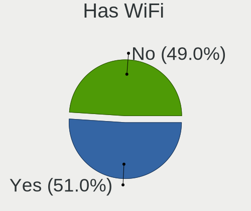
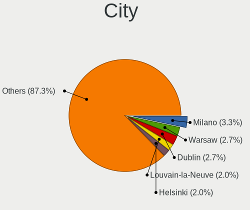
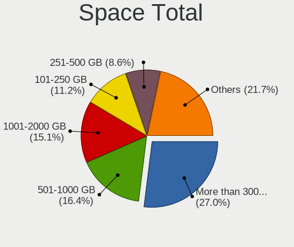
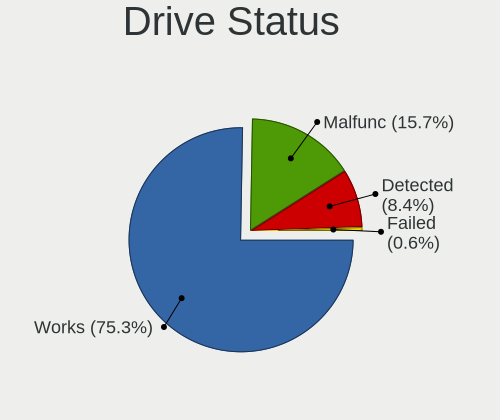
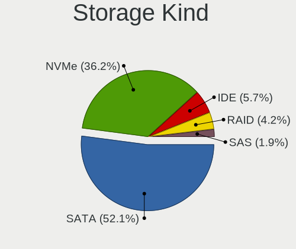
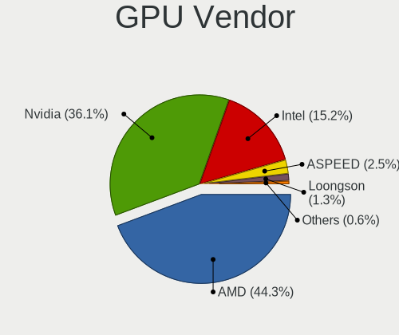
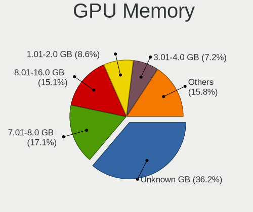
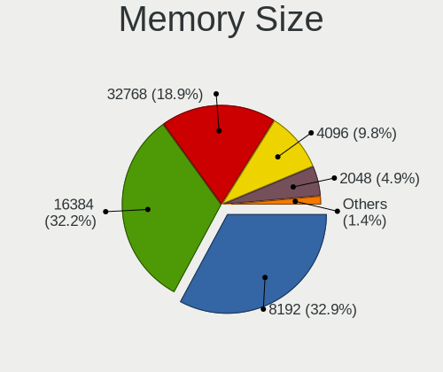
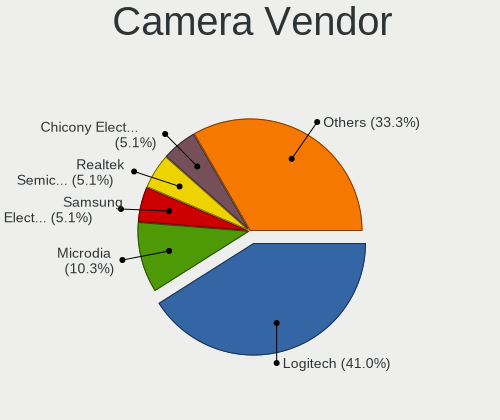
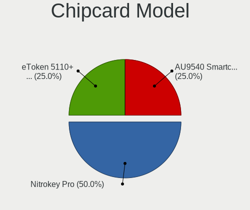

Gentoo 2.14 - Tested Hardware & Statistics (Desktops)
-----------------------------------------------------

A project to collect tested hardware configurations for Gentoo 2.14.

Anyone can contribute to this report by the [hw-probe](https://github.com/linuxhw/hw-probe) tool:

    sudo -E hw-probe -all -upload

Please contribute! Especially if your hardware is rare.

Contents
--------

* [ Test Cases ](#test-cases)

* [ System ](#system)
  - [ Kernel                   ](#kernel)
  - [ Kernel Family            ](#kernel-family)
  - [ Kernel Major Ver.        ](#kernel-major-ver)
  - [ Arch                     ](#arch)
  - [ DE                       ](#de)
  - [ Display Server           ](#display-server)
  - [ Display Manager          ](#display-manager)
  - [ OS Lang                  ](#os-lang)
  - [ Boot Mode                ](#boot-mode)
  - [ Filesystem               ](#filesystem)
  - [ Part. scheme             ](#part-scheme)
  - [ Dual Boot with Linux/BSD ](#dual-boot-with-linuxbsd)
  - [ Dual Boot (Win)          ](#dual-boot-win)

* [ Board ](#board)
  - [ Vendor                   ](#vendor)
  - [ Model                    ](#model)
  - [ Model Family             ](#model-family)
  - [ MFG Year                 ](#mfg-year)
  - [ Form Factor              ](#form-factor)
  - [ Secure Boot              ](#secure-boot)
  - [ Coreboot                 ](#coreboot)
  - [ RAM Size                 ](#ram-size)
  - [ RAM Used                 ](#ram-used)
  - [ Total Drives             ](#total-drives)
  - [ Has CD-ROM               ](#has-cd-rom)
  - [ Has Ethernet             ](#has-ethernet)
  - [ Has WiFi                 ](#has-wifi)
  - [ Has Bluetooth            ](#has-bluetooth)

* [ Location ](#location)
  - [ Country                  ](#country)
  - [ City                     ](#city)

* [ Drives ](#drives)
  - [ Drive Vendor             ](#drive-vendor)
  - [ Drive Model              ](#drive-model)
  - [ HDD Vendor               ](#hdd-vendor)
  - [ SSD Vendor               ](#ssd-vendor)
  - [ Drive Kind               ](#drive-kind)
  - [ Drive Connector          ](#drive-connector)
  - [ Drive Size               ](#drive-size)
  - [ Space Total              ](#space-total)
  - [ Space Used               ](#space-used)
  - [ Malfunc. Drives          ](#malfunc-drives)
  - [ Malfunc. Drive Vendor    ](#malfunc-drive-vendor)
  - [ Malfunc. HDD Vendor      ](#malfunc-hdd-vendor)
  - [ Malfunc. Drive Kind      ](#malfunc-drive-kind)
  - [ Failed Drives            ](#failed-drives)
  - [ Failed Drive Vendor      ](#failed-drive-vendor)
  - [ Drive Status             ](#drive-status)

* [ Storage controller ](#storage-controller)
  - [ Storage Vendor           ](#storage-vendor)
  - [ Storage Model            ](#storage-model)
  - [ Storage Kind             ](#storage-kind)

* [ Processor ](#processor)
  - [ CPU Vendor               ](#cpu-vendor)
  - [ CPU Model                ](#cpu-model)
  - [ CPU Model Family         ](#cpu-model-family)
  - [ CPU Cores                ](#cpu-cores)
  - [ CPU Sockets              ](#cpu-sockets)
  - [ CPU Threads              ](#cpu-threads)
  - [ CPU Op-Modes             ](#cpu-op-modes)
  - [ CPU Microcode            ](#cpu-microcode)
  - [ CPU Microarch            ](#cpu-microarch)

* [ Graphics ](#graphics)
  - [ GPU Vendor               ](#gpu-vendor)
  - [ GPU Model                ](#gpu-model)
  - [ GPU Combo                ](#gpu-combo)
  - [ GPU Driver               ](#gpu-driver)
  - [ GPU Memory               ](#gpu-memory)

* [ Monitor ](#monitor)
  - [ Monitor Vendor           ](#monitor-vendor)
  - [ Monitor Model            ](#monitor-model)
  - [ Monitor Resolution       ](#monitor-resolution)
  - [ Monitor Diagonal         ](#monitor-diagonal)
  - [ Monitor Width            ](#monitor-width)
  - [ Aspect Ratio             ](#aspect-ratio)
  - [ Monitor Area             ](#monitor-area)
  - [ Pixel Density            ](#pixel-density)
  - [ Multiple Monitors        ](#multiple-monitors)

* [ Network ](#network)
  - [ Net Controller Vendor    ](#net-controller-vendor)
  - [ Net Controller Model     ](#net-controller-model)
  - [ Wireless Vendor          ](#wireless-vendor)
  - [ Wireless Model           ](#wireless-model)
  - [ Ethernet Vendor          ](#ethernet-vendor)
  - [ Ethernet Model           ](#ethernet-model)
  - [ Net Controller Kind      ](#net-controller-kind)
  - [ Used Controller          ](#used-controller)
  - [ NICs                     ](#nics)
  - [ IPv6                     ](#ipv6)

* [ Bluetooth ](#bluetooth)
  - [ Bluetooth Vendor         ](#bluetooth-vendor)
  - [ Bluetooth Model          ](#bluetooth-model)

* [ Sound ](#sound)
  - [ Sound Vendor             ](#sound-vendor)
  - [ Sound Model              ](#sound-model)

* [ Memory ](#memory)
  - [ Memory Vendor            ](#memory-vendor)
  - [ Memory Model             ](#memory-model)
  - [ Memory Kind              ](#memory-kind)
  - [ Memory Form Factor       ](#memory-form-factor)
  - [ Memory Size              ](#memory-size)
  - [ Memory Speed             ](#memory-speed)

* [ Printers & scanners ](#printers--scanners)
  - [ Printer Vendor           ](#printer-vendor)
  - [ Printer Model            ](#printer-model)
  - [ Scanner Vendor           ](#scanner-vendor)
  - [ Scanner Model            ](#scanner-model)

* [ Camera ](#camera)
  - [ Camera Vendor            ](#camera-vendor)
  - [ Camera Model             ](#camera-model)

* [ Security ](#security)
  - [ Fingerprint Vendor       ](#fingerprint-vendor)
  - [ Fingerprint Model        ](#fingerprint-model)
  - [ Chipcard Vendor          ](#chipcard-vendor)
  - [ Chipcard Model           ](#chipcard-model)

* [ Unsupported ](#unsupported)
  - [ Unsupported Devices      ](#unsupported-devices)
  - [ Unsupported Device Types ](#unsupported-device-types)

Test Cases
----------

Total: 279

| Vendor        | Model                       | Probe                                                      | Date         |
|---------------|-----------------------------|------------------------------------------------------------|--------------|
| MSI           | Z170A GAMING M7             | [2a0282544c](https://linux-hardware.org/?probe=2a0282544c) | Oct 21, 2024 |
| Gigabyte      | X399 AORUS PRO-CF           | [6bf41ddb51](https://linux-hardware.org/?probe=6bf41ddb51) | Jun 27, 2024 |
| ASRock        | B550M Phantom Gaming 4      | [55cfe8a68f](https://linux-hardware.org/?probe=55cfe8a68f) | Jun 23, 2024 |
| MSI           | Z170A GAMING M7             | [e1892a119b](https://linux-hardware.org/?probe=e1892a119b) | May 08, 2024 |
| ASUSTek       | M3A78-CM                    | [0bcef3f207](https://linux-hardware.org/?probe=0bcef3f207) | May 06, 2024 |
| ASUSTek       | M5A99FX PRO R2.0            | [9dcdf5a463](https://linux-hardware.org/?probe=9dcdf5a463) | Apr 29, 2024 |
| ASUSTek       | M3A78-CM                    | [cdc42c64dd](https://linux-hardware.org/?probe=cdc42c64dd) | Apr 22, 2024 |
| Gigabyte      | B75-D3V                     | [4ddc5c0d0d](https://linux-hardware.org/?probe=4ddc5c0d0d) | Apr 21, 2024 |
| MSI           | PRO B650M-P                 | [90165c7480](https://linux-hardware.org/?probe=90165c7480) | Apr 18, 2024 |
| ASUSTek       | ROG STRIX X670E-E GAMING... | [25c95d871e](https://linux-hardware.org/?probe=25c95d871e) | Apr 16, 2024 |
| ASUSTek       | ROG STRIX Z390-E GAMING     | [8a95e3759a](https://linux-hardware.org/?probe=8a95e3759a) | Apr 15, 2024 |
| Gigabyte      | B560M AORUS PRO             | [6e49d2f74b](https://linux-hardware.org/?probe=6e49d2f74b) | Apr 13, 2024 |
| HP            | 1589                        | [fd455c0623](https://linux-hardware.org/?probe=fd455c0623) | Apr 12, 2024 |
| ASUSTek       | P6X58D-E                    | [143efb64e8](https://linux-hardware.org/?probe=143efb64e8) | Apr 12, 2024 |
| Gigabyte      | AB350-Gaming-CF             | [f15f757ee9](https://linux-hardware.org/?probe=f15f757ee9) | Apr 11, 2024 |
| HP            | 1589                        | [bf38ba715e](https://linux-hardware.org/?probe=bf38ba715e) | Apr 10, 2024 |
| Gigabyte      | A520 AORUS ELITE            | [bef494961d](https://linux-hardware.org/?probe=bef494961d) | Apr 09, 2024 |
| ASUSTek       | ROG STRIX X670E-E GAMING... | [6d013c64d2](https://linux-hardware.org/?probe=6d013c64d2) | Apr 08, 2024 |
| Gigabyte      | AB350-Gaming-CF             | [30921e196b](https://linux-hardware.org/?probe=30921e196b) | Apr 03, 2024 |
| ASUSTek       | X99-E                       | [f9f01b1a69](https://linux-hardware.org/?probe=f9f01b1a69) | Apr 03, 2024 |
| ASUSTek       | X99-E                       | [e87752dc61](https://linux-hardware.org/?probe=e87752dc61) | Apr 03, 2024 |
| MSI           | MPG Z490 GAMING EDGE WIF... | [ebc630507b](https://linux-hardware.org/?probe=ebc630507b) | Apr 02, 2024 |
| Gigabyte      | A520 AORUS ELITE            | [3186452a8d](https://linux-hardware.org/?probe=3186452a8d) | Apr 02, 2024 |
| Unknown       | Unknown                     | [e4035a3519](https://linux-hardware.org/?probe=e4035a3519) | Mar 25, 2024 |
| ASUSTek       | M3A78-CM                    | [73b0c5faa2](https://linux-hardware.org/?probe=73b0c5faa2) | Mar 25, 2024 |
| ASUSTek       | P6X58D PREMIUM              | [3e42f1f6bb](https://linux-hardware.org/?probe=3e42f1f6bb) | Mar 24, 2024 |
| ASUSTek       | TUF Gaming B550M-PLUS WI... | [e4e9866823](https://linux-hardware.org/?probe=e4e9866823) | Mar 22, 2024 |
| ASRockRack    | X470D4U2/1N1                | [f406391d1a](https://linux-hardware.org/?probe=f406391d1a) | Mar 20, 2024 |
| MSI           | B550 GAMING GEN3            | [b3056c47f2](https://linux-hardware.org/?probe=b3056c47f2) | Mar 19, 2024 |
| Colorful T... | CVN Z790M FROZEN D5 V20     | [05f6953852](https://linux-hardware.org/?probe=05f6953852) | Mar 17, 2024 |
| ASRock        | N68C-GS UCC                 | [d723eedac0](https://linux-hardware.org/?probe=d723eedac0) | Mar 15, 2024 |
| Colorful T... | CVN Z790M FROZEN D5 V20     | [d43454b637](https://linux-hardware.org/?probe=d43454b637) | Mar 15, 2024 |
| MSI           | PRO B650-P WIFI             | [b8a3fe05f4](https://linux-hardware.org/?probe=b8a3fe05f4) | Mar 13, 2024 |
| Google        | Panther                     | [f2c3361edf](https://linux-hardware.org/?probe=f2c3361edf) | Mar 10, 2024 |
| transtec      | GE2 Series                  | [c6ff6cabae](https://linux-hardware.org/?probe=c6ff6cabae) | Mar 08, 2024 |
| transtec      | GE2 Series                  | [10d18de264](https://linux-hardware.org/?probe=10d18de264) | Mar 08, 2024 |
| HP            | 8767 A                      | [3775377131](https://linux-hardware.org/?probe=3775377131) | Mar 05, 2024 |
| HP            | 8767 A                      | [5903e66479](https://linux-hardware.org/?probe=5903e66479) | Mar 04, 2024 |
| ASRock        | N68C-GS UCC                 | [044465e0aa](https://linux-hardware.org/?probe=044465e0aa) | Mar 04, 2024 |
| Dell          | 042P49 A02                  | [f02e3ceba7](https://linux-hardware.org/?probe=f02e3ceba7) | Mar 02, 2024 |
| ASRock        | B450M Steel Legend          | [aad04111a4](https://linux-hardware.org/?probe=aad04111a4) | Mar 01, 2024 |
| ASUSTek       | PRIME B550M-A WIFI II       | [cce884f287](https://linux-hardware.org/?probe=cce884f287) | Mar 01, 2024 |
| ASUSTek       | ROG STRIX B450-F GAMING     | [9d279afdd2](https://linux-hardware.org/?probe=9d279afdd2) | Feb 29, 2024 |
| ASUSTek       | ROG STRIX B450-F GAMING     | [4e7241b44f](https://linux-hardware.org/?probe=4e7241b44f) | Feb 29, 2024 |
| ASUSTek       | PRIME H510M-E               | [32c850d7a0](https://linux-hardware.org/?probe=32c850d7a0) | Feb 28, 2024 |
| ASUSTek       | PRIME H510M-E               | [3ccf63844b](https://linux-hardware.org/?probe=3ccf63844b) | Feb 27, 2024 |
| Dell          | 0K240Y A01                  | [8ac39746cc](https://linux-hardware.org/?probe=8ac39746cc) | Feb 26, 2024 |
| Gigabyte      | AB350-Gaming-CF             | [f88143daa2](https://linux-hardware.org/?probe=f88143daa2) | Feb 26, 2024 |
| Fujitsu       | D3401-H1 S26361-D3401-H1    | [98c285762c](https://linux-hardware.org/?probe=98c285762c) | Feb 25, 2024 |
| Gigabyte      | A520 AORUS ELITE            | [2d34bf7198](https://linux-hardware.org/?probe=2d34bf7198) | Feb 23, 2024 |
| ASUSTek       | M3A78-CM                    | [9ff0ddca4e](https://linux-hardware.org/?probe=9ff0ddca4e) | Feb 23, 2024 |
| ASUSTek       | PRIME H510M-E               | [5e789b17a4](https://linux-hardware.org/?probe=5e789b17a4) | Feb 22, 2024 |
| ASUSTek       | PRIME H310M-E/BR            | [f3d1efb331](https://linux-hardware.org/?probe=f3d1efb331) | Feb 22, 2024 |
| Gigabyte      | AB350-Gaming-CF             | [acc39c2774](https://linux-hardware.org/?probe=acc39c2774) | Feb 19, 2024 |
| ASUSTek       | PRIME H510M-E               | [82ae92e9ec](https://linux-hardware.org/?probe=82ae92e9ec) | Feb 18, 2024 |
| Dell          | 0K240Y A01                  | [7987e39eb7](https://linux-hardware.org/?probe=7987e39eb7) | Feb 18, 2024 |
| ASUSTek       | PRIME H310M-E/BR            | [233bfc2f43](https://linux-hardware.org/?probe=233bfc2f43) | Feb 18, 2024 |
| Gigabyte      | A520 AORUS ELITE            | [95950fa2f0](https://linux-hardware.org/?probe=95950fa2f0) | Feb 16, 2024 |
| Unknown       | Unknown                     | [b579279ced](https://linux-hardware.org/?probe=b579279ced) | Feb 16, 2024 |
| Gigabyte      | X570 AORUS MASTER           | [04f68f7039](https://linux-hardware.org/?probe=04f68f7039) | Feb 16, 2024 |
| ASUSTek       | M3A78-CM                    | [c7fd8dfb5c](https://linux-hardware.org/?probe=c7fd8dfb5c) | Feb 14, 2024 |
| Gigabyte      | B550I AORUS PRO AX          | [8ec5fdc816](https://linux-hardware.org/?probe=8ec5fdc816) | Feb 12, 2024 |
| Gigabyte      | X670E AORUS MASTER          | [833f48af30](https://linux-hardware.org/?probe=833f48af30) | Feb 12, 2024 |
| Gigabyte      | X670E AORUS MASTER          | [35afc5314f](https://linux-hardware.org/?probe=35afc5314f) | Feb 12, 2024 |
| MSI           | B450 TOMAHAWK MAX           | [38cf6f3eff](https://linux-hardware.org/?probe=38cf6f3eff) | Feb 11, 2024 |
| ASRock        | B450 Pro4                   | [9c2f5e83e3](https://linux-hardware.org/?probe=9c2f5e83e3) | Feb 11, 2024 |
| MSI           | B450 TOMAHAWK MAX           | [b49ffe659b](https://linux-hardware.org/?probe=b49ffe659b) | Feb 11, 2024 |
| ASUSTek       | PRIME B650-PLUS             | [c7ab9b0fc5](https://linux-hardware.org/?probe=c7ab9b0fc5) | Feb 11, 2024 |
| ASUSTek       | PRIME B650-PLUS             | [847f271141](https://linux-hardware.org/?probe=847f271141) | Feb 11, 2024 |
| Gigabyte      | A520 AORUS ELITE            | [db94db2244](https://linux-hardware.org/?probe=db94db2244) | Feb 09, 2024 |
| ASUSTek       | Pro WS X570-ACE             | [40f5ce16c1](https://linux-hardware.org/?probe=40f5ce16c1) | Feb 08, 2024 |
| ASUSTek       | PRIME B550M-K               | [016a8ba655](https://linux-hardware.org/?probe=016a8ba655) | Feb 07, 2024 |
| ASUSTek       | M3A78-CM                    | [c2d2eb2434](https://linux-hardware.org/?probe=c2d2eb2434) | Feb 06, 2024 |
| ASUSTek       | TUF Gaming B550M-PLUS       | [671e98c249](https://linux-hardware.org/?probe=671e98c249) | Feb 06, 2024 |
| ASUSTek       | TUF Gaming B550-PLUS        | [12792a9fa5](https://linux-hardware.org/?probe=12792a9fa5) | Feb 06, 2024 |
| Gigabyte      | AB350-Gaming-CF             | [a6b7480c05](https://linux-hardware.org/?probe=a6b7480c05) | Feb 04, 2024 |
| Unknown       | Unknown                     | [48a88ebbfb](https://linux-hardware.org/?probe=48a88ebbfb) | Feb 04, 2024 |
| ASRock        | B550M Pro4                  | [66ad35082d](https://linux-hardware.org/?probe=66ad35082d) | Feb 04, 2024 |
| Gigabyte      | A520 AORUS ELITE            | [075ee0ca67](https://linux-hardware.org/?probe=075ee0ca67) | Feb 02, 2024 |
| MSI           | MAG B550M MORTAR            | [7ad6a0ecce](https://linux-hardware.org/?probe=7ad6a0ecce) | Jan 31, 2024 |
| Unknown       | Unknown                     | [4690cc047a](https://linux-hardware.org/?probe=4690cc047a) | Jan 30, 2024 |
| ASUSTek       | M5A78L-M/USB3               | [cc38ac2dfc](https://linux-hardware.org/?probe=cc38ac2dfc) | Jan 29, 2024 |
| Gigabyte      | AB350-Gaming-CF             | [8949a81c2e](https://linux-hardware.org/?probe=8949a81c2e) | Jan 29, 2024 |
| ASUSTek       | M5A78L-M/USB3               | [76a1ecf2ba](https://linux-hardware.org/?probe=76a1ecf2ba) | Jan 29, 2024 |
| ASUSTek       | M3A78-CM                    | [e17793cd71](https://linux-hardware.org/?probe=e17793cd71) | Jan 28, 2024 |
| ASUSTek       | PRIME B660-PLUS D4          | [19c619ae3f](https://linux-hardware.org/?probe=19c619ae3f) | Jan 27, 2024 |
| MSI           | MAG X570 TOMAHAWK WIFI      | [999ea9c685](https://linux-hardware.org/?probe=999ea9c685) | Jan 26, 2024 |
| Gigabyte      | A520 AORUS ELITE            | [9b7cbb57c7](https://linux-hardware.org/?probe=9b7cbb57c7) | Jan 26, 2024 |
| HP            | 1589                        | [d731924276](https://linux-hardware.org/?probe=d731924276) | Jan 25, 2024 |
| ASUSTek       | ROG STRIX X570-I GAMING     | [ff2fc44691](https://linux-hardware.org/?probe=ff2fc44691) | Jan 23, 2024 |
| Gigabyte      | B550 AORUS ELITE V2         | [13086bc4ce](https://linux-hardware.org/?probe=13086bc4ce) | Jan 19, 2024 |
| Gigabyte      | B650M D3HP                  | [fdc83ca691](https://linux-hardware.org/?probe=fdc83ca691) | Jan 18, 2024 |
| ASUSTek       | PRIME H610M-E D4            | [409e7e4e42](https://linux-hardware.org/?probe=409e7e4e42) | Jan 17, 2024 |
| Gigabyte      | X570 AORUS ELITE            | [ed6bfe4f8f](https://linux-hardware.org/?probe=ed6bfe4f8f) | Jan 16, 2024 |
| Dell          | 0VHRW1 A03                  | [668e361f20](https://linux-hardware.org/?probe=668e361f20) | Jan 15, 2024 |
| ASRock        | X399 Taichi                 | [e509920598](https://linux-hardware.org/?probe=e509920598) | Jan 14, 2024 |
| HP            | 1589                        | [194b5a119c](https://linux-hardware.org/?probe=194b5a119c) | Jan 13, 2024 |
| Dell          | 030VXY A01                  | [50a18e5eba](https://linux-hardware.org/?probe=50a18e5eba) | Jan 10, 2024 |
| ASUSTek       | ROG STRIX B560-A GAMING ... | [7bef06dee9](https://linux-hardware.org/?probe=7bef06dee9) | Jan 10, 2024 |
| Gigabyte      | Z590 UD                     | [6953296967](https://linux-hardware.org/?probe=6953296967) | Jan 10, 2024 |
| Gigabyte      | Z77X-UD5H                   | [ca5d4c7c00](https://linux-hardware.org/?probe=ca5d4c7c00) | Jan 07, 2024 |
| Gigabyte      | B550 AORUS PRO V2           | [3b6e799f22](https://linux-hardware.org/?probe=3b6e799f22) | Jan 06, 2024 |
| ASUSTek       | M3A78-CM                    | [7bf93755f2](https://linux-hardware.org/?probe=7bf93755f2) | Jan 04, 2024 |
| Gigabyte      | A520 AORUS ELITE            | [da0c7ff210](https://linux-hardware.org/?probe=da0c7ff210) | Jan 04, 2024 |
| ASUSTek       | P8H67-M                     | [06843ca788](https://linux-hardware.org/?probe=06843ca788) | Jan 04, 2024 |
| Gigabyte      | AB350-Gaming-CF             | [a0e025d32d](https://linux-hardware.org/?probe=a0e025d32d) | Jan 02, 2024 |
| ASUSTek       | ROG STRIX Z370-H GAMING     | [ee3998d501](https://linux-hardware.org/?probe=ee3998d501) | Jan 02, 2024 |
| ASUSTek       | PRIME B660-PLUS D4          | [0e7bbb6dea](https://linux-hardware.org/?probe=0e7bbb6dea) | Dec 30, 2023 |
| Gigabyte      | X79-UP4                     | [618dfee965](https://linux-hardware.org/?probe=618dfee965) | Dec 29, 2023 |
| Gigabyte      | A520 AORUS ELITE            | [619ddf5210](https://linux-hardware.org/?probe=619ddf5210) | Dec 27, 2023 |
| ASUSTek       | M3A78-CM                    | [983d2046a3](https://linux-hardware.org/?probe=983d2046a3) | Dec 27, 2023 |
| ASUSTek       | D500MD                      | [21870febdd](https://linux-hardware.org/?probe=21870febdd) | Dec 25, 2023 |
| Gigabyte      | AB350-Gaming-CF             | [47255f4ba3](https://linux-hardware.org/?probe=47255f4ba3) | Dec 25, 2023 |
| Fujitsu       | D3061-A1 S26361-D3061-A1    | [646b9af5a9](https://linux-hardware.org/?probe=646b9af5a9) | Dec 24, 2023 |
| MSI           | MPG B650 EDGE WIFI          | [8503d79f6c](https://linux-hardware.org/?probe=8503d79f6c) | Dec 24, 2023 |
| ASUSTek       | ROG STRIX X570-E GAMING     | [391ef34135](https://linux-hardware.org/?probe=391ef34135) | Dec 23, 2023 |
| ASUSTek       | M3A78-CM                    | [89fd7ee431](https://linux-hardware.org/?probe=89fd7ee431) | Dec 18, 2023 |
| Gigabyte      | A520 AORUS ELITE            | [3504b628f1](https://linux-hardware.org/?probe=3504b628f1) | Dec 18, 2023 |
| ASRock        | X399 Taichi                 | [877c79184e](https://linux-hardware.org/?probe=877c79184e) | Dec 18, 2023 |
| Gigabyte      | AB350-Gaming-CF             | [e0b7c61c9f](https://linux-hardware.org/?probe=e0b7c61c9f) | Dec 18, 2023 |
| ASRock        | X399 Taichi                 | [776cc9f3bb](https://linux-hardware.org/?probe=776cc9f3bb) | Dec 17, 2023 |
| MSI           | B450 TOMAHAWK               | [f02dc20ac0](https://linux-hardware.org/?probe=f02dc20ac0) | Dec 16, 2023 |
| HP            | 8592                        | [511feb6066](https://linux-hardware.org/?probe=511feb6066) | Dec 15, 2023 |
| HP            | 8592                        | [c5817452fd](https://linux-hardware.org/?probe=c5817452fd) | Dec 15, 2023 |
| Lenovo        | SHARKBAY SDK0E50510 WIN     | [ba4e95a15e](https://linux-hardware.org/?probe=ba4e95a15e) | Dec 13, 2023 |
| ASRock        | X399 Taichi                 | [8524c9dcd5](https://linux-hardware.org/?probe=8524c9dcd5) | Dec 13, 2023 |
| ASRock        | B650M PG Riptide            | [9b92833e92](https://linux-hardware.org/?probe=9b92833e92) | Dec 12, 2023 |
| Foxconn       | TPS01                       | [a417ff19ae](https://linux-hardware.org/?probe=a417ff19ae) | Dec 12, 2023 |
| Gigabyte      | A520 AORUS ELITE            | [e07d68d658](https://linux-hardware.org/?probe=e07d68d658) | Dec 11, 2023 |
| ASUSTek       | M3A78-CM                    | [8bf4107eed](https://linux-hardware.org/?probe=8bf4107eed) | Dec 11, 2023 |
| Gigabyte      | B450 AORUS ELITE            | [b87d7c1c10](https://linux-hardware.org/?probe=b87d7c1c10) | Dec 10, 2023 |
| ASUSTek       | ROG Maximus XI HERO         | [ba355033b7](https://linux-hardware.org/?probe=ba355033b7) | Dec 08, 2023 |
| ASUSTek       | PRIME B550-PLUS             | [d57960be0a](https://linux-hardware.org/?probe=d57960be0a) | Dec 05, 2023 |
| Gigabyte      | AB350-Gaming-CF             | [1fe1dc7462](https://linux-hardware.org/?probe=1fe1dc7462) | Dec 04, 2023 |
| Gigabyte      | 970A-DS3P FX                | [675f997c0b](https://linux-hardware.org/?probe=675f997c0b) | Dec 03, 2023 |
| Gigabyte      | 970A-DS3P FX                | [358a92be0d](https://linux-hardware.org/?probe=358a92be0d) | Dec 03, 2023 |
| ASUSTek       | ROG STRIX B450-F GAMING     | [426263e458](https://linux-hardware.org/?probe=426263e458) | Dec 03, 2023 |
| Lenovo        | 0B98401 PRO                 | [3f49a16307](https://linux-hardware.org/?probe=3f49a16307) | Dec 02, 2023 |
| ASRock        | A300M-STX                   | [7f49fad2c7](https://linux-hardware.org/?probe=7f49fad2c7) | Dec 02, 2023 |
| Gigabyte      | B150M-D2V DDR3-CF           | [fc87fb1112](https://linux-hardware.org/?probe=fc87fb1112) | Dec 01, 2023 |
| MSI           | MEG X570 UNIFY              | [f9175866ae](https://linux-hardware.org/?probe=f9175866ae) | Nov 30, 2023 |
| Loongson      | 3A6000-HV-7A2000-1w-EVB-... | [f16bc78368](https://linux-hardware.org/?probe=f16bc78368) | Nov 29, 2023 |
| Loongson      | 3A6000-HV-7A2000-1w-EVB-... | [879c59cf41](https://linux-hardware.org/?probe=879c59cf41) | Nov 29, 2023 |
| Gigabyte      | A520 AORUS ELITE            | [1d71979dbb](https://linux-hardware.org/?probe=1d71979dbb) | Nov 27, 2023 |
| MSI           | H310M PRO-VDH PLUS          | [68644f2689](https://linux-hardware.org/?probe=68644f2689) | Nov 27, 2023 |
| MSI           | H310M PRO-VDH PLUS          | [6fcbd9b64c](https://linux-hardware.org/?probe=6fcbd9b64c) | Nov 27, 2023 |
| Gigabyte      | AB350-Gaming-CF             | [2a04ec7adc](https://linux-hardware.org/?probe=2a04ec7adc) | Nov 27, 2023 |
| ASUSTek       | ROG STRIX Z590-F GAMING ... | [26b99168f7](https://linux-hardware.org/?probe=26b99168f7) | Nov 26, 2023 |
| Gigabyte      | B560M AORUS ELITE           | [9e8f9907bb](https://linux-hardware.org/?probe=9e8f9907bb) | Nov 24, 2023 |
| Gigabyte      | B560M AORUS ELITE           | [fde8cf07ef](https://linux-hardware.org/?probe=fde8cf07ef) | Nov 24, 2023 |
| Intel         | DH77EB AAG39073-304         | [c397c51bfb](https://linux-hardware.org/?probe=c397c51bfb) | Nov 24, 2023 |
| ASUSTek       | M3A78-CM                    | [4eae08c59f](https://linux-hardware.org/?probe=4eae08c59f) | Nov 22, 2023 |
| ASUSTek       | ROG STRIX B560-A GAMING ... | [2305a057a8](https://linux-hardware.org/?probe=2305a057a8) | Nov 22, 2023 |
| Gigabyte      | A520 AORUS ELITE            | [8d33a8020d](https://linux-hardware.org/?probe=8d33a8020d) | Nov 20, 2023 |
| Gigabyte      | AB350-Gaming-CF             | [ac6d14ae8d](https://linux-hardware.org/?probe=ac6d14ae8d) | Nov 20, 2023 |
| ASRock        | B550 Phantom Gaming 4       | [fc7f2d74b8](https://linux-hardware.org/?probe=fc7f2d74b8) | Nov 19, 2023 |
| MSI           | MPG B550 GAMING PLUS        | [a868498279](https://linux-hardware.org/?probe=a868498279) | Nov 18, 2023 |
| ASUSTek       | ROG STRIX B650E-F GAMING... | [477c710fe1](https://linux-hardware.org/?probe=477c710fe1) | Nov 15, 2023 |
| Gigabyte      | Z590 UD                     | [76092ba872](https://linux-hardware.org/?probe=76092ba872) | Nov 15, 2023 |
| ASUSTek       | TUF Gaming Z790-PLUS WIF... | [6a5b4cf051](https://linux-hardware.org/?probe=6a5b4cf051) | Nov 15, 2023 |
| ASUSTek       | P10S-I Series               | [f27cfbe5ca](https://linux-hardware.org/?probe=f27cfbe5ca) | Nov 15, 2023 |
| MSI           | MAG B550 TOMAHAWK MAX WI... | [1105d135a2](https://linux-hardware.org/?probe=1105d135a2) | Nov 14, 2023 |
| ASUSTek       | M3A78-CM                    | [8080101e6f](https://linux-hardware.org/?probe=8080101e6f) | Nov 13, 2023 |
| Gigabyte      | A520 AORUS ELITE            | [de369665dc](https://linux-hardware.org/?probe=de369665dc) | Nov 13, 2023 |
| Gigabyte      | AB350-Gaming-CF             | [9d2aeb3f90](https://linux-hardware.org/?probe=9d2aeb3f90) | Nov 13, 2023 |
| MSI           | MAG B550 TOMAHAWK MAX WI... | [ab65845e2f](https://linux-hardware.org/?probe=ab65845e2f) | Nov 12, 2023 |
| Medion        | B360H4-EM V1.0              | [3efb188b16](https://linux-hardware.org/?probe=3efb188b16) | Nov 12, 2023 |
| Gigabyte      | Z590 UD                     | [4c763ba78a](https://linux-hardware.org/?probe=4c763ba78a) | Nov 09, 2023 |
| ASUSTek       | PRIME Z270-P                | [1de1299edf](https://linux-hardware.org/?probe=1de1299edf) | Nov 08, 2023 |
| ASUSTek       | TUF Gaming B550-PLUS        | [7ecc25dda7](https://linux-hardware.org/?probe=7ecc25dda7) | Nov 08, 2023 |
| ASUSTek       | TUF Gaming B660M-PLUS D4    | [715aee0ee7](https://linux-hardware.org/?probe=715aee0ee7) | Nov 08, 2023 |
| ASUSTek       | Z10PA-D8 Series             | [b865e2f52d](https://linux-hardware.org/?probe=b865e2f52d) | Nov 07, 2023 |
| Gigabyte      | H110M-H-CF                  | [d0570de821](https://linux-hardware.org/?probe=d0570de821) | Nov 06, 2023 |
| Gigabyte      | H110M-H-CF                  | [29f3c0c25f](https://linux-hardware.org/?probe=29f3c0c25f) | Nov 06, 2023 |
| Gigabyte      | A520 AORUS ELITE            | [4d3a7373ae](https://linux-hardware.org/?probe=4d3a7373ae) | Nov 06, 2023 |
| Gigabyte      | AB350-Gaming-CF             | [ff44a3299b](https://linux-hardware.org/?probe=ff44a3299b) | Nov 06, 2023 |
| ASUSTek       | ROG STRIX Z370-H GAMING     | [8e8cfaa103](https://linux-hardware.org/?probe=8e8cfaa103) | Nov 05, 2023 |
| ASUSTek       | M3A78-CM                    | [0e493c7b85](https://linux-hardware.org/?probe=0e493c7b85) | Nov 03, 2023 |
| Gigabyte      | B450M DS3H-CF               | [fc6336fedd](https://linux-hardware.org/?probe=fc6336fedd) | Nov 02, 2023 |
| ASUSTek       | ROG STRIX X670E-E GAMING... | [40deedc435](https://linux-hardware.org/?probe=40deedc435) | Oct 31, 2023 |
| ASUSTek       | ROG STRIX X670E-E GAMING... | [57d643d36b](https://linux-hardware.org/?probe=57d643d36b) | Oct 31, 2023 |
| ASUSTek       | TUF Gaming B550-PLUS        | [7b6fe38982](https://linux-hardware.org/?probe=7b6fe38982) | Oct 31, 2023 |
| Gigabyte      | X570 AORUS ELITE            | [f6e8c279ef](https://linux-hardware.org/?probe=f6e8c279ef) | Oct 31, 2023 |
| ASUSTek       | ROG STRIX Z590-F GAMING ... | [af050c4fa2](https://linux-hardware.org/?probe=af050c4fa2) | Oct 29, 2023 |
| ASUSTek       | ROG STRIX X670E-F GAMING... | [bee59e348e](https://linux-hardware.org/?probe=bee59e348e) | Oct 28, 2023 |
| ASUSTek       | M3A78-CM                    | [54aa16ef1e](https://linux-hardware.org/?probe=54aa16ef1e) | Oct 27, 2023 |
| ASUSTek       | ROG STRIX X370-F GAMING     | [50b77f9f9e](https://linux-hardware.org/?probe=50b77f9f9e) | Oct 26, 2023 |
| SZMZ          | X99M-G2                     | [78bdbc6419](https://linux-hardware.org/?probe=78bdbc6419) | Oct 25, 2023 |
| HP            | 3397                        | [1344d9d38b](https://linux-hardware.org/?probe=1344d9d38b) | Oct 23, 2023 |
| ASUSTek       | PRIME X670E-PRO WIFI        | [9a65857d3c](https://linux-hardware.org/?probe=9a65857d3c) | Oct 23, 2023 |
| ASUSTek       | PRIME X670E-PRO WIFI        | [001c668695](https://linux-hardware.org/?probe=001c668695) | Oct 23, 2023 |
| Gigabyte      | A520 AORUS ELITE            | [def0406ec0](https://linux-hardware.org/?probe=def0406ec0) | Oct 23, 2023 |
| Unknown       | Unknown                     | [95d6dab241](https://linux-hardware.org/?probe=95d6dab241) | Oct 23, 2023 |
| Gigabyte      | AB350-Gaming-CF             | [6ef12aa776](https://linux-hardware.org/?probe=6ef12aa776) | Oct 23, 2023 |
| Dell          | 0J3C2F A02                  | [4b93c11bcb](https://linux-hardware.org/?probe=4b93c11bcb) | Oct 21, 2023 |
| ASUSTek       | PRIME X670E-PRO WIFI        | [62ae73f967](https://linux-hardware.org/?probe=62ae73f967) | Oct 21, 2023 |
| ASUSTek       | M3A78-CM                    | [e8d5f9186c](https://linux-hardware.org/?probe=e8d5f9186c) | Oct 20, 2023 |
| ASUSTek       | PRIME B660-PLUS D4          | [b677f99638](https://linux-hardware.org/?probe=b677f99638) | Oct 19, 2023 |
| ASRock        | H170 Pro4S                  | [e3960f114d](https://linux-hardware.org/?probe=e3960f114d) | Oct 18, 2023 |
| Dell          | 0MNPJ9 A03                  | [36e7a1e261](https://linux-hardware.org/?probe=36e7a1e261) | Oct 18, 2023 |
| Gigabyte      | Z590 UD                     | [1e2597a152](https://linux-hardware.org/?probe=1e2597a152) | Oct 17, 2023 |
| Gigabyte      | B450M DS3H-CF               | [acd4052588](https://linux-hardware.org/?probe=acd4052588) | Oct 16, 2023 |
| Gigabyte      | A520 AORUS ELITE            | [cc5a77d2c3](https://linux-hardware.org/?probe=cc5a77d2c3) | Oct 16, 2023 |
| Gigabyte      | Z590 UD                     | [65277f3f01](https://linux-hardware.org/?probe=65277f3f01) | Oct 16, 2023 |
| MSI           | MEG X570S ACE MAX           | [d3cf683bad](https://linux-hardware.org/?probe=d3cf683bad) | Oct 15, 2023 |
| Gigabyte      | X570S AORUS ELITE AX        | [f0f128becf](https://linux-hardware.org/?probe=f0f128becf) | Oct 09, 2023 |
| SZMZ          | X99M-G2                     | [212f394b32](https://linux-hardware.org/?probe=212f394b32) | Oct 09, 2023 |
| Gigabyte      | AB350-Gaming-CF             | [078d4619a6](https://linux-hardware.org/?probe=078d4619a6) | Oct 09, 2023 |
| SZMZ          | X99M-G2                     | [586d5eef76](https://linux-hardware.org/?probe=586d5eef76) | Oct 08, 2023 |
| Gigabyte      | B550 AORUS ELITE V2         | [6f6e394cdf](https://linux-hardware.org/?probe=6f6e394cdf) | Oct 05, 2023 |
| MSI           | PRO X670-P WIFI             | [c5d7f755ac](https://linux-hardware.org/?probe=c5d7f755ac) | Oct 05, 2023 |
| HP            | 1589                        | [75f8ba109d](https://linux-hardware.org/?probe=75f8ba109d) | Oct 04, 2023 |
| ASUSTek       | M3A78-CM                    | [27d781a357](https://linux-hardware.org/?probe=27d781a357) | Oct 04, 2023 |
| MSI           | MPG X570 GAMING PLUS        | [e705d58ab0](https://linux-hardware.org/?probe=e705d58ab0) | Oct 03, 2023 |
| MSI           | MPG X570 GAMING PLUS        | [d5de51003e](https://linux-hardware.org/?probe=d5de51003e) | Oct 03, 2023 |
| ASUSTek       | TUF Gaming B550-PLUS        | [8fd9631bea](https://linux-hardware.org/?probe=8fd9631bea) | Oct 03, 2023 |
| Gigabyte      | A520 AORUS ELITE            | [ea10bf8eab](https://linux-hardware.org/?probe=ea10bf8eab) | Oct 02, 2023 |
| Gigabyte      | AB350-Gaming-CF             | [cbd8df2f8a](https://linux-hardware.org/?probe=cbd8df2f8a) | Oct 02, 2023 |
| ASUSTek       | ROG STRIX B450-F GAMING     | [6fb4d2a754](https://linux-hardware.org/?probe=6fb4d2a754) | Oct 01, 2023 |
| ASUSTek       | PRIME X670-P                | [25c3794b84](https://linux-hardware.org/?probe=25c3794b84) | Oct 01, 2023 |
| ASUSTek       | PRIME B660-PLUS D4          | [ff0e651b1b](https://linux-hardware.org/?probe=ff0e651b1b) | Oct 01, 2023 |
| ASUSTek       | M3A78-CM                    | [4ef9eaaaba](https://linux-hardware.org/?probe=4ef9eaaaba) | Sep 27, 2023 |
| HP            | 1589                        | [1063a6e665](https://linux-hardware.org/?probe=1063a6e665) | Sep 27, 2023 |
| Supermicro    | X10SDE-DF                   | [c2ba80af3b](https://linux-hardware.org/?probe=c2ba80af3b) | Sep 26, 2023 |
| BESSTAR Te... | HM90                        | [a85d516a80](https://linux-hardware.org/?probe=a85d516a80) | Sep 25, 2023 |
| Gigabyte      | A520 AORUS ELITE            | [32a39c6a01](https://linux-hardware.org/?probe=32a39c6a01) | Sep 25, 2023 |
| Supermicro    | X10SDE-DF                   | [fb93d199f3](https://linux-hardware.org/?probe=fb93d199f3) | Sep 25, 2023 |
| Gigabyte      | AB350-Gaming-CF             | [4c68092d28](https://linux-hardware.org/?probe=4c68092d28) | Sep 25, 2023 |
| ASUSTek       | ROG STRIX B450-F GAMING     | [7d4c2dc8f6](https://linux-hardware.org/?probe=7d4c2dc8f6) | Sep 25, 2023 |
| MSI           | MPG Z790 CARBON WIFI        | [d17427680f](https://linux-hardware.org/?probe=d17427680f) | Sep 24, 2023 |
| MSI           | MPG Z790 CARBON WIFI        | [1c0c7815dd](https://linux-hardware.org/?probe=1c0c7815dd) | Sep 24, 2023 |
| Supermicro    | X10SDE-DF                   | [b0297cff82](https://linux-hardware.org/?probe=b0297cff82) | Sep 24, 2023 |
| Dell          | 0RY206                      | [11a31518a3](https://linux-hardware.org/?probe=11a31518a3) | Sep 20, 2023 |
| ASUSTek       | M3A78-CM                    | [0748266b0a](https://linux-hardware.org/?probe=0748266b0a) | Sep 19, 2023 |
| ASRock        | B85M                        | [8a3dc73931](https://linux-hardware.org/?probe=8a3dc73931) | Sep 18, 2023 |
| Gigabyte      | A520 AORUS ELITE            | [5680b32e39](https://linux-hardware.org/?probe=5680b32e39) | Sep 18, 2023 |
| ASUSTek       | PRIME B550M-K               | [524eb9d966](https://linux-hardware.org/?probe=524eb9d966) | Sep 17, 2023 |
| ASUSTek       | PRIME B550M-K               | [2f86649b91](https://linux-hardware.org/?probe=2f86649b91) | Sep 17, 2023 |
| ASUSTek       | ROG STRIX Z590-F GAMING ... | [cd5cabf48f](https://linux-hardware.org/?probe=cd5cabf48f) | Sep 16, 2023 |
| ASUSTek       | ROG STRIX X670E-F GAMING... | [d23a7d46f3](https://linux-hardware.org/?probe=d23a7d46f3) | Sep 15, 2023 |
| ASUSTek       | PRIME Z690-P WIFI D4        | [12f4431262](https://linux-hardware.org/?probe=12f4431262) | Sep 12, 2023 |
| Loongson      | 3A6000-HV-7A2000-1w-EVB-... | [0dabf67d5f](https://linux-hardware.org/?probe=0dabf67d5f) | Sep 11, 2023 |
| ASUSTek       | M3A78-CM                    | [77105eb7da](https://linux-hardware.org/?probe=77105eb7da) | Sep 11, 2023 |
| Gigabyte      | AB350-Gaming-CF             | [a25f4b1c5c](https://linux-hardware.org/?probe=a25f4b1c5c) | Sep 11, 2023 |
| ASUSTek       | PRIME N100I-D D4            | [ce24c28731](https://linux-hardware.org/?probe=ce24c28731) | Sep 10, 2023 |
| ASUSTek       | PRIME H310M-E/BR            | [87971ac772](https://linux-hardware.org/?probe=87971ac772) | Sep 09, 2023 |
| Gigabyte      | A520 AORUS ELITE            | [dffd28975a](https://linux-hardware.org/?probe=dffd28975a) | Sep 09, 2023 |
| Gigabyte      | B75M-D2V                    | [8f6631088b](https://linux-hardware.org/?probe=8f6631088b) | Sep 08, 2023 |
| HP            | 1589                        | [550b95765c](https://linux-hardware.org/?probe=550b95765c) | Sep 06, 2023 |
| Loongson      | 3A6000-HV-7A2000-1w-EVB-... | [48e1f16931](https://linux-hardware.org/?probe=48e1f16931) | Sep 05, 2023 |
| Gigabyte      | AB350-Gaming-CF             | [f51b98f4cd](https://linux-hardware.org/?probe=f51b98f4cd) | Sep 04, 2023 |
| ASUSTek       | ROG STRIX X670E-F GAMING... | [e6df46a4a8](https://linux-hardware.org/?probe=e6df46a4a8) | Sep 03, 2023 |
| Fujitsu       | D3061-A1 S26361-D3061-A1    | [32a90ea48e](https://linux-hardware.org/?probe=32a90ea48e) | Sep 02, 2023 |
| Gigabyte      | A520 AORUS ELITE            | [9f3df2894e](https://linux-hardware.org/?probe=9f3df2894e) | Sep 02, 2023 |
| HP            | 1589                        | [447cae1b4c](https://linux-hardware.org/?probe=447cae1b4c) | Sep 01, 2023 |
| Fujitsu       | D3061-A1 S26361-D3061-A1    | [f0e20e0089](https://linux-hardware.org/?probe=f0e20e0089) | Aug 31, 2023 |
| Loongson      | 3A6000-HV-7A2000-1w-EVB-... | [a99a5ccc55](https://linux-hardware.org/?probe=a99a5ccc55) | Aug 30, 2023 |
| Loongson      | 3C6000-7A2000-2w-EVB-V1.... | [ad154077da](https://linux-hardware.org/?probe=ad154077da) | Aug 28, 2023 |
| ASRock        | AB350M Pro4                 | [e3ca221ba9](https://linux-hardware.org/?probe=e3ca221ba9) | Aug 28, 2023 |
| Dell          | 0RY206                      | [fff4c01588](https://linux-hardware.org/?probe=fff4c01588) | Aug 27, 2023 |
| ASUSTek       | M3A78-CM                    | [e6e9efdb61](https://linux-hardware.org/?probe=e6e9efdb61) | Aug 26, 2023 |
| ASUSTek       | M3A78-CM                    | [1f69210d69](https://linux-hardware.org/?probe=1f69210d69) | Aug 25, 2023 |
| ASUSTek       | M3A78-CM                    | [d1af143bed](https://linux-hardware.org/?probe=d1af143bed) | Aug 19, 2023 |
| Gigabyte      | Z77X-UD5H                   | [63a0a35452](https://linux-hardware.org/?probe=63a0a35452) | Aug 18, 2023 |
| Dell          | 0RY206                      | [f060a8a559](https://linux-hardware.org/?probe=f060a8a559) | Aug 14, 2023 |
| ASUSTek       | ROG STRIX X670E-F GAMING... | [dfae10b78d](https://linux-hardware.org/?probe=dfae10b78d) | Aug 14, 2023 |
| ASUSTek       | TUF Gaming X570-PRO         | [23d9892448](https://linux-hardware.org/?probe=23d9892448) | Aug 13, 2023 |
| Gigabyte      | Z390 AORUS ELITE-CF         | [aa4c1f2237](https://linux-hardware.org/?probe=aa4c1f2237) | Aug 13, 2023 |
| ASUSTek       | SABERTOOTH 990FX R2.0       | [ae8c13e17e](https://linux-hardware.org/?probe=ae8c13e17e) | Aug 12, 2023 |
| ASUSTek       | TUF Gaming X570-PRO         | [e280c00c8b](https://linux-hardware.org/?probe=e280c00c8b) | Aug 12, 2023 |
| ASUSTek       | ROG STRIX X570-E GAMING     | [4fe5238f21](https://linux-hardware.org/?probe=4fe5238f21) | Aug 12, 2023 |
| Gigabyte      | Z370P D3-CF                 | [ed5ccc8efb](https://linux-hardware.org/?probe=ed5ccc8efb) | Aug 08, 2023 |
| ASUSTek       | ROG STRIX B450-F GAMING     | [839698eb4c](https://linux-hardware.org/?probe=839698eb4c) | Aug 01, 2023 |
| ASUSTek       | PRIME X570-P                | [7e6ad75fc4](https://linux-hardware.org/?probe=7e6ad75fc4) | Jul 28, 2023 |
| MSI           | TRX40 PRO 10G               | [6391114079](https://linux-hardware.org/?probe=6391114079) | Jul 28, 2023 |
| ASUSTek       | ROG STRIX B450-F GAMING     | [60d9839bbe](https://linux-hardware.org/?probe=60d9839bbe) | Jul 27, 2023 |
| ASUSTek       | ROG STRIX B450-F GAMING     | [45149f899d](https://linux-hardware.org/?probe=45149f899d) | Jul 26, 2023 |
| Gigabyte      | Z590 UD                     | [8504edcacf](https://linux-hardware.org/?probe=8504edcacf) | Jul 21, 2023 |
| ASUSTek       | PRIME X370-PRO              | [4884c4b183](https://linux-hardware.org/?probe=4884c4b183) | Jul 18, 2023 |

System
------

Kernel
------

Version of the Linux kernel

| Version                    | Desktops | Percent |
|----------------------------|----------|---------|
| 6.1.57-gentoo              | 10       | 5.43%   |
| 6.1.53-gentoo-r1           | 9        | 4.89%   |
| 6.6.13-gentoo              | 8        | 4.35%   |
| 6.1.67-gentoo              | 7        | 3.8%    |
| 6.1.57-gentoo-x86_64       | 7        | 3.8%    |
| 6.6.13-gentoo-x86_64       | 6        | 3.26%   |
| 6.6.13-gentoo-dist         | 5        | 2.72%   |
| 6.1.67-gentoo-x86_64       | 5        | 2.72%   |
| 6.6.21-gentoo-x86_64       | 4        | 2.17%   |
| 6.6.21-gentoo              | 4        | 2.17%   |
| 6.1.41-gentoo              | 4        | 2.17%   |
| 6.6.21-gentoo-dist         | 3        | 1.63%   |
| 6.5.7-gentoo               | 3        | 1.63%   |
| 6.4.10-gentoo-x86_64       | 3        | 1.63%   |
| 6.1.46-gentoo              | 3        | 1.63%   |
| 6.7.4-gentoo-dist          | 2        | 1.09%   |
| 6.6.8-gentoo-x86_64        | 2        | 1.09%   |
| 6.6.8-gentoo               | 2        | 1.09%   |
| 6.6.2-gentoo               | 2        | 1.09%   |
| 6.6.16-gentoo-dist         | 2        | 1.09%   |
| 6.6.0-gentoo               | 2        | 1.09%   |
| 6.5.9-gentoo-x86_64        | 2        | 1.09%   |
| 6.5.0-gentoo               | 2        | 1.09%   |
| 6.4.3-gentoo               | 2        | 1.09%   |
| 6.1.69-gentoo-dist         | 2        | 1.09%   |
| 6.1.60-gentoo-dist         | 2        | 1.09%   |
| 6.9.0-rc1-git              | 1        | 0.54%   |
| 6.8.1-arch1-1              | 1        | 0.54%   |
| 6.7.6-gentoo               | 1        | 0.54%   |
| 6.7.6-dist                 | 1        | 0.54%   |
| 6.7.4-gentoo-NVIDIA        | 1        | 0.54%   |
| 6.7.3-gentoo-dist-hardened | 1        | 0.54%   |
| 6.7.3-gentoo               | 1        | 0.54%   |
| 6.7.2-gentoo-r1            | 1        | 0.54%   |
| 6.7.1-gentoo-r1-x86_64     | 1        | 0.54%   |
| 6.7.1-gentoo-r1            | 1        | 0.54%   |
| 6.7.0-rc6                  | 1        | 0.54%   |
| 6.7.0-rc1                  | 1        | 0.54%   |
| 6.7.0-gentoo-x86_64        | 1        | 0.54%   |
| 6.6.9-xanmod1              | 1        | 0.54%   |

Kernel Family
-------------

Linux kernel without a distro release

| Version | Desktops | Percent |
|---------|----------|---------|
| 6.1.57  | 20       | 10.93%  |
| 6.6.13  | 19       | 10.38%  |
| 6.1.67  | 13       | 7.1%    |
| 6.1.53  | 12       | 6.56%   |
| 6.6.21  | 11       | 6.01%   |
| 6.6.8   | 7        | 3.83%   |
| 6.1.46  | 6        | 3.28%   |
| 6.5.7   | 5        | 2.73%   |
| 6.4.10  | 5        | 2.73%   |
| 6.6.0   | 4        | 2.19%   |
| 6.5.9   | 4        | 2.19%   |
| 6.5.0   | 4        | 2.19%   |
| 6.1.41  | 4        | 2.19%   |
| 6.7.4   | 3        | 1.64%   |
| 6.7.0   | 3        | 1.64%   |
| 6.6.3   | 3        | 1.64%   |
| 6.6.2   | 3        | 1.64%   |
| 6.6.16  | 3        | 1.64%   |
| 6.5.5   | 3        | 1.64%   |
| 6.4.3   | 3        | 1.64%   |
| 6.7.6   | 2        | 1.09%   |
| 6.7.3   | 2        | 1.09%   |
| 6.7.1   | 2        | 1.09%   |
| 6.6.6   | 2        | 1.09%   |
| 6.6.4   | 2        | 1.09%   |
| 6.6.1   | 2        | 1.09%   |
| 6.5.8   | 2        | 1.09%   |
| 6.5.3   | 2        | 1.09%   |
| 6.4.8   | 2        | 1.09%   |
| 6.1.74  | 2        | 1.09%   |
| 6.1.69  | 2        | 1.09%   |
| 6.1.66  | 2        | 1.09%   |
| 6.1.60  | 2        | 1.09%   |
| 6.9.0   | 1        | 0.55%   |
| 6.8.1   | 1        | 0.55%   |
| 6.7.2   | 1        | 0.55%   |
| 6.6.9   | 1        | 0.55%   |
| 6.6.7   | 1        | 0.55%   |
| 6.6.22  | 1        | 0.55%   |
| 6.5.6   | 1        | 0.55%   |

Kernel Major Ver.
-----------------

Linux kernel major version

| Version | Desktops | Percent |
|---------|----------|---------|
| 6.6     | 56       | 34.36%  |
| 6.1     | 53       | 32.52%  |
| 6.5     | 19       | 11.66%  |
| 6.4     | 14       | 8.59%   |
| 6.7     | 13       | 7.98%   |
| 6.3     | 3        | 1.84%   |
| 5.15    | 2        | 1.23%   |
| 6.9     | 1        | 0.61%   |
| 6.8     | 1        | 0.61%   |
| 5.14    | 1        | 0.61%   |

Arch
----

OS architecture (x86_64, i586, etc.)

| Name        | Desktops | Percent |
|-------------|----------|---------|
| x86_64      | 142      | 97.93%  |
| loongarch64 | 2        | 1.38%   |
| i686        | 1        | 0.69%   |

DE
--

Desktop Environment

| Name       | Desktops | Percent |
|------------|----------|---------|
| Unknown    | 51       | 34%     |
| KDE5       | 43       | 28.67%  |
| XFCE       | 19       | 12.67%  |
| GNOME      | 15       | 10%     |
| MATE       | 5        | 3.33%   |
| LXQt       | 4        | 2.67%   |
| X-Cinnamon | 3        | 2%      |
| i3         | 3        | 2%      |
| Hyprland   | 3        | 2%      |
| KDE        | 2        | 1.33%   |
| dwm        | 2        | 1.33%   |

Display Server
--------------

X11 or Wayland

| Name    | Desktops | Percent |
|---------|----------|---------|
| X11     | 62       | 40.79%  |
| Unknown | 35       | 23.03%  |
| Wayland | 34       | 22.37%  |
| Tty     | 21       | 13.82%  |

Display Manager
---------------

SDDM, LightDM, etc.

| Name    | Desktops | Percent |
|---------|----------|---------|
| Unknown | 64       | 43.54%  |
| SDDM    | 44       | 29.93%  |
| LightDM | 23       | 15.65%  |
| GDM     | 9        | 6.12%   |
| SLiM    | 3        | 2.04%   |
| LXDM    | 2        | 1.36%   |
| XDM     | 1        | 0.68%   |
| GREETD  | 1        | 0.68%   |

OS Lang
-------

Language

| Lang       | Desktops | Percent |
|------------|----------|---------|
| en_US      | 54       | 36.73%  |
| C.UTF8     | 24       | 16.33%  |
| en_GB      | 14       | 9.52%   |
| Unknown    | 11       | 7.48%   |
| de_DE      | 7        | 4.76%   |
| ru_RU      | 6        | 4.08%   |
| it_IT      | 5        | 3.4%    |
| fr_FR      | 4        | 2.72%   |
| C          | 3        | 2.04%   |
| pt_BR      | 2        | 1.36%   |
| zh_TW      | 1        | 0.68%   |
| zh_CN      | 1        | 0.68%   |
| ru_RU.UTF8 | 1        | 0.68%   |
| POSIX      | 1        | 0.68%   |
| nl_NL      | 1        | 0.68%   |
| lt_LT      | 1        | 0.68%   |
| fr_CA      | 1        | 0.68%   |
| es_ES.UTF8 | 1        | 0.68%   |
| es_ES      | 1        | 0.68%   |
| es_AR      | 1        | 0.68%   |
| en_IE@euro | 1        | 0.68%   |
| en_IE      | 1        | 0.68%   |
| en_DK      | 1        | 0.68%   |
| en         | 1        | 0.68%   |
| de_CH      | 1        | 0.68%   |
| ca_ES      | 1        | 0.68%   |
| bg_BG      | 1        | 0.68%   |

Boot Mode
---------

EFI or BIOS

| Mode | Desktops | Percent |
|------|----------|---------|
| EFI  | 119      | 80.95%  |
| BIOS | 28       | 19.05%  |

Filesystem
----------

Type of filesystem

| Type     | Desktops | Percent |
|----------|----------|---------|
| Ext4     | 83       | 56.46%  |
| Btrfs    | 26       | 17.69%  |
| Xfs      | 16       | 10.88%  |
| F2fs     | 11       | 7.48%   |
| Zfs      | 6        | 4.08%   |
| XXXXXXX  | 3        | 2.04%   |
| Reiserfs | 1        | 0.68%   |
| Ext2     | 1        | 0.68%   |

Part. scheme
------------

Scheme of partitioning

| Type    | Desktops | Percent |
|---------|----------|---------|
| GPT     | 127      | 87.59%  |
| Unknown | 10       | 6.9%    |
| MBR     | 8        | 5.52%   |

Dual Boot with Linux/BSD
------------------------

Hosting more than one Linux/BSD

| Dual boot | Desktops | Percent |
|-----------|----------|---------|
| No        | 96       | 63.58%  |
| Yes       | 55       | 36.42%  |

Dual Boot (Win)
---------------

Hosting Linux and Windows

| Dual boot | Desktops | Percent |
|-----------|----------|---------|
| No        | 99       | 66.89%  |
| Yes       | 49       | 33.11%  |

Board
-----

Vendor
------

Motherboard manufacturer

| Name                | Desktops | Percent |
|---------------------|----------|---------|
| ASUSTek Computer    | 53       | 36.55%  |
| Gigabyte Technology | 28       | 19.31%  |
| MSI                 | 19       | 13.1%   |
| ASRock              | 12       | 8.28%   |
| Dell                | 7        | 4.83%   |
| Hewlett-Packard     | 5        | 3.45%   |
| Unknown             | 5        | 3.45%   |
| Loongson            | 2        | 1.38%   |
| Lenovo              | 2        | 1.38%   |
| Fujitsu             | 2        | 1.38%   |
| transtec            | 1        | 0.69%   |
| SZMZ                | 1        | 0.69%   |
| Supermicro          | 1        | 0.69%   |
| Medion              | 1        | 0.69%   |
| Intel               | 1        | 0.69%   |
| Google              | 1        | 0.69%   |
| Foxconn             | 1        | 0.69%   |
| Colorful Technology | 1        | 0.69%   |
| BESSTAR Tech        | 1        | 0.69%   |
| ASRockRack          | 1        | 0.69%   |

Model
-----

Motherboard model

| Name                                  | Desktops | Percent |
|---------------------------------------|----------|---------|
| Unknown                               | 5        | 3.45%   |
| ASUS TUF Gaming B550-PLUS             | 3        | 2.07%   |
| MSI MS-7C02                           | 2        | 1.38%   |
| HP Z420 Workstation                   | 2        | 1.38%   |
| Gigabyte X570 AORUS ELITE             | 2        | 1.38%   |
| Gigabyte B550 AORUS ELITE V2          | 2        | 1.38%   |
| Gigabyte B450M DS3H                   | 2        | 1.38%   |
| ASUS ROG STRIX X670E-E GAMING WIFI    | 2        | 1.38%   |
| ASUS ROG STRIX X570-E GAMING          | 2        | 1.38%   |
| ASUS ROG STRIX B450-F GAMING          | 2        | 1.38%   |
| ASUS PRIME H510M-E                    | 2        | 1.38%   |
| ASUS PRIME B660-PLUS D4               | 2        | 1.38%   |
| ASUS M3A78-CM                         | 2        | 1.38%   |
| transtec GE2 Series                   | 1        | 0.69%   |
| SZMZ X99M-G2                          | 1        | 0.69%   |
| Supermicro SYS-5038MD-H24TRF-OS012    | 1        | 0.69%   |
| MSI MS-7E27                           | 1        | 0.69%   |
| MSI MS-7E10                           | 1        | 0.69%   |
| MSI MS-7D89                           | 1        | 0.69%   |
| MSI MS-7D78                           | 1        | 0.69%   |
| MSI MS-7D67                           | 1        | 0.69%   |
| MSI MS-7D50                           | 1        | 0.69%   |
| MSI MS-7C94                           | 1        | 0.69%   |
| MSI MS-7C91                           | 1        | 0.69%   |
| MSI MS-7C84                           | 1        | 0.69%   |
| MSI MS-7C79                           | 1        | 0.69%   |
| MSI MS-7C60                           | 1        | 0.69%   |
| MSI MS-7C56                           | 1        | 0.69%   |
| MSI MS-7C37                           | 1        | 0.69%   |
| MSI MS-7C35                           | 1        | 0.69%   |
| MSI MS-7C09                           | 1        | 0.69%   |
| MSI MS-7B86                           | 1        | 0.69%   |
| MSI MS-7976                           | 1        | 0.69%   |
| Medion MD34100/2543                   | 1        | 0.69%   |
| Loongson 3C6000-7A2000-2w-V0.1-EVB    | 1        | 0.69%   |
| Loongson 3A6000-HV-7A2000-1w-V0.1-EVB | 1        | 0.69%   |
| Lenovo ThinkStation S30 4351B20       | 1        | 0.69%   |
| Lenovo ThinkCentre M73 10AY008JGE     | 1        | 0.69%   |
| Intel DH77EB AAG39073-304             | 1        | 0.69%   |
| HP Pavilion Gaming Desktop TG01-1xxx  | 1        | 0.69%   |

Model Family
------------

Motherboard model prefix

| Name                                  | Desktops | Percent |
|---------------------------------------|----------|---------|
| ASUS PRIME                            | 17       | 11.72%  |
| ASUS ROG                              | 15       | 10.34%  |
| ASUS TUF                              | 8        | 5.52%   |
| Unknown                               | 5        | 3.45%   |
| Gigabyte X570                         | 3        | 2.07%   |
| Gigabyte B550                         | 3        | 2.07%   |
| Dell Precision                        | 3        | 2.07%   |
| Dell OptiPlex                         | 3        | 2.07%   |
| MSI MS-7C02                           | 2        | 1.38%   |
| HP Z420                               | 2        | 1.38%   |
| Gigabyte B560M                        | 2        | 1.38%   |
| Gigabyte B450M                        | 2        | 1.38%   |
| ASUS M3A78-CM                         | 2        | 1.38%   |
| ASRock B550M                          | 2        | 1.38%   |
| transtec GE2                          | 1        | 0.69%   |
| SZMZ X99M-G2                          | 1        | 0.69%   |
| Supermicro SYS-5038MD-H24TRF-OS012    | 1        | 0.69%   |
| MSI MS-7E27                           | 1        | 0.69%   |
| MSI MS-7E10                           | 1        | 0.69%   |
| MSI MS-7D89                           | 1        | 0.69%   |
| MSI MS-7D78                           | 1        | 0.69%   |
| MSI MS-7D67                           | 1        | 0.69%   |
| MSI MS-7D50                           | 1        | 0.69%   |
| MSI MS-7C94                           | 1        | 0.69%   |
| MSI MS-7C91                           | 1        | 0.69%   |
| MSI MS-7C84                           | 1        | 0.69%   |
| MSI MS-7C79                           | 1        | 0.69%   |
| MSI MS-7C60                           | 1        | 0.69%   |
| MSI MS-7C56                           | 1        | 0.69%   |
| MSI MS-7C37                           | 1        | 0.69%   |
| MSI MS-7C35                           | 1        | 0.69%   |
| MSI MS-7C09                           | 1        | 0.69%   |
| MSI MS-7B86                           | 1        | 0.69%   |
| MSI MS-7976                           | 1        | 0.69%   |
| Medion MD34100                        | 1        | 0.69%   |
| Loongson 3C6000-7A2000-2w-V0.1-EVB    | 1        | 0.69%   |
| Loongson 3A6000-HV-7A2000-1w-V0.1-EVB | 1        | 0.69%   |
| Lenovo ThinkStation                   | 1        | 0.69%   |
| Lenovo ThinkCentre                    | 1        | 0.69%   |
| Intel DH77EB                          | 1        | 0.69%   |

MFG Year
--------

Motherboard manufacture year

| Year    | Desktops | Percent |
|---------|----------|---------|
| 2020    | 19       | 13.1%   |
| 2022    | 16       | 11.03%  |
| 2019    | 16       | 11.03%  |
| 2018    | 16       | 11.03%  |
| 2021    | 15       | 10.34%  |
| 2012    | 11       | 7.59%   |
| 2023    | 10       | 6.9%    |
| 2017    | 8        | 5.52%   |
| 2016    | 5        | 3.45%   |
| Unknown | 5        | 3.45%   |
| 2014    | 4        | 2.76%   |
| 2015    | 3        | 2.07%   |
| 2013    | 3        | 2.07%   |
| 2011    | 3        | 2.07%   |
| 2010    | 3        | 2.07%   |
| 2009    | 3        | 2.07%   |
| 2008    | 2        | 1.38%   |
| 2007    | 2        | 1.38%   |
| 2024    | 1        | 0.69%   |

Form Factor
-----------

Physical design of the computer

| Name    | Desktops | Percent |
|---------|----------|---------|
| Desktop | 145      | 100%    |

Secure Boot
-----------

Enabled or disabled

| State    | Desktops | Percent |
|----------|----------|---------|
| Disabled | 142      | 97.93%  |
| Enabled  | 3        | 2.07%   |

Coreboot
--------

Have coreboot on board

| Used | Desktops | Percent |
|------|----------|---------|
| No   | 144      | 99.31%  |
| Yes  | 1        | 0.69%   |

RAM Size
--------

Total RAM memory

| Size in GB  | Desktops | Percent |
|-------------|----------|---------|
| 32.01-64.0  | 51       | 35.17%  |
| 64.01-256.0 | 37       | 25.52%  |
| 16.01-24.0  | 30       | 20.69%  |
| 24.01-32.0  | 9        | 6.21%   |
| 4.01-8.0    | 7        | 4.83%   |
| 8.01-16.0   | 5        | 3.45%   |
| 3.01-4.0    | 3        | 2.07%   |
| 2.01-3.0    | 1        | 0.69%   |
| 1.01-2.0    | 1        | 0.69%   |
| 0.01-0.5    | 1        | 0.69%   |

RAM Used
--------

Used RAM memory

| Used GB    | Desktops | Percent |
|------------|----------|---------|
| 4.01-8.0   | 33       | 20.5%   |
| 3.01-4.0   | 25       | 15.53%  |
| 2.01-3.0   | 25       | 15.53%  |
| 1.01-2.0   | 25       | 15.53%  |
| 8.01-16.0  | 19       | 11.8%   |
| 0.51-1.0   | 12       | 7.45%   |
| 16.01-24.0 | 10       | 6.21%   |
| 0.01-0.5   | 7        | 4.35%   |
| 24.01-32.0 | 3        | 1.86%   |
| 32.01-64.0 | 2        | 1.24%   |

Total Drives
------------

Number of drives on board

| Drives | Desktops | Percent |
|--------|----------|---------|
| 2      | 45       | 30%     |
| 1      | 30       | 20%     |
| 3      | 24       | 16%     |
| 4      | 21       | 14%     |
| 6      | 9        | 6%      |
| 5      | 9        | 6%      |
| 7      | 5        | 3.33%   |
| 8      | 3        | 2%      |
| 31     | 1        | 0.67%   |
| 19     | 1        | 0.67%   |
| 14     | 1        | 0.67%   |
| 13     | 1        | 0.67%   |

Has CD-ROM
----------

Has CD-ROM on board

| Presented | Desktops | Percent |
|-----------|----------|---------|
| No        | 108      | 73.97%  |
| Yes       | 38       | 26.03%  |

Has Ethernet
------------

Has Ethernet on board

| Presented | Desktops | Percent |
|-----------|----------|---------|
| Yes       | 144      | 98.63%  |
| No        | 2        | 1.37%   |

Has WiFi
--------

Has WiFi module

| Presented | Desktops | Percent |
|-----------|----------|---------|
| Yes       | 74       | 51.03%  |
| No        | 71       | 48.97%  |

Has Bluetooth
-------------

Has Bluetooth module

| Presented | Desktops | Percent |
|-----------|----------|---------|
| No        | 77       | 53.1%   |
| Yes       | 68       | 46.9%   |

Location
--------

Country
-------

Geographic location (country)

| Country     | Desktops | Percent |
|-------------|----------|---------|
| USA         | 30       | 20.69%  |
| Germany     | 17       | 11.72%  |
| UK          | 9        | 6.21%   |
| Russia      | 9        | 6.21%   |
| Italy       | 8        | 5.52%   |
| Poland      | 7        | 4.83%   |
| France      | 7        | 4.83%   |
| Spain       | 5        | 3.45%   |
| China       | 5        | 3.45%   |
| Brazil      | 5        | 3.45%   |
| Belgium     | 5        | 3.45%   |
| Ireland     | 4        | 2.76%   |
| Finland     | 4        | 2.76%   |
| Canada      | 4        | 2.76%   |
| Sweden      | 3        | 2.07%   |
| Greece      | 3        | 2.07%   |
| Japan       | 2        | 1.38%   |
| Czechia     | 2        | 1.38%   |
| Austria     | 2        | 1.38%   |
| Argentina   | 2        | 1.38%   |
| Turkey      | 1        | 0.69%   |
| Taiwan      | 1        | 0.69%   |
| Switzerland | 1        | 0.69%   |
| Slovakia    | 1        | 0.69%   |
| Netherlands | 1        | 0.69%   |
| Luxembourg  | 1        | 0.69%   |
| Latvia      | 1        | 0.69%   |
| Hungary     | 1        | 0.69%   |
| Denmark     | 1        | 0.69%   |
| Colombia    | 1        | 0.69%   |
| Bulgaria    | 1        | 0.69%   |
| Belarus     | 1        | 0.69%   |

City
----

Geographic location (city)

| City             | Desktops | Percent |
|------------------|----------|---------|
| Milano           | 5        | 3.33%   |
| Warsaw           | 4        | 2.67%   |
| Dublin           | 4        | 2.67%   |
| Louvain-la-Neuve | 3        | 2%      |
| Helsinki         | 3        | 2%      |
| Athens           | 3        | 2%      |
| Vienna           | 2        | 1.33%   |
| Stockholm        | 2        | 1.33%   |
| St Petersburg    | 2        | 1.33%   |
| Rostov-on-Don    | 2        | 1.33%   |
| Oulx             | 2        | 1.33%   |
| New York         | 2        | 1.33%   |
| Le Boulou        | 2        | 1.33%   |
| Girona           | 2        | 1.33%   |
| Colchester       | 2        | 1.33%   |
| Cieszyn          | 2        | 1.33%   |
| Berlin           | 2        | 1.33%   |
| Beijing          | 2        | 1.33%   |
| Barcelona        | 2        | 1.33%   |
| Wrentham         | 1        | 0.67%   |
| Woburn           | 1        | 0.67%   |
| West Hartford    | 1        | 0.67%   |
| Weifang          | 1        | 0.67%   |
| Vladivostok      | 1        | 0.67%   |
| Ufa              | 1        | 0.67%   |
| Toulouse         | 1        | 0.67%   |
| Torredembarra    | 1        | 0.67%   |
| Tokyo            | 1        | 0.67%   |
| The Hague        | 1        | 0.67%   |
| Teufen AR        | 1        | 0.67%   |
| Swift Current    | 1        | 0.67%   |
| Suwanee          | 1        | 0.67%   |
| Stade            | 1        | 0.67%   |
| Springfield      | 1        | 0.67%   |
| Sofia            | 1        | 0.67%   |
| Slough           | 1        | 0.67%   |
| Sherwood Park    | 1        | 0.67%   |
| Seattle          | 1        | 0.67%   |
| Schmoelln        | 1        | 0.67%   |
| San Diego        | 1        | 0.67%   |

Drives
------

Drive Vendor
------------

Hard drive vendors

| Vendor                      | Desktops | Drives | Percent |
|-----------------------------|----------|--------|---------|
| Samsung Electronics         | 61       | 129    | 18.32%  |
| WDC                         | 44       | 83     | 13.21%  |
| Seagate                     | 44       | 85     | 13.21%  |
| Sandisk                     | 22       | 32     | 6.61%   |
| Phison Electronics          | 17       | 23     | 5.11%   |
| Toshiba                     | 16       | 59     | 4.8%    |
| Micron/Crucial Technology   | 12       | 15     | 3.6%    |
| Crucial                     | 12       | 20     | 3.6%    |
| Kingston                    | 11       | 11     | 3.3%    |
| Intel                       | 10       | 12     | 3%      |
| Hitachi                     | 8        | 30     | 2.4%    |
| Kingston Technology Company | 6        | 6      | 1.8%    |
| Realtek Semiconductor       | 5        | 5      | 1.5%    |
| GOODRAM                     | 4        | 24     | 1.2%    |
| A-DATA Technology           | 4        | 4      | 1.2%    |
| Unknown                     | 4        | 4      | 1.2%    |
| Yangtze Memory Technologies | 3        | 5      | 0.9%    |
| Silicon Motion              | 3        | 3      | 0.9%    |
| OCZ                         | 3        | 3      | 0.9%    |
| MAXIO Technology (Hangzhou) | 3        | 3      | 0.9%    |
| China                       | 3        | 4      | 0.9%    |
| Unknown                     | 2        | 5      | 0.6%    |
| Transcend                   | 2        | 2      | 0.6%    |
| SK hynix                    | 2        | 2      | 0.6%    |
| SABRENT                     | 2        | 2      | 0.6%    |
| Patriot                     | 2        | 4      | 0.6%    |
| KIOXIA                      | 2        | 3      | 0.6%    |
| HGST                        | 2        | 2      | 0.6%    |
| ADATA Technology            | 2        | 3      | 0.6%    |
| Verbatim                    | 1        | 1      | 0.3%    |
| Team                        | 1        | 1      | 0.3%    |
| SSK                         | 1        | 1      | 0.3%    |
| SPCC                        | 1        | 3      | 0.3%    |
| Seagate Technology          | 1        | 1      | 0.3%    |
| PNY                         | 1        | 1      | 0.3%    |
| Phison                      | 1        | 1      | 0.3%    |
| NETAPP                      | 1        | 3      | 0.3%    |
| Micron Technology           | 1        | 1      | 0.3%    |
| Maxtor                      | 1        | 1      | 0.3%    |
| LITEON                      | 1        | 1      | 0.3%    |

Drive Model
-----------

Hard drive models

| Model                                                 | Desktops | Percent |
|-------------------------------------------------------|----------|---------|
| Samsung NVMe SSD Controller SM981/PM981/PM983 512GB   | 21       | 5.25%   |
| Samsung NVMe SSD Controller PM9A1/PM9A3/980PRO 512GB  | 12       | 3%      |
| Samsung SSD 980 1TB                                   | 8        | 2%      |
| Micron/Crucial P2 NVMe PCIe SSD 500GB                 | 7        | 1.75%   |
| Seagate ST4000DM004-2CV104 4TB                        | 6        | 1.5%    |
| Seagate ST2000DM008-2FR102 2TB                        | 6        | 1.5%    |
| Seagate ST2000DM006-2DM164 2TB                        | 5        | 1.25%   |
| Phison E12 NVMe Controller 480GB                      | 5        | 1.25%   |
| Kingston Company A2000 NVMe SSD 500GB                 | 5        | 1.25%   |
| WDC WDS500G2B0A-00SM50 500GB SSD                      | 4        | 1%      |
| WDC WD20EZRZ-00Z5HB0 2TB                              | 4        | 1%      |
| Seagate ST2000DM008-2UB102 2TB                        | 4        | 1%      |
| Samsung SSD 860 EVO 1TB                               | 4        | 1%      |
| Samsung SSD 850 EVO 500GB                             | 4        | 1%      |
| Unknown                                               | 4        | 1%      |
| WDC WD30EFRX-68EUZN0 3TB                              | 3        | 0.75%   |
| WDC WD10EZEX-08WN4A0 1TB                              | 3        | 0.75%   |
| Silicon Motion SM2263EN/SM2263XT SSD Controller 256GB | 3        | 0.75%   |
| Seagate ST500DM002-1BD142 500GB                       | 3        | 0.75%   |
| Sandisk WD Blue SN550 NVMe SSD 256GB                  | 3        | 0.75%   |
| SanDisk SSD PLUS 240GB                                | 3        | 0.75%   |
| Samsung SSD 870 EVO 1TB                               | 3        | 0.75%   |
| Samsung SSD 860 EVO 500GB                             | 3        | 0.75%   |
| Samsung SSD 860 EVO 250GB                             | 3        | 0.75%   |
| Samsung SSD 850 PRO 512GB                             | 3        | 0.75%   |
| Phison E16 PCIe4 NVMe Controller 1TB                  | 3        | 0.75%   |
| Micron/Crucial CT1000P5PSSD8 1TB                      | 3        | 0.75%   |
| Kingston SKC3000D2048G 2TB                            | 3        | 0.75%   |
| Kingston SA400S37480G 480GB SSD                       | 3        | 0.75%   |
| GOODRAM SSDPR-CL100-480-G2 480GB                      | 3        | 0.75%   |
| Crucial CT1000MX500SSD1 1TB                           | 3        | 0.75%   |
| WDC WDS240G2G0A-00JH30 240GB SSD                      | 2        | 0.5%    |
| WDC WD10EZEX-00WN4A0 1TB                              | 2        | 0.5%    |
| WDC WD10EZEX-00BBHA0 1TB                              | 2        | 0.5%    |
| WDC WD102KRYZ-01A5AB0 10TB                            | 2        | 0.5%    |
| Toshiba MG06ACA800E 8TB                               | 2        | 0.5%    |
| Toshiba HDWE150 5TB                                   | 2        | 0.5%    |
| Toshiba DT01ACA100 1TB                                | 2        | 0.5%    |
| Seagate ST4000VN008-2DR166 4TB                        | 2        | 0.5%    |
| Seagate ST3000DM008-2DM166 3TB                        | 2        | 0.5%    |

HDD Vendor
----------

Hard disk drive vendors

| Vendor              | Desktops | Drives | Percent |
|---------------------|----------|--------|---------|
| Seagate             | 44       | 84     | 37.29%  |
| WDC                 | 40       | 74     | 33.9%   |
| Toshiba             | 15       | 58     | 12.71%  |
| Hitachi             | 8        | 30     | 6.78%   |
| Samsung Electronics | 2        | 3      | 1.69%   |
| SABRENT             | 2        | 2      | 1.69%   |
| HGST                | 2        | 2      | 1.69%   |
| NETAPP              | 1        | 3      | 0.85%   |
| Maxtor              | 1        | 1      | 0.85%   |
| Fujitsu             | 1        | 1      | 0.85%   |
| FC-1307             | 1        | 1      | 0.85%   |
| Unknown             | 1        | 1      | 0.85%   |

SSD Vendor
----------

Solid state drive vendors

| Vendor              | Desktops | Drives | Percent |
|---------------------|----------|--------|---------|
| Samsung Electronics | 31       | 50     | 29.25%  |
| Crucial             | 12       | 20     | 11.32%  |
| WDC                 | 8        | 9      | 7.55%   |
| SanDisk             | 8        | 9      | 7.55%   |
| Kingston            | 7        | 7      | 6.6%    |
| GOODRAM             | 4        | 24     | 3.77%   |
| A-DATA Technology   | 4        | 4      | 3.77%   |
| OCZ                 | 3        | 3      | 2.83%   |
| Intel               | 3        | 3      | 2.83%   |
| China               | 3        | 4      | 2.83%   |
| Unknown             | 3        | 3      | 2.83%   |
| Transcend           | 2        | 2      | 1.89%   |
| Patriot             | 2        | 4      | 1.89%   |
| Verbatim            | 1        | 1      | 0.94%   |
| Toshiba             | 1        | 1      | 0.94%   |
| Team                | 1        | 1      | 0.94%   |
| SPCC                | 1        | 3      | 0.94%   |
| SK hynix            | 1        | 1      | 0.94%   |
| PNY                 | 1        | 1      | 0.94%   |
| LITEON              | 1        | 1      | 0.94%   |
| Lenovo              | 1        | 1      | 0.94%   |
| KingSpec            | 1        | 1      | 0.94%   |
| Kingchuxing         | 1        | 5      | 0.94%   |
| Intenso             | 1        | 1      | 0.94%   |
| Hewlett-Packard     | 1        | 1      | 0.94%   |
| FREEBSD             | 1        | 12     | 0.94%   |
| Apple               | 1        | 1      | 0.94%   |
| Apacer              | 1        | 1      | 0.94%   |
| AGI                 | 1        | 1      | 0.94%   |

Drive Kind
----------

HDD or SSD

| Kind    | Desktops | Drives | Percent |
|---------|----------|--------|---------|
| NVMe    | 96       | 185    | 35.56%  |
| HDD     | 88       | 260    | 32.59%  |
| SSD     | 85       | 175    | 31.48%  |
| Unknown | 1        | 4      | 0.37%   |

Drive Connector
---------------

SATA, SAS, NVMe, etc.

| Type | Desktops | Drives | Percent |
|------|----------|--------|---------|
| SATA | 117      | 431    | 53.67%  |
| NVMe | 96       | 184    | 44.04%  |
| SAS  | 5        | 9      | 2.29%   |

Drive Size
----------

Size of hard drive

| Size in TB | Desktops | Drives | Percent |
|------------|----------|--------|---------|
| 0.01-0.5   | 72       | 122    | 35.12%  |
| 0.51-1.0   | 53       | 89     | 25.85%  |
| 1.01-2.0   | 31       | 57     | 15.12%  |
| 3.01-4.0   | 20       | 52     | 9.76%   |
| 4.01-10.0  | 12       | 46     | 5.85%   |
| 2.01-3.0   | 10       | 35     | 4.88%   |
| 10.01-20.0 | 7        | 34     | 3.41%   |

Space Total
-----------

Amount of disk space available on the file system

| Size in GB     | Desktops | Percent |
|----------------|----------|---------|
| More than 3000 | 41       | 26.97%  |
| 501-1000       | 25       | 16.45%  |
| 1001-2000      | 23       | 15.13%  |
| 101-250        | 17       | 11.18%  |
| 251-500        | 13       | 8.55%   |
| 1-20           | 13       | 8.55%   |
| 2001-3000      | 10       | 6.58%   |
| Unknown        | 5        | 3.29%   |
| 21-50          | 3        | 1.97%   |
| 51-100         | 2        | 1.32%   |

Space Used
----------

Amount of used disk space

| Used GB        | Desktops | Percent |
|----------------|----------|---------|
| 1-20           | 37       | 23.72%  |
| 1001-2000      | 21       | 13.46%  |
| 101-250        | 19       | 12.18%  |
| 251-500        | 18       | 11.54%  |
| More than 3000 | 16       | 10.26%  |
| 501-1000       | 15       | 9.62%   |
| 51-100         | 12       | 7.69%   |
| 21-50          | 8        | 5.13%   |
| 2001-3000      | 5        | 3.21%   |
| Unknown        | 5        | 3.21%   |

Malfunc. Drives
---------------

Drive models with a malfunction

| Model                               | Desktops | Drives | Percent |
|-------------------------------------|----------|--------|---------|
| WDC WD20EZRZ-00Z5HB0 2TB            | 2        | 2      | 6.67%   |
| WDC WD3200BEVT-22ZCT0 320GB         | 1        | 1      | 3.33%   |
| WDC WD30EFRX-68EUZN0 3TB            | 1        | 4      | 3.33%   |
| WDC WD2002FAEX-007BA0 2TB           | 1        | 1      | 3.33%   |
| WDC WD10EZEX-00RKKA0 1TB            | 1        | 1      | 3.33%   |
| WDC WD10EFRX-68PJCN0 1TB            | 1        | 1      | 3.33%   |
| WDC WD10EADS-00M2B0 1TB             | 1        | 1      | 3.33%   |
| Toshiba HDWR31G 16TB                | 1        | 1      | 3.33%   |
| Toshiba HDWE150 5TB                 | 1        | 4      | 3.33%   |
| Toshiba HDWD240 4TB                 | 1        | 2      | 3.33%   |
| Seagate ST500DM002-1BD142 500GB     | 1        | 1      | 3.33%   |
| Seagate ST500DM002-1BC142 500GB     | 1        | 1      | 3.33%   |
| Seagate ST3160811AS 160GB           | 1        | 1      | 3.33%   |
| Seagate ST31000524AS 1TB            | 1        | 1      | 3.33%   |
| Seagate ST3000DM008-2DM166 3TB      | 1        | 2      | 3.33%   |
| Seagate ST2000DM005-2CW102 2TB      | 1        | 1      | 3.33%   |
| Seagate ST1000DM010-2EP102 1TB      | 1        | 1      | 3.33%   |
| Samsung Electronics SSD 980 1TB     | 1        | 1      | 3.33%   |
| PNY SSD2SC120G1LC763C121S459P 120GB | 1        | 1      | 3.33%   |
| OCZ AGILITY3 128GB SSD              | 1        | 1      | 3.33%   |
| Maxtor STM3160215A 160GB            | 1        | 1      | 3.33%   |
| Kingston SV300S37A240G 240GB SSD    | 1        | 1      | 3.33%   |
| Kingston SV300S37A 120G SSD         | 1        | 1      | 3.33%   |
| Intel SSDSCKKF180G8L 180GB          | 1        | 1      | 3.33%   |
| Hitachi HUS724030ALE641 3TB         | 1        | 1      | 3.33%   |
| Hitachi HDS722020ALA330 2TB         | 1        | 1      | 3.33%   |
| HGST HTS721010A9E630 1TB            | 1        | 1      | 3.33%   |
| A-DATA Technology SP900 128GB SSD   | 1        | 1      | 3.33%   |
| Unknown                             | 1        | 1      | 3.33%   |

Malfunc. Drive Vendor
---------------------

Vendors of faulty drives

| Vendor              | Desktops | Drives | Percent |
|---------------------|----------|--------|---------|
| WDC                 | 8        | 11     | 26.67%  |
| Seagate             | 7        | 8      | 23.33%  |
| Toshiba             | 3        | 7      | 10%     |
| Kingston            | 2        | 2      | 6.67%   |
| Hitachi             | 2        | 2      | 6.67%   |
| Samsung Electronics | 1        | 1      | 3.33%   |
| PNY                 | 1        | 1      | 3.33%   |
| OCZ                 | 1        | 1      | 3.33%   |
| Maxtor              | 1        | 1      | 3.33%   |
| Intel               | 1        | 1      | 3.33%   |
| HGST                | 1        | 1      | 3.33%   |
| A-DATA Technology   | 1        | 1      | 3.33%   |
| Unknown             | 1        | 1      | 3.33%   |

Malfunc. HDD Vendor
-------------------

Vendors of faulty HDD drives

| Vendor  | Desktops | Drives | Percent |
|---------|----------|--------|---------|
| WDC     | 8        | 11     | 34.78%  |
| Seagate | 7        | 8      | 30.43%  |
| Toshiba | 3        | 7      | 13.04%  |
| Hitachi | 2        | 2      | 8.7%    |
| Maxtor  | 1        | 1      | 4.35%   |
| HGST    | 1        | 1      | 4.35%   |
| Unknown | 1        | 1      | 4.35%   |

Malfunc. Drive Kind
-------------------

Kinds of faulty drives

| Kind | Desktops | Drives | Percent |
|------|----------|--------|---------|
| HDD  | 22       | 31     | 75.86%  |
| SSD  | 6        | 6      | 20.69%  |
| NVMe | 1        | 1      | 3.45%   |

Failed Drives
-------------

Failed drive models

| Model                         | Desktops | Drives | Percent |
|-------------------------------|----------|--------|---------|
| Hitachi HTS723232L9A360 320GB | 1        | 1      | 100%    |

Failed Drive Vendor
-------------------

Failed drive vendors

| Vendor  | Desktops | Drives | Percent |
|---------|----------|--------|---------|
| Hitachi | 1        | 1      | 100%    |

Drive Status
------------

Number of failed and malfunc. drives

| Status   | Desktops | Drives | Percent |
|----------|----------|--------|---------|
| Works    | 134      | 528    | 75.28%  |
| Malfunc  | 28       | 38     | 15.73%  |
| Detected | 15       | 57     | 8.43%   |
| Failed   | 1        | 1      | 0.56%   |

Storage controller
------------------

Storage Vendor
--------------

Storage controller vendors

| Vendor                           | Desktops | Percent |
|----------------------------------|----------|---------|
| AMD                              | 73       | 25.61%  |
| Intel                            | 67       | 23.51%  |
| Samsung Electronics              | 39       | 13.68%  |
| Phison Electronics               | 18       | 6.32%   |
| SanDisk                          | 15       | 5.26%   |
| Micron/Crucial Technology        | 12       | 4.21%   |
| ASMedia Technology               | 12       | 4.21%   |
| Kingston Technology Company      | 10       | 3.51%   |
| Realtek Semiconductor            | 5        | 1.75%   |
| Marvell Technology Group         | 4        | 1.4%    |
| Yangtze Memory Technologies      | 3        | 1.05%   |
| Silicon Motion                   | 3        | 1.05%   |
| Nvidia                           | 3        | 1.05%   |
| MAXIO Technology (Hangzhou)      | 3        | 1.05%   |
| LSI Logic / Symbios Logic        | 3        | 1.05%   |
| Loongson Technology              | 2        | 0.7%    |
| KIOXIA                           | 2        | 0.7%    |
| JMicron Technology               | 2        | 0.7%    |
| ADATA Technology                 | 2        | 0.7%    |
| VIA Technologies                 | 1        | 0.35%   |
| SK hynix                         | 1        | 0.35%   |
| Silicon Integrated Systems [SiS] | 1        | 0.35%   |
| Seagate Technology               | 1        | 0.35%   |
| Micron Technology                | 1        | 0.35%   |
| INNOGRIT                         | 1        | 0.35%   |
| Broadcom / LSI                   | 1        | 0.35%   |

Storage Model
-------------

Storage controller models

| Model                                                                          | Desktops | Percent |
|--------------------------------------------------------------------------------|----------|---------|
| AMD FCH SATA Controller [AHCI mode]                                            | 26       | 7.72%   |
| Samsung NVMe SSD Controller SM981/PM981/PM983                                  | 21       | 6.23%   |
| AMD 500 Series Chipset SATA Controller                                         | 20       | 5.93%   |
| AMD 600 Series Chipset SATA Controller                                         | 14       | 4.15%   |
| Samsung NVMe SSD Controller PM9A1/PM9A3/980PRO                                 | 12       | 3.56%   |
| Samsung NVMe SSD Controller 980 (DRAM-less)                                    | 11       | 3.26%   |
| AMD 400 Series Chipset SATA Controller                                         | 9        | 2.67%   |
| Intel Cannon Lake PCH SATA AHCI Controller                                     | 8        | 2.37%   |
| Micron/Crucial P2 [Nick P2] / P3 / P3 Plus NVMe PCIe SSD (DRAM-less)           | 7        | 2.08%   |
| Intel 500 Series Chipset Family SATA AHCI Controller                           | 7        | 2.08%   |
| ASMedia ASM1061/ASM1062 Serial ATA Controller                                  | 7        | 2.08%   |
| Phison E18 PCIe4 NVMe Controller                                               | 6        | 1.78%   |
| Intel Q170/Q150/B150/H170/H110/Z170/CM236 Chipset SATA Controller [AHCI Mode]  | 6        | 1.78%   |
| Intel Alder Lake-S PCH SATA Controller [AHCI Mode]                             | 6        | 1.78%   |
| Realtek RTS5765DL NVMe SSD Controller (DRAM-less)                              | 5        | 1.48%   |
| Phison E12 NVMe Controller                                                     | 5        | 1.48%   |
| Kingston Company A2000 NVMe SSD [SM2263EN]                                     | 5        | 1.48%   |
| Intel C600/X79 series chipset 6-Port SATA AHCI Controller                      | 5        | 1.48%   |
| Micron/Crucial P5 Plus NVMe PCIe SSD                                           | 4        | 1.19%   |
| Intel Volume Management Device NVMe RAID Controller                            | 4        | 1.19%   |
| Intel 8 Series/C220 Series Chipset Family 6-port SATA Controller 1 [AHCI mode] | 4        | 1.19%   |
| Intel 7 Series/C210 Series Chipset Family 6-port SATA Controller [AHCI mode]   | 4        | 1.19%   |
| Intel 6 Series/C200 Series Chipset Family 6 port Desktop SATA AHCI Controller  | 4        | 1.19%   |
| AMD SB7x0/SB8x0/SB9x0 SATA Controller [AHCI mode]                              | 4        | 1.19%   |
| Silicon Motion SM2263EN/SM2263XT (DRAM-less) NVMe SSD Controllers              | 3        | 0.89%   |
| SanDisk WD Black SN770 / PC SN740 256GB / PC SN560 (DRAM-less) NVMe SSD        | 3        | 0.89%   |
| SanDisk Ultra 3D / WD PC SN530, IX SN530, Blue SN550 NVMe SSD (DRAM-less)      | 3        | 0.89%   |
| Samsung NVMe SSD Controller S4LV008[Pascal]                                    | 3        | 0.89%   |
| Phison E16 PCIe4 NVMe Controller                                               | 3        | 0.89%   |
| Kingston Company KC3000/FURY Renegade NVMe SSD [E18]                           | 3        | 0.89%   |
| Intel SATA Controller [RAID mode]                                              | 3        | 0.89%   |
| Intel C610/X99 series chipset sSATA Controller [AHCI mode]                     | 3        | 0.89%   |
| Intel C610/X99 series chipset 6-Port SATA Controller [AHCI mode]               | 3        | 0.89%   |
| Intel C602 chipset 4-Port SATA Storage Control Unit                            | 3        | 0.89%   |
| Intel C600/X79 series chipset IDE-r Controller                                 | 3        | 0.89%   |
| Intel 200 Series PCH SATA controller [AHCI mode]                               | 3        | 0.89%   |
| ASMedia ASM1064 Serial ATA Controller                                          | 3        | 0.89%   |
| AMD SB7x0/SB8x0/SB9x0 IDE Controller                                           | 3        | 0.89%   |
| SanDisk WD PC SN810 / Black SN850 NVMe SSD                                     | 2        | 0.59%   |
| SanDisk Extreme Pro / WD Black SN750 / PC SN730 / Red SN700 NVMe SSD           | 2        | 0.59%   |

Storage Kind
------------

Kind of storage controller (IDE, SATA, NVMe, SAS, ...)

| Kind | Desktops | Percent |
|------|----------|---------|
| SATA | 138      | 52.08%  |
| NVMe | 96       | 36.23%  |
| IDE  | 15       | 5.66%   |
| RAID | 11       | 4.15%   |
| SAS  | 5        | 1.89%   |

Processor
---------

CPU Vendor
----------

Processor vendors

| Vendor       | Desktops | Percent |
|--------------|----------|---------|
| AMD          | 75       | 51.72%  |
| Intel        | 67       | 46.21%  |
| Loongson     | 2        | 1.38%   |
| CyrixInstead | 1        | 0.69%   |

CPU Model
---------

Processor models

| Model                                   | Desktops | Percent |
|-----------------------------------------|----------|---------|
| AMD Ryzen 9 5900X 12-Core Processor     | 9        | 6.16%   |
| AMD Ryzen 5 3600 6-Core Processor       | 5        | 3.42%   |
| AMD Ryzen 9 7950X 16-Core Processor     | 4        | 2.74%   |
| AMD Ryzen 9 3950X 16-Core Processor     | 4        | 2.74%   |
| AMD Ryzen 9 3900X 12-Core Processor     | 4        | 2.74%   |
| AMD Ryzen 5 5600X 6-Core Processor      | 4        | 2.74%   |
| AMD Ryzen 7 5800X3D 8-Core Processor    | 3        | 2.05%   |
| AMD Ryzen 7 5800X 8-Core Processor      | 3        | 2.05%   |
| Loongson 3A6000                         | 2        | 1.37%   |
| Intel Xeon CPU E5-1620 v2 @ 3.70GHz     | 2        | 1.37%   |
| Intel N100                              | 2        | 1.37%   |
| Intel Core i9-9900K CPU @ 3.60GHz       | 2        | 1.37%   |
| Intel Core i7-8700 CPU @ 3.20GHz        | 2        | 1.37%   |
| Intel Core i7-3770 CPU @ 3.40GHz        | 2        | 1.37%   |
| Intel Core i5-8400 CPU @ 2.80GHz        | 2        | 1.37%   |
| Intel Core i5-2400 CPU @ 3.10GHz        | 2        | 1.37%   |
| Intel 12th Gen Core i5-12600K           | 2        | 1.37%   |
| Intel 12th Gen Core i5-12400            | 2        | 1.37%   |
| Intel 11th Gen Core i9-11900K @ 3.50GHz | 2        | 1.37%   |
| Intel 11th Gen Core i7-11700K @ 3.60GHz | 2        | 1.37%   |
| AMD Ryzen 9 7950X3D 16-Core Processor   | 2        | 1.37%   |
| AMD Ryzen 9 7900X 12-Core Processor     | 2        | 1.37%   |
| AMD Ryzen 9 5950X 16-Core Processor     | 2        | 1.37%   |
| AMD Ryzen 7 7800X3D 8-Core Processor    | 2        | 1.37%   |
| AMD Ryzen 5 7600X 6-Core Processor      | 2        | 1.37%   |
| AMD Ryzen 5 7600 6-Core Processor       | 2        | 1.37%   |
| AMD Ryzen 5 5600G with Radeon Graphics  | 2        | 1.37%   |
| AMD Ryzen 5 5500                        | 2        | 1.37%   |
| AMD Ryzen 5 2600 Six-Core Processor     | 2        | 1.37%   |
| AMD Phenom II X4 955 Processor          | 2        | 1.37%   |
| AMD FX-8350 Eight-Core Processor        | 2        | 1.37%   |
| Loongson 3A6000-HV                      | 1        | 0.68%   |
| Intel Xeon CPU X5690 @ 3.47GHz          | 1        | 0.68%   |
| Intel Xeon CPU E5-2690 v3 @ 2.60GHz     | 1        | 0.68%   |
| Intel Xeon CPU E5-2690 0 @ 2.90GHz      | 1        | 0.68%   |
| Intel Xeon CPU E5-2670 v3 @ 2.30GHz     | 1        | 0.68%   |
| Intel Xeon CPU E5-2665 0 @ 2.40GHz      | 1        | 0.68%   |
| Intel Xeon CPU E5-2620 v4 @ 2.10GHz     | 1        | 0.68%   |
| Intel Xeon CPU E5-1680 v2 @ 3.00GHz     | 1        | 0.68%   |
| Intel Xeon CPU E3-1240L v5 @ 2.10GHz    | 1        | 0.68%   |

CPU Model Family
----------------

Processor model prefix

| Model                  | Desktops | Percent |
|------------------------|----------|---------|
| AMD Ryzen 9            | 29       | 20%     |
| Other                  | 20       | 13.79%  |
| AMD Ryzen 5            | 20       | 13.79%  |
| Intel Core i7          | 17       | 11.72%  |
| AMD Ryzen 7            | 14       | 9.66%   |
| Intel Xeon             | 11       | 7.59%   |
| Intel Core i5          | 10       | 6.9%    |
| Intel Core i3          | 4        | 2.76%   |
| AMD FX                 | 4        | 2.76%   |
| Intel Core i9          | 3        | 2.07%   |
| AMD Ryzen Threadripper | 3        | 2.07%   |
| Intel Atom             | 2        | 1.38%   |
| AMD Phenom II X4       | 2        | 1.38%   |
| Intel Pentium          | 1        | 0.69%   |
| Intel Core 2           | 1        | 0.69%   |
| Intel Celeron          | 1        | 0.69%   |
| AMD Ryzen 3            | 1        | 0.69%   |
| AMD Phenom II X6       | 1        | 0.69%   |
| AMD Athlon 64 X2       | 1        | 0.69%   |

CPU Cores
---------

Number of processor cores

| Number | Desktops | Percent |
|--------|----------|---------|
| 6      | 37       | 25.52%  |
| 4      | 30       | 20.69%  |
| 8      | 26       | 17.93%  |
| 12     | 19       | 13.1%   |
| 16     | 17       | 11.72%  |
| 2      | 9        | 6.21%   |
| 10     | 3        | 2.07%   |
| 32     | 1        | 0.69%   |
| 24     | 1        | 0.69%   |
| 20     | 1        | 0.69%   |
| 1      | 1        | 0.69%   |

CPU Sockets
-----------

Number of sockets

| Number | Desktops | Percent |
|--------|----------|---------|
| 1      | 143      | 98.62%  |
| 2      | 2        | 1.38%   |

CPU Threads
-----------

Threads per core (Hyper-Threading)

| Number | Desktops | Percent |
|--------|----------|---------|
| 2      | 122      | 84.14%  |
| 1      | 23       | 15.86%  |

CPU Op-Modes
------------

CPU Operation Modes (32-bit, 64-bit)

| Op mode        | Desktops | Percent |
|----------------|----------|---------|
| 32-bit, 64-bit | 144      | 99.31%  |
| 32-bit         | 1        | 0.69%   |

CPU Microcode
-------------

Microcode number

| Number     | Desktops | Percent |
|------------|----------|---------|
| Unknown    | 61       | 40.13%  |
| 0x0a20120a | 9        | 5.92%   |
| 0x0a601206 | 7        | 4.61%   |
| 0x08701021 | 7        | 4.61%   |
| 0x0a601203 | 6        | 3.95%   |
| 0x0a201016 | 5        | 3.29%   |
| 0x906ea    | 3        | 1.97%   |
| 0x90672    | 3        | 1.97%   |
| 0x306e4    | 3        | 1.97%   |
| 0x306a9    | 3        | 1.97%   |
| 0x08701030 | 3        | 1.97%   |
| 0x0800820d | 3        | 1.97%   |
| 0xb06e0    | 2        | 1.32%   |
| 0x506e3    | 2        | 1.32%   |
| 0x306f2    | 2        | 1.32%   |
| 0x206d7    | 2        | 1.32%   |
| 0x206a7    | 2        | 1.32%   |
| 0x0a50000f | 2        | 1.32%   |
| 0x0a50000d | 2        | 1.32%   |
| 0x010000db | 2        | 1.32%   |
| 0xb0671    | 1        | 0.66%   |
| 0xa0671    | 1        | 0.66%   |
| 0x906ed    | 1        | 0.66%   |
| 0x906e9    | 1        | 0.66%   |
| 0x90675    | 1        | 0.66%   |
| 0x50663    | 1        | 0.66%   |
| 0x40651    | 1        | 0.66%   |
| 0x106c2    | 1        | 0.66%   |
| 0x0a20120e | 1        | 0.66%   |
| 0x0a201205 | 1        | 0.66%   |
| 0x0a20102b | 1        | 0.66%   |
| 0x0a201025 | 1        | 0.66%   |
| 0x08701013 | 1        | 0.66%   |
| 0x08600104 | 1        | 0.66%   |
| 0x08301072 | 1        | 0.66%   |
| 0x08108102 | 1        | 0.66%   |
| 0x0800820b | 1        | 0.66%   |
| 0x08001138 | 1        | 0.66%   |
| 0x08001137 | 1        | 0.66%   |
| 0x06000852 | 1        | 0.66%   |

CPU Microarch
-------------

Microarchitecture

| Name             | Desktops | Percent |
|------------------|----------|---------|
| Zen 3            | 27       | 18.37%  |
| Zen 2            | 19       | 12.93%  |
| Unknown          | 19       | 12.93%  |
| KabyLake         | 14       | 9.52%   |
| IvyBridge        | 9        | 6.12%   |
| Alderlake Hybrid | 9        | 6.12%   |
| Icelake          | 7        | 4.76%   |
| SandyBridge      | 6        | 4.08%   |
| Zen+             | 5        | 3.4%    |
| Haswell          | 5        | 3.4%    |
| Skylake          | 4        | 2.72%   |
| Piledriver       | 3        | 2.04%   |
| K10              | 3        | 2.04%   |
| CometLake        | 3        | 2.04%   |
| Broadwell        | 3        | 2.04%   |
| Zen              | 2        | 1.36%   |
| Gracemont        | 2        | 1.36%   |
| Bonnell          | 2        | 1.36%   |
| Westmere         | 1        | 0.68%   |
| Nehalem          | 1        | 0.68%   |
| K8 Hammer        | 1        | 0.68%   |
| Core             | 1        | 0.68%   |
| Bulldozer        | 1        | 0.68%   |

Graphics
--------

GPU Vendor
----------

Vendors of graphics cards

| Vendor                           | Desktops | Percent |
|----------------------------------|----------|---------|
| AMD                              | 70       | 44.3%   |
| Nvidia                           | 57       | 36.08%  |
| Intel                            | 24       | 15.19%  |
| ASPEED Technology                | 4        | 2.53%   |
| Loongson Technology              | 2        | 1.27%   |
| Silicon Integrated Systems [SiS] | 1        | 0.63%   |

GPU Model
---------

Graphics card models

| Model                                                         | Desktops | Percent |
|---------------------------------------------------------------|----------|---------|
| AMD Ellesmere [Radeon RX 470/480/570/570X/580/580X/590]       | 13       | 7.65%   |
| AMD Raphael                                                   | 11       | 6.47%   |
| AMD Navi 22 [Radeon RX 6700/6700 XT/6750 XT / 6800M/6850M XT] | 10       | 5.88%   |
| AMD Navi 21 [Radeon RX 6800/6800 XT / 6900 XT]                | 7        | 4.12%   |
| Intel CoffeeLake-S GT2 [UHD Graphics 630]                     | 5        | 2.94%   |
| ASPEED Technology ASPEED Graphics Family                      | 4        | 2.35%   |
| AMD Navi 23 [Radeon RX 6600/6600 XT/6600M]                    | 4        | 2.35%   |
| AMD Navi 10 [Radeon RX 5600 OEM/5600 XT / 5700/5700 XT]       | 4        | 2.35%   |
| Nvidia GT218 [GeForce 210]                                    | 3        | 1.76%   |
| Nvidia GP107 [GeForce GTX 1050 Ti]                            | 3        | 1.76%   |
| Nvidia GM204 [GeForce GTX 970]                                | 3        | 1.76%   |
| Nvidia GA104 [GeForce RTX 3070 Ti]                            | 3        | 1.76%   |
| Nvidia GA102 [GeForce RTX 3080 Ti]                            | 3        | 1.76%   |
| Intel HD Graphics 530                                         | 3        | 1.76%   |
| AMD Navi 31 [Radeon RX 7900 XT/7900 XTX/7900 GRE/7900M]       | 3        | 1.76%   |
| AMD Lexa PRO [Radeon 540/540X/550/550X / RX 540X/550/550X]    | 3        | 1.76%   |
| AMD Cezanne [Radeon Vega Series / Radeon Vega Mobile Series]  | 3        | 1.76%   |
| Nvidia GP108 [GeForce GT 1030]                                | 2        | 1.18%   |
| Nvidia GP107GL [Quadro P620]                                  | 2        | 1.18%   |
| Nvidia GP102 [GeForce GTX 1080 Ti]                            | 2        | 1.18%   |
| Nvidia GK208B [GeForce GT 710]                                | 2        | 1.18%   |
| Nvidia GF119 [GeForce GT 610]                                 | 2        | 1.18%   |
| Nvidia GA106 [GeForce RTX 3060 Lite Hash Rate]                | 2        | 1.18%   |
| Nvidia GA104 [GeForce RTX 3070 Lite Hash Rate]                | 2        | 1.18%   |
| Nvidia GA104 [GeForce RTX 3060 Ti Lite Hash Rate]             | 2        | 1.18%   |
| Nvidia AD106 [GeForce RTX 4060 Ti]                            | 2        | 1.18%   |
| Loongson Technology Display Controller                        | 2        | 1.18%   |
| Intel RocketLake-S GT1 [UHD Graphics 750]                     | 2        | 1.18%   |
| Intel Alder Lake-N [UHD Graphics]                             | 2        | 1.18%   |
| AMD RS780C [Radeon 3100]                                      | 2        | 1.18%   |
| AMD Renoir [Radeon Vega Series / Radeon Vega Mobile Series]   | 2        | 1.18%   |
| AMD Navi 24 [Radeon RX 6400/6500 XT/6500M]                    | 2        | 1.18%   |
| AMD Cedar [Radeon HD 5000/6000/7350/8350 Series]              | 2        | 1.18%   |
| Silicon Integrated Systems [SiS] 5597/5598/6326 VGA           | 1        | 0.59%   |
| Nvidia TU116M [GeForce GTX 1650 Ti Mobile]                    | 1        | 0.59%   |
| Nvidia TU116 [GeForce GTX 1660]                               | 1        | 0.59%   |
| Nvidia TU116 [GeForce GTX 1660 SUPER]                         | 1        | 0.59%   |
| Nvidia TU116 [GeForce GTX 1650 SUPER]                         | 1        | 0.59%   |
| Nvidia TU106 [GeForce RTX 2060 SUPER]                         | 1        | 0.59%   |
| Nvidia TU104 [GeForce RTX 2080 Rev. A]                        | 1        | 0.59%   |

GPU Combo
---------

Combinations of graphics cards

| Name                      | Desktops | Percent |
|---------------------------|----------|---------|
| 1 x AMD                   | 55       | 37.16%  |
| 1 x Nvidia                | 48       | 32.43%  |
| 1 x Intel                 | 17       | 11.49%  |
| 2 x AMD                   | 7        | 4.73%   |
| AMD + Nvidia              | 5        | 3.38%   |
| Intel + Nvidia            | 4        | 2.7%    |
| 1 x ASPEED                | 4        | 2.7%    |
| Intel + AMD               | 2        | 1.35%   |
| AMD + Loongson Technology | 2        | 1.35%   |
| Other                     | 1        | 0.68%   |
| 2 x Nvidia                | 1        | 0.68%   |
| 2 x Intel                 | 1        | 0.68%   |
| 1 x SiS                   | 1        | 0.68%   |

GPU Driver
----------

Free vs proprietary

| Driver      | Desktops | Percent |
|-------------|----------|---------|
| Free        | 93       | 63.27%  |
| Proprietary | 37       | 25.17%  |
| Unknown     | 17       | 11.56%  |

GPU Memory
----------

Total video memory

| Size in GB | Desktops | Percent |
|------------|----------|---------|
| Unknown    | 55       | 36.18%  |
| 7.01-8.0   | 26       | 17.11%  |
| 8.01-16.0  | 23       | 15.13%  |
| 1.01-2.0   | 13       | 8.55%   |
| 3.01-4.0   | 11       | 7.24%   |
| 0.01-0.5   | 9        | 5.92%   |
| 0.51-1.0   | 7        | 4.61%   |
| 16.01-24.0 | 4        | 2.63%   |
| 5.01-6.0   | 3        | 1.97%   |
| 2.01-3.0   | 1        | 0.66%   |

Monitor
-------

Monitor Vendor
--------------

Monitor vendors

| Vendor               | Desktops | Percent |
|----------------------|----------|---------|
| Samsung Electronics  | 23       | 14.38%  |
| Goldstar             | 16       | 10%     |
| Dell                 | 16       | 10%     |
| BenQ                 | 14       | 8.75%   |
| Acer                 | 10       | 6.25%   |
| Philips              | 9        | 5.63%   |
| ViewSonic            | 6        | 3.75%   |
| ASUSTek Computer     | 6        | 3.75%   |
| AOC                  | 6        | 3.75%   |
| Iiyama               | 5        | 3.13%   |
| Hewlett-Packard      | 5        | 3.13%   |
| Lenovo               | 4        | 2.5%    |
| Gigabyte Technology  | 4        | 2.5%    |
| Ancor Communications | 4        | 2.5%    |
| Unknown              | 3        | 1.88%   |
| UGD                  | 2        | 1.25%   |
| Mi                   | 2        | 1.25%   |
| YZA                  | 1        | 0.63%   |
| VDO                  | 1        | 0.63%   |
| Valve                | 1        | 0.63%   |
| Toshiba              | 1        | 0.63%   |
| SuperFrame           | 1        | 0.63%   |
| Sceptre Tech         | 1        | 0.63%   |
| PANDA                | 1        | 0.63%   |
| NEC Computers        | 1        | 0.63%   |
| MSI                  | 1        | 0.63%   |
| Monoprice            | 1        | 0.63%   |
| Microstep            | 1        | 0.63%   |
| Medion Akoya         | 1        | 0.63%   |
| LG Electronics       | 1        | 0.63%   |
| JRY                  | 1        | 0.63%   |
| Idek Iiyama          | 1        | 0.63%   |
| IBM                  | 1        | 0.63%   |
| Huion                | 1        | 0.63%   |
| HUAWEI               | 1        | 0.63%   |
| HJW                  | 1        | 0.63%   |
| Fujitsu Siemens      | 1        | 0.63%   |
| Element              | 1        | 0.63%   |
| Eizo                 | 1        | 0.63%   |
| EDI                  | 1        | 0.63%   |

Monitor Model
-------------

Monitor models

| Model                                                                | Desktops | Percent |
|----------------------------------------------------------------------|----------|---------|
| Unknown LCD Monitor FFFF 2288x1287 2550x2550mm 142.0-inch            | 3        | 1.72%   |
| Samsung Electronics C24F390 SAM0D2C 1920x1080 521x293mm 23.5-inch    | 3        | 1.72%   |
| Dell U2412M DELA07A 1920x1200 518x324mm 24.1-inch                    | 3        | 1.72%   |
| BenQ PD2700U BNQ802E 3840x2160 597x336mm 27.0-inch                   | 3        | 1.72%   |
| AOC 24G2W1G5 AOC2402 1920x1080 527x296mm 23.8-inch                   | 3        | 1.72%   |
| UGD Artist13.3pro UGD1302 1920x1080 294x165mm 13.3-inch              | 2        | 1.15%   |
| Samsung Electronics U32H85x SAM0E3C 3840x2160 697x392mm 31.5-inch    | 2        | 1.15%   |
| Samsung Electronics SyncMaster SAM059A 1920x1080 477x268mm 21.5-inch | 2        | 1.15%   |
| Samsung Electronics SMS27A650 SAM082E 1920x1080 598x336mm 27.0-inch  | 2        | 1.15%   |
| Samsung Electronics S22B300 SAM08C8 1920x1080 477x268mm 21.5-inch    | 2        | 1.15%   |
| Philips 17S PHL0877 1280x1024 337x270mm 17.0-inch                    | 2        | 1.15%   |
| Mi 27 NFGL XMIB004 1920x1080 598x336mm 27.0-inch                     | 2        | 1.15%   |
| Iiyama PL2783Q IVM661F 2560x1440 597x336mm 27.0-inch                 | 2        | 1.15%   |
| Hewlett-Packard S230tm HWP3115 1920x1080 509x286mm 23.0-inch         | 2        | 1.15%   |
| Hewlett-Packard LA2206 HWP2946 1920x1080 480x270mm 21.7-inch         | 2        | 1.15%   |
| Goldstar HDR 4K GSM7707 3840x2160 600x340mm 27.2-inch                | 2        | 1.15%   |
| Dell U2719D DEL415A 2560x1440 597x336mm 27.0-inch                    | 2        | 1.15%   |
| BenQ GW2780 BNQ78E6 1920x1080 598x336mm 27.0-inch                    | 2        | 1.15%   |
| BenQ GL2780 BNQ78EC 1920x1080 598x336mm 27.0-inch                    | 2        | 1.15%   |
| ASUSTek Computer VA24E AUS24D1 1920x1080 527x296mm 23.8-inch         | 2        | 1.15%   |
| YZA WINGCOOL YZA0001 1920x1280 222x148mm 10.5-inch                   | 1        | 0.57%   |
| ViewSonic VX3276-UHD VSC5138 3840x2160 697x392mm 31.5-inch           | 1        | 0.57%   |
| ViewSonic VX2458 series VSC0437 1920x1080 521x293mm 23.5-inch        | 1        | 0.57%   |
| ViewSonic VX2450 SERIES VSCE226 1920x1080 525x297mm 23.7-inch        | 1        | 0.57%   |
| ViewSonic VX2418C SER VSC1A3D 1920x1080 521x293mm 23.5-inch          | 1        | 0.57%   |
| ViewSonic VX2250 SERIES VSCCB25 1920x1080 477x268mm 21.5-inch        | 1        | 0.57%   |
| ViewSonic VA2231 Series VSCBB25 1920x1080 477x268mm 21.5-inch        | 1        | 0.57%   |
| VDO PATH.HDR VDO6666 2048x1152 600x340mm 27.2-inch                   | 1        | 0.57%   |
| Valve Index HMD VLV91A8                                              | 1        | 0.57%   |
| Toshiba TV TSB0108 1920x540                                          | 1        | 0.57%   |
| SuperFrame SFV2409 SUE2409 1920x1080 597x336mm 27.0-inch             | 1        | 0.57%   |
| Sceptre Tech E248W-1920 SPT099D 1920x1080 443x249mm 20.0-inch        | 1        | 0.57%   |
| Samsung Electronics U28E590 SAM0C4D 3840x2160 607x345mm 27.5-inch    | 1        | 0.57%   |
| Samsung Electronics SyncMaster SAM03E3 1680x1050 433x271mm 20.1-inch | 1        | 0.57%   |
| Samsung Electronics SMT24A550 SAM07B5 1920x1080 531x299mm 24.0-inch  | 1        | 0.57%   |
| Samsung Electronics SMS27A850 SAM083D 2560x1440 520x320mm 24.0-inch  | 1        | 0.57%   |
| Samsung Electronics SMB2430L SAM0645 1920x1080 520x290mm 23.4-inch   | 1        | 0.57%   |
| Samsung Electronics S34J55x SAM0F70 3440x1440 797x333mm 34.0-inch    | 1        | 0.57%   |
| Samsung Electronics S22E200 SAM0C70 1680x1050 473x291mm 21.9-inch    | 1        | 0.57%   |
| Samsung Electronics S19B300 SAM08A6 1366x768 410x230mm 18.5-inch     | 1        | 0.57%   |

Monitor Resolution
------------------

Monitor screen resolution

| Resolution         | Desktops | Percent |
|--------------------|----------|---------|
| 1920x1080 (FHD)    | 57       | 40.14%  |
| 3840x2160 (4K)     | 27       | 19.01%  |
| 2560x1440 (QHD)    | 24       | 16.9%   |
| 1280x1024 (SXGA)   | 7        | 4.93%   |
| 1920x1200 (WUXGA)  | 5        | 3.52%   |
| 2560x1080          | 4        | 2.82%   |
| 2288x1287          | 3        | 2.11%   |
| 3840x1080          | 2        | 1.41%   |
| 3440x1440          | 2        | 1.41%   |
| 1366x768 (WXGA)    | 2        | 1.41%   |
| 7680x2160          | 1        | 0.7%    |
| 2048x1152          | 1        | 0.7%    |
| 1920x540           | 1        | 0.7%    |
| 1920x1280          | 1        | 0.7%    |
| 1680x1050 (WSXGA+) | 1        | 0.7%    |
| 1600x900 (HD+)     | 1        | 0.7%    |
| 1600x1200          | 1        | 0.7%    |
| 1400x1050          | 1        | 0.7%    |
| Unknown            | 1        | 0.7%    |

Monitor Diagonal
----------------

Diagonal size in inches

| Inches  | Desktops | Percent |
|---------|----------|---------|
| 27      | 47       | 30.13%  |
| 24      | 23       | 14.74%  |
| 23      | 18       | 11.54%  |
| 21      | 16       | 10.26%  |
| 31      | 9        | 5.77%   |
| 34      | 7        | 4.49%   |
| 17      | 6        | 3.85%   |
| 19      | 4        | 2.56%   |
| Unknown | 4        | 2.56%   |
| 142     | 3        | 1.92%   |
| 84      | 2        | 1.28%   |
| 48      | 2        | 1.28%   |
| 28      | 2        | 1.28%   |
| 20      | 2        | 1.28%   |
| 13      | 2        | 1.28%   |
| 72      | 1        | 0.64%   |
| 38      | 1        | 0.64%   |
| 36      | 1        | 0.64%   |
| 32      | 1        | 0.64%   |
| 26      | 1        | 0.64%   |
| 25      | 1        | 0.64%   |
| 18      | 1        | 0.64%   |
| 14      | 1        | 0.64%   |
| 10      | 1        | 0.64%   |

Monitor Width
-------------

Physical width

| Width in mm    | Desktops | Percent |
|----------------|----------|---------|
| 501-600        | 76       | 52.41%  |
| 401-500        | 19       | 13.1%   |
| 601-700        | 16       | 11.03%  |
| 701-800        | 9        | 6.21%   |
| 301-350        | 6        | 4.14%   |
| Unknown        | 4        | 2.76%   |
| More than 2000 | 3        | 2.07%   |
| 351-400        | 3        | 2.07%   |
| 201-300        | 3        | 2.07%   |
| 1501-2000      | 3        | 2.07%   |
| 1001-1500      | 2        | 1.38%   |
| 801-900        | 1        | 0.69%   |

Aspect Ratio
------------

Proportional relationship between the width and the height

| Ratio   | Desktops | Percent |
|---------|----------|---------|
| 16/9    | 98       | 74.81%  |
| 16/10   | 8        | 6.11%   |
| 5/4     | 7        | 5.34%   |
| 21/9    | 7        | 5.34%   |
| Unknown | 4        | 3.05%   |
| 1.00    | 3        | 2.29%   |
| 32/9    | 2        | 1.53%   |
| 4/3     | 1        | 0.76%   |
| 3/2     | 1        | 0.76%   |

Monitor Area
------------

Area in inch

| Area in inch | Desktops | Percent |
|----------------|----------|---------|
| 301-350        | 48       | 32.43%  |
| 201-250        | 36       | 24.32%  |
| 351-500        | 17       | 11.49%  |
| 251-300        | 13       | 8.78%   |
| 151-200        | 9        | 6.08%   |
| More than 1000 | 6        | 4.05%   |
| 141-150        | 6        | 4.05%   |
| 501-1000       | 4        | 2.7%    |
| Unknown        | 4        | 2.7%    |
| 71-80          | 2        | 1.35%   |
| 81-90          | 1        | 0.68%   |
| 51-60          | 1        | 0.68%   |
| 121-130        | 1        | 0.68%   |

Pixel Density
-------------

Pixels per inch

| Density | Desktops | Percent |
|---------|----------|---------|
| 51-100  | 71       | 49.31%  |
| 101-120 | 35       | 24.31%  |
| 121-160 | 17       | 11.81%  |
| 161-240 | 12       | 8.33%   |
| 1-50    | 5        | 3.47%   |
| Unknown | 4        | 2.78%   |

Multiple Monitors
-----------------

Total monitors connected

| Total | Desktops | Percent |
|-------|----------|---------|
| 1     | 90       | 60.4%   |
| 2     | 26       | 17.45%  |
| 0     | 22       | 14.77%  |
| 3     | 7        | 4.7%    |
| 4     | 4        | 2.68%   |

Network
-------

Net Controller Vendor
---------------------

Controller vendors

| Vendor                          | Desktops | Percent |
|---------------------------------|----------|---------|
| Realtek Semiconductor           | 89       | 40.45%  |
| Intel                           | 86       | 39.09%  |
| MediaTek                        | 10       | 4.55%   |
| Qualcomm Atheros                | 7        | 3.18%   |
| Nvidia                          | 3        | 1.36%   |
| Broadcom                        | 3        | 1.36%   |
| TP-Link                         | 2        | 0.91%   |
| Ralink Technology               | 2        | 0.91%   |
| Marvell Technology Group        | 2        | 0.91%   |
| Loongson Technology             | 2        | 0.91%   |
| ASIX Electronics                | 2        | 0.91%   |
| Xiaomi                          | 1        | 0.45%   |
| U-Blox                          | 1        | 0.45%   |
| Qualcomm Atheros Communications | 1        | 0.45%   |
| QinHeng Electronics             | 1        | 0.45%   |
| Prusa                           | 1        | 0.45%   |
| NetGear                         | 1        | 0.45%   |
| Microsoft                       | 1        | 0.45%   |
| Mellanox Technologies           | 1        | 0.45%   |
| Huawei Technologies             | 1        | 0.45%   |
| D-Link System                   | 1        | 0.45%   |
| Broadcom Limited                | 1        | 0.45%   |
| American Megatrends             | 1        | 0.45%   |

Net Controller Model
--------------------

Controller models

| Model                                                                         | Desktops | Percent |
|-------------------------------------------------------------------------------|----------|---------|
| Realtek RTL8111/8168/8211/8411 PCI Express Gigabit Ethernet Controller        | 48       | 18.97%  |
| Realtek RTL8125 2.5GbE Controller                                             | 37       | 14.62%  |
| Intel Wi-Fi 6 AX200                                                           | 15       | 5.93%   |
| Intel I211 Gigabit Network Connection                                         | 13       | 5.14%   |
| Intel Wi-Fi 6E(802.11ax) AX210/AX1675* 2x2 [Typhoon Peak]                     | 12       | 4.74%   |
| Intel Ethernet Controller I225-V                                              | 9        | 3.56%   |
| Intel 82579LM Gigabit Network Connection (Lewisville)                         | 8        | 3.16%   |
| MediaTek MT7921K (RZ608) Wi-Fi 6E 80MHz                                       | 5        | 1.98%   |
| Intel Ethernet Connection (7) I219-V                                          | 5        | 1.98%   |
| Intel Cannon Lake PCH CNVi WiFi                                               | 4        | 1.58%   |
| Intel Raptor Lake-S PCH CNVi WiFi                                             | 3        | 1.19%   |
| Intel I210 Gigabit Network Connection                                         | 3        | 1.19%   |
| Intel 82579V Gigabit Network Connection                                       | 3        | 1.19%   |
| Realtek RTL88x2bu [AC1200 Techkey]                                            | 2        | 0.79%   |
| Realtek RTL8852BE PCIe 802.11ax Wireless Network Controller                   | 2        | 0.79%   |
| Realtek RTL8821CE 802.11ac PCIe Wireless Network Adapter                      | 2        | 0.79%   |
| Realtek RTL8153 Gigabit Ethernet Adapter                                      | 2        | 0.79%   |
| Nvidia MCP61 Ethernet                                                         | 2        | 0.79%   |
| MediaTek MT7922 802.11ax PCI Express Wireless Network Adapter                 | 2        | 0.79%   |
| MediaTek MT7921 802.11ax PCI Express Wireless Network Adapter                 | 2        | 0.79%   |
| Marvell Group 88E8056 PCI-E Gigabit Ethernet Controller                       | 2        | 0.79%   |
| Loongson Ethernet controller                                                  | 2        | 0.79%   |
| Intel Wireless 7265                                                           | 2        | 0.79%   |
| Intel Ethernet Controller I226-V                                              | 2        | 0.79%   |
| Intel Ethernet Connection (2) I219-V                                          | 2        | 0.79%   |
| Intel Ethernet Connection (14) I219-V                                         | 2        | 0.79%   |
| Intel Dual Band Wireless-AC 3168NGW [Stone Peak]                              | 2        | 0.79%   |
| Intel Alder Lake-S PCH CNVi WiFi                                              | 2        | 0.79%   |
| Intel 82571EB/82571GB Gigabit Ethernet Controller D0/D1 (copper applications) | 2        | 0.79%   |
| ASIX AX88179 Gigabit Ethernet                                                 | 2        | 0.79%   |
| Xiaomi Mi/Redmi series (RNDIS + ADB)                                          | 1        | 0.4%    |
| U-Blox [u-blox 8]                                                             | 1        | 0.4%    |
| TP-Link Archer T3U [Realtek RTL8812BU]                                        | 1        | 0.4%    |
| TP-Link 802.11ac NIC                                                          | 1        | 0.4%    |
| Realtek USB 10/100/1G/2.5G LAN                                                | 1        | 0.4%    |
| Realtek RTL8812AE 802.11ac PCIe Wireless Network Adapter                      | 1        | 0.4%    |
| Realtek RTL8192EE PCIe Wireless Network Adapter                               | 1        | 0.4%    |
| Realtek RTL8188EUS 802.11n Wireless Network Adapter                           | 1        | 0.4%    |
| Realtek RTL8169 PCI Gigabit Ethernet Controller                               | 1        | 0.4%    |
| Realtek RTL8111/8168/8411 PCI Express Gigabit Ethernet Controller             | 1        | 0.4%    |

Wireless Vendor
---------------

Wireless vendors

| Vendor                          | Desktops | Percent |
|---------------------------------|----------|---------|
| Intel                           | 43       | 57.33%  |
| MediaTek                        | 10       | 13.33%  |
| Realtek Semiconductor           | 9        | 12%     |
| Qualcomm Atheros                | 4        | 5.33%   |
| TP-Link                         | 2        | 2.67%   |
| Ralink Technology               | 2        | 2.67%   |
| Qualcomm Atheros Communications | 1        | 1.33%   |
| NetGear                         | 1        | 1.33%   |
| Microsoft                       | 1        | 1.33%   |
| Broadcom Limited                | 1        | 1.33%   |
| Broadcom                        | 1        | 1.33%   |

Wireless Model
--------------

Wireless models

| Model                                                                       | Desktops | Percent |
|-----------------------------------------------------------------------------|----------|---------|
| Intel Wi-Fi 6 AX200                                                         | 15       | 19.74%  |
| Intel Wi-Fi 6E(802.11ax) AX210/AX1675* 2x2 [Typhoon Peak]                   | 12       | 15.79%  |
| MediaTek MT7921K (RZ608) Wi-Fi 6E 80MHz                                     | 5        | 6.58%   |
| Intel Cannon Lake PCH CNVi WiFi                                             | 4        | 5.26%   |
| Intel Raptor Lake-S PCH CNVi WiFi                                           | 3        | 3.95%   |
| Realtek RTL88x2bu [AC1200 Techkey]                                          | 2        | 2.63%   |
| Realtek RTL8852BE PCIe 802.11ax Wireless Network Controller                 | 2        | 2.63%   |
| Realtek RTL8821CE 802.11ac PCIe Wireless Network Adapter                    | 2        | 2.63%   |
| MediaTek MT7922 802.11ax PCI Express Wireless Network Adapter               | 2        | 2.63%   |
| MediaTek MT7921 802.11ax PCI Express Wireless Network Adapter               | 2        | 2.63%   |
| Intel Wireless 7265                                                         | 2        | 2.63%   |
| Intel Dual Band Wireless-AC 3168NGW [Stone Peak]                            | 2        | 2.63%   |
| Intel Alder Lake-S PCH CNVi WiFi                                            | 2        | 2.63%   |
| TP-Link Archer T3U [Realtek RTL8812BU]                                      | 1        | 1.32%   |
| TP-Link 802.11ac NIC                                                        | 1        | 1.32%   |
| Realtek RTL8812AE 802.11ac PCIe Wireless Network Adapter                    | 1        | 1.32%   |
| Realtek RTL8192EE PCIe Wireless Network Adapter                             | 1        | 1.32%   |
| Realtek RTL8188EUS 802.11n Wireless Network Adapter                         | 1        | 1.32%   |
| Ralink RT5572 Wireless Adapter                                              | 1        | 1.32%   |
| Ralink MT7601U Wireless Adapter                                             | 1        | 1.32%   |
| Qualcomm Atheros QCA9377 802.11ac Wireless Network Adapter                  | 1        | 1.32%   |
| Qualcomm Atheros AR9271 802.11n                                             | 1        | 1.32%   |
| Qualcomm Atheros AR9462 Wireless Network Adapter                            | 1        | 1.32%   |
| Qualcomm Atheros AR9287 Wireless Network Adapter (PCI-Express)              | 1        | 1.32%   |
| Qualcomm Atheros AR9285 Wireless Network Adapter (PCI-Express)              | 1        | 1.32%   |
| NetGear WG111v3 54 Mbps Wireless [realtek RTL8187B]                         | 1        | 1.32%   |
| Microsoft Xbox Wireless Adapter for Windows                                 | 1        | 1.32%   |
| MediaTek WiFi                                                               | 1        | 1.32%   |
| Intel Wireless 8265 / 8275                                                  | 1        | 1.32%   |
| Intel Tiger Lake PCH CNVi WiFi                                              | 1        | 1.32%   |
| Intel Comet Lake PCH CNVi WiFi                                              | 1        | 1.32%   |
| Intel Centrino Ultimate-N 6300                                              | 1        | 1.32%   |
| Broadcom Network controller                                                 | 1        | 1.32%   |
| Broadcom Limited BCM4318 [AirForce One 54g] 802.11g Wireless LAN Controller | 1        | 1.32%   |

Ethernet Vendor
---------------

Ethernet vendors

| Vendor                   | Desktops | Percent |
|--------------------------|----------|---------|
| Realtek Semiconductor    | 87       | 51.79%  |
| Intel                    | 62       | 36.9%   |
| Qualcomm Atheros         | 3        | 1.79%   |
| Nvidia                   | 3        | 1.79%   |
| Marvell Technology Group | 2        | 1.19%   |
| Loongson Technology      | 2        | 1.19%   |
| Broadcom                 | 2        | 1.19%   |
| ASIX Electronics         | 2        | 1.19%   |
| Xiaomi                   | 1        | 0.6%    |
| Mellanox Technologies    | 1        | 0.6%    |
| Huawei Technologies      | 1        | 0.6%    |
| D-Link System            | 1        | 0.6%    |
| American Megatrends      | 1        | 0.6%    |

Ethernet Model
--------------

Ethernet models

| Model                                                                         | Desktops | Percent |
|-------------------------------------------------------------------------------|----------|---------|
| Realtek RTL8111/8168/8211/8411 PCI Express Gigabit Ethernet Controller        | 48       | 27.59%  |
| Realtek RTL8125 2.5GbE Controller                                             | 37       | 21.26%  |
| Intel I211 Gigabit Network Connection                                         | 13       | 7.47%   |
| Intel Ethernet Controller I225-V                                              | 9        | 5.17%   |
| Intel 82579LM Gigabit Network Connection (Lewisville)                         | 8        | 4.6%    |
| Intel Ethernet Connection (7) I219-V                                          | 5        | 2.87%   |
| Intel I210 Gigabit Network Connection                                         | 3        | 1.72%   |
| Intel 82579V Gigabit Network Connection                                       | 3        | 1.72%   |
| Realtek RTL8153 Gigabit Ethernet Adapter                                      | 2        | 1.15%   |
| Nvidia MCP61 Ethernet                                                         | 2        | 1.15%   |
| Marvell Group 88E8056 PCI-E Gigabit Ethernet Controller                       | 2        | 1.15%   |
| Loongson Ethernet controller                                                  | 2        | 1.15%   |
| Intel Ethernet Controller I226-V                                              | 2        | 1.15%   |
| Intel Ethernet Connection (2) I219-V                                          | 2        | 1.15%   |
| Intel Ethernet Connection (14) I219-V                                         | 2        | 1.15%   |
| Intel 82571EB/82571GB Gigabit Ethernet Controller D0/D1 (copper applications) | 2        | 1.15%   |
| ASIX AX88179 Gigabit Ethernet                                                 | 2        | 1.15%   |
| Xiaomi Mi/Redmi series (RNDIS + ADB)                                          | 1        | 0.57%   |
| Realtek USB 10/100/1G/2.5G LAN                                                | 1        | 0.57%   |
| Realtek RTL8169 PCI Gigabit Ethernet Controller                               | 1        | 0.57%   |
| Realtek RTL8111/8168/8411 PCI Express Gigabit Ethernet Controller             | 1        | 0.57%   |
| Realtek RTL-8100/8101L/8139 PCI Fast Ethernet Adapter                         | 1        | 0.57%   |
| Qualcomm Atheros Killer E2400 Gigabit Ethernet Controller                     | 1        | 0.57%   |
| Qualcomm Atheros AR8161 Gigabit Ethernet                                      | 1        | 0.57%   |
| Qualcomm Atheros AR8151 v2.0 Gigabit Ethernet                                 | 1        | 0.57%   |
| Nvidia MCP79 Ethernet                                                         | 1        | 0.57%   |
| Mellanox MT27500 Family [ConnectX-3]                                          | 1        | 0.57%   |
| Intel I350 Gigabit Network Connection                                         | 1        | 0.57%   |
| Intel Ethernet Controller X550                                                | 1        | 0.57%   |
| Intel Ethernet Controller 10-Gigabit X540-AT2                                 | 1        | 0.57%   |
| Intel Ethernet Connection I217-V                                              | 1        | 0.57%   |
| Intel Ethernet Connection I217-LM                                             | 1        | 0.57%   |
| Intel Ethernet Connection (7) I219-LM                                         | 1        | 0.57%   |
| Intel Ethernet Connection (2) I219-LM                                         | 1        | 0.57%   |
| Intel Ethernet Connection (2) I218-V                                          | 1        | 0.57%   |
| Intel Ethernet Connection (17) I219-V                                         | 1        | 0.57%   |
| Intel Ethernet 10G 2P X520 Adapter                                            | 1        | 0.57%   |
| Intel 82599ES 10-Gigabit SFI/SFP+ Network Connection                          | 1        | 0.57%   |
| Intel 82576 Gigabit Network Connection                                        | 1        | 0.57%   |
| Intel 82575EB Gigabit Network Connection                                      | 1        | 0.57%   |

Net Controller Kind
-------------------

Ethernet, WiFi or modem

| Kind     | Desktops | Percent |
|----------|----------|---------|
| Ethernet | 144      | 65.45%  |
| WiFi     | 73       | 33.18%  |
| Modem    | 3        | 1.36%   |

Used Controller
---------------

Currently used network controller

| Kind     | Desktops | Percent |
|----------|----------|---------|
| Ethernet | 110      | 75.86%  |
| WiFi     | 35       | 24.14%  |

NICs
----

Total network controllers on board

| Total | Desktops | Percent |
|-------|----------|---------|
| 2     | 64       | 43.84%  |
| 1     | 64       | 43.84%  |
| 3     | 12       | 8.22%   |
| 4     | 3        | 2.05%   |
| 7     | 1        | 0.68%   |
| 5     | 1        | 0.68%   |
| 0     | 1        | 0.68%   |

IPv6
----

IPv6 vs IPv4

| Used | Desktops | Percent |
|------|----------|---------|
| No   | 98       | 66.67%  |
| Yes  | 49       | 33.33%  |

Bluetooth
---------

Bluetooth Vendor
----------------

Controller vendors

| Vendor                  | Desktops | Percent |
|-------------------------|----------|---------|
| Intel                   | 38       | 55.88%  |
| Cambridge Silicon Radio | 10       | 14.71%  |
| MediaTek                | 7        | 10.29%  |
| Realtek Semiconductor   | 5        | 7.35%   |
| IMC Networks            | 2        | 2.94%   |
| Broadcom                | 2        | 2.94%   |
| TP-Link                 | 1        | 1.47%   |
| Lite-On Technology      | 1        | 1.47%   |
| Edimax Technology       | 1        | 1.47%   |
| Actions                 | 1        | 1.47%   |

Bluetooth Model
---------------

Controller models

| Model                                               | Desktops | Percent |
|-----------------------------------------------------|----------|---------|
| Intel AX200 Bluetooth                               | 14       | 20.59%  |
| Intel AX210 Bluetooth                               | 10       | 14.71%  |
| Cambridge Silicon Radio Bluetooth Dongle (HCI mode) | 10       | 14.71%  |
| MediaTek Wireless_Device                            | 7        | 10.29%  |
| Intel AX201 Bluetooth                               | 5        | 7.35%   |
| Realtek Bluetooth Radio                             | 4        | 5.88%   |
| Intel Bluetooth 9460/9560 Jefferson Peak (JfP)      | 4        | 5.88%   |
| Intel Bluetooth wireless interface                  | 3        | 4.41%   |
| TP-Link TP-Link Bluetooth USB Adapter               | 1        | 1.47%   |
| Realtek  Bluetooth 4.2 Adapter                      | 1        | 1.47%   |
| Lite-On Bluetooth Device                            | 1        | 1.47%   |
| Intel Wireless-AC 3168 Bluetooth                    | 1        | 1.47%   |
| Intel AX211 Bluetooth                               | 1        | 1.47%   |
| IMC Networks Wireless_Device                        | 1        | 1.47%   |
| IMC Networks Bluetooth Radio                        | 1        | 1.47%   |
| Edimax Bluetooth Adapter                            | 1        | 1.47%   |
| Broadcom BCM92046DG-CL1ROM Bluetooth 2.1 Adapter    | 1        | 1.47%   |
| Broadcom BCM20702A0 Bluetooth 4.0                   | 1        | 1.47%   |
| Actions general adapter                             | 1        | 1.47%   |

Sound
-----

Sound Vendor
------------

Sound card vendors

| Vendor                                       | Desktops | Percent |
|----------------------------------------------|----------|---------|
| AMD                                          | 91       | 31.93%  |
| Intel                                        | 58       | 20.35%  |
| Nvidia                                       | 57       | 20%     |
| C-Media Electronics                          | 10       | 3.51%   |
| Micro Star International                     | 5        | 1.75%   |
| ASUSTek Computer                             | 5        | 1.75%   |
| Texas Instruments                            | 4        | 1.4%    |
| SteelSeries ApS                              | 4        | 1.4%    |
| Logitech                                     | 4        | 1.4%    |
| Kingston Technology                          | 4        | 1.4%    |
| Plantronics                                  | 3        | 1.05%   |
| GN Netcom                                    | 3        | 1.05%   |
| Generalplus Technology                       | 3        | 1.05%   |
| Zoran Co. Personal Media Division (Nogatech) | 2        | 0.7%    |
| Razer USA                                    | 2        | 0.7%    |
| Mark of the Unicorn                          | 2        | 0.7%    |
| Loongson Technology                          | 2        | 0.7%    |
| JMTek                                        | 2        | 0.7%    |
| Focusrite-Novation                           | 2        | 0.7%    |
| Creative Labs                                | 2        | 0.7%    |
| Audient                                      | 2        | 0.7%    |
| Valve Software                               | 1        | 0.35%   |
| Thesycon Systemsoftware & Consulting         | 1        | 0.35%   |
| Microsoft                                    | 1        | 0.35%   |
| MAG Technology                               | 1        | 0.35%   |
| M-Audio                                      | 1        | 0.35%   |
| JOUNIVO                                      | 1        | 0.35%   |
| iCreate Technologies                         | 1        | 0.35%   |
| Huawei Technologies                          | 1        | 0.35%   |
| Hewlett-Packard                              | 1        | 0.35%   |
| FIFINE Microphones                           | 1        | 0.35%   |
| Elgato Systems                               | 1        | 0.35%   |
| Conexant Systems                             | 1        | 0.35%   |
| BY EDIFIER                                   | 1        | 0.35%   |
| Barco Display Systems                        | 1        | 0.35%   |
| Asahi Kasei Microsystems                     | 1        | 0.35%   |
| AKG C44-USB Microphone                       | 1        | 0.35%   |
| AKAI Professional M.I.                       | 1        | 0.35%   |
| Unknown                                      | 1        | 0.35%   |

Sound Model
-----------

Sound card models

| Model                                                                      | Desktops | Percent |
|----------------------------------------------------------------------------|----------|---------|
| AMD Starship/Matisse HD Audio Controller                                   | 37       | 10.88%  |
| AMD Navi 21/23 HDMI/DP Audio Controller                                    | 25       | 7.35%   |
| AMD Family 17h/19h/1ah HD Audio Controller                                 | 15       | 4.41%   |
| AMD Ellesmere HDMI Audio [Radeon RX 470/480 / 570/580/590]                 | 14       | 4.12%   |
| AMD Rembrandt Radeon High Definition Audio Controller                      | 10       | 2.94%   |
| Nvidia GA104 High Definition Audio Controller                              | 9        | 2.65%   |
| Intel Cannon Lake PCH cAVS                                                 | 8        | 2.35%   |
| Nvidia GP107GL High Definition Audio Controller                            | 7        | 2.06%   |
| Intel Tiger Lake-H HD Audio Controller                                     | 7        | 2.06%   |
| AMD Renoir Radeon High Definition Audio Controller                         | 7        | 2.06%   |
| Intel Alder Lake-S HD Audio Controller                                     | 6        | 1.76%   |
| Micro Star International USB Audio                                         | 5        | 1.47%   |
| Intel C600/X79 series chipset High Definition Audio Controller             | 5        | 1.47%   |
| Intel 7 Series/C216 Chipset Family High Definition Audio Controller        | 5        | 1.47%   |
| AMD SBx00 Azalia (Intel HDA)                                               | 5        | 1.47%   |
| AMD Navi 10 HDMI Audio                                                     | 5        | 1.47%   |
| AMD Family 17h (Models 00h-0fh) HD Audio Controller                        | 5        | 1.47%   |
| Nvidia TU116 High Definition Audio Controller                              | 4        | 1.18%   |
| Nvidia GA106 High Definition Audio Controller                              | 4        | 1.18%   |
| Nvidia GA102 High Definition Audio Controller                              | 4        | 1.18%   |
| Intel 6 Series/C200 Series Chipset Family High Definition Audio Controller | 4        | 1.18%   |
| Intel 200 Series PCH HD Audio                                              | 4        | 1.18%   |
| ASUSTek Computer USB Audio                                                 | 4        | 1.18%   |
| AMD Baffin HDMI/DP Audio [Radeon RX 550 640SP / RX 560/560X]               | 4        | 1.18%   |
| Nvidia High Definition Audio Controller                                    | 3        | 0.88%   |
| Nvidia GM204 High Definition Audio Controller                              | 3        | 0.88%   |
| Nvidia GF119 HDMI Audio Controller                                         | 3        | 0.88%   |
| Intel Raptor Lake High Definition Audio Controller                         | 3        | 0.88%   |
| Intel 8 Series/C220 Series Chipset High Definition Audio Controller        | 3        | 0.88%   |
| Intel 100 Series/C230 Series Chipset Family HD Audio Controller            | 3        | 0.88%   |
| Generalplus Technology USB Audio Device                                    | 3        | 0.88%   |
| C-Media Electronics Audio Adapter (Unitek Y-247A)                          | 3        | 0.88%   |
| AMD Oland/Hainan/Cape Verde/Pitcairn HDMI Audio [Radeon HD 7000 Series]    | 3        | 0.88%   |
| AMD Navi 31 HDMI/DP Audio                                                  | 3        | 0.88%   |
| Zoran Co. Personal Media Division (Nogatech) USB Audio and HID             | 2        | 0.59%   |
| Texas Instruments PCM2902 Audio Codec                                      | 2        | 0.59%   |
| SteelSeries ApS SteelSeries Arctis 5                                       | 2        | 0.59%   |
| Nvidia MCP61 High Definition Audio                                         | 2        | 0.59%   |
| Nvidia GP108 High Definition Audio Controller                              | 2        | 0.59%   |
| Nvidia GP106 High Definition Audio Controller                              | 2        | 0.59%   |

Memory
------

Memory Vendor
-------------

Memory module vendors

| Vendor                       | Desktops | Percent |
|------------------------------|----------|---------|
| G.Skill                      | 27       | 18.75%  |
| Corsair                      | 25       | 17.36%  |
| Kingston                     | 22       | 15.28%  |
| Crucial                      | 14       | 9.72%   |
| Unknown                      | 11       | 7.64%   |
| SK hynix                     | 8        | 5.56%   |
| Samsung Electronics          | 8        | 5.56%   |
| Micron Technology            | 7        | 4.86%   |
| Team                         | 4        | 2.78%   |
| Patriot                      | 4        | 2.78%   |
| A-DATA Technology            | 4        | 2.78%   |
| Unknown                      | 4        | 2.78%   |
| Unknown (0x0B92)             | 1        | 0.69%   |
| Transcend                    | 1        | 0.69%   |
| Patriot Memory (PDP Systems) | 1        | 0.69%   |
| Mushkin                      | 1        | 0.69%   |
| Kllisre                      | 1        | 0.69%   |
| Foxline                      | 1        | 0.69%   |

Memory Model
------------

Memory module models

| Model                                                  | Desktops | Percent |
|--------------------------------------------------------|----------|---------|
| Unknown                                                | 4        | 2.47%   |
| Team RAM TEAMGROUP-UD4-3200 8GB DIMM DDR4 3733MT/s     | 3        | 1.85%   |
| G.Skill RAM F4-3200C16-16GVK 16GB DIMM DDR4 3600MT/s   | 3        | 1.85%   |
| Corsair RAM CMK16GX4M2B3200C16 8GB DIMM DDR4 3600MT/s  | 3        | 1.85%   |
| Unknown RAM Module 2GB DIMM DDR2 667MT/s               | 2        | 1.23%   |
| Kingston RAM KF556C36-32 32GB DIMM DDR5 5600MT/s       | 2        | 1.23%   |
| Kingston RAM KF3200C16D4/16GX 16GB DIMM DDR4 3200MT/s  | 2        | 1.23%   |
| G.Skill RAM F5-6000J3636F16G 16GB DIMM DDR5 6400MT/s   | 2        | 1.23%   |
| G.Skill RAM F4-3600C18-32GVK 32GB DIMM DDR4 3600MT/s   | 2        | 1.23%   |
| G.Skill RAM F4-3600C16-16GTZNC 16GB DIMM DDR4 3866MT/s | 2        | 1.23%   |
| G.Skill RAM F4-3200C16-8GVKB 8GB DIMM DDR4 4000MT/s    | 2        | 1.23%   |
| G.Skill RAM F4-3200C16-8GIS 8GB DIMM DDR4 3200MT/s     | 2        | 1.23%   |
| Corsair RAM CMK32GX4M2E3200C16 16GB DIMM DDR4 3534MT/s | 2        | 1.23%   |
| Corsair RAM CMK16GX4M2Z3200C16 8GB DIMM DDR4 3200MT/s  | 2        | 1.23%   |
| Unknown RAM Module 8GB DIMM 400MT/s                    | 1        | 0.62%   |
| Unknown RAM Module 8GB DIMM 1600MT/s                   | 1        | 0.62%   |
| Unknown RAM Module 4GB DIMM 400MT/s                    | 1        | 0.62%   |
| Unknown RAM Module 4GB DIMM 1066MT/s                   | 1        | 0.62%   |
| Unknown RAM Module 2GB SODIMM DDR2 800MT/s             | 1        | 0.62%   |
| Unknown RAM Module 2GB SODIMM DDR2                     | 1        | 0.62%   |
| Unknown RAM Module 16GB DIMM DDR4 2400MT/s             | 1        | 0.62%   |
| Unknown RAM 991527 (996527) 1024MB DIMM SDRAM 2048MT/s | 1        | 0.62%   |
| Unknown RAM 3200 C18 Series 16384MB DIMM DDR4 2400MT/s | 1        | 0.62%   |
| Unknown RAM 1866 CL10 Series 8192MB DIMM DDR3 933MT/s  | 1        | 0.62%   |
| Unknown (0x0B92) RAM Module 8GB DIMM DDR4 3400MT/s     | 1        | 0.62%   |
| Transcend RAM JM2666HLE-16G 16GB DIMM DDR4 2666MT/s    | 1        | 0.62%   |
| Team RAM TEAMGROUP-UD4-3600 8GB DIMM DDR4 3733MT/s     | 1        | 0.62%   |
| SK hynix RAM HYMP125U64CP8-S6 2GB DIMM DDR2 49926MT/s  | 1        | 0.62%   |
| SK hynix RAM HMT451U7BFR8C-PB 4GB DIMM DDR3 1600MT/s   | 1        | 0.62%   |
| SK hynix RAM HMT41GU7BFR8C-PB 8GB DIMM DDR3 1600MT/s   | 1        | 0.62%   |
| SK hynix RAM HMT41GU7AFR8C-RD 8GB DIMM DDR3 1866MT/s   | 1        | 0.62%   |
| SK hynix RAM HMT351U6EFR8A-PB 8GB DIMM DDR3 1600MT/s   | 1        | 0.62%   |
| SK hynix RAM HMT325U6CFR8C-PB 2GB DIMM DDR3 1600MT/s   | 1        | 0.62%   |
| SK hynix RAM HMAG68EXNUA076N 8GB DIMM DDR4 3200MT/s    | 1        | 0.62%   |
| SK hynix RAM HMA81GS6CJR8N-VK 8GB SODIMM DDR4 2667MT/s | 1        | 0.62%   |
| SK hynix RAM HMA451R7MFR8N-TF 4GB DIMM DDR4 2133MT/s   | 1        | 0.62%   |
| SK hynix RAM HMA42GR7AFR4N-UH 16GB DIMM DDR4 2400MT/s  | 1        | 0.62%   |
| SK hynix RAM HMA41GR7MFR4N-TF 8GB DIMM DDR4 2667MT/s   | 1        | 0.62%   |
| Samsung RAM Module 4GB Row Of Chips LPDDR5 6400MT/s    | 1        | 0.62%   |
| Samsung RAM M471A2K43DB1-CTD 16GB SODIMM DDR4 2667MT/s | 1        | 0.62%   |

Memory Kind
-----------

Memory module kinds

| Kind    | Desktops | Percent |
|---------|----------|---------|
| DDR4    | 87       | 65.91%  |
| DDR3    | 19       | 14.39%  |
| DDR5    | 16       | 12.12%  |
| DDR2    | 5        | 3.79%   |
| Unknown | 3        | 2.27%   |
| SDRAM   | 1        | 0.76%   |
| LPDDR5  | 1        | 0.76%   |

Memory Form Factor
------------------

Physical design of the memory module

| Name         | Desktops | Percent |
|--------------|----------|---------|
| DIMM         | 123      | 93.18%  |
| SODIMM       | 8        | 6.06%   |
| Row Of Chips | 1        | 0.76%   |

Memory Size
-----------

Memory module size

| Size  | Desktops | Percent |
|-------|----------|---------|
| 8192  | 47       | 32.87%  |
| 16384 | 46       | 32.17%  |
| 32768 | 27       | 18.88%  |
| 4096  | 14       | 9.79%   |
| 2048  | 7        | 4.9%    |
| 1024  | 2        | 1.4%    |

Memory Speed
------------

Memory module speed

| Speed | Desktops | Percent |
|-------|----------|---------|
| 3200  | 28       | 18.3%   |
| 3600  | 17       | 11.11%  |
| 1600  | 14       | 9.15%   |
| 2133  | 10       | 6.54%   |
| 2667  | 9        | 5.88%   |
| 2400  | 6        | 3.92%   |
| 3733  | 5        | 3.27%   |
| 6000  | 4        | 2.61%   |
| 5600  | 4        | 2.61%   |
| 4000  | 4        | 2.61%   |
| 3800  | 4        | 2.61%   |
| 6400  | 3        | 1.96%   |
| 4800  | 3        | 1.96%   |
| 3000  | 3        | 1.96%   |
| 1866  | 3        | 1.96%   |
| 667   | 3        | 1.96%   |
| 3866  | 2        | 1.31%   |
| 3666  | 2        | 1.31%   |
| 3534  | 2        | 1.31%   |
| 3466  | 2        | 1.31%   |
| 3400  | 2        | 1.31%   |
| 2666  | 2        | 1.31%   |
| 1333  | 2        | 1.31%   |
| 800   | 2        | 1.31%   |
| 49926 | 1        | 0.65%   |
| 12800 | 1        | 0.65%   |
| 6200  | 1        | 0.65%   |
| 5200  | 1        | 0.65%   |
| 3500  | 1        | 0.65%   |
| 3333  | 1        | 0.65%   |
| 3066  | 1        | 0.65%   |
| 3007  | 1        | 0.65%   |
| 2933  | 1        | 0.65%   |
| 2800  | 1        | 0.65%   |
| 2134  | 1        | 0.65%   |
| 2048  | 1        | 0.65%   |
| 1867  | 1        | 0.65%   |
| 1800  | 1        | 0.65%   |
| 1066  | 1        | 0.65%   |
| 400   | 1        | 0.65%   |

Printers & scanners
-------------------

Printer Vendor
--------------

Printer device vendors

| Vendor              | Desktops | Percent |
|---------------------|----------|---------|
| Hewlett-Packard     | 3        | 33.33%  |
| Brother Industries  | 3        | 33.33%  |
| Prolific Technology | 1        | 11.11%  |
| NXP Semiconductors  | 1        | 11.11%  |
| Canon               | 1        | 11.11%  |

Printer Model
-------------

Printer device models

| Model                         | Desktops | Percent |
|-------------------------------|----------|---------|
| HP HP LaserJet M14-M17        | 2        | 22.22%  |
| Prolific PL2305 Parallel Port | 1        | 11.11%  |
| NXP Semiconductors Printer-80 | 1        | 11.11%  |
| HP Deskjet 9800               | 1        | 11.11%  |
| Canon PIXMA MG2900 Series     | 1        | 11.11%  |
| Brother QL-500 label printer  | 1        | 11.11%  |
| Brother MFC-9340CDW           | 1        | 11.11%  |
| Brother HL-L2370DW series     | 1        | 11.11%  |

Scanner Vendor
--------------

Scanner device vendors

Zero info for selected period =(

Scanner Model
-------------

Scanner device models

Zero info for selected period =(

Camera
------

Camera Vendor
-------------

Camera device vendors

| Vendor                        | Desktops | Percent |
|-------------------------------|----------|---------|
| Logitech                      | 16       | 41.03%  |
| Microdia                      | 4        | 10.26%  |
| Samsung Electronics           | 2        | 5.13%   |
| Realtek Semiconductor         | 2        | 5.13%   |
| Chicony Electronics           | 2        | 5.13%   |
| Zhejiang Dahua Technology     | 1        | 2.56%   |
| Valve Software                | 1        | 2.56%   |
| Sunplus Innovation Technology | 1        | 2.56%   |
| Razer USA                     | 1        | 2.56%   |
| Microsoft                     | 1        | 2.56%   |
| Google                        | 1        | 2.56%   |
| Generalplus Technology        | 1        | 2.56%   |
| Elgato Systems                | 1        | 2.56%   |
| Creative Technology           | 1        | 2.56%   |
| BTF-230906-J                  | 1        | 2.56%   |
| Arkmicro Technologies         | 1        | 2.56%   |
| ARC International             | 1        | 2.56%   |
| A4Tech                        | 1        | 2.56%   |

Camera Model
------------

Camera device models

| Model                                     | Desktops | Percent |
|-------------------------------------------|----------|---------|
| Logitech Webcam C270                      | 7        | 17.5%   |
| Logitech C922 Pro Stream Webcam           | 3        | 7.5%    |
| Samsung Galaxy series, misc. (MTP mode)   | 2        | 5%      |
| Microdia Webcam Vitade AF                 | 2        | 5%      |
| Logitech HD Pro Webcam C920               | 2        | 5%      |
| Chicony HP 720p HD Monitor Webcam         | 2        | 5%      |
| Zhejiang Dahua HTI-UC325                  | 1        | 2.5%    |
| Valve Software 3D Camera                  | 1        | 2.5%    |
| Sunplus USB 2.0 Camera                    | 1        | 2.5%    |
| Realtek Integrated_Webcam_FHD             | 1        | 2.5%    |
| Realtek FULL HD 1080P Webcam              | 1        | 2.5%    |
| Razer USA Razer Kiyo Pro                  | 1        | 2.5%    |
| Microsoft LifeCam Cinema                  | 1        | 2.5%    |
| Microdia USB 2.0 Camera                   | 1        | 2.5%    |
| Microdia Camera                           | 1        | 2.5%    |
| Logitech Webcam C310                      | 1        | 2.5%    |
| Logitech QuickCam Orbit/Sphere AF         | 1        | 2.5%    |
| Logitech Logitech Webcam C100             | 1        | 2.5%    |
| Logitech HD Webcam C525                   | 1        | 2.5%    |
| Logitech BRIO 4K Stream Edition           | 1        | 2.5%    |
| Google HD USB Camera                      | 1        | 2.5%    |
| Generalplus WEB CAM                       | 1        | 2.5%    |
| Elgato Systems Game Capture HD60 X        | 1        | 2.5%    |
| Creative VF0690 Live! Cam Socialize HD AF | 1        | 2.5%    |
| BTF-230906-J Hy-UXGA(B5M2)-Camera         | 1        | 2.5%    |
| Arkmicro USB2.0 PC CAMERA                 | 1        | 2.5%    |
| ARC International Camera                  | 1        | 2.5%    |
| A4Tech PK-635G                            | 1        | 2.5%    |

Security
--------

Fingerprint Vendor
------------------

Fingerprint sensor vendors

Zero info for selected period =(

Fingerprint Model
-----------------

Fingerprint sensor models

Zero info for selected period =(

Chipcard Vendor
---------------

Chipcard module vendors

| Vendor                | Desktops | Percent |
|-----------------------|----------|---------|
| Clay Logic            | 2        | 50%     |
| Gemalto (was Gemplus) | 1        | 25%     |
| Alcor Micro           | 1        | 25%     |

Chipcard Model
--------------

Chipcard module models

| Model                                   | Desktops | Percent |
|-----------------------------------------|----------|---------|
| Clay Logic Nitrokey Pro                 | 2        | 50%     |
| Gemalto (was Gemplus) eToken 5110+ FIPS | 1        | 25%     |
| Alcor Micro AU9540 Smartcard Reader     | 1        | 25%     |

Unsupported
-----------

Unsupported Devices
-------------------

Total unsupported devices on board

| Total | Desktops | Percent |
|-------|----------|---------|
| 0     | 84       | 54.55%  |
| 1     | 36       | 23.38%  |
| 2     | 17       | 11.04%  |
| 3     | 11       | 7.14%   |
| 4     | 4        | 2.6%    |
| 5     | 2        | 1.3%    |

Unsupported Device Types
------------------------

Types of unsupported devices

| Type                     | Desktops | Percent |
|--------------------------|----------|---------|
| Graphics card            | 29       | 26.13%  |
| Communication controller | 27       | 24.32%  |
| Bluetooth                | 12       | 10.81%  |
| Net/wireless             | 11       | 9.91%   |
| Sound                    | 6        | 5.41%   |
| Net/ethernet             | 5        | 4.5%    |
| Unassigned class         | 4        | 3.6%    |
| Storage/ide              | 4        | 3.6%    |
| Multimedia controller    | 3        | 2.7%    |
| Network                  | 2        | 1.8%    |
| Firewire controller      | 2        | 1.8%    |
| Chipcard                 | 2        | 1.8%    |
| Storage/raid             | 1        | 0.9%    |
| Storage/nvme             | 1        | 0.9%    |
| Storage/ata              | 1        | 0.9%    |
| Camera                   | 1        | 0.9%    |

