Gentoo 2.14 - Tested Hardware & Statistics (Desktops)
-----------------------------------------------------

A project to collect tested hardware configurations for Gentoo 2.14.

Anyone can contribute to this report by the [hw-probe](https://github.com/linuxhw/hw-probe) tool:

    sudo -E hw-probe -all -upload

Please contribute! Especially if your hardware is rare.

Contents
--------

* [ Test Cases ](#test-cases)

* [ System ](#system)
  - [ Kernel                   ](#kernel)
  - [ Kernel Family            ](#kernel-family)
  - [ Kernel Major Ver.        ](#kernel-major-ver)
  - [ Arch                     ](#arch)
  - [ DE                       ](#de)
  - [ Display Server           ](#display-server)
  - [ Display Manager          ](#display-manager)
  - [ OS Lang                  ](#os-lang)
  - [ Boot Mode                ](#boot-mode)
  - [ Filesystem               ](#filesystem)
  - [ Part. scheme             ](#part-scheme)
  - [ Dual Boot with Linux/BSD ](#dual-boot-with-linuxbsd)
  - [ Dual Boot (Win)          ](#dual-boot-win)

* [ Board ](#board)
  - [ Vendor                   ](#vendor)
  - [ Model                    ](#model)
  - [ Model Family             ](#model-family)
  - [ MFG Year                 ](#mfg-year)
  - [ Form Factor              ](#form-factor)
  - [ Secure Boot              ](#secure-boot)
  - [ Coreboot                 ](#coreboot)
  - [ RAM Size                 ](#ram-size)
  - [ RAM Used                 ](#ram-used)
  - [ Total Drives             ](#total-drives)
  - [ Has CD-ROM               ](#has-cd-rom)
  - [ Has Ethernet             ](#has-ethernet)
  - [ Has WiFi                 ](#has-wifi)
  - [ Has Bluetooth            ](#has-bluetooth)

* [ Location ](#location)
  - [ Country                  ](#country)
  - [ City                     ](#city)

* [ Drives ](#drives)
  - [ Drive Vendor             ](#drive-vendor)
  - [ Drive Model              ](#drive-model)
  - [ HDD Vendor               ](#hdd-vendor)
  - [ SSD Vendor               ](#ssd-vendor)
  - [ Drive Kind               ](#drive-kind)
  - [ Drive Connector          ](#drive-connector)
  - [ Drive Size               ](#drive-size)
  - [ Space Total              ](#space-total)
  - [ Space Used               ](#space-used)
  - [ Malfunc. Drives          ](#malfunc-drives)
  - [ Malfunc. Drive Vendor    ](#malfunc-drive-vendor)
  - [ Malfunc. HDD Vendor      ](#malfunc-hdd-vendor)
  - [ Malfunc. Drive Kind      ](#malfunc-drive-kind)
  - [ Failed Drives            ](#failed-drives)
  - [ Failed Drive Vendor      ](#failed-drive-vendor)
  - [ Drive Status             ](#drive-status)

* [ Storage controller ](#storage-controller)
  - [ Storage Vendor           ](#storage-vendor)
  - [ Storage Model            ](#storage-model)
  - [ Storage Kind             ](#storage-kind)

* [ Processor ](#processor)
  - [ CPU Vendor               ](#cpu-vendor)
  - [ CPU Model                ](#cpu-model)
  - [ CPU Model Family         ](#cpu-model-family)
  - [ CPU Cores                ](#cpu-cores)
  - [ CPU Sockets              ](#cpu-sockets)
  - [ CPU Threads              ](#cpu-threads)
  - [ CPU Op-Modes             ](#cpu-op-modes)
  - [ CPU Microcode            ](#cpu-microcode)
  - [ CPU Microarch            ](#cpu-microarch)

* [ Graphics ](#graphics)
  - [ GPU Vendor               ](#gpu-vendor)
  - [ GPU Model                ](#gpu-model)
  - [ GPU Combo                ](#gpu-combo)
  - [ GPU Driver               ](#gpu-driver)
  - [ GPU Memory               ](#gpu-memory)

* [ Monitor ](#monitor)
  - [ Monitor Vendor           ](#monitor-vendor)
  - [ Monitor Model            ](#monitor-model)
  - [ Monitor Resolution       ](#monitor-resolution)
  - [ Monitor Diagonal         ](#monitor-diagonal)
  - [ Monitor Width            ](#monitor-width)
  - [ Aspect Ratio             ](#aspect-ratio)
  - [ Monitor Area             ](#monitor-area)
  - [ Pixel Density            ](#pixel-density)
  - [ Multiple Monitors        ](#multiple-monitors)

* [ Network ](#network)
  - [ Net Controller Vendor    ](#net-controller-vendor)
  - [ Net Controller Model     ](#net-controller-model)
  - [ Wireless Vendor          ](#wireless-vendor)
  - [ Wireless Model           ](#wireless-model)
  - [ Ethernet Vendor          ](#ethernet-vendor)
  - [ Ethernet Model           ](#ethernet-model)
  - [ Net Controller Kind      ](#net-controller-kind)
  - [ Used Controller          ](#used-controller)
  - [ NICs                     ](#nics)
  - [ IPv6                     ](#ipv6)

* [ Bluetooth ](#bluetooth)
  - [ Bluetooth Vendor         ](#bluetooth-vendor)
  - [ Bluetooth Model          ](#bluetooth-model)

* [ Sound ](#sound)
  - [ Sound Vendor             ](#sound-vendor)
  - [ Sound Model              ](#sound-model)

* [ Memory ](#memory)
  - [ Memory Vendor            ](#memory-vendor)
  - [ Memory Model             ](#memory-model)
  - [ Memory Kind              ](#memory-kind)
  - [ Memory Form Factor       ](#memory-form-factor)
  - [ Memory Size              ](#memory-size)
  - [ Memory Speed             ](#memory-speed)

* [ Printers & scanners ](#printers--scanners)
  - [ Printer Vendor           ](#printer-vendor)
  - [ Printer Model            ](#printer-model)
  - [ Scanner Vendor           ](#scanner-vendor)
  - [ Scanner Model            ](#scanner-model)

* [ Camera ](#camera)
  - [ Camera Vendor            ](#camera-vendor)
  - [ Camera Model             ](#camera-model)

* [ Security ](#security)
  - [ Fingerprint Vendor       ](#fingerprint-vendor)
  - [ Fingerprint Model        ](#fingerprint-model)
  - [ Chipcard Vendor          ](#chipcard-vendor)
  - [ Chipcard Model           ](#chipcard-model)

* [ Unsupported ](#unsupported)
  - [ Unsupported Devices      ](#unsupported-devices)
  - [ Unsupported Device Types ](#unsupported-device-types)

Test Cases
----------

Total: 197

| Vendor        | Model                       | Probe                                                      | Date         |
|---------------|-----------------------------|------------------------------------------------------------|--------------|
| Gigabyte      | A520 AORUS ELITE            | [075ee0ca67](https://linux-hardware.org/?probe=075ee0ca67) | Feb 02, 2024 |
| MSI           | MAG B550M MORTAR            | [7ad6a0ecce](https://linux-hardware.org/?probe=7ad6a0ecce) | Jan 31, 2024 |
| Unknown       | Unknown                     | [4690cc047a](https://linux-hardware.org/?probe=4690cc047a) | Jan 30, 2024 |
| ASUSTek       | M5A78L-M/USB3               | [cc38ac2dfc](https://linux-hardware.org/?probe=cc38ac2dfc) | Jan 29, 2024 |
| Gigabyte      | AB350-Gaming-CF             | [8949a81c2e](https://linux-hardware.org/?probe=8949a81c2e) | Jan 29, 2024 |
| ASUSTek       | M5A78L-M/USB3               | [76a1ecf2ba](https://linux-hardware.org/?probe=76a1ecf2ba) | Jan 29, 2024 |
| ASUSTek       | M3A78-CM                    | [e17793cd71](https://linux-hardware.org/?probe=e17793cd71) | Jan 28, 2024 |
| ASUSTek       | PRIME B660-PLUS D4          | [19c619ae3f](https://linux-hardware.org/?probe=19c619ae3f) | Jan 27, 2024 |
| MSI           | MAG X570 TOMAHAWK WIFI      | [999ea9c685](https://linux-hardware.org/?probe=999ea9c685) | Jan 26, 2024 |
| Gigabyte      | A520 AORUS ELITE            | [9b7cbb57c7](https://linux-hardware.org/?probe=9b7cbb57c7) | Jan 26, 2024 |
| HP            | 1589                        | [d731924276](https://linux-hardware.org/?probe=d731924276) | Jan 25, 2024 |
| ASUSTek       | ROG STRIX X570-I GAMING     | [ff2fc44691](https://linux-hardware.org/?probe=ff2fc44691) | Jan 23, 2024 |
| Gigabyte      | B550 AORUS ELITE V2         | [13086bc4ce](https://linux-hardware.org/?probe=13086bc4ce) | Jan 19, 2024 |
| Gigabyte      | B650M D3HP                  | [fdc83ca691](https://linux-hardware.org/?probe=fdc83ca691) | Jan 18, 2024 |
| ASUSTek       | PRIME H610M-E D4            | [409e7e4e42](https://linux-hardware.org/?probe=409e7e4e42) | Jan 17, 2024 |
| Gigabyte      | X570 AORUS ELITE            | [ed6bfe4f8f](https://linux-hardware.org/?probe=ed6bfe4f8f) | Jan 16, 2024 |
| Dell          | 0VHRW1 A03                  | [668e361f20](https://linux-hardware.org/?probe=668e361f20) | Jan 15, 2024 |
| ASRock        | X399 Taichi                 | [e509920598](https://linux-hardware.org/?probe=e509920598) | Jan 14, 2024 |
| HP            | 1589                        | [194b5a119c](https://linux-hardware.org/?probe=194b5a119c) | Jan 13, 2024 |
| Dell          | 030VXY A01                  | [50a18e5eba](https://linux-hardware.org/?probe=50a18e5eba) | Jan 10, 2024 |
| ASUSTek       | ROG STRIX B560-A GAMING ... | [7bef06dee9](https://linux-hardware.org/?probe=7bef06dee9) | Jan 10, 2024 |
| Gigabyte      | Z590 UD                     | [6953296967](https://linux-hardware.org/?probe=6953296967) | Jan 10, 2024 |
| Gigabyte      | Z77X-UD5H                   | [ca5d4c7c00](https://linux-hardware.org/?probe=ca5d4c7c00) | Jan 07, 2024 |
| Gigabyte      | B550 AORUS PRO V2           | [3b6e799f22](https://linux-hardware.org/?probe=3b6e799f22) | Jan 06, 2024 |
| ASUSTek       | M3A78-CM                    | [7bf93755f2](https://linux-hardware.org/?probe=7bf93755f2) | Jan 04, 2024 |
| Gigabyte      | A520 AORUS ELITE            | [da0c7ff210](https://linux-hardware.org/?probe=da0c7ff210) | Jan 04, 2024 |
| ASUSTek       | P8H67-M                     | [06843ca788](https://linux-hardware.org/?probe=06843ca788) | Jan 04, 2024 |
| Gigabyte      | AB350-Gaming-CF             | [a0e025d32d](https://linux-hardware.org/?probe=a0e025d32d) | Jan 02, 2024 |
| ASUSTek       | ROG STRIX Z370-H GAMING     | [ee3998d501](https://linux-hardware.org/?probe=ee3998d501) | Jan 02, 2024 |
| ASUSTek       | PRIME B660-PLUS D4          | [0e7bbb6dea](https://linux-hardware.org/?probe=0e7bbb6dea) | Dec 30, 2023 |
| Gigabyte      | X79-UP4                     | [618dfee965](https://linux-hardware.org/?probe=618dfee965) | Dec 29, 2023 |
| Gigabyte      | A520 AORUS ELITE            | [619ddf5210](https://linux-hardware.org/?probe=619ddf5210) | Dec 27, 2023 |
| ASUSTek       | M3A78-CM                    | [983d2046a3](https://linux-hardware.org/?probe=983d2046a3) | Dec 27, 2023 |
| ASUSTek       | D500MD                      | [21870febdd](https://linux-hardware.org/?probe=21870febdd) | Dec 25, 2023 |
| Gigabyte      | AB350-Gaming-CF             | [47255f4ba3](https://linux-hardware.org/?probe=47255f4ba3) | Dec 25, 2023 |
| Fujitsu       | D3061-A1 S26361-D3061-A1    | [646b9af5a9](https://linux-hardware.org/?probe=646b9af5a9) | Dec 24, 2023 |
| MSI           | MPG B650 EDGE WIFI          | [8503d79f6c](https://linux-hardware.org/?probe=8503d79f6c) | Dec 24, 2023 |
| ASUSTek       | ROG STRIX X570-E GAMING     | [391ef34135](https://linux-hardware.org/?probe=391ef34135) | Dec 23, 2023 |
| ASUSTek       | M3A78-CM                    | [89fd7ee431](https://linux-hardware.org/?probe=89fd7ee431) | Dec 18, 2023 |
| Gigabyte      | A520 AORUS ELITE            | [3504b628f1](https://linux-hardware.org/?probe=3504b628f1) | Dec 18, 2023 |
| ASRock        | X399 Taichi                 | [877c79184e](https://linux-hardware.org/?probe=877c79184e) | Dec 18, 2023 |
| Gigabyte      | AB350-Gaming-CF             | [e0b7c61c9f](https://linux-hardware.org/?probe=e0b7c61c9f) | Dec 18, 2023 |
| ASRock        | X399 Taichi                 | [776cc9f3bb](https://linux-hardware.org/?probe=776cc9f3bb) | Dec 17, 2023 |
| MSI           | B450 TOMAHAWK               | [f02dc20ac0](https://linux-hardware.org/?probe=f02dc20ac0) | Dec 16, 2023 |
| HP            | 8592                        | [511feb6066](https://linux-hardware.org/?probe=511feb6066) | Dec 15, 2023 |
| HP            | 8592                        | [c5817452fd](https://linux-hardware.org/?probe=c5817452fd) | Dec 15, 2023 |
| Lenovo        | SHARKBAY SDK0E50510 WIN     | [ba4e95a15e](https://linux-hardware.org/?probe=ba4e95a15e) | Dec 13, 2023 |
| ASRock        | X399 Taichi                 | [8524c9dcd5](https://linux-hardware.org/?probe=8524c9dcd5) | Dec 13, 2023 |
| ASRock        | B650M PG Riptide            | [9b92833e92](https://linux-hardware.org/?probe=9b92833e92) | Dec 12, 2023 |
| Foxconn       | TPS01                       | [a417ff19ae](https://linux-hardware.org/?probe=a417ff19ae) | Dec 12, 2023 |
| Gigabyte      | A520 AORUS ELITE            | [e07d68d658](https://linux-hardware.org/?probe=e07d68d658) | Dec 11, 2023 |
| ASUSTek       | M3A78-CM                    | [8bf4107eed](https://linux-hardware.org/?probe=8bf4107eed) | Dec 11, 2023 |
| Gigabyte      | B450 AORUS ELITE            | [b87d7c1c10](https://linux-hardware.org/?probe=b87d7c1c10) | Dec 10, 2023 |
| ASUSTek       | ROG Maximus XI HERO         | [ba355033b7](https://linux-hardware.org/?probe=ba355033b7) | Dec 08, 2023 |
| ASUSTek       | PRIME B550-PLUS             | [d57960be0a](https://linux-hardware.org/?probe=d57960be0a) | Dec 05, 2023 |
| Gigabyte      | AB350-Gaming-CF             | [1fe1dc7462](https://linux-hardware.org/?probe=1fe1dc7462) | Dec 04, 2023 |
| Gigabyte      | 970A-DS3P FX                | [675f997c0b](https://linux-hardware.org/?probe=675f997c0b) | Dec 03, 2023 |
| Gigabyte      | 970A-DS3P FX                | [358a92be0d](https://linux-hardware.org/?probe=358a92be0d) | Dec 03, 2023 |
| Lenovo        | 0B98401 PRO                 | [3f49a16307](https://linux-hardware.org/?probe=3f49a16307) | Dec 02, 2023 |
| ASRock        | A300M-STX                   | [7f49fad2c7](https://linux-hardware.org/?probe=7f49fad2c7) | Dec 02, 2023 |
| Gigabyte      | B150M-D2V DDR3-CF           | [fc87fb1112](https://linux-hardware.org/?probe=fc87fb1112) | Dec 01, 2023 |
| MSI           | MEG X570 UNIFY              | [f9175866ae](https://linux-hardware.org/?probe=f9175866ae) | Nov 30, 2023 |
| Loongson      | 3A6000-HV-7A2000-1w-EVB-... | [f16bc78368](https://linux-hardware.org/?probe=f16bc78368) | Nov 29, 2023 |
| Loongson      | 3A6000-HV-7A2000-1w-EVB-... | [879c59cf41](https://linux-hardware.org/?probe=879c59cf41) | Nov 29, 2023 |
| Gigabyte      | A520 AORUS ELITE            | [1d71979dbb](https://linux-hardware.org/?probe=1d71979dbb) | Nov 27, 2023 |
| MSI           | H310M PRO-VDH PLUS          | [68644f2689](https://linux-hardware.org/?probe=68644f2689) | Nov 27, 2023 |
| MSI           | H310M PRO-VDH PLUS          | [6fcbd9b64c](https://linux-hardware.org/?probe=6fcbd9b64c) | Nov 27, 2023 |
| Gigabyte      | AB350-Gaming-CF             | [2a04ec7adc](https://linux-hardware.org/?probe=2a04ec7adc) | Nov 27, 2023 |
| ASUSTek       | ROG STRIX Z590-F GAMING ... | [26b99168f7](https://linux-hardware.org/?probe=26b99168f7) | Nov 26, 2023 |
| Gigabyte      | B560M AORUS ELITE           | [9e8f9907bb](https://linux-hardware.org/?probe=9e8f9907bb) | Nov 24, 2023 |
| Gigabyte      | B560M AORUS ELITE           | [fde8cf07ef](https://linux-hardware.org/?probe=fde8cf07ef) | Nov 24, 2023 |
| Intel         | DH77EB AAG39073-304         | [c397c51bfb](https://linux-hardware.org/?probe=c397c51bfb) | Nov 24, 2023 |
| ASUSTek       | M3A78-CM                    | [4eae08c59f](https://linux-hardware.org/?probe=4eae08c59f) | Nov 22, 2023 |
| ASUSTek       | ROG STRIX B560-A GAMING ... | [2305a057a8](https://linux-hardware.org/?probe=2305a057a8) | Nov 22, 2023 |
| Gigabyte      | A520 AORUS ELITE            | [8d33a8020d](https://linux-hardware.org/?probe=8d33a8020d) | Nov 20, 2023 |
| Gigabyte      | AB350-Gaming-CF             | [ac6d14ae8d](https://linux-hardware.org/?probe=ac6d14ae8d) | Nov 20, 2023 |
| ASRock        | B550 Phantom Gaming 4       | [fc7f2d74b8](https://linux-hardware.org/?probe=fc7f2d74b8) | Nov 19, 2023 |
| MSI           | MPG B550 GAMING PLUS        | [a868498279](https://linux-hardware.org/?probe=a868498279) | Nov 18, 2023 |
| ASUSTek       | ROG STRIX B650E-F GAMING... | [477c710fe1](https://linux-hardware.org/?probe=477c710fe1) | Nov 15, 2023 |
| Gigabyte      | Z590 UD                     | [76092ba872](https://linux-hardware.org/?probe=76092ba872) | Nov 15, 2023 |
| ASUSTek       | TUF Gaming Z790-PLUS WIF... | [6a5b4cf051](https://linux-hardware.org/?probe=6a5b4cf051) | Nov 15, 2023 |
| ASUSTek       | P10S-I Series               | [f27cfbe5ca](https://linux-hardware.org/?probe=f27cfbe5ca) | Nov 15, 2023 |
| MSI           | MAG B550 TOMAHAWK MAX WI... | [1105d135a2](https://linux-hardware.org/?probe=1105d135a2) | Nov 14, 2023 |
| ASUSTek       | M3A78-CM                    | [8080101e6f](https://linux-hardware.org/?probe=8080101e6f) | Nov 13, 2023 |
| Gigabyte      | A520 AORUS ELITE            | [de369665dc](https://linux-hardware.org/?probe=de369665dc) | Nov 13, 2023 |
| Gigabyte      | AB350-Gaming-CF             | [9d2aeb3f90](https://linux-hardware.org/?probe=9d2aeb3f90) | Nov 13, 2023 |
| MSI           | MAG B550 TOMAHAWK MAX WI... | [ab65845e2f](https://linux-hardware.org/?probe=ab65845e2f) | Nov 12, 2023 |
| Medion        | B360H4-EM V1.0              | [3efb188b16](https://linux-hardware.org/?probe=3efb188b16) | Nov 12, 2023 |
| Gigabyte      | Z590 UD                     | [4c763ba78a](https://linux-hardware.org/?probe=4c763ba78a) | Nov 09, 2023 |
| ASUSTek       | PRIME Z270-P                | [1de1299edf](https://linux-hardware.org/?probe=1de1299edf) | Nov 08, 2023 |
| ASUSTek       | TUF Gaming B550-PLUS        | [7ecc25dda7](https://linux-hardware.org/?probe=7ecc25dda7) | Nov 08, 2023 |
| ASUSTek       | TUF Gaming B660M-PLUS D4    | [715aee0ee7](https://linux-hardware.org/?probe=715aee0ee7) | Nov 08, 2023 |
| ASUSTek       | Z10PA-D8 Series             | [b865e2f52d](https://linux-hardware.org/?probe=b865e2f52d) | Nov 07, 2023 |
| Gigabyte      | H110M-H-CF                  | [d0570de821](https://linux-hardware.org/?probe=d0570de821) | Nov 06, 2023 |
| Gigabyte      | H110M-H-CF                  | [29f3c0c25f](https://linux-hardware.org/?probe=29f3c0c25f) | Nov 06, 2023 |
| Gigabyte      | A520 AORUS ELITE            | [4d3a7373ae](https://linux-hardware.org/?probe=4d3a7373ae) | Nov 06, 2023 |
| Gigabyte      | AB350-Gaming-CF             | [ff44a3299b](https://linux-hardware.org/?probe=ff44a3299b) | Nov 06, 2023 |
| ASUSTek       | ROG STRIX Z370-H GAMING     | [8e8cfaa103](https://linux-hardware.org/?probe=8e8cfaa103) | Nov 05, 2023 |
| ASUSTek       | M3A78-CM                    | [0e493c7b85](https://linux-hardware.org/?probe=0e493c7b85) | Nov 03, 2023 |
| Gigabyte      | B450M DS3H-CF               | [fc6336fedd](https://linux-hardware.org/?probe=fc6336fedd) | Nov 02, 2023 |
| ASUSTek       | ROG STRIX X670E-E GAMING... | [40deedc435](https://linux-hardware.org/?probe=40deedc435) | Oct 31, 2023 |
| ASUSTek       | ROG STRIX X670E-E GAMING... | [57d643d36b](https://linux-hardware.org/?probe=57d643d36b) | Oct 31, 2023 |
| ASUSTek       | TUF Gaming B550-PLUS        | [7b6fe38982](https://linux-hardware.org/?probe=7b6fe38982) | Oct 31, 2023 |
| Gigabyte      | X570 AORUS ELITE            | [f6e8c279ef](https://linux-hardware.org/?probe=f6e8c279ef) | Oct 31, 2023 |
| ASUSTek       | ROG STRIX Z590-F GAMING ... | [af050c4fa2](https://linux-hardware.org/?probe=af050c4fa2) | Oct 29, 2023 |
| ASUSTek       | ROG STRIX X670E-F GAMING... | [bee59e348e](https://linux-hardware.org/?probe=bee59e348e) | Oct 28, 2023 |
| ASUSTek       | M3A78-CM                    | [54aa16ef1e](https://linux-hardware.org/?probe=54aa16ef1e) | Oct 27, 2023 |
| ASUSTek       | ROG STRIX X370-F GAMING     | [50b77f9f9e](https://linux-hardware.org/?probe=50b77f9f9e) | Oct 26, 2023 |
| SZMZ          | X99M-G2                     | [78bdbc6419](https://linux-hardware.org/?probe=78bdbc6419) | Oct 25, 2023 |
| HP            | 3397                        | [1344d9d38b](https://linux-hardware.org/?probe=1344d9d38b) | Oct 23, 2023 |
| ASUSTek       | PRIME X670E-PRO WIFI        | [9a65857d3c](https://linux-hardware.org/?probe=9a65857d3c) | Oct 23, 2023 |
| ASUSTek       | PRIME X670E-PRO WIFI        | [001c668695](https://linux-hardware.org/?probe=001c668695) | Oct 23, 2023 |
| Gigabyte      | A520 AORUS ELITE            | [def0406ec0](https://linux-hardware.org/?probe=def0406ec0) | Oct 23, 2023 |
| Unknown       | Unknown                     | [95d6dab241](https://linux-hardware.org/?probe=95d6dab241) | Oct 23, 2023 |
| Gigabyte      | AB350-Gaming-CF             | [6ef12aa776](https://linux-hardware.org/?probe=6ef12aa776) | Oct 23, 2023 |
| Dell          | 0J3C2F A02                  | [4b93c11bcb](https://linux-hardware.org/?probe=4b93c11bcb) | Oct 21, 2023 |
| ASUSTek       | PRIME X670E-PRO WIFI        | [62ae73f967](https://linux-hardware.org/?probe=62ae73f967) | Oct 21, 2023 |
| ASUSTek       | M3A78-CM                    | [e8d5f9186c](https://linux-hardware.org/?probe=e8d5f9186c) | Oct 20, 2023 |
| ASUSTek       | PRIME B660-PLUS D4          | [b677f99638](https://linux-hardware.org/?probe=b677f99638) | Oct 19, 2023 |
| ASRock        | H170 Pro4S                  | [e3960f114d](https://linux-hardware.org/?probe=e3960f114d) | Oct 18, 2023 |
| Dell          | 0MNPJ9 A03                  | [36e7a1e261](https://linux-hardware.org/?probe=36e7a1e261) | Oct 18, 2023 |
| Gigabyte      | Z590 UD                     | [1e2597a152](https://linux-hardware.org/?probe=1e2597a152) | Oct 17, 2023 |
| Gigabyte      | B450M DS3H-CF               | [acd4052588](https://linux-hardware.org/?probe=acd4052588) | Oct 16, 2023 |
| Gigabyte      | A520 AORUS ELITE            | [cc5a77d2c3](https://linux-hardware.org/?probe=cc5a77d2c3) | Oct 16, 2023 |
| Gigabyte      | Z590 UD                     | [65277f3f01](https://linux-hardware.org/?probe=65277f3f01) | Oct 16, 2023 |
| MSI           | MEG X570S ACE MAX           | [d3cf683bad](https://linux-hardware.org/?probe=d3cf683bad) | Oct 15, 2023 |
| Gigabyte      | X570S AORUS ELITE AX        | [f0f128becf](https://linux-hardware.org/?probe=f0f128becf) | Oct 09, 2023 |
| SZMZ          | X99M-G2                     | [212f394b32](https://linux-hardware.org/?probe=212f394b32) | Oct 09, 2023 |
| Gigabyte      | AB350-Gaming-CF             | [078d4619a6](https://linux-hardware.org/?probe=078d4619a6) | Oct 09, 2023 |
| SZMZ          | X99M-G2                     | [586d5eef76](https://linux-hardware.org/?probe=586d5eef76) | Oct 08, 2023 |
| Gigabyte      | B550 AORUS ELITE V2         | [6f6e394cdf](https://linux-hardware.org/?probe=6f6e394cdf) | Oct 05, 2023 |
| MSI           | PRO X670-P WIFI             | [c5d7f755ac](https://linux-hardware.org/?probe=c5d7f755ac) | Oct 05, 2023 |
| HP            | 1589                        | [75f8ba109d](https://linux-hardware.org/?probe=75f8ba109d) | Oct 04, 2023 |
| ASUSTek       | M3A78-CM                    | [27d781a357](https://linux-hardware.org/?probe=27d781a357) | Oct 04, 2023 |
| MSI           | MPG X570 GAMING PLUS        | [e705d58ab0](https://linux-hardware.org/?probe=e705d58ab0) | Oct 03, 2023 |
| MSI           | MPG X570 GAMING PLUS        | [d5de51003e](https://linux-hardware.org/?probe=d5de51003e) | Oct 03, 2023 |
| ASUSTek       | TUF Gaming B550-PLUS        | [8fd9631bea](https://linux-hardware.org/?probe=8fd9631bea) | Oct 03, 2023 |
| Gigabyte      | A520 AORUS ELITE            | [ea10bf8eab](https://linux-hardware.org/?probe=ea10bf8eab) | Oct 02, 2023 |
| Gigabyte      | AB350-Gaming-CF             | [cbd8df2f8a](https://linux-hardware.org/?probe=cbd8df2f8a) | Oct 02, 2023 |
| ASUSTek       | PRIME X670-P                | [25c3794b84](https://linux-hardware.org/?probe=25c3794b84) | Oct 01, 2023 |
| ASUSTek       | PRIME B660-PLUS D4          | [ff0e651b1b](https://linux-hardware.org/?probe=ff0e651b1b) | Oct 01, 2023 |
| ASUSTek       | M3A78-CM                    | [4ef9eaaaba](https://linux-hardware.org/?probe=4ef9eaaaba) | Sep 27, 2023 |
| HP            | 1589                        | [1063a6e665](https://linux-hardware.org/?probe=1063a6e665) | Sep 27, 2023 |
| Supermicro    | X10SDE-DF                   | [c2ba80af3b](https://linux-hardware.org/?probe=c2ba80af3b) | Sep 26, 2023 |
| BESSTAR Te... | HM90                        | [a85d516a80](https://linux-hardware.org/?probe=a85d516a80) | Sep 25, 2023 |
| Gigabyte      | A520 AORUS ELITE            | [32a39c6a01](https://linux-hardware.org/?probe=32a39c6a01) | Sep 25, 2023 |
| Supermicro    | X10SDE-DF                   | [fb93d199f3](https://linux-hardware.org/?probe=fb93d199f3) | Sep 25, 2023 |
| Gigabyte      | AB350-Gaming-CF             | [4c68092d28](https://linux-hardware.org/?probe=4c68092d28) | Sep 25, 2023 |
| MSI           | MPG Z790 CARBON WIFI        | [d17427680f](https://linux-hardware.org/?probe=d17427680f) | Sep 24, 2023 |
| MSI           | MPG Z790 CARBON WIFI        | [1c0c7815dd](https://linux-hardware.org/?probe=1c0c7815dd) | Sep 24, 2023 |
| Supermicro    | X10SDE-DF                   | [b0297cff82](https://linux-hardware.org/?probe=b0297cff82) | Sep 24, 2023 |
| Dell          | 0RY206                      | [11a31518a3](https://linux-hardware.org/?probe=11a31518a3) | Sep 20, 2023 |
| ASUSTek       | M3A78-CM                    | [0748266b0a](https://linux-hardware.org/?probe=0748266b0a) | Sep 19, 2023 |
| ASRock        | B85M                        | [8a3dc73931](https://linux-hardware.org/?probe=8a3dc73931) | Sep 18, 2023 |
| Gigabyte      | A520 AORUS ELITE            | [5680b32e39](https://linux-hardware.org/?probe=5680b32e39) | Sep 18, 2023 |
| ASUSTek       | PRIME B550M-K               | [524eb9d966](https://linux-hardware.org/?probe=524eb9d966) | Sep 17, 2023 |
| ASUSTek       | PRIME B550M-K               | [2f86649b91](https://linux-hardware.org/?probe=2f86649b91) | Sep 17, 2023 |
| ASUSTek       | ROG STRIX Z590-F GAMING ... | [cd5cabf48f](https://linux-hardware.org/?probe=cd5cabf48f) | Sep 16, 2023 |
| ASUSTek       | ROG STRIX X670E-F GAMING... | [d23a7d46f3](https://linux-hardware.org/?probe=d23a7d46f3) | Sep 15, 2023 |
| ASUSTek       | PRIME Z690-P WIFI D4        | [12f4431262](https://linux-hardware.org/?probe=12f4431262) | Sep 12, 2023 |
| Loongson      | 3A6000-HV-7A2000-1w-EVB-... | [0dabf67d5f](https://linux-hardware.org/?probe=0dabf67d5f) | Sep 11, 2023 |
| ASUSTek       | M3A78-CM                    | [77105eb7da](https://linux-hardware.org/?probe=77105eb7da) | Sep 11, 2023 |
| Gigabyte      | AB350-Gaming-CF             | [a25f4b1c5c](https://linux-hardware.org/?probe=a25f4b1c5c) | Sep 11, 2023 |
| ASUSTek       | PRIME N100I-D D4            | [ce24c28731](https://linux-hardware.org/?probe=ce24c28731) | Sep 10, 2023 |
| ASUSTek       | PRIME H310M-E/BR            | [87971ac772](https://linux-hardware.org/?probe=87971ac772) | Sep 09, 2023 |
| Gigabyte      | A520 AORUS ELITE            | [dffd28975a](https://linux-hardware.org/?probe=dffd28975a) | Sep 09, 2023 |
| Gigabyte      | B75M-D2V                    | [8f6631088b](https://linux-hardware.org/?probe=8f6631088b) | Sep 08, 2023 |
| HP            | 1589                        | [550b95765c](https://linux-hardware.org/?probe=550b95765c) | Sep 06, 2023 |
| Loongson      | 3A6000-HV-7A2000-1w-EVB-... | [48e1f16931](https://linux-hardware.org/?probe=48e1f16931) | Sep 05, 2023 |
| Gigabyte      | AB350-Gaming-CF             | [f51b98f4cd](https://linux-hardware.org/?probe=f51b98f4cd) | Sep 04, 2023 |
| ASUSTek       | ROG STRIX X670E-F GAMING... | [e6df46a4a8](https://linux-hardware.org/?probe=e6df46a4a8) | Sep 03, 2023 |
| Fujitsu       | D3061-A1 S26361-D3061-A1    | [32a90ea48e](https://linux-hardware.org/?probe=32a90ea48e) | Sep 02, 2023 |
| Gigabyte      | A520 AORUS ELITE            | [9f3df2894e](https://linux-hardware.org/?probe=9f3df2894e) | Sep 02, 2023 |
| HP            | 1589                        | [447cae1b4c](https://linux-hardware.org/?probe=447cae1b4c) | Sep 01, 2023 |
| Fujitsu       | D3061-A1 S26361-D3061-A1    | [f0e20e0089](https://linux-hardware.org/?probe=f0e20e0089) | Aug 31, 2023 |
| Loongson      | 3A6000-HV-7A2000-1w-EVB-... | [a99a5ccc55](https://linux-hardware.org/?probe=a99a5ccc55) | Aug 30, 2023 |
| Loongson      | LS3A6000-7A2000-1w-EVB-V... | [ad154077da](https://linux-hardware.org/?probe=ad154077da) | Aug 28, 2023 |
| ASRock        | AB350M Pro4                 | [e3ca221ba9](https://linux-hardware.org/?probe=e3ca221ba9) | Aug 28, 2023 |
| Dell          | 0RY206                      | [fff4c01588](https://linux-hardware.org/?probe=fff4c01588) | Aug 27, 2023 |
| ASUSTek       | M3A78-CM                    | [e6e9efdb61](https://linux-hardware.org/?probe=e6e9efdb61) | Aug 26, 2023 |
| ASUSTek       | M3A78-CM                    | [1f69210d69](https://linux-hardware.org/?probe=1f69210d69) | Aug 25, 2023 |
| ASUSTek       | M3A78-CM                    | [d1af143bed](https://linux-hardware.org/?probe=d1af143bed) | Aug 19, 2023 |
| Gigabyte      | Z77X-UD5H                   | [63a0a35452](https://linux-hardware.org/?probe=63a0a35452) | Aug 18, 2023 |
| Dell          | 0RY206                      | [f060a8a559](https://linux-hardware.org/?probe=f060a8a559) | Aug 14, 2023 |
| ASUSTek       | ROG STRIX X670E-F GAMING... | [dfae10b78d](https://linux-hardware.org/?probe=dfae10b78d) | Aug 14, 2023 |
| ASUSTek       | TUF Gaming X570-PRO         | [23d9892448](https://linux-hardware.org/?probe=23d9892448) | Aug 13, 2023 |
| Gigabyte      | Z390 AORUS ELITE-CF         | [aa4c1f2237](https://linux-hardware.org/?probe=aa4c1f2237) | Aug 13, 2023 |
| ASUSTek       | SABERTOOTH 990FX R2.0       | [ae8c13e17e](https://linux-hardware.org/?probe=ae8c13e17e) | Aug 12, 2023 |
| ASUSTek       | TUF Gaming X570-PRO         | [e280c00c8b](https://linux-hardware.org/?probe=e280c00c8b) | Aug 12, 2023 |
| ASUSTek       | ROG STRIX X570-E GAMING     | [4fe5238f21](https://linux-hardware.org/?probe=4fe5238f21) | Aug 12, 2023 |
| Gigabyte      | Z370P D3-CF                 | [ed5ccc8efb](https://linux-hardware.org/?probe=ed5ccc8efb) | Aug 08, 2023 |
| ASUSTek       | PRIME X570-P                | [7e6ad75fc4](https://linux-hardware.org/?probe=7e6ad75fc4) | Jul 28, 2023 |
| MSI           | TRX40 PRO 10G               | [6391114079](https://linux-hardware.org/?probe=6391114079) | Jul 28, 2023 |
| ASUSTek       | ROG STRIX B450-F GAMING     | [60d9839bbe](https://linux-hardware.org/?probe=60d9839bbe) | Jul 27, 2023 |
| ASUSTek       | ROG STRIX B450-F GAMING     | [45149f899d](https://linux-hardware.org/?probe=45149f899d) | Jul 26, 2023 |
| Gigabyte      | Z590 UD                     | [8504edcacf](https://linux-hardware.org/?probe=8504edcacf) | Jul 21, 2023 |
| ASUSTek       | PRIME X370-PRO              | [4884c4b183](https://linux-hardware.org/?probe=4884c4b183) | Jul 18, 2023 |

System
------

Kernel
------

Version of the Linux kernel

| Version                | Desktops | Percent |
|------------------------|----------|---------|
| 6.1.57-gentoo          | 10       | 7.63%   |
| 6.1.53-gentoo-r1       | 7        | 5.34%   |
| 6.1.67-gentoo          | 6        | 4.58%   |
| 6.1.57-gentoo-x86_64   | 6        | 4.58%   |
| 6.1.67-gentoo-x86_64   | 4        | 3.05%   |
| 6.5.7-gentoo           | 3        | 2.29%   |
| 6.4.10-gentoo-x86_64   | 3        | 2.29%   |
| 6.1.46-gentoo          | 3        | 2.29%   |
| 6.1.41-gentoo          | 3        | 2.29%   |
| 6.6.8-gentoo-x86_64    | 2        | 1.53%   |
| 6.6.8-gentoo           | 2        | 1.53%   |
| 6.6.2-gentoo           | 2        | 1.53%   |
| 6.6.13-gentoo          | 2        | 1.53%   |
| 6.6.0-gentoo           | 2        | 1.53%   |
| 6.5.9-gentoo-x86_64    | 2        | 1.53%   |
| 6.5.0-gentoo           | 2        | 1.53%   |
| 6.4.3-gentoo           | 2        | 1.53%   |
| 6.7.2-gentoo-r1        | 1        | 0.76%   |
| 6.7.1-gentoo-r1-x86_64 | 1        | 0.76%   |
| 6.7.0-rc6              | 1        | 0.76%   |
| 6.7.0-rc1              | 1        | 0.76%   |
| 6.7.0-gentoo-x86_64    | 1        | 0.76%   |
| 6.6.9-xanmod1          | 1        | 0.76%   |
| 6.6.8-zen1             | 1        | 0.76%   |
| 6.6.8-gentoo-dist      | 1        | 0.76%   |
| 6.6.7-gentoo-dist      | 1        | 0.76%   |
| 6.6.6-x86_64           | 1        | 0.76%   |
| 6.6.6-gentoo-dist      | 1        | 0.76%   |
| 6.6.4-gentoo-x86_64    | 1        | 0.76%   |
| 6.6.4-gentoo           | 1        | 0.76%   |
| 6.6.3-gentoo_ap        | 1        | 0.76%   |
| 6.6.3-gentoo           | 1        | 0.76%   |
| 6.6.2-gentoo-x86_64    | 1        | 0.76%   |
| 6.6.13-gentoo-x86_64   | 1        | 0.76%   |
| 6.6.1-zen1             | 1        | 0.76%   |
| 6.6.1-Prants           | 1        | 0.76%   |
| 6.6.0-gentoo-x86_64    | 1        | 0.76%   |
| 6.6.0-gentoo-Ryzen     | 1        | 0.76%   |
| 6.5.9-gentoo           | 1        | 0.76%   |
| 6.5.9-cachyos          | 1        | 0.76%   |

Kernel Family
-------------

Linux kernel without a distro release

| Version | Desktops | Percent |
|---------|----------|---------|
| 6.1.57  | 19       | 14.62%  |
| 6.1.67  | 11       | 8.46%   |
| 6.1.53  | 10       | 7.69%   |
| 6.6.8   | 6        | 4.62%   |
| 6.1.46  | 6        | 4.62%   |
| 6.5.7   | 5        | 3.85%   |
| 6.4.10  | 5        | 3.85%   |
| 6.6.0   | 4        | 3.08%   |
| 6.5.9   | 4        | 3.08%   |
| 6.5.0   | 4        | 3.08%   |
| 6.7.0   | 3        | 2.31%   |
| 6.6.2   | 3        | 2.31%   |
| 6.6.13  | 3        | 2.31%   |
| 6.5.5   | 3        | 2.31%   |
| 6.4.3   | 3        | 2.31%   |
| 6.1.66  | 3        | 2.31%   |
| 6.1.41  | 3        | 2.31%   |
| 6.6.6   | 2        | 1.54%   |
| 6.6.4   | 2        | 1.54%   |
| 6.6.3   | 2        | 1.54%   |
| 6.6.1   | 2        | 1.54%   |
| 6.5.8   | 2        | 1.54%   |
| 6.5.3   | 2        | 1.54%   |
| 6.4.8   | 2        | 1.54%   |
| 6.7.2   | 1        | 0.77%   |
| 6.7.1   | 1        | 0.77%   |
| 6.6.9   | 1        | 0.77%   |
| 6.6.7   | 1        | 0.77%   |
| 6.5.6   | 1        | 0.77%   |
| 6.5.2   | 1        | 0.77%   |
| 6.4.9   | 1        | 0.77%   |
| 6.4.7   | 1        | 0.77%   |
| 6.4.4   | 1        | 0.77%   |
| 6.4.14  | 1        | 0.77%   |
| 6.3.9   | 1        | 0.77%   |
| 6.3.8   | 1        | 0.77%   |
| 6.3.1   | 1        | 0.77%   |
| 6.1.69  | 1        | 0.77%   |
| 6.1.60  | 1        | 0.77%   |
| 6.1.55  | 1        | 0.77%   |

Kernel Major Ver.
-----------------

Linux kernel major version

| Version | Desktops | Percent |
|---------|----------|---------|
| 6.1     | 44       | 38.94%  |
| 6.6     | 25       | 22.12%  |
| 6.5     | 19       | 16.81%  |
| 6.4     | 14       | 12.39%  |
| 6.7     | 5        | 4.42%   |
| 6.3     | 3        | 2.65%   |
| 5.17    | 1        | 0.88%   |
| 5.15    | 1        | 0.88%   |
| 5.14    | 1        | 0.88%   |

Arch
----

OS architecture (x86_64, i586, etc.)

| Name        | Desktops | Percent |
|-------------|----------|---------|
| x86_64      | 99       | 98.02%  |
| loongarch64 | 2        | 1.98%   |

DE
--

Desktop Environment

| Name       | Desktops | Percent |
|------------|----------|---------|
| Unknown    | 36       | 34.29%  |
| KDE5       | 30       | 28.57%  |
| XFCE       | 15       | 14.29%  |
| GNOME      | 12       | 11.43%  |
| MATE       | 4        | 3.81%   |
| X-Cinnamon | 2        | 1.9%    |
| i3         | 2        | 1.9%    |
| dwm        | 2        | 1.9%    |
| KDE        | 1        | 0.95%   |
| Hyprland   | 1        | 0.95%   |

Display Server
--------------

X11 or Wayland

| Name    | Desktops | Percent |
|---------|----------|---------|
| X11     | 45       | 41.67%  |
| Wayland | 23       | 21.3%   |
| Unknown | 22       | 20.37%  |
| Tty     | 18       | 16.67%  |

Display Manager
---------------

SDDM, LightDM, etc.

| Name    | Desktops | Percent |
|---------|----------|---------|
| Unknown | 45       | 44.12%  |
| SDDM    | 27       | 26.47%  |
| LightDM | 18       | 17.65%  |
| GDM     | 8        | 7.84%   |
| SLiM    | 2        | 1.96%   |
| LXDM    | 2        | 1.96%   |

OS Lang
-------

Language

| Lang       | Desktops | Percent |
|------------|----------|---------|
| en_US      | 36       | 34.95%  |
| C.UTF8     | 13       | 12.62%  |
| en_GB      | 10       | 9.71%   |
| Unknown    | 9        | 8.74%   |
| de_DE      | 6        | 5.83%   |
| fr_FR      | 4        | 3.88%   |
| ru_RU      | 3        | 2.91%   |
| it_IT      | 3        | 2.91%   |
| C          | 2        | 1.94%   |
| zh_TW      | 1        | 0.97%   |
| zh_CN      | 1        | 0.97%   |
| ru_RU.UTF8 | 1        | 0.97%   |
| pt_BR      | 1        | 0.97%   |
| POSIX      | 1        | 0.97%   |
| nl_NL      | 1        | 0.97%   |
| lt_LT      | 1        | 0.97%   |
| fr_CA      | 1        | 0.97%   |
| es_ES.UTF8 | 1        | 0.97%   |
| es_ES      | 1        | 0.97%   |
| es_AR      | 1        | 0.97%   |
| en_IE@euro | 1        | 0.97%   |
| en_IE      | 1        | 0.97%   |
| en         | 1        | 0.97%   |
| de_CH      | 1        | 0.97%   |
| ca_ES      | 1        | 0.97%   |
| bg_BG      | 1        | 0.97%   |

Boot Mode
---------

EFI or BIOS

| Mode | Desktops | Percent |
|------|----------|---------|
| EFI  | 86       | 83.5%   |
| BIOS | 17       | 16.5%   |

Filesystem
----------

Type of filesystem

| Type    | Desktops | Percent |
|---------|----------|---------|
| Ext4    | 59       | 57.28%  |
| Btrfs   | 20       | 19.42%  |
| Xfs     | 11       | 10.68%  |
| F2fs    | 9        | 8.74%   |
| Zfs     | 3        | 2.91%   |
| XXXXXXX | 1        | 0.97%   |

Part. scheme
------------

Scheme of partitioning

| Type    | Desktops | Percent |
|---------|----------|---------|
| GPT     | 90       | 89.11%  |
| Unknown | 7        | 6.93%   |
| MBR     | 4        | 3.96%   |

Dual Boot with Linux/BSD
------------------------

Hosting more than one Linux/BSD

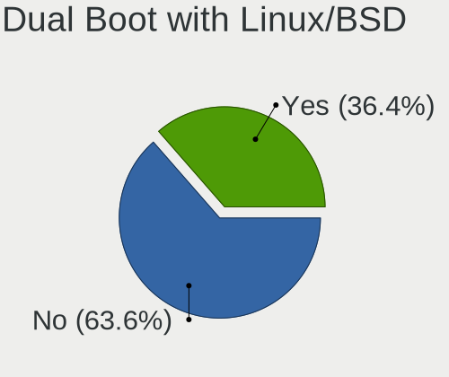

| Dual boot | Desktops | Percent |
|-----------|----------|---------|
| No        | 67       | 63.81%  |
| Yes       | 38       | 36.19%  |

Dual Boot (Win)
---------------

Hosting Linux and Windows

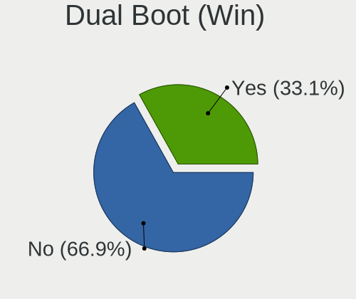

| Dual boot | Desktops | Percent |
|-----------|----------|---------|
| No        | 69       | 67.65%  |
| Yes       | 33       | 32.35%  |

Board
-----

Vendor
------

Motherboard manufacturer

| Name                | Desktops | Percent |
|---------------------|----------|---------|
| ASUSTek Computer    | 38       | 37.62%  |
| Gigabyte Technology | 22       | 21.78%  |
| MSI                 | 13       | 12.87%  |
| ASRock              | 7        | 6.93%   |
| Dell                | 5        | 4.95%   |
| Hewlett-Packard     | 3        | 2.97%   |
| Loongson            | 2        | 1.98%   |
| Lenovo              | 2        | 1.98%   |
| Unknown             | 2        | 1.98%   |
| SZMZ                | 1        | 0.99%   |
| Supermicro          | 1        | 0.99%   |
| Medion              | 1        | 0.99%   |
| Intel               | 1        | 0.99%   |
| Fujitsu             | 1        | 0.99%   |
| Foxconn             | 1        | 0.99%   |
| BESSTAR Tech        | 1        | 0.99%   |

Model
-----

Motherboard model

| Name                                  | Desktops | Percent |
|---------------------------------------|----------|---------|
| Gigabyte X570 AORUS ELITE             | 2        | 1.98%   |
| Gigabyte B550 AORUS ELITE V2          | 2        | 1.98%   |
| Gigabyte B450M DS3H                   | 2        | 1.98%   |
| ASUS TUF Gaming B550-PLUS             | 2        | 1.98%   |
| ASUS ROG STRIX X570-E GAMING          | 2        | 1.98%   |
| ASUS PRIME B660-PLUS D4               | 2        | 1.98%   |
| ASUS M3A78-CM                         | 2        | 1.98%   |
| Unknown                               | 2        | 1.98%   |
| SZMZ X99M-G2                          | 1        | 0.99%   |
| Supermicro SYS-5038MD-H24TRF-OS012    | 1        | 0.99%   |
| MSI MS-7E10                           | 1        | 0.99%   |
| MSI MS-7D89                           | 1        | 0.99%   |
| MSI MS-7D67                           | 1        | 0.99%   |
| MSI MS-7D50                           | 1        | 0.99%   |
| MSI MS-7C94                           | 1        | 0.99%   |
| MSI MS-7C91                           | 1        | 0.99%   |
| MSI MS-7C84                           | 1        | 0.99%   |
| MSI MS-7C60                           | 1        | 0.99%   |
| MSI MS-7C56                           | 1        | 0.99%   |
| MSI MS-7C37                           | 1        | 0.99%   |
| MSI MS-7C35                           | 1        | 0.99%   |
| MSI MS-7C09                           | 1        | 0.99%   |
| MSI MS-7C02                           | 1        | 0.99%   |
| Medion MD34100/2543                   | 1        | 0.99%   |
| Loongson 3A6000-HV-7A2000-1w-V0.1-EVB | 1        | 0.99%   |
| Loongson 3A6000-7A2000-1w-V0.1-EVB    | 1        | 0.99%   |
| Lenovo ThinkStation S30 4351B20       | 1        | 0.99%   |
| Lenovo ThinkCentre M73 10AY008JGE     | 1        | 0.99%   |
| Intel DH77EB AAG39073-304             | 1        | 0.99%   |
| HP Z420 Workstation                   | 1        | 0.99%   |
| HP EliteDesk 800 G5 SFF               | 1        | 0.99%   |
| HP Compaq Elite 8300 SFF              | 1        | 0.99%   |
| Gigabyte Z77X-UD5H                    | 1        | 0.99%   |
| Gigabyte Z590 UD                      | 1        | 0.99%   |
| Gigabyte Z390 AORUS ELITE             | 1        | 0.99%   |
| Gigabyte Z370P D3                     | 1        | 0.99%   |
| Gigabyte X79-UP4                      | 1        | 0.99%   |
| Gigabyte X570S AORUS ELITE AX         | 1        | 0.99%   |
| Gigabyte H110M-H                      | 1        | 0.99%   |
| Gigabyte B75M-D2V                     | 1        | 0.99%   |

Model Family
------------

Motherboard model prefix

| Name                                  | Desktops | Percent |
|---------------------------------------|----------|---------|
| ASUS PRIME                            | 13       | 12.87%  |
| ASUS ROG                              | 12       | 11.88%  |
| ASUS TUF                              | 5        | 4.95%   |
| Gigabyte B550                         | 3        | 2.97%   |
| Gigabyte X570                         | 2        | 1.98%   |
| Gigabyte B450M                        | 2        | 1.98%   |
| Dell Precision                        | 2        | 1.98%   |
| Dell OptiPlex                         | 2        | 1.98%   |
| ASUS M3A78-CM                         | 2        | 1.98%   |
| Unknown                               | 2        | 1.98%   |
| SZMZ X99M-G2                          | 1        | 0.99%   |
| Supermicro SYS-5038MD-H24TRF-OS012    | 1        | 0.99%   |
| MSI MS-7E10                           | 1        | 0.99%   |
| MSI MS-7D89                           | 1        | 0.99%   |
| MSI MS-7D67                           | 1        | 0.99%   |
| MSI MS-7D50                           | 1        | 0.99%   |
| MSI MS-7C94                           | 1        | 0.99%   |
| MSI MS-7C91                           | 1        | 0.99%   |
| MSI MS-7C84                           | 1        | 0.99%   |
| MSI MS-7C60                           | 1        | 0.99%   |
| MSI MS-7C56                           | 1        | 0.99%   |
| MSI MS-7C37                           | 1        | 0.99%   |
| MSI MS-7C35                           | 1        | 0.99%   |
| MSI MS-7C09                           | 1        | 0.99%   |
| MSI MS-7C02                           | 1        | 0.99%   |
| Medion MD34100                        | 1        | 0.99%   |
| Loongson 3A6000-HV-7A2000-1w-V0.1-EVB | 1        | 0.99%   |
| Loongson 3A6000-7A2000-1w-V0.1-EVB    | 1        | 0.99%   |
| Lenovo ThinkStation                   | 1        | 0.99%   |
| Lenovo ThinkCentre                    | 1        | 0.99%   |
| Intel DH77EB                          | 1        | 0.99%   |
| HP Z420                               | 1        | 0.99%   |
| HP EliteDesk                          | 1        | 0.99%   |
| HP Compaq                             | 1        | 0.99%   |
| Gigabyte Z77X-UD5H                    | 1        | 0.99%   |
| Gigabyte Z590                         | 1        | 0.99%   |
| Gigabyte Z390                         | 1        | 0.99%   |
| Gigabyte Z370P                        | 1        | 0.99%   |
| Gigabyte X79-UP4                      | 1        | 0.99%   |
| Gigabyte X570S                        | 1        | 0.99%   |

MFG Year
--------

Motherboard manufacture year

| Year    | Desktops | Percent |
|---------|----------|---------|
| 2020    | 14       | 13.86%  |
| 2022    | 12       | 11.88%  |
| 2018    | 12       | 11.88%  |
| 2021    | 11       | 10.89%  |
| 2019    | 11       | 10.89%  |
| 2017    | 8        | 7.92%   |
| 2012    | 7        | 6.93%   |
| 2023    | 5        | 4.95%   |
| 2016    | 3        | 2.97%   |
| 2014    | 3        | 2.97%   |
| 2011    | 3        | 2.97%   |
| Unknown | 3        | 2.97%   |
| 2013    | 2        | 1.98%   |
| 2008    | 2        | 1.98%   |
| 2007    | 2        | 1.98%   |
| 2015    | 1        | 0.99%   |
| 2010    | 1        | 0.99%   |
| 2009    | 1        | 0.99%   |

Form Factor
-----------

Physical design of the computer

| Name    | Desktops | Percent |
|---------|----------|---------|
| Desktop | 101      | 100%    |

Secure Boot
-----------

Enabled or disabled

| State    | Desktops | Percent |
|----------|----------|---------|
| Disabled | 99       | 98.02%  |
| Enabled  | 2        | 1.98%   |

Coreboot
--------

Have coreboot on board

| Used | Desktops | Percent |
|------|----------|---------|
| No   | 101      | 100%    |

RAM Size
--------

Total RAM memory

| Size in GB  | Desktops | Percent |
|-------------|----------|---------|
| 32.01-64.0  | 38       | 37.62%  |
| 64.01-256.0 | 27       | 26.73%  |
| 16.01-24.0  | 21       | 20.79%  |
| 4.01-8.0    | 6        | 5.94%   |
| 24.01-32.0  | 5        | 4.95%   |
| 3.01-4.0    | 3        | 2.97%   |
| 8.01-16.0   | 1        | 0.99%   |

RAM Used
--------

Used RAM memory

| Used GB    | Desktops | Percent |
|------------|----------|---------|
| 4.01-8.0   | 26       | 22.81%  |
| 2.01-3.0   | 19       | 16.67%  |
| 1.01-2.0   | 17       | 14.91%  |
| 3.01-4.0   | 16       | 14.04%  |
| 8.01-16.0  | 12       | 10.53%  |
| 0.51-1.0   | 10       | 8.77%   |
| 16.01-24.0 | 7        | 6.14%   |
| 0.01-0.5   | 3        | 2.63%   |
| 32.01-64.0 | 2        | 1.75%   |
| 24.01-32.0 | 2        | 1.75%   |

Total Drives
------------

Number of drives on board

| Drives | Desktops | Percent |
|--------|----------|---------|
| 2      | 33       | 31.43%  |
| 1      | 18       | 17.14%  |
| 3      | 15       | 14.29%  |
| 4      | 14       | 13.33%  |
| 6      | 8        | 7.62%   |
| 5      | 7        | 6.67%   |
| 7      | 5        | 4.76%   |
| 8      | 3        | 2.86%   |
| 31     | 1        | 0.95%   |
| 19     | 1        | 0.95%   |

Has CD-ROM
----------

Has CD-ROM on board

| Presented | Desktops | Percent |
|-----------|----------|---------|
| No        | 74       | 72.55%  |
| Yes       | 28       | 27.45%  |

Has Ethernet
------------

Has Ethernet on board

| Presented | Desktops | Percent |
|-----------|----------|---------|
| Yes       | 100      | 98.04%  |
| No        | 2        | 1.96%   |

Has WiFi
--------

Has WiFi module

| Presented | Desktops | Percent |
|-----------|----------|---------|
| No        | 52       | 51.49%  |
| Yes       | 49       | 48.51%  |

Has Bluetooth
-------------

Has Bluetooth module

| Presented | Desktops | Percent |
|-----------|----------|---------|
| No        | 55       | 54.46%  |
| Yes       | 46       | 45.54%  |

Location
--------

Country
-------

Geographic location (country)

| Country     | Desktops | Percent |
|-------------|----------|---------|
| USA         | 21       | 20.79%  |
| Germany     | 11       | 10.89%  |
| Poland      | 7        | 6.93%   |
| France      | 7        | 6.93%   |
| UK          | 6        | 5.94%   |
| Russia      | 5        | 4.95%   |
| Italy       | 5        | 4.95%   |
| Spain       | 4        | 3.96%   |
| China       | 4        | 3.96%   |
| Ireland     | 3        | 2.97%   |
| Canada      | 3        | 2.97%   |
| Brazil      | 3        | 2.97%   |
| Sweden      | 2        | 1.98%   |
| Greece      | 2        | 1.98%   |
| Finland     | 2        | 1.98%   |
| Austria     | 2        | 1.98%   |
| Argentina   | 2        | 1.98%   |
| Turkey      | 1        | 0.99%   |
| Taiwan      | 1        | 0.99%   |
| Switzerland | 1        | 0.99%   |
| Slovakia    | 1        | 0.99%   |
| Netherlands | 1        | 0.99%   |
| Japan       | 1        | 0.99%   |
| Hungary     | 1        | 0.99%   |
| Czechia     | 1        | 0.99%   |
| Colombia    | 1        | 0.99%   |
| Bulgaria    | 1        | 0.99%   |
| Belgium     | 1        | 0.99%   |
| Belarus     | 1        | 0.99%   |

City
----

Geographic location (city)

| City             | Desktops | Percent |
|------------------|----------|---------|
| Warsaw           | 4        | 3.85%   |
| Dublin           | 3        | 2.88%   |
| Vienna           | 2        | 1.92%   |
| Rostov-on-Don    | 2        | 1.92%   |
| Oulx             | 2        | 1.92%   |
| Milano           | 2        | 1.92%   |
| Le Boulou        | 2        | 1.92%   |
| Cieszyn          | 2        | 1.92%   |
| Beijing          | 2        | 1.92%   |
| Athens           | 2        | 1.92%   |
| Wrentham         | 1        | 0.96%   |
| Weifang          | 1        | 0.96%   |
| Vladivostok      | 1        | 0.96%   |
| Ufa              | 1        | 0.96%   |
| Toulouse         | 1        | 0.96%   |
| Torredembarra    | 1        | 0.96%   |
| Tokyo            | 1        | 0.96%   |
| The Hague        | 1        | 0.96%   |
| Teufen AR        | 1        | 0.96%   |
| Swift Current    | 1        | 0.96%   |
| Stockholm        | 1        | 0.96%   |
| St Petersburg    | 1        | 0.96%   |
| Springfield      | 1        | 0.96%   |
| Sofia            | 1        | 0.96%   |
| Slough           | 1        | 0.96%   |
| Sherwood Park    | 1        | 0.96%   |
| Seattle          | 1        | 0.96%   |
| Rio de Janeiro   | 1        | 0.96%   |
| Raisio           | 1        | 0.96%   |
| Prague           | 1        | 0.96%   |
| Port Glasgow     | 1        | 0.96%   |
| Partiznske     | 1        | 0.96%   |
| Paris            | 1        | 0.96%   |
| Orange           | 1        | 0.96%   |
| Oklahoma City    | 1        | 0.96%   |
| North Fort Myers | 1        | 0.96%   |
| Noisy-le-Sec     | 1        | 0.96%   |
| New York         | 1        | 0.96%   |
| Munich           | 1        | 0.96%   |
| Moultonborough   | 1        | 0.96%   |

Drives
------

Drive Vendor
------------

Hard drive vendors

| Vendor                      | Desktops | Drives | Percent |
|-----------------------------|----------|--------|---------|
| Samsung Electronics         | 45       | 110    | 18.83%  |
| WDC                         | 34       | 69     | 14.23%  |
| Seagate                     | 30       | 61     | 12.55%  |
| Sandisk                     | 15       | 18     | 6.28%   |
| Phison Electronics          | 15       | 20     | 6.28%   |
| Kingston                    | 10       | 10     | 4.18%   |
| Toshiba                     | 9        | 28     | 3.77%   |
| Micron/Crucial Technology   | 9        | 11     | 3.77%   |
| Intel                       | 9        | 11     | 3.77%   |
| Crucial                     | 8        | 16     | 3.35%   |
| Hitachi                     | 7        | 23     | 2.93%   |
| GOODRAM                     | 4        | 18     | 1.67%   |
| Yangtze Memory Technologies | 3        | 5      | 1.26%   |
| Silicon Motion              | 3        | 3      | 1.26%   |
| MAXIO Technology (Hangzhou) | 3        | 3      | 1.26%   |
| Kingston Technology Company | 3        | 3      | 1.26%   |
| China                       | 3        | 4      | 1.26%   |
| A-DATA Technology           | 3        | 3      | 1.26%   |
| Unknown                     | 3        | 3      | 1.26%   |
| Unknown                     | 2        | 5      | 0.84%   |
| SABRENT                     | 2        | 2      | 0.84%   |
| Realtek Semiconductor       | 2        | 2      | 0.84%   |
| HGST                        | 2        | 2      | 0.84%   |
| Verbatim                    | 1        | 1      | 0.42%   |
| Transcend                   | 1        | 1      | 0.42%   |
| Team                        | 1        | 1      | 0.42%   |
| SPCC                        | 1        | 3      | 0.42%   |
| SK hynix                    | 1        | 1      | 0.42%   |
| Seagate Technology          | 1        | 1      | 0.42%   |
| PNY                         | 1        | 1      | 0.42%   |
| Phison                      | 1        | 1      | 0.42%   |
| OCZ                         | 1        | 1      | 0.42%   |
| NETAPP                      | 1        | 3      | 0.42%   |
| Lenovo                      | 1        | 1      | 0.42%   |
| KingSpec                    | 1        | 1      | 0.42%   |
| Kingchuxing                 | 1        | 5      | 0.42%   |
| FREEBSD                     | 1        | 12     | 0.42%   |
| ADATA Technology            | 1        | 1      | 0.42%   |

Drive Model
-----------

Hard drive models

| Model                                                 | Desktops | Percent |
|-------------------------------------------------------|----------|---------|
| Samsung NVMe SSD Controller SM981/PM981/PM983 1TB     | 16       | 5.57%   |
| Samsung NVMe SSD Controller PM9A1/PM9A3/980PRO 2TB    | 9        | 3.14%   |
| Samsung SSD 980 1TB                                   | 7        | 2.44%   |
| Seagate ST2000DM006-2DM164 2TB                        | 4        | 1.39%   |
| Samsung SSD 850 EVO 500GB                             | 4        | 1.39%   |
| Phison E12 NVMe Controller 1TB                        | 4        | 1.39%   |
| Micron/Crucial P2 NVMe PCIe SSD 1TB                   | 4        | 1.39%   |
| WDC WDS500G2B0A-00SM50 500GB SSD                      | 3        | 1.05%   |
| WDC WD30EFRX-68EUZN0 3TB                              | 3        | 1.05%   |
| Silicon Motion SM2263EN/SM2263XT SSD Controller 128GB | 3        | 1.05%   |
| Seagate ST4000DM004-2CV104 4TB                        | 3        | 1.05%   |
| SanDisk SSD PLUS 240GB                                | 3        | 1.05%   |
| Samsung SSD 860 EVO 250GB                             | 3        | 1.05%   |
| Samsung SSD 860 EVO 1TB                               | 3        | 1.05%   |
| Micron/Crucial CT1000P5PSSD8 1TB                      | 3        | 1.05%   |
| Kingston Company A2000 NVMe SSD 500GB                 | 3        | 1.05%   |
| Kingston SKC3000D2048G 2TB                            | 3        | 1.05%   |
| GOODRAM SSDPR-CL100-480-G2 480GB                      | 3        | 1.05%   |
| Crucial CT1000MX500SSD1 1TB                           | 3        | 1.05%   |
| Unknown                                               | 3        | 1.05%   |
| WDC WD20EZRZ-00Z5HB0 2TB                              | 2        | 0.7%    |
| WDC WD10EZEX-08WN4A0 1TB                              | 2        | 0.7%    |
| WDC WD102KRYZ-01A5AB0 10TB                            | 2        | 0.7%    |
| Toshiba DT01ACA100 1TB                                | 2        | 0.7%    |
| Seagate ST500DM002-1BD142 500GB                       | 2        | 0.7%    |
| Seagate ST4000VN008-2DR166 4TB                        | 2        | 0.7%    |
| Seagate ST3000DM008-2DM166 3TB                        | 2        | 0.7%    |
| Seagate ST2000DM008-2UB102 2TB                        | 2        | 0.7%    |
| Seagate ST2000DM008-2FR102 2TB                        | 2        | 0.7%    |
| Seagate ST1000DM010-2EP102 1TB                        | 2        | 0.7%    |
| Sandisk WD Black SN850 1024GB                         | 2        | 0.7%    |
| SanDisk Ultra II 480GB SSD                            | 2        | 0.7%    |
| Samsung SSD 980 500GB                                 | 2        | 0.7%    |
| Samsung SSD 860 QVO 1TB                               | 2        | 0.7%    |
| Samsung SSD 860 EVO 500GB                             | 2        | 0.7%    |
| Samsung SSD 850 PRO 512GB                             | 2        | 0.7%    |
| Samsung SSD 850 EVO 250GB                             | 2        | 0.7%    |
| Samsung SSD 840 Series 250GB                          | 2        | 0.7%    |
| Samsung NVMe SSD Controller SM961/PM961/SM963 256GB   | 2        | 0.7%    |
| SABRENT Disk 500GB                                    | 2        | 0.7%    |

HDD Vendor
----------

Hard disk drive vendors

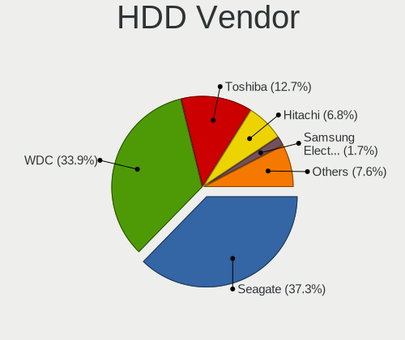

| Vendor              | Desktops | Drives | Percent |
|---------------------|----------|--------|---------|
| WDC                 | 31       | 63     | 37.8%   |
| Seagate             | 30       | 60     | 36.59%  |
| Toshiba             | 8        | 27     | 9.76%   |
| Hitachi             | 7        | 23     | 8.54%   |
| Samsung Electronics | 2        | 3      | 2.44%   |
| HGST                | 2        | 2      | 2.44%   |
| NETAPP              | 1        | 3      | 1.22%   |
| Unknown             | 1        | 1      | 1.22%   |

SSD Vendor
----------

Solid state drive vendors

| Vendor              | Desktops | Drives | Percent |
|---------------------|----------|--------|---------|
| Samsung Electronics | 22       | 41     | 28.57%  |
| Crucial             | 8        | 16     | 10.39%  |
| SanDisk             | 7        | 7      | 9.09%   |
| WDC                 | 6        | 6      | 7.79%   |
| Kingston            | 6        | 6      | 7.79%   |
| GOODRAM             | 4        | 18     | 5.19%   |
| Intel               | 3        | 3      | 3.9%    |
| China               | 3        | 4      | 3.9%    |
| A-DATA Technology   | 3        | 3      | 3.9%    |
| SABRENT             | 2        | 2      | 2.6%    |
| Unknown             | 2        | 2      | 2.6%    |
| Verbatim            | 1        | 1      | 1.3%    |
| Transcend           | 1        | 1      | 1.3%    |
| Toshiba             | 1        | 1      | 1.3%    |
| Team                | 1        | 1      | 1.3%    |
| SPCC                | 1        | 3      | 1.3%    |
| PNY                 | 1        | 1      | 1.3%    |
| OCZ                 | 1        | 1      | 1.3%    |
| Lenovo              | 1        | 1      | 1.3%    |
| KingSpec            | 1        | 1      | 1.3%    |
| Kingchuxing         | 1        | 5      | 1.3%    |
| FREEBSD             | 1        | 12     | 1.3%    |

Drive Kind
----------

HDD or SSD

| Kind    | Desktops | Drives | Percent |
|---------|----------|--------|---------|
| NVMe    | 72       | 142    | 37.11%  |
| SSD     | 61       | 136    | 31.44%  |
| HDD     | 60       | 182    | 30.93%  |
| Unknown | 1        | 4      | 0.52%   |

Drive Connector
---------------

SATA, SAS, NVMe, etc.

| Type | Desktops | Drives | Percent |
|------|----------|--------|---------|
| SATA | 81       | 314    | 51.59%  |
| NVMe | 72       | 142    | 45.86%  |
| SAS  | 4        | 8      | 2.55%   |

Drive Size
----------

Size of hard drive

| Size in TB | Desktops | Drives | Percent |
|------------|----------|--------|---------|
| 0.01-0.5   | 54       | 102    | 36.73%  |
| 0.51-1.0   | 40       | 70     | 27.21%  |
| 1.01-2.0   | 17       | 38     | 11.56%  |
| 3.01-4.0   | 14       | 43     | 9.52%   |
| 2.01-3.0   | 9        | 28     | 6.12%   |
| 4.01-10.0  | 8        | 20     | 5.44%   |
| 10.01-20.0 | 5        | 17     | 3.4%    |

Space Total
-----------

Amount of disk space available on the file system

| Size in GB     | Desktops | Percent |
|----------------|----------|---------|
| More than 3000 | 33       | 31.43%  |
| 501-1000       | 20       | 19.05%  |
| 1001-2000      | 13       | 12.38%  |
| 101-250        | 11       | 10.48%  |
| 251-500        | 8        | 7.62%   |
| 2001-3000      | 8        | 7.62%   |
| 1-20           | 4        | 3.81%   |
| Unknown        | 4        | 3.81%   |
| 21-50          | 2        | 1.9%    |
| 51-100         | 2        | 1.9%    |

Space Used
----------

Amount of used disk space

| Used GB        | Desktops | Percent |
|----------------|----------|---------|
| 1-20           | 21       | 19.44%  |
| 1001-2000      | 17       | 15.74%  |
| More than 3000 | 14       | 12.96%  |
| 101-250        | 13       | 12.04%  |
| 251-500        | 12       | 11.11%  |
| 51-100         | 10       | 9.26%   |
| 501-1000       | 8        | 7.41%   |
| 2001-3000      | 5        | 4.63%   |
| 21-50          | 4        | 3.7%    |
| Unknown        | 4        | 3.7%    |

Malfunc. Drives
---------------

Drive models with a malfunction

| Model                               | Desktops | Drives | Percent |
|-------------------------------------|----------|--------|---------|
| WDC WD3200BEVT-22ZCT0 320GB         | 1        | 1      | 4.55%   |
| WDC WD30EFRX-68EUZN0 3TB            | 1        | 4      | 4.55%   |
| WDC WD2002FAEX-007BA0 2TB           | 1        | 1      | 4.55%   |
| WDC WD10EZEX-00RKKA0 1TB            | 1        | 1      | 4.55%   |
| WDC WD10EFRX-68PJCN0 1TB            | 1        | 1      | 4.55%   |
| Toshiba HDWD240 4TB                 | 1        | 1      | 4.55%   |
| Seagate ST500DM002-1BC142 500GB     | 1        | 1      | 4.55%   |
| Seagate ST3160811AS 160GB           | 1        | 1      | 4.55%   |
| Seagate ST31000524AS 1TB            | 1        | 1      | 4.55%   |
| Seagate ST3000DM008-2DM166 3TB      | 1        | 2      | 4.55%   |
| Seagate ST2000DM005-2CW102 2TB      | 1        | 1      | 4.55%   |
| Seagate ST1000DM010-2EP102 1TB      | 1        | 1      | 4.55%   |
| Samsung Electronics SSD 980 1TB     | 1        | 1      | 4.55%   |
| PNY SSD2SC120G1LC763C121S459P 120GB | 1        | 1      | 4.55%   |
| Kingston SV300S37A240G 240GB SSD    | 1        | 1      | 4.55%   |
| Kingston SV300S37A 120G SSD         | 1        | 1      | 4.55%   |
| Intel SSDSCKKF180G8L 180GB          | 1        | 1      | 4.55%   |
| Hitachi HUS724030ALE641 3TB         | 1        | 1      | 4.55%   |
| Hitachi HDS722020ALA330 2TB         | 1        | 1      | 4.55%   |
| HGST HTS721010A9E630 1TB            | 1        | 1      | 4.55%   |
| A-DATA Technology SP900 128GB SSD   | 1        | 1      | 4.55%   |
| Unknown                             | 1        | 1      | 4.55%   |

Malfunc. Drive Vendor
---------------------

Vendors of faulty drives

| Vendor              | Desktops | Drives | Percent |
|---------------------|----------|--------|---------|
| Seagate             | 6        | 7      | 27.27%  |
| WDC                 | 5        | 8      | 22.73%  |
| Kingston            | 2        | 2      | 9.09%   |
| Hitachi             | 2        | 2      | 9.09%   |
| Toshiba             | 1        | 1      | 4.55%   |
| Samsung Electronics | 1        | 1      | 4.55%   |
| PNY                 | 1        | 1      | 4.55%   |
| Intel               | 1        | 1      | 4.55%   |
| HGST                | 1        | 1      | 4.55%   |
| A-DATA Technology   | 1        | 1      | 4.55%   |
| Unknown             | 1        | 1      | 4.55%   |

Malfunc. HDD Vendor
-------------------

Vendors of faulty HDD drives

| Vendor  | Desktops | Drives | Percent |
|---------|----------|--------|---------|
| Seagate | 6        | 7      | 37.5%   |
| WDC     | 5        | 8      | 31.25%  |
| Hitachi | 2        | 2      | 12.5%   |
| Toshiba | 1        | 1      | 6.25%   |
| HGST    | 1        | 1      | 6.25%   |
| Unknown | 1        | 1      | 6.25%   |

Malfunc. Drive Kind
-------------------

Kinds of faulty drives

| Kind | Desktops | Drives | Percent |
|------|----------|--------|---------|
| HDD  | 16       | 20     | 72.73%  |
| SSD  | 5        | 5      | 22.73%  |
| NVMe | 1        | 1      | 4.55%   |

Failed Drives
-------------

Failed drive models

| Model                         | Desktops | Drives | Percent |
|-------------------------------|----------|--------|---------|
| Hitachi HTS723232L9A360 320GB | 1        | 1      | 100%    |

Failed Drive Vendor
-------------------

Failed drive vendors

| Vendor  | Desktops | Drives | Percent |
|---------|----------|--------|---------|
| Hitachi | 1        | 1      | 100%    |

Drive Status
------------

Number of failed and malfunc. drives

| Status   | Desktops | Drives | Percent |
|----------|----------|--------|---------|
| Works    | 93       | 390    | 73.81%  |
| Malfunc  | 21       | 26     | 16.67%  |
| Detected | 11       | 47     | 8.73%   |
| Failed   | 1        | 1      | 0.79%   |

Storage controller
------------------

Storage Vendor
--------------

Storage controller vendors

| Vendor                      | Desktops | Percent |
|-----------------------------|----------|---------|
| AMD                         | 51       | 25.25%  |
| Intel                       | 48       | 23.76%  |
| Samsung Electronics         | 29       | 14.36%  |
| Phison Electronics          | 16       | 7.92%   |
| SanDisk                     | 9        | 4.46%   |
| Micron/Crucial Technology   | 9        | 4.46%   |
| ASMedia Technology          | 8        | 3.96%   |
| Kingston Technology Company | 7        | 3.47%   |
| Yangtze Memory Technologies | 3        | 1.49%   |
| Silicon Motion              | 3        | 1.49%   |
| MAXIO Technology (Hangzhou) | 3        | 1.49%   |
| Realtek Semiconductor       | 2        | 0.99%   |
| Marvell Technology Group    | 2        | 0.99%   |
| LSI Logic / Symbios Logic   | 2        | 0.99%   |
| Loongson Technology         | 2        | 0.99%   |
| JMicron Technology          | 2        | 0.99%   |
| VIA Technologies            | 1        | 0.5%    |
| SK hynix                    | 1        | 0.5%    |
| Seagate Technology          | 1        | 0.5%    |
| Nvidia                      | 1        | 0.5%    |
| INNOGRIT                    | 1        | 0.5%    |
| ADATA Technology            | 1        | 0.5%    |

Storage Model
-------------

Storage controller models

| Model                                                                          | Desktops | Percent |
|--------------------------------------------------------------------------------|----------|---------|
| AMD FCH SATA Controller [AHCI mode]                                            | 20       | 8.3%    |
| Samsung NVMe SSD Controller SM981/PM981/PM983                                  | 16       | 6.64%   |
| AMD 500 Series Chipset SATA Controller                                         | 12       | 4.98%   |
| Samsung NVMe SSD Controller 980 (DRAM-less)                                    | 10       | 4.15%   |
| Samsung NVMe SSD Controller PM9A1/PM9A3/980PRO                                 | 9        | 3.73%   |
| AMD 600 Series Chipset SATA Controller                                         | 9        | 3.73%   |
| Intel Cannon Lake PCH SATA AHCI Controller                                     | 7        | 2.9%    |
| Intel Alder Lake-S PCH SATA Controller [AHCI Mode]                             | 6        | 2.49%   |
| Phison E18 PCIe4 NVMe Controller                                               | 5        | 2.07%   |
| Intel C600/X79 series chipset 6-Port SATA AHCI Controller                      | 5        | 2.07%   |
| ASMedia ASM1061/ASM1062 Serial ATA Controller                                  | 5        | 2.07%   |
| AMD 400 Series Chipset SATA Controller                                         | 5        | 2.07%   |
| Phison E12 NVMe Controller                                                     | 4        | 1.66%   |
| Micron/Crucial P5 Plus NVMe PCIe SSD                                           | 4        | 1.66%   |
| Micron/Crucial P2 [Nick P2] / P3 / P3 Plus NVMe PCIe SSD (DRAM-less)           | 4        | 1.66%   |
| Intel Volume Management Device NVMe RAID Controller                            | 4        | 1.66%   |
| Intel Q170/Q150/B150/H170/H110/Z170/CM236 Chipset SATA Controller [AHCI Mode]  | 4        | 1.66%   |
| Intel 8 Series/C220 Series Chipset Family 6-port SATA Controller 1 [AHCI mode] | 4        | 1.66%   |
| Intel 7 Series/C210 Series Chipset Family 6-port SATA Controller [AHCI mode]   | 4        | 1.66%   |
| Intel 500 Series Chipset Family SATA AHCI Controller                           | 4        | 1.66%   |
| Silicon Motion SM2263EN/SM2263XT (DRAM-less) NVMe SSD Controllers              | 3        | 1.24%   |
| Kingston Company KC3000/FURY Renegade NVMe SSD E18                             | 3        | 1.24%   |
| Kingston Company A2000 NVMe SSD SM2263EN                                       | 3        | 1.24%   |
| Intel 6 Series/C200 Series Chipset Family 6 port Desktop SATA AHCI Controller  | 3        | 1.24%   |
| Intel 200 Series PCH SATA controller [AHCI mode]                               | 3        | 1.24%   |
| AMD SB7x0/SB8x0/SB9x0 SATA Controller [AHCI mode]                              | 3        | 1.24%   |
| AMD SB7x0/SB8x0/SB9x0 IDE Controller                                           | 3        | 1.24%   |
| SanDisk WD PC SN810 / Black SN850 NVMe SSD                                     | 2        | 0.83%   |
| Samsung NVMe SSD Controller SM961/PM961/SM963                                  | 2        | 0.83%   |
| Samsung NVMe SSD Controller S4LV008[Pascal]                                    | 2        | 0.83%   |
| Realtek RTS5765DL NVMe SSD Controller (DRAM-less)                              | 2        | 0.83%   |
| Phison PS5013-E13 PCIe3 NVMe Controller (DRAM-less)                            | 2        | 0.83%   |
| Phison E7 NVMe Controller                                                      | 2        | 0.83%   |
| Phison E16 PCIe4 NVMe Controller                                               | 2        | 0.83%   |
| Marvell Group 88SE9172 SATA 6Gb/s Controller                                   | 2        | 0.83%   |
| LSI Logic / Symbios Logic MegaRAID SAS 2008 [Falcon]                           | 2        | 0.83%   |
| Loongson SATA controller                                                       | 2        | 0.83%   |
| JMicron JMB368 IDE controller                                                  | 2        | 0.83%   |
| JMicron JMB363 SATA/IDE Controller                                             | 2        | 0.83%   |
| Intel SSD 600P Series                                                          | 2        | 0.83%   |

Storage Kind
------------

Kind of storage controller (IDE, SATA, NVMe, SAS, ...)

| Kind | Desktops | Percent |
|------|----------|---------|
| SATA | 100      | 52.08%  |
| NVMe | 72       | 37.5%   |
| IDE  | 9        | 4.69%   |
| RAID | 8        | 4.17%   |
| SAS  | 3        | 1.56%   |

Processor
---------

CPU Vendor
----------

Processor vendors

| Vendor   | Desktops | Percent |
|----------|----------|---------|
| AMD      | 52       | 51.49%  |
| Intel    | 47       | 46.53%  |
| Loongson | 2        | 1.98%   |

CPU Model
---------

Processor models

| Model                                   | Desktops | Percent |
|-----------------------------------------|----------|---------|
| AMD Ryzen 9 5900X 12-Core Processor     | 8        | 7.92%   |
| AMD Ryzen 9 3900X 12-Core Processor     | 4        | 3.96%   |
| AMD Ryzen 9 7950X 16-Core Processor     | 3        | 2.97%   |
| AMD Ryzen 7 5800X 8-Core Processor      | 3        | 2.97%   |
| AMD Ryzen 5 5600X 6-Core Processor      | 3        | 2.97%   |
| Loongson 3A6000                         | 2        | 1.98%   |
| Intel Core i7-8700 CPU @ 3.20GHz        | 2        | 1.98%   |
| Intel Core i7-3770 CPU @ 3.40GHz        | 2        | 1.98%   |
| Intel Core i5-8400 CPU @ 2.80GHz        | 2        | 1.98%   |
| Intel Core i5-2400 CPU @ 3.10GHz        | 2        | 1.98%   |
| Intel 12th Gen Core i5-12600K           | 2        | 1.98%   |
| Intel 12th Gen Core i5-12400            | 2        | 1.98%   |
| Intel 11th Gen Core i7-11700K @ 3.60GHz | 2        | 1.98%   |
| AMD Ryzen 9 5950X 16-Core Processor     | 2        | 1.98%   |
| AMD Ryzen 7 5800X3D 8-Core Processor    | 2        | 1.98%   |
| AMD Ryzen 5 7600X 6-Core Processor      | 2        | 1.98%   |
| AMD Ryzen 5 3600 6-Core Processor       | 2        | 1.98%   |
| AMD Ryzen 5 2600 Six-Core Processor     | 2        | 1.98%   |
| AMD Phenom II X4 955 Processor          | 2        | 1.98%   |
| AMD FX-8350 Eight-Core Processor        | 2        | 1.98%   |
| Intel Xeon CPU E5-2690 0 @ 2.90GHz      | 1        | 0.99%   |
| Intel Xeon CPU E5-2670 v3 @ 2.30GHz     | 1        | 0.99%   |
| Intel Xeon CPU E5-2665 0 @ 2.40GHz      | 1        | 0.99%   |
| Intel Xeon CPU E5-2620 v4 @ 2.10GHz     | 1        | 0.99%   |
| Intel Xeon CPU E5-1680 v2 @ 3.00GHz     | 1        | 0.99%   |
| Intel Xeon CPU E5-1620 v2 @ 3.70GHz     | 1        | 0.99%   |
| Intel Xeon CPU E3-1240L v5 @ 2.10GHz    | 1        | 0.99%   |
| Intel Xeon CPU D-1531 @ 2.20GHz         | 1        | 0.99%   |
| Intel Pentium CPU G3240T @ 2.70GHz      | 1        | 0.99%   |
| Intel N100                              | 1        | 0.99%   |
| Intel Core i9-9900K CPU @ 3.60GHz       | 1        | 0.99%   |
| Intel Core i9-10850K CPU @ 3.60GHz      | 1        | 0.99%   |
| Intel Core i7-9700 CPU @ 3.00GHz        | 1        | 0.99%   |
| Intel Core i7-8700K CPU @ 3.70GHz       | 1        | 0.99%   |
| Intel Core i7-8086K CPU @ 4.00GHz       | 1        | 0.99%   |
| Intel Core i7-7700K CPU @ 4.20GHz       | 1        | 0.99%   |
| Intel Core i7-7700 CPU @ 3.60GHz        | 1        | 0.99%   |
| Intel Core i7-4820K CPU @ 3.70GHz       | 1        | 0.99%   |
| Intel Core i7-2600 CPU @ 3.40GHz        | 1        | 0.99%   |
| Intel Core i5-9600K CPU @ 3.70GHz       | 1        | 0.99%   |

CPU Model Family
----------------

Processor model prefix

| Model                  | Desktops | Percent |
|------------------------|----------|---------|
| AMD Ryzen 9            | 21       | 20.79%  |
| Other                  | 15       | 14.85%  |
| AMD Ryzen 5            | 13       | 12.87%  |
| Intel Core i7          | 11       | 10.89%  |
| AMD Ryzen 7            | 9        | 8.91%   |
| Intel Xeon             | 8        | 7.92%   |
| Intel Core i5          | 8        | 7.92%   |
| Intel Core i3          | 3        | 2.97%   |
| AMD FX                 | 3        | 2.97%   |
| Intel Core i9          | 2        | 1.98%   |
| AMD Ryzen Threadripper | 2        | 1.98%   |
| AMD Phenom II X4       | 2        | 1.98%   |
| Intel Pentium          | 1        | 0.99%   |
| Intel Atom             | 1        | 0.99%   |
| AMD Ryzen 3            | 1        | 0.99%   |
| AMD Athlon 64 X2       | 1        | 0.99%   |

CPU Cores
---------

Number of processor cores

| Number | Desktops | Percent |
|--------|----------|---------|
| 6      | 26       | 25.74%  |
| 4      | 21       | 20.79%  |
| 8      | 17       | 16.83%  |
| 12     | 15       | 14.85%  |
| 16     | 11       | 10.89%  |
| 2      | 6        | 5.94%   |
| 10     | 3        | 2.97%   |
| 32     | 1        | 0.99%   |
| 24     | 1        | 0.99%   |

CPU Sockets
-----------

Number of sockets

| Number | Desktops | Percent |
|--------|----------|---------|
| 1      | 99       | 98.02%  |
| 2      | 2        | 1.98%   |

CPU Threads
-----------

Threads per core (Hyper-Threading)

| Number | Desktops | Percent |
|--------|----------|---------|
| 2      | 85       | 84.16%  |
| 1      | 16       | 15.84%  |

CPU Op-Modes
------------

CPU Operation Modes (32-bit, 64-bit)

| Op mode        | Desktops | Percent |
|----------------|----------|---------|
| 32-bit, 64-bit | 101      | 100%    |

CPU Microcode
-------------

Microcode number

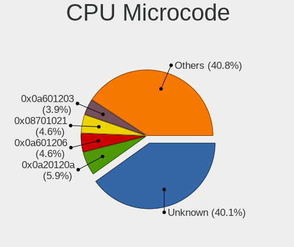

| Number     | Desktops | Percent |
|------------|----------|---------|
| Unknown    | 36       | 33.96%  |
| 0x0a20120a | 8        | 7.55%   |
| 0x0a601206 | 5        | 4.72%   |
| 0x0a601203 | 5        | 4.72%   |
| 0x0a201016 | 5        | 4.72%   |
| 0x08701021 | 5        | 4.72%   |
| 0x906ea    | 3        | 2.83%   |
| 0x90672    | 3        | 2.83%   |
| 0x306e4    | 3        | 2.83%   |
| 0x506e3    | 2        | 1.89%   |
| 0x206d7    | 2        | 1.89%   |
| 0x206a7    | 2        | 1.89%   |
| 0x0a50000f | 2        | 1.89%   |
| 0x0a50000d | 2        | 1.89%   |
| 0x0800820d | 2        | 1.89%   |
| 0x010000db | 2        | 1.89%   |
| 0xb06e0    | 1        | 0.94%   |
| 0xb0671    | 1        | 0.94%   |
| 0xa0671    | 1        | 0.94%   |
| 0x906ed    | 1        | 0.94%   |
| 0x906e9    | 1        | 0.94%   |
| 0x90675    | 1        | 0.94%   |
| 0x50663    | 1        | 0.94%   |
| 0x306f2    | 1        | 0.94%   |
| 0x306a9    | 1        | 0.94%   |
| 0x0a201205 | 1        | 0.94%   |
| 0x0a20102b | 1        | 0.94%   |
| 0x0a201025 | 1        | 0.94%   |
| 0x08701030 | 1        | 0.94%   |
| 0x08301072 | 1        | 0.94%   |
| 0x08108102 | 1        | 0.94%   |
| 0x0800820b | 1        | 0.94%   |
| 0x08001138 | 1        | 0.94%   |
| 0x06000852 | 1        | 0.94%   |
| 0x06000822 | 1        | 0.94%   |

CPU Microarch
-------------

Microarchitecture

| Name             | Desktops | Percent |
|------------------|----------|---------|
| Zen 3            | 21       | 20.39%  |
| KabyLake         | 13       | 12.62%  |
| Unknown          | 13       | 12.62%  |
| Zen 2            | 11       | 10.68%  |
| Alderlake Hybrid | 8        | 7.77%   |
| SandyBridge      | 6        | 5.83%   |
| IvyBridge        | 6        | 5.83%   |
| Zen+             | 4        | 3.88%   |
| Icelake          | 4        | 3.88%   |
| Piledriver       | 3        | 2.91%   |
| Haswell          | 3        | 2.91%   |
| Skylake          | 2        | 1.94%   |
| K10              | 2        | 1.94%   |
| Broadwell        | 2        | 1.94%   |
| Zen              | 1        | 0.97%   |
| K8 Hammer        | 1        | 0.97%   |
| Gracemont        | 1        | 0.97%   |
| CometLake        | 1        | 0.97%   |
| Bonnell          | 1        | 0.97%   |

Graphics
--------

GPU Vendor
----------

Vendors of graphics cards

| Vendor              | Desktops | Percent |
|---------------------|----------|---------|
| AMD                 | 54       | 49.54%  |
| Nvidia              | 33       | 30.28%  |
| Intel               | 17       | 15.6%   |
| ASPEED Technology   | 3        | 2.75%   |
| Loongson Technology | 2        | 1.83%   |

GPU Model
---------

Graphics card models

| Model                                                         | Desktops | Percent |
|---------------------------------------------------------------|----------|---------|
| AMD Ellesmere [Radeon RX 470/480/570/570X/580/580X/590]       | 12       | 10.17%  |
| AMD Raphael                                                   | 8        | 6.78%   |
| AMD Navi 22 [Radeon RX 6700/6700 XT/6750 XT / 6800M/6850M XT] | 6        | 5.08%   |
| AMD Navi 21 [Radeon RX 6800/6800 XT / 6900 XT]                | 6        | 5.08%   |
| Intel CoffeeLake-S GT2 [UHD Graphics 630]                     | 5        | 4.24%   |
| AMD Navi 10 [Radeon RX 5600 OEM/5600 XT / 5700/5700 XT]       | 4        | 3.39%   |
| Nvidia GA104 [GeForce RTX 3070 Ti]                            | 3        | 2.54%   |
| ASPEED Technology ASPEED Graphics Family                      | 3        | 2.54%   |
| AMD Navi 23 [Radeon RX 6600/6600 XT/6600M]                    | 3        | 2.54%   |
| AMD Lexa PRO [Radeon 540/540X/550/550X / RX 540X/550/550X]    | 3        | 2.54%   |
| Nvidia GP107GL [Quadro P620]                                  | 2        | 1.69%   |
| Nvidia GP107 [GeForce GTX 1050 Ti]                            | 2        | 1.69%   |
| Nvidia GF119 [GeForce GT 610]                                 | 2        | 1.69%   |
| Nvidia GA104 [GeForce RTX 3070 Lite Hash Rate]                | 2        | 1.69%   |
| Nvidia GA104 [GeForce RTX 3060 Ti Lite Hash Rate]             | 2        | 1.69%   |
| Nvidia GA102 [GeForce RTX 3080 Ti]                            | 2        | 1.69%   |
| Loongson Technology Display Controller                        | 2        | 1.69%   |
| AMD RS780C [Radeon 3100]                                      | 2        | 1.69%   |
| AMD Navi 31 [Radeon RX 7900 XT/7900 XTX/7900M]                | 2        | 1.69%   |
| AMD Navi 24 [Radeon RX 6400/6500 XT/6500M]                    | 2        | 1.69%   |
| AMD Cezanne [Radeon Vega Series / Radeon Vega Mobile Series]  | 2        | 1.69%   |
| AMD Cedar [Radeon HD 5000/6000/7350/8350 Series]              | 2        | 1.69%   |
| Nvidia TU106 [GeForce RTX 2060 SUPER]                         | 1        | 0.85%   |
| Nvidia TU104 [GeForce RTX 2080 Rev. A]                        | 1        | 0.85%   |
| Nvidia GP108 [GeForce GT 1030]                                | 1        | 0.85%   |
| Nvidia GP106 [GeForce GTX 1060 6GB]                           | 1        | 0.85%   |
| Nvidia GP106 [GeForce GTX 1060 3GB]                           | 1        | 0.85%   |
| Nvidia GM206 [GeForce GTX 960]                                | 1        | 0.85%   |
| Nvidia GM204 [GeForce GTX 970]                                | 1        | 0.85%   |
| Nvidia GM107 [GeForce GTX 750 Ti]                             | 1        | 0.85%   |
| Nvidia GK208B [GeForce GT 710]                                | 1        | 0.85%   |
| Nvidia GK106 [GeForce GTX 660]                                | 1        | 0.85%   |
| Nvidia GA106 [GeForce RTX 3060]                               | 1        | 0.85%   |
| Nvidia GA106 [GeForce RTX 3060 Lite Hash Rate]                | 1        | 0.85%   |
| Nvidia GA106 [Geforce RTX 3050]                               | 1        | 0.85%   |
| Nvidia GA104 [GeForce RTX 3060 Ti GDDR6X]                     | 1        | 0.85%   |
| Nvidia GA102 [GeForce RTX 3090]                               | 1        | 0.85%   |
| Nvidia C61 [GeForce 6150SE nForce 430]                        | 1        | 0.85%   |
| Nvidia AD107 [GeForce RTX 4060]                               | 1        | 0.85%   |
| Nvidia AD104 [GeForce RTX 4070]                               | 1        | 0.85%   |

GPU Combo
---------

Combinations of graphics cards

| Name                      | Desktops | Percent |
|---------------------------|----------|---------|
| 1 x AMD                   | 45       | 43.69%  |
| 1 x Nvidia                | 28       | 27.18%  |
| 1 x Intel                 | 12       | 11.65%  |
| 2 x AMD                   | 6        | 5.83%   |
| Intel + Nvidia            | 3        | 2.91%   |
| 1 x ASPEED                | 3        | 2.91%   |
| Intel + AMD               | 2        | 1.94%   |
| AMD + Loongson Technology | 2        | 1.94%   |
| 2 x Nvidia                | 1        | 0.97%   |
| AMD + Nvidia              | 1        | 0.97%   |

GPU Driver
----------

Free vs proprietary

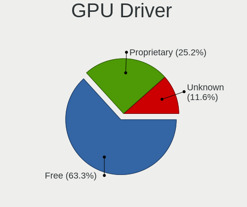

| Driver      | Desktops | Percent |
|-------------|----------|---------|
| Free        | 68       | 66.67%  |
| Proprietary | 23       | 22.55%  |
| Unknown     | 11       | 10.78%  |

GPU Memory
----------

Total video memory

| Size in GB | Desktops | Percent |
|------------|----------|---------|
| Unknown    | 38       | 35.51%  |
| 7.01-8.0   | 23       | 21.5%   |
| 8.01-16.0  | 16       | 14.95%  |
| 1.01-2.0   | 9        | 8.41%   |
| 3.01-4.0   | 8        | 7.48%   |
| 0.01-0.5   | 5        | 4.67%   |
| 16.01-24.0 | 3        | 2.8%    |
| 5.01-6.0   | 2        | 1.87%   |
| 0.51-1.0   | 2        | 1.87%   |
| 2.01-3.0   | 1        | 0.93%   |

Monitor
-------

Monitor Vendor
--------------

Monitor vendors

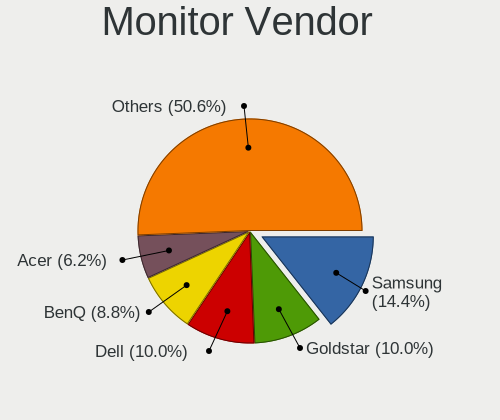

| Vendor               | Desktops | Percent |
|----------------------|----------|---------|
| Samsung Electronics  | 20       | 17.54%  |
| Goldstar             | 12       | 10.53%  |
| BenQ                 | 9        | 7.89%   |
| Dell                 | 7        | 6.14%   |
| Philips              | 6        | 5.26%   |
| ASUSTek Computer     | 6        | 5.26%   |
| Acer                 | 6        | 5.26%   |
| ViewSonic            | 4        | 3.51%   |
| Lenovo               | 4        | 3.51%   |
| Iiyama               | 4        | 3.51%   |
| Hewlett-Packard      | 4        | 3.51%   |
| Gigabyte Technology  | 4        | 3.51%   |
| AOC                  | 4        | 3.51%   |
| Ancor Communications | 4        | 3.51%   |
| Unknown              | 3        | 2.63%   |
| Mi                   | 2        | 1.75%   |
| VDO                  | 1        | 0.88%   |
| UGD                  | 1        | 0.88%   |
| Toshiba              | 1        | 0.88%   |
| NEC Computers        | 1        | 0.88%   |
| MSI                  | 1        | 0.88%   |
| Microstep            | 1        | 0.88%   |
| IBM                  | 1        | 0.88%   |
| HUAWEI               | 1        | 0.88%   |
| HJW                  | 1        | 0.88%   |
| Fujitsu Siemens      | 1        | 0.88%   |
| Element              | 1        | 0.88%   |
| Eizo                 | 1        | 0.88%   |
| EDI                  | 1        | 0.88%   |
| Chimei Innolux       | 1        | 0.88%   |
| Unknown              | 1        | 0.88%   |

Monitor Model
-------------

Monitor models

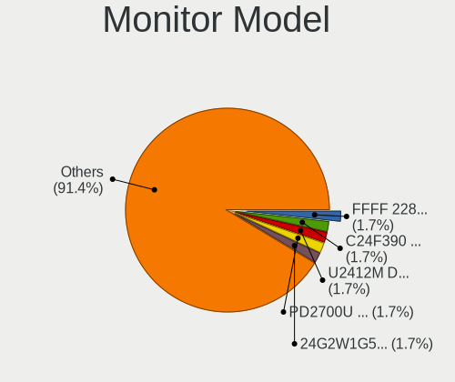

| Model                                                                   | Desktops | Percent |
|-------------------------------------------------------------------------|----------|---------|
| Unknown LCD Monitor FFFF 2288x1287 2550x2550mm 142.0-inch               | 3        | 2.48%   |
| Samsung Electronics C24F390 SAM0D2C 1920x1080 521x293mm 23.5-inch       | 3        | 2.48%   |
| BenQ PD2700U BNQ802E 3840x2160 597x336mm 27.0-inch                      | 3        | 2.48%   |
| Samsung Electronics U32H85x SAM0E3C 3840x2160 697x392mm 31.5-inch       | 2        | 1.65%   |
| Samsung Electronics SyncMaster SAM059A 1920x1080 477x268mm 21.5-inch    | 2        | 1.65%   |
| Samsung Electronics S22B300 SAM08C8 1920x1080 477x268mm 21.5-inch       | 2        | 1.65%   |
| Philips 17S PHL0877 1280x1024 337x270mm 17.0-inch                       | 2        | 1.65%   |
| Mi 27 NFGL XMIB004 1920x1080 598x336mm 27.0-inch                        | 2        | 1.65%   |
| Hewlett-Packard S230tm HWP3115 1920x1080 509x286mm 23.0-inch            | 2        | 1.65%   |
| Hewlett-Packard LA2206 HWP2946 1920x1080 476x268mm 21.5-inch            | 2        | 1.65%   |
| BenQ GW2780 BNQ78E6 1920x1080 598x336mm 27.0-inch                       | 2        | 1.65%   |
| ASUSTek Computer VA24E AUS24D1 1920x1080 527x296mm 23.8-inch            | 2        | 1.65%   |
| ViewSonic VX2458-mhd VSC0437 1920x1080 521x293mm 23.5-inch              | 1        | 0.83%   |
| ViewSonic VX2450 SERIES VSCE226 1920x1080 525x297mm 23.7-inch           | 1        | 0.83%   |
| ViewSonic VX2418C SER VSC1A3D 1920x1080 520x300mm 23.6-inch             | 1        | 0.83%   |
| ViewSonic VX2250 SERIES VSCCB25 1920x1080 477x268mm 21.5-inch           | 1        | 0.83%   |
| VDO PATH.HDR VDO6666 2048x1152 600x340mm 27.2-inch                      | 1        | 0.83%   |
| UGD Artist13.3pro UGD1302 1920x1080 294x165mm 13.3-inch                 | 1        | 0.83%   |
| Toshiba TV TSB0108 1920x540                                             | 1        | 0.83%   |
| Samsung Electronics U28E590 SAM0C4D 3840x2160 607x345mm 27.5-inch       | 1        | 0.83%   |
| Samsung Electronics SMT24A550 SAM07B5 1920x1080 531x299mm 24.0-inch     | 1        | 0.83%   |
| Samsung Electronics SMS27A850 SAM083D 2560x1440 518x324mm 24.1-inch     | 1        | 0.83%   |
| Samsung Electronics SMS27A650 SAM082E 1920x1080 598x336mm 27.0-inch     | 1        | 0.83%   |
| Samsung Electronics SMB2430L SAM0645 1920x1080 521x293mm 23.5-inch      | 1        | 0.83%   |
| Samsung Electronics S34J55x SAM0F70 3440x1440 797x333mm 34.0-inch       | 1        | 0.83%   |
| Samsung Electronics S19B300 SAM08A6 1366x768 410x230mm 18.5-inch        | 1        | 0.83%   |
| Samsung Electronics LS28AG700N SAM7177 3840x2160 632x360mm 28.6-inch    | 1        | 0.83%   |
| Samsung Electronics LCD Monitor SAM7003 3840x2160 1872x1053mm 84.6-inch | 1        | 0.83%   |
| Samsung Electronics LCD Monitor SAM0FEF 3840x2160 950x540mm 43.0-inch   | 1        | 0.83%   |
| Samsung Electronics LC49G95T SAM7053 3840x1080 1193x336mm 48.8-inch     | 1        | 0.83%   |
| Samsung Electronics C49RG9x SAM0F9C 3840x1080 1193x336mm 48.8-inch      | 1        | 0.83%   |
| Samsung Electronics C24F390 SAM0D2D 1920x1080 521x293mm 23.5-inch       | 1        | 0.83%   |
| Philips PHL 288P6L PHL08F2 3840x2160 621x341mm 27.9-inch                | 1        | 0.83%   |
| Philips PHL 279C9 PHLC22C 3840x2160 597x336mm 27.0-inch                 | 1        | 0.83%   |
| Philips PHL 278E8Q PHLC161 1920x1080 598x336mm 27.0-inch                | 1        | 0.83%   |
| Philips 273ELH PHLC07D 1920x1080 598x336mm 27.0-inch                    | 1        | 0.83%   |
| NEC Computers LCD92VX NEC66AF 1280x1024 380x300mm 19.1-inch             | 1        | 0.83%   |
| MSI G32C4 MSI3DA6 1920x1080 698x393mm 31.5-inch                         | 1        | 0.83%   |
| Microstep LCD Monitor Optix MAG27CQ 2560x1440                           | 1        | 0.83%   |
| Lenovo T23d-10 LEN61C3 1920x1200 518x324mm 24.1-inch                    | 1        | 0.83%   |

Monitor Resolution
------------------

Monitor screen resolution

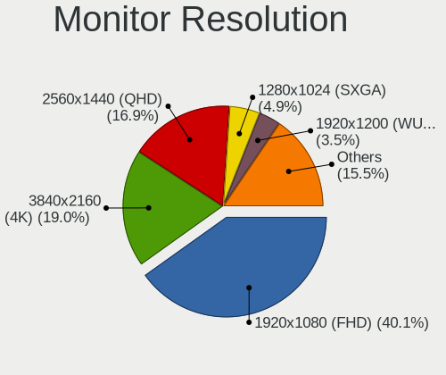

| Resolution        | Desktops | Percent |
|-------------------|----------|---------|
| 1920x1080 (FHD)   | 41       | 41%     |
| 3840x2160 (4K)    | 20       | 20%     |
| 2560x1440 (QHD)   | 15       | 15%     |
| 1280x1024 (SXGA)  | 6        | 6%      |
| 2560x1080         | 4        | 4%      |
| 3440x1440         | 3        | 3%      |
| 2288x1287         | 3        | 3%      |
| 3840x1080         | 2        | 2%      |
| 1366x768 (WXGA)   | 2        | 2%      |
| 2048x1152         | 1        | 1%      |
| 1920x540          | 1        | 1%      |
| 1920x1200 (WUXGA) | 1        | 1%      |
| 1400x1050         | 1        | 1%      |

Monitor Diagonal
----------------

Diagonal size in inches

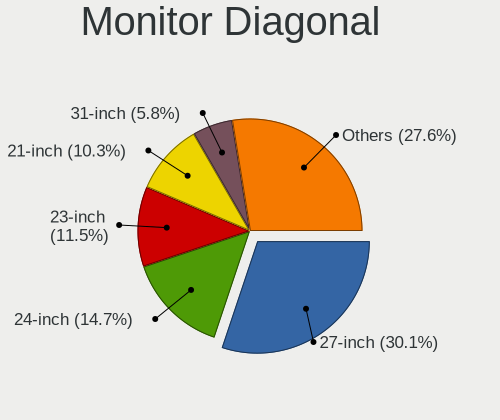

| Inches  | Desktops | Percent |
|---------|----------|---------|
| 27      | 32       | 28.83%  |
| 23      | 17       | 15.32%  |
| 24      | 13       | 11.71%  |
| 21      | 12       | 10.81%  |
| 34      | 7        | 6.31%   |
| 31      | 6        | 5.41%   |
| 17      | 5        | 4.5%    |
| 142     | 3        | 2.7%    |
| 84      | 2        | 1.8%    |
| 48      | 2        | 1.8%    |
| 19      | 2        | 1.8%    |
| Unknown | 2        | 1.8%    |
| 72      | 1        | 0.9%    |
| 38      | 1        | 0.9%    |
| 32      | 1        | 0.9%    |
| 28      | 1        | 0.9%    |
| 26      | 1        | 0.9%    |
| 25      | 1        | 0.9%    |
| 18      | 1        | 0.9%    |
| 13      | 1        | 0.9%    |

Monitor Width
-------------

Physical width

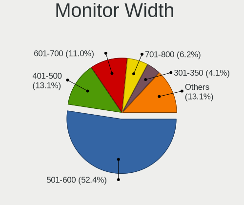

| Width in mm    | Desktops | Percent |
|----------------|----------|---------|
| 501-600        | 52       | 50.49%  |
| 401-500        | 13       | 12.62%  |
| 601-700        | 11       | 10.68%  |
| 701-800        | 8        | 7.77%   |
| 301-350        | 4        | 3.88%   |
| More than 2000 | 3        | 2.91%   |
| 351-400        | 3        | 2.91%   |
| 1501-2000      | 3        | 2.91%   |
| 1001-1500      | 2        | 1.94%   |
| Unknown        | 2        | 1.94%   |
| 801-900        | 1        | 0.97%   |
| 201-300        | 1        | 0.97%   |

Aspect Ratio
------------

Proportional relationship between the width and the height

| Ratio   | Desktops | Percent |
|---------|----------|---------|
| 16/9    | 70       | 75.27%  |
| 21/9    | 7        | 7.53%   |
| 5/4     | 6        | 6.45%   |
| 16/10   | 3        | 3.23%   |
| 1.00    | 3        | 3.23%   |
| 32/9    | 2        | 2.15%   |
| Unknown | 2        | 2.15%   |

Monitor Area
------------

Area in inch

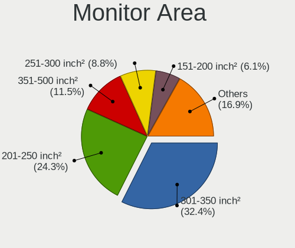

| Area in inch | Desktops | Percent |
|----------------|----------|---------|
| 301-350        | 33       | 31.43%  |
| 201-250        | 30       | 28.57%  |
| 351-500        | 13       | 12.38%  |
| More than 1000 | 6        | 5.71%   |
| 251-300        | 6        | 5.71%   |
| 151-200        | 5        | 4.76%   |
| 141-150        | 5        | 4.76%   |
| 501-1000       | 3        | 2.86%   |
| Unknown        | 2        | 1.9%    |
| 71-80          | 1        | 0.95%   |
| 121-130        | 1        | 0.95%   |

Pixel Density
-------------

Pixels per inch

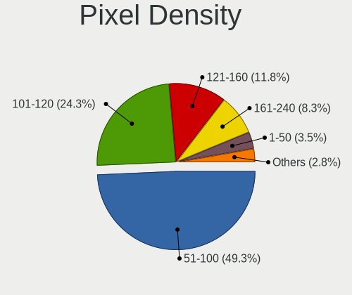

| Density | Desktops | Percent |
|---------|----------|---------|
| 51-100  | 48       | 48%     |
| 101-120 | 25       | 25%     |
| 121-160 | 12       | 12%     |
| 161-240 | 8        | 8%      |
| 1-50    | 5        | 5%      |
| Unknown | 2        | 2%      |

Multiple Monitors
-----------------

Total monitors connected

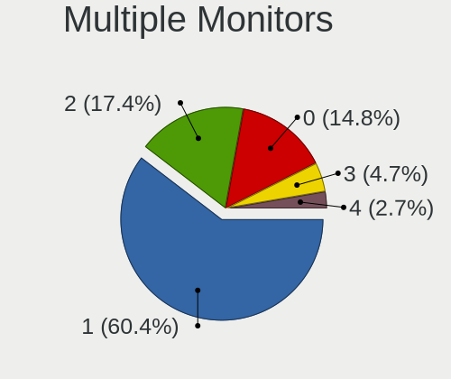

| Total | Desktops | Percent |
|-------|----------|---------|
| 1     | 66       | 63.46%  |
| 2     | 15       | 14.42%  |
| 0     | 15       | 14.42%  |
| 4     | 4        | 3.85%   |
| 3     | 4        | 3.85%   |

Network
-------

Net Controller Vendor
---------------------

Controller vendors

| Vendor                          | Desktops | Percent |
|---------------------------------|----------|---------|
| Realtek Semiconductor           | 62       | 41.33%  |
| Intel                           | 62       | 41.33%  |
| MediaTek                        | 6        | 4%      |
| Qualcomm Atheros                | 4        | 2.67%   |
| Broadcom                        | 3        | 2%      |
| Loongson Technology             | 2        | 1.33%   |
| U-Blox                          | 1        | 0.67%   |
| Ralink Technology               | 1        | 0.67%   |
| Qualcomm Atheros Communications | 1        | 0.67%   |
| QinHeng Electronics             | 1        | 0.67%   |
| Prusa                           | 1        | 0.67%   |
| Nvidia                          | 1        | 0.67%   |
| NetGear                         | 1        | 0.67%   |
| Microsoft                       | 1        | 0.67%   |
| Mellanox Technologies           | 1        | 0.67%   |
| Huawei Technologies             | 1        | 0.67%   |
| ASIX Electronics                | 1        | 0.67%   |

Net Controller Model
--------------------

Controller models

| Model                                                                         | Desktops | Percent |
|-------------------------------------------------------------------------------|----------|---------|
| Realtek RTL8111/8168/8211/8411 PCI Express Gigabit Ethernet Controller        | 34       | 19.54%  |
| Realtek RTL8125 2.5GbE Controller                                             | 24       | 13.79%  |
| Intel Wi-Fi 6 AX200                                                           | 10       | 5.75%   |
| Intel I211 Gigabit Network Connection                                         | 10       | 5.75%   |
| Intel Wi-Fi 6E(802.11ax) AX210/AX1675* 2x2 [Typhoon Peak]                     | 7        | 4.02%   |
| Intel 82579LM Gigabit Network Connection (Lewisville)                         | 7        | 4.02%   |
| Intel Ethernet Controller I225-V                                              | 6        | 3.45%   |
| MediaTek MT7921K (RZ608) Wi-Fi 6E 80MHz                                       | 4        | 2.3%    |
| Intel Ethernet Connection (7) I219-V                                          | 4        | 2.3%    |
| Intel Cannon Lake PCH CNVi WiFi                                               | 3        | 1.72%   |
| Intel 82579V Gigabit Network Connection                                       | 3        | 1.72%   |
| Realtek RTL88x2bu [AC1200 Techkey]                                            | 2        | 1.15%   |
| Realtek RTL8852BE PCIe 802.11ax Wireless Network Controller                   | 2        | 1.15%   |
| Realtek RTL8153 Gigabit Ethernet Adapter                                      | 2        | 1.15%   |
| MediaTek MT7922 802.11ax PCI Express Wireless Network Adapter                 | 2        | 1.15%   |
| Loongson Ethernet controller                                                  | 2        | 1.15%   |
| Intel Wireless 7265                                                           | 2        | 1.15%   |
| Intel Raptor Lake-S PCH CNVi WiFi                                             | 2        | 1.15%   |
| Intel I210 Gigabit Network Connection                                         | 2        | 1.15%   |
| Intel Ethernet Controller I226-V                                              | 2        | 1.15%   |
| Intel Ethernet Connection (2) I219-V                                          | 2        | 1.15%   |
| Intel Dual Band Wireless-AC 3168NGW [Stone Peak]                              | 2        | 1.15%   |
| Intel Alder Lake-S PCH CNVi WiFi                                              | 2        | 1.15%   |
| Intel 82571EB/82571GB Gigabit Ethernet Controller D0/D1 (copper applications) | 2        | 1.15%   |
| U-Blox [u-blox 8]                                                             | 1        | 0.57%   |
| Realtek USB 10/100/1G/2.5G LAN                                                | 1        | 0.57%   |
| Realtek RTL8192EE PCIe Wireless Network Adapter                               | 1        | 0.57%   |
| Realtek RTL8188EUS 802.11n Wireless Network Adapter                           | 1        | 0.57%   |
| Realtek RTL8169 PCI Gigabit Ethernet Controller                               | 1        | 0.57%   |
| Realtek RTL8111/8168/8411 PCI Express Gigabit Ethernet Controller             | 1        | 0.57%   |
| Realtek RTL-8100/8101L/8139 PCI Fast Ethernet Adapter                         | 1        | 0.57%   |
| Ralink MT7601U Wireless Adapter                                               | 1        | 0.57%   |
| Qualcomm Atheros QCA9377 802.11ac Wireless Network Adapter                    | 1        | 0.57%   |
| Qualcomm Atheros AR9271 802.11n                                               | 1        | 0.57%   |
| Qualcomm Atheros AR9287 Wireless Network Adapter (PCI-Express)                | 1        | 0.57%   |
| Qualcomm Atheros AR9285 Wireless Network Adapter (PCI-Express)                | 1        | 0.57%   |
| Qualcomm Atheros AR8151 v2.0 Gigabit Ethernet                                 | 1        | 0.57%   |
| QinHeng SONOFF Zigbee 3.0 USB Dongle Plus V2                                  | 1        | 0.57%   |
| Prusa Original i3 MK3                                                         | 1        | 0.57%   |
| Nvidia MCP61 Ethernet                                                         | 1        | 0.57%   |

Wireless Vendor
---------------

Wireless vendors

| Vendor                          | Desktops | Percent |
|---------------------------------|----------|---------|
| Intel                           | 28       | 58.33%  |
| Realtek Semiconductor           | 6        | 12.5%   |
| MediaTek                        | 6        | 12.5%   |
| Qualcomm Atheros                | 3        | 6.25%   |
| Ralink Technology               | 1        | 2.08%   |
| Qualcomm Atheros Communications | 1        | 2.08%   |
| NetGear                         | 1        | 2.08%   |
| Microsoft                       | 1        | 2.08%   |
| Broadcom                        | 1        | 2.08%   |

Wireless Model
--------------

Wireless models

| Model                                                          | Desktops | Percent |
|----------------------------------------------------------------|----------|---------|
| Intel Wi-Fi 6 AX200                                            | 10       | 20.41%  |
| Intel Wi-Fi 6E(802.11ax) AX210/AX1675* 2x2 [Typhoon Peak]      | 7        | 14.29%  |
| MediaTek MT7921K (RZ608) Wi-Fi 6E 80MHz                        | 4        | 8.16%   |
| Intel Cannon Lake PCH CNVi WiFi                                | 3        | 6.12%   |
| Realtek RTL88x2bu [AC1200 Techkey]                             | 2        | 4.08%   |
| Realtek RTL8852BE PCIe 802.11ax Wireless Network Controller    | 2        | 4.08%   |
| MediaTek MT7922 802.11ax PCI Express Wireless Network Adapter  | 2        | 4.08%   |
| Intel Wireless 7265                                            | 2        | 4.08%   |
| Intel Raptor Lake-S PCH CNVi WiFi                              | 2        | 4.08%   |
| Intel Dual Band Wireless-AC 3168NGW [Stone Peak]               | 2        | 4.08%   |
| Intel Alder Lake-S PCH CNVi WiFi                               | 2        | 4.08%   |
| Realtek RTL8192EE PCIe Wireless Network Adapter                | 1        | 2.04%   |
| Realtek RTL8188EUS 802.11n Wireless Network Adapter            | 1        | 2.04%   |
| Ralink MT7601U Wireless Adapter                                | 1        | 2.04%   |
| Qualcomm Atheros QCA9377 802.11ac Wireless Network Adapter     | 1        | 2.04%   |
| Qualcomm Atheros AR9271 802.11n                                | 1        | 2.04%   |
| Qualcomm Atheros AR9287 Wireless Network Adapter (PCI-Express) | 1        | 2.04%   |
| Qualcomm Atheros AR9285 Wireless Network Adapter (PCI-Express) | 1        | 2.04%   |
| NetGear WG111v3 54 Mbps Wireless [realtek RTL8187B]            | 1        | 2.04%   |
| Microsoft Xbox Wireless Adapter for Windows                    | 1        | 2.04%   |
| Intel Tiger Lake PCH CNVi WiFi                                 | 1        | 2.04%   |
| Broadcom Network controller                                    | 1        | 2.04%   |

Ethernet Vendor
---------------

Ethernet vendors

| Vendor                | Desktops | Percent |
|-----------------------|----------|---------|
| Realtek Semiconductor | 61       | 52.14%  |
| Intel                 | 47       | 40.17%  |
| Loongson Technology   | 2        | 1.71%   |
| Broadcom              | 2        | 1.71%   |
| Qualcomm Atheros      | 1        | 0.85%   |
| Nvidia                | 1        | 0.85%   |
| Mellanox Technologies | 1        | 0.85%   |
| Huawei Technologies   | 1        | 0.85%   |
| ASIX Electronics      | 1        | 0.85%   |

Ethernet Model
--------------

Ethernet models

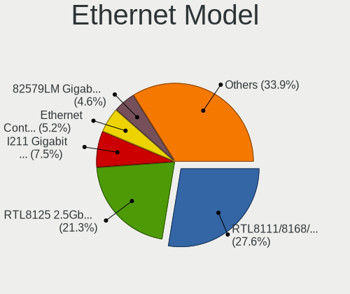

| Model                                                                         | Desktops | Percent |
|-------------------------------------------------------------------------------|----------|---------|
| Realtek RTL8111/8168/8211/8411 PCI Express Gigabit Ethernet Controller        | 34       | 27.87%  |
| Realtek RTL8125 2.5GbE Controller                                             | 24       | 19.67%  |
| Intel I211 Gigabit Network Connection                                         | 10       | 8.2%    |
| Intel 82579LM Gigabit Network Connection (Lewisville)                         | 7        | 5.74%   |
| Intel Ethernet Controller I225-V                                              | 6        | 4.92%   |
| Intel Ethernet Connection (7) I219-V                                          | 4        | 3.28%   |
| Intel 82579V Gigabit Network Connection                                       | 3        | 2.46%   |
| Realtek RTL8153 Gigabit Ethernet Adapter                                      | 2        | 1.64%   |
| Loongson Ethernet controller                                                  | 2        | 1.64%   |
| Intel I210 Gigabit Network Connection                                         | 2        | 1.64%   |
| Intel Ethernet Controller I226-V                                              | 2        | 1.64%   |
| Intel Ethernet Connection (2) I219-V                                          | 2        | 1.64%   |
| Intel 82571EB/82571GB Gigabit Ethernet Controller D0/D1 (copper applications) | 2        | 1.64%   |
| Realtek USB 10/100/1G/2.5G LAN                                                | 1        | 0.82%   |
| Realtek RTL8169 PCI Gigabit Ethernet Controller                               | 1        | 0.82%   |
| Realtek RTL8111/8168/8411 PCI Express Gigabit Ethernet Controller             | 1        | 0.82%   |
| Realtek RTL-8100/8101L/8139 PCI Fast Ethernet Adapter                         | 1        | 0.82%   |
| Qualcomm Atheros AR8151 v2.0 Gigabit Ethernet                                 | 1        | 0.82%   |
| Nvidia MCP61 Ethernet                                                         | 1        | 0.82%   |
| Mellanox MT27500 Family [ConnectX-3]                                          | 1        | 0.82%   |
| Intel I350 Gigabit Network Connection                                         | 1        | 0.82%   |
| Intel Ethernet Controller X550                                                | 1        | 0.82%   |
| Intel Ethernet Controller 10-Gigabit X540-AT2                                 | 1        | 0.82%   |
| Intel Ethernet Connection I217-V                                              | 1        | 0.82%   |
| Intel Ethernet Connection (7) I219-LM                                         | 1        | 0.82%   |
| Intel Ethernet Connection (17) I219-V                                         | 1        | 0.82%   |
| Intel Ethernet 10G 2P X520 Adapter                                            | 1        | 0.82%   |
| Intel 82599ES 10-Gigabit SFI/SFP+ Network Connection                          | 1        | 0.82%   |
| Intel 82576 Gigabit Network Connection                                        | 1        | 0.82%   |
| Intel 82575EB Gigabit Network Connection                                      | 1        | 0.82%   |
| Intel 82574L Gigabit Network Connection                                       | 1        | 0.82%   |
| Huawei STG-LX1                                                                | 1        | 0.82%   |
| Broadcom NetXtreme II BCM57810 10 Gigabit Ethernet                            | 1        | 0.82%   |
| Broadcom NetXtreme BCM5715 Gigabit Ethernet                                   | 1        | 0.82%   |
| ASIX AX88179 Gigabit Ethernet                                                 | 1        | 0.82%   |

Net Controller Kind
-------------------

Ethernet, WiFi or modem

| Kind     | Desktops | Percent |
|----------|----------|---------|
| Ethernet | 100      | 66.23%  |
| WiFi     | 48       | 31.79%  |
| Modem    | 3        | 1.99%   |

Used Controller
---------------

Currently used network controller

| Kind     | Desktops | Percent |
|----------|----------|---------|
| Ethernet | 79       | 77.45%  |
| WiFi     | 23       | 22.55%  |

NICs
----

Total network controllers on board

| Total | Desktops | Percent |
|-------|----------|---------|
| 1     | 46       | 45.1%   |
| 2     | 42       | 41.18%  |
| 3     | 8        | 7.84%   |
| 4     | 3        | 2.94%   |
| 7     | 1        | 0.98%   |
| 5     | 1        | 0.98%   |
| 0     | 1        | 0.98%   |

IPv6
----

IPv6 vs IPv4

| Used | Desktops | Percent |
|------|----------|---------|
| No   | 70       | 67.96%  |
| Yes  | 33       | 32.04%  |

Bluetooth
---------

Bluetooth Vendor
----------------

Controller vendors

| Vendor                  | Desktops | Percent |
|-------------------------|----------|---------|
| Intel                   | 26       | 56.52%  |
| Cambridge Silicon Radio | 7        | 15.22%  |
| MediaTek                | 6        | 13.04%  |
| Realtek Semiconductor   | 3        | 6.52%   |
| IMC Networks            | 1        | 2.17%   |
| Edimax Technology       | 1        | 2.17%   |
| Broadcom                | 1        | 2.17%   |
| Actions                 | 1        | 2.17%   |

Bluetooth Model
---------------

Controller models

| Model                                               | Desktops | Percent |
|-----------------------------------------------------|----------|---------|
| Intel AX200 Bluetooth                               | 10       | 21.74%  |
| Cambridge Silicon Radio Bluetooth Dongle (HCI mode) | 7        | 15.22%  |
| MediaTek Wireless_Device                            | 6        | 13.04%  |
| Intel AX210 Bluetooth                               | 6        | 13.04%  |
| Realtek Bluetooth Radio                             | 3        | 6.52%   |
| Intel Bluetooth 9460/9560 Jefferson Peak (JfP)      | 3        | 6.52%   |
| Intel AX201 Bluetooth                               | 3        | 6.52%   |
| Intel Bluetooth wireless interface                  | 2        | 4.35%   |
| Intel Wireless-AC 3168 Bluetooth                    | 1        | 2.17%   |
| Intel Bluetooth Device                              | 1        | 2.17%   |
| IMC Networks Bluetooth Radio                        | 1        | 2.17%   |
| Edimax Bluetooth Adapter                            | 1        | 2.17%   |
| Broadcom BCM20702A0 Bluetooth 4.0                   | 1        | 2.17%   |
| Actions general adapter                             | 1        | 2.17%   |

Sound
-----

Sound Vendor
------------

Sound card vendors

| Vendor                                       | Desktops | Percent |
|----------------------------------------------|----------|---------|
| AMD                                          | 68       | 35.05%  |
| Intel                                        | 41       | 21.13%  |
| Nvidia                                       | 33       | 17.01%  |
| C-Media Electronics                          | 6        | 3.09%   |
| Micro Star International                     | 5        | 2.58%   |
| Kingston Technology                          | 4        | 2.06%   |
| ASUSTek Computer                             | 4        | 2.06%   |
| SteelSeries ApS                              | 3        | 1.55%   |
| Plantronics                                  | 3        | 1.55%   |
| Logitech                                     | 3        | 1.55%   |
| Texas Instruments                            | 2        | 1.03%   |
| Loongson Technology                          | 2        | 1.03%   |
| JMTek                                        | 2        | 1.03%   |
| GN Netcom                                    | 2        | 1.03%   |
| Zoran Co. Personal Media Division (Nogatech) | 1        | 0.52%   |
| Thesycon Systemsoftware & Consulting         | 1        | 0.52%   |
| Razer USA                                    | 1        | 0.52%   |
| Microsoft                                    | 1        | 0.52%   |
| Mark of the Unicorn                          | 1        | 0.52%   |
| M-Audio                                      | 1        | 0.52%   |
| JOUNIVO                                      | 1        | 0.52%   |
| iCreate Technologies                         | 1        | 0.52%   |
| Huawei Technologies                          | 1        | 0.52%   |
| Hewlett-Packard                              | 1        | 0.52%   |
| Generalplus Technology                       | 1        | 0.52%   |
| FIFINE Microphones                           | 1        | 0.52%   |
| Conexant Systems                             | 1        | 0.52%   |
| Audient                                      | 1        | 0.52%   |
| AKG C44-USB Microphone                       | 1        | 0.52%   |
| Unknown                                      | 1        | 0.52%   |

Sound Model
-----------

Sound card models

| Model                                                                      | Desktops | Percent |
|----------------------------------------------------------------------------|----------|---------|
| AMD Starship/Matisse HD Audio Controller                                   | 27       | 11.49%  |
| AMD Navi 21/23 HDMI/DP Audio Controller                                    | 18       | 7.66%   |
| AMD Ellesmere HDMI Audio [Radeon RX 470/480 / 570/580/590]                 | 13       | 5.53%   |
| AMD Family 17h/19h HD Audio Controller                                     | 10       | 4.26%   |
| Nvidia GA104 High Definition Audio Controller                              | 8        | 3.4%    |
| Intel Cannon Lake PCH cAVS                                                 | 7        | 2.98%   |
| AMD Rembrandt Radeon High Definition Audio Controller                      | 7        | 2.98%   |
| Intel Alder Lake-S HD Audio Controller                                     | 6        | 2.55%   |
| Micro Star International USB Audio                                         | 5        | 2.13%   |
| Nvidia GP107GL High Definition Audio Controller                            | 4        | 1.7%    |
| Intel Tiger Lake-H HD Audio Controller                                     | 4        | 1.7%    |
| Intel C600/X79 series chipset High Definition Audio Controller             | 4        | 1.7%    |
| Intel 7 Series/C216 Chipset Family High Definition Audio Controller        | 4        | 1.7%    |
| Intel 200 Series PCH HD Audio                                              | 4        | 1.7%    |
| AMD SBx00 Azalia (Intel HDA)                                               | 4        | 1.7%    |
| AMD Renoir Radeon High Definition Audio Controller                         | 4        | 1.7%    |
| AMD Navi 10 HDMI Audio                                                     | 4        | 1.7%    |
| AMD Family 17h (Models 00h-0fh) HD Audio Controller                        | 4        | 1.7%    |
| AMD Baffin HDMI/DP Audio [Radeon RX 550 640SP / RX 560/560X]               | 4        | 1.7%    |
| Nvidia GA106 High Definition Audio Controller                              | 3        | 1.28%   |
| Nvidia GA102 High Definition Audio Controller                              | 3        | 1.28%   |
| Nvidia Audio device                                                        | 3        | 1.28%   |
| Intel 8 Series/C220 Series Chipset High Definition Audio Controller        | 3        | 1.28%   |
| Intel 6 Series/C200 Series Chipset Family High Definition Audio Controller | 3        | 1.28%   |
| ASUSTek Computer USB Audio                                                 | 3        | 1.28%   |
| Nvidia GP106 High Definition Audio Controller                              | 2        | 0.85%   |
| Nvidia GF119 HDMI Audio Controller                                         | 2        | 0.85%   |
| Loongson Technology HDA (High Definition Audio) Controller                 | 2        | 0.85%   |
| Loongson Technology Audio device                                           | 2        | 0.85%   |
| JMTek USB PnP Audio Device                                                 | 2        | 0.85%   |
| Intel Raptor Lake High Definition Audio Controller                         | 2        | 0.85%   |
| Intel 100 Series/C230 Series Chipset Family HD Audio Controller            | 2        | 0.85%   |
| C-Media Electronics USB Advanced Audio Device                              | 2        | 0.85%   |
| C-Media Electronics Audio Adapter (Unitek Y-247A)                          | 2        | 0.85%   |
| AMD Vega 10 HDMI Audio [Radeon Vega 56/64]                                 | 2        | 0.85%   |
| AMD Oland/Hainan/Cape Verde/Pitcairn HDMI Audio [Radeon HD 7000 Series]    | 2        | 0.85%   |
| AMD Navi 31 HDMI/DP Audio                                                  | 2        | 0.85%   |
| AMD Cedar HDMI Audio [Radeon HD 5400/6300/7300 Series]                     | 2        | 0.85%   |
| Zoran Co. Personal Media Division (Nogatech) USB Audio and HID             | 1        | 0.43%   |
| Thesycon Systemsoftware & Consulting SABAJ D4 v1.2                         | 1        | 0.43%   |

Memory
------

Memory Vendor
-------------

Memory module vendors

| Vendor                       | Desktops | Percent |
|------------------------------|----------|---------|
| Kingston                     | 20       | 19.42%  |
| G.Skill                      | 18       | 17.48%  |
| Corsair                      | 18       | 17.48%  |
| Crucial                      | 11       | 10.68%  |
| Samsung Electronics          | 7        | 6.8%    |
| SK hynix                     | 6        | 5.83%   |
| Unknown                      | 5        | 4.85%   |
| Micron Technology            | 4        | 3.88%   |
| A-DATA Technology            | 3        | 2.91%   |
| Unknown                      | 3        | 2.91%   |
| Patriot                      | 2        | 1.94%   |
| Unknown (0x0B92)             | 1        | 0.97%   |
| Transcend                    | 1        | 0.97%   |
| Team                         | 1        | 0.97%   |
| Patriot Memory (PDP Systems) | 1        | 0.97%   |
| Mushkin                      | 1        | 0.97%   |
| Foxline                      | 1        | 0.97%   |

Memory Model
------------

Memory module models

| Model                                                                    | Desktops | Percent |
|--------------------------------------------------------------------------|----------|---------|
| Corsair RAM CMK16GX4M2B3200C16 8GB DIMM DDR4 3600MT/s                    | 3        | 2.59%   |
| Unknown                                                                  | 3        | 2.59%   |
| Unknown RAM Module 2GB DIMM DDR2 667MT/s                                 | 2        | 1.72%   |
| Kingston RAM KF556C36-32 32GB DIMM DDR5 5600MT/s                         | 2        | 1.72%   |
| Kingston RAM KF3200C16D4/16GX 16GB DIMM DDR4 3200MT/s                    | 2        | 1.72%   |
| G.Skill RAM F4-3600C18-32GVK 32GB DIMM DDR4 3600MT/s                     | 2        | 1.72%   |
| G.Skill RAM F4-3200C16-8GVKB 8GB DIMM DDR4 3866MT/s                      | 2        | 1.72%   |
| G.Skill RAM F4-3200C16-16GVK 16GB DIMM DDR4 3600MT/s                     | 2        | 1.72%   |
| Corsair RAM CMK16GX4M2Z3200C16 8GB DIMM DDR4 3200MT/s                    | 2        | 1.72%   |
| Unknown RAM Module 8GB DIMM 1600MT/s                                     | 1        | 0.86%   |
| Unknown RAM Module 2GB SODIMM DDR2 800MT/s                               | 1        | 0.86%   |
| Unknown RAM Module 16GB DIMM DDR4 2400MT/s                               | 1        | 0.86%   |
| Unknown (0x0B92) RAM Module 8GB DIMM DDR4 3400MT/s                       | 1        | 0.86%   |
| Transcend RAM JM2666HLE-16G 16GB DIMM DDR4 2666MT/s                      | 1        | 0.86%   |
| Team RAM TEAMGROUP-UD4-3600 8GB DIMM DDR4 3733MT/s                       | 1        | 0.86%   |
| SK hynix RAM HYMP125U64CP8-S6 2GB DIMM DDR2 49926MT/s                    | 1        | 0.86%   |
| SK hynix RAM HMT351U6EFR8A-PB 8GB DIMM DDR3 1600MT/s                     | 1        | 0.86%   |
| SK hynix RAM HMT325U6CFR8C-PB 2GB DIMM DDR3 1600MT/s                     | 1        | 0.86%   |
| SK hynix RAM HMAG68EXNUA076N 8GB DIMM DDR4 3200MT/s                      | 1        | 0.86%   |
| SK hynix RAM HMA81GS6CJR8N-VK 8GB SODIMM DDR4 2667MT/s                   | 1        | 0.86%   |
| SK hynix RAM HMA42GR7AFR4N-UH 16GB DIMM DDR4 2400MT/s                    | 1        | 0.86%   |
| Samsung RAM M471A2K43DB1-CTD 16GB SODIMM DDR4 2667MT/s                   | 1        | 0.86%   |
| Samsung RAM M393B5273DH0-CK0 4GB DIMM DDR3 1600MT/s                      | 1        | 0.86%   |
| Samsung RAM M393B2G70EB0-YK0 16GB DIMM DDR3 1600MT/s                     | 1        | 0.86%   |
| Samsung RAM M393B2G70DB0-YK0 16GB DIMM DDR3 1600MT/s                     | 1        | 0.86%   |
| Samsung RAM M393B1G70BH0 8GB DIMM DDR3 1600MT/s                          | 1        | 0.86%   |
| Samsung RAM M391A2K43BB1-CPB 16GB DIMM DDR4 2133MT/s                     | 1        | 0.86%   |
| Samsung RAM M378B1G73DB0-CK0 8GB DIMM DDR3 2133MT/s                      | 1        | 0.86%   |
| Samsung RAM M378A5244CB0-CRC 4GB DIMM DDR4 3066MT/s                      | 1        | 0.86%   |
| Samsung RAM M378A1K43CB2-CRC 8GB DIMM DDR4 3500MT/s                      | 1        | 0.86%   |
| Patriot RAM PSD432G32002 32GB DIMM DDR4 3200MT/s                         | 1        | 0.86%   |
| Patriot RAM 3200 C16 Series 16GB DIMM DDR4 3600MT/s                      | 1        | 0.86%   |
| Patriot Memory (PDP Systems) RAM 3200 C18 Series 32GB DIMM DDR4 3333MT/s | 1        | 0.86%   |
| Mushkin RAM MR[A/B]4U320GJJM8G 8GB DIMM DDR4 2134MT/s                    | 1        | 0.86%   |
| Micron RAM Module 4GB DIMM DDR4 2667MT/s                                 | 1        | 0.86%   |
| Micron RAM 8ATF1G64HZ-2G3E1 8GB SODIMM DDR4 2400MT/s                     | 1        | 0.86%   |
| Micron RAM 36JSF2G72PZ-1G9N1 16GB DIMM DDR3 1866MT/s                     | 1        | 0.86%   |
| Micron RAM 36JSF2G72PZ-1G9E1 16GB DIMM DDR3 1866MT/s                     | 1        | 0.86%   |
| Micron RAM 18ADF2G72AZ-2G6H1R 16GB DIMM DDR4 2667MT/s                    | 1        | 0.86%   |
| Kingston RAM KPN424-ELG 1GB DIMM DDR2 667MT/s                            | 1        | 0.86%   |

Memory Kind
-----------

Memory module kinds

| Kind    | Desktops | Percent |
|---------|----------|---------|
| DDR4    | 63       | 68.48%  |
| DDR3    | 14       | 15.22%  |
| DDR5    | 10       | 10.87%  |
| DDR2    | 4        | 4.35%   |
| Unknown | 1        | 1.09%   |

Memory Form Factor
------------------

Physical design of the memory module

| Name   | Desktops | Percent |
|--------|----------|---------|
| DIMM   | 87       | 94.57%  |
| SODIMM | 5        | 5.43%   |

Memory Size
-----------

Memory module size

| Size  | Desktops | Percent |
|-------|----------|---------|
| 8192  | 34       | 34.34%  |
| 16384 | 32       | 32.32%  |
| 32768 | 20       | 20.2%   |
| 4096  | 6        | 6.06%   |
| 2048  | 6        | 6.06%   |
| 1024  | 1        | 1.01%   |

Memory Speed
------------

Memory module speed

| Speed | Desktops | Percent |
|-------|----------|---------|
| 3200  | 20       | 18.35%  |
| 3600  | 15       | 13.76%  |
| 1600  | 11       | 10.09%  |
| 2667  | 8        | 7.34%   |
| 2400  | 6        | 5.5%    |
| 2133  | 5        | 4.59%   |
| 5600  | 4        | 3.67%   |
| 4800  | 3        | 2.75%   |
| 3733  | 3        | 2.75%   |
| 1866  | 3        | 2.75%   |
| 667   | 3        | 2.75%   |
| 6000  | 2        | 1.83%   |
| 4000  | 2        | 1.83%   |
| 3866  | 2        | 1.83%   |
| 3400  | 2        | 1.83%   |
| 3000  | 2        | 1.83%   |
| 2666  | 2        | 1.83%   |
| 800   | 2        | 1.83%   |
| 49926 | 1        | 0.92%   |
| 5200  | 1        | 0.92%   |
| 3800  | 1        | 0.92%   |
| 3666  | 1        | 0.92%   |
| 3534  | 1        | 0.92%   |
| 3500  | 1        | 0.92%   |
| 3466  | 1        | 0.92%   |
| 3333  | 1        | 0.92%   |
| 3066  | 1        | 0.92%   |
| 2933  | 1        | 0.92%   |
| 2800  | 1        | 0.92%   |
| 2134  | 1        | 0.92%   |
| 1800  | 1        | 0.92%   |
| 1333  | 1        | 0.92%   |

Printers & scanners
-------------------

Printer Vendor
--------------

Printer device vendors

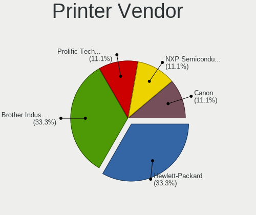

| Vendor             | Desktops | Percent |
|--------------------|----------|---------|
| Hewlett-Packard    | 3        | 50%     |
| Brother Industries | 2        | 33.33%  |
| Canon              | 1        | 16.67%  |

Printer Model
-------------

Printer device models

| Model                        | Desktops | Percent |
|------------------------------|----------|---------|
| HP HP LaserJet M14-M17       | 2        | 33.33%  |
| HP Deskjet 9800              | 1        | 16.67%  |
| Canon PIXMA MG2900 Series    | 1        | 16.67%  |
| Brother QL-500 label printer | 1        | 16.67%  |
| Brother MFC-9340CDW          | 1        | 16.67%  |

Scanner Vendor
--------------

Scanner device vendors

Zero info for selected period =(

Scanner Model
-------------

Scanner device models

Zero info for selected period =(

Camera
------

Camera Vendor
-------------

Camera device vendors

| Vendor                        | Desktops | Percent |
|-------------------------------|----------|---------|
| Logitech                      | 10       | 40%     |
| Samsung Electronics           | 2        | 8%      |
| Microdia                      | 2        | 8%      |
| Chicony Electronics           | 2        | 8%      |
| Sunplus Innovation Technology | 1        | 4%      |
| Realtek Semiconductor         | 1        | 4%      |
| Microsoft                     | 1        | 4%      |
| Hy-UXGA(B5M2)-Camera          | 1        | 4%      |
| Generalplus Technology        | 1        | 4%      |
| Elgato Systems                | 1        | 4%      |
| Arkmicro Technologies         | 1        | 4%      |
| ARC International             | 1        | 4%      |
| A4Tech                        | 1        | 4%      |

Camera Model
------------

Camera device models

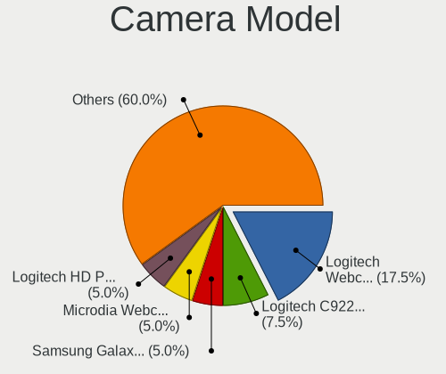

| Model                                     | Desktops | Percent |
|-------------------------------------------|----------|---------|
| Logitech Webcam C270                      | 6        | 23.08%  |
| Samsung Galaxy series, misc. (MTP mode)   | 2        | 7.69%   |
| Logitech C922 Pro Stream Webcam           | 2        | 7.69%   |
| Chicony HP 720p HD Monitor Webcam         | 2        | 7.69%   |
| Sunplus USB 2.0 Camera                    | 1        | 3.85%   |
| Realtek Integrated_Webcam_FHD             | 1        | 3.85%   |
| Microsoft LifeCam Cinema                  | 1        | 3.85%   |
| Microdia Webcam Vitade AF                 | 1        | 3.85%   |
| Microdia USB 2.0 Camera                   | 1        | 3.85%   |
| Logitech Webcam C310                      | 1        | 3.85%   |
| Logitech QuickCam Orbit/Sphere AF         | 1        | 3.85%   |
| Logitech HD Pro Webcam C920               | 1        | 3.85%   |
| Hy-UXGA(B5M2)-Camera Hy-UXGA(B5M2)-Camera | 1        | 3.85%   |
| Generalplus WEB CAM                       | 1        | 3.85%   |
| Elgato Systems Game Capture HD60 X        | 1        | 3.85%   |
| Arkmicro USB2.0 PC CAMERA                 | 1        | 3.85%   |
| ARC International Camera                  | 1        | 3.85%   |
| A4Tech USB Live camera                    | 1        | 3.85%   |

Security
--------

Fingerprint Vendor
------------------

Fingerprint sensor vendors

Zero info for selected period =(

Fingerprint Model
-----------------

Fingerprint sensor models

Zero info for selected period =(

Chipcard Vendor
---------------

Chipcard module vendors

| Vendor      | Desktops | Percent |
|-------------|----------|---------|
| Alcor Micro | 1        | 100%    |

Chipcard Model
--------------

Chipcard module models

| Model                               | Desktops | Percent |
|-------------------------------------|----------|---------|
| Alcor Micro AU9540 Smartcard Reader | 1        | 100%    |

Unsupported
-----------

Unsupported Devices
-------------------

Total unsupported devices on board

| Total | Desktops | Percent |
|-------|----------|---------|
| 0     | 57       | 53.27%  |
| 1     | 25       | 23.36%  |
| 2     | 13       | 12.15%  |
| 3     | 9        | 8.41%   |
| 4     | 2        | 1.87%   |
| 5     | 1        | 0.93%   |

Unsupported Device Types
------------------------

Types of unsupported devices

| Type                     | Desktops | Percent |
|--------------------------|----------|---------|
| Communication controller | 22       | 27.5%   |
| Graphics card            | 20       | 25%     |
| Bluetooth                | 10       | 12.5%   |
| Net/wireless             | 7        | 8.75%   |
| Storage/ide              | 4        | 5%      |
| Net/ethernet             | 4        | 5%      |
| Sound                    | 3        | 3.75%   |
| Multimedia controller    | 2        | 2.5%    |
| Unassigned class         | 1        | 1.25%   |
| Storage/raid             | 1        | 1.25%   |
| Storage/nvme             | 1        | 1.25%   |
| Storage/ata              | 1        | 1.25%   |
| Network                  | 1        | 1.25%   |
| Firewire controller      | 1        | 1.25%   |
| Chipcard                 | 1        | 1.25%   |
| Camera                   | 1        | 1.25%   |

