Gentoo 2.14 - Tested Hardware & Statistics (Notebooks)
------------------------------------------------------

A project to collect tested hardware configurations for Gentoo 2.14.

Anyone can contribute to this report by the [hw-probe](https://github.com/linuxhw/hw-probe) tool:

    sudo -E hw-probe -all -upload

Please contribute! Especially if your hardware is rare.

Contents
--------

* [ Test Cases ](#test-cases)

* [ System ](#system)
  - [ Kernel                   ](#kernel)
  - [ Kernel Family            ](#kernel-family)
  - [ Kernel Major Ver.        ](#kernel-major-ver)
  - [ Arch                     ](#arch)
  - [ DE                       ](#de)
  - [ Display Server           ](#display-server)
  - [ Display Manager          ](#display-manager)
  - [ OS Lang                  ](#os-lang)
  - [ Boot Mode                ](#boot-mode)
  - [ Filesystem               ](#filesystem)
  - [ Part. scheme             ](#part-scheme)
  - [ Dual Boot with Linux/BSD ](#dual-boot-with-linuxbsd)
  - [ Dual Boot (Win)          ](#dual-boot-win)

* [ Board ](#board)
  - [ Vendor                   ](#vendor)
  - [ Model                    ](#model)
  - [ Model Family             ](#model-family)
  - [ MFG Year                 ](#mfg-year)
  - [ Form Factor              ](#form-factor)
  - [ Secure Boot              ](#secure-boot)
  - [ Coreboot                 ](#coreboot)
  - [ RAM Size                 ](#ram-size)
  - [ RAM Used                 ](#ram-used)
  - [ Total Drives             ](#total-drives)
  - [ Has CD-ROM               ](#has-cd-rom)
  - [ Has Ethernet             ](#has-ethernet)
  - [ Has WiFi                 ](#has-wifi)
  - [ Has Bluetooth            ](#has-bluetooth)

* [ Location ](#location)
  - [ Country                  ](#country)
  - [ City                     ](#city)

* [ Drives ](#drives)
  - [ Drive Vendor             ](#drive-vendor)
  - [ Drive Model              ](#drive-model)
  - [ HDD Vendor               ](#hdd-vendor)
  - [ SSD Vendor               ](#ssd-vendor)
  - [ Drive Kind               ](#drive-kind)
  - [ Drive Connector          ](#drive-connector)
  - [ Drive Size               ](#drive-size)
  - [ Space Total              ](#space-total)
  - [ Space Used               ](#space-used)
  - [ Malfunc. Drives          ](#malfunc-drives)
  - [ Malfunc. Drive Vendor    ](#malfunc-drive-vendor)
  - [ Malfunc. HDD Vendor      ](#malfunc-hdd-vendor)
  - [ Malfunc. Drive Kind      ](#malfunc-drive-kind)
  - [ Failed Drives            ](#failed-drives)
  - [ Failed Drive Vendor      ](#failed-drive-vendor)
  - [ Drive Status             ](#drive-status)

* [ Storage controller ](#storage-controller)
  - [ Storage Vendor           ](#storage-vendor)
  - [ Storage Model            ](#storage-model)
  - [ Storage Kind             ](#storage-kind)

* [ Processor ](#processor)
  - [ CPU Vendor               ](#cpu-vendor)
  - [ CPU Model                ](#cpu-model)
  - [ CPU Model Family         ](#cpu-model-family)
  - [ CPU Cores                ](#cpu-cores)
  - [ CPU Sockets              ](#cpu-sockets)
  - [ CPU Threads              ](#cpu-threads)
  - [ CPU Op-Modes             ](#cpu-op-modes)
  - [ CPU Microcode            ](#cpu-microcode)
  - [ CPU Microarch            ](#cpu-microarch)

* [ Graphics ](#graphics)
  - [ GPU Vendor               ](#gpu-vendor)
  - [ GPU Model                ](#gpu-model)
  - [ GPU Combo                ](#gpu-combo)
  - [ GPU Driver               ](#gpu-driver)
  - [ GPU Memory               ](#gpu-memory)

* [ Monitor ](#monitor)
  - [ Monitor Vendor           ](#monitor-vendor)
  - [ Monitor Model            ](#monitor-model)
  - [ Monitor Resolution       ](#monitor-resolution)
  - [ Monitor Diagonal         ](#monitor-diagonal)
  - [ Monitor Width            ](#monitor-width)
  - [ Aspect Ratio             ](#aspect-ratio)
  - [ Monitor Area             ](#monitor-area)
  - [ Pixel Density            ](#pixel-density)
  - [ Multiple Monitors        ](#multiple-monitors)

* [ Network ](#network)
  - [ Net Controller Vendor    ](#net-controller-vendor)
  - [ Net Controller Model     ](#net-controller-model)
  - [ Wireless Vendor          ](#wireless-vendor)
  - [ Wireless Model           ](#wireless-model)
  - [ Ethernet Vendor          ](#ethernet-vendor)
  - [ Ethernet Model           ](#ethernet-model)
  - [ Net Controller Kind      ](#net-controller-kind)
  - [ Used Controller          ](#used-controller)
  - [ NICs                     ](#nics)
  - [ IPv6                     ](#ipv6)

* [ Bluetooth ](#bluetooth)
  - [ Bluetooth Vendor         ](#bluetooth-vendor)
  - [ Bluetooth Model          ](#bluetooth-model)

* [ Sound ](#sound)
  - [ Sound Vendor             ](#sound-vendor)
  - [ Sound Model              ](#sound-model)

* [ Memory ](#memory)
  - [ Memory Vendor            ](#memory-vendor)
  - [ Memory Model             ](#memory-model)
  - [ Memory Kind              ](#memory-kind)
  - [ Memory Form Factor       ](#memory-form-factor)
  - [ Memory Size              ](#memory-size)
  - [ Memory Speed             ](#memory-speed)

* [ Printers & scanners ](#printers--scanners)
  - [ Printer Vendor           ](#printer-vendor)
  - [ Printer Model            ](#printer-model)
  - [ Scanner Vendor           ](#scanner-vendor)
  - [ Scanner Model            ](#scanner-model)

* [ Camera ](#camera)
  - [ Camera Vendor            ](#camera-vendor)
  - [ Camera Model             ](#camera-model)

* [ Security ](#security)
  - [ Fingerprint Vendor       ](#fingerprint-vendor)
  - [ Fingerprint Model        ](#fingerprint-model)
  - [ Chipcard Vendor          ](#chipcard-vendor)
  - [ Chipcard Model           ](#chipcard-model)

* [ Unsupported ](#unsupported)
  - [ Unsupported Devices      ](#unsupported-devices)
  - [ Unsupported Device Types ](#unsupported-device-types)

Test Cases
----------

Total: 232

| Vendor        | Model                       | Probe                                                      | Date         |
|---------------|-----------------------------|------------------------------------------------------------|--------------|
| Lenovo        | ThinkPad T14s Gen 1 20T1... | [f6152a7042](https://linux-hardware.org/?probe=f6152a7042) | May 03, 2024 |
| HP            | ProBook 4510s               | [a6f89b6485](https://linux-hardware.org/?probe=a6f89b6485) | May 02, 2024 |
| Dell          | XPS 13 9310                 | [50ea9a7b8e](https://linux-hardware.org/?probe=50ea9a7b8e) | May 01, 2024 |
| Dell          | XPS 13 9310                 | [39ab9869d2](https://linux-hardware.org/?probe=39ab9869d2) | May 01, 2024 |
| HP            | EliteBook 845 14 inch G1... | [8fa3424cce](https://linux-hardware.org/?probe=8fa3424cce) | Apr 30, 2024 |
| HP            | EliteBook 845 14 inch G1... | [62914f0506](https://linux-hardware.org/?probe=62914f0506) | Apr 30, 2024 |
| ASUSTek       | ASUS TUF Gaming A15 FA50... | [703d565003](https://linux-hardware.org/?probe=703d565003) | Apr 26, 2024 |
| Lenovo        | ThinkPad T14 Gen 3 21CGS... | [c207bea569](https://linux-hardware.org/?probe=c207bea569) | Apr 25, 2024 |
| ASUSTek       | ASUS TUF Gaming A15 FA50... | [4c782693bf](https://linux-hardware.org/?probe=4c782693bf) | Apr 20, 2024 |
| Framework     | Laptop (13th Gen Intel C... | [2bb3d4f699](https://linux-hardware.org/?probe=2bb3d4f699) | Apr 19, 2024 |
| Lenovo        | ZHAOYANG E43                | [1192eac8f1](https://linux-hardware.org/?probe=1192eac8f1) | Apr 17, 2024 |
| Chuwi         | GemiBook XPro               | [9ebacb4cf9](https://linux-hardware.org/?probe=9ebacb4cf9) | Apr 17, 2024 |
| Lenovo        | ThinkPad T480 20L6SAYX00    | [f53da67ab4](https://linux-hardware.org/?probe=f53da67ab4) | Apr 15, 2024 |
| Lenovo        | ThinkPad T480 20L6SAYX00    | [fc73e6bb02](https://linux-hardware.org/?probe=fc73e6bb02) | Apr 15, 2024 |
| Lenovo        | ThinkPad T14 Gen 3 21CGS... | [c28ddacfd6](https://linux-hardware.org/?probe=c28ddacfd6) | Apr 13, 2024 |
| Lenovo        | ThinkPad E15 Gen 2 20T80... | [2eea232a7e](https://linux-hardware.org/?probe=2eea232a7e) | Apr 13, 2024 |
| Dell          | Latitude 5440               | [1fb5966e12](https://linux-hardware.org/?probe=1fb5966e12) | Apr 12, 2024 |
| Dell          | G15 5510                    | [e8cfa16a81](https://linux-hardware.org/?probe=e8cfa16a81) | Apr 12, 2024 |
| Dell          | G15 5510                    | [9ed69c889f](https://linux-hardware.org/?probe=9ed69c889f) | Apr 12, 2024 |
| IBM           | ThinkPad T41 23737JU        | [3e03052246](https://linux-hardware.org/?probe=3e03052246) | Apr 12, 2024 |
| ASUSTek       | ROG Zephyrus G14 GA401II... | [0ca999c16b](https://linux-hardware.org/?probe=0ca999c16b) | Apr 06, 2024 |
| ASUSTek       | TUF Gaming FX505DV_FX505... | [40e7da85c2](https://linux-hardware.org/?probe=40e7da85c2) | Apr 06, 2024 |
| Framework     | Laptop (13th Gen Intel C... | [0d1189e3fb](https://linux-hardware.org/?probe=0d1189e3fb) | Apr 04, 2024 |
| Dell          | Precision 5480              | [665a2dee23](https://linux-hardware.org/?probe=665a2dee23) | Apr 04, 2024 |
| Lenovo        | ThinkPad T14 Gen 3 21CGS... | [9d19446a7f](https://linux-hardware.org/?probe=9d19446a7f) | Apr 01, 2024 |
| Lenovo        | ThinkPad T14 Gen 3 21CGS... | [82ac8c0b36](https://linux-hardware.org/?probe=82ac8c0b36) | Mar 31, 2024 |
| Lenovo        | ThinkPad L14 Gen 2a 20X5... | [0b20dc1c09](https://linux-hardware.org/?probe=0b20dc1c09) | Mar 30, 2024 |
| ASUSTek       | ASUS EXPERTBOOK B5402CVA... | [b0c74f7b30](https://linux-hardware.org/?probe=b0c74f7b30) | Mar 30, 2024 |
| Lenovo        | ThinkPad T470 20HES18R20    | [0c5f481d17](https://linux-hardware.org/?probe=0c5f481d17) | Mar 27, 2024 |
| Dell          | Inspiron N5010              | [14031f3746](https://linux-hardware.org/?probe=14031f3746) | Mar 17, 2024 |
| Dell          | G5 5590                     | [c914da4cc5](https://linux-hardware.org/?probe=c914da4cc5) | Mar 17, 2024 |
| Lenovo        | ThinkPad E580 20KS001JUK    | [63eb058c79](https://linux-hardware.org/?probe=63eb058c79) | Mar 17, 2024 |
| HP            | ProBook 430 G7              | [05be2ac277](https://linux-hardware.org/?probe=05be2ac277) | Mar 17, 2024 |
| Dell          | Latitude E6540              | [bbc5613ffc](https://linux-hardware.org/?probe=bbc5613ffc) | Mar 15, 2024 |
| ASUSTek       | ASUS EXPERTBOOK B5402CVA... | [093a0c28e4](https://linux-hardware.org/?probe=093a0c28e4) | Mar 11, 2024 |
| Lenovo        | ThinkPad T480 20L50013US    | [8b29b924ae](https://linux-hardware.org/?probe=8b29b924ae) | Mar 10, 2024 |
| Dell          | Latitude 7490               | [af0f098b77](https://linux-hardware.org/?probe=af0f098b77) | Mar 10, 2024 |
| Lenovo        | ThinkPad T470 W10DG 20JM... | [b4686bb020](https://linux-hardware.org/?probe=b4686bb020) | Mar 10, 2024 |
| Lenovo        | ThinkPad T470 W10DG 20JM... | [4d7fa7ac88](https://linux-hardware.org/?probe=4d7fa7ac88) | Mar 10, 2024 |
| HP            | Laptop 15-fc0xxx            | [63f6678f1c](https://linux-hardware.org/?probe=63f6678f1c) | Mar 09, 2024 |
| ASUSTek       | ASUS TUF Gaming A15 FA50... | [2ce71ad477](https://linux-hardware.org/?probe=2ce71ad477) | Mar 04, 2024 |
| Acer          | Swift SF314-41              | [9143ec0c20](https://linux-hardware.org/?probe=9143ec0c20) | Mar 04, 2024 |
| Lenovo        | ThinkPad X13 Gen 3 21CM0... | [279f64b529](https://linux-hardware.org/?probe=279f64b529) | Mar 04, 2024 |
| Timi          | RedmiBook Pro 15S           | [402f19be59](https://linux-hardware.org/?probe=402f19be59) | Mar 02, 2024 |
| ASUSTek       | ROG Zephyrus G14 GA401II... | [9d279afdd2](https://linux-hardware.org/?probe=9d279afdd2) | Feb 29, 2024 |
| ASUSTek       | ROG Zephyrus G14 GA401II... | [4e7241b44f](https://linux-hardware.org/?probe=4e7241b44f) | Feb 29, 2024 |
| Lenovo        | ThinkPad L15 Gen 4 21H70... | [1b28fd0c04](https://linux-hardware.org/?probe=1b28fd0c04) | Feb 28, 2024 |
| Anbernic      | Win600                      | [309a79c0c5](https://linux-hardware.org/?probe=309a79c0c5) | Feb 28, 2024 |
| Lenovo        | IdeaPad Gaming 3 15IHU6 ... | [c6cff98a84](https://linux-hardware.org/?probe=c6cff98a84) | Feb 24, 2024 |
| Lenovo        | IdeaPad Gaming 3 15IHU6 ... | [448ad7f7cf](https://linux-hardware.org/?probe=448ad7f7cf) | Feb 24, 2024 |
| Lenovo        | ThinkPad L15 Gen 4 21H70... | [6f6430db27](https://linux-hardware.org/?probe=6f6430db27) | Feb 20, 2024 |
| Lenovo        | G50-30 80G0                 | [05d7ddd936](https://linux-hardware.org/?probe=05d7ddd936) | Feb 20, 2024 |
| ASUSTek       | ASUS TUF Gaming A15 FA50... | [d3554f701e](https://linux-hardware.org/?probe=d3554f701e) | Feb 19, 2024 |
| Lenovo        | Legion Slim 5 14APH8 82Y... | [a6ee663daa](https://linux-hardware.org/?probe=a6ee663daa) | Feb 18, 2024 |
| Lenovo        | ThinkPad T480s 20L8002VM... | [5b768d1518](https://linux-hardware.org/?probe=5b768d1518) | Feb 18, 2024 |
| Dell          | Latitude E6540              | [b3d3fd2a6e](https://linux-hardware.org/?probe=b3d3fd2a6e) | Feb 18, 2024 |
| HP            | Laptop 17-ca1xxx            | [9c0e3d1a1a](https://linux-hardware.org/?probe=9c0e3d1a1a) | Feb 14, 2024 |
| TUXEDO        | Book BA1510                 | [5e0d56776d](https://linux-hardware.org/?probe=5e0d56776d) | Feb 14, 2024 |
| Lenovo        | ThinkPad T480s 20L8002VM... | [8e506a8c7e](https://linux-hardware.org/?probe=8e506a8c7e) | Feb 09, 2024 |
| Notebook      | NS5x_NS7xPU                 | [d528da165f](https://linux-hardware.org/?probe=d528da165f) | Feb 07, 2024 |
| HP            | Pavilion Notebook           | [075e2f410b](https://linux-hardware.org/?probe=075e2f410b) | Feb 05, 2024 |
| HP            | Pavilion Notebook           | [f6f5d83216](https://linux-hardware.org/?probe=f6f5d83216) | Feb 04, 2024 |
| Razer         | Blade 14 - RZ09-0482        | [49f14f0aae](https://linux-hardware.org/?probe=49f14f0aae) | Feb 01, 2024 |
| Lenovo        | ThinkPad X1 Carbon 7th 2... | [afbbc9ebf0](https://linux-hardware.org/?probe=afbbc9ebf0) | Jan 31, 2024 |
| Star Labs     | StarBook                    | [a324d865a6](https://linux-hardware.org/?probe=a324d865a6) | Jan 24, 2024 |
| Lenovo        | ThinkPad X395 20NLCTO1WW    | [07799fb2f9](https://linux-hardware.org/?probe=07799fb2f9) | Jan 19, 2024 |
| HP            | ZBook Studio 16 inch G9 ... | [e736cc5c9a](https://linux-hardware.org/?probe=e736cc5c9a) | Jan 18, 2024 |
| Framework     | Laptop 13 (AMD Ryzen 704... | [18a0aeeddf](https://linux-hardware.org/?probe=18a0aeeddf) | Jan 18, 2024 |
| HP            | Laptop 15t-dy100            | [68c23a7bd3](https://linux-hardware.org/?probe=68c23a7bd3) | Jan 17, 2024 |
| HP            | EliteBook 830 G6            | [dc433d32e3](https://linux-hardware.org/?probe=dc433d32e3) | Jan 13, 2024 |
| MSI           | Pulse 15 B13VFK             | [75dde9eefd](https://linux-hardware.org/?probe=75dde9eefd) | Jan 12, 2024 |
| HP            | Laptop 15 da0018nk          | [11c54a0e5b](https://linux-hardware.org/?probe=11c54a0e5b) | Jan 12, 2024 |
| ASUSTek       | VivoBook_ASUSLaptop X509... | [a249210b7f](https://linux-hardware.org/?probe=a249210b7f) | Jan 11, 2024 |
| Framework     | Laptop 13 (AMD Ryzen 704... | [d3f6265673](https://linux-hardware.org/?probe=d3f6265673) | Jan 10, 2024 |
| DEXP          | Aquilon C14                 | [d38932d74f](https://linux-hardware.org/?probe=d38932d74f) | Jan 10, 2024 |
| HP            | Laptop 15s-eq2xxx           | [36dc56b0ed](https://linux-hardware.org/?probe=36dc56b0ed) | Jan 09, 2024 |
| Framework     | Laptop 13 (AMD Ryzen 704... | [ac39f0a923](https://linux-hardware.org/?probe=ac39f0a923) | Jan 08, 2024 |
| Star Labs     | StarLite                    | [751432d737](https://linux-hardware.org/?probe=751432d737) | Jan 07, 2024 |
| Lenovo        | Legion Slim 7 16APH8 82Y... | [33b192a7d0](https://linux-hardware.org/?probe=33b192a7d0) | Jan 06, 2024 |
| Acer          | Aspire A514-54              | [513f1c7737](https://linux-hardware.org/?probe=513f1c7737) | Jan 06, 2024 |
| ASUSTek       | ASUS TUF Gaming A15 FA50... | [1ecec883dd](https://linux-hardware.org/?probe=1ecec883dd) | Jan 06, 2024 |
| ASUSTek       | VivoBook_ASUSLaptop M650... | [98da18a6c0](https://linux-hardware.org/?probe=98da18a6c0) | Jan 06, 2024 |
| ASUSTek       | VivoBook_ASUSLaptop M650... | [2602d65d52](https://linux-hardware.org/?probe=2602d65d52) | Jan 06, 2024 |
| HP            | Victus by Laptop 16-e0xx... | [94b30c5116](https://linux-hardware.org/?probe=94b30c5116) | Jan 06, 2024 |
| Framework     | Laptop 13 (AMD Ryzen 704... | [8d63c2ea2b](https://linux-hardware.org/?probe=8d63c2ea2b) | Jan 06, 2024 |
| Lenovo        | ThinkPad P16s Gen 2 21K9... | [90b8ceb64c](https://linux-hardware.org/?probe=90b8ceb64c) | Jan 05, 2024 |
| Lenovo        | V14 G2 ALC 82KC             | [42bd246eae](https://linux-hardware.org/?probe=42bd246eae) | Jan 05, 2024 |
| Lenovo        | ThinkPad L15 Gen 1 20U70... | [f7ad5f683a](https://linux-hardware.org/?probe=f7ad5f683a) | Jan 04, 2024 |
| Star Labs     | StarLite                    | [9f0fae17e5](https://linux-hardware.org/?probe=9f0fae17e5) | Jan 02, 2024 |
| Lenovo        | V14 G2 ALC 82KC             | [ab04c74157](https://linux-hardware.org/?probe=ab04c74157) | Jan 02, 2024 |
| Lenovo        | V14 G2 ALC 82KC             | [8250c46efe](https://linux-hardware.org/?probe=8250c46efe) | Jan 02, 2024 |
| Lenovo        | V14 G2 ALC 82KC             | [57cd074cfd](https://linux-hardware.org/?probe=57cd074cfd) | Jan 02, 2024 |
| Acer          | Aspire A517-52G             | [fb86c6f71c](https://linux-hardware.org/?probe=fb86c6f71c) | Jan 01, 2024 |
| ASUSTek       | ZenBook UX425UA_UM425UA     | [6826d7c88d](https://linux-hardware.org/?probe=6826d7c88d) | Jan 01, 2024 |
| Dell          | Latitude D630               | [bbae93d767](https://linux-hardware.org/?probe=bbae93d767) | Dec 31, 2023 |
| MSI           | Stealth 16Studio A13VF      | [04acb5230d](https://linux-hardware.org/?probe=04acb5230d) | Dec 30, 2023 |
| MSI           | Stealth 16Studio A13VF      | [1fd1d2e727](https://linux-hardware.org/?probe=1fd1d2e727) | Dec 30, 2023 |
| Dell          | Precision 5560              | [3555a4c2fa](https://linux-hardware.org/?probe=3555a4c2fa) | Dec 29, 2023 |
| ASUSTek       | G750JX                      | [2b867b6af5](https://linux-hardware.org/?probe=2b867b6af5) | Dec 28, 2023 |
| Framework     | Laptop (13th Gen Intel C... | [3d96eb6f36](https://linux-hardware.org/?probe=3d96eb6f36) | Dec 27, 2023 |
| ASUSTek       | ASUS TUF Gaming A15 FA50... | [d1cd9acaf0](https://linux-hardware.org/?probe=d1cd9acaf0) | Dec 26, 2023 |
| MSI           | Delta 15 A5EFK              | [af7c011930](https://linux-hardware.org/?probe=af7c011930) | Dec 25, 2023 |
| Lenovo        | Legion R9000P2021H 82JQ     | [2394204218](https://linux-hardware.org/?probe=2394204218) | Dec 24, 2023 |
| TULPAR        | A5 V20.3                    | [c1abfa26d5](https://linux-hardware.org/?probe=c1abfa26d5) | Dec 24, 2023 |
| Lenovo        | IdeaPad 5 14ARE05 81YM      | [6b0368fd61](https://linux-hardware.org/?probe=6b0368fd61) | Dec 23, 2023 |
| TULPAR        | A5 V20.3                    | [83c6679958](https://linux-hardware.org/?probe=83c6679958) | Dec 23, 2023 |
| ASUSTek       | ASUS TUF Gaming A15 FA50... | [87b9f04878](https://linux-hardware.org/?probe=87b9f04878) | Dec 23, 2023 |
| Dell          | Precision 5480              | [7cc190b5c0](https://linux-hardware.org/?probe=7cc190b5c0) | Dec 22, 2023 |
| ASUSTek       | ASUS TUF Gaming A15 FA50... | [b14bdf4602](https://linux-hardware.org/?probe=b14bdf4602) | Dec 20, 2023 |
| Lenovo        | ThinkPad T460 20FNCTO1WW    | [8e419e7090](https://linux-hardware.org/?probe=8e419e7090) | Dec 16, 2023 |
| Lenovo        | ThinkPad T460 20FNCTO1WW    | [042bbde845](https://linux-hardware.org/?probe=042bbde845) | Dec 13, 2023 |
| ASUSTek       | VivoBook_ASUSLaptop X571... | [4c6cd4453d](https://linux-hardware.org/?probe=4c6cd4453d) | Dec 10, 2023 |
| Dell          | XPS 9320                    | [60c734eb9c](https://linux-hardware.org/?probe=60c734eb9c) | Dec 08, 2023 |
| BANGHO        | MAX L4                      | [d1306fe54f](https://linux-hardware.org/?probe=d1306fe54f) | Dec 03, 2023 |
| BANGHO        | MAX L4                      | [a0f107fc92](https://linux-hardware.org/?probe=a0f107fc92) | Dec 03, 2023 |
| ASUSTek       | ROG Zephyrus G14 GA401II... | [426263e458](https://linux-hardware.org/?probe=426263e458) | Dec 03, 2023 |
| Lenovo        | ThinkPad T410 2518C3U       | [d95358436c](https://linux-hardware.org/?probe=d95358436c) | Nov 30, 2023 |
| ASUSTek       | ZenBook UX425UA_UM425UA     | [d4c90a615f](https://linux-hardware.org/?probe=d4c90a615f) | Nov 29, 2023 |
| Unknown       | Unknown                     | [b6ebeab524](https://linux-hardware.org/?probe=b6ebeab524) | Nov 29, 2023 |
| ASUSTek       | VivoBook_ASUSLaptop X571... | [2b2bb98701](https://linux-hardware.org/?probe=2b2bb98701) | Nov 29, 2023 |
| Dell          | Latitude E6540              | [ae3c1282c2](https://linux-hardware.org/?probe=ae3c1282c2) | Nov 29, 2023 |
| Unknown       | Unknown                     | [d7d0f11ab2](https://linux-hardware.org/?probe=d7d0f11ab2) | Nov 28, 2023 |
| Lenovo        | ThinkBook 16 G6 ABP 21KK    | [f5949df300](https://linux-hardware.org/?probe=f5949df300) | Nov 28, 2023 |
| Lenovo        | ThinkBook 16 G6 ABP 21KK    | [ee929504ae](https://linux-hardware.org/?probe=ee929504ae) | Nov 27, 2023 |
| Lenovo        | ThinkPad E14 Gen 2 20TA0... | [9d3e14a9ba](https://linux-hardware.org/?probe=9d3e14a9ba) | Nov 27, 2023 |
| Lenovo        | ThinkBook 16 G6 ABP 21KK    | [83d5ded7d9](https://linux-hardware.org/?probe=83d5ded7d9) | Nov 27, 2023 |
| Lenovo        | ThinkPad Edge E330 3354A... | [8ef4fb91ac](https://linux-hardware.org/?probe=8ef4fb91ac) | Nov 27, 2023 |
| Dell          | Latitude D630               | [51af6a8f00](https://linux-hardware.org/?probe=51af6a8f00) | Nov 26, 2023 |
| HP            | EliteBook 840 G5            | [320763e400](https://linux-hardware.org/?probe=320763e400) | Nov 25, 2023 |
| Lenovo        | ThinkPad Edge E330 3354A... | [b305b3da28](https://linux-hardware.org/?probe=b305b3da28) | Nov 22, 2023 |
| Acer          | Aspire A315-34              | [336fe65e03](https://linux-hardware.org/?probe=336fe65e03) | Nov 22, 2023 |
| Lenovo        | ThinkPad E14 Gen 4 21EBC... | [360ad65af8](https://linux-hardware.org/?probe=360ad65af8) | Nov 21, 2023 |
| Framework     | Laptop (13th Gen Intel C... | [3a8da808e0](https://linux-hardware.org/?probe=3a8da808e0) | Nov 20, 2023 |
| HP            | Victus by Gaming Laptop ... | [d46bf1bcb4](https://linux-hardware.org/?probe=d46bf1bcb4) | Nov 18, 2023 |
| Lenovo        | ThinkPad X13 Gen 3 21CMC... | [e25caef1f8](https://linux-hardware.org/?probe=e25caef1f8) | Nov 18, 2023 |
| HP            | Pavilion Notebook           | [85f5d912da](https://linux-hardware.org/?probe=85f5d912da) | Nov 18, 2023 |
| Dell          | Latitude D630               | [54e404f085](https://linux-hardware.org/?probe=54e404f085) | Nov 18, 2023 |
| Dell          | Precision 5480              | [ee10103325](https://linux-hardware.org/?probe=ee10103325) | Nov 18, 2023 |
| Notebook      | NS5x_NS7xPU                 | [c26f7106c6](https://linux-hardware.org/?probe=c26f7106c6) | Nov 15, 2023 |
| Acer          | Aspire A315-34              | [8179414a49](https://linux-hardware.org/?probe=8179414a49) | Nov 14, 2023 |
| Dell          | G5 5505                     | [be553804bd](https://linux-hardware.org/?probe=be553804bd) | Nov 13, 2023 |
| ASUSTek       | ROG G703GI_G7BI             | [f1e3e6eb2c](https://linux-hardware.org/?probe=f1e3e6eb2c) | Nov 13, 2023 |
| Dell          | G5 5505                     | [574ccd4e6f](https://linux-hardware.org/?probe=574ccd4e6f) | Nov 13, 2023 |
| Lenovo        | G50-30 80G0                 | [51cd292a70](https://linux-hardware.org/?probe=51cd292a70) | Nov 12, 2023 |
| HP            | Pavilion Laptop 15-cs0xx... | [8415697290](https://linux-hardware.org/?probe=8415697290) | Nov 12, 2023 |
| Lenovo        | ThinkPad T420 4236QE0       | [16d356b88c](https://linux-hardware.org/?probe=16d356b88c) | Nov 12, 2023 |
| Lenovo        | ThinkPad T420 4236QE0       | [bce581924a](https://linux-hardware.org/?probe=bce581924a) | Nov 12, 2023 |
| ASUSTek       | ZenBook UX425UA_UM425UA     | [6996973cde](https://linux-hardware.org/?probe=6996973cde) | Nov 11, 2023 |
| Lenovo        | ThinkPad E15 Gen 2 20TD0... | [4aae90aee9](https://linux-hardware.org/?probe=4aae90aee9) | Nov 11, 2023 |
| Notebook      | NS5x_NS7xPU                 | [4b53c4e9da](https://linux-hardware.org/?probe=4b53c4e9da) | Nov 10, 2023 |
| HP            | Victus by Gaming Laptop ... | [aa17167e95](https://linux-hardware.org/?probe=aa17167e95) | Nov 09, 2023 |
| Framework     | Laptop 13 (AMD Ryzen 704... | [379584ba47](https://linux-hardware.org/?probe=379584ba47) | Nov 08, 2023 |
| Lenovo        | ThinkPad E15 Gen 4 21EDC... | [c0f28da2b7](https://linux-hardware.org/?probe=c0f28da2b7) | Nov 07, 2023 |
| Lenovo        | ThinkPad E15 Gen 4 21EDC... | [24cd0b58d3](https://linux-hardware.org/?probe=24cd0b58d3) | Nov 07, 2023 |
| ASUSTek       | VivoBook_ASUSLaptop M150... | [503b6e943c](https://linux-hardware.org/?probe=503b6e943c) | Nov 06, 2023 |
| HUAWEI        | NBLK-WAX9X                  | [cff5d02cde](https://linux-hardware.org/?probe=cff5d02cde) | Nov 05, 2023 |
| ASUSTek       | VivoBook 14_ASUS Laptop ... | [0ce0a4d87a](https://linux-hardware.org/?probe=0ce0a4d87a) | Nov 04, 2023 |
| Dell          | XPS 15 9530                 | [148857cc51](https://linux-hardware.org/?probe=148857cc51) | Oct 31, 2023 |
| Lenovo        | IdeaPad 5 15ABA7 82SG       | [b553bb2a36](https://linux-hardware.org/?probe=b553bb2a36) | Oct 31, 2023 |
| ASUSTek       | VivoBook_ASUSLaptop K650... | [0a990e1165](https://linux-hardware.org/?probe=0a990e1165) | Oct 31, 2023 |
| Dell          | Latitude 7320               | [efc40122bf](https://linux-hardware.org/?probe=efc40122bf) | Oct 30, 2023 |
| ASUSTek       | ZenBook UX425UA_UM425UA     | [de3f77c938](https://linux-hardware.org/?probe=de3f77c938) | Oct 30, 2023 |
| HP            | EliteBook 840 G6            | [b113709ec2](https://linux-hardware.org/?probe=b113709ec2) | Oct 29, 2023 |
| Acer          | Swift SFX14-41G             | [63b5c65c01](https://linux-hardware.org/?probe=63b5c65c01) | Oct 28, 2023 |
| ASUSTek       | Zenbook UX7602VI_UX7602V... | [5c169fe4ed](https://linux-hardware.org/?probe=5c169fe4ed) | Oct 27, 2023 |
| ASUSTek       | Zenbook UX7602VI_UX7602V... | [1c1d7bd2b1](https://linux-hardware.org/?probe=1c1d7bd2b1) | Oct 27, 2023 |
| ASUSTek       | ZenBook UX425UA_UM425UA     | [47e99a1356](https://linux-hardware.org/?probe=47e99a1356) | Oct 26, 2023 |
| HP            | EliteBook 845 14 inch G1... | [ba2a49fbef](https://linux-hardware.org/?probe=ba2a49fbef) | Oct 24, 2023 |
| Lenovo        | Legion 5 Pro 16ACH6H 82J... | [f4a0aca53d](https://linux-hardware.org/?probe=f4a0aca53d) | Oct 24, 2023 |
| Lenovo        | Legion Pro 5 16ARX8 82WM    | [f2b15bc2f1](https://linux-hardware.org/?probe=f2b15bc2f1) | Oct 23, 2023 |
| Lenovo        | G50-30 80G0                 | [2a00efe761](https://linux-hardware.org/?probe=2a00efe761) | Oct 22, 2023 |
| ASUSTek       | VivoBook_ASUSLaptop M160... | [3368da4a2b](https://linux-hardware.org/?probe=3368da4a2b) | Oct 19, 2023 |
| Lenovo        | ThinkPad T14 Gen 1 20UES... | [e794aa4113](https://linux-hardware.org/?probe=e794aa4113) | Oct 18, 2023 |
| Framework     | Laptop (13th Gen Intel C... | [98ebe6766d](https://linux-hardware.org/?probe=98ebe6766d) | Oct 14, 2023 |
| Framework     | Laptop (13th Gen Intel C... | [4f5f1c9eea](https://linux-hardware.org/?probe=4f5f1c9eea) | Oct 11, 2023 |
| ASUSTek       | ZenBook UX434DA_UM433DA     | [af06968ae1](https://linux-hardware.org/?probe=af06968ae1) | Oct 08, 2023 |
| ASUSTek       | VivoBook_ASUSLaptop X512... | [da869ee2ba](https://linux-hardware.org/?probe=da869ee2ba) | Oct 04, 2023 |
| HP            | EliteBook 830 G6            | [e684c274a6](https://linux-hardware.org/?probe=e684c274a6) | Oct 03, 2023 |
| HP            | ZBook Studio 16 inch G9 ... | [40f87e9874](https://linux-hardware.org/?probe=40f87e9874) | Oct 02, 2023 |
| ASUSTek       | ROG Zephyrus G14 GA401II... | [6fb4d2a754](https://linux-hardware.org/?probe=6fb4d2a754) | Oct 01, 2023 |
| HP            | EliteBook 830 G6            | [154150aa88](https://linux-hardware.org/?probe=154150aa88) | Sep 30, 2023 |
| ASUSTek       | ROG Strix G814JI_G814JI     | [2a507c567b](https://linux-hardware.org/?probe=2a507c567b) | Sep 28, 2023 |
| Lenovo        | Legion 5 15ACH6H 82JU       | [b6acaf4c61](https://linux-hardware.org/?probe=b6acaf4c61) | Sep 27, 2023 |
| Lenovo        | ThinkPad T16 Gen 1 21CHC... | [f1623258a8](https://linux-hardware.org/?probe=f1623258a8) | Sep 27, 2023 |
| ASUSTek       | ROG Zephyrus G14 GA401II... | [7d4c2dc8f6](https://linux-hardware.org/?probe=7d4c2dc8f6) | Sep 25, 2023 |
| Lenovo        | ThinkPad X1 Extreme 2nd ... | [8a581a8a85](https://linux-hardware.org/?probe=8a581a8a85) | Sep 24, 2023 |
| Lenovo        | ThinkPad X1 Extreme 2nd ... | [7732f1eb9b](https://linux-hardware.org/?probe=7732f1eb9b) | Sep 22, 2023 |
| HP            | ProBook 450 G5              | [e1b56bb588](https://linux-hardware.org/?probe=e1b56bb588) | Sep 19, 2023 |
| HP            | EliteBook 830 G6            | [8dcd49002d](https://linux-hardware.org/?probe=8dcd49002d) | Sep 18, 2023 |
| Lenovo        | ThinkPad P43s 20RHCTO1WW    | [4b1c4ae225](https://linux-hardware.org/?probe=4b1c4ae225) | Sep 18, 2023 |
| Timi          | RedmiBook Pro 15S           | [3306655fb2](https://linux-hardware.org/?probe=3306655fb2) | Sep 17, 2023 |
| Timi          | RedmiBook Pro 15S           | [75a8af42cd](https://linux-hardware.org/?probe=75a8af42cd) | Sep 17, 2023 |
| Acer          | Aspire A515-45              | [7cd5acacf7](https://linux-hardware.org/?probe=7cd5acacf7) | Sep 16, 2023 |
| HP            | EliteBook 8540w             | [ec5b4aeb84](https://linux-hardware.org/?probe=ec5b4aeb84) | Sep 15, 2023 |
| HP            | ProBook 450 G5              | [077f5b81b8](https://linux-hardware.org/?probe=077f5b81b8) | Sep 14, 2023 |
| Apple         | MacBookPro11,2              | [e38a2e668b](https://linux-hardware.org/?probe=e38a2e668b) | Sep 12, 2023 |
| Framework     | Laptop (13th Gen Intel C... | [de7acf45a6](https://linux-hardware.org/?probe=de7acf45a6) | Sep 12, 2023 |
| HP            | Laptop 14s-dq2xxx           | [f24f476710](https://linux-hardware.org/?probe=f24f476710) | Sep 11, 2023 |
| Framework     | Laptop (13th Gen Intel C... | [5ac44fe5ec](https://linux-hardware.org/?probe=5ac44fe5ec) | Sep 11, 2023 |
| Apple         | MacBookPro11,2              | [830ca674bb](https://linux-hardware.org/?probe=830ca674bb) | Sep 10, 2023 |
| Dell          | Precision M4800             | [ea570fedac](https://linux-hardware.org/?probe=ea570fedac) | Sep 09, 2023 |
| HP            | EliteBook 845 G7 Noteboo... | [a6bbf0ac50](https://linux-hardware.org/?probe=a6bbf0ac50) | Sep 08, 2023 |
| Lenovo        | ThinkPad T15p Gen 3 21DA... | [7be90edf82](https://linux-hardware.org/?probe=7be90edf82) | Sep 08, 2023 |
| System76      | Pangolin                    | [43dbf49440](https://linux-hardware.org/?probe=43dbf49440) | Sep 06, 2023 |
| System76      | Pangolin                    | [461b8d48ba](https://linux-hardware.org/?probe=461b8d48ba) | Sep 05, 2023 |
| Gigabyte      | AORUS 17 XE4                | [7987abcc44](https://linux-hardware.org/?probe=7987abcc44) | Sep 04, 2023 |
| Dell          | Inspiron 16 5625            | [f3cbaf1a86](https://linux-hardware.org/?probe=f3cbaf1a86) | Sep 04, 2023 |
| Dell          | Inspiron 16 5625            | [b0e01251ca](https://linux-hardware.org/?probe=b0e01251ca) | Sep 04, 2023 |
| Lenovo        | ThinkPad T15p Gen 3 21DA... | [ba5eecca4c](https://linux-hardware.org/?probe=ba5eecca4c) | Sep 03, 2023 |
| Lenovo        | ThinkPad T15p Gen 3 21DA... | [6f9a36245f](https://linux-hardware.org/?probe=6f9a36245f) | Sep 03, 2023 |
| Lenovo        | ThinkPad E15 Gen 2 20T80... | [efd96ce796](https://linux-hardware.org/?probe=efd96ce796) | Sep 03, 2023 |
| HP            | ProBook 430 G5              | [1785af95b8](https://linux-hardware.org/?probe=1785af95b8) | Sep 02, 2023 |
| ASUSTek       | ROG Strix G814JI_G814JI     | [5032531f3e](https://linux-hardware.org/?probe=5032531f3e) | Sep 02, 2023 |
| Lenovo        | ThinkPad E15 Gen 2 20T80... | [678bbd1366](https://linux-hardware.org/?probe=678bbd1366) | Sep 01, 2023 |
| Framework     | Laptop (13th Gen Intel C... | [cb84df3a99](https://linux-hardware.org/?probe=cb84df3a99) | Aug 31, 2023 |
| ASUSTek       | ROG Strix G814JI_G814JI     | [96d825f112](https://linux-hardware.org/?probe=96d825f112) | Aug 31, 2023 |
| Framework     | Laptop (13th Gen Intel C... | [b4eb252e8f](https://linux-hardware.org/?probe=b4eb252e8f) | Aug 31, 2023 |
| Dell          | Inspiron 15 3511            | [d53deba94a](https://linux-hardware.org/?probe=d53deba94a) | Aug 31, 2023 |
| Dell          | Latitude E6510              | [ccc08ed4ed](https://linux-hardware.org/?probe=ccc08ed4ed) | Aug 30, 2023 |
| Dell          | Latitude E6510              | [dcf1be6cbe](https://linux-hardware.org/?probe=dcf1be6cbe) | Aug 30, 2023 |
| Dell          | G5 5505                     | [a96b02c261](https://linux-hardware.org/?probe=a96b02c261) | Aug 28, 2023 |
| Dell          | G5 5505                     | [01201d16aa](https://linux-hardware.org/?probe=01201d16aa) | Aug 28, 2023 |
| HP            | ProBook 445 G8 Notebook ... | [19433fe76f](https://linux-hardware.org/?probe=19433fe76f) | Aug 24, 2023 |
| HP            | ProBook 430 G7              | [b8a468626b](https://linux-hardware.org/?probe=b8a468626b) | Aug 24, 2023 |
| MSI           | Modern 14 C12M              | [86efcd3eb7](https://linux-hardware.org/?probe=86efcd3eb7) | Aug 21, 2023 |
| ASUSTek       | ROG Strix G713PV_G713PV     | [6f1a280aa5](https://linux-hardware.org/?probe=6f1a280aa5) | Aug 21, 2023 |
| Timi          | RedmiBook Pro 15S           | [3223b9a4bb](https://linux-hardware.org/?probe=3223b9a4bb) | Aug 19, 2023 |
| HP            | Laptop 14-df0xxx            | [7d3c3dc329](https://linux-hardware.org/?probe=7d3c3dc329) | Aug 17, 2023 |
| A-DATA Tec... | XENIA 15                    | [73f0314b31](https://linux-hardware.org/?probe=73f0314b31) | Aug 12, 2023 |
| A-DATA Tec... | XENIA 15                    | [d1a19f992d](https://linux-hardware.org/?probe=d1a19f992d) | Aug 12, 2023 |
| ASUSTek       | ROG Zephyrus G14 GA401II... | [839698eb4c](https://linux-hardware.org/?probe=839698eb4c) | Aug 01, 2023 |
| Dell          | XPS 15 9520                 | [54377b2911](https://linux-hardware.org/?probe=54377b2911) | Jul 25, 2023 |

System
------

Kernel
------

Version of the Linux kernel

| Version                   | Notebooks | Percent |
|---------------------------|-----------|---------|
| 6.1.57-gentoo-x86_64      | 7         | 4.14%   |
| 6.1.67-gentoo-dist        | 5         | 2.96%   |
| 6.1.57-gentoo             | 5         | 2.96%   |
| 6.1.46-gentoo             | 5         | 2.96%   |
| 6.6.13-gentoo             | 4         | 2.37%   |
| 6.1.57-gentoo-dist        | 4         | 2.37%   |
| 6.7.4-gentoo              | 3         | 1.78%   |
| 6.7.0-gentoo              | 3         | 1.78%   |
| 6.6.9-gentoo              | 3         | 1.78%   |
| 6.6.8-gentoo              | 3         | 1.78%   |
| 6.6.21-gentoo-dist        | 3         | 1.78%   |
| 6.6.21-gentoo             | 3         | 1.78%   |
| 6.6.16-gentoo-dist        | 3         | 1.78%   |
| 6.6.13-gentoo-x86_64      | 3         | 1.78%   |
| 6.6.0-gentoo              | 3         | 1.78%   |
| 6.1.67-gentoo             | 3         | 1.78%   |
| 6.1.46-gentoo-x86_64      | 3         | 1.78%   |
| 6.6.8-gentoo-x86_64       | 2         | 1.18%   |
| 6.6.21-gentoo-x86_64      | 2         | 1.18%   |
| 6.6.2-gentoo              | 2         | 1.18%   |
| 6.6.13-gentoo-dist        | 2         | 1.18%   |
| 6.5.8-gentoo-r1           | 2         | 1.18%   |
| 6.5.1-gentoo              | 2         | 1.18%   |
| 6.1.60-gentoo-dist        | 2         | 1.18%   |
| 6.1.57-gentoo-gentoo-dist | 2         | 1.18%   |
| 6.1.53-gentoo-r1-x86_64   | 2         | 1.18%   |
| 6.1.53-gentoo-r1          | 2         | 1.18%   |
| 6.9.0-rc1                 | 1         | 0.59%   |
| 6.8.8-gentoo              | 1         | 0.59%   |
| 6.8.5-gentoo-r1-x86_64    | 1         | 0.59%   |
| 6.8.4-gentoo              | 1         | 0.59%   |
| 6.8.0-gentoo-#175         | 1         | 0.59%   |
| 6.7.9-gentoo-dist         | 1         | 0.59%   |
| 6.7.7-gentoo-ali          | 1         | 0.59%   |
| 6.7.2-gentoo-r1.bi        | 1         | 0.59%   |
| 6.7.1-gentoo-r1           | 1         | 0.59%   |
| 6.7.0-rc5                 | 1         | 0.59%   |
| 6.7.0-rc1                 | 1         | 0.59%   |
| 6.7.0-gentoox64.efi       | 1         | 0.59%   |
| 6.6.8                     | 1         | 0.59%   |

Kernel Family
-------------

Linux kernel without a distro release

| Version | Notebooks | Percent |
|---------|-----------|---------|
| 6.1.57  | 19        | 11.38%  |
| 6.6.13  | 12        | 7.19%   |
| 6.1.46  | 11        | 6.59%   |
| 6.6.21  | 10        | 5.99%   |
| 6.1.67  | 10        | 5.99%   |
| 6.6.8   | 6         | 3.59%   |
| 6.1.53  | 6         | 3.59%   |
| 6.7.0   | 5         | 2.99%   |
| 6.6.16  | 5         | 2.99%   |
| 6.6.0   | 5         | 2.99%   |
| 6.5.8   | 4         | 2.4%    |
| 6.7.4   | 3         | 1.8%    |
| 6.6.9   | 3         | 1.8%    |
| 6.6.2   | 3         | 1.8%    |
| 6.6.1   | 3         | 1.8%    |
| 6.5.7   | 3         | 1.8%    |
| 6.5.1   | 3         | 1.8%    |
| 6.4.11  | 3         | 1.8%    |
| 6.1.41  | 3         | 1.8%    |
| 6.6.7   | 2         | 1.2%    |
| 6.6.3   | 2         | 1.2%    |
| 6.6.10  | 2         | 1.2%    |
| 6.5.9   | 2         | 1.2%    |
| 6.5.4   | 2         | 1.2%    |
| 6.5.3   | 2         | 1.2%    |
| 6.5.0   | 2         | 1.2%    |
| 6.4.4   | 2         | 1.2%    |
| 6.1.60  | 2         | 1.2%    |
| 6.9.0   | 1         | 0.6%    |
| 6.8.8   | 1         | 0.6%    |
| 6.8.5   | 1         | 0.6%    |
| 6.8.4   | 1         | 0.6%    |
| 6.8.0   | 1         | 0.6%    |
| 6.7.9   | 1         | 0.6%    |
| 6.7.7   | 1         | 0.6%    |
| 6.7.2   | 1         | 0.6%    |
| 6.7.1   | 1         | 0.6%    |
| 6.6.6   | 1         | 0.6%    |
| 6.6.15  | 1         | 0.6%    |
| 6.6.12  | 1         | 0.6%    |

Kernel Major Ver.
-----------------

Linux kernel major version

| Version | Notebooks | Percent |
|---------|-----------|---------|
| 6.1     | 53        | 33.97%  |
| 6.6     | 51        | 32.69%  |
| 6.5     | 20        | 12.82%  |
| 6.7     | 12        | 7.69%   |
| 6.4     | 11        | 7.05%   |
| 6.8     | 4         | 2.56%   |
| 5.15    | 2         | 1.28%   |
| 6.9     | 1         | 0.64%   |
| 6.2     | 1         | 0.64%   |
| 5.19    | 1         | 0.64%   |

Arch
----

OS architecture (x86_64, i586, etc.)

| Name   | Notebooks | Percent |
|--------|-----------|---------|
| x86_64 | 143       | 99.31%  |
| i686   | 1         | 0.69%   |

DE
--

Desktop Environment

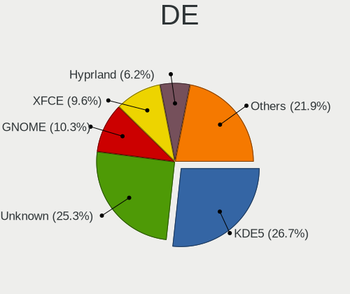

| Name          | Notebooks | Percent |
|---------------|-----------|---------|
| KDE5          | 39        | 26.71%  |
| Unknown       | 38        | 26.03%  |
| GNOME         | 15        | 10.27%  |
| XFCE          | 13        | 8.9%    |
| Hyprland      | 9         | 6.16%   |
| DWM           | 6         | 4.11%   |
| LXQt          | 5         | 3.42%   |
| MATE          | 4         | 2.74%   |
| sway          | 3         | 2.05%   |
| i3            | 2         | 1.37%   |
| X-Cinnamon    | 1         | 0.68%   |
| Trinity       | 1         | 0.68%   |
| LXDE          | 1         | 0.68%   |
| KDE6          | 1         | 0.68%   |
| KDE           | 1         | 0.68%   |
| ICEWM         | 1         | 0.68%   |
| GNOME Classic | 1         | 0.68%   |
| fluxbox       | 1         | 0.68%   |
| Enlightenment | 1         | 0.68%   |
| dwl           | 1         | 0.68%   |
| Cinnamon      | 1         | 0.68%   |
| bspwm         | 1         | 0.68%   |

Display Server
--------------

X11 or Wayland

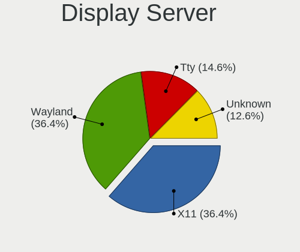

| Name    | Notebooks | Percent |
|---------|-----------|---------|
| Wayland | 56        | 37.09%  |
| X11     | 54        | 35.76%  |
| Tty     | 22        | 14.57%  |
| Unknown | 19        | 12.58%  |

Display Manager
---------------

SDDM, LightDM, etc.

| Name    | Notebooks | Percent |
|---------|-----------|---------|
| Unknown | 54        | 36.73%  |
| SDDM    | 51        | 34.69%  |
| LightDM | 22        | 14.97%  |
| GDM     | 9         | 6.12%   |
| SLiM    | 4         | 2.72%   |
| GREETD  | 4         | 2.72%   |
| XDM     | 1         | 0.68%   |
| TDM     | 1         | 0.68%   |
| Ly      | 1         | 0.68%   |

OS Lang
-------

Language

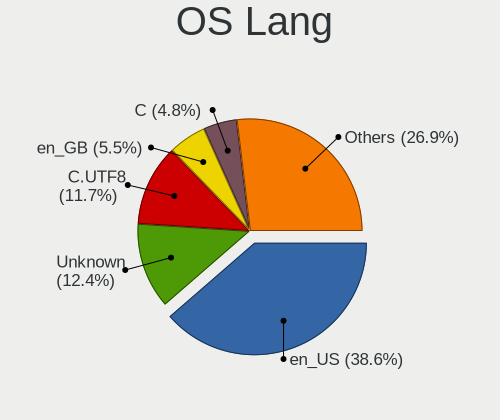

| Lang           | Notebooks | Percent |
|----------------|-----------|---------|
| en_US          | 56        | 38.62%  |
| Unknown        | 19        | 13.1%   |
| C.UTF8         | 17        | 11.72%  |
| en_GB          | 7         | 4.83%   |
| C              | 7         | 4.83%   |
| ru_RU          | 6         | 4.14%   |
| fr_FR          | 6         | 4.14%   |
| cs_CZ          | 5         | 3.45%   |
| de_DE          | 4         | 2.76%   |
| zh_CN          | 2         | 1.38%   |
| es_AR          | 2         | 1.38%   |
| de_CH          | 2         | 1.38%   |
| uk_UA          | 1         | 0.69%   |
| POSIX          | 1         | 0.69%   |
| pl_PL          | 1         | 0.69%   |
| ja_JP          | 1         | 0.69%   |
| it_IT.iso88591 | 1         | 0.69%   |
| fi_FI          | 1         | 0.69%   |
| es_MX          | 1         | 0.69%   |
| es_CL          | 1         | 0.69%   |
| en_IE          | 1         | 0.69%   |
| en_DK          | 1         | 0.69%   |
| en_AU          | 1         | 0.69%   |
| el_GR          | 1         | 0.69%   |

Boot Mode
---------

EFI or BIOS

| Mode | Notebooks | Percent |
|------|-----------|---------|
| EFI  | 129       | 88.97%  |
| BIOS | 16        | 11.03%  |

Filesystem
----------

Type of filesystem

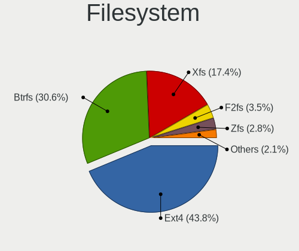

| Type     | Notebooks | Percent |
|----------|-----------|---------|
| Ext4     | 63        | 43.75%  |
| Btrfs    | 44        | 30.56%  |
| Xfs      | 25        | 17.36%  |
| F2fs     | 5         | 3.47%   |
| Zfs      | 4         | 2.78%   |
| Bcachefs | 2         | 1.39%   |
| XXXXXXX  | 1         | 0.69%   |

Part. scheme
------------

Scheme of partitioning

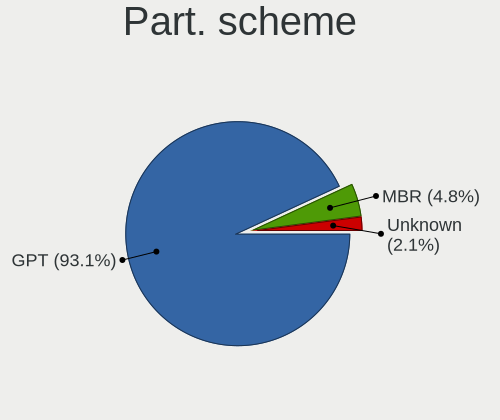

| Type    | Notebooks | Percent |
|---------|-----------|---------|
| GPT     | 135       | 93.1%   |
| MBR     | 7         | 4.83%   |
| Unknown | 3         | 2.07%   |

Dual Boot with Linux/BSD
------------------------

Hosting more than one Linux/BSD

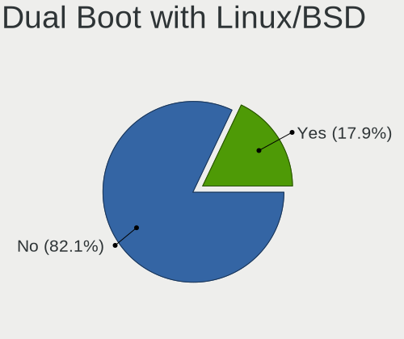

| Dual boot | Notebooks | Percent |
|-----------|-----------|---------|
| No        | 119       | 82.07%  |
| Yes       | 26        | 17.93%  |

Dual Boot (Win)
---------------

Hosting Linux and Windows

| Dual boot | Notebooks | Percent |
|-----------|-----------|---------|
| No        | 108       | 73.47%  |
| Yes       | 39        | 26.53%  |

Board
-----

Vendor
------

Motherboard manufacturer

| Name                | Notebooks | Percent |
|---------------------|-----------|---------|
| Lenovo              | 41        | 28.47%  |
| Hewlett-Packard     | 26        | 18.06%  |
| Dell                | 21        | 14.58%  |
| ASUSTek Computer    | 20        | 13.89%  |
| Framework           | 7         | 4.86%   |
| Acer                | 6         | 4.17%   |
| MSI                 | 4         | 2.78%   |
| Star Labs           | 2         | 1.39%   |
| Notebook            | 2         | 1.39%   |
| TUXEDO              | 1         | 0.69%   |
| TULPAR              | 1         | 0.69%   |
| Timi                | 1         | 0.69%   |
| System76            | 1         | 0.69%   |
| Razer               | 1         | 0.69%   |
| IBM                 | 1         | 0.69%   |
| HUAWEI              | 1         | 0.69%   |
| Gigabyte Technology | 1         | 0.69%   |
| DEXP                | 1         | 0.69%   |
| Chuwi               | 1         | 0.69%   |
| BANGHO              | 1         | 0.69%   |
| Apple               | 1         | 0.69%   |
| Anbernic            | 1         | 0.69%   |
| A-DATA Technology   | 1         | 0.69%   |
| Unknown             | 1         | 0.69%   |

Model
-----

Motherboard model

| Name                                       | Notebooks | Percent |
|--------------------------------------------|-----------|---------|
| Framework Laptop (13th Gen Intel Core)     | 4         | 2.78%   |
| HP EliteBook 845 14 inch G10 Notebook PC   | 3         | 2.08%   |
| Framework Laptop 13 (AMD Ryzen 7040Series) | 3         | 2.08%   |
| Dell Precision 5480                        | 3         | 2.08%   |
| Notebook NS5x_NS7xPU                       | 2         | 1.39%   |
| ASUS ROG Zephyrus G14 GA401II_GA401II      | 2         | 1.39%   |
| TUXEDO Book BA1510                         | 1         | 0.69%   |
| TULPAR A5 V20.3                            | 1         | 0.69%   |
| Timi RedmiBook Pro 15S                     | 1         | 0.69%   |
| System76 Pangolin                          | 1         | 0.69%   |
| Star Labs StarLite                         | 1         | 0.69%   |
| Star Labs StarBook                         | 1         | 0.69%   |
| Razer Blade 14 - RZ09-0482                 | 1         | 0.69%   |
| MSI Stealth 16Studio A13VF                 | 1         | 0.69%   |
| MSI Pulse 15 B13VFK                        | 1         | 0.69%   |
| MSI Modern 14 C12M                         | 1         | 0.69%   |
| MSI Delta 15 A5EFK                         | 1         | 0.69%   |
| Lenovo ZHAOYANG E43                        | 1         | 0.69%   |
| Lenovo V14 G2 ALC 82KC                     | 1         | 0.69%   |
| Lenovo ThinkPad X395 20NLCTO1WW            | 1         | 0.69%   |
| Lenovo ThinkPad X13 Gen 3 21CMCTO1WW       | 1         | 0.69%   |
| Lenovo ThinkPad X13 Gen 3 21CM0024US       | 1         | 0.69%   |
| Lenovo ThinkPad X1 Extreme 2nd 20QVS10E00  | 1         | 0.69%   |
| Lenovo ThinkPad X1 Carbon 7th 20QES01M00   | 1         | 0.69%   |
| Lenovo ThinkPad T480s 20L8002VMX           | 1         | 0.69%   |
| Lenovo ThinkPad T480 20L6SAYX00            | 1         | 0.69%   |
| Lenovo ThinkPad T480 20L50013US            | 1         | 0.69%   |
| Lenovo ThinkPad T470 W10DG 20JM0009US      | 1         | 0.69%   |
| Lenovo ThinkPad T470 20HES18R20            | 1         | 0.69%   |
| Lenovo ThinkPad T460 20FNCTO1WW            | 1         | 0.69%   |
| Lenovo ThinkPad T420 4236QE0               | 1         | 0.69%   |
| Lenovo ThinkPad T410 2518C3U               | 1         | 0.69%   |
| Lenovo ThinkPad T16 Gen 1 21CHCTO1WW       | 1         | 0.69%   |
| Lenovo ThinkPad T15p Gen 3 21DACTO1WW      | 1         | 0.69%   |
| Lenovo ThinkPad T14s Gen 1 20T1S13U00      | 1         | 0.69%   |
| Lenovo ThinkPad T14 Gen 3 21CGS0LG00       | 1         | 0.69%   |
| Lenovo ThinkPad T14 Gen 1 20UES1Y200       | 1         | 0.69%   |
| Lenovo ThinkPad P43s 20RHCTO1WW            | 1         | 0.69%   |
| Lenovo ThinkPad P16s Gen 2 21K9CTO1WW      | 1         | 0.69%   |
| Lenovo ThinkPad L15 Gen 4 21H7002SGE       | 1         | 0.69%   |

Model Family
------------

Motherboard model prefix

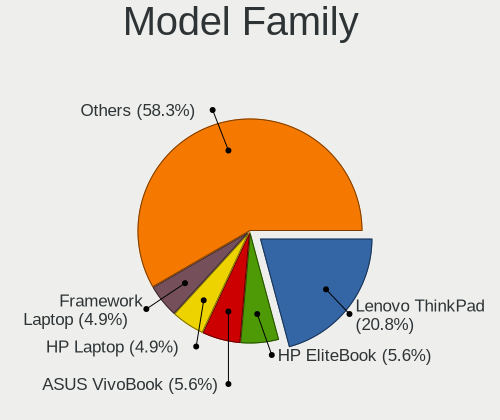

| Name               | Notebooks | Percent |
|--------------------|-----------|---------|
| Lenovo ThinkPad    | 30        | 20.83%  |
| HP EliteBook       | 8         | 5.56%   |
| ASUS VivoBook      | 8         | 5.56%   |
| HP Laptop          | 7         | 4.86%   |
| Framework Laptop   | 7         | 4.86%   |
| Dell Latitude      | 6         | 4.17%   |
| HP ProBook         | 5         | 3.47%   |
| Dell Precision     | 5         | 3.47%   |
| ASUS ROG           | 5         | 3.47%   |
| Lenovo Legion      | 4         | 2.78%   |
| Dell XPS           | 4         | 2.78%   |
| Acer Aspire        | 4         | 2.78%   |
| Lenovo IdeaPad     | 3         | 2.08%   |
| HP Victus          | 3         | 2.08%   |
| Dell Inspiron      | 3         | 2.08%   |
| ASUS ZenBook       | 3         | 2.08%   |
| Notebook NS5x      | 2         | 1.39%   |
| HP Pavilion        | 2         | 1.39%   |
| Dell G5            | 2         | 1.39%   |
| ASUS ASUS          | 2         | 1.39%   |
| Acer Swift         | 2         | 1.39%   |
| TUXEDO Book        | 1         | 0.69%   |
| TULPAR A5          | 1         | 0.69%   |
| Timi RedmiBook     | 1         | 0.69%   |
| System76 Pangolin  | 1         | 0.69%   |
| Star Labs StarLite | 1         | 0.69%   |
| Star Labs StarBook | 1         | 0.69%   |
| Razer Blade        | 1         | 0.69%   |
| MSI Stealth        | 1         | 0.69%   |
| MSI Pulse          | 1         | 0.69%   |
| MSI Modern         | 1         | 0.69%   |
| MSI Delta          | 1         | 0.69%   |
| Lenovo ZHAOYANG    | 1         | 0.69%   |
| Lenovo V14         | 1         | 0.69%   |
| Lenovo ThinkBook   | 1         | 0.69%   |
| Lenovo G50-30      | 1         | 0.69%   |
| IBM ThinkPad       | 1         | 0.69%   |
| HUAWEI NBLK-WAX9X  | 1         | 0.69%   |
| HP ZBook           | 1         | 0.69%   |
| Gigabyte AORUS     | 1         | 0.69%   |

MFG Year
--------

Motherboard manufacture year

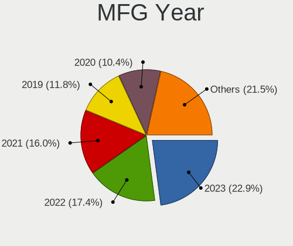

| Year    | Notebooks | Percent |
|---------|-----------|---------|
| 2023    | 33        | 22.92%  |
| 2022    | 25        | 17.36%  |
| 2021    | 23        | 15.97%  |
| 2019    | 17        | 11.81%  |
| 2020    | 14        | 9.72%   |
| 2018    | 9         | 6.25%   |
| 2017    | 5         | 3.47%   |
| 2013    | 4         | 2.78%   |
| 2010    | 3         | 2.08%   |
| 2014    | 2         | 1.39%   |
| 2009    | 2         | 1.39%   |
| 2016    | 1         | 0.69%   |
| 2012    | 1         | 0.69%   |
| 2011    | 1         | 0.69%   |
| 2008    | 1         | 0.69%   |
| 2007    | 1         | 0.69%   |
| 2004    | 1         | 0.69%   |
| Unknown | 1         | 0.69%   |

Form Factor
-----------

Physical design of the computer

| Name     | Notebooks | Percent |
|----------|-----------|---------|
| Notebook | 144       | 100%    |

Secure Boot
-----------

Enabled or disabled

| State    | Notebooks | Percent |
|----------|-----------|---------|
| Disabled | 138       | 95.17%  |
| Enabled  | 7         | 4.83%   |

Coreboot
--------

Have coreboot on board

| Used | Notebooks | Percent |
|------|-----------|---------|
| No   | 144       | 100%    |

RAM Size
--------

Total RAM memory

| Size in GB  | Notebooks | Percent |
|-------------|-----------|---------|
| 32.01-64.0  | 37        | 25.52%  |
| 8.01-16.0   | 37        | 25.52%  |
| 4.01-8.0    | 22        | 15.17%  |
| 16.01-24.0  | 19        | 13.1%   |
| 24.01-32.0  | 12        | 8.28%   |
| 64.01-256.0 | 11        | 7.59%   |
| 3.01-4.0    | 6         | 4.14%   |
| 1.01-2.0    | 1         | 0.69%   |

RAM Used
--------

Used RAM memory

| Used GB    | Notebooks | Percent |
|------------|-----------|---------|
| 1.01-2.0   | 34        | 21.25%  |
| 4.01-8.0   | 31        | 19.38%  |
| 2.01-3.0   | 31        | 19.38%  |
| 3.01-4.0   | 21        | 13.13%  |
| 0.51-1.0   | 18        | 11.25%  |
| 8.01-16.0  | 10        | 6.25%   |
| 0.01-0.5   | 10        | 6.25%   |
| 16.01-24.0 | 5         | 3.13%   |

Total Drives
------------

Number of drives on board

| Drives | Notebooks | Percent |
|--------|-----------|---------|
| 1      | 107       | 73.29%  |
| 2      | 34        | 23.29%  |
| 3      | 5         | 3.42%   |

Has CD-ROM
----------

Has CD-ROM on board

| Presented | Notebooks | Percent |
|-----------|-----------|---------|
| No        | 130       | 90.28%  |
| Yes       | 14        | 9.72%   |

Has Ethernet
------------

Has Ethernet on board

| Presented | Notebooks | Percent |
|-----------|-----------|---------|
| Yes       | 104       | 72.22%  |
| No        | 40        | 27.78%  |

Has WiFi
--------

Has WiFi module

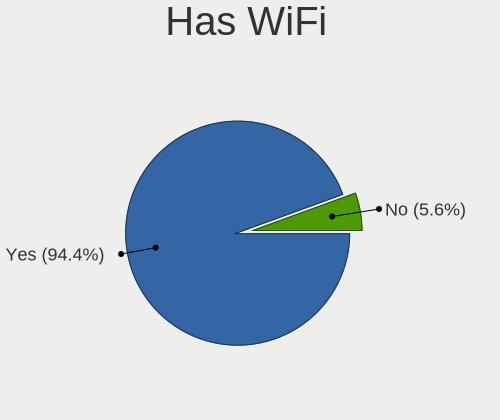

| Presented | Notebooks | Percent |
|-----------|-----------|---------|
| Yes       | 142       | 98.61%  |
| No        | 2         | 1.39%   |

Has Bluetooth
-------------

Has Bluetooth module

| Presented | Notebooks | Percent |
|-----------|-----------|---------|
| Yes       | 129       | 89.58%  |
| No        | 15        | 10.42%  |

Location
--------

Country
-------

Geographic location (country)

| Country         | Notebooks | Percent |
|-----------------|-----------|---------|
| USA             | 29        | 19.86%  |
| Russia          | 18        | 12.33%  |
| Germany         | 16        | 10.96%  |
| Czechia         | 7         | 4.79%   |
| France          | 6         | 4.11%   |
| UK              | 5         | 3.42%   |
| Spain           | 5         | 3.42%   |
| Poland          | 5         | 3.42%   |
| China           | 5         | 3.42%   |
| Switzerland     | 4         | 2.74%   |
| Netherlands     | 4         | 2.74%   |
| Italy           | 3         | 2.05%   |
| Canada          | 3         | 2.05%   |
| Ukraine         | 2         | 1.37%   |
| Turkey          | 2         | 1.37%   |
| The Netherlands | 2         | 1.37%   |
| Sweden          | 2         | 1.37%   |
| New Zealand     | 2         | 1.37%   |
| Ireland         | 2         | 1.37%   |
| Indonesia       | 2         | 1.37%   |
| Bulgaria        | 2         | 1.37%   |
| Belgium         | 2         | 1.37%   |
| Argentina       | 2         | 1.37%   |
| South Africa    | 1         | 0.68%   |
| Slovakia        | 1         | 0.68%   |
| Serbia          | 1         | 0.68%   |
| Portugal        | 1         | 0.68%   |
| Paraguay        | 1         | 0.68%   |
| Mexico          | 1         | 0.68%   |
| Malaysia        | 1         | 0.68%   |
| Japan           | 1         | 0.68%   |
| Iran            | 1         | 0.68%   |
| Hong Kong       | 1         | 0.68%   |
| Greece          | 1         | 0.68%   |
| Finland         | 1         | 0.68%   |
| Chile           | 1         | 0.68%   |
| Brazil          | 1         | 0.68%   |
| Austria         | 1         | 0.68%   |
| Algeria         | 1         | 0.68%   |

City
----

Geographic location (city)

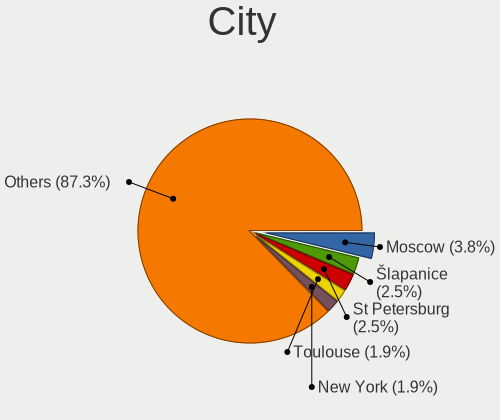

| City                    | Notebooks | Percent |
|-------------------------|-----------|---------|
| Moscow                  | 6         | 3.8%    |
| St Petersburg           | 4         | 2.53%   |
| lapanice              | 4         | 2.53%   |
| Toulouse                | 3         | 1.9%    |
| New York                | 3         | 1.9%    |
| Madrid                  | 3         | 1.9%    |
| Berlin                  | 3         | 1.9%    |
| Amsterdam               | 3         | 1.9%    |
| Stockholm               | 2         | 1.27%   |
| Samarinda               | 2         | 1.27%   |
| Miami                   | 2         | 1.27%   |
| Istanbul                | 2         | 1.27%   |
| Irkutsk                 | 2         | 1.27%   |
| Cieszyn                 | 2         | 1.27%   |
| Christchurch            | 2         | 1.27%   |
| Zhuhai                  | 1         | 0.63%   |
| Wetzlar                 | 1         | 0.63%   |
| West Orange             | 1         | 0.63%   |
| Voronezh                | 1         | 0.63%   |
| Vitkov                  | 1         | 0.63%   |
| Villanueva del Pardillo | 1         | 0.63%   |
| Verviers                | 1         | 0.63%   |
| Turku                   | 1         | 0.63%   |
| Tianjin                 | 1         | 0.63%   |
| Taganrog                | 1         | 0.63%   |
| Sun Prairie             | 1         | 0.63%   |
| St. John's              | 1         | 0.63%   |
| St Laurent des Arbres   | 1         | 0.63%   |
| Sofia                   | 1         | 0.63%   |
| Shenzhen                | 1         | 0.63%   |
| Sellersville            | 1         | 0.63%   |
| Santana de Parnaiba     | 1         | 0.63%   |
| San Antonio             | 1         | 0.63%   |
| Salzburg                | 1         | 0.63%   |
| Rottweil                | 1         | 0.63%   |
| Rostov-on-Don           | 1         | 0.63%   |
| Rocky Mount             | 1         | 0.63%   |
| Rochester               | 1         | 0.63%   |
| Riemerling              | 1         | 0.63%   |
| Ravenstein              | 1         | 0.63%   |

Drives
------

Drive Vendor
------------

Hard drive vendors

| Vendor                         | Notebooks | Drives | Percent |
|--------------------------------|-----------|--------|---------|
| Samsung Electronics            | 44        | 51     | 24.18%  |
| SK hynix                       | 19        | 21     | 10.44%  |
| Sandisk                        | 18        | 26     | 9.89%   |
| Micron Technology              | 14        | 20     | 7.69%   |
| Intel                          | 11        | 16     | 6.04%   |
| KIOXIA                         | 10        | 12     | 5.49%   |
| Kingston                       | 10        | 16     | 5.49%   |
| Seagate                        | 6         | 7      | 3.3%    |
| Unknown                        | 5         | 7      | 2.75%   |
| Toshiba                        | 4         | 4      | 2.2%    |
| WDC                            | 3         | 4      | 1.65%   |
| Phison Electronics             | 3         | 3      | 1.65%   |
| Union Memory                   | 2         | 3      | 1.1%    |
| Micron/Crucial Technology      | 2         | 2      | 1.1%    |
| Kingston Technology Company    | 2         | 2      | 1.1%    |
| Crucial                        | 2         | 2      | 1.1%    |
| China                          | 2         | 3      | 1.1%    |
| Yangtze Memory                 | 1         | 1      | 0.55%   |
| XPG                            | 1         | 1      | 0.55%   |
| Verbatim                       | 1         | 1      | 0.55%   |
| Transcend                      | 1         | 1      | 0.55%   |
| Teleplan                       | 1         | 1      | 0.55%   |
| StoreJet                       | 1         | 1      | 0.55%   |
| Star                           | 1         | 1      | 0.55%   |
| Solid State Storage Technology | 1         | 1      | 0.55%   |
| Solid State Storage            | 1         | 1      | 0.55%   |
| Seagate Technology             | 1         | 1      | 0.55%   |
| SCCTS-603-256G                 | 1         | 1      | 0.55%   |
| Phison                         | 1         | 1      | 0.55%   |
| LITEONIT                       | 1         | 1      | 0.55%   |
| LITEON                         | 1         | 2      | 0.55%   |
| Lexar                          | 1         | 1      | 0.55%   |
| KingSpec                       | 1         | 2      | 0.55%   |
| Intenso                        | 1         | 1      | 0.55%   |
| HGST                           | 1         | 1      | 0.55%   |
| GLOWAY                         | 1         | 1      | 0.55%   |
| Fujitsu                        | 1         | 1      | 0.55%   |
| EYOTA                          | 1         | 1      | 0.55%   |
| Corsair                        | 1         | 1      | 0.55%   |
| ADATA Technology               | 1         | 1      | 0.55%   |

Drive Model
-----------

Hard drive models

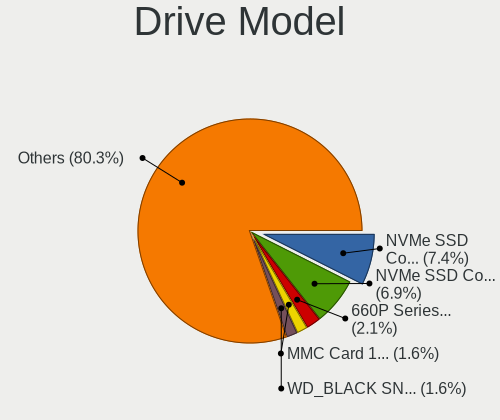

| Model                                              | Notebooks | Percent |
|----------------------------------------------------|-----------|---------|
| Samsung NVMe SSD Controller SM981/PM981/PM983 1TB  | 13        | 6.95%   |
| Samsung NVMe SSD Controller PM9A1/PM9A3/980PRO 1TB | 13        | 6.95%   |
| Intel SSD 660P Series 1024GB                       | 4         | 2.14%   |
| Unknown MMC Card  128GB                            | 3         | 1.6%    |
| SK hynix BC501 NVMe Solid State Drive 512GB        | 3         | 1.6%    |
| Sandisk WD_BLACK SN850X 2000GB                     | 3         | 1.6%    |
| Sandisk WD Blue SN550 NVMe SSD 2TB                 | 3         | 1.6%    |
| Sandisk WD Black SN850 512GB                       | 3         | 1.6%    |
| Micron 2400_MTFDKBA1T0QFM 1TB                      | 3         | 1.6%    |
| Intel SSD 600P Series 256GB                        | 3         | 1.6%    |
| Toshiba MQ04ABF100 1TB                             | 2         | 1.07%   |
| SK hynix SKHynix_HFS001TDE9X081N 1TB               | 2         | 1.07%   |
| SK hynix PC801 NVMe 1TB                            | 2         | 1.07%   |
| Seagate ST1000LM024 HN-M101MBB 1TB                 | 2         | 1.07%   |
| Samsung SSD 990 PRO 2TB                            | 2         | 1.07%   |
| Samsung SSD 980 1TB                                | 2         | 1.07%   |
| Samsung SSD 860 EVO 500GB                          | 2         | 1.07%   |
| Samsung MZVLQ256HAJD-000H1 256GB                   | 2         | 1.07%   |
| Phison E12 NVMe Controller 2TB                     | 2         | 1.07%   |
| Micron/Crucial P2 NVMe PCIe SSD 4TB                | 2         | 1.07%   |
| Micron 2400_MTFDKBA512QFM 512GB                    | 2         | 1.07%   |
| KIOXIA KXG80ZNV512G NVMe 512GB                     | 2         | 1.07%   |
| KIOXIA KXG80ZNV1T02 1TB                            | 2         | 1.07%   |
| KIOXIA KBG40ZNV512G 512GB                          | 2         | 1.07%   |
| Kingston SFYRS1000G 1TB                            | 2         | 1.07%   |
| Kingston OM8PCP3512F-AB 512GB                      | 2         | 1.07%   |
| Intel SSDPEKNU512GZ 512GB                          | 2         | 1.07%   |
| Yangtze Memory ZHITAI PC005 Active 1TB             | 1         | 0.53%   |
| XPG GAMMIX S70 2TB                                 | 1         | 0.53%   |
| WDC WDS500G2B0B 500GB SSD                          | 1         | 0.53%   |
| WDC WDS240G2G0A-00JH30 240GB SSD                   | 1         | 0.53%   |
| WDC WD Green 2.5 240GB                             | 1         | 0.53%   |
| Verbatim Vi560 S3 1TB SSD                          | 1         | 0.53%   |
| Unknown MMC Card  64GB                             | 1         | 0.53%   |
| Unknown MMC Card  32GB                             | 1         | 0.53%   |
| Union Memory UMIS RPJTJ512MEE1OWX 512GB            | 1         | 0.53%   |
| Union Memory UMIS RPJTJ256MEE1OWX 256GB            | 1         | 0.53%   |
| Transcend TS1TMTE400S 1TB                          | 1         | 0.53%   |
| Toshiba TR200 240GB SSD                            | 1         | 0.53%   |
| Toshiba KXG5AZNV256G 256GB                         | 1         | 0.53%   |

HDD Vendor
----------

Hard disk drive vendors

| Vendor   | Notebooks | Drives | Percent |
|----------|-----------|--------|---------|
| Seagate  | 6         | 7      | 54.55%  |
| Toshiba  | 2         | 2      | 18.18%  |
| Teleplan | 1         | 1      | 9.09%   |
| HGST     | 1         | 1      | 9.09%   |
| Fujitsu  | 1         | 1      | 9.09%   |

SSD Vendor
----------

Solid state drive vendors

| Vendor              | Notebooks | Drives | Percent |
|---------------------|-----------|--------|---------|
| Kingston            | 6         | 9      | 17.65%  |
| Samsung Electronics | 5         | 7      | 14.71%  |
| WDC                 | 3         | 4      | 8.82%   |
| SanDisk             | 2         | 3      | 5.88%   |
| Crucial             | 2         | 2      | 5.88%   |
| China               | 2         | 3      | 5.88%   |
| Verbatim            | 1         | 1      | 2.94%   |
| Toshiba             | 1         | 1      | 2.94%   |
| StoreJet            | 1         | 1      | 2.94%   |
| Star                | 1         | 1      | 2.94%   |
| SCCTS-603-256G      | 1         | 1      | 2.94%   |
| LITEONIT            | 1         | 1      | 2.94%   |
| LITEON              | 1         | 2      | 2.94%   |
| Lexar               | 1         | 1      | 2.94%   |
| KingSpec            | 1         | 2      | 2.94%   |
| Intenso             | 1         | 1      | 2.94%   |
| GLOWAY              | 1         | 1      | 2.94%   |
| EYOTA               | 1         | 1      | 2.94%   |
| Corsair             | 1         | 1      | 2.94%   |
| Unknown             | 1         | 1      | 2.94%   |

Drive Kind
----------

HDD or SSD

| Kind | Notebooks | Drives | Percent |
|------|-----------|--------|---------|
| NVMe | 118       | 163    | 71.95%  |
| SSD  | 30        | 44     | 18.29%  |
| HDD  | 11        | 12     | 6.71%   |
| MMC  | 5         | 7      | 3.05%   |

Drive Connector
---------------

SATA, SAS, NVMe, etc.

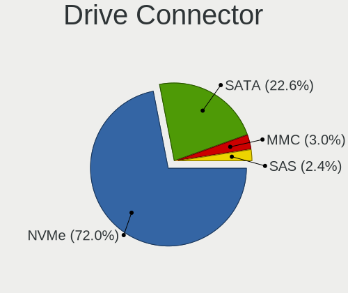

| Type | Notebooks | Drives | Percent |
|------|-----------|--------|---------|
| NVMe | 118       | 162    | 72.39%  |
| SATA | 36        | 53     | 22.09%  |
| MMC  | 5         | 7      | 3.07%   |
| SAS  | 4         | 4      | 2.45%   |

Drive Size
----------

Size of hard drive

| Size in TB | Notebooks | Drives | Percent |
|------------|-----------|--------|---------|
| 0.01-0.5   | 25        | 35     | 59.52%  |
| 0.51-1.0   | 13        | 16     | 30.95%  |
| 1.01-2.0   | 4         | 5      | 9.52%   |

Space Total
-----------

Amount of disk space available on the file system

| Size in GB     | Notebooks | Percent |
|----------------|-----------|---------|
| 251-500        | 35        | 23.33%  |
| 501-1000       | 32        | 21.33%  |
| 101-250        | 28        | 18.67%  |
| 1001-2000      | 19        | 12.67%  |
| 1-20           | 11        | 7.33%   |
| Unknown        | 10        | 6.67%   |
| More than 3000 | 9         | 6%      |
| 51-100         | 4         | 2.67%   |
| 21-50          | 1         | 0.67%   |
| 2001-3000      | 1         | 0.67%   |

Space Used
----------

Amount of used disk space

| Used GB        | Notebooks | Percent |
|----------------|-----------|---------|
| 101-250        | 35        | 22.88%  |
| 1-20           | 32        | 20.92%  |
| 21-50          | 26        | 16.99%  |
| 251-500        | 17        | 11.11%  |
| 501-1000       | 12        | 7.84%   |
| 51-100         | 12        | 7.84%   |
| Unknown        | 10        | 6.54%   |
| More than 3000 | 4         | 2.61%   |
| 1001-2000      | 3         | 1.96%   |
| 2001-3000      | 2         | 1.31%   |

Malfunc. Drives
---------------

Drive models with a malfunction

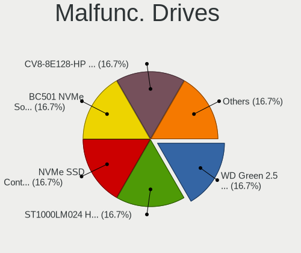

| Model                                                          | Notebooks | Drives | Percent |
|----------------------------------------------------------------|-----------|--------|---------|
| WDC WD Green 2.5 240GB                                         | 1         | 1      | 14.29%  |
| SK hynix PC711 HFS512GDE9X073N 512GB                           | 1         | 1      | 14.29%  |
| SK hynix BC501 NVMe Solid State Drive 512GB                    | 1         | 1      | 14.29%  |
| Seagate ST1000LM024 HN-M101MBB 1TB                             | 1         | 2      | 14.29%  |
| Samsung Electronics NVMe SSD Controller PM9A1/PM9A3/980PRO 1TB | 1         | 1      | 14.29%  |
| LITEON CV8-8E128-HP 128GB SSD                                  | 1         | 2      | 14.29%  |
| HGST HTS725050A7E630 500GB                                     | 1         | 1      | 14.29%  |

Malfunc. Drive Vendor
---------------------

Vendors of faulty drives

| Vendor              | Notebooks | Drives | Percent |
|---------------------|-----------|--------|---------|
| SK hynix            | 2         | 2      | 28.57%  |
| WDC                 | 1         | 1      | 14.29%  |
| Seagate             | 1         | 2      | 14.29%  |
| Samsung Electronics | 1         | 1      | 14.29%  |
| LITEON              | 1         | 2      | 14.29%  |
| HGST                | 1         | 1      | 14.29%  |

Malfunc. HDD Vendor
-------------------

Vendors of faulty HDD drives

| Vendor  | Notebooks | Drives | Percent |
|---------|-----------|--------|---------|
| Seagate | 1         | 2      | 50%     |
| HGST    | 1         | 1      | 50%     |

Malfunc. Drive Kind
-------------------

Kinds of faulty drives

| Kind | Notebooks | Drives | Percent |
|------|-----------|--------|---------|
| NVMe | 3         | 3      | 42.86%  |
| SSD  | 2         | 3      | 28.57%  |
| HDD  | 2         | 3      | 28.57%  |

Failed Drives
-------------

Failed drive models

Zero info for selected period =(

Failed Drive Vendor
-------------------

Failed drive vendors

Zero info for selected period =(

Drive Status
------------

Number of failed and malfunc. drives

| Status   | Notebooks | Drives | Percent |
|----------|-----------|--------|---------|
| Works    | 139       | 205    | 89.68%  |
| Detected | 9         | 12     | 5.81%   |
| Malfunc  | 7         | 9      | 4.52%   |

Storage controller
------------------

Storage Vendor
--------------

Storage controller vendors

| Vendor                         | Notebooks | Percent |
|--------------------------------|-----------|---------|
| Intel                          | 55        | 28.06%  |
| Samsung Electronics            | 39        | 19.9%   |
| SK hynix                       | 19        | 9.69%   |
| AMD                            | 19        | 9.69%   |
| SanDisk                        | 16        | 8.16%   |
| Micron Technology              | 14        | 7.14%   |
| KIOXIA                         | 10        | 5.1%    |
| Kingston Technology Company    | 7         | 3.57%   |
| Phison Electronics             | 4         | 2.04%   |
| Union Memory (Shenzhen)        | 2         | 1.02%   |
| Solid State Storage Technology | 2         | 1.02%   |
| Micron/Crucial Technology      | 2         | 1.02%   |
| ADATA Technology               | 2         | 1.02%   |
| Yangtze Memory Technologies    | 1         | 0.51%   |
| Transcend                      | 1         | 0.51%   |
| Toshiba America Info Systems   | 1         | 0.51%   |
| Seagate Technology             | 1         | 0.51%   |
| INNOGRIT                       | 1         | 0.51%   |

Storage Model
-------------

Storage controller models

| Model                                                                          | Notebooks | Percent |
|--------------------------------------------------------------------------------|-----------|---------|
| AMD FCH SATA Controller [AHCI mode]                                            | 19        | 9.18%   |
| Samsung NVMe SSD Controller SM981/PM981/PM983                                  | 13        | 6.28%   |
| Samsung NVMe SSD Controller PM9A1/PM9A3/980PRO                                 | 13        | 6.28%   |
| Intel Volume Management Device NVMe RAID Controller Intel Corporation          | 9         | 4.35%   |
| SK hynix Gold P31/BC711/PC711 NVMe Solid State Drive                           | 8         | 3.86%   |
| Samsung NVMe SSD Controller 980 (DRAM-less)                                    | 8         | 3.86%   |
| Intel 82801 Mobile SATA Controller [RAID mode]                                 | 7         | 3.38%   |
| Intel Sunrise Point-LP SATA Controller [AHCI mode]                             | 6         | 2.9%    |
| Micron 2400 NVMe SSD (DRAM-less)                                               | 5         | 2.42%   |
| Intel Volume Management Device NVMe RAID Controller                            | 5         | 2.42%   |
| SK hynix Platinum P41/PC801 NVMe Solid State Drive                             | 4         | 1.93%   |
| Samsung NVMe SSD Controller S4LV008[Pascal]                                    | 4         | 1.93%   |
| KIOXIA NVMe SSD Controller XG8                                                 | 4         | 1.93%   |
| KIOXIA NVMe SSD Controller BG4 (DRAM-less)                                     | 4         | 1.93%   |
| Intel Tiger Lake-LP SATA Controller                                            | 4         | 1.93%   |
| Intel SSD 660P Series                                                          | 4         | 1.93%   |
| SK hynix BC501 NVMe Solid State Drive                                          | 3         | 1.45%   |
| SanDisk WD PC SN810 / Black SN850 NVMe SSD                                     | 3         | 1.45%   |
| Sandisk WD Black SN850X NVMe SSD                                               | 3         | 1.45%   |
| SanDisk Ultra 3D / WD Blue SN550 NVMe SSD                                      | 3         | 1.45%   |
| Micron 2300 NVMe SSD [Santana]                                                 | 3         | 1.45%   |
| Kingston Company KC3000/FURY Renegade NVMe SSD E18                             | 3         | 1.45%   |
| Intel SSD 600P Series                                                          | 3         | 1.45%   |
| Intel Celeron/Pentium Silver Processor SATA Controller                         | 3         | 1.45%   |
| Intel 8 Series/C220 Series Chipset Family 6-port SATA Controller 1 [AHCI mode] | 3         | 1.45%   |
| Intel 5 Series/3400 Series Chipset 6 port SATA AHCI Controller                 | 3         | 1.45%   |
| SK hynix PC601 NVMe Solid State Drive                                          | 2         | 0.97%   |
| Sandisk WD PC SN740 NVMe SSD 512GB (DRAM-less)                                 | 2         | 0.97%   |
| Samsung NVMe SSD Controller PM9B1 (DRAM-less)                                  | 2         | 0.97%   |
| Phison E18 PCIe4 NVMe Controller                                               | 2         | 0.97%   |
| Phison E12 NVMe Controller                                                     | 2         | 0.97%   |
| Micron/Crucial P2 [Nick P2] / P3 / P3 Plus NVMe PCIe SSD (DRAM-less)           | 2         | 0.97%   |
| Micron 3400 NVMe SSD [Hendrix]                                                 | 2         | 0.97%   |
| Micron 2450 NVMe SSD [HendrixV] (DRAM-less)                                    | 2         | 0.97%   |
| KIOXIA NVMe SSD Controller BG5 (DRAM-less)                                     | 2         | 0.97%   |
| Kingston Company OM8PCP Design-In PCIe 3 NVMe SSD (DRAM-less)                  | 2         | 0.97%   |
| Intel SSD 670p Series [Keystone Harbor]                                        | 2         | 0.97%   |
| Intel Comet Lake SATA AHCI Controller                                          | 2         | 0.97%   |
| Intel 82801IBM/IEM (ICH9M/ICH9M-E) 4 port SATA Controller [AHCI mode]          | 2         | 0.97%   |
| Yangtze Memory ZHITAI PC005 NVMe SSD                                           | 1         | 0.48%   |

Storage Kind
------------

Kind of storage controller (IDE, SATA, NVMe, SAS, ...)

| Kind | Notebooks | Percent |
|------|-----------|---------|
| NVMe | 118       | 62.43%  |
| SATA | 48        | 25.4%   |
| RAID | 21        | 11.11%  |
| IDE  | 2         | 1.06%   |

Processor
---------

CPU Vendor
----------

Processor vendors

| Vendor | Notebooks | Percent |
|--------|-----------|---------|
| Intel  | 85        | 59.03%  |
| AMD    | 59        | 40.97%  |

CPU Model
---------

Processor models

| Model                                          | Notebooks | Percent |
|------------------------------------------------|-----------|---------|
| AMD Ryzen 7 5800H with Radeon Graphics         | 7         | 4.86%   |
| Intel Core i7-8550U CPU @ 1.80GHz              | 5         | 3.47%   |
| AMD Ryzen 5 3500U with Radeon Vega Mobile Gfx  | 5         | 3.47%   |
| Intel 12th Gen Core i7-12700H                  | 4         | 2.78%   |
| Intel 11th Gen Core i5-1135G7 @ 2.40GHz        | 4         | 2.78%   |
| AMD Ryzen 7 PRO 6850U with Radeon Graphics     | 4         | 2.78%   |
| AMD Ryzen 7 5825U with Radeon Graphics         | 4         | 2.78%   |
| Intel 13th Gen Core i9-13900H                  | 3         | 2.08%   |
| Intel 13th Gen Core i7-1370P                   | 3         | 2.08%   |
| Intel 13th Gen Core i7-13700H                  | 3         | 2.08%   |
| Intel 12th Gen Core i7-1260P                   | 3         | 2.08%   |
| AMD Ryzen 7 7840U w/ Radeon 780M Graphics      | 3         | 2.08%   |
| AMD Ryzen 5 5500U with Radeon Graphics         | 3         | 2.08%   |
| Intel Core i7-9750H CPU @ 2.60GHz              | 2         | 1.39%   |
| Intel Core i7-8650U CPU @ 1.90GHz              | 2         | 1.39%   |
| Intel Core i5-8365U CPU @ 1.60GHz              | 2         | 1.39%   |
| Intel Core i5-8250U CPU @ 1.60GHz              | 2         | 1.39%   |
| Intel Core i5-10210U CPU @ 1.60GHz             | 2         | 1.39%   |
| Intel Core i5 CPU M 540 @ 2.53GHz              | 2         | 1.39%   |
| Intel Core i3-8130U CPU @ 2.20GHz              | 2         | 1.39%   |
| Intel 11th Gen Core i7-1185G7 @ 3.00GHz        | 2         | 1.39%   |
| Intel 11th Gen Core i7-1165G7 @ 2.80GHz        | 2         | 1.39%   |
| AMD Ryzen 9 PRO 7940HS w/ Radeon 780M Graphics | 2         | 1.39%   |
| AMD Ryzen 7 PRO 4750U with Radeon Graphics     | 2         | 1.39%   |
| AMD Ryzen 7 4800HS with Radeon Graphics        | 2         | 1.39%   |
| AMD Ryzen 7 3700U with Radeon Vega Mobile Gfx  | 2         | 1.39%   |
| AMD Ryzen 5 5600U with Radeon Graphics         | 2         | 1.39%   |
| Intel Pentium Silver N5030 CPU @ 1.10GHz       | 1         | 0.69%   |
| Intel Pentium M processor 2.26GHz              | 1         | 0.69%   |
| Intel Pentium CPU N3540 @ 2.16GHz              | 1         | 0.69%   |
| Intel Pentium CPU B980 @ 2.40GHz               | 1         | 0.69%   |
| Intel N100                                     | 1         | 0.69%   |
| Intel Core i9-8950HK CPU @ 2.90GHz             | 1         | 0.69%   |
| Intel Core i7-8665U CPU @ 1.90GHz              | 1         | 0.69%   |
| Intel Core i7-8565U CPU @ 1.80GHz              | 1         | 0.69%   |
| Intel Core i7-4910MQ CPU @ 2.90GHz             | 1         | 0.69%   |
| Intel Core i7-4810MQ CPU @ 2.80GHz             | 1         | 0.69%   |
| Intel Core i7-4750HQ CPU @ 2.00GHz             | 1         | 0.69%   |
| Intel Core i7-4700HQ CPU @ 2.40GHz             | 1         | 0.69%   |
| Intel Core i7-10750H CPU @ 2.60GHz             | 1         | 0.69%   |

CPU Model Family
----------------

Processor model prefix

| Model                | Notebooks | Percent |
|----------------------|-----------|---------|
| Other                | 37        | 25.69%  |
| AMD Ryzen 7          | 28        | 19.44%  |
| Intel Core i7        | 19        | 13.19%  |
| Intel Core i5        | 16        | 11.11%  |
| AMD Ryzen 5          | 15        | 10.42%  |
| AMD Ryzen 7 PRO      | 10        | 6.94%   |
| AMD Ryzen 9          | 4         | 2.78%   |
| Intel Core i3        | 3         | 2.08%   |
| Intel Core 2 Duo     | 3         | 2.08%   |
| Intel Pentium        | 2         | 1.39%   |
| Intel Celeron        | 2         | 1.39%   |
| Intel Pentium Silver | 1         | 0.69%   |
| Intel Pentium M      | 1         | 0.69%   |
| Intel Core i9        | 1         | 0.69%   |
| AMD Ryzen 5 PRO      | 1         | 0.69%   |
| AMD Athlon           | 1         | 0.69%   |

CPU Cores
---------

Number of processor cores

| Number | Notebooks | Percent |
|--------|-----------|---------|
| 4      | 48        | 33.33%  |
| 8      | 39        | 27.08%  |
| 2      | 16        | 11.11%  |
| 14     | 14        | 9.72%   |
| 6      | 14        | 9.72%   |
| 12     | 6         | 4.17%   |
| 10     | 3         | 2.08%   |
| 1      | 2         | 1.39%   |
| 24     | 1         | 0.69%   |
| 16     | 1         | 0.69%   |

CPU Sockets
-----------

Number of sockets

| Number | Notebooks | Percent |
|--------|-----------|---------|
| 1      | 144       | 100%    |

CPU Threads
-----------

Threads per core (Hyper-Threading)

| Number | Notebooks | Percent |
|--------|-----------|---------|
| 2      | 130       | 90.28%  |
| 1      | 13        | 9.03%   |
| 4      | 1         | 0.69%   |

CPU Op-Modes
------------

CPU Operation Modes (32-bit, 64-bit)

| Op mode        | Notebooks | Percent |
|----------------|-----------|---------|
| 32-bit, 64-bit | 143       | 99.31%  |
| 32-bit         | 1         | 0.69%   |

CPU Microcode
-------------

Microcode number

| Number     | Notebooks | Percent |
|------------|-----------|---------|
| Unknown    | 65        | 43.92%  |
| 0xb06a2    | 10        | 6.76%   |
| 0x0a50000c | 9         | 6.08%   |
| 0x0a50000d | 7         | 4.73%   |
| 0x0a704103 | 6         | 4.05%   |
| 0x0a404102 | 6         | 4.05%   |
| 0x806ec    | 5         | 3.38%   |
| 0x806c1    | 4         | 2.7%    |
| 0x08600106 | 4         | 2.7%    |
| 0x806ea    | 3         | 2.03%   |
| 0x08108109 | 3         | 2.03%   |
| 0x906a3    | 2         | 1.35%   |
| 0x706a8    | 2         | 1.35%   |
| 0x306c3    | 2         | 1.35%   |
| 0x20652    | 2         | 1.35%   |
| 0x0a601203 | 2         | 1.35%   |
| 0x08608103 | 2         | 1.35%   |
| 0x08600104 | 2         | 1.35%   |
| 0xb0671    | 1         | 0.68%   |
| 0xa0652    | 1         | 0.68%   |
| 0x706e5    | 1         | 0.68%   |
| 0x406e3    | 1         | 0.68%   |
| 0x206a7    | 1         | 0.68%   |
| 0x08a00006 | 1         | 0.68%   |
| 0x08608104 | 1         | 0.68%   |
| 0x08608102 | 1         | 0.68%   |
| 0x08600109 | 1         | 0.68%   |
| 0x08600103 | 1         | 0.68%   |
| 0x08108102 | 1         | 0.68%   |
| 0x00000000 | 1         | 0.68%   |

CPU Microarch
-------------

Microarchitecture

| Name             | Notebooks | Percent |
|------------------|-----------|---------|
| Alderlake Hybrid | 24        | 16.55%  |
| Unknown          | 24        | 16.55%  |
| KabyLake         | 23        | 15.86%  |
| Zen 3            | 19        | 13.1%   |
| Zen+             | 9         | 6.21%   |
| TigerLake        | 9         | 6.21%   |
| Zen 2            | 8         | 5.52%   |
| Westmere         | 4         | 2.76%   |
| Haswell          | 4         | 2.76%   |
| Icelake          | 3         | 2.07%   |
| Goldmont plus    | 3         | 2.07%   |
| CometLake        | 3         | 2.07%   |
| Skylake          | 2         | 1.38%   |
| SandyBridge      | 2         | 1.38%   |
| Core             | 2         | 1.38%   |
| Zen              | 1         | 0.69%   |
| Silvermont       | 1         | 0.69%   |
| Penryn           | 1         | 0.69%   |
| P6               | 1         | 0.69%   |
| Gracemont        | 1         | 0.69%   |
| Broadwell        | 1         | 0.69%   |

Graphics
--------

GPU Vendor
----------

Vendors of graphics cards

| Vendor | Notebooks | Percent |
|--------|-----------|---------|
| Intel  | 76        | 41.08%  |
| AMD    | 61        | 32.97%  |
| Nvidia | 48        | 25.95%  |

GPU Model
---------

Graphics card models

| Model                                                                     | Notebooks | Percent |
|---------------------------------------------------------------------------|-----------|---------|
| Intel UHD Graphics 620                                                    | 12        | 6.32%   |
| Intel Raptor Lake-P [Iris Xe Graphics]                                    | 12        | 6.32%   |
| AMD Cezanne [Radeon Vega Series / Radeon Vega Mobile Series]              | 12        | 6.32%   |
| AMD Picasso/Raven 2 [Radeon Vega Series / Radeon Vega Mobile Series]      | 10        | 5.26%   |
| Intel TigerLake-LP GT2 [Iris Xe Graphics]                                 | 9         | 4.74%   |
| AMD Renoir [Radeon RX Vega 6 (Ryzen 4000/5000 Mobile Series)]             | 8         | 4.21%   |
| AMD Phoenix1                                                              | 8         | 4.21%   |
| Intel Alder Lake-P GT2 [Iris Xe Graphics]                                 | 7         | 3.68%   |
| AMD Rembrandt [Radeon 680M]                                               | 7         | 3.68%   |
| AMD Barcelo                                                               | 6         | 3.16%   |
| Nvidia AD107M [GeForce RTX 4060 Max-Q / Mobile]                           | 5         | 2.63%   |
| Nvidia GA107M [GeForce RTX 3050 Mobile]                                   | 4         | 2.11%   |
| Intel WhiskeyLake-U GT2 [UHD Graphics 620]                                | 4         | 2.11%   |
| AMD Lucienne                                                              | 4         | 2.11%   |
| Nvidia GA104M [GeForce RTX 3070 Mobile / Max-Q]                           | 3         | 1.58%   |
| Nvidia AD107M [GeForce RTX 4050 Max-Q / Mobile]                           | 3         | 1.58%   |
| Nvidia AD106M [GeForce RTX 4070 Max-Q / Mobile]                           | 3         | 1.58%   |
| Intel Raptor Lake-P [UHD Graphics]                                        | 3         | 1.58%   |
| Intel CometLake-U GT2 [UHD Graphics]                                      | 3         | 1.58%   |
| Nvidia TU116M [GeForce GTX 1650 Ti Mobile]                                | 2         | 1.05%   |
| Nvidia GA107M [GeForce RTX 3050 Ti Mobile]                                | 2         | 1.05%   |
| Nvidia GA107GLM [RTX A1000 6GB Laptop GPU]                                | 2         | 1.05%   |
| Nvidia GA106M [GeForce RTX 3060 Mobile / Max-Q]                           | 2         | 1.05%   |
| Intel TigerLake-H GT1 [UHD Graphics]                                      | 2         | 1.05%   |
| Intel Skylake GT2 [HD Graphics 520]                                       | 2         | 1.05%   |
| Intel GeminiLake [UHD Graphics 600]                                       | 2         | 1.05%   |
| Intel Core Processor Integrated Graphics Controller                       | 2         | 1.05%   |
| Intel CoffeeLake-H GT2 [UHD Graphics 630]                                 | 2         | 1.05%   |
| Intel 2nd Generation Core Processor Family Integrated Graphics Controller | 2         | 1.05%   |
| AMD Raphael                                                               | 2         | 1.05%   |
| Nvidia TU117M [GeForce MX450]                                             | 1         | 0.53%   |
| Nvidia TU117M [GeForce GTX 1650 Ti Mobile]                                | 1         | 0.53%   |
| Nvidia TU117M [GeForce GTX 1650 Mobile / Max-Q]                           | 1         | 0.53%   |
| Nvidia TU117GLM [T1200 Laptop GPU]                                        | 1         | 0.53%   |
| Nvidia TU106M [GeForce RTX 2070 Mobile / Max-Q Refresh]                   | 1         | 0.53%   |
| Nvidia TU106M [GeForce RTX 2060 Mobile]                                   | 1         | 0.53%   |
| Nvidia TU106BM [GeForce RTX 2070 Mobile / Max-Q]                          | 1         | 0.53%   |
| Nvidia GT216GLM [Quadro FX 880M]                                          | 1         | 0.53%   |
| Nvidia GP108M [GeForce MX150]                                             | 1         | 0.53%   |
| Nvidia GP108GLM [Quadro P520]                                             | 1         | 0.53%   |

GPU Combo
---------

Combinations of graphics cards

| Name           | Notebooks | Percent |
|----------------|-----------|---------|
| 1 x Intel      | 46        | 31.72%  |
| 1 x AMD        | 45        | 31.03%  |
| Intel + Nvidia | 28        | 19.31%  |
| AMD + Nvidia   | 12        | 8.28%   |
| 1 x Nvidia     | 8         | 5.52%   |
| 2 x AMD        | 3         | 2.07%   |
| 2 x Intel      | 2         | 1.38%   |
| Intel + AMD    | 1         | 0.69%   |

GPU Driver
----------

Free vs proprietary

| Driver      | Notebooks | Percent |
|-------------|-----------|---------|
| Free        | 104       | 70.75%  |
| Proprietary | 35        | 23.81%  |
| Unknown     | 8         | 5.44%   |

GPU Memory
----------

Total video memory

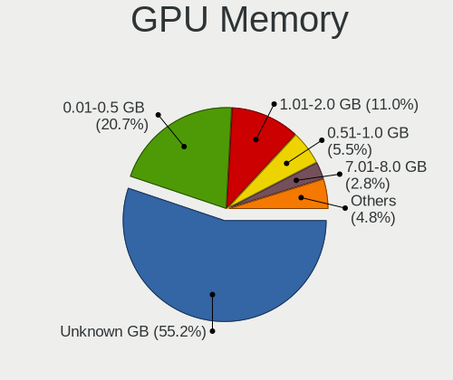

| Size in GB | Notebooks | Percent |
|------------|-----------|---------|
| Unknown    | 79        | 54.48%  |
| 0.01-0.5   | 31        | 21.38%  |
| 1.01-2.0   | 16        | 11.03%  |
| 0.51-1.0   | 8         | 5.52%   |
| 7.01-8.0   | 4         | 2.76%   |
| 5.01-6.0   | 3         | 2.07%   |
| 3.01-4.0   | 3         | 2.07%   |
| 8.01-16.0  | 1         | 0.69%   |

Monitor
-------

Monitor Vendor
--------------

Monitor vendors

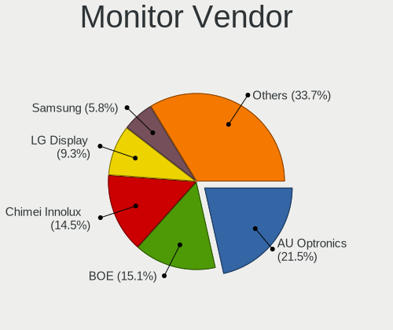

| Vendor                  | Notebooks | Percent |
|-------------------------|-----------|---------|
| AU Optronics            | 37        | 21.51%  |
| BOE                     | 26        | 15.12%  |
| Chimei Innolux          | 25        | 14.53%  |
| LG Display              | 15        | 8.72%   |
| Samsung Electronics     | 10        | 5.81%   |
| Goldstar                | 8         | 4.65%   |
| Dell                    | 8         | 4.65%   |
| Sharp                   | 7         | 4.07%   |
| PANDA                   | 5         | 2.91%   |
| Lenovo                  | 5         | 2.91%   |
| CSO                     | 4         | 2.33%   |
| BenQ                    | 3         | 1.74%   |
| AOC                     | 3         | 1.74%   |
| TMX                     | 2         | 1.16%   |
| ViewSonic               | 1         | 0.58%   |
| Toshiba                 | 1         | 0.58%   |
| RTK                     | 1         | 0.58%   |
| Philips                 | 1         | 0.58%   |
| Nvidia                  | 1         | 0.58%   |
| NEC Computers           | 1         | 0.58%   |
| InfoVision              | 1         | 0.58%   |
| Iiyama                  | 1         | 0.58%   |
| HUAWEI                  | 1         | 0.58%   |
| HKC                     | 1         | 0.58%   |
| CTO                     | 1         | 0.58%   |
| Chi Mei Optoelectronics | 1         | 0.58%   |
| ASUSTek Computer        | 1         | 0.58%   |
| Apple                   | 1         | 0.58%   |

Monitor Model
-------------

Monitor models

| Model                                                                 | Notebooks | Percent |
|-----------------------------------------------------------------------|-----------|---------|
| BOE LCD Monitor BOE0BCA 2256x1504 285x190mm 13.5-inch                 | 6         | 3.43%   |
| AU Optronics LCD Monitor AUO6DA8 2560x1600 301x188mm 14.0-inch        | 3         | 1.71%   |
| Samsung Electronics LCD Monitor SDC4180 2880x1620 344x194mm 15.5-inch | 2         | 1.14%   |
| LG Display LCD Monitor LGD06CA 1920x1080 309x174mm 14.0-inch          | 2         | 1.14%   |
| Lenovo LCD Monitor LEN40BA 1920x1080 344x194mm 15.5-inch              | 2         | 1.14%   |
| Goldstar HDR 4K GSM774F 3840x2160 697x392mm 31.5-inch                 | 2         | 1.14%   |
| Dell U2415 DELA0BA 1920x1200 518x324mm 24.1-inch                      | 2         | 1.14%   |
| Dell U2410 DELF016 1920x1200 518x324mm 24.1-inch                      | 2         | 1.14%   |
| Chimei Innolux LCD Monitor CMN15E7 1920x1080 344x193mm 15.5-inch      | 2         | 1.14%   |
| Chimei Innolux LCD Monitor CMN1521 1920x1080 344x193mm 15.5-inch      | 2         | 1.14%   |
| Chimei Innolux LCD Monitor CMN14D4 1920x1080 309x173mm 13.9-inch      | 2         | 1.14%   |
| AU Optronics LCD Monitor AUOF99A 1920x1200 301x188mm 14.0-inch        | 2         | 1.14%   |
| AU Optronics LCD Monitor AUOE48D 1920x1080 344x194mm 15.5-inch        | 2         | 1.14%   |
| AU Optronics LCD Monitor AUO403D 1920x1080 309x174mm 14.0-inch        | 2         | 1.14%   |
| AU Optronics LCD Monitor AUO2992 1920x1080 344x193mm 15.5-inch        | 2         | 1.14%   |
| ViewSonic VX2458 Series VSC36AF 1920x1080 521x293mm 23.5-inch         | 1         | 0.57%   |
| Toshiba TV TSB0206 1920x1080                                          | 1         | 0.57%   |
| TMX TL156VDXP01 TMX1560 1920x1080 344x194mm 15.5-inch                 | 1         | 0.57%   |
| TMX TL140ADXP04-0 TMX0003 2560x1600 301x188mm 14.0-inch               | 1         | 0.57%   |
| Sharp LQ173M1JW12 SHP1563 1920x1080 382x215mm 17.3-inch               | 1         | 0.57%   |
| Sharp LQ156M1JW03 SHP14C5 1920x1080 344x194mm 15.5-inch               | 1         | 0.57%   |
| Sharp LQ156M1JW01 SHP14C3 1920x1080 344x194mm 15.5-inch               | 1         | 0.57%   |
| Sharp LCD Monitor SHP1548 1920x1200 288x180mm 13.4-inch               | 1         | 0.57%   |
| Sharp LCD Monitor SHP1516 3840x2400 336x210mm 15.6-inch               | 1         | 0.57%   |
| Sharp LCD Monitor SHP1515 1920x1200 336x210mm 15.6-inch               | 1         | 0.57%   |
| Sharp LCD Monitor SHP14F9 1920x1200 288x180mm 13.4-inch               | 1         | 0.57%   |
| Samsung Electronics SyncMaster SAM01D0 1600x1200 432x324mm 21.3-inch  | 1         | 0.57%   |
| Samsung Electronics S22C200 SAM09B6 1920x1080 477x268mm 21.5-inch     | 1         | 0.57%   |
| Samsung Electronics LCD Monitor SEC544B 1600x900 310x174mm 14.0-inch  | 1         | 0.57%   |
| Samsung Electronics LCD Monitor SEC3157 1280x800 261x163mm 12.1-inch  | 1         | 0.57%   |
| Samsung Electronics LCD Monitor SDC4E51 1366x768 344x194mm 15.5-inch  | 1         | 0.57%   |
| Samsung Electronics LCD Monitor SDC4852 1366x768 344x194mm 15.5-inch  | 1         | 0.57%   |
| Samsung Electronics LCD Monitor SDC4178 3200x2000 344x215mm 16.0-inch | 1         | 0.57%   |
| Samsung Electronics LCD Monitor SDC4161 1920x1080 344x194mm 15.5-inch | 1         | 0.57%   |
| Samsung Electronics LCD Monitor SDC414D 3456x2160 336x210mm 15.6-inch | 1         | 0.57%   |
| RTK 7911D RTK2A3B 720x1280 720x1280mm 57.8-inch                       | 1         | 0.57%   |
| Philips PHL 223V5 PHLC0CF 1920x1080 477x268mm 21.5-inch               | 1         | 0.57%   |
| PANDA LCD Monitor NCP0063 1920x1080 344x194mm 15.5-inch               | 1         | 0.57%   |
| PANDA LCD Monitor NCP0057 1920x1080 344x194mm 15.5-inch               | 1         | 0.57%   |
| PANDA LCD Monitor NCP0050 1920x1080 309x174mm 14.0-inch               | 1         | 0.57%   |

Monitor Resolution
------------------

Monitor screen resolution

| Resolution        | Notebooks | Percent |
|-------------------|-----------|---------|
| 1920x1080 (FHD)   | 80        | 51.28%  |
| 1920x1200 (WUXGA) | 16        | 10.26%  |
| 1366x768 (WXGA)   | 11        | 7.05%   |
| 2560x1600         | 9         | 5.77%   |
| 3840x2160 (4K)    | 8         | 5.13%   |
| 2560x1440 (QHD)   | 8         | 5.13%   |
| 2256x1504         | 7         | 4.49%   |
| 3840x2400         | 2         | 1.28%   |
| 3440x1440         | 2         | 1.28%   |
| 3200x2000         | 2         | 1.28%   |
| 2880x1620         | 2         | 1.28%   |
| 1280x800 (WXGA)   | 2         | 1.28%   |
| 3456x2160         | 1         | 0.64%   |
| 2880x1800         | 1         | 0.64%   |
| 2560x1080         | 1         | 0.64%   |
| 1600x900 (HD+)    | 1         | 0.64%   |
| 1600x1200         | 1         | 0.64%   |
| 1440x900 (WXGA+)  | 1         | 0.64%   |
| 1280x1024 (SXGA)  | 1         | 0.64%   |

Monitor Diagonal
----------------

Diagonal size in inches

| Inches  | Notebooks | Percent |
|---------|-----------|---------|
| 15      | 54        | 31.21%  |
| 14      | 33        | 19.08%  |
| 13      | 30        | 17.34%  |
| 16      | 12        | 6.94%   |
| 24      | 10        | 5.78%   |
| 21      | 7         | 4.05%   |
| 17      | 6         | 3.47%   |
| 23      | 5         | 2.89%   |
| 31      | 4         | 2.31%   |
| 34      | 3         | 1.73%   |
| 27      | 2         | 1.16%   |
| 74      | 1         | 0.58%   |
| 57      | 1         | 0.58%   |
| 36      | 1         | 0.58%   |
| 20      | 1         | 0.58%   |
| 19      | 1         | 0.58%   |
| 18      | 1         | 0.58%   |
| Unknown | 1         | 0.58%   |

Monitor Width
-------------

Physical width

| Width in mm | Notebooks | Percent |
|-------------|-----------|---------|
| 301-350     | 111       | 64.91%  |
| 501-600     | 17        | 9.94%   |
| 201-300     | 16        | 9.36%   |
| 351-400     | 9         | 5.26%   |
| 401-500     | 7         | 4.09%   |
| 701-800     | 5         | 2.92%   |
| 601-700     | 4         | 2.34%   |
| 1501-2000   | 1         | 0.58%   |
| Unknown     | 1         | 0.58%   |

Aspect Ratio
------------

Proportional relationship between the width and the height

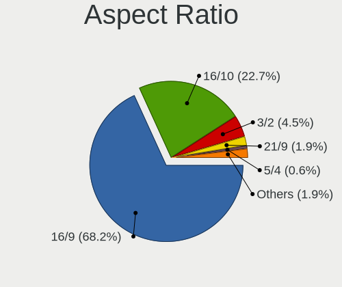

| Ratio   | Notebooks | Percent |
|---------|-----------|---------|
| 16/9    | 105       | 68.18%  |
| 16/10   | 35        | 22.73%  |
| 3/2     | 7         | 4.55%   |
| 21/9    | 3         | 1.95%   |
| 5/4     | 1         | 0.65%   |
| 4/3     | 1         | 0.65%   |
| 0.56    | 1         | 0.65%   |
| Unknown | 1         | 0.65%   |

Monitor Area
------------

Area in inch

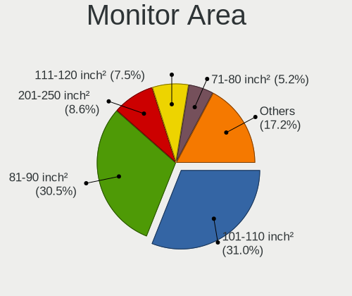

| Area in inch | Notebooks | Percent |
|----------------|-----------|---------|
| 81-90          | 54        | 31.21%  |
| 101-110        | 53        | 30.64%  |
| 201-250        | 15        | 8.67%   |
| 111-120        | 13        | 7.51%   |
| 71-80          | 9         | 5.2%    |
| 351-500        | 7         | 4.05%   |
| 251-300        | 6         | 3.47%   |
| 121-130        | 6         | 3.47%   |
| 151-200        | 3         | 1.73%   |
| More than 1000 | 2         | 1.16%   |
| 301-350        | 2         | 1.16%   |
| 141-150        | 1         | 0.58%   |
| 501-1000       | 1         | 0.58%   |
| Unknown        | 1         | 0.58%   |

Pixel Density
-------------

Pixels per inch

| Density       | Notebooks | Percent |
|---------------|-----------|---------|
| 121-160       | 88        | 52.07%  |
| 161-240       | 32        | 18.93%  |
| 101-120       | 24        | 14.2%   |
| 51-100        | 17        | 10.06%  |
| More than 240 | 5         | 2.96%   |
| 1-50          | 2         | 1.18%   |
| Unknown       | 1         | 0.59%   |

Multiple Monitors
-----------------

Total monitors connected

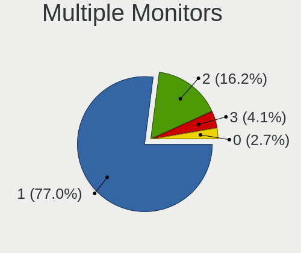

| Total | Notebooks | Percent |
|-------|-----------|---------|
| 1     | 114       | 77.03%  |
| 2     | 24        | 16.22%  |
| 3     | 6         | 4.05%   |
| 0     | 4         | 2.7%    |

Network
-------

Net Controller Vendor
---------------------

Controller vendors

| Vendor                                | Notebooks | Percent |
|---------------------------------------|-----------|---------|
| Intel                                 | 90        | 40.54%  |
| Realtek Semiconductor                 | 77        | 34.68%  |
| MediaTek                              | 21        | 9.46%   |
| Qualcomm                              | 6         | 2.7%    |
| Broadcom                              | 5         | 2.25%   |
| ASIX Electronics                      | 5         | 2.25%   |
| Qualcomm Atheros                      | 4         | 1.8%    |
| Xiaomi                                | 2         | 0.9%    |
| Samsung Electronics                   | 2         | 0.9%    |
| Ralink Technology                     | 2         | 0.9%    |
| Lenovo                                | 2         | 0.9%    |
| Texas Instruments                     | 1         | 0.45%   |
| Marvell Technology Group              | 1         | 0.45%   |
| Google                                | 1         | 0.45%   |
| Emulex                                | 1         | 0.45%   |
| Cisco Aironet Wireless Communications | 1         | 0.45%   |
| Broadcom Limited                      | 1         | 0.45%   |

Net Controller Model
--------------------

Controller models

| Model                                                                  | Notebooks | Percent |
|------------------------------------------------------------------------|-----------|---------|
| Realtek RTL8111/8168/8211/8411 PCI Express Gigabit Ethernet Controller | 54        | 20.3%   |
| Intel Wi-Fi 6 AX200                                                    | 12        | 4.51%   |
| Intel Raptor Lake PCH CNVi WiFi                                        | 11        | 4.14%   |
| MediaTek MT7921 802.11ax PCI Express Wireless Network Adapter          | 10        | 3.76%   |
| Intel Wi-Fi 6E(802.11ax) AX210/AX1675* 2x2 [Typhoon Peak]              | 10        | 3.76%   |
| Intel Wireless 8265 / 8275                                             | 9         | 3.38%   |
| Realtek RTL8153 Gigabit Ethernet Adapter                               | 8         | 3.01%   |
| MediaTek MT7922 802.11ax PCI Express Wireless Network Adapter          | 8         | 3.01%   |
| Intel Alder Lake-P PCH CNVi WiFi                                       | 8         | 3.01%   |
| Qualcomm QCNFA765 Wireless Network Adapter                             | 6         | 2.26%   |
| Realtek RTL8821CE 802.11ac PCIe Wireless Network Adapter               | 5         | 1.88%   |
| Intel Wi-Fi 6 AX201                                                    | 5         | 1.88%   |
| Intel Ethernet Connection (4) I219-LM                                  | 5         | 1.88%   |
| ASIX AX88179 Gigabit Ethernet                                          | 5         | 1.88%   |
| Realtek USB 10/100/1G/2.5G LAN                                         | 4         | 1.5%    |
| Realtek RTL8852AE 802.11ax PCIe Wireless Network Adapter               | 4         | 1.5%    |
| Realtek RTL8852BE PCIe 802.11ax Wireless Network Controller            | 3         | 1.13%   |
| Realtek RTL8822CE 802.11ac PCIe Wireless Network Adapter               | 3         | 1.13%   |
| Realtek RTL810xE PCI Express Fast Ethernet controller                  | 3         | 1.13%   |
| Intel Ethernet Connection (6) I219-LM                                  | 3         | 1.13%   |
| Intel Comet Lake PCH-LP CNVi WiFi                                      | 3         | 1.13%   |
| Intel Comet Lake PCH CNVi WiFi                                         | 3         | 1.13%   |
| Intel Cannon Point-LP CNVi [Wireless-AC]                               | 3         | 1.13%   |
| Intel 82577LM Gigabit Network Connection                               | 3         | 1.13%   |
| Samsung Galaxy series, misc. (tethering mode)                          | 2         | 0.75%   |
| Realtek RTL8125 2.5GbE Controller                                      | 2         | 0.75%   |
| Qualcomm Atheros QCA9377 802.11ac Wireless Network Adapter             | 2         | 0.75%   |
| Intel Wireless 8260                                                    | 2         | 0.75%   |
| Intel Tiger Lake PCH CNVi WiFi                                         | 2         | 0.75%   |
| Intel Gemini Lake PCH CNVi WiFi                                        | 2         | 0.75%   |
| Intel Ethernet Connection I217-LM                                      | 2         | 0.75%   |
| Intel Centrino Ultimate-N 6300                                         | 2         | 0.75%   |
| Intel Cannon Lake PCH CNVi WiFi                                        | 2         | 0.75%   |
| Xiaomi Mi/Redmi series (RNDIS)                                         | 1         | 0.38%   |
| Xiaomi Mi/Redmi series (RNDIS + ADB)                                   | 1         | 0.38%   |
| Texas Instruments XDS2xx USB Emulator - Composit                       | 1         | 0.38%   |
| Realtek RTL88x2bu [AC1200 Techkey]                                     | 1         | 0.38%   |
| Realtek RTL8852CE PCIe 802.11ax Wireless Network Controller            | 1         | 0.38%   |
| Realtek RTL8852BE PCIe 802.11ax Wireless Network Controller [1T1R]     | 1         | 0.38%   |
| Realtek RTL8822BE 802.11a/b/g/n/ac WiFi adapter                        | 1         | 0.38%   |

Wireless Vendor
---------------

Wireless vendors

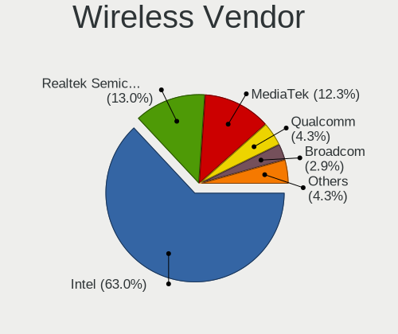

| Vendor                                | Notebooks | Percent |
|---------------------------------------|-----------|---------|
| Intel                                 | 88        | 60.27%  |
| Realtek Semiconductor                 | 22        | 15.07%  |
| MediaTek                              | 20        | 13.7%   |
| Qualcomm                              | 6         | 4.11%   |
| Broadcom                              | 4         | 2.74%   |
| Qualcomm Atheros                      | 3         | 2.05%   |
| Ralink Technology                     | 2         | 1.37%   |
| Cisco Aironet Wireless Communications | 1         | 0.68%   |

Wireless Model
--------------

Wireless models

| Model                                                              | Notebooks | Percent |
|--------------------------------------------------------------------|-----------|---------|
| Intel Wi-Fi 6 AX200                                                | 12        | 8.22%   |
| Intel Raptor Lake PCH CNVi WiFi                                    | 11        | 7.53%   |
| MediaTek MT7921 802.11ax PCI Express Wireless Network Adapter      | 10        | 6.85%   |
| Intel Wi-Fi 6E(802.11ax) AX210/AX1675* 2x2 [Typhoon Peak]          | 10        | 6.85%   |
| Intel Wireless 8265 / 8275                                         | 9         | 6.16%   |
| MediaTek MT7922 802.11ax PCI Express Wireless Network Adapter      | 8         | 5.48%   |
| Intel Alder Lake-P PCH CNVi WiFi                                   | 8         | 5.48%   |
| Qualcomm QCNFA765 Wireless Network Adapter                         | 6         | 4.11%   |
| Realtek RTL8821CE 802.11ac PCIe Wireless Network Adapter           | 5         | 3.42%   |
| Intel Wi-Fi 6 AX201                                                | 5         | 3.42%   |
| Realtek RTL8852AE 802.11ax PCIe Wireless Network Adapter           | 4         | 2.74%   |
| Realtek RTL8852BE PCIe 802.11ax Wireless Network Controller        | 3         | 2.05%   |
| Realtek RTL8822CE 802.11ac PCIe Wireless Network Adapter           | 3         | 2.05%   |
| Intel Comet Lake PCH-LP CNVi WiFi                                  | 3         | 2.05%   |
| Intel Comet Lake PCH CNVi WiFi                                     | 3         | 2.05%   |
| Intel Cannon Point-LP CNVi [Wireless-AC]                           | 3         | 2.05%   |
| Qualcomm Atheros QCA9377 802.11ac Wireless Network Adapter         | 2         | 1.37%   |
| Intel Wireless 8260                                                | 2         | 1.37%   |
| Intel Tiger Lake PCH CNVi WiFi                                     | 2         | 1.37%   |
| Intel Gemini Lake PCH CNVi WiFi                                    | 2         | 1.37%   |
| Intel Centrino Ultimate-N 6300                                     | 2         | 1.37%   |
| Intel Cannon Lake PCH CNVi WiFi                                    | 2         | 1.37%   |
| Realtek RTL88x2bu [AC1200 Techkey]                                 | 1         | 0.68%   |
| Realtek RTL8852CE PCIe 802.11ax Wireless Network Controller        | 1         | 0.68%   |
| Realtek RTL8852BE PCIe 802.11ax Wireless Network Controller [1T1R] | 1         | 0.68%   |
| Realtek RTL8822BE 802.11a/b/g/n/ac WiFi adapter                    | 1         | 0.68%   |
| Realtek RTL8723DE Wireless Network Adapter                         | 1         | 0.68%   |
| Realtek RTL8723BE PCIe Wireless Network Adapter                    | 1         | 0.68%   |
| Realtek 802.11n WLAN Adapter                                       | 1         | 0.68%   |
| Ralink RT5572 Wireless Adapter                                     | 1         | 0.68%   |
| Ralink RT5370 Wireless Adapter                                     | 1         | 0.68%   |
| Qualcomm Atheros QCA6174 802.11ac Wireless Network Adapter         | 1         | 0.68%   |
| MediaTek WiFi                                                      | 1         | 0.68%   |
| MediaTek MT7921K (RZ608) Wi-Fi 6E 80MHz                            | 1         | 0.68%   |
| Intel Wireless 7265                                                | 1         | 0.68%   |
| Intel Wireless 7260                                                | 1         | 0.68%   |
| Intel Wireless 3165                                                | 1         | 0.68%   |
| Intel Wi-Fi 5(802.11ac) Wireless-AC 9x6x [Thunder Peak]            | 1         | 0.68%   |
| Intel Raptor Lake-S PCH CNVi WiFi                                  | 1         | 0.68%   |
| Intel PRO/Wireless 5100 AGN [Shiloh] Network Connection            | 1         | 0.68%   |

Ethernet Vendor
---------------

Ethernet vendors

| Vendor                   | Notebooks | Percent |
|--------------------------|-----------|---------|
| Realtek Semiconductor    | 69        | 60.53%  |
| Intel                    | 27        | 23.68%  |
| ASIX Electronics         | 5         | 4.39%   |
| Xiaomi                   | 2         | 1.75%   |
| Samsung Electronics      | 2         | 1.75%   |
| Lenovo                   | 2         | 1.75%   |
| Qualcomm Atheros         | 1         | 0.88%   |
| MediaTek                 | 1         | 0.88%   |
| Marvell Technology Group | 1         | 0.88%   |
| Google                   | 1         | 0.88%   |
| Emulex                   | 1         | 0.88%   |
| Broadcom Limited         | 1         | 0.88%   |
| Broadcom                 | 1         | 0.88%   |

Ethernet Model
--------------

Ethernet models

| Model                                                                  | Notebooks | Percent |
|------------------------------------------------------------------------|-----------|---------|
| Realtek RTL8111/8168/8211/8411 PCI Express Gigabit Ethernet Controller | 54        | 45.76%  |
| Realtek RTL8153 Gigabit Ethernet Adapter                               | 8         | 6.78%   |
| Intel Ethernet Connection (4) I219-LM                                  | 5         | 4.24%   |
| ASIX AX88179 Gigabit Ethernet                                          | 5         | 4.24%   |
| Realtek USB 10/100/1G/2.5G LAN                                         | 4         | 3.39%   |
| Realtek RTL810xE PCI Express Fast Ethernet controller                  | 3         | 2.54%   |
| Intel Ethernet Connection (6) I219-LM                                  | 3         | 2.54%   |
| Intel 82577LM Gigabit Network Connection                               | 3         | 2.54%   |
| Samsung Galaxy series, misc. (tethering mode)                          | 2         | 1.69%   |
| Realtek RTL8125 2.5GbE Controller                                      | 2         | 1.69%   |
| Intel Ethernet Connection I217-LM                                      | 2         | 1.69%   |
| Xiaomi Mi/Redmi series (RNDIS)                                         | 1         | 0.85%   |
| Xiaomi Mi/Redmi series (RNDIS + ADB)                                   | 1         | 0.85%   |
| Realtek Killer E3000 2.5GbE Controller                                 | 1         | 0.85%   |
| Realtek Killer E2500 Gigabit Ethernet Controller                       | 1         | 0.85%   |
| Qualcomm Atheros QCA8171 Gigabit Ethernet                              | 1         | 0.85%   |
| MediaTek RMX3085                                                       | 1         | 0.85%   |
| Marvell Group 88E8072 PCI-E Gigabit Ethernet Controller                | 1         | 0.85%   |
| Lenovo USB-C Dock Ethernet                                             | 1         | 0.85%   |
| Lenovo ThinkPad TBT 3 Dock                                             | 1         | 0.85%   |
| Intel I210 Gigabit Network Connection                                  | 1         | 0.85%   |
| Intel Ethernet Controller I225-V                                       | 1         | 0.85%   |
| Intel Ethernet Controller (2) I225-LMvP                                | 1         | 0.85%   |
| Intel Ethernet Connection I219-V                                       | 1         | 0.85%   |
| Intel Ethernet Connection I219-LM                                      | 1         | 0.85%   |
| Intel Ethernet Connection (7) I219-V                                   | 1         | 0.85%   |
| Intel Ethernet Connection (6) I219-V                                   | 1         | 0.85%   |
| Intel Ethernet Connection (4) I219-V                                   | 1         | 0.85%   |
| Intel Ethernet Connection (23) I219-V                                  | 1         | 0.85%   |
| Intel Ethernet Connection (23) I219-LM                                 | 1         | 0.85%   |
| Intel Ethernet Connection (16) I219-V                                  | 1         | 0.85%   |
| Intel Ethernet Connection (10) I219-LM                                 | 1         | 0.85%   |
| Intel 82579LM Gigabit Network Connection (Lewisville)                  | 1         | 0.85%   |
| Intel 82540EP Gigabit Ethernet Controller (Mobile)                     | 1         | 0.85%   |
| Google Pixel 7 Pro                                                     | 1         | 0.85%   |
| Emulex OneConnect 10Gb NIC (be3)                                       | 1         | 0.85%   |
| Broadcom NetXtreme BCM5755M Gigabit Ethernet PCI Express               | 1         | 0.85%   |
| Broadcom Limited NetLink BCM5784M Gigabit Ethernet PCIe                | 1         | 0.85%   |

Net Controller Kind
-------------------

Ethernet, WiFi or modem

| Kind     | Notebooks | Percent |
|----------|-----------|---------|
| WiFi     | 142       | 57.26%  |
| Ethernet | 104       | 41.94%  |
| Modem    | 2         | 0.81%   |

Used Controller
---------------

Currently used network controller

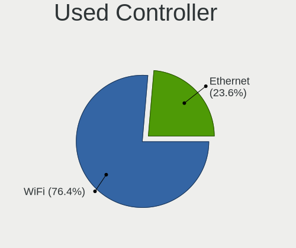

| Kind     | Notebooks | Percent |
|----------|-----------|---------|
| WiFi     | 118       | 79.19%  |
| Ethernet | 31        | 20.81%  |

NICs
----

Total network controllers on board

| Total | Notebooks | Percent |
|-------|-----------|---------|
| 2     | 89        | 61.81%  |
| 1     | 51        | 35.42%  |
| 0     | 2         | 1.39%   |
| 4     | 1         | 0.69%   |
| 3     | 1         | 0.69%   |

IPv6
----

IPv6 vs IPv4

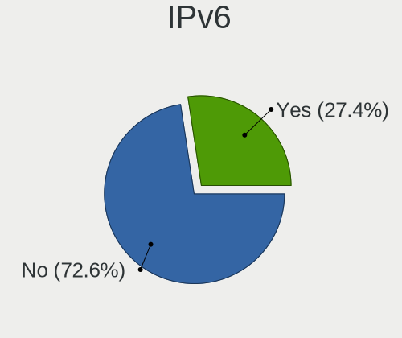

| Used | Notebooks | Percent |
|------|-----------|---------|
| No   | 107       | 73.29%  |
| Yes  | 39        | 26.71%  |

Bluetooth
---------

Bluetooth Vendor
----------------

Controller vendors

| Vendor                | Notebooks | Percent |
|-----------------------|-----------|---------|
| Intel                 | 75        | 57.69%  |
| Realtek Semiconductor | 15        | 11.54%  |
| IMC Networks          | 9         | 6.92%   |
| Foxconn / Hon Hai     | 9         | 6.92%   |
| USI                   | 5         | 3.85%   |
| Lite-On Technology    | 5         | 3.85%   |
| MediaTek              | 4         | 3.08%   |
| Dell                  | 2         | 1.54%   |
| Broadcom              | 2         | 1.54%   |
| Realtek               | 1         | 0.77%   |
| Hewlett-Packard       | 1         | 0.77%   |
| Foxconn International | 1         | 0.77%   |
| Apple                 | 1         | 0.77%   |

Bluetooth Model
---------------

Controller models

| Model                                             | Notebooks | Percent |
|---------------------------------------------------|-----------|---------|
| Intel AX211 Bluetooth                             | 16        | 12.31%  |
| Intel AX201 Bluetooth                             | 16        | 12.31%  |
| Realtek Bluetooth Radio                           | 12        | 9.23%   |
| Intel Bluetooth Device                            | 9         | 6.92%   |
| Intel Bluetooth 9460/9560 Jefferson Peak (JfP)    | 9         | 6.92%   |
| Intel AX210 Bluetooth                             | 9         | 6.92%   |
| Intel AX200 Bluetooth                             | 9         | 6.92%   |
| USI Bluetooth Device                              | 5         | 3.85%   |
| Foxconn / Hon Hai Wireless_Device                 | 5         | 3.85%   |
| MediaTek Wireless_Device                          | 4         | 3.08%   |
| Intel Bluetooth wireless interface                | 4         | 3.08%   |
| Lite-On Wireless_Device                           | 3         | 2.31%   |
| IMC Networks Wireless_Device                      | 3         | 2.31%   |
| IMC Networks Bluetooth Radio                      | 3         | 2.31%   |
| Foxconn / Hon Hai MediaTek Bluetooth Adapter      | 3         | 2.31%   |
| Realtek  Bluetooth 4.2 Adapter                    | 2         | 1.54%   |
| Lite-On Bluetooth Device                          | 2         | 1.54%   |
| Intel Centrino Bluetooth Wireless Transceiver     | 2         | 1.54%   |
| IMC Networks Bluetooth Device                     | 2         | 1.54%   |
| Broadcom BCM2045B (BDC-2.1)                       | 2         | 1.54%   |
| Realtek 802.11ac WLAN Adapter                     | 1         | 0.77%   |
| Realtek Bluetooth Radio                           | 1         | 0.77%   |
| Intel Wireless-AC 9260 Bluetooth Adapter          | 1         | 0.77%   |
| IMC Networks BCM20702A0                           | 1         | 0.77%   |
| HP Broadcom 2070 Bluetooth Combo                  | 1         | 0.77%   |
| Foxconn International BCM43142A0 Bluetooth module | 1         | 0.77%   |
| Foxconn / Hon Hai MediaTek MT7921 Bluetooth       | 1         | 0.77%   |
| Dell Wireless 365 Bluetooth                       | 1         | 0.77%   |
| Dell DW375 Bluetooth Module                       | 1         | 0.77%   |
| Apple Bluetooth Host Controller                   | 1         | 0.77%   |

Sound
-----

Sound Vendor
------------

Sound card vendors

| Vendor                | Notebooks | Percent |
|-----------------------|-----------|---------|
| Intel                 | 85        | 42.71%  |
| AMD                   | 60        | 30.15%  |
| Nvidia                | 29        | 14.57%  |
| Lenovo                | 3         | 1.51%   |
| SteelSeries ApS       | 2         | 1.01%   |
| Realtek Semiconductor | 2         | 1.01%   |
| Razer USA             | 2         | 1.01%   |
| Logitech              | 2         | 1.01%   |
| JBL                   | 2         | 1.01%   |
| Hewlett-Packard       | 2         | 1.01%   |
| Creative Technology   | 2         | 1.01%   |
| C-Media Electronics   | 2         | 1.01%   |
| Plantronics           | 1         | 0.5%    |
| No brand              | 1         | 0.5%    |
| Kingston Technology   | 1         | 0.5%    |
| JMTek                 | 1         | 0.5%    |
| DSEA A/S              | 1         | 0.5%    |
| Unknown               | 1         | 0.5%    |

Sound Model
-----------

Sound card models

| Model                                                               | Notebooks | Percent |
|---------------------------------------------------------------------|-----------|---------|
| AMD Family 17h/19h HD Audio Controller                              | 59        | 22.78%  |
| AMD Renoir Radeon High Definition Audio Controller                  | 28        | 10.81%  |
| Intel Raptor Lake-P/U/H cAVS                                        | 16        | 6.18%   |
| AMD Rembrandt Radeon High Definition Audio Controller               | 16        | 6.18%   |
| Intel Sunrise Point-LP HD Audio                                     | 15        | 5.79%   |
| Nvidia Audio device                                                 | 14        | 5.41%   |
| Intel Tiger Lake-LP Smart Sound Technology Audio Controller         | 9         | 3.47%   |
| AMD Raven/Raven2/Fenghuang HDMI/DP Audio Controller                 | 9         | 3.47%   |
| Intel Alder Lake PCH-P High Definition Audio Controller             | 8         | 3.09%   |
| Nvidia GA104 High Definition Audio Controller                       | 4         | 1.54%   |
| Intel Cannon Point-LP High Definition Audio Controller              | 4         | 1.54%   |
| Intel 8 Series/C220 Series Chipset High Definition Audio Controller | 4         | 1.54%   |
| Intel 5 Series/3400 Series Chipset High Definition Audio            | 4         | 1.54%   |
| Nvidia TU106 High Definition Audio Controller                       | 3         | 1.16%   |
| Intel Comet Lake PCH-LP cAVS                                        | 3         | 1.16%   |
| Intel Comet Lake PCH cAVS                                           | 3         | 1.16%   |
| Intel Celeron/Pentium Silver Processor High Definition Audio        | 3         | 1.16%   |
| Intel Cannon Lake PCH cAVS                                          | 3         | 1.16%   |
| Realtek Semiconductor USB Audio                                     | 2         | 0.77%   |
| Nvidia TU116 High Definition Audio Controller                       | 2         | 0.77%   |
| Nvidia GK106 HDMI Audio Controller                                  | 2         | 0.77%   |
| JBL Quantum 400                                                     | 2         | 0.77%   |
| Intel Tiger Lake-H HD Audio Controller                              | 2         | 0.77%   |
| Intel 82801I (ICH9 Family) HD Audio Controller                      | 2         | 0.77%   |
| AMD Navi 21/23 HDMI/DP Audio Controller                             | 2         | 0.77%   |
| SteelSeries ApS SteelSeries Arctis 1 Wireless                       | 1         | 0.39%   |
| SteelSeries ApS Arctis Nova Pro Wireless                            | 1         | 0.39%   |
| Razer USA Razer Kaira Pro 2.4                                       | 1         | 0.39%   |
| Razer USA Kraken Tournament Edition                                 | 1         | 0.39%   |
| Plantronics EncorePro 545 USB                                       | 1         | 0.39%   |
| Nvidia TU107 GeForce GTX 1650 High Definition Audio Controller      | 1         | 0.39%   |
| Nvidia GT216 HDMI Audio Controller                                  | 1         | 0.39%   |
| Nvidia GP104 High Definition Audio Controller                       | 1         | 0.39%   |
| Nvidia GA106 High Definition Audio Controller                       | 1         | 0.39%   |
| No brand CalDigit Thunderbolt 3 Audio                               | 1         | 0.39%   |
| Logitech G435 Wireless Gaming Headset                               | 1         | 0.39%   |
| Logitech G432 Gaming Headset                                        | 1         | 0.39%   |
| Lenovo ThinkPad USB-C Dock Gen2 USB Audio                           | 1         | 0.39%   |
| Lenovo ThinkPad USB-C Dock Audio                                    | 1         | 0.39%   |
| Lenovo ThinkPad Thunderbolt 3 Dock USB Audio                        | 1         | 0.39%   |

Memory
------

Memory Vendor
-------------

Memory module vendors

| Vendor              | Notebooks | Percent |
|---------------------|-----------|---------|
| Samsung Electronics | 49        | 29.88%  |
| SK hynix            | 28        | 17.07%  |
| Micron Technology   | 26        | 15.85%  |
| Crucial             | 16        | 9.76%   |
| Kingston            | 10        | 6.1%    |
| Unknown             | 7         | 4.27%   |
| A-DATA Technology   | 5         | 3.05%   |
| Unknown             | 4         | 2.44%   |
| Corsair             | 4         | 2.44%   |
| Elpida              | 3         | 1.83%   |
| Unknown (ABCD)      | 2         | 1.22%   |
| Ramaxel Technology  | 2         | 1.22%   |
| Team                | 1         | 0.61%   |
| Nanya Technology    | 1         | 0.61%   |
| Kimtigo             | 1         | 0.61%   |
| G.Skill             | 1         | 0.61%   |
| CSX                 | 1         | 0.61%   |
| Avant               | 1         | 0.61%   |
| Apacer              | 1         | 0.61%   |
| AMD                 | 1         | 0.61%   |

Memory Model
------------

Memory module models

| Model                                                            | Notebooks | Percent |
|------------------------------------------------------------------|-----------|---------|
| Unknown                                                          | 7         | 4.02%   |
| Samsung RAM M471A5244CB0-CTD 4GB SODIMM DDR4 3266MT/s            | 5         | 2.87%   |
| SK hynix RAM HMAA1GS6CJR6N-XN 8GB SODIMM DDR4 3200MT/s           | 4         | 2.3%    |
| Samsung RAM M471A1G44BB0-CWE 8GB SODIMM DDR4 3200MT/s            | 4         | 2.3%    |
| Samsung RAM M471A1K43EB1-CWE 8GB SODIMM DDR4 3200MT/s            | 3         | 1.72%   |
| Samsung RAM M471A1G44AB0-CWE 8192MB SODIMM DDR4 3200MT/s         | 3         | 1.72%   |
| Samsung RAM M425R1GB4BB0-CQKOL 8GB SODIMM 4800MT/s               | 3         | 1.72%   |
| Micron RAM MTC4C10163S1SC48BA1 8GB SODIMM DDR5 4800MT/s          | 3         | 1.72%   |
| Micron RAM MT62F2G32D8DR-031 WT 8GB SODIMM LPDDR5 6400MT/s       | 3         | 1.72%   |
| Crucial RAM CT16G4SFRA32A.C8FE 16384MB SODIMM DDR4 3200MT/s      | 3         | 1.72%   |
| Unknown (ABCD) RAM 123456789012345678 2GB SODIMM LPDDR4 2400MT/s | 2         | 1.15%   |
| SK hynix RAM Module 8GB SODIMM DDR4 2400MT/s                     | 2         | 1.15%   |
| SK hynix RAM Module 4GB SODIMM DDR4 2400MT/s                     | 2         | 1.15%   |
| SK hynix RAM HMT451S6AFR8A-PB 4096MB SODIMM DDR3 1600MT/s        | 2         | 1.15%   |
| SK hynix RAM HMAA2GS6CJR8N-XN 16GB SODIMM DDR4 3200MT/s          | 2         | 1.15%   |
| SK hynix RAM H9JCNNNFA5MLYR-N6E 8GB SODIMM LPDDR5 6400MT/s       | 2         | 1.15%   |
| Samsung RAM M471B5273DH0-CH9 4GB SODIMM DDR3 1334MT/s            | 2         | 1.15%   |
| Samsung RAM M471B1G73QH0-YK0 8GB SODIMM DDR3 1600MT/s            | 2         | 1.15%   |
| Samsung RAM M471A5244CB0-CWE 4GB SODIMM DDR4 3200MT/s            | 2         | 1.15%   |
| Samsung RAM M471A2K43CB1-CTD 16GB SODIMM DDR4 8400MT/s           | 2         | 1.15%   |
| Samsung RAM M471A1G44BB0-CWE 8GB Row Of Chips DDR4 3200MT/s      | 2         | 1.15%   |
| Micron RAM 8ATF1G64HZ-3G2R1 8GB SODIMM DDR4 3200MT/s             | 2         | 1.15%   |
| Micron RAM 8ATF1G64HZ-3G2J1 8GB SODIMM DDR4 3200MT/s             | 2         | 1.15%   |
| Micron RAM 4ATF1G64HZ-3G2F1 8GB SODIMM DDR4 3200MT/s             | 2         | 1.15%   |
| Micron RAM 4ATF1G64HZ-3G2E1 8GB SODIMM DDR4 3200MT/s             | 2         | 1.15%   |
| Kingston RAM KF556S40-32 32GB SODIMM DDR5 5600MT/s               | 2         | 1.15%   |
| Elpida RAM EBJ41UF8BCS0-DJ-F 4GB SODIMM DDR3 1334MT/s            | 2         | 1.15%   |
| Crucial RAM CT32G48C40S5.C16A1 32GB SODIMM DDR5 4800MT/s         | 2         | 1.15%   |
| Crucial RAM CT16G4SFRA32A.M16FR 16GB SODIMM DDR4 3200MT/s        | 2         | 1.15%   |
| Crucial RAM CT102464BF160B.C16 8GB SODIMM DDR3 1600MT/s          | 2         | 1.15%   |
| Unknown RAM Module 8GB SODIMM DDR4 2667MT/s                      | 1         | 0.57%   |
| Unknown RAM Module 2GB SODIMM DDR2 667MT/s                       | 1         | 0.57%   |
| Unknown RAM Module 2GB Row Of Chips LPDDR4 4267MT/s              | 1         | 0.57%   |
| Unknown RAM Module 1GB SODIMM DDR                                | 1         | 0.57%   |
| Team RAM TEAMGROUP-SD4-3200 16384MB SODIMM DDR4 3200MT/s         | 1         | 0.57%   |
| SK hynix RAM Module 8GB SODIMM DDR4 2667MT/s                     | 1         | 0.57%   |
| SK hynix RAM Module 8GB Row Of Chips LPDDR3 2133MT/s             | 1         | 0.57%   |
| SK hynix RAM Module 16GB SODIMM DDR4 2400MT/s                    | 1         | 0.57%   |
| SK hynix RAM HMT351S6EFR8C-PB 4096MB SODIMM DDR3 1600MT/s        | 1         | 0.57%   |
| SK hynix RAM HMCG78AGBSA095N 16GB SODIMM DDR5 5600MT/s           | 1         | 0.57%   |

Memory Kind
-----------

Memory module kinds

| Kind   | Notebooks | Percent |
|--------|-----------|---------|
| DDR4   | 83        | 59.29%  |
| DDR5   | 20        | 14.29%  |
| LPDDR5 | 13        | 9.29%   |
| DDR3   | 13        | 9.29%   |
| LPDDR4 | 6         | 4.29%   |
| DDR2   | 2         | 1.43%   |
| SDRAM  | 1         | 0.71%   |
| LPDDR3 | 1         | 0.71%   |
| DDR    | 1         | 0.71%   |

Memory Form Factor
------------------

Physical design of the memory module

| Name         | Notebooks | Percent |
|--------------|-----------|---------|
| SODIMM       | 125       | 89.29%  |
| Row Of Chips | 14        | 10%     |
| Unknown      | 1         | 0.71%   |

Memory Size
-----------

Memory module size

| Size  | Notebooks | Percent |
|-------|-----------|---------|
| 8192  | 66        | 42.04%  |
| 16384 | 37        | 23.57%  |
| 4096  | 24        | 15.29%  |
| 32768 | 19        | 12.1%   |
| 2048  | 9         | 5.73%   |
| 49152 | 1         | 0.64%   |
| 1024  | 1         | 0.64%   |

Memory Speed
------------

Memory module speed

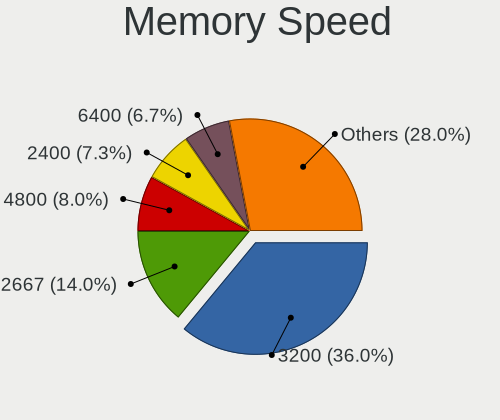

| Speed   | Notebooks | Percent |
|---------|-----------|---------|
| 3200    | 55        | 36.67%  |
| 2667    | 20        | 13.33%  |
| 4800    | 12        | 8%      |
| 2400    | 12        | 8%      |
| 6400    | 10        | 6.67%   |
| 5600    | 9         | 6%      |
| 1600    | 7         | 4.67%   |
| 3266    | 5         | 3.33%   |
| 1334    | 4         | 2.67%   |
| 8400    | 2         | 1.33%   |
| 4267    | 2         | 1.33%   |
| 4266    | 2         | 1.33%   |
| 1333    | 2         | 1.33%   |
| 667     | 2         | 1.33%   |
| 8600    | 1         | 0.67%   |
| 7500    | 1         | 0.67%   |
| 5500    | 1         | 0.67%   |
| 2133    | 1         | 0.67%   |
| 2048    | 1         | 0.67%   |
| Unknown | 1         | 0.67%   |

Printers & scanners
-------------------

Printer Vendor
--------------

Printer device vendors

Zero info for selected period =(

Printer Model
-------------

Printer device models

Zero info for selected period =(

Scanner Vendor
--------------

Scanner device vendors

Zero info for selected period =(

Scanner Model
-------------

Scanner device models

Zero info for selected period =(

Camera
------

Camera Vendor
-------------

Camera device vendors

| Vendor                                 | Notebooks | Percent |
|----------------------------------------|-----------|---------|
| Chicony Electronics                    | 30        | 24.39%  |
| IMC Networks                           | 22        | 17.89%  |
| Microdia                               | 10        | 8.13%   |
| Realtek Semiconductor                  | 9         | 7.32%   |
| Bison Electronics                      | 9         | 7.32%   |
| Quanta                                 | 8         | 6.5%    |
| Luxvisions Innotech Limited            | 8         | 6.5%    |
| Sonix Technology                       | 4         | 3.25%   |
| Lite-On Technology                     | 4         | 3.25%   |
| Cheng Uei Precision Industry (Foxlink) | 4         | 3.25%   |
| Sunplus Innovation Technology          | 3         | 2.44%   |
| Syntek                                 | 2         | 1.63%   |
| Logitech                               | 2         | 1.63%   |
| Tripath Technology                     | 1         | 0.81%   |
| Silicon Motion                         | 1         | 0.81%   |
| Ricoh                                  | 1         | 0.81%   |
| Lenovo                                 | 1         | 0.81%   |
| kingcome                               | 1         | 0.81%   |
| Goodong                                | 1         | 0.81%   |
| BTF-230906-J                           | 1         | 0.81%   |
| Acer                                   | 1         | 0.81%   |

Camera Model
------------

Camera device models

| Model                                                | Notebooks | Percent |
|------------------------------------------------------|-----------|---------|
| Chicony Integrated Camera                            | 15        | 12%     |
| IMC Networks USB2.0 HD UVC WebCam                    | 7         | 5.6%    |
| IMC Networks Integrated Camera                       | 7         | 5.6%    |
| Realtek Laptop Camera                                | 5         | 4%      |
| Microdia Integrated_Webcam_HD                        | 5         | 4%      |
| Lite-On HP HD Camera                                 | 4         | 3.2%    |
| Quanta HD User Facing                                | 3         | 2.4%    |
| Chicony Integrated IR Camera                         | 3         | 2.4%    |
| Cheng Uei Precision Industry (Foxlink) HP 5MP Camera | 3         | 2.4%    |
| Bison Integrated Camera                              | 3         | 2.4%    |
| Syntek Integrated Camera                             | 2         | 1.6%    |
| Sonix USB2.0 HD UVC WebCam                           | 2         | 1.6%    |
| Sonix USB2.0 FHD UVC WebCam                          | 2         | 1.6%    |
| Quanta HP TrueVision HD Camera                       | 2         | 1.6%    |
| Microdia USB 2.0 Camera                              | 2         | 1.6%    |
| Luxvisions Innotech Limited Integrated RGB Camera    | 2         | 1.6%    |
| Luxvisions Innotech Limited HP Wide Vision HD Camera | 2         | 1.6%    |
| Luxvisions Innotech Limited HP HD Camera             | 2         | 1.6%    |
| IMC Networks USB2.0 VGA UVC WebCam                   | 2         | 1.6%    |
| Chicony USB2.0 Camera                                | 2         | 1.6%    |
| Chicony Integrated Camera (1280x720@30)              | 2         | 1.6%    |
| Chicony HP Wide Vision HD Camera                     | 2         | 1.6%    |
| Chicony HP HD Camera                                 | 2         | 1.6%    |
| Chicony HD WebCam                                    | 2         | 1.6%    |
| Chicony HD User Facing                               | 2         | 1.6%    |
| Bison HD Webcam                                      | 2         | 1.6%    |
| Tripath USB Camera                                   | 1         | 0.8%    |
| Sunplus XiaoMi USB 2.0 Webcam                        | 1         | 0.8%    |
| Sunplus Integrated_Webcam_HD                         | 1         | 0.8%    |
| Sunplus Integrated_Webcam_FHD                        | 1         | 0.8%    |
| Silicon Motion 300k Pixel Camera                     | 1         | 0.8%    |
| Ricoh HD Webcam                                      | 1         | 0.8%    |
| Realtek Lenovo EasyCamera                            | 1         | 0.8%    |
| Realtek Integrated_Webcam_HD                         | 1         | 0.8%    |
| Realtek Integrated_Webcam_FHD                        | 1         | 0.8%    |
| Realtek Bluetooth Radio                              | 1         | 0.8%    |
| Quanta USB2.0 HD UVC WebCam                          | 1         | 0.8%    |
| Quanta HP Wide Vision HD Camera                      | 1         | 0.8%    |
| Quanta HP True Vision FHD Camera                     | 1         | 0.8%    |
| Microdia Sonix 1.3 MP Laptop Integrated Webcam       | 1         | 0.8%    |

Security
--------

Fingerprint Vendor
------------------

Fingerprint sensor vendors

| Vendor                             | Notebooks | Percent |
|------------------------------------|-----------|---------|
| Synaptics                          | 16        | 53.33%  |
| Validity Sensors                   | 6         | 20%     |
| Shenzhen Goodix Technology         | 4         | 13.33%  |
| Upek                               | 1         | 3.33%   |
| Realtek USB2.0 Finger Print Bridge | 1         | 3.33%   |
| LighTuning Technology              | 1         | 3.33%   |
| Elan Microelectronics              | 1         | 3.33%   |

Fingerprint Model
-----------------

Fingerprint sensor models

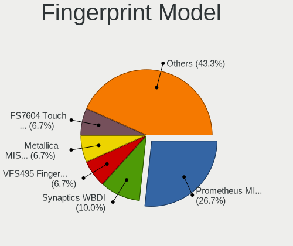

| Model                                                                      | Notebooks | Percent |
|----------------------------------------------------------------------------|-----------|---------|
| Synaptics Prometheus MIS Touch Fingerprint Reader                          | 8         | 26.67%  |
| Validity Sensors Synaptics WBDI                                            | 3         | 10%     |
| Validity Sensors VFS495 Fingerprint Reader                                 | 2         | 6.67%   |
| Synaptics Metallica MIS Touch Fingerprint Reader                           | 2         | 6.67%   |
| Synaptics FS7604 Touch Fingerprint Sensor with PurePrint                   | 2         | 6.67%   |
| Shenzhen Goodix  Fingerprint Device                                        | 2         | 6.67%   |
| Shenzhen Goodix Fingerprint Reader                                         | 2         | 6.67%   |
| Validity Sensors Synaptics VFS7552 Touch Fingerprint Sensor with PurePrint | 1         | 3.33%   |
| Upek Biometric Touchchip/Touchstrip Fingerprint Sensor                     | 1         | 3.33%   |
| Synaptics UWP WBDI Device                                                  | 1         | 3.33%   |
| Synaptics  FS7604 Touch Fingerprint Sensor with PurePrint                  | 1         | 3.33%   |
| Synaptics Metallica MOH Touch Fingerprint Reader                           | 1         | 3.33%   |
| Synaptics Fingerprint reader [HP G6]                                       | 1         | 3.33%   |
| Realtek USB2.0 Finger Print Bridge FocalTech Fingerprint Device            | 1         | 3.33%   |
| LighTuning EgisTec Touch Fingerprint Sensor                                | 1         | 3.33%   |
| Elan ELAN:Fingerprint                                                      | 1         | 3.33%   |

Chipcard Vendor
---------------

Chipcard module vendors

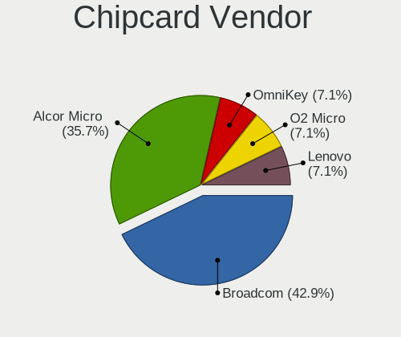

| Vendor      | Notebooks | Percent |
|-------------|-----------|---------|
| Broadcom    | 6         | 42.86%  |
| Alcor Micro | 5         | 35.71%  |
| OmniKey     | 1         | 7.14%   |
| O2 Micro    | 1         | 7.14%   |
| Lenovo      | 1         | 7.14%   |

Chipcard Model
--------------

Chipcard module models

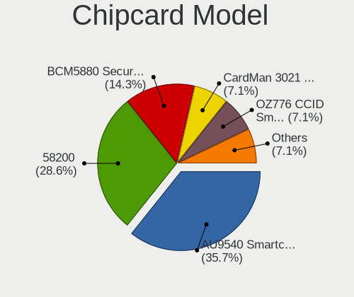

| Model                                          | Notebooks | Percent |
|------------------------------------------------|-----------|---------|
| Alcor Micro AU9540 Smartcard Reader            | 5         | 35.71%  |
| Broadcom 58200                                 | 4         | 28.57%  |
| Broadcom BCM5880 Secure Applications Processor | 2         | 14.29%  |
| OmniKey CardMan 3021 / 3121                    | 1         | 7.14%   |
| O2 Micro OZ776 CCID Smartcard Reader           | 1         | 7.14%   |
| Lenovo Integrated Smart Card Reader            | 1         | 7.14%   |

Unsupported
-----------

Unsupported Devices
-------------------

Total unsupported devices on board

| Total | Notebooks | Percent |
|-------|-----------|---------|
| 0     | 65        | 42.21%  |
| 1     | 42        | 27.27%  |
| 2     | 19        | 12.34%  |
| 3     | 12        | 7.79%   |
| 5     | 9         | 5.84%   |
| 4     | 5         | 3.25%   |
| 6     | 2         | 1.3%    |

Unsupported Device Types
------------------------

Types of unsupported devices

| Type                     | Notebooks | Percent |
|--------------------------|-----------|---------|
| Fingerprint reader       | 29        | 16.96%  |
| Graphics card            | 22        | 12.87%  |
| Bluetooth                | 22        | 12.87%  |
| Camera                   | 21        | 12.28%  |
| Multimedia controller    | 18        | 10.53%  |
| Communication controller | 17        | 9.94%   |
| Chipcard                 | 14        | 8.19%   |
| Net/wireless             | 13        | 7.6%    |
| Card reader              | 5         | 2.92%   |
| Network                  | 3         | 1.75%   |
| Sound                    | 2         | 1.17%   |
| Net/ethernet             | 2         | 1.17%   |
| Firewire controller      | 2         | 1.17%   |
| Storage/ata              | 1         | 0.58%   |

