Gentoo 2.14 - Tested Hardware & Statistics
------------------------------------------

A project to collect tested hardware configurations for Gentoo 2.14.

Anyone can contribute to this report by the [hw-probe](https://github.com/linuxhw/hw-probe) tool:

    sudo -E hw-probe -all -upload

Please contribute! Especially if your hardware is rare.

This is a report for all computer types. See also reports for [desktops](/Dist/Gentoo_2.14/Desktop/README.md) and [notebooks](/Dist/Gentoo_2.14/Notebook/README.md).

Contents
--------

* [ Test Cases ](#test-cases)

* [ System ](#system)
  - [ Kernel                   ](#kernel)
  - [ Kernel Family            ](#kernel-family)
  - [ Kernel Major Ver.        ](#kernel-major-ver)
  - [ Arch                     ](#arch)
  - [ DE                       ](#de)
  - [ Display Server           ](#display-server)
  - [ Display Manager          ](#display-manager)
  - [ OS Lang                  ](#os-lang)
  - [ Boot Mode                ](#boot-mode)
  - [ Filesystem               ](#filesystem)
  - [ Part. scheme             ](#part-scheme)
  - [ Dual Boot with Linux/BSD ](#dual-boot-with-linuxbsd)
  - [ Dual Boot (Win)          ](#dual-boot-win)

* [ Board ](#board)
  - [ Vendor                   ](#vendor)
  - [ Model                    ](#model)
  - [ Model Family             ](#model-family)
  - [ MFG Year                 ](#mfg-year)
  - [ Form Factor              ](#form-factor)
  - [ Secure Boot              ](#secure-boot)
  - [ Coreboot                 ](#coreboot)
  - [ RAM Size                 ](#ram-size)
  - [ RAM Used                 ](#ram-used)
  - [ Total Drives             ](#total-drives)
  - [ Has CD-ROM               ](#has-cd-rom)
  - [ Has Ethernet             ](#has-ethernet)
  - [ Has WiFi                 ](#has-wifi)
  - [ Has Bluetooth            ](#has-bluetooth)

* [ Location ](#location)
  - [ Country                  ](#country)
  - [ City                     ](#city)

* [ Drives ](#drives)
  - [ Drive Vendor             ](#drive-vendor)
  - [ Drive Model              ](#drive-model)
  - [ HDD Vendor               ](#hdd-vendor)
  - [ SSD Vendor               ](#ssd-vendor)
  - [ Drive Kind               ](#drive-kind)
  - [ Drive Connector          ](#drive-connector)
  - [ Drive Size               ](#drive-size)
  - [ Space Total              ](#space-total)
  - [ Space Used               ](#space-used)
  - [ Malfunc. Drives          ](#malfunc-drives)
  - [ Malfunc. Drive Vendor    ](#malfunc-drive-vendor)
  - [ Malfunc. HDD Vendor      ](#malfunc-hdd-vendor)
  - [ Malfunc. Drive Kind      ](#malfunc-drive-kind)
  - [ Failed Drives            ](#failed-drives)
  - [ Failed Drive Vendor      ](#failed-drive-vendor)
  - [ Drive Status             ](#drive-status)

* [ Storage controller ](#storage-controller)
  - [ Storage Vendor           ](#storage-vendor)
  - [ Storage Model            ](#storage-model)
  - [ Storage Kind             ](#storage-kind)

* [ Processor ](#processor)
  - [ CPU Vendor               ](#cpu-vendor)
  - [ CPU Model                ](#cpu-model)
  - [ CPU Model Family         ](#cpu-model-family)
  - [ CPU Cores                ](#cpu-cores)
  - [ CPU Sockets              ](#cpu-sockets)
  - [ CPU Threads              ](#cpu-threads)
  - [ CPU Op-Modes             ](#cpu-op-modes)
  - [ CPU Microcode            ](#cpu-microcode)
  - [ CPU Microarch            ](#cpu-microarch)

* [ Graphics ](#graphics)
  - [ GPU Vendor               ](#gpu-vendor)
  - [ GPU Model                ](#gpu-model)
  - [ GPU Combo                ](#gpu-combo)
  - [ GPU Driver               ](#gpu-driver)
  - [ GPU Memory               ](#gpu-memory)

* [ Monitor ](#monitor)
  - [ Monitor Vendor           ](#monitor-vendor)
  - [ Monitor Model            ](#monitor-model)
  - [ Monitor Resolution       ](#monitor-resolution)
  - [ Monitor Diagonal         ](#monitor-diagonal)
  - [ Monitor Width            ](#monitor-width)
  - [ Aspect Ratio             ](#aspect-ratio)
  - [ Monitor Area             ](#monitor-area)
  - [ Pixel Density            ](#pixel-density)
  - [ Multiple Monitors        ](#multiple-monitors)

* [ Network ](#network)
  - [ Net Controller Vendor    ](#net-controller-vendor)
  - [ Net Controller Model     ](#net-controller-model)
  - [ Wireless Vendor          ](#wireless-vendor)
  - [ Wireless Model           ](#wireless-model)
  - [ Ethernet Vendor          ](#ethernet-vendor)
  - [ Ethernet Model           ](#ethernet-model)
  - [ Net Controller Kind      ](#net-controller-kind)
  - [ Used Controller          ](#used-controller)
  - [ NICs                     ](#nics)
  - [ IPv6                     ](#ipv6)

* [ Bluetooth ](#bluetooth)
  - [ Bluetooth Vendor         ](#bluetooth-vendor)
  - [ Bluetooth Model          ](#bluetooth-model)

* [ Sound ](#sound)
  - [ Sound Vendor             ](#sound-vendor)
  - [ Sound Model              ](#sound-model)

* [ Memory ](#memory)
  - [ Memory Vendor            ](#memory-vendor)
  - [ Memory Model             ](#memory-model)
  - [ Memory Kind              ](#memory-kind)
  - [ Memory Form Factor       ](#memory-form-factor)
  - [ Memory Size              ](#memory-size)
  - [ Memory Speed             ](#memory-speed)

* [ Printers & scanners ](#printers--scanners)
  - [ Printer Vendor           ](#printer-vendor)
  - [ Printer Model            ](#printer-model)
  - [ Scanner Vendor           ](#scanner-vendor)
  - [ Scanner Model            ](#scanner-model)

* [ Camera ](#camera)
  - [ Camera Vendor            ](#camera-vendor)
  - [ Camera Model             ](#camera-model)

* [ Security ](#security)
  - [ Fingerprint Vendor       ](#fingerprint-vendor)
  - [ Fingerprint Model        ](#fingerprint-model)
  - [ Chipcard Vendor          ](#chipcard-vendor)
  - [ Chipcard Model           ](#chipcard-model)

* [ Unsupported ](#unsupported)
  - [ Unsupported Devices      ](#unsupported-devices)
  - [ Unsupported Device Types ](#unsupported-device-types)

Test Cases
----------

Total: 548

| Vendor        | Model                       | Form-Factor | Probe                                                      | Date         |
|---------------|-----------------------------|-------------|------------------------------------------------------------|--------------|
| MSI           | Z170A GAMING M7             | Desktop     | [2a0282544c](https://linux-hardware.org/?probe=2a0282544c) | Oct 21, 2024 |
| Lenovo        | ThinkPad T14 Gen 3 21CGS... | Notebook    | [f76edee790](https://linux-hardware.org/?probe=f76edee790) | Sep 01, 2024 |
| Medion        | Erazer X6603 MD60599        | Notebook    | [ac7cfb3b96](https://linux-hardware.org/?probe=ac7cfb3b96) | Aug 03, 2024 |
| Lenovo        | ThinkBook 16 G6 ABP 21KK    | Notebook    | [77fc74f4e0](https://linux-hardware.org/?probe=77fc74f4e0) | Jun 29, 2024 |
| Gigabyte      | X399 AORUS PRO-CF           | Desktop     | [6bf41ddb51](https://linux-hardware.org/?probe=6bf41ddb51) | Jun 27, 2024 |
| ASRock        | B550M Phantom Gaming 4      | Desktop     | [55cfe8a68f](https://linux-hardware.org/?probe=55cfe8a68f) | Jun 23, 2024 |
| Dell          | G15 5510                    | Notebook    | [b0f24c0066](https://linux-hardware.org/?probe=b0f24c0066) | Jun 18, 2024 |
| Lenovo        | Yoga C940-14IIL 81Q9        | Convertible | [e01e29fe11](https://linux-hardware.org/?probe=e01e29fe11) | May 24, 2024 |
| MSI           | Z170A GAMING M7             | Desktop     | [e1892a119b](https://linux-hardware.org/?probe=e1892a119b) | May 08, 2024 |
| ASUSTek       | M3A78-CM                    | Desktop     | [0bcef3f207](https://linux-hardware.org/?probe=0bcef3f207) | May 06, 2024 |
| HP            | Spectre x360 Convertible... | Convertible | [66c6c3e199](https://linux-hardware.org/?probe=66c6c3e199) | May 06, 2024 |
| HP            | Spectre x360 Convertible... | Convertible | [24ef78e496](https://linux-hardware.org/?probe=24ef78e496) | May 06, 2024 |
| Lenovo        | ThinkPad T14s Gen 1 20T1... | Notebook    | [f6152a7042](https://linux-hardware.org/?probe=f6152a7042) | May 03, 2024 |
| HP            | ProBook 4510s               | Notebook    | [a6f89b6485](https://linux-hardware.org/?probe=a6f89b6485) | May 02, 2024 |
| Dell          | XPS 13 9310                 | Notebook    | [50ea9a7b8e](https://linux-hardware.org/?probe=50ea9a7b8e) | May 01, 2024 |
| Dell          | XPS 13 9310                 | Notebook    | [39ab9869d2](https://linux-hardware.org/?probe=39ab9869d2) | May 01, 2024 |
| HP            | EliteBook 845 14 inch G1... | Notebook    | [8fa3424cce](https://linux-hardware.org/?probe=8fa3424cce) | Apr 30, 2024 |
| HP            | EliteBook 845 14 inch G1... | Notebook    | [62914f0506](https://linux-hardware.org/?probe=62914f0506) | Apr 30, 2024 |
| ASUSTek       | M5A99FX PRO R2.0            | Desktop     | [9dcdf5a463](https://linux-hardware.org/?probe=9dcdf5a463) | Apr 29, 2024 |
| ASUSTek       | ASUS TUF Gaming A15 FA50... | Notebook    | [703d565003](https://linux-hardware.org/?probe=703d565003) | Apr 26, 2024 |
| Lenovo        | ThinkPad T14 Gen 3 21CGS... | Notebook    | [c207bea569](https://linux-hardware.org/?probe=c207bea569) | Apr 25, 2024 |
| ASUSTek       | M3A78-CM                    | Desktop     | [cdc42c64dd](https://linux-hardware.org/?probe=cdc42c64dd) | Apr 22, 2024 |
| Gigabyte      | B75-D3V                     | Desktop     | [4ddc5c0d0d](https://linux-hardware.org/?probe=4ddc5c0d0d) | Apr 21, 2024 |
| ASUSTek       | ASUS TUF Gaming A15 FA50... | Notebook    | [4c782693bf](https://linux-hardware.org/?probe=4c782693bf) | Apr 20, 2024 |
| Quanta        | S210-X12MS 31S2MMB0040      | Server      | [7dbf4f941d](https://linux-hardware.org/?probe=7dbf4f941d) | Apr 20, 2024 |
| Framework     | Laptop (13th Gen Intel C... | Notebook    | [2bb3d4f699](https://linux-hardware.org/?probe=2bb3d4f699) | Apr 19, 2024 |
| MSI           | PRO B650M-P                 | Desktop     | [90165c7480](https://linux-hardware.org/?probe=90165c7480) | Apr 18, 2024 |
| Lenovo        | ZHAOYANG E43                | Notebook    | [1192eac8f1](https://linux-hardware.org/?probe=1192eac8f1) | Apr 17, 2024 |
| Chuwi         | GemiBook XPro               | Notebook    | [9ebacb4cf9](https://linux-hardware.org/?probe=9ebacb4cf9) | Apr 17, 2024 |
| ASUSTek       | ROG STRIX X670E-E GAMING... | Desktop     | [25c95d871e](https://linux-hardware.org/?probe=25c95d871e) | Apr 16, 2024 |
| ASUSTek       | ROG STRIX Z390-E GAMING     | Desktop     | [8a95e3759a](https://linux-hardware.org/?probe=8a95e3759a) | Apr 15, 2024 |
| Lenovo        | ThinkPad T480 20L6SAYX00    | Notebook    | [f53da67ab4](https://linux-hardware.org/?probe=f53da67ab4) | Apr 15, 2024 |
| Unknown       | RK3588 OPi 5 Plus           | Soc         | [c74a284aaf](https://linux-hardware.org/?probe=c74a284aaf) | Apr 15, 2024 |
| Lenovo        | ThinkPad T480 20L6SAYX00    | Notebook    | [fc73e6bb02](https://linux-hardware.org/?probe=fc73e6bb02) | Apr 15, 2024 |
| Lenovo        | ThinkPad T14 Gen 3 21CGS... | Notebook    | [c28ddacfd6](https://linux-hardware.org/?probe=c28ddacfd6) | Apr 13, 2024 |
| Gigabyte      | B560M AORUS PRO             | Desktop     | [6e49d2f74b](https://linux-hardware.org/?probe=6e49d2f74b) | Apr 13, 2024 |
| Lenovo        | ThinkPad E15 Gen 2 20T80... | Notebook    | [2eea232a7e](https://linux-hardware.org/?probe=2eea232a7e) | Apr 13, 2024 |
| Dell          | Latitude 5440               | Notebook    | [1fb5966e12](https://linux-hardware.org/?probe=1fb5966e12) | Apr 12, 2024 |
| Dell          | G15 5510                    | Notebook    | [e8cfa16a81](https://linux-hardware.org/?probe=e8cfa16a81) | Apr 12, 2024 |
| Dell          | G15 5510                    | Notebook    | [9ed69c889f](https://linux-hardware.org/?probe=9ed69c889f) | Apr 12, 2024 |
| HP            | 1589                        | Desktop     | [fd455c0623](https://linux-hardware.org/?probe=fd455c0623) | Apr 12, 2024 |
| ASUSTek       | P6X58D-E                    | Desktop     | [143efb64e8](https://linux-hardware.org/?probe=143efb64e8) | Apr 12, 2024 |
| IBM           | ThinkPad T41 23737JU        | Notebook    | [3e03052246](https://linux-hardware.org/?probe=3e03052246) | Apr 12, 2024 |
| Supermicro    | X10SRL-FB                   | Server      | [10b2f6ed9d](https://linux-hardware.org/?probe=10b2f6ed9d) | Apr 11, 2024 |
| Gigabyte      | AB350-Gaming-CF             | Desktop     | [f15f757ee9](https://linux-hardware.org/?probe=f15f757ee9) | Apr 11, 2024 |
| HP            | 1589                        | Desktop     | [bf38ba715e](https://linux-hardware.org/?probe=bf38ba715e) | Apr 10, 2024 |
| Gigabyte      | A520 AORUS ELITE            | Desktop     | [bef494961d](https://linux-hardware.org/?probe=bef494961d) | Apr 09, 2024 |
| ASUSTek       | ROG STRIX X670E-E GAMING... | Desktop     | [6d013c64d2](https://linux-hardware.org/?probe=6d013c64d2) | Apr 08, 2024 |
| ASUSTek       | ROG Zephyrus G14 GA401II... | Notebook    | [0ca999c16b](https://linux-hardware.org/?probe=0ca999c16b) | Apr 06, 2024 |
| ASUSTek       | TUF Gaming FX505DV_FX505... | Notebook    | [40e7da85c2](https://linux-hardware.org/?probe=40e7da85c2) | Apr 06, 2024 |
| Framework     | Laptop (13th Gen Intel C... | Notebook    | [0d1189e3fb](https://linux-hardware.org/?probe=0d1189e3fb) | Apr 04, 2024 |
| Dell          | Precision 5480              | Notebook    | [665a2dee23](https://linux-hardware.org/?probe=665a2dee23) | Apr 04, 2024 |
| Gigabyte      | AB350-Gaming-CF             | Desktop     | [30921e196b](https://linux-hardware.org/?probe=30921e196b) | Apr 03, 2024 |
| ASUSTek       | X99-E                       | Desktop     | [f9f01b1a69](https://linux-hardware.org/?probe=f9f01b1a69) | Apr 03, 2024 |
| ASUSTek       | X99-E                       | Desktop     | [e87752dc61](https://linux-hardware.org/?probe=e87752dc61) | Apr 03, 2024 |
| MSI           | MPG Z490 GAMING EDGE WIF... | Desktop     | [ebc630507b](https://linux-hardware.org/?probe=ebc630507b) | Apr 02, 2024 |
| Gigabyte      | A520 AORUS ELITE            | Desktop     | [3186452a8d](https://linux-hardware.org/?probe=3186452a8d) | Apr 02, 2024 |
| Lenovo        | ThinkPad T14 Gen 3 21CGS... | Notebook    | [9d19446a7f](https://linux-hardware.org/?probe=9d19446a7f) | Apr 01, 2024 |
| Lenovo        | ThinkPad T14 Gen 3 21CGS... | Notebook    | [82ac8c0b36](https://linux-hardware.org/?probe=82ac8c0b36) | Mar 31, 2024 |
| Lenovo        | ThinkPad L14 Gen 2a 20X5... | Notebook    | [0b20dc1c09](https://linux-hardware.org/?probe=0b20dc1c09) | Mar 30, 2024 |
| ASUSTek       | ASUS EXPERTBOOK B5402CVA... | Notebook    | [b0c74f7b30](https://linux-hardware.org/?probe=b0c74f7b30) | Mar 30, 2024 |
| Lenovo        | ThinkPad T470 20HES18R20    | Notebook    | [0c5f481d17](https://linux-hardware.org/?probe=0c5f481d17) | Mar 27, 2024 |
| Unknown       | Unknown                     | Desktop     | [e4035a3519](https://linux-hardware.org/?probe=e4035a3519) | Mar 25, 2024 |
| ASUSTek       | M3A78-CM                    | Desktop     | [73b0c5faa2](https://linux-hardware.org/?probe=73b0c5faa2) | Mar 25, 2024 |
| ASUSTek       | P6X58D PREMIUM              | Desktop     | [3e42f1f6bb](https://linux-hardware.org/?probe=3e42f1f6bb) | Mar 24, 2024 |
| ASUSTek       | TUF Gaming B550M-PLUS WI... | Desktop     | [e4e9866823](https://linux-hardware.org/?probe=e4e9866823) | Mar 22, 2024 |
| ASRockRack    | X470D4U2/1N1                | Desktop     | [f406391d1a](https://linux-hardware.org/?probe=f406391d1a) | Mar 20, 2024 |
| MSI           | B550 GAMING GEN3            | Desktop     | [b3056c47f2](https://linux-hardware.org/?probe=b3056c47f2) | Mar 19, 2024 |
| Dell          | Inspiron N5010              | Notebook    | [14031f3746](https://linux-hardware.org/?probe=14031f3746) | Mar 17, 2024 |
| Dell          | G5 5590                     | Notebook    | [c914da4cc5](https://linux-hardware.org/?probe=c914da4cc5) | Mar 17, 2024 |
| Intel         | NUC11PABi5 M68265-501       | Mini pc     | [c44e343345](https://linux-hardware.org/?probe=c44e343345) | Mar 17, 2024 |
| Intel         | NUC11PABi5 M68265-501       | Mini pc     | [8f5d6ee906](https://linux-hardware.org/?probe=8f5d6ee906) | Mar 17, 2024 |
| Colorful T... | CVN Z790M FROZEN D5 V20     | Desktop     | [05f6953852](https://linux-hardware.org/?probe=05f6953852) | Mar 17, 2024 |
| Lenovo        | ThinkPad E580 20KS001JUK    | Notebook    | [63eb058c79](https://linux-hardware.org/?probe=63eb058c79) | Mar 17, 2024 |
| HP            | ProBook 430 G7              | Notebook    | [05be2ac277](https://linux-hardware.org/?probe=05be2ac277) | Mar 17, 2024 |
| Dell          | Latitude E6540              | Notebook    | [bbc5613ffc](https://linux-hardware.org/?probe=bbc5613ffc) | Mar 15, 2024 |
| ASRock        | N68C-GS UCC                 | Desktop     | [d723eedac0](https://linux-hardware.org/?probe=d723eedac0) | Mar 15, 2024 |
| Colorful T... | CVN Z790M FROZEN D5 V20     | Desktop     | [d43454b637](https://linux-hardware.org/?probe=d43454b637) | Mar 15, 2024 |
| MSI           | PRO B650-P WIFI             | Desktop     | [b8a3fe05f4](https://linux-hardware.org/?probe=b8a3fe05f4) | Mar 13, 2024 |
| ASUSTek       | ASUS EXPERTBOOK B5402CVA... | Notebook    | [093a0c28e4](https://linux-hardware.org/?probe=093a0c28e4) | Mar 11, 2024 |
| Lenovo        | ThinkPad T480 20L50013US    | Notebook    | [8b29b924ae](https://linux-hardware.org/?probe=8b29b924ae) | Mar 10, 2024 |
| Dell          | Latitude 7490               | Notebook    | [af0f098b77](https://linux-hardware.org/?probe=af0f098b77) | Mar 10, 2024 |
| Google        | Panther                     | Desktop     | [f2c3361edf](https://linux-hardware.org/?probe=f2c3361edf) | Mar 10, 2024 |
| Lenovo        | ThinkPad T470 W10DG 20JM... | Notebook    | [b4686bb020](https://linux-hardware.org/?probe=b4686bb020) | Mar 10, 2024 |
| Lenovo        | ThinkPad T470 W10DG 20JM... | Notebook    | [4d7fa7ac88](https://linux-hardware.org/?probe=4d7fa7ac88) | Mar 10, 2024 |
| HP            | Laptop 15-fc0xxx            | Notebook    | [63f6678f1c](https://linux-hardware.org/?probe=63f6678f1c) | Mar 09, 2024 |
| transtec      | GE2 Series                  | Desktop     | [c6ff6cabae](https://linux-hardware.org/?probe=c6ff6cabae) | Mar 08, 2024 |
| transtec      | GE2 Series                  | Desktop     | [10d18de264](https://linux-hardware.org/?probe=10d18de264) | Mar 08, 2024 |
| HP            | 8767 A                      | Desktop     | [3775377131](https://linux-hardware.org/?probe=3775377131) | Mar 05, 2024 |
| ASUSTek       | ASUS TUF Gaming A15 FA50... | Notebook    | [2ce71ad477](https://linux-hardware.org/?probe=2ce71ad477) | Mar 04, 2024 |
| Acer          | Swift SF314-41              | Notebook    | [9143ec0c20](https://linux-hardware.org/?probe=9143ec0c20) | Mar 04, 2024 |
| HP            | 8767 A                      | Desktop     | [5903e66479](https://linux-hardware.org/?probe=5903e66479) | Mar 04, 2024 |
| ASRock        | N68C-GS UCC                 | Desktop     | [044465e0aa](https://linux-hardware.org/?probe=044465e0aa) | Mar 04, 2024 |
| Lenovo        | ThinkPad X13 Gen 3 21CM0... | Notebook    | [279f64b529](https://linux-hardware.org/?probe=279f64b529) | Mar 04, 2024 |
| Timi          | RedmiBook Pro 15S           | Notebook    | [402f19be59](https://linux-hardware.org/?probe=402f19be59) | Mar 02, 2024 |
| Dell          | 042P49 A02                  | Desktop     | [f02e3ceba7](https://linux-hardware.org/?probe=f02e3ceba7) | Mar 02, 2024 |
| ASRock        | B450M Steel Legend          | Desktop     | [aad04111a4](https://linux-hardware.org/?probe=aad04111a4) | Mar 01, 2024 |
| ASUSTek       | PRIME B550M-A WIFI II       | Desktop     | [cce884f287](https://linux-hardware.org/?probe=cce884f287) | Mar 01, 2024 |
| ASUSTek       | ROG STRIX B450-F GAMING     | Desktop     | [9d279afdd2](https://linux-hardware.org/?probe=9d279afdd2) | Feb 29, 2024 |
| ASUSTek       | ROG STRIX B450-F GAMING     | Desktop     | [4e7241b44f](https://linux-hardware.org/?probe=4e7241b44f) | Feb 29, 2024 |
| ASUSTek       | PRIME H510M-E               | Desktop     | [32c850d7a0](https://linux-hardware.org/?probe=32c850d7a0) | Feb 28, 2024 |
| Lenovo        | ThinkPad L15 Gen 4 21H70... | Notebook    | [1b28fd0c04](https://linux-hardware.org/?probe=1b28fd0c04) | Feb 28, 2024 |
| Anbernic      | Win600                      | Notebook    | [309a79c0c5](https://linux-hardware.org/?probe=309a79c0c5) | Feb 28, 2024 |
| ASUSTek       | PRIME H510M-E               | Desktop     | [3ccf63844b](https://linux-hardware.org/?probe=3ccf63844b) | Feb 27, 2024 |
| Dell          | 0K240Y A01                  | Desktop     | [8ac39746cc](https://linux-hardware.org/?probe=8ac39746cc) | Feb 26, 2024 |
| Gigabyte      | AB350-Gaming-CF             | Desktop     | [f88143daa2](https://linux-hardware.org/?probe=f88143daa2) | Feb 26, 2024 |
| Fujitsu       | D3401-H1 S26361-D3401-H1    | Desktop     | [98c285762c](https://linux-hardware.org/?probe=98c285762c) | Feb 25, 2024 |
| Lenovo        | IdeaPad Gaming 3 15IHU6 ... | Notebook    | [c6cff98a84](https://linux-hardware.org/?probe=c6cff98a84) | Feb 24, 2024 |
| Lenovo        | IdeaPad Gaming 3 15IHU6 ... | Notebook    | [448ad7f7cf](https://linux-hardware.org/?probe=448ad7f7cf) | Feb 24, 2024 |
| Gigabyte      | A520 AORUS ELITE            | Desktop     | [2d34bf7198](https://linux-hardware.org/?probe=2d34bf7198) | Feb 23, 2024 |
| ASUSTek       | M3A78-CM                    | Desktop     | [9ff0ddca4e](https://linux-hardware.org/?probe=9ff0ddca4e) | Feb 23, 2024 |
| ASUSTek       | PRIME H510M-E               | Desktop     | [5e789b17a4](https://linux-hardware.org/?probe=5e789b17a4) | Feb 22, 2024 |
| ASUSTek       | PRIME H310M-E/BR            | Desktop     | [f3d1efb331](https://linux-hardware.org/?probe=f3d1efb331) | Feb 22, 2024 |
| Positivo      | C4128B-3                    | Convertible | [3b60d88c2b](https://linux-hardware.org/?probe=3b60d88c2b) | Feb 21, 2024 |
| Lenovo        | ThinkPad L15 Gen 4 21H70... | Notebook    | [6f6430db27](https://linux-hardware.org/?probe=6f6430db27) | Feb 20, 2024 |
| Lenovo        | G50-30 80G0                 | Notebook    | [05d7ddd936](https://linux-hardware.org/?probe=05d7ddd936) | Feb 20, 2024 |
| ASUSTek       | ASUS TUF Gaming A15 FA50... | Notebook    | [d3554f701e](https://linux-hardware.org/?probe=d3554f701e) | Feb 19, 2024 |
| Gigabyte      | AB350-Gaming-CF             | Desktop     | [acc39c2774](https://linux-hardware.org/?probe=acc39c2774) | Feb 19, 2024 |
| Lenovo        | Legion Slim 5 14APH8 82Y... | Notebook    | [a6ee663daa](https://linux-hardware.org/?probe=a6ee663daa) | Feb 18, 2024 |
| Lenovo        | ThinkPad T480s 20L8002VM... | Notebook    | [5b768d1518](https://linux-hardware.org/?probe=5b768d1518) | Feb 18, 2024 |
| ASUSTek       | PRIME H510M-E               | Desktop     | [82ae92e9ec](https://linux-hardware.org/?probe=82ae92e9ec) | Feb 18, 2024 |
| Dell          | 0K240Y A01                  | Desktop     | [7987e39eb7](https://linux-hardware.org/?probe=7987e39eb7) | Feb 18, 2024 |
| ASUSTek       | PRIME H310M-E/BR            | Desktop     | [233bfc2f43](https://linux-hardware.org/?probe=233bfc2f43) | Feb 18, 2024 |
| Dell          | Latitude E6540              | Notebook    | [b3d3fd2a6e](https://linux-hardware.org/?probe=b3d3fd2a6e) | Feb 18, 2024 |
| Gigabyte      | A520 AORUS ELITE            | Desktop     | [95950fa2f0](https://linux-hardware.org/?probe=95950fa2f0) | Feb 16, 2024 |
| Unknown       | Unknown                     | Desktop     | [b579279ced](https://linux-hardware.org/?probe=b579279ced) | Feb 16, 2024 |
| Gigabyte      | X570 AORUS MASTER           | Desktop     | [04f68f7039](https://linux-hardware.org/?probe=04f68f7039) | Feb 16, 2024 |
| ASUSTek       | M3A78-CM                    | Desktop     | [c7fd8dfb5c](https://linux-hardware.org/?probe=c7fd8dfb5c) | Feb 14, 2024 |
| HP            | Laptop 17-ca1xxx            | Notebook    | [9c0e3d1a1a](https://linux-hardware.org/?probe=9c0e3d1a1a) | Feb 14, 2024 |
| TUXEDO        | Book BA1510                 | Notebook    | [5e0d56776d](https://linux-hardware.org/?probe=5e0d56776d) | Feb 14, 2024 |
| Unknown       | Unknown                     | Soc         | [d7293bd35d](https://linux-hardware.org/?probe=d7293bd35d) | Feb 12, 2024 |
| Raspberry ... | Raspberry Pi 4 Model B R... | Soc         | [00b96d40d1](https://linux-hardware.org/?probe=00b96d40d1) | Feb 12, 2024 |
| Raspberry ... | Raspberry Pi 3 Model B R... | Soc         | [6c68343018](https://linux-hardware.org/?probe=6c68343018) | Feb 12, 2024 |
| Gigabyte      | B550I AORUS PRO AX          | Desktop     | [8ec5fdc816](https://linux-hardware.org/?probe=8ec5fdc816) | Feb 12, 2024 |
| Gigabyte      | X670E AORUS MASTER          | Desktop     | [833f48af30](https://linux-hardware.org/?probe=833f48af30) | Feb 12, 2024 |
| Gigabyte      | X670E AORUS MASTER          | Desktop     | [35afc5314f](https://linux-hardware.org/?probe=35afc5314f) | Feb 12, 2024 |
| Raspberry ... | Raspberry Pi 4 Model B R... | Soc         | [d2da5a2578](https://linux-hardware.org/?probe=d2da5a2578) | Feb 11, 2024 |
| Raspberry ... | Raspberry Pi 3 Model B R... | Soc         | [5862e4c7c5](https://linux-hardware.org/?probe=5862e4c7c5) | Feb 11, 2024 |
| MSI           | B450 TOMAHAWK MAX           | Desktop     | [38cf6f3eff](https://linux-hardware.org/?probe=38cf6f3eff) | Feb 11, 2024 |
| ASRock        | B450 Pro4                   | Desktop     | [9c2f5e83e3](https://linux-hardware.org/?probe=9c2f5e83e3) | Feb 11, 2024 |
| MSI           | B450 TOMAHAWK MAX           | Desktop     | [b49ffe659b](https://linux-hardware.org/?probe=b49ffe659b) | Feb 11, 2024 |
| ASUSTek       | PRIME B650-PLUS             | Desktop     | [c7ab9b0fc5](https://linux-hardware.org/?probe=c7ab9b0fc5) | Feb 11, 2024 |
| ASUSTek       | PRIME B650-PLUS             | Desktop     | [847f271141](https://linux-hardware.org/?probe=847f271141) | Feb 11, 2024 |
| Lenovo        | ThinkPad T480s 20L8002VM... | Notebook    | [8e506a8c7e](https://linux-hardware.org/?probe=8e506a8c7e) | Feb 09, 2024 |
| Gigabyte      | A520 AORUS ELITE            | Desktop     | [db94db2244](https://linux-hardware.org/?probe=db94db2244) | Feb 09, 2024 |
| ASUSTek       | Pro WS X570-ACE             | Desktop     | [40f5ce16c1](https://linux-hardware.org/?probe=40f5ce16c1) | Feb 08, 2024 |
| Notebook      | NS5x_NS7xPU                 | Notebook    | [d528da165f](https://linux-hardware.org/?probe=d528da165f) | Feb 07, 2024 |
| ASUSTek       | PRIME B550M-K               | Desktop     | [016a8ba655](https://linux-hardware.org/?probe=016a8ba655) | Feb 07, 2024 |
| ASUSTek       | M3A78-CM                    | Desktop     | [c2d2eb2434](https://linux-hardware.org/?probe=c2d2eb2434) | Feb 06, 2024 |
| ASUSTek       | TUF Gaming B550M-PLUS       | Desktop     | [671e98c249](https://linux-hardware.org/?probe=671e98c249) | Feb 06, 2024 |
| ASUSTek       | TUF Gaming B550-PLUS        | Desktop     | [12792a9fa5](https://linux-hardware.org/?probe=12792a9fa5) | Feb 06, 2024 |
| HP            | Pavilion Notebook           | Notebook    | [075e2f410b](https://linux-hardware.org/?probe=075e2f410b) | Feb 05, 2024 |
| Gigabyte      | AB350-Gaming-CF             | Desktop     | [a6b7480c05](https://linux-hardware.org/?probe=a6b7480c05) | Feb 04, 2024 |
| Unknown       | Unknown                     | Desktop     | [48a88ebbfb](https://linux-hardware.org/?probe=48a88ebbfb) | Feb 04, 2024 |
| Dell          | XPS 13 7390 2-in-1          | Convertible | [9af8a36721](https://linux-hardware.org/?probe=9af8a36721) | Feb 04, 2024 |
| ASRock        | B550M Pro4                  | Desktop     | [66ad35082d](https://linux-hardware.org/?probe=66ad35082d) | Feb 04, 2024 |
| HP            | Pavilion Notebook           | Notebook    | [f6f5d83216](https://linux-hardware.org/?probe=f6f5d83216) | Feb 04, 2024 |
| Gigabyte      | A520 AORUS ELITE            | Desktop     | [075ee0ca67](https://linux-hardware.org/?probe=075ee0ca67) | Feb 02, 2024 |
| Razer         | Blade 14 - RZ09-0482        | Notebook    | [49f14f0aae](https://linux-hardware.org/?probe=49f14f0aae) | Feb 01, 2024 |
| Lenovo        | ThinkPad X1 Carbon 7th 2... | Notebook    | [afbbc9ebf0](https://linux-hardware.org/?probe=afbbc9ebf0) | Jan 31, 2024 |
| MSI           | MAG B550M MORTAR            | Desktop     | [7ad6a0ecce](https://linux-hardware.org/?probe=7ad6a0ecce) | Jan 31, 2024 |
| Unknown       | Unknown                     | Desktop     | [4690cc047a](https://linux-hardware.org/?probe=4690cc047a) | Jan 30, 2024 |
| ASUSTek       | M5A78L-M/USB3               | Desktop     | [cc38ac2dfc](https://linux-hardware.org/?probe=cc38ac2dfc) | Jan 29, 2024 |
| Gigabyte      | AB350-Gaming-CF             | Desktop     | [8949a81c2e](https://linux-hardware.org/?probe=8949a81c2e) | Jan 29, 2024 |
| ASUSTek       | M5A78L-M/USB3               | Desktop     | [76a1ecf2ba](https://linux-hardware.org/?probe=76a1ecf2ba) | Jan 29, 2024 |
| ASUSTek       | M3A78-CM                    | Desktop     | [e17793cd71](https://linux-hardware.org/?probe=e17793cd71) | Jan 28, 2024 |
| ASUSTek       | PRIME B660-PLUS D4          | Desktop     | [19c619ae3f](https://linux-hardware.org/?probe=19c619ae3f) | Jan 27, 2024 |
| MSI           | MAG X570 TOMAHAWK WIFI      | Desktop     | [999ea9c685](https://linux-hardware.org/?probe=999ea9c685) | Jan 26, 2024 |
| Gigabyte      | A520 AORUS ELITE            | Desktop     | [9b7cbb57c7](https://linux-hardware.org/?probe=9b7cbb57c7) | Jan 26, 2024 |
| HP            | 1589                        | Desktop     | [d731924276](https://linux-hardware.org/?probe=d731924276) | Jan 25, 2024 |
| Star Labs     | StarBook                    | Notebook    | [a324d865a6](https://linux-hardware.org/?probe=a324d865a6) | Jan 24, 2024 |
| ASUSTek       | ROG STRIX X570-I GAMING     | Desktop     | [ff2fc44691](https://linux-hardware.org/?probe=ff2fc44691) | Jan 23, 2024 |
| Lenovo        | ThinkPad X395 20NLCTO1WW    | Notebook    | [07799fb2f9](https://linux-hardware.org/?probe=07799fb2f9) | Jan 19, 2024 |
| Gigabyte      | B550 AORUS ELITE V2         | Desktop     | [13086bc4ce](https://linux-hardware.org/?probe=13086bc4ce) | Jan 19, 2024 |
| Gigabyte      | B650M D3HP                  | Desktop     | [fdc83ca691](https://linux-hardware.org/?probe=fdc83ca691) | Jan 18, 2024 |
| HP            | ZBook Studio 16 inch G9 ... | Notebook    | [e736cc5c9a](https://linux-hardware.org/?probe=e736cc5c9a) | Jan 18, 2024 |
| Framework     | Laptop 13 (AMD Ryzen 704... | Notebook    | [18a0aeeddf](https://linux-hardware.org/?probe=18a0aeeddf) | Jan 18, 2024 |
| HP            | Laptop 15t-dy100            | Notebook    | [68c23a7bd3](https://linux-hardware.org/?probe=68c23a7bd3) | Jan 17, 2024 |
| ASUSTek       | PRIME H610M-E D4            | Desktop     | [409e7e4e42](https://linux-hardware.org/?probe=409e7e4e42) | Jan 17, 2024 |
| Gigabyte      | X570 AORUS ELITE            | Desktop     | [ed6bfe4f8f](https://linux-hardware.org/?probe=ed6bfe4f8f) | Jan 16, 2024 |
| Dell          | 0VHRW1 A03                  | Desktop     | [668e361f20](https://linux-hardware.org/?probe=668e361f20) | Jan 15, 2024 |
| ASRock        | X399 Taichi                 | Desktop     | [e509920598](https://linux-hardware.org/?probe=e509920598) | Jan 14, 2024 |
| HP            | EliteBook 830 G6            | Notebook    | [dc433d32e3](https://linux-hardware.org/?probe=dc433d32e3) | Jan 13, 2024 |
| HP            | 1589                        | Desktop     | [194b5a119c](https://linux-hardware.org/?probe=194b5a119c) | Jan 13, 2024 |
| MSI           | Pulse 15 B13VFK             | Notebook    | [75dde9eefd](https://linux-hardware.org/?probe=75dde9eefd) | Jan 12, 2024 |
| HP            | Laptop 15 da0018nk          | Notebook    | [11c54a0e5b](https://linux-hardware.org/?probe=11c54a0e5b) | Jan 12, 2024 |
| ASUSTek       | VivoBook_ASUSLaptop X509... | Notebook    | [a249210b7f](https://linux-hardware.org/?probe=a249210b7f) | Jan 11, 2024 |
| HP            | Spectre x360 2-in-1 Lapt... | Convertible | [30679c3606](https://linux-hardware.org/?probe=30679c3606) | Jan 11, 2024 |
| Dell          | 030VXY A01                  | Desktop     | [50a18e5eba](https://linux-hardware.org/?probe=50a18e5eba) | Jan 10, 2024 |
| Framework     | Laptop 13 (AMD Ryzen 704... | Notebook    | [d3f6265673](https://linux-hardware.org/?probe=d3f6265673) | Jan 10, 2024 |
| ASUSTek       | ROG STRIX B560-A GAMING ... | Desktop     | [7bef06dee9](https://linux-hardware.org/?probe=7bef06dee9) | Jan 10, 2024 |
| DEXP          | Aquilon C14                 | Notebook    | [d38932d74f](https://linux-hardware.org/?probe=d38932d74f) | Jan 10, 2024 |
| Gigabyte      | Z590 UD                     | Desktop     | [6953296967](https://linux-hardware.org/?probe=6953296967) | Jan 10, 2024 |
| HP            | Laptop 15s-eq2xxx           | Notebook    | [36dc56b0ed](https://linux-hardware.org/?probe=36dc56b0ed) | Jan 09, 2024 |
| Framework     | Laptop 13 (AMD Ryzen 704... | Notebook    | [ac39f0a923](https://linux-hardware.org/?probe=ac39f0a923) | Jan 08, 2024 |
| Star Labs     | StarLite                    | Notebook    | [751432d737](https://linux-hardware.org/?probe=751432d737) | Jan 07, 2024 |
| Gigabyte      | Z77X-UD5H                   | Desktop     | [ca5d4c7c00](https://linux-hardware.org/?probe=ca5d4c7c00) | Jan 07, 2024 |
| Lenovo        | Legion Slim 7 16APH8 82Y... | Notebook    | [33b192a7d0](https://linux-hardware.org/?probe=33b192a7d0) | Jan 06, 2024 |
| Acer          | Aspire A514-54              | Notebook    | [513f1c7737](https://linux-hardware.org/?probe=513f1c7737) | Jan 06, 2024 |
| ASUSTek       | ASUS TUF Gaming A15 FA50... | Notebook    | [1ecec883dd](https://linux-hardware.org/?probe=1ecec883dd) | Jan 06, 2024 |
| ASUSTek       | VivoBook_ASUSLaptop M650... | Notebook    | [98da18a6c0](https://linux-hardware.org/?probe=98da18a6c0) | Jan 06, 2024 |
| ASUSTek       | VivoBook_ASUSLaptop M650... | Notebook    | [2602d65d52](https://linux-hardware.org/?probe=2602d65d52) | Jan 06, 2024 |
| HP            | Victus by Laptop 16-e0xx... | Notebook    | [94b30c5116](https://linux-hardware.org/?probe=94b30c5116) | Jan 06, 2024 |
| Gigabyte      | B550 AORUS PRO V2           | Desktop     | [3b6e799f22](https://linux-hardware.org/?probe=3b6e799f22) | Jan 06, 2024 |
| Framework     | Laptop 13 (AMD Ryzen 704... | Notebook    | [8d63c2ea2b](https://linux-hardware.org/?probe=8d63c2ea2b) | Jan 06, 2024 |
| Lenovo        | ThinkPad P16s Gen 2 21K9... | Notebook    | [90b8ceb64c](https://linux-hardware.org/?probe=90b8ceb64c) | Jan 05, 2024 |
| Lenovo        | V14 G2 ALC 82KC             | Notebook    | [42bd246eae](https://linux-hardware.org/?probe=42bd246eae) | Jan 05, 2024 |
| Lenovo        | ThinkPad L15 Gen 1 20U70... | Notebook    | [f7ad5f683a](https://linux-hardware.org/?probe=f7ad5f683a) | Jan 04, 2024 |
| ASUSTek       | M3A78-CM                    | Desktop     | [7bf93755f2](https://linux-hardware.org/?probe=7bf93755f2) | Jan 04, 2024 |
| Gigabyte      | A520 AORUS ELITE            | Desktop     | [da0c7ff210](https://linux-hardware.org/?probe=da0c7ff210) | Jan 04, 2024 |
| ASUSTek       | P8H67-M                     | Desktop     | [06843ca788](https://linux-hardware.org/?probe=06843ca788) | Jan 04, 2024 |
| Star Labs     | StarLite                    | Notebook    | [9f0fae17e5](https://linux-hardware.org/?probe=9f0fae17e5) | Jan 02, 2024 |
| Gigabyte      | AB350-Gaming-CF             | Desktop     | [a0e025d32d](https://linux-hardware.org/?probe=a0e025d32d) | Jan 02, 2024 |
| Lenovo        | V14 G2 ALC 82KC             | Notebook    | [ab04c74157](https://linux-hardware.org/?probe=ab04c74157) | Jan 02, 2024 |
| Lenovo        | V14 G2 ALC 82KC             | Notebook    | [8250c46efe](https://linux-hardware.org/?probe=8250c46efe) | Jan 02, 2024 |
| Lenovo        | V14 G2 ALC 82KC             | Notebook    | [57cd074cfd](https://linux-hardware.org/?probe=57cd074cfd) | Jan 02, 2024 |
| ASUSTek       | ROG STRIX Z370-H GAMING     | Desktop     | [ee3998d501](https://linux-hardware.org/?probe=ee3998d501) | Jan 02, 2024 |
| Acer          | Aspire A517-52G             | Notebook    | [fb86c6f71c](https://linux-hardware.org/?probe=fb86c6f71c) | Jan 01, 2024 |
| ASUSTek       | ZenBook UX425UA_UM425UA     | Notebook    | [6826d7c88d](https://linux-hardware.org/?probe=6826d7c88d) | Jan 01, 2024 |
| Dell          | Latitude D630               | Notebook    | [bbae93d767](https://linux-hardware.org/?probe=bbae93d767) | Dec 31, 2023 |
| MSI           | Stealth 16Studio A13VF      | Notebook    | [04acb5230d](https://linux-hardware.org/?probe=04acb5230d) | Dec 30, 2023 |
| ASUSTek       | PRIME B660-PLUS D4          | Desktop     | [0e7bbb6dea](https://linux-hardware.org/?probe=0e7bbb6dea) | Dec 30, 2023 |
| MSI           | Stealth 16Studio A13VF      | Notebook    | [1fd1d2e727](https://linux-hardware.org/?probe=1fd1d2e727) | Dec 30, 2023 |
| Dell          | Precision 5560              | Notebook    | [3555a4c2fa](https://linux-hardware.org/?probe=3555a4c2fa) | Dec 29, 2023 |
| Gigabyte      | X79-UP4                     | Desktop     | [618dfee965](https://linux-hardware.org/?probe=618dfee965) | Dec 29, 2023 |
| ASUSTek       | G750JX                      | Notebook    | [2b867b6af5](https://linux-hardware.org/?probe=2b867b6af5) | Dec 28, 2023 |
| Gigabyte      | A520 AORUS ELITE            | Desktop     | [619ddf5210](https://linux-hardware.org/?probe=619ddf5210) | Dec 27, 2023 |
| ASUSTek       | M3A78-CM                    | Desktop     | [983d2046a3](https://linux-hardware.org/?probe=983d2046a3) | Dec 27, 2023 |
| Framework     | Laptop (13th Gen Intel C... | Notebook    | [3d96eb6f36](https://linux-hardware.org/?probe=3d96eb6f36) | Dec 27, 2023 |
| ASUSTek       | ASUS TUF Gaming A15 FA50... | Notebook    | [d1cd9acaf0](https://linux-hardware.org/?probe=d1cd9acaf0) | Dec 26, 2023 |
| MSI           | Delta 15 A5EFK              | Notebook    | [af7c011930](https://linux-hardware.org/?probe=af7c011930) | Dec 25, 2023 |
| ASUSTek       | D500MD                      | Desktop     | [21870febdd](https://linux-hardware.org/?probe=21870febdd) | Dec 25, 2023 |
| Gigabyte      | AB350-Gaming-CF             | Desktop     | [47255f4ba3](https://linux-hardware.org/?probe=47255f4ba3) | Dec 25, 2023 |
| Lenovo        | Legion R9000P2021H 82JQ     | Notebook    | [2394204218](https://linux-hardware.org/?probe=2394204218) | Dec 24, 2023 |
| TULPAR        | A5 V20.3                    | Notebook    | [c1abfa26d5](https://linux-hardware.org/?probe=c1abfa26d5) | Dec 24, 2023 |
| Fujitsu       | D3061-A1 S26361-D3061-A1    | Desktop     | [646b9af5a9](https://linux-hardware.org/?probe=646b9af5a9) | Dec 24, 2023 |
| MSI           | MPG B650 EDGE WIFI          | Desktop     | [8503d79f6c](https://linux-hardware.org/?probe=8503d79f6c) | Dec 24, 2023 |
| Lenovo        | IdeaPad 5 14ARE05 81YM      | Notebook    | [6b0368fd61](https://linux-hardware.org/?probe=6b0368fd61) | Dec 23, 2023 |
| TULPAR        | A5 V20.3                    | Notebook    | [83c6679958](https://linux-hardware.org/?probe=83c6679958) | Dec 23, 2023 |
| ASUSTek       | ROG STRIX X570-E GAMING     | Desktop     | [391ef34135](https://linux-hardware.org/?probe=391ef34135) | Dec 23, 2023 |
| ASUSTek       | ASUS TUF Gaming A15 FA50... | Notebook    | [87b9f04878](https://linux-hardware.org/?probe=87b9f04878) | Dec 23, 2023 |
| HP            | Spectre x360 2-in-1 Lapt... | Convertible | [c6caf2cc7a](https://linux-hardware.org/?probe=c6caf2cc7a) | Dec 22, 2023 |
| Dell          | Precision 5480              | Notebook    | [7cc190b5c0](https://linux-hardware.org/?probe=7cc190b5c0) | Dec 22, 2023 |
| ASUSTek       | ROG Ally RC71L_RC71L        | Tablet      | [f65d61f128](https://linux-hardware.org/?probe=f65d61f128) | Dec 20, 2023 |
| ASUSTek       | ASUS TUF Gaming A15 FA50... | Notebook    | [b14bdf4602](https://linux-hardware.org/?probe=b14bdf4602) | Dec 20, 2023 |
| ASUSTek       | ROG Ally RC71L_RC71L        | Tablet      | [37ee5a4acd](https://linux-hardware.org/?probe=37ee5a4acd) | Dec 19, 2023 |
| ASUSTek       | M3A78-CM                    | Desktop     | [89fd7ee431](https://linux-hardware.org/?probe=89fd7ee431) | Dec 18, 2023 |
| Gigabyte      | A520 AORUS ELITE            | Desktop     | [3504b628f1](https://linux-hardware.org/?probe=3504b628f1) | Dec 18, 2023 |
| ASRock        | X399 Taichi                 | Desktop     | [877c79184e](https://linux-hardware.org/?probe=877c79184e) | Dec 18, 2023 |
| Gigabyte      | AB350-Gaming-CF             | Desktop     | [e0b7c61c9f](https://linux-hardware.org/?probe=e0b7c61c9f) | Dec 18, 2023 |
| HP            | Spectre x360 2-in-1 Lapt... | Convertible | [25525c17e0](https://linux-hardware.org/?probe=25525c17e0) | Dec 17, 2023 |
| ASUSTek       | ROG Ally RC71L_RC71L        | Tablet      | [c01e13535f](https://linux-hardware.org/?probe=c01e13535f) | Dec 17, 2023 |
| HP            | Spectre x360 2-in-1 Lapt... | Convertible | [402a34ec30](https://linux-hardware.org/?probe=402a34ec30) | Dec 17, 2023 |
| ASRock        | X399 Taichi                 | Desktop     | [776cc9f3bb](https://linux-hardware.org/?probe=776cc9f3bb) | Dec 17, 2023 |
| MSI           | B450 TOMAHAWK               | Desktop     | [f02dc20ac0](https://linux-hardware.org/?probe=f02dc20ac0) | Dec 16, 2023 |
| Lenovo        | ThinkPad T460 20FNCTO1WW    | Notebook    | [8e419e7090](https://linux-hardware.org/?probe=8e419e7090) | Dec 16, 2023 |
| HP            | 8592                        | Desktop     | [511feb6066](https://linux-hardware.org/?probe=511feb6066) | Dec 15, 2023 |
| HP            | 8592                        | Desktop     | [c5817452fd](https://linux-hardware.org/?probe=c5817452fd) | Dec 15, 2023 |
| Lenovo        | SHARKBAY SDK0E50510 WIN     | Desktop     | [ba4e95a15e](https://linux-hardware.org/?probe=ba4e95a15e) | Dec 13, 2023 |
| HP            | Spectre x360 2-in-1 Lapt... | Convertible | [5eaaa9dcdc](https://linux-hardware.org/?probe=5eaaa9dcdc) | Dec 13, 2023 |
| ASRock        | X399 Taichi                 | Desktop     | [8524c9dcd5](https://linux-hardware.org/?probe=8524c9dcd5) | Dec 13, 2023 |
| Lenovo        | ThinkPad T460 20FNCTO1WW    | Notebook    | [042bbde845](https://linux-hardware.org/?probe=042bbde845) | Dec 13, 2023 |
| Dell          | 02C2CP A03                  | Server      | [3a651d8f80](https://linux-hardware.org/?probe=3a651d8f80) | Dec 13, 2023 |
| ASRock        | B650M PG Riptide            | Desktop     | [9b92833e92](https://linux-hardware.org/?probe=9b92833e92) | Dec 12, 2023 |
| Foxconn       | TPS01                       | Desktop     | [a417ff19ae](https://linux-hardware.org/?probe=a417ff19ae) | Dec 12, 2023 |
| Gigabyte      | A520 AORUS ELITE            | Desktop     | [e07d68d658](https://linux-hardware.org/?probe=e07d68d658) | Dec 11, 2023 |
| ASUSTek       | M3A78-CM                    | Desktop     | [8bf4107eed](https://linux-hardware.org/?probe=8bf4107eed) | Dec 11, 2023 |
| ASUSTek       | VivoBook_ASUSLaptop X571... | Notebook    | [4c6cd4453d](https://linux-hardware.org/?probe=4c6cd4453d) | Dec 10, 2023 |
| Gigabyte      | B450 AORUS ELITE            | Desktop     | [b87d7c1c10](https://linux-hardware.org/?probe=b87d7c1c10) | Dec 10, 2023 |
| ASUSTek       | ROG Maximus XI HERO         | Desktop     | [ba355033b7](https://linux-hardware.org/?probe=ba355033b7) | Dec 08, 2023 |
| Fanless Mi... | PCG02 GLE                   | Stick pc    | [7e738d8259](https://linux-hardware.org/?probe=7e738d8259) | Dec 08, 2023 |
| Dell          | XPS 9320                    | Notebook    | [60c734eb9c](https://linux-hardware.org/?probe=60c734eb9c) | Dec 08, 2023 |
| ASUSTek       | PRIME B550-PLUS             | Desktop     | [d57960be0a](https://linux-hardware.org/?probe=d57960be0a) | Dec 05, 2023 |
| Gigabyte      | AB350-Gaming-CF             | Desktop     | [1fe1dc7462](https://linux-hardware.org/?probe=1fe1dc7462) | Dec 04, 2023 |
| Gigabyte      | 970A-DS3P FX                | Desktop     | [675f997c0b](https://linux-hardware.org/?probe=675f997c0b) | Dec 03, 2023 |
| Gigabyte      | 970A-DS3P FX                | Desktop     | [358a92be0d](https://linux-hardware.org/?probe=358a92be0d) | Dec 03, 2023 |
| BANGHO        | MAX L4                      | Notebook    | [d1306fe54f](https://linux-hardware.org/?probe=d1306fe54f) | Dec 03, 2023 |
| BANGHO        | MAX L4                      | Notebook    | [a0f107fc92](https://linux-hardware.org/?probe=a0f107fc92) | Dec 03, 2023 |
| ASUSTek       | ROG STRIX B450-F GAMING     | Desktop     | [426263e458](https://linux-hardware.org/?probe=426263e458) | Dec 03, 2023 |
| Lenovo        | 0B98401 PRO                 | Desktop     | [3f49a16307](https://linux-hardware.org/?probe=3f49a16307) | Dec 02, 2023 |
| ASRock        | A300M-STX                   | Desktop     | [7f49fad2c7](https://linux-hardware.org/?probe=7f49fad2c7) | Dec 02, 2023 |
| Gigabyte      | B150M-D2V DDR3-CF           | Desktop     | [fc87fb1112](https://linux-hardware.org/?probe=fc87fb1112) | Dec 01, 2023 |
| Lenovo        | ThinkPad T410 2518C3U       | Notebook    | [d95358436c](https://linux-hardware.org/?probe=d95358436c) | Nov 30, 2023 |
| MSI           | MEG X570 UNIFY              | Desktop     | [f9175866ae](https://linux-hardware.org/?probe=f9175866ae) | Nov 30, 2023 |
| Unknown       | Unknown                     | Soc         | [ab9297851b](https://linux-hardware.org/?probe=ab9297851b) | Nov 30, 2023 |
| ASUSTek       | ASUS EXPERTBOOK B3402FBA... | Convertible | [720eead0a5](https://linux-hardware.org/?probe=720eead0a5) | Nov 29, 2023 |
| Unknown       | Unknown                     | Soc         | [7acffa679c](https://linux-hardware.org/?probe=7acffa679c) | Nov 29, 2023 |
| Loongson      | 3A6000-HV-7A2000-1w-EVB-... | Desktop     | [f16bc78368](https://linux-hardware.org/?probe=f16bc78368) | Nov 29, 2023 |
| ASUSTek       | ZenBook UX425UA_UM425UA     | Notebook    | [d4c90a615f](https://linux-hardware.org/?probe=d4c90a615f) | Nov 29, 2023 |
| Loongson      | 3A6000-HV-7A2000-1w-EVB-... | Desktop     | [879c59cf41](https://linux-hardware.org/?probe=879c59cf41) | Nov 29, 2023 |
| HP            | OMEN by Laptop 15-dh1xxx    | Notebook    | [b6ebeab524](https://linux-hardware.org/?probe=b6ebeab524) | Nov 29, 2023 |
| ASUSTek       | VivoBook_ASUSLaptop X571... | Notebook    | [2b2bb98701](https://linux-hardware.org/?probe=2b2bb98701) | Nov 29, 2023 |
| Dell          | Latitude E6540              | Notebook    | [ae3c1282c2](https://linux-hardware.org/?probe=ae3c1282c2) | Nov 29, 2023 |
| HP            | OMEN by Laptop 15-dh1xxx    | Notebook    | [d7d0f11ab2](https://linux-hardware.org/?probe=d7d0f11ab2) | Nov 28, 2023 |
| Lenovo        | ThinkBook 16 G6 ABP 21KK    | Notebook    | [f5949df300](https://linux-hardware.org/?probe=f5949df300) | Nov 28, 2023 |
| Gigabyte      | A520 AORUS ELITE            | Desktop     | [1d71979dbb](https://linux-hardware.org/?probe=1d71979dbb) | Nov 27, 2023 |
| Lenovo        | ThinkBook 16 G6 ABP 21KK    | Notebook    | [ee929504ae](https://linux-hardware.org/?probe=ee929504ae) | Nov 27, 2023 |
| MSI           | H310M PRO-VDH PLUS          | Desktop     | [68644f2689](https://linux-hardware.org/?probe=68644f2689) | Nov 27, 2023 |
| Lenovo        | ThinkPad E14 Gen 2 20TA0... | Notebook    | [9d3e14a9ba](https://linux-hardware.org/?probe=9d3e14a9ba) | Nov 27, 2023 |
| Lenovo        | ThinkBook 16 G6 ABP 21KK    | Notebook    | [83d5ded7d9](https://linux-hardware.org/?probe=83d5ded7d9) | Nov 27, 2023 |
| Lenovo        | ThinkPad Edge E330 3354A... | Notebook    | [8ef4fb91ac](https://linux-hardware.org/?probe=8ef4fb91ac) | Nov 27, 2023 |
| MSI           | H310M PRO-VDH PLUS          | Desktop     | [6fcbd9b64c](https://linux-hardware.org/?probe=6fcbd9b64c) | Nov 27, 2023 |
| Gigabyte      | AB350-Gaming-CF             | Desktop     | [2a04ec7adc](https://linux-hardware.org/?probe=2a04ec7adc) | Nov 27, 2023 |
| Dell          | Latitude D630               | Notebook    | [51af6a8f00](https://linux-hardware.org/?probe=51af6a8f00) | Nov 26, 2023 |
| ASUSTek       | ROG STRIX Z590-F GAMING ... | Desktop     | [26b99168f7](https://linux-hardware.org/?probe=26b99168f7) | Nov 26, 2023 |
| HP            | EliteBook 840 G5            | Notebook    | [320763e400](https://linux-hardware.org/?probe=320763e400) | Nov 25, 2023 |
| Gigabyte      | B560M AORUS ELITE           | Desktop     | [9e8f9907bb](https://linux-hardware.org/?probe=9e8f9907bb) | Nov 24, 2023 |
| Gigabyte      | B560M AORUS ELITE           | Desktop     | [fde8cf07ef](https://linux-hardware.org/?probe=fde8cf07ef) | Nov 24, 2023 |
| Intel         | DH77EB AAG39073-304         | Desktop     | [c397c51bfb](https://linux-hardware.org/?probe=c397c51bfb) | Nov 24, 2023 |
| Lenovo        | ThinkPad Edge E330 3354A... | Notebook    | [b305b3da28](https://linux-hardware.org/?probe=b305b3da28) | Nov 22, 2023 |
| Acer          | Aspire A315-34              | Notebook    | [336fe65e03](https://linux-hardware.org/?probe=336fe65e03) | Nov 22, 2023 |
| ASUSTek       | M3A78-CM                    | Desktop     | [4eae08c59f](https://linux-hardware.org/?probe=4eae08c59f) | Nov 22, 2023 |
| ASUSTek       | ROG STRIX B560-A GAMING ... | Desktop     | [2305a057a8](https://linux-hardware.org/?probe=2305a057a8) | Nov 22, 2023 |
| Lenovo        | ThinkPad E14 Gen 4 21EBC... | Notebook    | [360ad65af8](https://linux-hardware.org/?probe=360ad65af8) | Nov 21, 2023 |
| Gigabyte      | A520 AORUS ELITE            | Desktop     | [8d33a8020d](https://linux-hardware.org/?probe=8d33a8020d) | Nov 20, 2023 |
| Gigabyte      | AB350-Gaming-CF             | Desktop     | [ac6d14ae8d](https://linux-hardware.org/?probe=ac6d14ae8d) | Nov 20, 2023 |
| Framework     | Laptop (13th Gen Intel C... | Notebook    | [3a8da808e0](https://linux-hardware.org/?probe=3a8da808e0) | Nov 20, 2023 |
| HP            | ProLiant DL380e Gen8        | Server      | [221dcda3ae](https://linux-hardware.org/?probe=221dcda3ae) | Nov 19, 2023 |
| UMAX          | VisionBook 9Wi Pro          | Tablet      | [816a26352f](https://linux-hardware.org/?probe=816a26352f) | Nov 19, 2023 |
| ASRock        | B550 Phantom Gaming 4       | Desktop     | [fc7f2d74b8](https://linux-hardware.org/?probe=fc7f2d74b8) | Nov 19, 2023 |
| HP            | Victus by Gaming Laptop ... | Notebook    | [d46bf1bcb4](https://linux-hardware.org/?probe=d46bf1bcb4) | Nov 18, 2023 |
| Lenovo        | ThinkPad X13 Gen 3 21CMC... | Notebook    | [e25caef1f8](https://linux-hardware.org/?probe=e25caef1f8) | Nov 18, 2023 |
| HP            | Pavilion Notebook           | Notebook    | [85f5d912da](https://linux-hardware.org/?probe=85f5d912da) | Nov 18, 2023 |
| Dell          | Latitude D630               | Notebook    | [54e404f085](https://linux-hardware.org/?probe=54e404f085) | Nov 18, 2023 |
| MSI           | MPG B550 GAMING PLUS        | Desktop     | [a868498279](https://linux-hardware.org/?probe=a868498279) | Nov 18, 2023 |
| Dell          | Precision 5480              | Notebook    | [ee10103325](https://linux-hardware.org/?probe=ee10103325) | Nov 18, 2023 |
| ASUSTek       | ROG STRIX B650E-F GAMING... | Desktop     | [477c710fe1](https://linux-hardware.org/?probe=477c710fe1) | Nov 15, 2023 |
| Notebook      | NS5x_NS7xPU                 | Notebook    | [c26f7106c6](https://linux-hardware.org/?probe=c26f7106c6) | Nov 15, 2023 |
| Gigabyte      | Z590 UD                     | Desktop     | [76092ba872](https://linux-hardware.org/?probe=76092ba872) | Nov 15, 2023 |
| ASUSTek       | TUF Gaming Z790-PLUS WIF... | Desktop     | [6a5b4cf051](https://linux-hardware.org/?probe=6a5b4cf051) | Nov 15, 2023 |
| ASUSTek       | P10S-I Series               | Desktop     | [f27cfbe5ca](https://linux-hardware.org/?probe=f27cfbe5ca) | Nov 15, 2023 |
| MSI           | MAG B550 TOMAHAWK MAX WI... | Desktop     | [1105d135a2](https://linux-hardware.org/?probe=1105d135a2) | Nov 14, 2023 |
| Acer          | Aspire A315-34              | Notebook    | [8179414a49](https://linux-hardware.org/?probe=8179414a49) | Nov 14, 2023 |
| ASUSTek       | M3A78-CM                    | Desktop     | [8080101e6f](https://linux-hardware.org/?probe=8080101e6f) | Nov 13, 2023 |
| Dell          | G5 5505                     | Notebook    | [be553804bd](https://linux-hardware.org/?probe=be553804bd) | Nov 13, 2023 |
| ASUSTek       | ROG G703GI_G7BI             | Notebook    | [f1e3e6eb2c](https://linux-hardware.org/?probe=f1e3e6eb2c) | Nov 13, 2023 |
| Dell          | G5 5505                     | Notebook    | [574ccd4e6f](https://linux-hardware.org/?probe=574ccd4e6f) | Nov 13, 2023 |
| Gigabyte      | A520 AORUS ELITE            | Desktop     | [de369665dc](https://linux-hardware.org/?probe=de369665dc) | Nov 13, 2023 |
| Gigabyte      | AB350-Gaming-CF             | Desktop     | [9d2aeb3f90](https://linux-hardware.org/?probe=9d2aeb3f90) | Nov 13, 2023 |
| MSI           | MAG B550 TOMAHAWK MAX WI... | Desktop     | [ab65845e2f](https://linux-hardware.org/?probe=ab65845e2f) | Nov 12, 2023 |
| Lenovo        | G50-30 80G0                 | Notebook    | [51cd292a70](https://linux-hardware.org/?probe=51cd292a70) | Nov 12, 2023 |
| Medion        | B360H4-EM V1.0              | Desktop     | [3efb188b16](https://linux-hardware.org/?probe=3efb188b16) | Nov 12, 2023 |
| HP            | Pavilion Laptop 15-cs0xx... | Notebook    | [8415697290](https://linux-hardware.org/?probe=8415697290) | Nov 12, 2023 |
| Lenovo        | ThinkPad T420 4236QE0       | Notebook    | [16d356b88c](https://linux-hardware.org/?probe=16d356b88c) | Nov 12, 2023 |
| Lenovo        | ThinkPad T420 4236QE0       | Notebook    | [bce581924a](https://linux-hardware.org/?probe=bce581924a) | Nov 12, 2023 |
| ASUSTek       | ZenBook UX425UA_UM425UA     | Notebook    | [6996973cde](https://linux-hardware.org/?probe=6996973cde) | Nov 11, 2023 |
| Lenovo        | ThinkPad E15 Gen 2 20TD0... | Notebook    | [4aae90aee9](https://linux-hardware.org/?probe=4aae90aee9) | Nov 11, 2023 |
| Notebook      | NS5x_NS7xPU                 | Notebook    | [4b53c4e9da](https://linux-hardware.org/?probe=4b53c4e9da) | Nov 10, 2023 |
| HP            | Victus by Gaming Laptop ... | Notebook    | [aa17167e95](https://linux-hardware.org/?probe=aa17167e95) | Nov 09, 2023 |
| Gigabyte      | Z590 UD                     | Desktop     | [4c763ba78a](https://linux-hardware.org/?probe=4c763ba78a) | Nov 09, 2023 |
| Framework     | Laptop 13 (AMD Ryzen 704... | Notebook    | [379584ba47](https://linux-hardware.org/?probe=379584ba47) | Nov 08, 2023 |
| ASUSTek       | PRIME Z270-P                | Desktop     | [1de1299edf](https://linux-hardware.org/?probe=1de1299edf) | Nov 08, 2023 |
| ASUSTek       | TUF Gaming B550-PLUS        | Desktop     | [7ecc25dda7](https://linux-hardware.org/?probe=7ecc25dda7) | Nov 08, 2023 |
| ASUSTek       | TUF Gaming B660M-PLUS D4    | Desktop     | [715aee0ee7](https://linux-hardware.org/?probe=715aee0ee7) | Nov 08, 2023 |
| Lenovo        | ThinkPad E15 Gen 4 21EDC... | Notebook    | [c0f28da2b7](https://linux-hardware.org/?probe=c0f28da2b7) | Nov 07, 2023 |
| ASUSTek       | Z10PA-D8 Series             | Desktop     | [b865e2f52d](https://linux-hardware.org/?probe=b865e2f52d) | Nov 07, 2023 |
| Lenovo        | ThinkPad E15 Gen 4 21EDC... | Notebook    | [24cd0b58d3](https://linux-hardware.org/?probe=24cd0b58d3) | Nov 07, 2023 |
| ASUSTek       | VivoBook_ASUSLaptop M150... | Notebook    | [503b6e943c](https://linux-hardware.org/?probe=503b6e943c) | Nov 06, 2023 |
| Gigabyte      | H110M-H-CF                  | Desktop     | [d0570de821](https://linux-hardware.org/?probe=d0570de821) | Nov 06, 2023 |
| Gigabyte      | H110M-H-CF                  | Desktop     | [29f3c0c25f](https://linux-hardware.org/?probe=29f3c0c25f) | Nov 06, 2023 |
| Gigabyte      | A520 AORUS ELITE            | Desktop     | [4d3a7373ae](https://linux-hardware.org/?probe=4d3a7373ae) | Nov 06, 2023 |
| Gigabyte      | AB350-Gaming-CF             | Desktop     | [ff44a3299b](https://linux-hardware.org/?probe=ff44a3299b) | Nov 06, 2023 |
| HUAWEI        | NBLK-WAX9X                  | Notebook    | [cff5d02cde](https://linux-hardware.org/?probe=cff5d02cde) | Nov 05, 2023 |
| ASUSTek       | ROG STRIX Z370-H GAMING     | Desktop     | [8e8cfaa103](https://linux-hardware.org/?probe=8e8cfaa103) | Nov 05, 2023 |
| ASUSTek       | VivoBook 14_ASUS Laptop ... | Notebook    | [0ce0a4d87a](https://linux-hardware.org/?probe=0ce0a4d87a) | Nov 04, 2023 |
| ASUSTek       | M3A78-CM                    | Desktop     | [0e493c7b85](https://linux-hardware.org/?probe=0e493c7b85) | Nov 03, 2023 |
| Gigabyte      | B450M DS3H-CF               | Desktop     | [fc6336fedd](https://linux-hardware.org/?probe=fc6336fedd) | Nov 02, 2023 |
| ASUSTek       | ROG STRIX X670E-E GAMING... | Desktop     | [40deedc435](https://linux-hardware.org/?probe=40deedc435) | Oct 31, 2023 |
| ASUSTek       | ROG STRIX X670E-E GAMING... | Desktop     | [57d643d36b](https://linux-hardware.org/?probe=57d643d36b) | Oct 31, 2023 |
| Dell          | XPS 15 9530                 | Notebook    | [148857cc51](https://linux-hardware.org/?probe=148857cc51) | Oct 31, 2023 |
| ASUSTek       | TUF Gaming B550-PLUS        | Desktop     | [7b6fe38982](https://linux-hardware.org/?probe=7b6fe38982) | Oct 31, 2023 |
| Lenovo        | IdeaPad 5 15ABA7 82SG       | Notebook    | [b553bb2a36](https://linux-hardware.org/?probe=b553bb2a36) | Oct 31, 2023 |
| ASUSTek       | VivoBook_ASUSLaptop K650... | Notebook    | [0a990e1165](https://linux-hardware.org/?probe=0a990e1165) | Oct 31, 2023 |
| Gigabyte      | X570 AORUS ELITE            | Desktop     | [f6e8c279ef](https://linux-hardware.org/?probe=f6e8c279ef) | Oct 31, 2023 |
| Dell          | Latitude 7320               | Notebook    | [efc40122bf](https://linux-hardware.org/?probe=efc40122bf) | Oct 30, 2023 |
| ASUSTek       | ZenBook UX425UA_UM425UA     | Notebook    | [de3f77c938](https://linux-hardware.org/?probe=de3f77c938) | Oct 30, 2023 |
| ASUSTek       | ROG STRIX Z590-F GAMING ... | Desktop     | [af050c4fa2](https://linux-hardware.org/?probe=af050c4fa2) | Oct 29, 2023 |
| HP            | EliteBook 840 G6            | Notebook    | [b113709ec2](https://linux-hardware.org/?probe=b113709ec2) | Oct 29, 2023 |
| ASUSTek       | ROG STRIX X670E-F GAMING... | Desktop     | [bee59e348e](https://linux-hardware.org/?probe=bee59e348e) | Oct 28, 2023 |
| Raspberry ... | Raspberry Pi 4 Model B R... | Soc         | [d0cea8f6bb](https://linux-hardware.org/?probe=d0cea8f6bb) | Oct 28, 2023 |
| Acer          | Swift SFX14-41G             | Notebook    | [63b5c65c01](https://linux-hardware.org/?probe=63b5c65c01) | Oct 28, 2023 |
| ASUSTek       | Zenbook UX7602VI_UX7602V... | Notebook    | [5c169fe4ed](https://linux-hardware.org/?probe=5c169fe4ed) | Oct 27, 2023 |
| ASUSTek       | M3A78-CM                    | Desktop     | [54aa16ef1e](https://linux-hardware.org/?probe=54aa16ef1e) | Oct 27, 2023 |
| ASUSTek       | Zenbook UX7602VI_UX7602V... | Notebook    | [1c1d7bd2b1](https://linux-hardware.org/?probe=1c1d7bd2b1) | Oct 27, 2023 |
| ASUSTek       | ROG STRIX X370-F GAMING     | Desktop     | [50b77f9f9e](https://linux-hardware.org/?probe=50b77f9f9e) | Oct 26, 2023 |
| ASUSTek       | ZenBook UX425UA_UM425UA     | Notebook    | [47e99a1356](https://linux-hardware.org/?probe=47e99a1356) | Oct 26, 2023 |
| SZMZ          | X99M-G2                     | Desktop     | [78bdbc6419](https://linux-hardware.org/?probe=78bdbc6419) | Oct 25, 2023 |
| HP            | EliteBook 845 14 inch G1... | Notebook    | [ba2a49fbef](https://linux-hardware.org/?probe=ba2a49fbef) | Oct 24, 2023 |
| Lenovo        | Legion 5 Pro 16ACH6H 82J... | Notebook    | [f4a0aca53d](https://linux-hardware.org/?probe=f4a0aca53d) | Oct 24, 2023 |
| HP            | 3397                        | Desktop     | [1344d9d38b](https://linux-hardware.org/?probe=1344d9d38b) | Oct 23, 2023 |
| ASUSTek       | PRIME X670E-PRO WIFI        | Desktop     | [9a65857d3c](https://linux-hardware.org/?probe=9a65857d3c) | Oct 23, 2023 |
| ASUSTek       | PRIME X670E-PRO WIFI        | Desktop     | [001c668695](https://linux-hardware.org/?probe=001c668695) | Oct 23, 2023 |
| Gigabyte      | A520 AORUS ELITE            | Desktop     | [def0406ec0](https://linux-hardware.org/?probe=def0406ec0) | Oct 23, 2023 |
| Lenovo        | Legion Pro 5 16ARX8 82WM    | Notebook    | [f2b15bc2f1](https://linux-hardware.org/?probe=f2b15bc2f1) | Oct 23, 2023 |
| Unknown       | Unknown                     | Desktop     | [95d6dab241](https://linux-hardware.org/?probe=95d6dab241) | Oct 23, 2023 |
| Gigabyte      | AB350-Gaming-CF             | Desktop     | [6ef12aa776](https://linux-hardware.org/?probe=6ef12aa776) | Oct 23, 2023 |
| Lenovo        | G50-30 80G0                 | Notebook    | [2a00efe761](https://linux-hardware.org/?probe=2a00efe761) | Oct 22, 2023 |
| Dell          | 0J3C2F A02                  | Desktop     | [4b93c11bcb](https://linux-hardware.org/?probe=4b93c11bcb) | Oct 21, 2023 |
| ASUSTek       | PRIME X670E-PRO WIFI        | Desktop     | [62ae73f967](https://linux-hardware.org/?probe=62ae73f967) | Oct 21, 2023 |
| ASUSTek       | M3A78-CM                    | Desktop     | [e8d5f9186c](https://linux-hardware.org/?probe=e8d5f9186c) | Oct 20, 2023 |
| ASUSTek       | PRIME B660-PLUS D4          | Desktop     | [b677f99638](https://linux-hardware.org/?probe=b677f99638) | Oct 19, 2023 |
| ASUSTek       | VivoBook_ASUSLaptop M160... | Notebook    | [3368da4a2b](https://linux-hardware.org/?probe=3368da4a2b) | Oct 19, 2023 |
| ASRock        | H170 Pro4S                  | Desktop     | [e3960f114d](https://linux-hardware.org/?probe=e3960f114d) | Oct 18, 2023 |
| Lenovo        | ThinkPad T14 Gen 1 20UES... | Notebook    | [e794aa4113](https://linux-hardware.org/?probe=e794aa4113) | Oct 18, 2023 |
| Dell          | 0MNPJ9 A03                  | Desktop     | [36e7a1e261](https://linux-hardware.org/?probe=36e7a1e261) | Oct 18, 2023 |
| Gigabyte      | Z590 UD                     | Desktop     | [1e2597a152](https://linux-hardware.org/?probe=1e2597a152) | Oct 17, 2023 |
| Gigabyte      | B450M DS3H-CF               | Desktop     | [acd4052588](https://linux-hardware.org/?probe=acd4052588) | Oct 16, 2023 |
| Gigabyte      | A520 AORUS ELITE            | Desktop     | [cc5a77d2c3](https://linux-hardware.org/?probe=cc5a77d2c3) | Oct 16, 2023 |
| Gigabyte      | Z590 UD                     | Desktop     | [65277f3f01](https://linux-hardware.org/?probe=65277f3f01) | Oct 16, 2023 |
| MSI           | MEG X570S ACE MAX           | Desktop     | [d3cf683bad](https://linux-hardware.org/?probe=d3cf683bad) | Oct 15, 2023 |
| Framework     | Laptop (13th Gen Intel C... | Notebook    | [98ebe6766d](https://linux-hardware.org/?probe=98ebe6766d) | Oct 14, 2023 |
| Framework     | Laptop (13th Gen Intel C... | Notebook    | [4f5f1c9eea](https://linux-hardware.org/?probe=4f5f1c9eea) | Oct 11, 2023 |
| PINE64        | Pinebook Pro                | Soc         | [e62b12571a](https://linux-hardware.org/?probe=e62b12571a) | Oct 09, 2023 |
| Gigabyte      | X570S AORUS ELITE AX        | Desktop     | [f0f128becf](https://linux-hardware.org/?probe=f0f128becf) | Oct 09, 2023 |
| SZMZ          | X99M-G2                     | Desktop     | [212f394b32](https://linux-hardware.org/?probe=212f394b32) | Oct 09, 2023 |
| Gigabyte      | AB350-Gaming-CF             | Desktop     | [078d4619a6](https://linux-hardware.org/?probe=078d4619a6) | Oct 09, 2023 |
| ASUSTek       | ZenBook UX434DA_UM433DA     | Notebook    | [af06968ae1](https://linux-hardware.org/?probe=af06968ae1) | Oct 08, 2023 |
| SZMZ          | X99M-G2                     | Desktop     | [586d5eef76](https://linux-hardware.org/?probe=586d5eef76) | Oct 08, 2023 |
| Gigabyte      | B550 AORUS ELITE V2         | Desktop     | [6f6e394cdf](https://linux-hardware.org/?probe=6f6e394cdf) | Oct 05, 2023 |
| MSI           | PRO X670-P WIFI             | Desktop     | [c5d7f755ac](https://linux-hardware.org/?probe=c5d7f755ac) | Oct 05, 2023 |
| ASUSTek       | VivoBook_ASUSLaptop X512... | Notebook    | [da869ee2ba](https://linux-hardware.org/?probe=da869ee2ba) | Oct 04, 2023 |
| HP            | 1589                        | Desktop     | [75f8ba109d](https://linux-hardware.org/?probe=75f8ba109d) | Oct 04, 2023 |
| ASUSTek       | M3A78-CM                    | Desktop     | [27d781a357](https://linux-hardware.org/?probe=27d781a357) | Oct 04, 2023 |
| Dell          | 0NGT4D A01                  | Mini pc     | [457dfea13d](https://linux-hardware.org/?probe=457dfea13d) | Oct 03, 2023 |
| HP            | EliteBook 830 G6            | Notebook    | [e684c274a6](https://linux-hardware.org/?probe=e684c274a6) | Oct 03, 2023 |
| MSI           | MPG X570 GAMING PLUS        | Desktop     | [e705d58ab0](https://linux-hardware.org/?probe=e705d58ab0) | Oct 03, 2023 |
| MSI           | MPG X570 GAMING PLUS        | Desktop     | [d5de51003e](https://linux-hardware.org/?probe=d5de51003e) | Oct 03, 2023 |
| ASUSTek       | TUF Gaming B550-PLUS        | Desktop     | [8fd9631bea](https://linux-hardware.org/?probe=8fd9631bea) | Oct 03, 2023 |
| Supermicro    | X10SL7-F                    | Server      | [5e6d01b044](https://linux-hardware.org/?probe=5e6d01b044) | Oct 03, 2023 |
| Gigabyte      | A520 AORUS ELITE            | Desktop     | [ea10bf8eab](https://linux-hardware.org/?probe=ea10bf8eab) | Oct 02, 2023 |
| HP            | ZBook Studio 16 inch G9 ... | Notebook    | [40f87e9874](https://linux-hardware.org/?probe=40f87e9874) | Oct 02, 2023 |
| Gigabyte      | AB350-Gaming-CF             | Desktop     | [cbd8df2f8a](https://linux-hardware.org/?probe=cbd8df2f8a) | Oct 02, 2023 |
| Supermicro    | H12SSL-NT                   | Server      | [5018997f48](https://linux-hardware.org/?probe=5018997f48) | Oct 01, 2023 |
| ASUSTek       | ROG STRIX B450-F GAMING     | Desktop     | [6fb4d2a754](https://linux-hardware.org/?probe=6fb4d2a754) | Oct 01, 2023 |
| ASUSTek       | PRIME X670-P                | Desktop     | [25c3794b84](https://linux-hardware.org/?probe=25c3794b84) | Oct 01, 2023 |
| ASUSTek       | PRIME B660-PLUS D4          | Desktop     | [ff0e651b1b](https://linux-hardware.org/?probe=ff0e651b1b) | Oct 01, 2023 |
| HP            | EliteBook 830 G6            | Notebook    | [154150aa88](https://linux-hardware.org/?probe=154150aa88) | Sep 30, 2023 |
| ASUSTek       | ROG Strix G814JI_G814JI     | Notebook    | [2a507c567b](https://linux-hardware.org/?probe=2a507c567b) | Sep 28, 2023 |
| Lenovo        | Legion 5 15ACH6H 82JU       | Notebook    | [b6acaf4c61](https://linux-hardware.org/?probe=b6acaf4c61) | Sep 27, 2023 |
| ASUSTek       | M3A78-CM                    | Desktop     | [4ef9eaaaba](https://linux-hardware.org/?probe=4ef9eaaaba) | Sep 27, 2023 |
| Lenovo        | ThinkPad T16 Gen 1 21CHC... | Notebook    | [f1623258a8](https://linux-hardware.org/?probe=f1623258a8) | Sep 27, 2023 |
| HP            | 1589                        | Desktop     | [1063a6e665](https://linux-hardware.org/?probe=1063a6e665) | Sep 27, 2023 |
| Supermicro    | X10SDE-DF                   | Desktop     | [c2ba80af3b](https://linux-hardware.org/?probe=c2ba80af3b) | Sep 26, 2023 |
| BESSTAR Te... | HM90                        | Desktop     | [a85d516a80](https://linux-hardware.org/?probe=a85d516a80) | Sep 25, 2023 |
| Fanless Mi... | PCG02 GLE                   | Stick pc    | [6dca52cc54](https://linux-hardware.org/?probe=6dca52cc54) | Sep 25, 2023 |
| Gigabyte      | A520 AORUS ELITE            | Desktop     | [32a39c6a01](https://linux-hardware.org/?probe=32a39c6a01) | Sep 25, 2023 |
| Supermicro    | X10SDE-DF                   | Desktop     | [fb93d199f3](https://linux-hardware.org/?probe=fb93d199f3) | Sep 25, 2023 |
| Gigabyte      | AB350-Gaming-CF             | Desktop     | [4c68092d28](https://linux-hardware.org/?probe=4c68092d28) | Sep 25, 2023 |
| ASUSTek       | ROG STRIX B450-F GAMING     | Desktop     | [7d4c2dc8f6](https://linux-hardware.org/?probe=7d4c2dc8f6) | Sep 25, 2023 |
| Lenovo        | ThinkPad X1 Extreme 2nd ... | Notebook    | [8a581a8a85](https://linux-hardware.org/?probe=8a581a8a85) | Sep 24, 2023 |
| MSI           | MPG Z790 CARBON WIFI        | Desktop     | [d17427680f](https://linux-hardware.org/?probe=d17427680f) | Sep 24, 2023 |
| MSI           | MPG Z790 CARBON WIFI        | Desktop     | [1c0c7815dd](https://linux-hardware.org/?probe=1c0c7815dd) | Sep 24, 2023 |
| Supermicro    | X10SDE-DF                   | Desktop     | [b0297cff82](https://linux-hardware.org/?probe=b0297cff82) | Sep 24, 2023 |
| Lenovo        | ThinkPad X1 Extreme 2nd ... | Notebook    | [7732f1eb9b](https://linux-hardware.org/?probe=7732f1eb9b) | Sep 22, 2023 |
| Dell          | 0RY206                      | Desktop     | [11a31518a3](https://linux-hardware.org/?probe=11a31518a3) | Sep 20, 2023 |
| ASUSTek       | M3A78-CM                    | Desktop     | [0748266b0a](https://linux-hardware.org/?probe=0748266b0a) | Sep 19, 2023 |
| HP            | ProBook 450 G5              | Notebook    | [e1b56bb588](https://linux-hardware.org/?probe=e1b56bb588) | Sep 19, 2023 |
| ASRock        | B85M                        | Desktop     | [8a3dc73931](https://linux-hardware.org/?probe=8a3dc73931) | Sep 18, 2023 |
| HP            | EliteBook 830 G6            | Notebook    | [8dcd49002d](https://linux-hardware.org/?probe=8dcd49002d) | Sep 18, 2023 |
| Gigabyte      | A520 AORUS ELITE            | Desktop     | [5680b32e39](https://linux-hardware.org/?probe=5680b32e39) | Sep 18, 2023 |
| Lenovo        | ThinkPad P43s 20RHCTO1WW    | Notebook    | [4b1c4ae225](https://linux-hardware.org/?probe=4b1c4ae225) | Sep 18, 2023 |
| ASUSTek       | PRIME B550M-K               | Desktop     | [524eb9d966](https://linux-hardware.org/?probe=524eb9d966) | Sep 17, 2023 |
| ASUSTek       | PRIME B550M-K               | Desktop     | [2f86649b91](https://linux-hardware.org/?probe=2f86649b91) | Sep 17, 2023 |
| Timi          | RedmiBook Pro 15S           | Notebook    | [3306655fb2](https://linux-hardware.org/?probe=3306655fb2) | Sep 17, 2023 |
| Timi          | RedmiBook Pro 15S           | Notebook    | [75a8af42cd](https://linux-hardware.org/?probe=75a8af42cd) | Sep 17, 2023 |
| ASUSTek       | ROG STRIX Z590-F GAMING ... | Desktop     | [cd5cabf48f](https://linux-hardware.org/?probe=cd5cabf48f) | Sep 16, 2023 |
| Acer          | Aspire A515-45              | Notebook    | [7cd5acacf7](https://linux-hardware.org/?probe=7cd5acacf7) | Sep 16, 2023 |
| ASUSTek       | ROG STRIX X670E-F GAMING... | Desktop     | [d23a7d46f3](https://linux-hardware.org/?probe=d23a7d46f3) | Sep 15, 2023 |
| HP            | EliteBook 8540w             | Notebook    | [ec5b4aeb84](https://linux-hardware.org/?probe=ec5b4aeb84) | Sep 15, 2023 |
| HP            | ProBook 450 G5              | Notebook    | [077f5b81b8](https://linux-hardware.org/?probe=077f5b81b8) | Sep 14, 2023 |
| Apple         | MacBookPro11,2              | Notebook    | [e38a2e668b](https://linux-hardware.org/?probe=e38a2e668b) | Sep 12, 2023 |
| Framework     | Laptop (13th Gen Intel C... | Notebook    | [de7acf45a6](https://linux-hardware.org/?probe=de7acf45a6) | Sep 12, 2023 |
| ASUSTek       | PRIME Z690-P WIFI D4        | Desktop     | [12f4431262](https://linux-hardware.org/?probe=12f4431262) | Sep 12, 2023 |
| Loongson      | 3A6000-HV-7A2000-1w-EVB-... | Desktop     | [0dabf67d5f](https://linux-hardware.org/?probe=0dabf67d5f) | Sep 11, 2023 |
| HP            | Laptop 14s-dq2xxx           | Notebook    | [f24f476710](https://linux-hardware.org/?probe=f24f476710) | Sep 11, 2023 |
| ASUSTek       | M3A78-CM                    | Desktop     | [77105eb7da](https://linux-hardware.org/?probe=77105eb7da) | Sep 11, 2023 |
| Framework     | Laptop (13th Gen Intel C... | Notebook    | [5ac44fe5ec](https://linux-hardware.org/?probe=5ac44fe5ec) | Sep 11, 2023 |
| Gigabyte      | AB350-Gaming-CF             | Desktop     | [a25f4b1c5c](https://linux-hardware.org/?probe=a25f4b1c5c) | Sep 11, 2023 |
| Apple         | MacBookPro11,2              | Notebook    | [830ca674bb](https://linux-hardware.org/?probe=830ca674bb) | Sep 10, 2023 |
| ASUSTek       | PRIME N100I-D D4            | Desktop     | [ce24c28731](https://linux-hardware.org/?probe=ce24c28731) | Sep 10, 2023 |
| Dell          | Precision M4800             | Notebook    | [ea570fedac](https://linux-hardware.org/?probe=ea570fedac) | Sep 09, 2023 |
| ASUSTek       | PRIME H310M-E/BR            | Desktop     | [87971ac772](https://linux-hardware.org/?probe=87971ac772) | Sep 09, 2023 |
| Gigabyte      | A520 AORUS ELITE            | Desktop     | [dffd28975a](https://linux-hardware.org/?probe=dffd28975a) | Sep 09, 2023 |
| Gigabyte      | B75M-D2V                    | Desktop     | [8f6631088b](https://linux-hardware.org/?probe=8f6631088b) | Sep 08, 2023 |
| HP            | EliteBook 845 G7 Noteboo... | Notebook    | [a6bbf0ac50](https://linux-hardware.org/?probe=a6bbf0ac50) | Sep 08, 2023 |
| Lenovo        | ThinkPad T15p Gen 3 21DA... | Notebook    | [7be90edf82](https://linux-hardware.org/?probe=7be90edf82) | Sep 08, 2023 |
| HP            | 1589                        | Desktop     | [550b95765c](https://linux-hardware.org/?probe=550b95765c) | Sep 06, 2023 |
| System76      | Pangolin                    | Notebook    | [43dbf49440](https://linux-hardware.org/?probe=43dbf49440) | Sep 06, 2023 |
| System76      | Pangolin                    | Notebook    | [461b8d48ba](https://linux-hardware.org/?probe=461b8d48ba) | Sep 05, 2023 |
| Loongson      | 3A6000-HV-7A2000-1w-EVB-... | Desktop     | [48e1f16931](https://linux-hardware.org/?probe=48e1f16931) | Sep 05, 2023 |
| Gigabyte      | AORUS 17 XE4                | Notebook    | [7987abcc44](https://linux-hardware.org/?probe=7987abcc44) | Sep 04, 2023 |
| Dell          | Inspiron 16 5625            | Notebook    | [f3cbaf1a86](https://linux-hardware.org/?probe=f3cbaf1a86) | Sep 04, 2023 |
| Dell          | Inspiron 16 5625            | Notebook    | [b0e01251ca](https://linux-hardware.org/?probe=b0e01251ca) | Sep 04, 2023 |
| Gigabyte      | AB350-Gaming-CF             | Desktop     | [f51b98f4cd](https://linux-hardware.org/?probe=f51b98f4cd) | Sep 04, 2023 |
| Lenovo        | ThinkPad T15p Gen 3 21DA... | Notebook    | [ba5eecca4c](https://linux-hardware.org/?probe=ba5eecca4c) | Sep 03, 2023 |
| Lenovo        | ThinkPad T15p Gen 3 21DA... | Notebook    | [6f9a36245f](https://linux-hardware.org/?probe=6f9a36245f) | Sep 03, 2023 |
| Lenovo        | ThinkPad E15 Gen 2 20T80... | Notebook    | [efd96ce796](https://linux-hardware.org/?probe=efd96ce796) | Sep 03, 2023 |
| ASUSTek       | ROG STRIX X670E-F GAMING... | Desktop     | [e6df46a4a8](https://linux-hardware.org/?probe=e6df46a4a8) | Sep 03, 2023 |
| HP            | ProBook 430 G5              | Notebook    | [1785af95b8](https://linux-hardware.org/?probe=1785af95b8) | Sep 02, 2023 |
| Fujitsu       | D3061-A1 S26361-D3061-A1    | Desktop     | [32a90ea48e](https://linux-hardware.org/?probe=32a90ea48e) | Sep 02, 2023 |
| ASUSTek       | ROG Strix G814JI_G814JI     | Notebook    | [5032531f3e](https://linux-hardware.org/?probe=5032531f3e) | Sep 02, 2023 |
| Gigabyte      | A520 AORUS ELITE            | Desktop     | [9f3df2894e](https://linux-hardware.org/?probe=9f3df2894e) | Sep 02, 2023 |
| Lenovo        | ThinkPad E15 Gen 2 20T80... | Notebook    | [678bbd1366](https://linux-hardware.org/?probe=678bbd1366) | Sep 01, 2023 |
| HP            | 1589                        | Desktop     | [447cae1b4c](https://linux-hardware.org/?probe=447cae1b4c) | Sep 01, 2023 |
| Framework     | Laptop (13th Gen Intel C... | Notebook    | [cb84df3a99](https://linux-hardware.org/?probe=cb84df3a99) | Aug 31, 2023 |
| ASUSTek       | ROG Strix G814JI_G814JI     | Notebook    | [96d825f112](https://linux-hardware.org/?probe=96d825f112) | Aug 31, 2023 |
| Fujitsu       | D3061-A1 S26361-D3061-A1    | Desktop     | [f0e20e0089](https://linux-hardware.org/?probe=f0e20e0089) | Aug 31, 2023 |
| Framework     | Laptop (13th Gen Intel C... | Notebook    | [b4eb252e8f](https://linux-hardware.org/?probe=b4eb252e8f) | Aug 31, 2023 |
| Dell          | Inspiron 15 3511            | Notebook    | [d53deba94a](https://linux-hardware.org/?probe=d53deba94a) | Aug 31, 2023 |
| Loongson      | 3A6000-HV-7A2000-1w-EVB-... | Desktop     | [a99a5ccc55](https://linux-hardware.org/?probe=a99a5ccc55) | Aug 30, 2023 |
| Dell          | Latitude E6510              | Notebook    | [ccc08ed4ed](https://linux-hardware.org/?probe=ccc08ed4ed) | Aug 30, 2023 |
| Dell          | Latitude E6510              | Notebook    | [dcf1be6cbe](https://linux-hardware.org/?probe=dcf1be6cbe) | Aug 30, 2023 |
| Loongson      | 3C6000-7A2000-2w-EVB-V1.... | Desktop     | [ad154077da](https://linux-hardware.org/?probe=ad154077da) | Aug 28, 2023 |
| Dell          | G5 5505                     | Notebook    | [a96b02c261](https://linux-hardware.org/?probe=a96b02c261) | Aug 28, 2023 |
| Dell          | G5 5505                     | Notebook    | [01201d16aa](https://linux-hardware.org/?probe=01201d16aa) | Aug 28, 2023 |
| ASRock        | AB350M Pro4                 | Desktop     | [e3ca221ba9](https://linux-hardware.org/?probe=e3ca221ba9) | Aug 28, 2023 |
| Dell          | 0RY206                      | Desktop     | [fff4c01588](https://linux-hardware.org/?probe=fff4c01588) | Aug 27, 2023 |
| ASUSTek       | M3A78-CM                    | Desktop     | [e6e9efdb61](https://linux-hardware.org/?probe=e6e9efdb61) | Aug 26, 2023 |
| ASUSTek       | M3A78-CM                    | Desktop     | [1f69210d69](https://linux-hardware.org/?probe=1f69210d69) | Aug 25, 2023 |
| HP            | ProBook 445 G8 Notebook ... | Notebook    | [19433fe76f](https://linux-hardware.org/?probe=19433fe76f) | Aug 24, 2023 |
| HP            | ProBook 430 G7              | Notebook    | [b8a468626b](https://linux-hardware.org/?probe=b8a468626b) | Aug 24, 2023 |
| MSI           | Modern 14 C12M              | Notebook    | [86efcd3eb7](https://linux-hardware.org/?probe=86efcd3eb7) | Aug 21, 2023 |
| ASUSTek       | ROG Strix G713PV_G713PV     | Notebook    | [6f1a280aa5](https://linux-hardware.org/?probe=6f1a280aa5) | Aug 21, 2023 |
| ASUSTek       | M3A78-CM                    | Desktop     | [d1af143bed](https://linux-hardware.org/?probe=d1af143bed) | Aug 19, 2023 |
| Timi          | RedmiBook Pro 15S           | Notebook    | [3223b9a4bb](https://linux-hardware.org/?probe=3223b9a4bb) | Aug 19, 2023 |
| Gigabyte      | Z77X-UD5H                   | Desktop     | [63a0a35452](https://linux-hardware.org/?probe=63a0a35452) | Aug 18, 2023 |
| HP            | Laptop 14-df0xxx            | Notebook    | [7d3c3dc329](https://linux-hardware.org/?probe=7d3c3dc329) | Aug 17, 2023 |
| Dell          | 0RY206                      | Desktop     | [f060a8a559](https://linux-hardware.org/?probe=f060a8a559) | Aug 14, 2023 |
| ASUSTek       | ROG STRIX X670E-F GAMING... | Desktop     | [dfae10b78d](https://linux-hardware.org/?probe=dfae10b78d) | Aug 14, 2023 |
| ASUSTek       | TUF Gaming X570-PRO         | Desktop     | [23d9892448](https://linux-hardware.org/?probe=23d9892448) | Aug 13, 2023 |
| Gigabyte      | Z390 AORUS ELITE-CF         | Desktop     | [aa4c1f2237](https://linux-hardware.org/?probe=aa4c1f2237) | Aug 13, 2023 |
| Lenovo        | Yoga 7 16ARP8 83BS          | Convertible | [13aee7ad4d](https://linux-hardware.org/?probe=13aee7ad4d) | Aug 13, 2023 |
| Lenovo        | Yoga 7 16ARP8 83BS          | Convertible | [6f3ec125fd](https://linux-hardware.org/?probe=6f3ec125fd) | Aug 13, 2023 |
| ASUSTek       | SABERTOOTH 990FX R2.0       | Desktop     | [ae8c13e17e](https://linux-hardware.org/?probe=ae8c13e17e) | Aug 12, 2023 |
| ASUSTek       | TUF Gaming X570-PRO         | Desktop     | [e280c00c8b](https://linux-hardware.org/?probe=e280c00c8b) | Aug 12, 2023 |
| ASUSTek       | ROG STRIX X570-E GAMING     | Desktop     | [4fe5238f21](https://linux-hardware.org/?probe=4fe5238f21) | Aug 12, 2023 |
| A-DATA Tec... | XENIA 15                    | Notebook    | [73f0314b31](https://linux-hardware.org/?probe=73f0314b31) | Aug 12, 2023 |
| A-DATA Tec... | XENIA 15                    | Notebook    | [d1a19f992d](https://linux-hardware.org/?probe=d1a19f992d) | Aug 12, 2023 |
| Lenovo        | Yoga 7 16ARP8 83BS          | Convertible | [5712d7b72d](https://linux-hardware.org/?probe=5712d7b72d) | Aug 11, 2023 |
| Gigabyte      | Z370P D3-CF                 | Desktop     | [ed5ccc8efb](https://linux-hardware.org/?probe=ed5ccc8efb) | Aug 08, 2023 |
| ASUSTek       | ROG STRIX B450-F GAMING     | Desktop     | [839698eb4c](https://linux-hardware.org/?probe=839698eb4c) | Aug 01, 2023 |
| ASUSTek       | PRIME X570-P                | Desktop     | [7e6ad75fc4](https://linux-hardware.org/?probe=7e6ad75fc4) | Jul 28, 2023 |
| MSI           | TRX40 PRO 10G               | Desktop     | [6391114079](https://linux-hardware.org/?probe=6391114079) | Jul 28, 2023 |
| ASUSTek       | ROG STRIX B450-F GAMING     | Desktop     | [60d9839bbe](https://linux-hardware.org/?probe=60d9839bbe) | Jul 27, 2023 |
| ASUSTek       | ROG STRIX B450-F GAMING     | Desktop     | [45149f899d](https://linux-hardware.org/?probe=45149f899d) | Jul 26, 2023 |
| Dell          | XPS 15 9520                 | Notebook    | [54377b2911](https://linux-hardware.org/?probe=54377b2911) | Jul 25, 2023 |
| Gigabyte      | Z590 UD                     | Desktop     | [8504edcacf](https://linux-hardware.org/?probe=8504edcacf) | Jul 21, 2023 |
| ASUSTek       | PRIME X370-PRO              | Desktop     | [4884c4b183](https://linux-hardware.org/?probe=4884c4b183) | Jul 18, 2023 |

...

See full list of test cases in the file [Test_Cases.md](</Dist/Gentoo_2.14/All/Test_Cases.md>).

System
------

Kernel
------

Version of the Linux kernel

| Version                | Computers | Percent |
|------------------------|-----------|---------|
| 6.1.57-gentoo          | 16        | 4.24%   |
| 6.1.57-gentoo-x86_64   | 14        | 3.71%   |
| 6.6.13-gentoo          | 13        | 3.45%   |
| 6.1.53-gentoo-r1       | 11        | 2.92%   |
| 6.1.67-gentoo          | 10        | 2.65%   |
| 6.6.13-gentoo-x86_64   | 9         | 2.39%   |
| 6.6.21-gentoo-dist     | 8         | 2.12%   |
| 6.1.46-gentoo          | 8         | 2.12%   |
| 6.6.21-gentoo-x86_64   | 7         | 1.86%   |
| 6.6.21-gentoo          | 7         | 1.86%   |
| 6.6.13-gentoo-dist     | 7         | 1.86%   |
| 6.1.67-gentoo-x86_64   | 6         | 1.59%   |
| 6.1.67-gentoo-dist     | 6         | 1.59%   |
| 6.6.8-gentoo           | 5         | 1.33%   |
| 6.6.2-gentoo           | 5         | 1.33%   |
| 6.6.16-gentoo-dist     | 5         | 1.33%   |
| 6.6.0-gentoo           | 5         | 1.33%   |
| 6.4.10-gentoo-x86_64   | 5         | 1.33%   |
| 6.1.57-gentoo-dist     | 5         | 1.33%   |
| 6.1.41-gentoo          | 5         | 1.33%   |
| 6.7.0-gentoo           | 4         | 1.06%   |
| 6.6.8-gentoo-x86_64    | 4         | 1.06%   |
| 6.5.7-gentoo           | 4         | 1.06%   |
| 6.1.60-gentoo-dist     | 4         | 1.06%   |
| 6.1.46-gentoo-x86_64   | 4         | 1.06%   |
| 6.7.4-gentoo           | 3         | 0.8%    |
| 6.6.9-gentoo           | 3         | 0.8%    |
| 6.6.3-gentoo           | 3         | 0.8%    |
| 6.5.0-gentoo           | 3         | 0.8%    |
| 6.1.69-gentoo-dist     | 3         | 0.8%    |
| 6.1.46-gentoo-dist     | 3         | 0.8%    |
| 6.7.4-gentoo-dist      | 2         | 0.53%   |
| 6.7.0-rc1              | 2         | 0.53%   |
| 6.6.7-gentoo-dist      | 2         | 0.53%   |
| 6.6.0-gentoo-x86_64    | 2         | 0.53%   |
| 6.5.9-gentoo-x86_64    | 2         | 0.53%   |
| 6.5.9-gentoo           | 2         | 0.53%   |
| 6.5.8-gentoo-r1-x86_64 | 2         | 0.53%   |
| 6.5.8-gentoo-r1        | 2         | 0.53%   |
| 6.5.7-gentoo-x86_64    | 2         | 0.53%   |

Kernel Family
-------------

Linux kernel without a distro release

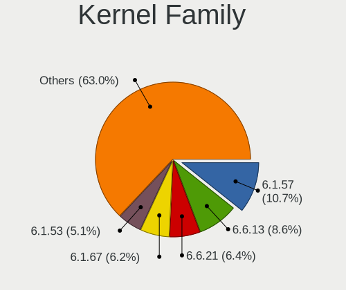

| Version | Computers | Percent |
|---------|-----------|---------|
| 6.1.57  | 40        | 10.72%  |
| 6.6.13  | 32        | 8.58%   |
| 6.6.21  | 24        | 6.43%   |
| 6.1.67  | 23        | 6.17%   |
| 6.1.53  | 19        | 5.09%   |
| 6.1.46  | 18        | 4.83%   |
| 6.6.8   | 13        | 3.49%   |
| 6.7.0   | 9         | 2.41%   |
| 6.6.0   | 9         | 2.41%   |
| 6.1.41  | 9         | 2.41%   |
| 6.6.2   | 8         | 2.14%   |
| 6.6.16  | 8         | 2.14%   |
| 6.5.7   | 8         | 2.14%   |
| 6.4.10  | 8         | 2.14%   |
| 6.7.4   | 6         | 1.61%   |
| 6.5.9   | 6         | 1.61%   |
| 6.5.8   | 6         | 1.61%   |
| 6.5.0   | 6         | 1.61%   |
| 6.6.3   | 5         | 1.34%   |
| 6.6.1   | 5         | 1.34%   |
| 6.5.5   | 5         | 1.34%   |
| 6.6.9   | 4         | 1.07%   |
| 6.5.3   | 4         | 1.07%   |
| 6.1.60  | 4         | 1.07%   |
| 6.7.1   | 3         | 0.8%    |
| 6.6.7   | 3         | 0.8%    |
| 6.6.6   | 3         | 0.8%    |
| 6.6.14  | 3         | 0.8%    |
| 6.5.1   | 3         | 0.8%    |
| 6.4.4   | 3         | 0.8%    |
| 6.4.3   | 3         | 0.8%    |
| 6.4.11  | 3         | 0.8%    |
| 6.1.69  | 3         | 0.8%    |
| 6.1.66  | 3         | 0.8%    |
| 6.9.0   | 2         | 0.54%   |
| 6.8.1   | 2         | 0.54%   |
| 6.8.0   | 2         | 0.54%   |
| 6.7.6   | 2         | 0.54%   |
| 6.7.3   | 2         | 0.54%   |
| 6.7.2   | 2         | 0.54%   |

Kernel Major Ver.
-----------------

Linux kernel major version

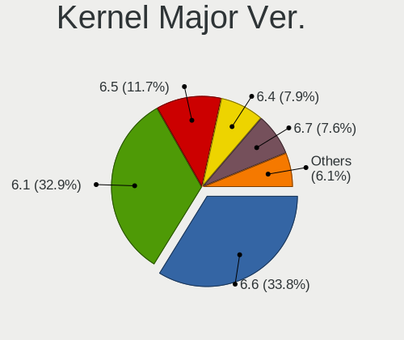

| Version | Computers | Percent |
|---------|-----------|---------|
| 6.6     | 116       | 33.82%  |
| 6.1     | 113       | 32.94%  |
| 6.5     | 40        | 11.66%  |
| 6.4     | 27        | 7.87%   |
| 6.7     | 26        | 7.58%   |
| 6.8     | 7         | 2.04%   |
| 5.15    | 5         | 1.46%   |
| 6.3     | 3         | 0.87%   |
| 6.9     | 2         | 0.58%   |
| 6.2     | 1         | 0.29%   |
| 5.19    | 1         | 0.29%   |
| 5.16    | 1         | 0.29%   |
| 5.14    | 1         | 0.29%   |

Arch
----

OS architecture (x86_64, i586, etc.)

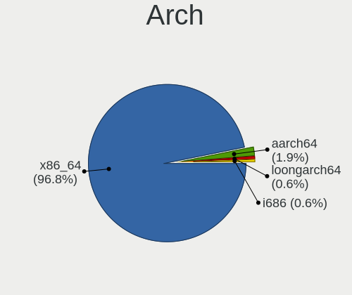

| Name        | Computers | Percent |
|-------------|-----------|---------|
| x86_64      | 304       | 96.82%  |
| aarch64     | 6         | 1.91%   |
| loongarch64 | 2         | 0.64%   |
| i686        | 2         | 0.64%   |

DE
--

Desktop Environment

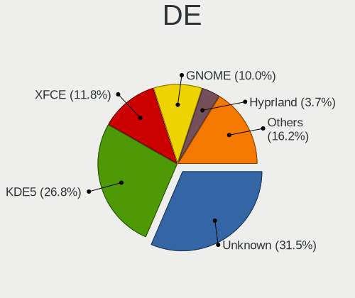

| Name          | Computers | Percent |
|---------------|-----------|---------|
| Unknown       | 101       | 31.46%  |
| KDE5          | 86        | 26.79%  |
| XFCE          | 38        | 11.84%  |
| GNOME         | 32        | 9.97%   |
| Hyprland      | 12        | 3.74%   |
| MATE          | 9         | 2.8%    |
| LXQt          | 9         | 2.8%    |
| DWM           | 8         | 2.49%   |
| i3            | 5         | 1.56%   |
| X-Cinnamon    | 4         | 1.25%   |
| sway          | 3         | 0.93%   |
| KDE           | 3         | 0.93%   |
| KDE6          | 2         | 0.62%   |
| Trinity       | 1         | 0.31%   |
| LXDE          | 1         | 0.31%   |
| ICEWM         | 1         | 0.31%   |
| GNOME Classic | 1         | 0.31%   |
| fluxbox       | 1         | 0.31%   |
| Enlightenment | 1         | 0.31%   |
| dwl           | 1         | 0.31%   |
| Cinnamon      | 1         | 0.31%   |
| bspwm         | 1         | 0.31%   |

Display Server
--------------

X11 or Wayland

| Name    | Computers | Percent |
|---------|-----------|---------|
| X11     | 122       | 37.08%  |
| Wayland | 94        | 28.57%  |
| Unknown | 66        | 20.06%  |
| Tty     | 47        | 14.29%  |

Display Manager
---------------

SDDM, LightDM, etc.

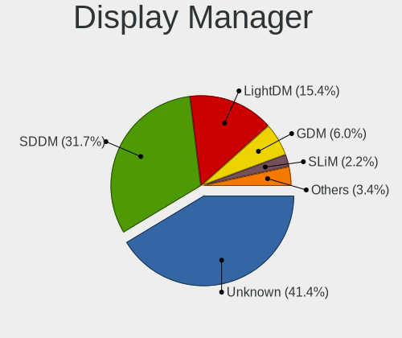

| Name    | Computers | Percent |
|---------|-----------|---------|
| Unknown | 132       | 41.38%  |
| SDDM    | 101       | 31.66%  |
| LightDM | 49        | 15.36%  |
| GDM     | 19        | 5.96%   |
| SLiM    | 7         | 2.19%   |
| GREETD  | 5         | 1.57%   |
| XDM     | 2         | 0.63%   |
| LXDM    | 2         | 0.63%   |
| TDM     | 1         | 0.31%   |
| Ly      | 1         | 0.31%   |

OS Lang
-------

Language

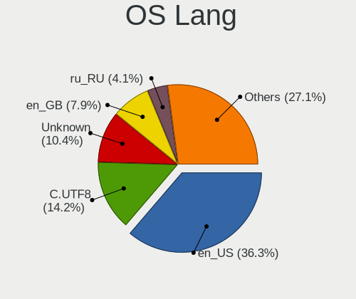

| Lang           | Computers | Percent |
|----------------|-----------|---------|
| en_US          | 115       | 36.28%  |
| C.UTF8         | 45        | 14.2%   |
| Unknown        | 33        | 10.41%  |
| en_GB          | 25        | 7.89%   |
| ru_RU          | 13        | 4.1%    |
| fr_FR          | 11        | 3.47%   |
| de_DE          | 11        | 3.47%   |
| C              | 11        | 3.47%   |
| it_IT          | 5         | 1.58%   |
| cs_CZ          | 5         | 1.58%   |
| zh_CN          | 4         | 1.26%   |
| pt_BR          | 3         | 0.95%   |
| es_ES          | 3         | 0.95%   |
| es_AR          | 3         | 0.95%   |
| de_CH          | 3         | 0.95%   |
| POSIX          | 2         | 0.63%   |
| pl_PL          | 2         | 0.63%   |
| en_IE          | 2         | 0.63%   |
| en_DK          | 2         | 0.63%   |
| zh_TW          | 1         | 0.32%   |
| uk_UA          | 1         | 0.32%   |
| ru_RU.UTF8     | 1         | 0.32%   |
| nl_NL          | 1         | 0.32%   |
| lt_LT          | 1         | 0.32%   |
| ja_JP          | 1         | 0.32%   |
| it_IT.iso88591 | 1         | 0.32%   |
| fr_CA          | 1         | 0.32%   |
| fi_FI          | 1         | 0.32%   |
| es_MX          | 1         | 0.32%   |
| es_ES.UTF8     | 1         | 0.32%   |
| es_CL          | 1         | 0.32%   |
| en_IE@euro     | 1         | 0.32%   |
| en_AU          | 1         | 0.32%   |
| en_AT          | 1         | 0.32%   |
| en             | 1         | 0.32%   |
| el_GR          | 1         | 0.32%   |
| ca_ES          | 1         | 0.32%   |
| bg_BG          | 1         | 0.32%   |

Boot Mode
---------

EFI or BIOS

| Mode | Computers | Percent |
|------|-----------|---------|
| EFI  | 268       | 84.54%  |
| BIOS | 49        | 15.46%  |

Filesystem
----------

Type of filesystem

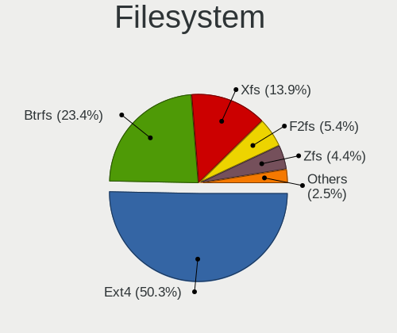

| Type     | Computers | Percent |
|----------|-----------|---------|
| Ext4     | 159       | 50.32%  |
| Btrfs    | 74        | 23.42%  |
| Xfs      | 44        | 13.92%  |
| F2fs     | 17        | 5.38%   |
| Zfs      | 14        | 4.43%   |
| XXXXXXX  | 4         | 1.27%   |
| Bcachefs | 2         | 0.63%   |
| Reiserfs | 1         | 0.32%   |
| Ext2     | 1         | 0.32%   |

Part. scheme
------------

Scheme of partitioning

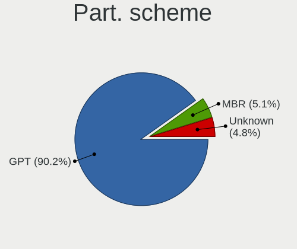

| Type    | Computers | Percent |
|---------|-----------|---------|
| GPT     | 284       | 90.16%  |
| MBR     | 16        | 5.08%   |
| Unknown | 15        | 4.76%   |

Dual Boot with Linux/BSD
------------------------

Hosting more than one Linux/BSD

| Dual boot | Computers | Percent |
|-----------|-----------|---------|
| No        | 234       | 72.67%  |
| Yes       | 88        | 27.33%  |

Dual Boot (Win)
---------------

Hosting Linux and Windows

| Dual boot | Computers | Percent |
|-----------|-----------|---------|
| No        | 227       | 71.16%  |
| Yes       | 92        | 28.84%  |

Board
-----

Vendor
------

Motherboard manufacturer

| Name                    | Computers | Percent |
|-------------------------|-----------|---------|
| ASUSTek Computer        | 74        | 23.57%  |
| Lenovo                  | 46        | 14.65%  |
| Hewlett-Packard         | 35        | 11.15%  |
| Dell                    | 31        | 9.87%   |
| Gigabyte Technology     | 29        | 9.24%   |
| MSI                     | 23        | 7.32%   |
| ASRock                  | 12        | 3.82%   |
| Unknown                 | 8         | 2.55%   |
| Framework               | 7         | 2.23%   |
| Acer                    | 6         | 1.91%   |
| Supermicro              | 4         | 1.27%   |
| Star Labs               | 2         | 0.64%   |
| Raspberry Pi Foundation | 2         | 0.64%   |
| Notebook                | 2         | 0.64%   |
| Medion                  | 2         | 0.64%   |
| Loongson                | 2         | 0.64%   |
| Intel                   | 2         | 0.64%   |
| Fujitsu                 | 2         | 0.64%   |
| UMAX                    | 1         | 0.32%   |
| TUXEDO                  | 1         | 0.32%   |
| TULPAR                  | 1         | 0.32%   |
| transtec                | 1         | 0.32%   |
| Timi                    | 1         | 0.32%   |
| SZMZ                    | 1         | 0.32%   |
| System76                | 1         | 0.32%   |
| Razer                   | 1         | 0.32%   |
| Quanta                  | 1         | 0.32%   |
| Positivo                | 1         | 0.32%   |
| PINE64                  | 1         | 0.32%   |
| IBM                     | 1         | 0.32%   |
| HUAWEI                  | 1         | 0.32%   |
| Google                  | 1         | 0.32%   |
| Foxconn                 | 1         | 0.32%   |
| Fanless Mini PC         | 1         | 0.32%   |
| DEXP                    | 1         | 0.32%   |
| Colorful Technology     | 1         | 0.32%   |
| Chuwi                   | 1         | 0.32%   |
| BESSTAR Tech            | 1         | 0.32%   |
| BANGHO                  | 1         | 0.32%   |
| ASRockRack              | 1         | 0.32%   |

Model
-----

Motherboard model

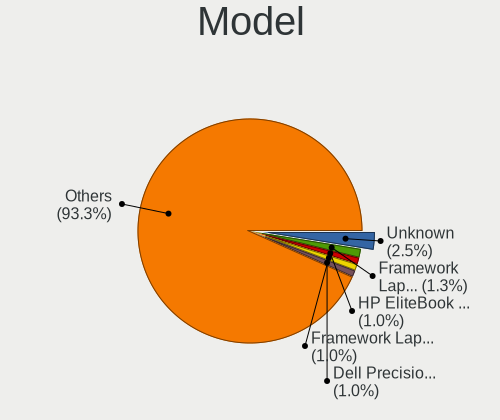

| Name                                       | Computers | Percent |
|--------------------------------------------|-----------|---------|
| Unknown                                    | 8         | 2.55%   |
| Framework Laptop (13th Gen Intel Core)     | 4         | 1.27%   |
| HP EliteBook 845 14 inch G10 Notebook PC   | 3         | 0.96%   |
| Framework Laptop 13 (AMD Ryzen 7040Series) | 3         | 0.96%   |
| Dell Precision 5480                        | 3         | 0.96%   |
| ASUS TUF Gaming B550-PLUS                  | 3         | 0.96%   |
| Supermicro Super Server                    | 2         | 0.64%   |
| Notebook NS5x_NS7xPU                       | 2         | 0.64%   |
| MSI MS-7C02                                | 2         | 0.64%   |
| Lenovo Yoga 7 16ARP8 83BS                  | 2         | 0.64%   |
| HP Z420 Workstation                        | 2         | 0.64%   |
| Gigabyte X570 AORUS ELITE                  | 2         | 0.64%   |
| Gigabyte B550 AORUS ELITE V2               | 2         | 0.64%   |
| Gigabyte B450M DS3H                        | 2         | 0.64%   |
| ASUS ROG STRIX X670E-E GAMING WIFI         | 2         | 0.64%   |
| ASUS ROG STRIX X570-E GAMING               | 2         | 0.64%   |
| ASUS ROG STRIX B450-F GAMING               | 2         | 0.64%   |
| ASUS PRIME H510M-E                         | 2         | 0.64%   |
| ASUS PRIME B660-PLUS D4                    | 2         | 0.64%   |
| ASUS M3A78-CM                              | 2         | 0.64%   |
| UMAX VisionBook 9Wi Pro                    | 1         | 0.32%   |
| TUXEDO Book BA1510                         | 1         | 0.32%   |
| TULPAR A5 V20.3                            | 1         | 0.32%   |
| transtec GE2 Series                        | 1         | 0.32%   |
| Timi RedmiBook Pro 15S                     | 1         | 0.32%   |
| SZMZ X99M-G2                               | 1         | 0.32%   |
| System76 Pangolin                          | 1         | 0.32%   |
| Supermicro X10SL7-F                        | 1         | 0.32%   |
| Supermicro SYS-5038MD-H24TRF-OS012         | 1         | 0.32%   |
| Star Labs StarLite                         | 1         | 0.32%   |
| Star Labs StarBook                         | 1         | 0.32%   |
| Razer Blade 14 - RZ09-0482                 | 1         | 0.32%   |
| RPi Raspberry Pi 4 Model B Rev 1.1         | 1         | 0.32%   |
| RPi Raspberry Pi 3 Model B Rev 1.2         | 1         | 0.32%   |
| Quanta S210-X12MS                          | 1         | 0.32%   |
| Positivo C4128B-3                          | 1         | 0.32%   |
| PINE64 Pinebook Pro                        | 1         | 0.32%   |
| MSI Stealth 16Studio A13VF                 | 1         | 0.32%   |
| MSI Pulse 15 B13VFK                        | 1         | 0.32%   |
| MSI MS-7E27                                | 1         | 0.32%   |

Model Family
------------

Motherboard model prefix

| Name             | Computers | Percent |
|------------------|-----------|---------|
| Lenovo ThinkPad  | 30        | 9.55%   |
| ASUS ROG         | 20        | 6.37%   |
| ASUS PRIME       | 17        | 5.41%   |
| ASUS TUF         | 9         | 2.87%   |
| HP EliteBook     | 8         | 2.55%   |
| Dell Precision   | 8         | 2.55%   |
| ASUS VivoBook    | 8         | 2.55%   |
| Unknown          | 8         | 2.55%   |
| HP Laptop        | 7         | 2.23%   |
| Framework Laptop | 7         | 2.23%   |
| Dell Latitude    | 6         | 1.91%   |
| HP ProBook       | 5         | 1.59%   |
| Dell XPS         | 5         | 1.59%   |
| Lenovo Legion    | 4         | 1.27%   |
| Dell OptiPlex    | 4         | 1.27%   |
| Dell Inspiron    | 4         | 1.27%   |
| ASUS ASUS        | 4         | 1.27%   |
| Acer Aspire      | 4         | 1.27%   |
| Lenovo Yoga      | 3         | 0.96%   |
| Lenovo IdeaPad   | 3         | 0.96%   |
| HP Victus        | 3         | 0.96%   |
| HP Pavilion      | 3         | 0.96%   |
| Gigabyte X570    | 3         | 0.96%   |
| Gigabyte B550    | 3         | 0.96%   |
| ASUS ZenBook     | 3         | 0.96%   |
| Supermicro Super | 2         | 0.64%   |
| RPi Raspberry    | 2         | 0.64%   |
| Notebook NS5x    | 2         | 0.64%   |
| MSI MS-7C02      | 2         | 0.64%   |
| HP Z420          | 2         | 0.64%   |
| HP Spectre       | 2         | 0.64%   |
| Gigabyte B560M   | 2         | 0.64%   |
| Gigabyte B450M   | 2         | 0.64%   |
| Dell G5          | 2         | 0.64%   |
| ASUS M3A78-CM    | 2         | 0.64%   |
| ASRock B550M     | 2         | 0.64%   |
| Acer Swift       | 2         | 0.64%   |
| UMAX VisionBook  | 1         | 0.32%   |
| TUXEDO Book      | 1         | 0.32%   |
| TULPAR A5        | 1         | 0.32%   |

MFG Year
--------

Motherboard manufacture year

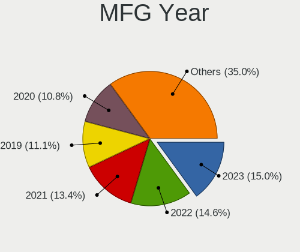

| Year    | Computers | Percent |
|---------|-----------|---------|
| 2023    | 47        | 14.97%  |
| 2022    | 46        | 14.65%  |
| 2021    | 42        | 13.38%  |
| 2019    | 35        | 11.15%  |
| 2020    | 34        | 10.83%  |
| 2018    | 24        | 7.64%   |
| 2017    | 14        | 4.46%   |
| 2012    | 13        | 4.14%   |
| Unknown | 10        | 3.18%   |
| 2013    | 8         | 2.55%   |
| 2016    | 7         | 2.23%   |
| 2014    | 7         | 2.23%   |
| 2010    | 6         | 1.91%   |
| 2009    | 5         | 1.59%   |
| 2015    | 4         | 1.27%   |
| 2011    | 4         | 1.27%   |
| 2008    | 3         | 0.96%   |
| 2007    | 3         | 0.96%   |
| 2024    | 1         | 0.32%   |
| 2004    | 1         | 0.32%   |

Form Factor
-----------

Physical design of the computer

| Name           | Computers | Percent |
|----------------|-----------|---------|
| Desktop        | 145       | 46.18%  |
| Notebook       | 144       | 45.86%  |
| Convertible    | 8         | 2.55%   |
| System on chip | 6         | 1.91%   |
| Server         | 6         | 1.91%   |
| Tablet         | 2         | 0.64%   |
| Mini pc        | 2         | 0.64%   |
| Stick pc       | 1         | 0.32%   |

Secure Boot
-----------

Enabled or disabled

| State    | Computers | Percent |
|----------|-----------|---------|
| Disabled | 304       | 96.51%  |
| Enabled  | 11        | 3.49%   |

Coreboot
--------

Have coreboot on board

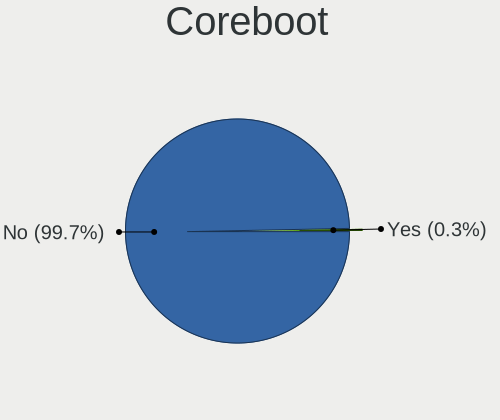

| Used | Computers | Percent |
|------|-----------|---------|
| No   | 313       | 99.68%  |
| Yes  | 1         | 0.32%   |

RAM Size
--------

Total RAM memory

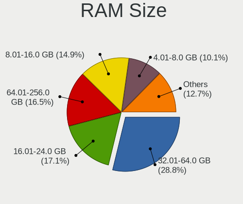

| Size in GB  | Computers | Percent |
|-------------|-----------|---------|
| 32.01-64.0  | 91        | 28.8%   |
| 16.01-24.0  | 54        | 17.09%  |
| 64.01-256.0 | 52        | 16.46%  |
| 8.01-16.0   | 47        | 14.87%  |
| 4.01-8.0    | 32        | 10.13%  |
| 24.01-32.0  | 22        | 6.96%   |
| 3.01-4.0    | 12        | 3.8%    |
| 1.01-2.0    | 3         | 0.95%   |
| 2.01-3.0    | 1         | 0.32%   |
| 0.51-1.0    | 1         | 0.32%   |
| 0.01-0.5    | 1         | 0.32%   |

RAM Used
--------

Used RAM memory

| Used GB    | Computers | Percent |
|------------|-----------|---------|
| 4.01-8.0   | 70        | 20.06%  |
| 1.01-2.0   | 67        | 19.2%   |
| 2.01-3.0   | 58        | 16.62%  |
| 3.01-4.0   | 47        | 13.47%  |
| 0.51-1.0   | 33        | 9.46%   |
| 8.01-16.0  | 32        | 9.17%   |
| 0.01-0.5   | 19        | 5.44%   |
| 16.01-24.0 | 16        | 4.58%   |
| 32.01-64.0 | 4         | 1.15%   |
| 24.01-32.0 | 3         | 0.86%   |

Total Drives
------------

Number of drives on board

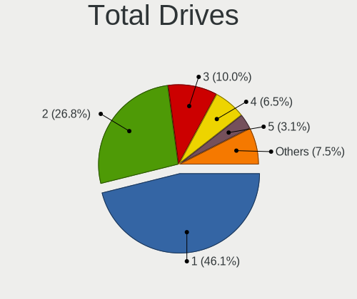

| Drives | Computers | Percent |
|--------|-----------|---------|
| 1      | 148       | 46.11%  |
| 2      | 86        | 26.79%  |
| 3      | 32        | 9.97%   |
| 4      | 21        | 6.54%   |
| 5      | 10        | 3.12%   |
| 6      | 9         | 2.8%    |
| 7      | 6         | 1.87%   |
| 8      | 4         | 1.25%   |
| 31     | 1         | 0.31%   |
| 19     | 1         | 0.31%   |
| 14     | 1         | 0.31%   |
| 13     | 1         | 0.31%   |
| 9      | 1         | 0.31%   |

Has CD-ROM
----------

Has CD-ROM on board

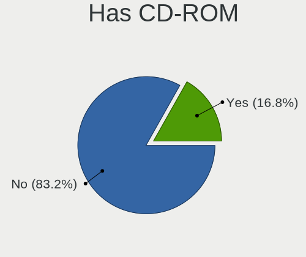

| Presented | Computers | Percent |
|-----------|-----------|---------|
| No        | 262       | 83.17%  |
| Yes       | 53        | 16.83%  |

Has Ethernet
------------

Has Ethernet on board

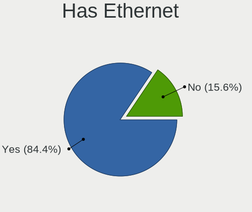

| Presented | Computers | Percent |
|-----------|-----------|---------|
| Yes       | 266       | 84.44%  |
| No        | 49        | 15.56%  |

Has WiFi
--------

Has WiFi module

| Presented | Computers | Percent |
|-----------|-----------|---------|
| Yes       | 220       | 70.06%  |
| No        | 94        | 29.94%  |

Has Bluetooth
-------------

Has Bluetooth module

| Presented | Computers | Percent |
|-----------|-----------|---------|
| Yes       | 209       | 66.56%  |
| No        | 105       | 33.44%  |

Location
--------

Country
-------

Geographic location (country)

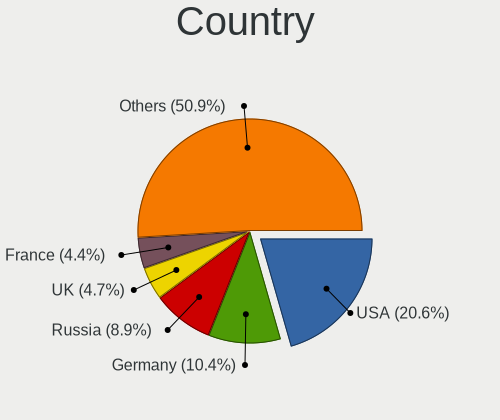

| Country         | Computers | Percent |
|-----------------|-----------|---------|
| USA             | 65        | 20.57%  |
| Germany         | 33        | 10.44%  |
| Russia          | 28        | 8.86%   |
| UK              | 15        | 4.75%   |
| France          | 14        | 4.43%   |
| Poland          | 13        | 4.11%   |
| Czechia         | 12        | 3.8%    |
| Spain           | 11        | 3.48%   |
| Italy           | 11        | 3.48%   |
| China           | 11        | 3.48%   |
| Belgium         | 11        | 3.48%   |
| Canada          | 7         | 2.22%   |
| Brazil          | 7         | 2.22%   |
| Sweden          | 6         | 1.9%    |
| Ireland         | 6         | 1.9%    |
| Switzerland     | 5         | 1.58%   |
| Netherlands     | 5         | 1.58%   |
| Finland         | 5         | 1.58%   |
| Austria         | 5         | 1.58%   |
| Greece          | 4         | 1.27%   |
| Argentina       | 4         | 1.27%   |
| Turkey          | 3         | 0.95%   |
| The Netherlands | 3         | 0.95%   |
| Japan           | 3         | 0.95%   |
| Bulgaria        | 3         | 0.95%   |
| Ukraine         | 2         | 0.63%   |
| Slovakia        | 2         | 0.63%   |
| New Zealand     | 2         | 0.63%   |
| Indonesia       | 2         | 0.63%   |
| Hong Kong       | 2         | 0.63%   |
| Taiwan          | 1         | 0.32%   |
| South Africa    | 1         | 0.32%   |
| Serbia          | 1         | 0.32%   |
| Portugal        | 1         | 0.32%   |
| Paraguay        | 1         | 0.32%   |
| Mexico          | 1         | 0.32%   |
| Malaysia        | 1         | 0.32%   |
| Luxembourg      | 1         | 0.32%   |
| Latvia          | 1         | 0.32%   |
| Iran            | 1         | 0.32%   |

City
----

Geographic location (city)

| City              | Computers | Percent |
|-------------------|-----------|---------|
| Moscow            | 7         | 2.1%    |
| St Petersburg     | 6         | 1.8%    |
| Louvain-la-Neuve  | 6         | 1.8%    |
| Stockholm         | 5         | 1.5%    |
| lapanice        | 5         | 1.5%    |
| New York          | 5         | 1.5%    |
| Milano            | 5         | 1.5%    |
| Berlin            | 5         | 1.5%    |
| Warsaw            | 4         | 1.2%    |
| Toulouse          | 4         | 1.2%    |
| Dublin            | 4         | 1.2%    |
| Cieszyn           | 4         | 1.2%    |
| Athens            | 4         | 1.2%    |
| Vienna            | 3         | 0.9%    |
| Rostov-on-Don     | 3         | 0.9%    |
| Prague            | 3         | 0.9%    |
| Paris             | 3         | 0.9%    |
| Miami             | 3         | 0.9%    |
| Madrid            | 3         | 0.9%    |
| Helsinki          | 3         | 0.9%    |
| Dumfries          | 3         | 0.9%    |
| Beijing           | 3         | 0.9%    |
| Amsterdam         | 3         | 0.9%    |
| Sofia             | 2         | 0.6%    |
| San Antonio       | 2         | 0.6%    |
| Samarinda         | 2         | 0.6%    |
| Pittsburgh        | 2         | 0.6%    |
| Oulx              | 2         | 0.6%    |
| Novosibirsk       | 2         | 0.6%    |
| Mnchengladbach  | 2         | 0.6%    |
| Lincoln           | 2         | 0.6%    |
| Le Boulou         | 2         | 0.6%    |
| Krefeld           | 2         | 0.6%    |
| Krasnodar         | 2         | 0.6%    |
| Istanbul          | 2         | 0.6%    |
| Irkutsk           | 2         | 0.6%    |
| Igualada          | 2         | 0.6%    |
| Girona            | 2         | 0.6%    |
| Frankfurt am Main | 2         | 0.6%    |
| Detmold           | 2         | 0.6%    |

Drives
------

Drive Vendor
------------

Hard drive vendors

| Vendor                      | Computers | Drives | Percent |
|-----------------------------|-----------|--------|---------|
| Samsung Electronics         | 113       | 193    | 20.29%  |
| Seagate                     | 55        | 102    | 9.87%   |
| WDC                         | 49        | 91     | 8.8%    |
| SanDisk                     | 40        | 56     | 7.18%   |
| SK hynix                    | 23        | 25     | 4.13%   |
| Kingston                    | 23        | 29     | 4.13%   |
| Toshiba                     | 22        | 65     | 3.95%   |
| Intel                       | 21        | 28     | 3.77%   |
| Phison Electronics          | 20        | 26     | 3.59%   |
| Unknown                     | 16        | 24     | 2.87%   |
| Micron Technology           | 16        | 22     | 2.87%   |
| Micron/Crucial Technology   | 14        | 17     | 2.51%   |
| KIOXIA                      | 14        | 17     | 2.51%   |
| Crucial                     | 14        | 22     | 2.51%   |
| Kingston Technology Company | 10        | 10     | 1.8%    |
| Hitachi                     | 8         | 30     | 1.44%   |
| A-DATA Technology           | 6         | 7      | 1.08%   |
| Realtek Semiconductor       | 5         | 5      | 0.9%    |
| China                       | 5         | 7      | 0.9%    |
| Unknown                     | 5         | 5      | 0.9%    |
| MAXIO Technology (Hangzhou) | 4         | 4      | 0.72%   |
| HGST                        | 4         | 5      | 0.72%   |
| GOODRAM                     | 4         | 24     | 0.72%   |
| ADATA Technology            | 4         | 6      | 0.72%   |
| Yangtze Memory Technologies | 3         | 5      | 0.54%   |
| Transcend                   | 3         | 3      | 0.54%   |
| Silicon Motion              | 3         | 3      | 0.54%   |
| Patriot                     | 3         | 5      | 0.54%   |
| OCZ                         | 3         | 3      | 0.54%   |
| Verbatim                    | 2         | 2      | 0.36%   |
| Union Memory                | 2         | 3      | 0.36%   |
| Seagate Technology          | 2         | 2      | 0.36%   |
| SABRENT                     | 2         | 2      | 0.36%   |
| Phison                      | 2         | 2      | 0.36%   |
| LITEON                      | 2         | 3      | 0.36%   |
| KingSpec                    | 2         | 3      | 0.36%   |
| Intenso                     | 2         | 2      | 0.36%   |
| Hewlett-Packard             | 2         | 8      | 0.36%   |
| Fujitsu                     | 2         | 2      | 0.36%   |
| Yangtze Memory              | 1         | 1      | 0.18%   |

Drive Model
-----------

Hard drive models

| Model                                                             | Computers | Percent |
|-------------------------------------------------------------------|-----------|---------|
| Samsung NVMe SSD Controller SM981/PM981/PM983 512GB               | 36        | 5.65%   |
| Samsung NVMe SSD Controller PM9A1/PM9A3/980PRO 512GB              | 27        | 4.24%   |
| Samsung SSD 980 1TB                                               | 11        | 1.73%   |
| Micron/Crucial P2 NVMe PCIe SSD 500GB                             | 9         | 1.41%   |
| Seagate ST2000DM008-2FR102 2TB                                    | 7         | 1.1%    |
| Phison E12 NVMe Controller 480GB                                  | 7         | 1.1%    |
| Unknown MMC Card  128GB                                           | 6         | 0.94%   |
| Seagate ST4000DM004-2CV104 4TB                                    | 6         | 0.94%   |
| Intel SSD 660P Series 1024GB                                      | 6         | 0.94%   |
| Seagate ST2000DM006-2DM164 2TB                                    | 5         | 0.78%   |
| Sandisk WD Blue SN550 NVMe SSD 256GB                              | 5         | 0.78%   |
| Sandisk WD Black SN850 2TB                                        | 5         | 0.78%   |
| Samsung SSD 860 EVO 500GB                                         | 5         | 0.78%   |
| Samsung SSD 860 EVO 1TB                                           | 5         | 0.78%   |
| Kingston Company A2000 NVMe SSD 500GB                             | 5         | 0.78%   |
| Intel SSD 600P Series 256GB                                       | 5         | 0.78%   |
| Unknown                                                           | 5         | 0.78%   |
| WDC WDS500G2B0A-00SM50 500GB SSD                                  | 4         | 0.63%   |
| WDC WD20EZRZ-00Z5HB0 2TB                                          | 4         | 0.63%   |
| Seagate ST2000DM008-2UB102 2TB                                    | 4         | 0.63%   |
| Sandisk WD Black SN750 / PC SN730 NVMe SSD 512GB                  | 4         | 0.63%   |
| Samsung SSD 990 PRO 2TB                                           | 4         | 0.63%   |
| Samsung SSD 860 EVO 250GB                                         | 4         | 0.63%   |
| Samsung SSD 850 EVO 500GB                                         | 4         | 0.63%   |
| Samsung NVMe SSD Controller SM961/PM961/SM963 256GB               | 4         | 0.63%   |
| Kingston SA400S37480G 480GB SSD                                   | 4         | 0.63%   |
| Crucial CT1000MX500SSD1 1TB                                       | 4         | 0.63%   |
| ADATA XPG SX8200 Pro PCIe Gen3x4 M.2 2280 Solid State Drive 256GB | 4         | 0.63%   |
| WDC WDS240G2G0A-00JH30 240GB SSD                                  | 3         | 0.47%   |
| WDC WD30EFRX-68EUZN0 3TB                                          | 3         | 0.47%   |
| WDC WD10EZEX-08WN4A0 1TB                                          | 3         | 0.47%   |
| Toshiba MQ04ABF100 1TB                                            | 3         | 0.47%   |
| SK hynix BC501 NVMe Solid State Drive 512GB                       | 3         | 0.47%   |
| Silicon Motion SM2263EN/SM2263XT SSD Controller 256GB             | 3         | 0.47%   |
| Seagate ST500DM002-1BD142 500GB                                   | 3         | 0.47%   |
| Seagate ST1000LM024 HN-M101MBB 1TB                                | 3         | 0.47%   |
| Sandisk WD_BLACK SN850X 2000GB                                    | 3         | 0.47%   |
| SanDisk SSD PLUS 240GB                                            | 3         | 0.47%   |
| Samsung SSD 870 EVO 1TB                                           | 3         | 0.47%   |
| Samsung SSD 860 QVO 1TB                                           | 3         | 0.47%   |

HDD Vendor
----------

Hard disk drive vendors

| Vendor              | Computers | Drives | Percent |
|---------------------|-----------|--------|---------|
| Seagate             | 55        | 101    | 39.86%  |
| WDC                 | 42        | 78     | 30.43%  |
| Toshiba             | 18        | 61     | 13.04%  |
| Hitachi             | 8         | 30     | 5.8%    |
| HGST                | 4         | 5      | 2.9%    |
| Samsung Electronics | 2         | 3      | 1.45%   |
| SABRENT             | 2         | 2      | 1.45%   |
| Fujitsu             | 2         | 2      | 1.45%   |
| Teleplan            | 1         | 1      | 0.72%   |
| NETAPP              | 1         | 3      | 0.72%   |
| Maxtor              | 1         | 1      | 0.72%   |
| FC-1307             | 1         | 1      | 0.72%   |
| Unknown             | 1         | 1      | 0.72%   |

SSD Vendor
----------

Solid state drive vendors

| Vendor              | Computers | Drives | Percent |
|---------------------|-----------|--------|---------|
| Samsung Electronics | 41        | 62     | 27.33%  |
| Kingston            | 14        | 17     | 9.33%   |
| Crucial             | 14        | 22     | 9.33%   |
| WDC                 | 11        | 13     | 7.33%   |
| SanDisk             | 10        | 12     | 6.67%   |
| China               | 5         | 7      | 3.33%   |
| A-DATA Technology   | 5         | 6      | 3.33%   |
| GOODRAM             | 4         | 24     | 2.67%   |
| Unknown             | 4         | 4      | 2.67%   |
| Patriot             | 3         | 5      | 2%      |
| OCZ                 | 3         | 3      | 2%      |
| Intel               | 3         | 3      | 2%      |
| Verbatim            | 2         | 2      | 1.33%   |
| Transcend           | 2         | 2      | 1.33%   |
| Toshiba             | 2         | 2      | 1.33%   |
| LITEON              | 2         | 3      | 1.33%   |
| KingSpec            | 2         | 3      | 1.33%   |
| Intenso             | 2         | 2      | 1.33%   |
| Hewlett-Packard     | 2         | 2      | 1.33%   |
| Team                | 1         | 1      | 0.67%   |
| StoreJet            | 1         | 1      | 0.67%   |
| Star                | 1         | 1      | 0.67%   |
| SPCC                | 1         | 3      | 0.67%   |
| SK hynix            | 1         | 1      | 0.67%   |
| SCCTS-603-256G      | 1         | 1      | 0.67%   |
| PNY                 | 1         | 1      | 0.67%   |
| LITEONIT            | 1         | 1      | 0.67%   |
| Lexar               | 1         | 1      | 0.67%   |
| Lenovo              | 1         | 1      | 0.67%   |
| Kingchuxing         | 1         | 5      | 0.67%   |
| GLOWAY              | 1         | 1      | 0.67%   |
| FREEBSD             | 1         | 12     | 0.67%   |
| EYOTA               | 1         | 1      | 0.67%   |
| Corsair             | 1         | 1      | 0.67%   |
| ASMT                | 1         | 1      | 0.67%   |
| Apple               | 1         | 1      | 0.67%   |
| Apacer              | 1         | 1      | 0.67%   |
| AGI                 | 1         | 1      | 0.67%   |

Drive Kind
----------

HDD or SSD

| Kind    | Computers | Drives | Percent |
|---------|-----------|--------|---------|
| NVMe    | 228       | 367    | 48.2%   |
| SSD     | 124       | 230    | 26.22%  |
| HDD     | 106       | 289    | 22.41%  |
| MMC     | 13        | 18     | 2.75%   |
| Unknown | 2         | 10     | 0.42%   |

Drive Connector
---------------

SATA, SAS, NVMe, etc.

| Type | Computers | Drives | Percent |
|------|-----------|--------|---------|
| NVMe | 228       | 366    | 54.81%  |
| SATA | 162       | 507    | 38.94%  |
| SAS  | 13        | 23     | 3.13%   |
| MMC  | 13        | 18     | 3.13%   |

Drive Size
----------

Size of hard drive

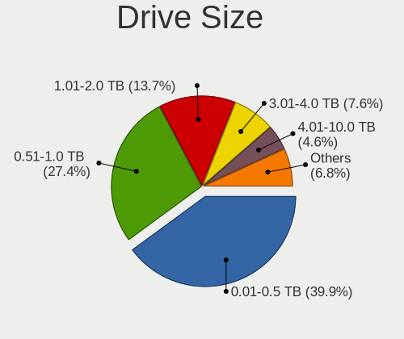

| Size in TB | Computers | Drives | Percent |
|------------|-----------|--------|---------|
| 0.01-0.5   | 105       | 168    | 39.92%  |
| 0.51-1.0   | 72        | 114    | 27.38%  |
| 1.01-2.0   | 36        | 68     | 13.69%  |
| 3.01-4.0   | 20        | 52     | 7.6%    |
| 4.01-10.0  | 12        | 46     | 4.56%   |
| 2.01-3.0   | 11        | 37     | 4.18%   |
| 10.01-20.0 | 7         | 34     | 2.66%   |

Space Total
-----------

Amount of disk space available on the file system

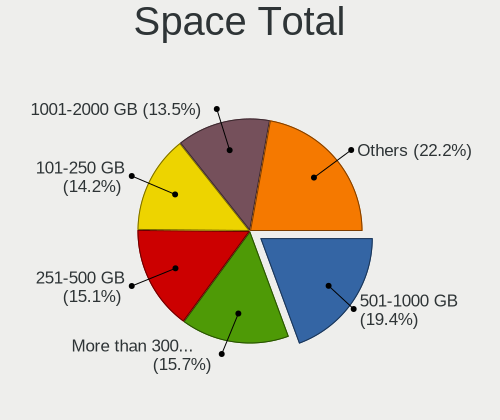

| Size in GB     | Computers | Percent |
|----------------|-----------|---------|
| 501-1000       | 63        | 19.38%  |
| More than 3000 | 51        | 15.69%  |
| 251-500        | 49        | 15.08%  |
| 101-250        | 46        | 14.15%  |
| 1001-2000      | 44        | 13.54%  |
| 1-20           | 28        | 8.62%   |
| Unknown        | 17        | 5.23%   |
| 2001-3000      | 12        | 3.69%   |
| 51-100         | 8         | 2.46%   |
| 21-50          | 7         | 2.15%   |

Space Used
----------

Amount of used disk space

| Used GB        | Computers | Percent |
|----------------|-----------|---------|
| 1-20           | 76        | 22.82%  |
| 101-250        | 55        | 16.52%  |
| 21-50          | 40        | 12.01%  |
| 251-500        | 37        | 11.11%  |
| 501-1000       | 30        | 9.01%   |
| 1001-2000      | 26        | 7.81%   |
| 51-100         | 25        | 7.51%   |
| More than 3000 | 20        | 6.01%   |
| Unknown        | 17        | 5.11%   |
| 2001-3000      | 7         | 2.1%    |

Malfunc. Drives
---------------

Drive models with a malfunction

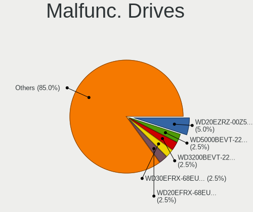

| Model                                                            | Computers | Drives | Percent |
|------------------------------------------------------------------|-----------|--------|---------|
| WDC WD20EZRZ-00Z5HB0 2TB                                         | 2         | 2      | 5%      |
| WDC WD5000BEVT-22ZAT0 500GB                                      | 1         | 1      | 2.5%    |
| WDC WD3200BEVT-22ZCT0 320GB                                      | 1         | 1      | 2.5%    |
| WDC WD30EFRX-68EUZN0 3TB                                         | 1         | 4      | 2.5%    |
| WDC WD20EFRX-68EUZN0 2TB                                         | 1         | 1      | 2.5%    |
| WDC WD2002FAEX-007BA0 2TB                                        | 1         | 1      | 2.5%    |
| WDC WD10EZEX-00RKKA0 1TB                                         | 1         | 1      | 2.5%    |
| WDC WD10EFRX-68PJCN0 1TB                                         | 1         | 1      | 2.5%    |
| WDC WD10EADS-00M2B0 1TB                                          | 1         | 1      | 2.5%    |
| WDC WD Green 2.5 240GB SSD                                       | 1         | 1      | 2.5%    |
| Toshiba HDWR31G 16TB                                             | 1         | 1      | 2.5%    |
| Toshiba HDWE150 5TB                                              | 1         | 4      | 2.5%    |
| Toshiba HDWD240 4TB                                              | 1         | 2      | 2.5%    |
| SK hynix BC501 NVMe Solid State Drive 512GB                      | 1         | 1      | 2.5%    |
| Seagate ST500DM002-1BD142 500GB                                  | 1         | 1      | 2.5%    |
| Seagate ST500DM002-1BC142 500GB                                  | 1         | 1      | 2.5%    |
| Seagate ST3160811AS 160GB                                        | 1         | 1      | 2.5%    |
| Seagate ST31000524AS 1TB                                         | 1         | 1      | 2.5%    |
| Seagate ST3000DM008-2DM166 3TB                                   | 1         | 2      | 2.5%    |
| Seagate ST2000LM007-1R8174 2TB                                   | 1         | 1      | 2.5%    |
| Seagate ST2000DM005-2CW102 2TB                                   | 1         | 1      | 2.5%    |
| Seagate ST1000LM024 HN-M101MBB 1TB                               | 1         | 2      | 2.5%    |
| Seagate ST1000DM010-2EP102 1TB                                   | 1         | 1      | 2.5%    |
| Samsung Electronics SSD 980 1TB                                  | 1         | 1      | 2.5%    |
| Samsung Electronics NVMe SSD Controller PM9A1/PM9A3/980PRO 512GB | 1         | 1      | 2.5%    |
| Samsung Electronics MZ7WD960HMHP-00003 960GB SSD                 | 1         | 1      | 2.5%    |
| PNY SSD2SC120G1LC763C121S459P 120GB                              | 1         | 1      | 2.5%    |
| OCZ AGILITY3 128GB SSD                                           | 1         | 1      | 2.5%    |
| Maxtor STM3160215A 160GB                                         | 1         | 1      | 2.5%    |
| LITEON CV8-8E128-HP 128GB SSD                                    | 1         | 2      | 2.5%    |
| Kingston SV300S37A240G 240GB SSD                                 | 1         | 1      | 2.5%    |
| Kingston SV300S37A 120G SSD                                      | 1         | 1      | 2.5%    |
| Intel SSDSCKKF180G8L 180GB                                       | 1         | 1      | 2.5%    |
| Hitachi HUS724030ALE641 3TB                                      | 1         | 1      | 2.5%    |
| Hitachi HDS722020ALA330 2TB                                      | 1         | 1      | 2.5%    |
| HGST HTS725050A7E630 500GB                                       | 1         | 1      | 2.5%    |
| HGST HTS721010A9E630 1TB                                         | 1         | 1      | 2.5%    |
| A-DATA Technology SP900 128GB SSD                                | 1         | 1      | 2.5%    |
| Unknown                                                          | 1         | 1      | 2.5%    |

Malfunc. Drive Vendor
---------------------

Vendors of faulty drives

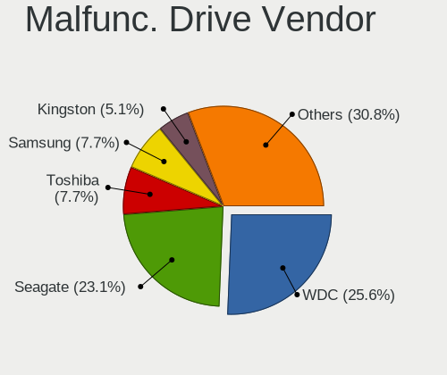

| Vendor              | Computers | Drives | Percent |
|---------------------|-----------|--------|---------|
| WDC                 | 10        | 14     | 25.64%  |
| Seagate             | 9         | 11     | 23.08%  |
| Toshiba             | 3         | 7      | 7.69%   |
| Samsung Electronics | 3         | 3      | 7.69%   |
| Kingston            | 2         | 2      | 5.13%   |
| Hitachi             | 2         | 2      | 5.13%   |
| HGST                | 2         | 2      | 5.13%   |
| SK hynix            | 1         | 1      | 2.56%   |
| PNY                 | 1         | 1      | 2.56%   |
| OCZ                 | 1         | 1      | 2.56%   |
| Maxtor              | 1         | 1      | 2.56%   |
| LITEON              | 1         | 2      | 2.56%   |
| Intel               | 1         | 1      | 2.56%   |
| A-DATA Technology   | 1         | 1      | 2.56%   |
| Unknown             | 1         | 1      | 2.56%   |

Malfunc. HDD Vendor
-------------------

Vendors of faulty HDD drives

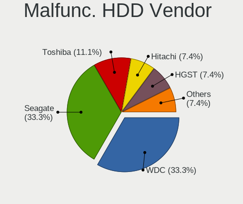

| Vendor  | Computers | Drives | Percent |
|---------|-----------|--------|---------|
| WDC     | 9         | 13     | 33.33%  |
| Seagate | 9         | 11     | 33.33%  |
| Toshiba | 3         | 7      | 11.11%  |
| Hitachi | 2         | 2      | 7.41%   |
| HGST    | 2         | 2      | 7.41%   |
| Maxtor  | 1         | 1      | 3.7%    |
| Unknown | 1         | 1      | 3.7%    |

Malfunc. Drive Kind
-------------------

Kinds of faulty drives

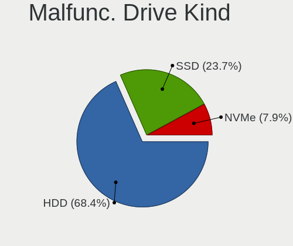

| Kind | Computers | Drives | Percent |
|------|-----------|--------|---------|
| HDD  | 26        | 37     | 68.42%  |
| SSD  | 9         | 10     | 23.68%  |
| NVMe | 3         | 3      | 7.89%   |

Failed Drives
-------------

Failed drive models

| Model                         | Computers | Drives | Percent |
|-------------------------------|-----------|--------|---------|
| Hitachi HTS723232L9A360 320GB | 1         | 1      | 100%    |

Failed Drive Vendor
-------------------

Failed drive vendors

| Vendor  | Computers | Drives | Percent |
|---------|-----------|--------|---------|
| Hitachi | 1         | 1      | 100%    |

Drive Status
------------

Number of failed and malfunc. drives

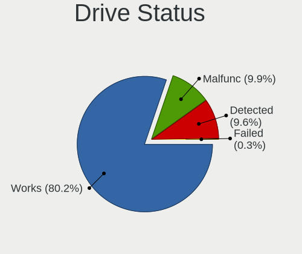

| Status   | Computers | Drives | Percent |
|----------|-----------|--------|---------|
| Works    | 292       | 775    | 80.22%  |
| Malfunc  | 36        | 50     | 9.89%   |
| Detected | 35        | 88     | 9.62%   |
| Failed   | 1         | 1      | 0.27%   |

Storage controller
------------------

Storage Vendor
--------------

Storage controller vendors

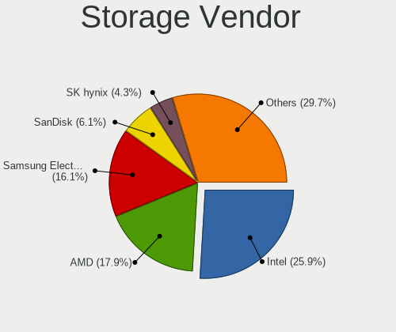

| Vendor                           | Computers | Percent |
|----------------------------------|-----------|---------|
| Intel                            | 132       | 25.93%  |
| AMD                              | 91        | 17.88%  |
| Samsung Electronics              | 82        | 16.11%  |
| SanDisk                          | 31        | 6.09%   |
| SK hynix                         | 22        | 4.32%   |
| Phison Electronics               | 22        | 4.32%   |
| Kingston Technology Company      | 20        | 3.93%   |
| Micron Technology                | 16        | 3.14%   |
| Micron/Crucial Technology        | 14        | 2.75%   |
| KIOXIA                           | 14        | 2.75%   |
| ASMedia Technology               | 13        | 2.55%   |
| Realtek Semiconductor            | 5         | 0.98%   |
| ADATA Technology                 | 5         | 0.98%   |
| Yangtze Memory Technologies      | 4         | 0.79%   |
| MAXIO Technology (Hangzhou)      | 4         | 0.79%   |
| Marvell Technology Group         | 4         | 0.79%   |
| Silicon Motion                   | 3         | 0.59%   |
| Nvidia                           | 3         | 0.59%   |
| LSI Logic / Symbios Logic        | 3         | 0.59%   |
| Broadcom / LSI                   | 3         | 0.59%   |
| Union Memory (Shenzhen)          | 2         | 0.39%   |
| Toshiba America Info Systems     | 2         | 0.39%   |
| Solid State Storage Technology   | 2         | 0.39%   |
| Seagate Technology               | 2         | 0.39%   |
| Loongson Technology              | 2         | 0.39%   |
| JMicron Technology               | 2         | 0.39%   |
| INNOGRIT                         | 2         | 0.39%   |
| VIA Technologies                 | 1         | 0.2%    |
| Transcend                        | 1         | 0.2%    |
| Solidigm                         | 1         | 0.2%    |
| Silicon Integrated Systems [SiS] | 1         | 0.2%    |

Storage Model
-------------

Storage controller models

| Model                                                                          | Computers | Percent |
|--------------------------------------------------------------------------------|-----------|---------|
| AMD FCH SATA Controller [AHCI mode]                                            | 44        | 7.61%   |
| Samsung NVMe SSD Controller SM981/PM981/PM983                                  | 36        | 6.23%   |
| Samsung NVMe SSD Controller PM9A1/PM9A3/980PRO                                 | 27        | 4.67%   |
| Samsung NVMe SSD Controller 980 (DRAM-less)                                    | 20        | 3.46%   |
| AMD 500 Series Chipset SATA Controller                                         | 20        | 3.46%   |
| AMD 600 Series Chipset SATA Controller                                         | 14        | 2.42%   |
| Intel Volume Management Device NVMe RAID Controller Intel Corporation          | 10        | 1.73%   |
| Intel Volume Management Device NVMe RAID Controller                            | 10        | 1.73%   |
| Micron/Crucial P2 [Nick P2] / P3 / P3 Plus NVMe PCIe SSD (DRAM-less)           | 9         | 1.56%   |
| AMD 400 Series Chipset SATA Controller                                         | 9         | 1.56%   |
| SK hynix Gold P31/BC711/PC711 NVMe Solid State Drive                           | 8         | 1.38%   |
| Phison E18 PCIe4 NVMe Controller                                               | 8         | 1.38%   |
| Intel Cannon Lake PCH SATA AHCI Controller                                     | 8         | 1.38%   |
| Intel 8 Series/C220 Series Chipset Family 6-port SATA Controller 1 [AHCI mode] | 8         | 1.38%   |
| Samsung NVMe SSD Controller S4LV008[Pascal]                                    | 7         | 1.21%   |
| Phison E12 NVMe Controller                                                     | 7         | 1.21%   |
| Kingston Company KC3000/FURY Renegade NVMe SSD [E18]                           | 7         | 1.21%   |
| Intel C600/X79 series chipset 6-Port SATA AHCI Controller                      | 7         | 1.21%   |
| Intel 82801 Mobile SATA Controller [RAID mode]                                 | 7         | 1.21%   |
| Intel 500 Series Chipset Family SATA AHCI Controller                           | 7         | 1.21%   |
| ASMedia ASM1061/ASM1062 Serial ATA Controller                                  | 7         | 1.21%   |
| KIOXIA NVMe SSD Controller BG4 (DRAM-less)                                     | 6         | 1.04%   |
| Intel Sunrise Point-LP SATA Controller [AHCI mode]                             | 6         | 1.04%   |
| Intel SSD 660P Series                                                          | 6         | 1.04%   |
| Intel Q170/Q150/B150/H170/H110/Z170/CM236 Chipset SATA Controller [AHCI Mode]  | 6         | 1.04%   |
| Intel Alder Lake-S PCH SATA Controller [AHCI Mode]                             | 6         | 1.04%   |
| SanDisk WD PC SN810 / Black SN850 NVMe SSD                                     | 5         | 0.87%   |
| SanDisk Ultra 3D / WD PC SN530, IX SN530, Blue SN550 NVMe SSD (DRAM-less)      | 5         | 0.87%   |
| Realtek RTS5765DL NVMe SSD Controller (DRAM-less)                              | 5         | 0.87%   |
| Micron 2400 NVMe SSD (DRAM-less)                                               | 5         | 0.87%   |
| Kingston Company A2000 NVMe SSD [SM2263EN]                                     | 5         | 0.87%   |
| Intel Tiger Lake-LP SATA Controller                                            | 5         | 0.87%   |
| Intel SSD 600P Series                                                          | 5         | 0.87%   |
| Intel Celeron/Pentium Silver Processor SATA Controller                         | 5         | 0.87%   |
| Intel C610/X99 series chipset sSATA Controller [AHCI mode]                     | 5         | 0.87%   |
| SK hynix Platinum P41/PC801 NVMe Solid State Drive                             | 4         | 0.69%   |
| Sandisk WD Black SN850X NVMe SSD                                               | 4         | 0.69%   |
| SanDisk WD Black SN770 / PC SN740 256GB / PC SN560 (DRAM-less) NVMe SSD        | 4         | 0.69%   |
| SanDisk Extreme Pro / WD Black SN750 / PC SN730 / Red SN700 NVMe SSD           | 4         | 0.69%   |
| Samsung NVMe SSD Controller SM961/PM961/SM963                                  | 4         | 0.69%   |

Storage Kind
------------

Kind of storage controller (IDE, SATA, NVMe, SAS, ...)

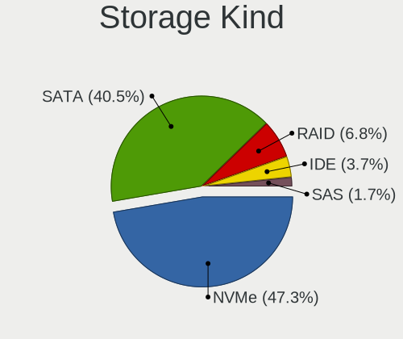

| Kind | Computers | Percent |
|------|-----------|---------|
| NVMe | 228       | 47.3%   |
| SATA | 195       | 40.46%  |
| RAID | 33        | 6.85%   |
| IDE  | 18        | 3.73%   |
| SAS  | 8         | 1.66%   |

Processor
---------

CPU Vendor
----------

Processor vendors

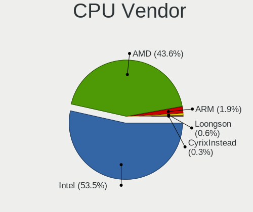

| Vendor       | Computers | Percent |
|--------------|-----------|---------|
| Intel        | 168       | 53.5%   |
| AMD          | 137       | 43.63%  |
| ARM          | 6         | 1.91%   |
| Loongson     | 2         | 0.64%   |
| CyrixInstead | 1         | 0.32%   |

CPU Model
---------

Processor models

| Model                                         | Computers | Percent |
|-----------------------------------------------|-----------|---------|
| AMD Ryzen 9 5900X 12-Core Processor           | 9         | 2.86%   |
| AMD Ryzen 7 5800H with Radeon Graphics        | 7         | 2.22%   |
| ARM Processor                                 | 6         | 1.9%    |
| Intel Core i7-8550U CPU @ 1.80GHz             | 5         | 1.59%   |
| Intel 11th Gen Core i5-1135G7 @ 2.40GHz       | 5         | 1.59%   |
| AMD Ryzen 5 3600 6-Core Processor             | 5         | 1.59%   |
| AMD Ryzen 5 3500U with Radeon Vega Mobile Gfx | 5         | 1.59%   |
| Intel 12th Gen Core i7-12700H                 | 4         | 1.27%   |
| AMD Ryzen 9 7950X 16-Core Processor           | 4         | 1.27%   |
| AMD Ryzen 9 3950X 16-Core Processor           | 4         | 1.27%   |
| AMD Ryzen 9 3900X 12-Core Processor           | 4         | 1.27%   |
| AMD Ryzen 7 PRO 6850U with Radeon Graphics    | 4         | 1.27%   |
| AMD Ryzen 7 5825U with Radeon Graphics        | 4         | 1.27%   |
| AMD Ryzen 5 5600X 6-Core Processor            | 4         | 1.27%   |
| Intel N100                                    | 3         | 0.95%   |
| Intel Core i7-1065G7 CPU @ 1.30GHz            | 3         | 0.95%   |
| Intel 13th Gen Core i9-13900H                 | 3         | 0.95%   |
| Intel 13th Gen Core i7-1370P                  | 3         | 0.95%   |
| Intel 13th Gen Core i7-13700H                 | 3         | 0.95%   |
| Intel 12th Gen Core i7-1260P                  | 3         | 0.95%   |
| Intel 11th Gen Core i7-1165G7 @ 2.80GHz       | 3         | 0.95%   |
| AMD Ryzen 7 7840U w/ Radeon 780M Graphics     | 3         | 0.95%   |
| AMD Ryzen 7 5800X3D 8-Core Processor          | 3         | 0.95%   |
| AMD Ryzen 7 5800X 8-Core Processor            | 3         | 0.95%   |
| AMD Ryzen 5 5500U with Radeon Graphics        | 3         | 0.95%   |
| Loongson 3A6000                               | 2         | 0.63%   |
| Intel Xeon CPU E5-2690 v3 @ 2.60GHz           | 2         | 0.63%   |
| Intel Xeon CPU E5-2620 v4 @ 2.10GHz           | 2         | 0.63%   |
| Intel Xeon CPU E5-1620 v2 @ 3.70GHz           | 2         | 0.63%   |
| Intel Core i9-9900K CPU @ 3.60GHz             | 2         | 0.63%   |
| Intel Core i7-9750H CPU @ 2.60GHz             | 2         | 0.63%   |
| Intel Core i7-8700 CPU @ 3.20GHz              | 2         | 0.63%   |
| Intel Core i7-8650U CPU @ 1.90GHz             | 2         | 0.63%   |
| Intel Core i7-3770 CPU @ 3.40GHz              | 2         | 0.63%   |
| Intel Core i5-8400 CPU @ 2.80GHz              | 2         | 0.63%   |
| Intel Core i5-8365U CPU @ 1.60GHz             | 2         | 0.63%   |
| Intel Core i5-8250U CPU @ 1.60GHz             | 2         | 0.63%   |
| Intel Core i5-2400 CPU @ 3.10GHz              | 2         | 0.63%   |
| Intel Core i5-10210U CPU @ 1.60GHz            | 2         | 0.63%   |
| Intel Core i5 CPU M 540 @ 2.53GHz             | 2         | 0.63%   |

CPU Model Family
----------------

Processor model prefix

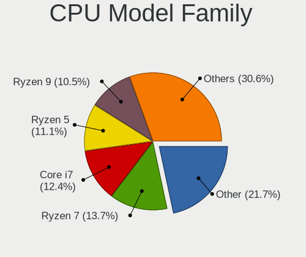

| Model                  | Computers | Percent |
|------------------------|-----------|---------|
| Other                  | 68        | 21.66%  |
| AMD Ryzen 7            | 43        | 13.69%  |
| Intel Core i7          | 39        | 12.42%  |
| AMD Ryzen 5            | 35        | 11.15%  |
| AMD Ryzen 9            | 33        | 10.51%  |
| Intel Core i5          | 26        | 8.28%   |
| Intel Xeon             | 16        | 5.1%    |
| AMD Ryzen 7 PRO        | 10        | 3.18%   |
| Intel Core i3          | 7         | 2.23%   |
| Intel Celeron          | 5         | 1.59%   |
| Intel Core i9          | 4         | 1.27%   |
| AMD FX                 | 4         | 1.27%   |
| Intel Pentium          | 3         | 0.96%   |
| Intel Core 2 Duo       | 3         | 0.96%   |
| Intel Atom             | 3         | 0.96%   |
| AMD Ryzen Threadripper | 3         | 0.96%   |
| Intel Pentium Silver   | 2         | 0.64%   |
| AMD Phenom II X4       | 2         | 0.64%   |
| Intel Pentium M        | 1         | 0.32%   |
| Intel Core 2           | 1         | 0.32%   |
| AMD Ryzen 5 PRO        | 1         | 0.32%   |
| AMD Ryzen 3            | 1         | 0.32%   |
| AMD Phenom II X6       | 1         | 0.32%   |
| AMD EPYC               | 1         | 0.32%   |
| AMD Athlon 64 X2       | 1         | 0.32%   |
| AMD Athlon             | 1         | 0.32%   |

CPU Cores
---------

Number of processor cores

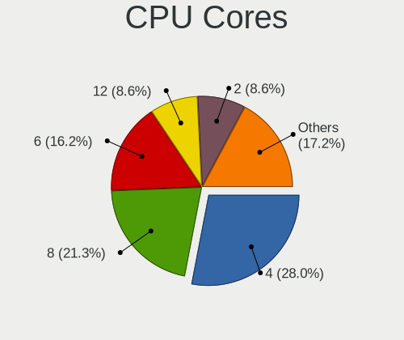

| Number  | Computers | Percent |
|---------|-----------|---------|
| 4       | 88        | 28.03%  |
| 8       | 67        | 21.34%  |
| 6       | 51        | 16.24%  |
| 12      | 27        | 8.6%    |
| 2       | 27        | 8.6%    |
| 16      | 19        | 6.05%   |
| 14      | 14        | 4.46%   |
| 10      | 8         | 2.55%   |
| 1       | 4         | 1.27%   |
| Unknown | 3         | 0.96%   |
| 32      | 2         | 0.64%   |
| 24      | 2         | 0.64%   |
| 20      | 2         | 0.64%   |

CPU Sockets
-----------

Number of sockets

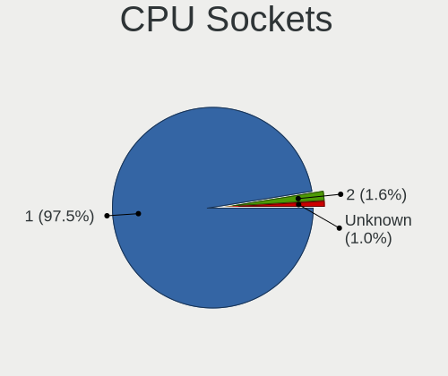

| Number  | Computers | Percent |
|---------|-----------|---------|
| 1       | 306       | 97.45%  |
| 2       | 5         | 1.59%   |
| Unknown | 3         | 0.96%   |

CPU Threads
-----------

Threads per core (Hyper-Threading)

| Number  | Computers | Percent |
|---------|-----------|---------|
| 2       | 265       | 84.39%  |
| 1       | 45        | 14.33%  |
| Unknown | 3         | 0.96%   |
| 4       | 1         | 0.32%   |

CPU Op-Modes
------------

CPU Operation Modes (32-bit, 64-bit)

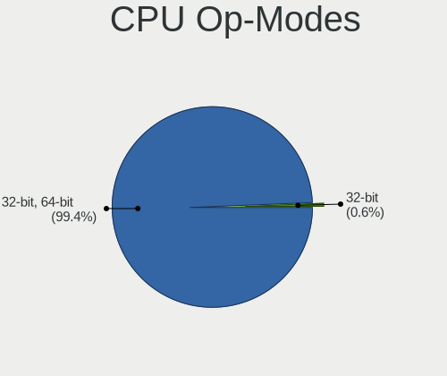

| Op mode        | Computers | Percent |
|----------------|-----------|---------|
| 32-bit, 64-bit | 312       | 99.36%  |
| 32-bit         | 2         | 0.64%   |

CPU Microcode
-------------

Microcode number

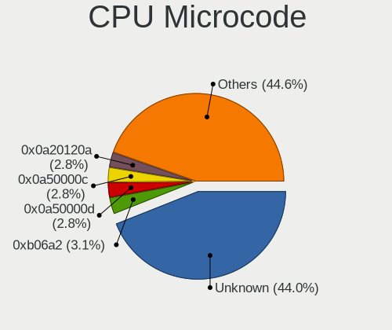

| Number     | Computers | Percent |
|------------|-----------|---------|
| Unknown    | 143       | 44%     |
| 0xb06a2    | 10        | 3.08%   |
| 0x0a50000d | 9         | 2.77%   |
| 0x0a50000c | 9         | 2.77%   |
| 0x0a20120a | 9         | 2.77%   |
| 0x0a601203 | 8         | 2.46%   |
| 0x0a404102 | 8         | 2.46%   |
| 0x0a601206 | 7         | 2.15%   |
| 0x08701021 | 7         | 2.15%   |
| 0x0a704103 | 6         | 1.85%   |
| 0x806ec    | 5         | 1.54%   |
| 0x0a201016 | 5         | 1.54%   |
| 0x806c1    | 4         | 1.23%   |
| 0x08600106 | 4         | 1.23%   |
| 0x906ea    | 3         | 0.92%   |
| 0x90672    | 3         | 0.92%   |
| 0x806ea    | 3         | 0.92%   |
| 0x706a8    | 3         | 0.92%   |
| 0x306e4    | 3         | 0.92%   |
| 0x306c3    | 3         | 0.92%   |
| 0x306a9    | 3         | 0.92%   |
| 0x206d7    | 3         | 0.92%   |
| 0x206a7    | 3         | 0.92%   |
| 0x08701030 | 3         | 0.92%   |
| 0x08108109 | 3         | 0.92%   |
| 0x0800820d | 3         | 0.92%   |
| 0xb06e0    | 2         | 0.62%   |
| 0xb0671    | 2         | 0.62%   |
| 0x906a3    | 2         | 0.62%   |
| 0x506e3    | 2         | 0.62%   |
| 0x306f2    | 2         | 0.62%   |
| 0x20652    | 2         | 0.62%   |
| 0x0a50000f | 2         | 0.62%   |
| 0x08608103 | 2         | 0.62%   |
| 0x08600104 | 2         | 0.62%   |
| 0x08108102 | 2         | 0.62%   |
| 0x010000db | 2         | 0.62%   |
| 0xa0671    | 1         | 0.31%   |
| 0xa0652    | 1         | 0.31%   |
| 0x906ed    | 1         | 0.31%   |

CPU Microarch
-------------

Microarchitecture

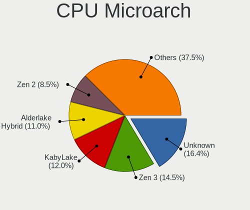

| Name             | Computers | Percent |
|------------------|-----------|---------|
| Unknown          | 52        | 16.4%   |
| Zen 3            | 46        | 14.51%  |
| KabyLake         | 38        | 11.99%  |
| Alderlake Hybrid | 35        | 11.04%  |
| Zen 2            | 27        | 8.52%   |
| Zen+             | 14        | 4.42%   |
| Icelake          | 12        | 3.79%   |
| TigerLake        | 11        | 3.47%   |
| Haswell          | 11        | 3.47%   |
| IvyBridge        | 10        | 3.15%   |
| SandyBridge      | 9         | 2.84%   |
| Skylake          | 6         | 1.89%   |
| CometLake        | 6         | 1.89%   |
| Westmere         | 5         | 1.58%   |
| Goldmont plus    | 5         | 1.58%   |
| Broadwell        | 5         | 1.58%   |
| Zen              | 3         | 0.95%   |
| Piledriver       | 3         | 0.95%   |
| K10              | 3         | 0.95%   |
| Gracemont        | 3         | 0.95%   |
| Core             | 3         | 0.95%   |
| Silvermont       | 2         | 0.63%   |
| Bonnell          | 2         | 0.63%   |
| Tremont          | 1         | 0.32%   |
| Penryn           | 1         | 0.32%   |
| P6               | 1         | 0.32%   |
| Nehalem          | 1         | 0.32%   |
| K8 Hammer        | 1         | 0.32%   |
| Bulldozer        | 1         | 0.32%   |

Graphics
--------

GPU Vendor
----------

Vendors of graphics cards

| Vendor                           | Computers | Percent |
|----------------------------------|-----------|---------|
| AMD                              | 134       | 36.81%  |
| Intel                            | 111       | 30.49%  |
| Nvidia                           | 106       | 29.12%  |
| ASPEED Technology                | 8         | 2.2%    |
| Matrox Electronics Systems       | 2         | 0.55%   |
| Loongson Technology              | 2         | 0.55%   |
| Silicon Integrated Systems [SiS] | 1         | 0.27%   |

GPU Model
---------

Graphics card models

| Model                                                                | Computers | Percent |
|----------------------------------------------------------------------|-----------|---------|
| AMD Cezanne [Radeon Vega Series / Radeon Vega Mobile Series]         | 15        | 3.94%   |
| Intel Raptor Lake-P [Iris Xe Graphics]                               | 13        | 3.41%   |
| AMD Raphael                                                          | 13        | 3.41%   |
| AMD Ellesmere [Radeon RX 470/480/570/570X/580/580X/590]              | 13        | 3.41%   |
| Intel UHD Graphics 620                                               | 12        | 3.15%   |
| AMD Navi 22 [Radeon RX 6700/6700 XT/6750 XT / 6800M/6850M XT]        | 12        | 3.15%   |
| Intel TigerLake-LP GT2 [Iris Xe Graphics]                            | 11        | 2.89%   |
| AMD Picasso/Raven 2 [Radeon Vega Series / Radeon Vega Mobile Series] | 11        | 2.89%   |
| AMD Renoir [Radeon Vega Series / Radeon Vega Mobile Series]          | 9         | 2.36%   |
| AMD Rembrandt [Radeon 680M]                                          | 9         | 2.36%   |
| AMD Phoenix1                                                         | 9         | 2.36%   |
| ASPEED Technology ASPEED Graphics Family                             | 8         | 2.1%    |
| Intel Alder Lake-P GT2 [Iris Xe Graphics]                            | 7         | 1.84%   |
| AMD Navi 21 [Radeon RX 6800/6800 XT / 6900 XT]                       | 7         | 1.84%   |
| AMD Barcelo                                                          | 6         | 1.57%   |
| Nvidia AD107M [GeForce RTX 4060 Max-Q / Mobile]                      | 5         | 1.31%   |
| Intel CoffeeLake-S GT2 [UHD Graphics 630]                            | 5         | 1.31%   |
| AMD Navi 10 [Radeon RX 5600 OEM/5600 XT / 5700/5700 XT]              | 5         | 1.31%   |
| Nvidia GA107M [GeForce RTX 3050 Mobile]                              | 4         | 1.05%   |
| Intel WhiskeyLake-U GT2 [UHD Graphics 620]                           | 4         | 1.05%   |
| Intel GeminiLake [UHD Graphics 600]                                  | 4         | 1.05%   |
| AMD Navi 23 [Radeon RX 6600/6600 XT/6600M]                           | 4         | 1.05%   |
| AMD Lucienne                                                         | 4         | 1.05%   |
| Nvidia GT218 [GeForce 210]                                           | 3         | 0.79%   |
| Nvidia GP107 [GeForce GTX 1050 Ti]                                   | 3         | 0.79%   |
| Nvidia GM204 [GeForce GTX 970]                                       | 3         | 0.79%   |
| Nvidia GA104M [GeForce RTX 3070 Mobile / Max-Q]                      | 3         | 0.79%   |
| Nvidia GA104 [GeForce RTX 3070 Ti]                                   | 3         | 0.79%   |
| Nvidia GA102 [GeForce RTX 3080 Ti]                                   | 3         | 0.79%   |
| Nvidia AD107M [GeForce RTX 4050 Max-Q / Mobile]                      | 3         | 0.79%   |
| Nvidia AD106M [GeForce RTX 4070 Max-Q / Mobile]                      | 3         | 0.79%   |
| Intel TigerLake-H GT1 [UHD Graphics]                                 | 3         | 0.79%   |
| Intel Raptor Lake-P [UHD Graphics]                                   | 3         | 0.79%   |
| Intel Iris Plus Graphics G7                                          | 3         | 0.79%   |
| Intel HD Graphics 530                                                | 3         | 0.79%   |
| Intel CometLake-U GT2 [UHD Graphics]                                 | 3         | 0.79%   |
| Intel Alder Lake-N [UHD Graphics]                                    | 3         | 0.79%   |
| AMD Navi 31 [Radeon RX 7900 XT/7900 XTX/7900 GRE/7900M]              | 3         | 0.79%   |
| AMD Navi 24 [Radeon RX 6400/6500 XT/6500M]                           | 3         | 0.79%   |
| AMD Lexa PRO [Radeon 540/540X/550/550X / RX 540X/550/550X]           | 3         | 0.79%   |

GPU Combo
---------

Combinations of graphics cards

| Name                      | Computers | Percent |
|---------------------------|-----------|---------|
| 1 x AMD                   | 103       | 32.39%  |
| 1 x Intel                 | 73        | 22.96%  |
| 1 x Nvidia                | 56        | 17.61%  |
| Intel + Nvidia            | 33        | 10.38%  |
| AMD + Nvidia              | 16        | 5.03%   |
| 2 x AMD                   | 10        | 3.14%   |
| Other                     | 7         | 2.2%    |
| 1 x ASPEED                | 6         | 1.89%   |
| 2 x Intel                 | 3         | 0.94%   |
| Intel + AMD               | 3         | 0.94%   |
| 1 x Matrox                | 2         | 0.63%   |
| AMD + Loongson Technology | 2         | 0.63%   |
| 2 x Nvidia                | 1         | 0.31%   |
| 1 x SiS                   | 1         | 0.31%   |
| Nvidia + ASPEED           | 1         | 0.31%   |
| AMD + ASPEED              | 1         | 0.31%   |

GPU Driver
----------

Free vs proprietary

| Driver      | Computers | Percent |
|-------------|-----------|---------|
| Free        | 212       | 66.67%  |
| Proprietary | 74        | 23.27%  |
| Unknown     | 32        | 10.06%  |

GPU Memory
----------

Total video memory

| Size in GB | Computers | Percent |
|------------|-----------|---------|
| Unknown    | 155       | 48.14%  |
| 0.01-0.5   | 39        | 12.11%  |
| 1.01-2.0   | 31        | 9.63%   |
| 7.01-8.0   | 30        | 9.32%   |
| 8.01-16.0  | 25        | 7.76%   |
| 0.51-1.0   | 16        | 4.97%   |
| 3.01-4.0   | 15        | 4.66%   |
| 5.01-6.0   | 6         | 1.86%   |
| 16.01-24.0 | 4         | 1.24%   |
| 2.01-3.0   | 1         | 0.31%   |

Monitor
-------

Monitor Vendor
--------------

Monitor vendors

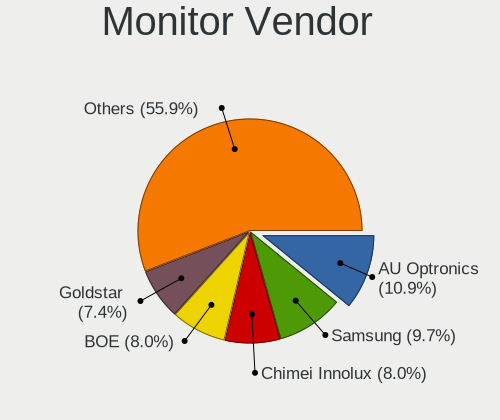

| Vendor               | Computers | Percent |
|----------------------|-----------|---------|
| AU Optronics         | 38        | 10.89%  |
| Samsung Electronics  | 34        | 9.74%   |
| Chimei Innolux       | 28        | 8.02%   |
| BOE                  | 28        | 8.02%   |
| Goldstar             | 26        | 7.45%   |
| Dell                 | 25        | 7.16%   |
| LG Display           | 17        | 4.87%   |
| BenQ                 | 17        | 4.87%   |
| Philips              | 11        | 3.15%   |
| AOC                  | 11        | 3.15%   |
| Acer                 | 10        | 2.87%   |
| Lenovo               | 9         | 2.58%   |
| Sharp                | 8         | 2.29%   |
| ViewSonic            | 7         | 2.01%   |
| ASUSTek Computer     | 7         | 2.01%   |
| Iiyama               | 6         | 1.72%   |
| Hewlett-Packard      | 6         | 1.72%   |
| PANDA                | 5         | 1.43%   |
| Gigabyte Technology  | 4         | 1.15%   |
| CSO                  | 4         | 1.15%   |
| Ancor Communications | 4         | 1.15%   |
| Unknown              | 3         | 0.86%   |
| TMX                  | 3         | 0.86%   |
| UGD                  | 2         | 0.57%   |
| Toshiba              | 2         | 0.57%   |
| RTK                  | 2         | 0.57%   |
| NEC Computers        | 2         | 0.57%   |
| Mi                   | 2         | 0.57%   |
| HUAWEI               | 2         | 0.57%   |
| YZA                  | 1         | 0.29%   |
| VDO                  | 1         | 0.29%   |
| Valve                | 1         | 0.29%   |
| SuperFrame           | 1         | 0.29%   |
| Sceptre Tech         | 1         | 0.29%   |
| Nvidia               | 1         | 0.29%   |
| MSI                  | 1         | 0.29%   |
| Monoprice            | 1         | 0.29%   |
| Microstep            | 1         | 0.29%   |
| Medion Akoya         | 1         | 0.29%   |
| LG Electronics       | 1         | 0.29%   |

Monitor Model
-------------

Monitor models

| Model                                                                 | Computers | Percent |
|-----------------------------------------------------------------------|-----------|---------|
| BOE LCD Monitor BOE0BCA 2256x1504 285x190mm 13.5-inch                 | 6         | 1.64%   |
| AOC 24G2W1G5 AOC2402 1920x1080 527x296mm 23.8-inch                    | 4         | 1.09%   |
| Unknown LCD Monitor FFFF 2288x1287 2550x2550mm 142.0-inch             | 3         | 0.82%   |
| Samsung Electronics C24F390 SAM0D2C 1920x1080 521x293mm 23.5-inch     | 3         | 0.82%   |
| Dell U2412M DELA07A 1920x1200 518x324mm 24.1-inch                     | 3         | 0.82%   |
| Chimei Innolux LCD Monitor CMN1614 1920x1200 344x215mm 16.0-inch      | 3         | 0.82%   |
| BenQ PD2700U BNQ802E 3840x2160 597x336mm 27.0-inch                    | 3         | 0.82%   |
| BenQ GL2780 BNQ78EC 1920x1080 598x336mm 27.0-inch                     | 3         | 0.82%   |
| AU Optronics LCD Monitor AUO6DA8 2560x1600 301x188mm 14.0-inch        | 3         | 0.82%   |
| AU Optronics LCD Monitor AUO403D 1920x1080 309x174mm 14.0-inch        | 3         | 0.82%   |
| UGD Artist13.3pro UGD1302 1920x1080 294x165mm 13.3-inch               | 2         | 0.55%   |
| Samsung Electronics U32H85x SAM0E3C 3840x2160 697x392mm 31.5-inch     | 2         | 0.55%   |
| Samsung Electronics SyncMaster SAM059A 1920x1080 477x268mm 21.5-inch  | 2         | 0.55%   |
| Samsung Electronics SMS27A650 SAM082E 1920x1080 598x336mm 27.0-inch   | 2         | 0.55%   |
| Samsung Electronics S22B300 SAM08C8 1920x1080 477x268mm 21.5-inch     | 2         | 0.55%   |
| Samsung Electronics LCD Monitor SDC4180 2880x1620 344x194mm 15.5-inch | 2         | 0.55%   |
| Philips 17S PHL0877 1280x1024 337x270mm 17.0-inch                     | 2         | 0.55%   |
| Mi 27 NFGL XMIB004 1920x1080 598x336mm 27.0-inch                      | 2         | 0.55%   |
| LG Display LCD Monitor LGD06CA 1920x1080 309x174mm 14.0-inch          | 2         | 0.55%   |
| Lenovo LCD Monitor LEN40BA 1920x1080 344x194mm 15.5-inch              | 2         | 0.55%   |
| Iiyama PL2783Q IVM661F 2560x1440 597x336mm 27.0-inch                  | 2         | 0.55%   |
| Hewlett-Packard S230tm HWP3115 1920x1080 509x286mm 23.0-inch          | 2         | 0.55%   |
| Hewlett-Packard LA2206 HWP2946 1920x1080 480x270mm 21.7-inch          | 2         | 0.55%   |
| Goldstar ULTRAWIDE GSM59F1 2560x1080 677x290mm 29.0-inch              | 2         | 0.55%   |
| Goldstar HDR 4K GSM774F 3840x2160 697x392mm 31.5-inch                 | 2         | 0.55%   |
| Goldstar HDR 4K GSM7707 3840x2160 600x340mm 27.2-inch                 | 2         | 0.55%   |
| Dell U2719D DEL415A 2560x1440 597x336mm 27.0-inch                     | 2         | 0.55%   |
| Dell U2415 DELA0BA 1920x1200 518x324mm 24.1-inch                      | 2         | 0.55%   |
| Dell U2410 DELF016 1920x1200 518x324mm 24.1-inch                      | 2         | 0.55%   |
| Dell P2418D DELD0C2 2560x1440 526x296mm 23.8-inch                     | 2         | 0.55%   |
| Chimei Innolux LCD Monitor CMN15E7 1920x1080 344x193mm 15.5-inch      | 2         | 0.55%   |
| Chimei Innolux LCD Monitor CMN1521 1920x1080 344x193mm 15.5-inch      | 2         | 0.55%   |
| Chimei Innolux LCD Monitor CMN14D4 1920x1080 309x173mm 13.9-inch      | 2         | 0.55%   |
| BenQ GW2780 BNQ78E6 1920x1080 598x336mm 27.0-inch                     | 2         | 0.55%   |
| BenQ EL2870U BNQ7949 3840x2160 621x341mm 27.9-inch                    | 2         | 0.55%   |
| AU Optronics LCD Monitor AUOF99A 1920x1200 301x188mm 14.0-inch        | 2         | 0.55%   |
| AU Optronics LCD Monitor AUOE48D 1920x1080 344x194mm 15.5-inch        | 2         | 0.55%   |
| AU Optronics LCD Monitor AUO2992 1920x1080 344x193mm 15.5-inch        | 2         | 0.55%   |
| ASUSTek Computer VA24E AUS24D1 1920x1080 527x296mm 23.8-inch          | 2         | 0.55%   |
| AOC 24G2W1G4 AOC2402 1920x1080 530x300mm 24.0-inch                    | 2         | 0.55%   |

Monitor Resolution
------------------

Monitor screen resolution

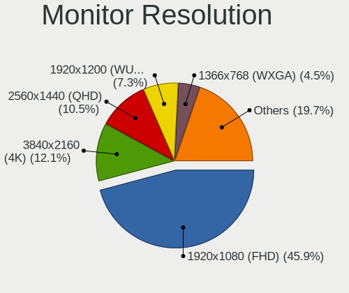

| Resolution         | Computers | Percent |
|--------------------|-----------|---------|
| 1920x1080 (FHD)    | 144       | 45.86%  |
| 3840x2160 (4K)     | 38        | 12.1%   |
| 2560x1440 (QHD)    | 33        | 10.51%  |
| 1920x1200 (WUXGA)  | 23        | 7.32%   |
| 1366x768 (WXGA)    | 14        | 4.46%   |
| 2560x1600          | 9         | 2.87%   |
| 1280x1024 (SXGA)   | 8         | 2.55%   |
| 2256x1504          | 7         | 2.23%   |
| 2560x1080          | 5         | 1.59%   |
| 3440x1440          | 4         | 1.27%   |
| 3840x2400          | 3         | 0.96%   |
| 2288x1287          | 3         | 0.96%   |
| 3840x1080          | 2         | 0.64%   |
| 3200x2000          | 2         | 0.64%   |
| 2880x1620          | 2         | 0.64%   |
| 1600x900 (HD+)     | 2         | 0.64%   |
| 1600x1200          | 2         | 0.64%   |
| 1280x800 (WXGA)    | 2         | 0.64%   |
| 7680x2160          | 1         | 0.32%   |
| 3456x2160          | 1         | 0.32%   |
| 3000x2000          | 1         | 0.32%   |
| 2880x1800          | 1         | 0.32%   |
| 2048x1152          | 1         | 0.32%   |
| 1920x540           | 1         | 0.32%   |
| 1920x1280          | 1         | 0.32%   |
| 1680x1050 (WSXGA+) | 1         | 0.32%   |
| 1440x900 (WXGA+)   | 1         | 0.32%   |
| 1400x1050          | 1         | 0.32%   |
| Unknown            | 1         | 0.32%   |

Monitor Diagonal
----------------

Diagonal size in inches

| Inches  | Computers | Percent |
|---------|-----------|---------|
| 15      | 55        | 15.9%   |
| 27      | 54        | 15.61%  |
| 14      | 35        | 10.12%  |
| 13      | 35        | 10.12%  |
| 24      | 34        | 9.83%   |
| 23      | 25        | 7.23%   |
| 21      | 23        | 6.65%   |
| 16      | 14        | 4.05%   |
| 31      | 13        | 3.76%   |
| 17      | 12        | 3.47%   |
| 34      | 10        | 2.89%   |
| 19      | 5         | 1.45%   |
| Unknown | 5         | 1.45%   |
| 142     | 3         | 0.87%   |
| 20      | 3         | 0.87%   |
| 84      | 2         | 0.58%   |
| 48      | 2         | 0.58%   |
| 36      | 2         | 0.58%   |
| 28      | 2         | 0.58%   |
| 18      | 2         | 0.58%   |
| 74      | 1         | 0.29%   |
| 72      | 1         | 0.29%   |
| 57      | 1         | 0.29%   |
| 38      | 1         | 0.29%   |
| 32      | 1         | 0.29%   |
| 26      | 1         | 0.29%   |
| 25      | 1         | 0.29%   |
| 11      | 1         | 0.29%   |
| 10      | 1         | 0.29%   |
| 7       | 1         | 0.29%   |

Monitor Width
-------------

Physical width

| Width in mm    | Computers | Percent |
|----------------|-----------|---------|
| 301-350        | 121       | 36.34%  |
| 501-600        | 99        | 29.73%  |
| 401-500        | 27        | 8.11%   |
| 201-300        | 23        | 6.91%   |
| 601-700        | 21        | 6.31%   |
| 701-800        | 14        | 4.2%    |
| 351-400        | 12        | 3.6%    |
| Unknown        | 5         | 1.5%    |
| 1501-2000      | 4         | 1.2%    |
| More than 2000 | 3         | 0.9%    |
| 1001-1500      | 2         | 0.6%    |
| 801-900        | 1         | 0.3%    |
| 101-200        | 1         | 0.3%    |

Aspect Ratio
------------

Proportional relationship between the width and the height

| Ratio   | Computers | Percent |
|---------|-----------|---------|
| 16/9    | 213       | 71%     |
| 16/10   | 47        | 15.67%  |
| 21/9    | 10        | 3.33%   |
| 3/2     | 9         | 3%      |
| 5/4     | 8         | 2.67%   |
| Unknown | 5         | 1.67%   |
| 1.00    | 3         | 1%      |
| 4/3     | 2         | 0.67%   |
| 32/9    | 2         | 0.67%   |
| 0.56    | 1         | 0.33%   |

Monitor Area
------------

Area in inch

| Area in inch | Computers | Percent |
|----------------|-----------|---------|
| 81-90          | 57        | 16.86%  |
| 301-350        | 55        | 16.27%  |
| 201-250        | 54        | 15.98%  |
| 101-110        | 54        | 15.98%  |
| 351-500        | 24        | 7.1%    |
| 251-300        | 19        | 5.62%   |
| 111-120        | 15        | 4.44%   |
| 71-80          | 13        | 3.85%   |
| 151-200        | 12        | 3.55%   |
| More than 1000 | 8         | 2.37%   |
| 141-150        | 7         | 2.07%   |
| 121-130        | 7         | 2.07%   |
| 501-1000       | 5         | 1.48%   |
| Unknown        | 5         | 1.48%   |
| 51-60          | 2         | 0.59%   |
| 1-40           | 1         | 0.3%    |

Pixel Density
-------------

Pixels per inch

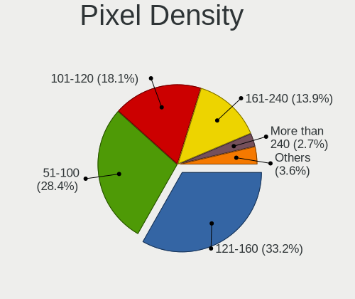

| Density       | Computers | Percent |
|---------------|-----------|---------|
| 121-160       | 110       | 33.23%  |
| 51-100        | 94        | 28.4%   |
| 101-120       | 60        | 18.13%  |
| 161-240       | 46        | 13.9%   |
| More than 240 | 9         | 2.72%   |
| 1-50          | 7         | 2.11%   |
| Unknown       | 5         | 1.51%   |

Multiple Monitors
-----------------

Total monitors connected

| Total | Computers | Percent |
|-------|-----------|---------|
| 1     | 216       | 67.08%  |
| 2     | 53        | 16.46%  |
| 0     | 36        | 11.18%  |
| 3     | 13        | 4.04%   |
| 4     | 4         | 1.24%   |

Network
-------

Net Controller Vendor
---------------------

Controller vendors

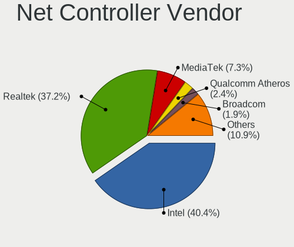

| Vendor                                | Computers | Percent |
|---------------------------------------|-----------|---------|
| Intel                                 | 189       | 40.38%  |
| Realtek Semiconductor                 | 174       | 37.18%  |
| MediaTek                              | 34        | 7.26%   |
| Qualcomm Atheros                      | 11        | 2.35%   |
| Broadcom                              | 9         | 1.92%   |
| Qualcomm                              | 6         | 1.28%   |
| ASIX Electronics                      | 6         | 1.28%   |
| Ralink Technology                     | 4         | 0.85%   |
| TP-Link                               | 3         | 0.64%   |
| Nvidia                                | 3         | 0.64%   |
| Marvell Technology Group              | 3         | 0.64%   |
| Xiaomi                                | 2         | 0.43%   |
| Samsung Electronics                   | 2         | 0.43%   |
| Loongson Technology                   | 2         | 0.43%   |
| Lenovo                                | 2         | 0.43%   |
| Broadcom Limited                      | 2         | 0.43%   |
| U-Blox                                | 1         | 0.21%   |
| Texas Instruments                     | 1         | 0.21%   |
| Qualcomm Atheros Communications       | 1         | 0.21%   |
| QinHeng Electronics                   | 1         | 0.21%   |
| Prusa                                 | 1         | 0.21%   |
| NetGear                               | 1         | 0.21%   |
| Microsoft                             | 1         | 0.21%   |
| Microchip Technology                  | 1         | 0.21%   |
| Mellanox Technologies                 | 1         | 0.21%   |
| Insyde Software                       | 1         | 0.21%   |
| Huawei Technologies                   | 1         | 0.21%   |
| Google                                | 1         | 0.21%   |
| Emulex                                | 1         | 0.21%   |
| D-Link System                         | 1         | 0.21%   |
| Cisco Aironet Wireless Communications | 1         | 0.21%   |
| American Megatrends                   | 1         | 0.21%   |

Net Controller Model
--------------------

Controller models

| Model                                                                  | Computers | Percent |
|------------------------------------------------------------------------|-----------|---------|
| Realtek RTL8111/8168/8211/8411 PCI Express Gigabit Ethernet Controller | 105       | 19.23%  |
| Realtek RTL8125 2.5GbE Controller                                      | 41        | 7.51%   |
| Intel Wi-Fi 6 AX200                                                    | 26        | 4.76%   |
| Intel Wi-Fi 6E(802.11ax) AX210/AX1675* 2x2 [Typhoon Peak]              | 22        | 4.03%   |
| MediaTek MT7922 802.11ax PCI Express Wireless Network Adapter          | 14        | 2.56%   |
| Intel I211 Gigabit Network Connection                                  | 13        | 2.38%   |
| Realtek RTL8153 Gigabit Ethernet Adapter                               | 12        | 2.2%    |
| MediaTek MT7921 802.11ax PCI Express Wireless Network Adapter          | 12        | 2.2%    |
| Intel Raptor Lake PCH CNVi WiFi                                        | 12        | 2.2%    |
| Intel Wireless 8265 / 8275                                             | 11        | 2.01%   |
| Intel Ethernet Controller I225-V                                       | 11        | 2.01%   |
| Intel 82579LM Gigabit Network Connection (Lewisville)                  | 9         | 1.65%   |
| Intel Alder Lake-P PCH CNVi WiFi                                       | 8         | 1.47%   |
| Realtek RTL8821CE 802.11ac PCIe Wireless Network Adapter               | 7         | 1.28%   |
| Intel Wi-Fi 6 AX201                                                    | 7         | 1.28%   |
| Qualcomm QCNFA765 Wireless Network Adapter                             | 6         | 1.1%    |
| MediaTek MT7921K (RZ608) Wi-Fi 6E 80MHz                                | 6         | 1.1%    |
| Intel I210 Gigabit Network Connection                                  | 6         | 1.1%    |
| Intel Ethernet Connection (7) I219-V                                   | 6         | 1.1%    |
| Intel Cannon Lake PCH CNVi WiFi                                        | 6         | 1.1%    |
| ASIX AX88179 Gigabit Ethernet                                          | 6         | 1.1%    |
| Realtek USB 10/100/1G/2.5G LAN                                         | 5         | 0.92%   |
| Realtek RTL8852BE PCIe 802.11ax Wireless Network Controller            | 5         | 0.92%   |
| Intel Ethernet Connection (4) I219-LM                                  | 5         | 0.92%   |
| Realtek RTL8852AE 802.11ax PCIe Wireless Network Adapter               | 4         | 0.73%   |
| Intel Raptor Lake-S PCH CNVi WiFi                                      | 4         | 0.73%   |
| Intel Comet Lake PCH CNVi WiFi                                         | 4         | 0.73%   |
| Realtek RTL88x2bu [AC1200 Techkey]                                     | 3         | 0.55%   |
| Realtek RTL8822CE 802.11ac PCIe Wireless Network Adapter               | 3         | 0.55%   |
| Realtek RTL810xE PCI Express Fast Ethernet controller                  | 3         | 0.55%   |
| Qualcomm Atheros QCA9377 802.11ac Wireless Network Adapter             | 3         | 0.55%   |
| Intel Wireless 7265                                                    | 3         | 0.55%   |
| Intel Tiger Lake PCH CNVi WiFi                                         | 3         | 0.55%   |
| Intel I350 Gigabit Network Connection                                  | 3         | 0.55%   |
| Intel Ethernet Connection I217-LM                                      | 3         | 0.55%   |
| Intel Ethernet Connection (6) I219-LM                                  | 3         | 0.55%   |
| Intel Comet Lake PCH-LP CNVi WiFi                                      | 3         | 0.55%   |
| Intel Centrino Ultimate-N 6300                                         | 3         | 0.55%   |
| Intel Cannon Point-LP CNVi [Wireless-AC]                               | 3         | 0.55%   |
| Intel 82579V Gigabit Network Connection                                | 3         | 0.55%   |

Wireless Vendor
---------------

Wireless vendors

| Vendor                                | Computers | Percent |
|---------------------------------------|-----------|---------|
| Intel                                 | 137       | 61.43%  |
| MediaTek                              | 29        | 13%     |
| Realtek Semiconductor                 | 28        | 12.56%  |
| Qualcomm Atheros                      | 7         | 3.14%   |
| Qualcomm                              | 6         | 2.69%   |
| Broadcom                              | 5         | 2.24%   |
| Ralink Technology                     | 4         | 1.79%   |
| TP-Link                               | 2         | 0.9%    |
| Qualcomm Atheros Communications       | 1         | 0.45%   |
| NetGear                               | 1         | 0.45%   |
| Microsoft                             | 1         | 0.45%   |
| Cisco Aironet Wireless Communications | 1         | 0.45%   |
| Broadcom Limited                      | 1         | 0.45%   |

Wireless Model
--------------

Wireless models

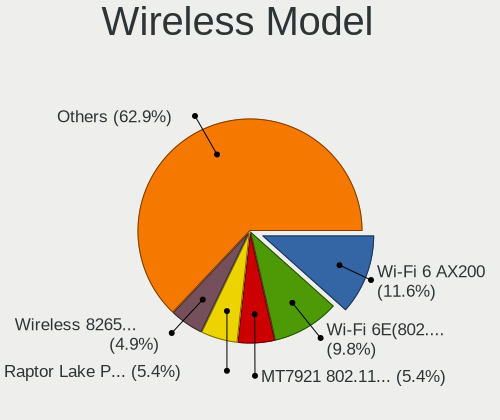

| Model                                                         | Computers | Percent |
|---------------------------------------------------------------|-----------|---------|
| Intel Wi-Fi 6 AX200                                           | 26        | 11.61%  |
| Intel Wi-Fi 6E(802.11ax) AX210/AX1675* 2x2 [Typhoon Peak]     | 22        | 9.82%   |
| MediaTek MT7921 802.11ax PCI Express Wireless Network Adapter | 12        | 5.36%   |
| Intel Raptor Lake PCH CNVi WiFi                               | 12        | 5.36%   |
| Intel Wireless 8265 / 8275                                    | 11        | 4.91%   |
| MediaTek MT7922 802.11ax PCI Express Wireless Network Adapter | 10        | 4.46%   |
| Intel Alder Lake-P PCH CNVi WiFi                              | 8         | 3.57%   |
| Realtek RTL8821CE 802.11ac PCIe Wireless Network Adapter      | 7         | 3.13%   |
| Intel Wi-Fi 6 AX201                                           | 7         | 3.13%   |
| Qualcomm QCNFA765 Wireless Network Adapter                    | 6         | 2.68%   |
| MediaTek MT7921K (RZ608) Wi-Fi 6E 80MHz                       | 6         | 2.68%   |
| Intel Cannon Lake PCH CNVi WiFi                               | 6         | 2.68%   |
| Realtek RTL8852AE 802.11ax PCIe Wireless Network Adapter      | 4         | 1.79%   |
| Intel Raptor Lake-S PCH CNVi WiFi                             | 4         | 1.79%   |
| Intel Comet Lake PCH CNVi WiFi                                | 4         | 1.79%   |
| Realtek RTL88x2bu [AC1200 Techkey]                            | 3         | 1.34%   |
| Realtek RTL8852BE PCIe 802.11ax Wireless Network Controller   | 3         | 1.34%   |
| Realtek RTL8822CE 802.11ac PCIe Wireless Network Adapter      | 3         | 1.34%   |
| Qualcomm Atheros QCA9377 802.11ac Wireless Network Adapter    | 3         | 1.34%   |
| Intel Wireless 7265                                           | 3         | 1.34%   |
| Intel Tiger Lake PCH CNVi WiFi                                | 3         | 1.34%   |
| Intel Comet Lake PCH-LP CNVi WiFi                             | 3         | 1.34%   |
| Intel Centrino Ultimate-N 6300                                | 3         | 1.34%   |
| Intel Cannon Point-LP CNVi [Wireless-AC]                      | 3         | 1.34%   |
| Ralink RT5572 Wireless Adapter                                | 2         | 0.89%   |
| Intel Wireless 8260                                           | 2         | 0.89%   |
| Intel Wireless 3165                                           | 2         | 0.89%   |
| Intel Ice Lake-LP PCH CNVi WiFi                               | 2         | 0.89%   |
| Intel Gemini Lake PCH CNVi WiFi                               | 2         | 0.89%   |
| Intel Dual Band Wireless-AC 3168NGW [Stone Peak]              | 2         | 0.89%   |
| Intel Alder Lake-S PCH CNVi WiFi                              | 2         | 0.89%   |
| TP-Link Archer T3U [Realtek RTL8812BU]                        | 1         | 0.45%   |
| TP-Link 802.11ac NIC                                          | 1         | 0.45%   |
| Realtek RTL8822BE 802.11a/b/g/n/ac WiFi adapter               | 1         | 0.45%   |
| Realtek RTL8812AE 802.11ac PCIe Wireless Network Adapter      | 1         | 0.45%   |
| Realtek RTL8723DE Wireless Network Adapter                    | 1         | 0.45%   |
| Realtek RTL8723BU 802.11b/g/n WLAN Adapter                    | 1         | 0.45%   |
| Realtek RTL8723BE PCIe Wireless Network Adapter               | 1         | 0.45%   |
| Realtek RTL8192EE PCIe Wireless Network Adapter               | 1         | 0.45%   |
| Realtek RTL8188EUS 802.11n Wireless Network Adapter           | 1         | 0.45%   |

Ethernet Vendor
---------------

Ethernet vendors

| Vendor                   | Computers | Percent |
|--------------------------|-----------|---------|
| Realtek Semiconductor    | 165       | 54.1%   |
| Intel                    | 97        | 31.8%   |
| ASIX Electronics         | 6         | 1.97%   |
| MediaTek                 | 5         | 1.64%   |
| Qualcomm Atheros         | 4         | 1.31%   |
| Broadcom                 | 4         | 1.31%   |
| Nvidia                   | 3         | 0.98%   |
| Marvell Technology Group | 3         | 0.98%   |
| Xiaomi                   | 2         | 0.66%   |
| Samsung Electronics      | 2         | 0.66%   |
| Loongson Technology      | 2         | 0.66%   |
| Lenovo                   | 2         | 0.66%   |
| TP-Link                  | 1         | 0.33%   |
| Microchip Technology     | 1         | 0.33%   |
| Mellanox Technologies    | 1         | 0.33%   |
| Insyde Software          | 1         | 0.33%   |
| Huawei Technologies      | 1         | 0.33%   |
| Google                   | 1         | 0.33%   |
| Emulex                   | 1         | 0.33%   |
| D-Link System            | 1         | 0.33%   |
| Broadcom Limited         | 1         | 0.33%   |
| American Megatrends      | 1         | 0.33%   |

Ethernet Model
--------------

Ethernet models

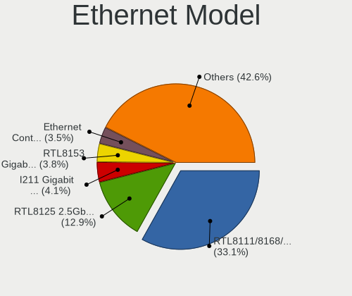

| Model                                                                         | Computers | Percent |
|-------------------------------------------------------------------------------|-----------|---------|
| Realtek RTL8111/8168/8211/8411 PCI Express Gigabit Ethernet Controller        | 105       | 33.12%  |
| Realtek RTL8125 2.5GbE Controller                                             | 41        | 12.93%  |
| Intel I211 Gigabit Network Connection                                         | 13        | 4.1%    |
| Realtek RTL8153 Gigabit Ethernet Adapter                                      | 12        | 3.79%   |
| Intel Ethernet Controller I225-V                                              | 11        | 3.47%   |
| Intel 82579LM Gigabit Network Connection (Lewisville)                         | 9         | 2.84%   |
| Intel I210 Gigabit Network Connection                                         | 6         | 1.89%   |
| Intel Ethernet Connection (7) I219-V                                          | 6         | 1.89%   |
| ASIX AX88179 Gigabit Ethernet                                                 | 6         | 1.89%   |
| Realtek USB 10/100/1G/2.5G LAN                                                | 5         | 1.58%   |
| Intel Ethernet Connection (4) I219-LM                                         | 5         | 1.58%   |
| MediaTek MT7922 802.11ax PCI Express Wireless Network Adapter                 | 4         | 1.26%   |
| Realtek RTL810xE PCI Express Fast Ethernet controller                         | 3         | 0.95%   |
| Intel I350 Gigabit Network Connection                                         | 3         | 0.95%   |
| Intel Ethernet Connection I217-LM                                             | 3         | 0.95%   |
| Intel Ethernet Connection (6) I219-LM                                         | 3         | 0.95%   |
| Intel 82579V Gigabit Network Connection                                       | 3         | 0.95%   |
| Intel 82577LM Gigabit Network Connection                                      | 3         | 0.95%   |
| Samsung Galaxy series, misc. (tethering mode)                                 | 2         | 0.63%   |
| Realtek RTL8852BE PCIe 802.11ax Wireless Network Controller                   | 2         | 0.63%   |
| Nvidia MCP61 Ethernet                                                         | 2         | 0.63%   |
| Marvell Group 88E8056 PCI-E Gigabit Ethernet Controller                       | 2         | 0.63%   |
| Loongson Ethernet controller                                                  | 2         | 0.63%   |
| Intel Ethernet Controller I226-V                                              | 2         | 0.63%   |
| Intel Ethernet Connection (2) I219-V                                          | 2         | 0.63%   |
| Intel Ethernet Connection (16) I219-V                                         | 2         | 0.63%   |
| Intel Ethernet Connection (14) I219-V                                         | 2         | 0.63%   |
| Intel 82571EB/82571GB Gigabit Ethernet Controller D0/D1 (copper applications) | 2         | 0.63%   |
| Xiaomi Mi/Redmi series (RNDIS)                                                | 1         | 0.32%   |
| Xiaomi Mi/Redmi series (RNDIS + ADB)                                          | 1         | 0.32%   |
| TP-Link USB 10/100 LAN                                                        | 1         | 0.32%   |
| Realtek RTL8852CE PCIe 802.11ax Wireless Network Controller                   | 1         | 0.32%   |
| Realtek RTL8852BE PCIe 802.11ax Wireless Network Controller [1T1R]            | 1         | 0.32%   |
| Realtek RTL8169 PCI Gigabit Ethernet Controller                               | 1         | 0.32%   |
| Realtek RTL8111/8168/8411 PCI Express Gigabit Ethernet Controller             | 1         | 0.32%   |
| Realtek RTL-8100/8101L/8139 PCI Fast Ethernet Adapter                         | 1         | 0.32%   |
| Realtek Killer E3000 2.5GbE Controller                                        | 1         | 0.32%   |
| Realtek Killer E2500 Gigabit Ethernet Controller                              | 1         | 0.32%   |
| Qualcomm Atheros QCA8171 Gigabit Ethernet                                     | 1         | 0.32%   |
| Qualcomm Atheros Killer E2400 Gigabit Ethernet Controller                     | 1         | 0.32%   |

Net Controller Kind
-------------------

Ethernet, WiFi or modem

| Kind     | Computers | Percent |
|----------|-----------|---------|
| Ethernet | 266       | 54.4%   |
| WiFi     | 218       | 44.58%  |
| Modem    | 5         | 1.02%   |

Used Controller
---------------

Currently used network controller

| Kind     | Computers | Percent |
|----------|-----------|---------|
| Ethernet | 156       | 50.16%  |
| WiFi     | 155       | 49.84%  |

NICs
----

Total network controllers on board

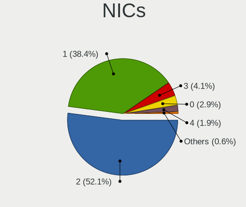

| Total | Computers | Percent |
|-------|-----------|---------|
| 2     | 164       | 52.06%  |
| 1     | 121       | 38.41%  |
| 3     | 13        | 4.13%   |
| 0     | 9         | 2.86%   |
| 4     | 6         | 1.9%    |
| 7     | 1         | 0.32%   |
| 5     | 1         | 0.32%   |

IPv6
----

IPv6 vs IPv4

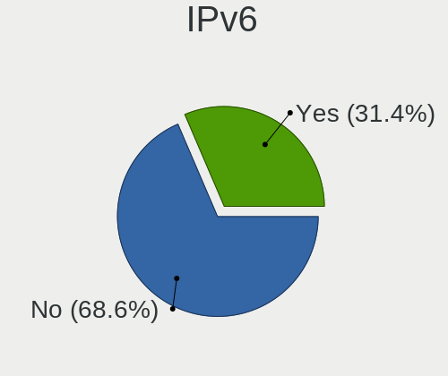

| Used | Computers | Percent |
|------|-----------|---------|
| No   | 218       | 68.55%  |
| Yes  | 100       | 31.45%  |

Bluetooth
---------

Bluetooth Vendor
----------------

Controller vendors

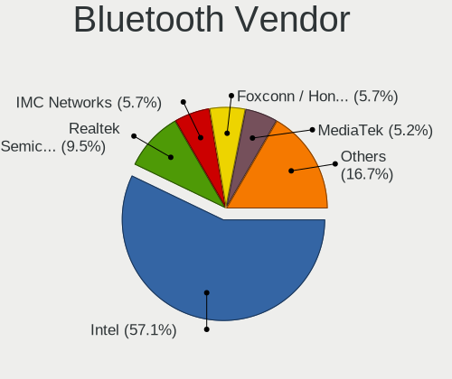

| Vendor                  | Computers | Percent |
|-------------------------|-----------|---------|
| Intel                   | 120       | 57.14%  |
| Realtek Semiconductor   | 20        | 9.52%   |
| IMC Networks            | 12        | 5.71%   |
| Foxconn / Hon Hai       | 12        | 5.71%   |
| MediaTek                | 11        | 5.24%   |
| Cambridge Silicon Radio | 11        | 5.24%   |
| Lite-On Technology      | 6         | 2.86%   |
| USI                     | 5         | 2.38%   |
| Broadcom                | 4         | 1.9%    |
| Dell                    | 2         | 0.95%   |
| TP-Link                 | 1         | 0.48%   |
| Realtek                 | 1         | 0.48%   |
| Hewlett-Packard         | 1         | 0.48%   |
| Foxconn International   | 1         | 0.48%   |
| Edimax Technology       | 1         | 0.48%   |
| Apple                   | 1         | 0.48%   |
| Actions                 | 1         | 0.48%   |

Bluetooth Model
---------------

Controller models

| Model                                               | Computers | Percent |
|-----------------------------------------------------|-----------|---------|
| Intel AX201 Bluetooth                               | 25        | 11.9%   |
| Intel AX200 Bluetooth                               | 22        | 10.48%  |
| Intel AX210 Bluetooth                               | 19        | 9.05%   |
| Intel Bluetooth wireless interface                  | 18        | 8.57%   |
| Intel AX211 Bluetooth                               | 18        | 8.57%   |
| Realtek Bluetooth Radio                             | 15        | 7.14%   |
| Intel Bluetooth 9460/9560 Jefferson Peak (JfP)      | 14        | 6.67%   |
| MediaTek Wireless_Device                            | 11        | 5.24%   |
| Cambridge Silicon Radio Bluetooth Dongle (HCI mode) | 11        | 5.24%   |
| Foxconn / Hon Hai Wireless_Device                   | 8         | 3.81%   |
| USI Bluetooth Device                                | 5         | 2.38%   |
| IMC Networks Wireless_Device                        | 5         | 2.38%   |
| Realtek  Bluetooth 4.2 Adapter                      | 4         | 1.9%    |
| IMC Networks Bluetooth Radio                        | 4         | 1.9%    |
| Lite-On Wireless_Device                             | 3         | 1.43%   |
| Lite-On Bluetooth Device                            | 3         | 1.43%   |
| Foxconn / Hon Hai MediaTek Bluetooth Adapter        | 3         | 1.43%   |
| Intel Centrino Bluetooth Wireless Transceiver       | 2         | 0.95%   |
| IMC Networks Bluetooth Device                       | 2         | 0.95%   |
| Broadcom BCM2045B (BDC-2.1)                         | 2         | 0.95%   |
| TP-Link TP-Link Bluetooth USB Adapter               | 1         | 0.48%   |
| Realtek 802.11ac WLAN Adapter                       | 1         | 0.48%   |
| Realtek Bluetooth Radio                             | 1         | 0.48%   |
| Intel Wireless-AC 9260 Bluetooth Adapter            | 1         | 0.48%   |
| Intel Wireless-AC 3168 Bluetooth                    | 1         | 0.48%   |
| IMC Networks BCM20702A0                             | 1         | 0.48%   |
| HP Broadcom 2070 Bluetooth Combo                    | 1         | 0.48%   |
| Foxconn International BCM43142A0 Bluetooth module   | 1         | 0.48%   |
| Foxconn / Hon Hai MediaTek MT7921 Bluetooth         | 1         | 0.48%   |
| Edimax Bluetooth Adapter                            | 1         | 0.48%   |
| Dell Wireless 365 Bluetooth                         | 1         | 0.48%   |
| Dell DW375 Bluetooth Module                         | 1         | 0.48%   |
| Broadcom BCM92046DG-CL1ROM Bluetooth 2.1 Adapter    | 1         | 0.48%   |
| Broadcom BCM20702A0 Bluetooth 4.0                   | 1         | 0.48%   |
| Apple Bluetooth Host Controller                     | 1         | 0.48%   |
| Actions general adapter                             | 1         | 0.48%   |

Sound
-----

Sound Vendor
------------

Sound card vendors

| Vendor                                       | Computers | Percent |
|----------------------------------------------|-----------|---------|
| AMD                                          | 154       | 30.74%  |
| Intel                                        | 153       | 30.54%  |
| Nvidia                                       | 86        | 17.17%  |
| C-Media Electronics                          | 13        | 2.59%   |
| SteelSeries ApS                              | 6         | 1.2%    |
| Logitech                                     | 6         | 1.2%    |
| Micro Star International                     | 5         | 1%      |
| Kingston Technology                          | 5         | 1%      |
| ASUSTek Computer                             | 5         | 1%      |
| Texas Instruments                            | 4         | 0.8%    |
| Razer USA                                    | 4         | 0.8%    |
| Plantronics                                  | 4         | 0.8%    |
| Realtek Semiconductor                        | 3         | 0.6%    |
| Lenovo                                       | 3         | 0.6%    |
| JMTek                                        | 3         | 0.6%    |
| Hewlett-Packard                              | 3         | 0.6%    |
| GN Netcom                                    | 3         | 0.6%    |
| Generalplus Technology                       | 3         | 0.6%    |
| Zoran Co. Personal Media Division (Nogatech) | 2         | 0.4%    |
| Mark of the Unicorn                          | 2         | 0.4%    |
| Loongson Technology                          | 2         | 0.4%    |
| JBL                                          | 2         | 0.4%    |
| Focusrite-Novation                           | 2         | 0.4%    |
| Creative Technology                          | 2         | 0.4%    |
| Creative Labs                                | 2         | 0.4%    |
| Audient                                      | 2         | 0.4%    |
| Unknown                                      | 2         | 0.4%    |
| Valve Software                               | 1         | 0.2%    |
| Thesycon Systemsoftware & Consulting         | 1         | 0.2%    |
| Sony                                         | 1         | 0.2%    |
| No brand                                     | 1         | 0.2%    |
| Microsoft                                    | 1         | 0.2%    |
| MAG Technology                               | 1         | 0.2%    |
| M-Audio                                      | 1         | 0.2%    |
| JOUNIVO                                      | 1         | 0.2%    |
| Jieli Technology                             | 1         | 0.2%    |
| iCreate Technologies                         | 1         | 0.2%    |
| Huawei Technologies                          | 1         | 0.2%    |
| FIFINE Microphones                           | 1         | 0.2%    |
| Elgato Systems                               | 1         | 0.2%    |

Sound Model
-----------

Sound card models

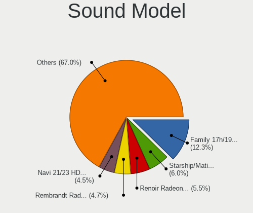

| Model                                                                      | Computers | Percent |
|----------------------------------------------------------------------------|-----------|---------|
| AMD Family 17h/19h/1ah HD Audio Controller                                 | 76        | 12.3%   |
| AMD Starship/Matisse HD Audio Controller                                   | 37        | 5.99%   |
| AMD Renoir Radeon High Definition Audio Controller                         | 34        | 5.5%    |
| AMD Rembrandt Radeon High Definition Audio Controller                      | 29        | 4.69%   |
| AMD Navi 21/23 HDMI/DP Audio Controller                                    | 28        | 4.53%   |
| Intel Raptor Lake-P/U/H cAVS                                               | 17        | 2.75%   |
| Intel Sunrise Point-LP HD Audio                                            | 15        | 2.43%   |
| AMD Ellesmere HDMI Audio [Radeon RX 470/480 / 570/580/590]                 | 14        | 2.27%   |
| Nvidia GA104 High Definition Audio Controller                              | 13        | 2.1%    |
| Intel Tiger Lake-LP Smart Sound Technology Audio Controller                | 11        | 1.78%   |
| Intel Cannon Lake PCH cAVS                                                 | 11        | 1.78%   |
| AMD Raven/Raven2/Fenghuang HDMI/DP Audio Controller                        | 10        | 1.62%   |
| Intel Tiger Lake-H HD Audio Controller                                     | 9         | 1.46%   |
| Intel Alder Lake PCH-P High Definition Audio Controller                    | 9         | 1.46%   |
| Nvidia GP107GL High Definition Audio Controller                            | 8         | 1.29%   |
| Nvidia AD107 High Definition Audio Controller                              | 8         | 1.29%   |
| Intel 8 Series/C220 Series Chipset High Definition Audio Controller        | 7         | 1.13%   |
| Intel Alder Lake-S HD Audio Controller                                     | 6         | 0.97%   |
| Intel 7 Series/C216 Chipset Family High Definition Audio Controller        | 6         | 0.97%   |
| AMD Navi 10 HDMI Audio                                                     | 6         | 0.97%   |
| Nvidia TU116 High Definition Audio Controller                              | 5         | 0.81%   |
| Nvidia GA106 High Definition Audio Controller                              | 5         | 0.81%   |
| Nvidia AD106M High Definition Audio Controller                             | 5         | 0.81%   |
| Micro Star International USB Audio                                         | 5         | 0.81%   |
| Intel Comet Lake PCH cAVS                                                  | 5         | 0.81%   |
| Intel Celeron/Pentium Silver Processor High Definition Audio               | 5         | 0.81%   |
| Intel C600/X79 series chipset High Definition Audio Controller             | 5         | 0.81%   |
| Intel 6 Series/C200 Series Chipset Family High Definition Audio Controller | 5         | 0.81%   |
| AMD SBx00 Azalia (Intel HDA)                                               | 5         | 0.81%   |
| AMD Family 17h (Models 00h-0fh) HD Audio Controller                        | 5         | 0.81%   |
| Nvidia TU106 High Definition Audio Controller                              | 4         | 0.65%   |
| Nvidia GA107 High Definition Audio Controller                              | 4         | 0.65%   |
| Nvidia GA102 High Definition Audio Controller                              | 4         | 0.65%   |
| Intel Raptor Lake High Definition Audio Controller                         | 4         | 0.65%   |
| Intel Cannon Point-LP High Definition Audio Controller                     | 4         | 0.65%   |
| Intel 5 Series/3400 Series Chipset High Definition Audio                   | 4         | 0.65%   |
| Intel 200 Series PCH HD Audio                                              | 4         | 0.65%   |
| C-Media Electronics Audio Adapter (Unitek Y-247A)                          | 4         | 0.65%   |
| ASUSTek Computer USB Audio                                                 | 4         | 0.65%   |
| AMD Baffin HDMI/DP Audio [Radeon RX 550 640SP / RX 560/560X]               | 4         | 0.65%   |

Memory
------

Memory Vendor
-------------

Memory module vendors

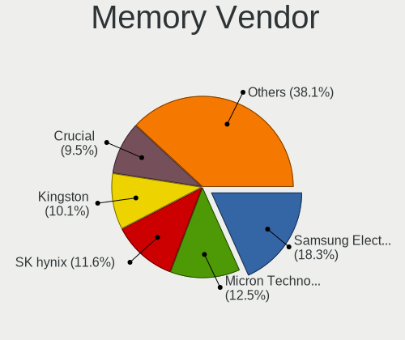

| Vendor                       | Computers | Percent |
|------------------------------|-----------|---------|
| Samsung Electronics          | 60        | 18.29%  |
| Micron Technology            | 41        | 12.5%   |
| SK hynix                     | 38        | 11.59%  |
| Kingston                     | 33        | 10.06%  |
| Crucial                      | 31        | 9.45%   |
| G.Skill                      | 29        | 8.84%   |
| Corsair                      | 29        | 8.84%   |
| Unknown                      | 16        | 4.88%   |
| Unknown                      | 11        | 3.35%   |
| A-DATA Technology            | 9         | 2.74%   |
| Team                         | 5         | 1.52%   |
| Patriot                      | 4         | 1.22%   |
| Elpida                       | 4         | 1.22%   |
| Unknown (ABCD)               | 3         | 0.91%   |
| Ramaxel Technology           | 2         | 0.61%   |
| Unknown (0x0B92)             | 1         | 0.3%    |
| Transcend                    | 1         | 0.3%    |
| Patriot Memory (PDP Systems) | 1         | 0.3%    |
| Nanya Technology             | 1         | 0.3%    |
| Mushkin                      | 1         | 0.3%    |
| Lexar Co Limited             | 1         | 0.3%    |
| Kllisre                      | 1         | 0.3%    |
| Kimtigo                      | 1         | 0.3%    |
| Foxline                      | 1         | 0.3%    |
| CSX                          | 1         | 0.3%    |
| Avant                        | 1         | 0.3%    |
| Apacer                       | 1         | 0.3%    |
| AMD                          | 1         | 0.3%    |

Memory Model
------------

Memory module models

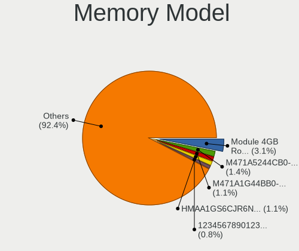

| Model                                                            | Computers | Percent |
|------------------------------------------------------------------|-----------|---------|
| Unknown                                                          | 11        | 3.09%   |
| Samsung RAM M471A5244CB0-CTD 4GB SODIMM DDR4 3266MT/s            | 5         | 1.4%    |
| SK hynix RAM HMAA1GS6CJR6N-XN 8GB SODIMM DDR4 3200MT/s           | 4         | 1.12%   |
| Samsung RAM M471A1G44BB0-CWE 8GB SODIMM DDR4 3200MT/s            | 4         | 1.12%   |
| Unknown (ABCD) RAM 123456789012345678 2GB SODIMM LPDDR3 2400MT/s | 3         | 0.84%   |
| Team RAM TEAMGROUP-UD4-3200 8GB DIMM DDR4 3733MT/s               | 3         | 0.84%   |
| Samsung RAM M471A1K43EB1-CWE 8GB SODIMM DDR4 3200MT/s            | 3         | 0.84%   |
| Samsung RAM M471A1G44AB0-CWE 8GB SODIMM DDR4 3200MT/s            | 3         | 0.84%   |
| Samsung RAM M425R1GB4BB0-CQKOL 8GB SODIMM DDR5 4800MT/s          | 3         | 0.84%   |
| Micron RAM MTC4C10163S1SC48BA1 8GB SODIMM DDR5 4800MT/s          | 3         | 0.84%   |
| Micron RAM MT62F2G32D8DR-031 WT 8GB SODIMM LPDDR5 6400MT/s       | 3         | 0.84%   |
| G.Skill RAM F4-3200C16-16GVK 16GB DIMM DDR4 3600MT/s             | 3         | 0.84%   |
| Crucial RAM CT16G4SFRA32A.C8FE 16GB SODIMM DDR4 3200MT/s         | 3         | 0.84%   |
| Corsair RAM CMK16GX4M2B3200C16 8GB DIMM DDR4 3600MT/s            | 3         | 0.84%   |
| Unknown RAM Module 2GB DIMM DDR2 667MT/s                         | 2         | 0.56%   |
| SK hynix RAM Module 8GB SODIMM DDR4 2400MT/s                     | 2         | 0.56%   |
| SK hynix RAM Module 4GB SODIMM DDR4 2400MT/s                     | 2         | 0.56%   |
| SK hynix RAM HMT451S6AFR8A-PB 4GB SODIMM DDR3 1600MT/s           | 2         | 0.56%   |
| SK hynix RAM HMAA2GS6CJR8N-XN 16GB SODIMM DDR4 3200MT/s          | 2         | 0.56%   |
| SK hynix RAM H9JCNNNFA5MLYR-N6E 8GB SODIMM LPDDR5 6400MT/s       | 2         | 0.56%   |
| Samsung RAM M471B5273DH0-CH9 4GB SODIMM DDR3 1334MT/s            | 2         | 0.56%   |
| Samsung RAM M471B1G73QH0-YK0 8GB SODIMM DDR3 1600MT/s            | 2         | 0.56%   |
| Samsung RAM M471A5244CB0-CWE 4096MB SODIMM DDR4 3200MT/s         | 2         | 0.56%   |
| Samsung RAM M471A2K43DB1-CTD 16GB SODIMM DDR4 2667MT/s           | 2         | 0.56%   |
| Samsung RAM M471A2K43CB1-CTD 16GB SODIMM DDR4 8400MT/s           | 2         | 0.56%   |
| Samsung RAM M471A1G44BB0-CWE 8GB Row Of Chips DDR4 3200MT/s      | 2         | 0.56%   |
| Micron RAM MT62F1G32D4DR-031 WT 4GB Row Of Chips LPDDR5 6400MT/s | 2         | 0.56%   |
| Micron RAM 8ATF1G64HZ-3G2R1 8GB SODIMM DDR4 3200MT/s             | 2         | 0.56%   |
| Micron RAM 8ATF1G64HZ-3G2J1 8GB SODIMM DDR4 3200MT/s             | 2         | 0.56%   |
| Micron RAM 4ATF1G64HZ-3G2F1 8GB SODIMM DDR4 3200MT/s             | 2         | 0.56%   |
| Micron RAM 4ATF1G64HZ-3G2E1 8GB SODIMM DDR4 3200MT/s             | 2         | 0.56%   |
| Kingston RAM KF556S40-32 32GB SODIMM DDR5 5600MT/s               | 2         | 0.56%   |
| Kingston RAM KF556C36-32 32GB DIMM DDR5 5600MT/s                 | 2         | 0.56%   |
| Kingston RAM KF3200C16D4/16GX 16GB DIMM DDR4 3200MT/s            | 2         | 0.56%   |
| G.Skill RAM F5-6000J3636F16G 16GB DIMM DDR5 6400MT/s             | 2         | 0.56%   |
| G.Skill RAM F4-3600C18-32GVK 32GB DIMM DDR4 3600MT/s             | 2         | 0.56%   |
| G.Skill RAM F4-3600C16-16GTZNC 16GB DIMM DDR4 3866MT/s           | 2         | 0.56%   |
| G.Skill RAM F4-3200C16-8GVKB 8GB DIMM DDR4 4000MT/s              | 2         | 0.56%   |
| G.Skill RAM F4-3200C16-8GIS 8GB DIMM DDR4 3200MT/s               | 2         | 0.56%   |
| Elpida RAM EBJ41UF8BCS0-DJ-F 4GB SODIMM DDR3 1334MT/s            | 2         | 0.56%   |

Memory Kind
-----------

Memory module kinds

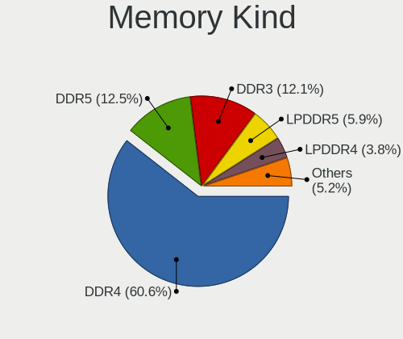

| Kind    | Computers | Percent |
|---------|-----------|---------|
| DDR4    | 175       | 60.55%  |
| DDR5    | 36        | 12.46%  |
| DDR3    | 35        | 12.11%  |
| LPDDR5  | 17        | 5.88%   |
| LPDDR4  | 11        | 3.81%   |
| DDR2    | 7         | 2.42%   |
| Unknown | 3         | 1.04%   |
| SDRAM   | 2         | 0.69%   |
| LPDDR3  | 1         | 0.35%   |
| DRAM    | 1         | 0.35%   |
| DDR     | 1         | 0.35%   |

Memory Form Factor
------------------

Physical design of the memory module

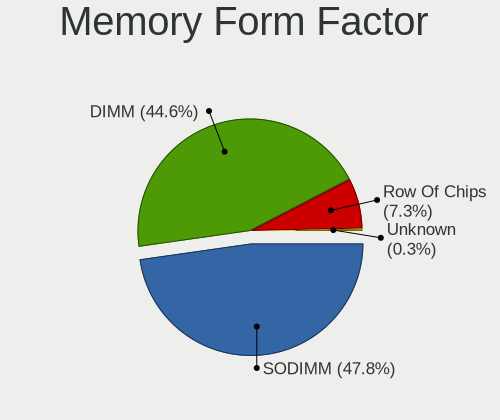

| Name         | Computers | Percent |
|--------------|-----------|---------|
| SODIMM       | 138       | 47.75%  |
| DIMM         | 129       | 44.64%  |
| Row Of Chips | 21        | 7.27%   |
| Unknown      | 1         | 0.35%   |

Memory Size
-----------

Memory module size

| Size  | Computers | Percent |
|-------|-----------|---------|
| 8192  | 119       | 37.3%   |
| 16384 | 89        | 27.9%   |
| 32768 | 48        | 15.05%  |
| 4096  | 43        | 13.48%  |
| 2048  | 16        | 5.02%   |
| 1024  | 3         | 0.94%   |
| 49152 | 1         | 0.31%   |

Memory Speed
------------

Memory module speed

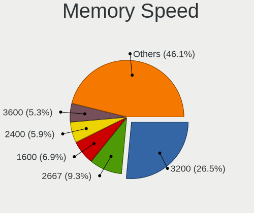

| Speed   | Computers | Percent |
|---------|-----------|---------|
| 3200    | 85        | 26.48%  |
| 2667    | 30        | 9.35%   |
| 1600    | 22        | 6.85%   |
| 2400    | 19        | 5.92%   |
| 3600    | 17        | 5.3%    |
| 6400    | 16        | 4.98%   |
| 4800    | 15        | 4.67%   |
| 5600    | 13        | 4.05%   |
| 2133    | 12        | 3.74%   |
| 4267    | 6         | 1.87%   |
| 3733    | 5         | 1.56%   |
| 3266    | 5         | 1.56%   |
| 1866    | 5         | 1.56%   |
| 1333    | 5         | 1.56%   |
| 667     | 5         | 1.56%   |
| 6000    | 4         | 1.25%   |
| 4000    | 4         | 1.25%   |
| 3800    | 4         | 1.25%   |
| 1334    | 4         | 1.25%   |
| 3000    | 3         | 0.93%   |
| 2933    | 3         | 0.93%   |
| 8400    | 2         | 0.62%   |
| 4266    | 2         | 0.62%   |
| 3866    | 2         | 0.62%   |
| 3666    | 2         | 0.62%   |
| 3534    | 2         | 0.62%   |
| 3466    | 2         | 0.62%   |
| 3400    | 2         | 0.62%   |
| 2666    | 2         | 0.62%   |
| 2048    | 2         | 0.62%   |
| 800     | 2         | 0.62%   |
| Unknown | 2         | 0.62%   |
| 49926   | 1         | 0.31%   |
| 12800   | 1         | 0.31%   |
| 8600    | 1         | 0.31%   |
| 7500    | 1         | 0.31%   |
| 6200    | 1         | 0.31%   |
| 5500    | 1         | 0.31%   |
| 5200    | 1         | 0.31%   |
| 3500    | 1         | 0.31%   |

Printers & scanners
-------------------

Printer Vendor
--------------

Printer device vendors

| Vendor              | Computers | Percent |
|---------------------|-----------|---------|
| Hewlett-Packard     | 3         | 33.33%  |
| Brother Industries  | 3         | 33.33%  |
| Prolific Technology | 1         | 11.11%  |
| NXP Semiconductors  | 1         | 11.11%  |
| Canon               | 1         | 11.11%  |

Printer Model
-------------

Printer device models

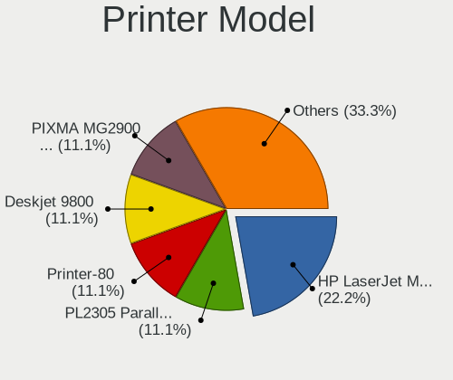

| Model                         | Computers | Percent |
|-------------------------------|-----------|---------|
| HP HP LaserJet M14-M17        | 2         | 22.22%  |
| Prolific PL2305 Parallel Port | 1         | 11.11%  |
| NXP Semiconductors Printer-80 | 1         | 11.11%  |
| HP Deskjet 9800               | 1         | 11.11%  |
| Canon PIXMA MG2900 Series     | 1         | 11.11%  |
| Brother QL-500 label printer  | 1         | 11.11%  |
| Brother MFC-9340CDW           | 1         | 11.11%  |
| Brother HL-L2370DW series     | 1         | 11.11%  |

Scanner Vendor
--------------

Scanner device vendors

Zero info for selected period =(

Scanner Model
-------------

Scanner device models

Zero info for selected period =(

Camera
------

Camera Vendor
-------------

Camera device vendors

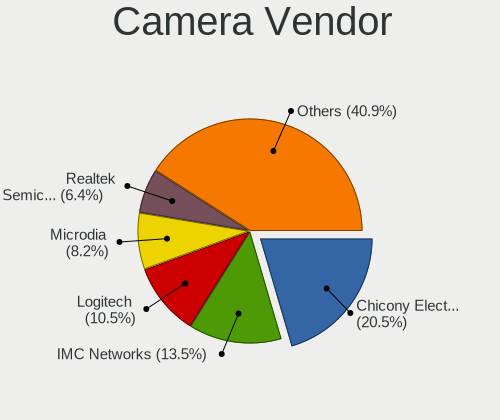

| Vendor                                 | Computers | Percent |
|----------------------------------------|-----------|---------|
| Chicony Electronics                    | 35        | 20.47%  |
| IMC Networks                           | 23        | 13.45%  |
| Logitech                               | 18        | 10.53%  |
| Microdia                               | 14        | 8.19%   |
| Realtek Semiconductor                  | 11        | 6.43%   |
| Quanta                                 | 9         | 5.26%   |
| Bison Electronics                      | 9         | 5.26%   |
| Luxvisions Innotech Limited            | 8         | 4.68%   |
| Sunplus Innovation Technology          | 4         | 2.34%   |
| Sonix Technology                       | 4         | 2.34%   |
| Lite-On Technology                     | 4         | 2.34%   |
| Cheng Uei Precision Industry (Foxlink) | 4         | 2.34%   |
| UltraSemi                              | 2         | 1.17%   |
| Syntek                                 | 2         | 1.17%   |
| Samsung Electronics                    | 2         | 1.17%   |
| BTF-230906-J                           | 2         | 1.17%   |
| Acer                                   | 2         | 1.17%   |
| Zhejiang Dahua Technology              | 1         | 0.58%   |
| Valve Software                         | 1         | 0.58%   |
| Tripath Technology                     | 1         | 0.58%   |
| Silicon Motion                         | 1         | 0.58%   |
| Ricoh                                  | 1         | 0.58%   |
| Razer USA                              | 1         | 0.58%   |
| Microsoft                              | 1         | 0.58%   |
| Lenovo                                 | 1         | 0.58%   |
| kingcome                               | 1         | 0.58%   |
| icSpring                               | 1         | 0.58%   |
| Google                                 | 1         | 0.58%   |
| Goodong                                | 1         | 0.58%   |
| Generalplus Technology                 | 1         | 0.58%   |
| Elgato Systems                         | 1         | 0.58%   |
| Creative Technology                    | 1         | 0.58%   |
| Arkmicro Technologies                  | 1         | 0.58%   |
| ARC International                      | 1         | 0.58%   |
| A4Tech                                 | 1         | 0.58%   |

Camera Model
------------

Camera device models

| Model                                                | Computers | Percent |
|------------------------------------------------------|-----------|---------|
| Chicony Integrated Camera                            | 17        | 9.77%   |
| IMC Networks USB2.0 HD UVC WebCam                    | 8         | 4.6%    |
| Logitech Webcam C270                                 | 7         | 4.02%   |
| IMC Networks Integrated Camera                       | 7         | 4.02%   |
| Realtek Laptop Camera                                | 5         | 2.87%   |
| Microdia Integrated_Webcam_HD                        | 5         | 2.87%   |
| Lite-On HP HD Camera                                 | 4         | 2.3%    |
| Bison Integrated Camera                              | 4         | 2.3%    |
| Quanta HD User Facing                                | 3         | 1.72%   |
| Logitech C922 Pro Stream Webcam                      | 3         | 1.72%   |
| Chicony Integrated IR Camera                         | 3         | 1.72%   |
| Cheng Uei Precision Industry (Foxlink) HP 5MP Camera | 3         | 1.72%   |
| UltraSemi USB3 Video                                 | 2         | 1.15%   |
| Syntek Integrated Camera                             | 2         | 1.15%   |
| Sonix USB2.0 HD UVC WebCam                           | 2         | 1.15%   |
| Sonix USB2.0 FHD UVC WebCam                          | 2         | 1.15%   |
| Samsung Galaxy series, misc. (MTP mode)              | 2         | 1.15%   |
| Realtek Integrated_Webcam_FHD                        | 2         | 1.15%   |
| Quanta HP TrueVision HD Camera                       | 2         | 1.15%   |
| Microdia Webcam Vitade AF                            | 2         | 1.15%   |
| Microdia USB 2.0 Camera                              | 2         | 1.15%   |
| Luxvisions Innotech Limited Integrated RGB Camera    | 2         | 1.15%   |
| Luxvisions Innotech Limited HP Wide Vision HD Camera | 2         | 1.15%   |
| Luxvisions Innotech Limited HP HD Camera             | 2         | 1.15%   |
| Logitech HD Webcam C525                              | 2         | 1.15%   |
| Logitech HD Pro Webcam C920                          | 2         | 1.15%   |
| IMC Networks USB2.0 VGA UVC WebCam                   | 2         | 1.15%   |
| Chicony Integrated Camera (1280x720@30)              | 2         | 1.15%   |
| Chicony HP Wide Vision HD Camera                     | 2         | 1.15%   |
| Chicony HP HD Camera                                 | 2         | 1.15%   |
| Chicony HP 720p HD Monitor Webcam                    | 2         | 1.15%   |
| Chicony HD WebCam                                    | 2         | 1.15%   |
| Chicony HD User Facing                               | 2         | 1.15%   |
| BTF-230906-J Hy-UXGA(B5M2)-Camera                    | 2         | 1.15%   |
| Bison HD Webcam                                      | 2         | 1.15%   |
| Zhejiang Dahua HTI-UC325                             | 1         | 0.57%   |
| Valve Software 3D Camera                             | 1         | 0.57%   |
| Tripath USB Camera                                   | 1         | 0.57%   |
| Sunplus XiaoMi USB 2.0 Webcam                        | 1         | 0.57%   |
| Sunplus USB 2.0 Camera                               | 1         | 0.57%   |

Security
--------

Fingerprint Vendor
------------------

Fingerprint sensor vendors

| Vendor                             | Computers | Percent |
|------------------------------------|-----------|---------|
| Synaptics                          | 18        | 52.94%  |
| Validity Sensors                   | 6         | 17.65%  |
| Shenzhen Goodix Technology         | 6         | 17.65%  |
| Upek                               | 1         | 2.94%   |
| Realtek USB2.0 Finger Print Bridge | 1         | 2.94%   |
| LighTuning Technology              | 1         | 2.94%   |
| Elan Microelectronics              | 1         | 2.94%   |

Fingerprint Model
-----------------

Fingerprint sensor models

| Model                                                                      | Computers | Percent |
|----------------------------------------------------------------------------|-----------|---------|
| Synaptics Prometheus MIS Touch Fingerprint Reader                          | 8         | 23.53%  |
| Shenzhen Goodix Fingerprint Reader                                         | 4         | 11.76%  |
| Validity Sensors Synaptics WBDI                                            | 3         | 8.82%   |
| Validity Sensors VFS495 Fingerprint Reader                                 | 2         | 5.88%   |
| Synaptics Metallica MIS Touch Fingerprint Reader                           | 2         | 5.88%   |
| Synaptics FS7604 Touch Fingerprint Sensor with PurePrint                   | 2         | 5.88%   |
| Shenzhen Goodix  Fingerprint Device                                        | 2         | 5.88%   |
| Validity Sensors Synaptics VFS7552 Touch Fingerprint Sensor with PurePrint | 1         | 2.94%   |
| Upek Biometric Touchchip/Touchstrip Fingerprint Sensor                     | 1         | 2.94%   |
| Synaptics WBDI                                                             | 1         | 2.94%   |
| Synaptics UWP WBDI Device                                                  | 1         | 2.94%   |
| Synaptics UWP WBDI                                                         | 1         | 2.94%   |
| Synaptics  FS7604 Touch Fingerprint Sensor with PurePrint                  | 1         | 2.94%   |
| Synaptics Metallica MOH Touch Fingerprint Reader                           | 1         | 2.94%   |
| Synaptics Fingerprint reader [HP G6]                                       | 1         | 2.94%   |
| Realtek USB2.0 Finger Print Bridge FocalTech Fingerprint Device            | 1         | 2.94%   |
| LighTuning EgisTec Touch Fingerprint Sensor                                | 1         | 2.94%   |
| Elan ELAN:Fingerprint                                                      | 1         | 2.94%   |

Chipcard Vendor
---------------

Chipcard module vendors

| Vendor                | Computers | Percent |
|-----------------------|-----------|---------|
| Broadcom              | 6         | 33.33%  |
| Alcor Micro           | 6         | 33.33%  |
| Clay Logic            | 2         | 11.11%  |
| OmniKey               | 1         | 5.56%   |
| O2 Micro              | 1         | 5.56%   |
| Lenovo                | 1         | 5.56%   |
| Gemalto (was Gemplus) | 1         | 5.56%   |

Chipcard Model
--------------

Chipcard module models

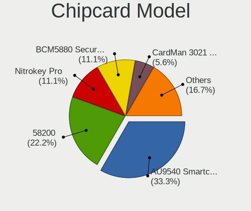

| Model                                          | Computers | Percent |
|------------------------------------------------|-----------|---------|
| Alcor Micro AU9540 Smartcard Reader            | 6         | 33.33%  |
| Broadcom 58200                                 | 4         | 22.22%  |
| Clay Logic Nitrokey Pro                        | 2         | 11.11%  |
| Broadcom BCM5880 Secure Applications Processor | 2         | 11.11%  |
| OmniKey CardMan 3021 / 3121                    | 1         | 5.56%   |
| O2 Micro OZ776 CCID Smartcard Reader           | 1         | 5.56%   |
| Lenovo Integrated Smart Card Reader            | 1         | 5.56%   |
| Gemalto (was Gemplus) eToken 5110+ FIPS        | 1         | 5.56%   |

Unsupported
-----------

Unsupported Devices
-------------------

Total unsupported devices on board

| Total | Computers | Percent |
|-------|-----------|---------|
| 0     | 164       | 49.1%   |
| 1     | 86        | 25.75%  |
| 2     | 39        | 11.68%  |
| 3     | 24        | 7.19%   |
| 5     | 9         | 2.69%   |
| 4     | 9         | 2.69%   |
| 6     | 3         | 0.9%    |

Unsupported Device Types
------------------------

Types of unsupported devices

| Type                     | Computers | Percent |
|--------------------------|-----------|---------|
| Graphics card            | 51        | 17.23%  |
| Communication controller | 49        | 16.55%  |
| Fingerprint reader       | 33        | 11.15%  |
| Bluetooth                | 33        | 11.15%  |
| Net/wireless             | 24        | 8.11%   |
| Multimedia controller    | 23        | 7.77%   |
| Camera                   | 22        | 7.43%   |
| Chipcard                 | 16        | 5.41%   |
| Sound                    | 8         | 2.7%    |
| Net/ethernet             | 7         | 2.36%   |
| Unassigned class         | 6         | 2.03%   |
| Network                  | 6         | 2.03%   |
| Card reader              | 6         | 2.03%   |
| Storage/ide              | 4         | 1.35%   |
| Firewire controller      | 4         | 1.35%   |
| Storage/ata              | 2         | 0.68%   |
| Storage/raid             | 1         | 0.34%   |
| Storage/nvme             | 1         | 0.34%   |

