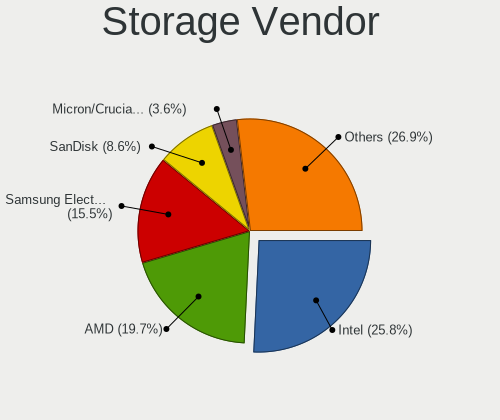

Gentoo 2.15 - Tested Hardware & Statistics
------------------------------------------

A project to collect tested hardware configurations for Gentoo 2.15.

Anyone can contribute to this report by the [hw-probe](https://github.com/linuxhw/hw-probe) tool:

    sudo -E hw-probe -all -upload

Please contribute! Especially if your hardware is rare.

This is a report for all computer types. See also reports for [desktops](/Dist/Gentoo_2.15/Desktop/README.md) and [notebooks](/Dist/Gentoo_2.15/Notebook/README.md).

Contents
--------

* [ Test Cases ](#test-cases)

* [ System ](#system)
  - [ Kernel                   ](#kernel)
  - [ Kernel Family            ](#kernel-family)
  - [ Kernel Major Ver.        ](#kernel-major-ver)
  - [ Arch                     ](#arch)
  - [ DE                       ](#de)
  - [ Display Server           ](#display-server)
  - [ Display Manager          ](#display-manager)
  - [ OS Lang                  ](#os-lang)
  - [ Boot Mode                ](#boot-mode)
  - [ Filesystem               ](#filesystem)
  - [ Part. scheme             ](#part-scheme)
  - [ Dual Boot with Linux/BSD ](#dual-boot-with-linuxbsd)
  - [ Dual Boot (Win)          ](#dual-boot-win)

* [ Board ](#board)
  - [ Vendor                   ](#vendor)
  - [ Model                    ](#model)
  - [ Model Family             ](#model-family)
  - [ MFG Year                 ](#mfg-year)
  - [ Form Factor              ](#form-factor)
  - [ Secure Boot              ](#secure-boot)
  - [ Coreboot                 ](#coreboot)
  - [ RAM Size                 ](#ram-size)
  - [ RAM Used                 ](#ram-used)
  - [ Total Drives             ](#total-drives)
  - [ Has CD-ROM               ](#has-cd-rom)
  - [ Has Ethernet             ](#has-ethernet)
  - [ Has WiFi                 ](#has-wifi)
  - [ Has Bluetooth            ](#has-bluetooth)

* [ Location ](#location)
  - [ Country                  ](#country)
  - [ City                     ](#city)

* [ Drives ](#drives)
  - [ Drive Vendor             ](#drive-vendor)
  - [ Drive Model              ](#drive-model)
  - [ HDD Vendor               ](#hdd-vendor)
  - [ SSD Vendor               ](#ssd-vendor)
  - [ Drive Kind               ](#drive-kind)
  - [ Drive Connector          ](#drive-connector)
  - [ Drive Size               ](#drive-size)
  - [ Space Total              ](#space-total)
  - [ Space Used               ](#space-used)
  - [ Malfunc. Drives          ](#malfunc-drives)
  - [ Malfunc. Drive Vendor    ](#malfunc-drive-vendor)
  - [ Malfunc. HDD Vendor      ](#malfunc-hdd-vendor)
  - [ Malfunc. Drive Kind      ](#malfunc-drive-kind)
  - [ Failed Drives            ](#failed-drives)
  - [ Failed Drive Vendor      ](#failed-drive-vendor)
  - [ Drive Status             ](#drive-status)

* [ Storage controller ](#storage-controller)
  - [ Storage Vendor           ](#storage-vendor)
  - [ Storage Model            ](#storage-model)
  - [ Storage Kind             ](#storage-kind)

* [ Processor ](#processor)
  - [ CPU Vendor               ](#cpu-vendor)
  - [ CPU Model                ](#cpu-model)
  - [ CPU Model Family         ](#cpu-model-family)
  - [ CPU Cores                ](#cpu-cores)
  - [ CPU Sockets              ](#cpu-sockets)
  - [ CPU Threads              ](#cpu-threads)
  - [ CPU Op-Modes             ](#cpu-op-modes)
  - [ CPU Microcode            ](#cpu-microcode)
  - [ CPU Microarch            ](#cpu-microarch)

* [ Graphics ](#graphics)
  - [ GPU Vendor               ](#gpu-vendor)
  - [ GPU Model                ](#gpu-model)
  - [ GPU Combo                ](#gpu-combo)
  - [ GPU Driver               ](#gpu-driver)
  - [ GPU Memory               ](#gpu-memory)

* [ Monitor ](#monitor)
  - [ Monitor Vendor           ](#monitor-vendor)
  - [ Monitor Model            ](#monitor-model)
  - [ Monitor Resolution       ](#monitor-resolution)
  - [ Monitor Diagonal         ](#monitor-diagonal)
  - [ Monitor Width            ](#monitor-width)
  - [ Aspect Ratio             ](#aspect-ratio)
  - [ Monitor Area             ](#monitor-area)
  - [ Pixel Density            ](#pixel-density)
  - [ Multiple Monitors        ](#multiple-monitors)

* [ Network ](#network)
  - [ Net Controller Vendor    ](#net-controller-vendor)
  - [ Net Controller Model     ](#net-controller-model)
  - [ Wireless Vendor          ](#wireless-vendor)
  - [ Wireless Model           ](#wireless-model)
  - [ Ethernet Vendor          ](#ethernet-vendor)
  - [ Ethernet Model           ](#ethernet-model)
  - [ Net Controller Kind      ](#net-controller-kind)
  - [ Used Controller          ](#used-controller)
  - [ NICs                     ](#nics)
  - [ IPv6                     ](#ipv6)

* [ Bluetooth ](#bluetooth)
  - [ Bluetooth Vendor         ](#bluetooth-vendor)
  - [ Bluetooth Model          ](#bluetooth-model)

* [ Sound ](#sound)
  - [ Sound Vendor             ](#sound-vendor)
  - [ Sound Model              ](#sound-model)

* [ Memory ](#memory)
  - [ Memory Vendor            ](#memory-vendor)
  - [ Memory Model             ](#memory-model)
  - [ Memory Kind              ](#memory-kind)
  - [ Memory Form Factor       ](#memory-form-factor)
  - [ Memory Size              ](#memory-size)
  - [ Memory Speed             ](#memory-speed)

* [ Printers & scanners ](#printers--scanners)
  - [ Printer Vendor           ](#printer-vendor)
  - [ Printer Model            ](#printer-model)
  - [ Scanner Vendor           ](#scanner-vendor)
  - [ Scanner Model            ](#scanner-model)

* [ Camera ](#camera)
  - [ Camera Vendor            ](#camera-vendor)
  - [ Camera Model             ](#camera-model)

* [ Security ](#security)
  - [ Fingerprint Vendor       ](#fingerprint-vendor)
  - [ Fingerprint Model        ](#fingerprint-model)
  - [ Chipcard Vendor          ](#chipcard-vendor)
  - [ Chipcard Model           ](#chipcard-model)

* [ Unsupported ](#unsupported)
  - [ Unsupported Devices      ](#unsupported-devices)
  - [ Unsupported Device Types ](#unsupported-device-types)

Test Cases
----------

Total: 331

| Vendor        | Model                       | Form-Factor | Probe                                                      | Date         |
|---------------|-----------------------------|-------------|------------------------------------------------------------|--------------|
| Dell          | 02C2CP A03                  | Server      | [44126f8d86](https://linux-hardware.org/?probe=44126f8d86) | Dec 31, 2024 |
| HP            | EliteBook 655 15.6 inch ... | Notebook    | [0c453f6750](https://linux-hardware.org/?probe=0c453f6750) | Dec 17, 2024 |
| ASUSTek       | ROG STRIX X670E-E GAMING... | Desktop     | [008bed58fb](https://linux-hardware.org/?probe=008bed58fb) | Dec 16, 2024 |
| Unknown       | Unknown                     | Notebook    | [8b21315b42](https://linux-hardware.org/?probe=8b21315b42) | Nov 22, 2024 |
| Lenovo        | IdeaPad 5 15ABA7 82SG       | Notebook    | [5a37374d2d](https://linux-hardware.org/?probe=5a37374d2d) | Nov 21, 2024 |
| Lenovo        | Legion Y540-15IRH-PG0 81... | Notebook    | [69bd15be2f](https://linux-hardware.org/?probe=69bd15be2f) | Nov 21, 2024 |
| Lenovo        | Legion Y540-15IRH-PG0 81... | Notebook    | [4a27f42d36](https://linux-hardware.org/?probe=4a27f42d36) | Nov 21, 2024 |
| ASUSTek       | M3A78-CM                    | Desktop     | [59ecdcf045](https://linux-hardware.org/?probe=59ecdcf045) | Nov 20, 2024 |
| Unknown       | Unknown                     | Notebook    | [cd1bdc1144](https://linux-hardware.org/?probe=cd1bdc1144) | Nov 10, 2024 |
| HUAWEI        | BoDE-WXX9                   | Notebook    | [f840e8b969](https://linux-hardware.org/?probe=f840e8b969) | Nov 06, 2024 |
| MSI           | S3661                       | Server      | [31f1b7dda2](https://linux-hardware.org/?probe=31f1b7dda2) | Nov 03, 2024 |
| Lenovo        | ThinkPad E15 Gen 2 20T80... | Notebook    | [09d355ac60](https://linux-hardware.org/?probe=09d355ac60) | Nov 02, 2024 |
| Gigabyte      | Z77X-D3H                    | Desktop     | [566d913cf0](https://linux-hardware.org/?probe=566d913cf0) | Oct 31, 2024 |
| Gigabyte      | B360M-D3P-WG-CF             | Desktop     | [221fc17cd6](https://linux-hardware.org/?probe=221fc17cd6) | Oct 29, 2024 |
| ASRock        | AM1H-ITX                    | Desktop     | [539c9b8d9d](https://linux-hardware.org/?probe=539c9b8d9d) | Oct 26, 2024 |
| Fujitsu       | D3233-A1 S26361-D3233-A1    | Desktop     | [bd388dcc0d](https://linux-hardware.org/?probe=bd388dcc0d) | Oct 23, 2024 |
| Dell          | XPS 15 9510                 | Notebook    | [c7a7356d98](https://linux-hardware.org/?probe=c7a7356d98) | Oct 22, 2024 |
| Razer         | Blade 16 - RZ09-0483        | Notebook    | [87977c5666](https://linux-hardware.org/?probe=87977c5666) | Oct 21, 2024 |
| Supermicro    | X10SRM-FA                   | Server      | [36da660b8b](https://linux-hardware.org/?probe=36da660b8b) | Oct 20, 2024 |
| Lenovo        | ThinkPad E15 Gen 2 20T80... | Notebook    | [c36ba63903](https://linux-hardware.org/?probe=c36ba63903) | Oct 19, 2024 |
| ASRock        | A520M-ITX/ac                | Desktop     | [257fe67fab](https://linux-hardware.org/?probe=257fe67fab) | Oct 19, 2024 |
| ASUSTek       | Unknown                     | Notebook    | [054ba0e2b8](https://linux-hardware.org/?probe=054ba0e2b8) | Oct 19, 2024 |
| Lenovo        | ThinkPad T490s 20NX006PP... | Notebook    | [76d91a459e](https://linux-hardware.org/?probe=76d91a459e) | Oct 18, 2024 |
| Intel         | D510MO AAE76523-401         | Desktop     | [ef9733928f](https://linux-hardware.org/?probe=ef9733928f) | Oct 18, 2024 |
| ZOTAC         | H67ITX-C-E 02/03/05         | Desktop     | [19badd34b0](https://linux-hardware.org/?probe=19badd34b0) | Oct 18, 2024 |
| ASUSTek       | M4A88T-I DELUXE             | Desktop     | [4160c3040f](https://linux-hardware.org/?probe=4160c3040f) | Oct 18, 2024 |
| ASUSTek       | SABERTOOTH X58              | Desktop     | [d4240e52c9](https://linux-hardware.org/?probe=d4240e52c9) | Oct 18, 2024 |
| Unknown       | Unknown                     | Desktop     | [638bf77d29](https://linux-hardware.org/?probe=638bf77d29) | Oct 18, 2024 |
| ZOTAC         | H67ITX-C-E 02/03/05         | Desktop     | [8dbae4a350](https://linux-hardware.org/?probe=8dbae4a350) | Oct 18, 2024 |
| Unknown       | Unknown                     | Desktop     | [7d0ffc9b7a](https://linux-hardware.org/?probe=7d0ffc9b7a) | Oct 18, 2024 |
| Dell          | Inspiron 5755               | Notebook    | [c6b4c797c3](https://linux-hardware.org/?probe=c6b4c797c3) | Oct 18, 2024 |
| Gigabyte      | Z77X-D3H                    | Desktop     | [3113b0c26d](https://linux-hardware.org/?probe=3113b0c26d) | Oct 17, 2024 |
| ASRock        | AM1H-ITX                    | Desktop     | [10a64a5356](https://linux-hardware.org/?probe=10a64a5356) | Oct 17, 2024 |
| HP            | ProBook 450 G5              | Notebook    | [9d602e9f72](https://linux-hardware.org/?probe=9d602e9f72) | Oct 16, 2024 |
| Gigabyte      | A520 AORUS ELITE            | Desktop     | [81109786c2](https://linux-hardware.org/?probe=81109786c2) | Oct 16, 2024 |
| ASUSTek       | M3A78-CM                    | Desktop     | [e907b8b549](https://linux-hardware.org/?probe=e907b8b549) | Oct 15, 2024 |
| HP            | EliteBook 845 14 inch G9... | Notebook    | [8d0969ee93](https://linux-hardware.org/?probe=8d0969ee93) | Oct 15, 2024 |
| Micro Comp... | V3                          | Tablet      | [084c53ef65](https://linux-hardware.org/?probe=084c53ef65) | Oct 15, 2024 |
| ASRock        | A520M-ITX/ac                | Desktop     | [f0ccf0627b](https://linux-hardware.org/?probe=f0ccf0627b) | Oct 15, 2024 |
| ASRock        | X570 Taichi                 | Desktop     | [b3b87cb7d2](https://linux-hardware.org/?probe=b3b87cb7d2) | Oct 15, 2024 |
| Micro Comp... | V3                          | Tablet      | [2cb4915224](https://linux-hardware.org/?probe=2cb4915224) | Oct 13, 2024 |
| HP            | EliteBook 830 G6            | Notebook    | [61ea3349af](https://linux-hardware.org/?probe=61ea3349af) | Oct 13, 2024 |
| Gigabyte      | AB350-Gaming-CF             | Desktop     | [82eace1ca4](https://linux-hardware.org/?probe=82eace1ca4) | Oct 13, 2024 |
| Fujitsu       | CELSIUS H760                | Notebook    | [8ea6d75c59](https://linux-hardware.org/?probe=8ea6d75c59) | Oct 12, 2024 |
| ASUSTek       | ROG STRIX Z790-E GAMING ... | Desktop     | [75722e8358](https://linux-hardware.org/?probe=75722e8358) | Oct 12, 2024 |
| Gigabyte      | A520 AORUS ELITE            | Desktop     | [b56aeb805e](https://linux-hardware.org/?probe=b56aeb805e) | Oct 09, 2024 |
| Fujitsu       | CELSIUS H760                | Notebook    | [9a9b415ad2](https://linux-hardware.org/?probe=9a9b415ad2) | Oct 08, 2024 |
| ASUSTek       | M3A78-CM                    | Desktop     | [2161de6ffe](https://linux-hardware.org/?probe=2161de6ffe) | Oct 07, 2024 |
| ASRock        | AM1H-ITX                    | Desktop     | [def75bd40a](https://linux-hardware.org/?probe=def75bd40a) | Oct 06, 2024 |
| HP            | EliteBook 655 15.6 inch ... | Notebook    | [0f7fd9789d](https://linux-hardware.org/?probe=0f7fd9789d) | Oct 06, 2024 |
| Gigabyte      | AB350-Gaming-CF             | Desktop     | [ffd0b1b3b6](https://linux-hardware.org/?probe=ffd0b1b3b6) | Oct 06, 2024 |
| Lenovo        | ThinkPad T14 Gen 2i 20W0... | Notebook    | [49227f1fdf](https://linux-hardware.org/?probe=49227f1fdf) | Oct 05, 2024 |
| Lenovo        | IdeaPad S145-15API 81UT     | Notebook    | [76c9e1e6ac](https://linux-hardware.org/?probe=76c9e1e6ac) | Oct 04, 2024 |
| Lenovo        | ThinkPad T14s Gen 1 20T1... | Notebook    | [12beb6c4e0](https://linux-hardware.org/?probe=12beb6c4e0) | Oct 03, 2024 |
| ASRock        | X570 Phantom Gaming 4       | Desktop     | [9d2d98c84b](https://linux-hardware.org/?probe=9d2d98c84b) | Oct 03, 2024 |
| ASRock        | AM1H-ITX                    | Desktop     | [71d49b6fb4](https://linux-hardware.org/?probe=71d49b6fb4) | Oct 03, 2024 |
| ASUSTek       | Zenbook UX3402ZA_UX3402Z... | Notebook    | [158af06788](https://linux-hardware.org/?probe=158af06788) | Oct 03, 2024 |
| Acer          | Aspire E5-553G              | Notebook    | [d98fc4f350](https://linux-hardware.org/?probe=d98fc4f350) | Oct 03, 2024 |
| Dell          | Latitude 7420               | Convertible | [d7d9b90f83](https://linux-hardware.org/?probe=d7d9b90f83) | Oct 02, 2024 |
| Framework     | Laptop 13 (AMD Ryzen 704... | Notebook    | [03b3d6efd2](https://linux-hardware.org/?probe=03b3d6efd2) | Oct 01, 2024 |
| Framework     | Laptop 13 (AMD Ryzen 704... | Notebook    | [4d7ba010e0](https://linux-hardware.org/?probe=4d7ba010e0) | Oct 01, 2024 |
| ASRock        | B650E Taichi Lite           | Desktop     | [5ab1034596](https://linux-hardware.org/?probe=5ab1034596) | Sep 29, 2024 |
| MSI           | Z97 MPOWER                  | Desktop     | [f21872219a](https://linux-hardware.org/?probe=f21872219a) | Sep 28, 2024 |
| MSI           | Z97 MPOWER                  | Desktop     | [7a05a56f63](https://linux-hardware.org/?probe=7a05a56f63) | Sep 28, 2024 |
| Lenovo        | ThinkBook 14 G5+ APO 21J... | Notebook    | [6fa64ce393](https://linux-hardware.org/?probe=6fa64ce393) | Sep 28, 2024 |
| Dell          | 0F4Y1M A02                  | Desktop     | [906a276432](https://linux-hardware.org/?probe=906a276432) | Sep 27, 2024 |
| Acer          | Nitro AN515-46              | Notebook    | [2b5852e0fe](https://linux-hardware.org/?probe=2b5852e0fe) | Sep 25, 2024 |
| MSI           | B450 GAMING PRO CARBON A... | Desktop     | [d6e03c48eb](https://linux-hardware.org/?probe=d6e03c48eb) | Sep 24, 2024 |
| Unknown       | Unknown                     | Desktop     | [fdddcae4d3](https://linux-hardware.org/?probe=fdddcae4d3) | Sep 24, 2024 |
| MSI           | B650M GAMING PLUS WIFI      | Desktop     | [44a5096641](https://linux-hardware.org/?probe=44a5096641) | Sep 23, 2024 |
| MSI           | B450 GAMING PRO CARBON A... | Desktop     | [9019ddb539](https://linux-hardware.org/?probe=9019ddb539) | Sep 22, 2024 |
| Gigabyte      | X570 AORUS ELITE            | Desktop     | [482aeffacc](https://linux-hardware.org/?probe=482aeffacc) | Sep 22, 2024 |
| Lenovo        | ThinkBook 15 G4 ABA 21DL    | Notebook    | [4e3912d4f2](https://linux-hardware.org/?probe=4e3912d4f2) | Sep 22, 2024 |
| Framework     | Laptop 13 (AMD Ryzen 704... | Notebook    | [38ed006558](https://linux-hardware.org/?probe=38ed006558) | Sep 20, 2024 |
| ASUSTek       | ASUS TUF Gaming A16 FA61... | Notebook    | [541d66dc10](https://linux-hardware.org/?probe=541d66dc10) | Sep 19, 2024 |
| Gigabyte      | A520 AORUS ELITE            | Desktop     | [0a745449f5](https://linux-hardware.org/?probe=0a745449f5) | Sep 18, 2024 |
| Shenzhen M... | HPBSD                       | Mini pc     | [e8593e10ef](https://linux-hardware.org/?probe=e8593e10ef) | Sep 17, 2024 |
| Framework     | Laptop 13 (AMD Ryzen 704... | Notebook    | [fa9e5beb1c](https://linux-hardware.org/?probe=fa9e5beb1c) | Sep 16, 2024 |
| HP            | 1589                        | Desktop     | [cd86420d3e](https://linux-hardware.org/?probe=cd86420d3e) | Sep 15, 2024 |
| ASUSTek       | M3A78-CM                    | Desktop     | [9d6023b0d5](https://linux-hardware.org/?probe=9d6023b0d5) | Sep 15, 2024 |
| Gigabyte      | B550 AORUS ELITE AX V2      | Desktop     | [cc99554541](https://linux-hardware.org/?probe=cc99554541) | Sep 14, 2024 |
| HP            | Presario CQ56               | Notebook    | [ed024f67d9](https://linux-hardware.org/?probe=ed024f67d9) | Sep 13, 2024 |
| Apple         | MacBookPro11,4              | Notebook    | [60b8339c3a](https://linux-hardware.org/?probe=60b8339c3a) | Sep 12, 2024 |
| HP            | Presario CQ56               | Notebook    | [e9ffe0cf3a](https://linux-hardware.org/?probe=e9ffe0cf3a) | Sep 11, 2024 |
| Lenovo        | IdeaPad Slim 5 14ABR8 82... | Notebook    | [9333a17b1f](https://linux-hardware.org/?probe=9333a17b1f) | Sep 11, 2024 |
| Lenovo        | IdeaPad Slim 5 14ABR8 82... | Notebook    | [630b6c1179](https://linux-hardware.org/?probe=630b6c1179) | Sep 11, 2024 |
| ASUSTek       | ROG CROSSHAIR VIII HERO     | Desktop     | [7afc6efd27](https://linux-hardware.org/?probe=7afc6efd27) | Sep 11, 2024 |
| Lenovo        | ThinkPad X1 Carbon Gen 1... | Notebook    | [4c190d8f8d](https://linux-hardware.org/?probe=4c190d8f8d) | Sep 10, 2024 |
| ASUSTek       | N551JW                      | Notebook    | [350a0f8841](https://linux-hardware.org/?probe=350a0f8841) | Sep 10, 2024 |
| Dell          | Latitude 5540               | Notebook    | [d5b6727481](https://linux-hardware.org/?probe=d5b6727481) | Sep 09, 2024 |
| Lenovo        | 3102 SDK0J40697 WIN 3305... | Desktop     | [080a971480](https://linux-hardware.org/?probe=080a971480) | Sep 08, 2024 |
| Gigabyte      | AB350-Gaming-CF             | Desktop     | [4ff0f01eb1](https://linux-hardware.org/?probe=4ff0f01eb1) | Sep 08, 2024 |
| Gigabyte      | A520 AORUS ELITE            | Desktop     | [4fd5cdbf41](https://linux-hardware.org/?probe=4fd5cdbf41) | Sep 07, 2024 |
| HP            | 8767 A                      | Desktop     | [65ef489177](https://linux-hardware.org/?probe=65ef489177) | Sep 07, 2024 |
| HP            | 8767 A                      | Desktop     | [5e38429f92](https://linux-hardware.org/?probe=5e38429f92) | Sep 07, 2024 |
| ASUSTek       | ROG STRIX Z490-F GAMING     | Desktop     | [0d129c2fb7](https://linux-hardware.org/?probe=0d129c2fb7) | Sep 07, 2024 |
| Dell          | Latitude 5540               | Notebook    | [c0efdf9b57](https://linux-hardware.org/?probe=c0efdf9b57) | Sep 07, 2024 |
| Lenovo        | ThinkPad P16 Gen 1 21D60... | Notebook    | [7f8463e7df](https://linux-hardware.org/?probe=7f8463e7df) | Sep 07, 2024 |
| Acer          | Aspire ES1-572              | Notebook    | [78f470444b](https://linux-hardware.org/?probe=78f470444b) | Sep 06, 2024 |
| Lenovo        | IdeaPad S145-15API 81UT     | Notebook    | [bb53f353b7](https://linux-hardware.org/?probe=bb53f353b7) | Sep 06, 2024 |
| Gigabyte      | B85M-HD3 R4                 | Desktop     | [ca88901f71](https://linux-hardware.org/?probe=ca88901f71) | Sep 06, 2024 |
| HP            | Pavilion Laptop 15-cw1xx... | Notebook    | [d8463507ba](https://linux-hardware.org/?probe=d8463507ba) | Sep 06, 2024 |
| MSI           | MAG X670E TOMAHAWK WIFI     | Desktop     | [96d387e932](https://linux-hardware.org/?probe=96d387e932) | Sep 06, 2024 |
| Lenovo        | ThinkPad P16 Gen 1 21D60... | Notebook    | [f49e870a06](https://linux-hardware.org/?probe=f49e870a06) | Sep 06, 2024 |
| Unknown       | Unknown                     | Desktop     | [efbfdc8ad3](https://linux-hardware.org/?probe=efbfdc8ad3) | Sep 05, 2024 |
| ASUSTek       | M4A88T-I DELUXE             | Desktop     | [970aae698a](https://linux-hardware.org/?probe=970aae698a) | Sep 05, 2024 |
| MSI           | B650M PROJECT ZERO          | Desktop     | [ca4eeb43e3](https://linux-hardware.org/?probe=ca4eeb43e3) | Sep 04, 2024 |
| Lenovo        | 1064 SDK0T76528 WIN 3556... | Desktop     | [25f0609915](https://linux-hardware.org/?probe=25f0609915) | Sep 04, 2024 |
| ASUSTek       | ZenBook UX425UA_UM425UA     | Notebook    | [01532850b4](https://linux-hardware.org/?probe=01532850b4) | Sep 04, 2024 |
| ASUSTek       | ROG CROSSHAIR VIII HERO     | Desktop     | [b78ceccaaf](https://linux-hardware.org/?probe=b78ceccaaf) | Sep 04, 2024 |
| Lenovo        | 1064 SDK0T76528 WIN 3556... | Desktop     | [bc4bc8eedc](https://linux-hardware.org/?probe=bc4bc8eedc) | Sep 03, 2024 |
| ASUSTek       | ASUS TUF Gaming A16 FA61... | Notebook    | [34778061ba](https://linux-hardware.org/?probe=34778061ba) | Sep 02, 2024 |
| ASUSTek       | ROG STRIX X570-E GAMING     | Desktop     | [236ca10d6e](https://linux-hardware.org/?probe=236ca10d6e) | Sep 02, 2024 |
| MSI           | B450 GAMING PLUS            | Desktop     | [7d68c9f2ad](https://linux-hardware.org/?probe=7d68c9f2ad) | Sep 02, 2024 |
| Dell          | Precision 7540              | Notebook    | [c2661e531c](https://linux-hardware.org/?probe=c2661e531c) | Sep 01, 2024 |
| MSI           | B450 GAMING PLUS            | Desktop     | [2816eae760](https://linux-hardware.org/?probe=2816eae760) | Sep 01, 2024 |
| Gigabyte      | AB350-Gaming-CF             | Desktop     | [3ab0eeaab8](https://linux-hardware.org/?probe=3ab0eeaab8) | Sep 01, 2024 |
| ASUSTek       | M3A78-CM                    | Desktop     | [ce39d1f006](https://linux-hardware.org/?probe=ce39d1f006) | Aug 30, 2024 |
| HP            | 1589                        | Desktop     | [352493ca6b](https://linux-hardware.org/?probe=352493ca6b) | Aug 28, 2024 |
| ASUSTek       | ASUS Zenbook S 16 UM5606... | Notebook    | [c62daa5e9a](https://linux-hardware.org/?probe=c62daa5e9a) | Aug 28, 2024 |
| ASUSTek       | PRIME X670E-PRO WIFI        | Desktop     | [da1c879511](https://linux-hardware.org/?probe=da1c879511) | Aug 27, 2024 |
| ASUSTek       | TUF Gaming X570-PLUS        | Desktop     | [ff5b9c88a4](https://linux-hardware.org/?probe=ff5b9c88a4) | Aug 25, 2024 |
| MSI           | H67MA-E35                   | Desktop     | [7b15665f68](https://linux-hardware.org/?probe=7b15665f68) | Aug 24, 2024 |
| Lenovo        | ThinkPad E15 Gen 4 21EDC... | Notebook    | [5fd9e885bc](https://linux-hardware.org/?probe=5fd9e885bc) | Aug 24, 2024 |
| Lenovo        | ThinkPad E15 Gen 4 21EDC... | Notebook    | [9fff9d0f5e](https://linux-hardware.org/?probe=9fff9d0f5e) | Aug 24, 2024 |
| Lenovo        | ThinkPad T480s 20L8S2SX0... | Notebook    | [c4fbbfec90](https://linux-hardware.org/?probe=c4fbbfec90) | Aug 23, 2024 |
| ASUSTek       | ROG CROSSHAIR X670E HERO    | Desktop     | [b37107a7dc](https://linux-hardware.org/?probe=b37107a7dc) | Aug 23, 2024 |
| Lenovo        | Legion 5 15ARH05 82B5       | Notebook    | [dc8af29759](https://linux-hardware.org/?probe=dc8af29759) | Aug 23, 2024 |
| ASUSTek       | ROG Maximus Z790 HERO       | Desktop     | [67add3495a](https://linux-hardware.org/?probe=67add3495a) | Aug 21, 2024 |
| Lenovo        | ThinkBook 15 G2 ITL 20VE    | Notebook    | [807f37ac9f](https://linux-hardware.org/?probe=807f37ac9f) | Aug 20, 2024 |
| Lenovo        | ThinkBook 15 G2 ITL 20VE    | Notebook    | [9b0a5d476c](https://linux-hardware.org/?probe=9b0a5d476c) | Aug 19, 2024 |
| Lenovo        | ThinkBook 16 G6 IRL 21KH    | Notebook    | [30973be0c7](https://linux-hardware.org/?probe=30973be0c7) | Aug 19, 2024 |
| ASUSTek       | M3A78-CM                    | Desktop     | [66b2492618](https://linux-hardware.org/?probe=66b2492618) | Aug 19, 2024 |
| Lenovo        | ThinkBook 16 G6 IRL 21KH    | Notebook    | [6d5345fe36](https://linux-hardware.org/?probe=6d5345fe36) | Aug 19, 2024 |
| Gigabyte      | A520 AORUS ELITE            | Desktop     | [9055a30f37](https://linux-hardware.org/?probe=9055a30f37) | Aug 19, 2024 |
| MSI           | MAG X670E TOMAHAWK WIFI     | Desktop     | [154da62650](https://linux-hardware.org/?probe=154da62650) | Aug 18, 2024 |
| Gigabyte      | AB350-Gaming-CF             | Desktop     | [3657572932](https://linux-hardware.org/?probe=3657572932) | Aug 18, 2024 |
| ASUSTek       | ROG STRIX B550-A GAMING     | Desktop     | [238c382370](https://linux-hardware.org/?probe=238c382370) | Aug 17, 2024 |
| MSI           | B650M PROJECT ZERO          | Desktop     | [dd27c0e6c4](https://linux-hardware.org/?probe=dd27c0e6c4) | Aug 17, 2024 |
| ASUSTek       | ProArt X670E-CREATOR WIF... | Desktop     | [02426e639f](https://linux-hardware.org/?probe=02426e639f) | Aug 17, 2024 |
| ASUSTek       | PRIME X670E-PRO WIFI        | Desktop     | [6500ad6c92](https://linux-hardware.org/?probe=6500ad6c92) | Aug 16, 2024 |
| ASUSTek       | ROG CROSSHAIR VIII DARK ... | Desktop     | [3c402af2c0](https://linux-hardware.org/?probe=3c402af2c0) | Aug 15, 2024 |
| ASUSTek       | PRIME B550-PLUS             | Desktop     | [9c9ab9111f](https://linux-hardware.org/?probe=9c9ab9111f) | Aug 15, 2024 |
| MECHREVO      | Yilong15Pro Series GM5HG... | Notebook    | [73293d35ce](https://linux-hardware.org/?probe=73293d35ce) | Aug 13, 2024 |
| Lenovo        | 1064 SDK0T76528 WIN 3556... | Desktop     | [39ec887366](https://linux-hardware.org/?probe=39ec887366) | Aug 13, 2024 |
| Hungaro Fl... | Navon Loop 360              | Notebook    | [be1fe0bb77](https://linux-hardware.org/?probe=be1fe0bb77) | Aug 13, 2024 |
| ASUSTek       | ROG STRIX Z590-E GAMING ... | Desktop     | [192943e056](https://linux-hardware.org/?probe=192943e056) | Aug 13, 2024 |
| Gigabyte      | A520 AORUS ELITE            | Desktop     | [4eaf371a57](https://linux-hardware.org/?probe=4eaf371a57) | Aug 12, 2024 |
| Gigabyte      | AB350-Gaming-CF             | Desktop     | [21829d21d1](https://linux-hardware.org/?probe=21829d21d1) | Aug 11, 2024 |
| Dell          | 0KWVT8 A02                  | Desktop     | [fb36ea4f54](https://linux-hardware.org/?probe=fb36ea4f54) | Aug 09, 2024 |
| ASUSTek       | ASUS TUF Gaming A16 FA61... | Notebook    | [29f0a04e06](https://linux-hardware.org/?probe=29f0a04e06) | Aug 08, 2024 |
| Lenovo        | 1064 SDK0T76528 WIN 3556... | Desktop     | [af392a3a32](https://linux-hardware.org/?probe=af392a3a32) | Aug 08, 2024 |
| HP            | 88A0                        | Mini pc     | [3a021b6ab2](https://linux-hardware.org/?probe=3a021b6ab2) | Aug 08, 2024 |
| JINGSHA       | X99-D8I                     | Desktop     | [562c50431e](https://linux-hardware.org/?probe=562c50431e) | Aug 07, 2024 |
| Gigabyte      | B560M DS3H                  | Desktop     | [aca2673eac](https://linux-hardware.org/?probe=aca2673eac) | Aug 06, 2024 |
| HP            | 82FF                        | Desktop     | [5e2a2a2a1c](https://linux-hardware.org/?probe=5e2a2a2a1c) | Aug 06, 2024 |
| Lenovo        | Legion 5 15ITH6H 82JH       | Notebook    | [ca1e6f7786](https://linux-hardware.org/?probe=ca1e6f7786) | Aug 04, 2024 |
| HP            | 82FF                        | Desktop     | [a3345e146c](https://linux-hardware.org/?probe=a3345e146c) | Aug 04, 2024 |
| Lenovo        | ThinkBook 14s-IWL 20RM      | Notebook    | [d3a556fd2e](https://linux-hardware.org/?probe=d3a556fd2e) | Aug 03, 2024 |
| Lenovo        | ThinkPad X390 Yoga 20NQS... | Convertible | [136ac491dd](https://linux-hardware.org/?probe=136ac491dd) | Aug 03, 2024 |
| Gigabyte      | X570 AORUS ELITE            | Desktop     | [79839e7d37](https://linux-hardware.org/?probe=79839e7d37) | Aug 03, 2024 |
| Lenovo        | ThinkPad P52 20M9001NMX     | Notebook    | [a06c67958c](https://linux-hardware.org/?probe=a06c67958c) | Aug 01, 2024 |
| Lenovo        | ThinkPad T61p 8889AU5       | Notebook    | [e06a1aad9c](https://linux-hardware.org/?probe=e06a1aad9c) | Aug 01, 2024 |
| Fujitsu       | D4129-A1 S26361-D4129-A1... | Server      | [5fb0c3a747](https://linux-hardware.org/?probe=5fb0c3a747) | Aug 01, 2024 |
| ASUSTek       | ROG CROSSHAIR X670E HERO    | Desktop     | [aba2b2aa75](https://linux-hardware.org/?probe=aba2b2aa75) | Aug 01, 2024 |
| IBM           | ThinkPad T43 26686ZU        | Notebook    | [df281b21fd](https://linux-hardware.org/?probe=df281b21fd) | Aug 01, 2024 |
| ASUSTek       | ROG CROSSHAIR X670E HERO    | Desktop     | [4d1efa726b](https://linux-hardware.org/?probe=4d1efa726b) | Aug 01, 2024 |
| ASUSTek       | PRIME H310M-A R2.0          | Desktop     | [e6f84db5ca](https://linux-hardware.org/?probe=e6f84db5ca) | Jul 31, 2024 |
| Lenovo        | IdeaPad S145-15AST 81N3     | Notebook    | [c685cf8914](https://linux-hardware.org/?probe=c685cf8914) | Jul 31, 2024 |
| MSI           | Z390-A PRO                  | Desktop     | [14a0b2f8a3](https://linux-hardware.org/?probe=14a0b2f8a3) | Jul 30, 2024 |
| System76      | Gazelle                     | Notebook    | [a28ba867b4](https://linux-hardware.org/?probe=a28ba867b4) | Jul 30, 2024 |
| Quanta        | S210-X12MS 31S2MMB0040      | Server      | [725468d1bb](https://linux-hardware.org/?probe=725468d1bb) | Jul 29, 2024 |
| ASUSTek       | M3A78-CM                    | Desktop     | [ec2dd1e8b9](https://linux-hardware.org/?probe=ec2dd1e8b9) | Jul 29, 2024 |
| Lenovo        | ThinkBook 14 G5+ APO 21J... | Notebook    | [a37ede4515](https://linux-hardware.org/?probe=a37ede4515) | Jul 28, 2024 |
| ASUSTek       | ASUS TUF Gaming A17 FA70... | Notebook    | [920a38bb99](https://linux-hardware.org/?probe=920a38bb99) | Jul 27, 2024 |
| ASUSTek       | PRIME X670E-PRO WIFI        | Desktop     | [18004f81b1](https://linux-hardware.org/?probe=18004f81b1) | Jul 27, 2024 |
| MSI           | MAG Z790 TOMAHAWK WIFI      | Desktop     | [c5cf2e46b0](https://linux-hardware.org/?probe=c5cf2e46b0) | Jul 26, 2024 |
| ASUSTek       | ASUS EXPERTBOOK B7402FEA... | Convertible | [222f98dc52](https://linux-hardware.org/?probe=222f98dc52) | Jul 25, 2024 |
| Gigabyte      | F2A88XM-D3H                 | Desktop     | [aec89ce184](https://linux-hardware.org/?probe=aec89ce184) | Jul 23, 2024 |
| Gigabyte      | H110M-H-CF                  | Desktop     | [eac05e9202](https://linux-hardware.org/?probe=eac05e9202) | Jul 21, 2024 |
| ASUSTek       | TUF Gaming Z790-PLUS WIF... | Desktop     | [ba284448d2](https://linux-hardware.org/?probe=ba284448d2) | Jul 20, 2024 |
| HP            | EliteBook 655 15.6 inch ... | Notebook    | [cd443f27fb](https://linux-hardware.org/?probe=cd443f27fb) | Jul 20, 2024 |
| Fujitsu       | CELSIUS H760                | Notebook    | [0e1e7b37d2](https://linux-hardware.org/?probe=0e1e7b37d2) | Jul 20, 2024 |
| HP            | 8594                        | Desktop     | [c9a6e01799](https://linux-hardware.org/?probe=c9a6e01799) | Jul 19, 2024 |
| Fujitsu       | D3313-A1 S26361-D3313-A1    | Desktop     | [77026eec6b](https://linux-hardware.org/?probe=77026eec6b) | Jul 18, 2024 |
| Fujitsu       | D3313-A1 S26361-D3313-A1    | Desktop     | [33ef38ca68](https://linux-hardware.org/?probe=33ef38ca68) | Jul 18, 2024 |
| Lenovo        | IdeaPad 3 14ALC6 82KT       | Notebook    | [43296730af](https://linux-hardware.org/?probe=43296730af) | Jul 18, 2024 |
| HP            | Victus by Gaming Laptop ... | Notebook    | [526990eabc](https://linux-hardware.org/?probe=526990eabc) | Jul 17, 2024 |
| Lenovo        | ThinkPad E14 Gen 3 20Y70... | Notebook    | [c217549233](https://linux-hardware.org/?probe=c217549233) | Jul 17, 2024 |
| ASUSTek       | P6X58D-E                    | Desktop     | [b4230fd990](https://linux-hardware.org/?probe=b4230fd990) | Jul 16, 2024 |
| Unknown       | WD MyCloud Ex2 Ultra        | Desktop     | [3d6f4f8206](https://linux-hardware.org/?probe=3d6f4f8206) | Jul 14, 2024 |
| ASRock        | AM1H-ITX                    | Desktop     | [fe1e6daa74](https://linux-hardware.org/?probe=fe1e6daa74) | Jul 14, 2024 |
| Gigabyte      | AB350-Gaming-CF             | Desktop     | [5e04444171](https://linux-hardware.org/?probe=5e04444171) | Jul 14, 2024 |
| MECHREVO      | WUJIE14 PRO                 | Notebook    | [305c283665](https://linux-hardware.org/?probe=305c283665) | Jul 13, 2024 |
| HP            | ProBook 450 G5              | Notebook    | [8f856ab7a5](https://linux-hardware.org/?probe=8f856ab7a5) | Jul 11, 2024 |
| HP            | ProBook 450 G5              | Notebook    | [daaf621587](https://linux-hardware.org/?probe=daaf621587) | Jul 11, 2024 |
| Lenovo        | Yoga 520-14IKB 80X8         | Convertible | [f332aac21a](https://linux-hardware.org/?probe=f332aac21a) | Jul 11, 2024 |
| Lenovo        | ThinkPad P52 20M9001FSP     | Notebook    | [efb953cae4](https://linux-hardware.org/?probe=efb953cae4) | Jul 10, 2024 |
| Gigabyte      | A520 AORUS ELITE            | Desktop     | [65fea3f878](https://linux-hardware.org/?probe=65fea3f878) | Jul 09, 2024 |
| Gigabyte      | X570 AORUS ELITE            | Desktop     | [583da8f3ba](https://linux-hardware.org/?probe=583da8f3ba) | Jul 08, 2024 |
| ASUSTek       | M3A78-CM                    | Desktop     | [1ba69a0bc6](https://linux-hardware.org/?probe=1ba69a0bc6) | Jul 08, 2024 |
| ASUSTek       | ROG Zephyrus G14 GA401II... | Notebook    | [70831ae4a2](https://linux-hardware.org/?probe=70831ae4a2) | Jul 07, 2024 |
| Lenovo        | ThinkPad P52 20M9001FSP     | Notebook    | [2442c78c2c](https://linux-hardware.org/?probe=2442c78c2c) | Jul 07, 2024 |
| Gigabyte      | AB350-Gaming-CF             | Desktop     | [3a334f0b19](https://linux-hardware.org/?probe=3a334f0b19) | Jul 07, 2024 |
| HP            | ProBook 450 G5              | Notebook    | [4b7d710ea7](https://linux-hardware.org/?probe=4b7d710ea7) | Jul 06, 2024 |
| Lenovo        | ThinkPad P52 20M9001FSP     | Notebook    | [298263f7c2](https://linux-hardware.org/?probe=298263f7c2) | Jul 06, 2024 |
| Lenovo        | ThinkPad P52 20M9001FSP     | Notebook    | [e137922184](https://linux-hardware.org/?probe=e137922184) | Jul 06, 2024 |
| Lenovo        | ThinkPad T480 20L5CTO1WW    | Notebook    | [f3f50ce879](https://linux-hardware.org/?probe=f3f50ce879) | Jul 05, 2024 |
| Lenovo        | ThinkPad T480 20L5CTO1WW    | Notebook    | [e474ecc123](https://linux-hardware.org/?probe=e474ecc123) | Jul 03, 2024 |
| ASUSTek       | ROG STRIX Z390-E GAMING     | Desktop     | [0827775bcb](https://linux-hardware.org/?probe=0827775bcb) | Jul 03, 2024 |
| ASUSTek       | N552VW                      | Notebook    | [bc0cf9c1a7](https://linux-hardware.org/?probe=bc0cf9c1a7) | Jul 03, 2024 |
| Supermicro    | C7Z270-CG-L                 | Server      | [cc3baa3638](https://linux-hardware.org/?probe=cc3baa3638) | Jul 03, 2024 |
| Notebook      | NS5x_NS7xPU                 | Notebook    | [c2033b5625](https://linux-hardware.org/?probe=c2033b5625) | Jul 02, 2024 |
| Notebook      | NS5x_NS7xPU                 | Notebook    | [809371ad85](https://linux-hardware.org/?probe=809371ad85) | Jul 02, 2024 |
| Gigabyte      | A520 AORUS ELITE            | Desktop     | [d89d44cd1d](https://linux-hardware.org/?probe=d89d44cd1d) | Jul 02, 2024 |
| ASUSTek       | ASUS TUF Gaming A15 FA50... | Notebook    | [c77d74a7d7](https://linux-hardware.org/?probe=c77d74a7d7) | Jul 01, 2024 |
| MSI           | MAG B460 TORPEDO            | Desktop     | [070bd1ea81](https://linux-hardware.org/?probe=070bd1ea81) | Jul 01, 2024 |
| ASUSTek       | ROG Zephyrus G14 GA401II... | Notebook    | [8732c453e6](https://linux-hardware.org/?probe=8732c453e6) | Jun 30, 2024 |
| ASUSTek       | ASUS EXPERTBOOK B5402CVA... | Notebook    | [4c063dac58](https://linux-hardware.org/?probe=4c063dac58) | Jun 29, 2024 |
| Lenovo        | ThinkPad E15 Gen 2 20T80... | Notebook    | [213cb740d8](https://linux-hardware.org/?probe=213cb740d8) | Jun 27, 2024 |
| ASUSTek       | M3A78-CM                    | Desktop     | [8ecf83f014](https://linux-hardware.org/?probe=8ecf83f014) | Jun 27, 2024 |
| Unknown       | Unknown                     | Desktop     | [1810652556](https://linux-hardware.org/?probe=1810652556) | Jun 26, 2024 |
| Acer          | Iconia W1-810               | Tablet      | [47ac9c9778](https://linux-hardware.org/?probe=47ac9c9778) | Jun 26, 2024 |
| ASRock        | X670E Steel Legend          | Desktop     | [c5f9ed95aa](https://linux-hardware.org/?probe=c5f9ed95aa) | Jun 25, 2024 |
| Unknown       | Unknown                     | Soc         | [f4ad561b15](https://linux-hardware.org/?probe=f4ad561b15) | Jun 25, 2024 |
| HP            | ProBook 450 G5              | Notebook    | [b1f36bec52](https://linux-hardware.org/?probe=b1f36bec52) | Jun 24, 2024 |
| ASUSTek       | ROG ZENITH EXTREME          | Desktop     | [919d8fe115](https://linux-hardware.org/?probe=919d8fe115) | Jun 22, 2024 |
| ASUSTek       | Zenbook UM5302TA_UM5302T... | Notebook    | [17f4e262fd](https://linux-hardware.org/?probe=17f4e262fd) | Jun 21, 2024 |
| Framework     | Laptop 13 (AMD Ryzen 704... | Notebook    | [1af5d8fe00](https://linux-hardware.org/?probe=1af5d8fe00) | Jun 21, 2024 |
| Framework     | Laptop 13 (AMD Ryzen 704... | Notebook    | [e3ff5d9150](https://linux-hardware.org/?probe=e3ff5d9150) | Jun 20, 2024 |
| Dell          | G5 5505                     | Notebook    | [cbb67be71d](https://linux-hardware.org/?probe=cbb67be71d) | Jun 20, 2024 |
| Dell          | G5 5505                     | Notebook    | [abe05faed2](https://linux-hardware.org/?probe=abe05faed2) | Jun 20, 2024 |
| ASUSTek       | ROG STRIX B650E-F GAMING... | Desktop     | [4bd56e0b9a](https://linux-hardware.org/?probe=4bd56e0b9a) | Jun 20, 2024 |
| Framework     | Laptop (13th Gen Intel C... | Notebook    | [fc951c3404](https://linux-hardware.org/?probe=fc951c3404) | Jun 19, 2024 |
| ASUSTek       | ROG ZENITH EXTREME          | Desktop     | [a20bd7b48e](https://linux-hardware.org/?probe=a20bd7b48e) | Jun 19, 2024 |
| HP            | 8767 A                      | Desktop     | [6f6960b747](https://linux-hardware.org/?probe=6f6960b747) | Jun 19, 2024 |
| ASUSTek       | ROG STRIX B450-F GAMING     | Desktop     | [d4a9a39751](https://linux-hardware.org/?probe=d4a9a39751) | Jun 18, 2024 |
| ASUSTek       | ROG STRIX B450-F GAMING     | Desktop     | [d6c343d95f](https://linux-hardware.org/?probe=d6c343d95f) | Jun 17, 2024 |
| ASUSTek       | ROG CROSSHAIR VIII HERO     | Desktop     | [2a2ea78d33](https://linux-hardware.org/?probe=2a2ea78d33) | Jun 16, 2024 |
| Lenovo        | ThinkPad T14 Gen 5 21MLC... | Notebook    | [49d72a5f4b](https://linux-hardware.org/?probe=49d72a5f4b) | Jun 16, 2024 |
| HP            | 8767 A                      | Desktop     | [1c48f5c6e7](https://linux-hardware.org/?probe=1c48f5c6e7) | Jun 15, 2024 |
| HP            | Pavilion g6                 | Notebook    | [db63ae9673](https://linux-hardware.org/?probe=db63ae9673) | Jun 15, 2024 |
| METAPHYUNI    | MetawillBook03              | Notebook    | [c73de233b1](https://linux-hardware.org/?probe=c73de233b1) | Jun 15, 2024 |
| Dell          | Inspiron 5575               | Notebook    | [0f8633e1d7](https://linux-hardware.org/?probe=0f8633e1d7) | Jun 14, 2024 |
| Gigabyte      | X470 AORUS ULTRA GAMING-... | Desktop     | [0a0fbc89cd](https://linux-hardware.org/?probe=0a0fbc89cd) | Jun 14, 2024 |
| ASUSTek       | K73SV                       | Notebook    | [fe3d43721f](https://linux-hardware.org/?probe=fe3d43721f) | Jun 14, 2024 |
| MSI           | MAG B550 TOMAHAWK           | Desktop     | [d805f48d25](https://linux-hardware.org/?probe=d805f48d25) | Jun 13, 2024 |
| HP            | Presario CQ56               | Notebook    | [636aa7c066](https://linux-hardware.org/?probe=636aa7c066) | Jun 12, 2024 |
| Lenovo        | ThinkPad T420 4180MY4       | Notebook    | [aa3d4ecd94](https://linux-hardware.org/?probe=aa3d4ecd94) | Jun 12, 2024 |
| Metabox       | Flo L140MU                  | Notebook    | [ad826eb0d8](https://linux-hardware.org/?probe=ad826eb0d8) | Jun 12, 2024 |
| Lenovo        | ThinkPad T14 Gen 5 21MLC... | Notebook    | [92591f5665](https://linux-hardware.org/?probe=92591f5665) | Jun 12, 2024 |
| System76      | Darter Pro                  | Notebook    | [a136e2b202](https://linux-hardware.org/?probe=a136e2b202) | Jun 11, 2024 |
| Dell          | Inspiron 5575               | Notebook    | [aa0b04cbac](https://linux-hardware.org/?probe=aa0b04cbac) | Jun 10, 2024 |
| ASUSTek       | PRIME B550M-A               | Desktop     | [4d2d75e2c0](https://linux-hardware.org/?probe=4d2d75e2c0) | Jun 10, 2024 |
| Acer          | Swift SF314-41              | Notebook    | [509b9a1c19](https://linux-hardware.org/?probe=509b9a1c19) | Jun 10, 2024 |
| Lenovo        | ThinkPad Z13 Gen 2 21JVC... | Notebook    | [9cc2682605](https://linux-hardware.org/?probe=9cc2682605) | Jun 07, 2024 |
| Gigabyte      | 990FXA-UD3                  | Desktop     | [b4160762bc](https://linux-hardware.org/?probe=b4160762bc) | Jun 06, 2024 |
| ASRock        | X399 Taichi                 | Desktop     | [44be905080](https://linux-hardware.org/?probe=44be905080) | Jun 06, 2024 |
| Samsung       | 960XFG                      | Notebook    | [f4a1e3bf2c](https://linux-hardware.org/?probe=f4a1e3bf2c) | Jun 05, 2024 |
| HP            | 21D0                        | Desktop     | [f49c2233d4](https://linux-hardware.org/?probe=f49c2233d4) | Jun 04, 2024 |
| Supermicro    | X10SRL-FB                   | Server      | [cff09c5796](https://linux-hardware.org/?probe=cff09c5796) | Jun 04, 2024 |
| ASUSTek       | ROG Zephyrus G14 GA401II... | Notebook    | [4e4564be77](https://linux-hardware.org/?probe=4e4564be77) | Jun 03, 2024 |
| MSI           | PRO B650M-B                 | Desktop     | [b047d64d6b](https://linux-hardware.org/?probe=b047d64d6b) | Jun 03, 2024 |
| Gigabyte      | B450M DS3H V2               | Desktop     | [0941f7e44b](https://linux-hardware.org/?probe=0941f7e44b) | Jun 03, 2024 |
| Lenovo        | LOQ 15IRH8 82XV             | Notebook    | [e871284456](https://linux-hardware.org/?probe=e871284456) | Jun 02, 2024 |
| ASUSTek       | Z87-A                       | Desktop     | [8369e2db54](https://linux-hardware.org/?probe=8369e2db54) | May 30, 2024 |
| Lenovo        | ThinkPad L14 Gen 1 20U50... | Notebook    | [4edc936b2e](https://linux-hardware.org/?probe=4edc936b2e) | May 30, 2024 |
| Lenovo        | ThinkPad X1 Carbon Gen 1... | Notebook    | [67491fabd0](https://linux-hardware.org/?probe=67491fabd0) | May 29, 2024 |
| Unknown       | Unknown                     | Desktop     | [41a25b4e63](https://linux-hardware.org/?probe=41a25b4e63) | May 28, 2024 |
| Acer          | TravelMate P214-52          | Notebook    | [0aa25ddb6e](https://linux-hardware.org/?probe=0aa25ddb6e) | May 27, 2024 |
| MSI           | B650M GAMING PLUS WIFI      | Desktop     | [9f93c36b50](https://linux-hardware.org/?probe=9f93c36b50) | May 26, 2024 |
| ASRock        | X570 Taichi                 | Desktop     | [d19b59b30d](https://linux-hardware.org/?probe=d19b59b30d) | May 26, 2024 |
| Dell          | XPS 15 9530                 | Notebook    | [5a3fa6b0eb](https://linux-hardware.org/?probe=5a3fa6b0eb) | May 23, 2024 |
| Dell          | XPS 15 9530                 | Notebook    | [ada9a3d65b](https://linux-hardware.org/?probe=ada9a3d65b) | May 23, 2024 |
| IT Channel... | NH50_70RH                   | Notebook    | [fa9c861ab1](https://linux-hardware.org/?probe=fa9c861ab1) | May 23, 2024 |
| HP            | Spectre x360 2-in-1 Lapt... | Convertible | [15eaeb09a7](https://linux-hardware.org/?probe=15eaeb09a7) | May 22, 2024 |
| ASUSTek       | ROG STRIX X570-F GAMING     | Desktop     | [2b8fd9a04d](https://linux-hardware.org/?probe=2b8fd9a04d) | May 20, 2024 |
| Lenovo        | ThinkPad T14 Gen 3 21CGS... | Notebook    | [0d53b0e564](https://linux-hardware.org/?probe=0d53b0e564) | May 20, 2024 |
| Lenovo        | ThinkPad T14 Gen 3 21CGS... | Notebook    | [4a56543c28](https://linux-hardware.org/?probe=4a56543c28) | May 20, 2024 |
| Acer          | Aspire E5-471G              | Notebook    | [6ad4e168d9](https://linux-hardware.org/?probe=6ad4e168d9) | May 20, 2024 |
| ASUSTek       | ROG STRIX X670E-F GAMING... | Desktop     | [c6c7b48a86](https://linux-hardware.org/?probe=c6c7b48a86) | May 20, 2024 |
| Lenovo        | ThinkBook 14s-IWL 20RM      | Notebook    | [46287cb68e](https://linux-hardware.org/?probe=46287cb68e) | May 20, 2024 |
| Gigabyte      | 970A-DS3P FX                | Desktop     | [4a56bdefd8](https://linux-hardware.org/?probe=4a56bdefd8) | May 19, 2024 |
| Lenovo        | SHARKBAY 0B98401 PRO        | Desktop     | [9ed668e403](https://linux-hardware.org/?probe=9ed668e403) | May 18, 2024 |
| Gigabyte      | 970A-DS3P FX                | Desktop     | [466e43656c](https://linux-hardware.org/?probe=466e43656c) | May 17, 2024 |
| HP            | Pavilion Laptop 15-cw1xx... | Notebook    | [a2aeeeee5c](https://linux-hardware.org/?probe=a2aeeeee5c) | May 16, 2024 |
| HP            | Pavilion Laptop 15-cw1xx... | Notebook    | [2498e9e756](https://linux-hardware.org/?probe=2498e9e756) | May 16, 2024 |
| HP            | EliteBook Revolve 810 G3    | Notebook    | [8ccb97aff0](https://linux-hardware.org/?probe=8ccb97aff0) | May 14, 2024 |
| HP            | EliteBook Revolve 810 G3    | Notebook    | [2f521108d8](https://linux-hardware.org/?probe=2f521108d8) | May 14, 2024 |
| ASUSTek       | M3A78-CM                    | Desktop     | [63ceb79864](https://linux-hardware.org/?probe=63ceb79864) | May 14, 2024 |
| Lenovo        | IdeaPad Y700 Touch-15ISK... | Notebook    | [eb4ddf0adb](https://linux-hardware.org/?probe=eb4ddf0adb) | May 13, 2024 |
| Gigabyte      | A520 AORUS ELITE            | Desktop     | [70b6b20e82](https://linux-hardware.org/?probe=70b6b20e82) | May 13, 2024 |
| ASUSTek       | ASUS TUF Gaming A17 FA70... | Notebook    | [9663e453db](https://linux-hardware.org/?probe=9663e453db) | May 12, 2024 |
| Gigabyte      | B550 AORUS PRO AC           | Desktop     | [e2203faeb8](https://linux-hardware.org/?probe=e2203faeb8) | May 12, 2024 |
| ASUSTek       | PRIME H510M-E               | Desktop     | [e387f4f112](https://linux-hardware.org/?probe=e387f4f112) | May 12, 2024 |
| ASUSTek       | ProArt B550-CREATOR         | Desktop     | [ffb594f38b](https://linux-hardware.org/?probe=ffb594f38b) | May 12, 2024 |
| Lenovo        | ThinkPad E15 Gen 4 21EDC... | Notebook    | [d82561567a](https://linux-hardware.org/?probe=d82561567a) | May 12, 2024 |
| ASRock        | B450 Pro4                   | Desktop     | [5eb9203577](https://linux-hardware.org/?probe=5eb9203577) | May 12, 2024 |
| Gigabyte      | AB350-Gaming-CF             | Desktop     | [c7d919bdb0](https://linux-hardware.org/?probe=c7d919bdb0) | May 12, 2024 |
| ASUSTek       | ASUS TUF Gaming A15 FA50... | Notebook    | [e87cf0f4ae](https://linux-hardware.org/?probe=e87cf0f4ae) | May 11, 2024 |
| Lenovo        | ThinkPad E15 Gen 4 21EDC... | Notebook    | [fcf41b1676](https://linux-hardware.org/?probe=fcf41b1676) | May 11, 2024 |
| MSI           | B650M GAMING PLUS WIFI      | Desktop     | [8938e43462](https://linux-hardware.org/?probe=8938e43462) | May 09, 2024 |
| ASRock        | X399 Taichi                 | Desktop     | [c82214d90a](https://linux-hardware.org/?probe=c82214d90a) | May 09, 2024 |
| MSI           | B650M GAMING PLUS WIFI      | Desktop     | [be715853f7](https://linux-hardware.org/?probe=be715853f7) | May 08, 2024 |
| HP            | ProBook 450 G5              | Notebook    | [4536e47198](https://linux-hardware.org/?probe=4536e47198) | May 07, 2024 |
| Lenovo        | 3148 SDK0J40700 WIN 3258... | Desktop     | [b24f7286d2](https://linux-hardware.org/?probe=b24f7286d2) | May 07, 2024 |
| Dell          | Precision 7720              | Notebook    | [5423da6e5c](https://linux-hardware.org/?probe=5423da6e5c) | May 07, 2024 |
| MSI           | B650M GAMING PLUS WIFI      | Desktop     | [afbc83ced8](https://linux-hardware.org/?probe=afbc83ced8) | May 06, 2024 |
| MSI           | MPG Z490 GAMING EDGE WIF... | Desktop     | [91fcd08046](https://linux-hardware.org/?probe=91fcd08046) | May 06, 2024 |
| Gigabyte      | A520 AORUS ELITE            | Desktop     | [8c70aa2f23](https://linux-hardware.org/?probe=8c70aa2f23) | May 05, 2024 |
| Gigabyte      | AB350-Gaming-CF             | Desktop     | [5510492a9b](https://linux-hardware.org/?probe=5510492a9b) | May 05, 2024 |
| METAPHYUNI    | MetawillBook03              | Notebook    | [d5af716feb](https://linux-hardware.org/?probe=d5af716feb) | May 04, 2024 |
| Lenovo        | ThinkPad E15 Gen 2 20T80... | Notebook    | [67fbb6a446](https://linux-hardware.org/?probe=67fbb6a446) | May 03, 2024 |
| HP            | 158B                        | Desktop     | [d5727d0cfb](https://linux-hardware.org/?probe=d5727d0cfb) | May 02, 2024 |
| Maibenben     | MaiBook M                   | Notebook    | [48837878a2](https://linux-hardware.org/?probe=48837878a2) | Apr 29, 2024 |
| Lenovo        | G50-30 80G0                 | Notebook    | [6b8474e96b](https://linux-hardware.org/?probe=6b8474e96b) | Apr 21, 2024 |
| Lenovo        | ThinkPad P16 Gen 2 21FA0... | Notebook    | [445b981f65](https://linux-hardware.org/?probe=445b981f65) | Apr 18, 2024 |
| Framework     | Laptop 13 (AMD Ryzen 704... | Notebook    | [e3d7887dbb](https://linux-hardware.org/?probe=e3d7887dbb) | Apr 16, 2024 |
| ASUSTek       | PRIME X670-P                | Desktop     | [121abdd671](https://linux-hardware.org/?probe=121abdd671) | Apr 14, 2024 |
| ASUSTek       | VivoBook_ASUSLaptop TP41... | Convertible | [c1ab6b3244](https://linux-hardware.org/?probe=c1ab6b3244) | Apr 14, 2024 |
| Intel         | NUC13ANBi5 M89647-203       | Mini pc     | [544974cd78](https://linux-hardware.org/?probe=544974cd78) | Apr 09, 2024 |
| Dell          | G3 3590                     | Notebook    | [6b282a982e](https://linux-hardware.org/?probe=6b282a982e) | Apr 09, 2024 |
| ASUSTek       | ROG STRIX B450-F GAMING     | Desktop     | [44ed4afea3](https://linux-hardware.org/?probe=44ed4afea3) | Apr 09, 2024 |
| Dell          | Precision 5530              | Notebook    | [84d24da656](https://linux-hardware.org/?probe=84d24da656) | Apr 08, 2024 |
| ASUSTek       | TUF Gaming B550-PLUS        | Desktop     | [e121ce9511](https://linux-hardware.org/?probe=e121ce9511) | Apr 06, 2024 |
| HP            | ZBook Studio 16 inch G9 ... | Notebook    | [df89cb1a75](https://linux-hardware.org/?probe=df89cb1a75) | Mar 31, 2024 |
| ASUSTek       | ROG STRIX B650E-F GAMING... | Desktop     | [8a038a8035](https://linux-hardware.org/?probe=8a038a8035) | Mar 29, 2024 |
| MSI           | MPG B650 EDGE WIFI          | Desktop     | [bdd9102028](https://linux-hardware.org/?probe=bdd9102028) | Mar 27, 2024 |
| Gigabyte      | Z590 UD                     | Desktop     | [e21d410d32](https://linux-hardware.org/?probe=e21d410d32) | Mar 18, 2024 |
| Gigabyte      | Z590 UD                     | Desktop     | [8f9fab87e6](https://linux-hardware.org/?probe=8f9fab87e6) | Mar 16, 2024 |
| HP            | Pavilion Notebook           | Notebook    | [b2e7f143bc](https://linux-hardware.org/?probe=b2e7f143bc) | Mar 13, 2024 |

System
------

Kernel
------

Version of the Linux kernel

| Version              | Computers | Percent |
|----------------------|-----------|---------|
| 6.6.30-gentoo        | 20        | 7.91%   |
| 6.6.30-gentoo-x86_64 | 10        | 3.95%   |
| 6.6.30-gentoo-dist   | 10        | 3.95%   |
| 6.6.52-gentoo        | 9         | 3.56%   |
| 6.6.47-gentoo-dist   | 8         | 3.16%   |
| 6.6.47-gentoo        | 8         | 3.16%   |
| 6.6.38-gentoo        | 7         | 2.77%   |
| 6.6.35-gentoo-dist   | 7         | 2.77%   |
| 6.6.52-gentoo-x86_64 | 6         | 2.37%   |
| 6.6.21-gentoo        | 6         | 2.37%   |
| 6.6.47-gentoo-x86_64 | 5         | 1.98%   |
| 6.6.51-gentoo-dist   | 4         | 1.58%   |
| 6.6.38-gentoo-x86_64 | 4         | 1.58%   |
| 6.11.3-gentoo        | 4         | 1.58%   |
| 6.8.4-gentoo         | 3         | 1.19%   |
| 6.10.7-gentoo        | 3         | 1.19%   |
| 6.9.5-gentoo         | 2         | 0.79%   |
| 6.9.4-gentoo         | 2         | 0.79%   |
| 6.9.3-gentoo         | 2         | 0.79%   |
| 6.9.1-gentoo         | 2         | 0.79%   |
| 6.8.9-gentoo-x86_64  | 2         | 0.79%   |
| 6.8.9-gentoo         | 2         | 0.79%   |
| 6.8.8-gentoo-dist    | 2         | 0.79%   |
| 6.8.1-gentoo         | 2         | 0.79%   |
| 6.6.41-x86_64        | 2         | 0.79%   |
| 6.6.41-gentoo-dist   | 2         | 0.79%   |
| 6.6.21-gentoo-x86_64 | 2         | 0.79%   |
| 6.6.13-gentoo-x86_64 | 2         | 0.79%   |
| 6.6.13-gentoo        | 2         | 0.79%   |
| 6.10.9-gentoo-dist   | 2         | 0.79%   |
| 6.10.5-gentoo-x86_64 | 2         | 0.79%   |
| 6.10.0-gentoo        | 2         | 0.79%   |
| 6.9.9-gentoo-x86_64  | 1         | 0.4%    |
| 6.9.9-gentoo-dist    | 1         | 0.4%    |
| 6.9.8-gentoo         | 1         | 0.4%    |
| 6.9.7-gentoo-x86_64  | 1         | 0.4%    |
| 6.9.7-gentoo         | 1         | 0.4%    |
| 6.9.6-gentoo-novex   | 1         | 0.4%    |
| 6.9.6-gentoo-dist    | 1         | 0.4%    |
| 6.9.6-gentoo-akos    | 1         | 0.4%    |

Kernel Family
-------------

Linux kernel without a distro release

| Version | Computers | Percent |
|---------|-----------|---------|
| 6.6.30  | 49        | 19.44%  |
| 6.6.47  | 24        | 9.52%   |
| 6.6.52  | 17        | 6.75%   |
| 6.6.38  | 14        | 5.56%   |
| 6.6.21  | 12        | 4.76%   |
| 6.6.35  | 8         | 3.17%   |
| 6.11.3  | 7         | 2.78%   |
| 6.8.9   | 6         | 2.38%   |
| 6.9.3   | 5         | 1.98%   |
| 6.8.4   | 5         | 1.98%   |
| 6.6.51  | 5         | 1.98%   |
| 6.10.7  | 5         | 1.98%   |
| 6.9.4   | 4         | 1.59%   |
| 6.8.0   | 4         | 1.59%   |
| 6.6.41  | 4         | 1.59%   |
| 6.6.13  | 4         | 1.59%   |
| 6.11.0  | 4         | 1.59%   |
| 6.10.5  | 4         | 1.59%   |
| 6.10.2  | 4         | 1.59%   |
| 6.9.6   | 3         | 1.19%   |
| 6.9.5   | 3         | 1.19%   |
| 6.9.1   | 3         | 1.19%   |
| 6.8.8   | 3         | 1.19%   |
| 6.6.32  | 3         | 1.19%   |
| 6.10.9  | 3         | 1.19%   |
| 6.10.0  | 3         | 1.19%   |
| 6.9.9   | 2         | 0.79%   |
| 6.9.7   | 2         | 0.79%   |
| 6.8.6   | 2         | 0.79%   |
| 6.8.1   | 2         | 0.79%   |
| 6.11.2  | 2         | 0.79%   |
| 6.10.8  | 2         | 0.79%   |
| 6.10.6  | 2         | 0.79%   |
| 6.9.8   | 1         | 0.4%    |
| 6.9.12  | 1         | 0.4%    |
| 6.9.11  | 1         | 0.4%    |
| 6.9.10  | 1         | 0.4%    |
| 6.8.7   | 1         | 0.4%    |
| 6.8.2   | 1         | 0.4%    |
| 6.8.12  | 1         | 0.4%    |

Kernel Major Ver.
-----------------

Linux kernel major version

| Version | Computers | Percent |
|---------|-----------|---------|
| 6.6     | 122       | 53.74%  |
| 6.10    | 27        | 11.89%  |
| 6.9     | 26        | 11.45%  |
| 6.8     | 25        | 11.01%  |
| 6.11    | 16        | 7.05%   |
| 6.1     | 3         | 1.32%   |
| 5.15    | 3         | 1.32%   |
| 6.7     | 2         | 0.88%   |
| 6.6.30~ | 1         | 0.44%   |
| 6.3     | 1         | 0.44%   |
| 6.2     | 1         | 0.44%   |

Arch
----

OS architecture (x86_64, i586, etc.)

| Name    | Computers | Percent |
|---------|-----------|---------|
| x86_64  | 212       | 98.6%   |
| i686    | 1         | 0.47%   |
| armv7l  | 1         | 0.47%   |
| aarch64 | 1         | 0.47%   |

DE
--

Desktop Environment

| Name            | Computers | Percent |
|-----------------|-----------|---------|
| Unknown         | 66        | 29.6%   |
| KDE5            | 40        | 17.94%  |
| GNOME           | 29        | 13%     |
| XFCE            | 21        | 9.42%   |
| KDE6            | 14        | 6.28%   |
| LXQt            | 11        | 4.93%   |
| Hyprland        | 8         | 3.59%   |
| KDE             | 7         | 3.14%   |
| MATE            | 5         | 2.24%   |
| X-Cinnamon      | 4         | 1.79%   |
| sway            | 3         | 1.35%   |
| i3              | 2         | 0.9%    |
| DWM             | 2         | 0.9%    |
| Cinnamon        | 2         | 0.9%    |
| Xsession        | 1         | 0.45%   |
| wlroots         | 1         | 0.45%   |
| niri            | 1         | 0.45%   |
| LeftWM          | 1         | 0.45%   |
| ICEWM           | 1         | 0.45%   |
| GNOME Flashback | 1         | 0.45%   |
| dwl             | 1         | 0.45%   |
| COSMIC          | 1         | 0.45%   |
| Budgie          | 1         | 0.45%   |

Display Server
--------------

X11 or Wayland

| Name    | Computers | Percent |
|---------|-----------|---------|
| X11     | 83        | 37.56%  |
| Wayland | 74        | 33.48%  |
| Tty     | 32        | 14.48%  |
| Unknown | 32        | 14.48%  |

Display Manager
---------------

SDDM, LightDM, etc.

| Name    | Computers | Percent |
|---------|-----------|---------|
| SDDM    | 83        | 37.9%   |
| Unknown | 76        | 34.7%   |
| LightDM | 30        | 13.7%   |
| GDM     | 22        | 10.05%  |
| SLiM    | 3         | 1.37%   |
| GREETD  | 3         | 1.37%   |
| XDM     | 1         | 0.46%   |
| Ly      | 1         | 0.46%   |

OS Lang
-------

Language

| Lang           | Computers | Percent |
|----------------|-----------|---------|
| en_US          | 80        | 36.36%  |
| C.UTF8         | 30        | 13.64%  |
| Unknown        | 25        | 11.36%  |
| en_GB          | 13        | 5.91%   |
| fr_FR          | 12        | 5.45%   |
| C              | 12        | 5.45%   |
| ru_RU          | 5         | 2.27%   |
| de_DE          | 5         | 2.27%   |
| it_IT          | 4         | 1.82%   |
| pl_PL          | 3         | 1.36%   |
| es_MX          | 3         | 1.36%   |
| es_ES          | 3         | 1.36%   |
| en_CA          | 3         | 1.36%   |
| zh_CN          | 2         | 0.91%   |
| sv_SE          | 2         | 0.91%   |
| pt_BR          | 2         | 0.91%   |
| hu_HU          | 2         | 0.91%   |
| en_IE          | 2         | 0.91%   |
| cs_CZ          | 2         | 0.91%   |
| pt_BR.UTF8     | 1         | 0.45%   |
| ja_JP          | 1         | 0.45%   |
| fi_FI          | 1         | 0.45%   |
| es_ES.UTF8     | 1         | 0.45%   |
| en_US.UTF8     | 1         | 0.45%   |
| en_US.iso88591 | 1         | 0.45%   |
| en_IN          | 1         | 0.45%   |
| en_IL          | 1         | 0.45%   |
| en_AU          | 1         | 0.45%   |
| el_GR          | 1         | 0.45%   |

Boot Mode
---------

EFI or BIOS

| Mode | Computers | Percent |
|------|-----------|---------|
| EFI  | 180       | 82.95%  |
| BIOS | 37        | 17.05%  |

Filesystem
----------

Type of filesystem

| Type     | Computers | Percent |
|----------|-----------|---------|
| Ext4     | 108       | 50.23%  |
| Btrfs    | 53        | 24.65%  |
| Xfs      | 31        | 14.42%  |
| Zfs      | 9         | 4.19%   |
| F2fs     | 7         | 3.26%   |
| Overlay  | 3         | 1.4%    |
| Jfs      | 3         | 1.4%    |
| Bcachefs | 1         | 0.47%   |

Part. scheme
------------

Scheme of partitioning

| Type    | Computers | Percent |
|---------|-----------|---------|
| GPT     | 197       | 91.63%  |
| MBR     | 12        | 5.58%   |
| Unknown | 6         | 2.79%   |

Dual Boot with Linux/BSD
------------------------

Hosting more than one Linux/BSD

| Dual boot | Computers | Percent |
|-----------|-----------|---------|
| No        | 158       | 72.48%  |
| Yes       | 60        | 27.52%  |

Dual Boot (Win)
---------------

Hosting Linux and Windows

| Dual boot | Computers | Percent |
|-----------|-----------|---------|
| No        | 156       | 72.22%  |
| Yes       | 60        | 27.78%  |

Board
-----

Vendor
------

Motherboard manufacturer

| Name                                 | Computers | Percent |
|--------------------------------------|-----------|---------|
| ASUSTek Computer                     | 50        | 23.26%  |
| Lenovo                               | 42        | 19.53%  |
| Hewlett-Packard                      | 20        | 9.3%    |
| MSI                                  | 16        | 7.44%   |
| Gigabyte Technology                  | 16        | 7.44%   |
| Dell                                 | 14        | 6.51%   |
| ASRock                               | 10        | 4.65%   |
| Acer                                 | 7         | 3.26%   |
| Unknown                              | 7         | 3.26%   |
| Framework                            | 5         | 2.33%   |
| Fujitsu                              | 4         | 1.86%   |
| Supermicro                           | 3         | 1.4%    |
| System76                             | 2         | 0.93%   |
| MECHREVO                             | 2         | 0.93%   |
| Intel                                | 2         | 0.93%   |
| ZOTAC                                | 1         | 0.47%   |
| Shenzhen Meigao Electronic Equipment | 1         | 0.47%   |
| Samsung Electronics                  | 1         | 0.47%   |
| Razer                                | 1         | 0.47%   |
| Quanta                               | 1         | 0.47%   |
| Notebook                             | 1         | 0.47%   |
| Micro Computer (HK) Tech Limited     | 1         | 0.47%   |
| METAPHYUNI                           | 1         | 0.47%   |
| Metabox                              | 1         | 0.47%   |
| Maibenben                            | 1         | 0.47%   |
| JINGSHA                              | 1         | 0.47%   |
| IT Channel Pty                       | 1         | 0.47%   |
| IBM                                  | 1         | 0.47%   |
| Hungaro Flotta Kft                   | 1         | 0.47%   |
| Apple                                | 1         | 0.47%   |

Model
-----

Motherboard model

| Name                                                  | Computers | Percent |
|-------------------------------------------------------|-----------|---------|
| Unknown                                               | 8         | 3.72%   |
| Framework Laptop 13 (AMD Ryzen 7040Series)            | 4         | 1.86%   |
| ASUS ROG CROSSHAIR VIII HERO                          | 3         | 1.4%    |
| Supermicro Super Server                               | 2         | 0.93%   |
| MSI MS-7E12                                           | 2         | 0.93%   |
| HP Presario CQ56                                      | 2         | 0.93%   |
| ASUS ROG STRIX B650E-F GAMING WIFI                    | 2         | 0.93%   |
| ASRock X570 Taichi                                    | 2         | 0.93%   |
| ASRock A520M-ITX/ac                                   | 2         | 0.93%   |
| ZOTAC H67ITX-C-E                                      | 1         | 0.47%   |
| System76 Gazelle                                      | 1         | 0.47%   |
| System76 Darter Pro                                   | 1         | 0.47%   |
| Supermicro C7Z270-CG-L                                | 1         | 0.47%   |
| Shenzhen Meigao Electronic Equipment EliteMini Series | 1         | 0.47%   |
| Samsung 960XFG                                        | 1         | 0.47%   |
| Razer Blade 16 - RZ09-0483                            | 1         | 0.47%   |
| Quanta S210-X12MS                                     | 1         | 0.47%   |
| Notebook NS5x_NS7xPU                                  | 1         | 0.47%   |
| MSI MSIS366                                           | 1         | 0.47%   |
| MSI MS-7E28                                           | 1         | 0.47%   |
| MSI MS-7E24                                           | 1         | 0.47%   |
| MSI MS-7E10                                           | 1         | 0.47%   |
| MSI MS-7E09                                           | 1         | 0.47%   |
| MSI MS-7D91                                           | 1         | 0.47%   |
| MSI MS-7C91                                           | 1         | 0.47%   |
| MSI MS-7C81                                           | 1         | 0.47%   |
| MSI MS-7C79                                           | 1         | 0.47%   |
| MSI MS-7B98                                           | 1         | 0.47%   |
| MSI MS-7B86                                           | 1         | 0.47%   |
| MSI MS-7B85                                           | 1         | 0.47%   |
| MSI MS-7915                                           | 1         | 0.47%   |
| MSI MS-7680                                           | 1         | 0.47%   |
| Micro (HK) Tech Limited V3                            | 1         | 0.47%   |
| METAPHYUNI MetawillBook03                             | 1         | 0.47%   |
| Metabox Flo L140MU                                    | 1         | 0.47%   |
| MECHREVO Yilong15Pro Series GM5HG7A                   | 1         | 0.47%   |
| MECHREVO WUJIE14 PRO                                  | 1         | 0.47%   |
| Maibenben MaiBook M                                   | 1         | 0.47%   |
| Lenovo Yoga 520-14IKB 80X8                            | 1         | 0.47%   |
| Lenovo V520S-08IKL 10NN001HBP                         | 1         | 0.47%   |

Model Family
------------

Motherboard model prefix

| Name                                           | Computers | Percent |
|------------------------------------------------|-----------|---------|
| Lenovo ThinkPad                                | 21        | 9.77%   |
| ASUS ROG                                       | 20        | 9.3%    |
| Unknown                                        | 8         | 3.72%   |
| ASUS ASUS                                      | 7         | 3.26%   |
| Lenovo IdeaPad                                 | 6         | 2.79%   |
| Lenovo ThinkBook                               | 5         | 2.33%   |
| Framework Laptop                               | 5         | 2.33%   |
| ASUS PRIME                                     | 5         | 2.33%   |
| HP Pavilion                                    | 4         | 1.86%   |
| HP EliteBook                                   | 4         | 1.86%   |
| Dell Precision                                 | 4         | 1.86%   |
| Lenovo Legion                                  | 3         | 1.4%    |
| Dell XPS                                       | 3         | 1.4%    |
| ASUS Zenbook                                   | 3         | 1.4%    |
| ASUS TUF                                       | 3         | 1.4%    |
| ASRock X570                                    | 3         | 1.4%    |
| Acer Aspire                                    | 3         | 1.4%    |
| Supermicro Super                               | 2         | 0.93%   |
| MSI MS-7E12                                    | 2         | 0.93%   |
| HP Presario                                    | 2         | 0.93%   |
| HP EliteDesk                                   | 2         | 0.93%   |
| Gigabyte B550                                  | 2         | 0.93%   |
| Dell Latitude                                  | 2         | 0.93%   |
| Dell Inspiron                                  | 2         | 0.93%   |
| ASUS ProArt                                    | 2         | 0.93%   |
| ASRock A520M-ITX                               | 2         | 0.93%   |
| ZOTAC H67ITX-C-E                               | 1         | 0.47%   |
| System76 Gazelle                               | 1         | 0.47%   |
| System76 Darter                                | 1         | 0.47%   |
| Supermicro C7Z270-CG-L                         | 1         | 0.47%   |
| Shenzhen Meigao Electronic Equipment EliteMini | 1         | 0.47%   |
| Samsung 960XFG                                 | 1         | 0.47%   |
| Razer Blade                                    | 1         | 0.47%   |
| Quanta S210-X12MS                              | 1         | 0.47%   |
| Notebook NS5x                                  | 1         | 0.47%   |
| MSI MSIS366                                    | 1         | 0.47%   |
| MSI MS-7E28                                    | 1         | 0.47%   |
| MSI MS-7E24                                    | 1         | 0.47%   |
| MSI MS-7E10                                    | 1         | 0.47%   |
| MSI MS-7E09                                    | 1         | 0.47%   |

MFG Year
--------

Motherboard manufacture year

| Year    | Computers | Percent |
|---------|-----------|---------|
| 2023    | 35        | 16.28%  |
| 2022    | 27        | 12.56%  |
| 2020    | 25        | 11.63%  |
| 2019    | 21        | 9.77%   |
| 2024    | 16        | 7.44%   |
| 2021    | 16        | 7.44%   |
| 2018    | 16        | 7.44%   |
| 2017    | 12        | 5.58%   |
| 2015    | 8         | 3.72%   |
| 2014    | 8         | 3.72%   |
| 2011    | 6         | 2.79%   |
| 2010    | 6         | 2.79%   |
| 2016    | 5         | 2.33%   |
| 2013    | 5         | 2.33%   |
| 2012    | 4         | 1.86%   |
| Unknown | 2         | 0.93%   |
| 2008    | 1         | 0.47%   |
| 2007    | 1         | 0.47%   |
| 2005    | 1         | 0.47%   |

Form Factor
-----------

Physical design of the computer

| Name           | Computers | Percent |
|----------------|-----------|---------|
| Notebook       | 99        | 46.05%  |
| Desktop        | 97        | 45.12%  |
| Server         | 7         | 3.26%   |
| Convertible    | 6         | 2.79%   |
| Mini pc        | 3         | 1.4%    |
| Tablet         | 2         | 0.93%   |
| System on chip | 1         | 0.47%   |

Secure Boot
-----------

Enabled or disabled

| State    | Computers | Percent |
|----------|-----------|---------|
| Disabled | 207       | 95.83%  |
| Enabled  | 9         | 4.17%   |

Coreboot
--------

Have coreboot on board

| Used | Computers | Percent |
|------|-----------|---------|
| No   | 214       | 99.53%  |
| Yes  | 1         | 0.47%   |

RAM Size
--------

Total RAM memory

| Size in GB      | Computers | Percent |
|-----------------|-----------|---------|
| 32.01-64.0      | 58        | 26.61%  |
| 64.01-256.0     | 53        | 24.31%  |
| 8.01-16.0       | 37        | 16.97%  |
| 16.01-24.0      | 25        | 11.47%  |
| 4.01-8.0        | 18        | 8.26%   |
| 24.01-32.0      | 14        | 6.42%   |
| 3.01-4.0        | 6         | 2.75%   |
| 0.51-1.0        | 3         | 1.38%   |
| 1.01-2.0        | 2         | 0.92%   |
| More than 256.0 | 1         | 0.46%   |
| 2.01-3.0        | 1         | 0.46%   |

RAM Used
--------

Used RAM memory

| Used GB     | Computers | Percent |
|-------------|-----------|---------|
| 4.01-8.0    | 54        | 22.69%  |
| 1.01-2.0    | 40        | 16.81%  |
| 3.01-4.0    | 36        | 15.13%  |
| 2.01-3.0    | 36        | 15.13%  |
| 8.01-16.0   | 22        | 9.24%   |
| 0.51-1.0    | 17        | 7.14%   |
| 16.01-24.0  | 12        | 5.04%   |
| 0.01-0.5    | 8         | 3.36%   |
| 32.01-64.0  | 7         | 2.94%   |
| 24.01-32.0  | 5         | 2.1%    |
| 64.01-256.0 | 1         | 0.42%   |

Total Drives
------------

Number of drives on board

| Drives | Computers | Percent |
|--------|-----------|---------|
| 1      | 97        | 44.7%   |
| 2      | 58        | 26.73%  |
| 3      | 25        | 11.52%  |
| 4      | 17        | 7.83%   |
| 5      | 8         | 3.69%   |
| 6      | 7         | 3.23%   |
| 7      | 4         | 1.84%   |
| 13     | 1         | 0.46%   |

Has CD-ROM
----------

Has CD-ROM on board

| Presented | Computers | Percent |
|-----------|-----------|---------|
| No        | 177       | 81.57%  |
| Yes       | 40        | 18.43%  |

Has Ethernet
------------

Has Ethernet on board

| Presented | Computers | Percent |
|-----------|-----------|---------|
| Yes       | 188       | 87.44%  |
| No        | 27        | 12.56%  |

Has WiFi
--------

Has WiFi module

| Presented | Computers | Percent |
|-----------|-----------|---------|
| Yes       | 152       | 70.37%  |
| No        | 64        | 29.63%  |

Has Bluetooth
-------------

Has Bluetooth module

| Presented | Computers | Percent |
|-----------|-----------|---------|
| Yes       | 162       | 75%     |
| No        | 54        | 25%     |

Location
--------

Country
-------

Geographic location (country)

| Country         | Computers | Percent |
|-----------------|-----------|---------|
| USA             | 51        | 23.61%  |
| France          | 22        | 10.19%  |
| Germany         | 18        | 8.33%   |
| Russia          | 14        | 6.48%   |
| Poland          | 12        | 5.56%   |
| UK              | 11        | 5.09%   |
| Italy           | 8         | 3.7%    |
| Spain           | 6         | 2.78%   |
| Canada          | 6         | 2.78%   |
| Sweden          | 5         | 2.31%   |
| Netherlands     | 5         | 2.31%   |
| Brazil          | 5         | 2.31%   |
| Czechia         | 4         | 1.85%   |
| China           | 4         | 1.85%   |
| Australia       | 4         | 1.85%   |
| Mexico          | 3         | 1.39%   |
| Hungary         | 3         | 1.39%   |
| Thailand        | 2         | 0.93%   |
| Romania         | 2         | 0.93%   |
| Latvia          | 2         | 0.93%   |
| Israel          | 2         | 0.93%   |
| Indonesia       | 2         | 0.93%   |
| India           | 2         | 0.93%   |
| Hong Kong       | 2         | 0.93%   |
| Finland         | 2         | 0.93%   |
| Ukraine         | 1         | 0.46%   |
| UAE             | 1         | 0.46%   |
| Turkey          | 1         | 0.46%   |
| The Netherlands | 1         | 0.46%   |
| Slovenia        | 1         | 0.46%   |
| Slovakia        | 1         | 0.46%   |
| Serbia          | 1         | 0.46%   |
| Portugal        | 1         | 0.46%   |
| Moldova         | 1         | 0.46%   |
| Kyrgyzstan      | 1         | 0.46%   |
| Greece          | 1         | 0.46%   |
| Georgia         | 1         | 0.46%   |
| Croatia         | 1         | 0.46%   |
| Chile           | 1         | 0.46%   |
| Bulgaria        | 1         | 0.46%   |

City
----

Geographic location (city)

| City                | Computers | Percent |
|---------------------|-----------|---------|
| Paris               | 8         | 3.57%   |
| St Petersburg       | 4         | 1.79%   |
| Warsaw              | 3         | 1.34%   |
| Toulouse            | 3         | 1.34%   |
| Suffolk             | 3         | 1.34%   |
| Stockholm           | 3         | 1.34%   |
| Guildford           | 3         | 1.34%   |
| Cieszyn             | 3         | 1.34%   |
| Berlin              | 3         | 1.34%   |
| Wroclaw             | 2         | 0.89%   |
| Whitefish           | 2         | 0.89%   |
| Swansea             | 2         | 0.89%   |
| Saskatoon           | 2         | 0.89%   |
| San Antonio         | 2         | 0.89%   |
| Roanoke             | 2         | 0.89%   |
| Riihimki          | 2         | 0.89%   |
| Moscow              | 2         | 0.89%   |
| Milano              | 2         | 0.89%   |
| Melbourne           | 2         | 0.89%   |
| Los Angeles         | 2         | 0.89%   |
| Khabarovsk          | 2         | 0.89%   |
| Hattiesburg         | 2         | 0.89%   |
| City of Westminster | 2         | 0.89%   |
| Central             | 2         | 0.89%   |
| Brno                | 2         | 0.89%   |
| Bologna             | 2         | 0.89%   |
| Bangkok             | 2         | 0.89%   |
| Amsterdam           | 2         | 0.89%   |
| Albany              | 2         | 0.89%   |
| Unknown             | 2         | 0.89%   |
| Zagreb              | 1         | 0.45%   |
| Yekaterinburg       | 1         | 0.45%   |
| Xi'an               | 1         | 0.45%   |
| Wollongong          | 1         | 0.45%   |
| Woburn              | 1         | 0.45%   |
| Wlodawa             | 1         | 0.45%   |
| West Point          | 1         | 0.45%   |
| West Lafayette      | 1         | 0.45%   |
| Weisswasser         | 1         | 0.45%   |
| Vologda             | 1         | 0.45%   |

Drives
------

Drive Vendor
------------

Hard drive vendors

| Vendor                         | Computers | Drives | Percent |
|--------------------------------|-----------|--------|---------|
| Samsung Electronics            | 83        | 132    | 22.13%  |
| Seagate                        | 40        | 72     | 10.67%  |
| WDC                            | 35        | 52     | 9.33%   |
| Sandisk                        | 35        | 44     | 9.33%   |
| Toshiba                        | 16        | 25     | 4.27%   |
| Micron/Crucial Technology      | 13        | 21     | 3.47%   |
| Micron Technology              | 13        | 16     | 3.47%   |
| Kingston                       | 13        | 16     | 3.47%   |
| Intel                          | 13        | 18     | 3.47%   |
| Crucial                        | 13        | 14     | 3.47%   |
| SK hynix                       | 11        | 14     | 2.93%   |
| Unknown                        | 10        | 11     | 2.67%   |
| Phison Electronics             | 9         | 13     | 2.4%    |
| ADATA Technology               | 6         | 8      | 1.6%    |
| Kingston Technology Company    | 5         | 5      | 1.33%   |
| Shenzhen Longsys Electronics   | 4         | 7      | 1.07%   |
| KIOXIA                         | 4         | 5      | 1.07%   |
| GOODRAM                        | 4         | 18     | 1.07%   |
| Team                           | 3         | 3      | 0.8%    |
| PNY                            | 3         | 6      | 0.8%    |
| MAXIO Technology (Hangzhou)    | 3         | 3      | 0.8%    |
| Hitachi                        | 3         | 18     | 0.8%    |
| HGST                           | 3         | 4      | 0.8%    |
| China                          | 3         | 11     | 0.8%    |
| A-DATA Technology              | 3         | 4      | 0.8%    |
| Yangtze Memory Technologies    | 2         | 2      | 0.53%   |
| Silicon Motion                 | 2         | 2      | 0.53%   |
| Realtek Semiconductor          | 2         | 2      | 0.53%   |
| Netac                          | 2         | 2      | 0.53%   |
| KingSpec                       | 2         | 2      | 0.53%   |
| Corsair                        | 2         | 3      | 0.53%   |
| Western Digital                | 1         | 1      | 0.27%   |
| V-GeN                          | 1         | 1      | 0.27%   |
| Union Memory (Shenzhen)        | 1         | 2      | 0.27%   |
| Union Memory                   | 1         | 4      | 0.27%   |
| Solid State Storage Technology | 1         | 2      | 0.27%   |
| Smartbuy                       | 1         | 1      | 0.27%   |
| Phison                         | 1         | 1      | 0.27%   |
| Patriot                        | 1         | 1      | 0.27%   |
| LITEON                         | 1         | 2      | 0.27%   |

Drive Model
-----------

Hard drive models

| Model                                                | Computers | Percent |
|------------------------------------------------------|-----------|---------|
| Samsung NVMe SSD Controller PM9A1/PM9A3/980PRO 512GB | 23        | 5.4%    |
| Samsung NVMe SSD Controller SM981/PM981/PM983 512GB  | 19        | 4.46%   |
| Micron/Crucial P2 NVMe PCIe SSD 500GB                | 7         | 1.64%   |
| Seagate ST2000DM008-2FR102 2TB                       | 6         | 1.41%   |
| Sandisk WD Blue SN550 NVMe SSD 256GB                 | 4         | 0.94%   |
| Samsung SSD 990 PRO 2TB                              | 4         | 0.94%   |
| Samsung SSD 980 1TB                                  | 4         | 0.94%   |
| Samsung SSD 860 EVO 1TB                              | 4         | 0.94%   |
| Phison E12 NVMe Controller 480GB                     | 4         | 0.94%   |
| Intel SSD 660P Series 1024GB                         | 4         | 0.94%   |
| Unknown MMC Card  32GB                               | 3         | 0.7%    |
| Toshiba MQ04ABF100 1TB                               | 3         | 0.7%    |
| SK hynix BC501 NVMe Solid State Drive 512GB          | 3         | 0.7%    |
| Seagate ST4000DM004-2CV104 4TB                       | 3         | 0.7%    |
| Seagate ST1000DM010-2EP102 1TB                       | 3         | 0.7%    |
| Sandisk WD Black SN750 / PC SN730 NVMe SSD 512GB     | 3         | 0.7%    |
| Samsung SSD 860 EVO 500GB                            | 3         | 0.7%    |
| Samsung PSSD T7 1TB                                  | 3         | 0.7%    |
| Samsung NVMe SSD Controller SM961/PM961/SM963 256GB  | 3         | 0.7%    |
| Micron 2400_MTFDKBA512QFM 512GB                      | 3         | 0.7%    |
| Crucial CT1000MX500SSD1 1TB                          | 3         | 0.7%    |
| WDC WD40EZRZ-00WN9B0 4TB                             | 2         | 0.47%   |
| WDC WD30EFRX-68EUZN0 3TB                             | 2         | 0.47%   |
| WDC WD10SPZX-24Z10 1TB                               | 2         | 0.47%   |
| WDC WD10EADS-00M2B0 1TB                              | 2         | 0.47%   |
| Unknown NVMe SSD Drive 2TB                           | 2         | 0.47%   |
| Unknown MMC Card  8GB                                | 2         | 0.47%   |
| Toshiba DT01ACA200 2TB                               | 2         | 0.47%   |
| Shenzhen Longsys Lexar SSD NM790 4TB                 | 2         | 0.47%   |
| Seagate ST9500325AS 500GB                            | 2         | 0.47%   |
| Seagate ST6000DM004-2EH11C 6TB                       | 2         | 0.47%   |
| Seagate ST2000LM007-1R8174 2TB                       | 2         | 0.47%   |
| Seagate ST2000DM001-1ER164 2TB                       | 2         | 0.47%   |
| Seagate ST1000DM003-1ER162 1TB                       | 2         | 0.47%   |
| Seagate Basic 4TB                                    | 2         | 0.47%   |
| Sandisk WD_BLACK SN850X 4000GB                       | 2         | 0.47%   |
| Sandisk WD_BLACK SN850X 2000GB                       | 2         | 0.47%   |
| Samsung SSD 990 PRO 4TB                              | 2         | 0.47%   |
| Samsung SSD 990 PRO 1TB                              | 2         | 0.47%   |
| Samsung SSD 870 QVO 2TB                              | 2         | 0.47%   |

HDD Vendor
----------

Hard disk drive vendors

| Vendor              | Computers | Drives | Percent |
|---------------------|-----------|--------|---------|
| Seagate             | 38        | 69     | 41.76%  |
| WDC                 | 28        | 44     | 30.77%  |
| Toshiba             | 14        | 22     | 15.38%  |
| Samsung Electronics | 3         | 4      | 3.3%    |
| Hitachi             | 3         | 18     | 3.3%    |
| HGST                | 3         | 4      | 3.3%    |
| Unknown             | 1         | 1      | 1.1%    |
| Hewlett-Packard     | 1         | 2      | 1.1%    |

SSD Vendor
----------

Solid state drive vendors

| Vendor              | Computers | Drives | Percent |
|---------------------|-----------|--------|---------|
| Samsung Electronics | 36        | 49     | 36.73%  |
| Crucial             | 13        | 14     | 13.27%  |
| WDC                 | 7         | 8      | 7.14%   |
| Kingston            | 6         | 7      | 6.12%   |
| SanDisk             | 4         | 6      | 4.08%   |
| GOODRAM             | 4         | 18     | 4.08%   |
| PNY                 | 3         | 6      | 3.06%   |
| China               | 3         | 11     | 3.06%   |
| A-DATA Technology   | 3         | 4      | 3.06%   |
| Toshiba             | 2         | 3      | 2.04%   |
| Team                | 2         | 2      | 2.04%   |
| Netac               | 2         | 2      | 2.04%   |
| KingSpec            | 2         | 2      | 2.04%   |
| Corsair             | 2         | 3      | 2.04%   |
| V-GeN               | 1         | 1      | 1.02%   |
| Smartbuy            | 1         | 1      | 1.02%   |
| Patriot             | 1         | 1      | 1.02%   |
| LITEON              | 1         | 2      | 1.02%   |
| Kingchuxing         | 1         | 4      | 1.02%   |
| Kimtigo             | 1         | 1      | 1.02%   |
| Intel               | 1         | 1      | 1.02%   |
| Brainzap            | 1         | 1      | 1.02%   |
| Apple               | 1         | 1      | 1.02%   |

Drive Kind
----------

HDD or SSD

| Kind    | Computers | Drives | Percent |
|---------|-----------|--------|---------|
| NVMe    | 158       | 255    | 49.38%  |
| SSD     | 82        | 148    | 25.63%  |
| HDD     | 70        | 164    | 21.88%  |
| MMC     | 6         | 6      | 1.88%   |
| Unknown | 4         | 5      | 1.25%   |

Drive Connector
---------------

SATA, SAS, NVMe, etc.

| Type | Computers | Drives | Percent |
|------|-----------|--------|---------|
| NVMe | 158       | 255    | 55.05%  |
| SATA | 112       | 305    | 39.02%  |
| SAS  | 11        | 12     | 3.83%   |
| MMC  | 6         | 6      | 2.09%   |

Drive Size
----------

Size of hard drive

| Size in TB | Computers | Drives | Percent |
|------------|-----------|--------|---------|
| 0.51-1.0   | 56        | 80     | 30.6%   |
| 0.01-0.5   | 53        | 91     | 28.96%  |
| 1.01-2.0   | 34        | 53     | 18.58%  |
| 3.01-4.0   | 15        | 27     | 8.2%    |
| 4.01-10.0  | 11        | 22     | 6.01%   |
| 2.01-3.0   | 10        | 29     | 5.46%   |
| 10.01-20.0 | 4         | 10     | 2.19%   |

Space Total
-----------

Amount of disk space available on the file system

| Size in GB     | Computers | Percent |
|----------------|-----------|---------|
| 501-1000       | 44        | 19.91%  |
| More than 3000 | 40        | 18.1%   |
| 251-500        | 36        | 16.29%  |
| 1001-2000      | 36        | 16.29%  |
| 101-250        | 21        | 9.5%    |
| 1-20           | 18        | 8.14%   |
| Unknown        | 10        | 4.52%   |
| 2001-3000      | 8         | 3.62%   |
| 51-100         | 6         | 2.71%   |
| 21-50          | 2         | 0.9%    |

Space Used
----------

Amount of used disk space

| Used GB        | Computers | Percent |
|----------------|-----------|---------|
| 1-20           | 43        | 18.7%   |
| 101-250        | 31        | 13.48%  |
| 501-1000       | 31        | 13.48%  |
| 251-500        | 29        | 12.61%  |
| 21-50          | 27        | 11.74%  |
| More than 3000 | 21        | 9.13%   |
| 51-100         | 18        | 7.83%   |
| 1001-2000      | 15        | 6.52%   |
| Unknown        | 10        | 4.35%   |
| 2001-3000      | 5         | 2.17%   |

Malfunc. Drives
---------------

Drive models with a malfunction

| Model                                            | Computers | Drives | Percent |
|--------------------------------------------------|-----------|--------|---------|
| Hitachi HDS722020ALA330 2TB                      | 2         | 3      | 6.9%    |
| WDC WD60PURZ-85ZUFY1 6TB                         | 1         | 1      | 3.45%   |
| WDC WD5000AAKX-001CA0 500GB                      | 1         | 1      | 3.45%   |
| WDC WD20EFRX-68AX9N0 2TB                         | 1         | 2      | 3.45%   |
| WDC WD Green 2.5 1000GB SSD                      | 1         | 1      | 3.45%   |
| Toshiba DT01ACA200 2TB                           | 1         | 1      | 3.45%   |
| Seagate ST9500325AS 500GB                        | 1         | 1      | 3.45%   |
| Seagate ST9320325AS 320GB                        | 1         | 1      | 3.45%   |
| Seagate ST31500341AS 1TB                         | 1         | 1      | 3.45%   |
| Seagate ST31000524AS 1TB                         | 1         | 1      | 3.45%   |
| Seagate ST3000DM008-2DM164 3TB                   | 1         | 1      | 3.45%   |
| Seagate ST2000LM007-1R8174 2TB                   | 1         | 1      | 3.45%   |
| Seagate ST1000LM024 HN-M101MBB 1TB               | 1         | 1      | 3.45%   |
| Seagate ST1000DM010-2EP102 1TB                   | 1         | 1      | 3.45%   |
| Samsung Electronics MZ7WD960HMHP-00003 960GB SSD | 1         | 1      | 3.45%   |
| Samsung Electronics HD103UJ 1TB                  | 1         | 2      | 3.45%   |
| Phison Electronics E16 PCIe4 NVMe Controller 1TB | 1         | 1      | 3.45%   |
| LITEON CV8-8E128-HP 128GB SSD                    | 1         | 2      | 3.45%   |
| Kingston SV100S2128G 128GB SSD                   | 1         | 1      | 3.45%   |
| Kingston SA400S37480G 480GB SSD                  | 1         | 1      | 3.45%   |
| Intel SSDSC2BW240H6 240GB                        | 1         | 1      | 3.45%   |
| Intel SSD 600P Series 256GB                      | 1         | 1      | 3.45%   |
| HGST HTS725050A7E630 500GB                       | 1         | 1      | 3.45%   |
| HGST HTS721010A9E630 1TB                         | 1         | 1      | 3.45%   |
| Crucial M4-CT512M4SSD2 512GB                     | 1         | 1      | 3.45%   |
| China SSD 240GB                                  | 1         | 2      | 3.45%   |
| China SH00R120GB SSD                             | 1         | 3      | 3.45%   |
| A-DATA Technology SU800 512GB SSD                | 1         | 1      | 3.45%   |

Malfunc. Drive Vendor
---------------------

Vendors of faulty drives

| Vendor              | Computers | Drives | Percent |
|---------------------|-----------|--------|---------|
| Seagate             | 8         | 8      | 27.59%  |
| WDC                 | 4         | 5      | 13.79%  |
| Samsung Electronics | 2         | 3      | 6.9%    |
| Kingston            | 2         | 2      | 6.9%    |
| Intel               | 2         | 2      | 6.9%    |
| Hitachi             | 2         | 3      | 6.9%    |
| HGST                | 2         | 2      | 6.9%    |
| China               | 2         | 5      | 6.9%    |
| Toshiba             | 1         | 1      | 3.45%   |
| Phison Electronics  | 1         | 1      | 3.45%   |
| LITEON              | 1         | 2      | 3.45%   |
| Crucial             | 1         | 1      | 3.45%   |
| A-DATA Technology   | 1         | 1      | 3.45%   |

Malfunc. HDD Vendor
-------------------

Vendors of faulty HDD drives

| Vendor              | Computers | Drives | Percent |
|---------------------|-----------|--------|---------|
| Seagate             | 8         | 8      | 47.06%  |
| WDC                 | 3         | 4      | 17.65%  |
| Hitachi             | 2         | 3      | 11.76%  |
| HGST                | 2         | 2      | 11.76%  |
| Toshiba             | 1         | 1      | 5.88%   |
| Samsung Electronics | 1         | 2      | 5.88%   |

Malfunc. Drive Kind
-------------------

Kinds of faulty drives

| Kind | Computers | Drives | Percent |
|------|-----------|--------|---------|
| HDD  | 16        | 20     | 57.14%  |
| SSD  | 10        | 14     | 35.71%  |
| NVMe | 2         | 2      | 7.14%   |

Failed Drives
-------------

Failed drive models

| Model                                                           | Computers | Drives | Percent |
|-----------------------------------------------------------------|-----------|--------|---------|
| Samsung Electronics NVMe SSD Controller SM981/PM981/PM983 512GB | 1         | 1      | 100%    |

Failed Drive Vendor
-------------------

Failed drive vendors

| Vendor              | Computers | Drives | Percent |
|---------------------|-----------|--------|---------|
| Samsung Electronics | 1         | 1      | 100%    |

Drive Status
------------

Number of failed and malfunc. drives

| Status   | Computers | Drives | Percent |
|----------|-----------|--------|---------|
| Works    | 196       | 492    | 80.66%  |
| Malfunc  | 25        | 36     | 10.29%  |
| Detected | 21        | 49     | 8.64%   |
| Failed   | 1         | 1      | 0.41%   |

Storage controller
------------------

Storage Vendor
--------------

Storage controller vendors

| Vendor                                  | Computers | Percent |
|-----------------------------------------|-----------|---------|
| Intel                                   | 93        | 25.76%  |
| AMD                                     | 71        | 19.67%  |
| Samsung Electronics                     | 56        | 15.51%  |
| SanDisk                                 | 31        | 8.59%   |
| Micron/Crucial Technology               | 13        | 3.6%    |
| Micron Technology                       | 13        | 3.6%    |
| SK hynix                                | 11        | 3.05%   |
| ASMedia Technology                      | 11        | 3.05%   |
| Kingston Technology Company             | 10        | 2.77%   |
| Phison Electronics                      | 9         | 2.49%   |
| ADATA Technology                        | 6         | 1.66%   |
| Marvell Technology Group                | 5         | 1.39%   |
| Shenzhen Longsys Electronics            | 4         | 1.11%   |
| KIOXIA                                  | 4         | 1.11%   |
| MAXIO Technology (Hangzhou)             | 3         | 0.83%   |
| JMicron Technology                      | 3         | 0.83%   |
| Yangtze Memory Technologies             | 2         | 0.55%   |
| Silicon Motion                          | 2         | 0.55%   |
| Realtek Semiconductor                   | 2         | 0.55%   |
| INNOGRIT                                | 2         | 0.55%   |
| Broadcom / LSI                          | 2         | 0.55%   |
| Western Digital                         | 1         | 0.28%   |
| Union Memory (Shenzhen)                 | 1         | 0.28%   |
| TenaFe                                  | 1         | 0.28%   |
| Solidigm                                | 1         | 0.28%   |
| Solid State Storage Technology          | 1         | 0.28%   |
| Silicon Image                           | 1         | 0.28%   |
| Shenzhen Unionmemory Information System | 1         | 0.28%   |
| LSI Logic / Symbios Logic               | 1         | 0.28%   |

Storage Model
-------------

Storage controller models

| Model                                                                          | Computers | Percent |
|--------------------------------------------------------------------------------|-----------|---------|
| AMD FCH SATA Controller [AHCI mode]                                            | 38        | 9.5%    |
| Samsung NVMe SSD Controller PM9A1/PM9A3/980PRO                                 | 23        | 5.75%   |
| Samsung NVMe SSD Controller SM981/PM981/PM983                                  | 19        | 4.75%   |
| AMD 600 Series Chipset SATA Controller                                         | 18        | 4.5%    |
| ASMedia ASM1061/ASM1062 Serial ATA Controller                                  | 9         | 2.25%   |
| AMD 500 Series Chipset SATA Controller                                         | 9         | 2.25%   |
| Samsung NVMe SSD Controller S4LV008[Pascal]                                    | 8         | 2%      |
| SanDisk WD Black SN770 / PC SN740 256GB / PC SN560 (DRAM-less) NVMe SSD        | 7         | 1.75%   |
| Micron/Crucial P2 [Nick P2] / P3 / P3 Plus NVMe PCIe SSD (DRAM-less)           | 7         | 1.75%   |
| AMD 400 Series Chipset SATA Controller                                         | 7         | 1.75%   |
| Samsung NVMe SSD Controller 980 (DRAM-less)                                    | 6         | 1.5%    |
| Intel Cannon Lake Mobile PCH SATA AHCI Controller                              | 6         | 1.5%    |
| Intel 8 Series/C220 Series Chipset Family 6-port SATA Controller 1 [AHCI mode] | 6         | 1.5%    |
| Sandisk WD Black SN850X NVMe SSD                                               | 5         | 1.25%   |
| Intel Volume Management Device NVMe RAID Controller Intel Corporation          | 5         | 1.25%   |
| Intel Volume Management Device NVMe RAID Controller                            | 5         | 1.25%   |
| Shenzhen Longsys Lexar NM790 NVME SSD (DRAM-less)                              | 4         | 1%      |
| SanDisk Ultra 3D / WD PC SN530, IX SN530, Blue SN550 NVMe SSD (DRAM-less)      | 4         | 1%      |
| Phison E12 NVMe Controller                                                     | 4         | 1%      |
| Micron 2400 NVMe SSD (DRAM-less)                                               | 4         | 1%      |
| Intel SSD 660P Series                                                          | 4         | 1%      |
| Intel Raptor Lake SATA AHCI Controller                                         | 4         | 1%      |
| Intel HM170/QM170 Chipset SATA Controller [AHCI Mode]                          | 4         | 1%      |
| Intel Cannon Lake PCH SATA AHCI Controller                                     | 4         | 1%      |
| Intel 500 Series Chipset Family SATA AHCI Controller                           | 4         | 1%      |
| SK hynix Gold P31/BC711/PC711 NVMe Solid State Drive                           | 3         | 0.75%   |
| SK hynix BC501 NVMe Solid State Drive                                          | 3         | 0.75%   |
| SanDisk Extreme Pro / WD Black SN750 / PC SN730 / Red SN700 NVMe SSD           | 3         | 0.75%   |
| Samsung NVMe SSD Controller SM961/PM961/SM963                                  | 3         | 0.75%   |
| Micron 3400 NVMe SSD [Hendrix]                                                 | 3         | 0.75%   |
| KIOXIA NVMe SSD Controller XG8                                                 | 3         | 0.75%   |
| Kingston Company NV2 NVMe SSD [SM2267XT] (DRAM-less)                           | 3         | 0.75%   |
| Kingston Company KC3000/FURY Renegade NVMe SSD [E18]                           | 3         | 0.75%   |
| Intel Sunrise Point-LP SATA Controller [AHCI mode]                             | 3         | 0.75%   |
| Intel Comet Lake SATA AHCI Controller                                          | 3         | 0.75%   |
| Intel C610/X99 series chipset sSATA Controller [AHCI mode]                     | 3         | 0.75%   |
| Intel C602 chipset 4-Port SATA Storage Control Unit                            | 3         | 0.75%   |
| Intel C600/X79 series chipset 6-Port SATA AHCI Controller                      | 3         | 0.75%   |
| Intel 6 Series/C200 Series Chipset Family 6 port Mobile SATA AHCI Controller   | 3         | 0.75%   |
| Intel 200 Series PCH SATA controller [AHCI mode]                               | 3         | 0.75%   |

Storage Kind
------------

Kind of storage controller (IDE, SATA, NVMe, SAS, ...)

| Kind | Computers | Percent |
|------|-----------|---------|
| NVMe | 158       | 48.02%  |
| SATA | 142       | 43.16%  |
| RAID | 17        | 5.17%   |
| IDE  | 8         | 2.43%   |
| SAS  | 4         | 1.22%   |

Processor
---------

CPU Vendor
----------

Processor vendors

| Vendor | Computers | Percent |
|--------|-----------|---------|
| Intel  | 112       | 52.09%  |
| AMD    | 101       | 46.98%  |
| ARM    | 2         | 0.93%   |

CPU Model
---------

Processor models

| Model                                          | Computers | Percent |
|------------------------------------------------|-----------|---------|
| AMD Ryzen 9 7950X 16-Core Processor            | 6         | 2.78%   |
| AMD Ryzen 9 5900X 12-Core Processor            | 6         | 2.78%   |
| AMD Ryzen 7 7840U w/ Radeon 780M Graphics      | 4         | 1.85%   |
| Intel Core i7-8850H CPU @ 2.60GHz              | 3         | 1.39%   |
| Intel Core i7-10700K CPU @ 3.80GHz             | 3         | 1.39%   |
| AMD Ryzen 9 5950X 16-Core Processor            | 3         | 1.39%   |
| AMD Ryzen 7 7735HS with Radeon Graphics        | 3         | 1.39%   |
| AMD Ryzen 7 5825U with Radeon Graphics         | 3         | 1.39%   |
| AMD Ryzen 7 5700U with Radeon Graphics         | 3         | 1.39%   |
| AMD Ryzen 7 5700G with Radeon Graphics         | 3         | 1.39%   |
| AMD Ryzen 5 2600 Six-Core Processor            | 3         | 1.39%   |
| Intel Core i7-9750H CPU @ 2.60GHz              | 2         | 0.93%   |
| Intel Core i7-8565U CPU @ 1.80GHz              | 2         | 0.93%   |
| Intel Core i7-8550U CPU @ 1.80GHz              | 2         | 0.93%   |
| Intel Core i7-6700HQ CPU @ 2.60GHz             | 2         | 0.93%   |
| Intel Core i5-4590T CPU @ 2.00GHz              | 2         | 0.93%   |
| Intel Core i5-10210U CPU @ 1.60GHz             | 2         | 0.93%   |
| Intel 13th Gen Core i9-13900K                  | 2         | 0.93%   |
| Intel 13th Gen Core i7-1370P                   | 2         | 0.93%   |
| Intel 13th Gen Core i7-13700H                  | 2         | 0.93%   |
| Intel 13th Gen Core i7-1360P                   | 2         | 0.93%   |
| Intel 12th Gen Core i7-1260P                   | 2         | 0.93%   |
| Intel 11th Gen Core i7-1185G7 @ 3.00GHz        | 2         | 0.93%   |
| Intel 11th Gen Core i7-11800H @ 2.30GHz        | 2         | 0.93%   |
| AMD Ryzen Threadripper 2950X 16-Core Processor | 2         | 0.93%   |
| AMD Ryzen 9 9950X 16-Core Processor            | 2         | 0.93%   |
| AMD Ryzen 9 7950X3D 16-Core Processor          | 2         | 0.93%   |
| AMD Ryzen 9 3950X 16-Core Processor            | 2         | 0.93%   |
| AMD Ryzen 7 8845HS w/ Radeon 780M Graphics     | 2         | 0.93%   |
| AMD Ryzen 7 7800X3D 8-Core Processor           | 2         | 0.93%   |
| AMD Ryzen 7 4800HS with Radeon Graphics        | 2         | 0.93%   |
| AMD Ryzen 7 4800H with Radeon Graphics         | 2         | 0.93%   |
| AMD Ryzen 7 3700X 8-Core Processor             | 2         | 0.93%   |
| AMD Ryzen 7 3700U with Radeon Vega Mobile Gfx  | 2         | 0.93%   |
| AMD Ryzen 5 5600X 6-Core Processor             | 2         | 0.93%   |
| AMD Ryzen 5 5600G with Radeon Graphics         | 2         | 0.93%   |
| Intel Xeon w3-2425                             | 1         | 0.46%   |
| Intel Xeon CPU E5-2699 v3 @ 2.30GHz            | 1         | 0.46%   |
| Intel Xeon CPU E5-2690 v3 @ 2.60GHz            | 1         | 0.46%   |
| Intel Xeon CPU E5-2690 0 @ 2.90GHz             | 1         | 0.46%   |

CPU Model Family
----------------

Processor model prefix

| Model                   | Computers | Percent |
|-------------------------|-----------|---------|
| AMD Ryzen 7             | 39        | 18.14%  |
| Other                   | 37        | 17.21%  |
| Intel Core i7           | 32        | 14.88%  |
| AMD Ryzen 9             | 25        | 11.63%  |
| AMD Ryzen 5             | 17        | 7.91%   |
| Intel Core i5           | 15        | 6.98%   |
| Intel Xeon              | 9         | 4.19%   |
| Intel Core i3           | 5         | 2.33%   |
| Intel Core i9           | 3         | 1.4%    |
| Intel Core              | 3         | 1.4%    |
| Intel Celeron           | 3         | 1.4%    |
| Intel Atom              | 3         | 1.4%    |
| AMD Ryzen 7 PRO         | 3         | 1.4%    |
| AMD FX                  | 3         | 1.4%    |
| Intel Pentium           | 2         | 0.93%   |
| AMD Ryzen Threadripper  | 2         | 0.93%   |
| AMD EPYC                | 2         | 0.93%   |
| AMD A6                  | 2         | 0.93%   |
| Intel Pentium M         | 1         | 0.47%   |
| Intel Pentium Dual-Core | 1         | 0.47%   |
| Intel Core 2 Duo        | 1         | 0.47%   |
| ARM Marvell Armada      | 1         | 0.47%   |
| AMD Phenom II X4        | 1         | 0.47%   |
| AMD GX                  | 1         | 0.47%   |
| AMD Athlon II X4        | 1         | 0.47%   |
| AMD Athlon              | 1         | 0.47%   |
| AMD A8                  | 1         | 0.47%   |
| AMD A10                 | 1         | 0.47%   |

CPU Cores
---------

Number of processor cores

| Number  | Computers | Percent |
|---------|-----------|---------|
| 8       | 55        | 25.58%  |
| 4       | 49        | 22.79%  |
| 6       | 30        | 13.95%  |
| 2       | 21        | 9.77%   |
| 16      | 20        | 9.3%    |
| 12      | 17        | 7.91%   |
| 14      | 7         | 3.26%   |
| 24      | 6         | 2.79%   |
| 1       | 3         | 1.4%    |
| 20      | 2         | 0.93%   |
| 10      | 2         | 0.93%   |
| 32      | 1         | 0.47%   |
| 18      | 1         | 0.47%   |
| Unknown | 1         | 0.47%   |

CPU Sockets
-----------

Number of sockets

| Number  | Computers | Percent |
|---------|-----------|---------|
| 1       | 210       | 97.67%  |
| 2       | 4         | 1.86%   |
| Unknown | 1         | 0.47%   |

CPU Threads
-----------

Threads per core (Hyper-Threading)

| Number  | Computers | Percent |
|---------|-----------|---------|
| 2       | 178       | 82.79%  |
| 1       | 36        | 16.74%  |
| Unknown | 1         | 0.47%   |

CPU Op-Modes
------------

CPU Operation Modes (32-bit, 64-bit)

| Op mode        | Computers | Percent |
|----------------|-----------|---------|
| 32-bit, 64-bit | 213       | 99.07%  |
| 32-bit         | 1         | 0.47%   |
| Unknown        | 1         | 0.47%   |

CPU Microcode
-------------

Microcode number

| Number     | Computers | Percent |
|------------|-----------|---------|
| Unknown    | 164       | 74.89%  |
| 0x0a601206 | 5         | 2.28%   |
| 0x0a404102 | 4         | 1.83%   |
| 0x0800820d | 4         | 1.83%   |
| 0x08608103 | 3         | 1.37%   |
| 0x0a705203 | 2         | 0.91%   |
| 0x0a50000d | 2         | 0.91%   |
| 0x0a20120e | 2         | 0.91%   |
| 0x08701030 | 2         | 0.91%   |
| 0x08108109 | 2         | 0.91%   |
| 0x0700010f | 2         | 0.91%   |
| 0xb06a2    | 1         | 0.46%   |
| 0x906ec    | 1         | 0.46%   |
| 0x906ea    | 1         | 0.46%   |
| 0x806ec    | 1         | 0.46%   |
| 0x0a704103 | 1         | 0.46%   |
| 0x0a704101 | 1         | 0.46%   |
| 0x0a50000c | 1         | 0.46%   |
| 0x0a404105 | 1         | 0.46%   |
| 0x0a404101 | 1         | 0.46%   |
| 0x0a20120a | 1         | 0.46%   |
| 0x0a201205 | 1         | 0.46%   |
| 0x0a20102b | 1         | 0.46%   |
| 0x0a101144 | 1         | 0.46%   |
| 0x08701021 | 1         | 0.46%   |
| 0x08701013 | 1         | 0.46%   |
| 0x08600109 | 1         | 0.46%   |
| 0x08600104 | 1         | 0.46%   |
| 0x08600103 | 1         | 0.46%   |
| 0x08108102 | 1         | 0.46%   |
| 0x08101007 | 1         | 0.46%   |
| 0x0800820b | 1         | 0.46%   |
| 0x07030105 | 1         | 0.46%   |
| 0x06006705 | 1         | 0.46%   |
| 0x06006704 | 1         | 0.46%   |
| 0x06006118 | 1         | 0.46%   |
| 0x06000822 | 1         | 0.46%   |
| 0x010000db | 1         | 0.46%   |

CPU Microarch
-------------

Microarchitecture

| Name              | Computers | Percent |
|-------------------|-----------|---------|
| Unknown           | 52        | 24.07%  |
| KabyLake          | 28        | 12.96%  |
| Zen 3             | 22        | 10.19%  |
| Alderlake Hybrid  | 17        | 7.87%   |
| Zen 2             | 15        | 6.94%   |
| Haswell           | 12        | 5.56%   |
| Zen+              | 9         | 4.17%   |
| SandyBridge       | 7         | 3.24%   |
| Icelake           | 7         | 3.24%   |
| TigerLake         | 5         | 2.31%   |
| Skylake           | 4         | 1.85%   |
| CometLake         | 4         | 1.85%   |
| Broadwell         | 4         | 1.85%   |
| Penryn            | 3         | 1.39%   |
| Meteorlake Hybrid | 3         | 1.39%   |
| Excavator         | 3         | 1.39%   |
| Silvermont        | 2         | 0.93%   |
| Piledriver        | 2         | 0.93%   |
| K10               | 2         | 0.93%   |
| Jaguar            | 2         | 0.93%   |
| IvyBridge         | 2         | 0.93%   |
| Bonnell           | 2         | 0.93%   |
| Zen               | 1         | 0.46%   |
| Westmere          | 1         | 0.46%   |
| Steamroller       | 1         | 0.46%   |
| Puma              | 1         | 0.46%   |
| P6                | 1         | 0.46%   |
| Nehalem           | 1         | 0.46%   |
| K10 Llano         | 1         | 0.46%   |
| Gracemont         | 1         | 0.46%   |
| Goldmont          | 1         | 0.46%   |

Graphics
--------

GPU Vendor
----------

Vendors of graphics cards

| Vendor                     | Computers | Percent |
|----------------------------|-----------|---------|
| AMD                        | 96        | 37.65%  |
| Intel                      | 81        | 31.76%  |
| Nvidia                     | 72        | 28.24%  |
| ASPEED Technology          | 5         | 1.96%   |
| Matrox Electronics Systems | 1         | 0.39%   |

GPU Model
---------

Graphics card models

| Model                                                                       | Computers | Percent |
|-----------------------------------------------------------------------------|-----------|---------|
| AMD Raphael                                                                 | 12        | 4.35%   |
| Intel Raptor Lake-P [Iris Xe Graphics]                                      | 9         | 3.26%   |
| AMD Ellesmere [Radeon RX 470/480/570/570X/580/580X/590]                     | 9         | 3.26%   |
| AMD Renoir [Radeon Vega Series / Radeon Vega Mobile Series]                 | 7         | 2.54%   |
| AMD Rembrandt [Radeon 680M]                                                 | 7         | 2.54%   |
| AMD Phoenix1                                                                | 7         | 2.54%   |
| AMD Navi 22 [Radeon RX 6700/6700 XT/6750 XT / 6800M/6850M XT]               | 7         | 2.54%   |
| Intel CoffeeLake-H GT2 [UHD Graphics 630]                                   | 6         | 2.17%   |
| Intel TigerLake-LP GT2 [Iris Xe Graphics]                                   | 5         | 1.81%   |
| Intel 2nd Generation Core Processor Family Integrated Graphics Controller   | 5         | 1.81%   |
| ASPEED Technology ASPEED Graphics Family                                    | 5         | 1.81%   |
| AMD Phoenix3                                                                | 5         | 1.81%   |
| AMD Navi 21 [Radeon RX 6800/6800 XT / 6900 XT]                              | 5         | 1.81%   |
| AMD Cezanne [Radeon Vega Series / Radeon Vega Mobile Series]                | 5         | 1.81%   |
| AMD Barcelo                                                                 | 5         | 1.81%   |
| Nvidia TU117M [GeForce GTX 1650 Mobile / Max-Q]                             | 4         | 1.45%   |
| Intel WhiskeyLake-U GT2 [UHD Graphics 620]                                  | 4         | 1.45%   |
| AMD Navi 31 [Radeon RX 7900 XT/7900 XTX/7900 GRE/7900M]                     | 4         | 1.45%   |
| AMD Navi 23 [Radeon RX 6600/6600 XT/6600M]                                  | 4         | 1.45%   |
| Nvidia GP107 [GeForce GTX 1050 Ti]                                          | 3         | 1.09%   |
| Nvidia GM107M [GeForce GTX 960M]                                            | 3         | 1.09%   |
| Intel Xeon E3-1200 v3/4th Gen Core Processor Integrated Graphics Controller | 3         | 1.09%   |
| Intel UHD Graphics 620                                                      | 3         | 1.09%   |
| Intel TigerLake-H GT1 [UHD Graphics]                                        | 3         | 1.09%   |
| Intel HD Graphics 530                                                       | 3         | 1.09%   |
| Intel CometLake-U GT2 [UHD Graphics]                                        | 3         | 1.09%   |
| Intel Alder Lake-P GT2 [Iris Xe Graphics]                                   | 3         | 1.09%   |
| AMD Picasso/Raven 2 [Radeon Vega Series / Radeon Vega Mobile Series]        | 3         | 1.09%   |
| AMD Navi 33 [Radeon RX 7600/7600 XT/7600M XT/7600S/7700S / PRO W7600]       | 3         | 1.09%   |
| AMD Lucienne                                                                | 3         | 1.09%   |
| Nvidia TU116M [GeForce GTX 1650 Ti Mobile]                                  | 2         | 0.72%   |
| Nvidia TU106 [GeForce RTX 2060 Rev. A]                                      | 2         | 0.72%   |
| Nvidia GP108 [GeForce GT 1030]                                              | 2         | 0.72%   |
| Nvidia GP107GLM [Quadro P2000 Mobile]                                       | 2         | 0.72%   |
| Nvidia GM206 [GeForce GTX 960]                                              | 2         | 0.72%   |
| Nvidia GF117M [GeForce 610M/710M/810M/820M / GT 620M/625M/630M/720M]        | 2         | 0.72%   |
| Nvidia GA106 [Geforce RTX 3050]                                             | 2         | 0.72%   |
| Nvidia GA102 [GeForce RTX 3090]                                             | 2         | 0.72%   |
| Nvidia AD107M [GeForce RTX 4050 Max-Q / Mobile]                             | 2         | 0.72%   |
| Nvidia AD106M [GeForce RTX 4070 Max-Q / Mobile]                             | 2         | 0.72%   |

GPU Combo
---------

Combinations of graphics cards

| Name                 | Computers | Percent |
|----------------------|-----------|---------|
| 1 x AMD              | 69        | 31.94%  |
| 1 x Intel            | 51        | 23.61%  |
| 1 x Nvidia           | 33        | 15.28%  |
| Intel + Nvidia       | 26        | 12.04%  |
| 2 x AMD              | 13        | 6.02%   |
| AMD + Nvidia         | 9         | 4.17%   |
| 2 x Intel            | 4         | 1.85%   |
| Other                | 2         | 0.93%   |
| Nvidia + ASPEED      | 2         | 0.93%   |
| 1 x ASPEED           | 2         | 0.93%   |
| 2 x Nvidia           | 1         | 0.46%   |
| 2 x AMD + 1 x Nvidia | 1         | 0.46%   |
| 1 x Matrox           | 1         | 0.46%   |
| Intel + AMD          | 1         | 0.46%   |
| AMD + ASPEED         | 1         | 0.46%   |

GPU Driver
----------

Free vs proprietary

| Driver      | Computers | Percent |
|-------------|-----------|---------|
| Free        | 143       | 65.3%   |
| Proprietary | 53        | 24.2%   |
| Unknown     | 23        | 10.5%   |

GPU Memory
----------

Total video memory

| Size in GB | Computers | Percent |
|------------|-----------|---------|
| Unknown    | 106       | 47.75%  |
| 0.01-0.5   | 28        | 12.61%  |
| 7.01-8.0   | 20        | 9.01%   |
| 1.01-2.0   | 20        | 9.01%   |
| 8.01-16.0  | 18        | 8.11%   |
| 3.01-4.0   | 12        | 5.41%   |
| 0.51-1.0   | 8         | 3.6%    |
| 5.01-6.0   | 5         | 2.25%   |
| 16.01-24.0 | 4         | 1.8%    |
| 2.01-3.0   | 1         | 0.45%   |

Monitor
-------

Monitor Vendor
--------------

Monitor vendors

| Vendor               | Computers | Percent |
|----------------------|-----------|---------|
| Samsung Electronics  | 42        | 15.97%  |
| BOE                  | 28        | 10.65%  |
| Dell                 | 21        | 7.98%   |
| AU Optronics         | 20        | 7.6%    |
| Goldstar             | 18        | 6.84%   |
| LG Display           | 13        | 4.94%   |
| Chimei Innolux       | 12        | 4.56%   |
| BenQ                 | 10        | 3.8%    |
| Hewlett-Packard      | 7         | 2.66%   |
| AOC                  | 7         | 2.66%   |
| Acer                 | 7         | 2.66%   |
| ViewSonic            | 5         | 1.9%    |
| MSI                  | 5         | 1.9%    |
| Lenovo               | 5         | 1.9%    |
| Sharp                | 4         | 1.52%   |
| PANDA                | 4         | 1.52%   |
| Iiyama               | 4         | 1.52%   |
| CSO                  | 4         | 1.52%   |
| Sceptre Tech         | 3         | 1.14%   |
| Philips              | 3         | 1.14%   |
| INNOCN               | 3         | 1.14%   |
| Fujitsu Siemens      | 3         | 1.14%   |
| ASUSTek Computer     | 3         | 1.14%   |
| Unknown              | 2         | 0.76%   |
| TMA                  | 2         | 0.76%   |
| InfoVision           | 2         | 0.76%   |
| Gigabyte Technology  | 2         | 0.76%   |
| Eizo                 | 2         | 0.76%   |
| Denver               | 2         | 0.76%   |
| Ancor Communications | 2         | 0.76%   |
| Yamaha               | 1         | 0.38%   |
| SANSUI               | 1         | 0.38%   |
| Pixio                | 1         | 0.38%   |
| MStar                | 1         | 0.38%   |
| Mi                   | 1         | 0.38%   |
| Lenovo Group Limited | 1         | 0.38%   |
| ITE                  | 1         | 0.38%   |
| IPS                  | 1         | 0.38%   |
| Idek Iiyama          | 1         | 0.38%   |
| Huion                | 1         | 0.38%   |

Monitor Model
-------------

Monitor models

| Model                                                                   | Computers | Percent |
|-------------------------------------------------------------------------|-----------|---------|
| BOE LCD Monitor BOE0BCA 2256x1504 285x190mm 13.5-inch                   | 3         | 1.09%   |
| ViewSonic VX3276-QHD VSCE635 2560x1440 698x393mm 31.5-inch              | 2         | 0.73%   |
| ViewSonic VG3448 VSC0D38 3440x1440 800x335mm 34.1-inch                  | 2         | 0.73%   |
| Unknown LCD Monitor FFFF 2288x1287 2550x2550mm 142.0-inch               | 2         | 0.73%   |
| TMA TL140ADXP24-0 TMA2004 2880x1800 300x190mm 14.0-inch                 | 2         | 0.73%   |
| Sceptre Tech Sceptre L24 SPT098C 1920x1080 530x300mm 24.0-inch          | 2         | 0.73%   |
| Samsung Electronics SyncMaster SAM05E8 1920x1080                        | 2         | 0.73%   |
| Samsung Electronics LF27T35 SAM707F 1920x1080 598x337mm 27.0-inch       | 2         | 0.73%   |
| Samsung Electronics LCD Monitor SAM0F9F 3840x2160 1872x1053mm 84.6-inch | 2         | 0.73%   |
| Samsung Electronics C24F390 SAM0D2C 1920x1080 521x293mm 23.5-inch       | 2         | 0.73%   |
| PANDA LCD Monitor NCP0050 1920x1080 309x174mm 14.0-inch                 | 2         | 0.73%   |
| LG Display LCD Monitor LGD046F 1920x1080 344x194mm 15.5-inch            | 2         | 0.73%   |
| INNOCN 49C1R IOCFFFF 1920x1080 1197x337mm 49.0-inch                     | 2         | 0.73%   |
| Goldstar ULTRAWIDE GSM59F1 2560x1080 677x290mm 29.0-inch                | 2         | 0.73%   |
| Goldstar LG TV SSCR2 GSMC0C8 3840x2160                                  | 2         | 0.73%   |
| Goldstar HDR 4K GSM7707 3840x2160 600x340mm 27.2-inch                   | 2         | 0.73%   |
| Denver PrimetekH3CQC LHCFFFF 3840x1080 1197x337mm 49.0-inch             | 2         | 0.73%   |
| Dell P2419H DELD0DA 1920x1080 527x296mm 23.8-inch                       | 2         | 0.73%   |
| Dell P2314H DEL4098 1920x1080 509x286mm 23.0-inch                       | 2         | 0.73%   |
| BOE LCD Monitor BOE0ACA 2560x1600 340x210mm 15.7-inch                   | 2         | 0.73%   |
| BOE LCD Monitor BOE08E2 1920x1080 344x194mm 15.5-inch                   | 2         | 0.73%   |
| Ancor Communications PB328 ACI32A5 2560x1440 708x399mm 32.0-inch        | 2         | 0.73%   |
| Yamaha RX-V475 YMH3185 1920x540                                         | 1         | 0.36%   |
| ViewSonic VX2458 Series VSC36AF 1920x1080 521x293mm 23.5-inch           | 1         | 0.36%   |
| Sharp LCD Monitor SHP1515 1920x1200 336x210mm 15.6-inch                 | 1         | 0.36%   |
| Sharp LCD Monitor SHP14CB 1920x1200 288x180mm 13.4-inch                 | 1         | 0.36%   |
| Sharp LCD Monitor SHP148D 3840x2160 344x194mm 15.5-inch                 | 1         | 0.36%   |
| Sharp LCD Monitor SHP1446 3840x2160 382x215mm 17.3-inch                 | 1         | 0.36%   |
| Sceptre Tech Sceptre M27 SPT6C03 1920x1080 530x300mm 24.0-inch          | 1         | 0.36%   |
| SANSUI MFG24F4 XEC1200 1920x1080 527x296mm 23.8-inch                    | 1         | 0.36%   |
| Samsung Electronics U32R59x SAM0F94 3840x2160 697x392mm 31.5-inch       | 1         | 0.36%   |
| Samsung Electronics U28E570 SAM0D70 3840x2160 608x345mm 27.5-inch       | 1         | 0.36%   |
| Samsung Electronics U28E510 SAM0D63 3840x2160 610x350mm 27.7-inch       | 1         | 0.36%   |
| Samsung Electronics SyncMaster SAM059A 1920x1080 477x268mm 21.5-inch    | 1         | 0.36%   |
| Samsung Electronics SyncMaster SAM0352 1680x1050 459x296mm 21.5-inch    | 1         | 0.36%   |
| Samsung Electronics SyncMaster SAM02B6 1920x1200 518x324mm 24.1-inch    | 1         | 0.36%   |
| Samsung Electronics SyncMaster SAM01DF 1280x1024 376x301mm 19.0-inch    | 1         | 0.36%   |
| Samsung Electronics SE790C SAM0C62 2560x1080 700x310mm 30.1-inch        | 1         | 0.36%   |
| Samsung Electronics S32F351 SAM0D24 1920x1080 698x393mm 31.5-inch       | 1         | 0.36%   |
| Samsung Electronics S27F358 SAM0D72 1920x1080 598x336mm 27.0-inch       | 1         | 0.36%   |

Monitor Resolution
------------------

Monitor screen resolution

| Resolution         | Computers | Percent |
|--------------------|-----------|---------|
| 1920x1080 (FHD)    | 95        | 40.08%  |
| 3840x2160 (4K)     | 40        | 16.88%  |
| 2560x1440 (QHD)    | 27        | 11.39%  |
| 1920x1200 (WUXGA)  | 13        | 5.49%   |
| 2880x1800          | 11        | 4.64%   |
| 1366x768 (WXGA)    | 8         | 3.38%   |
| 3440x1440          | 6         | 2.53%   |
| 2560x1600          | 6         | 2.53%   |
| 2256x1504          | 4         | 1.69%   |
| 1600x900 (HD+)     | 4         | 1.69%   |
| 2560x1080          | 3         | 1.27%   |
| 1680x1050 (WSXGA+) | 3         | 1.27%   |
| 1280x1024 (SXGA)   | 3         | 1.27%   |
| 3840x2400          | 2         | 0.84%   |
| 2288x1287          | 2         | 0.84%   |
| 8320x1440          | 1         | 0.42%   |
| 3840x1600          | 1         | 0.42%   |
| 3840x1080          | 1         | 0.42%   |
| 3000x2000          | 1         | 0.42%   |
| 2880x1920          | 1         | 0.42%   |
| 1920x540           | 1         | 0.42%   |
| 1400x1050          | 1         | 0.42%   |
| 1360x768           | 1         | 0.42%   |
| 1024x768 (XGA)     | 1         | 0.42%   |
| Unknown            | 1         | 0.42%   |

Monitor Diagonal
----------------

Diagonal size in inches

| Inches  | Computers | Percent |
|---------|-----------|---------|
| 15      | 44        | 17.12%  |
| 27      | 38        | 14.79%  |
| 24      | 25        | 9.73%   |
| 14      | 25        | 9.73%   |
| 13      | 16        | 6.23%   |
| 21      | 14        | 5.45%   |
| 31      | 13        | 5.06%   |
| 23      | 13        | 5.06%   |
| 16      | 11        | 4.28%   |
| 34      | 8         | 3.11%   |
| 17      | 7         | 2.72%   |
| 32      | 6         | 2.33%   |
| Unknown | 6         | 2.33%   |
| 84      | 3         | 1.17%   |
| 18      | 3         | 1.17%   |
| 142     | 2         | 0.78%   |
| 72      | 2         | 0.78%   |
| 49      | 2         | 0.78%   |
| 48      | 2         | 0.78%   |
| 26      | 2         | 0.78%   |
| 22      | 2         | 0.78%   |
| 19      | 2         | 0.78%   |
| 52      | 1         | 0.39%   |
| 43      | 1         | 0.39%   |
| 40      | 1         | 0.39%   |
| 39      | 1         | 0.39%   |
| 37      | 1         | 0.39%   |
| 36      | 1         | 0.39%   |
| 30      | 1         | 0.39%   |
| 29      | 1         | 0.39%   |
| 20      | 1         | 0.39%   |
| 12      | 1         | 0.39%   |
| 11      | 1         | 0.39%   |

Monitor Width
-------------

Physical width

| Width in mm    | Computers | Percent |
|----------------|-----------|---------|
| 301-350        | 82        | 33.74%  |
| 501-600        | 66        | 27.16%  |
| 401-500        | 19        | 7.82%   |
| 601-700        | 17        | 7%      |
| 201-300        | 16        | 6.58%   |
| 701-800        | 13        | 5.35%   |
| 351-400        | 8         | 3.29%   |
| Unknown        | 6         | 2.47%   |
| 1501-2000      | 5         | 2.06%   |
| 1001-1500      | 4         | 1.65%   |
| 801-900        | 3         | 1.23%   |
| More than 2000 | 2         | 0.82%   |
| 901-1000       | 2         | 0.82%   |

Aspect Ratio
------------

Proportional relationship between the width and the height

| Ratio   | Computers | Percent |
|---------|-----------|---------|
| 16/9    | 144       | 67.29%  |
| 16/10   | 37        | 17.29%  |
| 21/9    | 11        | 5.14%   |
| 3/2     | 6         | 2.8%    |
| 32/9    | 5         | 2.34%   |
| 4/3     | 3         | 1.4%    |
| Unknown | 3         | 1.4%    |
| 5/4     | 2         | 0.93%   |
| 1.00    | 2         | 0.93%   |
| 0.71    | 1         | 0.47%   |

Monitor Area
------------

Area in inch

| Area in inch | Computers | Percent |
|----------------|-----------|---------|
| 101-110        | 41        | 16.47%  |
| 301-350        | 39        | 15.66%  |
| 81-90          | 38        | 15.26%  |
| 201-250        | 36        | 14.46%  |
| 351-500        | 27        | 10.84%  |
| 111-120        | 13        | 5.22%   |
| 251-300        | 9         | 3.61%   |
| 501-1000       | 9         | 3.61%   |
| More than 1000 | 8         | 3.21%   |
| 151-200        | 7         | 2.81%   |
| 121-130        | 6         | 2.41%   |
| Unknown        | 6         | 2.41%   |
| 71-80          | 3         | 1.2%    |
| 141-150        | 3         | 1.2%    |
| 91-100         | 2         | 0.8%    |
| 61-70          | 1         | 0.4%    |
| 51-60          | 1         | 0.4%    |

Pixel Density
-------------

Pixels per inch

| Density       | Computers | Percent |
|---------------|-----------|---------|
| 121-160       | 72        | 29.88%  |
| 51-100        | 66        | 27.39%  |
| 101-120       | 49        | 20.33%  |
| 161-240       | 28        | 11.62%  |
| More than 240 | 16        | 6.64%   |
| Unknown       | 6         | 2.49%   |
| 1-50          | 4         | 1.66%   |

Multiple Monitors
-----------------

Total monitors connected

| Total | Computers | Percent |
|-------|-----------|---------|
| 1     | 137       | 63.13%  |
| 2     | 40        | 18.43%  |
| 0     | 21        | 9.68%   |
| 3     | 18        | 8.29%   |
| 4     | 1         | 0.46%   |

Network
-------

Net Controller Vendor
---------------------

Controller vendors

| Vendor                   | Computers | Percent |
|--------------------------|-----------|---------|
| Intel                    | 131       | 39.58%  |
| Realtek Semiconductor    | 120       | 36.25%  |
| MediaTek                 | 26        | 7.85%   |
| Broadcom                 | 9         | 2.72%   |
| Qualcomm Atheros         | 7         | 2.11%   |
| Lenovo                   | 4         | 1.21%   |
| ASIX Electronics         | 4         | 1.21%   |
| Aquantia                 | 4         | 1.21%   |
| Qualcomm                 | 3         | 0.91%   |
| TP-Link                  | 2         | 0.6%    |
| Ralink Technology        | 2         | 0.6%    |
| Microsoft                | 2         | 0.6%    |
| Google                   | 2         | 0.6%    |
| ASUSTek Computer         | 2         | 0.6%    |
| Xiaomi                   | 1         | 0.3%    |
| Wilocity                 | 1         | 0.3%    |
| SparkFun                 | 1         | 0.3%    |
| Samsung Electronics      | 1         | 0.3%    |
| Ralink                   | 1         | 0.3%    |
| Qualcomm Technologies    | 1         | 0.3%    |
| OpenMoko                 | 1         | 0.3%    |
| Mellanox Technologies    | 1         | 0.3%    |
| Marvell Technology Group | 1         | 0.3%    |
| Honey Bee                | 1         | 0.3%    |
| Fibocom                  | 1         | 0.3%    |
| Dell                     | 1         | 0.3%    |
| American Megatrends      | 1         | 0.3%    |

Net Controller Model
--------------------

Controller models

| Model                                                                  | Computers | Percent |
|------------------------------------------------------------------------|-----------|---------|
| Realtek RTL8111/8168/8211/8411 PCI Express Gigabit Ethernet Controller | 71        | 17.79%  |
| Realtek RTL8125 2.5GbE Controller                                      | 24        | 6.02%   |
| MediaTek MT7922 802.11ax PCI Express Wireless Network Adapter          | 18        | 4.51%   |
| Intel Wi-Fi 6 AX200                                                    | 16        | 4.01%   |
| Intel I211 Gigabit Network Connection                                  | 15        | 3.76%   |
| Intel Wi-Fi 6E(802.11ax) AX210/AX1675* 2x2 [Typhoon Peak]              | 11        | 2.76%   |
| Realtek RTL8153 Gigabit Ethernet Adapter                               | 10        | 2.51%   |
| Intel Ethernet Controller I225-V                                       | 9         | 2.26%   |
| Realtek RTL8852BE PCIe 802.11ax Wireless Network Controller            | 8         | 2.01%   |
| Intel Raptor Lake PCH CNVi WiFi                                        | 8         | 2.01%   |
| Realtek RTL810xE PCI Express Fast Ethernet controller                  | 6         | 1.5%    |
| Intel Wireless 8265 / 8275                                             | 6         | 1.5%    |
| Intel Raptor Lake-S PCH CNVi WiFi                                      | 6         | 1.5%    |
| Intel Ethernet Controller I226-V                                       | 6         | 1.5%    |
| Intel Dual Band Wireless-AC 3168NGW [Stone Peak]                       | 6         | 1.5%    |
| Intel Wi-Fi 6 AX201                                                    | 5         | 1.25%   |
| Intel Wi-Fi 5(802.11ac) Wireless-AC 9x6x [Thunder Peak]                | 5         | 1.25%   |
| Intel Ethernet Connection (7) I219-LM                                  | 4         | 1%      |
| Intel Cannon Lake PCH CNVi WiFi                                        | 4         | 1%      |
| Intel 82579LM Gigabit Network Connection (Lewisville)                  | 4         | 1%      |
| ASIX AX88179 Gigabit Ethernet                                          | 4         | 1%      |
| Realtek USB 10/100/1G/2.5G LAN                                         | 3         | 0.75%   |
| Realtek RTL8822CE 802.11ac PCIe Wireless Network Adapter               | 3         | 0.75%   |
| Qualcomm Atheros QCA9377 802.11ac Wireless Network Adapter             | 3         | 0.75%   |
| Qualcomm Atheros QCA6174 802.11ac Wireless Network Adapter             | 3         | 0.75%   |
| MediaTek MT7921K (RZ608) Wi-Fi 6E 80MHz                                | 3         | 0.75%   |
| MediaTek MT7921 802.11ax PCI Express Wireless Network Adapter          | 3         | 0.75%   |
| Lenovo USB-C Dock Ethernet                                             | 3         | 0.75%   |
| Intel Tiger Lake PCH CNVi WiFi                                         | 3         | 0.75%   |
| Intel Meteor Lake PCH CNVi WiFi                                        | 3         | 0.75%   |
| Intel I350 Gigabit Network Connection                                  | 3         | 0.75%   |
| Intel Ethernet Connection (7) I219-V                                   | 3         | 0.75%   |
| Intel Comet Lake PCH-LP CNVi WiFi                                      | 3         | 0.75%   |
| Intel Cannon Point-LP CNVi [Wireless-AC]                               | 3         | 0.75%   |
| Intel Alder Lake-P PCH CNVi WiFi                                       | 3         | 0.75%   |
| Realtek RTL8821CE 802.11ac PCIe Wireless Network Adapter               | 2         | 0.5%    |
| Realtek RTL8812AE 802.11ac PCIe Wireless Network Adapter               | 2         | 0.5%    |
| Realtek RTL8191SEvA Wireless LAN Controller                            | 2         | 0.5%    |
| Qualcomm QCNFA765 Wireless Network Adapter                             | 2         | 0.5%    |
| Microsoft Xbox Wireless Adapter for Windows                            | 2         | 0.5%    |

Wireless Vendor
---------------

Wireless vendors

| Vendor                | Computers | Percent |
|-----------------------|-----------|---------|
| Intel                 | 97        | 61.39%  |
| MediaTek              | 20        | 12.66%  |
| Realtek Semiconductor | 17        | 10.76%  |
| Qualcomm Atheros      | 7         | 4.43%   |
| Broadcom              | 5         | 3.16%   |
| Ralink Technology     | 2         | 1.27%   |
| Qualcomm              | 2         | 1.27%   |
| Microsoft             | 2         | 1.27%   |
| ASUSTek Computer      | 2         | 1.27%   |
| Wilocity              | 1         | 0.63%   |
| Ralink                | 1         | 0.63%   |
| Qualcomm Technologies | 1         | 0.63%   |
| Fibocom               | 1         | 0.63%   |

Wireless Model
--------------

Wireless models

| Model                                                            | Computers | Percent |
|------------------------------------------------------------------|-----------|---------|
| Intel Wi-Fi 6 AX200                                              | 16        | 10.06%  |
| MediaTek MT7922 802.11ax PCI Express Wireless Network Adapter    | 12        | 7.55%   |
| Intel Wi-Fi 6E(802.11ax) AX210/AX1675* 2x2 [Typhoon Peak]        | 11        | 6.92%   |
| Intel Raptor Lake PCH CNVi WiFi                                  | 8         | 5.03%   |
| Intel Wireless 8265 / 8275                                       | 6         | 3.77%   |
| Intel Dual Band Wireless-AC 3168NGW [Stone Peak]                 | 6         | 3.77%   |
| Realtek RTL8852BE PCIe 802.11ax Wireless Network Controller      | 5         | 3.14%   |
| Intel Wi-Fi 6 AX201                                              | 5         | 3.14%   |
| Intel Wi-Fi 5(802.11ac) Wireless-AC 9x6x [Thunder Peak]          | 5         | 3.14%   |
| Intel Raptor Lake-S PCH CNVi WiFi                                | 5         | 3.14%   |
| Intel Cannon Lake PCH CNVi WiFi                                  | 4         | 2.52%   |
| Realtek RTL8822CE 802.11ac PCIe Wireless Network Adapter         | 3         | 1.89%   |
| Qualcomm Atheros QCA9377 802.11ac Wireless Network Adapter       | 3         | 1.89%   |
| Qualcomm Atheros QCA6174 802.11ac Wireless Network Adapter       | 3         | 1.89%   |
| MediaTek MT7921K (RZ608) Wi-Fi 6E 80MHz                          | 3         | 1.89%   |
| MediaTek MT7921 802.11ax PCI Express Wireless Network Adapter    | 3         | 1.89%   |
| Intel Tiger Lake PCH CNVi WiFi                                   | 3         | 1.89%   |
| Intel Meteor Lake PCH CNVi WiFi                                  | 3         | 1.89%   |
| Intel Comet Lake PCH-LP CNVi WiFi                                | 3         | 1.89%   |
| Intel Cannon Point-LP CNVi [Wireless-AC]                         | 3         | 1.89%   |
| Intel Alder Lake-P PCH CNVi WiFi                                 | 3         | 1.89%   |
| Realtek RTL8821CE 802.11ac PCIe Wireless Network Adapter         | 2         | 1.26%   |
| Realtek RTL8812AE 802.11ac PCIe Wireless Network Adapter         | 2         | 1.26%   |
| Realtek RTL8191SEvA Wireless LAN Controller                      | 2         | 1.26%   |
| Qualcomm QCNFA765 Wireless Network Adapter                       | 2         | 1.26%   |
| Microsoft Xbox Wireless Adapter for Windows                      | 2         | 1.26%   |
| Intel Wireless 7265                                              | 2         | 1.26%   |
| Intel Wireless 7260                                              | 2         | 1.26%   |
| Intel Dual Band Wireless-AC 3165 Plus Bluetooth                  | 2         | 1.26%   |
| Intel Comet Lake PCH CNVi WiFi                                   | 2         | 1.26%   |
| Broadcom BCM43142 802.11b/g/n                                    | 2         | 1.26%   |
| Wilocity Wil6200 802.11ad Wireless Network Adapter               | 1         | 0.63%   |
| Realtek RTL8852AE 802.11ax PCIe Wireless Network Adapter         | 1         | 0.63%   |
| Realtek RTL8723BU 802.11b/g/n WLAN Adapter                       | 1         | 0.63%   |
| Realtek RTL8723BE PCIe Wireless Network Adapter                  | 1         | 0.63%   |
| Ralink RT5572 Wireless Adapter                                   | 1         | 0.63%   |
| Ralink RT2870/RT3070 Wireless Adapter                            | 1         | 0.63%   |
| Ralink RT2790 Wireless 802.11n 1T/2R PCIe                        | 1         | 0.63%   |
| Qualcomm WCN785x Wi-Fi 7(802.11be) 320MHz 2x2 [FastConnect 7800] | 1         | 0.63%   |
| Qualcomm Atheros AR9485 Wireless Network Adapter                 | 1         | 0.63%   |

Ethernet Vendor
---------------

Ethernet vendors

| Vendor                   | Computers | Percent |
|--------------------------|-----------|---------|
| Realtek Semiconductor    | 115       | 51.11%  |
| Intel                    | 77        | 34.22%  |
| MediaTek                 | 6         | 2.67%   |
| Lenovo                   | 4         | 1.78%   |
| Broadcom                 | 4         | 1.78%   |
| ASIX Electronics         | 4         | 1.78%   |
| Aquantia                 | 4         | 1.78%   |
| TP-Link                  | 2         | 0.89%   |
| Xiaomi                   | 1         | 0.44%   |
| Samsung Electronics      | 1         | 0.44%   |
| Qualcomm Atheros         | 1         | 0.44%   |
| Qualcomm                 | 1         | 0.44%   |
| Mellanox Technologies    | 1         | 0.44%   |
| Marvell Technology Group | 1         | 0.44%   |
| Google                   | 1         | 0.44%   |
| Dell                     | 1         | 0.44%   |
| American Megatrends      | 1         | 0.44%   |

Ethernet Model
--------------

Ethernet models

| Model                                                                           | Computers | Percent |
|---------------------------------------------------------------------------------|-----------|---------|
| Realtek RTL8111/8168/8211/8411 PCI Express Gigabit Ethernet Controller          | 71        | 30.21%  |
| Realtek RTL8125 2.5GbE Controller                                               | 24        | 10.21%  |
| Intel I211 Gigabit Network Connection                                           | 15        | 6.38%   |
| Realtek RTL8153 Gigabit Ethernet Adapter                                        | 10        | 4.26%   |
| Intel Ethernet Controller I225-V                                                | 9         | 3.83%   |
| Realtek RTL810xE PCI Express Fast Ethernet controller                           | 6         | 2.55%   |
| MediaTek MT7922 802.11ax PCI Express Wireless Network Adapter                   | 6         | 2.55%   |
| Intel Ethernet Controller I226-V                                                | 6         | 2.55%   |
| Intel Ethernet Connection (7) I219-LM                                           | 4         | 1.7%    |
| Intel 82579LM Gigabit Network Connection (Lewisville)                           | 4         | 1.7%    |
| ASIX AX88179 Gigabit Ethernet                                                   | 4         | 1.7%    |
| Realtek USB 10/100/1G/2.5G LAN                                                  | 3         | 1.28%   |
| Realtek RTL8852BE PCIe 802.11ax Wireless Network Controller                     | 3         | 1.28%   |
| Lenovo USB-C Dock Ethernet                                                      | 3         | 1.28%   |
| Intel I350 Gigabit Network Connection                                           | 3         | 1.28%   |
| Intel Ethernet Connection (7) I219-V                                            | 3         | 1.28%   |
| Intel I210 Gigabit Network Connection                                           | 2         | 0.85%   |
| Intel Ethernet Controller I219-LM                                               | 2         | 0.85%   |
| Intel Ethernet Connection I217-LM                                               | 2         | 0.85%   |
| Intel Ethernet Connection (6) I219-V                                            | 2         | 0.85%   |
| Intel Ethernet Connection (23) I219-V                                           | 2         | 0.85%   |
| Intel Ethernet Connection (17) I219-LM                                          | 2         | 0.85%   |
| Aquantia AQtion AQC113CS NBase-T/IEEE 802.3an Ethernet Controller [Antigua 10G] | 2         | 0.85%   |
| Xiaomi Mi/Redmi series (RNDIS + ADB)                                            | 1         | 0.43%   |
| TP-Link USB 10/100 LAN                                                          | 1         | 0.43%   |
| TP-Link UE300 10/100/1000 LAN (ethernet mode) [Realtek RTL8153]                 | 1         | 0.43%   |
| Samsung Galaxy series, misc. (tethering mode)                                   | 1         | 0.43%   |
| Realtek RTL8852CE PCIe 802.11ax Wireless Network Controller                     | 1         | 0.43%   |
| Realtek RTL8169 PCI Gigabit Ethernet Controller                                 | 1         | 0.43%   |
| Realtek RTL-8110SC/8169SC Gigabit Ethernet                                      | 1         | 0.43%   |
| Realtek RTL-8100/8101L/8139 PCI Fast Ethernet Adapter                           | 1         | 0.43%   |
| Realtek Killer E3000 2.5GbE Controller                                          | 1         | 0.43%   |
| Realtek Killer E2600 GbE Controller                                             | 1         | 0.43%   |
| Qualcomm POCO F3                                                                | 1         | 0.43%   |
| Qualcomm Atheros AR8151 v2.0 Gigabit Ethernet                                   | 1         | 0.43%   |
| Mellanox MT27500 Family [ConnectX-3]                                            | 1         | 0.43%   |
| Marvell Group 88E8056 PCI-E Gigabit Ethernet Controller                         | 1         | 0.43%   |
| Lenovo ThinkPad TBT 3 Dock                                                      | 1         | 0.43%   |
| Intel Raptor Lake-S PCH CNVi WiFi                                               | 1         | 0.43%   |
| Intel Ethernet Controller X550                                                  | 1         | 0.43%   |

Net Controller Kind
-------------------

Ethernet, WiFi or modem

| Kind     | Computers | Percent |
|----------|-----------|---------|
| Ethernet | 187       | 54.36%  |
| WiFi     | 152       | 44.19%  |
| Modem    | 4         | 1.16%   |
| Unknown  | 1         | 0.29%   |

Used Controller
---------------

Currently used network controller

| Kind     | Computers | Percent |
|----------|-----------|---------|
| Ethernet | 111       | 50.45%  |
| WiFi     | 109       | 49.55%  |

NICs
----

Total network controllers on board

| Total | Computers | Percent |
|-------|-----------|---------|
| 2     | 118       | 54.63%  |
| 1     | 75        | 34.72%  |
| 3     | 13        | 6.02%   |
| 0     | 4         | 1.85%   |
| 4     | 3         | 1.39%   |
| 5     | 2         | 0.93%   |
| 7     | 1         | 0.46%   |

IPv6
----

IPv6 vs IPv4

| Used | Computers | Percent |
|------|-----------|---------|
| No   | 162       | 73.97%  |
| Yes  | 57        | 26.03%  |

Bluetooth
---------

Bluetooth Vendor
----------------

Controller vendors

| Vendor                          | Computers | Percent |
|---------------------------------|-----------|---------|
| Intel                           | 91        | 55.49%  |
| Realtek Semiconductor           | 13        | 7.93%   |
| MediaTek                        | 13        | 7.93%   |
| Foxconn / Hon Hai               | 11        | 6.71%   |
| Cambridge Silicon Radio         | 7         | 4.27%   |
| IMC Networks                    | 6         | 3.66%   |
| Qualcomm Atheros Communications | 5         | 3.05%   |
| ASUSTek Computer                | 5         | 3.05%   |
| Lite-On Technology              | 4         | 2.44%   |
| Broadcom                        | 4         | 2.44%   |
| USI                             | 1         | 0.61%   |
| TP-Link                         | 1         | 0.61%   |
| Foxconn International           | 1         | 0.61%   |
| Apple                           | 1         | 0.61%   |
| Unknown                         | 1         | 0.61%   |

Bluetooth Model
---------------

Controller models

| Model                                               | Computers | Percent |
|-----------------------------------------------------|-----------|---------|
| Intel AX211 Bluetooth                               | 18        | 10.91%  |
| Intel AX200 Bluetooth                               | 16        | 9.7%    |
| Intel AX201 Bluetooth                               | 15        | 9.09%   |
| MediaTek Wireless_Device                            | 13        | 7.88%   |
| Intel Bluetooth wireless interface                  | 13        | 7.88%   |
| Realtek Bluetooth Radio                             | 12        | 7.27%   |
| Intel AX210 Bluetooth                               | 12        | 7.27%   |
| Intel Bluetooth 9460/9560 Jefferson Peak (JfP)      | 7         | 4.24%   |
| Foxconn / Hon Hai Wireless_Device                   | 7         | 4.24%   |
| Cambridge Silicon Radio Bluetooth Dongle (HCI mode) | 7         | 4.24%   |
| Intel Wireless-AC 3168 Bluetooth                    | 6         | 3.64%   |
| Intel Wireless-AC 9260 Bluetooth Adapter            | 5         | 3.03%   |
| IMC Networks Wireless_Device                        | 3         | 1.82%   |
| IMC Networks Bluetooth Radio                        | 3         | 1.82%   |
| ASUS Broadcom BCM20702A0 Bluetooth                  | 3         | 1.82%   |
| Qualcomm Atheros  Bluetooth Device                  | 2         | 1.21%   |
| Foxconn / Hon Hai MediaTek Bluetooth Adapter        | 2         | 1.21%   |
| Foxconn / Hon Hai Bluetooth Device                  | 2         | 1.21%   |
| USI Bluetooth Device                                | 1         | 0.61%   |
| TP-Link TP-Link Bluetooth USB Adapter               | 1         | 0.61%   |
| Realtek  Bluetooth 4.2 Adapter                      | 1         | 0.61%   |
| Qualcomm Atheros QCA61x4 Bluetooth 4.0              | 1         | 0.61%   |
| Qualcomm Atheros Bluetooth USB Host Controller      | 1         | 0.61%   |
| Qualcomm Atheros AR3011 Bluetooth                   | 1         | 0.61%   |
| Lite-On Qualcomm Atheros QCA9377 Bluetooth          | 1         | 0.61%   |
| Lite-On Bluetooth Radio                             | 1         | 0.61%   |
| Lite-On Bluetooth Device                            | 1         | 0.61%   |
| Lite-On BCM43142A0                                  | 1         | 0.61%   |
| Foxconn International BCM43142A0 Bluetooth module   | 1         | 0.61%   |
| Broadcom HP Portable Valentine                      | 1         | 0.61%   |
| Broadcom BCM20702A0 Bluetooth 4.0                   | 1         | 0.61%   |
| Broadcom BCM2045B (BDC-2.1)                         | 1         | 0.61%   |
| Broadcom BCM2035 Bluetooth dongle                   | 1         | 0.61%   |
| ASUS Bluetooth Device                               | 1         | 0.61%   |
| ASUS ASUS USB-BT500                                 | 1         | 0.61%   |
| Apple Bluetooth Host Controller                     | 1         | 0.61%   |
| Unknown                                             | 1         | 0.61%   |

Sound
-----

Sound Vendor
------------

Sound card vendors

| Vendor                                       | Computers | Percent |
|----------------------------------------------|-----------|---------|
| AMD                                          | 107       | 32.04%  |
| Intel                                        | 105       | 31.44%  |
| Nvidia                                       | 55        | 16.47%  |
| Lenovo                                       | 6         | 1.8%    |
| ASUSTek Computer                             | 6         | 1.8%    |
| C-Media Electronics                          | 5         | 1.5%    |
| Logitech                                     | 4         | 1.2%    |
| Kingston Technology                          | 4         | 1.2%    |
| Focusrite-Novation                           | 4         | 1.2%    |
| SteelSeries ApS                              | 3         | 0.9%    |
| Thesycon Systemsoftware & Consulting         | 2         | 0.6%    |
| Schiit Audio                                 | 2         | 0.6%    |
| Razer USA                                    | 2         | 0.6%    |
| Micro Star International                     | 2         | 0.6%    |
| Hewlett-Packard                              | 2         | 0.6%    |
| GN Netcom                                    | 2         | 0.6%    |
| Creative Technology                          | 2         | 0.6%    |
| Blue Microphones                             | 2         | 0.6%    |
| Zoran Co. Personal Media Division (Nogatech) | 1         | 0.3%    |
| ZOOM                                         | 1         | 0.3%    |
| Yamaha                                       | 1         | 0.3%    |
| Texas Instruments                            | 1         | 0.3%    |
| Sennheiser Communications                    | 1         | 0.3%    |
| RODE Microphones                             | 1         | 0.3%    |
| Realtek Semiconductor                        | 1         | 0.3%    |
| Nordic Semiconductor ASA                     | 1         | 0.3%    |
| Microsoft                                    | 1         | 0.3%    |
| Mark of the Unicorn                          | 1         | 0.3%    |
| JMTek                                        | 1         | 0.3%    |
| Huawei Technologies                          | 1         | 0.3%    |
| Elitegroup Computer Systems (ECS)            | 1         | 0.3%    |
| DSEA A/S                                     | 1         | 0.3%    |
| Creative Labs                                | 1         | 0.3%    |
| Corsair                                      | 1         | 0.3%    |
| Comtrue                                      | 1         | 0.3%    |
| BTD 600                                      | 1         | 0.3%    |
| Antlion Audio                                | 1         | 0.3%    |

Sound Model
-----------

Sound card models

| Model                                                                      | Computers | Percent |
|----------------------------------------------------------------------------|-----------|---------|
| AMD Family 17h/19h/1ah HD Audio Controller                                 | 55        | 12.61%  |
| AMD Rembrandt Radeon High Definition Audio Controller                      | 32        | 7.34%   |
| AMD Renoir Radeon High Definition Audio Controller                         | 20        | 4.59%   |
| AMD Navi 21/23 HDMI/DP Audio Controller                                    | 19        | 4.36%   |
| AMD Starship/Matisse HD Audio Controller                                   | 18        | 4.13%   |
| Intel Cannon Lake PCH cAVS                                                 | 11        | 2.52%   |
| Intel Raptor Lake-P/U/H cAVS                                               | 10        | 2.29%   |
| AMD Navi 31 HDMI/DP Audio                                                  | 9         | 2.06%   |
| AMD Ellesmere HDMI Audio [Radeon RX 470/480 / 570/580/590]                 | 9         | 2.06%   |
| Intel Tiger Lake-H HD Audio Controller                                     | 8         | 1.83%   |
| Intel 8 Series/C220 Series Chipset High Definition Audio Controller        | 7         | 1.61%   |
| Intel Raptor Lake High Definition Audio Controller                         | 6         | 1.38%   |
| ASUSTek Computer USB Audio                                                 | 6         | 1.38%   |
| AMD Family 17h (Models 00h-0fh) HD Audio Controller                        | 6         | 1.38%   |
| Nvidia TU107 GeForce GTX 1650 High Definition Audio Controller             | 5         | 1.15%   |
| Nvidia GP107GL High Definition Audio Controller                            | 5         | 1.15%   |
| Intel Tiger Lake-LP Smart Sound Technology Audio Controller                | 5         | 1.15%   |
| Intel Sunrise Point-LP HD Audio                                            | 5         | 1.15%   |
| Nvidia TU116 High Definition Audio Controller                              | 4         | 0.92%   |
| Nvidia GP104 High Definition Audio Controller                              | 4         | 0.92%   |
| Intel Xeon E3-1200 v3/4th Gen Core Processor HD Audio Controller           | 4         | 0.92%   |
| Intel Cannon Point-LP High Definition Audio Controller                     | 4         | 0.92%   |
| Intel 6 Series/C200 Series Chipset Family High Definition Audio Controller | 4         | 0.92%   |
| Intel 100 Series/C230 Series Chipset Family HD Audio Controller            | 4         | 0.92%   |
| AMD Raven/Raven2/Fenghuang HDMI/DP Audio Controller                        | 4         | 0.92%   |
| AMD FCH Azalia Controller                                                  | 4         | 0.92%   |
| Nvidia GM206 High Definition Audio Controller                              | 3         | 0.69%   |
| Nvidia GA104 High Definition Audio Controller                              | 3         | 0.69%   |
| Nvidia Audio device                                                        | 3         | 0.69%   |
| Nvidia AD106M High Definition Audio Controller                             | 3         | 0.69%   |
| Lenovo ThinkPad USB-C Dock Gen2 USB Audio                                  | 3         | 0.69%   |
| Intel Meteor Lake-P HD Audio Controller                                    | 3         | 0.69%   |
| Intel Comet Lake PCH-LP cAVS                                               | 3         | 0.69%   |
| Intel Comet Lake PCH cAVS                                                  | 3         | 0.69%   |
| Intel Alder Lake-S HD Audio Controller                                     | 3         | 0.69%   |
| Intel Alder Lake PCH-P High Definition Audio Controller                    | 3         | 0.69%   |
| Intel 200 Series PCH HD Audio                                              | 3         | 0.69%   |
| AMD SBx00 Azalia (Intel HDA)                                               | 3         | 0.69%   |
| AMD Kabini HDMI/DP Audio                                                   | 3         | 0.69%   |
| AMD Family 15h (Models 60h-6fh) Audio Controller                           | 3         | 0.69%   |

Memory
------

Memory Vendor
-------------

Memory module vendors

| Vendor                       | Computers | Percent |
|------------------------------|-----------|---------|
| Samsung Electronics          | 48        | 20.43%  |
| SK hynix                     | 38        | 16.17%  |
| G.Skill                      | 28        | 11.91%  |
| Micron Technology            | 24        | 10.21%  |
| Crucial                      | 21        | 8.94%   |
| Corsair                      | 20        | 8.51%   |
| Kingston                     | 19        | 8.09%   |
| Unknown                      | 11        | 4.68%   |
| Unknown                      | 7         | 2.98%   |
| A-DATA Technology            | 4         | 1.7%    |
| Team                         | 3         | 1.28%   |
| Patriot                      | 2         | 0.85%   |
| Unknown (D386)               | 1         | 0.43%   |
| Unknown (ABCD)               | 1         | 0.43%   |
| Silicon Power                | 1         | 0.43%   |
| Patriot Memory (PDP Systems) | 1         | 0.43%   |
| Nanya Technology             | 1         | 0.43%   |
| Kllisre                      | 1         | 0.43%   |
| KingFast                     | 1         | 0.43%   |
| KINGBANK                     | 1         | 0.43%   |
| Foxline                      | 1         | 0.43%   |
| AMD                          | 1         | 0.43%   |

Memory Model
------------

Memory module models

| Model                                                        | Computers | Percent |
|--------------------------------------------------------------|-----------|---------|
| Unknown                                                      | 7         | 2.79%   |
| Samsung RAM M471B5173DB0-YK0 4GB SODIMM DDR3 1600MT/s        | 4         | 1.59%   |
| SK hynix RAM HMAA1GS6CJR6N-XN 8GB SODIMM DDR4 3200MT/s       | 3         | 1.2%    |
| Samsung RAM M471A1G44AB0-CWE 8GB SODIMM DDR4 3200MT/s        | 3         | 1.2%    |
| Micron RAM MTC4C10163S1SC48BA1 8GB SODIMM DDR5 4800MT/s      | 3         | 1.2%    |
| G.Skill RAM F5-6400J3239G32G 32GB DIMM DDR5 6400MT/s         | 3         | 1.2%    |
| G.Skill RAM F5-6000J3040G32G 32GB DIMM DDR5 6000MT/s         | 3         | 1.2%    |
| Unknown RAM Module 4GB DIMM 1333MT/s                         | 2         | 0.8%    |
| Unknown RAM Module 2GB SODIMM DDR2 667MT/s                   | 2         | 0.8%    |
| Team RAM TEAMGROUP-SD4-2666 16GB SODIMM DDR4 2667MT/s        | 2         | 0.8%    |
| SK hynix RAM HMAA1GS6CJR6N-XN 8GB Row Of Chips DDR4 3200MT/s | 2         | 0.8%    |
| SK hynix RAM HMA851S6JJR6N-VK 4GB SODIMM DDR4 2667MT/s       | 2         | 0.8%    |
| Samsung RAM M471B5173QH0-YK0 4GB SODIMM DDR3 1600MT/s        | 2         | 0.8%    |
| Samsung RAM M471A5244CB0-CTD 4GB SODIMM DDR4 3266MT/s        | 2         | 0.8%    |
| Samsung RAM M471A1K43EB1-CWE 8GB SODIMM DDR4 3200MT/s        | 2         | 0.8%    |
| Samsung RAM M471A1G44BB0-CWE 8GB SODIMM DDR4 3200MT/s        | 2         | 0.8%    |
| Samsung RAM M471A1G44BB0-CWE 8GB Row Of Chips DDR4 3200MT/s  | 2         | 0.8%    |
| Samsung RAM M471A1G43DB0-CPB 8GB SODIMM DDR4 3200MT/s        | 2         | 0.8%    |
| Samsung RAM M425R1GB4BB0-CQKOL 8GB SODIMM DDR5 4800MT/s      | 2         | 0.8%    |
| Micron RAM 8ATF1G64HZ-3G2J1 8GB SODIMM DDR4 3200MT/s         | 2         | 0.8%    |
| Micron RAM 16HTF25664HZ-800J1 2GB SODIMM DDR2 800MT/s        | 2         | 0.8%    |
| Kingston RAM KF556S40-32 32GB SODIMM DDR5 5600MT/s           | 2         | 0.8%    |
| G.Skill RAM F5-5600S4040A32G 32GB SODIMM DDR5 5600MT/s       | 2         | 0.8%    |
| G.Skill RAM F4-3200C16-8GVKB 8GB DIMM DDR4 4000MT/s          | 2         | 0.8%    |
| G.Skill RAM F4-3200C16-16GVK 16GB DIMM DDR4 3600MT/s         | 2         | 0.8%    |
| Crucial RAM CT32G4SFD832A.M16FE 32GB SODIMM DDR4 3200MT/s    | 2         | 0.8%    |
| Crucial RAM CT16G56C46S5.M8D1 16GB SODIMM 5600MT/s           | 2         | 0.8%    |
| Corsair RAM CMK32GX4M2B3200C16 16GB DIMM DDR4 3800MT/s       | 2         | 0.8%    |
| Corsair RAM CMK32GX4M2A2666C16 16GB DIMM DDR4 3100MT/s       | 2         | 0.8%    |
| Corsair RAM CMK16GX4M2B3200C16 8GB DIMM DDR4 3600MT/s        | 2         | 0.8%    |
| Unknown RAM Module 512MB SODIMM DDR                          | 1         | 0.4%    |
| Unknown RAM Module 4GB DIMM 1066MT/s                         | 1         | 0.4%    |
| Unknown RAM Module 2GB DIMM DDR2 667MT/s                     | 1         | 0.4%    |
| Unknown RAM Module 2GB DIMM 1066MT/s                         | 1         | 0.4%    |
| Unknown RAM Module 1GB SODIMM DDR3 1333MT/s                  | 1         | 0.4%    |
| Unknown RAM Module 1GB DIMM DDR3 1333MT/s                    | 1         | 0.4%    |
| Unknown RAM CL19-19-19 D4-2666 8192MB DIMM DDR4 2400MT/s     | 1         | 0.4%    |
| Unknown RAM 1866 CL10 Ser 8192MB DIMM DDR3 800MT/s           | 1         | 0.4%    |
| Unknown (D386) RAM Module 8GB SODIMM DDR4 3200MT/s           | 1         | 0.4%    |
| Unknown (ABCD) RAM 123456789012345678 2GB DIMM DDR3 2400MT/s | 1         | 0.4%    |

Memory Kind
-----------

Memory module kinds

| Kind    | Computers | Percent |
|---------|-----------|---------|
| DDR4    | 106       | 51.21%  |
| DDR5    | 48        | 23.19%  |
| DDR3    | 28        | 13.53%  |
| LPDDR5  | 10        | 4.83%   |
| DDR2    | 6         | 2.9%    |
| LPDDR4  | 4         | 1.93%   |
| Unknown | 3         | 1.45%   |
| DRAM    | 1         | 0.48%   |
| DDR     | 1         | 0.48%   |

Memory Form Factor
------------------

Physical design of the memory module

| Name         | Computers | Percent |
|--------------|-----------|---------|
| SODIMM       | 108       | 51.18%  |
| DIMM         | 90        | 42.65%  |
| Row Of Chips | 13        | 6.16%   |

Memory Size
-----------

Memory module size

| Size  | Computers | Percent |
|-------|-----------|---------|
| 8192  | 70        | 31.25%  |
| 16384 | 62        | 27.68%  |
| 32768 | 49        | 21.88%  |
| 4096  | 27        | 12.05%  |
| 2048  | 8         | 3.57%   |
| 49152 | 3         | 1.34%   |
| 1024  | 3         | 1.34%   |
| 24576 | 1         | 0.45%   |
| 512   | 1         | 0.45%   |

Memory Speed
------------

Memory module speed

| Speed | Computers | Percent |
|-------|-----------|---------|
| 3200  | 43        | 19.37%  |
| 2667  | 22        | 9.91%   |
| 5600  | 19        | 8.56%   |
| 1600  | 18        | 8.11%   |
| 4800  | 15        | 6.76%   |
| 2400  | 14        | 6.31%   |
| 3600  | 13        | 5.86%   |
| 6400  | 9         | 4.05%   |
| 1333  | 8         | 3.6%    |
| 6000  | 7         | 3.15%   |
| 7500  | 4         | 1.8%    |
| 3800  | 4         | 1.8%    |
| 800   | 4         | 1.8%    |
| 4000  | 3         | 1.35%   |
| 2133  | 3         | 1.35%   |
| 667   | 3         | 1.35%   |
| 4267  | 2         | 0.9%    |
| 3466  | 2         | 0.9%    |
| 3400  | 2         | 0.9%    |
| 3266  | 2         | 0.9%    |
| 3100  | 2         | 0.9%    |
| 1866  | 2         | 0.9%    |
| 975   | 2         | 0.9%    |
| 8400  | 1         | 0.45%   |
| 7467  | 1         | 0.45%   |
| 6800  | 1         | 0.45%   |
| 6200  | 1         | 0.45%   |
| 5200  | 1         | 0.45%   |
| 4266  | 1         | 0.45%   |
| 4200  | 1         | 0.45%   |
| 3866  | 1         | 0.45%   |
| 3733  | 1         | 0.45%   |
| 3007  | 1         | 0.45%   |
| 2933  | 1         | 0.45%   |
| 2666  | 1         | 0.45%   |
| 2448  | 1         | 0.45%   |
| 2000  | 1         | 0.45%   |
| 1867  | 1         | 0.45%   |
| 1800  | 1         | 0.45%   |
| 1200  | 1         | 0.45%   |

Printers & scanners
-------------------

Printer Vendor
--------------

Printer device vendors

| Vendor              | Computers | Percent |
|---------------------|-----------|---------|
| Hewlett-Packard     | 4         | 80%     |
| Samsung Electronics | 1         | 20%     |

Printer Model
-------------

Printer device models

| Model                  | Computers | Percent |
|------------------------|-----------|---------|
| Samsung ML-1630 Series | 1         | 16.67%  |
| HP LaserJet 1200       | 1         | 16.67%  |
| HP LaserJet 1022       | 1         | 16.67%  |
| HP HP LaserJet M14-M17 | 1         | 16.67%  |
| HP ENVY 5540 series    | 1         | 16.67%  |
| HP DeskJet 3630 series | 1         | 16.67%  |

Scanner Vendor
--------------

Scanner device vendors

| Vendor          | Computers | Percent |
|-----------------|-----------|---------|
| Seiko Epson     | 1         | 50%     |
| AGFA-Gevaert NV | 1         | 50%     |

Scanner Model
-------------

Scanner device models

| Model                                         | Computers | Percent |
|-----------------------------------------------|-----------|---------|
| Seiko Epson GT-8300UF [Perfection 1660 PHOTO] | 1         | 50%     |
| AGFA-Gevaert NV SnapScan e20                  | 1         | 50%     |

Camera
------

Camera Vendor
-------------

Camera device vendors

| Vendor                                 | Computers | Percent |
|----------------------------------------|-----------|---------|
| Chicony Electronics                    | 33        | 25.38%  |
| Logitech                               | 19        | 14.62%  |
| Microdia                               | 11        | 8.46%   |
| IMC Networks                           | 10        | 7.69%   |
| Realtek Semiconductor                  | 7         | 5.38%   |
| Sunplus Innovation Technology          | 6         | 4.62%   |
| Luxvisions Innotech Limited            | 6         | 4.62%   |
| Sonix Technology                       | 5         | 3.85%   |
| Syntek                                 | 4         | 3.08%   |
| Bison Electronics                      | 4         | 3.08%   |
| Quanta                                 | 3         | 2.31%   |
| Microsoft                              | 2         | 1.54%   |
| MacroSilicon                           | 2         | 1.54%   |
| Lite-On Technology                     | 2         | 1.54%   |
| Xiaomi                                 | 1         | 0.77%   |
| WaveRider Communications               | 1         | 0.77%   |
| SunplusIT                              | 1         | 0.77%   |
| Shinetech                              | 1         | 0.77%   |
| Samsung Electronics                    | 1         | 0.77%   |
| Owon                                   | 1         | 0.77%   |
| kingcome                               | 1         | 0.77%   |
| Huawei Technologies                    | 1         | 0.77%   |
| Generalplus Technology                 | 1         | 0.77%   |
| GEMBIRD                                | 1         | 0.77%   |
| Framework                              | 1         | 0.77%   |
| Cheng Uei Precision Industry (Foxlink) | 1         | 0.77%   |
| ARC International                      | 1         | 0.77%   |
| Apple                                  | 1         | 0.77%   |
| Alcor Micro                            | 1         | 0.77%   |
| Acer                                   | 1         | 0.77%   |

Camera Model
------------

Camera device models

| Model                                             | Computers | Percent |
|---------------------------------------------------|-----------|---------|
| Chicony Integrated Camera                         | 15        | 11.19%  |
| Microdia Integrated_Webcam_HD                     | 6         | 4.48%   |
| Logitech HD Pro Webcam C920                       | 6         | 4.48%   |
| Sonix USB2.0 HD UVC WebCam                        | 4         | 2.99%   |
| IMC Networks USB2.0 HD UVC WebCam                 | 4         | 2.99%   |
| IMC Networks Integrated Camera                    | 4         | 2.99%   |
| Syntek Integrated Camera                          | 3         | 2.24%   |
| Realtek Laptop Camera                             | 3         | 2.24%   |
| Luxvisions Innotech Limited Integrated RGB Camera | 3         | 2.24%   |
| Logitech Webcam C270                              | 3         | 2.24%   |
| Chicony USB2.0 Camera                             | 3         | 2.24%   |
| Chicony HD WebCam                                 | 3         | 2.24%   |
| Sunplus DICOTA 4K                                 | 2         | 1.49%   |
| Microsoft Microsoft LifeCam Studio              | 2         | 1.49%   |
| Microdia USB 2.0 Camera                           | 2         | 1.49%   |
| MacroSilicon USB Video                            | 2         | 1.49%   |
| Luxvisions Innotech Limited Integrated Camera     | 2         | 1.49%   |
| Logitech Webcam C930e                             | 2         | 1.49%   |
| Logitech StreamCam                                | 2         | 1.49%   |
| Logitech HD Webcam C615                           | 2         | 1.49%   |
| Logitech C922 Pro Stream Webcam                   | 2         | 1.49%   |
| Logitech BRIO Ultra HD Webcam                     | 2         | 1.49%   |
| Chicony Integrated IR Camera                      | 2         | 1.49%   |
| Bison SunplusIT Integrated Camera                 | 2         | 1.49%   |
| Bison Integrated Camera                           | 2         | 1.49%   |
| Xiaomi MI 9                                       | 1         | 0.75%   |
| WaveRider USB 2.0 Camera                          | 1         | 0.75%   |
| Syntek EasyCamera                                 | 1         | 0.75%   |
| SunplusIT HD Webcam                               | 1         | 0.75%   |
| Sunplus SPCA2281 Web Camera                       | 1         | 0.75%   |
| Sunplus MTD Camera                                | 1         | 0.75%   |
| Sunplus Integrated_Webcam_HD                      | 1         | 0.75%   |
| Sunplus Hy-Usb2.0-1*MIC                           | 1         | 0.75%   |
| Sonix USB2.0 FHD UVC WebCam                       | 1         | 0.75%   |
| Shinetech ASUS FHD webcam                         | 1         | 0.75%   |
| Samsung Galaxy series, misc. (MTP mode)           | 1         | 0.75%   |
| Realtek Lenovo EasyCamera                         | 1         | 0.75%   |
| Realtek Integrated_Webcam_HD                      | 1         | 0.75%   |
| Realtek Integrated Webcam                         | 1         | 0.75%   |
| Realtek Bluetooth Radio                           | 1         | 0.75%   |

Security
--------

Fingerprint Vendor
------------------

Fingerprint sensor vendors

| Vendor                     | Computers | Percent |
|----------------------------|-----------|---------|
| Synaptics                  | 15        | 75%     |
| Shenzhen Goodix Technology | 3         | 15%     |
| Validity Sensors           | 1         | 5%      |
| Upek                       | 1         | 5%      |

Fingerprint Model
-----------------

Fingerprint sensor models

| Model                                                    | Computers | Percent |
|----------------------------------------------------------|-----------|---------|
| Synaptics Metallica MIS Touch Fingerprint Reader         | 4         | 20%     |
| Synaptics Prometheus MIS Touch Fingerprint Reader        | 3         | 15%     |
| Shenzhen Goodix  FingerPrint Device                      | 3         | 15%     |
| Synaptics UWP WBDI Device                                | 2         | 10%     |
| Synaptics FS7604 Touch Fingerprint Sensor with PurePrint | 2         | 10%     |
| Validity Sensors VFS495 Fingerprint Reader               | 1         | 5%      |
| Upek Biometric Touchchip/Touchstrip Fingerprint Sensor   | 1         | 5%      |
| Synaptics WBDI                                           | 1         | 5%      |
| Synaptics  WBDI                                          | 1         | 5%      |
| Synaptics Prometheus Fingerprint Reader                  | 1         | 5%      |
| Synaptics Fingerprint reader [HP G6]                     | 1         | 5%      |

Chipcard Vendor
---------------

Chipcard module vendors

| Vendor                    | Computers | Percent |
|---------------------------|-----------|---------|
| Alcor Micro               | 7         | 41.18%  |
| Broadcom                  | 3         | 17.65%  |
| SCM Microsystems          | 2         | 11.76%  |
| Advanced Card Systems     | 2         | 11.76%  |
| O2 Micro                  | 1         | 5.88%   |
| Fujitsu Siemens Computers | 1         | 5.88%   |
| Clay Logic                | 1         | 5.88%   |

Chipcard Model
--------------

Chipcard module models

| Model                                                  | Computers | Percent |
|--------------------------------------------------------|-----------|---------|
| Alcor Micro AU9540 Smartcard Reader                    | 7         | 41.18%  |
| SCM Microsystems SCR331-LC1 / SCR3310 SmartCard Reader | 2         | 11.76%  |
| Broadcom 58200                                         | 2         | 11.76%  |
| Advanced Card Systems ACR122U                          | 2         | 11.76%  |
| O2 Micro OZ776 CCID Smartcard Reader                   | 1         | 5.88%   |
| Fujitsu Siemens Computers SmartCard Reader 2A          | 1         | 5.88%   |
| Clay Logic Nitrokey Pro                                | 1         | 5.88%   |
| Broadcom 5880                                          | 1         | 5.88%   |

Unsupported
-----------

Unsupported Devices
-------------------

Total unsupported devices on board

| Total | Computers | Percent |
|-------|-----------|---------|
| 0     | 112       | 48.91%  |
| 1     | 61        | 26.64%  |
| 2     | 33        | 14.41%  |
| 3     | 11        | 4.8%    |
| 4     | 7         | 3.06%   |
| 5     | 4         | 1.75%   |
| 8     | 1         | 0.44%   |

Unsupported Device Types
------------------------

Types of unsupported devices

| Type                     | Computers | Percent |
|--------------------------|-----------|---------|
| Graphics card            | 32        | 16.67%  |
| Communication controller | 24        | 12.5%   |
| Bluetooth                | 21        | 10.94%  |
| Fingerprint reader       | 20        | 10.42%  |
| Net/wireless             | 18        | 9.38%   |
| Camera                   | 16        | 8.33%   |
| Chipcard                 | 14        | 7.29%   |
| Multimedia controller    | 12        | 6.25%   |
| Network                  | 8         | 4.17%   |
| Sound                    | 5         | 2.6%    |
| Card reader              | 5         | 2.6%    |
| Unassigned class         | 4         | 2.08%   |
| Storage/ata              | 3         | 1.56%   |
| Storage/ide              | 2         | 1.04%   |
| Net/ethernet             | 2         | 1.04%   |
| Modem                    | 2         | 1.04%   |
| Firewire controller      | 2         | 1.04%   |
| Storage/raid             | 1         | 0.52%   |
| Storage/nvme             | 1         | 0.52%   |

