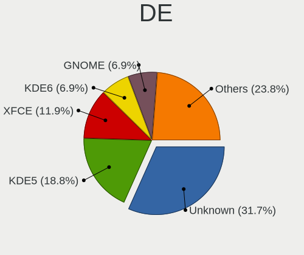
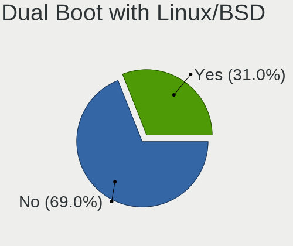
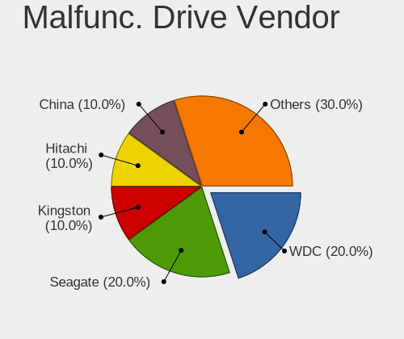
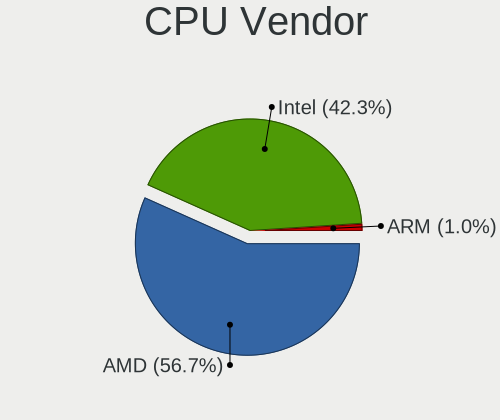
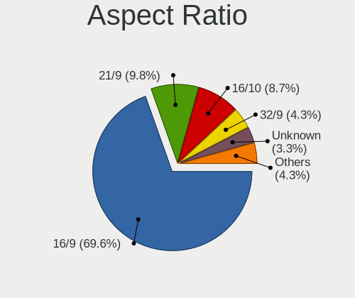
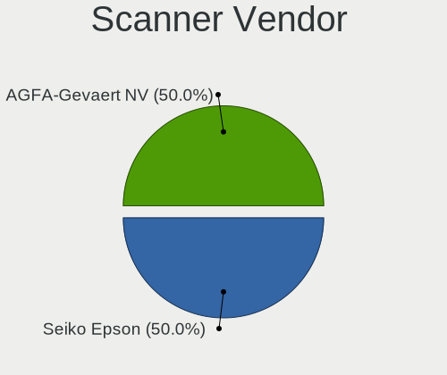
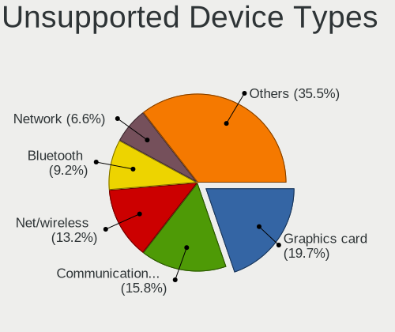

Gentoo 2.15 - Tested Hardware & Statistics (Desktops)
-----------------------------------------------------

A project to collect tested hardware configurations for Gentoo 2.15.

Anyone can contribute to this report by the [hw-probe](https://github.com/linuxhw/hw-probe) tool:

    sudo -E hw-probe -all -upload

Please contribute! Especially if your hardware is rare.

Contents
--------

* [ Test Cases ](#test-cases)

* [ System ](#system)
  - [ Kernel                   ](#kernel)
  - [ Kernel Family            ](#kernel-family)
  - [ Kernel Major Ver.        ](#kernel-major-ver)
  - [ Arch                     ](#arch)
  - [ DE                       ](#de)
  - [ Display Server           ](#display-server)
  - [ Display Manager          ](#display-manager)
  - [ OS Lang                  ](#os-lang)
  - [ Boot Mode                ](#boot-mode)
  - [ Filesystem               ](#filesystem)
  - [ Part. scheme             ](#part-scheme)
  - [ Dual Boot with Linux/BSD ](#dual-boot-with-linuxbsd)
  - [ Dual Boot (Win)          ](#dual-boot-win)

* [ Board ](#board)
  - [ Vendor                   ](#vendor)
  - [ Model                    ](#model)
  - [ Model Family             ](#model-family)
  - [ MFG Year                 ](#mfg-year)
  - [ Form Factor              ](#form-factor)
  - [ Secure Boot              ](#secure-boot)
  - [ Coreboot                 ](#coreboot)
  - [ RAM Size                 ](#ram-size)
  - [ RAM Used                 ](#ram-used)
  - [ Total Drives             ](#total-drives)
  - [ Has CD-ROM               ](#has-cd-rom)
  - [ Has Ethernet             ](#has-ethernet)
  - [ Has WiFi                 ](#has-wifi)
  - [ Has Bluetooth            ](#has-bluetooth)

* [ Location ](#location)
  - [ Country                  ](#country)
  - [ City                     ](#city)

* [ Drives ](#drives)
  - [ Drive Vendor             ](#drive-vendor)
  - [ Drive Model              ](#drive-model)
  - [ HDD Vendor               ](#hdd-vendor)
  - [ SSD Vendor               ](#ssd-vendor)
  - [ Drive Kind               ](#drive-kind)
  - [ Drive Connector          ](#drive-connector)
  - [ Drive Size               ](#drive-size)
  - [ Space Total              ](#space-total)
  - [ Space Used               ](#space-used)
  - [ Malfunc. Drives          ](#malfunc-drives)
  - [ Malfunc. Drive Vendor    ](#malfunc-drive-vendor)
  - [ Malfunc. HDD Vendor      ](#malfunc-hdd-vendor)
  - [ Malfunc. Drive Kind      ](#malfunc-drive-kind)
  - [ Failed Drives            ](#failed-drives)
  - [ Failed Drive Vendor      ](#failed-drive-vendor)
  - [ Drive Status             ](#drive-status)

* [ Storage controller ](#storage-controller)
  - [ Storage Vendor           ](#storage-vendor)
  - [ Storage Model            ](#storage-model)
  - [ Storage Kind             ](#storage-kind)

* [ Processor ](#processor)
  - [ CPU Vendor               ](#cpu-vendor)
  - [ CPU Model                ](#cpu-model)
  - [ CPU Model Family         ](#cpu-model-family)
  - [ CPU Cores                ](#cpu-cores)
  - [ CPU Sockets              ](#cpu-sockets)
  - [ CPU Threads              ](#cpu-threads)
  - [ CPU Op-Modes             ](#cpu-op-modes)
  - [ CPU Microcode            ](#cpu-microcode)
  - [ CPU Microarch            ](#cpu-microarch)

* [ Graphics ](#graphics)
  - [ GPU Vendor               ](#gpu-vendor)
  - [ GPU Model                ](#gpu-model)
  - [ GPU Combo                ](#gpu-combo)
  - [ GPU Driver               ](#gpu-driver)
  - [ GPU Memory               ](#gpu-memory)

* [ Monitor ](#monitor)
  - [ Monitor Vendor           ](#monitor-vendor)
  - [ Monitor Model            ](#monitor-model)
  - [ Monitor Resolution       ](#monitor-resolution)
  - [ Monitor Diagonal         ](#monitor-diagonal)
  - [ Monitor Width            ](#monitor-width)
  - [ Aspect Ratio             ](#aspect-ratio)
  - [ Monitor Area             ](#monitor-area)
  - [ Pixel Density            ](#pixel-density)
  - [ Multiple Monitors        ](#multiple-monitors)

* [ Network ](#network)
  - [ Net Controller Vendor    ](#net-controller-vendor)
  - [ Net Controller Model     ](#net-controller-model)
  - [ Wireless Vendor          ](#wireless-vendor)
  - [ Wireless Model           ](#wireless-model)
  - [ Ethernet Vendor          ](#ethernet-vendor)
  - [ Ethernet Model           ](#ethernet-model)
  - [ Net Controller Kind      ](#net-controller-kind)
  - [ Used Controller          ](#used-controller)
  - [ NICs                     ](#nics)
  - [ IPv6                     ](#ipv6)

* [ Bluetooth ](#bluetooth)
  - [ Bluetooth Vendor         ](#bluetooth-vendor)
  - [ Bluetooth Model          ](#bluetooth-model)

* [ Sound ](#sound)
  - [ Sound Vendor             ](#sound-vendor)
  - [ Sound Model              ](#sound-model)

* [ Memory ](#memory)
  - [ Memory Vendor            ](#memory-vendor)
  - [ Memory Model             ](#memory-model)
  - [ Memory Kind              ](#memory-kind)
  - [ Memory Form Factor       ](#memory-form-factor)
  - [ Memory Size              ](#memory-size)
  - [ Memory Speed             ](#memory-speed)

* [ Printers & scanners ](#printers--scanners)
  - [ Printer Vendor           ](#printer-vendor)
  - [ Printer Model            ](#printer-model)
  - [ Scanner Vendor           ](#scanner-vendor)
  - [ Scanner Model            ](#scanner-model)

* [ Camera ](#camera)
  - [ Camera Vendor            ](#camera-vendor)
  - [ Camera Model             ](#camera-model)

* [ Security ](#security)
  - [ Fingerprint Vendor       ](#fingerprint-vendor)
  - [ Fingerprint Model        ](#fingerprint-model)
  - [ Chipcard Vendor          ](#chipcard-vendor)
  - [ Chipcard Model           ](#chipcard-model)

* [ Unsupported ](#unsupported)
  - [ Unsupported Devices      ](#unsupported-devices)
  - [ Unsupported Device Types ](#unsupported-device-types)

Test Cases
----------

Total: 163

| Vendor   | Model                       | Probe                                                      | Date         |
|----------|-----------------------------|------------------------------------------------------------|--------------|
| ASUSTek  | ROG STRIX X670E-E GAMING... | [008bed58fb](https://linux-hardware.org/?probe=008bed58fb) | Dec 16, 2024 |
| ASUSTek  | M3A78-CM                    | [59ecdcf045](https://linux-hardware.org/?probe=59ecdcf045) | Nov 20, 2024 |
| Gigabyte | Z77X-D3H                    | [566d913cf0](https://linux-hardware.org/?probe=566d913cf0) | Oct 31, 2024 |
| Gigabyte | B360M-D3P-WG-CF             | [221fc17cd6](https://linux-hardware.org/?probe=221fc17cd6) | Oct 29, 2024 |
| ASRock   | AM1H-ITX                    | [539c9b8d9d](https://linux-hardware.org/?probe=539c9b8d9d) | Oct 26, 2024 |
| Fujitsu  | D3233-A1 S26361-D3233-A1    | [bd388dcc0d](https://linux-hardware.org/?probe=bd388dcc0d) | Oct 23, 2024 |
| ASRock   | A520M-ITX/ac                | [257fe67fab](https://linux-hardware.org/?probe=257fe67fab) | Oct 19, 2024 |
| Intel    | D510MO AAE76523-401         | [ef9733928f](https://linux-hardware.org/?probe=ef9733928f) | Oct 18, 2024 |
| ZOTAC    | H67ITX-C-E 02/03/05         | [19badd34b0](https://linux-hardware.org/?probe=19badd34b0) | Oct 18, 2024 |
| ASUSTek  | M4A88T-I DELUXE             | [4160c3040f](https://linux-hardware.org/?probe=4160c3040f) | Oct 18, 2024 |
| ASUSTek  | SABERTOOTH X58              | [d4240e52c9](https://linux-hardware.org/?probe=d4240e52c9) | Oct 18, 2024 |
| Unknown  | Unknown                     | [638bf77d29](https://linux-hardware.org/?probe=638bf77d29) | Oct 18, 2024 |
| ZOTAC    | H67ITX-C-E 02/03/05         | [8dbae4a350](https://linux-hardware.org/?probe=8dbae4a350) | Oct 18, 2024 |
| Unknown  | Unknown                     | [7d0ffc9b7a](https://linux-hardware.org/?probe=7d0ffc9b7a) | Oct 18, 2024 |
| Gigabyte | Z77X-D3H                    | [3113b0c26d](https://linux-hardware.org/?probe=3113b0c26d) | Oct 17, 2024 |
| ASRock   | AM1H-ITX                    | [10a64a5356](https://linux-hardware.org/?probe=10a64a5356) | Oct 17, 2024 |
| Gigabyte | A520 AORUS ELITE            | [81109786c2](https://linux-hardware.org/?probe=81109786c2) | Oct 16, 2024 |
| ASUSTek  | M3A78-CM                    | [e907b8b549](https://linux-hardware.org/?probe=e907b8b549) | Oct 15, 2024 |
| ASRock   | A520M-ITX/ac                | [f0ccf0627b](https://linux-hardware.org/?probe=f0ccf0627b) | Oct 15, 2024 |
| ASRock   | X570 Taichi                 | [b3b87cb7d2](https://linux-hardware.org/?probe=b3b87cb7d2) | Oct 15, 2024 |
| Gigabyte | AB350-Gaming-CF             | [82eace1ca4](https://linux-hardware.org/?probe=82eace1ca4) | Oct 13, 2024 |
| ASUSTek  | ROG STRIX Z790-E GAMING ... | [75722e8358](https://linux-hardware.org/?probe=75722e8358) | Oct 12, 2024 |
| Gigabyte | A520 AORUS ELITE            | [b56aeb805e](https://linux-hardware.org/?probe=b56aeb805e) | Oct 09, 2024 |
| ASUSTek  | M3A78-CM                    | [2161de6ffe](https://linux-hardware.org/?probe=2161de6ffe) | Oct 07, 2024 |
| ASRock   | AM1H-ITX                    | [def75bd40a](https://linux-hardware.org/?probe=def75bd40a) | Oct 06, 2024 |
| Gigabyte | AB350-Gaming-CF             | [ffd0b1b3b6](https://linux-hardware.org/?probe=ffd0b1b3b6) | Oct 06, 2024 |
| ASRock   | X570 Phantom Gaming 4       | [9d2d98c84b](https://linux-hardware.org/?probe=9d2d98c84b) | Oct 03, 2024 |
| ASRock   | AM1H-ITX                    | [71d49b6fb4](https://linux-hardware.org/?probe=71d49b6fb4) | Oct 03, 2024 |
| ASRock   | B650E Taichi Lite           | [5ab1034596](https://linux-hardware.org/?probe=5ab1034596) | Sep 29, 2024 |
| MSI      | Z97 MPOWER                  | [f21872219a](https://linux-hardware.org/?probe=f21872219a) | Sep 28, 2024 |
| MSI      | Z97 MPOWER                  | [7a05a56f63](https://linux-hardware.org/?probe=7a05a56f63) | Sep 28, 2024 |
| Dell     | 0F4Y1M A02                  | [906a276432](https://linux-hardware.org/?probe=906a276432) | Sep 27, 2024 |
| MSI      | B450 GAMING PRO CARBON A... | [d6e03c48eb](https://linux-hardware.org/?probe=d6e03c48eb) | Sep 24, 2024 |
| Unknown  | Unknown                     | [fdddcae4d3](https://linux-hardware.org/?probe=fdddcae4d3) | Sep 24, 2024 |
| MSI      | B650M GAMING PLUS WIFI      | [44a5096641](https://linux-hardware.org/?probe=44a5096641) | Sep 23, 2024 |
| MSI      | B450 GAMING PRO CARBON A... | [9019ddb539](https://linux-hardware.org/?probe=9019ddb539) | Sep 22, 2024 |
| Gigabyte | X570 AORUS ELITE            | [482aeffacc](https://linux-hardware.org/?probe=482aeffacc) | Sep 22, 2024 |
| Gigabyte | A520 AORUS ELITE            | [0a745449f5](https://linux-hardware.org/?probe=0a745449f5) | Sep 18, 2024 |
| HP       | 1589                        | [cd86420d3e](https://linux-hardware.org/?probe=cd86420d3e) | Sep 15, 2024 |
| ASUSTek  | M3A78-CM                    | [9d6023b0d5](https://linux-hardware.org/?probe=9d6023b0d5) | Sep 15, 2024 |
| Gigabyte | B550 AORUS ELITE AX V2      | [cc99554541](https://linux-hardware.org/?probe=cc99554541) | Sep 14, 2024 |
| ASUSTek  | ROG CROSSHAIR VIII HERO     | [7afc6efd27](https://linux-hardware.org/?probe=7afc6efd27) | Sep 11, 2024 |
| Lenovo   | 3102 SDK0J40697 WIN 3305... | [080a971480](https://linux-hardware.org/?probe=080a971480) | Sep 08, 2024 |
| Gigabyte | AB350-Gaming-CF             | [4ff0f01eb1](https://linux-hardware.org/?probe=4ff0f01eb1) | Sep 08, 2024 |
| Gigabyte | A520 AORUS ELITE            | [4fd5cdbf41](https://linux-hardware.org/?probe=4fd5cdbf41) | Sep 07, 2024 |
| HP       | 8767 A                      | [65ef489177](https://linux-hardware.org/?probe=65ef489177) | Sep 07, 2024 |
| HP       | 8767 A                      | [5e38429f92](https://linux-hardware.org/?probe=5e38429f92) | Sep 07, 2024 |
| ASUSTek  | ROG STRIX Z490-F GAMING     | [0d129c2fb7](https://linux-hardware.org/?probe=0d129c2fb7) | Sep 07, 2024 |
| Gigabyte | B85M-HD3 R4                 | [ca88901f71](https://linux-hardware.org/?probe=ca88901f71) | Sep 06, 2024 |
| MSI      | MAG X670E TOMAHAWK WIFI     | [96d387e932](https://linux-hardware.org/?probe=96d387e932) | Sep 06, 2024 |
| Unknown  | Unknown                     | [efbfdc8ad3](https://linux-hardware.org/?probe=efbfdc8ad3) | Sep 05, 2024 |
| ASUSTek  | M4A88T-I DELUXE             | [970aae698a](https://linux-hardware.org/?probe=970aae698a) | Sep 05, 2024 |
| MSI      | B650M PROJECT ZERO          | [ca4eeb43e3](https://linux-hardware.org/?probe=ca4eeb43e3) | Sep 04, 2024 |
| Lenovo   | 1064 SDK0T76528 WIN 3556... | [25f0609915](https://linux-hardware.org/?probe=25f0609915) | Sep 04, 2024 |
| ASUSTek  | ROG CROSSHAIR VIII HERO     | [b78ceccaaf](https://linux-hardware.org/?probe=b78ceccaaf) | Sep 04, 2024 |
| Lenovo   | 1064 SDK0T76528 WIN 3556... | [bc4bc8eedc](https://linux-hardware.org/?probe=bc4bc8eedc) | Sep 03, 2024 |
| ASUSTek  | ROG STRIX X570-E GAMING     | [236ca10d6e](https://linux-hardware.org/?probe=236ca10d6e) | Sep 02, 2024 |
| MSI      | B450 GAMING PLUS            | [7d68c9f2ad](https://linux-hardware.org/?probe=7d68c9f2ad) | Sep 02, 2024 |
| MSI      | B450 GAMING PLUS            | [2816eae760](https://linux-hardware.org/?probe=2816eae760) | Sep 01, 2024 |
| Gigabyte | AB350-Gaming-CF             | [3ab0eeaab8](https://linux-hardware.org/?probe=3ab0eeaab8) | Sep 01, 2024 |
| ASUSTek  | M3A78-CM                    | [ce39d1f006](https://linux-hardware.org/?probe=ce39d1f006) | Aug 30, 2024 |
| HP       | 1589                        | [352493ca6b](https://linux-hardware.org/?probe=352493ca6b) | Aug 28, 2024 |
| ASUSTek  | PRIME X670E-PRO WIFI        | [da1c879511](https://linux-hardware.org/?probe=da1c879511) | Aug 27, 2024 |
| ASUSTek  | TUF Gaming X570-PLUS        | [ff5b9c88a4](https://linux-hardware.org/?probe=ff5b9c88a4) | Aug 25, 2024 |
| MSI      | H67MA-E35                   | [7b15665f68](https://linux-hardware.org/?probe=7b15665f68) | Aug 24, 2024 |
| ASUSTek  | ROG CROSSHAIR X670E HERO    | [b37107a7dc](https://linux-hardware.org/?probe=b37107a7dc) | Aug 23, 2024 |
| ASUSTek  | ROG Maximus Z790 HERO       | [67add3495a](https://linux-hardware.org/?probe=67add3495a) | Aug 21, 2024 |
| ASUSTek  | M3A78-CM                    | [66b2492618](https://linux-hardware.org/?probe=66b2492618) | Aug 19, 2024 |
| Gigabyte | A520 AORUS ELITE            | [9055a30f37](https://linux-hardware.org/?probe=9055a30f37) | Aug 19, 2024 |
| MSI      | MAG X670E TOMAHAWK WIFI     | [154da62650](https://linux-hardware.org/?probe=154da62650) | Aug 18, 2024 |
| Gigabyte | AB350-Gaming-CF             | [3657572932](https://linux-hardware.org/?probe=3657572932) | Aug 18, 2024 |
| ASUSTek  | ROG STRIX B550-A GAMING     | [238c382370](https://linux-hardware.org/?probe=238c382370) | Aug 17, 2024 |
| MSI      | B650M PROJECT ZERO          | [dd27c0e6c4](https://linux-hardware.org/?probe=dd27c0e6c4) | Aug 17, 2024 |
| ASUSTek  | ProArt X670E-CREATOR WIF... | [02426e639f](https://linux-hardware.org/?probe=02426e639f) | Aug 17, 2024 |
| ASUSTek  | PRIME X670E-PRO WIFI        | [6500ad6c92](https://linux-hardware.org/?probe=6500ad6c92) | Aug 16, 2024 |
| ASUSTek  | ROG CROSSHAIR VIII DARK ... | [3c402af2c0](https://linux-hardware.org/?probe=3c402af2c0) | Aug 15, 2024 |
| ASUSTek  | PRIME B550-PLUS             | [9c9ab9111f](https://linux-hardware.org/?probe=9c9ab9111f) | Aug 15, 2024 |
| Lenovo   | 1064 SDK0T76528 WIN 3556... | [39ec887366](https://linux-hardware.org/?probe=39ec887366) | Aug 13, 2024 |
| ASUSTek  | ROG STRIX Z590-E GAMING ... | [192943e056](https://linux-hardware.org/?probe=192943e056) | Aug 13, 2024 |
| Gigabyte | A520 AORUS ELITE            | [4eaf371a57](https://linux-hardware.org/?probe=4eaf371a57) | Aug 12, 2024 |
| Gigabyte | AB350-Gaming-CF             | [21829d21d1](https://linux-hardware.org/?probe=21829d21d1) | Aug 11, 2024 |
| Dell     | 0KWVT8 A02                  | [fb36ea4f54](https://linux-hardware.org/?probe=fb36ea4f54) | Aug 09, 2024 |
| Lenovo   | 1064 SDK0T76528 WIN 3556... | [af392a3a32](https://linux-hardware.org/?probe=af392a3a32) | Aug 08, 2024 |
| JINGSHA  | X99-D8I                     | [562c50431e](https://linux-hardware.org/?probe=562c50431e) | Aug 07, 2024 |
| Gigabyte | B560M DS3H                  | [aca2673eac](https://linux-hardware.org/?probe=aca2673eac) | Aug 06, 2024 |
| HP       | 82FF                        | [5e2a2a2a1c](https://linux-hardware.org/?probe=5e2a2a2a1c) | Aug 06, 2024 |
| HP       | 82FF                        | [a3345e146c](https://linux-hardware.org/?probe=a3345e146c) | Aug 04, 2024 |
| Gigabyte | X570 AORUS ELITE            | [79839e7d37](https://linux-hardware.org/?probe=79839e7d37) | Aug 03, 2024 |
| ASUSTek  | ROG CROSSHAIR X670E HERO    | [aba2b2aa75](https://linux-hardware.org/?probe=aba2b2aa75) | Aug 01, 2024 |
| ASUSTek  | ROG CROSSHAIR X670E HERO    | [4d1efa726b](https://linux-hardware.org/?probe=4d1efa726b) | Aug 01, 2024 |
| ASUSTek  | PRIME H310M-A R2.0          | [e6f84db5ca](https://linux-hardware.org/?probe=e6f84db5ca) | Jul 31, 2024 |
| MSI      | Z390-A PRO                  | [14a0b2f8a3](https://linux-hardware.org/?probe=14a0b2f8a3) | Jul 30, 2024 |
| ASUSTek  | M3A78-CM                    | [ec2dd1e8b9](https://linux-hardware.org/?probe=ec2dd1e8b9) | Jul 29, 2024 |
| ASUSTek  | PRIME X670E-PRO WIFI        | [18004f81b1](https://linux-hardware.org/?probe=18004f81b1) | Jul 27, 2024 |
| MSI      | MAG Z790 TOMAHAWK WIFI      | [c5cf2e46b0](https://linux-hardware.org/?probe=c5cf2e46b0) | Jul 26, 2024 |
| Gigabyte | F2A88XM-D3H                 | [aec89ce184](https://linux-hardware.org/?probe=aec89ce184) | Jul 23, 2024 |
| Gigabyte | H110M-H-CF                  | [eac05e9202](https://linux-hardware.org/?probe=eac05e9202) | Jul 21, 2024 |
| ASUSTek  | TUF Gaming Z790-PLUS WIF... | [ba284448d2](https://linux-hardware.org/?probe=ba284448d2) | Jul 20, 2024 |
| HP       | 8594                        | [c9a6e01799](https://linux-hardware.org/?probe=c9a6e01799) | Jul 19, 2024 |
| Fujitsu  | D3313-A1 S26361-D3313-A1    | [77026eec6b](https://linux-hardware.org/?probe=77026eec6b) | Jul 18, 2024 |
| Fujitsu  | D3313-A1 S26361-D3313-A1    | [33ef38ca68](https://linux-hardware.org/?probe=33ef38ca68) | Jul 18, 2024 |
| ASUSTek  | P6X58D-E                    | [b4230fd990](https://linux-hardware.org/?probe=b4230fd990) | Jul 16, 2024 |
| Unknown  | WD MyCloud Ex2 Ultra        | [3d6f4f8206](https://linux-hardware.org/?probe=3d6f4f8206) | Jul 14, 2024 |
| ASRock   | AM1H-ITX                    | [fe1e6daa74](https://linux-hardware.org/?probe=fe1e6daa74) | Jul 14, 2024 |
| Gigabyte | AB350-Gaming-CF             | [5e04444171](https://linux-hardware.org/?probe=5e04444171) | Jul 14, 2024 |
| Gigabyte | A520 AORUS ELITE            | [65fea3f878](https://linux-hardware.org/?probe=65fea3f878) | Jul 09, 2024 |
| Gigabyte | X570 AORUS ELITE            | [583da8f3ba](https://linux-hardware.org/?probe=583da8f3ba) | Jul 08, 2024 |
| ASUSTek  | M3A78-CM                    | [1ba69a0bc6](https://linux-hardware.org/?probe=1ba69a0bc6) | Jul 08, 2024 |
| Gigabyte | AB350-Gaming-CF             | [3a334f0b19](https://linux-hardware.org/?probe=3a334f0b19) | Jul 07, 2024 |
| ASUSTek  | ROG STRIX Z390-E GAMING     | [0827775bcb](https://linux-hardware.org/?probe=0827775bcb) | Jul 03, 2024 |
| Gigabyte | A520 AORUS ELITE            | [d89d44cd1d](https://linux-hardware.org/?probe=d89d44cd1d) | Jul 02, 2024 |
| MSI      | MAG B460 TORPEDO            | [070bd1ea81](https://linux-hardware.org/?probe=070bd1ea81) | Jul 01, 2024 |
| ASUSTek  | M3A78-CM                    | [8ecf83f014](https://linux-hardware.org/?probe=8ecf83f014) | Jun 27, 2024 |
| Unknown  | Unknown                     | [1810652556](https://linux-hardware.org/?probe=1810652556) | Jun 26, 2024 |
| ASRock   | X670E Steel Legend          | [c5f9ed95aa](https://linux-hardware.org/?probe=c5f9ed95aa) | Jun 25, 2024 |
| ASUSTek  | ROG ZENITH EXTREME          | [919d8fe115](https://linux-hardware.org/?probe=919d8fe115) | Jun 22, 2024 |
| ASUSTek  | ROG STRIX B650E-F GAMING... | [4bd56e0b9a](https://linux-hardware.org/?probe=4bd56e0b9a) | Jun 20, 2024 |
| ASUSTek  | ROG ZENITH EXTREME          | [a20bd7b48e](https://linux-hardware.org/?probe=a20bd7b48e) | Jun 19, 2024 |
| HP       | 8767 A                      | [6f6960b747](https://linux-hardware.org/?probe=6f6960b747) | Jun 19, 2024 |
| ASUSTek  | ROG STRIX B450-F GAMING     | [d4a9a39751](https://linux-hardware.org/?probe=d4a9a39751) | Jun 18, 2024 |
| ASUSTek  | ROG STRIX B450-F GAMING     | [d6c343d95f](https://linux-hardware.org/?probe=d6c343d95f) | Jun 17, 2024 |
| ASUSTek  | ROG CROSSHAIR VIII HERO     | [2a2ea78d33](https://linux-hardware.org/?probe=2a2ea78d33) | Jun 16, 2024 |
| HP       | 8767 A                      | [1c48f5c6e7](https://linux-hardware.org/?probe=1c48f5c6e7) | Jun 15, 2024 |
| Gigabyte | X470 AORUS ULTRA GAMING-... | [0a0fbc89cd](https://linux-hardware.org/?probe=0a0fbc89cd) | Jun 14, 2024 |
| MSI      | MAG B550 TOMAHAWK           | [d805f48d25](https://linux-hardware.org/?probe=d805f48d25) | Jun 13, 2024 |
| ASUSTek  | PRIME B550M-A               | [4d2d75e2c0](https://linux-hardware.org/?probe=4d2d75e2c0) | Jun 10, 2024 |
| Gigabyte | 990FXA-UD3                  | [b4160762bc](https://linux-hardware.org/?probe=b4160762bc) | Jun 06, 2024 |
| ASRock   | X399 Taichi                 | [44be905080](https://linux-hardware.org/?probe=44be905080) | Jun 06, 2024 |
| HP       | 21D0                        | [f49c2233d4](https://linux-hardware.org/?probe=f49c2233d4) | Jun 04, 2024 |
| MSI      | PRO B650M-B                 | [b047d64d6b](https://linux-hardware.org/?probe=b047d64d6b) | Jun 03, 2024 |
| Gigabyte | B450M DS3H V2               | [0941f7e44b](https://linux-hardware.org/?probe=0941f7e44b) | Jun 03, 2024 |
| ASUSTek  | Z87-A                       | [8369e2db54](https://linux-hardware.org/?probe=8369e2db54) | May 30, 2024 |
| Unknown  | Unknown                     | [41a25b4e63](https://linux-hardware.org/?probe=41a25b4e63) | May 28, 2024 |
| MSI      | B650M GAMING PLUS WIFI      | [9f93c36b50](https://linux-hardware.org/?probe=9f93c36b50) | May 26, 2024 |
| ASRock   | X570 Taichi                 | [d19b59b30d](https://linux-hardware.org/?probe=d19b59b30d) | May 26, 2024 |
| ASUSTek  | ROG STRIX X570-F GAMING     | [2b8fd9a04d](https://linux-hardware.org/?probe=2b8fd9a04d) | May 20, 2024 |
| ASUSTek  | ROG STRIX X670E-F GAMING... | [c6c7b48a86](https://linux-hardware.org/?probe=c6c7b48a86) | May 20, 2024 |
| Gigabyte | 970A-DS3P FX                | [4a56bdefd8](https://linux-hardware.org/?probe=4a56bdefd8) | May 19, 2024 |
| Lenovo   | SHARKBAY 0B98401 PRO        | [9ed668e403](https://linux-hardware.org/?probe=9ed668e403) | May 18, 2024 |
| Gigabyte | 970A-DS3P FX                | [466e43656c](https://linux-hardware.org/?probe=466e43656c) | May 17, 2024 |
| ASUSTek  | M3A78-CM                    | [63ceb79864](https://linux-hardware.org/?probe=63ceb79864) | May 14, 2024 |
| Gigabyte | A520 AORUS ELITE            | [70b6b20e82](https://linux-hardware.org/?probe=70b6b20e82) | May 13, 2024 |
| Gigabyte | B550 AORUS PRO AC           | [e2203faeb8](https://linux-hardware.org/?probe=e2203faeb8) | May 12, 2024 |
| ASUSTek  | PRIME H510M-E               | [e387f4f112](https://linux-hardware.org/?probe=e387f4f112) | May 12, 2024 |
| ASUSTek  | ProArt B550-CREATOR         | [ffb594f38b](https://linux-hardware.org/?probe=ffb594f38b) | May 12, 2024 |
| ASRock   | B450 Pro4                   | [5eb9203577](https://linux-hardware.org/?probe=5eb9203577) | May 12, 2024 |
| Gigabyte | AB350-Gaming-CF             | [c7d919bdb0](https://linux-hardware.org/?probe=c7d919bdb0) | May 12, 2024 |
| MSI      | B650M GAMING PLUS WIFI      | [8938e43462](https://linux-hardware.org/?probe=8938e43462) | May 09, 2024 |
| ASRock   | X399 Taichi                 | [c82214d90a](https://linux-hardware.org/?probe=c82214d90a) | May 09, 2024 |
| MSI      | B650M GAMING PLUS WIFI      | [be715853f7](https://linux-hardware.org/?probe=be715853f7) | May 08, 2024 |
| Lenovo   | 3148 SDK0J40700 WIN 3258... | [b24f7286d2](https://linux-hardware.org/?probe=b24f7286d2) | May 07, 2024 |
| MSI      | B650M GAMING PLUS WIFI      | [afbc83ced8](https://linux-hardware.org/?probe=afbc83ced8) | May 06, 2024 |
| MSI      | MPG Z490 GAMING EDGE WIF... | [91fcd08046](https://linux-hardware.org/?probe=91fcd08046) | May 06, 2024 |
| Gigabyte | A520 AORUS ELITE            | [8c70aa2f23](https://linux-hardware.org/?probe=8c70aa2f23) | May 05, 2024 |
| Gigabyte | AB350-Gaming-CF             | [5510492a9b](https://linux-hardware.org/?probe=5510492a9b) | May 05, 2024 |
| HP       | 158B                        | [d5727d0cfb](https://linux-hardware.org/?probe=d5727d0cfb) | May 02, 2024 |
| ASUSTek  | PRIME X670-P                | [121abdd671](https://linux-hardware.org/?probe=121abdd671) | Apr 14, 2024 |
| ASUSTek  | ROG STRIX B450-F GAMING     | [44ed4afea3](https://linux-hardware.org/?probe=44ed4afea3) | Apr 09, 2024 |
| ASUSTek  | TUF Gaming B550-PLUS        | [e121ce9511](https://linux-hardware.org/?probe=e121ce9511) | Apr 06, 2024 |
| ASUSTek  | ROG STRIX B650E-F GAMING... | [8a038a8035](https://linux-hardware.org/?probe=8a038a8035) | Mar 29, 2024 |
| MSI      | MPG B650 EDGE WIFI          | [bdd9102028](https://linux-hardware.org/?probe=bdd9102028) | Mar 27, 2024 |
| Gigabyte | Z590 UD                     | [e21d410d32](https://linux-hardware.org/?probe=e21d410d32) | Mar 18, 2024 |
| Gigabyte | Z590 UD                     | [8f9fab87e6](https://linux-hardware.org/?probe=8f9fab87e6) | Mar 16, 2024 |

System
------

Kernel
------

Version of the Linux kernel

| Version                     | Desktops | Percent |
|-----------------------------|----------|---------|
| 6.6.30-gentoo               | 12       | 10%     |
| 6.6.47-gentoo               | 7        | 5.83%   |
| 6.6.30-gentoo-x86_64        | 6        | 5%      |
| 6.6.52-gentoo               | 5        | 4.17%   |
| 6.6.47-gentoo-x86_64        | 4        | 3.33%   |
| 6.6.47-gentoo-dist          | 4        | 3.33%   |
| 6.6.38-gentoo               | 4        | 3.33%   |
| 6.6.30-gentoo-dist          | 4        | 3.33%   |
| 6.6.21-gentoo               | 4        | 3.33%   |
| 6.11.3-gentoo               | 4        | 3.33%   |
| 6.10.7-gentoo               | 3        | 2.5%    |
| 6.9.4-gentoo                | 2        | 1.67%   |
| 6.8.1-gentoo                | 2        | 1.67%   |
| 6.6.51-gentoo-dist          | 2        | 1.67%   |
| 6.6.38-gentoo-x86_64        | 2        | 1.67%   |
| 6.6.35-gentoo-dist          | 2        | 1.67%   |
| 6.6.13-gentoo-x86_64        | 2        | 1.67%   |
| 6.10.5-gentoo-x86_64        | 2        | 1.67%   |
| 6.10.0-gentoo               | 2        | 1.67%   |
| 6.9.6-gentoo-novex          | 1        | 0.83%   |
| 6.9.5-gentoo-x86_64         | 1        | 0.83%   |
| 6.9.4-x86_64                | 1        | 0.83%   |
| 6.9.3-gentoo-ejder          | 1        | 0.83%   |
| 6.9.1-gentoo                | 1        | 0.83%   |
| 6.8.9-gentoo-x86_64         | 1        | 0.83%   |
| 6.8.9-gentoo-git            | 1        | 0.83%   |
| 6.8.8-gentoo-hpz820-mgreene | 1        | 0.83%   |
| 6.8.6-gentoo-dist           | 1        | 0.83%   |
| 6.8.6-gentoo                | 1        | 0.83%   |
| 6.8.4-gentoo-x86_64         | 1        | 0.83%   |
| 6.8.0-zen1                  | 1        | 0.83%   |
| 6.8.0-pf9-cn-tgiv           | 1        | 0.83%   |
| 6.8.0-gentoo-x86_64         | 1        | 0.83%   |
| 6.6.52-gentoo-x86_64        | 1        | 0.83%   |
| 6.6.47-gentoo-NSA           | 1        | 0.83%   |
| 6.6.44-gentoo               | 1        | 0.83%   |
| 6.6.41-x86_64               | 1        | 0.83%   |
| 6.6.35-renacuajo            | 1        | 0.83%   |
| 6.6.32-gentoo-dist-natura5  | 1        | 0.83%   |
| 6.6.30-gentoo-wdex2         | 1        | 0.83%   |

Kernel Family
-------------

Linux kernel without a distro release

| Version  | Desktops | Percent |
|----------|----------|---------|
| 6.6.30   | 26       | 21.67%  |
| 6.6.47   | 16       | 13.33%  |
| 6.6.52   | 6        | 5%      |
| 6.6.38   | 6        | 5%      |
| 6.6.21   | 6        | 5%      |
| 6.11.3   | 5        | 4.17%   |
| 6.10.7   | 4        | 3.33%   |
| 6.10.5   | 4        | 3.33%   |
| 6.9.4    | 3        | 2.5%    |
| 6.8.0    | 3        | 2.5%    |
| 6.6.35   | 3        | 2.5%    |
| 6.6.13   | 3        | 2.5%    |
| 6.10.2   | 3        | 2.5%    |
| 6.10.0   | 3        | 2.5%    |
| 6.8.9    | 2        | 1.67%   |
| 6.8.6    | 2        | 1.67%   |
| 6.8.1    | 2        | 1.67%   |
| 6.6.51   | 2        | 1.67%   |
| 6.9.6    | 1        | 0.83%   |
| 6.9.5    | 1        | 0.83%   |
| 6.9.3    | 1        | 0.83%   |
| 6.9.1    | 1        | 0.83%   |
| 6.8.8    | 1        | 0.83%   |
| 6.8.4    | 1        | 0.83%   |
| 6.6.44   | 1        | 0.83%   |
| 6.6.41   | 1        | 0.83%   |
| 6.6.32   | 1        | 0.83%   |
| 6.3.9    | 1        | 0.83%   |
| 6.11.2   | 1        | 0.83%   |
| 6.11.0   | 1        | 0.83%   |
| 6.10.8   | 1        | 0.83%   |
| 6.10.6   | 1        | 0.83%   |
| 6.10.3   | 1        | 0.83%   |
| 6.10.14  | 1        | 0.83%   |
| 6.10.11  | 1        | 0.83%   |
| 6.10.1   | 1        | 0.83%   |
| 6.1.84   | 1        | 0.83%   |
| 6.1.46   | 1        | 0.83%   |
| 5.15.159 | 1        | 0.83%   |

Kernel Major Ver.
-----------------

Linux kernel major version

| Version | Desktops | Percent |
|---------|----------|---------|
| 6.6     | 54       | 52.43%  |
| 6.10    | 20       | 19.42%  |
| 6.8     | 11       | 10.68%  |
| 6.9     | 7        | 6.8%    |
| 6.11    | 7        | 6.8%    |
| 6.1     | 2        | 1.94%   |
| 6.3     | 1        | 0.97%   |
| 5.15    | 1        | 0.97%   |

Arch
----

OS architecture (x86_64, i586, etc.)

| Name   | Desktops | Percent |
|--------|----------|---------|
| x86_64 | 96       | 98.97%  |
| armv7l | 1        | 1.03%   |

DE
--

Desktop Environment

| Name       | Desktops | Percent |
|------------|----------|---------|
| Unknown    | 32       | 31.68%  |
| KDE5       | 19       | 18.81%  |
| XFCE       | 12       | 11.88%  |
| KDE6       | 7        | 6.93%   |
| GNOME      | 7        | 6.93%   |
| LXQt       | 5        | 4.95%   |
| KDE        | 5        | 4.95%   |
| Hyprland   | 4        | 3.96%   |
| MATE       | 3        | 2.97%   |
| X-Cinnamon | 2        | 1.98%   |
| wlroots    | 1        | 0.99%   |
| sway       | 1        | 0.99%   |
| i3         | 1        | 0.99%   |
| DWM        | 1        | 0.99%   |
| Cinnamon   | 1        | 0.99%   |

Display Server
--------------

X11 or Wayland

| Name    | Desktops | Percent |
|---------|----------|---------|
| X11     | 39       | 39%     |
| Wayland | 30       | 30%     |
| Tty     | 16       | 16%     |
| Unknown | 15       | 15%     |

Display Manager
---------------

SDDM, LightDM, etc.

| Name    | Desktops | Percent |
|---------|----------|---------|
| SDDM    | 40       | 40.4%   |
| Unknown | 37       | 37.37%  |
| LightDM | 13       | 13.13%  |
| GDM     | 7        | 7.07%   |
| SLiM    | 1        | 1.01%   |
| GREETD  | 1        | 1.01%   |

OS Lang
-------

Language

| Lang       | Desktops | Percent |
|------------|----------|---------|
| en_US      | 37       | 37.37%  |
| C.UTF8     | 13       | 13.13%  |
| Unknown    | 11       | 11.11%  |
| en_GB      | 7        | 7.07%   |
| C          | 6        | 6.06%   |
| fr_FR      | 5        | 5.05%   |
| en_CA      | 3        | 3.03%   |
| pt_BR      | 2        | 2.02%   |
| es_ES      | 2        | 2.02%   |
| en_IE      | 2        | 2.02%   |
| de_DE      | 2        | 2.02%   |
| zh_CN      | 1        | 1.01%   |
| sv_SE      | 1        | 1.01%   |
| ru_RU      | 1        | 1.01%   |
| pt_BR.UTF8 | 1        | 1.01%   |
| pl_PL      | 1        | 1.01%   |
| it_IT      | 1        | 1.01%   |
| es_MX      | 1        | 1.01%   |
| en_IL      | 1        | 1.01%   |
| cs_CZ      | 1        | 1.01%   |

Boot Mode
---------

EFI or BIOS

| Mode | Desktops | Percent |
|------|----------|---------|
| EFI  | 76       | 77.55%  |
| BIOS | 22       | 22.45%  |

Filesystem
----------

Type of filesystem

| Type    | Desktops | Percent |
|---------|----------|---------|
| Ext4    | 47       | 48.45%  |
| Btrfs   | 24       | 24.74%  |
| Xfs     | 11       | 11.34%  |
| Zfs     | 7        | 7.22%   |
| F2fs    | 5        | 5.15%   |
| Overlay | 2        | 2.06%   |
| Jfs     | 1        | 1.03%   |

Part. scheme
------------

Scheme of partitioning

| Type    | Desktops | Percent |
|---------|----------|---------|
| GPT     | 87       | 89.69%  |
| MBR     | 5        | 5.15%   |
| Unknown | 5        | 5.15%   |

Dual Boot with Linux/BSD
------------------------

Hosting more than one Linux/BSD

| Dual boot | Desktops | Percent |
|-----------|----------|---------|
| No        | 69       | 69%     |
| Yes       | 31       | 31%     |

Dual Boot (Win)
---------------

Hosting Linux and Windows

| Dual boot | Desktops | Percent |
|-----------|----------|---------|
| No        | 69       | 71.13%  |
| Yes       | 28       | 28.87%  |

Board
-----

Vendor
------

Motherboard manufacturer

| Name                | Desktops | Percent |
|---------------------|----------|---------|
| ASUSTek Computer    | 34       | 35.05%  |
| Gigabyte Technology | 16       | 16.49%  |
| MSI                 | 15       | 15.46%  |
| ASRock              | 10       | 10.31%  |
| Hewlett-Packard     | 6        | 6.19%   |
| Unknown             | 5        | 5.15%   |
| Lenovo              | 4        | 4.12%   |
| Fujitsu             | 2        | 2.06%   |
| Dell                | 2        | 2.06%   |
| ZOTAC               | 1        | 1.03%   |
| JINGSHA             | 1        | 1.03%   |
| Intel               | 1        | 1.03%   |

Model
-----

Motherboard model

| Name                                      | Desktops | Percent |
|-------------------------------------------|----------|---------|
| Unknown                                   | 5        | 5.15%   |
| ASUS ROG CROSSHAIR VIII HERO              | 3        | 3.09%   |
| MSI MS-7E12                               | 2        | 2.06%   |
| ASUS ROG STRIX B650E-F GAMING WIFI        | 2        | 2.06%   |
| ASRock X570 Taichi                        | 2        | 2.06%   |
| ASRock A520M-ITX/ac                       | 2        | 2.06%   |
| ZOTAC H67ITX-C-E                          | 1        | 1.03%   |
| MSI MS-7E28                               | 1        | 1.03%   |
| MSI MS-7E24                               | 1        | 1.03%   |
| MSI MS-7E10                               | 1        | 1.03%   |
| MSI MS-7E09                               | 1        | 1.03%   |
| MSI MS-7D91                               | 1        | 1.03%   |
| MSI MS-7C91                               | 1        | 1.03%   |
| MSI MS-7C81                               | 1        | 1.03%   |
| MSI MS-7C79                               | 1        | 1.03%   |
| MSI MS-7B98                               | 1        | 1.03%   |
| MSI MS-7B86                               | 1        | 1.03%   |
| MSI MS-7B85                               | 1        | 1.03%   |
| MSI MS-7915                               | 1        | 1.03%   |
| MSI MS-7680                               | 1        | 1.03%   |
| Lenovo V520S-08IKL 10NN001HBP             | 1        | 1.03%   |
| Lenovo ThinkStation P3 Tower 30GS00C6GE   | 1        | 1.03%   |
| Lenovo ThinkCentre M73 10AY001RUS         | 1        | 1.03%   |
| Lenovo IdeaCentre T540-15AMA G 90L50021PB | 1        | 1.03%   |
| JINGSHA X99-D8I                           | 1        | 1.03%   |
| Intel T series                            | 1        | 1.03%   |
| HP Z820 Workstation                       | 1        | 1.03%   |
| HP Z420 Workstation                       | 1        | 1.03%   |
| HP Slimline Desktop PC 270-a0xx           | 1        | 1.03%   |
| HP ProDesk 600 G1 DM                      | 1        | 1.03%   |
| HP Pavilion Gaming Desktop TG01-1xxx      | 1        | 1.03%   |
| HP EliteDesk 800 G5 Desktop Mini          | 1        | 1.03%   |
| Gigabyte Z77X-D3H                         | 1        | 1.03%   |
| Gigabyte Z590 UD                          | 1        | 1.03%   |
| Gigabyte X570 AORUS ELITE                 | 1        | 1.03%   |
| Gigabyte X470 AORUS ULTRA GAMING          | 1        | 1.03%   |
| Gigabyte H110M-H                          | 1        | 1.03%   |
| Gigabyte F2A88XM-D3H                      | 1        | 1.03%   |
| Gigabyte B85M-HD3 R4                      | 1        | 1.03%   |
| Gigabyte B560M DS3H                       | 1        | 1.03%   |

Model Family
------------

Motherboard model prefix

| Name                | Desktops | Percent |
|---------------------|----------|---------|
| ASUS ROG            | 19       | 19.59%  |
| ASUS PRIME          | 5        | 5.15%   |
| Unknown             | 5        | 5.15%   |
| ASUS TUF            | 3        | 3.09%   |
| ASRock X570         | 3        | 3.09%   |
| MSI MS-7E12         | 2        | 2.06%   |
| Gigabyte B550       | 2        | 2.06%   |
| ASUS ProArt         | 2        | 2.06%   |
| ASRock A520M-ITX    | 2        | 2.06%   |
| ZOTAC H67ITX-C-E    | 1        | 1.03%   |
| MSI MS-7E28         | 1        | 1.03%   |
| MSI MS-7E24         | 1        | 1.03%   |
| MSI MS-7E10         | 1        | 1.03%   |
| MSI MS-7E09         | 1        | 1.03%   |
| MSI MS-7D91         | 1        | 1.03%   |
| MSI MS-7C91         | 1        | 1.03%   |
| MSI MS-7C81         | 1        | 1.03%   |
| MSI MS-7C79         | 1        | 1.03%   |
| MSI MS-7B98         | 1        | 1.03%   |
| MSI MS-7B86         | 1        | 1.03%   |
| MSI MS-7B85         | 1        | 1.03%   |
| MSI MS-7915         | 1        | 1.03%   |
| MSI MS-7680         | 1        | 1.03%   |
| Lenovo V520S-08IKL  | 1        | 1.03%   |
| Lenovo ThinkStation | 1        | 1.03%   |
| Lenovo ThinkCentre  | 1        | 1.03%   |
| Lenovo IdeaCentre   | 1        | 1.03%   |
| JINGSHA X99-D8I     | 1        | 1.03%   |
| Intel T             | 1        | 1.03%   |
| HP Z820             | 1        | 1.03%   |
| HP Z420             | 1        | 1.03%   |
| HP Slimline         | 1        | 1.03%   |
| HP ProDesk          | 1        | 1.03%   |
| HP Pavilion         | 1        | 1.03%   |
| HP EliteDesk        | 1        | 1.03%   |
| Gigabyte Z77X-D3H   | 1        | 1.03%   |
| Gigabyte Z590       | 1        | 1.03%   |
| Gigabyte X570       | 1        | 1.03%   |
| Gigabyte X470       | 1        | 1.03%   |
| Gigabyte H110M-H    | 1        | 1.03%   |

MFG Year
--------

Motherboard manufacture year

| Year    | Desktops | Percent |
|---------|----------|---------|
| 2020    | 16       | 16.49%  |
| 2022    | 14       | 14.43%  |
| 2023    | 11       | 11.34%  |
| 2019    | 8        | 8.25%   |
| 2018    | 8        | 8.25%   |
| 2024    | 6        | 6.19%   |
| 2021    | 5        | 5.15%   |
| 2017    | 5        | 5.15%   |
| 2013    | 5        | 5.15%   |
| 2014    | 4        | 4.12%   |
| 2012    | 4        | 4.12%   |
| 2010    | 4        | 4.12%   |
| 2016    | 2        | 2.06%   |
| 2011    | 2        | 2.06%   |
| 2015    | 1        | 1.03%   |
| 2008    | 1        | 1.03%   |
| Unknown | 1        | 1.03%   |

Form Factor
-----------

Physical design of the computer

| Name    | Desktops | Percent |
|---------|----------|---------|
| Desktop | 97       | 100%    |

Secure Boot
-----------

Enabled or disabled

| State    | Desktops | Percent |
|----------|----------|---------|
| Disabled | 93       | 95.88%  |
| Enabled  | 4        | 4.12%   |

Coreboot
--------

Have coreboot on board

| Used | Desktops | Percent |
|------|----------|---------|
| No   | 97       | 100%    |

RAM Size
--------

Total RAM memory

| Size in GB  | Desktops | Percent |
|-------------|----------|---------|
| 64.01-256.0 | 33       | 33.67%  |
| 32.01-64.0  | 28       | 28.57%  |
| 16.01-24.0  | 12       | 12.24%  |
| 8.01-16.0   | 9        | 9.18%   |
| 24.01-32.0  | 7        | 7.14%   |
| 4.01-8.0    | 6        | 6.12%   |
| 3.01-4.0    | 1        | 1.02%   |
| 1.01-2.0    | 1        | 1.02%   |
| 0.51-1.0    | 1        | 1.02%   |

RAM Used
--------

Used RAM memory

| Used GB     | Desktops | Percent |
|-------------|----------|---------|
| 4.01-8.0    | 22       | 20%     |
| 3.01-4.0    | 22       | 20%     |
| 1.01-2.0    | 16       | 14.55%  |
| 8.01-16.0   | 13       | 11.82%  |
| 2.01-3.0    | 11       | 10%     |
| 0.51-1.0    | 9        | 8.18%   |
| 24.01-32.0  | 5        | 4.55%   |
| 32.01-64.0  | 4        | 3.64%   |
| 16.01-24.0  | 4        | 3.64%   |
| 0.01-0.5    | 3        | 2.73%   |
| 64.01-256.0 | 1        | 0.91%   |

Total Drives
------------

Number of drives on board

| Drives | Desktops | Percent |
|--------|----------|---------|
| 2      | 24       | 24.24%  |
| 3      | 22       | 22.22%  |
| 1      | 20       | 20.2%   |
| 4      | 16       | 16.16%  |
| 6      | 6        | 6.06%   |
| 5      | 6        | 6.06%   |
| 7      | 4        | 4.04%   |
| 13     | 1        | 1.01%   |

Has CD-ROM
----------

Has CD-ROM on board

| Presented | Desktops | Percent |
|-----------|----------|---------|
| No        | 73       | 74.49%  |
| Yes       | 25       | 25.51%  |

Has Ethernet
------------

Has Ethernet on board

| Presented | Desktops | Percent |
|-----------|----------|---------|
| Yes       | 95       | 97.94%  |
| No        | 2        | 2.06%   |

Has WiFi
--------

Has WiFi module

| Presented | Desktops | Percent |
|-----------|----------|---------|
| Yes       | 50       | 51.02%  |
| No        | 48       | 48.98%  |

Has Bluetooth
-------------

Has Bluetooth module

| Presented | Desktops | Percent |
|-----------|----------|---------|
| Yes       | 58       | 59.18%  |
| No        | 40       | 40.82%  |

Location
--------

Country
-------

Geographic location (country)

| Country     | Desktops | Percent |
|-------------|----------|---------|
| USA         | 25       | 25.77%  |
| France      | 13       | 13.4%   |
| Germany     | 9        | 9.28%   |
| Poland      | 7        | 7.22%   |
| UK          | 5        | 5.15%   |
| Brazil      | 5        | 5.15%   |
| Sweden      | 3        | 3.09%   |
| Spain       | 3        | 3.09%   |
| Czechia     | 3        | 3.09%   |
| Canada      | 3        | 3.09%   |
| Russia      | 2        | 2.06%   |
| Netherlands | 2        | 2.06%   |
| Italy       | 2        | 2.06%   |
| Israel      | 2        | 2.06%   |
| Turkey      | 1        | 1.03%   |
| Thailand    | 1        | 1.03%   |
| Slovenia    | 1        | 1.03%   |
| Mexico      | 1        | 1.03%   |
| Latvia      | 1        | 1.03%   |
| Kyrgyzstan  | 1        | 1.03%   |
| Indonesia   | 1        | 1.03%   |
| China       | 1        | 1.03%   |
| Bulgaria    | 1        | 1.03%   |
| Belarus     | 1        | 1.03%   |
| Austria     | 1        | 1.03%   |
| Australia   | 1        | 1.03%   |
| Argentina   | 1        | 1.03%   |

City
----

Geographic location (city)

| City                        | Desktops | Percent |
|-----------------------------|----------|---------|
| Paris                       | 6        | 5.94%   |
| Warsaw                      | 3        | 2.97%   |
| Suffolk                     | 2        | 1.98%   |
| Stockholm                   | 2        | 1.98%   |
| San Antonio                 | 2        | 1.98%   |
| Cieszyn                     | 2        | 1.98%   |
| Brno                        | 2        | 1.98%   |
| Xi'an                       | 1        | 0.99%   |
| Wroclaw                     | 1        | 0.99%   |
| Woburn                      | 1        | 0.99%   |
| Weisswasser                 | 1        | 0.99%   |
| Vienna                      | 1        | 0.99%   |
| Tychy                       | 1        | 0.99%   |
| Troisdorf                   | 1        | 0.99%   |
| Toulouse                    | 1        | 0.99%   |
| Toronto                     | 1        | 0.99%   |
| Swansea                     | 1        | 0.99%   |
| Sofia                       | 1        | 0.99%   |
| Šlapanice                  | 1        | 0.99%   |
| Sindelfingen                | 1        | 0.99%   |
| Saskatoon                   | 1        | 0.99%   |
| San Cristóbal de La Laguna | 1        | 0.99%   |
| Royal Oak                   | 1        | 0.99%   |
| Rosh HaAyin                 | 1        | 0.99%   |
| Roanoke                     | 1        | 0.99%   |
| Rishon LeTsiyyon            | 1        | 0.99%   |
| Reims                       | 1        | 0.99%   |
| Québec                     | 1        | 0.99%   |
| Portland                    | 1        | 0.99%   |
| Pinki                       | 1        | 0.99%   |
| Orange                      | 1        | 0.99%   |
| Oklahoma City               | 1        | 0.99%   |
| Muecke                      | 1        | 0.99%   |
| Moscow                      | 1        | 0.99%   |
| Minsk                       | 1        | 0.99%   |
| Milano                      | 1        | 0.99%   |
| Mijdrecht                   | 1        | 0.99%   |
| Melbourne                   | 1        | 0.99%   |
| Medan                       | 1        | 0.99%   |
| Louisville                  | 1        | 0.99%   |

Drives
------

Drive Vendor
------------

Hard drive vendors

| Vendor                       | Desktops | Drives | Percent |
|------------------------------|----------|--------|---------|
| Samsung Electronics          | 45       | 75     | 20.36%  |
| Seagate                      | 30       | 60     | 13.57%  |
| WDC                          | 25       | 41     | 11.31%  |
| Sandisk                      | 15       | 18     | 6.79%   |
| Toshiba                      | 14       | 22     | 6.33%   |
| Crucial                      | 11       | 12     | 4.98%   |
| Kingston                     | 9        | 12     | 4.07%   |
| Phison Electronics           | 7        | 9      | 3.17%   |
| Intel                        | 6        | 8      | 2.71%   |
| ADATA Technology             | 6        | 8      | 2.71%   |
| Micron/Crucial Technology    | 5        | 12     | 2.26%   |
| SK hynix                     | 4        | 7      | 1.81%   |
| Kingston Technology Company  | 4        | 4      | 1.81%   |
| Unknown                      | 3        | 4      | 1.36%   |
| Shenzhen Longsys Electronics | 3        | 5      | 1.36%   |
| PNY                          | 3        | 6      | 1.36%   |
| Hitachi                      | 3        | 18     | 1.36%   |
| GOODRAM                      | 3        | 16     | 1.36%   |
| China                        | 3        | 11     | 1.36%   |
| Team                         | 2        | 2      | 0.9%    |
| Silicon Motion               | 2        | 2      | 0.9%    |
| Micron Technology            | 2        | 2      | 0.9%    |
| Corsair                      | 2        | 3      | 0.9%    |
| Western Digital              | 1        | 1      | 0.45%   |
| V-GeN                        | 1        | 1      | 0.45%   |
| Realtek Semiconductor        | 1        | 1      | 0.45%   |
| Phison                       | 1        | 1      | 0.45%   |
| Patriot                      | 1        | 1      | 0.45%   |
| Netac                        | 1        | 1      | 0.45%   |
| MAXIO Technology (Hangzhou)  | 1        | 1      | 0.45%   |
| KingSpec                     | 1        | 1      | 0.45%   |
| Kingchuxing                  | 1        | 4      | 0.45%   |
| Kimtigo                      | 1        | 1      | 0.45%   |
| HGST                         | 1        | 1      | 0.45%   |
| Brainzap                     | 1        | 1      | 0.45%   |
| A-DATA Technology            | 1        | 1      | 0.45%   |
| Unknown                      | 1        | 1      | 0.45%   |

Drive Model
-----------

Hard drive models

| Model                                                             | Desktops | Percent |
|-------------------------------------------------------------------|----------|---------|
| Samsung NVMe SSD Controller SM981/PM981/PM983 512GB               | 13       | 4.98%   |
| Samsung NVMe SSD Controller PM9A1/PM9A3/980PRO 512GB              | 13       | 4.98%   |
| Seagate ST2000DM008-2FR102 2TB                                    | 6        | 2.3%    |
| Seagate ST4000DM004-2CV104 4TB                                    | 3        | 1.15%   |
| Seagate ST1000DM010-2EP102 1TB                                    | 3        | 1.15%   |
| Sandisk WD Blue SN550 NVMe SSD 256GB                              | 3        | 1.15%   |
| Phison E12 NVMe Controller 480GB                                  | 3        | 1.15%   |
| Crucial CT1000MX500SSD1 1TB                                       | 3        | 1.15%   |
| WDC WD40EZRZ-00WN9B0 4TB                                          | 2        | 0.77%   |
| WDC WD30EFRX-68EUZN0 3TB                                          | 2        | 0.77%   |
| Toshiba MQ04ABF100 1TB                                            | 2        | 0.77%   |
| Toshiba DT01ACA200 2TB                                            | 2        | 0.77%   |
| Shenzhen Longsys Lexar SSD NM790 4TB                              | 2        | 0.77%   |
| Seagate ST6000DM004-2EH11C 6TB                                    | 2        | 0.77%   |
| Seagate ST2000DM001-1ER164 2TB                                    | 2        | 0.77%   |
| Seagate ST1000DM003-1ER162 1TB                                    | 2        | 0.77%   |
| Sandisk WD_BLACK SN850X 4000GB                                    | 2        | 0.77%   |
| Samsung SSD 990 PRO 2TB                                           | 2        | 0.77%   |
| Samsung SSD 980 1TB                                               | 2        | 0.77%   |
| Samsung SSD 870 QVO 2TB                                           | 2        | 0.77%   |
| Samsung SSD 860 EVO 500GB                                         | 2        | 0.77%   |
| Samsung SSD 860 EVO 1TB                                           | 2        | 0.77%   |
| Samsung SSD 840 EVO 120GB                                         | 2        | 0.77%   |
| Samsung HD204UI 2TB                                               | 2        | 0.77%   |
| Phison E16 PCIe4 NVMe Controller 1TB                              | 2        | 0.77%   |
| Micron/Crucial P2 NVMe PCIe SSD 500GB                             | 2        | 0.77%   |
| Kingston Company SNV2S2000G 2TB                                   | 2        | 0.77%   |
| Intel Optane SSD 900P Series 280GB                                | 2        | 0.77%   |
| Hitachi HDS722020ALA330 2TB                                       | 2        | 0.77%   |
| GOODRAM SSDPR-CL100-480-G2 480GB                                  | 2        | 0.77%   |
| Crucial CT2000MX500SSD1 2TB                                       | 2        | 0.77%   |
| ADATA XPG SX8200 Pro PCIe Gen3x4 M.2 2280 Solid State Drive 256GB | 2        | 0.77%   |
| ADATA LEGEND 710 512GB                                            | 2        | 0.77%   |
| Western Digital Ultrastar DC SN640 NVMe SSD 8TB                   | 1        | 0.38%   |
| WDC WDS500G2B0A-00SM50 500GB SSD                                  | 1        | 0.38%   |
| WDC WDS100T2B0A-00SM50 1TB SSD                                    | 1        | 0.38%   |
| WDC WD82PURZ-85TEUY0 8TB                                          | 1        | 0.38%   |
| WDC WD80EAAZ-00BXBB0 8TB                                          | 1        | 0.38%   |
| WDC WD8003FFBX-68B9AN0 8TB                                        | 1        | 0.38%   |
| WDC WD60PURZ-85ZUFY1 6TB                                          | 1        | 0.38%   |

HDD Vendor
----------

Hard disk drive vendors

| Vendor              | Desktops | Drives | Percent |
|---------------------|----------|--------|---------|
| Seagate             | 30       | 60     | 42.25%  |
| WDC                 | 21       | 36     | 29.58%  |
| Toshiba             | 12       | 19     | 16.9%   |
| Samsung Electronics | 3        | 4      | 4.23%   |
| Hitachi             | 3        | 18     | 4.23%   |
| Unknown             | 1        | 1      | 1.41%   |
| HGST                | 1        | 1      | 1.41%   |

SSD Vendor
----------

Solid state drive vendors

| Vendor              | Desktops | Drives | Percent |
|---------------------|----------|--------|---------|
| Samsung Electronics | 20       | 25     | 30.77%  |
| Crucial             | 11       | 12     | 16.92%  |
| Kingston            | 5        | 6      | 7.69%   |
| WDC                 | 4        | 5      | 6.15%   |
| PNY                 | 3        | 6      | 4.62%   |
| GOODRAM             | 3        | 16     | 4.62%   |
| China               | 3        | 11     | 4.62%   |
| Toshiba             | 2        | 3      | 3.08%   |
| SanDisk             | 2        | 4      | 3.08%   |
| Corsair             | 2        | 3      | 3.08%   |
| V-GeN               | 1        | 1      | 1.54%   |
| Team                | 1        | 1      | 1.54%   |
| Patriot             | 1        | 1      | 1.54%   |
| Netac               | 1        | 1      | 1.54%   |
| KingSpec            | 1        | 1      | 1.54%   |
| Kingchuxing         | 1        | 4      | 1.54%   |
| Kimtigo             | 1        | 1      | 1.54%   |
| Intel               | 1        | 1      | 1.54%   |
| Brainzap            | 1        | 1      | 1.54%   |
| A-DATA Technology   | 1        | 1      | 1.54%   |

Drive Kind
----------

HDD or SSD

| Kind    | Desktops | Drives | Percent |
|---------|----------|--------|---------|
| NVMe    | 68       | 129    | 39.77%  |
| HDD     | 51       | 139    | 29.82%  |
| SSD     | 50       | 104    | 29.24%  |
| Unknown | 2        | 2      | 1.17%   |

Drive Connector
---------------

SATA, SAS, NVMe, etc.

| Type | Desktops | Drives | Percent |
|------|----------|--------|---------|
| SATA | 75       | 240    | 50.68%  |
| NVMe | 68       | 129    | 45.95%  |
| SAS  | 5        | 5      | 3.38%   |

Drive Size
----------

Size of hard drive

| Size in TB | Desktops | Drives | Percent |
|------------|----------|--------|---------|
| 0.51-1.0   | 36       | 53     | 27.27%  |
| 0.01-0.5   | 35       | 66     | 26.52%  |
| 1.01-2.0   | 25       | 41     | 18.94%  |
| 3.01-4.0   | 12       | 24     | 9.09%   |
| 4.01-10.0  | 11       | 22     | 8.33%   |
| 2.01-3.0   | 9        | 27     | 6.82%   |
| 10.01-20.0 | 4        | 10     | 3.03%   |

Space Total
-----------

Amount of disk space available on the file system

| Size in GB     | Desktops | Percent |
|----------------|----------|---------|
| More than 3000 | 31       | 30.69%  |
| 501-1000       | 19       | 18.81%  |
| 1001-2000      | 17       | 16.83%  |
| 251-500        | 9        | 8.91%   |
| 1-20           | 9        | 8.91%   |
| 2001-3000      | 6        | 5.94%   |
| 101-250        | 4        | 3.96%   |
| Unknown        | 3        | 2.97%   |
| 51-100         | 2        | 1.98%   |
| 21-50          | 1        | 0.99%   |

Space Used
----------

Amount of used disk space

| Used GB        | Desktops | Percent |
|----------------|----------|---------|
| 1-20           | 21       | 20.19%  |
| More than 3000 | 19       | 18.27%  |
| 1001-2000      | 13       | 12.5%   |
| 501-1000       | 13       | 12.5%   |
| 251-500        | 12       | 11.54%  |
| 101-250        | 9        | 8.65%   |
| 51-100         | 6        | 5.77%   |
| 21-50          | 4        | 3.85%   |
| 2001-3000      | 4        | 3.85%   |
| Unknown        | 3        | 2.88%   |

Malfunc. Drives
---------------

Drive models with a malfunction

| Model                                            | Desktops | Drives | Percent |
|--------------------------------------------------|----------|--------|---------|
| Hitachi HDS722020ALA330 2TB                      | 2        | 3      | 10%     |
| WDC WD60PURZ-85ZUFY1 6TB                         | 1        | 1      | 5%      |
| WDC WD5000AAKX-001CA0 500GB                      | 1        | 1      | 5%      |
| WDC WD20EFRX-68AX9N0 2TB                         | 1        | 2      | 5%      |
| WDC WD Green 2.5 1000GB SSD                      | 1        | 1      | 5%      |
| Toshiba DT01ACA200 2TB                           | 1        | 1      | 5%      |
| Seagate ST31500341AS 1TB                         | 1        | 1      | 5%      |
| Seagate ST31000524AS 1TB                         | 1        | 1      | 5%      |
| Seagate ST3000DM008-2DM164 3TB                   | 1        | 1      | 5%      |
| Seagate ST1000DM010-2EP102 1TB                   | 1        | 1      | 5%      |
| Samsung Electronics HD103UJ 1TB                  | 1        | 2      | 5%      |
| Phison Electronics E16 PCIe4 NVMe Controller 1TB | 1        | 1      | 5%      |
| Kingston SV100S2128G 128GB SSD                   | 1        | 1      | 5%      |
| Kingston SA400S37480G 480GB SSD                  | 1        | 1      | 5%      |
| Intel SSDSC2BW240H6 240GB                        | 1        | 1      | 5%      |
| HGST HTS725050A7E630 500GB                       | 1        | 1      | 5%      |
| Crucial M4-CT512M4SSD2 512GB                     | 1        | 1      | 5%      |
| China SSD 240GB                                  | 1        | 2      | 5%      |
| China SH00R120GB SSD                             | 1        | 3      | 5%      |

Malfunc. Drive Vendor
---------------------

Vendors of faulty drives

| Vendor              | Desktops | Drives | Percent |
|---------------------|----------|--------|---------|
| WDC                 | 4        | 5      | 20%     |
| Seagate             | 4        | 4      | 20%     |
| Kingston            | 2        | 2      | 10%     |
| Hitachi             | 2        | 3      | 10%     |
| China               | 2        | 5      | 10%     |
| Toshiba             | 1        | 1      | 5%      |
| Samsung Electronics | 1        | 2      | 5%      |
| Phison Electronics  | 1        | 1      | 5%      |
| Intel               | 1        | 1      | 5%      |
| HGST                | 1        | 1      | 5%      |
| Crucial             | 1        | 1      | 5%      |

Malfunc. HDD Vendor
-------------------

Vendors of faulty HDD drives

| Vendor              | Desktops | Drives | Percent |
|---------------------|----------|--------|---------|
| Seagate             | 4        | 4      | 33.33%  |
| WDC                 | 3        | 4      | 25%     |
| Hitachi             | 2        | 3      | 16.67%  |
| Toshiba             | 1        | 1      | 8.33%   |
| Samsung Electronics | 1        | 2      | 8.33%   |
| HGST                | 1        | 1      | 8.33%   |

Malfunc. Drive Kind
-------------------

Kinds of faulty drives

| Kind | Desktops | Drives | Percent |
|------|----------|--------|---------|
| HDD  | 11       | 15     | 57.89%  |
| SSD  | 7        | 10     | 36.84%  |
| NVMe | 1        | 1      | 5.26%   |

Failed Drives
-------------

Failed drive models

| Model                                                           | Desktops | Drives | Percent |
|-----------------------------------------------------------------|----------|--------|---------|
| Samsung Electronics NVMe SSD Controller SM981/PM981/PM983 512GB | 1        | 1      | 100%    |

Failed Drive Vendor
-------------------

Failed drive vendors

| Vendor              | Desktops | Drives | Percent |
|---------------------|----------|--------|---------|
| Samsung Electronics | 1        | 1      | 100%    |

Drive Status
------------

Number of failed and malfunc. drives

| Status   | Desktops | Drives | Percent |
|----------|----------|--------|---------|
| Works    | 88       | 313    | 75.21%  |
| Malfunc  | 17       | 26     | 14.53%  |
| Detected | 11       | 34     | 9.4%    |
| Failed   | 1        | 1      | 0.85%   |

Storage controller
------------------

Storage Vendor
--------------

Storage controller vendors

| Vendor                       | Desktops | Percent |
|------------------------------|----------|---------|
| AMD                          | 54       | 26.87%  |
| Intel                        | 44       | 21.89%  |
| Samsung Electronics          | 28       | 13.93%  |
| SanDisk                      | 13       | 6.47%   |
| ASMedia Technology           | 10       | 4.98%   |
| Phison Electronics           | 7        | 3.48%   |
| Kingston Technology Company  | 6        | 2.99%   |
| ADATA Technology             | 6        | 2.99%   |
| Micron/Crucial Technology    | 5        | 2.49%   |
| Marvell Technology Group     | 5        | 2.49%   |
| SK hynix                     | 4        | 1.99%   |
| Shenzhen Longsys Electronics | 3        | 1.49%   |
| JMicron Technology           | 3        | 1.49%   |
| Silicon Motion               | 2        | 1%      |
| Micron Technology            | 2        | 1%      |
| Broadcom / LSI               | 2        | 1%      |
| Western Digital              | 1        | 0.5%    |
| TenaFe                       | 1        | 0.5%    |
| Solidigm                     | 1        | 0.5%    |
| Silicon Image                | 1        | 0.5%    |
| Realtek Semiconductor        | 1        | 0.5%    |
| MAXIO Technology (Hangzhou)  | 1        | 0.5%    |
| INNOGRIT                     | 1        | 0.5%    |

Storage Model
-------------

Storage controller models

| Model                                                                          | Desktops | Percent |
|--------------------------------------------------------------------------------|----------|---------|
| AMD FCH SATA Controller [AHCI mode]                                            | 23       | 10.09%  |
| AMD 600 Series Chipset SATA Controller                                         | 16       | 7.02%   |
| Samsung NVMe SSD Controller SM981/PM981/PM983                                  | 13       | 5.7%    |
| Samsung NVMe SSD Controller PM9A1/PM9A3/980PRO                                 | 13       | 5.7%    |
| AMD 500 Series Chipset SATA Controller                                         | 9        | 3.95%   |
| ASMedia ASM1061/ASM1062 Serial ATA Controller                                  | 8        | 3.51%   |
| AMD 400 Series Chipset SATA Controller                                         | 7        | 3.07%   |
| Intel 8 Series/C220 Series Chipset Family 6-port SATA Controller 1 [AHCI mode] | 5        | 2.19%   |
| Intel Raptor Lake SATA AHCI Controller                                         | 4        | 1.75%   |
| Intel Cannon Lake PCH SATA AHCI Controller                                     | 4        | 1.75%   |
| Shenzhen Longsys Lexar NM790 NVME SSD (DRAM-less)                              | 3        | 1.32%   |
| Sandisk WD Black SN850X NVMe SSD                                               | 3        | 1.32%   |
| SanDisk Ultra 3D / WD PC SN530, IX SN530, Blue SN550 NVMe SSD (DRAM-less)      | 3        | 1.32%   |
| Phison E12 NVMe Controller                                                     | 3        | 1.32%   |
| Kingston Company NV2 NVMe SSD [SM2267XT] (DRAM-less)                           | 3        | 1.32%   |
| Intel 500 Series Chipset Family SATA AHCI Controller                           | 3        | 1.32%   |
| AMD SB7x0/SB8x0/SB9x0 SATA Controller [AHCI mode]                              | 3        | 1.32%   |
| SK hynix Platinum P41/PC801 NVMe Solid State Drive                             | 2        | 0.88%   |
| SanDisk Ultra 3D / WD Blue SN570 NVMe SSD (DRAM-less)                          | 2        | 0.88%   |
| Samsung NVMe SSD Controller S4LV008[Pascal]                                    | 2        | 0.88%   |
| Samsung NVMe SSD Controller 980 (DRAM-less)                                    | 2        | 0.88%   |
| Phison E16 PCIe4 NVMe Controller                                               | 2        | 0.88%   |
| Micron/Crucial P2 [Nick P2] / P3 / P3 Plus NVMe PCIe SSD (DRAM-less)           | 2        | 0.88%   |
| Marvell Group 88SE9172 SATA 6Gb/s Controller                                   | 2        | 0.88%   |
| Kingston Company NV1 NVMe SSD [SM2263XT] (DRAM-less)                           | 2        | 0.88%   |
| Kingston Company KC3000/FURY Renegade NVMe SSD [E18]                           | 2        | 0.88%   |
| Intel Volume Management Device NVMe RAID Controller Intel Corporation          | 2        | 0.88%   |
| Intel SATA Controller [RAID mode]                                              | 2        | 0.88%   |
| Intel Optane SSD 900P Series                                                   | 2        | 0.88%   |
| Intel NM10/ICH7 Family SATA Controller [AHCI mode]                             | 2        | 0.88%   |
| Intel Comet Lake SATA AHCI Controller                                          | 2        | 0.88%   |
| Intel C602 chipset 4-Port SATA Storage Control Unit                            | 2        | 0.88%   |
| Intel C600/X79 series chipset 6-Port SATA AHCI Controller                      | 2        | 0.88%   |
| Intel Alder Lake-S PCH SATA Controller [AHCI Mode]                             | 2        | 0.88%   |
| Intel 6 Series/C200 Series Chipset Family 6 port Desktop SATA AHCI Controller  | 2        | 0.88%   |
| Intel 200 Series PCH SATA controller [AHCI mode]                               | 2        | 0.88%   |
| Broadcom / LSI SAS2308 PCI-Express Fusion-MPT SAS-2                            | 2        | 0.88%   |
| AMD X399 Series Chipset SATA Controller                                        | 2        | 0.88%   |
| AMD SB7x0/SB8x0/SB9x0 IDE Controller                                           | 2        | 0.88%   |
| ADATA XPG SX8200 Pro PCIe Gen3x4 M.2 2280 Solid State Drive                    | 2        | 0.88%   |

Storage Kind
------------

Kind of storage controller (IDE, SATA, NVMe, SAS, ...)

| Kind | Desktops | Percent |
|------|----------|---------|
| SATA | 88       | 51.46%  |
| NVMe | 68       | 39.77%  |
| RAID | 7        | 4.09%   |
| IDE  | 5        | 2.92%   |
| SAS  | 3        | 1.75%   |

Processor
---------

CPU Vendor
----------

Processor vendors

| Vendor | Desktops | Percent |
|--------|----------|---------|
| AMD    | 55       | 56.7%   |
| Intel  | 41       | 42.27%  |
| ARM    | 1        | 1.03%   |

CPU Model
---------

Processor models

| Model                                          | Desktops | Percent |
|------------------------------------------------|----------|---------|
| AMD Ryzen 9 7950X 16-Core Processor            | 6        | 6.12%   |
| AMD Ryzen 9 5900X 12-Core Processor            | 6        | 6.12%   |
| Intel Core i7-10700K CPU @ 3.80GHz             | 3        | 3.06%   |
| AMD Ryzen 9 5950X 16-Core Processor            | 3        | 3.06%   |
| AMD Ryzen 7 5700G with Radeon Graphics         | 3        | 3.06%   |
| AMD Ryzen 5 2600 Six-Core Processor            | 3        | 3.06%   |
| Intel Core i5-4590T CPU @ 2.00GHz              | 2        | 2.04%   |
| Intel 13th Gen Core i9-13900K                  | 2        | 2.04%   |
| AMD Ryzen Threadripper 2950X 16-Core Processor | 2        | 2.04%   |
| AMD Ryzen 9 9950X 16-Core Processor            | 2        | 2.04%   |
| AMD Ryzen 9 7950X3D 16-Core Processor          | 2        | 2.04%   |
| AMD Ryzen 9 3950X 16-Core Processor            | 2        | 2.04%   |
| AMD Ryzen 7 7800X3D 8-Core Processor           | 2        | 2.04%   |
| AMD Ryzen 7 3700X 8-Core Processor             | 2        | 2.04%   |
| AMD Ryzen 5 5600X 6-Core Processor             | 2        | 2.04%   |
| AMD Ryzen 5 5600G with Radeon Graphics         | 2        | 2.04%   |
| Intel Xeon w3-2425                             | 1        | 1.02%   |
| Intel Xeon CPU E5-2690 0 @ 2.90GHz             | 1        | 1.02%   |
| Intel Xeon CPU E5-2680 v4 @ 2.40GHz            | 1        | 1.02%   |
| Intel Xeon CPU E5-2650 0 @ 2.00GHz             | 1        | 1.02%   |
| Intel Pentium CPU G3258 @ 3.20GHz              | 1        | 1.02%   |
| Intel N95                                      | 1        | 1.02%   |
| Intel N100                                     | 1        | 1.02%   |
| Intel Core i9-9900K CPU @ 3.60GHz              | 1        | 1.02%   |
| Intel Core i9-14900KF                          | 1        | 1.02%   |
| Intel Core i9-14900K                           | 1        | 1.02%   |
| Intel Core i7-9700K CPU @ 3.60GHz              | 1        | 1.02%   |
| Intel Core i7-4790 CPU @ 3.60GHz               | 1        | 1.02%   |
| Intel Core i7-4770 CPU @ 3.40GHz               | 1        | 1.02%   |
| Intel Core i7-3770K CPU @ 3.50GHz              | 1        | 1.02%   |
| Intel Core i7-10700F CPU @ 2.90GHz             | 1        | 1.02%   |
| Intel Core i7 CPU 970 @ 3.20GHz                | 1        | 1.02%   |
| Intel Core i7 CPU 930 @ 2.80GHz                | 1        | 1.02%   |
| Intel Core i5-9500 CPU @ 3.00GHz               | 1        | 1.02%   |
| Intel Core i5-9400F CPU @ 2.90GHz              | 1        | 1.02%   |
| Intel Core i5-8400 CPU @ 2.80GHz               | 1        | 1.02%   |
| Intel Core i5-7500 CPU @ 3.40GHz               | 1        | 1.02%   |
| Intel Core i5-4690K CPU @ 3.50GHz              | 1        | 1.02%   |
| Intel Core i3-7100 CPU @ 3.90GHz               | 1        | 1.02%   |
| Intel Core i3-4130T CPU @ 2.90GHz              | 1        | 1.02%   |

CPU Model Family
----------------

Processor model prefix

| Model                  | Desktops | Percent |
|------------------------|----------|---------|
| AMD Ryzen 9            | 22       | 22.68%  |
| AMD Ryzen 7            | 12       | 12.37%  |
| Other                  | 11       | 11.34%  |
| AMD Ryzen 5            | 11       | 11.34%  |
| Intel Core i7          | 10       | 10.31%  |
| Intel Core i5          | 7        | 7.22%   |
| Intel Xeon             | 4        | 4.12%   |
| Intel Core i9          | 3        | 3.09%   |
| Intel Core i3          | 3        | 3.09%   |
| Intel Atom             | 2        | 2.06%   |
| AMD Ryzen Threadripper | 2        | 2.06%   |
| AMD FX                 | 2        | 2.06%   |
| Intel Pentium          | 1        | 1.03%   |
| Intel Celeron          | 1        | 1.03%   |
| ARM Marvell Armada     | 1        | 1.03%   |
| AMD Phenom II X4       | 1        | 1.03%   |
| AMD GX                 | 1        | 1.03%   |
| AMD Athlon II X4       | 1        | 1.03%   |
| AMD Athlon             | 1        | 1.03%   |
| AMD A10                | 1        | 1.03%   |

CPU Cores
---------

Number of processor cores

| Number | Desktops | Percent |
|--------|----------|---------|
| 8      | 23       | 23.71%  |
| 16     | 18       | 18.56%  |
| 6      | 17       | 17.53%  |
| 4      | 16       | 16.49%  |
| 2      | 10       | 10.31%  |
| 12     | 7        | 7.22%   |
| 24     | 5        | 5.15%   |
| 14     | 1        | 1.03%   |

CPU Sockets
-----------

Number of sockets

| Number | Desktops | Percent |
|--------|----------|---------|
| 1      | 96       | 98.97%  |
| 2      | 1        | 1.03%   |

CPU Threads
-----------

Threads per core (Hyper-Threading)

| Number | Desktops | Percent |
|--------|----------|---------|
| 2      | 76       | 78.35%  |
| 1      | 21       | 21.65%  |

CPU Op-Modes
------------

CPU Operation Modes (32-bit, 64-bit)

| Op mode        | Desktops | Percent |
|----------------|----------|---------|
| 32-bit, 64-bit | 96       | 98.97%  |
| Unknown        | 1        | 1.03%   |

CPU Microcode
-------------

Microcode number

| Number     | Desktops | Percent |
|------------|----------|---------|
| Unknown    | 72       | 72.73%  |
| 0x0a601206 | 4        | 4.04%   |
| 0x0800820d | 4        | 4.04%   |
| 0x0a50000d | 2        | 2.02%   |
| 0x0a20120e | 2        | 2.02%   |
| 0x08701030 | 2        | 2.02%   |
| 0x0700010f | 2        | 2.02%   |
| 0x906ec    | 1        | 1.01%   |
| 0x906ea    | 1        | 1.01%   |
| 0x0a20120a | 1        | 1.01%   |
| 0x0a201205 | 1        | 1.01%   |
| 0x0a20102b | 1        | 1.01%   |
| 0x08701021 | 1        | 1.01%   |
| 0x08701013 | 1        | 1.01%   |
| 0x0800820b | 1        | 1.01%   |
| 0x06006704 | 1        | 1.01%   |
| 0x06000822 | 1        | 1.01%   |
| 0x010000db | 1        | 1.01%   |

CPU Microarch
-------------

Microarchitecture

| Name             | Desktops | Percent |
|------------------|----------|---------|
| Unknown          | 22       | 22.45%  |
| Zen 3            | 17       | 17.35%  |
| Zen 2            | 8        | 8.16%   |
| KabyLake         | 7        | 7.14%   |
| Haswell          | 7        | 7.14%   |
| Zen+             | 6        | 6.12%   |
| SandyBridge      | 4        | 4.08%   |
| Icelake          | 4        | 4.08%   |
| CometLake        | 4        | 4.08%   |
| Alderlake Hybrid | 4        | 4.08%   |
| Piledriver       | 2        | 2.04%   |
| K10              | 2        | 2.04%   |
| Jaguar           | 2        | 2.04%   |
| Bonnell          | 2        | 2.04%   |
| Westmere         | 1        | 1.02%   |
| Steamroller      | 1        | 1.02%   |
| Nehalem          | 1        | 1.02%   |
| IvyBridge        | 1        | 1.02%   |
| Gracemont        | 1        | 1.02%   |
| Excavator        | 1        | 1.02%   |
| Broadwell        | 1        | 1.02%   |

Graphics
--------

GPU Vendor
----------

Vendors of graphics cards

| Vendor | Desktops | Percent |
|--------|----------|---------|
| AMD    | 50       | 48.54%  |
| Nvidia | 35       | 33.98%  |
| Intel  | 18       | 17.48%  |

GPU Model
---------

Graphics card models

| Model                                                                       | Desktops | Percent |
|-----------------------------------------------------------------------------|----------|---------|
| AMD Raphael                                                                 | 11       | 9.24%   |
| AMD Ellesmere [Radeon RX 470/480/570/570X/580/580X/590]                     | 9        | 7.56%   |
| AMD Navi 22 [Radeon RX 6700/6700 XT/6750 XT / 6800M/6850M XT]               | 6        | 5.04%   |
| AMD Navi 21 [Radeon RX 6800/6800 XT / 6900 XT]                              | 5        | 4.2%    |
| AMD Cezanne [Radeon Vega Series / Radeon Vega Mobile Series]                | 5        | 4.2%    |
| AMD Navi 23 [Radeon RX 6600/6600 XT/6600M]                                  | 4        | 3.36%   |
| Nvidia GP107 [GeForce GTX 1050 Ti]                                          | 3        | 2.52%   |
| Intel Xeon E3-1200 v3/4th Gen Core Processor Integrated Graphics Controller | 3        | 2.52%   |
| AMD Navi 31 [Radeon RX 7900 XT/7900 XTX/7900 GRE/7900M]                     | 3        | 2.52%   |
| Nvidia GM206 [GeForce GTX 960]                                              | 2        | 1.68%   |
| Nvidia GA106 [Geforce RTX 3050]                                             | 2        | 1.68%   |
| Nvidia GA102 [GeForce RTX 3090]                                             | 2        | 1.68%   |
| Intel Raptor Lake-S GT1 [UHD Graphics 770]                                  | 2        | 1.68%   |
| Intel CoffeeLake-S GT2 [UHD Graphics 630]                                   | 2        | 1.68%   |
| Intel Atom Processor D4xx/D5xx/N4xx/N5xx Integrated Graphics Controller     | 2        | 1.68%   |
| Intel Alder Lake-N [UHD Graphics]                                           | 2        | 1.68%   |
| Intel 2nd Generation Core Processor Family Integrated Graphics Controller   | 2        | 1.68%   |
| AMD Navi 32 [Radeon RX 7700 XT / 7800 XT]                                   | 2        | 1.68%   |
| AMD Cedar [Radeon HD 5000/6000/7350/8350 Series]                            | 2        | 1.68%   |
| Nvidia TU117 [GeForce GTX 1650]                                             | 1        | 0.84%   |
| Nvidia TU116M [GeForce GTX 1650 Ti Mobile]                                  | 1        | 0.84%   |
| Nvidia TU116 [GeForce GTX 1660 SUPER]                                       | 1        | 0.84%   |
| Nvidia TU116 [GeForce GTX 1650 SUPER]                                       | 1        | 0.84%   |
| Nvidia TU106 [GeForce RTX 2060 Rev. A]                                      | 1        | 0.84%   |
| Nvidia TU104 [GeForce RTX 2070 SUPER]                                       | 1        | 0.84%   |
| Nvidia TU104 [GeForce RTX 2060]                                             | 1        | 0.84%   |
| Nvidia GT218 [GeForce 210]                                                  | 1        | 0.84%   |
| Nvidia GP106 [GeForce GTX 1060 6GB]                                         | 1        | 0.84%   |
| Nvidia GP104 [GeForce GTX 1080]                                             | 1        | 0.84%   |
| Nvidia GP104 [GeForce GTX 1070]                                             | 1        | 0.84%   |
| Nvidia GP102 [GeForce GTX 1080 Ti]                                          | 1        | 0.84%   |
| Nvidia GM206GL [Quadro M2000]                                               | 1        | 0.84%   |
| Nvidia GM107 [GeForce GTX 750 Ti]                                           | 1        | 0.84%   |
| Nvidia GK208B [GeForce GT 710]                                              | 1        | 0.84%   |
| Nvidia GK208 [GeForce GT 630 Rev. 2]                                        | 1        | 0.84%   |
| Nvidia GK104 [GeForce GTX 770]                                              | 1        | 0.84%   |
| Nvidia GK104 [GeForce GTX 680]                                              | 1        | 0.84%   |
| Nvidia GF119 [GeForce GT 610]                                               | 1        | 0.84%   |
| Nvidia GA104GL [RTX A4000]                                                  | 1        | 0.84%   |
| Nvidia GA104 [GeForce RTX 3060]                                             | 1        | 0.84%   |

GPU Combo
---------

Combinations of graphics cards

| Name           | Desktops | Percent |
|----------------|----------|---------|
| 1 x AMD        | 36       | 36.73%  |
| 1 x Nvidia     | 29       | 29.59%  |
| 1 x Intel      | 15       | 15.31%  |
| 2 x AMD        | 9        | 9.18%   |
| AMD + Nvidia   | 3        | 3.06%   |
| 2 x Intel      | 2        | 2.04%   |
| Intel + Nvidia | 2        | 2.04%   |
| Other          | 1        | 1.02%   |
| 2 x Nvidia     | 1        | 1.02%   |

GPU Driver
----------

Free vs proprietary

| Driver      | Desktops | Percent |
|-------------|----------|---------|
| Free        | 58       | 59.18%  |
| Proprietary | 28       | 28.57%  |
| Unknown     | 12       | 12.24%  |

GPU Memory
----------

Total video memory

| Size in GB | Desktops | Percent |
|------------|----------|---------|
| Unknown    | 33       | 33%     |
| 8.01-16.0  | 18       | 18%     |
| 7.01-8.0   | 17       | 17%     |
| 0.01-0.5   | 9        | 9%      |
| 1.01-2.0   | 7        | 7%      |
| 3.01-4.0   | 6        | 6%      |
| 16.01-24.0 | 4        | 4%      |
| 5.01-6.0   | 3        | 3%      |
| 0.51-1.0   | 3        | 3%      |

Monitor
-------

Monitor Vendor
--------------

Monitor vendors

| Vendor               | Desktops | Percent |
|----------------------|----------|---------|
| Samsung Electronics  | 21       | 17.5%   |
| Dell                 | 15       | 12.5%   |
| Goldstar             | 14       | 11.67%  |
| BenQ                 | 9        | 7.5%    |
| Acer                 | 7        | 5.83%   |
| Hewlett-Packard      | 6        | 5%      |
| AOC                  | 5        | 4.17%   |
| MSI                  | 4        | 3.33%   |
| ViewSonic            | 3        | 2.5%    |
| Lenovo               | 3        | 2.5%    |
| INNOCN               | 3        | 2.5%    |
| Iiyama               | 3        | 2.5%    |
| Unknown              | 2        | 1.67%   |
| Gigabyte Technology  | 2        | 1.67%   |
| Eizo                 | 2        | 1.67%   |
| Denver               | 2        | 1.67%   |
| BOE                  | 2        | 1.67%   |
| Yamaha               | 1        | 0.83%   |
| Sceptre Tech         | 1        | 0.83%   |
| SANSUI               | 1        | 0.83%   |
| Philips              | 1        | 0.83%   |
| PANDA                | 1        | 0.83%   |
| MStar                | 1        | 0.83%   |
| Mi                   | 1        | 0.83%   |
| Lenovo Group Limited | 1        | 0.83%   |
| ITE                  | 1        | 0.83%   |
| IPS                  | 1        | 0.83%   |
| Idek Iiyama          | 1        | 0.83%   |
| Huion                | 1        | 0.83%   |
| Fujitsu Siemens      | 1        | 0.83%   |
| CMT                  | 1        | 0.83%   |
| ASUSTek Computer     | 1        | 0.83%   |
| Ancor Communications | 1        | 0.83%   |
| Unknown              | 1        | 0.83%   |

Monitor Model
-------------

Monitor models

| Model                                                                   | Desktops | Percent |
|-------------------------------------------------------------------------|----------|---------|
| ViewSonic VG3448 VSC0D38 3440x1440 800x335mm 34.1-inch                  | 2        | 1.56%   |
| Unknown LCD Monitor FFFF 2288x1287 2550x2550mm 142.0-inch               | 2        | 1.56%   |
| Samsung Electronics SyncMaster SAM05E8 1920x1080                        | 2        | 1.56%   |
| Samsung Electronics LF27T35 SAM707F 1920x1080 598x337mm 27.0-inch       | 2        | 1.56%   |
| Samsung Electronics C24F390 SAM0D2C 1920x1080 521x293mm 23.5-inch       | 2        | 1.56%   |
| INNOCN 49C1R IOCFFFF 1920x1080 1197x337mm 49.0-inch                     | 2        | 1.56%   |
| Goldstar ULTRAWIDE GSM59F1 2560x1080 677x290mm 29.0-inch                | 2        | 1.56%   |
| Goldstar LG TV SSCR2 GSMC0C8 3840x2160                                  | 2        | 1.56%   |
| Goldstar HDR 4K GSM7707 3840x2160 600x340mm 27.2-inch                   | 2        | 1.56%   |
| Denver PrimetekH3CQC LHCFFFF 3840x1080 1197x337mm 49.0-inch             | 2        | 1.56%   |
| Dell P2314H DEL4098 1920x1080 509x286mm 23.0-inch                       | 2        | 1.56%   |
| BOE LCD Monitor BOE0ACA 2560x1600 340x210mm 15.7-inch                   | 2        | 1.56%   |
| Yamaha RX-V475 YMH3185 1920x540                                         | 1        | 0.78%   |
| ViewSonic VX2458 Series VSC36AF 1920x1080 521x293mm 23.5-inch           | 1        | 0.78%   |
| Sceptre Tech Sceptre L24 SPT098C 1920x1080 530x300mm 24.0-inch          | 1        | 0.78%   |
| SANSUI MFG24F4 XEC1200 1920x1080 527x296mm 23.8-inch                    | 1        | 0.78%   |
| Samsung Electronics U32R59x SAM0F94 3840x2160 697x392mm 31.5-inch       | 1        | 0.78%   |
| Samsung Electronics U28E510 SAM0D63 3840x2160 610x350mm 27.7-inch       | 1        | 0.78%   |
| Samsung Electronics SyncMaster SAM059A 1920x1080 477x268mm 21.5-inch    | 1        | 0.78%   |
| Samsung Electronics SyncMaster SAM02B6 1920x1200 518x324mm 24.1-inch    | 1        | 0.78%   |
| Samsung Electronics SE790C SAM0C62 2560x1080 700x310mm 30.1-inch        | 1        | 0.78%   |
| Samsung Electronics S32F351 SAM0D24 1920x1080 698x393mm 31.5-inch       | 1        | 0.78%   |
| Samsung Electronics S27F358 SAM0D72 1920x1080 598x336mm 27.0-inch       | 1        | 0.78%   |
| Samsung Electronics S22D300 SAM0B3F 1920x1080 477x268mm 21.5-inch       | 1        | 0.78%   |
| Samsung Electronics S22B300 SAM08C8 1920x1080 477x268mm 21.5-inch       | 1        | 0.78%   |
| Samsung Electronics QBQ90 SAM71FB 3840x2160 950x540mm 43.0-inch         | 1        | 0.78%   |
| Samsung Electronics LS27A600U SAM7173 2560x1440 597x337mm 27.0-inch     | 1        | 0.78%   |
| Samsung Electronics LCD Monitor SAM7202 3840x2160 1872x1053mm 84.6-inch | 1        | 0.78%   |
| Samsung Electronics LCD Monitor LC27G5xT                                | 1        | 0.78%   |
| Samsung Electronics LC49G95T SAM7053 3840x1080 1193x336mm 48.8-inch     | 1        | 0.78%   |
| Samsung Electronics LC27G7xT SAM105C 2560x1440 597x336mm 27.0-inch      | 1        | 0.78%   |
| Samsung Electronics C27R50x SAM0F9D 1920x1080 598x336mm 27.0-inch       | 1        | 0.78%   |
| Samsung Electronics C27HG7x SAM0E16 2560x1440 600x340mm 27.2-inch       | 1        | 0.78%   |
| Philips PHL 240V5A PHLC10C 1920x1080 530x300mm 24.0-inch                | 1        | 0.78%   |
| PANDA LCD Monitor NCP0050 1920x1080 309x174mm 14.0-inch                 | 1        | 0.78%   |
| MStar Demo MST0030 1920x1080 708x398mm 32.0-inch                        | 1        | 0.78%   |
| MSI MAG342CQR MSI3DB6 3440x1440 797x333mm 34.0-inch                     | 1        | 0.78%   |
| MSI MAG271CQR MSI3FA7 2560x1440 597x336mm 27.0-inch                     | 1        | 0.78%   |
| MSI G271 MSI3CB5 1920x1080 598x336mm 27.0-inch                          | 1        | 0.78%   |
| MSI G241 MSI3BA4 1920x1080 527x296mm 23.8-inch                          | 1        | 0.78%   |

Monitor Resolution
------------------

Monitor screen resolution

| Resolution         | Desktops | Percent |
|--------------------|----------|---------|
| 1920x1080 (FHD)    | 39       | 37.86%  |
| 3840x2160 (4K)     | 22       | 21.36%  |
| 2560x1440 (QHD)    | 17       | 16.5%   |
| 3440x1440          | 6        | 5.83%   |
| 2560x1080          | 3        | 2.91%   |
| 1920x1200 (WUXGA)  | 3        | 2.91%   |
| 2560x1600          | 2        | 1.94%   |
| 2288x1287          | 2        | 1.94%   |
| 8320x1440          | 1        | 0.97%   |
| 3840x1080          | 1        | 0.97%   |
| 1920x540           | 1        | 0.97%   |
| 1680x1050 (WSXGA+) | 1        | 0.97%   |
| 1600x900 (HD+)     | 1        | 0.97%   |
| 1366x768 (WXGA)    | 1        | 0.97%   |
| 1360x768           | 1        | 0.97%   |
| 1280x1024 (SXGA)   | 1        | 0.97%   |
| Unknown            | 1        | 0.97%   |

Monitor Diagonal
----------------

Diagonal size in inches

| Inches  | Desktops | Percent |
|---------|----------|---------|
| 27      | 27       | 23.48%  |
| 24      | 18       | 15.65%  |
| 23      | 11       | 9.57%   |
| 21      | 10       | 8.7%    |
| 34      | 8        | 6.96%   |
| 31      | 8        | 6.96%   |
| Unknown | 6        | 5.22%   |
| 32      | 4        | 3.48%   |
| 142     | 2        | 1.74%   |
| 72      | 2        | 1.74%   |
| 49      | 2        | 1.74%   |
| 26      | 2        | 1.74%   |
| 18      | 2        | 1.74%   |
| 15      | 2        | 1.74%   |
| 84      | 1        | 0.87%   |
| 52      | 1        | 0.87%   |
| 48      | 1        | 0.87%   |
| 43      | 1        | 0.87%   |
| 40      | 1        | 0.87%   |
| 30      | 1        | 0.87%   |
| 22      | 1        | 0.87%   |
| 20      | 1        | 0.87%   |
| 19      | 1        | 0.87%   |
| 17      | 1        | 0.87%   |
| 14      | 1        | 0.87%   |

Monitor Width
-------------

Physical width

| Width in mm    | Desktops | Percent |
|----------------|----------|---------|
| 501-600        | 50       | 48.08%  |
| 401-500        | 14       | 13.46%  |
| 701-800        | 10       | 9.62%   |
| 601-700        | 9        | 8.65%   |
| Unknown        | 6        | 5.77%   |
| 301-350        | 4        | 3.85%   |
| 1501-2000      | 3        | 2.88%   |
| 1001-1500      | 3        | 2.88%   |
| More than 2000 | 2        | 1.92%   |
| 801-900        | 2        | 1.92%   |
| 901-1000       | 1        | 0.96%   |

Aspect Ratio
------------

Proportional relationship between the width and the height

| Ratio   | Desktops | Percent |
|---------|----------|---------|
| 16/9    | 64       | 69.57%  |
| 21/9    | 9        | 9.78%   |
| 16/10   | 8        | 8.7%    |
| 32/9    | 4        | 4.35%   |
| Unknown | 3        | 3.26%   |
| 1.00    | 2        | 2.17%   |
| 5/4     | 1        | 1.09%   |
| 4/3     | 1        | 1.09%   |

Monitor Area
------------

Area in inch²

| Area in inch² | Desktops | Percent |
|----------------|----------|---------|
| 301-350        | 28       | 26.42%  |
| 201-250        | 24       | 22.64%  |
| 351-500        | 19       | 17.92%  |
| 251-300        | 8        | 7.55%   |
| More than 1000 | 6        | 5.66%   |
| Unknown        | 6        | 5.66%   |
| 501-1000       | 5        | 4.72%   |
| 151-200        | 4        | 3.77%   |
| 141-150        | 3        | 2.83%   |
| 111-120        | 2        | 1.89%   |
| 81-90          | 1        | 0.94%   |

Pixel Density
-------------

Pixels per inch

| Density | Desktops | Percent |
|---------|----------|---------|
| 51-100  | 47       | 43.93%  |
| 101-120 | 31       | 28.97%  |
| 161-240 | 10       | 9.35%   |
| 121-160 | 9        | 8.41%   |
| Unknown | 6        | 5.61%   |
| 1-50    | 4        | 3.74%   |

Multiple Monitors
-----------------

Total monitors connected

| Total | Desktops | Percent |
|-------|----------|---------|
| 1     | 57       | 58.16%  |
| 2     | 23       | 23.47%  |
| 0     | 10       | 10.2%   |
| 3     | 7        | 7.14%   |
| 4     | 1        | 1.02%   |

Network
-------

Net Controller Vendor
---------------------

Controller vendors

| Vendor                   | Desktops | Percent |
|--------------------------|----------|---------|
| Realtek Semiconductor    | 57       | 37.5%   |
| Intel                    | 57       | 37.5%   |
| MediaTek                 | 12       | 7.89%   |
| ASIX Electronics         | 4        | 2.63%   |
| Aquantia                 | 4        | 2.63%   |
| Qualcomm Atheros         | 2        | 1.32%   |
| Microsoft                | 2        | 1.32%   |
| Google                   | 2        | 1.32%   |
| Broadcom                 | 2        | 1.32%   |
| Xiaomi                   | 1        | 0.66%   |
| Wilocity                 | 1        | 0.66%   |
| SparkFun                 | 1        | 0.66%   |
| Ralink                   | 1        | 0.66%   |
| Qualcomm                 | 1        | 0.66%   |
| OpenMoko                 | 1        | 0.66%   |
| Mellanox Technologies    | 1        | 0.66%   |
| Marvell Technology Group | 1        | 0.66%   |
| Honey Bee                | 1        | 0.66%   |
| ASUSTek Computer         | 1        | 0.66%   |

Net Controller Model
--------------------

Controller models

| Model                                                                           | Desktops | Percent |
|---------------------------------------------------------------------------------|----------|---------|
| Realtek RTL8111/8168/8211/8411 PCI Express Gigabit Ethernet Controller          | 35       | 19.34%  |
| Realtek RTL8125 2.5GbE Controller                                               | 22       | 12.15%  |
| Intel I211 Gigabit Network Connection                                           | 15       | 8.29%   |
| Intel Ethernet Controller I225-V                                                | 9        | 4.97%   |
| MediaTek MT7922 802.11ax PCI Express Wireless Network Adapter                   | 8        | 4.42%   |
| Intel Wi-Fi 6 AX200                                                             | 7        | 3.87%   |
| Intel Wi-Fi 6E(802.11ax) AX210/AX1675* 2x2 [Typhoon Peak]                       | 6        | 3.31%   |
| Intel Ethernet Controller I226-V                                                | 5        | 2.76%   |
| Intel Wi-Fi 5(802.11ac) Wireless-AC 9x6x [Thunder Peak]                         | 4        | 2.21%   |
| Intel Raptor Lake-S PCH CNVi WiFi                                               | 4        | 2.21%   |
| Intel Dual Band Wireless-AC 3168NGW [Stone Peak]                                | 4        | 2.21%   |
| ASIX AX88179 Gigabit Ethernet                                                   | 4        | 2.21%   |
| MediaTek MT7921K (RZ608) Wi-Fi 6E 80MHz                                         | 3        | 1.66%   |
| Intel Ethernet Connection (7) I219-V                                            | 3        | 1.66%   |
| Realtek RTL8822CE 802.11ac PCIe Wireless Network Adapter                        | 2        | 1.1%    |
| Realtek RTL8812AE 802.11ac PCIe Wireless Network Adapter                        | 2        | 1.1%    |
| Microsoft Xbox Wireless Adapter for Windows                                     | 2        | 1.1%    |
| Intel Ethernet Connection I217-LM                                               | 2        | 1.1%    |
| Intel Ethernet Connection (17) I219-LM                                          | 2        | 1.1%    |
| Intel Comet Lake PCH CNVi WiFi                                                  | 2        | 1.1%    |
| Intel 82579LM Gigabit Network Connection (Lewisville)                           | 2        | 1.1%    |
| Aquantia AQtion AQC113CS NBase-T/IEEE 802.3an Ethernet Controller [Antigua 10G] | 2        | 1.1%    |
| Xiaomi Mi/Redmi series (RNDIS + ADB)                                            | 1        | 0.55%   |
| Wilocity Wil6200 802.11ad Wireless Network Adapter                              | 1        | 0.55%   |
| SparkFun SparkFun Pro Micro                                                     | 1        | 0.55%   |
| Realtek RTL8852BE PCIe 802.11ax Wireless Network Controller                     | 1        | 0.55%   |
| Realtek RTL-8110SC/8169SC Gigabit Ethernet                                      | 1        | 0.55%   |
| Realtek RTL-8100/8101L/8139 PCI Fast Ethernet Adapter                           | 1        | 0.55%   |
| Realtek Killer E3000 2.5GbE Controller                                          | 1        | 0.55%   |
| Ralink RT2790 Wireless 802.11n 1T/2R PCIe                                       | 1        | 0.55%   |
| Qualcomm POCO F3                                                                | 1        | 0.55%   |
| Qualcomm Atheros QCA6174 802.11ac Wireless Network Adapter                      | 1        | 0.55%   |
| Qualcomm Atheros AR9485 Wireless Network Adapter                                | 1        | 0.55%   |
| OpenMoko OneRNG entropy device                                                  | 1        | 0.55%   |
| Mellanox MT27500 Family [ConnectX-3]                                            | 1        | 0.55%   |
| MediaTek MT7612U 802.11a/b/g/n/ac Wireless Adapter                              | 1        | 0.55%   |
| Marvell Group 88E8056 PCI-E Gigabit Ethernet Controller                         | 1        | 0.55%   |
| Intel Wireless 7260                                                             | 1        | 0.55%   |
| Intel Wireless 3165                                                             | 1        | 0.55%   |
| Intel Ethernet Controller X550                                                  | 1        | 0.55%   |

Wireless Vendor
---------------

Wireless vendors

| Vendor                | Desktops | Percent |
|-----------------------|----------|---------|
| Intel                 | 30       | 57.69%  |
| MediaTek              | 9        | 17.31%  |
| Realtek Semiconductor | 5        | 9.62%   |
| Qualcomm Atheros      | 2        | 3.85%   |
| Microsoft             | 2        | 3.85%   |
| Wilocity              | 1        | 1.92%   |
| Ralink                | 1        | 1.92%   |
| Broadcom              | 1        | 1.92%   |
| ASUSTek Computer      | 1        | 1.92%   |

Wireless Model
--------------

Wireless models

| Model                                                         | Desktops | Percent |
|---------------------------------------------------------------|----------|---------|
| Intel Wi-Fi 6 AX200                                           | 7        | 13.21%  |
| Intel Wi-Fi 6E(802.11ax) AX210/AX1675* 2x2 [Typhoon Peak]     | 6        | 11.32%  |
| MediaTek MT7922 802.11ax PCI Express Wireless Network Adapter | 5        | 9.43%   |
| Intel Wi-Fi 5(802.11ac) Wireless-AC 9x6x [Thunder Peak]       | 4        | 7.55%   |
| Intel Raptor Lake-S PCH CNVi WiFi                             | 4        | 7.55%   |
| Intel Dual Band Wireless-AC 3168NGW [Stone Peak]              | 4        | 7.55%   |
| MediaTek MT7921K (RZ608) Wi-Fi 6E 80MHz                       | 3        | 5.66%   |
| Realtek RTL8822CE 802.11ac PCIe Wireless Network Adapter      | 2        | 3.77%   |
| Realtek RTL8812AE 802.11ac PCIe Wireless Network Adapter      | 2        | 3.77%   |
| Microsoft Xbox Wireless Adapter for Windows                   | 2        | 3.77%   |
| Intel Comet Lake PCH CNVi WiFi                                | 2        | 3.77%   |
| Wilocity Wil6200 802.11ad Wireless Network Adapter            | 1        | 1.89%   |
| Realtek RTL8852BE PCIe 802.11ax Wireless Network Controller   | 1        | 1.89%   |
| Ralink RT2790 Wireless 802.11n 1T/2R PCIe                     | 1        | 1.89%   |
| Qualcomm Atheros QCA6174 802.11ac Wireless Network Adapter    | 1        | 1.89%   |
| Qualcomm Atheros AR9485 Wireless Network Adapter              | 1        | 1.89%   |
| MediaTek MT7612U 802.11a/b/g/n/ac Wireless Adapter            | 1        | 1.89%   |
| Intel Wireless 7260                                           | 1        | 1.89%   |
| Intel Wireless 3165                                           | 1        | 1.89%   |
| Intel Centrino Wireless-N 105                                 | 1        | 1.89%   |
| Intel Cannon Lake PCH CNVi WiFi                               | 1        | 1.89%   |
| Broadcom BCM4360 802.11ac Dual Band Wireless Network Adapter  | 1        | 1.89%   |
| ASUS 802.11n Network Adapter                                  | 1        | 1.89%   |

Ethernet Vendor
---------------

Ethernet vendors

| Vendor                   | Desktops | Percent |
|--------------------------|----------|---------|
| Realtek Semiconductor    | 55       | 46.61%  |
| Intel                    | 46       | 38.98%  |
| ASIX Electronics         | 4        | 3.39%   |
| Aquantia                 | 4        | 3.39%   |
| MediaTek                 | 3        | 2.54%   |
| Xiaomi                   | 1        | 0.85%   |
| Qualcomm                 | 1        | 0.85%   |
| Mellanox Technologies    | 1        | 0.85%   |
| Marvell Technology Group | 1        | 0.85%   |
| Google                   | 1        | 0.85%   |
| Broadcom                 | 1        | 0.85%   |

Ethernet Model
--------------

Ethernet models

| Model                                                                             | Desktops | Percent |
|-----------------------------------------------------------------------------------|----------|---------|
| Realtek RTL8111/8168/8211/8411 PCI Express Gigabit Ethernet Controller            | 35       | 28.23%  |
| Realtek RTL8125 2.5GbE Controller                                                 | 22       | 17.74%  |
| Intel I211 Gigabit Network Connection                                             | 15       | 12.1%   |
| Intel Ethernet Controller I225-V                                                  | 9        | 7.26%   |
| Intel Ethernet Controller I226-V                                                  | 5        | 4.03%   |
| ASIX AX88179 Gigabit Ethernet                                                     | 4        | 3.23%   |
| MediaTek MT7922 802.11ax PCI Express Wireless Network Adapter                     | 3        | 2.42%   |
| Intel Ethernet Connection (7) I219-V                                              | 3        | 2.42%   |
| Intel Ethernet Connection I217-LM                                                 | 2        | 1.61%   |
| Intel Ethernet Connection (17) I219-LM                                            | 2        | 1.61%   |
| Intel 82579LM Gigabit Network Connection (Lewisville)                             | 2        | 1.61%   |
| Aquantia AQtion AQC113CS NBase-T/IEEE 802.3an Ethernet Controller [Antigua 10G]   | 2        | 1.61%   |
| Xiaomi Mi/Redmi series (RNDIS + ADB)                                              | 1        | 0.81%   |
| Realtek RTL-8110SC/8169SC Gigabit Ethernet                                        | 1        | 0.81%   |
| Realtek RTL-8100/8101L/8139 PCI Fast Ethernet Adapter                             | 1        | 0.81%   |
| Realtek Killer E3000 2.5GbE Controller                                            | 1        | 0.81%   |
| Qualcomm POCO F3                                                                  | 1        | 0.81%   |
| Mellanox MT27500 Family [ConnectX-3]                                              | 1        | 0.81%   |
| Marvell Group 88E8056 PCI-E Gigabit Ethernet Controller                           | 1        | 0.81%   |
| Intel Ethernet Controller X550                                                    | 1        | 0.81%   |
| Intel Ethernet controller                                                         | 1        | 0.81%   |
| Intel Ethernet Connection I217-V                                                  | 1        | 0.81%   |
| Intel Ethernet Connection (7) I219-LM                                             | 1        | 0.81%   |
| Intel Ethernet Connection (2) I218-V                                              | 1        | 0.81%   |
| Intel Ethernet Connection (14) I219-V                                             | 1        | 0.81%   |
| Intel 82580 Gigabit Network Connection                                            | 1        | 0.81%   |
| Intel 82574L Gigabit Network Connection                                           | 1        | 0.81%   |
| Intel 82541GI Gigabit Ethernet Controller                                         | 1        | 0.81%   |
| Google Pixel 6a                                                                   | 1        | 0.81%   |
| Broadcom NetXtreme II BCM57810 10 Gigabit Ethernet                                | 1        | 0.81%   |
| Aquantia AQtion AQC107 NBase-T/IEEE 802.3an Ethernet Controller [Atlantic 10G]    | 1        | 0.81%   |
| Aquantia AQC113C NBase-T/IEEE 802.3an Ethernet Controller [Marvell Scalable mGig] | 1        | 0.81%   |

Net Controller Kind
-------------------

Ethernet, WiFi or modem

| Kind     | Desktops | Percent |
|----------|----------|---------|
| Ethernet | 95       | 63.76%  |
| WiFi     | 50       | 33.56%  |
| Modem    | 3        | 2.01%   |
| Unknown  | 1        | 0.67%   |

Used Controller
---------------

Currently used network controller

| Kind     | Desktops | Percent |
|----------|----------|---------|
| Ethernet | 75       | 76.53%  |
| WiFi     | 23       | 23.47%  |

NICs
----

Total network controllers on board

| Total | Desktops | Percent |
|-------|----------|---------|
| 2     | 45       | 45.92%  |
| 1     | 37       | 37.76%  |
| 3     | 11       | 11.22%  |
| 5     | 2        | 2.04%   |
| 4     | 2        | 2.04%   |
| 0     | 1        | 1.02%   |

IPv6
----

IPv6 vs IPv4

| Used | Desktops | Percent |
|------|----------|---------|
| No   | 69       | 70.41%  |
| Yes  | 29       | 29.59%  |

Bluetooth
---------

Bluetooth Vendor
----------------

Controller vendors

| Vendor                          | Desktops | Percent |
|---------------------------------|----------|---------|
| Intel                           | 29       | 50%     |
| MediaTek                        | 8        | 13.79%  |
| Cambridge Silicon Radio         | 5        | 8.62%   |
| Realtek Semiconductor           | 4        | 6.9%    |
| Foxconn / Hon Hai               | 3        | 5.17%   |
| ASUSTek Computer                | 3        | 5.17%   |
| Qualcomm Atheros Communications | 2        | 3.45%   |
| Broadcom                        | 2        | 3.45%   |
| TP-Link                         | 1        | 1.72%   |
| Unknown                         | 1        | 1.72%   |

Bluetooth Model
---------------

Controller models

| Model                                               | Desktops | Percent |
|-----------------------------------------------------|----------|---------|
| MediaTek Wireless_Device                            | 8        | 13.56%  |
| Intel AX200 Bluetooth                               | 8        | 13.56%  |
| Intel AX210 Bluetooth                               | 7        | 11.86%  |
| Cambridge Silicon Radio Bluetooth Dongle (HCI mode) | 5        | 8.47%   |
| Realtek Bluetooth Radio                             | 4        | 6.78%   |
| Intel Wireless-AC 9260 Bluetooth Adapter            | 4        | 6.78%   |
| Intel Wireless-AC 3168 Bluetooth                    | 4        | 6.78%   |
| Intel AX211 Bluetooth                               | 3        | 5.08%   |
| Foxconn / Hon Hai Wireless_Device                   | 3        | 5.08%   |
| Intel AX201 Bluetooth                               | 2        | 3.39%   |
| ASUS Broadcom BCM20702A0 Bluetooth                  | 2        | 3.39%   |
| TP-Link TP-Link Bluetooth USB Adapter               | 1        | 1.69%   |
| Qualcomm Atheros Bluetooth USB Host Controller      | 1        | 1.69%   |
| Qualcomm Atheros AR3011 Bluetooth                   | 1        | 1.69%   |
| Intel Bluetooth wireless interface                  | 1        | 1.69%   |
| Intel Bluetooth 9460/9560 Jefferson Peak (JfP)      | 1        | 1.69%   |
| Broadcom BCM20702A0 Bluetooth 4.0                   | 1        | 1.69%   |
| Broadcom BCM2035 Bluetooth dongle                   | 1        | 1.69%   |
| ASUS Bluetooth Device                               | 1        | 1.69%   |
| Unknown                                             | 1        | 1.69%   |

Sound
-----

Sound Vendor
------------

Sound card vendors

| Vendor                                       | Desktops | Percent |
|----------------------------------------------|----------|---------|
| AMD                                          | 62       | 34.25%  |
| Intel                                        | 39       | 21.55%  |
| Nvidia                                       | 33       | 18.23%  |
| ASUSTek Computer                             | 6        | 3.31%   |
| C-Media Electronics                          | 5        | 2.76%   |
| Kingston Technology                          | 3        | 1.66%   |
| Focusrite-Novation                           | 3        | 1.66%   |
| Micro Star International                     | 2        | 1.1%    |
| Logitech                                     | 2        | 1.1%    |
| GN Netcom                                    | 2        | 1.1%    |
| Creative Technology                          | 2        | 1.1%    |
| Zoran Co. Personal Media Division (Nogatech) | 1        | 0.55%   |
| ZOOM                                         | 1        | 0.55%   |
| Yamaha                                       | 1        | 0.55%   |
| Thesycon Systemsoftware & Consulting         | 1        | 0.55%   |
| Texas Instruments                            | 1        | 0.55%   |
| SteelSeries ApS                              | 1        | 0.55%   |
| Sennheiser Communications                    | 1        | 0.55%   |
| Schiit Audio                                 | 1        | 0.55%   |
| RODE Microphones                             | 1        | 0.55%   |
| Razer USA                                    | 1        | 0.55%   |
| Nordic Semiconductor ASA                     | 1        | 0.55%   |
| Microsoft                                    | 1        | 0.55%   |
| Mark of the Unicorn                          | 1        | 0.55%   |
| JMTek                                        | 1        | 0.55%   |
| Huawei Technologies                          | 1        | 0.55%   |
| Elitegroup Computer Systems (ECS)            | 1        | 0.55%   |
| Creative Labs                                | 1        | 0.55%   |
| Corsair                                      | 1        | 0.55%   |
| Comtrue                                      | 1        | 0.55%   |
| BTD 600                                      | 1        | 0.55%   |
| Blue Microphones                             | 1        | 0.55%   |
| Antlion Audio                                | 1        | 0.55%   |

Sound Model
-----------

Sound card models

| Model                                                               | Desktops | Percent |
|---------------------------------------------------------------------|----------|---------|
| AMD Starship/Matisse HD Audio Controller                            | 18       | 7.79%   |
| AMD Navi 21/23 HDMI/DP Audio Controller                             | 18       | 7.79%   |
| AMD Family 17h/19h/1ah HD Audio Controller                          | 15       | 6.49%   |
| AMD Rembrandt Radeon High Definition Audio Controller               | 11       | 4.76%   |
| AMD Ellesmere HDMI Audio [Radeon RX 470/480 / 570/580/590]          | 9        | 3.9%    |
| ASUSTek Computer USB Audio                                          | 6        | 2.6%    |
| AMD Renoir Radeon High Definition Audio Controller                  | 6        | 2.6%    |
| AMD Navi 31 HDMI/DP Audio                                           | 6        | 2.6%    |
| AMD Family 17h (Models 00h-0fh) HD Audio Controller                 | 6        | 2.6%    |
| Intel Tiger Lake-H HD Audio Controller                              | 5        | 2.16%   |
| Intel 8 Series/C220 Series Chipset High Definition Audio Controller | 5        | 2.16%   |
| Intel Raptor Lake High Definition Audio Controller                  | 4        | 1.73%   |
| Intel Cannon Lake PCH cAVS                                          | 4        | 1.73%   |
| Nvidia TU116 High Definition Audio Controller                       | 3        | 1.3%    |
| Nvidia GP107GL High Definition Audio Controller                     | 3        | 1.3%    |
| Nvidia GM206 High Definition Audio Controller                       | 3        | 1.3%    |
| Intel Xeon E3-1200 v3/4th Gen Core Processor HD Audio Controller    | 3        | 1.3%    |
| Intel Comet Lake PCH cAVS                                           | 3        | 1.3%    |
| AMD SBx00 Azalia (Intel HDA)                                        | 3        | 1.3%    |
| Nvidia TU104 HD Audio Controller                                    | 2        | 0.87%   |
| Nvidia GP104 High Definition Audio Controller                       | 2        | 0.87%   |
| Nvidia GK208 HDMI/DP Audio Controller                               | 2        | 0.87%   |
| Nvidia GK104 HDMI Audio Controller                                  | 2        | 0.87%   |
| Nvidia GA104 High Definition Audio Controller                       | 2        | 0.87%   |
| Nvidia GA102 High Definition Audio Controller                       | 2        | 0.87%   |
| Nvidia Audio device                                                 | 2        | 0.87%   |
| Micro Star International USB Audio                                  | 2        | 0.87%   |
| Kingston Technology HyperX QuadCast                                 | 2        | 0.87%   |
| Intel NM10/ICH7 Family High Definition Audio Controller             | 2        | 0.87%   |
| Intel C600/X79 series chipset High Definition Audio Controller      | 2        | 0.87%   |
| Intel Alder Lake-S HD Audio Controller                              | 2        | 0.87%   |
| Intel Alder Lake-N PCH High Definition Audio Controller             | 2        | 0.87%   |
| Intel 82801JI (ICH10 Family) HD Audio Controller                    | 2        | 0.87%   |
| Intel 200 Series PCH HD Audio                                       | 2        | 0.87%   |
| Creative Technology Sound BlasterX G6                               | 2        | 0.87%   |
| C-Media Electronics Blue Snowball                                   | 2        | 0.87%   |
| C-Media Electronics Audio Adapter (Unitek Y-247A)                   | 2        | 0.87%   |
| AMD FCH Azalia Controller                                           | 2        | 0.87%   |
| AMD Cedar HDMI Audio [Radeon HD 5400/6300/7300 Series]              | 2        | 0.87%   |
| Zoran Co. Personal Media Division (Nogatech) USB Audio and HID      | 1        | 0.43%   |

Memory
------

Memory Vendor
-------------

Memory module vendors

| Vendor                       | Desktops | Percent |
|------------------------------|----------|---------|
| G.Skill                      | 25       | 25.51%  |
| Corsair                      | 19       | 19.39%  |
| Kingston                     | 11       | 11.22%  |
| Crucial                      | 9        | 9.18%   |
| Unknown                      | 7        | 7.14%   |
| Samsung Electronics          | 7        | 7.14%   |
| SK hynix                     | 6        | 6.12%   |
| Micron Technology            | 4        | 4.08%   |
| Unknown                      | 4        | 4.08%   |
| Team                         | 1        | 1.02%   |
| Patriot Memory (PDP Systems) | 1        | 1.02%   |
| Patriot                      | 1        | 1.02%   |
| Nanya Technology             | 1        | 1.02%   |
| KINGBANK                     | 1        | 1.02%   |
| A-DATA Technology            | 1        | 1.02%   |

Memory Model
------------

Memory module models

| Model                                                                    | Desktops | Percent |
|--------------------------------------------------------------------------|----------|---------|
| Unknown                                                                  | 4        | 3.74%   |
| G.Skill RAM F5-6400J3239G32G 32GB DIMM DDR5 6400MT/s                     | 3        | 2.8%    |
| G.Skill RAM F5-6000J3040G32G 32GB DIMM DDR5 6000MT/s                     | 3        | 2.8%    |
| Unknown RAM Module 4GB DIMM 1333MT/s                                     | 2        | 1.87%   |
| Samsung RAM M471B5173DB0-YK0 4GB SODIMM DDR3 1600MT/s                    | 2        | 1.87%   |
| G.Skill RAM F4-3200C16-8GVKB 8GB DIMM DDR4 4000MT/s                      | 2        | 1.87%   |
| G.Skill RAM F4-3200C16-16GVK 16GB DIMM DDR4 3600MT/s                     | 2        | 1.87%   |
| Corsair RAM CMK32GX4M2B3200C16 16GB DIMM DDR4 3800MT/s                   | 2        | 1.87%   |
| Corsair RAM CMK32GX4M2A2666C16 16GB DIMM DDR4 3100MT/s                   | 2        | 1.87%   |
| Corsair RAM CMK16GX4M2B3200C16 8GB DIMM DDR4 3600MT/s                    | 2        | 1.87%   |
| Unknown RAM Module 4GB DIMM 1066MT/s                                     | 1        | 0.93%   |
| Unknown RAM Module 2GB SODIMM DDR2 667MT/s                               | 1        | 0.93%   |
| Unknown RAM Module 2GB DIMM DDR2 667MT/s                                 | 1        | 0.93%   |
| Unknown RAM Module 2GB DIMM 1066MT/s                                     | 1        | 0.93%   |
| Unknown RAM CL19-19-19 D4-2666 8192MB DIMM DDR4 2400MT/s                 | 1        | 0.93%   |
| Unknown RAM 1866 CL10 Ser 8192MB DIMM DDR3 800MT/s                       | 1        | 0.93%   |
| Team RAM TEAMGROUP-UD4-3200 8GB DIMM DDR4 3733MT/s                       | 1        | 0.93%   |
| SK hynix RAM Module 16GB DIMM DDR4 3200MT/s                              | 1        | 0.93%   |
| SK hynix RAM HMT451S6BFR8A-PB 4096MB SODIMM DDR3 1600MT/s                | 1        | 0.93%   |
| SK hynix RAM HMT351S6EFR8A-PB 4GB SODIMM DDR3 1600MT/s                   | 1        | 0.93%   |
| SK hynix RAM HMT351S6CFR8C-PB 4GB SODIMM DDR3 1600MT/s                   | 1        | 0.93%   |
| SK hynix RAM HMA84GL7AMR4N-TF 32GB DIMM DDR4 2133MT/s                    | 1        | 0.93%   |
| SK hynix RAM HMA82GU6DJR8N-WM 16GB DIMM DDR4 2933MT/s                    | 1        | 0.93%   |
| SK hynix RAM HMA82GS6CJR8N-VK 16GB SODIMM DDR4 2667MT/s                  | 1        | 0.93%   |
| Samsung RAM Module 8GB SODIMM DDR4 2667MT/s                              | 1        | 0.93%   |
| Samsung RAM Module 8GB SODIMM DDR3 800MT/s                               | 1        | 0.93%   |
| Samsung RAM M471B5173QH0-YK0 4GB SODIMM DDR3 1600MT/s                    | 1        | 0.93%   |
| Samsung RAM M393B5270DH0-YK0 4GB DIMM DDR3 1600MT/s                      | 1        | 0.93%   |
| Samsung RAM M323R4GA3BB0-CQKOD 32GB DIMM DDR5 4800MT/s                   | 1        | 0.93%   |
| Patriot RAM 3000 C16 Series 16GB DIMM DDR4 3200MT/s                      | 1        | 0.93%   |
| Patriot Memory (PDP Systems) RAM 7600 C36 Series 24GB DIMM DDR5 6800MT/s | 1        | 0.93%   |
| Nanya RAM M2F4G64CB88B7N-DI 4GB DIMM DDR3 1600MT/s                       | 1        | 0.93%   |
| Micron RAM AFLD44EK1P 4GB DIMM DDR4 2400MT/s                             | 1        | 0.93%   |
| Micron RAM 8ATF1G64HZ-3G2J1 8GB SODIMM DDR4 3200MT/s                     | 1        | 0.93%   |
| Micron RAM 8ATF1G64AZ-2G3B1 8GB DIMM DDR4 2448MT/s                       | 1        | 0.93%   |
| Micron RAM 36JSF2G72PZ-1G9N1 16GB DIMM DDR3 1867MT/s                     | 1        | 0.93%   |
| Micron RAM 36JSF2G72PZ-1G9E1 16GB DIMM DDR3 1867MT/s                     | 1        | 0.93%   |
| Kingston RAM TSB16D3LS1KBG/4G 4GB SODIMM DDR3 1600MT/s                   | 1        | 0.93%   |
| Kingston RAM KHX3600C17D4/8GX 8GB DIMM DDR4 3600MT/s                     | 1        | 0.93%   |
| Kingston RAM KHX3200C16D4/16GX 16GB DIMM DDR4 3600MT/s                   | 1        | 0.93%   |

Memory Kind
-----------

Memory module kinds

| Kind    | Desktops | Percent |
|---------|----------|---------|
| DDR4    | 47       | 51.65%  |
| DDR5    | 22       | 24.18%  |
| DDR3    | 16       | 17.58%  |
| DDR2    | 3        | 3.3%    |
| Unknown | 3        | 3.3%    |

Memory Form Factor
------------------

Physical design of the memory module

| Name   | Desktops | Percent |
|--------|----------|---------|
| DIMM   | 82       | 88.17%  |
| SODIMM | 11       | 11.83%  |

Memory Size
-----------

Memory module size

| Size  | Desktops | Percent |
|-------|----------|---------|
| 16384 | 30       | 31.25%  |
| 32768 | 24       | 25%     |
| 8192  | 22       | 22.92%  |
| 4096  | 14       | 14.58%  |
| 2048  | 4        | 4.17%   |
| 49152 | 1        | 1.04%   |
| 24576 | 1        | 1.04%   |

Memory Speed
------------

Memory module speed

| Speed | Desktops | Percent |
|-------|----------|---------|
| 3600  | 13       | 13.13%  |
| 3200  | 12       | 12.12%  |
| 1600  | 10       | 10.1%   |
| 6000  | 7        | 7.07%   |
| 6400  | 4        | 4.04%   |
| 5600  | 4        | 4.04%   |
| 3800  | 4        | 4.04%   |
| 2667  | 4        | 4.04%   |
| 2400  | 4        | 4.04%   |
| 1333  | 4        | 4.04%   |
| 4800  | 3        | 3.03%   |
| 4000  | 3        | 3.03%   |
| 800   | 3        | 3.03%   |
| 3466  | 2        | 2.02%   |
| 3400  | 2        | 2.02%   |
| 3100  | 2        | 2.02%   |
| 2133  | 2        | 2.02%   |
| 667   | 2        | 2.02%   |
| 6800  | 1        | 1.01%   |
| 6200  | 1        | 1.01%   |
| 5200  | 1        | 1.01%   |
| 4200  | 1        | 1.01%   |
| 3866  | 1        | 1.01%   |
| 3733  | 1        | 1.01%   |
| 3007  | 1        | 1.01%   |
| 2933  | 1        | 1.01%   |
| 2448  | 1        | 1.01%   |
| 2000  | 1        | 1.01%   |
| 1867  | 1        | 1.01%   |
| 1866  | 1        | 1.01%   |
| 1800  | 1        | 1.01%   |
| 1066  | 1        | 1.01%   |

Printers & scanners
-------------------

Printer Vendor
--------------

Printer device vendors

| Vendor              | Desktops | Percent |
|---------------------|----------|---------|
| Hewlett-Packard     | 3        | 75%     |
| Samsung Electronics | 1        | 25%     |

Printer Model
-------------

Printer device models

| Model                  | Desktops | Percent |
|------------------------|----------|---------|
| Samsung ML-1630 Series | 1        | 20%     |
| HP LaserJet 1200       | 1        | 20%     |
| HP LaserJet 1022       | 1        | 20%     |
| HP HP LaserJet M14-M17 | 1        | 20%     |
| HP ENVY 5540 series    | 1        | 20%     |

Scanner Vendor
--------------

Scanner device vendors

| Vendor          | Desktops | Percent |
|-----------------|----------|---------|
| Seiko Epson     | 1        | 50%     |
| AGFA-Gevaert NV | 1        | 50%     |

Scanner Model
-------------

Scanner device models

| Model                                         | Desktops | Percent |
|-----------------------------------------------|----------|---------|
| Seiko Epson GT-8300UF [Perfection 1660 PHOTO] | 1        | 50%     |
| AGFA-Gevaert NV SnapScan e20                  | 1        | 50%     |

Camera
------

Camera Vendor
-------------

Camera device vendors

| Vendor                        | Desktops | Percent |
|-------------------------------|----------|---------|
| Logitech                      | 13       | 46.43%  |
| Microdia                      | 4        | 14.29%  |
| Sunplus Innovation Technology | 2        | 7.14%   |
| Microsoft                     | 2        | 7.14%   |
| Xiaomi                        | 1        | 3.57%   |
| WaveRider Communications      | 1        | 3.57%   |
| MacroSilicon                  | 1        | 3.57%   |
| Huawei Technologies           | 1        | 3.57%   |
| Generalplus Technology        | 1        | 3.57%   |
| GEMBIRD                       | 1        | 3.57%   |
| ARC International             | 1        | 3.57%   |

Camera Model
------------

Camera device models

| Model                                             | Desktops | Percent |
|---------------------------------------------------|----------|---------|
| Logitech HD Pro Webcam C920                       | 5        | 17.24%  |
| Microsoft Microsoft LifeCam Studio              | 2        | 6.9%    |
| Microdia USB 2.0 Camera                           | 2        | 6.9%    |
| Logitech StreamCam                                | 2        | 6.9%    |
| Logitech HD Webcam C615                           | 2        | 6.9%    |
| Xiaomi MI 9                                       | 1        | 3.45%   |
| WaveRider USB 2.0 Camera                          | 1        | 3.45%   |
| Sunplus SPCA2281 Web Camera                       | 1        | 3.45%   |
| Sunplus DICOTA 4K                                 | 1        | 3.45%   |
| Microdia Webcam Vitade AF                         | 1        | 3.45%   |
| Microdia Defender G-Lens 2577 HD720p Camera       | 1        | 3.45%   |
| MacroSilicon USB Video                            | 1        | 3.45%   |
| MacroSilicon ShadowCast                           | 1        | 3.45%   |
| Logitech Webcam C930e                             | 1        | 3.45%   |
| Logitech Webcam C270                              | 1        | 3.45%   |
| Logitech C922 Pro Stream Webcam                   | 1        | 3.45%   |
| Logitech BRIO Ultra HD Webcam                     | 1        | 3.45%   |
| Huawei HiCamera                                   | 1        | 3.45%   |
| Generalplus 808 Camera #9 (web-cam mode)          | 1        | 3.45%   |
| GEMBIRD Generic UVC 1.00 camera [AppoTech AX2311] | 1        | 3.45%   |
| ARC International Camera                          | 1        | 3.45%   |

Security
--------

Fingerprint Vendor
------------------

Fingerprint sensor vendors

Zero info for selected period =(

Fingerprint Model
-----------------

Fingerprint sensor models

Zero info for selected period =(

Chipcard Vendor
---------------

Chipcard module vendors

| Vendor                    | Desktops | Percent |
|---------------------------|----------|---------|
| SCM Microsystems          | 2        | 33.33%  |
| Advanced Card Systems     | 2        | 33.33%  |
| Fujitsu Siemens Computers | 1        | 16.67%  |
| Clay Logic                | 1        | 16.67%  |

Chipcard Model
--------------

Chipcard module models

| Model                                                  | Desktops | Percent |
|--------------------------------------------------------|----------|---------|
| SCM Microsystems SCR331-LC1 / SCR3310 SmartCard Reader | 2        | 33.33%  |
| Advanced Card Systems ACR122U                          | 2        | 33.33%  |
| Fujitsu Siemens Computers SmartCard Reader 2A          | 1        | 16.67%  |
| Clay Logic Nitrokey Pro                                | 1        | 16.67%  |

Unsupported
-----------

Unsupported Devices
-------------------

Total unsupported devices on board

| Total | Desktops | Percent |
|-------|----------|---------|
| 0     | 54       | 51.92%  |
| 1     | 27       | 25.96%  |
| 2     | 16       | 15.38%  |
| 4     | 4        | 3.85%   |
| 3     | 3        | 2.88%   |

Unsupported Device Types
------------------------

Types of unsupported devices

| Type                     | Desktops | Percent |
|--------------------------|----------|---------|
| Graphics card            | 15       | 19.74%  |
| Communication controller | 12       | 15.79%  |
| Net/wireless             | 10       | 13.16%  |
| Bluetooth                | 7        | 9.21%   |
| Network                  | 5        | 6.58%   |
| Chipcard                 | 4        | 5.26%   |
| Storage/ata              | 3        | 3.95%   |
| Sound                    | 3        | 3.95%   |
| Camera                   | 3        | 3.95%   |
| Storage/ide              | 2        | 2.63%   |
| Net/ethernet             | 2        | 2.63%   |
| Multimedia controller    | 2        | 2.63%   |
| Modem                    | 2        | 2.63%   |
| Firewire controller      | 2        | 2.63%   |
| Unassigned class         | 1        | 1.32%   |
| Storage/raid             | 1        | 1.32%   |
| Storage/nvme             | 1        | 1.32%   |
| Card reader              | 1        | 1.32%   |

