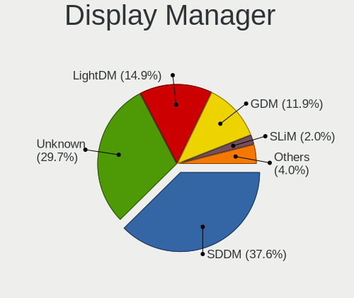
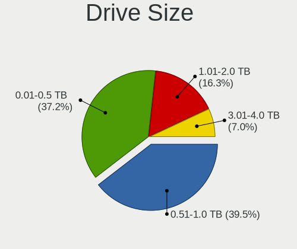
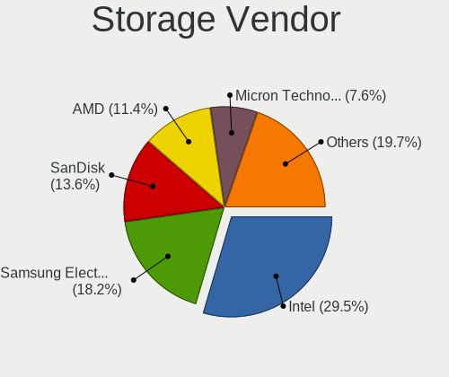
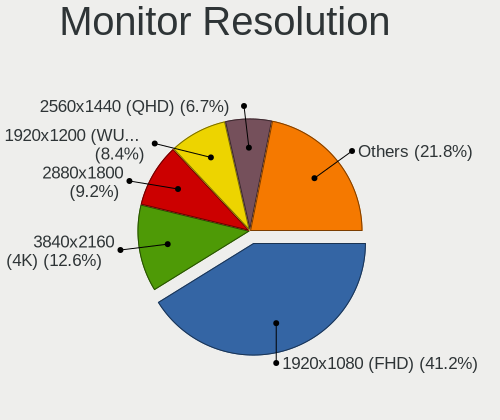
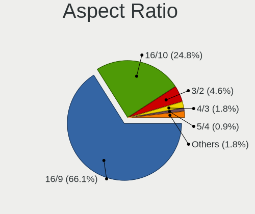

Gentoo 2.15 - Tested Hardware & Statistics (Notebooks)
------------------------------------------------------

A project to collect tested hardware configurations for Gentoo 2.15.

Anyone can contribute to this report by the [hw-probe](https://github.com/linuxhw/hw-probe) tool:

    sudo -E hw-probe -all -upload

Please contribute! Especially if your hardware is rare.

Contents
--------

* [ Test Cases ](#test-cases)

* [ System ](#system)
  - [ Kernel                   ](#kernel)
  - [ Kernel Family            ](#kernel-family)
  - [ Kernel Major Ver.        ](#kernel-major-ver)
  - [ Arch                     ](#arch)
  - [ DE                       ](#de)
  - [ Display Server           ](#display-server)
  - [ Display Manager          ](#display-manager)
  - [ OS Lang                  ](#os-lang)
  - [ Boot Mode                ](#boot-mode)
  - [ Filesystem               ](#filesystem)
  - [ Part. scheme             ](#part-scheme)
  - [ Dual Boot with Linux/BSD ](#dual-boot-with-linuxbsd)
  - [ Dual Boot (Win)          ](#dual-boot-win)

* [ Board ](#board)
  - [ Vendor                   ](#vendor)
  - [ Model                    ](#model)
  - [ Model Family             ](#model-family)
  - [ MFG Year                 ](#mfg-year)
  - [ Form Factor              ](#form-factor)
  - [ Secure Boot              ](#secure-boot)
  - [ Coreboot                 ](#coreboot)
  - [ RAM Size                 ](#ram-size)
  - [ RAM Used                 ](#ram-used)
  - [ Total Drives             ](#total-drives)
  - [ Has CD-ROM               ](#has-cd-rom)
  - [ Has Ethernet             ](#has-ethernet)
  - [ Has WiFi                 ](#has-wifi)
  - [ Has Bluetooth            ](#has-bluetooth)

* [ Location ](#location)
  - [ Country                  ](#country)
  - [ City                     ](#city)

* [ Drives ](#drives)
  - [ Drive Vendor             ](#drive-vendor)
  - [ Drive Model              ](#drive-model)
  - [ HDD Vendor               ](#hdd-vendor)
  - [ SSD Vendor               ](#ssd-vendor)
  - [ Drive Kind               ](#drive-kind)
  - [ Drive Connector          ](#drive-connector)
  - [ Drive Size               ](#drive-size)
  - [ Space Total              ](#space-total)
  - [ Space Used               ](#space-used)
  - [ Malfunc. Drives          ](#malfunc-drives)
  - [ Malfunc. Drive Vendor    ](#malfunc-drive-vendor)
  - [ Malfunc. HDD Vendor      ](#malfunc-hdd-vendor)
  - [ Malfunc. Drive Kind      ](#malfunc-drive-kind)
  - [ Failed Drives            ](#failed-drives)
  - [ Failed Drive Vendor      ](#failed-drive-vendor)
  - [ Drive Status             ](#drive-status)

* [ Storage controller ](#storage-controller)
  - [ Storage Vendor           ](#storage-vendor)
  - [ Storage Model            ](#storage-model)
  - [ Storage Kind             ](#storage-kind)

* [ Processor ](#processor)
  - [ CPU Vendor               ](#cpu-vendor)
  - [ CPU Model                ](#cpu-model)
  - [ CPU Model Family         ](#cpu-model-family)
  - [ CPU Cores                ](#cpu-cores)
  - [ CPU Sockets              ](#cpu-sockets)
  - [ CPU Threads              ](#cpu-threads)
  - [ CPU Op-Modes             ](#cpu-op-modes)
  - [ CPU Microcode            ](#cpu-microcode)
  - [ CPU Microarch            ](#cpu-microarch)

* [ Graphics ](#graphics)
  - [ GPU Vendor               ](#gpu-vendor)
  - [ GPU Model                ](#gpu-model)
  - [ GPU Combo                ](#gpu-combo)
  - [ GPU Driver               ](#gpu-driver)
  - [ GPU Memory               ](#gpu-memory)

* [ Monitor ](#monitor)
  - [ Monitor Vendor           ](#monitor-vendor)
  - [ Monitor Model            ](#monitor-model)
  - [ Monitor Resolution       ](#monitor-resolution)
  - [ Monitor Diagonal         ](#monitor-diagonal)
  - [ Monitor Width            ](#monitor-width)
  - [ Aspect Ratio             ](#aspect-ratio)
  - [ Monitor Area             ](#monitor-area)
  - [ Pixel Density            ](#pixel-density)
  - [ Multiple Monitors        ](#multiple-monitors)

* [ Network ](#network)
  - [ Net Controller Vendor    ](#net-controller-vendor)
  - [ Net Controller Model     ](#net-controller-model)
  - [ Wireless Vendor          ](#wireless-vendor)
  - [ Wireless Model           ](#wireless-model)
  - [ Ethernet Vendor          ](#ethernet-vendor)
  - [ Ethernet Model           ](#ethernet-model)
  - [ Net Controller Kind      ](#net-controller-kind)
  - [ Used Controller          ](#used-controller)
  - [ NICs                     ](#nics)
  - [ IPv6                     ](#ipv6)

* [ Bluetooth ](#bluetooth)
  - [ Bluetooth Vendor         ](#bluetooth-vendor)
  - [ Bluetooth Model          ](#bluetooth-model)

* [ Sound ](#sound)
  - [ Sound Vendor             ](#sound-vendor)
  - [ Sound Model              ](#sound-model)

* [ Memory ](#memory)
  - [ Memory Vendor            ](#memory-vendor)
  - [ Memory Model             ](#memory-model)
  - [ Memory Kind              ](#memory-kind)
  - [ Memory Form Factor       ](#memory-form-factor)
  - [ Memory Size              ](#memory-size)
  - [ Memory Speed             ](#memory-speed)

* [ Printers & scanners ](#printers--scanners)
  - [ Printer Vendor           ](#printer-vendor)
  - [ Printer Model            ](#printer-model)
  - [ Scanner Vendor           ](#scanner-vendor)
  - [ Scanner Model            ](#scanner-model)

* [ Camera ](#camera)
  - [ Camera Vendor            ](#camera-vendor)
  - [ Camera Model             ](#camera-model)

* [ Security ](#security)
  - [ Fingerprint Vendor       ](#fingerprint-vendor)
  - [ Fingerprint Model        ](#fingerprint-model)
  - [ Chipcard Vendor          ](#chipcard-vendor)
  - [ Chipcard Model           ](#chipcard-model)

* [ Unsupported ](#unsupported)
  - [ Unsupported Devices      ](#unsupported-devices)
  - [ Unsupported Device Types ](#unsupported-device-types)

Test Cases
----------

Total: 148

| Vendor        | Model                       | Probe                                                      | Date         |
|---------------|-----------------------------|------------------------------------------------------------|--------------|
| HP            | EliteBook 655 15.6 inch ... | [0c453f6750](https://linux-hardware.org/?probe=0c453f6750) | Dec 17, 2024 |
| Unknown       | Unknown                     | [8b21315b42](https://linux-hardware.org/?probe=8b21315b42) | Nov 22, 2024 |
| Lenovo        | IdeaPad 5 15ABA7 82SG       | [5a37374d2d](https://linux-hardware.org/?probe=5a37374d2d) | Nov 21, 2024 |
| Lenovo        | Legion Y540-15IRH-PG0 81... | [69bd15be2f](https://linux-hardware.org/?probe=69bd15be2f) | Nov 21, 2024 |
| Lenovo        | Legion Y540-15IRH-PG0 81... | [4a27f42d36](https://linux-hardware.org/?probe=4a27f42d36) | Nov 21, 2024 |
| Unknown       | Unknown                     | [cd1bdc1144](https://linux-hardware.org/?probe=cd1bdc1144) | Nov 10, 2024 |
| HUAWEI        | BoDE-WXX9                   | [f840e8b969](https://linux-hardware.org/?probe=f840e8b969) | Nov 06, 2024 |
| Lenovo        | ThinkPad E15 Gen 2 20T80... | [09d355ac60](https://linux-hardware.org/?probe=09d355ac60) | Nov 02, 2024 |
| Dell          | XPS 15 9510                 | [c7a7356d98](https://linux-hardware.org/?probe=c7a7356d98) | Oct 22, 2024 |
| Razer         | Blade 16 - RZ09-0483        | [87977c5666](https://linux-hardware.org/?probe=87977c5666) | Oct 21, 2024 |
| Lenovo        | ThinkPad E15 Gen 2 20T80... | [c36ba63903](https://linux-hardware.org/?probe=c36ba63903) | Oct 19, 2024 |
| ASUSTek       | Unknown                     | [054ba0e2b8](https://linux-hardware.org/?probe=054ba0e2b8) | Oct 19, 2024 |
| Lenovo        | ThinkPad T490s 20NX006PP... | [76d91a459e](https://linux-hardware.org/?probe=76d91a459e) | Oct 18, 2024 |
| Dell          | Inspiron 5755               | [c6b4c797c3](https://linux-hardware.org/?probe=c6b4c797c3) | Oct 18, 2024 |
| HP            | ProBook 450 G5              | [9d602e9f72](https://linux-hardware.org/?probe=9d602e9f72) | Oct 16, 2024 |
| HP            | EliteBook 845 14 inch G9... | [8d0969ee93](https://linux-hardware.org/?probe=8d0969ee93) | Oct 15, 2024 |
| HP            | EliteBook 830 G6            | [61ea3349af](https://linux-hardware.org/?probe=61ea3349af) | Oct 13, 2024 |
| Fujitsu       | CELSIUS H760                | [8ea6d75c59](https://linux-hardware.org/?probe=8ea6d75c59) | Oct 12, 2024 |
| Fujitsu       | CELSIUS H760                | [9a9b415ad2](https://linux-hardware.org/?probe=9a9b415ad2) | Oct 08, 2024 |
| HP            | EliteBook 655 15.6 inch ... | [0f7fd9789d](https://linux-hardware.org/?probe=0f7fd9789d) | Oct 06, 2024 |
| Lenovo        | ThinkPad T14 Gen 2i 20W0... | [49227f1fdf](https://linux-hardware.org/?probe=49227f1fdf) | Oct 05, 2024 |
| Lenovo        | IdeaPad S145-15API 81UT     | [76c9e1e6ac](https://linux-hardware.org/?probe=76c9e1e6ac) | Oct 04, 2024 |
| Lenovo        | ThinkPad T14s Gen 1 20T1... | [12beb6c4e0](https://linux-hardware.org/?probe=12beb6c4e0) | Oct 03, 2024 |
| ASUSTek       | Zenbook UX3402ZA_UX3402Z... | [158af06788](https://linux-hardware.org/?probe=158af06788) | Oct 03, 2024 |
| Acer          | Aspire E5-553G              | [d98fc4f350](https://linux-hardware.org/?probe=d98fc4f350) | Oct 03, 2024 |
| Framework     | Laptop 13 (AMD Ryzen 704... | [03b3d6efd2](https://linux-hardware.org/?probe=03b3d6efd2) | Oct 01, 2024 |
| Framework     | Laptop 13 (AMD Ryzen 704... | [4d7ba010e0](https://linux-hardware.org/?probe=4d7ba010e0) | Oct 01, 2024 |
| Lenovo        | ThinkBook 14 G5+ APO 21J... | [6fa64ce393](https://linux-hardware.org/?probe=6fa64ce393) | Sep 28, 2024 |
| Acer          | Nitro AN515-46              | [2b5852e0fe](https://linux-hardware.org/?probe=2b5852e0fe) | Sep 25, 2024 |
| Lenovo        | ThinkBook 15 G4 ABA 21DL    | [4e3912d4f2](https://linux-hardware.org/?probe=4e3912d4f2) | Sep 22, 2024 |
| Framework     | Laptop 13 (AMD Ryzen 704... | [38ed006558](https://linux-hardware.org/?probe=38ed006558) | Sep 20, 2024 |
| ASUSTek       | ASUS TUF Gaming A16 FA61... | [541d66dc10](https://linux-hardware.org/?probe=541d66dc10) | Sep 19, 2024 |
| Framework     | Laptop 13 (AMD Ryzen 704... | [fa9e5beb1c](https://linux-hardware.org/?probe=fa9e5beb1c) | Sep 16, 2024 |
| HP            | Presario CQ56               | [ed024f67d9](https://linux-hardware.org/?probe=ed024f67d9) | Sep 13, 2024 |
| Apple         | MacBookPro11,4              | [60b8339c3a](https://linux-hardware.org/?probe=60b8339c3a) | Sep 12, 2024 |
| HP            | Presario CQ56               | [e9ffe0cf3a](https://linux-hardware.org/?probe=e9ffe0cf3a) | Sep 11, 2024 |
| Lenovo        | IdeaPad Slim 5 14ABR8 82... | [9333a17b1f](https://linux-hardware.org/?probe=9333a17b1f) | Sep 11, 2024 |
| Lenovo        | IdeaPad Slim 5 14ABR8 82... | [630b6c1179](https://linux-hardware.org/?probe=630b6c1179) | Sep 11, 2024 |
| Lenovo        | ThinkPad X1 Carbon Gen 1... | [4c190d8f8d](https://linux-hardware.org/?probe=4c190d8f8d) | Sep 10, 2024 |
| ASUSTek       | N551JW                      | [350a0f8841](https://linux-hardware.org/?probe=350a0f8841) | Sep 10, 2024 |
| Dell          | Latitude 5540               | [d5b6727481](https://linux-hardware.org/?probe=d5b6727481) | Sep 09, 2024 |
| Dell          | Latitude 5540               | [c0efdf9b57](https://linux-hardware.org/?probe=c0efdf9b57) | Sep 07, 2024 |
| Lenovo        | ThinkPad P16 Gen 1 21D60... | [7f8463e7df](https://linux-hardware.org/?probe=7f8463e7df) | Sep 07, 2024 |
| Acer          | Aspire ES1-572              | [78f470444b](https://linux-hardware.org/?probe=78f470444b) | Sep 06, 2024 |
| Lenovo        | IdeaPad S145-15API 81UT     | [bb53f353b7](https://linux-hardware.org/?probe=bb53f353b7) | Sep 06, 2024 |
| HP            | Pavilion Laptop 15-cw1xx... | [d8463507ba](https://linux-hardware.org/?probe=d8463507ba) | Sep 06, 2024 |
| Lenovo        | ThinkPad P16 Gen 1 21D60... | [f49e870a06](https://linux-hardware.org/?probe=f49e870a06) | Sep 06, 2024 |
| ASUSTek       | ZenBook UX425UA_UM425UA     | [01532850b4](https://linux-hardware.org/?probe=01532850b4) | Sep 04, 2024 |
| ASUSTek       | ASUS TUF Gaming A16 FA61... | [34778061ba](https://linux-hardware.org/?probe=34778061ba) | Sep 02, 2024 |
| Dell          | Precision 7540              | [c2661e531c](https://linux-hardware.org/?probe=c2661e531c) | Sep 01, 2024 |
| ASUSTek       | ASUS Zenbook S 16 UM5606... | [c62daa5e9a](https://linux-hardware.org/?probe=c62daa5e9a) | Aug 28, 2024 |
| Lenovo        | ThinkPad E15 Gen 4 21EDC... | [5fd9e885bc](https://linux-hardware.org/?probe=5fd9e885bc) | Aug 24, 2024 |
| Lenovo        | ThinkPad E15 Gen 4 21EDC... | [9fff9d0f5e](https://linux-hardware.org/?probe=9fff9d0f5e) | Aug 24, 2024 |
| Lenovo        | ThinkPad T480s 20L8S2SX0... | [c4fbbfec90](https://linux-hardware.org/?probe=c4fbbfec90) | Aug 23, 2024 |
| Lenovo        | Legion 5 15ARH05 82B5       | [dc8af29759](https://linux-hardware.org/?probe=dc8af29759) | Aug 23, 2024 |
| Lenovo        | ThinkBook 15 G2 ITL 20VE    | [807f37ac9f](https://linux-hardware.org/?probe=807f37ac9f) | Aug 20, 2024 |
| Lenovo        | ThinkBook 15 G2 ITL 20VE    | [9b0a5d476c](https://linux-hardware.org/?probe=9b0a5d476c) | Aug 19, 2024 |
| Lenovo        | ThinkBook 16 G6 IRL 21KH    | [30973be0c7](https://linux-hardware.org/?probe=30973be0c7) | Aug 19, 2024 |
| Lenovo        | ThinkBook 16 G6 IRL 21KH    | [6d5345fe36](https://linux-hardware.org/?probe=6d5345fe36) | Aug 19, 2024 |
| MECHREVO      | Yilong15Pro Series GM5HG... | [73293d35ce](https://linux-hardware.org/?probe=73293d35ce) | Aug 13, 2024 |
| Hungaro Fl... | Navon Loop 360              | [be1fe0bb77](https://linux-hardware.org/?probe=be1fe0bb77) | Aug 13, 2024 |
| ASUSTek       | ASUS TUF Gaming A16 FA61... | [29f0a04e06](https://linux-hardware.org/?probe=29f0a04e06) | Aug 08, 2024 |
| Lenovo        | Legion 5 15ITH6H 82JH       | [ca1e6f7786](https://linux-hardware.org/?probe=ca1e6f7786) | Aug 04, 2024 |
| Lenovo        | ThinkBook 14s-IWL 20RM      | [d3a556fd2e](https://linux-hardware.org/?probe=d3a556fd2e) | Aug 03, 2024 |
| Lenovo        | ThinkPad P52 20M9001NMX     | [a06c67958c](https://linux-hardware.org/?probe=a06c67958c) | Aug 01, 2024 |
| Lenovo        | ThinkPad T61p 8889AU5       | [e06a1aad9c](https://linux-hardware.org/?probe=e06a1aad9c) | Aug 01, 2024 |
| IBM           | ThinkPad T43 26686ZU        | [df281b21fd](https://linux-hardware.org/?probe=df281b21fd) | Aug 01, 2024 |
| Lenovo        | IdeaPad S145-15AST 81N3     | [c685cf8914](https://linux-hardware.org/?probe=c685cf8914) | Jul 31, 2024 |
| System76      | Gazelle                     | [a28ba867b4](https://linux-hardware.org/?probe=a28ba867b4) | Jul 30, 2024 |
| Lenovo        | ThinkBook 14 G5+ APO 21J... | [a37ede4515](https://linux-hardware.org/?probe=a37ede4515) | Jul 28, 2024 |
| ASUSTek       | ASUS TUF Gaming A17 FA70... | [920a38bb99](https://linux-hardware.org/?probe=920a38bb99) | Jul 27, 2024 |
| HP            | EliteBook 655 15.6 inch ... | [cd443f27fb](https://linux-hardware.org/?probe=cd443f27fb) | Jul 20, 2024 |
| Fujitsu       | CELSIUS H760                | [0e1e7b37d2](https://linux-hardware.org/?probe=0e1e7b37d2) | Jul 20, 2024 |
| Lenovo        | IdeaPad 3 14ALC6 82KT       | [43296730af](https://linux-hardware.org/?probe=43296730af) | Jul 18, 2024 |
| HP            | Victus by Gaming Laptop ... | [526990eabc](https://linux-hardware.org/?probe=526990eabc) | Jul 17, 2024 |
| Lenovo        | ThinkPad E14 Gen 3 20Y70... | [c217549233](https://linux-hardware.org/?probe=c217549233) | Jul 17, 2024 |
| MECHREVO      | WUJIE14 PRO                 | [305c283665](https://linux-hardware.org/?probe=305c283665) | Jul 13, 2024 |
| HP            | ProBook 450 G5              | [8f856ab7a5](https://linux-hardware.org/?probe=8f856ab7a5) | Jul 11, 2024 |
| HP            | ProBook 450 G5              | [daaf621587](https://linux-hardware.org/?probe=daaf621587) | Jul 11, 2024 |
| Lenovo        | ThinkPad P52 20M9001FSP     | [efb953cae4](https://linux-hardware.org/?probe=efb953cae4) | Jul 10, 2024 |
| ASUSTek       | ROG Zephyrus G14 GA401II... | [70831ae4a2](https://linux-hardware.org/?probe=70831ae4a2) | Jul 07, 2024 |
| Lenovo        | ThinkPad P52 20M9001FSP     | [2442c78c2c](https://linux-hardware.org/?probe=2442c78c2c) | Jul 07, 2024 |
| HP            | ProBook 450 G5              | [4b7d710ea7](https://linux-hardware.org/?probe=4b7d710ea7) | Jul 06, 2024 |
| Lenovo        | ThinkPad P52 20M9001FSP     | [298263f7c2](https://linux-hardware.org/?probe=298263f7c2) | Jul 06, 2024 |
| Lenovo        | ThinkPad P52 20M9001FSP     | [e137922184](https://linux-hardware.org/?probe=e137922184) | Jul 06, 2024 |
| Lenovo        | ThinkPad T480 20L5CTO1WW    | [f3f50ce879](https://linux-hardware.org/?probe=f3f50ce879) | Jul 05, 2024 |
| Lenovo        | ThinkPad T480 20L5CTO1WW    | [e474ecc123](https://linux-hardware.org/?probe=e474ecc123) | Jul 03, 2024 |
| ASUSTek       | N552VW                      | [bc0cf9c1a7](https://linux-hardware.org/?probe=bc0cf9c1a7) | Jul 03, 2024 |
| Notebook      | NS5x_NS7xPU                 | [c2033b5625](https://linux-hardware.org/?probe=c2033b5625) | Jul 02, 2024 |
| Notebook      | NS5x_NS7xPU                 | [809371ad85](https://linux-hardware.org/?probe=809371ad85) | Jul 02, 2024 |
| ASUSTek       | ASUS TUF Gaming A15 FA50... | [c77d74a7d7](https://linux-hardware.org/?probe=c77d74a7d7) | Jul 01, 2024 |
| ASUSTek       | ROG Zephyrus G14 GA401II... | [8732c453e6](https://linux-hardware.org/?probe=8732c453e6) | Jun 30, 2024 |
| ASUSTek       | ASUS EXPERTBOOK B5402CVA... | [4c063dac58](https://linux-hardware.org/?probe=4c063dac58) | Jun 29, 2024 |
| Lenovo        | ThinkPad E15 Gen 2 20T80... | [213cb740d8](https://linux-hardware.org/?probe=213cb740d8) | Jun 27, 2024 |
| HP            | ProBook 450 G5              | [b1f36bec52](https://linux-hardware.org/?probe=b1f36bec52) | Jun 24, 2024 |
| ASUSTek       | Zenbook UM5302TA_UM5302T... | [17f4e262fd](https://linux-hardware.org/?probe=17f4e262fd) | Jun 21, 2024 |
| Framework     | Laptop 13 (AMD Ryzen 704... | [1af5d8fe00](https://linux-hardware.org/?probe=1af5d8fe00) | Jun 21, 2024 |
| Framework     | Laptop 13 (AMD Ryzen 704... | [e3ff5d9150](https://linux-hardware.org/?probe=e3ff5d9150) | Jun 20, 2024 |
| Dell          | G5 5505                     | [cbb67be71d](https://linux-hardware.org/?probe=cbb67be71d) | Jun 20, 2024 |
| Dell          | G5 5505                     | [abe05faed2](https://linux-hardware.org/?probe=abe05faed2) | Jun 20, 2024 |
| Framework     | Laptop (13th Gen Intel C... | [fc951c3404](https://linux-hardware.org/?probe=fc951c3404) | Jun 19, 2024 |
| Lenovo        | ThinkPad T14 Gen 5 21MLC... | [49d72a5f4b](https://linux-hardware.org/?probe=49d72a5f4b) | Jun 16, 2024 |
| HP            | Pavilion g6                 | [db63ae9673](https://linux-hardware.org/?probe=db63ae9673) | Jun 15, 2024 |
| METAPHYUNI    | MetawillBook03              | [c73de233b1](https://linux-hardware.org/?probe=c73de233b1) | Jun 15, 2024 |
| Dell          | Inspiron 5575               | [0f8633e1d7](https://linux-hardware.org/?probe=0f8633e1d7) | Jun 14, 2024 |
| ASUSTek       | K73SV                       | [fe3d43721f](https://linux-hardware.org/?probe=fe3d43721f) | Jun 14, 2024 |
| HP            | Presario CQ56               | [636aa7c066](https://linux-hardware.org/?probe=636aa7c066) | Jun 12, 2024 |
| Lenovo        | ThinkPad T420 4180MY4       | [aa3d4ecd94](https://linux-hardware.org/?probe=aa3d4ecd94) | Jun 12, 2024 |
| Metabox       | Flo L140MU                  | [ad826eb0d8](https://linux-hardware.org/?probe=ad826eb0d8) | Jun 12, 2024 |
| Lenovo        | ThinkPad T14 Gen 5 21MLC... | [92591f5665](https://linux-hardware.org/?probe=92591f5665) | Jun 12, 2024 |
| System76      | Darter Pro                  | [a136e2b202](https://linux-hardware.org/?probe=a136e2b202) | Jun 11, 2024 |
| Dell          | Inspiron 5575               | [aa0b04cbac](https://linux-hardware.org/?probe=aa0b04cbac) | Jun 10, 2024 |
| Acer          | Swift SF314-41              | [509b9a1c19](https://linux-hardware.org/?probe=509b9a1c19) | Jun 10, 2024 |
| Lenovo        | ThinkPad Z13 Gen 2 21JVC... | [9cc2682605](https://linux-hardware.org/?probe=9cc2682605) | Jun 07, 2024 |
| Samsung       | 960XFG                      | [f4a1e3bf2c](https://linux-hardware.org/?probe=f4a1e3bf2c) | Jun 05, 2024 |
| ASUSTek       | ROG Zephyrus G14 GA401II... | [4e4564be77](https://linux-hardware.org/?probe=4e4564be77) | Jun 03, 2024 |
| Lenovo        | LOQ 15IRH8 82XV             | [e871284456](https://linux-hardware.org/?probe=e871284456) | Jun 02, 2024 |
| Lenovo        | ThinkPad L14 Gen 1 20U50... | [4edc936b2e](https://linux-hardware.org/?probe=4edc936b2e) | May 30, 2024 |
| Lenovo        | ThinkPad X1 Carbon Gen 1... | [67491fabd0](https://linux-hardware.org/?probe=67491fabd0) | May 29, 2024 |
| Acer          | TravelMate P214-52          | [0aa25ddb6e](https://linux-hardware.org/?probe=0aa25ddb6e) | May 27, 2024 |
| Dell          | XPS 15 9530                 | [5a3fa6b0eb](https://linux-hardware.org/?probe=5a3fa6b0eb) | May 23, 2024 |
| Dell          | XPS 15 9530                 | [ada9a3d65b](https://linux-hardware.org/?probe=ada9a3d65b) | May 23, 2024 |
| IT Channel... | NH50_70RH                   | [fa9c861ab1](https://linux-hardware.org/?probe=fa9c861ab1) | May 23, 2024 |
| Lenovo        | ThinkPad T14 Gen 3 21CGS... | [0d53b0e564](https://linux-hardware.org/?probe=0d53b0e564) | May 20, 2024 |
| Lenovo        | ThinkPad T14 Gen 3 21CGS... | [4a56543c28](https://linux-hardware.org/?probe=4a56543c28) | May 20, 2024 |
| Acer          | Aspire E5-471G              | [6ad4e168d9](https://linux-hardware.org/?probe=6ad4e168d9) | May 20, 2024 |
| Lenovo        | ThinkBook 14s-IWL 20RM      | [46287cb68e](https://linux-hardware.org/?probe=46287cb68e) | May 20, 2024 |
| HP            | Pavilion Laptop 15-cw1xx... | [a2aeeeee5c](https://linux-hardware.org/?probe=a2aeeeee5c) | May 16, 2024 |
| HP            | Pavilion Laptop 15-cw1xx... | [2498e9e756](https://linux-hardware.org/?probe=2498e9e756) | May 16, 2024 |
| HP            | EliteBook Revolve 810 G3    | [8ccb97aff0](https://linux-hardware.org/?probe=8ccb97aff0) | May 14, 2024 |
| HP            | EliteBook Revolve 810 G3    | [2f521108d8](https://linux-hardware.org/?probe=2f521108d8) | May 14, 2024 |
| Lenovo        | IdeaPad Y700 Touch-15ISK... | [eb4ddf0adb](https://linux-hardware.org/?probe=eb4ddf0adb) | May 13, 2024 |
| ASUSTek       | ASUS TUF Gaming A17 FA70... | [9663e453db](https://linux-hardware.org/?probe=9663e453db) | May 12, 2024 |
| Lenovo        | ThinkPad E15 Gen 4 21EDC... | [d82561567a](https://linux-hardware.org/?probe=d82561567a) | May 12, 2024 |
| ASUSTek       | ASUS TUF Gaming A15 FA50... | [e87cf0f4ae](https://linux-hardware.org/?probe=e87cf0f4ae) | May 11, 2024 |
| Lenovo        | ThinkPad E15 Gen 4 21EDC... | [fcf41b1676](https://linux-hardware.org/?probe=fcf41b1676) | May 11, 2024 |
| HP            | ProBook 450 G5              | [4536e47198](https://linux-hardware.org/?probe=4536e47198) | May 07, 2024 |
| Dell          | Precision 7720              | [5423da6e5c](https://linux-hardware.org/?probe=5423da6e5c) | May 07, 2024 |
| METAPHYUNI    | MetawillBook03              | [d5af716feb](https://linux-hardware.org/?probe=d5af716feb) | May 04, 2024 |
| Lenovo        | ThinkPad E15 Gen 2 20T80... | [67fbb6a446](https://linux-hardware.org/?probe=67fbb6a446) | May 03, 2024 |
| Maibenben     | MaiBook M                   | [48837878a2](https://linux-hardware.org/?probe=48837878a2) | Apr 29, 2024 |
| Lenovo        | G50-30 80G0                 | [6b8474e96b](https://linux-hardware.org/?probe=6b8474e96b) | Apr 21, 2024 |
| Lenovo        | ThinkPad P16 Gen 2 21FA0... | [445b981f65](https://linux-hardware.org/?probe=445b981f65) | Apr 18, 2024 |
| Framework     | Laptop 13 (AMD Ryzen 704... | [e3d7887dbb](https://linux-hardware.org/?probe=e3d7887dbb) | Apr 16, 2024 |
| Dell          | G3 3590                     | [6b282a982e](https://linux-hardware.org/?probe=6b282a982e) | Apr 09, 2024 |
| Dell          | Precision 5530              | [84d24da656](https://linux-hardware.org/?probe=84d24da656) | Apr 08, 2024 |
| HP            | ZBook Studio 16 inch G9 ... | [df89cb1a75](https://linux-hardware.org/?probe=df89cb1a75) | Mar 31, 2024 |
| HP            | Pavilion Notebook           | [b2e7f143bc](https://linux-hardware.org/?probe=b2e7f143bc) | Mar 13, 2024 |

System
------

Kernel
------

Version of the Linux kernel

| Version                     | Notebooks | Percent |
|-----------------------------|-----------|---------|
| 6.6.30-gentoo               | 8         | 7.02%   |
| 6.6.30-gentoo-dist          | 6         | 5.26%   |
| 6.6.52-gentoo-x86_64        | 5         | 4.39%   |
| 6.6.52-gentoo               | 4         | 3.51%   |
| 6.6.47-gentoo-dist          | 4         | 3.51%   |
| 6.6.35-gentoo-dist          | 4         | 3.51%   |
| 6.6.30-gentoo-x86_64        | 4         | 3.51%   |
| 6.6.38-gentoo               | 3         | 2.63%   |
| 6.9.5-gentoo                | 2         | 1.75%   |
| 6.9.3-gentoo                | 2         | 1.75%   |
| 6.8.9-gentoo                | 2         | 1.75%   |
| 6.8.8-gentoo-dist           | 2         | 1.75%   |
| 6.8.4-gentoo                | 2         | 1.75%   |
| 6.6.38-gentoo-x86_64        | 2         | 1.75%   |
| 6.6.21-gentoo-x86_64        | 2         | 1.75%   |
| 6.6.21-gentoo               | 2         | 1.75%   |
| 6.10.9-gentoo-dist          | 2         | 1.75%   |
| 6.9.9-gentoo-x86_64         | 1         | 0.88%   |
| 6.9.9-gentoo-dist           | 1         | 0.88%   |
| 6.9.8-gentoo                | 1         | 0.88%   |
| 6.9.7-gentoo-x86_64         | 1         | 0.88%   |
| 6.9.7-gentoo                | 1         | 0.88%   |
| 6.9.6-gentoo-akos           | 1         | 0.88%   |
| 6.9.4-gentoo-dist           | 1         | 0.88%   |
| 6.9.3-gentoo-dist           | 1         | 0.88%   |
| 6.9.12-tkg-pds              | 1         | 0.88%   |
| 6.9.11-tkg-bmq              | 1         | 0.88%   |
| 6.9.10-gentoo-dist          | 1         | 0.88%   |
| 6.9.1-gentoo-thinkbook      | 1         | 0.88%   |
| 6.8.9-gentoo-x86_64         | 1         | 0.88%   |
| 6.8.9-gentoo-perfectime94   | 1         | 0.88%   |
| 6.8.7-gentoo                | 1         | 0.88%   |
| 6.8.4-cachyos-x86_64        | 1         | 0.88%   |
| 6.8.2-gentoo-x86_64         | 1         | 0.88%   |
| 6.8.0-pf1-x86_64            | 1         | 0.88%   |
| 6.7.2-gentoo-r1-gentoo-dist | 1         | 0.88%   |
| 6.7.0-pf5M2A                | 1         | 0.88%   |
| 6.6.8-arch1-1               | 1         | 0.88%   |
| 6.6.58-gentoo-r1            | 1         | 0.88%   |
| 6.6.52-gentoo-lhn           | 1         | 0.88%   |

Kernel Family
-------------

Linux kernel without a distro release

| Version | Notebooks | Percent |
|---------|-----------|---------|
| 6.6.30  | 22        | 19.47%  |
| 6.6.52  | 11        | 9.73%   |
| 6.6.47  | 7         | 6.19%   |
| 6.6.38  | 7         | 6.19%   |
| 6.6.21  | 6         | 5.31%   |
| 6.8.9   | 4         | 3.54%   |
| 6.6.35  | 4         | 3.54%   |
| 6.9.3   | 3         | 2.65%   |
| 6.8.4   | 3         | 2.65%   |
| 6.10.9  | 3         | 2.65%   |
| 6.9.9   | 2         | 1.77%   |
| 6.9.7   | 2         | 1.77%   |
| 6.9.5   | 2         | 1.77%   |
| 6.8.8   | 2         | 1.77%   |
| 6.6.51  | 2         | 1.77%   |
| 6.6.41  | 2         | 1.77%   |
| 6.11.0  | 2         | 1.77%   |
| 6.9.8   | 1         | 0.88%   |
| 6.9.6   | 1         | 0.88%   |
| 6.9.4   | 1         | 0.88%   |
| 6.9.12  | 1         | 0.88%   |
| 6.9.11  | 1         | 0.88%   |
| 6.9.10  | 1         | 0.88%   |
| 6.9.1   | 1         | 0.88%   |
| 6.8.7   | 1         | 0.88%   |
| 6.8.2   | 1         | 0.88%   |
| 6.8.0   | 1         | 0.88%   |
| 6.7.2   | 1         | 0.88%   |
| 6.7.0   | 1         | 0.88%   |
| 6.6.8   | 1         | 0.88%   |
| 6.6.58  | 1         | 0.88%   |
| 6.6.32  | 1         | 0.88%   |
| 6.6.3   | 1         | 0.88%   |
| 6.6.16  | 1         | 0.88%   |
| 6.2.0   | 1         | 0.88%   |
| 6.11.6  | 1         | 0.88%   |
| 6.11.4  | 1         | 0.88%   |
| 6.11.3  | 1         | 0.88%   |
| 6.11.2  | 1         | 0.88%   |
| 6.11.1  | 1         | 0.88%   |

Kernel Major Ver.
-----------------

Linux kernel major version

| Version | Notebooks | Percent |
|---------|-----------|---------|
| 6.6     | 58        | 55.24%  |
| 6.9     | 16        | 15.24%  |
| 6.8     | 12        | 11.43%  |
| 6.11    | 7         | 6.67%   |
| 6.10    | 7         | 6.67%   |
| 6.7     | 2         | 1.9%    |
| 6.2     | 1         | 0.95%   |
| 6.1     | 1         | 0.95%   |
| 5.15    | 1         | 0.95%   |

Arch
----

OS architecture (x86_64, i586, etc.)

| Name   | Notebooks | Percent |
|--------|-----------|---------|
| x86_64 | 98        | 98.99%  |
| i686   | 1         | 1.01%   |

DE
--

Desktop Environment

| Name       | Notebooks | Percent |
|------------|-----------|---------|
| Unknown    | 26        | 25.24%  |
| GNOME      | 20        | 19.42%  |
| KDE5       | 18        | 17.48%  |
| XFCE       | 7         | 6.8%    |
| KDE6       | 7         | 6.8%    |
| LXQt       | 6         | 5.83%   |
| Hyprland   | 3         | 2.91%   |
| X-Cinnamon | 2         | 1.94%   |
| sway       | 2         | 1.94%   |
| MATE       | 2         | 1.94%   |
| Xsession   | 1         | 0.97%   |
| niri       | 1         | 0.97%   |
| LeftWM     | 1         | 0.97%   |
| ICEWM      | 1         | 0.97%   |
| i3         | 1         | 0.97%   |
| DWM        | 1         | 0.97%   |
| dwl        | 1         | 0.97%   |
| COSMIC     | 1         | 0.97%   |
| Cinnamon   | 1         | 0.97%   |
| Budgie     | 1         | 0.97%   |

Display Server
--------------

X11 or Wayland

| Name    | Notebooks | Percent |
|---------|-----------|---------|
| X11     | 39        | 38.24%  |
| Wayland | 39        | 38.24%  |
| Tty     | 13        | 12.75%  |
| Unknown | 11        | 10.78%  |

Display Manager
---------------

SDDM, LightDM, etc.

| Name    | Notebooks | Percent |
|---------|-----------|---------|
| SDDM    | 38        | 37.62%  |
| Unknown | 30        | 29.7%   |
| LightDM | 15        | 14.85%  |
| GDM     | 12        | 11.88%  |
| SLiM    | 2         | 1.98%   |
| GREETD  | 2         | 1.98%   |
| XDM     | 1         | 0.99%   |
| Ly      | 1         | 0.99%   |

OS Lang
-------

Language

| Lang           | Notebooks | Percent |
|----------------|-----------|---------|
| en_US          | 37        | 36.27%  |
| Unknown        | 14        | 13.73%  |
| C.UTF8         | 13        | 12.75%  |
| fr_FR          | 7         | 6.86%   |
| en_GB          | 4         | 3.92%   |
| C              | 4         | 3.92%   |
| ru_RU          | 3         | 2.94%   |
| it_IT          | 3         | 2.94%   |
| pl_PL          | 2         | 1.96%   |
| es_MX          | 2         | 1.96%   |
| de_DE          | 2         | 1.96%   |
| sv_SE          | 1         | 0.98%   |
| ja_JP          | 1         | 0.98%   |
| hu_HU          | 1         | 0.98%   |
| fi_FI          | 1         | 0.98%   |
| es_ES.UTF8     | 1         | 0.98%   |
| es_ES          | 1         | 0.98%   |
| en_US.iso88591 | 1         | 0.98%   |
| en_IN          | 1         | 0.98%   |
| en_AU          | 1         | 0.98%   |
| el_GR          | 1         | 0.98%   |
| cs_CZ          | 1         | 0.98%   |

Boot Mode
---------

EFI or BIOS

| Mode | Notebooks | Percent |
|------|-----------|---------|
| EFI  | 88        | 88%     |
| BIOS | 12        | 12%     |

Filesystem
----------

Type of filesystem

| Type     | Notebooks | Percent |
|----------|-----------|---------|
| Ext4     | 50        | 50.51%  |
| Btrfs    | 25        | 25.25%  |
| Xfs      | 16        | 16.16%  |
| Zfs      | 2         | 2.02%   |
| Jfs      | 2         | 2.02%   |
| F2fs     | 2         | 2.02%   |
| Overlay  | 1         | 1.01%   |
| Bcachefs | 1         | 1.01%   |

Part. scheme
------------

Scheme of partitioning

| Type    | Notebooks | Percent |
|---------|-----------|---------|
| GPT     | 93        | 93.94%  |
| MBR     | 5         | 5.05%   |
| Unknown | 1         | 1.01%   |

Dual Boot with Linux/BSD
------------------------

Hosting more than one Linux/BSD

| Dual boot | Notebooks | Percent |
|-----------|-----------|---------|
| No        | 75        | 75.76%  |
| Yes       | 24        | 24.24%  |

Dual Boot (Win)
---------------

Hosting Linux and Windows

| Dual boot | Notebooks | Percent |
|-----------|-----------|---------|
| No        | 72        | 72%     |
| Yes       | 28        | 28%     |

Board
-----

Vendor
------

Motherboard manufacturer

| Name                | Notebooks | Percent |
|---------------------|-----------|---------|
| Lenovo              | 36        | 36.36%  |
| ASUSTek Computer    | 14        | 14.14%  |
| Hewlett-Packard     | 12        | 12.12%  |
| Dell                | 10        | 10.1%   |
| Acer                | 6         | 6.06%   |
| Framework           | 5         | 5.05%   |
| System76            | 2         | 2.02%   |
| MECHREVO            | 2         | 2.02%   |
| Samsung Electronics | 1         | 1.01%   |
| Razer               | 1         | 1.01%   |
| Notebook            | 1         | 1.01%   |
| METAPHYUNI          | 1         | 1.01%   |
| Metabox             | 1         | 1.01%   |
| Maibenben           | 1         | 1.01%   |
| IT Channel Pty      | 1         | 1.01%   |
| IBM                 | 1         | 1.01%   |
| Hungaro Flotta Kft  | 1         | 1.01%   |
| Fujitsu             | 1         | 1.01%   |
| Apple               | 1         | 1.01%   |
| Unknown             | 1         | 1.01%   |

Model
-----

Motherboard model

| Name                                        | Notebooks | Percent |
|---------------------------------------------|-----------|---------|
| Framework Laptop 13 (AMD Ryzen 7040Series)  | 4         | 4.04%   |
| HP Presario CQ56                            | 2         | 2.02%   |
| Unknown                                     | 2         | 2.02%   |
| System76 Gazelle                            | 1         | 1.01%   |
| System76 Darter Pro                         | 1         | 1.01%   |
| Samsung 960XFG                              | 1         | 1.01%   |
| Razer Blade 16 - RZ09-0483                  | 1         | 1.01%   |
| Notebook NS5x_NS7xPU                        | 1         | 1.01%   |
| METAPHYUNI MetawillBook03                   | 1         | 1.01%   |
| Metabox Flo L140MU                          | 1         | 1.01%   |
| MECHREVO Yilong15Pro Series GM5HG7A         | 1         | 1.01%   |
| MECHREVO WUJIE14 PRO                        | 1         | 1.01%   |
| Maibenben MaiBook M                         | 1         | 1.01%   |
| Lenovo ThinkPad Z13 Gen 2 21JVCTO1WW        | 1         | 1.01%   |
| Lenovo ThinkPad X1 Carbon Gen 12 21KC003CHH | 1         | 1.01%   |
| Lenovo ThinkPad X1 Carbon Gen 11 21HNSC9J01 | 1         | 1.01%   |
| Lenovo ThinkPad T61p 8889AU5                | 1         | 1.01%   |
| Lenovo ThinkPad T490s 20NX006PPB            | 1         | 1.01%   |
| Lenovo ThinkPad T480s 20L8S2SX00            | 1         | 1.01%   |
| Lenovo ThinkPad T480 20L5CTO1WW             | 1         | 1.01%   |
| Lenovo ThinkPad T420 4180MY4                | 1         | 1.01%   |
| Lenovo ThinkPad T14s Gen 1 20T1S13U00       | 1         | 1.01%   |
| Lenovo ThinkPad T14 Gen 5 21MLCTO1WW        | 1         | 1.01%   |
| Lenovo ThinkPad T14 Gen 3 21CGS06G0L        | 1         | 1.01%   |
| Lenovo ThinkPad T14 Gen 2i 20W0CTO1WW       | 1         | 1.01%   |
| Lenovo ThinkPad P52 20M9001NMX              | 1         | 1.01%   |
| Lenovo ThinkPad P52 20M9001FSP              | 1         | 1.01%   |
| Lenovo ThinkPad P16 Gen 2 21FA000VPB        | 1         | 1.01%   |
| Lenovo ThinkPad P16 Gen 1 21D6004XUS        | 1         | 1.01%   |
| Lenovo ThinkPad L14 Gen 1 20U5001WTX        | 1         | 1.01%   |
| Lenovo ThinkPad E15 Gen 4 21EDCTO1WW        | 1         | 1.01%   |
| Lenovo ThinkPad E15 Gen 2 20T8000MPB        | 1         | 1.01%   |
| Lenovo ThinkPad E14 Gen 3 20Y70094US        | 1         | 1.01%   |
| Lenovo ThinkBook 16 G6 IRL 21KH             | 1         | 1.01%   |
| Lenovo ThinkBook 15 G4 ABA 21DL             | 1         | 1.01%   |
| Lenovo ThinkBook 15 G2 ITL 20VE             | 1         | 1.01%   |
| Lenovo ThinkBook 14s-IWL 20RM               | 1         | 1.01%   |
| Lenovo ThinkBook 14 G5+ APO 21J1            | 1         | 1.01%   |
| Lenovo LOQ 15IRH8 82XV                      | 1         | 1.01%   |
| Lenovo Legion Y540-15IRH-PG0 81SY           | 1         | 1.01%   |

Model Family
------------

Motherboard model prefix

| Name                      | Notebooks | Percent |
|---------------------------|-----------|---------|
| Lenovo ThinkPad           | 20        | 20.2%   |
| Lenovo IdeaPad            | 6         | 6.06%   |
| ASUS ASUS                 | 6         | 6.06%   |
| Lenovo ThinkBook          | 5         | 5.05%   |
| Framework Laptop          | 5         | 5.05%   |
| HP EliteBook              | 4         | 4.04%   |
| Lenovo Legion             | 3         | 3.03%   |
| HP Pavilion               | 3         | 3.03%   |
| Dell Precision            | 3         | 3.03%   |
| ASUS Zenbook              | 3         | 3.03%   |
| Acer Aspire               | 3         | 3.03%   |
| HP Presario               | 2         | 2.02%   |
| Dell XPS                  | 2         | 2.02%   |
| Dell Inspiron             | 2         | 2.02%   |
| Unknown                   | 2         | 2.02%   |
| System76 Gazelle          | 1         | 1.01%   |
| System76 Darter           | 1         | 1.01%   |
| Samsung 960XFG            | 1         | 1.01%   |
| Razer Blade               | 1         | 1.01%   |
| Notebook NS5x             | 1         | 1.01%   |
| METAPHYUNI MetawillBook03 | 1         | 1.01%   |
| Metabox Flo               | 1         | 1.01%   |
| MECHREVO Yilong15Pro      | 1         | 1.01%   |
| MECHREVO WUJIE14          | 1         | 1.01%   |
| Maibenben MaiBook         | 1         | 1.01%   |
| Lenovo LOQ                | 1         | 1.01%   |
| Lenovo G50-30             | 1         | 1.01%   |
| IT Channel Pty NH50       | 1         | 1.01%   |
| IBM ThinkPad              | 1         | 1.01%   |
| Hungaro Flotta Kft Navon  | 1         | 1.01%   |
| HP ZBook                  | 1         | 1.01%   |
| HP Victus                 | 1         | 1.01%   |
| HP ProBook                | 1         | 1.01%   |
| Fujitsu CELSIUS           | 1         | 1.01%   |
| Dell Latitude             | 1         | 1.01%   |
| Dell G5                   | 1         | 1.01%   |
| Dell G3                   | 1         | 1.01%   |
| ASUS ROG                  | 1         | 1.01%   |
| ASUS N552VW               | 1         | 1.01%   |
| ASUS N551JW               | 1         | 1.01%   |

MFG Year
--------

Motherboard manufacture year

| Year | Notebooks | Percent |
|------|-----------|---------|
| 2023 | 22        | 22.22%  |
| 2022 | 12        | 12.12%  |
| 2019 | 12        | 12.12%  |
| 2021 | 8         | 8.08%   |
| 2020 | 8         | 8.08%   |
| 2018 | 8         | 8.08%   |
| 2024 | 6         | 6.06%   |
| 2015 | 5         | 5.05%   |
| 2017 | 4         | 4.04%   |
| 2011 | 4         | 4.04%   |
| 2016 | 3         | 3.03%   |
| 2014 | 3         | 3.03%   |
| 2010 | 2         | 2.02%   |
| 2007 | 1         | 1.01%   |
| 2005 | 1         | 1.01%   |

Form Factor
-----------

Physical design of the computer

| Name     | Notebooks | Percent |
|----------|-----------|---------|
| Notebook | 99        | 100%    |

Secure Boot
-----------

Enabled or disabled

| State    | Notebooks | Percent |
|----------|-----------|---------|
| Disabled | 97        | 97%     |
| Enabled  | 3         | 3%      |

Coreboot
--------

Have coreboot on board

| Used | Notebooks | Percent |
|------|-----------|---------|
| No   | 98        | 98.99%  |
| Yes  | 1         | 1.01%   |

RAM Size
--------

Total RAM memory

| Size in GB  | Notebooks | Percent |
|-------------|-----------|---------|
| 8.01-16.0   | 27        | 26.73%  |
| 32.01-64.0  | 25        | 24.75%  |
| 64.01-256.0 | 14        | 13.86%  |
| 16.01-24.0  | 12        | 11.88%  |
| 4.01-8.0    | 10        | 9.9%    |
| 24.01-32.0  | 6         | 5.94%   |
| 3.01-4.0    | 5         | 4.95%   |
| 2.01-3.0    | 1         | 0.99%   |
| 0.51-1.0    | 1         | 0.99%   |

RAM Used
--------

Used RAM memory

| Used GB    | Notebooks | Percent |
|------------|-----------|---------|
| 4.01-8.0   | 27        | 24.77%  |
| 2.01-3.0   | 24        | 22.02%  |
| 1.01-2.0   | 22        | 20.18%  |
| 3.01-4.0   | 9         | 8.26%   |
| 8.01-16.0  | 8         | 7.34%   |
| 0.51-1.0   | 8         | 7.34%   |
| 16.01-24.0 | 7         | 6.42%   |
| 0.01-0.5   | 3         | 2.75%   |
| 32.01-64.0 | 1         | 0.92%   |

Total Drives
------------

Number of drives on board

| Drives | Notebooks | Percent |
|--------|-----------|---------|
| 1      | 66        | 66.67%  |
| 2      | 30        | 30.3%   |
| 3      | 2         | 2.02%   |
| 5      | 1         | 1.01%   |

Has CD-ROM
----------

Has CD-ROM on board

| Presented | Notebooks | Percent |
|-----------|-----------|---------|
| No        | 86        | 86%     |
| Yes       | 14        | 14%     |

Has Ethernet
------------

Has Ethernet on board

| Presented | Notebooks | Percent |
|-----------|-----------|---------|
| Yes       | 81        | 81.82%  |
| No        | 18        | 18.18%  |

Has WiFi
--------

Has WiFi module

| Presented | Notebooks | Percent |
|-----------|-----------|---------|
| Yes       | 91        | 91.92%  |
| No        | 8         | 8.08%   |

Has Bluetooth
-------------

Has Bluetooth module

| Presented | Notebooks | Percent |
|-----------|-----------|---------|
| Yes       | 91        | 91.92%  |
| No        | 8         | 8.08%   |

Location
--------

Country
-------

Geographic location (country)

| Country         | Notebooks | Percent |
|-----------------|-----------|---------|
| USA             | 21        | 21%     |
| Russia          | 10        | 10%     |
| France          | 9         | 9%      |
| Germany         | 7         | 7%      |
| Italy           | 6         | 6%      |
| Poland          | 5         | 5%      |
| UK              | 4         | 4%      |
| Spain           | 3         | 3%      |
| Netherlands     | 3         | 3%      |
| Australia       | 3         | 3%      |
| Sweden          | 2         | 2%      |
| Romania         | 2         | 2%      |
| Mexico          | 2         | 2%      |
| India           | 2         | 2%      |
| Hungary         | 2         | 2%      |
| Hong Kong       | 2         | 2%      |
| Finland         | 2         | 2%      |
| Ukraine         | 1         | 1%      |
| UAE             | 1         | 1%      |
| The Netherlands | 1         | 1%      |
| Thailand        | 1         | 1%      |
| Slovakia        | 1         | 1%      |
| Serbia          | 1         | 1%      |
| Indonesia       | 1         | 1%      |
| Greece          | 1         | 1%      |
| Georgia         | 1         | 1%      |
| Czechia         | 1         | 1%      |
| Croatia         | 1         | 1%      |
| China           | 1         | 1%      |
| Chile           | 1         | 1%      |
| Canada          | 1         | 1%      |
| Belgium         | 1         | 1%      |

City
----

Geographic location (city)

| City           | Notebooks | Percent |
|----------------|-----------|---------|
| St Petersburg  | 3         | 2.88%   |
| Whitefish      | 2         | 1.92%   |
| Toulouse       | 2         | 1.92%   |
| Riihimäki     | 2         | 1.92%   |
| Paris          | 2         | 1.92%   |
| Central        | 2         | 1.92%   |
| Berlin         | 2         | 1.92%   |
| Amsterdam      | 2         | 1.92%   |
| Zagreb         | 1         | 0.96%   |
| Wroclaw        | 1         | 0.96%   |
| Wollongong     | 1         | 0.96%   |
| Wlodawa        | 1         | 0.96%   |
| West Lafayette | 1         | 0.96%   |
| Vologda        | 1         | 0.96%   |
| Veszprém      | 1         | 0.96%   |
| Verviers       | 1         | 0.96%   |
| Utrecht        | 1         | 0.96%   |
| Tucson         | 1         | 0.96%   |
| Trenčín      | 1         | 0.96%   |
| Tigard         | 1         | 0.96%   |
| The Hague      | 1         | 0.96%   |
| Tbilisi        | 1         | 0.96%   |
| Swansea        | 1         | 0.96%   |
| Sundsvall      | 1         | 0.96%   |
| Suffolk        | 1         | 0.96%   |
| Stockholm      | 1         | 0.96%   |
| Sorgues        | 1         | 0.96%   |
| Shanghai       | 1         | 0.96%   |
| Saskatoon      | 1         | 0.96%   |
| Santiago       | 1         | 0.96%   |
| Roanoke        | 1         | 0.96%   |
| Reszel         | 1         | 0.96%   |
| Redwood City   | 1         | 0.96%   |
| Puebla City    | 1         | 0.96%   |
| Poznan         | 1         | 0.96%   |
| Podenzana      | 1         | 0.96%   |
| Piraeus        | 1         | 0.96%   |
| Pibrac         | 1         | 0.96%   |
| Perugia        | 1         | 0.96%   |
| Perenchies     | 1         | 0.96%   |

Drives
------

Drive Vendor
------------

Hard drive vendors

| Vendor                         | Notebooks | Drives | Percent |
|--------------------------------|-----------|--------|---------|
| Samsung Electronics            | 31        | 47     | 24.22%  |
| Sandisk                        | 20        | 26     | 15.63%  |
| Micron Technology              | 10        | 12     | 7.81%   |
| WDC                            | 9         | 9      | 7.03%   |
| Seagate                        | 9         | 11     | 7.03%   |
| SK hynix                       | 6         | 6      | 4.69%   |
| Intel                          | 6         | 9      | 4.69%   |
| Unknown                        | 5         | 5      | 3.91%   |
| Micron/Crucial Technology      | 5         | 5      | 3.91%   |
| KIOXIA                         | 3         | 3      | 2.34%   |
| Yangtze Memory Technologies    | 2         | 2      | 1.56%   |
| Phison Electronics             | 2         | 4      | 1.56%   |
| MAXIO Technology (Hangzhou)    | 2         | 2      | 1.56%   |
| Kingston                       | 2         | 2      | 1.56%   |
| Crucial                        | 2         | 2      | 1.56%   |
| Union Memory (Shenzhen)        | 1         | 2      | 0.78%   |
| Union Memory                   | 1         | 4      | 0.78%   |
| Toshiba                        | 1         | 2      | 0.78%   |
| Team                           | 1         | 1      | 0.78%   |
| Solid State Storage Technology | 1         | 2      | 0.78%   |
| Smartbuy                       | 1         | 1      | 0.78%   |
| Shenzhen Longsys Electronics   | 1         | 2      | 0.78%   |
| Netac                          | 1         | 1      | 0.78%   |
| LITEON                         | 1         | 2      | 0.78%   |
| KingSpec                       | 1         | 1      | 0.78%   |
| HGST                           | 1         | 1      | 0.78%   |
| GOODRAM                        | 1         | 2      | 0.78%   |
| Apple                          | 1         | 1      | 0.78%   |
| A-DATA Technology              | 1         | 1      | 0.78%   |

Drive Model
-----------

Hard drive models

| Model                                                | Notebooks | Percent |
|------------------------------------------------------|-----------|---------|
| Samsung NVMe SSD Controller PM9A1/PM9A3/980PRO 512GB | 8         | 5.88%   |
| Samsung NVMe SSD Controller SM981/PM981/PM983 512GB  | 5         | 3.68%   |
| Micron/Crucial P2 NVMe PCIe SSD 500GB                | 4         | 2.94%   |
| Intel SSD 660P Series 1024GB                         | 3         | 2.21%   |
| WDC WD10SPZX-24Z10 1TB                               | 2         | 1.47%   |
| Unknown MMC Card  32GB                               | 2         | 1.47%   |
| SK hynix BC501 NVMe Solid State Drive 512GB          | 2         | 1.47%   |
| Seagate ST9500325AS 500GB                            | 2         | 1.47%   |
| Seagate Basic 4TB                                    | 2         | 1.47%   |
| Sandisk WD_BLACK SN850X 2000GB                       | 2         | 1.47%   |
| Sandisk WD Black SN750 / PC SN730 NVMe SSD 512GB     | 2         | 1.47%   |
| Samsung SSD 990 PRO 4TB                              | 2         | 1.47%   |
| Samsung SSD 990 PRO 2TB                              | 2         | 1.47%   |
| Samsung SSD 980 1TB                                  | 2         | 1.47%   |
| Samsung SSD 860 EVO 1TB                              | 2         | 1.47%   |
| Samsung PSSD T7 1TB                                  | 2         | 1.47%   |
| Samsung NVMe SSD Controller SM961/PM961/SM963 256GB  | 2         | 1.47%   |
| Micron 2400_MTFDKBA512QFM 512GB                      | 2         | 1.47%   |
| Intel SSD Pro 7600p/760p/E 6100p Series 512GB        | 2         | 1.47%   |
| Yangtze Memory YMTC PC411-1TB-B                      | 1         | 0.74%   |
| Yangtze Memory YMTC PC300-1TB-B                      | 1         | 0.74%   |
| WDC WDS480G2G0A-00JH30 480GB SSD                     | 1         | 0.74%   |
| WDC WDS240G2G0A-00JH30 240GB SSD                     | 1         | 0.74%   |
| WDC WD5000LPVX-22V0TT0 500GB                         | 1         | 0.74%   |
| WDC WD42 EJRX-89BFNY0 4TB                            | 1         | 0.74%   |
| WDC WD20SPZX-08UA7 2TB                               | 1         | 0.74%   |
| WDC WD10EADS-00M2B0 1TB                              | 1         | 0.74%   |
| WDC WD Blue SA510 2.5 1000GB SSD                     | 1         | 0.74%   |
| Unknown NVMe SSD Drive 2TB                           | 1         | 0.74%   |
| Unknown MMC Card  8GB                                | 1         | 0.74%   |
| Unknown MMC Card  64GB                               | 1         | 0.74%   |
| Union Memory UMIS RPJTJ512MEE1OWX 512GB              | 1         | 0.74%   |
| Union Memory (Shenzhen) UMIS RPEYJ1T24MKN2QWY 1TB    | 1         | 0.74%   |
| Toshiba MQ04ABF100 1TB                               | 1         | 0.74%   |
| Team TM8PS7001T 1024GB SSD                           | 1         | 0.74%   |
| Solid State Storage SSSTC CL6-8D1024 1TB             | 1         | 0.74%   |
| Smartbuy SSD 120GB                                   | 1         | 0.74%   |
| SK hynix SKHynix_HFS512GEJ4X164N 512GB               | 1         | 0.74%   |
| SK hynix SKHynix_HFS512GDE9X084N 512GB               | 1         | 0.74%   |
| SK hynix SKHynix_HFS001TEJ4X112N 1TB                 | 1         | 0.74%   |

HDD Vendor
----------

Hard disk drive vendors

| Vendor  | Notebooks | Drives | Percent |
|---------|-----------|--------|---------|
| Seagate | 7         | 8      | 46.67%  |
| WDC     | 6         | 6      | 40%     |
| Toshiba | 1         | 2      | 6.67%   |
| HGST    | 1         | 1      | 6.67%   |

SSD Vendor
----------

Solid state drive vendors

| Vendor              | Notebooks | Drives | Percent |
|---------------------|-----------|--------|---------|
| Samsung Electronics | 13        | 18     | 44.83%  |
| WDC                 | 3         | 3      | 10.34%  |
| SanDisk             | 2         | 2      | 6.9%    |
| Crucial             | 2         | 2      | 6.9%    |
| Team                | 1         | 1      | 3.45%   |
| Smartbuy            | 1         | 1      | 3.45%   |
| Netac               | 1         | 1      | 3.45%   |
| LITEON              | 1         | 2      | 3.45%   |
| Kingston            | 1         | 1      | 3.45%   |
| KingSpec            | 1         | 1      | 3.45%   |
| GOODRAM             | 1         | 2      | 3.45%   |
| Apple               | 1         | 1      | 3.45%   |
| A-DATA Technology   | 1         | 1      | 3.45%   |

Drive Kind
----------

HDD or SSD

| Kind    | Notebooks | Drives | Percent |
|---------|-----------|--------|---------|
| NVMe    | 76        | 108    | 60.8%   |
| SSD     | 28        | 36     | 22.4%   |
| HDD     | 15        | 17     | 12%     |
| MMC     | 4         | 4      | 3.2%    |
| Unknown | 2         | 3      | 1.6%    |

Drive Connector
---------------

SATA, SAS, NVMe, etc.

| Type | Notebooks | Drives | Percent |
|------|-----------|--------|---------|
| NVMe | 76        | 108    | 63.87%  |
| SATA | 33        | 49     | 27.73%  |
| SAS  | 6         | 7      | 5.04%   |
| MMC  | 4         | 4      | 3.36%   |

Drive Size
----------

Size of hard drive

| Size in TB | Notebooks | Drives | Percent |
|------------|-----------|--------|---------|
| 0.51-1.0   | 17        | 21     | 39.53%  |
| 0.01-0.5   | 16        | 21     | 37.21%  |
| 1.01-2.0   | 7         | 8      | 16.28%  |
| 3.01-4.0   | 3         | 3      | 6.98%   |

Space Total
-----------

Amount of disk space available on the file system

| Size in GB     | Notebooks | Percent |
|----------------|-----------|---------|
| 251-500        | 26        | 25.74%  |
| 501-1000       | 21        | 20.79%  |
| 1001-2000      | 15        | 14.85%  |
| 101-250        | 14        | 13.86%  |
| 1-20           | 9         | 8.91%   |
| Unknown        | 7         | 6.93%   |
| More than 3000 | 5         | 4.95%   |
| 51-100         | 3         | 2.97%   |
| 2001-3000      | 1         | 0.99%   |

Space Used
----------

Amount of used disk space

| Used GB        | Notebooks | Percent |
|----------------|-----------|---------|
| 101-250        | 21        | 19.63%  |
| 1-20           | 19        | 17.76%  |
| 21-50          | 18        | 16.82%  |
| 251-500        | 17        | 15.89%  |
| 501-1000       | 14        | 13.08%  |
| 51-100         | 9         | 8.41%   |
| Unknown        | 7         | 6.54%   |
| More than 3000 | 1         | 0.93%   |
| 2001-3000      | 1         | 0.93%   |

Malfunc. Drives
---------------

Drive models with a malfunction

| Model                              | Notebooks | Drives | Percent |
|------------------------------------|-----------|--------|---------|
| Seagate ST9500325AS 500GB          | 1         | 1      | 16.67%  |
| Seagate ST9320325AS 320GB          | 1         | 1      | 16.67%  |
| Seagate ST1000LM024 HN-M101MBB 1TB | 1         | 1      | 16.67%  |
| LITEON CV8-8E128-HP 128GB SSD      | 1         | 2      | 16.67%  |
| HGST HTS721010A9E630 1TB           | 1         | 1      | 16.67%  |
| A-DATA Technology SU800 512GB SSD  | 1         | 1      | 16.67%  |

Malfunc. Drive Vendor
---------------------

Vendors of faulty drives

| Vendor            | Notebooks | Drives | Percent |
|-------------------|-----------|--------|---------|
| Seagate           | 3         | 3      | 50%     |
| LITEON            | 1         | 2      | 16.67%  |
| HGST              | 1         | 1      | 16.67%  |
| A-DATA Technology | 1         | 1      | 16.67%  |

Malfunc. HDD Vendor
-------------------

Vendors of faulty HDD drives

| Vendor  | Notebooks | Drives | Percent |
|---------|-----------|--------|---------|
| Seagate | 3         | 3      | 75%     |
| HGST    | 1         | 1      | 25%     |

Malfunc. Drive Kind
-------------------

Kinds of faulty drives

| Kind | Notebooks | Drives | Percent |
|------|-----------|--------|---------|
| HDD  | 4         | 4      | 66.67%  |
| SSD  | 2         | 3      | 33.33%  |

Failed Drives
-------------

Failed drive models

Zero info for selected period =(

Failed Drive Vendor
-------------------

Failed drive vendors

Zero info for selected period =(

Drive Status
------------

Number of failed and malfunc. drives

| Status   | Notebooks | Drives | Percent |
|----------|-----------|--------|---------|
| Works    | 92        | 148    | 86.79%  |
| Detected | 8         | 13     | 7.55%   |
| Malfunc  | 6         | 7      | 5.66%   |

Storage controller
------------------

Storage Vendor
--------------

Storage controller vendors

| Vendor                                  | Notebooks | Percent |
|-----------------------------------------|-----------|---------|
| Intel                                   | 39        | 29.55%  |
| Samsung Electronics                     | 24        | 18.18%  |
| SanDisk                                 | 18        | 13.64%  |
| AMD                                     | 15        | 11.36%  |
| Micron Technology                       | 10        | 7.58%   |
| SK hynix                                | 6         | 4.55%   |
| Micron/Crucial Technology               | 5         | 3.79%   |
| KIOXIA                                  | 3         | 2.27%   |
| Yangtze Memory Technologies             | 2         | 1.52%   |
| Phison Electronics                      | 2         | 1.52%   |
| MAXIO Technology (Hangzhou)             | 2         | 1.52%   |
| Union Memory (Shenzhen)                 | 1         | 0.76%   |
| Solid State Storage Technology          | 1         | 0.76%   |
| Shenzhen Unionmemory Information System | 1         | 0.76%   |
| Shenzhen Longsys Electronics            | 1         | 0.76%   |
| Kingston Technology Company             | 1         | 0.76%   |
| INNOGRIT                                | 1         | 0.76%   |

Storage Model
-------------

Storage controller models

| Model                                                                                         | Notebooks | Percent |
|-----------------------------------------------------------------------------------------------|-----------|---------|
| AMD FCH SATA Controller [AHCI mode]                                                           | 14        | 10.14%  |
| Samsung NVMe SSD Controller PM9A1/PM9A3/980PRO                                                | 8         | 5.8%    |
| SanDisk WD Black SN770 / PC SN740 256GB / PC SN560 (DRAM-less) NVMe SSD                       | 6         | 4.35%   |
| Intel Cannon Lake Mobile PCH SATA AHCI Controller                                             | 6         | 4.35%   |
| Samsung NVMe SSD Controller SM981/PM981/PM983                                                 | 5         | 3.62%   |
| Samsung NVMe SSD Controller S4LV008[Pascal]                                                   | 5         | 3.62%   |
| Samsung NVMe SSD Controller 980 (DRAM-less)                                                   | 4         | 2.9%    |
| Micron/Crucial P2 [Nick P2] / P3 / P3 Plus NVMe PCIe SSD (DRAM-less)                          | 4         | 2.9%    |
| Intel Volume Management Device NVMe RAID Controller                                           | 4         | 2.9%    |
| Intel HM170/QM170 Chipset SATA Controller [AHCI Mode]                                         | 4         | 2.9%    |
| Micron 3400 NVMe SSD [Hendrix]                                                                | 3         | 2.17%   |
| Micron 2400 NVMe SSD (DRAM-less)                                                              | 3         | 2.17%   |
| KIOXIA NVMe SSD Controller XG8                                                                | 3         | 2.17%   |
| Intel Volume Management Device NVMe RAID Controller Intel Corporation                         | 3         | 2.17%   |
| Intel SSD 660P Series                                                                         | 3         | 2.17%   |
| Intel 6 Series/C200 Series Chipset Family 6 port Mobile SATA AHCI Controller                  | 3         | 2.17%   |
| SK hynix Gold P31/BC711/PC711 NVMe Solid State Drive                                          | 2         | 1.45%   |
| SK hynix BC901 NVMe Solid State Drive (DRAM-less)                                             | 2         | 1.45%   |
| SK hynix BC501 NVMe Solid State Drive                                                         | 2         | 1.45%   |
| Sandisk WD PC SN740 NVMe SSD 512GB (DRAM-less)                                                | 2         | 1.45%   |
| Sandisk WD Black SN850X NVMe SSD                                                              | 2         | 1.45%   |
| SanDisk Extreme Pro / WD Black SN750 / PC SN730 / Red SN700 NVMe SSD                          | 2         | 1.45%   |
| Samsung NVMe SSD Controller SM961/PM961/SM963                                                 | 2         | 1.45%   |
| Intel Wildcat Point-LP SATA Controller [AHCI Mode]                                            | 2         | 1.45%   |
| Intel Sunrise Point-LP SATA Controller [AHCI mode]                                            | 2         | 1.45%   |
| Intel SSD DC P4101/Pro 7600p/760p/E 6100p Series                                              | 2         | 1.45%   |
| Intel 82801IBM/IEM (ICH9M/ICH9M-E) 4 port SATA Controller [AHCI mode]                         | 2         | 1.45%   |
| Yangtze Memory PC411 NVMe SSD (DRAM-less)                                                     | 1         | 0.72%   |
| Yangtze Memory PC300 NVMe SSD (DRAM-less)                                                     | 1         | 0.72%   |
| Union Memory (Shenzhen) AM620 PCIe 3.0 NVMe SSD 512GB                                         | 1         | 0.72%   |
| Solid State Storage Non-Volatile memory controller                                            | 1         | 0.72%   |
| Shenzhen Unionmemory Information System RPEYJ1T24MKN2QWY PCIe 4.0 NVMe SSD 1024GB (DRAM-less) | 1         | 0.72%   |
| Shenzhen Longsys Lexar NM790 NVME SSD (DRAM-less)                                             | 1         | 0.72%   |
| SanDisk WD PC SN810 / Black SN850 NVMe SSD                                                    | 1         | 0.72%   |
| SanDisk WD PC SN540 / Green SN350 NVMe SSD 1 TB (DRAM-less)                                   | 1         | 0.72%   |
| Sandisk WD Blue SN580 NVMe SSD (DRAM-less)                                                    | 1         | 0.72%   |
| SanDisk Ultra 3D / WD PC SN530, IX SN530, Blue SN550 NVMe SSD (DRAM-less)                     | 1         | 0.72%   |
| Sandisk PC SN740 NVMe SSD (DRAM-less)                                                         | 1         | 0.72%   |
| SanDisk PC SN520 x2 M.2 2242 NVMe SSD                                                         | 1         | 0.72%   |
| SanDisk Extreme Pro / WD Black 2018/SN750/PC SN720 NVMe SSD                                   | 1         | 0.72%   |

Storage Kind
------------

Kind of storage controller (IDE, SATA, NVMe, SAS, ...)

| Kind | Notebooks | Percent |
|------|-----------|---------|
| NVMe | 76        | 58.91%  |
| SATA | 44        | 34.11%  |
| RAID | 7         | 5.43%   |
| IDE  | 2         | 1.55%   |

Processor
---------

CPU Vendor
----------

Processor vendors

| Vendor | Notebooks | Percent |
|--------|-----------|---------|
| Intel  | 57        | 57.58%  |
| AMD    | 42        | 42.42%  |

CPU Model
---------

Processor models

| Model                                         | Notebooks | Percent |
|-----------------------------------------------|-----------|---------|
| AMD Ryzen 7 7840U w/ Radeon 780M Graphics     | 4         | 4.04%   |
| Intel Core i7-8850H CPU @ 2.60GHz             | 3         | 3.03%   |
| AMD Ryzen 7 7735HS with Radeon Graphics       | 3         | 3.03%   |
| AMD Ryzen 7 5825U with Radeon Graphics        | 3         | 3.03%   |
| AMD Ryzen 7 5700U with Radeon Graphics        | 3         | 3.03%   |
| Intel Core i7-9750H CPU @ 2.60GHz             | 2         | 2.02%   |
| Intel Core i7-8565U CPU @ 1.80GHz             | 2         | 2.02%   |
| Intel Core i7-8550U CPU @ 1.80GHz             | 2         | 2.02%   |
| Intel Core i7-6700HQ CPU @ 2.60GHz            | 2         | 2.02%   |
| Intel 13th Gen Core i7-1370P                  | 2         | 2.02%   |
| Intel 13th Gen Core i7-13700H                 | 2         | 2.02%   |
| Intel 13th Gen Core i7-1360P                  | 2         | 2.02%   |
| Intel 12th Gen Core i7-1260P                  | 2         | 2.02%   |
| AMD Ryzen 7 8845HS w/ Radeon 780M Graphics    | 2         | 2.02%   |
| AMD Ryzen 7 4800H with Radeon Graphics        | 2         | 2.02%   |
| AMD Ryzen 7 3700U with Radeon Vega Mobile Gfx | 2         | 2.02%   |
| Intel Xeon CPU E3-1535M v6 @ 3.10GHz          | 1         | 1.01%   |
| Intel Pentium M processor 1.86GHz             | 1         | 1.01%   |
| Intel Pentium Dual-Core CPU T4500 @ 2.30GHz   | 1         | 1.01%   |
| Intel Pentium CPU N3540 @ 2.16GHz             | 1         | 1.01%   |
| Intel Core Ultra 7 155U                       | 1         | 1.01%   |
| Intel Core Ultra 5 135U                       | 1         | 1.01%   |
| Intel Core Ultra 5 125H                       | 1         | 1.01%   |
| Intel Core i7-9850H CPU @ 2.60GHz             | 1         | 1.01%   |
| Intel Core i7-8650U CPU @ 1.90GHz             | 1         | 1.01%   |
| Intel Core i7-6820HQ CPU @ 2.70GHz            | 1         | 1.01%   |
| Intel Core i7-5600U CPU @ 2.60GHz             | 1         | 1.01%   |
| Intel Core i7-4770HQ CPU @ 2.20GHz            | 1         | 1.01%   |
| Intel Core i7-4720HQ CPU @ 2.60GHz            | 1         | 1.01%   |
| Intel Core i7-2820QM CPU @ 2.30GHz            | 1         | 1.01%   |
| Intel Core i7-2620M CPU @ 2.70GHz             | 1         | 1.01%   |
| Intel Core i7-10610U CPU @ 1.80GHz            | 1         | 1.01%   |
| Intel Core i5-9300H CPU @ 2.40GHz             | 1         | 1.01%   |
| Intel Core i5-8265U CPU @ 1.60GHz             | 1         | 1.01%   |
| Intel Core i5-7300HQ CPU @ 2.50GHz            | 1         | 1.01%   |
| Intel Core i5-5200U CPU @ 2.20GHz             | 1         | 1.01%   |
| Intel Core i5-2520M CPU @ 2.50GHz             | 1         | 1.01%   |
| Intel Core i5-10210U CPU @ 1.60GHz            | 1         | 1.01%   |
| Intel Core i3-6006U CPU @ 2.00GHz             | 1         | 1.01%   |
| Intel Core i3-4005U CPU @ 1.70GHz             | 1         | 1.01%   |

CPU Model Family
----------------

Processor model prefix

| Model                   | Notebooks | Percent |
|-------------------------|-----------|---------|
| AMD Ryzen 7             | 26        | 26.26%  |
| Other                   | 20        | 20.2%   |
| Intel Core i7           | 20        | 20.2%   |
| Intel Core i5           | 6         | 6.06%   |
| AMD Ryzen 5             | 6         | 6.06%   |
| Intel Core              | 3         | 3.03%   |
| AMD Ryzen 7 PRO         | 3         | 3.03%   |
| Intel Core i3           | 2         | 2.02%   |
| Intel Celeron           | 2         | 2.02%   |
| AMD Ryzen 9             | 2         | 2.02%   |
| AMD A6                  | 2         | 2.02%   |
| Intel Xeon              | 1         | 1.01%   |
| Intel Pentium M         | 1         | 1.01%   |
| Intel Pentium Dual-Core | 1         | 1.01%   |
| Intel Pentium           | 1         | 1.01%   |
| Intel Core 2 Duo        | 1         | 1.01%   |
| AMD FX                  | 1         | 1.01%   |
| AMD A8                  | 1         | 1.01%   |

CPU Cores
---------

Number of processor cores

| Number | Notebooks | Percent |
|--------|-----------|---------|
| 8      | 30        | 30.3%   |
| 4      | 27        | 27.27%  |
| 6      | 11        | 11.11%  |
| 2      | 10        | 10.1%   |
| 12     | 8         | 8.08%   |
| 14     | 6         | 6.06%   |
| 1      | 3         | 3.03%   |
| 24     | 1         | 1.01%   |
| 20     | 1         | 1.01%   |
| 16     | 1         | 1.01%   |
| 10     | 1         | 1.01%   |

CPU Sockets
-----------

Number of sockets

| Number | Notebooks | Percent |
|--------|-----------|---------|
| 1      | 99        | 100%    |

CPU Threads
-----------

Threads per core (Hyper-Threading)

| Number | Notebooks | Percent |
|--------|-----------|---------|
| 2      | 85        | 85.86%  |
| 1      | 14        | 14.14%  |

CPU Op-Modes
------------

CPU Operation Modes (32-bit, 64-bit)

| Op mode        | Notebooks | Percent |
|----------------|-----------|---------|
| 32-bit, 64-bit | 98        | 98.99%  |
| 32-bit         | 1         | 1.01%   |

CPU Microcode
-------------

Microcode number

| Number     | Notebooks | Percent |
|------------|-----------|---------|
| Unknown    | 77        | 76.24%  |
| 0x0a404102 | 4         | 3.96%   |
| 0x08608103 | 3         | 2.97%   |
| 0x08108109 | 2         | 1.98%   |
| 0xb06a2    | 1         | 0.99%   |
| 0x0a705203 | 1         | 0.99%   |
| 0x0a704103 | 1         | 0.99%   |
| 0x0a704101 | 1         | 0.99%   |
| 0x0a50000c | 1         | 0.99%   |
| 0x0a404105 | 1         | 0.99%   |
| 0x0a404101 | 1         | 0.99%   |
| 0x08600109 | 1         | 0.99%   |
| 0x08600104 | 1         | 0.99%   |
| 0x08600103 | 1         | 0.99%   |
| 0x08108102 | 1         | 0.99%   |
| 0x08101007 | 1         | 0.99%   |
| 0x07030105 | 1         | 0.99%   |
| 0x06006705 | 1         | 0.99%   |
| 0x06006118 | 1         | 0.99%   |

CPU Microarch
-------------

Microarchitecture

| Name              | Notebooks | Percent |
|-------------------|-----------|---------|
| Unknown           | 25        | 25.25%  |
| KabyLake          | 17        | 17.17%  |
| Alderlake Hybrid  | 11        | 11.11%  |
| Zen 2             | 7         | 7.07%   |
| Zen 3             | 5         | 5.05%   |
| Skylake           | 4         | 4.04%   |
| Zen+              | 3         | 3.03%   |
| TigerLake         | 3         | 3.03%   |
| SandyBridge       | 3         | 3.03%   |
| Penryn            | 3         | 3.03%   |
| Meteorlake Hybrid | 3         | 3.03%   |
| Haswell           | 3         | 3.03%   |
| Icelake           | 2         | 2.02%   |
| Excavator         | 2         | 2.02%   |
| Broadwell         | 2         | 2.02%   |
| Zen               | 1         | 1.01%   |
| Silvermont        | 1         | 1.01%   |
| Puma              | 1         | 1.01%   |
| P6                | 1         | 1.01%   |
| K10 Llano         | 1         | 1.01%   |
| Goldmont          | 1         | 1.01%   |

Graphics
--------

GPU Vendor
----------

Vendors of graphics cards

| Vendor | Notebooks | Percent |
|--------|-----------|---------|
| Intel  | 54        | 41.22%  |
| AMD    | 43        | 32.82%  |
| Nvidia | 34        | 25.95%  |

GPU Model
---------

Graphics card models

| Model                                                                     | Notebooks | Percent |
|---------------------------------------------------------------------------|-----------|---------|
| Intel Raptor Lake-P [Iris Xe Graphics]                                    | 7         | 5.15%   |
| AMD Rembrandt [Radeon 680M]                                               | 7         | 5.15%   |
| AMD Phoenix1                                                              | 7         | 5.15%   |
| Intel CoffeeLake-H GT2 [UHD Graphics 630]                                 | 6         | 4.41%   |
| AMD Renoir [Radeon Vega Series / Radeon Vega Mobile Series]               | 6         | 4.41%   |
| AMD Barcelo                                                               | 5         | 3.68%   |
| Nvidia TU117M [GeForce GTX 1650 Mobile / Max-Q]                           | 4         | 2.94%   |
| Nvidia GM107M [GeForce GTX 960M]                                          | 3         | 2.21%   |
| Intel WhiskeyLake-U GT2 [UHD Graphics 620]                                | 3         | 2.21%   |
| Intel UHD Graphics 620                                                    | 3         | 2.21%   |
| Intel TigerLake-LP GT2 [Iris Xe Graphics]                                 | 3         | 2.21%   |
| Intel HD Graphics 530                                                     | 3         | 2.21%   |
| Intel Alder Lake-P GT2 [Iris Xe Graphics]                                 | 3         | 2.21%   |
| Intel 2nd Generation Core Processor Family Integrated Graphics Controller | 3         | 2.21%   |
| AMD Picasso/Raven 2 [Radeon Vega Series / Radeon Vega Mobile Series]      | 3         | 2.21%   |
| AMD Phoenix3                                                              | 3         | 2.21%   |
| AMD Lucienne                                                              | 3         | 2.21%   |
| Nvidia GP107GLM [Quadro P2000 Mobile]                                     | 2         | 1.47%   |
| Nvidia GF117M [GeForce 610M/710M/810M/820M / GT 620M/625M/630M/720M]      | 2         | 1.47%   |
| Nvidia AD107M [GeForce RTX 4050 Max-Q / Mobile]                           | 2         | 1.47%   |
| Nvidia AD106M [GeForce RTX 4070 Max-Q / Mobile]                           | 2         | 1.47%   |
| Intel TigerLake-H GT1 [UHD Graphics]                                      | 2         | 1.47%   |
| Intel Raptor Lake-S UHD Graphics                                          | 2         | 1.47%   |
| Intel Mobile 4 Series Chipset Integrated Graphics Controller              | 2         | 1.47%   |
| Intel Meteor Lake-P [Intel Graphics]                                      | 2         | 1.47%   |
| Intel HD Graphics 5500                                                    | 2         | 1.47%   |
| Intel CometLake-U GT2 [UHD Graphics]                                      | 2         | 1.47%   |
| AMD Navi 33 [Radeon RX 7600/7600 XT/7600M XT/7600S/7700S / PRO W7600]     | 2         | 1.47%   |
| Nvidia TU117M [GeForce MX450]                                             | 1         | 0.74%   |
| Nvidia TU116M [GeForce GTX 1650 Ti Mobile]                                | 1         | 0.74%   |
| Nvidia GP108M [GeForce MX150]                                             | 1         | 0.74%   |
| Nvidia GP108 [GeForce GT 1030]                                            | 1         | 0.74%   |
| Nvidia GP107M [GeForce GTX 1050 3 GB Max-Q]                               | 1         | 0.74%   |
| Nvidia GP104GLM [Quadro P5000 Mobile]                                     | 1         | 0.74%   |
| Nvidia GP104GLM [Quadro P3200 Mobile]                                     | 1         | 0.74%   |
| Nvidia GM108M [GeForce 940M]                                              | 1         | 0.74%   |
| Nvidia GM108M [GeForce 930MX]                                             | 1         | 0.74%   |
| Nvidia GM107GLM [Quadro M2000M]                                           | 1         | 0.74%   |
| Nvidia GF108M [GeForce GT 540M]                                           | 1         | 0.74%   |
| Nvidia GA107M [GeForce RTX 3050 Ti Mobile]                                | 1         | 0.74%   |

GPU Combo
---------

Combinations of graphics cards

| Name                 | Notebooks | Percent |
|----------------------|-----------|---------|
| 1 x AMD              | 31        | 31.31%  |
| 1 x Intel            | 27        | 27.27%  |
| Intel + Nvidia       | 24        | 24.24%  |
| AMD + Nvidia         | 6         | 6.06%   |
| 2 x AMD              | 4         | 4.04%   |
| 1 x Nvidia           | 3         | 3.03%   |
| 2 x Intel            | 2         | 2.02%   |
| 2 x AMD + 1 x Nvidia | 1         | 1.01%   |
| Intel + AMD          | 1         | 1.01%   |

GPU Driver
----------

Free vs proprietary

| Driver      | Notebooks | Percent |
|-------------|-----------|---------|
| Free        | 71        | 69.61%  |
| Proprietary | 24        | 23.53%  |
| Unknown     | 7         | 6.86%   |

GPU Memory
----------

Total video memory

| Size in GB | Notebooks | Percent |
|------------|-----------|---------|
| Unknown    | 57        | 55.34%  |
| 0.01-0.5   | 19        | 18.45%  |
| 1.01-2.0   | 11        | 10.68%  |
| 3.01-4.0   | 6         | 5.83%   |
| 0.51-1.0   | 5         | 4.85%   |
| 7.01-8.0   | 3         | 2.91%   |
| 5.01-6.0   | 1         | 0.97%   |
| 2.01-3.0   | 1         | 0.97%   |

Monitor
-------

Monitor Vendor
--------------

Monitor vendors

| Vendor                  | Notebooks | Percent |
|-------------------------|-----------|---------|
| BOE                     | 24        | 18.75%  |
| AU Optronics            | 20        | 15.63%  |
| Samsung Electronics     | 19        | 14.84%  |
| LG Display              | 12        | 9.38%   |
| Chimei Innolux          | 10        | 7.81%   |
| Dell                    | 6         | 4.69%   |
| Sharp                   | 4         | 3.13%   |
| CSO                     | 4         | 3.13%   |
| ViewSonic               | 2         | 1.56%   |
| TMA                     | 2         | 1.56%   |
| Sceptre Tech            | 2         | 1.56%   |
| Philips                 | 2         | 1.56%   |
| PANDA                   | 2         | 1.56%   |
| Lenovo                  | 2         | 1.56%   |
| InfoVision              | 2         | 1.56%   |
| Goldstar                | 2         | 1.56%   |
| Fujitsu Siemens         | 2         | 1.56%   |
| ASUSTek Computer        | 2         | 1.56%   |
| MSI                     | 1         | 0.78%   |
| Iiyama                  | 1         | 0.78%   |
| HUAWEI                  | 1         | 0.78%   |
| HKC                     | 1         | 0.78%   |
| Hewlett-Packard         | 1         | 0.78%   |
| EDI                     | 1         | 0.78%   |
| Chi Mei Optoelectronics | 1         | 0.78%   |
| BenQ                    | 1         | 0.78%   |
| Apple                   | 1         | 0.78%   |

Monitor Model
-------------

Monitor models

| Model                                                                   | Notebooks | Percent |
|-------------------------------------------------------------------------|-----------|---------|
| BOE LCD Monitor BOE0BCA 2256x1504 285x190mm 13.5-inch                   | 3         | 2.27%   |
| ViewSonic VX3276-QHD VSCE635 2560x1440 698x393mm 31.5-inch              | 2         | 1.52%   |
| TMA TL140ADXP24-0 TMA2004 2880x1800 300x190mm 14.0-inch                 | 2         | 1.52%   |
| Samsung Electronics LCD Monitor SAM0F9F 3840x2160 1872x1053mm 84.6-inch | 2         | 1.52%   |
| LG Display LCD Monitor LGD046F 1920x1080 344x194mm 15.5-inch            | 2         | 1.52%   |
| BOE LCD Monitor BOE08E2 1920x1080 344x194mm 15.5-inch                   | 2         | 1.52%   |
| Sharp LCD Monitor SHP1515 1920x1200 336x210mm 15.6-inch                 | 1         | 0.76%   |
| Sharp LCD Monitor SHP14CB 1920x1200 288x180mm 13.4-inch                 | 1         | 0.76%   |
| Sharp LCD Monitor SHP148D 3840x2160 344x194mm 15.5-inch                 | 1         | 0.76%   |
| Sharp LCD Monitor SHP1446 3840x2160 382x215mm 17.3-inch                 | 1         | 0.76%   |
| Sceptre Tech Sceptre M27 SPT6C03 1920x1080 530x300mm 24.0-inch          | 1         | 0.76%   |
| Sceptre Tech Sceptre L24 SPT098C 1920x1080 530x300mm 24.0-inch          | 1         | 0.76%   |
| Samsung Electronics U28E570 SAM0D70 3840x2160 608x345mm 27.5-inch       | 1         | 0.76%   |
| Samsung Electronics SyncMaster SAM0352 1680x1050 459x296mm 21.5-inch    | 1         | 0.76%   |
| Samsung Electronics SyncMaster SAM01DF 1280x1024 376x301mm 19.0-inch    | 1         | 0.76%   |
| Samsung Electronics Odyssey G70B SAM7232 3840x2160 698x392mm 31.5-inch  | 1         | 0.76%   |
| Samsung Electronics LS24A600N SAM7148 2560x1440 530x300mm 24.0-inch     | 1         | 0.76%   |
| Samsung Electronics LF24T450F SAM7094 1920x1080 527x296mm 23.8-inch     | 1         | 0.76%   |
| Samsung Electronics LCD Monitor SEC544B 1600x900 382x215mm 17.3-inch    | 1         | 0.76%   |
| Samsung Electronics LCD Monitor SEC3651 1366x768 344x194mm 15.5-inch    | 1         | 0.76%   |
| Samsung Electronics LCD Monitor SDC4E51 1366x768 344x194mm 15.5-inch    | 1         | 0.76%   |
| Samsung Electronics LCD Monitor SDC4852 1366x768 344x194mm 15.5-inch    | 1         | 0.76%   |
| Samsung Electronics LCD Monitor SDC419F 2880x1800 302x189mm 14.0-inch   | 1         | 0.76%   |
| Samsung Electronics LCD Monitor SDC4193 2880x1800 302x189mm 14.0-inch   | 1         | 0.76%   |
| Samsung Electronics LCD Monitor SDC4185 2880x1800 344x215mm 16.0-inch   | 1         | 0.76%   |
| Samsung Electronics LCD Monitor SDC4172 2880x1800 289x186mm 13.5-inch   | 1         | 0.76%   |
| Samsung Electronics LCD Monitor SDC4171 2880x1800 302x189mm 14.0-inch   | 1         | 0.76%   |
| Samsung Electronics LCD Monitor SDC4167 2880x1800 289x186mm 13.5-inch   | 1         | 0.76%   |
| Samsung Electronics LCD Monitor SDC324C 1920x1080 344x194mm 15.5-inch   | 1         | 0.76%   |
| Samsung Electronics LC27G7xT SAM105E 2560x1440 597x336mm 27.0-inch      | 1         | 0.76%   |
| Samsung Electronics ATNA60CL10-0 SDC41AF 2880x1800 344x215mm 16.0-inch  | 1         | 0.76%   |
| Philips PHL 246V5 PHLC0C5 1920x1080 531x299mm 24.0-inch                 | 1         | 0.76%   |
| Philips PHL 223V5 PHLC0CF 1920x1080 480x270mm 21.7-inch                 | 1         | 0.76%   |
| PANDA LCD Monitor NCP0050 1920x1080 309x174mm 14.0-inch                 | 1         | 0.76%   |
| PANDA LCD Monitor NCP0035 1920x1080 309x174mm 14.0-inch                 | 1         | 0.76%   |
| MSI G273CQ MSI3DC0 2560x1440 597x336mm 27.0-inch                        | 1         | 0.76%   |
| LG Display LCD Monitor LGD06B3 1920x1200 336x210mm 15.6-inch            | 1         | 0.76%   |
| LG Display LCD Monitor LGD06AA 3840x2400 344x215mm 16.0-inch            | 1         | 0.76%   |
| LG Display LCD Monitor LGD062C 1920x1080 309x174mm 14.0-inch            | 1         | 0.76%   |
| LG Display LCD Monitor LGD05F4 1920x1080 344x194mm 15.5-inch            | 1         | 0.76%   |

Monitor Resolution
------------------

Monitor screen resolution

| Resolution         | Notebooks | Percent |
|--------------------|-----------|---------|
| 1920x1080 (FHD)    | 49        | 41.18%  |
| 3840x2160 (4K)     | 15        | 12.61%  |
| 2880x1800          | 11        | 9.24%   |
| 1920x1200 (WUXGA)  | 10        | 8.4%    |
| 2560x1440 (QHD)    | 8         | 6.72%   |
| 1366x768 (WXGA)    | 7         | 5.88%   |
| 2256x1504          | 4         | 3.36%   |
| 1600x900 (HD+)     | 3         | 2.52%   |
| 3840x2400          | 2         | 1.68%   |
| 2560x1600          | 2         | 1.68%   |
| 1680x1050 (WSXGA+) | 2         | 1.68%   |
| 1280x1024 (SXGA)   | 2         | 1.68%   |
| 3840x1600          | 1         | 0.84%   |
| 2880x1920          | 1         | 0.84%   |
| 1400x1050          | 1         | 0.84%   |
| 1024x768 (XGA)     | 1         | 0.84%   |

Monitor Diagonal
----------------

Diagonal size in inches

| Inches | Notebooks | Percent |
|--------|-----------|---------|
| 15     | 41        | 32.03%  |
| 14     | 20        | 15.63%  |
| 13     | 13        | 10.16%  |
| 16     | 11        | 8.59%   |
| 27     | 9         | 7.03%   |
| 24     | 7         | 5.47%   |
| 17     | 6         | 4.69%   |
| 31     | 4         | 3.13%   |
| 21     | 4         | 3.13%   |
| 84     | 2         | 1.56%   |
| 23     | 2         | 1.56%   |
| 37     | 1         | 0.78%   |
| 36     | 1         | 0.78%   |
| 32     | 1         | 0.78%   |
| 29     | 1         | 0.78%   |
| 22     | 1         | 0.78%   |
| 19     | 1         | 0.78%   |
| 18     | 1         | 0.78%   |
| 12     | 1         | 0.78%   |
| 11     | 1         | 0.78%   |

Monitor Width
-------------

Physical width

| Width in mm | Notebooks | Percent |
|-------------|-----------|---------|
| 301-350     | 72        | 58.06%  |
| 501-600     | 14        | 11.29%  |
| 201-300     | 14        | 11.29%  |
| 351-400     | 8         | 6.45%   |
| 601-700     | 6         | 4.84%   |
| 401-500     | 5         | 4.03%   |
| 701-800     | 2         | 1.61%   |
| 1501-2000   | 2         | 1.61%   |
| 801-900     | 1         | 0.81%   |

Aspect Ratio
------------

Proportional relationship between the width and the height

| Ratio | Notebooks | Percent |
|-------|-----------|---------|
| 16/9  | 72        | 66.06%  |
| 16/10 | 27        | 24.77%  |
| 3/2   | 5         | 4.59%   |
| 4/3   | 2         | 1.83%   |
| 5/4   | 1         | 0.92%   |
| 21/9  | 1         | 0.92%   |
| 0.71  | 1         | 0.92%   |

Monitor Area
------------

Area in inch²

| Area in inch² | Notebooks | Percent |
|----------------|-----------|---------|
| 101-110        | 41        | 31.78%  |
| 81-90          | 31        | 24.03%  |
| 201-250        | 12        | 9.3%    |
| 111-120        | 11        | 8.53%   |
| 301-350        | 9         | 6.98%   |
| 351-500        | 6         | 4.65%   |
| 121-130        | 6         | 4.65%   |
| 151-200        | 3         | 2.33%   |
| More than 1000 | 2         | 1.55%   |
| 71-80          | 2         | 1.55%   |
| 501-1000       | 2         | 1.55%   |
| 61-70          | 1         | 0.78%   |
| 51-60          | 1         | 0.78%   |
| 251-300        | 1         | 0.78%   |
| 91-100         | 1         | 0.78%   |

Pixel Density
-------------

Pixels per inch

| Density       | Notebooks | Percent |
|---------------|-----------|---------|
| 121-160       | 59        | 49.58%  |
| 101-120       | 16        | 13.45%  |
| More than 240 | 15        | 12.61%  |
| 161-240       | 15        | 12.61%  |
| 51-100        | 14        | 11.76%  |

Multiple Monitors
-----------------

Total monitors connected

| Total | Notebooks | Percent |
|-------|-----------|---------|
| 1     | 71        | 71%     |
| 2     | 14        | 14%     |
| 3     | 11        | 11%     |
| 0     | 4         | 4%      |

Network
-------

Net Controller Vendor
---------------------

Controller vendors

| Vendor                | Notebooks | Percent |
|-----------------------|-----------|---------|
| Realtek Semiconductor | 62        | 39.74%  |
| Intel                 | 58        | 37.18%  |
| MediaTek              | 14        | 8.97%   |
| Qualcomm Atheros      | 5         | 3.21%   |
| Broadcom              | 5         | 3.21%   |
| Lenovo                | 4         | 2.56%   |
| Ralink Technology     | 2         | 1.28%   |
| Qualcomm              | 2         | 1.28%   |
| TP-Link               | 1         | 0.64%   |
| Samsung Electronics   | 1         | 0.64%   |
| Qualcomm Technologies | 1         | 0.64%   |
| Fibocom               | 1         | 0.64%   |

Net Controller Model
--------------------

Controller models

| Model                                                                  | Notebooks | Percent |
|------------------------------------------------------------------------|-----------|---------|
| Realtek RTL8111/8168/8211/8411 PCI Express Gigabit Ethernet Controller | 36        | 18.95%  |
| Realtek RTL8153 Gigabit Ethernet Adapter                               | 10        | 5.26%   |
| MediaTek MT7922 802.11ax PCI Express Wireless Network Adapter          | 10        | 5.26%   |
| Intel Wi-Fi 6 AX200                                                    | 9         | 4.74%   |
| Realtek RTL8852BE PCIe 802.11ax Wireless Network Controller            | 7         | 3.68%   |
| Realtek RTL810xE PCI Express Fast Ethernet controller                  | 6         | 3.16%   |
| Intel Wireless 8265 / 8275                                             | 6         | 3.16%   |
| Intel Raptor Lake PCH CNVi WiFi                                        | 6         | 3.16%   |
| Realtek USB 10/100/1G/2.5G LAN                                         | 3         | 1.58%   |
| Qualcomm Atheros QCA9377 802.11ac Wireless Network Adapter             | 3         | 1.58%   |
| MediaTek MT7921 802.11ax PCI Express Wireless Network Adapter          | 3         | 1.58%   |
| Lenovo USB-C Dock Ethernet                                             | 3         | 1.58%   |
| Intel Wi-Fi 6E(802.11ax) AX210/AX1675* 2x2 [Typhoon Peak]              | 3         | 1.58%   |
| Intel Wi-Fi 6 AX201                                                    | 3         | 1.58%   |
| Intel Meteor Lake PCH CNVi WiFi                                        | 3         | 1.58%   |
| Intel Ethernet Connection (7) I219-LM                                  | 3         | 1.58%   |
| Intel Cannon Lake PCH CNVi WiFi                                        | 3         | 1.58%   |
| Intel Alder Lake-P PCH CNVi WiFi                                       | 3         | 1.58%   |
| Realtek RTL8821CE 802.11ac PCIe Wireless Network Adapter               | 2         | 1.05%   |
| Realtek RTL8191SEvA Wireless LAN Controller                            | 2         | 1.05%   |
| Qualcomm QCNFA765 Wireless Network Adapter                             | 2         | 1.05%   |
| Qualcomm Atheros QCA6174 802.11ac Wireless Network Adapter             | 2         | 1.05%   |
| Intel Wireless 7265                                                    | 2         | 1.05%   |
| Intel Tiger Lake PCH CNVi WiFi                                         | 2         | 1.05%   |
| Intel Raptor Lake-S PCH CNVi WiFi                                      | 2         | 1.05%   |
| Intel Ethernet Controller I219-LM                                      | 2         | 1.05%   |
| Intel Ethernet Connection (6) I219-V                                   | 2         | 1.05%   |
| Intel Ethernet Connection (23) I219-V                                  | 2         | 1.05%   |
| Intel Dual Band Wireless-AC 3168NGW [Stone Peak]                       | 2         | 1.05%   |
| Intel Comet Lake PCH-LP CNVi WiFi                                      | 2         | 1.05%   |
| Intel Cannon Point-LP CNVi [Wireless-AC]                               | 2         | 1.05%   |
| Intel 82579LM Gigabit Network Connection (Lewisville)                  | 2         | 1.05%   |
| Broadcom BCM43142 802.11b/g/n                                          | 2         | 1.05%   |
| TP-Link UE300 10/100/1000 LAN (ethernet mode) [Realtek RTL8153]        | 1         | 0.53%   |
| Samsung Galaxy series, misc. (tethering mode)                          | 1         | 0.53%   |
| Realtek RTL8852CE PCIe 802.11ax Wireless Network Controller            | 1         | 0.53%   |
| Realtek RTL8852AE 802.11ax PCIe Wireless Network Adapter               | 1         | 0.53%   |
| Realtek RTL8822CE 802.11ac PCIe Wireless Network Adapter               | 1         | 0.53%   |
| Realtek RTL8723BU 802.11b/g/n WLAN Adapter                             | 1         | 0.53%   |
| Realtek RTL8723BE PCIe Wireless Network Adapter                        | 1         | 0.53%   |

Wireless Vendor
---------------

Wireless vendors

| Vendor                | Notebooks | Percent |
|-----------------------|-----------|---------|
| Intel                 | 57        | 60%     |
| Realtek Semiconductor | 12        | 12.63%  |
| MediaTek              | 11        | 11.58%  |
| Qualcomm Atheros      | 5         | 5.26%   |
| Broadcom              | 4         | 4.21%   |
| Ralink Technology     | 2         | 2.11%   |
| Qualcomm              | 2         | 2.11%   |
| Qualcomm Technologies | 1         | 1.05%   |
| Fibocom               | 1         | 1.05%   |

Wireless Model
--------------

Wireless models

| Model                                                            | Notebooks | Percent |
|------------------------------------------------------------------|-----------|---------|
| Intel Wi-Fi 6 AX200                                              | 9         | 9.47%   |
| MediaTek MT7922 802.11ax PCI Express Wireless Network Adapter    | 7         | 7.37%   |
| Intel Wireless 8265 / 8275                                       | 6         | 6.32%   |
| Intel Raptor Lake PCH CNVi WiFi                                  | 6         | 6.32%   |
| Realtek RTL8852BE PCIe 802.11ax Wireless Network Controller      | 4         | 4.21%   |
| Qualcomm Atheros QCA9377 802.11ac Wireless Network Adapter       | 3         | 3.16%   |
| MediaTek MT7921 802.11ax PCI Express Wireless Network Adapter    | 3         | 3.16%   |
| Intel Wi-Fi 6E(802.11ax) AX210/AX1675* 2x2 [Typhoon Peak]        | 3         | 3.16%   |
| Intel Wi-Fi 6 AX201                                              | 3         | 3.16%   |
| Intel Meteor Lake PCH CNVi WiFi                                  | 3         | 3.16%   |
| Intel Cannon Lake PCH CNVi WiFi                                  | 3         | 3.16%   |
| Intel Alder Lake-P PCH CNVi WiFi                                 | 3         | 3.16%   |
| Realtek RTL8821CE 802.11ac PCIe Wireless Network Adapter         | 2         | 2.11%   |
| Realtek RTL8191SEvA Wireless LAN Controller                      | 2         | 2.11%   |
| Qualcomm QCNFA765 Wireless Network Adapter                       | 2         | 2.11%   |
| Qualcomm Atheros QCA6174 802.11ac Wireless Network Adapter       | 2         | 2.11%   |
| Intel Wireless 7265                                              | 2         | 2.11%   |
| Intel Tiger Lake PCH CNVi WiFi                                   | 2         | 2.11%   |
| Intel Dual Band Wireless-AC 3168NGW [Stone Peak]                 | 2         | 2.11%   |
| Intel Comet Lake PCH-LP CNVi WiFi                                | 2         | 2.11%   |
| Intel Cannon Point-LP CNVi [Wireless-AC]                         | 2         | 2.11%   |
| Broadcom BCM43142 802.11b/g/n                                    | 2         | 2.11%   |
| Realtek RTL8852AE 802.11ax PCIe Wireless Network Adapter         | 1         | 1.05%   |
| Realtek RTL8822CE 802.11ac PCIe Wireless Network Adapter         | 1         | 1.05%   |
| Realtek RTL8723BU 802.11b/g/n WLAN Adapter                       | 1         | 1.05%   |
| Realtek RTL8723BE PCIe Wireless Network Adapter                  | 1         | 1.05%   |
| Ralink RT5572 Wireless Adapter                                   | 1         | 1.05%   |
| Ralink RT2870/RT3070 Wireless Adapter                            | 1         | 1.05%   |
| Qualcomm WCN785x Wi-Fi 7(802.11be) 320MHz 2x2 [FastConnect 7800] | 1         | 1.05%   |
| MediaTek WLAN controller                                         | 1         | 1.05%   |
| Intel Wireless 8260                                              | 1         | 1.05%   |
| Intel Wireless 7260                                              | 1         | 1.05%   |
| Intel Wireless 3160                                              | 1         | 1.05%   |
| Intel Wi-Fi 5(802.11ac) Wireless-AC 9x6x [Thunder Peak]          | 1         | 1.05%   |
| Intel Raptor Lake-S PCH CNVi WiFi                                | 1         | 1.05%   |
| Intel PRO/Wireless 4965 AG or AGN [Kedron] Network Connection    | 1         | 1.05%   |
| Intel PRO/Wireless 2200BG [Calexico2] Network Connection         | 1         | 1.05%   |
| Intel Dual Band Wireless-AC 3165 Plus Bluetooth                  | 1         | 1.05%   |
| Intel Centrino Ultimate-N 6300                                   | 1         | 1.05%   |
| Intel Centrino Advanced-N 6205 [Taylor Peak]                     | 1         | 1.05%   |

Ethernet Vendor
---------------

Ethernet vendors

| Vendor                | Notebooks | Percent |
|-----------------------|-----------|---------|
| Realtek Semiconductor | 59        | 64.84%  |
| Intel                 | 21        | 23.08%  |
| Lenovo                | 4         | 4.4%    |
| MediaTek              | 3         | 3.3%    |
| TP-Link               | 1         | 1.1%    |
| Samsung Electronics   | 1         | 1.1%    |
| Qualcomm Atheros      | 1         | 1.1%    |
| Broadcom              | 1         | 1.1%    |

Ethernet Model
--------------

Ethernet models

| Model                                                                  | Notebooks | Percent |
|------------------------------------------------------------------------|-----------|---------|
| Realtek RTL8111/8168/8211/8411 PCI Express Gigabit Ethernet Controller | 36        | 38.3%   |
| Realtek RTL8153 Gigabit Ethernet Adapter                               | 10        | 10.64%  |
| Realtek RTL810xE PCI Express Fast Ethernet controller                  | 6         | 6.38%   |
| Realtek USB 10/100/1G/2.5G LAN                                         | 3         | 3.19%   |
| Realtek RTL8852BE PCIe 802.11ax Wireless Network Controller            | 3         | 3.19%   |
| MediaTek MT7922 802.11ax PCI Express Wireless Network Adapter          | 3         | 3.19%   |
| Lenovo USB-C Dock Ethernet                                             | 3         | 3.19%   |
| Intel Ethernet Connection (7) I219-LM                                  | 3         | 3.19%   |
| Intel Ethernet Controller I219-LM                                      | 2         | 2.13%   |
| Intel Ethernet Connection (6) I219-V                                   | 2         | 2.13%   |
| Intel Ethernet Connection (23) I219-V                                  | 2         | 2.13%   |
| Intel 82579LM Gigabit Network Connection (Lewisville)                  | 2         | 2.13%   |
| TP-Link UE300 10/100/1000 LAN (ethernet mode) [Realtek RTL8153]        | 1         | 1.06%   |
| Samsung Galaxy series, misc. (tethering mode)                          | 1         | 1.06%   |
| Realtek RTL8852CE PCIe 802.11ax Wireless Network Controller            | 1         | 1.06%   |
| Realtek RTL8169 PCI Gigabit Ethernet Controller                        | 1         | 1.06%   |
| Realtek RTL8125 2.5GbE Controller                                      | 1         | 1.06%   |
| Realtek Killer E2600 GbE Controller                                    | 1         | 1.06%   |
| Qualcomm Atheros AR8151 v2.0 Gigabit Ethernet                          | 1         | 1.06%   |
| Lenovo ThinkPad TBT 3 Dock                                             | 1         | 1.06%   |
| Intel Raptor Lake-S PCH CNVi WiFi                                      | 1         | 1.06%   |
| Intel Ethernet Connection (5) I219-LM                                  | 1         | 1.06%   |
| Intel Ethernet Connection (4) I219-V                                   | 1         | 1.06%   |
| Intel Ethernet Connection (4) I219-LM                                  | 1         | 1.06%   |
| Intel Ethernet Connection (3) I218-LM                                  | 1         | 1.06%   |
| Intel Ethernet Connection (23) I219-LM                                 | 1         | 1.06%   |
| Intel Ethernet Connection (2) I219-LM                                  | 1         | 1.06%   |
| Intel Ethernet Connection (13) I219-LM                                 | 1         | 1.06%   |
| Intel Ethernet Connection (10) I219-LM                                 | 1         | 1.06%   |
| Intel 82566MM Gigabit Network Connection                               | 1         | 1.06%   |
| Broadcom NetXtreme BCM5751M Gigabit Ethernet PCI Express               | 1         | 1.06%   |

Net Controller Kind
-------------------

Ethernet, WiFi or modem

| Kind     | Notebooks | Percent |
|----------|-----------|---------|
| WiFi     | 91        | 52.91%  |
| Ethernet | 80        | 46.51%  |
| Modem    | 1         | 0.58%   |

Used Controller
---------------

Currently used network controller

| Kind     | Notebooks | Percent |
|----------|-----------|---------|
| WiFi     | 77        | 71.96%  |
| Ethernet | 30        | 28.04%  |

NICs
----

Total network controllers on board

| Total | Notebooks | Percent |
|-------|-----------|---------|
| 2     | 65        | 65.66%  |
| 1     | 32        | 32.32%  |
| 3     | 1         | 1.01%   |
| 0     | 1         | 1.01%   |

IPv6
----

IPv6 vs IPv4

| Used | Notebooks | Percent |
|------|-----------|---------|
| No   | 80        | 78.43%  |
| Yes  | 22        | 21.57%  |

Bluetooth
---------

Bluetooth Vendor
----------------

Controller vendors

| Vendor                          | Notebooks | Percent |
|---------------------------------|-----------|---------|
| Intel                           | 52        | 55.91%  |
| Realtek Semiconductor           | 8         | 8.6%    |
| Foxconn / Hon Hai               | 8         | 8.6%    |
| IMC Networks                    | 6         | 6.45%   |
| MediaTek                        | 5         | 5.38%   |
| Lite-On Technology              | 4         | 4.3%    |
| Qualcomm Atheros Communications | 3         | 3.23%   |
| Broadcom                        | 2         | 2.15%   |
| ASUSTek Computer                | 2         | 2.15%   |
| USI                             | 1         | 1.08%   |
| Foxconn International           | 1         | 1.08%   |
| Apple                           | 1         | 1.08%   |

Bluetooth Model
---------------

Controller models

| Model                                             | Notebooks | Percent |
|---------------------------------------------------|-----------|---------|
| Intel AX211 Bluetooth                             | 13        | 13.98%  |
| Intel Bluetooth wireless interface                | 11        | 11.83%  |
| Intel AX201 Bluetooth                             | 9         | 9.68%   |
| Intel AX200 Bluetooth                             | 8         | 8.6%    |
| Realtek Bluetooth Radio                           | 7         | 7.53%   |
| MediaTek Wireless_Device                          | 5         | 5.38%   |
| Intel Bluetooth 9460/9560 Jefferson Peak (JfP)    | 5         | 5.38%   |
| Foxconn / Hon Hai Wireless_Device                 | 4         | 4.3%    |
| Intel AX210 Bluetooth                             | 3         | 3.23%   |
| IMC Networks Wireless_Device                      | 3         | 3.23%   |
| IMC Networks Bluetooth Radio                      | 3         | 3.23%   |
| Qualcomm Atheros  Bluetooth Device                | 2         | 2.15%   |
| Intel Wireless-AC 3168 Bluetooth                  | 2         | 2.15%   |
| Foxconn / Hon Hai MediaTek Bluetooth Adapter      | 2         | 2.15%   |
| Foxconn / Hon Hai Bluetooth Device                | 2         | 2.15%   |
| USI Bluetooth Device                              | 1         | 1.08%   |
| Realtek  Bluetooth 4.2 Adapter                    | 1         | 1.08%   |
| Qualcomm Atheros QCA61x4 Bluetooth 4.0            | 1         | 1.08%   |
| Lite-On Qualcomm Atheros QCA9377 Bluetooth        | 1         | 1.08%   |
| Lite-On Bluetooth Radio                           | 1         | 1.08%   |
| Lite-On Bluetooth Device                          | 1         | 1.08%   |
| Lite-On BCM43142A0                                | 1         | 1.08%   |
| Intel Wireless-AC 9260 Bluetooth Adapter          | 1         | 1.08%   |
| Foxconn International BCM43142A0 Bluetooth module | 1         | 1.08%   |
| Broadcom HP Portable Valentine                    | 1         | 1.08%   |
| Broadcom BCM2045B (BDC-2.1)                       | 1         | 1.08%   |
| ASUS Broadcom BCM20702A0 Bluetooth                | 1         | 1.08%   |
| ASUS ASUS USB-BT500                               | 1         | 1.08%   |
| Apple Bluetooth Host Controller                   | 1         | 1.08%   |

Sound
-----

Sound Vendor
------------

Sound card vendors

| Vendor                               | Notebooks | Percent |
|--------------------------------------|-----------|---------|
| Intel                                | 57        | 41.01%  |
| AMD                                  | 42        | 30.22%  |
| Nvidia                               | 20        | 14.39%  |
| Lenovo                               | 6         | 4.32%   |
| SteelSeries ApS                      | 2         | 1.44%   |
| Logitech                             | 2         | 1.44%   |
| Hewlett-Packard                      | 2         | 1.44%   |
| Thesycon Systemsoftware & Consulting | 1         | 0.72%   |
| Schiit Audio                         | 1         | 0.72%   |
| Realtek Semiconductor                | 1         | 0.72%   |
| Razer USA                            | 1         | 0.72%   |
| Kingston Technology                  | 1         | 0.72%   |
| Focusrite-Novation                   | 1         | 0.72%   |
| DSEA A/S                             | 1         | 0.72%   |
| Blue Microphones                     | 1         | 0.72%   |

Sound Model
-----------

Sound card models

| Model                                                                      | Notebooks | Percent |
|----------------------------------------------------------------------------|-----------|---------|
| AMD Family 17h/19h/1ah HD Audio Controller                                 | 38        | 20.11%  |
| AMD Rembrandt Radeon High Definition Audio Controller                      | 19        | 10.05%  |
| AMD Renoir Radeon High Definition Audio Controller                         | 14        | 7.41%   |
| Intel Raptor Lake-P/U/H cAVS                                               | 8         | 4.23%   |
| Intel Cannon Lake PCH cAVS                                                 | 7         | 3.7%    |
| Nvidia TU107 GeForce GTX 1650 High Definition Audio Controller             | 4         | 2.12%   |
| Intel Sunrise Point-LP HD Audio                                            | 4         | 2.12%   |
| AMD Raven/Raven2/Fenghuang HDMI/DP Audio Controller                        | 4         | 2.12%   |
| Lenovo ThinkPad USB-C Dock Gen2 USB Audio                                  | 3         | 1.59%   |
| Intel Tiger Lake-LP Smart Sound Technology Audio Controller                | 3         | 1.59%   |
| Intel Meteor Lake-P HD Audio Controller                                    | 3         | 1.59%   |
| Intel Cannon Point-LP High Definition Audio Controller                     | 3         | 1.59%   |
| Intel Alder Lake PCH-P High Definition Audio Controller                    | 3         | 1.59%   |
| Intel 6 Series/C200 Series Chipset Family High Definition Audio Controller | 3         | 1.59%   |
| Intel 100 Series/C230 Series Chipset Family HD Audio Controller            | 3         | 1.59%   |
| AMD Navi 31 HDMI/DP Audio                                                  | 3         | 1.59%   |
| SteelSeries ApS Arctis Nova Pro Wireless                                   | 2         | 1.06%   |
| Nvidia GP107GL High Definition Audio Controller                            | 2         | 1.06%   |
| Nvidia GP104 High Definition Audio Controller                              | 2         | 1.06%   |
| Nvidia GA107 High Definition Audio Controller                              | 2         | 1.06%   |
| Nvidia AD106M High Definition Audio Controller                             | 2         | 1.06%   |
| Intel Wildcat Point-LP High Definition Audio Controller                    | 2         | 1.06%   |
| Intel Tiger Lake-H HD Audio Controller                                     | 2         | 1.06%   |
| Intel Raptor Lake High Definition Audio Controller                         | 2         | 1.06%   |
| Intel Comet Lake PCH-LP cAVS                                               | 2         | 1.06%   |
| Intel CM238 HD Audio Controller                                            | 2         | 1.06%   |
| Intel Broadwell-U Audio Controller                                         | 2         | 1.06%   |
| Intel 82801I (ICH9 Family) HD Audio Controller                             | 2         | 1.06%   |
| Intel 8 Series/C220 Series Chipset High Definition Audio Controller        | 2         | 1.06%   |
| Hewlett-Packard USB Audio                                                  | 2         | 1.06%   |
| AMD Kabini HDMI/DP Audio                                                   | 2         | 1.06%   |
| AMD FCH Azalia Controller                                                  | 2         | 1.06%   |
| AMD Family 15h (Models 60h-6fh) Audio Controller                           | 2         | 1.06%   |
| Thesycon Systemsoftware & Consulting E70                                   | 1         | 0.53%   |
| Schiit Audio Schiit Modi 3+                                                | 1         | 0.53%   |
| Realtek Semiconductor USB Audio                                            | 1         | 0.53%   |
| Razer USA Razer Seiren Mini                                                | 1         | 0.53%   |
| Nvidia TU116 High Definition Audio Controller                              | 1         | 0.53%   |
| Nvidia GP108 High Definition Audio Controller                              | 1         | 0.53%   |
| Nvidia GM107 High Definition Audio Controller [GeForce 940MX]              | 1         | 0.53%   |

Memory
------

Memory Vendor
-------------

Memory module vendors

| Vendor              | Notebooks | Percent |
|---------------------|-----------|---------|
| Samsung Electronics | 34        | 29.06%  |
| SK hynix            | 27        | 23.08%  |
| Micron Technology   | 17        | 14.53%  |
| Crucial             | 12        | 10.26%  |
| Kingston            | 8         | 6.84%   |
| Unknown             | 3         | 2.56%   |
| A-DATA Technology   | 3         | 2.56%   |
| Team                | 2         | 1.71%   |
| G.Skill             | 2         | 1.71%   |
| Unknown             | 2         | 1.71%   |
| Unknown (ABCD)      | 1         | 0.85%   |
| Silicon Power       | 1         | 0.85%   |
| Patriot             | 1         | 0.85%   |
| Kllisre             | 1         | 0.85%   |
| KingFast            | 1         | 0.85%   |
| Foxline             | 1         | 0.85%   |
| AMD                 | 1         | 0.85%   |

Memory Model
------------

Memory module models

| Model                                                            | Notebooks | Percent |
|------------------------------------------------------------------|-----------|---------|
| SK hynix RAM HMAA1GS6CJR6N-XN 8GB SODIMM DDR4 3200MT/s           | 3         | 2.42%   |
| Samsung RAM M471A1G44AB0-CWE 8GB SODIMM DDR4 3200MT/s            | 3         | 2.42%   |
| Micron RAM MTC4C10163S1SC48BA1 8GB SODIMM DDR5 4800MT/s          | 3         | 2.42%   |
| Team RAM TEAMGROUP-SD4-2666 16GB SODIMM DDR4 2667MT/s            | 2         | 1.61%   |
| SK hynix RAM HMAA1GS6CJR6N-XN 8GB Row Of Chips DDR4 3200MT/s     | 2         | 1.61%   |
| Samsung RAM M471B5173DB0-YK0 4GB SODIMM DDR3 1600MT/s            | 2         | 1.61%   |
| Samsung RAM M471A1K43EB1-CWE 8GB SODIMM DDR4 3200MT/s            | 2         | 1.61%   |
| Samsung RAM M471A1G44BB0-CWE 8GB SODIMM DDR4 3200MT/s            | 2         | 1.61%   |
| Samsung RAM M471A1G44BB0-CWE 8GB Row Of Chips DDR4 3200MT/s      | 2         | 1.61%   |
| Samsung RAM M471A1G43DB0-CPB 8GB SODIMM DDR4 3200MT/s            | 2         | 1.61%   |
| Samsung RAM M425R1GB4BB0-CQKOL 8GB SODIMM DDR5 4800MT/s          | 2         | 1.61%   |
| Micron RAM 16HTF25664HZ-800J1 2GB SODIMM DDR2 800MT/s            | 2         | 1.61%   |
| Kingston RAM KF556S40-32 32GB SODIMM DDR5 5600MT/s               | 2         | 1.61%   |
| Crucial RAM CT16G56C46S5.M8D1 16GB SODIMM 5600MT/s               | 2         | 1.61%   |
| Unknown                                                          | 2         | 1.61%   |
| Unknown RAM Module 512MB SODIMM DDR                              | 1         | 0.81%   |
| Unknown RAM Module 2GB SODIMM DDR2 667MT/s                       | 1         | 0.81%   |
| Unknown RAM Module 1GB DIMM DDR3 1333MT/s                        | 1         | 0.81%   |
| Unknown (ABCD) RAM 123456789012345678 2GB DIMM DDR3 2400MT/s     | 1         | 0.81%   |
| SK hynix RAM Module 8GB SODIMM DDR4 2400MT/s                     | 1         | 0.81%   |
| SK hynix RAM Module 8GB SODIMM DDR4 1200MT/s                     | 1         | 0.81%   |
| SK hynix RAM HMT451S6BFR8A-PB 4GB SODIMM DDR3 1600MT/s           | 1         | 0.81%   |
| SK hynix RAM HMT451S6AFR8A-PB 4GB SODIMM DDR3 1600MT/s           | 1         | 0.81%   |
| SK hynix RAM HMT325S6EFR8A-PB 2GB SODIMM DDR3 1600MT/s           | 1         | 0.81%   |
| SK hynix RAM HMP112S6NFR8C-S6 1GB SODIMM DDR2 800MT/s            | 1         | 0.81%   |
| SK hynix RAM HMCG88MEBSA092N 32GB SODIMM DDR5 4800MT/s           | 1         | 0.81%   |
| SK hynix RAM HMCG78AGBSA095N 16GB SODIMM DDR5 5600MT/s           | 1         | 0.81%   |
| SK hynix RAM HMCG78AGBSA092N 16GB SODIMM DDR5 5600MT/s           | 1         | 0.81%   |
| SK hynix RAM HMCG66AGBSA092N 8GB SODIMM DDR5 5600MT/s            | 1         | 0.81%   |
| SK hynix RAM HMAA2GS6CJR8N-XN 16GB SODIMM DDR4 3200MT/s          | 1         | 0.81%   |
| SK hynix RAM HMAA1GS6CMR6N-XN 4GB SODIMM DDR4 3200MT/s           | 1         | 0.81%   |
| SK hynix RAM HMA851S6JJR6N-VK 4GB SODIMM DDR4 2667MT/s           | 1         | 0.81%   |
| SK hynix RAM HMA851S6CJR6N-VK 4GB SODIMM DDR4 2667MT/s           | 1         | 0.81%   |
| SK hynix RAM HMA851S6CJR6N-UH 4GB SODIMM DDR4 2400MT/s           | 1         | 0.81%   |
| SK hynix RAM HMA82GS7AFR8N-UH 16GB SODIMM DDR4 2400MT/s          | 1         | 0.81%   |
| SK hynix RAM HMA81GS6JJR8N-VK 8GB SODIMM DDR4 2667MT/s           | 1         | 0.81%   |
| SK hynix RAM HMA81GS6DJR8N-XN 8GB SODIMM DDR4 3200MT/s           | 1         | 0.81%   |
| SK hynix RAM HMA41GS6AFR8N-TF 8GB SODIMM DDR4 2667MT/s           | 1         | 0.81%   |
| SK hynix RAM H9JCNNNFA5MLYR-N6E 8GB SODIMM LPDDR5 6400MT/s       | 1         | 0.81%   |
| SK hynix RAM H9JCNNNCP3MLYR-N6E 2GB Row Of Chips LPDDR5 6400MT/s | 1         | 0.81%   |

Memory Kind
-----------

Memory module kinds

| Kind   | Notebooks | Percent |
|--------|-----------|---------|
| DDR4   | 50        | 51.02%  |
| DDR5   | 23        | 23.47%  |
| DDR3   | 10        | 10.2%   |
| LPDDR5 | 9         | 9.18%   |
| DDR2   | 3         | 3.06%   |
| LPDDR4 | 2         | 2.04%   |
| DDR    | 1         | 1.02%   |

Memory Form Factor
------------------

Physical design of the memory module

| Name         | Notebooks | Percent |
|--------------|-----------|---------|
| SODIMM       | 89        | 89%     |
| Row Of Chips | 10        | 10%     |
| DIMM         | 1         | 1%      |

Memory Size
-----------

Memory module size

| Size  | Notebooks | Percent |
|-------|-----------|---------|
| 8192  | 44        | 40%     |
| 16384 | 25        | 22.73%  |
| 32768 | 21        | 19.09%  |
| 4096  | 12        | 10.91%  |
| 2048  | 4         | 3.64%   |
| 1024  | 2         | 1.82%   |
| 49152 | 1         | 0.91%   |
| 512   | 1         | 0.91%   |

Memory Speed
------------

Memory module speed

| Speed   | Notebooks | Percent |
|---------|-----------|---------|
| 3200    | 28        | 26.92%  |
| 2667    | 14        | 13.46%  |
| 5600    | 13        | 12.5%   |
| 4800    | 11        | 10.58%  |
| 2400    | 9         | 8.65%   |
| 1600    | 8         | 7.69%   |
| 7500    | 4         | 3.85%   |
| 6400    | 4         | 3.85%   |
| 1333    | 3         | 2.88%   |
| 975     | 2         | 1.92%   |
| 8400    | 1         | 0.96%   |
| 7467    | 1         | 0.96%   |
| 4266    | 1         | 0.96%   |
| 3266    | 1         | 0.96%   |
| 1200    | 1         | 0.96%   |
| 800     | 1         | 0.96%   |
| 667     | 1         | 0.96%   |
| Unknown | 1         | 0.96%   |

Printers & scanners
-------------------

Printer Vendor
--------------

Printer device vendors

| Vendor          | Notebooks | Percent |
|-----------------|-----------|---------|
| Hewlett-Packard | 1         | 100%    |

Printer Model
-------------

Printer device models

| Model                  | Notebooks | Percent |
|------------------------|-----------|---------|
| HP DeskJet 3630 series | 1         | 100%    |

Scanner Vendor
--------------

Scanner device vendors

Zero info for selected period =(

Scanner Model
-------------

Scanner device models

Zero info for selected period =(

Camera
------

Camera Vendor
-------------

Camera device vendors

| Vendor                                 | Notebooks | Percent |
|----------------------------------------|-----------|---------|
| Chicony Electronics                    | 31        | 33.33%  |
| IMC Networks                           | 9         | 9.68%   |
| Realtek Semiconductor                  | 7         | 7.53%   |
| Microdia                               | 6         | 6.45%   |
| Luxvisions Innotech Limited            | 6         | 6.45%   |
| Sonix Technology                       | 5         | 5.38%   |
| Logitech                               | 5         | 5.38%   |
| Bison Electronics                      | 4         | 4.3%    |
| Syntek                                 | 3         | 3.23%   |
| Sunplus Innovation Technology          | 3         | 3.23%   |
| Quanta                                 | 3         | 3.23%   |
| Lite-On Technology                     | 2         | 2.15%   |
| SunplusIT                              | 1         | 1.08%   |
| Shinetech                              | 1         | 1.08%   |
| Samsung Electronics                    | 1         | 1.08%   |
| MacroSilicon                           | 1         | 1.08%   |
| Framework                              | 1         | 1.08%   |
| Cheng Uei Precision Industry (Foxlink) | 1         | 1.08%   |
| Apple                                  | 1         | 1.08%   |
| Alcor Micro                            | 1         | 1.08%   |
| Acer                                   | 1         | 1.08%   |

Camera Model
------------

Camera device models

| Model                                             | Notebooks | Percent |
|---------------------------------------------------|-----------|---------|
| Chicony Integrated Camera                         | 14        | 14.58%  |
| Microdia Integrated_Webcam_HD                     | 5         | 5.21%   |
| Sonix USB2.0 HD UVC WebCam                        | 4         | 4.17%   |
| IMC Networks Integrated Camera                    | 4         | 4.17%   |
| Syntek Integrated Camera                          | 3         | 3.13%   |
| Realtek Laptop Camera                             | 3         | 3.13%   |
| Luxvisions Innotech Limited Integrated RGB Camera | 3         | 3.13%   |
| IMC Networks USB2.0 HD UVC WebCam                 | 3         | 3.13%   |
| Chicony USB2.0 Camera                             | 3         | 3.13%   |
| Chicony HD WebCam                                 | 3         | 3.13%   |
| Luxvisions Innotech Limited Integrated Camera     | 2         | 2.08%   |
| Logitech Webcam C270                              | 2         | 2.08%   |
| Chicony Integrated IR Camera                      | 2         | 2.08%   |
| Bison SunplusIT Integrated Camera                 | 2         | 2.08%   |
| Bison Integrated Camera                           | 2         | 2.08%   |
| SunplusIT HD Webcam                               | 1         | 1.04%   |
| Sunplus MTD Camera                                | 1         | 1.04%   |
| Sunplus Integrated_Webcam_HD                      | 1         | 1.04%   |
| Sunplus DICOTA 4K                                 | 1         | 1.04%   |
| Sonix USB2.0 FHD UVC WebCam                       | 1         | 1.04%   |
| Shinetech ASUS FHD webcam                         | 1         | 1.04%   |
| Samsung Galaxy series, misc. (MTP mode)           | 1         | 1.04%   |
| Realtek Lenovo EasyCamera                         | 1         | 1.04%   |
| Realtek Integrated_Webcam_HD                      | 1         | 1.04%   |
| Realtek Integrated Webcam                         | 1         | 1.04%   |
| Realtek Bluetooth Radio                           | 1         | 1.04%   |
| Quanta USB2.0 HD UVC WebCam                       | 1         | 1.04%   |
| Quanta USB HD Webcam                              | 1         | 1.04%   |
| Quanta HP 5MP Camera                              | 1         | 1.04%   |
| Microdia Integrated_Webcam_FHD                    | 1         | 1.04%   |
| MacroSilicon USB Video                            | 1         | 1.04%   |
| Luxvisions Innotech Limited HP HD Camera          | 1         | 1.04%   |
| Logitech Webcam C930e                             | 1         | 1.04%   |
| Logitech C922 Pro Stream Webcam                   | 1         | 1.04%   |
| Logitech BRIO Ultra HD Webcam                     | 1         | 1.04%   |
| Lite-On HP Wide Vision FHD Camera                 | 1         | 1.04%   |
| Lite-On HP HD Webcam                              | 1         | 1.04%   |
| IMC Networks UVC VGA Webcam                       | 1         | 1.04%   |
| IMC Networks Integrated RGB Camera                | 1         | 1.04%   |
| IMC Networks Integrated IR Camera                 | 1         | 1.04%   |

Security
--------

Fingerprint Vendor
------------------

Fingerprint sensor vendors

| Vendor                     | Notebooks | Percent |
|----------------------------|-----------|---------|
| Synaptics                  | 13        | 72.22%  |
| Shenzhen Goodix Technology | 3         | 16.67%  |
| Validity Sensors           | 1         | 5.56%   |
| Upek                       | 1         | 5.56%   |

Fingerprint Model
-----------------

Fingerprint sensor models

| Model                                                    | Notebooks | Percent |
|----------------------------------------------------------|-----------|---------|
| Synaptics Metallica MIS Touch Fingerprint Reader         | 4         | 22.22%  |
| Shenzhen Goodix  FingerPrint Device                      | 3         | 16.67%  |
| Synaptics UWP WBDI Device                                | 2         | 11.11%  |
| Synaptics Prometheus MIS Touch Fingerprint Reader        | 2         | 11.11%  |
| Synaptics FS7604 Touch Fingerprint Sensor with PurePrint | 2         | 11.11%  |
| Validity Sensors VFS495 Fingerprint Reader               | 1         | 5.56%   |
| Upek Biometric Touchchip/Touchstrip Fingerprint Sensor   | 1         | 5.56%   |
| Synaptics WBDI                                           | 1         | 5.56%   |
| Synaptics Prometheus Fingerprint Reader                  | 1         | 5.56%   |
| Synaptics Fingerprint reader [HP G6]                     | 1         | 5.56%   |

Chipcard Vendor
---------------

Chipcard module vendors

| Vendor      | Notebooks | Percent |
|-------------|-----------|---------|
| Alcor Micro | 6         | 60%     |
| Broadcom    | 3         | 30%     |
| O2 Micro    | 1         | 10%     |

Chipcard Model
--------------

Chipcard module models

| Model                                | Notebooks | Percent |
|--------------------------------------|-----------|---------|
| Alcor Micro AU9540 Smartcard Reader  | 6         | 60%     |
| Broadcom 58200                       | 2         | 20%     |
| O2 Micro OZ776 CCID Smartcard Reader | 1         | 10%     |
| Broadcom 5880                        | 1         | 10%     |

Unsupported
-----------

Unsupported Devices
-------------------

Total unsupported devices on board

| Total | Notebooks | Percent |
|-------|-----------|---------|
| 0     | 51        | 48.11%  |
| 1     | 27        | 25.47%  |
| 2     | 15        | 14.15%  |
| 3     | 6         | 5.66%   |
| 5     | 3         | 2.83%   |
| 4     | 3         | 2.83%   |
| 8     | 1         | 0.94%   |

Unsupported Device Types
------------------------

Types of unsupported devices

| Type                     | Notebooks | Percent |
|--------------------------|-----------|---------|
| Fingerprint reader       | 18        | 18.75%  |
| Bluetooth                | 14        | 14.58%  |
| Graphics card            | 13        | 13.54%  |
| Camera                   | 13        | 13.54%  |
| Multimedia controller    | 9         | 9.38%   |
| Chipcard                 | 9         | 9.38%   |
| Net/wireless             | 6         | 6.25%   |
| Communication controller | 6         | 6.25%   |
| Card reader              | 4         | 4.17%   |
| Sound                    | 2         | 2.08%   |
| Network                  | 2         | 2.08%   |

