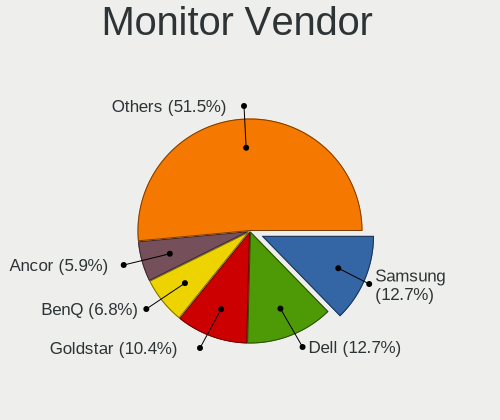
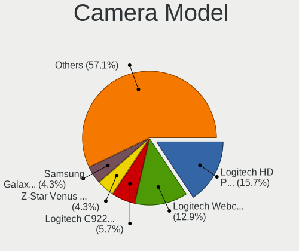

Gentoo 2.7 - Tested Hardware & Statistics (Desktops)
----------------------------------------------------

A project to collect tested hardware configurations for Gentoo 2.7.

Anyone can contribute to this report by the [hw-probe](https://github.com/linuxhw/hw-probe) tool:

    sudo -E hw-probe -all -upload

Please submit a probe of your configuration if it's not presented on the page or is rare.

Full-feature report is available here: https://linux-hardware.org/?view=trends&rel=gentoo-2.7

Contents
--------

* [ Test Cases ](#test-cases)

* [ System ](#system)
  - [ Kernel                   ](#kernel)
  - [ Kernel Family            ](#kernel-family)
  - [ Kernel Major Ver.        ](#kernel-major-ver)
  - [ Arch                     ](#arch)
  - [ DE                       ](#de)
  - [ Display Server           ](#display-server)
  - [ Display Manager          ](#display-manager)
  - [ OS Lang                  ](#os-lang)
  - [ Boot Mode                ](#boot-mode)
  - [ Filesystem               ](#filesystem)
  - [ Part. scheme             ](#part-scheme)
  - [ Dual Boot with Linux/BSD ](#dual-boot-with-linuxbsd)
  - [ Dual Boot (Win)          ](#dual-boot-win)

* [ Board ](#board)
  - [ Vendor                   ](#vendor)
  - [ Model                    ](#model)
  - [ Model Family             ](#model-family)
  - [ MFG Year                 ](#mfg-year)
  - [ Form Factor              ](#form-factor)
  - [ Secure Boot              ](#secure-boot)
  - [ Coreboot                 ](#coreboot)
  - [ RAM Size                 ](#ram-size)
  - [ RAM Used                 ](#ram-used)
  - [ Total Drives             ](#total-drives)
  - [ Has CD-ROM               ](#has-cd-rom)
  - [ Has Ethernet             ](#has-ethernet)
  - [ Has WiFi                 ](#has-wifi)
  - [ Has Bluetooth            ](#has-bluetooth)

* [ Location ](#location)
  - [ Country                  ](#country)
  - [ City                     ](#city)

* [ Drives ](#drives)
  - [ Drive Vendor             ](#drive-vendor)
  - [ Drive Model              ](#drive-model)
  - [ HDD Vendor               ](#hdd-vendor)
  - [ SSD Vendor               ](#ssd-vendor)
  - [ Drive Kind               ](#drive-kind)
  - [ Drive Connector          ](#drive-connector)
  - [ Drive Size               ](#drive-size)
  - [ Space Total              ](#space-total)
  - [ Space Used               ](#space-used)
  - [ Malfunc. Drives          ](#malfunc-drives)
  - [ Malfunc. Drive Vendor    ](#malfunc-drive-vendor)
  - [ Malfunc. HDD Vendor      ](#malfunc-hdd-vendor)
  - [ Malfunc. Drive Kind      ](#malfunc-drive-kind)
  - [ Failed Drives            ](#failed-drives)
  - [ Failed Drive Vendor      ](#failed-drive-vendor)
  - [ Drive Status             ](#drive-status)

* [ Storage controller ](#storage-controller)
  - [ Storage Vendor           ](#storage-vendor)
  - [ Storage Model            ](#storage-model)
  - [ Storage Kind             ](#storage-kind)

* [ Processor ](#processor)
  - [ CPU Vendor               ](#cpu-vendor)
  - [ CPU Model                ](#cpu-model)
  - [ CPU Model Family         ](#cpu-model-family)
  - [ CPU Cores                ](#cpu-cores)
  - [ CPU Sockets              ](#cpu-sockets)
  - [ CPU Threads              ](#cpu-threads)
  - [ CPU Op-Modes             ](#cpu-op-modes)
  - [ CPU Microcode            ](#cpu-microcode)
  - [ CPU Microarch            ](#cpu-microarch)

* [ Graphics ](#graphics)
  - [ GPU Vendor               ](#gpu-vendor)
  - [ GPU Model                ](#gpu-model)
  - [ GPU Combo                ](#gpu-combo)
  - [ GPU Driver               ](#gpu-driver)
  - [ GPU Memory               ](#gpu-memory)

* [ Monitor ](#monitor)
  - [ Monitor Vendor           ](#monitor-vendor)
  - [ Monitor Model            ](#monitor-model)
  - [ Monitor Resolution       ](#monitor-resolution)
  - [ Monitor Diagonal         ](#monitor-diagonal)
  - [ Monitor Width            ](#monitor-width)
  - [ Aspect Ratio             ](#aspect-ratio)
  - [ Monitor Area             ](#monitor-area)
  - [ Pixel Density            ](#pixel-density)
  - [ Multiple Monitors        ](#multiple-monitors)

* [ Network ](#network)
  - [ Net Controller Vendor    ](#net-controller-vendor)
  - [ Net Controller Model     ](#net-controller-model)
  - [ Wireless Vendor          ](#wireless-vendor)
  - [ Wireless Model           ](#wireless-model)
  - [ Ethernet Vendor          ](#ethernet-vendor)
  - [ Ethernet Model           ](#ethernet-model)
  - [ Net Controller Kind      ](#net-controller-kind)
  - [ Used Controller          ](#used-controller)
  - [ NICs                     ](#nics)
  - [ IPv6                     ](#ipv6)

* [ Bluetooth ](#bluetooth)
  - [ Bluetooth Vendor         ](#bluetooth-vendor)
  - [ Bluetooth Model          ](#bluetooth-model)

* [ Sound ](#sound)
  - [ Sound Vendor             ](#sound-vendor)
  - [ Sound Model              ](#sound-model)

* [ Memory ](#memory)
  - [ Memory Vendor            ](#memory-vendor)
  - [ Memory Model             ](#memory-model)
  - [ Memory Kind              ](#memory-kind)
  - [ Memory Form Factor       ](#memory-form-factor)
  - [ Memory Size              ](#memory-size)
  - [ Memory Speed             ](#memory-speed)

* [ Printers & scanners ](#printers--scanners)
  - [ Printer Vendor           ](#printer-vendor)
  - [ Printer Model            ](#printer-model)
  - [ Scanner Vendor           ](#scanner-vendor)
  - [ Scanner Model            ](#scanner-model)

* [ Camera ](#camera)
  - [ Camera Vendor            ](#camera-vendor)
  - [ Camera Model             ](#camera-model)

* [ Security ](#security)
  - [ Fingerprint Vendor       ](#fingerprint-vendor)
  - [ Fingerprint Model        ](#fingerprint-model)
  - [ Chipcard Vendor          ](#chipcard-vendor)
  - [ Chipcard Model           ](#chipcard-model)

* [ Unsupported ](#unsupported)
  - [ Unsupported Devices      ](#unsupported-devices)
  - [ Unsupported Device Types ](#unsupported-device-types)

Test Cases
----------

| Vendor        | Model                       | Probe                                                      | Date         |
|---------------|-----------------------------|------------------------------------------------------------|--------------|
| Gigabyte      | AB350-Gaming-CF             | [3ab561bbe8](https://linux-hardware.org/?probe=3ab561bbe8) | Oct 31, 2021 |
| Gigabyte      | B460 HD3                    | [d3aa74a821](https://linux-hardware.org/?probe=d3aa74a821) | Oct 29, 2021 |
| ASRock        | B550M Steel Legend          | [df8ab9effb](https://linux-hardware.org/?probe=df8ab9effb) | Oct 28, 2021 |
| Red Hat       | RHEL-AV RHEL-8.4.0 PC       | [53ed9ecd8e](https://linux-hardware.org/?probe=53ed9ecd8e) | Oct 27, 2021 |
| HP            | 0B4Ch D                     | [eb0c052885](https://linux-hardware.org/?probe=eb0c052885) | Oct 26, 2021 |
| ASUSTek       | PRIME A520M-K               | [740c97fb1c](https://linux-hardware.org/?probe=740c97fb1c) | Oct 26, 2021 |
| ASUSTek       | M3A78-CM                    | [aa48dedaf3](https://linux-hardware.org/?probe=aa48dedaf3) | Oct 25, 2021 |
| Gigabyte      | AB350-Gaming-CF             | [303af363ac](https://linux-hardware.org/?probe=303af363ac) | Oct 24, 2021 |
| ASRock        | X570 Pro4                   | [ba339b925b](https://linux-hardware.org/?probe=ba339b925b) | Oct 21, 2021 |
| ASUSTek       | PRIME X570-PRO              | [7ffce9bbc2](https://linux-hardware.org/?probe=7ffce9bbc2) | Oct 21, 2021 |
| ASUSTek       | PRIME X570-P                | [b37e349828](https://linux-hardware.org/?probe=b37e349828) | Oct 19, 2021 |
| ASUSTek       | M3A78-CM                    | [f262f89cbe](https://linux-hardware.org/?probe=f262f89cbe) | Oct 18, 2021 |
| Gigabyte      | AB350-Gaming-CF             | [e023c19122](https://linux-hardware.org/?probe=e023c19122) | Oct 17, 2021 |
| Fujitsu       | D3417-B2 S26361-D3417-B2    | [8b5c674cb9](https://linux-hardware.org/?probe=8b5c674cb9) | Oct 17, 2021 |
| Fujitsu       | D3401-H1 S26361-D3401-H1    | [38a6005914](https://linux-hardware.org/?probe=38a6005914) | Oct 15, 2021 |
| Fujitsu       | D3401-H1 S26361-D3401-H1    | [a6457a6f8e](https://linux-hardware.org/?probe=a6457a6f8e) | Oct 15, 2021 |
| ASRock        | Z390 Extreme4               | [2da9a06ef2](https://linux-hardware.org/?probe=2da9a06ef2) | Oct 11, 2021 |
| ASUSTek       | M3A78-CM                    | [2545b52894](https://linux-hardware.org/?probe=2545b52894) | Oct 11, 2021 |
| Gigabyte      | AB350-Gaming-CF             | [786678fb4c](https://linux-hardware.org/?probe=786678fb4c) | Oct 10, 2021 |
| MSI           | MEG X570 UNIFY              | [2e312a734f](https://linux-hardware.org/?probe=2e312a734f) | Oct 08, 2021 |
| Fujitsu       | D2812-A2 S26361-D2812-A2    | [8319b2b5c6](https://linux-hardware.org/?probe=8319b2b5c6) | Oct 08, 2021 |
| Fujitsu       | D2812-A2 S26361-D2812-A2    | [b1178bb939](https://linux-hardware.org/?probe=b1178bb939) | Oct 07, 2021 |
| Gigabyte      | B450M DS3H V2               | [233f451319](https://linux-hardware.org/?probe=233f451319) | Oct 06, 2021 |
| HP            | 0B4Ch D                     | [02b5492901](https://linux-hardware.org/?probe=02b5492901) | Oct 06, 2021 |
| Fujitsu       | D2812-A2 S26361-D2812-A2    | [67fc73c11e](https://linux-hardware.org/?probe=67fc73c11e) | Oct 04, 2021 |
| ASUSTek       | M3A78-CM                    | [a786c3ecec](https://linux-hardware.org/?probe=a786c3ecec) | Oct 04, 2021 |
| Gigabyte      | AB350-Gaming-CF             | [d53525d772](https://linux-hardware.org/?probe=d53525d772) | Oct 03, 2021 |
| MSI           | Z370-A PRO                  | [e7742aa472](https://linux-hardware.org/?probe=e7742aa472) | Oct 03, 2021 |
| MSI           | X470 GAMING PLUS MAX        | [5ce182d7ae](https://linux-hardware.org/?probe=5ce182d7ae) | Oct 01, 2021 |
| ASRock        | B550 Phantom Gaming 4       | [4044b3b3b2](https://linux-hardware.org/?probe=4044b3b3b2) | Oct 01, 2021 |
| ASUSTek       | PRIME B450-PLUS             | [6b625a8736](https://linux-hardware.org/?probe=6b625a8736) | Oct 01, 2021 |
| ASUSTek       | Maximus VIII HERO           | [1fce457ac6](https://linux-hardware.org/?probe=1fce457ac6) | Oct 01, 2021 |
| ASUSTek       | PRIME B450-PLUS             | [87f779767d](https://linux-hardware.org/?probe=87f779767d) | Oct 01, 2021 |
| Acer          | Aspire XC-780               | [f723ac396a](https://linux-hardware.org/?probe=f723ac396a) | Oct 01, 2021 |
| ASRock        | H170 Pro4                   | [a0d0f5002e](https://linux-hardware.org/?probe=a0d0f5002e) | Sep 29, 2021 |
| ASRock        | H170 Pro4                   | [5a3652f38b](https://linux-hardware.org/?probe=5a3652f38b) | Sep 29, 2021 |
| Gigabyte      | 990FXA-UD5                  | [c3bb6d3afa](https://linux-hardware.org/?probe=c3bb6d3afa) | Sep 29, 2021 |
| Dell          | 0J3C2F A02                  | [88104169a4](https://linux-hardware.org/?probe=88104169a4) | Sep 28, 2021 |
| ASUSTek       | M3A78-CM                    | [6057971f46](https://linux-hardware.org/?probe=6057971f46) | Sep 27, 2021 |
| Gigabyte      | AB350-Gaming-CF             | [02d9cece31](https://linux-hardware.org/?probe=02d9cece31) | Sep 26, 2021 |
| ASUSTek       | TUF GAMING B450M-PLUS II    | [241866fa37](https://linux-hardware.org/?probe=241866fa37) | Sep 26, 2021 |
| ASRock        | X370 Professional Gaming    | [546f692061](https://linux-hardware.org/?probe=546f692061) | Sep 23, 2021 |
| Intel         | DG31PR AAD97573-205         | [2c022c21f0](https://linux-hardware.org/?probe=2c022c21f0) | Sep 22, 2021 |
| ASUSTek       | M3A78-CM                    | [1f6b39fcd2](https://linux-hardware.org/?probe=1f6b39fcd2) | Sep 20, 2021 |
| Gigabyte      | AB350-Gaming-CF             | [5afde8487e](https://linux-hardware.org/?probe=5afde8487e) | Sep 19, 2021 |
| Gigabyte      | B460 HD3                    | [fcd5acbc90](https://linux-hardware.org/?probe=fcd5acbc90) | Sep 18, 2021 |
| Tekram Tec... | P6B40-A4X-i440BX Rev        | [86d356f643](https://linux-hardware.org/?probe=86d356f643) | Sep 16, 2021 |
| ASUSTek       | ROG STRIX Z390-F GAMING     | [2f9b27ad89](https://linux-hardware.org/?probe=2f9b27ad89) | Sep 16, 2021 |
| Fujitsu       | D2812-A2 S26361-D2812-A2    | [308d39b0dc](https://linux-hardware.org/?probe=308d39b0dc) | Sep 15, 2021 |
| ASUSTek       | M3A78-CM                    | [59eb80534c](https://linux-hardware.org/?probe=59eb80534c) | Sep 13, 2021 |
| Gigabyte      | AB350-Gaming-CF             | [cfdc619c18](https://linux-hardware.org/?probe=cfdc619c18) | Sep 12, 2021 |
| ASUSTek       | ROG STRIX B550-F GAMING     | [19555ed132](https://linux-hardware.org/?probe=19555ed132) | Sep 07, 2021 |
| ASUSTek       | M3A78-CM                    | [e89cd90c72](https://linux-hardware.org/?probe=e89cd90c72) | Sep 06, 2021 |
| Gigabyte      | AB350-Gaming-CF             | [0fc45210cc](https://linux-hardware.org/?probe=0fc45210cc) | Sep 05, 2021 |
| ASRock        | B450M-HDV R4.0              | [78fc85808c](https://linux-hardware.org/?probe=78fc85808c) | Sep 05, 2021 |
| ASUSTek       | P5P41C                      | [e68f372c7b](https://linux-hardware.org/?probe=e68f372c7b) | Sep 05, 2021 |
| Tekram Tec... | P6B40-A4X-i440BX Rev        | [f63a2003ab](https://linux-hardware.org/?probe=f63a2003ab) | Sep 05, 2021 |
| Fujitsu       | D2812-A2 S26361-D2812-A2    | [40d01ef03e](https://linux-hardware.org/?probe=40d01ef03e) | Aug 31, 2021 |
| Packard Be... | FMCP7AM                     | [6872ae9fb4](https://linux-hardware.org/?probe=6872ae9fb4) | Aug 31, 2021 |
| ASUSTek       | M3A78-CM                    | [195d8fb53d](https://linux-hardware.org/?probe=195d8fb53d) | Aug 30, 2021 |
| Gigabyte      | AB350-Gaming-CF             | [bb19294c8b](https://linux-hardware.org/?probe=bb19294c8b) | Aug 29, 2021 |
| Gigabyte      | EP43-DS3                    | [0eaf518e06](https://linux-hardware.org/?probe=0eaf518e06) | Aug 29, 2021 |
| Dell          | 0U1325                      | [0a58fab188](https://linux-hardware.org/?probe=0a58fab188) | Aug 28, 2021 |
| Fujitsu       | D2812-A2 S26361-D2812-A2    | [00b0f43680](https://linux-hardware.org/?probe=00b0f43680) | Aug 28, 2021 |
| Packard Be... | FMCP7AM                     | [07fb4f5678](https://linux-hardware.org/?probe=07fb4f5678) | Aug 28, 2021 |
| MSI           | MS-7369                     | [0c6668dee5](https://linux-hardware.org/?probe=0c6668dee5) | Aug 28, 2021 |
| Dell          | 0U1325                      | [1b5dfb4b59](https://linux-hardware.org/?probe=1b5dfb4b59) | Aug 28, 2021 |
| ASUSTek       | P9X79 WS                    | [0569365ea0](https://linux-hardware.org/?probe=0569365ea0) | Aug 26, 2021 |
| MSI           | B450M PRO-M2 MAX            | [f521a0c69c](https://linux-hardware.org/?probe=f521a0c69c) | Aug 25, 2021 |
| MSI           | B450M PRO-M2 MAX            | [c09944da60](https://linux-hardware.org/?probe=c09944da60) | Aug 24, 2021 |
| ASUSTek       | M3A78-CM                    | [63f0c13a1f](https://linux-hardware.org/?probe=63f0c13a1f) | Aug 23, 2021 |
| Gigabyte      | AB350-Gaming-CF             | [625e0cf2b0](https://linux-hardware.org/?probe=625e0cf2b0) | Aug 22, 2021 |
| Gigabyte      | Z170-Gaming K3-CF           | [ae02b6e88b](https://linux-hardware.org/?probe=ae02b6e88b) | Aug 19, 2021 |
| ASUSTek       | P5P41C                      | [0eb4111089](https://linux-hardware.org/?probe=0eb4111089) | Aug 18, 2021 |
| NZXT          | N7 Z370                     | [4eb4c77752](https://linux-hardware.org/?probe=4eb4c77752) | Aug 18, 2021 |
| ASUSTek       | ROG STRIX B550-F GAMING     | [5ffe57957d](https://linux-hardware.org/?probe=5ffe57957d) | Aug 18, 2021 |
| NZXT          | N7 Z370                     | [40f0739800](https://linux-hardware.org/?probe=40f0739800) | Aug 17, 2021 |
| ASUSTek       | M3A78-CM                    | [51860b7bbc](https://linux-hardware.org/?probe=51860b7bbc) | Aug 16, 2021 |
| Tekram Tec... | P6B40-A4X-i440BX Rev        | [211803a510](https://linux-hardware.org/?probe=211803a510) | Aug 15, 2021 |
| Gigabyte      | AB350-Gaming-CF             | [d86ce68f12](https://linux-hardware.org/?probe=d86ce68f12) | Aug 15, 2021 |
| MSI           | B550-A PRO                  | [b3ff3985c5](https://linux-hardware.org/?probe=b3ff3985c5) | Aug 13, 2021 |
| HP            | 158B                        | [d47aa82b20](https://linux-hardware.org/?probe=d47aa82b20) | Aug 12, 2021 |
| Intel         | D525MW AAE93082-301         | [fc72f0a0ea](https://linux-hardware.org/?probe=fc72f0a0ea) | Aug 11, 2021 |
| ASUSTek       | PRIME X470-PRO              | [21b619d91b](https://linux-hardware.org/?probe=21b619d91b) | Aug 11, 2021 |
| ASUSTek       | ROG STRIX Z390-F GAMING     | [d74d9e37ce](https://linux-hardware.org/?probe=d74d9e37ce) | Aug 10, 2021 |
| Gigabyte      | AB350-Gaming-CF             | [50f209f0b0](https://linux-hardware.org/?probe=50f209f0b0) | Aug 08, 2021 |
| ASUSTek       | M3A78-CM                    | [1fce864564](https://linux-hardware.org/?probe=1fce864564) | Aug 08, 2021 |
| Tekram Tec... | P6B40-A4X-i440BX Rev        | [33fffaf1c3](https://linux-hardware.org/?probe=33fffaf1c3) | Aug 07, 2021 |
| Gigabyte      | X570 AORUS ELITE            | [ef7a0635f4](https://linux-hardware.org/?probe=ef7a0635f4) | Aug 04, 2021 |
| Gigabyte      | AB350-Gaming-CF             | [06b423ce94](https://linux-hardware.org/?probe=06b423ce94) | Aug 01, 2021 |
| ASUSTek       | P6T DELUXE V2               | [51a1b8132e](https://linux-hardware.org/?probe=51a1b8132e) | Aug 01, 2021 |
| ASUSTek       | ROG STRIX B550-E GAMING     | [754750effc](https://linux-hardware.org/?probe=754750effc) | Jul 31, 2021 |
| ASUSTek       | ROG STRIX B550-I GAMING     | [0f19cc3c0e](https://linux-hardware.org/?probe=0f19cc3c0e) | Jul 31, 2021 |
| Dell          | 09WH54 A00                  | [9885d45d4f](https://linux-hardware.org/?probe=9885d45d4f) | Jul 28, 2021 |
| ASUSTek       | TUF GAMING X570-PLUS        | [46b71409d7](https://linux-hardware.org/?probe=46b71409d7) | Jul 27, 2021 |
| ASUSTek       | ROG STRIX B550-F GAMING     | [c824226d1e](https://linux-hardware.org/?probe=c824226d1e) | Jul 26, 2021 |
| ASUSTek       | M3A78-CM                    | [124c34e0b9](https://linux-hardware.org/?probe=124c34e0b9) | Jul 26, 2021 |
| Gigabyte      | AB350-Gaming-CF             | [ed43bc183f](https://linux-hardware.org/?probe=ed43bc183f) | Jul 25, 2021 |
| Gigabyte      | 990FXA-UD5                  | [9f22a47aea](https://linux-hardware.org/?probe=9f22a47aea) | Jul 22, 2021 |
| Gigabyte      | 990FXA-UD5                  | [5a32ec902e](https://linux-hardware.org/?probe=5a32ec902e) | Jul 22, 2021 |
| Gigabyte      | H110-D3-CF                  | [7d25217f50](https://linux-hardware.org/?probe=7d25217f50) | Jul 22, 2021 |
| ASUSTek       | M3A78-CM                    | [0c48353545](https://linux-hardware.org/?probe=0c48353545) | Jul 19, 2021 |
| Gigabyte      | B460 HD3                    | [e92a7942d5](https://linux-hardware.org/?probe=e92a7942d5) | Jul 18, 2021 |
| Gigabyte      | AB350-Gaming-CF             | [6ab13b1c74](https://linux-hardware.org/?probe=6ab13b1c74) | Jul 18, 2021 |
| Gigabyte      | B460 HD3                    | [a43624a24b](https://linux-hardware.org/?probe=a43624a24b) | Jul 18, 2021 |
| ASUSTek       | ROG STRIX Z390-E GAMING     | [9356542b15](https://linux-hardware.org/?probe=9356542b15) | Jul 12, 2021 |
| ASUSTek       | M3A78-CM                    | [689a063b2b](https://linux-hardware.org/?probe=689a063b2b) | Jul 12, 2021 |
| ASRock        | B550M Steel Legend          | [4d378eb681](https://linux-hardware.org/?probe=4d378eb681) | Jul 10, 2021 |
| MSI           | MEG X570 GODLIKE            | [517a612c58](https://linux-hardware.org/?probe=517a612c58) | Jul 10, 2021 |
| ASRock        | B550M Steel Legend          | [ab93056d13](https://linux-hardware.org/?probe=ab93056d13) | Jul 08, 2021 |
| ASUSTek       | M3A78-CM                    | [d185d2fa34](https://linux-hardware.org/?probe=d185d2fa34) | Jul 05, 2021 |
| Gigabyte      | AB350-Gaming-CF             | [8c345139d0](https://linux-hardware.org/?probe=8c345139d0) | Jul 04, 2021 |
| MSI           | Z590-A PRO                  | [50d75ad77d](https://linux-hardware.org/?probe=50d75ad77d) | Jul 03, 2021 |
| ASUSTek       | PRIME X470-PRO              | [4ef1e3ccac](https://linux-hardware.org/?probe=4ef1e3ccac) | Jul 03, 2021 |
| ASUSTek       | TUF GAMING B550-PLUS        | [4e618f85f9](https://linux-hardware.org/?probe=4e618f85f9) | Jul 03, 2021 |
| ASUSTek       | ROG CROSSHAIR VIII HERO     | [a2acbde7fd](https://linux-hardware.org/?probe=a2acbde7fd) | Jul 02, 2021 |
| Intel         | DZ77BH-55K AAG39008-400     | [04692a4293](https://linux-hardware.org/?probe=04692a4293) | Jul 02, 2021 |
| MSI           | B450 TOMAHAWK               | [ac2a4b3aea](https://linux-hardware.org/?probe=ac2a4b3aea) | Jul 01, 2021 |
| ASUSTek       | ROG STRIX B550-F GAMING     | [b8cc7c380d](https://linux-hardware.org/?probe=b8cc7c380d) | Jun 28, 2021 |
| ASUSTek       | ROG STRIX B550-F GAMING     | [2831e5a8cf](https://linux-hardware.org/?probe=2831e5a8cf) | Jun 28, 2021 |
| Gigabyte      | AB350-Gaming-CF             | [b0e19feab6](https://linux-hardware.org/?probe=b0e19feab6) | Jun 27, 2021 |
| ASUSTek       | M3A78-CM                    | [1a5b5e8bf0](https://linux-hardware.org/?probe=1a5b5e8bf0) | Jun 27, 2021 |
| ASUSTek       | ROG CROSSHAIR VIII HERO     | [d442a66371](https://linux-hardware.org/?probe=d442a66371) | Jun 27, 2021 |
| Apple         | Mac-F221BEC8                | [84bf6743c1](https://linux-hardware.org/?probe=84bf6743c1) | Jun 25, 2021 |
| Apple         | Mac-F221BEC8                | [ced7e0d00d](https://linux-hardware.org/?probe=ced7e0d00d) | Jun 25, 2021 |
| Gigabyte      | AB350-Gaming-CF             | [0f95a638f3](https://linux-hardware.org/?probe=0f95a638f3) | Jun 20, 2021 |
| ASUSTek       | M3A78-CM                    | [670b5ad32f](https://linux-hardware.org/?probe=670b5ad32f) | Jun 18, 2021 |
| ASUSTek       | PRIME TRX40-PRO             | [f0c7a3a628](https://linux-hardware.org/?probe=f0c7a3a628) | Jun 15, 2021 |
| ASUSTek       | PRIME TRX40-PRO             | [c429704651](https://linux-hardware.org/?probe=c429704651) | Jun 15, 2021 |
| ASUSTek       | P7P55D-E PRO                | [9a91c78c7a](https://linux-hardware.org/?probe=9a91c78c7a) | Jun 14, 2021 |
| Gigabyte      | AB350-Gaming-CF             | [5dfa929798](https://linux-hardware.org/?probe=5dfa929798) | Jun 13, 2021 |
| ASUSTek       | STRIX Z270E GAMING          | [704bf0bba3](https://linux-hardware.org/?probe=704bf0bba3) | Jun 12, 2021 |
| ASUSTek       | M3A78-CM                    | [99786fffad](https://linux-hardware.org/?probe=99786fffad) | Jun 11, 2021 |
| MSI           | Z590-A PRO                  | [46c5072a2d](https://linux-hardware.org/?probe=46c5072a2d) | Jun 08, 2021 |
| Gigabyte      | AB350-Gaming-CF             | [cb5c9ef223](https://linux-hardware.org/?probe=cb5c9ef223) | Jun 06, 2021 |
| ASUSTek       | M3A78-CM                    | [e3e4d9d467](https://linux-hardware.org/?probe=e3e4d9d467) | Jun 04, 2021 |
| MSI           | Z97 PC Mate                 | [73ece6c322](https://linux-hardware.org/?probe=73ece6c322) | Jun 02, 2021 |
| MSI           | B450 TOMAHAWK MAX           | [a04eb698f8](https://linux-hardware.org/?probe=a04eb698f8) | May 30, 2021 |
| Gigabyte      | AB350-Gaming-CF             | [7fd8ecaab2](https://linux-hardware.org/?probe=7fd8ecaab2) | May 30, 2021 |
| Lenovo        | SDK0J40705 WIN 342503681... | [2767965856](https://linux-hardware.org/?probe=2767965856) | May 27, 2021 |
| Lenovo        | SDK0J40705 WIN 342503681... | [67b0fcc402](https://linux-hardware.org/?probe=67b0fcc402) | May 27, 2021 |
| ASUSTek       | M3A78-CM                    | [3b96e27283](https://linux-hardware.org/?probe=3b96e27283) | May 26, 2021 |
| Lenovo        | SDK0J40705 WIN 342503681... | [843f1d9b38](https://linux-hardware.org/?probe=843f1d9b38) | May 25, 2021 |
| Lenovo        | SDK0J40705 WIN 342503681... | [5794d366c2](https://linux-hardware.org/?probe=5794d366c2) | May 25, 2021 |
| Gigabyte      | X570 AORUS ULTRA            | [49458a2df1](https://linux-hardware.org/?probe=49458a2df1) | May 24, 2021 |
| Gigabyte      | X570 AORUS ULTRA            | [73ff247804](https://linux-hardware.org/?probe=73ff247804) | May 24, 2021 |
| Gigabyte      | AB350-Gaming-CF             | [e3bed34a3f](https://linux-hardware.org/?probe=e3bed34a3f) | May 23, 2021 |
| MSI           | X570-A PRO                  | [61a5d17b5b](https://linux-hardware.org/?probe=61a5d17b5b) | May 22, 2021 |
| MSI           | X570-A PRO                  | [23efe4a1c8](https://linux-hardware.org/?probe=23efe4a1c8) | May 22, 2021 |
| MSI           | Z590-A PRO                  | [b74e96d4be](https://linux-hardware.org/?probe=b74e96d4be) | May 22, 2021 |
| Unknown       | Cubietech Cubieboard2       | [d777d4b535](https://linux-hardware.org/?probe=d777d4b535) | May 22, 2021 |
| ASUSTek       | ROG STRIX Z490-I GAMING     | [95fb77ceae](https://linux-hardware.org/?probe=95fb77ceae) | May 21, 2021 |
| ASUSTek       | PRIME B350-PLUS             | [1c2f94847e](https://linux-hardware.org/?probe=1c2f94847e) | May 20, 2021 |
| Apple         | Mac-F221BEC8                | [5104abb7a7](https://linux-hardware.org/?probe=5104abb7a7) | May 20, 2021 |
| MSI           | Z590-A PRO                  | [7927669f65](https://linux-hardware.org/?probe=7927669f65) | May 20, 2021 |
| HP            | 8643 SMVB                   | [b183baddef](https://linux-hardware.org/?probe=b183baddef) | May 19, 2021 |
| ASUSTek       | ROG CROSSHAIR VIII HERO     | [4f3165b957](https://linux-hardware.org/?probe=4f3165b957) | May 19, 2021 |
| MSI           | MAG X570 TOMAHAWK WIFI      | [2679a5931a](https://linux-hardware.org/?probe=2679a5931a) | May 19, 2021 |
| ASUSTek       | M3A78-CM                    | [260b86810f](https://linux-hardware.org/?probe=260b86810f) | May 19, 2021 |
| ASRock        | B450 Pro4                   | [7ae6a0f74b](https://linux-hardware.org/?probe=7ae6a0f74b) | May 18, 2021 |
| ASUSTek       | PRIME B450M-K               | [8110fad44d](https://linux-hardware.org/?probe=8110fad44d) | May 17, 2021 |
| ASUSTek       | PRIME B450M-K               | [0df80890c0](https://linux-hardware.org/?probe=0df80890c0) | May 17, 2021 |
| Gigabyte      | AB350-Gaming-CF             | [cd60485f57](https://linux-hardware.org/?probe=cd60485f57) | May 16, 2021 |
| MSI           | Z590-A PRO                  | [8548e79e77](https://linux-hardware.org/?probe=8548e79e77) | May 16, 2021 |
| MSI           | Z590-A PRO                  | [b2cc4333b0](https://linux-hardware.org/?probe=b2cc4333b0) | May 16, 2021 |
| ASUSTek       | PRIME X470-PRO              | [065d69be16](https://linux-hardware.org/?probe=065d69be16) | May 13, 2021 |
| ASUSTek       | PRIME B450M-K               | [6bfaa47826](https://linux-hardware.org/?probe=6bfaa47826) | May 13, 2021 |
| ASUSTek       | PRIME B450M-K               | [77a0428e6b](https://linux-hardware.org/?probe=77a0428e6b) | May 13, 2021 |
| ASUSTek       | M3A78-CM                    | [9e4b4373e8](https://linux-hardware.org/?probe=9e4b4373e8) | May 12, 2021 |
| ASUSTek       | PRIME B450M-K               | [88e106999e](https://linux-hardware.org/?probe=88e106999e) | May 11, 2021 |
| ASUSTek       | PRIME B450M-K               | [2b14268533](https://linux-hardware.org/?probe=2b14268533) | May 10, 2021 |
| Gigabyte      | AB350-Gaming-CF             | [c1dcdec760](https://linux-hardware.org/?probe=c1dcdec760) | May 09, 2021 |
| ASUSTek       | P5LD2-Deluxe                | [46242d579f](https://linux-hardware.org/?probe=46242d579f) | May 09, 2021 |
| ASUSTek       | P5LD2-Deluxe                | [0b6b9eab78](https://linux-hardware.org/?probe=0b6b9eab78) | May 07, 2021 |
| ASUSTek       | P5LD2-Deluxe                | [70bb3aecd9](https://linux-hardware.org/?probe=70bb3aecd9) | May 05, 2021 |
| ASUSTek       | M3A78-CM                    | [e305a7301f](https://linux-hardware.org/?probe=e305a7301f) | May 05, 2021 |
| ASUSTek       | P5LD2-Deluxe                | [193ecc62cf](https://linux-hardware.org/?probe=193ecc62cf) | May 03, 2021 |
| QDI           | P4I865A                     | [a3df896b35](https://linux-hardware.org/?probe=a3df896b35) | May 03, 2021 |
| Gigabyte      | AB350-Gaming-CF             | [801e6126b5](https://linux-hardware.org/?probe=801e6126b5) | May 02, 2021 |
| ASUSTek       | PRIME B450M-K               | [d7ab2def9e](https://linux-hardware.org/?probe=d7ab2def9e) | May 01, 2021 |
| ASUSTek       | PRIME B450M-K               | [ae4420d3a9](https://linux-hardware.org/?probe=ae4420d3a9) | May 01, 2021 |
| ASUSTek       | PRIME Z270-A                | [aff27ae264](https://linux-hardware.org/?probe=aff27ae264) | Apr 29, 2021 |
| MSI           | MEG X570 UNIFY              | [fe32c3d470](https://linux-hardware.org/?probe=fe32c3d470) | Apr 29, 2021 |
| ASUSTek       | M3A78-CM                    | [677dc5a3c6](https://linux-hardware.org/?probe=677dc5a3c6) | Apr 26, 2021 |
| Gigabyte      | AB350-Gaming-CF             | [48789cb28c](https://linux-hardware.org/?probe=48789cb28c) | Apr 25, 2021 |
| Unknown       | Freecom Silverstore HNCN... | [c54d9f2c0c](https://linux-hardware.org/?probe=c54d9f2c0c) | Apr 23, 2021 |
| ASUSTek       | M3A78-CM                    | [75a7ea3b75](https://linux-hardware.org/?probe=75a7ea3b75) | Apr 19, 2021 |
| Gigabyte      | AB350-Gaming-CF             | [94022dc903](https://linux-hardware.org/?probe=94022dc903) | Apr 18, 2021 |
| ASUSTek       | TUF B450-PRO GAMING         | [0db8148a33](https://linux-hardware.org/?probe=0db8148a33) | Apr 17, 2021 |
| ASUSTek       | TUF B450-PRO GAMING         | [5bc34889b8](https://linux-hardware.org/?probe=5bc34889b8) | Apr 17, 2021 |
| ASUSTek       | M3A78-CM                    | [ccb567c754](https://linux-hardware.org/?probe=ccb567c754) | Apr 12, 2021 |
| Gigabyte      | AB350-Gaming-CF             | [aa6385c431](https://linux-hardware.org/?probe=aa6385c431) | Apr 11, 2021 |
| MSI           | H310M PRO-VD PLUS           | [de7b86720f](https://linux-hardware.org/?probe=de7b86720f) | Apr 10, 2021 |
| ASUSTek       | PRIME H270M-PLUS            | [07427b8218](https://linux-hardware.org/?probe=07427b8218) | Apr 09, 2021 |
| ASUSTek       | PRIME X470-PRO              | [ab8b789fc2](https://linux-hardware.org/?probe=ab8b789fc2) | Apr 06, 2021 |
| ASUSTek       | M3A78-CM                    | [8feef9482d](https://linux-hardware.org/?probe=8feef9482d) | Apr 05, 2021 |
| Gigabyte      | X570 AORUS XTREME           | [39f6ad5463](https://linux-hardware.org/?probe=39f6ad5463) | Apr 04, 2021 |
| ASUSTek       | ROG ZENITH II EXTREME       | [1f560968ab](https://linux-hardware.org/?probe=1f560968ab) | Apr 04, 2021 |
| ASUSTek       | PRIME X570-PRO              | [d51b8b7f04](https://linux-hardware.org/?probe=d51b8b7f04) | Apr 02, 2021 |
| MSI           | B450I GAMING PLUS AC        | [88b1b582b5](https://linux-hardware.org/?probe=88b1b582b5) | Apr 01, 2021 |
| ASUSTek       | P8H67-M PRO                 | [95722413a6](https://linux-hardware.org/?probe=95722413a6) | Mar 29, 2021 |
| ASUSTek       | M3A78-CM                    | [6a2de1f8a9](https://linux-hardware.org/?probe=6a2de1f8a9) | Mar 29, 2021 |
| Gigabyte      | B550M AORUS ELITE           | [65b87ee7d8](https://linux-hardware.org/?probe=65b87ee7d8) | Mar 29, 2021 |
| ASRock        | 970 Pro3 R2.0               | [58e2163a18](https://linux-hardware.org/?probe=58e2163a18) | Mar 29, 2021 |
| Gigabyte      | AB350-Gaming-CF             | [f0a7dd3475](https://linux-hardware.org/?probe=f0a7dd3475) | Mar 28, 2021 |
| ASUSTek       | PRIME TRX40-PRO             | [f4da24790d](https://linux-hardware.org/?probe=f4da24790d) | Mar 27, 2021 |
| BESSTAR Te... | DMAF5 V1.0                  | [ea2ebcb877](https://linux-hardware.org/?probe=ea2ebcb877) | Mar 26, 2021 |
| ASUSTek       | M4N78-VM                    | [b3d61c6fbd](https://linux-hardware.org/?probe=b3d61c6fbd) | Mar 24, 2021 |
| Gigabyte      | Z490 AORUS MASTER           | [b89f0d11bd](https://linux-hardware.org/?probe=b89f0d11bd) | Mar 23, 2021 |
| Gigabyte      | Z490 AORUS MASTER           | [c17cb184a4](https://linux-hardware.org/?probe=c17cb184a4) | Mar 22, 2021 |
| ASUSTek       | M3A78-CM                    | [f9974d1e26](https://linux-hardware.org/?probe=f9974d1e26) | Mar 22, 2021 |
| Gigabyte      | Z390 GAMING X-CF            | [26b5c18aba](https://linux-hardware.org/?probe=26b5c18aba) | Mar 22, 2021 |
| Gigabyte      | AB350-Gaming-CF             | [a06e6983b1](https://linux-hardware.org/?probe=a06e6983b1) | Mar 21, 2021 |
| ASUSTek       | ROG STRIX B550-I GAMING     | [63c58340d1](https://linux-hardware.org/?probe=63c58340d1) | Mar 20, 2021 |
| ASRock        | B450M Pro4                  | [41c48a20a2](https://linux-hardware.org/?probe=41c48a20a2) | Mar 19, 2021 |
| ASUSTek       | PRIME X470-PRO              | [c3f70afbd8](https://linux-hardware.org/?probe=c3f70afbd8) | Mar 18, 2021 |
| ASRock        | B450M Pro4                  | [b075ade19c](https://linux-hardware.org/?probe=b075ade19c) | Mar 18, 2021 |
| ASUSTek       | P5Q-E                       | [8e8d411ccb](https://linux-hardware.org/?probe=8e8d411ccb) | Mar 17, 2021 |
| ASUSTek       | B85M-E                      | [46c2411987](https://linux-hardware.org/?probe=46c2411987) | Mar 17, 2021 |
| ASRock        | X370 Professional Gaming    | [677c76f624](https://linux-hardware.org/?probe=677c76f624) | Mar 17, 2021 |
| ASUSTek       | Z170 PRO GAMING             | [fb88aba821](https://linux-hardware.org/?probe=fb88aba821) | Mar 17, 2021 |
| MSI           | B450I GAMING PLUS AC        | [3d16f2ffb4](https://linux-hardware.org/?probe=3d16f2ffb4) | Mar 16, 2021 |
| ASUSTek       | M3A78-CM                    | [9a912f6a54](https://linux-hardware.org/?probe=9a912f6a54) | Mar 15, 2021 |
| Gigabyte      | AB350-Gaming-CF             | [88b4119893](https://linux-hardware.org/?probe=88b4119893) | Mar 14, 2021 |
| ASUSTek       | PRIME X570-P                | [01681dba78](https://linux-hardware.org/?probe=01681dba78) | Mar 14, 2021 |
| ASUSTek       | PRIME B350-PLUS             | [7764beb1a1](https://linux-hardware.org/?probe=7764beb1a1) | Mar 11, 2021 |
| ASUSTek       | PRIME B350-PLUS             | [bf856bd378](https://linux-hardware.org/?probe=bf856bd378) | Mar 11, 2021 |
| ASUSTek       | M3A78-CM                    | [ecaa4cd975](https://linux-hardware.org/?probe=ecaa4cd975) | Mar 08, 2021 |
| Gigabyte      | AB350-Gaming-CF             | [fd82158f63](https://linux-hardware.org/?probe=fd82158f63) | Mar 07, 2021 |
| MSI           | X570-A PRO                  | [c19dde029b](https://linux-hardware.org/?probe=c19dde029b) | Mar 06, 2021 |
| ASRock        | B550M Steel Legend          | [0c34f3246f](https://linux-hardware.org/?probe=0c34f3246f) | Mar 06, 2021 |
| ASRock        | B550M Steel Legend          | [fb91319fa1](https://linux-hardware.org/?probe=fb91319fa1) | Mar 06, 2021 |
| MSI           | B450 TOMAHAWK MAX           | [9f55c5ece0](https://linux-hardware.org/?probe=9f55c5ece0) | Mar 06, 2021 |
| ASRock        | B550M Steel Legend          | [4c28c6d22c](https://linux-hardware.org/?probe=4c28c6d22c) | Mar 03, 2021 |
| ASUSTek       | M5A99FX PRO R2.0            | [6cd953f597](https://linux-hardware.org/?probe=6cd953f597) | Mar 02, 2021 |
| ASUSTek       | M3A78-CM                    | [e7bfe156f8](https://linux-hardware.org/?probe=e7bfe156f8) | Mar 01, 2021 |
| Gigabyte      | AB350-Gaming-CF             | [38b0d3e407](https://linux-hardware.org/?probe=38b0d3e407) | Feb 28, 2021 |
| Gigabyte      | Z390 M GAMING-CF            | [d7a5611d8a](https://linux-hardware.org/?probe=d7a5611d8a) | Feb 23, 2021 |
| ASUSTek       | ROG STRIX B450-F GAMING     | [d854654bad](https://linux-hardware.org/?probe=d854654bad) | Feb 23, 2021 |
| MSI           | 970 GAMING                  | [062ccac9ff](https://linux-hardware.org/?probe=062ccac9ff) | Feb 22, 2021 |
| ASUSTek       | PRIME H470M-PLUS            | [0e4ce5d923](https://linux-hardware.org/?probe=0e4ce5d923) | Feb 22, 2021 |
| ASUSTek       | M3A78-CM                    | [ae309000e1](https://linux-hardware.org/?probe=ae309000e1) | Feb 22, 2021 |
| Gigabyte      | AB350-Gaming-CF             | [d67d9d3b74](https://linux-hardware.org/?probe=d67d9d3b74) | Feb 21, 2021 |
| ASRock        | X370 Gaming X               | [97b686fad6](https://linux-hardware.org/?probe=97b686fad6) | Feb 21, 2021 |
| Gigabyte      | AB350-Gaming-CF             | [f9639ea950](https://linux-hardware.org/?probe=f9639ea950) | Feb 20, 2021 |
| ASUSTek       | P8H67-M PRO                 | [066c09783c](https://linux-hardware.org/?probe=066c09783c) | Feb 20, 2021 |
| Gigabyte      | Z97X-UD3H-CF                | [ac8250480a](https://linux-hardware.org/?probe=ac8250480a) | Feb 16, 2021 |
| MSI           | MEG X570 UNIFY              | [8565fa7232](https://linux-hardware.org/?probe=8565fa7232) | Feb 15, 2021 |
| MSI           | B350M BAZOOKA               | [19cf6a4def](https://linux-hardware.org/?probe=19cf6a4def) | Feb 15, 2021 |
| ASUSTek       | P8Z68-V LX                  | [47dbd40dae](https://linux-hardware.org/?probe=47dbd40dae) | Feb 13, 2021 |
| ASRock        | AM1H-ITX                    | [a1c5772342](https://linux-hardware.org/?probe=a1c5772342) | Feb 03, 2021 |
| ASUSTek       | ROG STRIX X570-F GAMING     | [0d787440f2](https://linux-hardware.org/?probe=0d787440f2) | Feb 01, 2021 |
| ASUSTek       | PRIME B460-PLUS             | [ec933f8e8a](https://linux-hardware.org/?probe=ec933f8e8a) | Jan 31, 2021 |
| ASUSTek       | TUF GAMING X570-PLUS        | [6d86921fcf](https://linux-hardware.org/?probe=6d86921fcf) | Jan 26, 2021 |
| ASRock        | X370 Gaming X               | [8f0d93f4e1](https://linux-hardware.org/?probe=8f0d93f4e1) | Jan 25, 2021 |
| ASUSTek       | ROG Maximus XII HERO        | [1b3702adc5](https://linux-hardware.org/?probe=1b3702adc5) | Jan 25, 2021 |
| ASUSTek       | ROG Maximus XII HERO        | [8eb3edac54](https://linux-hardware.org/?probe=8eb3edac54) | Jan 24, 2021 |
| ASUSTek       | PRIME B460-PLUS             | [dc087e0399](https://linux-hardware.org/?probe=dc087e0399) | Jan 24, 2021 |
| ASUSTek       | PRIME B460-PLUS             | [de171f7a35](https://linux-hardware.org/?probe=de171f7a35) | Jan 24, 2021 |
| MSI           | Z170-A PRO                  | [6c8926dc8c](https://linux-hardware.org/?probe=6c8926dc8c) | Jan 23, 2021 |
| ASUSTek       | ROG Maximus XI HERO         | [23602ad020](https://linux-hardware.org/?probe=23602ad020) | Jan 20, 2021 |
| ASUSTek       | ROG ZENITH II EXTREME       | [b5f6cc5993](https://linux-hardware.org/?probe=b5f6cc5993) | Jan 19, 2021 |
| Gigabyte      | B450M DS3H-CF               | [8c1e988f7e](https://linux-hardware.org/?probe=8c1e988f7e) | Jan 18, 2021 |
| MSI           | MEG X570 GODLIKE            | [5964a40d34](https://linux-hardware.org/?probe=5964a40d34) | Jan 17, 2021 |
| ASUSTek       | ROG ZENITH II EXTREME       | [25fb58cc9f](https://linux-hardware.org/?probe=25fb58cc9f) | Jan 16, 2021 |
| ASUSTek       | P8H67-M PRO                 | [1ff6f65135](https://linux-hardware.org/?probe=1ff6f65135) | Jan 15, 2021 |
| Gigabyte      | Z170X-Gaming 3              | [e4ab17605e](https://linux-hardware.org/?probe=e4ab17605e) | Jan 13, 2021 |
| ASRock        | J3455-ITX                   | [89257face1](https://linux-hardware.org/?probe=89257face1) | Jan 12, 2021 |
| ASUSTek       | ROG STRIX X570-I GAMING     | [38332ee350](https://linux-hardware.org/?probe=38332ee350) | Jan 11, 2021 |
| HP            | 158B                        | [6bc73950dd](https://linux-hardware.org/?probe=6bc73950dd) | Jan 10, 2021 |
| ASRock        | B450 Pro4                   | [1b9975eef6](https://linux-hardware.org/?probe=1b9975eef6) | Jan 08, 2021 |
| ASRock        | X570 Steel Legend           | [48d53df339](https://linux-hardware.org/?probe=48d53df339) | Jan 08, 2021 |
| MSI           | 990FXA-GD80                 | [cc4b365068](https://linux-hardware.org/?probe=cc4b365068) | Jan 08, 2021 |
| ASRock        | B550M Steel Legend          | [a6b6bbef69](https://linux-hardware.org/?probe=a6b6bbef69) | Jan 07, 2021 |
| ASUSTek       | ROG STRIX B550-F GAMING     | [6d67af2066](https://linux-hardware.org/?probe=6d67af2066) | Jan 06, 2021 |
| ASRock        | AB350M Pro4                 | [b75dcb6545](https://linux-hardware.org/?probe=b75dcb6545) | Jan 05, 2021 |
| MSI           | MAG B550 TOMAHAWK           | [6f95de2b32](https://linux-hardware.org/?probe=6f95de2b32) | Jan 05, 2021 |
| ASUSTek       | P5Q-E                       | [7c04f61d39](https://linux-hardware.org/?probe=7c04f61d39) | Jan 04, 2021 |
| Gigabyte      | X570 I AORUS PRO WIFI       | [a011c9b38f](https://linux-hardware.org/?probe=a011c9b38f) | Jan 02, 2021 |
| Gigabyte      | X570 I AORUS PRO WIFI       | [182deb31fb](https://linux-hardware.org/?probe=182deb31fb) | Jan 02, 2021 |
| ASRock        | 970 Pro3 R2.0               | [b83ea4b5b3](https://linux-hardware.org/?probe=b83ea4b5b3) | Jan 02, 2021 |
| ASRock        | AM1H-ITX                    | [2bd69bdc3e](https://linux-hardware.org/?probe=2bd69bdc3e) | Dec 27, 2020 |
| Gigabyte      | X470 AORUS ULTRA GAMING-... | [87e72db668](https://linux-hardware.org/?probe=87e72db668) | Dec 23, 2020 |
| MSI           | MAG X570 TOMAHAWK WIFI      | [d00787942f](https://linux-hardware.org/?probe=d00787942f) | Dec 22, 2020 |
| ASRock        | B550M Steel Legend          | [a733d01196](https://linux-hardware.org/?probe=a733d01196) | Dec 22, 2020 |
| ASRock        | B550M Steel Legend          | [bd927d4e12](https://linux-hardware.org/?probe=bd927d4e12) | Dec 22, 2020 |
| ASRock        | B550M Steel Legend          | [a41b1e7e12](https://linux-hardware.org/?probe=a41b1e7e12) | Dec 22, 2020 |
| ASRock        | X570 Taichi                 | [29d14ce28a](https://linux-hardware.org/?probe=29d14ce28a) | Dec 19, 2020 |
| ASUSTek       | P8H67-M PRO                 | [2fc2502f80](https://linux-hardware.org/?probe=2fc2502f80) | Dec 15, 2020 |
| ASRock        | H170M Pro4S                 | [debbcde352](https://linux-hardware.org/?probe=debbcde352) | Dec 11, 2020 |
| Gigabyte      | GA-890GPA-UD3H              | [e8e2d0cdfc](https://linux-hardware.org/?probe=e8e2d0cdfc) | Dec 05, 2020 |
| Gigabyte      | B450 I AORUS PRO WIFI-CF    | [3dc100c9a1](https://linux-hardware.org/?probe=3dc100c9a1) | Dec 03, 2020 |
| MSI           | B450M PRO-VDH MAX           | [50917002e1](https://linux-hardware.org/?probe=50917002e1) | Dec 01, 2020 |
| MSI           | B450M PRO-VDH MAX           | [03753743e7](https://linux-hardware.org/?probe=03753743e7) | Nov 30, 2020 |
| Gigabyte      | EP45T-DS3                   | [45142a6931](https://linux-hardware.org/?probe=45142a6931) | Nov 30, 2020 |
| ASUSTek       | M4A89GTD-PRO/USB3           | [7eeb446aee](https://linux-hardware.org/?probe=7eeb446aee) | Nov 30, 2020 |
| ASUSTek       | P9X79 WS                    | [24cfa19ea6](https://linux-hardware.org/?probe=24cfa19ea6) | Nov 30, 2020 |
| ASUSTek       | ROG CROSSHAIR VIII HERO     | [ba86d65e42](https://linux-hardware.org/?probe=ba86d65e42) | Nov 27, 2020 |
| ASUSTek       | ROG CROSSHAIR VII HERO      | [78d68d35d8](https://linux-hardware.org/?probe=78d68d35d8) | Nov 26, 2020 |
| ASUSTek       | M5A97 EVO R2.0              | [35233c6000](https://linux-hardware.org/?probe=35233c6000) | Nov 26, 2020 |
| ASUSTek       | P8H67-M PRO                 | [4b811e60f6](https://linux-hardware.org/?probe=4b811e60f6) | Nov 26, 2020 |
| ASUSTek       | ROG CROSSHAIR VIII HERO     | [dcaf1f3521](https://linux-hardware.org/?probe=dcaf1f3521) | Nov 24, 2020 |
| ASUSTek       | P8Z77-V LX                  | [af91f8b0d0](https://linux-hardware.org/?probe=af91f8b0d0) | Nov 24, 2020 |
| MSI           | B350 GAMING PLUS            | [3e9e5d4c8d](https://linux-hardware.org/?probe=3e9e5d4c8d) | Nov 22, 2020 |
| ASUSTek       | PRIME TRX40-PRO             | [9b888a1a9c](https://linux-hardware.org/?probe=9b888a1a9c) | Nov 21, 2020 |
| MSI           | B450 TOMAHAWK MAX           | [a6ab09a54b](https://linux-hardware.org/?probe=a6ab09a54b) | Nov 19, 2020 |
| ASRock        | X570 Pro4                   | [963200e763](https://linux-hardware.org/?probe=963200e763) | Nov 18, 2020 |
| ASUSTek       | PRIME X370-PRO              | [04abcfd451](https://linux-hardware.org/?probe=04abcfd451) | Nov 18, 2020 |
| ASUSTek       | Z170 PRO GAMING             | [7ac134ec7a](https://linux-hardware.org/?probe=7ac134ec7a) | Nov 18, 2020 |
| ASUSTek       | PRIME X470-PRO              | [a4bdac2cea](https://linux-hardware.org/?probe=a4bdac2cea) | Nov 18, 2020 |
| ASRock        | B450 Pro4                   | [c920df4f73](https://linux-hardware.org/?probe=c920df4f73) | Nov 13, 2020 |
| MSI           | B450 TOMAHAWK MAX           | [ca2bc0592f](https://linux-hardware.org/?probe=ca2bc0592f) | Nov 09, 2020 |
| MSI           | B450-A PRO                  | [00aeeab6da](https://linux-hardware.org/?probe=00aeeab6da) | Nov 08, 2020 |
| MSI           | B450-A PRO                  | [cd67b65826](https://linux-hardware.org/?probe=cd67b65826) | Nov 06, 2020 |
| ASUSTek       | P8H67-M PRO                 | [a870d5f1e6](https://linux-hardware.org/?probe=a870d5f1e6) | Nov 06, 2020 |
| ASUSTek       | A88XM-A                     | [45cf973d9c](https://linux-hardware.org/?probe=45cf973d9c) | Oct 31, 2020 |
| MSI           | Z170-A PRO                  | [6f36f04e56](https://linux-hardware.org/?probe=6f36f04e56) | Oct 31, 2020 |
| ASUSTek       | TUF GAMING B460-PLUS        | [539bba5a4d](https://linux-hardware.org/?probe=539bba5a4d) | Oct 26, 2020 |
| ASRock        | AM1H-ITX                    | [4a6634694e](https://linux-hardware.org/?probe=4a6634694e) | Oct 25, 2020 |
| ASRock        | X370 Gaming X               | [7b50c1e794](https://linux-hardware.org/?probe=7b50c1e794) | Oct 25, 2020 |
| ASUSTek       | Z170 PRO GAMING             | [b7a16467ac](https://linux-hardware.org/?probe=b7a16467ac) | Oct 19, 2020 |
| ASUSTek       | PRIME X570-PRO              | [3a4156ad86](https://linux-hardware.org/?probe=3a4156ad86) | Oct 17, 2020 |
| MSI           | H110M PRO-VD PLUS           | [3264edefe8](https://linux-hardware.org/?probe=3264edefe8) | Oct 17, 2020 |
| MSI           | H110M PRO-VD PLUS           | [49f9ade50f](https://linux-hardware.org/?probe=49f9ade50f) | Oct 17, 2020 |
| Gigabyte      | H110M-S2V-CF                | [2fe8128b94](https://linux-hardware.org/?probe=2fe8128b94) | Oct 15, 2020 |
| HP            | 8643 SMVB                   | [b1ebd820ea](https://linux-hardware.org/?probe=b1ebd820ea) | Oct 14, 2020 |
| ASRock        | N3150-ITX                   | [50872ff699](https://linux-hardware.org/?probe=50872ff699) | Oct 14, 2020 |
| MSI           | Z370 PC PRO                 | [6fdfdd701e](https://linux-hardware.org/?probe=6fdfdd701e) | Oct 14, 2020 |
| Dell          | 0PC5F7 A02                  | [0b4436db73](https://linux-hardware.org/?probe=0b4436db73) | Oct 14, 2020 |
| MSI           | B450 TOMAHAWK MAX           | [bb7e9817f3](https://linux-hardware.org/?probe=bb7e9817f3) | Oct 13, 2020 |
| ASUSTek       | H97M-PLUS                   | [979e26a9ff](https://linux-hardware.org/?probe=979e26a9ff) | Oct 13, 2020 |
| Gigabyte      | H110M-S2V-CF                | [e13bfd8911](https://linux-hardware.org/?probe=e13bfd8911) | Oct 13, 2020 |
| ASRock        | X570M Pro4                  | [11624f2e68](https://linux-hardware.org/?probe=11624f2e68) | Oct 12, 2020 |
| ASRock        | X370 Professional Gaming    | [2b432df0be](https://linux-hardware.org/?probe=2b432df0be) | Oct 12, 2020 |
| ASRock        | X570 Phantom Gaming-ITX/... | [4c9fc71c64](https://linux-hardware.org/?probe=4c9fc71c64) | Oct 06, 2020 |
| ASRock        | X570 Phantom Gaming-ITX/... | [f3201a0e2c](https://linux-hardware.org/?probe=f3201a0e2c) | Oct 06, 2020 |
| ASUSTek       | H61M-K                      | [f813fe20d2](https://linux-hardware.org/?probe=f813fe20d2) | Oct 04, 2020 |
| MSI           | X370 XPOWER GAMING TITAN... | [f09de8f7dc](https://linux-hardware.org/?probe=f09de8f7dc) | Oct 01, 2020 |
| Unknown       | Intel X79                   | [3849825892](https://linux-hardware.org/?probe=3849825892) | Sep 29, 2020 |
| ASUSTek       | PRIME X470-PRO              | [b048626385](https://linux-hardware.org/?probe=b048626385) | Sep 29, 2020 |
| ASUSTek       | PRIME X470-PRO              | [e26cc6bcb0](https://linux-hardware.org/?probe=e26cc6bcb0) | Sep 29, 2020 |
| ASUSTek       | PRIME X370-PRO              | [ebbc140da9](https://linux-hardware.org/?probe=ebbc140da9) | Sep 28, 2020 |
| Gigabyte      | B450 AORUS PRO-CF           | [c8d28c60cd](https://linux-hardware.org/?probe=c8d28c60cd) | Sep 27, 2020 |
| ASRock        | Z170 OC Formula             | [b478607fef](https://linux-hardware.org/?probe=b478607fef) | Sep 26, 2020 |
| Gigabyte      | AB350-Gaming 3-CF           | [0997ff40b0](https://linux-hardware.org/?probe=0997ff40b0) | Sep 26, 2020 |
| MSI           | B350 TOMAHAWK               | [00290a5d85](https://linux-hardware.org/?probe=00290a5d85) | Sep 26, 2020 |
| MSI           | B350 TOMAHAWK               | [449d8022e1](https://linux-hardware.org/?probe=449d8022e1) | Sep 26, 2020 |
| ASUSTek       | H81M-PLUS                   | [87f345b258](https://linux-hardware.org/?probe=87f345b258) | Sep 24, 2020 |
| Acer          | Aspire XC-710 V:1.1         | [644c742328](https://linux-hardware.org/?probe=644c742328) | Sep 23, 2020 |
| MSI           | B450M PRO-VDH PLUS          | [aac147ef3c](https://linux-hardware.org/?probe=aac147ef3c) | Sep 22, 2020 |
| ASRock        | AB350M Pro4                 | [6cd6f20aef](https://linux-hardware.org/?probe=6cd6f20aef) | Sep 22, 2020 |
| ASUSTek       | ROG STRIX X570-F GAMING     | [f2bdd44684](https://linux-hardware.org/?probe=f2bdd44684) | Sep 18, 2020 |
| ASUSTek       | ROG STRIX X570-F GAMING     | [15e4e278e8](https://linux-hardware.org/?probe=15e4e278e8) | Sep 18, 2020 |
| ASRock        | 970A-G                      | [c76564a1e5](https://linux-hardware.org/?probe=c76564a1e5) | Sep 16, 2020 |
| ASUSTek       | ROG STRIX B450-F GAMING     | [a1cc53584d](https://linux-hardware.org/?probe=a1cc53584d) | Sep 05, 2020 |
| ASRock        | B450M-HDV R4.0              | [cf465b6ceb](https://linux-hardware.org/?probe=cf465b6ceb) | Sep 05, 2020 |
| ASRock        | B450M-HDV R4.0              | [34b84c17b7](https://linux-hardware.org/?probe=34b84c17b7) | Sep 04, 2020 |
| ASUSTek       | ROG Maximus XI HERO         | [4a62067798](https://linux-hardware.org/?probe=4a62067798) | Sep 03, 2020 |
| Gigabyte      | Z77X-UD5H                   | [ced4076cfe](https://linux-hardware.org/?probe=ced4076cfe) | Sep 03, 2020 |
| MSI           | B450M MORTAR MAX            | [aacb67377f](https://linux-hardware.org/?probe=aacb67377f) | Sep 03, 2020 |
| MSI           | B450M PRO-VDH MAX           | [3aacd1b61b](https://linux-hardware.org/?probe=3aacd1b61b) | Sep 03, 2020 |
| MSI           | Z97-G45 GAMING              | [e86bf6dfb8](https://linux-hardware.org/?probe=e86bf6dfb8) | Sep 03, 2020 |
| ASUSTek       | PRIME X370-PRO              | [4bf504d82b](https://linux-hardware.org/?probe=4bf504d82b) | Sep 03, 2020 |
| MSI           | X470 GAMING PLUS            | [84aef475d9](https://linux-hardware.org/?probe=84aef475d9) | Sep 02, 2020 |
| MSI           | Z77IA-E53                   | [bf99082e95](https://linux-hardware.org/?probe=bf99082e95) | Aug 28, 2020 |
| ASUSTek       | Z170-A                      | [af1f86e610](https://linux-hardware.org/?probe=af1f86e610) | Aug 25, 2020 |
| ASUSTek       | ROG CROSSHAIR VIII HERO     | [d17e5bf1f8](https://linux-hardware.org/?probe=d17e5bf1f8) | Aug 25, 2020 |
| ASUSTek       | ROG STRIX X570-E GAMING     | [0230526040](https://linux-hardware.org/?probe=0230526040) | Aug 20, 2020 |
| Unknown       | Unknown                     | [41ab260322](https://linux-hardware.org/?probe=41ab260322) | Aug 20, 2020 |
| Unknown       | Unknown                     | [6a7fc0088c](https://linux-hardware.org/?probe=6a7fc0088c) | Aug 19, 2020 |
| MSI           | B350 GAMING PRO CARBON      | [762b0fed7b](https://linux-hardware.org/?probe=762b0fed7b) | Aug 18, 2020 |
| Unknown       | Unknown                     | [3d3ed1b8ce](https://linux-hardware.org/?probe=3d3ed1b8ce) | Aug 15, 2020 |
| Unknown       | Unknown                     | [55f1b3cdce](https://linux-hardware.org/?probe=55f1b3cdce) | Aug 15, 2020 |
| ASUSTek       | PRIME X370-PRO              | [7d01f814d5](https://linux-hardware.org/?probe=7d01f814d5) | Aug 10, 2020 |
| ASUSTek       | ROG STRIX B550-F GAMING     | [cc14f627f3](https://linux-hardware.org/?probe=cc14f627f3) | Aug 07, 2020 |
| ASUSTek       | ROG STRIX B550-F GAMING     | [d76a630eb2](https://linux-hardware.org/?probe=d76a630eb2) | Aug 07, 2020 |
| ASUSTek       | P6X58D-E                    | [3db01937e1](https://linux-hardware.org/?probe=3db01937e1) | Aug 05, 2020 |
| ASRock        | X370 Taichi                 | [e08f62cb80](https://linux-hardware.org/?probe=e08f62cb80) | Jul 23, 2020 |
| ASUSTek       | X99-M WS                    | [7a813c93b0](https://linux-hardware.org/?probe=7a813c93b0) | Jul 15, 2020 |
| Unknown       | Unknown                     | [d83097e656](https://linux-hardware.org/?probe=d83097e656) | Jul 13, 2020 |
| ASUSTek       | GRYPHON Z97                 | [e7b3ad7e11](https://linux-hardware.org/?probe=e7b3ad7e11) | Jul 07, 2020 |
| ASUSTek       | PRIME X570-PRO              | [dd3e957888](https://linux-hardware.org/?probe=dd3e957888) | Jul 03, 2020 |
| MSI           | MPG X570 GAMING PRO CARB... | [f54a86a6b4](https://linux-hardware.org/?probe=f54a86a6b4) | Jun 30, 2020 |
| ASRock        | Z68 Extreme4 Gen3           | [c9529f922d](https://linux-hardware.org/?probe=c9529f922d) | Jun 29, 2020 |
| ASRockRack    | C226M WS                    | [adb729fe45](https://linux-hardware.org/?probe=adb729fe45) | Jun 29, 2020 |
| ASUSTek       | Z170 PRO GAMING             | [12ca04e727](https://linux-hardware.org/?probe=12ca04e727) | Jun 27, 2020 |
| ASUSTek       | PRIME X570-P                | [16394021f5](https://linux-hardware.org/?probe=16394021f5) | Jun 21, 2020 |
| ASRock        | X370 Killer SLI             | [e68e55ff91](https://linux-hardware.org/?probe=e68e55ff91) | Jun 20, 2020 |
| ASUSTek       | ROG CROSSHAIR VIII HERO     | [a91b7a6ef3](https://linux-hardware.org/?probe=a91b7a6ef3) | Jun 16, 2020 |
| ASUSTek       | ROG CROSSHAIR VIII HERO     | [78a788e5aa](https://linux-hardware.org/?probe=78a788e5aa) | Jun 14, 2020 |
| ASUSTek       | CROSSHAIR VI HERO           | [d1c9757c3c](https://linux-hardware.org/?probe=d1c9757c3c) | Jun 11, 2020 |
| ASUSTek       | ROG STRIX B450-F GAMING     | [8ca08405df](https://linux-hardware.org/?probe=8ca08405df) | Jun 11, 2020 |
| MSI           | X570-A PRO                  | [d330af6317](https://linux-hardware.org/?probe=d330af6317) | Jun 09, 2020 |
| ASUSTek       | Z170-A                      | [81dbec3df4](https://linux-hardware.org/?probe=81dbec3df4) | Jun 09, 2020 |
| ASUSTek       | CROSSHAIR VI HERO           | [40b9dbe4a5](https://linux-hardware.org/?probe=40b9dbe4a5) | Jun 08, 2020 |
| ASUSTek       | Z170 PRO GAMING             | [50cf5c19df](https://linux-hardware.org/?probe=50cf5c19df) | Jun 08, 2020 |
| ASRock        | X570 Extreme4               | [add6daf97a](https://linux-hardware.org/?probe=add6daf97a) | Jun 07, 2020 |
| ASUSTek       | WS X299 SAGE                | [bfc9505d4b](https://linux-hardware.org/?probe=bfc9505d4b) | Jun 05, 2020 |
| ASUSTek       | P8H67-M PRO                 | [07ef877c6b](https://linux-hardware.org/?probe=07ef877c6b) | Jun 05, 2020 |
| MSI           | X470 GAMING PRO CARBON      | [9c7b7cde1e](https://linux-hardware.org/?probe=9c7b7cde1e) | Jun 04, 2020 |
| ASRock        | Z390 Extreme4               | [e64653b77c](https://linux-hardware.org/?probe=e64653b77c) | Jun 04, 2020 |
| ASRock        | X399 Taichi                 | [ff470637f1](https://linux-hardware.org/?probe=ff470637f1) | Jun 04, 2020 |
| ASUSTek       | PRIME B450M-A               | [38d7220c47](https://linux-hardware.org/?probe=38d7220c47) | Jun 04, 2020 |
| ASRock        | Z390 Extreme4               | [2d804a0477](https://linux-hardware.org/?probe=2d804a0477) | Jun 04, 2020 |
| ASRock        | Z390 Extreme4               | [b379b98120](https://linux-hardware.org/?probe=b379b98120) | Jun 04, 2020 |
| Gigabyte      | X570 AORUS XTREME           | [cf5cf7d297](https://linux-hardware.org/?probe=cf5cf7d297) | Jun 04, 2020 |
| ASUSTek       | P6X58D-E                    | [219e253757](https://linux-hardware.org/?probe=219e253757) | Jun 04, 2020 |
| MSI           | X470 GAMING PLUS            | [713a47cd93](https://linux-hardware.org/?probe=713a47cd93) | Jun 04, 2020 |
| ASUSTek       | PRIME X370-PRO              | [66b855cb1f](https://linux-hardware.org/?probe=66b855cb1f) | Jun 04, 2020 |
| ASUSTek       | P8H67-M PRO                 | [3eeead93cd](https://linux-hardware.org/?probe=3eeead93cd) | Jun 03, 2020 |
| Fujitsu       | D3401-H1 S26361-D3401-H1    | [19202ed9bc](https://linux-hardware.org/?probe=19202ed9bc) | Jun 03, 2020 |
| ASUSTek       | M5A97 EVO R2.0              | [781f2cda04](https://linux-hardware.org/?probe=781f2cda04) | Jun 03, 2020 |
| ASUSTek       | TUF B450M-PLUS GAMING       | [03524be236](https://linux-hardware.org/?probe=03524be236) | Jun 03, 2020 |
| ASUSTek       | SABERTOOTH 990FX R2.0       | [452ae63632](https://linux-hardware.org/?probe=452ae63632) | Jun 03, 2020 |
| Intel         | DH77KC AAG39641-400         | [c70d57d5e5](https://linux-hardware.org/?probe=c70d57d5e5) | Jun 03, 2020 |
| ASRock        | X399 Taichi                 | [9c9844febe](https://linux-hardware.org/?probe=9c9844febe) | Jun 03, 2020 |
| ASUSTek       | ROG STRIX B450-F GAMING     | [656aaf0582](https://linux-hardware.org/?probe=656aaf0582) | Jun 03, 2020 |
| ASUSTek       | Z170 PRO GAMING             | [e69d1396bf](https://linux-hardware.org/?probe=e69d1396bf) | Jun 03, 2020 |
| ASRock        | X570 Steel Legend           | [379b9c17e4](https://linux-hardware.org/?probe=379b9c17e4) | May 31, 2020 |
| ASRock        | B450M-HDV R4.0              | [e0cde3f93b](https://linux-hardware.org/?probe=e0cde3f93b) | May 25, 2020 |
| ASUSTek       | P6TD DELUXE                 | [2a97c35b6b](https://linux-hardware.org/?probe=2a97c35b6b) | May 23, 2020 |
| Sun Micros... | Ultra 24 50                 | [2541d35bd4](https://linux-hardware.org/?probe=2541d35bd4) | May 23, 2020 |
| Gigabyte      | H370M D3H-CF                | [1f405a7557](https://linux-hardware.org/?probe=1f405a7557) | May 23, 2020 |
| HP            | 3648h                       | [14b2a01c1d](https://linux-hardware.org/?probe=14b2a01c1d) | May 23, 2020 |
| ASRockRack    | X470D4U                     | [09640a1376](https://linux-hardware.org/?probe=09640a1376) | May 23, 2020 |
| HP            | 0B54h D                     | [4ef026497f](https://linux-hardware.org/?probe=4ef026497f) | May 23, 2020 |
| Gigabyte      | A320M-S2H-CF                | [7d37b8ad19](https://linux-hardware.org/?probe=7d37b8ad19) | May 12, 2020 |
| Gigabyte      | X570 AORUS ELITE            | [4e05b9111b](https://linux-hardware.org/?probe=4e05b9111b) | May 12, 2020 |
| HP            | 83C1                        | [8b7d6722b2](https://linux-hardware.org/?probe=8b7d6722b2) | May 11, 2020 |
| ASRock        | X370 Gaming K4              | [42ec09f78b](https://linux-hardware.org/?probe=42ec09f78b) | May 11, 2020 |
| ASRock        | X370 Gaming K4              | [6874d82c83](https://linux-hardware.org/?probe=6874d82c83) | May 11, 2020 |
| Gigabyte      | G31M-ES2L                   | [86a0177aac](https://linux-hardware.org/?probe=86a0177aac) | May 11, 2020 |
| Gigabyte      | G31M-ES2L                   | [8bca8a21eb](https://linux-hardware.org/?probe=8bca8a21eb) | May 11, 2020 |
| ASUSTek       | CROSSHAIR VI HERO           | [0cf396063f](https://linux-hardware.org/?probe=0cf396063f) | May 11, 2020 |
| ASRock        | X470 Taichi                 | [8ca172b725](https://linux-hardware.org/?probe=8ca172b725) | May 11, 2020 |
| ASUSTek       | STRIX H270F GAMING          | [c30a3e0ddd](https://linux-hardware.org/?probe=c30a3e0ddd) | May 11, 2020 |
| ASUSTek       | P8B75-V                     | [05258aea35](https://linux-hardware.org/?probe=05258aea35) | May 11, 2020 |
| ASUSTek       | PRIME X470-PRO              | [0a33d02a42](https://linux-hardware.org/?probe=0a33d02a42) | May 10, 2020 |
| ASUSTek       | ROG CROSSHAIR VII HERO      | [9fce6c2df1](https://linux-hardware.org/?probe=9fce6c2df1) | Apr 25, 2020 |
| Gigabyte      | Z170X-Gaming 3              | [8625c51506](https://linux-hardware.org/?probe=8625c51506) | Apr 19, 2020 |
| ASUSTek       | CROSSHAIR VI HERO           | [baaff2d847](https://linux-hardware.org/?probe=baaff2d847) | Mar 30, 2020 |
| ASUSTek       | TUF GAMING X570-PLUS        | [22662aad4d](https://linux-hardware.org/?probe=22662aad4d) | Mar 26, 2020 |
| ASRock        | Z68 Extreme4 Gen3           | [4514d59538](https://linux-hardware.org/?probe=4514d59538) | Mar 19, 2020 |
| ASRock        | Z68 Extreme4 Gen3           | [26c5187786](https://linux-hardware.org/?probe=26c5187786) | Mar 19, 2020 |
| ASRock        | Z170 OC Formula             | [189475c3f5](https://linux-hardware.org/?probe=189475c3f5) | Mar 04, 2020 |
| ASRock        | Z170 OC Formula             | [a405f01061](https://linux-hardware.org/?probe=a405f01061) | Mar 04, 2020 |
| ASUSTek       | ROG CROSSHAIR VIII HERO     | [b417c8e979](https://linux-hardware.org/?probe=b417c8e979) | Feb 24, 2020 |
| Gigabyte      | GA-990FXA-UD5               | [24bf705591](https://linux-hardware.org/?probe=24bf705591) | Feb 14, 2020 |
| ASUSTek       | ROG CROSSHAIR VIII HERO     | [169fe41d8b](https://linux-hardware.org/?probe=169fe41d8b) | Jan 20, 2020 |

System
------

Kernel
------

Version of the Linux kernel

| Version                      | Desktops | Percent |
|------------------------------|----------|---------|
| 5.10.61-gentoo               | 9        | 2.91%   |
| 5.10.27-gentoo               | 9        | 2.91%   |
| 5.7.0-gentoo                 | 8        | 2.59%   |
| 5.10.52-gentoo               | 7        | 2.27%   |
| 5.10.27-gentoo-x86_64        | 7        | 2.27%   |
| 5.4.97-gentoo                | 6        | 1.94%   |
| 5.10.61-gentoo-x86_64        | 6        | 1.94%   |
| 5.6.15-gentoo                | 5        | 1.62%   |
| 5.6.11-gentoo                | 5        | 1.62%   |
| 5.9.11-gentoo                | 4        | 1.29%   |
| 5.9.8-gentoo                 | 3        | 0.97%   |
| 5.9.11                       | 3        | 0.97%   |
| 5.9.1-gentoo                 | 3        | 0.97%   |
| 5.6.15-gentoo-x86_64         | 3        | 0.97%   |
| 5.4.80-gentoo-r1             | 3        | 0.97%   |
| 5.13.5-gentoo                | 3        | 0.97%   |
| 5.11.6-gentoo                | 3        | 0.97%   |
| 5.11.0-gentoo                | 3        | 0.97%   |
| 5.10.7-gentoo                | 3        | 0.97%   |
| 5.10.4-gentoo                | 3        | 0.97%   |
| 5.10.2-gentoo                | 3        | 0.97%   |
| 5.9.9-gentoo                 | 2        | 0.65%   |
| 5.9.8                        | 2        | 0.65%   |
| 5.9.13-gentoo                | 2        | 0.65%   |
| 5.8.10-gentoo                | 2        | 0.65%   |
| 5.8.0-gentoo-r1              | 2        | 0.65%   |
| 5.7.9-gentoo                 | 2        | 0.65%   |
| 5.7.6-gentoo                 | 2        | 0.65%   |
| 5.6.2-gentoo                 | 2        | 0.65%   |
| 5.6.14-gentoo                | 2        | 0.65%   |
| 5.6.13                       | 2        | 0.65%   |
| 5.5.0-gentoo-x86_64          | 2        | 0.65%   |
| 5.4.72-gentoo                | 2        | 0.65%   |
| 5.13.0-gentoo                | 2        | 0.65%   |
| 5.12.5-gentoo                | 2        | 0.65%   |
| 5.11.21-gentoo-dist          | 2        | 0.65%   |
| 5.11.2-gentoo-rt9-x86_64     | 2        | 0.65%   |
| 5.11.11-gentoo               | 2        | 0.65%   |
| 5.11.10-gentoo               | 2        | 0.65%   |
| 5.10.52-gentoo-P6B40-A4X     | 2        | 0.65%   |
| 5.10.33-gentoo-67.P4_drivers | 2        | 0.65%   |
| 5.10.16                      | 2        | 0.65%   |
| 5.10.10-zen1                 | 2        | 0.65%   |
| 5.10.10-gentoo               | 2        | 0.65%   |
| 5.10.1-gentoo                | 2        | 0.65%   |
| 5.9.8-gentoo-x86_64          | 1        | 0.32%   |
| 5.9.7                        | 1        | 0.32%   |
| 5.9.6-gentoo                 | 1        | 0.32%   |
| 5.9.2-gentoo                 | 1        | 0.32%   |
| 5.9.16-gentoo-x86_64         | 1        | 0.32%   |
| 5.9.15-gentoo-x86_64         | 1        | 0.32%   |
| 5.9.11-zen1                  | 1        | 0.32%   |
| 5.9.11-gentoo-x86_64         | 1        | 0.32%   |
| 5.9.0-rc8+                   | 1        | 0.32%   |
| 5.9.0-rc1+                   | 1        | 0.32%   |
| 5.9.0-gentoo-gentoo-amd      | 1        | 0.32%   |
| 5.9.0-gentoo                 | 1        | 0.32%   |
| 5.8.9-gentoo                 | 1        | 0.32%   |
| 5.8.9                        | 1        | 0.32%   |
| 5.8.8-gentoo-x86_64          | 1        | 0.32%   |

Kernel Family
-------------

Linux kernel without a distro release

| Version | Desktops | Percent |
|---------|----------|---------|
| 5.10.27 | 20       | 6.47%   |
| 5.10.61 | 17       | 5.5%    |
| 5.10.52 | 12       | 3.88%   |
| 5.7.0   | 11       | 3.56%   |
| 5.6.15  | 11       | 3.56%   |
| 5.9.11  | 9        | 2.91%   |
| 5.4.97  | 8        | 2.59%   |
| 5.6.11  | 7        | 2.27%   |
| 5.9.8   | 6        | 1.94%   |
| 5.8.10  | 6        | 1.94%   |
| 5.11.6  | 6        | 1.94%   |
| 5.9.0   | 4        | 1.29%   |
| 5.8.0   | 4        | 1.29%   |
| 5.6.14  | 4        | 1.29%   |
| 5.6.13  | 4        | 1.29%   |
| 5.6.0   | 4        | 1.29%   |
| 5.4.80  | 4        | 1.29%   |
| 5.10.5  | 4        | 1.29%   |
| 5.10.2  | 4        | 1.29%   |
| 5.10.10 | 4        | 1.29%   |
| 5.9.1   | 3        | 0.97%   |
| 5.8.12  | 3        | 0.97%   |
| 5.7.9   | 3        | 0.97%   |
| 5.7.6   | 3        | 0.97%   |
| 5.5.0   | 3        | 0.97%   |
| 5.13.5  | 3        | 0.97%   |
| 5.13.0  | 3        | 0.97%   |
| 5.12.5  | 3        | 0.97%   |
| 5.11.2  | 3        | 0.97%   |
| 5.11.10 | 3        | 0.97%   |
| 5.11.0  | 3        | 0.97%   |
| 5.10.7  | 3        | 0.97%   |
| 5.10.6  | 3        | 0.97%   |
| 5.10.4  | 3        | 0.97%   |
| 5.9.9   | 2        | 0.65%   |
| 5.9.13  | 2        | 0.65%   |
| 5.8.9   | 2        | 0.65%   |
| 5.8.6   | 2        | 0.65%   |
| 5.8.5   | 2        | 0.65%   |
| 5.8.3   | 2        | 0.65%   |
| 5.8.18  | 2        | 0.65%   |
| 5.8.14  | 2        | 0.65%   |
| 5.7.8   | 2        | 0.65%   |
| 5.6.8   | 2        | 0.65%   |
| 5.6.2   | 2        | 0.65%   |
| 5.4.72  | 2        | 0.65%   |
| 5.4.60  | 2        | 0.65%   |
| 5.14.14 | 2        | 0.65%   |
| 5.14.13 | 2        | 0.65%   |
| 5.13.9  | 2        | 0.65%   |
| 5.13.12 | 2        | 0.65%   |
| 5.13.11 | 2        | 0.65%   |
| 5.12.13 | 2        | 0.65%   |
| 5.11.21 | 2        | 0.65%   |
| 5.11.11 | 2        | 0.65%   |
| 5.10.33 | 2        | 0.65%   |
| 5.10.16 | 2        | 0.65%   |
| 5.10.12 | 2        | 0.65%   |
| 5.10.1  | 2        | 0.65%   |
| 5.9.7   | 1        | 0.32%   |

Kernel Major Ver.
-----------------

Linux kernel major version

| Version | Desktops | Percent |
|---------|----------|---------|
| 5.10    | 80       | 27.3%   |
| 5.6     | 37       | 12.63%  |
| 5.8     | 32       | 10.92%  |
| 5.9     | 30       | 10.24%  |
| 5.7     | 23       | 7.85%   |
| 5.4     | 23       | 7.85%   |
| 5.11    | 20       | 6.83%   |
| 5.13    | 16       | 5.46%   |
| 5.14    | 12       | 4.1%    |
| 5.12    | 11       | 3.75%   |
| 5.5     | 7        | 2.39%   |
| 4.19    | 2        | 0.68%   |

Arch
----

OS architecture (x86_64, i586, etc.)

| Name     | Desktops | Percent |
|----------|----------|---------|
| x86_64   | 232      | 95.87%  |
| i686     | 7        | 2.89%   |
| ppc64le  | 1        | 0.41%   |
| armv7l   | 1        | 0.41%   |
| armv5tel | 1        | 0.41%   |

DE
--

Desktop Environment

| Name          | Desktops | Percent |
|---------------|----------|---------|
| Unknown       | 95       | 37.11%  |
| KDE5          | 52       | 20.31%  |
| GNOME         | 39       | 15.23%  |
| XFCE          | 27       | 10.55%  |
| KDE           | 19       | 7.42%   |
| MATE          | 11       | 4.3%    |
| X-Cinnamon    | 3        | 1.17%   |
| sway          | 2        | 0.78%   |
| LXQt          | 2        | 0.78%   |
| XSession      | 1        | 0.39%   |
| openbox       | 1        | 0.39%   |
| LXDE          | 1        | 0.39%   |
| i3            | 1        | 0.39%   |
| Enlightenment | 1        | 0.39%   |
| dwm           | 1        | 0.39%   |

Display Server
--------------

X11 or Wayland

| Name    | Desktops | Percent |
|---------|----------|---------|
| X11     | 149      | 58.89%  |
| Unknown | 51       | 20.16%  |
| Tty     | 43       | 17%     |
| Wayland | 10       | 3.95%   |

Display Manager
---------------

SDDM, LightDM, etc.

| Name    | Desktops | Percent |
|---------|----------|---------|
| Unknown | 113      | 44.84%  |
| SDDM    | 63       | 25%     |
| LightDM | 35       | 13.89%  |
| GDM     | 25       | 9.92%   |
| SLiM    | 7        | 2.78%   |
| XDM     | 5        | 1.98%   |
| LXDM    | 4        | 1.59%   |

OS Lang
-------

Language

| Lang           | Desktops | Percent |
|----------------|----------|---------|
| en_US          | 101      | 40.73%  |
| en_GB          | 20       | 8.06%   |
| Unknown        | 19       | 7.66%   |
| de_DE          | 18       | 7.26%   |
| ru_RU          | 14       | 5.65%   |
| C              | 10       | 4.03%   |
| C.UTF8         | 9        | 3.63%   |
| es_ES          | 7        | 2.82%   |
| pl_PL          | 6        | 2.42%   |
| en_CA          | 6        | 2.42%   |
| sv_SE          | 4        | 1.61%   |
| ru_RU.UTF8     | 4        | 1.61%   |
| fr_FR          | 4        | 1.61%   |
| pt_BR          | 3        | 1.21%   |
| fi_FI          | 3        | 1.21%   |
| ja_JP          | 2        | 0.81%   |
| en_US.UTF8     | 2        | 0.81%   |
| en_AU          | 2        | 0.81%   |
| uk_UA          | 1        | 0.4%    |
| ru_UA          | 1        | 0.4%    |
| pt_PT          | 1        | 0.4%    |
| nl_NL          | 1        | 0.4%    |
| it_IT          | 1        | 0.4%    |
| et_EE          | 1        | 0.4%    |
| en_NZ          | 1        | 0.4%    |
| en_IE          | 1        | 0.4%    |
| en_GB.iso88591 | 1        | 0.4%    |
| en_EN          | 1        | 0.4%    |
| en_DK          | 1        | 0.4%    |
| en_DE          | 1        | 0.4%    |
| de_CH          | 1        | 0.4%    |
| ca_ES          | 1        | 0.4%    |

Boot Mode
---------

EFI or BIOS

| Mode | Desktops | Percent |
|------|----------|---------|
| EFI  | 155      | 63.27%  |
| BIOS | 90       | 36.73%  |

Filesystem
----------

Type of filesystem

| Type     | Desktops | Percent |
|----------|----------|---------|
| Ext4     | 143      | 57.89%  |
| Btrfs    | 50       | 20.24%  |
| Xfs      | 15       | 6.07%   |
| F2fs     | 14       | 5.67%   |
| Zfs      | 13       | 5.26%   |
| Reiserfs | 7        | 2.83%   |
| XXX      | 2        | 0.81%   |
| Unknown  | 2        | 0.81%   |
| Jfs      | 1        | 0.4%    |

Part. scheme
------------

Scheme of partitioning

| Type    | Desktops | Percent |
|---------|----------|---------|
| GPT     | 199      | 81.22%  |
| MBR     | 34       | 13.88%  |
| Unknown | 12       | 4.9%    |

Dual Boot with Linux/BSD
------------------------

Hosting more than one Linux/BSD

| Dual boot | Desktops | Percent |
|-----------|----------|---------|
| No        | 168      | 66.14%  |
| Yes       | 86       | 33.86%  |

Dual Boot (Win)
---------------

Hosting Linux and Windows

| Dual boot | Desktops | Percent |
|-----------|----------|---------|
| No        | 154      | 63.11%  |
| Yes       | 90       | 36.89%  |

Board
-----

Vendor
------

Motherboard manufacturer

| Name                | Desktops | Percent |
|---------------------|----------|---------|
| ASUSTek Computer    | 91       | 37.6%   |
| MSI                 | 41       | 16.94%  |
| ASRock              | 37       | 15.29%  |
| Gigabyte Technology | 32       | 13.22%  |
| Hewlett-Packard     | 6        | 2.48%   |
| Unknown             | 6        | 2.48%   |
| Fujitsu             | 5        | 2.07%   |
| Intel               | 4        | 1.65%   |
| Dell                | 4        | 1.65%   |
| Tekram Technology   | 3        | 1.24%   |
| ASRockRack          | 2        | 0.83%   |
| Apple               | 2        | 0.83%   |
| Acer                | 2        | 0.83%   |
| Sun Microsystems    | 1        | 0.41%   |
| Red Hat             | 1        | 0.41%   |
| QDI                 | 1        | 0.41%   |
| Packard Bell        | 1        | 0.41%   |
| NZXT                | 1        | 0.41%   |
| Lenovo              | 1        | 0.41%   |
| BESSTAR Tech        | 1        | 0.41%   |

Model
-----

Motherboard model

| Name                              | Desktops | Percent |
|-----------------------------------|----------|---------|
| ASUS PRIME X470-PRO               | 7        | 2.89%   |
| Unknown                           | 6        | 2.48%   |
| ASUS All Series                   | 5        | 2.07%   |
| MSI MS-7A38                       | 4        | 1.65%   |
| ASUS ROG STRIX B550-F GAMING      | 4        | 1.65%   |
| ASRock B550M Steel Legend         | 4        | 1.65%   |
| Tekram P6B40-A4X-i440BX Rev       | 3        | 1.24%   |
| MSI MS-7C35                       | 3        | 1.24%   |
| MSI MS-7C02                       | 3        | 1.24%   |
| MSI MS-7B79                       | 3        | 1.24%   |
| ASUS Z170 PRO GAMING              | 3        | 1.24%   |
| ASUS TUF GAMING X570-PLUS         | 3        | 1.24%   |
| ASUS ROG CROSSHAIR VIII HERO      | 3        | 1.24%   |
| ASUS PRIME X570-PRO               | 3        | 1.24%   |
| ASUS PRIME X370-PRO               | 3        | 1.24%   |
| ASRock B450M-HDV R4.0             | 3        | 1.24%   |
| MSI MS-7C37                       | 2        | 0.83%   |
| MSI MS-7C34                       | 2        | 0.83%   |
| MSI MS-7A34                       | 2        | 0.83%   |
| Gigabyte X570 AORUS XTREME        | 2        | 0.83%   |
| Gigabyte X570 AORUS ELITE         | 2        | 0.83%   |
| Fujitsu ESPRIMO P7935             | 2        | 0.83%   |
| Fujitsu D3401-H1                  | 2        | 0.83%   |
| ASUS ROG STRIX X570-F GAMING      | 2        | 0.83%   |
| ASUS ROG STRIX B550-I GAMING      | 2        | 0.83%   |
| ASUS ROG CROSSHAIR VII HERO       | 2        | 0.83%   |
| ASUS PRIME X570-P                 | 2        | 0.83%   |
| ASUS P6X58D-E                     | 2        | 0.83%   |
| ASUS P5LD2-Deluxe                 | 2        | 0.83%   |
| ASRock X570 Steel Legend          | 2        | 0.83%   |
| ASRock X399 Taichi                | 2        | 0.83%   |
| ASRock AM1H-ITX                   | 2        | 0.83%   |
| Sun Microsystems Ultra 24         | 1        | 0.41%   |
| Red Hat RHEL                      | 1        | 0.41%   |
| QDI P4I865A                       | 1        | 0.41%   |
| Packard Bell IMEDIA X5705 GE      | 1        | 0.41%   |
| NZXT N7 Z370                      | 1        | 0.41%   |
| MSI MS-7D09                       | 1        | 0.41%   |
| MSI MS-7C91                       | 1        | 0.41%   |
| MSI MS-7C84                       | 1        | 0.41%   |
| MSI MS-7C56                       | 1        | 0.41%   |
| MSI MS-7C13                       | 1        | 0.41%   |
| MSI MS-7B93                       | 1        | 0.41%   |
| MSI MS-7B89                       | 1        | 0.41%   |
| MSI MS-7B86                       | 1        | 0.41%   |
| MSI MS-7B84                       | 1        | 0.41%   |
| MSI MS-7B78                       | 1        | 0.41%   |
| MSI MS-7B49                       | 1        | 0.41%   |
| MSI MS-7B48                       | 1        | 0.41%   |
| MSI MS-7B00                       | 1        | 0.41%   |
| MSI MS-7A40                       | 1        | 0.41%   |
| MSI MS-7A31                       | 1        | 0.41%   |
| MSI MS-7A15                       | 1        | 0.41%   |
| MSI MS-7971                       | 1        | 0.41%   |
| MSI MS-7850                       | 1        | 0.41%   |
| MSI MS-7733                       | 1        | 0.41%   |
| MSI MS-7693                       | 1        | 0.41%   |
| MSI MS-7640                       | 1        | 0.41%   |
| MSI MS-7369                       | 1        | 0.41%   |
| Lenovo ThinkCentre E73 10DU0015UK | 1        | 0.41%   |

Model Family
------------

Motherboard model prefix

| Name                    | Desktops | Percent |
|-------------------------|----------|---------|
| ASUS PRIME              | 25       | 10.33%  |
| ASUS ROG                | 23       | 9.5%    |
| ASUS TUF                | 8        | 3.31%   |
| Gigabyte X570           | 6        | 2.48%   |
| ASRock X570             | 6        | 2.48%   |
| Unknown                 | 6        | 2.48%   |
| ASUS All                | 5        | 2.07%   |
| ASRock X370             | 5        | 2.07%   |
| MSI MS-7A38             | 4        | 1.65%   |
| ASRock B550M            | 4        | 1.65%   |
| Tekram P6B40-A4X-i440BX | 3        | 1.24%   |
| MSI MS-7C35             | 3        | 1.24%   |
| MSI MS-7C02             | 3        | 1.24%   |
| MSI MS-7B79             | 3        | 1.24%   |
| Dell OptiPlex           | 3        | 1.24%   |
| ASUS Z170               | 3        | 1.24%   |
| ASRock B450M-HDV        | 3        | 1.24%   |
| MSI MS-7C37             | 2        | 0.83%   |
| MSI MS-7C34             | 2        | 0.83%   |
| MSI MS-7A34             | 2        | 0.83%   |
| Gigabyte Z390           | 2        | 0.83%   |
| Gigabyte B450M          | 2        | 0.83%   |
| Gigabyte B450           | 2        | 0.83%   |
| Gigabyte AB350-Gaming   | 2        | 0.83%   |
| Fujitsu ESPRIMO         | 2        | 0.83%   |
| Fujitsu D3401-H1        | 2        | 0.83%   |
| ASUS STRIX              | 2        | 0.83%   |
| ASUS P6X58D-E           | 2        | 0.83%   |
| ASUS P5LD2-Deluxe       | 2        | 0.83%   |
| ASRock X399             | 2        | 0.83%   |
| ASRock AM1H-ITX         | 2        | 0.83%   |
| Acer Aspire             | 2        | 0.83%   |
| Sun Microsystems Ultra  | 1        | 0.41%   |
| Red Hat RHEL            | 1        | 0.41%   |
| QDI P4I865A             | 1        | 0.41%   |
| Packard Bell IMEDIA     | 1        | 0.41%   |
| NZXT N7                 | 1        | 0.41%   |
| MSI MS-7D09             | 1        | 0.41%   |
| MSI MS-7C91             | 1        | 0.41%   |
| MSI MS-7C84             | 1        | 0.41%   |
| MSI MS-7C56             | 1        | 0.41%   |
| MSI MS-7C13             | 1        | 0.41%   |
| MSI MS-7B93             | 1        | 0.41%   |
| MSI MS-7B89             | 1        | 0.41%   |
| MSI MS-7B86             | 1        | 0.41%   |
| MSI MS-7B84             | 1        | 0.41%   |
| MSI MS-7B78             | 1        | 0.41%   |
| MSI MS-7B49             | 1        | 0.41%   |
| MSI MS-7B48             | 1        | 0.41%   |
| MSI MS-7B00             | 1        | 0.41%   |
| MSI MS-7A40             | 1        | 0.41%   |
| MSI MS-7A31             | 1        | 0.41%   |
| MSI MS-7A15             | 1        | 0.41%   |
| MSI MS-7971             | 1        | 0.41%   |
| MSI MS-7850             | 1        | 0.41%   |
| MSI MS-7733             | 1        | 0.41%   |
| MSI MS-7693             | 1        | 0.41%   |
| MSI MS-7640             | 1        | 0.41%   |
| MSI MS-7369             | 1        | 0.41%   |
| Lenovo ThinkCentre      | 1        | 0.41%   |

MFG Year
--------

Motherboard manufacture year

| Year    | Desktops | Percent |
|---------|----------|---------|
| 2020    | 68       | 28.1%   |
| 2019    | 43       | 17.77%  |
| 2018    | 28       | 11.57%  |
| 2021    | 22       | 9.09%   |
| 2016    | 13       | 5.37%   |
| 2015    | 11       | 4.55%   |
| 2013    | 9        | 3.72%   |
| 2010    | 9        | 3.72%   |
| 2012    | 8        | 3.31%   |
| 2017    | 7        | 2.89%   |
| 2009    | 5        | 2.07%   |
| 2014    | 4        | 1.65%   |
| 2008    | 4        | 1.65%   |
| 2000    | 3        | 1.24%   |
| Unknown | 3        | 1.24%   |
| 2006    | 2        | 0.83%   |
| 2007    | 1        | 0.41%   |
| 2004    | 1        | 0.41%   |
| 2003    | 1        | 0.41%   |

Form Factor
-----------

Physical design of the computer

| Name    | Desktops | Percent |
|---------|----------|---------|
| Desktop | 242      | 100%    |

Secure Boot
-----------

Enabled or disabled

| State    | Desktops | Percent |
|----------|----------|---------|
| Disabled | 239      | 98.76%  |
| Enabled  | 3        | 1.24%   |

Coreboot
--------

Have coreboot on board

| Used | Desktops | Percent |
|------|----------|---------|
| No   | 242      | 100%    |

RAM Size
--------

Total RAM memory

| Size in GB  | Desktops | Percent |
|-------------|----------|---------|
| 32.01-64.0  | 95       | 38.46%  |
| 16.01-24.0  | 59       | 23.89%  |
| 64.01-256.0 | 42       | 17%     |
| 8.01-16.0   | 20       | 8.1%    |
| 3.01-4.0    | 9        | 3.64%   |
| 4.01-8.0    | 8        | 3.24%   |
| 24.01-32.0  | 7        | 2.83%   |
| 0.51-1.0    | 4        | 1.62%   |
| 2.01-3.0    | 1        | 0.4%    |
| 1.01-2.0    | 1        | 0.4%    |
| 0.01-0.5    | 1        | 0.4%    |

RAM Used
--------

Used RAM memory

| Used GB    | Desktops | Percent |
|------------|----------|---------|
| 4.01-8.0   | 67       | 23.51%  |
| 2.01-3.0   | 52       | 18.25%  |
| 1.01-2.0   | 44       | 15.44%  |
| 8.01-16.0  | 38       | 13.33%  |
| 3.01-4.0   | 35       | 12.28%  |
| 0.01-0.5   | 18       | 6.32%   |
| 16.01-24.0 | 13       | 4.56%   |
| 0.51-1.0   | 10       | 3.51%   |
| 32.01-64.0 | 5        | 1.75%   |
| 24.01-32.0 | 3        | 1.05%   |

Total Drives
------------

Number of drives on board

| Drives | Desktops | Percent |
|--------|----------|---------|
| 2      | 68       | 26.25%  |
| 3      | 62       | 23.94%  |
| 4      | 42       | 16.22%  |
| 1      | 38       | 14.67%  |
| 5      | 26       | 10.04%  |
| 6      | 8        | 3.09%   |
| 7      | 7        | 2.7%    |
| 9      | 2        | 0.77%   |
| 18     | 1        | 0.39%   |
| 17     | 1        | 0.39%   |
| 13     | 1        | 0.39%   |
| 11     | 1        | 0.39%   |
| 8      | 1        | 0.39%   |
| 0      | 1        | 0.39%   |

Has CD-ROM
----------

Has CD-ROM on board

| Presented | Desktops | Percent |
|-----------|----------|---------|
| No        | 168      | 67.74%  |
| Yes       | 80       | 32.26%  |

Has Ethernet
------------

Has Ethernet on board

| Presented | Desktops | Percent |
|-----------|----------|---------|
| Yes       | 236      | 97.52%  |
| No        | 6        | 2.48%   |

Has WiFi
--------

Has WiFi module

| Presented | Desktops | Percent |
|-----------|----------|---------|
| No        | 158      | 64.49%  |
| Yes       | 87       | 35.51%  |

Has Bluetooth
-------------

Has Bluetooth module

| Presented | Desktops | Percent |
|-----------|----------|---------|
| No        | 149      | 61.32%  |
| Yes       | 94       | 38.68%  |

Location
--------

Country
-------

Geographic location (country)

| Country     | Desktops | Percent |
|-------------|----------|---------|
| USA         | 50       | 20.49%  |
| Germany     | 40       | 16.39%  |
| Russia      | 20       | 8.2%    |
| UK          | 16       | 6.56%   |
| Spain       | 12       | 4.92%   |
| Poland      | 12       | 4.92%   |
| Finland     | 11       | 4.51%   |
| Canada      | 10       | 4.1%    |
| Ukraine     | 8        | 3.28%   |
| Sweden      | 8        | 3.28%   |
| France      | 8        | 3.28%   |
| Netherlands | 4        | 1.64%   |
| Greece      | 4        | 1.64%   |
| Switzerland | 3        | 1.23%   |
| Norway      | 3        | 1.23%   |
| Japan       | 3        | 1.23%   |
| Brazil      | 3        | 1.23%   |
| Australia   | 3        | 1.23%   |
| Slovakia    | 2        | 0.82%   |
| Jamaica     | 2        | 0.82%   |
| Italy       | 2        | 0.82%   |
| Czechia     | 2        | 0.82%   |
| Belarus     | 2        | 0.82%   |
| Austria     | 2        | 0.82%   |
| Tunisia     | 1        | 0.41%   |
| Slovenia    | 1        | 0.41%   |
| Romania     | 1        | 0.41%   |
| Reunion     | 1        | 0.41%   |
| New Zealand | 1        | 0.41%   |
| Mexico      | 1        | 0.41%   |
| Hong Kong   | 1        | 0.41%   |
| Estonia     | 1        | 0.41%   |
| El Salvador | 1        | 0.41%   |
| Denmark     | 1        | 0.41%   |
| China       | 1        | 0.41%   |
| Bulgaria    | 1        | 0.41%   |
| Belgium     | 1        | 0.41%   |
| Argentina   | 1        | 0.41%   |

City
----

Geographic location (city)

| City                 | Desktops | Percent |
|----------------------|----------|---------|
| Warsaw               | 5        | 1.95%   |
| Ottawa               | 5        | 1.95%   |
| Berlin               | 5        | 1.95%   |
| Vladivostok          | 4        | 1.56%   |
| Oulu                 | 4        | 1.56%   |
| Fulda                | 4        | 1.56%   |
| Swansea              | 3        | 1.17%   |
| St Petersburg        | 3        | 1.17%   |
| Moscow               | 3        | 1.17%   |
| Kyiv                 | 3        | 1.17%   |
| Helsinki             | 3        | 1.17%   |
| Cieszyn              | 3        | 1.17%   |
| Athens               | 3        | 1.17%   |
| Zurich               | 2        | 0.78%   |
| Yekaterinburg        | 2        | 0.78%   |
| Tampere              | 2        | 0.78%   |
| Sunnyvale            | 2        | 0.78%   |
| Suffolk              | 2        | 0.78%   |
| S??o Paulo           | 2        | 0.78%   |
| Nuremberg            | 2        | 0.78%   |
| Novosibirsk          | 2        | 0.78%   |
| Munich               | 2        | 0.78%   |
| Madrid               | 2        | 0.78%   |
| Los Angeles          | 2        | 0.78%   |
| London               | 2        | 0.78%   |
| L??denscheid         | 2        | 0.78%   |
| Karlstad             | 2        | 0.78%   |
| Irvine               | 2        | 0.78%   |
| Freiburg im Breisgau | 2        | 0.78%   |
| Ferrol               | 2        | 0.78%   |
| Falkenstein          | 2        | 0.78%   |
| Bratislava           | 2        | 0.78%   |
| Baton Rouge          | 2        | 0.78%   |
| Amsterdam            | 2        | 0.78%   |
| Algermissen          | 2        | 0.78%   |
| Zielona G??ra        | 1        | 0.39%   |
| Zaragoza             | 1        | 0.39%   |
| Yucaipa              | 1        | 0.39%   |
| Wyoming              | 1        | 0.39%   |
| Wroclaw              | 1        | 0.39%   |
| Wrentham             | 1        | 0.39%   |
| Wolvercote           | 1        | 0.39%   |
| Wilhelmsthal         | 1        | 0.39%   |
| Wijk bij Duurstede   | 1        | 0.39%   |
| Wiesau               | 1        | 0.39%   |
| West Hollywood       | 1        | 0.39%   |
| Waterloo             | 1        | 0.39%   |
| Warrington           | 1        | 0.39%   |
| Wantagh              | 1        | 0.39%   |
| Wandsworth           | 1        | 0.39%   |
| Visby                | 1        | 0.39%   |
| Virginia Beach       | 1        | 0.39%   |
| Vinnytsia            | 1        | 0.39%   |
| Vienna               | 1        | 0.39%   |
| Victoria             | 1        | 0.39%   |
| Valrico              | 1        | 0.39%   |
| Vaellingby           | 1        | 0.39%   |
| Ufa                  | 1        | 0.39%   |
| Tunis                | 1        | 0.39%   |
| Troms??              | 1        | 0.39%   |

Drives
------

Drive Vendor
------------

Hard drive vendors

| Vendor              | Desktops | Drives | Percent |
|---------------------|----------|--------|---------|
| Samsung Electronics | 115      | 244    | 21.7%   |
| WDC                 | 112      | 230    | 21.13%  |
| Seagate             | 91       | 212    | 17.17%  |
| Kingston            | 34       | 46     | 6.42%   |
| Intel               | 24       | 34     | 4.53%   |
| Hitachi             | 18       | 64     | 3.4%    |
| Crucial             | 18       | 23     | 3.4%    |
| Toshiba             | 15       | 30     | 2.83%   |
| A-DATA Technology   | 15       | 21     | 2.83%   |
| SanDisk             | 12       | 19     | 2.26%   |
| Corsair             | 9        | 13     | 1.7%    |
| Phison              | 8        | 13     | 1.51%   |
| HGST                | 7        | 26     | 1.32%   |
| Unknown             | 5        | 5      | 0.94%   |
| OCZ                 | 5        | 5      | 0.94%   |
| PLEXTOR             | 4        | 4      | 0.75%   |
| IBM                 | 4        | 5      | 0.75%   |
| GOODRAM             | 4        | 20     | 0.75%   |
| Mushkin             | 3        | 3      | 0.57%   |
| XPG                 | 2        | 2      | 0.38%   |
| Team                | 2        | 5      | 0.38%   |
| Patriot             | 2        | 3      | 0.38%   |
| MDT                 | 2        | 2      | 0.38%   |
| Intenso             | 2        | 3      | 0.38%   |
| Gigabyte Technology | 2        | 3      | 0.38%   |
| Apacer              | 2        | 3      | 0.38%   |
| Transcend           | 1        | 1      | 0.19%   |
| SPCC                | 1        | 1      | 0.19%   |
| SK Hynix            | 1        | 2      | 0.19%   |
| Silicon Motion      | 1        | 2      | 0.19%   |
| QEMU                | 1        | 1      | 0.19%   |
| PNY                 | 1        | 1      | 0.19%   |
| Micron Technology   | 1        | 3      | 0.19%   |
| LITEONIT            | 1        | 1      | 0.19%   |
| KingDian            | 1        | 1      | 0.19%   |
| Kingchuxing         | 1        | 2      | 0.19%   |
| EMTEC               | 1        | 1      | 0.19%   |
| AMD-RAID            | 1        | 2      | 0.19%   |
| AMD                 | 1        | 1      | 0.19%   |

Drive Model
-----------

Hard drive models

| Model                            | Desktops | Percent |
|----------------------------------|----------|---------|
| Samsung SSD 850 EVO 500GB        | 10       | 1.49%   |
| Samsung SSD 970 EVO 500GB        | 9        | 1.34%   |
| Samsung SSD 860 EVO 1TB          | 9        | 1.34%   |
| Samsung SSD 850 EVO 250GB        | 9        | 1.34%   |
| Samsung SSD 840 EVO 120GB        | 9        | 1.34%   |
| WDC WD30EFRX-68EUZN0 3TB         | 7        | 1.04%   |
| Samsung SSD 860 EVO 250GB        | 7        | 1.04%   |
| WDC WD40EFRX-68WT0N0 4TB         | 6        | 0.89%   |
| WDC WD40EFRX-68N32N0 4TB         | 6        | 0.89%   |
| Seagate ST2000DM001-1ER164 2TB   | 6        | 0.89%   |
| Samsung SSD 970 EVO 250GB        | 6        | 0.89%   |
| Samsung SSD 970 EVO 1TB          | 6        | 0.89%   |
| Samsung SSD 960 EVO 500GB        | 6        | 0.89%   |
| Samsung SSD 860 EVO 500GB        | 6        | 0.89%   |
| WDC WD20EFRX-68EUZN0 2TB         | 5        | 0.74%   |
| WDC WD10EZEX-08WN4A0 1TB         | 5        | 0.74%   |
| Seagate ST4000DM004-2CV104 4TB   | 5        | 0.74%   |
| Seagate ST3500418AS 500GB        | 5        | 0.74%   |
| Seagate ST1000DM010-2EP102 1TB   | 5        | 0.74%   |
| Seagate ST1000DM003-1CH162 1TB   | 5        | 0.74%   |
| Samsung SSD 970 EVO Plus 500GB   | 5        | 0.74%   |
| Samsung SSD 840 PRO Series 256GB | 5        | 0.74%   |
| Samsung SSD 840 EVO 250GB        | 5        | 0.74%   |
| Kingston SA400S37240G 240GB SSD  | 5        | 0.74%   |
| Kingston SA400S37120G 120GB SSD  | 5        | 0.74%   |
| Kingston SA2000M81000G 1TB       | 5        | 0.74%   |
| WDC WD40EZRZ-00GXCB0 4TB         | 4        | 0.6%    |
| WDC WD10EZEX-08M2NA0 1TB         | 4        | 0.6%    |
| Seagate ST2000DM006-2DM164 2TB   | 4        | 0.6%    |
| Samsung SSD 980 PRO 1TB          | 4        | 0.6%    |
| Samsung SSD 970 EVO Plus 1TB     | 4        | 0.6%    |
| Samsung SSD 850 EVO 1TB          | 4        | 0.6%    |
| Kingston SUV400S37120G 120GB SSD | 4        | 0.6%    |
| Kingston SA400S37480G 480GB SSD  | 4        | 0.6%    |
| Intel SSDPEKNW512G8 512GB        | 4        | 0.6%    |
| Crucial CT275MX300SSD1 275GB     | 4        | 0.6%    |
| A-DATA SX8200PNP 1TB             | 4        | 0.6%    |
| WDC WDS500G3X0C-00SJG0 500GB     | 3        | 0.45%   |
| WDC WD20EZRX-00D8PB0 2TB         | 3        | 0.45%   |
| WDC WD2003FZEX-00Z4SA0 2TB       | 3        | 0.45%   |
| WDC WD1003FZEX-00MK2A0 1TB       | 3        | 0.45%   |
| WDC WD1003FZEX-00K3CA0 1TB       | 3        | 0.45%   |
| Unknown SD/MMC/MS PRO 128GB      | 3        | 0.45%   |
| Seagate ST8000DM004-2CX188 8TB   | 3        | 0.45%   |
| Seagate ST8000AS0002-1NA17Z 8TB  | 3        | 0.45%   |
| Seagate ST500DM002-1BD142 500GB  | 3        | 0.45%   |
| Samsung SSD 970 PRO 512GB        | 3        | 0.45%   |
| Samsung SSD 970 EVO Plus 250GB   | 3        | 0.45%   |
| Samsung SSD 860 EVO 2TB          | 3        | 0.45%   |
| Samsung SSD 840 EVO 1TB          | 3        | 0.45%   |
| Phison Sabrent Rocket 4.0 1TB    | 3        | 0.45%   |
| Intel SSDSC2CW120A3 120GB        | 3        | 0.45%   |
| Intel SSDPED1D280GA 280GB        | 3        | 0.45%   |
| IBM DJSA-220 12GB                | 3        | 0.45%   |
| Hitachi HDS723020BLA642 2TB      | 3        | 0.45%   |
| XPG GAMMIX S11 Pro 1TB           | 2        | 0.3%    |
| WDC WDS500G2X0C-00L350 500GB     | 2        | 0.3%    |
| WDC WDS500G2B0B-00YS70 500GB SSD | 2        | 0.3%    |
| WDC WDS500G2B0A-00SM50 500GB SSD | 2        | 0.3%    |
| WDC WDS200T2B0A-00SM50 2TB SSD   | 2        | 0.3%    |

HDD Vendor
----------

Hard disk drive vendors

| Vendor              | Desktops | Drives | Percent |
|---------------------|----------|--------|---------|
| WDC                 | 100      | 203    | 40.82%  |
| Seagate             | 88       | 209    | 35.92%  |
| Hitachi             | 18       | 64     | 7.35%   |
| Toshiba             | 13       | 28     | 5.31%   |
| Samsung Electronics | 9        | 11     | 3.67%   |
| HGST                | 7        | 26     | 2.86%   |
| IBM                 | 4        | 5      | 1.63%   |
| Unknown             | 3        | 3      | 1.22%   |
| MDT                 | 2        | 2      | 0.82%   |
| QEMU                | 1        | 1      | 0.41%   |

SSD Vendor
----------

Solid state drive vendors

| Vendor              | Desktops | Drives | Percent |
|---------------------|----------|--------|---------|
| Samsung Electronics | 73       | 129    | 39.89%  |
| Kingston            | 27       | 33     | 14.75%  |
| Crucial             | 17       | 22     | 9.29%   |
| SanDisk             | 12       | 19     | 6.56%   |
| Intel               | 8        | 9      | 4.37%   |
| WDC                 | 7        | 9      | 3.83%   |
| OCZ                 | 5        | 5      | 2.73%   |
| A-DATA Technology   | 5        | 6      | 2.73%   |
| PLEXTOR             | 4        | 4      | 2.19%   |
| GOODRAM             | 4        | 20     | 2.19%   |
| Corsair             | 4        | 4      | 2.19%   |
| Mushkin             | 2        | 2      | 1.09%   |
| Intenso             | 2        | 3      | 1.09%   |
| Unknown             | 1        | 1      | 0.55%   |
| Transcend           | 1        | 1      | 0.55%   |
| Toshiba             | 1        | 1      | 0.55%   |
| Team                | 1        | 2      | 0.55%   |
| PNY                 | 1        | 1      | 0.55%   |
| Patriot             | 1        | 2      | 0.55%   |
| Micron Technology   | 1        | 3      | 0.55%   |
| LITEONIT            | 1        | 1      | 0.55%   |
| KingDian            | 1        | 1      | 0.55%   |
| EMTEC               | 1        | 1      | 0.55%   |
| Apacer              | 1        | 2      | 0.55%   |
| AMD-RAID            | 1        | 2      | 0.55%   |
| AMD                 | 1        | 1      | 0.55%   |

Drive Kind
----------

HDD or SSD

| Kind    | Desktops | Drives | Percent |
|---------|----------|--------|---------|
| HDD     | 178      | 552    | 39.12%  |
| SSD     | 143      | 284    | 31.43%  |
| NVMe    | 132      | 219    | 29.01%  |
| MMC     | 1        | 1      | 0.22%   |
| Unknown | 1        | 1      | 0.22%   |

Drive Connector
---------------

SATA, SAS, NVMe, etc.

| Type | Desktops | Drives | Percent |
|------|----------|--------|---------|
| SATA | 214      | 826    | 60.11%  |
| NVMe | 132      | 219    | 37.08%  |
| SAS  | 9        | 11     | 2.53%   |
| MMC  | 1        | 1      | 0.28%   |

Drive Size
----------

Size of hard drive

| Size in TB | Desktops | Drives | Percent |
|------------|----------|--------|---------|
| 0.01-0.5   | 150      | 325    | 40.54%  |
| 0.51-1.0   | 93       | 154    | 25.14%  |
| 1.01-2.0   | 54       | 124    | 14.59%  |
| 3.01-4.0   | 34       | 91     | 9.19%   |
| 2.01-3.0   | 21       | 56     | 5.68%   |
| 4.01-10.0  | 15       | 74     | 4.05%   |
| 10.01-20.0 | 2        | 11     | 0.54%   |
| 20.01-50.0 | 1        | 1      | 0.27%   |

Space Total
-----------

Amount of disk space available on the file system

| Size in GB     | Desktops | Percent |
|----------------|----------|---------|
| More than 3000 | 54       | 20.93%  |
| 501-1000       | 46       | 17.83%  |
| 1001-2000      | 38       | 14.73%  |
| 251-500        | 37       | 14.34%  |
| 101-250        | 27       | 10.47%  |
| 2001-3000      | 22       | 8.53%   |
| Unknown        | 12       | 4.65%   |
| 1-20           | 10       | 3.88%   |
| 51-100         | 7        | 2.71%   |
| 21-50          | 5        | 1.94%   |

Space Used
----------

Amount of used disk space

| Used GB        | Desktops | Percent |
|----------------|----------|---------|
| 1001-2000      | 36       | 13.38%  |
| 101-250        | 35       | 13.01%  |
| 251-500        | 34       | 12.64%  |
| 501-1000       | 34       | 12.64%  |
| 21-50          | 29       | 10.78%  |
| 1-20           | 29       | 10.78%  |
| More than 3000 | 27       | 10.04%  |
| 51-100         | 19       | 7.06%   |
| 2001-3000      | 14       | 5.2%    |
| Unknown        | 12       | 4.46%   |

Malfunc. Drives
---------------

Drive models with a malfunction

| Model                                        | Desktops | Drives | Percent |
|----------------------------------------------|----------|--------|---------|
| Seagate ST3500418AS 500GB                    | 4        | 6      | 4.82%   |
| WDC WD40EFRX-68WT0N0 4TB                     | 3        | 13     | 3.61%   |
| Seagate ST8000AS0002-1NA17Z 8TB              | 3        | 15     | 3.61%   |
| IBM DJSA-220 12GB                            | 3        | 3      | 3.61%   |
| Seagate ST500DM002-1BC142 500GB              | 2        | 2      | 2.41%   |
| Seagate ST31000340NS 1TB                     | 2        | 3      | 2.41%   |
| Seagate ST2000DL003-9VT166 2TB               | 2        | 3      | 2.41%   |
| Seagate ST1000NM0011 1TB                     | 2        | 6      | 2.41%   |
| Samsung Electronics SSD 840 PRO Series 512GB | 2        | 4      | 2.41%   |
| MDT MD2000KS-00MJB0 200GB                    | 2        | 2      | 2.41%   |
| Hitachi HDS722020ALA330 2TB                  | 2        | 14     | 2.41%   |
| WDC WD80EFZX-68UW8N0 8TB                     | 1        | 2      | 1.2%    |
| WDC WD6400AAKS-65A7B2 640GB                  | 1        | 1      | 1.2%    |
| WDC WD60EFRX-68MYMN1 6TB                     | 1        | 1      | 1.2%    |
| WDC WD60EFRX-68L0BN1 6TB                     | 1        | 6      | 1.2%    |
| WDC WD5000AAVS-22G9B1 500GB                  | 1        | 1      | 1.2%    |
| WDC WD5000AAKX-003CA0 500GB                  | 1        | 1      | 1.2%    |
| WDC WD40EFRX-68N32N0 4TB                     | 1        | 1      | 1.2%    |
| WDC WD4004FZWX-00GBGB0 4TB                   | 1        | 1      | 1.2%    |
| WDC WD30EFRX-68EUZN0 3TB                     | 1        | 1      | 1.2%    |
| WDC WD30EFRX-68AX9N0 3TB                     | 1        | 1      | 1.2%    |
| WDC WD20EZRX-00D8PB0 2TB                     | 1        | 2      | 1.2%    |
| WDC WD2003FZEX-00Z4SA0 2TB                   | 1        | 1      | 1.2%    |
| WDC WD2002FAEX-007BA0 2TB                    | 1        | 1      | 1.2%    |
| WDC WD1600AAJS-75B4A0 160GB                  | 1        | 1      | 1.2%    |
| WDC WD10EACS-22D6B0 1TB                      | 1        | 1      | 1.2%    |
| WDC WD1003FZEX-00MK2A0 1TB                   | 1        | 2      | 1.2%    |
| Toshiba HDWD105 500GB                        | 1        | 2      | 1.2%    |
| Toshiba DT01ACA300 3TB                       | 1        | 1      | 1.2%    |
| Seagate ST8000VX0022-2EJ112 8TB              | 1        | 2      | 1.2%    |
| Seagate ST500LT012-1DG142 500GB              | 1        | 1      | 1.2%    |
| Seagate ST4000DM004-2CV104 4TB               | 1        | 1      | 1.2%    |
| Seagate ST4000DM000-1F2168 4TB               | 1        | 1      | 1.2%    |
| Seagate ST3808110AS 80GB                     | 1        | 1      | 1.2%    |
| Seagate ST3500630AS 500GB                    | 1        | 1      | 1.2%    |
| Seagate ST3500413AS 500GB                    | 1        | 1      | 1.2%    |
| Seagate ST3320813AS 320GB                    | 1        | 1      | 1.2%    |
| Seagate ST3250824AS 250GB                    | 1        | 1      | 1.2%    |
| Seagate ST3250318AS 250GB                    | 1        | 1      | 1.2%    |
| Seagate ST320413A 20GB                       | 1        | 1      | 1.2%    |
| Seagate ST3120026A 120GB                     | 1        | 1      | 1.2%    |
| Seagate ST31000528AS 1TB                     | 1        | 1      | 1.2%    |
| Seagate ST3000DM001-9YN166 3TB               | 1        | 1      | 1.2%    |
| Seagate ST2000DX002-2DV164 2TB               | 1        | 1      | 1.2%    |
| Seagate ST1000NC001-1DY162 1TB               | 1        | 1      | 1.2%    |
| Seagate ST1000DM003-1CH162 1TB               | 1        | 1      | 1.2%    |
| Samsung Electronics SSD 970 EVO 500GB        | 1        | 1      | 1.2%    |
| Samsung Electronics SSD 970 EVO 250GB        | 1        | 1      | 1.2%    |
| Samsung Electronics SSD 960 PRO 1TB          | 1        | 2      | 1.2%    |
| Samsung Electronics SSD 960 EVO 250GB        | 1        | 2      | 1.2%    |
| Samsung Electronics SSD 850 EVO 1TB          | 1        | 1      | 1.2%    |
| Samsung Electronics SSD 840 250GB            | 1        | 1      | 1.2%    |
| Samsung Electronics HD154UI 1TB              | 1        | 1      | 1.2%    |
| Samsung Electronics HD103UJ 1TB              | 1        | 1      | 1.2%    |
| PLEXTOR PX-256M6Pro 256GB SSD                | 1        | 1      | 1.2%    |
| PLEXTOR PX-256M3P 256GB SSD                  | 1        | 1      | 1.2%    |
| OCZ VERTEX 32GB SSD                          | 1        | 1      | 1.2%    |
| Mushkin MKNSSDCL120GB                        | 1        | 1      | 1.2%    |
| Kingston SV300S37A480G 480GB SSD             | 1        | 1      | 1.2%    |
| Intel SSDPEKKW128G7 128GB                    | 1        | 1      | 1.2%    |

Malfunc. Drive Vendor
---------------------

Vendors of faulty drives

| Vendor              | Desktops | Drives | Percent |
|---------------------|----------|--------|---------|
| Seagate             | 28       | 53     | 36.84%  |
| WDC                 | 17       | 37     | 22.37%  |
| Samsung Electronics | 9        | 14     | 11.84%  |
| Hitachi             | 5        | 17     | 6.58%   |
| IBM                 | 3        | 3      | 3.95%   |
| Toshiba             | 2        | 3      | 2.63%   |
| PLEXTOR             | 2        | 2      | 2.63%   |
| MDT                 | 2        | 2      | 2.63%   |
| Crucial             | 2        | 2      | 2.63%   |
| OCZ                 | 1        | 1      | 1.32%   |
| Mushkin             | 1        | 1      | 1.32%   |
| Kingston            | 1        | 1      | 1.32%   |
| Intel               | 1        | 1      | 1.32%   |
| HGST                | 1        | 1      | 1.32%   |
| Corsair             | 1        | 1      | 1.32%   |

Malfunc. HDD Vendor
-------------------

Vendors of faulty HDD drives

| Vendor              | Desktops | Drives | Percent |
|---------------------|----------|--------|---------|
| Seagate             | 28       | 53     | 47.46%  |
| WDC                 | 17       | 37     | 28.81%  |
| Hitachi             | 5        | 17     | 8.47%   |
| IBM                 | 3        | 3      | 5.08%   |
| Toshiba             | 2        | 3      | 3.39%   |
| MDT                 | 2        | 2      | 3.39%   |
| Samsung Electronics | 1        | 2      | 1.69%   |
| HGST                | 1        | 1      | 1.69%   |

Malfunc. Drive Kind
-------------------

Kinds of faulty drives

| Kind | Desktops | Drives | Percent |
|------|----------|--------|---------|
| HDD  | 54       | 118    | 76.06%  |
| SSD  | 12       | 14     | 16.9%   |
| NVMe | 5        | 7      | 7.04%   |

Failed Drives
-------------

Failed drive models

| Model                                            | Desktops | Drives | Percent |
|--------------------------------------------------|----------|--------|---------|
| WDC WD6400BEVT-22A0RT0 640GB                     | 1        | 1      | 33.33%  |
| Seagate ST31500341AS 1TB                         | 1        | 1      | 33.33%  |
| Samsung Electronics MZ7LN256HCHP-00000 256GB SSD | 1        | 2      | 33.33%  |

Failed Drive Vendor
-------------------

Failed drive vendors

| Vendor              | Desktops | Drives | Percent |
|---------------------|----------|--------|---------|
| WDC                 | 1        | 1      | 33.33%  |
| Seagate             | 1        | 1      | 33.33%  |
| Samsung Electronics | 1        | 2      | 33.33%  |

Drive Status
------------

Number of failed and malfunc. drives

| Status   | Desktops | Drives | Percent |
|----------|----------|--------|---------|
| Works    | 228      | 858    | 70.81%  |
| Malfunc  | 69       | 139    | 21.43%  |
| Detected | 22       | 56     | 6.83%   |
| Failed   | 3        | 4      | 0.93%   |

Storage controller
------------------

Storage Vendor
--------------

Storage controller vendors

| Vendor                        | Desktops | Percent |
|-------------------------------|----------|---------|
| AMD                           | 133      | 31.59%  |
| Intel                         | 105      | 24.94%  |
| Samsung Electronics           | 65       | 15.44%  |
| ASMedia Technology            | 22       | 5.23%   |
| Phison Electronics            | 19       | 4.51%   |
| ADATA Technology              | 12       | 2.85%   |
| Sandisk                       | 11       | 2.61%   |
| Marvell Technology Group      | 10       | 2.38%   |
| Kingston Technology Company   | 9        | 2.14%   |
| JMicron Technology            | 6        | 1.43%   |
| Silicon Motion                | 3        | 0.71%   |
| Silicon Image                 | 3        | 0.71%   |
| Realtek Semiconductor         | 3        | 0.71%   |
| Nvidia                        | 3        | 0.71%   |
| LSI Logic / Symbios Logic     | 3        | 0.71%   |
| Adaptec                       | 3        | 0.71%   |
| Seagate Technology            | 2        | 0.48%   |
| Broadcom / LSI                | 2        | 0.48%   |
| VIA Technologies              | 1        | 0.24%   |
| Toshiba America Info Systems  | 1        | 0.24%   |
| SK Hynix                      | 1        | 0.24%   |
| Red Hat                       | 1        | 0.24%   |
| Micron/Crucial Technology     | 1        | 0.24%   |
| Lite-On IT Corp. / Plextor    | 1        | 0.24%   |
| Integrated Technology Express | 1        | 0.24%   |

Storage Model
-------------

Storage controller models

| Model                                                                            | Desktops | Percent |
|----------------------------------------------------------------------------------|----------|---------|
| AMD FCH SATA Controller [AHCI mode]                                              | 105      | 20.11%  |
| Samsung NVMe SSD Controller SM981/PM981/PM983                                    | 42       | 8.05%   |
| AMD 400 Series Chipset SATA Controller                                           | 42       | 8.05%   |
| ASMedia ASM1062 Serial ATA Controller                                            | 22       | 4.21%   |
| Intel Q170/Q150/B150/H170/H110/Z170/CM236 Chipset SATA Controller [AHCI Mode]    | 20       | 3.83%   |
| AMD Starship/Matisse Chipset SATA Controller [AHCI mode]                         | 15       | 2.87%   |
| Samsung NVMe SSD Controller SM961/PM961/SM963                                    | 13       | 2.49%   |
| ADATA XPG SX8200 Pro PCIe Gen3x4 M.2 2280 Solid State Drive                      | 12       | 2.3%    |
| AMD X370 Series Chipset SATA Controller                                          | 11       | 2.11%   |
| AMD SB7x0/SB8x0/SB9x0 SATA Controller [AHCI mode]                                | 10       | 1.92%   |
| Phison E16 PCIe4 NVMe Controller                                                 | 9        | 1.72%   |
| Intel SSD 660P Series                                                            | 9        | 1.72%   |
| Intel 82801JI (ICH10 Family) SATA AHCI Controller                                | 9        | 1.72%   |
| Intel SATA Controller [RAID mode]                                                | 8        | 1.53%   |
| Intel 200 Series PCH SATA controller [AHCI mode]                                 | 8        | 1.53%   |
| AMD 300 Series Chipset SATA Controller                                           | 8        | 1.53%   |
| Samsung NVMe SSD Controller PM9A1/PM9A3/980PRO                                   | 7        | 1.34%   |
| Intel 7 Series/C210 Series Chipset Family 6-port SATA Controller [AHCI mode]     | 7        | 1.34%   |
| Phison E12 NVMe Controller                                                       | 6        | 1.15%   |
| Kingston Company A2000 NVMe SSD                                                  | 6        | 1.15%   |
| Intel Cannon Lake PCH SATA AHCI Controller                                       | 6        | 1.15%   |
| Intel 8 Series/C220 Series Chipset Family 6-port SATA Controller 1 [AHCI mode]   | 5        | 0.96%   |
| Intel 6 Series/C200 Series Chipset Family 6 port Desktop SATA AHCI Controller    | 5        | 0.96%   |
| Sandisk WD Black SN750 / PC SN730 NVMe SSD                                       | 4        | 0.77%   |
| Sandisk WD Black 2018/SN750 / PC SN720 NVMe SSD                                  | 4        | 0.77%   |
| Samsung NVMe SSD Controller SM951/PM951                                          | 4        | 0.77%   |
| Intel Optane SSD 900P Series                                                     | 4        | 0.77%   |
| Intel NM10/ICH7 Family SATA Controller [IDE mode]                                | 4        | 0.77%   |
| Intel Comet Lake SATA AHCI Controller                                            | 4        | 0.77%   |
| Intel 9 Series Chipset Family SATA Controller [AHCI Mode]                        | 4        | 0.77%   |
| Intel 82801G (ICH7 Family) IDE Controller                                        | 4        | 0.77%   |
| AMD SB7x0/SB8x0/SB9x0 IDE Controller                                             | 4        | 0.77%   |
| Silicon Motion SM2263EN/SM2263XT SSD Controller                                  | 3        | 0.57%   |
| Realtek Realtek Non-Volatile memory controller                                   | 3        | 0.57%   |
| Marvell Group 88SE9172 SATA 6Gb/s Controller                                     | 3        | 0.57%   |
| JMicron JMB368 IDE controller                                                    | 3        | 0.57%   |
| Intel 82371AB/EB/MB PIIX4 IDE                                                    | 3        | 0.57%   |
| Intel 400 Series Chipset Family SATA AHCI Controller                             | 3        | 0.57%   |
| Silicon Image SiI 3132 Serial ATA Raid II Controller                             | 2        | 0.38%   |
| Sandisk WD Blue SN550 NVMe SSD                                                   | 2        | 0.38%   |
| Samsung NVMe SSD Controller 980                                                  | 2        | 0.38%   |
| Phison E7 NVMe Controller                                                        | 2        | 0.38%   |
| Marvell Group 88SE9123 PCIe SATA 6.0 Gb/s controller                             | 2        | 0.38%   |
| Kingston Company U-SNS8154P3 NVMe SSD                                            | 2        | 0.38%   |
| JMicron JMB363 SATA/IDE Controller                                               | 2        | 0.38%   |
| JMicron JMB361 AHCI/IDE                                                          | 2        | 0.38%   |
| Intel SSD 600P Series                                                            | 2        | 0.38%   |
| Intel Non-Volatile memory controller                                             | 2        | 0.38%   |
| Intel NM10/ICH7 Family SATA Controller [AHCI mode]                               | 2        | 0.38%   |
| Intel C600/X79 series chipset 6-Port SATA AHCI Controller                        | 2        | 0.38%   |
| Intel 82801IR/IO/IH (ICH9R/DO/DH) 6 port SATA Controller [AHCI mode]             | 2        | 0.38%   |
| Intel 82801EB (ICH5) SATA Controller                                             | 2        | 0.38%   |
| Intel 4 Series Chipset PT IDER Controller                                        | 2        | 0.38%   |
| Broadcom / LSI SAS2308 PCI-Express Fusion-MPT SAS-2                              | 2        | 0.38%   |
| AMD X399 Series Chipset SATA Controller                                          | 2        | 0.38%   |
| AMD SB7x0/SB8x0/SB9x0 SATA Controller [IDE mode]                                 | 2        | 0.38%   |
| VIA VT6421 IDE/SATA Controller                                                   | 1        | 0.19%   |
| Toshiba America Info Systems Toshiba America Info Non-Volatile memory controller | 1        | 0.19%   |
| SK Hynix BC501 NVMe Solid State Drive                                            | 1        | 0.19%   |
| Silicon Image SiI 3114 [SATALink/SATARaid] Serial ATA Controller                 | 1        | 0.19%   |

Storage Kind
------------

Kind of storage controller (IDE, SATA, NVMe, SAS, ...)

| Kind | Desktops | Percent |
|------|----------|---------|
| SATA | 218      | 54.5%   |
| NVMe | 132      | 33%     |
| IDE  | 26       | 6.5%    |
| RAID | 16       | 4%      |
| SAS  | 4        | 1%      |
| SCSI | 4        | 1%      |

Processor
---------

CPU Vendor
----------

Processor vendors

| Vendor                   | Desktops | Percent |
|--------------------------|----------|---------|
| AMD                      | 139      | 57.44%  |
| Intel                    | 100      | 41.32%  |
| PowerNV C1P9S01 REV 1.01 | 1        | 0.41%   |
| Marvell Semiconductor    | 1        | 0.41%   |
| ARM                      | 1        | 0.41%   |

CPU Model
---------

Processor models

| Model                                                                    | Desktops | Percent |
|--------------------------------------------------------------------------|----------|---------|
| AMD Ryzen 7 3700X 8-Core Processor                                       | 15       | 6.12%   |
| AMD Ryzen 7 2700X Eight-Core Processor                                   | 13       | 5.31%   |
| AMD Ryzen 9 3950X 16-Core Processor                                      | 10       | 4.08%   |
| AMD Ryzen 5 3600 6-Core Processor                                        | 10       | 4.08%   |
| AMD Ryzen 5 5600X 6-Core Processor                                       | 9        | 3.67%   |
| AMD Ryzen 7 3800X 8-Core Processor                                       | 8        | 3.27%   |
| AMD Ryzen 5 2600 Six-Core Processor                                      | 8        | 3.27%   |
| AMD Ryzen 9 3900X 12-Core Processor                                      | 6        | 2.45%   |
| AMD Ryzen 7 2700 Eight-Core Processor                                    | 5        | 2.04%   |
| AMD Ryzen 3 2200G with Radeon Vega Graphics                              | 5        | 2.04%   |
| Intel Core i7-8700K CPU @ 3.70GHz                                        | 4        | 1.63%   |
| Intel Core i7-7700K CPU @ 4.20GHz                                        | 4        | 1.63%   |
| Intel Core i7-6700K CPU @ 4.00GHz                                        | 4        | 1.63%   |
| AMD Ryzen 7 1700 Eight-Core Processor                                    | 4        | 1.63%   |
| AMD Ryzen 5 1600 Six-Core Processor                                      | 4        | 1.63%   |
| Intel Pentium III (Katmai)                                               | 3        | 1.22%   |
| Intel Pentium 4 CPU 3.20GHz                                              | 3        | 1.22%   |
| Intel Core i9-9900K CPU @ 3.60GHz                                        | 3        | 1.22%   |
| Intel Core i7-6700 CPU @ 3.40GHz                                         | 3        | 1.22%   |
| AMD Ryzen 9 5950X 16-Core Processor                                      | 3        | 1.22%   |
| AMD Ryzen 9 5900X 12-Core Processor                                      | 3        | 1.22%   |
| AMD FX-8350 Eight-Core Processor                                         | 3        | 1.22%   |
| Intel Core i9-10850K CPU @ 3.60GHz                                       | 2        | 0.82%   |
| Intel Core i7-7700 CPU @ 3.60GHz                                         | 2        | 0.82%   |
| Intel Core i7-4790K CPU @ 4.00GHz                                        | 2        | 0.82%   |
| Intel Core i7-3770K CPU @ 3.50GHz                                        | 2        | 0.82%   |
| Intel Core i7-10700K CPU @ 3.80GHz                                       | 2        | 0.82%   |
| Intel Core i7 CPU X 980 @ 3.33GHz                                        | 2        | 0.82%   |
| Intel Core i5-6500 CPU @ 3.20GHz                                         | 2        | 0.82%   |
| Intel Core i5-6400 CPU @ 2.70GHz                                         | 2        | 0.82%   |
| Intel Core i5-10600KF CPU @ 4.10GHz                                      | 2        | 0.82%   |
| Intel Core 2 Quad CPU Q9650 @ 3.00GHz                                    | 2        | 0.82%   |
| Intel Core 2 Duo CPU E8600 @ 3.33GHz                                     | 2        | 0.82%   |
| AMD Sempron 3850 APU with Radeon R3                                      | 2        | 0.82%   |
| AMD Ryzen 7 PRO 4750G with Radeon Graphics                               | 2        | 0.82%   |
| AMD Ryzen 7 5800X 8-Core Processor                                       | 2        | 0.82%   |
| AMD Ryzen 7 1800X Eight-Core Processor                                   | 2        | 0.82%   |
| AMD Ryzen 7 1700X Eight-Core Processor                                   | 2        | 0.82%   |
| AMD Ryzen 5 3600XT 6-Core Processor                                      | 2        | 0.82%   |
| AMD Ryzen 5 3500X 6-Core Processor                                       | 2        | 0.82%   |
| AMD Ryzen 5 1600X Six-Core Processor                                     | 2        | 0.82%   |
| AMD FX-6300 Six-Core Processor                                           | 2        | 0.82%   |
| PowerNV C1P9S01 REV 1.01 POWER9, altivec supported                       | 1        | 0.41%   |
| Marvell Semiconductor Marvell Kirkwood (Flattened Device Tree) Processor | 1        | 0.41%   |
| Intel Xeon CPU X5675 @ 3.07GHz                                           | 1        | 0.41%   |
| Intel Xeon CPU X5570 @ 2.93GHz                                           | 1        | 0.41%   |
| Intel Xeon CPU X5470 @ 3.33GHz                                           | 1        | 0.41%   |
| Intel Xeon CPU W3565 @ 3.20GHz                                           | 1        | 0.41%   |
| Intel Xeon CPU E5520 @ 2.27GHz                                           | 1        | 0.41%   |
| Intel Xeon CPU E5-2695 v4 @ 2.10GHz                                      | 1        | 0.41%   |
| Intel Xeon CPU E5-2690 0 @ 2.90GHz                                       | 1        | 0.41%   |
| Intel Xeon CPU E5-2650 v2 @ 2.60GHz                                      | 1        | 0.41%   |
| Intel Xeon CPU E3-1285 v4 @ 3.50GHz                                      | 1        | 0.41%   |
| Intel Xeon CPU E3-1275 v6 @ 3.80GHz                                      | 1        | 0.41%   |
| Intel Xeon CPU E3-1230 V2 @ 3.30GHz                                      | 1        | 0.41%   |
| Intel Pentium CPU G4560 @ 3.50GHz                                        | 1        | 0.41%   |
| Intel Pentium CPU G4500 @ 3.50GHz                                        | 1        | 0.41%   |
| Intel Pentium CPU G2030 @ 3.00GHz                                        | 1        | 0.41%   |
| Intel Pentium 4 CPU 3.00GHz                                              | 1        | 0.41%   |
| Intel Core i9-7940X CPU @ 3.10GHz                                        | 1        | 0.41%   |

CPU Model Family
----------------

Processor model prefix

| Model                  | Desktops | Percent |
|------------------------|----------|---------|
| AMD Ryzen 7            | 51       | 20.99%  |
| AMD Ryzen 5            | 38       | 15.64%  |
| Intel Core i7          | 35       | 14.4%   |
| AMD Ryzen 9            | 22       | 9.05%   |
| Intel Core i5          | 21       | 8.64%   |
| Intel Xeon             | 11       | 4.53%   |
| AMD FX                 | 7        | 2.88%   |
| Intel Core i9          | 6        | 2.47%   |
| Intel Core 2 Quad      | 5        | 2.06%   |
| AMD Ryzen Threadripper | 5        | 2.06%   |
| AMD Ryzen 3            | 5        | 2.06%   |
| Intel Pentium 4        | 4        | 1.65%   |
| Intel Core i3          | 4        | 1.65%   |
| Intel Core 2 Duo       | 4        | 1.65%   |
| Intel Pentium III      | 3        | 1.23%   |
| Intel Pentium          | 3        | 1.23%   |
| AMD Phenom II X4       | 3        | 1.23%   |
| Other                  | 2        | 0.82%   |
| Intel Celeron          | 2        | 0.82%   |
| AMD Sempron            | 2        | 0.82%   |
| AMD Ryzen 7 PRO        | 2        | 0.82%   |
| AMD Phenom II X6       | 2        | 0.82%   |
| Intel Core 2           | 1        | 0.41%   |
| Intel Atom             | 1        | 0.41%   |
| ARM Allwinner          | 1        | 0.41%   |
| AMD Ryzen 5 PRO        | 1        | 0.41%   |
| AMD Athlon 64 X2       | 1        | 0.41%   |
| AMD A10                | 1        | 0.41%   |

CPU Cores
---------

Number of processor cores

| Number | Desktops | Percent |
|--------|----------|---------|
| 4      | 69       | 28.4%   |
| 8      | 63       | 25.93%  |
| 6      | 53       | 21.81%  |
| 2      | 15       | 6.17%   |
| 16     | 14       | 5.76%   |
| 12     | 13       | 5.35%   |
| 1      | 8        | 3.29%   |
| 10     | 2        | 0.82%   |
| 3      | 2        | 0.82%   |
| 64     | 1        | 0.41%   |
| 24     | 1        | 0.41%   |
| 18     | 1        | 0.41%   |
| 14     | 1        | 0.41%   |

CPU Sockets
-----------

Number of sockets

| Number | Desktops | Percent |
|--------|----------|---------|
| 1      | 237      | 97.93%  |
| 2      | 5        | 2.07%   |

CPU Threads
-----------

Threads per core (Hyper-Threading)

| Number | Desktops | Percent |
|--------|----------|---------|
| 2      | 181      | 74.79%  |
| 1      | 60       | 24.79%  |
| 4      | 1        | 0.41%   |

CPU Op-Modes
------------

CPU Operation Modes (32-bit, 64-bit)

| Op mode        | Desktops | Percent |
|----------------|----------|---------|
| 32-bit, 64-bit | 234      | 96.69%  |
| 32-bit         | 5        | 2.07%   |
| Unknown        | 3        | 1.24%   |

CPU Microcode
-------------

Microcode number

| Number     | Desktops | Percent |
|------------|----------|---------|
| Unknown    | 32       | 12.7%   |
| 0x08701021 | 31       | 12.3%   |
| 0x0800820d | 25       | 9.92%   |
| 0x08701013 | 20       | 7.94%   |
| 0x506e3    | 14       | 5.56%   |
| 0x0a201009 | 14       | 5.56%   |
| 0x08001138 | 10       | 3.97%   |
| 0x906e9    | 9        | 3.57%   |
| 0xa0655    | 7        | 2.78%   |
| 0x306c3    | 7        | 2.78%   |
| 0x306a9    | 7        | 2.78%   |
| 0x1067a    | 7        | 2.78%   |
| 0x906ea    | 5        | 1.98%   |
| 0x906ec    | 4        | 1.59%   |
| 0x206c2    | 4        | 1.59%   |
| 0x0a201016 | 4        | 1.59%   |
| 0x673      | 3        | 1.19%   |
| 0x206a7    | 3        | 1.19%   |
| 0x0810100b | 3        | 1.19%   |
| 0xf43      | 2        | 0.79%   |
| 0x906ed    | 2        | 0.79%   |
| 0x306e4    | 2        | 0.79%   |
| 0x106a5    | 2        | 0.79%   |
| 0x08600106 | 2        | 0.79%   |
| 0x08301039 | 2        | 0.79%   |
| 0x08101013 | 2        | 0.79%   |
| 0x08008206 | 2        | 0.79%   |
| 0x08001129 | 2        | 0.79%   |
| 0x0700010f | 2        | 0.79%   |
| 0x06000822 | 2        | 0.79%   |
| 0xf29      | 1        | 0.4%    |
| 0xa0653    | 1        | 0.4%    |
| 0x806ec    | 1        | 0.4%    |
| 0x6fd      | 1        | 0.4%    |
| 0x6f6      | 1        | 0.4%    |
| 0x506c9    | 1        | 0.4%    |
| 0x50654    | 1        | 0.4%    |
| 0x406f1    | 1        | 0.4%    |
| 0x406c3    | 1        | 0.4%    |
| 0x40671    | 1        | 0.4%    |
| 0x206d7    | 1        | 0.4%    |
| 0x106e5    | 1        | 0.4%    |
| 0x08108102 | 1        | 0.4%    |
| 0x06000852 | 1        | 0.4%    |
| 0x0600081f | 1        | 0.4%    |
| 0x06000817 | 1        | 0.4%    |
| 0x06000803 | 1        | 0.4%    |
| 0x010000db | 1        | 0.4%    |
| 0x010000c8 | 1        | 0.4%    |
| 0x010000bf | 1        | 0.4%    |
| 0x00000000 | 1        | 0.4%    |

CPU Microarch
-------------

Microarchitecture

| Name        | Desktops | Percent |
|-------------|----------|---------|
| Zen 2       | 60       | 24.49%  |
| Zen+        | 30       | 12.24%  |
| KabyLake    | 22       | 8.98%   |
| Zen         | 19       | 7.76%   |
| Zen 3       | 17       | 6.94%   |
| Skylake     | 16       | 6.53%   |
| IvyBridge   | 9        | 3.67%   |
| Penryn      | 8        | 3.27%   |
| Haswell     | 8        | 3.27%   |
| CometLake   | 8        | 3.27%   |
| Piledriver  | 7        | 2.86%   |
| SandyBridge | 5        | 2.04%   |
| Nehalem     | 5        | 2.04%   |
| K10         | 5        | 2.04%   |
| Westmere    | 4        | 1.63%   |
| NetBurst    | 4        | 1.63%   |
| P6          | 3        | 1.22%   |
| Core        | 3        | 1.22%   |
| Unknown     | 3        | 1.22%   |
| Jaguar      | 2        | 0.82%   |
| Broadwell   | 2        | 0.82%   |
| Silvermont  | 1        | 0.41%   |
| K8 Hammer   | 1        | 0.41%   |
| Goldmont    | 1        | 0.41%   |
| Bulldozer   | 1        | 0.41%   |
| Bonnell     | 1        | 0.41%   |

Graphics
--------

GPU Vendor
----------

Vendors of graphics cards

| Vendor                     | Desktops | Percent |
|----------------------------|----------|---------|
| AMD                        | 120      | 46.69%  |
| Nvidia                     | 99       | 38.52%  |
| Intel                      | 35       | 13.62%  |
| ASPEED Technology          | 2        | 0.78%   |
| Matrox Electronics Systems | 1        | 0.39%   |

GPU Model
---------

Graphics card models

| Model                                                                       | Desktops | Percent |
|-----------------------------------------------------------------------------|----------|---------|
| AMD Ellesmere [Radeon RX 470/480/570/570X/580/580X/590]                     | 36       | 13.33%  |
| AMD Navi 10 [Radeon RX 5600 OEM/5600 XT / 5700/5700 XT]                     | 20       | 7.41%   |
| AMD Vega 10 XL/XT [Radeon RX Vega 56/64]                                    | 13       | 4.81%   |
| Intel HD Graphics 530                                                       | 9        | 3.33%   |
| Nvidia GP104 [GeForce GTX 1070]                                             | 6        | 2.22%   |
| Nvidia GP102 [GeForce GTX 1080 Ti]                                          | 6        | 2.22%   |
| Nvidia GM204 [GeForce GTX 970]                                              | 5        | 1.85%   |
| Nvidia GK208B [GeForce GT 710]                                              | 5        | 1.85%   |
| AMD Raven Ridge [Radeon Vega Series / Radeon Vega Mobile Series]            | 5        | 1.85%   |
| Nvidia TU104 [GeForce RTX 2070 SUPER]                                       | 4        | 1.48%   |
| Nvidia GM206 [GeForce GTX 960]                                              | 4        | 1.48%   |
| Nvidia GM107 [GeForce GTX 750 Ti]                                           | 4        | 1.48%   |
| Intel Xeon E3-1200 v3/4th Gen Core Processor Integrated Graphics Controller | 4        | 1.48%   |
| AMD Lexa PRO [Radeon 540/540X/550/550X / RX 540X/550/550X]                  | 4        | 1.48%   |
| Nvidia TU117 [GeForce GTX 1650]                                             | 3        | 1.11%   |
| Nvidia TU116 [GeForce GTX 1660 Ti]                                          | 3        | 1.11%   |
| Nvidia GP107 [GeForce GTX 1050 Ti]                                          | 3        | 1.11%   |
| Nvidia GP106 [GeForce GTX 1060 6GB]                                         | 3        | 1.11%   |
| Nvidia GP106 [GeForce GTX 1060 3GB]                                         | 3        | 1.11%   |
| Nvidia GM107 [GeForce GTX 750]                                              | 3        | 1.11%   |
| Nvidia GA102 [GeForce RTX 3090]                                             | 3        | 1.11%   |
| Intel HD Graphics 630                                                       | 3        | 1.11%   |
| Intel CometLake-S GT2 [UHD Graphics 630]                                    | 3        | 1.11%   |
| Intel 2nd Generation Core Processor Family Integrated Graphics Controller   | 3        | 1.11%   |
| AMD RS880 [Radeon HD 4290]                                                  | 3        | 1.11%   |
| AMD Renoir                                                                  | 3        | 1.11%   |
| AMD Navi 21 [Radeon RX 6800/6800 XT / 6900 XT]                              | 3        | 1.11%   |
| AMD Navi 14 [Radeon RX 5500/5500M / Pro 5500M]                              | 3        | 1.11%   |
| AMD Baffin [Radeon RX 550 640SP / RX 560/560X]                              | 3        | 1.11%   |
| Nvidia TU116 [GeForce GTX 1660 SUPER]                                       | 2        | 0.74%   |
| Nvidia TU106 [GeForce RTX 2060 Rev. A]                                      | 2        | 0.74%   |
| Nvidia TU102 [GeForce RTX 2080 Ti Rev. A]                                   | 2        | 0.74%   |
| Nvidia NV5 [Riva TNT2 Model 64 / Model 64 Pro]                              | 2        | 0.74%   |
| Nvidia GT218 [GeForce 210]                                                  | 2        | 0.74%   |
| Nvidia GP108 [GeForce GT 1030]                                              | 2        | 0.74%   |
| Nvidia GM200 [GeForce GTX 980 Ti]                                           | 2        | 0.74%   |
| Nvidia GK208B [GeForce GT 730]                                              | 2        | 0.74%   |
| Nvidia GK106 [GeForce GTX 650 Ti]                                           | 2        | 0.74%   |
| Nvidia G96C [GeForce 9400 GT]                                               | 2        | 0.74%   |
| Nvidia G72 [GeForce 7300 LE]                                                | 2        | 0.74%   |
| Intel Xeon E3-1200 v2/3rd Gen Core processor Graphics Controller            | 2        | 0.74%   |
| Intel 4 Series Chipset Integrated Graphics Controller                       | 2        | 0.74%   |
| ASPEED Technology ASPEED Graphics Family                                    | 2        | 0.74%   |
| AMD Tahiti PRO [Radeon HD 7950/8950 OEM / R9 280]                           | 2        | 0.74%   |
| AMD Oland PRO [Radeon R7 240/340]                                           | 2        | 0.74%   |
| AMD Kabini [Radeon HD 8280 / R3 Series]                                     | 2        | 0.74%   |
| AMD Ellesmere [Radeon Pro WX 7100]                                          | 2        | 0.74%   |
| AMD Bonaire XTX [Radeon R7 260X/360]                                        | 2        | 0.74%   |
| AMD Baffin [Radeon RX 460/560D / Pro 450/455/460/555/555X/560/560X]         | 2        | 0.74%   |
| Nvidia TU116 [GeForce GTX 1660]                                             | 1        | 0.37%   |
| Nvidia TU116 [GeForce GTX 1650 SUPER]                                       | 1        | 0.37%   |
| Nvidia TU106 [GeForce RTX 2070]                                             | 1        | 0.37%   |
| Nvidia TU106 [GeForce RTX 2060 SUPER]                                       | 1        | 0.37%   |
| Nvidia TU104GL [Quadro RTX 4000]                                            | 1        | 0.37%   |
| Nvidia TU104 [GeForce RTX 2080 SUPER]                                       | 1        | 0.37%   |
| Nvidia TU104 [GeForce RTX 2060]                                             | 1        | 0.37%   |
| Nvidia NV5 [Riva TNT2 / TNT2 Pro]                                           | 1        | 0.37%   |
| Nvidia NV43 [GeForce 6600 GT]                                               | 1        | 0.37%   |
| Nvidia GT218 [GeForce 8400 GS Rev. 3]                                       | 1        | 0.37%   |
| Nvidia GT200GL [Quadro FX 4800]                                             | 1        | 0.37%   |

GPU Combo
---------

Combinations of graphics cards

| Name                     | Desktops | Percent |
|--------------------------|----------|---------|
| 1 x AMD                  | 105      | 43.03%  |
| 1 x Nvidia               | 85       | 34.84%  |
| 1 x Intel                | 27       | 11.07%  |
| AMD + Nvidia             | 6        | 2.46%   |
| Other                    | 5        | 2.05%   |
| 2 x AMD                  | 5        | 2.05%   |
| 2 x Nvidia               | 3        | 1.23%   |
| Intel + Nvidia           | 3        | 1.23%   |
| Nvidia + Matrox          | 1        | 0.41%   |
| Intel + AMD + 1 x Nvidia | 1        | 0.41%   |
| Intel + AMD              | 1        | 0.41%   |
| 1 x ASPEED               | 1        | 0.41%   |
| AMD + ASPEED             | 1        | 0.41%   |

GPU Driver
----------

Free vs proprietary

| Driver      | Desktops | Percent |
|-------------|----------|---------|
| Free        | 159      | 64.9%   |
| Proprietary | 72       | 29.39%  |
| Unknown     | 14       | 5.71%   |

GPU Memory
----------

Total video memory

| Size in GB | Desktops | Percent |
|------------|----------|---------|
| 7.01-8.0   | 71       | 28.29%  |
| Unknown    | 65       | 25.9%   |
| 3.01-4.0   | 26       | 10.36%  |
| 1.01-2.0   | 24       | 9.56%   |
| 0.01-0.5   | 18       | 7.17%   |
| 5.01-6.0   | 14       | 5.58%   |
| 0.51-1.0   | 13       | 5.18%   |
| 8.01-16.0  | 10       | 3.98%   |
| 2.01-3.0   | 7        | 2.79%   |
| 16.01-24.0 | 3        | 1.2%    |

Monitor
-------

Monitor Vendor
--------------

Monitor vendors

| Vendor                  | Desktops | Percent |
|-------------------------|----------|---------|
| Goldstar                | 37       | 13.21%  |
| Dell                    | 36       | 12.86%  |
| Samsung Electronics     | 35       | 12.5%   |
| BenQ                    | 20       | 7.14%   |
| Ancor Communications    | 17       | 6.07%   |
| AOC                     | 16       | 5.71%   |
| Hewlett-Packard         | 14       | 5%      |
| Iiyama                  | 13       | 4.64%   |
| Acer                    | 11       | 3.93%   |
| Philips                 | 9        | 3.21%   |
| ViewSonic               | 8        | 2.86%   |
| Lenovo                  | 7        | 2.5%    |
| ASUSTek Computer        | 7        | 2.5%    |
| Fujitsu Siemens         | 6        | 2.14%   |
| MSI                     | 5        | 1.79%   |
| Idek Iiyama             | 4        | 1.43%   |
| Eizo                    | 4        | 1.43%   |
| Unknown                 | 3        | 1.07%   |
| LG Electronics          | 3        | 1.07%   |
| NEC Computers           | 2        | 0.71%   |
| Envision Peripherals    | 2        | 0.71%   |
| Apple                   | 2        | 0.71%   |
| Yamaha                  | 1        | 0.36%   |
| Vizio                   | 1        | 0.36%   |
| Vestel Elektronik       | 1        | 0.36%   |
| Sunplus                 | 1        | 0.36%   |
| Sony                    | 1        | 0.36%   |
| RTK                     | 1        | 0.36%   |
| Panasonic               | 1        | 0.36%   |
| Packard Bell            | 1        | 0.36%   |
| Lenovo Group Limited    | 1        | 0.36%   |
| KTC                     | 1        | 0.36%   |
| Impression              | 1        | 0.36%   |
| HVR                     | 1        | 0.36%   |
| HannStar Display        | 1        | 0.36%   |
| HannStar                | 1        | 0.36%   |
| Gigabyte Technology     | 1        | 0.36%   |
| FUN                     | 1        | 0.36%   |
| Chi Mei Optoelectronics | 1        | 0.36%   |
| BBY                     | 1        | 0.36%   |
| AUS                     | 1        | 0.36%   |

Monitor Model
-------------

Monitor models

| Model                                                                   | Desktops | Percent |
|-------------------------------------------------------------------------|----------|---------|
| Iiyama PL2473HD IVM6107 1920x1080 521x293mm 23.5-inch                   | 4        | 1.32%   |
| Goldstar Ultra HD GSM5B09 3840x2160 600x340mm 27.2-inch                 | 4        | 1.32%   |
| Goldstar LG ULTRAWIDE GSM59F1 1920x1080 580x240mm 24.7-inch             | 4        | 1.32%   |
| Goldstar 27GL850 GSM5B7F 2560x1440 597x336mm 27.0-inch                  | 4        | 1.32%   |
| Fujitsu Siemens P24W-6 IPS FUS07EA 1920x1200 520x320mm 24.0-inch        | 4        | 1.32%   |
| Dell P2418D DELD0C1 2560x1440 526x296mm 23.8-inch                       | 4        | 1.32%   |
| Goldstar ULTRAWIDE GSM76E4 3440x1440 800x335mm 34.1-inch                | 3        | 0.99%   |
| BenQ PD3200U BNQ8025 3840x2160 708x399mm 32.0-inch                      | 3        | 0.99%   |
| BenQ LCD BNQ801E 1920x1080 600x340mm 27.2-inch                          | 3        | 0.99%   |
| Ancor Communications ROG PG279Q ACI27EC 2560x1440 598x336mm 27.0-inch   | 3        | 0.99%   |
| Samsung Electronics U28E590 SAM0C4D 3840x2160 607x345mm 27.5-inch       | 2        | 0.66%   |
| Samsung Electronics S24F350 SAM0D20 1920x1080 521x293mm 23.5-inch       | 2        | 0.66%   |
| Samsung Electronics S24B300 SAM08CC 1920x1080 521x293mm 23.5-inch       | 2        | 0.66%   |
| Samsung Electronics LCD Monitor SAM0C39 1920x1080 1050x590mm 47.4-inch  | 2        | 0.66%   |
| Samsung Electronics LC49G95T SAM7053 3840x1080 1193x336mm 48.8-inch     | 2        | 0.66%   |
| Samsung Electronics C49RG9x SAM0F9C 3840x1080 1190x340mm 48.7-inch      | 2        | 0.66%   |
| Samsung Electronics C49HG9x SAM0E5E 3840x1080 1196x336mm 48.9-inch      | 2        | 0.66%   |
| Philips PHL 246E9Q PHLC17C 1920x1080 527x296mm 23.8-inch                | 2        | 0.66%   |
| MSI Optix MAG27CQ MSI1462 2560x1440 597x336mm 27.0-inch                 | 2        | 0.66%   |
| MSI MAG272QR MSI3CA8 2560x1440 597x336mm 27.0-inch                      | 2        | 0.66%   |
| Iiyama PL2792Q IVM6630 2560x1440 597x336mm 27.0-inch                    | 2        | 0.66%   |
| Iiyama PL2409HD IVM560C 1920x1080 521x293mm 23.5-inch                   | 2        | 0.66%   |
| Idek Iiyama LCD Monitor PLE2607WS                                       | 2        | 0.66%   |
| Goldstar HDR 4K GSM7707 3840x2160 600x340mm 27.2-inch                   | 2        | 0.66%   |
| Goldstar 27MB85Z GSM5A72 2560x1440 597x336mm 27.0-inch                  | 2        | 0.66%   |
| Fujitsu Siemens P24W-5 ECO FUS06A7 1920x1200 518x324mm 24.1-inch        | 2        | 0.66%   |
| Envision Peripherals LCD2361 ENV2361 1920x1080 521x293mm 23.5-inch      | 2        | 0.66%   |
| Dell U2720Q DEL41B3 3840x2160 597x336mm 27.0-inch                       | 2        | 0.66%   |
| BenQ GL2450 BNQ78A5 1920x1080 531x298mm 24.0-inch                       | 2        | 0.66%   |
| BenQ E2200HD BNQ790C 1920x1080 477x268mm 21.5-inch                      | 2        | 0.66%   |
| AOC 24B1W AOC2401 1920x1080 521x293mm 23.5-inch                         | 2        | 0.66%   |
| AOC 2473W1M AOC2473 1920x1080 527x296mm 23.8-inch                       | 2        | 0.66%   |
| AOC 2369M AOC2369 1920x1080 509x286mm 23.0-inch                         | 2        | 0.66%   |
| Ancor Communications VG248 ACI24A4 1920x1080 530x300mm 24.0-inch        | 2        | 0.66%   |
| Ancor Communications ASUS PB287Q ACI28A3 1920x1080 620x340mm 27.8-inch  | 2        | 0.66%   |
| Ancor Communications ASUS PB238 ACI23A2 1920x1080 509x286mm 23.0-inch   | 2        | 0.66%   |
| Yamaha HTR-6064 YMH3169 1920x540                                        | 1        | 0.33%   |
| Vizio D43n-E1 VIZ1009 1920x1080 953x543mm 43.2-inch                     | 1        | 0.33%   |
| ViewSonic VX700 VSC6206 1280x1024 337x270mm 17.0-inch                   | 1        | 0.33%   |
| ViewSonic VX3276-QHD VSCE635 2560x1440 698x393mm 31.5-inch              | 1        | 0.33%   |
| ViewSonic VX2458-mhd VSC0437 1920x1080 520x290mm 23.4-inch              | 1        | 0.33%   |
| ViewSonic VX2458 Series VSC36AF 1920x1080 521x293mm 23.5-inch           | 1        | 0.33%   |
| ViewSonic VX2250 SERIES VSCCB25 1920x1080 477x268mm 21.5-inch           | 1        | 0.33%   |
| ViewSonic VP2770 SERIES VSC832B 2560x1440 597x336mm 27.0-inch           | 1        | 0.33%   |
| ViewSonic VG3448 VSC0D38 3440x1440 800x330mm 34.1-inch                  | 1        | 0.33%   |
| ViewSonic VA2710-FHD VSCA736 1920x1080 598x336mm 27.0-inch              | 1        | 0.33%   |
| Vestel Elektronik 50UHD_LCD_TV VES3700 3840x2160 1872x1053mm 84.6-inch  | 1        | 0.33%   |
| Unknown LCD Monitor XMI Mi Monitor 3440x1440                            | 1        | 0.33%   |
| Unknown LCD Monitor Impression *22W1*                                   | 1        | 0.33%   |
| Unknown LCD Monitor GBT G27Q 2560x1440                                  | 1        | 0.33%   |
| Sunplus Monitor TV SPVFFFF 1920x1080 376x301mm 19.0-inch                | 1        | 0.33%   |
| Sony LCD Monitor TV  *00 3840x2160                                      | 1        | 0.33%   |
| Samsung Electronics U28D590 SAM0B80 3840x2160 607x345mm 27.5-inch       | 1        | 0.33%   |
| Samsung Electronics SyncMaster SAM05C5 1920x1080                        | 1        | 0.33%   |
| Samsung Electronics SyncMaster SAM056A 1440x900 470x300mm 22.0-inch     | 1        | 0.33%   |
| Samsung Electronics SyncMaster SAM0274 1440x900 410x257mm 19.1-inch     | 1        | 0.33%   |
| Samsung Electronics SMT22A350 SAM07A7 1920x1080 480x270mm 21.7-inch     | 1        | 0.33%   |
| Samsung Electronics SME2020N SAM06A6 1600x900 443x249mm 20.0-inch       | 1        | 0.33%   |
| Samsung Electronics SA300/350/360 SAM07D6 1920x1080 531x299mm 24.0-inch | 1        | 0.33%   |
| Samsung Electronics S24D590 SAM0B47 1920x1080 520x290mm 23.4-inch       | 1        | 0.33%   |

Monitor Resolution
------------------

Monitor screen resolution

| Resolution         | Desktops | Percent |
|--------------------|----------|---------|
| 1920x1080 (FHD)    | 108      | 39.13%  |
| 2560x1440 (QHD)    | 41       | 14.86%  |
| 3840x2160 (4K)     | 35       | 12.68%  |
| 1920x1200 (WUXGA)  | 18       | 6.52%   |
| 3440x1440          | 16       | 5.8%    |
| 1280x1024 (SXGA)   | 11       | 3.99%   |
| 3840x1080          | 7        | 2.54%   |
| 2560x1080          | 7        | 2.54%   |
| Unknown            | 7        | 2.54%   |
| 1680x1050 (WSXGA+) | 6        | 2.17%   |
| 1600x900 (HD+)     | 6        | 2.17%   |
| 1440x900 (WXGA+)   | 3        | 1.09%   |
| 3840x1200          | 2        | 0.72%   |
| 1600x1200          | 2        | 0.72%   |
| 4880x1080          | 1        | 0.36%   |
| 3926x1440          | 1        | 0.36%   |
| 3600x1080          | 1        | 0.36%   |
| 2160x1200          | 1        | 0.36%   |
| 1920x540           | 1        | 0.36%   |
| 1366x768 (WXGA)    | 1        | 0.36%   |
| 1280x960           | 1        | 0.36%   |

Monitor Diagonal
----------------

Diagonal size in inches

| Inches  | Desktops | Percent |
|---------|----------|---------|
| 27      | 59       | 21.61%  |
| 24      | 55       | 20.15%  |
| 23      | 39       | 14.29%  |
| Unknown | 26       | 9.52%   |
| 21      | 18       | 6.59%   |
| 34      | 17       | 6.23%   |
| 19      | 12       | 4.4%    |
| 31      | 6        | 2.2%    |
| 20      | 6        | 2.2%    |
| 48      | 5        | 1.83%   |
| 32      | 4        | 1.47%   |
| 25      | 4        | 1.47%   |
| 17      | 4        | 1.47%   |
| 84      | 3        | 1.1%    |
| 22      | 3        | 1.1%    |
| 49      | 2        | 0.73%   |
| 47      | 2        | 0.73%   |
| 18      | 2        | 0.73%   |
| 46      | 1        | 0.37%   |
| 43      | 1        | 0.37%   |
| 40      | 1        | 0.37%   |
| 33      | 1        | 0.37%   |
| 26      | 1        | 0.37%   |
| 14      | 1        | 0.37%   |

Monitor Width
-------------

Physical width

| Width in mm | Desktops | Percent |
|-------------|----------|---------|
| 501-600     | 132      | 51.36%  |
| 401-500     | 33       | 12.84%  |
| Unknown     | 26       | 10.12%  |
| 701-800     | 22       | 8.56%   |
| 601-700     | 16       | 6.23%   |
| 1001-1500   | 10       | 3.89%   |
| 351-400     | 8        | 3.11%   |
| 301-350     | 5        | 1.95%   |
| 1501-2000   | 3        | 1.17%   |
| 801-900     | 1        | 0.39%   |
| 901-1000    | 1        | 0.39%   |

Aspect Ratio
------------

Proportional relationship between the width and the height

| Ratio   | Desktops | Percent |
|---------|----------|---------|
| 16/9    | 157      | 63.82%  |
| 16/10   | 29       | 11.79%  |
| Unknown | 23       | 9.35%   |
| 21/9    | 17       | 6.91%   |
| 5/4     | 11       | 4.47%   |
| 32/9    | 7        | 2.85%   |
| 4/3     | 2        | 0.81%   |

Monitor Area
------------

Area in inch

| Area in inch | Desktops | Percent |
|----------------|----------|---------|
| 201-250        | 85       | 31.6%   |
| 301-350        | 59       | 21.93%  |
| 251-300        | 29       | 10.78%  |
| 351-500        | 28       | 10.41%  |
| Unknown        | 26       | 9.67%   |
| 151-200        | 20       | 7.43%   |
| 501-1000       | 11       | 4.09%   |
| 141-150        | 6        | 2.23%   |
| More than 1000 | 4        | 1.49%   |
| 81-90          | 1        | 0.37%   |

Pixel Density
-------------

Pixels per inch

| Density | Desktops | Percent |
|---------|----------|---------|
| 51-100  | 131      | 51.37%  |
| 101-120 | 57       | 22.35%  |
| Unknown | 26       | 10.2%   |
| 121-160 | 19       | 7.45%   |
| 161-240 | 16       | 6.27%   |
| 1-50    | 6        | 2.35%   |

Multiple Monitors
-----------------

Total monitors connected

| Total | Desktops | Percent |
|-------|----------|---------|
| 1     | 163      | 65.46%  |
| 2     | 57       | 22.89%  |
| 0     | 21       | 8.43%   |
| 3     | 6        | 2.41%   |
| 4     | 2        | 0.8%    |

Network
-------

Net Controller Vendor
---------------------

Controller vendors

| Vendor                          | Desktops | Percent |
|---------------------------------|----------|---------|
| Intel                           | 144      | 44.31%  |
| Realtek Semiconductor           | 111      | 34.15%  |
| Qualcomm Atheros                | 17       | 5.23%   |
| Broadcom                        | 14       | 4.31%   |
| Aquantia                        | 7        | 2.15%   |
| Marvell Technology Group        | 6        | 1.85%   |
| ASIX Electronics                | 4        | 1.23%   |
| TP-Link                         | 3        | 0.92%   |
| Qualcomm Atheros Communications | 2        | 0.62%   |
| Nvidia                          | 2        | 0.62%   |
| Netchip Technology              | 2        | 0.62%   |
| 3Com                            | 2        | 0.62%   |
| Texas Instruments               | 1        | 0.31%   |
| Ralink                          | 1        | 0.31%   |
| QLogic                          | 1        | 0.31%   |
| Pulse-Eight                     | 1        | 0.31%   |
| Metrologic Instruments          | 1        | 0.31%   |
| MediaTek                        | 1        | 0.31%   |
| Kyocera                         | 1        | 0.31%   |
| InterBiometrics                 | 1        | 0.31%   |
| Davicom Semiconductor           | 1        | 0.31%   |
| D-Link System                   | 1        | 0.31%   |
| D-Link                          | 1        | 0.31%   |

Net Controller Model
--------------------

Controller models

| Model                                                                         | Desktops | Percent |
|-------------------------------------------------------------------------------|----------|---------|
| Realtek RTL8111/8168/8411 PCI Express Gigabit Ethernet Controller             | 92       | 23.77%  |
| Intel I211 Gigabit Network Connection                                         | 55       | 14.21%  |
| Intel Wi-Fi 6 AX200                                                           | 28       | 7.24%   |
| Realtek RTL8125 2.5GbE Controller                                             | 14       | 3.62%   |
| Intel Ethernet Connection (2) I219-V                                          | 14       | 3.62%   |
| Intel Ethernet Controller I225-V                                              | 10       | 2.58%   |
| Intel 82574L Gigabit Network Connection                                       | 9        | 2.33%   |
| Intel Ethernet Connection (7) I219-V                                          | 6        | 1.55%   |
| Intel Wireless-AC 9260                                                        | 5        | 1.29%   |
| Intel Ethernet Connection (2) I219-LM                                         | 5        | 1.29%   |
| Intel Dual Band Wireless-AC 3168NGW [Stone Peak]                              | 5        | 1.29%   |
| Aquantia AQC107 NBase-T/IEEE 802.3bz Ethernet Controller [AQtion]             | 5        | 1.29%   |
| Realtek RTL8153 Gigabit Ethernet Adapter                                      | 4        | 1.03%   |
| Qualcomm Atheros AR9227 Wireless Network Adapter                              | 4        | 1.03%   |
| Intel 82599 10 Gigabit Dual Port Network Connection                           | 4        | 1.03%   |
| Intel 82579V Gigabit Network Connection                                       | 4        | 1.03%   |
| Broadcom BCM4360 802.11ac Wireless Network Adapter                            | 4        | 1.03%   |
| Realtek RTL8169 PCI Gigabit Ethernet Controller                               | 3        | 0.78%   |
| Realtek RTL-8100/8101L/8139 PCI Fast Ethernet Adapter                         | 3        | 0.78%   |
| Qualcomm Atheros AR9285 Wireless Network Adapter (PCI-Express)                | 3        | 0.78%   |
| Marvell Group 88E8056 PCI-E Gigabit Ethernet Controller                       | 3        | 0.78%   |
| Intel Wireless 8260                                                           | 3        | 0.78%   |
| Intel Wireless 7260                                                           | 3        | 0.78%   |
| Intel PRO/Wireless 2200BG [Calexico2] Network Connection                      | 3        | 0.78%   |
| Intel I350 Gigabit Network Connection                                         | 3        | 0.78%   |
| Intel I210 Gigabit Network Connection                                         | 3        | 0.78%   |
| Intel Comet Lake PCH CNVi WiFi                                                | 3        | 0.78%   |
| Intel Cannon Lake PCH CNVi WiFi                                               | 3        | 0.78%   |
| Intel 82567LM-3 Gigabit Network Connection                                    | 3        | 0.78%   |
| Realtek RTL8812AU 802.11a/b/g/n/ac 2T2R DB WLAN Adapter                       | 2        | 0.52%   |
| Realtek RTL8812AE 802.11ac PCIe Wireless Network Adapter                      | 2        | 0.52%   |
| Realtek Killer E3000 2.5GbE Controller                                        | 2        | 0.52%   |
| Realtek Killer E2600 Gigabit Ethernet Controller                              | 2        | 0.52%   |
| Qualcomm Atheros Killer E220x Gigabit Ethernet Controller                     | 2        | 0.52%   |
| Qualcomm Atheros AR9271 802.11n                                               | 2        | 0.52%   |
| Qualcomm Atheros AR93xx Wireless Network Adapter                              | 2        | 0.52%   |
| Qualcomm Atheros AR5212/5213/2414 Wireless Network Adapter                    | 2        | 0.52%   |
| Netchip Linux-USB Serial Gadget (CDC ACM mode)                                | 2        | 0.52%   |
| Marvell Group 88E8053 PCI-E Gigabit Ethernet Controller                       | 2        | 0.52%   |
| Intel Ethernet Connection I217-LM                                             | 2        | 0.52%   |
| Intel Ethernet Connection (11) I219-V                                         | 2        | 0.52%   |
| Intel 82579LM Gigabit Network Connection (Lewisville)                         | 2        | 0.52%   |
| Intel 82571EB/82571GB Gigabit Ethernet Controller D0/D1 (copper applications) | 2        | 0.52%   |
| Intel 82540EM Gigabit Ethernet Controller                                     | 2        | 0.52%   |
| Broadcom NetXtreme II BCM5709 Gigabit Ethernet                                | 2        | 0.52%   |
| Broadcom NetXtreme BCM5764M Gigabit Ethernet PCIe                             | 2        | 0.52%   |
| Broadcom BCM4322 802.11a/b/g/n Wireless LAN Controller                        | 2        | 0.52%   |
| ASIX AX88772                                                                  | 2        | 0.52%   |
| TP-Link Archer T3U [Realtek RTL8812BU]                                        | 1        | 0.26%   |
| TP-Link AC600 wireless Realtek RTL8811AU [Archer T2U Nano]                    | 1        | 0.26%   |
| TP-Link 802.11ac WLAN Adapter                                                 | 1        | 0.26%   |
| Texas Instruments ACX 100 22Mbps Wireless Interface                           | 1        | 0.26%   |
| Realtek RTL8822CE 802.11ac PCIe Wireless Network Adapter                      | 1        | 0.26%   |
| Realtek RTL8822BE 802.11a/b/g/n/ac WiFi adapter                               | 1        | 0.26%   |
| Realtek RTL8188FTV 802.11b/g/n 1T1R 2.4G WLAN Adapter                         | 1        | 0.26%   |
| Realtek RTL-8029(AS)                                                          | 1        | 0.26%   |
| Ralink RT3060 Wireless 802.11n 1T/1R                                          | 1        | 0.26%   |
| Qualcomm Atheros QCA6174 802.11ac Wireless Network Adapter                    | 1        | 0.26%   |
| Qualcomm Atheros Killer E2400 Gigabit Ethernet Controller                     | 1        | 0.26%   |
| Qualcomm Atheros AR9485 Wireless Network Adapter                              | 1        | 0.26%   |

Wireless Vendor
---------------

Wireless vendors

| Vendor                          | Desktops | Percent |
|---------------------------------|----------|---------|
| Intel                           | 55       | 60.44%  |
| Qualcomm Atheros                | 13       | 14.29%  |
| Broadcom                        | 8        | 8.79%   |
| Realtek Semiconductor           | 7        | 7.69%   |
| TP-Link                         | 3        | 3.3%    |
| Qualcomm Atheros Communications | 2        | 2.2%    |
| Texas Instruments               | 1        | 1.1%    |
| Ralink                          | 1        | 1.1%    |
| D-Link                          | 1        | 1.1%    |

Wireless Model
--------------

Wireless models

| Model                                                          | Desktops | Percent |
|----------------------------------------------------------------|----------|---------|
| Intel Wi-Fi 6 AX200                                            | 28       | 30.43%  |
| Intel Wireless-AC 9260                                         | 5        | 5.43%   |
| Intel Dual Band Wireless-AC 3168NGW [Stone Peak]               | 5        | 5.43%   |
| Qualcomm Atheros AR9227 Wireless Network Adapter               | 4        | 4.35%   |
| Broadcom BCM4360 802.11ac Wireless Network Adapter             | 4        | 4.35%   |
| Qualcomm Atheros AR9285 Wireless Network Adapter (PCI-Express) | 3        | 3.26%   |
| Intel Wireless 8260                                            | 3        | 3.26%   |
| Intel Wireless 7260                                            | 3        | 3.26%   |
| Intel PRO/Wireless 2200BG [Calexico2] Network Connection       | 3        | 3.26%   |
| Intel Comet Lake PCH CNVi WiFi                                 | 3        | 3.26%   |
| Intel Cannon Lake PCH CNVi WiFi                                | 3        | 3.26%   |
| Realtek RTL8812AU 802.11a/b/g/n/ac 2T2R DB WLAN Adapter        | 2        | 2.17%   |
| Realtek RTL8812AE 802.11ac PCIe Wireless Network Adapter       | 2        | 2.17%   |
| Qualcomm Atheros AR9271 802.11n                                | 2        | 2.17%   |
| Qualcomm Atheros AR93xx Wireless Network Adapter               | 2        | 2.17%   |
| Qualcomm Atheros AR5212/5213/2414 Wireless Network Adapter     | 2        | 2.17%   |
| Broadcom BCM4322 802.11a/b/g/n Wireless LAN Controller         | 2        | 2.17%   |
| TP-Link Archer T3U [Realtek RTL8812BU]                         | 1        | 1.09%   |
| TP-Link AC600 wireless Realtek RTL8811AU [Archer T2U Nano]     | 1        | 1.09%   |
| TP-Link 802.11ac WLAN Adapter                                  | 1        | 1.09%   |
| Texas Instruments ACX 100 22Mbps Wireless Interface            | 1        | 1.09%   |
| Realtek RTL8822CE 802.11ac PCIe Wireless Network Adapter       | 1        | 1.09%   |
| Realtek RTL8822BE 802.11a/b/g/n/ac WiFi adapter                | 1        | 1.09%   |
| Realtek RTL8188FTV 802.11b/g/n 1T1R 2.4G WLAN Adapter          | 1        | 1.09%   |
| Ralink RT3060 Wireless 802.11n 1T/1R                           | 1        | 1.09%   |
| Qualcomm Atheros QCA6174 802.11ac Wireless Network Adapter     | 1        | 1.09%   |
| Qualcomm Atheros AR9485 Wireless Network Adapter               | 1        | 1.09%   |
| Qualcomm Atheros AR928X Wireless Network Adapter (PCI-Express) | 1        | 1.09%   |
| Intel Wireless Gigabit 17265                                   | 1        | 1.09%   |
| Intel Wireless 3165                                            | 1        | 1.09%   |
| D-Link DWA-125 Wireless N 150 Adapter(rev.A3) [Ralink RT5370]  | 1        | 1.09%   |
| Broadcom Network controller                                    | 1        | 1.09%   |
| Broadcom BCM43602 802.11ac Wireless LAN SoC                    | 1        | 1.09%   |

Ethernet Vendor
---------------

Ethernet vendors

| Vendor                   | Desktops | Percent |
|--------------------------|----------|---------|
| Intel                    | 123      | 45.72%  |
| Realtek Semiconductor    | 111      | 41.26%  |
| Aquantia                 | 7        | 2.6%    |
| Marvell Technology Group | 6        | 2.23%   |
| Broadcom                 | 6        | 2.23%   |
| Qualcomm Atheros         | 4        | 1.49%   |
| ASIX Electronics         | 4        | 1.49%   |
| Nvidia                   | 2        | 0.74%   |
| 3Com                     | 2        | 0.74%   |
| QLogic                   | 1        | 0.37%   |
| MediaTek                 | 1        | 0.37%   |
| Davicom Semiconductor    | 1        | 0.37%   |
| D-Link System            | 1        | 0.37%   |

Ethernet Model
--------------

Ethernet models

| Model                                                                         | Desktops | Percent |
|-------------------------------------------------------------------------------|----------|---------|
| Realtek RTL8111/8168/8411 PCI Express Gigabit Ethernet Controller             | 92       | 31.83%  |
| Intel I211 Gigabit Network Connection                                         | 55       | 19.03%  |
| Realtek RTL8125 2.5GbE Controller                                             | 14       | 4.84%   |
| Intel Ethernet Connection (2) I219-V                                          | 14       | 4.84%   |
| Intel Ethernet Controller I225-V                                              | 10       | 3.46%   |
| Intel 82574L Gigabit Network Connection                                       | 9        | 3.11%   |
| Intel Ethernet Connection (7) I219-V                                          | 6        | 2.08%   |
| Intel Ethernet Connection (2) I219-LM                                         | 5        | 1.73%   |
| Aquantia AQC107 NBase-T/IEEE 802.3bz Ethernet Controller [AQtion]             | 5        | 1.73%   |
| Realtek RTL8153 Gigabit Ethernet Adapter                                      | 4        | 1.38%   |
| Intel 82599 10 Gigabit Dual Port Network Connection                           | 4        | 1.38%   |
| Intel 82579V Gigabit Network Connection                                       | 4        | 1.38%   |
| Realtek RTL8169 PCI Gigabit Ethernet Controller                               | 3        | 1.04%   |
| Realtek RTL-8100/8101L/8139 PCI Fast Ethernet Adapter                         | 3        | 1.04%   |
| Marvell Group 88E8056 PCI-E Gigabit Ethernet Controller                       | 3        | 1.04%   |
| Intel I350 Gigabit Network Connection                                         | 3        | 1.04%   |
| Intel I210 Gigabit Network Connection                                         | 3        | 1.04%   |
| Intel 82567LM-3 Gigabit Network Connection                                    | 3        | 1.04%   |
| Realtek Killer E3000 2.5GbE Controller                                        | 2        | 0.69%   |
| Realtek Killer E2600 Gigabit Ethernet Controller                              | 2        | 0.69%   |
| Qualcomm Atheros Killer E220x Gigabit Ethernet Controller                     | 2        | 0.69%   |
| Marvell Group 88E8053 PCI-E Gigabit Ethernet Controller                       | 2        | 0.69%   |
| Intel Ethernet Connection I217-LM                                             | 2        | 0.69%   |
| Intel Ethernet Connection (11) I219-V                                         | 2        | 0.69%   |
| Intel 82579LM Gigabit Network Connection (Lewisville)                         | 2        | 0.69%   |
| Intel 82571EB/82571GB Gigabit Ethernet Controller D0/D1 (copper applications) | 2        | 0.69%   |
| Intel 82540EM Gigabit Ethernet Controller                                     | 2        | 0.69%   |
| Broadcom NetXtreme II BCM5709 Gigabit Ethernet                                | 2        | 0.69%   |
| Broadcom NetXtreme BCM5764M Gigabit Ethernet PCIe                             | 2        | 0.69%   |
| ASIX AX88772                                                                  | 2        | 0.69%   |
| Realtek RTL-8029(AS)                                                          | 1        | 0.35%   |
| Qualcomm Atheros Killer E2400 Gigabit Ethernet Controller                     | 1        | 0.35%   |
| Qualcomm Atheros AR8151 v2.0 Gigabit Ethernet                                 | 1        | 0.35%   |
| QLogic cLOM8214 1/10GbE Controller                                            | 1        | 0.35%   |
| Nvidia MCP79 Ethernet                                                         | 1        | 0.35%   |
| Nvidia MCP77 Ethernet                                                         | 1        | 0.35%   |
| MediaTek moto g(8) power lite                                                 | 1        | 0.35%   |
| Marvell Group 88E8055 PCI-E Gigabit Ethernet Controller                       | 1        | 0.35%   |
| Intel Ethernet Controller X710 for 10GbE SFP+                                 | 1        | 0.35%   |
| Intel Ethernet Connection I217-V                                              | 1        | 0.35%   |
| Intel Ethernet Connection (2) I218-V                                          | 1        | 0.35%   |
| Intel Ethernet Connection (2) I218-LM                                         | 1        | 0.35%   |
| Intel Ethernet Connection (12) I219-V                                         | 1        | 0.35%   |
| Intel 82576 Gigabit Network Connection                                        | 1        | 0.35%   |
| Intel 82566DM-2 Gigabit Network Connection                                    | 1        | 0.35%   |
| Davicom DM9621A USB To FastEther                                              | 1        | 0.35%   |
| D-Link System RTL8139 Ethernet                                                | 1        | 0.35%   |
| Broadcom NetXtreme BCM5719 Gigabit Ethernet PCIe                              | 1        | 0.35%   |
| Broadcom NetXtreme BCM5715 Gigabit Ethernet                                   | 1        | 0.35%   |
| ASIX AX88772B Fast Ethernet Controller                                        | 1        | 0.35%   |
| ASIX AX88178A                                                                 | 1        | 0.35%   |
| Aquantia AQC111 NBase-T/IEEE 802.3bz Ethernet Controller [AQtion]             | 1        | 0.35%   |
| Aquantia AQC108 NBase-T/IEEE 802.3bz Ethernet Controller [AQtion]             | 1        | 0.35%   |
| 3Com 3c905B 100BaseTX [Cyclone]                                               | 1        | 0.35%   |
| 3Com 3c900B-Combo Etherlink XL [Cyclone]                                      | 1        | 0.35%   |

Net Controller Kind
-------------------

Ethernet, WiFi or modem

| Kind     | Desktops | Percent |
|----------|----------|---------|
| Ethernet | 236      | 71.95%  |
| WiFi     | 86       | 26.22%  |
| Modem    | 6        | 1.83%   |

Used Controller
---------------

Currently used network controller

| Kind     | Desktops | Percent |
|----------|----------|---------|
| Ethernet | 208      | 80%     |
| WiFi     | 52       | 20%     |

NICs
----

Total network controllers on board

| Total | Desktops | Percent |
|-------|----------|---------|
| 1     | 136      | 54.84%  |
| 2     | 76       | 30.65%  |
| 3     | 20       | 8.06%   |
| 4     | 6        | 2.42%   |
| 0     | 5        | 2.02%   |
| 5     | 3        | 1.21%   |
| 9     | 1        | 0.4%    |
| 6     | 1        | 0.4%    |

IPv6
----

IPv6 vs IPv4

| Used | Desktops | Percent |
|------|----------|---------|
| No   | 222      | 90.24%  |
| Yes  | 24       | 9.76%   |

Bluetooth
---------

Bluetooth Vendor
----------------

Controller vendors

| Vendor                          | Desktops | Percent |
|---------------------------------|----------|---------|
| Intel                           | 55       | 57.29%  |
| Cambridge Silicon Radio         | 21       | 21.88%  |
| ASUSTek Computer                | 5        | 5.21%   |
| Realtek Semiconductor           | 4        | 4.17%   |
| Broadcom                        | 4        | 4.17%   |
| Apple                           | 4        | 4.17%   |
| Qualcomm Atheros Communications | 1        | 1.04%   |
| HTC (High Tech Computer)        | 1        | 1.04%   |
| Belkin Components               | 1        | 1.04%   |

Bluetooth Model
---------------

Controller models

| Model                                                                | Desktops | Percent |
|----------------------------------------------------------------------|----------|---------|
| Intel AX200 Bluetooth                                                | 33       | 34.38%  |
| Cambridge Silicon Radio Bluetooth Dongle (HCI mode)                  | 21       | 21.88%  |
| Intel Wireless-AC 9260 Bluetooth Adapter                             | 5        | 5.21%   |
| Intel Wireless-AC 3168 Bluetooth                                     | 5        | 5.21%   |
| ASUS Broadcom BCM20702A0 Bluetooth                                   | 4        | 4.17%   |
| Realtek Bluetooth Radio                                              | 3        | 3.13%   |
| Intel Bluetooth wireless interface                                   | 3        | 3.13%   |
| Intel Bluetooth Device                                               | 3        | 3.13%   |
| Intel Bluetooth 9460/9560 Jefferson Peak (JfP)                       | 3        | 3.13%   |
| Intel AX201 Bluetooth                                                | 3        | 3.13%   |
| Broadcom BCM920702 Bluetooth 4.0 Zero Touch Dongle                   | 2        | 2.08%   |
| Broadcom BCM20702A0 Bluetooth 4.0                                    | 2        | 2.08%   |
| Apple Built-in Bluetooth 2.0+EDR HCI                                 | 2        | 2.08%   |
| Realtek  Bluetooth 4.2 Adapter                                       | 1        | 1.04%   |
| Qualcomm Atheros AR3011 Bluetooth                                    | 1        | 1.04%   |
| HTC (High Tech Computer) Vive Hub Bluetooth 4.1 (Broadcom BCM920703) | 1        | 1.04%   |
| Belkin Components Bluetooth Device with trace filter                 | 1        | 1.04%   |
| ASUS Qualcomm Bluetooth 4.1                                          | 1        | 1.04%   |
| Apple Bluetooth USB Host Controller                                  | 1        | 1.04%   |
| Apple Bluetooth Host Controller                                      | 1        | 1.04%   |

Sound
-----

Sound Vendor
------------

Sound card vendors

| Vendor                               | Desktops | Percent |
|--------------------------------------|----------|---------|
| AMD                                  | 154      | 35.57%  |
| Nvidia                               | 89       | 20.55%  |
| Intel                                | 83       | 19.17%  |
| C-Media Electronics                  | 19       | 4.39%   |
| Logitech                             | 11       | 2.54%   |
| Creative Labs                        | 8        | 1.85%   |
| Texas Instruments                    | 6        | 1.39%   |
| Creative Technology                  | 6        | 1.39%   |
| Kingston Technology                  | 5        | 1.15%   |
| Razer USA                            | 4        | 0.92%   |
| Focusrite-Novation                   | 4        | 0.92%   |
| BEHRINGER International              | 4        | 0.92%   |
| JMTek                                | 3        | 0.69%   |
| ASUSTek Computer                     | 3        | 0.69%   |
| SteelSeries ApS                      | 2        | 0.46%   |
| Sennheiser Communications            | 2        | 0.46%   |
| SAVITECH                             | 2        | 0.46%   |
| RODE Microphones                     | 2        | 0.46%   |
| GYROCOM C&C                          | 2        | 0.46%   |
| GN Netcom                            | 2        | 0.46%   |
| AudioQuest                           | 2        | 0.46%   |
| Thesycon Systemsoftware & Consulting | 1        | 0.23%   |
| Syntek                               | 1        | 0.23%   |
| Solid State Logic                    | 1        | 0.23%   |
| Samson Technologies                  | 1        | 0.23%   |
| Realtek Semiconductor                | 1        | 0.23%   |
| QinHeng Electronics                  | 1        | 0.23%   |
| Plantronics                          | 1        | 0.23%   |
| Nektar                               | 1        | 0.23%   |
| Microsoft                            | 1        | 0.23%   |
| Micronas                             | 1        | 0.23%   |
| JOUNIVO                              | 1        | 0.23%   |
| Generalplus Technology               | 1        | 0.23%   |
| FiiO Electronics Technology          | 1        | 0.23%   |
| Ensoniq                              | 1        | 0.23%   |
| Elgato Systems                       | 1        | 0.23%   |
| Dell                                 | 1        | 0.23%   |
| Cirrus Logic                         | 1        | 0.23%   |
| Blue Microphones                     | 1        | 0.23%   |
| Aureal Semiconductor                 | 1        | 0.23%   |
| Antlion Audio                        | 1        | 0.23%   |

Sound Model
-----------

Sound card models

| Model                                                                             | Desktops | Percent |
|-----------------------------------------------------------------------------------|----------|---------|
| AMD Starship/Matisse HD Audio Controller                                          | 67       | 12.41%  |
| AMD Family 17h (Models 00h-0fh) HD Audio Controller                               | 39       | 7.22%   |
| AMD Ellesmere HDMI Audio [Radeon RX 470/480 / 570/580/590]                        | 38       | 7.04%   |
| AMD Navi 10 HDMI Audio                                                            | 23       | 4.26%   |
| Intel 100 Series/C230 Series Chipset Family HD Audio Controller                   | 15       | 2.78%   |
| AMD Vega 10 HDMI Audio [Radeon Vega 56/64]                                        | 13       | 2.41%   |
| Intel 82801JI (ICH10 Family) HD Audio Controller                                  | 10       | 1.85%   |
| AMD SBx00 Azalia (Intel HDA)                                                      | 10       | 1.85%   |
| Nvidia GP104 High Definition Audio Controller                                     | 9        | 1.67%   |
| Intel 200 Series PCH HD Audio                                                     | 9        | 1.67%   |
| AMD Family 17h (Models 10h-1fh) HD Audio Controller                               | 9        | 1.67%   |
| AMD Baffin HDMI/DP Audio [Radeon RX 550 640SP / RX 560/560X]                      | 9        | 1.67%   |
| Nvidia TU116 High Definition Audio Controller                                     | 7        | 1.3%    |
| Nvidia TU104 HD Audio Controller                                                  | 7        | 1.3%    |
| Nvidia GM107 High Definition Audio Controller [GeForce 940MX]                     | 7        | 1.3%    |
| Nvidia GK208 HDMI/DP Audio Controller                                             | 7        | 1.3%    |
| Nvidia GP106 High Definition Audio Controller                                     | 6        | 1.11%   |
| Nvidia GP102 HDMI Audio Controller                                                | 6        | 1.11%   |
| Intel Cannon Lake PCH cAVS                                                        | 6        | 1.11%   |
| AMD Raven/Raven2/Fenghuang HDMI/DP Audio Controller                               | 6        | 1.11%   |
| Nvidia GM206 High Definition Audio Controller                                     | 5        | 0.93%   |
| Nvidia GM204 High Definition Audio Controller                                     | 5        | 0.93%   |
| Intel Xeon E3-1200 v3/4th Gen Core Processor HD Audio Controller                  | 5        | 0.93%   |
| Intel NM10/ICH7 Family High Definition Audio Controller                           | 5        | 0.93%   |
| Intel 6 Series/C200 Series Chipset Family High Definition Audio Controller        | 5        | 0.93%   |
| C-Media Electronics CMI8788 [Oxygen HD Audio]                                     | 5        | 0.93%   |
| C-Media Electronics Audio Adapter (Unitek Y-247A)                                 | 5        | 0.93%   |
| Texas Instruments PCM2902 Audio Codec                                             | 4        | 0.74%   |
| Nvidia TU106 High Definition Audio Controller                                     | 4        | 0.74%   |
| Nvidia GA102 High Definition Audio Controller                                     | 4        | 0.74%   |
| Intel Comet Lake PCH cAVS                                                         | 4        | 0.74%   |
| Intel 7 Series/C216 Chipset Family High Definition Audio Controller               | 4        | 0.74%   |
| Creative Labs Sound Core3D [Sound Blaster Recon3D / Z-Series]                     | 4        | 0.74%   |
| AMD Oland/Hainan/Cape Verde/Pitcairn HDMI Audio [Radeon HD 7000 Series]           | 4        | 0.74%   |
| AMD Navi 21 HDMI Audio [Radeon RX 6800/6800 XT / 6900 XT]                         | 4        | 0.74%   |
| Nvidia TU107 GeForce GTX 1650 High Definition Audio Controller                    | 3        | 0.56%   |
| Nvidia High Definition Audio Controller                                           | 3        | 0.56%   |
| Nvidia GP107GL High Definition Audio Controller                                   | 3        | 0.56%   |
| Nvidia GK106 HDMI Audio Controller                                                | 3        | 0.56%   |
| Nvidia GA104 High Definition Audio Controller                                     | 3        | 0.56%   |
| Logitech USB Headset                                                              | 3        | 0.56%   |
| Kingston Technology HyperX 7.1 Audio                                              | 3        | 0.56%   |
| Intel Comet Lake PCH-V Smart Sound Technology Audio Controller                    | 3        | 0.56%   |
| Intel 9 Series Chipset Family HD Audio Controller                                 | 3        | 0.56%   |
| Intel 82801JD/DO (ICH10 Family) HD Audio Controller                               | 3        | 0.56%   |
| Intel 8 Series/C220 Series Chipset High Definition Audio Controller               | 3        | 0.56%   |
| Creative Technology Sound Blaster Premium HD [SBX]                                | 3        | 0.56%   |
| C-Media Electronics CM108 Audio Controller                                        | 3        | 0.56%   |
| BEHRINGER International UMC202HD 192k                                             | 3        | 0.56%   |
| AMD Tobago HDMI Audio [Radeon R7 360 / R9 360 OEM]                                | 3        | 0.56%   |
| AMD Tahiti HDMI Audio [Radeon HD 7870 XT / 7950/7970]                             | 3        | 0.56%   |
| AMD RS880 HDMI Audio [Radeon HD 4200 Series]                                      | 3        | 0.56%   |
| AMD Renoir Radeon High Definition Audio Controller                                | 3        | 0.56%   |
| AMD FCH Azalia Controller                                                         | 3        | 0.56%   |
| AMD Caicos HDMI Audio [Radeon HD 6450 / 7450/8450/8490 OEM / R5 230/235/235X OEM] | 3        | 0.56%   |
| SteelSeries ApS SteelSeries Arctis 7                                              | 2        | 0.37%   |
| SAVITECH SA9023 audio controller                                                  | 2        | 0.37%   |
| RODE Microphones RODE NT-USB Mini                                                 | 2        | 0.37%   |
| Razer USA Kraken Tournament Edition                                               | 2        | 0.37%   |
| Nvidia TU102 High Definition Audio Controller                                     | 2        | 0.37%   |

Memory
------

Memory Vendor
-------------

Memory module vendors

| Vendor              | Desktops | Percent |
|---------------------|----------|---------|
| G.Skill             | 53       | 21.29%  |
| Kingston            | 45       | 18.07%  |
| Corsair             | 39       | 15.66%  |
| Unknown             | 31       | 12.45%  |
| Crucial             | 29       | 11.65%  |
| Samsung Electronics | 11       | 4.42%   |
| SK Hynix            | 9        | 3.61%   |
| Micron Technology   | 5        | 2.01%   |
| Team                | 4        | 1.61%   |
| Patriot             | 4        | 1.61%   |
| Nanya Technology    | 3        | 1.2%    |
| GOODRAM             | 3        | 1.2%    |
| A-DATA Technology   | 3        | 1.2%    |
| Transcend           | 1        | 0.4%    |
| T-FORCE             | 1        | 0.4%    |
| Red Hat             | 1        | 0.4%    |
| Ramaxel Technology  | 1        | 0.4%    |
| Kllisre             | 1        | 0.4%    |
| Klevv               | 1        | 0.4%    |
| Golden Empire       | 1        | 0.4%    |
| GeIL                | 1        | 0.4%    |
| Exceleram           | 1        | 0.4%    |
| AMD                 | 1        | 0.4%    |

Memory Model
------------

Memory module models

| Model                                                     | Desktops | Percent |
|-----------------------------------------------------------|----------|---------|
| G.Skill RAM F4-3200C16-16GVK 16384MB DIMM DDR4 3600MT/s   | 6        | 2.22%   |
| Kingston RAM KHX2666C16/8G 8GB DIMM DDR4 3200MT/s         | 5        | 1.85%   |
| Kingston RAM KHX3200C16D4/16GX 16GB DIMM DDR4 3600MT/s    | 4        | 1.48%   |
| Corsair RAM CMK32GX4M2B3200C16 16GB DIMM DDR4 3400MT/s    | 4        | 1.48%   |
| Unknown RAM Module 512MB DIMM SDRAM                       | 3        | 1.11%   |
| Unknown RAM Module 1024MB DIMM SDRAM                      | 3        | 1.11%   |
| Kingston RAM KHX2666C16/16G 16GB DIMM DDR4 3200MT/s       | 3        | 1.11%   |
| Kingston RAM KHX2666C15D4/8G 8GB DIMM DDR4 2667MT/s       | 3        | 1.11%   |
| Kingston RAM 9965745-002.A00G 16GB DIMM DDR4 3600MT/s     | 3        | 1.11%   |
| G.Skill RAM F4-3600C16-16GTZNC 16GB DIMM DDR4 3600MT/s    | 3        | 1.11%   |
| G.Skill RAM F4-3200C16-16GTZ 16384MB DIMM DDR4 2933MT/s   | 3        | 1.11%   |
| G.Skill RAM F4-3200C14-8GTZ 8192MB DIMM DDR4 3733MT/s     | 3        | 1.11%   |
| Crucial RAM CT8G4DFS824A.C8FE 8GB DIMM DDR4 3000MT/s      | 3        | 1.11%   |
| Crucial RAM CT4G4DFS8213.C8FAD11 4GB DIMM DDR4 2133MT/s   | 3        | 1.11%   |
| Corsair RAM CMK32GX4M2B3000C15 16GB DIMM DDR4 3000MT/s    | 3        | 1.11%   |
| Corsair RAM CMK32GX4M2A2666C16 16GB DIMM DDR4 3100MT/s    | 3        | 1.11%   |
| Unknown RAM Module 4096MB DIMM                            | 2        | 0.74%   |
| Unknown RAM 3000 C16 Series 8192MB DIMM DDR4 2133MT/s     | 2        | 0.74%   |
| Team RAM TEAMGROUP-UD4-3600 8GB DIMM DDR4 3600MT/s        | 2        | 0.74%   |
| SK Hynix RAM HMA41GU6AFR8N-TF 8GB DIMM DDR4 2465MT/s      | 2        | 0.74%   |
| Samsung RAM Module 4GB DIMM DDR3 1066MT/s                 | 2        | 0.74%   |
| Patriot RAM 3200 C16 Series 8GB DIMM DDR4 3200MT/s        | 2        | 0.74%   |
| Nanya RAM M2F4G64CB88B7N-DI 4GB DIMM DDR3 1600MT/s        | 2        | 0.74%   |
| Kingston RAM 99U5471-054.A00LF 8GB DIMM DDR3 1600MT/s     | 2        | 0.74%   |
| Kingston RAM 99U5471-020.A00LF 4096MB DIMM DDR3 1600MT/s  | 2        | 0.74%   |
| Kingston RAM 9905625-066.A00G 16GB DIMM DDR4 2667MT/s     | 2        | 0.74%   |
| GOODRAM RAM GR1600D364L11/2G 2GB DIMM DDR3 1333MT/s       | 2        | 0.74%   |
| G.Skill RAM F4-3600C16-16GVKC 16GB DIMM DDR4 3866MT/s     | 2        | 0.74%   |
| G.Skill RAM F4-3200C16-8GVKB 8GB DIMM DDR4 3200MT/s       | 2        | 0.74%   |
| G.Skill RAM F4-3200C16-8GTZR 8GB DIMM DDR4 3200MT/s       | 2        | 0.74%   |
| G.Skill RAM F4-3200C14-16GVK 16GB DIMM DDR4 3200MT/s      | 2        | 0.74%   |
| G.Skill RAM F4-3000C16-8GISB 8GB DIMM DDR4 3200MT/s       | 2        | 0.74%   |
| G.Skill RAM F4-3000C16-16GISB 16GB DIMM DDR4 3000MT/s     | 2        | 0.74%   |
| Crucial RAM CT102464BD160B.C16 8GB DIMM DDR3 1600MT/s     | 2        | 0.74%   |
| Crucial RAM CT102464BA160B.C16 8GB DIMM DDR3 1600MT/s     | 2        | 0.74%   |
| Crucial RAM BLS8G4D26BFSCK.8FD 8GB DIMM DDR4 2133MT/s     | 2        | 0.74%   |
| Crucial RAM BLS16G4D32AESB.M16FE 16GB DIMM DDR4 3400MT/s  | 2        | 0.74%   |
| Crucial RAM BL16G32C16U4B.M16FE 16GB DIMM DDR4 3200MT/s   | 2        | 0.74%   |
| Corsair RAM CMW32GX4M2C3200C16 16384MB DIMM DDR4 3200MT/s | 2        | 0.74%   |
| Corsair RAM CMK64GX4M2D3600C18 32GB DIMM DDR4 3600MT/s    | 2        | 0.74%   |
| Corsair RAM CMK32GX4M2A2400C16 16GB DIMM DDR4 2400MT/s    | 2        | 0.74%   |
| Corsair RAM CMK16GX4M2B3200C16 8GB DIMM DDR4 3600MT/s     | 2        | 0.74%   |
| Corsair RAM CMK16GX4M2B3000C15 8GB DIMM DDR4 3466MT/s     | 2        | 0.74%   |
| Corsair RAM CMK16GX4M2A2666C16 8GB DIMM DDR4 3200MT/s     | 2        | 0.74%   |
| Corsair RAM CMK16GX4M2A2400C16 8GB DIMM DDR4 2933MT/s     | 2        | 0.74%   |
| A-DATA RAM DDR4 3200 8GB DIMM DDR4 3200MT/s               | 2        | 0.74%   |
| Unknown RAM Module 8192MB SODIMM DDR3 1333MT/s            | 1        | 0.37%   |
| Unknown RAM Module 8192MB DIMM DDR3 1600MT/s              | 1        | 0.37%   |
| Unknown RAM Module 8192MB DIMM 1333MT/s                   | 1        | 0.37%   |
| Unknown RAM Module 4GB DIMM DDR2 800MT/s                  | 1        | 0.37%   |
| Unknown RAM Module 4GB DIMM DDR2 667MT/s                  | 1        | 0.37%   |
| Unknown RAM Module 4GB DIMM 400MT/s                       | 1        | 0.37%   |
| Unknown RAM Module 4GB DIMM 1333MT/s                      | 1        | 0.37%   |
| Unknown RAM Module 4096MB DIMM DDR3 667MT/s               | 1        | 0.37%   |
| Unknown RAM Module 4096MB DIMM DDR3 1600MT/s              | 1        | 0.37%   |
| Unknown RAM Module 4096MB DIMM DDR 1333MT/s               | 1        | 0.37%   |
| Unknown RAM Module 32GB DIMM DDR4 2666MT/s                | 1        | 0.37%   |
| Unknown RAM Module 2GB DIMM DDR3 800MT/s                  | 1        | 0.37%   |
| Unknown RAM Module 2GB DIMM DDR2 667MT/s                  | 1        | 0.37%   |
| Unknown RAM Module 2GB DIMM DDR2                          | 1        | 0.37%   |

Memory Kind
-----------

Memory module kinds

| Kind    | Desktops | Percent |
|---------|----------|---------|
| DDR4    | 163      | 70.56%  |
| DDR3    | 43       | 18.61%  |
| Unknown | 9        | 3.9%    |
| DDR2    | 8        | 3.46%   |
| SDRAM   | 5        | 2.16%   |
| DDR     | 2        | 0.87%   |
| RAM     | 1        | 0.43%   |

Memory Form Factor
------------------

Physical design of the memory module

| Name   | Desktops | Percent |
|--------|----------|---------|
| DIMM   | 224      | 97.82%  |
| SODIMM | 4        | 1.75%   |
| RIMM   | 1        | 0.44%   |

Memory Size
-----------

Memory module size

| Size  | Desktops | Percent |
|-------|----------|---------|
| 8192  | 89       | 35.6%   |
| 16384 | 88       | 35.2%   |
| 4096  | 33       | 13.2%   |
| 32768 | 16       | 6.4%    |
| 2048  | 16       | 6.4%    |
| 1024  | 5        | 2%      |
| 512   | 3        | 1.2%    |

Memory Speed
------------

Memory module speed

| Speed   | Desktops | Percent |
|---------|----------|---------|
| 3200    | 44       | 17.46%  |
| 3600    | 35       | 13.89%  |
| 1600    | 27       | 10.71%  |
| 2400    | 17       | 6.75%   |
| 3000    | 16       | 6.35%   |
| 1333    | 15       | 5.95%   |
| 2133    | 13       | 5.16%   |
| 2667    | 10       | 3.97%   |
| 3733    | 8        | 3.17%   |
| 800     | 8        | 3.17%   |
| Unknown | 7        | 2.78%   |
| 3400    | 6        | 2.38%   |
| 2933    | 6        | 2.38%   |
| 667     | 6        | 2.38%   |
| 2666    | 5        | 1.98%   |
| 3800    | 3        | 1.19%   |
| 3100    | 3        | 1.19%   |
| 1066    | 3        | 1.19%   |
| 3866    | 2        | 0.79%   |
| 3466    | 2        | 0.79%   |
| 3333    | 2        | 0.79%   |
| 3066    | 2        | 0.79%   |
| 2465    | 2        | 0.79%   |
| 400     | 2        | 0.79%   |
| 4000    | 1        | 0.4%    |
| 3666    | 1        | 0.4%    |
| 3467    | 1        | 0.4%    |
| 2800    | 1        | 0.4%    |
| 2134    | 1        | 0.4%    |
| 1867    | 1        | 0.4%    |
| 1866    | 1        | 0.4%    |
| 1800    | 1        | 0.4%    |

Printers & scanners
-------------------

Printer Vendor
--------------

Printer device vendors

| Vendor             | Desktops | Percent |
|--------------------|----------|---------|
| Hewlett-Packard    | 4        | 80%     |
| Brother Industries | 1        | 20%     |

Printer Model
-------------

Printer device models

| Model               | Desktops | Percent |
|---------------------|----------|---------|
| HP PhotoSmart 130   | 1        | 20%     |
| HP LaserJet M14-M17 | 1        | 20%     |
| HP LaserJet 1020    | 1        | 20%     |
| HP LaserJet 1010    | 1        | 20%     |
| Brother MFC-9130CW  | 1        | 20%     |

Scanner Vendor
--------------

Scanner device vendors

| Vendor | Desktops | Percent |
|--------|----------|---------|
| Canon  | 2        | 100%    |

Scanner Model
-------------

Scanner device models

| Model                         | Desktops | Percent |
|-------------------------------|----------|---------|
| Canon CanoScan N1240U/LiDE 30 | 1        | 50%     |
| Canon CanoScan LiDE 110       | 1        | 50%     |

Camera
------

Camera Vendor
-------------

Camera device vendors

| Vendor                        | Desktops | Percent |
|-------------------------------|----------|---------|
| Logitech                      | 38       | 63.33%  |
| Z-Star Microelectronics       | 4        | 6.67%   |
| Samsung Electronics           | 3        | 5%      |
| Microdia                      | 3        | 5%      |
| ARC International             | 3        | 5%      |
| Realtek Semiconductor         | 2        | 3.33%   |
| MacroSilicon                  | 2        | 3.33%   |
| webcam vendor                 | 1        | 1.67%   |
| Sunplus Innovation Technology | 1        | 1.67%   |
| KYE Systems (Mouse Systems)   | 1        | 1.67%   |
| Creative Technology           | 1        | 1.67%   |
| A4Tech                        | 1        | 1.67%   |

Camera Model
------------

Camera device models

| Model                                       | Desktops | Percent |
|---------------------------------------------|----------|---------|
| Logitech HD Pro Webcam C920                 | 11       | 18.03%  |
| Logitech Webcam C270                        | 8        | 13.11%  |
| Logitech C922 Pro Stream Webcam             | 4        | 6.56%   |
| Z-Star Venus USB2.0 Camera                  | 3        | 4.92%   |
| Samsung Galaxy A5 (MTP)                     | 3        | 4.92%   |
| Logitech Webcam C310                        | 3        | 4.92%   |
| ARC International Camera                    | 3        | 4.92%   |
| MacroSilicon USB Video                      | 2        | 3.28%   |
| Logitech Webcam C925e                       | 2        | 3.28%   |
| Logitech Webcam C200                        | 2        | 3.28%   |
| Logitech HD Webcam C615                     | 2        | 3.28%   |
| Z-Star A4 TECH USB2.0 PC Camera E           | 1        | 1.64%   |
| webcam vendor webcam product                | 1        | 1.64%   |
| Sunplus UHD Capture                         | 1        | 1.64%   |
| Realtek Streaming Webcam                    | 1        | 1.64%   |
| Realtek Full HD webcam                      | 1        | 1.64%   |
| Microdia Webcam Vitade AF                   | 1        | 1.64%   |
| Microdia Defender G-Lens 2577 HD720p Camera | 1        | 1.64%   |
| Microdia Camera                             | 1        | 1.64%   |
| Logitech Webcam Pro 9000                    | 1        | 1.64%   |
| Logitech Webcam C930e                       | 1        | 1.64%   |
| Logitech Webcam C170                        | 1        | 1.64%   |
| Logitech QuickCam Pro 9000                  | 1        | 1.64%   |
| Logitech HD Webcam C510                     | 1        | 1.64%   |
| Logitech BRIO                               | 1        | 1.64%   |
| Logitech B525 HD Webcam                     | 1        | 1.64%   |
| KYE Systems (Mouse Systems) PC-LM1E Camera  | 1        | 1.64%   |
| Creative VF0610 Live! Cam Socialize HD      | 1        | 1.64%   |
| A4Tech HD 720P PC Camera                    | 1        | 1.64%   |

Security
--------

Fingerprint Vendor
------------------

Fingerprint sensor vendors

Zero info for selected period =(

Fingerprint Model
-----------------

Fingerprint sensor models

Zero info for selected period =(

Chipcard Vendor
---------------

Chipcard module vendors

| Vendor                            | Desktops | Percent |
|-----------------------------------|----------|---------|
| Clay Logic                        | 2        | 66.67%  |
| VASCO Data Security International | 1        | 33.33%  |

Chipcard Model
--------------

Chipcard module models

| Model                                          | Desktops | Percent |
|------------------------------------------------|----------|---------|
| Clay Logic Nitrokey Pro                        | 2        | 66.67%  |
| VASCO Data Security International DIGIPASS 870 | 1        | 33.33%  |

Unsupported
-----------

Unsupported Devices
-------------------

Total unsupported devices on board

| Total | Desktops | Percent |
|-------|----------|---------|
| 0     | 154      | 60.16%  |
| 1     | 74       | 28.91%  |
| 2     | 20       | 7.81%   |
| 3     | 7        | 2.73%   |
| 5     | 1        | 0.39%   |

Unsupported Device Types
------------------------

Types of unsupported devices

| Type                     | Desktops | Percent |
|--------------------------|----------|---------|
| Communication controller | 35       | 27.13%  |
| Sound                    | 18       | 13.95%  |
| Bluetooth                | 17       | 13.18%  |
| Graphics card            | 13       | 10.08%  |
| Net/wireless             | 11       | 8.53%   |
| Firewire controller      | 11       | 8.53%   |
| Camera                   | 5        | 3.88%   |
| Storage/ide              | 3        | 2.33%   |
| Network                  | 3        | 2.33%   |
| Net/ethernet             | 3        | 2.33%   |
| Tv card                  | 2        | 1.55%   |
| Chipcard                 | 2        | 1.55%   |
| Unassigned class         | 1        | 0.78%   |
| Storage/raid             | 1        | 0.78%   |
| Storage                  | 1        | 0.78%   |
| Multimedia controller    | 1        | 0.78%   |
| Modem                    | 1        | 0.78%   |
| Card reader              | 1        | 0.78%   |

