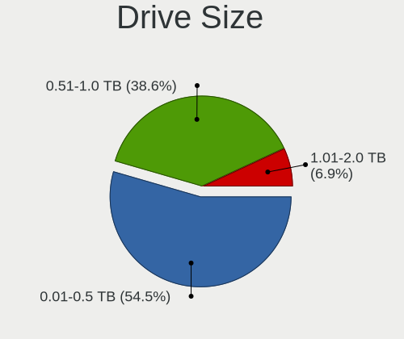
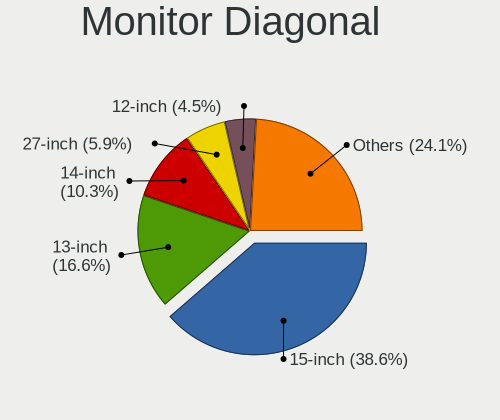
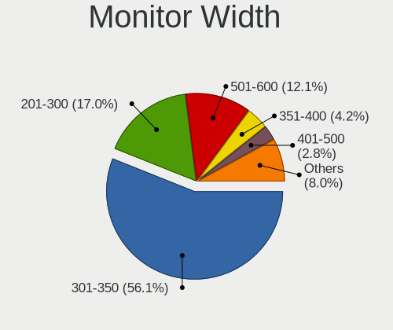
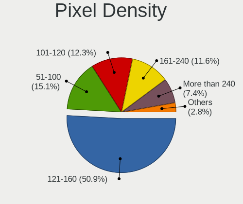
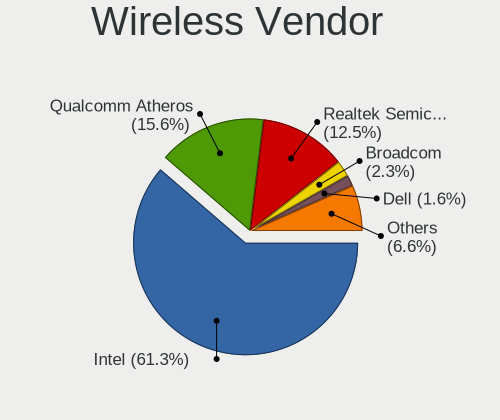
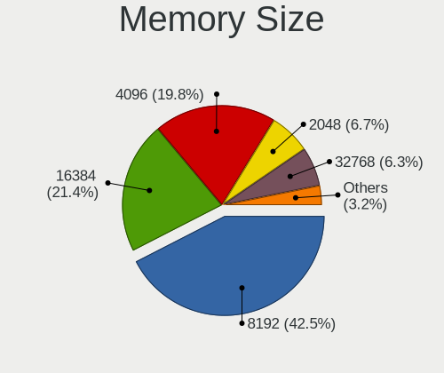
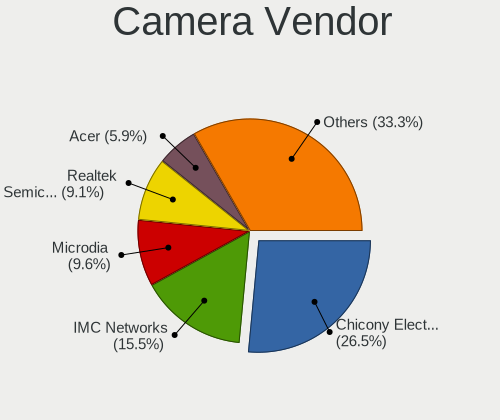
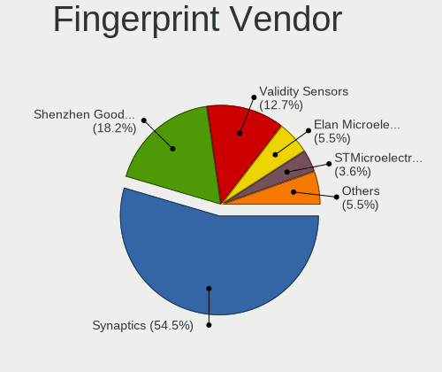
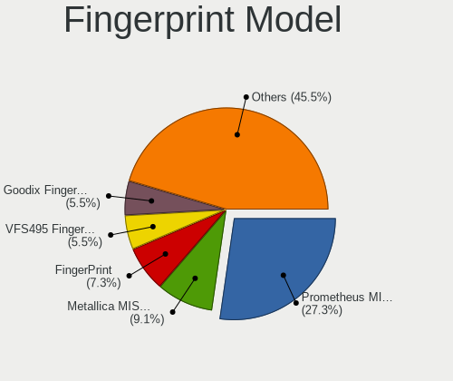

Gentoo 2.7 - Tested Hardware & Statistics (Notebooks)
-----------------------------------------------------

A project to collect tested hardware configurations for Gentoo 2.7.

Anyone can contribute to this report by the [hw-probe](https://github.com/linuxhw/hw-probe) tool:

    sudo -E hw-probe -all -upload

Please submit a probe of your configuration if it's not presented on the page or is rare.

Full-feature report is available here: https://linux-hardware.org/?view=trends&rel=gentoo-2.7

Contents
--------

* [ Test Cases ](#test-cases)

* [ System ](#system)
  - [ Kernel                   ](#kernel)
  - [ Kernel Family            ](#kernel-family)
  - [ Kernel Major Ver.        ](#kernel-major-ver)
  - [ Arch                     ](#arch)
  - [ DE                       ](#de)
  - [ Display Server           ](#display-server)
  - [ Display Manager          ](#display-manager)
  - [ OS Lang                  ](#os-lang)
  - [ Boot Mode                ](#boot-mode)
  - [ Filesystem               ](#filesystem)
  - [ Part. scheme             ](#part-scheme)
  - [ Dual Boot with Linux/BSD ](#dual-boot-with-linuxbsd)
  - [ Dual Boot (Win)          ](#dual-boot-win)

* [ Board ](#board)
  - [ Vendor                   ](#vendor)
  - [ Model                    ](#model)
  - [ Model Family             ](#model-family)
  - [ MFG Year                 ](#mfg-year)
  - [ Form Factor              ](#form-factor)
  - [ Secure Boot              ](#secure-boot)
  - [ Coreboot                 ](#coreboot)
  - [ RAM Size                 ](#ram-size)
  - [ RAM Used                 ](#ram-used)
  - [ Total Drives             ](#total-drives)
  - [ Has CD-ROM               ](#has-cd-rom)
  - [ Has Ethernet             ](#has-ethernet)
  - [ Has WiFi                 ](#has-wifi)
  - [ Has Bluetooth            ](#has-bluetooth)

* [ Location ](#location)
  - [ Country                  ](#country)
  - [ City                     ](#city)

* [ Drives ](#drives)
  - [ Drive Vendor             ](#drive-vendor)
  - [ Drive Model              ](#drive-model)
  - [ HDD Vendor               ](#hdd-vendor)
  - [ SSD Vendor               ](#ssd-vendor)
  - [ Drive Kind               ](#drive-kind)
  - [ Drive Connector          ](#drive-connector)
  - [ Drive Size               ](#drive-size)
  - [ Space Total              ](#space-total)
  - [ Space Used               ](#space-used)
  - [ Malfunc. Drives          ](#malfunc-drives)
  - [ Malfunc. Drive Vendor    ](#malfunc-drive-vendor)
  - [ Malfunc. HDD Vendor      ](#malfunc-hdd-vendor)
  - [ Malfunc. Drive Kind      ](#malfunc-drive-kind)
  - [ Failed Drives            ](#failed-drives)
  - [ Failed Drive Vendor      ](#failed-drive-vendor)
  - [ Drive Status             ](#drive-status)

* [ Storage controller ](#storage-controller)
  - [ Storage Vendor           ](#storage-vendor)
  - [ Storage Model            ](#storage-model)
  - [ Storage Kind             ](#storage-kind)

* [ Processor ](#processor)
  - [ CPU Vendor               ](#cpu-vendor)
  - [ CPU Model                ](#cpu-model)
  - [ CPU Model Family         ](#cpu-model-family)
  - [ CPU Cores                ](#cpu-cores)
  - [ CPU Sockets              ](#cpu-sockets)
  - [ CPU Threads              ](#cpu-threads)
  - [ CPU Op-Modes             ](#cpu-op-modes)
  - [ CPU Microcode            ](#cpu-microcode)
  - [ CPU Microarch            ](#cpu-microarch)

* [ Graphics ](#graphics)
  - [ GPU Vendor               ](#gpu-vendor)
  - [ GPU Model                ](#gpu-model)
  - [ GPU Combo                ](#gpu-combo)
  - [ GPU Driver               ](#gpu-driver)
  - [ GPU Memory               ](#gpu-memory)

* [ Monitor ](#monitor)
  - [ Monitor Vendor           ](#monitor-vendor)
  - [ Monitor Model            ](#monitor-model)
  - [ Monitor Resolution       ](#monitor-resolution)
  - [ Monitor Diagonal         ](#monitor-diagonal)
  - [ Monitor Width            ](#monitor-width)
  - [ Aspect Ratio             ](#aspect-ratio)
  - [ Monitor Area             ](#monitor-area)
  - [ Pixel Density            ](#pixel-density)
  - [ Multiple Monitors        ](#multiple-monitors)

* [ Network ](#network)
  - [ Net Controller Vendor    ](#net-controller-vendor)
  - [ Net Controller Model     ](#net-controller-model)
  - [ Wireless Vendor          ](#wireless-vendor)
  - [ Wireless Model           ](#wireless-model)
  - [ Ethernet Vendor          ](#ethernet-vendor)
  - [ Ethernet Model           ](#ethernet-model)
  - [ Net Controller Kind      ](#net-controller-kind)
  - [ Used Controller          ](#used-controller)
  - [ NICs                     ](#nics)
  - [ IPv6                     ](#ipv6)

* [ Bluetooth ](#bluetooth)
  - [ Bluetooth Vendor         ](#bluetooth-vendor)
  - [ Bluetooth Model          ](#bluetooth-model)

* [ Sound ](#sound)
  - [ Sound Vendor             ](#sound-vendor)
  - [ Sound Model              ](#sound-model)

* [ Memory ](#memory)
  - [ Memory Vendor            ](#memory-vendor)
  - [ Memory Model             ](#memory-model)
  - [ Memory Kind              ](#memory-kind)
  - [ Memory Form Factor       ](#memory-form-factor)
  - [ Memory Size              ](#memory-size)
  - [ Memory Speed             ](#memory-speed)

* [ Printers & scanners ](#printers--scanners)
  - [ Printer Vendor           ](#printer-vendor)
  - [ Printer Model            ](#printer-model)
  - [ Scanner Vendor           ](#scanner-vendor)
  - [ Scanner Model            ](#scanner-model)

* [ Camera ](#camera)
  - [ Camera Vendor            ](#camera-vendor)
  - [ Camera Model             ](#camera-model)

* [ Security ](#security)
  - [ Fingerprint Vendor       ](#fingerprint-vendor)
  - [ Fingerprint Model        ](#fingerprint-model)
  - [ Chipcard Vendor          ](#chipcard-vendor)
  - [ Chipcard Model           ](#chipcard-model)

* [ Unsupported ](#unsupported)
  - [ Unsupported Devices      ](#unsupported-devices)
  - [ Unsupported Device Types ](#unsupported-device-types)

Test Cases
----------

| Vendor        | Model                       | Probe                                                      | Date         |
|---------------|-----------------------------|------------------------------------------------------------|--------------|
| Purism        | librem_15v4                 | [f3e5eba0c2](https://linux-hardware.org/?probe=f3e5eba0c2) | Oct 31, 2021 |
| Purism        | librem_15v4                 | [c74129a618](https://linux-hardware.org/?probe=c74129a618) | Oct 31, 2021 |
| HP            | ProBook 455 G7              | [1719b2dc9d](https://linux-hardware.org/?probe=1719b2dc9d) | Oct 30, 2021 |
| ASUSTek       | X556URK                     | [212240b258](https://linux-hardware.org/?probe=212240b258) | Oct 29, 2021 |
| Dell          | Latitude E6530              | [fd1375d5f1](https://linux-hardware.org/?probe=fd1375d5f1) | Oct 28, 2021 |
| Dell          | Latitude E6530              | [f37394899f](https://linux-hardware.org/?probe=f37394899f) | Oct 28, 2021 |
| HP            | Pavilion Notebook           | [4b691f2884](https://linux-hardware.org/?probe=4b691f2884) | Oct 27, 2021 |
| HP            | Pavilion Gaming Laptop 1... | [cb7d97fd9e](https://linux-hardware.org/?probe=cb7d97fd9e) | Oct 26, 2021 |
| HP            | Pavilion ZV6100 (EE984EA... | [280b8af5cc](https://linux-hardware.org/?probe=280b8af5cc) | Oct 23, 2021 |
| HP            | Pavilion ZV6100 (EE984EA... | [f34760d3fe](https://linux-hardware.org/?probe=f34760d3fe) | Oct 16, 2021 |
| Timi          | RedmiBook 13 R              | [18263076ea](https://linux-hardware.org/?probe=18263076ea) | Oct 14, 2021 |
| Lenovo        | IdeaPad 5 14ITL05 82FE      | [10d09b7d77](https://linux-hardware.org/?probe=10d09b7d77) | Oct 12, 2021 |
| Samsung       | 300V3A/300V4A/300V5A/200... | [d7a870e424](https://linux-hardware.org/?probe=d7a870e424) | Oct 11, 2021 |
| Acer          | TravelMate P648-M           | [03350be971](https://linux-hardware.org/?probe=03350be971) | Oct 11, 2021 |
| Lenovo        | Yoga 2 13 20344             | [7fbd3218a8](https://linux-hardware.org/?probe=7fbd3218a8) | Oct 11, 2021 |
| Acer          | TravelMate P648-M           | [6e6d3fe55c](https://linux-hardware.org/?probe=6e6d3fe55c) | Oct 10, 2021 |
| IBM           | ThinkPad T43 2668Z3S        | [67510cc1aa](https://linux-hardware.org/?probe=67510cc1aa) | Oct 10, 2021 |
| Timi          | RedmiBook 13 R              | [e6c38e5b79](https://linux-hardware.org/?probe=e6c38e5b79) | Oct 10, 2021 |
| HP            | Pavilion ZV6100 (EE984EA... | [fa58c39541](https://linux-hardware.org/?probe=fa58c39541) | Oct 09, 2021 |
| ASUSTek       | ROG Strix G513QM_G513QM     | [a8ea4ccbef](https://linux-hardware.org/?probe=a8ea4ccbef) | Oct 06, 2021 |
| ASUSTek       | ROG Strix G513QM_G513QM     | [666f9cb875](https://linux-hardware.org/?probe=666f9cb875) | Oct 06, 2021 |
| HP            | Pavilion ZV6100 (EE984EA... | [8debdfa001](https://linux-hardware.org/?probe=8debdfa001) | Oct 02, 2021 |
| ASUSTek       | Unknown                     | [9b357ee9bb](https://linux-hardware.org/?probe=9b357ee9bb) | Oct 01, 2021 |
| Lenovo        | Legion 5P 15IMH05 82AW      | [fbade9e61e](https://linux-hardware.org/?probe=fbade9e61e) | Oct 01, 2021 |
| ASUSTek       | X555LJ                      | [dea4201e98](https://linux-hardware.org/?probe=dea4201e98) | Oct 01, 2021 |
| Lenovo        | IdeaPad 5 14ARE05 81YM      | [27707fb954](https://linux-hardware.org/?probe=27707fb954) | Oct 01, 2021 |
| HP            | 255 G6 Notebook PC          | [9823c616ed](https://linux-hardware.org/?probe=9823c616ed) | Sep 30, 2021 |
| HP            | ProBook 430 G5              | [6ee2943500](https://linux-hardware.org/?probe=6ee2943500) | Sep 30, 2021 |
| Dell          | Inspiron 5577               | [f5ec85dd12](https://linux-hardware.org/?probe=f5ec85dd12) | Sep 29, 2021 |
| Dell          | Inspiron 5577               | [80e36f9785](https://linux-hardware.org/?probe=80e36f9785) | Sep 29, 2021 |
| Timi          | Mi Laptop Pro 15            | [de13c8f3fa](https://linux-hardware.org/?probe=de13c8f3fa) | Sep 29, 2021 |
| Lenovo        | ThinkPad X240 20AMS1LN00    | [71d301cc84](https://linux-hardware.org/?probe=71d301cc84) | Sep 26, 2021 |
| Lenovo        | ThinkPad X1 Extreme Gen ... | [116e97036b](https://linux-hardware.org/?probe=116e97036b) | Sep 25, 2021 |
| ASUSTek       | ROG Zephyrus G14 GA401II... | [8b939aae88](https://linux-hardware.org/?probe=8b939aae88) | Sep 25, 2021 |
| HP            | Pavilion ZV6100 (EE984EA... | [5c7ce8f98b](https://linux-hardware.org/?probe=5c7ce8f98b) | Sep 24, 2021 |
| ASUSTek       | GX501VIK                    | [b36bf17cc2](https://linux-hardware.org/?probe=b36bf17cc2) | Sep 24, 2021 |
| Lenovo        | Yoga Slim 7 Pro 14IHU5 O... | [f40c18c3b8](https://linux-hardware.org/?probe=f40c18c3b8) | Sep 23, 2021 |
| Lenovo        | ThinkPad P1 Gen 4i 20Y3C... | [4698844ec0](https://linux-hardware.org/?probe=4698844ec0) | Sep 20, 2021 |
| Lenovo        | B51-80 80LM                 | [320ab41cbb](https://linux-hardware.org/?probe=320ab41cbb) | Sep 17, 2021 |
| HP            | Pavilion ZV6100 (EE984EA... | [e3b8b92fdb](https://linux-hardware.org/?probe=e3b8b92fdb) | Sep 17, 2021 |
| HP            | OMEN by HP Laptop 15-dc0... | [4c18c08616](https://linux-hardware.org/?probe=4c18c08616) | Sep 15, 2021 |
| HP            | OMEN by HP Laptop 15-dc0... | [d406b31a3a](https://linux-hardware.org/?probe=d406b31a3a) | Sep 15, 2021 |
| ASUSTek       | ZenBook UX333FN_UX333FN     | [3d0115d011](https://linux-hardware.org/?probe=3d0115d011) | Sep 15, 2021 |
| Notebook      | P65xHP                      | [12a7ec2b86](https://linux-hardware.org/?probe=12a7ec2b86) | Sep 14, 2021 |
| Lenovo        | ThinkPad X1 Carbon Gen 9... | [b1c5ad62b3](https://linux-hardware.org/?probe=b1c5ad62b3) | Sep 13, 2021 |
| Dell          | Latitude 5410               | [97ed647d4c](https://linux-hardware.org/?probe=97ed647d4c) | Sep 10, 2021 |
| HP            | OMEN by HP Laptop 15-dc0... | [9dcddb807d](https://linux-hardware.org/?probe=9dcddb807d) | Sep 10, 2021 |
| HP            | OMEN by HP Laptop 15-dc0... | [572c0c5198](https://linux-hardware.org/?probe=572c0c5198) | Sep 10, 2021 |
| Lenovo        | ThinkPad P14s Gen 1 20Y1... | [36bf3dd55d](https://linux-hardware.org/?probe=36bf3dd55d) | Sep 09, 2021 |
| ASUSTek       | ZenBook UX425IA_U4700IA     | [fa970f7a80](https://linux-hardware.org/?probe=fa970f7a80) | Sep 08, 2021 |
| Dell          | Precision 7560              | [3fa67e38db](https://linux-hardware.org/?probe=3fa67e38db) | Sep 08, 2021 |
| HP            | Pavilion g6                 | [1161032a20](https://linux-hardware.org/?probe=1161032a20) | Sep 08, 2021 |
| Dell          | Precision 7560              | [03d7773132](https://linux-hardware.org/?probe=03d7773132) | Sep 06, 2021 |
| ASUSTek       | ZenBook UX333FN_UX333FN     | [5a43bd347f](https://linux-hardware.org/?probe=5a43bd347f) | Sep 06, 2021 |
| ASUSTek       | ZenBook UX333FN_UX333FN     | [a629879646](https://linux-hardware.org/?probe=a629879646) | Sep 06, 2021 |
| ASUSTek       | X550ZA                      | [0d41969b6b](https://linux-hardware.org/?probe=0d41969b6b) | Sep 02, 2021 |
| Dell          | Latitude E6510              | [2ab208b5cd](https://linux-hardware.org/?probe=2ab208b5cd) | Sep 02, 2021 |
| HP            | 255 G6 Notebook PC          | [4f71a8ad02](https://linux-hardware.org/?probe=4f71a8ad02) | Sep 01, 2021 |
| HP            | ZBook 15 G3                 | [d6872bd9e9](https://linux-hardware.org/?probe=d6872bd9e9) | Sep 01, 2021 |
| Lenovo        | Legion 5P 15IMH05 82AW      | [f1b58d72ac](https://linux-hardware.org/?probe=f1b58d72ac) | Aug 31, 2021 |
| HP            | Pavilion ZV6100 (EE984EA... | [3319bbb803](https://linux-hardware.org/?probe=3319bbb803) | Aug 31, 2021 |
| HP            | 255 G6 Notebook PC          | [3076551390](https://linux-hardware.org/?probe=3076551390) | Aug 30, 2021 |
| IBM           | ThinkPad T42 2373V4F        | [2362291c05](https://linux-hardware.org/?probe=2362291c05) | Aug 28, 2021 |
| IBM           | ThinkPad T43 2668Z3S        | [5a606b504c](https://linux-hardware.org/?probe=5a606b504c) | Aug 28, 2021 |
| IBM           | ThinkPad T43 2668Z3S        | [2af8736235](https://linux-hardware.org/?probe=2af8736235) | Aug 28, 2021 |
| HP            | 255 G6 Notebook PC          | [a8c5a1a4c7](https://linux-hardware.org/?probe=a8c5a1a4c7) | Aug 27, 2021 |
| ASUSTek       | ZenBook UX325EA_UX325EA     | [aabbe0dbcc](https://linux-hardware.org/?probe=aabbe0dbcc) | Aug 26, 2021 |
| ASUSTek       | ROG Strix G533QR_G533QR     | [cf76a62cf4](https://linux-hardware.org/?probe=cf76a62cf4) | Aug 26, 2021 |
| HP            | 255 G6 Notebook PC          | [b776f7f3b7](https://linux-hardware.org/?probe=b776f7f3b7) | Aug 26, 2021 |
| ASUSTek       | ROG Strix G533QR_G533QR     | [62ba09ac38](https://linux-hardware.org/?probe=62ba09ac38) | Aug 26, 2021 |
| Lenovo        | Legion 5P 15IMH05 82AW      | [994e94defa](https://linux-hardware.org/?probe=994e94defa) | Aug 26, 2021 |
| Lenovo        | ThinkPad X230 23259H1       | [fb125d2779](https://linux-hardware.org/?probe=fb125d2779) | Aug 25, 2021 |
| HP            | Pavilion ZV6100 (EE984EA... | [badf30135c](https://linux-hardware.org/?probe=badf30135c) | Aug 22, 2021 |
| Lenovo        | ThinkPad X1 Carbon Gen 9... | [4736a01d82](https://linux-hardware.org/?probe=4736a01d82) | Aug 17, 2021 |
| Dell          | Inspiron 5415               | [909e2cdc93](https://linux-hardware.org/?probe=909e2cdc93) | Aug 15, 2021 |
| Dell          | Inspiron 5415               | [96cd32b528](https://linux-hardware.org/?probe=96cd32b528) | Aug 15, 2021 |
| Lenovo        | ThinkPad X1 Carbon Gen 9... | [ef36f1dc4d](https://linux-hardware.org/?probe=ef36f1dc4d) | Aug 15, 2021 |
| HP            | Pavilion ZV6100 (EE984EA... | [7a50fc3510](https://linux-hardware.org/?probe=7a50fc3510) | Aug 15, 2021 |
| Lenovo        | ThinkPad X1 Carbon Gen 9... | [c45478eae5](https://linux-hardware.org/?probe=c45478eae5) | Aug 12, 2021 |
| Dell          | Inspiron 5415               | [63594290cf](https://linux-hardware.org/?probe=63594290cf) | Aug 11, 2021 |
| TUXEDO        | Book XC1711                 | [806e284c8a](https://linux-hardware.org/?probe=806e284c8a) | Aug 11, 2021 |
| Jumper        | EZpad                       | [da2436c208](https://linux-hardware.org/?probe=da2436c208) | Aug 11, 2021 |
| Jumper        | EZpad                       | [6215ba7396](https://linux-hardware.org/?probe=6215ba7396) | Aug 10, 2021 |
| HP            | Pavilion ZV6100 (EE984EA... | [a2eec215a6](https://linux-hardware.org/?probe=a2eec215a6) | Aug 08, 2021 |
| Lenovo        | ThinkPad X1 Carbon Gen 9... | [660b357dde](https://linux-hardware.org/?probe=660b357dde) | Aug 08, 2021 |
| ASUSTek       | ZenBook UX325EA_UX325EA     | [ddf6a2277a](https://linux-hardware.org/?probe=ddf6a2277a) | Aug 07, 2021 |
| Lenovo        | ThinkPad X1 Carbon Gen 9... | [4ce0735262](https://linux-hardware.org/?probe=4ce0735262) | Aug 06, 2021 |
| MSI           | GF63 Thin 9SCSR             | [0fac51313a](https://linux-hardware.org/?probe=0fac51313a) | Aug 06, 2021 |
| Lenovo        | ThinkPad X1 Carbon Gen 9... | [30131c51fb](https://linux-hardware.org/?probe=30131c51fb) | Aug 05, 2021 |
| ASUSTek       | X510UR                      | [8e08727583](https://linux-hardware.org/?probe=8e08727583) | Aug 03, 2021 |
| TUXEDO        | Book_XA1510                 | [f4f777ed12](https://linux-hardware.org/?probe=f4f777ed12) | Aug 03, 2021 |
| HP            | Pavilion ZV6100 (EE984EA... | [d8386898c1](https://linux-hardware.org/?probe=d8386898c1) | Jul 31, 2021 |
| Lenovo        | IdeaPad Z510 20287          | [380758e335](https://linux-hardware.org/?probe=380758e335) | Jul 28, 2021 |
| Lenovo        | IdeaPad Z510 20287          | [a5a11a0de1](https://linux-hardware.org/?probe=a5a11a0de1) | Jul 28, 2021 |
| Dell          | XPS 15 7590                 | [f22f34ea9a](https://linux-hardware.org/?probe=f22f34ea9a) | Jul 25, 2021 |
| HP            | Pavilion ZV6100 (EE984EA... | [e5dd847990](https://linux-hardware.org/?probe=e5dd847990) | Jul 24, 2021 |
| Lenovo        | ThinkPad P14s Gen 1 20Y1... | [3de3129139](https://linux-hardware.org/?probe=3de3129139) | Jul 22, 2021 |
| Lenovo        | ThinkPad P14s Gen 1 20Y1... | [6cba1afdb8](https://linux-hardware.org/?probe=6cba1afdb8) | Jul 22, 2021 |
| Lenovo        | ThinkPad P14s Gen 1 20Y1... | [c6a7c7d9d8](https://linux-hardware.org/?probe=c6a7c7d9d8) | Jul 19, 2021 |
| HP            | Pavilion ZV6100 (EE984EA... | [2830192011](https://linux-hardware.org/?probe=2830192011) | Jul 17, 2021 |
| Lenovo        | IdeaPad 100-15IBD 80QQ      | [236639a923](https://linux-hardware.org/?probe=236639a923) | Jul 16, 2021 |
| Lenovo        | ThinkPad T480 20L5000AMC    | [4b6bb5e980](https://linux-hardware.org/?probe=4b6bb5e980) | Jul 16, 2021 |
| Dell          | Latitude E6430              | [3dc281ca01](https://linux-hardware.org/?probe=3dc281ca01) | Jul 13, 2021 |
| Dell          | XPS 13 9310                 | [6835266a32](https://linux-hardware.org/?probe=6835266a32) | Jul 10, 2021 |
| Dell          | Latitude E6430              | [f5a73f4d90](https://linux-hardware.org/?probe=f5a73f4d90) | Jul 09, 2021 |
| Dell          | Latitude E6430              | [8d685287ce](https://linux-hardware.org/?probe=8d685287ce) | Jul 09, 2021 |
| HP            | Pavilion Notebook           | [68c41ed42b](https://linux-hardware.org/?probe=68c41ed42b) | Jul 08, 2021 |
| HP            | Pavilion Notebook           | [5a6fca486a](https://linux-hardware.org/?probe=5a6fca486a) | Jul 08, 2021 |
| Acer          | Aspire A315-32              | [3a9edbefac](https://linux-hardware.org/?probe=3a9edbefac) | Jul 06, 2021 |
| Acer          | Aspire A315-32              | [09f71bed72](https://linux-hardware.org/?probe=09f71bed72) | Jul 06, 2021 |
| Samsung       | 300E4C/300E5C/300E7C        | [cbb60edb8c](https://linux-hardware.org/?probe=cbb60edb8c) | Jul 02, 2021 |
| Samsung       | 300E4C/300E5C/300E7C        | [26a655c4b4](https://linux-hardware.org/?probe=26a655c4b4) | Jul 02, 2021 |
| HP            | Pro Tablet 608 G1           | [c1a115b721](https://linux-hardware.org/?probe=c1a115b721) | Jun 28, 2021 |
| Razer         | Blade 15 Mid 2019-Base      | [69f9da2ac3](https://linux-hardware.org/?probe=69f9da2ac3) | Jun 26, 2021 |
| HUAWEI        | HN-WX9X                     | [c9180096a8](https://linux-hardware.org/?probe=c9180096a8) | Jun 26, 2021 |
| Lenovo        | ThinkPad T480 20L5000AMC    | [e1fe98a9de](https://linux-hardware.org/?probe=e1fe98a9de) | Jun 23, 2021 |
| Lenovo        | Legion 5 15IMH05 82AU       | [8ac09d11a4](https://linux-hardware.org/?probe=8ac09d11a4) | Jun 20, 2021 |
| Lenovo        | Legion 5 15IMH05 82AU       | [70c10f988f](https://linux-hardware.org/?probe=70c10f988f) | Jun 20, 2021 |
| HP            | Pavilion ZV6100 (EE984EA... | [613754139b](https://linux-hardware.org/?probe=613754139b) | Jun 20, 2021 |
| MSI           | GS66 Stealth 10SFS          | [7535868db2](https://linux-hardware.org/?probe=7535868db2) | Jun 18, 2021 |
| MSI           | GS66 Stealth 10SFS          | [c095a4437c](https://linux-hardware.org/?probe=c095a4437c) | Jun 17, 2021 |
| HP            | Pavilion Notebook           | [8d612e77f2](https://linux-hardware.org/?probe=8d612e77f2) | Jun 14, 2021 |
| ASUSTek       | ROG Zephyrus G14 GA401II... | [7b589175d7](https://linux-hardware.org/?probe=7b589175d7) | Jun 14, 2021 |
| HP            | Pavilion ZV6100 (EE984EA... | [8d5844241c](https://linux-hardware.org/?probe=8d5844241c) | Jun 13, 2021 |
| HP            | Laptop 14-dk0xxx            | [9b07d82840](https://linux-hardware.org/?probe=9b07d82840) | Jun 12, 2021 |
| Acer          | Aspire A315-42              | [efab65cf1d](https://linux-hardware.org/?probe=efab65cf1d) | Jun 12, 2021 |
| Acer          | Aspire E5-571G              | [b3ffc705fc](https://linux-hardware.org/?probe=b3ffc705fc) | Jun 11, 2021 |
| Dell          | XPS 17 9700                 | [293537d794](https://linux-hardware.org/?probe=293537d794) | Jun 11, 2021 |
| Lenovo        | ThinkPad X390 20Q0000KRT    | [f1d0d2bda6](https://linux-hardware.org/?probe=f1d0d2bda6) | Jun 09, 2021 |
| Lenovo        | G50-30 80G0                 | [ab9da369c0](https://linux-hardware.org/?probe=ab9da369c0) | Jun 09, 2021 |
| Lenovo        | Legion Y530-15ICH 81FV      | [407abb051f](https://linux-hardware.org/?probe=407abb051f) | Jun 09, 2021 |
| Lenovo        | Legion Y530-15ICH 81FV      | [5e6aba1341](https://linux-hardware.org/?probe=5e6aba1341) | Jun 09, 2021 |
| Dell          | Inspiron 7375               | [7704e5289b](https://linux-hardware.org/?probe=7704e5289b) | Jun 07, 2021 |
| HP            | Pavilion ZV6100 (EE984EA... | [7e7084b78c](https://linux-hardware.org/?probe=7e7084b78c) | Jun 06, 2021 |
| Lenovo        | ThinkPad L450 20DTS01R00    | [f8e58be450](https://linux-hardware.org/?probe=f8e58be450) | Jun 03, 2021 |
| Lenovo        | ThinkPad X390 20Q0000KRT    | [b571e885e2](https://linux-hardware.org/?probe=b571e885e2) | Jun 03, 2021 |
| HP            | EliteBook 855 G7 Noteboo... | [f3f3c323ab](https://linux-hardware.org/?probe=f3f3c323ab) | Jun 03, 2021 |
| Dell          | XPS 13 9300                 | [e85b21841c](https://linux-hardware.org/?probe=e85b21841c) | Jun 01, 2021 |
| Dell          | XPS 13 9300                 | [8a7fbf7026](https://linux-hardware.org/?probe=8a7fbf7026) | Jun 01, 2021 |
| Dell          | XPS 13 9300                 | [fbbaf8088b](https://linux-hardware.org/?probe=fbbaf8088b) | Jun 01, 2021 |
| Dell          | XPS 13 9300                 | [024ffa0922](https://linux-hardware.org/?probe=024ffa0922) | Jun 01, 2021 |
| HP            | Pavilion ZV6100 (EE984EA... | [32f7b77b77](https://linux-hardware.org/?probe=32f7b77b77) | May 30, 2021 |
| Lenovo        | IdeaPad L340-15IRH Gamin... | [052b95ba1d](https://linux-hardware.org/?probe=052b95ba1d) | May 27, 2021 |
| Dell          | Inspiron 5415               | [bbf1e95976](https://linux-hardware.org/?probe=bbf1e95976) | May 27, 2021 |
| HUAWEI        | BOHK-WAX9X                  | [83d261308f](https://linux-hardware.org/?probe=83d261308f) | May 26, 2021 |
| Dell          | Inspiron 5415               | [abc4464787](https://linux-hardware.org/?probe=abc4464787) | May 26, 2021 |
| Dell          | Inspiron 5415               | [27c5c40e12](https://linux-hardware.org/?probe=27c5c40e12) | May 26, 2021 |
| Lenovo        | ThinkPad X230 2325BF1       | [0d334af224](https://linux-hardware.org/?probe=0d334af224) | May 26, 2021 |
| HP            | Pavilion Gaming Laptop 1... | [e1cf7f4599](https://linux-hardware.org/?probe=e1cf7f4599) | May 24, 2021 |
| HP            | Pavilion Notebook           | [10cf947d23](https://linux-hardware.org/?probe=10cf947d23) | May 24, 2021 |
| HP            | Pavilion ZV6100 (EE984EA... | [81fb83e4cd](https://linux-hardware.org/?probe=81fb83e4cd) | May 23, 2021 |
| Toshiba       | Satellite A200              | [455915e23a](https://linux-hardware.org/?probe=455915e23a) | May 21, 2021 |
| ASUSTek       | X550ZA                      | [aef8ea73d8](https://linux-hardware.org/?probe=aef8ea73d8) | May 20, 2021 |
| HUAWEI        | BOHK-WAX9X                  | [72904aba23](https://linux-hardware.org/?probe=72904aba23) | May 20, 2021 |
| Lenovo        | ThinkPad T14 Gen 1 20UD0... | [089c319771](https://linux-hardware.org/?probe=089c319771) | May 18, 2021 |
| Lenovo        | ThinkPad T61p 8891CTO       | [8a05529e0c](https://linux-hardware.org/?probe=8a05529e0c) | May 18, 2021 |
| Lenovo        | ThinkPad T61p 8891CTO       | [6daf66a738](https://linux-hardware.org/?probe=6daf66a738) | May 18, 2021 |
| Razer         | Blade 15 Base Model (Ear... | [2b97441fb1](https://linux-hardware.org/?probe=2b97441fb1) | May 17, 2021 |
| Lenovo        | IdeaPad 100-15IBD 80QQ      | [9a767f85c2](https://linux-hardware.org/?probe=9a767f85c2) | May 17, 2021 |
| HP            | EliteBook 855 G7 Noteboo... | [50b75a0212](https://linux-hardware.org/?probe=50b75a0212) | May 17, 2021 |
| Lenovo        | Yoga 2 13 20344             | [d75aff5a0a](https://linux-hardware.org/?probe=d75aff5a0a) | May 16, 2021 |
| Razer         | Blade 15 Base Model (Ear... | [f9420a7960](https://linux-hardware.org/?probe=f9420a7960) | May 16, 2021 |
| HP            | Pavilion ZV6100 (EE984EA... | [8b13fead92](https://linux-hardware.org/?probe=8b13fead92) | May 15, 2021 |
| HP            | Unknown                     | [554d7cd528](https://linux-hardware.org/?probe=554d7cd528) | May 14, 2021 |
| HP            | Unknown                     | [d11a5ff11b](https://linux-hardware.org/?probe=d11a5ff11b) | May 13, 2021 |
| Dell          | Inspiron 3135               | [2773a72a9b](https://linux-hardware.org/?probe=2773a72a9b) | May 10, 2021 |
| HP            | ProBook 445 G7              | [6c504fbdf0](https://linux-hardware.org/?probe=6c504fbdf0) | May 10, 2021 |
| HP            | Pavilion Notebook           | [7e483f822d](https://linux-hardware.org/?probe=7e483f822d) | May 09, 2021 |
| HP            | Pavilion ZV6100 (EE984EA... | [5b8198d382](https://linux-hardware.org/?probe=5b8198d382) | May 08, 2021 |
| HP            | Unknown                     | [923ee16061](https://linux-hardware.org/?probe=923ee16061) | May 08, 2021 |
| HP            | Pavilion Notebook           | [993f3384ed](https://linux-hardware.org/?probe=993f3384ed) | May 08, 2021 |
| Dell          | Inspiron 3135               | [9bcfced245](https://linux-hardware.org/?probe=9bcfced245) | May 07, 2021 |
| Dell          | XPS 13 9310                 | [c3e8ad6826](https://linux-hardware.org/?probe=c3e8ad6826) | May 07, 2021 |
| HP            | Laptop 15-dw2xxx            | [0b4a5c33ef](https://linux-hardware.org/?probe=0b4a5c33ef) | May 06, 2021 |
| Dell          | G3 3500                     | [f6624959c4](https://linux-hardware.org/?probe=f6624959c4) | May 05, 2021 |
| Dell          | G3 3500                     | [03ad0892de](https://linux-hardware.org/?probe=03ad0892de) | May 05, 2021 |
| ASUSTek       | ROG Zephyrus G14 GA401II... | [761feac522](https://linux-hardware.org/?probe=761feac522) | May 04, 2021 |
| HP            | Unknown                     | [3b8a91fb03](https://linux-hardware.org/?probe=3b8a91fb03) | May 03, 2021 |
| HP            | Pavilion Notebook           | [79a8f7d7d8](https://linux-hardware.org/?probe=79a8f7d7d8) | May 03, 2021 |
| HP            | Pavilion Gaming Laptop 1... | [1d95f1feca](https://linux-hardware.org/?probe=1d95f1feca) | May 02, 2021 |
| Toshiba       | NB100                       | [9540e0d0d5](https://linux-hardware.org/?probe=9540e0d0d5) | May 02, 2021 |
| HP            | Pavilion Notebook           | [5feda7dcc9](https://linux-hardware.org/?probe=5feda7dcc9) | May 02, 2021 |
| Dell          | Inspiron 3542               | [aa72a49a15](https://linux-hardware.org/?probe=aa72a49a15) | Apr 30, 2021 |
| Lenovo        | ThinkPad P50 20EN0006UK     | [6f9d0f45bb](https://linux-hardware.org/?probe=6f9d0f45bb) | Apr 30, 2021 |
| HP            | Pavilion ZV6100 (EE984EA... | [83c0ac9888](https://linux-hardware.org/?probe=83c0ac9888) | Apr 30, 2021 |
| Dell          | G3 3500                     | [db309111ed](https://linux-hardware.org/?probe=db309111ed) | Apr 27, 2021 |
| Dell          | XPS 17 9700                 | [02dae8d8ba](https://linux-hardware.org/?probe=02dae8d8ba) | Apr 24, 2021 |
| HP            | Pavilion ZV6100 (EE984EA... | [2ed72a5012](https://linux-hardware.org/?probe=2ed72a5012) | Apr 22, 2021 |
| Dell          | G3 3500                     | [d1a4723065](https://linux-hardware.org/?probe=d1a4723065) | Apr 20, 2021 |
| Dell          | G3 3500                     | [3295e38ea9](https://linux-hardware.org/?probe=3295e38ea9) | Apr 20, 2021 |
| Dell          | XPS 17 9700                 | [144d6867d6](https://linux-hardware.org/?probe=144d6867d6) | Apr 18, 2021 |
| Dell          | XPS 17 9700                 | [84387a75f7](https://linux-hardware.org/?probe=84387a75f7) | Apr 18, 2021 |
| ASUSTek       | ASUS TUF Gaming A15 FA50... | [b10d744c6c](https://linux-hardware.org/?probe=b10d744c6c) | Apr 18, 2021 |
| Lenovo        | ThinkPad P53 20QN001JUS     | [6d94f31cd6](https://linux-hardware.org/?probe=6d94f31cd6) | Apr 14, 2021 |
| HP            | Pavilion ZV6100 (EE984EA... | [89d46a7375](https://linux-hardware.org/?probe=89d46a7375) | Apr 12, 2021 |
| HP            | Pavilion Notebook           | [5159073240](https://linux-hardware.org/?probe=5159073240) | Apr 11, 2021 |
| HP            | Pavilion Notebook           | [99daea7567](https://linux-hardware.org/?probe=99daea7567) | Apr 11, 2021 |
| Dell          | G3 3500                     | [3510f864f1](https://linux-hardware.org/?probe=3510f864f1) | Apr 10, 2021 |
| HP            | OMEN by HP Laptop 15-dc1... | [7c883d58c6](https://linux-hardware.org/?probe=7c883d58c6) | Apr 10, 2021 |
| HP            | Pavilion ZV6100 (EE984EA... | [eac55aff15](https://linux-hardware.org/?probe=eac55aff15) | Apr 05, 2021 |
| Dell          | Latitude X1                 | [a35f6c0969](https://linux-hardware.org/?probe=a35f6c0969) | Apr 05, 2021 |
| HP            | OMEN by HP Laptop 15-dc1... | [66d76dda01](https://linux-hardware.org/?probe=66d76dda01) | Apr 03, 2021 |
| Dell          | Latitude X1                 | [1e053513e0](https://linux-hardware.org/?probe=1e053513e0) | Apr 03, 2021 |
| MSI           | GE62 6QD                    | [d76949a11c](https://linux-hardware.org/?probe=d76949a11c) | Apr 01, 2021 |
| Acer          | Aspire E5-571G              | [c730c15bc5](https://linux-hardware.org/?probe=c730c15bc5) | Mar 31, 2021 |
| HP            | Pavilion ZV6100 (EE984EA... | [e11852c937](https://linux-hardware.org/?probe=e11852c937) | Mar 26, 2021 |
| ASUSTek       | N501VW                      | [46863f1f90](https://linux-hardware.org/?probe=46863f1f90) | Mar 24, 2021 |
| HP            | Pavilion ZV6100 (EE984EA... | [5330bba5eb](https://linux-hardware.org/?probe=5330bba5eb) | Mar 19, 2021 |
| Dell          | XPS 13 9380                 | [a8f5a8232e](https://linux-hardware.org/?probe=a8f5a8232e) | Mar 17, 2021 |
| Lenovo        | IdeaPad 330-15IKB 81DE      | [65f8817baf](https://linux-hardware.org/?probe=65f8817baf) | Mar 17, 2021 |
| HP            | OMEN by HP Laptop 15-dc1... | [9378abad5c](https://linux-hardware.org/?probe=9378abad5c) | Mar 16, 2021 |
| HP            | OMEN by HP Laptop 15-dc1... | [b96252ab8f](https://linux-hardware.org/?probe=b96252ab8f) | Mar 15, 2021 |
| Lenovo        | ThinkBook 14 G2 ARE 20VF    | [aac20e8dce](https://linux-hardware.org/?probe=aac20e8dce) | Mar 15, 2021 |
| Lenovo        | ThinkPad T470s 20HFCTO1W... | [6c33ce2e79](https://linux-hardware.org/?probe=6c33ce2e79) | Mar 14, 2021 |
| HP            | Laptop 15-bs1xx             | [bd1886f540](https://linux-hardware.org/?probe=bd1886f540) | Mar 14, 2021 |
| Lenovo        | ThinkPad T14 Gen 1 20S1S... | [14d6107700](https://linux-hardware.org/?probe=14d6107700) | Mar 13, 2021 |
| Lenovo        | ThinkPad T14 Gen 1 20S1S... | [3043c4c8ed](https://linux-hardware.org/?probe=3043c4c8ed) | Mar 13, 2021 |
| HP            | ZBook Power G7 Mobile Wo... | [edbe4b927f](https://linux-hardware.org/?probe=edbe4b927f) | Mar 12, 2021 |
| HP            | Laptop 15s-eq0xxx           | [ed79695034](https://linux-hardware.org/?probe=ed79695034) | Mar 12, 2021 |
| HP            | Pavilion ZV6100 (EE984EA... | [ff1e5f1771](https://linux-hardware.org/?probe=ff1e5f1771) | Mar 12, 2021 |
| Dell          | Latitude 5410               | [f7ff0d1881](https://linux-hardware.org/?probe=f7ff0d1881) | Mar 07, 2021 |
| Dell          | Latitude 5410               | [2f64a4536e](https://linux-hardware.org/?probe=2f64a4536e) | Mar 06, 2021 |
| Dell          | XPS 13 9310                 | [ebc962c6c8](https://linux-hardware.org/?probe=ebc962c6c8) | Mar 05, 2021 |
| HP            | Pavilion ZV6100 (EE984EA... | [513b3181df](https://linux-hardware.org/?probe=513b3181df) | Mar 05, 2021 |
| Dell          | XPS 13 9310                 | [d7384efac7](https://linux-hardware.org/?probe=d7384efac7) | Mar 05, 2021 |
| HP            | Pavilion Gaming Laptop 1... | [eb357781c5](https://linux-hardware.org/?probe=eb357781c5) | Mar 04, 2021 |
| HP            | Pavilion Notebook           | [18e2e1ba5d](https://linux-hardware.org/?probe=18e2e1ba5d) | Mar 04, 2021 |
| Lenovo        | ThinkPad L14 Gen 1 20U50... | [ff0e82cc06](https://linux-hardware.org/?probe=ff0e82cc06) | Mar 03, 2021 |
| Lenovo        | Yoga Slim 7 14IIL05 82A1    | [f2ce82aade](https://linux-hardware.org/?probe=f2ce82aade) | Feb 27, 2021 |
| Lenovo        | Yoga Slim 7 14IIL05 82A1    | [83b0002691](https://linux-hardware.org/?probe=83b0002691) | Feb 27, 2021 |
| Lenovo        | ThinkPad P53 20QN001JUS     | [b8542f3302](https://linux-hardware.org/?probe=b8542f3302) | Feb 27, 2021 |
| Lenovo        | ThinkBook 14s-IWL 20RM      | [922d2a406f](https://linux-hardware.org/?probe=922d2a406f) | Feb 26, 2021 |
| HP            | Pavilion ZV6100 (EE984EA... | [b443d08b6f](https://linux-hardware.org/?probe=b443d08b6f) | Feb 26, 2021 |
| Acer          | Nitro AN515-52              | [99ee0e5718](https://linux-hardware.org/?probe=99ee0e5718) | Feb 24, 2021 |
| Acer          | Nitro AN515-52              | [89497c0f27](https://linux-hardware.org/?probe=89497c0f27) | Feb 23, 2021 |
| TUXEDO        | Unknown                     | [ad91e37e92](https://linux-hardware.org/?probe=ad91e37e92) | Feb 22, 2021 |
| HP            | Pavilion Notebook           | [e6ea03de75](https://linux-hardware.org/?probe=e6ea03de75) | Feb 21, 2021 |
| HP            | EliteBook 820 G3            | [e9e3b904a9](https://linux-hardware.org/?probe=e9e3b904a9) | Feb 19, 2021 |
| ASUSTek       | G2SV                        | [2dcd0e4e69](https://linux-hardware.org/?probe=2dcd0e4e69) | Feb 15, 2021 |
| ASUSTek       | G2SV                        | [5b8e446be1](https://linux-hardware.org/?probe=5b8e446be1) | Feb 15, 2021 |
| TUXEDO        | Unknown                     | [c1b424bc28](https://linux-hardware.org/?probe=c1b424bc28) | Feb 15, 2021 |
| Lenovo        | ThinkPad L14 Gen 1 20U50... | [fbf20e8baa](https://linux-hardware.org/?probe=fbf20e8baa) | Feb 13, 2021 |
| Lenovo        | ThinkPad L14 Gen 1 20U50... | [418d6ee98e](https://linux-hardware.org/?probe=418d6ee98e) | Feb 13, 2021 |
| Lenovo        | ThinkPad L14 Gen 1 20U50... | [d2a976e336](https://linux-hardware.org/?probe=d2a976e336) | Feb 13, 2021 |
| HP            | OMEN by HP Laptop           | [d20f245092](https://linux-hardware.org/?probe=d20f245092) | Feb 13, 2021 |
| Acer          | Nitro AN515-53              | [66e023417c](https://linux-hardware.org/?probe=66e023417c) | Feb 13, 2021 |
| Lenovo        | ThinkPad X390 20Q0CTO1WW    | [c77ec688d3](https://linux-hardware.org/?probe=c77ec688d3) | Feb 08, 2021 |
| Lenovo        | ThinkPad X1 Carbon 6th 2... | [d538017b75](https://linux-hardware.org/?probe=d538017b75) | Feb 04, 2021 |
| Lenovo        | ThinkPad T14 Gen 1 20UDC... | [1df927bea6](https://linux-hardware.org/?probe=1df927bea6) | Feb 03, 2021 |
| Lenovo        | ThinkPad X1 Carbon 6th 2... | [39c3dd1edd](https://linux-hardware.org/?probe=39c3dd1edd) | Feb 02, 2021 |
| Dell          | XPS 13 9370                 | [8e541c3c46](https://linux-hardware.org/?probe=8e541c3c46) | Feb 01, 2021 |
| HP            | Unknown                     | [437cd35d62](https://linux-hardware.org/?probe=437cd35d62) | Jan 28, 2021 |
| HP            | Pavilion Notebook           | [ce1a55614c](https://linux-hardware.org/?probe=ce1a55614c) | Jan 28, 2021 |
| HP            | Unknown                     | [b7892094b3](https://linux-hardware.org/?probe=b7892094b3) | Jan 27, 2021 |
| Google        | Peppy                       | [0b7e4ccb8e](https://linux-hardware.org/?probe=0b7e4ccb8e) | Jan 26, 2021 |
| HP            | Unknown                     | [db1b52d959](https://linux-hardware.org/?probe=db1b52d959) | Jan 19, 2021 |
| HP            | Pavilion Gaming Laptop 1... | [88cf2bc0f5](https://linux-hardware.org/?probe=88cf2bc0f5) | Jan 15, 2021 |
| Lenovo        | XiaoXin-15ARE 2020 81YR     | [38c41d5178](https://linux-hardware.org/?probe=38c41d5178) | Jan 13, 2021 |
| ASUSTek       | X555LJ                      | [1b20a57823](https://linux-hardware.org/?probe=1b20a57823) | Jan 10, 2021 |
| Lenovo        | Legion Y530-15ICH-1060 8... | [77af1025e7](https://linux-hardware.org/?probe=77af1025e7) | Jan 08, 2021 |
| Lenovo        | Legion Y530-15ICH-1060 8... | [ae10447c4d](https://linux-hardware.org/?probe=ae10447c4d) | Jan 08, 2021 |
| HP            | Pavilion dm1                | [db518ed539](https://linux-hardware.org/?probe=db518ed539) | Jan 08, 2021 |
| Lenovo        | Legion Y530-15ICH-1060 8... | [f3d55068a4](https://linux-hardware.org/?probe=f3d55068a4) | Jan 06, 2021 |
| Lenovo        | ThinkPad T480 20L5000WUS    | [d6cb8dec76](https://linux-hardware.org/?probe=d6cb8dec76) | Jan 05, 2021 |
| HP            | ZBook 15 G4                 | [46ee3cd25c](https://linux-hardware.org/?probe=46ee3cd25c) | Jan 04, 2021 |
| Lenovo        | ThinkPad T14 Gen 1 20UD0... | [367d882a57](https://linux-hardware.org/?probe=367d882a57) | Jan 04, 2021 |
| Lenovo        | IdeaPad Gaming 3 15ARH05... | [39cec3e63e](https://linux-hardware.org/?probe=39cec3e63e) | Jan 03, 2021 |
| Lenovo        | ThinkPad P73 20QRCTO1WW     | [4460990877](https://linux-hardware.org/?probe=4460990877) | Jan 02, 2021 |
| Lenovo        | ThinkPad P73 20QRCTO1WW     | [3f3cc6b9d6](https://linux-hardware.org/?probe=3f3cc6b9d6) | Jan 02, 2021 |
| Unknown       | Unknown                     | [1eb453e2b1](https://linux-hardware.org/?probe=1eb453e2b1) | Jan 02, 2021 |
| Unknown       | Unknown                     | [fee86bed02](https://linux-hardware.org/?probe=fee86bed02) | Dec 31, 2020 |
| HP            | Pavilion Gaming Laptop 1... | [61ce6be19c](https://linux-hardware.org/?probe=61ce6be19c) | Dec 29, 2020 |
| HP            | Pavilion Notebook           | [4301611dfb](https://linux-hardware.org/?probe=4301611dfb) | Dec 28, 2020 |
| Lenovo        | ThinkPad T14 Gen 1 20UD0... | [8a19941ffe](https://linux-hardware.org/?probe=8a19941ffe) | Dec 26, 2020 |
| HP            | Pavilion Notebook           | [5e08a85ebc](https://linux-hardware.org/?probe=5e08a85ebc) | Dec 21, 2020 |
| Acer          | Swift SF314-42              | [6e2749f503](https://linux-hardware.org/?probe=6e2749f503) | Dec 16, 2020 |
| Dell          | XPS 15 7590                 | [4312c9878e](https://linux-hardware.org/?probe=4312c9878e) | Dec 14, 2020 |
| Dell          | XPS 15 7590                 | [4a80e8baf4](https://linux-hardware.org/?probe=4a80e8baf4) | Dec 14, 2020 |
| Lenovo        | ThinkPad X201 3249CTO       | [a4e14d24c6](https://linux-hardware.org/?probe=a4e14d24c6) | Dec 13, 2020 |
| HP            | ProBook 430 G5              | [c9a8c10a8f](https://linux-hardware.org/?probe=c9a8c10a8f) | Dec 10, 2020 |
| MSI           | GF63 Thin 9SC               | [5a23e8cfc4](https://linux-hardware.org/?probe=5a23e8cfc4) | Dec 06, 2020 |
| HP            | Pavilion Notebook           | [193e7f8bf4](https://linux-hardware.org/?probe=193e7f8bf4) | Dec 01, 2020 |
| HP            | Unknown                     | [6ecc666f9f](https://linux-hardware.org/?probe=6ecc666f9f) | Dec 01, 2020 |
| Lenovo        | Yoga 2 13 20344             | [d1c3991da4](https://linux-hardware.org/?probe=d1c3991da4) | Nov 29, 2020 |
| Lenovo        | Yoga 2 13 20344             | [43b95135e2](https://linux-hardware.org/?probe=43b95135e2) | Nov 29, 2020 |
| HUAWEI        | BOHK-WAX9X                  | [23418fe6cc](https://linux-hardware.org/?probe=23418fe6cc) | Nov 19, 2020 |
| HP            | OMEN by HP Laptop 17-cb0... | [43f7b0ed5e](https://linux-hardware.org/?probe=43f7b0ed5e) | Nov 16, 2020 |
| ASUSTek       | ROG Zephyrus G14 GA401II... | [49a0bab061](https://linux-hardware.org/?probe=49a0bab061) | Nov 15, 2020 |
| Lenovo        | Yoga 2 13 20344             | [5d53e48607](https://linux-hardware.org/?probe=5d53e48607) | Nov 15, 2020 |
| HP            | Pavilion Gaming Laptop 1... | [a175dbabc2](https://linux-hardware.org/?probe=a175dbabc2) | Nov 12, 2020 |
| Dell          | Latitude 5490               | [894bd38b38](https://linux-hardware.org/?probe=894bd38b38) | Nov 11, 2020 |
| HP            | Pavilion Gaming Laptop 1... | [0f18132717](https://linux-hardware.org/?probe=0f18132717) | Nov 11, 2020 |
| HP            | EliteBook 820 G4            | [13e0c5e646](https://linux-hardware.org/?probe=13e0c5e646) | Nov 10, 2020 |
| Lenovo        | Legion 5 15ARH05H 82B1      | [3a052bbb91](https://linux-hardware.org/?probe=3a052bbb91) | Nov 09, 2020 |
| HP            | Pavilion Gaming Laptop 1... | [53efc559ad](https://linux-hardware.org/?probe=53efc559ad) | Nov 08, 2020 |
| HP            | Pavilion Gaming Laptop 1... | [2c929e66bc](https://linux-hardware.org/?probe=2c929e66bc) | Nov 07, 2020 |
| Dell          | XPS 13 9360                 | [a6cf5e7036](https://linux-hardware.org/?probe=a6cf5e7036) | Nov 07, 2020 |
| Dell          | Latitude 7410               | [af066ad306](https://linux-hardware.org/?probe=af066ad306) | Nov 04, 2020 |
| HP            | Pavilion Notebook           | [5b2b100711](https://linux-hardware.org/?probe=5b2b100711) | Nov 04, 2020 |
| Dell          | G3 3500                     | [fb7c201de0](https://linux-hardware.org/?probe=fb7c201de0) | Nov 01, 2020 |
| Dell          | G3 3500                     | [130552c6a0](https://linux-hardware.org/?probe=130552c6a0) | Nov 01, 2020 |
| Acer          | Aspire E5-771G              | [9d967e969d](https://linux-hardware.org/?probe=9d967e969d) | Nov 01, 2020 |
| Lenovo        | ThinkPad P1 Gen 3 20THCT... | [ec44c959a4](https://linux-hardware.org/?probe=ec44c959a4) | Nov 01, 2020 |
| Sony          | VPCSC41FM                   | [a7607a7b93](https://linux-hardware.org/?probe=a7607a7b93) | Oct 26, 2020 |
| HP            | Laptop 14-cf0xxx            | [5ae192d7e1](https://linux-hardware.org/?probe=5ae192d7e1) | Oct 26, 2020 |
| Lenovo        | ThinkPad X13 Gen 1 20UFC... | [ef90a9df54](https://linux-hardware.org/?probe=ef90a9df54) | Oct 25, 2020 |
| Acer          | Aspire E5-571G              | [b52fb33c4d](https://linux-hardware.org/?probe=b52fb33c4d) | Oct 25, 2020 |
| HP            | Laptop 14-cf0xxx            | [8999670eb2](https://linux-hardware.org/?probe=8999670eb2) | Oct 25, 2020 |
| ASUSTek       | ROG Zephyrus G14 GA401II... | [447a3a003d](https://linux-hardware.org/?probe=447a3a003d) | Oct 25, 2020 |
| HP            | ProBook 430 G5              | [f8f15c63ad](https://linux-hardware.org/?probe=f8f15c63ad) | Oct 25, 2020 |
| HP            | ProBook 430 G5              | [b3df3d26f0](https://linux-hardware.org/?probe=b3df3d26f0) | Oct 24, 2020 |
| ASUSTek       | ROG Zephyrus G14 GA401II... | [f0cf2671f2](https://linux-hardware.org/?probe=f0cf2671f2) | Oct 24, 2020 |
| Lenovo        | ThinkPad P1 Gen 3 20THCT... | [77849f8db0](https://linux-hardware.org/?probe=77849f8db0) | Oct 23, 2020 |
| Lenovo        | ThinkPad P1 Gen 3 20THCT... | [77d6dd66e2](https://linux-hardware.org/?probe=77d6dd66e2) | Oct 23, 2020 |
| Lenovo        | ThinkPad X1 Carbon 7th 2... | [30cef457c4](https://linux-hardware.org/?probe=30cef457c4) | Oct 19, 2020 |
| HP            | ProBook 455 G7              | [70aaf58443](https://linux-hardware.org/?probe=70aaf58443) | Oct 19, 2020 |
| Dell          | XPS 15 7590                 | [daa70ce737](https://linux-hardware.org/?probe=daa70ce737) | Oct 17, 2020 |
| HP            | EliteBook 820 G4            | [ea2fe3b4dc](https://linux-hardware.org/?probe=ea2fe3b4dc) | Oct 15, 2020 |
| HP            | Pavilion Notebook           | [bd93e81149](https://linux-hardware.org/?probe=bd93e81149) | Oct 14, 2020 |
| Dell          | Latitude E7270              | [efcbc76194](https://linux-hardware.org/?probe=efcbc76194) | Oct 12, 2020 |
| Dell          | Latitude E7270              | [6199eaf93c](https://linux-hardware.org/?probe=6199eaf93c) | Oct 12, 2020 |
| Dell          | Latitude E7270              | [c04da65193](https://linux-hardware.org/?probe=c04da65193) | Oct 11, 2020 |
| Lenovo        | ThinkPad T14 Gen 1 20UES... | [5cd90973fc](https://linux-hardware.org/?probe=5cd90973fc) | Oct 04, 2020 |
| Lenovo        | ThinkPad T14 Gen 1 20UES... | [9c5d15be62](https://linux-hardware.org/?probe=9c5d15be62) | Oct 04, 2020 |
| ASUSTek       | X555LJ                      | [bd5306ec57](https://linux-hardware.org/?probe=bd5306ec57) | Oct 01, 2020 |
| HP            | Pavilion Notebook           | [85a733886a](https://linux-hardware.org/?probe=85a733886a) | Sep 29, 2020 |
| Dell          | G3 3500                     | [23b58bcd77](https://linux-hardware.org/?probe=23b58bcd77) | Sep 25, 2020 |
| ASUSTek       | VivoBook_ASUSLaptop X509... | [96d1d6229b](https://linux-hardware.org/?probe=96d1d6229b) | Sep 23, 2020 |
| HP            | Pavilion ZV6100 (EE984EA... | [951fafbea0](https://linux-hardware.org/?probe=951fafbea0) | Sep 19, 2020 |
| HP            | Pavilion ZV6100 (EE984EA... | [e638fa0818](https://linux-hardware.org/?probe=e638fa0818) | Sep 19, 2020 |
| HP            | Pavilion Notebook           | [a1e9bd74fd](https://linux-hardware.org/?probe=a1e9bd74fd) | Sep 17, 2020 |
| Lenovo        | Unknown                     | [5107d64dc0](https://linux-hardware.org/?probe=5107d64dc0) | Sep 16, 2020 |
| HP            | ProBook 450 G5              | [9d3b97061b](https://linux-hardware.org/?probe=9d3b97061b) | Sep 15, 2020 |
| HP            | ProBook 450 G5              | [4d67605a9a](https://linux-hardware.org/?probe=4d67605a9a) | Sep 14, 2020 |
| Dell          | G3 3500                     | [73839e86fc](https://linux-hardware.org/?probe=73839e86fc) | Sep 14, 2020 |
| PC Special... | GK7NP5R                     | [2ba7289378](https://linux-hardware.org/?probe=2ba7289378) | Sep 11, 2020 |
| Dell          | Latitude 5501               | [bceeec9520](https://linux-hardware.org/?probe=bceeec9520) | Sep 10, 2020 |
| Dell          | Latitude 5501               | [0df822dc02](https://linux-hardware.org/?probe=0df822dc02) | Sep 09, 2020 |
| Apple         | MacBookPro12,1              | [0f915dee52](https://linux-hardware.org/?probe=0f915dee52) | Sep 03, 2020 |
| Lenovo        | Legion 5P 15IMH05H 82AW     | [294fd98c3f](https://linux-hardware.org/?probe=294fd98c3f) | Sep 01, 2020 |
| Apple         | MacBookPro12,1              | [08ca1bc0c6](https://linux-hardware.org/?probe=08ca1bc0c6) | Aug 31, 2020 |
| Apple         | MacBookPro12,1              | [d48e12ebbd](https://linux-hardware.org/?probe=d48e12ebbd) | Aug 31, 2020 |
| HP            | Pavilion Gaming Laptop 1... | [744c56e875](https://linux-hardware.org/?probe=744c56e875) | Aug 25, 2020 |
| HP            | Pavilion Gaming Laptop 1... | [a0960a7256](https://linux-hardware.org/?probe=a0960a7256) | Aug 25, 2020 |
| Wortmann      | TERRA_MOBILE_1590S          | [ade9df5306](https://linux-hardware.org/?probe=ade9df5306) | Aug 21, 2020 |
| Lenovo        | IdeaPad FLEX-14API 81SS     | [8f067e33b6](https://linux-hardware.org/?probe=8f067e33b6) | Aug 21, 2020 |
| Lenovo        | ThinkPad T590 20N4001YPB    | [c6283736fd](https://linux-hardware.org/?probe=c6283736fd) | Aug 19, 2020 |
| HP            | Pavilion Notebook           | [2afa749d39](https://linux-hardware.org/?probe=2afa749d39) | Aug 19, 2020 |
| Lenovo        | Legion 5P 15IMH05H 82AW     | [fd339f3d69](https://linux-hardware.org/?probe=fd339f3d69) | Aug 17, 2020 |
| Lenovo        | Legion Y540-15IRH 81SX      | [19177595c8](https://linux-hardware.org/?probe=19177595c8) | Aug 16, 2020 |
| Lenovo        | Legion Y540-15IRH 81SX      | [c7793f1daa](https://linux-hardware.org/?probe=c7793f1daa) | Aug 15, 2020 |
| Dell          | XPS 15 9570                 | [7b17868903](https://linux-hardware.org/?probe=7b17868903) | Aug 07, 2020 |
| Lenovo        | ThinkPad X270 20HN002UGE    | [c0b7a3c300](https://linux-hardware.org/?probe=c0b7a3c300) | Aug 07, 2020 |
| ASUSTek       | X406UAR                     | [97f52734c2](https://linux-hardware.org/?probe=97f52734c2) | Aug 06, 2020 |
| Lenovo        | Y520-15IKBN 80WK            | [d67ba67beb](https://linux-hardware.org/?probe=d67ba67beb) | Aug 05, 2020 |
| Lenovo        | Y520-15IKBN 80WK            | [8eaf4e509b](https://linux-hardware.org/?probe=8eaf4e509b) | Aug 05, 2020 |
| Lenovo        | Legion R7000 2020 82B6      | [b948b0ffe7](https://linux-hardware.org/?probe=b948b0ffe7) | Aug 03, 2020 |
| Lenovo        | Legion R7000 2020 82B6      | [0f826bb295](https://linux-hardware.org/?probe=0f826bb295) | Aug 03, 2020 |
| Lenovo        | Y520-15IKBN 80WK            | [cce195a7ce](https://linux-hardware.org/?probe=cce195a7ce) | Jul 25, 2020 |
| Sony          | VPCSC41FM                   | [3a1470664d](https://linux-hardware.org/?probe=3a1470664d) | Jul 24, 2020 |
| Lenovo        | Y520-15IKBN 80WK            | [a235d0f3c3](https://linux-hardware.org/?probe=a235d0f3c3) | Jul 21, 2020 |
| HP            | Pavilion Gaming Laptop 1... | [68c95d0921](https://linux-hardware.org/?probe=68c95d0921) | Jul 17, 2020 |
| XMG           | C504                        | [a97e52282c](https://linux-hardware.org/?probe=a97e52282c) | Jul 13, 2020 |
| System76      | Lemur Pro                   | [ef0445b033](https://linux-hardware.org/?probe=ef0445b033) | Jul 09, 2020 |
| Samsung       | R530/R730/P530              | [e1539a8d98](https://linux-hardware.org/?probe=e1539a8d98) | Jul 01, 2020 |
| Lenovo        | Legion R7000 2020 82B6      | [723898cdec](https://linux-hardware.org/?probe=723898cdec) | Jun 20, 2020 |
| Dell          | Latitude 5480               | [d0d56fbb1d](https://linux-hardware.org/?probe=d0d56fbb1d) | Jun 14, 2020 |
| Dell          | XPS 13 9360                 | [b4be1dd313](https://linux-hardware.org/?probe=b4be1dd313) | Jun 09, 2020 |
| Lenovo        | ThinkPad X230 232425J       | [2ebe6149b7](https://linux-hardware.org/?probe=2ebe6149b7) | Jun 06, 2020 |
| Lenovo        | IdeaPad 5 15ARE05 81YQ      | [ca7ca5b14e](https://linux-hardware.org/?probe=ca7ca5b14e) | Jun 06, 2020 |
| Lenovo        | ThinkPad P52 20M9001LMC     | [2902bb9460](https://linux-hardware.org/?probe=2902bb9460) | Jun 06, 2020 |
| Lenovo        | ThinkPad P52 20M9001LMC     | [065bddf59b](https://linux-hardware.org/?probe=065bddf59b) | Jun 06, 2020 |
| Dell          | XPS 13 9360                 | [e1d648a5f2](https://linux-hardware.org/?probe=e1d648a5f2) | Jun 04, 2020 |
| Lenovo        | ThinkPad L390 20NR001KRT    | [19809108e4](https://linux-hardware.org/?probe=19809108e4) | Jun 04, 2020 |
| Dell          | Inspiron 5577               | [b29e45343d](https://linux-hardware.org/?probe=b29e45343d) | Jun 04, 2020 |
| Lenovo        | Legion Y530-15ICH 81FV      | [d082b8d834](https://linux-hardware.org/?probe=d082b8d834) | Jun 03, 2020 |
| ASUSTek       | UX310UAR                    | [1b9a59e4ca](https://linux-hardware.org/?probe=1b9a59e4ca) | Jun 03, 2020 |
| Apple         | MacBookPro12,1              | [3b583f9685](https://linux-hardware.org/?probe=3b583f9685) | Jun 03, 2020 |
| Acer          | Aspire VN7-592G             | [aa51c338b2](https://linux-hardware.org/?probe=aa51c338b2) | May 26, 2020 |
| MSI           | GT63 Titan 8SG              | [85363c0652](https://linux-hardware.org/?probe=85363c0652) | May 25, 2020 |
| Lenovo        | ThinkPad X1 Extreme 2nd ... | [72f3e05699](https://linux-hardware.org/?probe=72f3e05699) | May 22, 2020 |
| HP            | Pavilion Notebook           | [01b6eef865](https://linux-hardware.org/?probe=01b6eef865) | May 14, 2020 |
| Lenovo        | IdeaPad L340-17IRH Gamin... | [0efeb1e15a](https://linux-hardware.org/?probe=0efeb1e15a) | May 14, 2020 |
| HP            | Pavilion Notebook           | [1cb7e4e70a](https://linux-hardware.org/?probe=1cb7e4e70a) | May 13, 2020 |
| HP            | Pavilion Notebook           | [75714d5542](https://linux-hardware.org/?probe=75714d5542) | May 13, 2020 |
| Lenovo        | IdeaPad 100-15IBY 80MJ      | [9e904a50ca](https://linux-hardware.org/?probe=9e904a50ca) | May 12, 2020 |
| HP            | Pavilion Notebook           | [bd8e53be4e](https://linux-hardware.org/?probe=bd8e53be4e) | May 11, 2020 |
| HP            | Pavilion Notebook           | [70466d71d3](https://linux-hardware.org/?probe=70466d71d3) | May 11, 2020 |
| HP            | Pavilion Notebook           | [57203b3010](https://linux-hardware.org/?probe=57203b3010) | May 11, 2020 |
| Lenovo        | Legion Y540-15IRH-PG0 81... | [748a1ea384](https://linux-hardware.org/?probe=748a1ea384) | May 11, 2020 |
| ASUSTek       | E402NA                      | [bc0fa6176d](https://linux-hardware.org/?probe=bc0fa6176d) | May 11, 2020 |
| Dell          | Latitude 7390               | [59c245d756](https://linux-hardware.org/?probe=59c245d756) | Apr 20, 2020 |
| Dell          | Latitude 7390               | [c91eb58962](https://linux-hardware.org/?probe=c91eb58962) | Apr 20, 2020 |
| Dell          | Latitude E5470              | [568a079f29](https://linux-hardware.org/?probe=568a079f29) | Apr 17, 2020 |
| Dell          | Latitude E5470              | [9bad86d9c9](https://linux-hardware.org/?probe=9bad86d9c9) | Apr 17, 2020 |
| Dell          | Latitude E5470              | [c2b554cdcf](https://linux-hardware.org/?probe=c2b554cdcf) | Apr 15, 2020 |
| HP            | x360 310 G1 PC              | [9751d299ad](https://linux-hardware.org/?probe=9751d299ad) | Apr 15, 2020 |
| Dell          | Inspiron 7520               | [31c3181139](https://linux-hardware.org/?probe=31c3181139) | Apr 12, 2020 |
| Acer          | Aspire V3-331               | [3556b592c2](https://linux-hardware.org/?probe=3556b592c2) | Apr 09, 2020 |
| Lenovo        | IdeaPad 310-15IKB 80TV      | [c3d3d42413](https://linux-hardware.org/?probe=c3d3d42413) | Mar 05, 2020 |
| Dell          | XPS 15 7590                 | [57bc59f308](https://linux-hardware.org/?probe=57bc59f308) | Feb 27, 2020 |
| Dell          | XPS 15 7590                 | [293a792a22](https://linux-hardware.org/?probe=293a792a22) | Feb 27, 2020 |
| Dell          | XPS 15 7590                 | [fba41b433f](https://linux-hardware.org/?probe=fba41b433f) | Feb 27, 2020 |
| Acer          | Aspire V3-331               | [98986faf06](https://linux-hardware.org/?probe=98986faf06) | Feb 21, 2020 |
| Acer          | Aspire V3-331               | [400111ccfc](https://linux-hardware.org/?probe=400111ccfc) | Feb 21, 2020 |
| MSI           | GT73EVR 7RF                 | [99e70d86e2](https://linux-hardware.org/?probe=99e70d86e2) | Feb 18, 2020 |
| Acer          | Aspire V3-331               | [68e659c87d](https://linux-hardware.org/?probe=68e659c87d) | Feb 16, 2020 |
| LG Electro... | 17Z990-R.AAS8U1             | [5fe84895f2](https://linux-hardware.org/?probe=5fe84895f2) | Feb 10, 2020 |
| LG Electro... | 17Z990-R.AAS8U1             | [bf08aa9738](https://linux-hardware.org/?probe=bf08aa9738) | Feb 10, 2020 |

System
------

Kernel
------

Version of the Linux kernel

| Version                        | Notebooks | Percent |
|--------------------------------|-----------|---------|
| 5.10.27-gentoo                 | 16        | 6.35%   |
| 5.10.61-gentoo                 | 12        | 4.76%   |
| 5.10.52-gentoo                 | 7         | 2.78%   |
| 5.10.27-gentoo-x86_64          | 6         | 2.38%   |
| 5.8.0-gentoo-r1                | 4         | 1.59%   |
| 5.10.61-gentoo-x86_64          | 4         | 1.59%   |
| 5.4.80-gentoo-r1               | 3         | 1.19%   |
| 5.4.60-gentoo                  | 3         | 1.19%   |
| 5.11.2-gentoo                  | 3         | 1.19%   |
| 5.10.4-gentoo-x86_64           | 3         | 1.19%   |
| 5.10.33-gentoo-dist            | 3         | 1.19%   |
| 5.9.8-gentoo                   | 2         | 0.79%   |
| 5.9.2-gentoo                   | 2         | 0.79%   |
| 5.8.16-gentoo                  | 2         | 0.79%   |
| 5.8.1-gentoo                   | 2         | 0.79%   |
| 5.7.7-gentoo-x86_64            | 2         | 0.79%   |
| 5.7.4-gentoo                   | 2         | 0.79%   |
| 5.7.0-gentoo                   | 2         | 0.79%   |
| 5.6.15-gentoo                  | 2         | 0.79%   |
| 5.6.15                         | 2         | 0.79%   |
| 5.4.97-gentoo                  | 2         | 0.79%   |
| 5.4.66-gentoo                  | 2         | 0.79%   |
| 5.14.1-gentoo                  | 2         | 0.79%   |
| 5.13.13-gentoo                 | 2         | 0.79%   |
| 5.12.9-gentoo                  | 2         | 0.79%   |
| 5.12.4-gentoo                  | 2         | 0.79%   |
| 5.12.13-gentoo                 | 2         | 0.79%   |
| 5.11.6-gentoo                  | 2         | 0.79%   |
| 5.11.4-gentoo                  | 2         | 0.79%   |
| 5.11.0-gentoo                  | 2         | 0.79%   |
| 5.10.52-gentoo-x86_64          | 2         | 0.79%   |
| 5.10.4-gentoo                  | 2         | 0.79%   |
| 5.9.8-gentoo-compact-0.1       | 1         | 0.4%    |
| 5.9.7-ATVG                     | 1         | 0.4%    |
| 5.9.6-xanmod1-laptop           | 1         | 0.4%    |
| 5.9.6-gentoo-x86_64            | 1         | 0.4%    |
| 5.9.3-gentoo.93-OVERLAY_FS     | 1         | 0.4%    |
| 5.9.3                          | 1         | 0.4%    |
| 5.9.16-gentoomultilib-nvidia   | 1         | 0.4%    |
| 5.9.16-gentoo                  | 1         | 0.4%    |
| 5.9.14-gentoo                  | 1         | 0.4%    |
| 5.9.13-gentoo-x86_64           | 1         | 0.4%    |
| 5.9.11-gentoo.94.clone         | 1         | 0.4%    |
| 5.9.11-gentoo.94-only_lzo_zstd | 1         | 0.4%    |
| 5.9.11-gentoo-compact-0.1      | 1         | 0.4%    |
| 5.9.10                         | 1         | 0.4%    |
| 5.9.1-gentoo-x86_64            | 1         | 0.4%    |
| 5.9.1-gentoo-r1                | 1         | 0.4%    |
| 5.9.1-gentoo                   | 1         | 0.4%    |
| 5.9.1                          | 1         | 0.4%    |
| 5.9.0-gentoo.w0rm              | 1         | 0.4%    |
| 5.9.0-gentoo.92-5.9.x          | 1         | 0.4%    |
| 5.9.0-gentoo-x86_64            | 1         | 0.4%    |
| 5.9.0-gentoo-alf               | 1         | 0.4%    |
| 5.9.0-gentoo                   | 1         | 0.4%    |
| 5.8.9-gentoo.90                | 1         | 0.4%    |
| 5.8.9                          | 1         | 0.4%    |
| 5.8.7-gentoo-x86_64            | 1         | 0.4%    |
| 5.8.5-latitude-5501            | 1         | 0.4%    |
| 5.8.5-gentoo                   | 1         | 0.4%    |

Kernel Family
-------------

Linux kernel without a distro release

| Version | Notebooks | Percent |
|---------|-----------|---------|
| 5.10.27 | 25        | 9.96%   |
| 5.10.61 | 17        | 6.77%   |
| 5.10.52 | 10        | 3.98%   |
| 5.9.0   | 5         | 1.99%   |
| 5.8.0   | 5         | 1.99%   |
| 5.10.4  | 5         | 1.99%   |
| 5.9.1   | 4         | 1.59%   |
| 5.6.15  | 4         | 1.59%   |
| 5.12.4  | 4         | 1.59%   |
| 5.12.0  | 4         | 1.59%   |
| 5.11.2  | 4         | 1.59%   |
| 5.11.0  | 4         | 1.59%   |
| 5.9.8   | 3         | 1.2%    |
| 5.9.11  | 3         | 1.2%    |
| 5.8.16  | 3         | 1.2%    |
| 5.8.1   | 3         | 1.2%    |
| 5.4.97  | 3         | 1.2%    |
| 5.4.80  | 3         | 1.2%    |
| 5.4.60  | 3         | 1.2%    |
| 5.14.8  | 3         | 1.2%    |
| 5.14.1  | 3         | 1.2%    |
| 5.13.12 | 3         | 1.2%    |
| 5.12.10 | 3         | 1.2%    |
| 5.10.33 | 3         | 1.2%    |
| 5.10.15 | 3         | 1.2%    |
| 5.10.13 | 3         | 1.2%    |
| 5.9.6   | 2         | 0.8%    |
| 5.9.3   | 2         | 0.8%    |
| 5.9.2   | 2         | 0.8%    |
| 5.9.16  | 2         | 0.8%    |
| 5.8.9   | 2         | 0.8%    |
| 5.8.5   | 2         | 0.8%    |
| 5.8.2   | 2         | 0.8%    |
| 5.7.9   | 2         | 0.8%    |
| 5.7.7   | 2         | 0.8%    |
| 5.7.4   | 2         | 0.8%    |
| 5.7.0   | 2         | 0.8%    |
| 5.6.8   | 2         | 0.8%    |
| 5.6.11  | 2         | 0.8%    |
| 5.6.0   | 2         | 0.8%    |
| 5.4.66  | 2         | 0.8%    |
| 5.13.7  | 2         | 0.8%    |
| 5.13.4  | 2         | 0.8%    |
| 5.13.13 | 2         | 0.8%    |
| 5.12.9  | 2         | 0.8%    |
| 5.12.8  | 2         | 0.8%    |
| 5.12.13 | 2         | 0.8%    |
| 5.11.6  | 2         | 0.8%    |
| 5.11.4  | 2         | 0.8%    |
| 5.11.15 | 2         | 0.8%    |
| 5.11.11 | 2         | 0.8%    |
| 5.10.6  | 2         | 0.8%    |
| 5.10.31 | 2         | 0.8%    |
| 5.10.18 | 2         | 0.8%    |
| 5.10.11 | 2         | 0.8%    |
| 5.9.7   | 1         | 0.4%    |
| 5.9.14  | 1         | 0.4%    |
| 5.9.13  | 1         | 0.4%    |
| 5.9.10  | 1         | 0.4%    |
| 5.8.7   | 1         | 0.4%    |

Kernel Major Ver.
-----------------

Linux kernel major version

| Version | Notebooks | Percent |
|---------|-----------|---------|
| 5.10    | 82        | 35.19%  |
| 5.9     | 23        | 9.87%   |
| 5.8     | 20        | 8.58%   |
| 5.11    | 18        | 7.73%   |
| 5.6     | 17        | 7.3%    |
| 5.12    | 17        | 7.3%    |
| 5.7     | 14        | 6.01%   |
| 5.14    | 13        | 5.58%   |
| 5.13    | 13        | 5.58%   |
| 5.4     | 11        | 4.72%   |
| 5.5     | 5         | 2.15%   |

Arch
----

OS architecture (x86_64, i586, etc.)

| Name   | Notebooks | Percent |
|--------|-----------|---------|
| x86_64 | 199       | 98.03%  |
| i686   | 4         | 1.97%   |

DE
--

Desktop Environment

| Name           | Notebooks | Percent |
|----------------|-----------|---------|
| Unknown        | 76        | 35.51%  |
| GNOME          | 38        | 17.76%  |
| KDE5           | 35        | 16.36%  |
| XFCE           | 14        | 6.54%   |
| KDE            | 14        | 6.54%   |
| MATE           | 7         | 3.27%   |
| sway           | 5         | 2.34%   |
| Xsession       | 4         | 1.87%   |
| LXQt           | 4         | 1.87%   |
| LXDE           | 4         | 1.87%   |
| DWM            | 4         | 1.87%   |
| X-Cinnamon     | 2         | 0.93%   |
| openbox        | 1         | 0.47%   |
| i3-with-shmlog | 1         | 0.47%   |
| GNOME Classic  | 1         | 0.47%   |
| fluxbox        | 1         | 0.47%   |
| Enlightenment  | 1         | 0.47%   |
| bspwm          | 1         | 0.47%   |
| awesome        | 1         | 0.47%   |

Display Server
--------------

X11 or Wayland

| Name    | Notebooks | Percent |
|---------|-----------|---------|
| X11     | 125       | 59.24%  |
| Tty     | 34        | 16.11%  |
| Unknown | 27        | 12.8%   |
| Wayland | 25        | 11.85%  |

Display Manager
---------------

SDDM, LightDM, etc.

| Name    | Notebooks | Percent |
|---------|-----------|---------|
| Unknown | 94        | 44.55%  |
| SDDM    | 50        | 23.7%   |
| LightDM | 31        | 14.69%  |
| GDM     | 27        | 12.8%   |
| XDM     | 4         | 1.9%    |
| SLiM    | 3         | 1.42%   |
| LXDM    | 2         | 0.95%   |

OS Lang
-------

Language

| Lang       | Notebooks | Percent |
|------------|-----------|---------|
| en_US      | 95        | 45.24%  |
| Unknown    | 15        | 7.14%   |
| ru_RU      | 13        | 6.19%   |
| de_DE      | 13        | 6.19%   |
| en_GB      | 12        | 5.71%   |
| fr_FR      | 7         | 3.33%   |
| C.UTF8     | 7         | 3.33%   |
| es_ES      | 5         | 2.38%   |
| C          | 5         | 2.38%   |
| it_IT      | 4         | 1.9%    |
| en_CA      | 4         | 1.9%    |
| zh_CN      | 3         | 1.43%   |
| POSIX      | 2         | 0.95%   |
| pl_PL      | 2         | 0.95%   |
| nl_BE      | 2         | 0.95%   |
| en_AU      | 2         | 0.95%   |
| el_GR      | 2         | 0.95%   |
| zh_TW      | 1         | 0.48%   |
| uk_UA      | 1         | 0.48%   |
| sv_SE      | 1         | 0.48%   |
| ru_UA      | 1         | 0.48%   |
| pt_BR      | 1         | 0.48%   |
| ko_KR      | 1         | 0.48%   |
| ja_JP      | 1         | 0.48%   |
| fr_CA      | 1         | 0.48%   |
| fr_BE      | 1         | 0.48%   |
| es_CL      | 1         | 0.48%   |
| en_ZA      | 1         | 0.48%   |
| en_US.UTF8 | 1         | 0.48%   |
| en_IE      | 1         | 0.48%   |
| en_FR      | 1         | 0.48%   |
| de_DE.UTF8 | 1         | 0.48%   |
| cs_CZ      | 1         | 0.48%   |
| ca_ES      | 1         | 0.48%   |

Boot Mode
---------

EFI or BIOS

| Mode | Notebooks | Percent |
|------|-----------|---------|
| EFI  | 159       | 77.56%  |
| BIOS | 46        | 22.44%  |

Filesystem
----------

Type of filesystem

| Type     | Notebooks | Percent |
|----------|-----------|---------|
| Ext4     | 120       | 58.25%  |
| Btrfs    | 57        | 27.67%  |
| Xfs      | 12        | 5.83%   |
| Zfs      | 7         | 3.4%    |
| F2fs     | 6         | 2.91%   |
| Reiserfs | 1         | 0.49%   |
| Jfs      | 1         | 0.49%   |
| Ext3     | 1         | 0.49%   |
| Unknown  | 1         | 0.49%   |

Part. scheme
------------

Scheme of partitioning

| Type    | Notebooks | Percent |
|---------|-----------|---------|
| GPT     | 169       | 82.44%  |
| MBR     | 22        | 10.73%  |
| Unknown | 14        | 6.83%   |

Dual Boot with Linux/BSD
------------------------

Hosting more than one Linux/BSD

| Dual boot | Notebooks | Percent |
|-----------|-----------|---------|
| No        | 158       | 76.7%   |
| Yes       | 48        | 23.3%   |

Dual Boot (Win)
---------------

Hosting Linux and Windows

| Dual boot | Notebooks | Percent |
|-----------|-----------|---------|
| No        | 143       | 68.75%  |
| Yes       | 65        | 31.25%  |

Board
-----

Vendor
------

Motherboard manufacturer

| Name                | Notebooks | Percent |
|---------------------|-----------|---------|
| Lenovo              | 68        | 33.5%   |
| Dell                | 36        | 17.73%  |
| Hewlett-Packard     | 35        | 17.24%  |
| ASUSTek Computer    | 19        | 9.36%   |
| Acer                | 11        | 5.42%   |
| MSI                 | 6         | 2.96%   |
| TUXEDO              | 3         | 1.48%   |
| Timi                | 3         | 1.48%   |
| Toshiba             | 2         | 0.99%   |
| Samsung Electronics | 2         | 0.99%   |
| Razer               | 2         | 0.99%   |
| IBM                 | 2         | 0.99%   |
| HUAWEI              | 2         | 0.99%   |
| XMG                 | 1         | 0.49%   |
| Wortmann AG         | 1         | 0.49%   |
| System76            | 1         | 0.49%   |
| Sony                | 1         | 0.49%   |
| Purism              | 1         | 0.49%   |
| PC Specialist       | 1         | 0.49%   |
| Notebook            | 1         | 0.49%   |
| LG Electronics      | 1         | 0.49%   |
| Jumper              | 1         | 0.49%   |
| Google              | 1         | 0.49%   |
| Apple               | 1         | 0.49%   |
| Unknown             | 1         | 0.49%   |

Model
-----

Motherboard model

| Name                                               | Notebooks | Percent |
|----------------------------------------------------|-----------|---------|
| Unknown                                            | 6         | 2.96%   |
| HP Pavilion Notebook                               | 3         | 1.48%   |
| HP Pavilion Gaming Laptop 15-ec1xxx                | 3         | 1.48%   |
| Dell XPS 15 7590                                   | 3         | 1.48%   |
| Dell XPS 13 9360                                   | 3         | 1.48%   |
| Dell XPS 13 9310                                   | 3         | 1.48%   |
| Timi RedmiBook 13 R                                | 2         | 0.99%   |
| Lenovo ThinkPad T14 Gen 1 20UD0013GE               | 2         | 0.99%   |
| Lenovo Legion Y530-15ICH 81FV                      | 2         | 0.99%   |
| Lenovo Legion R7000 2020 82B6                      | 2         | 0.99%   |
| HP ProBook 455 G7                                  | 2         | 0.99%   |
| HP EliteBook 855 G7 Notebook PC                    | 2         | 0.99%   |
| Dell Inspiron 5577                                 | 2         | 0.99%   |
| Dell G3 3500                                       | 2         | 0.99%   |
| ASUS X550ZA                                        | 2         | 0.99%   |
| Acer Aspire V3-331                                 | 2         | 0.99%   |
| XMG C504                                           | 1         | 0.49%   |
| Wortmann AG TERRA_MOBILE_1590S                     | 1         | 0.49%   |
| TUXEDO Book_XA1510                                 | 1         | 0.49%   |
| TUXEDO Book XC1711                                 | 1         | 0.49%   |
| Toshiba Satellite A200                             | 1         | 0.49%   |
| Toshiba NB100                                      | 1         | 0.49%   |
| Timi Mi Laptop Pro 15                              | 1         | 0.49%   |
| System76 Lemur Pro                                 | 1         | 0.49%   |
| Sony VPCSC41FM                                     | 1         | 0.49%   |
| Samsung R530/R730/P530                             | 1         | 0.49%   |
| Samsung 300E4C/300E5C/300E7C                       | 1         | 0.49%   |
| Razer Blade 15 Mid 2019-Base                       | 1         | 0.49%   |
| Razer Blade 15 Base Model (Early 2020) - RZ09-0328 | 1         | 0.49%   |
| Purism librem_15v4                                 | 1         | 0.49%   |
| PC Specialist GK7NP5R                              | 1         | 0.49%   |
| Notebook P65xHP                                    | 1         | 0.49%   |
| MSI GT73EVR 7RF                                    | 1         | 0.49%   |
| MSI GT63 Titan 8SG                                 | 1         | 0.49%   |
| MSI GS66 Stealth 10SFS                             | 1         | 0.49%   |
| MSI GF63 Thin 9SCSR                                | 1         | 0.49%   |
| MSI GF63 Thin 9SC                                  | 1         | 0.49%   |
| MSI GE62 6QD                                       | 1         | 0.49%   |
| LG 17Z990-R.AAS8U1                                 | 1         | 0.49%   |
| Lenovo Yoga Slim 7 Pro 14IHU5 O 82NH               | 1         | 0.49%   |
| Lenovo Yoga Slim 7 14IIL05 82A1                    | 1         | 0.49%   |
| Lenovo Yoga 2 13 20344                             | 1         | 0.49%   |
| Lenovo Y520-15IKBN 80WK                            | 1         | 0.49%   |
| Lenovo XiaoXin-15ARE 2020 81YR                     | 1         | 0.49%   |
| Lenovo ThinkPad X390 20Q0CTO1WW                    | 1         | 0.49%   |
| Lenovo ThinkPad X390 20Q0000KRT                    | 1         | 0.49%   |
| Lenovo ThinkPad X270 20HN002UGE                    | 1         | 0.49%   |
| Lenovo ThinkPad X240 20AMS1LN00                    | 1         | 0.49%   |
| Lenovo ThinkPad X230 2325BF1                       | 1         | 0.49%   |
| Lenovo ThinkPad X230 23259H1                       | 1         | 0.49%   |
| Lenovo ThinkPad X230 232425J                       | 1         | 0.49%   |
| Lenovo ThinkPad X201 3249CTO                       | 1         | 0.49%   |
| Lenovo ThinkPad X13 Gen 1 20UFCTO1WW               | 1         | 0.49%   |
| Lenovo ThinkPad X1 Extreme Gen 3 20TK001JUS        | 1         | 0.49%   |
| Lenovo ThinkPad X1 Extreme 2nd 20QV001GPB          | 1         | 0.49%   |
| Lenovo ThinkPad X1 Carbon Gen 9 20XXS0HW00         | 1         | 0.49%   |
| Lenovo ThinkPad X1 Carbon 7th 20QES2P41V           | 1         | 0.49%   |
| Lenovo ThinkPad X1 Carbon 6th 20KHA00AHK           | 1         | 0.49%   |
| Lenovo ThinkPad T61p 8891CTO                       | 1         | 0.49%   |
| Lenovo ThinkPad T590 20N4001YPB                    | 1         | 0.49%   |

Model Family
------------

Motherboard model prefix

| Name                  | Notebooks | Percent |
|-----------------------|-----------|---------|
| Lenovo ThinkPad       | 37        | 18.23%  |
| Dell XPS              | 14        | 6.9%    |
| Dell Latitude         | 12        | 5.91%   |
| Lenovo Legion         | 11        | 5.42%   |
| Lenovo IdeaPad        | 11        | 5.42%   |
| HP Pavilion           | 9         | 4.43%   |
| Dell Inspiron         | 7         | 3.45%   |
| Acer Aspire           | 7         | 3.45%   |
| Unknown               | 6         | 2.96%   |
| HP ProBook            | 5         | 2.46%   |
| HP Laptop             | 5         | 2.46%   |
| HP OMEN               | 4         | 1.97%   |
| HP EliteBook          | 4         | 1.97%   |
| Lenovo Yoga           | 3         | 1.48%   |
| HP ZBook              | 3         | 1.48%   |
| ASUS ZenBook          | 3         | 1.48%   |
| ASUS ROG              | 3         | 1.48%   |
| TUXEDO Book           | 2         | 0.99%   |
| Timi RedmiBook        | 2         | 0.99%   |
| Razer Blade           | 2         | 0.99%   |
| MSI GF63              | 2         | 0.99%   |
| IBM ThinkPad          | 2         | 0.99%   |
| Dell G3               | 2         | 0.99%   |
| ASUS X550ZA           | 2         | 0.99%   |
| Acer Nitro            | 2         | 0.99%   |
| XMG C504              | 1         | 0.49%   |
| Wortmann AG TERRA     | 1         | 0.49%   |
| Toshiba Satellite     | 1         | 0.49%   |
| Toshiba NB100         | 1         | 0.49%   |
| Timi Mi               | 1         | 0.49%   |
| System76 Lemur        | 1         | 0.49%   |
| Sony VPCSC41FM        | 1         | 0.49%   |
| Samsung R530          | 1         | 0.49%   |
| Samsung 300E4C        | 1         | 0.49%   |
| Purism librem         | 1         | 0.49%   |
| PC Specialist GK7NP5R | 1         | 0.49%   |
| Notebook P65xHP       | 1         | 0.49%   |
| MSI GT73EVR           | 1         | 0.49%   |
| MSI GT63              | 1         | 0.49%   |
| MSI GS66              | 1         | 0.49%   |
| MSI GE62              | 1         | 0.49%   |
| LG 17Z990-R.AAS8U1    | 1         | 0.49%   |
| Lenovo Y520-15IKBN    | 1         | 0.49%   |
| Lenovo XiaoXin-15ARE  | 1         | 0.49%   |
| Lenovo ThinkBook      | 1         | 0.49%   |
| Lenovo G50-30         | 1         | 0.49%   |
| Lenovo B51-80         | 1         | 0.49%   |
| Jumper EZpad          | 1         | 0.49%   |
| HUAWEI HN-WX9X        | 1         | 0.49%   |
| HUAWEI BOHK-WAX9X     | 1         | 0.49%   |
| HP x360               | 1         | 0.49%   |
| HP Pro                | 1         | 0.49%   |
| HP 255                | 1         | 0.49%   |
| Google Peppy          | 1         | 0.49%   |
| Dell Precision        | 1         | 0.49%   |
| ASUS X556URK          | 1         | 0.49%   |
| ASUS X555LJ           | 1         | 0.49%   |
| ASUS X510UR           | 1         | 0.49%   |
| ASUS VivoBook         | 1         | 0.49%   |
| ASUS UX310UAR         | 1         | 0.49%   |

MFG Year
--------

Motherboard manufacture year

| Year | Notebooks | Percent |
|------|-----------|---------|
| 2020 | 78        | 38.42%  |
| 2019 | 38        | 18.72%  |
| 2021 | 22        | 10.84%  |
| 2018 | 13        | 6.4%    |
| 2016 | 11        | 5.42%   |
| 2017 | 9         | 4.43%   |
| 2014 | 9         | 4.43%   |
| 2015 | 6         | 2.96%   |
| 2012 | 5         | 2.46%   |
| 2011 | 3         | 1.48%   |
| 2006 | 3         | 1.48%   |
| 2008 | 2         | 0.99%   |
| 2007 | 2         | 0.99%   |
| 2010 | 1         | 0.49%   |
| 1970 | 1         | 0.49%   |

Form Factor
-----------

Physical design of the computer

| Name     | Notebooks | Percent |
|----------|-----------|---------|
| Notebook | 203       | 100%    |

Secure Boot
-----------

Enabled or disabled

| State    | Notebooks | Percent |
|----------|-----------|---------|
| Disabled | 197       | 97.04%  |
| Enabled  | 6         | 2.96%   |

Coreboot
--------

Have coreboot on board

| Used | Notebooks | Percent |
|------|-----------|---------|
| No   | 199       | 98.03%  |
| Yes  | 4         | 1.97%   |

RAM Size
--------

Total RAM memory

| Size in GB  | Notebooks | Percent |
|-------------|-----------|---------|
| 16.01-24.0  | 54        | 26.47%  |
| 8.01-16.0   | 46        | 22.55%  |
| 4.01-8.0    | 42        | 20.59%  |
| 32.01-64.0  | 26        | 12.75%  |
| 3.01-4.0    | 15        | 7.35%   |
| 64.01-256.0 | 10        | 4.9%    |
| 24.01-32.0  | 5         | 2.45%   |
| 2.01-3.0    | 3         | 1.47%   |
| 1.01-2.0    | 3         | 1.47%   |

RAM Used
--------

Used RAM memory

| Used GB    | Notebooks | Percent |
|------------|-----------|---------|
| 1.01-2.0   | 68        | 29.69%  |
| 4.01-8.0   | 40        | 17.47%  |
| 2.01-3.0   | 34        | 14.85%  |
| 3.01-4.0   | 30        | 13.1%   |
| 8.01-16.0  | 21        | 9.17%   |
| 0.01-0.5   | 17        | 7.42%   |
| 0.51-1.0   | 16        | 6.99%   |
| 16.01-24.0 | 2         | 0.87%   |
| 24.01-32.0 | 1         | 0.44%   |

Total Drives
------------

Number of drives on board

| Drives | Notebooks | Percent |
|--------|-----------|---------|
| 1      | 140       | 66.99%  |
| 2      | 61        | 29.19%  |
| 3      | 5         | 2.39%   |
| 0      | 2         | 0.96%   |
| 4      | 1         | 0.48%   |

Has CD-ROM
----------

Has CD-ROM on board

| Presented | Notebooks | Percent |
|-----------|-----------|---------|
| No        | 178       | 87.25%  |
| Yes       | 26        | 12.75%  |

Has Ethernet
------------

Has Ethernet on board

| Presented | Notebooks | Percent |
|-----------|-----------|---------|
| Yes       | 158       | 76.7%   |
| No        | 48        | 23.3%   |

Has WiFi
--------

Has WiFi module

| Presented | Notebooks | Percent |
|-----------|-----------|---------|
| Yes       | 200       | 98.52%  |
| No        | 3         | 1.48%   |

Has Bluetooth
-------------

Has Bluetooth module

| Presented | Notebooks | Percent |
|-----------|-----------|---------|
| Yes       | 184       | 90.2%   |
| No        | 20        | 9.8%    |

Location
--------

Country
-------

Geographic location (country)

| Country      | Notebooks | Percent |
|--------------|-----------|---------|
| USA          | 33        | 16.18%  |
| Germany      | 28        | 13.73%  |
| Russia       | 21        | 10.29%  |
| France       | 11        | 5.39%   |
| China        | 10        | 4.9%    |
| Spain        | 8         | 3.92%   |
| Canada       | 8         | 3.92%   |
| UK           | 7         | 3.43%   |
| Poland       | 6         | 2.94%   |
| Czechia      | 6         | 2.94%   |
| Ukraine      | 5         | 2.45%   |
| Netherlands  | 5         | 2.45%   |
| Italy        | 5         | 2.45%   |
| Greece       | 5         | 2.45%   |
| Belgium      | 5         | 2.45%   |
| Japan        | 3         | 1.47%   |
| Finland      | 3         | 1.47%   |
| Brazil       | 3         | 1.47%   |
| Australia    | 3         | 1.47%   |
| Turkey       | 2         | 0.98%   |
| Switzerland  | 2         | 0.98%   |
| Sweden       | 2         | 0.98%   |
| Portugal     | 2         | 0.98%   |
| Norway       | 2         | 0.98%   |
| Hong Kong    | 2         | 0.98%   |
| Belarus      | 2         | 0.98%   |
| Tunisia      | 1         | 0.49%   |
| Taiwan       | 1         | 0.49%   |
| South Korea  | 1         | 0.49%   |
| Slovakia     | 1         | 0.49%   |
| Saudi Arabia | 1         | 0.49%   |
| Romania      | 1         | 0.49%   |
| New Zealand  | 1         | 0.49%   |
| Iran         | 1         | 0.49%   |
| Indonesia    | 1         | 0.49%   |
| India        | 1         | 0.49%   |
| Hungary      | 1         | 0.49%   |
| Croatia      | 1         | 0.49%   |
| Chile        | 1         | 0.49%   |
| Bulgaria     | 1         | 0.49%   |
| Austria      | 1         | 0.49%   |

City
----

Geographic location (city)

| City                | Notebooks | Percent |
|---------------------|-----------|---------|
| Moscow              | 8         | 3.65%   |
| Berlin              | 5         | 2.28%   |
| St Petersburg       | 4         | 1.83%   |
| Guangzhou           | 4         | 1.83%   |
| Athens              | 4         | 1.83%   |
| Kyiv                | 3         | 1.37%   |
| Zhengzhou           | 2         | 0.91%   |
| Vladivostok         | 2         | 0.91%   |
| Troms??             | 2         | 0.91%   |
| Shelby              | 2         | 0.91%   |
| Prague              | 2         | 0.91%   |
| Paris               | 2         | 0.91%   |
| Omsk                | 2         | 0.91%   |
| Munich              | 2         | 0.91%   |
| Minsk               | 2         | 0.91%   |
| Melbourne           | 2         | 0.91%   |
| Mari??nsk? L??zn? | 2         | 0.91%   |
| Manitowoc           | 2         | 0.91%   |
| Madrid              | 2         | 0.91%   |
| Huxi                | 2         | 0.91%   |
| Heraklion           | 2         | 0.91%   |
| Helsinki            | 2         | 0.91%   |
| Goi??nia            | 2         | 0.91%   |
| Fulda               | 2         | 0.91%   |
| Frankfurt am Main   | 2         | 0.91%   |
| College Station     | 2         | 0.91%   |
| Cesson              | 2         | 0.91%   |
| Zurich              | 1         | 0.46%   |
| Zhukovskiy          | 1         | 0.46%   |
| Zaragoza            | 1         | 0.46%   |
| Zaporizhzhya        | 1         | 0.46%   |
| Wuelfrath           | 1         | 0.46%   |
| Wroclaw             | 1         | 0.46%   |
| Wolvercote          | 1         | 0.46%   |
| Wiscasset           | 1         | 0.46%   |
| Winnipeg            | 1         | 0.46%   |
| Wigan               | 1         | 0.46%   |
| West Plains         | 1         | 0.46%   |
| West Orange         | 1         | 0.46%   |
| Warsaw              | 1         | 0.46%   |
| Vleuten             | 1         | 0.46%   |
| Vigevano            | 1         | 0.46%   |
| Vancouver           | 1         | 0.46%   |
| Vaellingby          | 1         | 0.46%   |
| Turenki             | 1         | 0.46%   |
| Tunis               | 1         | 0.46%   |
| Toulouse            | 1         | 0.46%   |
| Tervakoski          | 1         | 0.46%   |
| Tehrn             | 1         | 0.46%   |
| Taubate             | 1         | 0.46%   |
| Sydney              | 1         | 0.46%   |
| Sydenham            | 1         | 0.46%   |
| Swieta Katarzyna    | 1         | 0.46%   |
| Swansea             | 1         | 0.46%   |
| Suffolk             | 1         | 0.46%   |
| Stokkem             | 1         | 0.46%   |
| Stockholm           | 1         | 0.46%   |
| Split               | 1         | 0.46%   |
| Somo                | 1         | 0.46%   |
| Sofia               | 1         | 0.46%   |

Drives
------

Drive Vendor
------------

Hard drive vendors

| Vendor              | Notebooks | Drives | Percent |
|---------------------|-----------|--------|---------|
| Samsung Electronics | 76        | 103    | 29.12%  |
| WDC                 | 37        | 58     | 14.18%  |
| Seagate             | 28        | 36     | 10.73%  |
| Toshiba             | 20        | 23     | 7.66%   |
| SK Hynix            | 16        | 19     | 6.13%   |
| Intel               | 14        | 19     | 5.36%   |
| Kingston            | 11        | 15     | 4.21%   |
| Unknown             | 10        | 17     | 3.83%   |
| Sandisk             | 9         | 19     | 3.45%   |
| HGST                | 7         | 7      | 2.68%   |
| Micron Technology   | 6         | 6      | 2.3%    |
| KIOXIA              | 4         | 6      | 1.53%   |
| Hitachi             | 3         | 3      | 1.15%   |
| A-DATA Technology   | 3         | 6      | 1.15%   |
| Transcend           | 2         | 2      | 0.77%   |
| XPG                 | 1         | 1      | 0.38%   |
| ShanDianZhe         | 1         | 2      | 0.38%   |
| RevuAhn             | 1         | 1      | 0.38%   |
| OCZ                 | 1         | 3      | 0.38%   |
| MyDigitalSSD        | 1         | 1      | 0.38%   |
| LITEONIT            | 1         | 1      | 0.38%   |
| LITEON              | 1         | 1      | 0.38%   |
| Lite-On             | 1         | 1      | 0.38%   |
| Lenovo              | 1         | 2      | 0.38%   |
| KIOXIA-EXCERIA      | 1         | 1      | 0.38%   |
| IBM/Hitachi         | 1         | 1      | 0.38%   |
| Fujitsu             | 1         | 1      | 0.38%   |
| faspeed             | 1         | 1      | 0.38%   |
| Crucial             | 1         | 1      | 0.38%   |
| Apple               | 1         | 1      | 0.38%   |

Drive Model
-----------

Hard drive models

| Model                                  | Notebooks | Percent |
|----------------------------------------|-----------|---------|
| Seagate ST1000LM049-2GH172 1TB         | 5         | 1.77%   |
| Samsung MZVLB512HBJQ-000L2 512GB       | 5         | 1.77%   |
| Intel SSDPEKNW010T8 1TB                | 5         | 1.77%   |
| Samsung MZVLB512HBJQ-000L7 512GB       | 4         | 1.41%   |
| WDC PC SN730 SDBQNTY-1T00-1001 1TB     | 3         | 1.06%   |
| Toshiba KXG60ZNV512G NVMe KIOXIA 512GB | 3         | 1.06%   |
| Seagate ST1000LM024 HN-M101MBB 1TB     | 3         | 1.06%   |
| Samsung SSD 980 1TB                    | 3         | 1.06%   |
| Samsung SSD 970 PRO 512GB              | 3         | 1.06%   |
| Samsung SSD 970 EVO Plus 500GB         | 3         | 1.06%   |
| Samsung SSD 860 EVO 1TB                | 3         | 1.06%   |
| Samsung MZALQ512HALU-000L2 512GB       | 3         | 1.06%   |
| Kingston SA400S37240G 240GB SSD        | 3         | 1.06%   |
| HGST HTS721010A9E630 1TB               | 3         | 1.06%   |
| WDC WDS500G2B0B-00YS70 500GB SSD       | 2         | 0.71%   |
| WDC WDS100T2B0C-00PXH0 1TB             | 2         | 0.71%   |
| WDC WD10JPVX-22JC3T0 1TB               | 2         | 0.71%   |
| WDC PC SN730 SDBQNTY-512G-1001 512GB   | 2         | 0.71%   |
| WDC PC SN730 NVMe 1024GB               | 2         | 0.71%   |
| WDC PC SN530 SDBPNPZ-512G-1006 512GB   | 2         | 0.71%   |
| Toshiba MQ04ABF100 1TB                 | 2         | 0.71%   |
| Toshiba MQ01ABD100 1TB                 | 2         | 0.71%   |
| Toshiba KXG50ZNV512G NVMe 512GB        | 2         | 0.71%   |
| Seagate ST2000LX001-1RG174 2TB         | 2         | 0.71%   |
| Seagate ST2000LM015-2E8174 2TB         | 2         | 0.71%   |
| Seagate ST2000LM007-1R8174 2TB         | 2         | 0.71%   |
| Seagate ST1000LM048-2E7172 1TB         | 2         | 0.71%   |
| Seagate ST1000LM035-1RK172 1TB         | 2         | 0.71%   |
| SanDisk SDSSDA240G 240GB               | 2         | 0.71%   |
| Samsung SSD 970 EVO Plus 250GB         | 2         | 0.71%   |
| Samsung SSD 860 EVO 500GB              | 2         | 0.71%   |
| Samsung SSD 850 EVO 250GB              | 2         | 0.71%   |
| Samsung PM963 2.5" NVMe PCIe SSD 512GB | 2         | 0.71%   |
| Samsung MZVLB512HAJQ-00000 512GB       | 2         | 0.71%   |
| Samsung MZVLB2T0HALB-000L7 2TB         | 2         | 0.71%   |
| Samsung MZVLB256HBHQ-000L7 256GB       | 2         | 0.71%   |
| Samsung MZVLB256HAHQ-000L2 256GB       | 2         | 0.71%   |
| Micron 1100_MTFDDAV256TBN 256GB SSD    | 2         | 0.71%   |
| Micron 1100 SATA 256GB SSD             | 2         | 0.71%   |
| KIOXIA KBG40ZNV512G 512GB              | 2         | 0.71%   |
| Kingston SA400S37480G 480GB SSD        | 2         | 0.71%   |
| Intel SSDSC2KW128G8 128GB              | 2         | 0.71%   |
| HGST HTS541010A9E680 1TB               | 2         | 0.71%   |
| XPG NVMe SSD Drive 256GB               | 1         | 0.35%   |
| WDC WDS240G2G0A-00JH30 240GB SSD       | 1         | 0.35%   |
| WDC WDS200T2B0B-00YS70 2TB SSD         | 1         | 0.35%   |
| WDC WDBRPG5000ANC-WRSN 500GB           | 1         | 0.35%   |
| WDC WDBNCE2500PNC 250GB SSD            | 1         | 0.35%   |
| WDC WD7500BPVT-80HXZT3 752GB           | 1         | 0.35%   |
| WDC WD5000LPVX-22V0TT0 500GB           | 1         | 0.35%   |
| WDC WD5000LPVX-08V0TT5 500GB           | 1         | 0.35%   |
| WDC WD5000LPLX-08ZNTT0 500GB           | 1         | 0.35%   |
| WDC WD3200LPCX-24C6HT0 320GB           | 1         | 0.35%   |
| WDC WD3200BEVT-22ZCT0 320GB            | 1         | 0.35%   |
| WDC WD1600BEVS-22RST0 160GB            | 1         | 0.35%   |
| WDC WD10SPZX-24Z10T0 1TB               | 1         | 0.35%   |
| WDC WD10SPZX-24Z10 1TB                 | 1         | 0.35%   |
| WDC WD10SPZX-22Z10T1 1TB               | 1         | 0.35%   |
| WDC WD10SPZX-21Z10T0 1TB               | 1         | 0.35%   |
| WDC PC SN730 SDBQNTY-256G-1001 256GB   | 1         | 0.35%   |

HDD Vendor
----------

Hard disk drive vendors

| Vendor              | Notebooks | Drives | Percent |
|---------------------|-----------|--------|---------|
| Seagate             | 27        | 35     | 44.26%  |
| WDC                 | 13        | 15     | 21.31%  |
| Toshiba             | 8         | 9      | 13.11%  |
| HGST                | 7         | 7      | 11.48%  |
| Hitachi             | 3         | 3      | 4.92%   |
| Samsung Electronics | 1         | 2      | 1.64%   |
| IBM/Hitachi         | 1         | 1      | 1.64%   |
| Fujitsu             | 1         | 1      | 1.64%   |

SSD Vendor
----------

Solid state drive vendors

| Vendor              | Notebooks | Drives | Percent |
|---------------------|-----------|--------|---------|
| Samsung Electronics | 25        | 28     | 34.72%  |
| SanDisk             | 7         | 17     | 9.72%   |
| Kingston            | 7         | 11     | 9.72%   |
| WDC                 | 5         | 14     | 6.94%   |
| Micron Technology   | 5         | 5      | 6.94%   |
| SK Hynix            | 4         | 4      | 5.56%   |
| Intel               | 3         | 3      | 4.17%   |
| A-DATA Technology   | 3         | 6      | 4.17%   |
| Transcend           | 2         | 2      | 2.78%   |
| ShanDianZhe         | 1         | 2      | 1.39%   |
| Seagate             | 1         | 1      | 1.39%   |
| RevuAhn             | 1         | 1      | 1.39%   |
| OCZ                 | 1         | 3      | 1.39%   |
| MyDigitalSSD        | 1         | 1      | 1.39%   |
| LITEONIT            | 1         | 1      | 1.39%   |
| Lite-On             | 1         | 1      | 1.39%   |
| Lenovo              | 1         | 2      | 1.39%   |
| faspeed             | 1         | 1      | 1.39%   |
| Crucial             | 1         | 1      | 1.39%   |
| Apple               | 1         | 1      | 1.39%   |

Drive Kind
----------

HDD or SSD

| Kind | Notebooks | Drives | Percent |
|------|-----------|--------|---------|
| NVMe | 121       | 163    | 47.08%  |
| SSD  | 65        | 105    | 25.29%  |
| HDD  | 61        | 73     | 23.74%  |
| MMC  | 10        | 17     | 3.89%   |

Drive Connector
---------------

SATA, SAS, NVMe, etc.

| Type | Notebooks | Drives | Percent |
|------|-----------|--------|---------|
| NVMe | 121       | 163    | 49.39%  |
| SATA | 110       | 174    | 44.9%   |
| MMC  | 10        | 17     | 4.08%   |
| SAS  | 4         | 4      | 1.63%   |

Drive Size
----------

Size of hard drive

| Size in TB | Notebooks | Drives | Percent |
|------------|-----------|--------|---------|
| 0.01-0.5   | 65        | 108    | 52.42%  |
| 0.51-1.0   | 51        | 58     | 41.13%  |
| 1.01-2.0   | 8         | 12     | 6.45%   |

Space Total
-----------

Amount of disk space available on the file system

| Size in GB     | Notebooks | Percent |
|----------------|-----------|---------|
| 501-1000       | 49        | 22.9%   |
| 251-500        | 48        | 22.43%  |
| 101-250        | 44        | 20.56%  |
| 1001-2000      | 28        | 13.08%  |
| 1-20           | 13        | 6.07%   |
| 51-100         | 11        | 5.14%   |
| Unknown        | 11        | 5.14%   |
| More than 3000 | 4         | 1.87%   |
| 21-50          | 4         | 1.87%   |
| 2001-3000      | 2         | 0.93%   |

Space Used
----------

Amount of used disk space

| Used GB        | Notebooks | Percent |
|----------------|-----------|---------|
| 101-250        | 44        | 19.64%  |
| 1-20           | 44        | 19.64%  |
| 21-50          | 39        | 17.41%  |
| 251-500        | 33        | 14.73%  |
| 51-100         | 26        | 11.61%  |
| 501-1000       | 17        | 7.59%   |
| Unknown        | 11        | 4.91%   |
| 1001-2000      | 7         | 3.13%   |
| More than 3000 | 2         | 0.89%   |
| 2001-3000      | 1         | 0.45%   |

Malfunc. Drives
---------------

Drive models with a malfunction

| Model                                 | Notebooks | Drives | Percent |
|---------------------------------------|-----------|--------|---------|
| Seagate ST2000LX001-1RG174 2TB        | 2         | 2      | 12.5%   |
| WDC WD10SPZX-24Z10T0 1TB              | 1         | 1      | 6.25%   |
| SK Hynix HFS256G39TND-N210A 256GB SSD | 1         | 1      | 6.25%   |
| Seagate ST9750420AS 752GB             | 1         | 1      | 6.25%   |
| Seagate ST320LT007-9ZV142 320GB       | 1         | 1      | 6.25%   |
| Seagate ST1000LM024 HN-M101MBB 1TB    | 1         | 4      | 6.25%   |
| SanDisk SSD PLUS 480GB                | 1         | 1      | 6.25%   |
| SanDisk SD9SN8W-128G-1006 128GB SSD   | 1         | 8      | 6.25%   |
| SanDisk SD9SN8W 128GB SSD             | 1         | 1      | 6.25%   |
| Samsung Electronics HM160HC 160GB     | 1         | 1      | 6.25%   |
| Intel SSDSCKKF256G8H 256GB            | 1         | 1      | 6.25%   |
| IBM/Hitachi IC25N080ATMR04-0 80GB     | 1         | 1      | 6.25%   |
| Hitachi HTS545050B9A300 500GB         | 1         | 1      | 6.25%   |
| HGST HTS721010A9E630 1TB              | 1         | 1      | 6.25%   |
| HGST HTS541010B7E610 1TB              | 1         | 1      | 6.25%   |

Malfunc. Drive Vendor
---------------------

Vendors of faulty drives

| Vendor              | Notebooks | Drives | Percent |
|---------------------|-----------|--------|---------|
| Seagate             | 5         | 8      | 33.33%  |
| SanDisk             | 2         | 10     | 13.33%  |
| HGST                | 2         | 2      | 13.33%  |
| WDC                 | 1         | 1      | 6.67%   |
| SK Hynix            | 1         | 1      | 6.67%   |
| Samsung Electronics | 1         | 1      | 6.67%   |
| Intel               | 1         | 1      | 6.67%   |
| IBM/Hitachi         | 1         | 1      | 6.67%   |
| Hitachi             | 1         | 1      | 6.67%   |

Malfunc. HDD Vendor
-------------------

Vendors of faulty HDD drives

| Vendor              | Notebooks | Drives | Percent |
|---------------------|-----------|--------|---------|
| Seagate             | 5         | 8      | 45.45%  |
| HGST                | 2         | 2      | 18.18%  |
| WDC                 | 1         | 1      | 9.09%   |
| Samsung Electronics | 1         | 1      | 9.09%   |
| IBM/Hitachi         | 1         | 1      | 9.09%   |
| Hitachi             | 1         | 1      | 9.09%   |

Malfunc. Drive Kind
-------------------

Kinds of faulty drives

| Kind | Notebooks | Drives | Percent |
|------|-----------|--------|---------|
| HDD  | 11        | 14     | 73.33%  |
| SSD  | 4         | 12     | 26.67%  |

Failed Drives
-------------

Failed drive models

| Model                            | Notebooks | Drives | Percent |
|----------------------------------|-----------|--------|---------|
| Toshiba THNSN5512GPUK NVMe 512GB | 1         | 1      | 50%     |
| Hitachi HTS721010G9SA00 100GB    | 1         | 1      | 50%     |

Failed Drive Vendor
-------------------

Failed drive vendors

| Vendor  | Notebooks | Drives | Percent |
|---------|-----------|--------|---------|
| Toshiba | 1         | 1      | 50%     |
| Hitachi | 1         | 1      | 50%     |

Drive Status
------------

Number of failed and malfunc. drives

| Status   | Notebooks | Drives | Percent |
|----------|-----------|--------|---------|
| Works    | 181       | 296    | 82.27%  |
| Detected | 23        | 34     | 10.45%  |
| Malfunc  | 14        | 26     | 6.36%   |
| Failed   | 2         | 2      | 0.91%   |

Storage controller
------------------

Storage Vendor
--------------

Storage controller vendors

| Vendor                       | Notebooks | Percent |
|------------------------------|-----------|---------|
| Intel                        | 119       | 44.4%   |
| Samsung Electronics          | 59        | 22.01%  |
| AMD                          | 29        | 10.82%  |
| Sandisk                      | 22        | 8.21%   |
| Toshiba America Info Systems | 13        | 4.85%   |
| SK Hynix                     | 12        | 4.48%   |
| KIOXIA                       | 5         | 1.87%   |
| Kingston Technology Company  | 4         | 1.49%   |
| Union Memory (Shenzhen)      | 1         | 0.37%   |
| Micron Technology            | 1         | 0.37%   |
| Lite-On Technology           | 1         | 0.37%   |
| JMicron Technology           | 1         | 0.37%   |
| ADATA Technology             | 1         | 0.37%   |

Storage Model
-------------

Storage controller models

| Model                                                                            | Notebooks | Percent |
|----------------------------------------------------------------------------------|-----------|---------|
| Samsung NVMe SSD Controller SM981/PM981/PM983                                    | 38        | 13.57%  |
| AMD FCH SATA Controller [AHCI mode]                                              | 26        | 9.29%   |
| Intel Sunrise Point-LP SATA Controller [AHCI mode]                               | 20        | 7.14%   |
| Intel Cannon Lake Mobile PCH SATA AHCI Controller                                | 15        | 5.36%   |
| Samsung NVMe SSD Controller 980                                                  | 11        | 3.93%   |
| Sandisk WD Black SN750 / PC SN730 NVMe SSD                                       | 10        | 3.57%   |
| Intel 82801 Mobile SATA Controller [RAID mode]                                   | 10        | 3.57%   |
| Intel HM170/QM170 Chipset SATA Controller [AHCI Mode]                            | 9         | 3.21%   |
| Samsung NVMe SSD Controller SM961/PM961/SM963                                    | 8         | 2.86%   |
| Toshiba America Info Systems XG6 NVMe SSD Controller                             | 7         | 2.5%    |
| Intel SSD 660P Series                                                            | 7         | 2.5%    |
| Intel 8 Series SATA Controller 1 [AHCI mode]                                     | 7         | 2.5%    |
| Intel 7 Series Chipset Family 6-port SATA Controller [AHCI mode]                 | 7         | 2.5%    |
| Intel 400 Series Chipset Family SATA AHCI Controller                             | 7         | 2.5%    |
| Sandisk WD Blue SN550 NVMe SSD                                                   | 6         | 2.14%   |
| Intel Wildcat Point-LP SATA Controller [AHCI Mode]                               | 5         | 1.79%   |
| SK Hynix Gold P31 SSD                                                            | 4         | 1.43%   |
| Samsung NVMe SSD Controller PM9A1/PM9A3/980PRO                                   | 4         | 1.43%   |
| KIOXIA Non-Volatile memory controller                                            | 4         | 1.43%   |
| Intel Q170/Q150/B150/H170/H110/Z170/CM236 Chipset SATA Controller [AHCI Mode]    | 4         | 1.43%   |
| Intel 82801HM/HEM (ICH8M/ICH8M-E) SATA Controller [AHCI mode]                    | 4         | 1.43%   |
| Intel 82801HM/HEM (ICH8M/ICH8M-E) IDE Controller                                 | 4         | 1.43%   |
| Toshiba America Info Systems Toshiba America Info Non-Volatile memory controller | 3         | 1.07%   |
| SK Hynix Non-Volatile memory controller                                          | 3         | 1.07%   |
| Intel Atom Processor E3800 Series SATA AHCI Controller                           | 3         | 1.07%   |
| Toshiba America Info Systems XG4 NVMe SSD Controller                             | 2         | 0.71%   |
| SK Hynix PC401 NVMe Solid State Drive 256GB                                      | 2         | 0.71%   |
| SK Hynix BC501 NVMe Solid State Drive                                            | 2         | 0.71%   |
| Sandisk WD Blue SN500 / PC SN520 NVMe SSD                                        | 2         | 0.71%   |
| Sandisk WD Black 2018/SN750 / PC SN720 NVMe SSD                                  | 2         | 0.71%   |
| Kingston Company Company Non-Volatile memory controller                          | 2         | 0.71%   |
| Intel Volume Management Device NVMe RAID Controller                              | 2         | 0.71%   |
| Intel SSD Pro 7600p/760p/E 6100p Series                                          | 2         | 0.71%   |
| Intel Comet Lake SATA AHCI Controller                                            | 2         | 0.71%   |
| Intel Celeron/Pentium Silver Processor SATA Controller                           | 2         | 0.71%   |
| Intel 8 Series/C220 Series Chipset Family 6-port SATA Controller 1 [AHCI mode]   | 2         | 0.71%   |
| Intel 5 Series/3400 Series Chipset 6 port SATA AHCI Controller                   | 2         | 0.71%   |
| Union Memory (Shenzhen) Non-Volatile memory controller                           | 1         | 0.36%   |
| Toshiba America Info Systems BG3 NVMe SSD Controller                             | 1         | 0.36%   |
| SK Hynix BC511                                                                   | 1         | 0.36%   |
| Sandisk WD Black NVMe SSD                                                        | 1         | 0.36%   |
| Sandisk PC SN520 NVMe SSD                                                        | 1         | 0.36%   |
| Samsung Electronics SATA controller                                              | 1         | 0.36%   |
| Micron Non-Volatile memory controller                                            | 1         | 0.36%   |
| Lite-On Non-Volatile memory controller                                           | 1         | 0.36%   |
| KIOXIA NVMe SSD                                                                  | 1         | 0.36%   |
| Kingston Company U-SNS8154P3 NVMe SSD                                            | 1         | 0.36%   |
| Kingston Company A2000 NVMe SSD                                                  | 1         | 0.36%   |
| JMicron JMB360 AHCI Controller                                                   | 1         | 0.36%   |
| Intel SSD 600P Series                                                            | 1         | 0.36%   |
| Intel Non-Volatile memory controller                                             | 1         | 0.36%   |
| Intel Celeron N3350/Pentium N4200/Atom E3900 Series SATA AHCI Controller         | 1         | 0.36%   |
| Intel Cannon Point-LP SATA Controller [AHCI Mode]                                | 1         | 0.36%   |
| Intel 82801GBM/GHM (ICH7-M Family) SATA Controller [IDE mode]                    | 1         | 0.36%   |
| Intel 82801GBM/GHM (ICH7-M Family) SATA Controller [AHCI mode]                   | 1         | 0.36%   |
| Intel 82801G (ICH7 Family) IDE Controller                                        | 1         | 0.36%   |
| Intel 82801FBM (ICH6M) SATA Controller                                           | 1         | 0.36%   |
| Intel 82801FB/FBM/FR/FW/FRW (ICH6 Family) IDE Controller                         | 1         | 0.36%   |
| Intel 82801DBM (ICH4-M) IDE Controller                                           | 1         | 0.36%   |
| Intel 6 Series/C200 Series Chipset Family 6 port Mobile SATA AHCI Controller     | 1         | 0.36%   |

Storage Kind
------------

Kind of storage controller (IDE, SATA, NVMe, SAS, ...)

| Kind | Notebooks | Percent |
|------|-----------|---------|
| NVMe | 124       | 45.93%  |
| SATA | 124       | 45.93%  |
| RAID | 12        | 4.44%   |
| IDE  | 10        | 3.7%    |

Processor
---------

CPU Vendor
----------

Processor vendors

| Vendor | Notebooks | Percent |
|--------|-----------|---------|
| Intel  | 153       | 75.37%  |
| AMD    | 50        | 24.63%  |

CPU Model
---------

Processor models

| Model                                         | Notebooks | Percent |
|-----------------------------------------------|-----------|---------|
| Intel Core i7-9750H CPU @ 2.60GHz             | 11        | 5.42%   |
| AMD Ryzen 7 PRO 4750U with Radeon Graphics    | 10        | 4.93%   |
| Intel Core i7-8750H CPU @ 2.20GHz             | 7         | 3.45%   |
| Intel Core i7-8550U CPU @ 1.80GHz             | 7         | 3.45%   |
| Intel Core i7-7500U CPU @ 2.70GHz             | 7         | 3.45%   |
| AMD Ryzen 7 4700U with Radeon Graphics        | 6         | 2.96%   |
| Intel Core i7-6700HQ CPU @ 2.60GHz            | 5         | 2.46%   |
| Intel Core i5-8250U CPU @ 1.60GHz             | 5         | 2.46%   |
| AMD Ryzen 7 4800H with Radeon Graphics        | 5         | 2.46%   |
| Intel Core i7-8565U CPU @ 1.80GHz             | 4         | 1.97%   |
| Intel Core i7-10510U CPU @ 1.80GHz            | 4         | 1.97%   |
| Intel Core i5-8265U CPU @ 1.60GHz             | 4         | 1.97%   |
| AMD Ryzen 5 4600H with Radeon Graphics        | 4         | 1.97%   |
| Intel Core i7-7700HQ CPU @ 2.80GHz            | 3         | 1.48%   |
| Intel Core i7-10750H CPU @ 2.60GHz            | 3         | 1.48%   |
| Intel Core i5-8300H CPU @ 2.30GHz             | 3         | 1.48%   |
| Intel Core i5-5200U CPU @ 2.20GHz             | 3         | 1.48%   |
| Intel Core i5-3320M CPU @ 2.60GHz             | 3         | 1.48%   |
| Intel Core i5-10300H CPU @ 2.50GHz            | 3         | 1.48%   |
| Intel Core 2 Duo CPU T7500 @ 2.20GHz          | 3         | 1.48%   |
| AMD Ryzen 7 3700U with Radeon Vega Mobile Gfx | 3         | 1.48%   |
| AMD Ryzen 5 PRO 4650U with Radeon Graphics    | 3         | 1.48%   |
| AMD Ryzen 5 3500U with Radeon Vega Mobile Gfx | 3         | 1.48%   |
| Intel Pentium 3556U @ 1.70GHz                 | 2         | 0.99%   |
| Intel Core i9-9880H CPU @ 2.30GHz             | 2         | 0.99%   |
| Intel Core i9-10885H CPU @ 2.40GHz            | 2         | 0.99%   |
| Intel Core i7-6820HQ CPU @ 2.70GHz            | 2         | 0.99%   |
| Intel Core i7-10875H CPU @ 2.30GHz            | 2         | 0.99%   |
| Intel Core i7-1065G7 CPU @ 1.30GHz            | 2         | 0.99%   |
| Intel Core i5-8350U CPU @ 1.70GHz             | 2         | 0.99%   |
| Intel Core i5-7300HQ CPU @ 2.50GHz            | 2         | 0.99%   |
| Intel Core i5-6200U CPU @ 2.30GHz             | 2         | 0.99%   |
| Intel 11th Gen Core i9-11950H @ 2.60GHz       | 2         | 0.99%   |
| Intel 11th Gen Core i7-1185G7 @ 3.00GHz       | 2         | 0.99%   |
| Intel 11th Gen Core i7-1165G7 @ 2.80GHz       | 2         | 0.99%   |
| Intel 11th Gen Core i5-1135G7 @ 2.40GHz       | 2         | 0.99%   |
| AMD Ryzen 9 5900HX with Radeon Graphics       | 2         | 0.99%   |
| AMD A8-7200P Radeon R5, 8 Compute Cores 4C+4G | 2         | 0.99%   |
| Intel Xeon W-10855M CPU @ 2.80GHz             | 1         | 0.49%   |
| Intel Xeon E-2176M CPU @ 2.70GHz              | 1         | 0.49%   |
| Intel Pentium Silver N5000 CPU @ 1.10GHz      | 1         | 0.49%   |
| Intel Pentium M processor 1.86GHz             | 1         | 0.49%   |
| Intel Pentium M processor 1.70GHz             | 1         | 0.49%   |
| Intel Pentium M processor 1.10GHz             | 1         | 0.49%   |
| Intel Pentium CPU N3540 @ 2.16GHz             | 1         | 0.49%   |
| Intel Pentium CPU N3530 @ 2.16GHz             | 1         | 0.49%   |
| Intel Core i9-10980HK CPU @ 2.40GHz           | 1         | 0.49%   |
| Intel Core i7-9850H CPU @ 2.60GHz             | 1         | 0.49%   |
| Intel Core i7-9750HF CPU @ 2.60GHz            | 1         | 0.49%   |
| Intel Core i7-8665U CPU @ 1.90GHz             | 1         | 0.49%   |
| Intel Core i7-8650U CPU @ 1.90GHz             | 1         | 0.49%   |
| Intel Core i7-7Y75 CPU @ 1.30GHz              | 1         | 0.49%   |
| Intel Core i7-7820HQ CPU @ 2.90GHz            | 1         | 0.49%   |
| Intel Core i7-7820HK CPU @ 2.90GHz            | 1         | 0.49%   |
| Intel Core i7-6600U CPU @ 2.60GHz             | 1         | 0.49%   |
| Intel Core i7-6500U CPU @ 2.50GHz             | 1         | 0.49%   |
| Intel Core i7-5500U CPU @ 2.40GHz             | 1         | 0.49%   |
| Intel Core i7-4710HQ CPU @ 2.50GHz            | 1         | 0.49%   |
| Intel Core i7-4702MQ CPU @ 2.20GHz            | 1         | 0.49%   |
| Intel Core i7-3612QM CPU @ 2.10GHz            | 1         | 0.49%   |

CPU Model Family
----------------

Processor model prefix

| Model                | Notebooks | Percent |
|----------------------|-----------|---------|
| Intel Core i7        | 72        | 35.47%  |
| Intel Core i5        | 41        | 20.2%   |
| AMD Ryzen 7          | 17        | 8.37%   |
| Other                | 10        | 4.93%   |
| AMD Ryzen 7 PRO      | 10        | 4.93%   |
| AMD Ryzen 5          | 8         | 3.94%   |
| Intel Core i9        | 5         | 2.46%   |
| Intel Pentium        | 4         | 1.97%   |
| Intel Core i3        | 4         | 1.97%   |
| Intel Core 2 Duo     | 4         | 1.97%   |
| Intel Celeron        | 4         | 1.97%   |
| Intel Pentium M      | 3         | 1.48%   |
| AMD Ryzen 9          | 3         | 1.48%   |
| AMD Ryzen 5 PRO      | 3         | 1.48%   |
| AMD A6               | 3         | 1.48%   |
| Intel Xeon           | 2         | 0.99%   |
| Intel Atom           | 2         | 0.99%   |
| AMD Ryzen 3          | 2         | 0.99%   |
| AMD A8               | 2         | 0.99%   |
| Intel Pentium Silver | 1         | 0.49%   |
| Intel Core 2         | 1         | 0.49%   |
| AMD E                | 1         | 0.49%   |
| AMD Athlon 64        | 1         | 0.49%   |

CPU Cores
---------

Number of processor cores

| Number | Notebooks | Percent |
|--------|-----------|---------|
| 4      | 78        | 38.42%  |
| 2      | 51        | 25.12%  |
| 8      | 35        | 17.24%  |
| 6      | 33        | 16.26%  |
| 1      | 5         | 2.46%   |
| 12     | 1         | 0.49%   |

CPU Sockets
-----------

Number of sockets

| Number | Notebooks | Percent |
|--------|-----------|---------|
| 1      | 203       | 100%    |

CPU Threads
-----------

Threads per core (Hyper-Threading)

| Number | Notebooks | Percent |
|--------|-----------|---------|
| 2      | 165       | 81.28%  |
| 1      | 38        | 18.72%  |

CPU Op-Modes
------------

CPU Operation Modes (32-bit, 64-bit)

| Op mode        | Notebooks | Percent |
|----------------|-----------|---------|
| 32-bit, 64-bit | 199       | 98.03%  |
| 32-bit         | 4         | 1.97%   |

CPU Microcode
-------------

Microcode number

| Number     | Notebooks | Percent |
|------------|-----------|---------|
| Unknown    | 22        | 10.63%  |
| 0x906ea    | 19        | 9.18%   |
| 0x806ea    | 14        | 6.76%   |
| 0x08600106 | 14        | 6.76%   |
| 0xa0652    | 12        | 5.8%    |
| 0x806ec    | 9         | 4.35%   |
| 0x806e9    | 9         | 4.35%   |
| 0x08600103 | 8         | 3.86%   |
| 0x906e9    | 7         | 3.38%   |
| 0x806c1    | 7         | 3.38%   |
| 0x40651    | 7         | 3.38%   |
| 0x306a9    | 7         | 3.38%   |
| 0x506e3    | 6         | 2.9%    |
| 0x306d4    | 6         | 2.9%    |
| 0x08600104 | 5         | 2.42%   |
| 0x08108109 | 5         | 2.42%   |
| 0x906ed    | 4         | 1.93%   |
| 0x806eb    | 4         | 1.93%   |
| 0x406e3    | 4         | 1.93%   |
| 0x6fb      | 3         | 1.45%   |
| 0x30678    | 3         | 1.45%   |
| 0x806d1    | 2         | 0.97%   |
| 0x706e5    | 2         | 0.97%   |
| 0x706a1    | 2         | 0.97%   |
| 0x6d8      | 2         | 0.97%   |
| 0x306c3    | 2         | 0.97%   |
| 0x0a50000b | 2         | 0.97%   |
| 0x08108102 | 2         | 0.97%   |
| 0x06003106 | 2         | 0.97%   |
| 0xa0671    | 1         | 0.48%   |
| 0x6f6      | 1         | 0.48%   |
| 0x6d6      | 1         | 0.48%   |
| 0x406c4    | 1         | 0.48%   |
| 0x206a7    | 1         | 0.48%   |
| 0x20655    | 1         | 0.48%   |
| 0x20652    | 1         | 0.48%   |
| 0x10676    | 1         | 0.48%   |
| 0x08701013 | 1         | 0.48%   |
| 0x08608103 | 1         | 0.48%   |
| 0x08600102 | 1         | 0.48%   |
| 0x08101007 | 1         | 0.48%   |
| 0x0700010b | 1         | 0.48%   |
| 0x06006705 | 1         | 0.48%   |
| 0x05000028 | 1         | 0.48%   |
| 0x03000027 | 1         | 0.48%   |

CPU Microarch
-------------

Microarchitecture

| Name          | Notebooks | Percent |
|---------------|-----------|---------|
| KabyLake      | 74        | 36.45%  |
| Zen 2         | 32        | 15.76%  |
| Skylake       | 12        | 5.91%   |
| CometLake     | 12        | 5.91%   |
| Haswell       | 9         | 4.43%   |
| Zen+          | 7         | 3.45%   |
| TigerLake     | 7         | 3.45%   |
| IvyBridge     | 7         | 3.45%   |
| Broadwell     | 6         | 2.96%   |
| IceLake       | 5         | 2.46%   |
| Silvermont    | 4         | 1.97%   |
| Core          | 4         | 1.97%   |
| Westmere      | 3         | 1.48%   |
| P6            | 3         | 1.48%   |
| Zen 3         | 2         | 0.99%   |
| Steamroller   | 2         | 0.99%   |
| Goldmont plus | 2         | 0.99%   |
| Unknown       | 2         | 0.99%   |
| Zen           | 1         | 0.49%   |
| SandyBridge   | 1         | 0.49%   |
| Penryn        | 1         | 0.49%   |
| K8 Hammer     | 1         | 0.49%   |
| K10 Llano     | 1         | 0.49%   |
| Jaguar        | 1         | 0.49%   |
| Goldmont      | 1         | 0.49%   |
| Excavator     | 1         | 0.49%   |
| Bonnell       | 1         | 0.49%   |
| Bobcat        | 1         | 0.49%   |

Graphics
--------

GPU Vendor
----------

Vendors of graphics cards

| Vendor | Notebooks | Percent |
|--------|-----------|---------|
| Intel  | 133       | 48.19%  |
| Nvidia | 87        | 31.52%  |
| AMD    | 56        | 20.29%  |

GPU Model
---------

Graphics card models

| Model                                                                                 | Notebooks | Percent |
|---------------------------------------------------------------------------------------|-----------|---------|
| AMD Renoir                                                                            | 29        | 10.39%  |
| Intel CoffeeLake-H GT2 [UHD Graphics 630]                                             | 20        | 7.17%   |
| Intel UHD Graphics 620                                                                | 15        | 5.38%   |
| Nvidia TU117M [GeForce GTX 1650 Mobile / Max-Q]                                       | 9         | 3.23%   |
| Intel WhiskeyLake-U GT2 [UHD Graphics 620]                                            | 9         | 3.23%   |
| Intel HD Graphics 620                                                                 | 9         | 3.23%   |
| Intel CometLake-H GT2 [UHD Graphics]                                                  | 9         | 3.23%   |
| Intel TigerLake-LP GT2 [Iris Xe Graphics]                                             | 7         | 2.51%   |
| Intel HD Graphics 530                                                                 | 7         | 2.51%   |
| Intel Haswell-ULT Integrated Graphics Controller                                      | 7         | 2.51%   |
| Intel 3rd Gen Core processor Graphics Controller                                      | 7         | 2.51%   |
| AMD Picasso                                                                           | 7         | 2.51%   |
| Nvidia TU117M [GeForce GTX 1650 Ti Mobile]                                            | 6         | 2.15%   |
| Nvidia TU117M                                                                         | 6         | 2.15%   |
| Nvidia TU106M [GeForce RTX 2060 Mobile]                                               | 6         | 2.15%   |
| Intel CometLake-U GT2 [UHD Graphics]                                                  | 6         | 2.15%   |
| Nvidia GP107M [GeForce GTX 1050 Mobile]                                               | 5         | 1.79%   |
| Intel Skylake GT2 [HD Graphics 520]                                                   | 5         | 1.79%   |
| Intel HD Graphics 5500                                                                | 5         | 1.79%   |
| Nvidia GP106M [GeForce GTX 1060 Mobile]                                               | 4         | 1.43%   |
| Nvidia TU116M [GeForce GTX 1660 Ti Mobile]                                            | 3         | 1.08%   |
| Nvidia GP107M [GeForce GTX 1050 Ti Mobile]                                            | 3         | 1.08%   |
| Nvidia GM108M [GeForce 930MX]                                                         | 3         | 1.08%   |
| Nvidia GM107M [GeForce GTX 960M]                                                      | 3         | 1.08%   |
| Intel HD Graphics 630                                                                 | 3         | 1.08%   |
| Intel Atom Processor Z36xxx/Z37xxx Series Graphics & Display                          | 3         | 1.08%   |
| Nvidia TU117GLM [Quadro T1000 Mobile]                                                 | 2         | 0.72%   |
| Nvidia GP104BM [GeForce GTX 1080 Mobile]                                              | 2         | 0.72%   |
| Nvidia GM108M [GeForce 840M]                                                          | 2         | 0.72%   |
| Nvidia GM107GLM [Quadro M2000M]                                                       | 2         | 0.72%   |
| Intel TigerLake-H GT1 [UHD Graphics]                                                  | 2         | 0.72%   |
| Intel Mobile GM965/GL960 Integrated Graphics Controller (secondary)                   | 2         | 0.72%   |
| Intel Mobile GM965/GL960 Integrated Graphics Controller (primary)                     | 2         | 0.72%   |
| Intel Iris Plus Graphics G7                                                           | 2         | 0.72%   |
| Intel 4th Gen Core Processor Integrated Graphics Controller                           | 2         | 0.72%   |
| AMD Topaz XT [Radeon R7 M260/M265 / M340/M360 / M440/M445 / 530/535 / 620/625 Mobile] | 2         | 0.72%   |
| AMD Kaveri [Radeon R5 Graphics]                                                       | 2         | 0.72%   |
| AMD Cezanne                                                                           | 2         | 0.72%   |
| Nvidia TU117M [GeForce MX450]                                                         | 1         | 0.36%   |
| Nvidia TU117GLM [Quadro T2000 Mobile / Max-Q]                                         | 1         | 0.36%   |
| Nvidia TU116M [GeForce GTX 1650 Ti Mobile]                                            | 1         | 0.36%   |
| Nvidia TU106M [GeForce RTX 2060 Max-Q]                                                | 1         | 0.36%   |
| Nvidia TU106 [GeForce RTX 2060 Rev. A]                                                | 1         | 0.36%   |
| Nvidia TU104M [GeForce RTX 2080 Mobile]                                               | 1         | 0.36%   |
| Nvidia TU104M [GeForce RTX 2070 SUPER Mobile / Max-Q]                                 | 1         | 0.36%   |
| Nvidia TU104GLM [Quadro RTX 4000 Mobile / Max-Q]                                      | 1         | 0.36%   |
| Nvidia TU104BM [GeForce RTX 2080 Mobile]                                              | 1         | 0.36%   |
| Nvidia GT218M [NVS 3100M]                                                             | 1         | 0.36%   |
| Nvidia GT218M [GeForce 310M]                                                          | 1         | 0.36%   |
| Nvidia GP108M [GeForce MX250]                                                         | 1         | 0.36%   |
| Nvidia GP108M [GeForce MX150]                                                         | 1         | 0.36%   |
| Nvidia GP107M [GeForce MX150]                                                         | 1         | 0.36%   |
| Nvidia GP107GLM [Quadro P2000 Mobile]                                                 | 1         | 0.36%   |
| Nvidia GM206GLM [Quadro M2200 Mobile]                                                 | 1         | 0.36%   |
| Nvidia GM204M [GeForce GTX 970M]                                                      | 1         | 0.36%   |
| Nvidia GM108M [GeForce 940M]                                                          | 1         | 0.36%   |
| Nvidia GM108M [GeForce 940MX]                                                         | 1         | 0.36%   |
| Nvidia GM108M [GeForce 920MX]                                                         | 1         | 0.36%   |
| Nvidia GK208M [GeForce GT 740M]                                                       | 1         | 0.36%   |
| Nvidia GK208BM [GeForce 920M]                                                         | 1         | 0.36%   |

GPU Combo
---------

Combinations of graphics cards

| Name           | Notebooks | Percent |
|----------------|-----------|---------|
| 1 x Intel      | 70        | 34.15%  |
| Intel + Nvidia | 55        | 26.83%  |
| 1 x AMD        | 40        | 19.51%  |
| 1 x Nvidia     | 23        | 11.22%  |
| AMD + Nvidia   | 10        | 4.88%   |
| Intel + AMD    | 7         | 3.41%   |

GPU Driver
----------

Free vs proprietary

| Driver      | Notebooks | Percent |
|-------------|-----------|---------|
| Free        | 151       | 72.25%  |
| Proprietary | 56        | 26.79%  |
| Unknown     | 2         | 0.96%   |

GPU Memory
----------

Total video memory

| Size in GB | Notebooks | Percent |
|------------|-----------|---------|
| Unknown    | 116       | 55.77%  |
| 0.01-0.5   | 36        | 17.31%  |
| 3.01-4.0   | 19        | 9.13%   |
| 1.01-2.0   | 19        | 9.13%   |
| 7.01-8.0   | 6         | 2.88%   |
| 5.01-6.0   | 5         | 2.4%    |
| 0.51-1.0   | 4         | 1.92%   |
| 2.01-3.0   | 2         | 0.96%   |
| 8.01-16.0  | 1         | 0.48%   |

Monitor
-------

Monitor Vendor
--------------

Monitor vendors

| Vendor                  | Notebooks | Percent |
|-------------------------|-----------|---------|
| AU Optronics            | 47        | 18.88%  |
| LG Display              | 43        | 17.27%  |
| BOE                     | 31        | 12.45%  |
| Chimei Innolux          | 29        | 11.65%  |
| Samsung Electronics     | 18        | 7.23%   |
| Sharp                   | 15        | 6.02%   |
| Dell                    | 14        | 5.62%   |
| Chi Mei Optoelectronics | 6         | 2.41%   |
| PANDA                   | 4         | 1.61%   |
| Goldstar                | 4         | 1.61%   |
| AOC                     | 4         | 1.61%   |
| Ancor Communications    | 4         | 1.61%   |
| Lenovo                  | 3         | 1.2%    |
| Hewlett-Packard         | 3         | 1.2%    |
| Philips                 | 2         | 0.8%    |
| LGD                     | 2         | 0.8%    |
| Gigabyte Technology     | 2         | 0.8%    |
| Fujitsu Siemens         | 2         | 0.8%    |
| BenQ                    | 2         | 0.8%    |
| Apple                   | 2         | 0.8%    |
| WST                     | 1         | 0.4%    |
| Unknown                 | 1         | 0.4%    |
| Toshiba                 | 1         | 0.4%    |
| MSI                     | 1         | 0.4%    |
| Mi                      | 1         | 0.4%    |
| InfoVision              | 1         | 0.4%    |
| Iiyama                  | 1         | 0.4%    |
| Gateway                 | 1         | 0.4%    |
| Eizo                    | 1         | 0.4%    |
| CSO                     | 1         | 0.4%    |
| CMN                     | 1         | 0.4%    |
| Acer                    | 1         | 0.4%    |

Monitor Model
-------------

Monitor models

| Model                                                                    | Notebooks | Percent |
|--------------------------------------------------------------------------|-----------|---------|
| AU Optronics LCD Monitor AUO38ED 1920x1080 340x190mm 15.3-inch           | 6         | 2.39%   |
| LG Display LCD Monitor LGD05E5 1920x1080 344x194mm 15.5-inch             | 4         | 1.59%   |
| LG Display LCD Monitor LGD0608 1920x1080 309x174mm 14.0-inch             | 3         | 1.2%    |
| LG Display LCD Monitor LGD046F 1920x1080 344x194mm 15.5-inch             | 3         | 1.2%    |
| Sharp LQ156M1JW25 SHP152C 1920x1080 344x194mm 15.5-inch                  | 2         | 0.8%    |
| Sharp LCD Monitor SHP14FA 3840x2400 288x180mm 13.4-inch                  | 2         | 0.8%    |
| Sharp LCD Monitor SHP144A 3200x1800 294x165mm 13.3-inch                  | 2         | 0.8%    |
| Samsung Electronics LCD Monitor SAM0B7C 1920x1080 886x498mm 40.0-inch    | 2         | 0.8%    |
| Samsung Electronics C27F390 SAM0D32 1920x1080 600x340mm 27.2-inch        | 2         | 0.8%    |
| LGD LCD Monitor 1920x1080                                                | 2         | 0.8%    |
| LG Display LCD Monitor LGD0657 1920x1080 344x194mm 15.5-inch             | 2         | 0.8%    |
| LG Display LCD Monitor LGD045D 1366x768 345x194mm 15.6-inch              | 2         | 0.8%    |
| Gigabyte Technology G34WQC GBT3400 3440x1440 797x334mm 34.0-inch         | 2         | 0.8%    |
| Fujitsu Siemens P24W-6 IPS FUS07EA 1920x1200 520x320mm 24.0-inch         | 2         | 0.8%    |
| Dell U2715H DELD065 2560x1440 597x336mm 27.0-inch                        | 2         | 0.8%    |
| Chimei Innolux LCD Monitor CMN15E8 1920x1080 344x193mm 15.5-inch         | 2         | 0.8%    |
| Chimei Innolux LCD Monitor CMN15C4 1920x1080 344x193mm 15.5-inch         | 2         | 0.8%    |
| Chimei Innolux LCD Monitor CMN150C 1920x1080 344x193mm 15.5-inch         | 2         | 0.8%    |
| Chimei Innolux LCD Monitor CMN14D4 1920x1080 309x173mm 13.9-inch         | 2         | 0.8%    |
| Chi Mei Optoelectronics LCD Monitor CMO15A2 1366x768 344x193mm 15.5-inch | 2         | 0.8%    |
| BOE LCD Monitor BOE0898 1920x1080 294x165mm 13.3-inch                    | 2         | 0.8%    |
| BOE LCD Monitor BOE0804 1920x1080 344x193mm 15.5-inch                    | 2         | 0.8%    |
| BenQ GW2480 BNQ78E7 1920x1080 527x296mm 23.8-inch                        | 2         | 0.8%    |
| AU Optronics LCD Monitor AUOC48A 1920x1080 344x194mm 15.5-inch           | 2         | 0.8%    |
| AU Optronics LCD Monitor AUO61ED 1920x1080 340x190mm 15.3-inch           | 2         | 0.8%    |
| AU Optronics LCD Monitor AUO5A2D 1920x1080 293x165mm 13.2-inch           | 2         | 0.8%    |
| AU Optronics LCD Monitor AUO408D 1920x1080 309x174mm 14.0-inch           | 2         | 0.8%    |
| AU Optronics LCD Monitor AUO403D 1920x1080 309x173mm 13.9-inch           | 2         | 0.8%    |
| AU Optronics LCD Monitor AUO2E3C 1366x768 309x173mm 13.9-inch            | 2         | 0.8%    |
| AU Optronics LCD Monitor AUO226D 1920x1080 276x155mm 12.5-inch           | 2         | 0.8%    |
| AU Optronics LCD Monitor AUO2074 1280x800 331x207mm 15.4-inch            | 2         | 0.8%    |
| AU Optronics LCD Monitor AUO132C 1366x768 290x160mm 13.0-inch            | 2         | 0.8%    |
| WST LCD Monitor WST2216 2160x1440 254x169mm 12.0-inch                    | 1         | 0.4%    |
| Unknown LCD Monitor FFFF 2288x1287 2550x2550mm 142.0-inch                | 1         | 0.4%    |
| Toshiba LCD Monitor LCD5800 1280x800 264x159mm 12.1-inch                 | 1         | 0.4%    |
| Sharp LQ156M1JW01 SHP14C3 1920x1080 344x194mm 15.5-inch                  | 1         | 0.4%    |
| Sharp LCD Monitor SHP14F9 1920x1200 288x180mm 13.4-inch                  | 1         | 0.4%    |
| Sharp LCD Monitor SHP14D6 3840x2400 366x229mm 17.0-inch                  | 1         | 0.4%    |
| Sharp LCD Monitor SHP14CC 3840x2400 288x180mm 13.4-inch                  | 1         | 0.4%    |
| Sharp LCD Monitor SHP14BA 1920x1080 344x194mm 15.5-inch                  | 1         | 0.4%    |
| Sharp LCD Monitor SHP14B9 3840x2160 344x194mm 15.5-inch                  | 1         | 0.4%    |
| Sharp LCD Monitor SHP148D 3840x2160 344x194mm 15.5-inch                  | 1         | 0.4%    |
| Sharp LCD Monitor SHP148B 3840x2160 294x165mm 13.3-inch                  | 1         | 0.4%    |
| Sharp LCD Monitor SHP1449 1920x1080 294x165mm 13.3-inch                  | 1         | 0.4%    |
| Samsung Electronics SMS27A350H SAM07CE 1920x1080 598x336mm 27.0-inch     | 1         | 0.4%    |
| Samsung Electronics SME2320 SAM06B2 1920x1080 510x287mm 23.0-inch        | 1         | 0.4%    |
| Samsung Electronics S24F350 SAM0D20 1920x1080 521x293mm 23.5-inch        | 1         | 0.4%    |
| Samsung Electronics LCD Monitor SEC5448 1920x1080 344x194mm 15.5-inch    | 1         | 0.4%    |
| Samsung Electronics LCD Monitor SEC3645 1280x800 331x207mm 15.4-inch     | 1         | 0.4%    |
| Samsung Electronics LCD Monitor SEC3245 1366x768 344x194mm 15.5-inch     | 1         | 0.4%    |
| Samsung Electronics LCD Monitor SDC4E51 1366x768 340x190mm 15.3-inch     | 1         | 0.4%    |
| Samsung Electronics LCD Monitor SDC434B 3840x2160 340x190mm 15.3-inch    | 1         | 0.4%    |
| Samsung Electronics LCD Monitor SDC4155 1920x1080 294x165mm 13.3-inch    | 1         | 0.4%    |
| Samsung Electronics LCD Monitor SDC4152 2880x1800 302x189mm 14.0-inch    | 1         | 0.4%    |
| Samsung Electronics LCD Monitor SDC4141 1366x768 340x190mm 15.3-inch     | 1         | 0.4%    |
| Samsung Electronics LCD Monitor SDC324C 1920x1080 344x194mm 15.5-inch    | 1         | 0.4%    |
| Samsung Electronics Color LCD SDCA029 2160x1440 252x168mm 11.9-inch      | 1         | 0.4%    |
| Samsung Electronics C27F591 SAM0D37 1920x1080 598x336mm 27.0-inch        | 1         | 0.4%    |
| Philips 220TW PHLC028 1680x1050 820x461mm 37.0-inch                      | 1         | 0.4%    |
| Philips 200V4 PHLC0BF 1600x900 432x240mm 19.5-inch                       | 1         | 0.4%    |

Monitor Resolution
------------------

Monitor screen resolution

| Resolution         | Notebooks | Percent |
|--------------------|-----------|---------|
| 1920x1080 (FHD)    | 135       | 59.73%  |
| 1366x768 (WXGA)    | 30        | 13.27%  |
| 3840x2160 (4K)     | 11        | 4.87%   |
| 2560x1440 (QHD)    | 8         | 3.54%   |
| 1920x1200 (WUXGA)  | 7         | 3.1%    |
| 3840x2400          | 5         | 2.21%   |
| 3440x1440          | 4         | 1.77%   |
| 1600x900 (HD+)     | 4         | 1.77%   |
| 1280x800 (WXGA)    | 4         | 1.77%   |
| 3200x1800 (QHD+)   | 2         | 0.88%   |
| 2560x1600          | 2         | 0.88%   |
| 2160x1440          | 2         | 0.88%   |
| 1680x1050 (WSXGA+) | 2         | 0.88%   |
| 5040x1080          | 1         | 0.44%   |
| 3840x1200          | 1         | 0.44%   |
| 2880x1800          | 1         | 0.44%   |
| 2288x1287          | 1         | 0.44%   |
| 1440x900 (WXGA+)   | 1         | 0.44%   |
| 1400x1050          | 1         | 0.44%   |
| 1280x768           | 1         | 0.44%   |
| 1280x1024 (SXGA)   | 1         | 0.44%   |
| 1024x600           | 1         | 0.44%   |
| Unknown            | 1         | 0.44%   |

Monitor Diagonal
----------------

Diagonal size in inches

| Inches  | Notebooks | Percent |
|---------|-----------|---------|
| 15      | 97        | 39.43%  |
| 13      | 43        | 17.48%  |
| 14      | 24        | 9.76%   |
| 27      | 13        | 5.28%   |
| 24      | 12        | 4.88%   |
| 12      | 11        | 4.47%   |
| 23      | 8         | 3.25%   |
| 17      | 8         | 3.25%   |
| 34      | 4         | 1.63%   |
| 11      | 4         | 1.63%   |
| Unknown | 4         | 1.63%   |
| 21      | 3         | 1.22%   |
| 40      | 2         | 0.81%   |
| 19      | 2         | 0.81%   |
| 18      | 2         | 0.81%   |
| 142     | 1         | 0.41%   |
| 43      | 1         | 0.41%   |
| 37      | 1         | 0.41%   |
| 31      | 1         | 0.41%   |
| 26      | 1         | 0.41%   |
| 25      | 1         | 0.41%   |
| 22      | 1         | 0.41%   |
| 16      | 1         | 0.41%   |
| 8       | 1         | 0.41%   |

Monitor Width
-------------

Physical width

| Width in mm    | Notebooks | Percent |
|----------------|-----------|---------|
| 301-350        | 137       | 55.92%  |
| 201-300        | 42        | 17.14%  |
| 501-600        | 34        | 13.88%  |
| 351-400        | 9         | 3.67%   |
| 401-500        | 8         | 3.27%   |
| 701-800        | 4         | 1.63%   |
| Unknown        | 4         | 1.63%   |
| 801-900        | 3         | 1.22%   |
| More than 2000 | 1         | 0.41%   |
| 601-700        | 1         | 0.41%   |
| 101-200        | 1         | 0.41%   |
| 1001-1500      | 1         | 0.41%   |

Aspect Ratio
------------

Proportional relationship between the width and the height

| Ratio   | Notebooks | Percent |
|---------|-----------|---------|
| 16/9    | 175       | 82.16%  |
| 16/10   | 23        | 10.8%   |
| 21/9    | 4         | 1.88%   |
| Unknown | 4         | 1.88%   |
| 3/2     | 3         | 1.41%   |
| 5/4     | 1         | 0.47%   |
| 4/3     | 1         | 0.47%   |
| 3.20    | 1         | 0.47%   |
| 1.00    | 1         | 0.47%   |

Monitor Area
------------

Area in inch

| Area in inch | Notebooks | Percent |
|----------------|-----------|---------|
| 101-110        | 96        | 38.87%  |
| 81-90          | 41        | 16.6%   |
| 71-80          | 25        | 10.12%  |
| 201-250        | 17        | 6.88%   |
| 301-350        | 14        | 5.67%   |
| 61-70          | 11        | 4.45%   |
| 251-300        | 7         | 2.83%   |
| 121-130        | 7         | 2.83%   |
| 351-500        | 5         | 2.02%   |
| 51-60          | 4         | 1.62%   |
| 501-1000       | 4         | 1.62%   |
| Unknown        | 4         | 1.62%   |
| 151-200        | 3         | 1.21%   |
| 91-100         | 3         | 1.21%   |
| 141-150        | 2         | 0.81%   |
| More than 1000 | 1         | 0.4%    |
| 1-40           | 1         | 0.4%    |
| 131-140        | 1         | 0.4%    |
| 111-120        | 1         | 0.4%    |

Pixel Density
-------------

Pixels per inch

| Density       | Notebooks | Percent |
|---------------|-----------|---------|
| 121-160       | 124       | 51.03%  |
| 51-100        | 43        | 17.7%   |
| 101-120       | 29        | 11.93%  |
| 161-240       | 25        | 10.29%  |
| More than 240 | 17        | 7%      |
| Unknown       | 4         | 1.65%   |
| 1-50          | 1         | 0.41%   |

Multiple Monitors
-----------------

Total monitors connected

| Total | Notebooks | Percent |
|-------|-----------|---------|
| 1     | 154       | 74.4%   |
| 2     | 45        | 21.74%  |
| 3     | 4         | 1.93%   |
| 0     | 4         | 1.93%   |

Network
-------

Net Controller Vendor
---------------------

Controller vendors

| Vendor                            | Notebooks | Percent |
|-----------------------------------|-----------|---------|
| Intel                             | 134       | 41.36%  |
| Realtek Semiconductor             | 107       | 33.02%  |
| Qualcomm Atheros                  | 40        | 12.35%  |
| Lenovo                            | 6         | 1.85%   |
| Broadcom                          | 5         | 1.54%   |
| Dell                              | 4         | 1.23%   |
| ASIX Electronics                  | 4         | 1.23%   |
| Qualcomm                          | 3         | 0.93%   |
| MediaTek                          | 3         | 0.93%   |
| Fibocom                           | 3         | 0.93%   |
| Xiaomi                            | 2         | 0.62%   |
| TP-Link                           | 2         | 0.62%   |
| Qualcomm Atheros Communications   | 2         | 0.62%   |
| D-Link System                     | 2         | 0.62%   |
| Sierra Wireless                   | 1         | 0.31%   |
| Ralink Technology                 | 1         | 0.31%   |
| Ralink                            | 1         | 0.31%   |
| Marvell Technology Group          | 1         | 0.31%   |
| Ericsson Business Mobile Networks | 1         | 0.31%   |
| Broadcom Limited                  | 1         | 0.31%   |
| AMD                               | 1         | 0.31%   |

Net Controller Model
--------------------

Controller models

| Model                                                             | Notebooks | Percent |
|-------------------------------------------------------------------|-----------|---------|
| Realtek RTL8111/8168/8411 PCI Express Gigabit Ethernet Controller | 80        | 20.46%  |
| Intel Wi-Fi 6 AX200                                               | 32        | 8.18%   |
| Intel Wireless 8265 / 8275                                        | 16        | 4.09%   |
| Intel Cannon Lake PCH CNVi WiFi                                   | 14        | 3.58%   |
| Realtek RTL810xE PCI Express Fast Ethernet controller             | 11        | 2.81%   |
| Qualcomm Atheros QCA6174 802.11ac Wireless Network Adapter        | 10        | 2.56%   |
| Intel Comet Lake PCH CNVi WiFi                                    | 10        | 2.56%   |
| Realtek RTL8822CE 802.11ac PCIe Wireless Network Adapter          | 9         | 2.3%    |
| Realtek RTL8153 Gigabit Ethernet Adapter                          | 9         | 2.3%    |
| Intel Cannon Point-LP CNVi [Wireless-AC]                          | 8         | 2.05%   |
| Realtek RTL8821CE 802.11ac PCIe Wireless Network Adapter          | 6         | 1.53%   |
| Realtek RTL8723BE PCIe Wireless Network Adapter                   | 6         | 1.53%   |
| Intel Wireless 8260                                               | 6         | 1.53%   |
| Qualcomm Atheros QCA9565 / AR9565 Wireless Network Adapter        | 5         | 1.28%   |
| Qualcomm Atheros QCA9377 802.11ac Wireless Network Adapter        | 5         | 1.28%   |
| Qualcomm Atheros AR9485 Wireless Network Adapter                  | 5         | 1.28%   |
| Intel Wireless 7265                                               | 5         | 1.28%   |
| Intel Wireless 3165                                               | 5         | 1.28%   |
| Intel Wi-Fi 6 AX201                                               | 5         | 1.28%   |
| Intel Ethernet Connection (4) I219-V                              | 5         | 1.28%   |
| Intel Ethernet Connection (4) I219-LM                             | 5         | 1.28%   |
| Intel Comet Lake PCH-LP CNVi WiFi                                 | 5         | 1.28%   |
| Intel 82579LM Gigabit Network Connection (Lewisville)             | 5         | 1.28%   |
| Qualcomm Atheros AR9462 Wireless Network Adapter                  | 4         | 1.02%   |
| Intel Ethernet Connection (2) I219-LM                             | 4         | 1.02%   |
| Intel Centrino Advanced-N 6205 [Taylor Peak]                      | 4         | 1.02%   |
| Realtek RTL8822BE 802.11a/b/g/n/ac WiFi adapter                   | 3         | 0.77%   |
| Qualcomm QCA6390 Wireless Network Adapter [AX500-DBS (2x2)]       | 3         | 0.77%   |
| Qualcomm Atheros Killer E2400 Gigabit Ethernet Controller         | 3         | 0.77%   |
| Lenovo ThinkPad TBT 3 Dock                                        | 3         | 0.77%   |
| Intel Wireless 7260                                               | 3         | 0.77%   |
| Intel Ethernet Connection (7) I219-LM                             | 3         | 0.77%   |
| Intel Ethernet Connection (6) I219-V                              | 3         | 0.77%   |
| Xiaomi Mi/Redmi series (RNDIS)                                    | 2         | 0.51%   |
| Realtek RTL8723DE Wireless Network Adapter                        | 2         | 0.51%   |
| Qualcomm Atheros AR93xx Wireless Network Adapter                  | 2         | 0.51%   |
| Qualcomm Atheros AR5212 802.11abg NIC                             | 2         | 0.51%   |
| MEDIATEK Network controller                                       | 2         | 0.51%   |
| Intel Wireless-AC 9260                                            | 2         | 0.51%   |
| Intel Wi-Fi 6 AX210/AX211/AX411 160MHz                            | 2         | 0.51%   |
| Intel PRO/Wireless 4965 AG or AGN [Kedron] Network Connection     | 2         | 0.51%   |
| Intel PRO/Wireless 3945ABG [Golan] Network Connection             | 2         | 0.51%   |
| Intel Ice Lake-LP PCH CNVi WiFi                                   | 2         | 0.51%   |
| Intel I210 Gigabit Network Connection                             | 2         | 0.51%   |
| Intel Ethernet Connection I219-V                                  | 2         | 0.51%   |
| Intel Ethernet Connection (7) I219-V                              | 2         | 0.51%   |
| Intel Ethernet Connection (10) I219-V                             | 2         | 0.51%   |
| Intel Dual Band Wireless-AC 3165 Plus Bluetooth                   | 2         | 0.51%   |
| Intel 82801FB/FBM/FR/FW/FRW (ICH6 Family) AC'97 Modem Controller  | 2         | 0.51%   |
| Intel 82577LM Gigabit Network Connection                          | 2         | 0.51%   |
| Fibocom L830-EB-00 LTE WWAN Modem                                 | 2         | 0.51%   |
| Dell DW5811e Snapdragon????? X7 LTE                              | 2         | 0.51%   |
| ASIX AX88772B Fast Ethernet Controller                            | 2         | 0.51%   |
| TP-Link UE300 10/100/1000 LAN (ethernet mode) [Realtek RTL8153]   | 1         | 0.26%   |
| TP-Link 802.11ac WLAN Adapter                                     | 1         | 0.26%   |
| Sierra Wireless EM7345 4G LTE                                     | 1         | 0.26%   |
| Realtek RTL8811AU 802.11a/b/g/n/ac WLAN Adapter                   | 1         | 0.26%   |
| Realtek RTL8188EE Wireless Network Adapter                        | 1         | 0.26%   |
| Realtek RTL-8100/8101L/8139 PCI Fast Ethernet Adapter             | 1         | 0.26%   |
| Ralink MT7601U Wireless Adapter                                   | 1         | 0.26%   |

Wireless Vendor
---------------

Wireless vendors

| Vendor                          | Notebooks | Percent |
|---------------------------------|-----------|---------|
| Intel                           | 128       | 60.38%  |
| Qualcomm Atheros                | 35        | 16.51%  |
| Realtek Semiconductor           | 27        | 12.74%  |
| Qualcomm                        | 3         | 1.42%   |
| Fibocom                         | 3         | 1.42%   |
| Dell                            | 3         | 1.42%   |
| Broadcom                        | 3         | 1.42%   |
| Qualcomm Atheros Communications | 2         | 0.94%   |
| MEDIATEK                        | 2         | 0.94%   |
| D-Link System                   | 2         | 0.94%   |
| TP-Link                         | 1         | 0.47%   |
| Sierra Wireless                 | 1         | 0.47%   |
| Ralink Technology               | 1         | 0.47%   |
| Ralink                          | 1         | 0.47%   |

Wireless Model
--------------

Wireless models

| Model                                                                         | Notebooks | Percent |
|-------------------------------------------------------------------------------|-----------|---------|
| Intel Wi-Fi 6 AX200                                                           | 32        | 14.95%  |
| Intel Wireless 8265 / 8275                                                    | 16        | 7.48%   |
| Intel Cannon Lake PCH CNVi WiFi                                               | 14        | 6.54%   |
| Qualcomm Atheros QCA6174 802.11ac Wireless Network Adapter                    | 10        | 4.67%   |
| Realtek RTL8822CE 802.11ac PCIe Wireless Network Adapter                      | 9         | 4.21%   |
| Intel Comet Lake PCH CNVi WiFi                                                | 8         | 3.74%   |
| Intel Cannon Point-LP CNVi [Wireless-AC]                                      | 8         | 3.74%   |
| Realtek RTL8821CE 802.11ac PCIe Wireless Network Adapter                      | 6         | 2.8%    |
| Realtek RTL8723BE PCIe Wireless Network Adapter                               | 6         | 2.8%    |
| Intel Wireless 8260                                                           | 6         | 2.8%    |
| Qualcomm Atheros QCA9565 / AR9565 Wireless Network Adapter                    | 5         | 2.34%   |
| Qualcomm Atheros QCA9377 802.11ac Wireless Network Adapter                    | 5         | 2.34%   |
| Qualcomm Atheros AR9485 Wireless Network Adapter                              | 5         | 2.34%   |
| Intel Wireless 7265                                                           | 5         | 2.34%   |
| Intel Wireless 3165                                                           | 5         | 2.34%   |
| Intel Wi-Fi 6 AX201                                                           | 5         | 2.34%   |
| Intel Comet Lake PCH-LP CNVi WiFi                                             | 5         | 2.34%   |
| Qualcomm Atheros AR9462 Wireless Network Adapter                              | 4         | 1.87%   |
| Intel Centrino Advanced-N 6205 [Taylor Peak]                                  | 4         | 1.87%   |
| Realtek RTL8822BE 802.11a/b/g/n/ac WiFi adapter                               | 3         | 1.4%    |
| Qualcomm QCA6390 Wireless Network Adapter [AX500-DBS (2x2)]                   | 3         | 1.4%    |
| Intel Wireless 7260                                                           | 3         | 1.4%    |
| Realtek RTL8723DE Wireless Network Adapter                                    | 2         | 0.93%   |
| Qualcomm Atheros AR93xx Wireless Network Adapter                              | 2         | 0.93%   |
| Qualcomm Atheros AR5212 802.11abg NIC                                         | 2         | 0.93%   |
| MEDIATEK Network controller                                                   | 2         | 0.93%   |
| Intel Wireless-AC 9260                                                        | 2         | 0.93%   |
| Intel Wi-Fi 6 AX210/AX211/AX411 160MHz                                        | 2         | 0.93%   |
| Intel PRO/Wireless 4965 AG or AGN [Kedron] Network Connection                 | 2         | 0.93%   |
| Intel PRO/Wireless 3945ABG [Golan] Network Connection                         | 2         | 0.93%   |
| Intel Ice Lake-LP PCH CNVi WiFi                                               | 2         | 0.93%   |
| Intel Dual Band Wireless-AC 3165 Plus Bluetooth                               | 2         | 0.93%   |
| Fibocom L830-EB-00 LTE WWAN Modem                                             | 2         | 0.93%   |
| Dell DW5811e Snapdragon????? X7 LTE                                          | 2         | 0.93%   |
| TP-Link 802.11ac WLAN Adapter                                                 | 1         | 0.47%   |
| Sierra Wireless EM7345 4G LTE                                                 | 1         | 0.47%   |
| Realtek RTL8811AU 802.11a/b/g/n/ac WLAN Adapter                               | 1         | 0.47%   |
| Realtek RTL8188EE Wireless Network Adapter                                    | 1         | 0.47%   |
| Ralink MT7601U Wireless Adapter                                               | 1         | 0.47%   |
| Ralink RT5390 [802.11 b/g/n 1T1R G-band PCI Express Single Chip]              | 1         | 0.47%   |
| Qualcomm Atheros TP-Link TL-WN322G v3 / TL-WN422G v2 802.11g [Atheros AR9271] | 1         | 0.47%   |
| Qualcomm Atheros AR9271 802.11n                                               | 1         | 0.47%   |
| Qualcomm Atheros AR9285 Wireless Network Adapter (PCI-Express)                | 1         | 0.47%   |
| Qualcomm Atheros AR242x / AR542x Wireless Network Adapter (PCI-Express)       | 1         | 0.47%   |
| Intel Wireless 3160                                                           | 1         | 0.47%   |
| Intel PRO/Wireless 2915ABG [Calexico2] Network Connection                     | 1         | 0.47%   |
| Intel PRO/Wireless 2200BG [Calexico2] Network Connection                      | 1         | 0.47%   |
| Intel Dual Band Wireless-AC 3168NGW [Stone Peak]                              | 1         | 0.47%   |
| Intel Centrino Advanced-N 6235                                                | 1         | 0.47%   |
| Intel Centrino Advanced-N 6200                                                | 1         | 0.47%   |
| FIBOCOM L831-EAU-00                                                           | 1         | 0.47%   |
| Dell DW5816e Snapdragon????? X7 LTE                                          | 1         | 0.47%   |
| D-Link System DWA-140 RangeBooster N Adapter(rev.B2) [Ralink RT3072]          | 1         | 0.47%   |
| D-Link System AirPlus G DWL-G122 Wireless Adapter(rev.C1) [Ralink RT2571W]    | 1         | 0.47%   |
| Broadcom BCM43602 802.11ac Wireless LAN SoC                                   | 1         | 0.47%   |
| Broadcom BCM4318 [AirForce One 54g] 802.11g Wireless LAN Controller           | 1         | 0.47%   |
| Broadcom BCM4313 802.11bgn Wireless Network Adapter                           | 1         | 0.47%   |

Ethernet Vendor
---------------

Ethernet vendors

| Vendor                   | Notebooks | Percent |
|--------------------------|-----------|---------|
| Realtek Semiconductor    | 100       | 59.52%  |
| Intel                    | 46        | 27.38%  |
| Lenovo                   | 6         | 3.57%   |
| Qualcomm Atheros         | 5         | 2.98%   |
| ASIX Electronics         | 4         | 2.38%   |
| Xiaomi                   | 2         | 1.19%   |
| Broadcom                 | 2         | 1.19%   |
| TP-Link                  | 1         | 0.6%    |
| Marvell Technology Group | 1         | 0.6%    |
| Broadcom Limited         | 1         | 0.6%    |

Ethernet Model
--------------

Ethernet models

| Model                                                                          | Notebooks | Percent |
|--------------------------------------------------------------------------------|-----------|---------|
| Realtek RTL8111/8168/8411 PCI Express Gigabit Ethernet Controller              | 80        | 47.06%  |
| Realtek RTL810xE PCI Express Fast Ethernet controller                          | 11        | 6.47%   |
| Realtek RTL8153 Gigabit Ethernet Adapter                                       | 9         | 5.29%   |
| Intel Ethernet Connection (4) I219-V                                           | 5         | 2.94%   |
| Intel Ethernet Connection (4) I219-LM                                          | 5         | 2.94%   |
| Intel 82579LM Gigabit Network Connection (Lewisville)                          | 5         | 2.94%   |
| Intel Ethernet Connection (2) I219-LM                                          | 4         | 2.35%   |
| Qualcomm Atheros Killer E2400 Gigabit Ethernet Controller                      | 3         | 1.76%   |
| Lenovo ThinkPad TBT 3 Dock                                                     | 3         | 1.76%   |
| Intel Ethernet Connection (7) I219-LM                                          | 3         | 1.76%   |
| Intel Ethernet Connection (6) I219-V                                           | 3         | 1.76%   |
| Xiaomi Mi/Redmi series (RNDIS)                                                 | 2         | 1.18%   |
| Intel I210 Gigabit Network Connection                                          | 2         | 1.18%   |
| Intel Ethernet Connection I219-V                                               | 2         | 1.18%   |
| Intel Ethernet Connection (7) I219-V                                           | 2         | 1.18%   |
| Intel Ethernet Connection (10) I219-V                                          | 2         | 1.18%   |
| Intel Comet Lake PCH CNVi WiFi                                                 | 2         | 1.18%   |
| Intel 82577LM Gigabit Network Connection                                       | 2         | 1.18%   |
| ASIX AX88772B Fast Ethernet Controller                                         | 2         | 1.18%   |
| TP-Link UE300 10/100/1000 LAN (ethernet mode) [Realtek RTL8153]                | 1         | 0.59%   |
| Realtek RTL-8100/8101L/8139 PCI Fast Ethernet Adapter                          | 1         | 0.59%   |
| Qualcomm Atheros Killer E2500 Gigabit Ethernet Controller                      | 1         | 0.59%   |
| Qualcomm Atheros Attansic L1 Gigabit Ethernet                                  | 1         | 0.59%   |
| Marvell Group Yukon Optima 88E8059 [PCIe Gigabit Ethernet Controller with AVB] | 1         | 0.59%   |
| Lenovo USB-C to LAN                                                            | 1         | 0.59%   |
| Lenovo USB-C Dock Ethernet                                                     | 1         | 0.59%   |
| Lenovo ThinkPad Dock Ethernet [Realtek RTL8153B]                               | 1         | 0.59%   |
| Intel Ethernet controller                                                      | 1         | 0.59%   |
| Intel Ethernet Connection I219-LM                                              | 1         | 0.59%   |
| Intel Ethernet Connection I218-LM                                              | 1         | 0.59%   |
| Intel Ethernet Connection (6) I219-LM                                          | 1         | 0.59%   |
| Intel Ethernet Connection (3) I218-V                                           | 1         | 0.59%   |
| Intel Ethernet Connection (14) I219-V                                          | 1         | 0.59%   |
| Intel Ethernet Connection (14) I219-LM                                         | 1         | 0.59%   |
| Intel Ethernet Connection (10) I219-LM                                         | 1         | 0.59%   |
| Intel 82566MM Gigabit Network Connection                                       | 1         | 0.59%   |
| Intel 82540EP Gigabit Ethernet Controller (Mobile)                             | 1         | 0.59%   |
| Broadcom NetXtreme BCM5751M Gigabit Ethernet PCI Express                       | 1         | 0.59%   |
| Broadcom NetXtreme BCM5751 Gigabit Ethernet PCI Express                        | 1         | 0.59%   |
| Broadcom Limited NetLink BCM5787M Gigabit Ethernet PCI Express                 | 1         | 0.59%   |
| ASIX AX88772                                                                   | 1         | 0.59%   |
| ASIX AX88179 Gigabit Ethernet                                                  | 1         | 0.59%   |

Net Controller Kind
-------------------

Ethernet, WiFi or modem

| Kind     | Notebooks | Percent |
|----------|-----------|---------|
| WiFi     | 200       | 54.95%  |
| Ethernet | 157       | 43.13%  |
| Modem    | 7         | 1.92%   |

Used Controller
---------------

Currently used network controller

| Kind     | Notebooks | Percent |
|----------|-----------|---------|
| WiFi     | 168       | 69.71%  |
| Ethernet | 73        | 30.29%  |

NICs
----

Total network controllers on board

| Total | Notebooks | Percent |
|-------|-----------|---------|
| 2     | 135       | 66.5%   |
| 1     | 61        | 30.05%  |
| 3     | 7         | 3.45%   |

IPv6
----

IPv6 vs IPv4

| Used | Notebooks | Percent |
|------|-----------|---------|
| No   | 185       | 89.81%  |
| Yes  | 21        | 10.19%  |

Bluetooth
---------

Bluetooth Vendor
----------------

Controller vendors

| Vendor                          | Notebooks | Percent |
|---------------------------------|-----------|---------|
| Intel                           | 115       | 62.16%  |
| Realtek Semiconductor           | 21        | 11.35%  |
| Qualcomm Atheros Communications | 13        | 7.03%   |
| Lite-On Technology              | 11        | 5.95%   |
| IMC Networks                    | 4         | 2.16%   |
| Foxconn / Hon Hai               | 4         | 2.16%   |
| Broadcom                        | 4         | 2.16%   |
| Dell                            | 3         | 1.62%   |
| Realtek                         | 2         | 1.08%   |
| Cambridge Silicon Radio         | 2         | 1.08%   |
| Toshiba                         | 1         | 0.54%   |
| Ralink Technology               | 1         | 0.54%   |
| Hewlett-Packard                 | 1         | 0.54%   |
| Chicony Electronics             | 1         | 0.54%   |
| ASUSTek Computer                | 1         | 0.54%   |
| Apple                           | 1         | 0.54%   |

Bluetooth Model
---------------

Controller models

| Model                                                                               | Notebooks | Percent |
|-------------------------------------------------------------------------------------|-----------|---------|
| Intel AX200 Bluetooth                                                               | 32        | 17.3%   |
| Intel Bluetooth 9460/9560 Jefferson Peak (JfP)                                      | 24        | 12.97%  |
| Intel Bluetooth Device                                                              | 21        | 11.35%  |
| Intel AX201 Bluetooth                                                               | 19        | 10.27%  |
| Intel Bluetooth wireless interface                                                  | 14        | 7.57%   |
| Realtek Bluetooth Radio                                                             | 10        | 5.41%   |
| Realtek  Bluetooth 4.2 Adapter                                                      | 6         | 3.24%   |
| Lite-On Bluetooth Device                                                            | 6         | 3.24%   |
| Qualcomm Atheros QCA61x4 Bluetooth 4.0                                              | 5         | 2.7%    |
| Lite-On Atheros AR3012 Bluetooth                                                    | 4         | 2.16%   |
| Realtek RTL8723B Bluetooth                                                          | 3         | 1.62%   |
| Qualcomm Atheros  Bluetooth Device                                                  | 3         | 1.62%   |
| Foxconn / Hon Hai Bluetooth Device                                                  | 3         | 1.62%   |
| Realtek RTL8822BE Bluetooth 4.2 Adapter                                             | 2         | 1.08%   |
| Realtek Bluetooth Radio                                                             | 2         | 1.08%   |
| Qualcomm Atheros AR9462 Bluetooth                                                   | 2         | 1.08%   |
| Qualcomm Atheros AR3012 Bluetooth 4.0                                               | 2         | 1.08%   |
| Intel Wireless-AC 9260 Bluetooth Adapter                                            | 2         | 1.08%   |
| Intel AX210 Bluetooth                                                               | 2         | 1.08%   |
| IMC Networks Wireless_Device                                                        | 2         | 1.08%   |
| Cambridge Silicon Radio Bluetooth Dongle (HCI mode)                                 | 2         | 1.08%   |
| Broadcom BCM20702 Bluetooth 4.0 [ThinkPad]                                          | 2         | 1.08%   |
| Toshiba Integrated Bluetooth (Taiyo Yuden)                                          | 1         | 0.54%   |
| Ralink CSR BS8510                                                                   | 1         | 0.54%   |
| Qualcomm Atheros Bluetooth USB Host Controller                                      | 1         | 0.54%   |
| Lite-On Bluetooth Radio                                                             | 1         | 0.54%   |
| Intel Wireless-AC 3168 Bluetooth                                                    | 1         | 0.54%   |
| IMC Networks Bluetooth Radio                                                        | 1         | 0.54%   |
| IMC Networks Bluetooth Device                                                       | 1         | 0.54%   |
| HP Bluetooth 2.0 Interface [Broadcom BCM2045]                                       | 1         | 0.54%   |
| Foxconn / Hon Hai Foxconn T77H114 BCM2070 [Single-Chip Bluetooth 2.1 + EDR Adapter] | 1         | 0.54%   |
| Dell Wireless 350 Bluetooth                                                         | 1         | 0.54%   |
| Dell DW375 Bluetooth Module                                                         | 1         | 0.54%   |
| Dell BCM20702A0 Bluetooth Module                                                    | 1         | 0.54%   |
| Chicony Bluetooth (RTL8723BE)                                                       | 1         | 0.54%   |
| Broadcom BCM2045B (BDC-2.1)                                                         | 1         | 0.54%   |
| Broadcom BCM2045B (BDC-2) [Bluetooth Controller]                                    | 1         | 0.54%   |
| ASUS BT-183 Bluetooth 2.0+EDR adapter                                               | 1         | 0.54%   |
| Apple Bluetooth Host Controller                                                     | 1         | 0.54%   |

Sound
-----

Sound Vendor
------------

Sound card vendors

| Vendor                      | Notebooks | Percent |
|-----------------------------|-----------|---------|
| Intel                       | 152       | 51.01%  |
| Nvidia                      | 57        | 19.13%  |
| AMD                         | 51        | 17.11%  |
| Lenovo                      | 7         | 2.35%   |
| C-Media Electronics         | 5         | 1.68%   |
| Realtek Semiconductor       | 3         | 1.01%   |
| Blue Microphones            | 3         | 1.01%   |
| Razer USA                   | 2         | 0.67%   |
| No brand                    | 2         | 0.67%   |
| Logitech                    | 2         | 0.67%   |
| GYROCOM C&C                 | 2         | 0.67%   |
| Dell                        | 2         | 0.67%   |
| Tdlasunnic                  | 1         | 0.34%   |
| SteelSeries ApS             | 1         | 0.34%   |
| RODE Microphones            | 1         | 0.34%   |
| Plantronics                 | 1         | 0.34%   |
| JMTek                       | 1         | 0.34%   |
| FiiO Electronics Technology | 1         | 0.34%   |
| Creative Technology         | 1         | 0.34%   |
| AVer Information            | 1         | 0.34%   |
| ATOLL Electronique          | 1         | 0.34%   |
| ACTIONS                     | 1         | 0.34%   |

Sound Model
-----------

Sound card models

| Model                                                                      | Notebooks | Percent |
|----------------------------------------------------------------------------|-----------|---------|
| AMD Family 17h (Models 10h-1fh) HD Audio Controller                        | 42        | 11.9%   |
| Intel Sunrise Point-LP HD Audio                                            | 30        | 8.5%    |
| Intel Cannon Lake PCH cAVS                                                 | 27        | 7.65%   |
| AMD Renoir Radeon High Definition Audio Controller                         | 26        | 7.37%   |
| Nvidia TU107 GeForce GTX 1650 High Definition Audio Controller             | 18        | 5.1%    |
| Intel Comet Lake PCH cAVS                                                  | 12        | 3.4%    |
| Intel Cannon Point-LP High Definition Audio Controller                     | 9         | 2.55%   |
| Nvidia TU106 High Definition Audio Controller                              | 8         | 2.27%   |
| AMD Raven/Raven2/Fenghuang HDMI/DP Audio Controller                        | 8         | 2.27%   |
| Intel Tiger Lake-LP Smart Sound Technology Audio Controller                | 7         | 1.98%   |
| Intel Haswell-ULT HD Audio Controller                                      | 7         | 1.98%   |
| Intel CM238 HD Audio Controller                                            | 7         | 1.98%   |
| Intel 8 Series HD Audio Controller                                         | 7         | 1.98%   |
| Intel 7 Series/C216 Chipset Family High Definition Audio Controller        | 7         | 1.98%   |
| Intel 100 Series/C230 Series Chipset Family HD Audio Controller            | 7         | 1.98%   |
| Nvidia GP107GL High Definition Audio Controller                            | 6         | 1.7%    |
| Intel Wildcat Point-LP High Definition Audio Controller                    | 6         | 1.7%    |
| Intel Comet Lake PCH-LP cAVS                                               | 6         | 1.7%    |
| Intel Broadwell-U Audio Controller                                         | 6         | 1.7%    |
| Nvidia TU116 High Definition Audio Controller                              | 4         | 1.13%   |
| Nvidia TU104 HD Audio Controller                                           | 4         | 1.13%   |
| Nvidia GP106 High Definition Audio Controller                              | 4         | 1.13%   |
| Intel 82801H (ICH8 Family) HD Audio Controller                             | 4         | 1.13%   |
| AMD FCH Azalia Controller                                                  | 4         | 1.13%   |
| Realtek Semiconductor USB Audio                                            | 3         | 0.85%   |
| Lenovo ThinkPad Thunderbolt 3 Dock USB Audio                               | 3         | 0.85%   |
| Intel Tiger Lake-H HD Audio Controller                                     | 3         | 0.85%   |
| Intel Ice Lake-LP Smart Sound Technology Audio Controller                  | 3         | 0.85%   |
| Intel Atom Processor Z36xxx/Z37xxx Series High Definition Audio Controller | 3         | 0.85%   |
| Intel 5 Series/3400 Series Chipset High Definition Audio                   | 3         | 0.85%   |
| Blue Microphones Yeti Stereo Microphone                                    | 3         | 0.85%   |
| Razer USA Razer Kraken X USB                                               | 2         | 0.57%   |
| Nvidia High Definition Audio Controller                                    | 2         | 0.57%   |
| Nvidia GP104 High Definition Audio Controller                              | 2         | 0.57%   |
| Nvidia GM107 High Definition Audio Controller [GeForce 940MX]              | 2         | 0.57%   |
| Nvidia GA104 High Definition Audio Controller                              | 2         | 0.57%   |
| Nvidia Audio device                                                        | 2         | 0.57%   |
| No brand Thunderbolt 3 Audio                                               | 2         | 0.57%   |
| Logitech G935 Gaming Headset                                               | 2         | 0.57%   |
| Lenovo ThinkPad Dock USB Audio                                             | 2         | 0.57%   |
| Intel Xeon E3-1200 v3/4th Gen Core Processor HD Audio Controller           | 2         | 0.57%   |
| Intel NM10/ICH7 Family High Definition Audio Controller                    | 2         | 0.57%   |
| Intel Celeron/Pentium Silver Processor High Definition Audio               | 2         | 0.57%   |
| Intel 82801FB/FBM/FR/FW/FRW (ICH6 Family) AC'97 Audio Controller           | 2         | 0.57%   |
| Intel 8 Series/C220 Series Chipset High Definition Audio Controller        | 2         | 0.57%   |
| GYROCOM C&C Fiio E10                                                       | 2         | 0.57%   |
| Dell AC511 USB SoundBar                                                    | 2         | 0.57%   |
| AMD Kaveri HDMI/DP Audio Controller                                        | 2         | 0.57%   |
| Tdlasunnic Sharkoon Gaming DAC Pro S                                       | 1         | 0.28%   |
| SteelSeries ApS Arctis 7 wireless adapter                                  | 1         | 0.28%   |
| RODE Microphones RODE NT-USB                                               | 1         | 0.28%   |
| Plantronics C310                                                           | 1         | 0.28%   |
| Nvidia GM206 High Definition Audio Controller                              | 1         | 0.28%   |
| Nvidia GK208 HDMI/DP Audio Controller                                      | 1         | 0.28%   |
| Nvidia GF108 High Definition Audio Controller                              | 1         | 0.28%   |
| Lenovo ThinkPad USB-C Dock Gen2 USB Audio                                  | 1         | 0.28%   |
| Lenovo ThinkPad Dock Audio                                                 | 1         | 0.28%   |
| JMTek KLIM Talk                                                            | 1         | 0.28%   |
| Intel Celeron N3350/Pentium N4200/Atom E3900 Series Audio Cluster          | 1         | 0.28%   |
| Intel 82801DB/DBL/DBM (ICH4/ICH4-L/ICH4-M) AC'97 Audio Controller          | 1         | 0.28%   |

Memory
------

Memory Vendor
-------------

Memory module vendors

| Vendor              | Notebooks | Percent |
|---------------------|-----------|---------|
| Samsung Electronics | 74        | 32.31%  |
| SK Hynix            | 48        | 20.96%  |
| Micron Technology   | 32        | 13.97%  |
| Unknown             | 16        | 6.99%   |
| Kingston            | 14        | 6.11%   |
| Crucial             | 14        | 6.11%   |
| Ramaxel Technology  | 9         | 3.93%   |
| G.Skill             | 4         | 1.75%   |
| Corsair             | 3         | 1.31%   |
| A-DATA Technology   | 3         | 1.31%   |
| Transcend           | 2         | 0.87%   |
| Nanya Technology    | 2         | 0.87%   |
| GOODRAM             | 2         | 0.87%   |
| Unknown (ABCD)      | 1         | 0.44%   |
| Teikon              | 1         | 0.44%   |
| Team                | 1         | 0.44%   |
| Patriot             | 1         | 0.44%   |
| Goldkey             | 1         | 0.44%   |
| Elpida              | 1         | 0.44%   |

Memory Model
------------

Memory module models

| Model                                                          | Notebooks | Percent |
|----------------------------------------------------------------|-----------|---------|
| Samsung RAM M471B5173DB0-YK0 4GB SODIMM DDR3 1600MT/s          | 6         | 2.47%   |
| Samsung RAM M471A1K43CB1-CTD 8GB SODIMM DDR4 2667MT/s          | 6         | 2.47%   |
| SK Hynix RAM HMA81GS6AFR8N-UH 8GB SODIMM DDR4 2667MT/s         | 5         | 2.06%   |
| SK Hynix RAM HMA82GS6AFR8N-UH 16GB SODIMM DDR4 2667MT/s        | 4         | 1.65%   |
| Samsung RAM M471A2G44AM0-CWE 16GB SODIMM DDR4 3200MT/s         | 4         | 1.65%   |
| Micron RAM 8ATF1G64HZ-3G2J1 8GB SODIMM DDR4 3200MT/s           | 4         | 1.65%   |
| SK Hynix RAM Module 8192MB SODIMM DDR4 2400MT/s                | 3         | 1.23%   |
| SK Hynix RAM HMA81GS6DJR8N-XN 8GB SODIMM DDR4 3200MT/s         | 3         | 1.23%   |
| Samsung RAM M471A5244CB0-CTD 4GB SODIMM DDR4 3266MT/s          | 3         | 1.23%   |
| Samsung RAM M471A5244CB0-CRC 4GB SODIMM DDR4 2667MT/s          | 3         | 1.23%   |
| Samsung RAM M471A2K43DB1-CWE 16GB SODIMM DDR4 3200MT/s         | 3         | 1.23%   |
| Samsung RAM M471A1K43DB1-CWE 8GB SODIMM DDR4 3200MT/s          | 3         | 1.23%   |
| Samsung RAM M471A1K43DB1-CTD 8192MB SODIMM DDR4 2667MT/s       | 3         | 1.23%   |
| Samsung RAM M471A1K43BB0-CPB 8192MB SODIMM DDR4 2133MT/s       | 3         | 1.23%   |
| Samsung RAM M471A1G44AB0-CTD 8GB SODIMM DDR4 2667MT/s          | 3         | 1.23%   |
| Micron RAM 8ATF1G64HZ-2G6E1 8GB SODIMM DDR4 2667MT/s           | 3         | 1.23%   |
| Micron RAM 16ATF2G64HZ-2G6E1 16GB SODIMM DDR4 2667MT/s         | 3         | 1.23%   |
| Kingston RAM 9905744-066.A00G 32GB SODIMM DDR4 3200MT/s        | 3         | 1.23%   |
| Unknown RAM Module 1GB SODIMM DDR                              | 2         | 0.82%   |
| SK Hynix RAM HYMP125S64CP8-Y5 2GB SODIMM DDR2 667MT/s          | 2         | 0.82%   |
| SK Hynix RAM HMT451S6BFR8A-PB 4GB SODIMM DDR3 1600MT/s         | 2         | 0.82%   |
| SK Hynix RAM HMT351S6CFR8C-PB 4096MB SODIMM DDR3 1600MT/s      | 2         | 0.82%   |
| SK Hynix RAM HMAA4GS6AJR8N-XN 32GB SODIMM DDR4 3200MT/s        | 2         | 0.82%   |
| SK Hynix RAM HMA81GS6CJR8N-VK 8GB SODIMM DDR4 2667MT/s         | 2         | 0.82%   |
| SK Hynix RAM HMA41GS6AFR8N-TF 8192MB SODIMM DDR4 2667MT/s      | 2         | 0.82%   |
| Samsung RAM Module 8GB SODIMM DDR4 3200MT/s                    | 2         | 0.82%   |
| Samsung RAM Module 8192MB SODIMM DDR4 3200MT/s                 | 2         | 0.82%   |
| Samsung RAM M471B5173BH0-YK0 4096MB SODIMM DDR3 1600MT/s       | 2         | 0.82%   |
| Samsung RAM M471A5244CB0-CWE 4GB SODIMM DDR4 3200MT/s          | 2         | 0.82%   |
| Samsung RAM M471A4G43MB1-CTD 32GB SODIMM DDR4 2667MT/s         | 2         | 0.82%   |
| Samsung RAM M471A2K43DB1-CTD 16GB SODIMM DDR4 2667MT/s         | 2         | 0.82%   |
| Samsung RAM M471A2K43CB1-CRC 16384MB SODIMM DDR4 2667MT/s      | 2         | 0.82%   |
| Samsung RAM M471A1K43CB1-CRC 8GB SODIMM DDR4 2667MT/s          | 2         | 0.82%   |
| Samsung RAM M471A1K43BB1-CRC 8GB SODIMM DDR4 2667MT/s          | 2         | 0.82%   |
| Samsung RAM M471A1G44AB0-CWE 8GB SODIMM DDR4 3200MT/s          | 2         | 0.82%   |
| Samsung RAM M471A1G44AB0-CWE 8192MB Row Of Chips DDR4 3200MT/s | 2         | 0.82%   |
| Ramaxel RAM RMSA3260ME78HAF-2666 8GB SODIMM DDR4 2667MT/s      | 2         | 0.82%   |
| Nanya RAM NT2GT64U8HD0BN-3C 2GB SODIMM DDR2 667MT/s            | 2         | 0.82%   |
| Micron RAM MT52L1G32D4PG-093 8GB Row Of Chips LPDDR3 2133MT/s  | 2         | 0.82%   |
| Micron RAM 53E1G32D2NP-046 2048MB Row Of Chips LPDDR4 4267MT/s | 2         | 0.82%   |
| Micron RAM 4ATS2G64HZ-3G2B1 16GB SODIMM DDR4 3200MT/s          | 2         | 0.82%   |
| Micron RAM 4ATF1G64HZ-3G2E1 8GB SODIMM DDR4 3200MT/s           | 2         | 0.82%   |
| Kingston RAM KHX1866C11S3L/8G 8GB SODIMM DDR3 1867MT/s         | 2         | 0.82%   |
| Crucial RAM CT102464BF160B.C16 8GB SODIMM DDR3 1600MT/s        | 2         | 0.82%   |
| Unknown RAM Module 8GB SODIMM DDR3 800MT/s                     | 1         | 0.41%   |
| Unknown RAM Module 8GB Row Of Chips LPDDR4 4267MT/s            | 1         | 0.41%   |
| Unknown RAM Module 8192MB SODIMM DDR3 1333MT/s                 | 1         | 0.41%   |
| Unknown RAM Module 4GB Row Of Chips LPDDR4 4267MT/s            | 1         | 0.41%   |
| Unknown RAM Module 4096MB SODIMM DDR3                          | 1         | 0.41%   |
| Unknown RAM Module 4096MB Row Of Chips LPDDR4 4267MT/s         | 1         | 0.41%   |
| Unknown RAM Module 2GB SODIMM DDR2 667MT/s                     | 1         | 0.41%   |
| Unknown RAM Module 256MB SODIMM DRAM                           | 1         | 0.41%   |
| Unknown RAM Module 256MB Chip DDR 400MT/s                      | 1         | 0.41%   |
| Unknown RAM Module 2048MB SODIMM DDR3 1600MT/s                 | 1         | 0.41%   |
| Unknown RAM Module 2048MB SODIMM DDR2 667MT/s                  | 1         | 0.41%   |
| Unknown RAM Module 2048MB SODIMM DDR                           | 1         | 0.41%   |
| Unknown RAM Module 2048MB Row Of Chips LPDDR4 4267MT/s         | 1         | 0.41%   |
| Unknown RAM Module 1GB SODIMM DRAM                             | 1         | 0.41%   |
| Unknown RAM Module 1024MB SODIMM DRAM                          | 1         | 0.41%   |
| Unknown RAM Module 1024MB SODIMM DDR                           | 1         | 0.41%   |

Memory Kind
-----------

Memory module kinds

| Kind   | Notebooks | Percent |
|--------|-----------|---------|
| DDR4   | 129       | 66.15%  |
| DDR3   | 36        | 18.46%  |
| LPDDR4 | 12        | 6.15%   |
| LPDDR3 | 7         | 3.59%   |
| DDR2   | 5         | 2.56%   |
| DDR    | 4         | 2.05%   |
| SDRAM  | 1         | 0.51%   |
| DRAM   | 1         | 0.51%   |

Memory Form Factor
------------------

Physical design of the memory module

| Name         | Notebooks | Percent |
|--------------|-----------|---------|
| SODIMM       | 173       | 89.18%  |
| Row Of Chips | 19        | 9.79%   |
| DIMM         | 1         | 0.52%   |
| Chip         | 1         | 0.52%   |

Memory Size
-----------

Memory module size

| Size  | Notebooks | Percent |
|-------|-----------|---------|
| 8192  | 91        | 43.96%  |
| 4096  | 46        | 22.22%  |
| 16384 | 38        | 18.36%  |
| 32768 | 13        | 6.28%   |
| 2048  | 12        | 5.8%    |
| 1024  | 5         | 2.42%   |
| 256   | 2         | 0.97%   |

Memory Speed
------------

Memory module speed

| Speed   | Notebooks | Percent |
|---------|-----------|---------|
| 2667    | 68        | 32.23%  |
| 3200    | 45        | 21.33%  |
| 1600    | 28        | 13.27%  |
| 2400    | 17        | 8.06%   |
| 2133    | 14        | 6.64%   |
| 4267    | 8         | 3.79%   |
| 1867    | 5         | 2.37%   |
| 667     | 5         | 2.37%   |
| Unknown | 5         | 2.37%   |
| 3266    | 3         | 1.42%   |
| 2933    | 3         | 1.42%   |
| 4266    | 1         | 0.47%   |
| 4199    | 1         | 0.47%   |
| 3733    | 1         | 0.47%   |
| 3000    | 1         | 0.47%   |
| 1334    | 1         | 0.47%   |
| 1333    | 1         | 0.47%   |
| 1066    | 1         | 0.47%   |
| 800     | 1         | 0.47%   |
| 533     | 1         | 0.47%   |
| 400     | 1         | 0.47%   |

Printers & scanners
-------------------

Printer Vendor
--------------

Printer device vendors

| Vendor         | Notebooks | Percent |
|----------------|-----------|---------|
| Seiko Epson    | 1         | 50%     |
| Konica Minolta | 1         | 50%     |

Printer Model
-------------

Printer device models

| Model                                | Notebooks | Percent |
|--------------------------------------|-----------|---------|
| Seiko Epson AL-M310DN                | 1         | 50%     |
| Konica Minolta magicolor 1680MF scan | 1         | 50%     |

Scanner Vendor
--------------

Scanner device vendors

Zero info for selected period =(

Scanner Model
-------------

Scanner device models

Zero info for selected period =(

Camera
------

Camera Vendor
-------------

Camera device vendors

| Vendor                                 | Notebooks | Percent |
|----------------------------------------|-----------|---------|
| Chicony Electronics                    | 48        | 26.52%  |
| IMC Networks                           | 27        | 14.92%  |
| Realtek Semiconductor                  | 18        | 9.94%   |
| Microdia                               | 17        | 9.39%   |
| Acer                                   | 14        | 7.73%   |
| Lite-On Technology                     | 8         | 4.42%   |
| Sunplus Innovation Technology          | 7         | 3.87%   |
| Quanta                                 | 7         | 3.87%   |
| Logitech                               | 7         | 3.87%   |
| Syntek                                 | 6         | 3.31%   |
| Cheng Uei Precision Industry (Foxlink) | 6         | 3.31%   |
| Luxvisions Innotech Limited            | 5         | 2.76%   |
| Samsung Electronics                    | 2         | 1.1%    |
| Z-Star Microelectronics                | 1         | 0.55%   |
| Silicon Motion                         | 1         | 0.55%   |
| Razer USA                              | 1         | 0.55%   |
| Microsoft                              | 1         | 0.55%   |
| Lenovo                                 | 1         | 0.55%   |
| Hewlett-Packard                        | 1         | 0.55%   |
| DigiTech                               | 1         | 0.55%   |
| AVer Information                       | 1         | 0.55%   |
| Alcor Micro                            | 1         | 0.55%   |

Camera Model
------------

Camera device models

| Model                                               | Notebooks | Percent |
|-----------------------------------------------------|-----------|---------|
| IMC Networks Integrated Camera                      | 15        | 8.24%   |
| Chicony Integrated Camera                           | 15        | 8.24%   |
| Microdia Integrated_Webcam_HD                       | 11        | 6.04%   |
| Realtek Integrated_Webcam_HD                        | 10        | 5.49%   |
| Acer Integrated Camera                              | 7         | 3.85%   |
| Sunplus Integrated_Webcam_HD                        | 5         | 2.75%   |
| Lite-On Integrated Camera                           | 5         | 2.75%   |
| Chicony HD WebCam                                   | 5         | 2.75%   |
| Chicony USB2.0 Camera                               | 4         | 2.2%    |
| Chicony HP HD Camera                                | 4         | 2.2%    |
| Syntek Integrated Camera                            | 3         | 1.65%   |
| Luxvisions Innotech Limited HP TrueVision HD Camera | 3         | 1.65%   |
| Logitech HD Pro Webcam C920                         | 3         | 1.65%   |
| Cheng Uei Precision Industry (Foxlink) HP HD Camera | 3         | 1.65%   |
| Sunplus HD WebCam                                   | 2         | 1.1%    |
| Samsung Galaxy A5 (MTP)                             | 2         | 1.1%    |
| Quanta VGA WebCam                                   | 2         | 1.1%    |
| Quanta HP Wide Vision HD Camera                     | 2         | 1.1%    |
| Microdia Integrated Webcam HD                       | 2         | 1.1%    |
| Luxvisions Innotech Limited HP HD Camera            | 2         | 1.1%    |
| IMC Networks USB2.0 HD UVC WebCam                   | 2         | 1.1%    |
| IMC Networks USB Camera                             | 2         | 1.1%    |
| Chicony USB 2.0 Camera                              | 2         | 1.1%    |
| Chicony Lenovo EasyCamera                           | 2         | 1.1%    |
| Chicony Integrated Camera (1280x720@30)             | 2         | 1.1%    |
| Chicony HD User Facing                              | 2         | 1.1%    |
| Chicony EasyCamera                                  | 2         | 1.1%    |
| Acer ThinkPad Integrated Camera                     | 2         | 1.1%    |
| Z-Star Venus USB2.0 Camera                          | 1         | 0.55%   |
| Syntek Lenovo EasyCamera                            | 1         | 0.55%   |
| Syntek HP Webcam-101                                | 1         | 0.55%   |
| Syntek EasyCamera                                   | 1         | 0.55%   |
| Silicon Motion WebCam SC-03FFL11939N                | 1         | 0.55%   |
| Realtek USB2.0 VGA UVC WebCam                       | 1         | 0.55%   |
| Realtek USB2.0 HD UVC WebCam                        | 1         | 0.55%   |
| Realtek USB Camera                                  | 1         | 0.55%   |
| Realtek USB 2.0 Camera                              | 1         | 0.55%   |
| Realtek LG Webcam                                   | 1         | 0.55%   |
| Realtek Integrated Webcam HD                        | 1         | 0.55%   |
| Realtek Integrated Webcam                           | 1         | 0.55%   |
| Realtek HP Wide Vision HD Camera                    | 1         | 0.55%   |
| Razer USA Gaming Webcam [Kiyo]                      | 1         | 0.55%   |
| Quanta HP TrueVision HD Camera                      | 1         | 0.55%   |
| Quanta HP HD Camera                                 | 1         | 0.55%   |
| Quanta HD User Facing                               | 1         | 0.55%   |
| Microsoft Microsoft? LifeCam Studio                | 1         | 0.55%   |
| Microdia USB 2.0 Camera                             | 1         | 0.55%   |
| Microdia Lenovo EasyCamera                          | 1         | 0.55%   |
| Microdia Laptop_Integrated_Webcam_HD                | 1         | 0.55%   |
| Microdia Integrated Webcam                          | 1         | 0.55%   |
| Logitech Webcam C310                                | 1         | 0.55%   |
| Logitech Webcam C120                                | 1         | 0.55%   |
| Logitech StreamCam                                  | 1         | 0.55%   |
| Logitech HD Webcam C525                             | 1         | 0.55%   |
| Lite-On HP Wide Vision HD Camera                    | 1         | 0.55%   |
| Lite-On HP TrueVision HD Camera                     | 1         | 0.55%   |
| Lite-On HP HD Camera                                | 1         | 0.55%   |
| Lenovo Integrated Webcam                            | 1         | 0.55%   |
| IMC Networks VGA UVC WebCam                         | 1         | 0.55%   |
| IMC Networks USB2.0 VGA UVC WebCam                  | 1         | 0.55%   |

Security
--------

Fingerprint Vendor
------------------

Fingerprint sensor vendors

| Vendor                     | Notebooks | Percent |
|----------------------------|-----------|---------|
| Synaptics                  | 27        | 55.1%   |
| Shenzhen Goodix Technology | 8         | 16.33%  |
| Validity Sensors           | 7         | 14.29%  |
| STMicroelectronics         | 2         | 4.08%   |
| Elan Microelectronics      | 2         | 4.08%   |
| Upek                       | 1         | 2.04%   |
| LighTuning Technology      | 1         | 2.04%   |
| AuthenTec                  | 1         | 2.04%   |

Fingerprint Model
-----------------

Fingerprint sensor models

| Model                                                     | Notebooks | Percent |
|-----------------------------------------------------------|-----------|---------|
| Synaptics Prometheus MIS Touch Fingerprint Reader         | 15        | 30.61%  |
| Unknown                                                   | 5         | 10.2%   |
| Synaptics Metallica MIS Touch Fingerprint Reader          | 4         | 8.16%   |
| Shenzhen Goodix FingerPrint                               | 4         | 8.16%   |
| Validity Sensors VFS495 Fingerprint Reader                | 3         | 6.12%   |
| Validity Sensors VFS5011 Fingerprint Reader               | 2         | 4.08%   |
| Validity Sensors Synaptics WBDI                           | 2         | 4.08%   |
| Synaptics  FS7604 Touch Fingerprint Sensor with PurePrint | 2         | 4.08%   |
| STMicroelectronics Fingerprint Reader                     | 2         | 4.08%   |
| Shenzhen Goodix  Fingerprint Device                       | 2         | 4.08%   |
| Shenzhen Goodix Fingerprint Reader                        | 2         | 4.08%   |
| Elan ELAN:Fingerprint                                     | 2         | 4.08%   |
| Upek Biometric Touchchip/Touchstrip Fingerprint Sensor    | 1         | 2.04%   |
| Synaptics Metallica MOH Touch Fingerprint Reader          | 1         | 2.04%   |
| LighTuning ES603 Swipe Fingerprint Sensor                 | 1         | 2.04%   |
| AuthenTec AES2501 Fingerprint Sensor                      | 1         | 2.04%   |

Chipcard Vendor
---------------

Chipcard module vendors

| Vendor      | Notebooks | Percent |
|-------------|-----------|---------|
| Alcor Micro | 17        | 60.71%  |
| Broadcom    | 8         | 28.57%  |
| Upek        | 2         | 7.14%   |
| Purism, SPC | 1         | 3.57%   |

Chipcard Model
--------------

Chipcard module models

| Model                                                                        | Notebooks | Percent |
|------------------------------------------------------------------------------|-----------|---------|
| Alcor Micro AU9540 Smartcard Reader                                          | 17        | 60.71%  |
| Broadcom 5880                                                                | 4         | 14.29%  |
| Upek TouchChip Fingerprint Coprocessor (WBF advanced mode)                   | 2         | 7.14%   |
| Broadcom 58200                                                               | 2         | 7.14%   |
| Purism, SPC Librem Key                                                       | 1         | 3.57%   |
| Broadcom BCM5880 Secure Applications Processor with fingerprint swipe sensor | 1         | 3.57%   |
| Broadcom BCM5880 Secure Applications Processor                               | 1         | 3.57%   |

Unsupported
-----------

Unsupported Devices
-------------------

Total unsupported devices on board

| Total | Notebooks | Percent |
|-------|-----------|---------|
| 0     | 71        | 32.72%  |
| 1     | 63        | 29.03%  |
| 2     | 33        | 15.21%  |
| 3     | 24        | 11.06%  |
| 4     | 17        | 7.83%   |
| 5     | 6         | 2.76%   |
| 6     | 3         | 1.38%   |

Unsupported Device Types
------------------------

Types of unsupported devices

| Type                     | Notebooks | Percent |
|--------------------------|-----------|---------|
| Fingerprint reader       | 49        | 16.67%  |
| Bluetooth                | 46        | 15.65%  |
| Communication controller | 45        | 15.31%  |
| Camera                   | 33        | 11.22%  |
| Chipcard                 | 23        | 7.82%   |
| Multimedia controller    | 22        | 7.48%   |
| Graphics card            | 22        | 7.48%   |
| Card reader              | 20        | 6.8%    |
| Net/wireless             | 14        | 4.76%   |
| Modem                    | 6         | 2.04%   |
| Storage/ata              | 4         | 1.36%   |
| Sound                    | 3         | 1.02%   |
| Net/ethernet             | 3         | 1.02%   |
| Network                  | 2         | 0.68%   |
| Storage/nvme             | 1         | 0.34%   |
| Dvb card                 | 1         | 0.34%   |

