Gentoo 2.7 - Tested Hardware & Statistics (Notebooks)
-----------------------------------------------------

A project to collect tested hardware configurations for Gentoo 2.7.

Anyone can contribute to this report by the [hw-probe](https://github.com/linuxhw/hw-probe) tool:

    sudo -E hw-probe -all -upload

Please contribute! Especially if your hardware is rare.

Contents
--------

* [ Test Cases ](#test-cases)

* [ System ](#system)
  - [ Kernel                   ](#kernel)
  - [ Kernel Family            ](#kernel-family)
  - [ Kernel Major Ver.        ](#kernel-major-ver)
  - [ Arch                     ](#arch)
  - [ DE                       ](#de)
  - [ Display Server           ](#display-server)
  - [ Display Manager          ](#display-manager)
  - [ OS Lang                  ](#os-lang)
  - [ Boot Mode                ](#boot-mode)
  - [ Filesystem               ](#filesystem)
  - [ Part. scheme             ](#part-scheme)
  - [ Dual Boot with Linux/BSD ](#dual-boot-with-linuxbsd)
  - [ Dual Boot (Win)          ](#dual-boot-win)

* [ Board ](#board)
  - [ Vendor                   ](#vendor)
  - [ Model                    ](#model)
  - [ Model Family             ](#model-family)
  - [ MFG Year                 ](#mfg-year)
  - [ Form Factor              ](#form-factor)
  - [ Secure Boot              ](#secure-boot)
  - [ Coreboot                 ](#coreboot)
  - [ RAM Size                 ](#ram-size)
  - [ RAM Used                 ](#ram-used)
  - [ Total Drives             ](#total-drives)
  - [ Has CD-ROM               ](#has-cd-rom)
  - [ Has Ethernet             ](#has-ethernet)
  - [ Has WiFi                 ](#has-wifi)
  - [ Has Bluetooth            ](#has-bluetooth)

* [ Location ](#location)
  - [ Country                  ](#country)
  - [ City                     ](#city)

* [ Drives ](#drives)
  - [ Drive Vendor             ](#drive-vendor)
  - [ Drive Model              ](#drive-model)
  - [ HDD Vendor               ](#hdd-vendor)
  - [ SSD Vendor               ](#ssd-vendor)
  - [ Drive Kind               ](#drive-kind)
  - [ Drive Connector          ](#drive-connector)
  - [ Drive Size               ](#drive-size)
  - [ Space Total              ](#space-total)
  - [ Space Used               ](#space-used)
  - [ Malfunc. Drives          ](#malfunc-drives)
  - [ Malfunc. Drive Vendor    ](#malfunc-drive-vendor)
  - [ Malfunc. HDD Vendor      ](#malfunc-hdd-vendor)
  - [ Malfunc. Drive Kind      ](#malfunc-drive-kind)
  - [ Failed Drives            ](#failed-drives)
  - [ Failed Drive Vendor      ](#failed-drive-vendor)
  - [ Drive Status             ](#drive-status)

* [ Storage controller ](#storage-controller)
  - [ Storage Vendor           ](#storage-vendor)
  - [ Storage Model            ](#storage-model)
  - [ Storage Kind             ](#storage-kind)

* [ Processor ](#processor)
  - [ CPU Vendor               ](#cpu-vendor)
  - [ CPU Model                ](#cpu-model)
  - [ CPU Model Family         ](#cpu-model-family)
  - [ CPU Cores                ](#cpu-cores)
  - [ CPU Sockets              ](#cpu-sockets)
  - [ CPU Threads              ](#cpu-threads)
  - [ CPU Op-Modes             ](#cpu-op-modes)
  - [ CPU Microcode            ](#cpu-microcode)
  - [ CPU Microarch            ](#cpu-microarch)

* [ Graphics ](#graphics)
  - [ GPU Vendor               ](#gpu-vendor)
  - [ GPU Model                ](#gpu-model)
  - [ GPU Combo                ](#gpu-combo)
  - [ GPU Driver               ](#gpu-driver)
  - [ GPU Memory               ](#gpu-memory)

* [ Monitor ](#monitor)
  - [ Monitor Vendor           ](#monitor-vendor)
  - [ Monitor Model            ](#monitor-model)
  - [ Monitor Resolution       ](#monitor-resolution)
  - [ Monitor Diagonal         ](#monitor-diagonal)
  - [ Monitor Width            ](#monitor-width)
  - [ Aspect Ratio             ](#aspect-ratio)
  - [ Monitor Area             ](#monitor-area)
  - [ Pixel Density            ](#pixel-density)
  - [ Multiple Monitors        ](#multiple-monitors)

* [ Network ](#network)
  - [ Net Controller Vendor    ](#net-controller-vendor)
  - [ Net Controller Model     ](#net-controller-model)
  - [ Wireless Vendor          ](#wireless-vendor)
  - [ Wireless Model           ](#wireless-model)
  - [ Ethernet Vendor          ](#ethernet-vendor)
  - [ Ethernet Model           ](#ethernet-model)
  - [ Net Controller Kind      ](#net-controller-kind)
  - [ Used Controller          ](#used-controller)
  - [ NICs                     ](#nics)
  - [ IPv6                     ](#ipv6)

* [ Bluetooth ](#bluetooth)
  - [ Bluetooth Vendor         ](#bluetooth-vendor)
  - [ Bluetooth Model          ](#bluetooth-model)

* [ Sound ](#sound)
  - [ Sound Vendor             ](#sound-vendor)
  - [ Sound Model              ](#sound-model)

* [ Memory ](#memory)
  - [ Memory Vendor            ](#memory-vendor)
  - [ Memory Model             ](#memory-model)
  - [ Memory Kind              ](#memory-kind)
  - [ Memory Form Factor       ](#memory-form-factor)
  - [ Memory Size              ](#memory-size)
  - [ Memory Speed             ](#memory-speed)

* [ Printers & scanners ](#printers--scanners)
  - [ Printer Vendor           ](#printer-vendor)
  - [ Printer Model            ](#printer-model)
  - [ Scanner Vendor           ](#scanner-vendor)
  - [ Scanner Model            ](#scanner-model)

* [ Camera ](#camera)
  - [ Camera Vendor            ](#camera-vendor)
  - [ Camera Model             ](#camera-model)

* [ Security ](#security)
  - [ Fingerprint Vendor       ](#fingerprint-vendor)
  - [ Fingerprint Model        ](#fingerprint-model)
  - [ Chipcard Vendor          ](#chipcard-vendor)
  - [ Chipcard Model           ](#chipcard-model)

* [ Unsupported ](#unsupported)
  - [ Unsupported Devices      ](#unsupported-devices)
  - [ Unsupported Device Types ](#unsupported-device-types)

Test Cases
----------

Total: 406

| Vendor        | Model                       | Probe                                                      | Date         |
|---------------|-----------------------------|------------------------------------------------------------|--------------|
| Toshiba       | Satellite A200              | [d030e357db](https://linux-hardware.org/?probe=d030e357db) | Jul 02, 2022 |
| HUAWEI        | HVY-WXX9                    | [0de514cd0b](https://linux-hardware.org/?probe=0de514cd0b) | May 16, 2022 |
| HUAWEI        | NBLK-WAX9X                  | [f64f274146](https://linux-hardware.org/?probe=f64f274146) | May 16, 2022 |
| HP            | ZBook 15 G3                 | [020e862674](https://linux-hardware.org/?probe=020e862674) | May 15, 2022 |
| HP            | Pavilion ZV6100 (EE984EA... | [59c5dbcb22](https://linux-hardware.org/?probe=59c5dbcb22) | May 15, 2022 |
| Lenovo        | Legion 5 Pro 16ACH6H 82J... | [cf73bc12e8](https://linux-hardware.org/?probe=cf73bc12e8) | May 13, 2022 |
| Lenovo        | ThinkPad T14 Gen 1 20UES... | [8919eebaa3](https://linux-hardware.org/?probe=8919eebaa3) | May 05, 2022 |
| Lenovo        | Yoga 2 13 20344             | [fcca76f1e5](https://linux-hardware.org/?probe=fcca76f1e5) | May 01, 2022 |
| HP            | ZBook 15 G3                 | [94d74e9b78](https://linux-hardware.org/?probe=94d74e9b78) | Apr 29, 2022 |
| Dell          | G3 3500                     | [e3f0210b87](https://linux-hardware.org/?probe=e3f0210b87) | Apr 24, 2022 |
| TUXEDO        | Pulse 15 Gen1               | [46dd37cb4b](https://linux-hardware.org/?probe=46dd37cb4b) | Apr 16, 2022 |
| ASUSTek       | VivoBook_ASUS Laptop E21... | [dccdc2c9f5](https://linux-hardware.org/?probe=dccdc2c9f5) | Apr 12, 2022 |
| Dell          | Precision 7560              | [f8641cc115](https://linux-hardware.org/?probe=f8641cc115) | Apr 10, 2022 |
| Apple         | MacBookAir3,1               | [212412e4d5](https://linux-hardware.org/?probe=212412e4d5) | Apr 09, 2022 |
| Razer         | Blade 15 (2022) - RZ09-0... | [b47301d663](https://linux-hardware.org/?probe=b47301d663) | Mar 31, 2022 |
| HP            | Pavilion ZV6100 (EE984EA... | [282dfe7eb0](https://linux-hardware.org/?probe=282dfe7eb0) | Mar 23, 2022 |
| Dell          | XPS 12-9Q33                 | [f4829632f8](https://linux-hardware.org/?probe=f4829632f8) | Mar 20, 2022 |
| Lenovo        | Legion Y530-15ICH 81FV      | [624daf4b10](https://linux-hardware.org/?probe=624daf4b10) | Mar 12, 2022 |
| Toshiba       | Satellite L50-C             | [0e6289a2ad](https://linux-hardware.org/?probe=0e6289a2ad) | Mar 04, 2022 |
| Timi          | RedmiBook Pro 15S           | [8b0dc90a9e](https://linux-hardware.org/?probe=8b0dc90a9e) | Feb 19, 2022 |
| Lenovo        | Legion Y530-15ICH-1060 8... | [9df089b1ef](https://linux-hardware.org/?probe=9df089b1ef) | Feb 19, 2022 |
| Lenovo        | IdeaPad 100-15IBD 80QQ      | [8286f26e6e](https://linux-hardware.org/?probe=8286f26e6e) | Feb 12, 2022 |
| Dell          | Vostro 5490                 | [a8d3ef29f1](https://linux-hardware.org/?probe=a8d3ef29f1) | Feb 11, 2022 |
| HUAWEI        | NBLK-WAX9X                  | [49cf4eba76](https://linux-hardware.org/?probe=49cf4eba76) | Feb 08, 2022 |
| Samsung       | RC530/RC730                 | [c4651bdbc6](https://linux-hardware.org/?probe=c4651bdbc6) | Jan 31, 2022 |
| Dell          | Precision 7520              | [4cdcfc0e31](https://linux-hardware.org/?probe=4cdcfc0e31) | Jan 29, 2022 |
| Dell          | XPS 15 9570                 | [cd1ab231e7](https://linux-hardware.org/?probe=cd1ab231e7) | Jan 28, 2022 |
| Dell          | XPS 15 9570                 | [1ccb1fd970](https://linux-hardware.org/?probe=1ccb1fd970) | Jan 23, 2022 |
| Apple         | MacBookPro16,1              | [cdb65d6460](https://linux-hardware.org/?probe=cdb65d6460) | Jan 13, 2022 |
| Dell          | Inspiron 5402               | [6b764029b7](https://linux-hardware.org/?probe=6b764029b7) | Jan 11, 2022 |
| Dell          | Inspiron 5402               | [60f264617e](https://linux-hardware.org/?probe=60f264617e) | Jan 11, 2022 |
| TUXEDO        | Pulse 15 Gen1               | [a519d3f9af](https://linux-hardware.org/?probe=a519d3f9af) | Jan 07, 2022 |
| HP            | Pavilion Gaming Laptop 1... | [08b04c15d3](https://linux-hardware.org/?probe=08b04c15d3) | Jan 03, 2022 |
| Dell          | Precision 7560              | [158ff657e7](https://linux-hardware.org/?probe=158ff657e7) | Jan 02, 2022 |
| Timi          | A35                         | [253959bb70](https://linux-hardware.org/?probe=253959bb70) | Dec 30, 2021 |
| Lenovo        | ThinkPad T480s 20L7001MR... | [199482a1fe](https://linux-hardware.org/?probe=199482a1fe) | Dec 26, 2021 |
| HP            | Pavilion Gaming Laptop 1... | [913bb7bf0b](https://linux-hardware.org/?probe=913bb7bf0b) | Dec 25, 2021 |
| Timi          | A35                         | [66e9c6919d](https://linux-hardware.org/?probe=66e9c6919d) | Dec 24, 2021 |
| Apple         | MacBook10,1                 | [4b98d2c8ba](https://linux-hardware.org/?probe=4b98d2c8ba) | Dec 24, 2021 |
| Lenovo        | Legion 5 15ACH6 82JW        | [2144a3a32c](https://linux-hardware.org/?probe=2144a3a32c) | Dec 23, 2021 |
| Dell          | Inspiron 15 5510            | [2018752b06](https://linux-hardware.org/?probe=2018752b06) | Dec 21, 2021 |
| Acer          | Aspire E5-571G              | [201e93fd24](https://linux-hardware.org/?probe=201e93fd24) | Dec 20, 2021 |
| Lenovo        | Legion 5 15ACH6 82JW        | [b03f7a8ab8](https://linux-hardware.org/?probe=b03f7a8ab8) | Dec 20, 2021 |
| Lenovo        | IdeaPad S145-15IWL 81S9     | [fbd0755545](https://linux-hardware.org/?probe=fbd0755545) | Dec 19, 2021 |
| Dell          | Latitude 5420               | [f8313f07c4](https://linux-hardware.org/?probe=f8313f07c4) | Dec 18, 2021 |
| HP            | EliteBook 830 G5            | [bf884733a1](https://linux-hardware.org/?probe=bf884733a1) | Dec 16, 2021 |
| HP            | EliteBook 830 G5            | [61d4bff2bd](https://linux-hardware.org/?probe=61d4bff2bd) | Dec 15, 2021 |
| Lenovo        | ThinkPad E15 Gen 2 20T80... | [d94711b81b](https://linux-hardware.org/?probe=d94711b81b) | Dec 13, 2021 |
| Dell          | XPS 17 9710                 | [ade9c0e3ec](https://linux-hardware.org/?probe=ade9c0e3ec) | Dec 13, 2021 |
| Dell          | XPS 17 9710                 | [fd6cff7345](https://linux-hardware.org/?probe=fd6cff7345) | Dec 10, 2021 |
| Acer          | Aspire E5-571G              | [53fb790458](https://linux-hardware.org/?probe=53fb790458) | Dec 08, 2021 |
| ASUSTek       | ZenBook UX425QA_UM425QA     | [208868fbae](https://linux-hardware.org/?probe=208868fbae) | Dec 07, 2021 |
| ASUSTek       | X200MA                      | [c81483b4db](https://linux-hardware.org/?probe=c81483b4db) | Dec 04, 2021 |
| Samsung       | RC530/RC730                 | [6105853b97](https://linux-hardware.org/?probe=6105853b97) | Dec 04, 2021 |
| Dell          | Vostro 3500                 | [903f3e93ee](https://linux-hardware.org/?probe=903f3e93ee) | Dec 03, 2021 |
| Dell          | Vostro 3500                 | [7a8a79d813](https://linux-hardware.org/?probe=7a8a79d813) | Dec 02, 2021 |
| Lenovo        | Legion Y530-15ICH 81FV      | [baa3bf4a04](https://linux-hardware.org/?probe=baa3bf4a04) | Nov 27, 2021 |
| Timi          | A35                         | [d1461858c8](https://linux-hardware.org/?probe=d1461858c8) | Nov 27, 2021 |
| Toshiba       | Satellite C850D-118         | [db07af607f](https://linux-hardware.org/?probe=db07af607f) | Nov 26, 2021 |
| ASUSTek       | ASUS TUF Gaming F17 FX70... | [58684dd498](https://linux-hardware.org/?probe=58684dd498) | Nov 23, 2021 |
| SIEMENS       | SIMATIC Field PG M6         | [a0e1ef3935](https://linux-hardware.org/?probe=a0e1ef3935) | Nov 22, 2021 |
| HP            | Compaq 6730b (KE717AV)      | [71527b8152](https://linux-hardware.org/?probe=71527b8152) | Nov 21, 2021 |
| Samsung       | N150P/N210P/N220P           | [674bb00d63](https://linux-hardware.org/?probe=674bb00d63) | Nov 21, 2021 |
| Samsung       | N150P/N210P/N220P           | [47908fe107](https://linux-hardware.org/?probe=47908fe107) | Nov 21, 2021 |
| HP            | ProBook 430 G5              | [634b7c7102](https://linux-hardware.org/?probe=634b7c7102) | Nov 18, 2021 |
| Lenovo        | ThinkPad L14 Gen 1 20U50... | [cf48db68a3](https://linux-hardware.org/?probe=cf48db68a3) | Nov 18, 2021 |
| Lenovo        | ThinkPad T14 Gen 2i 20W0... | [05879919b0](https://linux-hardware.org/?probe=05879919b0) | Nov 17, 2021 |
| Lenovo        | ThinkPad T14 Gen 2i 20W0... | [5f0f191f13](https://linux-hardware.org/?probe=5f0f191f13) | Nov 16, 2021 |
| MOTILE        | M142                        | [d56931cbc6](https://linux-hardware.org/?probe=d56931cbc6) | Nov 15, 2021 |
| Lenovo        | Legion Y530-15ICH 81FV      | [5c55a759db](https://linux-hardware.org/?probe=5c55a759db) | Nov 13, 2021 |
| HP            | EliteBook 745 G6            | [a4bc523c79](https://linux-hardware.org/?probe=a4bc523c79) | Nov 12, 2021 |
| HP            | EliteBook 745 G6            | [faa7680568](https://linux-hardware.org/?probe=faa7680568) | Nov 12, 2021 |
| Lenovo        | XiaoXin Chao7000-14IKBR ... | [531b838f59](https://linux-hardware.org/?probe=531b838f59) | Nov 09, 2021 |
| Lenovo        | XiaoXin Chao7000-14IKBR ... | [8ea29d23df](https://linux-hardware.org/?probe=8ea29d23df) | Nov 09, 2021 |
| ASUSTek       | 900                         | [b3f1475dcf](https://linux-hardware.org/?probe=b3f1475dcf) | Nov 08, 2021 |
| Lenovo        | Yoga Slim 7 13ACN5 82CY     | [efd3dadc76](https://linux-hardware.org/?probe=efd3dadc76) | Nov 08, 2021 |
| Dell          | Latitude E7440              | [96a92b3d98](https://linux-hardware.org/?probe=96a92b3d98) | Nov 04, 2021 |
| Dell          | Latitude 5520               | [49a6b5ef90](https://linux-hardware.org/?probe=49a6b5ef90) | Nov 01, 2021 |
| Purism        | librem_15v4                 | [f3e5eba0c2](https://linux-hardware.org/?probe=f3e5eba0c2) | Oct 31, 2021 |
| Purism        | librem_15v4                 | [c74129a618](https://linux-hardware.org/?probe=c74129a618) | Oct 31, 2021 |
| HP            | ProBook 455 G7              | [1719b2dc9d](https://linux-hardware.org/?probe=1719b2dc9d) | Oct 30, 2021 |
| ASUSTek       | X556URK                     | [212240b258](https://linux-hardware.org/?probe=212240b258) | Oct 29, 2021 |
| Dell          | Latitude E6530              | [fd1375d5f1](https://linux-hardware.org/?probe=fd1375d5f1) | Oct 28, 2021 |
| Dell          | Latitude E6530              | [f37394899f](https://linux-hardware.org/?probe=f37394899f) | Oct 28, 2021 |
| HP            | Pavilion Notebook           | [4b691f2884](https://linux-hardware.org/?probe=4b691f2884) | Oct 27, 2021 |
| Timi          | RedmiBook 13 R              | [18263076ea](https://linux-hardware.org/?probe=18263076ea) | Oct 14, 2021 |
| Lenovo        | IdeaPad 5 14ITL05 82FE      | [10d09b7d77](https://linux-hardware.org/?probe=10d09b7d77) | Oct 12, 2021 |
| Samsung       | 300V3A/300V4A/300V5A/200... | [d7a870e424](https://linux-hardware.org/?probe=d7a870e424) | Oct 11, 2021 |
| Acer          | TravelMate P648-M           | [03350be971](https://linux-hardware.org/?probe=03350be971) | Oct 11, 2021 |
| Lenovo        | Yoga 2 13 20344             | [7fbd3218a8](https://linux-hardware.org/?probe=7fbd3218a8) | Oct 11, 2021 |
| Acer          | TravelMate P648-M           | [6e6d3fe55c](https://linux-hardware.org/?probe=6e6d3fe55c) | Oct 10, 2021 |
| IBM           | ThinkPad T43 2668Z3S        | [67510cc1aa](https://linux-hardware.org/?probe=67510cc1aa) | Oct 10, 2021 |
| Timi          | RedmiBook 13 R              | [e6c38e5b79](https://linux-hardware.org/?probe=e6c38e5b79) | Oct 10, 2021 |
| ASUSTek       | ROG Strix G513QM_G513QM     | [a8ea4ccbef](https://linux-hardware.org/?probe=a8ea4ccbef) | Oct 06, 2021 |
| ASUSTek       | ROG Strix G513QM_G513QM     | [666f9cb875](https://linux-hardware.org/?probe=666f9cb875) | Oct 06, 2021 |
| ASUSTek       | Unknown                     | [9b357ee9bb](https://linux-hardware.org/?probe=9b357ee9bb) | Oct 01, 2021 |
| Lenovo        | Legion 5P 15IMH05 82AW      | [fbade9e61e](https://linux-hardware.org/?probe=fbade9e61e) | Oct 01, 2021 |
| ASUSTek       | X555LJ                      | [dea4201e98](https://linux-hardware.org/?probe=dea4201e98) | Oct 01, 2021 |
| Lenovo        | IdeaPad 5 14ARE05 81YM      | [27707fb954](https://linux-hardware.org/?probe=27707fb954) | Oct 01, 2021 |
| HP            | 255 G6 Notebook PC          | [9823c616ed](https://linux-hardware.org/?probe=9823c616ed) | Sep 30, 2021 |
| HP            | ProBook 430 G5              | [6ee2943500](https://linux-hardware.org/?probe=6ee2943500) | Sep 30, 2021 |
| Dell          | Inspiron 5577               | [f5ec85dd12](https://linux-hardware.org/?probe=f5ec85dd12) | Sep 29, 2021 |
| Dell          | Inspiron 5577               | [80e36f9785](https://linux-hardware.org/?probe=80e36f9785) | Sep 29, 2021 |
| Timi          | Mi Laptop Pro 15            | [de13c8f3fa](https://linux-hardware.org/?probe=de13c8f3fa) | Sep 29, 2021 |
| Lenovo        | ThinkPad X240 20AMS1LN00    | [71d301cc84](https://linux-hardware.org/?probe=71d301cc84) | Sep 26, 2021 |
| Lenovo        | ThinkPad X1 Extreme Gen ... | [116e97036b](https://linux-hardware.org/?probe=116e97036b) | Sep 25, 2021 |
| ASUSTek       | ROG Zephyrus G14 GA401II... | [8b939aae88](https://linux-hardware.org/?probe=8b939aae88) | Sep 25, 2021 |
| ASUSTek       | GX501VIK                    | [b36bf17cc2](https://linux-hardware.org/?probe=b36bf17cc2) | Sep 24, 2021 |
| Lenovo        | Yoga Slim 7 Pro 14IHU5 O... | [f40c18c3b8](https://linux-hardware.org/?probe=f40c18c3b8) | Sep 23, 2021 |
| Lenovo        | ThinkPad P1 Gen 4i 20Y3C... | [4698844ec0](https://linux-hardware.org/?probe=4698844ec0) | Sep 20, 2021 |
| Lenovo        | B51-80 80LM                 | [320ab41cbb](https://linux-hardware.org/?probe=320ab41cbb) | Sep 17, 2021 |
| HP            | OMEN by Laptop 15-dc0xxx    | [4c18c08616](https://linux-hardware.org/?probe=4c18c08616) | Sep 15, 2021 |
| HP            | OMEN by Laptop 15-dc0xxx    | [d406b31a3a](https://linux-hardware.org/?probe=d406b31a3a) | Sep 15, 2021 |
| ASUSTek       | ZenBook UX333FN_UX333FN     | [3d0115d011](https://linux-hardware.org/?probe=3d0115d011) | Sep 15, 2021 |
| Notebook      | P65xHP                      | [12a7ec2b86](https://linux-hardware.org/?probe=12a7ec2b86) | Sep 14, 2021 |
| Lenovo        | ThinkPad X1 Carbon Gen 9... | [b1c5ad62b3](https://linux-hardware.org/?probe=b1c5ad62b3) | Sep 13, 2021 |
| Dell          | Latitude 5410               | [97ed647d4c](https://linux-hardware.org/?probe=97ed647d4c) | Sep 10, 2021 |
| HP            | OMEN by Laptop 15-dc0xxx    | [9dcddb807d](https://linux-hardware.org/?probe=9dcddb807d) | Sep 10, 2021 |
| HP            | OMEN by Laptop 15-dc0xxx    | [572c0c5198](https://linux-hardware.org/?probe=572c0c5198) | Sep 10, 2021 |
| Lenovo        | ThinkPad P14s Gen 1 20Y1... | [36bf3dd55d](https://linux-hardware.org/?probe=36bf3dd55d) | Sep 09, 2021 |
| ASUSTek       | ZenBook UX425IA_U4700IA     | [fa970f7a80](https://linux-hardware.org/?probe=fa970f7a80) | Sep 08, 2021 |
| HP            | Pavilion g6                 | [1161032a20](https://linux-hardware.org/?probe=1161032a20) | Sep 08, 2021 |
| Dell          | Precision 7560              | [03d7773132](https://linux-hardware.org/?probe=03d7773132) | Sep 06, 2021 |
| ASUSTek       | ZenBook UX333FN_UX333FN     | [a629879646](https://linux-hardware.org/?probe=a629879646) | Sep 06, 2021 |
| ASUSTek       | X550ZA                      | [0d41969b6b](https://linux-hardware.org/?probe=0d41969b6b) | Sep 02, 2021 |
| Dell          | Latitude E6510              | [2ab208b5cd](https://linux-hardware.org/?probe=2ab208b5cd) | Sep 02, 2021 |
| HP            | 255 G6 Notebook PC          | [4f71a8ad02](https://linux-hardware.org/?probe=4f71a8ad02) | Sep 01, 2021 |
| HP            | ZBook 15 G3                 | [d6872bd9e9](https://linux-hardware.org/?probe=d6872bd9e9) | Sep 01, 2021 |
| Lenovo        | Legion 5P 15IMH05 82AW      | [f1b58d72ac](https://linux-hardware.org/?probe=f1b58d72ac) | Aug 31, 2021 |
| IBM           | ThinkPad T42 2373V4F        | [2362291c05](https://linux-hardware.org/?probe=2362291c05) | Aug 28, 2021 |
| IBM           | ThinkPad T43 2668Z3S        | [5a606b504c](https://linux-hardware.org/?probe=5a606b504c) | Aug 28, 2021 |
| IBM           | ThinkPad T43 2668Z3S        | [2af8736235](https://linux-hardware.org/?probe=2af8736235) | Aug 28, 2021 |
| ASUSTek       | ZenBook UX325EA_UX325EA     | [aabbe0dbcc](https://linux-hardware.org/?probe=aabbe0dbcc) | Aug 26, 2021 |
| ASUSTek       | ROG Strix G533QR_G533QR     | [cf76a62cf4](https://linux-hardware.org/?probe=cf76a62cf4) | Aug 26, 2021 |
| HP            | 255 G6 Notebook PC          | [b776f7f3b7](https://linux-hardware.org/?probe=b776f7f3b7) | Aug 26, 2021 |
| ASUSTek       | ROG Strix G533QR_G533QR     | [62ba09ac38](https://linux-hardware.org/?probe=62ba09ac38) | Aug 26, 2021 |
| Lenovo        | Legion 5P 15IMH05 82AW      | [994e94defa](https://linux-hardware.org/?probe=994e94defa) | Aug 26, 2021 |
| Lenovo        | ThinkPad X230 23259H1       | [fb125d2779](https://linux-hardware.org/?probe=fb125d2779) | Aug 25, 2021 |
| Dell          | Inspiron 5415               | [909e2cdc93](https://linux-hardware.org/?probe=909e2cdc93) | Aug 15, 2021 |
| Dell          | Inspiron 5415               | [63594290cf](https://linux-hardware.org/?probe=63594290cf) | Aug 11, 2021 |
| TUXEDO        | Book XC1711                 | [806e284c8a](https://linux-hardware.org/?probe=806e284c8a) | Aug 11, 2021 |
| Jumper        | EZpad                       | [da2436c208](https://linux-hardware.org/?probe=da2436c208) | Aug 11, 2021 |
| Jumper        | EZpad                       | [6215ba7396](https://linux-hardware.org/?probe=6215ba7396) | Aug 10, 2021 |
| ASUSTek       | ZenBook UX325EA_UX325EA     | [ddf6a2277a](https://linux-hardware.org/?probe=ddf6a2277a) | Aug 07, 2021 |
| MSI           | GF63 Thin 9SCSR             | [0fac51313a](https://linux-hardware.org/?probe=0fac51313a) | Aug 06, 2021 |
| Lenovo        | ThinkPad X1 Carbon Gen 9... | [30131c51fb](https://linux-hardware.org/?probe=30131c51fb) | Aug 05, 2021 |
| ASUSTek       | X510UR                      | [8e08727583](https://linux-hardware.org/?probe=8e08727583) | Aug 03, 2021 |
| TUXEDO        | Book_XA1510                 | [f4f777ed12](https://linux-hardware.org/?probe=f4f777ed12) | Aug 03, 2021 |
| Lenovo        | IdeaPad Z510 20287          | [380758e335](https://linux-hardware.org/?probe=380758e335) | Jul 28, 2021 |
| Lenovo        | IdeaPad Z510 20287          | [a5a11a0de1](https://linux-hardware.org/?probe=a5a11a0de1) | Jul 28, 2021 |
| Dell          | XPS 15 7590                 | [f22f34ea9a](https://linux-hardware.org/?probe=f22f34ea9a) | Jul 25, 2021 |
| Lenovo        | ThinkPad P14s Gen 1 20Y1... | [3de3129139](https://linux-hardware.org/?probe=3de3129139) | Jul 22, 2021 |
| Lenovo        | ThinkPad P14s Gen 1 20Y1... | [c6a7c7d9d8](https://linux-hardware.org/?probe=c6a7c7d9d8) | Jul 19, 2021 |
| Lenovo        | IdeaPad 100-15IBD 80QQ      | [236639a923](https://linux-hardware.org/?probe=236639a923) | Jul 16, 2021 |
| Lenovo        | ThinkPad T480 20L5000AMC    | [4b6bb5e980](https://linux-hardware.org/?probe=4b6bb5e980) | Jul 16, 2021 |
| Dell          | Latitude E6430              | [3dc281ca01](https://linux-hardware.org/?probe=3dc281ca01) | Jul 13, 2021 |
| Dell          | XPS 13 9310                 | [6835266a32](https://linux-hardware.org/?probe=6835266a32) | Jul 10, 2021 |
| Dell          | Latitude E6430              | [f5a73f4d90](https://linux-hardware.org/?probe=f5a73f4d90) | Jul 09, 2021 |
| Dell          | Latitude E6430              | [8d685287ce](https://linux-hardware.org/?probe=8d685287ce) | Jul 09, 2021 |
| HP            | Pavilion Notebook           | [68c41ed42b](https://linux-hardware.org/?probe=68c41ed42b) | Jul 08, 2021 |
| HP            | Pavilion Notebook           | [5a6fca486a](https://linux-hardware.org/?probe=5a6fca486a) | Jul 08, 2021 |
| Acer          | Aspire A315-32              | [3a9edbefac](https://linux-hardware.org/?probe=3a9edbefac) | Jul 06, 2021 |
| Acer          | Aspire A315-32              | [09f71bed72](https://linux-hardware.org/?probe=09f71bed72) | Jul 06, 2021 |
| Samsung       | 300E4C/300E5C/300E7C        | [cbb60edb8c](https://linux-hardware.org/?probe=cbb60edb8c) | Jul 02, 2021 |
| Samsung       | 300E4C/300E5C/300E7C        | [26a655c4b4](https://linux-hardware.org/?probe=26a655c4b4) | Jul 02, 2021 |
| HP            | Pro Tablet 608 G1           | [c1a115b721](https://linux-hardware.org/?probe=c1a115b721) | Jun 28, 2021 |
| Razer         | Blade 15 Mid 2019-Base      | [69f9da2ac3](https://linux-hardware.org/?probe=69f9da2ac3) | Jun 26, 2021 |
| HUAWEI        | HN-WX9X                     | [c9180096a8](https://linux-hardware.org/?probe=c9180096a8) | Jun 26, 2021 |
| Lenovo        | ThinkPad T480 20L5000AMC    | [e1fe98a9de](https://linux-hardware.org/?probe=e1fe98a9de) | Jun 23, 2021 |
| Lenovo        | Legion 5 15IMH05 82AU       | [8ac09d11a4](https://linux-hardware.org/?probe=8ac09d11a4) | Jun 20, 2021 |
| Lenovo        | Legion 5 15IMH05 82AU       | [70c10f988f](https://linux-hardware.org/?probe=70c10f988f) | Jun 20, 2021 |
| MSI           | GS66 Stealth 10SFS          | [7535868db2](https://linux-hardware.org/?probe=7535868db2) | Jun 18, 2021 |
| MSI           | GS66 Stealth 10SFS          | [c095a4437c](https://linux-hardware.org/?probe=c095a4437c) | Jun 17, 2021 |
| HP            | Pavilion Notebook           | [8d612e77f2](https://linux-hardware.org/?probe=8d612e77f2) | Jun 14, 2021 |
| HP            | Pavilion ZV6100 (EE984EA... | [8d5844241c](https://linux-hardware.org/?probe=8d5844241c) | Jun 13, 2021 |
| HP            | Laptop 14-dk0xxx            | [9b07d82840](https://linux-hardware.org/?probe=9b07d82840) | Jun 12, 2021 |
| Acer          | Aspire A315-42              | [efab65cf1d](https://linux-hardware.org/?probe=efab65cf1d) | Jun 12, 2021 |
| Dell          | XPS 17 9700                 | [293537d794](https://linux-hardware.org/?probe=293537d794) | Jun 11, 2021 |
| Lenovo        | ThinkPad X390 20Q0000KRT    | [f1d0d2bda6](https://linux-hardware.org/?probe=f1d0d2bda6) | Jun 09, 2021 |
| Lenovo        | G50-30 80G0                 | [ab9da369c0](https://linux-hardware.org/?probe=ab9da369c0) | Jun 09, 2021 |
| Lenovo        | Legion Y530-15ICH 81FV      | [407abb051f](https://linux-hardware.org/?probe=407abb051f) | Jun 09, 2021 |
| Lenovo        | Legion Y530-15ICH 81FV      | [5e6aba1341](https://linux-hardware.org/?probe=5e6aba1341) | Jun 09, 2021 |
| Dell          | Inspiron 7375               | [7704e5289b](https://linux-hardware.org/?probe=7704e5289b) | Jun 07, 2021 |
| Lenovo        | ThinkPad L450 20DTS01R00    | [f8e58be450](https://linux-hardware.org/?probe=f8e58be450) | Jun 03, 2021 |
| Lenovo        | ThinkPad X390 20Q0000KRT    | [b571e885e2](https://linux-hardware.org/?probe=b571e885e2) | Jun 03, 2021 |
| HP            | EliteBook 855 G7 Noteboo... | [f3f3c323ab](https://linux-hardware.org/?probe=f3f3c323ab) | Jun 03, 2021 |
| Dell          | XPS 13 9300                 | [e85b21841c](https://linux-hardware.org/?probe=e85b21841c) | Jun 01, 2021 |
| Dell          | XPS 13 9300                 | [024ffa0922](https://linux-hardware.org/?probe=024ffa0922) | Jun 01, 2021 |
| Lenovo        | IdeaPad L340-15IRH Gamin... | [052b95ba1d](https://linux-hardware.org/?probe=052b95ba1d) | May 27, 2021 |
| Dell          | Inspiron 5415               | [bbf1e95976](https://linux-hardware.org/?probe=bbf1e95976) | May 27, 2021 |
| HUAWEI        | BOHK-WAX9X                  | [83d261308f](https://linux-hardware.org/?probe=83d261308f) | May 26, 2021 |
| Dell          | Inspiron 5415               | [abc4464787](https://linux-hardware.org/?probe=abc4464787) | May 26, 2021 |
| Dell          | Inspiron 5415               | [27c5c40e12](https://linux-hardware.org/?probe=27c5c40e12) | May 26, 2021 |
| Lenovo        | ThinkPad X230 2325BF1       | [0d334af224](https://linux-hardware.org/?probe=0d334af224) | May 26, 2021 |
| HP            | Pavilion Gaming Laptop 1... | [e1cf7f4599](https://linux-hardware.org/?probe=e1cf7f4599) | May 24, 2021 |
| Toshiba       | Satellite A200              | [455915e23a](https://linux-hardware.org/?probe=455915e23a) | May 21, 2021 |
| ASUSTek       | X550ZA                      | [aef8ea73d8](https://linux-hardware.org/?probe=aef8ea73d8) | May 20, 2021 |
| HUAWEI        | BOHK-WAX9X                  | [72904aba23](https://linux-hardware.org/?probe=72904aba23) | May 20, 2021 |
| Lenovo        | ThinkPad T14 Gen 1 20UD0... | [089c319771](https://linux-hardware.org/?probe=089c319771) | May 18, 2021 |
| Lenovo        | ThinkPad T61p 8891CTO       | [8a05529e0c](https://linux-hardware.org/?probe=8a05529e0c) | May 18, 2021 |
| Lenovo        | ThinkPad T61p 8891CTO       | [6daf66a738](https://linux-hardware.org/?probe=6daf66a738) | May 18, 2021 |
| Razer         | Blade 15 Base Model (Ear... | [2b97441fb1](https://linux-hardware.org/?probe=2b97441fb1) | May 17, 2021 |
| Lenovo        | IdeaPad 100-15IBD 80QQ      | [9a767f85c2](https://linux-hardware.org/?probe=9a767f85c2) | May 17, 2021 |
| HP            | EliteBook 855 G7 Noteboo... | [50b75a0212](https://linux-hardware.org/?probe=50b75a0212) | May 17, 2021 |
| Lenovo        | Yoga 2 13 20344             | [d75aff5a0a](https://linux-hardware.org/?probe=d75aff5a0a) | May 16, 2021 |
| Razer         | Blade 15 Base Model (Ear... | [f9420a7960](https://linux-hardware.org/?probe=f9420a7960) | May 16, 2021 |
| HP            | Unknown                     | [554d7cd528](https://linux-hardware.org/?probe=554d7cd528) | May 14, 2021 |
| Dell          | Inspiron 3135               | [2773a72a9b](https://linux-hardware.org/?probe=2773a72a9b) | May 10, 2021 |
| HP            | ProBook 445 G7              | [6c504fbdf0](https://linux-hardware.org/?probe=6c504fbdf0) | May 10, 2021 |
| HP            | Pavilion ZV6100 (EE984EA... | [5b8198d382](https://linux-hardware.org/?probe=5b8198d382) | May 08, 2021 |
| Dell          | Inspiron 3135               | [9bcfced245](https://linux-hardware.org/?probe=9bcfced245) | May 07, 2021 |
| Dell          | XPS 13 9310                 | [c3e8ad6826](https://linux-hardware.org/?probe=c3e8ad6826) | May 07, 2021 |
| HP            | Laptop 15-dw2xxx            | [0b4a5c33ef](https://linux-hardware.org/?probe=0b4a5c33ef) | May 06, 2021 |
| Dell          | G3 3500                     | [f6624959c4](https://linux-hardware.org/?probe=f6624959c4) | May 05, 2021 |
| HP            | Pavilion Gaming Laptop 1... | [1d95f1feca](https://linux-hardware.org/?probe=1d95f1feca) | May 02, 2021 |
| Toshiba       | NB100                       | [9540e0d0d5](https://linux-hardware.org/?probe=9540e0d0d5) | May 02, 2021 |
| Dell          | Inspiron 3542               | [aa72a49a15](https://linux-hardware.org/?probe=aa72a49a15) | Apr 30, 2021 |
| Lenovo        | ThinkPad P50 20EN0006UK     | [6f9d0f45bb](https://linux-hardware.org/?probe=6f9d0f45bb) | Apr 30, 2021 |
| Dell          | XPS 17 9700                 | [02dae8d8ba](https://linux-hardware.org/?probe=02dae8d8ba) | Apr 24, 2021 |
| Dell          | G3 3500                     | [d1a4723065](https://linux-hardware.org/?probe=d1a4723065) | Apr 20, 2021 |
| Dell          | G3 3500                     | [3295e38ea9](https://linux-hardware.org/?probe=3295e38ea9) | Apr 20, 2021 |
| Dell          | XPS 17 9700                 | [84387a75f7](https://linux-hardware.org/?probe=84387a75f7) | Apr 18, 2021 |
| ASUSTek       | ASUS TUF Gaming A15 FA50... | [b10d744c6c](https://linux-hardware.org/?probe=b10d744c6c) | Apr 18, 2021 |
| Lenovo        | ThinkPad P53 20QN001JUS     | [6d94f31cd6](https://linux-hardware.org/?probe=6d94f31cd6) | Apr 14, 2021 |
| HP            | Pavilion Notebook           | [5159073240](https://linux-hardware.org/?probe=5159073240) | Apr 11, 2021 |
| HP            | Pavilion Notebook           | [99daea7567](https://linux-hardware.org/?probe=99daea7567) | Apr 11, 2021 |
| Dell          | G3 3500                     | [3510f864f1](https://linux-hardware.org/?probe=3510f864f1) | Apr 10, 2021 |
| HP            | OMEN by Laptop 15-dc1xxx    | [7c883d58c6](https://linux-hardware.org/?probe=7c883d58c6) | Apr 10, 2021 |
| Dell          | Latitude X1                 | [a35f6c0969](https://linux-hardware.org/?probe=a35f6c0969) | Apr 05, 2021 |
| HP            | OMEN by Laptop 15-dc1xxx    | [66d76dda01](https://linux-hardware.org/?probe=66d76dda01) | Apr 03, 2021 |
| Dell          | Latitude X1                 | [1e053513e0](https://linux-hardware.org/?probe=1e053513e0) | Apr 03, 2021 |
| MSI           | GE62 6QD                    | [d76949a11c](https://linux-hardware.org/?probe=d76949a11c) | Apr 01, 2021 |
| ASUSTek       | N501VW                      | [46863f1f90](https://linux-hardware.org/?probe=46863f1f90) | Mar 24, 2021 |
| Dell          | XPS 13 9380                 | [a8f5a8232e](https://linux-hardware.org/?probe=a8f5a8232e) | Mar 17, 2021 |
| Lenovo        | IdeaPad 330-15IKB 81DE      | [65f8817baf](https://linux-hardware.org/?probe=65f8817baf) | Mar 17, 2021 |
| HP            | OMEN by Laptop 15-dc1xxx    | [b96252ab8f](https://linux-hardware.org/?probe=b96252ab8f) | Mar 15, 2021 |
| Lenovo        | ThinkBook 14 G2 ARE 20VF    | [aac20e8dce](https://linux-hardware.org/?probe=aac20e8dce) | Mar 15, 2021 |
| Lenovo        | ThinkPad T470s 20HFCTO1W... | [6c33ce2e79](https://linux-hardware.org/?probe=6c33ce2e79) | Mar 14, 2021 |
| HP            | Laptop 15-bs1xx             | [bd1886f540](https://linux-hardware.org/?probe=bd1886f540) | Mar 14, 2021 |
| Lenovo        | ThinkPad T14 Gen 1 20S1S... | [14d6107700](https://linux-hardware.org/?probe=14d6107700) | Mar 13, 2021 |
| Lenovo        | ThinkPad T14 Gen 1 20S1S... | [3043c4c8ed](https://linux-hardware.org/?probe=3043c4c8ed) | Mar 13, 2021 |
| HP            | ZBook Power G7 Mobile Wo... | [edbe4b927f](https://linux-hardware.org/?probe=edbe4b927f) | Mar 12, 2021 |
| HP            | Laptop 15s-eq0xxx           | [ed79695034](https://linux-hardware.org/?probe=ed79695034) | Mar 12, 2021 |
| Dell          | Latitude 5410               | [f7ff0d1881](https://linux-hardware.org/?probe=f7ff0d1881) | Mar 07, 2021 |
| Dell          | Latitude 5410               | [2f64a4536e](https://linux-hardware.org/?probe=2f64a4536e) | Mar 06, 2021 |
| Dell          | XPS 13 9310                 | [ebc962c6c8](https://linux-hardware.org/?probe=ebc962c6c8) | Mar 05, 2021 |
| Dell          | XPS 13 9310                 | [d7384efac7](https://linux-hardware.org/?probe=d7384efac7) | Mar 05, 2021 |
| HP            | Pavilion Gaming Laptop 1... | [eb357781c5](https://linux-hardware.org/?probe=eb357781c5) | Mar 04, 2021 |
| HP            | Pavilion Notebook           | [18e2e1ba5d](https://linux-hardware.org/?probe=18e2e1ba5d) | Mar 04, 2021 |
| Lenovo        | ThinkPad L14 Gen 1 20U50... | [ff0e82cc06](https://linux-hardware.org/?probe=ff0e82cc06) | Mar 03, 2021 |
| Lenovo        | Yoga Slim 7 14IIL05 82A1    | [f2ce82aade](https://linux-hardware.org/?probe=f2ce82aade) | Feb 27, 2021 |
| Lenovo        | Yoga Slim 7 14IIL05 82A1    | [83b0002691](https://linux-hardware.org/?probe=83b0002691) | Feb 27, 2021 |
| Lenovo        | ThinkPad P53 20QN001JUS     | [b8542f3302](https://linux-hardware.org/?probe=b8542f3302) | Feb 27, 2021 |
| Lenovo        | ThinkBook 14s-IWL 20RM      | [922d2a406f](https://linux-hardware.org/?probe=922d2a406f) | Feb 26, 2021 |
| Acer          | Nitro AN515-52              | [99ee0e5718](https://linux-hardware.org/?probe=99ee0e5718) | Feb 24, 2021 |
| Acer          | Nitro AN515-52              | [89497c0f27](https://linux-hardware.org/?probe=89497c0f27) | Feb 23, 2021 |
| TUXEDO        | Unknown                     | [ad91e37e92](https://linux-hardware.org/?probe=ad91e37e92) | Feb 22, 2021 |
| HP            | Pavilion Notebook           | [e6ea03de75](https://linux-hardware.org/?probe=e6ea03de75) | Feb 21, 2021 |
| HP            | EliteBook 820 G3            | [e9e3b904a9](https://linux-hardware.org/?probe=e9e3b904a9) | Feb 19, 2021 |
| ASUSTek       | G2SV                        | [2dcd0e4e69](https://linux-hardware.org/?probe=2dcd0e4e69) | Feb 15, 2021 |
| ASUSTek       | G2SV                        | [5b8e446be1](https://linux-hardware.org/?probe=5b8e446be1) | Feb 15, 2021 |
| TUXEDO        | Unknown                     | [c1b424bc28](https://linux-hardware.org/?probe=c1b424bc28) | Feb 15, 2021 |
| Lenovo        | ThinkPad L14 Gen 1 20U50... | [418d6ee98e](https://linux-hardware.org/?probe=418d6ee98e) | Feb 13, 2021 |
| Lenovo        | ThinkPad L14 Gen 1 20U50... | [d2a976e336](https://linux-hardware.org/?probe=d2a976e336) | Feb 13, 2021 |
| HP            | OMEN by Laptop              | [d20f245092](https://linux-hardware.org/?probe=d20f245092) | Feb 13, 2021 |
| Acer          | Nitro AN515-53              | [66e023417c](https://linux-hardware.org/?probe=66e023417c) | Feb 13, 2021 |
| Lenovo        | ThinkPad X390 20Q0CTO1WW    | [c77ec688d3](https://linux-hardware.org/?probe=c77ec688d3) | Feb 08, 2021 |
| Lenovo        | ThinkPad X1 Carbon 6th 2... | [d538017b75](https://linux-hardware.org/?probe=d538017b75) | Feb 04, 2021 |
| Lenovo        | ThinkPad T14 Gen 1 20UDC... | [1df927bea6](https://linux-hardware.org/?probe=1df927bea6) | Feb 03, 2021 |
| Lenovo        | ThinkPad X1 Carbon 6th 2... | [39c3dd1edd](https://linux-hardware.org/?probe=39c3dd1edd) | Feb 02, 2021 |
| Dell          | XPS 13 9370                 | [8e541c3c46](https://linux-hardware.org/?probe=8e541c3c46) | Feb 01, 2021 |
| HP            | Unknown                     | [437cd35d62](https://linux-hardware.org/?probe=437cd35d62) | Jan 28, 2021 |
| Google        | Peppy                       | [0b7e4ccb8e](https://linux-hardware.org/?probe=0b7e4ccb8e) | Jan 26, 2021 |
| HP            | Unknown                     | [db1b52d959](https://linux-hardware.org/?probe=db1b52d959) | Jan 19, 2021 |
| HP            | Pavilion Gaming Laptop 1... | [88cf2bc0f5](https://linux-hardware.org/?probe=88cf2bc0f5) | Jan 15, 2021 |
| Lenovo        | Unknown                     | [38c41d5178](https://linux-hardware.org/?probe=38c41d5178) | Jan 13, 2021 |
| ASUSTek       | X555LJ                      | [1b20a57823](https://linux-hardware.org/?probe=1b20a57823) | Jan 10, 2021 |
| Lenovo        | Legion Y530-15ICH-1060 8... | [77af1025e7](https://linux-hardware.org/?probe=77af1025e7) | Jan 08, 2021 |
| HP            | Pavilion dm1                | [db518ed539](https://linux-hardware.org/?probe=db518ed539) | Jan 08, 2021 |
| Lenovo        | Legion Y530-15ICH-1060 8... | [f3d55068a4](https://linux-hardware.org/?probe=f3d55068a4) | Jan 06, 2021 |
| Lenovo        | ThinkPad T480 20L5000WUS    | [d6cb8dec76](https://linux-hardware.org/?probe=d6cb8dec76) | Jan 05, 2021 |
| HP            | ZBook 15 G4                 | [46ee3cd25c](https://linux-hardware.org/?probe=46ee3cd25c) | Jan 04, 2021 |
| Lenovo        | ThinkPad T14 Gen 1 20UD0... | [367d882a57](https://linux-hardware.org/?probe=367d882a57) | Jan 04, 2021 |
| Lenovo        | IdeaPad Gaming 3 15ARH05... | [39cec3e63e](https://linux-hardware.org/?probe=39cec3e63e) | Jan 03, 2021 |
| Lenovo        | ThinkPad P73 20QRCTO1WW     | [4460990877](https://linux-hardware.org/?probe=4460990877) | Jan 02, 2021 |
| Lenovo        | ThinkPad P73 20QRCTO1WW     | [3f3cc6b9d6](https://linux-hardware.org/?probe=3f3cc6b9d6) | Jan 02, 2021 |
| Unknown       | Unknown                     | [1eb453e2b1](https://linux-hardware.org/?probe=1eb453e2b1) | Jan 02, 2021 |
| Unknown       | Unknown                     | [fee86bed02](https://linux-hardware.org/?probe=fee86bed02) | Dec 31, 2020 |
| HP            | Pavilion Gaming Laptop 1... | [61ce6be19c](https://linux-hardware.org/?probe=61ce6be19c) | Dec 29, 2020 |
| HP            | Pavilion Notebook           | [4301611dfb](https://linux-hardware.org/?probe=4301611dfb) | Dec 28, 2020 |
| Lenovo        | ThinkPad T14 Gen 1 20UD0... | [8a19941ffe](https://linux-hardware.org/?probe=8a19941ffe) | Dec 26, 2020 |
| Acer          | Swift SF314-42              | [6e2749f503](https://linux-hardware.org/?probe=6e2749f503) | Dec 16, 2020 |
| Dell          | XPS 15 7590                 | [4312c9878e](https://linux-hardware.org/?probe=4312c9878e) | Dec 14, 2020 |
| Lenovo        | ThinkPad X201 3249CTO       | [a4e14d24c6](https://linux-hardware.org/?probe=a4e14d24c6) | Dec 13, 2020 |
| HP            | ProBook 430 G5              | [c9a8c10a8f](https://linux-hardware.org/?probe=c9a8c10a8f) | Dec 10, 2020 |
| MSI           | GF63 Thin 9SC               | [5a23e8cfc4](https://linux-hardware.org/?probe=5a23e8cfc4) | Dec 06, 2020 |
| HP            | Pavilion Notebook           | [193e7f8bf4](https://linux-hardware.org/?probe=193e7f8bf4) | Dec 01, 2020 |
| HP            | Unknown                     | [6ecc666f9f](https://linux-hardware.org/?probe=6ecc666f9f) | Dec 01, 2020 |
| HUAWEI        | BOHK-WAX9X                  | [23418fe6cc](https://linux-hardware.org/?probe=23418fe6cc) | Nov 19, 2020 |
| HP            | OMEN by Laptop 17-cb0xxx    | [43f7b0ed5e](https://linux-hardware.org/?probe=43f7b0ed5e) | Nov 16, 2020 |
| ASUSTek       | ROG Zephyrus G14 GA401II... | [49a0bab061](https://linux-hardware.org/?probe=49a0bab061) | Nov 15, 2020 |
| Lenovo        | Yoga 2 13 20344             | [5d53e48607](https://linux-hardware.org/?probe=5d53e48607) | Nov 15, 2020 |
| HP            | Pavilion Gaming Laptop 1... | [a175dbabc2](https://linux-hardware.org/?probe=a175dbabc2) | Nov 12, 2020 |
| Dell          | Latitude 5490               | [894bd38b38](https://linux-hardware.org/?probe=894bd38b38) | Nov 11, 2020 |
| HP            | EliteBook 820 G4            | [13e0c5e646](https://linux-hardware.org/?probe=13e0c5e646) | Nov 10, 2020 |
| Lenovo        | Legion 5 15ARH05H 82B1      | [3a052bbb91](https://linux-hardware.org/?probe=3a052bbb91) | Nov 09, 2020 |
| HP            | Pavilion Gaming Laptop 1... | [53efc559ad](https://linux-hardware.org/?probe=53efc559ad) | Nov 08, 2020 |
| Dell          | XPS 13 9360                 | [a6cf5e7036](https://linux-hardware.org/?probe=a6cf5e7036) | Nov 07, 2020 |
| Dell          | Latitude 7410               | [af066ad306](https://linux-hardware.org/?probe=af066ad306) | Nov 04, 2020 |
| Dell          | G3 3500                     | [fb7c201de0](https://linux-hardware.org/?probe=fb7c201de0) | Nov 01, 2020 |
| Acer          | Aspire E5-771G              | [9d967e969d](https://linux-hardware.org/?probe=9d967e969d) | Nov 01, 2020 |
| Lenovo        | ThinkPad P1 Gen 3 20THCT... | [ec44c959a4](https://linux-hardware.org/?probe=ec44c959a4) | Nov 01, 2020 |
| Sony          | VPCSC41FM                   | [a7607a7b93](https://linux-hardware.org/?probe=a7607a7b93) | Oct 26, 2020 |
| HP            | Laptop 14-cf0xxx            | [5ae192d7e1](https://linux-hardware.org/?probe=5ae192d7e1) | Oct 26, 2020 |
| Lenovo        | ThinkPad X13 Gen 1 20UFC... | [ef90a9df54](https://linux-hardware.org/?probe=ef90a9df54) | Oct 25, 2020 |
| Acer          | Aspire E5-571G              | [b52fb33c4d](https://linux-hardware.org/?probe=b52fb33c4d) | Oct 25, 2020 |
| HP            | Laptop 14-cf0xxx            | [8999670eb2](https://linux-hardware.org/?probe=8999670eb2) | Oct 25, 2020 |
| ASUSTek       | ROG Zephyrus G14 GA401II... | [447a3a003d](https://linux-hardware.org/?probe=447a3a003d) | Oct 25, 2020 |
| HP            | ProBook 430 G5              | [f8f15c63ad](https://linux-hardware.org/?probe=f8f15c63ad) | Oct 25, 2020 |
| HP            | ProBook 430 G5              | [b3df3d26f0](https://linux-hardware.org/?probe=b3df3d26f0) | Oct 24, 2020 |
| ASUSTek       | ROG Zephyrus G14 GA401II... | [f0cf2671f2](https://linux-hardware.org/?probe=f0cf2671f2) | Oct 24, 2020 |
| Lenovo        | ThinkPad P1 Gen 3 20THCT... | [77849f8db0](https://linux-hardware.org/?probe=77849f8db0) | Oct 23, 2020 |
| Lenovo        | ThinkPad P1 Gen 3 20THCT... | [77d6dd66e2](https://linux-hardware.org/?probe=77d6dd66e2) | Oct 23, 2020 |
| Lenovo        | ThinkPad X1 Carbon 7th 2... | [30cef457c4](https://linux-hardware.org/?probe=30cef457c4) | Oct 19, 2020 |
| HP            | ProBook 455 G7              | [70aaf58443](https://linux-hardware.org/?probe=70aaf58443) | Oct 19, 2020 |
| Dell          | XPS 15 7590                 | [daa70ce737](https://linux-hardware.org/?probe=daa70ce737) | Oct 17, 2020 |
| HP            | EliteBook 820 G4            | [ea2fe3b4dc](https://linux-hardware.org/?probe=ea2fe3b4dc) | Oct 15, 2020 |
| Dell          | Latitude E7270              | [efcbc76194](https://linux-hardware.org/?probe=efcbc76194) | Oct 12, 2020 |
| Dell          | Latitude E7270              | [6199eaf93c](https://linux-hardware.org/?probe=6199eaf93c) | Oct 12, 2020 |
| Dell          | Latitude E7270              | [c04da65193](https://linux-hardware.org/?probe=c04da65193) | Oct 11, 2020 |
| Lenovo        | ThinkPad T14 Gen 1 20UES... | [5cd90973fc](https://linux-hardware.org/?probe=5cd90973fc) | Oct 04, 2020 |
| Lenovo        | ThinkPad T14 Gen 1 20UES... | [9c5d15be62](https://linux-hardware.org/?probe=9c5d15be62) | Oct 04, 2020 |
| ASUSTek       | X555LJ                      | [bd5306ec57](https://linux-hardware.org/?probe=bd5306ec57) | Oct 01, 2020 |
| HP            | Pavilion Notebook           | [85a733886a](https://linux-hardware.org/?probe=85a733886a) | Sep 29, 2020 |
| Dell          | G3 3500                     | [23b58bcd77](https://linux-hardware.org/?probe=23b58bcd77) | Sep 25, 2020 |
| ASUSTek       | VivoBook_ASUSLaptop X509... | [96d1d6229b](https://linux-hardware.org/?probe=96d1d6229b) | Sep 23, 2020 |
| HP            | Pavilion ZV6100 (EE984EA... | [951fafbea0](https://linux-hardware.org/?probe=951fafbea0) | Sep 19, 2020 |
| HP            | Pavilion ZV6100 (EE984EA... | [e638fa0818](https://linux-hardware.org/?probe=e638fa0818) | Sep 19, 2020 |
| HP            | Pavilion Notebook           | [a1e9bd74fd](https://linux-hardware.org/?probe=a1e9bd74fd) | Sep 17, 2020 |
| Lenovo        | Unknown                     | [5107d64dc0](https://linux-hardware.org/?probe=5107d64dc0) | Sep 16, 2020 |
| HP            | ProBook 450 G5              | [9d3b97061b](https://linux-hardware.org/?probe=9d3b97061b) | Sep 15, 2020 |
| HP            | ProBook 450 G5              | [4d67605a9a](https://linux-hardware.org/?probe=4d67605a9a) | Sep 14, 2020 |
| Dell          | G3 3500                     | [73839e86fc](https://linux-hardware.org/?probe=73839e86fc) | Sep 14, 2020 |
| PC Special... | GK7NP5R                     | [2ba7289378](https://linux-hardware.org/?probe=2ba7289378) | Sep 11, 2020 |
| Dell          | Latitude 5501               | [bceeec9520](https://linux-hardware.org/?probe=bceeec9520) | Sep 10, 2020 |
| Dell          | Latitude 5501               | [0df822dc02](https://linux-hardware.org/?probe=0df822dc02) | Sep 09, 2020 |
| Apple         | MacBookPro12,1              | [0f915dee52](https://linux-hardware.org/?probe=0f915dee52) | Sep 03, 2020 |
| Lenovo        | Legion 5P 15IMH05H 82AW     | [294fd98c3f](https://linux-hardware.org/?probe=294fd98c3f) | Sep 01, 2020 |
| Apple         | MacBookPro12,1              | [08ca1bc0c6](https://linux-hardware.org/?probe=08ca1bc0c6) | Aug 31, 2020 |
| HP            | Pavilion Gaming Laptop 1... | [744c56e875](https://linux-hardware.org/?probe=744c56e875) | Aug 25, 2020 |
| HP            | Pavilion Gaming Laptop 1... | [a0960a7256](https://linux-hardware.org/?probe=a0960a7256) | Aug 25, 2020 |
| Wortmann      | TERRA_MOBILE_1590S          | [ade9df5306](https://linux-hardware.org/?probe=ade9df5306) | Aug 21, 2020 |
| Lenovo        | IdeaPad Flex-14API 81SS     | [8f067e33b6](https://linux-hardware.org/?probe=8f067e33b6) | Aug 21, 2020 |
| Lenovo        | ThinkPad T590 20N4001YPB    | [c6283736fd](https://linux-hardware.org/?probe=c6283736fd) | Aug 19, 2020 |
| HP            | Pavilion Notebook           | [2afa749d39](https://linux-hardware.org/?probe=2afa749d39) | Aug 19, 2020 |
| Lenovo        | Legion 5P 15IMH05H 82AW     | [fd339f3d69](https://linux-hardware.org/?probe=fd339f3d69) | Aug 17, 2020 |
| Lenovo        | Legion Y540-15IRH 81SX      | [19177595c8](https://linux-hardware.org/?probe=19177595c8) | Aug 16, 2020 |
| Lenovo        | Legion Y540-15IRH 81SX      | [c7793f1daa](https://linux-hardware.org/?probe=c7793f1daa) | Aug 15, 2020 |
| Dell          | XPS 15 9570                 | [7b17868903](https://linux-hardware.org/?probe=7b17868903) | Aug 07, 2020 |
| Lenovo        | ThinkPad X270 20HN002UGE    | [c0b7a3c300](https://linux-hardware.org/?probe=c0b7a3c300) | Aug 07, 2020 |
| ASUSTek       | X406UAR                     | [97f52734c2](https://linux-hardware.org/?probe=97f52734c2) | Aug 06, 2020 |
| Lenovo        | Y520-15IKBN 80WK            | [d67ba67beb](https://linux-hardware.org/?probe=d67ba67beb) | Aug 05, 2020 |
| Lenovo        | Legion R7000 2020 82B6      | [b948b0ffe7](https://linux-hardware.org/?probe=b948b0ffe7) | Aug 03, 2020 |
| Lenovo        | Legion R7000 2020 82B6      | [0f826bb295](https://linux-hardware.org/?probe=0f826bb295) | Aug 03, 2020 |
| Sony          | VPCSC41FM                   | [3a1470664d](https://linux-hardware.org/?probe=3a1470664d) | Jul 24, 2020 |
| Lenovo        | Y520-15IKBN 80WK            | [a235d0f3c3](https://linux-hardware.org/?probe=a235d0f3c3) | Jul 21, 2020 |
| HP            | Pavilion Gaming Laptop 1... | [68c95d0921](https://linux-hardware.org/?probe=68c95d0921) | Jul 17, 2020 |
| XMG           | C504                        | [a97e52282c](https://linux-hardware.org/?probe=a97e52282c) | Jul 13, 2020 |
| System76      | Lemur Pro                   | [ef0445b033](https://linux-hardware.org/?probe=ef0445b033) | Jul 09, 2020 |
| Samsung       | R530/R730/P530              | [e1539a8d98](https://linux-hardware.org/?probe=e1539a8d98) | Jul 01, 2020 |
| Lenovo        | Legion R7000 2020 82B6      | [723898cdec](https://linux-hardware.org/?probe=723898cdec) | Jun 20, 2020 |
| Dell          | Latitude 5480               | [d0d56fbb1d](https://linux-hardware.org/?probe=d0d56fbb1d) | Jun 14, 2020 |
| Dell          | XPS 13 9360                 | [b4be1dd313](https://linux-hardware.org/?probe=b4be1dd313) | Jun 09, 2020 |
| Lenovo        | ThinkPad X230 232425J       | [2ebe6149b7](https://linux-hardware.org/?probe=2ebe6149b7) | Jun 06, 2020 |
| Lenovo        | IdeaPad 5 15ARE05 81YQ      | [ca7ca5b14e](https://linux-hardware.org/?probe=ca7ca5b14e) | Jun 06, 2020 |
| Lenovo        | ThinkPad P52 20M9001LMC     | [2902bb9460](https://linux-hardware.org/?probe=2902bb9460) | Jun 06, 2020 |
| Lenovo        | ThinkPad P52 20M9001LMC     | [065bddf59b](https://linux-hardware.org/?probe=065bddf59b) | Jun 06, 2020 |
| Dell          | XPS 13 9360                 | [e1d648a5f2](https://linux-hardware.org/?probe=e1d648a5f2) | Jun 04, 2020 |
| Lenovo        | ThinkPad L390 20NR001KRT    | [19809108e4](https://linux-hardware.org/?probe=19809108e4) | Jun 04, 2020 |
| Dell          | Inspiron 5577               | [b29e45343d](https://linux-hardware.org/?probe=b29e45343d) | Jun 04, 2020 |
| Lenovo        | Legion Y530-15ICH 81FV      | [d082b8d834](https://linux-hardware.org/?probe=d082b8d834) | Jun 03, 2020 |
| ASUSTek       | UX310UAR                    | [1b9a59e4ca](https://linux-hardware.org/?probe=1b9a59e4ca) | Jun 03, 2020 |
| Apple         | MacBookPro12,1              | [3b583f9685](https://linux-hardware.org/?probe=3b583f9685) | Jun 03, 2020 |
| Acer          | Aspire VN7-592G             | [aa51c338b2](https://linux-hardware.org/?probe=aa51c338b2) | May 26, 2020 |
| MSI           | GT63 Titan 8SG              | [85363c0652](https://linux-hardware.org/?probe=85363c0652) | May 25, 2020 |
| Lenovo        | ThinkPad X1 Extreme 2nd ... | [72f3e05699](https://linux-hardware.org/?probe=72f3e05699) | May 22, 2020 |
| Lenovo        | IdeaPad L340-17IRH Gamin... | [0efeb1e15a](https://linux-hardware.org/?probe=0efeb1e15a) | May 14, 2020 |
| Lenovo        | IdeaPad 100-15IBY 80MJ      | [9e904a50ca](https://linux-hardware.org/?probe=9e904a50ca) | May 12, 2020 |
| HP            | Pavilion Notebook           | [57203b3010](https://linux-hardware.org/?probe=57203b3010) | May 11, 2020 |
| Lenovo        | Legion Y540-15IRH-PG0 81... | [748a1ea384](https://linux-hardware.org/?probe=748a1ea384) | May 11, 2020 |
| ASUSTek       | E402NA                      | [bc0fa6176d](https://linux-hardware.org/?probe=bc0fa6176d) | May 11, 2020 |
| Dell          | Latitude 7390               | [59c245d756](https://linux-hardware.org/?probe=59c245d756) | Apr 20, 2020 |
| Dell          | Latitude 7390               | [c91eb58962](https://linux-hardware.org/?probe=c91eb58962) | Apr 20, 2020 |
| Dell          | Latitude E5470              | [568a079f29](https://linux-hardware.org/?probe=568a079f29) | Apr 17, 2020 |
| Dell          | Latitude E5470              | [c2b554cdcf](https://linux-hardware.org/?probe=c2b554cdcf) | Apr 15, 2020 |
| HP            | x360 310 G1 PC              | [9751d299ad](https://linux-hardware.org/?probe=9751d299ad) | Apr 15, 2020 |
| Dell          | Inspiron 7520               | [31c3181139](https://linux-hardware.org/?probe=31c3181139) | Apr 12, 2020 |
| Acer          | Aspire V3-331               | [3556b592c2](https://linux-hardware.org/?probe=3556b592c2) | Apr 09, 2020 |
| Lenovo        | IdeaPad 310-15IKB 80TV      | [c3d3d42413](https://linux-hardware.org/?probe=c3d3d42413) | Mar 05, 2020 |
| Dell          | XPS 15 7590                 | [fba41b433f](https://linux-hardware.org/?probe=fba41b433f) | Feb 27, 2020 |
| Acer          | Aspire V3-331               | [98986faf06](https://linux-hardware.org/?probe=98986faf06) | Feb 21, 2020 |
| Acer          | Aspire V3-331               | [400111ccfc](https://linux-hardware.org/?probe=400111ccfc) | Feb 21, 2020 |
| MSI           | GT73EVR 7RF                 | [99e70d86e2](https://linux-hardware.org/?probe=99e70d86e2) | Feb 18, 2020 |
| Acer          | Aspire V3-331               | [68e659c87d](https://linux-hardware.org/?probe=68e659c87d) | Feb 16, 2020 |
| LG Electro... | 17Z990-R.AAS8U1             | [5fe84895f2](https://linux-hardware.org/?probe=5fe84895f2) | Feb 10, 2020 |
| LG Electro... | 17Z990-R.AAS8U1             | [bf08aa9738](https://linux-hardware.org/?probe=bf08aa9738) | Feb 10, 2020 |

System
------

Kernel
------

Version of the Linux kernel

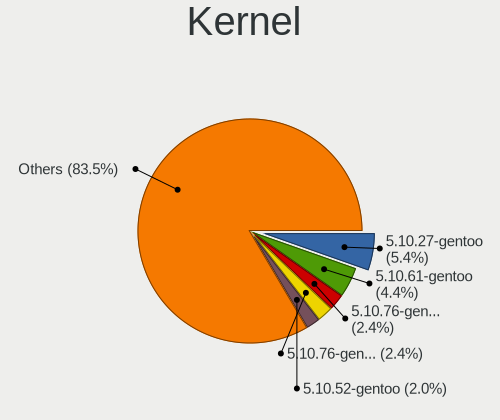

| Version                  | Notebooks | Percent |
|--------------------------|-----------|---------|
| 5.10.27-gentoo           | 16        | 5.39%   |
| 5.10.61-gentoo           | 13        | 4.38%   |
| 5.10.76-gentoo-r1-x86_64 | 7         | 2.36%   |
| 5.10.76-gentoo-r1        | 7         | 2.36%   |
| 5.10.52-gentoo           | 6         | 2.02%   |
| 5.10.27-gentoo-x86_64    | 6         | 2.02%   |
| 5.8.0-gentoo-r1          | 4         | 1.35%   |
| 5.15.32-gentoo-r1        | 4         | 1.35%   |
| 5.10.61-gentoo-x86_64    | 4         | 1.35%   |
| 5.4.80-gentoo-r1         | 3         | 1.01%   |
| 5.4.60-gentoo            | 3         | 1.01%   |
| 5.11.2-gentoo            | 3         | 1.01%   |
| 5.10.4-gentoo-x86_64     | 3         | 1.01%   |
| 5.10.33-gentoo-dist      | 3         | 1.01%   |
| 5.9.8-gentoo             | 2         | 0.67%   |
| 5.9.2-gentoo             | 2         | 0.67%   |
| 5.8.5-gentoo             | 2         | 0.67%   |
| 5.8.16-gentoo            | 2         | 0.67%   |
| 5.7.7-gentoo-x86_64      | 2         | 0.67%   |
| 5.7.4-gentoo             | 2         | 0.67%   |
| 5.7.0-gentoo             | 2         | 0.67%   |
| 5.6.15-gentoo            | 2         | 0.67%   |
| 5.6.15                   | 2         | 0.67%   |
| 5.4.66-gentoo            | 2         | 0.67%   |
| 5.17.3-gentoo            | 2         | 0.67%   |
| 5.15.26-gentoo           | 2         | 0.67%   |
| 5.14.1-gentoo            | 2         | 0.67%   |
| 5.13.13-gentoo           | 2         | 0.67%   |
| 5.12.4-gentoo            | 2         | 0.67%   |
| 5.12.13-gentoo           | 2         | 0.67%   |
| 5.11.6-gentoo            | 2         | 0.67%   |
| 5.11.4-gentoo            | 2         | 0.67%   |
| 5.11.0-gentoo            | 2         | 0.67%   |
| 5.10.52-gentoo-x86_64    | 2         | 0.67%   |
| 5.10.4-gentoo            | 2         | 0.67%   |
| 5.9.8-gentoo-compact-0.1 | 1         | 0.34%   |
| 5.9.7-ATVG               | 1         | 0.34%   |
| 5.9.6-xanmod1-laptop     | 1         | 0.34%   |
| 5.9.6-gentoo-x86_64      | 1         | 0.34%   |
| 5.9.3                    | 1         | 0.34%   |

Kernel Family
-------------

Linux kernel without a distro release

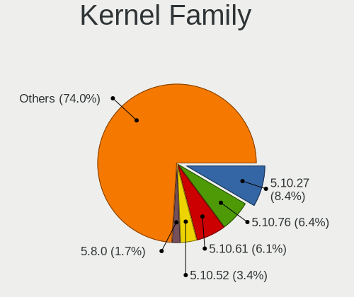

| Version | Notebooks | Percent |
|---------|-----------|---------|
| 5.10.27 | 25        | 8.45%   |
| 5.10.76 | 19        | 6.42%   |
| 5.10.61 | 18        | 6.08%   |
| 5.10.52 | 10        | 3.38%   |
| 5.8.0   | 5         | 1.69%   |
| 5.15.32 | 5         | 1.69%   |
| 5.11.0  | 5         | 1.69%   |
| 5.10.4  | 5         | 1.69%   |
| 5.9.1   | 4         | 1.35%   |
| 5.9.0   | 4         | 1.35%   |
| 5.6.15  | 4         | 1.35%   |
| 5.12.4  | 4         | 1.35%   |
| 5.11.2  | 4         | 1.35%   |
| 5.9.8   | 3         | 1.01%   |
| 5.9.11  | 3         | 1.01%   |
| 5.8.5   | 3         | 1.01%   |
| 5.8.16  | 3         | 1.01%   |
| 5.4.80  | 3         | 1.01%   |
| 5.4.60  | 3         | 1.01%   |
| 5.15.26 | 3         | 1.01%   |
| 5.14.8  | 3         | 1.01%   |
| 5.14.1  | 3         | 1.01%   |
| 5.13.12 | 3         | 1.01%   |
| 5.12.0  | 3         | 1.01%   |
| 5.10.74 | 3         | 1.01%   |
| 5.10.33 | 3         | 1.01%   |
| 5.10.15 | 3         | 1.01%   |
| 5.10.13 | 3         | 1.01%   |
| 5.9.6   | 2         | 0.68%   |
| 5.9.2   | 2         | 0.68%   |
| 5.9.16  | 2         | 0.68%   |
| 5.8.9   | 2         | 0.68%   |
| 5.8.1   | 2         | 0.68%   |
| 5.7.9   | 2         | 0.68%   |
| 5.7.7   | 2         | 0.68%   |
| 5.7.4   | 2         | 0.68%   |
| 5.7.0   | 2         | 0.68%   |
| 5.6.8   | 2         | 0.68%   |
| 5.6.11  | 2         | 0.68%   |
| 5.6.0   | 2         | 0.68%   |

Kernel Major Ver.
-----------------

Linux kernel major version

| Version | Notebooks | Percent |
|---------|-----------|---------|
| 5.10    | 104       | 37.28%  |
| 5.9     | 23        | 8.24%   |
| 5.8     | 19        | 6.81%   |
| 5.11    | 18        | 6.45%   |
| 5.6     | 17        | 6.09%   |
| 5.12    | 17        | 6.09%   |
| 5.15    | 16        | 5.73%   |
| 5.14    | 15        | 5.38%   |
| 5.7     | 14        | 5.02%   |
| 5.13    | 13        | 4.66%   |
| 5.4     | 11        | 3.94%   |
| 5.5     | 5         | 1.79%   |
| 5.17    | 5         | 1.79%   |
| 5.16    | 1         | 0.36%   |
| 4.19    | 1         | 0.36%   |

Arch
----

OS architecture (x86_64, i586, etc.)

| Name   | Notebooks | Percent |
|--------|-----------|---------|
| x86_64 | 238       | 97.94%  |
| i686   | 5         | 2.06%   |

DE
--

Desktop Environment

| Name           | Notebooks | Percent |
|----------------|-----------|---------|
| Unknown        | 96        | 37.65%  |
| GNOME          | 47        | 18.43%  |
| KDE5           | 39        | 15.29%  |
| XFCE           | 18        | 7.06%   |
| KDE            | 15        | 5.88%   |
| MATE           | 9         | 3.53%   |
| Sway           | 5         | 1.96%   |
| XSession       | 4         | 1.57%   |
| LXQt           | 4         | 1.57%   |
| LXDE           | 4         | 1.57%   |
| DWM            | 4         | 1.57%   |
| X-Cinnamon     | 2         | 0.78%   |
| openbox        | 2         | 0.78%   |
| i3-with-shmlog | 1         | 0.39%   |
| GNOME Classic  | 1         | 0.39%   |
| fluxbox        | 1         | 0.39%   |
| Enlightenment  | 1         | 0.39%   |
| bspwm          | 1         | 0.39%   |
| awesome        | 1         | 0.39%   |

Display Server
--------------

X11 or Wayland

| Name    | Notebooks | Percent |
|---------|-----------|---------|
| X11     | 145       | 56.86%  |
| Tty     | 39        | 15.29%  |
| Unknown | 37        | 14.51%  |
| Wayland | 34        | 13.33%  |

Display Manager
---------------

SDDM, LightDM, etc.

| Name    | Notebooks | Percent |
|---------|-----------|---------|
| Unknown | 111       | 44.05%  |
| SDDM    | 55        | 21.83%  |
| LightDM | 37        | 14.68%  |
| GDM     | 34        | 13.49%  |
| XDM     | 5         | 1.98%   |
| SLiM    | 5         | 1.98%   |
| LXDM    | 2         | 0.79%   |
| TDM     | 1         | 0.4%    |
| GREETD  | 1         | 0.4%    |
| GDM3    | 1         | 0.4%    |

OS Lang
-------

Language

| Lang       | Notebooks | Percent |
|------------|-----------|---------|
| en_US      | 109       | 43.43%  |
| Unknown    | 16        | 6.37%   |
| ru_RU      | 15        | 5.98%   |
| en_GB      | 15        | 5.98%   |
| de_DE      | 13        | 5.18%   |
| C.UTF8     | 13        | 5.18%   |
| fr_FR      | 9         | 3.59%   |
| it_IT      | 6         | 2.39%   |
| C          | 6         | 2.39%   |
| es_ES      | 5         | 1.99%   |
| zh_CN      | 4         | 1.59%   |
| en_CA      | 4         | 1.59%   |
| el_GR      | 4         | 1.59%   |
| pt_BR      | 3         | 1.2%    |
| POSIX      | 2         | 0.8%    |
| pl_PL      | 2         | 0.8%    |
| nl_NL      | 2         | 0.8%    |
| nl_BE      | 2         | 0.8%    |
| es_CL      | 2         | 0.8%    |
| en_AU      | 2         | 0.8%    |
| zh_TW      | 1         | 0.4%    |
| uk_UA      | 1         | 0.4%    |
| sv_SE      | 1         | 0.4%    |
| ru_UA      | 1         | 0.4%    |
| lt_LT      | 1         | 0.4%    |
| ko_KR      | 1         | 0.4%    |
| ja_JP      | 1         | 0.4%    |
| fr_CA      | 1         | 0.4%    |
| fr_BE      | 1         | 0.4%    |
| en_ZA      | 1         | 0.4%    |
| en_US.UTF8 | 1         | 0.4%    |
| en_IE      | 1         | 0.4%    |
| en_FR      | 1         | 0.4%    |
| de_DE.UTF8 | 1         | 0.4%    |
| de_CH      | 1         | 0.4%    |
| cs_CZ      | 1         | 0.4%    |
| ca_ES      | 1         | 0.4%    |

Boot Mode
---------

EFI or BIOS

| Mode | Notebooks | Percent |
|------|-----------|---------|
| EFI  | 193       | 78.46%  |
| BIOS | 53        | 21.54%  |

Filesystem
----------

Type of filesystem

| Type     | Notebooks | Percent |
|----------|-----------|---------|
| Ext4     | 149       | 60.57%  |
| Btrfs    | 65        | 26.42%  |
| Xfs      | 13        | 5.28%   |
| Zfs      | 7         | 2.85%   |
| F2fs     | 7         | 2.85%   |
| Reiserfs | 2         | 0.81%   |
| Jfs      | 1         | 0.41%   |
| Ext3     | 1         | 0.41%   |
| Unknown  | 1         | 0.41%   |

Part. scheme
------------

Scheme of partitioning

| Type    | Notebooks | Percent |
|---------|-----------|---------|
| GPT     | 202       | 82.11%  |
| MBR     | 25        | 10.16%  |
| Unknown | 19        | 7.72%   |

Dual Boot with Linux/BSD
------------------------

Hosting more than one Linux/BSD

| Dual boot | Notebooks | Percent |
|-----------|-----------|---------|
| No        | 182       | 74.59%  |
| Yes       | 62        | 25.41%  |

Dual Boot (Win)
---------------

Hosting Linux and Windows

| Dual boot | Notebooks | Percent |
|-----------|-----------|---------|
| No        | 167       | 66.8%   |
| Yes       | 83        | 33.2%   |

Board
-----

Vendor
------

Motherboard manufacturer

| Name                | Notebooks | Percent |
|---------------------|-----------|---------|
| Lenovo              | 76        | 31.28%  |
| Dell                | 45        | 18.52%  |
| Hewlett-Packard     | 39        | 16.05%  |
| ASUSTek Computer    | 24        | 9.88%   |
| Acer                | 11        | 4.53%   |
| MSI                 | 6         | 2.47%   |
| TUXEDO              | 4         | 1.65%   |
| Toshiba             | 4         | 1.65%   |
| Timi                | 4         | 1.65%   |
| Samsung Electronics | 4         | 1.65%   |
| HUAWEI              | 4         | 1.65%   |
| Apple               | 4         | 1.65%   |
| Razer               | 3         | 1.23%   |
| IBM                 | 2         | 0.82%   |
| XMG                 | 1         | 0.41%   |
| Wortmann AG         | 1         | 0.41%   |
| System76            | 1         | 0.41%   |
| Sony                | 1         | 0.41%   |
| SIEMENS             | 1         | 0.41%   |
| Purism              | 1         | 0.41%   |
| PC Specialist       | 1         | 0.41%   |
| Notebook            | 1         | 0.41%   |
| MOTILE              | 1         | 0.41%   |
| LG Electronics      | 1         | 0.41%   |
| Jumper              | 1         | 0.41%   |
| Google              | 1         | 0.41%   |
| Unknown             | 1         | 0.41%   |

Model
-----

Motherboard model

| Name                                               | Notebooks | Percent |
|----------------------------------------------------|-----------|---------|
| Unknown                                            | 7         | 2.88%   |
| Lenovo Legion Y530-15ICH 81FV                      | 3         | 1.23%   |
| HP Pavilion Notebook                               | 3         | 1.23%   |
| HP Pavilion Gaming Laptop 15-ec1xxx                | 3         | 1.23%   |
| Dell XPS 15 7590                                   | 3         | 1.23%   |
| Dell XPS 13 9360                                   | 3         | 1.23%   |
| Dell XPS 13 9310                                   | 3         | 1.23%   |
| Timi RedmiBook 13 R                                | 2         | 0.82%   |
| Lenovo ThinkPad T14 Gen 1 20UD0013GE               | 2         | 0.82%   |
| Lenovo Legion R7000 2020 82B6                      | 2         | 0.82%   |
| HP ProBook 455 G7                                  | 2         | 0.82%   |
| HP EliteBook 855 G7 Notebook PC                    | 2         | 0.82%   |
| Dell XPS 15 9570                                   | 2         | 0.82%   |
| Dell Precision 7560                                | 2         | 0.82%   |
| Dell Inspiron 5577                                 | 2         | 0.82%   |
| Dell G3 3500                                       | 2         | 0.82%   |
| ASUS X550ZA                                        | 2         | 0.82%   |
| Acer Aspire V3-331                                 | 2         | 0.82%   |
| XMG C504                                           | 1         | 0.41%   |
| Wortmann AG TERRA_MOBILE_1590S                     | 1         | 0.41%   |
| TUXEDO Pulse 15 Gen1                               | 1         | 0.41%   |
| TUXEDO Book_XA1510                                 | 1         | 0.41%   |
| TUXEDO Book XC1711                                 | 1         | 0.41%   |
| Toshiba Satellite L50-C                            | 1         | 0.41%   |
| Toshiba Satellite C850D-118                        | 1         | 0.41%   |
| Toshiba Satellite A200                             | 1         | 0.41%   |
| Toshiba NB100                                      | 1         | 0.41%   |
| Timi Mi Laptop Pro 15                              | 1         | 0.41%   |
| Timi A35                                           | 1         | 0.41%   |
| System76 Lemur Pro                                 | 1         | 0.41%   |
| Sony VPCSC41FM                                     | 1         | 0.41%   |
| SIEMENS SIMATIC Field PG M6                        | 1         | 0.41%   |
| Samsung RC530/RC730                                | 1         | 0.41%   |
| Samsung R530/R730/P530                             | 1         | 0.41%   |
| Samsung N150P/N210P/N220P                          | 1         | 0.41%   |
| Samsung 300E4C/300E5C/300E7C                       | 1         | 0.41%   |
| Razer Blade 15 Mid 2019-Base                       | 1         | 0.41%   |
| Razer Blade 15 Base Model (Early 2020) - RZ09-0328 | 1         | 0.41%   |
| Razer Blade 15 (2022) - RZ09-0421                  | 1         | 0.41%   |
| Purism librem_15v4                                 | 1         | 0.41%   |

Model Family
------------

Motherboard model prefix

| Name              | Notebooks | Percent |
|-------------------|-----------|---------|
| Lenovo ThinkPad   | 41        | 16.87%  |
| Dell XPS          | 17        | 7%      |
| Lenovo Legion     | 14        | 5.76%   |
| Dell Latitude     | 14        | 5.76%   |
| Lenovo IdeaPad    | 11        | 4.53%   |
| HP Pavilion       | 10        | 4.12%   |
| Dell Inspiron     | 8         | 3.29%   |
| Acer Aspire       | 7         | 2.88%   |
| Unknown           | 7         | 2.88%   |
| HP EliteBook      | 6         | 2.47%   |
| HP ProBook        | 5         | 2.06%   |
| HP Laptop         | 5         | 2.06%   |
| HP OMEN           | 4         | 1.65%   |
| ASUS ZenBook      | 4         | 1.65%   |
| Toshiba Satellite | 3         | 1.23%   |
| Razer Blade       | 3         | 1.23%   |
| Lenovo Yoga       | 3         | 1.23%   |
| HP ZBook          | 3         | 1.23%   |
| Dell Precision    | 3         | 1.23%   |
| ASUS ROG          | 3         | 1.23%   |
| TUXEDO Book       | 2         | 0.82%   |
| Timi RedmiBook    | 2         | 0.82%   |
| MSI GF63          | 2         | 0.82%   |
| IBM ThinkPad      | 2         | 0.82%   |
| Dell G3           | 2         | 0.82%   |
| ASUS X550ZA       | 2         | 0.82%   |
| ASUS VivoBook     | 2         | 0.82%   |
| ASUS ASUS         | 2         | 0.82%   |
| Acer Nitro        | 2         | 0.82%   |
| XMG C504          | 1         | 0.41%   |
| Wortmann AG TERRA | 1         | 0.41%   |
| TUXEDO Pulse      | 1         | 0.41%   |
| Toshiba NB100     | 1         | 0.41%   |
| Timi Mi           | 1         | 0.41%   |
| Timi A35          | 1         | 0.41%   |
| System76 Lemur    | 1         | 0.41%   |
| Sony VPCSC41FM    | 1         | 0.41%   |
| SIEMENS SIMATIC   | 1         | 0.41%   |
| Samsung RC530     | 1         | 0.41%   |
| Samsung R530      | 1         | 0.41%   |

MFG Year
--------

Motherboard manufacture year

| Year    | Notebooks | Percent |
|---------|-----------|---------|
| 2020    | 67        | 27.57%  |
| 2019    | 40        | 16.46%  |
| 2018    | 28        | 11.52%  |
| 2021    | 18        | 7.41%   |
| 2017    | 17        | 7%      |
| 2014    | 13        | 5.35%   |
| 2016    | 12        | 4.94%   |
| 2015    | 12        | 4.94%   |
| 2012    | 9         | 3.7%    |
| 2010    | 6         | 2.47%   |
| 2013    | 4         | 1.65%   |
| 2011    | 4         | 1.65%   |
| 2008    | 3         | 1.23%   |
| 2009    | 2         | 0.82%   |
| 2007    | 2         | 0.82%   |
| 2006    | 2         | 0.82%   |
| 2022    | 1         | 0.41%   |
| 2005    | 1         | 0.41%   |
| 2004    | 1         | 0.41%   |
| Unknown | 1         | 0.41%   |

Form Factor
-----------

Physical design of the computer

| Name     | Notebooks | Percent |
|----------|-----------|---------|
| Notebook | 243       | 100%    |

Secure Boot
-----------

Enabled or disabled

| State    | Notebooks | Percent |
|----------|-----------|---------|
| Disabled | 235       | 96.71%  |
| Enabled  | 8         | 3.29%   |

Coreboot
--------

Have coreboot on board

| Used | Notebooks | Percent |
|------|-----------|---------|
| No   | 239       | 98.35%  |
| Yes  | 4         | 1.65%   |

RAM Size
--------

Total RAM memory

| Size in GB  | Notebooks | Percent |
|-------------|-----------|---------|
| 16.01-24.0  | 61        | 24.8%   |
| 4.01-8.0    | 51        | 20.73%  |
| 8.01-16.0   | 50        | 20.33%  |
| 32.01-64.0  | 36        | 14.63%  |
| 3.01-4.0    | 17        | 6.91%   |
| 64.01-256.0 | 12        | 4.88%   |
| 24.01-32.0  | 8         | 3.25%   |
| 1.01-2.0    | 7         | 2.85%   |
| 2.01-3.0    | 4         | 1.63%   |

RAM Used
--------

Used RAM memory

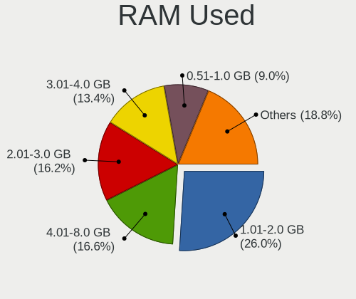

| Used GB    | Notebooks | Percent |
|------------|-----------|---------|
| 1.01-2.0   | 72        | 25.99%  |
| 4.01-8.0   | 46        | 16.61%  |
| 2.01-3.0   | 45        | 16.25%  |
| 3.01-4.0   | 37        | 13.36%  |
| 0.51-1.0   | 25        | 9.03%   |
| 0.01-0.5   | 25        | 9.03%   |
| 8.01-16.0  | 23        | 8.3%    |
| 16.01-24.0 | 3         | 1.08%   |
| 24.01-32.0 | 1         | 0.36%   |

Total Drives
------------

Number of drives on board

| Drives | Notebooks | Percent |
|--------|-----------|---------|
| 1      | 169       | 67.33%  |
| 2      | 71        | 28.29%  |
| 3      | 7         | 2.79%   |
| 0      | 3         | 1.2%    |
| 4      | 1         | 0.4%    |

Has CD-ROM
----------

Has CD-ROM on board

| Presented | Notebooks | Percent |
|-----------|-----------|---------|
| No        | 213       | 87.3%   |
| Yes       | 31        | 12.7%   |

Has Ethernet
------------

Has Ethernet on board

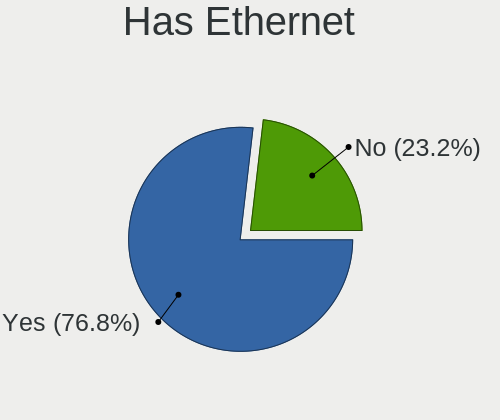

| Presented | Notebooks | Percent |
|-----------|-----------|---------|
| Yes       | 189       | 76.83%  |
| No        | 57        | 23.17%  |

Has WiFi
--------

Has WiFi module

| Presented | Notebooks | Percent |
|-----------|-----------|---------|
| Yes       | 242       | 99.59%  |
| No        | 1         | 0.41%   |

Has Bluetooth
-------------

Has Bluetooth module

| Presented | Notebooks | Percent |
|-----------|-----------|---------|
| Yes       | 220       | 89.8%   |
| No        | 25        | 10.2%   |

Location
--------

Country
-------

Geographic location (country)

| Country      | Notebooks | Percent |
|--------------|-----------|---------|
| USA          | 39        | 15.98%  |
| Germany      | 29        | 11.89%  |
| Russia       | 25        | 10.25%  |
| France       | 14        | 5.74%   |
| Italy        | 10        | 4.1%    |
| China        | 10        | 4.1%    |
| UK           | 9         | 3.69%   |
| Spain        | 8         | 3.28%   |
| Netherlands  | 8         | 3.28%   |
| Canada       | 8         | 3.28%   |
| Greece       | 7         | 2.87%   |
| Ukraine      | 6         | 2.46%   |
| Poland       | 6         | 2.46%   |
| Czechia      | 6         | 2.46%   |
| Brazil       | 5         | 2.05%   |
| Belgium      | 5         | 2.05%   |
| Turkey       | 4         | 1.64%   |
| Hong Kong    | 4         | 1.64%   |
| Switzerland  | 3         | 1.23%   |
| Japan        | 3         | 1.23%   |
| Finland      | 3         | 1.23%   |
| Australia    | 3         | 1.23%   |
| Taiwan       | 2         | 0.82%   |
| Sweden       | 2         | 0.82%   |
| Portugal     | 2         | 0.82%   |
| Norway       | 2         | 0.82%   |
| Indonesia    | 2         | 0.82%   |
| India        | 2         | 0.82%   |
| Chile        | 2         | 0.82%   |
| Belarus      | 2         | 0.82%   |
| Vietnam      | 1         | 0.41%   |
| Tunisia      | 1         | 0.41%   |
| South Korea  | 1         | 0.41%   |
| Slovakia     | 1         | 0.41%   |
| Saudi Arabia | 1         | 0.41%   |
| Romania      | 1         | 0.41%   |
| New Zealand  | 1         | 0.41%   |
| Lithuania    | 1         | 0.41%   |
| Iran         | 1         | 0.41%   |
| Hungary      | 1         | 0.41%   |

City
----

Geographic location (city)

| City              | Notebooks | Percent |
|-------------------|-----------|---------|
| Moscow            | 10        | 3.83%   |
| Athens            | 7         | 2.68%   |
| St Petersburg     | 6         | 2.3%    |
| Berlin            | 6         | 2.3%    |
| Paris             | 3         | 1.15%   |
| Kyiv              | 3         | 1.15%   |
| Guangzhou         | 3         | 1.15%   |
| Vladivostok       | 2         | 0.77%   |
| Troms           | 2         | 0.77%   |
| Rolling Meadows   | 2         | 0.77%   |
| Rennes            | 2         | 0.77%   |
| Omsk              | 2         | 0.77%   |
| Munich            | 2         | 0.77%   |
| Minsk             | 2         | 0.77%   |
| Milan             | 2         | 0.77%   |
| Melbourne         | 2         | 0.77%   |
| Marseille         | 2         | 0.77%   |
| Manitowoc         | 2         | 0.77%   |
| Madrid            | 2         | 0.77%   |
| Helsinki          | 2         | 0.77%   |
| Goinia          | 2         | 0.77%   |
| Frankfurt am Main | 2         | 0.77%   |
| Dsseldorf       | 2         | 0.77%   |
| Dienheim          | 2         | 0.77%   |
| College Station   | 2         | 0.77%   |
| Chongqing         | 2         | 0.77%   |
| Brescia           | 2         | 0.77%   |
| Amsterdam         | 2         | 0.77%   |
| Almere Stad       | 2         | 0.77%   |
| Zurich            | 1         | 0.38%   |
| Zhengzhou         | 1         | 0.38%   |
| Zaragoza          | 1         | 0.38%   |
| Yuen Long         | 1         | 0.38%   |
| Wuelfrath         | 1         | 0.38%   |
| Winnipeg          | 1         | 0.38%   |
| Wigan             | 1         | 0.38%   |
| West Plains       | 1         | 0.38%   |
| West Orange       | 1         | 0.38%   |
| Weatherford       | 1         | 0.38%   |
| Warsaw            | 1         | 0.38%   |

Drives
------

Drive Vendor
------------

Hard drive vendors

| Vendor                         | Notebooks | Drives | Percent |
|--------------------------------|-----------|--------|---------|
| Samsung Electronics            | 86        | 126    | 27.92%  |
| WDC                            | 48        | 64     | 15.58%  |
| Seagate                        | 28        | 39     | 9.09%   |
| Toshiba                        | 22        | 24     | 7.14%   |
| SK hynix                       | 18        | 23     | 5.84%   |
| Intel                          | 16        | 20     | 5.19%   |
| Unknown                        | 13        | 17     | 4.22%   |
| Kingston                       | 13        | 17     | 4.22%   |
| SanDisk                        | 10        | 14     | 3.25%   |
| HGST                           | 7         | 7      | 2.27%   |
| Micron Technology              | 6         | 8      | 1.95%   |
| KIOXIA                         | 5         | 7      | 1.62%   |
| Hitachi                        | 4         | 4      | 1.3%    |
| Apple                          | 4         | 5      | 1.3%    |
| A-DATA Technology              | 3         | 5      | 0.97%   |
| Transcend                      | 2         | 2      | 0.65%   |
| LITEON                         | 2         | 2      | 0.65%   |
| Fujitsu                        | 2         | 3      | 0.65%   |
| Crucial                        | 2         | 2      | 0.65%   |
| XPG                            | 1         | 1      | 0.32%   |
| T-FORCE                        | 1         | 1      | 0.32%   |
| Solid State Storage Technology | 1         | 1      | 0.32%   |
| ShanDianZhe                    | 1         | 2      | 0.32%   |
| RevuAhn                        | 1         | 1      | 0.32%   |
| OSCOO                          | 1         | 1      | 0.32%   |
| OCZ                            | 1         | 3      | 0.32%   |
| MyDigitalSSD                   | 1         | 1      | 0.32%   |
| LITEONIT                       | 1         | 1      | 0.32%   |
| Lite-On                        | 1         | 1      | 0.32%   |
| Linux                          | 1         | 1      | 0.32%   |
| Lenovo                         | 1         | 2      | 0.32%   |
| KIOXIA-EXCERIA                 | 1         | 1      | 0.32%   |
| IBM/Hitachi                    | 1         | 1      | 0.32%   |
| Faspeed                        | 1         | 1      | 0.32%   |
| BIWIN                          | 1         | 1      | 0.32%   |
| ASUS-PHISON                    | 1         | 1      | 0.32%   |

Drive Model
-----------

Hard drive models

| Model                                | Notebooks | Percent |
|--------------------------------------|-----------|---------|
| Intel SSDPEKNW010T8 1TB              | 6         | 1.8%    |
| Seagate ST1000LM049-2GH172 1TB       | 5         | 1.5%    |
| Samsung MZVLB512HBJQ-000L2 512GB     | 5         | 1.5%    |
| WDC PC SN730 SDBQNTY-1T00-1001 1TB   | 4         | 1.2%    |
| Toshiba MQ04ABF100 1TB               | 4         | 1.2%    |
| Samsung MZVLB512HBJQ-000L7 512GB     | 4         | 1.2%    |
| WDC WDS100T2B0C-00PXH0 1TB           | 3         | 0.9%    |
| Toshiba MQ01ABD100 1TB               | 3         | 0.9%    |
| Toshiba KXG50ZNV512G NVMe 512GB      | 3         | 0.9%    |
| Seagate ST1000LM024 HN-M101MBB 1TB   | 3         | 0.9%    |
| Samsung SSD 980 PRO 2TB              | 3         | 0.9%    |
| Samsung SSD 980 1TB                  | 3         | 0.9%    |
| Samsung SSD 970 PRO 512GB            | 3         | 0.9%    |
| Samsung SSD 970 EVO Plus 500GB       | 3         | 0.9%    |
| Samsung SSD 970 EVO Plus 250GB       | 3         | 0.9%    |
| Samsung SSD 860 EVO 1TB              | 3         | 0.9%    |
| Samsung SSD 850 EVO 250GB            | 3         | 0.9%    |
| Samsung MZVLB512HAJQ-00000 512GB     | 3         | 0.9%    |
| Samsung MZALQ512HALU-000L2 512GB     | 3         | 0.9%    |
| Kingston SA400S37480G 480GB SSD      | 3         | 0.9%    |
| Kingston SA400S37240G 240GB SSD      | 3         | 0.9%    |
| HGST HTS721010A9E630 1TB             | 3         | 0.9%    |
| WDC WDS500G2B0B-00YS70 500GB SSD     | 2         | 0.6%    |
| WDC WD10SPZX-24Z10 1TB               | 2         | 0.6%    |
| WDC WD10JPVX-22JC3T0 1TB             | 2         | 0.6%    |
| WDC PC SN730 SDBQNTY-512G-1001 512GB | 2         | 0.6%    |
| WDC PC SN730 NVMe 1024GB             | 2         | 0.6%    |
| WDC PC SN530 SDBPNPZ-512G-1006 512GB | 2         | 0.6%    |
| Unknown MMC Card  64GB               | 2         | 0.6%    |
| Unknown MMC Card  32GB               | 2         | 0.6%    |
| SK hynix PC711 NVMe 1TB              | 2         | 0.6%    |
| Seagate ST2000LX001-1RG174 2TB       | 2         | 0.6%    |
| Seagate ST2000LM015-2E8174 2TB       | 2         | 0.6%    |
| Seagate ST2000LM007-1R8174 2TB       | 2         | 0.6%    |
| Seagate ST1000LM048-2E7172 1TB       | 2         | 0.6%    |
| Seagate ST1000LM035-1RK172 1TB       | 2         | 0.6%    |
| SanDisk SDSSDA240G 240GB             | 2         | 0.6%    |
| SanDisk SD9SN8W-128G-1006 128GB SSD  | 2         | 0.6%    |
| Samsung SSD 860 QVO 1TB              | 2         | 0.6%    |
| Samsung SSD 860 EVO 500GB            | 2         | 0.6%    |

HDD Vendor
----------

Hard disk drive vendors

| Vendor              | Notebooks | Drives | Percent |
|---------------------|-----------|--------|---------|
| Seagate             | 27        | 38     | 39.13%  |
| WDC                 | 16        | 17     | 23.19%  |
| Toshiba             | 11        | 12     | 15.94%  |
| HGST                | 7         | 7      | 10.14%  |
| Hitachi             | 4         | 4      | 5.8%    |
| Fujitsu             | 2         | 3      | 2.9%    |
| Samsung Electronics | 1         | 2      | 1.45%   |
| IBM/Hitachi         | 1         | 1      | 1.45%   |

SSD Vendor
----------

Solid state drive vendors

| Vendor              | Notebooks | Drives | Percent |
|---------------------|-----------|--------|---------|
| Samsung Electronics | 29        | 35     | 34.52%  |
| SanDisk             | 8         | 12     | 9.52%   |
| Kingston            | 8         | 12     | 9.52%   |
| WDC                 | 6         | 11     | 7.14%   |
| SK hynix            | 5         | 5      | 5.95%   |
| Micron Technology   | 5         | 7      | 5.95%   |
| Intel               | 3         | 3      | 3.57%   |
| A-DATA Technology   | 3         | 5      | 3.57%   |
| Transcend           | 2         | 2      | 2.38%   |
| Apple               | 2         | 2      | 2.38%   |
| ShanDianZhe         | 1         | 2      | 1.19%   |
| Seagate             | 1         | 1      | 1.19%   |
| RevuAhn             | 1         | 1      | 1.19%   |
| OCZ                 | 1         | 3      | 1.19%   |
| MyDigitalSSD        | 1         | 1      | 1.19%   |
| LITEONIT            | 1         | 1      | 1.19%   |
| Lite-On             | 1         | 1      | 1.19%   |
| Linux               | 1         | 1      | 1.19%   |
| Lenovo              | 1         | 2      | 1.19%   |
| Faspeed             | 1         | 1      | 1.19%   |
| Crucial             | 1         | 1      | 1.19%   |
| BIWIN               | 1         | 1      | 1.19%   |
| ASUS-PHISON         | 1         | 1      | 1.19%   |

Drive Kind
----------

HDD or SSD

| Kind    | Notebooks | Drives | Percent |
|---------|-----------|--------|---------|
| NVMe    | 145       | 197    | 47.54%  |
| SSD     | 77        | 111    | 25.25%  |
| HDD     | 69        | 84     | 22.62%  |
| MMC     | 13        | 17     | 4.26%   |
| Unknown | 1         | 1      | 0.33%   |

Drive Connector
---------------

SATA, SAS, NVMe, etc.

| Type | Notebooks | Drives | Percent |
|------|-----------|--------|---------|
| NVMe | 145       | 197    | 49.49%  |
| SATA | 129       | 190    | 44.03%  |
| MMC  | 13        | 17     | 4.44%   |
| SAS  | 6         | 6      | 2.05%   |

Drive Size
----------

Size of hard drive

| Size in TB | Notebooks | Drives | Percent |
|------------|-----------|--------|---------|
| 0.01-0.5   | 79        | 114    | 54.48%  |
| 0.51-1.0   | 56        | 65     | 38.62%  |
| 1.01-2.0   | 9         | 15     | 6.21%   |
| 3.01-4.0   | 1         | 1      | 0.69%   |

Space Total
-----------

Amount of disk space available on the file system

| Size in GB     | Notebooks | Percent |
|----------------|-----------|---------|
| 501-1000       | 57        | 22.27%  |
| 251-500        | 56        | 21.88%  |
| 101-250        | 56        | 21.88%  |
| 1001-2000      | 32        | 12.5%   |
| 51-100         | 15        | 5.86%   |
| 1-20           | 14        | 5.47%   |
| Unknown        | 13        | 5.08%   |
| 21-50          | 5         | 1.95%   |
| More than 3000 | 4         | 1.56%   |
| 2001-3000      | 4         | 1.56%   |

Space Used
----------

Amount of used disk space

| Used GB        | Notebooks | Percent |
|----------------|-----------|---------|
| 1-20           | 59        | 21.77%  |
| 101-250        | 51        | 18.82%  |
| 21-50          | 44        | 16.24%  |
| 251-500        | 39        | 14.39%  |
| 51-100         | 30        | 11.07%  |
| 501-1000       | 23        | 8.49%   |
| Unknown        | 13        | 4.8%    |
| 1001-2000      | 9         | 3.32%   |
| More than 3000 | 2         | 0.74%   |
| 2001-3000      | 1         | 0.37%   |

Malfunc. Drives
---------------

Drive models with a malfunction

| Model                                 | Notebooks | Drives | Percent |
|---------------------------------------|-----------|--------|---------|
| Seagate ST2000LX001-1RG174 2TB        | 2         | 2      | 9.52%   |
| SanDisk SD9SN8W-128G-1006 128GB SSD   | 2         | 2      | 9.52%   |
| WDC WD10SPZX-24Z10T0 1TB              | 1         | 1      | 4.76%   |
| SK hynix SH920 mSATA 256GB SSD        | 1         | 1      | 4.76%   |
| SK hynix HFS256G39TND-N210A 256GB SSD | 1         | 1      | 4.76%   |
| Seagate ST9750420AS 752GB             | 1         | 1      | 4.76%   |
| Seagate ST320LT007-9ZV142 320GB       | 1         | 1      | 4.76%   |
| Seagate ST1000LM024 HN-M101MBB 1TB    | 1         | 2      | 4.76%   |
| SanDisk SSD PLUS 480GB                | 1         | 1      | 4.76%   |
| SanDisk SD9SN8W 128GB SSD             | 1         | 1      | 4.76%   |
| Samsung Electronics SSD 870 EVO 2TB   | 1         | 1      | 4.76%   |
| Samsung Electronics HM160HC 160GB     | 1         | 1      | 4.76%   |
| Intel SSDSCKKF256G8H 256GB            | 1         | 1      | 4.76%   |
| IBM/Hitachi IC25N080ATMR04-0 80GB     | 1         | 1      | 4.76%   |
| Hitachi HTS545050B9A300 500GB         | 1         | 1      | 4.76%   |
| Hitachi HTS542525K9A300 250GB         | 1         | 1      | 4.76%   |
| HGST HTS721010A9E630 1TB              | 1         | 1      | 4.76%   |
| HGST HTS541010B7E610 1TB              | 1         | 1      | 4.76%   |
| Fujitsu MHZ2160BJ G2 160GB            | 1         | 1      | 4.76%   |

Malfunc. Drive Vendor
---------------------

Vendors of faulty drives

| Vendor              | Notebooks | Drives | Percent |
|---------------------|-----------|--------|---------|
| Seagate             | 5         | 6      | 25%     |
| SanDisk             | 3         | 4      | 15%     |
| SK hynix            | 2         | 2      | 10%     |
| Samsung Electronics | 2         | 2      | 10%     |
| Hitachi             | 2         | 2      | 10%     |
| HGST                | 2         | 2      | 10%     |
| WDC                 | 1         | 1      | 5%      |
| Intel               | 1         | 1      | 5%      |
| IBM/Hitachi         | 1         | 1      | 5%      |
| Fujitsu             | 1         | 1      | 5%      |

Malfunc. HDD Vendor
-------------------

Vendors of faulty HDD drives

| Vendor              | Notebooks | Drives | Percent |
|---------------------|-----------|--------|---------|
| Seagate             | 5         | 6      | 38.46%  |
| Hitachi             | 2         | 2      | 15.38%  |
| HGST                | 2         | 2      | 15.38%  |
| WDC                 | 1         | 1      | 7.69%   |
| Samsung Electronics | 1         | 1      | 7.69%   |
| IBM/Hitachi         | 1         | 1      | 7.69%   |
| Fujitsu             | 1         | 1      | 7.69%   |

Malfunc. Drive Kind
-------------------

Kinds of faulty drives

| Kind | Notebooks | Drives | Percent |
|------|-----------|--------|---------|
| HDD  | 13        | 14     | 65%     |
| SSD  | 7         | 8      | 35%     |

Failed Drives
-------------

Failed drive models

| Model                            | Notebooks | Drives | Percent |
|----------------------------------|-----------|--------|---------|
| Toshiba THNSN5512GPUK NVMe 512GB | 1         | 1      | 50%     |
| Hitachi HTS721010G9SA00 100GB    | 1         | 1      | 50%     |

Failed Drive Vendor
-------------------

Failed drive vendors

| Vendor  | Notebooks | Drives | Percent |
|---------|-----------|--------|---------|
| Toshiba | 1         | 1      | 50%     |
| Hitachi | 1         | 1      | 50%     |

Drive Status
------------

Number of failed and malfunc. drives

| Status   | Notebooks | Drives | Percent |
|----------|-----------|--------|---------|
| Works    | 211       | 347    | 80.84%  |
| Detected | 29        | 39     | 11.11%  |
| Malfunc  | 19        | 22     | 7.28%   |
| Failed   | 2         | 2      | 0.77%   |

Storage controller
------------------

Storage Vendor
--------------

Storage controller vendors

| Vendor                         | Notebooks | Percent |
|--------------------------------|-----------|---------|
| Intel                          | 142       | 43.83%  |
| Samsung Electronics            | 67        | 20.68%  |
| AMD                            | 35        | 10.8%   |
| SanDisk                        | 29        | 8.95%   |
| Toshiba America Info Systems   | 14        | 4.32%   |
| SK hynix                       | 13        | 4.01%   |
| KIOXIA                         | 6         | 1.85%   |
| Kingston Technology Company    | 5         | 1.54%   |
| Lite-On Technology             | 2         | 0.62%   |
| Apple                          | 2         | 0.62%   |
| Union Memory (Shenzhen)        | 1         | 0.31%   |
| Solid State Storage Technology | 1         | 0.31%   |
| Silicon Motion                 | 1         | 0.31%   |
| Phison Electronics             | 1         | 0.31%   |
| Nvidia                         | 1         | 0.31%   |
| Micron/Crucial Technology      | 1         | 0.31%   |
| Micron Technology              | 1         | 0.31%   |
| JMicron Technology             | 1         | 0.31%   |
| ADATA Technology               | 1         | 0.31%   |

Storage Model
-------------

Storage controller models

| Model                                                                          | Notebooks | Percent |
|--------------------------------------------------------------------------------|-----------|---------|
| Samsung NVMe SSD Controller SM981/PM981/PM983                                  | 41        | 12.13%  |
| AMD FCH SATA Controller [AHCI mode]                                            | 32        | 9.47%   |
| Intel Sunrise Point-LP SATA Controller [AHCI mode]                             | 23        | 6.8%    |
| Intel Cannon Lake Mobile PCH SATA AHCI Controller                              | 19        | 5.62%   |
| SanDisk WD Black SN750 / PC SN730 NVMe SSD                                     | 13        | 3.85%   |
| Samsung NVMe SSD Controller 980                                                | 12        | 3.55%   |
| Intel 82801 Mobile SATA Controller [RAID mode]                                 | 11        | 3.25%   |
| Samsung NVMe SSD Controller SM961/PM961/SM963                                  | 10        | 2.96%   |
| Intel HM170/QM170 Chipset SATA Controller [AHCI Mode]                          | 9         | 2.66%   |
| Intel 8 Series SATA Controller 1 [AHCI mode]                                   | 9         | 2.66%   |
| SanDisk WD Blue SN550 NVMe SSD                                                 | 8         | 2.37%   |
| Intel SSD 660P Series                                                          | 8         | 2.37%   |
| Toshiba America Info Systems XG6 NVMe SSD Controller                           | 7         | 2.07%   |
| Intel 7 Series Chipset Family 6-port SATA Controller [AHCI mode]               | 7         | 2.07%   |
| Intel 400 Series Chipset Family SATA AHCI Controller                           | 7         | 2.07%   |
| SK hynix Gold P31/PC711 NVMe Solid State Drive                                 | 6         | 1.78%   |
| Samsung NVMe SSD Controller PM9A1/PM9A3/980PRO                                 | 6         | 1.78%   |
| Intel Volume Management Device NVMe RAID Controller                            | 6         | 1.78%   |
| Intel Wildcat Point-LP SATA Controller [AHCI Mode]                             | 5         | 1.48%   |
| Intel Q170/Q150/B150/H170/H110/Z170/CM236 Chipset SATA Controller [AHCI Mode]  | 5         | 1.48%   |
| Toshiba America Info Systems XG5 NVMe SSD Controller                           | 4         | 1.18%   |
| KIOXIA NVMe SSD Controller BG4                                                 | 4         | 1.18%   |
| Intel Atom Processor E3800 Series SATA AHCI Controller                         | 4         | 1.18%   |
| Intel 82801HM/HEM (ICH8M/ICH8M-E) SATA Controller [AHCI mode]                  | 4         | 1.18%   |
| Intel 82801HM/HEM (ICH8M/ICH8M-E) IDE Controller                               | 4         | 1.18%   |
| SanDisk WD Blue SN500 / PC SN520 NVMe SSD                                      | 3         | 0.89%   |
| Intel Celeron/Pentium Silver Processor SATA Controller                         | 3         | 0.89%   |
| Toshiba America Info Systems XG4 NVMe SSD Controller                           | 2         | 0.59%   |
| SK hynix PC401 NVMe Solid State Drive 256GB                                    | 2         | 0.59%   |
| SK hynix Non-Volatile memory controller                                        | 2         | 0.59%   |
| SK hynix BC501 NVMe Solid State Drive                                          | 2         | 0.59%   |
| SanDisk WD Black 2018/SN750 / PC SN720 NVMe SSD                                | 2         | 0.59%   |
| Lite-On Non-Volatile memory controller                                         | 2         | 0.59%   |
| Kingston Company Company Non-Volatile memory controller                        | 2         | 0.59%   |
| Intel SSD Pro 7600p/760p/E 6100p Series                                        | 2         | 0.59%   |
| Intel Non-Volatile memory controller                                           | 2         | 0.59%   |
| Intel Comet Lake SATA AHCI Controller                                          | 2         | 0.59%   |
| Intel Cannon Point-LP SATA Controller [AHCI Mode]                              | 2         | 0.59%   |
| Intel 82801FBM (ICH6M) SATA Controller                                         | 2         | 0.59%   |
| Intel 8 Series/C220 Series Chipset Family 6-port SATA Controller 1 [AHCI mode] | 2         | 0.59%   |

Storage Kind
------------

Kind of storage controller (IDE, SATA, NVMe, SAS, ...)

| Kind | Notebooks | Percent |
|------|-----------|---------|
| NVMe | 150       | 46.01%  |
| SATA | 148       | 45.4%   |
| RAID | 17        | 5.21%   |
| IDE  | 11        | 3.37%   |

Processor
---------

CPU Vendor
----------

Processor vendors

| Vendor | Notebooks | Percent |
|--------|-----------|---------|
| Intel  | 183       | 75.31%  |
| AMD    | 60        | 24.69%  |

CPU Model
---------

Processor models

| Model                                         | Notebooks | Percent |
|-----------------------------------------------|-----------|---------|
| Intel Core i7-9750H CPU @ 2.60GHz             | 12        | 4.94%   |
| AMD Ryzen 7 PRO 4750U with Radeon Graphics    | 10        | 4.12%   |
| Intel Core i7-8750H CPU @ 2.20GHz             | 8         | 3.29%   |
| Intel Core i7-8550U CPU @ 1.80GHz             | 8         | 3.29%   |
| Intel Core i7-7500U CPU @ 2.70GHz             | 7         | 2.88%   |
| Intel Core i5-8250U CPU @ 1.60GHz             | 7         | 2.88%   |
| AMD Ryzen 7 4700U with Radeon Graphics        | 7         | 2.88%   |
| AMD Ryzen 7 4800H with Radeon Graphics        | 6         | 2.47%   |
| Intel Core i7-8565U CPU @ 1.80GHz             | 5         | 2.06%   |
| Intel Core i7-6700HQ CPU @ 2.60GHz            | 5         | 2.06%   |
| AMD Ryzen 5 4600H with Radeon Graphics        | 5         | 2.06%   |
| Intel Core i7-10510U CPU @ 1.80GHz            | 4         | 1.65%   |
| Intel Core i5-8300H CPU @ 2.30GHz             | 4         | 1.65%   |
| Intel Core i5-8265U CPU @ 1.60GHz             | 4         | 1.65%   |
| Intel 11th Gen Core i7-1185G7 @ 3.00GHz       | 4         | 1.65%   |
| Intel 11th Gen Core i5-1135G7 @ 2.40GHz       | 4         | 1.65%   |
| AMD Ryzen 5 3500U with Radeon Vega Mobile Gfx | 4         | 1.65%   |
| Intel Core i9-9880H CPU @ 2.30GHz             | 3         | 1.23%   |
| Intel Core i7-7700HQ CPU @ 2.80GHz            | 3         | 1.23%   |
| Intel Core i7-10750H CPU @ 2.60GHz            | 3         | 1.23%   |
| Intel Core i5-5200U CPU @ 2.20GHz             | 3         | 1.23%   |
| Intel Core i5-3320M CPU @ 2.60GHz             | 3         | 1.23%   |
| Intel Core i5-10300H CPU @ 2.50GHz            | 3         | 1.23%   |
| Intel Core 2 Duo CPU T7500 @ 2.20GHz          | 3         | 1.23%   |
| AMD Ryzen 7 3700U with Radeon Vega Mobile Gfx | 3         | 1.23%   |
| AMD Ryzen 5 PRO 4650U with Radeon Graphics    | 3         | 1.23%   |
| Intel Pentium 3556U @ 1.70GHz                 | 2         | 0.82%   |
| Intel Core i9-10885H CPU @ 2.40GHz            | 2         | 0.82%   |
| Intel Core i7-7820HQ CPU @ 2.90GHz            | 2         | 0.82%   |
| Intel Core i7-6820HQ CPU @ 2.70GHz            | 2         | 0.82%   |
| Intel Core i7-6500U CPU @ 2.50GHz             | 2         | 0.82%   |
| Intel Core i7-10875H CPU @ 2.30GHz            | 2         | 0.82%   |
| Intel Core i7-1065G7 CPU @ 1.30GHz            | 2         | 0.82%   |
| Intel Core i5-8350U CPU @ 1.70GHz             | 2         | 0.82%   |
| Intel Core i5-7300HQ CPU @ 2.50GHz            | 2         | 0.82%   |
| Intel Core i5-6200U CPU @ 2.30GHz             | 2         | 0.82%   |
| Intel 11th Gen Core i9-11950H @ 2.60GHz       | 2         | 0.82%   |
| Intel 11th Gen Core i7-11800H @ 2.30GHz       | 2         | 0.82%   |
| Intel 11th Gen Core i7-1165G7 @ 2.80GHz       | 2         | 0.82%   |
| AMD Ryzen 9 5900HX with Radeon Graphics       | 2         | 0.82%   |

CPU Model Family
----------------

Processor model prefix

| Model                | Notebooks | Percent |
|----------------------|-----------|---------|
| Intel Core i7        | 80        | 32.92%  |
| Intel Core i5        | 46        | 18.93%  |
| AMD Ryzen 7          | 21        | 8.64%   |
| Other                | 19        | 7.82%   |
| AMD Ryzen 5          | 12        | 4.94%   |
| AMD Ryzen 7 PRO      | 11        | 4.53%   |
| Intel Core i9        | 6         | 2.47%   |
| Intel Core 2 Duo     | 6         | 2.47%   |
| Intel Celeron        | 6         | 2.47%   |
| Intel Pentium        | 4         | 1.65%   |
| Intel Core i3        | 4         | 1.65%   |
| Intel Pentium M      | 3         | 1.23%   |
| Intel Atom           | 3         | 1.23%   |
| AMD Ryzen 9          | 3         | 1.23%   |
| AMD Ryzen 5 PRO      | 3         | 1.23%   |
| AMD A6               | 3         | 1.23%   |
| Intel Xeon           | 2         | 0.82%   |
| AMD Ryzen 3          | 2         | 0.82%   |
| AMD A8               | 2         | 0.82%   |
| Intel Pentium Silver | 1         | 0.41%   |
| Intel Core m3        | 1         | 0.41%   |
| Intel Core 2         | 1         | 0.41%   |
| Intel Celeron M      | 1         | 0.41%   |
| AMD E1               | 1         | 0.41%   |
| AMD E                | 1         | 0.41%   |
| AMD Athlon 64        | 1         | 0.41%   |

CPU Cores
---------

Number of processor cores

| Number | Notebooks | Percent |
|--------|-----------|---------|
| 4      | 93        | 38.27%  |
| 2      | 60        | 24.69%  |
| 8      | 43        | 17.7%   |
| 6      | 38        | 15.64%  |
| 1      | 7         | 2.88%   |
| 14     | 1         | 0.41%   |
| 12     | 1         | 0.41%   |

CPU Sockets
-----------

Number of sockets

| Number | Notebooks | Percent |
|--------|-----------|---------|
| 1      | 243       | 100%    |

CPU Threads
-----------

Threads per core (Hyper-Threading)

| Number | Notebooks | Percent |
|--------|-----------|---------|
| 2      | 196       | 80.66%  |
| 1      | 47        | 19.34%  |

CPU Op-Modes
------------

CPU Operation Modes (32-bit, 64-bit)

| Op mode        | Notebooks | Percent |
|----------------|-----------|---------|
| 32-bit, 64-bit | 238       | 97.94%  |
| 32-bit         | 5         | 2.06%   |

CPU Microcode
-------------

Microcode number

| Number     | Notebooks | Percent |
|------------|-----------|---------|
| Unknown    | 29        | 11.55%  |
| 0x906ea    | 22        | 8.76%   |
| 0x806ea    | 16        | 6.37%   |
| 0x08600106 | 16        | 6.37%   |
| 0xa0652    | 12        | 4.78%   |
| 0x806c1    | 11        | 4.38%   |
| 0x806ec    | 10        | 3.98%   |
| 0x806e9    | 10        | 3.98%   |
| 0x08600103 | 10        | 3.98%   |
| 0x40651    | 9         | 3.59%   |
| 0x906e9    | 8         | 3.19%   |
| 0x306a9    | 7         | 2.79%   |
| 0x08108109 | 7         | 2.79%   |
| 0x506e3    | 6         | 2.39%   |
| 0x306d4    | 6         | 2.39%   |
| 0x906ed    | 5         | 1.99%   |
| 0x806d1    | 5         | 1.99%   |
| 0x406e3    | 5         | 1.99%   |
| 0x08600104 | 5         | 1.99%   |
| 0x806eb    | 4         | 1.59%   |
| 0x30678    | 4         | 1.59%   |
| 0x6fb      | 3         | 1.2%    |
| 0x6d8      | 3         | 1.2%    |
| 0x0a50000c | 3         | 1.2%    |
| 0x706e5    | 2         | 0.8%    |
| 0x706a1    | 2         | 0.8%    |
| 0x306c3    | 2         | 0.8%    |
| 0x206a7    | 2         | 0.8%    |
| 0x1067a    | 2         | 0.8%    |
| 0x0a50000b | 2         | 0.8%    |
| 0x08108102 | 2         | 0.8%    |
| 0x06003106 | 2         | 0.8%    |
| 0xa0671    | 1         | 0.4%    |
| 0x906a3    | 1         | 0.4%    |
| 0x706a8    | 1         | 0.4%    |
| 0x6f6      | 1         | 0.4%    |
| 0x6d6      | 1         | 0.4%    |
| 0x406c4    | 1         | 0.4%    |
| 0x20655    | 1         | 0.4%    |
| 0x20652    | 1         | 0.4%    |

CPU Microarch
-------------

Microarchitecture

| Name             | Notebooks | Percent |
|------------------|-----------|---------|
| KabyLake         | 85        | 34.84%  |
| Zen 2            | 36        | 14.75%  |
| Skylake          | 13        | 5.33%   |
| TigerLake        | 12        | 4.92%   |
| CometLake        | 12        | 4.92%   |
| Haswell          | 11        | 4.51%   |
| Zen+             | 9         | 3.69%   |
| IceLake          | 9         | 3.69%   |
| IvyBridge        | 7         | 2.87%   |
| Broadwell        | 6         | 2.46%   |
| Zen 3            | 5         | 2.05%   |
| Silvermont       | 5         | 2.05%   |
| P6               | 4         | 1.64%   |
| Core             | 4         | 1.64%   |
| Westmere         | 3         | 1.23%   |
| Penryn           | 3         | 1.23%   |
| Goldmont plus    | 3         | 1.23%   |
| Steamroller      | 2         | 0.82%   |
| SandyBridge      | 2         | 0.82%   |
| Bonnell          | 2         | 0.82%   |
| Bobcat           | 2         | 0.82%   |
| Unknown          | 2         | 0.82%   |
| Zen              | 1         | 0.41%   |
| K8 Hammer        | 1         | 0.41%   |
| K10 Llano        | 1         | 0.41%   |
| Jaguar           | 1         | 0.41%   |
| Goldmont         | 1         | 0.41%   |
| Excavator        | 1         | 0.41%   |
| Alderlake Hybrid | 1         | 0.41%   |

Graphics
--------

GPU Vendor
----------

Vendors of graphics cards

| Vendor | Notebooks | Percent |
|--------|-----------|---------|
| Intel  | 160       | 49.08%  |
| Nvidia | 100       | 30.67%  |
| AMD    | 66        | 20.25%  |

GPU Model
---------

Graphics card models

| Model                                                                                 | Notebooks | Percent |
|---------------------------------------------------------------------------------------|-----------|---------|
| AMD Renoir                                                                            | 33        | 10.03%  |
| Intel CoffeeLake-H GT2 [UHD Graphics 630]                                             | 24        | 7.29%   |
| Intel UHD Graphics 620                                                                | 18        | 5.47%   |
| Intel TigerLake-LP GT2 [Iris Xe Graphics]                                             | 12        | 3.65%   |
| Nvidia TU117M [GeForce GTX 1650 Mobile / Max-Q]                                       | 10        | 3.04%   |
| Intel WhiskeyLake-U GT2 [UHD Graphics 620]                                            | 10        | 3.04%   |
| Intel HD Graphics 620                                                                 | 9         | 2.74%   |
| Intel Haswell-ULT Integrated Graphics Controller                                      | 9         | 2.74%   |
| Intel CometLake-H GT2 [UHD Graphics]                                                  | 9         | 2.74%   |
| AMD Picasso/Raven 2 [Radeon Vega Series / Radeon Vega Mobile Series]                  | 9         | 2.74%   |
| Intel HD Graphics 530                                                                 | 7         | 2.13%   |
| Intel 3rd Gen Core processor Graphics Controller                                      | 7         | 2.13%   |
| Nvidia TU117M [GeForce GTX 1650 Ti Mobile]                                            | 6         | 1.82%   |
| Nvidia TU117M                                                                         | 6         | 1.82%   |
| Nvidia TU106M [GeForce RTX 2060 Mobile]                                               | 6         | 1.82%   |
| Nvidia GP107M [GeForce GTX 1050 Mobile]                                               | 6         | 1.82%   |
| Intel Skylake GT2 [HD Graphics 520]                                                   | 6         | 1.82%   |
| Intel CometLake-U GT2 [UHD Graphics]                                                  | 6         | 1.82%   |
| Intel HD Graphics 5500                                                                | 5         | 1.52%   |
| Nvidia GP107M [GeForce GTX 1050 Ti Mobile]                                            | 4         | 1.22%   |
| Nvidia GP106M [GeForce GTX 1060 Mobile]                                               | 4         | 1.22%   |
| Intel TigerLake-H GT1 [UHD Graphics]                                                  | 4         | 1.22%   |
| Intel HD Graphics 630                                                                 | 4         | 1.22%   |
| Intel Atom Processor Z36xxx/Z37xxx Series Graphics & Display                          | 4         | 1.22%   |
| Nvidia TU116M [GeForce GTX 1660 Ti Mobile]                                            | 3         | 0.91%   |
| Nvidia GM108M [GeForce 930MX]                                                         | 3         | 0.91%   |
| Nvidia GM107M [GeForce GTX 960M]                                                      | 3         | 0.91%   |
| Nvidia GA106M [GeForce RTX 3060 Mobile / Max-Q]                                       | 3         | 0.91%   |
| AMD Topaz XT [Radeon R7 M260/M265 / M340/M360 / M440/M445 / 530/535 / 620/625 Mobile] | 3         | 0.91%   |
| AMD Cezanne [Radeon Vega Series / Radeon Vega Mobile Series]                          | 3         | 0.91%   |
| Nvidia TU117M [GeForce MX450]                                                         | 2         | 0.61%   |
| Nvidia TU117GLM [Quadro T1000 Mobile]                                                 | 2         | 0.61%   |
| Nvidia GP104BM [GeForce GTX 1080 Mobile]                                              | 2         | 0.61%   |
| Nvidia GM108M [GeForce 840M]                                                          | 2         | 0.61%   |
| Nvidia GM107GLM [Quadro M2000M]                                                       | 2         | 0.61%   |
| Intel Mobile GM965/GL960 Integrated Graphics Controller (secondary)                   | 2         | 0.61%   |
| Intel Mobile GM965/GL960 Integrated Graphics Controller (primary)                     | 2         | 0.61%   |
| Intel Mobile 915GM/GMS/910GML Express Graphics Controller                             | 2         | 0.61%   |
| Intel Iris Plus Graphics G7                                                           | 2         | 0.61%   |
| Intel HD Graphics 615                                                                 | 2         | 0.61%   |

GPU Combo
---------

Combinations of graphics cards

| Name           | Notebooks | Percent |
|----------------|-----------|---------|
| 1 x Intel      | 87        | 35.37%  |
| Intel + Nvidia | 64        | 26.02%  |
| 1 x AMD        | 49        | 19.92%  |
| 1 x Nvidia     | 28        | 11.38%  |
| AMD + Nvidia   | 10        | 4.07%   |
| Intel + AMD    | 8         | 3.25%   |

GPU Driver
----------

Free vs proprietary

| Driver      | Notebooks | Percent |
|-------------|-----------|---------|
| Free        | 182       | 72.8%   |
| Proprietary | 62        | 24.8%   |
| Unknown     | 6         | 2.4%    |

GPU Memory
----------

Total video memory

| Size in GB | Notebooks | Percent |
|------------|-----------|---------|
| Unknown    | 142       | 57.03%  |
| 0.01-0.5   | 41        | 16.47%  |
| 1.01-2.0   | 24        | 9.64%   |
| 3.01-4.0   | 22        | 8.84%   |
| 7.01-8.0   | 6         | 2.41%   |
| 5.01-6.0   | 6         | 2.41%   |
| 0.51-1.0   | 5         | 2.01%   |
| 2.01-3.0   | 2         | 0.8%    |
| 8.01-16.0  | 1         | 0.4%    |

Monitor
-------

Monitor Vendor
--------------

Monitor vendors

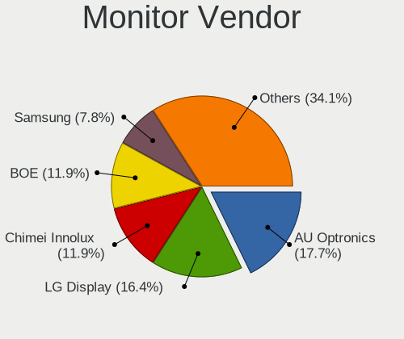

| Vendor                  | Notebooks | Percent |
|-------------------------|-----------|---------|
| AU Optronics            | 54        | 18.18%  |
| LG Display              | 48        | 16.16%  |
| Chimei Innolux          | 35        | 11.78%  |
| BOE                     | 35        | 11.78%  |
| Samsung Electronics     | 23        | 7.74%   |
| Sharp                   | 20        | 6.73%   |
| Dell                    | 15        | 5.05%   |
| Lenovo                  | 6         | 2.02%   |
| Chi Mei Optoelectronics | 6         | 2.02%   |
| Goldstar                | 5         | 1.68%   |
| Apple                   | 5         | 1.68%   |
| AOC                     | 5         | 1.68%   |
| PANDA                   | 4         | 1.35%   |
| Ancor Communications    | 4         | 1.35%   |
| Philips                 | 3         | 1.01%   |
| Iiyama                  | 3         | 1.01%   |
| Hewlett-Packard         | 3         | 1.01%   |
| CSO                     | 3         | 1.01%   |
| LGD                     | 2         | 0.67%   |
| InfoVision              | 2         | 0.67%   |
| Gigabyte Technology     | 2         | 0.67%   |
| Fujitsu Siemens         | 2         | 0.67%   |
| BenQ                    | 2         | 0.67%   |
| WST                     | 1         | 0.34%   |
| Unknown                 | 1         | 0.34%   |
| Toshiba                 | 1         | 0.34%   |
| MSI                     | 1         | 0.34%   |
| Mi                      | 1         | 0.34%   |
| LG Philips              | 1         | 0.34%   |
| Gateway                 | 1         | 0.34%   |
| Eizo                    | 1         | 0.34%   |
| CMN                     | 1         | 0.34%   |
| Acer                    | 1         | 0.34%   |

Monitor Model
-------------

Monitor models

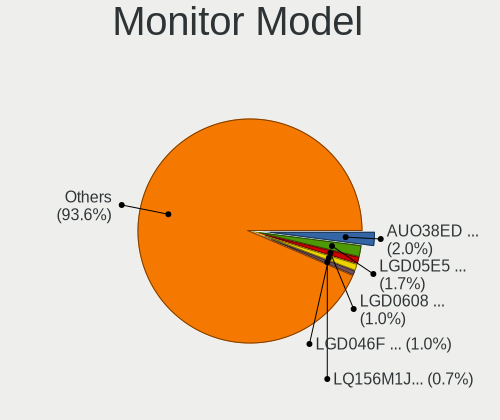

| Model                                                                    | Notebooks | Percent |
|--------------------------------------------------------------------------|-----------|---------|
| AU Optronics LCD Monitor AUO38ED 1920x1080 344x193mm 15.5-inch           | 6         | 2.01%   |
| LG Display LCD Monitor LGD05E5 1920x1080 340x190mm 15.3-inch             | 5         | 1.67%   |
| LG Display LCD Monitor LGD0608 1920x1080 309x174mm 14.0-inch             | 3         | 1%      |
| LG Display LCD Monitor LGD046F 1920x1080 344x194mm 15.5-inch             | 3         | 1%      |
| Sharp LQ156M1JW25 SHP152C 1920x1080 344x194mm 15.5-inch                  | 2         | 0.67%   |
| Sharp LQ156M1JW01 SHP14C3 1920x1080 344x194mm 15.5-inch                  | 2         | 0.67%   |
| Sharp LCD Monitor SHP14FA 3840x2400 288x180mm 13.4-inch                  | 2         | 0.67%   |
| Sharp LCD Monitor SHP144A 3200x1800 294x165mm 13.3-inch                  | 2         | 0.67%   |
| Samsung Electronics U28E570 SAM0D71 3840x2160 608x345mm 27.5-inch        | 2         | 0.67%   |
| Samsung Electronics LCD Monitor SEC3245 1366x768 344x194mm 15.5-inch     | 2         | 0.67%   |
| Samsung Electronics LCD Monitor SAM0B7C 1920x1080 890x500mm 40.2-inch    | 2         | 0.67%   |
| Samsung Electronics C27F390 SAM0D32 1920x1080 598x336mm 27.0-inch        | 2         | 0.67%   |
| LGD LCD Monitor 1920x1080                                                | 2         | 0.67%   |
| LG Display LCD Monitor LGD0657 1920x1080 344x194mm 15.5-inch             | 2         | 0.67%   |
| LG Display LCD Monitor LGD062C 1920x1080 309x174mm 14.0-inch             | 2         | 0.67%   |
| LG Display LCD Monitor LGD045D 1366x768 345x194mm 15.6-inch              | 2         | 0.67%   |
| Gigabyte Technology G34WQC GBT3400 3440x1440 800x330mm 34.1-inch         | 2         | 0.67%   |
| Fujitsu Siemens P24W-6 IPS FUS07EA 1920x1200 518x324mm 24.1-inch         | 2         | 0.67%   |
| Dell U2715H DELD065 2560x1440 597x336mm 27.0-inch                        | 2         | 0.67%   |
| Chimei Innolux LCD Monitor CMN15E8 1920x1080 344x193mm 15.5-inch         | 2         | 0.67%   |
| Chimei Innolux LCD Monitor CMN15C4 1920x1080 344x193mm 15.5-inch         | 2         | 0.67%   |
| Chimei Innolux LCD Monitor CMN150C 1920x1080 344x193mm 15.5-inch         | 2         | 0.67%   |
| Chimei Innolux LCD Monitor CMN14D5 1920x1080 309x173mm 13.9-inch         | 2         | 0.67%   |
| Chi Mei Optoelectronics LCD Monitor CMO15A2 1366x768 344x193mm 15.5-inch | 2         | 0.67%   |
| BOE LCD Monitor BOE0898 1920x1080 294x165mm 13.3-inch                    | 2         | 0.67%   |
| BOE LCD Monitor BOE0804 1920x1080 344x193mm 15.5-inch                    | 2         | 0.67%   |
| BenQ GW2480 BNQ78E7 1920x1080 527x296mm 23.8-inch                        | 2         | 0.67%   |
| AU Optronics LCD Monitor AUOC48A 1920x1080 344x194mm 15.5-inch           | 2         | 0.67%   |
| AU Optronics LCD Monitor AUO61ED 1920x1080 344x194mm 15.5-inch           | 2         | 0.67%   |
| AU Optronics LCD Monitor AUO5A2D 1920x1080 293x165mm 13.2-inch           | 2         | 0.67%   |
| AU Optronics LCD Monitor AUO408D 1920x1080 309x174mm 14.0-inch           | 2         | 0.67%   |
| AU Optronics LCD Monitor AUO403D 1920x1080 309x173mm 13.9-inch           | 2         | 0.67%   |
| AU Optronics LCD Monitor AUO305C 1366x768 256x144mm 11.6-inch            | 2         | 0.67%   |
| AU Optronics LCD Monitor AUO2E3C 1366x768 309x173mm 13.9-inch            | 2         | 0.67%   |
| AU Optronics LCD Monitor AUO226D 1920x1080 276x155mm 12.5-inch           | 2         | 0.67%   |
| AU Optronics LCD Monitor AUO2074 1280x800 331x207mm 15.4-inch            | 2         | 0.67%   |
| AU Optronics LCD Monitor AUO132C 1366x768 293x164mm 13.2-inch            | 2         | 0.67%   |
| AU Optronics LCD Monitor 1920x1080                                       | 2         | 0.67%   |
| WST LCD Monitor WST2216 2160x1440 254x169mm 12.0-inch                    | 1         | 0.33%   |
| Unknown LCD Monitor FFFF 2288x1287 2550x2550mm 142.0-inch                | 1         | 0.33%   |

Monitor Resolution
------------------

Monitor screen resolution

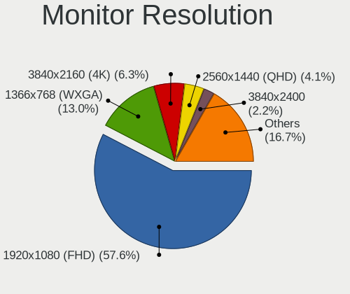

| Resolution         | Notebooks | Percent |
|--------------------|-----------|---------|
| 1920x1080 (FHD)    | 157       | 57.51%  |
| 1366x768 (WXGA)    | 35        | 12.82%  |
| 3840x2160 (4K)     | 18        | 6.59%   |
| 2560x1440 (QHD)    | 11        | 4.03%   |
| 1920x1200 (WUXGA)  | 7         | 2.56%   |
| 3840x2400          | 6         | 2.2%    |
| 3440x1440          | 5         | 1.83%   |
| 2560x1600          | 5         | 1.83%   |
| 1600x900 (HD+)     | 5         | 1.83%   |
| 1280x800 (WXGA)    | 5         | 1.83%   |
| 3200x1800 (QHD+)   | 2         | 0.73%   |
| 2160x1440          | 2         | 0.73%   |
| 1680x1050 (WSXGA+) | 2         | 0.73%   |
| 5040x1080          | 1         | 0.37%   |
| 3840x1200          | 1         | 0.37%   |
| 3456x2160          | 1         | 0.37%   |
| 3072x1920          | 1         | 0.37%   |
| 2880x1800          | 1         | 0.37%   |
| 2304x1440          | 1         | 0.37%   |
| 2288x1287          | 1         | 0.37%   |
| 1440x900 (WXGA+)   | 1         | 0.37%   |
| 1400x1050          | 1         | 0.37%   |
| 1280x768           | 1         | 0.37%   |
| 1280x1024 (SXGA)   | 1         | 0.37%   |
| 1024x600           | 1         | 0.37%   |
| Unknown            | 1         | 0.37%   |

Monitor Diagonal
----------------

Diagonal size in inches

| Inches  | Notebooks | Percent |
|---------|-----------|---------|
| 15      | 114       | 38.78%  |
| 13      | 48        | 16.33%  |
| 14      | 30        | 10.2%   |
| 27      | 20        | 6.8%    |
| 24      | 13        | 4.42%   |
| 12      | 13        | 4.42%   |
| 17      | 10        | 3.4%    |
| 23      | 8         | 2.72%   |
| 11      | 7         | 2.38%   |
| 34      | 5         | 1.7%    |
| Unknown | 5         | 1.7%    |
| 21      | 3         | 1.02%   |
| 16      | 3         | 1.02%   |
| 58      | 2         | 0.68%   |
| 19      | 2         | 0.68%   |
| 18      | 2         | 0.68%   |
| 142     | 1         | 0.34%   |
| 43      | 1         | 0.34%   |
| 37      | 1         | 0.34%   |
| 31      | 1         | 0.34%   |
| 29      | 1         | 0.34%   |
| 26      | 1         | 0.34%   |
| 25      | 1         | 0.34%   |
| 22      | 1         | 0.34%   |
| 8       | 1         | 0.34%   |

Monitor Width
-------------

Physical width

| Width in mm    | Notebooks | Percent |
|----------------|-----------|---------|
| 301-350        | 164       | 55.97%  |
| 201-300        | 49        | 16.72%  |
| 501-600        | 39        | 13.31%  |
| 351-400        | 12        | 4.1%    |
| 401-500        | 8         | 2.73%   |
| 701-800        | 5         | 1.71%   |
| 601-700        | 5         | 1.71%   |
| Unknown        | 5         | 1.71%   |
| 1001-1500      | 3         | 1.02%   |
| More than 2000 | 1         | 0.34%   |
| 801-900        | 1         | 0.34%   |
| 101-200        | 1         | 0.34%   |

Aspect Ratio
------------

Proportional relationship between the width and the height

| Ratio   | Notebooks | Percent |
|---------|-----------|---------|
| 16/9    | 207       | 81.18%  |
| 16/10   | 30        | 11.76%  |
| 21/9    | 5         | 1.96%   |
| Unknown | 5         | 1.96%   |
| 3/2     | 4         | 1.57%   |
| 5/4     | 1         | 0.39%   |
| 4/3     | 1         | 0.39%   |
| 3.20    | 1         | 0.39%   |
| 1.00    | 1         | 0.39%   |

Monitor Area
------------

Area in inch

| Area in inch | Notebooks | Percent |
|----------------|-----------|---------|
| 101-110        | 113       | 38.31%  |
| 81-90          | 51        | 17.29%  |
| 71-80          | 26        | 8.81%   |
| 301-350        | 21        | 7.12%   |
| 201-250        | 18        | 6.1%    |
| 61-70          | 13        | 4.41%   |
| 121-130        | 9         | 3.05%   |
| 51-60          | 7         | 2.37%   |
| 351-500        | 7         | 2.37%   |
| 251-300        | 7         | 2.37%   |
| Unknown        | 5         | 1.69%   |
| More than 1000 | 3         | 1.02%   |
| 151-200        | 3         | 1.02%   |
| 111-120        | 3         | 1.02%   |
| 91-100         | 3         | 1.02%   |
| 141-150        | 2         | 0.68%   |
| 501-1000       | 2         | 0.68%   |
| 1-40           | 1         | 0.34%   |
| 131-140        | 1         | 0.34%   |

Pixel Density
-------------

Pixels per inch

| Density       | Notebooks | Percent |
|---------------|-----------|---------|
| 121-160       | 147       | 50.52%  |
| 51-100        | 44        | 15.12%  |
| 161-240       | 36        | 12.37%  |
| 101-120       | 35        | 12.03%  |
| More than 240 | 21        | 7.22%   |
| Unknown       | 5         | 1.72%   |
| 1-50          | 3         | 1.03%   |

Multiple Monitors
-----------------

Total monitors connected

| Total | Notebooks | Percent |
|-------|-----------|---------|
| 1     | 186       | 74.1%   |
| 2     | 54        | 21.51%  |
| 0     | 7         | 2.79%   |
| 3     | 4         | 1.59%   |

Network
-------

Net Controller Vendor
---------------------

Controller vendors

| Vendor                            | Notebooks | Percent |
|-----------------------------------|-----------|---------|
| Intel                             | 161       | 41.28%  |
| Realtek Semiconductor             | 127       | 32.56%  |
| Qualcomm Atheros                  | 45        | 11.54%  |
| Lenovo                            | 8         | 2.05%   |
| Broadcom                          | 8         | 2.05%   |
| Dell                              | 5         | 1.28%   |
| ASIX Electronics                  | 5         | 1.28%   |
| Qualcomm                          | 3         | 0.77%   |
| MediaTek                          | 3         | 0.77%   |
| Fibocom                           | 3         | 0.77%   |
| Xiaomi                            | 2         | 0.51%   |
| TP-Link                           | 2         | 0.51%   |
| Ralink Technology                 | 2         | 0.51%   |
| Qualcomm Atheros Communications   | 2         | 0.51%   |
| Marvell Technology Group          | 2         | 0.51%   |
| D-Link System                     | 2         | 0.51%   |
| Broadcom Limited                  | 2         | 0.51%   |
| Apple                             | 2         | 0.51%   |
| Sierra Wireless                   | 1         | 0.26%   |
| Shenzhen Goodix Technology        | 1         | 0.26%   |
| Ralink                            | 1         | 0.26%   |
| Google                            | 1         | 0.26%   |
| Ericsson Business Mobile Networks | 1         | 0.26%   |
| AMD                               | 1         | 0.26%   |

Net Controller Model
--------------------

Controller models

| Model                                                             | Notebooks | Percent |
|-------------------------------------------------------------------|-----------|---------|
| Realtek RTL8111/8168/8411 PCI Express Gigabit Ethernet Controller | 93        | 19.75%  |
| Intel Wi-Fi 6 AX200                                               | 37        | 7.86%   |
| Intel Wireless 8265 / 8275                                        | 20        | 4.25%   |
| Intel Cannon Lake PCH CNVi WiFi                                   | 15        | 3.18%   |
| Realtek RTL8153 Gigabit Ethernet Adapter                          | 13        | 2.76%   |
| Realtek RTL810xE PCI Express Fast Ethernet controller             | 13        | 2.76%   |
| Realtek RTL8822CE 802.11ac PCIe Wireless Network Adapter          | 12        | 2.55%   |
| Qualcomm Atheros QCA6174 802.11ac Wireless Network Adapter        | 10        | 2.12%   |
| Intel Wi-Fi 6 AX201                                               | 10        | 2.12%   |
| Intel Comet Lake PCH CNVi WiFi                                    | 10        | 2.12%   |
| Intel Cannon Point-LP CNVi [Wireless-AC]                          | 8         | 1.7%    |
| Realtek RTL8821CE 802.11ac PCIe Wireless Network Adapter          | 7         | 1.49%   |
| Qualcomm Atheros QCA9377 802.11ac Wireless Network Adapter        | 7         | 1.49%   |
| Intel Ethernet Connection (4) I219-V                              | 7         | 1.49%   |
| Realtek RTL8723BE PCIe Wireless Network Adapter                   | 6         | 1.27%   |
| Qualcomm Atheros AR9485 Wireless Network Adapter                  | 6         | 1.27%   |
| Intel Wireless 8260                                               | 6         | 1.27%   |
| Intel Wireless 3165                                               | 6         | 1.27%   |
| Qualcomm Atheros QCA9565 / AR9565 Wireless Network Adapter        | 5         | 1.06%   |
| Intel Wireless 7265                                               | 5         | 1.06%   |
| Intel Wireless 7260                                               | 5         | 1.06%   |
| Intel Ethernet Connection (4) I219-LM                             | 5         | 1.06%   |
| Intel Ethernet Connection (2) I219-LM                             | 5         | 1.06%   |
| Intel Comet Lake PCH-LP CNVi WiFi                                 | 5         | 1.06%   |
| Intel 82579LM Gigabit Network Connection (Lewisville)             | 5         | 1.06%   |
| Qualcomm Atheros AR9462 Wireless Network Adapter                  | 4         | 0.85%   |
| Intel Centrino Advanced-N 6205 [Taylor Peak]                      | 4         | 0.85%   |
| Realtek RTL8822BE 802.11a/b/g/n/ac WiFi adapter                   | 3         | 0.64%   |
| Qualcomm QCA6390 Wireless Network Adapter                         | 3         | 0.64%   |
| Qualcomm Atheros Killer E2400 Gigabit Ethernet Controller         | 3         | 0.64%   |
| Lenovo ThinkPad TBT 3 Dock                                        | 3         | 0.64%   |
| Intel Wireless-AC 9260                                            | 3         | 0.64%   |
| Intel Wi-Fi 6 AX210/AX211/AX411 160MHz                            | 3         | 0.64%   |
| Intel I210 Gigabit Network Connection                             | 3         | 0.64%   |
| Intel Ethernet Connection (7) I219-LM                             | 3         | 0.64%   |
| Intel Ethernet Connection (6) I219-V                              | 3         | 0.64%   |
| Intel Dual Band Wireless-AC 3165 Plus Bluetooth                   | 3         | 0.64%   |
| Xiaomi Mi/Redmi series (RNDIS)                                    | 2         | 0.42%   |
| Realtek RTL8723DE Wireless Network Adapter                        | 2         | 0.42%   |
| Ralink MT7601U Wireless Adapter                                   | 2         | 0.42%   |

Wireless Vendor
---------------

Wireless vendors

| Vendor                          | Notebooks | Percent |
|---------------------------------|-----------|---------|
| Intel                           | 157       | 61.33%  |
| Qualcomm Atheros                | 40        | 15.63%  |
| Realtek Semiconductor           | 32        | 12.5%   |
| Broadcom                        | 6         | 2.34%   |
| Dell                            | 4         | 1.56%   |
| Qualcomm                        | 3         | 1.17%   |
| Fibocom                         | 3         | 1.17%   |
| Ralink Technology               | 2         | 0.78%   |
| Qualcomm Atheros Communications | 2         | 0.78%   |
| MediaTek                        | 2         | 0.78%   |
| D-Link System                   | 2         | 0.78%   |
| TP-Link                         | 1         | 0.39%   |
| Sierra Wireless                 | 1         | 0.39%   |
| Ralink                          | 1         | 0.39%   |

Wireless Model
--------------

Wireless models

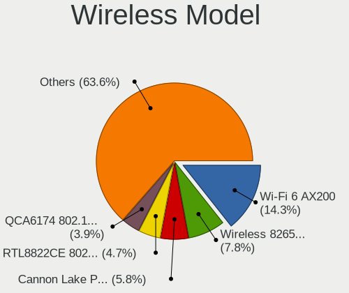

| Model                                                                   | Notebooks | Percent |
|-------------------------------------------------------------------------|-----------|---------|
| Intel Wi-Fi 6 AX200                                                     | 37        | 14.34%  |
| Intel Wireless 8265 / 8275                                              | 20        | 7.75%   |
| Intel Cannon Lake PCH CNVi WiFi                                         | 15        | 5.81%   |
| Realtek RTL8822CE 802.11ac PCIe Wireless Network Adapter                | 12        | 4.65%   |
| Qualcomm Atheros QCA6174 802.11ac Wireless Network Adapter              | 10        | 3.88%   |
| Intel Wi-Fi 6 AX201                                                     | 10        | 3.88%   |
| Intel Comet Lake PCH CNVi WiFi                                          | 10        | 3.88%   |
| Intel Cannon Point-LP CNVi [Wireless-AC]                                | 8         | 3.1%    |
| Realtek RTL8821CE 802.11ac PCIe Wireless Network Adapter                | 7         | 2.71%   |
| Qualcomm Atheros QCA9377 802.11ac Wireless Network Adapter              | 7         | 2.71%   |
| Realtek RTL8723BE PCIe Wireless Network Adapter                         | 6         | 2.33%   |
| Qualcomm Atheros AR9485 Wireless Network Adapter                        | 6         | 2.33%   |
| Intel Wireless 8260                                                     | 6         | 2.33%   |
| Intel Wireless 3165                                                     | 6         | 2.33%   |
| Qualcomm Atheros QCA9565 / AR9565 Wireless Network Adapter              | 5         | 1.94%   |
| Intel Wireless 7265                                                     | 5         | 1.94%   |
| Intel Wireless 7260                                                     | 5         | 1.94%   |
| Intel Comet Lake PCH-LP CNVi WiFi                                       | 5         | 1.94%   |
| Qualcomm Atheros AR9462 Wireless Network Adapter                        | 4         | 1.55%   |
| Intel Centrino Advanced-N 6205 [Taylor Peak]                            | 4         | 1.55%   |
| Realtek RTL8822BE 802.11a/b/g/n/ac WiFi adapter                         | 3         | 1.16%   |
| Qualcomm QCA6390 Wireless Network Adapter                               | 3         | 1.16%   |
| Intel Wireless-AC 9260                                                  | 3         | 1.16%   |
| Intel Wi-Fi 6 AX210/AX211/AX411 160MHz                                  | 3         | 1.16%   |
| Intel Dual Band Wireless-AC 3165 Plus Bluetooth                         | 3         | 1.16%   |
| Realtek RTL8723DE Wireless Network Adapter                              | 2         | 0.78%   |
| Ralink MT7601U Wireless Adapter                                         | 2         | 0.78%   |
| Qualcomm Atheros AR93xx Wireless Network Adapter                        | 2         | 0.78%   |
| Qualcomm Atheros AR9285 Wireless Network Adapter (PCI-Express)          | 2         | 0.78%   |
| Qualcomm Atheros AR5212 802.11abg NIC                                   | 2         | 0.78%   |
| Qualcomm Atheros AR242x / AR542x Wireless Network Adapter (PCI-Express) | 2         | 0.78%   |
| MediaTek MT7921 802.11ax PCI Express Wireless Network Adapter           | 2         | 0.78%   |
| Intel Tiger Lake PCH CNVi WiFi                                          | 2         | 0.78%   |
| Intel PRO/Wireless 4965 AG or AGN [Kedron] Network Connection           | 2         | 0.78%   |
| Intel PRO/Wireless 3945ABG [Golan] Network Connection                   | 2         | 0.78%   |
| Intel Ice Lake-LP PCH CNVi WiFi                                         | 2         | 0.78%   |
| Intel Dual Band Wireless-AC 3168NGW [Stone Peak]                        | 2         | 0.78%   |
| Fibocom L830-EB-00 LTE WWAN Modem                                       | 2         | 0.78%   |
| TP-Link Archer T2U PLUS [RTL8821AU]                                     | 1         | 0.39%   |
| Sierra Wireless EM7345 4G LTE                                           | 1         | 0.39%   |

Ethernet Vendor
---------------

Ethernet vendors

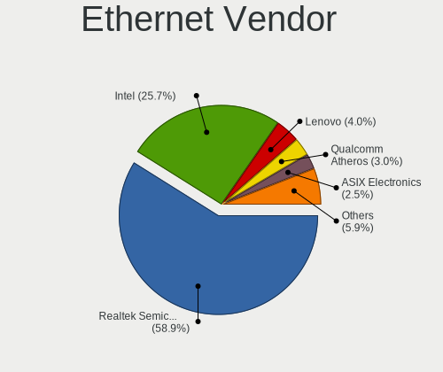

| Vendor                   | Notebooks | Percent |
|--------------------------|-----------|---------|
| Realtek Semiconductor    | 119       | 58.91%  |
| Intel                    | 52        | 25.74%  |
| Lenovo                   | 8         | 3.96%   |
| Qualcomm Atheros         | 6         | 2.97%   |
| ASIX Electronics         | 5         | 2.48%   |
| Xiaomi                   | 2         | 0.99%   |
| Marvell Technology Group | 2         | 0.99%   |
| Broadcom Limited         | 2         | 0.99%   |
| Broadcom                 | 2         | 0.99%   |
| Apple                    | 2         | 0.99%   |
| TP-Link                  | 1         | 0.5%    |
| Google                   | 1         | 0.5%    |

Ethernet Model
--------------

Ethernet models

| Model                                                                          | Notebooks | Percent |
|--------------------------------------------------------------------------------|-----------|---------|
| Realtek RTL8111/8168/8411 PCI Express Gigabit Ethernet Controller              | 93        | 45.37%  |
| Realtek RTL8153 Gigabit Ethernet Adapter                                       | 13        | 6.34%   |
| Realtek RTL810xE PCI Express Fast Ethernet controller                          | 13        | 6.34%   |
| Intel Ethernet Connection (4) I219-V                                           | 7         | 3.41%   |
| Intel Ethernet Connection (4) I219-LM                                          | 5         | 2.44%   |
| Intel Ethernet Connection (2) I219-LM                                          | 5         | 2.44%   |
| Intel 82579LM Gigabit Network Connection (Lewisville)                          | 5         | 2.44%   |
| Qualcomm Atheros Killer E2400 Gigabit Ethernet Controller                      | 3         | 1.46%   |
| Lenovo ThinkPad TBT 3 Dock                                                     | 3         | 1.46%   |
| Intel I210 Gigabit Network Connection                                          | 3         | 1.46%   |
| Intel Ethernet Connection (7) I219-LM                                          | 3         | 1.46%   |
| Intel Ethernet Connection (6) I219-V                                           | 3         | 1.46%   |
| Xiaomi Mi/Redmi series (RNDIS)                                                 | 2         | 0.98%   |
| Lenovo USB-C Dock Ethernet                                                     | 2         | 0.98%   |
| Intel Ethernet Connection I219-V                                               | 2         | 0.98%   |
| Intel Ethernet Connection I218-LM                                              | 2         | 0.98%   |
| Intel Ethernet Connection (7) I219-V                                           | 2         | 0.98%   |
| Intel Ethernet Connection (14) I219-LM                                         | 2         | 0.98%   |
| Intel Ethernet Connection (13) I219-LM                                         | 2         | 0.98%   |
| Intel Ethernet Connection (10) I219-V                                          | 2         | 0.98%   |
| Intel 82577LM Gigabit Network Connection                                       | 2         | 0.98%   |
| Broadcom Limited NetLink BCM5787M Gigabit Ethernet PCI Express                 | 2         | 0.98%   |
| ASIX AX88772B Fast Ethernet Controller                                         | 2         | 0.98%   |
| TP-Link UE300 10/100/1000 LAN (ethernet mode) [Realtek RTL8153]                | 1         | 0.49%   |
| Realtek RTL-8100/8101L/8139 PCI Fast Ethernet Adapter                          | 1         | 0.49%   |
| Qualcomm Atheros Killer E2500 Gigabit Ethernet Controller                      | 1         | 0.49%   |
| Qualcomm Atheros Attansic L2 Fast Ethernet                                     | 1         | 0.49%   |
| Qualcomm Atheros Attansic L1 Gigabit Ethernet                                  | 1         | 0.49%   |
| Marvell Group Yukon Optima 88E8059 [PCIe Gigabit Ethernet Controller with AVB] | 1         | 0.49%   |
| Marvell Group 88E8040 PCI-E Fast Ethernet Controller                           | 1         | 0.49%   |
| Lenovo USB-C to LAN                                                            | 1         | 0.49%   |
| Lenovo Thinkpad LAN                                                            | 1         | 0.49%   |
| Lenovo ThinkPad Dock Ethernet [Realtek RTL8153B]                               | 1         | 0.49%   |
| Intel Ethernet controller                                                      | 1         | 0.49%   |
| Intel Ethernet Connection I219-LM                                              | 1         | 0.49%   |
| Intel Ethernet Connection (6) I219-LM                                          | 1         | 0.49%   |
| Intel Ethernet Connection (5) I219-LM                                          | 1         | 0.49%   |
| Intel Ethernet Connection (3) I218-V                                           | 1         | 0.49%   |
| Intel Ethernet Connection (14) I219-V                                          | 1         | 0.49%   |
| Intel Ethernet Connection (10) I219-LM                                         | 1         | 0.49%   |

Net Controller Kind
-------------------

Ethernet, WiFi or modem

| Kind     | Notebooks | Percent |
|----------|-----------|---------|
| WiFi     | 242       | 55.13%  |
| Ethernet | 189       | 43.05%  |
| Modem    | 7         | 1.59%   |
| Unknown  | 1         | 0.23%   |

Used Controller
---------------

Currently used network controller

| Kind     | Notebooks | Percent |
|----------|-----------|---------|
| WiFi     | 195       | 73.58%  |
| Ethernet | 70        | 26.42%  |

NICs
----

Total network controllers on board

| Total | Notebooks | Percent |
|-------|-----------|---------|
| 2     | 161       | 65.98%  |
| 1     | 75        | 30.74%  |
| 3     | 8         | 3.28%   |

IPv6
----

IPv6 vs IPv4

| Used | Notebooks | Percent |
|------|-----------|---------|
| No   | 220       | 88.35%  |
| Yes  | 29        | 11.65%  |

Bluetooth
---------

Bluetooth Vendor
----------------

Controller vendors

| Vendor                          | Notebooks | Percent |
|---------------------------------|-----------|---------|
| Intel                           | 140       | 63.06%  |
| Realtek Semiconductor           | 23        | 10.36%  |
| Qualcomm Atheros Communications | 15        | 6.76%   |
| Lite-On Technology              | 11        | 4.95%   |
| IMC Networks                    | 5         | 2.25%   |
| Cambridge Silicon Radio         | 5         | 2.25%   |
| Foxconn / Hon Hai               | 4         | 1.8%    |
| Broadcom                        | 4         | 1.8%    |
| Realtek                         | 3         | 1.35%   |
| Dell                            | 3         | 1.35%   |
| Toshiba                         | 2         | 0.9%    |
| Hewlett-Packard                 | 2         | 0.9%    |
| Apple                           | 2         | 0.9%    |
| Ralink Technology               | 1         | 0.45%   |
| Chicony Electronics             | 1         | 0.45%   |
| ASUSTek Computer                | 1         | 0.45%   |

Bluetooth Model
---------------

Controller models

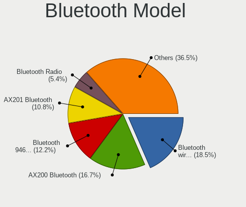

| Model                                                                               | Notebooks | Percent |
|-------------------------------------------------------------------------------------|-----------|---------|
| Intel Bluetooth wireless interface                                                  | 41        | 18.47%  |
| Intel AX200 Bluetooth                                                               | 37        | 16.67%  |
| Intel Bluetooth 9460/9560 Jefferson Peak (JfP)                                      | 27        | 12.16%  |
| Intel AX201 Bluetooth                                                               | 24        | 10.81%  |
| Realtek Bluetooth Radio                                                             | 13        | 5.86%   |
| Realtek  Bluetooth 4.2 Adapter                                                      | 7         | 3.15%   |
| Qualcomm Atheros  Bluetooth Device                                                  | 5         | 2.25%   |
| Qualcomm Atheros QCA61x4 Bluetooth 4.0                                              | 5         | 2.25%   |
| Cambridge Silicon Radio Bluetooth Dongle (HCI mode)                                 | 5         | 2.25%   |
| Lite-On Bluetooth Device                                                            | 4         | 1.8%    |
| Lite-On Atheros AR3012 Bluetooth                                                    | 4         | 1.8%    |
| Realtek RTL8723B Bluetooth                                                          | 3         | 1.35%   |
| Realtek Bluetooth Radio                                                             | 3         | 1.35%   |
| Intel Wireless-AC 9260 Bluetooth Adapter                                            | 3         | 1.35%   |
| Intel AX210 Bluetooth                                                               | 3         | 1.35%   |
| Foxconn / Hon Hai Bluetooth Device                                                  | 3         | 1.35%   |
| Qualcomm Atheros AR9462 Bluetooth                                                   | 2         | 0.9%    |
| Qualcomm Atheros AR3012 Bluetooth 4.0                                               | 2         | 0.9%    |
| Lite-On Qualcomm Atheros QCA9377 Bluetooth                                          | 2         | 0.9%    |
| Intel Wireless-AC 3168 Bluetooth                                                    | 2         | 0.9%    |
| IMC Networks Wireless_Device                                                        | 2         | 0.9%    |
| IMC Networks Bluetooth Radio                                                        | 2         | 0.9%    |
| HP Bluetooth 2.0 Interface [Broadcom BCM2045]                                       | 2         | 0.9%    |
| Broadcom BCM20702 Bluetooth 4.0 [ThinkPad]                                          | 2         | 0.9%    |
| Toshiba RT Bluetooth Radio                                                          | 1         | 0.45%   |
| Toshiba Integrated Bluetooth (Taiyo Yuden)                                          | 1         | 0.45%   |
| Ralink CSR BS8510                                                                   | 1         | 0.45%   |
| Qualcomm Atheros Bluetooth USB Host Controller                                      | 1         | 0.45%   |
| Lite-On Bluetooth Radio                                                             | 1         | 0.45%   |
| Intel Centrino Bluetooth Wireless Transceiver                                       | 1         | 0.45%   |
| Intel Centrino Advanced-N 6230 Bluetooth adapter                                    | 1         | 0.45%   |
| Intel Bluetooth Device                                                              | 1         | 0.45%   |
| IMC Networks Bluetooth Device                                                       | 1         | 0.45%   |
| Foxconn / Hon Hai Foxconn T77H114 BCM2070 [Single-Chip Bluetooth 2.1 + EDR Adapter] | 1         | 0.45%   |
| Dell Wireless 350 Bluetooth                                                         | 1         | 0.45%   |
| Dell DW375 Bluetooth Module                                                         | 1         | 0.45%   |
| Dell BCM20702A0 Bluetooth Module                                                    | 1         | 0.45%   |
| Chicony Bluetooth (RTL8723BE)                                                       | 1         | 0.45%   |
| Broadcom BCM2045B (BDC-2.1)                                                         | 1         | 0.45%   |
| Broadcom BCM2045B (BDC-2) [Bluetooth Controller]                                    | 1         | 0.45%   |

Sound
-----

Sound Vendor
------------

Sound card vendors

| Vendor                      | Notebooks | Percent |
|-----------------------------|-----------|---------|
| Intel                       | 180       | 50.56%  |
| Nvidia                      | 67        | 18.82%  |
| AMD                         | 62        | 17.42%  |
| Lenovo                      | 8         | 2.25%   |
| Realtek Semiconductor       | 5         | 1.4%    |
| C-Media Electronics         | 5         | 1.4%    |
| Blue Microphones            | 3         | 0.84%   |
| Razer USA                   | 2         | 0.56%   |
| Plantronics                 | 2         | 0.56%   |
| No brand                    | 2         | 0.56%   |
| Logitech                    | 2         | 0.56%   |
| GYROCOM C&C                 | 2         | 0.56%   |
| Dell                        | 2         | 0.56%   |
| Tdlasunnic                  | 1         | 0.28%   |
| SteelSeries ApS             | 1         | 0.28%   |
| RODE Microphones            | 1         | 0.28%   |
| LG Electronics              | 1         | 0.28%   |
| JMTek                       | 1         | 0.28%   |
| iCreate Technologies        | 1         | 0.28%   |
| FiiO Electronics Technology | 1         | 0.28%   |
| Creative Technology         | 1         | 0.28%   |
| Behringer.......            | 1         | 0.28%   |
| AVer Information            | 1         | 0.28%   |
| ATOLL Electronique          | 1         | 0.28%   |
| Apple                       | 1         | 0.28%   |
| ACTIONS                     | 1         | 0.28%   |
| A4Tech                      | 1         | 0.28%   |

Sound Model
-----------

Sound card models

| Model                                                                      | Notebooks | Percent |
|----------------------------------------------------------------------------|-----------|---------|
| AMD Family 17h/19h HD Audio Controller                                     | 51        | 12.11%  |
| Intel Sunrise Point-LP HD Audio                                            | 35        | 8.31%   |
| Intel Cannon Lake PCH cAVS                                                 | 31        | 7.36%   |
| AMD Renoir Radeon High Definition Audio Controller                         | 31        | 7.36%   |
| Nvidia TU107 GeForce GTX 1650 High Definition Audio Controller             | 20        | 4.75%   |
| Intel Tiger Lake-LP Smart Sound Technology Audio Controller                | 12        | 2.85%   |
| Intel Comet Lake PCH cAVS                                                  | 12        | 2.85%   |
| Intel Cannon Point-LP High Definition Audio Controller                     | 10        | 2.38%   |
| AMD Raven/Raven2/Fenghuang HDMI/DP Audio Controller                        | 10        | 2.38%   |
| Intel Haswell-ULT HD Audio Controller                                      | 9         | 2.14%   |
| Intel 8 Series HD Audio Controller                                         | 9         | 2.14%   |
| Nvidia TU106 High Definition Audio Controller                              | 8         | 1.9%    |
| Intel CM238 HD Audio Controller                                            | 8         | 1.9%    |
| Nvidia GP107GL High Definition Audio Controller                            | 7         | 1.66%   |
| Intel 7 Series/C216 Chipset Family High Definition Audio Controller        | 7         | 1.66%   |
| Intel 100 Series/C230 Series Chipset Family HD Audio Controller            | 7         | 1.66%   |
| Intel Wildcat Point-LP High Definition Audio Controller                    | 6         | 1.43%   |
| Intel Tiger Lake-H HD Audio Controller                                     | 6         | 1.43%   |
| Intel Comet Lake PCH-LP cAVS                                               | 6         | 1.43%   |
| Intel Broadwell-U Audio Controller                                         | 6         | 1.43%   |
| Realtek Semiconductor USB Audio                                            | 5         | 1.19%   |
| AMD FCH Azalia Controller                                                  | 5         | 1.19%   |
| Nvidia TU116 High Definition Audio Controller                              | 4         | 0.95%   |
| Nvidia TU104 HD Audio Controller                                           | 4         | 0.95%   |
| Nvidia GP106 High Definition Audio Controller                              | 4         | 0.95%   |
| Nvidia GA104 High Definition Audio Controller                              | 4         | 0.95%   |
| Intel Atom Processor Z36xxx/Z37xxx Series High Definition Audio Controller | 4         | 0.95%   |
| Intel 82801H (ICH8 Family) HD Audio Controller                             | 4         | 0.95%   |
| Nvidia GA106 High Definition Audio Controller                              | 3         | 0.71%   |
| Lenovo ThinkPad Thunderbolt 3 Dock USB Audio                               | 3         | 0.71%   |
| Intel NM10/ICH7 Family High Definition Audio Controller                    | 3         | 0.71%   |
| Intel Ice Lake-LP Smart Sound Technology Audio Controller                  | 3         | 0.71%   |
| Intel Celeron/Pentium Silver Processor High Definition Audio               | 3         | 0.71%   |
| Intel 5 Series/3400 Series Chipset High Definition Audio                   | 3         | 0.71%   |
| Blue Microphones Yeti Stereo Microphone                                    | 3         | 0.71%   |
| Razer USA Razer Kraken X USB                                               | 2         | 0.48%   |
| Nvidia High Definition Audio Controller                                    | 2         | 0.48%   |
| Nvidia GP104 High Definition Audio Controller                              | 2         | 0.48%   |
| Nvidia GM107 High Definition Audio Controller [GeForce 940MX]              | 2         | 0.48%   |
| Nvidia GF108 High Definition Audio Controller                              | 2         | 0.48%   |

Memory
------

Memory Vendor
-------------

Memory module vendors

| Vendor              | Notebooks | Percent |
|---------------------|-----------|---------|
| Samsung Electronics | 87        | 31.41%  |
| SK hynix            | 59        | 21.3%   |
| Micron Technology   | 42        | 15.16%  |
| Crucial             | 19        | 6.86%   |
| Unknown             | 18        | 6.5%    |
| Kingston            | 16        | 5.78%   |
| Ramaxel Technology  | 9         | 3.25%   |
| G.Skill             | 4         | 1.44%   |
| Corsair             | 4         | 1.44%   |
| Transcend           | 3         | 1.08%   |
| A-DATA Technology   | 3         | 1.08%   |
| Nanya Technology    | 2         | 0.72%   |
| Goodram             | 2         | 0.72%   |
| Elpida              | 2         | 0.72%   |
| Unknown (ABCD)      | 1         | 0.36%   |
| Teikon              | 1         | 0.36%   |
| Team                | 1         | 0.36%   |
| Patriot             | 1         | 0.36%   |
| Goldkey             | 1         | 0.36%   |
| AMD                 | 1         | 0.36%   |
| 48spaces            | 1         | 0.36%   |

Memory Model
------------

Memory module models

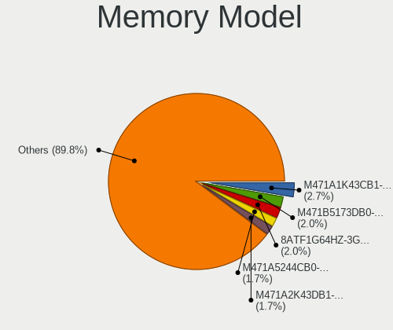

| Model                                                        | Notebooks | Percent |
|--------------------------------------------------------------|-----------|---------|
| Samsung RAM M471A1K43CB1-CTD 8GB SODIMM DDR4 2667MT/s        | 8         | 2.72%   |
| Samsung RAM M471B5173DB0-YK0 4GB SODIMM DDR3 1600MT/s        | 6         | 2.04%   |
| Micron RAM 8ATF1G64HZ-3G2J1 8GB SODIMM DDR4 3200MT/s         | 6         | 2.04%   |
| SK hynix RAM HMA82GS6AFR8N-UH 16GB SODIMM DDR4 2667MT/s      | 5         | 1.7%    |
| SK hynix RAM HMA81GS6AFR8N-UH 8GB SODIMM DDR4 2667MT/s       | 5         | 1.7%    |
| Samsung RAM M471A5244CB0-CTD 4GB SODIMM DDR4 3266MT/s        | 5         | 1.7%    |
| Samsung RAM M471A2K43DB1-CWE 16GB SODIMM DDR4 3200MT/s       | 5         | 1.7%    |
| Samsung RAM M471A2G44AM0-CWE 16GB SODIMM DDR4 3200MT/s       | 4         | 1.36%   |
| Samsung RAM M471A1G44AB0-CWE 8GB SODIMM DDR4 3200MT/s        | 4         | 1.36%   |
| Unknown RAM Module 1GB SODIMM DDR                            | 3         | 1.02%   |
| SK hynix RAM Module 8192MB SODIMM DDR4 2400MT/s              | 3         | 1.02%   |
| SK hynix RAM HMAA1GS6CJR6N-XN 8GB SODIMM DDR4 3200MT/s       | 3         | 1.02%   |
| SK hynix RAM HMA81GS6DJR8N-XN 8GB SODIMM DDR4 3200MT/s       | 3         | 1.02%   |
| Samsung RAM M471A5244CB0-CRC 4GB SODIMM DDR4 2667MT/s        | 3         | 1.02%   |
| Samsung RAM M471A1K43DB1-CWE 8GB SODIMM DDR4 3200MT/s        | 3         | 1.02%   |
| Samsung RAM M471A1K43DB1-CTD 8GB SODIMM DDR4 2667MT/s        | 3         | 1.02%   |
| Samsung RAM M471A1K43BB0-CPB 8GB SODIMM DDR4 2133MT/s        | 3         | 1.02%   |
| Samsung RAM M471A1G44AB0-CWE 8GB Row Of Chips DDR4 3200MT/s  | 3         | 1.02%   |
| Samsung RAM M471A1G44AB0-CTD 8GB SODIMM DDR4 2667MT/s        | 3         | 1.02%   |
| Micron RAM 8ATF1G64HZ-2G6E1 8GB SODIMM DDR4 2667MT/s         | 3         | 1.02%   |
| Micron RAM 4ATS2G64HZ-3G2B1 16GB SODIMM DDR4 3200MT/s        | 3         | 1.02%   |
| Micron RAM 16ATF2G64HZ-2G6E1 16GB SODIMM DDR4 2667MT/s       | 3         | 1.02%   |
| Kingston RAM 9905744-066.A00G 32GB SODIMM DDR4 3200MT/s      | 3         | 1.02%   |
| SK hynix RAM Module 4GB SODIMM DDR4 2400MT/s                 | 2         | 0.68%   |
| SK hynix RAM HYMP125S64CP8-Y5 2GB SODIMM DDR2 667MT/s        | 2         | 0.68%   |
| SK hynix RAM HMT451S6BFR8A-PB 4GB SODIMM DDR3 1600MT/s       | 2         | 0.68%   |
| SK hynix RAM HMT351S6CFR8C-PB 4GB SODIMM DDR3 1600MT/s       | 2         | 0.68%   |
| SK hynix RAM HMAA4GS6AJR8N-XN 32GB SODIMM DDR4 3200MT/s      | 2         | 0.68%   |
| SK hynix RAM HMA851S6CJR6N-VK 4GB SODIMM DDR4 2667MT/s       | 2         | 0.68%   |
| SK hynix RAM HMA851S6CJR6N-VK 4GB Row Of Chips DDR4 2667MT/s | 2         | 0.68%   |
| SK hynix RAM HMA81GS6CJR8N-VK 8GB SODIMM DDR4 2667MT/s       | 2         | 0.68%   |
| SK hynix RAM HMA41GS6AFR8N-TF 8GB SODIMM DDR4 2667MT/s       | 2         | 0.68%   |
| Samsung RAM Module 8GB SODIMM DDR4 3200MT/s                  | 2         | 0.68%   |
| Samsung RAM Module 8192MB SODIMM DDR4 3200MT/s               | 2         | 0.68%   |
| Samsung RAM M471B5173BH0-YK0 4GB SODIMM DDR3 1600MT/s        | 2         | 0.68%   |
| Samsung RAM M471A5244CB0-CWE 4GB SODIMM DDR4 3200MT/s        | 2         | 0.68%   |
| Samsung RAM M471A4G43MB1-CTD 32GB SODIMM DDR4 2667MT/s       | 2         | 0.68%   |
| Samsung RAM M471A2K43DB1-CTD 16GB SODIMM DDR4 2667MT/s       | 2         | 0.68%   |
| Samsung RAM M471A2K43CB1-CRC 16GB SODIMM DDR4 2667MT/s       | 2         | 0.68%   |
| Samsung RAM M471A1K43CB1-CRC 8GB SODIMM DDR4 2667MT/s        | 2         | 0.68%   |

Memory Kind
-----------

Memory module kinds

| Kind   | Notebooks | Percent |
|--------|-----------|---------|
| DDR4   | 156       | 66.67%  |
| DDR3   | 43        | 18.38%  |
| LPDDR4 | 13        | 5.56%   |
| LPDDR3 | 8         | 3.42%   |
| DDR2   | 7         | 2.99%   |
| DDR    | 4         | 1.71%   |
| SDRAM  | 1         | 0.43%   |
| DRAM   | 1         | 0.43%   |
| DDR5   | 1         | 0.43%   |

Memory Form Factor
------------------

Physical design of the memory module

| Name         | Notebooks | Percent |
|--------------|-----------|---------|
| SODIMM       | 209       | 89.7%   |
| Row Of Chips | 22        | 9.44%   |
| DIMM         | 1         | 0.43%   |
| Chip         | 1         | 0.43%   |

Memory Size
-----------

Memory module size

| Size  | Notebooks | Percent |
|-------|-----------|---------|
| 8192  | 107       | 42.46%  |
| 16384 | 54        | 21.43%  |
| 4096  | 50        | 19.84%  |
| 2048  | 17        | 6.75%   |
| 32768 | 16        | 6.35%   |
| 1024  | 6         | 2.38%   |
| 256   | 2         | 0.79%   |

Memory Speed
------------

Memory module speed

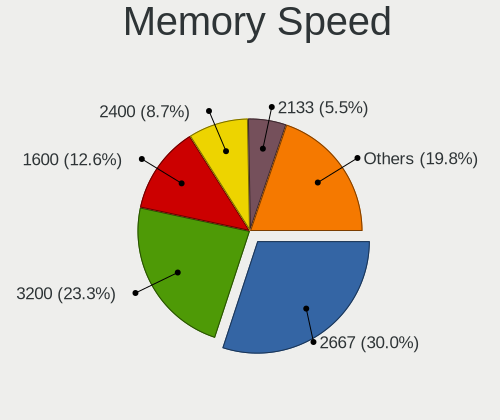

| Speed   | Notebooks | Percent |
|---------|-----------|---------|
| 2667    | 76        | 30.04%  |
| 3200    | 59        | 23.32%  |
| 1600    | 32        | 12.65%  |
| 2400    | 22        | 8.7%    |
| 2133    | 14        | 5.53%   |
| 4267    | 7         | 2.77%   |
| 1867    | 6         | 2.37%   |
| 667     | 6         | 2.37%   |
| 3266    | 5         | 1.98%   |
| Unknown | 5         | 1.98%   |
| 4800    | 2         | 0.79%   |
| 4266    | 2         | 0.79%   |
| 3733    | 2         | 0.79%   |
| 2933    | 2         | 0.79%   |
| 1333    | 2         | 0.79%   |
| 800     | 2         | 0.79%   |
| 400     | 2         | 0.79%   |
| 8400    | 1         | 0.4%    |
| 4199    | 1         | 0.4%    |
| 3000    | 1         | 0.4%    |
| 1334    | 1         | 0.4%    |
| 1067    | 1         | 0.4%    |
| 1066    | 1         | 0.4%    |
| 533     | 1         | 0.4%    |

Printers & scanners
-------------------

Printer Vendor
--------------

Printer device vendors

| Vendor         | Notebooks | Percent |
|----------------|-----------|---------|
| Xiaomi         | 1         | 33.33%  |
| Seiko Epson    | 1         | 33.33%  |
| Konica Minolta | 1         | 33.33%  |

Printer Model
-------------

Printer device models

| Model                                | Notebooks | Percent |
|--------------------------------------|-----------|---------|
| Xiaomi MiMouse 2                     | 1         | 33.33%  |
| Seiko Epson AL-M310DN                | 1         | 33.33%  |
| Konica Minolta magicolor 1680MF scan | 1         | 33.33%  |

Scanner Vendor
--------------

Scanner device vendors

Zero info for selected period =(

Scanner Model
-------------

Scanner device models

Zero info for selected period =(

Camera
------

Camera Vendor
-------------

Camera device vendors

| Vendor                                 | Notebooks | Percent |
|----------------------------------------|-----------|---------|
| Chicony Electronics                    | 58        | 26.48%  |
| IMC Networks                           | 34        | 15.53%  |
| Microdia                               | 21        | 9.59%   |
| Realtek Semiconductor                  | 20        | 9.13%   |
| Acer                                   | 16        | 7.31%   |
| Lite-On Technology                     | 11        | 5.02%   |
| Sunplus Innovation Technology          | 9         | 4.11%   |
| Cheng Uei Precision Industry (Foxlink) | 8         | 3.65%   |
| Quanta                                 | 7         | 3.2%    |
| Logitech                               | 7         | 3.2%    |
| Syntek                                 | 6         | 2.74%   |
| Luxvisions Innotech Limited            | 5         | 2.28%   |
| Z-Star Microelectronics                | 2         | 0.91%   |
| Samsung Electronics                    | 2         | 0.91%   |
| DigiTech                               | 2         | 0.91%   |
| Silicon Motion                         | 1         | 0.46%   |
| Razer USA                              | 1         | 0.46%   |
| Omnivision                             | 1         | 0.46%   |
| Microsoft                              | 1         | 0.46%   |
| LG Electronics                         | 1         | 0.46%   |
| Lenovo                                 | 1         | 0.46%   |
| Hewlett-Packard                        | 1         | 0.46%   |
| Genesys Logic                          | 1         | 0.46%   |
| AVer Information                       | 1         | 0.46%   |
| Apple                                  | 1         | 0.46%   |
| Alcor Micro                            | 1         | 0.46%   |

Camera Model
------------

Camera device models

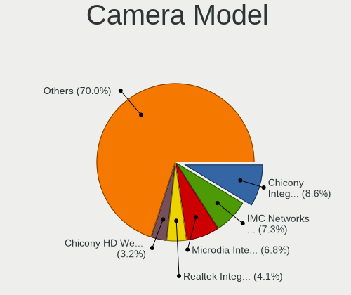

| Model                                               | Notebooks | Percent |
|-----------------------------------------------------|-----------|---------|
| Chicony Integrated Camera                           | 18        | 8.18%   |
| Microdia Integrated_Webcam_HD                       | 17        | 7.73%   |
| IMC Networks Integrated Camera                      | 16        | 7.27%   |
| Realtek Integrated_Webcam_HD                        | 11        | 5%      |
| Acer Integrated Camera                              | 8         | 3.64%   |
| Chicony HD Webcam                                   | 7         | 3.18%   |
| Chicony HP HD Camera                                | 6         | 2.73%   |
| Lite-On Integrated Camera                           | 5         | 2.27%   |
| Sunplus Integrated_Webcam_HD                        | 4         | 1.82%   |
| IMC Networks USB2.0 HD UVC WebCam                   | 4         | 1.82%   |
| Chicony USB2.0 Camera                               | 4         | 1.82%   |
| Cheng Uei Precision Industry (Foxlink) HP HD Camera | 4         | 1.82%   |
| Syntek Integrated Camera                            | 3         | 1.36%   |
| Luxvisions Innotech Limited HP TrueVision HD Camera | 3         | 1.36%   |
| Logitech HD Pro Webcam C920                         | 3         | 1.36%   |
| Sunplus HD WebCam                                   | 2         | 0.91%   |
| Samsung Galaxy A5 (MTP)                             | 2         | 0.91%   |
| Realtek USB2.0 HD UVC WebCam                        | 2         | 0.91%   |
| Realtek Integrated Webcam                           | 2         | 0.91%   |
| Quanta VGA WebCam                                   | 2         | 0.91%   |
| Quanta HP Wide Vision HD Camera                     | 2         | 0.91%   |
| Luxvisions Innotech Limited HP HD Camera            | 2         | 0.91%   |
| Lite-On TOSHIBA Web Camera - HD                     | 2         | 0.91%   |
| Lite-On HP Wide Vision HD Camera                    | 2         | 0.91%   |
| IMC Networks USB2.0 VGA UVC WebCam                  | 2         | 0.91%   |
| IMC Networks USB Camera                             | 2         | 0.91%   |
| IMC Networks ov9734_azurewave_camera                | 2         | 0.91%   |
| IMC Networks Integrated RGB Camera                  | 2         | 0.91%   |
| Chicony USB 2.0 Camera                              | 2         | 0.91%   |
| Chicony Lenovo EasyCamera                           | 2         | 0.91%   |
| Chicony Integrated Camera (1280x720@30)             | 2         | 0.91%   |
| Chicony HD User Facing                              | 2         | 0.91%   |
| Chicony EasyCamera                                  | 2         | 0.91%   |
| Acer SunplusIT Integrated Camera                    | 2         | 0.91%   |
| Z-Star Webcam                                       | 1         | 0.45%   |
| Z-Star Venus USB2.0 Camera                          | 1         | 0.45%   |
| Syntek Lenovo EasyCamera                            | 1         | 0.45%   |
| Syntek HP Webcam-101                                | 1         | 0.45%   |
| Syntek EasyCamera                                   | 1         | 0.45%   |
| Sunplus SPCA2650 AV Camera                          | 1         | 0.45%   |

Security
--------

Fingerprint Vendor
------------------

Fingerprint sensor vendors

| Vendor                     | Notebooks | Percent |
|----------------------------|-----------|---------|
| Synaptics                  | 29        | 53.7%   |
| Shenzhen Goodix Technology | 10        | 18.52%  |
| Validity Sensors           | 7         | 12.96%  |
| Elan Microelectronics      | 3         | 5.56%   |
| STMicroelectronics         | 2         | 3.7%    |
| Upek                       | 1         | 1.85%   |
| LighTuning Technology      | 1         | 1.85%   |
| AuthenTec                  | 1         | 1.85%   |

Fingerprint Model
-----------------

Fingerprint sensor models

| Model                                                      | Notebooks | Percent |
|------------------------------------------------------------|-----------|---------|
| Synaptics Prometheus MIS Touch Fingerprint Reader          | 15        | 27.78%  |
| Synaptics Metallica MIS Touch Fingerprint Reader           | 5         | 9.26%   |
| Unknown                                                    | 5         | 9.26%   |
| Shenzhen Goodix FingerPrint                                | 4         | 7.41%   |
| Validity Sensors VFS495 Fingerprint Reader                 | 3         | 5.56%   |
| Shenzhen Goodix  Fingerprint Device                        | 3         | 5.56%   |
| Shenzhen Goodix Fingerprint Reader                         | 3         | 5.56%   |
| Validity Sensors VFS5011 Fingerprint Reader                | 2         | 3.7%    |
| Validity Sensors Synaptics WBDI                            | 2         | 3.7%    |
| Synaptics  FS7604 Touch Fingerprint Sensor with PurePrint  | 2         | 3.7%    |
| STMicroelectronics Fingerprint Reader                      | 2         | 3.7%    |
| Elan ELAN:Fingerprint                                      | 2         | 3.7%    |
| Upek Biometric Touchchip/Touchstrip Fingerprint Sensor     | 1         | 1.85%   |
| Synaptics  VFS7552 Touch Fingerprint Sensor with PurePrint | 1         | 1.85%   |
| Synaptics Metallica MOH Touch Fingerprint Reader           | 1         | 1.85%   |
| LighTuning ES603 Swipe Fingerprint Sensor                  | 1         | 1.85%   |
| Elan ELAN:ARM-M4                                           | 1         | 1.85%   |
| AuthenTec AES2501 Fingerprint Sensor                       | 1         | 1.85%   |

Chipcard Vendor
---------------

Chipcard module vendors

| Vendor               | Notebooks | Percent |
|----------------------|-----------|---------|
| Alcor Micro          | 20        | 57.14%  |
| Broadcom             | 11        | 31.43%  |
| Upek                 | 2         | 5.71%   |
| Purism, SPC          | 1         | 2.86%   |
| Microchip Technology | 1         | 2.86%   |

Chipcard Model
--------------

Chipcard module models

| Model                                                                        | Notebooks | Percent |
|------------------------------------------------------------------------------|-----------|---------|
| Alcor Micro AU9540 Smartcard Reader                                          | 20        | 57.14%  |
| Broadcom 5880                                                                | 5         | 14.29%  |
| Broadcom 58200                                                               | 4         | 11.43%  |
| Upek TouchChip Fingerprint Coprocessor (WBF advanced mode)                   | 2         | 5.71%   |
| Purism, SPC Librem Key                                                       | 1         | 2.86%   |
| Microchip Technology SMSC USX101x Reader                                     | 1         | 2.86%   |
| Broadcom BCM5880 Secure Applications Processor with fingerprint swipe sensor | 1         | 2.86%   |
| Broadcom BCM5880 Secure Applications Processor                               | 1         | 2.86%   |

Unsupported
-----------

Unsupported Devices
-------------------

Total unsupported devices on board

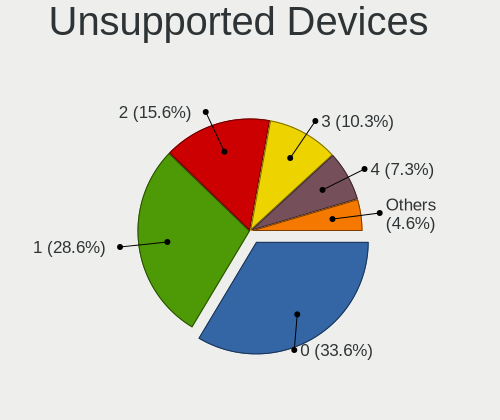

| Total | Notebooks | Percent |
|-------|-----------|---------|
| 0     | 90        | 34.35%  |
| 1     | 75        | 28.63%  |
| 2     | 39        | 14.89%  |
| 3     | 27        | 10.31%  |
| 4     | 19        | 7.25%   |
| 5     | 8         | 3.05%   |
| 6     | 4         | 1.53%   |

Unsupported Device Types
------------------------

Types of unsupported devices

| Type                     | Notebooks | Percent |
|--------------------------|-----------|---------|
| Fingerprint reader       | 54        | 14.96%  |
| Bluetooth                | 54        | 14.96%  |
| Communication controller | 51        | 14.13%  |
| Camera                   | 47        | 13.02%  |
| Graphics card            | 31        | 8.59%   |
| Chipcard                 | 28        | 7.76%   |
| Multimedia controller    | 25        | 6.93%   |
| Net/wireless             | 22        | 6.09%   |
| Card reader              | 22        | 6.09%   |
| Modem                    | 6         | 1.66%   |
| Storage/ata              | 5         | 1.39%   |
| Sound                    | 5         | 1.39%   |
| Network                  | 4         | 1.11%   |
| Net/ethernet             | 3         | 0.83%   |
| Dvb card                 | 2         | 0.55%   |
| Wireless                 | 1         | 0.28%   |
| Storage/nvme             | 1         | 0.28%   |

