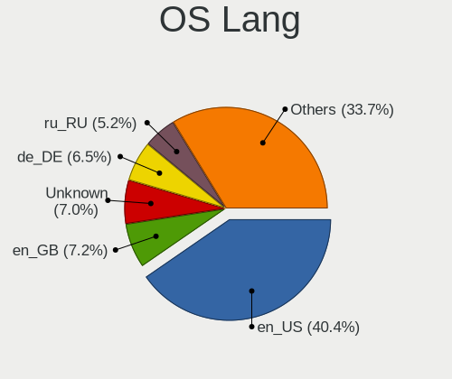
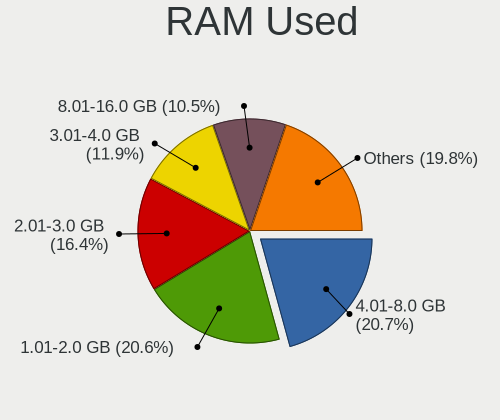
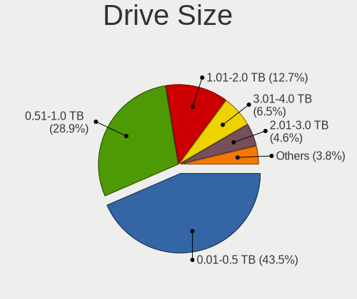
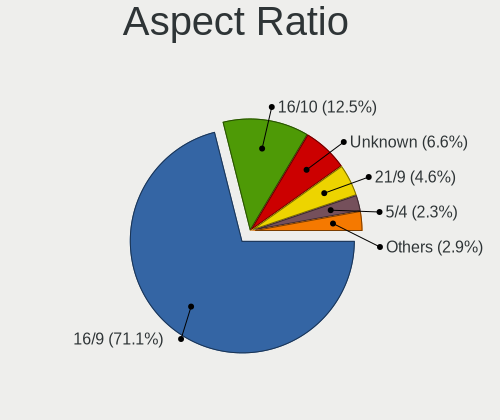
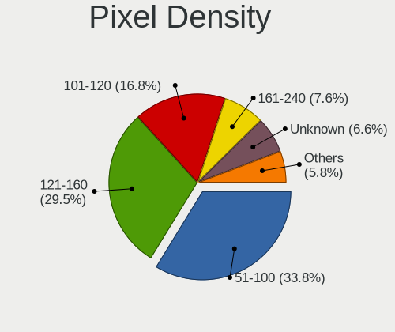
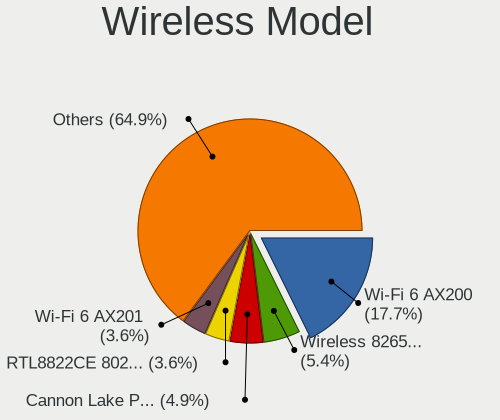
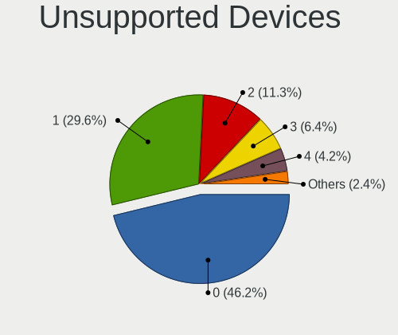

Gentoo 2.7 - Tested Hardware & Statistics
-----------------------------------------

A project to collect tested hardware configurations for Gentoo 2.7.

Anyone can contribute to this report by the [hw-probe](https://github.com/linuxhw/hw-probe) tool:

    sudo -E hw-probe -all -upload

Please submit a probe of your configuration if it's not presented on the page or is rare.

This is a report for all computer types. See also reports for [desktops](/Dist/Gentoo_2.7/Desktop/README.md) and [notebooks](/Dist/Gentoo_2.7/Notebook/README.md).

Full-feature report is available here: https://linux-hardware.org/?view=trends&rel=gentoo-2.7

Contents
--------

* [ Test Cases ](#test-cases)

* [ System ](#system)
  - [ Kernel                   ](#kernel)
  - [ Kernel Family            ](#kernel-family)
  - [ Kernel Major Ver.        ](#kernel-major-ver)
  - [ Arch                     ](#arch)
  - [ DE                       ](#de)
  - [ Display Server           ](#display-server)
  - [ Display Manager          ](#display-manager)
  - [ OS Lang                  ](#os-lang)
  - [ Boot Mode                ](#boot-mode)
  - [ Filesystem               ](#filesystem)
  - [ Part. scheme             ](#part-scheme)
  - [ Dual Boot with Linux/BSD ](#dual-boot-with-linuxbsd)
  - [ Dual Boot (Win)          ](#dual-boot-win)

* [ Board ](#board)
  - [ Vendor                   ](#vendor)
  - [ Model                    ](#model)
  - [ Model Family             ](#model-family)
  - [ MFG Year                 ](#mfg-year)
  - [ Form Factor              ](#form-factor)
  - [ Secure Boot              ](#secure-boot)
  - [ Coreboot                 ](#coreboot)
  - [ RAM Size                 ](#ram-size)
  - [ RAM Used                 ](#ram-used)
  - [ Total Drives             ](#total-drives)
  - [ Has CD-ROM               ](#has-cd-rom)
  - [ Has Ethernet             ](#has-ethernet)
  - [ Has WiFi                 ](#has-wifi)
  - [ Has Bluetooth            ](#has-bluetooth)

* [ Location ](#location)
  - [ Country                  ](#country)
  - [ City                     ](#city)

* [ Drives ](#drives)
  - [ Drive Vendor             ](#drive-vendor)
  - [ Drive Model              ](#drive-model)
  - [ HDD Vendor               ](#hdd-vendor)
  - [ SSD Vendor               ](#ssd-vendor)
  - [ Drive Kind               ](#drive-kind)
  - [ Drive Connector          ](#drive-connector)
  - [ Drive Size               ](#drive-size)
  - [ Space Total              ](#space-total)
  - [ Space Used               ](#space-used)
  - [ Malfunc. Drives          ](#malfunc-drives)
  - [ Malfunc. Drive Vendor    ](#malfunc-drive-vendor)
  - [ Malfunc. HDD Vendor      ](#malfunc-hdd-vendor)
  - [ Malfunc. Drive Kind      ](#malfunc-drive-kind)
  - [ Failed Drives            ](#failed-drives)
  - [ Failed Drive Vendor      ](#failed-drive-vendor)
  - [ Drive Status             ](#drive-status)

* [ Storage controller ](#storage-controller)
  - [ Storage Vendor           ](#storage-vendor)
  - [ Storage Model            ](#storage-model)
  - [ Storage Kind             ](#storage-kind)

* [ Processor ](#processor)
  - [ CPU Vendor               ](#cpu-vendor)
  - [ CPU Model                ](#cpu-model)
  - [ CPU Model Family         ](#cpu-model-family)
  - [ CPU Cores                ](#cpu-cores)
  - [ CPU Sockets              ](#cpu-sockets)
  - [ CPU Threads              ](#cpu-threads)
  - [ CPU Op-Modes             ](#cpu-op-modes)
  - [ CPU Microcode            ](#cpu-microcode)
  - [ CPU Microarch            ](#cpu-microarch)

* [ Graphics ](#graphics)
  - [ GPU Vendor               ](#gpu-vendor)
  - [ GPU Model                ](#gpu-model)
  - [ GPU Combo                ](#gpu-combo)
  - [ GPU Driver               ](#gpu-driver)
  - [ GPU Memory               ](#gpu-memory)

* [ Monitor ](#monitor)
  - [ Monitor Vendor           ](#monitor-vendor)
  - [ Monitor Model            ](#monitor-model)
  - [ Monitor Resolution       ](#monitor-resolution)
  - [ Monitor Diagonal         ](#monitor-diagonal)
  - [ Monitor Width            ](#monitor-width)
  - [ Aspect Ratio             ](#aspect-ratio)
  - [ Monitor Area             ](#monitor-area)
  - [ Pixel Density            ](#pixel-density)
  - [ Multiple Monitors        ](#multiple-monitors)

* [ Network ](#network)
  - [ Net Controller Vendor    ](#net-controller-vendor)
  - [ Net Controller Model     ](#net-controller-model)
  - [ Wireless Vendor          ](#wireless-vendor)
  - [ Wireless Model           ](#wireless-model)
  - [ Ethernet Vendor          ](#ethernet-vendor)
  - [ Ethernet Model           ](#ethernet-model)
  - [ Net Controller Kind      ](#net-controller-kind)
  - [ Used Controller          ](#used-controller)
  - [ NICs                     ](#nics)
  - [ IPv6                     ](#ipv6)

* [ Bluetooth ](#bluetooth)
  - [ Bluetooth Vendor         ](#bluetooth-vendor)
  - [ Bluetooth Model          ](#bluetooth-model)

* [ Sound ](#sound)
  - [ Sound Vendor             ](#sound-vendor)
  - [ Sound Model              ](#sound-model)

* [ Memory ](#memory)
  - [ Memory Vendor            ](#memory-vendor)
  - [ Memory Model             ](#memory-model)
  - [ Memory Kind              ](#memory-kind)
  - [ Memory Form Factor       ](#memory-form-factor)
  - [ Memory Size              ](#memory-size)
  - [ Memory Speed             ](#memory-speed)

* [ Printers & scanners ](#printers--scanners)
  - [ Printer Vendor           ](#printer-vendor)
  - [ Printer Model            ](#printer-model)
  - [ Scanner Vendor           ](#scanner-vendor)
  - [ Scanner Model            ](#scanner-model)

* [ Camera ](#camera)
  - [ Camera Vendor            ](#camera-vendor)
  - [ Camera Model             ](#camera-model)

* [ Security ](#security)
  - [ Fingerprint Vendor       ](#fingerprint-vendor)
  - [ Fingerprint Model        ](#fingerprint-model)
  - [ Chipcard Vendor          ](#chipcard-vendor)
  - [ Chipcard Model           ](#chipcard-model)

* [ Unsupported ](#unsupported)
  - [ Unsupported Devices      ](#unsupported-devices)
  - [ Unsupported Device Types ](#unsupported-device-types)

Test Cases
----------

| Vendor        | Model                       | Form-Factor | Probe                                                      | Date         |
|---------------|-----------------------------|-------------|------------------------------------------------------------|--------------|
| Lenovo        | ThinkPad X13 Yoga Gen 2 ... | Convertible | [a30ab1431c](https://linux-hardware.org/?probe=a30ab1431c) | Sep 30, 2021 |
| Unknown       | Raspberry Pi                | Soc         | [f7cc61788a](https://linux-hardware.org/?probe=f7cc61788a) | Sep 30, 2021 |
| HP            | ProBook 430 G5              | Notebook    | [6ee2943500](https://linux-hardware.org/?probe=6ee2943500) | Sep 30, 2021 |
| Dell          | Inspiron 5577               | Notebook    | [f5ec85dd12](https://linux-hardware.org/?probe=f5ec85dd12) | Sep 29, 2021 |
| Dell          | Inspiron 5577               | Notebook    | [80e36f9785](https://linux-hardware.org/?probe=80e36f9785) | Sep 29, 2021 |
| Timi          | Mi Laptop Pro 15            | Notebook    | [de13c8f3fa](https://linux-hardware.org/?probe=de13c8f3fa) | Sep 29, 2021 |
| TYAN Compu... | S7025                       | Server      | [6b7a9d9bdb](https://linux-hardware.org/?probe=6b7a9d9bdb) | Sep 29, 2021 |
| ASRock        | H170 Pro4                   | Desktop     | [a0d0f5002e](https://linux-hardware.org/?probe=a0d0f5002e) | Sep 29, 2021 |
| ASRock        | H170 Pro4                   | Desktop     | [5a3652f38b](https://linux-hardware.org/?probe=5a3652f38b) | Sep 29, 2021 |
| Gigabyte      | 990FXA-UD5                  | Desktop     | [c3bb6d3afa](https://linux-hardware.org/?probe=c3bb6d3afa) | Sep 29, 2021 |
| Lenovo        | ThinkPad X13 Yoga Gen 2 ... | Convertible | [33ba6a7228](https://linux-hardware.org/?probe=33ba6a7228) | Sep 28, 2021 |
| Dell          | 0J3C2F A02                  | Desktop     | [88104169a4](https://linux-hardware.org/?probe=88104169a4) | Sep 28, 2021 |
| ASUSTek       | M3A78-CM                    | Desktop     | [6057971f46](https://linux-hardware.org/?probe=6057971f46) | Sep 27, 2021 |
| Lenovo        | ThinkPad X240 20AMS1LN00    | Notebook    | [71d301cc84](https://linux-hardware.org/?probe=71d301cc84) | Sep 26, 2021 |
| Gigabyte      | AB350-Gaming-CF             | Desktop     | [02d9cece31](https://linux-hardware.org/?probe=02d9cece31) | Sep 26, 2021 |
| ASUSTek       | TUF GAMING B450M-PLUS II    | Desktop     | [241866fa37](https://linux-hardware.org/?probe=241866fa37) | Sep 26, 2021 |
| Lenovo        | ThinkPad X1 Extreme Gen ... | Notebook    | [116e97036b](https://linux-hardware.org/?probe=116e97036b) | Sep 25, 2021 |
| ASUSTek       | ROG Zephyrus G14 GA401II... | Notebook    | [8b939aae88](https://linux-hardware.org/?probe=8b939aae88) | Sep 25, 2021 |
| HP            | 3085B                       | Desktop     | [5c7ce8f98b](https://linux-hardware.org/?probe=5c7ce8f98b) | Sep 24, 2021 |
| Lenovo        | ThinkPad X13 Yoga Gen 2 ... | Convertible | [f3fd610cb5](https://linux-hardware.org/?probe=f3fd610cb5) | Sep 24, 2021 |
| Lenovo        | ThinkPad X13 Yoga Gen 2 ... | Convertible | [77a1a8b396](https://linux-hardware.org/?probe=77a1a8b396) | Sep 24, 2021 |
| ASUSTek       | GX501VIK                    | Notebook    | [b36bf17cc2](https://linux-hardware.org/?probe=b36bf17cc2) | Sep 24, 2021 |
| Lenovo        | ThinkPad X13 Yoga Gen 2 ... | Convertible | [c78d3594b1](https://linux-hardware.org/?probe=c78d3594b1) | Sep 23, 2021 |
| Lenovo        | Yoga Slim 7 Pro 14IHU5 O... | Notebook    | [f40c18c3b8](https://linux-hardware.org/?probe=f40c18c3b8) | Sep 23, 2021 |
| ASRock        | X370 Professional Gaming    | Desktop     | [546f692061](https://linux-hardware.org/?probe=546f692061) | Sep 23, 2021 |
| Intel         | DG31PR AAD97573-205         | Desktop     | [2c022c21f0](https://linux-hardware.org/?probe=2c022c21f0) | Sep 22, 2021 |
| Lenovo        | ThinkPad X13 Yoga Gen 2 ... | Convertible | [ec47ffaeac](https://linux-hardware.org/?probe=ec47ffaeac) | Sep 22, 2021 |
| ASUSTek       | M3A78-CM                    | Desktop     | [1f6b39fcd2](https://linux-hardware.org/?probe=1f6b39fcd2) | Sep 20, 2021 |
| Lenovo        | ThinkPad P1 Gen 4i 20Y3C... | Notebook    | [4698844ec0](https://linux-hardware.org/?probe=4698844ec0) | Sep 20, 2021 |
| Gigabyte      | AB350-Gaming-CF             | Desktop     | [5afde8487e](https://linux-hardware.org/?probe=5afde8487e) | Sep 19, 2021 |
| Gigabyte      | B460 HD3                    | Desktop     | [fcd5acbc90](https://linux-hardware.org/?probe=fcd5acbc90) | Sep 18, 2021 |
| Lenovo        | B51-80 80LM                 | Notebook    | [320ab41cbb](https://linux-hardware.org/?probe=320ab41cbb) | Sep 17, 2021 |
| HP            | 3085B                       | Desktop     | [e3b8b92fdb](https://linux-hardware.org/?probe=e3b8b92fdb) | Sep 17, 2021 |
| Tekram Tec... | P6B40-A4X-i440BX Rev        | Desktop     | [86d356f643](https://linux-hardware.org/?probe=86d356f643) | Sep 16, 2021 |
| ASUSTek       | ROG STRIX Z390-F GAMING     | Desktop     | [2f9b27ad89](https://linux-hardware.org/?probe=2f9b27ad89) | Sep 16, 2021 |
| Unknown       | Raspberry Pi                | Soc         | [4bafee5427](https://linux-hardware.org/?probe=4bafee5427) | Sep 16, 2021 |
| HP            | OMEN by HP Laptop 15-dc0... | Notebook    | [4c18c08616](https://linux-hardware.org/?probe=4c18c08616) | Sep 15, 2021 |
| HP            | OMEN by HP Laptop 15-dc0... | Notebook    | [d406b31a3a](https://linux-hardware.org/?probe=d406b31a3a) | Sep 15, 2021 |
| ASUSTek       | ZenBook UX333FN_UX333FN     | Notebook    | [3d0115d011](https://linux-hardware.org/?probe=3d0115d011) | Sep 15, 2021 |
| Fujitsu       | D2812-A2 S26361-D2812-A2    | Desktop     | [308d39b0dc](https://linux-hardware.org/?probe=308d39b0dc) | Sep 15, 2021 |
| Lenovo        | IdeaPad Flex 5 14ITL05 8... | Convertible | [21e3d9bccb](https://linux-hardware.org/?probe=21e3d9bccb) | Sep 14, 2021 |
| Notebook      | P65xHP                      | Notebook    | [12a7ec2b86](https://linux-hardware.org/?probe=12a7ec2b86) | Sep 14, 2021 |
| Lenovo        | ThinkPad X1 Carbon Gen 9... | Notebook    | [b1c5ad62b3](https://linux-hardware.org/?probe=b1c5ad62b3) | Sep 13, 2021 |
| ASUSTek       | M3A78-CM                    | Desktop     | [59eb80534c](https://linux-hardware.org/?probe=59eb80534c) | Sep 13, 2021 |
| Gigabyte      | AB350-Gaming-CF             | Desktop     | [cfdc619c18](https://linux-hardware.org/?probe=cfdc619c18) | Sep 12, 2021 |
| Dell          | Latitude 5410               | Notebook    | [97ed647d4c](https://linux-hardware.org/?probe=97ed647d4c) | Sep 10, 2021 |
| HP            | OMEN by HP Laptop 15-dc0... | Notebook    | [9dcddb807d](https://linux-hardware.org/?probe=9dcddb807d) | Sep 10, 2021 |
| HP            | OMEN by HP Laptop 15-dc0... | Notebook    | [572c0c5198](https://linux-hardware.org/?probe=572c0c5198) | Sep 10, 2021 |
| Lenovo        | ThinkPad P14s Gen 1 20Y1... | Notebook    | [36bf3dd55d](https://linux-hardware.org/?probe=36bf3dd55d) | Sep 09, 2021 |
| Intel         | NUC11PHBi7 M26151-402       | Mini pc     | [c18b4f0dab](https://linux-hardware.org/?probe=c18b4f0dab) | Sep 09, 2021 |
| Unknown       | Raspberry Pi                | Soc         | [d0681fe4de](https://linux-hardware.org/?probe=d0681fe4de) | Sep 09, 2021 |
| Intel         | NUC11PHBi7 M26151-402       | Mini pc     | [35ee76ca1b](https://linux-hardware.org/?probe=35ee76ca1b) | Sep 08, 2021 |
| ASUSTek       | ZenBook UX425IA_U4700IA     | Notebook    | [fa970f7a80](https://linux-hardware.org/?probe=fa970f7a80) | Sep 08, 2021 |
| Dell          | Precision 7560              | Notebook    | [3fa67e38db](https://linux-hardware.org/?probe=3fa67e38db) | Sep 08, 2021 |
| HP            | Pavilion g6                 | Notebook    | [1161032a20](https://linux-hardware.org/?probe=1161032a20) | Sep 08, 2021 |
| ASUSTek       | ROG STRIX B550-F GAMING     | Desktop     | [19555ed132](https://linux-hardware.org/?probe=19555ed132) | Sep 07, 2021 |
| Dell          | Precision 7560              | Notebook    | [03d7773132](https://linux-hardware.org/?probe=03d7773132) | Sep 06, 2021 |
| ASUSTek       | ZenBook UX333FN_UX333FN     | Notebook    | [5a43bd347f](https://linux-hardware.org/?probe=5a43bd347f) | Sep 06, 2021 |
| ASUSTek       | ZenBook UX333FN_UX333FN     | Notebook    | [a629879646](https://linux-hardware.org/?probe=a629879646) | Sep 06, 2021 |
| ASUSTek       | M3A78-CM                    | Desktop     | [e89cd90c72](https://linux-hardware.org/?probe=e89cd90c72) | Sep 06, 2021 |
| Gigabyte      | AB350-Gaming-CF             | Desktop     | [0fc45210cc](https://linux-hardware.org/?probe=0fc45210cc) | Sep 05, 2021 |
| ASRock        | B450M-HDV R4.0              | Desktop     | [78fc85808c](https://linux-hardware.org/?probe=78fc85808c) | Sep 05, 2021 |
| ASUSTek       | P5P41C                      | Desktop     | [e68f372c7b](https://linux-hardware.org/?probe=e68f372c7b) | Sep 05, 2021 |
| Tekram Tec... | P6B40-A4X-i440BX Rev        | Desktop     | [f63a2003ab](https://linux-hardware.org/?probe=f63a2003ab) | Sep 05, 2021 |
| ASUSTek       | X550ZA                      | Notebook    | [0d41969b6b](https://linux-hardware.org/?probe=0d41969b6b) | Sep 02, 2021 |
| Dell          | Latitude E6510              | Notebook    | [2ab208b5cd](https://linux-hardware.org/?probe=2ab208b5cd) | Sep 02, 2021 |
| Unknown       | Raspberry Pi                | Soc         | [5e608ced4d](https://linux-hardware.org/?probe=5e608ced4d) | Sep 02, 2021 |
| HP            | 255 G6 Notebook PC          | Notebook    | [4f71a8ad02](https://linux-hardware.org/?probe=4f71a8ad02) | Sep 01, 2021 |
| HP            | ZBook 15 G3                 | Notebook    | [d6872bd9e9](https://linux-hardware.org/?probe=d6872bd9e9) | Sep 01, 2021 |
| Fujitsu       | D2812-A2 S26361-D2812-A2    | Desktop     | [40d01ef03e](https://linux-hardware.org/?probe=40d01ef03e) | Aug 31, 2021 |
| Lenovo        | Legion 5P 15IMH05 82AW      | Notebook    | [f1b58d72ac](https://linux-hardware.org/?probe=f1b58d72ac) | Aug 31, 2021 |
| Packard Be... | FMCP7AM                     | Desktop     | [6872ae9fb4](https://linux-hardware.org/?probe=6872ae9fb4) | Aug 31, 2021 |
| HP            | 3085B                       | Desktop     | [3319bbb803](https://linux-hardware.org/?probe=3319bbb803) | Aug 31, 2021 |
| HP            | 255 G6 Notebook PC          | Notebook    | [3076551390](https://linux-hardware.org/?probe=3076551390) | Aug 30, 2021 |
| ASUSTek       | M3A78-CM                    | Desktop     | [195d8fb53d](https://linux-hardware.org/?probe=195d8fb53d) | Aug 30, 2021 |
| Gigabyte      | AB350-Gaming-CF             | Desktop     | [bb19294c8b](https://linux-hardware.org/?probe=bb19294c8b) | Aug 29, 2021 |
| Gigabyte      | EP43-DS3                    | Desktop     | [0eaf518e06](https://linux-hardware.org/?probe=0eaf518e06) | Aug 29, 2021 |
| Dell          | 0U1325                      | Desktop     | [0a58fab188](https://linux-hardware.org/?probe=0a58fab188) | Aug 28, 2021 |
| IBM           | ThinkPad T42 2373V4F        | Notebook    | [2362291c05](https://linux-hardware.org/?probe=2362291c05) | Aug 28, 2021 |
| Fujitsu       | D2812-A2 S26361-D2812-A2    | Desktop     | [00b0f43680](https://linux-hardware.org/?probe=00b0f43680) | Aug 28, 2021 |
| IBM           | ThinkPad T43 2668Z3S        | Notebook    | [5a606b504c](https://linux-hardware.org/?probe=5a606b504c) | Aug 28, 2021 |
| Packard Be... | FMCP7AM                     | Desktop     | [07fb4f5678](https://linux-hardware.org/?probe=07fb4f5678) | Aug 28, 2021 |
| MSI           | MS-7369                     | Desktop     | [0c6668dee5](https://linux-hardware.org/?probe=0c6668dee5) | Aug 28, 2021 |
| IBM           | ThinkPad T43 2668Z3S        | Notebook    | [2af8736235](https://linux-hardware.org/?probe=2af8736235) | Aug 28, 2021 |
| Dell          | 0U1325                      | Desktop     | [1b5dfb4b59](https://linux-hardware.org/?probe=1b5dfb4b59) | Aug 28, 2021 |
| HP            | 255 G6 Notebook PC          | Notebook    | [a8c5a1a4c7](https://linux-hardware.org/?probe=a8c5a1a4c7) | Aug 27, 2021 |
| ASUSTek       | ZenBook UX325EA_UX325EA     | Notebook    | [aabbe0dbcc](https://linux-hardware.org/?probe=aabbe0dbcc) | Aug 26, 2021 |
| ASUSTek       | ROG Strix G533QR_G533QR     | Notebook    | [cf76a62cf4](https://linux-hardware.org/?probe=cf76a62cf4) | Aug 26, 2021 |
| HP            | 255 G6 Notebook PC          | Notebook    | [b776f7f3b7](https://linux-hardware.org/?probe=b776f7f3b7) | Aug 26, 2021 |
| ASUSTek       | P9X79 WS                    | Desktop     | [0569365ea0](https://linux-hardware.org/?probe=0569365ea0) | Aug 26, 2021 |
| ASUSTek       | ROG Strix G533QR_G533QR     | Notebook    | [62ba09ac38](https://linux-hardware.org/?probe=62ba09ac38) | Aug 26, 2021 |
| Lenovo        | Legion 5P 15IMH05 82AW      | Notebook    | [994e94defa](https://linux-hardware.org/?probe=994e94defa) | Aug 26, 2021 |
| Unknown       | Raspberry Pi                | Soc         | [46c0d3be4e](https://linux-hardware.org/?probe=46c0d3be4e) | Aug 26, 2021 |
| Lenovo        | ThinkPad X230 23259H1       | Notebook    | [fb125d2779](https://linux-hardware.org/?probe=fb125d2779) | Aug 25, 2021 |
| MSI           | B450M PRO-M2 MAX            | Desktop     | [f521a0c69c](https://linux-hardware.org/?probe=f521a0c69c) | Aug 25, 2021 |
| MSI           | B450M PRO-M2 MAX            | Desktop     | [c09944da60](https://linux-hardware.org/?probe=c09944da60) | Aug 24, 2021 |
| Supermicro    | X10SAE                      | Server      | [019914cc29](https://linux-hardware.org/?probe=019914cc29) | Aug 24, 2021 |
| ASUSTek       | M3A78-CM                    | Desktop     | [63f0c13a1f](https://linux-hardware.org/?probe=63f0c13a1f) | Aug 23, 2021 |
| HP            | 3085B                       | Desktop     | [badf30135c](https://linux-hardware.org/?probe=badf30135c) | Aug 22, 2021 |
| Gigabyte      | AB350-Gaming-CF             | Desktop     | [625e0cf2b0](https://linux-hardware.org/?probe=625e0cf2b0) | Aug 22, 2021 |
| Gigabyte      | Z170-Gaming K3-CF           | Desktop     | [ae02b6e88b](https://linux-hardware.org/?probe=ae02b6e88b) | Aug 19, 2021 |
| Unknown       | Raspberry Pi                | Soc         | [db12914e73](https://linux-hardware.org/?probe=db12914e73) | Aug 19, 2021 |
| ASUSTek       | P5P41C                      | Desktop     | [0eb4111089](https://linux-hardware.org/?probe=0eb4111089) | Aug 18, 2021 |
| NZXT          | N7 Z370                     | Desktop     | [4eb4c77752](https://linux-hardware.org/?probe=4eb4c77752) | Aug 18, 2021 |
| ASUSTek       | ROG STRIX B550-F GAMING     | Desktop     | [5ffe57957d](https://linux-hardware.org/?probe=5ffe57957d) | Aug 18, 2021 |
| NZXT          | N7 Z370                     | Desktop     | [40f0739800](https://linux-hardware.org/?probe=40f0739800) | Aug 17, 2021 |
| Lenovo        | ThinkPad X1 Carbon Gen 9... | Notebook    | [4736a01d82](https://linux-hardware.org/?probe=4736a01d82) | Aug 17, 2021 |
| ASUSTek       | M3A78-CM                    | Desktop     | [51860b7bbc](https://linux-hardware.org/?probe=51860b7bbc) | Aug 16, 2021 |
| Dell          | Inspiron 5415               | Notebook    | [909e2cdc93](https://linux-hardware.org/?probe=909e2cdc93) | Aug 15, 2021 |
| Dell          | Inspiron 5415               | Notebook    | [96cd32b528](https://linux-hardware.org/?probe=96cd32b528) | Aug 15, 2021 |
| Tekram Tec... | P6B40-A4X-i440BX Rev        | Desktop     | [211803a510](https://linux-hardware.org/?probe=211803a510) | Aug 15, 2021 |
| Lenovo        | ThinkPad X1 Carbon Gen 9... | Notebook    | [ef36f1dc4d](https://linux-hardware.org/?probe=ef36f1dc4d) | Aug 15, 2021 |
| Gigabyte      | AB350-Gaming-CF             | Desktop     | [d86ce68f12](https://linux-hardware.org/?probe=d86ce68f12) | Aug 15, 2021 |
| HP            | 3085B                       | Desktop     | [7a50fc3510](https://linux-hardware.org/?probe=7a50fc3510) | Aug 15, 2021 |
| MSI           | B550-A PRO                  | Desktop     | [b3ff3985c5](https://linux-hardware.org/?probe=b3ff3985c5) | Aug 13, 2021 |
| Lenovo        | IdeaPad C340-14IML 81TK     | Convertible | [843279faa7](https://linux-hardware.org/?probe=843279faa7) | Aug 13, 2021 |
| Lenovo        | ThinkPad X1 Carbon Gen 9... | Notebook    | [c45478eae5](https://linux-hardware.org/?probe=c45478eae5) | Aug 12, 2021 |
| Unknown       | Raspberry Pi                | Soc         | [ef429ba128](https://linux-hardware.org/?probe=ef429ba128) | Aug 12, 2021 |
| Intel         | NUC7JYB J67969-404          | Mini pc     | [28ecd70483](https://linux-hardware.org/?probe=28ecd70483) | Aug 12, 2021 |
| HP            | 158B                        | Desktop     | [d47aa82b20](https://linux-hardware.org/?probe=d47aa82b20) | Aug 12, 2021 |
| Intel         | D525MW AAE93082-301         | Desktop     | [fc72f0a0ea](https://linux-hardware.org/?probe=fc72f0a0ea) | Aug 11, 2021 |
| ASUSTek       | PRIME X470-PRO              | Desktop     | [21b619d91b](https://linux-hardware.org/?probe=21b619d91b) | Aug 11, 2021 |
| Dell          | Inspiron 5415               | Notebook    | [63594290cf](https://linux-hardware.org/?probe=63594290cf) | Aug 11, 2021 |
| TUXEDO        | Book XC1711                 | Notebook    | [806e284c8a](https://linux-hardware.org/?probe=806e284c8a) | Aug 11, 2021 |
| Jumper        | EZpad                       | Notebook    | [da2436c208](https://linux-hardware.org/?probe=da2436c208) | Aug 11, 2021 |
| ASUSTek       | ROG STRIX Z390-F GAMING     | Desktop     | [d74d9e37ce](https://linux-hardware.org/?probe=d74d9e37ce) | Aug 10, 2021 |
| Intel         | NUC8i7HVB J68196-502        | Mini pc     | [aaef52aca2](https://linux-hardware.org/?probe=aaef52aca2) | Aug 10, 2021 |
| Jumper        | EZpad                       | Notebook    | [6215ba7396](https://linux-hardware.org/?probe=6215ba7396) | Aug 10, 2021 |
| HP            | 3085B                       | Desktop     | [a2eec215a6](https://linux-hardware.org/?probe=a2eec215a6) | Aug 08, 2021 |
| Gigabyte      | AB350-Gaming-CF             | Desktop     | [50f209f0b0](https://linux-hardware.org/?probe=50f209f0b0) | Aug 08, 2021 |
| ASUSTek       | M3A78-CM                    | Desktop     | [1fce864564](https://linux-hardware.org/?probe=1fce864564) | Aug 08, 2021 |
| Lenovo        | ThinkPad X1 Carbon Gen 9... | Notebook    | [660b357dde](https://linux-hardware.org/?probe=660b357dde) | Aug 08, 2021 |
| Tekram Tec... | P6B40-A4X-i440BX Rev        | Desktop     | [33fffaf1c3](https://linux-hardware.org/?probe=33fffaf1c3) | Aug 07, 2021 |
| ASUSTek       | ZenBook UX325EA_UX325EA     | Notebook    | [ddf6a2277a](https://linux-hardware.org/?probe=ddf6a2277a) | Aug 07, 2021 |
| Lenovo        | ThinkPad X1 Carbon Gen 9... | Notebook    | [4ce0735262](https://linux-hardware.org/?probe=4ce0735262) | Aug 06, 2021 |
| MSI           | GF63 Thin 9SCSR             | Notebook    | [0fac51313a](https://linux-hardware.org/?probe=0fac51313a) | Aug 06, 2021 |
| Unknown       | Raspberry Pi                | Soc         | [28440f548c](https://linux-hardware.org/?probe=28440f548c) | Aug 06, 2021 |
| Lenovo        | ThinkPad X1 Carbon Gen 9... | Notebook    | [30131c51fb](https://linux-hardware.org/?probe=30131c51fb) | Aug 05, 2021 |
| Gigabyte      | X570 AORUS ELITE            | Desktop     | [ef7a0635f4](https://linux-hardware.org/?probe=ef7a0635f4) | Aug 04, 2021 |
| ASUSTek       | X510UR                      | Notebook    | [8e08727583](https://linux-hardware.org/?probe=8e08727583) | Aug 03, 2021 |
| TUXEDO        | TUXEDO_Book_XA1510          | Notebook    | [f4f777ed12](https://linux-hardware.org/?probe=f4f777ed12) | Aug 03, 2021 |
| Gigabyte      | AB350-Gaming-CF             | Desktop     | [06b423ce94](https://linux-hardware.org/?probe=06b423ce94) | Aug 01, 2021 |
| ASUSTek       | P6T DELUXE V2               | Desktop     | [51a1b8132e](https://linux-hardware.org/?probe=51a1b8132e) | Aug 01, 2021 |
| ASUSTek       | ROG STRIX B550-E GAMING     | Desktop     | [754750effc](https://linux-hardware.org/?probe=754750effc) | Jul 31, 2021 |
| ASUSTek       | ROG STRIX B550-I GAMING     | Desktop     | [0f19cc3c0e](https://linux-hardware.org/?probe=0f19cc3c0e) | Jul 31, 2021 |
| HP            | 3085B                       | Desktop     | [d8386898c1](https://linux-hardware.org/?probe=d8386898c1) | Jul 31, 2021 |
| Unknown       | Raspberry Pi                | Soc         | [f65ded1436](https://linux-hardware.org/?probe=f65ded1436) | Jul 30, 2021 |
| Dell          | 09WH54 A00                  | Desktop     | [9885d45d4f](https://linux-hardware.org/?probe=9885d45d4f) | Jul 28, 2021 |
| Lenovo        | IdeaPad Z510 20287          | Notebook    | [380758e335](https://linux-hardware.org/?probe=380758e335) | Jul 28, 2021 |
| Lenovo        | IdeaPad Z510 20287          | Notebook    | [a5a11a0de1](https://linux-hardware.org/?probe=a5a11a0de1) | Jul 28, 2021 |
| ASUSTek       | TUF GAMING X570-PLUS        | Desktop     | [46b71409d7](https://linux-hardware.org/?probe=46b71409d7) | Jul 27, 2021 |
| ASUSTek       | ROG STRIX B550-F GAMING     | Desktop     | [c824226d1e](https://linux-hardware.org/?probe=c824226d1e) | Jul 26, 2021 |
| ASUSTek       | M3A78-CM                    | Desktop     | [124c34e0b9](https://linux-hardware.org/?probe=124c34e0b9) | Jul 26, 2021 |
| Gigabyte      | AB350-Gaming-CF             | Desktop     | [ed43bc183f](https://linux-hardware.org/?probe=ed43bc183f) | Jul 25, 2021 |
| Dell          | XPS 15 7590                 | Notebook    | [f22f34ea9a](https://linux-hardware.org/?probe=f22f34ea9a) | Jul 25, 2021 |
| HP            | 3085B                       | Desktop     | [e5dd847990](https://linux-hardware.org/?probe=e5dd847990) | Jul 24, 2021 |
| Unknown       | Raspberry Pi                | Soc         | [3d633d2db1](https://linux-hardware.org/?probe=3d633d2db1) | Jul 23, 2021 |
| Lenovo        | ThinkPad P14s Gen 1 20Y1... | Notebook    | [3de3129139](https://linux-hardware.org/?probe=3de3129139) | Jul 22, 2021 |
| Lenovo        | ThinkPad P14s Gen 1 20Y1... | Notebook    | [6cba1afdb8](https://linux-hardware.org/?probe=6cba1afdb8) | Jul 22, 2021 |
| Gigabyte      | 990FXA-UD5                  | Desktop     | [9f22a47aea](https://linux-hardware.org/?probe=9f22a47aea) | Jul 22, 2021 |
| Gigabyte      | 990FXA-UD5                  | Desktop     | [5a32ec902e](https://linux-hardware.org/?probe=5a32ec902e) | Jul 22, 2021 |
| Gigabyte      | H110-D3-CF                  | Desktop     | [7d25217f50](https://linux-hardware.org/?probe=7d25217f50) | Jul 22, 2021 |
| Lenovo        | ThinkPad P14s Gen 1 20Y1... | Notebook    | [c6a7c7d9d8](https://linux-hardware.org/?probe=c6a7c7d9d8) | Jul 19, 2021 |
| ASUSTek       | M3A78-CM                    | Desktop     | [0c48353545](https://linux-hardware.org/?probe=0c48353545) | Jul 19, 2021 |
| Gigabyte      | B460 HD3                    | Desktop     | [e92a7942d5](https://linux-hardware.org/?probe=e92a7942d5) | Jul 18, 2021 |
| Gigabyte      | AB350-Gaming-CF             | Desktop     | [6ab13b1c74](https://linux-hardware.org/?probe=6ab13b1c74) | Jul 18, 2021 |
| Gigabyte      | B460 HD3                    | Desktop     | [a43624a24b](https://linux-hardware.org/?probe=a43624a24b) | Jul 18, 2021 |
| HP            | 3085B                       | Desktop     | [2830192011](https://linux-hardware.org/?probe=2830192011) | Jul 17, 2021 |
| Lenovo        | IdeaPad 100-15IBD 80QQ      | Notebook    | [236639a923](https://linux-hardware.org/?probe=236639a923) | Jul 16, 2021 |
| Unknown       | Raspberry Pi                | Soc         | [03ab12da7d](https://linux-hardware.org/?probe=03ab12da7d) | Jul 16, 2021 |
| Lenovo        | ThinkPad T480 20L5000AMC    | Notebook    | [4b6bb5e980](https://linux-hardware.org/?probe=4b6bb5e980) | Jul 16, 2021 |
| Dell          | Latitude E6430              | Notebook    | [3dc281ca01](https://linux-hardware.org/?probe=3dc281ca01) | Jul 13, 2021 |
| ASUSTek       | ROG STRIX Z390-E GAMING     | Desktop     | [9356542b15](https://linux-hardware.org/?probe=9356542b15) | Jul 12, 2021 |
| ASUSTek       | M3A78-CM                    | Desktop     | [689a063b2b](https://linux-hardware.org/?probe=689a063b2b) | Jul 12, 2021 |
| Dell          | XPS 13 9310                 | Notebook    | [6835266a32](https://linux-hardware.org/?probe=6835266a32) | Jul 10, 2021 |
| ASRock        | B550M Steel Legend          | Desktop     | [4d378eb681](https://linux-hardware.org/?probe=4d378eb681) | Jul 10, 2021 |
| MSI           | MEG X570 GODLIKE            | Desktop     | [517a612c58](https://linux-hardware.org/?probe=517a612c58) | Jul 10, 2021 |
| Dell          | Latitude E6430              | Notebook    | [f5a73f4d90](https://linux-hardware.org/?probe=f5a73f4d90) | Jul 09, 2021 |
| Dell          | Latitude E6430              | Notebook    | [8d685287ce](https://linux-hardware.org/?probe=8d685287ce) | Jul 09, 2021 |
| Unknown       | Raspberry Pi                | Soc         | [0792cdcd04](https://linux-hardware.org/?probe=0792cdcd04) | Jul 09, 2021 |
| HP            | Pavilion Notebook           | Notebook    | [68c41ed42b](https://linux-hardware.org/?probe=68c41ed42b) | Jul 08, 2021 |
| HP            | Pavilion Notebook           | Notebook    | [5a6fca486a](https://linux-hardware.org/?probe=5a6fca486a) | Jul 08, 2021 |
| ASRock        | B550M Steel Legend          | Desktop     | [ab93056d13](https://linux-hardware.org/?probe=ab93056d13) | Jul 08, 2021 |
| Acer          | Aspire A315-32              | Notebook    | [3a9edbefac](https://linux-hardware.org/?probe=3a9edbefac) | Jul 06, 2021 |
| Acer          | Aspire A315-32              | Notebook    | [09f71bed72](https://linux-hardware.org/?probe=09f71bed72) | Jul 06, 2021 |
| ASUSTek       | M3A78-CM                    | Desktop     | [d185d2fa34](https://linux-hardware.org/?probe=d185d2fa34) | Jul 05, 2021 |
| Gigabyte      | AB350-Gaming-CF             | Desktop     | [8c345139d0](https://linux-hardware.org/?probe=8c345139d0) | Jul 04, 2021 |
| MSI           | Z590-A PRO                  | Desktop     | [50d75ad77d](https://linux-hardware.org/?probe=50d75ad77d) | Jul 03, 2021 |
| ASUSTek       | PRIME X470-PRO              | Desktop     | [4ef1e3ccac](https://linux-hardware.org/?probe=4ef1e3ccac) | Jul 03, 2021 |
| ASUSTek       | TUF GAMING B550-PLUS        | Desktop     | [4e618f85f9](https://linux-hardware.org/?probe=4e618f85f9) | Jul 03, 2021 |
| ASUSTek       | ROG CROSSHAIR VIII HERO     | Desktop     | [a2acbde7fd](https://linux-hardware.org/?probe=a2acbde7fd) | Jul 02, 2021 |
| Samsung       | 300E4C/300E5C/300E7C        | Notebook    | [cbb60edb8c](https://linux-hardware.org/?probe=cbb60edb8c) | Jul 02, 2021 |
| Samsung       | 300E4C/300E5C/300E7C        | Notebook    | [26a655c4b4](https://linux-hardware.org/?probe=26a655c4b4) | Jul 02, 2021 |
| Intel         | DZ77BH-55K AAG39008-400     | Desktop     | [04692a4293](https://linux-hardware.org/?probe=04692a4293) | Jul 02, 2021 |
| Unknown       | Raspberry Pi                | Soc         | [fdd77a4230](https://linux-hardware.org/?probe=fdd77a4230) | Jul 02, 2021 |
| MSI           | B450 TOMAHAWK               | Desktop     | [ac2a4b3aea](https://linux-hardware.org/?probe=ac2a4b3aea) | Jul 01, 2021 |
| ASUSTek       | ROG STRIX B550-F GAMING     | Desktop     | [b8cc7c380d](https://linux-hardware.org/?probe=b8cc7c380d) | Jun 28, 2021 |
| ASUSTek       | ROG STRIX B550-F GAMING     | Desktop     | [2831e5a8cf](https://linux-hardware.org/?probe=2831e5a8cf) | Jun 28, 2021 |
| HP            | Pro Tablet 608 G1           | Notebook    | [c1a115b721](https://linux-hardware.org/?probe=c1a115b721) | Jun 28, 2021 |
| Gigabyte      | AB350-Gaming-CF             | Desktop     | [b0e19feab6](https://linux-hardware.org/?probe=b0e19feab6) | Jun 27, 2021 |
| ASUSTek       | M3A78-CM                    | Desktop     | [1a5b5e8bf0](https://linux-hardware.org/?probe=1a5b5e8bf0) | Jun 27, 2021 |
| ASUSTek       | ROG CROSSHAIR VIII HERO     | Desktop     | [d442a66371](https://linux-hardware.org/?probe=d442a66371) | Jun 27, 2021 |
| Razer         | Blade 15 Mid 2019-Base      | Notebook    | [69f9da2ac3](https://linux-hardware.org/?probe=69f9da2ac3) | Jun 26, 2021 |
| HUAWEI        | HN-WX9X                     | Notebook    | [c9180096a8](https://linux-hardware.org/?probe=c9180096a8) | Jun 26, 2021 |
| Apple         | Mac-F221BEC8                | Desktop     | [84bf6743c1](https://linux-hardware.org/?probe=84bf6743c1) | Jun 25, 2021 |
| Apple         | Mac-F221BEC8                | Desktop     | [ced7e0d00d](https://linux-hardware.org/?probe=ced7e0d00d) | Jun 25, 2021 |
| Unknown       | Raspberry Pi                | Soc         | [8def2b23c2](https://linux-hardware.org/?probe=8def2b23c2) | Jun 25, 2021 |
| Lenovo        | ThinkPad T480 20L5000AMC    | Notebook    | [e1fe98a9de](https://linux-hardware.org/?probe=e1fe98a9de) | Jun 23, 2021 |
| Gigabyte      | AB350-Gaming-CF             | Desktop     | [0f95a638f3](https://linux-hardware.org/?probe=0f95a638f3) | Jun 20, 2021 |
| Lenovo        | Legion 5 15IMH05 82AU       | Notebook    | [8ac09d11a4](https://linux-hardware.org/?probe=8ac09d11a4) | Jun 20, 2021 |
| Lenovo        | Legion 5 15IMH05 82AU       | Notebook    | [70c10f988f](https://linux-hardware.org/?probe=70c10f988f) | Jun 20, 2021 |
| HP            | 3085B                       | Desktop     | [613754139b](https://linux-hardware.org/?probe=613754139b) | Jun 20, 2021 |
| MSI           | GS66 Stealth 10SFS          | Notebook    | [7535868db2](https://linux-hardware.org/?probe=7535868db2) | Jun 18, 2021 |
| Unknown       | Raspberry Pi                | Soc         | [d466ca268b](https://linux-hardware.org/?probe=d466ca268b) | Jun 18, 2021 |
| ASUSTek       | M3A78-CM                    | Desktop     | [670b5ad32f](https://linux-hardware.org/?probe=670b5ad32f) | Jun 18, 2021 |
| MSI           | GS66 Stealth 10SFS          | Notebook    | [c095a4437c](https://linux-hardware.org/?probe=c095a4437c) | Jun 17, 2021 |
| ASUSTek       | PRIME TRX40-PRO             | Desktop     | [f0c7a3a628](https://linux-hardware.org/?probe=f0c7a3a628) | Jun 15, 2021 |
| ASUSTek       | PRIME TRX40-PRO             | Desktop     | [c429704651](https://linux-hardware.org/?probe=c429704651) | Jun 15, 2021 |
| HP            | Pavilion Notebook           | Notebook    | [8d612e77f2](https://linux-hardware.org/?probe=8d612e77f2) | Jun 14, 2021 |
| ASUSTek       | ROG Zephyrus G14 GA401II... | Notebook    | [7b589175d7](https://linux-hardware.org/?probe=7b589175d7) | Jun 14, 2021 |
| ASUSTek       | P7P55D-E PRO                | Desktop     | [9a91c78c7a](https://linux-hardware.org/?probe=9a91c78c7a) | Jun 14, 2021 |
| Gigabyte      | AB350-Gaming-CF             | Desktop     | [5dfa929798](https://linux-hardware.org/?probe=5dfa929798) | Jun 13, 2021 |
| HP            | 3085B                       | Desktop     | [8d5844241c](https://linux-hardware.org/?probe=8d5844241c) | Jun 13, 2021 |
| Unknown       | Raspberry Pi                | Soc         | [3013608130](https://linux-hardware.org/?probe=3013608130) | Jun 12, 2021 |
| ASUSTek       | STRIX Z270E GAMING          | Desktop     | [704bf0bba3](https://linux-hardware.org/?probe=704bf0bba3) | Jun 12, 2021 |
| HP            | Laptop 14-dk0xxx            | Notebook    | [9b07d82840](https://linux-hardware.org/?probe=9b07d82840) | Jun 12, 2021 |
| Acer          | Aspire A315-42              | Notebook    | [efab65cf1d](https://linux-hardware.org/?probe=efab65cf1d) | Jun 12, 2021 |
| Acer          | Aspire E5-571G              | Notebook    | [b3ffc705fc](https://linux-hardware.org/?probe=b3ffc705fc) | Jun 11, 2021 |
| Dell          | XPS 17 9700                 | Notebook    | [293537d794](https://linux-hardware.org/?probe=293537d794) | Jun 11, 2021 |
| Unknown       | Raspberry Pi                | Soc         | [a0b997e098](https://linux-hardware.org/?probe=a0b997e098) | Jun 11, 2021 |
| ASUSTek       | M3A78-CM                    | Desktop     | [99786fffad](https://linux-hardware.org/?probe=99786fffad) | Jun 11, 2021 |
| Lenovo        | ThinkPad X390 20Q0000KRT    | Notebook    | [f1d0d2bda6](https://linux-hardware.org/?probe=f1d0d2bda6) | Jun 09, 2021 |
| Lenovo        | G50-30 80G0                 | Notebook    | [ab9da369c0](https://linux-hardware.org/?probe=ab9da369c0) | Jun 09, 2021 |
| Lenovo        | Legion Y530-15ICH 81FV      | Notebook    | [407abb051f](https://linux-hardware.org/?probe=407abb051f) | Jun 09, 2021 |
| Lenovo        | Legion Y530-15ICH 81FV      | Notebook    | [5e6aba1341](https://linux-hardware.org/?probe=5e6aba1341) | Jun 09, 2021 |
| MSI           | Z590-A PRO                  | Desktop     | [46c5072a2d](https://linux-hardware.org/?probe=46c5072a2d) | Jun 08, 2021 |
| Dell          | Inspiron 7375               | Notebook    | [7704e5289b](https://linux-hardware.org/?probe=7704e5289b) | Jun 07, 2021 |
| Gigabyte      | AB350-Gaming-CF             | Desktop     | [cb5c9ef223](https://linux-hardware.org/?probe=cb5c9ef223) | Jun 06, 2021 |
| HP            | 3085B                       | Desktop     | [7e7084b78c](https://linux-hardware.org/?probe=7e7084b78c) | Jun 06, 2021 |
| ASUSTek       | M3A78-CM                    | Desktop     | [e3e4d9d467](https://linux-hardware.org/?probe=e3e4d9d467) | Jun 04, 2021 |
| Unknown       | Raspberry Pi                | Soc         | [9494e60693](https://linux-hardware.org/?probe=9494e60693) | Jun 04, 2021 |
| Lenovo        | ThinkPad L450 20DTS01R00    | Notebook    | [f8e58be450](https://linux-hardware.org/?probe=f8e58be450) | Jun 03, 2021 |
| Lenovo        | ThinkPad X390 20Q0000KRT    | Notebook    | [b571e885e2](https://linux-hardware.org/?probe=b571e885e2) | Jun 03, 2021 |
| HP            | EliteBook 855 G7 Noteboo... | Notebook    | [f3f3c323ab](https://linux-hardware.org/?probe=f3f3c323ab) | Jun 03, 2021 |
| MSI           | Z97 PC Mate                 | Desktop     | [73ece6c322](https://linux-hardware.org/?probe=73ece6c322) | Jun 02, 2021 |
| Dell          | XPS 13 9300                 | Notebook    | [e85b21841c](https://linux-hardware.org/?probe=e85b21841c) | Jun 01, 2021 |
| Dell          | XPS 13 9300                 | Notebook    | [8a7fbf7026](https://linux-hardware.org/?probe=8a7fbf7026) | Jun 01, 2021 |
| Dell          | XPS 13 9300                 | Notebook    | [fbbaf8088b](https://linux-hardware.org/?probe=fbbaf8088b) | Jun 01, 2021 |
| Dell          | XPS 13 9300                 | Notebook    | [024ffa0922](https://linux-hardware.org/?probe=024ffa0922) | Jun 01, 2021 |
| AMI           | Aptio CRB                   | Mini pc     | [eed35a825a](https://linux-hardware.org/?probe=eed35a825a) | May 31, 2021 |
| MSI           | B450 TOMAHAWK MAX           | Desktop     | [a04eb698f8](https://linux-hardware.org/?probe=a04eb698f8) | May 30, 2021 |
| Gigabyte      | AB350-Gaming-CF             | Desktop     | [7fd8ecaab2](https://linux-hardware.org/?probe=7fd8ecaab2) | May 30, 2021 |
| HP            | 3085B                       | Desktop     | [32f7b77b77](https://linux-hardware.org/?probe=32f7b77b77) | May 30, 2021 |
| Unknown       | Raspberry Pi                | Soc         | [4f69bed2ff](https://linux-hardware.org/?probe=4f69bed2ff) | May 28, 2021 |
| Lenovo        | SDK0J40705 WIN 342503681... | Desktop     | [2767965856](https://linux-hardware.org/?probe=2767965856) | May 27, 2021 |
| Lenovo        | SDK0J40705 WIN 342503681... | Desktop     | [67b0fcc402](https://linux-hardware.org/?probe=67b0fcc402) | May 27, 2021 |
| Lenovo        | IdeaPad L340-15IRH Gamin... | Notebook    | [052b95ba1d](https://linux-hardware.org/?probe=052b95ba1d) | May 27, 2021 |
| Dell          | Inspiron 5415               | Notebook    | [bbf1e95976](https://linux-hardware.org/?probe=bbf1e95976) | May 27, 2021 |
| HUAWEI        | BOHK-WAX9X                  | Notebook    | [83d261308f](https://linux-hardware.org/?probe=83d261308f) | May 26, 2021 |
| Dell          | Inspiron 5415               | Notebook    | [abc4464787](https://linux-hardware.org/?probe=abc4464787) | May 26, 2021 |
| Dell          | Inspiron 5415               | Notebook    | [27c5c40e12](https://linux-hardware.org/?probe=27c5c40e12) | May 26, 2021 |
| Lenovo        | ThinkPad X230 2325BF1       | Notebook    | [0d334af224](https://linux-hardware.org/?probe=0d334af224) | May 26, 2021 |
| ASUSTek       | M3A78-CM                    | Desktop     | [3b96e27283](https://linux-hardware.org/?probe=3b96e27283) | May 26, 2021 |
| Lenovo        | SDK0J40705 WIN 342503681... | Desktop     | [843f1d9b38](https://linux-hardware.org/?probe=843f1d9b38) | May 25, 2021 |
| Lenovo        | SDK0J40705 WIN 342503681... | Desktop     | [5794d366c2](https://linux-hardware.org/?probe=5794d366c2) | May 25, 2021 |
| HP            | Pavilion Gaming Laptop 1... | Notebook    | [e1cf7f4599](https://linux-hardware.org/?probe=e1cf7f4599) | May 24, 2021 |
| HP            | Pavilion Notebook           | Notebook    | [10cf947d23](https://linux-hardware.org/?probe=10cf947d23) | May 24, 2021 |
| Gigabyte      | X570 AORUS ULTRA            | Desktop     | [49458a2df1](https://linux-hardware.org/?probe=49458a2df1) | May 24, 2021 |
| Gigabyte      | X570 AORUS ULTRA            | Desktop     | [73ff247804](https://linux-hardware.org/?probe=73ff247804) | May 24, 2021 |
| HP            | 3085B                       | Desktop     | [81fb83e4cd](https://linux-hardware.org/?probe=81fb83e4cd) | May 23, 2021 |
| Gigabyte      | AB350-Gaming-CF             | Desktop     | [e3bed34a3f](https://linux-hardware.org/?probe=e3bed34a3f) | May 23, 2021 |
| MSI           | X570-A PRO                  | Desktop     | [61a5d17b5b](https://linux-hardware.org/?probe=61a5d17b5b) | May 22, 2021 |
| MSI           | X570-A PRO                  | Desktop     | [23efe4a1c8](https://linux-hardware.org/?probe=23efe4a1c8) | May 22, 2021 |
| MSI           | Z590-A PRO                  | Desktop     | [b74e96d4be](https://linux-hardware.org/?probe=b74e96d4be) | May 22, 2021 |
| Unknown       | Cubietech Cubieboard2       | Desktop     | [d777d4b535](https://linux-hardware.org/?probe=d777d4b535) | May 22, 2021 |
| Toshiba       | Satellite A200              | Notebook    | [455915e23a](https://linux-hardware.org/?probe=455915e23a) | May 21, 2021 |
| ASUSTek       | ROG STRIX Z490-I GAMING     | Desktop     | [95fb77ceae](https://linux-hardware.org/?probe=95fb77ceae) | May 21, 2021 |
| Unknown       | Raspberry Pi                | Soc         | [2fc7b47936](https://linux-hardware.org/?probe=2fc7b47936) | May 21, 2021 |
| ASUSTek       | PRIME B350-PLUS             | Desktop     | [1c2f94847e](https://linux-hardware.org/?probe=1c2f94847e) | May 20, 2021 |
| Apple         | Mac-F221BEC8                | Desktop     | [5104abb7a7](https://linux-hardware.org/?probe=5104abb7a7) | May 20, 2021 |
| ASUSTek       | X550ZA                      | Notebook    | [aef8ea73d8](https://linux-hardware.org/?probe=aef8ea73d8) | May 20, 2021 |
| HUAWEI        | BOHK-WAX9X                  | Notebook    | [72904aba23](https://linux-hardware.org/?probe=72904aba23) | May 20, 2021 |
| MSI           | Z590-A PRO                  | Desktop     | [7927669f65](https://linux-hardware.org/?probe=7927669f65) | May 20, 2021 |
| HP            | 8643 SMVB                   | Desktop     | [b183baddef](https://linux-hardware.org/?probe=b183baddef) | May 19, 2021 |
| ASUSTek       | ROG CROSSHAIR VIII HERO     | Desktop     | [4f3165b957](https://linux-hardware.org/?probe=4f3165b957) | May 19, 2021 |
| MSI           | MAG X570 TOMAHAWK WIFI      | Desktop     | [2679a5931a](https://linux-hardware.org/?probe=2679a5931a) | May 19, 2021 |
| ASUSTek       | M3A78-CM                    | Desktop     | [260b86810f](https://linux-hardware.org/?probe=260b86810f) | May 19, 2021 |
| Lenovo        | ThinkPad T14 Gen 1 20UD0... | Notebook    | [089c319771](https://linux-hardware.org/?probe=089c319771) | May 18, 2021 |
| Lenovo        | ThinkPad T61p 8891CTO       | Notebook    | [8a05529e0c](https://linux-hardware.org/?probe=8a05529e0c) | May 18, 2021 |
| Lenovo        | ThinkPad T61p 8891CTO       | Notebook    | [6daf66a738](https://linux-hardware.org/?probe=6daf66a738) | May 18, 2021 |
| Raspberry ... | Raspberry Pi Model B Rev... | Soc         | [7a83ffc7d8](https://linux-hardware.org/?probe=7a83ffc7d8) | May 18, 2021 |
| ASRock        | B450 Pro4                   | Desktop     | [7ae6a0f74b](https://linux-hardware.org/?probe=7ae6a0f74b) | May 18, 2021 |
| Razer         | Blade 15 Base Model (Ear... | Notebook    | [2b97441fb1](https://linux-hardware.org/?probe=2b97441fb1) | May 17, 2021 |
| ASUSTek       | PRIME B450M-K               | Desktop     | [8110fad44d](https://linux-hardware.org/?probe=8110fad44d) | May 17, 2021 |
| Lenovo        | IdeaPad 100-15IBD 80QQ      | Notebook    | [9a767f85c2](https://linux-hardware.org/?probe=9a767f85c2) | May 17, 2021 |
| HP            | EliteBook 855 G7 Noteboo... | Notebook    | [50b75a0212](https://linux-hardware.org/?probe=50b75a0212) | May 17, 2021 |
| ASUSTek       | PRIME B450M-K               | Desktop     | [0df80890c0](https://linux-hardware.org/?probe=0df80890c0) | May 17, 2021 |
| Lenovo        | Yoga 2 13 20344             | Notebook    | [d75aff5a0a](https://linux-hardware.org/?probe=d75aff5a0a) | May 16, 2021 |
| Razer         | Blade 15 Base Model (Ear... | Notebook    | [f9420a7960](https://linux-hardware.org/?probe=f9420a7960) | May 16, 2021 |
| Gigabyte      | AB350-Gaming-CF             | Desktop     | [cd60485f57](https://linux-hardware.org/?probe=cd60485f57) | May 16, 2021 |
| MSI           | Z590-A PRO                  | Desktop     | [8548e79e77](https://linux-hardware.org/?probe=8548e79e77) | May 16, 2021 |
| MSI           | Z590-A PRO                  | Desktop     | [b2cc4333b0](https://linux-hardware.org/?probe=b2cc4333b0) | May 16, 2021 |
| HP            | 3085B                       | Desktop     | [8b13fead92](https://linux-hardware.org/?probe=8b13fead92) | May 15, 2021 |
| HP            | Unknown                     | Notebook    | [554d7cd528](https://linux-hardware.org/?probe=554d7cd528) | May 14, 2021 |
| Unknown       | Raspberry Pi                | Soc         | [f1260ef1c9](https://linux-hardware.org/?probe=f1260ef1c9) | May 14, 2021 |
| ASUSTek       | PRIME X470-PRO              | Desktop     | [065d69be16](https://linux-hardware.org/?probe=065d69be16) | May 13, 2021 |
| HP            | Unknown                     | Notebook    | [d11a5ff11b](https://linux-hardware.org/?probe=d11a5ff11b) | May 13, 2021 |
| ASUSTek       | PRIME B450M-K               | Desktop     | [6bfaa47826](https://linux-hardware.org/?probe=6bfaa47826) | May 13, 2021 |
| ASUSTek       | PRIME B450M-K               | Desktop     | [77a0428e6b](https://linux-hardware.org/?probe=77a0428e6b) | May 13, 2021 |
| ASUSTek       | M3A78-CM                    | Desktop     | [9e4b4373e8](https://linux-hardware.org/?probe=9e4b4373e8) | May 12, 2021 |
| ASUSTek       | PRIME B450M-K               | Desktop     | [88e106999e](https://linux-hardware.org/?probe=88e106999e) | May 11, 2021 |
| Dell          | Inspiron 3135               | Notebook    | [2773a72a9b](https://linux-hardware.org/?probe=2773a72a9b) | May 10, 2021 |
| ASUSTek       | PRIME B450M-K               | Desktop     | [2b14268533](https://linux-hardware.org/?probe=2b14268533) | May 10, 2021 |
| HP            | ProBook 445 G7              | Notebook    | [6c504fbdf0](https://linux-hardware.org/?probe=6c504fbdf0) | May 10, 2021 |
| Gigabyte      | AB350-Gaming-CF             | Desktop     | [c1dcdec760](https://linux-hardware.org/?probe=c1dcdec760) | May 09, 2021 |
| HP            | Pavilion Notebook           | Notebook    | [7e483f822d](https://linux-hardware.org/?probe=7e483f822d) | May 09, 2021 |
| ASUSTek       | P5LD2-Deluxe                | Desktop     | [46242d579f](https://linux-hardware.org/?probe=46242d579f) | May 09, 2021 |
| HP            | 3085B                       | Desktop     | [5b8198d382](https://linux-hardware.org/?probe=5b8198d382) | May 08, 2021 |
| HP            | Unknown                     | Notebook    | [923ee16061](https://linux-hardware.org/?probe=923ee16061) | May 08, 2021 |
| HP            | Pavilion Notebook           | Notebook    | [993f3384ed](https://linux-hardware.org/?probe=993f3384ed) | May 08, 2021 |
| ASUSTek       | P5LD2-Deluxe                | Desktop     | [0b6b9eab78](https://linux-hardware.org/?probe=0b6b9eab78) | May 07, 2021 |
| Unknown       | Raspberry Pi                | Soc         | [449d3d7d0c](https://linux-hardware.org/?probe=449d3d7d0c) | May 07, 2021 |
| Dell          | Inspiron 3135               | Notebook    | [9bcfced245](https://linux-hardware.org/?probe=9bcfced245) | May 07, 2021 |
| Dell          | XPS 13 9310                 | Notebook    | [c3e8ad6826](https://linux-hardware.org/?probe=c3e8ad6826) | May 07, 2021 |
| HP            | Laptop 15-dw2xxx            | Notebook    | [0b4a5c33ef](https://linux-hardware.org/?probe=0b4a5c33ef) | May 06, 2021 |
| Dell          | G3 3500                     | Notebook    | [f6624959c4](https://linux-hardware.org/?probe=f6624959c4) | May 05, 2021 |
| Dell          | G3 3500                     | Notebook    | [03ad0892de](https://linux-hardware.org/?probe=03ad0892de) | May 05, 2021 |
| ASUSTek       | P5LD2-Deluxe                | Desktop     | [70bb3aecd9](https://linux-hardware.org/?probe=70bb3aecd9) | May 05, 2021 |
| ASUSTek       | M3A78-CM                    | Desktop     | [e305a7301f](https://linux-hardware.org/?probe=e305a7301f) | May 05, 2021 |
| ASUSTek       | ROG Zephyrus G14 GA401II... | Notebook    | [761feac522](https://linux-hardware.org/?probe=761feac522) | May 04, 2021 |
| ASUSTek       | P5LD2-Deluxe                | Desktop     | [193ecc62cf](https://linux-hardware.org/?probe=193ecc62cf) | May 03, 2021 |
| HP            | Unknown                     | Notebook    | [3b8a91fb03](https://linux-hardware.org/?probe=3b8a91fb03) | May 03, 2021 |
| HP            | Pavilion Notebook           | Notebook    | [79a8f7d7d8](https://linux-hardware.org/?probe=79a8f7d7d8) | May 03, 2021 |
| QDI           | P4I865A                     | Desktop     | [a3df896b35](https://linux-hardware.org/?probe=a3df896b35) | May 03, 2021 |
| HP            | Pavilion Gaming Laptop 1... | Notebook    | [1d95f1feca](https://linux-hardware.org/?probe=1d95f1feca) | May 02, 2021 |
| Gigabyte      | AB350-Gaming-CF             | Desktop     | [801e6126b5](https://linux-hardware.org/?probe=801e6126b5) | May 02, 2021 |
| Toshiba       | NB100                       | Notebook    | [9540e0d0d5](https://linux-hardware.org/?probe=9540e0d0d5) | May 02, 2021 |
| HP            | Pavilion Notebook           | Notebook    | [5feda7dcc9](https://linux-hardware.org/?probe=5feda7dcc9) | May 02, 2021 |
| ASUSTek       | PRIME B450M-K               | Desktop     | [d7ab2def9e](https://linux-hardware.org/?probe=d7ab2def9e) | May 01, 2021 |
| ASUSTek       | PRIME B450M-K               | Desktop     | [ae4420d3a9](https://linux-hardware.org/?probe=ae4420d3a9) | May 01, 2021 |
| Dell          | Inspiron 3542               | Notebook    | [aa72a49a15](https://linux-hardware.org/?probe=aa72a49a15) | Apr 30, 2021 |
| Lenovo        | ThinkPad P50 20EN0006UK     | Notebook    | [6f9d0f45bb](https://linux-hardware.org/?probe=6f9d0f45bb) | Apr 30, 2021 |
| HP            | 3085B                       | Desktop     | [83c0ac9888](https://linux-hardware.org/?probe=83c0ac9888) | Apr 30, 2021 |
| Unknown       | Raspberry Pi                | Soc         | [db90a9912e](https://linux-hardware.org/?probe=db90a9912e) | Apr 30, 2021 |
| ASUSTek       | PRIME Z270-A                | Desktop     | [aff27ae264](https://linux-hardware.org/?probe=aff27ae264) | Apr 29, 2021 |
| MSI           | MEG X570 UNIFY              | Desktop     | [fe32c3d470](https://linux-hardware.org/?probe=fe32c3d470) | Apr 29, 2021 |
| Dell          | G3 3500                     | Notebook    | [db309111ed](https://linux-hardware.org/?probe=db309111ed) | Apr 27, 2021 |
| ASUSTek       | M3A78-CM                    | Desktop     | [677dc5a3c6](https://linux-hardware.org/?probe=677dc5a3c6) | Apr 26, 2021 |
| Gigabyte      | AB350-Gaming-CF             | Desktop     | [48789cb28c](https://linux-hardware.org/?probe=48789cb28c) | Apr 25, 2021 |
| Dell          | XPS 17 9700                 | Notebook    | [02dae8d8ba](https://linux-hardware.org/?probe=02dae8d8ba) | Apr 24, 2021 |
| Unknown       | Freecom Silverstore HNCN... | Desktop     | [c54d9f2c0c](https://linux-hardware.org/?probe=c54d9f2c0c) | Apr 23, 2021 |
| Unknown       | Raspberry Pi                | Soc         | [823f6f9df2](https://linux-hardware.org/?probe=823f6f9df2) | Apr 23, 2021 |
| HP            | 3085B                       | Desktop     | [2ed72a5012](https://linux-hardware.org/?probe=2ed72a5012) | Apr 22, 2021 |
| Raspberry ... | Raspberry Pi 4 Model B      | Soc         | [267f559e91](https://linux-hardware.org/?probe=267f559e91) | Apr 20, 2021 |
| Dell          | G3 3500                     | Notebook    | [d1a4723065](https://linux-hardware.org/?probe=d1a4723065) | Apr 20, 2021 |
| Dell          | G3 3500                     | Notebook    | [3295e38ea9](https://linux-hardware.org/?probe=3295e38ea9) | Apr 20, 2021 |
| ASUSTek       | M3A78-CM                    | Desktop     | [75a7ea3b75](https://linux-hardware.org/?probe=75a7ea3b75) | Apr 19, 2021 |
| Dell          | XPS 17 9700                 | Notebook    | [144d6867d6](https://linux-hardware.org/?probe=144d6867d6) | Apr 18, 2021 |
| Gigabyte      | AB350-Gaming-CF             | Desktop     | [94022dc903](https://linux-hardware.org/?probe=94022dc903) | Apr 18, 2021 |
| Dell          | XPS 17 9700                 | Notebook    | [84387a75f7](https://linux-hardware.org/?probe=84387a75f7) | Apr 18, 2021 |
| ASUSTek       | ASUS TUF Gaming A15 FA50... | Notebook    | [b10d744c6c](https://linux-hardware.org/?probe=b10d744c6c) | Apr 18, 2021 |
| ASUSTek       | TUF B450-PRO GAMING         | Desktop     | [0db8148a33](https://linux-hardware.org/?probe=0db8148a33) | Apr 17, 2021 |
| ASUSTek       | TUF B450-PRO GAMING         | Desktop     | [5bc34889b8](https://linux-hardware.org/?probe=5bc34889b8) | Apr 17, 2021 |
| Unknown       | Raspberry Pi                | Soc         | [9327f01d78](https://linux-hardware.org/?probe=9327f01d78) | Apr 16, 2021 |
| Unknown       | Raspberry Pi                | Soc         | [c6574004a5](https://linux-hardware.org/?probe=c6574004a5) | Apr 16, 2021 |
| Lenovo        | ThinkPad P53 20QN001JUS     | Notebook    | [6d94f31cd6](https://linux-hardware.org/?probe=6d94f31cd6) | Apr 14, 2021 |
| Unknown       | Raspberry Pi                | Soc         | [3a43f64411](https://linux-hardware.org/?probe=3a43f64411) | Apr 13, 2021 |
| ASUSTek       | M3A78-CM                    | Desktop     | [ccb567c754](https://linux-hardware.org/?probe=ccb567c754) | Apr 12, 2021 |
| HP            | 3085B                       | Desktop     | [89d46a7375](https://linux-hardware.org/?probe=89d46a7375) | Apr 12, 2021 |
| Gigabyte      | AB350-Gaming-CF             | Desktop     | [aa6385c431](https://linux-hardware.org/?probe=aa6385c431) | Apr 11, 2021 |
| HP            | Pavilion Notebook           | Notebook    | [5159073240](https://linux-hardware.org/?probe=5159073240) | Apr 11, 2021 |
| HP            | Pavilion Notebook           | Notebook    | [99daea7567](https://linux-hardware.org/?probe=99daea7567) | Apr 11, 2021 |
| Dell          | G3 3500                     | Notebook    | [3510f864f1](https://linux-hardware.org/?probe=3510f864f1) | Apr 10, 2021 |
| MSI           | H310M PRO-VD PLUS           | Desktop     | [de7b86720f](https://linux-hardware.org/?probe=de7b86720f) | Apr 10, 2021 |
| HP            | OMEN by HP Laptop 15-dc1... | Notebook    | [7c883d58c6](https://linux-hardware.org/?probe=7c883d58c6) | Apr 10, 2021 |
| ASUSTek       | PRIME H270M-PLUS            | Desktop     | [07427b8218](https://linux-hardware.org/?probe=07427b8218) | Apr 09, 2021 |
| ASUSTek       | PRIME X470-PRO              | Desktop     | [ab8b789fc2](https://linux-hardware.org/?probe=ab8b789fc2) | Apr 06, 2021 |
| Unknown       | Raspberry Pi                | Soc         | [49c4d94eae](https://linux-hardware.org/?probe=49c4d94eae) | Apr 06, 2021 |
| HP            | 3085B                       | Desktop     | [eac55aff15](https://linux-hardware.org/?probe=eac55aff15) | Apr 05, 2021 |
| Dell          | Latitude X1                 | Notebook    | [a35f6c0969](https://linux-hardware.org/?probe=a35f6c0969) | Apr 05, 2021 |
| ASUSTek       | M3A78-CM                    | Desktop     | [8feef9482d](https://linux-hardware.org/?probe=8feef9482d) | Apr 05, 2021 |
| Gigabyte      | X570 AORUS XTREME           | Desktop     | [39f6ad5463](https://linux-hardware.org/?probe=39f6ad5463) | Apr 04, 2021 |
| ASUSTek       | ROG ZENITH II EXTREME       | Desktop     | [1f560968ab](https://linux-hardware.org/?probe=1f560968ab) | Apr 04, 2021 |
| Intel         | NUC11PABi5 K90634-302       | Mini pc     | [93033ed87e](https://linux-hardware.org/?probe=93033ed87e) | Apr 04, 2021 |
| Intel         | NUC11PABi5 K90634-302       | Mini pc     | [6b926d1195](https://linux-hardware.org/?probe=6b926d1195) | Apr 04, 2021 |
| HP            | OMEN by HP Laptop 15-dc1... | Notebook    | [66d76dda01](https://linux-hardware.org/?probe=66d76dda01) | Apr 03, 2021 |
| Dell          | Latitude X1                 | Notebook    | [1e053513e0](https://linux-hardware.org/?probe=1e053513e0) | Apr 03, 2021 |
| ASUSTek       | PRIME X570-PRO              | Desktop     | [d51b8b7f04](https://linux-hardware.org/?probe=d51b8b7f04) | Apr 02, 2021 |
| MSI           | B450I GAMING PLUS AC        | Desktop     | [88b1b582b5](https://linux-hardware.org/?probe=88b1b582b5) | Apr 01, 2021 |
| MSI           | GE62 6QD                    | Notebook    | [d76949a11c](https://linux-hardware.org/?probe=d76949a11c) | Apr 01, 2021 |
| Acer          | Aspire E5-571G              | Notebook    | [c730c15bc5](https://linux-hardware.org/?probe=c730c15bc5) | Mar 31, 2021 |
| Unknown       | Raspberry Pi                | Soc         | [c490331cd1](https://linux-hardware.org/?probe=c490331cd1) | Mar 30, 2021 |
| ASUSTek       | P8H67-M PRO                 | Desktop     | [95722413a6](https://linux-hardware.org/?probe=95722413a6) | Mar 29, 2021 |
| ASUSTek       | M3A78-CM                    | Desktop     | [6a2de1f8a9](https://linux-hardware.org/?probe=6a2de1f8a9) | Mar 29, 2021 |
| Gigabyte      | B550M AORUS ELITE           | Desktop     | [65b87ee7d8](https://linux-hardware.org/?probe=65b87ee7d8) | Mar 29, 2021 |
| ASRock        | 970 Pro3 R2.0               | Desktop     | [58e2163a18](https://linux-hardware.org/?probe=58e2163a18) | Mar 29, 2021 |
| Gigabyte      | AB350-Gaming-CF             | Desktop     | [f0a7dd3475](https://linux-hardware.org/?probe=f0a7dd3475) | Mar 28, 2021 |
| ASUSTek       | PRIME TRX40-PRO             | Desktop     | [f4da24790d](https://linux-hardware.org/?probe=f4da24790d) | Mar 27, 2021 |
| BESSTAR Te... | DMAF5 V1.0                  | Desktop     | [ea2ebcb877](https://linux-hardware.org/?probe=ea2ebcb877) | Mar 26, 2021 |
| HP            | 3085B                       | Desktop     | [e11852c937](https://linux-hardware.org/?probe=e11852c937) | Mar 26, 2021 |
| ASUSTek       | N501VW                      | Notebook    | [46863f1f90](https://linux-hardware.org/?probe=46863f1f90) | Mar 24, 2021 |
| ASUSTek       | M4N78-VM                    | Desktop     | [b3d61c6fbd](https://linux-hardware.org/?probe=b3d61c6fbd) | Mar 24, 2021 |
| Unknown       | Raspberry Pi                | Soc         | [0c715becee](https://linux-hardware.org/?probe=0c715becee) | Mar 23, 2021 |
| Unknown       | Raspberry Pi                | Soc         | [fbd81069cc](https://linux-hardware.org/?probe=fbd81069cc) | Mar 23, 2021 |
| Gigabyte      | Z490 AORUS MASTER           | Desktop     | [b89f0d11bd](https://linux-hardware.org/?probe=b89f0d11bd) | Mar 23, 2021 |
| Gigabyte      | Z490 AORUS MASTER           | Desktop     | [c17cb184a4](https://linux-hardware.org/?probe=c17cb184a4) | Mar 22, 2021 |
| ASUSTek       | M3A78-CM                    | Desktop     | [f9974d1e26](https://linux-hardware.org/?probe=f9974d1e26) | Mar 22, 2021 |
| Gigabyte      | Z390 GAMING X-CF            | Desktop     | [26b5c18aba](https://linux-hardware.org/?probe=26b5c18aba) | Mar 22, 2021 |
| Gigabyte      | AB350-Gaming-CF             | Desktop     | [a06e6983b1](https://linux-hardware.org/?probe=a06e6983b1) | Mar 21, 2021 |
| ASUSTek       | ROG STRIX B550-I GAMING     | Desktop     | [63c58340d1](https://linux-hardware.org/?probe=63c58340d1) | Mar 20, 2021 |
| ASRock        | B450M Pro4                  | Desktop     | [41c48a20a2](https://linux-hardware.org/?probe=41c48a20a2) | Mar 19, 2021 |
| HP            | 3085B                       | Desktop     | [5330bba5eb](https://linux-hardware.org/?probe=5330bba5eb) | Mar 19, 2021 |
| ASUSTek       | PRIME X470-PRO              | Desktop     | [c3f70afbd8](https://linux-hardware.org/?probe=c3f70afbd8) | Mar 18, 2021 |
| ASRock        | B450M Pro4                  | Desktop     | [b075ade19c](https://linux-hardware.org/?probe=b075ade19c) | Mar 18, 2021 |
| ASUSTek       | P5Q-E                       | Desktop     | [8e8d411ccb](https://linux-hardware.org/?probe=8e8d411ccb) | Mar 17, 2021 |
| ASUSTek       | B85M-E                      | Desktop     | [46c2411987](https://linux-hardware.org/?probe=46c2411987) | Mar 17, 2021 |
| ASRock        | X370 Professional Gaming    | Desktop     | [677c76f624](https://linux-hardware.org/?probe=677c76f624) | Mar 17, 2021 |
| Dell          | XPS 13 9380                 | Notebook    | [a8f5a8232e](https://linux-hardware.org/?probe=a8f5a8232e) | Mar 17, 2021 |
| ASUSTek       | Z170 PRO GAMING             | Desktop     | [fb88aba821](https://linux-hardware.org/?probe=fb88aba821) | Mar 17, 2021 |
| Lenovo        | IdeaPad 330-15IKB 81DE      | Notebook    | [65f8817baf](https://linux-hardware.org/?probe=65f8817baf) | Mar 17, 2021 |
| HP            | OMEN by HP Laptop 15-dc1... | Notebook    | [9378abad5c](https://linux-hardware.org/?probe=9378abad5c) | Mar 16, 2021 |
| MSI           | B450I GAMING PLUS AC        | Desktop     | [3d16f2ffb4](https://linux-hardware.org/?probe=3d16f2ffb4) | Mar 16, 2021 |
| Unknown       | Raspberry Pi                | Soc         | [48eea5eb76](https://linux-hardware.org/?probe=48eea5eb76) | Mar 16, 2021 |
| HP            | OMEN by HP Laptop 15-dc1... | Notebook    | [b96252ab8f](https://linux-hardware.org/?probe=b96252ab8f) | Mar 15, 2021 |
| Lenovo        | ThinkBook 14 G2 ARE 20VF    | Notebook    | [aac20e8dce](https://linux-hardware.org/?probe=aac20e8dce) | Mar 15, 2021 |
| ASUSTek       | M3A78-CM                    | Desktop     | [9a912f6a54](https://linux-hardware.org/?probe=9a912f6a54) | Mar 15, 2021 |
| Lenovo        | ThinkPad T470s 20HFCTO1W... | Notebook    | [6c33ce2e79](https://linux-hardware.org/?probe=6c33ce2e79) | Mar 14, 2021 |
| Gigabyte      | AB350-Gaming-CF             | Desktop     | [88b4119893](https://linux-hardware.org/?probe=88b4119893) | Mar 14, 2021 |
| HP            | Laptop 15-bs1xx             | Notebook    | [bd1886f540](https://linux-hardware.org/?probe=bd1886f540) | Mar 14, 2021 |
| ASUSTek       | PRIME X570-P                | Desktop     | [01681dba78](https://linux-hardware.org/?probe=01681dba78) | Mar 14, 2021 |
| Lenovo        | ThinkPad T14 Gen 1 20S1S... | Notebook    | [14d6107700](https://linux-hardware.org/?probe=14d6107700) | Mar 13, 2021 |
| Lenovo        | ThinkPad T14 Gen 1 20S1S... | Notebook    | [3043c4c8ed](https://linux-hardware.org/?probe=3043c4c8ed) | Mar 13, 2021 |
| HP            | ZBook Power G7 Mobile Wo... | Notebook    | [edbe4b927f](https://linux-hardware.org/?probe=edbe4b927f) | Mar 12, 2021 |
| HP            | Laptop 15s-eq0xxx           | Notebook    | [ed79695034](https://linux-hardware.org/?probe=ed79695034) | Mar 12, 2021 |
| HP            | 3085B                       | Desktop     | [ff1e5f1771](https://linux-hardware.org/?probe=ff1e5f1771) | Mar 12, 2021 |
| ASUSTek       | WS-C621E-SAGE Series        | Server      | [755b723bb0](https://linux-hardware.org/?probe=755b723bb0) | Mar 11, 2021 |
| ASUSTek       | PRIME B350-PLUS             | Desktop     | [7764beb1a1](https://linux-hardware.org/?probe=7764beb1a1) | Mar 11, 2021 |
| ASUSTek       | PRIME B350-PLUS             | Desktop     | [bf856bd378](https://linux-hardware.org/?probe=bf856bd378) | Mar 11, 2021 |
| ASUSTek       | Z10PR-D16 Series            | Server      | [4158cb76ef](https://linux-hardware.org/?probe=4158cb76ef) | Mar 09, 2021 |
| ASUSTek       | Z11PH-D12 Series            | Server      | [c934f8e023](https://linux-hardware.org/?probe=c934f8e023) | Mar 09, 2021 |
| Unknown       | Raspberry Pi                | Soc         | [1eca117a57](https://linux-hardware.org/?probe=1eca117a57) | Mar 09, 2021 |
| ASUSTek       | M3A78-CM                    | Desktop     | [ecaa4cd975](https://linux-hardware.org/?probe=ecaa4cd975) | Mar 08, 2021 |
| Gigabyte      | AB350-Gaming-CF             | Desktop     | [fd82158f63](https://linux-hardware.org/?probe=fd82158f63) | Mar 07, 2021 |
| Dell          | Latitude 5410               | Notebook    | [f7ff0d1881](https://linux-hardware.org/?probe=f7ff0d1881) | Mar 07, 2021 |
| MSI           | X570-A PRO                  | Desktop     | [c19dde029b](https://linux-hardware.org/?probe=c19dde029b) | Mar 06, 2021 |
| ASRock        | B550M Steel Legend          | Desktop     | [0c34f3246f](https://linux-hardware.org/?probe=0c34f3246f) | Mar 06, 2021 |
| ASRock        | B550M Steel Legend          | Desktop     | [fb91319fa1](https://linux-hardware.org/?probe=fb91319fa1) | Mar 06, 2021 |
| MSI           | B450 TOMAHAWK MAX           | Desktop     | [9f55c5ece0](https://linux-hardware.org/?probe=9f55c5ece0) | Mar 06, 2021 |
| Dell          | Latitude 5410               | Notebook    | [2f64a4536e](https://linux-hardware.org/?probe=2f64a4536e) | Mar 06, 2021 |
| Dell          | XPS 13 9310                 | Notebook    | [ebc962c6c8](https://linux-hardware.org/?probe=ebc962c6c8) | Mar 05, 2021 |
| HP            | 3085B                       | Desktop     | [513b3181df](https://linux-hardware.org/?probe=513b3181df) | Mar 05, 2021 |
| Dell          | XPS 13 9310                 | Notebook    | [d7384efac7](https://linux-hardware.org/?probe=d7384efac7) | Mar 05, 2021 |
| HP            | ENVY x360 Convertible 15... | Convertible | [ff3a458300](https://linux-hardware.org/?probe=ff3a458300) | Mar 04, 2021 |
| HP            | Pavilion Gaming Laptop 1... | Notebook    | [eb357781c5](https://linux-hardware.org/?probe=eb357781c5) | Mar 04, 2021 |
| HP            | Pavilion Notebook           | Notebook    | [18e2e1ba5d](https://linux-hardware.org/?probe=18e2e1ba5d) | Mar 04, 2021 |
| Lenovo        | ThinkPad L14 Gen 1 20U50... | Notebook    | [ff0e82cc06](https://linux-hardware.org/?probe=ff0e82cc06) | Mar 03, 2021 |
| ASRock        | B550M Steel Legend          | Desktop     | [4c28c6d22c](https://linux-hardware.org/?probe=4c28c6d22c) | Mar 03, 2021 |
| ASUSTek       | M5A99FX PRO R2.0            | Desktop     | [6cd953f597](https://linux-hardware.org/?probe=6cd953f597) | Mar 02, 2021 |
| Unknown       | Raspberry Pi                | Soc         | [41b4c51802](https://linux-hardware.org/?probe=41b4c51802) | Mar 02, 2021 |
| ASUSTek       | M3A78-CM                    | Desktop     | [e7bfe156f8](https://linux-hardware.org/?probe=e7bfe156f8) | Mar 01, 2021 |
| Gigabyte      | AB350-Gaming-CF             | Desktop     | [38b0d3e407](https://linux-hardware.org/?probe=38b0d3e407) | Feb 28, 2021 |
| Lenovo        | Yoga Slim 7 14IIL05 82A1    | Notebook    | [f2ce82aade](https://linux-hardware.org/?probe=f2ce82aade) | Feb 27, 2021 |
| Lenovo        | Yoga Slim 7 14IIL05 82A1    | Notebook    | [83b0002691](https://linux-hardware.org/?probe=83b0002691) | Feb 27, 2021 |
| Lenovo        | ThinkPad P53 20QN001JUS     | Notebook    | [b8542f3302](https://linux-hardware.org/?probe=b8542f3302) | Feb 27, 2021 |
| Lenovo        | ThinkBook 14s-IWL 20RM      | Notebook    | [922d2a406f](https://linux-hardware.org/?probe=922d2a406f) | Feb 26, 2021 |
| HP            | 3085B                       | Desktop     | [b443d08b6f](https://linux-hardware.org/?probe=b443d08b6f) | Feb 26, 2021 |
| Acer          | Nitro AN515-52              | Notebook    | [99ee0e5718](https://linux-hardware.org/?probe=99ee0e5718) | Feb 24, 2021 |
| Gigabyte      | Z390 M GAMING-CF            | Desktop     | [d7a5611d8a](https://linux-hardware.org/?probe=d7a5611d8a) | Feb 23, 2021 |
| Acer          | Nitro AN515-52              | Notebook    | [89497c0f27](https://linux-hardware.org/?probe=89497c0f27) | Feb 23, 2021 |
| ASUSTek       | ROG STRIX B450-F GAMING     | Desktop     | [d854654bad](https://linux-hardware.org/?probe=d854654bad) | Feb 23, 2021 |
| MSI           | 970 GAMING                  | Desktop     | [062ccac9ff](https://linux-hardware.org/?probe=062ccac9ff) | Feb 22, 2021 |
| TUXEDO        | Unknown                     | Notebook    | [ad91e37e92](https://linux-hardware.org/?probe=ad91e37e92) | Feb 22, 2021 |
| ASUSTek       | PRIME H470M-PLUS            | Desktop     | [0e4ce5d923](https://linux-hardware.org/?probe=0e4ce5d923) | Feb 22, 2021 |
| ASUSTek       | M3A78-CM                    | Desktop     | [ae309000e1](https://linux-hardware.org/?probe=ae309000e1) | Feb 22, 2021 |
| Gigabyte      | AB350-Gaming-CF             | Desktop     | [d67d9d3b74](https://linux-hardware.org/?probe=d67d9d3b74) | Feb 21, 2021 |
| HP            | Pavilion Notebook           | Notebook    | [e6ea03de75](https://linux-hardware.org/?probe=e6ea03de75) | Feb 21, 2021 |
| ASRock        | X370 Gaming X               | Desktop     | [97b686fad6](https://linux-hardware.org/?probe=97b686fad6) | Feb 21, 2021 |
| Gigabyte      | AB350-Gaming-CF             | Desktop     | [f9639ea950](https://linux-hardware.org/?probe=f9639ea950) | Feb 20, 2021 |
| ASUSTek       | P8H67-M PRO                 | Desktop     | [066c09783c](https://linux-hardware.org/?probe=066c09783c) | Feb 20, 2021 |
| HP            | EliteBook 820 G3            | Notebook    | [e9e3b904a9](https://linux-hardware.org/?probe=e9e3b904a9) | Feb 19, 2021 |
| Gigabyte      | Z97X-UD3H-CF                | Desktop     | [ac8250480a](https://linux-hardware.org/?probe=ac8250480a) | Feb 16, 2021 |
| ASUSTek       | G2SV                        | Notebook    | [2dcd0e4e69](https://linux-hardware.org/?probe=2dcd0e4e69) | Feb 15, 2021 |
| ASUSTek       | G2SV                        | Notebook    | [5b8e446be1](https://linux-hardware.org/?probe=5b8e446be1) | Feb 15, 2021 |
| MSI           | MEG X570 UNIFY              | Desktop     | [8565fa7232](https://linux-hardware.org/?probe=8565fa7232) | Feb 15, 2021 |
| TUXEDO        | Unknown                     | Notebook    | [c1b424bc28](https://linux-hardware.org/?probe=c1b424bc28) | Feb 15, 2021 |
| MSI           | B350M BAZOOKA               | Desktop     | [19cf6a4def](https://linux-hardware.org/?probe=19cf6a4def) | Feb 15, 2021 |
| Lenovo        | ThinkPad L14 Gen 1 20U50... | Notebook    | [fbf20e8baa](https://linux-hardware.org/?probe=fbf20e8baa) | Feb 13, 2021 |
| Lenovo        | ThinkPad L14 Gen 1 20U50... | Notebook    | [418d6ee98e](https://linux-hardware.org/?probe=418d6ee98e) | Feb 13, 2021 |
| ASUSTek       | P8Z68-V LX                  | Desktop     | [47dbd40dae](https://linux-hardware.org/?probe=47dbd40dae) | Feb 13, 2021 |
| Lenovo        | ThinkPad L14 Gen 1 20U50... | Notebook    | [d2a976e336](https://linux-hardware.org/?probe=d2a976e336) | Feb 13, 2021 |
| HP            | OMEN by HP Laptop           | Notebook    | [d20f245092](https://linux-hardware.org/?probe=d20f245092) | Feb 13, 2021 |
| Acer          | Nitro AN515-53              | Notebook    | [66e023417c](https://linux-hardware.org/?probe=66e023417c) | Feb 13, 2021 |
| Lenovo        | ThinkPad X390 20Q0CTO1WW    | Notebook    | [c77ec688d3](https://linux-hardware.org/?probe=c77ec688d3) | Feb 08, 2021 |
| Lenovo        | ThinkPad X1 Carbon 6th 2... | Notebook    | [d538017b75](https://linux-hardware.org/?probe=d538017b75) | Feb 04, 2021 |
| ASRock        | AM1H-ITX                    | Desktop     | [a1c5772342](https://linux-hardware.org/?probe=a1c5772342) | Feb 03, 2021 |
| Lenovo        | ThinkPad T14 Gen 1 20UDC... | Notebook    | [1df927bea6](https://linux-hardware.org/?probe=1df927bea6) | Feb 03, 2021 |
| Lenovo        | ThinkPad X1 Carbon 6th 2... | Notebook    | [39c3dd1edd](https://linux-hardware.org/?probe=39c3dd1edd) | Feb 02, 2021 |
| ASUSTek       | ROG STRIX X570-F GAMING     | Desktop     | [0d787440f2](https://linux-hardware.org/?probe=0d787440f2) | Feb 01, 2021 |
| Dell          | XPS 13 9370                 | Notebook    | [8e541c3c46](https://linux-hardware.org/?probe=8e541c3c46) | Feb 01, 2021 |
| ASUSTek       | PRIME B460-PLUS             | Desktop     | [ec933f8e8a](https://linux-hardware.org/?probe=ec933f8e8a) | Jan 31, 2021 |
| Lenovo        | Yoga C930-13IKB 81C4        | Convertible | [37f6052109](https://linux-hardware.org/?probe=37f6052109) | Jan 30, 2021 |
| HP            | Unknown                     | Notebook    | [437cd35d62](https://linux-hardware.org/?probe=437cd35d62) | Jan 28, 2021 |
| HP            | Pavilion Notebook           | Notebook    | [ce1a55614c](https://linux-hardware.org/?probe=ce1a55614c) | Jan 28, 2021 |
| HP            | Unknown                     | Notebook    | [b7892094b3](https://linux-hardware.org/?probe=b7892094b3) | Jan 27, 2021 |
| ASUSTek       | TUF GAMING X570-PLUS        | Desktop     | [6d86921fcf](https://linux-hardware.org/?probe=6d86921fcf) | Jan 26, 2021 |
| Google        | Peppy                       | Notebook    | [0b7e4ccb8e](https://linux-hardware.org/?probe=0b7e4ccb8e) | Jan 26, 2021 |
| ASRock        | X370 Gaming X               | Desktop     | [8f0d93f4e1](https://linux-hardware.org/?probe=8f0d93f4e1) | Jan 25, 2021 |
| ASUSTek       | ROG Maximus XII HERO        | Desktop     | [1b3702adc5](https://linux-hardware.org/?probe=1b3702adc5) | Jan 25, 2021 |
| ASUSTek       | ROG Maximus XII HERO        | Desktop     | [8eb3edac54](https://linux-hardware.org/?probe=8eb3edac54) | Jan 24, 2021 |
| ASUSTek       | PRIME B460-PLUS             | Desktop     | [dc087e0399](https://linux-hardware.org/?probe=dc087e0399) | Jan 24, 2021 |
| ASUSTek       | PRIME B460-PLUS             | Desktop     | [de171f7a35](https://linux-hardware.org/?probe=de171f7a35) | Jan 24, 2021 |
| MSI           | Z170-A PRO                  | Desktop     | [6c8926dc8c](https://linux-hardware.org/?probe=6c8926dc8c) | Jan 23, 2021 |
| ASUSTek       | ROG Maximus XI HERO         | Desktop     | [23602ad020](https://linux-hardware.org/?probe=23602ad020) | Jan 20, 2021 |
| ASUSTek       | ROG ZENITH II EXTREME       | Desktop     | [b5f6cc5993](https://linux-hardware.org/?probe=b5f6cc5993) | Jan 19, 2021 |
| HP            | Unknown                     | Notebook    | [db1b52d959](https://linux-hardware.org/?probe=db1b52d959) | Jan 19, 2021 |
| Gigabyte      | B450M DS3H-CF               | Desktop     | [8c1e988f7e](https://linux-hardware.org/?probe=8c1e988f7e) | Jan 18, 2021 |
| MSI           | MEG X570 GODLIKE            | Desktop     | [5964a40d34](https://linux-hardware.org/?probe=5964a40d34) | Jan 17, 2021 |
| ASUSTek       | ROG ZENITH II EXTREME       | Desktop     | [25fb58cc9f](https://linux-hardware.org/?probe=25fb58cc9f) | Jan 16, 2021 |
| ASUSTek       | P8H67-M PRO                 | Desktop     | [1ff6f65135](https://linux-hardware.org/?probe=1ff6f65135) | Jan 15, 2021 |
| HP            | Pavilion Gaming Laptop 1... | Notebook    | [88cf2bc0f5](https://linux-hardware.org/?probe=88cf2bc0f5) | Jan 15, 2021 |
| Lenovo        | XiaoXin-15ARE 2020 81YR     | Notebook    | [38c41d5178](https://linux-hardware.org/?probe=38c41d5178) | Jan 13, 2021 |
| Gigabyte      | Z170X-Gaming 3              | Desktop     | [e4ab17605e](https://linux-hardware.org/?probe=e4ab17605e) | Jan 13, 2021 |
| Intel         | NUC7JYB J67969-404          | Mini pc     | [202d822436](https://linux-hardware.org/?probe=202d822436) | Jan 12, 2021 |
| ASRock        | J3455-ITX                   | Desktop     | [89257face1](https://linux-hardware.org/?probe=89257face1) | Jan 12, 2021 |
| Intel         | NUC7JYB J67969-404          | Mini pc     | [c364bd9f45](https://linux-hardware.org/?probe=c364bd9f45) | Jan 11, 2021 |
| ASUSTek       | ROG STRIX X570-I GAMING     | Desktop     | [38332ee350](https://linux-hardware.org/?probe=38332ee350) | Jan 11, 2021 |
| ASUSTek       | X555LJ                      | Notebook    | [1b20a57823](https://linux-hardware.org/?probe=1b20a57823) | Jan 10, 2021 |
| HP            | 158B                        | Desktop     | [6bc73950dd](https://linux-hardware.org/?probe=6bc73950dd) | Jan 10, 2021 |
| ASRock        | B450 Pro4                   | Desktop     | [1b9975eef6](https://linux-hardware.org/?probe=1b9975eef6) | Jan 08, 2021 |
| ASRock        | X570 Steel Legend           | Desktop     | [48d53df339](https://linux-hardware.org/?probe=48d53df339) | Jan 08, 2021 |
| Lenovo        | Legion Y530-15ICH-1060 8... | Notebook    | [77af1025e7](https://linux-hardware.org/?probe=77af1025e7) | Jan 08, 2021 |
| Lenovo        | Legion Y530-15ICH-1060 8... | Notebook    | [ae10447c4d](https://linux-hardware.org/?probe=ae10447c4d) | Jan 08, 2021 |
| HP            | Pavilion dm1                | Notebook    | [db518ed539](https://linux-hardware.org/?probe=db518ed539) | Jan 08, 2021 |
| MSI           | 990FXA-GD80                 | Desktop     | [cc4b365068](https://linux-hardware.org/?probe=cc4b365068) | Jan 08, 2021 |
| ASRock        | B550M Steel Legend          | Desktop     | [a6b6bbef69](https://linux-hardware.org/?probe=a6b6bbef69) | Jan 07, 2021 |
| Lenovo        | Legion Y530-15ICH-1060 8... | Notebook    | [f3d55068a4](https://linux-hardware.org/?probe=f3d55068a4) | Jan 06, 2021 |
| ASUSTek       | ROG STRIX B550-F GAMING     | Desktop     | [6d67af2066](https://linux-hardware.org/?probe=6d67af2066) | Jan 06, 2021 |
| Lenovo        | ThinkPad T480 20L5000WUS    | Notebook    | [d6cb8dec76](https://linux-hardware.org/?probe=d6cb8dec76) | Jan 05, 2021 |
| ASRock        | AB350M Pro4                 | Desktop     | [b75dcb6545](https://linux-hardware.org/?probe=b75dcb6545) | Jan 05, 2021 |
| MSI           | MAG B550 TOMAHAWK           | Desktop     | [6f95de2b32](https://linux-hardware.org/?probe=6f95de2b32) | Jan 05, 2021 |
| HP            | ZBook 15 G4                 | Notebook    | [46ee3cd25c](https://linux-hardware.org/?probe=46ee3cd25c) | Jan 04, 2021 |
| ASUSTek       | P5Q-E                       | Desktop     | [7c04f61d39](https://linux-hardware.org/?probe=7c04f61d39) | Jan 04, 2021 |
| Lenovo        | ThinkPad T14 Gen 1 20UD0... | Notebook    | [367d882a57](https://linux-hardware.org/?probe=367d882a57) | Jan 04, 2021 |
| Lenovo        | IdeaPad Gaming 3 15ARH05... | Notebook    | [39cec3e63e](https://linux-hardware.org/?probe=39cec3e63e) | Jan 03, 2021 |
| Gigabyte      | X570 I AORUS PRO WIFI       | Desktop     | [a011c9b38f](https://linux-hardware.org/?probe=a011c9b38f) | Jan 02, 2021 |
| Gigabyte      | X570 I AORUS PRO WIFI       | Desktop     | [182deb31fb](https://linux-hardware.org/?probe=182deb31fb) | Jan 02, 2021 |
| Lenovo        | ThinkPad P73 20QRCTO1WW     | Notebook    | [4460990877](https://linux-hardware.org/?probe=4460990877) | Jan 02, 2021 |
| Lenovo        | ThinkPad P73 20QRCTO1WW     | Notebook    | [3f3cc6b9d6](https://linux-hardware.org/?probe=3f3cc6b9d6) | Jan 02, 2021 |
| Unknown       | Unknown                     | Notebook    | [1eb453e2b1](https://linux-hardware.org/?probe=1eb453e2b1) | Jan 02, 2021 |
| ASRock        | 970 Pro3 R2.0               | Desktop     | [b83ea4b5b3](https://linux-hardware.org/?probe=b83ea4b5b3) | Jan 02, 2021 |
| Unknown       | Unknown                     | Notebook    | [fee86bed02](https://linux-hardware.org/?probe=fee86bed02) | Dec 31, 2020 |
| HP            | Pavilion Gaming Laptop 1... | Notebook    | [61ce6be19c](https://linux-hardware.org/?probe=61ce6be19c) | Dec 29, 2020 |
| HP            | Pavilion Notebook           | Notebook    | [4301611dfb](https://linux-hardware.org/?probe=4301611dfb) | Dec 28, 2020 |
| ASRock        | AM1H-ITX                    | Desktop     | [2bd69bdc3e](https://linux-hardware.org/?probe=2bd69bdc3e) | Dec 27, 2020 |
| Lenovo        | ThinkPad T14 Gen 1 20UD0... | Notebook    | [8a19941ffe](https://linux-hardware.org/?probe=8a19941ffe) | Dec 26, 2020 |
| Intel         | S1200RP G62251-407          | Server      | [f3c8ac67b6](https://linux-hardware.org/?probe=f3c8ac67b6) | Dec 25, 2020 |
| Gigabyte      | X470 AORUS ULTRA GAMING-... | Desktop     | [87e72db668](https://linux-hardware.org/?probe=87e72db668) | Dec 23, 2020 |
| MSI           | MAG X570 TOMAHAWK WIFI      | Desktop     | [d00787942f](https://linux-hardware.org/?probe=d00787942f) | Dec 22, 2020 |
| ASRock        | B550M Steel Legend          | Desktop     | [a733d01196](https://linux-hardware.org/?probe=a733d01196) | Dec 22, 2020 |
| ASRock        | B550M Steel Legend          | Desktop     | [bd927d4e12](https://linux-hardware.org/?probe=bd927d4e12) | Dec 22, 2020 |
| ASRock        | B550M Steel Legend          | Desktop     | [a41b1e7e12](https://linux-hardware.org/?probe=a41b1e7e12) | Dec 22, 2020 |
| HP            | Pavilion Notebook           | Notebook    | [5e08a85ebc](https://linux-hardware.org/?probe=5e08a85ebc) | Dec 21, 2020 |
| Lenovo        | ThinkPad X1 Yoga Gen 5 2... | Convertible | [3a31c6d289](https://linux-hardware.org/?probe=3a31c6d289) | Dec 20, 2020 |
| Dell          | 01CTXG A07                  | Server      | [1f6afdc077](https://linux-hardware.org/?probe=1f6afdc077) | Dec 20, 2020 |
| ASRock        | X570 Taichi                 | Desktop     | [29d14ce28a](https://linux-hardware.org/?probe=29d14ce28a) | Dec 19, 2020 |
| Acer          | Swift SF314-42              | Notebook    | [6e2749f503](https://linux-hardware.org/?probe=6e2749f503) | Dec 16, 2020 |
| ASUSTek       | P8H67-M PRO                 | Desktop     | [2fc2502f80](https://linux-hardware.org/?probe=2fc2502f80) | Dec 15, 2020 |
| Dell          | XPS 15 7590                 | Notebook    | [4312c9878e](https://linux-hardware.org/?probe=4312c9878e) | Dec 14, 2020 |
| Dell          | XPS 15 7590                 | Notebook    | [4a80e8baf4](https://linux-hardware.org/?probe=4a80e8baf4) | Dec 14, 2020 |
| Lenovo        | ThinkPad X201 3249CTO       | Notebook    | [a4e14d24c6](https://linux-hardware.org/?probe=a4e14d24c6) | Dec 13, 2020 |
| ASRock        | H170M Pro4S                 | Desktop     | [debbcde352](https://linux-hardware.org/?probe=debbcde352) | Dec 11, 2020 |
| HP            | ENVY x360 Convertible 15... | Convertible | [3396357637](https://linux-hardware.org/?probe=3396357637) | Dec 11, 2020 |
| HP            | ProBook 430 G5              | Notebook    | [c9a8c10a8f](https://linux-hardware.org/?probe=c9a8c10a8f) | Dec 10, 2020 |
| HP            | ENVY x360 Convertible 15... | Convertible | [3ea971b812](https://linux-hardware.org/?probe=3ea971b812) | Dec 10, 2020 |
| MSI           | GF63 Thin 9SC               | Notebook    | [5a23e8cfc4](https://linux-hardware.org/?probe=5a23e8cfc4) | Dec 06, 2020 |
| Gigabyte      | GA-890GPA-UD3H              | Desktop     | [e8e2d0cdfc](https://linux-hardware.org/?probe=e8e2d0cdfc) | Dec 05, 2020 |
| Gigabyte      | B450 I AORUS PRO WIFI-CF    | Desktop     | [3dc100c9a1](https://linux-hardware.org/?probe=3dc100c9a1) | Dec 03, 2020 |
| MSI           | B450M PRO-VDH MAX           | Desktop     | [50917002e1](https://linux-hardware.org/?probe=50917002e1) | Dec 01, 2020 |
| HP            | Pavilion Notebook           | Notebook    | [193e7f8bf4](https://linux-hardware.org/?probe=193e7f8bf4) | Dec 01, 2020 |
| HP            | Unknown                     | Notebook    | [6ecc666f9f](https://linux-hardware.org/?probe=6ecc666f9f) | Dec 01, 2020 |
| MSI           | B450M PRO-VDH MAX           | Desktop     | [03753743e7](https://linux-hardware.org/?probe=03753743e7) | Nov 30, 2020 |
| Gigabyte      | EP45T-DS3                   | Desktop     | [45142a6931](https://linux-hardware.org/?probe=45142a6931) | Nov 30, 2020 |
| ASUSTek       | M4A89GTD-PRO/USB3           | Desktop     | [7eeb446aee](https://linux-hardware.org/?probe=7eeb446aee) | Nov 30, 2020 |
| ASUSTek       | P9X79 WS                    | Desktop     | [24cfa19ea6](https://linux-hardware.org/?probe=24cfa19ea6) | Nov 30, 2020 |
| Lenovo        | Yoga 2 13 20344             | Notebook    | [d1c3991da4](https://linux-hardware.org/?probe=d1c3991da4) | Nov 29, 2020 |
| Lenovo        | Yoga 2 13 20344             | Notebook    | [43b95135e2](https://linux-hardware.org/?probe=43b95135e2) | Nov 29, 2020 |
| HP            | ENVY x360 Convertible 15... | Convertible | [3bd13280cc](https://linux-hardware.org/?probe=3bd13280cc) | Nov 28, 2020 |
| HP            | ENVY x360 Convertible 15... | Convertible | [b1e71861a5](https://linux-hardware.org/?probe=b1e71861a5) | Nov 27, 2020 |
| ASUSTek       | ROG CROSSHAIR VIII HERO     | Desktop     | [ba86d65e42](https://linux-hardware.org/?probe=ba86d65e42) | Nov 27, 2020 |
| ASUSTek       | ROG CROSSHAIR VII HERO      | Desktop     | [78d68d35d8](https://linux-hardware.org/?probe=78d68d35d8) | Nov 26, 2020 |
| ASUSTek       | M5A97 EVO R2.0              | Desktop     | [35233c6000](https://linux-hardware.org/?probe=35233c6000) | Nov 26, 2020 |
| ASUSTek       | P8H67-M PRO                 | Desktop     | [4b811e60f6](https://linux-hardware.org/?probe=4b811e60f6) | Nov 26, 2020 |
| ASUSTek       | ROG CROSSHAIR VIII HERO     | Desktop     | [dcaf1f3521](https://linux-hardware.org/?probe=dcaf1f3521) | Nov 24, 2020 |
| ASUSTek       | P8Z77-V LX                  | Desktop     | [af91f8b0d0](https://linux-hardware.org/?probe=af91f8b0d0) | Nov 24, 2020 |
| MSI           | B350 GAMING PLUS            | Desktop     | [3e9e5d4c8d](https://linux-hardware.org/?probe=3e9e5d4c8d) | Nov 22, 2020 |
| ASUSTek       | PRIME TRX40-PRO             | Desktop     | [9b888a1a9c](https://linux-hardware.org/?probe=9b888a1a9c) | Nov 21, 2020 |
| HUAWEI        | BOHK-WAX9X                  | Notebook    | [23418fe6cc](https://linux-hardware.org/?probe=23418fe6cc) | Nov 19, 2020 |
| MSI           | B450 TOMAHAWK MAX           | Desktop     | [a6ab09a54b](https://linux-hardware.org/?probe=a6ab09a54b) | Nov 19, 2020 |
| ASRock        | X570 Pro4                   | Desktop     | [963200e763](https://linux-hardware.org/?probe=963200e763) | Nov 18, 2020 |
| ASUSTek       | PRIME X370-PRO              | Desktop     | [04abcfd451](https://linux-hardware.org/?probe=04abcfd451) | Nov 18, 2020 |
| ASUSTek       | Z170 PRO GAMING             | Desktop     | [7ac134ec7a](https://linux-hardware.org/?probe=7ac134ec7a) | Nov 18, 2020 |
| ASUSTek       | PRIME X470-PRO              | Desktop     | [a4bdac2cea](https://linux-hardware.org/?probe=a4bdac2cea) | Nov 18, 2020 |
| HP            | OMEN by HP Laptop 17-cb0... | Notebook    | [43f7b0ed5e](https://linux-hardware.org/?probe=43f7b0ed5e) | Nov 16, 2020 |
| ASUSTek       | ROG Zephyrus G14 GA401II... | Notebook    | [49a0bab061](https://linux-hardware.org/?probe=49a0bab061) | Nov 15, 2020 |
| Lenovo        | Yoga 2 13 20344             | Notebook    | [5d53e48607](https://linux-hardware.org/?probe=5d53e48607) | Nov 15, 2020 |
| ASRock        | B450 Pro4                   | Desktop     | [c920df4f73](https://linux-hardware.org/?probe=c920df4f73) | Nov 13, 2020 |
| HP            | Pavilion Gaming Laptop 1... | Notebook    | [a175dbabc2](https://linux-hardware.org/?probe=a175dbabc2) | Nov 12, 2020 |
| Dell          | Latitude 5490               | Notebook    | [894bd38b38](https://linux-hardware.org/?probe=894bd38b38) | Nov 11, 2020 |
| HP            | Pavilion Gaming Laptop 1... | Notebook    | [0f18132717](https://linux-hardware.org/?probe=0f18132717) | Nov 11, 2020 |
| HP            | EliteBook 820 G4            | Notebook    | [13e0c5e646](https://linux-hardware.org/?probe=13e0c5e646) | Nov 10, 2020 |
| MSI           | B450 TOMAHAWK MAX           | Desktop     | [ca2bc0592f](https://linux-hardware.org/?probe=ca2bc0592f) | Nov 09, 2020 |
| Lenovo        | Legion 5 15ARH05H 82B1      | Notebook    | [3a052bbb91](https://linux-hardware.org/?probe=3a052bbb91) | Nov 09, 2020 |
| HP            | Pavilion Gaming Laptop 1... | Notebook    | [53efc559ad](https://linux-hardware.org/?probe=53efc559ad) | Nov 08, 2020 |
| MSI           | B450-A PRO                  | Desktop     | [00aeeab6da](https://linux-hardware.org/?probe=00aeeab6da) | Nov 08, 2020 |
| HP            | Pavilion Gaming Laptop 1... | Notebook    | [2c929e66bc](https://linux-hardware.org/?probe=2c929e66bc) | Nov 07, 2020 |
| Dell          | XPS 13 9360                 | Notebook    | [a6cf5e7036](https://linux-hardware.org/?probe=a6cf5e7036) | Nov 07, 2020 |
| MSI           | B450-A PRO                  | Desktop     | [cd67b65826](https://linux-hardware.org/?probe=cd67b65826) | Nov 06, 2020 |
| ASUSTek       | P8H67-M PRO                 | Desktop     | [a870d5f1e6](https://linux-hardware.org/?probe=a870d5f1e6) | Nov 06, 2020 |
| Dell          | Latitude 7410               | Notebook    | [af066ad306](https://linux-hardware.org/?probe=af066ad306) | Nov 04, 2020 |
| HP            | Pavilion Notebook           | Notebook    | [5b2b100711](https://linux-hardware.org/?probe=5b2b100711) | Nov 04, 2020 |
| Dell          | G3 3500                     | Notebook    | [fb7c201de0](https://linux-hardware.org/?probe=fb7c201de0) | Nov 01, 2020 |
| Dell          | G3 3500                     | Notebook    | [130552c6a0](https://linux-hardware.org/?probe=130552c6a0) | Nov 01, 2020 |
| Acer          | Aspire E5-771G              | Notebook    | [9d967e969d](https://linux-hardware.org/?probe=9d967e969d) | Nov 01, 2020 |
| Lenovo        | ThinkPad P1 Gen 3 20THCT... | Notebook    | [ec44c959a4](https://linux-hardware.org/?probe=ec44c959a4) | Nov 01, 2020 |
| ASUSTek       | A88XM-A                     | Desktop     | [45cf973d9c](https://linux-hardware.org/?probe=45cf973d9c) | Oct 31, 2020 |
| MSI           | Z170-A PRO                  | Desktop     | [6f36f04e56](https://linux-hardware.org/?probe=6f36f04e56) | Oct 31, 2020 |
| ASUSTek       | TUF GAMING B460-PLUS        | Desktop     | [539bba5a4d](https://linux-hardware.org/?probe=539bba5a4d) | Oct 26, 2020 |
| Sony          | VPCSC41FM                   | Notebook    | [a7607a7b93](https://linux-hardware.org/?probe=a7607a7b93) | Oct 26, 2020 |
| HP            | Laptop 14-cf0xxx            | Notebook    | [5ae192d7e1](https://linux-hardware.org/?probe=5ae192d7e1) | Oct 26, 2020 |
| Lenovo        | ThinkPad X13 Gen 1 20UFC... | Notebook    | [ef90a9df54](https://linux-hardware.org/?probe=ef90a9df54) | Oct 25, 2020 |
| ASRock        | AM1H-ITX                    | Desktop     | [4a6634694e](https://linux-hardware.org/?probe=4a6634694e) | Oct 25, 2020 |
| ASRock        | X370 Gaming X               | Desktop     | [7b50c1e794](https://linux-hardware.org/?probe=7b50c1e794) | Oct 25, 2020 |
| Acer          | Aspire E5-571G              | Notebook    | [b52fb33c4d](https://linux-hardware.org/?probe=b52fb33c4d) | Oct 25, 2020 |
| HP            | Laptop 14-cf0xxx            | Notebook    | [8999670eb2](https://linux-hardware.org/?probe=8999670eb2) | Oct 25, 2020 |
| ASUSTek       | ROG Zephyrus G14 GA401II... | Notebook    | [447a3a003d](https://linux-hardware.org/?probe=447a3a003d) | Oct 25, 2020 |
| HP            | ProBook 430 G5              | Notebook    | [f8f15c63ad](https://linux-hardware.org/?probe=f8f15c63ad) | Oct 25, 2020 |
| HP            | ProBook 430 G5              | Notebook    | [b3df3d26f0](https://linux-hardware.org/?probe=b3df3d26f0) | Oct 24, 2020 |
| ASUSTek       | ROG Zephyrus G14 GA401II... | Notebook    | [f0cf2671f2](https://linux-hardware.org/?probe=f0cf2671f2) | Oct 24, 2020 |
| Lenovo        | ThinkPad P1 Gen 3 20THCT... | Notebook    | [77849f8db0](https://linux-hardware.org/?probe=77849f8db0) | Oct 23, 2020 |
| Lenovo        | ThinkPad P1 Gen 3 20THCT... | Notebook    | [77d6dd66e2](https://linux-hardware.org/?probe=77d6dd66e2) | Oct 23, 2020 |
| HP            | ENVY x360 Convertible 15... | Convertible | [8c8b935306](https://linux-hardware.org/?probe=8c8b935306) | Oct 21, 2020 |
| HP            | ENVY x360 Convertible 15... | Convertible | [05e61f6a9d](https://linux-hardware.org/?probe=05e61f6a9d) | Oct 21, 2020 |
| ASUSTek       | Z170 PRO GAMING             | Desktop     | [b7a16467ac](https://linux-hardware.org/?probe=b7a16467ac) | Oct 19, 2020 |
| Lenovo        | ThinkPad X1 Carbon 7th 2... | Notebook    | [30cef457c4](https://linux-hardware.org/?probe=30cef457c4) | Oct 19, 2020 |
| HP            | ProBook 455 G7              | Notebook    | [70aaf58443](https://linux-hardware.org/?probe=70aaf58443) | Oct 19, 2020 |
| Dell          | XPS 15 7590                 | Notebook    | [daa70ce737](https://linux-hardware.org/?probe=daa70ce737) | Oct 17, 2020 |
| ASUSTek       | PRIME X570-PRO              | Desktop     | [3a4156ad86](https://linux-hardware.org/?probe=3a4156ad86) | Oct 17, 2020 |
| MSI           | H110M PRO-VD PLUS           | Desktop     | [3264edefe8](https://linux-hardware.org/?probe=3264edefe8) | Oct 17, 2020 |
| MSI           | H110M PRO-VD PLUS           | Desktop     | [49f9ade50f](https://linux-hardware.org/?probe=49f9ade50f) | Oct 17, 2020 |
| Gigabyte      | H110M-S2V-CF                | Desktop     | [2fe8128b94](https://linux-hardware.org/?probe=2fe8128b94) | Oct 15, 2020 |
| HP            | EliteBook 820 G4            | Notebook    | [ea2fe3b4dc](https://linux-hardware.org/?probe=ea2fe3b4dc) | Oct 15, 2020 |
| HP            | 8643 SMVB                   | Desktop     | [b1ebd820ea](https://linux-hardware.org/?probe=b1ebd820ea) | Oct 14, 2020 |
| HP            | Pavilion Notebook           | Notebook    | [bd93e81149](https://linux-hardware.org/?probe=bd93e81149) | Oct 14, 2020 |
| ASRock        | N3150-ITX                   | Desktop     | [50872ff699](https://linux-hardware.org/?probe=50872ff699) | Oct 14, 2020 |
| MSI           | Z370 PC PRO                 | Desktop     | [6fdfdd701e](https://linux-hardware.org/?probe=6fdfdd701e) | Oct 14, 2020 |
| Dell          | 0PC5F7 A02                  | Desktop     | [0b4436db73](https://linux-hardware.org/?probe=0b4436db73) | Oct 14, 2020 |
| MSI           | B450 TOMAHAWK MAX           | Desktop     | [bb7e9817f3](https://linux-hardware.org/?probe=bb7e9817f3) | Oct 13, 2020 |
| ASUSTek       | H97M-PLUS                   | Desktop     | [979e26a9ff](https://linux-hardware.org/?probe=979e26a9ff) | Oct 13, 2020 |
| Gigabyte      | H110M-S2V-CF                | Desktop     | [e13bfd8911](https://linux-hardware.org/?probe=e13bfd8911) | Oct 13, 2020 |
| ASRock        | X570M Pro4                  | Desktop     | [11624f2e68](https://linux-hardware.org/?probe=11624f2e68) | Oct 12, 2020 |
| ASRock        | X370 Professional Gaming    | Desktop     | [2b432df0be](https://linux-hardware.org/?probe=2b432df0be) | Oct 12, 2020 |
| Dell          | Latitude E7270              | Notebook    | [efcbc76194](https://linux-hardware.org/?probe=efcbc76194) | Oct 12, 2020 |
| Dell          | Latitude E7270              | Notebook    | [6199eaf93c](https://linux-hardware.org/?probe=6199eaf93c) | Oct 12, 2020 |
| Dell          | Latitude E7270              | Notebook    | [c04da65193](https://linux-hardware.org/?probe=c04da65193) | Oct 11, 2020 |
| ASRock        | X570 Phantom Gaming-ITX/... | Desktop     | [4c9fc71c64](https://linux-hardware.org/?probe=4c9fc71c64) | Oct 06, 2020 |
| ASRock        | X570 Phantom Gaming-ITX/... | Desktop     | [f3201a0e2c](https://linux-hardware.org/?probe=f3201a0e2c) | Oct 06, 2020 |
| Lenovo        | ThinkPad T14 Gen 1 20UES... | Notebook    | [5cd90973fc](https://linux-hardware.org/?probe=5cd90973fc) | Oct 04, 2020 |
| ASUSTek       | H61M-K                      | Desktop     | [f813fe20d2](https://linux-hardware.org/?probe=f813fe20d2) | Oct 04, 2020 |
| Lenovo        | ThinkPad T14 Gen 1 20UES... | Notebook    | [9c5d15be62](https://linux-hardware.org/?probe=9c5d15be62) | Oct 04, 2020 |
| ASUSTek       | X555LJ                      | Notebook    | [bd5306ec57](https://linux-hardware.org/?probe=bd5306ec57) | Oct 01, 2020 |
| MSI           | X370 XPOWER GAMING TITAN... | Desktop     | [f09de8f7dc](https://linux-hardware.org/?probe=f09de8f7dc) | Oct 01, 2020 |
| HP            | Pavilion Notebook           | Notebook    | [85a733886a](https://linux-hardware.org/?probe=85a733886a) | Sep 29, 2020 |
| Unknown       | Intel X79                   | Desktop     | [3849825892](https://linux-hardware.org/?probe=3849825892) | Sep 29, 2020 |
| ASUSTek       | PRIME X470-PRO              | Desktop     | [b048626385](https://linux-hardware.org/?probe=b048626385) | Sep 29, 2020 |
| ASUSTek       | PRIME X470-PRO              | Desktop     | [e26cc6bcb0](https://linux-hardware.org/?probe=e26cc6bcb0) | Sep 29, 2020 |
| ASUSTek       | PRIME X370-PRO              | Desktop     | [ebbc140da9](https://linux-hardware.org/?probe=ebbc140da9) | Sep 28, 2020 |
| Gigabyte      | B450 AORUS PRO-CF           | Desktop     | [c8d28c60cd](https://linux-hardware.org/?probe=c8d28c60cd) | Sep 27, 2020 |
| ASRock        | Z170 OC Formula             | Desktop     | [b478607fef](https://linux-hardware.org/?probe=b478607fef) | Sep 26, 2020 |
| Gigabyte      | AB350-Gaming 3-CF           | Desktop     | [0997ff40b0](https://linux-hardware.org/?probe=0997ff40b0) | Sep 26, 2020 |
| MSI           | B350 TOMAHAWK               | Desktop     | [00290a5d85](https://linux-hardware.org/?probe=00290a5d85) | Sep 26, 2020 |
| MSI           | B350 TOMAHAWK               | Desktop     | [449d8022e1](https://linux-hardware.org/?probe=449d8022e1) | Sep 26, 2020 |
| Dell          | G3 3500                     | Notebook    | [23b58bcd77](https://linux-hardware.org/?probe=23b58bcd77) | Sep 25, 2020 |
| ASUSTek       | H81M-PLUS                   | Desktop     | [87f345b258](https://linux-hardware.org/?probe=87f345b258) | Sep 24, 2020 |
| ASUSTek       | VivoBook_ASUSLaptop X509... | Notebook    | [96d1d6229b](https://linux-hardware.org/?probe=96d1d6229b) | Sep 23, 2020 |
| Acer          | Aspire XC-710 V:1.1         | Desktop     | [644c742328](https://linux-hardware.org/?probe=644c742328) | Sep 23, 2020 |
| MSI           | B450M PRO-VDH PLUS          | Desktop     | [aac147ef3c](https://linux-hardware.org/?probe=aac147ef3c) | Sep 22, 2020 |
| ASRock        | AB350M Pro4                 | Desktop     | [6cd6f20aef](https://linux-hardware.org/?probe=6cd6f20aef) | Sep 22, 2020 |
| HP            | 3085B                       | Desktop     | [951fafbea0](https://linux-hardware.org/?probe=951fafbea0) | Sep 19, 2020 |
| HP            | 3085B                       | Desktop     | [e638fa0818](https://linux-hardware.org/?probe=e638fa0818) | Sep 19, 2020 |
| ASUSTek       | ROG STRIX X570-F GAMING     | Desktop     | [f2bdd44684](https://linux-hardware.org/?probe=f2bdd44684) | Sep 18, 2020 |
| ASUSTek       | ROG STRIX X570-F GAMING     | Desktop     | [15e4e278e8](https://linux-hardware.org/?probe=15e4e278e8) | Sep 18, 2020 |
| HP            | Pavilion Notebook           | Notebook    | [a1e9bd74fd](https://linux-hardware.org/?probe=a1e9bd74fd) | Sep 17, 2020 |
| Lenovo        | Unknown                     | Notebook    | [5107d64dc0](https://linux-hardware.org/?probe=5107d64dc0) | Sep 16, 2020 |
| ASRock        | 970A-G                      | Desktop     | [c76564a1e5](https://linux-hardware.org/?probe=c76564a1e5) | Sep 16, 2020 |
| HP            | ProBook 450 G5              | Notebook    | [9d3b97061b](https://linux-hardware.org/?probe=9d3b97061b) | Sep 15, 2020 |
| HP            | ProBook 450 G5              | Notebook    | [4d67605a9a](https://linux-hardware.org/?probe=4d67605a9a) | Sep 14, 2020 |
| Dell          | G3 3500                     | Notebook    | [73839e86fc](https://linux-hardware.org/?probe=73839e86fc) | Sep 14, 2020 |
| Lenovo        | FLEX-14IWL Laptop 81SQ      | Convertible | [998884be70](https://linux-hardware.org/?probe=998884be70) | Sep 14, 2020 |
| HP            | ENVY x360 Convertible 15... | Convertible | [9199843c31](https://linux-hardware.org/?probe=9199843c31) | Sep 11, 2020 |
| HP            | ENVY x360 Convertible 15... | Convertible | [5eae12f393](https://linux-hardware.org/?probe=5eae12f393) | Sep 11, 2020 |
| PC Special... | GK7NP5R                     | Notebook    | [2ba7289378](https://linux-hardware.org/?probe=2ba7289378) | Sep 11, 2020 |
| Dell          | Latitude 5501               | Notebook    | [bceeec9520](https://linux-hardware.org/?probe=bceeec9520) | Sep 10, 2020 |
| Dell          | Latitude 5501               | Notebook    | [0df822dc02](https://linux-hardware.org/?probe=0df822dc02) | Sep 09, 2020 |
| ASUSTek       | ROG STRIX B450-F GAMING     | Desktop     | [a1cc53584d](https://linux-hardware.org/?probe=a1cc53584d) | Sep 05, 2020 |
| Lenovo        | Yoga C940-14IIL 81Q9        | Convertible | [92b57f7ab5](https://linux-hardware.org/?probe=92b57f7ab5) | Sep 05, 2020 |
| ASRock        | B450M-HDV R4.0              | Desktop     | [cf465b6ceb](https://linux-hardware.org/?probe=cf465b6ceb) | Sep 05, 2020 |
| ASRock        | B450M-HDV R4.0              | Desktop     | [34b84c17b7](https://linux-hardware.org/?probe=34b84c17b7) | Sep 04, 2020 |
| ASUSTek       | ROG Maximus XI HERO         | Desktop     | [4a62067798](https://linux-hardware.org/?probe=4a62067798) | Sep 03, 2020 |
| Gigabyte      | Z77X-UD5H                   | Desktop     | [ced4076cfe](https://linux-hardware.org/?probe=ced4076cfe) | Sep 03, 2020 |
| MSI           | B450M MORTAR MAX            | Desktop     | [aacb67377f](https://linux-hardware.org/?probe=aacb67377f) | Sep 03, 2020 |
| MSI           | B450M PRO-VDH MAX           | Desktop     | [3aacd1b61b](https://linux-hardware.org/?probe=3aacd1b61b) | Sep 03, 2020 |
| Apple         | MacBookPro12,1              | Notebook    | [0f915dee52](https://linux-hardware.org/?probe=0f915dee52) | Sep 03, 2020 |
| MSI           | Z97-G45 GAMING              | Desktop     | [e86bf6dfb8](https://linux-hardware.org/?probe=e86bf6dfb8) | Sep 03, 2020 |
| ASUSTek       | PRIME X370-PRO              | Desktop     | [4bf504d82b](https://linux-hardware.org/?probe=4bf504d82b) | Sep 03, 2020 |
| MSI           | X470 GAMING PLUS            | Desktop     | [84aef475d9](https://linux-hardware.org/?probe=84aef475d9) | Sep 02, 2020 |
| Lenovo        | Legion 5P 15IMH05H 82AW     | Notebook    | [294fd98c3f](https://linux-hardware.org/?probe=294fd98c3f) | Sep 01, 2020 |
| Apple         | MacBookPro12,1              | Notebook    | [08ca1bc0c6](https://linux-hardware.org/?probe=08ca1bc0c6) | Aug 31, 2020 |
| Apple         | MacBookPro12,1              | Notebook    | [d48e12ebbd](https://linux-hardware.org/?probe=d48e12ebbd) | Aug 31, 2020 |
| MSI           | Z77IA-E53                   | Desktop     | [bf99082e95](https://linux-hardware.org/?probe=bf99082e95) | Aug 28, 2020 |
| ASUSTek       | Z170-A                      | Desktop     | [af1f86e610](https://linux-hardware.org/?probe=af1f86e610) | Aug 25, 2020 |
| ASUSTek       | ROG CROSSHAIR VIII HERO     | Desktop     | [d17e5bf1f8](https://linux-hardware.org/?probe=d17e5bf1f8) | Aug 25, 2020 |
| HP            | Pavilion Gaming Laptop 1... | Notebook    | [744c56e875](https://linux-hardware.org/?probe=744c56e875) | Aug 25, 2020 |
| HP            | Pavilion Gaming Laptop 1... | Notebook    | [a0960a7256](https://linux-hardware.org/?probe=a0960a7256) | Aug 25, 2020 |
| Wortmann      | TERRA_MOBILE_1590S          | Notebook    | [ade9df5306](https://linux-hardware.org/?probe=ade9df5306) | Aug 21, 2020 |
| Lenovo        | IdeaPad FLEX-14API 81SS     | Notebook    | [8f067e33b6](https://linux-hardware.org/?probe=8f067e33b6) | Aug 21, 2020 |
| ASUSTek       | ROG STRIX X570-E GAMING     | Desktop     | [0230526040](https://linux-hardware.org/?probe=0230526040) | Aug 20, 2020 |
| Unknown       | Unknown                     | Desktop     | [41ab260322](https://linux-hardware.org/?probe=41ab260322) | Aug 20, 2020 |
| Lenovo        | ThinkPad T590 20N4001YPB    | Notebook    | [c6283736fd](https://linux-hardware.org/?probe=c6283736fd) | Aug 19, 2020 |
| HP            | Pavilion Notebook           | Notebook    | [2afa749d39](https://linux-hardware.org/?probe=2afa749d39) | Aug 19, 2020 |
| Unknown       | Unknown                     | Desktop     | [6a7fc0088c](https://linux-hardware.org/?probe=6a7fc0088c) | Aug 19, 2020 |
| MSI           | B350 GAMING PRO CARBON      | Desktop     | [762b0fed7b](https://linux-hardware.org/?probe=762b0fed7b) | Aug 18, 2020 |
| Lenovo        | Legion 5P 15IMH05H 82AW     | Notebook    | [fd339f3d69](https://linux-hardware.org/?probe=fd339f3d69) | Aug 17, 2020 |
| Lenovo        | Legion Y540-15IRH 81SX      | Notebook    | [19177595c8](https://linux-hardware.org/?probe=19177595c8) | Aug 16, 2020 |
| Lenovo        | Legion Y540-15IRH 81SX      | Notebook    | [c7793f1daa](https://linux-hardware.org/?probe=c7793f1daa) | Aug 15, 2020 |
| Unknown       | Unknown                     | Desktop     | [3d3ed1b8ce](https://linux-hardware.org/?probe=3d3ed1b8ce) | Aug 15, 2020 |
| Unknown       | Unknown                     | Desktop     | [55f1b3cdce](https://linux-hardware.org/?probe=55f1b3cdce) | Aug 15, 2020 |
| ASUSTek       | PRIME X370-PRO              | Desktop     | [7d01f814d5](https://linux-hardware.org/?probe=7d01f814d5) | Aug 10, 2020 |
| ASUSTek       | ROG STRIX B550-F GAMING     | Desktop     | [cc14f627f3](https://linux-hardware.org/?probe=cc14f627f3) | Aug 07, 2020 |
| Dell          | XPS 15 9570                 | Notebook    | [7b17868903](https://linux-hardware.org/?probe=7b17868903) | Aug 07, 2020 |
| ASUSTek       | ROG STRIX B550-F GAMING     | Desktop     | [d76a630eb2](https://linux-hardware.org/?probe=d76a630eb2) | Aug 07, 2020 |
| Lenovo        | ThinkPad X270 20HN002UGE    | Notebook    | [c0b7a3c300](https://linux-hardware.org/?probe=c0b7a3c300) | Aug 07, 2020 |
| ASUSTek       | X406UAR                     | Notebook    | [97f52734c2](https://linux-hardware.org/?probe=97f52734c2) | Aug 06, 2020 |
| Lenovo        | Y520-15IKBN 80WK            | Notebook    | [d67ba67beb](https://linux-hardware.org/?probe=d67ba67beb) | Aug 05, 2020 |
| Lenovo        | Y520-15IKBN 80WK            | Notebook    | [8eaf4e509b](https://linux-hardware.org/?probe=8eaf4e509b) | Aug 05, 2020 |
| ASUSTek       | P6X58D-E                    | Desktop     | [3db01937e1](https://linux-hardware.org/?probe=3db01937e1) | Aug 05, 2020 |
| Lenovo        | Legion R7000 2020 82B6      | Notebook    | [b948b0ffe7](https://linux-hardware.org/?probe=b948b0ffe7) | Aug 03, 2020 |
| Lenovo        | Legion R7000 2020 82B6      | Notebook    | [0f826bb295](https://linux-hardware.org/?probe=0f826bb295) | Aug 03, 2020 |
| Lenovo        | Y520-15IKBN 80WK            | Notebook    | [cce195a7ce](https://linux-hardware.org/?probe=cce195a7ce) | Jul 25, 2020 |
| Sony          | VPCSC41FM                   | Notebook    | [3a1470664d](https://linux-hardware.org/?probe=3a1470664d) | Jul 24, 2020 |
| ASRock        | X370 Taichi                 | Desktop     | [e08f62cb80](https://linux-hardware.org/?probe=e08f62cb80) | Jul 23, 2020 |
| Lenovo        | Y520-15IKBN 80WK            | Notebook    | [a235d0f3c3](https://linux-hardware.org/?probe=a235d0f3c3) | Jul 21, 2020 |
| HP            | Pavilion Gaming Laptop 1... | Notebook    | [68c95d0921](https://linux-hardware.org/?probe=68c95d0921) | Jul 17, 2020 |
| ASUSTek       | X99-M WS                    | Desktop     | [7a813c93b0](https://linux-hardware.org/?probe=7a813c93b0) | Jul 15, 2020 |
| Unknown       | Unknown                     | Desktop     | [d83097e656](https://linux-hardware.org/?probe=d83097e656) | Jul 13, 2020 |
| XMG           | C504                        | Notebook    | [a97e52282c](https://linux-hardware.org/?probe=a97e52282c) | Jul 13, 2020 |
| Dell          | 0DK9CR A02                  | Server      | [13e5ec2882](https://linux-hardware.org/?probe=13e5ec2882) | Jul 11, 2020 |
| ASUSTek       | WS-C621E-SAGE Series        | Server      | [7e9e11b2bf](https://linux-hardware.org/?probe=7e9e11b2bf) | Jul 09, 2020 |
| System76      | Lemur Pro                   | Notebook    | [ef0445b033](https://linux-hardware.org/?probe=ef0445b033) | Jul 09, 2020 |
| ASUSTek       | GRYPHON Z97                 | Desktop     | [e7b3ad7e11](https://linux-hardware.org/?probe=e7b3ad7e11) | Jul 07, 2020 |
| ASUSTek       | PRIME X570-PRO              | Desktop     | [dd3e957888](https://linux-hardware.org/?probe=dd3e957888) | Jul 03, 2020 |
| Samsung       | R530/R730/P530              | Notebook    | [e1539a8d98](https://linux-hardware.org/?probe=e1539a8d98) | Jul 01, 2020 |
| MSI           | MPG X570 GAMING PRO CARB... | Desktop     | [f54a86a6b4](https://linux-hardware.org/?probe=f54a86a6b4) | Jun 30, 2020 |
| ASRock        | Z68 Extreme4 Gen3           | Desktop     | [c9529f922d](https://linux-hardware.org/?probe=c9529f922d) | Jun 29, 2020 |
| ASRockRack    | C226M WS                    | Desktop     | [adb729fe45](https://linux-hardware.org/?probe=adb729fe45) | Jun 29, 2020 |
| Unknown       | Raspberry Pi                | Soc         | [53834118cb](https://linux-hardware.org/?probe=53834118cb) | Jun 27, 2020 |
| ASUSTek       | Z170 PRO GAMING             | Desktop     | [12ca04e727](https://linux-hardware.org/?probe=12ca04e727) | Jun 27, 2020 |
| Unknown       | Raspberry Pi                | Soc         | [819f972d3a](https://linux-hardware.org/?probe=819f972d3a) | Jun 25, 2020 |
| ASUSTek       | PRIME X570-P                | Desktop     | [16394021f5](https://linux-hardware.org/?probe=16394021f5) | Jun 21, 2020 |
| ASRock        | X370 Killer SLI             | Desktop     | [e68e55ff91](https://linux-hardware.org/?probe=e68e55ff91) | Jun 20, 2020 |
| Lenovo        | Legion R7000 2020 82B6      | Notebook    | [723898cdec](https://linux-hardware.org/?probe=723898cdec) | Jun 20, 2020 |
| Unknown       | Raspberry Pi                | Soc         | [26036b16aa](https://linux-hardware.org/?probe=26036b16aa) | Jun 17, 2020 |
| Unknown       | Raspberry Pi                | Soc         | [db18eac4ef](https://linux-hardware.org/?probe=db18eac4ef) | Jun 16, 2020 |
| ASUSTek       | ROG CROSSHAIR VIII HERO     | Desktop     | [a91b7a6ef3](https://linux-hardware.org/?probe=a91b7a6ef3) | Jun 16, 2020 |
| Dell          | Latitude 5480               | Notebook    | [d0d56fbb1d](https://linux-hardware.org/?probe=d0d56fbb1d) | Jun 14, 2020 |
| ASUSTek       | ROG CROSSHAIR VIII HERO     | Desktop     | [78a788e5aa](https://linux-hardware.org/?probe=78a788e5aa) | Jun 14, 2020 |
| ASUSTek       | CROSSHAIR VI HERO           | Desktop     | [d1c9757c3c](https://linux-hardware.org/?probe=d1c9757c3c) | Jun 11, 2020 |
| ASUSTek       | ROG STRIX B450-F GAMING     | Desktop     | [8ca08405df](https://linux-hardware.org/?probe=8ca08405df) | Jun 11, 2020 |
| MSI           | X570-A PRO                  | Desktop     | [d330af6317](https://linux-hardware.org/?probe=d330af6317) | Jun 09, 2020 |
| ASUSTek       | Z170-A                      | Desktop     | [81dbec3df4](https://linux-hardware.org/?probe=81dbec3df4) | Jun 09, 2020 |
| Dell          | XPS 13 9360                 | Notebook    | [b4be1dd313](https://linux-hardware.org/?probe=b4be1dd313) | Jun 09, 2020 |
| ASUSTek       | CROSSHAIR VI HERO           | Desktop     | [40b9dbe4a5](https://linux-hardware.org/?probe=40b9dbe4a5) | Jun 08, 2020 |
| ASUSTek       | Z170 PRO GAMING             | Desktop     | [50cf5c19df](https://linux-hardware.org/?probe=50cf5c19df) | Jun 08, 2020 |
| ASRock        | X570 Extreme4               | Desktop     | [add6daf97a](https://linux-hardware.org/?probe=add6daf97a) | Jun 07, 2020 |
| Lenovo        | ThinkPad X230 232425J       | Notebook    | [2ebe6149b7](https://linux-hardware.org/?probe=2ebe6149b7) | Jun 06, 2020 |
| Intel         | S2600GZ G11481-354          | Server      | [9f6d925b73](https://linux-hardware.org/?probe=9f6d925b73) | Jun 06, 2020 |
| Lenovo        | IdeaPad 5 15ARE05 81YQ      | Notebook    | [ca7ca5b14e](https://linux-hardware.org/?probe=ca7ca5b14e) | Jun 06, 2020 |
| Lenovo        | ThinkPad P52 20M9001LMC     | Notebook    | [2902bb9460](https://linux-hardware.org/?probe=2902bb9460) | Jun 06, 2020 |
| Lenovo        | ThinkPad P52 20M9001LMC     | Notebook    | [065bddf59b](https://linux-hardware.org/?probe=065bddf59b) | Jun 06, 2020 |
| ASUSTek       | WS X299 SAGE                | Desktop     | [bfc9505d4b](https://linux-hardware.org/?probe=bfc9505d4b) | Jun 05, 2020 |
| ASUSTek       | P8H67-M PRO                 | Desktop     | [07ef877c6b](https://linux-hardware.org/?probe=07ef877c6b) | Jun 05, 2020 |
| MSI           | X470 GAMING PRO CARBON      | Desktop     | [9c7b7cde1e](https://linux-hardware.org/?probe=9c7b7cde1e) | Jun 04, 2020 |
| ASRock        | Z390 Extreme4               | Desktop     | [e64653b77c](https://linux-hardware.org/?probe=e64653b77c) | Jun 04, 2020 |
| ASRock        | X399 Taichi                 | Desktop     | [ff470637f1](https://linux-hardware.org/?probe=ff470637f1) | Jun 04, 2020 |
| ASUSTek       | PRIME B450M-A               | Desktop     | [38d7220c47](https://linux-hardware.org/?probe=38d7220c47) | Jun 04, 2020 |
| Dell          | XPS 13 9360                 | Notebook    | [e1d648a5f2](https://linux-hardware.org/?probe=e1d648a5f2) | Jun 04, 2020 |
| Lenovo        | ThinkPad L390 20NR001KRT    | Notebook    | [19809108e4](https://linux-hardware.org/?probe=19809108e4) | Jun 04, 2020 |
| ASRock        | Z390 Extreme4               | Desktop     | [2d804a0477](https://linux-hardware.org/?probe=2d804a0477) | Jun 04, 2020 |
| ASRock        | Z390 Extreme4               | Desktop     | [b379b98120](https://linux-hardware.org/?probe=b379b98120) | Jun 04, 2020 |
| Gigabyte      | X570 AORUS XTREME           | Desktop     | [cf5cf7d297](https://linux-hardware.org/?probe=cf5cf7d297) | Jun 04, 2020 |
| Dell          | Inspiron 5577               | Notebook    | [b29e45343d](https://linux-hardware.org/?probe=b29e45343d) | Jun 04, 2020 |
| ASUSTek       | P6X58D-E                    | Desktop     | [219e253757](https://linux-hardware.org/?probe=219e253757) | Jun 04, 2020 |
| MSI           | X470 GAMING PLUS            | Desktop     | [713a47cd93](https://linux-hardware.org/?probe=713a47cd93) | Jun 04, 2020 |
| ASUSTek       | PRIME X370-PRO              | Desktop     | [66b855cb1f](https://linux-hardware.org/?probe=66b855cb1f) | Jun 04, 2020 |
| ASUSTek       | P8H67-M PRO                 | Desktop     | [3eeead93cd](https://linux-hardware.org/?probe=3eeead93cd) | Jun 03, 2020 |
| Fujitsu       | D3401-H1 S26361-D3401-H1    | Desktop     | [19202ed9bc](https://linux-hardware.org/?probe=19202ed9bc) | Jun 03, 2020 |
| ASUSTek       | M5A97 EVO R2.0              | Desktop     | [781f2cda04](https://linux-hardware.org/?probe=781f2cda04) | Jun 03, 2020 |
| Intel         | S2600GZ G11481-354          | Server      | [d52f36d4e5](https://linux-hardware.org/?probe=d52f36d4e5) | Jun 03, 2020 |
| Lenovo        | Legion Y530-15ICH 81FV      | Notebook    | [d082b8d834](https://linux-hardware.org/?probe=d082b8d834) | Jun 03, 2020 |
| ASUSTek       | TUF B450M-PLUS GAMING       | Desktop     | [03524be236](https://linux-hardware.org/?probe=03524be236) | Jun 03, 2020 |
| ASUSTek       | UX310UAR                    | Notebook    | [1b9a59e4ca](https://linux-hardware.org/?probe=1b9a59e4ca) | Jun 03, 2020 |
| ASUSTek       | SABERTOOTH 990FX R2.0       | Desktop     | [452ae63632](https://linux-hardware.org/?probe=452ae63632) | Jun 03, 2020 |
| Intel         | DH77KC AAG39641-400         | Desktop     | [c70d57d5e5](https://linux-hardware.org/?probe=c70d57d5e5) | Jun 03, 2020 |
| ASRock        | X399 Taichi                 | Desktop     | [9c9844febe](https://linux-hardware.org/?probe=9c9844febe) | Jun 03, 2020 |
| ASUSTek       | ROG STRIX B450-F GAMING     | Desktop     | [656aaf0582](https://linux-hardware.org/?probe=656aaf0582) | Jun 03, 2020 |
| Apple         | MacBookPro12,1              | Notebook    | [3b583f9685](https://linux-hardware.org/?probe=3b583f9685) | Jun 03, 2020 |
| ASUSTek       | Z170 PRO GAMING             | Desktop     | [e69d1396bf](https://linux-hardware.org/?probe=e69d1396bf) | Jun 03, 2020 |
| ASRock        | X570 Steel Legend           | Desktop     | [379b9c17e4](https://linux-hardware.org/?probe=379b9c17e4) | May 31, 2020 |
| Acer          | Aspire VN7-592G             | Notebook    | [aa51c338b2](https://linux-hardware.org/?probe=aa51c338b2) | May 26, 2020 |
| MSI           | GT63 Titan 8SG              | Notebook    | [85363c0652](https://linux-hardware.org/?probe=85363c0652) | May 25, 2020 |
| ASRock        | B450M-HDV R4.0              | Desktop     | [e0cde3f93b](https://linux-hardware.org/?probe=e0cde3f93b) | May 25, 2020 |
| ASUSTek       | P6TD DELUXE                 | Desktop     | [2a97c35b6b](https://linux-hardware.org/?probe=2a97c35b6b) | May 23, 2020 |
| Sun Micros... | Ultra 24 50                 | Desktop     | [2541d35bd4](https://linux-hardware.org/?probe=2541d35bd4) | May 23, 2020 |
| Gigabyte      | H370M D3H-CF                | Desktop     | [1f405a7557](https://linux-hardware.org/?probe=1f405a7557) | May 23, 2020 |
| HP            | 3648h                       | Desktop     | [14b2a01c1d](https://linux-hardware.org/?probe=14b2a01c1d) | May 23, 2020 |
| ASRockRack    | X470D4U                     | Desktop     | [09640a1376](https://linux-hardware.org/?probe=09640a1376) | May 23, 2020 |
| HP            | 0B54h D                     | Desktop     | [4ef026497f](https://linux-hardware.org/?probe=4ef026497f) | May 23, 2020 |
| Lenovo        | ThinkPad X1 Extreme 2nd ... | Notebook    | [72f3e05699](https://linux-hardware.org/?probe=72f3e05699) | May 22, 2020 |
| HP            | Pavilion Notebook           | Notebook    | [01b6eef865](https://linux-hardware.org/?probe=01b6eef865) | May 14, 2020 |
| Lenovo        | IdeaPad L340-17IRH Gamin... | Notebook    | [0efeb1e15a](https://linux-hardware.org/?probe=0efeb1e15a) | May 14, 2020 |
| HP            | Pavilion Notebook           | Notebook    | [1cb7e4e70a](https://linux-hardware.org/?probe=1cb7e4e70a) | May 13, 2020 |
| HP            | Pavilion Notebook           | Notebook    | [75714d5542](https://linux-hardware.org/?probe=75714d5542) | May 13, 2020 |
| Gigabyte      | A320M-S2H-CF                | Desktop     | [7d37b8ad19](https://linux-hardware.org/?probe=7d37b8ad19) | May 12, 2020 |
| Lenovo        | IdeaPad 100-15IBY 80MJ      | Notebook    | [9e904a50ca](https://linux-hardware.org/?probe=9e904a50ca) | May 12, 2020 |
| Gigabyte      | X570 AORUS ELITE            | Desktop     | [4e05b9111b](https://linux-hardware.org/?probe=4e05b9111b) | May 12, 2020 |
| HP            | 83C1                        | Desktop     | [8b7d6722b2](https://linux-hardware.org/?probe=8b7d6722b2) | May 11, 2020 |
| ASRock        | X370 Gaming K4              | Desktop     | [42ec09f78b](https://linux-hardware.org/?probe=42ec09f78b) | May 11, 2020 |
| ASRock        | X370 Gaming K4              | Desktop     | [6874d82c83](https://linux-hardware.org/?probe=6874d82c83) | May 11, 2020 |
| Gigabyte      | G31M-ES2L                   | Desktop     | [86a0177aac](https://linux-hardware.org/?probe=86a0177aac) | May 11, 2020 |
| Gigabyte      | G31M-ES2L                   | Desktop     | [8bca8a21eb](https://linux-hardware.org/?probe=8bca8a21eb) | May 11, 2020 |
| HP            | Pavilion Notebook           | Notebook    | [bd8e53be4e](https://linux-hardware.org/?probe=bd8e53be4e) | May 11, 2020 |
| HP            | Pavilion Notebook           | Notebook    | [70466d71d3](https://linux-hardware.org/?probe=70466d71d3) | May 11, 2020 |
| HP            | Pavilion Notebook           | Notebook    | [57203b3010](https://linux-hardware.org/?probe=57203b3010) | May 11, 2020 |
| ASUSTek       | CROSSHAIR VI HERO           | Desktop     | [0cf396063f](https://linux-hardware.org/?probe=0cf396063f) | May 11, 2020 |
| ASRock        | X470 Taichi                 | Desktop     | [8ca172b725](https://linux-hardware.org/?probe=8ca172b725) | May 11, 2020 |
| ASUSTek       | STRIX H270F GAMING          | Desktop     | [c30a3e0ddd](https://linux-hardware.org/?probe=c30a3e0ddd) | May 11, 2020 |
| Lenovo        | Legion Y540-15IRH-PG0 81... | Notebook    | [748a1ea384](https://linux-hardware.org/?probe=748a1ea384) | May 11, 2020 |
| ASUSTek       | E402NA                      | Notebook    | [bc0fa6176d](https://linux-hardware.org/?probe=bc0fa6176d) | May 11, 2020 |
| ASUSTek       | P8B75-V                     | Desktop     | [05258aea35](https://linux-hardware.org/?probe=05258aea35) | May 11, 2020 |
| ASUSTek       | WS-C621E-SAGE Series        | Server      | [61bf6587d2](https://linux-hardware.org/?probe=61bf6587d2) | May 10, 2020 |
| ASUSTek       | PRIME X470-PRO              | Desktop     | [0a33d02a42](https://linux-hardware.org/?probe=0a33d02a42) | May 10, 2020 |
| Supermicro    | X10SAE                      | Server      | [2ff14127d7](https://linux-hardware.org/?probe=2ff14127d7) | Apr 30, 2020 |
| ASUSTek       | ROG CROSSHAIR VII HERO      | Desktop     | [9fce6c2df1](https://linux-hardware.org/?probe=9fce6c2df1) | Apr 25, 2020 |
| Dell          | Latitude 7390               | Notebook    | [59c245d756](https://linux-hardware.org/?probe=59c245d756) | Apr 20, 2020 |
| Dell          | Latitude 7390               | Notebook    | [c91eb58962](https://linux-hardware.org/?probe=c91eb58962) | Apr 20, 2020 |
| Gigabyte      | Z170X-Gaming 3              | Desktop     | [8625c51506](https://linux-hardware.org/?probe=8625c51506) | Apr 19, 2020 |
| Dell          | Latitude E5470              | Notebook    | [568a079f29](https://linux-hardware.org/?probe=568a079f29) | Apr 17, 2020 |
| Dell          | Latitude E5470              | Notebook    | [9bad86d9c9](https://linux-hardware.org/?probe=9bad86d9c9) | Apr 17, 2020 |
| Dell          | Latitude E5470              | Notebook    | [c2b554cdcf](https://linux-hardware.org/?probe=c2b554cdcf) | Apr 15, 2020 |
| HP            | x360 310 G1 PC              | Notebook    | [9751d299ad](https://linux-hardware.org/?probe=9751d299ad) | Apr 15, 2020 |
| Dell          | Inspiron 7520               | Notebook    | [31c3181139](https://linux-hardware.org/?probe=31c3181139) | Apr 12, 2020 |
| Dell          | XPS 13 7390 2-in-1          | Convertible | [6dad99eced](https://linux-hardware.org/?probe=6dad99eced) | Apr 11, 2020 |
| Acer          | Aspire V3-331               | Notebook    | [3556b592c2](https://linux-hardware.org/?probe=3556b592c2) | Apr 09, 2020 |
| ASUSTek       | CROSSHAIR VI HERO           | Desktop     | [baaff2d847](https://linux-hardware.org/?probe=baaff2d847) | Mar 30, 2020 |
| Dell          | XPS 13 7390 2-in-1          | Convertible | [8b2b986525](https://linux-hardware.org/?probe=8b2b986525) | Mar 29, 2020 |
| ASUSTek       | TUF GAMING X570-PLUS        | Desktop     | [22662aad4d](https://linux-hardware.org/?probe=22662aad4d) | Mar 26, 2020 |
| ASRock        | Z68 Extreme4 Gen3           | Desktop     | [4514d59538](https://linux-hardware.org/?probe=4514d59538) | Mar 19, 2020 |
| ASRock        | Z68 Extreme4 Gen3           | Desktop     | [26c5187786](https://linux-hardware.org/?probe=26c5187786) | Mar 19, 2020 |
| Lenovo        | IdeaPad 310-15IKB 80TV      | Notebook    | [c3d3d42413](https://linux-hardware.org/?probe=c3d3d42413) | Mar 05, 2020 |
| ASRock        | Z170 OC Formula             | Desktop     | [189475c3f5](https://linux-hardware.org/?probe=189475c3f5) | Mar 04, 2020 |
| ASRock        | Z170 OC Formula             | Desktop     | [a405f01061](https://linux-hardware.org/?probe=a405f01061) | Mar 04, 2020 |
| Dell          | XPS 15 7590                 | Notebook    | [57bc59f308](https://linux-hardware.org/?probe=57bc59f308) | Feb 27, 2020 |
| Dell          | XPS 15 7590                 | Notebook    | [293a792a22](https://linux-hardware.org/?probe=293a792a22) | Feb 27, 2020 |
| Dell          | XPS 15 7590                 | Notebook    | [fba41b433f](https://linux-hardware.org/?probe=fba41b433f) | Feb 27, 2020 |
| ASUSTek       | ROG CROSSHAIR VIII HERO     | Desktop     | [b417c8e979](https://linux-hardware.org/?probe=b417c8e979) | Feb 24, 2020 |
| Acer          | Aspire V3-331               | Notebook    | [98986faf06](https://linux-hardware.org/?probe=98986faf06) | Feb 21, 2020 |
| Acer          | Aspire V3-331               | Notebook    | [400111ccfc](https://linux-hardware.org/?probe=400111ccfc) | Feb 21, 2020 |
| MSI           | GT73EVR 7RF                 | Notebook    | [99e70d86e2](https://linux-hardware.org/?probe=99e70d86e2) | Feb 18, 2020 |
| Acer          | Aspire V3-331               | Notebook    | [68e659c87d](https://linux-hardware.org/?probe=68e659c87d) | Feb 16, 2020 |
| Gigabyte      | GA-990FXA-UD5               | Desktop     | [24bf705591](https://linux-hardware.org/?probe=24bf705591) | Feb 14, 2020 |
| LG Electro... | 17Z990-R.AAS8U1             | Notebook    | [5fe84895f2](https://linux-hardware.org/?probe=5fe84895f2) | Feb 10, 2020 |
| LG Electro... | 17Z990-R.AAS8U1             | Notebook    | [bf08aa9738](https://linux-hardware.org/?probe=bf08aa9738) | Feb 10, 2020 |
| ASUSTek       | ROG CROSSHAIR VIII HERO     | Desktop     | [169fe41d8b](https://linux-hardware.org/?probe=169fe41d8b) | Jan 20, 2020 |

System
------

Kernel
------

Version of the Linux kernel

| Version               | Computers | Percent |
|-----------------------|-----------|---------|
| 5.10.27-gentoo        | 26        | 4.62%   |
| 5.10.61-gentoo        | 15        | 2.66%   |
| 5.10.52-gentoo        | 15        | 2.66%   |
| 5.10.27-gentoo-x86_64 | 13        | 2.31%   |
| 5.7.0-gentoo          | 10        | 1.78%   |
| 5.6.15-gentoo         | 8         | 1.42%   |
| 5.4.97-gentoo         | 8         | 1.42%   |
| 5.10.61-gentoo-x86_64 | 7         | 1.24%   |
| 5.8.0-gentoo-r1       | 6         | 1.07%   |
| 5.4.80-gentoo-r1      | 6         | 1.07%   |
| 5.9.8-gentoo          | 5         | 0.89%   |
| 5.6.11-gentoo         | 5         | 0.89%   |
| 5.11.6-gentoo         | 5         | 0.89%   |
| 5.11.0-gentoo         | 5         | 0.89%   |
| 5.10.4-gentoo         | 5         | 0.89%   |
| 5.9.11-gentoo         | 4         | 0.71%   |
| 5.9.1-gentoo          | 4         | 0.71%   |
| 5.4.60-gentoo         | 4         | 0.71%   |
| 5.11.2-gentoo         | 4         | 0.71%   |
| 5.10.7-gentoo         | 4         | 0.71%   |
| 5.10.52-gentoo-x86_64 | 4         | 0.71%   |
| 5.10.2-gentoo         | 4         | 0.71%   |
| 5.9.2-gentoo          | 3         | 0.53%   |
| 5.9.13-gentoo         | 3         | 0.53%   |
| 5.9.11                | 3         | 0.53%   |
| 5.8.16-gentoo         | 3         | 0.53%   |
| 5.8.1-gentoo          | 3         | 0.53%   |
| 5.7.9-gentoo          | 3         | 0.53%   |
| 5.7.4-gentoo          | 3         | 0.53%   |
| 5.6.15-gentoo-x86_64  | 3         | 0.53%   |
| 5.6.15                | 3         | 0.53%   |
| 5.13.13-gentoo        | 3         | 0.53%   |
| 5.12.13-gentoo        | 3         | 0.53%   |
| 5.11.10-gentoo        | 3         | 0.53%   |
| 5.10.4-gentoo-x86_64  | 3         | 0.53%   |
| 5.10.33-gentoo-dist   | 3         | 0.53%   |
| 5.10.16               | 3         | 0.53%   |
| 5.9.9-gentoo          | 2         | 0.36%   |
| 5.9.8-gentoo-x86_64   | 2         | 0.36%   |
| 5.9.8                 | 2         | 0.36%   |
| 5.9.14-gentoo         | 2         | 0.36%   |
| 5.9.13-gentoo-x86_64  | 2         | 0.36%   |
| 5.9.0-gentoo          | 2         | 0.36%   |
| 5.8.9                 | 2         | 0.36%   |
| 5.8.5-gentoo          | 2         | 0.36%   |
| 5.8.14-gentoo         | 2         | 0.36%   |
| 5.8.12                | 2         | 0.36%   |
| 5.8.10-gentoo         | 2         | 0.36%   |
| 5.7.7-gentoo-x86_64   | 2         | 0.36%   |
| 5.7.6-gentoo          | 2         | 0.36%   |
| 5.6.7                 | 2         | 0.36%   |
| 5.6.2-gentoo          | 2         | 0.36%   |
| 5.6.14-gentoo         | 2         | 0.36%   |
| 5.6.13-gentoo-x86_64  | 2         | 0.36%   |
| 5.6.13                | 2         | 0.36%   |
| 5.6.12-gentoo-x86_64  | 2         | 0.36%   |
| 5.5.9-gentoo          | 2         | 0.36%   |
| 5.5.0-gentoo-x86_64   | 2         | 0.36%   |
| 5.4.92-gentoo         | 2         | 0.36%   |
| 5.4.72-gentoo         | 2         | 0.36%   |

Kernel Family
-------------

Linux kernel without a distro release

| Version | Computers | Percent |
|---------|-----------|---------|
| 5.10.27 | 47        | 8.36%   |
| 5.10.52 | 24        | 4.27%   |
| 5.10.61 | 23        | 4.09%   |
| 5.6.15  | 16        | 2.85%   |
| 5.7.0   | 13        | 2.31%   |
| 5.9.11  | 11        | 1.96%   |
| 5.4.97  | 11        | 1.96%   |
| 5.9.8   | 10        | 1.78%   |
| 5.8.0   | 10        | 1.78%   |
| 5.9.0   | 9         | 1.6%    |
| 5.6.11  | 9         | 1.6%    |
| 5.11.6  | 8         | 1.42%   |
| 5.11.0  | 8         | 1.42%   |
| 5.10.4  | 8         | 1.42%   |
| 5.9.1   | 7         | 1.25%   |
| 5.4.80  | 7         | 1.25%   |
| 5.11.2  | 7         | 1.25%   |
| 5.9.13  | 6         | 1.07%   |
| 5.8.10  | 6         | 1.07%   |
| 5.6.0   | 6         | 1.07%   |
| 5.13.12 | 6         | 1.07%   |
| 5.10.11 | 6         | 1.07%   |
| 5.8.9   | 5         | 0.89%   |
| 5.7.9   | 5         | 0.89%   |
| 5.6.14  | 5         | 0.89%   |
| 5.6.13  | 5         | 0.89%   |
| 5.4.60  | 5         | 0.89%   |
| 5.12.4  | 5         | 0.89%   |
| 5.10.7  | 5         | 0.89%   |
| 5.10.6  | 5         | 0.89%   |
| 5.10.5  | 5         | 0.89%   |
| 5.10.33 | 5         | 0.89%   |
| 5.10.2  | 5         | 0.89%   |
| 5.10.10 | 5         | 0.89%   |
| 5.8.5   | 4         | 0.71%   |
| 5.8.16  | 4         | 0.71%   |
| 5.8.12  | 4         | 0.71%   |
| 5.8.1   | 4         | 0.71%   |
| 5.7.6   | 4         | 0.71%   |
| 5.6.8   | 4         | 0.71%   |
| 5.13.9  | 4         | 0.71%   |
| 5.13.0  | 4         | 0.71%   |
| 5.12.13 | 4         | 0.71%   |
| 5.12.10 | 4         | 0.71%   |
| 5.12.0  | 4         | 0.71%   |
| 5.11.11 | 4         | 0.71%   |
| 5.11.10 | 4         | 0.71%   |
| 5.9.6   | 3         | 0.53%   |
| 5.9.2   | 3         | 0.53%   |
| 5.9.16  | 3         | 0.53%   |
| 5.8.2   | 3         | 0.53%   |
| 5.8.14  | 3         | 0.53%   |
| 5.7.8   | 3         | 0.53%   |
| 5.7.7   | 3         | 0.53%   |
| 5.7.4   | 3         | 0.53%   |
| 5.6.7   | 3         | 0.53%   |
| 5.5.0   | 3         | 0.53%   |
| 5.4.66  | 3         | 0.53%   |
| 5.14.7  | 3         | 0.53%   |
| 5.14.1  | 3         | 0.53%   |

Kernel Major Ver.
-----------------

Linux kernel major version

| Version | Computers | Percent |
|---------|-----------|---------|
| 5.10    | 162       | 30.62%  |
| 5.9     | 59        | 11.15%  |
| 5.6     | 57        | 10.78%  |
| 5.8     | 54        | 10.21%  |
| 5.7     | 40        | 7.56%   |
| 5.11    | 40        | 7.56%   |
| 5.4     | 36        | 6.81%   |
| 5.13    | 31        | 5.86%   |
| 5.12    | 26        | 4.91%   |
| 5.5     | 13        | 2.46%   |
| 5.14    | 9         | 1.7%    |
| 4.19    | 2         | 0.38%   |

Arch
----

OS architecture (x86_64, i586, etc.)

| Name     | Computers | Percent |
|----------|-----------|---------|
| x86_64   | 431       | 95.35%  |
| i686     | 11        | 2.43%   |
| aarch64  | 5         | 1.11%   |
| armv7l   | 2         | 0.44%   |
| ppc64le  | 1         | 0.22%   |
| armv6l   | 1         | 0.22%   |
| armv5tel | 1         | 0.22%   |

DE
--

Desktop Environment

| Name           | Computers | Percent |
|----------------|-----------|---------|
| Unknown        | 180       | 37.74%  |
| KDE5           | 87        | 18.24%  |
| GNOME          | 79        | 16.56%  |
| XFCE           | 40        | 8.39%   |
| KDE            | 33        | 6.92%   |
| MATE           | 16        | 3.35%   |
| sway           | 6         | 1.26%   |
| XSession       | 5         | 1.05%   |
| X-Cinnamon     | 5         | 1.05%   |
| LXQt           | 5         | 1.05%   |
| LXDE           | 5         | 1.05%   |
| DWM            | 5         | 1.05%   |
| Enlightenment  | 3         | 0.63%   |
| openbox        | 2         | 0.42%   |
| i3-with-shmlog | 1         | 0.21%   |
| i3             | 1         | 0.21%   |
| GNOME Classic  | 1         | 0.21%   |
| fluxbox        | 1         | 0.21%   |
| bspwm          | 1         | 0.21%   |
| awesome        | 1         | 0.21%   |

Display Server
--------------

X11 or Wayland

| Name    | Computers | Percent |
|---------|-----------|---------|
| X11     | 278       | 58.77%  |
| Unknown | 83        | 17.55%  |
| Tty     | 77        | 16.28%  |
| Wayland | 35        | 7.4%    |

Display Manager
---------------

SDDM, LightDM, etc.

| Name    | Computers | Percent |
|---------|-----------|---------|
| Unknown | 219       | 46.6%   |
| SDDM    | 111       | 23.62%  |
| LightDM | 63        | 13.4%   |
| GDM     | 52        | 11.06%  |
| SLiM    | 10        | 2.13%   |
| XDM     | 8         | 1.7%    |
| LXDM    | 7         | 1.49%   |

OS Lang
-------

Language

| Lang           | Computers | Percent |
|----------------|-----------|---------|
| en_US          | 194       | 41.9%   |
| en_GB          | 35        | 7.56%   |
| Unknown        | 35        | 7.56%   |
| de_DE          | 33        | 7.13%   |
| ru_RU          | 26        | 5.62%   |
| C.UTF8         | 19        | 4.1%    |
| C              | 13        | 2.81%   |
| fr_FR          | 11        | 2.38%   |
| es_ES          | 11        | 2.38%   |
| en_CA          | 11        | 2.38%   |
| pl_PL          | 8         | 1.73%   |
| sv_SE          | 5         | 1.08%   |
| pt_BR          | 5         | 1.08%   |
| it_IT          | 5         | 1.08%   |
| en_AU          | 5         | 1.08%   |
| ru_RU.UTF8     | 4         | 0.86%   |
| zh_CN          | 3         | 0.65%   |
| ja_JP          | 3         | 0.65%   |
| fi_FI          | 3         | 0.65%   |
| en_US.UTF8     | 3         | 0.65%   |
| en_IE          | 3         | 0.65%   |
| uk_UA          | 2         | 0.43%   |
| POSIX          | 2         | 0.43%   |
| nl_BE          | 2         | 0.43%   |
| el_GR          | 2         | 0.43%   |
| de_DE.UTF8     | 2         | 0.43%   |
| ca_ES          | 2         | 0.43%   |
| ru_UA          | 1         | 0.22%   |
| pt_PT          | 1         | 0.22%   |
| fr_CA          | 1         | 0.22%   |
| fr_BE          | 1         | 0.22%   |
| et_EE          | 1         | 0.22%   |
| es_CL          | 1         | 0.22%   |
| en_ZA          | 1         | 0.22%   |
| en_NZ          | 1         | 0.22%   |
| en_GB.iso88591 | 1         | 0.22%   |
| en_FR          | 1         | 0.22%   |
| en_EN          | 1         | 0.22%   |
| en_DK          | 1         | 0.22%   |
| en_DE          | 1         | 0.22%   |
| de_CH          | 1         | 0.22%   |
| de_AT          | 1         | 0.22%   |
| cs_CZ          | 1         | 0.22%   |

Boot Mode
---------

EFI or BIOS

| Mode | Computers | Percent |
|------|-----------|---------|
| EFI  | 321       | 70.09%  |
| BIOS | 137       | 29.91%  |

Filesystem
----------

Type of filesystem

| Type     | Computers | Percent |
|----------|-----------|---------|
| Ext4     | 268       | 58.52%  |
| Btrfs    | 103       | 22.49%  |
| Xfs      | 28        | 6.11%   |
| F2fs     | 22        | 4.8%    |
| Zfs      | 21        | 4.59%   |
| Reiserfs | 8         | 1.75%   |
| Unknown  | 3         | 0.66%   |
| XXX      | 2         | 0.44%   |
| Jfs      | 2         | 0.44%   |
| Ext3     | 1         | 0.22%   |

Part. scheme
------------

Scheme of partitioning

| Type    | Computers | Percent |
|---------|-----------|---------|
| GPT     | 370       | 80.96%  |
| MBR     | 61        | 13.35%  |
| Unknown | 26        | 5.69%   |

Dual Boot with Linux/BSD
------------------------

Hosting more than one Linux/BSD

| Dual boot | Computers | Percent |
|-----------|-----------|---------|
| No        | 338       | 72.53%  |
| Yes       | 128       | 27.47%  |

Dual Boot (Win)
---------------

Hosting Linux and Windows

| Dual boot | Computers | Percent |
|-----------|-----------|---------|
| No        | 305       | 66.74%  |
| Yes       | 152       | 33.26%  |

Board
-----

Vendor
------

Motherboard manufacturer

| Name                    | Computers | Percent |
|-------------------------|-----------|---------|
| ASUSTek Computer        | 107       | 23.67%  |
| Lenovo                  | 74        | 16.37%  |
| MSI                     | 44        | 9.73%   |
| Hewlett-Packard         | 42        | 9.29%   |
| Dell                    | 42        | 9.29%   |
| ASRock                  | 35        | 7.74%   |
| Gigabyte Technology     | 31        | 6.86%   |
| Unknown                 | 12        | 2.65%   |
| Acer                    | 11        | 2.43%   |
| Intel                   | 10        | 2.21%   |
| TUXEDO                  | 3         | 0.66%   |
| Tekram Technology       | 3         | 0.66%   |
| Apple                   | 3         | 0.66%   |
| Toshiba                 | 2         | 0.44%   |
| Supermicro              | 2         | 0.44%   |
| Samsung Electronics     | 2         | 0.44%   |
| Razer                   | 2         | 0.44%   |
| Raspberry Pi Foundation | 2         | 0.44%   |
| IBM                     | 2         | 0.44%   |
| HUAWEI                  | 2         | 0.44%   |
| Fujitsu                 | 2         | 0.44%   |
| ASRockRack              | 2         | 0.44%   |
| XMG                     | 1         | 0.22%   |
| Wortmann AG             | 1         | 0.22%   |
| TYAN Computer           | 1         | 0.22%   |
| Timi                    | 1         | 0.22%   |
| System76                | 1         | 0.22%   |
| Sun Microsystems        | 1         | 0.22%   |
| Sony                    | 1         | 0.22%   |
| QDI                     | 1         | 0.22%   |
| PC Specialist           | 1         | 0.22%   |
| Packard Bell            | 1         | 0.22%   |
| NZXT                    | 1         | 0.22%   |
| Notebook                | 1         | 0.22%   |
| LG Electronics          | 1         | 0.22%   |
| Jumper                  | 1         | 0.22%   |
| Google                  | 1         | 0.22%   |
| BESSTAR Tech            | 1         | 0.22%   |
| AMI                     | 1         | 0.22%   |

Model
-----

Motherboard model

| Name                                               | Computers | Percent |
|----------------------------------------------------|-----------|---------|
| Unknown                                            | 16        | 3.54%   |
| ASUS PRIME X470-PRO                                | 7         | 1.55%   |
| ASUS All Series                                    | 5         | 1.11%   |
| MSI MS-7A38                                        | 4         | 0.88%   |
| ASUS ROG STRIX B550-F GAMING                       | 4         | 0.88%   |
| Tekram P6B40-A4X-i440BX Rev                        | 3         | 0.66%   |
| MSI MS-7C02                                        | 3         | 0.66%   |
| HP Pavilion Notebook                               | 3         | 0.66%   |
| HP Pavilion Gaming Laptop 15-ec1xxx                | 3         | 0.66%   |
| Dell XPS 15 7590                                   | 3         | 0.66%   |
| Dell XPS 13 9360                                   | 3         | 0.66%   |
| Dell XPS 13 9310                                   | 3         | 0.66%   |
| ASUS Z170 PRO GAMING                               | 3         | 0.66%   |
| ASUS TUF GAMING X570-PLUS                          | 3         | 0.66%   |
| ASUS ROG CROSSHAIR VIII HERO                       | 3         | 0.66%   |
| ASUS PRIME X570-PRO                                | 3         | 0.66%   |
| ASUS PRIME X370-PRO                                | 3         | 0.66%   |
| ASRock B550M Steel Legend                          | 3         | 0.66%   |
| ASRock B450M-HDV R4.0                              | 3         | 0.66%   |
| Supermicro X10SAE                                  | 2         | 0.44%   |
| MSI MS-7C37                                        | 2         | 0.44%   |
| MSI MS-7C35                                        | 2         | 0.44%   |
| MSI MS-7C34                                        | 2         | 0.44%   |
| MSI MS-7B79                                        | 2         | 0.44%   |
| MSI MS-7A34                                        | 2         | 0.44%   |
| Lenovo ThinkPad T14 Gen 1 20UD0013GE               | 2         | 0.44%   |
| Lenovo Legion Y530-15ICH 81FV                      | 2         | 0.44%   |
| Lenovo Legion R7000 2020 82B6                      | 2         | 0.44%   |
| HP EliteBook 855 G7 Notebook PC                    | 2         | 0.44%   |
| Gigabyte X570 AORUS XTREME                         | 2         | 0.44%   |
| Gigabyte X570 AORUS ELITE                          | 2         | 0.44%   |
| Dell Inspiron 5577                                 | 2         | 0.44%   |
| Dell G3 3500                                       | 2         | 0.44%   |
| ASUS X550ZA                                        | 2         | 0.44%   |
| ASUS ROG STRIX X570-F GAMING                       | 2         | 0.44%   |
| ASUS ROG STRIX B550-I GAMING                       | 2         | 0.44%   |
| ASUS ROG CROSSHAIR VII HERO                        | 2         | 0.44%   |
| ASUS PRIME X570-P                                  | 2         | 0.44%   |
| ASUS P6X58D-E                                      | 2         | 0.44%   |
| ASUS P5LD2-Deluxe                                  | 2         | 0.44%   |
| ASRock X570 Steel Legend                           | 2         | 0.44%   |
| ASRock X399 Taichi                                 | 2         | 0.44%   |
| ASRock AM1H-ITX                                    | 2         | 0.44%   |
| Acer Aspire V3-331                                 | 2         | 0.44%   |
| XMG C504                                           | 1         | 0.22%   |
| Wortmann AG TERRA_MOBILE_1590S                     | 1         | 0.22%   |
| TYAN S7025                                         | 1         | 0.22%   |
| TUXEDO TUXEDO_Book_XA1510                          | 1         | 0.22%   |
| TUXEDO Book XC1711                                 | 1         | 0.22%   |
| Toshiba Satellite A200                             | 1         | 0.22%   |
| Toshiba NB100                                      | 1         | 0.22%   |
| Timi Mi Laptop Pro 15                              | 1         | 0.22%   |
| System76 Lemur Pro                                 | 1         | 0.22%   |
| Sun Microsystems Ultra 24                          | 1         | 0.22%   |
| Sony VPCSC41FM                                     | 1         | 0.22%   |
| Samsung R530/R730/P530                             | 1         | 0.22%   |
| Samsung 300E4C/300E5C/300E7C                       | 1         | 0.22%   |
| Razer Blade 15 Mid 2019-Base                       | 1         | 0.22%   |
| Razer Blade 15 Base Model (Early 2020) - RZ09-0328 | 1         | 0.22%   |
| RPi Raspberry Pi Model B Rev 2                     | 1         | 0.22%   |

Model Family
------------

Motherboard model prefix

| Name                    | Computers | Percent |
|-------------------------|-----------|---------|
| Lenovo ThinkPad         | 39        | 8.63%   |
| ASUS ROG                | 25        | 5.53%   |
| ASUS PRIME              | 23        | 5.09%   |
| Unknown                 | 16        | 3.54%   |
| Dell XPS                | 15        | 3.32%   |
| Lenovo Legion           | 11        | 2.43%   |
| Lenovo IdeaPad          | 11        | 2.43%   |
| Dell Latitude           | 11        | 2.43%   |
| HP Pavilion             | 10        | 2.21%   |
| ASUS TUF                | 8         | 1.77%   |
| Acer Aspire             | 8         | 1.77%   |
| Dell Inspiron           | 7         | 1.55%   |
| Gigabyte X570           | 6         | 1.33%   |
| ASRock X570             | 6         | 1.33%   |
| Lenovo Yoga             | 5         | 1.11%   |
| HP Laptop               | 5         | 1.11%   |
| ASUS All                | 5         | 1.11%   |
| ASRock X370             | 5         | 1.11%   |
| MSI MS-7A38             | 4         | 0.88%   |
| HP ProBook              | 4         | 0.88%   |
| HP OMEN                 | 4         | 0.88%   |
| HP ENVY                 | 4         | 0.88%   |
| HP EliteBook            | 4         | 0.88%   |
| Tekram P6B40-A4X-i440BX | 3         | 0.66%   |
| MSI MS-7C02             | 3         | 0.66%   |
| HP ZBook                | 3         | 0.66%   |
| Dell OptiPlex           | 3         | 0.66%   |
| ASUS ZenBook            | 3         | 0.66%   |
| ASUS Z170               | 3         | 0.66%   |
| ASRock B550M            | 3         | 0.66%   |
| ASRock B450M-HDV        | 3         | 0.66%   |
| Supermicro X10SAE       | 2         | 0.44%   |
| Razer Blade             | 2         | 0.44%   |
| RPi Raspberry           | 2         | 0.44%   |
| MSI MS-7C37             | 2         | 0.44%   |
| MSI MS-7C35             | 2         | 0.44%   |
| MSI MS-7C34             | 2         | 0.44%   |
| MSI MS-7B79             | 2         | 0.44%   |
| MSI MS-7A34             | 2         | 0.44%   |
| MSI GF63                | 2         | 0.44%   |
| IBM ThinkPad            | 2         | 0.44%   |
| Gigabyte Z390           | 2         | 0.44%   |
| Gigabyte B450           | 2         | 0.44%   |
| Gigabyte AB350-Gaming   | 2         | 0.44%   |
| Dell Precision          | 2         | 0.44%   |
| Dell PowerEdge          | 2         | 0.44%   |
| Dell G3                 | 2         | 0.44%   |
| ASUS X550ZA             | 2         | 0.44%   |
| ASUS STRIX              | 2         | 0.44%   |
| ASUS P6X58D-E           | 2         | 0.44%   |
| ASUS P5LD2-Deluxe       | 2         | 0.44%   |
| ASRock X399             | 2         | 0.44%   |
| ASRock AM1H-ITX         | 2         | 0.44%   |
| Acer Nitro              | 2         | 0.44%   |
| XMG C504                | 1         | 0.22%   |
| Wortmann AG TERRA       | 1         | 0.22%   |
| TYAN S7025              | 1         | 0.22%   |
| TUXEDO TUXEDO           | 1         | 0.22%   |
| TUXEDO Book             | 1         | 0.22%   |
| Toshiba Satellite       | 1         | 0.22%   |

MFG Year
--------

Motherboard manufacture year

| Year    | Computers | Percent |
|---------|-----------|---------|
| 2020    | 143       | 31.64%  |
| 2019    | 84        | 18.58%  |
| 2021    | 46        | 10.18%  |
| 2018    | 41        | 9.07%   |
| 2016    | 23        | 5.09%   |
| 2017    | 17        | 3.76%   |
| 2015    | 17        | 3.76%   |
| 2014    | 14        | 3.1%    |
| 2012    | 14        | 3.1%    |
| 2013    | 11        | 2.43%   |
| 2010    | 8         | 1.77%   |
| Unknown | 7         | 1.55%   |
| 2008    | 6         | 1.33%   |
| 2009    | 5         | 1.11%   |
| 2006    | 5         | 1.11%   |
| 2011    | 3         | 0.66%   |
| 2007    | 3         | 0.66%   |
| 2000    | 3         | 0.66%   |
| 2004    | 1         | 0.22%   |
| 2003    | 1         | 0.22%   |

Form Factor
-----------

Physical design of the computer

| Name           | Computers | Percent |
|----------------|-----------|---------|
| Desktop        | 228       | 50.44%  |
| Notebook       | 191       | 42.26%  |
| Convertible    | 11        | 2.43%   |
| Server         | 10        | 2.21%   |
| System on chip | 7         | 1.55%   |
| Mini pc        | 5         | 1.11%   |

Secure Boot
-----------

Enabled or disabled

| State    | Computers | Percent |
|----------|-----------|---------|
| Disabled | 444       | 98.23%  |
| Enabled  | 8         | 1.77%   |

Coreboot
--------

Have coreboot on board

| Used | Computers | Percent |
|------|-----------|---------|
| No   | 449       | 99.34%  |
| Yes  | 3         | 0.66%   |

RAM Size
--------

Total RAM memory

| Size in GB      | Computers | Percent |
|-----------------|-----------|---------|
| 32.01-64.0      | 120       | 26.32%  |
| 16.01-24.0      | 114       | 25%     |
| 8.01-16.0       | 60        | 13.16%  |
| 4.01-8.0        | 54        | 11.84%  |
| 64.01-256.0     | 53        | 11.62%  |
| 3.01-4.0        | 27        | 5.92%   |
| 24.01-32.0      | 12        | 2.63%   |
| 0.51-1.0        | 5         | 1.1%    |
| 2.01-3.0        | 4         | 0.88%   |
| 1.01-2.0        | 4         | 0.88%   |
| 0.01-0.5        | 2         | 0.44%   |
| More than 256.0 | 1         | 0.22%   |

RAM Used
--------

Used RAM memory

| Used GB    | Computers | Percent |
|------------|-----------|---------|
| 1.01-2.0   | 118       | 22.69%  |
| 4.01-8.0   | 107       | 20.58%  |
| 2.01-3.0   | 85        | 16.35%  |
| 3.01-4.0   | 64        | 12.31%  |
| 8.01-16.0  | 55        | 10.58%  |
| 0.01-0.5   | 41        | 7.88%   |
| 0.51-1.0   | 28        | 5.38%   |
| 16.01-24.0 | 15        | 2.88%   |
| 32.01-64.0 | 4         | 0.77%   |
| 24.01-32.0 | 3         | 0.58%   |

Total Drives
------------

Number of drives on board

| Drives | Computers | Percent |
|--------|-----------|---------|
| 1      | 188       | 39.83%  |
| 2      | 124       | 26.27%  |
| 3      | 62        | 13.14%  |
| 4      | 41        | 8.69%   |
| 5      | 29        | 6.14%   |
| 7      | 8         | 1.69%   |
| 6      | 8         | 1.69%   |
| 0      | 3         | 0.64%   |
| 13     | 2         | 0.42%   |
| 9      | 2         | 0.42%   |
| 8      | 2         | 0.42%   |
| 18     | 1         | 0.21%   |
| 17     | 1         | 0.21%   |
| 11     | 1         | 0.21%   |

Has CD-ROM
----------

Has CD-ROM on board

| Presented | Computers | Percent |
|-----------|-----------|---------|
| No        | 354       | 77.12%  |
| Yes       | 105       | 22.88%  |

Has Ethernet
------------

Has Ethernet on board

| Presented | Computers | Percent |
|-----------|-----------|---------|
| Yes       | 395       | 86.81%  |
| No        | 60        | 13.19%  |

Has WiFi
--------

Has WiFi module

| Presented | Computers | Percent |
|-----------|-----------|---------|
| Yes       | 280       | 61.67%  |
| No        | 174       | 38.33%  |

Has Bluetooth
-------------

Has Bluetooth module

| Presented | Computers | Percent |
|-----------|-----------|---------|
| Yes       | 278       | 61.23%  |
| No        | 176       | 38.77%  |

Location
--------

Country
-------

Geographic location (country)

| Country      | Computers | Percent |
|--------------|-----------|---------|
| USA          | 85        | 18.68%  |
| Germany      | 71        | 15.6%   |
| Russia       | 41        | 9.01%   |
| UK           | 24        | 5.27%   |
| Poland       | 20        | 4.4%    |
| Canada       | 19        | 4.18%   |
| Spain        | 18        | 3.96%   |
| France       | 17        | 3.74%   |
| China        | 14        | 3.08%   |
| Ukraine      | 12        | 2.64%   |
| Finland      | 12        | 2.64%   |
| Sweden       | 11        | 2.42%   |
| Greece       | 10        | 2.2%    |
| Australia    | 9         | 1.98%   |
| Netherlands  | 8         | 1.76%   |
| Italy        | 7         | 1.54%   |
| Czechia      | 7         | 1.54%   |
| Brazil       | 7         | 1.54%   |
| Japan        | 6         | 1.32%   |
| Belgium      | 6         | 1.32%   |
| Switzerland  | 5         | 1.1%    |
| Norway       | 5         | 1.1%    |
| Austria      | 5         | 1.1%    |
| Belarus      | 4         | 0.88%   |
| Hong Kong    | 3         | 0.66%   |
| Turkey       | 2         | 0.44%   |
| Tunisia      | 2         | 0.44%   |
| Slovakia     | 2         | 0.44%   |
| Romania      | 2         | 0.44%   |
| Portugal     | 2         | 0.44%   |
| New Zealand  | 2         | 0.44%   |
| Bulgaria     | 2         | 0.44%   |
| Slovenia     | 1         | 0.22%   |
| Saudi Arabia | 1         | 0.22%   |
| Reunion      | 1         | 0.22%   |
| Mexico       | 1         | 0.22%   |
| Ireland      | 1         | 0.22%   |
| Iran         | 1         | 0.22%   |
| Indonesia    | 1         | 0.22%   |
| India        | 1         | 0.22%   |
| Hungary      | 1         | 0.22%   |
| Estonia      | 1         | 0.22%   |
| El Salvador  | 1         | 0.22%   |
| Denmark      | 1         | 0.22%   |
| Croatia      | 1         | 0.22%   |
| Chile        | 1         | 0.22%   |
| Argentina    | 1         | 0.22%   |

City
----

Geographic location (city)

| City          | Computers | Percent |
|---------------|-----------|---------|
| Moscow        | 12        | 2.51%   |
| Berlin        | 12        | 2.51%   |
| Athens        | 8         | 1.67%   |
| Warsaw        | 7         | 1.46%   |
| Vladivostok   | 6         | 1.25%   |
| St Petersburg | 6         | 1.25%   |
| Fulda         | 6         | 1.25%   |
| Ottawa        | 5         | 1.04%   |
| Kyiv          | 5         | 1.04%   |
| Guangzhou     | 5         | 1.04%   |
| Cieszyn       | 5         | 1.04%   |
| Swansea       | 4         | 0.84%   |
| Suffolk       | 4         | 0.84%   |
| Oulu          | 4         | 0.84%   |
| Munich        | 4         | 0.84%   |
| Melbourne     | 4         | 0.84%   |
| Madrid        | 4         | 0.84%   |
| Helsinki      | 4         | 0.84%   |
| Zurich        | 3         | 0.63%   |
| Troms??       | 3         | 0.63%   |
| Prague        | 3         | 0.63%   |
| Paris         | 3         | 0.63%   |
| Minsk         | 3         | 0.63%   |
| Manitowoc     | 3         | 0.63%   |
| Huxi          | 3         | 0.63%   |
| Arlington     | 3         | 0.63%   |
| Zhengzhou     | 2         | 0.42%   |
| Zaragoza      | 2         | 0.42%   |
| Yekaterinburg | 2         | 0.42%   |
| Wroclaw       | 2         | 0.42%   |
| Wolvercote    | 2         | 0.42%   |
| Wiesau        | 2         | 0.42%   |
| Vienna        | 2         | 0.42%   |
| Vaellingby    | 2         | 0.42%   |
| Tunis         | 2         | 0.42%   |
| Tervakoski    | 2         | 0.42%   |
| Sydney        | 2         | 0.42%   |
| Sunnyvale     | 2         | 0.42%   |
| Sofia         | 2         | 0.42%   |
| Shelby        | 2         | 0.42%   |
| Sevastopol    | 2         | 0.42%   |
| S??o Paulo    | 2         | 0.42%   |
| Santa Brigida | 2         | 0.42%   |
| Sanford       | 2         | 0.42%   |
| San Francisco | 2         | 0.42%   |
| Perth         | 2         | 0.42%   |
| Omsk          | 2         | 0.42%   |
| Nuremberg     | 2         | 0.42%   |
| Novosibirsk   | 2         | 0.42%   |
| Monza         | 2         | 0.42%   |
| Montreal      | 2         | 0.42%   |
| Meguro-ku     | 2         | 0.42%   |
| Los Angeles   | 2         | 0.42%   |
| London        | 2         | 0.42%   |
| Leoncin       | 2         | 0.42%   |
| Leipzig       | 2         | 0.42%   |
| L??denscheid  | 2         | 0.42%   |
| Las Vegas     | 2         | 0.42%   |
| La Granada    | 2         | 0.42%   |
| Karlstad      | 2         | 0.42%   |

Drives
------

Drive Vendor
------------

Hard drive vendors

| Vendor              | Computers | Drives | Percent |
|---------------------|-----------|--------|---------|
| Samsung Electronics | 187       | 330    | 23.7%   |
| WDC                 | 147       | 306    | 18.63%  |
| Seagate             | 117       | 248    | 14.83%  |
| Kingston            | 44        | 58     | 5.58%   |
| Toshiba             | 40        | 57     | 5.07%   |
| Intel               | 38        | 65     | 4.82%   |
| Unknown             | 21        | 35     | 2.66%   |
| SanDisk             | 20        | 36     | 2.53%   |
| Hitachi             | 20        | 61     | 2.53%   |
| Crucial             | 18        | 25     | 2.28%   |
| A-DATA Technology   | 18        | 28     | 2.28%   |
| SK Hynix            | 17        | 21     | 2.15%   |
| HGST                | 13        | 32     | 1.65%   |
| Phison              | 8         | 12     | 1.01%   |
| Corsair             | 8         | 12     | 1.01%   |
| Micron Technology   | 7         | 9      | 0.89%   |
| OCZ                 | 6         | 7      | 0.76%   |
| PLEXTOR             | 4         | 4      | 0.51%   |
| KIOXIA              | 4         | 6      | 0.51%   |
| IBM                 | 4         | 5      | 0.51%   |
| GOODRAM             | 4         | 18     | 0.51%   |
| XPG                 | 3         | 3      | 0.38%   |
| Transcend           | 3         | 3      | 0.38%   |
| Team                | 3         | 6      | 0.38%   |
| Mushkin             | 3         | 3      | 0.38%   |
| Patriot             | 2         | 3      | 0.25%   |
| LITEONIT            | 2         | 2      | 0.25%   |
| Intenso             | 2         | 3      | 0.25%   |
| Gigabyte Technology | 2         | 3      | 0.25%   |
| Apacer              | 2         | 3      | 0.25%   |
| Union Memory        | 1         | 1      | 0.13%   |
| SPCC                | 1         | 1      | 0.13%   |
| Silicon Motion      | 1         | 2      | 0.13%   |
| ShanDianZhe         | 1         | 2      | 0.13%   |
| SATA SSD            | 1         | 1      | 0.13%   |
| MyDigitalSSD        | 1         | 1      | 0.13%   |
| MDT                 | 1         | 1      | 0.13%   |
| LITEON              | 1         | 1      | 0.13%   |
| Lite-On             | 1         | 1      | 0.13%   |
| Lenovo              | 1         | 2      | 0.13%   |
| KIOXIA-EXCERIA      | 1         | 1      | 0.13%   |
| KingDian            | 1         | 1      | 0.13%   |
| Kingchuxing         | 1         | 2      | 0.13%   |
| kimtigo             | 1         | 1      | 0.13%   |
| IBM/Hitachi         | 1         | 1      | 0.13%   |
| Fujitsu             | 1         | 1      | 0.13%   |
| faspeed             | 1         | 1      | 0.13%   |
| EMTEC               | 1         | 1      | 0.13%   |
| Apple               | 1         | 1      | 0.13%   |
| Apacer Z            | 1         | 1      | 0.13%   |
| AMD-RAID            | 1         | 2      | 0.13%   |
| AMD                 | 1         | 1      | 0.13%   |

Drive Model
-----------

Hard drive models

| Model                                  | Computers | Percent |
|----------------------------------------|-----------|---------|
| Samsung SSD 860 EVO 1TB                | 12        | 1.26%   |
| Samsung SSD 850 EVO 500GB              | 12        | 1.26%   |
| Samsung SSD 850 EVO 250GB              | 11        | 1.15%   |
| WDC WD30EFRX-68EUZN0 3TB               | 10        | 1.05%   |
| Samsung SSD 970 EVO 500GB              | 9         | 0.94%   |
| Samsung SSD 860 EVO 500GB              | 9         | 0.94%   |
| Samsung SSD 840 EVO 120GB              | 9         | 0.94%   |
| Kingston SA400S37240G 240GB SSD        | 8         | 0.84%   |
| Samsung SSD 970 EVO Plus 500GB         | 7         | 0.73%   |
| Samsung SSD 970 EVO 250GB              | 7         | 0.73%   |
| Samsung SSD 970 EVO 1TB                | 7         | 0.73%   |
| Samsung SSD 960 EVO 500GB              | 7         | 0.73%   |
| Samsung SSD 860 EVO 250GB              | 7         | 0.73%   |
| WDC WD40EFRX-68WT0N0 4TB               | 6         | 0.63%   |
| WDC WD40EFRX-68N32N0 4TB               | 6         | 0.63%   |
| WDC WD20EFRX-68EUZN0 2TB               | 6         | 0.63%   |
| Seagate ST2000DM001-1ER164 2TB         | 6         | 0.63%   |
| Samsung SSD 970 PRO 512GB              | 6         | 0.63%   |
| Kingston SA400S37480G 480GB SSD        | 6         | 0.63%   |
| Kingston SA400S37120G 120GB SSD        | 6         | 0.63%   |
| WDC WD10EZEX-08WN4A0 1TB               | 5         | 0.52%   |
| Seagate ST4000DM004-2CV104 4TB         | 5         | 0.52%   |
| Seagate ST3500418AS 500GB              | 5         | 0.52%   |
| Seagate ST2000DM006-2DM164 2TB         | 5         | 0.52%   |
| Seagate ST1000LM049-2GH172 1TB         | 5         | 0.52%   |
| Seagate ST1000DM003-1CH162 1TB         | 5         | 0.52%   |
| Samsung SSD 970 EVO Plus 250GB         | 5         | 0.52%   |
| Samsung SSD 840 PRO Series 256GB       | 5         | 0.52%   |
| Samsung SSD 840 EVO 250GB              | 5         | 0.52%   |
| HGST HTS721010A9E630 1TB               | 5         | 0.52%   |
| Crucial CT275MX300SSD1 275GB           | 5         | 0.52%   |
| WDC WD40EZRZ-00GXCB0 4TB               | 4         | 0.42%   |
| WDC WD10EZEX-08M2NA0 1TB               | 4         | 0.42%   |
| Unknown MMC Card  32GB                 | 4         | 0.42%   |
| Seagate ST1000LM024 HN-M101MBB 1TB     | 4         | 0.42%   |
| Seagate ST1000DM010-2EP102 1TB         | 4         | 0.42%   |
| SanDisk SDSSDA240G 240GB               | 4         | 0.42%   |
| Samsung SSD 980 PRO 1TB                | 4         | 0.42%   |
| Samsung SSD 970 EVO Plus 1TB           | 4         | 0.42%   |
| Samsung SSD 840 EVO 1TB                | 4         | 0.42%   |
| Samsung MZVLB512HBJQ-000L7 512GB       | 4         | 0.42%   |
| Samsung MZVLB512HBJQ-000L2 512GB       | 4         | 0.42%   |
| Kingston SUV400S37120G 120GB SSD       | 4         | 0.42%   |
| Kingston SA2000M81000G 1TB             | 4         | 0.42%   |
| Intel SSDSC2CW120A3 120GB              | 4         | 0.42%   |
| Intel SSDPEKNW512G8 512GB              | 4         | 0.42%   |
| Intel SSDPEKNW010T8 1TB                | 4         | 0.42%   |
| A-DATA SX8200PNP 1TB                   | 4         | 0.42%   |
| WDC WDS500G3X0C-00SJG0 500GB           | 3         | 0.31%   |
| WDC WD20EZRX-00D8PB0 2TB               | 3         | 0.31%   |
| WDC WD2003FZEX-00Z4SA0 2TB             | 3         | 0.31%   |
| WDC WD10EZEX-00BN5A0 1TB               | 3         | 0.31%   |
| WDC WD1003FZEX-00MK2A0 1TB             | 3         | 0.31%   |
| WDC WD1003FZEX-00K3CA0 1TB             | 3         | 0.31%   |
| WDC PC SN730 SDBQNTY-1T00-1001 1TB     | 3         | 0.31%   |
| Unknown MMC Card  64GB                 | 3         | 0.31%   |
| Toshiba MQ01ABD100 1TB                 | 3         | 0.31%   |
| Toshiba KXG60ZNV512G NVMe KIOXIA 512GB | 3         | 0.31%   |
| Seagate ST8000DM004-2CX188 8TB         | 3         | 0.31%   |
| Seagate ST8000AS0002-1NA17Z 8TB        | 3         | 0.31%   |

HDD Vendor
----------

Hard disk drive vendors

| Vendor              | Computers | Drives | Percent |
|---------------------|-----------|--------|---------|
| Seagate             | 112       | 240    | 37.97%  |
| WDC                 | 111       | 235    | 37.63%  |
| Toshiba             | 21        | 35     | 7.12%   |
| Hitachi             | 20        | 61     | 6.78%   |
| HGST                | 13        | 32     | 4.41%   |
| Samsung Electronics | 9         | 10     | 3.05%   |
| IBM                 | 4         | 5      | 1.36%   |
| Unknown             | 2         | 2      | 0.68%   |
| MDT                 | 1         | 1      | 0.34%   |
| IBM/Hitachi         | 1         | 1      | 0.34%   |
| Fujitsu             | 1         | 1      | 0.34%   |

SSD Vendor
----------

Solid state drive vendors

| Vendor              | Computers | Drives | Percent |
|---------------------|-----------|--------|---------|
| Samsung Electronics | 95        | 151    | 37.85%  |
| Kingston            | 33        | 43     | 13.15%  |
| SanDisk             | 18        | 34     | 7.17%   |
| Crucial             | 18        | 25     | 7.17%   |
| Intel               | 14        | 16     | 5.58%   |
| WDC                 | 10        | 21     | 3.98%   |
| A-DATA Technology   | 9         | 14     | 3.59%   |
| OCZ                 | 6         | 7      | 2.39%   |
| Micron Technology   | 6         | 8      | 2.39%   |
| PLEXTOR             | 4         | 4      | 1.59%   |
| GOODRAM             | 4         | 18     | 1.59%   |
| Transcend           | 3         | 3      | 1.2%    |
| SK Hynix            | 3         | 3      | 1.2%    |
| Corsair             | 3         | 3      | 1.2%    |
| Team                | 2         | 3      | 0.8%    |
| Seagate             | 2         | 5      | 0.8%    |
| Mushkin             | 2         | 2      | 0.8%    |
| LITEONIT            | 2         | 2      | 0.8%    |
| Intenso             | 2         | 3      | 0.8%    |
| Unknown             | 1         | 1      | 0.4%    |
| Toshiba             | 1         | 1      | 0.4%    |
| ShanDianZhe         | 1         | 2      | 0.4%    |
| Patriot             | 1         | 2      | 0.4%    |
| MyDigitalSSD        | 1         | 1      | 0.4%    |
| Lite-On             | 1         | 1      | 0.4%    |
| Lenovo              | 1         | 2      | 0.4%    |
| KingDian            | 1         | 1      | 0.4%    |
| kimtigo             | 1         | 1      | 0.4%    |
| faspeed             | 1         | 1      | 0.4%    |
| EMTEC               | 1         | 1      | 0.4%    |
| Apple               | 1         | 1      | 0.4%    |
| Apacer              | 1         | 2      | 0.4%    |
| AMD-RAID            | 1         | 2      | 0.4%    |
| AMD                 | 1         | 1      | 0.4%    |

Drive Kind
----------

HDD or SSD

| Kind    | Computers | Drives | Percent |
|---------|-----------|--------|---------|
| NVMe    | 255       | 390    | 35.86%  |
| HDD     | 231       | 623    | 32.49%  |
| SSD     | 206       | 385    | 28.97%  |
| MMC     | 17        | 31     | 2.39%   |
| Unknown | 2         | 2      | 0.28%   |

Drive Connector
---------------

SATA, SAS, NVMe, etc.

| Type | Computers | Drives | Percent |
|------|-----------|--------|---------|
| SATA | 318       | 990    | 52.74%  |
| NVMe | 254       | 389    | 42.12%  |
| MMC  | 17        | 31     | 2.82%   |
| SAS  | 14        | 21     | 2.32%   |

Drive Size
----------

Size of hard drive

| Size in TB | Computers | Drives | Percent |
|------------|-----------|--------|---------|
| 0.01-0.5   | 212       | 420    | 43.8%   |
| 0.51-1.0   | 133       | 199    | 27.48%  |
| 1.01-2.0   | 65        | 146    | 13.43%  |
| 3.01-4.0   | 32        | 88     | 6.61%   |
| 2.01-3.0   | 22        | 64     | 4.55%   |
| 4.01-10.0  | 17        | 80     | 3.51%   |
| 10.01-20.0 | 2         | 10     | 0.41%   |
| 20.01-50.0 | 1         | 1      | 0.21%   |

Space Total
-----------

Amount of disk space available on the file system

| Size in GB     | Computers | Percent |
|----------------|-----------|---------|
| 501-1000       | 87        | 18.2%   |
| 251-500        | 84        | 17.57%  |
| 101-250        | 80        | 16.74%  |
| 1001-2000      | 65        | 13.6%   |
| More than 3000 | 56        | 11.72%  |
| Unknown        | 26        | 5.44%   |
| 1-20           | 23        | 4.81%   |
| 2001-3000      | 22        | 4.6%    |
| 51-100         | 21        | 4.39%   |
| 21-50          | 14        | 2.93%   |

Space Used
----------

Amount of used disk space

| Used GB        | Computers | Percent |
|----------------|-----------|---------|
| 1-20           | 80        | 16.03%  |
| 101-250        | 79        | 15.83%  |
| 21-50          | 72        | 14.43%  |
| 251-500        | 64        | 12.83%  |
| 51-100         | 47        | 9.42%   |
| 501-1000       | 45        | 9.02%   |
| 1001-2000      | 40        | 8.02%   |
| More than 3000 | 29        | 5.81%   |
| Unknown        | 26        | 5.21%   |
| 2001-3000      | 17        | 3.41%   |

Malfunc. Drives
---------------

Drive models with a malfunction

| Model                                        | Computers | Drives | Percent |
|----------------------------------------------|-----------|--------|---------|
| Seagate ST3500418AS 500GB                    | 4         | 6      | 4.3%    |
| WDC WD40EFRX-68WT0N0 4TB                     | 3         | 13     | 3.23%   |
| Seagate ST8000AS0002-1NA17Z 8TB              | 3         | 15     | 3.23%   |
| IBM DJSA-220 12GB                            | 3         | 3      | 3.23%   |
| WDC WD2002FAEX-007BA0 2TB                    | 2         | 2      | 2.15%   |
| Seagate ST500DM002-1BC142 500GB              | 2         | 2      | 2.15%   |
| Seagate ST31000340NS 1TB                     | 2         | 3      | 2.15%   |
| Seagate ST2000LX001-1RG174 2TB               | 2         | 2      | 2.15%   |
| Seagate ST2000DL003-9VT166 2TB               | 2         | 3      | 2.15%   |
| Seagate ST1000NM0011 1TB                     | 2         | 6      | 2.15%   |
| Samsung Electronics SSD 840 PRO Series 512GB | 2         | 4      | 2.15%   |
| Hitachi HDS722020ALA330 2TB                  | 2         | 14     | 2.15%   |
| HGST HTS721010A9E630 1TB                     | 2         | 2      | 2.15%   |
| WDC WD80EFZX-68UW8N0 8TB                     | 1         | 2      | 1.08%   |
| WDC WD6401AALS-00J7B0 640GB                  | 1         | 1      | 1.08%   |
| WDC WD60EFRX-68MYMN1 6TB                     | 1         | 1      | 1.08%   |
| WDC WD60EFRX-68L0BN1 6TB                     | 1         | 6      | 1.08%   |
| WDC WD5000AAVS-22G9B1 500GB                  | 1         | 1      | 1.08%   |
| WDC WD5000AAKX-003CA0 500GB                  | 1         | 1      | 1.08%   |
| WDC WD40EFRX-68N32N0 4TB                     | 1         | 1      | 1.08%   |
| WDC WD4004FZWX-00GBGB0 4TB                   | 1         | 1      | 1.08%   |
| WDC WD30EFRX-68EUZN0 3TB                     | 1         | 1      | 1.08%   |
| WDC WD30EFRX-68AX9N0 3TB                     | 1         | 1      | 1.08%   |
| WDC WD3001FAEX-00MJRA0 3TB                   | 1         | 2      | 1.08%   |
| WDC WD20EZRX-00D8PB0 2TB                     | 1         | 2      | 1.08%   |
| WDC WD2003FZEX-00Z4SA0 2TB                   | 1         | 1      | 1.08%   |
| WDC WD1600AAJS-75B4A0 160GB                  | 1         | 1      | 1.08%   |
| WDC WD10SPZX-24Z10T0 1TB                     | 1         | 1      | 1.08%   |
| WDC WD10EACS-22D6B0 1TB                      | 1         | 1      | 1.08%   |
| WDC WD1003FZEX-00MK2A0 1TB                   | 1         | 2      | 1.08%   |
| Toshiba HDWD105 500GB                        | 1         | 2      | 1.08%   |
| Toshiba DT01ACA300 3TB                       | 1         | 1      | 1.08%   |
| Seagate ST9750420AS 752GB                    | 1         | 1      | 1.08%   |
| Seagate ST8000VX0022-2EJ112 8TB              | 1         | 2      | 1.08%   |
| Seagate ST500LT012-1DG142 500GB              | 1         | 1      | 1.08%   |
| Seagate ST4000DM004-2CV104 4TB               | 1         | 1      | 1.08%   |
| Seagate ST4000DM000-1F2168 4TB               | 1         | 1      | 1.08%   |
| Seagate ST3808110AS 80GB                     | 1         | 1      | 1.08%   |
| Seagate ST3500630AS 500GB                    | 1         | 1      | 1.08%   |
| Seagate ST3320813AS 320GB                    | 1         | 1      | 1.08%   |
| Seagate ST3250824AS 250GB                    | 1         | 1      | 1.08%   |
| Seagate ST3250318AS 250GB                    | 1         | 1      | 1.08%   |
| Seagate ST320LT007-9ZV142 320GB              | 1         | 1      | 1.08%   |
| Seagate ST320413A 20GB                       | 1         | 1      | 1.08%   |
| Seagate ST3120026A 120GB                     | 1         | 1      | 1.08%   |
| Seagate ST31000528AS 1TB                     | 1         | 1      | 1.08%   |
| Seagate ST3000DM001-9YN166 3TB               | 1         | 1      | 1.08%   |
| Seagate ST2000DX002-2DV164 2TB               | 1         | 1      | 1.08%   |
| Seagate ST1000NC001-1DY162 1TB               | 1         | 1      | 1.08%   |
| Seagate ST1000LM024 HN-M101MBB 1TB           | 1         | 4      | 1.08%   |
| Seagate ST1000DM003-1CH162 1TB               | 1         | 1      | 1.08%   |
| SanDisk SSD PLUS 480GB                       | 1         | 1      | 1.08%   |
| SanDisk SD9SN8W-128G-1006 128GB SSD          | 1         | 7      | 1.08%   |
| SanDisk SD9SN8W 128GB SSD                    | 1         | 1      | 1.08%   |
| Samsung Electronics SSD 970 EVO 250GB        | 1         | 1      | 1.08%   |
| Samsung Electronics SSD 960 PRO 1TB          | 1         | 2      | 1.08%   |
| Samsung Electronics SSD 960 EVO 250GB        | 1         | 2      | 1.08%   |
| Samsung Electronics SSD 840 250GB            | 1         | 1      | 1.08%   |
| Samsung Electronics HM160HC 160GB            | 1         | 1      | 1.08%   |
| PLEXTOR PX-256M6Pro 256GB SSD                | 1         | 1      | 1.08%   |

Malfunc. Drive Vendor
---------------------

Vendors of faulty drives

| Vendor              | Computers | Drives | Percent |
|---------------------|-----------|--------|---------|
| Seagate             | 32        | 60     | 37.21%  |
| WDC                 | 20        | 41     | 23.26%  |
| Samsung Electronics | 7         | 11     | 8.14%   |
| Hitachi             | 6         | 18     | 6.98%   |
| IBM                 | 3         | 3      | 3.49%   |
| HGST                | 3         | 3      | 3.49%   |
| Toshiba             | 2         | 3      | 2.33%   |
| SanDisk             | 2         | 9      | 2.33%   |
| PLEXTOR             | 2         | 2      | 2.33%   |
| Intel               | 2         | 2      | 2.33%   |
| Crucial             | 2         | 2      | 2.33%   |
| OCZ                 | 1         | 1      | 1.16%   |
| Mushkin             | 1         | 1      | 1.16%   |
| MDT                 | 1         | 1      | 1.16%   |
| Kingston            | 1         | 1      | 1.16%   |
| IBM/Hitachi         | 1         | 1      | 1.16%   |

Malfunc. HDD Vendor
-------------------

Vendors of faulty HDD drives

| Vendor              | Computers | Drives | Percent |
|---------------------|-----------|--------|---------|
| Seagate             | 32        | 60     | 46.38%  |
| WDC                 | 20        | 41     | 28.99%  |
| Hitachi             | 6         | 18     | 8.7%    |
| IBM                 | 3         | 3      | 4.35%   |
| HGST                | 3         | 3      | 4.35%   |
| Toshiba             | 2         | 3      | 2.9%    |
| Samsung Electronics | 1         | 1      | 1.45%   |
| MDT                 | 1         | 1      | 1.45%   |
| IBM/Hitachi         | 1         | 1      | 1.45%   |

Malfunc. Drive Kind
-------------------

Kinds of faulty drives

| Kind | Computers | Drives | Percent |
|------|-----------|--------|---------|
| HDD  | 65        | 131    | 79.27%  |
| SSD  | 13        | 22     | 15.85%  |
| NVMe | 4         | 6      | 4.88%   |

Failed Drives
-------------

Failed drive models

| Model                                            | Computers | Drives | Percent |
|--------------------------------------------------|-----------|--------|---------|
| WDC WD6400BEVT-22A0RT0 640GB                     | 1         | 1      | 20%     |
| Toshiba THNSN5512GPUK NVMe 512GB                 | 1         | 1      | 20%     |
| Seagate ST31500341AS 1TB                         | 1         | 1      | 20%     |
| Samsung Electronics MZ7LN256HCHP-00000 256GB SSD | 1         | 2      | 20%     |
| Hitachi HTS721010G9SA00 100GB                    | 1         | 1      | 20%     |

Failed Drive Vendor
-------------------

Failed drive vendors

| Vendor              | Computers | Drives | Percent |
|---------------------|-----------|--------|---------|
| WDC                 | 1         | 1      | 20%     |
| Toshiba             | 1         | 1      | 20%     |
| Seagate             | 1         | 1      | 20%     |
| Samsung Electronics | 1         | 2      | 20%     |
| Hitachi             | 1         | 1      | 20%     |

Drive Status
------------

Number of failed and malfunc. drives

| Status   | Computers | Drives | Percent |
|----------|-----------|--------|---------|
| Works    | 408       | 1153   | 75%     |
| Malfunc  | 79        | 159    | 14.52%  |
| Detected | 52        | 113    | 9.56%   |
| Failed   | 5         | 6      | 0.92%   |

Storage controller
------------------

Storage Vendor
--------------

Storage controller vendors

| Vendor                         | Computers | Percent |
|--------------------------------|-----------|---------|
| Intel                          | 223       | 32.6%   |
| AMD                            | 154       | 22.51%  |
| Samsung Electronics            | 122       | 17.84%  |
| Sandisk                        | 33        | 4.82%   |
| ASMedia Technology             | 24        | 3.51%   |
| Phison Electronics             | 19        | 2.78%   |
| Toshiba America Info Systems   | 17        | 2.49%   |
| SK Hynix                       | 14        | 2.05%   |
| ADATA Technology               | 13        | 1.9%    |
| Kingston Technology Company    | 11        | 1.61%   |
| Marvell Technology Group       | 9         | 1.32%   |
| JMicron Technology             | 7         | 1.02%   |
| LSI Logic / Symbios Logic      | 6         | 0.88%   |
| KIOXIA                         | 6         | 0.88%   |
| Silicon Motion                 | 3         | 0.44%   |
| Silicon Image                  | 3         | 0.44%   |
| Nvidia                         | 3         | 0.44%   |
| Broadcom / LSI                 | 3         | 0.44%   |
| Adaptec                        | 3         | 0.44%   |
| Seagate Technology             | 2         | 0.29%   |
| Realtek Semiconductor          | 2         | 0.29%   |
| VIA Technologies               | 1         | 0.15%   |
| Union Memory (Shenzhen)        | 1         | 0.15%   |
| Solid State Storage Technology | 1         | 0.15%   |
| Micron Technology              | 1         | 0.15%   |
| Lite-On Technology             | 1         | 0.15%   |
| Lite-On IT Corp. / Plextor     | 1         | 0.15%   |
| Integrated Technology Express  | 1         | 0.15%   |

Storage Model
-------------

Storage controller models

| Model                                                                            | Computers | Percent |
|----------------------------------------------------------------------------------|-----------|---------|
| AMD FCH SATA Controller [AHCI mode]                                              | 126       | 15.89%  |
| Samsung NVMe SSD Controller SM981/PM981/PM983                                    | 79        | 9.96%   |
| AMD 400 Series Chipset SATA Controller                                           | 40        | 5.04%   |
| ASMedia ASM1062 Serial ATA Controller                                            | 23        | 2.9%    |
| Samsung NVMe SSD Controller SM961/PM961/SM963                                    | 22        | 2.77%   |
| Intel Q170/Q150/B150/H170/H110/Z170/CM236 Chipset SATA Controller [AHCI Mode]    | 20        | 2.52%   |
| Intel Sunrise Point-LP SATA Controller [AHCI mode]                               | 17        | 2.14%   |
| Sandisk WD Black SN750 / PC SN730 NVMe SSD                                       | 15        | 1.89%   |
| Intel Cannon Lake Mobile PCH SATA AHCI Controller                                | 15        | 1.89%   |
| Intel SSD 660P Series                                                            | 13        | 1.64%   |
| ADATA XPG SX8200 Pro PCIe Gen3x4 M.2 2280 Solid State Drive                      | 13        | 1.64%   |
| AMD Starship/Matisse Chipset SATA Controller [AHCI mode]                         | 12        | 1.51%   |
| Samsung NVMe SSD Controller PM9A1/PM9A3/980PRO                                   | 11        | 1.39%   |
| Intel 82801 Mobile SATA Controller [RAID mode]                                   | 11        | 1.39%   |
| AMD X370 Series Chipset SATA Controller                                          | 11        | 1.39%   |
| AMD SB7x0/SB8x0/SB9x0 SATA Controller [AHCI mode]                                | 11        | 1.39%   |
| Samsung NVMe SSD Controller 980                                                  | 10        | 1.26%   |
| Intel 8 Series/C220 Series Chipset Family 6-port SATA Controller 1 [AHCI mode]   | 10        | 1.26%   |
| Intel 400 Series Chipset Family SATA AHCI Controller                             | 10        | 1.26%   |
| Phison E16 PCIe4 NVMe Controller                                                 | 9         | 1.13%   |
| Intel HM170/QM170 Chipset SATA Controller [AHCI Mode]                            | 9         | 1.13%   |
| Intel 82801JI (ICH10 Family) SATA AHCI Controller                                | 9         | 1.13%   |
| Toshiba America Info Systems XG6 NVMe SSD Controller                             | 8         | 1.01%   |
| AMD 300 Series Chipset SATA Controller                                           | 8         | 1.01%   |
| Intel Comet Lake SATA AHCI Controller                                            | 7         | 0.88%   |
| Intel Cannon Lake PCH SATA AHCI Controller                                       | 7         | 0.88%   |
| Intel 8 Series SATA Controller 1 [AHCI mode]                                     | 7         | 0.88%   |
| Intel 7 Series/C210 Series Chipset Family 6-port SATA Controller [AHCI mode]     | 7         | 0.88%   |
| Intel 200 Series PCH SATA controller [AHCI mode]                                 | 7         | 0.88%   |
| Sandisk WD Blue SN550 NVMe SSD                                                   | 6         | 0.76%   |
| Sandisk WD Black 2018/SN750 / PC SN720 NVMe SSD                                  | 6         | 0.76%   |
| Phison E12 NVMe Controller                                                       | 6         | 0.76%   |
| Kingston Company A2000 NVMe SSD                                                  | 6         | 0.76%   |
| Intel SATA Controller [RAID mode]                                                | 6         | 0.76%   |
| Intel 7 Series Chipset Family 6-port SATA Controller [AHCI mode]                 | 6         | 0.76%   |
| Toshiba America Info Systems Toshiba America Info Non-Volatile memory controller | 5         | 0.63%   |
| KIOXIA Non-Volatile memory controller                                            | 5         | 0.63%   |
| Intel Wildcat Point-LP SATA Controller [AHCI Mode]                               | 5         | 0.63%   |
| Intel 82801G (ICH7 Family) IDE Controller                                        | 5         | 0.63%   |
| Intel 6 Series/C200 Series Chipset Family 6 port Desktop SATA AHCI Controller    | 5         | 0.63%   |
| SK Hynix Gold P31 SSD                                                            | 4         | 0.5%    |
| Samsung NVMe SSD Controller SM951/PM951                                          | 4         | 0.5%    |
| Intel Optane SSD 900P Series                                                     | 4         | 0.5%    |
| Intel NM10/ICH7 Family SATA Controller [IDE mode]                                | 4         | 0.5%    |
| Intel Atom Processor E3800 Series SATA AHCI Controller                           | 4         | 0.5%    |
| Intel 9 Series Chipset Family SATA Controller [AHCI Mode]                        | 4         | 0.5%    |
| Intel 82801HM/HEM (ICH8M/ICH8M-E) SATA Controller [AHCI mode]                    | 4         | 0.5%    |
| Intel 82801HM/HEM (ICH8M/ICH8M-E) IDE Controller                                 | 4         | 0.5%    |
| AMD SB7x0/SB8x0/SB9x0 IDE Controller                                             | 4         | 0.5%    |
| SK Hynix PC401 NVMe Solid State Drive 256GB                                      | 3         | 0.38%   |
| SK Hynix Non-Volatile memory controller                                          | 3         | 0.38%   |
| SK Hynix BC501 NVMe Solid State Drive                                            | 3         | 0.38%   |
| Silicon Motion SM2263EN/SM2263XT SSD Controller                                  | 3         | 0.38%   |
| Sandisk WD Blue SN500 / PC SN520 NVMe SSD                                        | 3         | 0.38%   |
| Marvell Group 88SE9172 SATA 6Gb/s Controller                                     | 3         | 0.38%   |
| LSI Logic / Symbios Logic SAS2008 PCI-Express Fusion-MPT SAS-2 [Falcon]          | 3         | 0.38%   |
| Kingston Company U-SNS8154P3 NVMe SSD                                            | 3         | 0.38%   |
| JMicron JMB368 IDE controller                                                    | 3         | 0.38%   |
| Intel Volume Management Device NVMe RAID Controller                              | 3         | 0.38%   |
| Intel SSD Pro 7600p/760p/E 6100p Series                                          | 3         | 0.38%   |

Storage Kind
------------

Kind of storage controller (IDE, SATA, NVMe, SAS, ...)

| Kind | Computers | Percent |
|------|-----------|---------|
| SATA | 333       | 50.08%  |
| NVMe | 255       | 38.35%  |
| IDE  | 37        | 5.56%   |
| RAID | 29        | 4.36%   |
| SAS  | 8         | 1.2%    |
| SCSI | 3         | 0.45%   |

Processor
---------

CPU Vendor
----------

Processor vendors

| Vendor                   | Computers | Percent |
|--------------------------|-----------|---------|
| Intel                    | 264       | 58.41%  |
| AMD                      | 178       | 39.38%  |
| ARM                      | 8         | 1.77%   |
| PowerNV C1P9S01 REV 1.01 | 1         | 0.22%   |
| Marvell Semiconductor    | 1         | 0.22%   |

CPU Model
---------

Processor models

| Model                                         | Computers | Percent |
|-----------------------------------------------|-----------|---------|
| AMD Ryzen 7 3700X 8-Core Processor            | 15        | 3.3%    |
| AMD Ryzen 7 2700X Eight-Core Processor        | 13        | 2.86%   |
| Intel Core i7-9750H CPU @ 2.60GHz             | 11        | 2.42%   |
| AMD Ryzen 9 3950X 16-Core Processor           | 10        | 2.2%    |
| AMD Ryzen 7 PRO 4750U with Radeon Graphics    | 10        | 2.2%    |
| AMD Ryzen 5 5600X 6-Core Processor            | 9         | 1.98%   |
| Intel Core i7-8550U CPU @ 1.80GHz             | 8         | 1.76%   |
| AMD Ryzen 7 3800X 8-Core Processor            | 8         | 1.76%   |
| AMD Ryzen 5 3600 6-Core Processor             | 8         | 1.76%   |
| AMD Ryzen 5 2600 Six-Core Processor           | 8         | 1.76%   |
| Intel Core i7-8750H CPU @ 2.20GHz             | 7         | 1.54%   |
| Intel Core i7-10510U CPU @ 1.80GHz            | 6         | 1.32%   |
| Intel Core i5-8265U CPU @ 1.60GHz             | 6         | 1.32%   |
| AMD Ryzen 9 3900X 12-Core Processor           | 6         | 1.32%   |
| Intel Core i7-7500U CPU @ 2.70GHz             | 5         | 1.1%    |
| Intel Core i7-6700HQ CPU @ 2.60GHz            | 5         | 1.1%    |
| Intel Core i5-8250U CPU @ 1.60GHz             | 5         | 1.1%    |
| Intel 11th Gen Core i7-1165G7 @ 2.80GHz       | 5         | 1.1%    |
| ARM Processor                                 | 5         | 1.1%    |
| AMD Ryzen 7 4800H with Radeon Graphics        | 5         | 1.1%    |
| AMD Ryzen 3 2200G with Radeon Vega Graphics   | 5         | 1.1%    |
| Intel Core i7-8700K CPU @ 3.70GHz             | 4         | 0.88%   |
| Intel Core i7-8565U CPU @ 1.80GHz             | 4         | 0.88%   |
| Intel Core i7-7700K CPU @ 4.20GHz             | 4         | 0.88%   |
| Intel Core i7-1065G7 CPU @ 1.30GHz            | 4         | 0.88%   |
| AMD Ryzen 7 2700 Eight-Core Processor         | 4         | 0.88%   |
| AMD Ryzen 7 1700 Eight-Core Processor         | 4         | 0.88%   |
| AMD Ryzen 5 4600H with Radeon Graphics        | 4         | 0.88%   |
| Intel Pentium III (Katmai)                    | 3         | 0.66%   |
| Intel Pentium 4 CPU 3.20GHz                   | 3         | 0.66%   |
| Intel Core i9-9900K CPU @ 3.60GHz             | 3         | 0.66%   |
| Intel Core i7-7700HQ CPU @ 2.80GHz            | 3         | 0.66%   |
| Intel Core i7-6700K CPU @ 4.00GHz             | 3         | 0.66%   |
| Intel Core i7-10750H CPU @ 2.60GHz            | 3         | 0.66%   |
| Intel Core i5-8300H CPU @ 2.30GHz             | 3         | 0.66%   |
| Intel Core i5-5200U CPU @ 2.20GHz             | 3         | 0.66%   |
| Intel Core i5-3320M CPU @ 2.60GHz             | 3         | 0.66%   |
| Intel Core i5-10300H CPU @ 2.50GHz            | 3         | 0.66%   |
| Intel Core 2 Duo CPU T7500 @ 2.20GHz          | 3         | 0.66%   |
| AMD Ryzen 9 5950X 16-Core Processor           | 3         | 0.66%   |
| AMD Ryzen 9 5900X 12-Core Processor           | 3         | 0.66%   |
| AMD Ryzen 7 3700U with Radeon Vega Mobile Gfx | 3         | 0.66%   |
| AMD Ryzen 5 PRO 4650U with Radeon Graphics    | 3         | 0.66%   |
| AMD Ryzen 5 3500U with Radeon Vega Mobile Gfx | 3         | 0.66%   |
| AMD Ryzen 5 1600 Six-Core Processor           | 3         | 0.66%   |
| AMD FX-8350 Eight-Core Processor              | 3         | 0.66%   |
| Intel Pentium 3556U @ 1.70GHz                 | 2         | 0.44%   |
| Intel Core i9-9880H CPU @ 2.30GHz             | 2         | 0.44%   |
| Intel Core i9-10885H CPU @ 2.40GHz            | 2         | 0.44%   |
| Intel Core i9-10850K CPU @ 3.60GHz            | 2         | 0.44%   |
| Intel Core i7-7700 CPU @ 3.60GHz              | 2         | 0.44%   |
| Intel Core i7-6820HQ CPU @ 2.70GHz            | 2         | 0.44%   |
| Intel Core i7-6700 CPU @ 3.40GHz              | 2         | 0.44%   |
| Intel Core i7-4790K CPU @ 4.00GHz             | 2         | 0.44%   |
| Intel Core i7-3770K CPU @ 3.50GHz             | 2         | 0.44%   |
| Intel Core i7-10875H CPU @ 2.30GHz            | 2         | 0.44%   |
| Intel Core i7-10700K CPU @ 3.80GHz            | 2         | 0.44%   |
| Intel Core i7 CPU X 980 @ 3.33GHz             | 2         | 0.44%   |
| Intel Core i5-8350U CPU @ 1.70GHz             | 2         | 0.44%   |
| Intel Core i5-7300HQ CPU @ 2.50GHz            | 2         | 0.44%   |

CPU Model Family
----------------

Processor model prefix

| Model                  | Computers | Percent |
|------------------------|-----------|---------|
| Intel Core i7          | 107       | 23.67%  |
| Intel Core i5          | 63        | 13.94%  |
| AMD Ryzen 7            | 62        | 13.72%  |
| AMD Ryzen 5            | 43        | 9.51%   |
| AMD Ryzen 9            | 24        | 5.31%   |
| Other                  | 19        | 4.2%    |
| Intel Xeon             | 17        | 3.76%   |
| AMD Ryzen 7 PRO        | 12        | 2.65%   |
| Intel Core i9          | 11        | 2.43%   |
| Intel Core i3          | 9         | 1.99%   |
| Intel Pentium          | 7         | 1.55%   |
| Intel Core 2 Duo       | 7         | 1.55%   |
| Intel Celeron          | 7         | 1.55%   |
| AMD Ryzen 3            | 7         | 1.55%   |
| AMD FX                 | 7         | 1.55%   |
| Intel Core 2 Quad      | 5         | 1.11%   |
| Intel Pentium 4        | 4         | 0.88%   |
| AMD Ryzen Threadripper | 4         | 0.88%   |
| Intel Pentium M        | 3         | 0.66%   |
| Intel Pentium III      | 3         | 0.66%   |
| Intel Atom             | 3         | 0.66%   |
| AMD Ryzen 5 PRO        | 3         | 0.66%   |
| AMD Phenom II X4       | 3         | 0.66%   |
| AMD A6                 | 3         | 0.66%   |
| Intel Pentium Silver   | 2         | 0.44%   |
| Intel Core 2           | 2         | 0.44%   |
| ARM BCM                | 2         | 0.44%   |
| AMD Sempron            | 2         | 0.44%   |
| AMD Phenom II X6       | 2         | 0.44%   |
| AMD A8                 | 2         | 0.44%   |
| Intel Xeon Silver      | 1         | 0.22%   |
| Intel Xeon Gold        | 1         | 0.22%   |
| ARM Allwinner          | 1         | 0.22%   |
| AMD E                  | 1         | 0.22%   |
| AMD Athlon 64 X2       | 1         | 0.22%   |
| AMD Athlon 64          | 1         | 0.22%   |
| AMD A10                | 1         | 0.22%   |

CPU Cores
---------

Number of processor cores

| Number  | Computers | Percent |
|---------|-----------|---------|
| 4       | 164       | 36.2%   |
| 8       | 92        | 20.31%  |
| 6       | 81        | 17.88%  |
| 2       | 62        | 13.69%  |
| 12      | 15        | 3.31%   |
| 16      | 14        | 3.09%   |
| 1       | 14        | 3.09%   |
| 32      | 2         | 0.44%   |
| 10      | 2         | 0.44%   |
| 3       | 2         | 0.44%   |
| 64      | 1         | 0.22%   |
| 24      | 1         | 0.22%   |
| 18      | 1         | 0.22%   |
| 14      | 1         | 0.22%   |
| Unknown | 1         | 0.22%   |

CPU Sockets
-----------

Number of sockets

| Number  | Computers | Percent |
|---------|-----------|---------|
| 1       | 442       | 97.57%  |
| 2       | 10        | 2.21%   |
| Unknown | 1         | 0.22%   |

CPU Threads
-----------

Threads per core (Hyper-Threading)

| Number  | Computers | Percent |
|---------|-----------|---------|
| 2       | 348       | 76.82%  |
| 1       | 103       | 22.74%  |
| 4       | 1         | 0.22%   |
| Unknown | 1         | 0.22%   |

CPU Op-Modes
------------

CPU Operation Modes (32-bit, 64-bit)

| Op mode        | Computers | Percent |
|----------------|-----------|---------|
| 32-bit, 64-bit | 438       | 96.9%   |
| 32-bit         | 9         | 1.99%   |
| Unknown        | 5         | 1.11%   |

CPU Microcode
-------------

Microcode number

| Number     | Computers | Percent |
|------------|-----------|---------|
| Unknown    | 61        | 13.09%  |
| 0x08701021 | 28        | 6.01%   |
| 0x906ea    | 25        | 5.36%   |
| 0x0800820d | 25        | 5.36%   |
| 0x08701013 | 20        | 4.29%   |
| 0x506e3    | 17        | 3.65%   |
| 0x906e9    | 16        | 3.43%   |
| 0x806ea    | 15        | 3.22%   |
| 0x306a9    | 13        | 2.79%   |
| 0x0a201009 | 13        | 2.79%   |
| 0x08600106 | 13        | 2.79%   |
| 0xa0652    | 12        | 2.58%   |
| 0x806ec    | 12        | 2.58%   |
| 0x306c3    | 12        | 2.58%   |
| 0x806c1    | 10        | 2.15%   |
| 0x08001138 | 10        | 2.15%   |
| 0xa0655    | 7         | 1.5%    |
| 0x806e9    | 7         | 1.5%    |
| 0x40651    | 7         | 1.5%    |
| 0x906ed    | 6         | 1.29%   |
| 0x306d4    | 6         | 1.29%   |
| 0x206c2    | 6         | 1.29%   |
| 0x1067a    | 6         | 1.29%   |
| 0x08600103 | 6         | 1.29%   |
| 0x806eb    | 5         | 1.07%   |
| 0x08600104 | 5         | 1.07%   |
| 0x08108109 | 5         | 1.07%   |
| 0x206a7    | 4         | 0.86%   |
| 0x0a201016 | 4         | 0.86%   |
| 0x906ec    | 3         | 0.64%   |
| 0x706e5    | 3         | 0.64%   |
| 0x706a1    | 3         | 0.64%   |
| 0x6fb      | 3         | 0.64%   |
| 0x673      | 3         | 0.64%   |
| 0x406e3    | 3         | 0.64%   |
| 0x306e4    | 3         | 0.64%   |
| 0x30678    | 3         | 0.64%   |
| 0x08108102 | 3         | 0.64%   |
| 0x0810100b | 3         | 0.64%   |
| 0xf43      | 2         | 0.43%   |
| 0x806d1    | 2         | 0.43%   |
| 0x6f6      | 2         | 0.43%   |
| 0x6d8      | 2         | 0.43%   |
| 0x50654    | 2         | 0.43%   |
| 0x406f1    | 2         | 0.43%   |
| 0x106a5    | 2         | 0.43%   |
| 0x08600102 | 2         | 0.43%   |
| 0x08301039 | 2         | 0.43%   |
| 0x08101013 | 2         | 0.43%   |
| 0x08101007 | 2         | 0.43%   |
| 0x08001129 | 2         | 0.43%   |
| 0x0700010f | 2         | 0.43%   |
| 0x06003106 | 2         | 0.43%   |
| 0x06000822 | 2         | 0.43%   |
| 0xf29      | 1         | 0.21%   |
| 0xa0653    | 1         | 0.21%   |
| 0x6fd      | 1         | 0.21%   |
| 0x6d6      | 1         | 0.21%   |
| 0x506c9    | 1         | 0.21%   |
| 0x50657    | 1         | 0.21%   |

CPU Microarch
-------------

Microarchitecture

| Name          | Computers | Percent |
|---------------|-----------|---------|
| KabyLake      | 99        | 21.81%  |
| Zen 2         | 84        | 18.5%   |
| Zen+          | 35        | 7.71%   |
| Skylake       | 26        | 5.73%   |
| Zen           | 20        | 4.41%   |
| Haswell       | 20        | 4.41%   |
| CometLake     | 20        | 4.41%   |
| Zen 3         | 17        | 3.74%   |
| IvyBridge     | 16        | 3.52%   |
| Unknown       | 12        | 2.64%   |
| TigerLake     | 10        | 2.2%    |
| Westmere      | 9         | 1.98%   |
| Broadwell     | 9         | 1.98%   |
| Penryn        | 8         | 1.76%   |
| Piledriver    | 7         | 1.54%   |
| Core          | 7         | 1.54%   |
| Silvermont    | 6         | 1.32%   |
| SandyBridge   | 6         | 1.32%   |
| P6            | 6         | 1.32%   |
| IceLake       | 6         | 1.32%   |
| K10           | 5         | 1.1%    |
| NetBurst      | 4         | 0.88%   |
| Nehalem       | 4         | 0.88%   |
| Jaguar        | 3         | 0.66%   |
| Goldmont plus | 3         | 0.66%   |
| Steamroller   | 2         | 0.44%   |
| K8 Hammer     | 2         | 0.44%   |
| Goldmont      | 2         | 0.44%   |
| Bonnell       | 2         | 0.44%   |
| K10 Llano     | 1         | 0.22%   |
| Excavator     | 1         | 0.22%   |
| Bulldozer     | 1         | 0.22%   |
| Bobcat        | 1         | 0.22%   |

Graphics
--------

GPU Vendor
----------

Vendors of graphics cards

| Vendor                     | Computers | Percent |
|----------------------------|-----------|---------|
| Nvidia                     | 181       | 34.02%  |
| Intel                      | 173       | 32.52%  |
| AMD                        | 169       | 31.77%  |
| Matrox Electronics Systems | 5         | 0.94%   |
| ASPEED Technology          | 4         | 0.75%   |

GPU Model
---------

Graphics card models

| Model                                                                       | Computers | Percent |
|-----------------------------------------------------------------------------|-----------|---------|
| AMD Ellesmere [Radeon RX 470/480/570/570X/580/580X/590]                     | 36        | 6.58%   |
| AMD Renoir                                                                  | 28        | 5.12%   |
| Intel CoffeeLake-H GT2 [UHD Graphics 630]                                   | 20        | 3.66%   |
| AMD Navi 10 [Radeon RX 5600 OEM/5600 XT / 5700/5700 XT]                     | 20        | 3.66%   |
| Intel UHD Graphics 620                                                      | 16        | 2.93%   |
| Intel HD Graphics 530                                                       | 13        | 2.38%   |
| AMD Vega 10 XL/XT [Radeon RX Vega 56/64]                                    | 12        | 2.19%   |
| Intel WhiskeyLake-U GT2 [UHD Graphics 620]                                  | 11        | 2.01%   |
| Intel TigerLake-LP GT2 [Iris Xe Graphics]                                   | 10        | 1.83%   |
| Nvidia TU117M [GeForce GTX 1650 Mobile / Max-Q]                             | 9         | 1.65%   |
| Intel CometLake-U GT2 [UHD Graphics]                                        | 9         | 1.65%   |
| Intel CometLake-H GT2 [UHD Graphics]                                        | 9         | 1.65%   |
| AMD Picasso                                                                 | 8         | 1.46%   |
| Nvidia TU106M [GeForce RTX 2060 Mobile]                                     | 7         | 1.28%   |
| Intel HD Graphics 630                                                       | 7         | 1.28%   |
| Intel HD Graphics 620                                                       | 7         | 1.28%   |
| Intel Haswell-ULT Integrated Graphics Controller                            | 7         | 1.28%   |
| AMD Raven Ridge [Radeon Vega Series / Radeon Vega Mobile Series]            | 7         | 1.28%   |
| Nvidia TU117M [GeForce GTX 1650 Ti Mobile]                                  | 6         | 1.1%    |
| Nvidia TU117M                                                               | 6         | 1.1%    |
| Nvidia GP104 [GeForce GTX 1070]                                             | 6         | 1.1%    |
| Nvidia GP102 [GeForce GTX 1080 Ti]                                          | 6         | 1.1%    |
| Intel 3rd Gen Core processor Graphics Controller                            | 6         | 1.1%    |
| Nvidia GP107M [GeForce GTX 1050 Mobile]                                     | 5         | 0.91%   |
| Nvidia GM206 [GeForce GTX 960]                                              | 5         | 0.91%   |
| Nvidia GM204 [GeForce GTX 970]                                              | 5         | 0.91%   |
| Nvidia GK208B [GeForce GT 710]                                              | 5         | 0.91%   |
| Intel HD Graphics 5500                                                      | 5         | 0.91%   |
| Nvidia GP106M [GeForce GTX 1060 Mobile]                                     | 4         | 0.73%   |
| Nvidia GM107 [GeForce GTX 750 Ti]                                           | 4         | 0.73%   |
| Intel Xeon E3-1200 v3/4th Gen Core Processor Integrated Graphics Controller | 4         | 0.73%   |
| Intel Skylake GT2 [HD Graphics 520]                                         | 4         | 0.73%   |
| Intel Iris Plus Graphics G7                                                 | 4         | 0.73%   |
| Intel Atom Processor Z36xxx/Z37xxx Series Graphics & Display                | 4         | 0.73%   |
| Intel 2nd Generation Core Processor Family Integrated Graphics Controller   | 4         | 0.73%   |
| ASPEED Technology ASPEED Graphics Family                                    | 4         | 0.73%   |
| AMD Lexa PRO [Radeon 540/540X/550/550X / RX 540X/550/550X]                  | 4         | 0.73%   |
| Nvidia TU117 [GeForce GTX 1650]                                             | 3         | 0.55%   |
| Nvidia TU116M [GeForce GTX 1660 Ti Mobile]                                  | 3         | 0.55%   |
| Nvidia TU116 [GeForce GTX 1660 Ti]                                          | 3         | 0.55%   |
| Nvidia TU104 [GeForce RTX 2070 SUPER]                                       | 3         | 0.55%   |
| Nvidia GP107M [GeForce GTX 1050 Ti Mobile]                                  | 3         | 0.55%   |
| Nvidia GP107 [GeForce GTX 1050 Ti]                                          | 3         | 0.55%   |
| Nvidia GP106 [GeForce GTX 1060 6GB]                                         | 3         | 0.55%   |
| Nvidia GM107M [GeForce GTX 960M]                                            | 3         | 0.55%   |
| Nvidia GM107 [GeForce GTX 750]                                              | 3         | 0.55%   |
| Nvidia GA102 [GeForce RTX 3090]                                             | 3         | 0.55%   |
| Intel CometLake-S GT2 [UHD Graphics 630]                                    | 3         | 0.55%   |
| AMD RS880 [Radeon HD 4290]                                                  | 3         | 0.55%   |
| AMD Navi 21 [Radeon RX 6800/6800 XT / 6900 XT]                              | 3         | 0.55%   |
| AMD Navi 14 [Radeon RX 5500/5500M / Pro 5500M]                              | 3         | 0.55%   |
| AMD Baffin [Radeon RX 550 640SP / RX 560/560X]                              | 3         | 0.55%   |
| Nvidia TU117GLM [Quadro T1000 Mobile]                                       | 2         | 0.37%   |
| Nvidia TU116 [GeForce GTX 1660 SUPER]                                       | 2         | 0.37%   |
| Nvidia TU106 [GeForce RTX 2060 Rev. A]                                      | 2         | 0.37%   |
| Nvidia TU102 [GeForce RTX 2080 Ti Rev. A]                                   | 2         | 0.37%   |
| Nvidia NV5 [Riva TNT2 Model 64 / Model 64 Pro]                              | 2         | 0.37%   |
| Nvidia GT218 [GeForce 210]                                                  | 2         | 0.37%   |
| Nvidia GP108 [GeForce GT 1030]                                              | 2         | 0.37%   |
| Nvidia GP106 [GeForce GTX 1060 3GB]                                         | 2         | 0.37%   |

GPU Combo
---------

Combinations of graphics cards

| Name                     | Computers | Percent |
|--------------------------|-----------|---------|
| 1 x AMD                  | 139       | 30.55%  |
| 1 x Nvidia               | 105       | 23.08%  |
| 1 x Intel                | 102       | 22.42%  |
| Intel + Nvidia           | 57        | 12.53%  |
| AMD + Nvidia             | 15        | 3.3%    |
| Other                    | 11        | 2.42%   |
| Intel + AMD              | 8         | 1.76%   |
| 2 x AMD                  | 5         | 1.1%    |
| 1 x Matrox               | 4         | 0.88%   |
| 2 x Nvidia               | 3         | 0.66%   |
| 1 x ASPEED               | 3         | 0.66%   |
| Nvidia + Matrox          | 1         | 0.22%   |
| Intel + AMD + 1 x Nvidia | 1         | 0.22%   |
| AMD + ASPEED             | 1         | 0.22%   |

GPU Driver
----------

Free vs proprietary

| Driver      | Computers | Percent |
|-------------|-----------|---------|
| Free        | 310       | 67.54%  |
| Proprietary | 125       | 27.23%  |
| Unknown     | 24        | 5.23%   |

GPU Memory
----------

Total video memory

| Size in GB | Computers | Percent |
|------------|-----------|---------|
| Unknown    | 198       | 42.58%  |
| 7.01-8.0   | 72        | 15.48%  |
| 0.01-0.5   | 52        | 11.18%  |
| 3.01-4.0   | 45        | 9.68%   |
| 1.01-2.0   | 41        | 8.82%   |
| 5.01-6.0   | 18        | 3.87%   |
| 0.51-1.0   | 17        | 3.66%   |
| 8.01-16.0  | 12        | 2.58%   |
| 2.01-3.0   | 7         | 1.51%   |
| 16.01-24.0 | 3         | 0.65%   |

Monitor
-------

Monitor Vendor
--------------

Monitor vendors

| Vendor                  | Computers | Percent |
|-------------------------|-----------|---------|
| Dell                    | 51        | 9.53%   |
| Samsung Electronics     | 48        | 8.97%   |
| LG Display              | 44        | 8.22%   |
| AU Optronics            | 43        | 8.04%   |
| Goldstar                | 41        | 7.66%   |
| BOE                     | 34        | 6.36%   |
| Chimei Innolux          | 30        | 5.61%   |
| Ancor Communications    | 22        | 4.11%   |
| BenQ                    | 21        | 3.93%   |
| AOC                     | 20        | 3.74%   |
| Hewlett-Packard         | 16        | 2.99%   |
| Sharp                   | 15        | 2.8%    |
| Iiyama                  | 15        | 2.8%    |
| Acer                    | 14        | 2.62%   |
| Philips                 | 12        | 2.24%   |
| Lenovo                  | 10        | 1.87%   |
| ASUSTek Computer        | 9         | 1.68%   |
| ViewSonic               | 8         | 1.5%    |
| Fujitsu Siemens         | 7         | 1.31%   |
| Chi Mei Optoelectronics | 7         | 1.31%   |
| Eizo                    | 6         | 1.12%   |
| MSI                     | 5         | 0.93%   |
| Unknown                 | 4         | 0.75%   |
| PANDA                   | 4         | 0.75%   |
| Idek Iiyama             | 4         | 0.75%   |
| Apple                   | 4         | 0.75%   |
| LG Electronics          | 3         | 0.56%   |
| Gigabyte Technology     | 3         | 0.56%   |
| NEC Computers           | 2         | 0.37%   |
| LGD                     | 2         | 0.37%   |
| Envision Peripherals    | 2         | 0.37%   |
| YTH                     | 1         | 0.19%   |
| Yamaha                  | 1         | 0.19%   |
| WST                     | 1         | 0.19%   |
| Vizio                   | 1         | 0.19%   |
| Vestel Elektronik       | 1         | 0.19%   |
| Toshiba                 | 1         | 0.19%   |
| Sunplus                 | 1         | 0.19%   |
| Sony                    | 1         | 0.19%   |
| Sceptre Tech            | 1         | 0.19%   |
| RTK                     | 1         | 0.19%   |
| Panasonic               | 1         | 0.19%   |
| Packard Bell            | 1         | 0.19%   |
| MPI                     | 1         | 0.19%   |
| Mi                      | 1         | 0.19%   |
| Lenovo Group Limited    | 1         | 0.19%   |
| KTC                     | 1         | 0.19%   |
| ITE                     | 1         | 0.19%   |
| InfoVision              | 1         | 0.19%   |
| Impression              | 1         | 0.19%   |
| HVR                     | 1         | 0.19%   |
| HannStar Display        | 1         | 0.19%   |
| HannStar                | 1         | 0.19%   |
| Gateway                 | 1         | 0.19%   |
| FUN                     | 1         | 0.19%   |
| CS_                     | 1         | 0.19%   |
| CSO                     | 1         | 0.19%   |
| CMN                     | 1         | 0.19%   |
| BBY                     | 1         | 0.19%   |
| AUS                     | 1         | 0.19%   |

Monitor Model
-------------

Monitor models

| Model                                                                    | Computers | Percent |
|--------------------------------------------------------------------------|-----------|---------|
| Fujitsu Siemens P24W-6 IPS FUS07EA 1920x1200 520x320mm 24.0-inch         | 6         | 1.07%   |
| Iiyama PL2473HD IVM6107 1920x1080 521x293mm 23.5-inch                    | 5         | 0.89%   |
| Dell P2418D DELD0C1 2560x1440 526x296mm 23.8-inch                        | 5         | 0.89%   |
| LG Display LCD Monitor LGD05E5 1920x1080 344x194mm 15.5-inch             | 4         | 0.71%   |
| Goldstar Ultra HD GSM5B09 3840x2160 600x340mm 27.2-inch                  | 4         | 0.71%   |
| Goldstar LG ULTRAWIDE GSM59F1 1920x1080 580x240mm 24.7-inch              | 4         | 0.71%   |
| Goldstar 27GL850 GSM5B7F 2560x1440 597x336mm 27.0-inch                   | 4         | 0.71%   |
| AU Optronics LCD Monitor AUO38ED 1920x1080 340x190mm 15.3-inch           | 4         | 0.71%   |
| Samsung Electronics S24F350 SAM0D20 1920x1080 521x293mm 23.5-inch        | 3         | 0.54%   |
| LG Display LCD Monitor LGD0608 1920x1080 309x174mm 14.0-inch             | 3         | 0.54%   |
| LG Display LCD Monitor LGD046F 1920x1080 344x194mm 15.5-inch             | 3         | 0.54%   |
| Goldstar ULTRAWIDE GSM76E4 3440x1440 800x335mm 34.1-inch                 | 3         | 0.54%   |
| Goldstar HDR 4K GSM7707 3840x2160 600x340mm 27.2-inch                    | 3         | 0.54%   |
| BenQ PD3200U BNQ8025 3840x2160 708x399mm 32.0-inch                       | 3         | 0.54%   |
| BenQ LCD BNQ801E 1920x1080 600x340mm 27.2-inch                           | 3         | 0.54%   |
| ViewSonic VG3448 VSC0D38 3440x1440 800x330mm 34.1-inch                   | 2         | 0.36%   |
| Sharp LCD Monitor SHP14FA 3840x2400 288x180mm 13.4-inch                  | 2         | 0.36%   |
| Sharp LCD Monitor SHP144A 3200x1800 294x165mm 13.3-inch                  | 2         | 0.36%   |
| Samsung Electronics U28E590 SAM0C4D 3840x2160 607x345mm 27.5-inch        | 2         | 0.36%   |
| Samsung Electronics LCD Monitor SAM0D74 1920x1080 410x230mm 18.5-inch    | 2         | 0.36%   |
| Samsung Electronics LCD Monitor SAM0C39 1920x1080 1050x590mm 47.4-inch   | 2         | 0.36%   |
| Samsung Electronics LC49G95T SAM7053 3840x1080 1193x336mm 48.8-inch      | 2         | 0.36%   |
| Samsung Electronics C49HG9x SAM0E5E 3840x1080 1196x336mm 48.9-inch       | 2         | 0.36%   |
| Samsung Electronics C27F390 SAM0D32 1920x1080 600x340mm 27.2-inch        | 2         | 0.36%   |
| Philips PHL 246E9Q PHLC17C 1920x1080 527x296mm 23.8-inch                 | 2         | 0.36%   |
| Philips PHL 223V5 PHLC0CF 1920x1080 480x270mm 21.7-inch                  | 2         | 0.36%   |
| MSI Optix MAG27CQ MSI1462 2560x1440 597x336mm 27.0-inch                  | 2         | 0.36%   |
| MSI MAG272QR MSI3CA8 2560x1440 597x336mm 27.0-inch                       | 2         | 0.36%   |
| LGD LCD Monitor 1920x1080                                                | 2         | 0.36%   |
| LG Display LCD Monitor LGD0657 1920x1080 344x194mm 15.5-inch             | 2         | 0.36%   |
| LG Display LCD Monitor LGD045D 1366x768 345x194mm 15.6-inch              | 2         | 0.36%   |
| Iiyama PL2792Q IVM6630 2560x1440 597x336mm 27.0-inch                     | 2         | 0.36%   |
| Iiyama PL2409HD IVM560C 1920x1080 521x293mm 23.5-inch                    | 2         | 0.36%   |
| Idek Iiyama LCD Monitor PLE2607WS                                        | 2         | 0.36%   |
| Goldstar IPS FULLHD GSM5AB8 1920x1080 480x270mm 21.7-inch                | 2         | 0.36%   |
| Goldstar 27MB85Z GSM5A72 2560x1440 597x336mm 27.0-inch                   | 2         | 0.36%   |
| Gigabyte Technology G34WQC GBT3400 3440x1440 797x334mm 34.0-inch         | 2         | 0.36%   |
| Envision Peripherals LCD2361 ENV2361 1920x1080 521x293mm 23.5-inch       | 2         | 0.36%   |
| Dell U3415W DELA0A7 3440x1440 798x335mm 34.1-inch                        | 2         | 0.36%   |
| Dell U2720Q DEL41B3 3840x2160 597x336mm 27.0-inch                        | 2         | 0.36%   |
| Dell U2715H DELD065 2560x1440 597x336mm 27.0-inch                        | 2         | 0.36%   |
| Dell U2515H DELD06F 2560x1440 553x311mm 25.0-inch                        | 2         | 0.36%   |
| Dell P2418D DELD0C2 2560x1440 526x296mm 23.8-inch                        | 2         | 0.36%   |
| Chimei Innolux LCD Monitor CMN15E8 1920x1080 344x193mm 15.5-inch         | 2         | 0.36%   |
| Chimei Innolux LCD Monitor CMN15C4 1920x1080 344x193mm 15.5-inch         | 2         | 0.36%   |
| Chimei Innolux LCD Monitor CMN150C 1920x1080 344x193mm 15.5-inch         | 2         | 0.36%   |
| Chimei Innolux LCD Monitor CMN14D4 1920x1080 309x173mm 13.9-inch         | 2         | 0.36%   |
| Chi Mei Optoelectronics LCD Monitor CMO15A2 1366x768 344x193mm 15.5-inch | 2         | 0.36%   |
| BOE LCD Monitor BOE0804 1920x1080 344x193mm 15.5-inch                    | 2         | 0.36%   |
| BenQ GW2480 BNQ78E7 1920x1080 527x296mm 23.8-inch                        | 2         | 0.36%   |
| BenQ GL2450 BNQ78A5 1920x1080 531x298mm 24.0-inch                        | 2         | 0.36%   |
| BenQ E2200HD BNQ790C 1920x1080 477x268mm 21.5-inch                       | 2         | 0.36%   |
| AU Optronics LCD Monitor AUOC48A 1920x1080 344x194mm 15.5-inch           | 2         | 0.36%   |
| AU Optronics LCD Monitor AUO61ED 1920x1080 340x190mm 15.3-inch           | 2         | 0.36%   |
| AU Optronics LCD Monitor AUO5A2D 1920x1080 293x165mm 13.2-inch           | 2         | 0.36%   |
| AU Optronics LCD Monitor AUO403D 1920x1080 309x173mm 13.9-inch           | 2         | 0.36%   |
| AU Optronics LCD Monitor AUO226D 1920x1080 276x155mm 12.5-inch           | 2         | 0.36%   |
| AU Optronics LCD Monitor AUO2074 1280x800 331x207mm 15.4-inch            | 2         | 0.36%   |
| AU Optronics LCD Monitor AUO132C 1366x768 290x160mm 13.0-inch            | 2         | 0.36%   |
| ASUSTek Computer XG17A AUS17E0 1920x1080 382x215mm 17.3-inch             | 2         | 0.36%   |

Monitor Resolution
------------------

Monitor screen resolution

| Resolution         | Computers | Percent |
|--------------------|-----------|---------|
| 1920x1080 (FHD)    | 243       | 47.83%  |
| 3840x2160 (4K)     | 50        | 9.84%   |
| 2560x1440 (QHD)    | 49        | 9.65%   |
| 1366x768 (WXGA)    | 30        | 5.91%   |
| 1920x1200 (WUXGA)  | 25        | 4.92%   |
| 3440x1440          | 21        | 4.13%   |
| 1280x1024 (SXGA)   | 12        | 2.36%   |
| 2560x1080          | 9         | 1.77%   |
| 1600x900 (HD+)     | 9         | 1.77%   |
| 1680x1050 (WSXGA+) | 8         | 1.57%   |
| Unknown            | 8         | 1.57%   |
| 3840x2400          | 6         | 1.18%   |
| 3840x1080          | 6         | 1.18%   |
| 1440x900 (WXGA+)   | 4         | 0.79%   |
| 1280x800 (WXGA)    | 4         | 0.79%   |
| 3840x1200          | 3         | 0.59%   |
| 2560x1600          | 3         | 0.59%   |
| 3200x1800 (QHD+)   | 2         | 0.39%   |
| 2160x1440          | 2         | 0.39%   |
| 1600x1200          | 2         | 0.39%   |
| 5040x1080          | 1         | 0.2%    |
| 4880x1080          | 1         | 0.2%    |
| 3926x1440          | 1         | 0.2%    |
| 3600x1080          | 1         | 0.2%    |
| 2880x1800          | 1         | 0.2%    |
| 2288x1287          | 1         | 0.2%    |
| 2160x1200          | 1         | 0.2%    |
| 1920x540           | 1         | 0.2%    |
| 1400x1050          | 1         | 0.2%    |
| 1280x960           | 1         | 0.2%    |
| 1280x768           | 1         | 0.2%    |
| 1024x600           | 1         | 0.2%    |

Monitor Diagonal
----------------

Diagonal size in inches

| Inches  | Computers | Percent |
|---------|-----------|---------|
| 15      | 95        | 18.1%   |
| 27      | 74        | 14.1%   |
| 24      | 68        | 12.95%  |
| 23      | 46        | 8.76%   |
| 13      | 44        | 8.38%   |
| Unknown | 30        | 5.71%   |
| 14      | 27        | 5.14%   |
| 21      | 24        | 4.57%   |
| 34      | 23        | 4.38%   |
| 17      | 14        | 2.67%   |
| 19      | 12        | 2.29%   |
| 12      | 11        | 2.1%    |
| 31      | 8         | 1.52%   |
| 25      | 6         | 1.14%   |
| 20      | 5         | 0.95%   |
| 18      | 5         | 0.95%   |
| 48      | 4         | 0.76%   |
| 22      | 4         | 0.76%   |
| 11      | 4         | 0.76%   |
| 32      | 3         | 0.57%   |
| 84      | 2         | 0.38%   |
| 49      | 2         | 0.38%   |
| 47      | 2         | 0.38%   |
| 43      | 2         | 0.38%   |
| 26      | 2         | 0.38%   |
| 142     | 1         | 0.19%   |
| 46      | 1         | 0.19%   |
| 40      | 1         | 0.19%   |
| 37      | 1         | 0.19%   |
| 33      | 1         | 0.19%   |
| 29      | 1         | 0.19%   |
| 16      | 1         | 0.19%   |
| 8       | 1         | 0.19%   |

Monitor Width
-------------

Physical width

| Width in mm    | Computers | Percent |
|----------------|-----------|---------|
| 501-600        | 165       | 32.61%  |
| 301-350        | 143       | 28.26%  |
| 401-500        | 43        | 8.5%    |
| 201-300        | 42        | 8.3%    |
| Unknown        | 30        | 5.93%   |
| 701-800        | 27        | 5.34%   |
| 601-700        | 21        | 4.15%   |
| 351-400        | 18        | 3.56%   |
| 1001-1500      | 10        | 1.98%   |
| 801-900        | 2         | 0.4%    |
| 1501-2000      | 2         | 0.4%    |
| More than 2000 | 1         | 0.2%    |
| 101-200        | 1         | 0.2%    |
| 901-1000       | 1         | 0.2%    |

Aspect Ratio
------------

Proportional relationship between the width and the height

| Ratio   | Computers | Percent |
|---------|-----------|---------|
| 16/9    | 331       | 71.96%  |
| 16/10   | 53        | 11.52%  |
| Unknown | 27        | 5.87%   |
| 21/9    | 24        | 5.22%   |
| 5/4     | 11        | 2.39%   |
| 32/9    | 6         | 1.3%    |
| 4/3     | 3         | 0.65%   |
| 3/2     | 3         | 0.65%   |
| 3.20    | 1         | 0.22%   |
| 1.00    | 1         | 0.22%   |

Monitor Area
------------

Area in inch

| Area in inch | Computers | Percent |
|----------------|-----------|---------|
| 201-250        | 104       | 19.96%  |
| 101-110        | 94        | 18.04%  |
| 301-350        | 75        | 14.4%   |
| 81-90          | 45        | 8.64%   |
| 251-300        | 36        | 6.91%   |
| 351-500        | 35        | 6.72%   |
| Unknown        | 30        | 5.76%   |
| 71-80          | 25        | 4.8%    |
| 151-200        | 22        | 4.22%   |
| 501-1000       | 12        | 2.3%    |
| 61-70          | 11        | 2.11%   |
| 141-150        | 9         | 1.73%   |
| 121-130        | 9         | 1.73%   |
| More than 1000 | 4         | 0.77%   |
| 51-60          | 4         | 0.77%   |
| 91-100         | 3         | 0.58%   |
| 1-40           | 1         | 0.19%   |
| 131-140        | 1         | 0.19%   |
| 111-120        | 1         | 0.19%   |

Pixel Density
-------------

Pixels per inch

| Density       | Computers | Percent |
|---------------|-----------|---------|
| 51-100        | 170       | 33.73%  |
| 121-160       | 148       | 29.37%  |
| 101-120       | 89        | 17.66%  |
| 161-240       | 40        | 7.94%   |
| Unknown       | 30        | 5.95%   |
| More than 240 | 20        | 3.97%   |
| 1-50          | 7         | 1.39%   |

Multiple Monitors
-----------------

Total monitors connected

| Total | Computers | Percent |
|-------|-----------|---------|
| 1     | 319       | 68.75%  |
| 2     | 98        | 21.12%  |
| 0     | 31        | 6.68%   |
| 3     | 14        | 3.02%   |
| 4     | 2         | 0.43%   |

Network
-------

Net Controller Vendor
---------------------

Controller vendors

| Vendor                            | Computers | Percent |
|-----------------------------------|-----------|---------|
| Intel                             | 285       | 43.78%  |
| Realtek Semiconductor             | 213       | 32.72%  |
| Qualcomm Atheros                  | 54        | 8.29%   |
| Broadcom                          | 19        | 2.92%   |
| Marvell Technology Group          | 7         | 1.08%   |
| Lenovo                            | 7         | 1.08%   |
| Aquantia                          | 7         | 1.08%   |
| ASIX Electronics                  | 6         | 0.92%   |
| TP-Link                           | 5         | 0.77%   |
| Qualcomm Atheros Communications   | 4         | 0.61%   |
| Dell                              | 4         | 0.61%   |
| Qualcomm                          | 3         | 0.46%   |
| MediaTek                          | 3         | 0.46%   |
| Fibocom                           | 3         | 0.46%   |
| D-Link System                     | 3         | 0.46%   |
| Xiaomi                            | 2         | 0.31%   |
| Standard Microsystems             | 2         | 0.31%   |
| Ralink                            | 2         | 0.31%   |
| QLogic                            | 2         | 0.31%   |
| Nvidia                            | 2         | 0.31%   |
| Netchip Technology                | 2         | 0.31%   |
| 3Com                              | 2         | 0.31%   |
| U-Blox                            | 1         | 0.15%   |
| Texas Instruments                 | 1         | 0.15%   |
| Sierra Wireless                   | 1         | 0.15%   |
| Ralink Technology                 | 1         | 0.15%   |
| Quectel Wireless Solutions        | 1         | 0.15%   |
| Pulse-Eight                       | 1         | 0.15%   |
| Metrologic Instruments            | 1         | 0.15%   |
| Kyocera                           | 1         | 0.15%   |
| InterBiometrics                   | 1         | 0.15%   |
| Ericsson Business Mobile Networks | 1         | 0.15%   |
| Davicom Semiconductor             | 1         | 0.15%   |
| D-Link                            | 1         | 0.15%   |
| Broadcom Limited                  | 1         | 0.15%   |
| AMD                               | 1         | 0.15%   |

Net Controller Model
--------------------

Controller models

| Model                                                             | Computers | Percent |
|-------------------------------------------------------------------|-----------|---------|
| Realtek RTL8111/8168/8411 PCI Express Gigabit Ethernet Controller | 163       | 20.69%  |
| Intel Wi-Fi 6 AX200                                               | 57        | 7.23%   |
| Intel I211 Gigabit Network Connection                             | 55        | 6.98%   |
| Intel Wireless 8265 / 8275                                        | 17        | 2.16%   |
| Intel Cannon Lake PCH CNVi WiFi                                   | 17        | 2.16%   |
| Realtek RTL8153 Gigabit Ethernet Adapter                          | 16        | 2.03%   |
| Intel Ethernet Connection (2) I219-V                              | 13        | 1.65%   |
| Intel Comet Lake PCH CNVi WiFi                                    | 13        | 1.65%   |
| Realtek RTL8125 2.5GbE Controller                                 | 12        | 1.52%   |
| Realtek RTL810xE PCI Express Fast Ethernet controller             | 12        | 1.52%   |
| Realtek RTL8822CE 802.11ac PCIe Wireless Network Adapter          | 11        | 1.4%    |
| Intel I210 Gigabit Network Connection                             | 11        | 1.4%    |
| Intel Ethernet Controller I225-V                                  | 11        | 1.4%    |
| Qualcomm Atheros QCA6174 802.11ac Wireless Network Adapter        | 9         | 1.14%   |
| Intel Cannon Point-LP CNVi [Wireless-AC]                          | 9         | 1.14%   |
| Intel 82574L Gigabit Network Connection                           | 9         | 1.14%   |
| Intel Wireless-AC 9260                                            | 8         | 1.02%   |
| Intel Wireless 8260                                               | 8         | 1.02%   |
| Intel Wi-Fi 6 AX201                                               | 8         | 1.02%   |
| Intel Ethernet Connection (7) I219-V                              | 8         | 1.02%   |
| Intel Ethernet Connection (2) I219-LM                             | 8         | 1.02%   |
| Intel Comet Lake PCH-LP CNVi WiFi                                 | 7         | 0.89%   |
| Realtek RTL8822BE 802.11a/b/g/n/ac WiFi adapter                   | 6         | 0.76%   |
| Realtek RTL8821CE 802.11ac PCIe Wireless Network Adapter          | 6         | 0.76%   |
| Realtek RTL8723BE PCIe Wireless Network Adapter                   | 6         | 0.76%   |
| Qualcomm Atheros AR9485 Wireless Network Adapter                  | 6         | 0.76%   |
| Intel Wireless 7260                                               | 6         | 0.76%   |
| Intel I350 Gigabit Network Connection                             | 6         | 0.76%   |
| Intel Dual Band Wireless-AC 3168NGW [Stone Peak]                  | 6         | 0.76%   |
| Intel 82579LM Gigabit Network Connection (Lewisville)             | 6         | 0.76%   |
| Qualcomm Atheros QCA9377 802.11ac Wireless Network Adapter        | 5         | 0.63%   |
| Intel Wireless 3165                                               | 5         | 0.63%   |
| Intel Ethernet Connection (4) I219-V                              | 5         | 0.63%   |
| Intel Ethernet Connection (4) I219-LM                             | 5         | 0.63%   |
| Aquantia AQC107 NBase-T/IEEE 802.3bz Ethernet Controller [AQtion] | 5         | 0.63%   |
| Realtek RTL-8100/8101L/8139 PCI Fast Ethernet Adapter             | 4         | 0.51%   |
| Qualcomm Atheros QCA9565 / AR9565 Wireless Network Adapter        | 4         | 0.51%   |
| Qualcomm Atheros Killer E2400 Gigabit Ethernet Controller         | 4         | 0.51%   |
| Qualcomm Atheros AR9462 Wireless Network Adapter                  | 4         | 0.51%   |
| Qualcomm Atheros AR93xx Wireless Network Adapter                  | 4         | 0.51%   |
| Qualcomm Atheros AR9285 Wireless Network Adapter (PCI-Express)    | 4         | 0.51%   |
| Qualcomm Atheros AR9227 Wireless Network Adapter                  | 4         | 0.51%   |
| Intel Wireless 7265                                               | 4         | 0.51%   |
| Intel PRO/Wireless 2200BG [Calexico2] Network Connection          | 4         | 0.51%   |
| Intel Ice Lake-LP PCH CNVi WiFi                                   | 4         | 0.51%   |
| Intel Ethernet Connection I217-LM                                 | 4         | 0.51%   |
| Intel 82599ES 10-Gigabit SFI/SFP+ Network Connection              | 4         | 0.51%   |
| Intel 82579V Gigabit Network Connection                           | 4         | 0.51%   |
| Broadcom BCM4360 802.11ac Wireless Network Adapter                | 4         | 0.51%   |
| Realtek RTL8169 PCI Gigabit Ethernet Controller                   | 3         | 0.38%   |
| Qualcomm QCA6390 Wireless Network Adapter [AX500-DBS (2x2)]       | 3         | 0.38%   |
| Qualcomm Atheros AR9271 802.11n                                   | 3         | 0.38%   |
| Marvell Group 88E8056 PCI-E Gigabit Ethernet Controller           | 3         | 0.38%   |
| Lenovo ThinkPad TBT 3 Dock                                        | 3         | 0.38%   |
| Intel Ethernet Connection (7) I219-LM                             | 3         | 0.38%   |
| Intel Ethernet Connection (6) I219-V                              | 3         | 0.38%   |
| Intel Ethernet Connection (10) I219-V                             | 3         | 0.38%   |
| Intel Centrino Advanced-N 6205 [Taylor Peak]                      | 3         | 0.38%   |
| ASIX AX88772                                                      | 3         | 0.38%   |
| Xiaomi Mi/Redmi series (RNDIS)                                    | 2         | 0.25%   |

Wireless Vendor
---------------

Wireless vendors

| Vendor                          | Computers | Percent |
|---------------------------------|-----------|---------|
| Intel                           | 177       | 60%     |
| Qualcomm Atheros                | 45        | 15.25%  |
| Realtek Semiconductor           | 36        | 12.2%   |
| Broadcom                        | 11        | 3.73%   |
| TP-Link                         | 4         | 1.36%   |
| Qualcomm Atheros Communications | 4         | 1.36%   |
| Qualcomm                        | 3         | 1.02%   |
| Fibocom                         | 3         | 1.02%   |
| Dell                            | 3         | 1.02%   |
| Ralink                          | 2         | 0.68%   |
| D-Link System                   | 2         | 0.68%   |
| Texas Instruments               | 1         | 0.34%   |
| Ralink Technology               | 1         | 0.34%   |
| Quectel Wireless Solutions      | 1         | 0.34%   |
| MEDIATEK                        | 1         | 0.34%   |
| D-Link                          | 1         | 0.34%   |

Wireless Model
--------------

Wireless models

| Model                                                                         | Computers | Percent |
|-------------------------------------------------------------------------------|-----------|---------|
| Intel Wi-Fi 6 AX200                                                           | 57        | 19.13%  |
| Intel Wireless 8265 / 8275                                                    | 17        | 5.7%    |
| Intel Cannon Lake PCH CNVi WiFi                                               | 17        | 5.7%    |
| Realtek RTL8822CE 802.11ac PCIe Wireless Network Adapter                      | 11        | 3.69%   |
| Qualcomm Atheros QCA6174 802.11ac Wireless Network Adapter                    | 9         | 3.02%   |
| Intel Cannon Point-LP CNVi [Wireless-AC]                                      | 9         | 3.02%   |
| Intel Wireless-AC 9260                                                        | 8         | 2.68%   |
| Intel Wireless 8260                                                           | 8         | 2.68%   |
| Intel Wi-Fi 6 AX201                                                           | 8         | 2.68%   |
| Intel Comet Lake PCH-LP CNVi WiFi                                             | 7         | 2.35%   |
| Realtek RTL8822BE 802.11a/b/g/n/ac WiFi adapter                               | 6         | 2.01%   |
| Realtek RTL8821CE 802.11ac PCIe Wireless Network Adapter                      | 6         | 2.01%   |
| Realtek RTL8723BE PCIe Wireless Network Adapter                               | 6         | 2.01%   |
| Qualcomm Atheros AR9485 Wireless Network Adapter                              | 6         | 2.01%   |
| Intel Wireless 7260                                                           | 6         | 2.01%   |
| Intel Dual Band Wireless-AC 3168NGW [Stone Peak]                              | 6         | 2.01%   |
| Qualcomm Atheros QCA9377 802.11ac Wireless Network Adapter                    | 5         | 1.68%   |
| Intel Wireless 3165                                                           | 5         | 1.68%   |
| Qualcomm Atheros QCA9565 / AR9565 Wireless Network Adapter                    | 4         | 1.34%   |
| Qualcomm Atheros AR9462 Wireless Network Adapter                              | 4         | 1.34%   |
| Qualcomm Atheros AR93xx Wireless Network Adapter                              | 4         | 1.34%   |
| Qualcomm Atheros AR9285 Wireless Network Adapter (PCI-Express)                | 4         | 1.34%   |
| Qualcomm Atheros AR9227 Wireless Network Adapter                              | 4         | 1.34%   |
| Intel Wireless 7265                                                           | 4         | 1.34%   |
| Intel PRO/Wireless 2200BG [Calexico2] Network Connection                      | 4         | 1.34%   |
| Intel Ice Lake-LP PCH CNVi WiFi                                               | 4         | 1.34%   |
| Broadcom BCM4360 802.11ac Wireless Network Adapter                            | 4         | 1.34%   |
| Qualcomm QCA6390 Wireless Network Adapter [AX500-DBS (2x2)]                   | 3         | 1.01%   |
| Qualcomm Atheros AR9271 802.11n                                               | 3         | 1.01%   |
| Intel Centrino Advanced-N 6205 [Taylor Peak]                                  | 3         | 1.01%   |
| TP-Link 802.11ac WLAN Adapter                                                 | 2         | 0.67%   |
| Realtek RTL8812AU 802.11a/b/g/n/ac 2T2R DB WLAN Adapter                       | 2         | 0.67%   |
| Realtek RTL8723DE Wireless Network Adapter                                    | 2         | 0.67%   |
| Qualcomm Atheros AR5212/5213/2414 Wireless Network Adapter                    | 2         | 0.67%   |
| Qualcomm Atheros AR5212 802.11abg NIC                                         | 2         | 0.67%   |
| Intel Wi-Fi 6 AX210/AX211/AX411 160MHz                                        | 2         | 0.67%   |
| Intel PRO/Wireless 4965 AG or AGN [Kedron] Network Connection                 | 2         | 0.67%   |
| Intel PRO/Wireless 3945ABG [Golan] Network Connection                         | 2         | 0.67%   |
| Intel Dual Band Wireless-AC 3165 Plus Bluetooth                               | 2         | 0.67%   |
| Fibocom L830-EB-00 LTE WWAN Modem                                             | 2         | 0.67%   |
| Dell DW5811e Snapdragon????? X7 LTE                                          | 2         | 0.67%   |
| Broadcom BCM43602 802.11ac Wireless LAN SoC                                   | 2         | 0.67%   |
| Broadcom BCM4322 802.11a/b/g/n Wireless LAN Controller                        | 2         | 0.67%   |
| TP-Link AC600 wireless Realtek RTL8811AU [Archer T2U Nano]                    | 1         | 0.34%   |
| TP-Link 802.11ac NIC                                                          | 1         | 0.34%   |
| Texas Instruments ACX 100 22Mbps Wireless Interface                           | 1         | 0.34%   |
| Realtek RTL8812AE 802.11ac PCIe Wireless Network Adapter                      | 1         | 0.34%   |
| Realtek RTL8811AU 802.11a/b/g/n/ac WLAN Adapter                               | 1         | 0.34%   |
| Realtek RTL8188FTV 802.11b/g/n 1T1R 2.4G WLAN Adapter                         | 1         | 0.34%   |
| Realtek RTL8188EE Wireless Network Adapter                                    | 1         | 0.34%   |
| Ralink MT7601U Wireless Adapter                                               | 1         | 0.34%   |
| Ralink RT5390 [802.11 b/g/n 1T1R G-band PCI Express Single Chip]              | 1         | 0.34%   |
| Ralink RT3060 Wireless 802.11n 1T/1R                                          | 1         | 0.34%   |
| Quectel Wireless Solutions Quectel EM05-CE                                    | 1         | 0.34%   |
| Qualcomm Atheros TP-Link TL-WN322G v3 / TL-WN422G v2 802.11g [Atheros AR9271] | 1         | 0.34%   |
| Qualcomm Atheros AR928X Wireless Network Adapter (PCI-Express)                | 1         | 0.34%   |
| Qualcomm Atheros AR242x / AR542x Wireless Network Adapter (PCI-Express)       | 1         | 0.34%   |
| MEDIATEK Network controller                                                   | 1         | 0.34%   |
| Intel Wireless Gigabit 17265                                                  | 1         | 0.34%   |
| Intel Wireless 3160                                                           | 1         | 0.34%   |

Ethernet Vendor
---------------

Ethernet vendors

| Vendor                   | Computers | Percent |
|--------------------------|-----------|---------|
| Realtek Semiconductor    | 204       | 46.05%  |
| Intel                    | 179       | 40.41%  |
| Qualcomm Atheros         | 9         | 2.03%   |
| Broadcom                 | 8         | 1.81%   |
| Marvell Technology Group | 7         | 1.58%   |
| Lenovo                   | 7         | 1.58%   |
| Aquantia                 | 7         | 1.58%   |
| ASIX Electronics         | 6         | 1.35%   |
| Xiaomi                   | 2         | 0.45%   |
| Standard Microsystems    | 2         | 0.45%   |
| QLogic                   | 2         | 0.45%   |
| Nvidia                   | 2         | 0.45%   |
| 3Com                     | 2         | 0.45%   |
| TP-Link                  | 1         | 0.23%   |
| Sierra Wireless          | 1         | 0.23%   |
| MediaTek                 | 1         | 0.23%   |
| Davicom Semiconductor    | 1         | 0.23%   |
| D-Link System            | 1         | 0.23%   |
| Broadcom Limited         | 1         | 0.23%   |

Ethernet Model
--------------

Ethernet models

| Model                                                                          | Computers | Percent |
|--------------------------------------------------------------------------------|-----------|---------|
| Realtek RTL8111/8168/8411 PCI Express Gigabit Ethernet Controller              | 163       | 34.24%  |
| Intel I211 Gigabit Network Connection                                          | 55        | 11.55%  |
| Realtek RTL8153 Gigabit Ethernet Adapter                                       | 16        | 3.36%   |
| Intel Ethernet Connection (2) I219-V                                           | 13        | 2.73%   |
| Realtek RTL8125 2.5GbE Controller                                              | 12        | 2.52%   |
| Realtek RTL810xE PCI Express Fast Ethernet controller                          | 12        | 2.52%   |
| Intel Comet Lake PCH CNVi WiFi                                                 | 12        | 2.52%   |
| Intel I210 Gigabit Network Connection                                          | 11        | 2.31%   |
| Intel Ethernet Controller I225-V                                               | 11        | 2.31%   |
| Intel 82574L Gigabit Network Connection                                        | 9         | 1.89%   |
| Intel Ethernet Connection (7) I219-V                                           | 8         | 1.68%   |
| Intel Ethernet Connection (2) I219-LM                                          | 8         | 1.68%   |
| Intel I350 Gigabit Network Connection                                          | 6         | 1.26%   |
| Intel 82579LM Gigabit Network Connection (Lewisville)                          | 6         | 1.26%   |
| Intel Ethernet Connection (4) I219-V                                           | 5         | 1.05%   |
| Intel Ethernet Connection (4) I219-LM                                          | 5         | 1.05%   |
| Aquantia AQC107 NBase-T/IEEE 802.3bz Ethernet Controller [AQtion]              | 5         | 1.05%   |
| Realtek RTL-8100/8101L/8139 PCI Fast Ethernet Adapter                          | 4         | 0.84%   |
| Qualcomm Atheros Killer E2400 Gigabit Ethernet Controller                      | 4         | 0.84%   |
| Intel Ethernet Connection I217-LM                                              | 4         | 0.84%   |
| Intel 82599ES 10-Gigabit SFI/SFP+ Network Connection                           | 4         | 0.84%   |
| Intel 82579V Gigabit Network Connection                                        | 4         | 0.84%   |
| Realtek RTL8169 PCI Gigabit Ethernet Controller                                | 3         | 0.63%   |
| Marvell Group 88E8056 PCI-E Gigabit Ethernet Controller                        | 3         | 0.63%   |
| Lenovo ThinkPad TBT 3 Dock                                                     | 3         | 0.63%   |
| Intel Ethernet Connection (7) I219-LM                                          | 3         | 0.63%   |
| Intel Ethernet Connection (6) I219-V                                           | 3         | 0.63%   |
| Intel Ethernet Connection (10) I219-V                                          | 3         | 0.63%   |
| ASIX AX88772                                                                   | 3         | 0.63%   |
| Xiaomi Mi/Redmi series (RNDIS)                                                 | 2         | 0.42%   |
| Realtek Killer E3000 2.5GbE Controller                                         | 2         | 0.42%   |
| Realtek Killer E2600 Gigabit Ethernet Controller                               | 2         | 0.42%   |
| Qualcomm Atheros Killer E220x Gigabit Ethernet Controller                      | 2         | 0.42%   |
| Marvell Group 88E8053 PCI-E Gigabit Ethernet Controller                        | 2         | 0.42%   |
| Lenovo USB-C Dock Ethernet                                                     | 2         | 0.42%   |
| Intel Ethernet Controller X710 for 10GbE SFP+                                  | 2         | 0.42%   |
| Intel Ethernet Connection (11) I219-V                                          | 2         | 0.42%   |
| Intel 82577LM Gigabit Network Connection                                       | 2         | 0.42%   |
| Intel 82571EB/82571GB Gigabit Ethernet Controller D0/D1 (copper applications)  | 2         | 0.42%   |
| Intel 82567LM-3 Gigabit Network Connection                                     | 2         | 0.42%   |
| Intel 82540EM Gigabit Ethernet Controller                                      | 2         | 0.42%   |
| Broadcom NetXtreme II BCM5709 Gigabit Ethernet                                 | 2         | 0.42%   |
| TP-Link UE300 10/100/1000 LAN (ethernet mode) [Realtek RTL8153]                | 1         | 0.21%   |
| Standard Microsystems SMSC9512/9514 Fast Ethernet Adapter                      | 1         | 0.21%   |
| Standard Microsystems Ethernet controller                                      | 1         | 0.21%   |
| Sierra Wireless EM7345 4G LTE                                                  | 1         | 0.21%   |
| Realtek RTL-8029(AS)                                                           | 1         | 0.21%   |
| Qualcomm Atheros Killer E2500 Gigabit Ethernet Controller                      | 1         | 0.21%   |
| Qualcomm Atheros Attansic L1 Gigabit Ethernet                                  | 1         | 0.21%   |
| Qualcomm Atheros AR8151 v2.0 Gigabit Ethernet                                  | 1         | 0.21%   |
| QLogic FastLinQ QL41000 Series 10/25/40/50GbE Controller                       | 1         | 0.21%   |
| QLogic cLOM8214 1/10GbE Controller                                             | 1         | 0.21%   |
| Nvidia MCP79 Ethernet                                                          | 1         | 0.21%   |
| Nvidia MCP77 Ethernet                                                          | 1         | 0.21%   |
| MediaTek Titan                                                                 | 1         | 0.21%   |
| Marvell Group Yukon Optima 88E8059 [PCIe Gigabit Ethernet Controller with AVB] | 1         | 0.21%   |
| Marvell Group 88E8055 PCI-E Gigabit Ethernet Controller                        | 1         | 0.21%   |
| Lenovo USB-C to LAN                                                            | 1         | 0.21%   |
| Lenovo ThinkPad Dock Ethernet [Realtek RTL8153B]                               | 1         | 0.21%   |
| Intel Ethernet Controller XXV710 for 25GbE SFP28                               | 1         | 0.21%   |

Net Controller Kind
-------------------

Ethernet, WiFi or modem

| Kind     | Computers | Percent |
|----------|-----------|---------|
| Ethernet | 394       | 57.35%  |
| WiFi     | 279       | 40.61%  |
| Modem    | 14        | 2.04%   |

Used Controller
---------------

Currently used network controller

| Kind     | Computers | Percent |
|----------|-----------|---------|
| Ethernet | 284       | 56.91%  |
| WiFi     | 215       | 43.09%  |

NICs
----

Total network controllers on board

| Total | Computers | Percent |
|-------|-----------|---------|
| 2     | 211       | 46.17%  |
| 1     | 192       | 42.01%  |
| 3     | 27        | 5.91%   |
| 0     | 11        | 2.41%   |
| 4     | 8         | 1.75%   |
| 6     | 3         | 0.66%   |
| 5     | 3         | 0.66%   |
| 9     | 1         | 0.22%   |
| 8     | 1         | 0.22%   |

IPv6
----

IPv6 vs IPv4

| Used | Computers | Percent |
|------|-----------|---------|
| No   | 417       | 91.25%  |
| Yes  | 40        | 8.75%   |

Bluetooth
---------

Bluetooth Vendor
----------------

Controller vendors

| Vendor                          | Computers | Percent |
|---------------------------------|-----------|---------|
| Intel                           | 175       | 62.28%  |
| Realtek Semiconductor           | 27        | 9.61%   |
| Cambridge Silicon Radio         | 22        | 7.83%   |
| Qualcomm Atheros Communications | 14        | 4.98%   |
| Lite-On Technology              | 7         | 2.49%   |
| Broadcom                        | 7         | 2.49%   |
| ASUSTek Computer                | 6         | 2.14%   |
| Apple                           | 5         | 1.78%   |
| Foxconn / Hon Hai               | 4         | 1.42%   |
| IMC Networks                    | 3         | 1.07%   |
| Toshiba                         | 2         | 0.71%   |
| Realtek                         | 2         | 0.71%   |
| Dell                            | 2         | 0.71%   |
| Ralink Technology               | 1         | 0.36%   |
| HTC (High Tech Computer)        | 1         | 0.36%   |
| Hewlett-Packard                 | 1         | 0.36%   |
| Chicony Electronics             | 1         | 0.36%   |
| Belkin Components               | 1         | 0.36%   |

Bluetooth Model
---------------

Controller models

| Model                                                                               | Computers | Percent |
|-------------------------------------------------------------------------------------|-----------|---------|
| Intel Bluetooth Device                                                              | 77        | 27.4%   |
| Intel AX200 Bluetooth                                                               | 62        | 22.06%  |
| Intel Bluetooth wireless interface                                                  | 28        | 9.96%   |
| Cambridge Silicon Radio Bluetooth Dongle (HCI mode)                                 | 22        | 7.83%   |
| Realtek Bluetooth Radio                                                             | 16        | 5.69%   |
| Intel Wireless-AC 9260 Bluetooth Adapter                                            | 8         | 2.85%   |
| Realtek  Bluetooth 4.2 Adapter                                                      | 6         | 2.14%   |
| Qualcomm Atheros QCA61x4 Bluetooth 4.0                                              | 5         | 1.78%   |
| ASUS Broadcom BCM20702A0 Bluetooth                                                  | 4         | 1.42%   |
| Realtek RTL8822BE Bluetooth 4.2 Adapter                                             | 3         | 1.07%   |
| Qualcomm Atheros  Bluetooth Device                                                  | 3         | 1.07%   |
| Lite-On Bluetooth Device                                                            | 3         | 1.07%   |
| Lite-On Atheros AR3012 Bluetooth                                                    | 3         | 1.07%   |
| Foxconn / Hon Hai Bluetooth Device                                                  | 3         | 1.07%   |
| Realtek 802.11n WLAN Adapter                                                        | 2         | 0.71%   |
| Realtek Bluetooth Radio                                                             | 2         | 0.71%   |
| Qualcomm Atheros AR9462 Bluetooth                                                   | 2         | 0.71%   |
| Qualcomm Atheros AR3012 Bluetooth 4.0                                               | 2         | 0.71%   |
| Broadcom BCM920702 Bluetooth 4.0 Zero Touch Dongle                                  | 2         | 0.71%   |
| Broadcom BCM20702 Bluetooth 4.0 [ThinkPad]                                          | 2         | 0.71%   |
| Apple Built-in Bluetooth 2.0+EDR HCI                                                | 2         | 0.71%   |
| Apple Bluetooth Host Controller                                                     | 2         | 0.71%   |
| Toshiba Integrated Bluetooth (Taiyo Yuden)                                          | 1         | 0.36%   |
| Toshiba Atheros AR3012 Bluetooth                                                    | 1         | 0.36%   |
| Ralink CSR BS8510                                                                   | 1         | 0.36%   |
| Qualcomm Atheros Bluetooth USB Host Controller                                      | 1         | 0.36%   |
| Qualcomm Atheros AR3011 Bluetooth                                                   | 1         | 0.36%   |
| Lite-On Bluetooth Radio                                                             | 1         | 0.36%   |
| IMC Networks Wireless_Device                                                        | 1         | 0.36%   |
| IMC Networks Bluetooth Radio                                                        | 1         | 0.36%   |
| IMC Networks Bluetooth Device                                                       | 1         | 0.36%   |
| HTC (High Tech Computer) BCM920703 Bluetooth 4.1                                    | 1         | 0.36%   |
| HP Bluetooth 2.0 Interface [Broadcom BCM2045]                                       | 1         | 0.36%   |
| Foxconn / Hon Hai Foxconn T77H114 BCM2070 [Single-Chip Bluetooth 2.1 + EDR Adapter] | 1         | 0.36%   |
| Dell Wireless 350 Bluetooth                                                         | 1         | 0.36%   |
| Dell DW375 Bluetooth Module                                                         | 1         | 0.36%   |
| Chicony Bluetooth Radio                                                             | 1         | 0.36%   |
| Broadcom BCM20702A0 Bluetooth 4.0                                                   | 1         | 0.36%   |
| Broadcom BCM2045B (BDC-2.1)                                                         | 1         | 0.36%   |
| Broadcom BCM2045B (BDC-2) [Bluetooth Controller]                                    | 1         | 0.36%   |
| Belkin Components Bluetooth Device with trace filter                                | 1         | 0.36%   |
| ASUS Qualcomm Bluetooth 4.1                                                         | 1         | 0.36%   |
| ASUS BT-183 Bluetooth 2.0+EDR adapter                                               | 1         | 0.36%   |
| Apple Bluetooth USB Host Controller                                                 | 1         | 0.36%   |

Sound
-----

Sound Vendor
------------

Sound card vendors

| Vendor                               | Computers | Percent |
|--------------------------------------|-----------|---------|
| Intel                                | 241       | 33.24%  |
| AMD                                  | 197       | 27.17%  |
| Nvidia                               | 142       | 19.59%  |
| C-Media Electronics                  | 25        | 3.45%   |
| Logitech                             | 12        | 1.66%   |
| Lenovo                               | 8         | 1.1%    |
| Creative Labs                        | 8         | 1.1%    |
| Creative Technology                  | 7         | 0.97%   |
| Texas Instruments                    | 6         | 0.83%   |
| Razer USA                            | 5         | 0.69%   |
| Kingston Technology                  | 5         | 0.69%   |
| SteelSeries ApS                      | 4         | 0.55%   |
| Realtek Semiconductor                | 4         | 0.55%   |
| JMTek                                | 4         | 0.55%   |
| GYROCOM C&C                          | 4         | 0.55%   |
| Focusrite-Novation                   | 4         | 0.55%   |
| Blue Microphones                     | 4         | 0.55%   |
| BEHRINGER International              | 4         | 0.55%   |
| RODE Microphones                     | 3         | 0.41%   |
| Plantronics                          | 3         | 0.41%   |
| Dell                                 | 3         | 0.41%   |
| ASUSTek Computer                     | 3         | 0.41%   |
| Sennheiser Communications            | 2         | 0.28%   |
| SAVITECH                             | 2         | 0.28%   |
| No brand                             | 2         | 0.28%   |
| GN Netcom                            | 2         | 0.28%   |
| AudioQuest                           | 2         | 0.28%   |
| Thesycon Systemsoftware & Consulting | 1         | 0.14%   |
| Tdlasunnic                           | 1         | 0.14%   |
| Syntek                               | 1         | 0.14%   |
| Solid State Logic                    | 1         | 0.14%   |
| QinHeng Electronics                  | 1         | 0.14%   |
| Nektar                               | 1         | 0.14%   |
| Microsoft                            | 1         | 0.14%   |
| Micronas                             | 1         | 0.14%   |
| JOUNIVO                              | 1         | 0.14%   |
| Generalplus Technology               | 1         | 0.14%   |
| FiiO Electronics Technology          | 1         | 0.14%   |
| Ensoniq                              | 1         | 0.14%   |
| Elgato Systems                       | 1         | 0.14%   |
| Cirrus Logic                         | 1         | 0.14%   |
| AVer Information                     | 1         | 0.14%   |
| Aureal Semiconductor                 | 1         | 0.14%   |
| ATOLL Electronique                   | 1         | 0.14%   |
| Antlion Audio                        | 1         | 0.14%   |
| ACTIONS                              | 1         | 0.14%   |

Sound Model
-----------

Sound card models

| Model                                                                      | Computers | Percent |
|----------------------------------------------------------------------------|-----------|---------|
| AMD Starship/Matisse HD Audio Controller                                   | 63        | 7.18%   |
| AMD Family 17h (Models 10h-1fh) HD Audio Controller                        | 47        | 5.36%   |
| AMD Ellesmere HDMI Audio [Radeon RX 470/480 / 570/580/590]                 | 38        | 4.33%   |
| AMD Family 17h (Models 00h-0fh) HD Audio Controller                        | 37        | 4.22%   |
| Intel Cannon Lake PCH cAVS                                                 | 33        | 3.76%   |
| Intel Sunrise Point-LP HD Audio                                            | 28        | 3.19%   |
| AMD Renoir Radeon High Definition Audio Controller                         | 24        | 2.74%   |
| AMD Navi 10 HDMI Audio                                                     | 23        | 2.62%   |
| Nvidia TU107 GeForce GTX 1650 High Definition Audio Controller             | 21        | 2.39%   |
| Intel 100 Series/C230 Series Chipset Family HD Audio Controller            | 20        | 2.28%   |
| Intel Comet Lake PCH cAVS                                                  | 16        | 1.82%   |
| AMD Raven/Raven2/Fenghuang HDMI/DP Audio Controller                        | 15        | 1.71%   |
| AMD Vega 10 HDMI Audio [Radeon Vega 56/64]                                 | 13        | 1.48%   |
| Nvidia TU106 High Definition Audio Controller                              | 12        | 1.37%   |
| Nvidia TU116 High Definition Audio Controller                              | 11        | 1.25%   |
| Intel Cannon Point-LP High Definition Audio Controller                     | 11        | 1.25%   |
| AMD SBx00 Azalia (Intel HDA)                                               | 11        | 1.25%   |
| Nvidia TU104 HD Audio Controller                                           | 10        | 1.14%   |
| Nvidia GP104 High Definition Audio Controller                              | 10        | 1.14%   |
| Intel Tiger Lake-LP Smart Sound Technology Audio Controller                | 10        | 1.14%   |
| Intel 82801JI (ICH10 Family) HD Audio Controller                           | 10        | 1.14%   |
| Intel 7 Series/C216 Chipset Family High Definition Audio Controller        | 10        | 1.14%   |
| Nvidia GP107GL High Definition Audio Controller                            | 9         | 1.03%   |
| Nvidia GP106 High Definition Audio Controller                              | 9         | 1.03%   |
| Nvidia GM107 High Definition Audio Controller [GeForce 940MX]              | 9         | 1.03%   |
| Intel Comet Lake PCH-LP cAVS                                               | 9         | 1.03%   |
| AMD Baffin HDMI/DP Audio [Radeon RX 550 640SP / RX 560/560X]               | 9         | 1.03%   |
| Nvidia GK208 HDMI/DP Audio Controller                                      | 8         | 0.91%   |
| Intel Xeon E3-1200 v3/4th Gen Core Processor HD Audio Controller           | 8         | 0.91%   |
| Intel CM238 HD Audio Controller                                            | 8         | 0.91%   |
| Intel 200 Series PCH HD Audio                                              | 8         | 0.91%   |
| Nvidia GM206 High Definition Audio Controller                              | 7         | 0.8%    |
| Intel NM10/ICH7 Family High Definition Audio Controller                    | 7         | 0.8%    |
| Intel Haswell-ULT HD Audio Controller                                      | 7         | 0.8%    |
| Intel Broadwell-U Audio Controller                                         | 7         | 0.8%    |
| Intel 8 Series/C220 Series Chipset High Definition Audio Controller        | 7         | 0.8%    |
| Intel 8 Series HD Audio Controller                                         | 7         | 0.8%    |
| C-Media Electronics Audio Adapter (Unitek Y-247A)                          | 7         | 0.8%    |
| AMD FCH Azalia Controller                                                  | 7         | 0.8%    |
| Nvidia GP102 HDMI Audio Controller                                         | 6         | 0.68%   |
| Intel Wildcat Point-LP High Definition Audio Controller                    | 6         | 0.68%   |
| Intel 6 Series/C200 Series Chipset Family High Definition Audio Controller | 6         | 0.68%   |
| Nvidia High Definition Audio Controller                                    | 5         | 0.57%   |
| Nvidia GM204 High Definition Audio Controller                              | 5         | 0.57%   |
| Intel Ice Lake-LP Smart Sound Technology Audio Controller                  | 5         | 0.57%   |
| C-Media Electronics CMI8788 [Oxygen HD Audio]                              | 5         | 0.57%   |
| Texas Instruments PCM2902 Audio Codec                                      | 4         | 0.46%   |
| Nvidia GA104 High Definition Audio Controller                              | 4         | 0.46%   |
| Nvidia GA102 High Definition Audio Controller                              | 4         | 0.46%   |
| Intel Atom Processor Z36xxx/Z37xxx Series High Definition Audio Controller | 4         | 0.46%   |
| Intel 82801H (ICH8 Family) HD Audio Controller                             | 4         | 0.46%   |
| Creative Labs Sound Core3D [Sound Blaster Recon3D / Z-Series]              | 4         | 0.46%   |
| C-Media Electronics CM108 Audio Controller                                 | 4         | 0.46%   |
| Blue Microphones Yeti Stereo Microphone                                    | 4         | 0.46%   |
| AMD Navi 21 HDMI Audio [Radeon RX 6800/6800 XT / 6900 XT]                  | 4         | 0.46%   |
| SteelSeries ApS SteelSeries Arctis 7                                       | 3         | 0.34%   |
| Realtek Semiconductor USB Audio                                            | 3         | 0.34%   |
| Nvidia GK106 HDMI Audio Controller                                         | 3         | 0.34%   |
| Lenovo ThinkPad Thunderbolt 3 Dock USB Audio                               | 3         | 0.34%   |
| Kingston Technology HyperX 7.1 Audio                                       | 3         | 0.34%   |

Memory
------

Memory Vendor
-------------

Memory module vendors

| Vendor              | Computers | Percent |
|---------------------|-----------|---------|
| Samsung Electronics | 81        | 17.09%  |
| Kingston            | 63        | 13.29%  |
| SK Hynix            | 56        | 11.81%  |
| G.Skill             | 54        | 11.39%  |
| Unknown             | 47        | 9.92%   |
| Crucial             | 44        | 9.28%   |
| Corsair             | 41        | 8.65%   |
| Micron Technology   | 40        | 8.44%   |
| Ramaxel Technology  | 10        | 2.11%   |
| Patriot             | 5         | 1.05%   |
| Nanya Technology    | 5         | 1.05%   |
| GOODRAM             | 5         | 1.05%   |
| Team                | 4         | 0.84%   |
| A-DATA Technology   | 4         | 0.84%   |
| Transcend           | 3         | 0.63%   |
| Elpida              | 2         | 0.42%   |
| Unknown (ABCD)      | 1         | 0.21%   |
| Teikon              | 1         | 0.21%   |
| T-FORCE             | 1         | 0.21%   |
| Kllisre             | 1         | 0.21%   |
| Klevv               | 1         | 0.21%   |
| Goldkey             | 1         | 0.21%   |
| Golden Empire       | 1         | 0.21%   |
| GeIL                | 1         | 0.21%   |
| Exceleram           | 1         | 0.21%   |
| AMD                 | 1         | 0.21%   |

Memory Model
------------

Memory module models

| Model                                                            | Computers | Percent |
|------------------------------------------------------------------|-----------|---------|
| Samsung RAM M471B5173DB0-YK0 4GB SODIMM DDR3 1600MT/s            | 6         | 1.18%   |
| G.Skill RAM F4-3200C16-16GVK 16384MB DIMM DDR4 3600MT/s          | 6         | 1.18%   |
| SK Hynix RAM HMA81GS6AFR8N-UH 8192MB SODIMM DDR4 2667MT/s        | 5         | 0.98%   |
| Samsung RAM M471A5244CB0-CTD 4096MB SODIMM DDR4 3266MT/s         | 5         | 0.98%   |
| Samsung RAM M471A1K43CB1-CTD 8192MB SODIMM DDR4 2667MT/s         | 5         | 0.98%   |
| SK Hynix RAM HMA82GS6AFR8N-UH 16384MB SODIMM DDR4 2667MT/s       | 4         | 0.79%   |
| Samsung RAM M471A2G44AM0-CWE 16GB SODIMM DDR4 3200MT/s           | 4         | 0.79%   |
| Samsung RAM M471A1K43DB1-CWE 8192MB SODIMM DDR4 3200MT/s         | 4         | 0.79%   |
| Kingston RAM KHX3200C16D4/16GX 16384MB DIMM DDR4 3600MT/s        | 4         | 0.79%   |
| Corsair RAM CMK32GX4M2B3200C16 16GB DIMM DDR4 3400MT/s           | 4         | 0.79%   |
| Unknown RAM Module 512MB DIMM SDRAM                              | 3         | 0.59%   |
| Unknown RAM Module 1024MB DIMM SDRAM                             | 3         | 0.59%   |
| SK Hynix RAM Module 8192MB SODIMM DDR4 2400MT/s                  | 3         | 0.59%   |
| Samsung RAM M471A5244CB0-CRC 4096MB SODIMM DDR4 2667MT/s         | 3         | 0.59%   |
| Samsung RAM M471A2K43DB1-CWE 16GB SODIMM DDR4 3200MT/s           | 3         | 0.59%   |
| Samsung RAM M471A1K43DB1-CTD 8GB SODIMM DDR4 2667MT/s            | 3         | 0.59%   |
| Samsung RAM M471A1K43BB0-CPB 8192MB SODIMM DDR4 2133MT/s         | 3         | 0.59%   |
| Micron RAM 8ATF1G64HZ-3G2J1 8192MB SODIMM DDR4 3200MT/s          | 3         | 0.59%   |
| Micron RAM 8ATF1G64HZ-2G6E1 8192MB SODIMM DDR4 2667MT/s          | 3         | 0.59%   |
| Micron RAM 53E1G32D2NP-046 2048MB Row Of Chips LPDDR4 4267MT/s   | 3         | 0.59%   |
| Micron RAM 16ATF2G64HZ-2G6E1 16384MB SODIMM DDR4 2667MT/s        | 3         | 0.59%   |
| Kingston RAM KHX2666C16/8G 8GB DIMM DDR4 3200MT/s                | 3         | 0.59%   |
| Kingston RAM KHX2666C16/16G 16384MB DIMM DDR4 3200MT/s           | 3         | 0.59%   |
| Kingston RAM 9965745-002.A00G 16GB DIMM DDR4 3600MT/s            | 3         | 0.59%   |
| Kingston RAM 9905744-066.A00G 32GB SODIMM DDR4 3200MT/s          | 3         | 0.59%   |
| G.Skill RAM F4-3600C16-16GTZNC 16384MB DIMM DDR4 3600MT/s        | 3         | 0.59%   |
| G.Skill RAM F4-3200C16-16GTZ 16384MB DIMM DDR4 2933MT/s          | 3         | 0.59%   |
| G.Skill RAM F4-3200C14-8GTZ 8192MB DIMM DDR4 3733MT/s            | 3         | 0.59%   |
| Crucial RAM CT8G4DFS824A.C8FE 8GB DIMM DDR4 3000MT/s             | 3         | 0.59%   |
| Crucial RAM CT4G4DFS8213.C8FAD11 4GB DIMM DDR4 2133MT/s          | 3         | 0.59%   |
| Corsair RAM CMK32GX4M2B3000C15 16384MB DIMM DDR4 3000MT/s        | 3         | 0.59%   |
| Corsair RAM CMK32GX4M2A2666C16 16384MB DIMM DDR4 3100MT/s        | 3         | 0.59%   |
| Unknown RAM Module 8192MB SODIMM DDR3 1333MT/s                   | 2         | 0.39%   |
| Unknown RAM Module 4096MB DIMM                                   | 2         | 0.39%   |
| Unknown RAM Module 1GB SODIMM DDR                                | 2         | 0.39%   |
| Team RAM TEAMGROUP-UD4-3600 8GB DIMM DDR4 3600MT/s               | 2         | 0.39%   |
| SK Hynix RAM HYMP125S64CP8-Y5 2GB SODIMM DDR2 667MT/s            | 2         | 0.39%   |
| SK Hynix RAM HMT451S6BFR8A-PB 4GB SODIMM DDR3 1600MT/s           | 2         | 0.39%   |
| SK Hynix RAM HMT351S6CFR8C-PB 4GB SODIMM DDR3 1600MT/s           | 2         | 0.39%   |
| SK Hynix RAM HMAA4GS6AJR8N-XN 32GB SODIMM DDR4 3200MT/s          | 2         | 0.39%   |
| SK Hynix RAM HMA81GS6DJR8N-XN 8192MB SODIMM DDR4 3200MT/s        | 2         | 0.39%   |
| SK Hynix RAM HMA81GS6CJR8N-VK 8GB SODIMM DDR4 2667MT/s           | 2         | 0.39%   |
| SK Hynix RAM HMA41GS6AFR8N-TF 8192MB SODIMM DDR4 2667MT/s        | 2         | 0.39%   |
| Samsung RAM Module 8GB SODIMM DDR4 3200MT/s                      | 2         | 0.39%   |
| Samsung RAM Module 4GB DIMM DDR3 1066MT/s                        | 2         | 0.39%   |
| Samsung RAM M471B5173BH0-YK0 4096MB SODIMM DDR3 1600MT/s         | 2         | 0.39%   |
| Samsung RAM M471A5244CB0-CWE 4096MB SODIMM DDR4 3200MT/s         | 2         | 0.39%   |
| Samsung RAM M471A4G43MB1-CTD 32GB SODIMM DDR4 2667MT/s           | 2         | 0.39%   |
| Samsung RAM M471A2K43DB1-CTD 16384MB SODIMM DDR4 2667MT/s        | 2         | 0.39%   |
| Samsung RAM M471A2K43CB1-CRC 16384MB SODIMM DDR4 2667MT/s        | 2         | 0.39%   |
| Samsung RAM M471A1K43CB1-CRC 8192MB SODIMM DDR4 2667MT/s         | 2         | 0.39%   |
| Samsung RAM M471A1K43BB1-CRC 8192MB SODIMM DDR4 2667MT/s         | 2         | 0.39%   |
| Ramaxel RAM RMSA3260ME78HAF-2666 8192MB SODIMM DDR4 2667MT/s     | 2         | 0.39%   |
| Patriot RAM 3200 C16 Series 16384MB DIMM DDR4 3200MT/s           | 2         | 0.39%   |
| Nanya RAM NT2GT64U8HD0BN-3C 2GB SODIMM DDR2 667MT/s              | 2         | 0.39%   |
| Nanya RAM M2F4G64CB88B7N-DI 4GB DIMM DDR3 1600MT/s               | 2         | 0.39%   |
| Micron RAM MT52L1G32D4PG-093 8192MB Row Of Chips LPDDR3 2133MT/s | 2         | 0.39%   |
| Micron RAM 4ATS2G64HZ-3G2B1 16384MB SODIMM DDR4 3200MT/s         | 2         | 0.39%   |
| Micron RAM 4ATF1G64HZ-3G2E1 8192MB SODIMM DDR4 3200MT/s          | 2         | 0.39%   |
| Micron RAM 18KSF1G72AZ-1G6E1 8192MB DIMM DDR3 1600MT/s           | 2         | 0.39%   |

Memory Kind
-----------

Memory module kinds

| Kind    | Computers | Percent |
|---------|-----------|---------|
| DDR4    | 284       | 66.82%  |
| DDR3    | 83        | 19.53%  |
| LPDDR4  | 15        | 3.53%   |
| DDR2    | 12        | 2.82%   |
| Unknown | 10        | 2.35%   |
| LPDDR3  | 8         | 1.88%   |
| SDRAM   | 6         | 1.41%   |
| DDR     | 6         | 1.41%   |
| DRAM    | 1         | 0.24%   |

Memory Form Factor
------------------

Physical design of the memory module

| Name         | Computers | Percent |
|--------------|-----------|---------|
| DIMM         | 220       | 52.13%  |
| SODIMM       | 178       | 42.18%  |
| Row Of Chips | 22        | 5.21%   |
| RIMM         | 1         | 0.24%   |
| Chip         | 1         | 0.24%   |

Memory Size
-----------

Memory module size

| Size  | Computers | Percent |
|-------|-----------|---------|
| 8192  | 177       | 38.9%   |
| 16384 | 123       | 27.03%  |
| 4096  | 82        | 18.02%  |
| 32768 | 29        | 6.37%   |
| 2048  | 29        | 6.37%   |
| 1024  | 10        | 2.2%    |
| 512   | 3         | 0.66%   |
| 256   | 2         | 0.44%   |

Memory Speed
------------

Memory module speed

| Speed   | Computers | Percent |
|---------|-----------|---------|
| 3200    | 81        | 17.61%  |
| 2667    | 79        | 17.17%  |
| 1600    | 59        | 12.83%  |
| 2400    | 34        | 7.39%   |
| 3600    | 33        | 7.17%   |
| 2133    | 28        | 6.09%   |
| 1333    | 16        | 3.48%   |
| 3000    | 15        | 3.26%   |
| 4267    | 11        | 2.39%   |
| 667     | 11        | 2.39%   |
| Unknown | 11        | 2.39%   |
| 3733    | 9         | 1.96%   |
| 2933    | 8         | 1.74%   |
| 800     | 8         | 1.74%   |
| 3400    | 6         | 1.3%    |
| 2666    | 6         | 1.3%    |
| 1867    | 6         | 1.3%    |
| 3266    | 5         | 1.09%   |
| 1066    | 5         | 1.09%   |
| 3800    | 3         | 0.65%   |
| 3100    | 3         | 0.65%   |
| 400     | 3         | 0.65%   |
| 3866    | 2         | 0.43%   |
| 3466    | 2         | 0.43%   |
| 3333    | 2         | 0.43%   |
| 3066    | 2         | 0.43%   |
| 4266    | 1         | 0.22%   |
| 4199    | 1         | 0.22%   |
| 4000    | 1         | 0.22%   |
| 3666    | 1         | 0.22%   |
| 3467    | 1         | 0.22%   |
| 2800    | 1         | 0.22%   |
| 2465    | 1         | 0.22%   |
| 2134    | 1         | 0.22%   |
| 1866    | 1         | 0.22%   |
| 1800    | 1         | 0.22%   |
| 1334    | 1         | 0.22%   |
| 533     | 1         | 0.22%   |

Printers & scanners
-------------------

Printer Vendor
--------------

Printer device vendors

| Vendor             | Computers | Percent |
|--------------------|-----------|---------|
| Hewlett-Packard    | 4         | 57.14%  |
| Seiko Epson        | 1         | 14.29%  |
| Konica Minolta     | 1         | 14.29%  |
| Brother Industries | 1         | 14.29%  |

Printer Model
-------------

Printer device models

| Model                                | Computers | Percent |
|--------------------------------------|-----------|---------|
| Seiko Epson AL-M310DN                | 1         | 14.29%  |
| Konica Minolta magicolor 1680MF scan | 1         | 14.29%  |
| HP PhotoSmart 130                    | 1         | 14.29%  |
| HP LaserJet M14-M17                  | 1         | 14.29%  |
| HP LaserJet 1020                     | 1         | 14.29%  |
| HP LaserJet 1010                     | 1         | 14.29%  |
| Brother MFC-9130CW                   | 1         | 14.29%  |

Scanner Vendor
--------------

Scanner device vendors

| Vendor | Computers | Percent |
|--------|-----------|---------|
| Canon  | 2         | 100%    |

Scanner Model
-------------

Scanner device models

| Model                         | Computers | Percent |
|-------------------------------|-----------|---------|
| Canon CanoScan N1240U/LiDE 30 | 1         | 50%     |
| Canon CanoScan LiDE 110       | 1         | 50%     |

Camera
------

Camera Vendor
-------------

Camera device vendors

| Vendor                                 | Computers | Percent |
|----------------------------------------|-----------|---------|
| Chicony Electronics                    | 49        | 19.68%  |
| Logitech                               | 45        | 18.07%  |
| IMC Networks                           | 29        | 11.65%  |
| Realtek Semiconductor                  | 21        | 8.43%   |
| Microdia                               | 20        | 8.03%   |
| Acer                                   | 16        | 6.43%   |
| Quanta                                 | 9         | 3.61%   |
| Sunplus Innovation Technology          | 8         | 3.21%   |
| Lite-On Technology                     | 8         | 3.21%   |
| Syntek                                 | 6         | 2.41%   |
| Cheng Uei Precision Industry (Foxlink) | 6         | 2.41%   |
| Z-Star Microelectronics                | 5         | 2.01%   |
| Samsung Electronics                    | 5         | 2.01%   |
| DJKCVA1BIDQ8CL                         | 3         | 1.2%    |
| ARC International                      | 3         | 1.2%    |
| Microsoft                              | 2         | 0.8%    |
| MacroSilicon                           | 2         | 0.8%    |
| Luxvisions Innotech Limited            | 2         | 0.8%    |
| Silicon Motion                         | 1         | 0.4%    |
| Razer USA                              | 1         | 0.4%    |
| Lenovo                                 | 1         | 0.4%    |
| KYE Systems (Mouse Systems)            | 1         | 0.4%    |
| Hewlett-Packard                        | 1         | 0.4%    |
| DigiTech                               | 1         | 0.4%    |
| Creative Technology                    | 1         | 0.4%    |
| AVer Information                       | 1         | 0.4%    |
| Alcor Micro                            | 1         | 0.4%    |
| A4Tech                                 | 1         | 0.4%    |

Camera Model
------------

Camera device models

| Model                                               | Computers | Percent |
|-----------------------------------------------------|-----------|---------|
| IMC Networks Integrated Camera                      | 17        | 6.75%   |
| Chicony Integrated Camera                           | 16        | 6.35%   |
| Logitech HD Pro Webcam C920                         | 15        | 5.95%   |
| Realtek Integrated_Webcam_HD                        | 11        | 4.37%   |
| Microdia Integrated_Webcam_HD                       | 11        | 4.37%   |
| Logitech Webcam C270                                | 8         | 3.17%   |
| Acer Integrated Camera                              | 8         | 3.17%   |
| Sunplus Integrated_Webcam_HD                        | 5         | 1.98%   |
| Samsung Galaxy series, misc. (MTP mode)             | 5         | 1.98%   |
| Lite-On Integrated Camera                           | 5         | 1.98%   |
| Z-Star Venus USB2.0 Camera                          | 4         | 1.59%   |
| Logitech Webcam C310                                | 4         | 1.59%   |
| Logitech C922 Pro Stream Webcam                     | 4         | 1.59%   |
| Chicony USB2.0 Camera                               | 4         | 1.59%   |
| Chicony HD WebCam                                   | 4         | 1.59%   |
| Syntek Integrated Camera                            | 3         | 1.19%   |
| Quanta HP Wide Vision HD Camera                     | 3         | 1.19%   |
| DJKCVA1BIDQ8CL HP TrueVision HD Camera              | 3         | 1.19%   |
| Chicony HP HD Camera                                | 3         | 1.19%   |
| Cheng Uei Precision Industry (Foxlink) HP HD Camera | 3         | 1.19%   |
| ARC International Camera                            | 3         | 1.19%   |
| Sunplus HD WebCam                                   | 2         | 0.79%   |
| Realtek USB2.0 HD UVC WebCam                        | 2         | 0.79%   |
| Quanta VGA WebCam                                   | 2         | 0.79%   |
| Microdia USB 2.0 Camera                             | 2         | 0.79%   |
| Microdia Integrated Webcam HD                       | 2         | 0.79%   |
| MacroSilicon USB Video                              | 2         | 0.79%   |
| Luxvisions Innotech Limited HP HD Camera            | 2         | 0.79%   |
| Logitech Webcam C925e                               | 2         | 0.79%   |
| Logitech Webcam C200                                | 2         | 0.79%   |
| Logitech HD Webcam C615                             | 2         | 0.79%   |
| IMC Networks USB2.0 VGA UVC WebCam                  | 2         | 0.79%   |
| IMC Networks USB2.0 HD UVC WebCam                   | 2         | 0.79%   |
| IMC Networks USB Camera                             | 2         | 0.79%   |
| Chicony USB 2.0 Camera                              | 2         | 0.79%   |
| Chicony Lenovo EasyCamera                           | 2         | 0.79%   |
| Chicony Integrated Camera (1280x720@30)             | 2         | 0.79%   |
| Chicony HD User Facing                              | 2         | 0.79%   |
| Chicony EasyCamera                                  | 2         | 0.79%   |
| Acer ThinkPad Integrated Camera                     | 2         | 0.79%   |
| Z-Star A4 TECH USB2.0 PC Camera E                   | 1         | 0.4%    |
| Syntek Lenovo EasyCamera                            | 1         | 0.4%    |
| Syntek HP Webcam-101                                | 1         | 0.4%    |
| Syntek EasyCamera                                   | 1         | 0.4%    |
| Sunplus UHD Capture                                 | 1         | 0.4%    |
| Silicon Motion WebCam SC-03FFL11939N                | 1         | 0.4%    |
| Realtek USB2.0 VGA UVC WebCam                       | 1         | 0.4%    |
| Realtek USB Camera                                  | 1         | 0.4%    |
| Realtek USB 2.0 Camera                              | 1         | 0.4%    |
| Realtek Streaming Webcam                            | 1         | 0.4%    |
| Realtek Integrated Webcam                           | 1         | 0.4%    |
| Realtek HP Wide Vision HD Camera                    | 1         | 0.4%    |
| Realtek HP Wide Vision FHD Camera                   | 1         | 0.4%    |
| Realtek FULL HD 1080P Webcam                        | 1         | 0.4%    |
| Razer USA Razer Kiyo                                | 1         | 0.4%    |
| Quanta RGB-IR Camera                                | 1         | 0.4%    |
| Quanta HP TrueVision HD Camera                      | 1         | 0.4%    |
| Quanta HP HD Camera                                 | 1         | 0.4%    |
| Quanta HD User Facing                               | 1         | 0.4%    |
| Microsoft Microsoft? LifeCam Studio                | 1         | 0.4%    |

Security
--------

Fingerprint Vendor
------------------

Fingerprint sensor vendors

| Vendor                     | Computers | Percent |
|----------------------------|-----------|---------|
| Synaptics                  | 30        | 57.69%  |
| Shenzhen Goodix Technology | 9         | 17.31%  |
| Validity Sensors           | 7         | 13.46%  |
| STMicroelectronics         | 2         | 3.85%   |
| Elan Microelectronics      | 2         | 3.85%   |
| Upek                       | 1         | 1.92%   |
| AuthenTec                  | 1         | 1.92%   |

Fingerprint Model
-----------------

Fingerprint sensor models

| Model                                                     | Computers | Percent |
|-----------------------------------------------------------|-----------|---------|
| Synaptics Prometheus MIS Touch Fingerprint Reader         | 16        | 30.77%  |
| Unknown                                                   | 7         | 13.46%  |
| Synaptics Metallica MIS Touch Fingerprint Reader          | 4         | 7.69%   |
| Shenzhen Goodix FingerPrint                               | 4         | 7.69%   |
| Validity Sensors VFS495 Fingerprint Reader                | 3         | 5.77%   |
| Shenzhen Goodix Fingerprint Reader                        | 3         | 5.77%   |
| Validity Sensors VFS5011 Fingerprint Reader               | 2         | 3.85%   |
| Validity Sensors Synaptics WBDI                           | 2         | 3.85%   |
| STMicroelectronics Fingerprint Reader                     | 2         | 3.85%   |
| Shenzhen Goodix  Fingerprint Device                       | 2         | 3.85%   |
| Elan ELAN:Fingerprint                                     | 2         | 3.85%   |
| Upek Biometric Touchchip/Touchstrip Fingerprint Sensor    | 1         | 1.92%   |
| Synaptics  WBDI                                           | 1         | 1.92%   |
| Synaptics  FS7604 Touch Fingerprint Sensor with PurePrint | 1         | 1.92%   |
| Synaptics Metallica MOH Touch Fingerprint Reader          | 1         | 1.92%   |
| AuthenTec AES2501 Fingerprint Sensor                      | 1         | 1.92%   |

Chipcard Vendor
---------------

Chipcard module vendors

| Vendor                            | Computers | Percent |
|-----------------------------------|-----------|---------|
| Alcor Micro                       | 17        | 56.67%  |
| Broadcom                          | 8         | 26.67%  |
| Upek                              | 2         | 6.67%   |
| Clay Logic                        | 2         | 6.67%   |
| VASCO Data Security International | 1         | 3.33%   |

Chipcard Model
--------------

Chipcard module models

| Model                                                                        | Computers | Percent |
|------------------------------------------------------------------------------|-----------|---------|
| Alcor Micro AU9540 Smartcard Reader                                          | 17        | 56.67%  |
| Broadcom 5880                                                                | 4         | 13.33%  |
| Upek TouchChip Fingerprint Coprocessor (WBF advanced mode)                   | 2         | 6.67%   |
| Clay Logic Nitrokey Pro                                                      | 2         | 6.67%   |
| Broadcom 58200                                                               | 2         | 6.67%   |
| VASCO Data Security International DIGIPASS 870                               | 1         | 3.33%   |
| Broadcom BCM5880 Secure Applications Processor with fingerprint swipe sensor | 1         | 3.33%   |
| Broadcom BCM5880 Secure Applications Processor                               | 1         | 3.33%   |

Unsupported
-----------

Unsupported Devices
-------------------

Total unsupported devices on board

| Total | Computers | Percent |
|-------|-----------|---------|
| 0     | 230       | 47.72%  |
| 1     | 139       | 28.84%  |
| 2     | 53        | 11%     |
| 3     | 28        | 5.81%   |
| 4     | 21        | 4.36%   |
| 5     | 7         | 1.45%   |
| 6     | 3         | 0.62%   |
| 7     | 1         | 0.21%   |

Unsupported Device Types
------------------------

Types of unsupported devices

| Type                     | Computers | Percent |
|--------------------------|-----------|---------|
| Communication controller | 83        | 19.26%  |
| Bluetooth                | 59        | 13.69%  |
| Fingerprint reader       | 52        | 12.06%  |
| Camera                   | 42        | 9.74%   |
| Graphics card            | 34        | 7.89%   |
| Net/wireless             | 27        | 6.26%   |
| Chipcard                 | 25        | 5.8%    |
| Multimedia controller    | 23        | 5.34%   |
| Card reader              | 22        | 5.1%    |
| Sound                    | 20        | 4.64%   |
| Firewire controller      | 11        | 2.55%   |
| Modem                    | 7         | 1.62%   |
| Net/ethernet             | 6         | 1.39%   |
| Network                  | 5         | 1.16%   |
| Unassigned class         | 4         | 0.93%   |
| Storage/ata              | 3         | 0.7%    |
| Storage/ide              | 2         | 0.46%   |
| Dvb card                 | 2         | 0.46%   |
| Tv card                  | 1         | 0.23%   |
| Storage/raid             | 1         | 0.23%   |
| Storage/nvme             | 1         | 0.23%   |
| Storage                  | 1         | 0.23%   |

