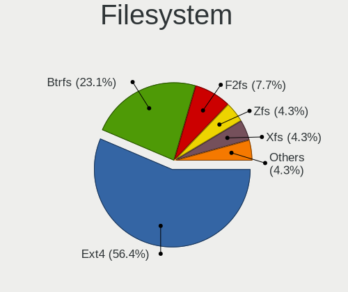
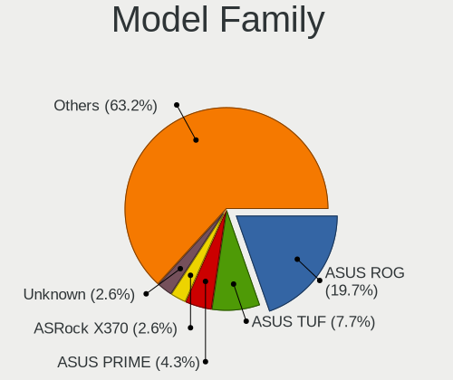
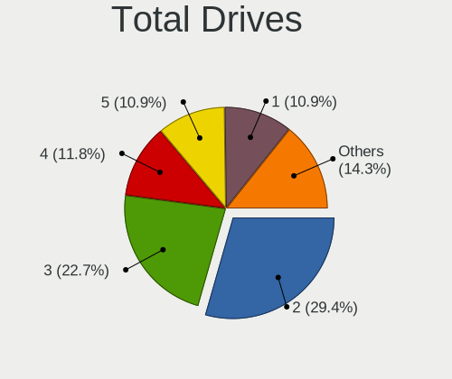
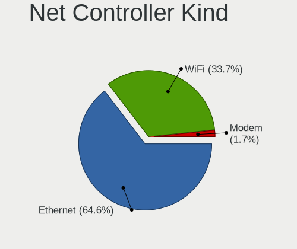
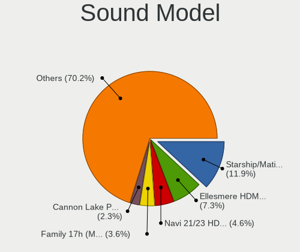
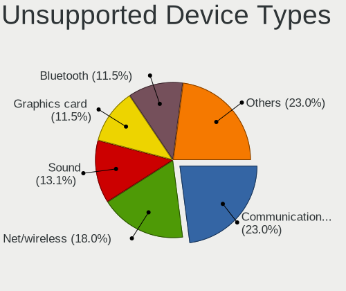

Gentoo 2.8 - Tested Hardware & Statistics (Desktops)
----------------------------------------------------

A project to collect tested hardware configurations for Gentoo 2.8.

Anyone can contribute to this report by the [hw-probe](https://github.com/linuxhw/hw-probe) tool:

    sudo -E hw-probe -all -upload

Please contribute! Especially if your hardware is rare.

Contents
--------

* [ Test Cases ](#test-cases)

* [ System ](#system)
  - [ Kernel                   ](#kernel)
  - [ Kernel Family            ](#kernel-family)
  - [ Kernel Major Ver.        ](#kernel-major-ver)
  - [ Arch                     ](#arch)
  - [ DE                       ](#de)
  - [ Display Server           ](#display-server)
  - [ Display Manager          ](#display-manager)
  - [ OS Lang                  ](#os-lang)
  - [ Boot Mode                ](#boot-mode)
  - [ Filesystem               ](#filesystem)
  - [ Part. scheme             ](#part-scheme)
  - [ Dual Boot with Linux/BSD ](#dual-boot-with-linuxbsd)
  - [ Dual Boot (Win)          ](#dual-boot-win)

* [ Board ](#board)
  - [ Vendor                   ](#vendor)
  - [ Model                    ](#model)
  - [ Model Family             ](#model-family)
  - [ MFG Year                 ](#mfg-year)
  - [ Form Factor              ](#form-factor)
  - [ Secure Boot              ](#secure-boot)
  - [ Coreboot                 ](#coreboot)
  - [ RAM Size                 ](#ram-size)
  - [ RAM Used                 ](#ram-used)
  - [ Total Drives             ](#total-drives)
  - [ Has CD-ROM               ](#has-cd-rom)
  - [ Has Ethernet             ](#has-ethernet)
  - [ Has WiFi                 ](#has-wifi)
  - [ Has Bluetooth            ](#has-bluetooth)

* [ Location ](#location)
  - [ Country                  ](#country)
  - [ City                     ](#city)

* [ Drives ](#drives)
  - [ Drive Vendor             ](#drive-vendor)
  - [ Drive Model              ](#drive-model)
  - [ HDD Vendor               ](#hdd-vendor)
  - [ SSD Vendor               ](#ssd-vendor)
  - [ Drive Kind               ](#drive-kind)
  - [ Drive Connector          ](#drive-connector)
  - [ Drive Size               ](#drive-size)
  - [ Space Total              ](#space-total)
  - [ Space Used               ](#space-used)
  - [ Malfunc. Drives          ](#malfunc-drives)
  - [ Malfunc. Drive Vendor    ](#malfunc-drive-vendor)
  - [ Malfunc. HDD Vendor      ](#malfunc-hdd-vendor)
  - [ Malfunc. Drive Kind      ](#malfunc-drive-kind)
  - [ Failed Drives            ](#failed-drives)
  - [ Failed Drive Vendor      ](#failed-drive-vendor)
  - [ Drive Status             ](#drive-status)

* [ Storage controller ](#storage-controller)
  - [ Storage Vendor           ](#storage-vendor)
  - [ Storage Model            ](#storage-model)
  - [ Storage Kind             ](#storage-kind)

* [ Processor ](#processor)
  - [ CPU Vendor               ](#cpu-vendor)
  - [ CPU Model                ](#cpu-model)
  - [ CPU Model Family         ](#cpu-model-family)
  - [ CPU Cores                ](#cpu-cores)
  - [ CPU Sockets              ](#cpu-sockets)
  - [ CPU Threads              ](#cpu-threads)
  - [ CPU Op-Modes             ](#cpu-op-modes)
  - [ CPU Microcode            ](#cpu-microcode)
  - [ CPU Microarch            ](#cpu-microarch)

* [ Graphics ](#graphics)
  - [ GPU Vendor               ](#gpu-vendor)
  - [ GPU Model                ](#gpu-model)
  - [ GPU Combo                ](#gpu-combo)
  - [ GPU Driver               ](#gpu-driver)
  - [ GPU Memory               ](#gpu-memory)

* [ Monitor ](#monitor)
  - [ Monitor Vendor           ](#monitor-vendor)
  - [ Monitor Model            ](#monitor-model)
  - [ Monitor Resolution       ](#monitor-resolution)
  - [ Monitor Diagonal         ](#monitor-diagonal)
  - [ Monitor Width            ](#monitor-width)
  - [ Aspect Ratio             ](#aspect-ratio)
  - [ Monitor Area             ](#monitor-area)
  - [ Pixel Density            ](#pixel-density)
  - [ Multiple Monitors        ](#multiple-monitors)

* [ Network ](#network)
  - [ Net Controller Vendor    ](#net-controller-vendor)
  - [ Net Controller Model     ](#net-controller-model)
  - [ Wireless Vendor          ](#wireless-vendor)
  - [ Wireless Model           ](#wireless-model)
  - [ Ethernet Vendor          ](#ethernet-vendor)
  - [ Ethernet Model           ](#ethernet-model)
  - [ Net Controller Kind      ](#net-controller-kind)
  - [ Used Controller          ](#used-controller)
  - [ NICs                     ](#nics)
  - [ IPv6                     ](#ipv6)

* [ Bluetooth ](#bluetooth)
  - [ Bluetooth Vendor         ](#bluetooth-vendor)
  - [ Bluetooth Model          ](#bluetooth-model)

* [ Sound ](#sound)
  - [ Sound Vendor             ](#sound-vendor)
  - [ Sound Model              ](#sound-model)

* [ Memory ](#memory)
  - [ Memory Vendor            ](#memory-vendor)
  - [ Memory Model             ](#memory-model)
  - [ Memory Kind              ](#memory-kind)
  - [ Memory Form Factor       ](#memory-form-factor)
  - [ Memory Size              ](#memory-size)
  - [ Memory Speed             ](#memory-speed)

* [ Printers & scanners ](#printers--scanners)
  - [ Printer Vendor           ](#printer-vendor)
  - [ Printer Model            ](#printer-model)
  - [ Scanner Vendor           ](#scanner-vendor)
  - [ Scanner Model            ](#scanner-model)

* [ Camera ](#camera)
  - [ Camera Vendor            ](#camera-vendor)
  - [ Camera Model             ](#camera-model)

* [ Security ](#security)
  - [ Fingerprint Vendor       ](#fingerprint-vendor)
  - [ Fingerprint Model        ](#fingerprint-model)
  - [ Chipcard Vendor          ](#chipcard-vendor)
  - [ Chipcard Model           ](#chipcard-model)

* [ Unsupported ](#unsupported)
  - [ Unsupported Devices      ](#unsupported-devices)
  - [ Unsupported Device Types ](#unsupported-device-types)

Test Cases
----------

Total: 65

| Vendor   | Model                       | Probe                                                      | Date         |
|----------|-----------------------------|------------------------------------------------------------|--------------|
| ASUSTek  | TUF Gaming Z690-PLUS WIF... | [2c33cbbbe2](https://linux-hardware.org/?probe=2c33cbbbe2) | May 30, 2022 |
| ASUSTek  | Z170-A                      | [86021dcc38](https://linux-hardware.org/?probe=86021dcc38) | May 27, 2022 |
| ASUSTek  | Z170-A                      | [b8603fccc0](https://linux-hardware.org/?probe=b8603fccc0) | May 26, 2022 |
| MSI      | PRO Z690-A DDR4             | [38ac6de56d](https://linux-hardware.org/?probe=38ac6de56d) | May 25, 2022 |
| ASRock   | B450 Gaming K4              | [af256d7649](https://linux-hardware.org/?probe=af256d7649) | May 24, 2022 |
| ASUSTek  | PRIME X570-PRO              | [f7225b80ed](https://linux-hardware.org/?probe=f7225b80ed) | May 18, 2022 |
| ASUSTek  | PRIME X570-PRO              | [84a0dc5b83](https://linux-hardware.org/?probe=84a0dc5b83) | May 18, 2022 |
| ASUSTek  | ROG Maximus XIII APEX       | [56fb967887](https://linux-hardware.org/?probe=56fb967887) | May 16, 2022 |
| Dell     | 0J3C2F A02                  | [07e2cea31c](https://linux-hardware.org/?probe=07e2cea31c) | May 13, 2022 |
| Gigabyte | Z590 UD                     | [2fcf37c00a](https://linux-hardware.org/?probe=2fcf37c00a) | May 11, 2022 |
| Dell     | 0J3C2F A02                  | [bd6c3ca5b4](https://linux-hardware.org/?probe=bd6c3ca5b4) | May 09, 2022 |
| ASRock   | X370 Gaming X               | [b24677a908](https://linux-hardware.org/?probe=b24677a908) | May 01, 2022 |
| MSI      | MPG Z390 GAMING PRO CARB... | [07a115654d](https://linux-hardware.org/?probe=07a115654d) | Apr 30, 2022 |
| Dell     | 0J37VM A00                  | [76f13aa200](https://linux-hardware.org/?probe=76f13aa200) | Apr 28, 2022 |
| ASUSTek  | ROG STRIX B550-F GAMING     | [6af0b2a3c9](https://linux-hardware.org/?probe=6af0b2a3c9) | Apr 21, 2022 |
| MSI      | Z390-A PRO                  | [4121c8fcc2](https://linux-hardware.org/?probe=4121c8fcc2) | Apr 20, 2022 |
| ASUSTek  | PRIME H570M-PLUS            | [5e6ce90c93](https://linux-hardware.org/?probe=5e6ce90c93) | Apr 13, 2022 |
| MSI      | B450-A PRO MAX              | [cfd276f151](https://linux-hardware.org/?probe=cfd276f151) | Apr 13, 2022 |
| ASUSTek  | ROG Maximus XIII APEX       | [7a26d3fc81](https://linux-hardware.org/?probe=7a26d3fc81) | Apr 12, 2022 |
| Gigabyte | H470 HD3                    | [5ce5c54ecd](https://linux-hardware.org/?probe=5ce5c54ecd) | Apr 09, 2022 |
| ASUSTek  | P6X58D-E                    | [68be7a767a](https://linux-hardware.org/?probe=68be7a767a) | Apr 07, 2022 |
| ASUSTek  | TUF Gaming B550-PLUS        | [403a6830d9](https://linux-hardware.org/?probe=403a6830d9) | Apr 04, 2022 |
| ASRock   | Z170A-X1                    | [9e1cc71d24](https://linux-hardware.org/?probe=9e1cc71d24) | Mar 31, 2022 |
| MSI      | MAG B550M MORTAR            | [9ebb4c0fd3](https://linux-hardware.org/?probe=9ebb4c0fd3) | Mar 31, 2022 |
| Gigabyte | Z590 UD                     | [5cde1a4e83](https://linux-hardware.org/?probe=5cde1a4e83) | Mar 24, 2022 |
| ASUSTek  | ROG STRIX Z370-H GAMING     | [6dddf500c7](https://linux-hardware.org/?probe=6dddf500c7) | Mar 22, 2022 |
| MSI      | MAG B550M MORTAR            | [593bf6f937](https://linux-hardware.org/?probe=593bf6f937) | Mar 21, 2022 |
| ASUSTek  | Z170 PRO GAMING             | [6efb7791bb](https://linux-hardware.org/?probe=6efb7791bb) | Mar 19, 2022 |
| ASUSTek  | ROG STRIX Z390-E GAMING     | [70021af77a](https://linux-hardware.org/?probe=70021af77a) | Mar 15, 2022 |
| Dell     | 0J37VM A00                  | [a78d4c99e3](https://linux-hardware.org/?probe=a78d4c99e3) | Mar 09, 2022 |
| ASUSTek  | TUF Gaming X570-PRO         | [44656b1bd4](https://linux-hardware.org/?probe=44656b1bd4) | Mar 03, 2022 |
| Gigabyte | Z590 UD                     | [a5242ed058](https://linux-hardware.org/?probe=a5242ed058) | Feb 26, 2022 |
| Gigabyte | Z590 UD                     | [071dd25266](https://linux-hardware.org/?probe=071dd25266) | Feb 24, 2022 |
| ASUSTek  | ROG CROSSHAIR VIII DARK ... | [5836ccecc2](https://linux-hardware.org/?probe=5836ccecc2) | Feb 10, 2022 |
| Gigabyte | Z490 UD                     | [b571c22d4f](https://linux-hardware.org/?probe=b571c22d4f) | Feb 04, 2022 |
| MSI      | MPG B550 GAMING PLUS        | [d424a8e145](https://linux-hardware.org/?probe=d424a8e145) | Feb 01, 2022 |
| MSI      | MPG B550 GAMING PLUS        | [89dbe92caf](https://linux-hardware.org/?probe=89dbe92caf) | Feb 01, 2022 |
| ASRock   | AB350M Pro4                 | [6b7cf2d570](https://linux-hardware.org/?probe=6b7cf2d570) | Jan 27, 2022 |
| Gigabyte | B450M S2H                   | [656da02110](https://linux-hardware.org/?probe=656da02110) | Jan 24, 2022 |
| Gigabyte | B450M S2H                   | [1721bed3e1](https://linux-hardware.org/?probe=1721bed3e1) | Jan 24, 2022 |
| Gigabyte | Z490 UD                     | [eac4639ad2](https://linux-hardware.org/?probe=eac4639ad2) | Jan 22, 2022 |
| EVGA     | Z390 DARK                   | [7672395a1c](https://linux-hardware.org/?probe=7672395a1c) | Dec 24, 2021 |
| ASUSTek  | P5LD2-Deluxe                | [a2ee48eeb1](https://linux-hardware.org/?probe=a2ee48eeb1) | Dec 16, 2021 |
| MSI      | MPG Z690 EDGE WIFI DDR4     | [b92f432637](https://linux-hardware.org/?probe=b92f432637) | Dec 07, 2021 |
| MSI      | MPG Z690 EDGE WIFI DDR4     | [d8f50aaa2e](https://linux-hardware.org/?probe=d8f50aaa2e) | Dec 07, 2021 |
| ASUSTek  | TUF B450-PLUS GAMING        | [6649bea1f8](https://linux-hardware.org/?probe=6649bea1f8) | Dec 04, 2021 |
| ASUSTek  | TUF B450-PLUS GAMING        | [723e2a158a](https://linux-hardware.org/?probe=723e2a158a) | Dec 03, 2021 |
| ASRock   | H110M-HDV R3.0              | [e155882ffa](https://linux-hardware.org/?probe=e155882ffa) | Dec 02, 2021 |
| ASUSTek  | ROG STRIX X570-E GAMING     | [e2c087b9c7](https://linux-hardware.org/?probe=e2c087b9c7) | Nov 21, 2021 |
| ASUSTek  | PRIME X570-P                | [eafa22145d](https://linux-hardware.org/?probe=eafa22145d) | Nov 15, 2021 |
| ASUSTek  | TUF GAMING B550-PLUS        | [2900821ed3](https://linux-hardware.org/?probe=2900821ed3) | Nov 14, 2021 |
| ASUSTek  | ROG STRIX B550-F GAMING     | [4cfb74fb42](https://linux-hardware.org/?probe=4cfb74fb42) | Nov 14, 2021 |
| ASUSTek  | ROG ZENITH II EXTREME       | [6f308039a8](https://linux-hardware.org/?probe=6f308039a8) | Nov 06, 2021 |
| MSI      | H110M PRO-D                 | [cb3dcdd186](https://linux-hardware.org/?probe=cb3dcdd186) | Nov 02, 2021 |
| MSI      | H110M PRO-D                 | [b53420c26a](https://linux-hardware.org/?probe=b53420c26a) | Nov 02, 2021 |
| ASUSTek  | ROG STRIX B550-F GAMING     | [161865edb0](https://linux-hardware.org/?probe=161865edb0) | Oct 30, 2021 |
| ASUSTek  | ROG STRIX B550-F GAMING     | [a4806aa50f](https://linux-hardware.org/?probe=a4806aa50f) | Oct 30, 2021 |
| ASUSTek  | Z170-A                      | [aea7d9561e](https://linux-hardware.org/?probe=aea7d9561e) | Oct 29, 2021 |
| ASRock   | X370 Gaming X               | [0f4ae74d8e](https://linux-hardware.org/?probe=0f4ae74d8e) | Oct 29, 2021 |
| ASRock   | X370 Gaming X               | [f3f75352e4](https://linux-hardware.org/?probe=f3f75352e4) | Oct 29, 2021 |
| ASUSTek  | ROG CROSSHAIR VIII HERO     | [e9cc487951](https://linux-hardware.org/?probe=e9cc487951) | Oct 28, 2021 |
| Gigabyte | X570 AORUS MASTER           | [58e3f9c07f](https://linux-hardware.org/?probe=58e3f9c07f) | Oct 23, 2021 |
| ASUSTek  | ROG CROSSHAIR VIII HERO     | [eb02a6d4d5](https://linux-hardware.org/?probe=eb02a6d4d5) | Oct 20, 2021 |
| ASRock   | X370 Killer SLI/ac          | [2e4c1c4527](https://linux-hardware.org/?probe=2e4c1c4527) | Oct 17, 2021 |
| Gigabyte | Z87X-UD3H-CF                | [9901023f19](https://linux-hardware.org/?probe=9901023f19) | Oct 03, 2021 |

System
------

Kernel
------

Version of the Linux kernel

| Version                      | Desktops | Percent |
|------------------------------|----------|---------|
| 5.17.1-gentoo-r1             | 3        | 5.77%   |
| 5.17.0-gentoo                | 2        | 3.85%   |
| 5.16.11-gentoo-x86_64        | 2        | 3.85%   |
| 5.15.10-gentoo               | 2        | 3.85%   |
| 5.14.13-gentoo               | 2        | 3.85%   |
| 5.14.12-gentoo               | 2        | 3.85%   |
| 6.0.0-Phaco-g8f10ff49057f    | 1        | 1.92%   |
| 5.18.0-gentoo                | 1        | 1.92%   |
| 5.17.9-gentoo-x86_64         | 1        | 1.92%   |
| 5.17.9-gentoo-dist           | 1        | 1.92%   |
| 5.17.8-gentoo-x86_64         | 1        | 1.92%   |
| 5.17.7-gentoo-limelight      | 1        | 1.92%   |
| 5.17.7-gentoo-dist           | 1        | 1.92%   |
| 5.17.6-gentoo-x86_64         | 1        | 1.92%   |
| 5.17.3-gentoo-11-02-22       | 1        | 1.92%   |
| 5.17.2-gentoo-limelight      | 1        | 1.92%   |
| 5.17.2-gentoo                | 1        | 1.92%   |
| 5.17.1-gentoo-r1-x86_64      | 1        | 1.92%   |
| 5.17.0-gentoo-x86_64         | 1        | 1.92%   |
| 5.16.8-gentoo-x86_64         | 1        | 1.92%   |
| 5.16.7-tkg-cacule            | 1        | 1.92%   |
| 5.16.5-gentoo-dist           | 1        | 1.92%   |
| 5.16.4-gentoo                | 1        | 1.92%   |
| 5.16.2-gentoo                | 1        | 1.92%   |
| 5.16.15                      | 1        | 1.92%   |
| 5.16.14-gentoo-x86_64        | 1        | 1.92%   |
| 5.16.14-gentoo-girlhog       | 1        | 1.92%   |
| 5.16.13-gentoo               | 1        | 1.92%   |
| 5.16.10-gentoo-x86_64        | 1        | 1.92%   |
| 5.15.6-gentoo                | 1        | 1.92%   |
| 5.15.4-gentoo-deimos         | 1        | 1.92%   |
| 5.15.32-gentoo-r1            | 1        | 1.92%   |
| 5.15.2-gentoo20210917        | 1        | 1.92%   |
| 5.15.2-gentoo-x86_64         | 1        | 1.92%   |
| 5.15.16-gentoo-dist          | 1        | 1.92%   |
| 5.15.11-gentoo-x86_64        | 1        | 1.92%   |
| 5.15.1-gentoo-x86_64         | 1        | 1.92%   |
| 5.15.0-gentoo-x86_64         | 1        | 1.92%   |
| 5.14.6                       | 1        | 1.92%   |
| 5.14.15-gentoo20210917       | 1        | 1.92%   |
| 5.14.14-gentoo-x86_64        | 1        | 1.92%   |
| 5.14.14-gentoo               | 1        | 1.92%   |
| 5.14.11-zen1                 | 1        | 1.92%   |
| 5.10.84-gentoo-112-overlayfs | 1        | 1.92%   |
| 5.10.74-gentoo-x86_64        | 1        | 1.92%   |

Kernel Family
-------------

Linux kernel without a distro release

| Version | Desktops | Percent |
|---------|----------|---------|
| 5.17.1  | 4        | 7.69%   |
| 5.17.0  | 3        | 5.77%   |
| 5.17.9  | 2        | 3.85%   |
| 5.17.7  | 2        | 3.85%   |
| 5.17.2  | 2        | 3.85%   |
| 5.16.14 | 2        | 3.85%   |
| 5.16.11 | 2        | 3.85%   |
| 5.15.2  | 2        | 3.85%   |
| 5.15.10 | 2        | 3.85%   |
| 5.14.14 | 2        | 3.85%   |
| 5.14.13 | 2        | 3.85%   |
| 5.14.12 | 2        | 3.85%   |
| 6.0.0   | 1        | 1.92%   |
| 5.18.0  | 1        | 1.92%   |
| 5.17.8  | 1        | 1.92%   |
| 5.17.6  | 1        | 1.92%   |
| 5.17.3  | 1        | 1.92%   |
| 5.16.8  | 1        | 1.92%   |
| 5.16.7  | 1        | 1.92%   |
| 5.16.5  | 1        | 1.92%   |
| 5.16.4  | 1        | 1.92%   |
| 5.16.2  | 1        | 1.92%   |
| 5.16.15 | 1        | 1.92%   |
| 5.16.13 | 1        | 1.92%   |
| 5.16.10 | 1        | 1.92%   |
| 5.15.6  | 1        | 1.92%   |
| 5.15.4  | 1        | 1.92%   |
| 5.15.32 | 1        | 1.92%   |
| 5.15.16 | 1        | 1.92%   |
| 5.15.11 | 1        | 1.92%   |
| 5.15.1  | 1        | 1.92%   |
| 5.15.0  | 1        | 1.92%   |
| 5.14.6  | 1        | 1.92%   |
| 5.14.15 | 1        | 1.92%   |
| 5.14.11 | 1        | 1.92%   |
| 5.10.84 | 1        | 1.92%   |
| 5.10.74 | 1        | 1.92%   |

Kernel Major Ver.
-----------------

Linux kernel major version

| Version | Desktops | Percent |
|---------|----------|---------|
| 5.17    | 14       | 28.57%  |
| 5.16    | 11       | 22.45%  |
| 5.15    | 11       | 22.45%  |
| 5.14    | 9        | 18.37%  |
| 5.10    | 2        | 4.08%   |
| 6.0     | 1        | 2.04%   |
| 5.18    | 1        | 2.04%   |

Arch
----

OS architecture (x86_64, i586, etc.)

| Name   | Desktops | Percent |
|--------|----------|---------|
| x86_64 | 44       | 100%    |

DE
--

Desktop Environment

| Name    | Desktops | Percent |
|---------|----------|---------|
| KDE5    | 18       | 40%     |
| Unknown | 11       | 24.44%  |
| GNOME   | 9        | 20%     |
| XFCE    | 4        | 8.89%   |
| LXQt    | 1        | 2.22%   |
| KDE     | 1        | 2.22%   |
| DWM     | 1        | 2.22%   |

Display Server
--------------

X11 or Wayland

| Name    | Desktops | Percent |
|---------|----------|---------|
| X11     | 20       | 43.48%  |
| Wayland | 12       | 26.09%  |
| Tty     | 8        | 17.39%  |
| Unknown | 6        | 13.04%  |

Display Manager
---------------

SDDM, LightDM, etc.

| Name    | Desktops | Percent |
|---------|----------|---------|
| Unknown | 21       | 46.67%  |
| SDDM    | 15       | 33.33%  |
| GDM     | 5        | 11.11%  |
| LightDM | 2        | 4.44%   |
| SLiM    | 1        | 2.22%   |
| LXDM    | 1        | 2.22%   |

OS Lang
-------

Language

| Lang    | Desktops | Percent |
|---------|----------|---------|
| en_US   | 17       | 38.64%  |
| en_GB   | 7        | 15.91%  |
| Unknown | 6        | 13.64%  |
| ru_RU   | 2        | 4.55%   |
| pl_PL   | 2        | 4.55%   |
| de_DE   | 2        | 4.55%   |
| C.UTF8  | 2        | 4.55%   |
| sl_SI   | 1        | 2.27%   |
| fr_FR   | 1        | 2.27%   |
| es_ES   | 1        | 2.27%   |
| el_GR   | 1        | 2.27%   |
| de_CH   | 1        | 2.27%   |
| C       | 1        | 2.27%   |

Boot Mode
---------

EFI or BIOS

| Mode | Desktops | Percent |
|------|----------|---------|
| EFI  | 39       | 84.78%  |
| BIOS | 7        | 15.22%  |

Filesystem
----------

Type of filesystem

| Type  | Desktops | Percent |
|-------|----------|---------|
| Ext4  | 23       | 52.27%  |
| Btrfs | 14       | 31.82%  |
| F2fs  | 3        | 6.82%   |
| Xfs   | 2        | 4.55%   |
| Zfs   | 1        | 2.27%   |
| XXX   | 1        | 2.27%   |

Part. scheme
------------

Scheme of partitioning

| Type    | Desktops | Percent |
|---------|----------|---------|
| GPT     | 41       | 91.11%  |
| Unknown | 4        | 8.89%   |

Dual Boot with Linux/BSD
------------------------

Hosting more than one Linux/BSD

| Dual boot | Desktops | Percent |
|-----------|----------|---------|
| No        | 24       | 54.55%  |
| Yes       | 20       | 45.45%  |

Dual Boot (Win)
---------------

Hosting Linux and Windows

| Dual boot | Desktops | Percent |
|-----------|----------|---------|
| No        | 30       | 68.18%  |
| Yes       | 14       | 31.82%  |

Board
-----

Vendor
------

Motherboard manufacturer

| Name                | Desktops | Percent |
|---------------------|----------|---------|
| ASUSTek Computer    | 21       | 47.73%  |
| MSI                 | 8        | 18.18%  |
| Gigabyte Technology | 6        | 13.64%  |
| ASRock              | 6        | 13.64%  |
| Dell                | 2        | 4.55%   |
| EVGA                | 1        | 2.27%   |

Model
-----

Motherboard model

| Name                              | Desktops | Percent |
|-----------------------------------|----------|---------|
| ASUS Z170-A                       | 2        | 4.55%   |
| ASUS TUF Gaming B550-PLUS         | 2        | 4.55%   |
| MSI MS-7D31                       | 1        | 2.27%   |
| MSI MS-7D25                       | 1        | 2.27%   |
| MSI MS-7C94                       | 1        | 2.27%   |
| MSI MS-7C56                       | 1        | 2.27%   |
| MSI MS-7B98                       | 1        | 2.27%   |
| MSI MS-7B86                       | 1        | 2.27%   |
| MSI MS-7B17                       | 1        | 2.27%   |
| MSI MS-7996                       | 1        | 2.27%   |
| Gigabyte Z87X-UD3H                | 1        | 2.27%   |
| Gigabyte Z590 UD                  | 1        | 2.27%   |
| Gigabyte Z490 UD                  | 1        | 2.27%   |
| Gigabyte X570 AORUS MASTER        | 1        | 2.27%   |
| Gigabyte H470 HD3                 | 1        | 2.27%   |
| Gigabyte B450M S2H                | 1        | 2.27%   |
| EVGA Z390 DARK                    | 1        | 2.27%   |
| Dell OptiPlex 790                 | 1        | 2.27%   |
| Dell OptiPlex 7080                | 1        | 2.27%   |
| ASUS Z170 PRO GAMING              | 1        | 2.27%   |
| ASUS TUF Gaming Z690-PLUS WIFI D4 | 1        | 2.27%   |
| ASUS TUF Gaming X570-PRO          | 1        | 2.27%   |
| ASUS TUF B450-PLUS GAMING         | 1        | 2.27%   |
| ASUS ROG ZENITH II EXTREME        | 1        | 2.27%   |
| ASUS ROG STRIX Z390-E GAMING      | 1        | 2.27%   |
| ASUS ROG STRIX Z370-H GAMING      | 1        | 2.27%   |
| ASUS ROG STRIX X570-E GAMING      | 1        | 2.27%   |
| ASUS ROG STRIX B550-F GAMING      | 1        | 2.27%   |
| ASUS ROG Maximus XIII APEX        | 1        | 2.27%   |
| ASUS ROG CROSSHAIR VIII HERO      | 1        | 2.27%   |
| ASUS ROG CROSSHAIR VIII DARK HERO | 1        | 2.27%   |
| ASUS PRIME X570-PRO               | 1        | 2.27%   |
| ASUS PRIME X570-P                 | 1        | 2.27%   |
| ASUS PRIME H570M-PLUS             | 1        | 2.27%   |
| ASUS P6X58D-E                     | 1        | 2.27%   |
| ASUS P5LD2-Deluxe                 | 1        | 2.27%   |
| ASRock Z170A-X1                   | 1        | 2.27%   |
| ASRock X370 Killer SLI/ac         | 1        | 2.27%   |
| ASRock X370 Gaming X              | 1        | 2.27%   |
| ASRock H110M-HDV R3.0             | 1        | 2.27%   |
| ASRock B450 Gaming K4             | 1        | 2.27%   |
| ASRock AB350M Pro4                | 1        | 2.27%   |

Model Family
------------

Motherboard model prefix

| Name               | Desktops | Percent |
|--------------------|----------|---------|
| ASUS ROG           | 8        | 18.18%  |
| ASUS TUF           | 5        | 11.36%  |
| ASUS PRIME         | 3        | 6.82%   |
| Dell OptiPlex      | 2        | 4.55%   |
| ASUS Z170-A        | 2        | 4.55%   |
| ASRock X370        | 2        | 4.55%   |
| MSI MS-7D31        | 1        | 2.27%   |
| MSI MS-7D25        | 1        | 2.27%   |
| MSI MS-7C94        | 1        | 2.27%   |
| MSI MS-7C56        | 1        | 2.27%   |
| MSI MS-7B98        | 1        | 2.27%   |
| MSI MS-7B86        | 1        | 2.27%   |
| MSI MS-7B17        | 1        | 2.27%   |
| MSI MS-7996        | 1        | 2.27%   |
| Gigabyte Z87X-UD3H | 1        | 2.27%   |
| Gigabyte Z590      | 1        | 2.27%   |
| Gigabyte Z490      | 1        | 2.27%   |
| Gigabyte X570      | 1        | 2.27%   |
| Gigabyte H470      | 1        | 2.27%   |
| Gigabyte B450M     | 1        | 2.27%   |
| EVGA Z390          | 1        | 2.27%   |
| ASUS Z170          | 1        | 2.27%   |
| ASUS P6X58D-E      | 1        | 2.27%   |
| ASUS P5LD2-Deluxe  | 1        | 2.27%   |
| ASRock Z170A-X1    | 1        | 2.27%   |
| ASRock H110M-HDV   | 1        | 2.27%   |
| ASRock B450        | 1        | 2.27%   |
| ASRock AB350M      | 1        | 2.27%   |

MFG Year
--------

Motherboard manufacture year

| Year | Desktops | Percent |
|------|----------|---------|
| 2020 | 10       | 22.73%  |
| 2021 | 7        | 15.91%  |
| 2019 | 7        | 15.91%  |
| 2018 | 5        | 11.36%  |
| 2017 | 4        | 9.09%   |
| 2016 | 3        | 6.82%   |
| 2015 | 3        | 6.82%   |
| 2022 | 1        | 2.27%   |
| 2013 | 1        | 2.27%   |
| 2011 | 1        | 2.27%   |
| 2010 | 1        | 2.27%   |
| 2005 | 1        | 2.27%   |

Form Factor
-----------

Physical design of the computer

| Name    | Desktops | Percent |
|---------|----------|---------|
| Desktop | 44       | 100%    |

Secure Boot
-----------

Enabled or disabled

| State    | Desktops | Percent |
|----------|----------|---------|
| Disabled | 43       | 95.56%  |
| Enabled  | 2        | 4.44%   |

Coreboot
--------

Have coreboot on board

| Used | Desktops | Percent |
|------|----------|---------|
| No   | 44       | 100%    |

RAM Size
--------

Total RAM memory

| Size in GB  | Desktops | Percent |
|-------------|----------|---------|
| 32.01-64.0  | 16       | 36.36%  |
| 16.01-24.0  | 11       | 25%     |
| 64.01-256.0 | 10       | 22.73%  |
| 24.01-32.0  | 3        | 6.82%   |
| 8.01-16.0   | 3        | 6.82%   |
| 2.01-3.0    | 1        | 2.27%   |

RAM Used
--------

Used RAM memory

| Used GB    | Desktops | Percent |
|------------|----------|---------|
| 4.01-8.0   | 17       | 35.42%  |
| 8.01-16.0  | 11       | 22.92%  |
| 2.01-3.0   | 6        | 12.5%   |
| 1.01-2.0   | 6        | 12.5%   |
| 3.01-4.0   | 3        | 6.25%   |
| 16.01-24.0 | 3        | 6.25%   |
| 24.01-32.0 | 1        | 2.08%   |
| 0.51-1.0   | 1        | 2.08%   |

Total Drives
------------

Number of drives on board

| Drives | Desktops | Percent |
|--------|----------|---------|
| 2      | 11       | 24.44%  |
| 3      | 9        | 20%     |
| 5      | 8        | 17.78%  |
| 4      | 6        | 13.33%  |
| 1      | 6        | 13.33%  |
| 6      | 3        | 6.67%   |
| 7      | 2        | 4.44%   |

Has CD-ROM
----------

Has CD-ROM on board

| Presented | Desktops | Percent |
|-----------|----------|---------|
| No        | 38       | 84.44%  |
| Yes       | 7        | 15.56%  |

Has Ethernet
------------

Has Ethernet on board

| Presented | Desktops | Percent |
|-----------|----------|---------|
| Yes       | 43       | 97.73%  |
| No        | 1        | 2.27%   |

Has WiFi
--------

Has WiFi module

| Presented | Desktops | Percent |
|-----------|----------|---------|
| No        | 26       | 57.78%  |
| Yes       | 19       | 42.22%  |

Has Bluetooth
-------------

Has Bluetooth module

| Presented | Desktops | Percent |
|-----------|----------|---------|
| No        | 23       | 51.11%  |
| Yes       | 22       | 48.89%  |

Location
--------

Country
-------

Geographic location (country)

| Country     | Desktops | Percent |
|-------------|----------|---------|
| USA         | 13       | 29.55%  |
| Russia      | 5        | 11.36%  |
| Poland      | 4        | 9.09%   |
| Germany     | 3        | 6.82%   |
| UK          | 2        | 4.55%   |
| Switzerland | 2        | 4.55%   |
| Spain       | 2        | 4.55%   |
| Slovenia    | 1        | 2.27%   |
| Mexico      | 1        | 2.27%   |
| Malaysia    | 1        | 2.27%   |
| Ireland     | 1        | 2.27%   |
| India       | 1        | 2.27%   |
| Hong Kong   | 1        | 2.27%   |
| Greece      | 1        | 2.27%   |
| France      | 1        | 2.27%   |
| Czechia     | 1        | 2.27%   |
| Canada      | 1        | 2.27%   |
| Belarus     | 1        | 2.27%   |
| Bangladesh  | 1        | 2.27%   |
| Australia   | 1        | 2.27%   |

City
----

Geographic location (city)

| City                | Desktops | Percent |
|---------------------|----------|---------|
| Zurich              | 2        | 4.55%   |
| Swansea             | 2        | 4.55%   |
| Moscow              | 2        | 4.55%   |
| Los Angeles         | 2        | 4.55%   |
| Vigo                | 1        | 2.27%   |
| Ufa                 | 1        | 2.27%   |
| Sydney              | 1        | 2.27%   |
| Svobodnyy           | 1        | 2.27%   |
| Sterling            | 1        | 2.27%   |
| St Louis            | 1        | 2.27%   |
| Schwieberdingen     | 1        | 2.27%   |
| Redmond             | 1        | 2.27%   |
| Radovljica          | 1        | 2.27%   |
| Orange              | 1        | 2.27%   |
| Ocala               | 1        | 2.27%   |
| Murmansk            | 1        | 2.27%   |
| Morcenx             | 1        | 2.27%   |
| Monroe              | 1        | 2.27%   |
| Mariánské Lázně | 1        | 2.27%   |
| Laziska Gorne       | 1        | 2.27%   |
| Laka                | 1        | 2.27%   |
| Kulmbach            | 1        | 2.27%   |
| Kuala Lumpur        | 1        | 2.27%   |
| Krakow              | 1        | 2.27%   |
| Kallithea           | 1        | 2.27%   |
| Hyderabad           | 1        | 2.27%   |
| Hyannis             | 1        | 2.27%   |
| Houston             | 1        | 2.27%   |
| Gomel               | 1        | 2.27%   |
| Glen Ellyn          | 1        | 2.27%   |
| Fort Collins        | 1        | 2.27%   |
| Essen               | 1        | 2.27%   |
| Dublin              | 1        | 2.27%   |
| Dhaka               | 1        | 2.27%   |
| Ciudad Juárez      | 1        | 2.27%   |
| Cieszyn             | 1        | 2.27%   |
| Central             | 1        | 2.27%   |
| Boucherville        | 1        | 2.27%   |
| Bellaterra          | 1        | 2.27%   |
| Baton Rouge         | 1        | 2.27%   |

Drives
------

Drive Vendor
------------

Hard drive vendors

| Vendor              | Desktops | Drives | Percent |
|---------------------|----------|--------|---------|
| WDC                 | 23       | 41     | 21.5%   |
| Samsung Electronics | 22       | 47     | 20.56%  |
| Seagate             | 13       | 21     | 12.15%  |
| Toshiba             | 5        | 6      | 4.67%   |
| SanDisk             | 5        | 6      | 4.67%   |
| Hitachi             | 5        | 7      | 4.67%   |
| Crucial             | 5        | 12     | 4.67%   |
| Intel               | 4        | 5      | 3.74%   |
| Corsair             | 4        | 5      | 3.74%   |
| A-DATA Technology   | 4        | 5      | 3.74%   |
| Kingston            | 3        | 3      | 2.8%    |
| KIOXIA-EXCERIA      | 2        | 3      | 1.87%   |
| Transcend           | 1        | 1      | 0.93%   |
| Team                | 1        | 2      | 0.93%   |
| SK Hynix            | 1        | 2      | 0.93%   |
| PNY                 | 1        | 1      | 0.93%   |
| PLEXTOR             | 1        | 2      | 0.93%   |
| Phison              | 1        | 1      | 0.93%   |
| OCZ-VERTEX          | 1        | 1      | 0.93%   |
| LaCie               | 1        | 2      | 0.93%   |
| Kingchuxing         | 1        | 2      | 0.93%   |
| HGST                | 1        | 1      | 0.93%   |
| GOODRAM             | 1        | 1      | 0.93%   |
| Apacer              | 1        | 1      | 0.93%   |

Drive Model
-----------

Hard drive models

| Model                            | Desktops | Percent |
|----------------------------------|----------|---------|
| WDC WD30EFRX-68EUZN0 3TB         | 2        | 1.43%   |
| WDC WD10EZEX-08M2NA0 1TB         | 2        | 1.43%   |
| Toshiba DT01ACA100 1TB           | 2        | 1.43%   |
| Seagate ST4000DM005-2DP166 4TB   | 2        | 1.43%   |
| Seagate ST2000DM001-1ER164 2TB   | 2        | 1.43%   |
| Samsung SSD 980 PRO 2TB          | 2        | 1.43%   |
| Samsung SSD 980 PRO 1TB          | 2        | 1.43%   |
| Samsung SSD 980 1TB              | 2        | 1.43%   |
| Samsung SSD 970 EVO Plus 2TB     | 2        | 1.43%   |
| Samsung SSD 970 EVO Plus 250GB   | 2        | 1.43%   |
| Samsung SSD 850 EVO 500GB        | 2        | 1.43%   |
| Samsung NVMe SSD Drive 512GB     | 2        | 1.43%   |
| Hitachi HDS723020BLA642 2TB      | 2        | 1.43%   |
| Crucial CT2000MX500SSD1 2TB      | 2        | 1.43%   |
| Crucial CT1000MX500SSD1 1TB      | 2        | 1.43%   |
| A-DATA SX8200PNP 512GB           | 2        | 1.43%   |
| A-DATA SX8200PNP 1TB             | 2        | 1.43%   |
| WDC WDS500G2X0C-00L350 500GB     | 1        | 0.71%   |
| WDC WDS500G2B0B-00YS70 500GB SSD | 1        | 0.71%   |
| WDC WDS500G2B0A-00SM50 500GB SSD | 1        | 0.71%   |
| WDC WDS240G2G0A 240GB SSD        | 1        | 0.71%   |
| WDC WDS100T2B0A-00SM50 1TB SSD   | 1        | 0.71%   |
| WDC WD8003FFBX-68B9AN0 8TB       | 1        | 0.71%   |
| WDC WD60EZRX-00MVLB1 6TB         | 1        | 0.71%   |
| WDC WD60EFRX-68L0BN1 6TB         | 1        | 0.71%   |
| WDC WD5000AZLX-00JKKA0 500GB     | 1        | 0.71%   |
| WDC WD5000AVDS-63U7B1 500GB      | 1        | 0.71%   |
| WDC WD40EZRZ-00GXCB0 4TB         | 1        | 0.71%   |
| WDC WD3200AAJS-22RYA0 320GB      | 1        | 0.71%   |
| WDC WD30EFRX-68N32N0 3TB         | 1        | 0.71%   |
| WDC WD30EFRX-68AX9N0 3TB         | 1        | 0.71%   |
| WDC WD20EZRX-00D8PB0 2TB         | 1        | 0.71%   |
| WDC WD20EZAZ-00GGJB0 2TB         | 1        | 0.71%   |
| WDC WD20EFRX-68EUZN0 2TB         | 1        | 0.71%   |
| WDC WD2003FZEX-00Z4SA0 2TB       | 1        | 0.71%   |
| WDC WD2003FYYS-18W0B0 2TB        | 1        | 0.71%   |
| WDC WD10PURX-64E5EY0 1TB         | 1        | 0.71%   |
| WDC WD10EZEX-60WN4A1 1TB         | 1        | 0.71%   |
| WDC WD10EZEX-60M2NA0 1TB         | 1        | 0.71%   |
| WDC WD10EZEX-22M                 | 1        | 0.71%   |
| WDC WD10EZEX-08WN4A0 1TB         | 1        | 0.71%   |
| WDC WD10EARS-00MVWB0 1TB         | 1        | 0.71%   |
| WDC WD10EADS-00L5B1 1TB          | 1        | 0.71%   |
| WDC WD1002FBYS-18W8B0 1TB        | 1        | 0.71%   |
| WDC WD1001FALS-00J7B1 1TB        | 1        | 0.71%   |
| Transcend TS512GSSD720 512GB     | 1        | 0.71%   |
| Toshiba TR200 480GB SSD          | 1        | 0.71%   |
| Toshiba THNSN5512GPUK NVMe 512GB | 1        | 0.71%   |
| Toshiba HDWQ140 4TB              | 1        | 0.71%   |
| Team TM8FP2240G 240GB            | 1        | 0.71%   |
| SK Hynix PC611 NVMe 512GB        | 1        | 0.71%   |
| Seagate ST8000DM004-2CX188 8TB   | 1        | 0.71%   |
| Seagate ST6000VN0033-2EE110 6TB  | 1        | 0.71%   |
| Seagate ST500DM002-1BD142 500GB  | 1        | 0.71%   |
| Seagate ST4000DM004-2CV104 4TB   | 1        | 0.71%   |
| Seagate ST4000DM000-1F2168 4TB   | 1        | 0.71%   |
| Seagate ST3500630AS 500GB        | 1        | 0.71%   |
| Seagate ST3250318AS 250GB        | 1        | 0.71%   |
| Seagate ST3160023AS 160GB        | 1        | 0.71%   |
| Seagate ST2000LX001-1RG174 2TB   | 1        | 0.71%   |

HDD Vendor
----------

Hard disk drive vendors

| Vendor  | Desktops | Drives | Percent |
|---------|----------|--------|---------|
| WDC     | 20       | 36     | 47.62%  |
| Seagate | 12       | 20     | 28.57%  |
| Hitachi | 5        | 7      | 11.9%   |
| Toshiba | 3        | 3      | 7.14%   |
| LaCie   | 1        | 2      | 2.38%   |
| HGST    | 1        | 1      | 2.38%   |

SSD Vendor
----------

Solid state drive vendors

| Vendor              | Desktops | Drives | Percent |
|---------------------|----------|--------|---------|
| Samsung Electronics | 12       | 17     | 30.77%  |
| WDC                 | 4        | 4      | 10.26%  |
| SanDisk             | 4        | 5      | 10.26%  |
| Crucial             | 4        | 10     | 10.26%  |
| Kingston            | 3        | 3      | 7.69%   |
| Corsair             | 3        | 4      | 7.69%   |
| Intel               | 2        | 2      | 5.13%   |
| Transcend           | 1        | 1      | 2.56%   |
| Toshiba             | 1        | 2      | 2.56%   |
| PNY                 | 1        | 1      | 2.56%   |
| OCZ-VERTEX          | 1        | 1      | 2.56%   |
| GOODRAM             | 1        | 1      | 2.56%   |
| Apacer              | 1        | 1      | 2.56%   |
| A-DATA Technology   | 1        | 1      | 2.56%   |

Drive Kind
----------

HDD or SSD

| Kind | Desktops | Drives | Percent |
|------|----------|--------|---------|
| NVMe | 30       | 56     | 33.33%  |
| SSD  | 30       | 53     | 33.33%  |
| HDD  | 30       | 69     | 33.33%  |

Drive Connector
---------------

SATA, SAS, NVMe, etc.

| Type | Desktops | Drives | Percent |
|------|----------|--------|---------|
| SATA | 40       | 120    | 56.34%  |
| NVMe | 30       | 56     | 42.25%  |
| SAS  | 1        | 2      | 1.41%   |

Drive Size
----------

Size of hard drive

| Size in TB | Desktops | Drives | Percent |
|------------|----------|--------|---------|
| 0.01-0.5   | 23       | 39     | 32.39%  |
| 0.51-1.0   | 20       | 28     | 28.17%  |
| 1.01-2.0   | 16       | 27     | 22.54%  |
| 3.01-4.0   | 6        | 9      | 8.45%   |
| 2.01-3.0   | 3        | 6      | 4.23%   |
| 4.01-10.0  | 3        | 13     | 4.23%   |

Space Total
-----------

Amount of disk space available on the file system

| Size in GB     | Desktops | Percent |
|----------------|----------|---------|
| 501-1000       | 10       | 22.22%  |
| More than 3000 | 9        | 20%     |
| 251-500        | 7        | 15.56%  |
| 2001-3000      | 7        | 15.56%  |
| 1001-2000      | 6        | 13.33%  |
| 1-20           | 2        | 4.44%   |
| 51-100         | 2        | 4.44%   |
| 101-250        | 1        | 2.22%   |
| Unknown        | 1        | 2.22%   |

Space Used
----------

Amount of used disk space

| Used GB        | Desktops | Percent |
|----------------|----------|---------|
| 251-500        | 11       | 23.91%  |
| 1001-2000      | 7        | 15.22%  |
| More than 3000 | 5        | 10.87%  |
| 501-1000       | 5        | 10.87%  |
| 101-250        | 4        | 8.7%    |
| 1-20           | 4        | 8.7%    |
| 51-100         | 4        | 8.7%    |
| 21-50          | 3        | 6.52%   |
| 2001-3000      | 2        | 4.35%   |
| Unknown        | 1        | 2.17%   |

Malfunc. Drives
---------------

Drive models with a malfunction

| Model                           | Desktops | Drives | Percent |
|---------------------------------|----------|--------|---------|
| WDC WD60EFRX-68L0BN1 6TB        | 1        | 3      | 7.69%   |
| WDC WD30EFRX-68AX9N0 3TB        | 1        | 2      | 7.69%   |
| WDC WD20EZRX-00D8PB0 2TB        | 1        | 1      | 7.69%   |
| WDC WD1002FBYS-18W8B0 1TB       | 1        | 1      | 7.69%   |
| Transcend TS512GSSD720 512GB    | 1        | 1      | 7.69%   |
| Seagate ST3160023AS 160GB       | 1        | 1      | 7.69%   |
| Seagate ST2000DX001-1CM164 2TB  | 1        | 1      | 7.69%   |
| SanDisk SSD PLUS 1000GB         | 1        | 1      | 7.69%   |
| Samsung Electronics SSD 980 1TB | 1        | 1      | 7.69%   |
| Kingston SV100S2128G 128GB SSD  | 1        | 1      | 7.69%   |
| Hitachi HUA721010KLA330 1TB     | 1        | 1      | 7.69%   |
| Hitachi HDS722020ALA330 2TB     | 1        | 2      | 7.69%   |
| Crucial CT525MX300SSD1 528GB    | 1        | 1      | 7.69%   |

Malfunc. Drive Vendor
---------------------

Vendors of faulty drives

| Vendor              | Desktops | Drives | Percent |
|---------------------|----------|--------|---------|
| WDC                 | 4        | 7      | 30.77%  |
| Seagate             | 2        | 2      | 15.38%  |
| Hitachi             | 2        | 3      | 15.38%  |
| Transcend           | 1        | 1      | 7.69%   |
| SanDisk             | 1        | 1      | 7.69%   |
| Samsung Electronics | 1        | 1      | 7.69%   |
| Kingston            | 1        | 1      | 7.69%   |
| Crucial             | 1        | 1      | 7.69%   |

Malfunc. HDD Vendor
-------------------

Vendors of faulty HDD drives

| Vendor  | Desktops | Drives | Percent |
|---------|----------|--------|---------|
| WDC     | 4        | 7      | 50%     |
| Seagate | 2        | 2      | 25%     |
| Hitachi | 2        | 3      | 25%     |

Malfunc. Drive Kind
-------------------

Kinds of faulty drives

| Kind | Desktops | Drives | Percent |
|------|----------|--------|---------|
| HDD  | 6        | 12     | 54.55%  |
| SSD  | 4        | 4      | 36.36%  |
| NVMe | 1        | 1      | 9.09%   |

Failed Drives
-------------

Failed drive models

| Model                            | Desktops | Drives | Percent |
|----------------------------------|----------|--------|---------|
| Toshiba THNSN5512GPUK NVMe 512GB | 1        | 1      | 100%    |

Failed Drive Vendor
-------------------

Failed drive vendors

| Vendor  | Desktops | Drives | Percent |
|---------|----------|--------|---------|
| Toshiba | 1        | 1      | 100%    |

Drive Status
------------

Number of failed and malfunc. drives

| Status   | Desktops | Drives | Percent |
|----------|----------|--------|---------|
| Works    | 39       | 145    | 70.91%  |
| Malfunc  | 10       | 17     | 18.18%  |
| Detected | 5        | 15     | 9.09%   |
| Failed   | 1        | 1      | 1.82%   |

Storage controller
------------------

Storage Vendor
--------------

Storage controller vendors

| Vendor                         | Desktops | Percent |
|--------------------------------|----------|---------|
| Intel                          | 24       | 28.57%  |
| AMD                            | 20       | 23.81%  |
| Samsung Electronics            | 17       | 20.24%  |
| ASMedia Technology             | 5        | 5.95%   |
| Phison Electronics             | 3        | 3.57%   |
| ADATA Technology               | 3        | 3.57%   |
| Sandisk                        | 2        | 2.38%   |
| KIOXIA                         | 2        | 2.38%   |
| Toshiba America Info Systems   | 1        | 1.19%   |
| Solid State Storage Technology | 1        | 1.19%   |
| SK Hynix                       | 1        | 1.19%   |
| Silicon Motion                 | 1        | 1.19%   |
| Silicon Image                  | 1        | 1.19%   |
| Seagate Technology             | 1        | 1.19%   |
| Micron/Crucial Technology      | 1        | 1.19%   |
| Marvell Technology Group       | 1        | 1.19%   |

Storage Model
-------------

Storage controller models

| Model                                                                          | Desktops | Percent |
|--------------------------------------------------------------------------------|----------|---------|
| AMD FCH SATA Controller [AHCI mode]                                            | 15       | 15.63%  |
| Samsung NVMe SSD Controller SM981/PM981/PM983                                  | 11       | 11.46%  |
| Samsung NVMe SSD Controller PM9A1/PM9A3/980PRO                                 | 6        | 6.25%   |
| Intel Q170/Q150/B150/H170/H110/Z170/CM236 Chipset SATA Controller [AHCI Mode]  | 6        | 6.25%   |
| ASMedia ASM1062 Serial ATA Controller                                          | 5        | 5.21%   |
| AMD 500 Series Chipset SATA Controller                                         | 5        | 5.21%   |
| Intel Cannon Lake PCH SATA AHCI Controller                                     | 4        | 4.17%   |
| AMD 400 Series Chipset SATA Controller                                         | 4        | 4.17%   |
| Intel Comet Lake SATA AHCI Controller                                          | 3        | 3.13%   |
| Intel Alder Lake-S PCH SATA Controller [AHCI Mode]                             | 3        | 3.13%   |
| Intel 500 Series Chipset Family SATA AHCI Controller                           | 3        | 3.13%   |
| ADATA XPG SX8200 Pro PCIe Gen3x4 M.2 2280 Solid State Drive                    | 3        | 3.13%   |
| Samsung NVMe SSD Controller 980                                                | 2        | 2.08%   |
| Phison E16 PCIe4 NVMe Controller                                               | 2        | 2.08%   |
| AMD X370 Series Chipset SATA Controller                                        | 2        | 2.08%   |
| Toshiba America Info Systems XG4 NVMe SSD Controller                           | 1        | 1.04%   |
| Solid State Storage Non-Volatile memory controller                             | 1        | 1.04%   |
| SK Hynix Non-Volatile memory controller                                        | 1        | 1.04%   |
| Silicon Motion SM2263EN/SM2263XT SSD Controller                                | 1        | 1.04%   |
| Silicon Image SiI 3132 Serial ATA Raid II Controller                           | 1        | 1.04%   |
| Seagate FireCuda 520 SSD                                                       | 1        | 1.04%   |
| Sandisk WD Blue SN570 NVMe SSD                                                 | 1        | 1.04%   |
| Sandisk WD Black 2018/SN750 / PC SN720 NVMe SSD                                | 1        | 1.04%   |
| Phison E7 NVMe Controller                                                      | 1        | 1.04%   |
| Micron/Crucial NVMe Controller                                                 | 1        | 1.04%   |
| Marvell Group 88SE9172 SATA 6Gb/s Controller                                   | 1        | 1.04%   |
| KIOXIA NVMe SSD                                                                | 1        | 1.04%   |
| KIOXIA Non-Volatile memory controller                                          | 1        | 1.04%   |
| Intel Volume Management Device NVMe RAID Controller                            | 1        | 1.04%   |
| Intel SSD Pro 7600p/760p/E 6100p Series                                        | 1        | 1.04%   |
| Intel Optane SSD 900P Series                                                   | 1        | 1.04%   |
| Intel NM10/ICH7 Family SATA Controller [IDE mode]                              | 1        | 1.04%   |
| Intel 82801JI (ICH10 Family) SATA AHCI Controller                              | 1        | 1.04%   |
| Intel 8 Series/C220 Series Chipset Family 6-port SATA Controller 1 [AHCI mode] | 1        | 1.04%   |
| Intel 6 Series/C200 Series Chipset Family 6 port Desktop SATA AHCI Controller  | 1        | 1.04%   |
| Intel 200 Series PCH SATA controller [AHCI mode]                               | 1        | 1.04%   |
| AMD 300 Series Chipset SATA Controller                                         | 1        | 1.04%   |

Storage Kind
------------

Kind of storage controller (IDE, SATA, NVMe, SAS, ...)

| Kind | Desktops | Percent |
|------|----------|---------|
| SATA | 43       | 56.58%  |
| NVMe | 30       | 39.47%  |
| RAID | 2        | 2.63%   |
| IDE  | 1        | 1.32%   |

Processor
---------

CPU Vendor
----------

Processor vendors

| Vendor | Desktops | Percent |
|--------|----------|---------|
| Intel  | 24       | 54.55%  |
| AMD    | 20       | 45.45%  |

CPU Model
---------

Processor models

| Model                                          | Desktops | Percent |
|------------------------------------------------|----------|---------|
| Intel Core i7-6700K CPU @ 4.00GHz              | 3        | 6.82%   |
| AMD Ryzen 9 5900X 12-Core Processor            | 3        | 6.82%   |
| AMD Ryzen 9 3950X 16-Core Processor            | 3        | 6.82%   |
| Intel Core i9-9900K CPU @ 3.60GHz              | 2        | 4.55%   |
| Intel Core i5-9600K CPU @ 3.70GHz              | 2        | 4.55%   |
| Intel 12th Gen Core i7-12700K                  | 2        | 4.55%   |
| AMD Ryzen 9 5950X 16-Core Processor            | 2        | 4.55%   |
| AMD Ryzen 5 2600 Six-Core Processor            | 2        | 4.55%   |
| AMD Ryzen 5 1600 Six-Core Processor            | 2        | 4.55%   |
| Intel Xeon CPU X5690 @ 3.47GHz                 | 1        | 2.27%   |
| Intel Pentium 4 CPU 3.20GHz                    | 1        | 2.27%   |
| Intel Core i7-8700K CPU @ 3.70GHz              | 1        | 2.27%   |
| Intel Core i7-10700F CPU @ 2.90GHz             | 1        | 2.27%   |
| Intel Core i7-10700 CPU @ 2.90GHz              | 1        | 2.27%   |
| Intel Core i5-7400 CPU @ 3.00GHz               | 1        | 2.27%   |
| Intel Core i5-6500 CPU @ 3.20GHz               | 1        | 2.27%   |
| Intel Core i5-6400 CPU @ 2.70GHz               | 1        | 2.27%   |
| Intel Core i5-4670K CPU @ 3.40GHz              | 1        | 2.27%   |
| Intel Core i5-2400 CPU @ 3.10GHz               | 1        | 2.27%   |
| Intel Core i5-10400F CPU @ 2.90GHz             | 1        | 2.27%   |
| Intel Core i5-10400 CPU @ 2.90GHz              | 1        | 2.27%   |
| Intel 12th Gen Core i7-12700KF                 | 1        | 2.27%   |
| Intel 11th Gen Core i9-11900K @ 3.50GHz        | 1        | 2.27%   |
| Intel 11th Gen Core i7-11700K @ 3.60GHz        | 1        | 2.27%   |
| AMD Ryzen Threadripper 3960X 24-Core Processor | 1        | 2.27%   |
| AMD Ryzen 9 3900X 12-Core Processor            | 1        | 2.27%   |
| AMD Ryzen 7 PRO 5750G with Radeon Graphics     | 1        | 2.27%   |
| AMD Ryzen 7 5700G with Radeon Graphics         | 1        | 2.27%   |
| AMD Ryzen 7 3700X 8-Core Processor             | 1        | 2.27%   |
| AMD Ryzen 7 1700X Eight-Core Processor         | 1        | 2.27%   |
| AMD Ryzen 5 3600 6-Core Processor              | 1        | 2.27%   |
| AMD Ryzen 3 4300GE with Radeon Graphics        | 1        | 2.27%   |

CPU Model Family
----------------

Processor model prefix

| Model                  | Desktops | Percent |
|------------------------|----------|---------|
| Intel Core i5          | 9        | 20.45%  |
| AMD Ryzen 9            | 9        | 20.45%  |
| Intel Core i7          | 6        | 13.64%  |
| Other                  | 5        | 11.36%  |
| AMD Ryzen 5            | 5        | 11.36%  |
| AMD Ryzen 7            | 3        | 6.82%   |
| Intel Core i9          | 2        | 4.55%   |
| Intel Xeon             | 1        | 2.27%   |
| Intel Pentium 4        | 1        | 2.27%   |
| AMD Ryzen Threadripper | 1        | 2.27%   |
| AMD Ryzen 7 PRO        | 1        | 2.27%   |
| AMD Ryzen 3            | 1        | 2.27%   |

CPU Cores
---------

Number of processor cores

| Number | Desktops | Percent |
|--------|----------|---------|
| 6      | 11       | 25%     |
| 8      | 10       | 22.73%  |
| 4      | 9        | 20.45%  |
| 12     | 7        | 15.91%  |
| 16     | 5        | 11.36%  |
| 24     | 1        | 2.27%   |
| 1      | 1        | 2.27%   |

CPU Sockets
-----------

Number of sockets

| Number | Desktops | Percent |
|--------|----------|---------|
| 1      | 44       | 100%    |

CPU Threads
-----------

Threads per core (Hyper-Threading)

| Number | Desktops | Percent |
|--------|----------|---------|
| 2      | 36       | 81.82%  |
| 1      | 8        | 18.18%  |

CPU Op-Modes
------------

CPU Operation Modes (32-bit, 64-bit)

| Op mode        | Desktops | Percent |
|----------------|----------|---------|
| 32-bit, 64-bit | 44       | 100%    |

CPU Microcode
-------------

Microcode number

| Number     | Desktops | Percent |
|------------|----------|---------|
| Unknown    | 7        | 15.56%  |
| 0x506e3    | 4        | 8.89%   |
| 0x0a201016 | 4        | 8.89%   |
| 0x08701021 | 4        | 8.89%   |
| 0x906ed    | 3        | 6.67%   |
| 0x90672    | 3        | 6.67%   |
| 0x08001138 | 3        | 6.67%   |
| 0xa0671    | 2        | 4.44%   |
| 0xa0655    | 2        | 4.44%   |
| 0xa0653    | 2        | 4.44%   |
| 0xf43      | 1        | 2.22%   |
| 0x906ec    | 1        | 2.22%   |
| 0x906e9    | 1        | 2.22%   |
| 0x206c2    | 1        | 2.22%   |
| 0x206a7    | 1        | 2.22%   |
| 0x0a50000c | 1        | 2.22%   |
| 0x0a50000b | 1        | 2.22%   |
| 0x0a201205 | 1        | 2.22%   |
| 0x08600106 | 1        | 2.22%   |
| 0x08301039 | 1        | 2.22%   |
| 0x0800820d | 1        | 2.22%   |

CPU Microarch
-------------

Microarchitecture

| Name             | Desktops | Percent |
|------------------|----------|---------|
| Zen 2            | 8        | 17.78%  |
| Zen 3            | 7        | 15.56%  |
| KabyLake         | 6        | 13.33%  |
| Skylake          | 5        | 11.11%  |
| CometLake        | 4        | 8.89%   |
| Zen              | 3        | 6.67%   |
| Alderlake Hybrid | 3        | 6.67%   |
| Zen+             | 2        | 4.44%   |
| Icelake          | 2        | 4.44%   |
| Westmere         | 1        | 2.22%   |
| SandyBridge      | 1        | 2.22%   |
| NetBurst         | 1        | 2.22%   |
| Haswell          | 1        | 2.22%   |
| Unknown          | 1        | 2.22%   |

Graphics
--------

GPU Vendor
----------

Vendors of graphics cards

| Vendor | Desktops | Percent |
|--------|----------|---------|
| AMD    | 22       | 43.14%  |
| Nvidia | 21       | 41.18%  |
| Intel  | 8        | 15.69%  |

GPU Model
---------

Graphics card models

| Model                                                               | Desktops | Percent |
|---------------------------------------------------------------------|----------|---------|
| AMD Ellesmere [Radeon RX 470/480/570/570X/580/580X/590]             | 9        | 16.98%  |
| Nvidia GP106 [GeForce GTX 1060 6GB]                                 | 3        | 5.66%   |
| AMD Navi 21 [Radeon RX 6800/6800 XT / 6900 XT]                      | 3        | 5.66%   |
| Nvidia TU102 [GeForce RTX 2080 Ti Rev. A]                           | 2        | 3.77%   |
| Intel CometLake-S GT2 [UHD Graphics 630]                            | 2        | 3.77%   |
| Intel CoffeeLake-S GT2 [UHD Graphics 630]                           | 2        | 3.77%   |
| Intel AlderLake-S GT1                                               | 2        | 3.77%   |
| Nvidia TU116 [GeForce GTX 1660 SUPER]                               | 1        | 1.89%   |
| Nvidia TU116 [GeForce GTX 1650]                                     | 1        | 1.89%   |
| Nvidia TU106 [GeForce RTX 2070]                                     | 1        | 1.89%   |
| Nvidia TU106 [GeForce RTX 2070 Rev. A]                              | 1        | 1.89%   |
| Nvidia TU104 [GeForce RTX 2080 SUPER]                               | 1        | 1.89%   |
| Nvidia GP108 [GeForce GT 1030]                                      | 1        | 1.89%   |
| Nvidia GP106 [GeForce GTX 1060 3GB]                                 | 1        | 1.89%   |
| Nvidia GP104 [GeForce GTX 1080]                                     | 1        | 1.89%   |
| Nvidia GP104 [GeForce GTX 1070]                                     | 1        | 1.89%   |
| Nvidia GP102 [GeForce GTX 1080 Ti]                                  | 1        | 1.89%   |
| Nvidia GM206 [GeForce GTX 960]                                      | 1        | 1.89%   |
| Nvidia GM204 [GeForce GTX 970]                                      | 1        | 1.89%   |
| Nvidia GK208B [GeForce GT 730]                                      | 1        | 1.89%   |
| Nvidia GK110B [GeForce GTX 780 Ti]                                  | 1        | 1.89%   |
| Nvidia GA106 [Geforce RTX 3050]                                     | 1        | 1.89%   |
| Nvidia GA104 [GeForce RTX 3060 Ti]                                  | 1        | 1.89%   |
| Nvidia GA102 [GeForce RTX 3080 Ti]                                  | 1        | 1.89%   |
| Intel HD Graphics 630                                               | 1        | 1.89%   |
| Intel HD Graphics 530                                               | 1        | 1.89%   |
| AMD Vega 10 XL/XT [Radeon RX Vega 56/64]                            | 1        | 1.89%   |
| AMD Turks PRO [Radeon HD 7570]                                      | 1        | 1.89%   |
| AMD Renoir                                                          | 1        | 1.89%   |
| AMD Oland PRO [Radeon R7 240/340 / Radeon 520]                      | 1        | 1.89%   |
| AMD Navi 23 [Radeon RX 6600/6600 XT/6600M]                          | 1        | 1.89%   |
| AMD Navi 22 [Radeon RX 6700/6700 XT/6750 XT / 6800M]                | 1        | 1.89%   |
| AMD Ellesmere [Radeon Pro WX 7100]                                  | 1        | 1.89%   |
| AMD Cezanne                                                         | 1        | 1.89%   |
| AMD Bonaire XTX [Radeon R7 260X/360]                                | 1        | 1.89%   |
| AMD Baffin [Radeon RX 550 640SP / RX 560/560X]                      | 1        | 1.89%   |
| AMD Baffin [Radeon RX 460/560D / Pro 450/455/460/555/555X/560/560X] | 1        | 1.89%   |

GPU Combo
---------

Combinations of graphics cards

| Name           | Desktops | Percent |
|----------------|----------|---------|
| 1 x Nvidia     | 17       | 38.64%  |
| 1 x AMD        | 16       | 36.36%  |
| 1 x Intel      | 3        | 6.82%   |
| AMD + Nvidia   | 3        | 6.82%   |
| Intel + AMD    | 2        | 4.55%   |
| Other          | 1        | 2.27%   |
| 2 x AMD        | 1        | 2.27%   |
| Intel + Nvidia | 1        | 2.27%   |

GPU Driver
----------

Free vs proprietary

| Driver      | Desktops | Percent |
|-------------|----------|---------|
| Free        | 24       | 54.55%  |
| Proprietary | 18       | 40.91%  |
| Unknown     | 2        | 4.55%   |

GPU Memory
----------

Total video memory

| Size in GB | Desktops | Percent |
|------------|----------|---------|
| 7.01-8.0   | 14       | 30.43%  |
| Unknown    | 12       | 26.09%  |
| 8.01-16.0  | 7        | 15.22%  |
| 3.01-4.0   | 4        | 8.7%    |
| 5.01-6.0   | 3        | 6.52%   |
| 1.01-2.0   | 3        | 6.52%   |
| 0.51-1.0   | 2        | 4.35%   |
| 2.01-3.0   | 1        | 2.17%   |

Monitor
-------

Monitor Vendor
--------------

Monitor vendors

| Vendor                  | Desktops | Percent |
|-------------------------|----------|---------|
| Goldstar                | 7        | 11.86%  |
| Samsung Electronics     | 6        | 10.17%  |
| Hewlett-Packard         | 4        | 6.78%   |
| Dell                    | 4        | 6.78%   |
| Lenovo                  | 3        | 5.08%   |
| AOC                     | 3        | 5.08%   |
| Ancor Communications    | 3        | 5.08%   |
| Acer                    | 3        | 5.08%   |
| ViewSonic               | 2        | 3.39%   |
| Philips                 | 2        | 3.39%   |
| Iiyama                  | 2        | 3.39%   |
| BenQ                    | 2        | 3.39%   |
| ASUSTek Computer        | 2        | 3.39%   |
| Unknown                 | 2        | 3.39%   |
| Valve                   | 1        | 1.69%   |
| Toshiba                 | 1        | 1.69%   |
| Onkyo                   | 1        | 1.69%   |
| NEC Computers           | 1        | 1.69%   |
| MStar                   | 1        | 1.69%   |
| Microstep               | 1        | 1.69%   |
| Mi                      | 1        | 1.69%   |
| LYC                     | 1        | 1.69%   |
| KTC                     | 1        | 1.69%   |
| HannStar                | 1        | 1.69%   |
| Gigabyte Technology     | 1        | 1.69%   |
| Gateway                 | 1        | 1.69%   |
| Chi Mei Optoelectronics | 1        | 1.69%   |
| Belinea                 | 1        | 1.69%   |

Monitor Model
-------------

Monitor models

| Model                                                                  | Desktops | Percent |
|------------------------------------------------------------------------|----------|---------|
| Goldstar LG HDR 4K GSM7707 3840x2160 600x340mm 27.2-inch               | 3        | 4.62%   |
| Goldstar ULTRAWIDE GSM76E4 3440x1440 800x335mm 34.1-inch               | 2        | 3.08%   |
| Unknown                                                                | 2        | 3.08%   |
| ViewSonic VX2458-mhd VSC0437 1920x1080 521x293mm 23.5-inch             | 1        | 1.54%   |
| ViewSonic LCD Monitor VSCCB25 1920x1080 480x270mm 21.7-inch            | 1        | 1.54%   |
| Valve Index HMD VLV91A8                                                | 1        | 1.54%   |
| Toshiba PA3552 TOS501C 1680x1050 433x270mm 20.1-inch                   | 1        | 1.54%   |
| Samsung Electronics SyncMaster SAM05CC 1920x1080 530x300mm 24.0-inch   | 1        | 1.54%   |
| Samsung Electronics SMS27A850 SAM083D 2560x1440 518x324mm 24.1-inch    | 1        | 1.54%   |
| Samsung Electronics LU28R55 SAM1018 3840x2160 632x360mm 28.6-inch      | 1        | 1.54%   |
| Samsung Electronics LF24T450F SAM7096 1920x1080 527x296mm 23.8-inch    | 1        | 1.54%   |
| Samsung Electronics C49HG9x SAM0E5E 3840x1080 1200x340mm 49.1-inch     | 1        | 1.54%   |
| Samsung Electronics C24F390 SAM0D2C 1920x1080 521x293mm 23.5-inch      | 1        | 1.54%   |
| Philips PHL 273V7 PHLC156 1920x1080 598x336mm 27.0-inch                | 1        | 1.54%   |
| Philips PHL 242M8 PHLC214 1920x1080 527x296mm 23.8-inch                | 1        | 1.54%   |
| Onkyo TX-NR535 ONK0E51 2560x1440 597x336mm 27.0-inch                   | 1        | 1.54%   |
| NEC Computers EA274WMi NEC6960 2560x1440 597x336mm 27.0-inch           | 1        | 1.54%   |
| MStar DP MST2380 2560x1440 597x336mm 27.0-inch                         | 1        | 1.54%   |
| Microstep LCD Monitor MSI MPG27CQ 2560x1440                            | 1        | 1.54%   |
| Mi Monitor XMI3444 3440x1440 797x334mm 34.0-inch                       | 1        | 1.54%   |
| LYC L2106 LYC0001 1920x1080 476x268mm 21.5-inch                        | 1        | 1.54%   |
| Lenovo P24h-10 LEN61AE 2560x1440 527x296mm 23.8-inch                   | 1        | 1.54%   |
| Lenovo M14t LEN62A3 1920x1080 309x174mm 14.0-inch                      | 1        | 1.54%   |
| Lenovo LEN Q27h-10 LEN66A7 2560x1440 598x336mm 27.0-inch               | 1        | 1.54%   |
| KTC Q2711SH KTC2700 2560x1440 597x336mm 27.0-inch                      | 1        | 1.54%   |
| Iiyama PLG2488H IVM6127 1920x1080 530x300mm 24.0-inch                  | 1        | 1.54%   |
| Iiyama PL2792Q IVM6637 2560x1440 597x336mm 27.0-inch                   | 1        | 1.54%   |
| Iiyama PL2792Q IVM6630 2560x1440 597x336mm 27.0-inch                   | 1        | 1.54%   |
| Iiyama PL2760Q IVM663D 2560x1440 600x340mm 27.2-inch                   | 1        | 1.54%   |
| Hewlett-Packard LV1561w HWP2837 1366x768 344x194mm 15.5-inch           | 1        | 1.54%   |
| Hewlett-Packard LP2475w HWP26F9 1920x1200 546x352mm 25.6-inch          | 1        | 1.54%   |
| Hewlett-Packard 27fw HPN354A 1920x1080 598x336mm 27.0-inch             | 1        | 1.54%   |
| Hewlett-Packard 24mq HPN366F 2560x1440 527x296mm 23.8-inch             | 1        | 1.54%   |
| Hewlett-Packard 22fw HPN3541 1920x1080 476x268mm 21.5-inch             | 1        | 1.54%   |
| HannStar JC198D HSD0CC6 1280x1024 376x301mm 19.0-inch                  | 1        | 1.54%   |
| Goldstar ULTRAWIDE GSM59F1 2560x1080 673x284mm 28.8-inch               | 1        | 1.54%   |
| Goldstar LG ULTRAGEAR GSM5B7F 2560x1440 600x340mm 27.2-inch            | 1        | 1.54%   |
| Goldstar L1750U GSM440C 1280x1024 338x270mm 17.0-inch                  | 1        | 1.54%   |
| Gigabyte Technology AORUS AD27QD GBT2701 2560x1440 609x355mm 27.8-inch | 1        | 1.54%   |
| Gateway FPD1765 GWY06E9 1280x1024 338x270mm 17.0-inch                  | 1        | 1.54%   |
| Dell U2717D DEL40EB 2560x1440 597x336mm 27.0-inch                      | 1        | 1.54%   |
| Dell U2713H DELA091 2560x1440 597x336mm 27.0-inch                      | 1        | 1.54%   |
| Dell U2515H DELD070 2560x1440 553x311mm 25.0-inch                      | 1        | 1.54%   |
| Dell S3221QS DELD107 3840x2160 697x392mm 31.5-inch                     | 1        | 1.54%   |
| Dell S2721D DELA199 2560x1440 597x336mm 27.0-inch                      | 1        | 1.54%   |
| Dell E2015HV DELF05E 1600x900 430x240mm 19.4-inch                      | 1        | 1.54%   |
| Chi Mei Optoelectronics CMC 19AW CMO2198 1440x900 408x255mm 18.9-inch  | 1        | 1.54%   |
| BenQ G2420HD BNQ7840 1920x1080 531x299mm 24.0-inch                     | 1        | 1.54%   |
| BenQ E2200HD BNQ790C 1920x1080 477x268mm 21.5-inch                     | 1        | 1.54%   |
| Belinea Belinea101735 MAX06B2 1280x1024 338x270mm 17.0-inch            | 1        | 1.54%   |
| ASUSTek Computer XG27WQ AUS2724 2560x1440 597x336mm 27.0-inch          | 1        | 1.54%   |
| ASUSTek Computer VG27A AUS2723 2560x1440 597x336mm 27.0-inch           | 1        | 1.54%   |
| AOC 2757 AOC2757 1920x1080 598x336mm 27.0-inch                         | 1        | 1.54%   |
| AOC 2437 AOC2437 1920x1080 521x293mm 23.5-inch                         | 1        | 1.54%   |
| AOC 2269WM AOC2269 1920x1080 480x270mm 21.7-inch                       | 1        | 1.54%   |
| Ancor Communications VN279 ACI27A4 1920x1080 597x336mm 27.0-inch       | 1        | 1.54%   |
| Ancor Communications ASUS VS247 ACI249A 1920x1080 520x290mm 23.4-inch  | 1        | 1.54%   |
| Ancor Communications ASUS VS228 ACI22FD 1920x1080 476x268mm 21.5-inch  | 1        | 1.54%   |
| Acer VG270U P ACR06CF 2560x1440 597x336mm 27.0-inch                    | 1        | 1.54%   |
| Acer T231H ACR0184 1920x1080 510x287mm 23.0-inch                       | 1        | 1.54%   |

Monitor Resolution
------------------

Monitor screen resolution

| Resolution         | Desktops | Percent |
|--------------------|----------|---------|
| 1920x1080 (FHD)    | 19       | 32.76%  |
| 2560x1440 (QHD)    | 17       | 29.31%  |
| 3840x2160 (4K)     | 6        | 10.34%  |
| 3440x1440          | 3        | 5.17%   |
| 1280x1024 (SXGA)   | 3        | 5.17%   |
| 3840x1080          | 2        | 3.45%   |
| Unknown            | 2        | 3.45%   |
| 2560x1080          | 1        | 1.72%   |
| 1920x1200 (WUXGA)  | 1        | 1.72%   |
| 1680x1050 (WSXGA+) | 1        | 1.72%   |
| 1600x900 (HD+)     | 1        | 1.72%   |
| 1440x900 (WXGA+)   | 1        | 1.72%   |
| 1366x768 (WXGA)    | 1        | 1.72%   |

Monitor Diagonal
----------------

Diagonal size in inches

| Inches  | Desktops | Percent |
|---------|----------|---------|
| 27      | 19       | 31.15%  |
| 23      | 10       | 16.39%  |
| 21      | 5        | 8.2%    |
| 34      | 4        | 6.56%   |
| 24      | 4        | 6.56%   |
| Unknown | 4        | 6.56%   |
| 19      | 3        | 4.92%   |
| 17      | 3        | 4.92%   |
| 49      | 2        | 3.28%   |
| 25      | 2        | 3.28%   |
| 31      | 1        | 1.64%   |
| 28      | 1        | 1.64%   |
| 20      | 1        | 1.64%   |
| 15      | 1        | 1.64%   |
| 14      | 1        | 1.64%   |

Monitor Width
-------------

Physical width

| Width in mm | Desktops | Percent |
|-------------|----------|---------|
| 501-600     | 28       | 51.85%  |
| 401-500     | 7        | 12.96%  |
| 301-350     | 5        | 9.26%   |
| 701-800     | 4        | 7.41%   |
| Unknown     | 4        | 7.41%   |
| 601-700     | 3        | 5.56%   |
| 1001-1500   | 2        | 3.7%    |
| 351-400     | 1        | 1.85%   |

Aspect Ratio
------------

Proportional relationship between the width and the height

| Ratio   | Desktops | Percent |
|---------|----------|---------|
| 16/9    | 33       | 67.35%  |
| 21/9    | 4        | 8.16%   |
| 16/10   | 4        | 8.16%   |
| Unknown | 4        | 8.16%   |
| 5/4     | 3        | 6.12%   |
| 32/9    | 1        | 2.04%   |

Monitor Area
------------

Area in inch²

| Area in inch² | Desktops | Percent |
|----------------|----------|---------|
| 301-350        | 19       | 31.67%  |
| 201-250        | 16       | 26.67%  |
| 351-500        | 6        | 10%     |
| 151-200        | 5        | 8.33%   |
| Unknown        | 4        | 6.67%   |
| 251-300        | 3        | 5%      |
| 141-150        | 3        | 5%      |
| More than 1000 | 1        | 1.67%   |
| 81-90          | 1        | 1.67%   |
| 101-110        | 1        | 1.67%   |
| 501-1000       | 1        | 1.67%   |

Pixel Density
-------------

Pixels per inch

| Density | Desktops | Percent |
|---------|----------|---------|
| 101-120 | 21       | 39.62%  |
| 51-100  | 20       | 37.74%  |
| 121-160 | 4        | 7.55%   |
| Unknown | 4        | 7.55%   |
| 161-240 | 3        | 5.66%   |
| 1-50    | 1        | 1.89%   |

Multiple Monitors
-----------------

Total monitors connected

| Total | Desktops | Percent |
|-------|----------|---------|
| 1     | 22       | 48.89%  |
| 2     | 16       | 35.56%  |
| 0     | 3        | 6.67%   |
| 4     | 2        | 4.44%   |
| 3     | 2        | 4.44%   |

Network
-------

Net Controller Vendor
---------------------

Controller vendors

| Vendor                   | Desktops | Percent |
|--------------------------|----------|---------|
| Intel                    | 29       | 50%     |
| Realtek Semiconductor    | 17       | 29.31%  |
| Aquantia                 | 3        | 5.17%   |
| Marvell Technology Group | 2        | 3.45%   |
| Raspberry Pi             | 1        | 1.72%   |
| Ralink Technology        | 1        | 1.72%   |
| Qualcomm Atheros         | 1        | 1.72%   |
| NetGear                  | 1        | 1.72%   |
| Microsoft                | 1        | 1.72%   |
| MEDIATEK                 | 1        | 1.72%   |
| Broadcom                 | 1        | 1.72%   |

Net Controller Model
--------------------

Controller models

| Model                                                             | Desktops | Percent |
|-------------------------------------------------------------------|----------|---------|
| Realtek RTL8111/8168/8411 PCI Express Gigabit Ethernet Controller | 9        | 12.16%  |
| Realtek RTL8125 2.5GbE Controller                                 | 7        | 9.46%   |
| Intel Wi-Fi 6 AX200                                               | 6        | 8.11%   |
| Intel I211 Gigabit Network Connection                             | 6        | 8.11%   |
| Intel Ethernet Controller I225-V                                  | 6        | 8.11%   |
| Intel Ethernet Connection (2) I219-V                              | 5        | 6.76%   |
| Intel Ethernet Connection (7) I219-V                              | 4        | 5.41%   |
| Aquantia AQC107 NBase-T/IEEE 802.3bz Ethernet Controller [AQtion] | 3        | 4.05%   |
| Intel Cannon Lake PCH CNVi WiFi                                   | 2        | 2.7%    |
| Intel Alder Lake-S PCH CNVi WiFi                                  | 2        | 2.7%    |
| Intel 82574L Gigabit Network Connection                           | 2        | 2.7%    |
| Realtek RTL8812AE 802.11ac PCIe Wireless Network Adapter          | 1        | 1.35%   |
| Realtek RTL8153 Gigabit Ethernet Adapter                          | 1        | 1.35%   |
| Raspberry Pi Pico                                                 | 1        | 1.35%   |
| Ralink RT2870/RT3070 Wireless Adapter                             | 1        | 1.35%   |
| Qualcomm Atheros AR9227 Wireless Network Adapter                  | 1        | 1.35%   |
| Qualcomm Atheros AR5212/5213/2414 Wireless Network Adapter        | 1        | 1.35%   |
| NetGear A6210                                                     | 1        | 1.35%   |
| Microsoft XBOX ACC                                                | 1        | 1.35%   |
| MEDIATEK MT7921K (RZ608) Wi-Fi 6E 80MHz                           | 1        | 1.35%   |
| Marvell Group 88E8056 PCI-E Gigabit Ethernet Controller           | 1        | 1.35%   |
| Marvell Group 88E8053 PCI-E Gigabit Ethernet Controller           | 1        | 1.35%   |
| Intel Wireless-AC 9260                                            | 1        | 1.35%   |
| Intel I210 Gigabit Network Connection                             | 1        | 1.35%   |
| Intel Ethernet Controller XXV710 for 25GbE SFP28                  | 1        | 1.35%   |
| Intel Ethernet Connection I217-V                                  | 1        | 1.35%   |
| Intel Ethernet Connection (14) I219-V                             | 1        | 1.35%   |
| Intel Ethernet Connection (11) I219-V                             | 1        | 1.35%   |
| Intel Ethernet Connection (11) I219-LM                            | 1        | 1.35%   |
| Intel Dual Band Wireless-AC 3168NGW [Stone Peak]                  | 1        | 1.35%   |
| Intel Comet Lake PCH CNVi WiFi                                    | 1        | 1.35%   |
| Intel 82579LM Gigabit Network Connection (Lewisville)             | 1        | 1.35%   |
| Broadcom BCM4360 802.11ac Wireless Network Adapter                | 1        | 1.35%   |

Wireless Vendor
---------------

Wireless vendors

| Vendor                | Desktops | Percent |
|-----------------------|----------|---------|
| Intel                 | 13       | 65%     |
| Realtek Semiconductor | 1        | 5%      |
| Ralink Technology     | 1        | 5%      |
| Qualcomm Atheros      | 1        | 5%      |
| NetGear               | 1        | 5%      |
| Microsoft             | 1        | 5%      |
| MEDIATEK              | 1        | 5%      |
| Broadcom              | 1        | 5%      |

Wireless Model
--------------

Wireless models

| Model                                                      | Desktops | Percent |
|------------------------------------------------------------|----------|---------|
| Intel Wi-Fi 6 AX200                                        | 6        | 28.57%  |
| Intel Cannon Lake PCH CNVi WiFi                            | 2        | 9.52%   |
| Intel Alder Lake-S PCH CNVi WiFi                           | 2        | 9.52%   |
| Realtek RTL8812AE 802.11ac PCIe Wireless Network Adapter   | 1        | 4.76%   |
| Ralink RT2870/RT3070 Wireless Adapter                      | 1        | 4.76%   |
| Qualcomm Atheros AR9227 Wireless Network Adapter           | 1        | 4.76%   |
| Qualcomm Atheros AR5212/5213/2414 Wireless Network Adapter | 1        | 4.76%   |
| NetGear A6210                                              | 1        | 4.76%   |
| Microsoft XBOX ACC                                         | 1        | 4.76%   |
| MEDIATEK MT7921K (RZ608) Wi-Fi 6E 80MHz                    | 1        | 4.76%   |
| Intel Wireless-AC 9260                                     | 1        | 4.76%   |
| Intel Dual Band Wireless-AC 3168NGW [Stone Peak]           | 1        | 4.76%   |
| Intel Comet Lake PCH CNVi WiFi                             | 1        | 4.76%   |
| Broadcom BCM4360 802.11ac Wireless Network Adapter         | 1        | 4.76%   |

Ethernet Vendor
---------------

Ethernet vendors

| Vendor                   | Desktops | Percent |
|--------------------------|----------|---------|
| Intel                    | 27       | 55.1%   |
| Realtek Semiconductor    | 17       | 34.69%  |
| Aquantia                 | 3        | 6.12%   |
| Marvell Technology Group | 2        | 4.08%   |

Ethernet Model
--------------

Ethernet models

| Model                                                             | Desktops | Percent |
|-------------------------------------------------------------------|----------|---------|
| Realtek RTL8111/8168/8411 PCI Express Gigabit Ethernet Controller | 9        | 17.31%  |
| Realtek RTL8125 2.5GbE Controller                                 | 7        | 13.46%  |
| Intel I211 Gigabit Network Connection                             | 6        | 11.54%  |
| Intel Ethernet Controller I225-V                                  | 6        | 11.54%  |
| Intel Ethernet Connection (2) I219-V                              | 5        | 9.62%   |
| Intel Ethernet Connection (7) I219-V                              | 4        | 7.69%   |
| Aquantia AQC107 NBase-T/IEEE 802.3bz Ethernet Controller [AQtion] | 3        | 5.77%   |
| Intel 82574L Gigabit Network Connection                           | 2        | 3.85%   |
| Realtek RTL8153 Gigabit Ethernet Adapter                          | 1        | 1.92%   |
| Marvell Group 88E8056 PCI-E Gigabit Ethernet Controller           | 1        | 1.92%   |
| Marvell Group 88E8053 PCI-E Gigabit Ethernet Controller           | 1        | 1.92%   |
| Intel I210 Gigabit Network Connection                             | 1        | 1.92%   |
| Intel Ethernet Controller XXV710 for 25GbE SFP28                  | 1        | 1.92%   |
| Intel Ethernet Connection I217-V                                  | 1        | 1.92%   |
| Intel Ethernet Connection (14) I219-V                             | 1        | 1.92%   |
| Intel Ethernet Connection (11) I219-V                             | 1        | 1.92%   |
| Intel Ethernet Connection (11) I219-LM                            | 1        | 1.92%   |
| Intel 82579LM Gigabit Network Connection (Lewisville)             | 1        | 1.92%   |

Net Controller Kind
-------------------

Ethernet, WiFi or modem

| Kind     | Desktops | Percent |
|----------|----------|---------|
| Ethernet | 43       | 69.35%  |
| WiFi     | 18       | 29.03%  |
| Modem    | 1        | 1.61%   |

Used Controller
---------------

Currently used network controller

| Kind     | Desktops | Percent |
|----------|----------|---------|
| Ethernet | 37       | 82.22%  |
| WiFi     | 8        | 17.78%  |

NICs
----

Total network controllers on board

| Total | Desktops | Percent |
|-------|----------|---------|
| 1     | 23       | 52.27%  |
| 2     | 13       | 29.55%  |
| 3     | 7        | 15.91%  |
| 0     | 1        | 2.27%   |

IPv6
----

IPv6 vs IPv4

| Used | Desktops | Percent |
|------|----------|---------|
| No   | 33       | 75%     |
| Yes  | 11       | 25%     |

Bluetooth
---------

Bluetooth Vendor
----------------

Controller vendors

| Vendor                  | Desktops | Percent |
|-------------------------|----------|---------|
| Intel                   | 15       | 68.18%  |
| Cambridge Silicon Radio | 4        | 18.18%  |
| Realtek Semiconductor   | 1        | 4.55%   |
| MediaTek                | 1        | 4.55%   |
| ASUSTek Computer        | 1        | 4.55%   |

Bluetooth Model
---------------

Controller models

| Model                                               | Desktops | Percent |
|-----------------------------------------------------|----------|---------|
| Intel AX200 Bluetooth                               | 7        | 31.82%  |
| Cambridge Silicon Radio Bluetooth Dongle (HCI mode) | 4        | 18.18%  |
| Intel AX201 Bluetooth                               | 3        | 13.64%  |
| Intel Bluetooth 9460/9560 Jefferson Peak (JfP)      | 2        | 9.09%   |
| Realtek Bluetooth Radio                             | 1        | 4.55%   |
| MediaTek Wireless_Device                            | 1        | 4.55%   |
| Intel Wireless-AC 9260 Bluetooth Adapter            | 1        | 4.55%   |
| Intel Wireless-AC 3168 Bluetooth                    | 1        | 4.55%   |
| Intel AX210 Bluetooth                               | 1        | 4.55%   |
| ASUS Broadcom BCM20702A0 Bluetooth                  | 1        | 4.55%   |

Sound
-----

Sound Vendor
------------

Sound card vendors

| Vendor                               | Desktops | Percent |
|--------------------------------------|----------|---------|
| AMD                                  | 29       | 28.43%  |
| Intel                                | 22       | 21.57%  |
| Nvidia                               | 21       | 20.59%  |
| Thesycon Systemsoftware & Consulting | 3        | 2.94%   |
| C-Media Electronics                  | 3        | 2.94%   |
| ASUSTek Computer                     | 3        | 2.94%   |
| Yamaha                               | 2        | 1.96%   |
| Logitech                             | 2        | 1.96%   |
| Creative Labs                        | 2        | 1.96%   |
| AudioQuest                           | 2        | 1.96%   |
| Valve Software                       | 1        | 0.98%   |
| SteelSeries ApS                      | 1        | 0.98%   |
| Sony                                 | 1        | 0.98%   |
| Sennheiser Communications            | 1        | 0.98%   |
| SAVITECH                             | 1        | 0.98%   |
| RODE Microphones                     | 1        | 0.98%   |
| Realtek Semiconductor                | 1        | 0.98%   |
| Razer USA                            | 1        | 0.98%   |
| JOUNIVO                              | 1        | 0.98%   |
| JMTek                                | 1        | 0.98%   |
| Generalplus Technology               | 1        | 0.98%   |
| FiiO Electronics Technology          | 1        | 0.98%   |
| Creative Technology                  | 1        | 0.98%   |

Sound Model
-----------

Sound card models

| Model                                                                      | Desktops | Percent |
|----------------------------------------------------------------------------|----------|---------|
| AMD Starship/Matisse HD Audio Controller                                   | 11       | 9.48%   |
| AMD Ellesmere HDMI Audio [Radeon RX 470/480 / 570/580/590]                 | 10       | 8.62%   |
| Intel 100 Series/C230 Series Chipset Family HD Audio Controller            | 6        | 5.17%   |
| AMD Navi 21/23 HDMI/DP Audio Controller                                    | 5        | 4.31%   |
| AMD Family 17h (Models 00h-0fh) HD Audio Controller                        | 5        | 4.31%   |
| Nvidia GP106 High Definition Audio Controller                              | 4        | 3.45%   |
| Intel Cannon Lake PCH cAVS                                                 | 4        | 3.45%   |
| Thesycon Systemsoftware & Consulting E30                                   | 3        | 2.59%   |
| Intel Comet Lake PCH cAVS                                                  | 3        | 2.59%   |
| AMD Renoir Radeon High Definition Audio Controller                         | 3        | 2.59%   |
| AMD Family 17h/19h HD Audio Controller                                     | 3        | 2.59%   |
| Nvidia TU106 High Definition Audio Controller                              | 2        | 1.72%   |
| Nvidia TU102 High Definition Audio Controller                              | 2        | 1.72%   |
| Nvidia GP104 High Definition Audio Controller                              | 2        | 1.72%   |
| Intel Alder Lake-S HD Audio Controller                                     | 2        | 1.72%   |
| Creative Labs Sound Core3D [Sound Blaster Recon3D / Z-Series]              | 2        | 1.72%   |
| ASUSTek Computer USB Audio                                                 | 2        | 1.72%   |
| AMD Baffin HDMI/DP Audio [Radeon RX 550 640SP / RX 560/560X]               | 2        | 1.72%   |
| Yamaha Steinberg UR22mkII                                                  | 1        | 0.86%   |
| Yamaha Steinberg UR22C                                                     | 1        | 0.86%   |
| Valve Software Valve VR Radio & HMD Mic                                    | 1        | 0.86%   |
| SteelSeries ApS Arctis 7 wireless adapter                                  | 1        | 0.86%   |
| Sony DualShock 4 [CUH-ZCT2x]                                               | 1        | 0.86%   |
| Sennheiser Communications GSX 1200 Pro Main Audio                          | 1        | 0.86%   |
| SAVITECH SA9023 audio controller                                           | 1        | 0.86%   |
| RODE Microphones RODE VideoMic NTG                                         | 1        | 0.86%   |
| Realtek Semiconductor USB Audio                                            | 1        | 0.86%   |
| Razer USA Kraken Tournament Edition                                        | 1        | 0.86%   |
| Nvidia TU116 High Definition Audio Controller                              | 1        | 0.86%   |
| Nvidia TU104 HD Audio Controller                                           | 1        | 0.86%   |
| Nvidia GP108 High Definition Audio Controller                              | 1        | 0.86%   |
| Nvidia GP102 HDMI Audio Controller                                         | 1        | 0.86%   |
| Nvidia GM206 High Definition Audio Controller                              | 1        | 0.86%   |
| Nvidia GM204 High Definition Audio Controller                              | 1        | 0.86%   |
| Nvidia GK208 HDMI/DP Audio Controller                                      | 1        | 0.86%   |
| Nvidia GK110 High Definition Audio Controller                              | 1        | 0.86%   |
| Nvidia GA104 High Definition Audio Controller                              | 1        | 0.86%   |
| Nvidia GA102 High Definition Audio Controller                              | 1        | 0.86%   |
| Nvidia Audio device                                                        | 1        | 0.86%   |
| Logitech Z-5 Speakers                                                      | 1        | 0.86%   |
| Logitech Yeti X                                                            | 1        | 0.86%   |
| JOUNIVO JV601                                                              | 1        | 0.86%   |
| JMTek USB PnP Audio Device                                                 | 1        | 0.86%   |
| Intel Tiger Lake-H HD Audio Controller                                     | 1        | 0.86%   |
| Intel NM10/ICH7 Family High Definition Audio Controller                    | 1        | 0.86%   |
| Intel Audio device                                                         | 1        | 0.86%   |
| Intel 82801JI (ICH10 Family) HD Audio Controller                           | 1        | 0.86%   |
| Intel 8 Series/C220 Series Chipset High Definition Audio Controller        | 1        | 0.86%   |
| Intel 6 Series/C200 Series Chipset Family High Definition Audio Controller | 1        | 0.86%   |
| Intel 200 Series PCH HD Audio                                              | 1        | 0.86%   |
| Generalplus Technology Usb Audio Device                                    | 1        | 0.86%   |
| FiiO Electronics Technology FiiO K3                                        | 1        | 0.86%   |
| Creative Technology Sound BlasterX G6                                      | 1        | 0.86%   |
| C-Media Electronics USB Advanced Audio Device                              | 1        | 0.86%   |
| C-Media Electronics CM108 Audio Controller                                 | 1        | 0.86%   |
| C-Media Electronics Blue Snowball                                          | 1        | 0.86%   |
| AudioQuest SDAC                                                            | 1        | 0.86%   |
| AudioQuest DragonFly Red                                                   | 1        | 0.86%   |
| ASUSTek Computer Xonar U1 Audio Station                                    | 1        | 0.86%   |
| AMD Vega 10 HDMI Audio [Radeon Vega 56/64]                                 | 1        | 0.86%   |

Memory
------

Memory Vendor
-------------

Memory module vendors

| Vendor              | Desktops | Percent |
|---------------------|----------|---------|
| G.Skill             | 12       | 26.09%  |
| Kingston            | 11       | 23.91%  |
| Crucial             | 10       | 21.74%  |
| Unknown             | 3        | 6.52%   |
| Corsair             | 3        | 6.52%   |
| Samsung Electronics | 2        | 4.35%   |
| Team                | 1        | 2.17%   |
| Patriot             | 1        | 2.17%   |
| Micron Technology   | 1        | 2.17%   |
| A-DATA Technology   | 1        | 2.17%   |
| Unknown             | 1        | 2.17%   |

Memory Model
------------

Memory module models

| Model                                                       | Desktops | Percent |
|-------------------------------------------------------------|----------|---------|
| Kingston RAM KHX3200C16D4/8GX 8192MB DIMM DDR4 3533MT/s     | 2        | 4%      |
| Kingston RAM KF3200C16D4/16GX 16GB DIMM DDR4 3200MT/s       | 2        | 4%      |
| Unknown RAM Module 8GB DIMM 1333MT/s                        | 1        | 2%      |
| Unknown RAM Module 512MB DIMM SDRAM                         | 1        | 2%      |
| Unknown RAM Module 1GB DIMM SDRAM                           | 1        | 2%      |
| Unknown RAM Module 16GB DIMM DDR4 2133MT/s                  | 1        | 2%      |
| Team RAM TEAMGROUP-UD4-3600 16GB DIMM DDR4 3600MT/s         | 1        | 2%      |
| Samsung RAM M378B1G73DB0-CK0 8GB DIMM DDR3 2133MT/s         | 1        | 2%      |
| Samsung RAM M378A2G43MX3-CTD 16GB DIMM DDR4 3466MT/s        | 1        | 2%      |
| Patriot RAM 3200 C16 Series 8GB DIMM DDR4 3200MT/s          | 1        | 2%      |
| Micron RAM 8ATF1G64AZ-3G2J1 8GB DIMM DDR4 3200MT/s          | 1        | 2%      |
| Kingston RAM KHX3200C16D4/16GX 16GB DIMM DDR4 3600MT/s      | 1        | 2%      |
| Kingston RAM KHX2666C16/16G 16GB DIMM DDR4 3200MT/s         | 1        | 2%      |
| Kingston RAM KHX2133C14D4/4G 4GB DIMM DDR4 2933MT/s         | 1        | 2%      |
| Kingston RAM KHX2133C14/8G 8192MB DIMM DDR4 2400MT/s        | 1        | 2%      |
| Kingston RAM KHX1866C10D3/8G 8GB DIMM DDR3 1867MT/s         | 1        | 2%      |
| Kingston RAM HX426C16FB/8 8GB DIMM DDR4 2667MT/s            | 1        | 2%      |
| Kingston RAM 99U5702-095.A00G 8GB DIMM DDR4 2667MT/s        | 1        | 2%      |
| Kingston RAM 9905625-062.A00G 8GB DIMM DDR4 2133MT/s        | 1        | 2%      |
| G.Skill RAM F4-4400C19-32GTRS 32GB DIMM DDR4 2667MT/s       | 1        | 2%      |
| G.Skill RAM F4-3600C17-16GTZR 16GB DIMM DDR4 3666MT/s       | 1        | 2%      |
| G.Skill RAM F4-3600C17-16GTZKW 16GB DIMM DDR4 3600MT/s      | 1        | 2%      |
| G.Skill RAM F4-3600C16-8GTZN 8GB DIMM DDR4 3666MT/s         | 1        | 2%      |
| G.Skill RAM F4-3600C16-16GVKC 16GB DIMM DDR4 3866MT/s       | 1        | 2%      |
| G.Skill RAM F4-3400C16-8GTZ 8GB DIMM DDR4 2197MT/s          | 1        | 2%      |
| G.Skill RAM F4-3200C16-8GIS 8192MB DIMM DDR4 3200MT/s       | 1        | 2%      |
| G.Skill RAM F4-3200C16-16GTZN 16384MB DIMM DDR4 3200MT/s    | 1        | 2%      |
| G.Skill RAM F4-3200C14-32GVK 32GB DIMM DDR4 2666MT/s        | 1        | 2%      |
| G.Skill RAM F4-3000C16-8GTZR 8GB DIMM DDR4 3000MT/s         | 1        | 2%      |
| G.Skill RAM F4-3000C15-8GVRB 8GB DIMM DDR4 2133MT/s         | 1        | 2%      |
| G.Skill RAM F3-14900CL9-4GBSR 4GB DIMM DDR3 1867MT/s        | 1        | 2%      |
| Crucial RAM CT8G4DFD824A.C16FF 8GB DIMM DDR4 2733MT/s       | 1        | 2%      |
| Crucial RAM CT8G4DFD824A.C16FBD1 8GB DIMM DDR4 2400MT/s     | 1        | 2%      |
| Crucial RAM CT16G4DFD8213.C16FAD 16GB DIMM DDR4 2133MT/s    | 1        | 2%      |
| Crucial RAM CT102464BD160B.M16 8GB DIMM DDR3 1600MT/s       | 1        | 2%      |
| Crucial RAM BLS4G4D26BFSE.8FE 4GB DIMM DDR4 2667MT/s        | 1        | 2%      |
| Crucial RAM BL8G32C16U4R.M8FE1 8GB DIMM DDR4 3400MT/s       | 1        | 2%      |
| Crucial RAM BL8G32C16U4B.M8FE1 8192MB DIMM DDR4 3600MT/s    | 1        | 2%      |
| Crucial RAM BL32G36C16U4B.M16FB1 32GB DIMM DDR4 3600MT/s    | 1        | 2%      |
| Crucial RAM BL32G32C16U4B.M16FB1 32GB DIMM DDR4 3200MT/s    | 1        | 2%      |
| Crucial RAM BL16G36C16U4RL.M8FB1 16GB DIMM DDR4 4000MT/s    | 1        | 2%      |
| Crucial RAM BL16G32C16U4B.M16FE1 16384MB DIMM DDR4 3200MT/s | 1        | 2%      |
| Crucial RAM BL16G32C16U4B.M16FE 16GB DIMM DDR4 3200MT/s     | 1        | 2%      |
| Corsair RAM CMK32GX4M2B3200C16 16GB DIMM DDR4 3400MT/s      | 1        | 2%      |
| Corsair RAM CMK16GX4M2B3000C15 8GB DIMM DDR4 3000MT/s       | 1        | 2%      |
| Corsair RAM CMK16GX4M2A2666C16 8GB DIMM DDR4 3200MT/s       | 1        | 2%      |
| A-DATA RAM DDR4 3000 2OZ 4GB DIMM DDR4 3000MT/s             | 1        | 2%      |
| Unknown                                                     | 1        | 2%      |

Memory Kind
-----------

Memory module kinds

| Kind    | Desktops | Percent |
|---------|----------|---------|
| DDR4    | 37       | 90.24%  |
| DDR3    | 2        | 4.88%   |
| SDRAM   | 1        | 2.44%   |
| Unknown | 1        | 2.44%   |

Memory Form Factor
------------------

Physical design of the memory module

| Name | Desktops | Percent |
|------|----------|---------|
| DIMM | 41       | 100%    |

Memory Size
-----------

Memory module size

| Size  | Desktops | Percent |
|-------|----------|---------|
| 8192  | 20       | 43.48%  |
| 16384 | 16       | 34.78%  |
| 32768 | 5        | 10.87%  |
| 4096  | 3        | 6.52%   |
| 1024  | 1        | 2.17%   |
| 512   | 1        | 2.17%   |

Memory Speed
------------

Memory module speed

| Speed   | Desktops | Percent |
|---------|----------|---------|
| 3200    | 10       | 21.28%  |
| 2133    | 6        | 12.77%  |
| 3600    | 5        | 10.64%  |
| 2667    | 4        | 8.51%   |
| 3666    | 2        | 4.26%   |
| 3533    | 2        | 4.26%   |
| 3466    | 2        | 4.26%   |
| 3400    | 2        | 4.26%   |
| 3000    | 2        | 4.26%   |
| 2400    | 2        | 4.26%   |
| 4000    | 1        | 2.13%   |
| 3866    | 1        | 2.13%   |
| 2933    | 1        | 2.13%   |
| 2733    | 1        | 2.13%   |
| 2666    | 1        | 2.13%   |
| 2197    | 1        | 2.13%   |
| 1867    | 1        | 2.13%   |
| 1600    | 1        | 2.13%   |
| 1333    | 1        | 2.13%   |
| Unknown | 1        | 2.13%   |

Printers & scanners
-------------------

Printer Vendor
--------------

Printer device vendors

Zero info for selected period =(

Printer Model
-------------

Printer device models

Zero info for selected period =(

Scanner Vendor
--------------

Scanner device vendors

Zero info for selected period =(

Scanner Model
-------------

Scanner device models

Zero info for selected period =(

Camera
------

Camera Vendor
-------------

Camera device vendors

| Vendor                        | Desktops | Percent |
|-------------------------------|----------|---------|
| Logitech                      | 6        | 42.86%  |
| Valve Software                | 1        | 7.14%   |
| Sunplus Innovation Technology | 1        | 7.14%   |
| Ruision                       | 1        | 7.14%   |
| MacroSilicon                  | 1        | 7.14%   |
| HD WEBCAM                     | 1        | 7.14%   |
| Generalplus Technology        | 1        | 7.14%   |
| Cubeternet                    | 1        | 7.14%   |
| Creative Technology           | 1        | 7.14%   |

Camera Model
------------

Camera device models

| Model                                                               | Desktops | Percent |
|---------------------------------------------------------------------|----------|---------|
| Valve Software 3D Camera                                            | 1        | 7.14%   |
| Sunplus Canyon CNS CWC5 Webcam                                      | 1        | 7.14%   |
| Ruision UVC Camera                                                  | 1        | 7.14%   |
| MacroSilicon USB Video                                              | 1        | 7.14%   |
| Logitech Webcam C270                                                | 1        | 7.14%   |
| Logitech StreamCam                                                  | 1        | 7.14%   |
| Logitech QuickCam Orbit/Sphere AF                                   | 1        | 7.14%   |
| Logitech HD Webcam C510                                             | 1        | 7.14%   |
| Logitech HD Pro Webcam C920                                         | 1        | 7.14%   |
| Logitech BRIO Ultra HD Webcam                                       | 1        | 7.14%   |
| HD WEBCAM Web Camera                                                | 1        | 7.14%   |
| Generalplus CAMERA - UVC                                            | 1        | 7.14%   |
| Cubeternet EtronTech CMOS based eSP570 WebCam [Onyx Titanium TC101] | 1        | 7.14%   |
| Creative Live! Cam Sync 1080p                                       | 1        | 7.14%   |

Security
--------

Fingerprint Vendor
------------------

Fingerprint sensor vendors

| Vendor         | Desktops | Percent |
|----------------|----------|---------|
| DigitalPersona | 1        | 100%    |

Fingerprint Model
-----------------

Fingerprint sensor models

| Model                             | Desktops | Percent |
|-----------------------------------|----------|---------|
| DigitalPersona Fingerprint Reader | 1        | 100%    |

Chipcard Vendor
---------------

Chipcard module vendors

Zero info for selected period =(

Chipcard Model
--------------

Chipcard module models

Zero info for selected period =(

Unsupported
-----------

Unsupported Devices
-------------------

Total unsupported devices on board

| Total | Desktops | Percent |
|-------|----------|---------|
| 0     | 34       | 72.34%  |
| 1     | 9        | 19.15%  |
| 4     | 2        | 4.26%   |
| 3     | 1        | 2.13%   |
| 2     | 1        | 2.13%   |

Unsupported Device Types
------------------------

Types of unsupported devices

| Type                     | Desktops | Percent |
|--------------------------|----------|---------|
| Communication controller | 6        | 37.5%   |
| Graphics card            | 2        | 12.5%   |
| Storage/raid             | 1        | 6.25%   |
| Storage/ata              | 1        | 6.25%   |
| Sound                    | 1        | 6.25%   |
| Net/wireless             | 1        | 6.25%   |
| Modem                    | 1        | 6.25%   |
| Fingerprint reader       | 1        | 6.25%   |
| Camera                   | 1        | 6.25%   |
| Bluetooth                | 1        | 6.25%   |

