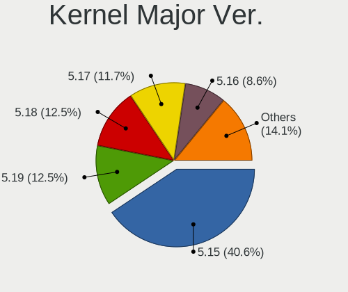
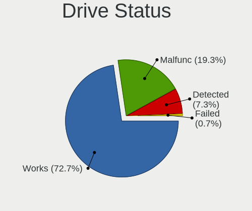
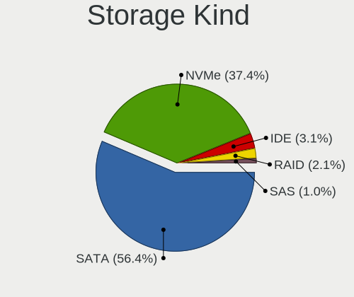
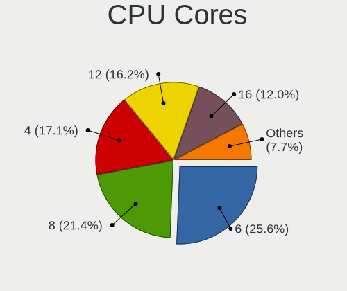
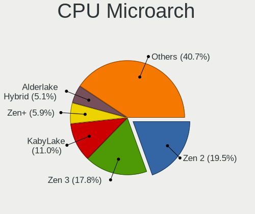
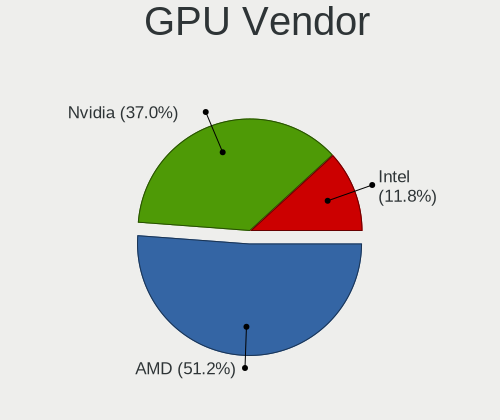
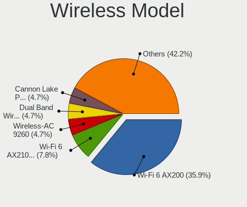

Gentoo 2.8 - Tested Hardware & Statistics (Desktops)
----------------------------------------------------

A project to collect tested hardware configurations for Gentoo 2.8.

Anyone can contribute to this report by the [hw-probe](https://github.com/linuxhw/hw-probe) tool:

    sudo -E hw-probe -all -upload

Please submit a probe of your configuration if it's not presented on the page or is rare.

Full-feature report is available here: https://linux-hardware.org/?view=trends

Contents
--------

* [ Test Cases ](#test-cases)

* [ System ](#system)
  - [ Kernel                   ](#kernel)
  - [ Kernel Family            ](#kernel-family)
  - [ Kernel Major Ver.        ](#kernel-major-ver)
  - [ Arch                     ](#arch)
  - [ DE                       ](#de)
  - [ Display Server           ](#display-server)
  - [ Display Manager          ](#display-manager)
  - [ OS Lang                  ](#os-lang)
  - [ Boot Mode                ](#boot-mode)
  - [ Filesystem               ](#filesystem)
  - [ Part. scheme             ](#part-scheme)
  - [ Dual Boot with Linux/BSD ](#dual-boot-with-linuxbsd)
  - [ Dual Boot (Win)          ](#dual-boot-win)

* [ Board ](#board)
  - [ Vendor                   ](#vendor)
  - [ Model                    ](#model)
  - [ Model Family             ](#model-family)
  - [ MFG Year                 ](#mfg-year)
  - [ Form Factor              ](#form-factor)
  - [ Secure Boot              ](#secure-boot)
  - [ Coreboot                 ](#coreboot)
  - [ RAM Size                 ](#ram-size)
  - [ RAM Used                 ](#ram-used)
  - [ Total Drives             ](#total-drives)
  - [ Has CD-ROM               ](#has-cd-rom)
  - [ Has Ethernet             ](#has-ethernet)
  - [ Has WiFi                 ](#has-wifi)
  - [ Has Bluetooth            ](#has-bluetooth)

* [ Location ](#location)
  - [ Country                  ](#country)
  - [ City                     ](#city)

* [ Drives ](#drives)
  - [ Drive Vendor             ](#drive-vendor)
  - [ Drive Model              ](#drive-model)
  - [ HDD Vendor               ](#hdd-vendor)
  - [ SSD Vendor               ](#ssd-vendor)
  - [ Drive Kind               ](#drive-kind)
  - [ Drive Connector          ](#drive-connector)
  - [ Drive Size               ](#drive-size)
  - [ Space Total              ](#space-total)
  - [ Space Used               ](#space-used)
  - [ Malfunc. Drives          ](#malfunc-drives)
  - [ Malfunc. Drive Vendor    ](#malfunc-drive-vendor)
  - [ Malfunc. HDD Vendor      ](#malfunc-hdd-vendor)
  - [ Malfunc. Drive Kind      ](#malfunc-drive-kind)
  - [ Failed Drives            ](#failed-drives)
  - [ Failed Drive Vendor      ](#failed-drive-vendor)
  - [ Drive Status             ](#drive-status)

* [ Storage controller ](#storage-controller)
  - [ Storage Vendor           ](#storage-vendor)
  - [ Storage Model            ](#storage-model)
  - [ Storage Kind             ](#storage-kind)

* [ Processor ](#processor)
  - [ CPU Vendor               ](#cpu-vendor)
  - [ CPU Model                ](#cpu-model)
  - [ CPU Model Family         ](#cpu-model-family)
  - [ CPU Cores                ](#cpu-cores)
  - [ CPU Sockets              ](#cpu-sockets)
  - [ CPU Threads              ](#cpu-threads)
  - [ CPU Op-Modes             ](#cpu-op-modes)
  - [ CPU Microcode            ](#cpu-microcode)
  - [ CPU Microarch            ](#cpu-microarch)

* [ Graphics ](#graphics)
  - [ GPU Vendor               ](#gpu-vendor)
  - [ GPU Model                ](#gpu-model)
  - [ GPU Combo                ](#gpu-combo)
  - [ GPU Driver               ](#gpu-driver)
  - [ GPU Memory               ](#gpu-memory)

* [ Monitor ](#monitor)
  - [ Monitor Vendor           ](#monitor-vendor)
  - [ Monitor Model            ](#monitor-model)
  - [ Monitor Resolution       ](#monitor-resolution)
  - [ Monitor Diagonal         ](#monitor-diagonal)
  - [ Monitor Width            ](#monitor-width)
  - [ Aspect Ratio             ](#aspect-ratio)
  - [ Monitor Area             ](#monitor-area)
  - [ Pixel Density            ](#pixel-density)
  - [ Multiple Monitors        ](#multiple-monitors)

* [ Network ](#network)
  - [ Net Controller Vendor    ](#net-controller-vendor)
  - [ Net Controller Model     ](#net-controller-model)
  - [ Wireless Vendor          ](#wireless-vendor)
  - [ Wireless Model           ](#wireless-model)
  - [ Ethernet Vendor          ](#ethernet-vendor)
  - [ Ethernet Model           ](#ethernet-model)
  - [ Net Controller Kind      ](#net-controller-kind)
  - [ Used Controller          ](#used-controller)
  - [ NICs                     ](#nics)
  - [ IPv6                     ](#ipv6)

* [ Bluetooth ](#bluetooth)
  - [ Bluetooth Vendor         ](#bluetooth-vendor)
  - [ Bluetooth Model          ](#bluetooth-model)

* [ Sound ](#sound)
  - [ Sound Vendor             ](#sound-vendor)
  - [ Sound Model              ](#sound-model)

* [ Memory ](#memory)
  - [ Memory Vendor            ](#memory-vendor)
  - [ Memory Model             ](#memory-model)
  - [ Memory Kind              ](#memory-kind)
  - [ Memory Form Factor       ](#memory-form-factor)
  - [ Memory Size              ](#memory-size)
  - [ Memory Speed             ](#memory-speed)

* [ Printers & scanners ](#printers--scanners)
  - [ Printer Vendor           ](#printer-vendor)
  - [ Printer Model            ](#printer-model)
  - [ Scanner Vendor           ](#scanner-vendor)
  - [ Scanner Model            ](#scanner-model)

* [ Camera ](#camera)
  - [ Camera Vendor            ](#camera-vendor)
  - [ Camera Model             ](#camera-model)

* [ Security ](#security)
  - [ Fingerprint Vendor       ](#fingerprint-vendor)
  - [ Fingerprint Model        ](#fingerprint-model)
  - [ Chipcard Vendor          ](#chipcard-vendor)
  - [ Chipcard Model           ](#chipcard-model)

* [ Unsupported ](#unsupported)
  - [ Unsupported Devices      ](#unsupported-devices)
  - [ Unsupported Device Types ](#unsupported-device-types)

Test Cases
----------

| Vendor   | Model                   | Probe                                                      | Date         |
|----------|-------------------------|------------------------------------------------------------|--------------|
| EVGA     | Z390 DARK               | [7672395a1c](https://linux-hardware.org/?probe=7672395a1c) | Dec 24, 2021 |
| ASUSTek  | P5LD2-Deluxe            | [a2ee48eeb1](https://linux-hardware.org/?probe=a2ee48eeb1) | Dec 16, 2021 |
| MSI      | MPG Z690 EDGE WIFI DDR4 | [b92f432637](https://linux-hardware.org/?probe=b92f432637) | Dec 07, 2021 |
| MSI      | MPG Z690 EDGE WIFI DDR4 | [d8f50aaa2e](https://linux-hardware.org/?probe=d8f50aaa2e) | Dec 07, 2021 |
| ASUSTek  | TUF B450-PLUS GAMING    | [6649bea1f8](https://linux-hardware.org/?probe=6649bea1f8) | Dec 04, 2021 |
| ASUSTek  | TUF B450-PLUS GAMING    | [723e2a158a](https://linux-hardware.org/?probe=723e2a158a) | Dec 03, 2021 |
| ASRock   | H110M-HDV R3.0          | [e155882ffa](https://linux-hardware.org/?probe=e155882ffa) | Dec 02, 2021 |
| ASUSTek  | ROG STRIX X570-E GAMING | [e2c087b9c7](https://linux-hardware.org/?probe=e2c087b9c7) | Nov 21, 2021 |
| ASUSTek  | PRIME X570-P            | [eafa22145d](https://linux-hardware.org/?probe=eafa22145d) | Nov 15, 2021 |
| ASUSTek  | TUF GAMING B550-PLUS    | [2900821ed3](https://linux-hardware.org/?probe=2900821ed3) | Nov 14, 2021 |
| ASUSTek  | ROG STRIX B550-F GAMING | [4cfb74fb42](https://linux-hardware.org/?probe=4cfb74fb42) | Nov 14, 2021 |
| ASUSTek  | ROG ZENITH II EXTREME   | [6f308039a8](https://linux-hardware.org/?probe=6f308039a8) | Nov 06, 2021 |
| MSI      | H110M PRO-D             | [cb3dcdd186](https://linux-hardware.org/?probe=cb3dcdd186) | Nov 02, 2021 |
| MSI      | H110M PRO-D             | [b53420c26a](https://linux-hardware.org/?probe=b53420c26a) | Nov 02, 2021 |
| ASUSTek  | ROG STRIX B550-F GAMING | [161865edb0](https://linux-hardware.org/?probe=161865edb0) | Oct 30, 2021 |
| ASUSTek  | ROG STRIX B550-F GAMING | [a4806aa50f](https://linux-hardware.org/?probe=a4806aa50f) | Oct 30, 2021 |
| ASUSTek  | Z170-A                  | [aea7d9561e](https://linux-hardware.org/?probe=aea7d9561e) | Oct 29, 2021 |
| ASRock   | X370 Gaming X           | [0f4ae74d8e](https://linux-hardware.org/?probe=0f4ae74d8e) | Oct 29, 2021 |
| ASRock   | X370 Gaming X           | [f3f75352e4](https://linux-hardware.org/?probe=f3f75352e4) | Oct 29, 2021 |
| ASUSTek  | ROG CROSSHAIR VIII HERO | [e9cc487951](https://linux-hardware.org/?probe=e9cc487951) | Oct 28, 2021 |
| ASUSTek  | ROG CROSSHAIR VIII HERO | [cb6d9e548b](https://linux-hardware.org/?probe=cb6d9e548b) | Oct 26, 2021 |
| Gigabyte | X570 AORUS MASTER       | [58e3f9c07f](https://linux-hardware.org/?probe=58e3f9c07f) | Oct 23, 2021 |
| ASUSTek  | ROG CROSSHAIR VIII HERO | [eb02a6d4d5](https://linux-hardware.org/?probe=eb02a6d4d5) | Oct 20, 2021 |
| ASRock   | X370 Killer SLI/ac      | [2e4c1c4527](https://linux-hardware.org/?probe=2e4c1c4527) | Oct 17, 2021 |
| Gigabyte | Z87X-UD3H-CF            | [9901023f19](https://linux-hardware.org/?probe=9901023f19) | Oct 03, 2021 |

System
------

Kernel
------

Version of the Linux kernel

| Version                      | Desktops | Percent |
|------------------------------|----------|---------|
| 5.14.12-gentoo               | 2        | 11.11%  |
| 6.0.0-Phaco-g8f10ff49057f    | 1        | 5.56%   |
| 5.15.6-gentoo                | 1        | 5.56%   |
| 5.15.4-gentoo-deimos         | 1        | 5.56%   |
| 5.15.2-gentoo20210917        | 1        | 5.56%   |
| 5.15.2-gentoo-x86_64         | 1        | 5.56%   |
| 5.15.10-gentoo               | 1        | 5.56%   |
| 5.15.1-gentoo-x86_64         | 1        | 5.56%   |
| 5.15.0-gentoo-x86_64         | 1        | 5.56%   |
| 5.14.6                       | 1        | 5.56%   |
| 5.14.15-gentoo20210917       | 1        | 5.56%   |
| 5.14.14-gentoo-x86_64        | 1        | 5.56%   |
| 5.14.14-gentoo               | 1        | 5.56%   |
| 5.14.13-gentoo               | 1        | 5.56%   |
| 5.14.11-zen1                 | 1        | 5.56%   |
| 5.10.84-gentoo-112-overlayfs | 1        | 5.56%   |
| 5.10.74-gentoo-x86_64        | 1        | 5.56%   |

Kernel Family
-------------

Linux kernel without a distro release

| Version | Desktops | Percent |
|---------|----------|---------|
| 5.15.2  | 2        | 11.11%  |
| 5.14.14 | 2        | 11.11%  |
| 5.14.12 | 2        | 11.11%  |
| 6.0.0   | 1        | 5.56%   |
| 5.15.6  | 1        | 5.56%   |
| 5.15.4  | 1        | 5.56%   |
| 5.15.10 | 1        | 5.56%   |
| 5.15.1  | 1        | 5.56%   |
| 5.15.0  | 1        | 5.56%   |
| 5.14.6  | 1        | 5.56%   |
| 5.14.15 | 1        | 5.56%   |
| 5.14.13 | 1        | 5.56%   |
| 5.14.11 | 1        | 5.56%   |
| 5.10.84 | 1        | 5.56%   |
| 5.10.74 | 1        | 5.56%   |

Kernel Major Ver.
-----------------

Linux kernel major version

| Version | Desktops | Percent |
|---------|----------|---------|
| 5.14    | 8        | 44.44%  |
| 5.15    | 7        | 38.89%  |
| 5.10    | 2        | 11.11%  |
| 6.0     | 1        | 5.56%   |

Arch
----

OS architecture (x86_64, i586, etc.)

| Name   | Desktops | Percent |
|--------|----------|---------|
| x86_64 | 17       | 100%    |

DE
--

Desktop Environment

| Name    | Desktops | Percent |
|---------|----------|---------|
| KDE5    | 9        | 52.94%  |
| GNOME   | 4        | 23.53%  |
| Unknown | 3        | 17.65%  |
| XFCE    | 1        | 5.88%   |

Display Server
--------------

X11 or Wayland

| Name    | Desktops | Percent |
|---------|----------|---------|
| X11     | 9        | 50%     |
| Wayland | 4        | 22.22%  |
| Tty     | 4        | 22.22%  |
| Unknown | 1        | 5.56%   |

Display Manager
---------------

SDDM, LightDM, etc.

| Name    | Desktops | Percent |
|---------|----------|---------|
| Unknown | 8        | 44.44%  |
| SDDM    | 7        | 38.89%  |
| GDM     | 3        | 16.67%  |

OS Lang
-------

Language

| Lang    | Desktops | Percent |
|---------|----------|---------|
| en_GB   | 5        | 29.41%  |
| en_US   | 4        | 23.53%  |
| pl_PL   | 2        | 11.76%  |
| sl_SI   | 1        | 5.88%   |
| ru_RU   | 1        | 5.88%   |
| es_ES   | 1        | 5.88%   |
| el_GR   | 1        | 5.88%   |
| de_CH   | 1        | 5.88%   |
| Unknown | 1        | 5.88%   |

Boot Mode
---------

EFI or BIOS

| Mode | Desktops | Percent |
|------|----------|---------|
| EFI  | 13       | 72.22%  |
| BIOS | 5        | 27.78%  |

Filesystem
----------

Type of filesystem

| Type  | Desktops | Percent |
|-------|----------|---------|
| Ext4  | 7        | 41.18%  |
| Btrfs | 7        | 41.18%  |
| F2fs  | 2        | 11.76%  |
| Zfs   | 1        | 5.88%   |

Part. scheme
------------

Scheme of partitioning

| Type    | Desktops | Percent |
|---------|----------|---------|
| GPT     | 15       | 83.33%  |
| Unknown | 3        | 16.67%  |

Dual Boot with Linux/BSD
------------------------

Hosting more than one Linux/BSD

| Dual boot | Desktops | Percent |
|-----------|----------|---------|
| Yes       | 9        | 52.94%  |
| No        | 8        | 47.06%  |

Dual Boot (Win)
---------------

Hosting Linux and Windows

| Dual boot | Desktops | Percent |
|-----------|----------|---------|
| No        | 11       | 64.71%  |
| Yes       | 6        | 35.29%  |

Board
-----

Vendor
------

Motherboard manufacturer

| Name                | Desktops | Percent |
|---------------------|----------|---------|
| ASUSTek Computer    | 9        | 52.94%  |
| ASRock              | 3        | 17.65%  |
| MSI                 | 2        | 11.76%  |
| Gigabyte Technology | 2        | 11.76%  |
| EVGA                | 1        | 5.88%   |

Model
-----

Motherboard model

| Name                         | Desktops | Percent |
|------------------------------|----------|---------|
| MSI MS-7D31                  | 1        | 5.88%   |
| MSI MS-7996                  | 1        | 5.88%   |
| Gigabyte Z87X-UD3H           | 1        | 5.88%   |
| Gigabyte X570 AORUS MASTER   | 1        | 5.88%   |
| EVGA Z390 DARK               | 1        | 5.88%   |
| ASUS Z170-A                  | 1        | 5.88%   |
| ASUS TUF GAMING B550-PLUS    | 1        | 5.88%   |
| ASUS TUF B450-PLUS GAMING    | 1        | 5.88%   |
| ASUS ROG ZENITH II EXTREME   | 1        | 5.88%   |
| ASUS ROG STRIX X570-E GAMING | 1        | 5.88%   |
| ASUS ROG STRIX B550-F GAMING | 1        | 5.88%   |
| ASUS ROG CROSSHAIR VIII HERO | 1        | 5.88%   |
| ASUS PRIME X570-P            | 1        | 5.88%   |
| ASUS P5LD2-Deluxe            | 1        | 5.88%   |
| ASRock X370 Killer SLI/ac    | 1        | 5.88%   |
| ASRock X370 Gaming X         | 1        | 5.88%   |
| ASRock H110M-HDV R3.0        | 1        | 5.88%   |

Model Family
------------

Motherboard model prefix

| Name               | Desktops | Percent |
|--------------------|----------|---------|
| ASUS ROG           | 4        | 23.53%  |
| ASUS TUF           | 2        | 11.76%  |
| ASRock X370        | 2        | 11.76%  |
| MSI MS-7D31        | 1        | 5.88%   |
| MSI MS-7996        | 1        | 5.88%   |
| Gigabyte Z87X-UD3H | 1        | 5.88%   |
| Gigabyte X570      | 1        | 5.88%   |
| EVGA Z390          | 1        | 5.88%   |
| ASUS Z170-A        | 1        | 5.88%   |
| ASUS PRIME         | 1        | 5.88%   |
| ASUS P5LD2-Deluxe  | 1        | 5.88%   |
| ASRock H110M-HDV   | 1        | 5.88%   |

MFG Year
--------

Motherboard manufacture year

| Year | Desktops | Percent |
|------|----------|---------|
| 2021 | 7        | 41.18%  |
| 2019 | 3        | 17.65%  |
| 2020 | 2        | 11.76%  |
| 2018 | 2        | 11.76%  |
| 2016 | 1        | 5.88%   |
| 2014 | 1        | 5.88%   |
| 2006 | 1        | 5.88%   |

Form Factor
-----------

Physical design of the computer

| Name    | Desktops | Percent |
|---------|----------|---------|
| Desktop | 17       | 100%    |

Secure Boot
-----------

Enabled or disabled

| State    | Desktops | Percent |
|----------|----------|---------|
| Disabled | 17       | 100%    |

Coreboot
--------

Have coreboot on board

| Used | Desktops | Percent |
|------|----------|---------|
| No   | 17       | 100%    |

RAM Size
--------

Total RAM memory

| Size in GB  | Desktops | Percent |
|-------------|----------|---------|
| 32.01-64.0  | 7        | 41.18%  |
| 64.01-256.0 | 5        | 29.41%  |
| 24.01-32.0  | 2        | 11.76%  |
| 16.01-24.0  | 2        | 11.76%  |
| 2.01-3.0    | 1        | 5.88%   |

RAM Used
--------

Used RAM memory

| Used GB    | Desktops | Percent |
|------------|----------|---------|
| 4.01-8.0   | 7        | 41.18%  |
| 8.01-16.0  | 3        | 17.65%  |
| 2.01-3.0   | 2        | 11.76%  |
| 3.01-4.0   | 1        | 5.88%   |
| 24.01-32.0 | 1        | 5.88%   |
| 16.01-24.0 | 1        | 5.88%   |
| 1.01-2.0   | 1        | 5.88%   |
| 0.51-1.0   | 1        | 5.88%   |

Total Drives
------------

Number of drives on board

| Drives | Desktops | Percent |
|--------|----------|---------|
| 3      | 6        | 33.33%  |
| 4      | 4        | 22.22%  |
| 5      | 3        | 16.67%  |
| 2      | 2        | 11.11%  |
| 1      | 2        | 11.11%  |
| 7      | 1        | 5.56%   |

Has CD-ROM
----------

Has CD-ROM on board

| Presented | Desktops | Percent |
|-----------|----------|---------|
| No        | 15       | 88.24%  |
| Yes       | 2        | 11.76%  |

Has Ethernet
------------

Has Ethernet on board

| Presented | Desktops | Percent |
|-----------|----------|---------|
| Yes       | 16       | 94.12%  |
| No        | 1        | 5.88%   |

Has WiFi
--------

Has WiFi module

| Presented | Desktops | Percent |
|-----------|----------|---------|
| No        | 9        | 52.94%  |
| Yes       | 8        | 47.06%  |

Has Bluetooth
-------------

Has Bluetooth module

| Presented | Desktops | Percent |
|-----------|----------|---------|
| Yes       | 10       | 55.56%  |
| No        | 8        | 44.44%  |

Location
--------

Country
-------

Geographic location (country)

| Country     | Desktops | Percent |
|-------------|----------|---------|
| Poland      | 4        | 23.53%  |
| USA         | 3        | 17.65%  |
| UK          | 2        | 11.76%  |
| Russia      | 2        | 11.76%  |
| Switzerland | 1        | 5.88%   |
| Spain       | 1        | 5.88%   |
| Slovenia    | 1        | 5.88%   |
| Mexico      | 1        | 5.88%   |
| Greece      | 1        | 5.88%   |
| Bangladesh  | 1        | 5.88%   |

City
----

Geographic location (city)

| City            | Desktops | Percent |
|-----------------|----------|---------|
| Swansea         | 2        | 11.76%  |
| Zurich          | 1        | 5.88%   |
| Vigo            | 1        | 5.88%   |
| Ufa             | 1        | 5.88%   |
| Rzesz??w        | 1        | 5.88%   |
| Redmond         | 1        | 5.88%   |
| Moscow          | 1        | 5.88%   |
| Monroe          | 1        | 5.88%   |
| Laziska Gorne   | 1        | 5.88%   |
| Krakow          | 1        | 5.88%   |
| Ivan??na Gorica | 1        | 5.88%   |
| Glen Ellyn      | 1        | 5.88%   |
| Dhaka           | 1        | 5.88%   |
| Ciudad Ju??rez  | 1        | 5.88%   |
| Cieszyn         | 1        | 5.88%   |
| Athens          | 1        | 5.88%   |

Drives
------

Drive Vendor
------------

Hard drive vendors

| Vendor              | Desktops | Drives | Percent |
|---------------------|----------|--------|---------|
| WDC                 | 13       | 22     | 30.23%  |
| Samsung Electronics | 8        | 14     | 18.6%   |
| Seagate             | 5        | 8      | 11.63%  |
| Toshiba             | 3        | 3      | 6.98%   |
| Hitachi             | 3        | 4      | 6.98%   |
| Corsair             | 2        | 2      | 4.65%   |
| Team                | 1        | 1      | 2.33%   |
| SanDisk             | 1        | 1      | 2.33%   |
| Phison              | 1        | 1      | 2.33%   |
| Kingston            | 1        | 1      | 2.33%   |
| Kingchuxing         | 1        | 1      | 2.33%   |
| Intel               | 1        | 1      | 2.33%   |
| GOODRAM             | 1        | 1      | 2.33%   |
| Crucial             | 1        | 2      | 2.33%   |
| A-DATA Technology   | 1        | 1      | 2.33%   |

Drive Model
-----------

Hard drive models

| Model                                      | Desktops | Percent |
|--------------------------------------------|----------|---------|
| WDC WD30EFRX-68EUZN0 3TB                   | 2        | 3.7%    |
| Toshiba DT01ACA100 1TB                     | 2        | 3.7%    |
| WDC WDS500G2X0C-00L350 500GB               | 1        | 1.85%   |
| WDC WDS500G2B0B-00YS70 500GB SSD           | 1        | 1.85%   |
| WDC WDS500G2B0A-00SM50 500GB SSD           | 1        | 1.85%   |
| WDC WDS240G2G0A 240GB SSD                  | 1        | 1.85%   |
| WDC WD60EFRX-68L0BN1 6TB                   | 1        | 1.85%   |
| WDC WD5000AZLX-00JKKA0 500GB               | 1        | 1.85%   |
| WDC WD30EFRX-68AX9N0 3TB                   | 1        | 1.85%   |
| WDC WD20EFRX-68EUZN0 2TB                   | 1        | 1.85%   |
| WDC WD10PURX-64E5EY0 1TB                   | 1        | 1.85%   |
| WDC WD10EZEX-60WN4A1 1TB                   | 1        | 1.85%   |
| WDC WD10EZEX-22M                           | 1        | 1.85%   |
| WDC WD10EZEX-08WN4A0 1TB                   | 1        | 1.85%   |
| WDC WD10EZEX-08M2NA0 1TB                   | 1        | 1.85%   |
| WDC WD10EARS-00MVWB0 1TB                   | 1        | 1.85%   |
| WDC WD10EADS-00L5B1 1TB                    | 1        | 1.85%   |
| WDC WD1002FBYS-18W8B0 1TB                  | 1        | 1.85%   |
| Toshiba THNSN5512GPUK NVMe 512GB           | 1        | 1.85%   |
| Team TM8FP2240G 240GB                      | 1        | 1.85%   |
| Seagate ST4000DM005-2DP166 4TB             | 1        | 1.85%   |
| Seagate ST4000DM004-2CV104 4TB             | 1        | 1.85%   |
| Seagate ST3500630AS 500GB                  | 1        | 1.85%   |
| Seagate ST3250318AS 250GB                  | 1        | 1.85%   |
| Seagate ST3160023AS 160GB                  | 1        | 1.85%   |
| Seagate ST2000DM001-1ER164 2TB             | 1        | 1.85%   |
| Seagate FireCuda 520 SSD ZP2000GM30002 2TB | 1        | 1.85%   |
| SanDisk SDSSDHII480G 480GB                 | 1        | 1.85%   |
| Samsung SSD 970 PRO 512GB                  | 1        | 1.85%   |
| Samsung SSD 970 EVO Plus 2TB               | 1        | 1.85%   |
| Samsung SSD 970 EVO Plus 250GB             | 1        | 1.85%   |
| Samsung SSD 970 EVO 500GB                  | 1        | 1.85%   |
| Samsung SSD 860 QVO 4TB                    | 1        | 1.85%   |
| Samsung SSD 860 PRO 1TB                    | 1        | 1.85%   |
| Samsung SSD 860 EVO 2TB                    | 1        | 1.85%   |
| Samsung SSD 840 PRO Series 128GB           | 1        | 1.85%   |
| Samsung Portable SSD T3 250GB              | 1        | 1.85%   |
| Samsung NVMe SSD Drive 512GB               | 1        | 1.85%   |
| Samsung NVMe SSD Drive 500GB               | 1        | 1.85%   |
| Samsung NVMe SSD Drive 1TB                 | 1        | 1.85%   |
| Phison Sabrent Rocket 4.0 1TB              | 1        | 1.85%   |
| Kingston SHSS37A240G 240GB SSD             | 1        | 1.85%   |
| Kingchuxing 512GB                          | 1        | 1.85%   |
| Intel SSDSC2BB120G4 120GB                  | 1        | 1.85%   |
| Hitachi HUA721010KLA330 1TB                | 1        | 1.85%   |
| Hitachi HDS723020BLA642 2TB                | 1        | 1.85%   |
| Hitachi HDS722020ALA330 2TB                | 1        | 1.85%   |
| GOODRAM SSDPR_CX300_120 120GB              | 1        | 1.85%   |
| Crucial CT1000P1SSD8 1TB                   | 1        | 1.85%   |
| Corsair Force MP600 1TB                    | 1        | 1.85%   |
| Corsair Force 3 SSD 64GB                   | 1        | 1.85%   |
| A-DATA SX8200PNP 1TB                       | 1        | 1.85%   |

HDD Vendor
----------

Hard disk drive vendors

| Vendor  | Desktops | Drives | Percent |
|---------|----------|--------|---------|
| WDC     | 11       | 18     | 55%     |
| Seagate | 4        | 7      | 20%     |
| Hitachi | 3        | 4      | 15%     |
| Toshiba | 2        | 2      | 10%     |

SSD Vendor
----------

Solid state drive vendors

| Vendor              | Desktops | Drives | Percent |
|---------------------|----------|--------|---------|
| Samsung Electronics | 5        | 6      | 38.46%  |
| WDC                 | 3        | 3      | 23.08%  |
| SanDisk             | 1        | 1      | 7.69%   |
| Kingston            | 1        | 1      | 7.69%   |
| Intel               | 1        | 1      | 7.69%   |
| GOODRAM             | 1        | 1      | 7.69%   |
| Corsair             | 1        | 1      | 7.69%   |

Drive Kind
----------

HDD or SSD

| Kind | Desktops | Drives | Percent |
|------|----------|--------|---------|
| HDD  | 13       | 31     | 37.14%  |
| SSD  | 12       | 14     | 34.29%  |
| NVMe | 10       | 18     | 28.57%  |

Drive Connector
---------------

SATA, SAS, NVMe, etc.

| Type | Desktops | Drives | Percent |
|------|----------|--------|---------|
| SATA | 17       | 45     | 62.96%  |
| NVMe | 10       | 18     | 37.04%  |

Drive Size
----------

Size of hard drive

| Size in TB | Desktops | Drives | Percent |
|------------|----------|--------|---------|
| 0.51-1.0   | 9        | 13     | 33.33%  |
| 0.01-0.5   | 9        | 14     | 33.33%  |
| 1.01-2.0   | 4        | 6      | 14.81%  |
| 3.01-4.0   | 2        | 4      | 7.41%   |
| 2.01-3.0   | 2        | 5      | 7.41%   |
| 4.01-10.0  | 1        | 3      | 3.7%    |

Space Total
-----------

Amount of disk space available on the file system

| Size in GB     | Desktops | Percent |
|----------------|----------|---------|
| 1001-2000      | 4        | 22.22%  |
| 501-1000       | 4        | 22.22%  |
| More than 3000 | 2        | 11.11%  |
| 251-500        | 2        | 11.11%  |
| 1-20           | 2        | 11.11%  |
| 2001-3000      | 1        | 5.56%   |
| 101-250        | 1        | 5.56%   |
| 51-100         | 1        | 5.56%   |
| Unknown        | 1        | 5.56%   |

Space Used
----------

Amount of used disk space

| Used GB        | Desktops | Percent |
|----------------|----------|---------|
| 251-500        | 5        | 27.78%  |
| 1-20           | 3        | 16.67%  |
| More than 3000 | 2        | 11.11%  |
| 1001-2000      | 2        | 11.11%  |
| 501-1000       | 2        | 11.11%  |
| 21-50          | 1        | 5.56%   |
| 101-250        | 1        | 5.56%   |
| 51-100         | 1        | 5.56%   |
| Unknown        | 1        | 5.56%   |

Malfunc. Drives
---------------

Drive models with a malfunction

| Model                       | Desktops | Drives | Percent |
|-----------------------------|----------|--------|---------|
| WDC WD60EFRX-68L0BN1 6TB    | 1        | 3      | 16.67%  |
| WDC WD30EFRX-68AX9N0 3TB    | 1        | 2      | 16.67%  |
| WDC WD1002FBYS-18W8B0 1TB   | 1        | 1      | 16.67%  |
| Seagate ST3160023AS 160GB   | 1        | 1      | 16.67%  |
| Hitachi HUA721010KLA330 1TB | 1        | 1      | 16.67%  |
| Hitachi HDS722020ALA330 2TB | 1        | 2      | 16.67%  |

Malfunc. Drive Vendor
---------------------

Vendors of faulty drives

| Vendor  | Desktops | Drives | Percent |
|---------|----------|--------|---------|
| WDC     | 3        | 6      | 50%     |
| Hitachi | 2        | 3      | 33.33%  |
| Seagate | 1        | 1      | 16.67%  |

Malfunc. HDD Vendor
-------------------

Vendors of faulty HDD drives

| Vendor  | Desktops | Drives | Percent |
|---------|----------|--------|---------|
| WDC     | 3        | 6      | 50%     |
| Hitachi | 2        | 3      | 33.33%  |
| Seagate | 1        | 1      | 16.67%  |

Malfunc. Drive Kind
-------------------

Kinds of faulty drives

| Kind | Desktops | Drives | Percent |
|------|----------|--------|---------|
| HDD  | 4        | 10     | 100%    |

Failed Drives
-------------

Failed drive models

| Model                            | Desktops | Drives | Percent |
|----------------------------------|----------|--------|---------|
| Toshiba THNSN5512GPUK NVMe 512GB | 1        | 1      | 100%    |

Failed Drive Vendor
-------------------

Failed drive vendors

| Vendor  | Desktops | Drives | Percent |
|---------|----------|--------|---------|
| Toshiba | 1        | 1      | 100%    |

Drive Status
------------

Number of failed and malfunc. drives

| Status   | Desktops | Drives | Percent |
|----------|----------|--------|---------|
| Works    | 15       | 44     | 65.22%  |
| Malfunc  | 4        | 10     | 17.39%  |
| Detected | 3        | 8      | 13.04%  |
| Failed   | 1        | 1      | 4.35%   |

Storage controller
------------------

Storage Vendor
--------------

Storage controller vendors

| Vendor                       | Desktops | Percent |
|------------------------------|----------|---------|
| AMD                          | 10       | 27.78%  |
| Intel                        | 7        | 19.44%  |
| Samsung Electronics          | 5        | 13.89%  |
| Phison Electronics           | 3        | 8.33%   |
| ASMedia Technology           | 3        | 8.33%   |
| Toshiba America Info Systems | 1        | 2.78%   |
| Silicon Motion               | 1        | 2.78%   |
| Silicon Image                | 1        | 2.78%   |
| Seagate Technology           | 1        | 2.78%   |
| Sandisk                      | 1        | 2.78%   |
| Micron/Crucial Technology    | 1        | 2.78%   |
| Marvell Technology Group     | 1        | 2.78%   |
| ADATA Technology             | 1        | 2.78%   |

Storage Model
-------------

Storage controller models

| Model                                                                          | Desktops | Percent |
|--------------------------------------------------------------------------------|----------|---------|
| AMD FCH SATA Controller [AHCI mode]                                            | 8        | 20.51%  |
| Samsung NVMe SSD Controller SM981/PM981/PM983                                  | 5        | 12.82%  |
| Intel Q170/Q150/B150/H170/H110/Z170/CM236 Chipset SATA Controller [AHCI Mode]  | 3        | 7.69%   |
| ASMedia ASM1062 Serial ATA Controller                                          | 3        | 7.69%   |
| Phison E16 PCIe4 NVMe Controller                                               | 2        | 5.13%   |
| AMD X370 Series Chipset SATA Controller                                        | 2        | 5.13%   |
| AMD Starship/Matisse Chipset SATA Controller [AHCI mode]                       | 2        | 5.13%   |
| Toshiba America Info Systems XG4 NVMe SSD Controller                           | 1        | 2.56%   |
| Silicon Motion SM2263EN/SM2263XT SSD Controller                                | 1        | 2.56%   |
| Silicon Image SiI 3132 Serial ATA Raid II Controller                           | 1        | 2.56%   |
| Seagate FireCuda 520 SSD                                                       | 1        | 2.56%   |
| Sandisk WD Black 2018/SN750 / PC SN720 NVMe SSD                                | 1        | 2.56%   |
| Phison E7 NVMe Controller                                                      | 1        | 2.56%   |
| Micron/Crucial NVMe Controller                                                 | 1        | 2.56%   |
| Marvell Group 88SE9172 SATA 6Gb/s Controller                                   | 1        | 2.56%   |
| Intel NM10/ICH7 Family SATA Controller [IDE mode]                              | 1        | 2.56%   |
| Intel Cannon Lake PCH SATA AHCI Controller                                     | 1        | 2.56%   |
| Intel 8 Series/C220 Series Chipset Family 6-port SATA Controller 1 [AHCI mode] | 1        | 2.56%   |
| Intel 600 Series Chipset Family SATA AHCI Controller                           | 1        | 2.56%   |
| AMD 400 Series Chipset SATA Controller                                         | 1        | 2.56%   |
| ADATA XPG SX8200 Pro PCIe Gen3x4 M.2 2280 Solid State Drive                    | 1        | 2.56%   |

Storage Kind
------------

Kind of storage controller (IDE, SATA, NVMe, SAS, ...)

| Kind | Desktops | Percent |
|------|----------|---------|
| SATA | 16       | 57.14%  |
| NVMe | 10       | 35.71%  |
| RAID | 1        | 3.57%   |
| IDE  | 1        | 3.57%   |

Processor
---------

CPU Vendor
----------

Processor vendors

| Vendor | Desktops | Percent |
|--------|----------|---------|
| AMD    | 10       | 58.82%  |
| Intel  | 7        | 41.18%  |

CPU Model
---------

Processor models

| Model                                          | Desktops | Percent |
|------------------------------------------------|----------|---------|
| AMD Ryzen 9 3950X 16-Core Processor            | 2        | 11.76%  |
| AMD Ryzen 5 1600 Six-Core Processor            | 2        | 11.76%  |
| Intel Pentium 4 CPU 3.20GHz                    | 1        | 5.88%   |
| Intel Core i9-9900K CPU @ 3.60GHz              | 1        | 5.88%   |
| Intel Core i7-6700K CPU @ 4.00GHz              | 1        | 5.88%   |
| Intel Core i5-7400 CPU @ 3.00GHz               | 1        | 5.88%   |
| Intel Core i5-6400 CPU @ 2.70GHz               | 1        | 5.88%   |
| Intel Core i5-4670K CPU @ 3.40GHz              | 1        | 5.88%   |
| Intel 12th Gen Core i7-12700K                  | 1        | 5.88%   |
| AMD Ryzen Threadripper 3960X 24-Core Processor | 1        | 5.88%   |
| AMD Ryzen 9 5950X 16-Core Processor            | 1        | 5.88%   |
| AMD Ryzen 9 3900X 12-Core Processor            | 1        | 5.88%   |
| AMD Ryzen 7 PRO 5750G with Radeon Graphics     | 1        | 5.88%   |
| AMD Ryzen 7 1700X Eight-Core Processor         | 1        | 5.88%   |
| AMD Ryzen 5 3600 6-Core Processor              | 1        | 5.88%   |

CPU Model Family
----------------

Processor model prefix

| Model                  | Desktops | Percent |
|------------------------|----------|---------|
| AMD Ryzen 9            | 4        | 23.53%  |
| Intel Core i5          | 3        | 17.65%  |
| AMD Ryzen 5            | 3        | 17.65%  |
| Other                  | 1        | 5.88%   |
| Intel Pentium 4        | 1        | 5.88%   |
| Intel Core i9          | 1        | 5.88%   |
| Intel Core i7          | 1        | 5.88%   |
| AMD Ryzen Threadripper | 1        | 5.88%   |
| AMD Ryzen 7 PRO        | 1        | 5.88%   |
| AMD Ryzen 7            | 1        | 5.88%   |

CPU Cores
---------

Number of processor cores

| Number | Desktops | Percent |
|--------|----------|---------|
| 4      | 4        | 23.53%  |
| 16     | 3        | 17.65%  |
| 8      | 3        | 17.65%  |
| 6      | 3        | 17.65%  |
| 12     | 2        | 11.76%  |
| 24     | 1        | 5.88%   |
| 1      | 1        | 5.88%   |

CPU Sockets
-----------

Number of sockets

| Number | Desktops | Percent |
|--------|----------|---------|
| 1      | 17       | 100%    |

CPU Threads
-----------

Threads per core (Hyper-Threading)

| Number | Desktops | Percent |
|--------|----------|---------|
| 2      | 14       | 82.35%  |
| 1      | 3        | 17.65%  |

CPU Op-Modes
------------

CPU Operation Modes (32-bit, 64-bit)

| Op mode        | Desktops | Percent |
|----------------|----------|---------|
| 32-bit, 64-bit | 17       | 100%    |

CPU Microcode
-------------

Microcode number

| Number     | Desktops | Percent |
|------------|----------|---------|
| 0x08701021 | 3        | 17.65%  |
| 0x08001138 | 3        | 17.65%  |
| Unknown    | 3        | 17.65%  |
| 0xf43      | 1        | 5.88%   |
| 0x906ed    | 1        | 5.88%   |
| 0x906e9    | 1        | 5.88%   |
| 0x90672    | 1        | 5.88%   |
| 0x506e3    | 1        | 5.88%   |
| 0x0a50000b | 1        | 5.88%   |
| 0x0a201016 | 1        | 5.88%   |
| 0x08301039 | 1        | 5.88%   |

CPU Microarch
-------------

Microarchitecture

| Name             | Desktops | Percent |
|------------------|----------|---------|
| Zen 2            | 5        | 29.41%  |
| Zen              | 3        | 17.65%  |
| Zen 3            | 2        | 11.76%  |
| Skylake          | 2        | 11.76%  |
| KabyLake         | 2        | 11.76%  |
| NetBurst         | 1        | 5.88%   |
| Haswell          | 1        | 5.88%   |
| Alderlake Hybrid | 1        | 5.88%   |

Graphics
--------

GPU Vendor
----------

Vendors of graphics cards

| Vendor | Desktops | Percent |
|--------|----------|---------|
| AMD    | 9        | 45%     |
| Nvidia | 7        | 35%     |
| Intel  | 4        | 20%     |

GPU Model
---------

Graphics card models

| Model                                                               | Desktops | Percent |
|---------------------------------------------------------------------|----------|---------|
| AMD Ellesmere [Radeon RX 470/480/570/570X/580/580X/590]             | 4        | 19.05%  |
| Nvidia GP106 [GeForce GTX 1060 6GB]                                 | 2        | 9.52%   |
| AMD Navi 21 [Radeon RX 6800/6800 XT / 6900 XT]                      | 2        | 9.52%   |
| Nvidia TU116 [GeForce GTX 1650]                                     | 1        | 4.76%   |
| Nvidia TU102 [GeForce RTX 2080 Ti Rev. A]                           | 1        | 4.76%   |
| Nvidia GP108 [GeForce GT 1030]                                      | 1        | 4.76%   |
| Nvidia GP102 [GeForce GTX 1080 Ti]                                  | 1        | 4.76%   |
| Nvidia GM206 [GeForce GTX 960]                                      | 1        | 4.76%   |
| Intel HD Graphics 630                                               | 1        | 4.76%   |
| Intel HD Graphics 530                                               | 1        | 4.76%   |
| Intel CoffeeLake-S GT2 [UHD Graphics 630]                           | 1        | 4.76%   |
| Intel AlderLake-S GT1                                               | 1        | 4.76%   |
| AMD Oland PRO [Radeon R7 240/340]                                   | 1        | 4.76%   |
| AMD Navi 22 [Radeon RX 6700/6700 XT / 6800M]                        | 1        | 4.76%   |
| AMD Baffin [Radeon RX 550 640SP / RX 560/560X]                      | 1        | 4.76%   |
| AMD Baffin [Radeon RX 460/560D / Pro 450/455/460/555/555X/560/560X] | 1        | 4.76%   |

GPU Combo
---------

Combinations of graphics cards

| Name           | Desktops | Percent |
|----------------|----------|---------|
| 1 x AMD        | 6        | 35.29%  |
| 1 x Nvidia     | 4        | 23.53%  |
| 1 x Intel      | 2        | 11.76%  |
| AMD + Nvidia   | 2        | 11.76%  |
| Other          | 1        | 5.88%   |
| 2 x AMD        | 1        | 5.88%   |
| Intel + Nvidia | 1        | 5.88%   |

GPU Driver
----------

Free vs proprietary

| Driver      | Desktops | Percent |
|-------------|----------|---------|
| Free        | 10       | 58.82%  |
| Proprietary | 5        | 29.41%  |
| Unknown     | 2        | 11.76%  |

GPU Memory
----------

Total video memory

| Size in GB | Desktops | Percent |
|------------|----------|---------|
| Unknown    | 7        | 38.89%  |
| 8.01-16.0  | 4        | 22.22%  |
| 3.01-4.0   | 3        | 16.67%  |
| 7.01-8.0   | 2        | 11.11%  |
| 1.01-2.0   | 1        | 5.56%   |
| 0.51-1.0   | 1        | 5.56%   |

Monitor
-------

Monitor Vendor
--------------

Monitor vendors

| Vendor                  | Desktops | Percent |
|-------------------------|----------|---------|
| Hewlett-Packard         | 2        | 10%     |
| Dell                    | 2        | 10%     |
| BenQ                    | 2        | 10%     |
| AOC                     | 2        | 10%     |
| Toshiba                 | 1        | 5%      |
| Samsung Electronics     | 1        | 5%      |
| NEC Computers           | 1        | 5%      |
| MStar                   | 1        | 5%      |
| Mi                      | 1        | 5%      |
| Lenovo                  | 1        | 5%      |
| Iiyama                  | 1        | 5%      |
| Goldstar                | 1        | 5%      |
| Gigabyte Technology     | 1        | 5%      |
| Gateway                 | 1        | 5%      |
| Chi Mei Optoelectronics | 1        | 5%      |
| ASUSTek Computer        | 1        | 5%      |

Monitor Model
-------------

Monitor models

| Model                                                                  | Desktops | Percent |
|------------------------------------------------------------------------|----------|---------|
| Toshiba PA3552 TOS501C 1680x1050 433x270mm 20.1-inch                   | 1        | 4.35%   |
| Samsung Electronics C49HG9x SAM0E5E 3840x1080 1196x336mm 48.9-inch     | 1        | 4.35%   |
| NEC Computers EA274WMi NEC6960 2560x1440 597x336mm 27.0-inch           | 1        | 4.35%   |
| MStar DP MST2380 2560x1440 597x336mm 27.0-inch                         | 1        | 4.35%   |
| Mi Monitor XMI3444 3440x1440 797x334mm 34.0-inch                       | 1        | 4.35%   |
| Lenovo P24h-10 LEN61AE 2560x1440 527x296mm 23.8-inch                   | 1        | 4.35%   |
| Iiyama PL2792Q IVM6630 2560x1440 597x336mm 27.0-inch                   | 1        | 4.35%   |
| Hewlett-Packard LV1561w HWP2837 1366x768 344x194mm 15.5-inch           | 1        | 4.35%   |
| Hewlett-Packard LP2475w HWP26F9 1920x1200 546x352mm 25.6-inch          | 1        | 4.35%   |
| Hewlett-Packard 22f HPN3541 1920x1080 500x300mm 23.0-inch              | 1        | 4.35%   |
| Goldstar LG ULTRAWIDE GSM59F1 1920x1080 580x240mm 24.7-inch            | 1        | 4.35%   |
| Goldstar HDR 4K GSM7707 3840x2160 600x340mm 27.2-inch                  | 1        | 4.35%   |
| Gigabyte Technology AORUS AD27QD GBT2701 2560x1440 609x355mm 27.8-inch | 1        | 4.35%   |
| Gateway FPD1765 GWY06E9 1280x1024 338x270mm 17.0-inch                  | 1        | 4.35%   |
| Dell U2717D DEL40EB 2560x1440 597x336mm 27.0-inch                      | 1        | 4.35%   |
| Dell U2515H DELD070 2560x1440 553x311mm 25.0-inch                      | 1        | 4.35%   |
| Dell S3221QS DELD107 3840x2160 697x392mm 31.5-inch                     | 1        | 4.35%   |
| Chi Mei Optoelectronics CMC 19AW CMO2198 1440x900 408x255mm 18.9-inch  | 1        | 4.35%   |
| BenQ G2420HD BNQ7840 1920x1080 530x300mm 24.0-inch                     | 1        | 4.35%   |
| BenQ E2200HD BNQ790C 1920x1080 477x268mm 21.5-inch                     | 1        | 4.35%   |
| ASUSTek Computer VG27A AUS2723 2560x1440 597x336mm 27.0-inch           | 1        | 4.35%   |
| AOC 2437 AOC2437 1920x1080 521x293mm 23.5-inch                         | 1        | 4.35%   |
| AOC 2269WM AOC2269 1920x1080 480x270mm 21.7-inch                       | 1        | 4.35%   |

Monitor Resolution
------------------

Monitor screen resolution

| Resolution         | Desktops | Percent |
|--------------------|----------|---------|
| 2560x1440 (QHD)    | 7        | 31.82%  |
| 1920x1080 (FHD)    | 5        | 22.73%  |
| 3840x2160 (4K)     | 2        | 9.09%   |
| 3840x1080          | 1        | 4.55%   |
| 3440x1440          | 1        | 4.55%   |
| 2560x1080          | 1        | 4.55%   |
| 1920x1200 (WUXGA)  | 1        | 4.55%   |
| 1680x1050 (WSXGA+) | 1        | 4.55%   |
| 1440x900 (WXGA+)   | 1        | 4.55%   |
| 1366x768 (WXGA)    | 1        | 4.55%   |
| 1280x1024 (SXGA)   | 1        | 4.55%   |

Monitor Diagonal
----------------

Diagonal size in inches

| Inches | Desktops | Percent |
|--------|----------|---------|
| 27     | 7        | 30.43%  |
| 23     | 3        | 13.04%  |
| 34     | 2        | 8.7%    |
| 25     | 2        | 8.7%    |
| 21     | 2        | 8.7%    |
| 49     | 1        | 4.35%   |
| 31     | 1        | 4.35%   |
| 24     | 1        | 4.35%   |
| 20     | 1        | 4.35%   |
| 19     | 1        | 4.35%   |
| 17     | 1        | 4.35%   |
| 15     | 1        | 4.35%   |

Monitor Width
-------------

Physical width

| Width in mm | Desktops | Percent |
|-------------|----------|---------|
| 501-600     | 9        | 45%     |
| 401-500     | 4        | 20%     |
| 701-800     | 2        | 10%     |
| 601-700     | 2        | 10%     |
| 301-350     | 2        | 10%     |
| 1001-1500   | 1        | 5%      |

Aspect Ratio
------------

Proportional relationship between the width and the height

| Ratio | Desktops | Percent |
|-------|----------|---------|
| 16/9  | 13       | 65%     |
| 16/10 | 3        | 15%     |
| 21/9  | 2        | 10%     |
| 5/4   | 1        | 5%      |
| 32/9  | 1        | 5%      |

Monitor Area
------------

Area in inch²

| Area in inch² | Desktops | Percent |
|----------------|----------|---------|
| 301-350        | 7        | 31.82%  |
| 201-250        | 5        | 22.73%  |
| 351-500        | 3        | 13.64%  |
| 251-300        | 2        | 9.09%   |
| 151-200        | 2        | 9.09%   |
| 141-150        | 1        | 4.55%   |
| 101-110        | 1        | 4.55%   |
| 501-1000       | 1        | 4.55%   |

Pixel Density
-------------

Pixels per inch

| Density | Desktops | Percent |
|---------|----------|---------|
| 101-120 | 9        | 47.37%  |
| 51-100  | 7        | 36.84%  |
| 1-50    | 1        | 5.26%   |
| 161-240 | 1        | 5.26%   |
| 121-160 | 1        | 5.26%   |

Multiple Monitors
-----------------

Total monitors connected

| Total | Desktops | Percent |
|-------|----------|---------|
| 2     | 8        | 47.06%  |
| 1     | 7        | 41.18%  |
| 0     | 2        | 11.76%  |

Network
-------

Net Controller Vendor
---------------------

Controller vendors

| Vendor                   | Desktops | Percent |
|--------------------------|----------|---------|
| Intel                    | 10       | 40%     |
| Realtek Semiconductor    | 8        | 32%     |
| Aquantia                 | 2        | 8%      |
| Raspberry Pi             | 1        | 4%      |
| Ralink Technology        | 1        | 4%      |
| Qualcomm Atheros         | 1        | 4%      |
| Microsoft                | 1        | 4%      |
| Marvell Technology Group | 1        | 4%      |

Net Controller Model
--------------------

Controller models

| Model                                                             | Desktops | Percent |
|-------------------------------------------------------------------|----------|---------|
| Intel I211 Gigabit Network Connection                             | 5        | 15.15%  |
| Realtek RTL8125 2.5GbE Controller                                 | 4        | 12.12%  |
| Realtek RTL8111/8168/8411 PCI Express Gigabit Ethernet Controller | 3        | 9.09%   |
| Intel Wi-Fi 6 AX200                                               | 3        | 9.09%   |
| Intel Ethernet Controller I225-V                                  | 2        | 6.06%   |
| Aquantia AQC107 NBase-T/IEEE 802.3bz Ethernet Controller [AQtion] | 2        | 6.06%   |
| Realtek RTL8153 Gigabit Ethernet Adapter                          | 1        | 3.03%   |
| Raspberry Pi Pico                                                 | 1        | 3.03%   |
| Ralink RT2870/RT3070 Wireless Adapter                             | 1        | 3.03%   |
| Qualcomm Atheros AR9227 Wireless Network Adapter                  | 1        | 3.03%   |
| Qualcomm Atheros AR5212/5213/2414 Wireless Network Adapter        | 1        | 3.03%   |
| Microsoft XBOX ACC                                                | 1        | 3.03%   |
| Marvell Group 88E8053 PCI-E Gigabit Ethernet Controller           | 1        | 3.03%   |
| Intel I210 Gigabit Network Connection                             | 1        | 3.03%   |
| Intel Ethernet Connection I217-V                                  | 1        | 3.03%   |
| Intel Ethernet Connection (7) I219-V                              | 1        | 3.03%   |
| Intel Ethernet Connection (2) I219-V                              | 1        | 3.03%   |
| Intel Dual Band Wireless-AC 3168NGW [Stone Peak]                  | 1        | 3.03%   |
| Intel Cannon Lake PCH CNVi WiFi                                   | 1        | 3.03%   |
| Intel 600 Series Chipset Family Wireless-AC 9560                  | 1        | 3.03%   |

Wireless Vendor
---------------

Wireless vendors

| Vendor            | Desktops | Percent |
|-------------------|----------|---------|
| Intel             | 6        | 66.67%  |
| Ralink Technology | 1        | 11.11%  |
| Qualcomm Atheros  | 1        | 11.11%  |
| Microsoft         | 1        | 11.11%  |

Wireless Model
--------------

Wireless models

| Model                                                      | Desktops | Percent |
|------------------------------------------------------------|----------|---------|
| Intel Wi-Fi 6 AX200                                        | 3        | 30%     |
| Ralink RT2870/RT3070 Wireless Adapter                      | 1        | 10%     |
| Qualcomm Atheros AR9227 Wireless Network Adapter           | 1        | 10%     |
| Qualcomm Atheros AR5212/5213/2414 Wireless Network Adapter | 1        | 10%     |
| Microsoft XBOX ACC                                         | 1        | 10%     |
| Intel Dual Band Wireless-AC 3168NGW [Stone Peak]           | 1        | 10%     |
| Intel Cannon Lake PCH CNVi WiFi                            | 1        | 10%     |
| Intel 600 Series Chipset Family Wireless-AC 9560           | 1        | 10%     |

Ethernet Vendor
---------------

Ethernet vendors

| Vendor                   | Desktops | Percent |
|--------------------------|----------|---------|
| Intel                    | 10       | 47.62%  |
| Realtek Semiconductor    | 8        | 38.1%   |
| Aquantia                 | 2        | 9.52%   |
| Marvell Technology Group | 1        | 4.76%   |

Ethernet Model
--------------

Ethernet models

| Model                                                             | Desktops | Percent |
|-------------------------------------------------------------------|----------|---------|
| Intel I211 Gigabit Network Connection                             | 5        | 22.73%  |
| Realtek RTL8125 2.5GbE Controller                                 | 4        | 18.18%  |
| Realtek RTL8111/8168/8411 PCI Express Gigabit Ethernet Controller | 3        | 13.64%  |
| Intel Ethernet Controller I225-V                                  | 2        | 9.09%   |
| Aquantia AQC107 NBase-T/IEEE 802.3bz Ethernet Controller [AQtion] | 2        | 9.09%   |
| Realtek RTL8153 Gigabit Ethernet Adapter                          | 1        | 4.55%   |
| Marvell Group 88E8053 PCI-E Gigabit Ethernet Controller           | 1        | 4.55%   |
| Intel I210 Gigabit Network Connection                             | 1        | 4.55%   |
| Intel Ethernet Connection I217-V                                  | 1        | 4.55%   |
| Intel Ethernet Connection (7) I219-V                              | 1        | 4.55%   |
| Intel Ethernet Connection (2) I219-V                              | 1        | 4.55%   |

Net Controller Kind
-------------------

Ethernet, WiFi or modem

| Kind     | Desktops | Percent |
|----------|----------|---------|
| Ethernet | 16       | 64%     |
| WiFi     | 8        | 32%     |
| Modem    | 1        | 4%      |

Used Controller
---------------

Currently used network controller

| Kind     | Desktops | Percent |
|----------|----------|---------|
| Ethernet | 15       | 78.95%  |
| WiFi     | 4        | 21.05%  |

NICs
----

Total network controllers on board

| Total | Desktops | Percent |
|-------|----------|---------|
| 1     | 7        | 41.18%  |
| 2     | 5        | 29.41%  |
| 3     | 4        | 23.53%  |
| 0     | 1        | 5.88%   |

IPv6
----

IPv6 vs IPv4

| Used | Desktops | Percent |
|------|----------|---------|
| No   | 14       | 82.35%  |
| Yes  | 3        | 17.65%  |

Bluetooth
---------

Bluetooth Vendor
----------------

Controller vendors

| Vendor                  | Desktops | Percent |
|-------------------------|----------|---------|
| Intel                   | 7        | 70%     |
| Realtek Semiconductor   | 1        | 10%     |
| Cambridge Silicon Radio | 1        | 10%     |
| ASUSTek Computer        | 1        | 10%     |

Bluetooth Model
---------------

Controller models

| Model                                               | Desktops | Percent |
|-----------------------------------------------------|----------|---------|
| Intel AX200 Bluetooth                               | 4        | 40%     |
| Intel Bluetooth Device                              | 2        | 20%     |
| Realtek Bluetooth Radio                             | 1        | 10%     |
| Intel Wireless-AC 3168 Bluetooth                    | 1        | 10%     |
| Cambridge Silicon Radio Bluetooth Dongle (HCI mode) | 1        | 10%     |
| ASUS Broadcom BCM20702A0 Bluetooth                  | 1        | 10%     |

Sound
-----

Sound Vendor
------------

Sound card vendors

| Vendor                               | Desktops | Percent |
|--------------------------------------|----------|---------|
| AMD                                  | 12       | 32.43%  |
| Nvidia                               | 7        | 18.92%  |
| Intel                                | 6        | 16.22%  |
| Logitech                             | 2        | 5.41%   |
| C-Media Electronics                  | 2        | 5.41%   |
| ASUSTek Computer                     | 2        | 5.41%   |
| Thesycon Systemsoftware & Consulting | 1        | 2.7%    |
| SteelSeries ApS                      | 1        | 2.7%    |
| SAVITECH                             | 1        | 2.7%    |
| RODE Microphones                     | 1        | 2.7%    |
| Creative Labs                        | 1        | 2.7%    |
| AudioQuest                           | 1        | 2.7%    |

Sound Model
-----------

Sound card models

| Model                                                                   | Desktops | Percent |
|-------------------------------------------------------------------------|----------|---------|
| AMD Starship/Matisse HD Audio Controller                                | 6        | 13.04%  |
| AMD Ellesmere HDMI Audio [Radeon RX 470/480 / 570/580/590]              | 4        | 8.7%    |
| Intel 100 Series/C230 Series Chipset Family HD Audio Controller         | 3        | 6.52%   |
| AMD Navi 21 HDMI Audio [Radeon RX 6800/6800 XT / 6900 XT]               | 3        | 6.52%   |
| AMD Family 17h (Models 00h-0fh) HD Audio Controller                     | 3        | 6.52%   |
| Nvidia GP106 High Definition Audio Controller                           | 2        | 4.35%   |
| AMD Baffin HDMI/DP Audio [Radeon RX 550 640SP / RX 560/560X]            | 2        | 4.35%   |
| Thesycon Systemsoftware & Consulting DX3 Pro                            | 1        | 2.17%   |
| SteelSeries ApS Arctis 7 wireless adapter                               | 1        | 2.17%   |
| SAVITECH SA9023 audio controller                                        | 1        | 2.17%   |
| RODE Microphones RODE VideoMic NTG                                      | 1        | 2.17%   |
| Nvidia TU116 High Definition Audio Controller                           | 1        | 2.17%   |
| Nvidia TU102 High Definition Audio Controller                           | 1        | 2.17%   |
| Nvidia GP108 High Definition Audio Controller                           | 1        | 2.17%   |
| Nvidia GP102 HDMI Audio Controller                                      | 1        | 2.17%   |
| Nvidia GM206 High Definition Audio Controller                           | 1        | 2.17%   |
| Logitech Z-5 Speakers                                                   | 1        | 2.17%   |
| Logitech Yeti X                                                         | 1        | 2.17%   |
| Intel NM10/ICH7 Family High Definition Audio Controller                 | 1        | 2.17%   |
| Intel Cannon Lake PCH cAVS                                              | 1        | 2.17%   |
| Intel 8 Series/C220 Series Chipset High Definition Audio Controller     | 1        | 2.17%   |
| Creative Labs Sound Core3D [Sound Blaster Recon3D / Z-Series]           | 1        | 2.17%   |
| C-Media Electronics USB Advanced Audio Device                           | 1        | 2.17%   |
| C-Media Electronics CM108 Audio Controller                              | 1        | 2.17%   |
| AudioQuest SDAC                                                         | 1        | 2.17%   |
| ASUSTek Computer Xonar U1 Audio Station                                 | 1        | 2.17%   |
| ASUSTek Computer USB Audio                                              | 1        | 2.17%   |
| AMD Renoir Radeon High Definition Audio Controller                      | 1        | 2.17%   |
| AMD Oland/Hainan/Cape Verde/Pitcairn HDMI Audio [Radeon HD 7000 Series] | 1        | 2.17%   |
| AMD Family 17h (Models 10h-1fh) HD Audio Controller                     | 1        | 2.17%   |

Memory
------

Memory Vendor
-------------

Memory module vendors

| Vendor              | Desktops | Percent |
|---------------------|----------|---------|
| G.Skill             | 5        | 29.41%  |
| Kingston            | 4        | 23.53%  |
| Crucial             | 4        | 23.53%  |
| Unknown             | 1        | 5.88%   |
| Team                | 1        | 5.88%   |
| Samsung Electronics | 1        | 5.88%   |
| Corsair             | 1        | 5.88%   |

Memory Model
------------

Memory module models

| Model                                                       | Desktops | Percent |
|-------------------------------------------------------------|----------|---------|
| Unknown RAM Module 512MB DIMM SDRAM                         | 1        | 5.26%   |
| Unknown RAM Module 1GB DIMM SDRAM                           | 1        | 5.26%   |
| Team RAM TEAMGROUP-UD4-3600 8GB DIMM DDR4 3600MT/s          | 1        | 5.26%   |
| Samsung RAM M378A2G43MX3-CTD 16384MB DIMM DDR4 2666MT/s     | 1        | 5.26%   |
| Kingston RAM KHX3200C16D4/16GX 16GB DIMM DDR4 3600MT/s      | 1        | 5.26%   |
| Kingston RAM KHX1866C10D3/8G 8GB DIMM DDR3 1867MT/s         | 1        | 5.26%   |
| Kingston RAM KF3200C16D4/16GX 16GB DIMM DDR4 3200MT/s       | 1        | 5.26%   |
| Kingston RAM 9905625-062.A00G 8192MB DIMM DDR4 2133MT/s     | 1        | 5.26%   |
| G.Skill RAM F4-3600C17-16GTZR 16GB DIMM DDR4 3666MT/s       | 1        | 5.26%   |
| G.Skill RAM F4-3600C17-16GTZKW 16GB DIMM DDR4 3600MT/s      | 1        | 5.26%   |
| G.Skill RAM F4-3600C16-16GVKC 16GB DIMM DDR4 3866MT/s       | 1        | 5.26%   |
| G.Skill RAM F4-3000C15-8GVRB 8GB DIMM DDR4 2133MT/s         | 1        | 5.26%   |
| G.Skill RAM F3-14900CL9-4GBSR 4096MB DIMM DDR3 1600MT/s     | 1        | 5.26%   |
| Crucial RAM CT16G4DFD8213.C16FAD 16GB DIMM DDR4 2133MT/s    | 1        | 5.26%   |
| Crucial RAM BLS4G4D26BFSE.8FE 4GB DIMM DDR4 2667MT/s        | 1        | 5.26%   |
| Crucial RAM BL32G36C16U4B.M16FB1 32GB DIMM DDR4             | 1        | 5.26%   |
| Crucial RAM BL16G32C16U4B.M16FE1 16384MB DIMM DDR4 3200MT/s | 1        | 5.26%   |
| Crucial RAM BL16G32C16U4B.M16FE 16GB DIMM DDR4 3200MT/s     | 1        | 5.26%   |
| Corsair RAM CMK32GX4M2B3200C16 16GB DIMM DDR4 3400MT/s      | 1        | 5.26%   |

Memory Kind
-----------

Memory module kinds

| Kind  | Desktops | Percent |
|-------|----------|---------|
| DDR4  | 13       | 86.67%  |
| SDRAM | 1        | 6.67%   |
| DDR3  | 1        | 6.67%   |

Memory Form Factor
------------------

Physical design of the memory module

| Name | Desktops | Percent |
|------|----------|---------|
| DIMM | 15       | 100%    |

Memory Size
-----------

Memory module size

| Size  | Desktops | Percent |
|-------|----------|---------|
| 16384 | 10       | 55.56%  |
| 8192  | 3        | 16.67%  |
| 4096  | 2        | 11.11%  |
| 32768 | 1        | 5.56%   |
| 1024  | 1        | 5.56%   |
| 512   | 1        | 5.56%   |

Memory Speed
------------

Memory module speed

| Speed   | Desktops | Percent |
|---------|----------|---------|
| 3600    | 4        | 23.53%  |
| 2133    | 4        | 23.53%  |
| 3200    | 2        | 11.76%  |
| 3866    | 1        | 5.88%   |
| 3666    | 1        | 5.88%   |
| 3400    | 1        | 5.88%   |
| 2667    | 1        | 5.88%   |
| 2666    | 1        | 5.88%   |
| 1600    | 1        | 5.88%   |
| Unknown | 1        | 5.88%   |

Printers & scanners
-------------------

Printer Vendor
--------------

Printer device vendors

Zero info for selected period =(

Printer Model
-------------

Printer device models

Zero info for selected period =(

Scanner Vendor
--------------

Scanner device vendors

Zero info for selected period =(

Scanner Model
-------------

Scanner device models

Zero info for selected period =(

Camera
------

Camera Vendor
-------------

Camera device vendors

| Vendor                        | Desktops | Percent |
|-------------------------------|----------|---------|
| Logitech                      | 3        | 60%     |
| Sunplus Innovation Technology | 1        | 20%     |
| Generalplus Technology        | 1        | 20%     |

Camera Model
------------

Camera device models

| Model                             | Desktops | Percent |
|-----------------------------------|----------|---------|
| Sunplus FULL HD webcam            | 1        | 20%     |
| Logitech Webcam C270              | 1        | 20%     |
| Logitech StreamCam                | 1        | 20%     |
| Logitech QuickCam Orbit/Sphere AF | 1        | 20%     |
| Generalplus GENERAL WEBCAM        | 1        | 20%     |

Security
--------

Fingerprint Vendor
------------------

Fingerprint sensor vendors

Zero info for selected period =(

Fingerprint Model
-----------------

Fingerprint sensor models

Zero info for selected period =(

Chipcard Vendor
---------------

Chipcard module vendors

Zero info for selected period =(

Chipcard Model
--------------

Chipcard module models

Zero info for selected period =(

Unsupported
-----------

Unsupported Devices
-------------------

Total unsupported devices on board

| Total | Desktops | Percent |
|-------|----------|---------|
| 0     | 11       | 64.71%  |
| 1     | 4        | 23.53%  |
| 4     | 1        | 5.88%   |
| 2     | 1        | 5.88%   |

Unsupported Device Types
------------------------

Types of unsupported devices

| Type                     | Desktops | Percent |
|--------------------------|----------|---------|
| Communication controller | 4        | 44.44%  |
| Net/wireless             | 1        | 11.11%  |
| Modem                    | 1        | 11.11%  |
| Graphics card            | 1        | 11.11%  |
| Camera                   | 1        | 11.11%  |
| Bluetooth                | 1        | 11.11%  |

