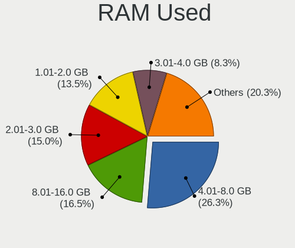
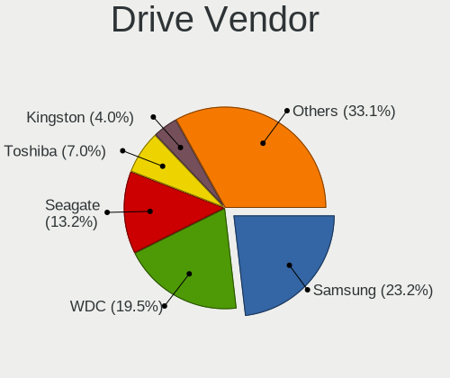
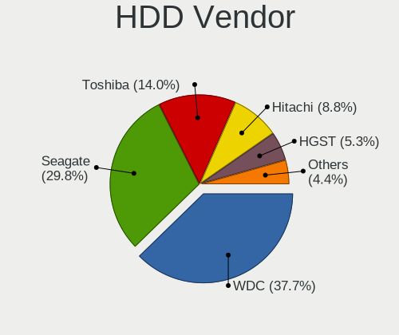
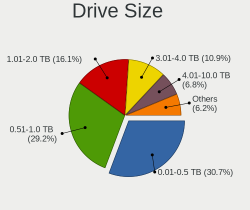
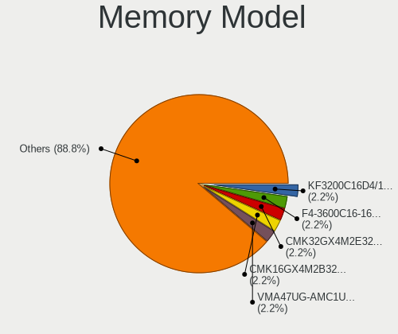
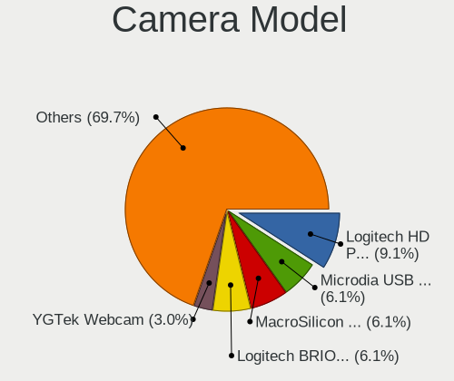

Gentoo 2.8 - Tested Hardware & Statistics (Desktops)
----------------------------------------------------

A project to collect tested hardware configurations for Gentoo 2.8.

Anyone can contribute to this report by the [hw-probe](https://github.com/linuxhw/hw-probe) tool:

    sudo -E hw-probe -all -upload

Please contribute! Especially if your hardware is rare.

Contents
--------

* [ Test Cases ](#test-cases)

* [ System ](#system)
  - [ Kernel                   ](#kernel)
  - [ Kernel Family            ](#kernel-family)
  - [ Kernel Major Ver.        ](#kernel-major-ver)
  - [ Arch                     ](#arch)
  - [ DE                       ](#de)
  - [ Display Server           ](#display-server)
  - [ Display Manager          ](#display-manager)
  - [ OS Lang                  ](#os-lang)
  - [ Boot Mode                ](#boot-mode)
  - [ Filesystem               ](#filesystem)
  - [ Part. scheme             ](#part-scheme)
  - [ Dual Boot with Linux/BSD ](#dual-boot-with-linuxbsd)
  - [ Dual Boot (Win)          ](#dual-boot-win)

* [ Board ](#board)
  - [ Vendor                   ](#vendor)
  - [ Model                    ](#model)
  - [ Model Family             ](#model-family)
  - [ MFG Year                 ](#mfg-year)
  - [ Form Factor              ](#form-factor)
  - [ Secure Boot              ](#secure-boot)
  - [ Coreboot                 ](#coreboot)
  - [ RAM Size                 ](#ram-size)
  - [ RAM Used                 ](#ram-used)
  - [ Total Drives             ](#total-drives)
  - [ Has CD-ROM               ](#has-cd-rom)
  - [ Has Ethernet             ](#has-ethernet)
  - [ Has WiFi                 ](#has-wifi)
  - [ Has Bluetooth            ](#has-bluetooth)

* [ Location ](#location)
  - [ Country                  ](#country)
  - [ City                     ](#city)

* [ Drives ](#drives)
  - [ Drive Vendor             ](#drive-vendor)
  - [ Drive Model              ](#drive-model)
  - [ HDD Vendor               ](#hdd-vendor)
  - [ SSD Vendor               ](#ssd-vendor)
  - [ Drive Kind               ](#drive-kind)
  - [ Drive Connector          ](#drive-connector)
  - [ Drive Size               ](#drive-size)
  - [ Space Total              ](#space-total)
  - [ Space Used               ](#space-used)
  - [ Malfunc. Drives          ](#malfunc-drives)
  - [ Malfunc. Drive Vendor    ](#malfunc-drive-vendor)
  - [ Malfunc. HDD Vendor      ](#malfunc-hdd-vendor)
  - [ Malfunc. Drive Kind      ](#malfunc-drive-kind)
  - [ Failed Drives            ](#failed-drives)
  - [ Failed Drive Vendor      ](#failed-drive-vendor)
  - [ Drive Status             ](#drive-status)

* [ Storage controller ](#storage-controller)
  - [ Storage Vendor           ](#storage-vendor)
  - [ Storage Model            ](#storage-model)
  - [ Storage Kind             ](#storage-kind)

* [ Processor ](#processor)
  - [ CPU Vendor               ](#cpu-vendor)
  - [ CPU Model                ](#cpu-model)
  - [ CPU Model Family         ](#cpu-model-family)
  - [ CPU Cores                ](#cpu-cores)
  - [ CPU Sockets              ](#cpu-sockets)
  - [ CPU Threads              ](#cpu-threads)
  - [ CPU Op-Modes             ](#cpu-op-modes)
  - [ CPU Microcode            ](#cpu-microcode)
  - [ CPU Microarch            ](#cpu-microarch)

* [ Graphics ](#graphics)
  - [ GPU Vendor               ](#gpu-vendor)
  - [ GPU Model                ](#gpu-model)
  - [ GPU Combo                ](#gpu-combo)
  - [ GPU Driver               ](#gpu-driver)
  - [ GPU Memory               ](#gpu-memory)

* [ Monitor ](#monitor)
  - [ Monitor Vendor           ](#monitor-vendor)
  - [ Monitor Model            ](#monitor-model)
  - [ Monitor Resolution       ](#monitor-resolution)
  - [ Monitor Diagonal         ](#monitor-diagonal)
  - [ Monitor Width            ](#monitor-width)
  - [ Aspect Ratio             ](#aspect-ratio)
  - [ Monitor Area             ](#monitor-area)
  - [ Pixel Density            ](#pixel-density)
  - [ Multiple Monitors        ](#multiple-monitors)

* [ Network ](#network)
  - [ Net Controller Vendor    ](#net-controller-vendor)
  - [ Net Controller Model     ](#net-controller-model)
  - [ Wireless Vendor          ](#wireless-vendor)
  - [ Wireless Model           ](#wireless-model)
  - [ Ethernet Vendor          ](#ethernet-vendor)
  - [ Ethernet Model           ](#ethernet-model)
  - [ Net Controller Kind      ](#net-controller-kind)
  - [ Used Controller          ](#used-controller)
  - [ NICs                     ](#nics)
  - [ IPv6                     ](#ipv6)

* [ Bluetooth ](#bluetooth)
  - [ Bluetooth Vendor         ](#bluetooth-vendor)
  - [ Bluetooth Model          ](#bluetooth-model)

* [ Sound ](#sound)
  - [ Sound Vendor             ](#sound-vendor)
  - [ Sound Model              ](#sound-model)

* [ Memory ](#memory)
  - [ Memory Vendor            ](#memory-vendor)
  - [ Memory Model             ](#memory-model)
  - [ Memory Kind              ](#memory-kind)
  - [ Memory Form Factor       ](#memory-form-factor)
  - [ Memory Size              ](#memory-size)
  - [ Memory Speed             ](#memory-speed)

* [ Printers & scanners ](#printers--scanners)
  - [ Printer Vendor           ](#printer-vendor)
  - [ Printer Model            ](#printer-model)
  - [ Scanner Vendor           ](#scanner-vendor)
  - [ Scanner Model            ](#scanner-model)

* [ Camera ](#camera)
  - [ Camera Vendor            ](#camera-vendor)
  - [ Camera Model             ](#camera-model)

* [ Security ](#security)
  - [ Fingerprint Vendor       ](#fingerprint-vendor)
  - [ Fingerprint Model        ](#fingerprint-model)
  - [ Chipcard Vendor          ](#chipcard-vendor)
  - [ Chipcard Model           ](#chipcard-model)

* [ Unsupported ](#unsupported)
  - [ Unsupported Devices      ](#unsupported-devices)
  - [ Unsupported Device Types ](#unsupported-device-types)

Test Cases
----------

Total: 206

| Vendor   | Model                       | Probe                                                      | Date         |
|----------|-----------------------------|------------------------------------------------------------|--------------|
| ASRock   | X370 Professional Gaming    | [cff46cb07b](https://linux-hardware.org/?probe=cff46cb07b) | Feb 24, 2023 |
| Apple    | Mac-F221BEC8                | [f2fe1d140e](https://linux-hardware.org/?probe=f2fe1d140e) | Nov 26, 2022 |
| ASUSTek  | M3A78-CM                    | [74a3983b1e](https://linux-hardware.org/?probe=74a3983b1e) | Nov 18, 2022 |
| Gigabyte | AB350-Gaming-CF             | [7f21362848](https://linux-hardware.org/?probe=7f21362848) | Nov 14, 2022 |
| Apple    | Mac-F221BEC8                | [cd18d68895](https://linux-hardware.org/?probe=cd18d68895) | Nov 13, 2022 |
| ASUSTek  | M3A78-CM                    | [a8f533624d](https://linux-hardware.org/?probe=a8f533624d) | Nov 08, 2022 |
| Gigabyte | AB350-Gaming-CF             | [159ca02eca](https://linux-hardware.org/?probe=159ca02eca) | Nov 07, 2022 |
| ASRock   | B550 Extreme4               | [16154018bb](https://linux-hardware.org/?probe=16154018bb) | Nov 06, 2022 |
| Unknown  | X79-P3                      | [f069ed7bd9](https://linux-hardware.org/?probe=f069ed7bd9) | Nov 04, 2022 |
| MSI      | H310M PRO-VDH PLUS          | [7b65a89d4f](https://linux-hardware.org/?probe=7b65a89d4f) | Nov 04, 2022 |
| ASUSTek  | ROG Maximus XI HERO         | [9a7d0e6d37](https://linux-hardware.org/?probe=9a7d0e6d37) | Nov 03, 2022 |
| ASUSTek  | ROG Maximus XI HERO         | [81a04d40a3](https://linux-hardware.org/?probe=81a04d40a3) | Nov 03, 2022 |
| Gigabyte | Z370 AORUS Ultra Gaming-... | [953e399168](https://linux-hardware.org/?probe=953e399168) | Nov 03, 2022 |
| ASRock   | N68C-GS UCC                 | [9430ecf81c](https://linux-hardware.org/?probe=9430ecf81c) | Nov 02, 2022 |
| ASUSTek  | M3A78-CM                    | [5f81698e9a](https://linux-hardware.org/?probe=5f81698e9a) | Nov 02, 2022 |
| MSI      | MEG X570 UNIFY              | [1a88842782](https://linux-hardware.org/?probe=1a88842782) | Nov 01, 2022 |
| Gigabyte | X570 AORUS ELITE            | [966eb5bb18](https://linux-hardware.org/?probe=966eb5bb18) | Oct 31, 2022 |
| Gigabyte | X570 AORUS ELITE            | [860f45c4c1](https://linux-hardware.org/?probe=860f45c4c1) | Oct 31, 2022 |
| Gigabyte | AB350-Gaming-CF             | [c085788e44](https://linux-hardware.org/?probe=c085788e44) | Oct 31, 2022 |
| ASUSTek  | ROG STRIX X570-E GAMING     | [98fe919d0e](https://linux-hardware.org/?probe=98fe919d0e) | Oct 29, 2022 |
| ASUSTek  | ROG STRIX X570-E GAMING     | [9a6e9239e1](https://linux-hardware.org/?probe=9a6e9239e1) | Oct 29, 2022 |
| Gigabyte | X570 AORUS ELITE            | [836d9e4de1](https://linux-hardware.org/?probe=836d9e4de1) | Oct 29, 2022 |
| Gigabyte | X570 AORUS ELITE            | [b7b7481628](https://linux-hardware.org/?probe=b7b7481628) | Oct 29, 2022 |
| ASUSTek  | PRIME B550M-A               | [64e6199c96](https://linux-hardware.org/?probe=64e6199c96) | Oct 25, 2022 |
| ASUSTek  | ROG STRIX X670E-E GAMING... | [cc2fc1e863](https://linux-hardware.org/?probe=cc2fc1e863) | Oct 24, 2022 |
| ASUSTek  | M3A78-CM                    | [ce77ed764b](https://linux-hardware.org/?probe=ce77ed764b) | Oct 24, 2022 |
| Gigabyte | AB350-Gaming-CF             | [d18380bf4c](https://linux-hardware.org/?probe=d18380bf4c) | Oct 24, 2022 |
| Gigabyte | TRX40 DESIGNARE             | [16f90b14dc](https://linux-hardware.org/?probe=16f90b14dc) | Oct 22, 2022 |
| ASUSTek  | TUF Gaming X570-PLUS        | [b89b177dd7](https://linux-hardware.org/?probe=b89b177dd7) | Oct 22, 2022 |
| Gigabyte | F2A88XM-DS2                 | [d066cccd5a](https://linux-hardware.org/?probe=d066cccd5a) | Oct 19, 2022 |
| MSI      | B450M PRO-VDH MAX           | [71ab3d919c](https://linux-hardware.org/?probe=71ab3d919c) | Oct 18, 2022 |
| ASUSTek  | M3A78-CM                    | [e8377da07e](https://linux-hardware.org/?probe=e8377da07e) | Oct 17, 2022 |
| Gigabyte | Z370 AORUS Gaming 5-CF      | [843e47e886](https://linux-hardware.org/?probe=843e47e886) | Oct 14, 2022 |
| ASUSTek  | M4A89GTD-PRO/USB3           | [f57f16d11b](https://linux-hardware.org/?probe=f57f16d11b) | Oct 13, 2022 |
| ASUSTek  | M4A89GTD-PRO/USB3           | [55e6578ade](https://linux-hardware.org/?probe=55e6578ade) | Oct 13, 2022 |
| Gigabyte | H81M-H                      | [63731688d0](https://linux-hardware.org/?probe=63731688d0) | Oct 13, 2022 |
| ASUSTek  | ROG STRIX X670E-I GAMING... | [11fb952122](https://linux-hardware.org/?probe=11fb952122) | Oct 10, 2022 |
| ASUSTek  | M3A78-CM                    | [b04149c5ea](https://linux-hardware.org/?probe=b04149c5ea) | Oct 10, 2022 |
| Gigabyte | AB350-Gaming-CF             | [d7bcf0afa3](https://linux-hardware.org/?probe=d7bcf0afa3) | Oct 09, 2022 |
| ASUSTek  | M3A78-CM                    | [6437ed8b0e](https://linux-hardware.org/?probe=6437ed8b0e) | Oct 03, 2022 |
| Gigabyte | AB350-Gaming-CF             | [60bab6fe12](https://linux-hardware.org/?probe=60bab6fe12) | Oct 02, 2022 |
| ASUSTek  | ROG STRIX Z590-E GAMING ... | [b3b8d3e04f](https://linux-hardware.org/?probe=b3b8d3e04f) | Sep 26, 2022 |
| ASUSTek  | ROG STRIX Z590-E GAMING ... | [9795d4f9aa](https://linux-hardware.org/?probe=9795d4f9aa) | Sep 26, 2022 |
| ASUSTek  | M3A78-CM                    | [6d3f575c3d](https://linux-hardware.org/?probe=6d3f575c3d) | Sep 26, 2022 |
| Gigabyte | AB350-Gaming-CF             | [c447921f07](https://linux-hardware.org/?probe=c447921f07) | Sep 25, 2022 |
| ASRock   | J3160M                      | [c9cc54f48e](https://linux-hardware.org/?probe=c9cc54f48e) | Sep 25, 2022 |
| ASUSTek  | ROG STRIX X570-I GAMING     | [d22f082243](https://linux-hardware.org/?probe=d22f082243) | Sep 21, 2022 |
| ASUSTek  | ROG STRIX X570-I GAMING     | [e4f1a8245a](https://linux-hardware.org/?probe=e4f1a8245a) | Sep 21, 2022 |
| ASUSTek  | AM1M-A                      | [a6e61a9993](https://linux-hardware.org/?probe=a6e61a9993) | Sep 19, 2022 |
| ASUSTek  | M3A78-CM                    | [eb1c0556c3](https://linux-hardware.org/?probe=eb1c0556c3) | Sep 19, 2022 |
| Gigabyte | AB350-Gaming-CF             | [5a9ab0de04](https://linux-hardware.org/?probe=5a9ab0de04) | Sep 18, 2022 |
| ASUSTek  | ROG STRIX B550-F GAMING     | [d4d8cc3f34](https://linux-hardware.org/?probe=d4d8cc3f34) | Sep 16, 2022 |
| Gigabyte | Z590 UD                     | [475ed7f917](https://linux-hardware.org/?probe=475ed7f917) | Sep 15, 2022 |
| ASUSTek  | ROG STRIX B450-F GAMING     | [7ad1180946](https://linux-hardware.org/?probe=7ad1180946) | Sep 14, 2022 |
| ASUSTek  | M3A78-CM                    | [225bd59ba7](https://linux-hardware.org/?probe=225bd59ba7) | Sep 12, 2022 |
| Gigabyte | AB350-Gaming-CF             | [ed5273b278](https://linux-hardware.org/?probe=ed5273b278) | Sep 11, 2022 |
| Intel    | X79G V2.x                   | [3cb7aa6549](https://linux-hardware.org/?probe=3cb7aa6549) | Sep 11, 2022 |
| MSI      | B450M MORTAR                | [2e0d41f272](https://linux-hardware.org/?probe=2e0d41f272) | Sep 10, 2022 |
| MSI      | B450M MORTAR                | [06ee689632](https://linux-hardware.org/?probe=06ee689632) | Sep 10, 2022 |
| ASUSTek  | ROG CROSSHAIR VIII HERO     | [5cfe072b9c](https://linux-hardware.org/?probe=5cfe072b9c) | Sep 10, 2022 |
| ASRock   | Z390 Phantom Gaming 4S      | [146e7ebf49](https://linux-hardware.org/?probe=146e7ebf49) | Sep 08, 2022 |
| Gigabyte | B660 GAMING X AX DDR4       | [3d12a72937](https://linux-hardware.org/?probe=3d12a72937) | Sep 06, 2022 |
| MSI      | B450 TOMAHAWK MAX II        | [cc1fde17e8](https://linux-hardware.org/?probe=cc1fde17e8) | Sep 06, 2022 |
| Gigabyte | AB350-Gaming-CF             | [1d90e3b685](https://linux-hardware.org/?probe=1d90e3b685) | Sep 05, 2022 |
| ASUSTek  | M3A78-CM                    | [d146908413](https://linux-hardware.org/?probe=d146908413) | Aug 31, 2022 |
| ASRock   | X370 Gaming X               | [e915bb3a8c](https://linux-hardware.org/?probe=e915bb3a8c) | Aug 29, 2022 |
| Gigabyte | AB350-Gaming-CF             | [499889da7e](https://linux-hardware.org/?probe=499889da7e) | Aug 28, 2022 |
| ASRock   | X370 Gaming X               | [489691c2e3](https://linux-hardware.org/?probe=489691c2e3) | Aug 28, 2022 |
| Lenovo   | 3716 SDK0R32862 WIN 3258... | [7e810b23be](https://linux-hardware.org/?probe=7e810b23be) | Aug 26, 2022 |
| Gigabyte | Z77X-D3H                    | [294fe7d6c8](https://linux-hardware.org/?probe=294fe7d6c8) | Aug 24, 2022 |
| Gigabyte | Z77X-D3H                    | [2952e542e1](https://linux-hardware.org/?probe=2952e542e1) | Aug 24, 2022 |
| ASUSTek  | TUF Gaming X570-PLUS        | [0df091061c](https://linux-hardware.org/?probe=0df091061c) | Aug 24, 2022 |
| ASUSTek  | M3A78-CM                    | [d22f756c4c](https://linux-hardware.org/?probe=d22f756c4c) | Aug 24, 2022 |
| ASUSTek  | TUF Gaming X570-PLUS        | [0c80683e2a](https://linux-hardware.org/?probe=0c80683e2a) | Aug 23, 2022 |
| Gigabyte | AB350-Gaming-CF             | [f38202db0d](https://linux-hardware.org/?probe=f38202db0d) | Aug 21, 2022 |
| MSI      | Z590-A PRO                  | [8445aa0041](https://linux-hardware.org/?probe=8445aa0041) | Aug 20, 2022 |
| ASUSTek  | M3A78-CM                    | [1ea309e90c](https://linux-hardware.org/?probe=1ea309e90c) | Aug 17, 2022 |
| Gigabyte | B450 GAMING X               | [80760b8e4b](https://linux-hardware.org/?probe=80760b8e4b) | Aug 16, 2022 |
| Gigabyte | AB350-Gaming-CF             | [48637ddb10](https://linux-hardware.org/?probe=48637ddb10) | Aug 14, 2022 |
| MSI      | B450 TOMAHAWK               | [8d95c82a1d](https://linux-hardware.org/?probe=8d95c82a1d) | Aug 12, 2022 |
| MSI      | B450 GAMING PRO CARBON A... | [7d7ceef044](https://linux-hardware.org/?probe=7d7ceef044) | Aug 12, 2022 |
| Unknown  | QNAP TS-221                 | [8d3f7ca9cf](https://linux-hardware.org/?probe=8d3f7ca9cf) | Aug 10, 2022 |
| ASUSTek  | PRIME Z390-A                | [2781a13b80](https://linux-hardware.org/?probe=2781a13b80) | Aug 10, 2022 |
| ASRock   | P67 Extreme4 Gen3           | [b94e1be5ab](https://linux-hardware.org/?probe=b94e1be5ab) | Aug 09, 2022 |
| ASUSTek  | M3A78-CM                    | [1f10876798](https://linux-hardware.org/?probe=1f10876798) | Aug 08, 2022 |
| Gigabyte | AB350-Gaming-CF             | [ac538e23dc](https://linux-hardware.org/?probe=ac538e23dc) | Aug 07, 2022 |
| ASUSTek  | TUF B450M-PLUS GAMING       | [3e7a65077d](https://linux-hardware.org/?probe=3e7a65077d) | Aug 06, 2022 |
| Gigabyte | B450 GAMING X               | [b875ef6dbf](https://linux-hardware.org/?probe=b875ef6dbf) | Aug 04, 2022 |
| ASUSTek  | ROG STRIX X570-E GAMING     | [3db1e1ee37](https://linux-hardware.org/?probe=3db1e1ee37) | Aug 03, 2022 |
| Gigabyte | B550M DS3H                  | [69188053f5](https://linux-hardware.org/?probe=69188053f5) | Aug 02, 2022 |
| ASRock   | B75M-GL R2.0                | [eed9f05678](https://linux-hardware.org/?probe=eed9f05678) | Aug 01, 2022 |
| ASUSTek  | ROG Maximus Z690 EXTREME    | [effa59ed64](https://linux-hardware.org/?probe=effa59ed64) | Aug 01, 2022 |
| ASRock   | B550M Steel Legend          | [0ac4f27d0f](https://linux-hardware.org/?probe=0ac4f27d0f) | Jul 31, 2022 |
| ASUSTek  | TUF Gaming X570-PLUS        | [f22250f00c](https://linux-hardware.org/?probe=f22250f00c) | Jul 31, 2022 |
| ASUSTek  | M3A78-CM                    | [1051593809](https://linux-hardware.org/?probe=1051593809) | Jul 31, 2022 |
| Gigabyte | 970A-DS3                    | [78f00bd2aa](https://linux-hardware.org/?probe=78f00bd2aa) | Jul 30, 2022 |
| Lenovo   | 1046 SDK0T08861 WIN 3305... | [d3d824f468](https://linux-hardware.org/?probe=d3d824f468) | Jul 29, 2022 |
| MSI      | B450M MORTAR                | [29a26324b9](https://linux-hardware.org/?probe=29a26324b9) | Jul 29, 2022 |
| Intel    | D54250WYK H13922-303        | [5ff32931fa](https://linux-hardware.org/?probe=5ff32931fa) | Jul 27, 2022 |
| MSI      | MPG Z390 GAMING PRO CARB... | [dc7eff27cf](https://linux-hardware.org/?probe=dc7eff27cf) | Jul 26, 2022 |
| ASRock   | X399 Taichi                 | [d2eb8a032b](https://linux-hardware.org/?probe=d2eb8a032b) | Jul 26, 2022 |
| ASUSTek  | ROG Maximus XI HERO         | [c98fed5f84](https://linux-hardware.org/?probe=c98fed5f84) | Jul 25, 2022 |
| ASUSTek  | ROG Maximus Z690 EXTREME    | [dae325b47b](https://linux-hardware.org/?probe=dae325b47b) | Jul 25, 2022 |
| ASUSTek  | M3A78-CM                    | [e1e16aa154](https://linux-hardware.org/?probe=e1e16aa154) | Jul 25, 2022 |
| Gigabyte | AB350-Gaming-CF             | [153acd77c2](https://linux-hardware.org/?probe=153acd77c2) | Jul 24, 2022 |
| ASRock   | AM1H-ITX                    | [a15c82ba0c](https://linux-hardware.org/?probe=a15c82ba0c) | Jul 24, 2022 |
| Unknown  | QNAP TS-221                 | [fb3741faab](https://linux-hardware.org/?probe=fb3741faab) | Jul 21, 2022 |
| ASRock   | X570 Taichi                 | [56d5853243](https://linux-hardware.org/?probe=56d5853243) | Jul 19, 2022 |
| MSI      | MEG X570 UNIFY              | [d3d26541f1](https://linux-hardware.org/?probe=d3d26541f1) | Jul 19, 2022 |
| Gigabyte | AB350-Gaming-CF             | [8f2f1582e8](https://linux-hardware.org/?probe=8f2f1582e8) | Jul 17, 2022 |
| ASUSTek  | M3A78-CM                    | [056d74f1a9](https://linux-hardware.org/?probe=056d74f1a9) | Jul 17, 2022 |
| ASUSTek  | ROG STRIX B560-I GAMING ... | [e6b6d3b5e6](https://linux-hardware.org/?probe=e6b6d3b5e6) | Jul 16, 2022 |
| ASUSTek  | ROG STRIX B560-I GAMING ... | [93f8a4ce9f](https://linux-hardware.org/?probe=93f8a4ce9f) | Jul 16, 2022 |
| Gigabyte | Z590 UD                     | [e9e0b50bbb](https://linux-hardware.org/?probe=e9e0b50bbb) | Jul 15, 2022 |
| MSI      | Z87-G45 GAMING              | [8602f7246a](https://linux-hardware.org/?probe=8602f7246a) | Jul 12, 2022 |
| Gigabyte | B450 AORUS M                | [6d15b85193](https://linux-hardware.org/?probe=6d15b85193) | Jul 10, 2022 |
| Dell     | 0J3C2F A02                  | [dccb88852f](https://linux-hardware.org/?probe=dccb88852f) | Jul 10, 2022 |
| ASUSTek  | M3A78-CM                    | [0237c9df10](https://linux-hardware.org/?probe=0237c9df10) | Jul 10, 2022 |
| ASUSTek  | ROG STRIX B550-F GAMING     | [85dbd84c37](https://linux-hardware.org/?probe=85dbd84c37) | Jul 09, 2022 |
| Dell     | 0J3C2F A02                  | [aa87616696](https://linux-hardware.org/?probe=aa87616696) | Jul 09, 2022 |
| ASUSTek  | ROG CROSSHAIR VIII DARK ... | [685e3d36bc](https://linux-hardware.org/?probe=685e3d36bc) | Jul 04, 2022 |
| ASUSTek  | ROG CROSSHAIR VIII DARK ... | [b436712f17](https://linux-hardware.org/?probe=b436712f17) | Jul 04, 2022 |
| ASUSTek  | ROG Maximus XI HERO         | [d442c531e8](https://linux-hardware.org/?probe=d442c531e8) | Jul 03, 2022 |
| Gigabyte | Z690 AORUS MASTER           | [cf8784ac23](https://linux-hardware.org/?probe=cf8784ac23) | Jul 03, 2022 |
| ASUSTek  | PRIME Z390-A                | [1af80d1cdb](https://linux-hardware.org/?probe=1af80d1cdb) | Jul 01, 2022 |
| ASUSTek  | M3A78-CM                    | [4c0fa03f61](https://linux-hardware.org/?probe=4c0fa03f61) | Jun 28, 2022 |
| Gigabyte | AB350-Gaming-CF             | [79dca3a17c](https://linux-hardware.org/?probe=79dca3a17c) | Jun 26, 2022 |
| Fujitsu  | D3417-B2 S26361-D3417-B2    | [f03dcf744a](https://linux-hardware.org/?probe=f03dcf744a) | Jun 26, 2022 |
| Gigabyte | Z590 UD                     | [74060af6fc](https://linux-hardware.org/?probe=74060af6fc) | Jun 23, 2022 |
| Gigabyte | AB350-Gaming-CF             | [2028b239fc](https://linux-hardware.org/?probe=2028b239fc) | Jun 19, 2022 |
| ASUSTek  | M3A78-CM                    | [20c198dd50](https://linux-hardware.org/?probe=20c198dd50) | Jun 19, 2022 |
| ASUSTek  | TUF Gaming X570-PLUS        | [fe7fa5fe7a](https://linux-hardware.org/?probe=fe7fa5fe7a) | Jun 17, 2022 |
| ASUSTek  | M3A78-CM                    | [59350b295e](https://linux-hardware.org/?probe=59350b295e) | Jun 13, 2022 |
| Gigabyte | AB350-Gaming-CF             | [223b882103](https://linux-hardware.org/?probe=223b882103) | Jun 12, 2022 |
| ASUSTek  | ROG STRIX B450-F GAMING     | [80a6dc4a46](https://linux-hardware.org/?probe=80a6dc4a46) | Jun 09, 2022 |
| Pegatron | 2ACE                        | [838cad5bc2](https://linux-hardware.org/?probe=838cad5bc2) | Jun 06, 2022 |
| Dell     | 0KWVT8 A03                  | [5745c8b787](https://linux-hardware.org/?probe=5745c8b787) | Jun 06, 2022 |
| Gigabyte | AB350-Gaming-CF             | [cb81a60917](https://linux-hardware.org/?probe=cb81a60917) | Jun 05, 2022 |
| Unknown  | Unknown                     | [c6f9883076](https://linux-hardware.org/?probe=c6f9883076) | Jun 05, 2022 |
| Unknown  | Unknown                     | [4abb49be35](https://linux-hardware.org/?probe=4abb49be35) | Jun 04, 2022 |
| MSI      | X570-A PRO                  | [102ed915c5](https://linux-hardware.org/?probe=102ed915c5) | Jun 02, 2022 |
| ASUSTek  | TUF Gaming Z690-PLUS WIF... | [2c33cbbbe2](https://linux-hardware.org/?probe=2c33cbbbe2) | May 30, 2022 |
| ASUSTek  | Z170-A                      | [86021dcc38](https://linux-hardware.org/?probe=86021dcc38) | May 27, 2022 |
| ASUSTek  | Z170-A                      | [b8603fccc0](https://linux-hardware.org/?probe=b8603fccc0) | May 26, 2022 |
| MSI      | PRO Z690-A DDR4             | [38ac6de56d](https://linux-hardware.org/?probe=38ac6de56d) | May 25, 2022 |
| ASRock   | B450 Gaming K4              | [af256d7649](https://linux-hardware.org/?probe=af256d7649) | May 24, 2022 |
| ASUSTek  | PRIME X570-PRO              | [f7225b80ed](https://linux-hardware.org/?probe=f7225b80ed) | May 18, 2022 |
| ASUSTek  | PRIME X570-PRO              | [84a0dc5b83](https://linux-hardware.org/?probe=84a0dc5b83) | May 18, 2022 |
| ASUSTek  | ROG Maximus XIII APEX       | [56fb967887](https://linux-hardware.org/?probe=56fb967887) | May 16, 2022 |
| Dell     | 0J3C2F A02                  | [07e2cea31c](https://linux-hardware.org/?probe=07e2cea31c) | May 13, 2022 |
| Gigabyte | Z590 UD                     | [2fcf37c00a](https://linux-hardware.org/?probe=2fcf37c00a) | May 11, 2022 |
| Dell     | 0J3C2F A02                  | [bd6c3ca5b4](https://linux-hardware.org/?probe=bd6c3ca5b4) | May 09, 2022 |
| ASRock   | X370 Gaming X               | [b24677a908](https://linux-hardware.org/?probe=b24677a908) | May 01, 2022 |
| MSI      | MPG Z390 GAMING PRO CARB... | [07a115654d](https://linux-hardware.org/?probe=07a115654d) | Apr 30, 2022 |
| Dell     | 0J37VM A00                  | [76f13aa200](https://linux-hardware.org/?probe=76f13aa200) | Apr 28, 2022 |
| ASUSTek  | ROG STRIX B550-F GAMING     | [6af0b2a3c9](https://linux-hardware.org/?probe=6af0b2a3c9) | Apr 21, 2022 |
| MSI      | Z390-A PRO                  | [4121c8fcc2](https://linux-hardware.org/?probe=4121c8fcc2) | Apr 20, 2022 |
| ASUSTek  | PRIME H570M-PLUS            | [5e6ce90c93](https://linux-hardware.org/?probe=5e6ce90c93) | Apr 13, 2022 |
| MSI      | B450-A PRO MAX              | [cfd276f151](https://linux-hardware.org/?probe=cfd276f151) | Apr 13, 2022 |
| ASUSTek  | ROG Maximus XIII APEX       | [7a26d3fc81](https://linux-hardware.org/?probe=7a26d3fc81) | Apr 12, 2022 |
| Gigabyte | H470 HD3                    | [5ce5c54ecd](https://linux-hardware.org/?probe=5ce5c54ecd) | Apr 09, 2022 |
| ASUSTek  | P6X58D-E                    | [68be7a767a](https://linux-hardware.org/?probe=68be7a767a) | Apr 07, 2022 |
| ASUSTek  | TUF Gaming B550-PLUS        | [403a6830d9](https://linux-hardware.org/?probe=403a6830d9) | Apr 04, 2022 |
| ASRock   | Z170A-X1                    | [9e1cc71d24](https://linux-hardware.org/?probe=9e1cc71d24) | Mar 31, 2022 |
| MSI      | MAG B550M MORTAR            | [9ebb4c0fd3](https://linux-hardware.org/?probe=9ebb4c0fd3) | Mar 31, 2022 |
| Gigabyte | Z590 UD                     | [5cde1a4e83](https://linux-hardware.org/?probe=5cde1a4e83) | Mar 24, 2022 |
| ASUSTek  | ROG STRIX Z370-H GAMING     | [6dddf500c7](https://linux-hardware.org/?probe=6dddf500c7) | Mar 22, 2022 |
| MSI      | MAG B550M MORTAR            | [593bf6f937](https://linux-hardware.org/?probe=593bf6f937) | Mar 21, 2022 |
| ASUSTek  | Z170 PRO GAMING             | [6efb7791bb](https://linux-hardware.org/?probe=6efb7791bb) | Mar 19, 2022 |
| ASUSTek  | ROG STRIX Z390-E GAMING     | [70021af77a](https://linux-hardware.org/?probe=70021af77a) | Mar 15, 2022 |
| Dell     | 0J37VM A00                  | [a78d4c99e3](https://linux-hardware.org/?probe=a78d4c99e3) | Mar 09, 2022 |
| ASUSTek  | TUF Gaming X570-PRO         | [44656b1bd4](https://linux-hardware.org/?probe=44656b1bd4) | Mar 03, 2022 |
| Gigabyte | Z590 UD                     | [a5242ed058](https://linux-hardware.org/?probe=a5242ed058) | Feb 26, 2022 |
| Gigabyte | Z590 UD                     | [071dd25266](https://linux-hardware.org/?probe=071dd25266) | Feb 24, 2022 |
| ASUSTek  | ROG CROSSHAIR VIII DARK ... | [5836ccecc2](https://linux-hardware.org/?probe=5836ccecc2) | Feb 10, 2022 |
| Gigabyte | Z490 UD                     | [b571c22d4f](https://linux-hardware.org/?probe=b571c22d4f) | Feb 04, 2022 |
| MSI      | MPG B550 GAMING PLUS        | [d424a8e145](https://linux-hardware.org/?probe=d424a8e145) | Feb 01, 2022 |
| MSI      | MPG B550 GAMING PLUS        | [89dbe92caf](https://linux-hardware.org/?probe=89dbe92caf) | Feb 01, 2022 |
| ASRock   | AB350M Pro4                 | [6b7cf2d570](https://linux-hardware.org/?probe=6b7cf2d570) | Jan 27, 2022 |
| Gigabyte | B450M S2H                   | [656da02110](https://linux-hardware.org/?probe=656da02110) | Jan 24, 2022 |
| Gigabyte | B450M S2H                   | [1721bed3e1](https://linux-hardware.org/?probe=1721bed3e1) | Jan 24, 2022 |
| Gigabyte | Z490 UD                     | [eac4639ad2](https://linux-hardware.org/?probe=eac4639ad2) | Jan 22, 2022 |
| EVGA     | Z390 DARK                   | [7672395a1c](https://linux-hardware.org/?probe=7672395a1c) | Dec 24, 2021 |
| ASUSTek  | P5LD2-Deluxe                | [a2ee48eeb1](https://linux-hardware.org/?probe=a2ee48eeb1) | Dec 16, 2021 |
| MSI      | MPG Z690 EDGE WIFI DDR4     | [b92f432637](https://linux-hardware.org/?probe=b92f432637) | Dec 07, 2021 |
| MSI      | MPG Z690 EDGE WIFI DDR4     | [d8f50aaa2e](https://linux-hardware.org/?probe=d8f50aaa2e) | Dec 07, 2021 |
| ASUSTek  | TUF B450-PLUS GAMING        | [6649bea1f8](https://linux-hardware.org/?probe=6649bea1f8) | Dec 04, 2021 |
| ASUSTek  | TUF B450-PLUS GAMING        | [723e2a158a](https://linux-hardware.org/?probe=723e2a158a) | Dec 03, 2021 |
| ASRock   | H110M-HDV R3.0              | [e155882ffa](https://linux-hardware.org/?probe=e155882ffa) | Dec 02, 2021 |
| ASUSTek  | ROG STRIX X570-E GAMING     | [e2c087b9c7](https://linux-hardware.org/?probe=e2c087b9c7) | Nov 21, 2021 |
| ASUSTek  | PRIME X570-P                | [eafa22145d](https://linux-hardware.org/?probe=eafa22145d) | Nov 15, 2021 |
| ASUSTek  | TUF GAMING B550-PLUS        | [2900821ed3](https://linux-hardware.org/?probe=2900821ed3) | Nov 14, 2021 |
| ASUSTek  | ROG STRIX B550-F GAMING     | [4cfb74fb42](https://linux-hardware.org/?probe=4cfb74fb42) | Nov 14, 2021 |
| ASUSTek  | ROG ZENITH II EXTREME       | [6f308039a8](https://linux-hardware.org/?probe=6f308039a8) | Nov 06, 2021 |
| MSI      | H110M PRO-D                 | [cb3dcdd186](https://linux-hardware.org/?probe=cb3dcdd186) | Nov 02, 2021 |
| MSI      | H110M PRO-D                 | [b53420c26a](https://linux-hardware.org/?probe=b53420c26a) | Nov 02, 2021 |
| ASUSTek  | ROG STRIX B550-F GAMING     | [161865edb0](https://linux-hardware.org/?probe=161865edb0) | Oct 30, 2021 |
| ASUSTek  | ROG STRIX B550-F GAMING     | [a4806aa50f](https://linux-hardware.org/?probe=a4806aa50f) | Oct 30, 2021 |
| ASUSTek  | Z170-A                      | [aea7d9561e](https://linux-hardware.org/?probe=aea7d9561e) | Oct 29, 2021 |
| ASRock   | X370 Gaming X               | [0f4ae74d8e](https://linux-hardware.org/?probe=0f4ae74d8e) | Oct 29, 2021 |
| ASRock   | X370 Gaming X               | [f3f75352e4](https://linux-hardware.org/?probe=f3f75352e4) | Oct 29, 2021 |
| ASUSTek  | ROG CROSSHAIR VIII HERO     | [e9cc487951](https://linux-hardware.org/?probe=e9cc487951) | Oct 28, 2021 |
| Gigabyte | X570 AORUS MASTER           | [58e3f9c07f](https://linux-hardware.org/?probe=58e3f9c07f) | Oct 23, 2021 |
| ASUSTek  | ROG CROSSHAIR VIII HERO     | [eb02a6d4d5](https://linux-hardware.org/?probe=eb02a6d4d5) | Oct 20, 2021 |
| ASRock   | X370 Killer SLI/ac          | [2e4c1c4527](https://linux-hardware.org/?probe=2e4c1c4527) | Oct 17, 2021 |
| Gigabyte | Z87X-UD3H-CF                | [9901023f19](https://linux-hardware.org/?probe=9901023f19) | Oct 03, 2021 |

System
------

Kernel
------

Version of the Linux kernel

| Version                      | Desktops | Percent |
|------------------------------|----------|---------|
| 5.15.59-gentoo               | 6        | 4.29%   |
| 5.15.52-gentoo-x86_64        | 5        | 3.57%   |
| 5.15.41-gentoo               | 5        | 3.57%   |
| 5.15.52-gentoo               | 4        | 2.86%   |
| 5.15.41-gentoo-x86_64        | 4        | 2.86%   |
| 5.17.1-gentoo-r1             | 3        | 2.14%   |
| 5.15.59-gentoo-x86_64        | 3        | 2.14%   |
| 5.19.0-gentoo                | 2        | 1.43%   |
| 5.18.14-gentoo-x86_64        | 2        | 1.43%   |
| 5.18.10-gentoo               | 2        | 1.43%   |
| 5.17.0-gentoo                | 2        | 1.43%   |
| 5.16.11-gentoo-x86_64        | 2        | 1.43%   |
| 5.15.74-gentoo-dist          | 2        | 1.43%   |
| 5.15.74-gentoo               | 2        | 1.43%   |
| 5.15.69-gentoo               | 2        | 1.43%   |
| 5.15.52-gentoo-dist          | 2        | 1.43%   |
| 5.15.10-gentoo               | 2        | 1.43%   |
| 5.14.13-gentoo               | 2        | 1.43%   |
| 5.14.12-gentoo               | 2        | 1.43%   |
| 6.0.7-gentoo                 | 1        | 0.71%   |
| 6.0.6-gentoo_ap              | 1        | 0.71%   |
| 6.0.0-Phaco-g8f10ff49057f    | 1        | 0.71%   |
| 6.0.0                        | 1        | 0.71%   |
| 5.19.9-x86_64                | 1        | 0.71%   |
| 5.19.9-gentoo-x86_64         | 1        | 0.71%   |
| 5.19.9-gentoo                | 1        | 0.71%   |
| 5.19.8-xanmod1               | 1        | 0.71%   |
| 5.19.8-gentoo-clang-lto-prjc | 1        | 0.71%   |
| 5.19.7-gentoo-x86_64         | 1        | 0.71%   |
| 5.19.6-gentoo-x86_64         | 1        | 0.71%   |
| 5.19.16-lqx4-SPStudio        | 1        | 0.71%   |
| 5.19.16-gentoo               | 1        | 0.71%   |
| 5.19.11-renacuajo            | 1        | 0.71%   |
| 5.19.1-gentoo-a6             | 1        | 0.71%   |
| 5.19.0-xanmod1-x86_64        | 1        | 0.71%   |
| 5.19.0-gentoo-x86_64         | 1        | 0.71%   |
| 5.19.0-gentoo-carbon         | 1        | 0.71%   |
| 5.18.9-gentoo-x86_64         | 1        | 0.71%   |
| 5.18.9-gentoo                | 1        | 0.71%   |
| 5.18.7-gentoo                | 1        | 0.71%   |

Kernel Family
-------------

Linux kernel without a distro release

| Version | Desktops | Percent |
|---------|----------|---------|
| 5.15.52 | 12       | 8.57%   |
| 5.15.41 | 10       | 7.14%   |
| 5.15.59 | 9        | 6.43%   |
| 5.19.0  | 5        | 3.57%   |
| 5.15.74 | 5        | 3.57%   |
| 5.18.10 | 4        | 2.86%   |
| 5.17.1  | 4        | 2.86%   |
| 5.15.69 | 4        | 2.86%   |
| 5.19.9  | 3        | 2.14%   |
| 5.18.14 | 3        | 2.14%   |
| 5.17.7  | 3        | 2.14%   |
| 5.17.0  | 3        | 2.14%   |
| 5.15.75 | 3        | 2.14%   |
| 6.0.0   | 2        | 1.43%   |
| 5.19.8  | 2        | 1.43%   |
| 5.19.16 | 2        | 1.43%   |
| 5.18.9  | 2        | 1.43%   |
| 5.18.6  | 2        | 1.43%   |
| 5.18.15 | 2        | 1.43%   |
| 5.17.9  | 2        | 1.43%   |
| 5.17.3  | 2        | 1.43%   |
| 5.17.2  | 2        | 1.43%   |
| 5.16.14 | 2        | 1.43%   |
| 5.16.11 | 2        | 1.43%   |
| 5.15.72 | 2        | 1.43%   |
| 5.15.2  | 2        | 1.43%   |
| 5.15.10 | 2        | 1.43%   |
| 5.14.14 | 2        | 1.43%   |
| 5.14.13 | 2        | 1.43%   |
| 5.14.12 | 2        | 1.43%   |
| 6.0.7   | 1        | 0.71%   |
| 6.0.6   | 1        | 0.71%   |
| 5.19.7  | 1        | 0.71%   |
| 5.19.6  | 1        | 0.71%   |
| 5.19.11 | 1        | 0.71%   |
| 5.19.1  | 1        | 0.71%   |
| 5.18.7  | 1        | 0.71%   |
| 5.18.3  | 1        | 0.71%   |
| 5.18.1  | 1        | 0.71%   |
| 5.18.0  | 1        | 0.71%   |

Kernel Major Ver.
-----------------

Linux kernel major version

| Version | Desktops | Percent |
|---------|----------|---------|
| 5.15    | 52       | 40.63%  |
| 5.19    | 16       | 12.5%   |
| 5.18    | 16       | 12.5%   |
| 5.17    | 15       | 11.72%  |
| 5.16    | 11       | 8.59%   |
| 5.14    | 9        | 7.03%   |
| 6.0     | 4        | 3.13%   |
| 5.10    | 3        | 2.34%   |
| 4.9     | 1        | 0.78%   |
| 4.14    | 1        | 0.78%   |

Arch
----

OS architecture (x86_64, i586, etc.)

| Name     | Desktops | Percent |
|----------|----------|---------|
| x86_64   | 115      | 98.29%  |
| ppc      | 1        | 0.85%   |
| armv5tel | 1        | 0.85%   |

DE
--

Desktop Environment

| Name     | Desktops | Percent |
|----------|----------|---------|
| KDE5     | 39       | 32.77%  |
| Unknown  | 35       | 29.41%  |
| GNOME    | 23       | 19.33%  |
| XFCE     | 8        | 6.72%   |
| MATE     | 4        | 3.36%   |
| i3       | 2        | 1.68%   |
| DWM      | 2        | 1.68%   |
| Cinnamon | 2        | 1.68%   |
| LXQt     | 1        | 0.84%   |
| KDE      | 1        | 0.84%   |
| Hyprland | 1        | 0.84%   |
| awesome  | 1        | 0.84%   |

Display Server
--------------

X11 or Wayland

| Name    | Desktops | Percent |
|---------|----------|---------|
| X11     | 58       | 47.93%  |
| Wayland | 24       | 19.83%  |
| Tty     | 22       | 18.18%  |
| Unknown | 17       | 14.05%  |

Display Manager
---------------

SDDM, LightDM, etc.

| Name    | Desktops | Percent |
|---------|----------|---------|
| Unknown | 44       | 36.97%  |
| SDDM    | 39       | 32.77%  |
| LightDM | 14       | 11.76%  |
| GDM     | 14       | 11.76%  |
| LXDM    | 4        | 3.36%   |
| XDM     | 2        | 1.68%   |
| SLiM    | 2        | 1.68%   |

OS Lang
-------

Language

| Lang       | Desktops | Percent |
|------------|----------|---------|
| en_US      | 42       | 35.9%   |
| en_GB      | 14       | 11.97%  |
| Unknown    | 12       | 10.26%  |
| C.UTF8     | 10       | 8.55%   |
| de_DE      | 8        | 6.84%   |
| ru_RU      | 7        | 5.98%   |
| pl_PL      | 4        | 3.42%   |
| en_CA      | 3        | 2.56%   |
| pt_BR      | 2        | 1.71%   |
| fr_FR      | 2        | 1.71%   |
| es_ES      | 2        | 1.71%   |
| C          | 2        | 1.71%   |
| zh_TW      | 1        | 0.85%   |
| sl_SI      | 1        | 0.85%   |
| ja_JP      | 1        | 0.85%   |
| it_IT      | 1        | 0.85%   |
| es_MX      | 1        | 0.85%   |
| en_US.UTF8 | 1        | 0.85%   |
| el_GR      | 1        | 0.85%   |
| de_CH      | 1        | 0.85%   |
| cs_CZ      | 1        | 0.85%   |

Boot Mode
---------

EFI or BIOS

| Mode | Desktops | Percent |
|------|----------|---------|
| EFI  | 103      | 86.55%  |
| BIOS | 16       | 13.45%  |

Filesystem
----------

Type of filesystem

| Type     | Desktops | Percent |
|----------|----------|---------|
| Ext4     | 66       | 56.41%  |
| Btrfs    | 27       | 23.08%  |
| F2fs     | 9        | 7.69%   |
| Zfs      | 5        | 4.27%   |
| Xfs      | 5        | 4.27%   |
| XXXXXXX  | 3        | 2.56%   |
| XXX      | 1        | 0.85%   |
| Reiserfs | 1        | 0.85%   |

Part. scheme
------------

Scheme of partitioning

| Type    | Desktops | Percent |
|---------|----------|---------|
| GPT     | 111      | 93.28%  |
| Unknown | 6        | 5.04%   |
| MBR     | 2        | 1.68%   |

Dual Boot with Linux/BSD
------------------------

Hosting more than one Linux/BSD

| Dual boot | Desktops | Percent |
|-----------|----------|---------|
| No        | 65       | 55.08%  |
| Yes       | 53       | 44.92%  |

Dual Boot (Win)
---------------

Hosting Linux and Windows

| Dual boot | Desktops | Percent |
|-----------|----------|---------|
| No        | 66       | 56.41%  |
| Yes       | 51       | 43.59%  |

Board
-----

Vendor
------

Motherboard manufacturer

| Name                | Desktops | Percent |
|---------------------|----------|---------|
| ASUSTek Computer    | 45       | 38.46%  |
| MSI                 | 20       | 17.09%  |
| Gigabyte Technology | 20       | 17.09%  |
| ASRock              | 17       | 14.53%  |
| Dell                | 3        | 2.56%   |
| Unknown             | 3        | 2.56%   |
| Lenovo              | 2        | 1.71%   |
| Intel               | 2        | 1.71%   |
| Apple               | 2        | 1.71%   |
| Pegatron            | 1        | 0.85%   |
| Fujitsu             | 1        | 0.85%   |
| EVGA                | 1        | 0.85%   |

Model
-----

Motherboard model

| Name                                | Desktops | Percent |
|-------------------------------------|----------|---------|
| ASUS TUF Gaming X570-PLUS           | 3        | 2.56%   |
| ASUS ROG STRIX X570-E GAMING        | 3        | 2.56%   |
| ASUS ROG STRIX B550-F GAMING        | 3        | 2.56%   |
| Unknown                             | 3        | 2.56%   |
| MSI MS-7C35                         | 2        | 1.71%   |
| MSI MS-7C02                         | 2        | 1.71%   |
| MSI MS-7B89                         | 2        | 1.71%   |
| ASUS Z170-A                         | 2        | 1.71%   |
| ASUS TUF Gaming B550-PLUS           | 2        | 1.71%   |
| ASUS ROG STRIX B450-F GAMING        | 2        | 1.71%   |
| ASUS ROG CROSSHAIR VIII HERO        | 2        | 1.71%   |
| ASUS ROG CROSSHAIR VIII DARK HERO   | 2        | 1.71%   |
| Apple MacPro5,1                     | 2        | 1.71%   |
| Pegatron 810-170st                  | 1        | 0.85%   |
| MSI MS-7D31                         | 1        | 0.85%   |
| MSI MS-7D25                         | 1        | 0.85%   |
| MSI MS-7D09                         | 1        | 0.85%   |
| MSI MS-7C94                         | 1        | 0.85%   |
| MSI MS-7C56                         | 1        | 0.85%   |
| MSI MS-7C37                         | 1        | 0.85%   |
| MSI MS-7C09                         | 1        | 0.85%   |
| MSI MS-7B98                         | 1        | 0.85%   |
| MSI MS-7B86                         | 1        | 0.85%   |
| MSI MS-7B85                         | 1        | 0.85%   |
| MSI MS-7B17                         | 1        | 0.85%   |
| MSI MS-7A38                         | 1        | 0.85%   |
| MSI MS-7996                         | 1        | 0.85%   |
| MSI MS-7821                         | 1        | 0.85%   |
| Lenovo ThinkStation P620 30E0001TGE | 1        | 0.85%   |
| Lenovo Legion T5 26AMR5 90RB0002US  | 1        | 0.85%   |
| Intel X79                           | 1        | 0.85%   |
| Intel D54250WYK H13922-303          | 1        | 0.85%   |
| Gigabyte Z87X-UD3H                  | 1        | 0.85%   |
| Gigabyte Z77X-D3H                   | 1        | 0.85%   |
| Gigabyte Z690 AORUS MASTER          | 1        | 0.85%   |
| Gigabyte Z590 UD                    | 1        | 0.85%   |
| Gigabyte Z490 UD                    | 1        | 0.85%   |
| Gigabyte Z370 AORUS Ultra Gaming    | 1        | 0.85%   |
| Gigabyte Z370 AORUS Gaming 5        | 1        | 0.85%   |
| Gigabyte X570 AORUS MASTER          | 1        | 0.85%   |

Model Family
------------

Motherboard model prefix

| Name                | Desktops | Percent |
|---------------------|----------|---------|
| ASUS ROG            | 23       | 19.66%  |
| ASUS TUF            | 9        | 7.69%   |
| ASUS PRIME          | 5        | 4.27%   |
| ASRock X370         | 3        | 2.56%   |
| Unknown             | 3        | 2.56%   |
| MSI MS-7C35         | 2        | 1.71%   |
| MSI MS-7C02         | 2        | 1.71%   |
| MSI MS-7B89         | 2        | 1.71%   |
| Gigabyte Z370       | 2        | 1.71%   |
| Gigabyte X570       | 2        | 1.71%   |
| Gigabyte B450       | 2        | 1.71%   |
| Dell OptiPlex       | 2        | 1.71%   |
| ASUS Z170-A         | 2        | 1.71%   |
| Apple MacPro5       | 2        | 1.71%   |
| Pegatron 810-170st  | 1        | 0.85%   |
| MSI MS-7D31         | 1        | 0.85%   |
| MSI MS-7D25         | 1        | 0.85%   |
| MSI MS-7D09         | 1        | 0.85%   |
| MSI MS-7C94         | 1        | 0.85%   |
| MSI MS-7C56         | 1        | 0.85%   |
| MSI MS-7C37         | 1        | 0.85%   |
| MSI MS-7C09         | 1        | 0.85%   |
| MSI MS-7B98         | 1        | 0.85%   |
| MSI MS-7B86         | 1        | 0.85%   |
| MSI MS-7B85         | 1        | 0.85%   |
| MSI MS-7B17         | 1        | 0.85%   |
| MSI MS-7A38         | 1        | 0.85%   |
| MSI MS-7996         | 1        | 0.85%   |
| MSI MS-7821         | 1        | 0.85%   |
| Lenovo ThinkStation | 1        | 0.85%   |
| Lenovo Legion       | 1        | 0.85%   |
| Intel X79           | 1        | 0.85%   |
| Intel D54250WYK     | 1        | 0.85%   |
| Gigabyte Z87X-UD3H  | 1        | 0.85%   |
| Gigabyte Z77X-D3H   | 1        | 0.85%   |
| Gigabyte Z690       | 1        | 0.85%   |
| Gigabyte Z590       | 1        | 0.85%   |
| Gigabyte Z490       | 1        | 0.85%   |
| Gigabyte TRX40      | 1        | 0.85%   |
| Gigabyte H81M-H     | 1        | 0.85%   |

MFG Year
--------

Motherboard manufacture year

| Year    | Desktops | Percent |
|---------|----------|---------|
| 2020    | 21       | 17.95%  |
| 2019    | 21       | 17.95%  |
| 2018    | 18       | 15.38%  |
| 2021    | 14       | 11.97%  |
| 2017    | 9        | 7.69%   |
| 2013    | 6        | 5.13%   |
| 2010    | 5        | 4.27%   |
| 2022    | 4        | 3.42%   |
| 2016    | 4        | 3.42%   |
| 2014    | 4        | 3.42%   |
| 2015    | 3        | 2.56%   |
| 2012    | 2        | 1.71%   |
| 2011    | 2        | 1.71%   |
| Unknown | 2        | 1.71%   |
| 2008    | 1        | 0.85%   |
| 2005    | 1        | 0.85%   |

Form Factor
-----------

Physical design of the computer

| Name    | Desktops | Percent |
|---------|----------|---------|
| Desktop | 117      | 100%    |

Secure Boot
-----------

Enabled or disabled

| State    | Desktops | Percent |
|----------|----------|---------|
| Disabled | 115      | 97.46%  |
| Enabled  | 3        | 2.54%   |

Coreboot
--------

Have coreboot on board

| Used | Desktops | Percent |
|------|----------|---------|
| No   | 117      | 100%    |

RAM Size
--------

Total RAM memory

| Size in GB  | Desktops | Percent |
|-------------|----------|---------|
| 32.01-64.0  | 49       | 41.88%  |
| 64.01-256.0 | 27       | 23.08%  |
| 16.01-24.0  | 19       | 16.24%  |
| 24.01-32.0  | 7        | 5.98%   |
| 4.01-8.0    | 6        | 5.13%   |
| 8.01-16.0   | 6        | 5.13%   |
| 0.51-1.0    | 2        | 1.71%   |
| 2.01-3.0    | 1        | 0.85%   |

RAM Used
--------

Used RAM memory

| Used GB    | Desktops | Percent |
|------------|----------|---------|
| 4.01-8.0   | 35       | 26.32%  |
| 8.01-16.0  | 22       | 16.54%  |
| 2.01-3.0   | 20       | 15.04%  |
| 1.01-2.0   | 18       | 13.53%  |
| 3.01-4.0   | 11       | 8.27%   |
| 16.01-24.0 | 9        | 6.77%   |
| 0.51-1.0   | 7        | 5.26%   |
| 0.01-0.5   | 5        | 3.76%   |
| 24.01-32.0 | 3        | 2.26%   |
| 32.01-64.0 | 2        | 1.5%    |
| 0          | 1        | 0.75%   |

Total Drives
------------

Number of drives on board

| Drives | Desktops | Percent |
|--------|----------|---------|
| 2      | 35       | 29.41%  |
| 3      | 27       | 22.69%  |
| 4      | 14       | 11.76%  |
| 5      | 13       | 10.92%  |
| 1      | 13       | 10.92%  |
| 6      | 8        | 6.72%   |
| 7      | 6        | 5.04%   |
| 12     | 2        | 1.68%   |
| 9      | 1        | 0.84%   |

Has CD-ROM
----------

Has CD-ROM on board

| Presented | Desktops | Percent |
|-----------|----------|---------|
| No        | 99       | 83.19%  |
| Yes       | 20       | 16.81%  |

Has Ethernet
------------

Has Ethernet on board

| Presented | Desktops | Percent |
|-----------|----------|---------|
| Yes       | 115      | 98.29%  |
| No        | 2        | 1.71%   |

Has WiFi
--------

Has WiFi module

| Presented | Desktops | Percent |
|-----------|----------|---------|
| Yes       | 61       | 51.69%  |
| No        | 57       | 48.31%  |

Has Bluetooth
-------------

Has Bluetooth module

| Presented | Desktops | Percent |
|-----------|----------|---------|
| Yes       | 67       | 56.78%  |
| No        | 51       | 43.22%  |

Location
--------

Country
-------

Geographic location (country)

| Country     | Desktops | Percent |
|-------------|----------|---------|
| USA         | 31       | 26.5%   |
| Germany     | 20       | 17.09%  |
| Russia      | 12       | 10.26%  |
| Poland      | 9        | 7.69%   |
| UK          | 6        | 5.13%   |
| Canada      | 5        | 4.27%   |
| Switzerland | 3        | 2.56%   |
| Spain       | 3        | 2.56%   |
| Czechia     | 3        | 2.56%   |
| Mexico      | 2        | 1.71%   |
| France      | 2        | 1.71%   |
| China       | 2        | 1.71%   |
| Brazil      | 2        | 1.71%   |
| Tunisia     | 1        | 0.85%   |
| Taiwan      | 1        | 0.85%   |
| Slovenia    | 1        | 0.85%   |
| Slovakia    | 1        | 0.85%   |
| Romania     | 1        | 0.85%   |
| Netherlands | 1        | 0.85%   |
| Malaysia    | 1        | 0.85%   |
| Japan       | 1        | 0.85%   |
| Ireland     | 1        | 0.85%   |
| India       | 1        | 0.85%   |
| Hong Kong   | 1        | 0.85%   |
| Greece      | 1        | 0.85%   |
| Finland     | 1        | 0.85%   |
| Belarus     | 1        | 0.85%   |
| Bangladesh  | 1        | 0.85%   |
| Australia   | 1        | 0.85%   |
| Argentina   | 1        | 0.85%   |

City
----

Geographic location (city)

| City                    | Desktops | Percent |
|-------------------------|----------|---------|
| Moscow                  | 6        | 5%      |
| Los Angeles             | 4        | 3.33%   |
| Swansea                 | 3        | 2.5%    |
| Cieszyn                 | 3        | 2.5%    |
| Berlin                  | 3        | 2.5%    |
| Zurich                  | 2        | 1.67%   |
| Warsaw                  | 2        | 1.67%   |
| Vancouver               | 2        | 1.67%   |
| Seattle                 | 2        | 1.67%   |
| Yekaterinburg           | 1        | 0.83%   |
| Wyszkw                | 1        | 0.83%   |
| Wroclaw                 | 1        | 0.83%   |
| Wrentham                | 1        | 0.83%   |
| Weatherford             | 1        | 0.83%   |
| Warren                  | 1        | 0.83%   |
| Vladivostok             | 1        | 0.83%   |
| Villanueva del Pardillo | 1        | 0.83%   |
| Vigo                    | 1        | 0.83%   |
| Ufa                     | 1        | 0.83%   |
| Troisdorf               | 1        | 0.83%   |
| Trnava                  | 1        | 0.83%   |
| Toronto                 | 1        | 0.83%   |
| Tonbridge               | 1        | 0.83%   |
| Thibodaux               | 1        | 0.83%   |
| Texas City              | 1        | 0.83%   |
| Taichung City           | 1        | 0.83%   |
| Sydney                  | 1        | 0.83%   |
| Svobodnyy               | 1        | 0.83%   |
| Stuttgart               | 1        | 0.83%   |
| Sterling                | 1        | 0.83%   |
| Stasi Las               | 1        | 0.83%   |
| St. Cloud               | 1        | 0.83%   |
| St Petersburg           | 1        | 0.83%   |
| St Louis                | 1        | 0.83%   |
| Schwieberdingen         | 1        | 0.83%   |
| Sao Paulo               | 1        | 0.83%   |
| Santa Teresinha         | 1        | 0.83%   |
| Sankt Wendel            | 1        | 0.83%   |
| San Antonio             | 1        | 0.83%   |
| Rostock                 | 1        | 0.83%   |

Drives
------

Drive Vendor
------------

Hard drive vendors

| Vendor                    | Desktops | Drives | Percent |
|---------------------------|----------|--------|---------|
| Samsung Electronics       | 63       | 132    | 23.16%  |
| WDC                       | 53       | 88     | 19.49%  |
| Seagate                   | 36       | 82     | 13.24%  |
| Toshiba                   | 19       | 30     | 6.99%   |
| Kingston                  | 11       | 20     | 4.04%   |
| SanDisk                   | 10       | 14     | 3.68%   |
| Hitachi                   | 10       | 28     | 3.68%   |
| Crucial                   | 9        | 17     | 3.31%   |
| Intel                     | 7        | 9      | 2.57%   |
| HGST                      | 6        | 7      | 2.21%   |
| A-DATA Technology         | 6        | 7      | 2.21%   |
| Corsair                   | 5        | 6      | 1.84%   |
| Phison                    | 4        | 6      | 1.47%   |
| OCZ                       | 4        | 4      | 1.47%   |
| GOODRAM                   | 3        | 11     | 1.1%    |
| Silicon Motion            | 2        | 4      | 0.74%   |
| KIOXIA-EXCERIA            | 2        | 3      | 0.74%   |
| Kingchuxing               | 2        | 5      | 0.74%   |
| ADATA Technology          | 2        | 2      | 0.74%   |
| Unknown                   | 1        | 1      | 0.37%   |
| Transcend                 | 1        | 1      | 0.37%   |
| Team                      | 1        | 3      | 0.37%   |
| T-FORCE                   | 1        | 6      | 0.37%   |
| SK hynix                  | 1        | 2      | 0.37%   |
| Seagate Technology        | 1        | 1      | 0.37%   |
| Realtek Semiconductor     | 1        | 1      | 0.37%   |
| PNY                       | 1        | 1      | 0.37%   |
| Plextor                   | 1        | 2      | 0.37%   |
| Phison Electronics        | 1        | 1      | 0.37%   |
| Patriot                   | 1        | 1      | 0.37%   |
| OCZ-VERTEX                | 1        | 1      | 0.37%   |
| Micron/Crucial Technology | 1        | 1      | 0.37%   |
| Maxtor                    | 1        | 1      | 0.37%   |
| LaCie                     | 1        | 2      | 0.37%   |
| Fujitsu                   | 1        | 1      | 0.37%   |
| Dyconn H                  | 1        | 1      | 0.37%   |
| Apacer                    | 1        | 1      | 0.37%   |

Drive Model
-----------

Hard drive models

| Model                                              | Desktops | Percent |
|----------------------------------------------------|----------|---------|
| Samsung SSD 860 EVO 1TB                            | 6        | 1.69%   |
| Samsung SSD 970 EVO 500GB                          | 5        | 1.41%   |
| WDC WD40EZRZ-00GXCB0 4TB                           | 4        | 1.13%   |
| Toshiba DT01ACA100 1TB                             | 4        | 1.13%   |
| Samsung SSD 980 PRO 1TB                            | 4        | 1.13%   |
| Samsung SSD 970 EVO Plus 500GB                     | 4        | 1.13%   |
| Samsung SSD 870 EVO 1TB                            | 4        | 1.13%   |
| Samsung SSD 850 EVO 500GB                          | 4        | 1.13%   |
| Samsung SSD 850 EVO 250GB                          | 4        | 1.13%   |
| Kingston SA400S37240G 240GB SSD                    | 4        | 1.13%   |
| WDC WD30EFRX-68EUZN0 3TB                           | 3        | 0.85%   |
| Seagate ST4000DM004-2CV104 4TB                     | 3        | 0.85%   |
| Seagate ST2000DM006-2DM164 2TB                     | 3        | 0.85%   |
| Samsung SSD 980 PRO 2TB                            | 3        | 0.85%   |
| Samsung SSD 980 1TB                                | 3        | 0.85%   |
| Samsung SSD 970 EVO Plus 2TB                       | 3        | 0.85%   |
| Samsung NVMe SSD Controller PM9A1/PM9A3/980PRO 1TB | 3        | 0.85%   |
| Crucial CT2000MX500SSD1 2TB                        | 3        | 0.85%   |
| Crucial CT1000MX500SSD1 1TB                        | 3        | 0.85%   |
| WDC WDS500G2B0A-00SM50 500GB SSD                   | 2        | 0.56%   |
| WDC WDS100T2B0A-00SM50 1TB SSD                     | 2        | 0.56%   |
| WDC WD30EFRX-68AX9N0 3TB                           | 2        | 0.56%   |
| WDC WD2003FZEX-00SRLA0 2TB                         | 2        | 0.56%   |
| WDC WD10EZRZ-00HTKB0 1TB                           | 2        | 0.56%   |
| WDC WD10EZEX-08WN4A0 1TB                           | 2        | 0.56%   |
| WDC WD10EZEX-08M2NA0 1TB                           | 2        | 0.56%   |
| Toshiba HDWD110 1TB                                | 2        | 0.56%   |
| Seagate ST500DM002-1BD142 500GB                    | 2        | 0.56%   |
| Seagate ST4000DM005-2DP166 4TB                     | 2        | 0.56%   |
| Seagate ST4000DM000-1F2168 4TB                     | 2        | 0.56%   |
| Seagate ST3500630AS 500GB                          | 2        | 0.56%   |
| Seagate ST2000DM001-1ER164 2TB                     | 2        | 0.56%   |
| Seagate ST2000DM001-1CH164 2TB                     | 2        | 0.56%   |
| Samsung SSD 980 PRO 500GB                          | 2        | 0.56%   |
| Samsung SSD 970 PRO 1TB                            | 2        | 0.56%   |
| Samsung SSD 970 EVO Plus 250GB                     | 2        | 0.56%   |
| Samsung SSD 970 EVO Plus 1TB                       | 2        | 0.56%   |
| Samsung SSD 970 EVO 250GB                          | 2        | 0.56%   |
| Samsung SSD 870 EVO 500GB                          | 2        | 0.56%   |
| Samsung SSD 860 QVO 2TB                            | 2        | 0.56%   |

HDD Vendor
----------

Hard disk drive vendors

| Vendor              | Desktops | Drives | Percent |
|---------------------|----------|--------|---------|
| WDC                 | 43       | 72     | 37.72%  |
| Seagate             | 34       | 79     | 29.82%  |
| Toshiba             | 16       | 25     | 14.04%  |
| Hitachi             | 10       | 28     | 8.77%   |
| HGST                | 6        | 7      | 5.26%   |
| Samsung Electronics | 1        | 1      | 0.88%   |
| Maxtor              | 1        | 1      | 0.88%   |
| LaCie               | 1        | 2      | 0.88%   |
| Fujitsu             | 1        | 1      | 0.88%   |
| Dyconn H            | 1        | 1      | 0.88%   |

SSD Vendor
----------

Solid state drive vendors

| Vendor              | Desktops | Drives | Percent |
|---------------------|----------|--------|---------|
| Samsung Electronics | 38       | 58     | 40%     |
| Kingston            | 9        | 18     | 9.47%   |
| SanDisk             | 8        | 10     | 8.42%   |
| Crucial             | 8        | 14     | 8.42%   |
| WDC                 | 7        | 8      | 7.37%   |
| OCZ                 | 4        | 4      | 4.21%   |
| Corsair             | 4        | 5      | 4.21%   |
| Intel               | 3        | 3      | 3.16%   |
| GOODRAM             | 3        | 11     | 3.16%   |
| A-DATA Technology   | 3        | 3      | 3.16%   |
| Transcend           | 1        | 1      | 1.05%   |
| Toshiba             | 1        | 2      | 1.05%   |
| T-FORCE             | 1        | 6      | 1.05%   |
| PNY                 | 1        | 1      | 1.05%   |
| Patriot             | 1        | 1      | 1.05%   |
| OCZ-VERTEX          | 1        | 1      | 1.05%   |
| Kingchuxing         | 1        | 1      | 1.05%   |
| Apacer              | 1        | 1      | 1.05%   |

Drive Kind
----------

HDD or SSD

| Kind    | Desktops | Drives | Percent |
|---------|----------|--------|---------|
| HDD     | 79       | 217    | 34.96%  |
| NVMe    | 73       | 137    | 32.3%   |
| SSD     | 73       | 148    | 32.3%   |
| Unknown | 1        | 1      | 0.44%   |

Drive Connector
---------------

SATA, SAS, NVMe, etc.

| Type | Desktops | Drives | Percent |
|------|----------|--------|---------|
| SATA | 108      | 360    | 58.7%   |
| NVMe | 73       | 137    | 39.67%  |
| SAS  | 3        | 6      | 1.63%   |

Drive Size
----------

Size of hard drive

| Size in TB | Desktops | Drives | Percent |
|------------|----------|--------|---------|
| 0.01-0.5   | 59       | 117    | 30.73%  |
| 0.51-1.0   | 56       | 83     | 29.17%  |
| 1.01-2.0   | 31       | 49     | 16.15%  |
| 3.01-4.0   | 21       | 32     | 10.94%  |
| 4.01-10.0  | 13       | 49     | 6.77%   |
| 2.01-3.0   | 9        | 26     | 4.69%   |
| 10.01-20.0 | 3        | 9      | 1.56%   |

Space Total
-----------

Amount of disk space available on the file system

| Size in GB     | Desktops | Percent |
|----------------|----------|---------|
| More than 3000 | 24       | 19.83%  |
| 1001-2000      | 22       | 18.18%  |
| 501-1000       | 22       | 18.18%  |
| 251-500        | 15       | 12.4%   |
| 2001-3000      | 13       | 10.74%  |
| 101-250        | 8        | 6.61%   |
| 1-20           | 5        | 4.13%   |
| 51-100         | 5        | 4.13%   |
| Unknown        | 5        | 4.13%   |
| 21-50          | 2        | 1.65%   |

Space Used
----------

Amount of used disk space

| Used GB        | Desktops | Percent |
|----------------|----------|---------|
| 251-500        | 18       | 14.75%  |
| 1001-2000      | 18       | 14.75%  |
| 1-20           | 17       | 13.93%  |
| 501-1000       | 14       | 11.48%  |
| More than 3000 | 13       | 10.66%  |
| 101-250        | 13       | 10.66%  |
| 21-50          | 11       | 9.02%   |
| 51-100         | 9        | 7.38%   |
| Unknown        | 5        | 4.1%    |
| 2001-3000      | 4        | 3.28%   |

Malfunc. Drives
---------------

Drive models with a malfunction

| Model                                 | Desktops | Drives | Percent |
|---------------------------------------|----------|--------|---------|
| Samsung Electronics SSD 870 EVO 500GB | 2        | 2      | 5.71%   |
| WDC WD60EFRX-68L0BN1 6TB              | 1        | 3      | 2.86%   |
| WDC WD40EFRX-68N32N0 4TB              | 1        | 1      | 2.86%   |
| WDC WD30EFRX-68AX9N0 3TB              | 1        | 2      | 2.86%   |
| WDC WD20EZRX-00D8PB0 2TB              | 1        | 1      | 2.86%   |
| WDC WD20EFRX-68AX9N0 2TB              | 1        | 1      | 2.86%   |
| WDC WD20EARS-00J2GB0 2TB              | 1        | 1      | 2.86%   |
| WDC WD1600AAJS-75B4A0 160GB           | 1        | 1      | 2.86%   |
| WDC WD10EFRX-68JCSN0 1TB              | 1        | 1      | 2.86%   |
| WDC WD1002FBYS-18W8B0 1TB             | 1        | 1      | 2.86%   |
| Transcend TS512GSSD720 512GB          | 1        | 1      | 2.86%   |
| Toshiba HDWA120 2TB                   | 1        | 1      | 2.86%   |
| Seagate ST500DM002-1BD142 500GB       | 1        | 1      | 2.86%   |
| Seagate ST3250410AS 250GB             | 1        | 1      | 2.86%   |
| Seagate ST3160023AS 160GB             | 1        | 1      | 2.86%   |
| Seagate ST3000DM001-9YN166 3TB        | 1        | 1      | 2.86%   |
| Seagate ST2000DX001-1CM164 2TB        | 1        | 1      | 2.86%   |
| Seagate ST1000LM024 HN-M101MBB 1TB    | 1        | 1      | 2.86%   |
| Seagate ST10000VN0004-1ZD101 10TB     | 1        | 4      | 2.86%   |
| SanDisk SSD PLUS 1000GB               | 1        | 1      | 2.86%   |
| Samsung Electronics SSD 980 PRO 2TB   | 1        | 1      | 2.86%   |
| Samsung Electronics SSD 980 1TB       | 1        | 1      | 2.86%   |
| Samsung Electronics SSD 970 EVO 1TB   | 1        | 2      | 2.86%   |
| Samsung Electronics SSD 870 EVO 1TB   | 1        | 1      | 2.86%   |
| Samsung Electronics SSD 850 PRO 256GB | 1        | 4      | 2.86%   |
| Samsung Electronics HD103SJ 1TB       | 1        | 1      | 2.86%   |
| OCZ VERTEX4 128GB SSD                 | 1        | 1      | 2.86%   |
| Maxtor STM3160215A 160GB              | 1        | 1      | 2.86%   |
| Kingston SV100S2128G 128GB SSD        | 1        | 1      | 2.86%   |
| Hitachi HUA721010KLA330 1TB           | 1        | 1      | 2.86%   |
| Hitachi HTS541680J9SA00 80GB          | 1        | 1      | 2.86%   |
| Hitachi HDS722020ALA330 2TB           | 1        | 2      | 2.86%   |
| Crucial CT525MX300SSD1 528GB          | 1        | 1      | 2.86%   |
| Corsair Neutron GTX SSD 240GB         | 1        | 1      | 2.86%   |

Malfunc. Drive Vendor
---------------------

Vendors of faulty drives

| Vendor              | Desktops | Drives | Percent |
|---------------------|----------|--------|---------|
| WDC                 | 9        | 12     | 26.47%  |
| Seagate             | 7        | 10     | 20.59%  |
| Samsung Electronics | 7        | 12     | 20.59%  |
| Hitachi             | 3        | 4      | 8.82%   |
| Transcend           | 1        | 1      | 2.94%   |
| Toshiba             | 1        | 1      | 2.94%   |
| SanDisk             | 1        | 1      | 2.94%   |
| OCZ                 | 1        | 1      | 2.94%   |
| Maxtor              | 1        | 1      | 2.94%   |
| Kingston            | 1        | 1      | 2.94%   |
| Crucial             | 1        | 1      | 2.94%   |
| Corsair             | 1        | 1      | 2.94%   |

Malfunc. HDD Vendor
-------------------

Vendors of faulty HDD drives

| Vendor              | Desktops | Drives | Percent |
|---------------------|----------|--------|---------|
| WDC                 | 9        | 12     | 40.91%  |
| Seagate             | 7        | 10     | 31.82%  |
| Hitachi             | 3        | 4      | 13.64%  |
| Toshiba             | 1        | 1      | 4.55%   |
| Samsung Electronics | 1        | 1      | 4.55%   |
| Maxtor              | 1        | 1      | 4.55%   |

Malfunc. Drive Kind
-------------------

Kinds of faulty drives

| Kind | Desktops | Drives | Percent |
|------|----------|--------|---------|
| HDD  | 19       | 29     | 59.38%  |
| SSD  | 10       | 13     | 31.25%  |
| NVMe | 3        | 4      | 9.38%   |

Failed Drives
-------------

Failed drive models

| Model                            | Desktops | Drives | Percent |
|----------------------------------|----------|--------|---------|
| Toshiba THNSN5512GPUK NVMe 512GB | 1        | 1      | 100%    |

Failed Drive Vendor
-------------------

Failed drive vendors

| Vendor  | Desktops | Drives | Percent |
|---------|----------|--------|---------|
| Toshiba | 1        | 1      | 100%    |

Drive Status
------------

Number of failed and malfunc. drives

| Status   | Desktops | Drives | Percent |
|----------|----------|--------|---------|
| Works    | 109      | 419    | 72.67%  |
| Malfunc  | 29       | 46     | 19.33%  |
| Detected | 11       | 37     | 7.33%   |
| Failed   | 1        | 1      | 0.67%   |

Storage controller
------------------

Storage Vendor
--------------

Storage controller vendors

| Vendor                         | Desktops | Percent |
|--------------------------------|----------|---------|
| AMD                            | 64       | 29.22%  |
| Intel                          | 50       | 22.83%  |
| Samsung Electronics            | 42       | 19.18%  |
| SanDisk                        | 10       | 4.57%   |
| ASMedia Technology             | 10       | 4.57%   |
| Phison Electronics             | 7        | 3.2%    |
| ADATA Technology               | 5        | 2.28%   |
| Silicon Motion                 | 4        | 1.83%   |
| Marvell Technology Group       | 4        | 1.83%   |
| Toshiba America Info Systems   | 3        | 1.37%   |
| Seagate Technology             | 3        | 1.37%   |
| Micron/Crucial Technology      | 3        | 1.37%   |
| KIOXIA                         | 2        | 0.91%   |
| Kingston Technology Company    | 2        | 0.91%   |
| JMicron Technology             | 2        | 0.91%   |
| Broadcom / LSI                 | 2        | 0.91%   |
| Solid State Storage Technology | 1        | 0.46%   |
| SK hynix                       | 1        | 0.46%   |
| Silicon Image                  | 1        | 0.46%   |
| Realtek Semiconductor          | 1        | 0.46%   |
| Nvidia                         | 1        | 0.46%   |
| INNOGRIT                       | 1        | 0.46%   |

Storage Model
-------------

Storage controller models

| Model                                                                          | Desktops | Percent |
|--------------------------------------------------------------------------------|----------|---------|
| AMD FCH SATA Controller [AHCI mode]                                            | 44       | 17.81%  |
| Samsung NVMe SSD Controller SM981/PM981/PM983                                  | 26       | 10.53%  |
| AMD 400 Series Chipset SATA Controller                                         | 15       | 6.07%   |
| Samsung NVMe SSD Controller PM9A1/PM9A3/980PRO                                 | 13       | 5.26%   |
| AMD 500 Series Chipset SATA Controller                                         | 12       | 4.86%   |
| ASMedia ASM1062 Serial ATA Controller                                          | 9        | 3.64%   |
| Intel Q170/Q150/B150/H170/H110/Z170/CM236 Chipset SATA Controller [AHCI Mode]  | 7        | 2.83%   |
| Intel Cannon Lake PCH SATA AHCI Controller                                     | 7        | 2.83%   |
| Intel Alder Lake-S PCH SATA Controller [AHCI Mode]                             | 5        | 2.02%   |
| Intel 500 Series Chipset Family SATA AHCI Controller                           | 5        | 2.02%   |
| SanDisk WD Black SN750 / PC SN730 NVMe SSD                                     | 4        | 1.62%   |
| Intel 8 Series/C220 Series Chipset Family 6-port SATA Controller 1 [AHCI mode] | 4        | 1.62%   |
| Intel 200 Series PCH SATA controller [AHCI mode]                               | 4        | 1.62%   |
| ADATA XPG SX8200 Pro PCIe Gen3x4 M.2 2280 Solid State Drive                    | 4        | 1.62%   |
| Silicon Motion SM2263EN/SM2263XT SSD Controller                                | 3        | 1.21%   |
| Seagate FireCuda 520 SSD                                                       | 3        | 1.21%   |
| Samsung NVMe SSD Controller SM961/PM961/SM963                                  | 3        | 1.21%   |
| Samsung NVMe SSD Controller 980                                                | 3        | 1.21%   |
| Phison E16 PCIe4 NVMe Controller                                               | 3        | 1.21%   |
| Phison E12 NVMe Controller                                                     | 3        | 1.21%   |
| Intel Comet Lake SATA AHCI Controller                                          | 3        | 1.21%   |
| Intel C600/X79 series chipset 6-Port SATA AHCI Controller                      | 3        | 1.21%   |
| Intel 82801JI (ICH10 Family) SATA AHCI Controller                              | 3        | 1.21%   |
| AMD X370 Series Chipset SATA Controller                                        | 3        | 1.21%   |
| SanDisk WD Black 2018/SN750 / PC SN720 NVMe SSD                                | 2        | 0.81%   |
| Micron/Crucial NVMe Storage Controller                                         | 2        | 0.81%   |
| Marvell Group 88SE9172 SATA 6Gb/s Controller                                   | 2        | 0.81%   |
| Intel Volume Management Device NVMe RAID Controller                            | 2        | 0.81%   |
| Intel SSD Pro 7600p/760p/E 6100p Series                                        | 2        | 0.81%   |
| Intel 7 Series/C210 Series Chipset Family 6-port SATA Controller [AHCI mode]   | 2        | 0.81%   |
| AMD SB7x0/SB8x0/SB9x0 SATA Controller [AHCI mode]                              | 2        | 0.81%   |
| AMD 300 Series Chipset SATA Controller                                         | 2        | 0.81%   |
| Toshiba America Info Systems XG6 NVMe SSD Controller                           | 1        | 0.4%    |
| Toshiba America Info Systems XG4 NVMe SSD Controller                           | 1        | 0.4%    |
| Toshiba America Info Systems NVMe Controller                                   | 1        | 0.4%    |
| Solid State Storage Non-Volatile memory controller                             | 1        | 0.4%    |
| SK hynix Non-Volatile memory controller                                        | 1        | 0.4%    |
| Silicon Motion SM2262/SM2262EN SSD Controller                                  | 1        | 0.4%    |
| Silicon Image SiI 3132 Serial ATA Raid II Controller                           | 1        | 0.4%    |
| SanDisk WD PC SN810 / Black SN850 NVMe SSD                                     | 1        | 0.4%    |

Storage Kind
------------

Kind of storage controller (IDE, SATA, NVMe, SAS, ...)

| Kind | Desktops | Percent |
|------|----------|---------|
| SATA | 110      | 56.41%  |
| NVMe | 73       | 37.44%  |
| IDE  | 6        | 3.08%   |
| RAID | 4        | 2.05%   |
| SAS  | 2        | 1.03%   |

Processor
---------

CPU Vendor
----------

Processor vendors

| Vendor                | Desktops | Percent |
|-----------------------|----------|---------|
| AMD                   | 65       | 55.56%  |
| Intel                 | 50       | 42.74%  |
| PowerBook6,7          | 1        | 0.85%   |
| Marvell Semiconductor | 1        | 0.85%   |

CPU Model
---------

Processor models

| Model                                                                    | Desktops | Percent |
|--------------------------------------------------------------------------|----------|---------|
| AMD Ryzen 9 5900X 12-Core Processor                                      | 8        | 6.84%   |
| AMD Ryzen 9 5950X 16-Core Processor                                      | 6        | 5.13%   |
| Intel Core i7-8700K CPU @ 3.70GHz                                        | 4        | 3.42%   |
| AMD Ryzen 9 3950X 16-Core Processor                                      | 4        | 3.42%   |
| AMD Ryzen 9 3900X 12-Core Processor                                      | 4        | 3.42%   |
| AMD Ryzen 5 3600 6-Core Processor                                        | 4        | 3.42%   |
| AMD Ryzen 5 2600 Six-Core Processor                                      | 4        | 3.42%   |
| Intel Core i7-6700K CPU @ 4.00GHz                                        | 3        | 2.56%   |
| AMD Ryzen 7 3700X 8-Core Processor                                       | 3        | 2.56%   |
| Intel Xeon CPU X5690 @ 3.47GHz                                           | 2        | 1.71%   |
| Intel Core i9-9900K CPU @ 3.60GHz                                        | 2        | 1.71%   |
| Intel Core i7-4790K CPU @ 4.00GHz                                        | 2        | 1.71%   |
| Intel Core i5-9600K CPU @ 3.70GHz                                        | 2        | 1.71%   |
| Intel 12th Gen Core i9-12900K                                            | 2        | 1.71%   |
| Intel 12th Gen Core i7-12700K                                            | 2        | 1.71%   |
| Intel 11th Gen Core i9-11900KF @ 3.50GHz                                 | 2        | 1.71%   |
| AMD Ryzen 7 PRO 5750G with Radeon Graphics                               | 2        | 1.71%   |
| AMD Ryzen 7 3800X 8-Core Processor                                       | 2        | 1.71%   |
| AMD Ryzen 7 2700X Eight-Core Processor                                   | 2        | 1.71%   |
| AMD Ryzen 7 1700X Eight-Core Processor                                   | 2        | 1.71%   |
| AMD Ryzen 5 5600X 6-Core Processor                                       | 2        | 1.71%   |
| AMD Ryzen 5 1600 Six-Core Processor                                      | 2        | 1.71%   |
| PowerBook6,7 7447A, altivec supported                                    | 1        | 0.85%   |
| Marvell Semiconductor Marvell Kirkwood (Flattened Device Tree) Processor | 1        | 0.85%   |
| Intel Xeon CPU X5570 @ 2.93GHz                                           | 1        | 0.85%   |
| Intel Xeon CPU E5-2650 v2 @ 2.60GHz                                      | 1        | 0.85%   |
| Intel Xeon CPU E5-1650 0 @ 3.20GHz                                       | 1        | 0.85%   |
| Intel Xeon CPU E3-1275 v6 @ 3.80GHz                                      | 1        | 0.85%   |
| Intel Pentium 4 CPU 3.20GHz                                              | 1        | 0.85%   |
| Intel Core i7-9700F CPU @ 3.00GHz                                        | 1        | 0.85%   |
| Intel Core i7-8086K CPU @ 4.00GHz                                        | 1        | 0.85%   |
| Intel Core i7-4930K CPU @ 3.40GHz                                        | 1        | 0.85%   |
| Intel Core i7-4790 CPU @ 3.60GHz                                         | 1        | 0.85%   |
| Intel Core i7-10700F CPU @ 2.90GHz                                       | 1        | 0.85%   |
| Intel Core i7-10700 CPU @ 2.90GHz                                        | 1        | 0.85%   |
| Intel Core i5-9400F CPU @ 2.90GHz                                        | 1        | 0.85%   |
| Intel Core i5-7400 CPU @ 3.00GHz                                         | 1        | 0.85%   |
| Intel Core i5-6500 CPU @ 3.20GHz                                         | 1        | 0.85%   |
| Intel Core i5-6400 CPU @ 2.70GHz                                         | 1        | 0.85%   |
| Intel Core i5-4670K CPU @ 3.40GHz                                        | 1        | 0.85%   |

CPU Model Family
----------------

Processor model prefix

| Model                  | Desktops | Percent |
|------------------------|----------|---------|
| AMD Ryzen 9            | 25       | 21.37%  |
| Intel Core i7          | 15       | 12.82%  |
| Intel Core i5          | 14       | 11.97%  |
| AMD Ryzen 5            | 14       | 11.97%  |
| Other                  | 13       | 11.11%  |
| AMD Ryzen 7            | 12       | 10.26%  |
| Intel Xeon             | 6        | 5.13%   |
| AMD Ryzen Threadripper | 4        | 3.42%   |
| Intel Core i9          | 2        | 1.71%   |
| AMD Ryzen 7 PRO        | 2        | 1.71%   |
| AMD Phenom II X6       | 2        | 1.71%   |
| Intel Pentium 4        | 1        | 0.85%   |
| Intel Celeron          | 1        | 0.85%   |
| AMD Sempron            | 1        | 0.85%   |
| AMD Ryzen 3            | 1        | 0.85%   |
| AMD Phenom II X4       | 1        | 0.85%   |
| AMD FX                 | 1        | 0.85%   |
| AMD Athlon             | 1        | 0.85%   |
| AMD A6                 | 1        | 0.85%   |

CPU Cores
---------

Number of processor cores

| Number | Desktops | Percent |
|--------|----------|---------|
| 6      | 30       | 25.64%  |
| 8      | 25       | 21.37%  |
| 4      | 20       | 17.09%  |
| 12     | 19       | 16.24%  |
| 16     | 14       | 11.97%  |
| 1      | 4        | 3.42%   |
| 2      | 2        | 1.71%   |
| 32     | 1        | 0.85%   |
| 24     | 1        | 0.85%   |
| 10     | 1        | 0.85%   |

CPU Sockets
-----------

Number of sockets

| Number | Desktops | Percent |
|--------|----------|---------|
| 1      | 115      | 98.29%  |
| 2      | 2        | 1.71%   |

CPU Threads
-----------

Threads per core (Hyper-Threading)

| Number | Desktops | Percent |
|--------|----------|---------|
| 2      | 95       | 81.2%   |
| 1      | 22       | 18.8%   |

CPU Op-Modes
------------

CPU Operation Modes (32-bit, 64-bit)

| Op mode        | Desktops | Percent |
|----------------|----------|---------|
| 32-bit, 64-bit | 115      | 98.29%  |
| 32-bit         | 1        | 0.85%   |
| Unknown        | 1        | 0.85%   |

CPU Microcode
-------------

Microcode number

| Number     | Desktops | Percent |
|------------|----------|---------|
| Unknown    | 16       | 13.56%  |
| 0x08701021 | 14       | 11.86%  |
| 0x0a201016 | 10       | 8.47%   |
| 0x90672    | 6        | 5.08%   |
| 0xa0671    | 5        | 4.24%   |
| 0x0800820d | 5        | 4.24%   |
| 0x906ed    | 4        | 3.39%   |
| 0x906ea    | 4        | 3.39%   |
| 0x506e3    | 4        | 3.39%   |
| 0x306c3    | 3        | 2.54%   |
| 0x08301039 | 3        | 2.54%   |
| 0x08001138 | 3        | 2.54%   |
| 0xa0655    | 2        | 1.69%   |
| 0xa0653    | 2        | 1.69%   |
| 0x906e9    | 2        | 1.69%   |
| 0x306e4    | 2        | 1.69%   |
| 0x206c2    | 2        | 1.69%   |
| 0x206a7    | 2        | 1.69%   |
| 0x0a50000b | 2        | 1.69%   |
| 0x0a201205 | 2        | 1.69%   |
| 0x0a201204 | 2        | 1.69%   |
| 0x00000000 | 2        | 1.69%   |
| 0xf43      | 1        | 0.85%   |
| 0x906ec    | 1        | 0.85%   |
| 0x40651    | 1        | 0.85%   |
| 0x306a9    | 1        | 0.85%   |
| 0x206d7    | 1        | 0.85%   |
| 0x106a5    | 1        | 0.85%   |
| 0x0a601203 | 1        | 0.85%   |
| 0x0a601201 | 1        | 0.85%   |
| 0x0a50000c | 1        | 0.85%   |
| 0x0a20120a | 1        | 0.85%   |
| 0x0a201009 | 1        | 0.85%   |
| 0x08701013 | 1        | 0.85%   |
| 0x08600106 | 1        | 0.85%   |
| 0x08001137 | 1        | 0.85%   |
| 0x0800111c | 1        | 0.85%   |
| 0x0700010f | 1        | 0.85%   |
| 0x0700010b | 1        | 0.85%   |
| 0x06001119 | 1        | 0.85%   |

CPU Microarch
-------------

Microarchitecture

| Name             | Desktops | Percent |
|------------------|----------|---------|
| Zen 2            | 23       | 19.49%  |
| Zen 3            | 21       | 17.8%   |
| KabyLake         | 13       | 11.02%  |
| Zen+             | 7        | 5.93%   |
| Alderlake Hybrid | 6        | 5.08%   |
| Zen              | 5        | 4.24%   |
| Skylake          | 5        | 4.24%   |
| Icelake          | 5        | 4.24%   |
| Haswell          | 5        | 4.24%   |
| Unknown          | 5        | 4.24%   |
| SandyBridge      | 4        | 3.39%   |
| CometLake        | 4        | 3.39%   |
| K10              | 3        | 2.54%   |
| IvyBridge        | 3        | 2.54%   |
| Westmere         | 2        | 1.69%   |
| Piledriver       | 2        | 1.69%   |
| Jaguar           | 2        | 1.69%   |
| Silvermont       | 1        | 0.85%   |
| NetBurst         | 1        | 0.85%   |
| Nehalem          | 1        | 0.85%   |

Graphics
--------

GPU Vendor
----------

Vendors of graphics cards

| Vendor | Desktops | Percent |
|--------|----------|---------|
| AMD    | 65       | 51.18%  |
| Nvidia | 47       | 37.01%  |
| Intel  | 15       | 11.81%  |

GPU Model
---------

Graphics card models

| Model                                                               | Desktops | Percent |
|---------------------------------------------------------------------|----------|---------|
| AMD Ellesmere [Radeon RX 470/480/570/570X/580/580X/590]             | 21       | 16.03%  |
| AMD Navi 21 [Radeon RX 6800/6800 XT / 6900 XT]                      | 6        | 4.58%   |
| Nvidia TU102 [GeForce RTX 2080 Ti Rev. A]                           | 4        | 3.05%   |
| Nvidia GP106 [GeForce GTX 1060 6GB]                                 | 4        | 3.05%   |
| AMD Navi 22 [Radeon RX 6700/6700 XT/6750 XT / 6800M/6850M XT]       | 4        | 3.05%   |
| Nvidia GP102 [GeForce GTX 1080 Ti]                                  | 3        | 2.29%   |
| Nvidia GA106 [GeForce RTX 3060 Lite Hash Rate]                      | 3        | 2.29%   |
| Nvidia GA102 [GeForce RTX 3080 Ti]                                  | 3        | 2.29%   |
| Intel CoffeeLake-S GT2 [UHD Graphics 630]                           | 3        | 2.29%   |
| AMD Navi 23 [Radeon RX 6600/6600 XT/6600M]                          | 3        | 2.29%   |
| AMD Navi 10 [Radeon RX 5600 OEM/5600 XT / 5700/5700 XT]             | 3        | 2.29%   |
| AMD Cedar [Radeon HD 5000/6000/7350/8350 Series]                    | 3        | 2.29%   |
| Nvidia TU116 [GeForce GTX 1660 SUPER]                               | 2        | 1.53%   |
| Nvidia TU106 [GeForce RTX 2070 Rev. A]                              | 2        | 1.53%   |
| Nvidia TU104 [GeForce RTX 2080 Rev. A]                              | 2        | 1.53%   |
| Nvidia GP104 [GeForce GTX 1080]                                     | 2        | 1.53%   |
| Intel CometLake-S GT2 [UHD Graphics 630]                            | 2        | 1.53%   |
| Intel AlderLake-S GT1                                               | 2        | 1.53%   |
| AMD Vega 10 XL/XT [Radeon RX Vega 56/64]                            | 2        | 1.53%   |
| AMD Cezanne [Radeon Vega Series / Radeon Vega Mobile Series]        | 2        | 1.53%   |
| AMD Baffin [Radeon RX 460/560D / Pro 450/455/460/555/555X/560/560X] | 2        | 1.53%   |
| Nvidia TU116 [GeForce GTX 1660]                                     | 1        | 0.76%   |
| Nvidia TU116 [GeForce GTX 1650]                                     | 1        | 0.76%   |
| Nvidia TU116 [GeForce GTX 1650 SUPER]                               | 1        | 0.76%   |
| Nvidia TU106 [GeForce RTX 2070]                                     | 1        | 0.76%   |
| Nvidia TU104 [GeForce RTX 2080 SUPER]                               | 1        | 0.76%   |
| Nvidia TU104 [GeForce RTX 2070 SUPER]                               | 1        | 0.76%   |
| Nvidia GT218 [GeForce 210]                                          | 1        | 0.76%   |
| Nvidia GP108 [GeForce GT 1030]                                      | 1        | 0.76%   |
| Nvidia GP107 [GeForce GTX 1050]                                     | 1        | 0.76%   |
| Nvidia GP106GL [Quadro P2000]                                       | 1        | 0.76%   |
| Nvidia GP106 [GeForce GTX 1060 3GB]                                 | 1        | 0.76%   |
| Nvidia GP104 [GeForce GTX 1070]                                     | 1        | 0.76%   |
| Nvidia GM206 [GeForce GTX 960]                                      | 1        | 0.76%   |
| Nvidia GM204 [GeForce GTX 970]                                      | 1        | 0.76%   |
| Nvidia GM107 [GeForce GTX 745]                                      | 1        | 0.76%   |
| Nvidia GK208B [GeForce GT 730]                                      | 1        | 0.76%   |
| Nvidia GK208B [GeForce GT 710]                                      | 1        | 0.76%   |
| Nvidia GK110B [GeForce GTX 780 Ti]                                  | 1        | 0.76%   |
| Nvidia GK104 [GeForce GTX 670]                                      | 1        | 0.76%   |

GPU Combo
---------

Combinations of graphics cards

| Name               | Desktops | Percent |
|--------------------|----------|---------|
| 1 x AMD            | 56       | 47.46%  |
| 1 x Nvidia         | 41       | 34.75%  |
| 1 x Intel          | 8        | 6.78%   |
| AMD + Nvidia       | 4        | 3.39%   |
| Intel + AMD        | 3        | 2.54%   |
| Other              | 2        | 1.69%   |
| 2 x AMD            | 2        | 1.69%   |
| Intel + 2 x Nvidia | 1        | 0.85%   |
| Intel + Nvidia     | 1        | 0.85%   |

GPU Driver
----------

Free vs proprietary

| Driver      | Desktops | Percent |
|-------------|----------|---------|
| Free        | 74       | 62.71%  |
| Proprietary | 37       | 31.36%  |
| Unknown     | 7        | 5.93%   |

GPU Memory
----------

Total video memory

| Size in GB | Desktops | Percent |
|------------|----------|---------|
| 7.01-8.0   | 31       | 25.62%  |
| Unknown    | 30       | 24.79%  |
| 8.01-16.0  | 22       | 18.18%  |
| 0.51-1.0   | 10       | 8.26%   |
| 3.01-4.0   | 9        | 7.44%   |
| 5.01-6.0   | 8        | 6.61%   |
| 1.01-2.0   | 7        | 5.79%   |
| 0.01-0.5   | 2        | 1.65%   |
| 4.01-5.0   | 1        | 0.83%   |
| 2.01-3.0   | 1        | 0.83%   |

Monitor
-------

Monitor Vendor
--------------

Monitor vendors

| Vendor                  | Desktops | Percent |
|-------------------------|----------|---------|
| Samsung Electronics     | 16       | 11.11%  |
| Acer                    | 12       | 8.33%   |
| Goldstar                | 11       | 7.64%   |
| Dell                    | 11       | 7.64%   |
| AOC                     | 11       | 7.64%   |
| ViewSonic               | 7        | 4.86%   |
| Hewlett-Packard         | 7        | 4.86%   |
| Ancor Communications    | 7        | 4.86%   |
| BenQ                    | 6        | 4.17%   |
| ASUSTek Computer        | 6        | 4.17%   |
| Philips                 | 4        | 2.78%   |
| Lenovo                  | 4        | 2.78%   |
| Iiyama                  | 3        | 2.08%   |
| Eizo                    | 3        | 2.08%   |
| Apple                   | 3        | 2.08%   |
| Unknown                 | 3        | 2.08%   |
| Unknown                 | 2        | 1.39%   |
| Toshiba                 | 2        | 1.39%   |
| NEC Computers           | 2        | 1.39%   |
| MSI                     | 2        | 1.39%   |
| LG Electronics          | 2        | 1.39%   |
| HannStar                | 2        | 1.39%   |
| ___                     | 1        | 0.69%   |
| Valve                   | 1        | 0.69%   |
| Sony                    | 1        | 0.69%   |
| Sceptre Tech            | 1        | 0.69%   |
| PNP                     | 1        | 0.69%   |
| Onkyo                   | 1        | 0.69%   |
| MStar                   | 1        | 0.69%   |
| Microstep               | 1        | 0.69%   |
| Mi                      | 1        | 0.69%   |
| LYC                     | 1        | 0.69%   |
| KTC                     | 1        | 0.69%   |
| Gigabyte Technology     | 1        | 0.69%   |
| Gateway                 | 1        | 0.69%   |
| Denver                  | 1        | 0.69%   |
| CVT                     | 1        | 0.69%   |
| Chi Mei Optoelectronics | 1        | 0.69%   |
| Belinea                 | 1        | 0.69%   |
| AUS                     | 1        | 0.69%   |

Monitor Model
-------------

Monitor models

| Model                                                                   | Desktops | Percent |
|-------------------------------------------------------------------------|----------|---------|
| Samsung Electronics U28E590 SAM0C4D 3840x2160 607x345mm 27.5-inch       | 3        | 1.95%   |
| Unknown                                                                 | 3        | 1.95%   |
| Philips PHL 242M8 PHLC214 1920x1080 527x296mm 23.8-inch                 | 2        | 1.3%    |
| Goldstar ULTRAWIDE GSM76E4 3440x1440 800x335mm 34.1-inch                | 2        | 1.3%    |
| Eizo CS2731 ENC3069 2560x1440 597x336mm 27.0-inch                       | 2        | 1.3%    |
| Apple Cinema HD APP9223 1920x1200 495x310mm 23.0-inch                   | 2        | 1.3%    |
| AOC 24G2W1G5 AOC2402 1920x1080 527x296mm 23.8-inch                      | 2        | 1.3%    |
| ___ LCD TV ___9000 1360x768                                             | 1        | 0.65%   |
| ViewSonic VX2458-mhd VSC0437 1920x1080 521x293mm 23.5-inch              | 1        | 0.65%   |
| ViewSonic VX2458 Series VSC36AF 1920x1080 521x293mm 23.5-inch           | 1        | 0.65%   |
| ViewSonic VX2363 Series VSC6B2F 1920x1080 509x286mm 23.0-inch           | 1        | 0.65%   |
| ViewSonic VX2250 SERIES VSCCB25 1920x1080 477x268mm 21.5-inch           | 1        | 0.65%   |
| ViewSonic VP2768 Series VSC2034 2560x1440 597x336mm 27.0-inch           | 1        | 0.65%   |
| ViewSonic VG1655 VSCD239 1920x1080 340x190mm 15.3-inch                  | 1        | 0.65%   |
| ViewSonic LCD Monitor VX3276-UHD 5760x2160                              | 1        | 0.65%   |
| Valve LCD Monitor VLV91A8                                               | 1        | 0.65%   |
| Unknown LCDTV 9000 1360x768 1600x900mm 72.3-inch                        | 1        | 0.65%   |
| Unknown LCD Monitor FFFF 2288x1287 2550x2550mm 142.0-inch               | 1        | 0.65%   |
| Toshiba PA3552 TOS501C 1680x1050 433x270mm 20.1-inch                    | 1        | 0.65%   |
| Toshiba 50UHD_LCD_TV TSB3700 3840x2160 1872x1053mm 84.6-inch            | 1        | 0.65%   |
| Sony SDMU27M90*30 SNY075A 3840x2160 596x335mm 26.9-inch                 | 1        | 0.65%   |
| Sceptre Tech E32 SPT0CB8 1366x768 575x323mm 26.0-inch                   | 1        | 0.65%   |
| Samsung Electronics U28E590 SAM0C4C 3840x2160 608x345mm 27.5-inch       | 1        | 0.65%   |
| Samsung Electronics SyncMaster SAM05CC 1920x1080 530x300mm 24.0-inch    | 1        | 0.65%   |
| Samsung Electronics SyncMaster SAM0584 2048x1152 510x290mm 23.1-inch    | 1        | 0.65%   |
| Samsung Electronics SyncMaster SAM027F 1680x1050 474x296mm 22.0-inch    | 1        | 0.65%   |
| Samsung Electronics SyncMaster SAM0194 1280x1024 376x301mm 19.0-inch    | 1        | 0.65%   |
| Samsung Electronics SMS27A850 SAM083D 2560x1440 518x324mm 24.1-inch     | 1        | 0.65%   |
| Samsung Electronics S22B300 SAM08C8 1920x1080 477x268mm 21.5-inch       | 1        | 0.65%   |
| Samsung Electronics LU28R55 SAM1018 3840x2160 632x360mm 28.6-inch       | 1        | 0.65%   |
| Samsung Electronics LF24T450F SAM7096 1920x1080 527x296mm 23.8-inch     | 1        | 0.65%   |
| Samsung Electronics LCD Monitor SAM7002 3840x2160 1872x1053mm 84.6-inch | 1        | 0.65%   |
| Samsung Electronics LCD Monitor SAM0357 1920x1080                       | 1        | 0.65%   |
| Samsung Electronics LC24RG50 SAM0F90 1920x1080 532x304mm 24.1-inch      | 1        | 0.65%   |
| Samsung Electronics C49RG9x SAM0F9C 3840x1080 1193x336mm 48.8-inch      | 1        | 0.65%   |
| Samsung Electronics C24F390 SAM0D2C 1920x1080 521x293mm 23.5-inch       | 1        | 0.65%   |
| PNP LCD Monitor PNP0801 1280x960                                        | 1        | 0.65%   |
| Philips PHL 349X7 PHLC149 3440x1440 800x330mm 34.1-inch                 | 1        | 0.65%   |
| Philips PHL 273V7 PHLC156 1920x1080 598x336mm 27.0-inch                 | 1        | 0.65%   |
| Onkyo TX-NR535 ONK0E51 2560x1440 597x336mm 27.0-inch                    | 1        | 0.65%   |

Monitor Resolution
------------------

Monitor screen resolution

| Resolution         | Desktops | Percent |
|--------------------|----------|---------|
| 1920x1080 (FHD)    | 52       | 37.68%  |
| 2560x1440 (QHD)    | 30       | 21.74%  |
| 3840x2160 (4K)     | 13       | 9.42%   |
| 3440x1440          | 6        | 4.35%   |
| 1280x1024 (SXGA)   | 6        | 4.35%   |
| 1920x1200 (WUXGA)  | 5        | 3.62%   |
| Unknown            | 5        | 3.62%   |
| 1680x1050 (WSXGA+) | 3        | 2.17%   |
| 3840x1080          | 2        | 1.45%   |
| 1600x900 (HD+)     | 2        | 1.45%   |
| 1440x900 (WXGA+)   | 2        | 1.45%   |
| 1366x768 (WXGA)    | 2        | 1.45%   |
| 7680x2160          | 1        | 0.72%   |
| 5760x2160          | 1        | 0.72%   |
| 4000x2560          | 1        | 0.72%   |
| 3840x1600          | 1        | 0.72%   |
| 2560x1080          | 1        | 0.72%   |
| 2288x1287          | 1        | 0.72%   |
| 2048x1152          | 1        | 0.72%   |
| 1360x768           | 1        | 0.72%   |
| 1280x960           | 1        | 0.72%   |
| 1024x768 (XGA)     | 1        | 0.72%   |

Monitor Diagonal
----------------

Diagonal size in inches

| Inches  | Desktops | Percent |
|---------|----------|---------|
| 27      | 34       | 23.78%  |
| 23      | 24       | 16.78%  |
| 24      | 18       | 12.59%  |
| Unknown | 13       | 9.09%   |
| 21      | 10       | 6.99%   |
| 34      | 7        | 4.9%    |
| 19      | 5        | 3.5%    |
| 17      | 5        | 3.5%    |
| 31      | 4        | 2.8%    |
| 25      | 4        | 2.8%    |
| 84      | 2        | 1.4%    |
| 72      | 2        | 1.4%    |
| 26      | 2        | 1.4%    |
| 22      | 2        | 1.4%    |
| 15      | 2        | 1.4%    |
| 14      | 2        | 1.4%    |
| 142     | 1        | 0.7%    |
| 49      | 1        | 0.7%    |
| 48      | 1        | 0.7%    |
| 29      | 1        | 0.7%    |
| 28      | 1        | 0.7%    |
| 20      | 1        | 0.7%    |
| 18      | 1        | 0.7%    |

Monitor Width
-------------

Physical width

| Width in mm    | Desktops | Percent |
|----------------|----------|---------|
| 501-600        | 65       | 49.62%  |
| 401-500        | 18       | 13.74%  |
| Unknown        | 13       | 9.92%   |
| 601-700        | 10       | 7.63%   |
| 301-350        | 8        | 6.11%   |
| 701-800        | 7        | 5.34%   |
| 1501-2000      | 4        | 3.05%   |
| 351-400        | 2        | 1.53%   |
| 1001-1500      | 2        | 1.53%   |
| More than 2000 | 1        | 0.76%   |
| 201-300        | 1        | 0.76%   |

Aspect Ratio
------------

Proportional relationship between the width and the height

| Ratio   | Desktops | Percent |
|---------|----------|---------|
| 16/9    | 78       | 66.67%  |
| 16/10   | 12       | 10.26%  |
| Unknown | 9        | 7.69%   |
| 21/9    | 8        | 6.84%   |
| 5/4     | 6        | 5.13%   |
| 4/3     | 2        | 1.71%   |
| 32/9    | 1        | 0.85%   |
| 1.00    | 1        | 0.85%   |

Monitor Area
------------

Area in inch

| Area in inch | Desktops | Percent |
|----------------|----------|---------|
| 201-250        | 41       | 29.93%  |
| 301-350        | 35       | 25.55%  |
| Unknown        | 13       | 9.49%   |
| 351-500        | 12       | 8.76%   |
| 251-300        | 11       | 8.03%   |
| 151-200        | 8        | 5.84%   |
| More than 1000 | 6        | 4.38%   |
| 141-150        | 6        | 4.38%   |
| 101-110        | 2        | 1.46%   |
| 81-90          | 1        | 0.73%   |
| 501-1000       | 1        | 0.73%   |
| 91-100         | 1        | 0.73%   |

Pixel Density
-------------

Pixels per inch

| Density | Desktops | Percent |
|---------|----------|---------|
| 51-100  | 60       | 47.62%  |
| 101-120 | 39       | 30.95%  |
| Unknown | 13       | 10.32%  |
| 121-160 | 10       | 7.94%   |
| 1-50    | 2        | 1.59%   |
| 161-240 | 2        | 1.59%   |

Multiple Monitors
-----------------

Total monitors connected

| Total | Desktops | Percent |
|-------|----------|---------|
| 1     | 64       | 53.78%  |
| 2     | 35       | 29.41%  |
| 0     | 10       | 8.4%    |
| 3     | 7        | 5.88%   |
| 4     | 3        | 2.52%   |

Network
-------

Net Controller Vendor
---------------------

Controller vendors

| Vendor                   | Desktops | Percent |
|--------------------------|----------|---------|
| Intel                    | 71       | 43.29%  |
| Realtek Semiconductor    | 58       | 35.37%  |
| Aquantia                 | 8        | 4.88%   |
| Qualcomm Atheros         | 6        | 3.66%   |
| Microsoft                | 3        | 1.83%   |
| MediaTek                 | 3        | 1.83%   |
| Broadcom                 | 3        | 1.83%   |
| Marvell Technology Group | 2        | 1.22%   |
| Dresden Elektronik       | 2        | 1.22%   |
| Sigma Designs            | 1        | 0.61%   |
| Raspberry Pi             | 1        | 0.61%   |
| Ralink Technology        | 1        | 0.61%   |
| Nvidia                   | 1        | 0.61%   |
| NetGear                  | 1        | 0.61%   |
| DisplayLink              | 1        | 0.61%   |
| Broadcom Limited         | 1        | 0.61%   |
| Apple                    | 1        | 0.61%   |

Net Controller Model
--------------------

Controller models

| Model                                                               | Desktops | Percent |
|---------------------------------------------------------------------|----------|---------|
| Realtek RTL8111/8168/8411 PCI Express Gigabit Ethernet Controller   | 40       | 19.7%   |
| Intel Wi-Fi 6 AX200                                                 | 23       | 11.33%  |
| Intel I211 Gigabit Network Connection                               | 18       | 8.87%   |
| Realtek RTL8125 2.5GbE Controller                                   | 17       | 8.37%   |
| Intel Ethernet Controller I225-V                                    | 13       | 6.4%    |
| Intel Ethernet Connection (7) I219-V                                | 7        | 3.45%   |
| Intel Ethernet Connection (2) I219-V                                | 7        | 3.45%   |
| Intel Wi-Fi 6 AX210/AX211/AX411 160MHz                              | 5        | 2.46%   |
| Intel 82574L Gigabit Network Connection                             | 4        | 1.97%   |
| Aquantia AQC107 NBase-T/IEEE 802.3bz Ethernet Controller [AQtion]   | 4        | 1.97%   |
| Intel Wireless-AC 9260                                              | 3        | 1.48%   |
| Intel Dual Band Wireless-AC 3168NGW [Stone Peak]                    | 3        | 1.48%   |
| Intel Cannon Lake PCH CNVi WiFi                                     | 3        | 1.48%   |
| Intel Alder Lake-S PCH CNVi WiFi                                    | 3        | 1.48%   |
| Qualcomm Atheros AR9485 Wireless Network Adapter                    | 2        | 0.99%   |
| Microsoft XBOX ACC                                                  | 2        | 0.99%   |
| MediaTek MT7921K (RZ608) Wi-Fi 6E 80MHz                             | 2        | 0.99%   |
| Intel I210 Gigabit Network Connection                               | 2        | 0.99%   |
| Intel 82599ES 10-Gigabit SFI/SFP+ Network Connection                | 2        | 0.99%   |
| Dresden Elektronik ZigBee gateway [ConBee II]                       | 2        | 0.99%   |
| Aquantia AQC113CS NBase-T/IEEE 802.3bz Ethernet Controller [AQtion] | 2        | 0.99%   |
| Sigma Designs Aeotec Z-Stick Gen5 (ZW090) - UZB                     | 1        | 0.49%   |
| Realtek RTL8812AE 802.11ac PCIe Wireless Network Adapter            | 1        | 0.49%   |
| Realtek RTL8192CE PCIe Wireless Network Adapter                     | 1        | 0.49%   |
| Realtek RTL8153 Gigabit Ethernet Adapter                            | 1        | 0.49%   |
| Raspberry Pi Pico                                                   | 1        | 0.49%   |
| Ralink RT2870/RT3070 Wireless Adapter                               | 1        | 0.49%   |
| Qualcomm Atheros QCA986x/988x 802.11ac Wireless Network Adapter     | 1        | 0.49%   |
| Qualcomm Atheros Killer E220x Gigabit Ethernet Controller           | 1        | 0.49%   |
| Qualcomm Atheros AR93xx Wireless Network Adapter                    | 1        | 0.49%   |
| Qualcomm Atheros AR9227 Wireless Network Adapter                    | 1        | 0.49%   |
| Qualcomm Atheros AR8151 v2.0 Gigabit Ethernet                       | 1        | 0.49%   |
| Qualcomm Atheros AR5212/5213/2414 Wireless Network Adapter          | 1        | 0.49%   |
| Nvidia MCP61 Ethernet                                               | 1        | 0.49%   |
| NetGear A6210                                                       | 1        | 0.49%   |
| Microsoft Wireless XBox Controller Dongle                           | 1        | 0.49%   |
| MediaTek MT7922 802.11ax PCI Express Wireless Network Adapter       | 1        | 0.49%   |
| Marvell Group 88E8056 PCI-E Gigabit Ethernet Controller             | 1        | 0.49%   |
| Marvell Group 88E8053 PCI-E Gigabit Ethernet Controller             | 1        | 0.49%   |
| Intel Wireless 7265                                                 | 1        | 0.49%   |

Wireless Vendor
---------------

Wireless vendors

| Vendor                | Desktops | Percent |
|-----------------------|----------|---------|
| Intel                 | 44       | 69.84%  |
| Qualcomm Atheros      | 5        | 7.94%   |
| Microsoft             | 3        | 4.76%   |
| MediaTek              | 3        | 4.76%   |
| Broadcom              | 3        | 4.76%   |
| Realtek Semiconductor | 2        | 3.17%   |
| Ralink Technology     | 1        | 1.59%   |
| NetGear               | 1        | 1.59%   |
| Broadcom Limited      | 1        | 1.59%   |

Wireless Model
--------------

Wireless models

| Model                                                               | Desktops | Percent |
|---------------------------------------------------------------------|----------|---------|
| Intel Wi-Fi 6 AX200                                                 | 23       | 35.94%  |
| Intel Wi-Fi 6 AX210/AX211/AX411 160MHz                              | 5        | 7.81%   |
| Intel Wireless-AC 9260                                              | 3        | 4.69%   |
| Intel Dual Band Wireless-AC 3168NGW [Stone Peak]                    | 3        | 4.69%   |
| Intel Cannon Lake PCH CNVi WiFi                                     | 3        | 4.69%   |
| Intel Alder Lake-S PCH CNVi WiFi                                    | 3        | 4.69%   |
| Qualcomm Atheros AR9485 Wireless Network Adapter                    | 2        | 3.13%   |
| Microsoft XBOX ACC                                                  | 2        | 3.13%   |
| MediaTek MT7921K (RZ608) Wi-Fi 6E 80MHz                             | 2        | 3.13%   |
| Realtek RTL8812AE 802.11ac PCIe Wireless Network Adapter            | 1        | 1.56%   |
| Realtek RTL8192CE PCIe Wireless Network Adapter                     | 1        | 1.56%   |
| Ralink RT2870/RT3070 Wireless Adapter                               | 1        | 1.56%   |
| Qualcomm Atheros QCA986x/988x 802.11ac Wireless Network Adapter     | 1        | 1.56%   |
| Qualcomm Atheros AR93xx Wireless Network Adapter                    | 1        | 1.56%   |
| Qualcomm Atheros AR9227 Wireless Network Adapter                    | 1        | 1.56%   |
| Qualcomm Atheros AR5212/5213/2414 Wireless Network Adapter          | 1        | 1.56%   |
| NetGear A6210                                                       | 1        | 1.56%   |
| Microsoft Wireless XBox Controller Dongle                           | 1        | 1.56%   |
| MediaTek MT7922 802.11ax PCI Express Wireless Network Adapter       | 1        | 1.56%   |
| Intel Wireless 7265                                                 | 1        | 1.56%   |
| Intel Wireless 3165                                                 | 1        | 1.56%   |
| Intel Tiger Lake PCH CNVi WiFi                                      | 1        | 1.56%   |
| Intel Comet Lake PCH CNVi WiFi                                      | 1        | 1.56%   |
| Broadcom Limited BCM4352 802.11ac Wireless Network Adapter          | 1        | 1.56%   |
| Broadcom BCM4360 802.11ac Wireless Network Adapter                  | 1        | 1.56%   |
| Broadcom BCM4322 802.11a/b/g/n Wireless LAN Controller              | 1        | 1.56%   |
| Broadcom BCM4318 [AirForce One 54g] 802.11g Wireless LAN Controller | 1        | 1.56%   |

Ethernet Vendor
---------------

Ethernet vendors

| Vendor                   | Desktops | Percent |
|--------------------------|----------|---------|
| Realtek Semiconductor    | 58       | 44.62%  |
| Intel                    | 57       | 43.85%  |
| Aquantia                 | 8        | 6.15%   |
| Qualcomm Atheros         | 2        | 1.54%   |
| Marvell Technology Group | 2        | 1.54%   |
| Nvidia                   | 1        | 0.77%   |
| DisplayLink              | 1        | 0.77%   |
| Apple                    | 1        | 0.77%   |

Ethernet Model
--------------

Ethernet models

| Model                                                               | Desktops | Percent |
|---------------------------------------------------------------------|----------|---------|
| Realtek RTL8111/8168/8411 PCI Express Gigabit Ethernet Controller   | 40       | 29.63%  |
| Intel I211 Gigabit Network Connection                               | 18       | 13.33%  |
| Realtek RTL8125 2.5GbE Controller                                   | 17       | 12.59%  |
| Intel Ethernet Controller I225-V                                    | 13       | 9.63%   |
| Intel Ethernet Connection (7) I219-V                                | 7        | 5.19%   |
| Intel Ethernet Connection (2) I219-V                                | 7        | 5.19%   |
| Intel 82574L Gigabit Network Connection                             | 4        | 2.96%   |
| Aquantia AQC107 NBase-T/IEEE 802.3bz Ethernet Controller [AQtion]   | 4        | 2.96%   |
| Intel I210 Gigabit Network Connection                               | 2        | 1.48%   |
| Intel 82599ES 10-Gigabit SFI/SFP+ Network Connection                | 2        | 1.48%   |
| Aquantia AQC113CS NBase-T/IEEE 802.3bz Ethernet Controller [AQtion] | 2        | 1.48%   |
| Realtek RTL8153 Gigabit Ethernet Adapter                            | 1        | 0.74%   |
| Qualcomm Atheros Killer E220x Gigabit Ethernet Controller           | 1        | 0.74%   |
| Qualcomm Atheros AR8151 v2.0 Gigabit Ethernet                       | 1        | 0.74%   |
| Nvidia MCP61 Ethernet                                               | 1        | 0.74%   |
| Marvell Group 88E8056 PCI-E Gigabit Ethernet Controller             | 1        | 0.74%   |
| Marvell Group 88E8053 PCI-E Gigabit Ethernet Controller             | 1        | 0.74%   |
| Intel Ethernet Controller XXV710 for 25GbE SFP28                    | 1        | 0.74%   |
| Intel Ethernet Connection I218-V                                    | 1        | 0.74%   |
| Intel Ethernet Connection I217-V                                    | 1        | 0.74%   |
| Intel Ethernet Connection (2) I219-LM                               | 1        | 0.74%   |
| Intel Ethernet Connection (14) I219-V                               | 1        | 0.74%   |
| Intel Ethernet Connection (11) I219-V                               | 1        | 0.74%   |
| Intel Ethernet Connection (11) I219-LM                              | 1        | 0.74%   |
| Intel 82579LM Gigabit Network Connection (Lewisville)               | 1        | 0.74%   |
| Intel 82575GB Gigabit Network Connection                            | 1        | 0.74%   |
| DisplayLink Dell D3100 Docking Station                              | 1        | 0.74%   |
| Aquantia FastLinQ Edge 10Gbit Network Adapter                       | 1        | 0.74%   |
| Aquantia AQC108 NBase-T/IEEE 802.3bz Ethernet Controller [AQtion]   | 1        | 0.74%   |
| Apple UniNorth 2 GMAC (Sun GEM)                                     | 1        | 0.74%   |

Net Controller Kind
-------------------

Ethernet, WiFi or modem

| Kind     | Desktops | Percent |
|----------|----------|---------|
| Ethernet | 115      | 64.61%  |
| WiFi     | 60       | 33.71%  |
| Modem    | 3        | 1.69%   |

Used Controller
---------------

Currently used network controller

| Kind     | Desktops | Percent |
|----------|----------|---------|
| Ethernet | 101      | 82.79%  |
| WiFi     | 21       | 17.21%  |

NICs
----

Total network controllers on board

| Total | Desktops | Percent |
|-------|----------|---------|
| 1     | 53       | 44.92%  |
| 2     | 45       | 38.14%  |
| 3     | 15       | 12.71%  |
| 4     | 2        | 1.69%   |
| 0     | 2        | 1.69%   |
| 5     | 1        | 0.85%   |

IPv6
----

IPv6 vs IPv4

| Used | Desktops | Percent |
|------|----------|---------|
| No   | 80       | 68.38%  |
| Yes  | 37       | 31.62%  |

Bluetooth
---------

Bluetooth Vendor
----------------

Controller vendors

| Vendor                          | Desktops | Percent |
|---------------------------------|----------|---------|
| Intel                           | 46       | 67.65%  |
| Cambridge Silicon Radio         | 10       | 14.71%  |
| Apple                           | 3        | 4.41%   |
| Realtek Semiconductor           | 2        | 2.94%   |
| MediaTek                        | 2        | 2.94%   |
| Foxconn / Hon Hai               | 2        | 2.94%   |
| Qualcomm Atheros Communications | 1        | 1.47%   |
| Broadcom                        | 1        | 1.47%   |
| ASUSTek Computer                | 1        | 1.47%   |

Bluetooth Model
---------------

Controller models

| Model                                               | Desktops | Percent |
|-----------------------------------------------------|----------|---------|
| Intel AX200 Bluetooth                               | 24       | 35.29%  |
| Cambridge Silicon Radio Bluetooth Dongle (HCI mode) | 10       | 14.71%  |
| Intel AX210 Bluetooth                               | 6        | 8.82%   |
| Intel Wireless-AC 9260 Bluetooth Adapter            | 4        | 5.88%   |
| Intel AX201 Bluetooth                               | 4        | 5.88%   |
| Intel Bluetooth 9460/9560 Jefferson Peak (JfP)      | 3        | 4.41%   |
| Realtek Bluetooth Radio                             | 2        | 2.94%   |
| MediaTek Wireless_Device                            | 2        | 2.94%   |
| Intel Wireless-AC 3168 Bluetooth                    | 2        | 2.94%   |
| Intel Bluetooth wireless interface                  | 2        | 2.94%   |
| Apple Built-in Bluetooth 2.0+EDR HCI                | 2        | 2.94%   |
| Qualcomm Atheros Bluetooth USB Host Controller      | 1        | 1.47%   |
| Intel Bluetooth Device                              | 1        | 1.47%   |
| Foxconn / Hon Hai Wireless_Device                   | 1        | 1.47%   |
| Foxconn / Hon Hai Bluetooth USB Host Controller     | 1        | 1.47%   |
| Broadcom BCM20702A0                                 | 1        | 1.47%   |
| ASUS Broadcom BCM20702A0 Bluetooth                  | 1        | 1.47%   |
| Apple Bluetooth HCI MacBookPro (HID mode)           | 1        | 1.47%   |

Sound
-----

Sound Vendor
------------

Sound card vendors

| Vendor                                          | Desktops | Percent |
|-------------------------------------------------|----------|---------|
| AMD                                             | 83       | 31.92%  |
| Nvidia                                          | 47       | 18.08%  |
| Intel                                           | 47       | 18.08%  |
| C-Media Electronics                             | 11       | 4.23%   |
| ASUSTek Computer                                | 7        | 2.69%   |
| Thesycon Systemsoftware & Consulting            | 4        | 1.54%   |
| SteelSeries ApS                                 | 4        | 1.54%   |
| Logitech                                        | 4        | 1.54%   |
| Creative Technology                             | 4        | 1.54%   |
| Realtek Semiconductor                           | 3        | 1.15%   |
| Creative Labs                                   | 3        | 1.15%   |
| Yamaha                                          | 2        | 0.77%   |
| Sony                                            | 2        | 0.77%   |
| RODE Microphones                                | 2        | 0.77%   |
| Razer USA                                       | 2        | 0.77%   |
| Focusrite-Novation                              | 2        | 0.77%   |
| Corsair                                         | 2        | 0.77%   |
| Blue Microphones                                | 2        | 0.77%   |
| AudioQuest                                      | 2        | 0.77%   |
| Audio-Technica                                  | 2        | 0.77%   |
| Valve Software                                  | 1        | 0.38%   |
| Unknown (ABC)                                   | 1        | 0.38%   |
| Tenx Technology                                 | 1        | 0.38%   |
| TEAC                                            | 1        | 0.38%   |
| Setek Elektronik                                | 1        | 0.38%   |
| Sennheiser Communications                       | 1        | 0.38%   |
| SAVITECH                                        | 1        | 0.38%   |
| Samson Technologies                             | 1        | 0.38%   |
| Nektar                                          | 1        | 0.38%   |
| MAG Technology                                  | 1        | 0.38%   |
| M-Audio                                         | 1        | 0.38%   |
| Licensed by Sony Computer Entertainment America | 1        | 0.38%   |
| Kingston Technology                             | 1        | 0.38%   |
| JOUNIVO                                         | 1        | 0.38%   |
| JMTek                                           | 1        | 0.38%   |
| Huawei Technologies                             | 1        | 0.38%   |
| GN Netcom                                       | 1        | 0.38%   |
| Giga-Byte Technology                            | 1        | 0.38%   |
| Generalplus Technology                          | 1        | 0.38%   |
| FiiO Electronics Technology                     | 1        | 0.38%   |

Sound Model
-----------

Sound card models

| Model                                                                                           | Desktops | Percent |
|-------------------------------------------------------------------------------------------------|----------|---------|
| AMD Starship/Matisse HD Audio Controller                                                        | 36       | 11.92%  |
| AMD Ellesmere HDMI Audio [Radeon RX 470/480 / 570/580/590]                                      | 22       | 7.28%   |
| AMD Navi 21/23 HDMI/DP Audio Controller                                                         | 14       | 4.64%   |
| AMD Family 17h (Models 00h-0fh) HD Audio Controller                                             | 11       | 3.64%   |
| Intel Cannon Lake PCH cAVS                                                                      | 7        | 2.32%   |
| Intel 100 Series/C230 Series Chipset Family HD Audio Controller                                 | 7        | 2.32%   |
| Nvidia GP106 High Definition Audio Controller                                                   | 6        | 1.99%   |
| ASUSTek Computer USB Audio                                                                      | 6        | 1.99%   |
| Intel Alder Lake-S HD Audio Controller                                                          | 5        | 1.66%   |
| Thesycon Systemsoftware & Consulting DX3 Pro+                                                   | 4        | 1.32%   |
| Nvidia TU116 High Definition Audio Controller                                                   | 4        | 1.32%   |
| Nvidia TU104 HD Audio Controller                                                                | 4        | 1.32%   |
| Nvidia TU102 High Definition Audio Controller                                                   | 4        | 1.32%   |
| Nvidia GA106 High Definition Audio Controller                                                   | 4        | 1.32%   |
| Nvidia GA102 High Definition Audio Controller                                                   | 4        | 1.32%   |
| Intel Tiger Lake-H HD Audio Controller                                                          | 4        | 1.32%   |
| Intel 8 Series/C220 Series Chipset High Definition Audio Controller                             | 4        | 1.32%   |
| Intel 200 Series PCH HD Audio                                                                   | 4        | 1.32%   |
| AMD Renoir Radeon High Definition Audio Controller                                              | 4        | 1.32%   |
| AMD Navi 10 HDMI Audio                                                                          | 4        | 1.32%   |
| AMD Baffin HDMI/DP Audio [Radeon RX 550 640SP / RX 560/560X]                                    | 4        | 1.32%   |
| Nvidia TU106 High Definition Audio Controller                                                   | 3        | 0.99%   |
| Nvidia GP104 High Definition Audio Controller                                                   | 3        | 0.99%   |
| Nvidia GP102 HDMI Audio Controller                                                              | 3        | 0.99%   |
| Intel Comet Lake PCH cAVS                                                                       | 3        | 0.99%   |
| Intel C600/X79 series chipset High Definition Audio Controller                                  | 3        | 0.99%   |
| Intel 82801JI (ICH10 Family) HD Audio Controller                                                | 3        | 0.99%   |
| AMD FCH Azalia Controller                                                                       | 3        | 0.99%   |
| AMD Family 17h/19h HD Audio Controller                                                          | 3        | 0.99%   |
| AMD Cedar HDMI Audio [Radeon HD 5400/6300/7300 Series]                                          | 3        | 0.99%   |
| Sony DualShock 4 [CUH-ZCT2x]                                                                    | 2        | 0.66%   |
| Realtek Semiconductor USB Condenser Microphone                                                  | 2        | 0.66%   |
| Nvidia GK208 HDMI/DP Audio Controller                                                           | 2        | 0.66%   |
| Nvidia GA104 High Definition Audio Controller                                                   | 2        | 0.66%   |
| Intel 6 Series/C200 Series Chipset Family High Definition Audio Controller                      | 2        | 0.66%   |
| Focusrite-Novation Scarlett 2i2 Camera                                                          | 2        | 0.66%   |
| Creative Labs CA0132 Sound Core3D [Sound Blaster Recon3D / Z-Series / Sound BlasterX AE-5 Plus] | 2        | 0.66%   |
| C-Media Electronics CMI8788 [Oxygen HD Audio]                                                   | 2        | 0.66%   |
| C-Media Electronics CM108 Audio Controller                                                      | 2        | 0.66%   |
| C-Media Electronics Blue Snowball                                                               | 2        | 0.66%   |

Memory
------

Memory Vendor
-------------

Memory module vendors

| Vendor              | Desktops | Percent |
|---------------------|----------|---------|
| G.Skill             | 26       | 20.8%   |
| Corsair             | 22       | 17.6%   |
| Kingston            | 20       | 16%     |
| Crucial             | 17       | 13.6%   |
| Samsung Electronics | 9        | 7.2%    |
| Unknown             | 7        | 5.6%    |
| Team                | 3        | 2.4%    |
| SK hynix            | 3        | 2.4%    |
| Patriot             | 3        | 2.4%    |
| Micron Technology   | 3        | 2.4%    |
| A-DATA Technology   | 3        | 2.4%    |
| Unknown             | 3        | 2.4%    |
| Ramaxel Technology  | 1        | 0.8%    |
| PNY                 | 1        | 0.8%    |
| Patriot Memory      | 1        | 0.8%    |
| Nanya Technology    | 1        | 0.8%    |
| GOODRAM             | 1        | 0.8%    |
| Asgard              | 1        | 0.8%    |

Memory Model
------------

Memory module models

| Model                                                    | Desktops | Percent |
|----------------------------------------------------------|----------|---------|
| Kingston RAM KF3200C16D4/16GX 16GB DIMM DDR4 3200MT/s    | 3        | 2.24%   |
| G.Skill RAM F4-3600C16-16GVKC 16GB DIMM DDR4 3866MT/s    | 3        | 2.24%   |
| Corsair RAM CMK32GX4M2E3200C16 16GB DIMM DDR4 3534MT/s   | 3        | 2.24%   |
| Corsair RAM CMK16GX4M2B3200C16 8GB DIMM DDR4 3600MT/s    | 3        | 2.24%   |
| Unknown                                                  | 3        | 2.24%   |
| Patriot RAM 3200 C16 Series 16GB DIMM DDR4 3266MT/s      | 2        | 1.49%   |
| Kingston RAM KHX3200C16D4/8GX 8GB DIMM DDR4 3600MT/s     | 2        | 1.49%   |
| Kingston RAM KHX1866C10D3/8G 8GB DIMM DDR3 2133MT/s      | 2        | 1.49%   |
| G.Skill RAM F4-3600C17-16GTZKW 16GB DIMM DDR4 3600MT/s   | 2        | 1.49%   |
| G.Skill RAM F4-3200C16-8GIS 8GB DIMM DDR4 3200MT/s       | 2        | 1.49%   |
| Crucial RAM BL16G36C16U4RL.M8FB1 16GB DIMM DDR4 4000MT/s | 2        | 1.49%   |
| Crucial RAM BL16G32C16U4B.M16FE1 16GB DIMM DDR4 3400MT/s | 2        | 1.49%   |
| Corsair RAM CMK64GX4M2E3200C16 32GB DIMM DDR4 3200MT/s   | 2        | 1.49%   |
| Corsair RAM CMK32GX4M2B3200C16 16GB DIMM DDR4 3400MT/s   | 2        | 1.49%   |
| Corsair RAM CMK16GX4M2B3000C15 8GB DIMM DDR4 3200MT/s    | 2        | 1.49%   |
| Unknown RAM Module 8GB DIMM DDR3 1333MT/s                | 1        | 0.75%   |
| Unknown RAM Module 8GB DIMM 400MT/s                      | 1        | 0.75%   |
| Unknown RAM Module 8GB DIMM 1333MT/s                     | 1        | 0.75%   |
| Unknown RAM Module 512MB DIMM SDRAM                      | 1        | 0.75%   |
| Unknown RAM Module 2GB DIMM DDR2 667MT/s                 | 1        | 0.75%   |
| Unknown RAM Module 1GB DIMM SDRAM                        | 1        | 0.75%   |
| Unknown RAM Module 16GB DIMM DDR4 2133MT/s               | 1        | 0.75%   |
| Unknown RAM 3000 C16 Series 8192MB DIMM DDR4 2133MT/s    | 1        | 0.75%   |
| Team RAM TEAMGROUP-UD4-3600 16GB DIMM DDR4 3600MT/s      | 1        | 0.75%   |
| Team RAM TEAMGROUP-UD4-3200 8GB DIMM DDR4 3800MT/s       | 1        | 0.75%   |
| Team RAM TEAMGROUP-UD4-3200 8GB DIMM DDR4 3733MT/s       | 1        | 0.75%   |
| SK hynix RAM Module 16GB DIMM DDR3 800MT/s               | 1        | 0.75%   |
| SK hynix RAM HMT451U6BFR8C-PB 4GB DIMM DDR3 1600MT/s     | 1        | 0.75%   |
| SK hynix RAM HMT425U6AFR6C-PB 2GB DIMM DDR3 1600MT/s     | 1        | 0.75%   |
| SK hynix RAM HMA84GR7CJR4N-XN 32GB DIMM DDR4 3200MT/s    | 1        | 0.75%   |
| Samsung RAM Module 4GB DIMM DDR3 1066MT/s                | 1        | 0.75%   |
| Samsung RAM M393B5170FH0 4GB DIMM DDR3 1333MT/s          | 1        | 0.75%   |
| Samsung RAM M393B1K70DH0 8GB DIMM DDR3 1866MT/s          | 1        | 0.75%   |
| Samsung RAM M393A4K40DB3-CWE 32GB DIMM DDR4 3200MT/s     | 1        | 0.75%   |
| Samsung RAM M391A4G43MB1-CTD 32GB DIMM DDR4 2667MT/s     | 1        | 0.75%   |
| Samsung RAM M391A2K43BB1-CRC 16GB DIMM DDR4 2866MT/s     | 1        | 0.75%   |
| Samsung RAM M378B1G73DB0-CK0 8192MB DIMM DDR3 2133MT/s   | 1        | 0.75%   |
| Samsung RAM M378A2G43MX3-CTD 16GB DIMM DDR4 3466MT/s     | 1        | 0.75%   |
| Samsung RAM M378A1G44AB0-CWE 8GB DIMM DDR4 3200MT/s      | 1        | 0.75%   |
| Ramaxel RAM RMUA5090KB78HAF2133 8GB DIMM DDR4 2133MT/s   | 1        | 0.75%   |

Memory Kind
-----------

Memory module kinds

| Kind    | Desktops | Percent |
|---------|----------|---------|
| DDR4    | 84       | 76.36%  |
| DDR3    | 19       | 17.27%  |
| DDR5    | 3        | 2.73%   |
| Unknown | 2        | 1.82%   |
| SDRAM   | 1        | 0.91%   |
| DDR2    | 1        | 0.91%   |

Memory Form Factor
------------------

Physical design of the memory module

| Name | Desktops | Percent |
|------|----------|---------|
| DIMM | 110      | 100%    |

Memory Size
-----------

Memory module size

| Size  | Desktops | Percent |
|-------|----------|---------|
| 8192  | 46       | 38.02%  |
| 16384 | 39       | 32.23%  |
| 32768 | 20       | 16.53%  |
| 4096  | 11       | 9.09%   |
| 2048  | 3        | 2.48%   |
| 1024  | 1        | 0.83%   |
| 512   | 1        | 0.83%   |

Memory Speed
------------

Memory module speed

| Speed   | Desktops | Percent |
|---------|----------|---------|
| 3200    | 23       | 18.4%   |
| 3600    | 15       | 12%     |
| 2133    | 8        | 6.4%    |
| 1600    | 8        | 6.4%    |
| 3400    | 7        | 5.6%    |
| 2667    | 7        | 5.6%    |
| 1333    | 7        | 5.6%    |
| 2400    | 6        | 4.8%    |
| 3733    | 5        | 4%      |
| 3866    | 4        | 3.2%    |
| 3466    | 4        | 3.2%    |
| 3000    | 4        | 3.2%    |
| 3534    | 3        | 2.4%    |
| 4800    | 2        | 1.6%    |
| 4000    | 2        | 1.6%    |
| 3666    | 2        | 1.6%    |
| 3266    | 2        | 1.6%    |
| 2666    | 2        | 1.6%    |
| 6400    | 1        | 0.8%    |
| 3800    | 1        | 0.8%    |
| 3334    | 1        | 0.8%    |
| 2933    | 1        | 0.8%    |
| 2866    | 1        | 0.8%    |
| 2733    | 1        | 0.8%    |
| 2197    | 1        | 0.8%    |
| 1867    | 1        | 0.8%    |
| 1866    | 1        | 0.8%    |
| 1066    | 1        | 0.8%    |
| 800     | 1        | 0.8%    |
| 667     | 1        | 0.8%    |
| 400     | 1        | 0.8%    |
| Unknown | 1        | 0.8%    |

Printers & scanners
-------------------

Printer Vendor
--------------

Printer device vendors

| Vendor          | Desktops | Percent |
|-----------------|----------|---------|
| Hewlett-Packard | 1        | 50%     |
| Canon           | 1        | 50%     |

Printer Model
-------------

Printer device models

| Model               | Desktops | Percent |
|---------------------|----------|---------|
| HP LaserJet M14-M17 | 1        | 50%     |
| Canon LiDE 400      | 1        | 50%     |

Scanner Vendor
--------------

Scanner device vendors

Zero info for selected period =(

Scanner Model
-------------

Scanner device models

Zero info for selected period =(

Camera
------

Camera Vendor
-------------

Camera device vendors

| Vendor                        | Desktops | Percent |
|-------------------------------|----------|---------|
| Logitech                      | 14       | 43.75%  |
| Sunplus Innovation Technology | 4        | 12.5%   |
| Microdia                      | 2        | 6.25%   |
| MacroSilicon                  | 2        | 6.25%   |
| YGTek                         | 1        | 3.13%   |
| Xiaomi                        | 1        | 3.13%   |
| Valve Software                | 1        | 3.13%   |
| Samsung Electronics           | 1        | 3.13%   |
| Ruision                       | 1        | 3.13%   |
| Generalplus Technology        | 1        | 3.13%   |
| Cubeternet                    | 1        | 3.13%   |
| Creative Technology           | 1        | 3.13%   |
| Chicony Electronics           | 1        | 3.13%   |
| AVerMedia Technologies        | 1        | 3.13%   |

Camera Model
------------

Camera device models

| Model                                                               | Desktops | Percent |
|---------------------------------------------------------------------|----------|---------|
| Logitech HD Pro Webcam C920                                         | 3        | 9.09%   |
| Microdia USB 2.0 Camera                                             | 2        | 6.06%   |
| MacroSilicon USB Video                                              | 2        | 6.06%   |
| Logitech BRIO Ultra HD Webcam                                       | 2        | 6.06%   |
| YGTek Webcam                                                        | 1        | 3.03%   |
| Xiaomi Mi 9 Lite                                                    | 1        | 3.03%   |
| Valve Software 3D Camera                                            | 1        | 3.03%   |
| Sunplus WEMISS CM-A1                                                | 1        | 3.03%   |
| Sunplus NexiGo N930AF FHD Webcam                                    | 1        | 3.03%   |
| Sunplus Full HD webcam                                              | 1        | 3.03%   |
| Sunplus Aluratek UHD 4K Camera                                      | 1        | 3.03%   |
| Samsung Galaxy A5 (MTP)                                             | 1        | 3.03%   |
| Ruision UVC Camera                                                  | 1        | 3.03%   |
| MacroSilicon ShadowCast                                             | 1        | 3.03%   |
| Logitech Webcam C920-C                                              | 1        | 3.03%   |
| Logitech Webcam C270                                                | 1        | 3.03%   |
| Logitech Webcam C110                                                | 1        | 3.03%   |
| Logitech StreamCam                                                  | 1        | 3.03%   |
| Logitech QuickCam Orbit/Sphere AF                                   | 1        | 3.03%   |
| Logitech HD Webcam C615                                             | 1        | 3.03%   |
| Logitech HD Webcam C525                                             | 1        | 3.03%   |
| Logitech HD Webcam C510                                             | 1        | 3.03%   |
| Logitech BRIO 4K Stream Edition                                     | 1        | 3.03%   |
| Generalplus GENERAL WEBCAM                                          | 1        | 3.03%   |
| Cubeternet EtronTech CMOS based eSP570 WebCam [Onyx Titanium TC101] | 1        | 3.03%   |
| Creative Live! Cam Sync 1080p                                       | 1        | 3.03%   |
| Chicony Gateway Webcam                                              | 1        | 3.03%   |
| AVerMedia Live Streamer CAM 313                                     | 1        | 3.03%   |

Security
--------

Fingerprint Vendor
------------------

Fingerprint sensor vendors

| Vendor         | Desktops | Percent |
|----------------|----------|---------|
| DigitalPersona | 1        | 100%    |

Fingerprint Model
-----------------

Fingerprint sensor models

| Model                             | Desktops | Percent |
|-----------------------------------|----------|---------|
| DigitalPersona Fingerprint Reader | 1        | 100%    |

Chipcard Vendor
---------------

Chipcard module vendors

| Vendor                | Desktops | Percent |
|-----------------------|----------|---------|
| Yubico.com            | 1        | 20%     |
| SCM Microsystems      | 1        | 20%     |
| Clay Logic            | 1        | 20%     |
| Aktiv                 | 1        | 20%     |
| Advanced Card Systems | 1        | 20%     |

Chipcard Model
--------------

Chipcard module models

| Model                                                  | Desktops | Percent |
|--------------------------------------------------------|----------|---------|
| Yubico.com Yubikey 4/5 U2F+CCID                        | 1        | 20%     |
| SCM Microsystems SCR331-LC1 / SCR3310 SmartCard Reader | 1        | 20%     |
| Clay Logic Nitrokey Pro                                | 1        | 20%     |
| Aktiv Rutoken lite                                     | 1        | 20%     |
| Advanced Card Systems ACR122U                          | 1        | 20%     |

Unsupported
-----------

Unsupported Devices
-------------------

Total unsupported devices on board

| Total | Desktops | Percent |
|-------|----------|---------|
| 0     | 78       | 64.46%  |
| 1     | 25       | 20.66%  |
| 2     | 11       | 9.09%   |
| 3     | 5        | 4.13%   |
| 4     | 2        | 1.65%   |

Unsupported Device Types
------------------------

Types of unsupported devices

| Type                     | Desktops | Percent |
|--------------------------|----------|---------|
| Communication controller | 14       | 22.95%  |
| Net/wireless             | 11       | 18.03%  |
| Sound                    | 8        | 13.11%  |
| Graphics card            | 7        | 11.48%  |
| Bluetooth                | 7        | 11.48%  |
| Chipcard                 | 3        | 4.92%   |
| Network                  | 2        | 3.28%   |
| Multimedia controller    | 2        | 3.28%   |
| Modem                    | 2        | 3.28%   |
| Storage/raid             | 1        | 1.64%   |
| Storage/ide              | 1        | 1.64%   |
| Storage/ata              | 1        | 1.64%   |
| Fingerprint reader       | 1        | 1.64%   |
| Camera                   | 1        | 1.64%   |

