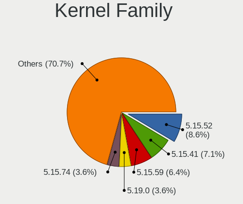
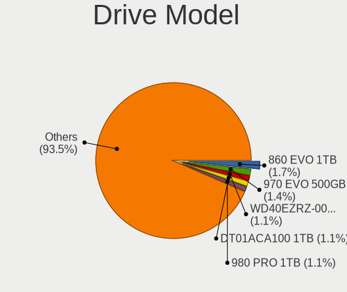
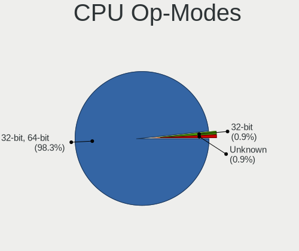
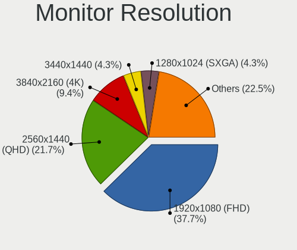
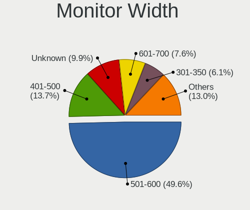
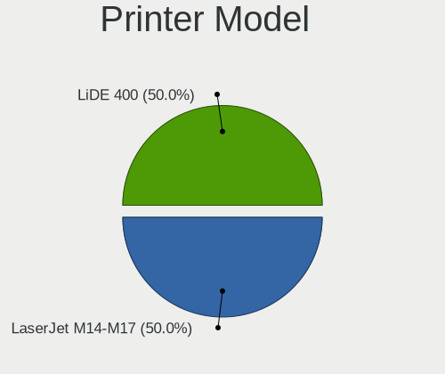

Gentoo 2.8 - Tested Hardware & Statistics (Desktops)
----------------------------------------------------

A project to collect tested hardware configurations for Gentoo 2.8.

Anyone can contribute to this report by the [hw-probe](https://github.com/linuxhw/hw-probe) tool:

    sudo -E hw-probe -all -upload

Please contribute! Especially if your hardware is rare.

Contents
--------

* [ Test Cases ](#test-cases)

* [ System ](#system)
  - [ Kernel                   ](#kernel)
  - [ Kernel Family            ](#kernel-family)
  - [ Kernel Major Ver.        ](#kernel-major-ver)
  - [ Arch                     ](#arch)
  - [ DE                       ](#de)
  - [ Display Server           ](#display-server)
  - [ Display Manager          ](#display-manager)
  - [ OS Lang                  ](#os-lang)
  - [ Boot Mode                ](#boot-mode)
  - [ Filesystem               ](#filesystem)
  - [ Part. scheme             ](#part-scheme)
  - [ Dual Boot with Linux/BSD ](#dual-boot-with-linuxbsd)
  - [ Dual Boot (Win)          ](#dual-boot-win)

* [ Board ](#board)
  - [ Vendor                   ](#vendor)
  - [ Model                    ](#model)
  - [ Model Family             ](#model-family)
  - [ MFG Year                 ](#mfg-year)
  - [ Form Factor              ](#form-factor)
  - [ Secure Boot              ](#secure-boot)
  - [ Coreboot                 ](#coreboot)
  - [ RAM Size                 ](#ram-size)
  - [ RAM Used                 ](#ram-used)
  - [ Total Drives             ](#total-drives)
  - [ Has CD-ROM               ](#has-cd-rom)
  - [ Has Ethernet             ](#has-ethernet)
  - [ Has WiFi                 ](#has-wifi)
  - [ Has Bluetooth            ](#has-bluetooth)

* [ Location ](#location)
  - [ Country                  ](#country)
  - [ City                     ](#city)

* [ Drives ](#drives)
  - [ Drive Vendor             ](#drive-vendor)
  - [ Drive Model              ](#drive-model)
  - [ HDD Vendor               ](#hdd-vendor)
  - [ SSD Vendor               ](#ssd-vendor)
  - [ Drive Kind               ](#drive-kind)
  - [ Drive Connector          ](#drive-connector)
  - [ Drive Size               ](#drive-size)
  - [ Space Total              ](#space-total)
  - [ Space Used               ](#space-used)
  - [ Malfunc. Drives          ](#malfunc-drives)
  - [ Malfunc. Drive Vendor    ](#malfunc-drive-vendor)
  - [ Malfunc. HDD Vendor      ](#malfunc-hdd-vendor)
  - [ Malfunc. Drive Kind      ](#malfunc-drive-kind)
  - [ Failed Drives            ](#failed-drives)
  - [ Failed Drive Vendor      ](#failed-drive-vendor)
  - [ Drive Status             ](#drive-status)

* [ Storage controller ](#storage-controller)
  - [ Storage Vendor           ](#storage-vendor)
  - [ Storage Model            ](#storage-model)
  - [ Storage Kind             ](#storage-kind)

* [ Processor ](#processor)
  - [ CPU Vendor               ](#cpu-vendor)
  - [ CPU Model                ](#cpu-model)
  - [ CPU Model Family         ](#cpu-model-family)
  - [ CPU Cores                ](#cpu-cores)
  - [ CPU Sockets              ](#cpu-sockets)
  - [ CPU Threads              ](#cpu-threads)
  - [ CPU Op-Modes             ](#cpu-op-modes)
  - [ CPU Microcode            ](#cpu-microcode)
  - [ CPU Microarch            ](#cpu-microarch)

* [ Graphics ](#graphics)
  - [ GPU Vendor               ](#gpu-vendor)
  - [ GPU Model                ](#gpu-model)
  - [ GPU Combo                ](#gpu-combo)
  - [ GPU Driver               ](#gpu-driver)
  - [ GPU Memory               ](#gpu-memory)

* [ Monitor ](#monitor)
  - [ Monitor Vendor           ](#monitor-vendor)
  - [ Monitor Model            ](#monitor-model)
  - [ Monitor Resolution       ](#monitor-resolution)
  - [ Monitor Diagonal         ](#monitor-diagonal)
  - [ Monitor Width            ](#monitor-width)
  - [ Aspect Ratio             ](#aspect-ratio)
  - [ Monitor Area             ](#monitor-area)
  - [ Pixel Density            ](#pixel-density)
  - [ Multiple Monitors        ](#multiple-monitors)

* [ Network ](#network)
  - [ Net Controller Vendor    ](#net-controller-vendor)
  - [ Net Controller Model     ](#net-controller-model)
  - [ Wireless Vendor          ](#wireless-vendor)
  - [ Wireless Model           ](#wireless-model)
  - [ Ethernet Vendor          ](#ethernet-vendor)
  - [ Ethernet Model           ](#ethernet-model)
  - [ Net Controller Kind      ](#net-controller-kind)
  - [ Used Controller          ](#used-controller)
  - [ NICs                     ](#nics)
  - [ IPv6                     ](#ipv6)

* [ Bluetooth ](#bluetooth)
  - [ Bluetooth Vendor         ](#bluetooth-vendor)
  - [ Bluetooth Model          ](#bluetooth-model)

* [ Sound ](#sound)
  - [ Sound Vendor             ](#sound-vendor)
  - [ Sound Model              ](#sound-model)

* [ Memory ](#memory)
  - [ Memory Vendor            ](#memory-vendor)
  - [ Memory Model             ](#memory-model)
  - [ Memory Kind              ](#memory-kind)
  - [ Memory Form Factor       ](#memory-form-factor)
  - [ Memory Size              ](#memory-size)
  - [ Memory Speed             ](#memory-speed)

* [ Printers & scanners ](#printers--scanners)
  - [ Printer Vendor           ](#printer-vendor)
  - [ Printer Model            ](#printer-model)
  - [ Scanner Vendor           ](#scanner-vendor)
  - [ Scanner Model            ](#scanner-model)

* [ Camera ](#camera)
  - [ Camera Vendor            ](#camera-vendor)
  - [ Camera Model             ](#camera-model)

* [ Security ](#security)
  - [ Fingerprint Vendor       ](#fingerprint-vendor)
  - [ Fingerprint Model        ](#fingerprint-model)
  - [ Chipcard Vendor          ](#chipcard-vendor)
  - [ Chipcard Model           ](#chipcard-model)

* [ Unsupported ](#unsupported)
  - [ Unsupported Devices      ](#unsupported-devices)
  - [ Unsupported Device Types ](#unsupported-device-types)

Test Cases
----------

Total: 115

| Vendor   | Model                       | Probe                                                      | Date         |
|----------|-----------------------------|------------------------------------------------------------|--------------|
| ASUSTek  | ROG Maximus Z690 EXTREME    | [effa59ed64](https://linux-hardware.org/?probe=effa59ed64) | Aug 01, 2022 |
| ASRock   | B550M Steel Legend          | [0ac4f27d0f](https://linux-hardware.org/?probe=0ac4f27d0f) | Jul 31, 2022 |
| ASUSTek  | TUF Gaming X570-PLUS        | [f22250f00c](https://linux-hardware.org/?probe=f22250f00c) | Jul 31, 2022 |
| ASUSTek  | M3A78-CM                    | [1051593809](https://linux-hardware.org/?probe=1051593809) | Jul 31, 2022 |
| Gigabyte | 970A-DS3                    | [78f00bd2aa](https://linux-hardware.org/?probe=78f00bd2aa) | Jul 30, 2022 |
| Lenovo   | 1046 SDK0T08861 WIN 3305... | [d3d824f468](https://linux-hardware.org/?probe=d3d824f468) | Jul 29, 2022 |
| MSI      | B450M MORTAR                | [29a26324b9](https://linux-hardware.org/?probe=29a26324b9) | Jul 29, 2022 |
| Intel    | D54250WYK H13922-303        | [5ff32931fa](https://linux-hardware.org/?probe=5ff32931fa) | Jul 27, 2022 |
| MSI      | MPG Z390 GAMING PRO CARB... | [dc7eff27cf](https://linux-hardware.org/?probe=dc7eff27cf) | Jul 26, 2022 |
| ASRock   | X399 Taichi                 | [d2eb8a032b](https://linux-hardware.org/?probe=d2eb8a032b) | Jul 26, 2022 |
| ASUSTek  | ROG Maximus XI HERO         | [c98fed5f84](https://linux-hardware.org/?probe=c98fed5f84) | Jul 25, 2022 |
| ASUSTek  | ROG Maximus Z690 EXTREME    | [dae325b47b](https://linux-hardware.org/?probe=dae325b47b) | Jul 25, 2022 |
| ASUSTek  | M3A78-CM                    | [e1e16aa154](https://linux-hardware.org/?probe=e1e16aa154) | Jul 25, 2022 |
| Gigabyte | AB350-Gaming-CF             | [153acd77c2](https://linux-hardware.org/?probe=153acd77c2) | Jul 24, 2022 |
| ASRock   | AM1H-ITX                    | [a15c82ba0c](https://linux-hardware.org/?probe=a15c82ba0c) | Jul 24, 2022 |
| Unknown  | QNAP TS-221                 | [fb3741faab](https://linux-hardware.org/?probe=fb3741faab) | Jul 21, 2022 |
| ASRock   | X570 Taichi                 | [56d5853243](https://linux-hardware.org/?probe=56d5853243) | Jul 19, 2022 |
| MSI      | MEG X570 UNIFY              | [d3d26541f1](https://linux-hardware.org/?probe=d3d26541f1) | Jul 19, 2022 |
| Gigabyte | AB350-Gaming-CF             | [8f2f1582e8](https://linux-hardware.org/?probe=8f2f1582e8) | Jul 17, 2022 |
| ASUSTek  | M3A78-CM                    | [056d74f1a9](https://linux-hardware.org/?probe=056d74f1a9) | Jul 17, 2022 |
| ASUSTek  | ROG STRIX B560-I GAMING ... | [e6b6d3b5e6](https://linux-hardware.org/?probe=e6b6d3b5e6) | Jul 16, 2022 |
| ASUSTek  | ROG STRIX B560-I GAMING ... | [93f8a4ce9f](https://linux-hardware.org/?probe=93f8a4ce9f) | Jul 16, 2022 |
| Gigabyte | Z590 UD                     | [e9e0b50bbb](https://linux-hardware.org/?probe=e9e0b50bbb) | Jul 15, 2022 |
| MSI      | Z87-G45 GAMING              | [8602f7246a](https://linux-hardware.org/?probe=8602f7246a) | Jul 12, 2022 |
| Gigabyte | B450 AORUS M                | [6d15b85193](https://linux-hardware.org/?probe=6d15b85193) | Jul 10, 2022 |
| Dell     | 0J3C2F A02                  | [dccb88852f](https://linux-hardware.org/?probe=dccb88852f) | Jul 10, 2022 |
| ASUSTek  | M3A78-CM                    | [0237c9df10](https://linux-hardware.org/?probe=0237c9df10) | Jul 10, 2022 |
| ASUSTek  | ROG STRIX B550-F GAMING     | [85dbd84c37](https://linux-hardware.org/?probe=85dbd84c37) | Jul 09, 2022 |
| Dell     | 0J3C2F A02                  | [aa87616696](https://linux-hardware.org/?probe=aa87616696) | Jul 09, 2022 |
| ASUSTek  | ROG CROSSHAIR VIII DARK ... | [685e3d36bc](https://linux-hardware.org/?probe=685e3d36bc) | Jul 04, 2022 |
| ASUSTek  | ROG CROSSHAIR VIII DARK ... | [b436712f17](https://linux-hardware.org/?probe=b436712f17) | Jul 04, 2022 |
| ASUSTek  | ROG Maximus XI HERO         | [d442c531e8](https://linux-hardware.org/?probe=d442c531e8) | Jul 03, 2022 |
| Gigabyte | Z690 AORUS MASTER           | [cf8784ac23](https://linux-hardware.org/?probe=cf8784ac23) | Jul 03, 2022 |
| ASUSTek  | PRIME Z390-A                | [1af80d1cdb](https://linux-hardware.org/?probe=1af80d1cdb) | Jul 01, 2022 |
| ASUSTek  | M3A78-CM                    | [4c0fa03f61](https://linux-hardware.org/?probe=4c0fa03f61) | Jun 28, 2022 |
| Gigabyte | AB350-Gaming-CF             | [79dca3a17c](https://linux-hardware.org/?probe=79dca3a17c) | Jun 26, 2022 |
| Fujitsu  | D3417-B2 S26361-D3417-B2    | [f03dcf744a](https://linux-hardware.org/?probe=f03dcf744a) | Jun 26, 2022 |
| Gigabyte | Z590 UD                     | [74060af6fc](https://linux-hardware.org/?probe=74060af6fc) | Jun 23, 2022 |
| Gigabyte | AB350-Gaming-CF             | [2028b239fc](https://linux-hardware.org/?probe=2028b239fc) | Jun 19, 2022 |
| ASUSTek  | M3A78-CM                    | [20c198dd50](https://linux-hardware.org/?probe=20c198dd50) | Jun 19, 2022 |
| ASUSTek  | TUF Gaming X570-PLUS        | [fe7fa5fe7a](https://linux-hardware.org/?probe=fe7fa5fe7a) | Jun 17, 2022 |
| ASUSTek  | M3A78-CM                    | [59350b295e](https://linux-hardware.org/?probe=59350b295e) | Jun 13, 2022 |
| Gigabyte | AB350-Gaming-CF             | [223b882103](https://linux-hardware.org/?probe=223b882103) | Jun 12, 2022 |
| ASUSTek  | ROG STRIX B450-F GAMING     | [80a6dc4a46](https://linux-hardware.org/?probe=80a6dc4a46) | Jun 09, 2022 |
| Pegatron | 2ACE                        | [838cad5bc2](https://linux-hardware.org/?probe=838cad5bc2) | Jun 06, 2022 |
| Dell     | 0KWVT8 A03                  | [5745c8b787](https://linux-hardware.org/?probe=5745c8b787) | Jun 06, 2022 |
| Gigabyte | AB350-Gaming-CF             | [cb81a60917](https://linux-hardware.org/?probe=cb81a60917) | Jun 05, 2022 |
| Unknown  | Unknown                     | [c6f9883076](https://linux-hardware.org/?probe=c6f9883076) | Jun 05, 2022 |
| Unknown  | Unknown                     | [4abb49be35](https://linux-hardware.org/?probe=4abb49be35) | Jun 04, 2022 |
| MSI      | X570-A PRO                  | [102ed915c5](https://linux-hardware.org/?probe=102ed915c5) | Jun 02, 2022 |
| ASUSTek  | TUF Gaming Z690-PLUS WIF... | [2c33cbbbe2](https://linux-hardware.org/?probe=2c33cbbbe2) | May 30, 2022 |
| ASUSTek  | Z170-A                      | [86021dcc38](https://linux-hardware.org/?probe=86021dcc38) | May 27, 2022 |
| ASUSTek  | Z170-A                      | [b8603fccc0](https://linux-hardware.org/?probe=b8603fccc0) | May 26, 2022 |
| MSI      | PRO Z690-A DDR4             | [38ac6de56d](https://linux-hardware.org/?probe=38ac6de56d) | May 25, 2022 |
| ASRock   | B450 Gaming K4              | [af256d7649](https://linux-hardware.org/?probe=af256d7649) | May 24, 2022 |
| ASUSTek  | PRIME X570-PRO              | [f7225b80ed](https://linux-hardware.org/?probe=f7225b80ed) | May 18, 2022 |
| ASUSTek  | PRIME X570-PRO              | [84a0dc5b83](https://linux-hardware.org/?probe=84a0dc5b83) | May 18, 2022 |
| ASUSTek  | ROG Maximus XIII APEX       | [56fb967887](https://linux-hardware.org/?probe=56fb967887) | May 16, 2022 |
| Dell     | 0J3C2F A02                  | [07e2cea31c](https://linux-hardware.org/?probe=07e2cea31c) | May 13, 2022 |
| Gigabyte | Z590 UD                     | [2fcf37c00a](https://linux-hardware.org/?probe=2fcf37c00a) | May 11, 2022 |
| Dell     | 0J3C2F A02                  | [bd6c3ca5b4](https://linux-hardware.org/?probe=bd6c3ca5b4) | May 09, 2022 |
| ASRock   | X370 Gaming X               | [b24677a908](https://linux-hardware.org/?probe=b24677a908) | May 01, 2022 |
| MSI      | MPG Z390 GAMING PRO CARB... | [07a115654d](https://linux-hardware.org/?probe=07a115654d) | Apr 30, 2022 |
| Dell     | 0J37VM A00                  | [76f13aa200](https://linux-hardware.org/?probe=76f13aa200) | Apr 28, 2022 |
| ASUSTek  | ROG STRIX B550-F GAMING     | [6af0b2a3c9](https://linux-hardware.org/?probe=6af0b2a3c9) | Apr 21, 2022 |
| MSI      | Z390-A PRO                  | [4121c8fcc2](https://linux-hardware.org/?probe=4121c8fcc2) | Apr 20, 2022 |
| ASUSTek  | PRIME H570M-PLUS            | [5e6ce90c93](https://linux-hardware.org/?probe=5e6ce90c93) | Apr 13, 2022 |
| MSI      | B450-A PRO MAX              | [cfd276f151](https://linux-hardware.org/?probe=cfd276f151) | Apr 13, 2022 |
| ASUSTek  | ROG Maximus XIII APEX       | [7a26d3fc81](https://linux-hardware.org/?probe=7a26d3fc81) | Apr 12, 2022 |
| Gigabyte | H470 HD3                    | [5ce5c54ecd](https://linux-hardware.org/?probe=5ce5c54ecd) | Apr 09, 2022 |
| ASUSTek  | P6X58D-E                    | [68be7a767a](https://linux-hardware.org/?probe=68be7a767a) | Apr 07, 2022 |
| ASUSTek  | TUF Gaming B550-PLUS        | [403a6830d9](https://linux-hardware.org/?probe=403a6830d9) | Apr 04, 2022 |
| ASRock   | Z170A-X1                    | [9e1cc71d24](https://linux-hardware.org/?probe=9e1cc71d24) | Mar 31, 2022 |
| MSI      | MAG B550M MORTAR            | [9ebb4c0fd3](https://linux-hardware.org/?probe=9ebb4c0fd3) | Mar 31, 2022 |
| Gigabyte | Z590 UD                     | [5cde1a4e83](https://linux-hardware.org/?probe=5cde1a4e83) | Mar 24, 2022 |
| ASUSTek  | ROG STRIX Z370-H GAMING     | [6dddf500c7](https://linux-hardware.org/?probe=6dddf500c7) | Mar 22, 2022 |
| MSI      | MAG B550M MORTAR            | [593bf6f937](https://linux-hardware.org/?probe=593bf6f937) | Mar 21, 2022 |
| ASUSTek  | Z170 PRO GAMING             | [6efb7791bb](https://linux-hardware.org/?probe=6efb7791bb) | Mar 19, 2022 |
| ASUSTek  | ROG STRIX Z390-E GAMING     | [70021af77a](https://linux-hardware.org/?probe=70021af77a) | Mar 15, 2022 |
| Dell     | 0J37VM A00                  | [a78d4c99e3](https://linux-hardware.org/?probe=a78d4c99e3) | Mar 09, 2022 |
| ASUSTek  | TUF Gaming X570-PRO         | [44656b1bd4](https://linux-hardware.org/?probe=44656b1bd4) | Mar 03, 2022 |
| Gigabyte | Z590 UD                     | [a5242ed058](https://linux-hardware.org/?probe=a5242ed058) | Feb 26, 2022 |
| Gigabyte | Z590 UD                     | [071dd25266](https://linux-hardware.org/?probe=071dd25266) | Feb 24, 2022 |
| ASUSTek  | ROG CROSSHAIR VIII DARK ... | [5836ccecc2](https://linux-hardware.org/?probe=5836ccecc2) | Feb 10, 2022 |
| Gigabyte | Z490 UD                     | [b571c22d4f](https://linux-hardware.org/?probe=b571c22d4f) | Feb 04, 2022 |
| MSI      | MPG B550 GAMING PLUS        | [d424a8e145](https://linux-hardware.org/?probe=d424a8e145) | Feb 01, 2022 |
| MSI      | MPG B550 GAMING PLUS        | [89dbe92caf](https://linux-hardware.org/?probe=89dbe92caf) | Feb 01, 2022 |
| ASRock   | AB350M Pro4                 | [6b7cf2d570](https://linux-hardware.org/?probe=6b7cf2d570) | Jan 27, 2022 |
| Gigabyte | B450M S2H                   | [656da02110](https://linux-hardware.org/?probe=656da02110) | Jan 24, 2022 |
| Gigabyte | B450M S2H                   | [1721bed3e1](https://linux-hardware.org/?probe=1721bed3e1) | Jan 24, 2022 |
| Gigabyte | Z490 UD                     | [eac4639ad2](https://linux-hardware.org/?probe=eac4639ad2) | Jan 22, 2022 |
| EVGA     | Z390 DARK                   | [7672395a1c](https://linux-hardware.org/?probe=7672395a1c) | Dec 24, 2021 |
| ASUSTek  | P5LD2-Deluxe                | [a2ee48eeb1](https://linux-hardware.org/?probe=a2ee48eeb1) | Dec 16, 2021 |
| MSI      | MPG Z690 EDGE WIFI DDR4     | [b92f432637](https://linux-hardware.org/?probe=b92f432637) | Dec 07, 2021 |
| MSI      | MPG Z690 EDGE WIFI DDR4     | [d8f50aaa2e](https://linux-hardware.org/?probe=d8f50aaa2e) | Dec 07, 2021 |
| ASUSTek  | TUF B450-PLUS GAMING        | [6649bea1f8](https://linux-hardware.org/?probe=6649bea1f8) | Dec 04, 2021 |
| ASUSTek  | TUF B450-PLUS GAMING        | [723e2a158a](https://linux-hardware.org/?probe=723e2a158a) | Dec 03, 2021 |
| ASRock   | H110M-HDV R3.0              | [e155882ffa](https://linux-hardware.org/?probe=e155882ffa) | Dec 02, 2021 |
| ASUSTek  | ROG STRIX X570-E GAMING     | [e2c087b9c7](https://linux-hardware.org/?probe=e2c087b9c7) | Nov 21, 2021 |
| ASUSTek  | PRIME X570-P                | [eafa22145d](https://linux-hardware.org/?probe=eafa22145d) | Nov 15, 2021 |
| ASUSTek  | TUF GAMING B550-PLUS        | [2900821ed3](https://linux-hardware.org/?probe=2900821ed3) | Nov 14, 2021 |
| ASUSTek  | ROG STRIX B550-F GAMING     | [4cfb74fb42](https://linux-hardware.org/?probe=4cfb74fb42) | Nov 14, 2021 |
| ASUSTek  | ROG ZENITH II EXTREME       | [6f308039a8](https://linux-hardware.org/?probe=6f308039a8) | Nov 06, 2021 |
| MSI      | H110M PRO-D                 | [cb3dcdd186](https://linux-hardware.org/?probe=cb3dcdd186) | Nov 02, 2021 |
| MSI      | H110M PRO-D                 | [b53420c26a](https://linux-hardware.org/?probe=b53420c26a) | Nov 02, 2021 |
| ASUSTek  | ROG STRIX B550-F GAMING     | [161865edb0](https://linux-hardware.org/?probe=161865edb0) | Oct 30, 2021 |
| ASUSTek  | ROG STRIX B550-F GAMING     | [a4806aa50f](https://linux-hardware.org/?probe=a4806aa50f) | Oct 30, 2021 |
| ASUSTek  | Z170-A                      | [aea7d9561e](https://linux-hardware.org/?probe=aea7d9561e) | Oct 29, 2021 |
| ASRock   | X370 Gaming X               | [0f4ae74d8e](https://linux-hardware.org/?probe=0f4ae74d8e) | Oct 29, 2021 |
| ASRock   | X370 Gaming X               | [f3f75352e4](https://linux-hardware.org/?probe=f3f75352e4) | Oct 29, 2021 |
| ASUSTek  | ROG CROSSHAIR VIII HERO     | [e9cc487951](https://linux-hardware.org/?probe=e9cc487951) | Oct 28, 2021 |
| Gigabyte | X570 AORUS MASTER           | [58e3f9c07f](https://linux-hardware.org/?probe=58e3f9c07f) | Oct 23, 2021 |
| ASUSTek  | ROG CROSSHAIR VIII HERO     | [eb02a6d4d5](https://linux-hardware.org/?probe=eb02a6d4d5) | Oct 20, 2021 |
| ASRock   | X370 Killer SLI/ac          | [2e4c1c4527](https://linux-hardware.org/?probe=2e4c1c4527) | Oct 17, 2021 |
| Gigabyte | Z87X-UD3H-CF                | [9901023f19](https://linux-hardware.org/?probe=9901023f19) | Oct 03, 2021 |

System
------

Kernel
------

Version of the Linux kernel

| Version                   | Desktops | Percent |
|---------------------------|----------|---------|
| 5.15.41-gentoo            | 5        | 5.75%   |
| 5.17.1-gentoo-r1          | 3        | 3.45%   |
| 5.15.52-gentoo            | 3        | 3.45%   |
| 5.18.14-gentoo-x86_64     | 2        | 2.3%    |
| 5.18.10-gentoo            | 2        | 2.3%    |
| 5.17.0-gentoo             | 2        | 2.3%    |
| 5.16.11-gentoo-x86_64     | 2        | 2.3%    |
| 5.15.52-gentoo-x86_64     | 2        | 2.3%    |
| 5.15.41-gentoo-x86_64     | 2        | 2.3%    |
| 5.15.10-gentoo            | 2        | 2.3%    |
| 5.14.13-gentoo            | 2        | 2.3%    |
| 5.14.12-gentoo            | 2        | 2.3%    |
| 6.0.0-Phaco-g8f10ff49057f | 1        | 1.15%   |
| 5.19.0-gentoo-x86_64      | 1        | 1.15%   |
| 5.18.9-gentoo-x86_64      | 1        | 1.15%   |
| 5.18.9-gentoo             | 1        | 1.15%   |
| 5.18.7-gentoo             | 1        | 1.15%   |
| 5.18.6-gentoo-x86_64      | 1        | 1.15%   |
| 5.18.6-gentoo             | 1        | 1.15%   |
| 5.18.15-gentoo-x86_64     | 1        | 1.15%   |
| 5.18.14-gentoo            | 1        | 1.15%   |
| 5.18.10-k08               | 1        | 1.15%   |
| 5.18.10-gentoo-x86_64     | 1        | 1.15%   |
| 5.18.1-gentoo-r2          | 1        | 1.15%   |
| 5.18.0-gentoo             | 1        | 1.15%   |
| 5.17.9-gentoo-x86_64      | 1        | 1.15%   |
| 5.17.9-gentoo-dist        | 1        | 1.15%   |
| 5.17.8-gentoo-x86_64      | 1        | 1.15%   |
| 5.17.7-gentoo-x86_64      | 1        | 1.15%   |
| 5.17.7-gentoo-limelight   | 1        | 1.15%   |
| 5.17.7-gentoo-dist        | 1        | 1.15%   |
| 5.17.6-gentoo-x86_64      | 1        | 1.15%   |
| 5.17.3-gentoo-11-02-22    | 1        | 1.15%   |
| 5.17.2-gentoo-limelight   | 1        | 1.15%   |
| 5.17.2-gentoo             | 1        | 1.15%   |
| 5.17.1-gentoo-r1-x86_64   | 1        | 1.15%   |
| 5.17.0-gentoo-x86_64      | 1        | 1.15%   |
| 5.16.8-gentoo-x86_64      | 1        | 1.15%   |
| 5.16.7-tkg-cacule         | 1        | 1.15%   |
| 5.16.5-gentoo-dist        | 1        | 1.15%   |
| 5.16.4-gentoo             | 1        | 1.15%   |
| 5.16.2-gentoo             | 1        | 1.15%   |
| 5.16.15                   | 1        | 1.15%   |
| 5.16.14-gentoo-x86_64     | 1        | 1.15%   |
| 5.16.14-gentoo-girlhog    | 1        | 1.15%   |
| 5.16.13-gentoo            | 1        | 1.15%   |
| 5.16.10-gentoo-x86_64     | 1        | 1.15%   |
| 5.15.6-gentoo             | 1        | 1.15%   |
| 5.15.55-gentoo            | 1        | 1.15%   |
| 5.15.52-gentoo-ts221      | 1        | 1.15%   |
| 5.15.52-gentoo-dist       | 1        | 1.15%   |
| 5.15.41-gentoo-dist       | 1        | 1.15%   |
| 5.15.4-gentoo-deimos      | 1        | 1.15%   |
| 5.15.32-gentoo-r1         | 1        | 1.15%   |
| 5.15.2-gentoo20210917     | 1        | 1.15%   |
| 5.15.2-gentoo-x86_64      | 1        | 1.15%   |
| 5.15.16-gentoo-dist       | 1        | 1.15%   |
| 5.15.12-gentoo-x86_64     | 1        | 1.15%   |
| 5.15.11-gentoo-x86_64     | 1        | 1.15%   |
| 5.15.1-gentoo-x86_64      | 1        | 1.15%   |

Kernel Family
-------------

Linux kernel without a distro release

| Version  | Desktops | Percent |
|----------|----------|---------|
| 5.15.41  | 8        | 9.2%    |
| 5.15.52  | 7        | 8.05%   |
| 5.18.10  | 4        | 4.6%    |
| 5.17.1   | 4        | 4.6%    |
| 5.18.14  | 3        | 3.45%   |
| 5.17.7   | 3        | 3.45%   |
| 5.17.0   | 3        | 3.45%   |
| 5.18.9   | 2        | 2.3%    |
| 5.18.6   | 2        | 2.3%    |
| 5.17.9   | 2        | 2.3%    |
| 5.17.2   | 2        | 2.3%    |
| 5.16.14  | 2        | 2.3%    |
| 5.16.11  | 2        | 2.3%    |
| 5.15.2   | 2        | 2.3%    |
| 5.15.10  | 2        | 2.3%    |
| 5.14.14  | 2        | 2.3%    |
| 5.14.13  | 2        | 2.3%    |
| 5.14.12  | 2        | 2.3%    |
| 6.0.0    | 1        | 1.15%   |
| 5.19.0   | 1        | 1.15%   |
| 5.18.7   | 1        | 1.15%   |
| 5.18.15  | 1        | 1.15%   |
| 5.18.1   | 1        | 1.15%   |
| 5.18.0   | 1        | 1.15%   |
| 5.17.8   | 1        | 1.15%   |
| 5.17.6   | 1        | 1.15%   |
| 5.17.3   | 1        | 1.15%   |
| 5.16.8   | 1        | 1.15%   |
| 5.16.7   | 1        | 1.15%   |
| 5.16.5   | 1        | 1.15%   |
| 5.16.4   | 1        | 1.15%   |
| 5.16.2   | 1        | 1.15%   |
| 5.16.15  | 1        | 1.15%   |
| 5.16.13  | 1        | 1.15%   |
| 5.16.10  | 1        | 1.15%   |
| 5.15.6   | 1        | 1.15%   |
| 5.15.55  | 1        | 1.15%   |
| 5.15.4   | 1        | 1.15%   |
| 5.15.32  | 1        | 1.15%   |
| 5.15.16  | 1        | 1.15%   |
| 5.15.12  | 1        | 1.15%   |
| 5.15.11  | 1        | 1.15%   |
| 5.15.1   | 1        | 1.15%   |
| 5.15.0   | 1        | 1.15%   |
| 5.14.6   | 1        | 1.15%   |
| 5.14.15  | 1        | 1.15%   |
| 5.14.11  | 1        | 1.15%   |
| 5.10.84  | 1        | 1.15%   |
| 5.10.74  | 1        | 1.15%   |
| 4.9.16   | 1        | 1.15%   |
| 4.14.280 | 1        | 1.15%   |

Kernel Major Ver.
-----------------

Linux kernel major version

| Version | Desktops | Percent |
|---------|----------|---------|
| 5.15    | 27       | 32.93%  |
| 5.17    | 15       | 18.29%  |
| 5.18    | 14       | 17.07%  |
| 5.16    | 11       | 13.41%  |
| 5.14    | 9        | 10.98%  |
| 5.10    | 2        | 2.44%   |
| 6.0     | 1        | 1.22%   |
| 5.19    | 1        | 1.22%   |
| 4.9     | 1        | 1.22%   |
| 4.14    | 1        | 1.22%   |

Arch
----

OS architecture (x86_64, i586, etc.)

| Name     | Desktops | Percent |
|----------|----------|---------|
| x86_64   | 71       | 97.26%  |
| ppc      | 1        | 1.37%   |
| armv5tel | 1        | 1.37%   |

DE
--

Desktop Environment

| Name     | Desktops | Percent |
|----------|----------|---------|
| KDE5     | 26       | 34.67%  |
| Unknown  | 20       | 26.67%  |
| GNOME    | 15       | 20%     |
| XFCE     | 6        | 8%      |
| MATE     | 2        | 2.67%   |
| DWM      | 2        | 2.67%   |
| LXQt     | 1        | 1.33%   |
| KDE      | 1        | 1.33%   |
| i3       | 1        | 1.33%   |
| Cinnamon | 1        | 1.33%   |

Display Server
--------------

X11 or Wayland

| Name    | Desktops | Percent |
|---------|----------|---------|
| X11     | 40       | 51.95%  |
| Wayland | 14       | 18.18%  |
| Tty     | 12       | 15.58%  |
| Unknown | 11       | 14.29%  |

Display Manager
---------------

SDDM, LightDM, etc.

| Name    | Desktops | Percent |
|---------|----------|---------|
| Unknown | 30       | 40%     |
| SDDM    | 24       | 32%     |
| GDM     | 9        | 12%     |
| LightDM | 6        | 8%      |
| LXDM    | 4        | 5.33%   |
| XDM     | 1        | 1.33%   |
| SLiM    | 1        | 1.33%   |

OS Lang
-------

Language

| Lang    | Desktops | Percent |
|---------|----------|---------|
| en_US   | 30       | 41.1%   |
| en_GB   | 9        | 12.33%  |
| Unknown | 8        | 10.96%  |
| de_DE   | 5        | 6.85%   |
| C.UTF8  | 5        | 6.85%   |
| ru_RU   | 4        | 5.48%   |
| pl_PL   | 3        | 4.11%   |
| C       | 2        | 2.74%   |
| sl_SI   | 1        | 1.37%   |
| ja_JP   | 1        | 1.37%   |
| fr_FR   | 1        | 1.37%   |
| es_ES   | 1        | 1.37%   |
| en_CA   | 1        | 1.37%   |
| el_GR   | 1        | 1.37%   |
| de_CH   | 1        | 1.37%   |

Boot Mode
---------

EFI or BIOS

| Mode | Desktops | Percent |
|------|----------|---------|
| EFI  | 64       | 85.33%  |
| BIOS | 11       | 14.67%  |

Filesystem
----------

Type of filesystem

| Type    | Desktops | Percent |
|---------|----------|---------|
| Ext4    | 40       | 54.79%  |
| Btrfs   | 18       | 24.66%  |
| F2fs    | 7        | 9.59%   |
| Zfs     | 3        | 4.11%   |
| XXXXXXX | 2        | 2.74%   |
| Xfs     | 2        | 2.74%   |
| XXX     | 1        | 1.37%   |

Part. scheme
------------

Scheme of partitioning

| Type    | Desktops | Percent |
|---------|----------|---------|
| GPT     | 66       | 89.19%  |
| Unknown | 6        | 8.11%   |
| MBR     | 2        | 2.7%    |

Dual Boot with Linux/BSD
------------------------

Hosting more than one Linux/BSD

| Dual boot | Desktops | Percent |
|-----------|----------|---------|
| No        | 42       | 56.76%  |
| Yes       | 32       | 43.24%  |

Dual Boot (Win)
---------------

Hosting Linux and Windows

| Dual boot | Desktops | Percent |
|-----------|----------|---------|
| No        | 43       | 58.9%   |
| Yes       | 30       | 41.1%   |

Board
-----

Vendor
------

Motherboard manufacturer

| Name                | Desktops | Percent |
|---------------------|----------|---------|
| ASUSTek Computer    | 31       | 42.47%  |
| MSI                 | 12       | 16.44%  |
| Gigabyte Technology | 10       | 13.7%   |
| ASRock              | 10       | 13.7%   |
| Dell                | 3        | 4.11%   |
| Unknown             | 2        | 2.74%   |
| Pegatron            | 1        | 1.37%   |
| Lenovo              | 1        | 1.37%   |
| Intel               | 1        | 1.37%   |
| Fujitsu             | 1        | 1.37%   |
| EVGA                | 1        | 1.37%   |

Model
-----

Motherboard model

| Name                                | Desktops | Percent |
|-------------------------------------|----------|---------|
| ASUS Z170-A                         | 2        | 2.74%   |
| ASUS TUF Gaming X570-PLUS           | 2        | 2.74%   |
| ASUS TUF Gaming B550-PLUS           | 2        | 2.74%   |
| ASUS ROG STRIX B550-F GAMING        | 2        | 2.74%   |
| ASUS ROG CROSSHAIR VIII DARK HERO   | 2        | 2.74%   |
| Unknown                             | 2        | 2.74%   |
| Pegatron 810-170st                  | 1        | 1.37%   |
| MSI MS-7D31                         | 1        | 1.37%   |
| MSI MS-7D25                         | 1        | 1.37%   |
| MSI MS-7C94                         | 1        | 1.37%   |
| MSI MS-7C56                         | 1        | 1.37%   |
| MSI MS-7C37                         | 1        | 1.37%   |
| MSI MS-7C35                         | 1        | 1.37%   |
| MSI MS-7B98                         | 1        | 1.37%   |
| MSI MS-7B89                         | 1        | 1.37%   |
| MSI MS-7B86                         | 1        | 1.37%   |
| MSI MS-7B17                         | 1        | 1.37%   |
| MSI MS-7996                         | 1        | 1.37%   |
| MSI MS-7821                         | 1        | 1.37%   |
| Lenovo ThinkStation P620 30E0001TGE | 1        | 1.37%   |
| Intel D54250WYK H13922-303          | 1        | 1.37%   |
| Gigabyte Z87X-UD3H                  | 1        | 1.37%   |
| Gigabyte Z690 AORUS MASTER          | 1        | 1.37%   |
| Gigabyte Z590 UD                    | 1        | 1.37%   |
| Gigabyte Z490 UD                    | 1        | 1.37%   |
| Gigabyte X570 AORUS MASTER          | 1        | 1.37%   |
| Gigabyte H470 HD3                   | 1        | 1.37%   |
| Gigabyte B450M S2H                  | 1        | 1.37%   |
| Gigabyte B450 AORUS M               | 1        | 1.37%   |
| Gigabyte AB350-Gaming               | 1        | 1.37%   |
| Gigabyte 970A-DS3                   | 1        | 1.37%   |
| Fujitsu D3417-B2 S26361-D3417-B2    | 1        | 1.37%   |
| EVGA Z390 DARK                      | 1        | 1.37%   |
| Dell XPS 8700                       | 1        | 1.37%   |
| Dell OptiPlex 790                   | 1        | 1.37%   |
| Dell OptiPlex 7080                  | 1        | 1.37%   |
| ASUS Z170 PRO GAMING                | 1        | 1.37%   |
| ASUS TUF Gaming Z690-PLUS WIFI D4   | 1        | 1.37%   |
| ASUS TUF Gaming X570-PRO            | 1        | 1.37%   |
| ASUS TUF B450-PLUS GAMING           | 1        | 1.37%   |
| ASUS ROG ZENITH II EXTREME          | 1        | 1.37%   |
| ASUS ROG STRIX Z390-E GAMING        | 1        | 1.37%   |
| ASUS ROG STRIX Z370-H GAMING        | 1        | 1.37%   |
| ASUS ROG STRIX X570-E GAMING        | 1        | 1.37%   |
| ASUS ROG STRIX B560-I GAMING WIFI   | 1        | 1.37%   |
| ASUS ROG STRIX B450-F GAMING        | 1        | 1.37%   |
| ASUS ROG Maximus Z690 EXTREME       | 1        | 1.37%   |
| ASUS ROG Maximus XIII APEX          | 1        | 1.37%   |
| ASUS ROG Maximus XI HERO            | 1        | 1.37%   |
| ASUS ROG CROSSHAIR VIII HERO        | 1        | 1.37%   |
| ASUS PRIME Z390-A                   | 1        | 1.37%   |
| ASUS PRIME X570-PRO                 | 1        | 1.37%   |
| ASUS PRIME X570-P                   | 1        | 1.37%   |
| ASUS PRIME H570M-PLUS               | 1        | 1.37%   |
| ASUS P6X58D-E                       | 1        | 1.37%   |
| ASUS P5LD2-Deluxe                   | 1        | 1.37%   |
| ASUS M3A78-CM                       | 1        | 1.37%   |
| ASRock Z170A-X1                     | 1        | 1.37%   |
| ASRock X570 Taichi                  | 1        | 1.37%   |
| ASRock X399 Taichi                  | 1        | 1.37%   |

Model Family
------------

Motherboard model prefix

| Name                  | Desktops | Percent |
|-----------------------|----------|---------|
| ASUS ROG              | 14       | 19.18%  |
| ASUS TUF              | 7        | 9.59%   |
| ASUS PRIME            | 4        | 5.48%   |
| Dell OptiPlex         | 2        | 2.74%   |
| ASUS Z170-A           | 2        | 2.74%   |
| ASRock X370           | 2        | 2.74%   |
| Unknown               | 2        | 2.74%   |
| Pegatron 810-170st    | 1        | 1.37%   |
| MSI MS-7D31           | 1        | 1.37%   |
| MSI MS-7D25           | 1        | 1.37%   |
| MSI MS-7C94           | 1        | 1.37%   |
| MSI MS-7C56           | 1        | 1.37%   |
| MSI MS-7C37           | 1        | 1.37%   |
| MSI MS-7C35           | 1        | 1.37%   |
| MSI MS-7B98           | 1        | 1.37%   |
| MSI MS-7B89           | 1        | 1.37%   |
| MSI MS-7B86           | 1        | 1.37%   |
| MSI MS-7B17           | 1        | 1.37%   |
| MSI MS-7996           | 1        | 1.37%   |
| MSI MS-7821           | 1        | 1.37%   |
| Lenovo ThinkStation   | 1        | 1.37%   |
| Intel D54250WYK       | 1        | 1.37%   |
| Gigabyte Z87X-UD3H    | 1        | 1.37%   |
| Gigabyte Z690         | 1        | 1.37%   |
| Gigabyte Z590         | 1        | 1.37%   |
| Gigabyte Z490         | 1        | 1.37%   |
| Gigabyte X570         | 1        | 1.37%   |
| Gigabyte H470         | 1        | 1.37%   |
| Gigabyte B450M        | 1        | 1.37%   |
| Gigabyte B450         | 1        | 1.37%   |
| Gigabyte AB350-Gaming | 1        | 1.37%   |
| Gigabyte 970A-DS3     | 1        | 1.37%   |
| Fujitsu D3417-B2      | 1        | 1.37%   |
| EVGA Z390             | 1        | 1.37%   |
| Dell XPS              | 1        | 1.37%   |
| ASUS Z170             | 1        | 1.37%   |
| ASUS P6X58D-E         | 1        | 1.37%   |
| ASUS P5LD2-Deluxe     | 1        | 1.37%   |
| ASUS M3A78-CM         | 1        | 1.37%   |
| ASRock Z170A-X1       | 1        | 1.37%   |
| ASRock X570           | 1        | 1.37%   |
| ASRock X399           | 1        | 1.37%   |
| ASRock H110M-HDV      | 1        | 1.37%   |
| ASRock B550M          | 1        | 1.37%   |
| ASRock B450           | 1        | 1.37%   |
| ASRock AM1H-ITX       | 1        | 1.37%   |
| ASRock AB350M         | 1        | 1.37%   |

MFG Year
--------

Motherboard manufacture year

| Year    | Desktops | Percent |
|---------|----------|---------|
| 2020    | 13       | 17.81%  |
| 2019    | 12       | 16.44%  |
| 2021    | 11       | 15.07%  |
| 2018    | 10       | 13.7%   |
| 2017    | 7        | 9.59%   |
| 2013    | 4        | 5.48%   |
| 2016    | 3        | 4.11%   |
| 2015    | 3        | 4.11%   |
| 2014    | 3        | 4.11%   |
| Unknown | 2        | 2.74%   |
| 2022    | 1        | 1.37%   |
| 2011    | 1        | 1.37%   |
| 2010    | 1        | 1.37%   |
| 2008    | 1        | 1.37%   |
| 2005    | 1        | 1.37%   |

Form Factor
-----------

Physical design of the computer

| Name    | Desktops | Percent |
|---------|----------|---------|
| Desktop | 73       | 100%    |

Secure Boot
-----------

Enabled or disabled

| State    | Desktops | Percent |
|----------|----------|---------|
| Disabled | 71       | 95.95%  |
| Enabled  | 3        | 4.05%   |

Coreboot
--------

Have coreboot on board

| Used | Desktops | Percent |
|------|----------|---------|
| No   | 73       | 100%    |

RAM Size
--------

Total RAM memory

| Size in GB  | Desktops | Percent |
|-------------|----------|---------|
| 32.01-64.0  | 28       | 38.36%  |
| 64.01-256.0 | 18       | 24.66%  |
| 16.01-24.0  | 13       | 17.81%  |
| 8.01-16.0   | 5        | 6.85%   |
| 24.01-32.0  | 4        | 5.48%   |
| 4.01-8.0    | 2        | 2.74%   |
| 0.51-1.0    | 2        | 2.74%   |
| 2.01-3.0    | 1        | 1.37%   |

RAM Used
--------

Used RAM memory

| Used GB    | Desktops | Percent |
|------------|----------|---------|
| 4.01-8.0   | 24       | 28.92%  |
| 8.01-16.0  | 14       | 16.87%  |
| 2.01-3.0   | 11       | 13.25%  |
| 3.01-4.0   | 10       | 12.05%  |
| 1.01-2.0   | 9        | 10.84%  |
| 16.01-24.0 | 7        | 8.43%   |
| 32.01-64.0 | 2        | 2.41%   |
| 0.51-1.0   | 2        | 2.41%   |
| 0.01-0.5   | 2        | 2.41%   |
| 24.01-32.0 | 1        | 1.2%    |
| 0          | 1        | 1.2%    |

Total Drives
------------

Number of drives on board

| Drives | Desktops | Percent |
|--------|----------|---------|
| 2      | 22       | 29.33%  |
| 3      | 16       | 21.33%  |
| 5      | 9        | 12%     |
| 4      | 9        | 12%     |
| 1      | 8        | 10.67%  |
| 6      | 7        | 9.33%   |
| 7      | 4        | 5.33%   |

Has CD-ROM
----------

Has CD-ROM on board

| Presented | Desktops | Percent |
|-----------|----------|---------|
| No        | 58       | 77.33%  |
| Yes       | 17       | 22.67%  |

Has Ethernet
------------

Has Ethernet on board

| Presented | Desktops | Percent |
|-----------|----------|---------|
| Yes       | 71       | 97.26%  |
| No        | 2        | 2.74%   |

Has WiFi
--------

Has WiFi module

| Presented | Desktops | Percent |
|-----------|----------|---------|
| No        | 38       | 51.35%  |
| Yes       | 36       | 48.65%  |

Has Bluetooth
-------------

Has Bluetooth module

| Presented | Desktops | Percent |
|-----------|----------|---------|
| Yes       | 38       | 51.35%  |
| No        | 36       | 48.65%  |

Location
--------

Country
-------

Geographic location (country)

| Country     | Desktops | Percent |
|-------------|----------|---------|
| USA         | 20       | 27.4%   |
| Germany     | 11       | 15.07%  |
| Poland      | 8        | 10.96%  |
| Russia      | 7        | 9.59%   |
| UK          | 3        | 4.11%   |
| Switzerland | 2        | 2.74%   |
| Spain       | 2        | 2.74%   |
| Canada      | 2        | 2.74%   |
| Slovenia    | 1        | 1.37%   |
| Slovakia    | 1        | 1.37%   |
| Romania     | 1        | 1.37%   |
| Netherlands | 1        | 1.37%   |
| Mexico      | 1        | 1.37%   |
| Malaysia    | 1        | 1.37%   |
| Japan       | 1        | 1.37%   |
| Ireland     | 1        | 1.37%   |
| India       | 1        | 1.37%   |
| Hong Kong   | 1        | 1.37%   |
| Greece      | 1        | 1.37%   |
| France      | 1        | 1.37%   |
| Finland     | 1        | 1.37%   |
| Czechia     | 1        | 1.37%   |
| China       | 1        | 1.37%   |
| Belarus     | 1        | 1.37%   |
| Bangladesh  | 1        | 1.37%   |
| Australia   | 1        | 1.37%   |

City
----

Geographic location (city)

| City                | Desktops | Percent |
|---------------------|----------|---------|
| Moscow              | 3        | 4.05%   |
| Cieszyn             | 3        | 4.05%   |
| Zurich              | 2        | 2.7%    |
| Warsaw              | 2        | 2.7%    |
| Swansea             | 2        | 2.7%    |
| Seattle             | 2        | 2.7%    |
| Los Angeles         | 2        | 2.7%    |
| Yekaterinburg       | 1        | 1.35%   |
| Wrentham            | 1        | 1.35%   |
| Warren              | 1        | 1.35%   |
| Vigo                | 1        | 1.35%   |
| Vancouver           | 1        | 1.35%   |
| Ufa                 | 1        | 1.35%   |
| Troisdorf           | 1        | 1.35%   |
| Trnava              | 1        | 1.35%   |
| Texas City          | 1        | 1.35%   |
| Sydney              | 1        | 1.35%   |
| Svobodnyy           | 1        | 1.35%   |
| Sterling            | 1        | 1.35%   |
| Stasi Las           | 1        | 1.35%   |
| St Louis            | 1        | 1.35%   |
| Schwieberdingen     | 1        | 1.35%   |
| Sankt Wendel        | 1        | 1.35%   |
| Rostock             | 1        | 1.35%   |
| Redmond             | 1        | 1.35%   |
| Radovljica          | 1        | 1.35%   |
| Oulu                | 1        | 1.35%   |
| Orange              | 1        | 1.35%   |
| Ocala               | 1        | 1.35%   |
| Murmansk            | 1        | 1.35%   |
| Munich              | 1        | 1.35%   |
| Morcenx             | 1        | 1.35%   |
| Monroe              | 1        | 1.35%   |
| Mildstedt           | 1        | 1.35%   |
| Meguro-ku           | 1        | 1.35%   |
| Mariánské Lázně | 1        | 1.35%   |
| Laziska Gorne       | 1        | 1.35%   |
| Laka                | 1        | 1.35%   |
| Kulmbach            | 1        | 1.35%   |
| Kuala Lumpur        | 1        | 1.35%   |
| Krakow              | 1        | 1.35%   |
| Kensington          | 1        | 1.35%   |
| Kallithea           | 1        | 1.35%   |
| Hyderabad           | 1        | 1.35%   |
| Hyannis             | 1        | 1.35%   |
| Houston             | 1        | 1.35%   |
| Gunzenhausen        | 1        | 1.35%   |
| Gomel               | 1        | 1.35%   |
| Glen Ellyn          | 1        | 1.35%   |
| Foshan              | 1        | 1.35%   |
| Fort Collins        | 1        | 1.35%   |
| Essen               | 1        | 1.35%   |
| Dublin              | 1        | 1.35%   |
| Dhaka               | 1        | 1.35%   |
| Denver              | 1        | 1.35%   |
| Croydon             | 1        | 1.35%   |
| Cologne             | 1        | 1.35%   |
| Cluj-Napoca         | 1        | 1.35%   |
| Ciudad Juárez      | 1        | 1.35%   |
| Central             | 1        | 1.35%   |

Drives
------

Drive Vendor
------------

Hard drive vendors

| Vendor              | Desktops | Drives | Percent |
|---------------------|----------|--------|---------|
| Samsung Electronics | 38       | 89     | 22.89%  |
| WDC                 | 33       | 60     | 19.88%  |
| Seagate             | 24       | 45     | 14.46%  |
| Toshiba             | 8        | 12     | 4.82%   |
| Hitachi             | 8        | 16     | 4.82%   |
| SanDisk             | 7        | 9      | 4.22%   |
| Kingston            | 6        | 7      | 3.61%   |
| Crucial             | 6        | 13     | 3.61%   |
| Intel               | 5        | 6      | 3.01%   |
| Corsair             | 4        | 5      | 2.41%   |
| A-DATA Technology   | 4        | 5      | 2.41%   |
| Phison              | 3        | 5      | 1.81%   |
| HGST                | 3        | 4      | 1.81%   |
| GOODRAM             | 3        | 5      | 1.81%   |
| KIOXIA-EXCERIA      | 2        | 3      | 1.2%    |
| Kingchuxing         | 2        | 4      | 1.2%    |
| Transcend           | 1        | 1      | 0.6%    |
| Team                | 1        | 2      | 0.6%    |
| SK hynix            | 1        | 2      | 0.6%    |
| Silicon Motion      | 1        | 2      | 0.6%    |
| PNY                 | 1        | 1      | 0.6%    |
| Plextor             | 1        | 2      | 0.6%    |
| OCZ-VERTEX          | 1        | 1      | 0.6%    |
| LaCie               | 1        | 2      | 0.6%    |
| Fujitsu             | 1        | 1      | 0.6%    |
| Apacer              | 1        | 1      | 0.6%    |

Drive Model
-----------

Hard drive models

| Model                            | Desktops | Percent |
|----------------------------------|----------|---------|
| Seagate ST4000DM004-2CV104 4TB   | 3        | 1.34%   |
| Seagate ST2000DM006-2DM164 2TB   | 3        | 1.34%   |
| Samsung SSD 980 PRO 2TB          | 3        | 1.34%   |
| Samsung SSD 980 1TB              | 3        | 1.34%   |
| Samsung SSD 970 EVO Plus 500GB   | 3        | 1.34%   |
| Samsung SSD 970 EVO 500GB        | 3        | 1.34%   |
| Samsung SSD 850 EVO 500GB        | 3        | 1.34%   |
| Crucial CT2000MX500SSD1 2TB      | 3        | 1.34%   |
| WDC WDS100T2B0A-00SM50 1TB SSD   | 2        | 0.89%   |
| WDC WD40EZRZ-00GXCB0 4TB         | 2        | 0.89%   |
| WDC WD30EFRX-68EUZN0 3TB         | 2        | 0.89%   |
| WDC WD30EFRX-68AX9N0 3TB         | 2        | 0.89%   |
| WDC WD10EZEX-08M2NA0 1TB         | 2        | 0.89%   |
| Toshiba DT01ACA100 1TB           | 2        | 0.89%   |
| Seagate ST4000DM005-2DP166 4TB   | 2        | 0.89%   |
| Seagate ST2000DM001-1ER164 2TB   | 2        | 0.89%   |
| Seagate ST2000DM001-1CH164 2TB   | 2        | 0.89%   |
| Samsung SSD 980 PRO 500GB        | 2        | 0.89%   |
| Samsung SSD 980 PRO 1TB          | 2        | 0.89%   |
| Samsung SSD 970 PRO 1TB          | 2        | 0.89%   |
| Samsung SSD 970 EVO Plus 2TB     | 2        | 0.89%   |
| Samsung SSD 970 EVO Plus 250GB   | 2        | 0.89%   |
| Samsung SSD 970 EVO Plus 1TB     | 2        | 0.89%   |
| Samsung SSD 970 EVO 250GB        | 2        | 0.89%   |
| Samsung SSD 870 EVO 1TB          | 2        | 0.89%   |
| Samsung SSD 860 PRO 4TB          | 2        | 0.89%   |
| Samsung NVMe SSD Drive 512GB     | 2        | 0.89%   |
| Samsung NVMe SSD Drive 2TB       | 2        | 0.89%   |
| Samsung NVMe SSD Drive 1TB       | 2        | 0.89%   |
| Phison Sabrent Rocket 4.0 1TB    | 2        | 0.89%   |
| Hitachi HDS723020BLA642 2TB      | 2        | 0.89%   |
| GOODRAM SSDPR-CL100-480-G2 480GB | 2        | 0.89%   |
| Crucial CT1000MX500SSD1 1TB      | 2        | 0.89%   |
| A-DATA SX8200PNP 512GB           | 2        | 0.89%   |
| A-DATA SX8200PNP 1TB             | 2        | 0.89%   |
| WDC WDS500G3X0C-00SJG0 500GB     | 1        | 0.45%   |
| WDC WDS500G2X0C-00L350 500GB     | 1        | 0.45%   |
| WDC WDS500G2B0C-00PXH0 500GB     | 1        | 0.45%   |
| WDC WDS500G2B0B-00YS70 500GB SSD | 1        | 0.45%   |
| WDC WDS500G2B0A-00SM50 500GB SSD | 1        | 0.45%   |
| WDC WDS240G2G0A 240GB SSD        | 1        | 0.45%   |
| WDC WDS100T2B0A 1TB SSD          | 1        | 0.45%   |
| WDC WDS100T1X0E-00AFY0 1TB       | 1        | 0.45%   |
| WDC WD80EDAZ-11TA3A0 8TB         | 1        | 0.45%   |
| WDC WD8003FFBX-68B9AN0 8TB       | 1        | 0.45%   |
| WDC WD60EZRX-00MVLB1 6TB         | 1        | 0.45%   |
| WDC WD60EFRX-68L0BN1 6TB         | 1        | 0.45%   |
| WDC WD5000AZLX-00JKKA0 500GB     | 1        | 0.45%   |
| WDC WD5000AVDS-63U7B1 500GB      | 1        | 0.45%   |
| WDC WD40EFRX-68N32N0 4TB         | 1        | 0.45%   |
| WDC WD3200AAJS-22RYA0 320GB      | 1        | 0.45%   |
| WDC WD30EFRX-68N32N0 3TB         | 1        | 0.45%   |
| WDC WD20EZRX-00D8PB0 2TB         | 1        | 0.45%   |
| WDC WD20EZAZ-00GGJB0 2TB         | 1        | 0.45%   |
| WDC WD20EFRX-68EUZN0 2TB         | 1        | 0.45%   |
| WDC WD20EFRX-68AX9N0 2TB         | 1        | 0.45%   |
| WDC WD20EARS-00J2GB0 2TB         | 1        | 0.45%   |
| WDC WD2003FZEX-00Z4SA0 2TB       | 1        | 0.45%   |
| WDC WD2003FZEX-00SRLA0 2TB       | 1        | 0.45%   |
| WDC WD2003FYYS-18W0B0 2TB        | 1        | 0.45%   |

HDD Vendor
----------

Hard disk drive vendors

| Vendor  | Desktops | Drives | Percent |
|---------|----------|--------|---------|
| WDC     | 27       | 49     | 39.71%  |
| Seagate | 22       | 42     | 32.35%  |
| Hitachi | 8        | 16     | 11.76%  |
| Toshiba | 6        | 8      | 8.82%   |
| HGST    | 3        | 4      | 4.41%   |
| LaCie   | 1        | 2      | 1.47%   |
| Fujitsu | 1        | 1      | 1.47%   |

SSD Vendor
----------

Solid state drive vendors

| Vendor              | Desktops | Drives | Percent |
|---------------------|----------|--------|---------|
| Samsung Electronics | 20       | 32     | 34.48%  |
| SanDisk             | 6        | 8      | 10.34%  |
| Kingston            | 6        | 7      | 10.34%  |
| WDC                 | 5        | 6      | 8.62%   |
| Crucial             | 5        | 11     | 8.62%   |
| Intel               | 3        | 3      | 5.17%   |
| GOODRAM             | 3        | 5      | 5.17%   |
| Corsair             | 3        | 4      | 5.17%   |
| Transcend           | 1        | 1      | 1.72%   |
| Toshiba             | 1        | 2      | 1.72%   |
| PNY                 | 1        | 1      | 1.72%   |
| OCZ-VERTEX          | 1        | 1      | 1.72%   |
| Kingchuxing         | 1        | 1      | 1.72%   |
| Apacer              | 1        | 1      | 1.72%   |
| A-DATA Technology   | 1        | 1      | 1.72%   |

Drive Kind
----------

HDD or SSD

| Kind    | Desktops | Drives | Percent |
|---------|----------|--------|---------|
| HDD     | 50       | 122    | 34.97%  |
| NVMe    | 48       | 96     | 33.57%  |
| SSD     | 44       | 84     | 30.77%  |
| Unknown | 1        | 1      | 0.7%    |

Drive Connector
---------------

SATA, SAS, NVMe, etc.

| Type | Desktops | Drives | Percent |
|------|----------|--------|---------|
| SATA | 67       | 202    | 57.26%  |
| NVMe | 48       | 96     | 41.03%  |
| SAS  | 2        | 5      | 1.71%   |

Drive Size
----------

Size of hard drive

| Size in TB | Desktops | Drives | Percent |
|------------|----------|--------|---------|
| 0.01-0.5   | 35       | 62     | 29.91%  |
| 0.51-1.0   | 27       | 39     | 23.08%  |
| 1.01-2.0   | 25       | 40     | 21.37%  |
| 3.01-4.0   | 15       | 20     | 12.82%  |
| 4.01-10.0  | 8        | 29     | 6.84%   |
| 2.01-3.0   | 6        | 14     | 5.13%   |
| 10.01-20.0 | 1        | 2      | 0.85%   |

Space Total
-----------

Amount of disk space available on the file system

| Size in GB     | Desktops | Percent |
|----------------|----------|---------|
| More than 3000 | 19       | 25%     |
| 501-1000       | 13       | 17.11%  |
| 251-500        | 10       | 13.16%  |
| 2001-3000      | 10       | 13.16%  |
| 1001-2000      | 10       | 13.16%  |
| 101-250        | 4        | 5.26%   |
| 1-20           | 3        | 3.95%   |
| 51-100         | 3        | 3.95%   |
| 21-50          | 2        | 2.63%   |
| Unknown        | 2        | 2.63%   |

Space Used
----------

Amount of used disk space

| Used GB        | Desktops | Percent |
|----------------|----------|---------|
| 251-500        | 14       | 18.18%  |
| 1001-2000      | 11       | 14.29%  |
| More than 3000 | 10       | 12.99%  |
| 1-20           | 10       | 12.99%  |
| 501-1000       | 10       | 12.99%  |
| 101-250        | 9        | 11.69%  |
| 21-50          | 4        | 5.19%   |
| 51-100         | 4        | 5.19%   |
| 2001-3000      | 3        | 3.9%    |
| Unknown        | 2        | 2.6%    |

Malfunc. Drives
---------------

Drive models with a malfunction

| Model                                 | Desktops | Drives | Percent |
|---------------------------------------|----------|--------|---------|
| WDC WD60EFRX-68L0BN1 6TB              | 1        | 3      | 4.76%   |
| WDC WD40EFRX-68N32N0 4TB              | 1        | 1      | 4.76%   |
| WDC WD30EFRX-68AX9N0 3TB              | 1        | 2      | 4.76%   |
| WDC WD20EZRX-00D8PB0 2TB              | 1        | 1      | 4.76%   |
| WDC WD20EFRX-68AX9N0 2TB              | 1        | 1      | 4.76%   |
| WDC WD20EARS-00J2GB0 2TB              | 1        | 1      | 4.76%   |
| WDC WD1002FBYS-18W8B0 1TB             | 1        | 1      | 4.76%   |
| Transcend TS512GSSD720 512GB          | 1        | 1      | 4.76%   |
| Toshiba HDWA120 2TB                   | 1        | 1      | 4.76%   |
| Seagate ST3160023AS 160GB             | 1        | 1      | 4.76%   |
| Seagate ST2000DX001-1CM164 2TB        | 1        | 1      | 4.76%   |
| SanDisk SSD PLUS 1000GB               | 1        | 1      | 4.76%   |
| Samsung Electronics SSD 980 PRO 2TB   | 1        | 1      | 4.76%   |
| Samsung Electronics SSD 980 1TB       | 1        | 1      | 4.76%   |
| Samsung Electronics SSD 970 EVO 1TB   | 1        | 1      | 4.76%   |
| Samsung Electronics SSD 870 EVO 500GB | 1        | 1      | 4.76%   |
| Kingston SV100S2128G 128GB SSD        | 1        | 1      | 4.76%   |
| Hitachi HUA721010KLA330 1TB           | 1        | 1      | 4.76%   |
| Hitachi HTS541680J9SA00 80GB          | 1        | 1      | 4.76%   |
| Hitachi HDS722020ALA330 2TB           | 1        | 2      | 4.76%   |
| Crucial CT525MX300SSD1 528GB          | 1        | 1      | 4.76%   |

Malfunc. Drive Vendor
---------------------

Vendors of faulty drives

| Vendor              | Desktops | Drives | Percent |
|---------------------|----------|--------|---------|
| WDC                 | 7        | 10     | 33.33%  |
| Samsung Electronics | 4        | 4      | 19.05%  |
| Hitachi             | 3        | 4      | 14.29%  |
| Seagate             | 2        | 2      | 9.52%   |
| Transcend           | 1        | 1      | 4.76%   |
| Toshiba             | 1        | 1      | 4.76%   |
| SanDisk             | 1        | 1      | 4.76%   |
| Kingston            | 1        | 1      | 4.76%   |
| Crucial             | 1        | 1      | 4.76%   |

Malfunc. HDD Vendor
-------------------

Vendors of faulty HDD drives

| Vendor  | Desktops | Drives | Percent |
|---------|----------|--------|---------|
| WDC     | 7        | 10     | 53.85%  |
| Hitachi | 3        | 4      | 23.08%  |
| Seagate | 2        | 2      | 15.38%  |
| Toshiba | 1        | 1      | 7.69%   |

Malfunc. Drive Kind
-------------------

Kinds of faulty drives

| Kind | Desktops | Drives | Percent |
|------|----------|--------|---------|
| HDD  | 11       | 17     | 57.89%  |
| SSD  | 5        | 5      | 26.32%  |
| NVMe | 3        | 3      | 15.79%  |

Failed Drives
-------------

Failed drive models

| Model                            | Desktops | Drives | Percent |
|----------------------------------|----------|--------|---------|
| Toshiba THNSN5512GPUK NVMe 512GB | 1        | 1      | 100%    |

Failed Drive Vendor
-------------------

Failed drive vendors

| Vendor  | Desktops | Drives | Percent |
|---------|----------|--------|---------|
| Toshiba | 1        | 1      | 100%    |

Drive Status
------------

Number of failed and malfunc. drives

| Status   | Desktops | Drives | Percent |
|----------|----------|--------|---------|
| Works    | 67       | 247    | 72.04%  |
| Malfunc  | 18       | 25     | 19.35%  |
| Detected | 7        | 30     | 7.53%   |
| Failed   | 1        | 1      | 1.08%   |

Storage controller
------------------

Storage Vendor
--------------

Storage controller vendors

| Vendor                         | Desktops | Percent |
|--------------------------------|----------|---------|
| AMD                            | 37       | 27.01%  |
| Intel                          | 33       | 24.09%  |
| Samsung Electronics            | 30       | 21.9%   |
| ASMedia Technology             | 8        | 5.84%   |
| SanDisk                        | 5        | 3.65%   |
| Phison Electronics             | 5        | 3.65%   |
| Silicon Motion                 | 3        | 2.19%   |
| ADATA Technology               | 3        | 2.19%   |
| Toshiba America Info Systems   | 2        | 1.46%   |
| Seagate Technology             | 2        | 1.46%   |
| KIOXIA                         | 2        | 1.46%   |
| Solid State Storage Technology | 1        | 0.73%   |
| SK hynix                       | 1        | 0.73%   |
| Silicon Image                  | 1        | 0.73%   |
| Micron/Crucial Technology      | 1        | 0.73%   |
| Marvell Technology Group       | 1        | 0.73%   |
| JMicron Technology             | 1        | 0.73%   |
| Broadcom / LSI                 | 1        | 0.73%   |

Storage Model
-------------

Storage controller models

| Model                                                                          | Desktops | Percent |
|--------------------------------------------------------------------------------|----------|---------|
| AMD FCH SATA Controller [AHCI mode]                                            | 27       | 17.2%   |
| Samsung NVMe SSD Controller SM981/PM981/PM983                                  | 20       | 12.74%  |
| Samsung NVMe SSD Controller PM9A1/PM9A3/980PRO                                 | 9        | 5.73%   |
| ASMedia ASM1062 Serial ATA Controller                                          | 8        | 5.1%    |
| Intel Q170/Q150/B150/H170/H110/Z170/CM236 Chipset SATA Controller [AHCI Mode]  | 7        | 4.46%   |
| AMD 500 Series Chipset SATA Controller                                         | 7        | 4.46%   |
| AMD 400 Series Chipset SATA Controller                                         | 7        | 4.46%   |
| Intel Cannon Lake PCH SATA AHCI Controller                                     | 6        | 3.82%   |
| Intel Alder Lake-S PCH SATA Controller [AHCI Mode]                             | 4        | 2.55%   |
| Intel 500 Series Chipset Family SATA AHCI Controller                           | 4        | 2.55%   |
| Silicon Motion SM2263EN/SM2263XT SSD Controller                                | 3        | 1.91%   |
| Samsung NVMe SSD Controller 980                                                | 3        | 1.91%   |
| Phison E16 PCIe4 NVMe Controller                                               | 3        | 1.91%   |
| Intel Comet Lake SATA AHCI Controller                                          | 3        | 1.91%   |
| Intel 8 Series/C220 Series Chipset Family 6-port SATA Controller 1 [AHCI mode] | 3        | 1.91%   |
| ADATA XPG SX8200 Pro PCIe Gen3x4 M.2 2280 Solid State Drive                    | 3        | 1.91%   |
| Seagate FireCuda 520 SSD                                                       | 2        | 1.27%   |
| SanDisk WD Black SN750 / PC SN730 NVMe SSD                                     | 2        | 1.27%   |
| Intel Volume Management Device NVMe RAID Controller                            | 2        | 1.27%   |
| AMD X370 Series Chipset SATA Controller                                        | 2        | 1.27%   |
| AMD 300 Series Chipset SATA Controller                                         | 2        | 1.27%   |
| Toshiba America Info Systems XG6 NVMe SSD Controller                           | 1        | 0.64%   |
| Toshiba America Info Systems XG4 NVMe SSD Controller                           | 1        | 0.64%   |
| Solid State Storage Non-Volatile memory controller                             | 1        | 0.64%   |
| SK hynix Non-Volatile memory controller                                        | 1        | 0.64%   |
| Silicon Image SiI 3132 Serial ATA Raid II Controller                           | 1        | 0.64%   |
| SanDisk WD PC SN810 / Black SN850 NVMe SSD                                     | 1        | 0.64%   |
| SanDisk WD Blue SN570 NVMe SSD                                                 | 1        | 0.64%   |
| SanDisk WD Blue SN550 NVMe SSD                                                 | 1        | 0.64%   |
| SanDisk WD Black 2018/SN750 / PC SN720 NVMe SSD                                | 1        | 0.64%   |
| Samsung NVMe SSD Controller SM961/PM961/SM963                                  | 1        | 0.64%   |
| Phison E7 NVMe Controller                                                      | 1        | 0.64%   |
| Phison E12 NVMe Controller                                                     | 1        | 0.64%   |
| Micron/Crucial NVMe Controller                                                 | 1        | 0.64%   |
| Marvell Group 88SE9172 SATA 6Gb/s Controller                                   | 1        | 0.64%   |
| KIOXIA NVMe SSD                                                                | 1        | 0.64%   |
| KIOXIA Non-Volatile memory controller                                          | 1        | 0.64%   |
| JMicron JMB363 SATA/IDE Controller                                             | 1        | 0.64%   |
| Intel SSD Pro 7600p/760p/E 6100p Series                                        | 1        | 0.64%   |
| Intel Optane SSD 900P Series                                                   | 1        | 0.64%   |
| Intel NM10/ICH7 Family SATA Controller [IDE mode]                              | 1        | 0.64%   |
| Intel C600/X79 series chipset 6-Port SATA AHCI Controller                      | 1        | 0.64%   |
| Intel 82801JI (ICH10 Family) SATA AHCI Controller                              | 1        | 0.64%   |
| Intel 8 Series SATA Controller 1 [AHCI mode]                                   | 1        | 0.64%   |
| Intel 6 Series/C200 Series Chipset Family 6 port Desktop SATA AHCI Controller  | 1        | 0.64%   |
| Intel 200 Series PCH SATA controller [AHCI mode]                               | 1        | 0.64%   |
| Broadcom / LSI SAS2308 PCI-Express Fusion-MPT SAS-2                            | 1        | 0.64%   |
| AMD X399 Series Chipset SATA Controller                                        | 1        | 0.64%   |
| AMD SB7x0/SB8x0/SB9x0 SATA Controller [IDE mode]                               | 1        | 0.64%   |
| AMD SB7x0/SB8x0/SB9x0 SATA Controller [AHCI mode]                              | 1        | 0.64%   |
| AMD SB7x0/SB8x0/SB9x0 IDE Controller                                           | 1        | 0.64%   |

Storage Kind
------------

Kind of storage controller (IDE, SATA, NVMe, SAS, ...)

| Kind | Desktops | Percent |
|------|----------|---------|
| SATA | 69       | 55.65%  |
| NVMe | 48       | 38.71%  |
| RAID | 3        | 2.42%   |
| IDE  | 3        | 2.42%   |
| SAS  | 1        | 0.81%   |

Processor
---------

CPU Vendor
----------

Processor vendors

| Vendor                | Desktops | Percent |
|-----------------------|----------|---------|
| AMD                   | 37       | 50.68%  |
| Intel                 | 34       | 46.58%  |
| PowerBook6,7          | 1        | 1.37%   |
| Marvell Semiconductor | 1        | 1.37%   |

CPU Model
---------

Processor models

| Model                                                                    | Desktops | Percent |
|--------------------------------------------------------------------------|----------|---------|
| AMD Ryzen 9 5950X 16-Core Processor                                      | 4        | 5.48%   |
| AMD Ryzen 9 5900X 12-Core Processor                                      | 4        | 5.48%   |
| AMD Ryzen 9 3950X 16-Core Processor                                      | 4        | 5.48%   |
| Intel Core i7-6700K CPU @ 4.00GHz                                        | 3        | 4.11%   |
| AMD Ryzen 5 2600 Six-Core Processor                                      | 3        | 4.11%   |
| Intel Core i9-9900K CPU @ 3.60GHz                                        | 2        | 2.74%   |
| Intel Core i7-8700K CPU @ 3.70GHz                                        | 2        | 2.74%   |
| Intel Core i5-9600K CPU @ 3.70GHz                                        | 2        | 2.74%   |
| Intel 12th Gen Core i9-12900K                                            | 2        | 2.74%   |
| Intel 12th Gen Core i7-12700K                                            | 2        | 2.74%   |
| AMD Ryzen 9 3900X 12-Core Processor                                      | 2        | 2.74%   |
| AMD Ryzen 7 3700X 8-Core Processor                                       | 2        | 2.74%   |
| AMD Ryzen 7 2700X Eight-Core Processor                                   | 2        | 2.74%   |
| AMD Ryzen 5 1600 Six-Core Processor                                      | 2        | 2.74%   |
| PowerBook6,7 7447A, altivec supported                                    | 1        | 1.37%   |
| Marvell Semiconductor Marvell Kirkwood (Flattened Device Tree) Processor | 1        | 1.37%   |
| Intel Xeon CPU X5690 @ 3.47GHz                                           | 1        | 1.37%   |
| Intel Xeon CPU E3-1275 v6 @ 3.80GHz                                      | 1        | 1.37%   |
| Intel Pentium 4 CPU 3.20GHz                                              | 1        | 1.37%   |
| Intel Core i7-8086K CPU @ 4.00GHz                                        | 1        | 1.37%   |
| Intel Core i7-4930K CPU @ 3.40GHz                                        | 1        | 1.37%   |
| Intel Core i7-4790K CPU @ 4.00GHz                                        | 1        | 1.37%   |
| Intel Core i7-4790 CPU @ 3.60GHz                                         | 1        | 1.37%   |
| Intel Core i7-10700F CPU @ 2.90GHz                                       | 1        | 1.37%   |
| Intel Core i7-10700 CPU @ 2.90GHz                                        | 1        | 1.37%   |
| Intel Core i5-7400 CPU @ 3.00GHz                                         | 1        | 1.37%   |
| Intel Core i5-6500 CPU @ 3.20GHz                                         | 1        | 1.37%   |
| Intel Core i5-6400 CPU @ 2.70GHz                                         | 1        | 1.37%   |
| Intel Core i5-4670K CPU @ 3.40GHz                                        | 1        | 1.37%   |
| Intel Core i5-4250U CPU @ 1.30GHz                                        | 1        | 1.37%   |
| Intel Core i5-2400 CPU @ 3.10GHz                                         | 1        | 1.37%   |
| Intel Core i5-10400F CPU @ 2.90GHz                                       | 1        | 1.37%   |
| Intel Core i5-10400 CPU @ 2.90GHz                                        | 1        | 1.37%   |
| Intel 12th Gen Core i7-12700KF                                           | 1        | 1.37%   |
| Intel 11th Gen Core i9-11900K @ 3.50GHz                                  | 1        | 1.37%   |
| Intel 11th Gen Core i7-11700K @ 3.60GHz                                  | 1        | 1.37%   |
| Intel 11th Gen Core i5-11500 @ 2.70GHz                                   | 1        | 1.37%   |
| AMD Sempron 3850 APU with Radeon R3                                      | 1        | 1.37%   |
| AMD Ryzen Threadripper PRO 3955WX 16-Cores                               | 1        | 1.37%   |
| AMD Ryzen Threadripper 3960X 24-Core Processor                           | 1        | 1.37%   |
| AMD Ryzen Threadripper 1920X 12-Core Processor                           | 1        | 1.37%   |
| AMD Ryzen 7 PRO 5750G with Radeon Graphics                               | 1        | 1.37%   |
| AMD Ryzen 7 5800X 8-Core Processor                                       | 1        | 1.37%   |
| AMD Ryzen 7 5700G with Radeon Graphics                                   | 1        | 1.37%   |
| AMD Ryzen 7 3800X 8-Core Processor                                       | 1        | 1.37%   |
| AMD Ryzen 7 1700X Eight-Core Processor                                   | 1        | 1.37%   |
| AMD Ryzen 5 5600X 6-Core Processor                                       | 1        | 1.37%   |
| AMD Ryzen 5 3600 6-Core Processor                                        | 1        | 1.37%   |
| AMD Ryzen 3 4300GE with Radeon Graphics                                  | 1        | 1.37%   |
| AMD Phenom II X4 955 Processor                                           | 1        | 1.37%   |
| AMD FX-4300 Quad-Core Processor                                          | 1        | 1.37%   |

CPU Model Family
----------------

Processor model prefix

| Model                  | Desktops | Percent |
|------------------------|----------|---------|
| AMD Ryzen 9            | 14       | 19.18%  |
| Intel Core i7          | 11       | 15.07%  |
| Other                  | 10       | 13.7%   |
| Intel Core i5          | 10       | 13.7%   |
| AMD Ryzen 7            | 8        | 10.96%  |
| AMD Ryzen 5            | 7        | 9.59%   |
| AMD Ryzen Threadripper | 3        | 4.11%   |
| Intel Xeon             | 2        | 2.74%   |
| Intel Core i9          | 2        | 2.74%   |
| Intel Pentium 4        | 1        | 1.37%   |
| AMD Sempron            | 1        | 1.37%   |
| AMD Ryzen 7 PRO        | 1        | 1.37%   |
| AMD Ryzen 3            | 1        | 1.37%   |
| AMD Phenom II X4       | 1        | 1.37%   |
| AMD FX                 | 1        | 1.37%   |

CPU Cores
---------

Number of processor cores

| Number | Desktops | Percent |
|--------|----------|---------|
| 6      | 17       | 23.29%  |
| 8      | 15       | 20.55%  |
| 4      | 14       | 19.18%  |
| 16     | 11       | 15.07%  |
| 12     | 10       | 13.7%   |
| 1      | 3        | 4.11%   |
| 2      | 2        | 2.74%   |
| 24     | 1        | 1.37%   |

CPU Sockets
-----------

Number of sockets

| Number | Desktops | Percent |
|--------|----------|---------|
| 1      | 73       | 100%    |

CPU Threads
-----------

Threads per core (Hyper-Threading)

| Number | Desktops | Percent |
|--------|----------|---------|
| 2      | 60       | 82.19%  |
| 1      | 13       | 17.81%  |

CPU Op-Modes
------------

CPU Operation Modes (32-bit, 64-bit)

| Op mode        | Desktops | Percent |
|----------------|----------|---------|
| 32-bit, 64-bit | 71       | 97.26%  |
| 32-bit         | 1        | 1.37%   |
| Unknown        | 1        | 1.37%   |

CPU Microcode
-------------

Microcode number

| Number     | Desktops | Percent |
|------------|----------|---------|
| Unknown    | 12       | 16.22%  |
| 0x0a201016 | 7        | 9.46%   |
| 0x08701021 | 7        | 9.46%   |
| 0x90672    | 5        | 6.76%   |
| 0x506e3    | 4        | 5.41%   |
| 0xa0671    | 3        | 4.05%   |
| 0x906ed    | 3        | 4.05%   |
| 0x0800820d | 3        | 4.05%   |
| 0x08001138 | 3        | 4.05%   |
| 0xa0655    | 2        | 2.7%    |
| 0xa0653    | 2        | 2.7%    |
| 0x906ea    | 2        | 2.7%    |
| 0x906e9    | 2        | 2.7%    |
| 0x306c3    | 2        | 2.7%    |
| 0x0a201204 | 2        | 2.7%    |
| 0x08301039 | 2        | 2.7%    |
| 0xf43      | 1        | 1.35%   |
| 0x906ec    | 1        | 1.35%   |
| 0x40651    | 1        | 1.35%   |
| 0x306e4    | 1        | 1.35%   |
| 0x206c2    | 1        | 1.35%   |
| 0x206a7    | 1        | 1.35%   |
| 0x0a50000c | 1        | 1.35%   |
| 0x0a50000b | 1        | 1.35%   |
| 0x0a201205 | 1        | 1.35%   |
| 0x08600106 | 1        | 1.35%   |
| 0x08001137 | 1        | 1.35%   |
| 0x0700010f | 1        | 1.35%   |
| 0x010000db | 1        | 1.35%   |

CPU Microarch
-------------

Microarchitecture

| Name             | Desktops | Percent |
|------------------|----------|---------|
| Zen 2            | 13       | 17.57%  |
| Zen 3            | 12       | 16.22%  |
| KabyLake         | 9        | 12.16%  |
| Zen+             | 5        | 6.76%   |
| Skylake          | 5        | 6.76%   |
| Alderlake Hybrid | 5        | 6.76%   |
| Zen              | 4        | 5.41%   |
| Haswell          | 4        | 5.41%   |
| CometLake        | 4        | 5.41%   |
| Icelake          | 3        | 4.05%   |
| Unknown          | 3        | 4.05%   |
| Westmere         | 1        | 1.35%   |
| SandyBridge      | 1        | 1.35%   |
| Piledriver       | 1        | 1.35%   |
| NetBurst         | 1        | 1.35%   |
| K10              | 1        | 1.35%   |
| Jaguar           | 1        | 1.35%   |
| IvyBridge        | 1        | 1.35%   |

Graphics
--------

GPU Vendor
----------

Vendors of graphics cards

| Vendor | Desktops | Percent |
|--------|----------|---------|
| AMD    | 40       | 50%     |
| Nvidia | 29       | 36.25%  |
| Intel  | 11       | 13.75%  |

GPU Model
---------

Graphics card models

| Model                                                                 | Desktops | Percent |
|-----------------------------------------------------------------------|----------|---------|
| AMD Ellesmere [Radeon RX 470/480/570/570X/580/580X/590]               | 15       | 18.07%  |
| Nvidia GP106 [GeForce GTX 1060 6GB]                                   | 3        | 3.61%   |
| AMD Navi 21 [Radeon RX 6800/6800 XT / 6900 XT]                        | 3        | 3.61%   |
| Nvidia TU106 [GeForce RTX 2070 Rev. A]                                | 2        | 2.41%   |
| Nvidia TU102 [GeForce RTX 2080 Ti Rev. A]                             | 2        | 2.41%   |
| Nvidia GP104 [GeForce GTX 1080]                                       | 2        | 2.41%   |
| Nvidia GP102 [GeForce GTX 1080 Ti]                                    | 2        | 2.41%   |
| Nvidia GA102 [GeForce RTX 3080 Ti]                                    | 2        | 2.41%   |
| Intel CometLake-S GT2 [UHD Graphics 630]                              | 2        | 2.41%   |
| Intel CoffeeLake-S GT2 [UHD Graphics 630]                             | 2        | 2.41%   |
| Intel AlderLake-S GT1                                                 | 2        | 2.41%   |
| AMD Navi 23 [Radeon RX 6600/6600 XT/6600M]                            | 2        | 2.41%   |
| AMD Cedar [Radeon HD 5000/6000/7350/8350 Series]                      | 2        | 2.41%   |
| AMD Baffin [Radeon RX 460/560D / Pro 450/455/460/555/555X/560/560X]   | 2        | 2.41%   |
| Nvidia TU116 [GeForce GTX 1660 SUPER]                                 | 1        | 1.2%    |
| Nvidia TU116 [GeForce GTX 1650]                                       | 1        | 1.2%    |
| Nvidia TU106 [GeForce RTX 2070]                                       | 1        | 1.2%    |
| Nvidia TU104 [GeForce RTX 2080 SUPER]                                 | 1        | 1.2%    |
| Nvidia TU104 [GeForce RTX 2080 Rev. A]                                | 1        | 1.2%    |
| Nvidia TU104 [GeForce RTX 2070 SUPER]                                 | 1        | 1.2%    |
| Nvidia GP108 [GeForce GT 1030]                                        | 1        | 1.2%    |
| Nvidia GP106 [GeForce GTX 1060 3GB]                                   | 1        | 1.2%    |
| Nvidia GP104 [GeForce GTX 1070]                                       | 1        | 1.2%    |
| Nvidia GM206 [GeForce GTX 960]                                        | 1        | 1.2%    |
| Nvidia GM204 [GeForce GTX 970]                                        | 1        | 1.2%    |
| Nvidia GM107 [GeForce GTX 745]                                        | 1        | 1.2%    |
| Nvidia GK208B [GeForce GT 730]                                        | 1        | 1.2%    |
| Nvidia GK110B [GeForce GTX 780 Ti]                                    | 1        | 1.2%    |
| Nvidia GA106 [Geforce RTX 3050]                                       | 1        | 1.2%    |
| Nvidia GA104 [GeForce RTX 3060 Ti]                                    | 1        | 1.2%    |
| Nvidia GA102 [GeForce RTX 3090]                                       | 1        | 1.2%    |
| Intel RocketLake-S GT1 [UHD Graphics 750]                             | 1        | 1.2%    |
| Intel HD Graphics P630                                                | 1        | 1.2%    |
| Intel HD Graphics 630                                                 | 1        | 1.2%    |
| Intel HD Graphics 530                                                 | 1        | 1.2%    |
| Intel Haswell-ULT Integrated Graphics Controller                      | 1        | 1.2%    |
| AMD Vega 20 [Radeon VII]                                              | 1        | 1.2%    |
| AMD Vega 10 XL/XT [Radeon RX Vega 56/64]                              | 1        | 1.2%    |
| AMD Turks PRO [Radeon HD 7570]                                        | 1        | 1.2%    |
| AMD RV360/M12 [Mobility Radeon 9550]                                  | 1        | 1.2%    |
| AMD RS780C [Radeon 3100]                                              | 1        | 1.2%    |
| AMD Renoir                                                            | 1        | 1.2%    |
| AMD Oland [Radeon HD 8570 / R5 430 OEM / R7 240/340 / Radeon 520 OEM] | 1        | 1.2%    |
| AMD Oland PRO [Radeon R7 240/340 / Radeon 520]                        | 1        | 1.2%    |
| AMD Navi 23 [Radeon RX 6650 XT]                                       | 1        | 1.2%    |
| AMD Navi 22 [Radeon RX 6700/6700 XT/6750 XT / 6800M]                  | 1        | 1.2%    |
| AMD Navi 10 [Radeon RX 5600 OEM/5600 XT / 5700/5700 XT]               | 1        | 1.2%    |
| AMD Lexa XT [Radeon PRO WX 3200]                                      | 1        | 1.2%    |
| AMD Kabini [Radeon HD 8280 / R3 Series]                               | 1        | 1.2%    |
| AMD Fiji [Radeon R9 FURY / NANO Series]                               | 1        | 1.2%    |
| AMD Ellesmere [Radeon Pro WX 7100]                                    | 1        | 1.2%    |
| AMD Cezanne                                                           | 1        | 1.2%    |
| AMD Bonaire XTX [Radeon R7 260X/360]                                  | 1        | 1.2%    |
| AMD Baffin [Radeon RX 550 640SP / RX 560/560X]                        | 1        | 1.2%    |

GPU Combo
---------

Combinations of graphics cards

| Name           | Desktops | Percent |
|----------------|----------|---------|
| 1 x AMD        | 33       | 44.59%  |
| 1 x Nvidia     | 25       | 33.78%  |
| 1 x Intel      | 6        | 8.11%   |
| AMD + Nvidia   | 3        | 4.05%   |
| Other          | 2        | 2.7%    |
| 2 x AMD        | 2        | 2.7%    |
| Intel + AMD    | 2        | 2.7%    |
| Intel + Nvidia | 1        | 1.35%   |

GPU Driver
----------

Free vs proprietary

| Driver      | Desktops | Percent |
|-------------|----------|---------|
| Free        | 44       | 59.46%  |
| Proprietary | 24       | 32.43%  |
| Unknown     | 6        | 8.11%   |

GPU Memory
----------

Total video memory

| Size in GB | Desktops | Percent |
|------------|----------|---------|
| Unknown    | 24       | 31.17%  |
| 7.01-8.0   | 22       | 28.57%  |
| 8.01-16.0  | 10       | 12.99%  |
| 3.01-4.0   | 7        | 9.09%   |
| 5.01-6.0   | 4        | 5.19%   |
| 1.01-2.0   | 4        | 5.19%   |
| 0.51-1.0   | 4        | 5.19%   |
| 2.01-3.0   | 1        | 1.3%    |
| 0.01-0.5   | 1        | 1.3%    |

Monitor
-------

Monitor Vendor
--------------

Monitor vendors

| Vendor                  | Desktops | Percent |
|-------------------------|----------|---------|
| Samsung Electronics     | 13       | 13.68%  |
| Goldstar                | 13       | 13.68%  |
| Hewlett-Packard         | 6        | 6.32%   |
| Dell                    | 6        | 6.32%   |
| ViewSonic               | 5        | 5.26%   |
| Ancor Communications    | 5        | 5.26%   |
| Lenovo                  | 4        | 4.21%   |
| AOC                     | 4        | 4.21%   |
| Iiyama                  | 3        | 3.16%   |
| Eizo                    | 3        | 3.16%   |
| BenQ                    | 3        | 3.16%   |
| ASUSTek Computer        | 3        | 3.16%   |
| Acer                    | 3        | 3.16%   |
| Philips                 | 2        | 2.11%   |
| Unknown                 | 2        | 2.11%   |
| Valve                   | 1        | 1.05%   |
| Unknown                 | 1        | 1.05%   |
| Toshiba                 | 1        | 1.05%   |
| Sony                    | 1        | 1.05%   |
| PNP                     | 1        | 1.05%   |
| Onkyo                   | 1        | 1.05%   |
| NEC Computers           | 1        | 1.05%   |
| MStar                   | 1        | 1.05%   |
| MSI                     | 1        | 1.05%   |
| Microstep               | 1        | 1.05%   |
| Mi                      | 1        | 1.05%   |
| LYC                     | 1        | 1.05%   |
| LG Electronics          | 1        | 1.05%   |
| KTC                     | 1        | 1.05%   |
| HannStar                | 1        | 1.05%   |
| Gigabyte Technology     | 1        | 1.05%   |
| Gateway                 | 1        | 1.05%   |
| Chi Mei Optoelectronics | 1        | 1.05%   |
| Belinea                 | 1        | 1.05%   |
| Apple                   | 1        | 1.05%   |

Monitor Model
-------------

Monitor models

| Model                                                                   | Desktops | Percent |
|-------------------------------------------------------------------------|----------|---------|
| Goldstar HDR 4K GSM7707 3840x2160 600x340mm 27.2-inch                   | 5        | 4.85%   |
| Goldstar ULTRAWIDE GSM76E4 3440x1440 800x335mm 34.1-inch                | 2        | 1.94%   |
| Goldstar ULTRAGEAR GSM5B7F 2560x1440 597x336mm 27.0-inch                | 2        | 1.94%   |
| Eizo CS2731 ENC3069 2560x1440 597x336mm 27.0-inch                       | 2        | 1.94%   |
| Unknown                                                                 | 2        | 1.94%   |
| ViewSonic VX2458-mhd VSC0437 1920x1080 521x293mm 23.5-inch              | 1        | 0.97%   |
| ViewSonic VX2458 Series VSC36AF 1920x1080 521x293mm 23.5-inch           | 1        | 0.97%   |
| ViewSonic VX2250 SERIES VSCCB25 1920x1080 477x268mm 21.5-inch           | 1        | 0.97%   |
| ViewSonic VG1655 VSCD239 1920x1080 340x190mm 15.3-inch                  | 1        | 0.97%   |
| ViewSonic LCD Monitor VSC2034 2560x1440 600x340mm 27.2-inch             | 1        | 0.97%   |
| Valve Index HMD VLV91A8                                                 | 1        | 0.97%   |
| Unknown LCD Monitor FFFF 2288x1287 2550x2550mm 142.0-inch               | 1        | 0.97%   |
| Toshiba PA3552 TOS501C 1680x1050 433x270mm 20.1-inch                    | 1        | 0.97%   |
| Sony SDMU27M90*30 SNY075A 3840x2160 596x335mm 26.9-inch                 | 1        | 0.97%   |
| Samsung Electronics U28E590 SAM0C4D 3840x2160 607x345mm 27.5-inch       | 1        | 0.97%   |
| Samsung Electronics SyncMaster SAM05CC 1920x1080 530x300mm 24.0-inch    | 1        | 0.97%   |
| Samsung Electronics SyncMaster SAM0584 2048x1152 510x290mm 23.1-inch    | 1        | 0.97%   |
| Samsung Electronics SyncMaster SAM0194 1280x1024 376x301mm 19.0-inch    | 1        | 0.97%   |
| Samsung Electronics SMS27A850 SAM083D 2560x1440 518x324mm 24.1-inch     | 1        | 0.97%   |
| Samsung Electronics S22B300 SAM08C8 1920x1080 477x268mm 21.5-inch       | 1        | 0.97%   |
| Samsung Electronics LU28R55 SAM1018 3840x2160 632x360mm 28.6-inch       | 1        | 0.97%   |
| Samsung Electronics LF24T450F SAM7096 1920x1080 527x296mm 23.8-inch     | 1        | 0.97%   |
| Samsung Electronics LCD Monitor SAM7002 3840x2160 1872x1053mm 84.6-inch | 1        | 0.97%   |
| Samsung Electronics LCD Monitor SAM0357 1920x1080                       | 1        | 0.97%   |
| Samsung Electronics LC24RG50 SAM0F90 1920x1080 530x300mm 24.0-inch      | 1        | 0.97%   |
| Samsung Electronics C49HG9x SAM0E5E 3840x1080 1196x336mm 48.9-inch      | 1        | 0.97%   |
| Samsung Electronics C24F390 SAM0D2C 1920x1080 521x293mm 23.5-inch       | 1        | 0.97%   |
| PNP LCD Monitor PNP0801 1280x960                                        | 1        | 0.97%   |
| Philips PHL 273V7 PHLC156 1920x1080 598x336mm 27.0-inch                 | 1        | 0.97%   |
| Philips PHL 242M8 PHLC214 1920x1080 527x296mm 23.8-inch                 | 1        | 0.97%   |
| Onkyo TX-NR535 ONK0E51 2560x1440 597x336mm 27.0-inch                    | 1        | 0.97%   |
| NEC Computers EA274WMi NEC6960 2560x1440 597x336mm 27.0-inch            | 1        | 0.97%   |
| MStar DP MST2380 2560x1440 597x336mm 27.0-inch                          | 1        | 0.97%   |
| MSI MAG241C MSI3EA2 1920x1080 521x293mm 23.5-inch                       | 1        | 0.97%   |
| Microstep LCD Monitor MSI MPG27CQ 2560x1440                             | 1        | 0.97%   |
| Mi Monitor XMI3444 3440x1440 797x334mm 34.0-inch                        | 1        | 0.97%   |
| LYC L2106 LYC0001 1920x1080 476x268mm 21.5-inch                         | 1        | 0.97%   |
| LG Electronics LCD Monitor LG HDR 4K 7680x2160                          | 1        | 0.97%   |
| LG Electronics LCD Monitor LG HDR 4K                                    | 1        | 0.97%   |
| Lenovo P24h-10 LEN61AE 2560x1440 527x296mm 23.8-inch                    | 1        | 0.97%   |
| Lenovo M14t LEN62A3 1920x1080 309x174mm 14.0-inch                       | 1        | 0.97%   |
| Lenovo LEN T22i-10 LEN61A9 1920x1080 476x268mm 21.5-inch                | 1        | 0.97%   |
| Lenovo LEN Q27h-10 LEN66A7 2560x1440 598x336mm 27.0-inch                | 1        | 0.97%   |
| KTC Q2711SH KTC2700 2560x1440 597x336mm 27.0-inch                       | 1        | 0.97%   |
| Iiyama PLG2488H IVM6127 1920x1080 530x300mm 24.0-inch                   | 1        | 0.97%   |
| Iiyama PL2792Q IVM6637 2560x1440 597x336mm 27.0-inch                    | 1        | 0.97%   |
| Iiyama PL2792Q IVM6630 2560x1440 597x336mm 27.0-inch                    | 1        | 0.97%   |
| Iiyama PL2760Q IVM663D 2560x1440 600x340mm 27.2-inch                    | 1        | 0.97%   |
| Iiyama PL2480H IVM610B 1920x1080 521x293mm 23.5-inch                    | 1        | 0.97%   |
| Hewlett-Packard LV1561w HWP2837 1366x768 344x194mm 15.5-inch            | 1        | 0.97%   |
| Hewlett-Packard LP2475w HWP26F9 1920x1200 546x352mm 25.6-inch           | 1        | 0.97%   |
| Hewlett-Packard LP2475w HWP26F8 1920x1200 540x350mm 25.3-inch           | 1        | 0.97%   |
| Hewlett-Packard 27f HPN354A 1920x1080 598x336mm 27.0-inch               | 1        | 0.97%   |
| Hewlett-Packard 27es HWP3325 1920x1080 600x340mm 27.2-inch              | 1        | 0.97%   |
| Hewlett-Packard 24mq HPN366F 2560x1440 527x296mm 23.8-inch              | 1        | 0.97%   |
| Hewlett-Packard 22fw HPN3541 1920x1080 476x268mm 21.5-inch              | 1        | 0.97%   |
| HannStar JC198D HSD0CC6 1280x1024 376x301mm 19.0-inch                   | 1        | 0.97%   |
| Goldstar ULTRAWIDE GSM59F1 2560x1080 673x284mm 28.8-inch                | 1        | 0.97%   |
| Goldstar TV SSCR2 GSM8080 3840x2160                                     | 1        | 0.97%   |
| Goldstar LG ULTRAGEAR GSM774B 3440x1440 800x330mm 34.1-inch             | 1        | 0.97%   |

Monitor Resolution
------------------

Monitor screen resolution

| Resolution         | Desktops | Percent |
|--------------------|----------|---------|
| 1920x1080 (FHD)    | 31       | 34.07%  |
| 2560x1440 (QHD)    | 24       | 26.37%  |
| 3840x2160 (4K)     | 11       | 12.09%  |
| 3440x1440          | 4        | 4.4%    |
| 1280x1024 (SXGA)   | 4        | 4.4%    |
| Unknown            | 3        | 3.3%    |
| 3840x1080          | 2        | 2.2%    |
| 1920x1200 (WUXGA)  | 2        | 2.2%    |
| 7680x2160          | 1        | 1.1%    |
| 2560x1080          | 1        | 1.1%    |
| 2288x1287          | 1        | 1.1%    |
| 2048x1152          | 1        | 1.1%    |
| 1680x1050 (WSXGA+) | 1        | 1.1%    |
| 1600x900 (HD+)     | 1        | 1.1%    |
| 1440x900 (WXGA+)   | 1        | 1.1%    |
| 1366x768 (WXGA)    | 1        | 1.1%    |
| 1280x960           | 1        | 1.1%    |
| 1024x768 (XGA)     | 1        | 1.1%    |

Monitor Diagonal
----------------

Diagonal size in inches

| Inches  | Desktops | Percent |
|---------|----------|---------|
| 27      | 31       | 32.29%  |
| 23      | 15       | 15.63%  |
| 24      | 8        | 8.33%   |
| 21      | 7        | 7.29%   |
| Unknown | 7        | 7.29%   |
| 34      | 5        | 5.21%   |
| 19      | 4        | 4.17%   |
| 25      | 3        | 3.13%   |
| 17      | 3        | 3.13%   |
| 49      | 2        | 2.08%   |
| 15      | 2        | 2.08%   |
| 14      | 2        | 2.08%   |
| 142     | 1        | 1.04%   |
| 84      | 1        | 1.04%   |
| 72      | 1        | 1.04%   |
| 31      | 1        | 1.04%   |
| 28      | 1        | 1.04%   |
| 26      | 1        | 1.04%   |
| 20      | 1        | 1.04%   |

Monitor Width
-------------

Physical width

| Width in mm    | Desktops | Percent |
|----------------|----------|---------|
| 501-600        | 47       | 54.65%  |
| 401-500        | 9        | 10.47%  |
| Unknown        | 7        | 8.14%   |
| 301-350        | 6        | 6.98%   |
| 701-800        | 5        | 5.81%   |
| 601-700        | 4        | 4.65%   |
| 351-400        | 2        | 2.33%   |
| 1501-2000      | 2        | 2.33%   |
| 1001-1500      | 2        | 2.33%   |
| More than 2000 | 1        | 1.16%   |
| 201-300        | 1        | 1.16%   |

Aspect Ratio
------------

Proportional relationship between the width and the height

| Ratio   | Desktops | Percent |
|---------|----------|---------|
| 16/9    | 54       | 69.23%  |
| 16/10   | 6        | 7.69%   |
| 21/9    | 5        | 6.41%   |
| Unknown | 5        | 6.41%   |
| 5/4     | 4        | 5.13%   |
| 4/3     | 2        | 2.56%   |
| 32/9    | 1        | 1.28%   |
| 1.00    | 1        | 1.28%   |

Monitor Area
------------

Area in inch²

| Area in inch² | Desktops | Percent |
|----------------|----------|---------|
| 301-350        | 31       | 33.33%  |
| 201-250        | 24       | 25.81%  |
| 351-500        | 7        | 7.53%   |
| Unknown        | 7        | 7.53%   |
| 251-300        | 6        | 6.45%   |
| 151-200        | 6        | 6.45%   |
| More than 1000 | 4        | 4.3%    |
| 141-150        | 3        | 3.23%   |
| 101-110        | 2        | 2.15%   |
| 81-90          | 1        | 1.08%   |
| 501-1000       | 1        | 1.08%   |
| 91-100         | 1        | 1.08%   |

Pixel Density
-------------

Pixels per inch

| Density | Desktops | Percent |
|---------|----------|---------|
| 51-100  | 33       | 38.82%  |
| 101-120 | 30       | 35.29%  |
| 121-160 | 7        | 8.24%   |
| Unknown | 7        | 8.24%   |
| 161-240 | 6        | 7.06%   |
| 1-50    | 2        | 2.35%   |

Multiple Monitors
-----------------

Total monitors connected

| Total | Desktops | Percent |
|-------|----------|---------|
| 1     | 38       | 50.67%  |
| 2     | 26       | 34.67%  |
| 0     | 6        | 8%      |
| 3     | 3        | 4%      |
| 4     | 2        | 2.67%   |

Network
-------

Net Controller Vendor
---------------------

Controller vendors

| Vendor                   | Desktops | Percent |
|--------------------------|----------|---------|
| Intel                    | 45       | 44.55%  |
| Realtek Semiconductor    | 32       | 31.68%  |
| Aquantia                 | 7        | 6.93%   |
| Qualcomm Atheros         | 4        | 3.96%   |
| Microsoft                | 2        | 1.98%   |
| Marvell Technology Group | 2        | 1.98%   |
| Broadcom                 | 2        | 1.98%   |
| Raspberry Pi             | 1        | 0.99%   |
| Ralink Technology        | 1        | 0.99%   |
| NetGear                  | 1        | 0.99%   |
| MediaTek                 | 1        | 0.99%   |
| DisplayLink              | 1        | 0.99%   |
| Broadcom Limited         | 1        | 0.99%   |
| Apple                    | 1        | 0.99%   |

Net Controller Model
--------------------

Controller models

| Model                                                               | Desktops | Percent |
|---------------------------------------------------------------------|----------|---------|
| Realtek RTL8111/8168/8411 PCI Express Gigabit Ethernet Controller   | 20       | 15.87%  |
| Realtek RTL8125 2.5GbE Controller                                   | 11       | 8.73%   |
| Intel Wi-Fi 6 AX200                                                 | 11       | 8.73%   |
| Intel I211 Gigabit Network Connection                               | 10       | 7.94%   |
| Intel Ethernet Controller I225-V                                    | 8        | 6.35%   |
| Intel Ethernet Connection (7) I219-V                                | 6        | 4.76%   |
| Intel Ethernet Connection (2) I219-V                                | 5        | 3.97%   |
| Aquantia AQC107 NBase-T/IEEE 802.3bz Ethernet Controller [AQtion]   | 4        | 3.17%   |
| Intel Cannon Lake PCH CNVi WiFi                                     | 3        | 2.38%   |
| Intel Alder Lake-S PCH CNVi WiFi                                    | 3        | 2.38%   |
| Qualcomm Atheros AR9485 Wireless Network Adapter                    | 2        | 1.59%   |
| Microsoft XBOX ACC                                                  | 2        | 1.59%   |
| Intel Wireless-AC 9260                                              | 2        | 1.59%   |
| Intel Wi-Fi 6 AX210/AX211/AX411 160MHz                              | 2        | 1.59%   |
| Intel Dual Band Wireless-AC 3168NGW [Stone Peak]                    | 2        | 1.59%   |
| Intel 82599ES 10-Gigabit SFI/SFP+ Network Connection                | 2        | 1.59%   |
| Intel 82574L Gigabit Network Connection                             | 2        | 1.59%   |
| Aquantia AQC113CS NBase-T/IEEE 802.3bz Ethernet Controller [AQtion] | 2        | 1.59%   |
| Realtek RTL8812AE 802.11ac PCIe Wireless Network Adapter            | 1        | 0.79%   |
| Realtek RTL8153 Gigabit Ethernet Adapter                            | 1        | 0.79%   |
| Raspberry Pi Pico                                                   | 1        | 0.79%   |
| Ralink RT2870/RT3070 Wireless Adapter                               | 1        | 0.79%   |
| Qualcomm Atheros Killer E220x Gigabit Ethernet Controller           | 1        | 0.79%   |
| Qualcomm Atheros AR93xx Wireless Network Adapter                    | 1        | 0.79%   |
| Qualcomm Atheros AR9227 Wireless Network Adapter                    | 1        | 0.79%   |
| Qualcomm Atheros AR5212/5213/2414 Wireless Network Adapter          | 1        | 0.79%   |
| NetGear A6210                                                       | 1        | 0.79%   |
| MediaTek MT7921K (RZ608) Wi-Fi 6E 80MHz                             | 1        | 0.79%   |
| Marvell Group 88E8056 PCI-E Gigabit Ethernet Controller             | 1        | 0.79%   |
| Marvell Group 88E8053 PCI-E Gigabit Ethernet Controller             | 1        | 0.79%   |
| Intel Tiger Lake PCH CNVi WiFi                                      | 1        | 0.79%   |
| Intel I210 Gigabit Network Connection                               | 1        | 0.79%   |
| Intel Ethernet Controller XXV710 for 25GbE SFP28                    | 1        | 0.79%   |
| Intel Ethernet Connection I218-V                                    | 1        | 0.79%   |
| Intel Ethernet Connection I217-V                                    | 1        | 0.79%   |
| Intel Ethernet Connection (2) I219-LM                               | 1        | 0.79%   |
| Intel Ethernet Connection (14) I219-V                               | 1        | 0.79%   |
| Intel Ethernet Connection (11) I219-V                               | 1        | 0.79%   |
| Intel Ethernet Connection (11) I219-LM                              | 1        | 0.79%   |
| Intel Comet Lake PCH CNVi WiFi                                      | 1        | 0.79%   |
| Intel 82579LM Gigabit Network Connection (Lewisville)               | 1        | 0.79%   |
| DisplayLink Dell D3100 Docking Station                              | 1        | 0.79%   |
| Broadcom Limited BCM4352 802.11ac Wireless Network Adapter          | 1        | 0.79%   |
| Broadcom BCM4360 802.11ac Wireless Network Adapter                  | 1        | 0.79%   |
| Broadcom BCM4318 [AirForce One 54g] 802.11g Wireless LAN Controller | 1        | 0.79%   |
| Aquantia Ethernet controller                                        | 1        | 0.79%   |
| Apple UniNorth 2 GMAC (Sun GEM)                                     | 1        | 0.79%   |

Wireless Vendor
---------------

Wireless vendors

| Vendor                | Desktops | Percent |
|-----------------------|----------|---------|
| Intel                 | 25       | 65.79%  |
| Qualcomm Atheros      | 4        | 10.53%  |
| Microsoft             | 2        | 5.26%   |
| Broadcom              | 2        | 5.26%   |
| Realtek Semiconductor | 1        | 2.63%   |
| Ralink Technology     | 1        | 2.63%   |
| NetGear               | 1        | 2.63%   |
| MediaTek              | 1        | 2.63%   |
| Broadcom Limited      | 1        | 2.63%   |

Wireless Model
--------------

Wireless models

| Model                                                               | Desktops | Percent |
|---------------------------------------------------------------------|----------|---------|
| Intel Wi-Fi 6 AX200                                                 | 11       | 28.21%  |
| Intel Cannon Lake PCH CNVi WiFi                                     | 3        | 7.69%   |
| Intel Alder Lake-S PCH CNVi WiFi                                    | 3        | 7.69%   |
| Qualcomm Atheros AR9485 Wireless Network Adapter                    | 2        | 5.13%   |
| Microsoft XBOX ACC                                                  | 2        | 5.13%   |
| Intel Wireless-AC 9260                                              | 2        | 5.13%   |
| Intel Wi-Fi 6 AX210/AX211/AX411 160MHz                              | 2        | 5.13%   |
| Intel Dual Band Wireless-AC 3168NGW [Stone Peak]                    | 2        | 5.13%   |
| Realtek RTL8812AE 802.11ac PCIe Wireless Network Adapter            | 1        | 2.56%   |
| Ralink RT2870/RT3070 Wireless Adapter                               | 1        | 2.56%   |
| Qualcomm Atheros AR93xx Wireless Network Adapter                    | 1        | 2.56%   |
| Qualcomm Atheros AR9227 Wireless Network Adapter                    | 1        | 2.56%   |
| Qualcomm Atheros AR5212/5213/2414 Wireless Network Adapter          | 1        | 2.56%   |
| NetGear A6210                                                       | 1        | 2.56%   |
| MediaTek MT7921K (RZ608) Wi-Fi 6E 80MHz                             | 1        | 2.56%   |
| Intel Tiger Lake PCH CNVi WiFi                                      | 1        | 2.56%   |
| Intel Comet Lake PCH CNVi WiFi                                      | 1        | 2.56%   |
| Broadcom Limited BCM4352 802.11ac Wireless Network Adapter          | 1        | 2.56%   |
| Broadcom BCM4360 802.11ac Wireless Network Adapter                  | 1        | 2.56%   |
| Broadcom BCM4318 [AirForce One 54g] 802.11g Wireless LAN Controller | 1        | 2.56%   |

Ethernet Vendor
---------------

Ethernet vendors

| Vendor                   | Desktops | Percent |
|--------------------------|----------|---------|
| Intel                    | 38       | 46.34%  |
| Realtek Semiconductor    | 32       | 39.02%  |
| Aquantia                 | 7        | 8.54%   |
| Marvell Technology Group | 2        | 2.44%   |
| Qualcomm Atheros         | 1        | 1.22%   |
| DisplayLink              | 1        | 1.22%   |
| Apple                    | 1        | 1.22%   |

Ethernet Model
--------------

Ethernet models

| Model                                                               | Desktops | Percent |
|---------------------------------------------------------------------|----------|---------|
| Realtek RTL8111/8168/8411 PCI Express Gigabit Ethernet Controller   | 20       | 23.26%  |
| Realtek RTL8125 2.5GbE Controller                                   | 11       | 12.79%  |
| Intel I211 Gigabit Network Connection                               | 10       | 11.63%  |
| Intel Ethernet Controller I225-V                                    | 8        | 9.3%    |
| Intel Ethernet Connection (7) I219-V                                | 6        | 6.98%   |
| Intel Ethernet Connection (2) I219-V                                | 5        | 5.81%   |
| Aquantia AQC107 NBase-T/IEEE 802.3bz Ethernet Controller [AQtion]   | 4        | 4.65%   |
| Intel 82599ES 10-Gigabit SFI/SFP+ Network Connection                | 2        | 2.33%   |
| Intel 82574L Gigabit Network Connection                             | 2        | 2.33%   |
| Aquantia AQC113CS NBase-T/IEEE 802.3bz Ethernet Controller [AQtion] | 2        | 2.33%   |
| Realtek RTL8153 Gigabit Ethernet Adapter                            | 1        | 1.16%   |
| Qualcomm Atheros Killer E220x Gigabit Ethernet Controller           | 1        | 1.16%   |
| Marvell Group 88E8056 PCI-E Gigabit Ethernet Controller             | 1        | 1.16%   |
| Marvell Group 88E8053 PCI-E Gigabit Ethernet Controller             | 1        | 1.16%   |
| Intel I210 Gigabit Network Connection                               | 1        | 1.16%   |
| Intel Ethernet Controller XXV710 for 25GbE SFP28                    | 1        | 1.16%   |
| Intel Ethernet Connection I218-V                                    | 1        | 1.16%   |
| Intel Ethernet Connection I217-V                                    | 1        | 1.16%   |
| Intel Ethernet Connection (2) I219-LM                               | 1        | 1.16%   |
| Intel Ethernet Connection (14) I219-V                               | 1        | 1.16%   |
| Intel Ethernet Connection (11) I219-V                               | 1        | 1.16%   |
| Intel Ethernet Connection (11) I219-LM                              | 1        | 1.16%   |
| Intel 82579LM Gigabit Network Connection (Lewisville)               | 1        | 1.16%   |
| DisplayLink Dell D3100 Docking Station                              | 1        | 1.16%   |
| Aquantia Ethernet controller                                        | 1        | 1.16%   |
| Apple UniNorth 2 GMAC (Sun GEM)                                     | 1        | 1.16%   |

Net Controller Kind
-------------------

Ethernet, WiFi or modem

| Kind     | Desktops | Percent |
|----------|----------|---------|
| Ethernet | 71       | 66.36%  |
| WiFi     | 35       | 32.71%  |
| Modem    | 1        | 0.93%   |

Used Controller
---------------

Currently used network controller

| Kind     | Desktops | Percent |
|----------|----------|---------|
| Ethernet | 63       | 84%     |
| WiFi     | 12       | 16%     |

NICs
----

Total network controllers on board

| Total | Desktops | Percent |
|-------|----------|---------|
| 1     | 33       | 45.21%  |
| 2     | 27       | 36.99%  |
| 3     | 9        | 12.33%  |
| 4     | 2        | 2.74%   |
| 0     | 2        | 2.74%   |

IPv6
----

IPv6 vs IPv4

| Used | Desktops | Percent |
|------|----------|---------|
| No   | 53       | 72.6%   |
| Yes  | 20       | 27.4%   |

Bluetooth
---------

Bluetooth Vendor
----------------

Controller vendors

| Vendor                          | Desktops | Percent |
|---------------------------------|----------|---------|
| Intel                           | 26       | 68.42%  |
| Cambridge Silicon Radio         | 5        | 13.16%  |
| Realtek Semiconductor           | 1        | 2.63%   |
| Qualcomm Atheros Communications | 1        | 2.63%   |
| MediaTek                        | 1        | 2.63%   |
| Foxconn / Hon Hai               | 1        | 2.63%   |
| Broadcom                        | 1        | 2.63%   |
| ASUSTek Computer                | 1        | 2.63%   |
| Apple                           | 1        | 2.63%   |

Bluetooth Model
---------------

Controller models

| Model                                               | Desktops | Percent |
|-----------------------------------------------------|----------|---------|
| Intel AX200 Bluetooth                               | 12       | 31.58%  |
| Cambridge Silicon Radio Bluetooth Dongle (HCI mode) | 5        | 13.16%  |
| Intel AX201 Bluetooth                               | 4        | 10.53%  |
| Intel Bluetooth Device                              | 3        | 7.89%   |
| Intel Bluetooth 9460/9560 Jefferson Peak (JfP)      | 3        | 7.89%   |
| Intel AX210 Bluetooth                               | 3        | 7.89%   |
| Realtek Bluetooth Radio                             | 1        | 2.63%   |
| Qualcomm Atheros Bluetooth USB Host Controller      | 1        | 2.63%   |
| MediaTek Wireless_Device                            | 1        | 2.63%   |
| Intel Wireless-AC 3168 Bluetooth                    | 1        | 2.63%   |
| Foxconn / Hon Hai Bluetooth USB Host Controller     | 1        | 2.63%   |
| Broadcom BCM20702A0                                 | 1        | 2.63%   |
| ASUS Broadcom BCM20702A0 Bluetooth                  | 1        | 2.63%   |
| Apple Bluetooth HCI MacBookPro (HID mode)           | 1        | 2.63%   |

Sound
-----

Sound Vendor
------------

Sound card vendors

| Vendor                               | Desktops | Percent |
|--------------------------------------|----------|---------|
| AMD                                  | 49       | 30.06%  |
| Intel                                | 32       | 19.63%  |
| Nvidia                               | 29       | 17.79%  |
| C-Media Electronics                  | 6        | 3.68%   |
| Thesycon Systemsoftware & Consulting | 4        | 2.45%   |
| ASUSTek Computer                     | 4        | 2.45%   |
| SteelSeries ApS                      | 3        | 1.84%   |
| Realtek Semiconductor                | 3        | 1.84%   |
| Yamaha                               | 2        | 1.23%   |
| Sony                                 | 2        | 1.23%   |
| RODE Microphones                     | 2        | 1.23%   |
| Logitech                             | 2        | 1.23%   |
| Creative Technology                  | 2        | 1.23%   |
| Creative Labs                        | 2        | 1.23%   |
| AudioQuest                           | 2        | 1.23%   |
| Valve Software                       | 1        | 0.61%   |
| Unknown                              | 1        | 0.61%   |
| TEAC                                 | 1        | 0.61%   |
| Sennheiser Communications            | 1        | 0.61%   |
| SAVITECH                             | 1        | 0.61%   |
| Razer USA                            | 1        | 0.61%   |
| MAG Technology                       | 1        | 0.61%   |
| JOUNIVO                              | 1        | 0.61%   |
| JMTek                                | 1        | 0.61%   |
| Huawei Technologies                  | 1        | 0.61%   |
| GN Netcom                            | 1        | 0.61%   |
| Generalplus Technology               | 1        | 0.61%   |
| Focusrite-Novation                   | 1        | 0.61%   |
| FiiO Electronics Technology          | 1        | 0.61%   |
| FIFINE Microphones                   | 1        | 0.61%   |
| Blue Microphones                     | 1        | 0.61%   |
| BEHRINGER International              | 1        | 0.61%   |
| Audio-Technica                       | 1        | 0.61%   |
| Astro Gaming                         | 1        | 0.61%   |

Sound Model
-----------

Sound card models

| Model                                                                   | Desktops | Percent |
|-------------------------------------------------------------------------|----------|---------|
| AMD Starship/Matisse HD Audio Controller                                | 19       | 10.05%  |
| AMD Ellesmere HDMI Audio [Radeon RX 470/480 / 570/580/590]              | 16       | 8.47%   |
| AMD Family 17h (Models 00h-0fh) HD Audio Controller                     | 8        | 4.23%   |
| Intel 100 Series/C230 Series Chipset Family HD Audio Controller         | 7        | 3.7%    |
| AMD Navi 21/23 HDMI/DP Audio Controller                                 | 7        | 3.7%    |
| Intel Cannon Lake PCH cAVS                                              | 6        | 3.17%   |
| Thesycon Systemsoftware & Consulting DX3 Pro                            | 4        | 2.12%   |
| Nvidia GP106 High Definition Audio Controller                           | 4        | 2.12%   |
| Intel Alder Lake-S HD Audio Controller                                  | 4        | 2.12%   |
| AMD Baffin HDMI/DP Audio [Radeon RX 550 640SP / RX 560/560X]            | 4        | 2.12%   |
| Nvidia TU106 High Definition Audio Controller                           | 3        | 1.59%   |
| Nvidia TU104 HD Audio Controller                                        | 3        | 1.59%   |
| Nvidia GP104 High Definition Audio Controller                           | 3        | 1.59%   |
| Nvidia GA102 High Definition Audio Controller                           | 3        | 1.59%   |
| Intel Comet Lake PCH cAVS                                               | 3        | 1.59%   |
| Intel 8 Series/C220 Series Chipset High Definition Audio Controller     | 3        | 1.59%   |
| ASUSTek Computer USB Audio                                              | 3        | 1.59%   |
| AMD Renoir Radeon High Definition Audio Controller                      | 3        | 1.59%   |
| AMD Family 17h/19h HD Audio Controller                                  | 3        | 1.59%   |
| Sony DualShock 4 [CUH-ZCT2x]                                            | 2        | 1.06%   |
| Realtek Semiconductor TX-384Khz Hifi Type-C Audio                       | 2        | 1.06%   |
| Nvidia TU102 High Definition Audio Controller                           | 2        | 1.06%   |
| Nvidia GP102 HDMI Audio Controller                                      | 2        | 1.06%   |
| Intel Tiger Lake-H HD Audio Controller                                  | 2        | 1.06%   |
| Creative Labs Sound Core3D [Sound Blaster Recon3D / Z-Series]           | 2        | 1.06%   |
| C-Media Electronics CM108 Audio Controller                              | 2        | 1.06%   |
| C-Media Electronics Blue Snowball                                       | 2        | 1.06%   |
| AMD Oland/Hainan/Cape Verde/Pitcairn HDMI Audio [Radeon HD 7000 Series] | 2        | 1.06%   |
| AMD Cedar HDMI Audio [Radeon HD 5400/6300/7300 Series]                  | 2        | 1.06%   |
| Yamaha Steinberg UR22mkII                                               | 1        | 0.53%   |
| Yamaha Steinberg UR22C                                                  | 1        | 0.53%   |
| Valve Software Valve VR Radio & HMD Mic                                 | 1        | 0.53%   |
| Unknown Realtek USB Audio Rear                                          | 1        | 0.53%   |
| Unknown Realtek USB Audio Front                                         | 1        | 0.53%   |
| TEAC UD-503                                                             | 1        | 0.53%   |
| SteelSeries ApS SteelSeries Arctis 9                                    | 1        | 0.53%   |
| SteelSeries ApS Arctis Pro Wireless                                     | 1        | 0.53%   |
| SteelSeries ApS Arctis 7 wireless adapter                               | 1        | 0.53%   |
| Sennheiser Communications GSX 1200 Pro Main Audio                       | 1        | 0.53%   |
| SAVITECH SA9023 audio controller                                        | 1        | 0.53%   |
| RODE Microphones RODE VideoMic NTG                                      | 1        | 0.53%   |
| RODE Microphones RODE NT-USB                                            | 1        | 0.53%   |
| Realtek Semiconductor USB Audio                                         | 1        | 0.53%   |
| Razer USA Kraken Tournament Edition                                     | 1        | 0.53%   |
| Nvidia TU116 High Definition Audio Controller                           | 1        | 0.53%   |
| Nvidia GP108 High Definition Audio Controller                           | 1        | 0.53%   |
| Nvidia GM206 High Definition Audio Controller                           | 1        | 0.53%   |
| Nvidia GM204 High Definition Audio Controller                           | 1        | 0.53%   |
| Nvidia GM107 High Definition Audio Controller [GeForce 940MX]           | 1        | 0.53%   |
| Nvidia GK208 HDMI/DP Audio Controller                                   | 1        | 0.53%   |
| Nvidia GK110 High Definition Audio Controller                           | 1        | 0.53%   |
| Nvidia GA106 High Definition Audio Controller                           | 1        | 0.53%   |
| Nvidia GA104 High Definition Audio Controller                           | 1        | 0.53%   |
| MAG Technology ARC AMP DAC                                              | 1        | 0.53%   |
| Logitech Z-5 Speakers                                                   | 1        | 0.53%   |
| Logitech Yeti X                                                         | 1        | 0.53%   |
| JOUNIVO JV601                                                           | 1        | 0.53%   |
| JMTek USB PnP Audio Device                                              | 1        | 0.53%   |
| Intel NM10/ICH7 Family High Definition Audio Controller                 | 1        | 0.53%   |
| Intel Haswell-ULT HD Audio Controller                                   | 1        | 0.53%   |

Memory
------

Memory Vendor
-------------

Memory module vendors

| Vendor              | Desktops | Percent |
|---------------------|----------|---------|
| G.Skill             | 17       | 22.67%  |
| Crucial             | 16       | 21.33%  |
| Kingston            | 13       | 17.33%  |
| Corsair             | 8        | 10.67%  |
| Unknown             | 4        | 5.33%   |
| Samsung Electronics | 4        | 5.33%   |
| Team                | 2        | 2.67%   |
| SK hynix            | 2        | 2.67%   |
| Patriot             | 2        | 2.67%   |
| Micron Technology   | 2        | 2.67%   |
| A-DATA Technology   | 2        | 2.67%   |
| Nanya Technology    | 1        | 1.33%   |
| GOODRAM             | 1        | 1.33%   |
| Unknown             | 1        | 1.33%   |

Memory Model
------------

Memory module models

| Model                                                    | Desktops | Percent |
|----------------------------------------------------------|----------|---------|
| Patriot RAM 3200 C16 Series 8GB DIMM DDR4 3200MT/s       | 2        | 2.5%    |
| Kingston RAM KHX3200C16D4/8GX 8GB DIMM DDR4 3600MT/s     | 2        | 2.5%    |
| Kingston RAM KF3200C16D4/16GX 16GB DIMM DDR4 3200MT/s    | 2        | 2.5%    |
| G.Skill RAM F4-3600C16-16GVKC 16GB DIMM DDR4 3866MT/s    | 2        | 2.5%    |
| Crucial RAM BL16G36C16U4RL.M8FB1 16GB DIMM DDR4 4000MT/s | 2        | 2.5%    |
| Crucial RAM BL16G32C16U4B.M16FE1 16GB DIMM DDR4 3200MT/s | 2        | 2.5%    |
| Unknown RAM Module 8GB DIMM 1333MT/s                     | 1        | 1.25%   |
| Unknown RAM Module 512MB DIMM SDRAM                      | 1        | 1.25%   |
| Unknown RAM Module 2GB DIMM DDR2 667MT/s                 | 1        | 1.25%   |
| Unknown RAM Module 1GB DIMM SDRAM                        | 1        | 1.25%   |
| Unknown RAM Module 16GB DIMM DDR4 2133MT/s               | 1        | 1.25%   |
| Team RAM TEAMGROUP-UD4-3600 8GB DIMM DDR4 3600MT/s       | 1        | 1.25%   |
| Team RAM TEAMGROUP-UD4-3200 16GB DIMM DDR4 3200MT/s      | 1        | 1.25%   |
| SK hynix RAM HMT451U6BFR8C-PB 4096MB DIMM DDR3 1600MT/s  | 1        | 1.25%   |
| SK hynix RAM HMT425U6AFR6C-PB 2GB DIMM DDR3 1600MT/s     | 1        | 1.25%   |
| SK hynix RAM HMA84GR7CJR4N-XN 32GB DIMM DDR4 3200MT/s    | 1        | 1.25%   |
| Samsung RAM M393A4K40DB3-CWE 32GB DIMM DDR4 3200MT/s     | 1        | 1.25%   |
| Samsung RAM M391A2K43BB1-CRC 16GB DIMM DDR4 2866MT/s     | 1        | 1.25%   |
| Samsung RAM M378B1G73DB0-CK0 8GB DIMM DDR3 2133MT/s      | 1        | 1.25%   |
| Samsung RAM M378A2G43MX3-CTD 16GB DIMM DDR4 3466MT/s     | 1        | 1.25%   |
| Nanya RAM M2F4G64CB88B7N-DI 4GB DIMM DDR3 1600MT/s       | 1        | 1.25%   |
| Micron RAM 8ATF1G64AZ-3G2J1 8GB DIMM DDR4 3200MT/s       | 1        | 1.25%   |
| Micron RAM 16JTF51264AZ-1G4D 4GB DIMM DDR3 1333MT/s      | 1        | 1.25%   |
| Kingston RAM KHX3200C16D4/16GX 16GB DIMM DDR4 3600MT/s   | 1        | 1.25%   |
| Kingston RAM KHX2666C16/16G 16GB DIMM DDR4 3200MT/s      | 1        | 1.25%   |
| Kingston RAM KHX2133C14D4/4G 4GB DIMM DDR4 2933MT/s      | 1        | 1.25%   |
| Kingston RAM KHX2133C14/8G 8GB DIMM DDR4 2400MT/s        | 1        | 1.25%   |
| Kingston RAM KHX1866C10D3/8G 8GB DIMM DDR3 1867MT/s      | 1        | 1.25%   |
| Kingston RAM HX426C16FB/8 8GB DIMM DDR4 2667MT/s         | 1        | 1.25%   |
| Kingston RAM HP698651-154-KEB 8GB DIMM DDR3 1333MT/s     | 1        | 1.25%   |
| Kingston RAM 99U5702-095.A00G 8GB DIMM DDR4 2667MT/s     | 1        | 1.25%   |
| Kingston RAM 99U5471-039.A 8GB DIMM DDR3 800MT/s         | 1        | 1.25%   |
| Kingston RAM 9905625-062.A00G 8GB DIMM DDR4 2133MT/s     | 1        | 1.25%   |
| GOODRAM RAM GR1600D364L11/2G 2GB DIMM DDR3 1333MT/s      | 1        | 1.25%   |
| G.Skill RAM F4-4400C19-32GTRS 32GB DIMM DDR4 2667MT/s    | 1        | 1.25%   |
| G.Skill RAM F4-3600C17-16GTZR 16GB DIMM DDR4 3666MT/s    | 1        | 1.25%   |
| G.Skill RAM F4-3600C17-16GTZKW 16GB DIMM DDR4 3600MT/s   | 1        | 1.25%   |
| G.Skill RAM F4-3600C16-8GTZN 8GB DIMM DDR4 3666MT/s      | 1        | 1.25%   |
| G.Skill RAM F4-3400C16-8GTZ 8GB DIMM DDR4 2197MT/s       | 1        | 1.25%   |
| G.Skill RAM F4-3200C16-8GVKB 8GB DIMM DDR4 3200MT/s      | 1        | 1.25%   |
| G.Skill RAM F4-3200C16-8GIS 8GB DIMM DDR4 3200MT/s       | 1        | 1.25%   |
| G.Skill RAM F4-3200C16-16GVK 16GB DIMM DDR4 3600MT/s     | 1        | 1.25%   |
| G.Skill RAM F4-3200C16-16GTZN 16GB DIMM DDR4 3200MT/s    | 1        | 1.25%   |
| G.Skill RAM F4-3200C14-8GTZR 8GB DIMM DDR4 3200MT/s      | 1        | 1.25%   |
| G.Skill RAM F4-3200C14-8GFX 8GB DIMM DDR4 3733MT/s       | 1        | 1.25%   |
| G.Skill RAM F4-3200C14-32GVK 32GB DIMM DDR4 2666MT/s     | 1        | 1.25%   |
| G.Skill RAM F4-3000C16-8GTZR 8GB DIMM DDR4 3000MT/s      | 1        | 1.25%   |
| G.Skill RAM F4-3000C15-8GVRB 8GB DIMM DDR4 2133MT/s      | 1        | 1.25%   |
| G.Skill RAM F3-14900CL9-4GBSR 4GB DIMM DDR3 1867MT/s     | 1        | 1.25%   |
| Crucial RAM CT8G4DFD824A.C16FF 8GB DIMM DDR4 2733MT/s    | 1        | 1.25%   |
| Crucial RAM CT8G4DFD824A.C16FBD1 8GB DIMM DDR4 2400MT/s  | 1        | 1.25%   |
| Crucial RAM CT16G4DFD832A.M16FJ 16GB DIMM DDR4 3200MT/s  | 1        | 1.25%   |
| Crucial RAM CT16G4DFD8213.C16FAD 16GB DIMM DDR4 2133MT/s | 1        | 1.25%   |
| Crucial RAM CT16G48C40U5.M8A1 16GB DIMM DDR5 4800MT/s    | 1        | 1.25%   |
| Crucial RAM CT102464BD160B.M16 8GB DIMM DDR3 1600MT/s    | 1        | 1.25%   |
| Crucial RAM BLS4G4D26BFSE.8FE 4GB DIMM DDR4 2667MT/s     | 1        | 1.25%   |
| Crucial RAM BLS16G4D30CEST.16FD 16GB DIMM DDR4 3000MT/s  | 1        | 1.25%   |
| Crucial RAM BLS16G4D30AESB.M16FE 16GB DIMM DDR4 3200MT/s | 1        | 1.25%   |
| Crucial RAM BL8G32C16U4R.M8FE1 8GB DIMM DDR4 3400MT/s    | 1        | 1.25%   |
| Crucial RAM BL8G32C16U4B.M8FE1 8GB DIMM DDR4 3600MT/s    | 1        | 1.25%   |

Memory Kind
-----------

Memory module kinds

| Kind    | Desktops | Percent |
|---------|----------|---------|
| DDR4    | 55       | 83.33%  |
| DDR3    | 7        | 10.61%  |
| SDRAM   | 1        | 1.52%   |
| DDR5    | 1        | 1.52%   |
| DDR2    | 1        | 1.52%   |
| Unknown | 1        | 1.52%   |

Memory Form Factor
------------------

Physical design of the memory module

| Name | Desktops | Percent |
|------|----------|---------|
| DIMM | 66       | 100%    |

Memory Size
-----------

Memory module size

| Size  | Desktops | Percent |
|-------|----------|---------|
| 16384 | 27       | 36%     |
| 8192  | 26       | 34.67%  |
| 32768 | 11       | 14.67%  |
| 4096  | 6        | 8%      |
| 2048  | 3        | 4%      |
| 1024  | 1        | 1.33%   |
| 512   | 1        | 1.33%   |

Memory Speed
------------

Memory module speed

| Speed   | Desktops | Percent |
|---------|----------|---------|
| 3200    | 19       | 25.68%  |
| 3600    | 8        | 10.81%  |
| 2133    | 6        | 8.11%   |
| 2667    | 4        | 5.41%   |
| 1600    | 4        | 5.41%   |
| 3733    | 3        | 4.05%   |
| 3466    | 3        | 4.05%   |
| 3400    | 3        | 4.05%   |
| 3000    | 3        | 4.05%   |
| 1333    | 3        | 4.05%   |
| 4000    | 2        | 2.7%    |
| 3866    | 2        | 2.7%    |
| 3666    | 2        | 2.7%    |
| 2400    | 2        | 2.7%    |
| 4800    | 1        | 1.35%   |
| 2933    | 1        | 1.35%   |
| 2866    | 1        | 1.35%   |
| 2733    | 1        | 1.35%   |
| 2666    | 1        | 1.35%   |
| 2197    | 1        | 1.35%   |
| 1867    | 1        | 1.35%   |
| 800     | 1        | 1.35%   |
| 667     | 1        | 1.35%   |
| Unknown | 1        | 1.35%   |

Printers & scanners
-------------------

Printer Vendor
--------------

Printer device vendors

| Vendor          | Desktops | Percent |
|-----------------|----------|---------|
| Hewlett-Packard | 1        | 50%     |
| Canon           | 1        | 50%     |

Printer Model
-------------

Printer device models

| Model               | Desktops | Percent |
|---------------------|----------|---------|
| HP LaserJet M14-M17 | 1        | 50%     |
| Canon LiDE 400      | 1        | 50%     |

Scanner Vendor
--------------

Scanner device vendors

Zero info for selected period =(

Scanner Model
-------------

Scanner device models

Zero info for selected period =(

Camera
------

Camera Vendor
-------------

Camera device vendors

| Vendor                        | Desktops | Percent |
|-------------------------------|----------|---------|
| Logitech                      | 10       | 45.45%  |
| Sunplus Innovation Technology | 2        | 9.09%   |
| YGTek                         | 1        | 4.55%   |
| Xiaomi                        | 1        | 4.55%   |
| Valve Software                | 1        | 4.55%   |
| Ruision                       | 1        | 4.55%   |
| Microdia                      | 1        | 4.55%   |
| MacroSilicon                  | 1        | 4.55%   |
| Generalplus Technology        | 1        | 4.55%   |
| Cubeternet                    | 1        | 4.55%   |
| Creative Technology           | 1        | 4.55%   |
| Chicony Electronics           | 1        | 4.55%   |

Camera Model
------------

Camera device models

| Model                                                               | Desktops | Percent |
|---------------------------------------------------------------------|----------|---------|
| Logitech HD Pro Webcam C920                                         | 2        | 9.09%   |
| YGTek Webcam                                                        | 1        | 4.55%   |
| Xiaomi Redmi Note 10 Pro                                            | 1        | 4.55%   |
| Valve Software 3D Camera                                            | 1        | 4.55%   |
| Sunplus NexiGo N940 2K Webcam                                       | 1        | 4.55%   |
| Sunplus Full HD webcam                                              | 1        | 4.55%   |
| Ruision UVC Camera                                                  | 1        | 4.55%   |
| Microdia HDP Webcam USB                                             | 1        | 4.55%   |
| MacroSilicon USB3.0 HD VIDEO                                        | 1        | 4.55%   |
| Logitech Webcam C270                                                | 1        | 4.55%   |
| Logitech Webcam C110                                                | 1        | 4.55%   |
| Logitech StreamCam                                                  | 1        | 4.55%   |
| Logitech QuickCam Orbit/Sphere AF                                   | 1        | 4.55%   |
| Logitech Logi 4K Stream Edition                                     | 1        | 4.55%   |
| Logitech HD Webcam C615                                             | 1        | 4.55%   |
| Logitech HD Webcam C510                                             | 1        | 4.55%   |
| Logitech BRIO Ultra HD Webcam                                       | 1        | 4.55%   |
| Generalplus WEB CAM                                                 | 1        | 4.55%   |
| Cubeternet EtronTech CMOS based eSP570 WebCam [Onyx Titanium TC101] | 1        | 4.55%   |
| Creative Live! Cam Sync 1080p                                       | 1        | 4.55%   |
| Chicony Gateway Webcam                                              | 1        | 4.55%   |

Security
--------

Fingerprint Vendor
------------------

Fingerprint sensor vendors

| Vendor         | Desktops | Percent |
|----------------|----------|---------|
| DigitalPersona | 1        | 100%    |

Fingerprint Model
-----------------

Fingerprint sensor models

| Model                             | Desktops | Percent |
|-----------------------------------|----------|---------|
| DigitalPersona Fingerprint Reader | 1        | 100%    |

Chipcard Vendor
---------------

Chipcard module vendors

| Vendor     | Desktops | Percent |
|------------|----------|---------|
| Yubico.com | 1        | 100%    |

Chipcard Model
--------------

Chipcard module models

| Model                           | Desktops | Percent |
|---------------------------------|----------|---------|
| Yubico.com Yubikey 4/5 U2F+CCID | 1        | 100%    |

Unsupported
-----------

Unsupported Devices
-------------------

Total unsupported devices on board

| Total | Desktops | Percent |
|-------|----------|---------|
| 0     | 50       | 64.94%  |
| 1     | 17       | 22.08%  |
| 2     | 5        | 6.49%   |
| 3     | 3        | 3.9%    |
| 4     | 2        | 2.6%    |

Unsupported Device Types
------------------------

Types of unsupported devices

| Type                     | Desktops | Percent |
|--------------------------|----------|---------|
| Communication controller | 10       | 27.03%  |
| Net/wireless             | 7        | 18.92%  |
| Sound                    | 5        | 13.51%  |
| Graphics card            | 5        | 13.51%  |
| Bluetooth                | 2        | 5.41%   |
| Storage/raid             | 1        | 2.7%    |
| Storage/ide              | 1        | 2.7%    |
| Storage/ata              | 1        | 2.7%    |
| Network                  | 1        | 2.7%    |
| Multimedia controller    | 1        | 2.7%    |
| Modem                    | 1        | 2.7%    |
| Fingerprint reader       | 1        | 2.7%    |
| Camera                   | 1        | 2.7%    |

