Gentoo 2.8 - Tested Hardware & Statistics (Notebooks)
-----------------------------------------------------

A project to collect tested hardware configurations for Gentoo 2.8.

Anyone can contribute to this report by the [hw-probe](https://github.com/linuxhw/hw-probe) tool:

    sudo -E hw-probe -all -upload

Please submit a probe of your configuration if it's not presented on the page or is rare.

Full-feature report is available here: https://linux-hardware.org/?view=trends

Contents
--------

* [ Test Cases ](#test-cases)

* [ System ](#system)
  - [ Kernel                   ](#kernel)
  - [ Kernel Family            ](#kernel-family)
  - [ Kernel Major Ver.        ](#kernel-major-ver)
  - [ Arch                     ](#arch)
  - [ DE                       ](#de)
  - [ Display Server           ](#display-server)
  - [ Display Manager          ](#display-manager)
  - [ OS Lang                  ](#os-lang)
  - [ Boot Mode                ](#boot-mode)
  - [ Filesystem               ](#filesystem)
  - [ Part. scheme             ](#part-scheme)
  - [ Dual Boot with Linux/BSD ](#dual-boot-with-linuxbsd)
  - [ Dual Boot (Win)          ](#dual-boot-win)

* [ Board ](#board)
  - [ Vendor                   ](#vendor)
  - [ Model                    ](#model)
  - [ Model Family             ](#model-family)
  - [ MFG Year                 ](#mfg-year)
  - [ Form Factor              ](#form-factor)
  - [ Secure Boot              ](#secure-boot)
  - [ Coreboot                 ](#coreboot)
  - [ RAM Size                 ](#ram-size)
  - [ RAM Used                 ](#ram-used)
  - [ Total Drives             ](#total-drives)
  - [ Has CD-ROM               ](#has-cd-rom)
  - [ Has Ethernet             ](#has-ethernet)
  - [ Has WiFi                 ](#has-wifi)
  - [ Has Bluetooth            ](#has-bluetooth)

* [ Location ](#location)
  - [ Country                  ](#country)
  - [ City                     ](#city)

* [ Drives ](#drives)
  - [ Drive Vendor             ](#drive-vendor)
  - [ Drive Model              ](#drive-model)
  - [ HDD Vendor               ](#hdd-vendor)
  - [ SSD Vendor               ](#ssd-vendor)
  - [ Drive Kind               ](#drive-kind)
  - [ Drive Connector          ](#drive-connector)
  - [ Drive Size               ](#drive-size)
  - [ Space Total              ](#space-total)
  - [ Space Used               ](#space-used)
  - [ Malfunc. Drives          ](#malfunc-drives)
  - [ Malfunc. Drive Vendor    ](#malfunc-drive-vendor)
  - [ Malfunc. HDD Vendor      ](#malfunc-hdd-vendor)
  - [ Malfunc. Drive Kind      ](#malfunc-drive-kind)
  - [ Failed Drives            ](#failed-drives)
  - [ Failed Drive Vendor      ](#failed-drive-vendor)
  - [ Drive Status             ](#drive-status)

* [ Storage controller ](#storage-controller)
  - [ Storage Vendor           ](#storage-vendor)
  - [ Storage Model            ](#storage-model)
  - [ Storage Kind             ](#storage-kind)

* [ Processor ](#processor)
  - [ CPU Vendor               ](#cpu-vendor)
  - [ CPU Model                ](#cpu-model)
  - [ CPU Model Family         ](#cpu-model-family)
  - [ CPU Cores                ](#cpu-cores)
  - [ CPU Sockets              ](#cpu-sockets)
  - [ CPU Threads              ](#cpu-threads)
  - [ CPU Op-Modes             ](#cpu-op-modes)
  - [ CPU Microcode            ](#cpu-microcode)
  - [ CPU Microarch            ](#cpu-microarch)

* [ Graphics ](#graphics)
  - [ GPU Vendor               ](#gpu-vendor)
  - [ GPU Model                ](#gpu-model)
  - [ GPU Combo                ](#gpu-combo)
  - [ GPU Driver               ](#gpu-driver)
  - [ GPU Memory               ](#gpu-memory)

* [ Monitor ](#monitor)
  - [ Monitor Vendor           ](#monitor-vendor)
  - [ Monitor Model            ](#monitor-model)
  - [ Monitor Resolution       ](#monitor-resolution)
  - [ Monitor Diagonal         ](#monitor-diagonal)
  - [ Monitor Width            ](#monitor-width)
  - [ Aspect Ratio             ](#aspect-ratio)
  - [ Monitor Area             ](#monitor-area)
  - [ Pixel Density            ](#pixel-density)
  - [ Multiple Monitors        ](#multiple-monitors)

* [ Network ](#network)
  - [ Net Controller Vendor    ](#net-controller-vendor)
  - [ Net Controller Model     ](#net-controller-model)
  - [ Wireless Vendor          ](#wireless-vendor)
  - [ Wireless Model           ](#wireless-model)
  - [ Ethernet Vendor          ](#ethernet-vendor)
  - [ Ethernet Model           ](#ethernet-model)
  - [ Net Controller Kind      ](#net-controller-kind)
  - [ Used Controller          ](#used-controller)
  - [ NICs                     ](#nics)
  - [ IPv6                     ](#ipv6)

* [ Bluetooth ](#bluetooth)
  - [ Bluetooth Vendor         ](#bluetooth-vendor)
  - [ Bluetooth Model          ](#bluetooth-model)

* [ Sound ](#sound)
  - [ Sound Vendor             ](#sound-vendor)
  - [ Sound Model              ](#sound-model)

* [ Memory ](#memory)
  - [ Memory Vendor            ](#memory-vendor)
  - [ Memory Model             ](#memory-model)
  - [ Memory Kind              ](#memory-kind)
  - [ Memory Form Factor       ](#memory-form-factor)
  - [ Memory Size              ](#memory-size)
  - [ Memory Speed             ](#memory-speed)

* [ Printers & scanners ](#printers--scanners)
  - [ Printer Vendor           ](#printer-vendor)
  - [ Printer Model            ](#printer-model)
  - [ Scanner Vendor           ](#scanner-vendor)
  - [ Scanner Model            ](#scanner-model)

* [ Camera ](#camera)
  - [ Camera Vendor            ](#camera-vendor)
  - [ Camera Model             ](#camera-model)

* [ Security ](#security)
  - [ Fingerprint Vendor       ](#fingerprint-vendor)
  - [ Fingerprint Model        ](#fingerprint-model)
  - [ Chipcard Vendor          ](#chipcard-vendor)
  - [ Chipcard Model           ](#chipcard-model)

* [ Unsupported ](#unsupported)
  - [ Unsupported Devices      ](#unsupported-devices)
  - [ Unsupported Device Types ](#unsupported-device-types)

Test Cases
----------

| Vendor    | Model                       | Probe                                                      | Date         |
|-----------|-----------------------------|------------------------------------------------------------|--------------|
| MSI       | GS63VR 6RF                  | [4873365af6](https://linux-hardware.org/?probe=4873365af6) | Jan 30, 2022 |
| Lenovo    | Yoga S740-14IIL 81RS        | [c021622ad4](https://linux-hardware.org/?probe=c021622ad4) | Jan 27, 2022 |
| Timi      | RedmiBook 13                | [e20538f56a](https://linux-hardware.org/?probe=e20538f56a) | Jan 26, 2022 |
| Timi      | RedmiBook 13                | [b424ef43c2](https://linux-hardware.org/?probe=b424ef43c2) | Jan 25, 2022 |
| Lenovo    | IdeaPad 5 15ITL05 82FG      | [a4f6a4a38e](https://linux-hardware.org/?probe=a4f6a4a38e) | Jan 24, 2022 |
| Lenovo    | IdeaPad 5 15ITL05 82FG      | [9e4f498056](https://linux-hardware.org/?probe=9e4f498056) | Jan 24, 2022 |
| MSI       | GE73 Raider RGB 8RF         | [a5a825a072](https://linux-hardware.org/?probe=a5a825a072) | Jan 22, 2022 |
| Lenovo    | ThinkPad 20FMCT01WW         | [4bd81196a0](https://linux-hardware.org/?probe=4bd81196a0) | Jan 21, 2022 |
| Timi      | Mi Laptop Pro 15            | [65ce2eb070](https://linux-hardware.org/?probe=65ce2eb070) | Jan 19, 2022 |
| Lenovo    | ThinkPad X1 Carbon 7th 2... | [d786a0b993](https://linux-hardware.org/?probe=d786a0b993) | Jan 17, 2022 |
| Lenovo    | ThinkPad X1 Carbon 7th 2... | [6af6121c33](https://linux-hardware.org/?probe=6af6121c33) | Jan 17, 2022 |
| Dell      | Precision 3561              | [f5417a1852](https://linux-hardware.org/?probe=f5417a1852) | Jan 16, 2022 |
| Lenovo    | Legion 5 Pro 16ACH6H 82J... | [2aa146518a](https://linux-hardware.org/?probe=2aa146518a) | Jan 16, 2022 |
| Lenovo    | Legion R7000 2020 82B6      | [5f92f3376e](https://linux-hardware.org/?probe=5f92f3376e) | Jan 11, 2022 |
| Acer      | Nitro AN515-54              | [d46da820e0](https://linux-hardware.org/?probe=d46da820e0) | Jan 10, 2022 |
| ASUSTek   | ROG Zephyrus G14 GA401QE... | [0cf6f2102c](https://linux-hardware.org/?probe=0cf6f2102c) | Jan 03, 2022 |
| Timi      | RedmiBook 13                | [528d0d32b4](https://linux-hardware.org/?probe=528d0d32b4) | Jan 01, 2022 |
| Dell      | XPS 15 9570                 | [1695a19b52](https://linux-hardware.org/?probe=1695a19b52) | Dec 24, 2021 |
| Framework | Laptop                      | [33bb6590a6](https://linux-hardware.org/?probe=33bb6590a6) | Dec 21, 2021 |
| ASUSTek   | ROG Strix G513QY_G513QY     | [ee63a84605](https://linux-hardware.org/?probe=ee63a84605) | Dec 11, 2021 |
| Toshiba   | Satellite C850D-118         | [b15f2e2c92](https://linux-hardware.org/?probe=b15f2e2c92) | Dec 09, 2021 |
| HP        | Laptop 15s-eq0xxx           | [86f5c0bc34](https://linux-hardware.org/?probe=86f5c0bc34) | Nov 30, 2021 |
| HP        | Laptop 15s-eq0xxx           | [e06c73ada9](https://linux-hardware.org/?probe=e06c73ada9) | Nov 29, 2021 |
| Lenovo    | IdeaPad 5 Pro 16ACH6 82L... | [ad15be0510](https://linux-hardware.org/?probe=ad15be0510) | Nov 29, 2021 |
| Lenovo    | ThinkPad T470p 20J7S06Q0... | [6eca4a1be2](https://linux-hardware.org/?probe=6eca4a1be2) | Nov 22, 2021 |
| Lenovo    | ThinkPad T470p 20J7S06Q0... | [6c92c6ecbb](https://linux-hardware.org/?probe=6c92c6ecbb) | Nov 22, 2021 |
| Acer      | Aspire A715-42G             | [3ea389d8ff](https://linux-hardware.org/?probe=3ea389d8ff) | Nov 21, 2021 |
| Acer      | Aspire A715-42G             | [19f48288ec](https://linux-hardware.org/?probe=19f48288ec) | Nov 20, 2021 |
| Lenovo    | ThinkPad E495 20NE000BGE    | [871e0a8d36](https://linux-hardware.org/?probe=871e0a8d36) | Nov 11, 2021 |
| Dell      | Latitude 7490               | [ea64667f2c](https://linux-hardware.org/?probe=ea64667f2c) | Nov 01, 2021 |
| Lenovo    | ThinkPad P1 Gen 3 20TJS2... | [6105164e23](https://linux-hardware.org/?probe=6105164e23) | Oct 26, 2021 |
| Lenovo    | ThinkPad E15 Gen 2 20T80... | [8a34d739fd](https://linux-hardware.org/?probe=8a34d739fd) | Oct 25, 2021 |
| Acer      | Aspire A515-55              | [437c8fb96b](https://linux-hardware.org/?probe=437c8fb96b) | Oct 12, 2021 |
| Lenovo    | ThinkBook 14 G3 ACL 21A2    | [3ad4e11bac](https://linux-hardware.org/?probe=3ad4e11bac) | Oct 06, 2021 |
| Lenovo    | ThinkBook 14 G3 ACL 21A2    | [18a2385458](https://linux-hardware.org/?probe=18a2385458) | Oct 06, 2021 |
| Timi      | Mi Laptop Pro 15            | [e2057e68dd](https://linux-hardware.org/?probe=e2057e68dd) | Oct 03, 2021 |
| Dell      | Inspiron 5415               | [a265f8ea5c](https://linux-hardware.org/?probe=a265f8ea5c) | Oct 01, 2021 |

System
------

Kernel
------

Version of the Linux kernel

| Version                   | Notebooks | Percent |
|---------------------------|-----------|---------|
| 5.14.9-gentoo-x86_64      | 3         | 10%     |
| 5.16.0-gentoo-x86_64      | 2         | 6.67%   |
| 5.15.10-gentoo-x86_64     | 2         | 6.67%   |
| 5.16.2-gentoo-x86_64      | 1         | 3.33%   |
| 5.16.2-gentoo             | 1         | 3.33%   |
| 5.16.1-gentoo-x86_64      | 1         | 3.33%   |
| 5.16.1-gentoo             | 1         | 3.33%   |
| 5.16.0-xanmod1            | 1         | 3.33%   |
| 5.16.0-gentoo-gentoo-dist | 1         | 3.33%   |
| 5.16.0-gentoo             | 1         | 3.33%   |
| 5.15.7-gentoo             | 1         | 3.33%   |
| 5.15.6-gentoo             | 1         | 3.33%   |
| 5.15.5-gentoo-x86_64      | 1         | 3.33%   |
| 5.15.5-gentoo-dist        | 1         | 3.33%   |
| 5.15.5-gentoo             | 1         | 3.33%   |
| 5.15.13-gentoo-dist       | 1         | 3.33%   |
| 5.15.13-gentoo            | 1         | 3.33%   |
| 5.15.12-gentoo            | 1         | 3.33%   |
| 5.15.1-gentoo-x86_64      | 1         | 3.33%   |
| 5.14.9-gentoo             | 1         | 3.33%   |
| 5.14.7-gentoo-x86_64      | 1         | 3.33%   |
| 5.14.14-gentoo-x86_64     | 1         | 3.33%   |
| 5.14.14-gentoo-dist       | 1         | 3.33%   |
| 5.10.83-gentoo-dist       | 1         | 3.33%   |
| 5.10.76-gentoo-r1         | 1         | 3.33%   |
| 5.10.70-1-lts             | 1         | 3.33%   |

Kernel Family
-------------

Linux kernel without a distro release

| Version | Notebooks | Percent |
|---------|-----------|---------|
| 5.16.0  | 5         | 16.67%  |
| 5.14.9  | 4         | 13.33%  |
| 5.15.5  | 3         | 10%     |
| 5.16.2  | 2         | 6.67%   |
| 5.16.1  | 2         | 6.67%   |
| 5.15.13 | 2         | 6.67%   |
| 5.15.10 | 2         | 6.67%   |
| 5.14.14 | 2         | 6.67%   |
| 5.15.7  | 1         | 3.33%   |
| 5.15.6  | 1         | 3.33%   |
| 5.15.12 | 1         | 3.33%   |
| 5.15.1  | 1         | 3.33%   |
| 5.14.7  | 1         | 3.33%   |
| 5.10.83 | 1         | 3.33%   |
| 5.10.76 | 1         | 3.33%   |
| 5.10.70 | 1         | 3.33%   |

Kernel Major Ver.
-----------------

Linux kernel major version

| Version | Notebooks | Percent |
|---------|-----------|---------|
| 5.15    | 11        | 36.67%  |
| 5.16    | 9         | 30%     |
| 5.14    | 7         | 23.33%  |
| 5.10    | 3         | 10%     |

Arch
----

OS architecture (x86_64, i586, etc.)

| Name   | Notebooks | Percent |
|--------|-----------|---------|
| x86_64 | 29        | 100%    |

DE
--

Desktop Environment

| Name     | Notebooks | Percent |
|----------|-----------|---------|
| Unknown  | 11        | 37.93%  |
| KDE5     | 9         | 31.03%  |
| GNOME    | 3         | 10.34%  |
| XFCE     | 2         | 6.9%    |
| sway     | 1         | 3.45%   |
| fvwm     | 1         | 3.45%   |
| DWM      | 1         | 3.45%   |
| Cinnamon | 1         | 3.45%   |

Display Server
--------------

X11 or Wayland

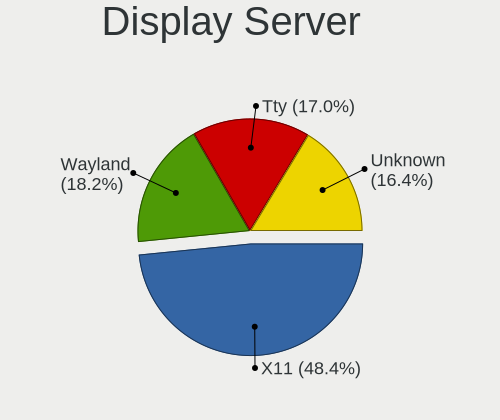

| Name    | Notebooks | Percent |
|---------|-----------|---------|
| Wayland | 12        | 40%     |
| X11     | 9         | 30%     |
| Tty     | 5         | 16.67%  |
| Unknown | 4         | 13.33%  |

Display Manager
---------------

SDDM, LightDM, etc.

| Name    | Notebooks | Percent |
|---------|-----------|---------|
| Unknown | 14        | 46.67%  |
| SDDM    | 10        | 33.33%  |
| GDM     | 3         | 10%     |
| SLiM    | 1         | 3.33%   |
| LightDM | 1         | 3.33%   |
| GREETD  | 1         | 3.33%   |

OS Lang
-------

Language

| Lang       | Notebooks | Percent |
|------------|-----------|---------|
| en_US      | 14        | 48.28%  |
| ru_RU      | 2         | 6.9%    |
| de_DE      | 2         | 6.9%    |
| C          | 2         | 6.9%    |
| Unknown    | 2         | 6.9%    |
| tr_TR      | 1         | 3.45%   |
| it_IT      | 1         | 3.45%   |
| es_AR      | 1         | 3.45%   |
| en_US.UTF8 | 1         | 3.45%   |
| en_NZ      | 1         | 3.45%   |
| en_AU      | 1         | 3.45%   |
| C.UTF8     | 1         | 3.45%   |

Boot Mode
---------

EFI or BIOS

| Mode | Notebooks | Percent |
|------|-----------|---------|
| EFI  | 27        | 93.1%   |
| BIOS | 2         | 6.9%    |

Filesystem
----------

Type of filesystem

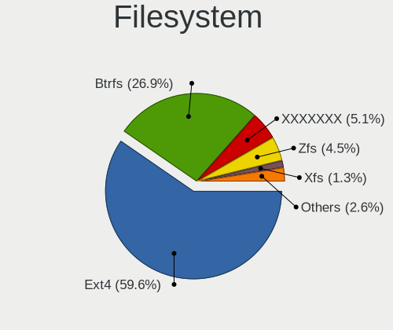

| Type  | Notebooks | Percent |
|-------|-----------|---------|
| Ext4  | 15        | 51.72%  |
| Btrfs | 13        | 44.83%  |
| F2fs  | 1         | 3.45%   |

Part. scheme
------------

Scheme of partitioning

| Type | Notebooks | Percent |
|------|-----------|---------|
| GPT  | 27        | 93.1%   |
| MBR  | 2         | 6.9%    |

Dual Boot with Linux/BSD
------------------------

Hosting more than one Linux/BSD

| Dual boot | Notebooks | Percent |
|-----------|-----------|---------|
| No        | 25        | 83.33%  |
| Yes       | 5         | 16.67%  |

Dual Boot (Win)
---------------

Hosting Linux and Windows

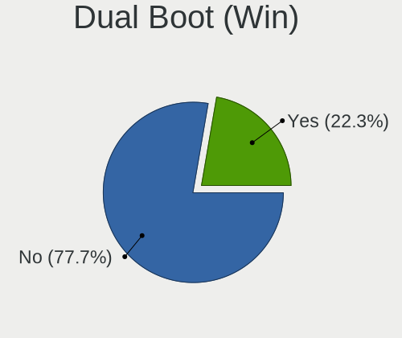

| Dual boot | Notebooks | Percent |
|-----------|-----------|---------|
| No        | 22        | 75.86%  |
| Yes       | 7         | 24.14%  |

Board
-----

Vendor
------

Motherboard manufacturer

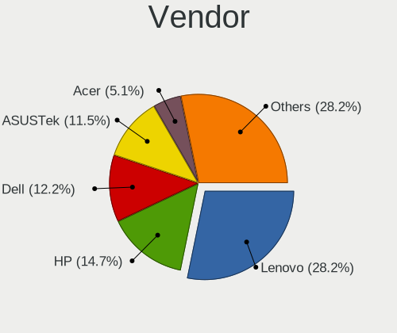

| Name             | Notebooks | Percent |
|------------------|-----------|---------|
| Lenovo           | 12        | 41.38%  |
| Dell             | 4         | 13.79%  |
| Acer             | 3         | 10.34%  |
| Timi             | 2         | 6.9%    |
| MSI              | 2         | 6.9%    |
| Hewlett-Packard  | 2         | 6.9%    |
| ASUSTek Computer | 2         | 6.9%    |
| Toshiba          | 1         | 3.45%   |
| Framework        | 1         | 3.45%   |

Model
-----

Motherboard model

| Name                                     | Notebooks | Percent |
|------------------------------------------|-----------|---------|
| HP Laptop 15s-eq0xxx                     | 2         | 6.9%    |
| Toshiba Satellite C850D-118              | 1         | 3.45%   |
| Timi RedmiBook 13                        | 1         | 3.45%   |
| Timi Mi Laptop Pro 15                    | 1         | 3.45%   |
| MSI GS63VR 6RF                           | 1         | 3.45%   |
| MSI GE73 Raider RGB 8RF                  | 1         | 3.45%   |
| Lenovo Yoga S740-14IIL 81RS              | 1         | 3.45%   |
| Lenovo ThinkPad X1 Carbon 7th 20QD0039RI | 1         | 3.45%   |
| Lenovo ThinkPad T470p 20J7S06Q00         | 1         | 3.45%   |
| Lenovo ThinkPad P1 Gen 3 20TJS2F437      | 1         | 3.45%   |
| Lenovo ThinkPad E495 20NE000BGE          | 1         | 3.45%   |
| Lenovo ThinkPad E15 Gen 2 20T8001STX     | 1         | 3.45%   |
| Lenovo ThinkPad 20FMCT01WW               | 1         | 3.45%   |
| Lenovo ThinkBook 14 G3 ACL 21A2          | 1         | 3.45%   |
| Lenovo Legion R7000 2020 82B6            | 1         | 3.45%   |
| Lenovo Legion 5 Pro 16ACH6H 82JQ         | 1         | 3.45%   |
| Lenovo IdeaPad 5 Pro 16ACH6 82L5         | 1         | 3.45%   |
| Lenovo IdeaPad 5 15ITL05 82FG            | 1         | 3.45%   |
| Framework Laptop                         | 1         | 3.45%   |
| Dell XPS 15 9570                         | 1         | 3.45%   |
| Dell Precision 3561                      | 1         | 3.45%   |
| Dell Latitude 7490                       | 1         | 3.45%   |
| Dell Inspiron 5415                       | 1         | 3.45%   |
| ASUS ROG Zephyrus G14 GA401QE_GA401QE    | 1         | 3.45%   |
| ASUS ROG Strix G513QY_G513QY             | 1         | 3.45%   |
| Acer Nitro AN515-54                      | 1         | 3.45%   |
| Acer Aspire A715-42G                     | 1         | 3.45%   |
| Acer Aspire A515-55                      | 1         | 3.45%   |

Model Family
------------

Motherboard model prefix

| Name              | Notebooks | Percent |
|-------------------|-----------|---------|
| Lenovo ThinkPad   | 6         | 20.69%  |
| Lenovo Legion     | 2         | 6.9%    |
| Lenovo IdeaPad    | 2         | 6.9%    |
| HP Laptop         | 2         | 6.9%    |
| ASUS ROG          | 2         | 6.9%    |
| Acer Aspire       | 2         | 6.9%    |
| Toshiba Satellite | 1         | 3.45%   |
| Timi RedmiBook    | 1         | 3.45%   |
| Timi Mi           | 1         | 3.45%   |
| MSI GS63VR        | 1         | 3.45%   |
| MSI GE73          | 1         | 3.45%   |
| Lenovo Yoga       | 1         | 3.45%   |
| Lenovo ThinkBook  | 1         | 3.45%   |
| Framework Laptop  | 1         | 3.45%   |
| Dell XPS          | 1         | 3.45%   |
| Dell Precision    | 1         | 3.45%   |
| Dell Latitude     | 1         | 3.45%   |
| Dell Inspiron     | 1         | 3.45%   |
| Acer Nitro        | 1         | 3.45%   |

MFG Year
--------

Motherboard manufacture year

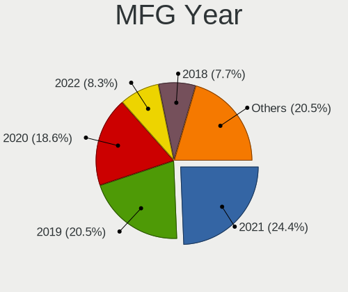

| Year | Notebooks | Percent |
|------|-----------|---------|
| 2021 | 9         | 31.03%  |
| 2019 | 8         | 27.59%  |
| 2020 | 6         | 20.69%  |
| 2018 | 3         | 10.34%  |
| 2017 | 1         | 3.45%   |
| 2016 | 1         | 3.45%   |
| 2012 | 1         | 3.45%   |

Form Factor
-----------

Physical design of the computer

| Name     | Notebooks | Percent |
|----------|-----------|---------|
| Notebook | 29        | 100%    |

Secure Boot
-----------

Enabled or disabled

| State    | Notebooks | Percent |
|----------|-----------|---------|
| Disabled | 27        | 93.1%   |
| Enabled  | 2         | 6.9%    |

Coreboot
--------

Have coreboot on board

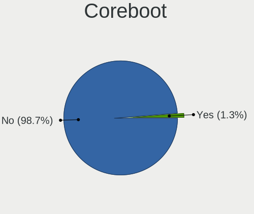

| Used | Notebooks | Percent |
|------|-----------|---------|
| No   | 29        | 100%    |

RAM Size
--------

Total RAM memory

| Size in GB  | Notebooks | Percent |
|-------------|-----------|---------|
| 8.01-16.0   | 10        | 34.48%  |
| 16.01-24.0  | 7         | 24.14%  |
| 32.01-64.0  | 5         | 17.24%  |
| 4.01-8.0    | 4         | 13.79%  |
| 24.01-32.0  | 1         | 3.45%   |
| 64.01-256.0 | 1         | 3.45%   |
| 1.01-2.0    | 1         | 3.45%   |

RAM Used
--------

Used RAM memory

| Used GB   | Notebooks | Percent |
|-----------|-----------|---------|
| 4.01-8.0  | 8         | 26.67%  |
| 1.01-2.0  | 8         | 26.67%  |
| 3.01-4.0  | 4         | 13.33%  |
| 8.01-16.0 | 4         | 13.33%  |
| 2.01-3.0  | 3         | 10%     |
| 0.51-1.0  | 3         | 10%     |

Total Drives
------------

Number of drives on board

| Drives | Notebooks | Percent |
|--------|-----------|---------|
| 1      | 21        | 72.41%  |
| 2      | 6         | 20.69%  |
| 4      | 1         | 3.45%   |
| 3      | 1         | 3.45%   |

Has CD-ROM
----------

Has CD-ROM on board

| Presented | Notebooks | Percent |
|-----------|-----------|---------|
| No        | 27        | 90%     |
| Yes       | 3         | 10%     |

Has Ethernet
------------

Has Ethernet on board

| Presented | Notebooks | Percent |
|-----------|-----------|---------|
| Yes       | 18        | 62.07%  |
| No        | 11        | 37.93%  |

Has WiFi
--------

Has WiFi module

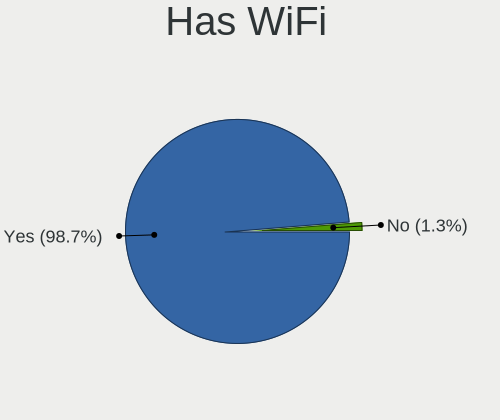

| Presented | Notebooks | Percent |
|-----------|-----------|---------|
| Yes       | 29        | 100%    |

Has Bluetooth
-------------

Has Bluetooth module

| Presented | Notebooks | Percent |
|-----------|-----------|---------|
| Yes       | 27        | 93.1%   |
| No        | 2         | 6.9%    |

Location
--------

Country
-------

Geographic location (country)

| Country     | Notebooks | Percent |
|-------------|-----------|---------|
| Germany     | 5         | 17.24%  |
| USA         | 4         | 13.79%  |
| Russia      | 4         | 13.79%  |
| Uruguay     | 1         | 3.45%   |
| Turkey      | 1         | 3.45%   |
| Sweden      | 1         | 3.45%   |
| Spain       | 1         | 3.45%   |
| Romania     | 1         | 3.45%   |
| Philippines | 1         | 3.45%   |
| New Zealand | 1         | 3.45%   |
| Italy       | 1         | 3.45%   |
| India       | 1         | 3.45%   |
| Hong Kong   | 1         | 3.45%   |
| Greece      | 1         | 3.45%   |
| Finland     | 1         | 3.45%   |
| Czechia     | 1         | 3.45%   |
| China       | 1         | 3.45%   |
| Belarus     | 1         | 3.45%   |
| Australia   | 1         | 3.45%   |

City
----

Geographic location (city)

| City             | Notebooks | Percent |
|------------------|-----------|---------|
| Zebulon          | 1         | 3.33%   |
| Yekaterinburg    | 1         | 3.33%   |
| West Orange      | 1         | 3.33%   |
| Sydney           | 1         | 3.33%   |
| Sestao           | 1         | 3.33%   |
| Ratingen         | 1         | 3.33%   |
| Nyk?¶ping        | 1         | 3.33%   |
| Nuremberg        | 1         | 3.33%   |
| Novosibirsk      | 1         | 3.33%   |
| Nizhniy Novgorod | 1         | 3.33%   |
| Moscow           | 1         | 3.33%   |
| Minsk            | 1         | 3.33%   |
| Milan            | 1         | 3.33%   |
| Maldonado        | 1         | 3.33%   |
| Kulmbach         | 1         | 3.33%   |
| Hyderabad        | 1         | 3.33%   |
| Helsinki         | 1         | 3.33%   |
| Harsum           | 1         | 3.33%   |
| Guangzhou        | 1         | 3.33%   |
| Foshan           | 1         | 3.33%   |
| Chicago          | 1         | 3.33%   |
| Cerritos         | 1         | 3.33%   |
| Central          | 1         | 3.33%   |
| Calamba          | 1         | 3.33%   |
| Brno             | 1         | 3.33%   |
| Brasov           | 1         | 3.33%   |
| Berlin           | 1         | 3.33%   |
| Auckland         | 1         | 3.33%   |
| Athens           | 1         | 3.33%   |
| Ankara           | 1         | 3.33%   |

Drives
------

Drive Vendor
------------

Hard drive vendors

| Vendor              | Notebooks | Drives | Percent |
|---------------------|-----------|--------|---------|
| WDC                 | 7         | 7      | 18.92%  |
| Samsung Electronics | 7         | 7      | 18.92%  |
| Intel               | 6         | 7      | 16.22%  |
| SK Hynix            | 5         | 5      | 13.51%  |
| Seagate             | 4         | 4      | 10.81%  |
| Toshiba             | 2         | 2      | 5.41%   |
| Unknown             | 1         | 3      | 2.7%    |
| KIOXIA-EXCERIA      | 1         | 2      | 2.7%    |
| KIOXIA              | 1         | 1      | 2.7%    |
| Kingston            | 1         | 1      | 2.7%    |
| HGST                | 1         | 1      | 2.7%    |
| Crucial             | 1         | 1      | 2.7%    |

Drive Model
-----------

Hard drive models

| Model                                   | Notebooks | Percent |
|-----------------------------------------|-----------|---------|
| Samsung MZVLB512HBJQ-000L2 512GB        | 2         | 5.41%   |
| Intel SSDPEKNW010T8 1TB                 | 2         | 5.41%   |
| Intel SSDPEKNU512GZ 512GB               | 2         | 5.41%   |
| WDC WDS250G2X0C-00L350 250GB            | 1         | 2.7%    |
| WDC WDS100T2B0C-00PXH0 1TB              | 1         | 2.7%    |
| WDC WD2500BEVS-22UST0 250GB             | 1         | 2.7%    |
| WDC PC SN730 SDBPNTY-512G-1006 512GB    | 1         | 2.7%    |
| WDC PC SN530 SDBPMPZ-512G-1101 512GB    | 1         | 2.7%    |
| WDC PC SN530 SDBPMPZ-256G-1001 256GB    | 1         | 2.7%    |
| WDC PC SN520 SDAPNUW-512G-1014 512GB    | 1         | 2.7%    |
| Unknown USB DISK 3.2 1TB                | 1         | 2.7%    |
| Toshiba KXG6AZNV512G 512GB              | 1         | 2.7%    |
| Toshiba KSG60ZMV512G M.2 2280 512GB SSD | 1         | 2.7%    |
| SK Hynix SKHynix_HFS001TDE9X084N 1TB    | 1         | 2.7%    |
| SK Hynix PC711 NVMe 512GB               | 1         | 2.7%    |
| SK Hynix HFM512GDHTNG-8710B 512GB       | 1         | 2.7%    |
| SK Hynix HFM512GD3JX016N 512GB          | 1         | 2.7%    |
| SK Hynix BC711 NVMe 512GB               | 1         | 2.7%    |
| Seagate ST1000LM049-2GH172 1TB          | 1         | 2.7%    |
| Seagate ST1000LM035-1RK172 1TB          | 1         | 2.7%    |
| Seagate ST1000LM035-1RK1 1TB            | 1         | 2.7%    |
| Seagate FireCuda 530 ZP4000GM30013 4TB  | 1         | 2.7%    |
| Samsung SSD 980 PRO 2TB                 | 1         | 2.7%    |
| Samsung SSD 970 EVO 500GB               | 1         | 2.7%    |
| Samsung MZVLW1T0HMLH-000L7 1TB          | 1         | 2.7%    |
| Samsung MZNLN512HAJQ-00000 512GB SSD    | 1         | 2.7%    |
| Samsung MZALQ512HALU-000L2 512GB        | 1         | 2.7%    |
| KIOXIA-EXCERIA SSD 500GB                | 1         | 2.7%    |
| KIOXIA KBG30ZMV256G 256GB               | 1         | 2.7%    |
| Kingston RBUSNS8154P3256GJ 256GB        | 1         | 2.7%    |
| Intel SSDPEKNW020T8 2TB                 | 1         | 2.7%    |
| Intel SSDPEKKF256G8L 256GB              | 1         | 2.7%    |
| HGST HTS721010A9E630 1TB                | 1         | 2.7%    |
| Crucial CT1000P1SSD8 1TB                | 1         | 2.7%    |

HDD Vendor
----------

Hard disk drive vendors

| Vendor  | Notebooks | Drives | Percent |
|---------|-----------|--------|---------|
| Seagate | 3         | 3      | 60%     |
| WDC     | 1         | 1      | 20%     |
| HGST    | 1         | 1      | 20%     |

SSD Vendor
----------

Solid state drive vendors

| Vendor              | Notebooks | Drives | Percent |
|---------------------|-----------|--------|---------|
| Toshiba             | 1         | 1      | 50%     |
| Samsung Electronics | 1         | 1      | 50%     |

Drive Kind
----------

HDD or SSD

| Kind    | Notebooks | Drives | Percent |
|---------|-----------|--------|---------|
| NVMe    | 25        | 31     | 75.76%  |
| HDD     | 5         | 5      | 15.15%  |
| SSD     | 2         | 2      | 6.06%   |
| Unknown | 1         | 3      | 3.03%   |

Drive Connector
---------------

SATA, SAS, NVMe, etc.

| Type | Notebooks | Drives | Percent |
|------|-----------|--------|---------|
| NVMe | 25        | 31     | 75.76%  |
| SATA | 7         | 7      | 21.21%  |
| SAS  | 1         | 3      | 3.03%   |

Drive Size
----------

Size of hard drive

| Size in TB | Notebooks | Drives | Percent |
|------------|-----------|--------|---------|
| 0.51-1.0   | 6         | 6      | 85.71%  |
| 0.01-0.5   | 1         | 1      | 14.29%  |

Space Total
-----------

Amount of disk space available on the file system

| Size in GB     | Notebooks | Percent |
|----------------|-----------|---------|
| 251-500        | 11        | 37.93%  |
| 1001-2000      | 5         | 17.24%  |
| 501-1000       | 5         | 17.24%  |
| 101-250        | 3         | 10.34%  |
| 1-20           | 2         | 6.9%    |
| More than 3000 | 1         | 3.45%   |
| 21-50          | 1         | 3.45%   |
| 2001-3000      | 1         | 3.45%   |

Space Used
----------

Amount of used disk space

| Used GB   | Notebooks | Percent |
|-----------|-----------|---------|
| 101-250   | 7         | 24.14%  |
| 1-20      | 7         | 24.14%  |
| 21-50     | 5         | 17.24%  |
| 1001-2000 | 3         | 10.34%  |
| 501-1000  | 3         | 10.34%  |
| 251-500   | 2         | 6.9%    |
| 51-100    | 2         | 6.9%    |

Malfunc. Drives
---------------

Drive models with a malfunction

| Model                          | Notebooks | Drives | Percent |
|--------------------------------|-----------|--------|---------|
| Seagate ST1000LM049-2GH172 1TB | 1         | 1      | 25%     |
| Seagate ST1000LM035-1RK172 1TB | 1         | 1      | 25%     |
| Intel SSDPEKKF256G8L 256GB     | 1         | 1      | 25%     |
| Crucial CT1000P1SSD8 1TB       | 1         | 1      | 25%     |

Malfunc. Drive Vendor
---------------------

Vendors of faulty drives

| Vendor  | Notebooks | Drives | Percent |
|---------|-----------|--------|---------|
| Seagate | 2         | 2      | 50%     |
| Intel   | 1         | 1      | 25%     |
| Crucial | 1         | 1      | 25%     |

Malfunc. HDD Vendor
-------------------

Vendors of faulty HDD drives

| Vendor  | Notebooks | Drives | Percent |
|---------|-----------|--------|---------|
| Seagate | 2         | 2      | 100%    |

Malfunc. Drive Kind
-------------------

Kinds of faulty drives

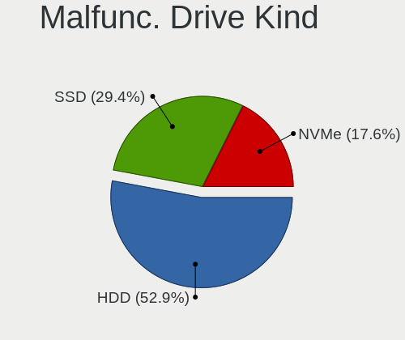

| Kind | Notebooks | Drives | Percent |
|------|-----------|--------|---------|
| NVMe | 2         | 2      | 50%     |
| HDD  | 2         | 2      | 50%     |

Failed Drives
-------------

Failed drive models

Zero info for selected period =(

Failed Drive Vendor
-------------------

Failed drive vendors

Zero info for selected period =(

Drive Status
------------

Number of failed and malfunc. drives

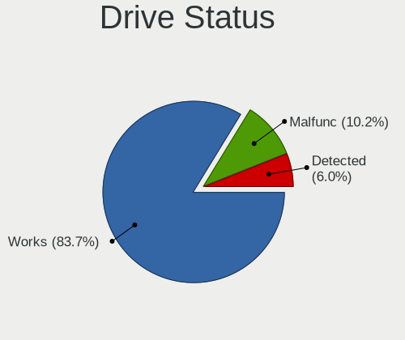

| Status   | Notebooks | Drives | Percent |
|----------|-----------|--------|---------|
| Works    | 27        | 34     | 84.38%  |
| Malfunc  | 4         | 4      | 12.5%   |
| Detected | 1         | 3      | 3.13%   |

Storage controller
------------------

Storage Vendor
--------------

Storage controller vendors

| Vendor                       | Notebooks | Percent |
|------------------------------|-----------|---------|
| Intel                        | 15        | 33.33%  |
| AMD                          | 7         | 15.56%  |
| Sandisk                      | 6         | 13.33%  |
| Samsung Electronics          | 6         | 13.33%  |
| SK Hynix                     | 5         | 11.11%  |
| Toshiba America Info Systems | 2         | 4.44%   |
| Seagate Technology           | 1         | 2.22%   |
| Micron/Crucial Technology    | 1         | 2.22%   |
| KIOXIA                       | 1         | 2.22%   |
| Kingston Technology Company  | 1         | 2.22%   |

Storage Model
-------------

Storage controller models

| Model                                                 | Notebooks | Percent |
|-------------------------------------------------------|-----------|---------|
| AMD FCH SATA Controller [AHCI mode]                   | 7         | 15.22%  |
| SK Hynix Gold P31 SSD                                 | 4         | 8.7%    |
| Samsung NVMe SSD Controller SM981/PM981/PM983         | 3         | 6.52%   |
| Intel SSD 660P Series                                 | 3         | 6.52%   |
| Sandisk Non-Volatile memory controller                | 2         | 4.35%   |
| Intel Non-Volatile memory controller                  | 2         | 4.35%   |
| Intel Cannon Lake Mobile PCH SATA AHCI Controller     | 2         | 4.35%   |
| Toshiba America Info Systems XG6 NVMe SSD Controller  | 1         | 2.17%   |
| Toshiba America Info Systems BG3 NVMe SSD Controller  | 1         | 2.17%   |
| SK Hynix BC501 NVMe Solid State Drive                 | 1         | 2.17%   |
| Seagate FireCuda 530 SSD                              | 1         | 2.17%   |
| Sandisk WD Blue SN550 NVMe SSD                        | 1         | 2.17%   |
| Sandisk WD Blue SN500 / PC SN520 NVMe SSD             | 1         | 2.17%   |
| Sandisk WD Black SN750 / PC SN730 NVMe SSD            | 1         | 2.17%   |
| Sandisk WD Black 2018/SN750 / PC SN720 NVMe SSD       | 1         | 2.17%   |
| Samsung NVMe SSD Controller SM961/PM961/SM963         | 1         | 2.17%   |
| Samsung NVMe SSD Controller PM9A1/PM9A3/980PRO        | 1         | 2.17%   |
| Samsung NVMe SSD Controller 980                       | 1         | 2.17%   |
| Micron/Crucial P1 NVMe PCIe SSD                       | 1         | 2.17%   |
| KIOXIA NVMe SSD                                       | 1         | 2.17%   |
| Kingston Company U-SNS8154P3 NVMe SSD                 | 1         | 2.17%   |
| Intel Volume Management Device NVMe RAID Controller   | 1         | 2.17%   |
| Intel Tiger Lake-LP SATA Controller [AHCI mode]       | 1         | 2.17%   |
| Intel Sunrise Point-LP SATA Controller [AHCI mode]    | 1         | 2.17%   |
| Intel SSD Pro 7600p/760p/E 6100p Series               | 1         | 2.17%   |
| Intel Ice Lake-LP SATA Controller [AHCI mode]         | 1         | 2.17%   |
| Intel HM170/QM170 Chipset SATA Controller [AHCI Mode] | 1         | 2.17%   |
| Intel Comet Lake SATA AHCI Controller                 | 1         | 2.17%   |
| Intel 82801 Mobile SATA Controller [RAID mode]        | 1         | 2.17%   |
| Intel 500 Series Chipset Family SATA AHCI Controller  | 1         | 2.17%   |

Storage Kind
------------

Kind of storage controller (IDE, SATA, NVMe, SAS, ...)

| Kind | Notebooks | Percent |
|------|-----------|---------|
| NVMe | 25        | 59.52%  |
| SATA | 16        | 38.1%   |
| RAID | 1         | 2.38%   |

Processor
---------

CPU Vendor
----------

Processor vendors

| Vendor | Notebooks | Percent |
|--------|-----------|---------|
| Intel  | 16        | 55.17%  |
| AMD    | 13        | 44.83%  |

CPU Model
---------

Processor models

| Model                                         | Notebooks | Percent |
|-----------------------------------------------|-----------|---------|
| Intel Core i7-8750H CPU @ 2.20GHz             | 3         | 10.34%  |
| AMD Ryzen 7 5700U with Radeon Graphics        | 2         | 6.9%    |
| Intel Core i7-8650U CPU @ 1.90GHz             | 1         | 3.45%   |
| Intel Core i7-8565U CPU @ 1.80GHz             | 1         | 3.45%   |
| Intel Core i7-7700HQ CPU @ 2.80GHz            | 1         | 3.45%   |
| Intel Core i7-6700HQ CPU @ 2.60GHz            | 1         | 3.45%   |
| Intel Core i7-10850H CPU @ 2.70GHz            | 1         | 3.45%   |
| Intel Core i7-1065G7 CPU @ 1.30GHz            | 1         | 3.45%   |
| Intel Core i7-10510U CPU @ 1.80GHz            | 1         | 3.45%   |
| Intel Core i5-9300H CPU @ 2.40GHz             | 1         | 3.45%   |
| Intel Core i5-1035G1 CPU @ 1.00GHz            | 1         | 3.45%   |
| Intel Core i5-10210U CPU @ 1.60GHz            | 1         | 3.45%   |
| Intel 11th Gen Core i7-1185G7 @ 3.00GHz       | 1         | 3.45%   |
| Intel 11th Gen Core i7-11850H @ 2.50GHz       | 1         | 3.45%   |
| Intel 11th Gen Core i5-1135G7 @ 2.40GHz       | 1         | 3.45%   |
| AMD Ryzen 9 5900HX with Radeon Graphics       | 1         | 3.45%   |
| AMD Ryzen 7 5800HS with Radeon Graphics       | 1         | 3.45%   |
| AMD Ryzen 7 5800H with Radeon Graphics        | 1         | 3.45%   |
| AMD Ryzen 7 4800H with Radeon Graphics        | 1         | 3.45%   |
| AMD Ryzen 7 4700U with Radeon Graphics        | 1         | 3.45%   |
| AMD Ryzen 7 3700U with Radeon Vega Mobile Gfx | 1         | 3.45%   |
| AMD Ryzen 5 5600H with Radeon Graphics        | 1         | 3.45%   |
| AMD Ryzen 5 5500U with Radeon Graphics        | 1         | 3.45%   |
| AMD Ryzen 5 3500U with Radeon Vega Mobile Gfx | 1         | 3.45%   |
| AMD Ryzen 3 3200U with Radeon Vega Mobile Gfx | 1         | 3.45%   |
| AMD E1-1200 APU with Radeon HD Graphics       | 1         | 3.45%   |

CPU Model Family
----------------

Processor model prefix

| Model         | Notebooks | Percent |
|---------------|-----------|---------|
| Intel Core i7 | 10        | 34.48%  |
| AMD Ryzen 7   | 7         | 24.14%  |
| Other         | 3         | 10.34%  |
| Intel Core i5 | 3         | 10.34%  |
| AMD Ryzen 5   | 3         | 10.34%  |
| AMD Ryzen 9   | 1         | 3.45%   |
| AMD Ryzen 3   | 1         | 3.45%   |
| AMD E1        | 1         | 3.45%   |

CPU Cores
---------

Number of processor cores

| Number | Notebooks | Percent |
|--------|-----------|---------|
| 4      | 13        | 44.83%  |
| 8      | 8         | 27.59%  |
| 6      | 6         | 20.69%  |
| 2      | 2         | 6.9%    |

CPU Sockets
-----------

Number of sockets

| Number | Notebooks | Percent |
|--------|-----------|---------|
| 1      | 29        | 100%    |

CPU Threads
-----------

Threads per core (Hyper-Threading)

| Number | Notebooks | Percent |
|--------|-----------|---------|
| 2      | 26        | 89.66%  |
| 1      | 3         | 10.34%  |

CPU Op-Modes
------------

CPU Operation Modes (32-bit, 64-bit)

| Op mode        | Notebooks | Percent |
|----------------|-----------|---------|
| 32-bit, 64-bit | 29        | 100%    |

CPU Microcode
-------------

Microcode number

| Number     | Notebooks | Percent |
|------------|-----------|---------|
| 0x906ea    | 4         | 13.79%  |
| 0x0a50000c | 4         | 13.79%  |
| 0x806ec    | 3         | 10.34%  |
| 0x706e5    | 2         | 6.9%    |
| 0x08608103 | 2         | 6.9%    |
| 0x08600103 | 2         | 6.9%    |
| 0x08108109 | 2         | 6.9%    |
| Unknown    | 2         | 6.9%    |
| 0xa0652    | 1         | 3.45%   |
| 0x906e9    | 1         | 3.45%   |
| 0x806d1    | 1         | 3.45%   |
| 0x806c1    | 1         | 3.45%   |
| 0x506e3    | 1         | 3.45%   |
| 0x08608102 | 1         | 3.45%   |
| 0x08108102 | 1         | 3.45%   |
| 0x05000119 | 1         | 3.45%   |

CPU Microarch
-------------

Microarchitecture

| Name      | Notebooks | Percent |
|-----------|-----------|---------|
| KabyLake  | 9         | 31.03%  |
| Zen 3     | 4         | 13.79%  |
| Zen+      | 3         | 10.34%  |
| IceLake   | 3         | 10.34%  |
| Unknown   | 3         | 10.34%  |
| Zen 2     | 2         | 6.9%    |
| TigerLake | 2         | 6.9%    |
| Skylake   | 1         | 3.45%   |
| CometLake | 1         | 3.45%   |
| Bobcat    | 1         | 3.45%   |

Graphics
--------

GPU Vendor
----------

Vendors of graphics cards

| Vendor | Notebooks | Percent |
|--------|-----------|---------|
| Intel  | 16        | 38.1%   |
| Nvidia | 14        | 33.33%  |
| AMD    | 12        | 28.57%  |

GPU Model
---------

Graphics card models

| Model                                                                | Notebooks | Percent |
|----------------------------------------------------------------------|-----------|---------|
| Intel CoffeeLake-H GT2 [UHD Graphics 630]                            | 4         | 9.3%    |
| AMD Cezanne                                                          | 4         | 9.3%    |
| Nvidia GP108M [GeForce MX250]                                        | 3         | 6.98%   |
| AMD Picasso/Raven 2 [Radeon Vega Series / Radeon Vega Mobile Series] | 3         | 6.98%   |
| AMD Lucienne                                                         | 3         | 6.98%   |
| Nvidia TU117M [GeForce GTX 1650 Mobile / Max-Q]                      | 2         | 4.65%   |
| Nvidia GP107M [GeForce GTX 1050 Ti Mobile]                           | 2         | 4.65%   |
| Intel TigerLake-LP GT2 [Iris Xe Graphics]                            | 2         | 4.65%   |
| Intel CometLake-U GT2 [UHD Graphics]                                 | 2         | 4.65%   |
| Nvidia TU117M [GeForce GTX 1650 Ti Mobile]                           | 1         | 2.33%   |
| Nvidia TU117GLM [T600 Mobile]                                        | 1         | 2.33%   |
| Nvidia GP106M [GeForce GTX 1060 Mobile]                              | 1         | 2.33%   |
| Nvidia GP104M [GeForce GTX 1070 Mobile]                              | 1         | 2.33%   |
| Nvidia GM108M [GeForce 940MX]                                        | 1         | 2.33%   |
| Nvidia GA107M [GeForce RTX 3050 Ti Mobile]                           | 1         | 2.33%   |
| Nvidia GA104M [GeForce RTX 3070 Mobile / Max-Q]                      | 1         | 2.33%   |
| Intel WhiskeyLake-U GT2 [UHD Graphics 620]                           | 1         | 2.33%   |
| Intel UHD Graphics 620                                               | 1         | 2.33%   |
| Intel TigerLake-H GT1 [UHD Graphics]                                 | 1         | 2.33%   |
| Intel Iris Plus Graphics G7                                          | 1         | 2.33%   |
| Intel Iris Plus Graphics G1 (Ice Lake)                               | 1         | 2.33%   |
| Intel HD Graphics 630                                                | 1         | 2.33%   |
| Intel HD Graphics 530                                                | 1         | 2.33%   |
| Intel CometLake-H GT2 [UHD Graphics]                                 | 1         | 2.33%   |
| AMD Wrestler [Radeon HD 7310]                                        | 1         | 2.33%   |
| AMD Renoir                                                           | 1         | 2.33%   |
| AMD Navi 22 [Radeon RX 6700/6700 XT / 6800M]                         | 1         | 2.33%   |

GPU Combo
---------

Combinations of graphics cards

| Name           | Notebooks | Percent |
|----------------|-----------|---------|
| Intel + Nvidia | 10        | 34.48%  |
| 1 x AMD        | 8         | 27.59%  |
| 1 x Intel      | 6         | 20.69%  |
| AMD + Nvidia   | 3         | 10.34%  |
| 2 x AMD        | 1         | 3.45%   |
| 1 x Nvidia     | 1         | 3.45%   |

GPU Driver
----------

Free vs proprietary

| Driver      | Notebooks | Percent |
|-------------|-----------|---------|
| Free        | 19        | 65.52%  |
| Proprietary | 10        | 34.48%  |

GPU Memory
----------

Total video memory

| Size in GB | Notebooks | Percent |
|------------|-----------|---------|
| Unknown    | 12        | 41.38%  |
| 1.01-2.0   | 6         | 20.69%  |
| 0.01-0.5   | 4         | 13.79%  |
| 3.01-4.0   | 3         | 10.34%  |
| 0.51-1.0   | 2         | 6.9%    |
| 5.01-6.0   | 1         | 3.45%   |
| 8.01-16.0  | 1         | 3.45%   |

Monitor
-------

Monitor Vendor
--------------

Monitor vendors

| Vendor              | Notebooks | Percent |
|---------------------|-----------|---------|
| BOE                 | 9         | 26.47%  |
| AU Optronics        | 8         | 23.53%  |
| Chimei Innolux      | 5         | 14.71%  |
| Sharp               | 3         | 8.82%   |
| Samsung Electronics | 1         | 2.94%   |
| PANDA               | 1         | 2.94%   |
| LG Display          | 1         | 2.94%   |
| Lenovo              | 1         | 2.94%   |
| Goldstar            | 1         | 2.94%   |
| CSO                 | 1         | 2.94%   |
| BenQ                | 1         | 2.94%   |
| ASUSTek Computer    | 1         | 2.94%   |
| AOC                 | 1         | 2.94%   |

Monitor Model
-------------

Monitor models

| Model                                                                | Notebooks | Percent |
|----------------------------------------------------------------------|-----------|---------|
| AU Optronics LCD Monitor AUO61ED 1920x1080 344x194mm 15.5-inch       | 2         | 5.88%   |
| Sharp LQ156M1JW01 SHP14C3 1920x1080 344x194mm 15.5-inch              | 1         | 2.94%   |
| Sharp LQ140M1JW49 SHP1523 1920x1080 309x174mm 14.0-inch              | 1         | 2.94%   |
| Sharp LCD Monitor SHP148D 3840x2160 344x194mm 15.5-inch              | 1         | 2.94%   |
| Samsung Electronics LCD Monitor SEC3150 1366x768 344x193mm 15.5-inch | 1         | 2.94%   |
| PANDA LCD Monitor NCP0040 1920x1080 344x194mm 15.5-inch              | 1         | 2.94%   |
| LG Display LCD Monitor LGD04A7 1920x1080 344x194mm 15.5-inch         | 1         | 2.94%   |
| Lenovo Q27q-10 LEN65F4 2560x1440 597x336mm 27.0-inch                 | 1         | 2.94%   |
| Goldstar HDR 4K GSM7707 3840x2160 600x340mm 27.2-inch                | 1         | 2.94%   |
| CSO LCD Monitor CSO1609 2560x1600 345x215mm 16.0-inch                | 1         | 2.94%   |
| Chimei Innolux LCD Monitor CMN1747 1920x1080 380x210mm 17.1-inch     | 1         | 2.94%   |
| Chimei Innolux LCD Monitor CMN14E7 1920x1080 309x173mm 13.9-inch     | 1         | 2.94%   |
| Chimei Innolux LCD Monitor CMN14D4 1920x1080 309x173mm 13.9-inch     | 1         | 2.94%   |
| Chimei Innolux LCD Monitor CMN14D3 1920x1080 309x173mm 13.9-inch     | 1         | 2.94%   |
| Chimei Innolux LCD Monitor CMN140A 1920x1080 309x173mm 13.9-inch     | 1         | 2.94%   |
| BOE LCD Monitor BOE09B6 2560x1600 345x215mm 16.0-inch                | 1         | 2.94%   |
| BOE LCD Monitor BOE0973 2560x1440 344x194mm 15.5-inch                | 1         | 2.94%   |
| BOE LCD Monitor BOE095F 2256x1504 285x190mm 13.5-inch                | 1         | 2.94%   |
| BOE LCD Monitor BOE0928 1920x1080 344x194mm 15.5-inch                | 1         | 2.94%   |
| BOE LCD Monitor BOE0900 1920x1080 344x194mm 15.5-inch                | 1         | 2.94%   |
| BOE LCD Monitor BOE08E2 1920x1080 344x194mm 15.5-inch                | 1         | 2.94%   |
| BOE LCD Monitor BOE0898 1920x1080 294x165mm 13.3-inch                | 1         | 2.94%   |
| BOE LCD Monitor BOE086E 1920x1080 344x194mm 15.5-inch                | 1         | 2.94%   |
| BOE LCD Monitor BOE0821 3840x2160 309x174mm 14.0-inch                | 1         | 2.94%   |
| BenQ EX2780Q BNQ7F76 2560x1440 597x336mm 27.0-inch                   | 1         | 2.94%   |
| AU Optronics LCD Monitor AUODF87 1920x1080 344x193mm 15.5-inch       | 1         | 2.94%   |
| AU Optronics LCD Monitor AUO32EB 3840x2160 344x193mm 15.5-inch       | 1         | 2.94%   |
| AU Optronics LCD Monitor AUO2E8D 1920x1080 344x194mm 15.5-inch       | 1         | 2.94%   |
| AU Optronics LCD Monitor AUO243D 1920x1080 309x173mm 13.9-inch       | 1         | 2.94%   |
| AU Optronics LCD Monitor AUO233D 1920x1080 309x174mm 14.0-inch       | 1         | 2.94%   |
| AU Optronics LCD Monitor AUO21ED 1920x1080 344x193mm 15.5-inch       | 1         | 2.94%   |
| ASUSTek Computer VG27AQL1A AUS2704 2560x1440 596x336mm 26.9-inch     | 1         | 2.94%   |
| AOC U34G2G1 AOC3402 3440x1440 797x334mm 34.0-inch                    | 1         | 2.94%   |

Monitor Resolution
------------------

Monitor screen resolution

| Resolution      | Notebooks | Percent |
|-----------------|-----------|---------|
| 1920x1080 (FHD) | 21        | 63.64%  |
| 3840x2160 (4K)  | 4         | 12.12%  |
| 2560x1440 (QHD) | 3         | 9.09%   |
| 2560x1600       | 2         | 6.06%   |
| 3440x1440       | 1         | 3.03%   |
| 2256x1504       | 1         | 3.03%   |
| 1366x768 (WXGA) | 1         | 3.03%   |

Monitor Diagonal
----------------

Diagonal size in inches

| Inches | Notebooks | Percent |
|--------|-----------|---------|
| 15     | 16        | 48.48%  |
| 13     | 6         | 18.18%  |
| 14     | 4         | 12.12%  |
| 27     | 3         | 9.09%   |
| 16     | 2         | 6.06%   |
| 34     | 1         | 3.03%   |
| 17     | 1         | 3.03%   |

Monitor Width
-------------

Physical width

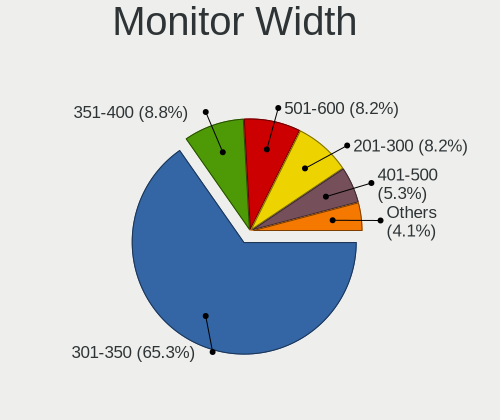

| Width in mm | Notebooks | Percent |
|-------------|-----------|---------|
| 301-350     | 26        | 78.79%  |
| 501-600     | 3         | 9.09%   |
| 201-300     | 2         | 6.06%   |
| 701-800     | 1         | 3.03%   |
| 351-400     | 1         | 3.03%   |

Aspect Ratio
------------

Proportional relationship between the width and the height

| Ratio | Notebooks | Percent |
|-------|-----------|---------|
| 16/9  | 26        | 86.67%  |
| 16/10 | 2         | 6.67%   |
| 3/2   | 1         | 3.33%   |
| 21/9  | 1         | 3.33%   |

Monitor Area
------------

Area in inch²

| Area in inch² | Notebooks | Percent |
|----------------|-----------|---------|
| 101-110        | 16        | 48.48%  |
| 81-90          | 9         | 27.27%  |
| 301-350        | 3         | 9.09%   |
| 111-120        | 2         | 6.06%   |
| 71-80          | 1         | 3.03%   |
| 351-500        | 1         | 3.03%   |
| 121-130        | 1         | 3.03%   |

Pixel Density
-------------

Pixels per inch

| Density       | Notebooks | Percent |
|---------------|-----------|---------|
| 121-160       | 20        | 60.61%  |
| 161-240       | 6         | 18.18%  |
| More than 240 | 3         | 9.09%   |
| 101-120       | 3         | 9.09%   |
| 51-100        | 1         | 3.03%   |

Multiple Monitors
-----------------

Total monitors connected

| Total | Notebooks | Percent |
|-------|-----------|---------|
| 1     | 25        | 86.21%  |
| 2     | 3         | 10.34%  |
| 3     | 1         | 3.45%   |

Network
-------

Net Controller Vendor
---------------------

Controller vendors

| Vendor                | Notebooks | Percent |
|-----------------------|-----------|---------|
| Intel                 | 23        | 56.1%   |
| Realtek Semiconductor | 12        | 29.27%  |
| Qualcomm Atheros      | 2         | 4.88%   |
| MEDIATEK              | 2         | 4.88%   |
| Samsung Electronics   | 1         | 2.44%   |
| ICS Advent            | 1         | 2.44%   |

Net Controller Model
--------------------

Controller models

| Model                                                             | Notebooks | Percent |
|-------------------------------------------------------------------|-----------|---------|
| Realtek RTL8111/8168/8411 PCI Express Gigabit Ethernet Controller | 9         | 18.75%  |
| Intel Wi-Fi 6 AX200                                               | 7         | 14.58%  |
| MEDIATEK MT7921 802.11ax PCI Express Wireless Network Adapter     | 2         | 4.17%   |
| Intel Wireless 8265 / 8275                                        | 2         | 4.17%   |
| Intel Wi-Fi 6 AX210/AX211/AX411 160MHz                            | 2         | 4.17%   |
| Intel Ice Lake-LP PCH CNVi WiFi                                   | 2         | 4.17%   |
| Intel Comet Lake PCH-LP CNVi WiFi                                 | 2         | 4.17%   |
| Intel Cannon Lake PCH CNVi WiFi                                   | 2         | 4.17%   |
| Samsung Galaxy series, misc. (tethering mode)                     | 1         | 2.08%   |
| Realtek RTL8822CE 802.11ac PCIe Wireless Network Adapter          | 1         | 2.08%   |
| Realtek RTL8822BE 802.11a/b/g/n/ac WiFi adapter                   | 1         | 2.08%   |
| Realtek RTL8821CE 802.11ac PCIe Wireless Network Adapter          | 1         | 2.08%   |
| Realtek RTL8723AE PCIe Wireless Network Adapter                   | 1         | 2.08%   |
| Realtek RTL810xE PCI Express Fast Ethernet controller             | 1         | 2.08%   |
| Qualcomm Atheros Killer E2500 Gigabit Ethernet Controller         | 1         | 2.08%   |
| Qualcomm Atheros Killer E2400 Gigabit Ethernet Controller         | 1         | 2.08%   |
| Intel Wireless-AC 9260                                            | 1         | 2.08%   |
| Intel Wireless 8260                                               | 1         | 2.08%   |
| Intel Wi-Fi 6 AX201                                               | 1         | 2.08%   |
| Intel Tiger Lake PCH CNVi WiFi                                    | 1         | 2.08%   |
| Intel Ethernet Connection (7) I219-V                              | 1         | 2.08%   |
| Intel Ethernet Connection (6) I219-V                              | 1         | 2.08%   |
| Intel Ethernet Connection (5) I219-V                              | 1         | 2.08%   |
| Intel Ethernet Connection (4) I219-LM                             | 1         | 2.08%   |
| Intel Ethernet Connection (14) I219-LM                            | 1         | 2.08%   |
| Intel Comet Lake PCH CNVi WiFi                                    | 1         | 2.08%   |
| Intel Cannon Point-LP CNVi [Wireless-AC]                          | 1         | 2.08%   |
| ICS Advent DM9601 Fast Ethernet Adapter                           | 1         | 2.08%   |

Wireless Vendor
---------------

Wireless vendors

| Vendor                | Notebooks | Percent |
|-----------------------|-----------|---------|
| Intel                 | 23        | 79.31%  |
| Realtek Semiconductor | 4         | 13.79%  |
| MEDIATEK              | 2         | 6.9%    |

Wireless Model
--------------

Wireless models

| Model                                                         | Notebooks | Percent |
|---------------------------------------------------------------|-----------|---------|
| Intel Wi-Fi 6 AX200                                           | 7         | 24.14%  |
| MEDIATEK MT7921 802.11ax PCI Express Wireless Network Adapter | 2         | 6.9%    |
| Intel Wireless 8265 / 8275                                    | 2         | 6.9%    |
| Intel Wi-Fi 6 AX210/AX211/AX411 160MHz                        | 2         | 6.9%    |
| Intel Ice Lake-LP PCH CNVi WiFi                               | 2         | 6.9%    |
| Intel Comet Lake PCH-LP CNVi WiFi                             | 2         | 6.9%    |
| Intel Cannon Lake PCH CNVi WiFi                               | 2         | 6.9%    |
| Realtek RTL8822CE 802.11ac PCIe Wireless Network Adapter      | 1         | 3.45%   |
| Realtek RTL8822BE 802.11a/b/g/n/ac WiFi adapter               | 1         | 3.45%   |
| Realtek RTL8821CE 802.11ac PCIe Wireless Network Adapter      | 1         | 3.45%   |
| Realtek RTL8723AE PCIe Wireless Network Adapter               | 1         | 3.45%   |
| Intel Wireless-AC 9260                                        | 1         | 3.45%   |
| Intel Wireless 8260                                           | 1         | 3.45%   |
| Intel Wi-Fi 6 AX201                                           | 1         | 3.45%   |
| Intel Tiger Lake PCH CNVi WiFi                                | 1         | 3.45%   |
| Intel Comet Lake PCH CNVi WiFi                                | 1         | 3.45%   |
| Intel Cannon Point-LP CNVi [Wireless-AC]                      | 1         | 3.45%   |

Ethernet Vendor
---------------

Ethernet vendors

| Vendor                | Notebooks | Percent |
|-----------------------|-----------|---------|
| Realtek Semiconductor | 10        | 52.63%  |
| Intel                 | 5         | 26.32%  |
| Qualcomm Atheros      | 2         | 10.53%  |
| Samsung Electronics   | 1         | 5.26%   |
| ICS Advent            | 1         | 5.26%   |

Ethernet Model
--------------

Ethernet models

| Model                                                             | Notebooks | Percent |
|-------------------------------------------------------------------|-----------|---------|
| Realtek RTL8111/8168/8411 PCI Express Gigabit Ethernet Controller | 9         | 47.37%  |
| Samsung Galaxy series, misc. (tethering mode)                     | 1         | 5.26%   |
| Realtek RTL810xE PCI Express Fast Ethernet controller             | 1         | 5.26%   |
| Qualcomm Atheros Killer E2500 Gigabit Ethernet Controller         | 1         | 5.26%   |
| Qualcomm Atheros Killer E2400 Gigabit Ethernet Controller         | 1         | 5.26%   |
| Intel Ethernet Connection (7) I219-V                              | 1         | 5.26%   |
| Intel Ethernet Connection (6) I219-V                              | 1         | 5.26%   |
| Intel Ethernet Connection (5) I219-V                              | 1         | 5.26%   |
| Intel Ethernet Connection (4) I219-LM                             | 1         | 5.26%   |
| Intel Ethernet Connection (14) I219-LM                            | 1         | 5.26%   |
| ICS Advent DM9601 Fast Ethernet Adapter                           | 1         | 5.26%   |

Net Controller Kind
-------------------

Ethernet, WiFi or modem

| Kind     | Notebooks | Percent |
|----------|-----------|---------|
| WiFi     | 29        | 61.7%   |
| Ethernet | 18        | 38.3%   |

Used Controller
---------------

Currently used network controller

| Kind     | Notebooks | Percent |
|----------|-----------|---------|
| WiFi     | 27        | 77.14%  |
| Ethernet | 8         | 22.86%  |

NICs
----

Total network controllers on board

| Total | Notebooks | Percent |
|-------|-----------|---------|
| 2     | 17        | 58.62%  |
| 1     | 12        | 41.38%  |

IPv6
----

IPv6 vs IPv4

| Used | Notebooks | Percent |
|------|-----------|---------|
| No   | 22        | 75.86%  |
| Yes  | 7         | 24.14%  |

Bluetooth
---------

Bluetooth Vendor
----------------

Controller vendors

| Vendor                | Notebooks | Percent |
|-----------------------|-----------|---------|
| Intel                 | 21        | 77.78%  |
| Realtek Semiconductor | 3         | 11.11%  |
| Toshiba               | 1         | 3.7%    |
| IMC Networks          | 1         | 3.7%    |
| Foxconn / Hon Hai     | 1         | 3.7%    |

Bluetooth Model
---------------

Controller models

| Model                                          | Notebooks | Percent |
|------------------------------------------------|-----------|---------|
| Intel Bluetooth Device                         | 12        | 44.44%  |
| Intel Bluetooth 9460/9560 Jefferson Peak (JfP) | 4         | 14.81%  |
| Intel Bluetooth wireless interface             | 2         | 7.41%   |
| Intel AX210 Bluetooth                          | 2         | 7.41%   |
| Toshiba RT Bluetooth Radio                     | 1         | 3.7%    |
| Realtek RTL8822BE Bluetooth 4.2 Adapter        | 1         | 3.7%    |
| Realtek  Bluetooth 4.2 Adapter                 | 1         | 3.7%    |
| Realtek Bluetooth Radio                        | 1         | 3.7%    |
| Intel Wireless-AC 9260 Bluetooth Adapter       | 1         | 3.7%    |
| IMC Networks Wireless_Device                   | 1         | 3.7%    |
| Foxconn / Hon Hai Wireless_Device              | 1         | 3.7%    |

Sound
-----

Sound Vendor
------------

Sound card vendors

| Vendor  | Notebooks | Percent |
|---------|-----------|---------|
| Intel   | 16        | 44.44%  |
| AMD     | 13        | 36.11%  |
| Nvidia  | 6         | 16.67%  |
| ACTIONS | 1         | 2.78%   |

Sound Model
-----------

Sound card models

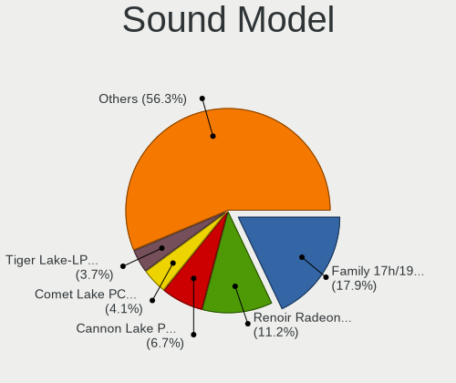

| Model                                                           | Notebooks | Percent |
|-----------------------------------------------------------------|-----------|---------|
| AMD Family 17h (Models 10h-1fh) HD Audio Controller             | 12        | 25%     |
| AMD Renoir Radeon High Definition Audio Controller              | 7         | 14.58%  |
| Intel Cannon Lake PCH cAVS                                      | 4         | 8.33%   |
| AMD Raven/Raven2/Fenghuang HDMI/DP Audio Controller             | 3         | 6.25%   |
| Nvidia TU107 GeForce GTX 1650 High Definition Audio Controller  | 2         | 4.17%   |
| Intel Tiger Lake-LP Smart Sound Technology Audio Controller     | 2         | 4.17%   |
| Intel Ice Lake-LP Smart Sound Technology Audio Controller       | 2         | 4.17%   |
| Intel Comet Lake PCH-LP cAVS                                    | 2         | 4.17%   |
| Nvidia GP107GL High Definition Audio Controller                 | 1         | 2.08%   |
| Nvidia GP106 High Definition Audio Controller                   | 1         | 2.08%   |
| Nvidia GP104 High Definition Audio Controller                   | 1         | 2.08%   |
| Nvidia Audio device                                             | 1         | 2.08%   |
| Intel Tiger Lake-H HD Audio Controller                          | 1         | 2.08%   |
| Intel Sunrise Point-LP HD Audio                                 | 1         | 2.08%   |
| Intel Comet Lake PCH cAVS                                       | 1         | 2.08%   |
| Intel CM238 HD Audio Controller                                 | 1         | 2.08%   |
| Intel Cannon Point-LP High Definition Audio Controller          | 1         | 2.08%   |
| Intel 100 Series/C230 Series Chipset Family HD Audio Controller | 1         | 2.08%   |
| AMD Wrestler HDMI Audio                                         | 1         | 2.08%   |
| AMD Navi 21 HDMI Audio [Radeon RX 6800/6800 XT / 6900 XT]       | 1         | 2.08%   |
| AMD FCH Azalia Controller                                       | 1         | 2.08%   |
| ACTIONS EDIFIER M380                                            | 1         | 2.08%   |

Memory
------

Memory Vendor
-------------

Memory module vendors

| Vendor              | Notebooks | Percent |
|---------------------|-----------|---------|
| Samsung Electronics | 18        | 50%     |
| SK Hynix            | 9         | 25%     |
| Kingston            | 4         | 11.11%  |
| Micron Technology   | 3         | 8.33%   |
| Patriot             | 1         | 2.78%   |
| Crucial             | 1         | 2.78%   |

Memory Model
------------

Memory module models

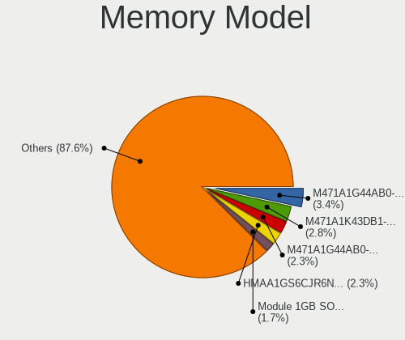

| Model                                                            | Notebooks | Percent |
|------------------------------------------------------------------|-----------|---------|
| Samsung RAM M471A1G44AB0-CWE 8192MB SODIMM DDR4 3200MT/s         | 3         | 8.33%   |
| Samsung RAM M471A1K43CB1-CTD 8GB SODIMM DDR4 2667MT/s            | 2         | 5.56%   |
| Samsung RAM M471A1K43BB1-CRC 8192MB SODIMM DDR4 2667MT/s         | 2         | 5.56%   |
| Samsung RAM M471A1G44AB0-CTD 8GB SODIMM DDR4 2667MT/s            | 2         | 5.56%   |
| SK Hynix RAM HMAA4GS6AJR8N-XN 32GB SODIMM DDR4 3200MT/s          | 1         | 2.78%   |
| SK Hynix RAM HMAA2GS6AJR8N-XN 16384MB SODIMM DDR4 3200MT/s       | 1         | 2.78%   |
| SK Hynix RAM HMAA1GS6CJR6N-XN 8GB SODIMM DDR4 3200MT/s           | 1         | 2.78%   |
| SK Hynix RAM HMAA1GS6CJR6N-XN 8192MB SODIMM DDR4 3200MT/s        | 1         | 2.78%   |
| SK Hynix RAM HMA851S6CJR6N-VK 4GB SODIMM DDR4 2667MT/s           | 1         | 2.78%   |
| SK Hynix RAM HMA82GS6AFR8N-UH 16GB SODIMM DDR4 2667MT/s          | 1         | 2.78%   |
| SK Hynix RAM HMA81GS6JJR8N-VK 8GB SODIMM DDR4 2667MT/s           | 1         | 2.78%   |
| SK Hynix RAM HMA81GS6DJR8N-XN 8GB SODIMM DDR4 3200MT/s           | 1         | 2.78%   |
| SK Hynix RAM H9HCNNNCPMALHR-NEE 8GB Row Of Chips LPDDR4 4267MT/s | 1         | 2.78%   |
| Samsung RAM Module 8GB Row Of Chips LPDDR3 2133MT/s              | 1         | 2.78%   |
| Samsung RAM M471B5773CHS-CK0 2048MB SODIMM DDR3 1600MT/s         | 1         | 2.78%   |
| Samsung RAM M471A5244CB0-CWE 4GB Row Of Chips DDR4 3200MT/s      | 1         | 2.78%   |
| Samsung RAM M471A2K43DB1-CTD 16GB SODIMM DDR4 2667MT/s           | 1         | 2.78%   |
| Samsung RAM M471A2K43CB1-CTD 16384MB SODIMM DDR4 2667MT/s        | 1         | 2.78%   |
| Samsung RAM M471A2G43BB2-CWE 16GB SODIMM DDR4 3200MT/s           | 1         | 2.78%   |
| Samsung RAM M471A2G43AB2-CWE 16GB SODIMM DDR4 3200MT/s           | 1         | 2.78%   |
| Samsung RAM M471A1K43DB1-CWE 8GB SODIMM DDR4 3200MT/s            | 1         | 2.78%   |
| Samsung RAM M471A1G44AB0-CWE 8GB Row Of Chips DDR4 3200MT/s      | 1         | 2.78%   |
| Patriot RAM PSD416G24002S 16GB SODIMM DDR4 2667MT/s              | 1         | 2.78%   |
| Micron RAM Module 16GB SODIMM DDR4 2667MT/s                      | 1         | 2.78%   |
| Micron RAM 8ATF1G64HZ-3G2J1 8GB SODIMM DDR4 3200MT/s             | 1         | 2.78%   |
| Micron RAM 4ATF1G64HZ-3G2E2 8GB SODIMM DDR4 3200MT/s             | 1         | 2.78%   |
| Kingston RAM KF3200C20S4/32GX 32GB SODIMM DDR4 3200MT/s          | 1         | 2.78%   |
| Kingston RAM HP26D4S9S8HJ-8 8GB SODIMM DDR4 2667MT/s             | 1         | 2.78%   |
| Kingston RAM 99U5624-013.A00G 8GB SODIMM DDR4 2400MT/s           | 1         | 2.78%   |
| Kingston RAM 9905700-053.A00G 8192MB SODIMM DDR4 3200MT/s        | 1         | 2.78%   |
| Crucial RAM CT32G4SFD832A.C16FE 32GB SODIMM DDR4 3200MT/s        | 1         | 2.78%   |

Memory Kind
-----------

Memory module kinds

| Kind   | Notebooks | Percent |
|--------|-----------|---------|
| DDR4   | 26        | 89.66%  |
| LPDDR4 | 1         | 3.45%   |
| LPDDR3 | 1         | 3.45%   |
| DDR3   | 1         | 3.45%   |

Memory Form Factor
------------------

Physical design of the memory module

| Name         | Notebooks | Percent |
|--------------|-----------|---------|
| SODIMM       | 25        | 86.21%  |
| Row Of Chips | 4         | 13.79%  |

Memory Size
-----------

Memory module size

| Size  | Notebooks | Percent |
|-------|-----------|---------|
| 8192  | 19        | 63.33%  |
| 16384 | 6         | 20%     |
| 32768 | 3         | 10%     |
| 4096  | 1         | 3.33%   |
| 2048  | 1         | 3.33%   |

Memory Speed
------------

Memory module speed

| Speed | Notebooks | Percent |
|-------|-----------|---------|
| 3200  | 13        | 43.33%  |
| 2667  | 13        | 43.33%  |
| 4267  | 1         | 3.33%   |
| 2400  | 1         | 3.33%   |
| 2133  | 1         | 3.33%   |
| 1600  | 1         | 3.33%   |

Printers & scanners
-------------------

Printer Vendor
--------------

Printer device vendors

Zero info for selected period =(

Printer Model
-------------

Printer device models

Zero info for selected period =(

Scanner Vendor
--------------

Scanner device vendors

Zero info for selected period =(

Scanner Model
-------------

Scanner device models

Zero info for selected period =(

Camera
------

Camera Vendor
-------------

Camera device vendors

| Vendor                        | Notebooks | Percent |
|-------------------------------|-----------|---------|
| Chicony Electronics           | 6         | 26.09%  |
| IMC Networks                  | 5         | 21.74%  |
| Sunplus Innovation Technology | 2         | 8.7%    |
| Realtek Semiconductor         | 2         | 8.7%    |
| Luxvisions Innotech Limited   | 2         | 8.7%    |
| Acer                          | 2         | 8.7%    |
| Syntek                        | 1         | 4.35%   |
| Quanta                        | 1         | 4.35%   |
| Microdia                      | 1         | 4.35%   |
| Lite-On Technology            | 1         | 4.35%   |

Camera Model
------------

Camera device models

| Model                                               | Notebooks | Percent |
|-----------------------------------------------------|-----------|---------|
| IMC Networks Integrated Camera                      | 5         | 21.74%  |
| Chicony Integrated Camera                           | 3         | 13.04%  |
| Sunplus Integrated_Webcam_HD                        | 2         | 8.7%    |
| Luxvisions Innotech Limited HP TrueVision HD Camera | 2         | 8.7%    |
| Chicony HD User Facing                              | 2         | 8.7%    |
| Syntek Integrated Camera                            | 1         | 4.35%   |
| Realtek Integrated Webcam HD                        | 1         | 4.35%   |
| Realtek Integrated Camera                           | 1         | 4.35%   |
| Quanta HD Webcam                                    | 1         | 4.35%   |
| Microdia Integrated_Webcam_HD                       | 1         | 4.35%   |
| Lite-On TOSHIBA Web Camera - HD                     | 1         | 4.35%   |
| Chicony XiaoMi USB 2.0 Webcam                       | 1         | 4.35%   |
| Acer NEC HD WebCam                                  | 1         | 4.35%   |
| Acer HD Webcam                                      | 1         | 4.35%   |

Security
--------

Fingerprint Vendor
------------------

Fingerprint sensor vendors

| Vendor                     | Notebooks | Percent |
|----------------------------|-----------|---------|
| Validity Sensors           | 1         | 25%     |
| Synaptics                  | 1         | 25%     |
| Shenzhen Goodix Technology | 1         | 25%     |
| Elan Microelectronics      | 1         | 25%     |

Fingerprint Model
-----------------

Fingerprint sensor models

| Model                                             | Notebooks | Percent |
|---------------------------------------------------|-----------|---------|
| Validity Sensors Synaptics WBDI                   | 1         | 25%     |
| Synaptics Prometheus MIS Touch Fingerprint Reader | 1         | 25%     |
| Shenzhen Goodix  FingerPrint Device               | 1         | 25%     |
| Elan ELAN:Fingerprint                             | 1         | 25%     |

Chipcard Vendor
---------------

Chipcard module vendors

| Vendor      | Notebooks | Percent |
|-------------|-----------|---------|
| Broadcom    | 2         | 66.67%  |
| Alcor Micro | 1         | 33.33%  |

Chipcard Model
--------------

Chipcard module models

| Model                               | Notebooks | Percent |
|-------------------------------------|-----------|---------|
| Broadcom 5880                       | 1         | 33.33%  |
| Broadcom 58200                      | 1         | 33.33%  |
| Alcor Micro AU9540 Smartcard Reader | 1         | 33.33%  |

Unsupported
-----------

Unsupported Devices
-------------------

Total unsupported devices on board

| Total | Notebooks | Percent |
|-------|-----------|---------|
| 0     | 16        | 55.17%  |
| 1     | 7         | 24.14%  |
| 3     | 3         | 10.34%  |
| 2     | 3         | 10.34%  |

Unsupported Device Types
------------------------

Types of unsupported devices

| Type                     | Notebooks | Percent |
|--------------------------|-----------|---------|
| Fingerprint reader       | 4         | 18.18%  |
| Camera                   | 4         | 18.18%  |
| Multimedia controller    | 3         | 13.64%  |
| Chipcard                 | 3         | 13.64%  |
| Graphics card            | 2         | 9.09%   |
| Communication controller | 2         | 9.09%   |
| Storage/ata              | 1         | 4.55%   |
| Net/wireless             | 1         | 4.55%   |
| Card reader              | 1         | 4.55%   |
| Bluetooth                | 1         | 4.55%   |

