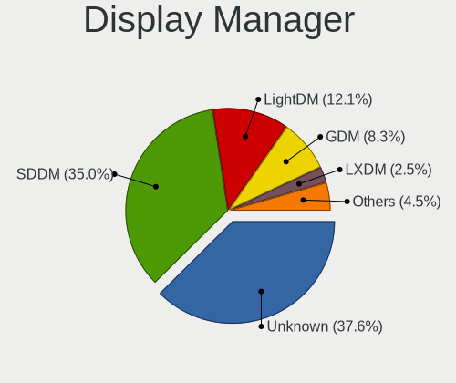
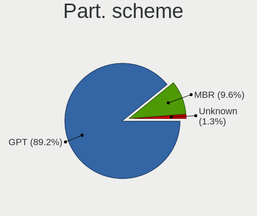
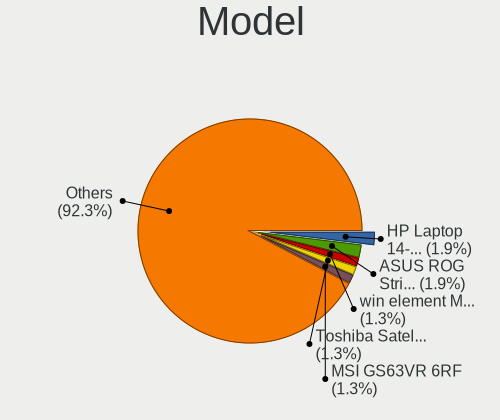
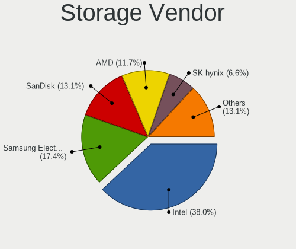
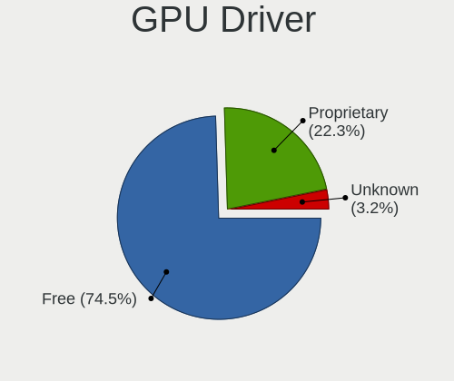
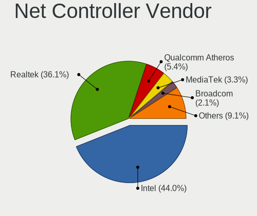
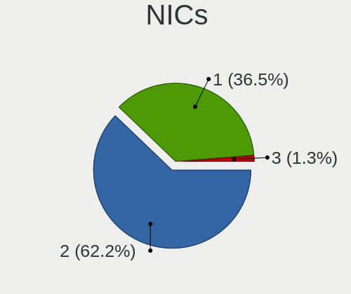
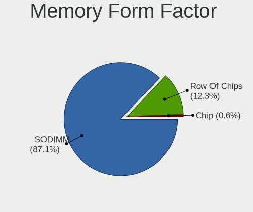
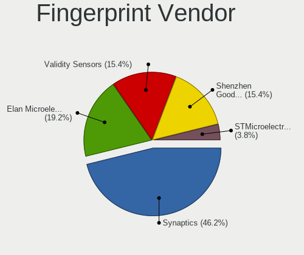

Gentoo 2.8 - Tested Hardware & Statistics (Notebooks)
-----------------------------------------------------

A project to collect tested hardware configurations for Gentoo 2.8.

Anyone can contribute to this report by the [hw-probe](https://github.com/linuxhw/hw-probe) tool:

    sudo -E hw-probe -all -upload

Please contribute! Especially if your hardware is rare.

Contents
--------

* [ Test Cases ](#test-cases)

* [ System ](#system)
  - [ Kernel                   ](#kernel)
  - [ Kernel Family            ](#kernel-family)
  - [ Kernel Major Ver.        ](#kernel-major-ver)
  - [ Arch                     ](#arch)
  - [ DE                       ](#de)
  - [ Display Server           ](#display-server)
  - [ Display Manager          ](#display-manager)
  - [ OS Lang                  ](#os-lang)
  - [ Boot Mode                ](#boot-mode)
  - [ Filesystem               ](#filesystem)
  - [ Part. scheme             ](#part-scheme)
  - [ Dual Boot with Linux/BSD ](#dual-boot-with-linuxbsd)
  - [ Dual Boot (Win)          ](#dual-boot-win)

* [ Board ](#board)
  - [ Vendor                   ](#vendor)
  - [ Model                    ](#model)
  - [ Model Family             ](#model-family)
  - [ MFG Year                 ](#mfg-year)
  - [ Form Factor              ](#form-factor)
  - [ Secure Boot              ](#secure-boot)
  - [ Coreboot                 ](#coreboot)
  - [ RAM Size                 ](#ram-size)
  - [ RAM Used                 ](#ram-used)
  - [ Total Drives             ](#total-drives)
  - [ Has CD-ROM               ](#has-cd-rom)
  - [ Has Ethernet             ](#has-ethernet)
  - [ Has WiFi                 ](#has-wifi)
  - [ Has Bluetooth            ](#has-bluetooth)

* [ Location ](#location)
  - [ Country                  ](#country)
  - [ City                     ](#city)

* [ Drives ](#drives)
  - [ Drive Vendor             ](#drive-vendor)
  - [ Drive Model              ](#drive-model)
  - [ HDD Vendor               ](#hdd-vendor)
  - [ SSD Vendor               ](#ssd-vendor)
  - [ Drive Kind               ](#drive-kind)
  - [ Drive Connector          ](#drive-connector)
  - [ Drive Size               ](#drive-size)
  - [ Space Total              ](#space-total)
  - [ Space Used               ](#space-used)
  - [ Malfunc. Drives          ](#malfunc-drives)
  - [ Malfunc. Drive Vendor    ](#malfunc-drive-vendor)
  - [ Malfunc. HDD Vendor      ](#malfunc-hdd-vendor)
  - [ Malfunc. Drive Kind      ](#malfunc-drive-kind)
  - [ Failed Drives            ](#failed-drives)
  - [ Failed Drive Vendor      ](#failed-drive-vendor)
  - [ Drive Status             ](#drive-status)

* [ Storage controller ](#storage-controller)
  - [ Storage Vendor           ](#storage-vendor)
  - [ Storage Model            ](#storage-model)
  - [ Storage Kind             ](#storage-kind)

* [ Processor ](#processor)
  - [ CPU Vendor               ](#cpu-vendor)
  - [ CPU Model                ](#cpu-model)
  - [ CPU Model Family         ](#cpu-model-family)
  - [ CPU Cores                ](#cpu-cores)
  - [ CPU Sockets              ](#cpu-sockets)
  - [ CPU Threads              ](#cpu-threads)
  - [ CPU Op-Modes             ](#cpu-op-modes)
  - [ CPU Microcode            ](#cpu-microcode)
  - [ CPU Microarch            ](#cpu-microarch)

* [ Graphics ](#graphics)
  - [ GPU Vendor               ](#gpu-vendor)
  - [ GPU Model                ](#gpu-model)
  - [ GPU Combo                ](#gpu-combo)
  - [ GPU Driver               ](#gpu-driver)
  - [ GPU Memory               ](#gpu-memory)

* [ Monitor ](#monitor)
  - [ Monitor Vendor           ](#monitor-vendor)
  - [ Monitor Model            ](#monitor-model)
  - [ Monitor Resolution       ](#monitor-resolution)
  - [ Monitor Diagonal         ](#monitor-diagonal)
  - [ Monitor Width            ](#monitor-width)
  - [ Aspect Ratio             ](#aspect-ratio)
  - [ Monitor Area             ](#monitor-area)
  - [ Pixel Density            ](#pixel-density)
  - [ Multiple Monitors        ](#multiple-monitors)

* [ Network ](#network)
  - [ Net Controller Vendor    ](#net-controller-vendor)
  - [ Net Controller Model     ](#net-controller-model)
  - [ Wireless Vendor          ](#wireless-vendor)
  - [ Wireless Model           ](#wireless-model)
  - [ Ethernet Vendor          ](#ethernet-vendor)
  - [ Ethernet Model           ](#ethernet-model)
  - [ Net Controller Kind      ](#net-controller-kind)
  - [ Used Controller          ](#used-controller)
  - [ NICs                     ](#nics)
  - [ IPv6                     ](#ipv6)

* [ Bluetooth ](#bluetooth)
  - [ Bluetooth Vendor         ](#bluetooth-vendor)
  - [ Bluetooth Model          ](#bluetooth-model)

* [ Sound ](#sound)
  - [ Sound Vendor             ](#sound-vendor)
  - [ Sound Model              ](#sound-model)

* [ Memory ](#memory)
  - [ Memory Vendor            ](#memory-vendor)
  - [ Memory Model             ](#memory-model)
  - [ Memory Kind              ](#memory-kind)
  - [ Memory Form Factor       ](#memory-form-factor)
  - [ Memory Size              ](#memory-size)
  - [ Memory Speed             ](#memory-speed)

* [ Printers & scanners ](#printers--scanners)
  - [ Printer Vendor           ](#printer-vendor)
  - [ Printer Model            ](#printer-model)
  - [ Scanner Vendor           ](#scanner-vendor)
  - [ Scanner Model            ](#scanner-model)

* [ Camera ](#camera)
  - [ Camera Vendor            ](#camera-vendor)
  - [ Camera Model             ](#camera-model)

* [ Security ](#security)
  - [ Fingerprint Vendor       ](#fingerprint-vendor)
  - [ Fingerprint Model        ](#fingerprint-model)
  - [ Chipcard Vendor          ](#chipcard-vendor)
  - [ Chipcard Model           ](#chipcard-model)

* [ Unsupported ](#unsupported)
  - [ Unsupported Devices      ](#unsupported-devices)
  - [ Unsupported Device Types ](#unsupported-device-types)

Test Cases
----------

Total: 73

| Vendor    | Model                       | Probe                                                      | Date         |
|-----------|-----------------------------|------------------------------------------------------------|--------------|
| Dell      | XPS 17 9710                 | [d33b756434](https://linux-hardware.org/?probe=d33b756434) | Jun 01, 2022 |
| Lenovo    | ThinkPad T14 Gen 1 20S1S... | [1be8c71a37](https://linux-hardware.org/?probe=1be8c71a37) | May 30, 2022 |
| Lenovo    | ThinkPad T14 Gen 1 20S1S... | [2669150033](https://linux-hardware.org/?probe=2669150033) | May 29, 2022 |
| Lenovo    | ThinkPad T14 Gen 1 20S1S... | [77989d3d20](https://linux-hardware.org/?probe=77989d3d20) | May 28, 2022 |
| HP        | Pavilion Gaming Laptop 1... | [e879d3c292](https://linux-hardware.org/?probe=e879d3c292) | May 27, 2022 |
| ASUSTek   | 1005HA                      | [0948f30719](https://linux-hardware.org/?probe=0948f30719) | May 26, 2022 |
| ASUSTek   | 1005HA                      | [1d5fe9025a](https://linux-hardware.org/?probe=1d5fe9025a) | May 25, 2022 |
| Lenovo    | ThinkPad T460 20FMS421US    | [47297bafb5](https://linux-hardware.org/?probe=47297bafb5) | May 21, 2022 |
| Lenovo    | ThinkPad T460 20FMS421US    | [7b878500c1](https://linux-hardware.org/?probe=7b878500c1) | May 21, 2022 |
| MSI       | MS-7A34                     | [8956078328](https://linux-hardware.org/?probe=8956078328) | May 21, 2022 |
| MSI       | GE66 Raider 11UE            | [d1a9527039](https://linux-hardware.org/?probe=d1a9527039) | May 16, 2022 |
| MSI       | GE66 Raider 11UE            | [d675d89c8a](https://linux-hardware.org/?probe=d675d89c8a) | May 16, 2022 |
| Lenovo    | ThinkPad P73 20QSS09S00     | [8438c92818](https://linux-hardware.org/?probe=8438c92818) | May 12, 2022 |
| HP        | Laptop 15s-eq0xxx           | [474578814d](https://linux-hardware.org/?probe=474578814d) | May 10, 2022 |
| Dell      | XPS 15 9510                 | [a934bef382](https://linux-hardware.org/?probe=a934bef382) | Apr 24, 2022 |
| Dell      | XPS 15 9510                 | [b61b2af9eb](https://linux-hardware.org/?probe=b61b2af9eb) | Apr 23, 2022 |
| Lenovo    | ThinkPad X220 4291QT1       | [9ffcb6bf7a](https://linux-hardware.org/?probe=9ffcb6bf7a) | Apr 18, 2022 |
| HP        | Pavilion Notebook           | [217905d42a](https://linux-hardware.org/?probe=217905d42a) | Apr 17, 2022 |
| Lenovo    | ThinkPad X220 4291QT1       | [00a23bc10c](https://linux-hardware.org/?probe=00a23bc10c) | Apr 17, 2022 |
| Dell      | G5 5505                     | [ce1fc33387](https://linux-hardware.org/?probe=ce1fc33387) | Apr 13, 2022 |
| MSI       | GE66 Raider 11UE            | [45472dad72](https://linux-hardware.org/?probe=45472dad72) | Apr 12, 2022 |
| HP        | ProBook 6570b               | [63d922ecdd](https://linux-hardware.org/?probe=63d922ecdd) | Apr 12, 2022 |
| HP        | ProBook 6570b               | [87414e70aa](https://linux-hardware.org/?probe=87414e70aa) | Apr 11, 2022 |
| System76  | Gazelle                     | [9edcac1b2c](https://linux-hardware.org/?probe=9edcac1b2c) | Apr 09, 2022 |
| System76  | Gazelle                     | [e22baecee4](https://linux-hardware.org/?probe=e22baecee4) | Apr 07, 2022 |
| Timi      | Mi Laptop Pro 15            | [33f98f8274](https://linux-hardware.org/?probe=33f98f8274) | Mar 23, 2022 |
| BANGHO    | MAX G0101                   | [b40c195d54](https://linux-hardware.org/?probe=b40c195d54) | Mar 20, 2022 |
| MSI       | MS-7A34                     | [27f8a2eb1f](https://linux-hardware.org/?probe=27f8a2eb1f) | Mar 18, 2022 |
| HP        | Victus by Laptop 16-e0xx... | [7c09492e3b](https://linux-hardware.org/?probe=7c09492e3b) | Mar 14, 2022 |
| HP        | Victus by Laptop 16-e0xx... | [f7e85dbf71](https://linux-hardware.org/?probe=f7e85dbf71) | Mar 14, 2022 |
| Framework | Laptop                      | [8902c057fb](https://linux-hardware.org/?probe=8902c057fb) | Mar 10, 2022 |
| Framework | Laptop                      | [e17db20b1c](https://linux-hardware.org/?probe=e17db20b1c) | Mar 08, 2022 |
| Lenovo    | Yoga Slim 7 14IIL05 82A1    | [0022f4a8cc](https://linux-hardware.org/?probe=0022f4a8cc) | Feb 26, 2022 |
| ASUSTek   | UX430UAR                    | [c7cd5ce50d](https://linux-hardware.org/?probe=c7cd5ce50d) | Feb 21, 2022 |
| MSI       | GS63VR 6RF                  | [c20c87027e](https://linux-hardware.org/?probe=c20c87027e) | Feb 10, 2022 |
| HP        | Pavilion Notebook           | [8f79e4d763](https://linux-hardware.org/?probe=8f79e4d763) | Feb 06, 2022 |
| Lenovo    | Legion Y7000 2019 PG0 81... | [f79196e39c](https://linux-hardware.org/?probe=f79196e39c) | Feb 05, 2022 |
| MSI       | GS63VR 6RF                  | [4873365af6](https://linux-hardware.org/?probe=4873365af6) | Jan 30, 2022 |
| Lenovo    | Yoga S740-14IIL 81RS        | [c021622ad4](https://linux-hardware.org/?probe=c021622ad4) | Jan 27, 2022 |
| Timi      | RedmiBook 13                | [e20538f56a](https://linux-hardware.org/?probe=e20538f56a) | Jan 26, 2022 |
| Lenovo    | IdeaPad 5 15ITL05 82FG      | [a4f6a4a38e](https://linux-hardware.org/?probe=a4f6a4a38e) | Jan 24, 2022 |
| Lenovo    | IdeaPad 5 15ITL05 82FG      | [9e4f498056](https://linux-hardware.org/?probe=9e4f498056) | Jan 24, 2022 |
| MSI       | GE73 Raider RGB 8RF         | [a5a825a072](https://linux-hardware.org/?probe=a5a825a072) | Jan 22, 2022 |
| Lenovo    | ThinkPad 20FMCT01WW         | [4bd81196a0](https://linux-hardware.org/?probe=4bd81196a0) | Jan 21, 2022 |
| Timi      | Mi Laptop Pro 15            | [65ce2eb070](https://linux-hardware.org/?probe=65ce2eb070) | Jan 19, 2022 |
| Lenovo    | ThinkPad X1 Carbon 7th 2... | [d786a0b993](https://linux-hardware.org/?probe=d786a0b993) | Jan 17, 2022 |
| Lenovo    | ThinkPad X1 Carbon 7th 2... | [6af6121c33](https://linux-hardware.org/?probe=6af6121c33) | Jan 17, 2022 |
| Dell      | Precision 3561              | [f5417a1852](https://linux-hardware.org/?probe=f5417a1852) | Jan 16, 2022 |
| Lenovo    | Legion 5 Pro 16ACH6H 82J... | [2aa146518a](https://linux-hardware.org/?probe=2aa146518a) | Jan 16, 2022 |
| Lenovo    | Legion R7000 2020 82B6      | [5f92f3376e](https://linux-hardware.org/?probe=5f92f3376e) | Jan 11, 2022 |
| Acer      | Nitro AN515-54              | [d46da820e0](https://linux-hardware.org/?probe=d46da820e0) | Jan 10, 2022 |
| ASUSTek   | ROG Zephyrus G14 GA401QE... | [0cf6f2102c](https://linux-hardware.org/?probe=0cf6f2102c) | Jan 03, 2022 |
| Timi      | RedmiBook 13                | [528d0d32b4](https://linux-hardware.org/?probe=528d0d32b4) | Jan 01, 2022 |
| Dell      | XPS 15 9570                 | [1695a19b52](https://linux-hardware.org/?probe=1695a19b52) | Dec 24, 2021 |
| Framework | Laptop                      | [33bb6590a6](https://linux-hardware.org/?probe=33bb6590a6) | Dec 21, 2021 |
| ASUSTek   | ROG Strix G513QY_G513QY     | [ee63a84605](https://linux-hardware.org/?probe=ee63a84605) | Dec 11, 2021 |
| Toshiba   | Satellite C850D-118         | [b15f2e2c92](https://linux-hardware.org/?probe=b15f2e2c92) | Dec 09, 2021 |
| HP        | Laptop 15s-eq0xxx           | [86f5c0bc34](https://linux-hardware.org/?probe=86f5c0bc34) | Nov 30, 2021 |
| HP        | Laptop 15s-eq0xxx           | [e06c73ada9](https://linux-hardware.org/?probe=e06c73ada9) | Nov 29, 2021 |
| Lenovo    | IdeaPad 5 Pro 16ACH6 82L... | [ad15be0510](https://linux-hardware.org/?probe=ad15be0510) | Nov 29, 2021 |
| Lenovo    | ThinkPad T470p 20J7S06Q0... | [6eca4a1be2](https://linux-hardware.org/?probe=6eca4a1be2) | Nov 22, 2021 |
| Lenovo    | ThinkPad T470p 20J7S06Q0... | [6c92c6ecbb](https://linux-hardware.org/?probe=6c92c6ecbb) | Nov 22, 2021 |
| Acer      | Aspire A715-42G             | [3ea389d8ff](https://linux-hardware.org/?probe=3ea389d8ff) | Nov 21, 2021 |
| Acer      | Aspire A715-42G             | [19f48288ec](https://linux-hardware.org/?probe=19f48288ec) | Nov 20, 2021 |
| Lenovo    | ThinkPad E495 20NE000BGE    | [871e0a8d36](https://linux-hardware.org/?probe=871e0a8d36) | Nov 11, 2021 |
| Dell      | Latitude 7490               | [ea64667f2c](https://linux-hardware.org/?probe=ea64667f2c) | Nov 01, 2021 |
| Lenovo    | ThinkPad P1 Gen 3 20TJS2... | [6105164e23](https://linux-hardware.org/?probe=6105164e23) | Oct 26, 2021 |
| Lenovo    | ThinkPad E15 Gen 2 20T80... | [8a34d739fd](https://linux-hardware.org/?probe=8a34d739fd) | Oct 25, 2021 |
| Acer      | Aspire A515-55              | [437c8fb96b](https://linux-hardware.org/?probe=437c8fb96b) | Oct 12, 2021 |
| Lenovo    | ThinkBook 14 G3 ACL 21A2    | [3ad4e11bac](https://linux-hardware.org/?probe=3ad4e11bac) | Oct 06, 2021 |
| Lenovo    | ThinkBook 14 G3 ACL 21A2    | [18a2385458](https://linux-hardware.org/?probe=18a2385458) | Oct 06, 2021 |
| Timi      | Mi Laptop Pro 15            | [e2057e68dd](https://linux-hardware.org/?probe=e2057e68dd) | Oct 03, 2021 |
| Dell      | Inspiron 5415               | [a265f8ea5c](https://linux-hardware.org/?probe=a265f8ea5c) | Oct 01, 2021 |

System
------

Kernel
------

Version of the Linux kernel

| Version                                         | Notebooks | Percent |
|-------------------------------------------------|-----------|---------|
| 5.14.9-gentoo-x86_64                            | 3         | 5.36%   |
| 5.17.1-gentoo-r1                                | 2         | 3.57%   |
| 5.16.0-gentoo-x86_64                            | 2         | 3.57%   |
| 5.15.10-gentoo-x86_64                           | 2         | 3.57%   |
| 5.18.1-gentoo-r1                                | 1         | 1.79%   |
| 5.18.0-rc7-x86_64-git-00119-gb015dcd62b86-dirty | 1         | 1.79%   |
| 5.17.9-gentoo-x86_64                            | 1         | 1.79%   |
| 5.17.9-gentoo-x86                               | 1         | 1.79%   |
| 5.17.9-gentoo                                   | 1         | 1.79%   |
| 5.17.8-gentoo-x86_64                            | 1         | 1.79%   |
| 5.17.7-gentoo-groovin                           | 1         | 1.79%   |
| 5.17.5-gentoo-dist                              | 1         | 1.79%   |
| 5.17.3-gentoo                                   | 1         | 1.79%   |
| 5.17.2-gentoo-groovin                           | 1         | 1.79%   |
| 5.17.0-gentoo-x86_64                            | 1         | 1.79%   |
| 5.16.9-gentoo-dist                              | 1         | 1.79%   |
| 5.16.8-gentoo-gentoo-dist                       | 1         | 1.79%   |
| 5.16.5-gentoo-x86_64                            | 1         | 1.79%   |
| 5.16.2-gentoo-x86_64                            | 1         | 1.79%   |
| 5.16.2-gentoo                                   | 1         | 1.79%   |
| 5.16.14-gentoo-x86_64-lto                       | 1         | 1.79%   |
| 5.16.14-gentoo                                  | 1         | 1.79%   |
| 5.16.11-gentoo-dist                             | 1         | 1.79%   |
| 5.16.10-gentoo--20-feb-2022                     | 1         | 1.79%   |
| 5.16.10-gentoo                                  | 1         | 1.79%   |
| 5.16.1-gentoo-x86_64                            | 1         | 1.79%   |
| 5.16.1-gentoo                                   | 1         | 1.79%   |
| 5.16.0-xanmod1                                  | 1         | 1.79%   |
| 5.16.0-pf5                                      | 1         | 1.79%   |
| 5.16.0-gentoo-gentoo-dist                       | 1         | 1.79%   |
| 5.16.0-gentoo                                   | 1         | 1.79%   |
| 5.15.7-gentoo                                   | 1         | 1.79%   |
| 5.15.6-gentoo                                   | 1         | 1.79%   |
| 5.15.5-gentoo-x86_64                            | 1         | 1.79%   |
| 5.15.5-gentoo-dist                              | 1         | 1.79%   |
| 5.15.5-gentoo                                   | 1         | 1.79%   |
| 5.15.35-adry                                    | 1         | 1.79%   |
| 5.15.33-gentoo-x86_64                           | 1         | 1.79%   |
| 5.15.33-gentoo-113-eee_drivers                  | 1         | 1.79%   |
| 5.15.19-gentoo-112-overlayfs                    | 1         | 1.79%   |
| 5.15.13-gentoo-dist                             | 1         | 1.79%   |
| 5.15.13-gentoo                                  | 1         | 1.79%   |
| 5.15.12-gentoo                                  | 1         | 1.79%   |
| 5.15.1-gentoo-x86_64                            | 1         | 1.79%   |
| 5.14.9-gentoo                                   | 1         | 1.79%   |
| 5.14.7-gentoo-x86_64                            | 1         | 1.79%   |
| 5.14.14-gentoo-x86_64                           | 1         | 1.79%   |
| 5.14.14-gentoo-dist                             | 1         | 1.79%   |
| 5.10.83-gentoo-dist                             | 1         | 1.79%   |
| 5.10.76-gentoo-r1                               | 1         | 1.79%   |
| 5.10.70-1-lts                                   | 1         | 1.79%   |

Kernel Family
-------------

Linux kernel without a distro release

| Version | Notebooks | Percent |
|---------|-----------|---------|
| 5.16.0  | 6         | 10.71%  |
| 5.14.9  | 4         | 7.14%   |
| 5.17.9  | 3         | 5.36%   |
| 5.15.5  | 3         | 5.36%   |
| 5.17.1  | 2         | 3.57%   |
| 5.16.2  | 2         | 3.57%   |
| 5.16.14 | 2         | 3.57%   |
| 5.16.10 | 2         | 3.57%   |
| 5.16.1  | 2         | 3.57%   |
| 5.15.33 | 2         | 3.57%   |
| 5.15.13 | 2         | 3.57%   |
| 5.15.10 | 2         | 3.57%   |
| 5.14.14 | 2         | 3.57%   |
| 5.18.1  | 1         | 1.79%   |
| 5.18.0  | 1         | 1.79%   |
| 5.17.8  | 1         | 1.79%   |
| 5.17.7  | 1         | 1.79%   |
| 5.17.5  | 1         | 1.79%   |
| 5.17.3  | 1         | 1.79%   |
| 5.17.2  | 1         | 1.79%   |
| 5.17.0  | 1         | 1.79%   |
| 5.16.9  | 1         | 1.79%   |
| 5.16.8  | 1         | 1.79%   |
| 5.16.5  | 1         | 1.79%   |
| 5.16.11 | 1         | 1.79%   |
| 5.15.7  | 1         | 1.79%   |
| 5.15.6  | 1         | 1.79%   |
| 5.15.35 | 1         | 1.79%   |
| 5.15.19 | 1         | 1.79%   |
| 5.15.12 | 1         | 1.79%   |
| 5.15.1  | 1         | 1.79%   |
| 5.14.7  | 1         | 1.79%   |
| 5.10.83 | 1         | 1.79%   |
| 5.10.76 | 1         | 1.79%   |
| 5.10.70 | 1         | 1.79%   |

Kernel Major Ver.
-----------------

Linux kernel major version

| Version | Notebooks | Percent |
|---------|-----------|---------|
| 5.16    | 17        | 32.08%  |
| 5.15    | 14        | 26.42%  |
| 5.17    | 10        | 18.87%  |
| 5.14    | 7         | 13.21%  |
| 5.10    | 3         | 5.66%   |
| 5.18    | 2         | 3.77%   |

Arch
----

OS architecture (x86_64, i586, etc.)

| Name   | Notebooks | Percent |
|--------|-----------|---------|
| x86_64 | 48        | 97.96%  |
| i686   | 1         | 2.04%   |

DE
--

Desktop Environment

| Name     | Notebooks | Percent |
|----------|-----------|---------|
| Unknown  | 20        | 40%     |
| KDE5     | 15        | 30%     |
| GNOME    | 6         | 12%     |
| XFCE     | 3         | 6%      |
| sway     | 1         | 2%      |
| MATE     | 1         | 2%      |
| LeftWM   | 1         | 2%      |
| fvwm     | 1         | 2%      |
| DWM      | 1         | 2%      |
| Cinnamon | 1         | 2%      |

Display Server
--------------

X11 or Wayland

| Name    | Notebooks | Percent |
|---------|-----------|---------|
| X11     | 22        | 43.14%  |
| Wayland | 13        | 25.49%  |
| Unknown | 9         | 17.65%  |
| Tty     | 7         | 13.73%  |

Display Manager
---------------

SDDM, LightDM, etc.

| Name    | Notebooks | Percent |
|---------|-----------|---------|
| Unknown | 23        | 46%     |
| SDDM    | 17        | 34%     |
| LightDM | 4         | 8%      |
| GDM     | 3         | 6%      |
| XDM     | 1         | 2%      |
| SLiM    | 1         | 2%      |
| GREETD  | 1         | 2%      |

OS Lang
-------

Language

| Lang       | Notebooks | Percent |
|------------|-----------|---------|
| en_US      | 23        | 46.94%  |
| Unknown    | 5         | 10.2%   |
| en_GB      | 4         | 8.16%   |
| ru_RU      | 2         | 4.08%   |
| es_AR      | 2         | 4.08%   |
| de_DE      | 2         | 4.08%   |
| C.UTF8     | 2         | 4.08%   |
| C          | 2         | 4.08%   |
| tr_TR      | 1         | 2.04%   |
| it_IT      | 1         | 2.04%   |
| fr_CA      | 1         | 2.04%   |
| en_US.UTF8 | 1         | 2.04%   |
| en_NZ      | 1         | 2.04%   |
| en_AU      | 1         | 2.04%   |
| el_GR      | 1         | 2.04%   |

Boot Mode
---------

EFI or BIOS

| Mode | Notebooks | Percent |
|------|-----------|---------|
| EFI  | 44        | 88%     |
| BIOS | 6         | 12%     |

Filesystem
----------

Type of filesystem

| Type  | Notebooks | Percent |
|-------|-----------|---------|
| Ext4  | 27        | 55.1%   |
| Btrfs | 20        | 40.82%  |
| Zfs   | 1         | 2.04%   |
| F2fs  | 1         | 2.04%   |

Part. scheme
------------

Scheme of partitioning

| Type | Notebooks | Percent |
|------|-----------|---------|
| GPT  | 44        | 89.8%   |
| MBR  | 5         | 10.2%   |

Dual Boot with Linux/BSD
------------------------

Hosting more than one Linux/BSD

| Dual boot | Notebooks | Percent |
|-----------|-----------|---------|
| No        | 39        | 78%     |
| Yes       | 11        | 22%     |

Dual Boot (Win)
---------------

Hosting Linux and Windows

| Dual boot | Notebooks | Percent |
|-----------|-----------|---------|
| No        | 38        | 77.55%  |
| Yes       | 11        | 22.45%  |

Board
-----

Vendor
------

Motherboard manufacturer

| Name             | Notebooks | Percent |
|------------------|-----------|---------|
| Lenovo           | 18        | 36.73%  |
| Dell             | 7         | 14.29%  |
| Hewlett-Packard  | 6         | 12.24%  |
| MSI              | 4         | 8.16%   |
| ASUSTek Computer | 4         | 8.16%   |
| Acer             | 3         | 6.12%   |
| Timi             | 2         | 4.08%   |
| Framework        | 2         | 4.08%   |
| Toshiba          | 1         | 2.04%   |
| System76         | 1         | 2.04%   |
| BANGHO           | 1         | 2.04%   |

Model
-----

Motherboard model

| Name                                     | Notebooks | Percent |
|------------------------------------------|-----------|---------|
| HP Laptop 15s-eq0xxx                     | 2         | 4.08%   |
| Framework Laptop                         | 2         | 4.08%   |
| Toshiba Satellite C850D-118              | 1         | 2.04%   |
| Timi RedmiBook 13                        | 1         | 2.04%   |
| Timi Mi Laptop Pro 15                    | 1         | 2.04%   |
| System76 Gazelle                         | 1         | 2.04%   |
| MSI MS-7A34                              | 1         | 2.04%   |
| MSI GS63VR 6RF                           | 1         | 2.04%   |
| MSI GE73 Raider RGB 8RF                  | 1         | 2.04%   |
| MSI GE66 Raider 11UE                     | 1         | 2.04%   |
| Lenovo Yoga Slim 7 14IIL05 82A1          | 1         | 2.04%   |
| Lenovo Yoga S740-14IIL 81RS              | 1         | 2.04%   |
| Lenovo ThinkPad X220 4291QT1             | 1         | 2.04%   |
| Lenovo ThinkPad X1 Carbon 7th 20QD0039RI | 1         | 2.04%   |
| Lenovo ThinkPad T470p 20J7S06Q00         | 1         | 2.04%   |
| Lenovo ThinkPad T460 20FMS421US          | 1         | 2.04%   |
| Lenovo ThinkPad T14 Gen 1 20S1S35Y00     | 1         | 2.04%   |
| Lenovo ThinkPad P73 20QSS09S00           | 1         | 2.04%   |
| Lenovo ThinkPad P1 Gen 3 20TJS2F437      | 1         | 2.04%   |
| Lenovo ThinkPad E495 20NE000BGE          | 1         | 2.04%   |
| Lenovo ThinkPad E15 Gen 2 20T8001STX     | 1         | 2.04%   |
| Lenovo ThinkPad 20FMCT01WW               | 1         | 2.04%   |
| Lenovo ThinkBook 14 G3 ACL 21A2          | 1         | 2.04%   |
| Lenovo Legion Y7000 2019 PG0 81T0        | 1         | 2.04%   |
| Lenovo Legion R7000 2020 82B6            | 1         | 2.04%   |
| Lenovo Legion 5 Pro 16ACH6H 82JQ         | 1         | 2.04%   |
| Lenovo IdeaPad 5 Pro 16ACH6 82L5         | 1         | 2.04%   |
| Lenovo IdeaPad 5 15ITL05 82FG            | 1         | 2.04%   |
| HP Victus by Laptop 16-e0xxx             | 1         | 2.04%   |
| HP ProBook 6570b                         | 1         | 2.04%   |
| HP Pavilion Notebook                     | 1         | 2.04%   |
| HP Pavilion Gaming Laptop 15-cx0xxx      | 1         | 2.04%   |
| Dell XPS 17 9710                         | 1         | 2.04%   |
| Dell XPS 15 9570                         | 1         | 2.04%   |
| Dell XPS 15 9510                         | 1         | 2.04%   |
| Dell Precision 3561                      | 1         | 2.04%   |
| Dell Latitude 7490                       | 1         | 2.04%   |
| Dell Inspiron 5415                       | 1         | 2.04%   |
| Dell G5 5505                             | 1         | 2.04%   |
| BANGHO MAX G0101                         | 1         | 2.04%   |
| ASUS UX430UAR                            | 1         | 2.04%   |
| ASUS ROG Zephyrus G14 GA401QE_GA401QE    | 1         | 2.04%   |
| ASUS ROG Strix G513QY_G513QY             | 1         | 2.04%   |
| ASUS 1005HA                              | 1         | 2.04%   |
| Acer Nitro AN515-54                      | 1         | 2.04%   |
| Acer Aspire A715-42G                     | 1         | 2.04%   |
| Acer Aspire A515-55                      | 1         | 2.04%   |

Model Family
------------

Motherboard model prefix

| Name              | Notebooks | Percent |
|-------------------|-----------|---------|
| Lenovo ThinkPad   | 10        | 20.41%  |
| Lenovo Legion     | 3         | 6.12%   |
| Dell XPS          | 3         | 6.12%   |
| Lenovo Yoga       | 2         | 4.08%   |
| Lenovo IdeaPad    | 2         | 4.08%   |
| HP Pavilion       | 2         | 4.08%   |
| HP Laptop         | 2         | 4.08%   |
| Framework Laptop  | 2         | 4.08%   |
| ASUS ROG          | 2         | 4.08%   |
| Acer Aspire       | 2         | 4.08%   |
| Toshiba Satellite | 1         | 2.04%   |
| Timi RedmiBook    | 1         | 2.04%   |
| Timi Mi           | 1         | 2.04%   |
| System76 Gazelle  | 1         | 2.04%   |
| MSI MS-7A34       | 1         | 2.04%   |
| MSI GS63VR        | 1         | 2.04%   |
| MSI GE73          | 1         | 2.04%   |
| MSI GE66          | 1         | 2.04%   |
| Lenovo ThinkBook  | 1         | 2.04%   |
| HP Victus         | 1         | 2.04%   |
| HP ProBook        | 1         | 2.04%   |
| Dell Precision    | 1         | 2.04%   |
| Dell Latitude     | 1         | 2.04%   |
| Dell Inspiron     | 1         | 2.04%   |
| Dell G5           | 1         | 2.04%   |
| BANGHO MAX        | 1         | 2.04%   |
| ASUS UX430UAR     | 1         | 2.04%   |
| ASUS 1005HA       | 1         | 2.04%   |
| Acer Nitro        | 1         | 2.04%   |

MFG Year
--------

Motherboard manufacture year

| Year | Notebooks | Percent |
|------|-----------|---------|
| 2021 | 15        | 30.61%  |
| 2019 | 11        | 22.45%  |
| 2020 | 9         | 18.37%  |
| 2018 | 4         | 8.16%   |
| 2017 | 3         | 6.12%   |
| 2016 | 2         | 4.08%   |
| 2012 | 2         | 4.08%   |
| 2014 | 1         | 2.04%   |
| 2011 | 1         | 2.04%   |
| 2009 | 1         | 2.04%   |

Form Factor
-----------

Physical design of the computer

| Name     | Notebooks | Percent |
|----------|-----------|---------|
| Notebook | 49        | 100%    |

Secure Boot
-----------

Enabled or disabled

| State    | Notebooks | Percent |
|----------|-----------|---------|
| Disabled | 47        | 94%     |
| Enabled  | 3         | 6%      |

Coreboot
--------

Have coreboot on board

| Used | Notebooks | Percent |
|------|-----------|---------|
| No   | 48        | 97.96%  |
| Yes  | 1         | 2.04%   |

RAM Size
--------

Total RAM memory

| Size in GB  | Notebooks | Percent |
|-------------|-----------|---------|
| 16.01-24.0  | 14        | 28.57%  |
| 8.01-16.0   | 14        | 28.57%  |
| 4.01-8.0    | 9         | 18.37%  |
| 32.01-64.0  | 6         | 12.24%  |
| 64.01-256.0 | 2         | 4.08%   |
| 3.01-4.0    | 1         | 2.04%   |
| 24.01-32.0  | 1         | 2.04%   |
| 1.01-2.0    | 1         | 2.04%   |
| 0.51-1.0    | 1         | 2.04%   |

RAM Used
--------

Used RAM memory

| Used GB   | Notebooks | Percent |
|-----------|-----------|---------|
| 4.01-8.0  | 13        | 25%     |
| 1.01-2.0  | 12        | 23.08%  |
| 3.01-4.0  | 8         | 15.38%  |
| 2.01-3.0  | 7         | 13.46%  |
| 8.01-16.0 | 7         | 13.46%  |
| 0.51-1.0  | 4         | 7.69%   |
| 0.01-0.5  | 1         | 1.92%   |

Total Drives
------------

Number of drives on board

| Drives | Notebooks | Percent |
|--------|-----------|---------|
| 1      | 35        | 70%     |
| 2      | 12        | 24%     |
| 3      | 2         | 4%      |
| 4      | 1         | 2%      |

Has CD-ROM
----------

Has CD-ROM on board

| Presented | Notebooks | Percent |
|-----------|-----------|---------|
| No        | 44        | 89.8%   |
| Yes       | 5         | 10.2%   |

Has Ethernet
------------

Has Ethernet on board

| Presented | Notebooks | Percent |
|-----------|-----------|---------|
| Yes       | 34        | 69.39%  |
| No        | 15        | 30.61%  |

Has WiFi
--------

Has WiFi module

| Presented | Notebooks | Percent |
|-----------|-----------|---------|
| Yes       | 49        | 100%    |

Has Bluetooth
-------------

Has Bluetooth module

| Presented | Notebooks | Percent |
|-----------|-----------|---------|
| Yes       | 45        | 91.84%  |
| No        | 4         | 8.16%   |

Location
--------

Country
-------

Geographic location (country)

| Country     | Notebooks | Percent |
|-------------|-----------|---------|
| USA         | 11        | 22%     |
| Germany     | 5         | 10%     |
| UK          | 4         | 8%      |
| Russia      | 4         | 8%      |
| India       | 2         | 4%      |
| Greece      | 2         | 4%      |
| Belarus     | 2         | 4%      |
| Argentina   | 2         | 4%      |
| Uruguay     | 1         | 2%      |
| Turkey      | 1         | 2%      |
| Sweden      | 1         | 2%      |
| Spain       | 1         | 2%      |
| Romania     | 1         | 2%      |
| Poland      | 1         | 2%      |
| Philippines | 1         | 2%      |
| Norway      | 1         | 2%      |
| New Zealand | 1         | 2%      |
| Netherlands | 1         | 2%      |
| Italy       | 1         | 2%      |
| Hong Kong   | 1         | 2%      |
| France      | 1         | 2%      |
| Finland     | 1         | 2%      |
| Czechia     | 1         | 2%      |
| China       | 1         | 2%      |
| Canada      | 1         | 2%      |
| Australia   | 1         | 2%      |

City
----

Geographic location (city)

| City                   | Notebooks | Percent |
|------------------------|-----------|---------|
| Sterling               | 2         | 3.92%   |
| Minsk                  | 2         | 3.92%   |
| Winston-Salem          | 1         | 1.96%   |
| West Orange            | 1         | 1.96%   |
| Vantaa                 | 1         | 1.96%   |
| Sydney                 | 1         | 1.96%   |
| Storsteinnes           | 1         | 1.96%   |
| Santa Rosa             | 1         | 1.96%   |
| Sacramento             | 1         | 1.96%   |
| Ratingen               | 1         | 1.96%   |
| Québec                | 1         | 1.96%   |
| Punta Gorda            | 1         | 1.96%   |
| Pujaut                 | 1         | 1.96%   |
| Ocala                  | 1         | 1.96%   |
| Nuremberg              | 1         | 1.96%   |
| Novosibirsk            | 1         | 1.96%   |
| Nizhniy Novgorod       | 1         | 1.96%   |
| New York               | 1         | 1.96%   |
| Neath                  | 1         | 1.96%   |
| Motala                 | 1         | 1.96%   |
| Moscow                 | 1         | 1.96%   |
| Milton Keynes          | 1         | 1.96%   |
| Milan                  | 1         | 1.96%   |
| Leidschendam           | 1         | 1.96%   |
| Kulmbach               | 1         | 1.96%   |
| Kallithea              | 1         | 1.96%   |
| Kailua-Kona            | 1         | 1.96%   |
| Hyderabad              | 1         | 1.96%   |
| Houston                | 1         | 1.96%   |
| Guangzhou              | 1         | 1.96%   |
| Gmina Lwówek Śląski | 1         | 1.96%   |
| Foshan                 | 1         | 1.96%   |
| Erskine                | 1         | 1.96%   |
| Córdoba               | 1         | 1.96%   |
| Chicago                | 1         | 1.96%   |
| Chelyabinsk            | 1         | 1.96%   |
| Cerritos               | 1         | 1.96%   |
| Central                | 1         | 1.96%   |
| Brno                   | 1         | 1.96%   |
| Brasov                 | 1         | 1.96%   |
| Bournemouth            | 1         | 1.96%   |
| Bhavnagar              | 1         | 1.96%   |
| Bernal                 | 1         | 1.96%   |
| Berlin                 | 1         | 1.96%   |
| Barakaldo              | 1         | 1.96%   |
| Bad Zwesten            | 1         | 1.96%   |
| Auckland               | 1         | 1.96%   |
| Athens                 | 1         | 1.96%   |
| Ankara                 | 1         | 1.96%   |

Drives
------

Drive Vendor
------------

Hard drive vendors

| Vendor              | Notebooks | Drives | Percent |
|---------------------|-----------|--------|---------|
| WDC                 | 16        | 19     | 25.4%   |
| Samsung Electronics | 10        | 13     | 15.87%  |
| SK Hynix            | 7         | 7      | 11.11%  |
| Intel               | 6         | 8      | 9.52%   |
| Seagate             | 4         | 5      | 6.35%   |
| Toshiba             | 3         | 3      | 4.76%   |
| Micron Technology   | 3         | 3      | 4.76%   |
| Crucial             | 3         | 4      | 4.76%   |
| SanDisk             | 2         | 2      | 3.17%   |
| HGST                | 2         | 2      | 3.17%   |
| XrayDisk            | 1         | 1      | 1.59%   |
| Unknown             | 1         | 3      | 1.59%   |
| KIOXIA-EXCERIA      | 1         | 3      | 1.59%   |
| KIOXIA              | 1         | 2      | 1.59%   |
| Kingston            | 1         | 1      | 1.59%   |
| Hitachi             | 1         | 1      | 1.59%   |
| A-DATA Technology   | 1         | 1      | 1.59%   |

Drive Model
-----------

Hard drive models

| Model                                   | Notebooks | Percent |
|-----------------------------------------|-----------|---------|
| Toshiba KXG6AZNV512G 512GB              | 2         | 3.08%   |
| SK Hynix PC711 NVMe 512GB               | 2         | 3.08%   |
| Samsung MZVLB512HBJQ-000L2 512GB        | 2         | 3.08%   |
| Intel SSDPEKNW010T8 1TB                 | 2         | 3.08%   |
| Intel SSDPEKNU512GZ 512GB               | 2         | 3.08%   |
| HGST HTS721010A9E630 1TB                | 2         | 3.08%   |
| XrayDisk SSD 128GB                      | 1         | 1.54%   |
| WDC WDS500G3X0C-00SJG0 500GB            | 1         | 1.54%   |
| WDC WDS500G2B0C-00PXH0 500GB            | 1         | 1.54%   |
| WDC WDS250G2X0C-00L350 250GB            | 1         | 1.54%   |
| WDC WDS240G2G0A-00JH30 240GB SSD        | 1         | 1.54%   |
| WDC WDS100T2B0C-00PXH0 1TB              | 1         | 1.54%   |
| WDC WDS100T2B0A-00SM50 1TB SSD          | 1         | 1.54%   |
| WDC WD3200LPVX-22V0TT0 320GB            | 1         | 1.54%   |
| WDC WD2500BEVS-22UST0 250GB             | 1         | 1.54%   |
| WDC WD10SPSX-08A6W 1TB                  | 1         | 1.54%   |
| WDC WD10EZEX-08M2NA0 1TB                | 1         | 1.54%   |
| WDC PC SN730 SDBQNTY-256G-1001 256GB    | 1         | 1.54%   |
| WDC PC SN730 SDBPNTY-512G-1006 512GB    | 1         | 1.54%   |
| WDC PC SN730 SDBPNTY-1T00-1006 1TB      | 1         | 1.54%   |
| WDC PC SN530 SDBPMPZ-512G-1101 512GB    | 1         | 1.54%   |
| WDC PC SN530 SDBPMPZ-256G-1001 256GB    | 1         | 1.54%   |
| WDC PC SN520 SDAPNUW-512G-1014 512GB    | 1         | 1.54%   |
| Unknown USB DISK 3.2 250GB              | 1         | 1.54%   |
| Toshiba KSG60ZMV512G M.2 2280 512GB SSD | 1         | 1.54%   |
| SK Hynix SKHynix_HFS001TDE9X084N 1TB    | 1         | 1.54%   |
| SK Hynix PC711 NVMe 1TB                 | 1         | 1.54%   |
| SK Hynix HFM512GDHTNG-8710B 512GB       | 1         | 1.54%   |
| SK Hynix HFM512GD3JX016N 512GB          | 1         | 1.54%   |
| SK Hynix BC711 NVMe 512GB               | 1         | 1.54%   |
| Seagate ST1000LM049-2GH172 1TB          | 1         | 1.54%   |
| Seagate ST1000LM035-1RK172 1TB          | 1         | 1.54%   |
| Seagate ST1000LM035-1RK1 1TB            | 1         | 1.54%   |
| Seagate FireCuda 530 ZP4000GM30013 4TB  | 1         | 1.54%   |
| SanDisk SD9SN8W256G1002 256GB SSD       | 1         | 1.54%   |
| SanDisk SD8TB8U256G1001 256GB SSD       | 1         | 1.54%   |
| Samsung SSD 980 PRO 2TB                 | 1         | 1.54%   |
| Samsung SSD 970 EVO Plus 1TB            | 1         | 1.54%   |
| Samsung SSD 970 EVO 500GB               | 1         | 1.54%   |
| Samsung PSSD T7 500GB                   | 1         | 1.54%   |
| Samsung PSSD T7 1TB                     | 1         | 1.54%   |
| Samsung MZVLW1T0HMLH-000L7 1TB          | 1         | 1.54%   |
| Samsung MZVLB1T0HBLR-000L2 1TB          | 1         | 1.54%   |
| Samsung MZVL21T0HCLR-00B00 1TB          | 1         | 1.54%   |
| Samsung MZNLN512HAJQ-00000 512GB SSD    | 1         | 1.54%   |
| Samsung MZALQ512HALU-000L2 512GB        | 1         | 1.54%   |
| Micron MTFDHBA512TCK 512GB              | 1         | 1.54%   |
| Micron MTFDHBA256TCK 256GB              | 1         | 1.54%   |
| Micron 2200S NVMe 1024GB                | 1         | 1.54%   |
| KIOXIA-EXCERIA SSD 500GB                | 1         | 1.54%   |
| KIOXIA KBG30ZMV256G 256GB               | 1         | 1.54%   |
| Kingston RBUSNS8154P3256GJ 256GB        | 1         | 1.54%   |
| Intel SSDPEKNW020T8 2TB                 | 1         | 1.54%   |
| Intel SSDPEKKF256G8L 256GB              | 1         | 1.54%   |
| Hitachi HTS543216L9SA00 160GB           | 1         | 1.54%   |
| Crucial CT500MX500SSD1 500GB            | 1         | 1.54%   |
| Crucial CT2000MX500SSD1 2TB             | 1         | 1.54%   |
| Crucial CT1000P1SSD8 1TB                | 1         | 1.54%   |
| A-DATA SP550 240GB SSD                  | 1         | 1.54%   |

HDD Vendor
----------

Hard disk drive vendors

| Vendor  | Notebooks | Drives | Percent |
|---------|-----------|--------|---------|
| WDC     | 4         | 5      | 40%     |
| Seagate | 3         | 4      | 30%     |
| HGST    | 2         | 2      | 20%     |
| Hitachi | 1         | 1      | 10%     |

SSD Vendor
----------

Solid state drive vendors

| Vendor              | Notebooks | Drives | Percent |
|---------------------|-----------|--------|---------|
| WDC                 | 2         | 3      | 18.18%  |
| SanDisk             | 2         | 2      | 18.18%  |
| Samsung Electronics | 2         | 3      | 18.18%  |
| Crucial             | 2         | 3      | 18.18%  |
| XrayDisk            | 1         | 1      | 9.09%   |
| Toshiba             | 1         | 1      | 9.09%   |
| A-DATA Technology   | 1         | 1      | 9.09%   |

Drive Kind
----------

HDD or SSD

| Kind    | Notebooks | Drives | Percent |
|---------|-----------|--------|---------|
| NVMe    | 36        | 49     | 62.07%  |
| SSD     | 11        | 14     | 18.97%  |
| HDD     | 10        | 12     | 17.24%  |
| Unknown | 1         | 3      | 1.72%   |

Drive Connector
---------------

SATA, SAS, NVMe, etc.

| Type | Notebooks | Drives | Percent |
|------|-----------|--------|---------|
| NVMe | 36        | 49     | 64.29%  |
| SATA | 18        | 24     | 32.14%  |
| SAS  | 2         | 5      | 3.57%   |

Drive Size
----------

Size of hard drive

| Size in TB | Notebooks | Drives | Percent |
|------------|-----------|--------|---------|
| 0.51-1.0   | 11        | 13     | 52.38%  |
| 0.01-0.5   | 9         | 12     | 42.86%  |
| 1.01-2.0   | 1         | 1      | 4.76%   |

Space Total
-----------

Amount of disk space available on the file system

| Size in GB     | Notebooks | Percent |
|----------------|-----------|---------|
| 251-500        | 17        | 34%     |
| 501-1000       | 10        | 20%     |
| 101-250        | 7         | 14%     |
| 1001-2000      | 7         | 14%     |
| 1-20           | 3         | 6%      |
| More than 3000 | 2         | 4%      |
| 2001-3000      | 2         | 4%      |
| 21-50          | 1         | 2%      |
| 51-100         | 1         | 2%      |

Space Used
----------

Amount of used disk space

| Used GB   | Notebooks | Percent |
|-----------|-----------|---------|
| 1-20      | 12        | 23.08%  |
| 251-500   | 10        | 19.23%  |
| 101-250   | 9         | 17.31%  |
| 21-50     | 8         | 15.38%  |
| 1001-2000 | 5         | 9.62%   |
| 501-1000  | 4         | 7.69%   |
| 51-100    | 4         | 7.69%   |

Malfunc. Drives
---------------

Drive models with a malfunction

| Model                             | Notebooks | Drives | Percent |
|-----------------------------------|-----------|--------|---------|
| WDC WD10EZEX-08M2NA0 1TB          | 1         | 2      | 14.29%  |
| Seagate ST1000LM049-2GH172 1TB    | 1         | 1      | 14.29%  |
| Seagate ST1000LM035-1RK172 1TB    | 1         | 2      | 14.29%  |
| Intel SSDPEKKF256G8L 256GB        | 1         | 1      | 14.29%  |
| HGST HTS721010A9E630 1TB          | 1         | 1      | 14.29%  |
| Crucial CT1000P1SSD8 1TB          | 1         | 1      | 14.29%  |
| A-DATA Technology SP550 240GB SSD | 1         | 1      | 14.29%  |

Malfunc. Drive Vendor
---------------------

Vendors of faulty drives

| Vendor            | Notebooks | Drives | Percent |
|-------------------|-----------|--------|---------|
| Seagate           | 2         | 3      | 28.57%  |
| WDC               | 1         | 2      | 14.29%  |
| Intel             | 1         | 1      | 14.29%  |
| HGST              | 1         | 1      | 14.29%  |
| Crucial           | 1         | 1      | 14.29%  |
| A-DATA Technology | 1         | 1      | 14.29%  |

Malfunc. HDD Vendor
-------------------

Vendors of faulty HDD drives

| Vendor  | Notebooks | Drives | Percent |
|---------|-----------|--------|---------|
| Seagate | 2         | 3      | 50%     |
| WDC     | 1         | 2      | 25%     |
| HGST    | 1         | 1      | 25%     |

Malfunc. Drive Kind
-------------------

Kinds of faulty drives

| Kind | Notebooks | Drives | Percent |
|------|-----------|--------|---------|
| HDD  | 4         | 6      | 57.14%  |
| NVMe | 2         | 2      | 28.57%  |
| SSD  | 1         | 1      | 14.29%  |

Failed Drives
-------------

Failed drive models

Zero info for selected period =(

Failed Drive Vendor
-------------------

Failed drive vendors

Zero info for selected period =(

Drive Status
------------

Number of failed and malfunc. drives

| Status   | Notebooks | Drives | Percent |
|----------|-----------|--------|---------|
| Works    | 45        | 64     | 83.33%  |
| Malfunc  | 7         | 9      | 12.96%  |
| Detected | 2         | 5      | 3.7%    |

Storage controller
------------------

Storage Vendor
--------------

Storage controller vendors

| Vendor                       | Notebooks | Percent |
|------------------------------|-----------|---------|
| Intel                        | 27        | 37.5%   |
| Sandisk                      | 10        | 13.89%  |
| Samsung Electronics          | 9         | 12.5%   |
| AMD                          | 9         | 12.5%   |
| SK Hynix                     | 7         | 9.72%   |
| Toshiba America Info Systems | 3         | 4.17%   |
| Micron Technology            | 3         | 4.17%   |
| Seagate Technology           | 1         | 1.39%   |
| Micron/Crucial Technology    | 1         | 1.39%   |
| KIOXIA                       | 1         | 1.39%   |
| Kingston Technology Company  | 1         | 1.39%   |

Storage Model
-------------

Storage controller models

| Model                                                                          | Notebooks | Percent |
|--------------------------------------------------------------------------------|-----------|---------|
| AMD FCH SATA Controller [AHCI mode]                                            | 9         | 12.16%  |
| SK Hynix Gold P31 SSD                                                          | 6         | 8.11%   |
| Samsung NVMe SSD Controller SM981/PM981/PM983                                  | 5         | 6.76%   |
| Sandisk WD Black SN750 / PC SN730 NVMe SSD                                     | 4         | 5.41%   |
| Intel Cannon Lake Mobile PCH SATA AHCI Controller                              | 4         | 5.41%   |
| Micron Non-Volatile memory controller                                          | 3         | 4.05%   |
| Intel Volume Management Device NVMe RAID Controller                            | 3         | 4.05%   |
| Intel Sunrise Point-LP SATA Controller [AHCI mode]                             | 3         | 4.05%   |
| Intel SSD 660P Series                                                          | 3         | 4.05%   |
| Toshiba America Info Systems XG6 NVMe SSD Controller                           | 2         | 2.7%    |
| Sandisk WD Blue SN550 NVMe SSD                                                 | 2         | 2.7%    |
| Sandisk Non-Volatile memory controller                                         | 2         | 2.7%    |
| Samsung NVMe SSD Controller PM9A1/PM9A3/980PRO                                 | 2         | 2.7%    |
| Intel Non-Volatile memory controller                                           | 2         | 2.7%    |
| Intel 500 Series Chipset Family SATA AHCI Controller                           | 2         | 2.7%    |
| Toshiba America Info Systems BG3 NVMe SSD Controller                           | 1         | 1.35%   |
| SK Hynix BC501 NVMe Solid State Drive                                          | 1         | 1.35%   |
| Seagate FireCuda 530 SSD                                                       | 1         | 1.35%   |
| Sandisk WD Blue SN500 / PC SN520 NVMe SSD                                      | 1         | 1.35%   |
| Sandisk WD Black 2018/SN750 / PC SN720 NVMe SSD                                | 1         | 1.35%   |
| Samsung NVMe SSD Controller SM961/PM961/SM963                                  | 1         | 1.35%   |
| Samsung NVMe SSD Controller 980                                                | 1         | 1.35%   |
| Micron/Crucial P1 NVMe PCIe SSD                                                | 1         | 1.35%   |
| KIOXIA NVMe SSD                                                                | 1         | 1.35%   |
| Kingston Company U-SNS8154P3 NVMe SSD                                          | 1         | 1.35%   |
| Intel Wildcat Point-LP SATA Controller [AHCI Mode]                             | 1         | 1.35%   |
| Intel Tiger Lake-LP SATA Controller [AHCI mode]                                | 1         | 1.35%   |
| Intel SSD Pro 7600p/760p/E 6100p Series                                        | 1         | 1.35%   |
| Intel Ice Lake-LP SATA Controller [AHCI mode]                                  | 1         | 1.35%   |
| Intel HM170/QM170 Chipset SATA Controller [AHCI Mode]                          | 1         | 1.35%   |
| Intel Comet Lake SATA AHCI Controller                                          | 1         | 1.35%   |
| Intel 82801GBM/GHM (ICH7-M Family) SATA Controller [AHCI mode]                 | 1         | 1.35%   |
| Intel 82801 Mobile SATA Controller [RAID mode]                                 | 1         | 1.35%   |
| Intel 8 Series/C220 Series Chipset Family 6-port SATA Controller 1 [AHCI mode] | 1         | 1.35%   |
| Intel 7 Series Chipset Family 6-port SATA Controller [AHCI mode]               | 1         | 1.35%   |
| Intel 6 Series/C200 Series Chipset Family 6 port Mobile SATA AHCI Controller   | 1         | 1.35%   |
| AMD 300 Series Chipset SATA Controller                                         | 1         | 1.35%   |

Storage Kind
------------

Kind of storage controller (IDE, SATA, NVMe, SAS, ...)

| Kind | Notebooks | Percent |
|------|-----------|---------|
| NVMe | 36        | 53.73%  |
| SATA | 28        | 41.79%  |
| RAID | 3         | 4.48%   |

Processor
---------

CPU Vendor
----------

Processor vendors

| Vendor | Notebooks | Percent |
|--------|-----------|---------|
| Intel  | 33        | 67.35%  |
| AMD    | 16        | 32.65%  |

CPU Model
---------

Processor models

| Model                                         | Notebooks | Percent |
|-----------------------------------------------|-----------|---------|
| Intel 11th Gen Core i7-11800H @ 2.30GHz       | 4         | 8.16%   |
| Intel Core i7-8750H CPU @ 2.20GHz             | 3         | 6.12%   |
| Intel Core i7-1065G7 CPU @ 1.30GHz            | 2         | 4.08%   |
| Intel Core i5-9300H CPU @ 2.40GHz             | 2         | 4.08%   |
| AMD Ryzen 7 5800H with Radeon Graphics        | 2         | 4.08%   |
| AMD Ryzen 7 5700U with Radeon Graphics        | 2         | 4.08%   |
| AMD Ryzen 7 4800H with Radeon Graphics        | 2         | 4.08%   |
| Intel Core i9-9880H CPU @ 2.30GHz             | 1         | 2.04%   |
| Intel Core i7-8650U CPU @ 1.90GHz             | 1         | 2.04%   |
| Intel Core i7-8565U CPU @ 1.80GHz             | 1         | 2.04%   |
| Intel Core i7-7700HQ CPU @ 2.80GHz            | 1         | 2.04%   |
| Intel Core i7-6700HQ CPU @ 2.60GHz            | 1         | 2.04%   |
| Intel Core i7-10850H CPU @ 2.70GHz            | 1         | 2.04%   |
| Intel Core i7-10610U CPU @ 1.80GHz            | 1         | 2.04%   |
| Intel Core i7-10510U CPU @ 1.80GHz            | 1         | 2.04%   |
| Intel Core i5-8300H CPU @ 2.30GHz             | 1         | 2.04%   |
| Intel Core i5-8250U CPU @ 1.60GHz             | 1         | 2.04%   |
| Intel Core i5-6300U CPU @ 2.40GHz             | 1         | 2.04%   |
| Intel Core i5-5200U CPU @ 2.20GHz             | 1         | 2.04%   |
| Intel Core i5-3210M CPU @ 2.50GHz             | 1         | 2.04%   |
| Intel Core i5-2520M CPU @ 2.50GHz             | 1         | 2.04%   |
| Intel Core i5-1035G1 CPU @ 1.00GHz            | 1         | 2.04%   |
| Intel Core i5-10210U CPU @ 1.60GHz            | 1         | 2.04%   |
| Intel Core i3-4000M CPU @ 2.40GHz             | 1         | 2.04%   |
| Intel Atom CPU N280 @ 1.66GHz                 | 1         | 2.04%   |
| Intel 11th Gen Core i7-1185G7 @ 3.00GHz       | 1         | 2.04%   |
| Intel 11th Gen Core i7-11850H @ 2.50GHz       | 1         | 2.04%   |
| Intel 11th Gen Core i7-1165G7 @ 2.80GHz       | 1         | 2.04%   |
| Intel 11th Gen Core i5-1135G7 @ 2.40GHz       | 1         | 2.04%   |
| AMD Ryzen 9 5900HX with Radeon Graphics       | 1         | 2.04%   |
| AMD Ryzen 7 5800HS with Radeon Graphics       | 1         | 2.04%   |
| AMD Ryzen 7 4700U with Radeon Graphics        | 1         | 2.04%   |
| AMD Ryzen 7 3700U with Radeon Vega Mobile Gfx | 1         | 2.04%   |
| AMD Ryzen 5 5600H with Radeon Graphics        | 1         | 2.04%   |
| AMD Ryzen 5 5500U with Radeon Graphics        | 1         | 2.04%   |
| AMD Ryzen 5 3500U with Radeon Vega Mobile Gfx | 1         | 2.04%   |
| AMD Ryzen 5 1500X Quad-Core Processor         | 1         | 2.04%   |
| AMD Ryzen 3 3200U with Radeon Vega Mobile Gfx | 1         | 2.04%   |
| AMD E1-1200 APU with Radeon HD Graphics       | 1         | 2.04%   |

CPU Model Family
----------------

Processor model prefix

| Model         | Notebooks | Percent |
|---------------|-----------|---------|
| Intel Core i7 | 12        | 24.49%  |
| Intel Core i5 | 10        | 20.41%  |
| AMD Ryzen 7   | 9         | 18.37%  |
| Other         | 8         | 16.33%  |
| AMD Ryzen 5   | 4         | 8.16%   |
| Intel Core i9 | 1         | 2.04%   |
| Intel Core i3 | 1         | 2.04%   |
| Intel Atom    | 1         | 2.04%   |
| AMD Ryzen 9   | 1         | 2.04%   |
| AMD Ryzen 3   | 1         | 2.04%   |
| AMD E1        | 1         | 2.04%   |

CPU Cores
---------

Number of processor cores

| Number | Notebooks | Percent |
|--------|-----------|---------|
| 4      | 20        | 40.82%  |
| 8      | 15        | 30.61%  |
| 2      | 7         | 14.29%  |
| 6      | 6         | 12.24%  |
| 1      | 1         | 2.04%   |

CPU Sockets
-----------

Number of sockets

| Number | Notebooks | Percent |
|--------|-----------|---------|
| 1      | 49        | 100%    |

CPU Threads
-----------

Threads per core (Hyper-Threading)

| Number | Notebooks | Percent |
|--------|-----------|---------|
| 2      | 46        | 93.88%  |
| 1      | 3         | 6.12%   |

CPU Op-Modes
------------

CPU Operation Modes (32-bit, 64-bit)

| Op mode        | Notebooks | Percent |
|----------------|-----------|---------|
| 32-bit, 64-bit | 48        | 97.96%  |
| 32-bit         | 1         | 2.04%   |

CPU Microcode
-------------

Microcode number

| Number     | Notebooks | Percent |
|------------|-----------|---------|
| 0x906ea    | 6         | 12%     |
| 0x806d1    | 5         | 10%     |
| 0x0a50000c | 5         | 10%     |
| Unknown    | 5         | 10%     |
| 0x806ec    | 4         | 8%      |
| 0x806c1    | 2         | 4%      |
| 0x706e5    | 2         | 4%      |
| 0x08608103 | 2         | 4%      |
| 0x08600103 | 2         | 4%      |
| 0x08108109 | 2         | 4%      |
| 0xa0652    | 1         | 2%      |
| 0x906ed    | 1         | 2%      |
| 0x906e9    | 1         | 2%      |
| 0x806ea    | 1         | 2%      |
| 0x506e3    | 1         | 2%      |
| 0x406e3    | 1         | 2%      |
| 0x306d4    | 1         | 2%      |
| 0x306c3    | 1         | 2%      |
| 0x306a9    | 1         | 2%      |
| 0x206a7    | 1         | 2%      |
| 0x08608102 | 1         | 2%      |
| 0x08600102 | 1         | 2%      |
| 0x08108102 | 1         | 2%      |
| 0x08001105 | 1         | 2%      |
| 0x05000119 | 1         | 2%      |

CPU Microarch
-------------

Microarchitecture

| Name        | Notebooks | Percent |
|-------------|-----------|---------|
| KabyLake    | 14        | 28%     |
| IceLake     | 8         | 16%     |
| Zen 3       | 5         | 10%     |
| Unknown     | 4         | 8%      |
| Zen+        | 3         | 6%      |
| Zen 2       | 3         | 6%      |
| TigerLake   | 3         | 6%      |
| Skylake     | 2         | 4%      |
| Zen         | 1         | 2%      |
| SandyBridge | 1         | 2%      |
| IvyBridge   | 1         | 2%      |
| Haswell     | 1         | 2%      |
| CometLake   | 1         | 2%      |
| Broadwell   | 1         | 2%      |
| Bonnell     | 1         | 2%      |
| Bobcat      | 1         | 2%      |

Graphics
--------

GPU Vendor
----------

Vendors of graphics cards

| Vendor | Notebooks | Percent |
|--------|-----------|---------|
| Intel  | 32        | 45.07%  |
| Nvidia | 24        | 33.8%   |
| AMD    | 15        | 21.13%  |

GPU Model
---------

Graphics card models

| Model                                                                         | Notebooks | Percent |
|-------------------------------------------------------------------------------|-----------|---------|
| Intel CoffeeLake-H GT2 [UHD Graphics 630]                                     | 7         | 9.33%   |
| Intel TigerLake-H GT1 [UHD Graphics]                                          | 5         | 6.67%   |
| AMD Cezanne                                                                   | 5         | 6.67%   |
| Nvidia TU117M [GeForce GTX 1650 Mobile / Max-Q]                               | 3         | 4%      |
| Nvidia GP108M [GeForce MX250]                                                 | 3         | 4%      |
| Nvidia GP107M [GeForce GTX 1050 Ti Mobile]                                    | 3         | 4%      |
| Intel TigerLake-LP GT2 [Iris Xe Graphics]                                     | 3         | 4%      |
| Intel CometLake-U GT2 [UHD Graphics]                                          | 3         | 4%      |
| AMD Picasso/Raven 2 [Radeon Vega Series / Radeon Vega Mobile Series]          | 3         | 4%      |
| AMD Lucienne                                                                  | 3         | 4%      |
| Nvidia GA107M [GeForce RTX 3050 Ti Mobile]                                    | 2         | 2.67%   |
| Nvidia GA106M [GeForce RTX 3060 Mobile / Max-Q]                               | 2         | 2.67%   |
| Intel UHD Graphics 620                                                        | 2         | 2.67%   |
| Intel Iris Plus Graphics G7                                                   | 2         | 2.67%   |
| AMD Renoir                                                                    | 2         | 2.67%   |
| Nvidia TU117M [GeForce GTX 1650 Ti Mobile]                                    | 1         | 1.33%   |
| Nvidia TU117GLM [T600 Mobile]                                                 | 1         | 1.33%   |
| Nvidia TU104GLM [Quadro RTX 4000 Mobile / Max-Q]                              | 1         | 1.33%   |
| Nvidia GP108M [GeForce MX330]                                                 | 1         | 1.33%   |
| Nvidia GP106M [GeForce GTX 1060 Mobile]                                       | 1         | 1.33%   |
| Nvidia GP106 [GeForce GTX 1060 3GB]                                           | 1         | 1.33%   |
| Nvidia GP104M [GeForce GTX 1070 Mobile]                                       | 1         | 1.33%   |
| Nvidia GM108M [GeForce 940M]                                                  | 1         | 1.33%   |
| Nvidia GM108M [GeForce 940MX]                                                 | 1         | 1.33%   |
| Nvidia GA107M [GeForce RTX 3050 Mobile]                                       | 1         | 1.33%   |
| Nvidia GA104M [GeForce RTX 3070 Mobile / Max-Q]                               | 1         | 1.33%   |
| Intel WhiskeyLake-U GT2 [UHD Graphics 620]                                    | 1         | 1.33%   |
| Intel Skylake GT2 [HD Graphics 520]                                           | 1         | 1.33%   |
| Intel Mobile 945GSE Express Integrated Graphics Controller                    | 1         | 1.33%   |
| Intel Mobile 945GM/GMS/GME, 943/940GML Express Integrated Graphics Controller | 1         | 1.33%   |
| Intel Iris Plus Graphics G1 (Ice Lake)                                        | 1         | 1.33%   |
| Intel HD Graphics 630                                                         | 1         | 1.33%   |
| Intel HD Graphics 5500                                                        | 1         | 1.33%   |
| Intel HD Graphics 530                                                         | 1         | 1.33%   |
| Intel CometLake-H GT2 [UHD Graphics]                                          | 1         | 1.33%   |
| Intel 4th Gen Core Processor Integrated Graphics Controller                   | 1         | 1.33%   |
| Intel 2nd Generation Core Processor Family Integrated Graphics Controller     | 1         | 1.33%   |
| AMD Wrestler [Radeon HD 7310]                                                 | 1         | 1.33%   |
| AMD Thames [Radeon HD 7550M/7570M/7650M]                                      | 1         | 1.33%   |
| AMD Navi 22 [Radeon RX 6700/6700 XT/6750 XT / 6800M]                          | 1         | 1.33%   |
| AMD Navi 14 [Radeon RX 5500/5500M / Pro 5500M]                                | 1         | 1.33%   |
| AMD Navi 10 [Radeon RX 5600 OEM/5600 XT / 5700/5700 XT]                       | 1         | 1.33%   |

GPU Combo
---------

Combinations of graphics cards

| Name           | Notebooks | Percent |
|----------------|-----------|---------|
| Intel + Nvidia | 19        | 38.78%  |
| 1 x Intel      | 12        | 24.49%  |
| 1 x AMD        | 9         | 18.37%  |
| 2 x AMD        | 3         | 6.12%   |
| AMD + Nvidia   | 3         | 6.12%   |
| 1 x Nvidia     | 2         | 4.08%   |
| 2 x Intel      | 1         | 2.04%   |

GPU Driver
----------

Free vs proprietary

| Driver      | Notebooks | Percent |
|-------------|-----------|---------|
| Free        | 29        | 59.18%  |
| Proprietary | 19        | 38.78%  |
| Unknown     | 1         | 2.04%   |

GPU Memory
----------

Total video memory

| Size in GB | Notebooks | Percent |
|------------|-----------|---------|
| Unknown    | 26        | 52%     |
| 3.01-4.0   | 6         | 12%     |
| 1.01-2.0   | 6         | 12%     |
| 0.01-0.5   | 4         | 8%      |
| 0.51-1.0   | 3         | 6%      |
| 5.01-6.0   | 2         | 4%      |
| 7.01-8.0   | 1         | 2%      |
| 2.01-3.0   | 1         | 2%      |
| 8.01-16.0  | 1         | 2%      |

Monitor
-------

Monitor Vendor
--------------

Monitor vendors

| Vendor              | Notebooks | Percent |
|---------------------|-----------|---------|
| BOE                 | 13        | 21.67%  |
| AU Optronics        | 11        | 18.33%  |
| Chimei Innolux      | 7         | 11.67%  |
| Sharp               | 5         | 8.33%   |
| LG Display          | 5         | 8.33%   |
| Samsung Electronics | 3         | 5%      |
| Lenovo              | 2         | 3.33%   |
| Hewlett-Packard     | 2         | 3.33%   |
| Goldstar            | 2         | 3.33%   |
| BenQ                | 2         | 3.33%   |
| ASUSTek Computer    | 2         | 3.33%   |
| ViewSonic           | 1         | 1.67%   |
| PANDA               | 1         | 1.67%   |
| HannStar            | 1         | 1.67%   |
| Dell                | 1         | 1.67%   |
| CSO                 | 1         | 1.67%   |
| AOC                 | 1         | 1.67%   |

Monitor Model
-------------

Monitor models

| Model                                                                 | Notebooks | Percent |
|-----------------------------------------------------------------------|-----------|---------|
| BOE LCD Monitor BOE095F 2256x1504 285x190mm 13.5-inch                 | 2         | 3.33%   |
| AU Optronics LCD Monitor AUO61ED 1920x1080 344x194mm 15.5-inch        | 2         | 3.33%   |
| ViewSonic LCD Monitor VSC1B35 1920x1080 530x300mm 24.0-inch           | 1         | 1.67%   |
| Sharp LQ156M1JW01 SHP14C3 1920x1080 344x194mm 15.5-inch               | 1         | 1.67%   |
| Sharp LQ140M1JW49 SHP1523 1920x1080 309x174mm 14.0-inch               | 1         | 1.67%   |
| Sharp LCD Monitor SHP1517 3840x2400 366x229mm 17.0-inch               | 1         | 1.67%   |
| Sharp LCD Monitor SHP1515 1920x1200 340x210mm 15.7-inch               | 1         | 1.67%   |
| Sharp LCD Monitor SHP148D 3840x2160 344x194mm 15.5-inch               | 1         | 1.67%   |
| Samsung Electronics LCD Monitor SEC3150 1366x768 344x193mm 15.5-inch  | 1         | 1.67%   |
| Samsung Electronics LCD Monitor SDC4E51 1366x768 344x194mm 15.5-inch  | 1         | 1.67%   |
| Samsung Electronics LCD Monitor SDC415F 3840x2160 344x194mm 15.5-inch | 1         | 1.67%   |
| PANDA LCD Monitor NCP0040 1920x1080 344x194mm 15.5-inch               | 1         | 1.67%   |
| LG Display LCD Monitor LGD05E4 1920x1080 344x194mm 15.5-inch          | 1         | 1.67%   |
| LG Display LCD Monitor LGD05BE 1920x1080 382x215mm 17.3-inch          | 1         | 1.67%   |
| LG Display LCD Monitor LGD0521 1920x1080 309x174mm 14.0-inch          | 1         | 1.67%   |
| LG Display LCD Monitor LGD04A7 1920x1080 344x194mm 15.5-inch          | 1         | 1.67%   |
| LG Display LCD Monitor LGD0258 1600x900 345x194mm 15.6-inch           | 1         | 1.67%   |
| Lenovo Q27q-10 LEN65F4 2560x1440 597x336mm 27.0-inch                  | 1         | 1.67%   |
| Lenovo LEN T34w-20 LEN61F3 3440x1440 800x330mm 34.1-inch              | 1         | 1.67%   |
| Hewlett-Packard E273q HPN3473 2560x1440 597x336mm 27.0-inch           | 1         | 1.67%   |
| Hewlett-Packard E232 HWP327A 1920x1080 509x286mm 23.0-inch            | 1         | 1.67%   |
| HannStar LCD Monitor HSD03E9 1024x600 220x129mm 10.0-inch             | 1         | 1.67%   |
| Goldstar LG HDR 4K GSM7707 3840x2160 600x340mm 27.2-inch              | 1         | 1.67%   |
| Goldstar 23EA53 GSM59A9 1920x1080 510x290mm 23.1-inch                 | 1         | 1.67%   |
| Dell E170S DELA04A 1280x1024 338x270mm 17.0-inch                      | 1         | 1.67%   |
| CSO LCD Monitor CSO1609 2560x1600 345x215mm 16.0-inch                 | 1         | 1.67%   |
| Chimei Innolux LCD Monitor CMN1747 1920x1080 381x214mm 17.2-inch      | 1         | 1.67%   |
| Chimei Innolux LCD Monitor CMN15AB 1366x768 344x193mm 15.5-inch       | 1         | 1.67%   |
| Chimei Innolux LCD Monitor CMN14F5 1920x1080 309x173mm 13.9-inch      | 1         | 1.67%   |
| Chimei Innolux LCD Monitor CMN14E7 1920x1080 309x173mm 13.9-inch      | 1         | 1.67%   |
| Chimei Innolux LCD Monitor CMN14D4 1920x1080 309x173mm 13.9-inch      | 1         | 1.67%   |
| Chimei Innolux LCD Monitor CMN14D3 1920x1080 309x173mm 13.9-inch      | 1         | 1.67%   |
| Chimei Innolux LCD Monitor CMN140A 1920x1080 309x173mm 13.9-inch      | 1         | 1.67%   |
| BOE LCD Monitor BOE09B6 2560x1600 345x215mm 16.0-inch                 | 1         | 1.67%   |
| BOE LCD Monitor BOE0973 2560x1440 344x194mm 15.5-inch                 | 1         | 1.67%   |
| BOE LCD Monitor BOE0928 1920x1080 344x194mm 15.5-inch                 | 1         | 1.67%   |
| BOE LCD Monitor BOE0910 1920x1080 344x194mm 15.5-inch                 | 1         | 1.67%   |
| BOE LCD Monitor BOE0900 1920x1080 344x194mm 15.5-inch                 | 1         | 1.67%   |
| BOE LCD Monitor BOE08E2 1920x1080 344x194mm 15.5-inch                 | 1         | 1.67%   |
| BOE LCD Monitor BOE0898 1920x1080 294x165mm 13.3-inch                 | 1         | 1.67%   |
| BOE LCD Monitor BOE086E 1920x1080 344x194mm 15.5-inch                 | 1         | 1.67%   |
| BOE LCD Monitor BOE0821 3840x2160 309x174mm 14.0-inch                 | 1         | 1.67%   |
| BOE LCD Monitor BOE0718 1920x1080 309x173mm 13.9-inch                 | 1         | 1.67%   |
| BOE LCD Monitor BOE0700 1920x1080 344x194mm 15.5-inch                 | 1         | 1.67%   |
| BenQ PD2500Q BNQ802A 2560x1440 553x311mm 25.0-inch                    | 1         | 1.67%   |
| BenQ EX2780Q BNQ7F76 2560x1440 597x336mm 27.0-inch                    | 1         | 1.67%   |
| AU Optronics LCD Monitor AUODF87 1920x1080 344x193mm 15.5-inch        | 1         | 1.67%   |
| AU Optronics LCD Monitor AUO683D 1920x1080 309x174mm 14.0-inch        | 1         | 1.67%   |
| AU Optronics LCD Monitor AUO32EB 3840x2160 344x193mm 15.5-inch        | 1         | 1.67%   |
| AU Optronics LCD Monitor AUO2E8D 1920x1080 344x194mm 15.5-inch        | 1         | 1.67%   |
| AU Optronics LCD Monitor AUO243D 1920x1080 309x173mm 13.9-inch        | 1         | 1.67%   |
| AU Optronics LCD Monitor AUO23ED 1920x1080 344x193mm 15.5-inch        | 1         | 1.67%   |
| AU Optronics LCD Monitor AUO233D 1920x1080 309x174mm 14.0-inch        | 1         | 1.67%   |
| AU Optronics LCD Monitor AUO21ED 1920x1080 344x194mm 15.5-inch        | 1         | 1.67%   |
| AU Optronics LCD Monitor AUO106C 1366x768 276x155mm 12.5-inch         | 1         | 1.67%   |
| ASUSTek Computer VG27AQL1A AUS2704 2560x1440 596x336mm 26.9-inch      | 1         | 1.67%   |
| ASUSTek Computer VG248 AUS24AC 1920x1080 531x299mm 24.0-inch          | 1         | 1.67%   |
| AOC U34G2G1 AOC3402 3440x1440 797x334mm 34.0-inch                     | 1         | 1.67%   |

Monitor Resolution
------------------

Monitor screen resolution

| Resolution        | Notebooks | Percent |
|-------------------|-----------|---------|
| 1920x1080 (FHD)   | 31        | 55.36%  |
| 3840x2160 (4K)    | 5         | 8.93%   |
| 2560x1440 (QHD)   | 5         | 8.93%   |
| 1366x768 (WXGA)   | 4         | 7.14%   |
| 3440x1440         | 2         | 3.57%   |
| 2560x1600         | 2         | 3.57%   |
| 2256x1504         | 2         | 3.57%   |
| 3840x2400         | 1         | 1.79%   |
| 1920x1200 (WUXGA) | 1         | 1.79%   |
| 1600x900 (HD+)    | 1         | 1.79%   |
| 1280x1024 (SXGA)  | 1         | 1.79%   |
| 1024x600          | 1         | 1.79%   |

Monitor Diagonal
----------------

Diagonal size in inches

| Inches | Notebooks | Percent |
|--------|-----------|---------|
| 15     | 25        | 43.1%   |
| 13     | 9         | 15.52%  |
| 14     | 6         | 10.34%  |
| 27     | 4         | 6.9%    |
| 17     | 4         | 6.9%    |
| 34     | 2         | 3.45%   |
| 23     | 2         | 3.45%   |
| 16     | 2         | 3.45%   |
| 25     | 1         | 1.72%   |
| 24     | 1         | 1.72%   |
| 12     | 1         | 1.72%   |
| 10     | 1         | 1.72%   |

Monitor Width
-------------

Physical width

| Width in mm | Notebooks | Percent |
|-------------|-----------|---------|
| 301-350     | 39        | 69.64%  |
| 501-600     | 7         | 12.5%   |
| 201-300     | 5         | 8.93%   |
| 351-400     | 3         | 5.36%   |
| 701-800     | 2         | 3.57%   |

Aspect Ratio
------------

Proportional relationship between the width and the height

| Ratio | Notebooks | Percent |
|-------|-----------|---------|
| 16/9  | 43        | 82.69%  |
| 16/10 | 4         | 7.69%   |
| 3/2   | 2         | 3.85%   |
| 21/9  | 2         | 3.85%   |
| 5/4   | 1         | 1.92%   |

Monitor Area
------------

Area in inch²

| Area in inch² | Notebooks | Percent |
|----------------|-----------|---------|
| 101-110        | 24        | 41.38%  |
| 81-90          | 14        | 24.14%  |
| 301-350        | 4         | 6.9%    |
| 201-250        | 3         | 5.17%   |
| 121-130        | 3         | 5.17%   |
| 111-120        | 3         | 5.17%   |
| 351-500        | 2         | 3.45%   |
| 71-80          | 1         | 1.72%   |
| 61-70          | 1         | 1.72%   |
| 41-50          | 1         | 1.72%   |
| 251-300        | 1         | 1.72%   |
| 141-150        | 1         | 1.72%   |

Pixel Density
-------------

Pixels per inch

| Density       | Notebooks | Percent |
|---------------|-----------|---------|
| 121-160       | 31        | 53.45%  |
| 101-120       | 9         | 15.52%  |
| 161-240       | 7         | 12.07%  |
| 51-100        | 6         | 10.34%  |
| More than 240 | 5         | 8.62%   |

Multiple Monitors
-----------------

Total monitors connected

| Total | Notebooks | Percent |
|-------|-----------|---------|
| 1     | 40        | 80%     |
| 2     | 6         | 12%     |
| 3     | 3         | 6%      |
| 0     | 1         | 2%      |

Network
-------

Net Controller Vendor
---------------------

Controller vendors

| Vendor                            | Notebooks | Percent |
|-----------------------------------|-----------|---------|
| Intel                             | 39        | 54.93%  |
| Realtek Semiconductor             | 21        | 29.58%  |
| Qualcomm Atheros                  | 3         | 4.23%   |
| MEDIATEK                          | 2         | 2.82%   |
| Samsung Electronics               | 1         | 1.41%   |
| Lenovo                            | 1         | 1.41%   |
| ICS Advent                        | 1         | 1.41%   |
| Ericsson Business Mobile Networks | 1         | 1.41%   |
| D-Link                            | 1         | 1.41%   |
| ASIX Electronics                  | 1         | 1.41%   |

Net Controller Model
--------------------

Controller models

| Model                                                             | Notebooks | Percent |
|-------------------------------------------------------------------|-----------|---------|
| Realtek RTL8111/8168/8411 PCI Express Gigabit Ethernet Controller | 15        | 17.24%  |
| Intel Wi-Fi 6 AX200                                               | 9         | 10.34%  |
| Intel Wi-Fi 6 AX210/AX211/AX411 160MHz                            | 4         | 4.6%    |
| Intel Tiger Lake PCH CNVi WiFi                                    | 4         | 4.6%    |
| Intel Cannon Lake PCH CNVi WiFi                                   | 4         | 4.6%    |
| Intel Wireless 8265 / 8275                                        | 3         | 3.45%   |
| Intel Ice Lake-LP PCH CNVi WiFi                                   | 3         | 3.45%   |
| Intel Comet Lake PCH-LP CNVi WiFi                                 | 3         | 3.45%   |
| Realtek RTL810xE PCI Express Fast Ethernet controller             | 2         | 2.3%    |
| MEDIATEK MT7921 802.11ax PCI Express Wireless Network Adapter     | 2         | 2.3%    |
| Intel Wireless 8260                                               | 2         | 2.3%    |
| Samsung Galaxy series, misc. (tethering mode)                     | 1         | 1.15%   |
| Realtek RTL88x2bu [AC1200 Techkey]                                | 1         | 1.15%   |
| Realtek RTL8852AE 802.11ax PCIe Wireless Network Adapter          | 1         | 1.15%   |
| Realtek RTL8822CE 802.11ac PCIe Wireless Network Adapter          | 1         | 1.15%   |
| Realtek RTL8822BE 802.11a/b/g/n/ac WiFi adapter                   | 1         | 1.15%   |
| Realtek RTL8821CE 802.11ac PCIe Wireless Network Adapter          | 1         | 1.15%   |
| Realtek RTL8723BE PCIe Wireless Network Adapter                   | 1         | 1.15%   |
| Realtek RTL8723AE PCIe Wireless Network Adapter                   | 1         | 1.15%   |
| Realtek RTL8188CE 802.11b/g/n WiFi Adapter                        | 1         | 1.15%   |
| Realtek Killer E3000 2.5GbE Controller                            | 1         | 1.15%   |
| Qualcomm Atheros Killer E2500 Gigabit Ethernet Controller         | 1         | 1.15%   |
| Qualcomm Atheros Killer E2400 Gigabit Ethernet Controller         | 1         | 1.15%   |
| Qualcomm Atheros AR9285 Wireless Network Adapter (PCI-Express)    | 1         | 1.15%   |
| Qualcomm Atheros AR8132 Fast Ethernet                             | 1         | 1.15%   |
| Lenovo ThinkPad TBT 3 Dock                                        | 1         | 1.15%   |
| Intel Wireless-AC 9260                                            | 1         | 1.15%   |
| Intel Wireless 3160                                               | 1         | 1.15%   |
| Intel Wi-Fi 6 AX201                                               | 1         | 1.15%   |
| Intel Ethernet Connection I219-LM                                 | 1         | 1.15%   |
| Intel Ethernet Connection (7) I219-V                              | 1         | 1.15%   |
| Intel Ethernet Connection (7) I219-LM                             | 1         | 1.15%   |
| Intel Ethernet Connection (6) I219-V                              | 1         | 1.15%   |
| Intel Ethernet Connection (5) I219-V                              | 1         | 1.15%   |
| Intel Ethernet Connection (4) I219-LM                             | 1         | 1.15%   |
| Intel Ethernet Connection (14) I219-V                             | 1         | 1.15%   |
| Intel Ethernet Connection (14) I219-LM                            | 1         | 1.15%   |
| Intel Ethernet Connection (10) I219-LM                            | 1         | 1.15%   |
| Intel Comet Lake PCH CNVi WiFi                                    | 1         | 1.15%   |
| Intel Centrino Advanced-N 6205 [Taylor Peak]                      | 1         | 1.15%   |
| Intel Cannon Point-LP CNVi [Wireless-AC]                          | 1         | 1.15%   |
| Intel 82579V Gigabit Network Connection                           | 1         | 1.15%   |
| Intel 82579LM Gigabit Network Connection (Lewisville)             | 1         | 1.15%   |
| ICS Advent DM9601 Fast Ethernet Adapter                           | 1         | 1.15%   |
| Ericsson Business Mobile Networks F5521gw                         | 1         | 1.15%   |
| D-Link 802.11 n WLAN                                              | 1         | 1.15%   |
| ASIX AX88179 Gigabit Ethernet                                     | 1         | 1.15%   |

Wireless Vendor
---------------

Wireless vendors

| Vendor                | Notebooks | Percent |
|-----------------------|-----------|---------|
| Intel                 | 38        | 76%     |
| Realtek Semiconductor | 8         | 16%     |
| MEDIATEK              | 2         | 4%      |
| Qualcomm Atheros      | 1         | 2%      |
| D-Link                | 1         | 2%      |

Wireless Model
--------------

Wireless models

| Model                                                          | Notebooks | Percent |
|----------------------------------------------------------------|-----------|---------|
| Intel Wi-Fi 6 AX200                                            | 9         | 18%     |
| Intel Wi-Fi 6 AX210/AX211/AX411 160MHz                         | 4         | 8%      |
| Intel Tiger Lake PCH CNVi WiFi                                 | 4         | 8%      |
| Intel Cannon Lake PCH CNVi WiFi                                | 4         | 8%      |
| Intel Wireless 8265 / 8275                                     | 3         | 6%      |
| Intel Ice Lake-LP PCH CNVi WiFi                                | 3         | 6%      |
| Intel Comet Lake PCH-LP CNVi WiFi                              | 3         | 6%      |
| MEDIATEK MT7921 802.11ax PCI Express Wireless Network Adapter  | 2         | 4%      |
| Intel Wireless 8260                                            | 2         | 4%      |
| Realtek RTL88x2bu [AC1200 Techkey]                             | 1         | 2%      |
| Realtek RTL8852AE 802.11ax PCIe Wireless Network Adapter       | 1         | 2%      |
| Realtek RTL8822CE 802.11ac PCIe Wireless Network Adapter       | 1         | 2%      |
| Realtek RTL8822BE 802.11a/b/g/n/ac WiFi adapter                | 1         | 2%      |
| Realtek RTL8821CE 802.11ac PCIe Wireless Network Adapter       | 1         | 2%      |
| Realtek RTL8723BE PCIe Wireless Network Adapter                | 1         | 2%      |
| Realtek RTL8723AE PCIe Wireless Network Adapter                | 1         | 2%      |
| Realtek RTL8188CE 802.11b/g/n WiFi Adapter                     | 1         | 2%      |
| Qualcomm Atheros AR9285 Wireless Network Adapter (PCI-Express) | 1         | 2%      |
| Intel Wireless-AC 9260                                         | 1         | 2%      |
| Intel Wireless 3160                                            | 1         | 2%      |
| Intel Wi-Fi 6 AX201                                            | 1         | 2%      |
| Intel Comet Lake PCH CNVi WiFi                                 | 1         | 2%      |
| Intel Centrino Advanced-N 6205 [Taylor Peak]                   | 1         | 2%      |
| Intel Cannon Point-LP CNVi [Wireless-AC]                       | 1         | 2%      |
| D-Link 802.11 n WLAN                                           | 1         | 2%      |

Ethernet Vendor
---------------

Ethernet vendors

| Vendor                | Notebooks | Percent |
|-----------------------|-----------|---------|
| Realtek Semiconductor | 18        | 50%     |
| Intel                 | 11        | 30.56%  |
| Qualcomm Atheros      | 3         | 8.33%   |
| Samsung Electronics   | 1         | 2.78%   |
| Lenovo                | 1         | 2.78%   |
| ICS Advent            | 1         | 2.78%   |
| ASIX Electronics      | 1         | 2.78%   |

Ethernet Model
--------------

Ethernet models

| Model                                                             | Notebooks | Percent |
|-------------------------------------------------------------------|-----------|---------|
| Realtek RTL8111/8168/8411 PCI Express Gigabit Ethernet Controller | 15        | 41.67%  |
| Realtek RTL810xE PCI Express Fast Ethernet controller             | 2         | 5.56%   |
| Samsung Galaxy series, misc. (tethering mode)                     | 1         | 2.78%   |
| Realtek Killer E3000 2.5GbE Controller                            | 1         | 2.78%   |
| Qualcomm Atheros Killer E2500 Gigabit Ethernet Controller         | 1         | 2.78%   |
| Qualcomm Atheros Killer E2400 Gigabit Ethernet Controller         | 1         | 2.78%   |
| Qualcomm Atheros AR8132 Fast Ethernet                             | 1         | 2.78%   |
| Lenovo ThinkPad TBT 3 Dock                                        | 1         | 2.78%   |
| Intel Ethernet Connection I219-LM                                 | 1         | 2.78%   |
| Intel Ethernet Connection (7) I219-V                              | 1         | 2.78%   |
| Intel Ethernet Connection (7) I219-LM                             | 1         | 2.78%   |
| Intel Ethernet Connection (6) I219-V                              | 1         | 2.78%   |
| Intel Ethernet Connection (5) I219-V                              | 1         | 2.78%   |
| Intel Ethernet Connection (4) I219-LM                             | 1         | 2.78%   |
| Intel Ethernet Connection (14) I219-V                             | 1         | 2.78%   |
| Intel Ethernet Connection (14) I219-LM                            | 1         | 2.78%   |
| Intel Ethernet Connection (10) I219-LM                            | 1         | 2.78%   |
| Intel 82579V Gigabit Network Connection                           | 1         | 2.78%   |
| Intel 82579LM Gigabit Network Connection (Lewisville)             | 1         | 2.78%   |
| ICS Advent DM9601 Fast Ethernet Adapter                           | 1         | 2.78%   |
| ASIX AX88179 Gigabit Ethernet                                     | 1         | 2.78%   |

Net Controller Kind
-------------------

Ethernet, WiFi or modem

| Kind     | Notebooks | Percent |
|----------|-----------|---------|
| WiFi     | 49        | 58.33%  |
| Ethernet | 34        | 40.48%  |
| Modem    | 1         | 1.19%   |

Used Controller
---------------

Currently used network controller

| Kind     | Notebooks | Percent |
|----------|-----------|---------|
| WiFi     | 44        | 83.02%  |
| Ethernet | 9         | 16.98%  |

NICs
----

Total network controllers on board

| Total | Notebooks | Percent |
|-------|-----------|---------|
| 2     | 31        | 63.27%  |
| 1     | 18        | 36.73%  |

IPv6
----

IPv6 vs IPv4

| Used | Notebooks | Percent |
|------|-----------|---------|
| No   | 40        | 78.43%  |
| Yes  | 11        | 21.57%  |

Bluetooth
---------

Bluetooth Vendor
----------------

Controller vendors

| Vendor                | Notebooks | Percent |
|-----------------------|-----------|---------|
| Intel                 | 35        | 77.78%  |
| Realtek Semiconductor | 5         | 11.11%  |
| Toshiba               | 1         | 2.22%   |
| IMC Networks          | 1         | 2.22%   |
| Foxconn / Hon Hai     | 1         | 2.22%   |
| Broadcom              | 1         | 2.22%   |
| ASUSTek Computer      | 1         | 2.22%   |

Bluetooth Model
---------------

Controller models

| Model                                          | Notebooks | Percent |
|------------------------------------------------|-----------|---------|
| Intel AX201 Bluetooth                          | 10        | 22.22%  |
| Intel AX200 Bluetooth                          | 9         | 20%     |
| Intel Bluetooth 9460/9560 Jefferson Peak (JfP) | 6         | 13.33%  |
| Intel Bluetooth wireless interface             | 5         | 11.11%  |
| Intel AX210 Bluetooth                          | 4         | 8.89%   |
| Realtek Bluetooth Radio                        | 2         | 4.44%   |
| Toshiba RT Bluetooth Radio                     | 1         | 2.22%   |
| Realtek RTL8822BE Bluetooth 4.2 Adapter        | 1         | 2.22%   |
| Realtek  Bluetooth 4.2 Adapter                 | 1         | 2.22%   |
| Realtek 802.11ac WLAN Adapter                  | 1         | 2.22%   |
| Intel Wireless-AC 9260 Bluetooth Adapter       | 1         | 2.22%   |
| IMC Networks Wireless_Device                   | 1         | 2.22%   |
| Foxconn / Hon Hai Wireless_Device              | 1         | 2.22%   |
| Broadcom HP Portable SoftSailing               | 1         | 2.22%   |
| ASUS Broadcom Bluetooth 2.1                    | 1         | 2.22%   |

Sound
-----

Sound Vendor
------------

Sound card vendors

| Vendor              | Notebooks | Percent |
|---------------------|-----------|---------|
| Intel               | 33        | 50.77%  |
| AMD                 | 17        | 26.15%  |
| Nvidia              | 12        | 18.46%  |
| Lenovo              | 1         | 1.54%   |
| Kingston Technology | 1         | 1.54%   |
| ACTIONS             | 1         | 1.54%   |

Sound Model
-----------

Sound card models

| Model                                                                      | Notebooks | Percent |
|----------------------------------------------------------------------------|-----------|---------|
| AMD Family 17h/19h HD Audio Controller                                     | 14        | 16.67%  |
| AMD Renoir Radeon High Definition Audio Controller                         | 9         | 10.71%  |
| Intel Cannon Lake PCH cAVS                                                 | 7         | 8.33%   |
| Intel Tiger Lake-H HD Audio Controller                                     | 5         | 5.95%   |
| Nvidia TU107 GeForce GTX 1650 High Definition Audio Controller             | 3         | 3.57%   |
| Nvidia Audio device                                                        | 3         | 3.57%   |
| Intel Tiger Lake-LP Smart Sound Technology Audio Controller                | 3         | 3.57%   |
| Intel Sunrise Point-LP HD Audio                                            | 3         | 3.57%   |
| Intel Ice Lake-LP Smart Sound Technology Audio Controller                  | 3         | 3.57%   |
| Intel Comet Lake PCH-LP cAVS                                               | 3         | 3.57%   |
| AMD Raven/Raven2/Fenghuang HDMI/DP Audio Controller                        | 3         | 3.57%   |
| Nvidia GP107GL High Definition Audio Controller                            | 2         | 2.38%   |
| Nvidia GP106 High Definition Audio Controller                              | 2         | 2.38%   |
| AMD Navi 10 HDMI Audio                                                     | 2         | 2.38%   |
| Nvidia TU104 HD Audio Controller                                           | 1         | 1.19%   |
| Nvidia GP104 High Definition Audio Controller                              | 1         | 1.19%   |
| Lenovo ThinkPad Thunderbolt 3 Dock USB Audio                               | 1         | 1.19%   |
| Kingston Technology HyperX 7.1 Audio                                       | 1         | 1.19%   |
| Intel Xeon E3-1200 v3/4th Gen Core Processor HD Audio Controller           | 1         | 1.19%   |
| Intel Wildcat Point-LP High Definition Audio Controller                    | 1         | 1.19%   |
| Intel USB PnP Sound Device                                                 | 1         | 1.19%   |
| Intel NM10/ICH7 Family High Definition Audio Controller                    | 1         | 1.19%   |
| Intel Comet Lake PCH cAVS                                                  | 1         | 1.19%   |
| Intel CM238 HD Audio Controller                                            | 1         | 1.19%   |
| Intel Cannon Point-LP High Definition Audio Controller                     | 1         | 1.19%   |
| Intel Broadwell-U Audio Controller                                         | 1         | 1.19%   |
| Intel 8 Series/C220 Series Chipset High Definition Audio Controller        | 1         | 1.19%   |
| Intel 7 Series/C216 Chipset Family High Definition Audio Controller        | 1         | 1.19%   |
| Intel 6 Series/C200 Series Chipset Family High Definition Audio Controller | 1         | 1.19%   |
| Intel 100 Series/C230 Series Chipset Family HD Audio Controller            | 1         | 1.19%   |
| AMD Wrestler HDMI Audio                                                    | 1         | 1.19%   |
| AMD Turks HDMI Audio [Radeon HD 6500/6600 / 6700M Series]                  | 1         | 1.19%   |
| AMD Navi 21/23 HDMI/DP Audio Controller                                    | 1         | 1.19%   |
| AMD FCH Azalia Controller                                                  | 1         | 1.19%   |
| AMD Family 17h (Models 00h-0fh) HD Audio Controller                        | 1         | 1.19%   |
| ACTIONS EDIFIER M380                                                       | 1         | 1.19%   |

Memory
------

Memory Vendor
-------------

Memory module vendors

| Vendor              | Notebooks | Percent |
|---------------------|-----------|---------|
| Samsung Electronics | 24        | 42.86%  |
| SK Hynix            | 16        | 28.57%  |
| Micron Technology   | 4         | 7.14%   |
| Kingston            | 4         | 7.14%   |
| Crucial             | 3         | 5.36%   |
| Unknown             | 1         | 1.79%   |
| Patriot             | 1         | 1.79%   |
| Magnum Tech         | 1         | 1.79%   |
| G.Skill             | 1         | 1.79%   |
| Corsair             | 1         | 1.79%   |

Memory Model
------------

Memory module models

| Model                                                            | Notebooks | Percent |
|------------------------------------------------------------------|-----------|---------|
| SK Hynix RAM HMAA1GS6CJR6N-XN 8GB SODIMM DDR4 3200MT/s           | 3         | 5.26%   |
| Samsung RAM M471A1G44AB0-CWE 8GB SODIMM DDR4 3200MT/s            | 3         | 5.26%   |
| SK Hynix RAM HMA81GS6JJR8N-VK 8GB SODIMM DDR4 2667MT/s           | 2         | 3.51%   |
| SK Hynix RAM HMA81GS6DJR8N-XN 8GB SODIMM DDR4 3200MT/s           | 2         | 3.51%   |
| SK Hynix RAM H9HCNNNCPMALHR-NEE 8GB Row Of Chips LPDDR4 4800MT/s | 2         | 3.51%   |
| Samsung RAM M471A1K43DB1-CWE 8GB SODIMM DDR4 3200MT/s            | 2         | 3.51%   |
| Samsung RAM M471A1K43CB1-CTD 8GB SODIMM DDR4 2667MT/s            | 2         | 3.51%   |
| Samsung RAM M471A1K43BB1-CRC 8GB SODIMM DDR4 2667MT/s            | 2         | 3.51%   |
| Samsung RAM M471A1G44AB0-CTD 8GB SODIMM DDR4 2667MT/s            | 2         | 3.51%   |
| Unknown RAM Module 1GB SODIMM SDRAM                              | 1         | 1.75%   |
| SK Hynix RAM HMT351S6CFR8C-PB 4GB SODIMM DDR3 1600MT/s           | 1         | 1.75%   |
| SK Hynix RAM HMAA4GS6AJR8N-XN 32GB SODIMM DDR4 3200MT/s          | 1         | 1.75%   |
| SK Hynix RAM HMAA2GS6AJR8N-XN 16384MB SODIMM DDR4 3200MT/s       | 1         | 1.75%   |
| SK Hynix RAM HMAA1GS6CJR6N-XN 8192MB SODIMM DDR4 3200MT/s        | 1         | 1.75%   |
| SK Hynix RAM HMA851S6CJR6N-VK 4GB SODIMM DDR4 2667MT/s           | 1         | 1.75%   |
| SK Hynix RAM HMA82GS6AFR8N-UH 16384MB SODIMM DDR4 2667MT/s       | 1         | 1.75%   |
| SK Hynix RAM HMA81GS6CJR8N-VK 8192MB SODIMM DDR4 2667MT/s        | 1         | 1.75%   |
| Samsung RAM Module 8GB SODIMM DDR3 1333MT/s                      | 1         | 1.75%   |
| Samsung RAM Module 8GB Row Of Chips LPDDR3 2133MT/s              | 1         | 1.75%   |
| Samsung RAM M471B5773CHS-CK0 2GB SODIMM DDR3 1600MT/s            | 1         | 1.75%   |
| Samsung RAM M471B5173DB0-YK0 4GB SODIMM DDR3 1600MT/s            | 1         | 1.75%   |
| Samsung RAM M471B1G73QH0-YK0 8192MB SODIMM DDR3 1600MT/s         | 1         | 1.75%   |
| Samsung RAM M471B1G73EB0-YK0 8192MB SODIMM DDR3 1600MT/s         | 1         | 1.75%   |
| Samsung RAM M471A5244CB0-CWE 4GB Row Of Chips DDR4 3200MT/s      | 1         | 1.75%   |
| Samsung RAM M471A2K43DB1-CTD 16GB SODIMM DDR4 2667MT/s           | 1         | 1.75%   |
| Samsung RAM M471A2K43CB1-CTD 16GB SODIMM DDR4 2667MT/s           | 1         | 1.75%   |
| Samsung RAM M471A2G44AM0-CWE 16GB SODIMM DDR4 3200MT/s           | 1         | 1.75%   |
| Samsung RAM M471A2G43BB2-CWE 16384MB SODIMM DDR4 3200MT/s        | 1         | 1.75%   |
| Samsung RAM M471A2G43AB2-CWE 16GB SODIMM DDR4 3200MT/s           | 1         | 1.75%   |
| Samsung RAM M471A1G44AB0-CWE 8GB Row Of Chips DDR4 3200MT/s      | 1         | 1.75%   |
| Samsung RAM K4E6E304EB-EGCG 4GB Row Of Chips LPDDR3 2133MT/s     | 1         | 1.75%   |
| Patriot RAM PSD416G24002S 16GB SODIMM DDR4 2667MT/s              | 1         | 1.75%   |
| Micron RAM Module 16GB SODIMM DDR4 2667MT/s                      | 1         | 1.75%   |
| Micron RAM 8ATF1G64HZ-3G2J1 8GB SODIMM DDR4 3200MT/s             | 1         | 1.75%   |
| Micron RAM 4ATF1G64HZ-3G2E2 8GB SODIMM DDR4 3200MT/s             | 1         | 1.75%   |
| Micron RAM 16ATF2G64HZ-3G2J1 16GB SODIMM DDR4 3200MT/s           | 1         | 1.75%   |
| Magnum Tech RAM MAGNUMTECH 4GB SODIMM DDR3 1600MT/s              | 1         | 1.75%   |
| Kingston RAM KF3200C20S4/32GX 32GB SODIMM DDR4 3200MT/s          | 1         | 1.75%   |
| Kingston RAM HP26D4S9S8HJ-8 8GB SODIMM DDR4 2667MT/s             | 1         | 1.75%   |
| Kingston RAM 99U5624-013.A00G 8GB SODIMM DDR4 2400MT/s           | 1         | 1.75%   |
| Kingston RAM 9905700-053.A00G 8GB SODIMM DDR4 3200MT/s           | 1         | 1.75%   |
| G.Skill RAM F4-3200C 8GB SODIMM DDR4 1067MT/s                    | 1         | 1.75%   |
| Crucial RAM CT8G4SFRA32A.M8FRS 8GB SODIMM DDR4 3200MT/s          | 1         | 1.75%   |
| Crucial RAM CT8G4SFRA32A.C8FR 8GB SODIMM DDR4 3200MT/s           | 1         | 1.75%   |
| Crucial RAM CT32G4SFD832A.C16FE 32GB SODIMM DDR4 3200MT/s        | 1         | 1.75%   |
| Corsair RAM CMSX64GX4M2A2933C19 32GB SODIMM DDR4 2933MT/s        | 1         | 1.75%   |

Memory Kind
-----------

Memory module kinds

| Kind   | Notebooks | Percent |
|--------|-----------|---------|
| DDR4   | 38        | 77.55%  |
| DDR3   | 6         | 12.24%  |
| LPDDR4 | 2         | 4.08%   |
| LPDDR3 | 2         | 4.08%   |
| SDRAM  | 1         | 2.04%   |

Memory Form Factor
------------------

Physical design of the memory module

| Name         | Notebooks | Percent |
|--------------|-----------|---------|
| SODIMM       | 43        | 87.76%  |
| Row Of Chips | 6         | 12.24%  |

Memory Size
-----------

Memory module size

| Size  | Notebooks | Percent |
|-------|-----------|---------|
| 8192  | 33        | 64.71%  |
| 16384 | 8         | 15.69%  |
| 32768 | 4         | 7.84%   |
| 4096  | 4         | 7.84%   |
| 2048  | 1         | 1.96%   |
| 1024  | 1         | 1.96%   |

Memory Speed
------------

Memory module speed

| Speed   | Notebooks | Percent |
|---------|-----------|---------|
| 3200    | 21        | 41.18%  |
| 2667    | 16        | 31.37%  |
| 1600    | 5         | 9.8%    |
| 4800    | 2         | 3.92%   |
| 2133    | 2         | 3.92%   |
| 2933    | 1         | 1.96%   |
| 2400    | 1         | 1.96%   |
| 1333    | 1         | 1.96%   |
| 1067    | 1         | 1.96%   |
| Unknown | 1         | 1.96%   |

Printers & scanners
-------------------

Printer Vendor
--------------

Printer device vendors

Zero info for selected period =(

Printer Model
-------------

Printer device models

Zero info for selected period =(

Scanner Vendor
--------------

Scanner device vendors

Zero info for selected period =(

Scanner Model
-------------

Scanner device models

Zero info for selected period =(

Camera
------

Camera Vendor
-------------

Camera device vendors

| Vendor                        | Notebooks | Percent |
|-------------------------------|-----------|---------|
| Chicony Electronics           | 11        | 28.95%  |
| IMC Networks                  | 9         | 23.68%  |
| Realtek Semiconductor         | 3         | 7.89%   |
| Luxvisions Innotech Limited   | 3         | 7.89%   |
| Lite-On Technology            | 3         | 7.89%   |
| Acer                          | 3         | 7.89%   |
| Sunplus Innovation Technology | 2         | 5.26%   |
| Microdia                      | 2         | 5.26%   |
| Syntek                        | 1         | 2.63%   |
| Quanta                        | 1         | 2.63%   |

Camera Model
------------

Camera device models

| Model                                                | Notebooks | Percent |
|------------------------------------------------------|-----------|---------|
| IMC Networks Integrated Camera                       | 7         | 18.42%  |
| Chicony Integrated Camera                            | 5         | 13.16%  |
| Sunplus Integrated_Webcam_HD                         | 2         | 5.26%   |
| Microdia Integrated_Webcam_HD                        | 2         | 5.26%   |
| Luxvisions Innotech Limited HP TrueVision HD Camera  | 2         | 5.26%   |
| Chicony HD User Facing                               | 2         | 5.26%   |
| Syntek Integrated Camera                             | 1         | 2.63%   |
| Realtek Laptop Camera                                | 1         | 2.63%   |
| Realtek Integrated Webcam HD                         | 1         | 2.63%   |
| Realtek Integrated Camera                            | 1         | 2.63%   |
| Quanta HD Webcam                                     | 1         | 2.63%   |
| Luxvisions Innotech Limited HP Wide Vision HD Camera | 1         | 2.63%   |
| Lite-On TOSHIBA Web Camera - HD                      | 1         | 2.63%   |
| Lite-On Integrated Camera                            | 1         | 2.63%   |
| Lite-On HP Wide Vision HD Camera                     | 1         | 2.63%   |
| IMC Networks USB2.0 UVC 1.3M WebCam                  | 1         | 2.63%   |
| IMC Networks USB2.0 HD UVC WebCam                    | 1         | 2.63%   |
| Chicony XiaoMi USB 2.0 Webcam                        | 1         | 2.63%   |
| Chicony USB2.0 Camera                                | 1         | 2.63%   |
| Chicony USB 2.0 Camera                               | 1         | 2.63%   |
| Chicony HP Truevision HD                             | 1         | 2.63%   |
| Acer NEC HD WebCam                                   | 1         | 2.63%   |
| Acer Integrated Camera                               | 1         | 2.63%   |
| Acer HD Webcam                                       | 1         | 2.63%   |

Security
--------

Fingerprint Vendor
------------------

Fingerprint sensor vendors

| Vendor                     | Notebooks | Percent |
|----------------------------|-----------|---------|
| Elan Microelectronics      | 3         | 37.5%   |
| Validity Sensors           | 2         | 25%     |
| Synaptics                  | 2         | 25%     |
| Shenzhen Goodix Technology | 1         | 12.5%   |

Fingerprint Model
-----------------

Fingerprint sensor models

| Model                                             | Notebooks | Percent |
|---------------------------------------------------|-----------|---------|
| Elan ELAN:Fingerprint                             | 2         | 25%     |
| Validity Sensors VFS 5011 fingerprint sensor      | 1         | 12.5%   |
| Validity Sensors Synaptics WBDI                   | 1         | 12.5%   |
| Synaptics Prometheus MIS Touch Fingerprint Reader | 1         | 12.5%   |
| Synaptics Metallica MIS Touch Fingerprint Reader  | 1         | 12.5%   |
| Shenzhen Goodix  FingerPrint Device               | 1         | 12.5%   |
| Elan ELAN:ARM-M4                                  | 1         | 12.5%   |

Chipcard Vendor
---------------

Chipcard module vendors

| Vendor      | Notebooks | Percent |
|-------------|-----------|---------|
| Broadcom    | 2         | 66.67%  |
| Alcor Micro | 1         | 33.33%  |

Chipcard Model
--------------

Chipcard module models

| Model                               | Notebooks | Percent |
|-------------------------------------|-----------|---------|
| Broadcom 5880                       | 1         | 33.33%  |
| Broadcom 58200                      | 1         | 33.33%  |
| Alcor Micro AU9540 Smartcard Reader | 1         | 33.33%  |

Unsupported
-----------

Unsupported Devices
-------------------

Total unsupported devices on board

| Total | Notebooks | Percent |
|-------|-----------|---------|
| 0     | 24        | 48%     |
| 1     | 13        | 26%     |
| 2     | 6         | 12%     |
| 3     | 5         | 10%     |
| 4     | 2         | 4%      |

Unsupported Device Types
------------------------

Types of unsupported devices

| Type                     | Notebooks | Percent |
|--------------------------|-----------|---------|
| Fingerprint reader       | 8         | 16.67%  |
| Camera                   | 7         | 14.58%  |
| Communication controller | 6         | 12.5%   |
| Bluetooth                | 6         | 12.5%   |
| Net/wireless             | 4         | 8.33%   |
| Multimedia controller    | 4         | 8.33%   |
| Graphics card            | 4         | 8.33%   |
| Chipcard                 | 3         | 6.25%   |
| Network                  | 2         | 4.17%   |
| Storage/ata              | 1         | 2.08%   |
| Modem                    | 1         | 2.08%   |
| Firewire controller      | 1         | 2.08%   |
| Card reader              | 1         | 2.08%   |

