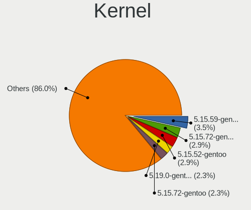
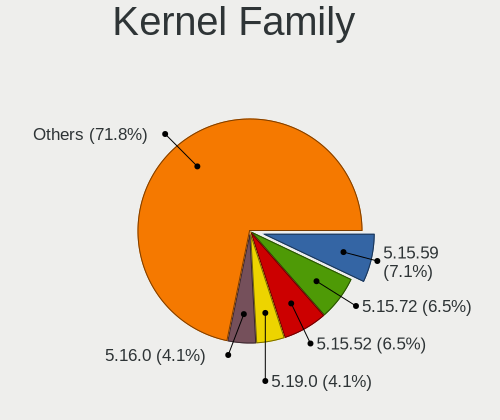
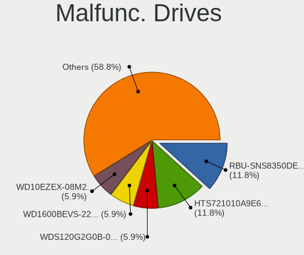
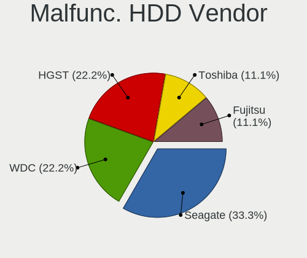
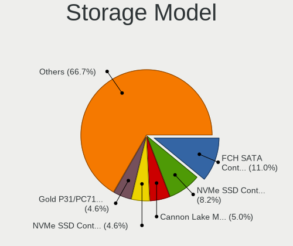
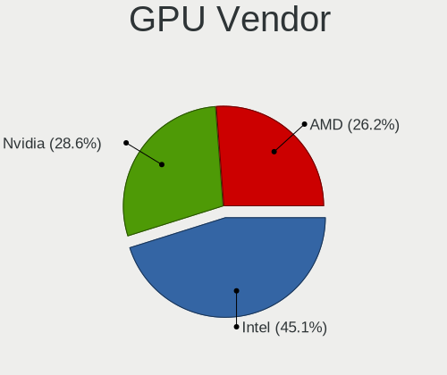
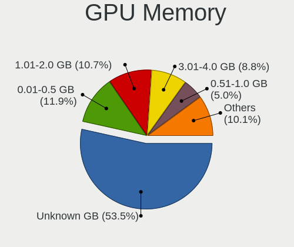
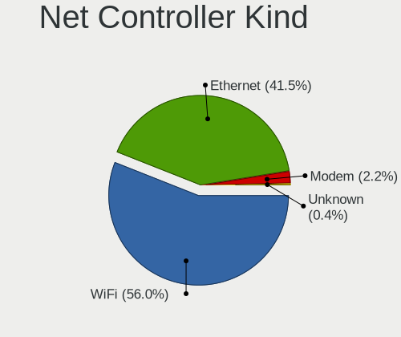

Gentoo 2.8 - Tested Hardware & Statistics (Notebooks)
-----------------------------------------------------

A project to collect tested hardware configurations for Gentoo 2.8.

Anyone can contribute to this report by the [hw-probe](https://github.com/linuxhw/hw-probe) tool:

    sudo -E hw-probe -all -upload

Please contribute! Especially if your hardware is rare.

Contents
--------

* [ Test Cases ](#test-cases)

* [ System ](#system)
  - [ Kernel                   ](#kernel)
  - [ Kernel Family            ](#kernel-family)
  - [ Kernel Major Ver.        ](#kernel-major-ver)
  - [ Arch                     ](#arch)
  - [ DE                       ](#de)
  - [ Display Server           ](#display-server)
  - [ Display Manager          ](#display-manager)
  - [ OS Lang                  ](#os-lang)
  - [ Boot Mode                ](#boot-mode)
  - [ Filesystem               ](#filesystem)
  - [ Part. scheme             ](#part-scheme)
  - [ Dual Boot with Linux/BSD ](#dual-boot-with-linuxbsd)
  - [ Dual Boot (Win)          ](#dual-boot-win)

* [ Board ](#board)
  - [ Vendor                   ](#vendor)
  - [ Model                    ](#model)
  - [ Model Family             ](#model-family)
  - [ MFG Year                 ](#mfg-year)
  - [ Form Factor              ](#form-factor)
  - [ Secure Boot              ](#secure-boot)
  - [ Coreboot                 ](#coreboot)
  - [ RAM Size                 ](#ram-size)
  - [ RAM Used                 ](#ram-used)
  - [ Total Drives             ](#total-drives)
  - [ Has CD-ROM               ](#has-cd-rom)
  - [ Has Ethernet             ](#has-ethernet)
  - [ Has WiFi                 ](#has-wifi)
  - [ Has Bluetooth            ](#has-bluetooth)

* [ Location ](#location)
  - [ Country                  ](#country)
  - [ City                     ](#city)

* [ Drives ](#drives)
  - [ Drive Vendor             ](#drive-vendor)
  - [ Drive Model              ](#drive-model)
  - [ HDD Vendor               ](#hdd-vendor)
  - [ SSD Vendor               ](#ssd-vendor)
  - [ Drive Kind               ](#drive-kind)
  - [ Drive Connector          ](#drive-connector)
  - [ Drive Size               ](#drive-size)
  - [ Space Total              ](#space-total)
  - [ Space Used               ](#space-used)
  - [ Malfunc. Drives          ](#malfunc-drives)
  - [ Malfunc. Drive Vendor    ](#malfunc-drive-vendor)
  - [ Malfunc. HDD Vendor      ](#malfunc-hdd-vendor)
  - [ Malfunc. Drive Kind      ](#malfunc-drive-kind)
  - [ Failed Drives            ](#failed-drives)
  - [ Failed Drive Vendor      ](#failed-drive-vendor)
  - [ Drive Status             ](#drive-status)

* [ Storage controller ](#storage-controller)
  - [ Storage Vendor           ](#storage-vendor)
  - [ Storage Model            ](#storage-model)
  - [ Storage Kind             ](#storage-kind)

* [ Processor ](#processor)
  - [ CPU Vendor               ](#cpu-vendor)
  - [ CPU Model                ](#cpu-model)
  - [ CPU Model Family         ](#cpu-model-family)
  - [ CPU Cores                ](#cpu-cores)
  - [ CPU Sockets              ](#cpu-sockets)
  - [ CPU Threads              ](#cpu-threads)
  - [ CPU Op-Modes             ](#cpu-op-modes)
  - [ CPU Microcode            ](#cpu-microcode)
  - [ CPU Microarch            ](#cpu-microarch)

* [ Graphics ](#graphics)
  - [ GPU Vendor               ](#gpu-vendor)
  - [ GPU Model                ](#gpu-model)
  - [ GPU Combo                ](#gpu-combo)
  - [ GPU Driver               ](#gpu-driver)
  - [ GPU Memory               ](#gpu-memory)

* [ Monitor ](#monitor)
  - [ Monitor Vendor           ](#monitor-vendor)
  - [ Monitor Model            ](#monitor-model)
  - [ Monitor Resolution       ](#monitor-resolution)
  - [ Monitor Diagonal         ](#monitor-diagonal)
  - [ Monitor Width            ](#monitor-width)
  - [ Aspect Ratio             ](#aspect-ratio)
  - [ Monitor Area             ](#monitor-area)
  - [ Pixel Density            ](#pixel-density)
  - [ Multiple Monitors        ](#multiple-monitors)

* [ Network ](#network)
  - [ Net Controller Vendor    ](#net-controller-vendor)
  - [ Net Controller Model     ](#net-controller-model)
  - [ Wireless Vendor          ](#wireless-vendor)
  - [ Wireless Model           ](#wireless-model)
  - [ Ethernet Vendor          ](#ethernet-vendor)
  - [ Ethernet Model           ](#ethernet-model)
  - [ Net Controller Kind      ](#net-controller-kind)
  - [ Used Controller          ](#used-controller)
  - [ NICs                     ](#nics)
  - [ IPv6                     ](#ipv6)

* [ Bluetooth ](#bluetooth)
  - [ Bluetooth Vendor         ](#bluetooth-vendor)
  - [ Bluetooth Model          ](#bluetooth-model)

* [ Sound ](#sound)
  - [ Sound Vendor             ](#sound-vendor)
  - [ Sound Model              ](#sound-model)

* [ Memory ](#memory)
  - [ Memory Vendor            ](#memory-vendor)
  - [ Memory Model             ](#memory-model)
  - [ Memory Kind              ](#memory-kind)
  - [ Memory Form Factor       ](#memory-form-factor)
  - [ Memory Size              ](#memory-size)
  - [ Memory Speed             ](#memory-speed)

* [ Printers & scanners ](#printers--scanners)
  - [ Printer Vendor           ](#printer-vendor)
  - [ Printer Model            ](#printer-model)
  - [ Scanner Vendor           ](#scanner-vendor)
  - [ Scanner Model            ](#scanner-model)

* [ Camera ](#camera)
  - [ Camera Vendor            ](#camera-vendor)
  - [ Camera Model             ](#camera-model)

* [ Security ](#security)
  - [ Fingerprint Vendor       ](#fingerprint-vendor)
  - [ Fingerprint Model        ](#fingerprint-model)
  - [ Chipcard Vendor          ](#chipcard-vendor)
  - [ Chipcard Model           ](#chipcard-model)

* [ Unsupported ](#unsupported)
  - [ Unsupported Devices      ](#unsupported-devices)
  - [ Unsupported Device Types ](#unsupported-device-types)

Test Cases
----------

Total: 205

| Vendor        | Model                       | Probe                                                      | Date         |
|---------------|-----------------------------|------------------------------------------------------------|--------------|
| ASUSTek       | N55SF                       | [02af74ebb6](https://linux-hardware.org/?probe=02af74ebb6) | Nov 02, 2022 |
| Dell          | G3 3500                     | [c595a16f59](https://linux-hardware.org/?probe=c595a16f59) | Nov 02, 2022 |
| Lenovo        | ThinkPad S2 3rd Gen 20L1... | [48c0ef6251](https://linux-hardware.org/?probe=48c0ef6251) | Nov 02, 2022 |
| Lenovo        | ThinkPad S2 3rd Gen 20L1... | [1cc623c804](https://linux-hardware.org/?probe=1cc623c804) | Nov 01, 2022 |
| Lenovo        | ThinkPad E15 Gen 2 20T80... | [310895b721](https://linux-hardware.org/?probe=310895b721) | Nov 01, 2022 |
| Lenovo        | ThinkPad Z16 Gen 1 21D4C... | [2e39c3ce92](https://linux-hardware.org/?probe=2e39c3ce92) | Oct 30, 2022 |
| Dell          | Vostro 5490                 | [057163f0e4](https://linux-hardware.org/?probe=057163f0e4) | Oct 29, 2022 |
| Lenovo        | ThinkPad E15 Gen 2 20T9S... | [42fcb880db](https://linux-hardware.org/?probe=42fcb880db) | Oct 29, 2022 |
| Lenovo        | ThinkPad E15 Gen 2 20T9S... | [242fbb2c79](https://linux-hardware.org/?probe=242fbb2c79) | Oct 29, 2022 |
| Lenovo        | ThinkPad E15 Gen 2 20T9S... | [7800fc7b5b](https://linux-hardware.org/?probe=7800fc7b5b) | Oct 29, 2022 |
| Acer          | AOD257                      | [d3efba72cc](https://linux-hardware.org/?probe=d3efba72cc) | Oct 28, 2022 |
| Dell          | Vostro 5490                 | [ac6587adbb](https://linux-hardware.org/?probe=ac6587adbb) | Oct 27, 2022 |
| Acer          | AOD257                      | [c399f9db2b](https://linux-hardware.org/?probe=c399f9db2b) | Oct 27, 2022 |
| HUAWEI        | NBLK-WAX9X                  | [a44f774778](https://linux-hardware.org/?probe=a44f774778) | Oct 27, 2022 |
| HP            | Pavilion Notebook           | [35cf015c33](https://linux-hardware.org/?probe=35cf015c33) | Oct 25, 2022 |
| HP            | EliteBook 840 G7 Noteboo... | [cb901021a7](https://linux-hardware.org/?probe=cb901021a7) | Oct 21, 2022 |
| Lenovo        | ThinkPad R500 2714CTO       | [77de0f71bd](https://linux-hardware.org/?probe=77de0f71bd) | Oct 21, 2022 |
| Notebook      | NS50_70MU                   | [0f13ae1769](https://linux-hardware.org/?probe=0f13ae1769) | Oct 19, 2022 |
| Lenovo        | ThinkPad R500 2714CTO       | [e480e5d6ae](https://linux-hardware.org/?probe=e480e5d6ae) | Oct 18, 2022 |
| Lenovo        | IdeaPad S145-15IWL 81MV     | [4644a299f3](https://linux-hardware.org/?probe=4644a299f3) | Oct 18, 2022 |
| Dell          | Precision 7760              | [44b60a4fcf](https://linux-hardware.org/?probe=44b60a4fcf) | Oct 18, 2022 |
| Sony          | PCG-GRT230(UC)              | [b33a31225b](https://linux-hardware.org/?probe=b33a31225b) | Oct 18, 2022 |
| HP            | Laptop 14-dk1xxx            | [caf126d0af](https://linux-hardware.org/?probe=caf126d0af) | Oct 18, 2022 |
| Lenovo        | IdeaPad S145-15IWL 81MV     | [41d3e4e97d](https://linux-hardware.org/?probe=41d3e4e97d) | Oct 17, 2022 |
| ASUSTek       | TUF Gaming FX705GD_FX705... | [6243f8cdb8](https://linux-hardware.org/?probe=6243f8cdb8) | Oct 17, 2022 |
| Dell          | G3 3500                     | [64698d52bb](https://linux-hardware.org/?probe=64698d52bb) | Oct 17, 2022 |
| Dell          | G3 3500                     | [902fc2d51b](https://linux-hardware.org/?probe=902fc2d51b) | Oct 17, 2022 |
| HP            | EliteBook 840 G7 Noteboo... | [926d661756](https://linux-hardware.org/?probe=926d661756) | Oct 17, 2022 |
| Dell          | XPS 15 7590                 | [f60fd55235](https://linux-hardware.org/?probe=f60fd55235) | Oct 16, 2022 |
| Dell          | G3 3500                     | [f7cc47bb67](https://linux-hardware.org/?probe=f7cc47bb67) | Oct 13, 2022 |
| MSI           | Pulse GL66 11UGK            | [d71c1d033a](https://linux-hardware.org/?probe=d71c1d033a) | Oct 13, 2022 |
| MSI           | Pulse GL66 11UGK            | [07783bd6a7](https://linux-hardware.org/?probe=07783bd6a7) | Oct 13, 2022 |
| HP            | EliteBook 830 G6            | [0dc42d7e5e](https://linux-hardware.org/?probe=0dc42d7e5e) | Oct 12, 2022 |
| Notebook      | NS5x_NS7xPU                 | [b35f6c63de](https://linux-hardware.org/?probe=b35f6c63de) | Oct 12, 2022 |
| IBM           | ThinkPad T42 2373K1U        | [934a3226e9](https://linux-hardware.org/?probe=934a3226e9) | Oct 11, 2022 |
| Lenovo        | IdeaPad 5 15ITL05 82FG      | [1ae81569dd](https://linux-hardware.org/?probe=1ae81569dd) | Oct 11, 2022 |
| Intel Clie... | LAPBC710                    | [42b7bc6ee4](https://linux-hardware.org/?probe=42b7bc6ee4) | Oct 10, 2022 |
| Valve         | Jupiter                     | [1c71987bd5](https://linux-hardware.org/?probe=1c71987bd5) | Oct 08, 2022 |
| Intel Clie... | LAPBC710                    | [bacb30816f](https://linux-hardware.org/?probe=bacb30816f) | Oct 07, 2022 |
| ASUSTek       | ProArt Studiobook H7600Z... | [5db7aac5d3](https://linux-hardware.org/?probe=5db7aac5d3) | Oct 07, 2022 |
| HP            | Laptop 15-ra0xx             | [d81190b4e7](https://linux-hardware.org/?probe=d81190b4e7) | Oct 06, 2022 |
| Alienware     | x14                         | [ad37874de1](https://linux-hardware.org/?probe=ad37874de1) | Oct 05, 2022 |
| Sony          | PCG-GRT230(UC)              | [cab24d4c04](https://linux-hardware.org/?probe=cab24d4c04) | Oct 01, 2022 |
| ASUSTek       | Zenbook UM5302TA_UM5302T... | [1cfda531dd](https://linux-hardware.org/?probe=1cfda531dd) | Oct 01, 2022 |
| HP            | Laptop 15s-eq2xxx           | [6d9c960574](https://linux-hardware.org/?probe=6d9c960574) | Sep 28, 2022 |
| HP            | Laptop 14-dk1xxx            | [4479784a2e](https://linux-hardware.org/?probe=4479784a2e) | Sep 28, 2022 |
| HP            | Laptop 14-dk1xxx            | [d0808e8abe](https://linux-hardware.org/?probe=d0808e8abe) | Sep 27, 2022 |
| Sony          | PCG-GRT230(UC)              | [af843c265c](https://linux-hardware.org/?probe=af843c265c) | Sep 26, 2022 |
| Lenovo        | ThinkPad P73 20QRS0G700     | [b32a413aa9](https://linux-hardware.org/?probe=b32a413aa9) | Sep 25, 2022 |
| Lenovo        | ThinkPad P73 20QRS0G700     | [6ea4c40a80](https://linux-hardware.org/?probe=6ea4c40a80) | Sep 25, 2022 |
| HP            | EliteBook 830 G6            | [cdbc7c7949](https://linux-hardware.org/?probe=cdbc7c7949) | Sep 25, 2022 |
| HP            | EliteBook 830 G6            | [907383d255](https://linux-hardware.org/?probe=907383d255) | Sep 25, 2022 |
| Matsushita... | CF-29LTQGZBM                | [29f52f862c](https://linux-hardware.org/?probe=29f52f862c) | Sep 24, 2022 |
| Lenovo        | ThinkPad E15 Gen 2 20T80... | [de7c138e21](https://linux-hardware.org/?probe=de7c138e21) | Sep 22, 2022 |
| Lenovo        | ThinkPad L580 20LWCTO1WW    | [a80367f777](https://linux-hardware.org/?probe=a80367f777) | Sep 21, 2022 |
| System76      | Gazelle Professional        | [95f19a0c4c](https://linux-hardware.org/?probe=95f19a0c4c) | Sep 18, 2022 |
| Dell          | G7 7588                     | [583c4a4c91](https://linux-hardware.org/?probe=583c4a4c91) | Sep 16, 2022 |
| Timi          | TM1604                      | [80f52c9545](https://linux-hardware.org/?probe=80f52c9545) | Sep 14, 2022 |
| HUAWEI        | KLVL-WXX9                   | [7bc7cbca76](https://linux-hardware.org/?probe=7bc7cbca76) | Sep 12, 2022 |
| Dell          | Latitude D410               | [6782e0a28f](https://linux-hardware.org/?probe=6782e0a28f) | Sep 05, 2022 |
| Acer          | Swift SF314-42              | [12fbd247f5](https://linux-hardware.org/?probe=12fbd247f5) | Sep 05, 2022 |
| Lenovo        | ThinkPad T14 Gen 3 21AH0... | [88392a79f5](https://linux-hardware.org/?probe=88392a79f5) | Sep 04, 2022 |
| win elemen... | MoreFine S500+              | [d02a951b89](https://linux-hardware.org/?probe=d02a951b89) | Sep 04, 2022 |
| Lenovo        | ThinkPad E15 Gen 2 20T80... | [8320ded55c](https://linux-hardware.org/?probe=8320ded55c) | Sep 02, 2022 |
| Lenovo        | ThinkPad E15 Gen 2 20T80... | [e16313490d](https://linux-hardware.org/?probe=e16313490d) | Sep 01, 2022 |
| Toshiba       | Satellite C850D-118         | [1950f0aeac](https://linux-hardware.org/?probe=1950f0aeac) | Aug 31, 2022 |
| Toshiba       | Satellite C850D-118         | [07000e4194](https://linux-hardware.org/?probe=07000e4194) | Aug 30, 2022 |
| Lenovo        | ThinkPad P50 20EQS33R0J     | [72f6962ac8](https://linux-hardware.org/?probe=72f6962ac8) | Aug 30, 2022 |
| win elemen... | MoreFine S500+              | [5a51c31ac9](https://linux-hardware.org/?probe=5a51c31ac9) | Aug 29, 2022 |
| Eluktronic... | MAX-17                      | [627ecbeb36](https://linux-hardware.org/?probe=627ecbeb36) | Aug 29, 2022 |
| Dell          | Precision 3570              | [7f7a44c923](https://linux-hardware.org/?probe=7f7a44c923) | Aug 29, 2022 |
| Timi          | A35                         | [df50ea1876](https://linux-hardware.org/?probe=df50ea1876) | Aug 29, 2022 |
| Lenovo        | ThinkPad L15 Gen 2a 20X7... | [f30320f76e](https://linux-hardware.org/?probe=f30320f76e) | Aug 27, 2022 |
| Lenovo        | ThinkBook 13s G2 ITL 20V... | [cf7da7df12](https://linux-hardware.org/?probe=cf7da7df12) | Aug 26, 2022 |
| Lenovo        | ThinkBook 13s G2 ITL 20V... | [76db86107b](https://linux-hardware.org/?probe=76db86107b) | Aug 26, 2022 |
| Lenovo        | Yoga S940-14IWL 81Q7        | [416e5db831](https://linux-hardware.org/?probe=416e5db831) | Aug 26, 2022 |
| Timi          | A35                         | [cf89c68d08](https://linux-hardware.org/?probe=cf89c68d08) | Aug 19, 2022 |
| IBM           | 2722BDG                     | [e0fe2162a3](https://linux-hardware.org/?probe=e0fe2162a3) | Aug 18, 2022 |
| Dell          | G3 3500                     | [6a860d7c0f](https://linux-hardware.org/?probe=6a860d7c0f) | Aug 15, 2022 |
| Purism        | Librem 15 v4                | [4448709e50](https://linux-hardware.org/?probe=4448709e50) | Aug 13, 2022 |
| Purism        | Librem 15 v4                | [9e76f9e7ff](https://linux-hardware.org/?probe=9e76f9e7ff) | Aug 13, 2022 |
| HP            | EliteBook 845 14 inch G9... | [ee6f495403](https://linux-hardware.org/?probe=ee6f495403) | Aug 13, 2022 |
| HP            | EliteBook 845 14 inch G9... | [289850f128](https://linux-hardware.org/?probe=289850f128) | Aug 13, 2022 |
| Timi          | A35                         | [944f3f0942](https://linux-hardware.org/?probe=944f3f0942) | Aug 12, 2022 |
| Lenovo        | ThinkPad L15 Gen 2a 20X7... | [166edbd7db](https://linux-hardware.org/?probe=166edbd7db) | Aug 12, 2022 |
| Acer          | Swift SF314-512             | [c374f64c25](https://linux-hardware.org/?probe=c374f64c25) | Aug 11, 2022 |
| Notebook      | N141CU                      | [4d96f7358c](https://linux-hardware.org/?probe=4d96f7358c) | Aug 10, 2022 |
| Acer          | Swift SF314-512             | [0c23760c27](https://linux-hardware.org/?probe=0c23760c27) | Aug 10, 2022 |
| ASUSTek       | ASUS TUF Gaming F17 FX70... | [9b228ae787](https://linux-hardware.org/?probe=9b228ae787) | Aug 10, 2022 |
| ASUSTek       | ASUS TUF Gaming F17 FX70... | [9f2e51f185](https://linux-hardware.org/?probe=9f2e51f185) | Aug 10, 2022 |
| Lenovo        | Legion 5 Pro 16ACH6H 82J... | [0e7d0b5d33](https://linux-hardware.org/?probe=0e7d0b5d33) | Aug 09, 2022 |
| Lenovo        | ThinkPad Z16 Gen 1 21D40... | [78f846e0e5](https://linux-hardware.org/?probe=78f846e0e5) | Aug 08, 2022 |
| ASUSTek       | VivoBook_ASUSLaptop X421... | [2ff6a7fe85](https://linux-hardware.org/?probe=2ff6a7fe85) | Aug 06, 2022 |
| ASUSTek       | VivoBook_ASUSLaptop X421... | [d54acf14ff](https://linux-hardware.org/?probe=d54acf14ff) | Aug 06, 2022 |
| Toshiba       | NB100                       | [b91ee9b36b](https://linux-hardware.org/?probe=b91ee9b36b) | Aug 05, 2022 |
| HUAWEI        | HVY-WXX9                    | [019849a487](https://linux-hardware.org/?probe=019849a487) | Aug 04, 2022 |
| Lenovo        | ThinkPad T14 Gen 1 20S1S... | [4caa777a81](https://linux-hardware.org/?probe=4caa777a81) | Aug 04, 2022 |
| Samsung       | 700G7C                      | [cd554f5d17](https://linux-hardware.org/?probe=cd554f5d17) | Aug 03, 2022 |
| TUXEDO        | InfinityBook Pro 14 Gen6    | [de9a854095](https://linux-hardware.org/?probe=de9a854095) | Jul 31, 2022 |
| Razer         | Blade 15 Studio Edition ... | [359f708604](https://linux-hardware.org/?probe=359f708604) | Jul 30, 2022 |
| ASUSTek       | ROG G703GI_G7BI             | [88a326be83](https://linux-hardware.org/?probe=88a326be83) | Jul 28, 2022 |
| Dell          | XPS 15 9570                 | [e7f56631b1](https://linux-hardware.org/?probe=e7f56631b1) | Jul 27, 2022 |
| Dell          | XPS 15 9570                 | [f3972b3a7d](https://linux-hardware.org/?probe=f3972b3a7d) | Jul 26, 2022 |
| Timi          | Mi Laptop Pro 15 2020       | [5455e664e0](https://linux-hardware.org/?probe=5455e664e0) | Jul 26, 2022 |
| HP            | EliteBook 845 G7 Noteboo... | [b15fb90c18](https://linux-hardware.org/?probe=b15fb90c18) | Jul 26, 2022 |
| HP            | OMEN by Laptop 16-c0xxx     | [8f46b7dcca](https://linux-hardware.org/?probe=8f46b7dcca) | Jul 25, 2022 |
| HP            | Laptop 17-ca1xxx            | [64dad58b71](https://linux-hardware.org/?probe=64dad58b71) | Jul 25, 2022 |
| ASUSTek       | ROG Zephyrus G14 GA402RJ... | [6302f1ee8b](https://linux-hardware.org/?probe=6302f1ee8b) | Jul 25, 2022 |
| ASUSTek       | ROG G703GI_G7BI             | [4d636c74d3](https://linux-hardware.org/?probe=4d636c74d3) | Jul 14, 2022 |
| MSI           | GS63VR 6RF                  | [30ad17796f](https://linux-hardware.org/?probe=30ad17796f) | Jul 11, 2022 |
| Lenovo        | IdeaPad 100-15IBD 80QQ      | [94e9d2f65a](https://linux-hardware.org/?probe=94e9d2f65a) | Jul 10, 2022 |
| Lenovo        | G510 20238                  | [f67a64f833](https://linux-hardware.org/?probe=f67a64f833) | Jul 10, 2022 |
| Lenovo        | ThinkPad T14 Gen 2a 20XK... | [8f36480ad7](https://linux-hardware.org/?probe=8f36480ad7) | Jul 10, 2022 |
| Dell          | Latitude D420               | [2e3ded5234](https://linux-hardware.org/?probe=2e3ded5234) | Jul 08, 2022 |
| MSI           | GS63VR 6RF                  | [097cc820d3](https://linux-hardware.org/?probe=097cc820d3) | Jul 08, 2022 |
| Lenovo        | G510 20238                  | [5bdfb575ae](https://linux-hardware.org/?probe=5bdfb575ae) | Jul 07, 2022 |
| ASUSTek       | VivoBook_ASUSLaptop M760... | [850003c6da](https://linux-hardware.org/?probe=850003c6da) | Jul 05, 2022 |
| Lenovo        | IdeaPad 3 15ALC6 82KU       | [1b94ade16a](https://linux-hardware.org/?probe=1b94ade16a) | Jul 05, 2022 |
| HP            | EliteBook 2560p             | [c1e5d91a40](https://linux-hardware.org/?probe=c1e5d91a40) | Jul 02, 2022 |
| Timi          | RedmiBook 13                | [fb3b3f37d5](https://linux-hardware.org/?probe=fb3b3f37d5) | Jun 30, 2022 |
| Dell          | Latitude D420               | [c531c131ec](https://linux-hardware.org/?probe=c531c131ec) | Jun 28, 2022 |
| ASUSTek       | X555LJ                      | [0c6dd4c77c](https://linux-hardware.org/?probe=0c6dd4c77c) | Jun 27, 2022 |
| Dell          | Precision 7550              | [4779d18806](https://linux-hardware.org/?probe=4779d18806) | Jun 24, 2022 |
| AVITA         | NS14A6                      | [e3169acbbb](https://linux-hardware.org/?probe=e3169acbbb) | Jun 20, 2022 |
| Lenovo        | ThinkPad T460 20FMS421US    | [b290cf5fe0](https://linux-hardware.org/?probe=b290cf5fe0) | Jun 19, 2022 |
| Lenovo        | ThinkPad T14 Gen 2a 20XK... | [27fd147a80](https://linux-hardware.org/?probe=27fd147a80) | Jun 19, 2022 |
| ASUSTek       | ROG Strix G513QY_G513QY     | [17b77e3069](https://linux-hardware.org/?probe=17b77e3069) | Jun 17, 2022 |
| Dell          | Inspiron 15 5510            | [286f8505c9](https://linux-hardware.org/?probe=286f8505c9) | Jun 17, 2022 |
| HP            | OMEN by Laptop              | [7b531e1607](https://linux-hardware.org/?probe=7b531e1607) | Jun 09, 2022 |
| HP            | OMEN by Laptop 15-dc0xxx    | [f2ca17eb5d](https://linux-hardware.org/?probe=f2ca17eb5d) | Jun 05, 2022 |
| Lenovo        | ThinkPad T14 Gen 1 20S1S... | [0c1909c43b](https://linux-hardware.org/?probe=0c1909c43b) | Jun 03, 2022 |
| Dell          | XPS 17 9710                 | [d17975e27b](https://linux-hardware.org/?probe=d17975e27b) | Jun 02, 2022 |
| HUAWEI        | BOHB-WAX9                   | [0a458659f6](https://linux-hardware.org/?probe=0a458659f6) | Jun 01, 2022 |
| Lenovo        | Legion Y540-15IRH 81SX      | [09fcdacb15](https://linux-hardware.org/?probe=09fcdacb15) | Jun 01, 2022 |
| Dell          | XPS 17 9710                 | [d33b756434](https://linux-hardware.org/?probe=d33b756434) | Jun 01, 2022 |
| Lenovo        | ThinkPad T14 Gen 1 20S1S... | [77989d3d20](https://linux-hardware.org/?probe=77989d3d20) | May 28, 2022 |
| HP            | Pavilion Gaming Laptop 1... | [e879d3c292](https://linux-hardware.org/?probe=e879d3c292) | May 27, 2022 |
| ASUSTek       | 1005HA                      | [0948f30719](https://linux-hardware.org/?probe=0948f30719) | May 26, 2022 |
| ASUSTek       | 1005HA                      | [1d5fe9025a](https://linux-hardware.org/?probe=1d5fe9025a) | May 25, 2022 |
| Lenovo        | ThinkPad T460 20FMS421US    | [47297bafb5](https://linux-hardware.org/?probe=47297bafb5) | May 21, 2022 |
| Lenovo        | ThinkPad T460 20FMS421US    | [7b878500c1](https://linux-hardware.org/?probe=7b878500c1) | May 21, 2022 |
| MSI           | MS-7A34                     | [8956078328](https://linux-hardware.org/?probe=8956078328) | May 21, 2022 |
| MSI           | GE66 Raider 11UE            | [d1a9527039](https://linux-hardware.org/?probe=d1a9527039) | May 16, 2022 |
| MSI           | GE66 Raider 11UE            | [d675d89c8a](https://linux-hardware.org/?probe=d675d89c8a) | May 16, 2022 |
| Lenovo        | ThinkPad P73 20QSS09S00     | [8438c92818](https://linux-hardware.org/?probe=8438c92818) | May 12, 2022 |
| HP            | Laptop 15s-eq0xxx           | [474578814d](https://linux-hardware.org/?probe=474578814d) | May 10, 2022 |
| Dell          | XPS 15 9510                 | [a934bef382](https://linux-hardware.org/?probe=a934bef382) | Apr 24, 2022 |
| Dell          | XPS 15 9510                 | [b61b2af9eb](https://linux-hardware.org/?probe=b61b2af9eb) | Apr 23, 2022 |
| Lenovo        | ThinkPad X220 4291QT1       | [9ffcb6bf7a](https://linux-hardware.org/?probe=9ffcb6bf7a) | Apr 18, 2022 |
| HP            | Pavilion Notebook           | [217905d42a](https://linux-hardware.org/?probe=217905d42a) | Apr 17, 2022 |
| Lenovo        | ThinkPad X220 4291QT1       | [00a23bc10c](https://linux-hardware.org/?probe=00a23bc10c) | Apr 17, 2022 |
| Dell          | G5 5505                     | [ce1fc33387](https://linux-hardware.org/?probe=ce1fc33387) | Apr 13, 2022 |
| MSI           | GE66 Raider 11UE            | [45472dad72](https://linux-hardware.org/?probe=45472dad72) | Apr 12, 2022 |
| HP            | ProBook 6570b               | [63d922ecdd](https://linux-hardware.org/?probe=63d922ecdd) | Apr 12, 2022 |
| HP            | ProBook 6570b               | [87414e70aa](https://linux-hardware.org/?probe=87414e70aa) | Apr 11, 2022 |
| System76      | Gazelle                     | [9edcac1b2c](https://linux-hardware.org/?probe=9edcac1b2c) | Apr 09, 2022 |
| System76      | Gazelle                     | [e22baecee4](https://linux-hardware.org/?probe=e22baecee4) | Apr 07, 2022 |
| Timi          | Mi Laptop Pro 15            | [33f98f8274](https://linux-hardware.org/?probe=33f98f8274) | Mar 23, 2022 |
| BANGHO        | MAX G0101                   | [b40c195d54](https://linux-hardware.org/?probe=b40c195d54) | Mar 20, 2022 |
| MSI           | MS-7A34                     | [27f8a2eb1f](https://linux-hardware.org/?probe=27f8a2eb1f) | Mar 18, 2022 |
| HP            | Victus by Laptop 16-e0xx... | [7c09492e3b](https://linux-hardware.org/?probe=7c09492e3b) | Mar 14, 2022 |
| HP            | Victus by Laptop 16-e0xx... | [f7e85dbf71](https://linux-hardware.org/?probe=f7e85dbf71) | Mar 14, 2022 |
| Framework     | Laptop                      | [8902c057fb](https://linux-hardware.org/?probe=8902c057fb) | Mar 10, 2022 |
| Framework     | Laptop                      | [e17db20b1c](https://linux-hardware.org/?probe=e17db20b1c) | Mar 08, 2022 |
| Lenovo        | Yoga Slim 7 14IIL05 82A1    | [0022f4a8cc](https://linux-hardware.org/?probe=0022f4a8cc) | Feb 26, 2022 |
| ASUSTek       | UX430UAR                    | [c7cd5ce50d](https://linux-hardware.org/?probe=c7cd5ce50d) | Feb 21, 2022 |
| MSI           | GS63VR 6RF                  | [c20c87027e](https://linux-hardware.org/?probe=c20c87027e) | Feb 10, 2022 |
| HP            | Pavilion Notebook           | [8f79e4d763](https://linux-hardware.org/?probe=8f79e4d763) | Feb 06, 2022 |
| Lenovo        | Legion Y7000 2019 PG0 81... | [f79196e39c](https://linux-hardware.org/?probe=f79196e39c) | Feb 05, 2022 |
| MSI           | GS63VR 6RF                  | [4873365af6](https://linux-hardware.org/?probe=4873365af6) | Jan 30, 2022 |
| Lenovo        | Yoga S740-14IIL 81RS        | [c021622ad4](https://linux-hardware.org/?probe=c021622ad4) | Jan 27, 2022 |
| Timi          | RedmiBook 13                | [e20538f56a](https://linux-hardware.org/?probe=e20538f56a) | Jan 26, 2022 |
| Lenovo        | IdeaPad 5 15ITL05 82FG      | [a4f6a4a38e](https://linux-hardware.org/?probe=a4f6a4a38e) | Jan 24, 2022 |
| Lenovo        | IdeaPad 5 15ITL05 82FG      | [9e4f498056](https://linux-hardware.org/?probe=9e4f498056) | Jan 24, 2022 |
| MSI           | GE73 Raider RGB 8RF         | [a5a825a072](https://linux-hardware.org/?probe=a5a825a072) | Jan 22, 2022 |
| Lenovo        | ThinkPad 20FMCT01WW         | [4bd81196a0](https://linux-hardware.org/?probe=4bd81196a0) | Jan 21, 2022 |
| Timi          | Mi Laptop Pro 15            | [65ce2eb070](https://linux-hardware.org/?probe=65ce2eb070) | Jan 19, 2022 |
| Lenovo        | ThinkPad X1 Carbon 7th 2... | [d786a0b993](https://linux-hardware.org/?probe=d786a0b993) | Jan 17, 2022 |
| Lenovo        | ThinkPad X1 Carbon 7th 2... | [6af6121c33](https://linux-hardware.org/?probe=6af6121c33) | Jan 17, 2022 |
| Dell          | Precision 3561              | [f5417a1852](https://linux-hardware.org/?probe=f5417a1852) | Jan 16, 2022 |
| Lenovo        | Legion 5 Pro 16ACH6H 82J... | [2aa146518a](https://linux-hardware.org/?probe=2aa146518a) | Jan 16, 2022 |
| Lenovo        | Legion R7000 2020 82B6      | [5f92f3376e](https://linux-hardware.org/?probe=5f92f3376e) | Jan 11, 2022 |
| Acer          | Nitro AN515-54              | [d46da820e0](https://linux-hardware.org/?probe=d46da820e0) | Jan 10, 2022 |
| ASUSTek       | ROG Zephyrus G14 GA401QE... | [0cf6f2102c](https://linux-hardware.org/?probe=0cf6f2102c) | Jan 03, 2022 |
| Timi          | RedmiBook 13                | [528d0d32b4](https://linux-hardware.org/?probe=528d0d32b4) | Jan 01, 2022 |
| Dell          | XPS 15 9570                 | [1695a19b52](https://linux-hardware.org/?probe=1695a19b52) | Dec 24, 2021 |
| Framework     | Laptop                      | [33bb6590a6](https://linux-hardware.org/?probe=33bb6590a6) | Dec 21, 2021 |
| ASUSTek       | ROG Strix G513QY_G513QY     | [ee63a84605](https://linux-hardware.org/?probe=ee63a84605) | Dec 11, 2021 |
| Toshiba       | Satellite C850D-118         | [b15f2e2c92](https://linux-hardware.org/?probe=b15f2e2c92) | Dec 09, 2021 |
| HP            | Laptop 15s-eq0xxx           | [86f5c0bc34](https://linux-hardware.org/?probe=86f5c0bc34) | Nov 30, 2021 |
| HP            | Laptop 15s-eq0xxx           | [e06c73ada9](https://linux-hardware.org/?probe=e06c73ada9) | Nov 29, 2021 |
| Lenovo        | IdeaPad 5 Pro 16ACH6 82L... | [ad15be0510](https://linux-hardware.org/?probe=ad15be0510) | Nov 29, 2021 |
| Lenovo        | ThinkPad T470p 20J7S06Q0... | [6eca4a1be2](https://linux-hardware.org/?probe=6eca4a1be2) | Nov 22, 2021 |
| Lenovo        | ThinkPad T470p 20J7S06Q0... | [6c92c6ecbb](https://linux-hardware.org/?probe=6c92c6ecbb) | Nov 22, 2021 |
| Acer          | Aspire A715-42G             | [3ea389d8ff](https://linux-hardware.org/?probe=3ea389d8ff) | Nov 21, 2021 |
| Acer          | Aspire A715-42G             | [19f48288ec](https://linux-hardware.org/?probe=19f48288ec) | Nov 20, 2021 |
| Lenovo        | ThinkPad E495 20NE000BGE    | [871e0a8d36](https://linux-hardware.org/?probe=871e0a8d36) | Nov 11, 2021 |
| Dell          | Latitude 7490               | [ea64667f2c](https://linux-hardware.org/?probe=ea64667f2c) | Nov 01, 2021 |
| Lenovo        | ThinkPad P1 Gen 3 20TJS2... | [6105164e23](https://linux-hardware.org/?probe=6105164e23) | Oct 26, 2021 |
| Lenovo        | ThinkPad E15 Gen 2 20T80... | [8a34d739fd](https://linux-hardware.org/?probe=8a34d739fd) | Oct 25, 2021 |
| Acer          | Aspire A515-55              | [437c8fb96b](https://linux-hardware.org/?probe=437c8fb96b) | Oct 12, 2021 |
| Lenovo        | ThinkBook 14 G3 ACL 21A2    | [3ad4e11bac](https://linux-hardware.org/?probe=3ad4e11bac) | Oct 06, 2021 |
| Lenovo        | ThinkBook 14 G3 ACL 21A2    | [18a2385458](https://linux-hardware.org/?probe=18a2385458) | Oct 06, 2021 |
| Timi          | Mi Laptop Pro 15            | [e2057e68dd](https://linux-hardware.org/?probe=e2057e68dd) | Oct 03, 2021 |
| Dell          | Inspiron 5415               | [a265f8ea5c](https://linux-hardware.org/?probe=a265f8ea5c) | Oct 01, 2021 |

System
------

Kernel
------

Version of the Linux kernel

| Version                    | Notebooks | Percent |
|----------------------------|-----------|---------|
| 5.15.59-gentoo-x86_64      | 6         | 3.8%    |
| 5.15.52-gentoo             | 5         | 3.16%   |
| 5.19.0-gentoo-x86_64       | 4         | 2.53%   |
| 5.15.72-gentoo-x86_64      | 4         | 2.53%   |
| 5.15.72-gentoo             | 4         | 2.53%   |
| 5.15.69-gentoo             | 4         | 2.53%   |
| 5.15.74-gentoo             | 3         | 1.9%    |
| 5.15.59-gentoo             | 3         | 1.9%    |
| 5.15.52-gentoo-x86_64      | 3         | 1.9%    |
| 5.15.41-gentoo-x86_64      | 3         | 1.9%    |
| 5.14.9-gentoo-x86_64       | 3         | 1.9%    |
| 5.18.7-gentoo              | 2         | 1.27%   |
| 5.18.4-gentoo              | 2         | 1.27%   |
| 5.18.1-gentoo-r2           | 2         | 1.27%   |
| 5.17.1-gentoo-r1           | 2         | 1.27%   |
| 5.16.0-gentoo-x86_64       | 2         | 1.27%   |
| 5.15.68-gentoo-x86_64      | 2         | 1.27%   |
| 5.15.41-gentoo-dist        | 2         | 1.27%   |
| 5.15.10-gentoo-x86_64      | 2         | 1.27%   |
| 6.0.6-gentoo-x86_64        | 1         | 0.63%   |
| 6.0.6-gentoo               | 1         | 0.63%   |
| 6.0.2-gentoo-x86_64        | 1         | 0.63%   |
| 6.0.0-gentoo-x86_64        | 1         | 0.63%   |
| 6.0.0-gentoo               | 1         | 0.63%   |
| 5.19.8-gentoo-x86_64       | 1         | 0.63%   |
| 5.19.6-gentoo-dell-gentoid | 1         | 0.63%   |
| 5.19.4-gentoo-dist         | 1         | 0.63%   |
| 5.19.3-gentoo-x86_64       | 1         | 0.63%   |
| 5.19.12-gentoo             | 1         | 0.63%   |
| 5.19.11-gentoo-x86_64      | 1         | 0.63%   |
| 5.19.10-gentoo             | 1         | 0.63%   |
| 5.19.0-xanmod1-elitebook   | 1         | 0.63%   |
| 5.19.0-rc2-p+              | 1         | 0.63%   |
| 5.19.0-gentoo              | 1         | 0.63%   |
| 5.18.9-gentoo              | 1         | 0.63%   |
| 5.18.8-gentoo-dist         | 1         | 0.63%   |
| 5.18.8-gentoo              | 1         | 0.63%   |
| 5.18.6-gentoo-venus        | 1         | 0.63%   |
| 5.18.5-gentoo              | 1         | 0.63%   |
| 5.18.19-gentoo-r1          | 1         | 0.63%   |

Kernel Family
-------------

Linux kernel without a distro release

| Version | Notebooks | Percent |
|---------|-----------|---------|
| 5.15.59 | 12        | 7.64%   |
| 5.15.52 | 11        | 7.01%   |
| 5.15.72 | 10        | 6.37%   |
| 5.19.0  | 7         | 4.46%   |
| 5.16.0  | 7         | 4.46%   |
| 5.15.69 | 7         | 4.46%   |
| 5.15.41 | 6         | 3.82%   |
| 5.18.1  | 4         | 2.55%   |
| 5.14.9  | 4         | 2.55%   |
| 5.17.9  | 3         | 1.91%   |
| 5.15.74 | 3         | 1.91%   |
| 5.15.5  | 3         | 1.91%   |
| 6.0.6   | 2         | 1.27%   |
| 6.0.0   | 2         | 1.27%   |
| 5.18.8  | 2         | 1.27%   |
| 5.18.7  | 2         | 1.27%   |
| 5.18.4  | 2         | 1.27%   |
| 5.18.0  | 2         | 1.27%   |
| 5.17.8  | 2         | 1.27%   |
| 5.17.1  | 2         | 1.27%   |
| 5.16.2  | 2         | 1.27%   |
| 5.16.14 | 2         | 1.27%   |
| 5.16.10 | 2         | 1.27%   |
| 5.16.1  | 2         | 1.27%   |
| 5.15.75 | 2         | 1.27%   |
| 5.15.68 | 2         | 1.27%   |
| 5.15.33 | 2         | 1.27%   |
| 5.15.19 | 2         | 1.27%   |
| 5.15.13 | 2         | 1.27%   |
| 5.15.10 | 2         | 1.27%   |
| 5.14.14 | 2         | 1.27%   |
| 6.0.2   | 1         | 0.64%   |
| 5.19.8  | 1         | 0.64%   |
| 5.19.6  | 1         | 0.64%   |
| 5.19.4  | 1         | 0.64%   |
| 5.19.3  | 1         | 0.64%   |
| 5.19.12 | 1         | 0.64%   |
| 5.19.11 | 1         | 0.64%   |
| 5.19.10 | 1         | 0.64%   |
| 5.18.9  | 1         | 0.64%   |

Kernel Major Ver.
-----------------

Linux kernel major version

| Version | Notebooks | Percent |
|---------|-----------|---------|
| 5.15    | 70        | 46.36%  |
| 5.18    | 18        | 11.92%  |
| 5.16    | 18        | 11.92%  |
| 5.19    | 14        | 9.27%   |
| 5.17    | 14        | 9.27%   |
| 5.14    | 7         | 4.64%   |
| 6.0     | 5         | 3.31%   |
| 5.10    | 5         | 3.31%   |

Arch
----

OS architecture (x86_64, i586, etc.)

| Name   | Notebooks | Percent |
|--------|-----------|---------|
| x86_64 | 135       | 94.41%  |
| i686   | 8         | 5.59%   |

DE
--

Desktop Environment

| Name     | Notebooks | Percent |
|----------|-----------|---------|
| Unknown  | 56        | 38.89%  |
| KDE5     | 42        | 29.17%  |
| GNOME    | 21        | 14.58%  |
| XFCE     | 11        | 7.64%   |
| LXQt     | 3         | 2.08%   |
| dwm      | 3         | 2.08%   |
| sway     | 2         | 1.39%   |
| xmonad   | 1         | 0.69%   |
| MATE     | 1         | 0.69%   |
| LeftWM   | 1         | 0.69%   |
| fvwm     | 1         | 0.69%   |
| Cinnamon | 1         | 0.69%   |
| bspwm    | 1         | 0.69%   |

Display Server
--------------

X11 or Wayland

| Name    | Notebooks | Percent |
|---------|-----------|---------|
| X11     | 68        | 46.58%  |
| Wayland | 28        | 19.18%  |
| Tty     | 25        | 17.12%  |
| Unknown | 25        | 17.12%  |

Display Manager
---------------

SDDM, LightDM, etc.

| Name    | Notebooks | Percent |
|---------|-----------|---------|
| Unknown | 58        | 40.28%  |
| SDDM    | 48        | 33.33%  |
| LightDM | 16        | 11.11%  |
| GDM     | 13        | 9.03%   |
| LXDM    | 4         | 2.78%   |
| XDM     | 2         | 1.39%   |
| SLiM    | 2         | 1.39%   |
| GREETD  | 1         | 0.69%   |

OS Lang
-------

Language

| Lang       | Notebooks | Percent |
|------------|-----------|---------|
| en_US      | 61        | 42.07%  |
| C.UTF8     | 23        | 15.86%  |
| Unknown    | 13        | 8.97%   |
| en_GB      | 10        | 6.9%    |
| C          | 7         | 4.83%   |
| de_DE      | 5         | 3.45%   |
| ru_RU      | 4         | 2.76%   |
| it_IT      | 3         | 2.07%   |
| en_AU      | 3         | 2.07%   |
| zh_CN      | 2         | 1.38%   |
| es_AR      | 2         | 1.38%   |
| tr_TR      | 1         | 0.69%   |
| pt_BR      | 1         | 0.69%   |
| nl_BE      | 1         | 0.69%   |
| fr_FR      | 1         | 0.69%   |
| fr_CA      | 1         | 0.69%   |
| es_MX      | 1         | 0.69%   |
| en_US.UTF8 | 1         | 0.69%   |
| en_NZ      | 1         | 0.69%   |
| en_CA      | 1         | 0.69%   |
| el_GR      | 1         | 0.69%   |
| de_CH      | 1         | 0.69%   |
| ca_ES      | 1         | 0.69%   |

Boot Mode
---------

EFI or BIOS

| Mode | Notebooks | Percent |
|------|-----------|---------|
| EFI  | 124       | 86.11%  |
| BIOS | 20        | 13.89%  |

Filesystem
----------

Type of filesystem

| Type     | Notebooks | Percent |
|----------|-----------|---------|
| Ext4     | 85        | 59.44%  |
| Btrfs    | 40        | 27.97%  |
| XXXXXXX  | 7         | 4.9%    |
| Zfs      | 6         | 4.2%    |
| Xfs      | 2         | 1.4%    |
| Overlay  | 1         | 0.7%    |
| F2fs     | 1         | 0.7%    |
| Bcachefs | 1         | 0.7%    |

Part. scheme
------------

Scheme of partitioning

| Type    | Notebooks | Percent |
|---------|-----------|---------|
| GPT     | 127       | 88.19%  |
| MBR     | 15        | 10.42%  |
| Unknown | 2         | 1.39%   |

Dual Boot with Linux/BSD
------------------------

Hosting more than one Linux/BSD

| Dual boot | Notebooks | Percent |
|-----------|-----------|---------|
| No        | 111       | 76.03%  |
| Yes       | 35        | 23.97%  |

Dual Boot (Win)
---------------

Hosting Linux and Windows

| Dual boot | Notebooks | Percent |
|-----------|-----------|---------|
| No        | 114       | 79.17%  |
| Yes       | 30        | 20.83%  |

Board
-----

Vendor
------

Motherboard manufacturer

| Name                           | Notebooks | Percent |
|--------------------------------|-----------|---------|
| Lenovo                         | 41        | 28.67%  |
| Hewlett-Packard                | 22        | 15.38%  |
| Dell                           | 18        | 12.59%  |
| ASUSTek Computer               | 15        | 10.49%  |
| MSI                            | 6         | 4.2%    |
| Acer                           | 6         | 4.2%    |
| Timi                           | 5         | 3.5%    |
| HUAWEI                         | 4         | 2.8%    |
| Toshiba                        | 3         | 2.1%    |
| Notebook                       | 3         | 2.1%    |
| win element                    | 2         | 1.4%    |
| System76                       | 2         | 1.4%    |
| IBM                            | 2         | 1.4%    |
| Framework                      | 2         | 1.4%    |
| Valve                          | 1         | 0.7%    |
| TUXEDO                         | 1         | 0.7%    |
| Sony                           | 1         | 0.7%    |
| Samsung Electronics            | 1         | 0.7%    |
| Razer                          | 1         | 0.7%    |
| Purism                         | 1         | 0.7%    |
| Matsushita Electric Industrial | 1         | 0.7%    |
| Intel Client Systems           | 1         | 0.7%    |
| Eluktronics                    | 1         | 0.7%    |
| BANGHO                         | 1         | 0.7%    |
| AVITA                          | 1         | 0.7%    |
| Alienware                      | 1         | 0.7%    |

Model
-----

Motherboard model

| Name                                        | Notebooks | Percent |
|---------------------------------------------|-----------|---------|
| HP Laptop 14-dk1xxx                         | 3         | 2.1%    |
| win element MoreFine S500+                  | 2         | 1.4%    |
| Toshiba Satellite C850D-118                 | 2         | 1.4%    |
| MSI GS63VR 6RF                              | 2         | 1.4%    |
| Lenovo ThinkPad E15 Gen 2 20T8000MPB        | 2         | 1.4%    |
| Lenovo Legion 5 Pro 16ACH6H 82JQ            | 2         | 1.4%    |
| Lenovo IdeaPad 5 15ITL05 82FG               | 2         | 1.4%    |
| HP Pavilion Notebook                        | 2         | 1.4%    |
| HP Laptop 15s-eq0xxx                        | 2         | 1.4%    |
| HP EliteBook 840 G7 Notebook PC             | 2         | 1.4%    |
| Framework Laptop                            | 2         | 1.4%    |
| Dell XPS 15 9570                            | 2         | 1.4%    |
| ASUS ROG Strix G513QY_G513QY                | 2         | 1.4%    |
| Valve Jupiter                               | 1         | 0.7%    |
| TUXEDO InfinityBook Pro 14 Gen6             | 1         | 0.7%    |
| Toshiba NB100                               | 1         | 0.7%    |
| Timi TM1604                                 | 1         | 0.7%    |
| Timi RedmiBook 13                           | 1         | 0.7%    |
| Timi Mi Laptop Pro 15 2020                  | 1         | 0.7%    |
| Timi Mi Laptop Pro 15                       | 1         | 0.7%    |
| Timi A35                                    | 1         | 0.7%    |
| System76 Gazelle Professional               | 1         | 0.7%    |
| System76 Gazelle                            | 1         | 0.7%    |
| Sony PCG-GRT230(UC)                         | 1         | 0.7%    |
| Samsung 700G7C                              | 1         | 0.7%    |
| Razer Blade 15 Studio Edition - Late 2019   | 1         | 0.7%    |
| Purism Librem 15 v4                         | 1         | 0.7%    |
| Notebook NS5x_NS7xPU                        | 1         | 0.7%    |
| Notebook NS50_70MU                          | 1         | 0.7%    |
| Notebook N141CU                             | 1         | 0.7%    |
| MSI Pulse GL66 11UGK                        | 1         | 0.7%    |
| MSI MS-7A34                                 | 1         | 0.7%    |
| MSI GE73 Raider RGB 8RF                     | 1         | 0.7%    |
| MSI GE66 Raider 11UE                        | 1         | 0.7%    |
| Matsushita Electric Industrial CF-29LTQGZBM | 1         | 0.7%    |
| Lenovo Yoga Slim 7 14IIL05 82A1             | 1         | 0.7%    |
| Lenovo Yoga S940-14IWL 81Q7                 | 1         | 0.7%    |
| Lenovo Yoga S740-14IIL 81RS                 | 1         | 0.7%    |
| Lenovo ThinkPad Z16 Gen 1 21D4CTO1WW        | 1         | 0.7%    |
| Lenovo ThinkPad Z16 Gen 1 21D4002GGE        | 1         | 0.7%    |

Model Family
------------

Motherboard model prefix

| Name                 | Notebooks | Percent |
|----------------------|-----------|---------|
| Lenovo ThinkPad      | 24        | 16.78%  |
| HP Laptop            | 8         | 5.59%   |
| Lenovo IdeaPad       | 6         | 4.2%    |
| HP EliteBook         | 6         | 4.2%    |
| Lenovo Legion        | 5         | 3.5%    |
| Dell XPS             | 5         | 3.5%    |
| ASUS ROG             | 5         | 3.5%    |
| Dell Precision       | 4         | 2.8%    |
| Lenovo Yoga          | 3         | 2.1%    |
| HP Pavilion          | 3         | 2.1%    |
| HP OMEN              | 3         | 2.1%    |
| Dell Latitude        | 3         | 2.1%    |
| win element MoreFine | 2         | 1.4%    |
| Toshiba Satellite    | 2         | 1.4%    |
| Timi Mi              | 2         | 1.4%    |
| System76 Gazelle     | 2         | 1.4%    |
| MSI GS63VR           | 2         | 1.4%    |
| Lenovo ThinkBook     | 2         | 1.4%    |
| Framework Laptop     | 2         | 1.4%    |
| Dell Inspiron        | 2         | 1.4%    |
| ASUS VivoBook        | 2         | 1.4%    |
| Acer Swift           | 2         | 1.4%    |
| Acer Aspire          | 2         | 1.4%    |
| Valve Jupiter        | 1         | 0.7%    |
| TUXEDO InfinityBook  | 1         | 0.7%    |
| Toshiba NB100        | 1         | 0.7%    |
| Timi TM1604          | 1         | 0.7%    |
| Timi RedmiBook       | 1         | 0.7%    |
| Timi A35             | 1         | 0.7%    |
| Sony PCG-GRT230(UC)  | 1         | 0.7%    |
| Samsung 700G7C       | 1         | 0.7%    |
| Razer Blade          | 1         | 0.7%    |
| Purism Librem        | 1         | 0.7%    |
| Notebook NS5x        | 1         | 0.7%    |
| Notebook NS50        | 1         | 0.7%    |
| Notebook N141CU      | 1         | 0.7%    |
| MSI Pulse            | 1         | 0.7%    |
| MSI MS-7A34          | 1         | 0.7%    |
| MSI GE73             | 1         | 0.7%    |
| MSI GE66             | 1         | 0.7%    |

MFG Year
--------

Motherboard manufacture year

| Year | Notebooks | Percent |
|------|-----------|---------|
| 2021 | 36        | 25.17%  |
| 2019 | 28        | 19.58%  |
| 2020 | 27        | 18.88%  |
| 2022 | 12        | 8.39%   |
| 2018 | 10        | 6.99%   |
| 2012 | 5         | 3.5%    |
| 2017 | 4         | 2.8%    |
| 2011 | 4         | 2.8%    |
| 2016 | 3         | 2.1%    |
| 2015 | 3         | 2.1%    |
| 2006 | 3         | 2.1%    |
| 2008 | 2         | 1.4%    |
| 2014 | 1         | 0.7%    |
| 2013 | 1         | 0.7%    |
| 2009 | 1         | 0.7%    |
| 2005 | 1         | 0.7%    |
| 2004 | 1         | 0.7%    |
| 2003 | 1         | 0.7%    |

Form Factor
-----------

Physical design of the computer

| Name     | Notebooks | Percent |
|----------|-----------|---------|
| Notebook | 143       | 100%    |

Secure Boot
-----------

Enabled or disabled

| State    | Notebooks | Percent |
|----------|-----------|---------|
| Disabled | 141       | 97.92%  |
| Enabled  | 3         | 2.08%   |

Coreboot
--------

Have coreboot on board

| Used | Notebooks | Percent |
|------|-----------|---------|
| No   | 141       | 98.6%   |
| Yes  | 2         | 1.4%    |

RAM Size
--------

Total RAM memory

| Size in GB  | Notebooks | Percent |
|-------------|-----------|---------|
| 16.01-24.0  | 34        | 23.78%  |
| 8.01-16.0   | 34        | 23.78%  |
| 32.01-64.0  | 27        | 18.88%  |
| 4.01-8.0    | 20        | 13.99%  |
| 64.01-256.0 | 9         | 6.29%   |
| 2.01-3.0    | 5         | 3.5%    |
| 3.01-4.0    | 4         | 2.8%    |
| 24.01-32.0  | 4         | 2.8%    |
| 0.51-1.0    | 3         | 2.1%    |
| 1.01-2.0    | 2         | 1.4%    |
| 0.01-0.5    | 1         | 0.7%    |

RAM Used
--------

Used RAM memory

| Used GB    | Notebooks | Percent |
|------------|-----------|---------|
| 1.01-2.0   | 34        | 22.37%  |
| 4.01-8.0   | 30        | 19.74%  |
| 3.01-4.0   | 25        | 16.45%  |
| 2.01-3.0   | 20        | 13.16%  |
| 8.01-16.0  | 15        | 9.87%   |
| 0.51-1.0   | 13        | 8.55%   |
| 0.01-0.5   | 13        | 8.55%   |
| 32.01-64.0 | 1         | 0.66%   |
| 16.01-24.0 | 1         | 0.66%   |

Total Drives
------------

Number of drives on board

| Drives | Notebooks | Percent |
|--------|-----------|---------|
| 1      | 105       | 72.92%  |
| 2      | 33        | 22.92%  |
| 3      | 5         | 3.47%   |
| 4      | 1         | 0.69%   |

Has CD-ROM
----------

Has CD-ROM on board

| Presented | Notebooks | Percent |
|-----------|-----------|---------|
| No        | 127       | 88.19%  |
| Yes       | 17        | 11.81%  |

Has Ethernet
------------

Has Ethernet on board

| Presented | Notebooks | Percent |
|-----------|-----------|---------|
| Yes       | 102       | 71.33%  |
| No        | 41        | 28.67%  |

Has WiFi
--------

Has WiFi module

| Presented | Notebooks | Percent |
|-----------|-----------|---------|
| Yes       | 141       | 98.6%   |
| No        | 2         | 1.4%    |

Has Bluetooth
-------------

Has Bluetooth module

| Presented | Notebooks | Percent |
|-----------|-----------|---------|
| Yes       | 124       | 85.52%  |
| No        | 21        | 14.48%  |

Location
--------

Country
-------

Geographic location (country)

| Country     | Notebooks | Percent |
|-------------|-----------|---------|
| USA         | 26        | 18.06%  |
| Germany     | 17        | 11.81%  |
| China       | 12        | 8.33%   |
| Russia      | 9         | 6.25%   |
| France      | 8         | 5.56%   |
| UK          | 6         | 4.17%   |
| Australia   | 6         | 4.17%   |
| Poland      | 4         | 2.78%   |
| Greece      | 4         | 2.78%   |
| Canada      | 4         | 2.78%   |
| Turkey      | 3         | 2.08%   |
| Sweden      | 3         | 2.08%   |
| Mexico      | 3         | 2.08%   |
| Italy       | 3         | 2.08%   |
| India       | 3         | 2.08%   |
| Czechia     | 3         | 2.08%   |
| Belgium     | 3         | 2.08%   |
| Belarus     | 3         | 2.08%   |
| Switzerland | 2         | 1.39%   |
| Spain       | 2         | 1.39%   |
| Romania     | 2         | 1.39%   |
| Norway      | 2         | 1.39%   |
| Netherlands | 2         | 1.39%   |
| Hong Kong   | 2         | 1.39%   |
| Argentina   | 2         | 1.39%   |
| Uruguay     | 1         | 0.69%   |
| Ukraine     | 1         | 0.69%   |
| Tunisia     | 1         | 0.69%   |
| Slovakia    | 1         | 0.69%   |
| Philippines | 1         | 0.69%   |
| New Zealand | 1         | 0.69%   |
| Finland     | 1         | 0.69%   |
| Denmark     | 1         | 0.69%   |
| Brazil      | 1         | 0.69%   |
| Austria     | 1         | 0.69%   |

City
----

Geographic location (city)

| City               | Notebooks | Percent |
|--------------------|-----------|---------|
| Sydney             | 5         | 3.36%   |
| Berlin             | 5         | 3.36%   |
| Weatherford        | 3         | 2.01%   |
| Minsk              | 3         | 2.01%   |
| Milan              | 3         | 2.01%   |
| Guangzhou          | 3         | 2.01%   |
| Cieszyn            | 3         | 2.01%   |
| Athens             | 3         | 2.01%   |
| Vancouver          | 2         | 1.34%   |
| Sterling           | 2         | 1.34%   |
| Prague             | 2         | 1.34%   |
| New York           | 2         | 1.34%   |
| Munich             | 2         | 1.34%   |
| Moscow             | 2         | 1.34%   |
| Mexico City        | 2         | 1.34%   |
| Lincoln            | 2         | 1.34%   |
| Hangzhou           | 2         | 1.34%   |
| Grasse             | 2         | 1.34%   |
| Foshan             | 2         | 1.34%   |
| Fort Worth         | 2         | 1.34%   |
| Cherry Hill        | 2         | 1.34%   |
| Central            | 2         | 1.34%   |
| Ankara             | 2         | 1.34%   |
| Zacapu             | 1         | 0.67%   |
| Winston-Salem      | 1         | 0.67%   |
| West Orange        | 1         | 0.67%   |
| Vienna             | 1         | 0.67%   |
| Vendays-Montalivet | 1         | 0.67%   |
| Vantaa             | 1         | 0.67%   |
| Ulyanovsk          | 1         | 0.67%   |
| Tunis              | 1         | 0.67%   |
| Trnava             | 1         | 0.67%   |
| Tangshan           | 1         | 0.67%   |
| Taby               | 1         | 0.67%   |
| Sundsvall          | 1         | 0.67%   |
| Storsteinnes       | 1         | 0.67%   |
| Stokkem            | 1         | 0.67%   |
| St Petersburg      | 1         | 0.67%   |
| Shenzhen           | 1         | 0.67%   |
| Seattle            | 1         | 0.67%   |

Drives
------

Drive Vendor
------------

Hard drive vendors

| Vendor                      | Notebooks | Drives | Percent |
|-----------------------------|-----------|--------|---------|
| Samsung Electronics         | 40        | 52     | 22.22%  |
| WDC                         | 31        | 34     | 17.22%  |
| Sandisk                     | 15        | 16     | 8.33%   |
| Intel                       | 15        | 19     | 8.33%   |
| SK hynix                    | 14        | 14     | 7.78%   |
| Seagate                     | 9         | 11     | 5%      |
| Micron Technology           | 7         | 7      | 3.89%   |
| Kingston                    | 7         | 7      | 3.89%   |
| Crucial                     | 7         | 8      | 3.89%   |
| Toshiba                     | 5         | 8      | 2.78%   |
| Hitachi                     | 3         | 3      | 1.67%   |
| HGST                        | 3         | 3      | 1.67%   |
| A-DATA Technology           | 3         | 3      | 1.67%   |
| Unknown                     | 2         | 4      | 1.11%   |
| KIOXIA-EXCERIA              | 2         | 4      | 1.11%   |
| KIOXIA                      | 2         | 3      | 1.11%   |
| Zheino                      | 1         | 1      | 0.56%   |
| XrayDisk                    | 1         | 1      | 0.56%   |
| Union Memory                | 1         | 1      | 0.56%   |
| UMIS                        | 1         | 1      | 0.56%   |
| T-FORCE                     | 1         | 1      | 0.56%   |
| Plextor                     | 1         | 1      | 0.56%   |
| Phison Electronics          | 1         | 1      | 0.56%   |
| Phison                      | 1         | 1      | 0.56%   |
| LITEON                      | 1         | 1      | 0.56%   |
| Kingston Technology Company | 1         | 1      | 0.56%   |
| IBM/Hitachi                 | 1         | 2      | 0.56%   |
| Hoodisk                     | 1         | 1      | 0.56%   |
| Fujitsu                     | 1         | 1      | 0.56%   |
| Apacer                      | 1         | 1      | 0.56%   |
| AMD                         | 1         | 1      | 0.56%   |

Drive Model
-----------

Hard drive models

| Model                                                | Notebooks | Percent |
|------------------------------------------------------|-----------|---------|
| Intel SSDPEKNW010T8 1TB                              | 4         | 2.15%   |
| Samsung SSD 980 1TB                                  | 3         | 1.61%   |
| Samsung NVMe SSD Controller PM9A1/PM9A3/980PRO 250GB | 3         | 1.61%   |
| Samsung MZALQ512HALU-000L2 512GB                     | 3         | 1.61%   |
| Kingston RBU-SNS8350DES3128GP 128GB SSD              | 3         | 1.61%   |
| Intel SSDPEKNU512GZ 512GB                            | 3         | 1.61%   |
| HGST HTS721010A9E630 1TB                             | 3         | 1.61%   |
| WDC WDS500G2B0C-00PXH0 500GB                         | 2         | 1.08%   |
| WDC WDS100T2B0A-00SM50 1TB SSD                       | 2         | 1.08%   |
| WDC WD2500BEVS-22UST0 250GB                          | 2         | 1.08%   |
| WDC PC SN530 SDBPNPZ-512G-1114 512GB                 | 2         | 1.08%   |
| WDC PC SN530 SDBPMPZ-512G-1101 512GB                 | 2         | 1.08%   |
| Toshiba KXG6AZNV512G 512GB                           | 2         | 1.08%   |
| SK hynix SKHynix_HFS512GDE9X081N 512GB               | 2         | 1.08%   |
| SK hynix PC711 NVMe 512GB                            | 2         | 1.08%   |
| Sandisk WD Blue SN550 NVMe SSD 1TB                   | 2         | 1.08%   |
| Sandisk WD Black SN850 1TB                           | 2         | 1.08%   |
| SanDisk NVMe SSD Drive 500GB                         | 2         | 1.08%   |
| Samsung SSD 970 PRO 1TB                              | 2         | 1.08%   |
| Samsung NVMe SSD Controller SM981/PM981/PM983 500GB  | 2         | 1.08%   |
| Samsung MZVLB512HBJQ-000L2 512GB                     | 2         | 1.08%   |
| Intel SSDPEKNW020T8 2TB                              | 2         | 1.08%   |
| Intel SSD 660P Series 1024GB                         | 2         | 1.08%   |
| Crucial CT2000MX500SSD1 2TB                          | 2         | 1.08%   |
| Zheino CHN-mSATAQ3-120 120GB SSD                     | 1         | 0.54%   |
| XrayDisk SSD 128GB                                   | 1         | 0.54%   |
| WDC WDS500G3X0C-00SJG0 500GB                         | 1         | 0.54%   |
| WDC WDS500G2B0B-00YS70 500GB SSD                     | 1         | 0.54%   |
| WDC WDS250G2X0C-00L350 250GB                         | 1         | 0.54%   |
| WDC WDS240G2G0A-00JH30 240GB SSD                     | 1         | 0.54%   |
| WDC WDS100T2B0C-00PXH0 1TB                           | 1         | 0.54%   |
| WDC WD3200LPVX-22V0TT0 320GB                         | 1         | 0.54%   |
| WDC WD1600BEVS-22RST0 160GB                          | 1         | 0.54%   |
| WDC WD10SPZX-75Z10T2 1TB                             | 1         | 0.54%   |
| WDC WD10SPZX-60Z10T0 1TB                             | 1         | 0.54%   |
| WDC WD10SPSX-08A6W 1TB                               | 1         | 0.54%   |
| WDC WD10EZEX-08M2NA0 1TB                             | 1         | 0.54%   |
| WDC PC SN730 SDBQNTY-512G-1001 512GB                 | 1         | 0.54%   |
| WDC PC SN730 SDBQNTY-256G-1001 256GB                 | 1         | 0.54%   |
| WDC PC SN730 SDBPNTY-512G-1101 512GB                 | 1         | 0.54%   |

HDD Vendor
----------

Hard disk drive vendors

| Vendor      | Notebooks | Drives | Percent |
|-------------|-----------|--------|---------|
| WDC         | 8         | 9      | 30.77%  |
| Seagate     | 8         | 10     | 30.77%  |
| Hitachi     | 3         | 3      | 11.54%  |
| HGST        | 3         | 3      | 11.54%  |
| Toshiba     | 2         | 3      | 7.69%   |
| IBM/Hitachi | 1         | 2      | 3.85%   |
| Fujitsu     | 1         | 1      | 3.85%   |

SSD Vendor
----------

Solid state drive vendors

| Vendor              | Notebooks | Drives | Percent |
|---------------------|-----------|--------|---------|
| Samsung Electronics | 10        | 13     | 24.39%  |
| SanDisk             | 6         | 7      | 14.63%  |
| Crucial             | 6         | 7      | 14.63%  |
| WDC                 | 4         | 5      | 9.76%   |
| Kingston            | 4         | 4      | 9.76%   |
| A-DATA Technology   | 3         | 3      | 7.32%   |
| Zheino              | 1         | 1      | 2.44%   |
| XrayDisk            | 1         | 1      | 2.44%   |
| Toshiba             | 1         | 1      | 2.44%   |
| SK hynix            | 1         | 1      | 2.44%   |
| Plextor             | 1         | 1      | 2.44%   |
| Micron Technology   | 1         | 1      | 2.44%   |
| Intel               | 1         | 1      | 2.44%   |
| Hoodisk             | 1         | 1      | 2.44%   |

Drive Kind
----------

HDD or SSD

| Kind    | Notebooks | Drives | Percent |
|---------|-----------|--------|---------|
| NVMe    | 100       | 130    | 60.24%  |
| SSD     | 38        | 47     | 22.89%  |
| HDD     | 26        | 31     | 15.66%  |
| MMC     | 1         | 1      | 0.6%    |
| Unknown | 1         | 3      | 0.6%    |

Drive Connector
---------------

SATA, SAS, NVMe, etc.

| Type | Notebooks | Drives | Percent |
|------|-----------|--------|---------|
| NVMe | 100       | 130    | 62.89%  |
| SATA | 55        | 75     | 34.59%  |
| SAS  | 3         | 6      | 1.89%   |
| MMC  | 1         | 1      | 0.63%   |

Drive Size
----------

Size of hard drive

| Size in TB | Notebooks | Drives | Percent |
|------------|-----------|--------|---------|
| 0.01-0.5   | 36        | 43     | 54.55%  |
| 0.51-1.0   | 25        | 28     | 37.88%  |
| 1.01-2.0   | 5         | 7      | 7.58%   |

Space Total
-----------

Amount of disk space available on the file system

| Size in GB     | Notebooks | Percent |
|----------------|-----------|---------|
| 251-500        | 42        | 28.77%  |
| 501-1000       | 28        | 19.18%  |
| 101-250        | 26        | 17.81%  |
| 1001-2000      | 15        | 10.27%  |
| 1-20           | 10        | 6.85%   |
| Unknown        | 8         | 5.48%   |
| 2001-3000      | 7         | 4.79%   |
| 21-50          | 5         | 3.42%   |
| 51-100         | 3         | 2.05%   |
| More than 3000 | 2         | 1.37%   |

Space Used
----------

Amount of used disk space

| Used GB   | Notebooks | Percent |
|-----------|-----------|---------|
| 1-20      | 42        | 28.19%  |
| 21-50     | 25        | 16.78%  |
| 101-250   | 22        | 14.77%  |
| 51-100    | 18        | 12.08%  |
| 251-500   | 17        | 11.41%  |
| 501-1000  | 10        | 6.71%   |
| Unknown   | 8         | 5.37%   |
| 1001-2000 | 7         | 4.7%    |

Malfunc. Drives
---------------

Drive models with a malfunction

| Model                                        | Notebooks | Drives | Percent |
|----------------------------------------------|-----------|--------|---------|
| Kingston RBU-SNS8350DES3128GP 128GB SSD      | 3         | 3      | 18.75%  |
| HGST HTS721010A9E630 1TB                     | 2         | 2      | 12.5%   |
| WDC WD1600BEVS-22RST0 160GB                  | 1         | 1      | 6.25%   |
| WDC WD10EZEX-08M2NA0 1TB                     | 1         | 2      | 6.25%   |
| Toshiba MK6008GAH 64GB                       | 1         | 2      | 6.25%   |
| Seagate ST1000LM049-2GH172 1TB               | 1         | 1      | 6.25%   |
| Seagate ST1000LM035-1RK172 1TB               | 1         | 2      | 6.25%   |
| Seagate ST1000LM024 HN-M101MBB 1TB           | 1         | 1      | 6.25%   |
| Intel SSDPEKKF256G8L 256GB                   | 1         | 1      | 6.25%   |
| Fujitsu MHW2040AT 40GB                       | 1         | 1      | 6.25%   |
| Crucial CT1000P1SSD8 1TB                     | 1         | 1      | 6.25%   |
| A-DATA Technology SP550 240GB SSD            | 1         | 1      | 6.25%   |
| A-DATA Technology AXNS381E-256GM-B 256GB SSD | 1         | 1      | 6.25%   |

Malfunc. Drive Vendor
---------------------

Vendors of faulty drives

| Vendor            | Notebooks | Drives | Percent |
|-------------------|-----------|--------|---------|
| Seagate           | 3         | 4      | 18.75%  |
| Kingston          | 3         | 3      | 18.75%  |
| WDC               | 2         | 3      | 12.5%   |
| HGST              | 2         | 2      | 12.5%   |
| A-DATA Technology | 2         | 2      | 12.5%   |
| Toshiba           | 1         | 2      | 6.25%   |
| Intel             | 1         | 1      | 6.25%   |
| Fujitsu           | 1         | 1      | 6.25%   |
| Crucial           | 1         | 1      | 6.25%   |

Malfunc. HDD Vendor
-------------------

Vendors of faulty HDD drives

| Vendor  | Notebooks | Drives | Percent |
|---------|-----------|--------|---------|
| Seagate | 3         | 4      | 33.33%  |
| WDC     | 2         | 3      | 22.22%  |
| HGST    | 2         | 2      | 22.22%  |
| Toshiba | 1         | 2      | 11.11%  |
| Fujitsu | 1         | 1      | 11.11%  |

Malfunc. Drive Kind
-------------------

Kinds of faulty drives

| Kind | Notebooks | Drives | Percent |
|------|-----------|--------|---------|
| HDD  | 9         | 12     | 56.25%  |
| SSD  | 5         | 5      | 31.25%  |
| NVMe | 2         | 2      | 12.5%   |

Failed Drives
-------------

Failed drive models

Zero info for selected period =(

Failed Drive Vendor
-------------------

Failed drive vendors

Zero info for selected period =(

Drive Status
------------

Number of failed and malfunc. drives

| Status   | Notebooks | Drives | Percent |
|----------|-----------|--------|---------|
| Works    | 126       | 181    | 83.44%  |
| Malfunc  | 16        | 19     | 10.6%   |
| Detected | 9         | 12     | 5.96%   |

Storage controller
------------------

Storage Vendor
--------------

Storage controller vendors

| Vendor                           | Notebooks | Percent |
|----------------------------------|-----------|---------|
| Intel                            | 74        | 38.14%  |
| Samsung Electronics              | 32        | 16.49%  |
| SanDisk                          | 27        | 13.92%  |
| AMD                              | 23        | 11.86%  |
| SK hynix                         | 13        | 6.7%    |
| Micron Technology                | 6         | 3.09%   |
| Phison Electronics               | 4         | 2.06%   |
| Kingston Technology Company      | 4         | 2.06%   |
| Toshiba America Info Systems     | 3         | 1.55%   |
| KIOXIA                           | 3         | 1.55%   |
| Union Memory (Shenzhen)          | 1         | 0.52%   |
| Silicon Integrated Systems [SiS] | 1         | 0.52%   |
| Seagate Technology               | 1         | 0.52%   |
| Micron/Crucial Technology        | 1         | 0.52%   |
| Lite-On Technology               | 1         | 0.52%   |

Storage Model
-------------

Storage controller models

| Model                                                                          | Notebooks | Percent |
|--------------------------------------------------------------------------------|-----------|---------|
| AMD FCH SATA Controller [AHCI mode]                                            | 22        | 11.06%  |
| Samsung NVMe SSD Controller SM981/PM981/PM983                                  | 14        | 7.04%   |
| SK hynix Gold P31 SSD                                                          | 10        | 5.03%   |
| Samsung NVMe SSD Controller PM9A1/PM9A3/980PRO                                 | 10        | 5.03%   |
| Intel SSD 660P Series                                                          | 9         | 4.52%   |
| Intel Cannon Lake Mobile PCH SATA AHCI Controller                              | 9         | 4.52%   |
| SanDisk WD Black SN750 / PC SN730 NVMe SSD                                     | 8         | 4.02%   |
| Samsung NVMe SSD Controller 980                                                | 8         | 4.02%   |
| SanDisk WD Blue SN550 NVMe SSD                                                 | 7         | 3.52%   |
| Micron Non-Volatile memory controller                                          | 6         | 3.02%   |
| Intel Volume Management Device NVMe RAID Controller                            | 6         | 3.02%   |
| SanDisk Non-Volatile memory controller                                         | 5         | 2.51%   |
| Intel Sunrise Point-LP SATA Controller [AHCI mode]                             | 5         | 2.51%   |
| Intel HM170/QM170 Chipset SATA Controller [AHCI Mode]                          | 4         | 2.01%   |
| Intel Comet Lake SATA AHCI Controller                                          | 4         | 2.01%   |
| Intel 82801 Mobile SATA Controller [RAID mode]                                 | 4         | 2.01%   |
| Intel Wildcat Point-LP SATA Controller [AHCI Mode]                             | 3         | 1.51%   |
| Intel Non-Volatile memory controller                                           | 3         | 1.51%   |
| Intel 7 Series Chipset Family 6-port SATA Controller [AHCI mode]               | 3         | 1.51%   |
| Intel 6 Series/C200 Series Chipset Family 6 port Mobile SATA AHCI Controller   | 3         | 1.51%   |
| Intel 500 Series Chipset Family SATA AHCI Controller                           | 3         | 1.51%   |
| Toshiba America Info Systems XG6 NVMe SSD Controller                           | 2         | 1.01%   |
| SK hynix Non-Volatile memory controller                                        | 2         | 1.01%   |
| SanDisk WD PC SN810 / Black SN850 NVMe SSD                                     | 2         | 1.01%   |
| SanDisk WD Blue SN570 NVMe SSD                                                 | 2         | 1.01%   |
| Phison PS5013 E13 NVMe Controller                                              | 2         | 1.01%   |
| KIOXIA NVMe SSD                                                                | 2         | 1.01%   |
| Kingston Company Company Non-Volatile memory controller                        | 2         | 1.01%   |
| Intel Tiger Lake-LP SATA Controller                                            | 2         | 1.01%   |
| Intel SSD Pro 7600p/760p/E 6100p Series                                        | 2         | 1.01%   |
| Intel 82801GBM/GHM (ICH7-M Family) SATA Controller [AHCI mode]                 | 2         | 1.01%   |
| Intel 82801G (ICH7 Family) IDE Controller                                      | 2         | 1.01%   |
| Intel 82801DBM (ICH4-M) IDE Controller                                         | 2         | 1.01%   |
| Intel 8 Series/C220 Series Chipset Family 6-port SATA Controller 1 [AHCI mode] | 2         | 1.01%   |
| Union Memory (Shenzhen) Non-Volatile memory controller                         | 1         | 0.5%    |
| Toshiba America Info Systems BG3 NVMe SSD Controller                           | 1         | 0.5%    |
| SK hynix BC501 NVMe Solid State Drive                                          | 1         | 0.5%    |
| Silicon Integrated Systems [SiS] 5513 IDE Controller                           | 1         | 0.5%    |
| Seagate FireCuda 530 SSD                                                       | 1         | 0.5%    |
| SanDisk WD Blue SN500 / PC SN520 NVMe SSD                                      | 1         | 0.5%    |

Storage Kind
------------

Kind of storage controller (IDE, SATA, NVMe, SAS, ...)

| Kind | Notebooks | Percent |
|------|-----------|---------|
| NVMe | 100       | 53.76%  |
| SATA | 70        | 37.63%  |
| RAID | 9         | 4.84%   |
| IDE  | 7         | 3.76%   |

Processor
---------

CPU Vendor
----------

Processor vendors

| Vendor | Notebooks | Percent |
|--------|-----------|---------|
| Intel  | 94        | 65.73%  |
| AMD    | 49        | 34.27%  |

CPU Model
---------

Processor models

| Model                                         | Notebooks | Percent |
|-----------------------------------------------|-----------|---------|
| Intel Core i7-8750H CPU @ 2.20GHz             | 6         | 4.2%    |
| Intel 11th Gen Core i7-11800H @ 2.30GHz       | 5         | 3.5%    |
| AMD Ryzen 7 5800H with Radeon Graphics        | 5         | 3.5%    |
| Intel Core i5-10210U CPU @ 1.60GHz            | 4         | 2.8%    |
| AMD Ryzen 7 5700U with Radeon Graphics        | 4         | 2.8%    |
| AMD Ryzen 7 4800H with Radeon Graphics        | 4         | 2.8%    |
| Intel Core i7-9750H CPU @ 2.60GHz             | 3         | 2.1%    |
| Intel Core i7-8565U CPU @ 1.80GHz             | 3         | 2.1%    |
| Intel Core i7-6700HQ CPU @ 2.60GHz            | 3         | 2.1%    |
| Intel Core i7-10610U CPU @ 1.80GHz            | 3         | 2.1%    |
| Intel 12th Gen Core i7-1260P                  | 3         | 2.1%    |
| Intel 11th Gen Core i7-1165G7 @ 2.80GHz       | 3         | 2.1%    |
| Intel 11th Gen Core i5-1135G7 @ 2.40GHz       | 3         | 2.1%    |
| AMD Ryzen 9 5900HX with Radeon Graphics       | 3         | 2.1%    |
| AMD Ryzen 7 PRO 5850U with Radeon Graphics    | 3         | 2.1%    |
| AMD Ryzen 7 4700U with Radeon Graphics        | 3         | 2.1%    |
| AMD Ryzen 3 3250U with Radeon Graphics        | 3         | 2.1%    |
| Intel Core i7-3610QM CPU @ 2.30GHz            | 2         | 1.4%    |
| Intel Core i7-10850H CPU @ 2.70GHz            | 2         | 1.4%    |
| Intel Core i7-1065G7 CPU @ 1.30GHz            | 2         | 1.4%    |
| Intel Core i7-10510U CPU @ 1.80GHz            | 2         | 1.4%    |
| Intel Core i5-9300H CPU @ 2.40GHz             | 2         | 1.4%    |
| Intel Core i5-8300H CPU @ 2.30GHz             | 2         | 1.4%    |
| Intel Core i5-8250U CPU @ 1.60GHz             | 2         | 1.4%    |
| Intel 12th Gen Core i7-12700H                 | 2         | 1.4%    |
| AMD Ryzen 9 PRO 6950H with Radeon Graphics    | 2         | 1.4%    |
| AMD Ryzen 7 3700U with Radeon Vega Mobile Gfx | 2         | 1.4%    |
| AMD Ryzen 5 5600H with Radeon Graphics        | 2         | 1.4%    |
| AMD Ryzen 5 5500U with Radeon Graphics        | 2         | 1.4%    |
| AMD Ryzen 5 4500U with Radeon Graphics        | 2         | 1.4%    |
| AMD Ryzen 5 3500U with Radeon Vega Mobile Gfx | 2         | 1.4%    |
| AMD Ryzen 3 3200U with Radeon Vega Mobile Gfx | 2         | 1.4%    |
| AMD E1-1200 APU with Radeon HD Graphics       | 2         | 1.4%    |
| Intel Xeon W-11955M CPU @ 2.60GHz             | 1         | 0.7%    |
| Intel Xeon E-2276M CPU @ 2.80GHz              | 1         | 0.7%    |
| Intel Pentium M processor 2.00GHz             | 1         | 0.7%    |
| Intel Pentium M processor 1400MHz             | 1         | 0.7%    |
| Intel Pentium M processor 1.70GHz             | 1         | 0.7%    |
| Intel Pentium M processor 1.60GHz             | 1         | 0.7%    |
| Intel Pentium CPU 5405U @ 2.30GHz             | 1         | 0.7%    |

CPU Model Family
----------------

Processor model prefix

| Model            | Notebooks | Percent |
|------------------|-----------|---------|
| Intel Core i7    | 33        | 23.08%  |
| Other            | 24        | 16.78%  |
| Intel Core i5    | 20        | 13.99%  |
| AMD Ryzen 7      | 20        | 13.99%  |
| AMD Ryzen 5      | 10        | 6.99%   |
| AMD Ryzen 9      | 6         | 4.2%    |
| AMD Ryzen 7 PRO  | 5         | 3.5%    |
| AMD Ryzen 3      | 5         | 3.5%    |
| Intel Pentium M  | 4         | 2.8%    |
| Intel Atom       | 3         | 2.1%    |
| Intel Xeon       | 2         | 1.4%    |
| Intel Core i9    | 2         | 1.4%    |
| Intel Core i3    | 2         | 1.4%    |
| AMD E1           | 2         | 1.4%    |
| Intel Pentium 4  | 1         | 0.7%    |
| Intel Pentium    | 1         | 0.7%    |
| Intel Core Duo   | 1         | 0.7%    |
| Intel Core 2 Duo | 1         | 0.7%    |
| Intel Celeron    | 1         | 0.7%    |

CPU Cores
---------

Number of processor cores

| Number | Notebooks | Percent |
|--------|-----------|---------|
| 4      | 49        | 34.27%  |
| 8      | 37        | 25.87%  |
| 2      | 23        | 16.08%  |
| 6      | 21        | 14.69%  |
| 1      | 7         | 4.9%    |
| 14     | 3         | 2.1%    |
| 12     | 3         | 2.1%    |

CPU Sockets
-----------

Number of sockets

| Number | Notebooks | Percent |
|--------|-----------|---------|
| 1      | 143       | 100%    |

CPU Threads
-----------

Threads per core (Hyper-Threading)

| Number | Notebooks | Percent |
|--------|-----------|---------|
| 2      | 126       | 87.5%   |
| 1      | 18        | 12.5%   |

CPU Op-Modes
------------

CPU Operation Modes (32-bit, 64-bit)

| Op mode        | Notebooks | Percent |
|----------------|-----------|---------|
| 32-bit, 64-bit | 135       | 94.41%  |
| 32-bit         | 8         | 5.59%   |

CPU Microcode
-------------

Microcode number

| Number     | Notebooks | Percent |
|------------|-----------|---------|
| 0x0a50000c | 14        | 9.72%   |
| 0x906ea    | 13        | 9.03%   |
| Unknown    | 12        | 8.33%   |
| 0x806ec    | 11        | 7.64%   |
| 0x806d1    | 8         | 5.56%   |
| 0x806c1    | 8         | 5.56%   |
| 0x08108109 | 8         | 5.56%   |
| 0x906a3    | 6         | 4.17%   |
| 0x08608103 | 5         | 3.47%   |
| 0x08600103 | 5         | 3.47%   |
| 0x506e3    | 4         | 2.78%   |
| 0x08600106 | 4         | 2.78%   |
| 0xa0652    | 3         | 2.08%   |
| 0x306d4    | 3         | 2.08%   |
| 0x306a9    | 3         | 2.08%   |
| 0x206a7    | 3         | 2.08%   |
| 0x0a404102 | 3         | 2.08%   |
| 0x906ed    | 2         | 1.39%   |
| 0x806eb    | 2         | 1.39%   |
| 0x806ea    | 2         | 1.39%   |
| 0x806e9    | 2         | 1.39%   |
| 0x706e5    | 2         | 1.39%   |
| 0x306c3    | 2         | 1.39%   |
| 0x0a404101 | 2         | 1.39%   |
| 0x08600102 | 2         | 1.39%   |
| 0x05000119 | 2         | 1.39%   |
| 0xf29      | 1         | 0.69%   |
| 0x906e9    | 1         | 0.69%   |
| 0x806c2    | 1         | 0.69%   |
| 0x6ec      | 1         | 0.69%   |
| 0x6d8      | 1         | 0.69%   |
| 0x406e3    | 1         | 0.69%   |
| 0x406c4    | 1         | 0.69%   |
| 0x106ca    | 1         | 0.69%   |
| 0x1067a    | 1         | 0.69%   |
| 0x08900201 | 1         | 0.69%   |
| 0x08608102 | 1         | 0.69%   |
| 0x08108102 | 1         | 0.69%   |
| 0x08001105 | 1         | 0.69%   |

CPU Microarch
-------------

Microarchitecture

| Name             | Notebooks | Percent |
|------------------|-----------|---------|
| KabyLake         | 37        | 25.69%  |
| Zen 3            | 14        | 9.72%   |
| Unknown          | 13        | 9.03%   |
| Zen 2            | 11        | 7.64%   |
| IceLake          | 11        | 7.64%   |
| TigerLake        | 10        | 6.94%   |
| Zen+             | 9         | 6.25%   |
| Alderlake Hybrid | 6         | 4.17%   |
| Skylake          | 5         | 3.47%   |
| P6               | 5         | 3.47%   |
| SandyBridge      | 3         | 2.08%   |
| IvyBridge        | 3         | 2.08%   |
| CometLake        | 3         | 2.08%   |
| Broadwell        | 3         | 2.08%   |
| Bonnell          | 3         | 2.08%   |
| Haswell          | 2         | 1.39%   |
| Bobcat           | 2         | 1.39%   |
| Zen              | 1         | 0.69%   |
| Silvermont       | 1         | 0.69%   |
| Penryn           | 1         | 0.69%   |
| NetBurst         | 1         | 0.69%   |

Graphics
--------

GPU Vendor
----------

Vendors of graphics cards

| Vendor | Notebooks | Percent |
|--------|-----------|---------|
| Intel  | 85        | 45.21%  |
| Nvidia | 53        | 28.19%  |
| AMD    | 50        | 26.6%   |

GPU Model
---------

Graphics card models

| Model                                                                         | Notebooks | Percent |
|-------------------------------------------------------------------------------|-----------|---------|
| Intel CoffeeLake-H GT2 [UHD Graphics 630]                                     | 14        | 7.04%   |
| AMD Cezanne                                                                   | 13        | 6.53%   |
| Intel TigerLake-LP GT2 [Iris Xe Graphics]                                     | 10        | 5.03%   |
| AMD Renoir                                                                    | 10        | 5.03%   |
| Intel CometLake-U GT2 [UHD Graphics]                                          | 9         | 4.52%   |
| AMD Picasso/Raven 2 [Radeon Vega Series / Radeon Vega Mobile Series]          | 9         | 4.52%   |
| Intel TigerLake-H GT1 [UHD Graphics]                                          | 7         | 3.52%   |
| Nvidia GP107M [GeForce GTX 1050 Ti Mobile]                                    | 6         | 3.02%   |
| Nvidia GA106M [GeForce RTX 3060 Mobile / Max-Q]                               | 6         | 3.02%   |
| Intel Alder Lake-P Integrated Graphics Controller                             | 6         | 3.02%   |
| AMD Lucienne                                                                  | 6         | 3.02%   |
| AMD Rembrandt [Radeon 680M]                                                   | 5         | 2.51%   |
| Nvidia TU117M [GeForce GTX 1650 Mobile / Max-Q]                               | 4         | 2.01%   |
| Intel UHD Graphics 620                                                        | 4         | 2.01%   |
| Nvidia GP108M [GeForce MX250]                                                 | 3         | 1.51%   |
| Nvidia GP106M [GeForce GTX 1060 Mobile]                                       | 3         | 1.51%   |
| Nvidia GA107M [GeForce RTX 3050 Ti Mobile]                                    | 3         | 1.51%   |
| Intel WhiskeyLake-U GT2 [UHD Graphics 620]                                    | 3         | 1.51%   |
| Intel Mobile 945GM/GMS/GME, 943/940GML Express Integrated Graphics Controller | 3         | 1.51%   |
| Intel HD Graphics 5500                                                        | 3         | 1.51%   |
| Intel HD Graphics 530                                                         | 3         | 1.51%   |
| Intel 2nd Generation Core Processor Family Integrated Graphics Controller     | 3         | 1.51%   |
| Nvidia TU104GLM [Quadro RTX 5000 Mobile / Max-Q]                              | 2         | 1.01%   |
| Nvidia GA107M [GeForce RTX 3050 Mobile]                                       | 2         | 1.01%   |
| Nvidia GA104M [GeForce RTX 3070 Mobile / Max-Q]                               | 2         | 1.01%   |
| Intel Mobile 945GSE Express Integrated Graphics Controller                    | 2         | 1.01%   |
| Intel Mobile 915GM/GMS/910GML Express Graphics Controller                     | 2         | 1.01%   |
| Intel Iris Plus Graphics G7                                                   | 2         | 1.01%   |
| Intel HD Graphics 630                                                         | 2         | 1.01%   |
| Intel HD Graphics 620                                                         | 2         | 1.01%   |
| Intel CometLake-H GT2 [UHD Graphics]                                          | 2         | 1.01%   |
| Intel 4th Gen Core Processor Integrated Graphics Controller                   | 2         | 1.01%   |
| AMD Wrestler [Radeon HD 7310]                                                 | 2         | 1.01%   |
| AMD RV200/M7 [Mobility Radeon 7500]                                           | 2         | 1.01%   |
| AMD Navi 24 [Radeon RX 6400 / 6500 XT]                                        | 2         | 1.01%   |
| AMD Navi 22 [Radeon RX 6700/6700 XT/6750 XT / 6800M]                          | 2         | 1.01%   |
| Nvidia TU117M [GeForce GTX 1650 Ti Mobile]                                    | 1         | 0.5%    |
| Nvidia TU117M                                                                 | 1         | 0.5%    |
| Nvidia TU117GLM [T600 Mobile]                                                 | 1         | 0.5%    |
| Nvidia TU117GLM [Quadro T2000 Mobile / Max-Q]                                 | 1         | 0.5%    |

GPU Combo
---------

Combinations of graphics cards

| Name           | Notebooks | Percent |
|----------------|-----------|---------|
| Intel + Nvidia | 39        | 27.27%  |
| 1 x Intel      | 38        | 26.57%  |
| 1 x AMD        | 36        | 25.17%  |
| 1 x Nvidia     | 9         | 6.29%   |
| 2 x AMD        | 8         | 5.59%   |
| 2 x Intel      | 7         | 4.9%    |
| AMD + Nvidia   | 5         | 3.5%    |
| Intel + AMD    | 1         | 0.7%    |

GPU Driver
----------

Free vs proprietary

| Driver      | Notebooks | Percent |
|-------------|-----------|---------|
| Free        | 109       | 75.69%  |
| Proprietary | 30        | 20.83%  |
| Unknown     | 5         | 3.47%   |

GPU Memory
----------

Total video memory

| Size in GB | Notebooks | Percent |
|------------|-----------|---------|
| Unknown    | 77        | 52.74%  |
| 0.01-0.5   | 19        | 13.01%  |
| 3.01-4.0   | 14        | 9.59%   |
| 1.01-2.0   | 14        | 9.59%   |
| 0.51-1.0   | 8         | 5.48%   |
| 7.01-8.0   | 4         | 2.74%   |
| 5.01-6.0   | 4         | 2.74%   |
| 8.01-16.0  | 4         | 2.74%   |
| 2.01-3.0   | 2         | 1.37%   |

Monitor
-------

Monitor Vendor
--------------

Monitor vendors

| Vendor                  | Notebooks | Percent |
|-------------------------|-----------|---------|
| BOE                     | 35        | 21.74%  |
| AU Optronics            | 30        | 18.63%  |
| Samsung Electronics     | 20        | 12.42%  |
| Chimei Innolux          | 17        | 10.56%  |
| LG Display              | 11        | 6.83%   |
| Sharp                   | 10        | 6.21%   |
| Lenovo                  | 7         | 4.35%   |
| Hewlett-Packard         | 4         | 2.48%   |
| Goldstar                | 3         | 1.86%   |
| CSO                     | 3         | 1.86%   |
| BenQ                    | 3         | 1.86%   |
| PANDA                   | 2         | 1.24%   |
| Dell                    | 2         | 1.24%   |
| ASUSTek Computer        | 2         | 1.24%   |
| Acer                    | 2         | 1.24%   |
| Xiaomi                  | 1         | 0.62%   |
| ViewSonic               | 1         | 0.62%   |
| MSI                     | 1         | 0.62%   |
| IOC                     | 1         | 0.62%   |
| InfoVision              | 1         | 0.62%   |
| Iiyama                  | 1         | 0.62%   |
| HannStar                | 1         | 0.62%   |
| Chi Mei Optoelectronics | 1         | 0.62%   |
| AOC                     | 1         | 0.62%   |
| Analogix                | 1         | 0.62%   |

Monitor Model
-------------

Monitor models

| Model                                                                  | Notebooks | Percent |
|------------------------------------------------------------------------|-----------|---------|
| Chimei Innolux LCD Monitor CMN14D4 1920x1080 309x173mm 13.9-inch       | 4         | 2.48%   |
| Sharp LQ156M1JW01 SHP14C3 1920x1080 344x194mm 15.5-inch                | 2         | 1.24%   |
| Samsung Electronics LCD Monitor SEC3150 1366x768 344x193mm 15.5-inch   | 2         | 1.24%   |
| Samsung Electronics LCD Monitor SDCA029 3840x2160 344x194mm 15.5-inch  | 2         | 1.24%   |
| Samsung Electronics LCD Monitor SDC4165 3840x2400 344x215mm 16.0-inch  | 2         | 1.24%   |
| LG Display LCD Monitor LGD04A7 1920x1080 344x194mm 15.5-inch           | 2         | 1.24%   |
| Lenovo LCD Monitor LEN40BA 1920x1080 344x194mm 15.5-inch               | 2         | 1.24%   |
| Chimei Innolux LCD Monitor CMN15AB 1366x768 344x194mm 15.5-inch        | 2         | 1.24%   |
| BOE LCD Monitor BOE0973 2560x1440 344x194mm 15.5-inch                  | 2         | 1.24%   |
| BOE LCD Monitor BOE095F 2256x1504 285x190mm 13.5-inch                  | 2         | 1.24%   |
| BOE LCD Monitor BOE082B 1920x1080 309x174mm 14.0-inch                  | 2         | 1.24%   |
| BOE LCD Monitor BOE0819 1920x1080 344x194mm 15.5-inch                  | 2         | 1.24%   |
| BOE LCD Monitor BOE07D8 1920x1080 344x194mm 15.5-inch                  | 2         | 1.24%   |
| AU Optronics LCD Monitor AUO61ED 1920x1080 344x194mm 15.5-inch         | 2         | 1.24%   |
| AU Optronics LCD Monitor AUO2E8D 1920x1080 344x194mm 15.5-inch         | 2         | 1.24%   |
| AU Optronics LCD Monitor AUO23ED 1920x1080 344x194mm 15.5-inch         | 2         | 1.24%   |
| Acer T232HL ACR041F 1920x1080 509x286mm 23.0-inch                      | 2         | 1.24%   |
| Xiaomi Mi TV XMD0002 1920x1080 708x398mm 32.0-inch                     | 1         | 0.62%   |
| ViewSonic LCD Monitor VSC1B35 1920x1080 530x300mm 24.0-inch            | 1         | 0.62%   |
| Sharp LQ140M1JW49 SHP1523 1920x1080 309x174mm 14.0-inch                | 1         | 0.62%   |
| Sharp LCD Monitor SHP154D 1920x1080 309x174mm 14.0-inch                | 1         | 0.62%   |
| Sharp LCD Monitor SHP1517 3840x2400 366x229mm 17.0-inch                | 1         | 0.62%   |
| Sharp LCD Monitor SHP1515 1920x1200 336x210mm 15.6-inch                | 1         | 0.62%   |
| Sharp LCD Monitor SHP149A 1920x1080 344x194mm 15.5-inch                | 1         | 0.62%   |
| Sharp LCD Monitor SHP148D 3840x2160 344x194mm 15.5-inch                | 1         | 0.62%   |
| Sharp LCD Monitor SHP1447 1920x1080 294x165mm 13.3-inch                | 1         | 0.62%   |
| Sharp LCD Monitor SHP143B 3840x2160 346x194mm 15.6-inch                | 1         | 0.62%   |
| Samsung Electronics LCD Monitor SEC4A58 1024x768 246x184mm 12.1-inch   | 1         | 0.62%   |
| Samsung Electronics LCD Monitor SEC4149 1366x768 292x174mm 13.4-inch   | 1         | 0.62%   |
| Samsung Electronics LCD Monitor SEC3157 1440x900 303x190mm 14.1-inch   | 1         | 0.62%   |
| Samsung Electronics LCD Monitor SEC314C 1920x1080 344x194mm 15.5-inch  | 1         | 0.62%   |
| Samsung Electronics LCD Monitor SDC4E51 1366x768 344x194mm 15.5-inch   | 1         | 0.62%   |
| Samsung Electronics LCD Monitor SDC4752 1366x768 344x194mm 15.5-inch   | 1         | 0.62%   |
| Samsung Electronics LCD Monitor SDC434B 3840x2160 344x194mm 15.5-inch  | 1         | 0.62%   |
| Samsung Electronics LCD Monitor SDC4172 2880x1800 289x186mm 13.5-inch  | 1         | 0.62%   |
| Samsung Electronics LCD Monitor SDC415F 3840x2160 344x194mm 15.5-inch  | 1         | 0.62%   |
| Samsung Electronics LCD Monitor SDC415D 3840x2400 344x215mm 16.0-inch  | 1         | 0.62%   |
| Samsung Electronics LCD Monitor SDC4150 3456x2160 336x210mm 15.6-inch  | 1         | 0.62%   |
| Samsung Electronics LCD Monitor SAM07C5 1920x1080 1020x570mm 46.0-inch | 1         | 0.62%   |
| Samsung Electronics C27F591 SAM0D37 1920x1080 598x336mm 27.0-inch      | 1         | 0.62%   |

Monitor Resolution
------------------

Monitor screen resolution

| Resolution         | Notebooks | Percent |
|--------------------|-----------|---------|
| 1920x1080 (FHD)    | 82        | 55.41%  |
| 3840x2160 (4K)     | 12        | 8.11%   |
| 2560x1440 (QHD)    | 11        | 7.43%   |
| 1366x768 (WXGA)    | 11        | 7.43%   |
| 3840x2400          | 5         | 3.38%   |
| 2560x1600          | 5         | 3.38%   |
| 1920x1200 (WUXGA)  | 4         | 2.7%    |
| 1024x600           | 3         | 2.03%   |
| 3440x1440          | 2         | 1.35%   |
| 2880x1800          | 2         | 1.35%   |
| 2256x1504          | 2         | 1.35%   |
| 800x1280           | 1         | 0.68%   |
| 3456x2160          | 1         | 0.68%   |
| 2160x1440          | 1         | 0.68%   |
| 1680x1050 (WSXGA+) | 1         | 0.68%   |
| 1600x900 (HD+)     | 1         | 0.68%   |
| 1440x900 (WXGA+)   | 1         | 0.68%   |
| 1280x800 (WXGA)    | 1         | 0.68%   |
| 1280x1024 (SXGA)   | 1         | 0.68%   |
| 1024x768 (XGA)     | 1         | 0.68%   |

Monitor Diagonal
----------------

Diagonal size in inches

| Inches  | Notebooks | Percent |
|---------|-----------|---------|
| 15      | 64        | 40.25%  |
| 14      | 22        | 13.84%  |
| 13      | 21        | 13.21%  |
| 17      | 12        | 7.55%   |
| 16      | 9         | 5.66%   |
| 27      | 7         | 4.4%    |
| 23      | 5         | 3.14%   |
| 24      | 3         | 1.89%   |
| 21      | 3         | 1.89%   |
| 34      | 2         | 1.26%   |
| 12      | 2         | 1.26%   |
| 10      | 2         | 1.26%   |
| 65      | 1         | 0.63%   |
| 54      | 1         | 0.63%   |
| 25      | 1         | 0.63%   |
| 22      | 1         | 0.63%   |
| 18      | 1         | 0.63%   |
| 8       | 1         | 0.63%   |
| Unknown | 1         | 0.63%   |

Monitor Width
-------------

Physical width

| Width in mm | Notebooks | Percent |
|-------------|-----------|---------|
| 301-350     | 102       | 65.38%  |
| 501-600     | 14        | 8.97%   |
| 351-400     | 14        | 8.97%   |
| 201-300     | 14        | 8.97%   |
| 401-500     | 6         | 3.85%   |
| 701-800     | 2         | 1.28%   |
| 1001-1500   | 2         | 1.28%   |
| 101-200     | 1         | 0.64%   |
| Unknown     | 1         | 0.64%   |

Aspect Ratio
------------

Proportional relationship between the width and the height

| Ratio | Notebooks | Percent |
|-------|-----------|---------|
| 16/9  | 113       | 80.14%  |
| 16/10 | 20        | 14.18%  |
| 3/2   | 3         | 2.13%   |
| 21/9  | 2         | 1.42%   |
| 5/4   | 1         | 0.71%   |
| 4/3   | 1         | 0.71%   |
| 0.62  | 1         | 0.71%   |

Monitor Area
------------

Area in inch

| Area in inch | Notebooks | Percent |
|----------------|-----------|---------|
| 101-110        | 65        | 41.14%  |
| 81-90          | 37        | 23.42%  |
| 121-130        | 11        | 6.96%   |
| 201-250        | 9         | 5.7%    |
| 111-120        | 8         | 5.06%   |
| 301-350        | 7         | 4.43%   |
| 71-80          | 6         | 3.8%    |
| More than 1000 | 2         | 1.27%   |
| 61-70          | 2         | 1.27%   |
| 351-500        | 2         | 1.27%   |
| 41-50          | 2         | 1.27%   |
| 251-300        | 2         | 1.27%   |
| 141-150        | 2         | 1.27%   |
| 1-40           | 1         | 0.63%   |
| 151-200        | 1         | 0.63%   |
| Unknown        | 1         | 0.63%   |

Pixel Density
-------------

Pixels per inch

| Density       | Notebooks | Percent |
|---------------|-----------|---------|
| 121-160       | 76        | 48.41%  |
| 101-120       | 22        | 14.01%  |
| 161-240       | 21        | 13.38%  |
| More than 240 | 18        | 11.46%  |
| 51-100        | 17        | 10.83%  |
| 1-50          | 2         | 1.27%   |
| Unknown       | 1         | 0.64%   |

Multiple Monitors
-----------------

Total monitors connected

| Total | Notebooks | Percent |
|-------|-----------|---------|
| 1     | 114       | 79.17%  |
| 2     | 21        | 14.58%  |
| 0     | 6         | 4.17%   |
| 3     | 3         | 2.08%   |

Network
-------

Net Controller Vendor
---------------------

Controller vendors

| Vendor                            | Notebooks | Percent |
|-----------------------------------|-----------|---------|
| Intel                             | 98        | 44.75%  |
| Realtek Semiconductor             | 77        | 35.16%  |
| Qualcomm Atheros                  | 11        | 5.02%   |
| MediaTek                          | 7         | 3.2%    |
| Broadcom                          | 5         | 2.28%   |
| Qualcomm                          | 3         | 1.37%   |
| ASIX Electronics                  | 3         | 1.37%   |
| Samsung Electronics               | 2         | 0.91%   |
| Lenovo                            | 2         | 0.91%   |
| ZTE WCDMA Technologies MSM        | 1         | 0.46%   |
| Silicon Integrated Systems [SiS]  | 1         | 0.46%   |
| Sierra Wireless                   | 1         | 0.46%   |
| Shenzhen Goodix Technology        | 1         | 0.46%   |
| Marvell Technology Group          | 1         | 0.46%   |
| ICS Advent                        | 1         | 0.46%   |
| Ericsson Business Mobile Networks | 1         | 0.46%   |
| Dell                              | 1         | 0.46%   |
| D-Link                            | 1         | 0.46%   |
| Broadcom Limited                  | 1         | 0.46%   |
| Aquantia                          | 1         | 0.46%   |

Net Controller Model
--------------------

Controller models

| Model                                                             | Notebooks | Percent |
|-------------------------------------------------------------------|-----------|---------|
| Realtek RTL8111/8168/8411 PCI Express Gigabit Ethernet Controller | 47        | 17.87%  |
| Intel Wi-Fi 6 AX200                                               | 22        | 8.37%   |
| Intel Comet Lake PCH-LP CNVi WiFi                                 | 9         | 3.42%   |
| Realtek RTL8153 Gigabit Ethernet Adapter                          | 8         | 3.04%   |
| Intel Cannon Lake PCH CNVi WiFi                                   | 8         | 3.04%   |
| Intel Wi-Fi 6 AX201                                               | 7         | 2.66%   |
| Realtek RTL8822CE 802.11ac PCIe Wireless Network Adapter          | 6         | 2.28%   |
| Realtek RTL8821CE 802.11ac PCIe Wireless Network Adapter          | 6         | 2.28%   |
| Intel Wi-Fi 6 AX210/AX211/AX411 160MHz                            | 6         | 2.28%   |
| Intel Tiger Lake PCH CNVi WiFi                                    | 6         | 2.28%   |
| Intel Alder Lake-P PCH CNVi WiFi                                  | 6         | 2.28%   |
| Realtek RTL810xE PCI Express Fast Ethernet controller             | 5         | 1.9%    |
| MediaTek MT7921 802.11ax PCI Express Wireless Network Adapter     | 5         | 1.9%    |
| Intel Wireless 8265 / 8275                                        | 5         | 1.9%    |
| Realtek RTL8852AE 802.11ax PCIe Wireless Network Adapter          | 4         | 1.52%   |
| Realtek RTL8125 2.5GbE Controller                                 | 4         | 1.52%   |
| Intel Wireless 8260                                               | 4         | 1.52%   |
| Qualcomm QCNFA765 Wireless Network Adapter                        | 3         | 1.14%   |
| Qualcomm Atheros Killer E2400 Gigabit Ethernet Controller         | 3         | 1.14%   |
| Intel Ice Lake-LP PCH CNVi WiFi                                   | 3         | 1.14%   |
| Intel Comet Lake PCH CNVi WiFi                                    | 3         | 1.14%   |
| ASIX AX88179 Gigabit Ethernet                                     | 3         | 1.14%   |
| Realtek RTL8723DE Wireless Network Adapter                        | 2         | 0.76%   |
| Realtek RTL8723BE PCIe Wireless Network Adapter                   | 2         | 0.76%   |
| Realtek RTL8723AE PCIe Wireless Network Adapter                   | 2         | 0.76%   |
| Intel Wireless 7265                                               | 2         | 0.76%   |
| Intel PRO/Wireless 2915ABG [Calexico2] Network Connection         | 2         | 0.76%   |
| Intel Ethernet Connection (7) I219-LM                             | 2         | 0.76%   |
| Intel Ethernet Connection (6) I219-V                              | 2         | 0.76%   |
| Intel Ethernet Connection (4) I219-LM                             | 2         | 0.76%   |
| Intel Ethernet Connection (14) I219-LM                            | 2         | 0.76%   |
| Intel Cannon Point-LP CNVi [Wireless-AC]                          | 2         | 0.76%   |
| Intel 82801FB/FBM/FR/FW/FRW (ICH6 Family) AC'97 Modem Controller  | 2         | 0.76%   |
| Intel 82801DB/DBL/DBM (ICH4/ICH4-L/ICH4-M) AC'97 Modem Controller | 2         | 0.76%   |
| Intel 82579LM Gigabit Network Connection (Lewisville)             | 2         | 0.76%   |
| ZTE WCDMA MSM ZTE MSM                                             | 1         | 0.38%   |
| Silicon Integrated Systems [SiS] SiS900 PCI Fast Ethernet         | 1         | 0.38%   |
| Silicon Integrated Systems [SiS] AC'97 Modem Controller           | 1         | 0.38%   |
| Sierra Wireless EM7455 Qualcomm Snapdragon X7 LTE-A               | 1         | 0.38%   |
| Shenzhen Goodix Unknow device                                     | 1         | 0.38%   |

Wireless Vendor
---------------

Wireless vendors

| Vendor                | Notebooks | Percent |
|-----------------------|-----------|---------|
| Intel                 | 96        | 66.21%  |
| Realtek Semiconductor | 27        | 18.62%  |
| MediaTek              | 7         | 4.83%   |
| Qualcomm Atheros      | 6         | 4.14%   |
| Qualcomm              | 3         | 2.07%   |
| Broadcom              | 2         | 1.38%   |
| Sierra Wireless       | 1         | 0.69%   |
| Dell                  | 1         | 0.69%   |
| D-Link                | 1         | 0.69%   |
| Broadcom Limited      | 1         | 0.69%   |

Wireless Model
--------------

Wireless models

| Model                                                                   | Notebooks | Percent |
|-------------------------------------------------------------------------|-----------|---------|
| Intel Wi-Fi 6 AX200                                                     | 22        | 15.17%  |
| Intel Comet Lake PCH-LP CNVi WiFi                                       | 9         | 6.21%   |
| Intel Cannon Lake PCH CNVi WiFi                                         | 8         | 5.52%   |
| Intel Wi-Fi 6 AX201                                                     | 7         | 4.83%   |
| Realtek RTL8822CE 802.11ac PCIe Wireless Network Adapter                | 6         | 4.14%   |
| Realtek RTL8821CE 802.11ac PCIe Wireless Network Adapter                | 6         | 4.14%   |
| Intel Wi-Fi 6 AX210/AX211/AX411 160MHz                                  | 6         | 4.14%   |
| Intel Tiger Lake PCH CNVi WiFi                                          | 6         | 4.14%   |
| Intel Alder Lake-P PCH CNVi WiFi                                        | 6         | 4.14%   |
| MediaTek MT7921 802.11ax PCI Express Wireless Network Adapter           | 5         | 3.45%   |
| Intel Wireless 8265 / 8275                                              | 5         | 3.45%   |
| Realtek RTL8852AE 802.11ax PCIe Wireless Network Adapter                | 4         | 2.76%   |
| Intel Wireless 8260                                                     | 4         | 2.76%   |
| Qualcomm QCNFA765 Wireless Network Adapter                              | 3         | 2.07%   |
| Intel Ice Lake-LP PCH CNVi WiFi                                         | 3         | 2.07%   |
| Intel Comet Lake PCH CNVi WiFi                                          | 3         | 2.07%   |
| Realtek RTL8723DE Wireless Network Adapter                              | 2         | 1.38%   |
| Realtek RTL8723BE PCIe Wireless Network Adapter                         | 2         | 1.38%   |
| Realtek RTL8723AE PCIe Wireless Network Adapter                         | 2         | 1.38%   |
| Intel Wireless 7265                                                     | 2         | 1.38%   |
| Intel PRO/Wireless 2915ABG [Calexico2] Network Connection               | 2         | 1.38%   |
| Intel Cannon Point-LP CNVi [Wireless-AC]                                | 2         | 1.38%   |
| Sierra Wireless EM7455 Qualcomm Snapdragon X7 LTE-A                     | 1         | 0.69%   |
| Realtek RTL88x2bu [AC1200 Techkey]                                      | 1         | 0.69%   |
| Realtek RTL8822BE 802.11a/b/g/n/ac WiFi adapter                         | 1         | 0.69%   |
| Realtek RTL8188CE 802.11b/g/n WiFi Adapter                              | 1         | 0.69%   |
| Realtek RTL-8185 IEEE 802.11a/b/g Wireless LAN Controller               | 1         | 0.69%   |
| Realtek 802.11ax WLAN Adapter                                           | 1         | 0.69%   |
| Qualcomm Atheros QCA9377 802.11ac Wireless Network Adapter              | 1         | 0.69%   |
| Qualcomm Atheros QCA6174 802.11ac Wireless Network Adapter              | 1         | 0.69%   |
| Qualcomm Atheros AR9485 Wireless Network Adapter                        | 1         | 0.69%   |
| Qualcomm Atheros AR9462 Wireless Network Adapter                        | 1         | 0.69%   |
| Qualcomm Atheros AR9285 Wireless Network Adapter (PCI-Express)          | 1         | 0.69%   |
| Qualcomm Atheros AR242x / AR542x Wireless Network Adapter (PCI-Express) | 1         | 0.69%   |
| MediaTek WLAN controller                                                | 1         | 0.69%   |
| MediaTek MT7922 802.11ax PCI Express Wireless Network Adapter           | 1         | 0.69%   |
| Intel Wireless-AC 9260                                                  | 1         | 0.69%   |
| Intel Wireless 7260                                                     | 1         | 0.69%   |
| Intel Wireless 3160                                                     | 1         | 0.69%   |
| Intel PRO/Wireless 5100 AGN [Shiloh] Network Connection                 | 1         | 0.69%   |

Ethernet Vendor
---------------

Ethernet vendors

| Vendor                           | Notebooks | Percent |
|----------------------------------|-----------|---------|
| Realtek Semiconductor            | 64        | 58.72%  |
| Intel                            | 23        | 21.1%   |
| Qualcomm Atheros                 | 7         | 6.42%   |
| Broadcom                         | 3         | 2.75%   |
| ASIX Electronics                 | 3         | 2.75%   |
| Samsung Electronics              | 2         | 1.83%   |
| Lenovo                           | 2         | 1.83%   |
| ZTE WCDMA Technologies MSM       | 1         | 0.92%   |
| Silicon Integrated Systems [SiS] | 1         | 0.92%   |
| Marvell Technology Group         | 1         | 0.92%   |
| ICS Advent                       | 1         | 0.92%   |
| Aquantia                         | 1         | 0.92%   |

Ethernet Model
--------------

Ethernet models

| Model                                                             | Notebooks | Percent |
|-------------------------------------------------------------------|-----------|---------|
| Realtek RTL8111/8168/8411 PCI Express Gigabit Ethernet Controller | 47        | 42.34%  |
| Realtek RTL8153 Gigabit Ethernet Adapter                          | 8         | 7.21%   |
| Realtek RTL810xE PCI Express Fast Ethernet controller             | 5         | 4.5%    |
| Realtek RTL8125 2.5GbE Controller                                 | 4         | 3.6%    |
| Qualcomm Atheros Killer E2400 Gigabit Ethernet Controller         | 3         | 2.7%    |
| ASIX AX88179 Gigabit Ethernet                                     | 3         | 2.7%    |
| Intel Ethernet Connection (7) I219-LM                             | 2         | 1.8%    |
| Intel Ethernet Connection (6) I219-V                              | 2         | 1.8%    |
| Intel Ethernet Connection (4) I219-LM                             | 2         | 1.8%    |
| Intel Ethernet Connection (14) I219-LM                            | 2         | 1.8%    |
| Intel 82579LM Gigabit Network Connection (Lewisville)             | 2         | 1.8%    |
| ZTE WCDMA MSM ZTE MSM                                             | 1         | 0.9%    |
| Silicon Integrated Systems [SiS] SiS900 PCI Fast Ethernet         | 1         | 0.9%    |
| Samsung GT-I9070 (network tethering, USB debugging enabled)       | 1         | 0.9%    |
| Samsung Galaxy series, misc. (tethering mode)                     | 1         | 0.9%    |
| Realtek RTL8152 Fast Ethernet Adapter                             | 1         | 0.9%    |
| Realtek Killer E3000 2.5GbE Controller                            | 1         | 0.9%    |
| Qualcomm Atheros QCA8172 Fast Ethernet                            | 1         | 0.9%    |
| Qualcomm Atheros Killer E2500 Gigabit Ethernet Controller         | 1         | 0.9%    |
| Qualcomm Atheros AR8151 v2.0 Gigabit Ethernet                     | 1         | 0.9%    |
| Qualcomm Atheros AR8132 Fast Ethernet                             | 1         | 0.9%    |
| Marvell Group 88E8053 PCI-E Gigabit Ethernet Controller           | 1         | 0.9%    |
| Lenovo USB-C Dock Ethernet                                        | 1         | 0.9%    |
| Lenovo ThinkPad TBT 3 Dock                                        | 1         | 0.9%    |
| Intel Ethernet Connection I219-LM                                 | 1         | 0.9%    |
| Intel Ethernet Connection (7) I219-V                              | 1         | 0.9%    |
| Intel Ethernet Connection (5) I219-V                              | 1         | 0.9%    |
| Intel Ethernet Connection (4) I219-V                              | 1         | 0.9%    |
| Intel Ethernet Connection (2) I219-LM                             | 1         | 0.9%    |
| Intel Ethernet Connection (16) I219-V                             | 1         | 0.9%    |
| Intel Ethernet Connection (16) I219-LM                            | 1         | 0.9%    |
| Intel Ethernet Connection (14) I219-V                             | 1         | 0.9%    |
| Intel Ethernet Connection (11) I219-LM                            | 1         | 0.9%    |
| Intel Ethernet Connection (10) I219-LM                            | 1         | 0.9%    |
| Intel 82801DB PRO/100 VE (MOB) Ethernet Controller                | 1         | 0.9%    |
| Intel 82579V Gigabit Network Connection                           | 1         | 0.9%    |
| Intel 82540EP Gigabit Ethernet Controller (Mobile)                | 1         | 0.9%    |
| ICS Advent DM9601 Fast Ethernet Adapter                           | 1         | 0.9%    |
| Broadcom NetXtreme BCM5752 Gigabit Ethernet PCI Express           | 1         | 0.9%    |
| Broadcom NetXtreme BCM5751 Gigabit Ethernet PCI Express           | 1         | 0.9%    |

Net Controller Kind
-------------------

Ethernet, WiFi or modem

| Kind     | Notebooks | Percent |
|----------|-----------|---------|
| WiFi     | 141       | 56.4%   |
| Ethernet | 102       | 40.8%   |
| Modem    | 6         | 2.4%    |
| Unknown  | 1         | 0.4%    |

Used Controller
---------------

Currently used network controller

| Kind     | Notebooks | Percent |
|----------|-----------|---------|
| WiFi     | 110       | 73.33%  |
| Ethernet | 40        | 26.67%  |

NICs
----

Total network controllers on board

| Total | Notebooks | Percent |
|-------|-----------|---------|
| 2     | 87        | 60.84%  |
| 1     | 54        | 37.76%  |
| 3     | 2         | 1.4%    |

IPv6
----

IPv6 vs IPv4

| Used | Notebooks | Percent |
|------|-----------|---------|
| No   | 111       | 75.51%  |
| Yes  | 36        | 24.49%  |

Bluetooth
---------

Bluetooth Vendor
----------------

Controller vendors

| Vendor                | Notebooks | Percent |
|-----------------------|-----------|---------|
| Intel                 | 83        | 66.94%  |
| Realtek Semiconductor | 17        | 13.71%  |
| IMC Networks          | 7         | 5.65%   |
| Foxconn / Hon Hai     | 4         | 3.23%   |
| Toshiba               | 2         | 1.61%   |
| Realtek               | 2         | 1.61%   |
| Broadcom              | 2         | 1.61%   |
| USI                   | 1         | 0.81%   |
| Lite-On Technology    | 1         | 0.81%   |
| Hewlett-Packard       | 1         | 0.81%   |
| Foxconn International | 1         | 0.81%   |
| ASUSTek Computer      | 1         | 0.81%   |
| Apple                 | 1         | 0.81%   |
| Actiontec Electronics | 1         | 0.81%   |

Bluetooth Model
---------------

Controller models

| Model                                              | Notebooks | Percent |
|----------------------------------------------------|-----------|---------|
| Intel AX201 Bluetooth                              | 23        | 18.55%  |
| Intel AX200 Bluetooth                              | 19        | 15.32%  |
| Intel Bluetooth 9460/9560 Jefferson Peak (JfP)     | 15        | 12.1%   |
| Intel Bluetooth wireless interface                 | 13        | 10.48%  |
| Realtek Bluetooth Radio                            | 9         | 7.26%   |
| Realtek  Bluetooth 4.2 Adapter                     | 6         | 4.84%   |
| Intel AX210 Bluetooth                              | 6         | 4.84%   |
| Intel Bluetooth Device                             | 5         | 4.03%   |
| IMC Networks Wireless_Device                       | 4         | 3.23%   |
| Foxconn / Hon Hai Wireless_Device                  | 3         | 2.42%   |
| Toshiba RT Bluetooth Radio                         | 2         | 1.61%   |
| Realtek Bluetooth Radio                            | 2         | 1.61%   |
| IMC Networks Bluetooth Radio                       | 2         | 1.61%   |
| USI Bluetooth Device                               | 1         | 0.81%   |
| Realtek RTL8822BE Bluetooth 4.2 Adapter            | 1         | 0.81%   |
| Realtek RTL8723B Bluetooth                         | 1         | 0.81%   |
| Lite-On Atheros AR3012 Bluetooth                   | 1         | 0.81%   |
| Intel Wireless-AC 9260 Bluetooth Adapter           | 1         | 0.81%   |
| Intel Centrino Bluetooth Wireless Transceiver      | 1         | 0.81%   |
| IMC Networks Bluetooth Device                      | 1         | 0.81%   |
| HP Broadcom 2070 Bluetooth Combo                   | 1         | 0.81%   |
| Foxconn International BCM43142A0 Bluetooth module  | 1         | 0.81%   |
| Foxconn / Hon Hai Bluetooth Device                 | 1         | 0.81%   |
| Broadcom HP Portable SoftSailing                   | 1         | 0.81%   |
| Broadcom BCM2045B (BDC-2.1) [Bluetooth Controller] | 1         | 0.81%   |
| ASUS Broadcom Bluetooth 2.1                        | 1         | 0.81%   |
| Apple Bluetooth USB Host Controller                | 1         | 0.81%   |
| Actiontec BMDC-2 IBM Bluetooth III w.56k           | 1         | 0.81%   |

Sound
-----

Sound Vendor
------------

Sound card vendors

| Vendor                               | Notebooks | Percent |
|--------------------------------------|-----------|---------|
| Intel                                | 93        | 48.69%  |
| AMD                                  | 50        | 26.18%  |
| Nvidia                               | 35        | 18.32%  |
| Lenovo                               | 2         | 1.05%   |
| Kingston Technology                  | 2         | 1.05%   |
| Hewlett-Packard                      | 2         | 1.05%   |
| Generalplus Technology               | 2         | 1.05%   |
| Thesycon Systemsoftware & Consulting | 1         | 0.52%   |
| Silicon Integrated Systems [SiS]     | 1         | 0.52%   |
| Sennheiser Communications            | 1         | 0.52%   |
| Razer USA                            | 1         | 0.52%   |
| ACTIONS                              | 1         | 0.52%   |

Sound Model
-----------

Sound card models

| Model                                                                      | Notebooks | Percent |
|----------------------------------------------------------------------------|-----------|---------|
| AMD Family 17h/19h HD Audio Controller                                     | 44        | 17.96%  |
| AMD Renoir Radeon High Definition Audio Controller                         | 27        | 11.02%  |
| Intel Cannon Lake PCH cAVS                                                 | 16        | 6.53%   |
| Intel Tiger Lake-LP Smart Sound Technology Audio Controller                | 10        | 4.08%   |
| Intel Comet Lake PCH-LP cAVS                                               | 9         | 3.67%   |
| AMD Raven/Raven2/Fenghuang HDMI/DP Audio Controller                        | 9         | 3.67%   |
| Intel Tiger Lake-H HD Audio Controller                                     | 8         | 3.27%   |
| Intel Sunrise Point-LP HD Audio                                            | 7         | 2.86%   |
| Nvidia GA106 High Definition Audio Controller                              | 6         | 2.45%   |
| Intel Alder Lake PCH-P High Definition Audio Controller                    | 6         | 2.45%   |
| AMD Rembrandt Radeon High Definition Audio Controller                      | 6         | 2.45%   |
| Nvidia TU107 GeForce GTX 1650 High Definition Audio Controller             | 5         | 2.04%   |
| Nvidia GP107GL High Definition Audio Controller                            | 5         | 2.04%   |
| Nvidia GP106 High Definition Audio Controller                              | 4         | 1.63%   |
| Intel NM10/ICH7 Family High Definition Audio Controller                    | 4         | 1.63%   |
| Intel Cannon Point-LP High Definition Audio Controller                     | 4         | 1.63%   |
| Intel 100 Series/C230 Series Chipset Family HD Audio Controller            | 4         | 1.63%   |
| AMD Navi 21/23 HDMI/DP Audio Controller                                    | 4         | 1.63%   |
| Nvidia TU104 HD Audio Controller                                           | 3         | 1.22%   |
| Intel Wildcat Point-LP High Definition Audio Controller                    | 3         | 1.22%   |
| Intel Ice Lake-LP Smart Sound Technology Audio Controller                  | 3         | 1.22%   |
| Intel Comet Lake PCH cAVS                                                  | 3         | 1.22%   |
| Intel Broadwell-U Audio Controller                                         | 3         | 1.22%   |
| Intel 7 Series/C216 Chipset Family High Definition Audio Controller        | 3         | 1.22%   |
| Intel 6 Series/C200 Series Chipset Family High Definition Audio Controller | 3         | 1.22%   |
| Nvidia GP104 High Definition Audio Controller                              | 2         | 0.82%   |
| Nvidia GM107 High Definition Audio Controller [GeForce 940MX]              | 2         | 0.82%   |
| Nvidia GA104 High Definition Audio Controller                              | 2         | 0.82%   |
| Nvidia Audio device                                                        | 2         | 0.82%   |
| Intel Xeon E3-1200 v3/4th Gen Core Processor HD Audio Controller           | 2         | 0.82%   |
| Intel CM238 HD Audio Controller                                            | 2         | 0.82%   |
| Intel 82801FB/FBM/FR/FW/FRW (ICH6 Family) AC'97 Audio Controller           | 2         | 0.82%   |
| Intel 82801DB/DBL/DBM (ICH4/ICH4-L/ICH4-M) AC'97 Audio Controller          | 2         | 0.82%   |
| Intel 8 Series/C220 Series Chipset High Definition Audio Controller        | 2         | 0.82%   |
| Hewlett-Packard USB Audio                                                  | 2         | 0.82%   |
| Generalplus Technology USB Audio Device                                    | 2         | 0.82%   |
| AMD Wrestler HDMI Audio                                                    | 2         | 0.82%   |
| AMD Navi 10 HDMI Audio                                                     | 2         | 0.82%   |
| AMD FCH Azalia Controller                                                  | 2         | 0.82%   |
| Thesycon Systemsoftware & Consulting D10s                                  | 1         | 0.41%   |

Memory
------

Memory Vendor
-------------

Memory module vendors

| Vendor              | Notebooks | Percent |
|---------------------|-----------|---------|
| Samsung Electronics | 65        | 41.4%   |
| SK hynix            | 33        | 21.02%  |
| Micron Technology   | 19        | 12.1%   |
| Kingston            | 12        | 7.64%   |
| Crucial             | 7         | 4.46%   |
| Unknown             | 6         | 3.82%   |
| Patriot             | 2         | 1.27%   |
| A-DATA Technology   | 2         | 1.27%   |
| Unknown             | 2         | 1.27%   |
| Transcend           | 1         | 0.64%   |
| Timetec             | 1         | 0.64%   |
| Team                | 1         | 0.64%   |
| Ramaxel Technology  | 1         | 0.64%   |
| Magnum Tech         | 1         | 0.64%   |
| KLEVV               | 1         | 0.64%   |
| G.Skill             | 1         | 0.64%   |
| Corsair             | 1         | 0.64%   |
| Apacer              | 1         | 0.64%   |

Memory Model
------------

Memory module models

| Model                                                            | Notebooks | Percent |
|------------------------------------------------------------------|-----------|---------|
| Samsung RAM M471A1G44AB0-CWE 8GB SODIMM DDR4 3200MT/s            | 6         | 3.73%   |
| Samsung RAM M471A1K43DB1-CWE 8GB SODIMM DDR4 3200MT/s            | 5         | 3.11%   |
| Samsung RAM M471A1G44AB0-CWE 8GB Row Of Chips DDR4 3200MT/s      | 4         | 2.48%   |
| Unknown RAM Module 1GB SODIMM DDR                                | 3         | 1.86%   |
| SK hynix RAM HMAA1GS6CJR6N-XN 8GB SODIMM DDR4 3200MT/s           | 3         | 1.86%   |
| Samsung RAM M471A2K43DB1-CWE 16GB SODIMM DDR4 3200MT/s           | 3         | 1.86%   |
| Samsung RAM M471A2K43CB1-CTD 16GB SODIMM DDR4 8400MT/s           | 3         | 1.86%   |
| Samsung RAM M471A2G44AM0-CWE 16384MB SODIMM DDR4 3200MT/s        | 3         | 1.86%   |
| Samsung RAM M471A1K43EB1-CWE 8GB SODIMM DDR4 3200MT/s            | 3         | 1.86%   |
| Samsung RAM M471A1G44AB0-CTD 8GB SODIMM DDR4 2667MT/s            | 3         | 1.86%   |
| SK hynix RAM HMA851S6CJR6N-VK 4GB SODIMM DDR4 2667MT/s           | 2         | 1.24%   |
| SK hynix RAM HMA81GS6JJR8N-VK 8GB SODIMM DDR4 2667MT/s           | 2         | 1.24%   |
| SK hynix RAM HMA81GS6DJR8N-XN 8GB SODIMM DDR4 3200MT/s           | 2         | 1.24%   |
| SK hynix RAM H9HCNNNCPMALHR-NEE 8GB Row Of Chips LPDDR4 4800MT/s | 2         | 1.24%   |
| Samsung RAM Module 16GB SODIMM DDR4 3200MT/s                     | 2         | 1.24%   |
| Samsung RAM M471B5773CHS-CK0 2GB SODIMM DDR3 1600MT/s            | 2         | 1.24%   |
| Samsung RAM M471B5173DB0-YK0 4GB SODIMM DDR3 1600MT/s            | 2         | 1.24%   |
| Samsung RAM M471B1G73QH0-YK0 8GB SODIMM DDR3 1600MT/s            | 2         | 1.24%   |
| Samsung RAM M471A2K43DB1-CTD 16GB SODIMM DDR4 2667MT/s           | 2         | 1.24%   |
| Samsung RAM M471A2G43BB2-CWE 16GB SODIMM DDR4 3200MT/s           | 2         | 1.24%   |
| Samsung RAM M471A1K43CB1-CTD 8GB SODIMM DDR4 2667MT/s            | 2         | 1.24%   |
| Samsung RAM M471A1K43CB1-CRC 8GB SODIMM DDR4 2667MT/s            | 2         | 1.24%   |
| Samsung RAM M471A1K43BB1-CRC 8GB SODIMM DDR4 2667MT/s            | 2         | 1.24%   |
| Micron RAM 8ATF1G64HZ-3G2J1 8GB SODIMM DDR4 3200MT/s             | 2         | 1.24%   |
| Micron RAM 4ATS2G64HZ-3G2B1 16GB SODIMM DDR4 3200MT/s            | 2         | 1.24%   |
| Kingston RAM KF3200C20S4/16GX 16GB SODIMM DDR4 3200MT/s          | 2         | 1.24%   |
| Unknown                                                          | 2         | 1.24%   |
| Unknown RAM Module 512MB SODIMM DDR2                             | 1         | 0.62%   |
| Unknown RAM Module 256MB SODIMM DDR 133MT/s                      | 1         | 0.62%   |
| Unknown RAM Module 1GB SODIMM SDRAM                              | 1         | 0.62%   |
| Transcend RAM Module 2GB SODIMM DDR2 533MT/s                     | 1         | 0.62%   |
| Timetec RAM SD4-3200 16GB SODIMM DDR4 3200MT/s                   | 1         | 0.62%   |
| Team RAM TEAMGROUP-SD4-2666 8GB SODIMM DDR4 2667MT/s             | 1         | 0.62%   |
| SK hynix RAM Module 1GB SODIMM DDR 667MT/s                       | 1         | 0.62%   |
| SK hynix RAM Module 16GB SODIMM DDR4 2667MT/s                    | 1         | 0.62%   |
| SK hynix RAM HMT425S6AFR6A-PB 2GB SODIMM DDR3 1600MT/s           | 1         | 0.62%   |
| SK hynix RAM HMT351S6CFR8C-PB 4GB SODIMM DDR3 1600MT/s           | 1         | 0.62%   |
| SK hynix RAM HMT351S6BFR8C-H9 4GB SODIMM DDR3 1333MT/s           | 1         | 0.62%   |
| SK hynix RAM HMCG88MEBSA095N 32GB SODIMM 4800MT/s                | 1         | 0.62%   |
| SK hynix RAM HMAA4GS6AJR8N-XN 32GB SODIMM DDR4 3200MT/s          | 1         | 0.62%   |

Memory Kind
-----------

Memory module kinds

| Kind    | Notebooks | Percent |
|---------|-----------|---------|
| DDR4    | 99        | 70.71%  |
| DDR3    | 16        | 11.43%  |
| LPDDR4  | 6         | 4.29%   |
| DDR     | 5         | 3.57%   |
| LPDDR5  | 3         | 2.14%   |
| LPDDR3  | 3         | 2.14%   |
| DDR5    | 3         | 2.14%   |
| DDR2    | 2         | 1.43%   |
| Unknown | 2         | 1.43%   |
| SDRAM   | 1         | 0.71%   |

Memory Form Factor
------------------

Physical design of the memory module

| Name         | Notebooks | Percent |
|--------------|-----------|---------|
| SODIMM       | 124       | 87.32%  |
| Row Of Chips | 17        | 11.97%  |
| Chip         | 1         | 0.7%    |

Memory Size
-----------

Memory module size

| Size  | Notebooks | Percent |
|-------|-----------|---------|
| 8192  | 63        | 43.75%  |
| 16384 | 40        | 27.78%  |
| 4096  | 16        | 11.11%  |
| 32768 | 11        | 7.64%   |
| 2048  | 6         | 4.17%   |
| 1024  | 5         | 3.47%   |
| 512   | 2         | 1.39%   |
| 256   | 1         | 0.69%   |

Memory Speed
------------

Memory module speed

| Speed   | Notebooks | Percent |
|---------|-----------|---------|
| 3200    | 58        | 39.73%  |
| 2667    | 36        | 24.66%  |
| 1600    | 12        | 8.22%   |
| 4800    | 6         | 4.11%   |
| 2133    | 6         | 4.11%   |
| Unknown | 5         | 3.42%   |
| 6400    | 4         | 2.74%   |
| 8400    | 3         | 2.05%   |
| 4267    | 3         | 2.05%   |
| 2400    | 2         | 1.37%   |
| 1333    | 2         | 1.37%   |
| 1067    | 2         | 1.37%   |
| 667     | 2         | 1.37%   |
| 533     | 2         | 1.37%   |
| 3733    | 1         | 0.68%   |
| 2933    | 1         | 0.68%   |
| 133     | 1         | 0.68%   |

Printers & scanners
-------------------

Printer Vendor
--------------

Printer device vendors

| Vendor          | Notebooks | Percent |
|-----------------|-----------|---------|
| Hewlett-Packard | 1         | 100%    |

Printer Model
-------------

Printer device models

| Model                    | Notebooks | Percent |
|--------------------------|-----------|---------|
| HP LaserJet P2055 series | 1         | 100%    |

Scanner Vendor
--------------

Scanner device vendors

Zero info for selected period =(

Scanner Model
-------------

Scanner device models

Zero info for selected period =(

Camera
------

Camera Vendor
-------------

Camera device vendors

| Vendor                                 | Notebooks | Percent |
|----------------------------------------|-----------|---------|
| Chicony Electronics                    | 29        | 25.89%  |
| IMC Networks                           | 23        | 20.54%  |
| Acer                                   | 9         | 8.04%   |
| Realtek Semiconductor                  | 8         | 7.14%   |
| Microdia                               | 8         | 7.14%   |
| Lite-On Technology                     | 7         | 6.25%   |
| Luxvisions Innotech Limited            | 5         | 4.46%   |
| Cheng Uei Precision Industry (Foxlink) | 5         | 4.46%   |
| Syntek                                 | 4         | 3.57%   |
| Sunplus Innovation Technology          | 4         | 3.57%   |
| Quanta                                 | 4         | 3.57%   |
| Suyin                                  | 1         | 0.89%   |
| Sonix Technology                       | 1         | 0.89%   |
| Samsung Electronics                    | 1         | 0.89%   |
| DigiTech                               | 1         | 0.89%   |
| Cubeternet                             | 1         | 0.89%   |
| Alcor Micro                            | 1         | 0.89%   |

Camera Model
------------

Camera device models

| Model                                                          | Notebooks | Percent |
|----------------------------------------------------------------|-----------|---------|
| IMC Networks Integrated Camera                                 | 11        | 9.65%   |
| Chicony Integrated Camera                                      | 9         | 7.89%   |
| Microdia Integrated_Webcam_HD                                  | 8         | 7.02%   |
| IMC Networks USB2.0 HD UVC WebCam                              | 8         | 7.02%   |
| Acer Integrated Camera                                         | 5         | 4.39%   |
| Chicony USB2.0 Camera                                          | 4         | 3.51%   |
| Syntek Integrated Camera                                       | 3         | 2.63%   |
| Realtek Integrated_Webcam_HD                                   | 3         | 2.63%   |
| Chicony HP HD Camera                                           | 3         | 2.63%   |
| Chicony HD User Facing                                         | 3         | 2.63%   |
| Sunplus Integrated_Webcam_HD                                   | 2         | 1.75%   |
| Luxvisions Innotech Limited HP TrueVision HD Camera            | 2         | 1.75%   |
| Lite-On TOSHIBA Web Camera - HD                                | 2         | 1.75%   |
| Lite-On Integrated Camera                                      | 2         | 1.75%   |
| Lite-On HP Wide Vision HD Camera                               | 2         | 1.75%   |
| Chicony XiaoMi USB 2.0 Webcam                                  | 2         | 1.75%   |
| Cheng Uei Precision Industry (Foxlink) HP TrueVision HD Camera | 2         | 1.75%   |
| Acer NEC HD WebCam                                             | 2         | 1.75%   |
| Syntek Lenovo EasyCamera                                       | 1         | 0.88%   |
| Suyin WebCam                                                   | 1         | 0.88%   |
| Sunplus HP Wide Vision HD                                      | 1         | 0.88%   |
| Sunplus Asus Webcam                                            | 1         | 0.88%   |
| Sonix USB2.0 HD UVC WebCam                                     | 1         | 0.88%   |
| Samsung Galaxy series, misc. (MTP mode)                        | 1         | 0.88%   |
| Realtek USB Camera                                             | 1         | 0.88%   |
| Realtek Laptop Camera                                          | 1         | 0.88%   |
| Realtek Integrated Webcam HD                                   | 1         | 0.88%   |
| Realtek Integrated Camera                                      | 1         | 0.88%   |
| Realtek HP Webcam                                              | 1         | 0.88%   |
| Quanta HP Wide Vision HD Camera                                | 1         | 0.88%   |
| Quanta HP TrueVision HD Camera                                 | 1         | 0.88%   |
| Quanta HD Webcam                                               | 1         | 0.88%   |
| Quanta HD Camera                                               | 1         | 0.88%   |
| Luxvisions Innotech Limited Integrated Camera                  | 1         | 0.88%   |
| Luxvisions Innotech Limited HP Wide Vision HD Camera           | 1         | 0.88%   |
| Luxvisions Innotech Limited HP HD Camera                       | 1         | 0.88%   |
| Lite-On HP Webcam                                              | 1         | 0.88%   |
| IMC Networks XiaoMi Webcam                                     | 1         | 0.88%   |
| IMC Networks USB2.0 UVC 1.3M WebCam                            | 1         | 0.88%   |
| IMC Networks ov9734_azurewave_camera                           | 1         | 0.88%   |

Security
--------

Fingerprint Vendor
------------------

Fingerprint sensor vendors

| Vendor                     | Notebooks | Percent |
|----------------------------|-----------|---------|
| Synaptics                  | 10        | 41.67%  |
| Elan Microelectronics      | 5         | 20.83%  |
| Validity Sensors           | 4         | 16.67%  |
| Shenzhen Goodix Technology | 4         | 16.67%  |
| STMicroelectronics         | 1         | 4.17%   |

Fingerprint Model
-----------------

Fingerprint sensor models

| Model                                                      | Notebooks | Percent |
|------------------------------------------------------------|-----------|---------|
| Shenzhen Goodix  FingerPrint Device                        | 4         | 16.67%  |
| Elan ELAN:Fingerprint                                      | 4         | 16.67%  |
| Synaptics Prometheus MIS Touch Fingerprint Reader          | 3         | 12.5%   |
| Synaptics Metallica MIS Touch Fingerprint Reader           | 3         | 12.5%   |
| Synaptics  FS7604 Touch Fingerprint Sensor with PurePrint  | 2         | 8.33%   |
| Validity Sensors VFS7500 Touch Fingerprint Sensor          | 1         | 4.17%   |
| Validity Sensors VFS471 Fingerprint Reader                 | 1         | 4.17%   |
| Validity Sensors VFS 5011 fingerprint sensor               | 1         | 4.17%   |
| Validity Sensors Synaptics WBDI                            | 1         | 4.17%   |
| Synaptics  VFS7552 Touch Fingerprint Sensor with PurePrint | 1         | 4.17%   |
| STMicroelectronics Fingerprint Reader                      | 1         | 4.17%   |
| Elan ELAN:ARM-M4                                           | 1         | 4.17%   |
| Unknown                                                    | 1         | 4.17%   |

Chipcard Vendor
---------------

Chipcard module vendors

| Vendor                    | Notebooks | Percent |
|---------------------------|-----------|---------|
| Broadcom                  | 5         | 45.45%  |
| Alcor Micro               | 4         | 36.36%  |
| O2 Micro                  | 1         | 9.09%   |
| Aladdin Knowledge Systems | 1         | 9.09%   |

Chipcard Model
--------------

Chipcard module models

| Model                               | Notebooks | Percent |
|-------------------------------------|-----------|---------|
| Broadcom 58200                      | 4         | 36.36%  |
| Alcor Micro AU9540 Smartcard Reader | 4         | 36.36%  |
| O2 Micro Oz776 SmartCard Reader     | 1         | 9.09%   |
| Broadcom 5880                       | 1         | 9.09%   |
| Aladdin Knowledge Systems Token JC  | 1         | 9.09%   |

Unsupported
-----------

Unsupported Devices
-------------------

Total unsupported devices on board

| Total | Notebooks | Percent |
|-------|-----------|---------|
| 0     | 60        | 40.54%  |
| 1     | 38        | 25.68%  |
| 2     | 24        | 16.22%  |
| 3     | 12        | 8.11%   |
| 4     | 7         | 4.73%   |
| 5     | 4         | 2.7%    |
| 6     | 2         | 1.35%   |
| 7     | 1         | 0.68%   |

Unsupported Device Types
------------------------

Types of unsupported devices

| Type                     | Notebooks | Percent |
|--------------------------|-----------|---------|
| Graphics card            | 24        | 13.26%  |
| Fingerprint reader       | 24        | 13.26%  |
| Camera                   | 23        | 12.71%  |
| Communication controller | 22        | 12.15%  |
| Bluetooth                | 22        | 12.15%  |
| Net/wireless             | 16        | 8.84%   |
| Multimedia controller    | 13        | 7.18%   |
| Chipcard                 | 9         | 4.97%   |
| Sound                    | 8         | 4.42%   |
| Network                  | 7         | 3.87%   |
| Card reader              | 5         | 2.76%   |
| Modem                    | 3         | 1.66%   |
| Net/ethernet             | 2         | 1.1%    |
| Firewire controller      | 2         | 1.1%    |
| Storage/ata              | 1         | 0.55%   |

