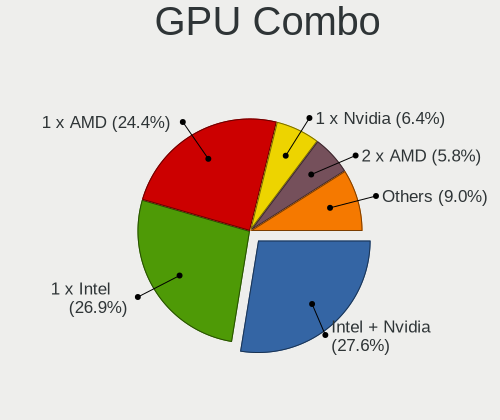
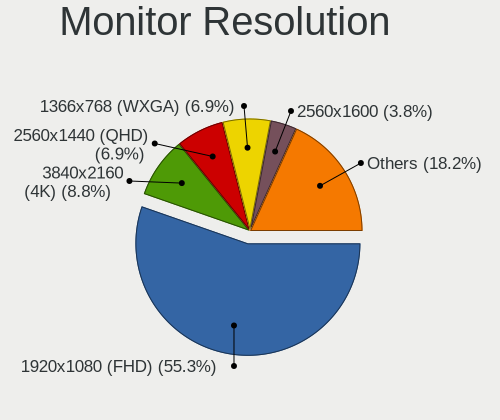
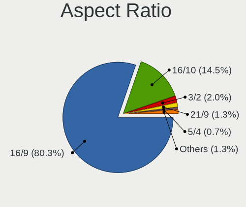
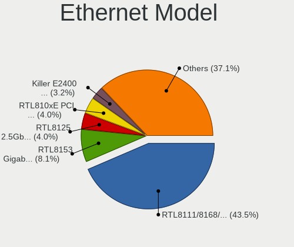
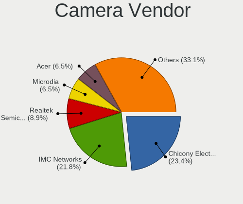
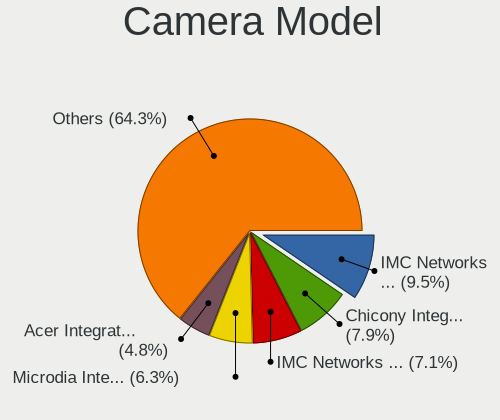

Gentoo 2.8 - Tested Hardware & Statistics (Notebooks)
-----------------------------------------------------

A project to collect tested hardware configurations for Gentoo 2.8.

Anyone can contribute to this report by the [hw-probe](https://github.com/linuxhw/hw-probe) tool:

    sudo -E hw-probe -all -upload

Please submit a probe of your configuration if it's not presented on the page or is rare.

Full-feature report is available here: https://linux-hardware.org/?view=trends

Contents
--------

* [ Test Cases ](#test-cases)

* [ System ](#system)
  - [ Kernel                   ](#kernel)
  - [ Kernel Family            ](#kernel-family)
  - [ Kernel Major Ver.        ](#kernel-major-ver)
  - [ Arch                     ](#arch)
  - [ DE                       ](#de)
  - [ Display Server           ](#display-server)
  - [ Display Manager          ](#display-manager)
  - [ OS Lang                  ](#os-lang)
  - [ Boot Mode                ](#boot-mode)
  - [ Filesystem               ](#filesystem)
  - [ Part. scheme             ](#part-scheme)
  - [ Dual Boot with Linux/BSD ](#dual-boot-with-linuxbsd)
  - [ Dual Boot (Win)          ](#dual-boot-win)

* [ Board ](#board)
  - [ Vendor                   ](#vendor)
  - [ Model                    ](#model)
  - [ Model Family             ](#model-family)
  - [ MFG Year                 ](#mfg-year)
  - [ Form Factor              ](#form-factor)
  - [ Secure Boot              ](#secure-boot)
  - [ Coreboot                 ](#coreboot)
  - [ RAM Size                 ](#ram-size)
  - [ RAM Used                 ](#ram-used)
  - [ Total Drives             ](#total-drives)
  - [ Has CD-ROM               ](#has-cd-rom)
  - [ Has Ethernet             ](#has-ethernet)
  - [ Has WiFi                 ](#has-wifi)
  - [ Has Bluetooth            ](#has-bluetooth)

* [ Location ](#location)
  - [ Country                  ](#country)
  - [ City                     ](#city)

* [ Drives ](#drives)
  - [ Drive Vendor             ](#drive-vendor)
  - [ Drive Model              ](#drive-model)
  - [ HDD Vendor               ](#hdd-vendor)
  - [ SSD Vendor               ](#ssd-vendor)
  - [ Drive Kind               ](#drive-kind)
  - [ Drive Connector          ](#drive-connector)
  - [ Drive Size               ](#drive-size)
  - [ Space Total              ](#space-total)
  - [ Space Used               ](#space-used)
  - [ Malfunc. Drives          ](#malfunc-drives)
  - [ Malfunc. Drive Vendor    ](#malfunc-drive-vendor)
  - [ Malfunc. HDD Vendor      ](#malfunc-hdd-vendor)
  - [ Malfunc. Drive Kind      ](#malfunc-drive-kind)
  - [ Failed Drives            ](#failed-drives)
  - [ Failed Drive Vendor      ](#failed-drive-vendor)
  - [ Drive Status             ](#drive-status)

* [ Storage controller ](#storage-controller)
  - [ Storage Vendor           ](#storage-vendor)
  - [ Storage Model            ](#storage-model)
  - [ Storage Kind             ](#storage-kind)

* [ Processor ](#processor)
  - [ CPU Vendor               ](#cpu-vendor)
  - [ CPU Model                ](#cpu-model)
  - [ CPU Model Family         ](#cpu-model-family)
  - [ CPU Cores                ](#cpu-cores)
  - [ CPU Sockets              ](#cpu-sockets)
  - [ CPU Threads              ](#cpu-threads)
  - [ CPU Op-Modes             ](#cpu-op-modes)
  - [ CPU Microcode            ](#cpu-microcode)
  - [ CPU Microarch            ](#cpu-microarch)

* [ Graphics ](#graphics)
  - [ GPU Vendor               ](#gpu-vendor)
  - [ GPU Model                ](#gpu-model)
  - [ GPU Combo                ](#gpu-combo)
  - [ GPU Driver               ](#gpu-driver)
  - [ GPU Memory               ](#gpu-memory)

* [ Monitor ](#monitor)
  - [ Monitor Vendor           ](#monitor-vendor)
  - [ Monitor Model            ](#monitor-model)
  - [ Monitor Resolution       ](#monitor-resolution)
  - [ Monitor Diagonal         ](#monitor-diagonal)
  - [ Monitor Width            ](#monitor-width)
  - [ Aspect Ratio             ](#aspect-ratio)
  - [ Monitor Area             ](#monitor-area)
  - [ Pixel Density            ](#pixel-density)
  - [ Multiple Monitors        ](#multiple-monitors)

* [ Network ](#network)
  - [ Net Controller Vendor    ](#net-controller-vendor)
  - [ Net Controller Model     ](#net-controller-model)
  - [ Wireless Vendor          ](#wireless-vendor)
  - [ Wireless Model           ](#wireless-model)
  - [ Ethernet Vendor          ](#ethernet-vendor)
  - [ Ethernet Model           ](#ethernet-model)
  - [ Net Controller Kind      ](#net-controller-kind)
  - [ Used Controller          ](#used-controller)
  - [ NICs                     ](#nics)
  - [ IPv6                     ](#ipv6)

* [ Bluetooth ](#bluetooth)
  - [ Bluetooth Vendor         ](#bluetooth-vendor)
  - [ Bluetooth Model          ](#bluetooth-model)

* [ Sound ](#sound)
  - [ Sound Vendor             ](#sound-vendor)
  - [ Sound Model              ](#sound-model)

* [ Memory ](#memory)
  - [ Memory Vendor            ](#memory-vendor)
  - [ Memory Model             ](#memory-model)
  - [ Memory Kind              ](#memory-kind)
  - [ Memory Form Factor       ](#memory-form-factor)
  - [ Memory Size              ](#memory-size)
  - [ Memory Speed             ](#memory-speed)

* [ Printers & scanners ](#printers--scanners)
  - [ Printer Vendor           ](#printer-vendor)
  - [ Printer Model            ](#printer-model)
  - [ Scanner Vendor           ](#scanner-vendor)
  - [ Scanner Model            ](#scanner-model)

* [ Camera ](#camera)
  - [ Camera Vendor            ](#camera-vendor)
  - [ Camera Model             ](#camera-model)

* [ Security ](#security)
  - [ Fingerprint Vendor       ](#fingerprint-vendor)
  - [ Fingerprint Model        ](#fingerprint-model)
  - [ Chipcard Vendor          ](#chipcard-vendor)
  - [ Chipcard Model           ](#chipcard-model)

* [ Unsupported ](#unsupported)
  - [ Unsupported Devices      ](#unsupported-devices)
  - [ Unsupported Device Types ](#unsupported-device-types)

Test Cases
----------

| Vendor    | Model                       | Probe                                                      | Date         |
|-----------|-----------------------------|------------------------------------------------------------|--------------|
| Dell      | XPS 15 9570                 | [1695a19b52](https://linux-hardware.org/?probe=1695a19b52) | Dec 24, 2021 |
| Framework | Laptop                      | [33bb6590a6](https://linux-hardware.org/?probe=33bb6590a6) | Dec 21, 2021 |
| ASUSTek   | ROG Strix G513QY_G513QY     | [ee63a84605](https://linux-hardware.org/?probe=ee63a84605) | Dec 11, 2021 |
| Toshiba   | Satellite C850D-118         | [b15f2e2c92](https://linux-hardware.org/?probe=b15f2e2c92) | Dec 09, 2021 |
| HP        | Laptop 15s-eq0xxx           | [86f5c0bc34](https://linux-hardware.org/?probe=86f5c0bc34) | Nov 30, 2021 |
| HP        | Laptop 15s-eq0xxx           | [e06c73ada9](https://linux-hardware.org/?probe=e06c73ada9) | Nov 29, 2021 |
| Lenovo    | IdeaPad 5 Pro 16ACH6 82L... | [ad15be0510](https://linux-hardware.org/?probe=ad15be0510) | Nov 29, 2021 |
| Lenovo    | ThinkPad T470p 20J7S06Q0... | [6eca4a1be2](https://linux-hardware.org/?probe=6eca4a1be2) | Nov 22, 2021 |
| Lenovo    | ThinkPad T470p 20J7S06Q0... | [6c92c6ecbb](https://linux-hardware.org/?probe=6c92c6ecbb) | Nov 22, 2021 |
| Acer      | Aspire A715-42G             | [3ea389d8ff](https://linux-hardware.org/?probe=3ea389d8ff) | Nov 21, 2021 |
| Acer      | Aspire A715-42G             | [19f48288ec](https://linux-hardware.org/?probe=19f48288ec) | Nov 20, 2021 |
| Lenovo    | ThinkPad E495 20NE000BGE    | [871e0a8d36](https://linux-hardware.org/?probe=871e0a8d36) | Nov 11, 2021 |
| Dell      | Latitude 7490               | [ea64667f2c](https://linux-hardware.org/?probe=ea64667f2c) | Nov 01, 2021 |
| Lenovo    | ThinkPad P1 Gen 3 20TJS2... | [6105164e23](https://linux-hardware.org/?probe=6105164e23) | Oct 26, 2021 |
| Lenovo    | ThinkPad E15 Gen 2 20T80... | [8a34d739fd](https://linux-hardware.org/?probe=8a34d739fd) | Oct 25, 2021 |
| Acer      | Aspire A515-55              | [437c8fb96b](https://linux-hardware.org/?probe=437c8fb96b) | Oct 12, 2021 |
| Lenovo    | ThinkBook 14 G3 ACL 21A2    | [3ad4e11bac](https://linux-hardware.org/?probe=3ad4e11bac) | Oct 06, 2021 |
| Lenovo    | ThinkBook 14 G3 ACL 21A2    | [18a2385458](https://linux-hardware.org/?probe=18a2385458) | Oct 06, 2021 |
| Timi      | Mi Laptop Pro 15            | [e2057e68dd](https://linux-hardware.org/?probe=e2057e68dd) | Oct 03, 2021 |
| Dell      | Inspiron 5415               | [a265f8ea5c](https://linux-hardware.org/?probe=a265f8ea5c) | Oct 01, 2021 |

System
------

Kernel
------

Version of the Linux kernel

| Version               | Notebooks | Percent |
|-----------------------|-----------|---------|
| 5.14.9-gentoo-x86_64  | 3         | 17.65%  |
| 5.15.7-gentoo         | 1         | 5.88%   |
| 5.15.6-gentoo         | 1         | 5.88%   |
| 5.15.5-gentoo-x86_64  | 1         | 5.88%   |
| 5.15.5-gentoo-dist    | 1         | 5.88%   |
| 5.15.5-gentoo         | 1         | 5.88%   |
| 5.15.10-gentoo-x86_64 | 1         | 5.88%   |
| 5.15.1-gentoo-x86_64  | 1         | 5.88%   |
| 5.14.9-gentoo         | 1         | 5.88%   |
| 5.14.7-gentoo-x86_64  | 1         | 5.88%   |
| 5.14.14-gentoo-x86_64 | 1         | 5.88%   |
| 5.14.14-gentoo-dist   | 1         | 5.88%   |
| 5.10.83-gentoo-dist   | 1         | 5.88%   |
| 5.10.76-gentoo-r1     | 1         | 5.88%   |
| 5.10.70-1-lts         | 1         | 5.88%   |

Kernel Family
-------------

Linux kernel without a distro release

| Version | Notebooks | Percent |
|---------|-----------|---------|
| 5.14.9  | 4         | 23.53%  |
| 5.15.5  | 3         | 17.65%  |
| 5.14.14 | 2         | 11.76%  |
| 5.15.7  | 1         | 5.88%   |
| 5.15.6  | 1         | 5.88%   |
| 5.15.10 | 1         | 5.88%   |
| 5.15.1  | 1         | 5.88%   |
| 5.14.7  | 1         | 5.88%   |
| 5.10.83 | 1         | 5.88%   |
| 5.10.76 | 1         | 5.88%   |
| 5.10.70 | 1         | 5.88%   |

Kernel Major Ver.
-----------------

Linux kernel major version

| Version | Notebooks | Percent |
|---------|-----------|---------|
| 5.15    | 7         | 41.18%  |
| 5.14    | 7         | 41.18%  |
| 5.10    | 3         | 17.65%  |

Arch
----

OS architecture (x86_64, i586, etc.)

| Name   | Notebooks | Percent |
|--------|-----------|---------|
| x86_64 | 17        | 100%    |

DE
--

Desktop Environment

| Name     | Notebooks | Percent |
|----------|-----------|---------|
| KDE5     | 7         | 41.18%  |
| Unknown  | 7         | 41.18%  |
| XFCE     | 1         | 5.88%   |
| DWM      | 1         | 5.88%   |
| Cinnamon | 1         | 5.88%   |

Display Server
--------------

X11 or Wayland

| Name    | Notebooks | Percent |
|---------|-----------|---------|
| X11     | 6         | 35.29%  |
| Wayland | 6         | 35.29%  |
| Tty     | 3         | 17.65%  |
| Unknown | 2         | 11.76%  |

Display Manager
---------------

SDDM, LightDM, etc.

| Name    | Notebooks | Percent |
|---------|-----------|---------|
| SDDM    | 8         | 47.06%  |
| Unknown | 8         | 47.06%  |
| LightDM | 1         | 5.88%   |

OS Lang
-------

Language

| Lang       | Notebooks | Percent |
|------------|-----------|---------|
| en_US      | 7         | 41.18%  |
| ru_RU      | 2         | 11.76%  |
| de_DE      | 2         | 11.76%  |
| C          | 2         | 11.76%  |
| tr_TR      | 1         | 5.88%   |
| it_IT      | 1         | 5.88%   |
| en_US.UTF8 | 1         | 5.88%   |
| en_NZ      | 1         | 5.88%   |

Boot Mode
---------

EFI or BIOS

| Mode | Notebooks | Percent |
|------|-----------|---------|
| EFI  | 15        | 88.24%  |
| BIOS | 2         | 11.76%  |

Filesystem
----------

Type of filesystem

| Type  | Notebooks | Percent |
|-------|-----------|---------|
| Btrfs | 9         | 52.94%  |
| Ext4  | 8         | 47.06%  |

Part. scheme
------------

Scheme of partitioning

| Type | Notebooks | Percent |
|------|-----------|---------|
| GPT  | 15        | 88.24%  |
| MBR  | 2         | 11.76%  |

Dual Boot with Linux/BSD
------------------------

Hosting more than one Linux/BSD

| Dual boot | Notebooks | Percent |
|-----------|-----------|---------|
| No        | 14        | 82.35%  |
| Yes       | 3         | 17.65%  |

Dual Boot (Win)
---------------

Hosting Linux and Windows

| Dual boot | Notebooks | Percent |
|-----------|-----------|---------|
| No        | 13        | 76.47%  |
| Yes       | 4         | 23.53%  |

Board
-----

Vendor
------

Motherboard manufacturer

| Name             | Notebooks | Percent |
|------------------|-----------|---------|
| Lenovo           | 6         | 35.29%  |
| Dell             | 3         | 17.65%  |
| Hewlett-Packard  | 2         | 11.76%  |
| Acer             | 2         | 11.76%  |
| Toshiba          | 1         | 5.88%   |
| Timi             | 1         | 5.88%   |
| Framework        | 1         | 5.88%   |
| ASUSTek Computer | 1         | 5.88%   |

Model
-----

Motherboard model

| Name                                 | Notebooks | Percent |
|--------------------------------------|-----------|---------|
| HP Laptop 15s-eq0xxx                 | 2         | 11.76%  |
| Toshiba Satellite C850D-118          | 1         | 5.88%   |
| Timi Mi Laptop Pro 15                | 1         | 5.88%   |
| Lenovo ThinkPad T470p 20J7S06Q00     | 1         | 5.88%   |
| Lenovo ThinkPad P1 Gen 3 20TJS2F437  | 1         | 5.88%   |
| Lenovo ThinkPad E495 20NE000BGE      | 1         | 5.88%   |
| Lenovo ThinkPad E15 Gen 2 20T8001STX | 1         | 5.88%   |
| Lenovo ThinkBook 14 G3 ACL 21A2      | 1         | 5.88%   |
| Lenovo IdeaPad 5 Pro 16ACH6 82L5     | 1         | 5.88%   |
| Framework Laptop                     | 1         | 5.88%   |
| Dell XPS 15 9570                     | 1         | 5.88%   |
| Dell Latitude 7490                   | 1         | 5.88%   |
| Dell Inspiron 5415                   | 1         | 5.88%   |
| ASUS ROG Strix G513QY_G513QY         | 1         | 5.88%   |
| Acer Aspire A715-42G                 | 1         | 5.88%   |
| Acer Aspire A515-55                  | 1         | 5.88%   |

Model Family
------------

Motherboard model prefix

| Name              | Notebooks | Percent |
|-------------------|-----------|---------|
| Lenovo ThinkPad   | 4         | 23.53%  |
| HP Laptop         | 2         | 11.76%  |
| Acer Aspire       | 2         | 11.76%  |
| Toshiba Satellite | 1         | 5.88%   |
| Timi Mi           | 1         | 5.88%   |
| Lenovo ThinkBook  | 1         | 5.88%   |
| Lenovo IdeaPad    | 1         | 5.88%   |
| Framework Laptop  | 1         | 5.88%   |
| Dell XPS          | 1         | 5.88%   |
| Dell Latitude     | 1         | 5.88%   |
| Dell Inspiron     | 1         | 5.88%   |
| ASUS ROG          | 1         | 5.88%   |

MFG Year
--------

Motherboard manufacture year

| Year | Notebooks | Percent |
|------|-----------|---------|
| 2021 | 8         | 47.06%  |
| 2020 | 8         | 47.06%  |
| 2012 | 1         | 5.88%   |

Form Factor
-----------

Physical design of the computer

| Name     | Notebooks | Percent |
|----------|-----------|---------|
| Notebook | 17        | 100%    |

Secure Boot
-----------

Enabled or disabled

| State    | Notebooks | Percent |
|----------|-----------|---------|
| Disabled | 17        | 100%    |

Coreboot
--------

Have coreboot on board

| Used | Notebooks | Percent |
|------|-----------|---------|
| No   | 17        | 100%    |

RAM Size
--------

Total RAM memory

| Size in GB  | Notebooks | Percent |
|-------------|-----------|---------|
| 8.01-16.0   | 9         | 52.94%  |
| 16.01-24.0  | 3         | 17.65%  |
| 32.01-64.0  | 2         | 11.76%  |
| 4.01-8.0    | 1         | 5.88%   |
| 64.01-256.0 | 1         | 5.88%   |
| 1.01-2.0    | 1         | 5.88%   |

RAM Used
--------

Used RAM memory

| Used GB   | Notebooks | Percent |
|-----------|-----------|---------|
| 1.01-2.0  | 6         | 35.29%  |
| 4.01-8.0  | 5         | 29.41%  |
| 0.51-1.0  | 3         | 17.65%  |
| 3.01-4.0  | 1         | 5.88%   |
| 2.01-3.0  | 1         | 5.88%   |
| 8.01-16.0 | 1         | 5.88%   |

Total Drives
------------

Number of drives on board

| Drives | Notebooks | Percent |
|--------|-----------|---------|
| 1      | 14        | 82.35%  |
| 2      | 2         | 11.76%  |
| 4      | 1         | 5.88%   |

Has CD-ROM
----------

Has CD-ROM on board

| Presented | Notebooks | Percent |
|-----------|-----------|---------|
| No        | 16        | 94.12%  |
| Yes       | 1         | 5.88%   |

Has Ethernet
------------

Has Ethernet on board

| Presented | Notebooks | Percent |
|-----------|-----------|---------|
| Yes       | 10        | 58.82%  |
| No        | 7         | 41.18%  |

Has WiFi
--------

Has WiFi module

| Presented | Notebooks | Percent |
|-----------|-----------|---------|
| Yes       | 17        | 100%    |

Has Bluetooth
-------------

Has Bluetooth module

| Presented | Notebooks | Percent |
|-----------|-----------|---------|
| Yes       | 16        | 94.12%  |
| No        | 1         | 5.88%   |

Location
--------

Country
-------

Geographic location (country)

| Country     | Notebooks | Percent |
|-------------|-----------|---------|
| Germany     | 4         | 23.53%  |
| USA         | 3         | 17.65%  |
| Russia      | 2         | 11.76%  |
| Turkey      | 1         | 5.88%   |
| New Zealand | 1         | 5.88%   |
| Italy       | 1         | 5.88%   |
| Greece      | 1         | 5.88%   |
| Finland     | 1         | 5.88%   |
| Czechia     | 1         | 5.88%   |
| China       | 1         | 5.88%   |
| Belarus     | 1         | 5.88%   |

City
----

Geographic location (city)

| City             | Notebooks | Percent |
|------------------|-----------|---------|
| Zebulon          | 1         | 5.88%   |
| Ratingen         | 1         | 5.88%   |
| Nuremberg        | 1         | 5.88%   |
| Nizhniy Novgorod | 1         | 5.88%   |
| Moscow           | 1         | 5.88%   |
| Minsk            | 1         | 5.88%   |
| Milan            | 1         | 5.88%   |
| Helsinki         | 1         | 5.88%   |
| Harsum           | 1         | 5.88%   |
| Guangzhou        | 1         | 5.88%   |
| Chicago          | 1         | 5.88%   |
| Cerritos         | 1         | 5.88%   |
| Brno             | 1         | 5.88%   |
| Berlin           | 1         | 5.88%   |
| Auckland         | 1         | 5.88%   |
| Athens           | 1         | 5.88%   |
| Ankara           | 1         | 5.88%   |

Drives
------

Drive Vendor
------------

Hard drive vendors

| Vendor              | Notebooks | Drives | Percent |
|---------------------|-----------|--------|---------|
| WDC                 | 5         | 5      | 26.32%  |
| SK Hynix            | 3         | 3      | 15.79%  |
| Toshiba             | 2         | 2      | 10.53%  |
| Samsung Electronics | 2         | 2      | 10.53%  |
| Intel               | 2         | 2      | 10.53%  |
| Unknown             | 1         | 3      | 5.26%   |
| Seagate             | 1         | 1      | 5.26%   |
| KIOXIA-EXCERIA      | 1         | 1      | 5.26%   |
| KIOXIA              | 1         | 1      | 5.26%   |
| Crucial             | 1         | 1      | 5.26%   |

Drive Model
-----------

Hard drive models

| Model                                   | Notebooks | Percent |
|-----------------------------------------|-----------|---------|
| WDC WD2500BEVS-22UST0 250GB             | 1         | 5.26%   |
| WDC PC SN730 SDBPNTY-512G-1006 512GB    | 1         | 5.26%   |
| WDC PC SN530 SDBPMPZ-512G-1101 512GB    | 1         | 5.26%   |
| WDC PC SN530 SDBPMPZ-256G-1001 256GB    | 1         | 5.26%   |
| WDC PC SN520 SDAPNUW-512G-1014 512GB    | 1         | 5.26%   |
| Unknown USB DISK 3.2 1TB                | 1         | 5.26%   |
| Toshiba KXG6AZNV512G 512GB              | 1         | 5.26%   |
| Toshiba KSG60ZMV512G M.2 2280 512GB SSD | 1         | 5.26%   |
| SK Hynix HFM512GDHTNG-8710B 512GB       | 1         | 5.26%   |
| SK Hynix HFM512GD3JX016N 512GB          | 1         | 5.26%   |
| SK Hynix BC711 NVMe 512GB               | 1         | 5.26%   |
| Seagate FireCuda 530 ZP4000GM30013 4TB  | 1         | 5.26%   |
| Samsung MZVLW1T0HMLH-000L7 1TB          | 1         | 5.26%   |
| Samsung MZVLB512HBJQ-000L2 512GB        | 1         | 5.26%   |
| KIOXIA-EXCERIA SSD 500GB                | 1         | 5.26%   |
| KIOXIA KBG30ZMV256G 256GB               | 1         | 5.26%   |
| Intel SSDPEKNW010T8 1TB                 | 1         | 5.26%   |
| Intel SSDPEKNU512GZ 512GB               | 1         | 5.26%   |
| Crucial CT1000P1SSD8 1TB                | 1         | 5.26%   |

HDD Vendor
----------

Hard disk drive vendors

| Vendor | Notebooks | Drives | Percent |
|--------|-----------|--------|---------|
| WDC    | 1         | 1      | 100%    |

SSD Vendor
----------

Solid state drive vendors

| Vendor  | Notebooks | Drives | Percent |
|---------|-----------|--------|---------|
| Toshiba | 1         | 1      | 100%    |

Drive Kind
----------

HDD or SSD

| Kind    | Notebooks | Drives | Percent |
|---------|-----------|--------|---------|
| NVMe    | 15        | 16     | 83.33%  |
| SSD     | 1         | 1      | 5.56%   |
| HDD     | 1         | 1      | 5.56%   |
| Unknown | 1         | 3      | 5.56%   |

Drive Connector
---------------

SATA, SAS, NVMe, etc.

| Type | Notebooks | Drives | Percent |
|------|-----------|--------|---------|
| NVMe | 15        | 16     | 83.33%  |
| SATA | 2         | 2      | 11.11%  |
| SAS  | 1         | 3      | 5.56%   |

Drive Size
----------

Size of hard drive

| Size in TB | Notebooks | Drives | Percent |
|------------|-----------|--------|---------|
| 0.51-1.0   | 1         | 1      | 50%     |
| 0.01-0.5   | 1         | 1      | 50%     |

Space Total
-----------

Amount of disk space available on the file system

| Size in GB     | Notebooks | Percent |
|----------------|-----------|---------|
| 251-500        | 8         | 47.06%  |
| 101-250        | 2         | 11.76%  |
| 1-20           | 2         | 11.76%  |
| 501-1000       | 2         | 11.76%  |
| More than 3000 | 1         | 5.88%   |
| 21-50          | 1         | 5.88%   |
| 1001-2000      | 1         | 5.88%   |

Space Used
----------

Amount of used disk space

| Used GB   | Notebooks | Percent |
|-----------|-----------|---------|
| 1-20      | 7         | 41.18%  |
| 21-50     | 4         | 23.53%  |
| 251-500   | 2         | 11.76%  |
| 101-250   | 2         | 11.76%  |
| 1001-2000 | 1         | 5.88%   |
| 501-1000  | 1         | 5.88%   |

Malfunc. Drives
---------------

Drive models with a malfunction

| Model                    | Notebooks | Drives | Percent |
|--------------------------|-----------|--------|---------|
| Crucial CT1000P1SSD8 1TB | 1         | 1      | 100%    |

Malfunc. Drive Vendor
---------------------

Vendors of faulty drives

| Vendor  | Notebooks | Drives | Percent |
|---------|-----------|--------|---------|
| Crucial | 1         | 1      | 100%    |

Malfunc. HDD Vendor
-------------------

Vendors of faulty HDD drives

Zero info for selected period =(

Malfunc. Drive Kind
-------------------

Kinds of faulty drives

| Kind | Notebooks | Drives | Percent |
|------|-----------|--------|---------|
| NVMe | 1         | 1      | 100%    |

Failed Drives
-------------

Failed drive models

Zero info for selected period =(

Failed Drive Vendor
-------------------

Failed drive vendors

Zero info for selected period =(

Drive Status
------------

Number of failed and malfunc. drives

| Status   | Notebooks | Drives | Percent |
|----------|-----------|--------|---------|
| Works    | 16        | 17     | 88.89%  |
| Detected | 1         | 3      | 5.56%   |
| Malfunc  | 1         | 1      | 5.56%   |

Storage controller
------------------

Storage Vendor
--------------

Storage controller vendors

| Vendor                       | Notebooks | Percent |
|------------------------------|-----------|---------|
| Intel                        | 5         | 20.83%  |
| AMD                          | 5         | 20.83%  |
| Sandisk                      | 4         | 16.67%  |
| SK Hynix                     | 3         | 12.5%   |
| Toshiba America Info Systems | 2         | 8.33%   |
| Samsung Electronics          | 2         | 8.33%   |
| Seagate Technology           | 1         | 4.17%   |
| Micron/Crucial Technology    | 1         | 4.17%   |
| KIOXIA                       | 1         | 4.17%   |

Storage Model
-------------

Storage controller models

| Model                                                | Notebooks | Percent |
|------------------------------------------------------|-----------|---------|
| AMD FCH SATA Controller [AHCI mode]                  | 5         | 20.83%  |
| SK Hynix Gold P31 SSD                                | 2         | 8.33%   |
| Sandisk Non-Volatile memory controller               | 2         | 8.33%   |
| Toshiba America Info Systems XG6 NVMe SSD Controller | 1         | 4.17%   |
| Toshiba America Info Systems BG3 NVMe SSD Controller | 1         | 4.17%   |
| SK Hynix BC501 NVMe Solid State Drive                | 1         | 4.17%   |
| Seagate Non-Volatile memory controller               | 1         | 4.17%   |
| Sandisk WD Blue SN500 / PC SN520 NVMe SSD            | 1         | 4.17%   |
| Sandisk WD Black SN750 / PC SN730 NVMe SSD           | 1         | 4.17%   |
| Samsung NVMe SSD Controller SM981/PM981/PM983        | 1         | 4.17%   |
| Samsung NVMe SSD Controller SM961/PM961/SM963        | 1         | 4.17%   |
| Micron/Crucial P1 NVMe PCIe SSD                      | 1         | 4.17%   |
| KIOXIA NVMe SSD                                      | 1         | 4.17%   |
| Intel Sunrise Point-LP SATA Controller [AHCI mode]   | 1         | 4.17%   |
| Intel SSD 660P Series                                | 1         | 4.17%   |
| Intel Non-Volatile memory controller                 | 1         | 4.17%   |
| Intel Ice Lake-LP SATA Controller [AHCI mode]        | 1         | 4.17%   |
| Intel Cannon Lake Mobile PCH SATA AHCI Controller    | 1         | 4.17%   |

Storage Kind
------------

Kind of storage controller (IDE, SATA, NVMe, SAS, ...)

| Kind | Notebooks | Percent |
|------|-----------|---------|
| NVMe | 15        | 65.22%  |
| SATA | 8         | 34.78%  |

Processor
---------

CPU Vendor
----------

Processor vendors

| Vendor | Notebooks | Percent |
|--------|-----------|---------|
| AMD    | 10        | 58.82%  |
| Intel  | 7         | 41.18%  |

CPU Model
---------

Processor models

| Model                                         | Notebooks | Percent |
|-----------------------------------------------|-----------|---------|
| AMD Ryzen 7 5700U with Radeon Graphics        | 2         | 11.76%  |
| Intel Core i7-8750H CPU @ 2.20GHz             | 1         | 5.88%   |
| Intel Core i7-8650U CPU @ 1.90GHz             | 1         | 5.88%   |
| Intel Core i7-7700HQ CPU @ 2.80GHz            | 1         | 5.88%   |
| Intel Core i7-10850H CPU @ 2.70GHz            | 1         | 5.88%   |
| Intel Core i7-10510U CPU @ 1.80GHz            | 1         | 5.88%   |
| Intel Core i5-1035G1 CPU @ 1.00GHz            | 1         | 5.88%   |
| Intel 11th Gen Core i7-1185G7 @ 3.00GHz       | 1         | 5.88%   |
| AMD Ryzen 9 5900HX with Radeon Graphics       | 1         | 5.88%   |
| AMD Ryzen 7 4700U with Radeon Graphics        | 1         | 5.88%   |
| AMD Ryzen 7 3700U with Radeon Vega Mobile Gfx | 1         | 5.88%   |
| AMD Ryzen 5 5600H with Radeon Graphics        | 1         | 5.88%   |
| AMD Ryzen 5 5500U with Radeon Graphics        | 1         | 5.88%   |
| AMD Ryzen 5 3500U with Radeon Vega Mobile Gfx | 1         | 5.88%   |
| AMD Ryzen 3 3200U with Radeon Vega Mobile Gfx | 1         | 5.88%   |
| AMD E1-1200 APU with Radeon HD Graphics       | 1         | 5.88%   |

CPU Model Family
----------------

Processor model prefix

| Model         | Notebooks | Percent |
|---------------|-----------|---------|
| Intel Core i7 | 5         | 29.41%  |
| AMD Ryzen 7   | 4         | 23.53%  |
| AMD Ryzen 5   | 3         | 17.65%  |
| Other         | 1         | 5.88%   |
| Intel Core i5 | 1         | 5.88%   |
| AMD Ryzen 9   | 1         | 5.88%   |
| AMD Ryzen 3   | 1         | 5.88%   |
| AMD E1        | 1         | 5.88%   |

CPU Cores
---------

Number of processor cores

| Number | Notebooks | Percent |
|--------|-----------|---------|
| 4      | 7         | 41.18%  |
| 8      | 4         | 23.53%  |
| 6      | 4         | 23.53%  |
| 2      | 2         | 11.76%  |

CPU Sockets
-----------

Number of sockets

| Number | Notebooks | Percent |
|--------|-----------|---------|
| 1      | 17        | 100%    |

CPU Threads
-----------

Threads per core (Hyper-Threading)

| Number | Notebooks | Percent |
|--------|-----------|---------|
| 2      | 14        | 82.35%  |
| 1      | 3         | 17.65%  |

CPU Op-Modes
------------

CPU Operation Modes (32-bit, 64-bit)

| Op mode        | Notebooks | Percent |
|----------------|-----------|---------|
| 32-bit, 64-bit | 17        | 100%    |

CPU Microcode
-------------

Microcode number

| Number     | Notebooks | Percent |
|------------|-----------|---------|
| 0x0a50000c | 2         | 11.76%  |
| 0x08608103 | 2         | 11.76%  |
| 0x08108109 | 2         | 11.76%  |
| Unknown    | 2         | 11.76%  |
| 0xa0652    | 1         | 5.88%   |
| 0x906ea    | 1         | 5.88%   |
| 0x906e9    | 1         | 5.88%   |
| 0x806ec    | 1         | 5.88%   |
| 0x706e5    | 1         | 5.88%   |
| 0x08608102 | 1         | 5.88%   |
| 0x08600103 | 1         | 5.88%   |
| 0x08108102 | 1         | 5.88%   |
| 0x05000119 | 1         | 5.88%   |

CPU Microarch
-------------

Microarchitecture

| Name      | Notebooks | Percent |
|-----------|-----------|---------|
| KabyLake  | 4         | 23.53%  |
| Zen+      | 3         | 17.65%  |
| Unknown   | 3         | 17.65%  |
| Zen 3     | 2         | 11.76%  |
| Zen 2     | 1         | 5.88%   |
| TigerLake | 1         | 5.88%   |
| IceLake   | 1         | 5.88%   |
| CometLake | 1         | 5.88%   |
| Bobcat    | 1         | 5.88%   |

Graphics
--------

GPU Vendor
----------

Vendors of graphics cards

| Vendor | Notebooks | Percent |
|--------|-----------|---------|
| AMD    | 10        | 47.62%  |
| Intel  | 7         | 33.33%  |
| Nvidia | 4         | 19.05%  |

GPU Model
---------

Graphics card models

| Model                                                                | Notebooks | Percent |
|----------------------------------------------------------------------|-----------|---------|
| AMD Picasso/Raven 2 [Radeon Vega Series / Radeon Vega Mobile Series] | 3         | 13.64%  |
| AMD Lucienne                                                         | 3         | 13.64%  |
| AMD Cezanne                                                          | 2         | 9.09%   |
| Nvidia TU117M [GeForce GTX 1650 Mobile / Max-Q]                      | 1         | 4.55%   |
| Nvidia GP108M [GeForce MX250]                                        | 1         | 4.55%   |
| Nvidia GP107M [GeForce GTX 1050 Ti Mobile]                           | 1         | 4.55%   |
| Nvidia GM108M [GeForce 940MX]                                        | 1         | 4.55%   |
| Intel UHD Graphics 620                                               | 1         | 4.55%   |
| Intel TigerLake-LP GT2 [Iris Xe Graphics]                            | 1         | 4.55%   |
| Intel Iris Plus Graphics G1 (Ice Lake)                               | 1         | 4.55%   |
| Intel HD Graphics 630                                                | 1         | 4.55%   |
| Intel CometLake-U GT2 [UHD Graphics]                                 | 1         | 4.55%   |
| Intel CometLake-H GT2 [UHD Graphics]                                 | 1         | 4.55%   |
| Intel CoffeeLake-H GT2 [UHD Graphics 630]                            | 1         | 4.55%   |
| AMD Wrestler [Radeon HD 7310]                                        | 1         | 4.55%   |
| AMD Renoir                                                           | 1         | 4.55%   |
| AMD Navi 22 [Radeon RX 6700/6700 XT / 6800M]                         | 1         | 4.55%   |

GPU Combo
---------

Combinations of graphics cards

| Name           | Notebooks | Percent |
|----------------|-----------|---------|
| 1 x AMD        | 8         | 47.06%  |
| 1 x Intel      | 4         | 23.53%  |
| Intel + Nvidia | 3         | 17.65%  |
| 2 x AMD        | 1         | 5.88%   |
| AMD + Nvidia   | 1         | 5.88%   |

GPU Driver
----------

Free vs proprietary

| Driver      | Notebooks | Percent |
|-------------|-----------|---------|
| Free        | 14        | 82.35%  |
| Proprietary | 3         | 17.65%  |

GPU Memory
----------

Total video memory

| Size in GB | Notebooks | Percent |
|------------|-----------|---------|
| Unknown    | 7         | 41.18%  |
| 1.01-2.0   | 4         | 23.53%  |
| 0.01-0.5   | 3         | 17.65%  |
| 0.51-1.0   | 2         | 11.76%  |
| 8.01-16.0  | 1         | 5.88%   |

Monitor
-------

Monitor Vendor
--------------

Monitor vendors

| Vendor              | Notebooks | Percent |
|---------------------|-----------|---------|
| AU Optronics        | 5         | 27.78%  |
| Chimei Innolux      | 4         | 22.22%  |
| BOE                 | 4         | 22.22%  |
| Sharp               | 2         | 11.11%  |
| Samsung Electronics | 1         | 5.56%   |
| PANDA               | 1         | 5.56%   |
| Goldstar            | 1         | 5.56%   |

Monitor Model
-------------

Monitor models

| Model                                                                | Notebooks | Percent |
|----------------------------------------------------------------------|-----------|---------|
| AU Optronics LCD Monitor AUO61ED 1920x1080 340x190mm 15.3-inch       | 2         | 11.11%  |
| Sharp LQ156M1JW01 SHP14C3 1920x1080 344x194mm 15.5-inch              | 1         | 5.56%   |
| Sharp LCD Monitor SHP148D 3840x2160 344x194mm 15.5-inch              | 1         | 5.56%   |
| Samsung Electronics LCD Monitor SEC3150 1366x768 344x193mm 15.5-inch | 1         | 5.56%   |
| PANDA LCD Monitor NCP0040 1920x1080 344x194mm 15.5-inch              | 1         | 5.56%   |
| Goldstar HDR 4K GSM7707 3840x2160 600x340mm 27.2-inch                | 1         | 5.56%   |
| Chimei Innolux LCD Monitor CMN14E7 1920x1080 309x173mm 13.9-inch     | 1         | 5.56%   |
| Chimei Innolux LCD Monitor CMN14D4 1920x1080 309x173mm 13.9-inch     | 1         | 5.56%   |
| Chimei Innolux LCD Monitor CMN14D3 1920x1080 309x173mm 13.9-inch     | 1         | 5.56%   |
| Chimei Innolux LCD Monitor CMN140A 1920x1080 309x173mm 13.9-inch     | 1         | 5.56%   |
| BOE LCD Monitor BOE09B6 2560x1600 345x215mm 16.0-inch                | 1         | 5.56%   |
| BOE LCD Monitor BOE0973 2560x1440 344x194mm 15.5-inch                | 1         | 5.56%   |
| BOE LCD Monitor BOE095F 2256x1504 285x190mm 13.5-inch                | 1         | 5.56%   |
| BOE LCD Monitor BOE086E 1920x1080 344x194mm 15.5-inch                | 1         | 5.56%   |
| AU Optronics LCD Monitor AUODF87 1920x1080 344x193mm 15.5-inch       | 1         | 5.56%   |
| AU Optronics LCD Monitor AUO2E8D 1920x1080 344x194mm 15.5-inch       | 1         | 5.56%   |
| AU Optronics LCD Monitor AUO243D 1920x1080 309x173mm 13.9-inch       | 1         | 5.56%   |

Monitor Resolution
------------------

Monitor screen resolution

| Resolution      | Notebooks | Percent |
|-----------------|-----------|---------|
| 1920x1080 (FHD) | 12        | 66.67%  |
| 3840x2160 (4K)  | 2         | 11.11%  |
| 2560x1600       | 1         | 5.56%   |
| 2560x1440 (QHD) | 1         | 5.56%   |
| 2256x1504       | 1         | 5.56%   |
| 1366x768 (WXGA) | 1         | 5.56%   |

Monitor Diagonal
----------------

Diagonal size in inches

| Inches | Notebooks | Percent |
|--------|-----------|---------|
| 15     | 10        | 55.56%  |
| 13     | 5         | 27.78%  |
| 27     | 1         | 5.56%   |
| 16     | 1         | 5.56%   |
| 14     | 1         | 5.56%   |

Monitor Width
-------------

Physical width

| Width in mm | Notebooks | Percent |
|-------------|-----------|---------|
| 301-350     | 16        | 88.89%  |
| 501-600     | 1         | 5.56%   |
| 201-300     | 1         | 5.56%   |

Aspect Ratio
------------

Proportional relationship between the width and the height

| Ratio | Notebooks | Percent |
|-------|-----------|---------|
| 16/9  | 15        | 88.24%  |
| 3/2   | 1         | 5.88%   |
| 16/10 | 1         | 5.88%   |

Monitor Area
------------

Area in inch²

| Area in inch² | Notebooks | Percent |
|----------------|-----------|---------|
| 101-110        | 10        | 55.56%  |
| 81-90          | 6         | 33.33%  |
| 301-350        | 1         | 5.56%   |
| 111-120        | 1         | 5.56%   |

Pixel Density
-------------

Pixels per inch

| Density       | Notebooks | Percent |
|---------------|-----------|---------|
| 121-160       | 12        | 66.67%  |
| 161-240       | 4         | 22.22%  |
| More than 240 | 1         | 5.56%   |
| 101-120       | 1         | 5.56%   |

Multiple Monitors
-----------------

Total monitors connected

| Total | Notebooks | Percent |
|-------|-----------|---------|
| 1     | 16        | 94.12%  |
| 2     | 1         | 5.88%   |

Network
-------

Net Controller Vendor
---------------------

Controller vendors

| Vendor                | Notebooks | Percent |
|-----------------------|-----------|---------|
| Intel                 | 11        | 45.83%  |
| Realtek Semiconductor | 9         | 37.5%   |
| MEDIATEK              | 2         | 8.33%   |
| Samsung Electronics   | 1         | 4.17%   |
| ICS Advent            | 1         | 4.17%   |

Net Controller Model
--------------------

Controller models

| Model                                                             | Notebooks | Percent |
|-------------------------------------------------------------------|-----------|---------|
| Realtek RTL8111/8168/8411 PCI Express Gigabit Ethernet Controller | 6         | 21.43%  |
| Intel Wi-Fi 6 AX200                                               | 4         | 14.29%  |
| MEDIATEK Network controller                                       | 2         | 7.14%   |
| Intel Wireless 8265 / 8275                                        | 2         | 7.14%   |
| Samsung Galaxy series, misc. (tethering mode)                     | 1         | 3.57%   |
| Realtek RTL8822CE 802.11ac PCIe Wireless Network Adapter          | 1         | 3.57%   |
| Realtek RTL8822BE 802.11a/b/g/n/ac WiFi adapter                   | 1         | 3.57%   |
| Realtek RTL8821CE 802.11ac PCIe Wireless Network Adapter          | 1         | 3.57%   |
| Realtek RTL8723AE PCIe Wireless Network Adapter                   | 1         | 3.57%   |
| Realtek RTL810xE PCI Express Fast Ethernet controller             | 1         | 3.57%   |
| Intel Wireless-AC 9260                                            | 1         | 3.57%   |
| Intel Wi-Fi 6 AX210/AX211/AX411 160MHz                            | 1         | 3.57%   |
| Intel Ice Lake-LP PCH CNVi WiFi                                   | 1         | 3.57%   |
| Intel Ethernet Connection (5) I219-V                              | 1         | 3.57%   |
| Intel Ethernet Connection (4) I219-LM                             | 1         | 3.57%   |
| Intel Comet Lake PCH-LP CNVi WiFi                                 | 1         | 3.57%   |
| Intel Comet Lake PCH CNVi WiFi                                    | 1         | 3.57%   |
| ICS Advent DM9601 Fast Ethernet Adapter                           | 1         | 3.57%   |

Wireless Vendor
---------------

Wireless vendors

| Vendor                | Notebooks | Percent |
|-----------------------|-----------|---------|
| Intel                 | 11        | 64.71%  |
| Realtek Semiconductor | 4         | 23.53%  |
| MEDIATEK              | 2         | 11.76%  |

Wireless Model
--------------

Wireless models

| Model                                                    | Notebooks | Percent |
|----------------------------------------------------------|-----------|---------|
| Intel Wi-Fi 6 AX200                                      | 4         | 23.53%  |
| MEDIATEK Network controller                              | 2         | 11.76%  |
| Intel Wireless 8265 / 8275                               | 2         | 11.76%  |
| Realtek RTL8822CE 802.11ac PCIe Wireless Network Adapter | 1         | 5.88%   |
| Realtek RTL8822BE 802.11a/b/g/n/ac WiFi adapter          | 1         | 5.88%   |
| Realtek RTL8821CE 802.11ac PCIe Wireless Network Adapter | 1         | 5.88%   |
| Realtek RTL8723AE PCIe Wireless Network Adapter          | 1         | 5.88%   |
| Intel Wireless-AC 9260                                   | 1         | 5.88%   |
| Intel Wi-Fi 6 AX210/AX211/AX411 160MHz                   | 1         | 5.88%   |
| Intel Ice Lake-LP PCH CNVi WiFi                          | 1         | 5.88%   |
| Intel Comet Lake PCH-LP CNVi WiFi                        | 1         | 5.88%   |
| Intel Comet Lake PCH CNVi WiFi                           | 1         | 5.88%   |

Ethernet Vendor
---------------

Ethernet vendors

| Vendor                | Notebooks | Percent |
|-----------------------|-----------|---------|
| Realtek Semiconductor | 7         | 63.64%  |
| Intel                 | 2         | 18.18%  |
| Samsung Electronics   | 1         | 9.09%   |
| ICS Advent            | 1         | 9.09%   |

Ethernet Model
--------------

Ethernet models

| Model                                                             | Notebooks | Percent |
|-------------------------------------------------------------------|-----------|---------|
| Realtek RTL8111/8168/8411 PCI Express Gigabit Ethernet Controller | 6         | 54.55%  |
| Samsung Galaxy series, misc. (tethering mode)                     | 1         | 9.09%   |
| Realtek RTL810xE PCI Express Fast Ethernet controller             | 1         | 9.09%   |
| Intel Ethernet Connection (5) I219-V                              | 1         | 9.09%   |
| Intel Ethernet Connection (4) I219-LM                             | 1         | 9.09%   |
| ICS Advent DM9601 Fast Ethernet Adapter                           | 1         | 9.09%   |

Net Controller Kind
-------------------

Ethernet, WiFi or modem

| Kind     | Notebooks | Percent |
|----------|-----------|---------|
| WiFi     | 17        | 62.96%  |
| Ethernet | 10        | 37.04%  |

Used Controller
---------------

Currently used network controller

| Kind     | Notebooks | Percent |
|----------|-----------|---------|
| WiFi     | 16        | 76.19%  |
| Ethernet | 5         | 23.81%  |

NICs
----

Total network controllers on board

| Total | Notebooks | Percent |
|-------|-----------|---------|
| 2     | 9         | 52.94%  |
| 1     | 8         | 47.06%  |

IPv6
----

IPv6 vs IPv4

| Used | Notebooks | Percent |
|------|-----------|---------|
| No   | 12        | 70.59%  |
| Yes  | 5         | 29.41%  |

Bluetooth
---------

Bluetooth Vendor
----------------

Controller vendors

| Vendor                | Notebooks | Percent |
|-----------------------|-----------|---------|
| Intel                 | 10        | 62.5%   |
| Realtek Semiconductor | 3         | 18.75%  |
| Toshiba               | 1         | 6.25%   |
| IMC Networks          | 1         | 6.25%   |
| Foxconn / Hon Hai     | 1         | 6.25%   |

Bluetooth Model
---------------

Controller models

| Model                                    | Notebooks | Percent |
|------------------------------------------|-----------|---------|
| Intel Bluetooth Device                   | 5         | 31.25%  |
| Intel AX200 Bluetooth                    | 4         | 25%     |
| Toshiba RT Bluetooth Radio               | 1         | 6.25%   |
| Realtek RTL8822BE Bluetooth 4.2 Adapter  | 1         | 6.25%   |
| Realtek  Bluetooth 4.2 Adapter           | 1         | 6.25%   |
| Realtek Bluetooth Radio                  | 1         | 6.25%   |
| Intel Wireless-AC 9260 Bluetooth Adapter | 1         | 6.25%   |
| IMC Networks Wireless_Device             | 1         | 6.25%   |
| Foxconn / Hon Hai Wireless_Device        | 1         | 6.25%   |

Sound
-----

Sound Vendor
------------

Sound card vendors

| Vendor  | Notebooks | Percent |
|---------|-----------|---------|
| AMD     | 10        | 55.56%  |
| Intel   | 7         | 38.89%  |
| ACTIONS | 1         | 5.56%   |

Sound Model
-----------

Sound card models

| Model                                                       | Notebooks | Percent |
|-------------------------------------------------------------|-----------|---------|
| AMD Family 17h (Models 10h-1fh) HD Audio Controller         | 9         | 31.03%  |
| AMD Renoir Radeon High Definition Audio Controller          | 6         | 20.69%  |
| AMD Raven/Raven2/Fenghuang HDMI/DP Audio Controller         | 3         | 10.34%  |
| Intel Tiger Lake-LP Smart Sound Technology Audio Controller | 1         | 3.45%   |
| Intel Sunrise Point-LP HD Audio                             | 1         | 3.45%   |
| Intel Ice Lake-LP Smart Sound Technology Audio Controller   | 1         | 3.45%   |
| Intel Comet Lake PCH-LP cAVS                                | 1         | 3.45%   |
| Intel Comet Lake PCH cAVS                                   | 1         | 3.45%   |
| Intel CM238 HD Audio Controller                             | 1         | 3.45%   |
| Intel Cannon Lake PCH cAVS                                  | 1         | 3.45%   |
| AMD Wrestler HDMI Audio                                     | 1         | 3.45%   |
| AMD Navi 21 HDMI Audio [Radeon RX 6800/6800 XT / 6900 XT]   | 1         | 3.45%   |
| AMD FCH Azalia Controller                                   | 1         | 3.45%   |
| ACTIONS EDIFIER M380                                        | 1         | 3.45%   |

Memory
------

Memory Vendor
-------------

Memory module vendors

| Vendor              | Notebooks | Percent |
|---------------------|-----------|---------|
| Samsung Electronics | 8         | 38.1%   |
| SK Hynix            | 6         | 28.57%  |
| Kingston            | 4         | 19.05%  |
| Micron Technology   | 2         | 9.52%   |
| Patriot             | 1         | 4.76%   |

Memory Model
------------

Memory module models

| Model                                                       | Notebooks | Percent |
|-------------------------------------------------------------|-----------|---------|
| Samsung RAM M471A1G44AB0-CWE 8GB SODIMM DDR4 3200MT/s       | 2         | 9.52%   |
| SK Hynix RAM HMAA4GS6AJR8N-XN 32GB SODIMM DDR4 3200MT/s     | 1         | 4.76%   |
| SK Hynix RAM HMAA1GS6CJR6N-XN 8GB SODIMM DDR4 3200MT/s      | 1         | 4.76%   |
| SK Hynix RAM HMAA1GS6CJR6N-XN 8192MB SODIMM DDR4 3200MT/s   | 1         | 4.76%   |
| SK Hynix RAM HMA851S6CJR6N-VK 4096MB SODIMM DDR4 2667MT/s   | 1         | 4.76%   |
| SK Hynix RAM HMA82GS6AFR8N-UH 16GB SODIMM DDR4 2667MT/s     | 1         | 4.76%   |
| SK Hynix RAM HMA81GS6DJR8N-XN 8192MB SODIMM DDR4 3200MT/s   | 1         | 4.76%   |
| Samsung RAM M471B5773CHS-CK0 2GB SODIMM DDR3 1600MT/s       | 1         | 4.76%   |
| Samsung RAM M471A2K43DB1-CTD 16384MB SODIMM DDR4 2667MT/s   | 1         | 4.76%   |
| Samsung RAM M471A1K43CB1-CTD 8192MB SODIMM DDR4 2667MT/s    | 1         | 4.76%   |
| Samsung RAM M471A1K43BB1-CRC 8GB SODIMM DDR4 2667MT/s       | 1         | 4.76%   |
| Samsung RAM M471A1G44AB0-CWE 8GB Row Of Chips DDR4 3200MT/s | 1         | 4.76%   |
| Samsung RAM M471A1G44AB0-CTD 8GB SODIMM DDR4 2667MT/s       | 1         | 4.76%   |
| Patriot RAM PSD416G24002S 16GB SODIMM DDR4 2667MT/s         | 1         | 4.76%   |
| Micron RAM 8ATF1G64HZ-3G2J1 8GB SODIMM DDR4 3200MT/s        | 1         | 4.76%   |
| Micron RAM 4ATF1G64HZ-3G2E2 8192MB SODIMM DDR4 3200MT/s     | 1         | 4.76%   |
| Kingston RAM KF3200C20S4/32GX 32GB SODIMM DDR4 3200MT/s     | 1         | 4.76%   |
| Kingston RAM HP26D4S9S8HJ-8 8192MB SODIMM DDR4 2667MT/s     | 1         | 4.76%   |
| Kingston RAM 99U5624-013.A00G 8GB SODIMM DDR4 2400MT/s      | 1         | 4.76%   |
| Kingston RAM 9905700-053.A00G 8192MB SODIMM DDR4 3200MT/s   | 1         | 4.76%   |

Memory Kind
-----------

Memory module kinds

| Kind | Notebooks | Percent |
|------|-----------|---------|
| DDR4 | 16        | 94.12%  |
| DDR3 | 1         | 5.88%   |

Memory Form Factor
------------------

Physical design of the memory module

| Name         | Notebooks | Percent |
|--------------|-----------|---------|
| SODIMM       | 16        | 94.12%  |
| Row Of Chips | 1         | 5.88%   |

Memory Size
-----------

Memory module size

| Size  | Notebooks | Percent |
|-------|-----------|---------|
| 8192  | 11        | 64.71%  |
| 16384 | 3         | 17.65%  |
| 32768 | 2         | 11.76%  |
| 2048  | 1         | 5.88%   |

Memory Speed
------------

Memory module speed

| Speed | Notebooks | Percent |
|-------|-----------|---------|
| 3200  | 8         | 44.44%  |
| 2667  | 8         | 44.44%  |
| 2400  | 1         | 5.56%   |
| 1600  | 1         | 5.56%   |

Printers & scanners
-------------------

Printer Vendor
--------------

Printer device vendors

Zero info for selected period =(

Printer Model
-------------

Printer device models

Zero info for selected period =(

Scanner Vendor
--------------

Scanner device vendors

Zero info for selected period =(

Scanner Model
-------------

Scanner device models

Zero info for selected period =(

Camera
------

Camera Vendor
-------------

Camera device vendors

| Vendor                        | Notebooks | Percent |
|-------------------------------|-----------|---------|
| IMC Networks                  | 4         | 26.67%  |
| Chicony Electronics           | 3         | 20%     |
| Realtek Semiconductor         | 2         | 13.33%  |
| Luxvisions Innotech Limited   | 2         | 13.33%  |
| Sunplus Innovation Technology | 1         | 6.67%   |
| Quanta                        | 1         | 6.67%   |
| Microdia                      | 1         | 6.67%   |
| Lite-On Technology            | 1         | 6.67%   |

Camera Model
------------

Camera device models

| Model                                               | Notebooks | Percent |
|-----------------------------------------------------|-----------|---------|
| IMC Networks Integrated Camera                      | 4         | 26.67%  |
| Luxvisions Innotech Limited HP TrueVision HD Camera | 2         | 13.33%  |
| Sunplus Integrated_Webcam_HD                        | 1         | 6.67%   |
| Realtek Integrated Webcam HD                        | 1         | 6.67%   |
| Realtek Integrated Camera                           | 1         | 6.67%   |
| Quanta HD Webcam                                    | 1         | 6.67%   |
| Microdia Integrated_Webcam_HD                       | 1         | 6.67%   |
| Lite-On TOSHIBA Web Camera - HD                     | 1         | 6.67%   |
| Chicony XiaoMi USB 2.0 Webcam                       | 1         | 6.67%   |
| Chicony Integrated Camera                           | 1         | 6.67%   |
| Chicony HD User Facing                              | 1         | 6.67%   |

Security
--------

Fingerprint Vendor
------------------

Fingerprint sensor vendors

| Vendor                | Notebooks | Percent |
|-----------------------|-----------|---------|
| Validity Sensors      | 1         | 33.33%  |
| Synaptics             | 1         | 33.33%  |
| Elan Microelectronics | 1         | 33.33%  |

Fingerprint Model
-----------------

Fingerprint sensor models

| Model                                             | Notebooks | Percent |
|---------------------------------------------------|-----------|---------|
| Validity Sensors Synaptics WBDI                   | 1         | 33.33%  |
| Synaptics Prometheus MIS Touch Fingerprint Reader | 1         | 33.33%  |
| Elan ELAN:Fingerprint                             | 1         | 33.33%  |

Chipcard Vendor
---------------

Chipcard module vendors

| Vendor      | Notebooks | Percent |
|-------------|-----------|---------|
| Broadcom    | 1         | 50%     |
| Alcor Micro | 1         | 50%     |

Chipcard Model
--------------

Chipcard module models

| Model                               | Notebooks | Percent |
|-------------------------------------|-----------|---------|
| Broadcom 5880                       | 1         | 50%     |
| Alcor Micro AU9540 Smartcard Reader | 1         | 50%     |

Unsupported
-----------

Unsupported Devices
-------------------

Total unsupported devices on board

| Total | Notebooks | Percent |
|-------|-----------|---------|
| 0     | 7         | 41.18%  |
| 1     | 6         | 35.29%  |
| 3     | 2         | 11.76%  |
| 2     | 2         | 11.76%  |

Unsupported Device Types
------------------------

Types of unsupported devices

| Type                     | Notebooks | Percent |
|--------------------------|-----------|---------|
| Multimedia controller    | 3         | 18.75%  |
| Fingerprint reader       | 3         | 18.75%  |
| Camera                   | 3         | 18.75%  |
| Chipcard                 | 2         | 12.5%   |
| Net/wireless             | 1         | 6.25%   |
| Graphics card            | 1         | 6.25%   |
| Communication controller | 1         | 6.25%   |
| Card reader              | 1         | 6.25%   |
| Bluetooth                | 1         | 6.25%   |

