Gentoo 2.8 - Tested Hardware & Statistics
-----------------------------------------

A project to collect tested hardware configurations for Gentoo 2.8.

Anyone can contribute to this report by the [hw-probe](https://github.com/linuxhw/hw-probe) tool:

    sudo -E hw-probe -all -upload

Please submit a probe of your configuration if it's not presented on the page or is rare.

This is a report for all computer types. See also reports for [desktops](/Dist/Gentoo_2.8/Desktop/README.md) and [notebooks](/Dist/Gentoo_2.8/Notebook/README.md).

Full-feature report is available here: https://linux-hardware.org/?view=trends

Contents
--------

* [ Test Cases ](#test-cases)

* [ System ](#system)
  - [ Kernel                   ](#kernel)
  - [ Kernel Family            ](#kernel-family)
  - [ Kernel Major Ver.        ](#kernel-major-ver)
  - [ Arch                     ](#arch)
  - [ DE                       ](#de)
  - [ Display Server           ](#display-server)
  - [ Display Manager          ](#display-manager)
  - [ OS Lang                  ](#os-lang)
  - [ Boot Mode                ](#boot-mode)
  - [ Filesystem               ](#filesystem)
  - [ Part. scheme             ](#part-scheme)
  - [ Dual Boot with Linux/BSD ](#dual-boot-with-linuxbsd)
  - [ Dual Boot (Win)          ](#dual-boot-win)

* [ Board ](#board)
  - [ Vendor                   ](#vendor)
  - [ Model                    ](#model)
  - [ Model Family             ](#model-family)
  - [ MFG Year                 ](#mfg-year)
  - [ Form Factor              ](#form-factor)
  - [ Secure Boot              ](#secure-boot)
  - [ Coreboot                 ](#coreboot)
  - [ RAM Size                 ](#ram-size)
  - [ RAM Used                 ](#ram-used)
  - [ Total Drives             ](#total-drives)
  - [ Has CD-ROM               ](#has-cd-rom)
  - [ Has Ethernet             ](#has-ethernet)
  - [ Has WiFi                 ](#has-wifi)
  - [ Has Bluetooth            ](#has-bluetooth)

* [ Location ](#location)
  - [ Country                  ](#country)
  - [ City                     ](#city)

* [ Drives ](#drives)
  - [ Drive Vendor             ](#drive-vendor)
  - [ Drive Model              ](#drive-model)
  - [ HDD Vendor               ](#hdd-vendor)
  - [ SSD Vendor               ](#ssd-vendor)
  - [ Drive Kind               ](#drive-kind)
  - [ Drive Connector          ](#drive-connector)
  - [ Drive Size               ](#drive-size)
  - [ Space Total              ](#space-total)
  - [ Space Used               ](#space-used)
  - [ Malfunc. Drives          ](#malfunc-drives)
  - [ Malfunc. Drive Vendor    ](#malfunc-drive-vendor)
  - [ Malfunc. HDD Vendor      ](#malfunc-hdd-vendor)
  - [ Malfunc. Drive Kind      ](#malfunc-drive-kind)
  - [ Failed Drives            ](#failed-drives)
  - [ Failed Drive Vendor      ](#failed-drive-vendor)
  - [ Drive Status             ](#drive-status)

* [ Storage controller ](#storage-controller)
  - [ Storage Vendor           ](#storage-vendor)
  - [ Storage Model            ](#storage-model)
  - [ Storage Kind             ](#storage-kind)

* [ Processor ](#processor)
  - [ CPU Vendor               ](#cpu-vendor)
  - [ CPU Model                ](#cpu-model)
  - [ CPU Model Family         ](#cpu-model-family)
  - [ CPU Cores                ](#cpu-cores)
  - [ CPU Sockets              ](#cpu-sockets)
  - [ CPU Threads              ](#cpu-threads)
  - [ CPU Op-Modes             ](#cpu-op-modes)
  - [ CPU Microcode            ](#cpu-microcode)
  - [ CPU Microarch            ](#cpu-microarch)

* [ Graphics ](#graphics)
  - [ GPU Vendor               ](#gpu-vendor)
  - [ GPU Model                ](#gpu-model)
  - [ GPU Combo                ](#gpu-combo)
  - [ GPU Driver               ](#gpu-driver)
  - [ GPU Memory               ](#gpu-memory)

* [ Monitor ](#monitor)
  - [ Monitor Vendor           ](#monitor-vendor)
  - [ Monitor Model            ](#monitor-model)
  - [ Monitor Resolution       ](#monitor-resolution)
  - [ Monitor Diagonal         ](#monitor-diagonal)
  - [ Monitor Width            ](#monitor-width)
  - [ Aspect Ratio             ](#aspect-ratio)
  - [ Monitor Area             ](#monitor-area)
  - [ Pixel Density            ](#pixel-density)
  - [ Multiple Monitors        ](#multiple-monitors)

* [ Network ](#network)
  - [ Net Controller Vendor    ](#net-controller-vendor)
  - [ Net Controller Model     ](#net-controller-model)
  - [ Wireless Vendor          ](#wireless-vendor)
  - [ Wireless Model           ](#wireless-model)
  - [ Ethernet Vendor          ](#ethernet-vendor)
  - [ Ethernet Model           ](#ethernet-model)
  - [ Net Controller Kind      ](#net-controller-kind)
  - [ Used Controller          ](#used-controller)
  - [ NICs                     ](#nics)
  - [ IPv6                     ](#ipv6)

* [ Bluetooth ](#bluetooth)
  - [ Bluetooth Vendor         ](#bluetooth-vendor)
  - [ Bluetooth Model          ](#bluetooth-model)

* [ Sound ](#sound)
  - [ Sound Vendor             ](#sound-vendor)
  - [ Sound Model              ](#sound-model)

* [ Memory ](#memory)
  - [ Memory Vendor            ](#memory-vendor)
  - [ Memory Model             ](#memory-model)
  - [ Memory Kind              ](#memory-kind)
  - [ Memory Form Factor       ](#memory-form-factor)
  - [ Memory Size              ](#memory-size)
  - [ Memory Speed             ](#memory-speed)

* [ Printers & scanners ](#printers--scanners)
  - [ Printer Vendor           ](#printer-vendor)
  - [ Printer Model            ](#printer-model)
  - [ Scanner Vendor           ](#scanner-vendor)
  - [ Scanner Model            ](#scanner-model)

* [ Camera ](#camera)
  - [ Camera Vendor            ](#camera-vendor)
  - [ Camera Model             ](#camera-model)

* [ Security ](#security)
  - [ Fingerprint Vendor       ](#fingerprint-vendor)
  - [ Fingerprint Model        ](#fingerprint-model)
  - [ Chipcard Vendor          ](#chipcard-vendor)
  - [ Chipcard Model           ](#chipcard-model)

* [ Unsupported ](#unsupported)
  - [ Unsupported Devices      ](#unsupported-devices)
  - [ Unsupported Device Types ](#unsupported-device-types)

Test Cases
----------

Total: 143

| Vendor        | Model                       | Form-Factor | Probe                                                      | Date         |
|---------------|-----------------------------|-------------|------------------------------------------------------------|--------------|
| ASRock        | Z170A-X1                    | Desktop     | [9e1cc71d24](https://linux-hardware.org/?probe=9e1cc71d24) | Mar 31, 2022 |
| MSI           | MAG B550M MORTAR            | Desktop     | [9ebb4c0fd3](https://linux-hardware.org/?probe=9ebb4c0fd3) | Mar 31, 2022 |
| Raspberry ... | Raspberry Pi                | Soc         | [5240890472](https://linux-hardware.org/?probe=5240890472) | Mar 29, 2022 |
| Gigabyte      | Z590 UD                     | Desktop     | [5cde1a4e83](https://linux-hardware.org/?probe=5cde1a4e83) | Mar 24, 2022 |
| Timi          | Mi Laptop Pro 15            | Notebook    | [33f98f8274](https://linux-hardware.org/?probe=33f98f8274) | Mar 23, 2022 |
| ASUSTek       | ROG STRIX B550-F GAMING     | Desktop     | [f4e6e46fc5](https://linux-hardware.org/?probe=f4e6e46fc5) | Mar 23, 2022 |
| ASUSTek       | ROG STRIX Z370-H GAMING     | Desktop     | [6dddf500c7](https://linux-hardware.org/?probe=6dddf500c7) | Mar 22, 2022 |
| MSI           | MAG B550M MORTAR            | Desktop     | [78b6d2b02e](https://linux-hardware.org/?probe=78b6d2b02e) | Mar 21, 2022 |
| MSI           | MAG B550M MORTAR            | Desktop     | [593bf6f937](https://linux-hardware.org/?probe=593bf6f937) | Mar 21, 2022 |
| Unknown       | Unknown                     | Soc         | [dad2f6c4ba](https://linux-hardware.org/?probe=dad2f6c4ba) | Mar 20, 2022 |
| BANGHO        | MAX G0101                   | Notebook    | [b40c195d54](https://linux-hardware.org/?probe=b40c195d54) | Mar 20, 2022 |
| ASUSTek       | Z170 PRO GAMING             | Desktop     | [6efb7791bb](https://linux-hardware.org/?probe=6efb7791bb) | Mar 19, 2022 |
| MSI           | MS-7A34                     | Notebook    | [a3cfb1ce48](https://linux-hardware.org/?probe=a3cfb1ce48) | Mar 18, 2022 |
| MSI           | MS-7A34                     | Notebook    | [27f8a2eb1f](https://linux-hardware.org/?probe=27f8a2eb1f) | Mar 18, 2022 |
| Raspberry ... | Raspberry Pi                | Soc         | [4c5a9365d3](https://linux-hardware.org/?probe=4c5a9365d3) | Mar 17, 2022 |
| Dell          | 0J37VM A00                  | Desktop     | [bbcd3639ab](https://linux-hardware.org/?probe=bbcd3639ab) | Mar 15, 2022 |
| ASUSTek       | ROG STRIX Z390-E GAMING     | Desktop     | [70021af77a](https://linux-hardware.org/?probe=70021af77a) | Mar 15, 2022 |
| HP            | Victus by Laptop 16-e0xx... | Notebook    | [7c09492e3b](https://linux-hardware.org/?probe=7c09492e3b) | Mar 14, 2022 |
| HP            | Victus by Laptop 16-e0xx... | Notebook    | [f7e85dbf71](https://linux-hardware.org/?probe=f7e85dbf71) | Mar 14, 2022 |
| Framework     | Laptop                      | Notebook    | [8902c057fb](https://linux-hardware.org/?probe=8902c057fb) | Mar 10, 2022 |
| Raspberry ... | Raspberry Pi                | Soc         | [2dc3e976e3](https://linux-hardware.org/?probe=2dc3e976e3) | Mar 10, 2022 |
| Dell          | 0J37VM A00                  | Desktop     | [a78d4c99e3](https://linux-hardware.org/?probe=a78d4c99e3) | Mar 09, 2022 |
| Lenovo        | IdeaPad C340-14IML 81TK     | Convertible | [7eea4038f0](https://linux-hardware.org/?probe=7eea4038f0) | Mar 09, 2022 |
| Lenovo        | IdeaPad C340-14IML 81TK     | Convertible | [fe3e35f15b](https://linux-hardware.org/?probe=fe3e35f15b) | Mar 09, 2022 |
| Framework     | Laptop                      | Notebook    | [15219c6b68](https://linux-hardware.org/?probe=15219c6b68) | Mar 08, 2022 |
| Framework     | Laptop                      | Notebook    | [e17db20b1c](https://linux-hardware.org/?probe=e17db20b1c) | Mar 08, 2022 |
| Gigabyte      | Z590 UD                     | Desktop     | [392c7890c2](https://linux-hardware.org/?probe=392c7890c2) | Mar 08, 2022 |
| Intel         | NUC10i7FNB K61360-302       | Mini pc     | [bc052daf77](https://linux-hardware.org/?probe=bc052daf77) | Mar 07, 2022 |
| Raspberry ... | Raspberry Pi                | Soc         | [f7300f219d](https://linux-hardware.org/?probe=f7300f219d) | Mar 03, 2022 |
| ASUSTek       | TUF GAMING X570-PRO         | Desktop     | [44656b1bd4](https://linux-hardware.org/?probe=44656b1bd4) | Mar 03, 2022 |
| Gigabyte      | Z590 UD                     | Desktop     | [a5242ed058](https://linux-hardware.org/?probe=a5242ed058) | Feb 26, 2022 |
| Lenovo        | Yoga Slim 7 14IIL05 82A1    | Notebook    | [0022f4a8cc](https://linux-hardware.org/?probe=0022f4a8cc) | Feb 26, 2022 |
| Raspberry ... | Raspberry Pi                | Soc         | [06b438f37a](https://linux-hardware.org/?probe=06b438f37a) | Feb 24, 2022 |
| Gigabyte      | Z590 UD                     | Desktop     | [06d8d67698](https://linux-hardware.org/?probe=06d8d67698) | Feb 24, 2022 |
| Gigabyte      | Z590 UD                     | Desktop     | [071dd25266](https://linux-hardware.org/?probe=071dd25266) | Feb 24, 2022 |
| Dell          | XPS 13 9365                 | Convertible | [cde7566ecb](https://linux-hardware.org/?probe=cde7566ecb) | Feb 22, 2022 |
| ASUSTek       | UX430UAR                    | Notebook    | [c7cd5ce50d](https://linux-hardware.org/?probe=c7cd5ce50d) | Feb 21, 2022 |
| Dell          | XPS 13 9365                 | Convertible | [5dea4207b1](https://linux-hardware.org/?probe=5dea4207b1) | Feb 20, 2022 |
| Raspberry ... | Raspberry Pi                | Soc         | [62010933e5](https://linux-hardware.org/?probe=62010933e5) | Feb 17, 2022 |
| ASUSTek       | ROG CROSSHAIR VIII DARK ... | Desktop     | [5836ccecc2](https://linux-hardware.org/?probe=5836ccecc2) | Feb 10, 2022 |
| Raspberry ... | Raspberry Pi                | Soc         | [62bf8e7e99](https://linux-hardware.org/?probe=62bf8e7e99) | Feb 10, 2022 |
| MSI           | GS63VR 6RF                  | Notebook    | [c20c87027e](https://linux-hardware.org/?probe=c20c87027e) | Feb 10, 2022 |
| HP            | Pavilion Notebook           | Notebook    | [8f79e4d763](https://linux-hardware.org/?probe=8f79e4d763) | Feb 06, 2022 |
| Lenovo        | Legion Y7000 2019 PG0 81... | Notebook    | [f79196e39c](https://linux-hardware.org/?probe=f79196e39c) | Feb 05, 2022 |
| Gigabyte      | Z490 UD                     | Desktop     | [b571c22d4f](https://linux-hardware.org/?probe=b571c22d4f) | Feb 04, 2022 |
| Raspberry ... | Raspberry Pi                | Soc         | [a558bb9d2c](https://linux-hardware.org/?probe=a558bb9d2c) | Feb 03, 2022 |
| Neousys Te... | NVS-8208 Rev. A1            | Server      | [4a717f6348](https://linux-hardware.org/?probe=4a717f6348) | Feb 02, 2022 |
| MSI           | MPG B550 GAMING PLUS        | Desktop     | [d424a8e145](https://linux-hardware.org/?probe=d424a8e145) | Feb 01, 2022 |
| MSI           | MPG B550 GAMING PLUS        | Desktop     | [89dbe92caf](https://linux-hardware.org/?probe=89dbe92caf) | Feb 01, 2022 |
| Neousys Te... | NVS-8208 Rev. A1            | Server      | [7f7720253e](https://linux-hardware.org/?probe=7f7720253e) | Feb 01, 2022 |
| MSI           | GS63VR 6RF                  | Notebook    | [4873365af6](https://linux-hardware.org/?probe=4873365af6) | Jan 30, 2022 |
| ASRock        | AB350M Pro4                 | Desktop     | [6b7cf2d570](https://linux-hardware.org/?probe=6b7cf2d570) | Jan 27, 2022 |
| Raspberry ... | Raspberry Pi                | Soc         | [9082dd553a](https://linux-hardware.org/?probe=9082dd553a) | Jan 27, 2022 |
| Lenovo        | Yoga S740-14IIL 81RS        | Notebook    | [c021622ad4](https://linux-hardware.org/?probe=c021622ad4) | Jan 27, 2022 |
| Timi          | RedmiBook 13                | Notebook    | [e20538f56a](https://linux-hardware.org/?probe=e20538f56a) | Jan 26, 2022 |
| Timi          | RedmiBook 13                | Notebook    | [b424ef43c2](https://linux-hardware.org/?probe=b424ef43c2) | Jan 25, 2022 |
| Gigabyte      | B450M S2H                   | Desktop     | [656da02110](https://linux-hardware.org/?probe=656da02110) | Jan 24, 2022 |
| Lenovo        | IdeaPad 5 15ITL05 82FG      | Notebook    | [a4f6a4a38e](https://linux-hardware.org/?probe=a4f6a4a38e) | Jan 24, 2022 |
| Lenovo        | IdeaPad 5 15ITL05 82FG      | Notebook    | [9e4f498056](https://linux-hardware.org/?probe=9e4f498056) | Jan 24, 2022 |
| Gigabyte      | B450M S2H                   | Desktop     | [1721bed3e1](https://linux-hardware.org/?probe=1721bed3e1) | Jan 24, 2022 |
| Gigabyte      | Z490 UD                     | Desktop     | [eac4639ad2](https://linux-hardware.org/?probe=eac4639ad2) | Jan 22, 2022 |
| MSI           | GE73 Raider RGB 8RF         | Notebook    | [a5a825a072](https://linux-hardware.org/?probe=a5a825a072) | Jan 22, 2022 |
| Lenovo        | ThinkPad 20FMCT01WW         | Notebook    | [4bd81196a0](https://linux-hardware.org/?probe=4bd81196a0) | Jan 21, 2022 |
| Raspberry ... | Raspberry Pi                | Soc         | [c85ff3d537](https://linux-hardware.org/?probe=c85ff3d537) | Jan 20, 2022 |
| Timi          | Mi Laptop Pro 15            | Notebook    | [65ce2eb070](https://linux-hardware.org/?probe=65ce2eb070) | Jan 19, 2022 |
| Lenovo        | ThinkPad X1 Carbon 7th 2... | Notebook    | [d786a0b993](https://linux-hardware.org/?probe=d786a0b993) | Jan 17, 2022 |
| Lenovo        | ThinkPad X1 Carbon 7th 2... | Notebook    | [6af6121c33](https://linux-hardware.org/?probe=6af6121c33) | Jan 17, 2022 |
| Dell          | Precision 3561              | Notebook    | [f5417a1852](https://linux-hardware.org/?probe=f5417a1852) | Jan 16, 2022 |
| Lenovo        | Legion 5 Pro 16ACH6H 82J... | Notebook    | [2aa146518a](https://linux-hardware.org/?probe=2aa146518a) | Jan 16, 2022 |
| Raspberry ... | Raspberry Pi                | Soc         | [52494cf0b0](https://linux-hardware.org/?probe=52494cf0b0) | Jan 13, 2022 |
| TYAN Compu... | S7025                       | Server      | [c5f294d367](https://linux-hardware.org/?probe=c5f294d367) | Jan 12, 2022 |
| Lenovo        | Legion R7000 2020 82B6      | Notebook    | [5f92f3376e](https://linux-hardware.org/?probe=5f92f3376e) | Jan 11, 2022 |
| Acer          | Nitro AN515-54              | Notebook    | [d46da820e0](https://linux-hardware.org/?probe=d46da820e0) | Jan 10, 2022 |
| Lenovo        | IdeaPadFlex 5 14ITL05 82... | Convertible | [dcf0799dd1](https://linux-hardware.org/?probe=dcf0799dd1) | Jan 10, 2022 |
| Lenovo        | IdeaPadFlex 5 14ITL05 82... | Convertible | [fb3838c0db](https://linux-hardware.org/?probe=fb3838c0db) | Jan 10, 2022 |
| ASRock        | X370 Gaming X               | Desktop     | [e233d7c495](https://linux-hardware.org/?probe=e233d7c495) | Jan 09, 2022 |
| Raspberry ... | Raspberry Pi                | Soc         | [8406d08f2e](https://linux-hardware.org/?probe=8406d08f2e) | Jan 06, 2022 |
| ASUSTek       | ROG Zephyrus G14 GA401QE... | Notebook    | [0cf6f2102c](https://linux-hardware.org/?probe=0cf6f2102c) | Jan 03, 2022 |
| Timi          | RedmiBook 13                | Notebook    | [528d0d32b4](https://linux-hardware.org/?probe=528d0d32b4) | Jan 01, 2022 |
| Raspberry ... | Raspberry Pi                | Soc         | [eba53a3d91](https://linux-hardware.org/?probe=eba53a3d91) | Dec 30, 2021 |
| TYAN Compu... | S7025                       | Server      | [4a4fe05b48](https://linux-hardware.org/?probe=4a4fe05b48) | Dec 27, 2021 |
| EVGA          | Z390 DARK                   | Desktop     | [7672395a1c](https://linux-hardware.org/?probe=7672395a1c) | Dec 24, 2021 |
| Dell          | XPS 15 9570                 | Notebook    | [1695a19b52](https://linux-hardware.org/?probe=1695a19b52) | Dec 24, 2021 |
| Intel         | S1200RP G62251-406          | Server      | [986c6d1f51](https://linux-hardware.org/?probe=986c6d1f51) | Dec 24, 2021 |
| Raspberry ... | Raspberry Pi                | Soc         | [429df0480e](https://linux-hardware.org/?probe=429df0480e) | Dec 23, 2021 |
| Framework     | Laptop                      | Notebook    | [33bb6590a6](https://linux-hardware.org/?probe=33bb6590a6) | Dec 21, 2021 |
| TYAN Compu... | S7025                       | Server      | [88ee246f4e](https://linux-hardware.org/?probe=88ee246f4e) | Dec 21, 2021 |
| Intel         | NUC8i7HVB J68196-504        | Mini pc     | [36ad5ef96a](https://linux-hardware.org/?probe=36ad5ef96a) | Dec 16, 2021 |
| BESSTAR Te... | ATB15                       | Server      | [783d1d7b6f](https://linux-hardware.org/?probe=783d1d7b6f) | Dec 16, 2021 |
| ASUSTek       | P5LD2-Deluxe                | Desktop     | [a2ee48eeb1](https://linux-hardware.org/?probe=a2ee48eeb1) | Dec 16, 2021 |
| Raspberry ... | Raspberry Pi                | Soc         | [0ec288fb32](https://linux-hardware.org/?probe=0ec288fb32) | Dec 16, 2021 |
| ASUSTek       | ROG Strix G513QY_G513QY     | Notebook    | [ee63a84605](https://linux-hardware.org/?probe=ee63a84605) | Dec 11, 2021 |
| Toshiba       | Satellite C850D-118         | Notebook    | [b15f2e2c92](https://linux-hardware.org/?probe=b15f2e2c92) | Dec 09, 2021 |
| Raspberry ... | Raspberry Pi                | Soc         | [d1c651b135](https://linux-hardware.org/?probe=d1c651b135) | Dec 09, 2021 |
| MSI           | MPG Z690 EDGE WIFI DDR4     | Desktop     | [b92f432637](https://linux-hardware.org/?probe=b92f432637) | Dec 07, 2021 |
| MSI           | MPG Z690 EDGE WIFI DDR4     | Desktop     | [d8f50aaa2e](https://linux-hardware.org/?probe=d8f50aaa2e) | Dec 07, 2021 |
| ASUSTek       | TUF B450-PLUS GAMING        | Desktop     | [6649bea1f8](https://linux-hardware.org/?probe=6649bea1f8) | Dec 04, 2021 |
| ASUSTek       | TUF B450-PLUS GAMING        | Desktop     | [723e2a158a](https://linux-hardware.org/?probe=723e2a158a) | Dec 03, 2021 |
| ASRock        | H110M-HDV R3.0              | Desktop     | [e155882ffa](https://linux-hardware.org/?probe=e155882ffa) | Dec 02, 2021 |
| Raspberry ... | Raspberry Pi                | Soc         | [41b1b4ce39](https://linux-hardware.org/?probe=41b1b4ce39) | Dec 02, 2021 |
| HP            | Laptop 15s-eq0xxx           | Notebook    | [86f5c0bc34](https://linux-hardware.org/?probe=86f5c0bc34) | Nov 30, 2021 |
| HP            | Laptop 15s-eq0xxx           | Notebook    | [e06c73ada9](https://linux-hardware.org/?probe=e06c73ada9) | Nov 29, 2021 |
| Lenovo        | IdeaPad 5 Pro 16ACH6 82L... | Notebook    | [ad15be0510](https://linux-hardware.org/?probe=ad15be0510) | Nov 29, 2021 |
| Lenovo        | ThinkPad T470p 20J7S06Q0... | Notebook    | [6eca4a1be2](https://linux-hardware.org/?probe=6eca4a1be2) | Nov 22, 2021 |
| Lenovo        | ThinkPad T470p 20J7S06Q0... | Notebook    | [6c92c6ecbb](https://linux-hardware.org/?probe=6c92c6ecbb) | Nov 22, 2021 |
| ASUSTek       | ROG STRIX X570-E GAMING     | Desktop     | [e2c087b9c7](https://linux-hardware.org/?probe=e2c087b9c7) | Nov 21, 2021 |
| Acer          | Aspire A715-42G             | Notebook    | [3ea389d8ff](https://linux-hardware.org/?probe=3ea389d8ff) | Nov 21, 2021 |
| Acer          | Aspire A715-42G             | Notebook    | [19f48288ec](https://linux-hardware.org/?probe=19f48288ec) | Nov 20, 2021 |
| Raspberry ... | Raspberry Pi                | Soc         | [40748c60b0](https://linux-hardware.org/?probe=40748c60b0) | Nov 18, 2021 |
| ASUSTek       | PRIME X570-P                | Desktop     | [eafa22145d](https://linux-hardware.org/?probe=eafa22145d) | Nov 15, 2021 |
| ASUSTek       | TUF GAMING B550-PLUS        | Desktop     | [2900821ed3](https://linux-hardware.org/?probe=2900821ed3) | Nov 14, 2021 |
| ASUSTek       | ROG STRIX B550-F GAMING     | Desktop     | [4cfb74fb42](https://linux-hardware.org/?probe=4cfb74fb42) | Nov 14, 2021 |
| Lenovo        | ThinkPad E495 20NE000BGE    | Notebook    | [871e0a8d36](https://linux-hardware.org/?probe=871e0a8d36) | Nov 11, 2021 |
| Raspberry ... | Raspberry Pi                | Soc         | [3aeb2b6565](https://linux-hardware.org/?probe=3aeb2b6565) | Nov 11, 2021 |
| ASUSTek       | ROG ZENITH II EXTREME       | Desktop     | [6f308039a8](https://linux-hardware.org/?probe=6f308039a8) | Nov 06, 2021 |
| Raspberry ... | Raspberry Pi                | Soc         | [ced6e2a8c2](https://linux-hardware.org/?probe=ced6e2a8c2) | Nov 04, 2021 |
| Intel         | S1200RP G62251-405          | Server      | [798cf3cc96](https://linux-hardware.org/?probe=798cf3cc96) | Nov 02, 2021 |
| MSI           | H110M PRO-D                 | Desktop     | [cb3dcdd186](https://linux-hardware.org/?probe=cb3dcdd186) | Nov 02, 2021 |
| MSI           | H110M PRO-D                 | Desktop     | [b53420c26a](https://linux-hardware.org/?probe=b53420c26a) | Nov 02, 2021 |
| Dell          | Latitude 7490               | Notebook    | [ea64667f2c](https://linux-hardware.org/?probe=ea64667f2c) | Nov 01, 2021 |
| ASUSTek       | ROG STRIX B550-F GAMING     | Desktop     | [161865edb0](https://linux-hardware.org/?probe=161865edb0) | Oct 30, 2021 |
| ASUSTek       | ROG STRIX B550-F GAMING     | Desktop     | [a4806aa50f](https://linux-hardware.org/?probe=a4806aa50f) | Oct 30, 2021 |
| ASUSTek       | Z170-A                      | Desktop     | [aea7d9561e](https://linux-hardware.org/?probe=aea7d9561e) | Oct 29, 2021 |
| ASRock        | X370 Gaming X               | Desktop     | [0f4ae74d8e](https://linux-hardware.org/?probe=0f4ae74d8e) | Oct 29, 2021 |
| ASRock        | X370 Gaming X               | Desktop     | [f3f75352e4](https://linux-hardware.org/?probe=f3f75352e4) | Oct 29, 2021 |
| ASUSTek       | ROG CROSSHAIR VIII HERO     | Desktop     | [e9cc487951](https://linux-hardware.org/?probe=e9cc487951) | Oct 28, 2021 |
| Raspberry ... | Raspberry Pi                | Soc         | [1a6eea194f](https://linux-hardware.org/?probe=1a6eea194f) | Oct 28, 2021 |
| Lenovo        | ThinkPad P1 Gen 3 20TJS2... | Notebook    | [6105164e23](https://linux-hardware.org/?probe=6105164e23) | Oct 26, 2021 |
| ASUSTek       | ROG CROSSHAIR VIII HERO     | Desktop     | [cb6d9e548b](https://linux-hardware.org/?probe=cb6d9e548b) | Oct 26, 2021 |
| Lenovo        | ThinkPad E15 Gen 2 20T80... | Notebook    | [8a34d739fd](https://linux-hardware.org/?probe=8a34d739fd) | Oct 25, 2021 |
| Lenovo        | IdeaPadFlex 5 14ITL05 82... | Convertible | [5b06944051](https://linux-hardware.org/?probe=5b06944051) | Oct 25, 2021 |
| Gigabyte      | X570 AORUS MASTER           | Desktop     | [58e3f9c07f](https://linux-hardware.org/?probe=58e3f9c07f) | Oct 23, 2021 |
| Raspberry ... | Raspberry Pi                | Soc         | [5d0fc3aa0e](https://linux-hardware.org/?probe=5d0fc3aa0e) | Oct 21, 2021 |
| ASUSTek       | ROG CROSSHAIR VIII HERO     | Desktop     | [eb02a6d4d5](https://linux-hardware.org/?probe=eb02a6d4d5) | Oct 20, 2021 |
| ASRock        | X370 Killer SLI/ac          | Desktop     | [2e4c1c4527](https://linux-hardware.org/?probe=2e4c1c4527) | Oct 17, 2021 |
| Raspberry ... | Raspberry Pi                | Soc         | [243e5becca](https://linux-hardware.org/?probe=243e5becca) | Oct 14, 2021 |
| Acer          | Aspire A515-55              | Notebook    | [437c8fb96b](https://linux-hardware.org/?probe=437c8fb96b) | Oct 12, 2021 |
| Raspberry ... | Raspberry Pi                | Soc         | [95cd0c0751](https://linux-hardware.org/?probe=95cd0c0751) | Oct 07, 2021 |
| Lenovo        | ThinkBook 14 G3 ACL 21A2    | Notebook    | [3ad4e11bac](https://linux-hardware.org/?probe=3ad4e11bac) | Oct 06, 2021 |
| Lenovo        | ThinkBook 14 G3 ACL 21A2    | Notebook    | [18a2385458](https://linux-hardware.org/?probe=18a2385458) | Oct 06, 2021 |
| Gigabyte      | Z87X-UD3H-CF                | Desktop     | [9901023f19](https://linux-hardware.org/?probe=9901023f19) | Oct 03, 2021 |
| Timi          | Mi Laptop Pro 15            | Notebook    | [e2057e68dd](https://linux-hardware.org/?probe=e2057e68dd) | Oct 03, 2021 |
| Dell          | Inspiron 5415               | Notebook    | [a265f8ea5c](https://linux-hardware.org/?probe=a265f8ea5c) | Oct 01, 2021 |

System
------

Kernel
------

Version of the Linux kernel

| Version                      | Computers | Percent |
|------------------------------|-----------|---------|
| 5.15.10-gentoo               | 4         | 4.44%   |
| 5.16.2-gentoo                | 3         | 3.33%   |
| 5.15.10-gentoo-x86_64        | 3         | 3.33%   |
| 5.14.9-gentoo-x86_64         | 3         | 3.33%   |
| 5.17.0-gentoo-x86_64         | 2         | 2.22%   |
| 5.16.4-gentoo                | 2         | 2.22%   |
| 5.16.11-gentoo-dist          | 2         | 2.22%   |
| 5.16.0-gentoo-x86_64         | 2         | 2.22%   |
| 5.15.6-gentoo                | 2         | 2.22%   |
| 5.15.1-gentoo-x86_64         | 2         | 2.22%   |
| 5.14.14-gentoo-x86_64        | 2         | 2.22%   |
| 5.14.14-gentoo-dist          | 2         | 2.22%   |
| 5.14.12-gentoo               | 2         | 2.22%   |
| 6.0.0-Phaco-g8f10ff49057f    | 1         | 1.11%   |
| 5.17.1-gentoo-r1             | 1         | 1.11%   |
| 5.17.0-gentoo                | 1         | 1.11%   |
| 5.16.9-gentoo-dist           | 1         | 1.11%   |
| 5.16.9-gentoo                | 1         | 1.11%   |
| 5.16.8-gentoo-x86_64         | 1         | 1.11%   |
| 5.16.8-gentoo-gentoo-dist    | 1         | 1.11%   |
| 5.16.7-tkg-cacule            | 1         | 1.11%   |
| 5.16.5-gentoo-x86_64         | 1         | 1.11%   |
| 5.16.5-gentoo-dist           | 1         | 1.11%   |
| 5.16.3-gentoo                | 1         | 1.11%   |
| 5.16.2-gentoo-x86_64         | 1         | 1.11%   |
| 5.16.15                      | 1         | 1.11%   |
| 5.16.14-gentoo-x86_64-lto    | 1         | 1.11%   |
| 5.16.14-gentoo-x86_64        | 1         | 1.11%   |
| 5.16.14-gentoo-girlhog       | 1         | 1.11%   |
| 5.16.14-gentoo               | 1         | 1.11%   |
| 5.16.12-gentoo-x86_64        | 1         | 1.11%   |
| 5.16.11-gentoo-x86_64        | 1         | 1.11%   |
| 5.16.10-gentoo-x86_64        | 1         | 1.11%   |
| 5.16.10-gentoo--20-feb-2022  | 1         | 1.11%   |
| 5.16.10-gentoo               | 1         | 1.11%   |
| 5.16.1-gentoo-x86_64         | 1         | 1.11%   |
| 5.16.1-gentoo                | 1         | 1.11%   |
| 5.16.0-xanmod1               | 1         | 1.11%   |
| 5.16.0-gentoo-gentoo-dist    | 1         | 1.11%   |
| 5.16.0-gentoo                | 1         | 1.11%   |
| 5.15.7-gentoo                | 1         | 1.11%   |
| 5.15.5-gentoo-x86_64         | 1         | 1.11%   |
| 5.15.5-gentoo-dist           | 1         | 1.11%   |
| 5.15.5-gentoo                | 1         | 1.11%   |
| 5.15.4-gentoo.8i7HVK         | 1         | 1.11%   |
| 5.15.4-gentoo-deimos         | 1         | 1.11%   |
| 5.15.3-gentoo.4650G          | 1         | 1.11%   |
| 5.15.2-gentoo20210917        | 1         | 1.11%   |
| 5.15.2-gentoo-x86_64         | 1         | 1.11%   |
| 5.15.19-gentoo-112-overlayfs | 1         | 1.11%   |
| 5.15.16-gentoo-dist          | 1         | 1.11%   |
| 5.15.13-gentoo-dist          | 1         | 1.11%   |
| 5.15.13-gentoo               | 1         | 1.11%   |
| 5.15.12-gentoo-x86_64        | 1         | 1.11%   |
| 5.15.12-gentoo-dist          | 1         | 1.11%   |
| 5.15.12-gentoo               | 1         | 1.11%   |
| 5.15.0-gentoo-x86_64         | 1         | 1.11%   |
| 5.15.0-gentoo                | 1         | 1.11%   |
| 5.14.9-gentoo                | 1         | 1.11%   |
| 5.14.7-gentoo-x86_64         | 1         | 1.11%   |

Kernel Family
-------------

Linux kernel without a distro release

| Version | Computers | Percent |
|---------|-----------|---------|
| 5.15.10 | 7         | 7.78%   |
| 5.16.0  | 5         | 5.56%   |
| 5.14.14 | 5         | 5.56%   |
| 5.16.2  | 4         | 4.44%   |
| 5.16.14 | 4         | 4.44%   |
| 5.14.9  | 4         | 4.44%   |
| 5.17.0  | 3         | 3.33%   |
| 5.16.11 | 3         | 3.33%   |
| 5.16.10 | 3         | 3.33%   |
| 5.15.5  | 3         | 3.33%   |
| 5.15.12 | 3         | 3.33%   |
| 5.16.9  | 2         | 2.22%   |
| 5.16.8  | 2         | 2.22%   |
| 5.16.5  | 2         | 2.22%   |
| 5.16.4  | 2         | 2.22%   |
| 5.16.1  | 2         | 2.22%   |
| 5.15.6  | 2         | 2.22%   |
| 5.15.4  | 2         | 2.22%   |
| 5.15.2  | 2         | 2.22%   |
| 5.15.13 | 2         | 2.22%   |
| 5.15.1  | 2         | 2.22%   |
| 5.15.0  | 2         | 2.22%   |
| 5.14.12 | 2         | 2.22%   |
| 6.0.0   | 1         | 1.11%   |
| 5.17.1  | 1         | 1.11%   |
| 5.16.7  | 1         | 1.11%   |
| 5.16.3  | 1         | 1.11%   |
| 5.16.15 | 1         | 1.11%   |
| 5.16.12 | 1         | 1.11%   |
| 5.15.7  | 1         | 1.11%   |
| 5.15.3  | 1         | 1.11%   |
| 5.15.19 | 1         | 1.11%   |
| 5.15.16 | 1         | 1.11%   |
| 5.14.7  | 1         | 1.11%   |
| 5.14.6  | 1         | 1.11%   |
| 5.14.15 | 1         | 1.11%   |
| 5.14.13 | 1         | 1.11%   |
| 5.14.11 | 1         | 1.11%   |
| 5.10.84 | 1         | 1.11%   |
| 5.10.83 | 1         | 1.11%   |
| 5.10.76 | 1         | 1.11%   |
| 5.10.74 | 1         | 1.11%   |
| 5.10.70 | 1         | 1.11%   |
| 5.10.63 | 1         | 1.11%   |
| 5.10.11 | 1         | 1.11%   |

Kernel Major Ver.
-----------------

Linux kernel major version

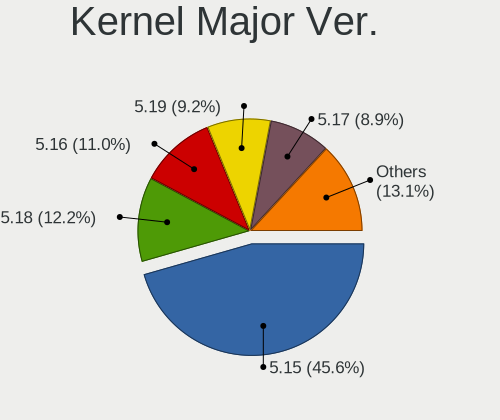

| Version | Computers | Percent |
|---------|-----------|---------|
| 5.16    | 31        | 36.05%  |
| 5.15    | 28        | 32.56%  |
| 5.14    | 16        | 18.6%   |
| 5.10    | 6         | 6.98%   |
| 5.17    | 4         | 4.65%   |
| 6.0     | 1         | 1.16%   |

Arch
----

OS architecture (x86_64, i586, etc.)

| Name    | Computers | Percent |
|---------|-----------|---------|
| x86_64  | 77        | 97.47%  |
| aarch64 | 2         | 2.53%   |

DE
--

Desktop Environment

| Name          | Computers | Percent |
|---------------|-----------|---------|
| KDE5          | 28        | 34.15%  |
| Unknown       | 27        | 32.93%  |
| GNOME         | 11        | 13.41%  |
| XFCE          | 5         | 6.1%    |
| Enlightenment | 2         | 2.44%   |
| dwm           | 2         | 2.44%   |
| sway          | 1         | 1.22%   |
| MATE          | 1         | 1.22%   |
| LXQt          | 1         | 1.22%   |
| KDE           | 1         | 1.22%   |
| i3            | 1         | 1.22%   |
| fvwm          | 1         | 1.22%   |
| Cinnamon      | 1         | 1.22%   |

Display Server
--------------

X11 or Wayland

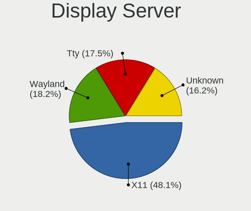

| Name    | Computers | Percent |
|---------|-----------|---------|
| X11     | 35        | 42.68%  |
| Wayland | 21        | 25.61%  |
| Tty     | 14        | 17.07%  |
| Unknown | 12        | 14.63%  |

Display Manager
---------------

SDDM, LightDM, etc.

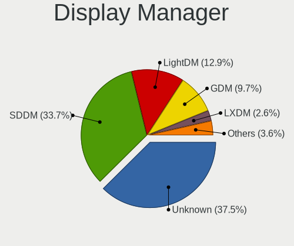

| Name    | Computers | Percent |
|---------|-----------|---------|
| Unknown | 37        | 45.68%  |
| SDDM    | 26        | 32.1%   |
| LightDM | 8         | 9.88%   |
| GDM     | 7         | 8.64%   |
| SLiM    | 1         | 1.23%   |
| LXDM    | 1         | 1.23%   |
| GREETD  | 1         | 1.23%   |

OS Lang
-------

Language

| Lang       | Computers | Percent |
|------------|-----------|---------|
| en_US      | 32        | 40.51%  |
| en_GB      | 8         | 10.13%  |
| C.UTF8     | 7         | 8.86%   |
| Unknown    | 5         | 6.33%   |
| ru_RU      | 4         | 5.06%   |
| de_DE      | 3         | 3.8%    |
| pl_PL      | 2         | 2.53%   |
| fr_FR      | 2         | 2.53%   |
| es_AR      | 2         | 2.53%   |
| el_GR      | 2         | 2.53%   |
| C          | 2         | 2.53%   |
| tr_TR      | 1         | 1.27%   |
| sl_SI      | 1         | 1.27%   |
| pt_BR      | 1         | 1.27%   |
| it_IT      | 1         | 1.27%   |
| fr_CA      | 1         | 1.27%   |
| es_ES      | 1         | 1.27%   |
| en_US.UTF8 | 1         | 1.27%   |
| en_NZ      | 1         | 1.27%   |
| en_AU      | 1         | 1.27%   |
| de_CH      | 1         | 1.27%   |

Boot Mode
---------

EFI or BIOS

| Mode | Computers | Percent |
|------|-----------|---------|
| EFI  | 69        | 85.19%  |
| BIOS | 12        | 14.81%  |

Filesystem
----------

Type of filesystem

| Type  | Computers | Percent |
|-------|-----------|---------|
| Ext4  | 47        | 59.49%  |
| Btrfs | 27        | 34.18%  |
| F2fs  | 3         | 3.8%    |
| Zfs   | 1         | 1.27%   |
| Xtrfs | 1         | 1.27%   |

Part. scheme
------------

Scheme of partitioning

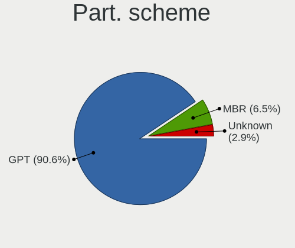

| Type    | Computers | Percent |
|---------|-----------|---------|
| GPT     | 74        | 91.36%  |
| Unknown | 5         | 6.17%   |
| MBR     | 2         | 2.47%   |

Dual Boot with Linux/BSD
------------------------

Hosting more than one Linux/BSD

| Dual boot | Computers | Percent |
|-----------|-----------|---------|
| No        | 61        | 75.31%  |
| Yes       | 20        | 24.69%  |

Dual Boot (Win)
---------------

Hosting Linux and Windows

| Dual boot | Computers | Percent |
|-----------|-----------|---------|
| No        | 56        | 70.89%  |
| Yes       | 23        | 29.11%  |

Board
-----

Vendor
------

Motherboard manufacturer

| Name                    | Computers | Percent |
|-------------------------|-----------|---------|
| ASUSTek Computer        | 17        | 21.52%  |
| Lenovo                  | 16        | 20.25%  |
| MSI                     | 7         | 8.86%   |
| Dell                    | 6         | 7.59%   |
| Gigabyte Technology     | 5         | 6.33%   |
| ASRock                  | 5         | 6.33%   |
| Intel                   | 4         | 5.06%   |
| Hewlett-Packard         | 4         | 5.06%   |
| Acer                    | 3         | 3.8%    |
| Timi                    | 2         | 2.53%   |
| Framework               | 2         | 2.53%   |
| TYAN Computer           | 1         | 1.27%   |
| Toshiba                 | 1         | 1.27%   |
| Raspberry Pi Foundation | 1         | 1.27%   |
| Neousys Technology      | 1         | 1.27%   |
| EVGA                    | 1         | 1.27%   |
| BESSTAR Tech            | 1         | 1.27%   |
| BANGHO                  | 1         | 1.27%   |
| Unknown                 | 1         | 1.27%   |

Model
-----

Motherboard model

| Name                                     | Computers | Percent |
|------------------------------------------|-----------|---------|
| Intel S1200RP                            | 2         | 2.53%   |
| HP Laptop 15s-eq0xxx                     | 2         | 2.53%   |
| Framework Laptop                         | 2         | 2.53%   |
| TYAN S7025                               | 1         | 1.27%   |
| Toshiba Satellite C850D-118              | 1         | 1.27%   |
| Timi RedmiBook 13                        | 1         | 1.27%   |
| Timi Mi Laptop Pro 15                    | 1         | 1.27%   |
| RPi Raspberry Pi                         | 1         | 1.27%   |
| Neousys Nuvo-8208GC Series               | 1         | 1.27%   |
| MSI MS-7D31                              | 1         | 1.27%   |
| MSI MS-7C94                              | 1         | 1.27%   |
| MSI MS-7C56                              | 1         | 1.27%   |
| MSI MS-7A34                              | 1         | 1.27%   |
| MSI MS-7996                              | 1         | 1.27%   |
| MSI GS63VR 6RF                           | 1         | 1.27%   |
| MSI GE73 Raider RGB 8RF                  | 1         | 1.27%   |
| Lenovo Yoga Slim 7 14IIL05 82A1          | 1         | 1.27%   |
| Lenovo Yoga S740-14IIL 81RS              | 1         | 1.27%   |
| Lenovo ThinkPad X1 Carbon 7th 20QD0039RI | 1         | 1.27%   |
| Lenovo ThinkPad T470p 20J7S06Q00         | 1         | 1.27%   |
| Lenovo ThinkPad P1 Gen 3 20TJS2F437      | 1         | 1.27%   |
| Lenovo ThinkPad E495 20NE000BGE          | 1         | 1.27%   |
| Lenovo ThinkPad E15 Gen 2 20T8001STX     | 1         | 1.27%   |
| Lenovo ThinkPad 20FMCT01WW               | 1         | 1.27%   |
| Lenovo ThinkBook 14 G3 ACL 21A2          | 1         | 1.27%   |
| Lenovo Legion Y7000 2019 PG0 81T0        | 1         | 1.27%   |
| Lenovo Legion R7000 2020 82B6            | 1         | 1.27%   |
| Lenovo Legion 5 Pro 16ACH6H 82JQ         | 1         | 1.27%   |
| Lenovo IdeaPadFlex 5 14ITL05 82LT        | 1         | 1.27%   |
| Lenovo IdeaPad C340-14IML 81TK           | 1         | 1.27%   |
| Lenovo IdeaPad 5 Pro 16ACH6 82L5         | 1         | 1.27%   |
| Lenovo IdeaPad 5 15ITL05 82FG            | 1         | 1.27%   |
| Intel NUC8i7HVK                          | 1         | 1.27%   |
| Intel NUC10i7FNH                         | 1         | 1.27%   |
| HP Victus by Laptop 16-e0xxx             | 1         | 1.27%   |
| HP Pavilion Notebook                     | 1         | 1.27%   |
| Gigabyte Z87X-UD3H                       | 1         | 1.27%   |
| Gigabyte Z590 UD                         | 1         | 1.27%   |
| Gigabyte Z490 UD                         | 1         | 1.27%   |
| Gigabyte X570 AORUS MASTER               | 1         | 1.27%   |
| Gigabyte B450M S2H                       | 1         | 1.27%   |
| EVGA Z390 DARK                           | 1         | 1.27%   |
| Dell XPS 15 9570                         | 1         | 1.27%   |
| Dell XPS 13 9365                         | 1         | 1.27%   |
| Dell Precision 3561                      | 1         | 1.27%   |
| Dell OptiPlex 7080                       | 1         | 1.27%   |
| Dell Latitude 7490                       | 1         | 1.27%   |
| Dell Inspiron 5415                       | 1         | 1.27%   |
| BESSTAR Tech X400                        | 1         | 1.27%   |
| BANGHO MAX G0101                         | 1         | 1.27%   |
| ASUS Z170-A                              | 1         | 1.27%   |
| ASUS Z170 PRO GAMING                     | 1         | 1.27%   |
| ASUS UX430UAR                            | 1         | 1.27%   |
| ASUS TUF GAMING X570-PRO                 | 1         | 1.27%   |
| ASUS TUF GAMING B550-PLUS                | 1         | 1.27%   |
| ASUS TUF B450-PLUS GAMING                | 1         | 1.27%   |
| ASUS ROG Zephyrus G14 GA401QE_GA401QE    | 1         | 1.27%   |
| ASUS ROG ZENITH II EXTREME               | 1         | 1.27%   |
| ASUS ROG STRIX Z390-E GAMING             | 1         | 1.27%   |
| ASUS ROG STRIX Z370-H GAMING             | 1         | 1.27%   |

Model Family
------------

Motherboard model prefix

| Name                | Computers | Percent |
|---------------------|-----------|---------|
| ASUS ROG            | 9         | 11.39%  |
| Lenovo ThinkPad     | 6         | 7.59%   |
| Lenovo Legion       | 3         | 3.8%    |
| Lenovo IdeaPad      | 3         | 3.8%    |
| ASUS TUF            | 3         | 3.8%    |
| Lenovo Yoga         | 2         | 2.53%   |
| Intel S1200RP       | 2         | 2.53%   |
| HP Laptop           | 2         | 2.53%   |
| Framework Laptop    | 2         | 2.53%   |
| Dell XPS            | 2         | 2.53%   |
| ASRock X370         | 2         | 2.53%   |
| Acer Aspire         | 2         | 2.53%   |
| TYAN S7025          | 1         | 1.27%   |
| Toshiba Satellite   | 1         | 1.27%   |
| Timi RedmiBook      | 1         | 1.27%   |
| Timi Mi             | 1         | 1.27%   |
| RPi Raspberry       | 1         | 1.27%   |
| Neousys Nuvo-8208GC | 1         | 1.27%   |
| MSI MS-7D31         | 1         | 1.27%   |
| MSI MS-7C94         | 1         | 1.27%   |
| MSI MS-7C56         | 1         | 1.27%   |
| MSI MS-7A34         | 1         | 1.27%   |
| MSI MS-7996         | 1         | 1.27%   |
| MSI GS63VR          | 1         | 1.27%   |
| MSI GE73            | 1         | 1.27%   |
| Lenovo ThinkBook    | 1         | 1.27%   |
| Lenovo IdeaPadFlex  | 1         | 1.27%   |
| Intel NUC8i7HVK     | 1         | 1.27%   |
| Intel NUC10i7FNH    | 1         | 1.27%   |
| HP Victus           | 1         | 1.27%   |
| HP Pavilion         | 1         | 1.27%   |
| Gigabyte Z87X-UD3H  | 1         | 1.27%   |
| Gigabyte Z590       | 1         | 1.27%   |
| Gigabyte Z490       | 1         | 1.27%   |
| Gigabyte X570       | 1         | 1.27%   |
| Gigabyte B450M      | 1         | 1.27%   |
| EVGA Z390           | 1         | 1.27%   |
| Dell Precision      | 1         | 1.27%   |
| Dell OptiPlex       | 1         | 1.27%   |
| Dell Latitude       | 1         | 1.27%   |
| Dell Inspiron       | 1         | 1.27%   |
| BESSTAR Tech X400   | 1         | 1.27%   |
| BANGHO MAX          | 1         | 1.27%   |
| ASUS Z170-A         | 1         | 1.27%   |
| ASUS Z170           | 1         | 1.27%   |
| ASUS UX430UAR       | 1         | 1.27%   |
| ASUS PRIME          | 1         | 1.27%   |
| ASUS P5LD2-Deluxe   | 1         | 1.27%   |
| ASRock Z170A-X1     | 1         | 1.27%   |
| ASRock H110M-HDV    | 1         | 1.27%   |
| ASRock AB350M       | 1         | 1.27%   |
| Acer Nitro          | 1         | 1.27%   |
| Unknown             | 1         | 1.27%   |

MFG Year
--------

Motherboard manufacture year

| Year    | Computers | Percent |
|---------|-----------|---------|
| 2019    | 18        | 22.78%  |
| 2021    | 16        | 20.25%  |
| 2020    | 15        | 18.99%  |
| 2018    | 7         | 8.86%   |
| 2017    | 7         | 8.86%   |
| 2016    | 5         | 6.33%   |
| 2015    | 2         | 2.53%   |
| 2014    | 2         | 2.53%   |
| 2012    | 2         | 2.53%   |
| Unknown | 2         | 2.53%   |
| 2022    | 1         | 1.27%   |
| 2013    | 1         | 1.27%   |
| 2005    | 1         | 1.27%   |

Form Factor
-----------

Physical design of the computer

| Name           | Computers | Percent |
|----------------|-----------|---------|
| Notebook       | 37        | 46.84%  |
| Desktop        | 30        | 37.97%  |
| Server         | 5         | 6.33%   |
| Convertible    | 3         | 3.8%    |
| System on chip | 2         | 2.53%   |
| Mini pc        | 2         | 2.53%   |

Secure Boot
-----------

Enabled or disabled

| State    | Computers | Percent |
|----------|-----------|---------|
| Disabled | 76        | 96.2%   |
| Enabled  | 3         | 3.8%    |

Coreboot
--------

Have coreboot on board

| Used | Computers | Percent |
|------|-----------|---------|
| No   | 79        | 100%    |

RAM Size
--------

Total RAM memory

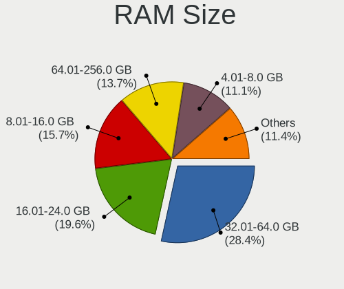

| Size in GB  | Computers | Percent |
|-------------|-----------|---------|
| 32.01-64.0  | 20        | 25.32%  |
| 16.01-24.0  | 16        | 20.25%  |
| 8.01-16.0   | 13        | 16.46%  |
| 64.01-256.0 | 11        | 13.92%  |
| 4.01-8.0    | 10        | 12.66%  |
| 24.01-32.0  | 5         | 6.33%   |
| 3.01-4.0    | 2         | 2.53%   |
| 2.01-3.0    | 1         | 1.27%   |
| 1.01-2.0    | 1         | 1.27%   |

RAM Used
--------

Used RAM memory

| Used GB    | Computers | Percent |
|------------|-----------|---------|
| 4.01-8.0   | 24        | 27.91%  |
| 1.01-2.0   | 21        | 24.42%  |
| 8.01-16.0  | 13        | 15.12%  |
| 3.01-4.0   | 10        | 11.63%  |
| 2.01-3.0   | 10        | 11.63%  |
| 0.51-1.0   | 4         | 4.65%   |
| 16.01-24.0 | 2         | 2.33%   |
| 24.01-32.0 | 1         | 1.16%   |
| 0.01-0.5   | 1         | 1.16%   |

Total Drives
------------

Number of drives on board

| Drives | Computers | Percent |
|--------|-----------|---------|
| 1      | 33        | 41.25%  |
| 2      | 19        | 23.75%  |
| 3      | 11        | 13.75%  |
| 5      | 7         | 8.75%   |
| 4      | 7         | 8.75%   |
| 6      | 2         | 2.5%    |
| 7      | 1         | 1.25%   |

Has CD-ROM
----------

Has CD-ROM on board

| Presented | Computers | Percent |
|-----------|-----------|---------|
| No        | 69        | 87.34%  |
| Yes       | 10        | 12.66%  |

Has Ethernet
------------

Has Ethernet on board

| Presented | Computers | Percent |
|-----------|-----------|---------|
| Yes       | 60        | 75.95%  |
| No        | 19        | 24.05%  |

Has WiFi
--------

Has WiFi module

| Presented | Computers | Percent |
|-----------|-----------|---------|
| Yes       | 57        | 72.15%  |
| No        | 22        | 27.85%  |

Has Bluetooth
-------------

Has Bluetooth module

| Presented | Computers | Percent |
|-----------|-----------|---------|
| Yes       | 58        | 71.6%   |
| No        | 23        | 28.4%   |

Location
--------

Country
-------

Geographic location (country)

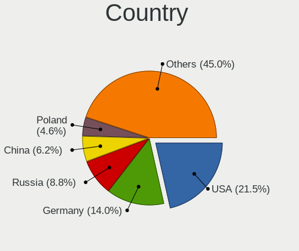

| Country     | Computers | Percent |
|-------------|-----------|---------|
| USA         | 15        | 18.75%  |
| Russia      | 8         | 10%     |
| Germany     | 8         | 10%     |
| Poland      | 6         | 7.5%    |
| Spain       | 5         | 6.25%   |
| Greece      | 3         | 3.75%   |
| UK          | 2         | 2.5%    |
| India       | 2         | 2.5%    |
| Hong Kong   | 2         | 2.5%    |
| France      | 2         | 2.5%    |
| Finland     | 2         | 2.5%    |
| Czechia     | 2         | 2.5%    |
| China       | 2         | 2.5%    |
| Australia   | 2         | 2.5%    |
| Argentina   | 2         | 2.5%    |
| Uruguay     | 1         | 1.25%   |
| Turkey      | 1         | 1.25%   |
| Switzerland | 1         | 1.25%   |
| Sweden      | 1         | 1.25%   |
| Slovenia    | 1         | 1.25%   |
| Romania     | 1         | 1.25%   |
| Philippines | 1         | 1.25%   |
| Norway      | 1         | 1.25%   |
| New Zealand | 1         | 1.25%   |
| Netherlands | 1         | 1.25%   |
| Mexico      | 1         | 1.25%   |
| Italy       | 1         | 1.25%   |
| Ireland     | 1         | 1.25%   |
| Canada      | 1         | 1.25%   |
| Brazil      | 1         | 1.25%   |
| Belarus     | 1         | 1.25%   |
| Bangladesh  | 1         | 1.25%   |

City
----

Geographic location (city)

| City                          | Computers | Percent |
|-------------------------------|-----------|---------|
| Moscow                        | 3         | 3.61%   |
| Athens                        | 3         | 3.61%   |
| Swansea                       | 2         | 2.41%   |
| Kulmbach                      | 2         | 2.41%   |
| Helsinki                      | 2         | 2.41%   |
| Central                       | 2         | 2.41%   |
| Barcelona                     | 2         | 2.41%   |
| Zurich                        | 1         | 1.2%    |
| Zebulon                       | 1         | 1.2%    |
| Yekaterinburg                 | 1         | 1.2%    |
| West Orange                   | 1         | 1.2%    |
| Warsaw                        | 1         | 1.2%    |
| Vigo                          | 1         | 1.2%    |
| Ufa                           | 1         | 1.2%    |
| Szczecin                      | 1         | 1.2%    |
| Sydney                        | 1         | 1.2%    |
| Svobodnyy                     | 1         | 1.2%    |
| Storsteinnes                  | 1         | 1.2%    |
| Sestao                        | 1         | 1.2%    |
| Sao Paulo                     | 1         | 1.2%    |
| Rzeszw                    | 1         | 1.2%    |
| Redmond                       | 1         | 1.2%    |
| Ratingen                      | 1         | 1.2%    |
| Qubec                       | 1         | 1.2%    |
| Prague                        | 1         | 1.2%    |
| Paris                         | 1         | 1.2%    |
| Orange                        | 1         | 1.2%    |
| Nykping                   | 1         | 1.2%    |
| Nuremberg                     | 1         | 1.2%    |
| Novosibirsk                   | 1         | 1.2%    |
| Nizhniy Novgorod              | 1         | 1.2%    |
| Niederdorla                   | 1         | 1.2%    |
| Morcenx                       | 1         | 1.2%    |
| Monroe                        | 1         | 1.2%    |
| Minsk                         | 1         | 1.2%    |
| Milan                         | 1         | 1.2%    |
| Maldonado                     | 1         | 1.2%    |
| Los Angeles                   | 1         | 1.2%    |
| Leidschendam                  | 1         | 1.2%    |
| Laziska Gorne                 | 1         | 1.2%    |
| Krakow                        | 1         | 1.2%    |
| Killeen                       | 1         | 1.2%    |
| Ivanna Gorica             | 1         | 1.2%    |
| Hyderabad                     | 1         | 1.2%    |
| Hyannis                       | 1         | 1.2%    |
| Houston                       | 1         | 1.2%    |
| Harsum                        | 1         | 1.2%    |
| Guangzhou                     | 1         | 1.2%    |
| Gold Coast                    | 1         | 1.2%    |
| Gmina Lwwek lski | 1         | 1.2%    |
| Glen Ellyn                    | 1         | 1.2%    |
| Fuzhou                        | 1         | 1.2%    |
| Foshan                        | 1         | 1.2%    |
| Fort Collins                  | 1         | 1.2%    |
| Everett                       | 1         | 1.2%    |
| Essen                         | 1         | 1.2%    |
| Dublin                        | 1         | 1.2%    |
| Dhaka                         | 1         | 1.2%    |
| Ciudad Jurez              | 1         | 1.2%    |
| Cieszyn                       | 1         | 1.2%    |

Drives
------

Drive Vendor
------------

Hard drive vendors

| Vendor                         | Computers | Drives | Percent |
|--------------------------------|-----------|--------|---------|
| WDC                            | 32        | 47     | 22.7%   |
| Samsung Electronics            | 28        | 45     | 19.86%  |
| Seagate                        | 15        | 27     | 10.64%  |
| Intel                          | 8         | 11     | 5.67%   |
| Toshiba                        | 7         | 7      | 4.96%   |
| SK Hynix                       | 6         | 6      | 4.26%   |
| SanDisk                        | 6         | 7      | 4.26%   |
| Crucial                        | 6         | 15     | 4.26%   |
| Kingston                       | 4         | 4      | 2.84%   |
| Unknown                        | 3         | 11     | 2.13%   |
| KIOXIA-EXCERIA                 | 3         | 6      | 2.13%   |
| Hitachi                        | 3         | 4      | 2.13%   |
| Team                           | 2         | 4      | 1.42%   |
| HGST                           | 2         | 2      | 1.42%   |
| Corsair                        | 2         | 2      | 1.42%   |
| XrayDisk                       | 1         | 1      | 0.71%   |
| Solid State Storage Technology | 1         | 1      | 0.71%   |
| Silicon Motion                 | 1         | 1      | 0.71%   |
| PNY                            | 1         | 1      | 0.71%   |
| PLEXTOR                        | 1         | 2      | 0.71%   |
| Phison                         | 1         | 1      | 0.71%   |
| OCZ-VERTEX                     | 1         | 1      | 0.71%   |
| Netac                          | 1         | 1      | 0.71%   |
| Micron Technology              | 1         | 1      | 0.71%   |
| KIOXIA                         | 1         | 1      | 0.71%   |
| Kingchuxing                    | 1         | 2      | 0.71%   |
| GOODRAM                        | 1         | 1      | 0.71%   |
| A-DATA Technology              | 1         | 1      | 0.71%   |
| 2.5"                           | 1         | 1      | 0.71%   |

Drive Model
-----------

Hard drive models

| Model                                    | Computers | Percent |
|------------------------------------------|-----------|---------|
| WDC WD10EZEX-08M2NA0 1TB                 | 3         | 1.79%   |
| WDC WD30EFRX-68EUZN0 3TB                 | 2         | 1.19%   |
| Toshiba DT01ACA100 1TB                   | 2         | 1.19%   |
| Seagate ST2000DM001-1ER164 2TB           | 2         | 1.19%   |
| Samsung SSD 980 PRO 2TB                  | 2         | 1.19%   |
| Samsung SSD 970 EVO Plus 250GB           | 2         | 1.19%   |
| Samsung SSD 970 EVO 500GB                | 2         | 1.19%   |
| Samsung NVMe SSD Drive 512GB             | 2         | 1.19%   |
| Samsung MZVLB512HBJQ-000L2 512GB         | 2         | 1.19%   |
| KIOXIA-EXCERIA SSD 500GB                 | 2         | 1.19%   |
| Intel SSDPEKNW010T8 1TB                  | 2         | 1.19%   |
| Intel SSDPEKNU512GZ 512GB                | 2         | 1.19%   |
| Crucial CT1000P1SSD8 1TB                 | 2         | 1.19%   |
| XrayDisk SSD 128GB                       | 1         | 0.6%    |
| WDC WDS500G3X0C-00SJG0 500GB             | 1         | 0.6%    |
| WDC WDS500G2X0C-00L350 500GB             | 1         | 0.6%    |
| WDC WDS500G2B0B-00YS70 500GB SSD         | 1         | 0.6%    |
| WDC WDS500G2B0A-00SM50 500GB SSD         | 1         | 0.6%    |
| WDC WDS250G2X0C-00L350 250GB             | 1         | 0.6%    |
| WDC WDS240G2G0A-00JH30 240GB SSD         | 1         | 0.6%    |
| WDC WDS240G2G0A 240GB SSD                | 1         | 0.6%    |
| WDC WDS100T2B0C-00PXH0 1TB               | 1         | 0.6%    |
| WDC WDS100T2B0A-00SM50 1TB SSD           | 1         | 0.6%    |
| WDC WD8003FFBX-68B9AN0 8TB               | 1         | 0.6%    |
| WDC WD60EZRX-00MVLB1 6TB                 | 1         | 0.6%    |
| WDC WD60EFRX-68L0BN1 6TB                 | 1         | 0.6%    |
| WDC WD5000AZLX-00JKKA0 500GB             | 1         | 0.6%    |
| WDC WD3200LPVX-22V0TT0 320GB             | 1         | 0.6%    |
| WDC WD30EFRX-68AX9N0 3TB                 | 1         | 0.6%    |
| WDC WD2500BEVS-22UST0 250GB              | 1         | 0.6%    |
| WDC WD20EZRX-00D8PB0 2TB                 | 1         | 0.6%    |
| WDC WD20EFRX-68EUZN0 2TB                 | 1         | 0.6%    |
| WDC WD2003FZEX-00Z4SA0 2TB               | 1         | 0.6%    |
| WDC WD10SPSX-08A6W 1TB                   | 1         | 0.6%    |
| WDC WD10PURX-64E5EY0 1TB                 | 1         | 0.6%    |
| WDC WD10EZEX-60WN4A1 1TB                 | 1         | 0.6%    |
| WDC WD10EZEX-22M                         | 1         | 0.6%    |
| WDC WD10EZEX-08WN4A0 1TB                 | 1         | 0.6%    |
| WDC WD10EARS-00MVWB0 1TB                 | 1         | 0.6%    |
| WDC WD10EADS-00L5B1 1TB                  | 1         | 0.6%    |
| WDC WD1002FBYS-18W8B0 1TB                | 1         | 0.6%    |
| WDC WD1001FALS-00J7B1 1TB                | 1         | 0.6%    |
| WDC PC SN730 SDBPNTY-512G-1006 512GB     | 1         | 0.6%    |
| WDC PC SN730 SDBPNTY-256G-1101 256GB     | 1         | 0.6%    |
| WDC PC SN730 SDBPNTY-1T00-1006 1TB       | 1         | 0.6%    |
| WDC PC SN530 SDBPMPZ-512G-1101 512GB     | 1         | 0.6%    |
| WDC PC SN530 SDBPMPZ-256G-1001 256GB     | 1         | 0.6%    |
| WDC PC SN520 SDAPNUW-512G-1014 512GB     | 1         | 0.6%    |
| Unknown USB DISK 3.2 500GB               | 1         | 0.6%    |
| Unknown MMC Card  64GB                   | 1         | 0.6%    |
| Unknown MMC Card  32GB                   | 1         | 0.6%    |
| Unknown MMC Card  128GB                  | 1         | 0.6%    |
| Toshiba TR200 480GB SSD                  | 1         | 0.6%    |
| Toshiba THNSN5512GPUK NVMe 512GB         | 1         | 0.6%    |
| Toshiba KXG6AZNV512G 512GB               | 1         | 0.6%    |
| Toshiba KSG60ZMV512G M.2 2280 512GB SSD  | 1         | 0.6%    |
| Toshiba HDWQ140 4TB                      | 1         | 0.6%    |
| Team TM8PS7256G 256GB SSD                | 1         | 0.6%    |
| Team TM8FP2240G 240GB                    | 1         | 0.6%    |
| Solid State Storage NVMe SSD Drive 256GB | 1         | 0.6%    |

HDD Vendor
----------

Hard disk drive vendors

| Vendor  | Computers | Drives | Percent |
|---------|-----------|--------|---------|
| WDC     | 19        | 31     | 47.5%   |
| Seagate | 13        | 25     | 32.5%   |
| Toshiba | 3         | 3      | 7.5%    |
| Hitachi | 3         | 4      | 7.5%    |
| HGST    | 2         | 2      | 5%      |

SSD Vendor
----------

Solid state drive vendors

| Vendor              | Computers | Drives | Percent |
|---------------------|-----------|--------|---------|
| Samsung Electronics | 13        | 15     | 33.33%  |
| WDC                 | 5         | 5      | 12.82%  |
| SanDisk             | 5         | 6      | 12.82%  |
| Kingston            | 3         | 3      | 7.69%   |
| Crucial             | 3         | 11     | 7.69%   |
| Toshiba             | 2         | 2      | 5.13%   |
| XrayDisk            | 1         | 1      | 2.56%   |
| Team                | 1         | 2      | 2.56%   |
| PNY                 | 1         | 1      | 2.56%   |
| OCZ-VERTEX          | 1         | 1      | 2.56%   |
| Intel               | 1         | 1      | 2.56%   |
| GOODRAM             | 1         | 1      | 2.56%   |
| Corsair             | 1         | 1      | 2.56%   |
| 2.5"                | 1         | 1      | 2.56%   |

Drive Kind
----------

HDD or SSD

| Kind    | Computers | Drives | Percent |
|---------|-----------|--------|---------|
| NVMe    | 58        | 87     | 47.15%  |
| SSD     | 32        | 51     | 26.02%  |
| HDD     | 30        | 65     | 24.39%  |
| MMC     | 2         | 8      | 1.63%   |
| Unknown | 1         | 3      | 0.81%   |

Drive Connector
---------------

SATA, SAS, NVMe, etc.

| Type | Computers | Drives | Percent |
|------|-----------|--------|---------|
| NVMe | 58        | 87     | 54.21%  |
| SATA | 46        | 116    | 42.99%  |
| MMC  | 2         | 8      | 1.87%   |
| SAS  | 1         | 3      | 0.93%   |

Drive Size
----------

Size of hard drive

| Size in TB | Computers | Drives | Percent |
|------------|-----------|--------|---------|
| 0.51-1.0   | 24        | 33     | 35.29%  |
| 0.01-0.5   | 23        | 40     | 33.82%  |
| 1.01-2.0   | 10        | 14     | 14.71%  |
| 3.01-4.0   | 5         | 7      | 7.35%   |
| 4.01-10.0  | 4         | 17     | 5.88%   |
| 2.01-3.0   | 2         | 5      | 2.94%   |

Space Total
-----------

Amount of disk space available on the file system

| Size in GB     | Computers | Percent |
|----------------|-----------|---------|
| 251-500        | 20        | 24.39%  |
| 501-1000       | 17        | 20.73%  |
| 1001-2000      | 14        | 17.07%  |
| More than 3000 | 10        | 12.2%   |
| 101-250        | 9         | 10.98%  |
| 1-20           | 4         | 4.88%   |
| 2001-3000      | 3         | 3.66%   |
| 21-50          | 2         | 2.44%   |
| Unknown        | 2         | 2.44%   |
| 51-100         | 1         | 1.22%   |

Space Used
----------

Amount of used disk space

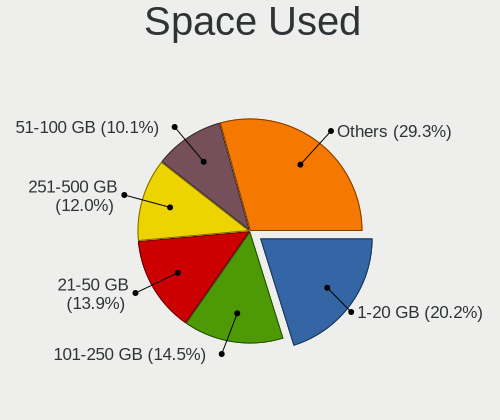

| Used GB        | Computers | Percent |
|----------------|-----------|---------|
| 251-500        | 15        | 18.52%  |
| 101-250        | 13        | 16.05%  |
| 1-20           | 12        | 14.81%  |
| 21-50          | 9         | 11.11%  |
| 51-100         | 8         | 9.88%   |
| More than 3000 | 7         | 8.64%   |
| 1001-2000      | 7         | 8.64%   |
| 501-1000       | 7         | 8.64%   |
| Unknown        | 2         | 2.47%   |
| 2001-3000      | 1         | 1.23%   |

Malfunc. Drives
---------------

Drive models with a malfunction

| Model                          | Computers | Drives | Percent |
|--------------------------------|-----------|--------|---------|
| WDC WD60EFRX-68L0BN1 6TB       | 1         | 3      | 6.25%   |
| WDC WD30EFRX-68AX9N0 3TB       | 1         | 2      | 6.25%   |
| WDC WD20EZRX-00D8PB0 2TB       | 1         | 1      | 6.25%   |
| WDC WD10EZEX-08M2NA0 1TB       | 1         | 1      | 6.25%   |
| WDC WD1002FBYS-18W8B0 1TB      | 1         | 1      | 6.25%   |
| Seagate ST3160023AS 160GB      | 1         | 1      | 6.25%   |
| Seagate ST1000LM049-2GH172 1TB | 1         | 1      | 6.25%   |
| Seagate ST1000LM035-1RK172 1TB | 1         | 2      | 6.25%   |
| SanDisk SSD PLUS 1000GB        | 1         | 1      | 6.25%   |
| Kingston SV100S2128G 128GB SSD | 1         | 1      | 6.25%   |
| Intel SSDPEKKF256G8L 256GB     | 1         | 1      | 6.25%   |
| Hitachi HUA721010KLA330 1TB    | 1         | 1      | 6.25%   |
| Hitachi HDS722020ALA330 2TB    | 1         | 2      | 6.25%   |
| Crucial CT525MX300SSD1 528GB   | 1         | 1      | 6.25%   |
| Crucial CT1000P1SSD8 1TB       | 1         | 1      | 6.25%   |
| 2.5" SATA SSD 3TG6-P 480GB     | 1         | 1      | 6.25%   |

Malfunc. Drive Vendor
---------------------

Vendors of faulty drives

| Vendor   | Computers | Drives | Percent |
|----------|-----------|--------|---------|
| WDC      | 5         | 8      | 31.25%  |
| Seagate  | 3         | 4      | 18.75%  |
| Hitachi  | 2         | 3      | 12.5%   |
| Crucial  | 2         | 2      | 12.5%   |
| SanDisk  | 1         | 1      | 6.25%   |
| Kingston | 1         | 1      | 6.25%   |
| Intel    | 1         | 1      | 6.25%   |
| 2.5"     | 1         | 1      | 6.25%   |

Malfunc. HDD Vendor
-------------------

Vendors of faulty HDD drives

| Vendor  | Computers | Drives | Percent |
|---------|-----------|--------|---------|
| WDC     | 5         | 8      | 50%     |
| Seagate | 3         | 4      | 30%     |
| Hitachi | 2         | 3      | 20%     |

Malfunc. Drive Kind
-------------------

Kinds of faulty drives

| Kind | Computers | Drives | Percent |
|------|-----------|--------|---------|
| HDD  | 8         | 15     | 57.14%  |
| SSD  | 4         | 4      | 28.57%  |
| NVMe | 2         | 2      | 14.29%  |

Failed Drives
-------------

Failed drive models

| Model                            | Computers | Drives | Percent |
|----------------------------------|-----------|--------|---------|
| Toshiba THNSN5512GPUK NVMe 512GB | 1         | 1      | 100%    |

Failed Drive Vendor
-------------------

Failed drive vendors

| Vendor  | Computers | Drives | Percent |
|---------|-----------|--------|---------|
| Toshiba | 1         | 1      | 100%    |

Drive Status
------------

Number of failed and malfunc. drives

| Status   | Computers | Drives | Percent |
|----------|-----------|--------|---------|
| Works    | 73        | 166    | 76.04%  |
| Malfunc  | 14        | 21     | 14.58%  |
| Detected | 8         | 26     | 8.33%   |
| Failed   | 1         | 1      | 1.04%   |

Storage controller
------------------

Storage Vendor
--------------

Storage controller vendors

| Vendor                         | Computers | Percent |
|--------------------------------|-----------|---------|
| Intel                          | 40        | 30.53%  |
| AMD                            | 24        | 18.32%  |
| Samsung Electronics            | 22        | 16.79%  |
| Sandisk                        | 11        | 8.4%    |
| SK Hynix                       | 6         | 4.58%   |
| ASMedia Technology             | 4         | 3.05%   |
| Toshiba America Info Systems   | 3         | 2.29%   |
| Silicon Motion                 | 3         | 2.29%   |
| Phison Electronics             | 3         | 2.29%   |
| KIOXIA                         | 3         | 2.29%   |
| Solid State Storage Technology | 2         | 1.53%   |
| Seagate Technology             | 2         | 1.53%   |
| Micron/Crucial Technology      | 2         | 1.53%   |
| Micron Technology              | 2         | 1.53%   |
| Silicon Image                  | 1         | 0.76%   |
| Marvell Technology Group       | 1         | 0.76%   |
| Kingston Technology Company    | 1         | 0.76%   |
| ADATA Technology               | 1         | 0.76%   |

Storage Model
-------------

Storage controller models

| Model                                                                          | Computers | Percent |
|--------------------------------------------------------------------------------|-----------|---------|
| AMD FCH SATA Controller [AHCI mode]                                            | 20        | 14.18%  |
| Samsung NVMe SSD Controller SM981/PM981/PM983                                  | 13        | 9.22%   |
| Intel Q170/Q150/B150/H170/H110/Z170/CM236 Chipset SATA Controller [AHCI Mode]  | 5         | 3.55%   |
| Intel Comet Lake SATA AHCI Controller                                          | 5         | 3.55%   |
| SK Hynix Gold P31 SSD                                                          | 4         | 2.84%   |
| Sandisk WD Black SN750 / PC SN730 NVMe SSD                                     | 4         | 2.84%   |
| Samsung NVMe SSD Controller PM9A1/PM9A3/980PRO                                 | 4         | 2.84%   |
| Intel 8 Series/C220 Series Chipset Family 6-port SATA Controller 1 [AHCI mode] | 4         | 2.84%   |
| ASMedia ASM1062 Serial ATA Controller                                          | 4         | 2.84%   |
| AMD 500 Series Chipset SATA Controller                                         | 4         | 2.84%   |
| Intel SSD 660P Series                                                          | 3         | 2.13%   |
| Intel Cannon Lake PCH SATA AHCI Controller                                     | 3         | 2.13%   |
| Intel Cannon Lake Mobile PCH SATA AHCI Controller                              | 3         | 2.13%   |
| Solid State Storage Non-Volatile memory controller                             | 2         | 1.42%   |
| Silicon Motion SM2263EN/SM2263XT SSD Controller                                | 2         | 1.42%   |
| Sandisk WD Blue SN550 NVMe SSD                                                 | 2         | 1.42%   |
| Sandisk WD Black 2018/SN750 / PC SN720 NVMe SSD                                | 2         | 1.42%   |
| Sandisk Non-Volatile memory controller                                         | 2         | 1.42%   |
| Samsung NVMe SSD Controller SM961/PM961/SM963                                  | 2         | 1.42%   |
| Samsung NVMe SSD Controller SM951/PM951                                        | 2         | 1.42%   |
| Samsung NVMe SSD Controller 980                                                | 2         | 1.42%   |
| Phison E16 PCIe4 NVMe Controller                                               | 2         | 1.42%   |
| Micron Non-Volatile memory controller                                          | 2         | 1.42%   |
| KIOXIA NVMe SSD                                                                | 2         | 1.42%   |
| Intel Sunrise Point-LP SATA Controller [AHCI mode]                             | 2         | 1.42%   |
| Intel SSD Pro 7600p/760p/E 6100p Series                                        | 2         | 1.42%   |
| Intel Non-Volatile memory controller                                           | 2         | 1.42%   |
| Intel HM170/QM170 Chipset SATA Controller [AHCI Mode]                          | 2         | 1.42%   |
| Intel 500 Series Chipset Family SATA AHCI Controller                           | 2         | 1.42%   |
| AMD X370 Series Chipset SATA Controller                                        | 2         | 1.42%   |
| AMD 400 Series Chipset SATA Controller                                         | 2         | 1.42%   |
| AMD 300 Series Chipset SATA Controller                                         | 2         | 1.42%   |
| Toshiba America Info Systems XG6 NVMe SSD Controller                           | 1         | 0.71%   |
| Toshiba America Info Systems XG4 NVMe SSD Controller                           | 1         | 0.71%   |
| Toshiba America Info Systems BG3 NVMe SSD Controller                           | 1         | 0.71%   |
| SK Hynix Non-Volatile memory controller                                        | 1         | 0.71%   |
| SK Hynix BC501 NVMe Solid State Drive                                          | 1         | 0.71%   |
| Silicon Motion SM2262/SM2262EN SSD Controller                                  | 1         | 0.71%   |
| Silicon Image SiI 3132 Serial ATA Raid II Controller                           | 1         | 0.71%   |
| Seagate FireCuda 530 SSD                                                       | 1         | 0.71%   |
| Seagate FireCuda 520 SSD                                                       | 1         | 0.71%   |
| Sandisk WD Blue SN500 / PC SN520 NVMe SSD                                      | 1         | 0.71%   |
| Phison E7 NVMe Controller                                                      | 1         | 0.71%   |
| Micron/Crucial P1 NVMe PCIe SSD                                                | 1         | 0.71%   |
| Micron/Crucial NVMe Controller                                                 | 1         | 0.71%   |
| Marvell Group 88SE9172 SATA 6Gb/s Controller                                   | 1         | 0.71%   |
| KIOXIA Non-Volatile memory controller                                          | 1         | 0.71%   |
| Kingston Company U-SNS8154P3 NVMe SSD                                          | 1         | 0.71%   |
| Intel Wildcat Point-LP SATA Controller [AHCI Mode]                             | 1         | 0.71%   |
| Intel Volume Management Device NVMe RAID Controller                            | 1         | 0.71%   |
| Intel Tiger Lake-LP SATA Controller [AHCI mode]                                | 1         | 0.71%   |
| Intel NM10/ICH7 Family SATA Controller [IDE mode]                              | 1         | 0.71%   |
| Intel Ice Lake-LP SATA Controller [AHCI mode]                                  | 1         | 0.71%   |
| Intel Alder Lake-S PCH SATA Controller [AHCI Mode]                             | 1         | 0.71%   |
| Intel 82801JI (ICH10 Family) 4 port SATA IDE Controller #1                     | 1         | 0.71%   |
| Intel 82801JI (ICH10 Family) 2 port SATA IDE Controller #2                     | 1         | 0.71%   |
| Intel 82801 Mobile SATA Controller [RAID mode]                                 | 1         | 0.71%   |
| Intel 200 Series PCH SATA controller [AHCI mode]                               | 1         | 0.71%   |
| ADATA XPG SX8200 Pro PCIe Gen3x4 M.2 2280 Solid State Drive                    | 1         | 0.71%   |

Storage Kind
------------

Kind of storage controller (IDE, SATA, NVMe, SAS, ...)

| Kind | Computers | Percent |
|------|-----------|---------|
| NVMe | 58        | 49.15%  |
| SATA | 55        | 46.61%  |
| RAID | 3         | 2.54%   |
| IDE  | 2         | 1.69%   |

Processor
---------

CPU Vendor
----------

Processor vendors

| Vendor | Computers | Percent |
|--------|-----------|---------|
| Intel  | 45        | 56.96%  |
| AMD    | 32        | 40.51%  |
| ARM    | 2         | 2.53%   |

CPU Model
---------

Processor models

| Model                                          | Computers | Percent |
|------------------------------------------------|-----------|---------|
| Intel Core i7-8750H CPU @ 2.20GHz              | 3         | 3.8%    |
| AMD Ryzen 9 3950X 16-Core Processor            | 3         | 3.8%    |
| Intel Xeon CPU E3-1270 v3 @ 3.50GHz            | 2         | 2.53%   |
| Intel Core i9-9900K CPU @ 3.60GHz              | 2         | 2.53%   |
| Intel Core i7-6700K CPU @ 4.00GHz              | 2         | 2.53%   |
| Intel Core i7-1065G7 CPU @ 1.30GHz             | 2         | 2.53%   |
| Intel Core i5-9300H CPU @ 2.40GHz              | 2         | 2.53%   |
| Intel Core i5-10210U CPU @ 1.60GHz             | 2         | 2.53%   |
| Intel 11th Gen Core i7-1165G7 @ 2.80GHz        | 2         | 2.53%   |
| ARM Processor                                  | 2         | 2.53%   |
| AMD Ryzen 9 5900X 12-Core Processor            | 2         | 2.53%   |
| AMD Ryzen 7 5800H with Radeon Graphics         | 2         | 2.53%   |
| AMD Ryzen 7 5700U with Radeon Graphics         | 2         | 2.53%   |
| AMD Ryzen 5 1600 Six-Core Processor            | 2         | 2.53%   |
| Intel Xeon CPU X5680 @ 3.33GHz                 | 1         | 1.27%   |
| Intel Pentium 4 CPU 3.20GHz                    | 1         | 1.27%   |
| Intel Core i7-9700 CPU @ 3.00GHz               | 1         | 1.27%   |
| Intel Core i7-8809G CPU @ 3.10GHz              | 1         | 1.27%   |
| Intel Core i7-8700K CPU @ 3.70GHz              | 1         | 1.27%   |
| Intel Core i7-8650U CPU @ 1.90GHz              | 1         | 1.27%   |
| Intel Core i7-8565U CPU @ 1.80GHz              | 1         | 1.27%   |
| Intel Core i7-7700HQ CPU @ 2.80GHz             | 1         | 1.27%   |
| Intel Core i7-6700HQ CPU @ 2.60GHz             | 1         | 1.27%   |
| Intel Core i7-10850H CPU @ 2.70GHz             | 1         | 1.27%   |
| Intel Core i7-10710U CPU @ 1.10GHz             | 1         | 1.27%   |
| Intel Core i7-10700F CPU @ 2.90GHz             | 1         | 1.27%   |
| Intel Core i7-10700 CPU @ 2.90GHz              | 1         | 1.27%   |
| Intel Core i7-10510U CPU @ 1.80GHz             | 1         | 1.27%   |
| Intel Core i5-8250U CPU @ 1.60GHz              | 1         | 1.27%   |
| Intel Core i5-8200Y CPU @ 1.30GHz              | 1         | 1.27%   |
| Intel Core i5-7400 CPU @ 3.00GHz               | 1         | 1.27%   |
| Intel Core i5-6500 CPU @ 3.20GHz               | 1         | 1.27%   |
| Intel Core i5-6400 CPU @ 2.70GHz               | 1         | 1.27%   |
| Intel Core i5-5200U CPU @ 2.20GHz              | 1         | 1.27%   |
| Intel Core i5-4670K CPU @ 3.40GHz              | 1         | 1.27%   |
| Intel Core i5-1035G1 CPU @ 1.00GHz             | 1         | 1.27%   |
| Intel Core i3-4000M CPU @ 2.40GHz              | 1         | 1.27%   |
| Intel 12th Gen Core i7-12700K                  | 1         | 1.27%   |
| Intel 11th Gen Core i7-1185G7 @ 3.00GHz        | 1         | 1.27%   |
| Intel 11th Gen Core i7-11850H @ 2.50GHz        | 1         | 1.27%   |
| Intel 11th Gen Core i7-11700K @ 3.60GHz        | 1         | 1.27%   |
| Intel 11th Gen Core i5-1135G7 @ 2.40GHz        | 1         | 1.27%   |
| AMD Ryzen Threadripper 3960X 24-Core Processor | 1         | 1.27%   |
| AMD Ryzen 9 5950X 16-Core Processor            | 1         | 1.27%   |
| AMD Ryzen 9 5900HX with Radeon Graphics        | 1         | 1.27%   |
| AMD Ryzen 9 3900X 12-Core Processor            | 1         | 1.27%   |
| AMD Ryzen 7 PRO 5750G with Radeon Graphics     | 1         | 1.27%   |
| AMD Ryzen 7 5800HS with Radeon Graphics        | 1         | 1.27%   |
| AMD Ryzen 7 5700G with Radeon Graphics         | 1         | 1.27%   |
| AMD Ryzen 7 4800H with Radeon Graphics         | 1         | 1.27%   |
| AMD Ryzen 7 4700U with Radeon Graphics         | 1         | 1.27%   |
| AMD Ryzen 7 3700X 8-Core Processor             | 1         | 1.27%   |
| AMD Ryzen 7 3700U with Radeon Vega Mobile Gfx  | 1         | 1.27%   |
| AMD Ryzen 7 1700X Eight-Core Processor         | 1         | 1.27%   |
| AMD Ryzen 5 PRO 4650G with Radeon Graphics     | 1         | 1.27%   |
| AMD Ryzen 5 5600H with Radeon Graphics         | 1         | 1.27%   |
| AMD Ryzen 5 5500U with Radeon Graphics         | 1         | 1.27%   |
| AMD Ryzen 5 3600 6-Core Processor              | 1         | 1.27%   |
| AMD Ryzen 5 3500U with Radeon Vega Mobile Gfx  | 1         | 1.27%   |
| AMD Ryzen 5 2600 Six-Core Processor            | 1         | 1.27%   |

CPU Model Family
----------------

Processor model prefix

| Model                  | Computers | Percent |
|------------------------|-----------|---------|
| Intel Core i7          | 19        | 24.05%  |
| Intel Core i5          | 12        | 15.19%  |
| AMD Ryzen 7            | 11        | 13.92%  |
| Other                  | 9         | 11.39%  |
| AMD Ryzen 9            | 8         | 10.13%  |
| AMD Ryzen 5            | 8         | 10.13%  |
| Intel Xeon             | 3         | 3.8%    |
| Intel Core i9          | 2         | 2.53%   |
| Intel Pentium 4        | 1         | 1.27%   |
| Intel Core i3          | 1         | 1.27%   |
| AMD Ryzen Threadripper | 1         | 1.27%   |
| AMD Ryzen 7 PRO        | 1         | 1.27%   |
| AMD Ryzen 5 PRO        | 1         | 1.27%   |
| AMD Ryzen 3            | 1         | 1.27%   |
| AMD E1                 | 1         | 1.27%   |

CPU Cores
---------

Number of processor cores

| Number  | Computers | Percent |
|---------|-----------|---------|
| 4       | 29        | 36.71%  |
| 8       | 19        | 24.05%  |
| 6       | 13        | 16.46%  |
| 2       | 6         | 7.59%   |
| 12      | 5         | 6.33%   |
| 16      | 4         | 5.06%   |
| 24      | 1         | 1.27%   |
| 1       | 1         | 1.27%   |
| Unknown | 1         | 1.27%   |

CPU Sockets
-----------

Number of sockets

| Number  | Computers | Percent |
|---------|-----------|---------|
| 1       | 77        | 97.47%  |
| 2       | 1         | 1.27%   |
| Unknown | 1         | 1.27%   |

CPU Threads
-----------

Threads per core (Hyper-Threading)

| Number  | Computers | Percent |
|---------|-----------|---------|
| 2       | 69        | 87.34%  |
| 1       | 9         | 11.39%  |
| Unknown | 1         | 1.27%   |

CPU Op-Modes
------------

CPU Operation Modes (32-bit, 64-bit)

| Op mode        | Computers | Percent |
|----------------|-----------|---------|
| 32-bit, 64-bit | 79        | 100%    |

CPU Microcode
-------------

Microcode number

| Number     | Computers | Percent |
|------------|-----------|---------|
| Unknown    | 10        | 12.5%   |
| 0x0a50000c | 6         | 7.5%    |
| 0x906ea    | 5         | 6.25%   |
| 0x08701021 | 5         | 6.25%   |
| 0x806ec    | 4         | 5%      |
| 0x506e3    | 4         | 5%      |
| 0x906ed    | 3         | 3.75%   |
| 0x906e9    | 3         | 3.75%   |
| 0x806c1    | 3         | 3.75%   |
| 0x306c3    | 3         | 3.75%   |
| 0x08001138 | 3         | 3.75%   |
| 0xa0655    | 2         | 2.5%    |
| 0x706e5    | 2         | 2.5%    |
| 0x0a201016 | 2         | 2.5%    |
| 0x08608103 | 2         | 2.5%    |
| 0x08600103 | 2         | 2.5%    |
| 0x08108109 | 2         | 2.5%    |
| 0xf43      | 1         | 1.25%   |
| 0xa0671    | 1         | 1.25%   |
| 0xa0660    | 1         | 1.25%   |
| 0xa0652    | 1         | 1.25%   |
| 0x90672    | 1         | 1.25%   |
| 0x806ea    | 1         | 1.25%   |
| 0x806e9    | 1         | 1.25%   |
| 0x806d1    | 1         | 1.25%   |
| 0x306d4    | 1         | 1.25%   |
| 0x206c2    | 1         | 1.25%   |
| 0x0a50000b | 1         | 1.25%   |
| 0x0a201205 | 1         | 1.25%   |
| 0x08608102 | 1         | 1.25%   |
| 0x08600106 | 1         | 1.25%   |
| 0x08301039 | 1         | 1.25%   |
| 0x08108102 | 1         | 1.25%   |
| 0x0800820d | 1         | 1.25%   |
| 0x08001105 | 1         | 1.25%   |
| 0x05000119 | 1         | 1.25%   |

CPU Microarch
-------------

Microarchitecture

| Name             | Computers | Percent |
|------------------|-----------|---------|
| KabyLake         | 19        | 24.05%  |
| Zen 3            | 10        | 12.66%  |
| Zen 2            | 10        | 12.66%  |
| Skylake          | 5         | 6.33%   |
| IceLake          | 5         | 6.33%   |
| Unknown          | 5         | 6.33%   |
| Zen+             | 4         | 5.06%   |
| Zen              | 4         | 5.06%   |
| TigerLake        | 4         | 5.06%   |
| Haswell          | 4         | 5.06%   |
| CometLake        | 4         | 5.06%   |
| Westmere         | 1         | 1.27%   |
| NetBurst         | 1         | 1.27%   |
| Broadwell        | 1         | 1.27%   |
| Bobcat           | 1         | 1.27%   |
| Alderlake Hybrid | 1         | 1.27%   |

Graphics
--------

GPU Vendor
----------

Vendors of graphics cards

| Vendor                     | Computers | Percent |
|----------------------------|-----------|---------|
| Nvidia                     | 32        | 32.65%  |
| Intel                      | 32        | 32.65%  |
| AMD                        | 32        | 32.65%  |
| Matrox Electronics Systems | 2         | 2.04%   |

GPU Model
---------

Graphics card models

| Model                                                                | Computers | Percent |
|----------------------------------------------------------------------|-----------|---------|
| AMD Ellesmere [Radeon RX 470/480/570/570X/580/580X/590]              | 7         | 6.86%   |
| AMD Cezanne                                                          | 6         | 5.88%   |
| Intel CoffeeLake-H GT2 [UHD Graphics 630]                            | 5         | 4.9%    |
| Intel TigerLake-LP GT2 [Iris Xe Graphics]                            | 4         | 3.92%   |
| Nvidia TU117M [GeForce GTX 1650 Mobile / Max-Q]                      | 3         | 2.94%   |
| Nvidia GP108M [GeForce MX250]                                        | 3         | 2.94%   |
| Intel HD Graphics 630                                                | 3         | 2.94%   |
| Intel CometLake-U GT2 [UHD Graphics]                                 | 3         | 2.94%   |
| AMD Picasso/Raven 2 [Radeon Vega Series / Radeon Vega Mobile Series] | 3         | 2.94%   |
| AMD Navi 21 [Radeon RX 6800/6800 XT / 6900 XT]                       | 3         | 2.94%   |
| AMD Lucienne                                                         | 3         | 2.94%   |
| Nvidia TU102 [GeForce RTX 2080 Ti Rev. A]                            | 2         | 1.96%   |
| Nvidia GP107M [GeForce GTX 1050 Ti Mobile]                           | 2         | 1.96%   |
| Nvidia GP106 [GeForce GTX 1060 6GB]                                  | 2         | 1.96%   |
| Nvidia GP106 [GeForce GTX 1060 3GB]                                  | 2         | 1.96%   |
| Nvidia GM206 [GeForce GTX 960]                                       | 2         | 1.96%   |
| Matrox Electronics Systems MGA G200e [Pilot] ServerEngines (SEP1)    | 2         | 1.96%   |
| Intel UHD Graphics 620                                               | 2         | 1.96%   |
| Intel Iris Plus Graphics G7                                          | 2         | 1.96%   |
| Intel HD Graphics 530                                                | 2         | 1.96%   |
| AMD Renoir                                                           | 2         | 1.96%   |
| AMD Navi 22 [Radeon RX 6700/6700 XT/6750 XT / 6800M]                 | 2         | 1.96%   |
| Nvidia TU117M [GeForce GTX 1650 Ti Mobile]                           | 1         | 0.98%   |
| Nvidia TU117GLM [T600 Mobile]                                        | 1         | 0.98%   |
| Nvidia TU116 [GeForce GTX 1660 Ti]                                   | 1         | 0.98%   |
| Nvidia TU116 [GeForce GTX 1660 SUPER]                                | 1         | 0.98%   |
| Nvidia TU116 [GeForce GTX 1650]                                      | 1         | 0.98%   |
| Nvidia TU106 [GeForce RTX 2070]                                      | 1         | 0.98%   |
| Nvidia GP108 [GeForce GT 1030]                                       | 1         | 0.98%   |
| Nvidia GP106M [GeForce GTX 1060 Mobile]                              | 1         | 0.98%   |
| Nvidia GP104M [GeForce GTX 1070 Mobile]                              | 1         | 0.98%   |
| Nvidia GP104 [GeForce GTX 1070]                                      | 1         | 0.98%   |
| Nvidia GP102 [GeForce GTX 1080 Ti]                                   | 1         | 0.98%   |
| Nvidia GM204 [GeForce GTX 970]                                       | 1         | 0.98%   |
| Nvidia GM108M [GeForce 940M]                                         | 1         | 0.98%   |
| Nvidia GM108M [GeForce 940MX]                                        | 1         | 0.98%   |
| Nvidia GA107M [GeForce RTX 3050 Ti Mobile]                           | 1         | 0.98%   |
| Nvidia GA106 [Geforce RTX 3050]                                      | 1         | 0.98%   |
| Nvidia GA104M [GeForce RTX 3070 Mobile / Max-Q]                      | 1         | 0.98%   |
| Intel WhiskeyLake-U GT2 [UHD Graphics 620]                           | 1         | 0.98%   |
| Intel UHD Graphics 615                                               | 1         | 0.98%   |
| Intel TigerLake-H GT1 [UHD Graphics]                                 | 1         | 0.98%   |
| Intel Iris Plus Graphics G1 (Ice Lake)                               | 1         | 0.98%   |
| Intel HD Graphics 5500                                               | 1         | 0.98%   |
| Intel CometLake-S GT2 [UHD Graphics 630]                             | 1         | 0.98%   |
| Intel CometLake-H GT2 [UHD Graphics]                                 | 1         | 0.98%   |
| Intel Comet Lake UHD Graphics                                        | 1         | 0.98%   |
| Intel CoffeeLake-S GT2 [UHD Graphics 630]                            | 1         | 0.98%   |
| Intel AlderLake-S GT1                                                | 1         | 0.98%   |
| Intel 4th Gen Core Processor Integrated Graphics Controller          | 1         | 0.98%   |
| AMD Wrestler [Radeon HD 7310]                                        | 1         | 0.98%   |
| AMD Vega 10 XL/XT [Radeon RX Vega 56/64]                             | 1         | 0.98%   |
| AMD Turks PRO [Radeon HD 7570]                                       | 1         | 0.98%   |
| AMD Polaris 22 XT [Radeon RX Vega M GH]                              | 1         | 0.98%   |
| AMD Oland PRO [Radeon R7 240/340 / Radeon 520]                       | 1         | 0.98%   |
| AMD Navi 14 [Radeon RX 5500/5500M / Pro 5500M]                       | 1         | 0.98%   |
| AMD Bonaire XTX [Radeon R7 260X/360]                                 | 1         | 0.98%   |
| AMD Baffin [Radeon RX 550 640SP / RX 560/560X]                       | 1         | 0.98%   |
| AMD Baffin [Radeon RX 460/560D / Pro 450/455/460/555/555X/560/560X]  | 1         | 0.98%   |

GPU Combo
---------

Combinations of graphics cards

| Name           | Computers | Percent |
|----------------|-----------|---------|
| 1 x AMD        | 22        | 27.85%  |
| 1 x Intel      | 16        | 20.25%  |
| 1 x Nvidia     | 13        | 16.46%  |
| Intel + Nvidia | 13        | 16.46%  |
| AMD + Nvidia   | 6         | 7.59%   |
| Other          | 3         | 3.8%    |
| 2 x AMD        | 3         | 3.8%    |
| 1 x Matrox     | 2         | 2.53%   |
| Intel + AMD    | 1         | 1.27%   |

GPU Driver
----------

Free vs proprietary

| Driver      | Computers | Percent |
|-------------|-----------|---------|
| Free        | 47        | 59.49%  |
| Proprietary | 25        | 31.65%  |
| Unknown     | 7         | 8.86%   |

GPU Memory
----------

Total video memory

| Size in GB | Computers | Percent |
|------------|-----------|---------|
| Unknown    | 36        | 44.44%  |
| 3.01-4.0   | 10        | 12.35%  |
| 1.01-2.0   | 9         | 11.11%  |
| 7.01-8.0   | 7         | 8.64%   |
| 8.01-16.0  | 7         | 8.64%   |
| 5.01-6.0   | 4         | 4.94%   |
| 0.51-1.0   | 4         | 4.94%   |
| 0.01-0.5   | 4         | 4.94%   |

Monitor
-------

Monitor Vendor
--------------

Monitor vendors

| Vendor                  | Computers | Percent |
|-------------------------|-----------|---------|
| BOE                     | 13        | 13%     |
| AU Optronics            | 9         | 9%      |
| Samsung Electronics     | 7         | 7%      |
| Chimei Innolux          | 7         | 7%      |
| Lenovo                  | 5         | 5%      |
| Goldstar                | 5         | 5%      |
| Hewlett-Packard         | 4         | 4%      |
| ASUSTek Computer        | 4         | 4%      |
| AOC                     | 4         | 4%      |
| Sharp                   | 3         | 3%      |
| Philips                 | 3         | 3%      |
| Dell                    | 3         | 3%      |
| BenQ                    | 3         | 3%      |
| Ancor Communications    | 3         | 3%      |
| Acer                    | 3         | 3%      |
| ViewSonic               | 2         | 2%      |
| LG Display              | 2         | 2%      |
| Iiyama                  | 2         | 2%      |
| Valve                   | 1         | 1%      |
| Toshiba                 | 1         | 1%      |
| Sceptre Tech            | 1         | 1%      |
| Sceptre                 | 1         | 1%      |
| PANDA                   | 1         | 1%      |
| Onkyo                   | 1         | 1%      |
| NEC Computers           | 1         | 1%      |
| MXX                     | 1         | 1%      |
| MStar                   | 1         | 1%      |
| Mi                      | 1         | 1%      |
| LYC                     | 1         | 1%      |
| KTC                     | 1         | 1%      |
| HannStar                | 1         | 1%      |
| Gigabyte Technology     | 1         | 1%      |
| Gateway                 | 1         | 1%      |
| CSO                     | 1         | 1%      |
| Chi Mei Optoelectronics | 1         | 1%      |
| Belinea                 | 1         | 1%      |

Monitor Model
-------------

Monitor models

| Model                                                                  | Computers | Percent |
|------------------------------------------------------------------------|-----------|---------|
| Goldstar LG HDR 4K GSM7707 3840x2160 600x340mm 27.2-inch               | 2         | 1.89%   |
| BOE LCD Monitor BOE095F 2256x1504 285x190mm 13.5-inch                  | 2         | 1.89%   |
| AU Optronics LCD Monitor AUO61ED 1920x1080 344x193mm 15.5-inch         | 2         | 1.89%   |
| ViewSonic VX2458-mhd VSC0437 1920x1080 521x293mm 23.5-inch             | 1         | 0.94%   |
| ViewSonic LCD Monitor VSC1B35 1920x1080 530x300mm 24.0-inch            | 1         | 0.94%   |
| Valve Index HMD VLV91A8                                                | 1         | 0.94%   |
| Toshiba PA3552 TOS501C 1680x1050 433x270mm 20.1-inch                   | 1         | 0.94%   |
| Sharp LQ156M1JW01 SHP14C3 1920x1080 344x194mm 15.5-inch                | 1         | 0.94%   |
| Sharp LQ140M1JW49 SHP1523 1920x1080 309x174mm 14.0-inch                | 1         | 0.94%   |
| Sharp LCD Monitor SHP148D 3840x2160 344x194mm 15.5-inch                | 1         | 0.94%   |
| Sceptre Tech C305W-2560UN SPT0C0D 2560x1080 690x291mm 29.5-inch        | 1         | 0.94%   |
| Sceptre LCD Monitor C305W-2560UN                                       | 1         | 0.94%   |
| Samsung Electronics SyncMaster SAM05CC 1920x1080 530x300mm 24.0-inch   | 1         | 0.94%   |
| Samsung Electronics SMS27A850 SAM083D 2560x1440 518x324mm 24.1-inch    | 1         | 0.94%   |
| Samsung Electronics LU28R55 SAM1018 3840x2160 632x360mm 28.6-inch      | 1         | 0.94%   |
| Samsung Electronics LF24T450F SAM7096 1920x1080 527x296mm 23.8-inch    | 1         | 0.94%   |
| Samsung Electronics LCD Monitor SEC3150 1366x768 344x193mm 15.5-inch   | 1         | 0.94%   |
| Samsung Electronics LCD Monitor SDC4E51 1366x768 344x194mm 15.5-inch   | 1         | 0.94%   |
| Samsung Electronics C49HG9x SAM0E5E 3840x1080 1196x336mm 48.9-inch     | 1         | 0.94%   |
| Philips PHL 273V7 PHLC156 1920x1080 598x336mm 27.0-inch                | 1         | 0.94%   |
| Philips PHL 242M8 PHLC214 1920x1080 527x296mm 23.8-inch                | 1         | 0.94%   |
| Philips PHL 223V5 PHLC0CF 1920x1080 477x268mm 21.5-inch                | 1         | 0.94%   |
| PANDA LCD Monitor NCP0040 1920x1080 344x194mm 15.5-inch                | 1         | 0.94%   |
| Onkyo TX-NR535 ONK0E51 2560x1440 597x336mm 27.0-inch                   | 1         | 0.94%   |
| NEC Computers EA274WMi NEC6960 2560x1440 597x336mm 27.0-inch           | 1         | 0.94%   |
| MXX O-3-H MXX0001 3840x2160 1872x1053mm 84.6-inch                      | 1         | 0.94%   |
| MStar DP MST2380 2560x1440 597x336mm 27.0-inch                         | 1         | 0.94%   |
| Mi Monitor XMI3444 3440x1440 797x334mm 34.0-inch                       | 1         | 0.94%   |
| LYC L2106 LYC0001 1920x1080 476x268mm 21.5-inch                        | 1         | 0.94%   |
| LG Display LCD Monitor LGD0536 1920x1080 294x165mm 13.3-inch           | 1         | 0.94%   |
| LG Display LCD Monitor LGD04A7 1920x1080 344x194mm 15.5-inch           | 1         | 0.94%   |
| Lenovo Q27q-10 LEN65F4 2560x1440 597x336mm 27.0-inch                   | 1         | 0.94%   |
| Lenovo P24h-10 LEN61AE 2560x1440 527x296mm 23.8-inch                   | 1         | 0.94%   |
| Lenovo M14t LEN62A3 1920x1080 309x174mm 14.0-inch                      | 1         | 0.94%   |
| Lenovo LEN Q27h-10 LEN66A7 2560x1440 598x336mm 27.0-inch               | 1         | 0.94%   |
| Lenovo LEN P27h-10 LEN61AF 2560x1440 597x336mm 27.0-inch               | 1         | 0.94%   |
| KTC Q2711SH KTC2700 2560x1440 597x336mm 27.0-inch                      | 1         | 0.94%   |
| Iiyama PL3288UH IVM7610 3840x2160 698x393mm 31.5-inch                  | 1         | 0.94%   |
| Iiyama PL2792Q IVM6637 2560x1440 597x336mm 27.0-inch                   | 1         | 0.94%   |
| Iiyama PL2792Q IVM6630 2560x1440 600x340mm 27.2-inch                   | 1         | 0.94%   |
| Hewlett-Packard LV1561w HWP2837 1366x768 344x194mm 15.5-inch           | 1         | 0.94%   |
| Hewlett-Packard LP2475w HWP26F9 1920x1200 546x352mm 25.6-inch          | 1         | 0.94%   |
| Hewlett-Packard E273q HPN3473 2560x1440 597x336mm 27.0-inch            | 1         | 0.94%   |
| Hewlett-Packard 27fh HPN354A 1920x1080 598x336mm 27.0-inch             | 1         | 0.94%   |
| Hewlett-Packard 22fw HPN3541 1920x1080 476x268mm 21.5-inch             | 1         | 0.94%   |
| HannStar JC198D HSD0CC6 1280x1024 376x301mm 19.0-inch                  | 1         | 0.94%   |
| Goldstar ULTRAWIDE GSM76E4 3440x1440 800x335mm 34.1-inch               | 1         | 0.94%   |
| Goldstar ULTRAWIDE GSM59F1 2560x1080 673x284mm 28.8-inch               | 1         | 0.94%   |
| Goldstar 27GL850 GSM5B7F 2560x1440 597x336mm 27.0-inch                 | 1         | 0.94%   |
| Goldstar 23EA53 GSM59A9 1920x1080 510x290mm 23.1-inch                  | 1         | 0.94%   |
| Gigabyte Technology AORUS AD27QD GBT2701 2560x1440 609x355mm 27.8-inch | 1         | 0.94%   |
| Gateway FPD1765 GWY06E9 1280x1024 338x270mm 17.0-inch                  | 1         | 0.94%   |
| Dell U2717D DEL40EB 2560x1440 597x336mm 27.0-inch                      | 1         | 0.94%   |
| Dell U2515H DELD070 2560x1440 550x310mm 24.9-inch                      | 1         | 0.94%   |
| Dell S3221QS DELD107 3840x2160 697x392mm 31.5-inch                     | 1         | 0.94%   |
| Dell P2219HC DELA11A 1920x1080 476x267mm 21.5-inch                     | 1         | 0.94%   |
| CSO LCD Monitor CSO1609 2560x1600 345x215mm 16.0-inch                  | 1         | 0.94%   |
| Chimei Innolux LCD Monitor CMN1747 1920x1080 381x214mm 17.2-inch       | 1         | 0.94%   |
| Chimei Innolux LCD Monitor CMN15AB 1366x768 344x193mm 15.5-inch        | 1         | 0.94%   |
| Chimei Innolux LCD Monitor CMN14E7 1920x1080 309x173mm 13.9-inch       | 1         | 0.94%   |

Monitor Resolution
------------------

Monitor screen resolution

| Resolution         | Computers | Percent |
|--------------------|-----------|---------|
| 1920x1080 (FHD)    | 43        | 45.74%  |
| 2560x1440 (QHD)    | 18        | 19.15%  |
| 3840x2160 (4K)     | 10        | 10.64%  |
| 1366x768 (WXGA)    | 5         | 5.32%   |
| 3440x1440          | 3         | 3.19%   |
| 2560x1600          | 2         | 2.13%   |
| 2560x1080          | 2         | 2.13%   |
| 2256x1504          | 2         | 2.13%   |
| 1280x1024 (SXGA)   | 2         | 2.13%   |
| Unknown            | 2         | 2.13%   |
| 6400x1080          | 1         | 1.06%   |
| 3840x1080          | 1         | 1.06%   |
| 1920x1200 (WUXGA)  | 1         | 1.06%   |
| 1680x1050 (WSXGA+) | 1         | 1.06%   |
| 1440x900 (WXGA+)   | 1         | 1.06%   |

Monitor Diagonal
----------------

Diagonal size in inches

| Inches  | Computers | Percent |
|---------|-----------|---------|
| 27      | 21        | 21.21%  |
| 15      | 20        | 20.2%   |
| 13      | 10        | 10.1%   |
| 23      | 8         | 8.08%   |
| 14      | 7         | 7.07%   |
| 24      | 5         | 5.05%   |
| 21      | 5         | 5.05%   |
| 34      | 4         | 4.04%   |
| 17      | 3         | 3.03%   |
| 49      | 2         | 2.02%   |
| 31      | 2         | 2.02%   |
| 25      | 2         | 2.02%   |
| 19      | 2         | 2.02%   |
| 16      | 2         | 2.02%   |
| Unknown | 2         | 2.02%   |
| 84      | 1         | 1.01%   |
| 29      | 1         | 1.01%   |
| 28      | 1         | 1.01%   |
| 20      | 1         | 1.01%   |

Monitor Width
-------------

Physical width

| Width in mm | Computers | Percent |
|-------------|-----------|---------|
| 301-350     | 37        | 40.22%  |
| 501-600     | 28        | 30.43%  |
| 401-500     | 7         | 7.61%   |
| 601-700     | 5         | 5.43%   |
| 701-800     | 4         | 4.35%   |
| 201-300     | 4         | 4.35%   |
| 351-400     | 2         | 2.17%   |
| 1001-1500   | 2         | 2.17%   |
| Unknown     | 2         | 2.17%   |
| 1501-2000   | 1         | 1.09%   |

Aspect Ratio
------------

Proportional relationship between the width and the height

| Ratio   | Computers | Percent |
|---------|-----------|---------|
| 16/9    | 64        | 78.05%  |
| 16/10   | 6         | 7.32%   |
| 21/9    | 5         | 6.1%    |
| 5/4     | 2         | 2.44%   |
| 3/2     | 2         | 2.44%   |
| Unknown | 2         | 2.44%   |
| 32/9    | 1         | 1.22%   |

Monitor Area
------------

Area in inch

| Area in inch | Computers | Percent |
|----------------|-----------|---------|
| 301-350        | 21        | 21.65%  |
| 101-110        | 20        | 20.62%  |
| 81-90          | 15        | 15.46%  |
| 201-250        | 14        | 14.43%  |
| 351-500        | 7         | 7.22%   |
| 151-200        | 5         | 5.15%   |
| 251-300        | 3         | 3.09%   |
| More than 1000 | 2         | 2.06%   |
| 71-80          | 2         | 2.06%   |
| 141-150        | 2         | 2.06%   |
| 111-120        | 2         | 2.06%   |
| Unknown        | 2         | 2.06%   |
| 121-130        | 1         | 1.03%   |
| 501-1000       | 1         | 1.03%   |

Pixel Density
-------------

Pixels per inch

| Density       | Computers | Percent |
|---------------|-----------|---------|
| 121-160       | 28        | 31.11%  |
| 101-120       | 25        | 27.78%  |
| 51-100        | 22        | 24.44%  |
| 161-240       | 9         | 10%     |
| More than 240 | 3         | 3.33%   |
| Unknown       | 2         | 2.22%   |
| 1-50          | 1         | 1.11%   |

Multiple Monitors
-----------------

Total monitors connected

| Total | Computers | Percent |
|-------|-----------|---------|
| 1     | 53        | 65.43%  |
| 2     | 16        | 19.75%  |
| 3     | 5         | 6.17%   |
| 0     | 5         | 6.17%   |
| 4     | 2         | 2.47%   |

Network
-------

Net Controller Vendor
---------------------

Controller vendors

| Vendor                   | Computers | Percent |
|--------------------------|-----------|---------|
| Intel                    | 57        | 53.77%  |
| Realtek Semiconductor    | 32        | 30.19%  |
| Qualcomm Atheros         | 3         | 2.83%   |
| MEDIATEK                 | 3         | 2.83%   |
| Aquantia                 | 3         | 2.83%   |
| Samsung Electronics      | 1         | 0.94%   |
| Raspberry Pi             | 1         | 0.94%   |
| Ralink Technology        | 1         | 0.94%   |
| Microsoft                | 1         | 0.94%   |
| Marvell Technology Group | 1         | 0.94%   |
| ICS Advent               | 1         | 0.94%   |
| Google                   | 1         | 0.94%   |
| ASIX Electronics         | 1         | 0.94%   |

Net Controller Model
--------------------

Controller models

| Model                                                             | Computers | Percent |
|-------------------------------------------------------------------|-----------|---------|
| Realtek RTL8111/8168/8411 PCI Express Gigabit Ethernet Controller | 21        | 15.56%  |
| Intel Wi-Fi 6 AX200                                               | 13        | 9.63%   |
| Realtek RTL8125 2.5GbE Controller                                 | 6         | 4.44%   |
| Intel Wireless 8265 / 8275                                        | 5         | 3.7%    |
| Intel I211 Gigabit Network Connection                             | 5         | 3.7%    |
| Intel I210 Gigabit Network Connection                             | 5         | 3.7%    |
| Intel Cannon Lake PCH CNVi WiFi                                   | 5         | 3.7%    |
| Intel Ethernet Connection (2) I219-V                              | 4         | 2.96%   |
| Intel Comet Lake PCH-LP CNVi WiFi                                 | 4         | 2.96%   |
| Intel Wi-Fi 6 AX210/AX211/AX411 160MHz                            | 3         | 2.22%   |
| Intel Ice Lake-LP PCH CNVi WiFi                                   | 3         | 2.22%   |
| Intel Ethernet Controller I225-V                                  | 3         | 2.22%   |
| Intel Ethernet Connection (7) I219-V                              | 3         | 2.22%   |
| Intel 82574L Gigabit Network Connection                           | 3         | 2.22%   |
| Aquantia AQC107 NBase-T/IEEE 802.3bz Ethernet Controller [AQtion] | 3         | 2.22%   |
| Realtek RTL810xE PCI Express Fast Ethernet controller             | 2         | 1.48%   |
| MEDIATEK MT7921 802.11ax PCI Express Wireless Network Adapter     | 2         | 1.48%   |
| Intel Wireless-AC 9260                                            | 2         | 1.48%   |
| Intel Wi-Fi 6 AX201                                               | 2         | 1.48%   |
| Intel Ethernet Controller XXV710 for 25GbE SFP28                  | 2         | 1.48%   |
| Samsung Galaxy series, misc. (tethering mode)                     | 1         | 0.74%   |
| Realtek RTL88x2bu [AC1200 Techkey]                                | 1         | 0.74%   |
| Realtek RTL8852AE 802.11ax PCIe Wireless Network Adapter          | 1         | 0.74%   |
| Realtek RTL8822CE 802.11ac PCIe Wireless Network Adapter          | 1         | 0.74%   |
| Realtek RTL8822BE 802.11a/b/g/n/ac WiFi adapter                   | 1         | 0.74%   |
| Realtek RTL8821CE 802.11ac PCIe Wireless Network Adapter          | 1         | 0.74%   |
| Realtek RTL8812AE 802.11ac PCIe Wireless Network Adapter          | 1         | 0.74%   |
| Realtek RTL8723BE PCIe Wireless Network Adapter                   | 1         | 0.74%   |
| Realtek RTL8723AE PCIe Wireless Network Adapter                   | 1         | 0.74%   |
| Realtek RTL8153 Gigabit Ethernet Adapter                          | 1         | 0.74%   |
| Raspberry Pi Pico                                                 | 1         | 0.74%   |
| Ralink RT2870/RT3070 Wireless Adapter                             | 1         | 0.74%   |
| Qualcomm Atheros Killer E2500 Gigabit Ethernet Controller         | 1         | 0.74%   |
| Qualcomm Atheros Killer E2400 Gigabit Ethernet Controller         | 1         | 0.74%   |
| Qualcomm Atheros AR9227 Wireless Network Adapter                  | 1         | 0.74%   |
| Qualcomm Atheros AR5212/5213/2414 Wireless Network Adapter        | 1         | 0.74%   |
| Microsoft XBOX ACC                                                | 1         | 0.74%   |
| MEDIATEK RZ608 Wi-Fi 6E 80MHz                                     | 1         | 0.74%   |
| Marvell Group 88E8053 PCI-E Gigabit Ethernet Controller           | 1         | 0.74%   |
| Intel Wireless 8260                                               | 1         | 0.74%   |
| Intel Wireless 3160                                               | 1         | 0.74%   |
| Intel Tiger Lake PCH CNVi WiFi                                    | 1         | 0.74%   |
| Intel I350 Gigabit Network Connection                             | 1         | 0.74%   |
| Intel Ethernet Connection I217-V                                  | 1         | 0.74%   |
| Intel Ethernet Connection (7) I219-LM                             | 1         | 0.74%   |
| Intel Ethernet Connection (6) I219-V                              | 1         | 0.74%   |
| Intel Ethernet Connection (5) I219-V                              | 1         | 0.74%   |
| Intel Ethernet Connection (4) I219-LM                             | 1         | 0.74%   |
| Intel Ethernet Connection (2) I219-LM                             | 1         | 0.74%   |
| Intel Ethernet Connection (14) I219-LM                            | 1         | 0.74%   |
| Intel Ethernet Connection (11) I219-LM                            | 1         | 0.74%   |
| Intel Ethernet Connection (10) I219-V                             | 1         | 0.74%   |
| Intel Dual Band Wireless-AC 3168NGW [Stone Peak]                  | 1         | 0.74%   |
| Intel Comet Lake PCH CNVi WiFi                                    | 1         | 0.74%   |
| Intel Cannon Point-LP CNVi [Wireless-AC]                          | 1         | 0.74%   |
| Intel Alder Lake-S PCH CNVi WiFi                                  | 1         | 0.74%   |
| ICS Advent DM9601 Fast Ethernet Adapter                           | 1         | 0.74%   |
| Google Nexus/Pixel Device (tether)                                | 1         | 0.74%   |
| ASIX AX88772                                                      | 1         | 0.74%   |

Wireless Vendor
---------------

Wireless vendors

| Vendor                | Computers | Percent |
|-----------------------|-----------|---------|
| Intel                 | 44        | 75.86%  |
| Realtek Semiconductor | 8         | 13.79%  |
| MEDIATEK              | 3         | 5.17%   |
| Ralink Technology     | 1         | 1.72%   |
| Qualcomm Atheros      | 1         | 1.72%   |
| Microsoft             | 1         | 1.72%   |

Wireless Model
--------------

Wireless models

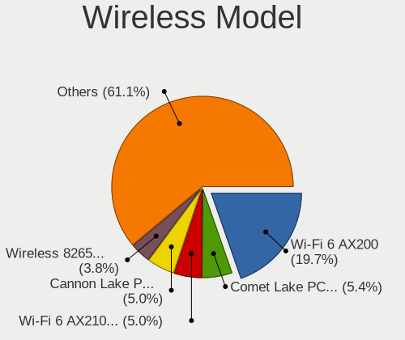

| Model                                                         | Computers | Percent |
|---------------------------------------------------------------|-----------|---------|
| Intel Wi-Fi 6 AX200                                           | 13        | 22.03%  |
| Intel Wireless 8265 / 8275                                    | 5         | 8.47%   |
| Intel Cannon Lake PCH CNVi WiFi                               | 5         | 8.47%   |
| Intel Comet Lake PCH-LP CNVi WiFi                             | 4         | 6.78%   |
| Intel Wi-Fi 6 AX210/AX211/AX411 160MHz                        | 3         | 5.08%   |
| Intel Ice Lake-LP PCH CNVi WiFi                               | 3         | 5.08%   |
| MEDIATEK MT7921 802.11ax PCI Express Wireless Network Adapter | 2         | 3.39%   |
| Intel Wireless-AC 9260                                        | 2         | 3.39%   |
| Intel Wi-Fi 6 AX201                                           | 2         | 3.39%   |
| Realtek RTL88x2bu [AC1200 Techkey]                            | 1         | 1.69%   |
| Realtek RTL8852AE 802.11ax PCIe Wireless Network Adapter      | 1         | 1.69%   |
| Realtek RTL8822CE 802.11ac PCIe Wireless Network Adapter      | 1         | 1.69%   |
| Realtek RTL8822BE 802.11a/b/g/n/ac WiFi adapter               | 1         | 1.69%   |
| Realtek RTL8821CE 802.11ac PCIe Wireless Network Adapter      | 1         | 1.69%   |
| Realtek RTL8812AE 802.11ac PCIe Wireless Network Adapter      | 1         | 1.69%   |
| Realtek RTL8723BE PCIe Wireless Network Adapter               | 1         | 1.69%   |
| Realtek RTL8723AE PCIe Wireless Network Adapter               | 1         | 1.69%   |
| Ralink RT2870/RT3070 Wireless Adapter                         | 1         | 1.69%   |
| Qualcomm Atheros AR9227 Wireless Network Adapter              | 1         | 1.69%   |
| Qualcomm Atheros AR5212/5213/2414 Wireless Network Adapter    | 1         | 1.69%   |
| Microsoft XBOX ACC                                            | 1         | 1.69%   |
| MEDIATEK RZ608 Wi-Fi 6E 80MHz                                 | 1         | 1.69%   |
| Intel Wireless 8260                                           | 1         | 1.69%   |
| Intel Wireless 3160                                           | 1         | 1.69%   |
| Intel Tiger Lake PCH CNVi WiFi                                | 1         | 1.69%   |
| Intel Dual Band Wireless-AC 3168NGW [Stone Peak]              | 1         | 1.69%   |
| Intel Comet Lake PCH CNVi WiFi                                | 1         | 1.69%   |
| Intel Cannon Point-LP CNVi [Wireless-AC]                      | 1         | 1.69%   |
| Intel Alder Lake-S PCH CNVi WiFi                              | 1         | 1.69%   |

Ethernet Vendor
---------------

Ethernet vendors

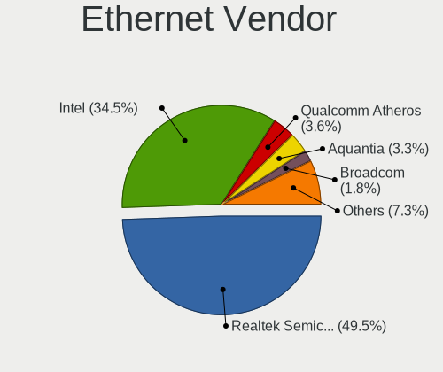

| Vendor                   | Computers | Percent |
|--------------------------|-----------|---------|
| Realtek Semiconductor    | 30        | 44.12%  |
| Intel                    | 28        | 41.18%  |
| Aquantia                 | 3         | 4.41%   |
| Qualcomm Atheros         | 2         | 2.94%   |
| Samsung Electronics      | 1         | 1.47%   |
| Marvell Technology Group | 1         | 1.47%   |
| ICS Advent               | 1         | 1.47%   |
| Google                   | 1         | 1.47%   |
| ASIX Electronics         | 1         | 1.47%   |

Ethernet Model
--------------

Ethernet models

| Model                                                             | Computers | Percent |
|-------------------------------------------------------------------|-----------|---------|
| Realtek RTL8111/8168/8411 PCI Express Gigabit Ethernet Controller | 21        | 28%     |
| Realtek RTL8125 2.5GbE Controller                                 | 6         | 8%      |
| Intel I211 Gigabit Network Connection                             | 5         | 6.67%   |
| Intel I210 Gigabit Network Connection                             | 5         | 6.67%   |
| Intel Ethernet Connection (2) I219-V                              | 4         | 5.33%   |
| Intel Ethernet Controller I225-V                                  | 3         | 4%      |
| Intel Ethernet Connection (7) I219-V                              | 3         | 4%      |
| Intel 82574L Gigabit Network Connection                           | 3         | 4%      |
| Aquantia AQC107 NBase-T/IEEE 802.3bz Ethernet Controller [AQtion] | 3         | 4%      |
| Realtek RTL810xE PCI Express Fast Ethernet controller             | 2         | 2.67%   |
| Intel Ethernet Controller XXV710 for 25GbE SFP28                  | 2         | 2.67%   |
| Samsung Galaxy series, misc. (tethering mode)                     | 1         | 1.33%   |
| Realtek RTL8153 Gigabit Ethernet Adapter                          | 1         | 1.33%   |
| Qualcomm Atheros Killer E2500 Gigabit Ethernet Controller         | 1         | 1.33%   |
| Qualcomm Atheros Killer E2400 Gigabit Ethernet Controller         | 1         | 1.33%   |
| Marvell Group 88E8053 PCI-E Gigabit Ethernet Controller           | 1         | 1.33%   |
| Intel I350 Gigabit Network Connection                             | 1         | 1.33%   |
| Intel Ethernet Connection I217-V                                  | 1         | 1.33%   |
| Intel Ethernet Connection (7) I219-LM                             | 1         | 1.33%   |
| Intel Ethernet Connection (6) I219-V                              | 1         | 1.33%   |
| Intel Ethernet Connection (5) I219-V                              | 1         | 1.33%   |
| Intel Ethernet Connection (4) I219-LM                             | 1         | 1.33%   |
| Intel Ethernet Connection (2) I219-LM                             | 1         | 1.33%   |
| Intel Ethernet Connection (14) I219-LM                            | 1         | 1.33%   |
| Intel Ethernet Connection (11) I219-LM                            | 1         | 1.33%   |
| Intel Ethernet Connection (10) I219-V                             | 1         | 1.33%   |
| ICS Advent DM9601 Fast Ethernet Adapter                           | 1         | 1.33%   |
| Google Nexus/Pixel Device (tether)                                | 1         | 1.33%   |
| ASIX AX88772                                                      | 1         | 1.33%   |

Net Controller Kind
-------------------

Ethernet, WiFi or modem

| Kind     | Computers | Percent |
|----------|-----------|---------|
| Ethernet | 60        | 50.85%  |
| WiFi     | 57        | 48.31%  |
| Modem    | 1         | 0.85%   |

Used Controller
---------------

Currently used network controller

| Kind     | Computers | Percent |
|----------|-----------|---------|
| WiFi     | 47        | 53.41%  |
| Ethernet | 41        | 46.59%  |

NICs
----

Total network controllers on board

| Total | Computers | Percent |
|-------|-----------|---------|
| 2     | 33        | 41.77%  |
| 1     | 33        | 41.77%  |
| 3     | 7         | 8.86%   |
| 0     | 3         | 3.8%    |
| 4     | 2         | 2.53%   |
| 6     | 1         | 1.27%   |

IPv6
----

IPv6 vs IPv4

| Used | Computers | Percent |
|------|-----------|---------|
| No   | 59        | 72.84%  |
| Yes  | 22        | 27.16%  |

Bluetooth
---------

Bluetooth Vendor
----------------

Controller vendors

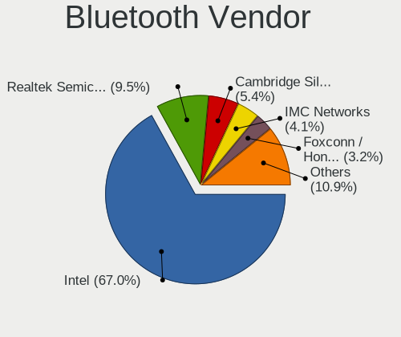

| Vendor                  | Computers | Percent |
|-------------------------|-----------|---------|
| Intel                   | 42        | 71.19%  |
| Realtek Semiconductor   | 6         | 10.17%  |
| Cambridge Silicon Radio | 5         | 8.47%   |
| Toshiba                 | 1         | 1.69%   |
| MediaTek                | 1         | 1.69%   |
| IMC Networks            | 1         | 1.69%   |
| Foxconn / Hon Hai       | 1         | 1.69%   |
| Edimax Technology       | 1         | 1.69%   |
| ASUSTek Computer        | 1         | 1.69%   |

Bluetooth Model
---------------

Controller models

| Model                                               | Computers | Percent |
|-----------------------------------------------------|-----------|---------|
| Intel AX200 Bluetooth                               | 13        | 22.03%  |
| Intel Bluetooth 9460/9560 Jefferson Peak (JfP)      | 9         | 15.25%  |
| Intel AX201 Bluetooth                               | 8         | 13.56%  |
| Intel Bluetooth wireless interface                  | 6         | 10.17%  |
| Cambridge Silicon Radio Bluetooth Dongle (HCI mode) | 5         | 8.47%   |
| Realtek Bluetooth Radio                             | 4         | 6.78%   |
| Intel AX210 Bluetooth                               | 3         | 5.08%   |
| Intel Bluetooth Device                              | 2         | 3.39%   |
| Toshiba RT Bluetooth Radio                          | 1         | 1.69%   |
| Realtek RTL8822BE Bluetooth 4.2 Adapter             | 1         | 1.69%   |
| Realtek  Bluetooth 4.2 Adapter                      | 1         | 1.69%   |
| MediaTek Wireless_Device                            | 1         | 1.69%   |
| Intel Wireless-AC 3168 Bluetooth                    | 1         | 1.69%   |
| IMC Networks Wireless_Device                        | 1         | 1.69%   |
| Foxconn / Hon Hai Wireless_Device                   | 1         | 1.69%   |
| Edimax Bluetooth Adapter                            | 1         | 1.69%   |
| ASUS Broadcom BCM20702A0 Bluetooth                  | 1         | 1.69%   |

Sound
-----

Sound Vendor
------------

Sound card vendors

| Vendor                               | Computers | Percent |
|--------------------------------------|-----------|---------|
| Intel                                | 42        | 31.82%  |
| AMD                                  | 39        | 29.55%  |
| Nvidia                               | 23        | 17.42%  |
| Thesycon Systemsoftware & Consulting | 3         | 2.27%   |
| Logitech                             | 3         | 2.27%   |
| AudioQuest                           | 3         | 2.27%   |
| SteelSeries ApS                      | 2         | 1.52%   |
| Creative Labs                        | 2         | 1.52%   |
| C-Media Electronics                  | 2         | 1.52%   |
| ASUSTek Computer                     | 2         | 1.52%   |
| Yamaha                               | 1         | 0.76%   |
| Valve Software                       | 1         | 0.76%   |
| Texas Instruments                    | 1         | 0.76%   |
| Sony                                 | 1         | 0.76%   |
| Sennheiser Communications            | 1         | 0.76%   |
| SAVITECH                             | 1         | 0.76%   |
| RODE Microphones                     | 1         | 0.76%   |
| Kingston Technology                  | 1         | 0.76%   |
| FiiO Electronics Technology          | 1         | 0.76%   |
| Creative Technology                  | 1         | 0.76%   |
| ACTIONS                              | 1         | 0.76%   |

Sound Model
-----------

Sound card models

| Model                                                               | Computers | Percent |
|---------------------------------------------------------------------|-----------|---------|
| AMD Family 17h/19h HD Audio Controller                              | 16        | 9.88%   |
| AMD Renoir Radeon High Definition Audio Controller                  | 11        | 6.79%   |
| AMD Starship/Matisse HD Audio Controller                            | 9         | 5.56%   |
| Intel Cannon Lake PCH cAVS                                          | 8         | 4.94%   |
| AMD Ellesmere HDMI Audio [Radeon RX 470/480 / 570/580/590]          | 7         | 4.32%   |
| Intel 100 Series/C230 Series Chipset Family HD Audio Controller     | 6         | 3.7%    |
| Nvidia GP106 High Definition Audio Controller                       | 5         | 3.09%   |
| AMD Navi 21/23 HDMI/DP Audio Controller                             | 5         | 3.09%   |
| AMD Family 17h (Models 00h-0fh) HD Audio Controller                 | 5         | 3.09%   |
| Intel Tiger Lake-LP Smart Sound Technology Audio Controller         | 4         | 2.47%   |
| Intel Comet Lake PCH-LP cAVS                                        | 4         | 2.47%   |
| Thesycon Systemsoftware & Consulting D30 Pro                        | 3         | 1.85%   |
| Nvidia TU107 GeForce GTX 1650 High Definition Audio Controller      | 3         | 1.85%   |
| Intel Sunrise Point-LP HD Audio                                     | 3         | 1.85%   |
| Intel Ice Lake-LP Smart Sound Technology Audio Controller           | 3         | 1.85%   |
| Intel Comet Lake PCH cAVS                                           | 3         | 1.85%   |
| AMD Raven/Raven2/Fenghuang HDMI/DP Audio Controller                 | 3         | 1.85%   |
| Nvidia TU116 High Definition Audio Controller                       | 2         | 1.23%   |
| Nvidia TU102 High Definition Audio Controller                       | 2         | 1.23%   |
| Nvidia GP104 High Definition Audio Controller                       | 2         | 1.23%   |
| Nvidia GM206 High Definition Audio Controller                       | 2         | 1.23%   |
| Nvidia Audio device                                                 | 2         | 1.23%   |
| Intel Tiger Lake-H HD Audio Controller                              | 2         | 1.23%   |
| Intel CM238 HD Audio Controller                                     | 2         | 1.23%   |
| Intel 8 Series/C220 Series Chipset High Definition Audio Controller | 2         | 1.23%   |
| Creative Labs Sound Core3D [Sound Blaster Recon3D / Z-Series]       | 2         | 1.23%   |
| AudioQuest DragonFly Red                                            | 2         | 1.23%   |
| AMD Baffin HDMI/DP Audio [Radeon RX 550 640SP / RX 560/560X]        | 2         | 1.23%   |
| Yamaha Steinberg UR22mkII                                           | 1         | 0.62%   |
| Valve Software Valve VR Radio & HMD Mic                             | 1         | 0.62%   |
| Texas Instruments PCM2912A Audio Codec                              | 1         | 0.62%   |
| SteelSeries ApS SteelSeries Arctis 5                                | 1         | 0.62%   |
| SteelSeries ApS Arctis 7 wireless adapter                           | 1         | 0.62%   |
| Sony DualShock 4 [CUH-ZCT2x]                                        | 1         | 0.62%   |
| Sennheiser Communications GSX 1200 Pro Main Audio                   | 1         | 0.62%   |
| SAVITECH SA9023 audio controller                                    | 1         | 0.62%   |
| RODE Microphones RODE VideoMic NTG                                  | 1         | 0.62%   |
| Nvidia TU106 High Definition Audio Controller                       | 1         | 0.62%   |
| Nvidia GP108 High Definition Audio Controller                       | 1         | 0.62%   |
| Nvidia GP107GL High Definition Audio Controller                     | 1         | 0.62%   |
| Nvidia GP102 HDMI Audio Controller                                  | 1         | 0.62%   |
| Nvidia GM204 High Definition Audio Controller                       | 1         | 0.62%   |
| Logitech Z-5 Speakers                                               | 1         | 0.62%   |
| Logitech Yeti X                                                     | 1         | 0.62%   |
| Logitech USB Headset H540                                           | 1         | 0.62%   |
| Kingston Technology HyperX 7.1 Audio                                | 1         | 0.62%   |
| Intel Xeon E3-1200 v3/4th Gen Core Processor HD Audio Controller    | 1         | 0.62%   |
| Intel Wildcat Point-LP High Definition Audio Controller             | 1         | 0.62%   |
| Intel USB PnP Sound Device                                          | 1         | 0.62%   |
| Intel NM10/ICH7 Family High Definition Audio Controller             | 1         | 0.62%   |
| Intel Cannon Point-LP High Definition Audio Controller              | 1         | 0.62%   |
| Intel Broadwell-U Audio Controller                                  | 1         | 0.62%   |
| Intel 82801JI (ICH10 Family) HD Audio Controller                    | 1         | 0.62%   |
| Intel 200 Series PCH HD Audio                                       | 1         | 0.62%   |
| FiiO Electronics Technology BTR5                                    | 1         | 0.62%   |
| Creative Technology Sound BlasterX G6                               | 1         | 0.62%   |
| C-Media Electronics USB Advanced Audio Device                       | 1         | 0.62%   |
| C-Media Electronics CM108 Audio Controller                          | 1         | 0.62%   |
| AudioQuest SDAC                                                     | 1         | 0.62%   |
| ASUSTek Computer Xonar U1 Audio Station                             | 1         | 0.62%   |

Memory
------

Memory Vendor
-------------

Memory module vendors

| Vendor              | Computers | Percent |
|---------------------|-----------|---------|
| Samsung Electronics | 25        | 29.76%  |
| Kingston            | 13        | 15.48%  |
| SK Hynix            | 12        | 14.29%  |
| Crucial             | 10        | 11.9%   |
| G.Skill             | 8         | 9.52%   |
| Micron Technology   | 5         | 5.95%   |
| Corsair             | 3         | 3.57%   |
| Patriot             | 2         | 2.38%   |
| Unknown             | 1         | 1.19%   |
| Transcend           | 1         | 1.19%   |
| Team                | 1         | 1.19%   |
| Magnum Tech         | 1         | 1.19%   |
| Innodisk            | 1         | 1.19%   |
| A-DATA Technology   | 1         | 1.19%   |

Memory Model
------------

Memory module models

| Model                                                            | Computers | Percent |
|------------------------------------------------------------------|-----------|---------|
| Samsung RAM M471A1G44AB0-CWE 8GB SODIMM DDR4 3200MT/s            | 3         | 3.37%   |
| SK Hynix RAM HMAA1GS6CJR6N-XN 8GB SODIMM DDR4 3200MT/s           | 2         | 2.25%   |
| SK Hynix RAM HMA81GS6JJR8N-VK 8GB SODIMM DDR4 2667MT/s           | 2         | 2.25%   |
| SK Hynix RAM HMA81GS6DJR8N-XN 8GB SODIMM DDR4 3200MT/s           | 2         | 2.25%   |
| SK Hynix RAM H9HCNNNCPMALHR-NEE 8GB Row Of Chips LPDDR4 4267MT/s | 2         | 2.25%   |
| Samsung RAM M471A2K43CB1-CTD 16384MB SODIMM DDR4 2667MT/s        | 2         | 2.25%   |
| Samsung RAM M471A1K43CB1-CTD 8192MB SODIMM DDR4 2667MT/s         | 2         | 2.25%   |
| Samsung RAM M471A1K43BB1-CRC 8GB SODIMM DDR4 2667MT/s            | 2         | 2.25%   |
| Samsung RAM M471A1G44AB0-CTD 8GB SODIMM DDR4 2667MT/s            | 2         | 2.25%   |
| Unknown RAM Module 512MB DIMM SDRAM                              | 1         | 1.12%   |
| Unknown RAM Module 1GB DIMM SDRAM                                | 1         | 1.12%   |
| Transcend RAM JM3200HSE-32G 32GB SODIMM DDR4 3200MT/s            | 1         | 1.12%   |
| Team RAM TEAMGROUP-UD4-3600 16GB DIMM DDR4 3600MT/s              | 1         | 1.12%   |
| SK Hynix RAM HMAA4GS6AJR8N-XN 32GB SODIMM DDR4 3200MT/s          | 1         | 1.12%   |
| SK Hynix RAM HMAA2GS6AJR8N-XN 16GB SODIMM DDR4 3200MT/s          | 1         | 1.12%   |
| SK Hynix RAM HMA851S6CJR6N-VK 4GB SODIMM DDR4 2667MT/s           | 1         | 1.12%   |
| SK Hynix RAM HMA82GS6AFR8N-UH 16GB SODIMM DDR4 2667MT/s          | 1         | 1.12%   |
| Samsung RAM Module 8GB Row Of Chips LPDDR3 2133MT/s              | 1         | 1.12%   |
| Samsung RAM M471B5773CHS-CK0 2GB SODIMM DDR3 1600MT/s            | 1         | 1.12%   |
| Samsung RAM M471B5173DB0-YK0 4GB SODIMM DDR3 1600MT/s            | 1         | 1.12%   |
| Samsung RAM M471B1G73QH0-YK0 8GB SODIMM DDR3 1600MT/s            | 1         | 1.12%   |
| Samsung RAM M471A5244CB0-CWE 4GB SODIMM DDR4 3200MT/s            | 1         | 1.12%   |
| Samsung RAM M471A5244CB0-CWE 4GB Row Of Chips DDR4 3200MT/s      | 1         | 1.12%   |
| Samsung RAM M471A5244CB0-CTD 4096MB SODIMM DDR4 3266MT/s         | 1         | 1.12%   |
| Samsung RAM M471A2K43DB1-CTD 16384MB SODIMM DDR4 2667MT/s        | 1         | 1.12%   |
| Samsung RAM M471A2G43BB2-CWE 16384MB SODIMM DDR4 3200MT/s        | 1         | 1.12%   |
| Samsung RAM M471A2G43AB2-CWE 16GB SODIMM DDR4 3200MT/s           | 1         | 1.12%   |
| Samsung RAM M471A1K43DB1-CWE 8192MB SODIMM DDR4 3200MT/s         | 1         | 1.12%   |
| Samsung RAM M471A1G44AB0-CWE 8GB Row Of Chips DDR4 3200MT/s      | 1         | 1.12%   |
| Samsung RAM M378A2G43MX3-CTD 16GB DIMM DDR4 2667MT/s             | 1         | 1.12%   |
| Samsung RAM K4E6E304EB-EGCG 4GB Row Of Chips LPDDR3 2133MT/s     | 1         | 1.12%   |
| Samsung RAM K4E6E304EB-EGCF 4GB Row Of Chips LPDDR3 1867MT/s     | 1         | 1.12%   |
| Patriot RAM PSD416G24002S 16GB SODIMM DDR4 2667MT/s              | 1         | 1.12%   |
| Patriot RAM 3200 C16 Series 8GB DIMM DDR4 3200MT/s               | 1         | 1.12%   |
| Micron RAM Module 16GB SODIMM DDR4 2667MT/s                      | 1         | 1.12%   |
| Micron RAM 8ATF1G64HZ-3G2J1 8GB SODIMM DDR4 3200MT/s             | 1         | 1.12%   |
| Micron RAM 8ATF1G64AZ-3G2J1 8GB DIMM DDR4 3200MT/s               | 1         | 1.12%   |
| Micron RAM 4ATF1G64HZ-3G2E2 8192MB SODIMM DDR4 3200MT/s          | 1         | 1.12%   |
| Micron RAM 18KSF1G72AZ-1G6E1 8GB DIMM DDR3 1600MT/s              | 1         | 1.12%   |
| Magnum Tech RAM MAGNUMTECH 4096MB SODIMM DDR3 1600MT/s           | 1         | 1.12%   |
| Kingston RAM KHX3200C16D4/8GX 8GB DIMM DDR4 3533MT/s             | 1         | 1.12%   |
| Kingston RAM KHX3200C16D4/16GX 16384MB DIMM DDR4 3600MT/s        | 1         | 1.12%   |
| Kingston RAM KHX2133C14D4/4G 4096MB DIMM DDR4 2933MT/s           | 1         | 1.12%   |
| Kingston RAM KHX2133C14/8G 8GB DIMM DDR4 2400MT/s                | 1         | 1.12%   |
| Kingston RAM KHX1866C10D3/8G 8192MB DIMM DDR3 1867MT/s           | 1         | 1.12%   |
| Kingston RAM KF3200C20S4/32GX 32GB SODIMM DDR4 3200MT/s          | 1         | 1.12%   |
| Kingston RAM KF3200C16D4/16GX 16384MB DIMM DDR4 3200MT/s         | 1         | 1.12%   |
| Kingston RAM HX426C16FB/8 8GB DIMM DDR4 2667MT/s                 | 1         | 1.12%   |
| Kingston RAM HP26D4S9S8HJ-8 8GB SODIMM DDR4 2667MT/s             | 1         | 1.12%   |
| Kingston RAM 99U5624-013.A00G 8GB SODIMM DDR4 2400MT/s           | 1         | 1.12%   |
| Kingston RAM 9965525-055.A00LF 8GB DIMM DDR3 1600MT/s            | 1         | 1.12%   |
| Kingston RAM 9965487-004.A00LF 4GB DIMM 1066MT/s                 | 1         | 1.12%   |
| Kingston RAM 9905700-053.A00G 8192MB SODIMM DDR4 3200MT/s        | 1         | 1.12%   |
| Kingston RAM 9905625-062.A00G 8GB DIMM DDR4 2133MT/s             | 1         | 1.12%   |
| Innodisk RAM M4SI-AGS1OC0K-C 16384MB SODIMM DDR4 2667MT/s        | 1         | 1.12%   |
| G.Skill RAM F4-3600C17-16GTZR 16384MB DIMM DDR4 3666MT/s         | 1         | 1.12%   |
| G.Skill RAM F4-3600C17-16GTZKW 16GB DIMM DDR4 3600MT/s           | 1         | 1.12%   |
| G.Skill RAM F4-3600C16-8GTZN 8GB DIMM DDR4 3666MT/s              | 1         | 1.12%   |
| G.Skill RAM F4-3600C16-16GVKC 16384MB DIMM DDR4 3866MT/s         | 1         | 1.12%   |
| G.Skill RAM F4-3200C 8GB SODIMM DDR4 1067MT/s                    | 1         | 1.12%   |

Memory Kind
-----------

Memory module kinds

| Kind    | Computers | Percent |
|---------|-----------|---------|
| DDR4    | 61        | 82.43%  |
| DDR3    | 6         | 8.11%   |
| LPDDR3  | 3         | 4.05%   |
| LPDDR4  | 2         | 2.7%    |
| SDRAM   | 1         | 1.35%   |
| Unknown | 1         | 1.35%   |

Memory Form Factor
------------------

Physical design of the memory module

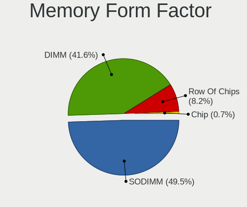

| Name         | Computers | Percent |
|--------------|-----------|---------|
| SODIMM       | 37        | 50%     |
| DIMM         | 30        | 40.54%  |
| Row Of Chips | 7         | 9.46%   |

Memory Size
-----------

Memory module size

| Size  | Computers | Percent |
|-------|-----------|---------|
| 8192  | 40        | 49.38%  |
| 16384 | 20        | 24.69%  |
| 4096  | 10        | 12.35%  |
| 32768 | 8         | 9.88%   |
| 2048  | 1         | 1.23%   |
| 1024  | 1         | 1.23%   |
| 512   | 1         | 1.23%   |

Memory Speed
------------

Memory module speed

| Speed   | Computers | Percent |
|---------|-----------|---------|
| 3200    | 23        | 28.4%   |
| 2667    | 21        | 25.93%  |
| 2133    | 6         | 7.41%   |
| 1600    | 5         | 6.17%   |
| 3600    | 4         | 4.94%   |
| 2400    | 3         | 3.7%    |
| 4267    | 2         | 2.47%   |
| 3666    | 2         | 2.47%   |
| 3400    | 2         | 2.47%   |
| 4000    | 1         | 1.23%   |
| 3866    | 1         | 1.23%   |
| 3533    | 1         | 1.23%   |
| 3466    | 1         | 1.23%   |
| 3266    | 1         | 1.23%   |
| 3000    | 1         | 1.23%   |
| 2933    | 1         | 1.23%   |
| 2733    | 1         | 1.23%   |
| 1867    | 1         | 1.23%   |
| 1800    | 1         | 1.23%   |
| 1067    | 1         | 1.23%   |
| 1066    | 1         | 1.23%   |
| Unknown | 1         | 1.23%   |

Printers & scanners
-------------------

Printer Vendor
--------------

Printer device vendors

Zero info for selected period =(

Printer Model
-------------

Printer device models

Zero info for selected period =(

Scanner Vendor
--------------

Scanner device vendors

Zero info for selected period =(

Scanner Model
-------------

Scanner device models

Zero info for selected period =(

Camera
------

Camera Vendor
-------------

Camera device vendors

| Vendor                        | Computers | Percent |
|-------------------------------|-----------|---------|
| IMC Networks                  | 8         | 17.78%  |
| Chicony Electronics           | 8         | 17.78%  |
| Realtek Semiconductor         | 4         | 8.89%   |
| Logitech                      | 4         | 8.89%   |
| Sunplus Innovation Technology | 3         | 6.67%   |
| Acer                          | 3         | 6.67%   |
| Quanta                        | 2         | 4.44%   |
| Microdia                      | 2         | 4.44%   |
| Luxvisions Innotech Limited   | 2         | 4.44%   |
| Lite-On Technology            | 2         | 4.44%   |
| Valve Software                | 1         | 2.22%   |
| Syntek                        | 1         | 2.22%   |
| SunplusIT                     | 1         | 2.22%   |
| KYE Systems (Mouse Systems)   | 1         | 2.22%   |
| Generalplus Technology        | 1         | 2.22%   |
| DJKANA1BIFZTDM                | 1         | 2.22%   |
| Creative Technology           | 1         | 2.22%   |

Camera Model
------------

Camera device models

| Model                                               | Computers | Percent |
|-----------------------------------------------------|-----------|---------|
| IMC Networks Integrated Camera                      | 7         | 15.56%  |
| Chicony Integrated Camera                           | 3         | 6.67%   |
| Sunplus Integrated_Webcam_HD                        | 2         | 4.44%   |
| Realtek Integrated Webcam HD                        | 2         | 4.44%   |
| Luxvisions Innotech Limited HP TrueVision HD Camera | 2         | 4.44%   |
| Chicony HD User Facing                              | 2         | 4.44%   |
| Valve Software 3D Camera                            | 1         | 2.22%   |
| Syntek Integrated Camera                            | 1         | 2.22%   |
| SunplusIT AUKEY PCLM4                 | 1         | 2.22%   |
| Sunplus Full HD webcam                              | 1         | 2.22%   |
| Realtek Laptop Camera                               | 1         | 2.22%   |
| Realtek Integrated Camera                           | 1         | 2.22%   |
| Quanta RGB-IR Camera                                | 1         | 2.22%   |
| Quanta HD Webcam                                    | 1         | 2.22%   |
| Microdia Integrated_Webcam_HD                       | 1         | 2.22%   |
| Microdia HP Integrated Webcam                       | 1         | 2.22%   |
| Logitech Webcam C270                                | 1         | 2.22%   |
| Logitech StreamCam                                  | 1         | 2.22%   |
| Logitech QuickCam Orbit/Sphere AF                   | 1         | 2.22%   |
| Logitech BRIO                                       | 1         | 2.22%   |
| Lite-On TOSHIBA Web Camera - HD                     | 1         | 2.22%   |
| Lite-On Integrated Camera                           | 1         | 2.22%   |
| KYE Systems (Mouse Systems) PC-LM1E Camera          | 1         | 2.22%   |
| IMC Networks USB2.0 HD UVC WebCam                   | 1         | 2.22%   |
| Generalplus GENERAL WEBCAM                          | 1         | 2.22%   |
| DJKANA1BIFZTDM HP Wide Vision HD Camera             | 1         | 2.22%   |
| Creative Live! Cam Sync 1080p                       | 1         | 2.22%   |
| Chicony XiaoMi USB 2.0 Webcam                       | 1         | 2.22%   |
| Chicony USB 2.0 Camera                              | 1         | 2.22%   |
| Chicony HP Truevision HD                            | 1         | 2.22%   |
| Acer NEC HD WebCam                                  | 1         | 2.22%   |
| Acer Integrated Camera                              | 1         | 2.22%   |
| Acer HD Webcam                                      | 1         | 2.22%   |

Security
--------

Fingerprint Vendor
------------------

Fingerprint sensor vendors

| Vendor                     | Computers | Percent |
|----------------------------|-----------|---------|
| Elan Microelectronics      | 3         | 37.5%   |
| Validity Sensors           | 2         | 25%     |
| Synaptics                  | 2         | 25%     |
| Shenzhen Goodix Technology | 1         | 12.5%   |

Fingerprint Model
-----------------

Fingerprint sensor models

| Model                                             | Computers | Percent |
|---------------------------------------------------|-----------|---------|
| Elan ELAN:Fingerprint                             | 2         | 25%     |
| Validity Sensors VFS7552 Touch Fingerprint Sensor | 1         | 12.5%   |
| Validity Sensors Synaptics WBDI                   | 1         | 12.5%   |
| Synaptics Prometheus MIS Touch Fingerprint Reader | 1         | 12.5%   |
| Shenzhen Goodix  FingerPrint Device               | 1         | 12.5%   |
| Elan ELAN:ARM-M4                                  | 1         | 12.5%   |
| Unknown                                           | 1         | 12.5%   |

Chipcard Vendor
---------------

Chipcard module vendors

| Vendor      | Computers | Percent |
|-------------|-----------|---------|
| Broadcom    | 2         | 66.67%  |
| Alcor Micro | 1         | 33.33%  |

Chipcard Model
--------------

Chipcard module models

| Model                               | Computers | Percent |
|-------------------------------------|-----------|---------|
| Broadcom 5880                       | 1         | 33.33%  |
| Broadcom 58200                      | 1         | 33.33%  |
| Alcor Micro AU9540 Smartcard Reader | 1         | 33.33%  |

Unsupported
-----------

Unsupported Devices
-------------------

Total unsupported devices on board

| Total | Computers | Percent |
|-------|-----------|---------|
| 0     | 50        | 60.98%  |
| 1     | 19        | 23.17%  |
| 2     | 7         | 8.54%   |
| 4     | 3         | 3.66%   |
| 3     | 3         | 3.66%   |

Unsupported Device Types
------------------------

Types of unsupported devices

| Type                     | Computers | Percent |
|--------------------------|-----------|---------|
| Fingerprint reader       | 8         | 16.33%  |
| Communication controller | 8         | 16.33%  |
| Graphics card            | 7         | 14.29%  |
| Camera                   | 6         | 12.24%  |
| Bluetooth                | 5         | 10.2%   |
| Multimedia controller    | 4         | 8.16%   |
| Chipcard                 | 3         | 6.12%   |
| Storage/ata              | 2         | 4.08%   |
| Net/wireless             | 2         | 4.08%   |
| Card reader              | 2         | 4.08%   |
| Sound                    | 1         | 2.04%   |
| Modem                    | 1         | 2.04%   |

