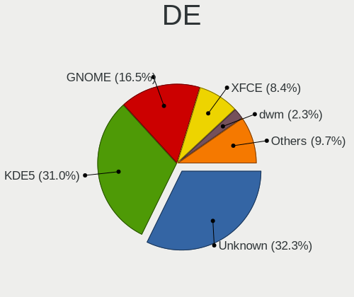
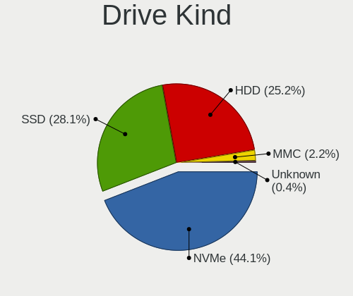
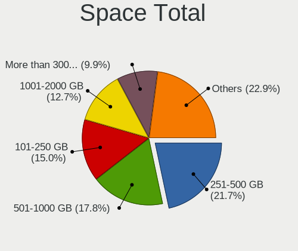
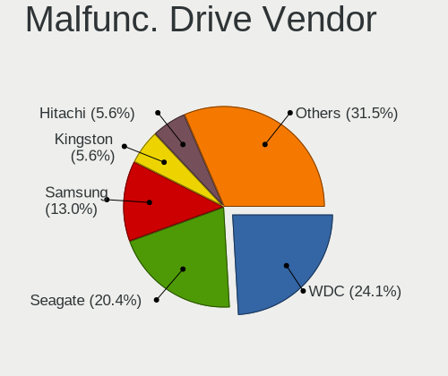
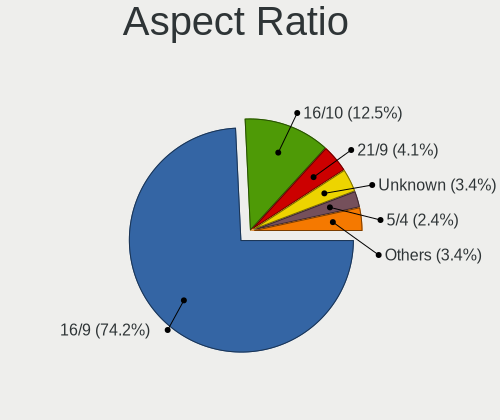

Gentoo 2.8 - Tested Hardware & Statistics
-----------------------------------------

A project to collect tested hardware configurations for Gentoo 2.8.

Anyone can contribute to this report by the [hw-probe](https://github.com/linuxhw/hw-probe) tool:

    sudo -E hw-probe -all -upload

Please contribute! Especially if your hardware is rare.

This is a report for all computer types. See also reports for [desktops](/Dist/Gentoo_2.8/Desktop/README.md) and [notebooks](/Dist/Gentoo_2.8/Notebook/README.md).

Contents
--------

* [ Test Cases ](#test-cases)

* [ System ](#system)
  - [ Kernel                   ](#kernel)
  - [ Kernel Family            ](#kernel-family)
  - [ Kernel Major Ver.        ](#kernel-major-ver)
  - [ Arch                     ](#arch)
  - [ DE                       ](#de)
  - [ Display Server           ](#display-server)
  - [ Display Manager          ](#display-manager)
  - [ OS Lang                  ](#os-lang)
  - [ Boot Mode                ](#boot-mode)
  - [ Filesystem               ](#filesystem)
  - [ Part. scheme             ](#part-scheme)
  - [ Dual Boot with Linux/BSD ](#dual-boot-with-linuxbsd)
  - [ Dual Boot (Win)          ](#dual-boot-win)

* [ Board ](#board)
  - [ Vendor                   ](#vendor)
  - [ Model                    ](#model)
  - [ Model Family             ](#model-family)
  - [ MFG Year                 ](#mfg-year)
  - [ Form Factor              ](#form-factor)
  - [ Secure Boot              ](#secure-boot)
  - [ Coreboot                 ](#coreboot)
  - [ RAM Size                 ](#ram-size)
  - [ RAM Used                 ](#ram-used)
  - [ Total Drives             ](#total-drives)
  - [ Has CD-ROM               ](#has-cd-rom)
  - [ Has Ethernet             ](#has-ethernet)
  - [ Has WiFi                 ](#has-wifi)
  - [ Has Bluetooth            ](#has-bluetooth)

* [ Location ](#location)
  - [ Country                  ](#country)
  - [ City                     ](#city)

* [ Drives ](#drives)
  - [ Drive Vendor             ](#drive-vendor)
  - [ Drive Model              ](#drive-model)
  - [ HDD Vendor               ](#hdd-vendor)
  - [ SSD Vendor               ](#ssd-vendor)
  - [ Drive Kind               ](#drive-kind)
  - [ Drive Connector          ](#drive-connector)
  - [ Drive Size               ](#drive-size)
  - [ Space Total              ](#space-total)
  - [ Space Used               ](#space-used)
  - [ Malfunc. Drives          ](#malfunc-drives)
  - [ Malfunc. Drive Vendor    ](#malfunc-drive-vendor)
  - [ Malfunc. HDD Vendor      ](#malfunc-hdd-vendor)
  - [ Malfunc. Drive Kind      ](#malfunc-drive-kind)
  - [ Failed Drives            ](#failed-drives)
  - [ Failed Drive Vendor      ](#failed-drive-vendor)
  - [ Drive Status             ](#drive-status)

* [ Storage controller ](#storage-controller)
  - [ Storage Vendor           ](#storage-vendor)
  - [ Storage Model            ](#storage-model)
  - [ Storage Kind             ](#storage-kind)

* [ Processor ](#processor)
  - [ CPU Vendor               ](#cpu-vendor)
  - [ CPU Model                ](#cpu-model)
  - [ CPU Model Family         ](#cpu-model-family)
  - [ CPU Cores                ](#cpu-cores)
  - [ CPU Sockets              ](#cpu-sockets)
  - [ CPU Threads              ](#cpu-threads)
  - [ CPU Op-Modes             ](#cpu-op-modes)
  - [ CPU Microcode            ](#cpu-microcode)
  - [ CPU Microarch            ](#cpu-microarch)

* [ Graphics ](#graphics)
  - [ GPU Vendor               ](#gpu-vendor)
  - [ GPU Model                ](#gpu-model)
  - [ GPU Combo                ](#gpu-combo)
  - [ GPU Driver               ](#gpu-driver)
  - [ GPU Memory               ](#gpu-memory)

* [ Monitor ](#monitor)
  - [ Monitor Vendor           ](#monitor-vendor)
  - [ Monitor Model            ](#monitor-model)
  - [ Monitor Resolution       ](#monitor-resolution)
  - [ Monitor Diagonal         ](#monitor-diagonal)
  - [ Monitor Width            ](#monitor-width)
  - [ Aspect Ratio             ](#aspect-ratio)
  - [ Monitor Area             ](#monitor-area)
  - [ Pixel Density            ](#pixel-density)
  - [ Multiple Monitors        ](#multiple-monitors)

* [ Network ](#network)
  - [ Net Controller Vendor    ](#net-controller-vendor)
  - [ Net Controller Model     ](#net-controller-model)
  - [ Wireless Vendor          ](#wireless-vendor)
  - [ Wireless Model           ](#wireless-model)
  - [ Ethernet Vendor          ](#ethernet-vendor)
  - [ Ethernet Model           ](#ethernet-model)
  - [ Net Controller Kind      ](#net-controller-kind)
  - [ Used Controller          ](#used-controller)
  - [ NICs                     ](#nics)
  - [ IPv6                     ](#ipv6)

* [ Bluetooth ](#bluetooth)
  - [ Bluetooth Vendor         ](#bluetooth-vendor)
  - [ Bluetooth Model          ](#bluetooth-model)

* [ Sound ](#sound)
  - [ Sound Vendor             ](#sound-vendor)
  - [ Sound Model              ](#sound-model)

* [ Memory ](#memory)
  - [ Memory Vendor            ](#memory-vendor)
  - [ Memory Model             ](#memory-model)
  - [ Memory Kind              ](#memory-kind)
  - [ Memory Form Factor       ](#memory-form-factor)
  - [ Memory Size              ](#memory-size)
  - [ Memory Speed             ](#memory-speed)

* [ Printers & scanners ](#printers--scanners)
  - [ Printer Vendor           ](#printer-vendor)
  - [ Printer Model            ](#printer-model)
  - [ Scanner Vendor           ](#scanner-vendor)
  - [ Scanner Model            ](#scanner-model)

* [ Camera ](#camera)
  - [ Camera Vendor            ](#camera-vendor)
  - [ Camera Model             ](#camera-model)

* [ Security ](#security)
  - [ Fingerprint Vendor       ](#fingerprint-vendor)
  - [ Fingerprint Model        ](#fingerprint-model)
  - [ Chipcard Vendor          ](#chipcard-vendor)
  - [ Chipcard Model           ](#chipcard-model)

* [ Unsupported ](#unsupported)
  - [ Unsupported Devices      ](#unsupported-devices)
  - [ Unsupported Device Types ](#unsupported-device-types)

Test Cases
----------

Total: 259

| Vendor        | Model                       | Form-Factor | Probe                                                      | Date         |
|---------------|-----------------------------|-------------|------------------------------------------------------------|--------------|
| Fanless Mi... | PCG02 GLE                   | Stick pc    | [19d2273e6b](https://linux-hardware.org/?probe=19d2273e6b) | Aug 01, 2022 |
| ASUSTek       | ROG Maximus Z690 EXTREME    | Desktop     | [effa59ed64](https://linux-hardware.org/?probe=effa59ed64) | Aug 01, 2022 |
| ASRock        | B550M Steel Legend          | Desktop     | [0ac4f27d0f](https://linux-hardware.org/?probe=0ac4f27d0f) | Jul 31, 2022 |
| ASUSTek       | TUF Gaming X570-PLUS        | Desktop     | [f22250f00c](https://linux-hardware.org/?probe=f22250f00c) | Jul 31, 2022 |
| TUXEDO        | InfinityBook Pro 14 Gen6    | Notebook    | [de9a854095](https://linux-hardware.org/?probe=de9a854095) | Jul 31, 2022 |
| ASUSTek       | M3A78-CM                    | Desktop     | [1051593809](https://linux-hardware.org/?probe=1051593809) | Jul 31, 2022 |
| Gigabyte      | 970A-DS3                    | Desktop     | [78f00bd2aa](https://linux-hardware.org/?probe=78f00bd2aa) | Jul 30, 2022 |
| Razer         | Blade 15 Studio Edition ... | Notebook    | [359f708604](https://linux-hardware.org/?probe=359f708604) | Jul 30, 2022 |
| Lenovo        | 1046 SDK0T08861 WIN 3305... | Desktop     | [d3d824f468](https://linux-hardware.org/?probe=d3d824f468) | Jul 29, 2022 |
| MSI           | B450M MORTAR                | Desktop     | [29a26324b9](https://linux-hardware.org/?probe=29a26324b9) | Jul 29, 2022 |
| ASUSTek       | ROG G703GI_G7BI             | Notebook    | [88a326be83](https://linux-hardware.org/?probe=88a326be83) | Jul 28, 2022 |
| Dell          | XPS 15 9570                 | Notebook    | [e7f56631b1](https://linux-hardware.org/?probe=e7f56631b1) | Jul 27, 2022 |
| Supermicro    | X10SRL-FB                   | Server      | [a8dc9cfc07](https://linux-hardware.org/?probe=a8dc9cfc07) | Jul 27, 2022 |
| Intel         | D54250WYK H13922-303        | Desktop     | [5ff32931fa](https://linux-hardware.org/?probe=5ff32931fa) | Jul 27, 2022 |
| MSI           | MPG Z390 GAMING PRO CARB... | Desktop     | [dc7eff27cf](https://linux-hardware.org/?probe=dc7eff27cf) | Jul 26, 2022 |
| Dell          | XPS 15 9570                 | Notebook    | [f3972b3a7d](https://linux-hardware.org/?probe=f3972b3a7d) | Jul 26, 2022 |
| Timi          | Mi Laptop Pro 15 2020       | Notebook    | [5455e664e0](https://linux-hardware.org/?probe=5455e664e0) | Jul 26, 2022 |
| HP            | EliteBook 845 G7 Noteboo... | Notebook    | [b15fb90c18](https://linux-hardware.org/?probe=b15fb90c18) | Jul 26, 2022 |
| ASRock        | X399 Taichi                 | Desktop     | [d2eb8a032b](https://linux-hardware.org/?probe=d2eb8a032b) | Jul 26, 2022 |
| ASUSTek       | ROG Maximus XI HERO         | Desktop     | [c98fed5f84](https://linux-hardware.org/?probe=c98fed5f84) | Jul 25, 2022 |
| ASUSTek       | ROG Maximus Z690 EXTREME    | Desktop     | [dae325b47b](https://linux-hardware.org/?probe=dae325b47b) | Jul 25, 2022 |
| Dell          | 0FKD45 A03                  | Server      | [0caba2e4b0](https://linux-hardware.org/?probe=0caba2e4b0) | Jul 25, 2022 |
| HP            | OMEN by Laptop 16-c0xxx     | Notebook    | [8f46b7dcca](https://linux-hardware.org/?probe=8f46b7dcca) | Jul 25, 2022 |
| HP            | Laptop 17-ca1xxx            | Notebook    | [64dad58b71](https://linux-hardware.org/?probe=64dad58b71) | Jul 25, 2022 |
| ASUSTek       | ROG Zephyrus G14 GA402RJ... | Notebook    | [6302f1ee8b](https://linux-hardware.org/?probe=6302f1ee8b) | Jul 25, 2022 |
| ASUSTek       | M3A78-CM                    | Desktop     | [e1e16aa154](https://linux-hardware.org/?probe=e1e16aa154) | Jul 25, 2022 |
| Gigabyte      | AB350-Gaming-CF             | Desktop     | [153acd77c2](https://linux-hardware.org/?probe=153acd77c2) | Jul 24, 2022 |
| ASRock        | AM1H-ITX                    | Desktop     | [a15c82ba0c](https://linux-hardware.org/?probe=a15c82ba0c) | Jul 24, 2022 |
| TYAN Compu... | S7025                       | Server      | [844d96fcd7](https://linux-hardware.org/?probe=844d96fcd7) | Jul 22, 2022 |
| Unknown       | QNAP TS-221                 | Desktop     | [fb3741faab](https://linux-hardware.org/?probe=fb3741faab) | Jul 21, 2022 |
| ASRock        | X570 Taichi                 | Desktop     | [56d5853243](https://linux-hardware.org/?probe=56d5853243) | Jul 19, 2022 |
| MSI           | MEG X570 UNIFY              | Desktop     | [d3d26541f1](https://linux-hardware.org/?probe=d3d26541f1) | Jul 19, 2022 |
| Gigabyte      | AB350-Gaming-CF             | Desktop     | [8f2f1582e8](https://linux-hardware.org/?probe=8f2f1582e8) | Jul 17, 2022 |
| ASUSTek       | M3A78-CM                    | Desktop     | [056d74f1a9](https://linux-hardware.org/?probe=056d74f1a9) | Jul 17, 2022 |
| ASUSTek       | ROG STRIX B560-I GAMING ... | Desktop     | [e6b6d3b5e6](https://linux-hardware.org/?probe=e6b6d3b5e6) | Jul 16, 2022 |
| ASUSTek       | ROG STRIX B560-I GAMING ... | Desktop     | [93f8a4ce9f](https://linux-hardware.org/?probe=93f8a4ce9f) | Jul 16, 2022 |
| Gigabyte      | Z590 UD                     | Desktop     | [e9e0b50bbb](https://linux-hardware.org/?probe=e9e0b50bbb) | Jul 15, 2022 |
| Dell          | Latitude 5289               | Convertible | [a0844cdadd](https://linux-hardware.org/?probe=a0844cdadd) | Jul 15, 2022 |
| ASUSTek       | ROG G703GI_G7BI             | Notebook    | [4d636c74d3](https://linux-hardware.org/?probe=4d636c74d3) | Jul 14, 2022 |
| MSI           | Z87-G45 GAMING              | Desktop     | [8602f7246a](https://linux-hardware.org/?probe=8602f7246a) | Jul 12, 2022 |
| Lenovo        | ThinkPad X13 Yoga Gen 2 ... | Convertible | [0d6de2415e](https://linux-hardware.org/?probe=0d6de2415e) | Jul 11, 2022 |
| MSI           | GS63VR 6RF                  | Notebook    | [30ad17796f](https://linux-hardware.org/?probe=30ad17796f) | Jul 11, 2022 |
| Lenovo        | IdeaPad 100-15IBD 80QQ      | Notebook    | [94e9d2f65a](https://linux-hardware.org/?probe=94e9d2f65a) | Jul 10, 2022 |
| Lenovo        | G510 20238                  | Notebook    | [f67a64f833](https://linux-hardware.org/?probe=f67a64f833) | Jul 10, 2022 |
| Gigabyte      | B450 AORUS M                | Desktop     | [6d15b85193](https://linux-hardware.org/?probe=6d15b85193) | Jul 10, 2022 |
| Lenovo        | ThinkPad T14 Gen 2a 20XK... | Notebook    | [8f36480ad7](https://linux-hardware.org/?probe=8f36480ad7) | Jul 10, 2022 |
| Dell          | 0J3C2F A02                  | Desktop     | [dccb88852f](https://linux-hardware.org/?probe=dccb88852f) | Jul 10, 2022 |
| ASUSTek       | M3A78-CM                    | Desktop     | [0237c9df10](https://linux-hardware.org/?probe=0237c9df10) | Jul 10, 2022 |
| ASUSTek       | ROG STRIX B550-F GAMING     | Desktop     | [85dbd84c37](https://linux-hardware.org/?probe=85dbd84c37) | Jul 09, 2022 |
| Dell          | 0J3C2F A02                  | Desktop     | [aa87616696](https://linux-hardware.org/?probe=aa87616696) | Jul 09, 2022 |
| Dell          | Latitude D420               | Notebook    | [2e3ded5234](https://linux-hardware.org/?probe=2e3ded5234) | Jul 08, 2022 |
| MSI           | GS63VR 6RF                  | Notebook    | [097cc820d3](https://linux-hardware.org/?probe=097cc820d3) | Jul 08, 2022 |
| Lenovo        | G510 20238                  | Notebook    | [5bdfb575ae](https://linux-hardware.org/?probe=5bdfb575ae) | Jul 07, 2022 |
| ASUSTek       | VivoBook_ASUSLaptop M760... | Notebook    | [850003c6da](https://linux-hardware.org/?probe=850003c6da) | Jul 05, 2022 |
| Lenovo        | IdeaPad 3 15ALC6 82KU       | Notebook    | [1b94ade16a](https://linux-hardware.org/?probe=1b94ade16a) | Jul 05, 2022 |
| ASUSTek       | ROG CROSSHAIR VIII DARK ... | Desktop     | [685e3d36bc](https://linux-hardware.org/?probe=685e3d36bc) | Jul 04, 2022 |
| ASUSTek       | ROG CROSSHAIR VIII DARK ... | Desktop     | [b436712f17](https://linux-hardware.org/?probe=b436712f17) | Jul 04, 2022 |
| ASUSTek       | ROG Maximus XI HERO         | Desktop     | [d442c531e8](https://linux-hardware.org/?probe=d442c531e8) | Jul 03, 2022 |
| Gigabyte      | Z690 AORUS MASTER           | Desktop     | [cf8784ac23](https://linux-hardware.org/?probe=cf8784ac23) | Jul 03, 2022 |
| HP            | EliteBook 2560p             | Notebook    | [c1e5d91a40](https://linux-hardware.org/?probe=c1e5d91a40) | Jul 02, 2022 |
| Dell          | Latitude D420               | Notebook    | [162b346743](https://linux-hardware.org/?probe=162b346743) | Jul 02, 2022 |
| Supermicro    | X10SRL-FB                   | Server      | [253c441703](https://linux-hardware.org/?probe=253c441703) | Jul 02, 2022 |
| ASUSTek       | PRIME Z390-A                | Desktop     | [1af80d1cdb](https://linux-hardware.org/?probe=1af80d1cdb) | Jul 01, 2022 |
| Timi          | RedmiBook 13                | Notebook    | [fb3b3f37d5](https://linux-hardware.org/?probe=fb3b3f37d5) | Jun 30, 2022 |
| Dell          | Latitude D420               | Notebook    | [c531c131ec](https://linux-hardware.org/?probe=c531c131ec) | Jun 28, 2022 |
| ASUSTek       | M3A78-CM                    | Desktop     | [4c0fa03f61](https://linux-hardware.org/?probe=4c0fa03f61) | Jun 28, 2022 |
| ASUSTek       | X555LJ                      | Notebook    | [0c6dd4c77c](https://linux-hardware.org/?probe=0c6dd4c77c) | Jun 27, 2022 |
| Gigabyte      | AB350-Gaming-CF             | Desktop     | [79dca3a17c](https://linux-hardware.org/?probe=79dca3a17c) | Jun 26, 2022 |
| Fujitsu       | D3417-B2 S26361-D3417-B2    | Desktop     | [f03dcf744a](https://linux-hardware.org/?probe=f03dcf744a) | Jun 26, 2022 |
| Dell          | Precision 7550              | Notebook    | [4779d18806](https://linux-hardware.org/?probe=4779d18806) | Jun 24, 2022 |
| Gigabyte      | Z590 UD                     | Desktop     | [74060af6fc](https://linux-hardware.org/?probe=74060af6fc) | Jun 23, 2022 |
| Lenovo        | ThinkPad X13 Yoga Gen 2 ... | Convertible | [bab7d495b0](https://linux-hardware.org/?probe=bab7d495b0) | Jun 21, 2022 |
| AVITA         | NS14A6                      | Notebook    | [e3169acbbb](https://linux-hardware.org/?probe=e3169acbbb) | Jun 20, 2022 |
| Intel         | S5000XVN                    | Server      | [da50147a63](https://linux-hardware.org/?probe=da50147a63) | Jun 20, 2022 |
| Lenovo        | ThinkPad T460 20FMS421US    | Notebook    | [b290cf5fe0](https://linux-hardware.org/?probe=b290cf5fe0) | Jun 19, 2022 |
| Gigabyte      | AB350-Gaming-CF             | Desktop     | [2028b239fc](https://linux-hardware.org/?probe=2028b239fc) | Jun 19, 2022 |
| ASUSTek       | M3A78-CM                    | Desktop     | [20c198dd50](https://linux-hardware.org/?probe=20c198dd50) | Jun 19, 2022 |
| Lenovo        | ThinkPad T14 Gen 2a 20XK... | Notebook    | [27fd147a80](https://linux-hardware.org/?probe=27fd147a80) | Jun 19, 2022 |
| ASUSTek       | ROG Strix G513QY_G513QY     | Notebook    | [17b77e3069](https://linux-hardware.org/?probe=17b77e3069) | Jun 17, 2022 |
| Dell          | Inspiron 15 5510            | Notebook    | [286f8505c9](https://linux-hardware.org/?probe=286f8505c9) | Jun 17, 2022 |
| ASUSTek       | TUF Gaming X570-PLUS        | Desktop     | [fe7fa5fe7a](https://linux-hardware.org/?probe=fe7fa5fe7a) | Jun 17, 2022 |
| ASUSTek       | M3A78-CM                    | Desktop     | [59350b295e](https://linux-hardware.org/?probe=59350b295e) | Jun 13, 2022 |
| Gigabyte      | AB350-Gaming-CF             | Desktop     | [223b882103](https://linux-hardware.org/?probe=223b882103) | Jun 12, 2022 |
| HP            | OMEN by Laptop              | Notebook    | [7b531e1607](https://linux-hardware.org/?probe=7b531e1607) | Jun 09, 2022 |
| Dell          | XPS 13 9365                 | Convertible | [197f417cea](https://linux-hardware.org/?probe=197f417cea) | Jun 09, 2022 |
| ASUSTek       | ROG STRIX B450-F GAMING     | Desktop     | [80a6dc4a46](https://linux-hardware.org/?probe=80a6dc4a46) | Jun 09, 2022 |
| Dell          | XPS 13 9365                 | Convertible | [f237211ddb](https://linux-hardware.org/?probe=f237211ddb) | Jun 09, 2022 |
| Pegatron      | 2ACE                        | Desktop     | [838cad5bc2](https://linux-hardware.org/?probe=838cad5bc2) | Jun 06, 2022 |
| Dell          | 0KWVT8 A03                  | Desktop     | [5745c8b787](https://linux-hardware.org/?probe=5745c8b787) | Jun 06, 2022 |
| Gigabyte      | AB350-Gaming-CF             | Desktop     | [cb81a60917](https://linux-hardware.org/?probe=cb81a60917) | Jun 05, 2022 |
| Unknown       | Unknown                     | Desktop     | [c6f9883076](https://linux-hardware.org/?probe=c6f9883076) | Jun 05, 2022 |
| HP            | OMEN by Laptop 15-dc0xxx    | Notebook    | [f2ca17eb5d](https://linux-hardware.org/?probe=f2ca17eb5d) | Jun 05, 2022 |
| Unknown       | Unknown                     | Desktop     | [4abb49be35](https://linux-hardware.org/?probe=4abb49be35) | Jun 04, 2022 |
| Lenovo        | ThinkPad T14 Gen 1 20S1S... | Notebook    | [0c1909c43b](https://linux-hardware.org/?probe=0c1909c43b) | Jun 03, 2022 |
| MSI           | X570-A PRO                  | Desktop     | [102ed915c5](https://linux-hardware.org/?probe=102ed915c5) | Jun 02, 2022 |
| Dell          | XPS 17 9710                 | Notebook    | [d17975e27b](https://linux-hardware.org/?probe=d17975e27b) | Jun 02, 2022 |
| HUAWEI        | BOHB-WAX9                   | Notebook    | [0a458659f6](https://linux-hardware.org/?probe=0a458659f6) | Jun 01, 2022 |
| Lenovo        | Legion Y540-15IRH 81SX      | Notebook    | [09fcdacb15](https://linux-hardware.org/?probe=09fcdacb15) | Jun 01, 2022 |
| Dell          | XPS 17 9710                 | Notebook    | [d33b756434](https://linux-hardware.org/?probe=d33b756434) | Jun 01, 2022 |
| ASUSTek       | TUF Gaming Z690-PLUS WIF... | Desktop     | [2c33cbbbe2](https://linux-hardware.org/?probe=2c33cbbbe2) | May 30, 2022 |
| Lenovo        | ThinkPad T14 Gen 1 20S1S... | Notebook    | [1be8c71a37](https://linux-hardware.org/?probe=1be8c71a37) | May 30, 2022 |
| Lenovo        | ThinkPad T14 Gen 1 20S1S... | Notebook    | [2669150033](https://linux-hardware.org/?probe=2669150033) | May 29, 2022 |
| Lenovo        | ThinkPad T14 Gen 1 20S1S... | Notebook    | [77989d3d20](https://linux-hardware.org/?probe=77989d3d20) | May 28, 2022 |
| ASUSTek       | Z170-A                      | Desktop     | [86021dcc38](https://linux-hardware.org/?probe=86021dcc38) | May 27, 2022 |
| HP            | Pavilion Gaming Laptop 1... | Notebook    | [e879d3c292](https://linux-hardware.org/?probe=e879d3c292) | May 27, 2022 |
| ASUSTek       | 1005HA                      | Notebook    | [0948f30719](https://linux-hardware.org/?probe=0948f30719) | May 26, 2022 |
| ASUSTek       | Z170-A                      | Desktop     | [b8603fccc0](https://linux-hardware.org/?probe=b8603fccc0) | May 26, 2022 |
| ASUSTek       | 1005HA                      | Notebook    | [1d5fe9025a](https://linux-hardware.org/?probe=1d5fe9025a) | May 25, 2022 |
| MSI           | PRO Z690-A DDR4             | Desktop     | [38ac6de56d](https://linux-hardware.org/?probe=38ac6de56d) | May 25, 2022 |
| ASRock        | B450 Gaming K4              | Desktop     | [af256d7649](https://linux-hardware.org/?probe=af256d7649) | May 24, 2022 |
| Supermicro    | H12SSL-NT                   | Server      | [6492614879](https://linux-hardware.org/?probe=6492614879) | May 21, 2022 |
| Lenovo        | ThinkPad T460 20FMS421US    | Notebook    | [47297bafb5](https://linux-hardware.org/?probe=47297bafb5) | May 21, 2022 |
| Lenovo        | ThinkPad T460 20FMS421US    | Notebook    | [7b878500c1](https://linux-hardware.org/?probe=7b878500c1) | May 21, 2022 |
| MSI           | MS-7A34                     | Notebook    | [8956078328](https://linux-hardware.org/?probe=8956078328) | May 21, 2022 |
| ASUSTek       | PRIME X570-PRO              | Desktop     | [f7225b80ed](https://linux-hardware.org/?probe=f7225b80ed) | May 18, 2022 |
| ASUSTek       | PRIME X570-PRO              | Desktop     | [84a0dc5b83](https://linux-hardware.org/?probe=84a0dc5b83) | May 18, 2022 |
| ASUSTek       | ROG Maximus XIII APEX       | Desktop     | [56fb967887](https://linux-hardware.org/?probe=56fb967887) | May 16, 2022 |
| MSI           | GE66 Raider 11UE            | Notebook    | [d1a9527039](https://linux-hardware.org/?probe=d1a9527039) | May 16, 2022 |
| MSI           | GE66 Raider 11UE            | Notebook    | [d675d89c8a](https://linux-hardware.org/?probe=d675d89c8a) | May 16, 2022 |
| Dell          | 0J3C2F A02                  | Desktop     | [07e2cea31c](https://linux-hardware.org/?probe=07e2cea31c) | May 13, 2022 |
| Lenovo        | ThinkPad P73 20QSS09S00     | Notebook    | [8438c92818](https://linux-hardware.org/?probe=8438c92818) | May 12, 2022 |
| Gigabyte      | Z590 UD                     | Desktop     | [2fcf37c00a](https://linux-hardware.org/?probe=2fcf37c00a) | May 11, 2022 |
| HP            | Laptop 15s-eq0xxx           | Notebook    | [474578814d](https://linux-hardware.org/?probe=474578814d) | May 10, 2022 |
| Dell          | 0J3C2F A02                  | Desktop     | [bd6c3ca5b4](https://linux-hardware.org/?probe=bd6c3ca5b4) | May 09, 2022 |
| ASRock        | X370 Gaming X               | Desktop     | [b24677a908](https://linux-hardware.org/?probe=b24677a908) | May 01, 2022 |
| MSI           | MPG Z390 GAMING PRO CARB... | Desktop     | [07a115654d](https://linux-hardware.org/?probe=07a115654d) | Apr 30, 2022 |
| Dell          | 0J37VM A00                  | Desktop     | [76f13aa200](https://linux-hardware.org/?probe=76f13aa200) | Apr 28, 2022 |
| Dell          | XPS 15 9510                 | Notebook    | [a934bef382](https://linux-hardware.org/?probe=a934bef382) | Apr 24, 2022 |
| Lenovo        | ThinkPad X390 Yoga 20NN0... | Convertible | [3c1ff82bb0](https://linux-hardware.org/?probe=3c1ff82bb0) | Apr 24, 2022 |
| Dell          | XPS 15 9510                 | Notebook    | [b61b2af9eb](https://linux-hardware.org/?probe=b61b2af9eb) | Apr 23, 2022 |
| ASUSTek       | ROG STRIX B550-F GAMING     | Desktop     | [6af0b2a3c9](https://linux-hardware.org/?probe=6af0b2a3c9) | Apr 21, 2022 |
| MSI           | Z390-A PRO                  | Desktop     | [4121c8fcc2](https://linux-hardware.org/?probe=4121c8fcc2) | Apr 20, 2022 |
| Lenovo        | ThinkPad X220 4291QT1       | Notebook    | [9ffcb6bf7a](https://linux-hardware.org/?probe=9ffcb6bf7a) | Apr 18, 2022 |
| HP            | Pavilion Notebook           | Notebook    | [217905d42a](https://linux-hardware.org/?probe=217905d42a) | Apr 17, 2022 |
| Lenovo        | ThinkPad X220 4291QT1       | Notebook    | [00a23bc10c](https://linux-hardware.org/?probe=00a23bc10c) | Apr 17, 2022 |
| ASUSTek       | PRIME H570M-PLUS            | Desktop     | [5e6ce90c93](https://linux-hardware.org/?probe=5e6ce90c93) | Apr 13, 2022 |
| MSI           | B450-A PRO MAX              | Desktop     | [cfd276f151](https://linux-hardware.org/?probe=cfd276f151) | Apr 13, 2022 |
| Dell          | G5 5505                     | Notebook    | [ce1fc33387](https://linux-hardware.org/?probe=ce1fc33387) | Apr 13, 2022 |
| MSI           | GE66 Raider 11UE            | Notebook    | [45472dad72](https://linux-hardware.org/?probe=45472dad72) | Apr 12, 2022 |
| HP            | ProBook 6570b               | Notebook    | [63d922ecdd](https://linux-hardware.org/?probe=63d922ecdd) | Apr 12, 2022 |
| ASUSTek       | ROG Maximus XIII APEX       | Desktop     | [7a26d3fc81](https://linux-hardware.org/?probe=7a26d3fc81) | Apr 12, 2022 |
| HP            | ProBook 6570b               | Notebook    | [87414e70aa](https://linux-hardware.org/?probe=87414e70aa) | Apr 11, 2022 |
| Gigabyte      | H470 HD3                    | Desktop     | [5ce5c54ecd](https://linux-hardware.org/?probe=5ce5c54ecd) | Apr 09, 2022 |
| System76      | Gazelle                     | Notebook    | [9edcac1b2c](https://linux-hardware.org/?probe=9edcac1b2c) | Apr 09, 2022 |
| System76      | Gazelle                     | Notebook    | [e22baecee4](https://linux-hardware.org/?probe=e22baecee4) | Apr 07, 2022 |
| ASUSTek       | P6X58D-E                    | Desktop     | [68be7a767a](https://linux-hardware.org/?probe=68be7a767a) | Apr 07, 2022 |
| ASUSTek       | TUF Gaming B550-PLUS        | Desktop     | [403a6830d9](https://linux-hardware.org/?probe=403a6830d9) | Apr 04, 2022 |
| ASRock        | Z170A-X1                    | Desktop     | [9e1cc71d24](https://linux-hardware.org/?probe=9e1cc71d24) | Mar 31, 2022 |
| MSI           | MAG B550M MORTAR            | Desktop     | [9ebb4c0fd3](https://linux-hardware.org/?probe=9ebb4c0fd3) | Mar 31, 2022 |
| Raspberry ... | Raspberry Pi                | Soc         | [5240890472](https://linux-hardware.org/?probe=5240890472) | Mar 29, 2022 |
| Gigabyte      | Z590 UD                     | Desktop     | [5cde1a4e83](https://linux-hardware.org/?probe=5cde1a4e83) | Mar 24, 2022 |
| Timi          | Mi Laptop Pro 15            | Notebook    | [33f98f8274](https://linux-hardware.org/?probe=33f98f8274) | Mar 23, 2022 |
| ASUSTek       | ROG STRIX Z370-H GAMING     | Desktop     | [6dddf500c7](https://linux-hardware.org/?probe=6dddf500c7) | Mar 22, 2022 |
| MSI           | MAG B550M MORTAR            | Desktop     | [593bf6f937](https://linux-hardware.org/?probe=593bf6f937) | Mar 21, 2022 |
| Unknown       | Unknown                     | Soc         | [dad2f6c4ba](https://linux-hardware.org/?probe=dad2f6c4ba) | Mar 20, 2022 |
| BANGHO        | MAX G0101                   | Notebook    | [b40c195d54](https://linux-hardware.org/?probe=b40c195d54) | Mar 20, 2022 |
| ASUSTek       | Z170 PRO GAMING             | Desktop     | [6efb7791bb](https://linux-hardware.org/?probe=6efb7791bb) | Mar 19, 2022 |
| MSI           | MS-7A34                     | Notebook    | [27f8a2eb1f](https://linux-hardware.org/?probe=27f8a2eb1f) | Mar 18, 2022 |
| ASUSTek       | ROG STRIX Z390-E GAMING     | Desktop     | [70021af77a](https://linux-hardware.org/?probe=70021af77a) | Mar 15, 2022 |
| HP            | Victus by Laptop 16-e0xx... | Notebook    | [7c09492e3b](https://linux-hardware.org/?probe=7c09492e3b) | Mar 14, 2022 |
| HP            | Victus by Laptop 16-e0xx... | Notebook    | [f7e85dbf71](https://linux-hardware.org/?probe=f7e85dbf71) | Mar 14, 2022 |
| Framework     | Laptop                      | Notebook    | [8902c057fb](https://linux-hardware.org/?probe=8902c057fb) | Mar 10, 2022 |
| Dell          | 0J37VM A00                  | Desktop     | [a78d4c99e3](https://linux-hardware.org/?probe=a78d4c99e3) | Mar 09, 2022 |
| Lenovo        | IdeaPad C340-14IML 81TK     | Convertible | [7eea4038f0](https://linux-hardware.org/?probe=7eea4038f0) | Mar 09, 2022 |
| Lenovo        | IdeaPad C340-14IML 81TK     | Convertible | [fe3e35f15b](https://linux-hardware.org/?probe=fe3e35f15b) | Mar 09, 2022 |
| Framework     | Laptop                      | Notebook    | [e17db20b1c](https://linux-hardware.org/?probe=e17db20b1c) | Mar 08, 2022 |
| Intel         | NUC10i7FNB K61360-302       | Mini pc     | [bc052daf77](https://linux-hardware.org/?probe=bc052daf77) | Mar 07, 2022 |
| ASUSTek       | TUF Gaming X570-PRO         | Desktop     | [44656b1bd4](https://linux-hardware.org/?probe=44656b1bd4) | Mar 03, 2022 |
| Gigabyte      | Z590 UD                     | Desktop     | [a5242ed058](https://linux-hardware.org/?probe=a5242ed058) | Feb 26, 2022 |
| Lenovo        | Yoga Slim 7 14IIL05 82A1    | Notebook    | [0022f4a8cc](https://linux-hardware.org/?probe=0022f4a8cc) | Feb 26, 2022 |
| Gigabyte      | Z590 UD                     | Desktop     | [071dd25266](https://linux-hardware.org/?probe=071dd25266) | Feb 24, 2022 |
| Dell          | XPS 13 9365                 | Convertible | [cde7566ecb](https://linux-hardware.org/?probe=cde7566ecb) | Feb 22, 2022 |
| ASUSTek       | UX430UAR                    | Notebook    | [c7cd5ce50d](https://linux-hardware.org/?probe=c7cd5ce50d) | Feb 21, 2022 |
| Dell          | XPS 13 9365                 | Convertible | [5dea4207b1](https://linux-hardware.org/?probe=5dea4207b1) | Feb 20, 2022 |
| ASUSTek       | ROG CROSSHAIR VIII DARK ... | Desktop     | [5836ccecc2](https://linux-hardware.org/?probe=5836ccecc2) | Feb 10, 2022 |
| MSI           | GS63VR 6RF                  | Notebook    | [c20c87027e](https://linux-hardware.org/?probe=c20c87027e) | Feb 10, 2022 |
| HP            | Pavilion Notebook           | Notebook    | [8f79e4d763](https://linux-hardware.org/?probe=8f79e4d763) | Feb 06, 2022 |
| Lenovo        | Legion Y7000 2019 PG0 81... | Notebook    | [f79196e39c](https://linux-hardware.org/?probe=f79196e39c) | Feb 05, 2022 |
| Gigabyte      | Z490 UD                     | Desktop     | [b571c22d4f](https://linux-hardware.org/?probe=b571c22d4f) | Feb 04, 2022 |
| Neousys Te... | NVS-8208 Rev. A1            | Server      | [4a717f6348](https://linux-hardware.org/?probe=4a717f6348) | Feb 02, 2022 |
| MSI           | MPG B550 GAMING PLUS        | Desktop     | [d424a8e145](https://linux-hardware.org/?probe=d424a8e145) | Feb 01, 2022 |
| MSI           | MPG B550 GAMING PLUS        | Desktop     | [89dbe92caf](https://linux-hardware.org/?probe=89dbe92caf) | Feb 01, 2022 |
| Neousys Te... | NVS-8208 Rev. A1            | Server      | [7f7720253e](https://linux-hardware.org/?probe=7f7720253e) | Feb 01, 2022 |
| MSI           | GS63VR 6RF                  | Notebook    | [4873365af6](https://linux-hardware.org/?probe=4873365af6) | Jan 30, 2022 |
| ASRock        | AB350M Pro4                 | Desktop     | [6b7cf2d570](https://linux-hardware.org/?probe=6b7cf2d570) | Jan 27, 2022 |
| Lenovo        | Yoga S740-14IIL 81RS        | Notebook    | [c021622ad4](https://linux-hardware.org/?probe=c021622ad4) | Jan 27, 2022 |
| Timi          | RedmiBook 13                | Notebook    | [e20538f56a](https://linux-hardware.org/?probe=e20538f56a) | Jan 26, 2022 |
| Gigabyte      | B450M S2H                   | Desktop     | [656da02110](https://linux-hardware.org/?probe=656da02110) | Jan 24, 2022 |
| Lenovo        | IdeaPad 5 15ITL05 82FG      | Notebook    | [a4f6a4a38e](https://linux-hardware.org/?probe=a4f6a4a38e) | Jan 24, 2022 |
| Lenovo        | IdeaPad 5 15ITL05 82FG      | Notebook    | [9e4f498056](https://linux-hardware.org/?probe=9e4f498056) | Jan 24, 2022 |
| Gigabyte      | B450M S2H                   | Desktop     | [1721bed3e1](https://linux-hardware.org/?probe=1721bed3e1) | Jan 24, 2022 |
| Gigabyte      | Z490 UD                     | Desktop     | [eac4639ad2](https://linux-hardware.org/?probe=eac4639ad2) | Jan 22, 2022 |
| MSI           | GE73 Raider RGB 8RF         | Notebook    | [a5a825a072](https://linux-hardware.org/?probe=a5a825a072) | Jan 22, 2022 |
| Lenovo        | ThinkPad 20FMCT01WW         | Notebook    | [4bd81196a0](https://linux-hardware.org/?probe=4bd81196a0) | Jan 21, 2022 |
| Timi          | Mi Laptop Pro 15            | Notebook    | [65ce2eb070](https://linux-hardware.org/?probe=65ce2eb070) | Jan 19, 2022 |
| Lenovo        | ThinkPad X1 Carbon 7th 2... | Notebook    | [d786a0b993](https://linux-hardware.org/?probe=d786a0b993) | Jan 17, 2022 |
| Lenovo        | ThinkPad X1 Carbon 7th 2... | Notebook    | [6af6121c33](https://linux-hardware.org/?probe=6af6121c33) | Jan 17, 2022 |
| Dell          | Precision 3561              | Notebook    | [f5417a1852](https://linux-hardware.org/?probe=f5417a1852) | Jan 16, 2022 |
| Lenovo        | Legion 5 Pro 16ACH6H 82J... | Notebook    | [2aa146518a](https://linux-hardware.org/?probe=2aa146518a) | Jan 16, 2022 |
| TYAN Compu... | S7025                       | Server      | [c5f294d367](https://linux-hardware.org/?probe=c5f294d367) | Jan 12, 2022 |
| Lenovo        | Legion R7000 2020 82B6      | Notebook    | [5f92f3376e](https://linux-hardware.org/?probe=5f92f3376e) | Jan 11, 2022 |
| Acer          | Nitro AN515-54              | Notebook    | [d46da820e0](https://linux-hardware.org/?probe=d46da820e0) | Jan 10, 2022 |
| Lenovo        | IdeaPadFlex 5 14ITL05 82... | Convertible | [dcf0799dd1](https://linux-hardware.org/?probe=dcf0799dd1) | Jan 10, 2022 |
| Lenovo        | IdeaPadFlex 5 14ITL05 82... | Convertible | [fb3838c0db](https://linux-hardware.org/?probe=fb3838c0db) | Jan 10, 2022 |
| ASUSTek       | ROG Zephyrus G14 GA401QE... | Notebook    | [0cf6f2102c](https://linux-hardware.org/?probe=0cf6f2102c) | Jan 03, 2022 |
| Timi          | RedmiBook 13                | Notebook    | [528d0d32b4](https://linux-hardware.org/?probe=528d0d32b4) | Jan 01, 2022 |
| TYAN Compu... | S7025                       | Server      | [4a4fe05b48](https://linux-hardware.org/?probe=4a4fe05b48) | Dec 27, 2021 |
| EVGA          | Z390 DARK                   | Desktop     | [7672395a1c](https://linux-hardware.org/?probe=7672395a1c) | Dec 24, 2021 |
| Dell          | XPS 15 9570                 | Notebook    | [1695a19b52](https://linux-hardware.org/?probe=1695a19b52) | Dec 24, 2021 |
| Intel         | S1200RP G62251-406          | Server      | [986c6d1f51](https://linux-hardware.org/?probe=986c6d1f51) | Dec 24, 2021 |
| Framework     | Laptop                      | Notebook    | [33bb6590a6](https://linux-hardware.org/?probe=33bb6590a6) | Dec 21, 2021 |
| TYAN Compu... | S7025                       | Server      | [88ee246f4e](https://linux-hardware.org/?probe=88ee246f4e) | Dec 21, 2021 |
| Intel         | NUC8i7HVB J68196-504        | Mini pc     | [36ad5ef96a](https://linux-hardware.org/?probe=36ad5ef96a) | Dec 16, 2021 |
| BESSTAR Te... | ATB15                       | Server      | [783d1d7b6f](https://linux-hardware.org/?probe=783d1d7b6f) | Dec 16, 2021 |
| ASUSTek       | P5LD2-Deluxe                | Desktop     | [a2ee48eeb1](https://linux-hardware.org/?probe=a2ee48eeb1) | Dec 16, 2021 |
| ASUSTek       | ROG Strix G513QY_G513QY     | Notebook    | [ee63a84605](https://linux-hardware.org/?probe=ee63a84605) | Dec 11, 2021 |
| Toshiba       | Satellite C850D-118         | Notebook    | [b15f2e2c92](https://linux-hardware.org/?probe=b15f2e2c92) | Dec 09, 2021 |
| MSI           | MPG Z690 EDGE WIFI DDR4     | Desktop     | [b92f432637](https://linux-hardware.org/?probe=b92f432637) | Dec 07, 2021 |
| MSI           | MPG Z690 EDGE WIFI DDR4     | Desktop     | [d8f50aaa2e](https://linux-hardware.org/?probe=d8f50aaa2e) | Dec 07, 2021 |
| ASUSTek       | TUF B450-PLUS GAMING        | Desktop     | [6649bea1f8](https://linux-hardware.org/?probe=6649bea1f8) | Dec 04, 2021 |
| ASUSTek       | TUF B450-PLUS GAMING        | Desktop     | [723e2a158a](https://linux-hardware.org/?probe=723e2a158a) | Dec 03, 2021 |
| ASRock        | H110M-HDV R3.0              | Desktop     | [e155882ffa](https://linux-hardware.org/?probe=e155882ffa) | Dec 02, 2021 |
| HP            | Laptop 15s-eq0xxx           | Notebook    | [86f5c0bc34](https://linux-hardware.org/?probe=86f5c0bc34) | Nov 30, 2021 |
| HP            | Laptop 15s-eq0xxx           | Notebook    | [e06c73ada9](https://linux-hardware.org/?probe=e06c73ada9) | Nov 29, 2021 |
| Lenovo        | IdeaPad 5 Pro 16ACH6 82L... | Notebook    | [ad15be0510](https://linux-hardware.org/?probe=ad15be0510) | Nov 29, 2021 |
| Lenovo        | ThinkPad T470p 20J7S06Q0... | Notebook    | [6eca4a1be2](https://linux-hardware.org/?probe=6eca4a1be2) | Nov 22, 2021 |
| Lenovo        | ThinkPad T470p 20J7S06Q0... | Notebook    | [6c92c6ecbb](https://linux-hardware.org/?probe=6c92c6ecbb) | Nov 22, 2021 |
| ASUSTek       | ROG STRIX X570-E GAMING     | Desktop     | [e2c087b9c7](https://linux-hardware.org/?probe=e2c087b9c7) | Nov 21, 2021 |
| Acer          | Aspire A715-42G             | Notebook    | [3ea389d8ff](https://linux-hardware.org/?probe=3ea389d8ff) | Nov 21, 2021 |
| Acer          | Aspire A715-42G             | Notebook    | [19f48288ec](https://linux-hardware.org/?probe=19f48288ec) | Nov 20, 2021 |
| Raspberry ... | Raspberry Pi                | Soc         | [40748c60b0](https://linux-hardware.org/?probe=40748c60b0) | Nov 18, 2021 |
| ASUSTek       | PRIME X570-P                | Desktop     | [eafa22145d](https://linux-hardware.org/?probe=eafa22145d) | Nov 15, 2021 |
| ASUSTek       | TUF GAMING B550-PLUS        | Desktop     | [2900821ed3](https://linux-hardware.org/?probe=2900821ed3) | Nov 14, 2021 |
| ASUSTek       | ROG STRIX B550-F GAMING     | Desktop     | [4cfb74fb42](https://linux-hardware.org/?probe=4cfb74fb42) | Nov 14, 2021 |
| Lenovo        | ThinkPad E495 20NE000BGE    | Notebook    | [871e0a8d36](https://linux-hardware.org/?probe=871e0a8d36) | Nov 11, 2021 |
| ASUSTek       | ROG ZENITH II EXTREME       | Desktop     | [6f308039a8](https://linux-hardware.org/?probe=6f308039a8) | Nov 06, 2021 |
| Intel         | S1200RP G62251-405          | Server      | [798cf3cc96](https://linux-hardware.org/?probe=798cf3cc96) | Nov 02, 2021 |
| MSI           | H110M PRO-D                 | Desktop     | [cb3dcdd186](https://linux-hardware.org/?probe=cb3dcdd186) | Nov 02, 2021 |
| MSI           | H110M PRO-D                 | Desktop     | [b53420c26a](https://linux-hardware.org/?probe=b53420c26a) | Nov 02, 2021 |
| Dell          | Latitude 7490               | Notebook    | [ea64667f2c](https://linux-hardware.org/?probe=ea64667f2c) | Nov 01, 2021 |
| ASUSTek       | ROG STRIX B550-F GAMING     | Desktop     | [161865edb0](https://linux-hardware.org/?probe=161865edb0) | Oct 30, 2021 |
| ASUSTek       | ROG STRIX B550-F GAMING     | Desktop     | [a4806aa50f](https://linux-hardware.org/?probe=a4806aa50f) | Oct 30, 2021 |
| ASUSTek       | Z170-A                      | Desktop     | [aea7d9561e](https://linux-hardware.org/?probe=aea7d9561e) | Oct 29, 2021 |
| ASRock        | X370 Gaming X               | Desktop     | [0f4ae74d8e](https://linux-hardware.org/?probe=0f4ae74d8e) | Oct 29, 2021 |
| ASRock        | X370 Gaming X               | Desktop     | [f3f75352e4](https://linux-hardware.org/?probe=f3f75352e4) | Oct 29, 2021 |
| ASUSTek       | ROG CROSSHAIR VIII HERO     | Desktop     | [e9cc487951](https://linux-hardware.org/?probe=e9cc487951) | Oct 28, 2021 |
| Lenovo        | ThinkPad P1 Gen 3 20TJS2... | Notebook    | [6105164e23](https://linux-hardware.org/?probe=6105164e23) | Oct 26, 2021 |
| Lenovo        | ThinkPad E15 Gen 2 20T80... | Notebook    | [8a34d739fd](https://linux-hardware.org/?probe=8a34d739fd) | Oct 25, 2021 |
| Lenovo        | IdeaPadFlex 5 14ITL05 82... | Convertible | [5b06944051](https://linux-hardware.org/?probe=5b06944051) | Oct 25, 2021 |
| Gigabyte      | X570 AORUS MASTER           | Desktop     | [58e3f9c07f](https://linux-hardware.org/?probe=58e3f9c07f) | Oct 23, 2021 |
| ASUSTek       | ROG CROSSHAIR VIII HERO     | Desktop     | [eb02a6d4d5](https://linux-hardware.org/?probe=eb02a6d4d5) | Oct 20, 2021 |
| ASRock        | X370 Killer SLI/ac          | Desktop     | [2e4c1c4527](https://linux-hardware.org/?probe=2e4c1c4527) | Oct 17, 2021 |
| Acer          | Aspire A515-55              | Notebook    | [437c8fb96b](https://linux-hardware.org/?probe=437c8fb96b) | Oct 12, 2021 |
| Raspberry ... | Raspberry Pi                | Soc         | [95cd0c0751](https://linux-hardware.org/?probe=95cd0c0751) | Oct 07, 2021 |
| Lenovo        | ThinkBook 14 G3 ACL 21A2    | Notebook    | [3ad4e11bac](https://linux-hardware.org/?probe=3ad4e11bac) | Oct 06, 2021 |
| Lenovo        | ThinkBook 14 G3 ACL 21A2    | Notebook    | [18a2385458](https://linux-hardware.org/?probe=18a2385458) | Oct 06, 2021 |
| Gigabyte      | Z87X-UD3H-CF                | Desktop     | [9901023f19](https://linux-hardware.org/?probe=9901023f19) | Oct 03, 2021 |
| Timi          | Mi Laptop Pro 15            | Notebook    | [e2057e68dd](https://linux-hardware.org/?probe=e2057e68dd) | Oct 03, 2021 |
| Dell          | Inspiron 5415               | Notebook    | [a265f8ea5c](https://linux-hardware.org/?probe=a265f8ea5c) | Oct 01, 2021 |

System
------

Kernel
------

Version of the Linux kernel

| Version                                         | Computers | Percent |
|-------------------------------------------------|-----------|---------|
| 5.15.41-gentoo                                  | 6         | 3%      |
| 5.17.1-gentoo-r1                                | 5         | 2.5%    |
| 5.15.52-gentoo                                  | 5         | 2.5%    |
| 5.15.41-gentoo-x86_64                           | 5         | 2.5%    |
| 5.15.52-gentoo-x86_64                           | 4         | 2%      |
| 5.15.41-gentoo-dist                             | 4         | 2%      |
| 5.18.7-gentoo                                   | 3         | 1.5%    |
| 5.18.1-gentoo-r2                                | 3         | 1.5%    |
| 5.16.2-gentoo                                   | 3         | 1.5%    |
| 5.15.10-gentoo-x86_64                           | 3         | 1.5%    |
| 5.15.10-gentoo                                  | 3         | 1.5%    |
| 5.14.9-gentoo-x86_64                            | 3         | 1.5%    |
| 5.18.9-gentoo                                   | 2         | 1%      |
| 5.18.4-gentoo                                   | 2         | 1%      |
| 5.18.14-gentoo-x86_64                           | 2         | 1%      |
| 5.18.10-k08                                     | 2         | 1%      |
| 5.18.10-gentoo                                  | 2         | 1%      |
| 5.17.9-gentoo-x86_64                            | 2         | 1%      |
| 5.17.8-gentoo-x86_64                            | 2         | 1%      |
| 5.17.0-gentoo-x86_64                            | 2         | 1%      |
| 5.17.0-gentoo                                   | 2         | 1%      |
| 5.16.9-gentoo                                   | 2         | 1%      |
| 5.16.4-gentoo                                   | 2         | 1%      |
| 5.16.11-gentoo-x86_64                           | 2         | 1%      |
| 5.16.11-gentoo-dist                             | 2         | 1%      |
| 5.16.0-gentoo-x86_64                            | 2         | 1%      |
| 5.15.6-gentoo                                   | 2         | 1%      |
| 5.15.52-gentoo-dist                             | 2         | 1%      |
| 5.15.12-gentoo-x86_64                           | 2         | 1%      |
| 5.15.1-gentoo-x86_64                            | 2         | 1%      |
| 5.14.14-gentoo-x86_64                           | 2         | 1%      |
| 5.14.14-gentoo-dist                             | 2         | 1%      |
| 5.14.13-gentoo                                  | 2         | 1%      |
| 5.14.12-gentoo                                  | 2         | 1%      |
| 6.0.0-Phaco-g8f10ff49057f                       | 1         | 0.5%    |
| 5.19.0-rc2-p+                                   | 1         | 0.5%    |
| 5.19.0-gentoo-x86_64                            | 1         | 0.5%    |
| 5.18.9-gentoo-x86_64                            | 1         | 0.5%    |
| 5.18.8-gentoo-dist                              | 1         | 0.5%    |
| 5.18.8-gentoo                                   | 1         | 0.5%    |
| 5.18.6-gentoo-x86_64                            | 1         | 0.5%    |
| 5.18.6-gentoo-venus                             | 1         | 0.5%    |
| 5.18.6-gentoo                                   | 1         | 0.5%    |
| 5.18.5-gentoo                                   | 1         | 0.5%    |
| 5.18.2-gentoo                                   | 1         | 0.5%    |
| 5.18.15-gentoo-x86_64                           | 1         | 0.5%    |
| 5.18.14-gentoo                                  | 1         | 0.5%    |
| 5.18.12-gentoo-x86_64                           | 1         | 0.5%    |
| 5.18.11                                         | 1         | 0.5%    |
| 5.18.10-gentoo-x86_64                           | 1         | 0.5%    |
| 5.18.1-gentoo-r1-x86_64                         | 1         | 0.5%    |
| 5.18.1-gentoo-r1                                | 1         | 0.5%    |
| 5.18.0-rc7-x86_64-git-00119-gb015dcd62b86-dirty | 1         | 0.5%    |
| 5.18.0-gentoo                                   | 1         | 0.5%    |
| 5.18.0-gbfc780ef1ca0                            | 1         | 0.5%    |
| 5.18.0-g95ff72a6c129                            | 1         | 0.5%    |
| 5.17.9-gentoo-x86                               | 1         | 0.5%    |
| 5.17.9-gentoo-dist                              | 1         | 0.5%    |
| 5.17.9-gentoo                                   | 1         | 0.5%    |
| 5.17.8-gentoo                                   | 1         | 0.5%    |

Kernel Family
-------------

Linux kernel without a distro release

| Version | Computers | Percent |
|---------|-----------|---------|
| 5.15.41 | 16        | 8.04%   |
| 5.15.52 | 13        | 6.53%   |
| 5.16.0  | 7         | 3.52%   |
| 5.17.1  | 6         | 3.02%   |
| 5.15.10 | 6         | 3.02%   |
| 5.18.10 | 5         | 2.51%   |
| 5.18.1  | 5         | 2.51%   |
| 5.17.9  | 5         | 2.51%   |
| 5.14.14 | 5         | 2.51%   |
| 5.17.7  | 4         | 2.01%   |
| 5.17.0  | 4         | 2.01%   |
| 5.16.2  | 4         | 2.01%   |
| 5.16.14 | 4         | 2.01%   |
| 5.16.11 | 4         | 2.01%   |
| 5.15.12 | 4         | 2.01%   |
| 5.14.9  | 4         | 2.01%   |
| 5.18.9  | 3         | 1.51%   |
| 5.18.7  | 3         | 1.51%   |
| 5.18.6  | 3         | 1.51%   |
| 5.18.14 | 3         | 1.51%   |
| 5.18.0  | 3         | 1.51%   |
| 5.17.8  | 3         | 1.51%   |
| 5.17.2  | 3         | 1.51%   |
| 5.16.9  | 3         | 1.51%   |
| 5.16.10 | 3         | 1.51%   |
| 5.15.5  | 3         | 1.51%   |
| 5.19.0  | 2         | 1.01%   |
| 5.18.8  | 2         | 1.01%   |
| 5.18.4  | 2         | 1.01%   |
| 5.17.6  | 2         | 1.01%   |
| 5.17.3  | 2         | 1.01%   |
| 5.16.8  | 2         | 1.01%   |
| 5.16.5  | 2         | 1.01%   |
| 5.16.4  | 2         | 1.01%   |
| 5.16.1  | 2         | 1.01%   |
| 5.15.6  | 2         | 1.01%   |
| 5.15.4  | 2         | 1.01%   |
| 5.15.33 | 2         | 1.01%   |
| 5.15.32 | 2         | 1.01%   |
| 5.15.2  | 2         | 1.01%   |
| 5.15.13 | 2         | 1.01%   |
| 5.15.1  | 2         | 1.01%   |
| 5.15.0  | 2         | 1.01%   |
| 5.14.13 | 2         | 1.01%   |
| 5.14.12 | 2         | 1.01%   |
| 6.0.0   | 1         | 0.5%    |
| 5.18.5  | 1         | 0.5%    |
| 5.18.2  | 1         | 0.5%    |
| 5.18.15 | 1         | 0.5%    |
| 5.18.12 | 1         | 0.5%    |
| 5.18.11 | 1         | 0.5%    |
| 5.17.5  | 1         | 0.5%    |
| 5.17.13 | 1         | 0.5%    |
| 5.17.12 | 1         | 0.5%    |
| 5.16.7  | 1         | 0.5%    |
| 5.16.3  | 1         | 0.5%    |
| 5.16.15 | 1         | 0.5%    |
| 5.16.13 | 1         | 0.5%    |
| 5.15.7  | 1         | 0.5%    |
| 5.15.55 | 1         | 0.5%    |

Kernel Major Ver.
-----------------

Linux kernel major version

| Version | Computers | Percent |
|---------|-----------|---------|
| 5.15    | 62        | 32.98%  |
| 5.16    | 35        | 18.62%  |
| 5.18    | 33        | 17.55%  |
| 5.17    | 29        | 15.43%  |
| 5.14    | 17        | 9.04%   |
| 5.10    | 7         | 3.72%   |
| 5.19    | 2         | 1.06%   |
| 6.0     | 1         | 0.53%   |
| 4.9     | 1         | 0.53%   |
| 4.14    | 1         | 0.53%   |

Arch
----

OS architecture (x86_64, i586, etc.)

| Name     | Computers | Percent |
|----------|-----------|---------|
| x86_64   | 164       | 96.47%  |
| i686     | 2         | 1.18%   |
| aarch64  | 2         | 1.18%   |
| ppc      | 1         | 0.59%   |
| armv5tel | 1         | 0.59%   |

DE
--

Desktop Environment

| Name          | Computers | Percent |
|---------------|-----------|---------|
| Unknown       | 56        | 32.18%  |
| KDE5          | 54        | 31.03%  |
| GNOME         | 28        | 16.09%  |
| XFCE          | 15        | 8.62%   |
| DWM           | 4         | 2.3%    |
| MATE          | 3         | 1.72%   |
| sway          | 2         | 1.15%   |
| i3            | 2         | 1.15%   |
| Enlightenment | 2         | 1.15%   |
| Cinnamon      | 2         | 1.15%   |
| xmonad        | 1         | 0.57%   |
| Unity         | 1         | 0.57%   |
| LXQt          | 1         | 0.57%   |
| LeftWM        | 1         | 0.57%   |
| KDE           | 1         | 0.57%   |
| fvwm          | 1         | 0.57%   |

Display Server
--------------

X11 or Wayland

| Name    | Computers | Percent |
|---------|-----------|---------|
| X11     | 86        | 48.31%  |
| Wayland | 33        | 18.54%  |
| Unknown | 31        | 17.42%  |
| Tty     | 28        | 15.73%  |

Display Manager
---------------

SDDM, LightDM, etc.

| Name    | Computers | Percent |
|---------|-----------|---------|
| Unknown | 70        | 40.46%  |
| SDDM    | 57        | 32.95%  |
| LightDM | 21        | 12.14%  |
| GDM     | 15        | 8.67%   |
| LXDM    | 4         | 2.31%   |
| SLiM    | 3         | 1.73%   |
| XDM     | 2         | 1.16%   |
| GREETD  | 1         | 0.58%   |

OS Lang
-------

Language

| Lang       | Computers | Percent |
|------------|-----------|---------|
| en_US      | 78        | 45.88%  |
| en_GB      | 16        | 9.41%   |
| C.UTF8     | 15        | 8.82%   |
| Unknown    | 15        | 8.82%   |
| de_DE      | 8         | 4.71%   |
| ru_RU      | 7         | 4.12%   |
| C          | 4         | 2.35%   |
| pl_PL      | 3         | 1.76%   |
| fr_FR      | 3         | 1.76%   |
| zh_CN      | 2         | 1.18%   |
| it_IT      | 2         | 1.18%   |
| es_ES      | 2         | 1.18%   |
| es_AR      | 2         | 1.18%   |
| el_GR      | 2         | 1.18%   |
| tr_TR      | 1         | 0.59%   |
| sl_SI      | 1         | 0.59%   |
| pt_BR      | 1         | 0.59%   |
| ja_JP      | 1         | 0.59%   |
| fr_CA      | 1         | 0.59%   |
| es_MX      | 1         | 0.59%   |
| en_US.UTF8 | 1         | 0.59%   |
| en_NZ      | 1         | 0.59%   |
| en_CA      | 1         | 0.59%   |
| en_AU      | 1         | 0.59%   |
| de_CH      | 1         | 0.59%   |

Boot Mode
---------

EFI or BIOS

| Mode | Computers | Percent |
|------|-----------|---------|
| EFI  | 149       | 85.63%  |
| BIOS | 25        | 14.37%  |

Filesystem
----------

Type of filesystem

| Type     | Computers | Percent |
|----------|-----------|---------|
| Ext4     | 99        | 58.24%  |
| Btrfs    | 48        | 28.24%  |
| F2fs     | 8         | 4.71%   |
| Zfs      | 7         | 4.12%   |
| XXXXXXX  | 2         | 1.18%   |
| Xfs      | 2         | 1.18%   |
| XXX      | 1         | 0.59%   |
| Xtrfs    | 1         | 0.59%   |
| Overlay  | 1         | 0.59%   |
| Bcachefs | 1         | 0.59%   |

Part. scheme
------------

Scheme of partitioning

| Type    | Computers | Percent |
|---------|-----------|---------|
| GPT     | 156       | 90.7%   |
| MBR     | 9         | 5.23%   |
| Unknown | 7         | 4.07%   |

Dual Boot with Linux/BSD
------------------------

Hosting more than one Linux/BSD

| Dual boot | Computers | Percent |
|-----------|-----------|---------|
| No        | 115       | 65.71%  |
| Yes       | 60        | 34.29%  |

Dual Boot (Win)
---------------

Hosting Linux and Windows

| Dual boot | Computers | Percent |
|-----------|-----------|---------|
| No        | 118       | 69.01%  |
| Yes       | 53        | 30.99%  |

Board
-----

Vendor
------

Motherboard manufacturer

| Name                    | Computers | Percent |
|-------------------------|-----------|---------|
| ASUSTek Computer        | 40        | 23.53%  |
| Lenovo                  | 29        | 17.06%  |
| MSI                     | 17        | 10%     |
| Dell                    | 17        | 10%     |
| Hewlett-Packard         | 12        | 7.06%   |
| Gigabyte Technology     | 10        | 5.88%   |
| ASRock                  | 10        | 5.88%   |
| Intel                   | 6         | 3.53%   |
| Timi                    | 3         | 1.76%   |
| Acer                    | 3         | 1.76%   |
| Unknown                 | 3         | 1.76%   |
| TYAN Computer           | 2         | 1.18%   |
| Supermicro              | 2         | 1.18%   |
| Framework               | 2         | 1.18%   |
| TUXEDO                  | 1         | 0.59%   |
| Toshiba                 | 1         | 0.59%   |
| System76                | 1         | 0.59%   |
| Razer                   | 1         | 0.59%   |
| Raspberry Pi Foundation | 1         | 0.59%   |
| Pegatron                | 1         | 0.59%   |
| Neousys Technology      | 1         | 0.59%   |
| HUAWEI                  | 1         | 0.59%   |
| Fujitsu                 | 1         | 0.59%   |
| Fanless Mini PC         | 1         | 0.59%   |
| EVGA                    | 1         | 0.59%   |
| BESSTAR Tech            | 1         | 0.59%   |
| BANGHO                  | 1         | 0.59%   |
| AVITA                   | 1         | 0.59%   |

Model
-----

Motherboard model

| Name                                      | Computers | Percent |
|-------------------------------------------|-----------|---------|
| Unknown                                   | 3         | 1.76%   |
| TYAN S7025                                | 2         | 1.18%   |
| Supermicro Super Server                   | 2         | 1.18%   |
| MSI GS63VR 6RF                            | 2         | 1.18%   |
| Intel S1200RP                             | 2         | 1.18%   |
| HP Laptop 15s-eq0xxx                      | 2         | 1.18%   |
| Framework Laptop                          | 2         | 1.18%   |
| Dell XPS 15 9570                          | 2         | 1.18%   |
| ASUS Z170-A                               | 2         | 1.18%   |
| ASUS TUF Gaming X570-PLUS                 | 2         | 1.18%   |
| ASUS TUF GAMING B550-PLUS                 | 2         | 1.18%   |
| ASUS ROG Strix G513QY_G513QY              | 2         | 1.18%   |
| ASUS ROG STRIX B550-F GAMING              | 2         | 1.18%   |
| ASUS ROG CROSSHAIR VIII DARK HERO         | 2         | 1.18%   |
| TUXEDO InfinityBook Pro 14 Gen6           | 1         | 0.59%   |
| Toshiba Satellite C850D-118               | 1         | 0.59%   |
| Timi RedmiBook 13                         | 1         | 0.59%   |
| Timi Mi Laptop Pro 15 2020                | 1         | 0.59%   |
| Timi Mi Laptop Pro 15                     | 1         | 0.59%   |
| System76 Gazelle                          | 1         | 0.59%   |
| Razer Blade 15 Studio Edition - Late 2019 | 1         | 0.59%   |
| RPi Raspberry Pi                          | 1         | 0.59%   |
| Pegatron 810-170st                        | 1         | 0.59%   |
| Neousys Nuvo-8208GC Series                | 1         | 0.59%   |
| MSI MS-7D31                               | 1         | 0.59%   |
| MSI MS-7D25                               | 1         | 0.59%   |
| MSI MS-7C94                               | 1         | 0.59%   |
| MSI MS-7C56                               | 1         | 0.59%   |
| MSI MS-7C37                               | 1         | 0.59%   |
| MSI MS-7C35                               | 1         | 0.59%   |
| MSI MS-7B98                               | 1         | 0.59%   |
| MSI MS-7B89                               | 1         | 0.59%   |
| MSI MS-7B86                               | 1         | 0.59%   |
| MSI MS-7B17                               | 1         | 0.59%   |
| MSI MS-7A34                               | 1         | 0.59%   |
| MSI MS-7996                               | 1         | 0.59%   |
| MSI MS-7821                               | 1         | 0.59%   |
| MSI GE73 Raider RGB 8RF                   | 1         | 0.59%   |
| MSI GE66 Raider 11UE                      | 1         | 0.59%   |
| Lenovo Yoga Slim 7 14IIL05 82A1           | 1         | 0.59%   |
| Lenovo Yoga S740-14IIL 81RS               | 1         | 0.59%   |
| Lenovo ThinkStation P620 30E0001TGE       | 1         | 0.59%   |
| Lenovo ThinkPad X390 Yoga 20NN0027MH      | 1         | 0.59%   |
| Lenovo ThinkPad X220 4291QT1              | 1         | 0.59%   |
| Lenovo ThinkPad X13 Yoga Gen 2 20W8002GCD | 1         | 0.59%   |
| Lenovo ThinkPad X1 Carbon 7th 20QD0039RI  | 1         | 0.59%   |
| Lenovo ThinkPad T470p 20J7S06Q00          | 1         | 0.59%   |
| Lenovo ThinkPad T460 20FMS421US           | 1         | 0.59%   |
| Lenovo ThinkPad T14 Gen 2a 20XK002SCK     | 1         | 0.59%   |
| Lenovo ThinkPad T14 Gen 2a 20XK000YRI     | 1         | 0.59%   |
| Lenovo ThinkPad T14 Gen 1 20S1S35Y00      | 1         | 0.59%   |
| Lenovo ThinkPad P73 20QSS09S00            | 1         | 0.59%   |
| Lenovo ThinkPad P1 Gen 3 20TJS2F437       | 1         | 0.59%   |
| Lenovo ThinkPad E495 20NE000BGE           | 1         | 0.59%   |
| Lenovo ThinkPad E15 Gen 2 20T8001STX      | 1         | 0.59%   |
| Lenovo ThinkPad 20FMCT01WW                | 1         | 0.59%   |
| Lenovo ThinkBook 14 G3 ACL 21A2           | 1         | 0.59%   |
| Lenovo Legion Y7000 2019 PG0 81T0         | 1         | 0.59%   |
| Lenovo Legion Y540-15IRH 81SX             | 1         | 0.59%   |
| Lenovo Legion R7000 2020 82B6             | 1         | 0.59%   |

Model Family
------------

Motherboard model prefix

| Name                | Computers | Percent |
|---------------------|-----------|---------|
| ASUS ROG            | 19        | 11.18%  |
| Lenovo ThinkPad     | 14        | 8.24%   |
| ASUS TUF            | 7         | 4.12%   |
| Dell XPS            | 6         | 3.53%   |
| Lenovo IdeaPad      | 5         | 2.94%   |
| Lenovo Legion       | 4         | 2.35%   |
| ASUS PRIME          | 4         | 2.35%   |
| HP OMEN             | 3         | 1.76%   |
| HP Laptop           | 3         | 1.76%   |
| Dell Latitude       | 3         | 1.76%   |
| Unknown             | 3         | 1.76%   |
| TYAN S7025          | 2         | 1.18%   |
| Timi Mi             | 2         | 1.18%   |
| Supermicro Super    | 2         | 1.18%   |
| MSI GS63VR          | 2         | 1.18%   |
| Lenovo Yoga         | 2         | 1.18%   |
| Intel S1200RP       | 2         | 1.18%   |
| HP Pavilion         | 2         | 1.18%   |
| HP EliteBook        | 2         | 1.18%   |
| Framework Laptop    | 2         | 1.18%   |
| Dell Precision      | 2         | 1.18%   |
| Dell OptiPlex       | 2         | 1.18%   |
| Dell Inspiron       | 2         | 1.18%   |
| ASUS Z170-A         | 2         | 1.18%   |
| ASRock X370         | 2         | 1.18%   |
| Acer Aspire         | 2         | 1.18%   |
| TUXEDO InfinityBook | 1         | 0.59%   |
| Toshiba Satellite   | 1         | 0.59%   |
| Timi RedmiBook      | 1         | 0.59%   |
| System76 Gazelle    | 1         | 0.59%   |
| Razer Blade         | 1         | 0.59%   |
| RPi Raspberry       | 1         | 0.59%   |
| Pegatron 810-170st  | 1         | 0.59%   |
| Neousys Nuvo-8208GC | 1         | 0.59%   |
| MSI MS-7D31         | 1         | 0.59%   |
| MSI MS-7D25         | 1         | 0.59%   |
| MSI MS-7C94         | 1         | 0.59%   |
| MSI MS-7C56         | 1         | 0.59%   |
| MSI MS-7C37         | 1         | 0.59%   |
| MSI MS-7C35         | 1         | 0.59%   |
| MSI MS-7B98         | 1         | 0.59%   |
| MSI MS-7B89         | 1         | 0.59%   |
| MSI MS-7B86         | 1         | 0.59%   |
| MSI MS-7B17         | 1         | 0.59%   |
| MSI MS-7A34         | 1         | 0.59%   |
| MSI MS-7996         | 1         | 0.59%   |
| MSI MS-7821         | 1         | 0.59%   |
| MSI GE73            | 1         | 0.59%   |
| MSI GE66            | 1         | 0.59%   |
| Lenovo ThinkStation | 1         | 0.59%   |
| Lenovo ThinkBook    | 1         | 0.59%   |
| Lenovo IdeaPadFlex  | 1         | 0.59%   |
| Lenovo G510         | 1         | 0.59%   |
| Intel S5000XVN      | 1         | 0.59%   |
| Intel NUC8i7HVK     | 1         | 0.59%   |
| Intel NUC10i7FNH    | 1         | 0.59%   |
| Intel D54250WYK     | 1         | 0.59%   |
| HUAWEI BOHB-WAX9    | 1         | 0.59%   |
| HP Victus           | 1         | 0.59%   |
| HP ProBook          | 1         | 0.59%   |

MFG Year
--------

Motherboard manufacture year

| Year    | Computers | Percent |
|---------|-----------|---------|
| 2021    | 42        | 24.71%  |
| 2019    | 30        | 17.65%  |
| 2020    | 27        | 15.88%  |
| 2018    | 19        | 11.18%  |
| 2017    | 10        | 5.88%   |
| 2016    | 7         | 4.12%   |
| 2015    | 6         | 3.53%   |
| 2014    | 5         | 2.94%   |
| 2013    | 5         | 2.94%   |
| 2012    | 4         | 2.35%   |
| Unknown | 4         | 2.35%   |
| 2011    | 3         | 1.76%   |
| 2022    | 2         | 1.18%   |
| 2010    | 1         | 0.59%   |
| 2009    | 1         | 0.59%   |
| 2008    | 1         | 0.59%   |
| 2007    | 1         | 0.59%   |
| 2006    | 1         | 0.59%   |
| 2005    | 1         | 0.59%   |

Form Factor
-----------

Physical design of the computer

| Name           | Computers | Percent |
|----------------|-----------|---------|
| Notebook       | 76        | 44.71%  |
| Desktop        | 73        | 42.94%  |
| Server         | 10        | 5.88%   |
| Convertible    | 6         | 3.53%   |
| System on chip | 2         | 1.18%   |
| Mini pc        | 2         | 1.18%   |
| Stick pc       | 1         | 0.59%   |

Secure Boot
-----------

Enabled or disabled

| State    | Computers | Percent |
|----------|-----------|---------|
| Disabled | 166       | 96.51%  |
| Enabled  | 6         | 3.49%   |

Coreboot
--------

Have coreboot on board

| Used | Computers | Percent |
|------|-----------|---------|
| No   | 169       | 99.41%  |
| Yes  | 1         | 0.59%   |

RAM Size
--------

Total RAM memory

| Size in GB  | Computers | Percent |
|-------------|-----------|---------|
| 32.01-64.0  | 48        | 28.24%  |
| 16.01-24.0  | 35        | 20.59%  |
| 8.01-16.0   | 27        | 15.88%  |
| 64.01-256.0 | 24        | 14.12%  |
| 4.01-8.0    | 19        | 11.18%  |
| 24.01-32.0  | 6         | 3.53%   |
| 3.01-4.0    | 5         | 2.94%   |
| 0.51-1.0    | 3         | 1.76%   |
| 2.01-3.0    | 2         | 1.18%   |
| 1.01-2.0    | 1         | 0.59%   |

RAM Used
--------

Used RAM memory

| Used GB    | Computers | Percent |
|------------|-----------|---------|
| 4.01-8.0   | 51        | 26.84%  |
| 1.01-2.0   | 34        | 17.89%  |
| 2.01-3.0   | 30        | 15.79%  |
| 3.01-4.0   | 25        | 13.16%  |
| 8.01-16.0  | 24        | 12.63%  |
| 0.51-1.0   | 11        | 5.79%   |
| 16.01-24.0 | 7         | 3.68%   |
| 0.01-0.5   | 4         | 2.11%   |
| 32.01-64.0 | 2         | 1.05%   |
| 24.01-32.0 | 1         | 0.53%   |
| 0          | 1         | 0.53%   |

Total Drives
------------

Number of drives on board

| Drives | Computers | Percent |
|--------|-----------|---------|
| 1      | 70        | 40.46%  |
| 2      | 47        | 27.17%  |
| 3      | 20        | 11.56%  |
| 4      | 13        | 7.51%   |
| 5      | 11        | 6.36%   |
| 6      | 7         | 4.05%   |
| 7      | 4         | 2.31%   |
| 26     | 1         | 0.58%   |

Has CD-ROM
----------

Has CD-ROM on board

| Presented | Computers | Percent |
|-----------|-----------|---------|
| No        | 146       | 84.88%  |
| Yes       | 26        | 15.12%  |

Has Ethernet
------------

Has Ethernet on board

| Presented | Computers | Percent |
|-----------|-----------|---------|
| Yes       | 139       | 81.29%  |
| No        | 32        | 18.71%  |

Has WiFi
--------

Has WiFi module

| Presented | Computers | Percent |
|-----------|-----------|---------|
| Yes       | 122       | 71.35%  |
| No        | 49        | 28.65%  |

Has Bluetooth
-------------

Has Bluetooth module

| Presented | Computers | Percent |
|-----------|-----------|---------|
| Yes       | 117       | 67.63%  |
| No        | 56        | 32.37%  |

Location
--------

Country
-------

Geographic location (country)

| Country     | Computers | Percent |
|-------------|-----------|---------|
| USA         | 41        | 23.98%  |
| Germany     | 21        | 12.28%  |
| Russia      | 13        | 7.6%    |
| Poland      | 11        | 6.43%   |
| UK          | 9         | 5.26%   |
| China       | 8         | 4.68%   |
| Spain       | 7         | 4.09%   |
| France      | 5         | 2.92%   |
| Belarus     | 4         | 2.34%   |
| Switzerland | 3         | 1.75%   |
| Romania     | 3         | 1.75%   |
| Netherlands | 3         | 1.75%   |
| India       | 3         | 1.75%   |
| Greece      | 3         | 1.75%   |
| Finland     | 3         | 1.75%   |
| Czechia     | 3         | 1.75%   |
| Canada      | 3         | 1.75%   |
| Australia   | 3         | 1.75%   |
| Sweden      | 2         | 1.17%   |
| Slovakia    | 2         | 1.17%   |
| Mexico      | 2         | 1.17%   |
| Italy       | 2         | 1.17%   |
| Hong Kong   | 2         | 1.17%   |
| Argentina   | 2         | 1.17%   |
| Uruguay     | 1         | 0.58%   |
| Turkey      | 1         | 0.58%   |
| Tunisia     | 1         | 0.58%   |
| Slovenia    | 1         | 0.58%   |
| Philippines | 1         | 0.58%   |
| Norway      | 1         | 0.58%   |
| New Zealand | 1         | 0.58%   |
| Malaysia    | 1         | 0.58%   |
| Japan       | 1         | 0.58%   |
| Ireland     | 1         | 0.58%   |
| Brazil      | 1         | 0.58%   |
| Belgium     | 1         | 0.58%   |
| Bangladesh  | 1         | 0.58%   |

City
----

Geographic location (city)

| City            | Computers | Percent |
|-----------------|-----------|---------|
| Moscow          | 4         | 2.27%   |
| Foshan          | 4         | 2.27%   |
| Cieszyn         | 4         | 2.27%   |
| Warsaw          | 3         | 1.7%    |
| Sterling        | 3         | 1.7%    |
| Minsk           | 3         | 1.7%    |
| Los Angeles     | 3         | 1.7%    |
| Zurich          | 2         | 1.14%   |
| Yekaterinburg   | 2         | 1.14%   |
| Troisdorf       | 2         | 1.14%   |
| Trnava          | 2         | 1.14%   |
| Sydney          | 2         | 1.14%   |
| Swansea         | 2         | 1.14%   |
| Seattle         | 2         | 1.14%   |
| Paris           | 2         | 1.14%   |
| Ocala           | 2         | 1.14%   |
| Nuremberg       | 2         | 1.14%   |
| Milan           | 2         | 1.14%   |
| Kulmbach        | 2         | 1.14%   |
| Kallithea       | 2         | 1.14%   |
| Hyderabad       | 2         | 1.14%   |
| Houston         | 2         | 1.14%   |
| Guangzhou       | 2         | 1.14%   |
| Croydon         | 2         | 1.14%   |
| Cluj-Napoca     | 2         | 1.14%   |
| Central         | 2         | 1.14%   |
| Berlin          | 2         | 1.14%   |
| Barcelona       | 2         | 1.14%   |
| Zacapu          | 1         | 0.57%   |
| Wrentham        | 1         | 0.57%   |
| Winston-Salem   | 1         | 0.57%   |
| West Orange     | 1         | 0.57%   |
| Warren          | 1         | 0.57%   |
| Vigo            | 1         | 0.57%   |
| Vantaa          | 1         | 0.57%   |
| Vancouver       | 1         | 0.57%   |
| Utrecht         | 1         | 0.57%   |
| Ufa             | 1         | 0.57%   |
| Tunis           | 1         | 0.57%   |
| Texas City      | 1         | 0.57%   |
| Taby            | 1         | 0.57%   |
| Svobodnyy       | 1         | 0.57%   |
| Storsteinnes    | 1         | 0.57%   |
| Stasi Las       | 1         | 0.57%   |
| St Louis        | 1         | 0.57%   |
| Shenzhen        | 1         | 0.57%   |
| Schwieberdingen | 1         | 0.57%   |
| Sao Paulo       | 1         | 0.57%   |
| Santa Rosa      | 1         | 0.57%   |
| Sankt Wendel    | 1         | 0.57%   |
| Sacramento      | 1         | 0.57%   |
| Rostock         | 1         | 0.57%   |
| Redmond         | 1         | 0.57%   |
| Ratingen        | 1         | 0.57%   |
| Radovljica      | 1         | 0.57%   |
| Qubec         | 1         | 0.57%   |
| Punta Gorda     | 1         | 0.57%   |
| Pujaut          | 1         | 0.57%   |
| Prague          | 1         | 0.57%   |
| Perm            | 1         | 0.57%   |

Drives
------

Drive Vendor
------------

Hard drive vendors

| Vendor                         | Computers | Drives | Percent |
|--------------------------------|-----------|--------|---------|
| Samsung Electronics            | 64        | 124    | 21.48%  |
| WDC                            | 56        | 109    | 18.79%  |
| Seagate                        | 33        | 61     | 11.07%  |
| Intel                          | 16        | 20     | 5.37%   |
| Toshiba                        | 13        | 20     | 4.36%   |
| SK hynix                       | 13        | 14     | 4.36%   |
| SanDisk                        | 12        | 15     | 4.03%   |
| Crucial                        | 12        | 27     | 4.03%   |
| Kingston                       | 10        | 11     | 3.36%   |
| Hitachi                        | 9         | 17     | 3.02%   |
| HGST                           | 6         | 8      | 2.01%   |
| A-DATA Technology              | 6         | 7      | 2.01%   |
| Unknown                        | 5         | 10     | 1.68%   |
| Micron Technology              | 5         | 5      | 1.68%   |
| Phison                         | 4         | 6      | 1.34%   |
| KIOXIA-EXCERIA                 | 4         | 7      | 1.34%   |
| Corsair                        | 4         | 5      | 1.34%   |
| Team                           | 3         | 5      | 1.01%   |
| GOODRAM                        | 3         | 5      | 1.01%   |
| Silicon Motion                 | 2         | 3      | 0.67%   |
| Plextor                        | 2         | 3      | 0.67%   |
| Kingchuxing                    | 2         | 4      | 0.67%   |
| XrayDisk                       | 1         | 1      | 0.34%   |
| Transcend                      | 1         | 1      | 0.34%   |
| Super Talent                   | 1         | 1      | 0.34%   |
| Solid State Storage Technology | 1         | 1      | 0.34%   |
| PNY                            | 1         | 1      | 0.34%   |
| OCZ-VERTEX                     | 1         | 1      | 0.34%   |
| Netac                          | 1         | 1      | 0.34%   |
| LITEON                         | 1         | 1      | 0.34%   |
| LaCie                          | 1         | 2      | 0.34%   |
| KIOXIA                         | 1         | 2      | 0.34%   |
| Hoodisk                        | 1         | 1      | 0.34%   |
| Fujitsu                        | 1         | 1      | 0.34%   |
| Apacer                         | 1         | 1      | 0.34%   |
| 2.5"                           | 1         | 1      | 0.34%   |

Drive Model
-----------

Hard drive models

| Model                                  | Computers | Percent |
|----------------------------------------|-----------|---------|
| WDC WDS100T2B0A-00SM50 1TB SSD         | 4         | 1.1%    |
| Samsung SSD 980 PRO 2TB                | 4         | 1.1%    |
| Samsung SSD 970 PRO 1TB                | 4         | 1.1%    |
| Samsung SSD 970 EVO 500GB              | 4         | 1.1%    |
| Samsung SSD 970 EVO 250GB              | 4         | 1.1%    |
| Crucial CT2000MX500SSD1 2TB            | 4         | 1.1%    |
| WDC WD10EZEX-08M2NA0 1TB               | 3         | 0.82%   |
| Toshiba KXG6AZNV512G 512GB             | 3         | 0.82%   |
| Seagate ST4000DM004-2CV104 4TB         | 3         | 0.82%   |
| Seagate ST2000DM006-2DM164 2TB         | 3         | 0.82%   |
| Samsung SSD 980 PRO 500GB              | 3         | 0.82%   |
| Samsung SSD 980 1TB                    | 3         | 0.82%   |
| Samsung SSD 970 EVO Plus 500GB         | 3         | 0.82%   |
| Samsung SSD 970 EVO Plus 1TB           | 3         | 0.82%   |
| Samsung SSD 870 EVO 1TB                | 3         | 0.82%   |
| Samsung SSD 860 PRO 4TB                | 3         | 0.82%   |
| Samsung SSD 850 EVO 500GB              | 3         | 0.82%   |
| Intel SSDPEKNW010T8 1TB                | 3         | 0.82%   |
| Intel SSDPEKNU512GZ 512GB              | 3         | 0.82%   |
| WDC WDS500G3X0C-00SJG0 500GB           | 2         | 0.55%   |
| WDC WDS500G2B0C-00PXH0 500GB           | 2         | 0.55%   |
| WDC WD40EZRZ-00GXCB0 4TB               | 2         | 0.55%   |
| WDC WD30EFRX-68EUZN0 3TB               | 2         | 0.55%   |
| WDC WD30EFRX-68AX9N0 3TB               | 2         | 0.55%   |
| WDC PC SN530 SDBPMPZ-512G-1101 512GB   | 2         | 0.55%   |
| Unknown MMC Card  128GB                | 2         | 0.55%   |
| Toshiba DT01ACA100 1TB                 | 2         | 0.55%   |
| Team TM8PS7256G 256GB SSD              | 2         | 0.55%   |
| SK hynix SKHynix_HFS512GDE9X081N 512GB | 2         | 0.55%   |
| SK hynix PC711 NVMe 512GB              | 2         | 0.55%   |
| SK hynix PC611 NVMe 512GB              | 2         | 0.55%   |
| Seagate ST4000DM005-2DP166 4TB         | 2         | 0.55%   |
| Seagate ST2000LX001-1RG174 2TB         | 2         | 0.55%   |
| Seagate ST2000DM001-1ER164 2TB         | 2         | 0.55%   |
| Seagate ST2000DM001-1CH164 2TB         | 2         | 0.55%   |
| Samsung SSD 980 PRO 1TB                | 2         | 0.55%   |
| Samsung SSD 970 EVO Plus 2TB           | 2         | 0.55%   |
| Samsung SSD 970 EVO Plus 250GB         | 2         | 0.55%   |
| Samsung SSD 970 EVO 1TB                | 2         | 0.55%   |
| Samsung SSD 870 EVO 500GB              | 2         | 0.55%   |
| Samsung SSD 850 EVO 250GB              | 2         | 0.55%   |
| Samsung NVMe SSD Drive 512GB           | 2         | 0.55%   |
| Samsung NVMe SSD Drive 2TB             | 2         | 0.55%   |
| Samsung NVMe SSD Drive 1TB             | 2         | 0.55%   |
| Samsung MZVLB512HBJQ-000L2 512GB       | 2         | 0.55%   |
| Phison Sabrent Rocket 4.0 1TB          | 2         | 0.55%   |
| KIOXIA-EXCERIA SSD 500GB               | 2         | 0.55%   |
| Kingston SA400S37240G 240GB SSD        | 2         | 0.55%   |
| Intel SSDPEKKF256G8L 256GB             | 2         | 0.55%   |
| Hitachi HDS723020BLA642 2TB            | 2         | 0.55%   |
| HGST HTS721010A9E630 1TB               | 2         | 0.55%   |
| GOODRAM SSDPR-CL100-480-G2 480GB       | 2         | 0.55%   |
| Crucial CT500MX500SSD1 500GB           | 2         | 0.55%   |
| Crucial CT500MX200SSD1 500GB           | 2         | 0.55%   |
| Crucial CT275MX300SSD1 275GB           | 2         | 0.55%   |
| Crucial CT240BX500SSD1 240GB           | 2         | 0.55%   |
| Crucial CT1000P1SSD8 1TB               | 2         | 0.55%   |
| Crucial CT1000MX500SSD1 1TB            | 2         | 0.55%   |
| A-DATA SX8200PNP 512GB                 | 2         | 0.55%   |
| A-DATA SX8200PNP 1TB                   | 2         | 0.55%   |

HDD Vendor
----------

Hard disk drive vendors

| Vendor  | Computers | Drives | Percent |
|---------|-----------|--------|---------|
| WDC     | 34        | 80     | 38.64%  |
| Seagate | 30        | 57     | 34.09%  |
| Hitachi | 9         | 17     | 10.23%  |
| Toshiba | 7         | 10     | 7.95%   |
| HGST    | 6         | 8      | 6.82%   |
| LaCie   | 1         | 2      | 1.14%   |
| Fujitsu | 1         | 1      | 1.14%   |

SSD Vendor
----------

Solid state drive vendors

| Vendor              | Computers | Drives | Percent |
|---------------------|-----------|--------|---------|
| Samsung Electronics | 29        | 44     | 31.87%  |
| SanDisk             | 10        | 13     | 10.99%  |
| Crucial             | 9         | 23     | 9.89%   |
| WDC                 | 8         | 10     | 8.79%   |
| Kingston            | 7         | 8      | 7.69%   |
| Intel               | 4         | 4      | 4.4%    |
| GOODRAM             | 3         | 5      | 3.3%    |
| Corsair             | 3         | 4      | 3.3%    |
| A-DATA Technology   | 3         | 3      | 3.3%    |
| Toshiba             | 2         | 3      | 2.2%    |
| Team                | 2         | 3      | 2.2%    |
| XrayDisk            | 1         | 1      | 1.1%    |
| Transcend           | 1         | 1      | 1.1%    |
| Super Talent        | 1         | 1      | 1.1%    |
| SK hynix            | 1         | 1      | 1.1%    |
| PNY                 | 1         | 1      | 1.1%    |
| Plextor             | 1         | 1      | 1.1%    |
| OCZ-VERTEX          | 1         | 1      | 1.1%    |
| Kingchuxing         | 1         | 1      | 1.1%    |
| Hoodisk             | 1         | 1      | 1.1%    |
| Apacer              | 1         | 1      | 1.1%    |
| 2.5"                | 1         | 1      | 1.1%    |

Drive Kind
----------

HDD or SSD

| Kind    | Computers | Drives | Percent |
|---------|-----------|--------|---------|
| NVMe    | 116       | 185    | 43.61%  |
| SSD     | 74        | 131    | 27.82%  |
| HDD     | 70        | 175    | 26.32%  |
| MMC     | 4         | 7      | 1.5%    |
| Unknown | 2         | 4      | 0.75%   |

Drive Connector
---------------

SATA, SAS, NVMe, etc.

| Type | Computers | Drives | Percent |
|------|-----------|--------|---------|
| NVMe | 116       | 185    | 49.79%  |
| SATA | 109       | 300    | 46.78%  |
| SAS  | 4         | 10     | 1.72%   |
| MMC  | 4         | 7      | 1.72%   |

Drive Size
----------

Size of hard drive

| Size in TB | Computers | Drives | Percent |
|------------|-----------|--------|---------|
| 0.01-0.5   | 58        | 101    | 34.52%  |
| 0.51-1.0   | 47        | 62     | 27.98%  |
| 1.01-2.0   | 29        | 67     | 17.26%  |
| 3.01-4.0   | 16        | 21     | 9.52%   |
| 4.01-10.0  | 10        | 37     | 5.95%   |
| 2.01-3.0   | 7         | 16     | 4.17%   |
| 10.01-20.0 | 1         | 2      | 0.6%    |

Space Total
-----------

Amount of disk space available on the file system

| Size in GB     | Computers | Percent |
|----------------|-----------|---------|
| 251-500        | 37        | 21.14%  |
| 501-1000       | 31        | 17.71%  |
| More than 3000 | 24        | 13.71%  |
| 101-250        | 24        | 13.71%  |
| 1001-2000      | 21        | 12%     |
| 2001-3000      | 14        | 8%      |
| 1-20           | 7         | 4%      |
| Unknown        | 7         | 4%      |
| 21-50          | 5         | 2.86%   |
| 51-100         | 5         | 2.86%   |

Space Used
----------

Amount of used disk space

| Used GB        | Computers | Percent |
|----------------|-----------|---------|
| 1-20           | 33        | 18.44%  |
| 251-500        | 27        | 15.08%  |
| 101-250        | 27        | 15.08%  |
| 21-50          | 19        | 10.61%  |
| 1001-2000      | 17        | 9.5%    |
| 501-1000       | 17        | 9.5%    |
| 51-100         | 16        | 8.94%   |
| More than 3000 | 13        | 7.26%   |
| Unknown        | 7         | 3.91%   |
| 2001-3000      | 3         | 1.68%   |

Malfunc. Drives
---------------

Drive models with a malfunction

| Model                                 | Computers | Drives | Percent |
|---------------------------------------|-----------|--------|---------|
| WDC WD60EFRX-68L0BN1 6TB              | 1         | 3      | 3.23%   |
| WDC WD40EFRX-68N32N0 4TB              | 1         | 1      | 3.23%   |
| WDC WD30EFRX-68AX9N0 3TB              | 1         | 2      | 3.23%   |
| WDC WD20EZRX-00D8PB0 2TB              | 1         | 1      | 3.23%   |
| WDC WD20EFRX-68AX9N0 2TB              | 1         | 1      | 3.23%   |
| WDC WD20EARS-00J2GB0 2TB              | 1         | 1      | 3.23%   |
| WDC WD10EZEX-08M2NA0 1TB              | 1         | 2      | 3.23%   |
| WDC WD1002FBYS-18W8B0 1TB             | 1         | 1      | 3.23%   |
| Transcend TS512GSSD720 512GB          | 1         | 1      | 3.23%   |
| Toshiba MK6008GAH 64GB                | 1         | 2      | 3.23%   |
| Toshiba HDWA120 2TB                   | 1         | 1      | 3.23%   |
| Seagate ST3160023AS 160GB             | 1         | 1      | 3.23%   |
| Seagate ST2000DX001-1CM164 2TB        | 1         | 1      | 3.23%   |
| Seagate ST1000LM049-2GH172 1TB        | 1         | 1      | 3.23%   |
| Seagate ST1000LM035-1RK172 1TB        | 1         | 2      | 3.23%   |
| Seagate ST1000LM024 HN-M101MBB 1TB    | 1         | 1      | 3.23%   |
| SanDisk SSD PLUS 1000GB               | 1         | 1      | 3.23%   |
| Samsung Electronics SSD 980 PRO 2TB   | 1         | 1      | 3.23%   |
| Samsung Electronics SSD 980 1TB       | 1         | 1      | 3.23%   |
| Samsung Electronics SSD 970 EVO 1TB   | 1         | 1      | 3.23%   |
| Samsung Electronics SSD 870 EVO 500GB | 1         | 1      | 3.23%   |
| Kingston SV100S2128G 128GB SSD        | 1         | 1      | 3.23%   |
| Intel SSDPEKKF256G8L 256GB            | 1         | 1      | 3.23%   |
| Hitachi HUA721010KLA330 1TB           | 1         | 1      | 3.23%   |
| Hitachi HTS541680J9SA00 80GB          | 1         | 1      | 3.23%   |
| Hitachi HDS722020ALA330 2TB           | 1         | 2      | 3.23%   |
| HGST HTS721010A9E630 1TB              | 1         | 1      | 3.23%   |
| Crucial CT525MX300SSD1 528GB          | 1         | 1      | 3.23%   |
| Crucial CT1000P1SSD8 1TB              | 1         | 1      | 3.23%   |
| A-DATA Technology SP550 240GB SSD     | 1         | 1      | 3.23%   |
| 2.5" SATA SSD 3TG6-P 480GB            | 1         | 1      | 3.23%   |

Malfunc. Drive Vendor
---------------------

Vendors of faulty drives

| Vendor              | Computers | Drives | Percent |
|---------------------|-----------|--------|---------|
| WDC                 | 8         | 12     | 25.81%  |
| Seagate             | 5         | 6      | 16.13%  |
| Samsung Electronics | 4         | 4      | 12.9%   |
| Hitachi             | 3         | 4      | 9.68%   |
| Toshiba             | 2         | 3      | 6.45%   |
| Crucial             | 2         | 2      | 6.45%   |
| Transcend           | 1         | 1      | 3.23%   |
| SanDisk             | 1         | 1      | 3.23%   |
| Kingston            | 1         | 1      | 3.23%   |
| Intel               | 1         | 1      | 3.23%   |
| HGST                | 1         | 1      | 3.23%   |
| A-DATA Technology   | 1         | 1      | 3.23%   |
| 2.5"                | 1         | 1      | 3.23%   |

Malfunc. HDD Vendor
-------------------

Vendors of faulty HDD drives

| Vendor  | Computers | Drives | Percent |
|---------|-----------|--------|---------|
| WDC     | 8         | 12     | 42.11%  |
| Seagate | 5         | 6      | 26.32%  |
| Hitachi | 3         | 4      | 15.79%  |
| Toshiba | 2         | 3      | 10.53%  |
| HGST    | 1         | 1      | 5.26%   |

Malfunc. Drive Kind
-------------------

Kinds of faulty drives

| Kind | Computers | Drives | Percent |
|------|-----------|--------|---------|
| HDD  | 17        | 26     | 58.62%  |
| SSD  | 7         | 7      | 24.14%  |
| NVMe | 5         | 5      | 17.24%  |

Failed Drives
-------------

Failed drive models

| Model                            | Computers | Drives | Percent |
|----------------------------------|-----------|--------|---------|
| Toshiba THNSN5512GPUK NVMe 512GB | 1         | 1      | 100%    |

Failed Drive Vendor
-------------------

Failed drive vendors

| Vendor  | Computers | Drives | Percent |
|---------|-----------|--------|---------|
| Toshiba | 1         | 1      | 100%    |

Drive Status
------------

Number of failed and malfunc. drives

| Status   | Computers | Drives | Percent |
|----------|-----------|--------|---------|
| Works    | 156       | 420    | 78.39%  |
| Malfunc  | 28        | 38     | 14.07%  |
| Detected | 14        | 43     | 7.04%   |
| Failed   | 1         | 1      | 0.5%    |

Storage controller
------------------

Storage Vendor
--------------

Storage controller vendors

| Vendor                         | Computers | Percent |
|--------------------------------|-----------|---------|
| Intel                          | 88        | 32%     |
| AMD                            | 51        | 18.55%  |
| Samsung Electronics            | 50        | 18.18%  |
| SanDisk                        | 19        | 6.91%   |
| SK hynix                       | 12        | 4.36%   |
| ASMedia Technology             | 9         | 3.27%   |
| Toshiba America Info Systems   | 6         | 2.18%   |
| Phison Electronics             | 6         | 2.18%   |
| Micron Technology              | 6         | 2.18%   |
| Silicon Motion                 | 5         | 1.82%   |
| KIOXIA                         | 4         | 1.45%   |
| Seagate Technology             | 3         | 1.09%   |
| Kingston Technology Company    | 3         | 1.09%   |
| ADATA Technology               | 3         | 1.09%   |
| Solid State Storage Technology | 2         | 0.73%   |
| Micron/Crucial Technology      | 2         | 0.73%   |
| Silicon Image                  | 1         | 0.36%   |
| Marvell Technology Group       | 1         | 0.36%   |
| LSI Logic / Symbios Logic      | 1         | 0.36%   |
| Lite-On Technology             | 1         | 0.36%   |
| JMicron Technology             | 1         | 0.36%   |
| Broadcom / LSI                 | 1         | 0.36%   |

Storage Model
-------------

Storage controller models

| Model                                                                          | Computers | Percent |
|--------------------------------------------------------------------------------|-----------|---------|
| AMD FCH SATA Controller [AHCI mode]                                            | 41        | 13.53%  |
| Samsung NVMe SSD Controller SM981/PM981/PM983                                  | 32        | 10.56%  |
| Samsung NVMe SSD Controller PM9A1/PM9A3/980PRO                                 | 12        | 3.96%   |
| SK hynix Gold P31 SSD                                                          | 9         | 2.97%   |
| ASMedia ASM1062 Serial ATA Controller                                          | 9         | 2.97%   |
| SanDisk WD Black SN750 / PC SN730 NVMe SSD                                     | 7         | 2.31%   |
| Intel Q170/Q150/B150/H170/H110/Z170/CM236 Chipset SATA Controller [AHCI Mode]  | 7         | 2.31%   |
| Intel Comet Lake SATA AHCI Controller                                          | 7         | 2.31%   |
| Intel Cannon Lake PCH SATA AHCI Controller                                     | 7         | 2.31%   |
| Intel 8 Series/C220 Series Chipset Family 6-port SATA Controller 1 [AHCI mode] | 7         | 2.31%   |
| Intel 500 Series Chipset Family SATA AHCI Controller                           | 7         | 2.31%   |
| AMD 500 Series Chipset SATA Controller                                         | 7         | 2.31%   |
| AMD 400 Series Chipset SATA Controller                                         | 7         | 2.31%   |
| Micron Non-Volatile memory controller                                          | 6         | 1.98%   |
| Intel Cannon Lake Mobile PCH SATA AHCI Controller                              | 6         | 1.98%   |
| Intel Volume Management Device NVMe RAID Controller                            | 5         | 1.65%   |
| Toshiba America Info Systems XG6 NVMe SSD Controller                           | 4         | 1.32%   |
| Silicon Motion SM2263EN/SM2263XT SSD Controller                                | 4         | 1.32%   |
| SanDisk WD Blue SN550 NVMe SSD                                                 | 4         | 1.32%   |
| Samsung NVMe SSD Controller 980                                                | 4         | 1.32%   |
| Intel SSD Pro 7600p/760p/E 6100p Series                                        | 4         | 1.32%   |
| Intel SSD 660P Series                                                          | 4         | 1.32%   |
| Intel HM170/QM170 Chipset SATA Controller [AHCI Mode]                          | 4         | 1.32%   |
| Intel Alder Lake-S PCH SATA Controller [AHCI Mode]                             | 4         | 1.32%   |
| Intel 82801 Mobile SATA Controller [RAID mode]                                 | 4         | 1.32%   |
| SanDisk Non-Volatile memory controller                                         | 3         | 0.99%   |
| Samsung NVMe SSD Controller SM961/PM961/SM963                                  | 3         | 0.99%   |
| Phison E16 PCIe4 NVMe Controller                                               | 3         | 0.99%   |
| KIOXIA NVMe SSD                                                                | 3         | 0.99%   |
| Intel Wildcat Point-LP SATA Controller [AHCI Mode]                             | 3         | 0.99%   |
| Intel Sunrise Point-LP SATA Controller [AHCI mode]                             | 3         | 0.99%   |
| Intel Non-Volatile memory controller                                           | 3         | 0.99%   |
| AMD 300 Series Chipset SATA Controller                                         | 3         | 0.99%   |
| ADATA XPG SX8200 Pro PCIe Gen3x4 M.2 2280 Solid State Drive                    | 3         | 0.99%   |
| Solid State Storage Non-Volatile memory controller                             | 2         | 0.66%   |
| SK hynix Non-Volatile memory controller                                        | 2         | 0.66%   |
| Seagate FireCuda 520 SSD                                                       | 2         | 0.66%   |
| SanDisk WD Black 2018/SN750 / PC SN720 NVMe SSD                                | 2         | 0.66%   |
| Samsung NVMe SSD Controller SM951/PM951                                        | 2         | 0.66%   |
| Kingston Company U-SNS8154P3 NVMe SSD                                          | 2         | 0.66%   |
| Intel 82801JI (ICH10 Family) 4 port SATA IDE Controller #1                     | 2         | 0.66%   |
| Intel 82801JI (ICH10 Family) 2 port SATA IDE Controller #2                     | 2         | 0.66%   |
| Intel 6 Series/C200 Series Chipset Family 6 port Mobile SATA AHCI Controller   | 2         | 0.66%   |
| AMD X370 Series Chipset SATA Controller                                        | 2         | 0.66%   |
| Toshiba America Info Systems XG4 NVMe SSD Controller                           | 1         | 0.33%   |
| Toshiba America Info Systems BG3 NVMe SSD Controller                           | 1         | 0.33%   |
| SK hynix BC501 NVMe Solid State Drive                                          | 1         | 0.33%   |
| Silicon Motion SM2262/SM2262EN SSD Controller                                  | 1         | 0.33%   |
| Silicon Image SiI 3132 Serial ATA Raid II Controller                           | 1         | 0.33%   |
| Seagate FireCuda 530 SSD                                                       | 1         | 0.33%   |
| SanDisk WD PC SN810 / Black SN850 NVMe SSD                                     | 1         | 0.33%   |
| SanDisk WD Blue SN570 NVMe SSD                                                 | 1         | 0.33%   |
| SanDisk WD Blue SN500 / PC SN520 NVMe SSD                                      | 1         | 0.33%   |
| SanDisk PC SN520 NVMe SSD                                                      | 1         | 0.33%   |
| Phison PS5013 E13 NVMe Controller                                              | 1         | 0.33%   |
| Phison E7 NVMe Controller                                                      | 1         | 0.33%   |
| Phison E12 NVMe Controller                                                     | 1         | 0.33%   |
| Micron/Crucial P1 NVMe PCIe SSD                                                | 1         | 0.33%   |
| Micron/Crucial NVMe Controller                                                 | 1         | 0.33%   |
| Marvell Group 88SE9172 SATA 6Gb/s Controller                                   | 1         | 0.33%   |

Storage Kind
------------

Kind of storage controller (IDE, SATA, NVMe, SAS, ...)

| Kind | Computers | Percent |
|------|-----------|---------|
| SATA | 121       | 47.27%  |
| NVMe | 116       | 45.31%  |
| RAID | 9         | 3.52%   |
| IDE  | 8         | 3.13%   |
| SAS  | 2         | 0.78%   |

Processor
---------

CPU Vendor
----------

Processor vendors

| Vendor                | Computers | Percent |
|-----------------------|-----------|---------|
| Intel                 | 101       | 59.41%  |
| AMD                   | 65        | 38.24%  |
| ARM                   | 2         | 1.18%   |
| PowerBook6,7          | 1         | 0.59%   |
| Marvell Semiconductor | 1         | 0.59%   |

CPU Model
---------

Processor models

| Model                                                                    | Computers | Percent |
|--------------------------------------------------------------------------|-----------|---------|
| Intel Core i7-8750H CPU @ 2.20GHz                                        | 4         | 2.35%   |
| Intel 11th Gen Core i7-11800H @ 2.30GHz                                  | 4         | 2.35%   |
| AMD Ryzen 9 5950X 16-Core Processor                                      | 4         | 2.35%   |
| AMD Ryzen 9 5900X 12-Core Processor                                      | 4         | 2.35%   |
| AMD Ryzen 9 3950X 16-Core Processor                                      | 4         | 2.35%   |
| Intel Core i7-6700K CPU @ 4.00GHz                                        | 3         | 1.76%   |
| Intel Core i5-10210U CPU @ 1.60GHz                                       | 3         | 1.76%   |
| Intel 11th Gen Core i7-1165G7 @ 2.80GHz                                  | 3         | 1.76%   |
| AMD Ryzen 9 5900HX with Radeon Graphics                                  | 3         | 1.76%   |
| AMD Ryzen 7 5800H with Radeon Graphics                                   | 3         | 1.76%   |
| AMD Ryzen 7 5700U with Radeon Graphics                                   | 3         | 1.76%   |
| AMD Ryzen 5 2600 Six-Core Processor                                      | 3         | 1.76%   |
| Intel Xeon CPU X5680 @ 3.33GHz                                           | 2         | 1.18%   |
| Intel Xeon CPU E3-1270 v3 @ 3.50GHz                                      | 2         | 1.18%   |
| Intel Core i9-9900K CPU @ 3.60GHz                                        | 2         | 1.18%   |
| Intel Core i7-9750H CPU @ 2.60GHz                                        | 2         | 1.18%   |
| Intel Core i7-8700K CPU @ 3.70GHz                                        | 2         | 1.18%   |
| Intel Core i7-6700HQ CPU @ 2.60GHz                                       | 2         | 1.18%   |
| Intel Core i7-10850H CPU @ 2.70GHz                                       | 2         | 1.18%   |
| Intel Core i7-1065G7 CPU @ 1.30GHz                                       | 2         | 1.18%   |
| Intel Core i7-10510U CPU @ 1.80GHz                                       | 2         | 1.18%   |
| Intel Core i5-9600K CPU @ 3.70GHz                                        | 2         | 1.18%   |
| Intel Core i5-9300H CPU @ 2.40GHz                                        | 2         | 1.18%   |
| Intel Core i5-8300H CPU @ 2.30GHz                                        | 2         | 1.18%   |
| Intel 12th Gen Core i9-12900K                                            | 2         | 1.18%   |
| Intel 12th Gen Core i7-12700K                                            | 2         | 1.18%   |
| ARM Processor                                                            | 2         | 1.18%   |
| AMD Ryzen 9 3900X 12-Core Processor                                      | 2         | 1.18%   |
| AMD Ryzen 7 PRO 5850U with Radeon Graphics                               | 2         | 1.18%   |
| AMD Ryzen 7 4800H with Radeon Graphics                                   | 2         | 1.18%   |
| AMD Ryzen 7 3700X 8-Core Processor                                       | 2         | 1.18%   |
| AMD Ryzen 7 3700U with Radeon Vega Mobile Gfx                            | 2         | 1.18%   |
| AMD Ryzen 7 2700X Eight-Core Processor                                   | 2         | 1.18%   |
| AMD Ryzen 5 1600 Six-Core Processor                                      | 2         | 1.18%   |
| AMD Ryzen 3 3200U with Radeon Vega Mobile Gfx                            | 2         | 1.18%   |
| PowerBook6,7 7447A, altivec supported                                    | 1         | 0.59%   |
| Marvell Semiconductor Marvell Kirkwood (Flattened Device Tree) Processor | 1         | 0.59%   |
| Intel Xeon E-2314 CPU @ 2.80GHz                                          | 1         | 0.59%   |
| Intel Xeon CPU X5690 @ 3.47GHz                                           | 1         | 0.59%   |
| Intel Xeon CPU E5335 @ 2.00GHz                                           | 1         | 0.59%   |
| Intel Xeon CPU E5-2620 v3 @ 2.40GHz                                      | 1         | 0.59%   |
| Intel Xeon CPU E3-1275 v6 @ 3.80GHz                                      | 1         | 0.59%   |
| Intel Pentium 4 CPU 3.20GHz                                              | 1         | 0.59%   |
| Intel Core i9-9880H CPU @ 2.30GHz                                        | 1         | 0.59%   |
| Intel Core i9-8950HK CPU @ 2.90GHz                                       | 1         | 0.59%   |
| Intel Core i7-9700 CPU @ 3.00GHz                                         | 1         | 0.59%   |
| Intel Core i7-8809G CPU @ 3.10GHz                                        | 1         | 0.59%   |
| Intel Core i7-8650U CPU @ 1.90GHz                                        | 1         | 0.59%   |
| Intel Core i7-8565U CPU @ 1.80GHz                                        | 1         | 0.59%   |
| Intel Core i7-8086K CPU @ 4.00GHz                                        | 1         | 0.59%   |
| Intel Core i7-7820HK CPU @ 2.90GHz                                       | 1         | 0.59%   |
| Intel Core i7-7700HQ CPU @ 2.80GHz                                       | 1         | 0.59%   |
| Intel Core i7-5500U CPU @ 2.40GHz                                        | 1         | 0.59%   |
| Intel Core i7-4930K CPU @ 3.40GHz                                        | 1         | 0.59%   |
| Intel Core i7-4790K CPU @ 4.00GHz                                        | 1         | 0.59%   |
| Intel Core i7-4790 CPU @ 3.60GHz                                         | 1         | 0.59%   |
| Intel Core i7-10710U CPU @ 1.10GHz                                       | 1         | 0.59%   |
| Intel Core i7-10700F CPU @ 2.90GHz                                       | 1         | 0.59%   |
| Intel Core i7-10700 CPU @ 2.90GHz                                        | 1         | 0.59%   |
| Intel Core i7-10610U CPU @ 1.80GHz                                       | 1         | 0.59%   |

CPU Model Family
----------------

Processor model prefix

| Model                  | Computers | Percent |
|------------------------|-----------|---------|
| Intel Core i7          | 34        | 20%     |
| Intel Core i5          | 28        | 16.47%  |
| Other                  | 24        | 14.12%  |
| AMD Ryzen 7            | 20        | 11.76%  |
| AMD Ryzen 9            | 18        | 10.59%  |
| AMD Ryzen 5            | 11        | 6.47%   |
| Intel Xeon             | 9         | 5.29%   |
| Intel Core i9          | 4         | 2.35%   |
| AMD Ryzen 7 PRO        | 4         | 2.35%   |
| AMD Ryzen Threadripper | 3         | 1.76%   |
| AMD Ryzen 3            | 3         | 1.76%   |
| Intel Core i3          | 2         | 1.18%   |
| Intel Pentium 4        | 1         | 0.59%   |
| Intel Core Duo         | 1         | 0.59%   |
| Intel Celeron          | 1         | 0.59%   |
| Intel Atom             | 1         | 0.59%   |
| AMD Sempron            | 1         | 0.59%   |
| AMD Ryzen 5 PRO        | 1         | 0.59%   |
| AMD Phenom II X4       | 1         | 0.59%   |
| AMD FX                 | 1         | 0.59%   |
| AMD EPYC               | 1         | 0.59%   |
| AMD E1                 | 1         | 0.59%   |

CPU Cores
---------

Number of processor cores

| Number  | Computers | Percent |
|---------|-----------|---------|
| 4       | 51        | 30%     |
| 8       | 41        | 24.12%  |
| 6       | 31        | 18.24%  |
| 2       | 18        | 10.59%  |
| 12      | 12        | 7.06%   |
| 16      | 11        | 6.47%   |
| 1       | 4         | 2.35%   |
| 24      | 1         | 0.59%   |
| Unknown | 1         | 0.59%   |

CPU Sockets
-----------

Number of sockets

| Number  | Computers | Percent |
|---------|-----------|---------|
| 1       | 166       | 97.65%  |
| 2       | 3         | 1.76%   |
| Unknown | 1         | 0.59%   |

CPU Threads
-----------

Threads per core (Hyper-Threading)

| Number  | Computers | Percent |
|---------|-----------|---------|
| 2       | 147       | 86.47%  |
| 1       | 22        | 12.94%  |
| Unknown | 1         | 0.59%   |

CPU Op-Modes
------------

CPU Operation Modes (32-bit, 64-bit)

| Op mode        | Computers | Percent |
|----------------|-----------|---------|
| 32-bit, 64-bit | 166       | 97.65%  |
| 32-bit         | 3         | 1.76%   |
| Unknown        | 1         | 0.59%   |

CPU Microcode
-------------

Microcode number

| Number     | Computers | Percent |
|------------|-----------|---------|
| Unknown    | 20        | 11.63%  |
| 0x906ea    | 13        | 7.56%   |
| 0x0a50000c | 11        | 6.4%    |
| 0x806ec    | 8         | 4.65%   |
| 0x0a201016 | 7         | 4.07%   |
| 0x08701021 | 7         | 4.07%   |
| 0x506e3    | 6         | 3.49%   |
| 0x306c3    | 6         | 3.49%   |
| 0x906ed    | 5         | 2.91%   |
| 0x90672    | 5         | 2.91%   |
| 0x806d1    | 5         | 2.91%   |
| 0x806c1    | 5         | 2.91%   |
| 0xa0671    | 4         | 2.33%   |
| 0x906e9    | 4         | 2.33%   |
| 0x08108109 | 4         | 2.33%   |
| 0x306d4    | 3         | 1.74%   |
| 0x206c2    | 3         | 1.74%   |
| 0x206a7    | 3         | 1.74%   |
| 0x08608103 | 3         | 1.74%   |
| 0x08600106 | 3         | 1.74%   |
| 0x0800820d | 3         | 1.74%   |
| 0x08001138 | 3         | 1.74%   |
| 0xa0655    | 2         | 1.16%   |
| 0xa0653    | 2         | 1.16%   |
| 0xa0652    | 2         | 1.16%   |
| 0x806e9    | 2         | 1.16%   |
| 0x706e5    | 2         | 1.16%   |
| 0x0a201204 | 2         | 1.16%   |
| 0x08600103 | 2         | 1.16%   |
| 0x08301039 | 2         | 1.16%   |
| 0xf43      | 1         | 0.58%   |
| 0xa0660    | 1         | 0.58%   |
| 0x906ec    | 1         | 0.58%   |
| 0x806ea    | 1         | 0.58%   |
| 0x806c2    | 1         | 0.58%   |
| 0x706a8    | 1         | 0.58%   |
| 0x6f7      | 1         | 0.58%   |
| 0x6ec      | 1         | 0.58%   |
| 0x406e3    | 1         | 0.58%   |
| 0x40651    | 1         | 0.58%   |
| 0x306f2    | 1         | 0.58%   |
| 0x306e4    | 1         | 0.58%   |
| 0x306a9    | 1         | 0.58%   |
| 0x0a50000b | 1         | 0.58%   |
| 0x0a404101 | 1         | 0.58%   |
| 0x0a201205 | 1         | 0.58%   |
| 0x08608102 | 1         | 0.58%   |
| 0x08600102 | 1         | 0.58%   |
| 0x0830104d | 1         | 0.58%   |
| 0x08108102 | 1         | 0.58%   |
| 0x08001137 | 1         | 0.58%   |
| 0x08001105 | 1         | 0.58%   |
| 0x0700010f | 1         | 0.58%   |
| 0x05000119 | 1         | 0.58%   |
| 0x010000db | 1         | 0.58%   |

CPU Microarch
-------------

Microarchitecture

| Name             | Computers | Percent |
|------------------|-----------|---------|
| KabyLake         | 37        | 21.51%  |
| Zen 3            | 22        | 12.79%  |
| Zen 2            | 19        | 11.05%  |
| IceLake          | 12        | 6.98%   |
| Unknown          | 11        | 6.4%    |
| Zen+             | 10        | 5.81%   |
| Haswell          | 9         | 5.23%   |
| Skylake          | 8         | 4.65%   |
| TigerLake        | 7         | 4.07%   |
| CometLake        | 7         | 4.07%   |
| Zen              | 5         | 2.91%   |
| Alderlake Hybrid | 5         | 2.91%   |
| Westmere         | 3         | 1.74%   |
| SandyBridge      | 3         | 1.74%   |
| Broadwell        | 3         | 1.74%   |
| IvyBridge        | 2         | 1.16%   |
| Piledriver       | 1         | 0.58%   |
| P6               | 1         | 0.58%   |
| NetBurst         | 1         | 0.58%   |
| K10              | 1         | 0.58%   |
| Jaguar           | 1         | 0.58%   |
| Goldmont plus    | 1         | 0.58%   |
| Core             | 1         | 0.58%   |
| Bonnell          | 1         | 0.58%   |
| Bobcat           | 1         | 0.58%   |

Graphics
--------

GPU Vendor
----------

Vendors of graphics cards

| Vendor                     | Computers | Percent |
|----------------------------|-----------|---------|
| AMD                        | 69        | 33.17%  |
| Nvidia                     | 68        | 32.69%  |
| Intel                      | 66        | 31.73%  |
| Matrox Electronics Systems | 3         | 1.44%   |
| ASPEED Technology          | 2         | 0.96%   |

GPU Model
---------

Graphics card models

| Model                                                                         | Computers | Percent |
|-------------------------------------------------------------------------------|-----------|---------|
| AMD Ellesmere [Radeon RX 470/480/570/570X/580/580X/590]                       | 15        | 6.85%   |
| AMD Cezanne                                                                   | 11        | 5.02%   |
| Intel CoffeeLake-H GT2 [UHD Graphics 630]                                     | 10        | 4.57%   |
| Intel TigerLake-LP GT2 [Iris Xe Graphics]                                     | 7         | 3.2%    |
| Intel CometLake-U GT2 [UHD Graphics]                                          | 6         | 2.74%   |
| Nvidia GP107M [GeForce GTX 1050 Ti Mobile]                                    | 5         | 2.28%   |
| Intel TigerLake-H GT1 [UHD Graphics]                                          | 5         | 2.28%   |
| AMD Renoir                                                                    | 5         | 2.28%   |
| AMD Picasso/Raven 2 [Radeon Vega Series / Radeon Vega Mobile Series]          | 5         | 2.28%   |
| Intel HD Graphics 630                                                         | 4         | 1.83%   |
| AMD Lucienne                                                                  | 4         | 1.83%   |
| Nvidia TU117M [GeForce GTX 1650 Mobile / Max-Q]                               | 3         | 1.37%   |
| Nvidia GP108M [GeForce MX250]                                                 | 3         | 1.37%   |
| Nvidia GP106M [GeForce GTX 1060 Mobile]                                       | 3         | 1.37%   |
| Nvidia GP106 [GeForce GTX 1060 6GB]                                           | 3         | 1.37%   |
| Nvidia GM206 [GeForce GTX 960]                                                | 3         | 1.37%   |
| Nvidia GA107M [GeForce RTX 3050 Ti Mobile]                                    | 3         | 1.37%   |
| Intel HD Graphics 5500                                                        | 3         | 1.37%   |
| Intel HD Graphics 530                                                         | 3         | 1.37%   |
| AMD Navi 23 [Radeon RX 6600/6600 XT/6600M]                                    | 3         | 1.37%   |
| AMD Navi 22 [Radeon RX 6700/6700 XT/6750 XT / 6800M]                          | 3         | 1.37%   |
| AMD Navi 21 [Radeon RX 6800/6800 XT / 6900 XT]                                | 3         | 1.37%   |
| Nvidia TU106 [GeForce RTX 2070 Rev. A]                                        | 2         | 0.91%   |
| Nvidia TU102 [GeForce RTX 2080 Ti Rev. A]                                     | 2         | 0.91%   |
| Nvidia GP106 [GeForce GTX 1060 3GB]                                           | 2         | 0.91%   |
| Nvidia GP104 [GeForce GTX 1080]                                               | 2         | 0.91%   |
| Nvidia GP102 [GeForce GTX 1080 Ti]                                            | 2         | 0.91%   |
| Nvidia GA106M [GeForce RTX 3060 Mobile / Max-Q]                               | 2         | 0.91%   |
| Nvidia GA102 [GeForce RTX 3080 Ti]                                            | 2         | 0.91%   |
| Matrox Electronics Systems MGA G200e [Pilot] ServerEngines (SEP1)             | 2         | 0.91%   |
| Intel WhiskeyLake-U GT2 [UHD Graphics 620]                                    | 2         | 0.91%   |
| Intel UHD Graphics 620                                                        | 2         | 0.91%   |
| Intel Mobile 945GM/GMS/GME, 943/940GML Express Integrated Graphics Controller | 2         | 0.91%   |
| Intel Iris Plus Graphics G7                                                   | 2         | 0.91%   |
| Intel CometLake-S GT2 [UHD Graphics 630]                                      | 2         | 0.91%   |
| Intel CoffeeLake-S GT2 [UHD Graphics 630]                                     | 2         | 0.91%   |
| Intel AlderLake-S GT1                                                         | 2         | 0.91%   |
| Intel 4th Gen Core Processor Integrated Graphics Controller                   | 2         | 0.91%   |
| Intel 2nd Generation Core Processor Family Integrated Graphics Controller     | 2         | 0.91%   |
| ASPEED Technology ASPEED Graphics Family                                      | 2         | 0.91%   |
| AMD Navi 23 [Radeon RX 6650 XT]                                               | 2         | 0.91%   |
| AMD Navi 10 [Radeon RX 5600 OEM/5600 XT / 5700/5700 XT]                       | 2         | 0.91%   |
| AMD Cedar [Radeon HD 5000/6000/7350/8350 Series]                              | 2         | 0.91%   |
| AMD Baffin [Radeon RX 460/560D / Pro 450/455/460/555/555X/560/560X]           | 2         | 0.91%   |
| Nvidia TU117M [GeForce GTX 1650 Ti Mobile]                                    | 1         | 0.46%   |
| Nvidia TU117GLM [T600 Mobile]                                                 | 1         | 0.46%   |
| Nvidia TU117GLM [Quadro T2000 Mobile / Max-Q]                                 | 1         | 0.46%   |
| Nvidia TU116 [GeForce GTX 1660 Ti]                                            | 1         | 0.46%   |
| Nvidia TU116 [GeForce GTX 1660 SUPER]                                         | 1         | 0.46%   |
| Nvidia TU116 [GeForce GTX 1650]                                               | 1         | 0.46%   |
| Nvidia TU106M [GeForce RTX 2060 Mobile]                                       | 1         | 0.46%   |
| Nvidia TU106 [GeForce RTX 2070]                                               | 1         | 0.46%   |
| Nvidia TU104GLM [Quadro RTX 5000 Mobile / Max-Q]                              | 1         | 0.46%   |
| Nvidia TU104GLM [Quadro RTX 4000 Mobile / Max-Q]                              | 1         | 0.46%   |
| Nvidia TU104 [GeForce RTX 2080 SUPER]                                         | 1         | 0.46%   |
| Nvidia TU104 [GeForce RTX 2080 Rev. A]                                        | 1         | 0.46%   |
| Nvidia TU104 [GeForce RTX 2070 SUPER]                                         | 1         | 0.46%   |
| Nvidia GP108M [GeForce MX330]                                                 | 1         | 0.46%   |
| Nvidia GP108 [GeForce GT 1030]                                                | 1         | 0.46%   |
| Nvidia GP107M [GeForce MX350]                                                 | 1         | 0.46%   |

GPU Combo
---------

Combinations of graphics cards

| Name           | Computers | Percent |
|----------------|-----------|---------|
| 1 x AMD        | 50        | 29.24%  |
| 1 x Nvidia     | 34        | 19.88%  |
| 1 x Intel      | 31        | 18.13%  |
| Intel + Nvidia | 27        | 15.79%  |
| 2 x AMD        | 8         | 4.68%   |
| AMD + Nvidia   | 7         | 4.09%   |
| Other          | 4         | 2.34%   |
| 1 x Matrox     | 3         | 1.75%   |
| Intel + AMD    | 3         | 1.75%   |
| 2 x Intel      | 2         | 1.17%   |
| 1 x ASPEED     | 1         | 0.58%   |
| AMD + ASPEED   | 1         | 0.58%   |

GPU Driver
----------

Free vs proprietary

| Driver      | Computers | Percent |
|-------------|-----------|---------|
| Free        | 109       | 63.74%  |
| Proprietary | 51        | 29.82%  |
| Unknown     | 11        | 6.43%   |

GPU Memory
----------

Total video memory

| Size in GB | Computers | Percent |
|------------|-----------|---------|
| Unknown    | 76        | 43.18%  |
| 7.01-8.0   | 26        | 14.77%  |
| 3.01-4.0   | 17        | 9.66%   |
| 1.01-2.0   | 14        | 7.95%   |
| 8.01-16.0  | 13        | 7.39%   |
| 0.01-0.5   | 10        | 5.68%   |
| 0.51-1.0   | 9         | 5.11%   |
| 5.01-6.0   | 8         | 4.55%   |
| 2.01-3.0   | 3         | 1.7%    |

Monitor
-------

Monitor Vendor
--------------

Monitor vendors

| Vendor                  | Computers | Percent |
|-------------------------|-----------|---------|
| Samsung Electronics     | 23        | 11%     |
| BOE                     | 22        | 10.53%  |
| Goldstar                | 18        | 8.61%   |
| AU Optronics            | 15        | 7.18%   |
| Chimei Innolux          | 14        | 6.7%    |
| LG Display              | 9         | 4.31%   |
| Hewlett-Packard         | 9         | 4.31%   |
| Dell                    | 8         | 3.83%   |
| ViewSonic               | 7         | 3.35%   |
| Sharp                   | 7         | 3.35%   |
| Lenovo                  | 7         | 3.35%   |
| ASUSTek Computer        | 6         | 2.87%   |
| Ancor Communications    | 6         | 2.87%   |
| BenQ                    | 5         | 2.39%   |
| AOC                     | 5         | 2.39%   |
| Iiyama                  | 4         | 1.91%   |
| Eizo                    | 4         | 1.91%   |
| Acer                    | 4         | 1.91%   |
| Philips                 | 3         | 1.44%   |
| Sceptre Tech            | 2         | 0.96%   |
| MSI                     | 2         | 0.96%   |
| HannStar                | 2         | 0.96%   |
| CSO                     | 2         | 0.96%   |
| Unknown                 | 2         | 0.96%   |
| Xiaomi                  | 1         | 0.48%   |
| Valve                   | 1         | 0.48%   |
| Unknown                 | 1         | 0.48%   |
| Toshiba                 | 1         | 0.48%   |
| Sony                    | 1         | 0.48%   |
| Sceptre                 | 1         | 0.48%   |
| PNP                     | 1         | 0.48%   |
| PANDA                   | 1         | 0.48%   |
| Onkyo                   | 1         | 0.48%   |
| NEC Computers           | 1         | 0.48%   |
| MXX                     | 1         | 0.48%   |
| MStar                   | 1         | 0.48%   |
| Microstep               | 1         | 0.48%   |
| Mi                      | 1         | 0.48%   |
| LYC                     | 1         | 0.48%   |
| LG Electronics          | 1         | 0.48%   |
| KTC                     | 1         | 0.48%   |
| InfoVision              | 1         | 0.48%   |
| Gigabyte Technology     | 1         | 0.48%   |
| Gateway                 | 1         | 0.48%   |
| Chi Mei Optoelectronics | 1         | 0.48%   |
| Belinea                 | 1         | 0.48%   |
| Apple                   | 1         | 0.48%   |

Monitor Model
-------------

Monitor models

| Model                                                                   | Computers | Percent |
|-------------------------------------------------------------------------|-----------|---------|
| Goldstar HDR 4K GSM7707 3840x2160 600x340mm 27.2-inch                   | 6         | 2.74%   |
| Sharp LQ156M1JW01 SHP14C3 1920x1080 344x194mm 15.5-inch                 | 2         | 0.91%   |
| Sceptre Tech C305W-2560UN SPT0C0D 2560x1080 690x291mm 29.5-inch         | 2         | 0.91%   |
| LG Display LCD Monitor LGD04A7 1920x1080 344x194mm 15.5-inch            | 2         | 0.91%   |
| Goldstar ULTRAWIDE GSM76E4 3440x1440 800x335mm 34.1-inch                | 2         | 0.91%   |
| Goldstar ULTRAGEAR GSM5B7F 2560x1440 597x336mm 27.0-inch                | 2         | 0.91%   |
| Eizo CS2731 ENC3069 2560x1440 597x336mm 27.0-inch                       | 2         | 0.91%   |
| Chimei Innolux LCD Monitor CMN15AB 1366x768 344x193mm 15.5-inch         | 2         | 0.91%   |
| Chimei Innolux LCD Monitor CMN14D4 1920x1080 309x173mm 13.9-inch        | 2         | 0.91%   |
| BOE LCD Monitor BOE0973 2560x1440 344x194mm 15.5-inch                   | 2         | 0.91%   |
| BOE LCD Monitor BOE095F 2256x1504 285x190mm 13.5-inch                   | 2         | 0.91%   |
| AU Optronics LCD Monitor AUO61ED 1920x1080 344x193mm 15.5-inch          | 2         | 0.91%   |
| AU Optronics LCD Monitor AUO23ED 1920x1080 344x194mm 15.5-inch          | 2         | 0.91%   |
| Unknown                                                                 | 2         | 0.91%   |
| Xiaomi Mi TV XMD0002 1920x1080 708x398mm 32.0-inch                      | 1         | 0.46%   |
| ViewSonic VX2458-mhd VSC0437 1920x1080 521x293mm 23.5-inch              | 1         | 0.46%   |
| ViewSonic VX2458 Series VSC36AF 1920x1080 521x293mm 23.5-inch           | 1         | 0.46%   |
| ViewSonic VX2370 SERIES VSC342C 1920x1080 509x286mm 23.0-inch           | 1         | 0.46%   |
| ViewSonic VX2250 SERIES VSCCB25 1920x1080 477x268mm 21.5-inch           | 1         | 0.46%   |
| ViewSonic VG1655 VSCD239 1920x1080 340x190mm 15.3-inch                  | 1         | 0.46%   |
| ViewSonic LCD Monitor VSC2034 2560x1440 600x340mm 27.2-inch             | 1         | 0.46%   |
| ViewSonic LCD Monitor VSC1B35 1920x1080 530x300mm 24.0-inch             | 1         | 0.46%   |
| Valve Index HMD VLV91A8                                                 | 1         | 0.46%   |
| Unknown LCD Monitor FFFF 2288x1287 2550x2550mm 142.0-inch               | 1         | 0.46%   |
| Toshiba PA3552 TOS501C 1680x1050 433x270mm 20.1-inch                    | 1         | 0.46%   |
| Sony SDMU27M90*30 SNY075A 3840x2160 596x335mm 26.9-inch                 | 1         | 0.46%   |
| Sharp LQ140M1JW49 SHP1523 1920x1080 309x174mm 14.0-inch                 | 1         | 0.46%   |
| Sharp LCD Monitor SHP1517 3840x2400 366x229mm 17.0-inch                 | 1         | 0.46%   |
| Sharp LCD Monitor SHP1515 1920x1200 336x210mm 15.6-inch                 | 1         | 0.46%   |
| Sharp LCD Monitor SHP149A 1920x1080 344x194mm 15.5-inch                 | 1         | 0.46%   |
| Sharp LCD Monitor SHP148D 3840x2160 344x194mm 15.5-inch                 | 1         | 0.46%   |
| Sceptre LCD Monitor C305W-2560UN                                        | 1         | 0.46%   |
| Samsung Electronics U28E590 SAM0C4D 3840x2160 607x345mm 27.5-inch       | 1         | 0.46%   |
| Samsung Electronics SyncMaster SAM05CC 1920x1080 530x300mm 24.0-inch    | 1         | 0.46%   |
| Samsung Electronics SyncMaster SAM0584 2048x1152 510x290mm 23.1-inch    | 1         | 0.46%   |
| Samsung Electronics SyncMaster SAM0194 1280x1024 376x301mm 19.0-inch    | 1         | 0.46%   |
| Samsung Electronics SMS27A850 SAM083D 2560x1440 518x324mm 24.1-inch     | 1         | 0.46%   |
| Samsung Electronics S22B300 SAM08C8 1920x1080 477x268mm 21.5-inch       | 1         | 0.46%   |
| Samsung Electronics LU28R55 SAM1018 3840x2160 632x360mm 28.6-inch       | 1         | 0.46%   |
| Samsung Electronics LF24T450F SAM7096 1920x1080 527x296mm 23.8-inch     | 1         | 0.46%   |
| Samsung Electronics LCD Monitor SEC4149 1366x768 292x174mm 13.4-inch    | 1         | 0.46%   |
| Samsung Electronics LCD Monitor SEC3157 1280x800 303x190mm 14.1-inch    | 1         | 0.46%   |
| Samsung Electronics LCD Monitor SEC3150 1366x768 344x193mm 15.5-inch    | 1         | 0.46%   |
| Samsung Electronics LCD Monitor SDCA029 3840x2160 344x194mm 15.5-inch   | 1         | 0.46%   |
| Samsung Electronics LCD Monitor SDC4E51 1366x768 344x194mm 15.5-inch    | 1         | 0.46%   |
| Samsung Electronics LCD Monitor SDC4752 1366x768 344x194mm 15.5-inch    | 1         | 0.46%   |
| Samsung Electronics LCD Monitor SDC415F 3840x2160 344x194mm 15.5-inch   | 1         | 0.46%   |
| Samsung Electronics LCD Monitor SDC415D 3840x2400 344x215mm 16.0-inch   | 1         | 0.46%   |
| Samsung Electronics LCD Monitor SAM7002 3840x2160 1872x1053mm 84.6-inch | 1         | 0.46%   |
| Samsung Electronics LCD Monitor SAM07C5 1920x1080 1020x570mm 46.0-inch  | 1         | 0.46%   |
| Samsung Electronics LCD Monitor SAM0357 1920x1080                       | 1         | 0.46%   |
| Samsung Electronics LC24RG50 SAM0F90 1920x1080 530x300mm 24.0-inch      | 1         | 0.46%   |
| Samsung Electronics C49HG9x SAM0E5E 3840x1080 1196x336mm 48.9-inch      | 1         | 0.46%   |
| Samsung Electronics C27F591 SAM0D37 1920x1080 598x336mm 27.0-inch       | 1         | 0.46%   |
| Samsung Electronics C24F390 SAM0D2C 1920x1080 521x293mm 23.5-inch       | 1         | 0.46%   |
| PNP LCD Monitor PNP0801 1280x960                                        | 1         | 0.46%   |
| Philips PHL 273V7 PHLC156 1920x1080 598x336mm 27.0-inch                 | 1         | 0.46%   |
| Philips PHL 242M8 PHLC214 1920x1080 527x296mm 23.8-inch                 | 1         | 0.46%   |
| Philips PHL 223V5 PHLC0CF 1920x1080 477x268mm 21.5-inch                 | 1         | 0.46%   |
| PANDA LCD Monitor NCP0040 1920x1080 344x194mm 15.5-inch                 | 1         | 0.46%   |

Monitor Resolution
------------------

Monitor screen resolution

| Resolution         | Computers | Percent |
|--------------------|-----------|---------|
| 1920x1080 (FHD)    | 91        | 46.19%  |
| 2560x1440 (QHD)    | 33        | 16.75%  |
| 3840x2160 (4K)     | 19        | 9.64%   |
| 1366x768 (WXGA)    | 10        | 5.08%   |
| 3440x1440          | 6         | 3.05%   |
| 1280x1024 (SXGA)   | 5         | 2.54%   |
| 2560x1600          | 4         | 2.03%   |
| Unknown            | 4         | 2.03%   |
| 2560x1080          | 3         | 1.52%   |
| 1920x1200 (WUXGA)  | 3         | 1.52%   |
| 3840x2400          | 2         | 1.02%   |
| 3840x1080          | 2         | 1.02%   |
| 2256x1504          | 2         | 1.02%   |
| 1600x900 (HD+)     | 2         | 1.02%   |
| 1440x900 (WXGA+)   | 2         | 1.02%   |
| 7680x2160          | 1         | 0.51%   |
| 6400x1080          | 1         | 0.51%   |
| 2880x1800          | 1         | 0.51%   |
| 2288x1287          | 1         | 0.51%   |
| 2048x1152          | 1         | 0.51%   |
| 1680x1050 (WSXGA+) | 1         | 0.51%   |
| 1280x960           | 1         | 0.51%   |
| 1024x768 (XGA)     | 1         | 0.51%   |
| 1024x600           | 1         | 0.51%   |

Monitor Diagonal
----------------

Diagonal size in inches

| Inches  | Computers | Percent |
|---------|-----------|---------|
| 15      | 43        | 20.67%  |
| 27      | 40        | 19.23%  |
| 23      | 20        | 9.62%   |
| 14      | 15        | 7.21%   |
| 13      | 15        | 7.21%   |
| 24      | 10        | 4.81%   |
| 21      | 10        | 4.81%   |
| 17      | 9         | 4.33%   |
| Unknown | 8         | 3.85%   |
| 34      | 7         | 3.37%   |
| 25      | 4         | 1.92%   |
| 19      | 4         | 1.92%   |
| 16      | 4         | 1.92%   |
| 84      | 2         | 0.96%   |
| 49      | 2         | 0.96%   |
| 31      | 2         | 0.96%   |
| 29      | 2         | 0.96%   |
| 12      | 2         | 0.96%   |
| 142     | 1         | 0.48%   |
| 72      | 1         | 0.48%   |
| 65      | 1         | 0.48%   |
| 54      | 1         | 0.48%   |
| 28      | 1         | 0.48%   |
| 26      | 1         | 0.48%   |
| 20      | 1         | 0.48%   |
| 18      | 1         | 0.48%   |
| 10      | 1         | 0.48%   |

Monitor Width
-------------

Physical width

| Width in mm    | Computers | Percent |
|----------------|-----------|---------|
| 301-350        | 71        | 36.6%   |
| 501-600        | 60        | 30.93%  |
| 401-500        | 14        | 7.22%   |
| 201-300        | 11        | 5.67%   |
| 351-400        | 8         | 4.12%   |
| Unknown        | 8         | 4.12%   |
| 701-800        | 7         | 3.61%   |
| 601-700        | 7         | 3.61%   |
| 1001-1500      | 4         | 2.06%   |
| 1501-2000      | 3         | 1.55%   |
| More than 2000 | 1         | 0.52%   |

Aspect Ratio
------------

Proportional relationship between the width and the height

| Ratio   | Computers | Percent |
|---------|-----------|---------|
| 16/9    | 135       | 76.7%   |
| 16/10   | 15        | 8.52%   |
| 21/9    | 9         | 5.11%   |
| Unknown | 6         | 3.41%   |
| 5/4     | 5         | 2.84%   |
| 4/3     | 2         | 1.14%   |
| 3/2     | 2         | 1.14%   |
| 32/9    | 1         | 0.57%   |
| 1.00    | 1         | 0.57%   |

Monitor Area
------------

Area in inch

| Area in inch | Computers | Percent |
|----------------|-----------|---------|
| 101-110        | 43        | 21.08%  |
| 301-350        | 41        | 20.1%   |
| 201-250        | 33        | 16.18%  |
| 81-90          | 24        | 11.76%  |
| 351-500        | 10        | 4.9%    |
| Unknown        | 8         | 3.92%   |
| More than 1000 | 7         | 3.43%   |
| 251-300        | 7         | 3.43%   |
| 151-200        | 7         | 3.43%   |
| 71-80          | 5         | 2.45%   |
| 141-150        | 5         | 2.45%   |
| 121-130        | 5         | 2.45%   |
| 111-120        | 4         | 1.96%   |
| 61-70          | 2         | 0.98%   |
| 41-50          | 1         | 0.49%   |
| 501-1000       | 1         | 0.49%   |
| 91-100         | 1         | 0.49%   |

Pixel Density
-------------

Pixels per inch

| Density       | Computers | Percent |
|---------------|-----------|---------|
| 121-160       | 57        | 29.53%  |
| 101-120       | 49        | 25.39%  |
| 51-100        | 47        | 24.35%  |
| 161-240       | 20        | 10.36%  |
| More than 240 | 8         | 4.15%   |
| Unknown       | 8         | 4.15%   |
| 1-50          | 4         | 2.07%   |

Multiple Monitors
-----------------

Total monitors connected

| Total | Computers | Percent |
|-------|-----------|---------|
| 1     | 115       | 66.09%  |
| 2     | 40        | 22.99%  |
| 0     | 10        | 5.75%   |
| 3     | 7         | 4.02%   |
| 4     | 2         | 1.15%   |

Network
-------

Net Controller Vendor
---------------------

Controller vendors

| Vendor                            | Computers | Percent |
|-----------------------------------|-----------|---------|
| Intel                             | 115       | 48.32%  |
| Realtek Semiconductor             | 69        | 28.99%  |
| Qualcomm Atheros                  | 11        | 4.62%   |
| Aquantia                          | 8         | 3.36%   |
| MediaTek                          | 6         | 2.52%   |
| Broadcom                          | 6         | 2.52%   |
| Samsung Electronics               | 2         | 0.84%   |
| Microsoft                         | 2         | 0.84%   |
| Marvell Technology Group          | 2         | 0.84%   |
| Lenovo                            | 2         | 0.84%   |
| Broadcom Limited                  | 2         | 0.84%   |
| ASIX Electronics                  | 2         | 0.84%   |
| ZTE WCDMA Technologies MSM        | 1         | 0.42%   |
| Raspberry Pi                      | 1         | 0.42%   |
| Ralink Technology                 | 1         | 0.42%   |
| Quectel Wireless Solutions        | 1         | 0.42%   |
| NetGear                           | 1         | 0.42%   |
| ICS Advent                        | 1         | 0.42%   |
| Google                            | 1         | 0.42%   |
| Ericsson Business Mobile Networks | 1         | 0.42%   |
| DisplayLink                       | 1         | 0.42%   |
| D-Link                            | 1         | 0.42%   |
| Apple                             | 1         | 0.42%   |

Net Controller Model
--------------------

Controller models

| Model                                                               | Computers | Percent |
|---------------------------------------------------------------------|-----------|---------|
| Realtek RTL8111/8168/8411 PCI Express Gigabit Ethernet Controller   | 47        | 15.99%  |
| Intel Wi-Fi 6 AX200                                                 | 23        | 7.82%   |
| Realtek RTL8125 2.5GbE Controller                                   | 11        | 3.74%   |
| Intel I211 Gigabit Network Connection                               | 10        | 3.4%    |
| Intel Cannon Lake PCH CNVi WiFi                                     | 10        | 3.4%    |
| Intel Ethernet Controller I225-V                                    | 8         | 2.72%   |
| Intel Ethernet Connection (7) I219-V                                | 7         | 2.38%   |
| Intel Comet Lake PCH-LP CNVi WiFi                                   | 7         | 2.38%   |
| Intel Wireless 8265 / 8275                                          | 6         | 2.04%   |
| Intel Wi-Fi 6 AX210/AX211/AX411 160MHz                              | 6         | 2.04%   |
| Intel I210 Gigabit Network Connection                               | 6         | 2.04%   |
| Intel Wi-Fi 6 AX201                                                 | 5         | 1.7%    |
| Intel Tiger Lake PCH CNVi WiFi                                      | 5         | 1.7%    |
| Intel Ethernet Connection (2) I219-V                                | 5         | 1.7%    |
| Realtek RTL8852AE 802.11ax PCIe Wireless Network Adapter            | 4         | 1.36%   |
| MediaTek MT7921 802.11ax PCI Express Wireless Network Adapter       | 4         | 1.36%   |
| Intel 82574L Gigabit Network Connection                             | 4         | 1.36%   |
| Aquantia AQC107 NBase-T/IEEE 802.3bz Ethernet Controller [AQtion]   | 4         | 1.36%   |
| Realtek RTL8153 Gigabit Ethernet Adapter                            | 3         | 1.02%   |
| Realtek RTL810xE PCI Express Fast Ethernet controller               | 3         | 1.02%   |
| Qualcomm Atheros AR9485 Wireless Network Adapter                    | 3         | 1.02%   |
| Intel Wireless-AC 9260                                              | 3         | 1.02%   |
| Intel Wireless 8260                                                 | 3         | 1.02%   |
| Intel Ice Lake-LP PCH CNVi WiFi                                     | 3         | 1.02%   |
| Intel Comet Lake PCH CNVi WiFi                                      | 3         | 1.02%   |
| Intel Alder Lake-S PCH CNVi WiFi                                    | 3         | 1.02%   |
| Intel 82579LM Gigabit Network Connection (Lewisville)               | 3         | 1.02%   |
| Realtek RTL8822CE 802.11ac PCIe Wireless Network Adapter            | 2         | 0.68%   |
| Realtek RTL8723BE PCIe Wireless Network Adapter                     | 2         | 0.68%   |
| Qualcomm Atheros Killer E2400 Gigabit Ethernet Controller           | 2         | 0.68%   |
| Microsoft XBOX ACC                                                  | 2         | 0.68%   |
| Intel Ethernet Controller XXV710 for 25GbE SFP28                    | 2         | 0.68%   |
| Intel Ethernet Connection (7) I219-LM                               | 2         | 0.68%   |
| Intel Ethernet Connection (2) I219-LM                               | 2         | 0.68%   |
| Intel Ethernet Connection (14) I219-V                               | 2         | 0.68%   |
| Intel Ethernet Connection (11) I219-LM                              | 2         | 0.68%   |
| Intel Dual Band Wireless-AC 3168NGW [Stone Peak]                    | 2         | 0.68%   |
| Intel Cannon Point-LP CNVi [Wireless-AC]                            | 2         | 0.68%   |
| Intel 82599ES 10-Gigabit SFI/SFP+ Network Connection                | 2         | 0.68%   |
| Aquantia AQC113CS NBase-T/IEEE 802.3bz Ethernet Controller [AQtion] | 2         | 0.68%   |
| ZTE WCDMA MSM ZTE MSM                                               | 1         | 0.34%   |
| Samsung GT-I9070 (network tethering, USB debugging enabled)         | 1         | 0.34%   |
| Samsung Galaxy series, misc. (tethering mode)                       | 1         | 0.34%   |
| Realtek RTL88x2bu [AC1200 Techkey]                                  | 1         | 0.34%   |
| Realtek RTL8822BE 802.11a/b/g/n/ac WiFi adapter                     | 1         | 0.34%   |
| Realtek RTL8821CE 802.11ac PCIe Wireless Network Adapter            | 1         | 0.34%   |
| Realtek RTL8812AE 802.11ac PCIe Wireless Network Adapter            | 1         | 0.34%   |
| Realtek RTL8723DE Wireless Network Adapter                          | 1         | 0.34%   |
| Realtek RTL8723AE PCIe Wireless Network Adapter                     | 1         | 0.34%   |
| Realtek RTL8188CE 802.11b/g/n WiFi Adapter                          | 1         | 0.34%   |
| Realtek Killer E3000 2.5GbE Controller                              | 1         | 0.34%   |
| Raspberry Pi Pico                                                   | 1         | 0.34%   |
| Ralink RT2870/RT3070 Wireless Adapter                               | 1         | 0.34%   |
| Quectel Wireless Solutions Quectel EM05-CE                          | 1         | 0.34%   |
| Qualcomm Atheros QCA9377 802.11ac Wireless Network Adapter          | 1         | 0.34%   |
| Qualcomm Atheros QCA8172 Fast Ethernet                              | 1         | 0.34%   |
| Qualcomm Atheros Killer E2500 Gigabit Ethernet Controller           | 1         | 0.34%   |
| Qualcomm Atheros Killer E220x Gigabit Ethernet Controller           | 1         | 0.34%   |
| Qualcomm Atheros AR93xx Wireless Network Adapter                    | 1         | 0.34%   |
| Qualcomm Atheros AR9285 Wireless Network Adapter (PCI-Express)      | 1         | 0.34%   |

Wireless Vendor
---------------

Wireless vendors

| Vendor                     | Computers | Percent |
|----------------------------|-----------|---------|
| Intel                      | 87        | 69.05%  |
| Realtek Semiconductor      | 15        | 11.9%   |
| Qualcomm Atheros           | 7         | 5.56%   |
| MediaTek                   | 6         | 4.76%   |
| Broadcom                   | 3         | 2.38%   |
| Microsoft                  | 2         | 1.59%   |
| Broadcom Limited           | 2         | 1.59%   |
| Ralink Technology          | 1         | 0.79%   |
| Quectel Wireless Solutions | 1         | 0.79%   |
| NetGear                    | 1         | 0.79%   |
| D-Link                     | 1         | 0.79%   |

Wireless Model
--------------

Wireless models

| Model                                                               | Computers | Percent |
|---------------------------------------------------------------------|-----------|---------|
| Intel Wi-Fi 6 AX200                                                 | 23        | 18.11%  |
| Intel Cannon Lake PCH CNVi WiFi                                     | 10        | 7.87%   |
| Intel Comet Lake PCH-LP CNVi WiFi                                   | 7         | 5.51%   |
| Intel Wireless 8265 / 8275                                          | 6         | 4.72%   |
| Intel Wi-Fi 6 AX210/AX211/AX411 160MHz                              | 6         | 4.72%   |
| Intel Wi-Fi 6 AX201                                                 | 5         | 3.94%   |
| Intel Tiger Lake PCH CNVi WiFi                                      | 5         | 3.94%   |
| Realtek RTL8852AE 802.11ax PCIe Wireless Network Adapter            | 4         | 3.15%   |
| MediaTek MT7921 802.11ax PCI Express Wireless Network Adapter       | 4         | 3.15%   |
| Qualcomm Atheros AR9485 Wireless Network Adapter                    | 3         | 2.36%   |
| Intel Wireless-AC 9260                                              | 3         | 2.36%   |
| Intel Wireless 8260                                                 | 3         | 2.36%   |
| Intel Ice Lake-LP PCH CNVi WiFi                                     | 3         | 2.36%   |
| Intel Comet Lake PCH CNVi WiFi                                      | 3         | 2.36%   |
| Intel Alder Lake-S PCH CNVi WiFi                                    | 3         | 2.36%   |
| Realtek RTL8822CE 802.11ac PCIe Wireless Network Adapter            | 2         | 1.57%   |
| Realtek RTL8723BE PCIe Wireless Network Adapter                     | 2         | 1.57%   |
| Microsoft XBOX ACC                                                  | 2         | 1.57%   |
| Intel Dual Band Wireless-AC 3168NGW [Stone Peak]                    | 2         | 1.57%   |
| Intel Cannon Point-LP CNVi [Wireless-AC]                            | 2         | 1.57%   |
| Realtek RTL88x2bu [AC1200 Techkey]                                  | 1         | 0.79%   |
| Realtek RTL8822BE 802.11a/b/g/n/ac WiFi adapter                     | 1         | 0.79%   |
| Realtek RTL8821CE 802.11ac PCIe Wireless Network Adapter            | 1         | 0.79%   |
| Realtek RTL8812AE 802.11ac PCIe Wireless Network Adapter            | 1         | 0.79%   |
| Realtek RTL8723DE Wireless Network Adapter                          | 1         | 0.79%   |
| Realtek RTL8723AE PCIe Wireless Network Adapter                     | 1         | 0.79%   |
| Realtek RTL8188CE 802.11b/g/n WiFi Adapter                          | 1         | 0.79%   |
| Ralink RT2870/RT3070 Wireless Adapter                               | 1         | 0.79%   |
| Quectel Wireless Solutions Quectel EM05-CE                          | 1         | 0.79%   |
| Qualcomm Atheros QCA9377 802.11ac Wireless Network Adapter          | 1         | 0.79%   |
| Qualcomm Atheros AR93xx Wireless Network Adapter                    | 1         | 0.79%   |
| Qualcomm Atheros AR9285 Wireless Network Adapter (PCI-Express)      | 1         | 0.79%   |
| Qualcomm Atheros AR9227 Wireless Network Adapter                    | 1         | 0.79%   |
| Qualcomm Atheros AR5212/5213/2414 Wireless Network Adapter          | 1         | 0.79%   |
| NetGear A6210                                                       | 1         | 0.79%   |
| MediaTek WLAN controller                                            | 1         | 0.79%   |
| MediaTek MT7921K (RZ608) Wi-Fi 6E 80MHz                             | 1         | 0.79%   |
| Intel Wireless 7265                                                 | 1         | 0.79%   |
| Intel Wireless 3165                                                 | 1         | 0.79%   |
| Intel Wireless 3160                                                 | 1         | 0.79%   |
| Intel PRO/Wireless 3945ABG [Golan] Network Connection               | 1         | 0.79%   |
| Intel Centrino Ultimate-N 6300                                      | 1         | 0.79%   |
| Intel Centrino Advanced-N 6205 [Taylor Peak]                        | 1         | 0.79%   |
| D-Link 802.11 n WLAN                                                | 1         | 0.79%   |
| Broadcom Limited BCM4360 802.11ac Wireless Network Adapter          | 1         | 0.79%   |
| Broadcom Limited BCM4352 802.11ac Wireless Network Adapter          | 1         | 0.79%   |
| Broadcom BCM4360 802.11ac Wireless Network Adapter                  | 1         | 0.79%   |
| Broadcom BCM4318 [AirForce One 54g] 802.11g Wireless LAN Controller | 1         | 0.79%   |
| Broadcom BCM43142 802.11b/g/n                                       | 1         | 0.79%   |

Ethernet Vendor
---------------

Ethernet vendors

| Vendor                     | Computers | Percent |
|----------------------------|-----------|---------|
| Realtek Semiconductor      | 65        | 41.94%  |
| Intel                      | 60        | 38.71%  |
| Aquantia                   | 8         | 5.16%   |
| Qualcomm Atheros           | 6         | 3.87%   |
| Broadcom                   | 3         | 1.94%   |
| Samsung Electronics        | 2         | 1.29%   |
| Marvell Technology Group   | 2         | 1.29%   |
| Lenovo                     | 2         | 1.29%   |
| ASIX Electronics           | 2         | 1.29%   |
| ZTE WCDMA Technologies MSM | 1         | 0.65%   |
| ICS Advent                 | 1         | 0.65%   |
| Google                     | 1         | 0.65%   |
| DisplayLink                | 1         | 0.65%   |
| Apple                      | 1         | 0.65%   |

Ethernet Model
--------------

Ethernet models

| Model                                                                 | Computers | Percent |
|-----------------------------------------------------------------------|-----------|---------|
| Realtek RTL8111/8168/8411 PCI Express Gigabit Ethernet Controller     | 47        | 28.48%  |
| Realtek RTL8125 2.5GbE Controller                                     | 11        | 6.67%   |
| Intel I211 Gigabit Network Connection                                 | 10        | 6.06%   |
| Intel Ethernet Controller I225-V                                      | 8         | 4.85%   |
| Intel Ethernet Connection (7) I219-V                                  | 7         | 4.24%   |
| Intel I210 Gigabit Network Connection                                 | 6         | 3.64%   |
| Intel Ethernet Connection (2) I219-V                                  | 5         | 3.03%   |
| Intel 82574L Gigabit Network Connection                               | 4         | 2.42%   |
| Aquantia AQC107 NBase-T/IEEE 802.3bz Ethernet Controller [AQtion]     | 4         | 2.42%   |
| Realtek RTL8153 Gigabit Ethernet Adapter                              | 3         | 1.82%   |
| Realtek RTL810xE PCI Express Fast Ethernet controller                 | 3         | 1.82%   |
| Intel 82579LM Gigabit Network Connection (Lewisville)                 | 3         | 1.82%   |
| Qualcomm Atheros Killer E2400 Gigabit Ethernet Controller             | 2         | 1.21%   |
| Intel Ethernet Controller XXV710 for 25GbE SFP28                      | 2         | 1.21%   |
| Intel Ethernet Connection (7) I219-LM                                 | 2         | 1.21%   |
| Intel Ethernet Connection (2) I219-LM                                 | 2         | 1.21%   |
| Intel Ethernet Connection (14) I219-V                                 | 2         | 1.21%   |
| Intel Ethernet Connection (11) I219-LM                                | 2         | 1.21%   |
| Intel 82599ES 10-Gigabit SFI/SFP+ Network Connection                  | 2         | 1.21%   |
| Aquantia AQC113CS NBase-T/IEEE 802.3bz Ethernet Controller [AQtion]   | 2         | 1.21%   |
| ZTE WCDMA MSM ZTE MSM                                                 | 1         | 0.61%   |
| Samsung GT-I9070 (network tethering, USB debugging enabled)           | 1         | 0.61%   |
| Samsung Galaxy series, misc. (tethering mode)                         | 1         | 0.61%   |
| Realtek Killer E3000 2.5GbE Controller                                | 1         | 0.61%   |
| Qualcomm Atheros QCA8172 Fast Ethernet                                | 1         | 0.61%   |
| Qualcomm Atheros Killer E2500 Gigabit Ethernet Controller             | 1         | 0.61%   |
| Qualcomm Atheros Killer E220x Gigabit Ethernet Controller             | 1         | 0.61%   |
| Qualcomm Atheros AR8132 Fast Ethernet                                 | 1         | 0.61%   |
| Marvell Group 88E8056 PCI-E Gigabit Ethernet Controller               | 1         | 0.61%   |
| Marvell Group 88E8053 PCI-E Gigabit Ethernet Controller               | 1         | 0.61%   |
| Lenovo USB-C Dock Ethernet                                            | 1         | 0.61%   |
| Lenovo ThinkPad TBT 3 Dock                                            | 1         | 0.61%   |
| Intel I350 Gigabit Network Connection                                 | 1         | 0.61%   |
| Intel Ethernet Connection I219-LM                                     | 1         | 0.61%   |
| Intel Ethernet Connection I218-V                                      | 1         | 0.61%   |
| Intel Ethernet Connection I217-V                                      | 1         | 0.61%   |
| Intel Ethernet Connection (6) I219-V                                  | 1         | 0.61%   |
| Intel Ethernet Connection (5) I219-V                                  | 1         | 0.61%   |
| Intel Ethernet Connection (4) I219-LM                                 | 1         | 0.61%   |
| Intel Ethernet Connection (14) I219-LM                                | 1         | 0.61%   |
| Intel Ethernet Connection (11) I219-V                                 | 1         | 0.61%   |
| Intel Ethernet Connection (10) I219-V                                 | 1         | 0.61%   |
| Intel Ethernet Connection (10) I219-LM                                | 1         | 0.61%   |
| Intel 82579V Gigabit Network Connection                               | 1         | 0.61%   |
| Intel 82576 Gigabit Network Connection                                | 1         | 0.61%   |
| Intel 80003ES2LAN Gigabit Ethernet Controller (Copper)                | 1         | 0.61%   |
| ICS Advent DM9601 Fast Ethernet Adapter                               | 1         | 0.61%   |
| Google Nexus/Pixel Device (tether)                                    | 1         | 0.61%   |
| DisplayLink Dell D3100 Docking Station                                | 1         | 0.61%   |
| Broadcom NetXtreme BCM5752 Gigabit Ethernet PCI Express               | 1         | 0.61%   |
| Broadcom NetXtreme BCM5720 Gigabit Ethernet PCIe                      | 1         | 0.61%   |
| Broadcom NetXtreme BCM5719 Gigabit Ethernet PCIe                      | 1         | 0.61%   |
| Broadcom BCM57416 NetXtreme-E Dual-Media 10G RDMA Ethernet Controller | 1         | 0.61%   |
| ASIX AX88772                                                          | 1         | 0.61%   |
| ASIX AX88179 Gigabit Ethernet                                         | 1         | 0.61%   |
| Aquantia Ethernet controller                                          | 1         | 0.61%   |
| Aquantia 5G USB Ethernet Adapter                                      | 1         | 0.61%   |
| Apple UniNorth 2 GMAC (Sun GEM)                                       | 1         | 0.61%   |

Net Controller Kind
-------------------

Ethernet, WiFi or modem

| Kind     | Computers | Percent |
|----------|-----------|---------|
| Ethernet | 139       | 53.05%  |
| WiFi     | 121       | 46.18%  |
| Modem    | 2         | 0.76%   |

Used Controller
---------------

Currently used network controller

| Kind     | Computers | Percent |
|----------|-----------|---------|
| Ethernet | 87        | 51.48%  |
| WiFi     | 82        | 48.52%  |

NICs
----

Total network controllers on board

| Total | Computers | Percent |
|-------|-----------|---------|
| 2     | 77        | 45.29%  |
| 1     | 70        | 41.18%  |
| 3     | 12        | 7.06%   |
| 4     | 5         | 2.94%   |
| 0     | 4         | 2.35%   |
| 6     | 2         | 1.18%   |

IPv6
----

IPv6 vs IPv4

| Used | Computers | Percent |
|------|-----------|---------|
| No   | 129       | 73.71%  |
| Yes  | 46        | 26.29%  |

Bluetooth
---------

Bluetooth Vendor
----------------

Controller vendors

| Vendor                          | Computers | Percent |
|---------------------------------|-----------|---------|
| Intel                           | 81        | 68.64%  |
| Realtek Semiconductor           | 12        | 10.17%  |
| Cambridge Silicon Radio         | 6         | 5.08%   |
| IMC Networks                    | 5         | 4.24%   |
| Foxconn / Hon Hai               | 2         | 1.69%   |
| Broadcom                        | 2         | 1.69%   |
| ASUSTek Computer                | 2         | 1.69%   |
| Apple                           | 2         | 1.69%   |
| Toshiba                         | 1         | 0.85%   |
| Qualcomm Atheros Communications | 1         | 0.85%   |
| MediaTek                        | 1         | 0.85%   |
| Hewlett-Packard                 | 1         | 0.85%   |
| Foxconn International           | 1         | 0.85%   |
| Edimax Technology               | 1         | 0.85%   |

Bluetooth Model
---------------

Controller models

| Model                                               | Computers | Percent |
|-----------------------------------------------------|-----------|---------|
| Intel AX200 Bluetooth                               | 22        | 18.64%  |
| Intel AX201 Bluetooth                               | 19        | 16.1%   |
| Intel Bluetooth 9460/9560 Jefferson Peak (JfP)      | 17        | 14.41%  |
| Intel Bluetooth wireless interface                  | 11        | 9.32%   |
| Realtek Bluetooth Radio                             | 8         | 6.78%   |
| Intel AX210 Bluetooth                               | 7         | 5.93%   |
| Cambridge Silicon Radio Bluetooth Dongle (HCI mode) | 6         | 5.08%   |
| Intel Bluetooth Device                              | 4         | 3.39%   |
| IMC Networks Wireless_Device                        | 4         | 3.39%   |
| Realtek  Bluetooth 4.2 Adapter                      | 2         | 1.69%   |
| Toshiba RT Bluetooth Radio                          | 1         | 0.85%   |
| Realtek RTL8822BE Bluetooth 4.2 Adapter             | 1         | 0.85%   |
| Realtek RTL8723B Bluetooth                          | 1         | 0.85%   |
| Qualcomm Atheros Bluetooth USB Host Controller      | 1         | 0.85%   |
| MediaTek Wireless_Device                            | 1         | 0.85%   |
| Intel Wireless-AC 3168 Bluetooth                    | 1         | 0.85%   |
| IMC Networks Bluetooth Device                       | 1         | 0.85%   |
| HP Broadcom 2070 Bluetooth Combo                    | 1         | 0.85%   |
| Foxconn International BCM43142A0 Bluetooth module   | 1         | 0.85%   |
| Foxconn / Hon Hai Wireless_Device                   | 1         | 0.85%   |
| Foxconn / Hon Hai Bluetooth USB Host Controller     | 1         | 0.85%   |
| Edimax Bluetooth Adapter                            | 1         | 0.85%   |
| Broadcom HP Portable SoftSailing                    | 1         | 0.85%   |
| Broadcom BCM20702A0                                 | 1         | 0.85%   |
| ASUS Broadcom Bluetooth 2.1                         | 1         | 0.85%   |
| ASUS Broadcom BCM20702A0 Bluetooth                  | 1         | 0.85%   |
| Apple Bluetooth USB Host Controller                 | 1         | 0.85%   |
| Apple Bluetooth HCI MacBookPro (HID mode)           | 1         | 0.85%   |

Sound
-----

Sound Vendor
------------

Sound card vendors

| Vendor                               | Computers | Percent |
|--------------------------------------|-----------|---------|
| Intel                                | 95        | 32.53%  |
| AMD                                  | 79        | 27.05%  |
| Nvidia                               | 52        | 17.81%  |
| C-Media Electronics                  | 6         | 2.05%   |
| Thesycon Systemsoftware & Consulting | 5         | 1.71%   |
| SteelSeries ApS                      | 4         | 1.37%   |
| ASUSTek Computer                     | 4         | 1.37%   |
| Realtek Semiconductor                | 3         | 1.03%   |
| Logitech                             | 3         | 1.03%   |
| AudioQuest                           | 3         | 1.03%   |
| Yamaha                               | 2         | 0.68%   |
| Sony                                 | 2         | 0.68%   |
| SAVITECH                             | 2         | 0.68%   |
| RODE Microphones                     | 2         | 0.68%   |
| Razer USA                            | 2         | 0.68%   |
| Lenovo                               | 2         | 0.68%   |
| JMTek                                | 2         | 0.68%   |
| Creative Technology                  | 2         | 0.68%   |
| Creative Labs                        | 2         | 0.68%   |
| Valve Software                       | 1         | 0.34%   |
| Unknown                              | 1         | 0.34%   |
| Texas Instruments                    | 1         | 0.34%   |
| TEAC                                 | 1         | 0.34%   |
| Sennheiser Communications            | 1         | 0.34%   |
| MAG Technology                       | 1         | 0.34%   |
| Kingston Technology                  | 1         | 0.34%   |
| JOUNIVO                              | 1         | 0.34%   |
| Huawei Technologies                  | 1         | 0.34%   |
| Hewlett-Packard                      | 1         | 0.34%   |
| GN Netcom                            | 1         | 0.34%   |
| Generalplus Technology               | 1         | 0.34%   |
| Focusrite-Novation                   | 1         | 0.34%   |
| FiiO Electronics Technology          | 1         | 0.34%   |
| FIFINE Microphones                   | 1         | 0.34%   |
| Blue Microphones                     | 1         | 0.34%   |
| BEHRINGER International              | 1         | 0.34%   |
| Audio-Technica                       | 1         | 0.34%   |
| Astro Gaming                         | 1         | 0.34%   |
| ACTIONS                              | 1         | 0.34%   |

Sound Model
-----------

Sound card models

| Model                                                                      | Computers | Percent |
|----------------------------------------------------------------------------|-----------|---------|
| AMD Family 17h/19h HD Audio Controller                                     | 28        | 7.91%   |
| AMD Renoir Radeon High Definition Audio Controller                         | 20        | 5.65%   |
| Intel Cannon Lake PCH cAVS                                                 | 19        | 5.37%   |
| AMD Starship/Matisse HD Audio Controller                                   | 19        | 5.37%   |
| AMD Ellesmere HDMI Audio [Radeon RX 470/480 / 570/580/590]                 | 16        | 4.52%   |
| AMD Navi 21/23 HDMI/DP Audio Controller                                    | 11        | 3.11%   |
| Intel 100 Series/C230 Series Chipset Family HD Audio Controller            | 9         | 2.54%   |
| AMD Family 17h (Models 00h-0fh) HD Audio Controller                        | 9         | 2.54%   |
| Nvidia GP106 High Definition Audio Controller                              | 8         | 2.26%   |
| Intel Tiger Lake-LP Smart Sound Technology Audio Controller                | 7         | 1.98%   |
| Intel Tiger Lake-H HD Audio Controller                                     | 7         | 1.98%   |
| Intel Comet Lake PCH-LP cAVS                                               | 7         | 1.98%   |
| Thesycon Systemsoftware & Consulting DX3 Pro                               | 5         | 1.41%   |
| Nvidia TU104 HD Audio Controller                                           | 5         | 1.41%   |
| Nvidia GP104 High Definition Audio Controller                              | 5         | 1.41%   |
| Intel Sunrise Point-LP HD Audio                                            | 5         | 1.41%   |
| Intel Comet Lake PCH cAVS                                                  | 5         | 1.41%   |
| Intel 8 Series/C220 Series Chipset High Definition Audio Controller        | 5         | 1.41%   |
| AMD Raven/Raven2/Fenghuang HDMI/DP Audio Controller                        | 5         | 1.41%   |
| Nvidia TU107 GeForce GTX 1650 High Definition Audio Controller             | 4         | 1.13%   |
| Nvidia TU106 High Definition Audio Controller                              | 4         | 1.13%   |
| Intel Alder Lake-S HD Audio Controller                                     | 4         | 1.13%   |
| AMD Baffin HDMI/DP Audio [Radeon RX 550 640SP / RX 560/560X]               | 4         | 1.13%   |
| Nvidia GP107GL High Definition Audio Controller                            | 3         | 0.85%   |
| Nvidia GM206 High Definition Audio Controller                              | 3         | 0.85%   |
| Nvidia GA106 High Definition Audio Controller                              | 3         | 0.85%   |
| Nvidia GA102 High Definition Audio Controller                              | 3         | 0.85%   |
| Intel Wildcat Point-LP High Definition Audio Controller                    | 3         | 0.85%   |
| Intel NM10/ICH7 Family High Definition Audio Controller                    | 3         | 0.85%   |
| Intel Ice Lake-LP Smart Sound Technology Audio Controller                  | 3         | 0.85%   |
| Intel CM238 HD Audio Controller                                            | 3         | 0.85%   |
| Intel Broadwell-U Audio Controller                                         | 3         | 0.85%   |
| Intel 82801JI (ICH10 Family) HD Audio Controller                           | 3         | 0.85%   |
| Intel 6 Series/C200 Series Chipset Family High Definition Audio Controller | 3         | 0.85%   |
| ASUSTek Computer USB Audio                                                 | 3         | 0.85%   |
| AMD Navi 10 HDMI Audio                                                     | 3         | 0.85%   |
| Sony DualShock 4 [CUH-ZCT2x]                                               | 2         | 0.56%   |
| Realtek Semiconductor TX-384Khz Hifi Type-C Audio                          | 2         | 0.56%   |
| Nvidia TU116 High Definition Audio Controller                              | 2         | 0.56%   |
| Nvidia TU102 High Definition Audio Controller                              | 2         | 0.56%   |
| Nvidia GP102 HDMI Audio Controller                                         | 2         | 0.56%   |
| Nvidia GK208 HDMI/DP Audio Controller                                      | 2         | 0.56%   |
| Intel Xeon E3-1200 v3/4th Gen Core Processor HD Audio Controller           | 2         | 0.56%   |
| Intel Cannon Point-LP High Definition Audio Controller                     | 2         | 0.56%   |
| Creative Labs Sound Core3D [Sound Blaster Recon3D / Z-Series]              | 2         | 0.56%   |
| C-Media Electronics CM108 Audio Controller                                 | 2         | 0.56%   |
| C-Media Electronics Blue Snowball                                          | 2         | 0.56%   |
| AudioQuest DragonFly Red                                                   | 2         | 0.56%   |
| AMD Turks HDMI Audio [Radeon HD 6500/6600 / 6700M Series]                  | 2         | 0.56%   |
| AMD Oland/Hainan/Cape Verde/Pitcairn HDMI Audio [Radeon HD 7000 Series]    | 2         | 0.56%   |
| AMD FCH Azalia Controller                                                  | 2         | 0.56%   |
| AMD Cedar HDMI Audio [Radeon HD 5400/6300/7300 Series]                     | 2         | 0.56%   |
| Yamaha Steinberg UR22mkII                                                  | 1         | 0.28%   |
| Yamaha Steinberg UR22C                                                     | 1         | 0.28%   |
| Valve Software Valve VR Radio & HMD Mic                                    | 1         | 0.28%   |
| Unknown Realtek USB Audio Rear                                             | 1         | 0.28%   |
| Unknown Realtek USB Audio Front                                            | 1         | 0.28%   |
| Texas Instruments PCM2912A Audio Codec                                     | 1         | 0.28%   |
| TEAC UD-503                                                                | 1         | 0.28%   |
| SteelSeries ApS SteelSeries Arctis 9                                       | 1         | 0.28%   |

Memory
------

Memory Vendor
-------------

Memory module vendors

| Vendor              | Computers | Percent |
|---------------------|-----------|---------|
| Samsung Electronics | 48        | 26.67%  |
| Kingston            | 23        | 12.78%  |
| SK hynix            | 21        | 11.67%  |
| Crucial             | 20        | 11.11%  |
| G.Skill             | 19        | 10.56%  |
| Micron Technology   | 14        | 7.78%   |
| Corsair             | 9         | 5%      |
| Unknown             | 7         | 3.89%   |
| A-DATA Technology   | 4         | 2.22%   |
| Patriot             | 3         | 1.67%   |
| Team                | 2         | 1.11%   |
| Unknown             | 2         | 1.11%   |
| Unknown (ABCD)      | 1         | 0.56%   |
| Transcend           | 1         | 0.56%   |
| Ramaxel Technology  | 1         | 0.56%   |
| Qimonda             | 1         | 0.56%   |
| Nanya Technology    | 1         | 0.56%   |
| Magnum Tech         | 1         | 0.56%   |
| Innodisk            | 1         | 0.56%   |
| GOODRAM             | 1         | 0.56%   |

Memory Model
------------

Memory module models

| Model                                                            | Computers | Percent |
|------------------------------------------------------------------|-----------|---------|
| SK hynix RAM HMAA1GS6CJR6N-XN 8GB SODIMM DDR4 3200MT/s           | 4         | 2.12%   |
| Samsung RAM M471A1G44AB0-CWE 8192MB SODIMM DDR4 3200MT/s         | 4         | 2.12%   |
| Samsung RAM M471A2K43CB1-CTD 16GB SODIMM DDR4 8400MT/s           | 3         | 1.59%   |
| Samsung RAM M471A2G44AM0-CWE 16GB SODIMM DDR4 3200MT/s           | 3         | 1.59%   |
| Samsung RAM M471A1K43DB1-CWE 8GB SODIMM DDR4 3200MT/s            | 3         | 1.59%   |
| Samsung RAM M471A1G44AB0-CTD 8GB SODIMM DDR4 2667MT/s            | 3         | 1.59%   |
| SK hynix RAM HMA851S6CJR6N-VK 4GB SODIMM DDR4 2667MT/s           | 2         | 1.06%   |
| SK hynix RAM HMA81GS6JJR8N-VK 8GB SODIMM DDR4 2667MT/s           | 2         | 1.06%   |
| SK hynix RAM HMA81GS6DJR8N-XN 8GB SODIMM DDR4 3200MT/s           | 2         | 1.06%   |
| SK hynix RAM H9HCNNNCPMALHR-NEE 8GB Row Of Chips LPDDR4 4800MT/s | 2         | 1.06%   |
| Samsung RAM M471B5173DB0-YK0 4GB SODIMM DDR3 1600MT/s            | 2         | 1.06%   |
| Samsung RAM M471B1G73QH0-YK0 8GB SODIMM DDR3 1600MT/s            | 2         | 1.06%   |
| Samsung RAM M471A2K43DB1-CTD 16GB SODIMM DDR4 2667MT/s           | 2         | 1.06%   |
| Samsung RAM M471A1K43CB1-CTD 8GB SODIMM DDR4 2667MT/s            | 2         | 1.06%   |
| Samsung RAM M471A1K43BB1-CRC 8GB SODIMM DDR4 2667MT/s            | 2         | 1.06%   |
| Samsung RAM M471A1G44AB0-CWE 8GB Row Of Chips DDR4 3200MT/s      | 2         | 1.06%   |
| Patriot RAM 3200 C16 Series 8GB DIMM DDR4 3200MT/s               | 2         | 1.06%   |
| Micron RAM 8ATF1G64HZ-3G2J1 8GB SODIMM DDR4 3200MT/s             | 2         | 1.06%   |
| Kingston RAM KHX3200C16D4/8GX 8GB DIMM DDR4 3600MT/s             | 2         | 1.06%   |
| Kingston RAM KF3200C16D4/16GX 16GB DIMM DDR4 3200MT/s            | 2         | 1.06%   |
| Kingston RAM 9965487-004.A00LF 4GB DIMM 1066MT/s                 | 2         | 1.06%   |
| G.Skill RAM F4-3600C16-16GVKC 16GB DIMM DDR4 3866MT/s            | 2         | 1.06%   |
| Crucial RAM BL16G36C16U4RL.M8FB1 16GB DIMM DDR4 4000MT/s         | 2         | 1.06%   |
| Crucial RAM BL16G32C16U4B.M16FE1 16GB DIMM DDR4 3200MT/s         | 2         | 1.06%   |
| Unknown                                                          | 2         | 1.06%   |
| Unknown RAM Module 8GB DIMM 1333MT/s                             | 1         | 0.53%   |
| Unknown RAM Module 512MB DIMM SDRAM                              | 1         | 0.53%   |
| Unknown RAM Module 4GB Row Of Chips LPDDR3 1867MT/s              | 1         | 0.53%   |
| Unknown RAM Module 2GB DIMM DDR2 667MT/s                         | 1         | 0.53%   |
| Unknown RAM Module 1GB SODIMM SDRAM                              | 1         | 0.53%   |
| Unknown RAM Module 1GB DIMM SDRAM                                | 1         | 0.53%   |
| Unknown RAM Module 16GB DIMM DDR4 3200MT/s                       | 1         | 0.53%   |
| Unknown RAM Module 16GB DIMM DDR4 2133MT/s                       | 1         | 0.53%   |
| Unknown (ABCD) RAM 123456789012345678 4GB SODIMM LPDDR4 2400MT/s | 1         | 0.53%   |
| Transcend RAM JM3200HSE-32G 32GB SODIMM DDR4 3200MT/s            | 1         | 0.53%   |
| Team RAM TEAMGROUP-UD4-3600 8GB DIMM DDR4 3600MT/s               | 1         | 0.53%   |
| Team RAM TEAMGROUP-UD4-3200 16GB DIMM DDR4 3200MT/s              | 1         | 0.53%   |
| SK hynix RAM HMT451U6BFR8C-PB 4096MB DIMM DDR3 1600MT/s          | 1         | 0.53%   |
| SK hynix RAM HMT425U6AFR6C-PB 2GB DIMM DDR3 1600MT/s             | 1         | 0.53%   |
| SK hynix RAM HMT351S6CFR8C-PB 4GB SODIMM DDR3 1600MT/s           | 1         | 0.53%   |
| SK hynix RAM HMAA51S6AMR6N-UH 8GB SODIMM DDR4 2400MT/s           | 1         | 0.53%   |
| SK hynix RAM HMAA4GS6AJR8N-XN 32GB SODIMM DDR4 3200MT/s          | 1         | 0.53%   |
| SK hynix RAM HMAA2GS6AJR8N-XN 16384MB SODIMM DDR4 3200MT/s       | 1         | 0.53%   |
| SK hynix RAM HMA84GR7CJR4N-XN 32GB DIMM DDR4 3200MT/s            | 1         | 0.53%   |
| SK hynix RAM HMA82GS6AFR8N-UH 16GB SODIMM DDR4 2667MT/s          | 1         | 0.53%   |
| SK hynix RAM HMA81GU7DJR8N-VK 8GB DIMM DDR4 2666MT/s             | 1         | 0.53%   |
| SK hynix RAM HMA81GS6CJR8N-VK 8GB SODIMM DDR4 2667MT/s           | 1         | 0.53%   |
| Samsung RAM Module 8GB SODIMM DDR3 1333MT/s                      | 1         | 0.53%   |
| Samsung RAM Module 8GB Row Of Chips LPDDR3 2133MT/s              | 1         | 0.53%   |
| Samsung RAM Module 16GB SODIMM DDR4 3200MT/s                     | 1         | 0.53%   |
| Samsung RAM M471B5773CHS-CK0 2GB SODIMM DDR3 1600MT/s            | 1         | 0.53%   |
| Samsung RAM M471B1G73EB0-YK0 8GB SODIMM DDR3 1600MT/s            | 1         | 0.53%   |
| Samsung RAM M471A5244CB0-CWE 4GB SODIMM DDR4 3200MT/s            | 1         | 0.53%   |
| Samsung RAM M471A5244CB0-CWE 4096MB Row Of Chips DDR4 3200MT/s   | 1         | 0.53%   |
| Samsung RAM M471A5244CB0-CTD 4096MB SODIMM DDR4 3266MT/s         | 1         | 0.53%   |
| Samsung RAM M471A2K43DB1-CWE 16GB SODIMM DDR4 3200MT/s           | 1         | 0.53%   |
| Samsung RAM M471A2G43BB2-CWE 16GB SODIMM DDR4 3200MT/s           | 1         | 0.53%   |
| Samsung RAM M471A2G43AB2-CWE 16GB SODIMM DDR4 3200MT/s           | 1         | 0.53%   |
| Samsung RAM M471A1K43EB1-CWE 8192MB SODIMM DDR4 3200MT/s         | 1         | 0.53%   |
| Samsung RAM M425R1GB4BB0-CQKOL 8GB SODIMM 4800MT/s               | 1         | 0.53%   |

Memory Kind
-----------

Memory module kinds

| Kind    | Computers | Percent |
|---------|-----------|---------|
| DDR4    | 123       | 76.88%  |
| DDR3    | 19        | 11.88%  |
| LPDDR4  | 4         | 2.5%    |
| LPDDR3  | 4         | 2.5%    |
| Unknown | 4         | 2.5%    |
| SDRAM   | 2         | 1.25%   |
| DDR2    | 2         | 1.25%   |
| DDR5    | 1         | 0.63%   |
| DDR     | 1         | 0.63%   |

Memory Form Factor
------------------

Physical design of the memory module

| Name         | Computers | Percent |
|--------------|-----------|---------|
| SODIMM       | 77        | 47.53%  |
| DIMM         | 74        | 45.68%  |
| Row Of Chips | 10        | 6.17%   |
| Chip         | 1         | 0.62%   |

Memory Size
-----------

Memory module size

| Size  | Computers | Percent |
|-------|-----------|---------|
| 8192  | 75        | 43.6%   |
| 16384 | 49        | 28.49%  |
| 4096  | 21        | 12.21%  |
| 32768 | 17        | 9.88%   |
| 2048  | 6         | 3.49%   |
| 1024  | 2         | 1.16%   |
| 512   | 2         | 1.16%   |

Memory Speed
------------

Memory module speed

| Speed   | Computers | Percent |
|---------|-----------|---------|
| 3200    | 54        | 31.21%  |
| 2667    | 31        | 17.92%  |
| 1600    | 14        | 8.09%   |
| 2133    | 9         | 5.2%    |
| 3600    | 8         | 4.62%   |
| 2400    | 6         | 3.47%   |
| 4800    | 4         | 2.31%   |
| 1333    | 4         | 2.31%   |
| 8400    | 3         | 1.73%   |
| 3733    | 3         | 1.73%   |
| 3466    | 3         | 1.73%   |
| 3400    | 3         | 1.73%   |
| 3000    | 3         | 1.73%   |
| 1867    | 3         | 1.73%   |
| 667     | 3         | 1.73%   |
| 4000    | 2         | 1.16%   |
| 3866    | 2         | 1.16%   |
| 3666    | 2         | 1.16%   |
| 2933    | 2         | 1.16%   |
| 2666    | 2         | 1.16%   |
| 1066    | 2         | 1.16%   |
| Unknown | 2         | 1.16%   |
| 4267    | 1         | 0.58%   |
| 3266    | 1         | 0.58%   |
| 2866    | 1         | 0.58%   |
| 2733    | 1         | 0.58%   |
| 2197    | 1         | 0.58%   |
| 1067    | 1         | 0.58%   |
| 800     | 1         | 0.58%   |
| 533     | 1         | 0.58%   |

Printers & scanners
-------------------

Printer Vendor
--------------

Printer device vendors

| Vendor          | Computers | Percent |
|-----------------|-----------|---------|
| Hewlett-Packard | 1         | 50%     |
| Canon           | 1         | 50%     |

Printer Model
-------------

Printer device models

| Model               | Computers | Percent |
|---------------------|-----------|---------|
| HP LaserJet M14-M17 | 1         | 50%     |
| Canon LiDE 400      | 1         | 50%     |

Scanner Vendor
--------------

Scanner device vendors

Zero info for selected period =(

Scanner Model
-------------

Scanner device models

Zero info for selected period =(

Camera
------

Camera Vendor
-------------

Camera device vendors

| Vendor                                 | Computers | Percent |
|----------------------------------------|-----------|---------|
| IMC Networks                           | 16        | 16.84%  |
| Chicony Electronics                    | 15        | 15.79%  |
| Logitech                               | 10        | 10.53%  |
| Acer                                   | 8         | 8.42%   |
| Realtek Semiconductor                  | 7         | 7.37%   |
| Microdia                               | 6         | 6.32%   |
| Sunplus Innovation Technology          | 5         | 5.26%   |
| Quanta                                 | 5         | 5.26%   |
| Lite-On Technology                     | 5         | 5.26%   |
| Syntek                                 | 3         | 3.16%   |
| Luxvisions Innotech Limited            | 3         | 3.16%   |
| YGTek                                  | 1         | 1.05%   |
| Xiaomi                                 | 1         | 1.05%   |
| Valve Software                         | 1         | 1.05%   |
| SunplusIT                              | 1         | 1.05%   |
| Ruision                                | 1         | 1.05%   |
| MacroSilicon                           | 1         | 1.05%   |
| KYE Systems (Mouse Systems)            | 1         | 1.05%   |
| Generalplus Technology                 | 1         | 1.05%   |
| Cubeternet                             | 1         | 1.05%   |
| Creative Technology                    | 1         | 1.05%   |
| Cheng Uei Precision Industry (Foxlink) | 1         | 1.05%   |
| Alcor Micro                            | 1         | 1.05%   |

Camera Model
------------

Camera device models

| Model                                                               | Computers | Percent |
|---------------------------------------------------------------------|-----------|---------|
| IMC Networks Integrated Camera                                      | 10        | 10.53%  |
| Chicony Integrated Camera                                           | 6         | 6.32%   |
| Acer Integrated Camera                                              | 5         | 5.26%   |
| Microdia Integrated_Webcam_HD                                       | 4         | 4.21%   |
| IMC Networks USB2.0 HD UVC WebCam                                   | 4         | 4.21%   |
| Realtek Integrated Webcam HD                                        | 3         | 3.16%   |
| Syntek Integrated Camera                                            | 2         | 2.11%   |
| Sunplus Integrated_Webcam_HD                                        | 2         | 2.11%   |
| Quanta RGB-IR Camera                                                | 2         | 2.11%   |
| Luxvisions Innotech Limited HP TrueVision HD Camera                 | 2         | 2.11%   |
| Logitech HD Pro Webcam C920                                         | 2         | 2.11%   |
| Lite-On HP Wide Vision HD Camera                                    | 2         | 2.11%   |
| Chicony HD User Facing                                              | 2         | 2.11%   |
| Acer NEC HD WebCam                                                  | 2         | 2.11%   |
| YGTek Webcam                                                        | 1         | 1.05%   |
| Xiaomi Redmi Note 10 Pro                                            | 1         | 1.05%   |
| Valve Software 3D Camera                                            | 1         | 1.05%   |
| Syntek Lenovo EasyCamera                                            | 1         | 1.05%   |
| SunplusIT AUKEY PCLM4                                 | 1         | 1.05%   |
| Sunplus NexiGo N940 2K Webcam                                       | 1         | 1.05%   |
| Sunplus HP Wide Vision HD                                           | 1         | 1.05%   |
| Sunplus Full HD webcam                                              | 1         | 1.05%   |
| Ruision UVC Camera                                                  | 1         | 1.05%   |
| Realtek USB Camera                                                  | 1         | 1.05%   |
| Realtek Laptop Camera                                               | 1         | 1.05%   |
| Realtek Integrated_Webcam_HD                                        | 1         | 1.05%   |
| Realtek Integrated Camera                                           | 1         | 1.05%   |
| Quanta HP Wide Vision HD Camera                                     | 1         | 1.05%   |
| Quanta HD Webcam                                                    | 1         | 1.05%   |
| Quanta HD Camera                                                    | 1         | 1.05%   |
| Microdia HP Integrated Webcam                                       | 1         | 1.05%   |
| Microdia HDP Webcam USB                                             | 1         | 1.05%   |
| MacroSilicon USB3.0 HD VIDEO                                        | 1         | 1.05%   |
| Luxvisions Innotech Limited HP Wide Vision HD Camera                | 1         | 1.05%   |
| Logitech Webcam C270                                                | 1         | 1.05%   |
| Logitech Webcam C110                                                | 1         | 1.05%   |
| Logitech StreamCam                                                  | 1         | 1.05%   |
| Logitech QuickCam Orbit/Sphere AF                                   | 1         | 1.05%   |
| Logitech Logi 4K Stream Edition                                     | 1         | 1.05%   |
| Logitech HD Webcam C615                                             | 1         | 1.05%   |
| Logitech HD Webcam C510                                             | 1         | 1.05%   |
| Logitech BRIO Ultra HD Webcam                                       | 1         | 1.05%   |
| Lite-On TOSHIBA Web Camera - HD                                     | 1         | 1.05%   |
| Lite-On Integrated Camera                                           | 1         | 1.05%   |
| Lite-On HP Webcam                                                   | 1         | 1.05%   |
| KYE Systems (Mouse Systems) AUKEY PC-LM1E Camera                    | 1         | 1.05%   |
| IMC Networks USB2.0 UVC 1.3M WebCam                                 | 1         | 1.05%   |
| IMC Networks Lenovo EasyCamera                                      | 1         | 1.05%   |
| Generalplus WEB CAM                                                 | 1         | 1.05%   |
| Cubeternet EtronTech CMOS based eSP570 WebCam [Onyx Titanium TC101] | 1         | 1.05%   |
| Creative Live! Cam Sync 1080p                                       | 1         | 1.05%   |
| Chicony XiaoMi USB 2.0 Webcam                                       | 1         | 1.05%   |
| Chicony USB2.0 Camera                                               | 1         | 1.05%   |
| Chicony USB 2.0 Camera                                              | 1         | 1.05%   |
| Chicony Integrated HP HD Webcam                                     | 1         | 1.05%   |
| Chicony HP Truevision HD                                            | 1         | 1.05%   |
| Chicony HP HD Camera                                                | 1         | 1.05%   |
| Chicony Gateway Webcam                                              | 1         | 1.05%   |
| Cheng Uei Precision Industry (Foxlink) XiaoMi USB 2.0 Webcam        | 1         | 1.05%   |
| Alcor Micro 720P USB Webcam                                         | 1         | 1.05%   |

Security
--------

Fingerprint Vendor
------------------

Fingerprint sensor vendors

| Vendor                     | Computers | Percent |
|----------------------------|-----------|---------|
| Validity Sensors           | 4         | 28.57%  |
| Synaptics                  | 4         | 28.57%  |
| Elan Microelectronics      | 4         | 28.57%  |
| Shenzhen Goodix Technology | 1         | 7.14%   |
| DigitalPersona             | 1         | 7.14%   |

Fingerprint Model
-----------------

Fingerprint sensor models

| Model                                             | Computers | Percent |
|---------------------------------------------------|-----------|---------|
| Elan ELAN:Fingerprint                             | 3         | 21.43%  |
| Synaptics Prometheus MIS Touch Fingerprint Reader | 2         | 14.29%  |
| Validity Sensors VFS7552 Touch Fingerprint Sensor | 1         | 7.14%   |
| Validity Sensors VFS471 Fingerprint Reader        | 1         | 7.14%   |
| Validity Sensors VFS 5011 fingerprint sensor      | 1         | 7.14%   |
| Validity Sensors Synaptics WBDI                   | 1         | 7.14%   |
| Synaptics Metallica MIS Touch Fingerprint Reader  | 1         | 7.14%   |
| Shenzhen Goodix  FingerPrint Device               | 1         | 7.14%   |
| Elan ELAN:ARM-M4                                  | 1         | 7.14%   |
| DigitalPersona Fingerprint Reader                 | 1         | 7.14%   |
| Unknown                                           | 1         | 7.14%   |

Chipcard Vendor
---------------

Chipcard module vendors

| Vendor      | Computers | Percent |
|-------------|-----------|---------|
| Broadcom    | 3         | 37.5%   |
| Alcor Micro | 3         | 37.5%   |
| Yubico.com  | 1         | 12.5%   |
| O2 Micro    | 1         | 12.5%   |

Chipcard Model
--------------

Chipcard module models

| Model                               | Computers | Percent |
|-------------------------------------|-----------|---------|
| Alcor Micro AU9540 Smartcard Reader | 3         | 37.5%   |
| Broadcom 58200                      | 2         | 25%     |
| Yubico.com Yubikey 4/5 U2F+CCID     | 1         | 12.5%   |
| O2 Micro Oz776 SmartCard Reader     | 1         | 12.5%   |
| Broadcom 5880                       | 1         | 12.5%   |

Unsupported
-----------

Unsupported Devices
-------------------

Total unsupported devices on board

| Total | Computers | Percent |
|-------|-----------|---------|
| 0     | 99        | 55.93%  |
| 1     | 42        | 23.73%  |
| 2     | 18        | 10.17%  |
| 3     | 9         | 5.08%   |
| 4     | 7         | 3.95%   |
| 6     | 1         | 0.56%   |
| 5     | 1         | 0.56%   |

Unsupported Device Types
------------------------

Types of unsupported devices

| Type                     | Computers | Percent |
|--------------------------|-----------|---------|
| Communication controller | 23        | 17.56%  |
| Net/wireless             | 15        | 11.45%  |
| Graphics card            | 14        | 10.69%  |
| Fingerprint reader       | 14        | 10.69%  |
| Bluetooth                | 14        | 10.69%  |
| Camera                   | 12        | 9.16%   |
| Sound                    | 7         | 5.34%   |
| Multimedia controller    | 6         | 4.58%   |
| Chipcard                 | 6         | 4.58%   |
| Card reader              | 5         | 3.82%   |
| Network                  | 4         | 3.05%   |
| Modem                    | 3         | 2.29%   |
| Storage/ata              | 2         | 1.53%   |
| Firewire controller      | 2         | 1.53%   |
| Unassigned class         | 1         | 0.76%   |
| Storage/raid             | 1         | 0.76%   |
| Storage/ide              | 1         | 0.76%   |
| Net/ethernet             | 1         | 0.76%   |

