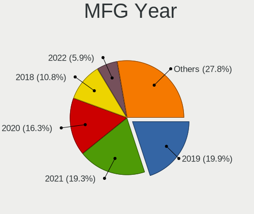
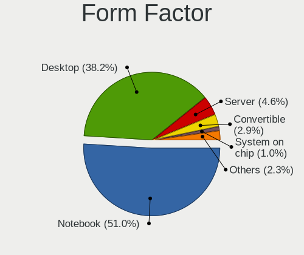
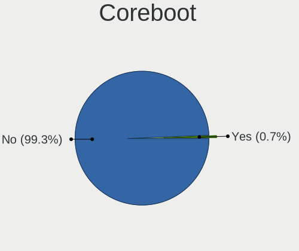
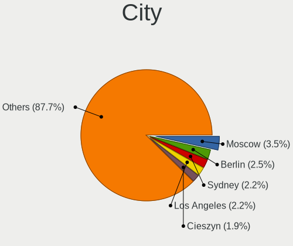
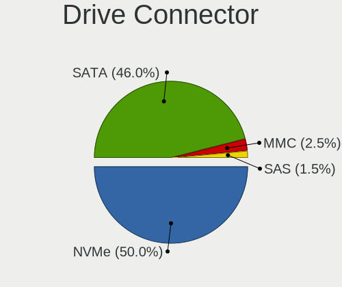
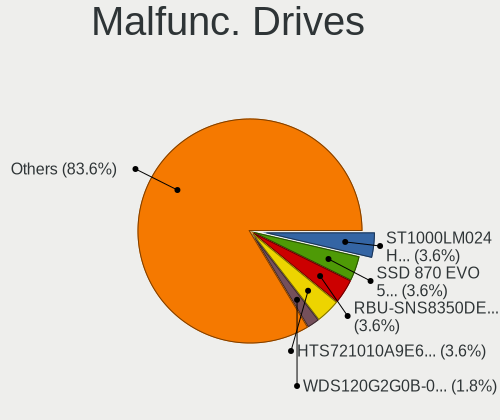
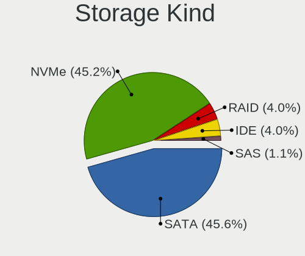
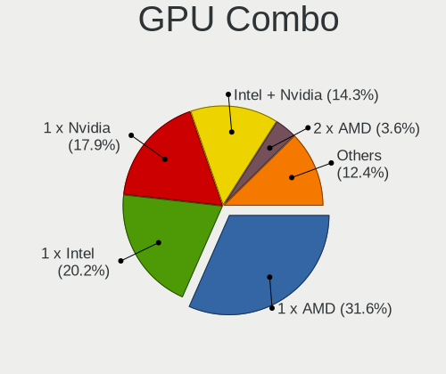
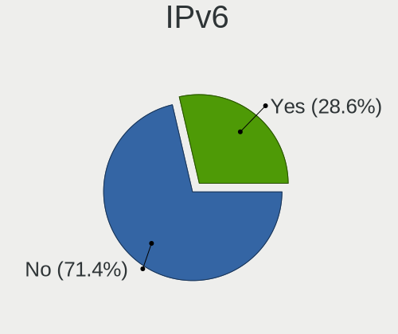
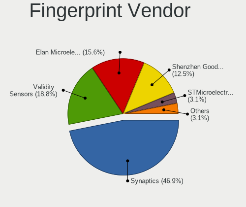

Gentoo 2.8 - Tested Hardware & Statistics
-----------------------------------------

A project to collect tested hardware configurations for Gentoo 2.8.

Anyone can contribute to this report by the [hw-probe](https://github.com/linuxhw/hw-probe) tool:

    sudo -E hw-probe -all -upload

Please contribute! Especially if your hardware is rare.

This is a report for all computer types. See also reports for [desktops](/Dist/Gentoo_2.8/Desktop/README.md) and [notebooks](/Dist/Gentoo_2.8/Notebook/README.md).

Contents
--------

* [ Test Cases ](#test-cases)

* [ System ](#system)
  - [ Kernel                   ](#kernel)
  - [ Kernel Family            ](#kernel-family)
  - [ Kernel Major Ver.        ](#kernel-major-ver)
  - [ Arch                     ](#arch)
  - [ DE                       ](#de)
  - [ Display Server           ](#display-server)
  - [ Display Manager          ](#display-manager)
  - [ OS Lang                  ](#os-lang)
  - [ Boot Mode                ](#boot-mode)
  - [ Filesystem               ](#filesystem)
  - [ Part. scheme             ](#part-scheme)
  - [ Dual Boot with Linux/BSD ](#dual-boot-with-linuxbsd)
  - [ Dual Boot (Win)          ](#dual-boot-win)

* [ Board ](#board)
  - [ Vendor                   ](#vendor)
  - [ Model                    ](#model)
  - [ Model Family             ](#model-family)
  - [ MFG Year                 ](#mfg-year)
  - [ Form Factor              ](#form-factor)
  - [ Secure Boot              ](#secure-boot)
  - [ Coreboot                 ](#coreboot)
  - [ RAM Size                 ](#ram-size)
  - [ RAM Used                 ](#ram-used)
  - [ Total Drives             ](#total-drives)
  - [ Has CD-ROM               ](#has-cd-rom)
  - [ Has Ethernet             ](#has-ethernet)
  - [ Has WiFi                 ](#has-wifi)
  - [ Has Bluetooth            ](#has-bluetooth)

* [ Location ](#location)
  - [ Country                  ](#country)
  - [ City                     ](#city)

* [ Drives ](#drives)
  - [ Drive Vendor             ](#drive-vendor)
  - [ Drive Model              ](#drive-model)
  - [ HDD Vendor               ](#hdd-vendor)
  - [ SSD Vendor               ](#ssd-vendor)
  - [ Drive Kind               ](#drive-kind)
  - [ Drive Connector          ](#drive-connector)
  - [ Drive Size               ](#drive-size)
  - [ Space Total              ](#space-total)
  - [ Space Used               ](#space-used)
  - [ Malfunc. Drives          ](#malfunc-drives)
  - [ Malfunc. Drive Vendor    ](#malfunc-drive-vendor)
  - [ Malfunc. HDD Vendor      ](#malfunc-hdd-vendor)
  - [ Malfunc. Drive Kind      ](#malfunc-drive-kind)
  - [ Failed Drives            ](#failed-drives)
  - [ Failed Drive Vendor      ](#failed-drive-vendor)
  - [ Drive Status             ](#drive-status)

* [ Storage controller ](#storage-controller)
  - [ Storage Vendor           ](#storage-vendor)
  - [ Storage Model            ](#storage-model)
  - [ Storage Kind             ](#storage-kind)

* [ Processor ](#processor)
  - [ CPU Vendor               ](#cpu-vendor)
  - [ CPU Model                ](#cpu-model)
  - [ CPU Model Family         ](#cpu-model-family)
  - [ CPU Cores                ](#cpu-cores)
  - [ CPU Sockets              ](#cpu-sockets)
  - [ CPU Threads              ](#cpu-threads)
  - [ CPU Op-Modes             ](#cpu-op-modes)
  - [ CPU Microcode            ](#cpu-microcode)
  - [ CPU Microarch            ](#cpu-microarch)

* [ Graphics ](#graphics)
  - [ GPU Vendor               ](#gpu-vendor)
  - [ GPU Model                ](#gpu-model)
  - [ GPU Combo                ](#gpu-combo)
  - [ GPU Driver               ](#gpu-driver)
  - [ GPU Memory               ](#gpu-memory)

* [ Monitor ](#monitor)
  - [ Monitor Vendor           ](#monitor-vendor)
  - [ Monitor Model            ](#monitor-model)
  - [ Monitor Resolution       ](#monitor-resolution)
  - [ Monitor Diagonal         ](#monitor-diagonal)
  - [ Monitor Width            ](#monitor-width)
  - [ Aspect Ratio             ](#aspect-ratio)
  - [ Monitor Area             ](#monitor-area)
  - [ Pixel Density            ](#pixel-density)
  - [ Multiple Monitors        ](#multiple-monitors)

* [ Network ](#network)
  - [ Net Controller Vendor    ](#net-controller-vendor)
  - [ Net Controller Model     ](#net-controller-model)
  - [ Wireless Vendor          ](#wireless-vendor)
  - [ Wireless Model           ](#wireless-model)
  - [ Ethernet Vendor          ](#ethernet-vendor)
  - [ Ethernet Model           ](#ethernet-model)
  - [ Net Controller Kind      ](#net-controller-kind)
  - [ Used Controller          ](#used-controller)
  - [ NICs                     ](#nics)
  - [ IPv6                     ](#ipv6)

* [ Bluetooth ](#bluetooth)
  - [ Bluetooth Vendor         ](#bluetooth-vendor)
  - [ Bluetooth Model          ](#bluetooth-model)

* [ Sound ](#sound)
  - [ Sound Vendor             ](#sound-vendor)
  - [ Sound Model              ](#sound-model)

* [ Memory ](#memory)
  - [ Memory Vendor            ](#memory-vendor)
  - [ Memory Model             ](#memory-model)
  - [ Memory Kind              ](#memory-kind)
  - [ Memory Form Factor       ](#memory-form-factor)
  - [ Memory Size              ](#memory-size)
  - [ Memory Speed             ](#memory-speed)

* [ Printers & scanners ](#printers--scanners)
  - [ Printer Vendor           ](#printer-vendor)
  - [ Printer Model            ](#printer-model)
  - [ Scanner Vendor           ](#scanner-vendor)
  - [ Scanner Model            ](#scanner-model)

* [ Camera ](#camera)
  - [ Camera Vendor            ](#camera-vendor)
  - [ Camera Model             ](#camera-model)

* [ Security ](#security)
  - [ Fingerprint Vendor       ](#fingerprint-vendor)
  - [ Fingerprint Model        ](#fingerprint-model)
  - [ Chipcard Vendor          ](#chipcard-vendor)
  - [ Chipcard Model           ](#chipcard-model)

* [ Unsupported ](#unsupported)
  - [ Unsupported Devices      ](#unsupported-devices)
  - [ Unsupported Device Types ](#unsupported-device-types)

Test Cases
----------

Total: 483

| Vendor        | Model                       | Form-Factor | Probe                                                      | Date         |
|---------------|-----------------------------|-------------|------------------------------------------------------------|--------------|
| Raspberry ... | Raspberry Pi                | Soc         | [a5030d74d4](https://linux-hardware.org/?probe=a5030d74d4) | Dec 31, 2022 |
| HP            | 250 G7 Notebook PC          | Notebook    | [ec6b0e70a2](https://linux-hardware.org/?probe=ec6b0e70a2) | Dec 21, 2022 |
| Acer          | Predator PH315-51           | Notebook    | [34676168fa](https://linux-hardware.org/?probe=34676168fa) | Dec 14, 2022 |
| Acer          | Predator PH315-51           | Notebook    | [0f9b4ae170](https://linux-hardware.org/?probe=0f9b4ae170) | Dec 14, 2022 |
| HUAWEI        | NBLB-WAX9N                  | Notebook    | [7541ce9ac6](https://linux-hardware.org/?probe=7541ce9ac6) | Dec 11, 2022 |
| HUAWEI        | NBLB-WAX9N                  | Notebook    | [9fec7bdfdc](https://linux-hardware.org/?probe=9fec7bdfdc) | Dec 04, 2022 |
| Apple         | Mac-F221BEC8                | Desktop     | [f2fe1d140e](https://linux-hardware.org/?probe=f2fe1d140e) | Nov 26, 2022 |
| Razer         | Blade Pro                   | Notebook    | [dabfd64904](https://linux-hardware.org/?probe=dabfd64904) | Nov 25, 2022 |
| ASUSTek       | M3A78-CM                    | Desktop     | [74a3983b1e](https://linux-hardware.org/?probe=74a3983b1e) | Nov 18, 2022 |
| Unknown       | Unknown                     | Notebook    | [f3222cf843](https://linux-hardware.org/?probe=f3222cf843) | Nov 16, 2022 |
| Unknown       | Unknown                     | Notebook    | [9217d900c4](https://linux-hardware.org/?probe=9217d900c4) | Nov 16, 2022 |
| ASUSTek       | X510UNR                     | Notebook    | [dea1636b05](https://linux-hardware.org/?probe=dea1636b05) | Nov 15, 2022 |
| ASUSTek       | X510UNR                     | Notebook    | [9ed613b632](https://linux-hardware.org/?probe=9ed613b632) | Nov 15, 2022 |
| Lenovo        | Yoga Slim 7 Pro 14IAH7 8... | Notebook    | [1798f04a0b](https://linux-hardware.org/?probe=1798f04a0b) | Nov 14, 2022 |
| ASUSTek       | ROG Zephyrus M16 GU603ZM... | Notebook    | [346303c711](https://linux-hardware.org/?probe=346303c711) | Nov 14, 2022 |
| Lenovo        | Yoga Slim 7 Pro 14IAH7 8... | Notebook    | [64fb474239](https://linux-hardware.org/?probe=64fb474239) | Nov 14, 2022 |
| Gigabyte      | AB350-Gaming-CF             | Desktop     | [7f21362848](https://linux-hardware.org/?probe=7f21362848) | Nov 14, 2022 |
| Lenovo        | ThinkPad S2 3rd Gen 20L1... | Notebook    | [2e29461f3b](https://linux-hardware.org/?probe=2e29461f3b) | Nov 13, 2022 |
| Apple         | Mac-F221BEC8                | Desktop     | [cd18d68895](https://linux-hardware.org/?probe=cd18d68895) | Nov 13, 2022 |
| Supermicro    | X10DRT-P                    | Server      | [a56f11112b](https://linux-hardware.org/?probe=a56f11112b) | Nov 13, 2022 |
| Lenovo        | V15 G2 ALC 82KD             | Notebook    | [fa18a7779e](https://linux-hardware.org/?probe=fa18a7779e) | Nov 13, 2022 |
| ASUSTek       | ROG Strix G513QY_G513QY     | Notebook    | [9db585ddc5](https://linux-hardware.org/?probe=9db585ddc5) | Nov 11, 2022 |
| Dell          | Precision 5540              | Notebook    | [2d459a448d](https://linux-hardware.org/?probe=2d459a448d) | Nov 09, 2022 |
| ASUSTek       | M3A78-CM                    | Desktop     | [a8f533624d](https://linux-hardware.org/?probe=a8f533624d) | Nov 08, 2022 |
| Dell          | G3 3500                     | Notebook    | [d3ae8a9d72](https://linux-hardware.org/?probe=d3ae8a9d72) | Nov 07, 2022 |
| Gigabyte      | AB350-Gaming-CF             | Desktop     | [159ca02eca](https://linux-hardware.org/?probe=159ca02eca) | Nov 07, 2022 |
| Lenovo        | ThinkPad X1 Carbon 7th 2... | Notebook    | [972094820e](https://linux-hardware.org/?probe=972094820e) | Nov 07, 2022 |
| ASRock        | B550 Extreme4               | Desktop     | [16154018bb](https://linux-hardware.org/?probe=16154018bb) | Nov 06, 2022 |
| Lenovo        | ThinkPad L14 Gen 1 20U50... | Notebook    | [d238949b9f](https://linux-hardware.org/?probe=d238949b9f) | Nov 06, 2022 |
| Unknown       | X79-P3                      | Desktop     | [f069ed7bd9](https://linux-hardware.org/?probe=f069ed7bd9) | Nov 04, 2022 |
| MSI           | H310M PRO-VDH PLUS          | Desktop     | [7b65a89d4f](https://linux-hardware.org/?probe=7b65a89d4f) | Nov 04, 2022 |
| ASUSTek       | ROG Maximus XI HERO         | Desktop     | [9a7d0e6d37](https://linux-hardware.org/?probe=9a7d0e6d37) | Nov 03, 2022 |
| ASUSTek       | ROG Maximus XI HERO         | Desktop     | [81a04d40a3](https://linux-hardware.org/?probe=81a04d40a3) | Nov 03, 2022 |
| Lenovo        | ThinkPad S2 3rd Gen 20L1... | Notebook    | [dda5d2dd10](https://linux-hardware.org/?probe=dda5d2dd10) | Nov 03, 2022 |
| Gigabyte      | Z370 AORUS Ultra Gaming-... | Desktop     | [953e399168](https://linux-hardware.org/?probe=953e399168) | Nov 03, 2022 |
| Lenovo        | ThinkPad S2 3rd Gen 20L1... | Notebook    | [c0f68304d1](https://linux-hardware.org/?probe=c0f68304d1) | Nov 03, 2022 |
| Acer          | Nitro AN515-43              | Notebook    | [8ca3bfde82](https://linux-hardware.org/?probe=8ca3bfde82) | Nov 02, 2022 |
| ASUSTek       | N55SF                       | Notebook    | [02af74ebb6](https://linux-hardware.org/?probe=02af74ebb6) | Nov 02, 2022 |
| Dell          | G3 3500                     | Notebook    | [c595a16f59](https://linux-hardware.org/?probe=c595a16f59) | Nov 02, 2022 |
| ASRock        | N68C-GS UCC                 | Desktop     | [9430ecf81c](https://linux-hardware.org/?probe=9430ecf81c) | Nov 02, 2022 |
| Lenovo        | ThinkPad S2 3rd Gen 20L1... | Notebook    | [48c0ef6251](https://linux-hardware.org/?probe=48c0ef6251) | Nov 02, 2022 |
| ASUSTek       | M3A78-CM                    | Desktop     | [5f81698e9a](https://linux-hardware.org/?probe=5f81698e9a) | Nov 02, 2022 |
| Lenovo        | ThinkPad S2 3rd Gen 20L1... | Notebook    | [1cc623c804](https://linux-hardware.org/?probe=1cc623c804) | Nov 01, 2022 |
| Lenovo        | ThinkPad E15 Gen 2 20T80... | Notebook    | [310895b721](https://linux-hardware.org/?probe=310895b721) | Nov 01, 2022 |
| MSI           | MEG X570 UNIFY              | Desktop     | [1a88842782](https://linux-hardware.org/?probe=1a88842782) | Nov 01, 2022 |
| Gigabyte      | X570 AORUS ELITE            | Desktop     | [966eb5bb18](https://linux-hardware.org/?probe=966eb5bb18) | Oct 31, 2022 |
| Gigabyte      | X570 AORUS ELITE            | Desktop     | [860f45c4c1](https://linux-hardware.org/?probe=860f45c4c1) | Oct 31, 2022 |
| Gigabyte      | AB350-Gaming-CF             | Desktop     | [c085788e44](https://linux-hardware.org/?probe=c085788e44) | Oct 31, 2022 |
| Lenovo        | ThinkPad Z16 Gen 1 21D4C... | Notebook    | [2e39c3ce92](https://linux-hardware.org/?probe=2e39c3ce92) | Oct 30, 2022 |
| Dell          | Vostro 5490                 | Notebook    | [057163f0e4](https://linux-hardware.org/?probe=057163f0e4) | Oct 29, 2022 |
| Lenovo        | ThinkPad E15 Gen 2 20T9S... | Notebook    | [42fcb880db](https://linux-hardware.org/?probe=42fcb880db) | Oct 29, 2022 |
| Lenovo        | ThinkPad E15 Gen 2 20T9S... | Notebook    | [242fbb2c79](https://linux-hardware.org/?probe=242fbb2c79) | Oct 29, 2022 |
| ASUSTek       | ROG STRIX X570-E GAMING     | Desktop     | [98fe919d0e](https://linux-hardware.org/?probe=98fe919d0e) | Oct 29, 2022 |
| ASUSTek       | ROG STRIX X570-E GAMING     | Desktop     | [9a6e9239e1](https://linux-hardware.org/?probe=9a6e9239e1) | Oct 29, 2022 |
| Lenovo        | ThinkPad E15 Gen 2 20T9S... | Notebook    | [7800fc7b5b](https://linux-hardware.org/?probe=7800fc7b5b) | Oct 29, 2022 |
| Gigabyte      | X570 AORUS ELITE            | Desktop     | [836d9e4de1](https://linux-hardware.org/?probe=836d9e4de1) | Oct 29, 2022 |
| Gigabyte      | X570 AORUS ELITE            | Desktop     | [b7b7481628](https://linux-hardware.org/?probe=b7b7481628) | Oct 29, 2022 |
| Acer          | AOD257                      | Notebook    | [d3efba72cc](https://linux-hardware.org/?probe=d3efba72cc) | Oct 28, 2022 |
| Dell          | Vostro 5490                 | Notebook    | [ac6587adbb](https://linux-hardware.org/?probe=ac6587adbb) | Oct 27, 2022 |
| Acer          | AOD257                      | Notebook    | [c399f9db2b](https://linux-hardware.org/?probe=c399f9db2b) | Oct 27, 2022 |
| HUAWEI        | NBLK-WAX9X                  | Notebook    | [a44f774778](https://linux-hardware.org/?probe=a44f774778) | Oct 27, 2022 |
| ASUSTek       | PRIME B550M-A               | Desktop     | [64e6199c96](https://linux-hardware.org/?probe=64e6199c96) | Oct 25, 2022 |
| HP            | Pavilion Notebook           | Notebook    | [35cf015c33](https://linux-hardware.org/?probe=35cf015c33) | Oct 25, 2022 |
| ASUSTek       | ROG STRIX X670E-E GAMING... | Desktop     | [cc2fc1e863](https://linux-hardware.org/?probe=cc2fc1e863) | Oct 24, 2022 |
| ASUSTek       | M3A78-CM                    | Desktop     | [ce77ed764b](https://linux-hardware.org/?probe=ce77ed764b) | Oct 24, 2022 |
| Gigabyte      | AB350-Gaming-CF             | Desktop     | [d18380bf4c](https://linux-hardware.org/?probe=d18380bf4c) | Oct 24, 2022 |
| Gigabyte      | TRX40 DESIGNARE             | Desktop     | [16f90b14dc](https://linux-hardware.org/?probe=16f90b14dc) | Oct 22, 2022 |
| ASUSTek       | TUF Gaming X570-PLUS        | Desktop     | [b89b177dd7](https://linux-hardware.org/?probe=b89b177dd7) | Oct 22, 2022 |
| Lenovo        | Yoga C940-14IIL 81Q9        | Convertible | [80032ce2ea](https://linux-hardware.org/?probe=80032ce2ea) | Oct 22, 2022 |
| HP            | EliteBook 840 G7 Noteboo... | Notebook    | [cb901021a7](https://linux-hardware.org/?probe=cb901021a7) | Oct 21, 2022 |
| Lenovo        | ThinkPad R500 2714CTO       | Notebook    | [77de0f71bd](https://linux-hardware.org/?probe=77de0f71bd) | Oct 21, 2022 |
| Gigabyte      | F2A88XM-DS2                 | Desktop     | [d066cccd5a](https://linux-hardware.org/?probe=d066cccd5a) | Oct 19, 2022 |
| Notebook      | NS50_70MU                   | Notebook    | [0f13ae1769](https://linux-hardware.org/?probe=0f13ae1769) | Oct 19, 2022 |
| Lenovo        | ThinkPad R500 2714CTO       | Notebook    | [e480e5d6ae](https://linux-hardware.org/?probe=e480e5d6ae) | Oct 18, 2022 |
| Lenovo        | IdeaPad S145-15IWL 81MV     | Notebook    | [4644a299f3](https://linux-hardware.org/?probe=4644a299f3) | Oct 18, 2022 |
| Dell          | Precision 7760              | Notebook    | [44b60a4fcf](https://linux-hardware.org/?probe=44b60a4fcf) | Oct 18, 2022 |
| MSI           | B450M PRO-VDH MAX           | Desktop     | [71ab3d919c](https://linux-hardware.org/?probe=71ab3d919c) | Oct 18, 2022 |
| Sony          | PCG-GRT230(UC)              | Notebook    | [b33a31225b](https://linux-hardware.org/?probe=b33a31225b) | Oct 18, 2022 |
| HP            | Laptop 14-dk1xxx            | Notebook    | [caf126d0af](https://linux-hardware.org/?probe=caf126d0af) | Oct 18, 2022 |
| Lenovo        | IdeaPad S145-15IWL 81MV     | Notebook    | [41d3e4e97d](https://linux-hardware.org/?probe=41d3e4e97d) | Oct 17, 2022 |
| ASUSTek       | TUF Gaming FX705GD_FX705... | Notebook    | [6243f8cdb8](https://linux-hardware.org/?probe=6243f8cdb8) | Oct 17, 2022 |
| Dell          | G3 3500                     | Notebook    | [64698d52bb](https://linux-hardware.org/?probe=64698d52bb) | Oct 17, 2022 |
| Dell          | G3 3500                     | Notebook    | [902fc2d51b](https://linux-hardware.org/?probe=902fc2d51b) | Oct 17, 2022 |
| HP            | EliteBook 840 G7 Noteboo... | Notebook    | [926d661756](https://linux-hardware.org/?probe=926d661756) | Oct 17, 2022 |
| ASUSTek       | M3A78-CM                    | Desktop     | [e8377da07e](https://linux-hardware.org/?probe=e8377da07e) | Oct 17, 2022 |
| Dell          | XPS 15 7590                 | Notebook    | [f60fd55235](https://linux-hardware.org/?probe=f60fd55235) | Oct 16, 2022 |
| Supermicro    | X10SL7-F                    | Server      | [8bfcad8486](https://linux-hardware.org/?probe=8bfcad8486) | Oct 16, 2022 |
| Gigabyte      | Z370 AORUS Gaming 5-CF      | Desktop     | [843e47e886](https://linux-hardware.org/?probe=843e47e886) | Oct 14, 2022 |
| Dell          | G3 3500                     | Notebook    | [f7cc47bb67](https://linux-hardware.org/?probe=f7cc47bb67) | Oct 13, 2022 |
| MSI           | Pulse GL66 11UGK            | Notebook    | [d71c1d033a](https://linux-hardware.org/?probe=d71c1d033a) | Oct 13, 2022 |
| MSI           | Pulse GL66 11UGK            | Notebook    | [07783bd6a7](https://linux-hardware.org/?probe=07783bd6a7) | Oct 13, 2022 |
| ASUSTek       | M4A89GTD-PRO/USB3           | Desktop     | [f57f16d11b](https://linux-hardware.org/?probe=f57f16d11b) | Oct 13, 2022 |
| ASUSTek       | M4A89GTD-PRO/USB3           | Desktop     | [55e6578ade](https://linux-hardware.org/?probe=55e6578ade) | Oct 13, 2022 |
| Gigabyte      | H81M-H                      | Desktop     | [63731688d0](https://linux-hardware.org/?probe=63731688d0) | Oct 13, 2022 |
| HP            | EliteBook 830 G6            | Notebook    | [0dc42d7e5e](https://linux-hardware.org/?probe=0dc42d7e5e) | Oct 12, 2022 |
| Notebook      | NS5x_NS7xPU                 | Notebook    | [b35f6c63de](https://linux-hardware.org/?probe=b35f6c63de) | Oct 12, 2022 |
| HP            | 2B26 A01                    | All in one  | [dec1b9e40f](https://linux-hardware.org/?probe=dec1b9e40f) | Oct 12, 2022 |
| HP            | 2B26 A01                    | All in one  | [3a0980d3d4](https://linux-hardware.org/?probe=3a0980d3d4) | Oct 12, 2022 |
| ASUSTek       | ROG Flow X13 GV301RE_GV3... | Convertible | [c88027a227](https://linux-hardware.org/?probe=c88027a227) | Oct 11, 2022 |
| IBM           | ThinkPad T42 2373K1U        | Notebook    | [934a3226e9](https://linux-hardware.org/?probe=934a3226e9) | Oct 11, 2022 |
| Lenovo        | IdeaPad 5 15ITL05 82FG      | Notebook    | [1ae81569dd](https://linux-hardware.org/?probe=1ae81569dd) | Oct 11, 2022 |
| ASUSTek       | ROG STRIX X670E-I GAMING... | Desktop     | [11fb952122](https://linux-hardware.org/?probe=11fb952122) | Oct 10, 2022 |
| Intel Clie... | LAPBC710                    | Notebook    | [42b7bc6ee4](https://linux-hardware.org/?probe=42b7bc6ee4) | Oct 10, 2022 |
| ASUSTek       | M3A78-CM                    | Desktop     | [b04149c5ea](https://linux-hardware.org/?probe=b04149c5ea) | Oct 10, 2022 |
| Gigabyte      | AB350-Gaming-CF             | Desktop     | [d7bcf0afa3](https://linux-hardware.org/?probe=d7bcf0afa3) | Oct 09, 2022 |
| Valve         | Jupiter                     | Notebook    | [1c71987bd5](https://linux-hardware.org/?probe=1c71987bd5) | Oct 08, 2022 |
| Intel Clie... | LAPBC710                    | Notebook    | [bacb30816f](https://linux-hardware.org/?probe=bacb30816f) | Oct 07, 2022 |
| ASUSTek       | ProArt Studiobook H7600Z... | Notebook    | [5db7aac5d3](https://linux-hardware.org/?probe=5db7aac5d3) | Oct 07, 2022 |
| HP            | Laptop 15-ra0xx             | Notebook    | [d81190b4e7](https://linux-hardware.org/?probe=d81190b4e7) | Oct 06, 2022 |
| ASUSTek       | T101HA                      | Tablet      | [237fe18fcd](https://linux-hardware.org/?probe=237fe18fcd) | Oct 05, 2022 |
| Alienware     | x14                         | Notebook    | [ad37874de1](https://linux-hardware.org/?probe=ad37874de1) | Oct 05, 2022 |
| Quanta        | S210-X12MS 31S2MMB0040      | Server      | [73fb38c162](https://linux-hardware.org/?probe=73fb38c162) | Oct 05, 2022 |
| ASUSTek       | M3A78-CM                    | Desktop     | [6437ed8b0e](https://linux-hardware.org/?probe=6437ed8b0e) | Oct 03, 2022 |
| Gigabyte      | AB350-Gaming-CF             | Desktop     | [60bab6fe12](https://linux-hardware.org/?probe=60bab6fe12) | Oct 02, 2022 |
| Sony          | PCG-GRT230(UC)              | Notebook    | [cab24d4c04](https://linux-hardware.org/?probe=cab24d4c04) | Oct 01, 2022 |
| ASUSTek       | Zenbook UM5302TA_UM5302T... | Notebook    | [1cfda531dd](https://linux-hardware.org/?probe=1cfda531dd) | Oct 01, 2022 |
| HP            | Laptop 15s-eq2xxx           | Notebook    | [6d9c960574](https://linux-hardware.org/?probe=6d9c960574) | Sep 28, 2022 |
| HP            | Laptop 14-dk1xxx            | Notebook    | [4479784a2e](https://linux-hardware.org/?probe=4479784a2e) | Sep 28, 2022 |
| HP            | Laptop 14-dk1xxx            | Notebook    | [d0808e8abe](https://linux-hardware.org/?probe=d0808e8abe) | Sep 27, 2022 |
| ASUSTek       | ROG STRIX Z590-E GAMING ... | Desktop     | [b3b8d3e04f](https://linux-hardware.org/?probe=b3b8d3e04f) | Sep 26, 2022 |
| ASUSTek       | ROG STRIX Z590-E GAMING ... | Desktop     | [9795d4f9aa](https://linux-hardware.org/?probe=9795d4f9aa) | Sep 26, 2022 |
| ASUSTek       | M3A78-CM                    | Desktop     | [6d3f575c3d](https://linux-hardware.org/?probe=6d3f575c3d) | Sep 26, 2022 |
| Sony          | PCG-GRT230(UC)              | Notebook    | [af843c265c](https://linux-hardware.org/?probe=af843c265c) | Sep 26, 2022 |
| Gigabyte      | AB350-Gaming-CF             | Desktop     | [c447921f07](https://linux-hardware.org/?probe=c447921f07) | Sep 25, 2022 |
| Lenovo        | ThinkPad P73 20QRS0G700     | Notebook    | [b32a413aa9](https://linux-hardware.org/?probe=b32a413aa9) | Sep 25, 2022 |
| Lenovo        | Yoga 310-11IAP 80U2         | Convertible | [6c8a53f608](https://linux-hardware.org/?probe=6c8a53f608) | Sep 25, 2022 |
| Lenovo        | ThinkPad P73 20QRS0G700     | Notebook    | [6ea4c40a80](https://linux-hardware.org/?probe=6ea4c40a80) | Sep 25, 2022 |
| ASRock        | J3160M                      | Desktop     | [c9cc54f48e](https://linux-hardware.org/?probe=c9cc54f48e) | Sep 25, 2022 |
| HP            | EliteBook 830 G6            | Notebook    | [cdbc7c7949](https://linux-hardware.org/?probe=cdbc7c7949) | Sep 25, 2022 |
| Supermicro    | H11SSL-i                    | Server      | [dd3ce003e4](https://linux-hardware.org/?probe=dd3ce003e4) | Sep 25, 2022 |
| HP            | EliteBook 830 G6            | Notebook    | [907383d255](https://linux-hardware.org/?probe=907383d255) | Sep 25, 2022 |
| Matsushita... | CF-29LTQGZBM                | Notebook    | [29f52f862c](https://linux-hardware.org/?probe=29f52f862c) | Sep 24, 2022 |
| Lenovo        | ThinkPad E15 Gen 2 20T80... | Notebook    | [de7c138e21](https://linux-hardware.org/?probe=de7c138e21) | Sep 22, 2022 |
| Lenovo        | ThinkPad L580 20LWCTO1WW    | Notebook    | [a80367f777](https://linux-hardware.org/?probe=a80367f777) | Sep 21, 2022 |
| ASUSTek       | ROG STRIX X570-I GAMING     | Desktop     | [d22f082243](https://linux-hardware.org/?probe=d22f082243) | Sep 21, 2022 |
| ASUSTek       | ROG STRIX X570-I GAMING     | Desktop     | [e4f1a8245a](https://linux-hardware.org/?probe=e4f1a8245a) | Sep 21, 2022 |
| ASUSTek       | AM1M-A                      | Desktop     | [a6e61a9993](https://linux-hardware.org/?probe=a6e61a9993) | Sep 19, 2022 |
| ASUSTek       | M3A78-CM                    | Desktop     | [eb1c0556c3](https://linux-hardware.org/?probe=eb1c0556c3) | Sep 19, 2022 |
| Gigabyte      | AB350-Gaming-CF             | Desktop     | [5a9ab0de04](https://linux-hardware.org/?probe=5a9ab0de04) | Sep 18, 2022 |
| System76      | Gazelle Professional        | Notebook    | [95f19a0c4c](https://linux-hardware.org/?probe=95f19a0c4c) | Sep 18, 2022 |
| ASUSTek       | ROG STRIX B550-F GAMING     | Desktop     | [d4d8cc3f34](https://linux-hardware.org/?probe=d4d8cc3f34) | Sep 16, 2022 |
| Dell          | G7 7588                     | Notebook    | [583c4a4c91](https://linux-hardware.org/?probe=583c4a4c91) | Sep 16, 2022 |
| Gigabyte      | Z590 UD                     | Desktop     | [475ed7f917](https://linux-hardware.org/?probe=475ed7f917) | Sep 15, 2022 |
| ASUSTek       | ROG STRIX B450-F GAMING     | Desktop     | [7ad1180946](https://linux-hardware.org/?probe=7ad1180946) | Sep 14, 2022 |
| Timi          | TM1604                      | Notebook    | [80f52c9545](https://linux-hardware.org/?probe=80f52c9545) | Sep 14, 2022 |
| HUAWEI        | KLVL-WXX9                   | Notebook    | [7bc7cbca76](https://linux-hardware.org/?probe=7bc7cbca76) | Sep 12, 2022 |
| ASUSTek       | M3A78-CM                    | Desktop     | [225bd59ba7](https://linux-hardware.org/?probe=225bd59ba7) | Sep 12, 2022 |
| Gigabyte      | AB350-Gaming-CF             | Desktop     | [ed5273b278](https://linux-hardware.org/?probe=ed5273b278) | Sep 11, 2022 |
| Intel         | X79G V2.x                   | Desktop     | [3cb7aa6549](https://linux-hardware.org/?probe=3cb7aa6549) | Sep 11, 2022 |
| MSI           | B450M MORTAR                | Desktop     | [2e0d41f272](https://linux-hardware.org/?probe=2e0d41f272) | Sep 10, 2022 |
| MSI           | B450M MORTAR                | Desktop     | [06ee689632](https://linux-hardware.org/?probe=06ee689632) | Sep 10, 2022 |
| ASUSTek       | ROG CROSSHAIR VIII HERO     | Desktop     | [5cfe072b9c](https://linux-hardware.org/?probe=5cfe072b9c) | Sep 10, 2022 |
| ASRock        | Z390 Phantom Gaming 4S      | Desktop     | [146e7ebf49](https://linux-hardware.org/?probe=146e7ebf49) | Sep 08, 2022 |
| Gigabyte      | B660 GAMING X AX DDR4       | Desktop     | [3d12a72937](https://linux-hardware.org/?probe=3d12a72937) | Sep 06, 2022 |
| MSI           | B450 TOMAHAWK MAX II        | Desktop     | [cc1fde17e8](https://linux-hardware.org/?probe=cc1fde17e8) | Sep 06, 2022 |
| Dell          | Latitude D410               | Notebook    | [6782e0a28f](https://linux-hardware.org/?probe=6782e0a28f) | Sep 05, 2022 |
| Acer          | Swift SF314-42              | Notebook    | [12fbd247f5](https://linux-hardware.org/?probe=12fbd247f5) | Sep 05, 2022 |
| Gigabyte      | AB350-Gaming-CF             | Desktop     | [1d90e3b685](https://linux-hardware.org/?probe=1d90e3b685) | Sep 05, 2022 |
| Lenovo        | ThinkPad T14 Gen 3 21AH0... | Notebook    | [88392a79f5](https://linux-hardware.org/?probe=88392a79f5) | Sep 04, 2022 |
| win elemen... | MoreFine S500+              | Notebook    | [d02a951b89](https://linux-hardware.org/?probe=d02a951b89) | Sep 04, 2022 |
| Lenovo        | ThinkPad E15 Gen 2 20T80... | Notebook    | [8320ded55c](https://linux-hardware.org/?probe=8320ded55c) | Sep 02, 2022 |
| Lenovo        | ThinkPad E15 Gen 2 20T80... | Notebook    | [e16313490d](https://linux-hardware.org/?probe=e16313490d) | Sep 01, 2022 |
| Toshiba       | Satellite C850D-118         | Notebook    | [1950f0aeac](https://linux-hardware.org/?probe=1950f0aeac) | Aug 31, 2022 |
| ASUSTek       | M3A78-CM                    | Desktop     | [d146908413](https://linux-hardware.org/?probe=d146908413) | Aug 31, 2022 |
| Toshiba       | Satellite C850D-118         | Notebook    | [07000e4194](https://linux-hardware.org/?probe=07000e4194) | Aug 30, 2022 |
| Lenovo        | ThinkPad P50 20EQS33R0J     | Notebook    | [72f6962ac8](https://linux-hardware.org/?probe=72f6962ac8) | Aug 30, 2022 |
| ASRock        | X370 Gaming X               | Desktop     | [e915bb3a8c](https://linux-hardware.org/?probe=e915bb3a8c) | Aug 29, 2022 |
| win elemen... | MoreFine S500+              | Notebook    | [5a51c31ac9](https://linux-hardware.org/?probe=5a51c31ac9) | Aug 29, 2022 |
| Eluktronic... | MAX-17                      | Notebook    | [627ecbeb36](https://linux-hardware.org/?probe=627ecbeb36) | Aug 29, 2022 |
| Dell          | Precision 3570              | Notebook    | [7f7a44c923](https://linux-hardware.org/?probe=7f7a44c923) | Aug 29, 2022 |
| Timi          | A35                         | Notebook    | [df50ea1876](https://linux-hardware.org/?probe=df50ea1876) | Aug 29, 2022 |
| Gigabyte      | AB350-Gaming-CF             | Desktop     | [499889da7e](https://linux-hardware.org/?probe=499889da7e) | Aug 28, 2022 |
| ASRock        | X370 Gaming X               | Desktop     | [489691c2e3](https://linux-hardware.org/?probe=489691c2e3) | Aug 28, 2022 |
| Lenovo        | ThinkPad L15 Gen 2a 20X7... | Notebook    | [f30320f76e](https://linux-hardware.org/?probe=f30320f76e) | Aug 27, 2022 |
| Lenovo        | 3716 SDK0R32862 WIN 3258... | Desktop     | [7e810b23be](https://linux-hardware.org/?probe=7e810b23be) | Aug 26, 2022 |
| Lenovo        | ThinkBook 13s G2 ITL 20V... | Notebook    | [cf7da7df12](https://linux-hardware.org/?probe=cf7da7df12) | Aug 26, 2022 |
| Lenovo        | ThinkBook 13s G2 ITL 20V... | Notebook    | [76db86107b](https://linux-hardware.org/?probe=76db86107b) | Aug 26, 2022 |
| Lenovo        | Yoga S940-14IWL 81Q7        | Notebook    | [416e5db831](https://linux-hardware.org/?probe=416e5db831) | Aug 26, 2022 |
| Lenovo        | ThinkPad Yoga 460 20EMCT... | Convertible | [73c79e8944](https://linux-hardware.org/?probe=73c79e8944) | Aug 25, 2022 |
| Gigabyte      | Z77X-D3H                    | Desktop     | [294fe7d6c8](https://linux-hardware.org/?probe=294fe7d6c8) | Aug 24, 2022 |
| Gigabyte      | Z77X-D3H                    | Desktop     | [2952e542e1](https://linux-hardware.org/?probe=2952e542e1) | Aug 24, 2022 |
| ASUSTek       | TUF Gaming X570-PLUS        | Desktop     | [0df091061c](https://linux-hardware.org/?probe=0df091061c) | Aug 24, 2022 |
| ASUSTek       | M3A78-CM                    | Desktop     | [d22f756c4c](https://linux-hardware.org/?probe=d22f756c4c) | Aug 24, 2022 |
| ASUSTek       | TUF Gaming X570-PLUS        | Desktop     | [0c80683e2a](https://linux-hardware.org/?probe=0c80683e2a) | Aug 23, 2022 |
| Gigabyte      | AB350-Gaming-CF             | Desktop     | [f38202db0d](https://linux-hardware.org/?probe=f38202db0d) | Aug 21, 2022 |
| MSI           | Z590-A PRO                  | Desktop     | [8445aa0041](https://linux-hardware.org/?probe=8445aa0041) | Aug 20, 2022 |
| Timi          | A35                         | Notebook    | [cf89c68d08](https://linux-hardware.org/?probe=cf89c68d08) | Aug 19, 2022 |
| IBM           | 2722BDG                     | Notebook    | [e0fe2162a3](https://linux-hardware.org/?probe=e0fe2162a3) | Aug 18, 2022 |
| ASUSTek       | M3A78-CM                    | Desktop     | [1ea309e90c](https://linux-hardware.org/?probe=1ea309e90c) | Aug 17, 2022 |
| Gigabyte      | B450 GAMING X               | Desktop     | [80760b8e4b](https://linux-hardware.org/?probe=80760b8e4b) | Aug 16, 2022 |
| Dell          | G3 3500                     | Notebook    | [6a860d7c0f](https://linux-hardware.org/?probe=6a860d7c0f) | Aug 15, 2022 |
| Gigabyte      | AB350-Gaming-CF             | Desktop     | [48637ddb10](https://linux-hardware.org/?probe=48637ddb10) | Aug 14, 2022 |
| Purism        | Librem 15 v4                | Notebook    | [4448709e50](https://linux-hardware.org/?probe=4448709e50) | Aug 13, 2022 |
| Purism        | Librem 15 v4                | Notebook    | [9e76f9e7ff](https://linux-hardware.org/?probe=9e76f9e7ff) | Aug 13, 2022 |
| HP            | EliteBook 845 14 inch G9... | Notebook    | [ee6f495403](https://linux-hardware.org/?probe=ee6f495403) | Aug 13, 2022 |
| HP            | EliteBook 845 14 inch G9... | Notebook    | [289850f128](https://linux-hardware.org/?probe=289850f128) | Aug 13, 2022 |
| MSI           | B450 TOMAHAWK               | Desktop     | [8d95c82a1d](https://linux-hardware.org/?probe=8d95c82a1d) | Aug 12, 2022 |
| Timi          | A35                         | Notebook    | [944f3f0942](https://linux-hardware.org/?probe=944f3f0942) | Aug 12, 2022 |
| Lenovo        | ThinkPad L15 Gen 2a 20X7... | Notebook    | [166edbd7db](https://linux-hardware.org/?probe=166edbd7db) | Aug 12, 2022 |
| MSI           | B450 GAMING PRO CARBON A... | Desktop     | [7d7ceef044](https://linux-hardware.org/?probe=7d7ceef044) | Aug 12, 2022 |
| Acer          | Swift SF314-512             | Notebook    | [c374f64c25](https://linux-hardware.org/?probe=c374f64c25) | Aug 11, 2022 |
| Notebook      | N141CU                      | Notebook    | [4d96f7358c](https://linux-hardware.org/?probe=4d96f7358c) | Aug 10, 2022 |
| Acer          | Swift SF314-512             | Notebook    | [0c23760c27](https://linux-hardware.org/?probe=0c23760c27) | Aug 10, 2022 |
| Unknown       | QNAP TS-221                 | Desktop     | [8d3f7ca9cf](https://linux-hardware.org/?probe=8d3f7ca9cf) | Aug 10, 2022 |
| ASUSTek       | PRIME Z390-A                | Desktop     | [2781a13b80](https://linux-hardware.org/?probe=2781a13b80) | Aug 10, 2022 |
| ASUSTek       | ASUS TUF Gaming F17 FX70... | Notebook    | [9b228ae787](https://linux-hardware.org/?probe=9b228ae787) | Aug 10, 2022 |
| ASUSTek       | ASUS TUF Gaming F17 FX70... | Notebook    | [9f2e51f185](https://linux-hardware.org/?probe=9f2e51f185) | Aug 10, 2022 |
| ASRock        | P67 Extreme4 Gen3           | Desktop     | [b94e1be5ab](https://linux-hardware.org/?probe=b94e1be5ab) | Aug 09, 2022 |
| Lenovo        | Legion 5 Pro 16ACH6H 82J... | Notebook    | [0e7d0b5d33](https://linux-hardware.org/?probe=0e7d0b5d33) | Aug 09, 2022 |
| ASUSTek       | M3A78-CM                    | Desktop     | [1f10876798](https://linux-hardware.org/?probe=1f10876798) | Aug 08, 2022 |
| Microsoft     | Surface Go 3                | Tablet      | [f97852a196](https://linux-hardware.org/?probe=f97852a196) | Aug 08, 2022 |
| Lenovo        | ThinkPad Z16 Gen 1 21D40... | Notebook    | [78f846e0e5](https://linux-hardware.org/?probe=78f846e0e5) | Aug 08, 2022 |
| Gigabyte      | AB350-Gaming-CF             | Desktop     | [ac538e23dc](https://linux-hardware.org/?probe=ac538e23dc) | Aug 07, 2022 |
| Microsoft     | Surface Go 3                | Tablet      | [ca880d8154](https://linux-hardware.org/?probe=ca880d8154) | Aug 06, 2022 |
| ASUSTek       | TUF B450M-PLUS GAMING       | Desktop     | [3e7a65077d](https://linux-hardware.org/?probe=3e7a65077d) | Aug 06, 2022 |
| ASUSTek       | VivoBook_ASUSLaptop X421... | Notebook    | [2ff6a7fe85](https://linux-hardware.org/?probe=2ff6a7fe85) | Aug 06, 2022 |
| ASUSTek       | VivoBook_ASUSLaptop X421... | Notebook    | [d54acf14ff](https://linux-hardware.org/?probe=d54acf14ff) | Aug 06, 2022 |
| Toshiba       | NB100                       | Notebook    | [b91ee9b36b](https://linux-hardware.org/?probe=b91ee9b36b) | Aug 05, 2022 |
| HUAWEI        | HVY-WXX9                    | Notebook    | [019849a487](https://linux-hardware.org/?probe=019849a487) | Aug 04, 2022 |
| Gigabyte      | B450 GAMING X               | Desktop     | [b875ef6dbf](https://linux-hardware.org/?probe=b875ef6dbf) | Aug 04, 2022 |
| Lenovo        | ThinkPad T14 Gen 1 20S1S... | Notebook    | [4caa777a81](https://linux-hardware.org/?probe=4caa777a81) | Aug 04, 2022 |
| Pine Micro... | Pine64 PinePhonePro         | Phone       | [f14436327b](https://linux-hardware.org/?probe=f14436327b) | Aug 04, 2022 |
| Samsung       | 700G7C                      | Notebook    | [cd554f5d17](https://linux-hardware.org/?probe=cd554f5d17) | Aug 03, 2022 |
| ASUSTek       | ROG STRIX X570-E GAMING     | Desktop     | [3db1e1ee37](https://linux-hardware.org/?probe=3db1e1ee37) | Aug 03, 2022 |
| Pine Micro... | Pine64 PinePhonePro         | Phone       | [2cea7378e8](https://linux-hardware.org/?probe=2cea7378e8) | Aug 03, 2022 |
| Gigabyte      | B550M DS3H                  | Desktop     | [69188053f5](https://linux-hardware.org/?probe=69188053f5) | Aug 02, 2022 |
| ASRock        | B75M-GL R2.0                | Desktop     | [eed9f05678](https://linux-hardware.org/?probe=eed9f05678) | Aug 01, 2022 |
| Fanless Mi... | PCG02 GLE                   | Stick pc    | [19d2273e6b](https://linux-hardware.org/?probe=19d2273e6b) | Aug 01, 2022 |
| ASUSTek       | ROG Maximus Z690 EXTREME    | Desktop     | [effa59ed64](https://linux-hardware.org/?probe=effa59ed64) | Aug 01, 2022 |
| ASRock        | B550M Steel Legend          | Desktop     | [0ac4f27d0f](https://linux-hardware.org/?probe=0ac4f27d0f) | Jul 31, 2022 |
| ASUSTek       | TUF Gaming X570-PLUS        | Desktop     | [f22250f00c](https://linux-hardware.org/?probe=f22250f00c) | Jul 31, 2022 |
| TUXEDO        | InfinityBook Pro 14 Gen6    | Notebook    | [de9a854095](https://linux-hardware.org/?probe=de9a854095) | Jul 31, 2022 |
| ASUSTek       | M3A78-CM                    | Desktop     | [1051593809](https://linux-hardware.org/?probe=1051593809) | Jul 31, 2022 |
| Gigabyte      | 970A-DS3                    | Desktop     | [78f00bd2aa](https://linux-hardware.org/?probe=78f00bd2aa) | Jul 30, 2022 |
| Razer         | Blade 15 Studio Edition ... | Notebook    | [359f708604](https://linux-hardware.org/?probe=359f708604) | Jul 30, 2022 |
| Lenovo        | 1046 SDK0T08861 WIN 3305... | Desktop     | [d3d824f468](https://linux-hardware.org/?probe=d3d824f468) | Jul 29, 2022 |
| MSI           | B450M MORTAR                | Desktop     | [29a26324b9](https://linux-hardware.org/?probe=29a26324b9) | Jul 29, 2022 |
| ASUSTek       | ROG G703GI_G7BI             | Notebook    | [88a326be83](https://linux-hardware.org/?probe=88a326be83) | Jul 28, 2022 |
| Dell          | XPS 15 9570                 | Notebook    | [e7f56631b1](https://linux-hardware.org/?probe=e7f56631b1) | Jul 27, 2022 |
| Supermicro    | X10SRL-FB                   | Server      | [a8dc9cfc07](https://linux-hardware.org/?probe=a8dc9cfc07) | Jul 27, 2022 |
| Intel         | D54250WYK H13922-303        | Desktop     | [5ff32931fa](https://linux-hardware.org/?probe=5ff32931fa) | Jul 27, 2022 |
| MSI           | MPG Z390 GAMING PRO CARB... | Desktop     | [dc7eff27cf](https://linux-hardware.org/?probe=dc7eff27cf) | Jul 26, 2022 |
| Dell          | XPS 15 9570                 | Notebook    | [f3972b3a7d](https://linux-hardware.org/?probe=f3972b3a7d) | Jul 26, 2022 |
| Timi          | Mi Laptop Pro 15 2020       | Notebook    | [5455e664e0](https://linux-hardware.org/?probe=5455e664e0) | Jul 26, 2022 |
| HP            | EliteBook 845 G7 Noteboo... | Notebook    | [b15fb90c18](https://linux-hardware.org/?probe=b15fb90c18) | Jul 26, 2022 |
| ASRock        | X399 Taichi                 | Desktop     | [d2eb8a032b](https://linux-hardware.org/?probe=d2eb8a032b) | Jul 26, 2022 |
| ASUSTek       | ROG Maximus XI HERO         | Desktop     | [c98fed5f84](https://linux-hardware.org/?probe=c98fed5f84) | Jul 25, 2022 |
| ASUSTek       | ROG Maximus Z690 EXTREME    | Desktop     | [dae325b47b](https://linux-hardware.org/?probe=dae325b47b) | Jul 25, 2022 |
| Dell          | 0FKD45 A03                  | Server      | [0caba2e4b0](https://linux-hardware.org/?probe=0caba2e4b0) | Jul 25, 2022 |
| HP            | OMEN by Laptop 16-c0xxx     | Notebook    | [8f46b7dcca](https://linux-hardware.org/?probe=8f46b7dcca) | Jul 25, 2022 |
| HP            | Laptop 17-ca1xxx            | Notebook    | [64dad58b71](https://linux-hardware.org/?probe=64dad58b71) | Jul 25, 2022 |
| ASUSTek       | ROG Zephyrus G14 GA402RJ... | Notebook    | [6302f1ee8b](https://linux-hardware.org/?probe=6302f1ee8b) | Jul 25, 2022 |
| ASUSTek       | M3A78-CM                    | Desktop     | [e1e16aa154](https://linux-hardware.org/?probe=e1e16aa154) | Jul 25, 2022 |
| Gigabyte      | AB350-Gaming-CF             | Desktop     | [153acd77c2](https://linux-hardware.org/?probe=153acd77c2) | Jul 24, 2022 |
| ASRock        | AM1H-ITX                    | Desktop     | [a15c82ba0c](https://linux-hardware.org/?probe=a15c82ba0c) | Jul 24, 2022 |
| TYAN Compu... | S7025                       | Server      | [844d96fcd7](https://linux-hardware.org/?probe=844d96fcd7) | Jul 22, 2022 |
| Unknown       | QNAP TS-221                 | Desktop     | [fb3741faab](https://linux-hardware.org/?probe=fb3741faab) | Jul 21, 2022 |
| ASRock        | X570 Taichi                 | Desktop     | [56d5853243](https://linux-hardware.org/?probe=56d5853243) | Jul 19, 2022 |
| MSI           | MEG X570 UNIFY              | Desktop     | [d3d26541f1](https://linux-hardware.org/?probe=d3d26541f1) | Jul 19, 2022 |
| Gigabyte      | AB350-Gaming-CF             | Desktop     | [8f2f1582e8](https://linux-hardware.org/?probe=8f2f1582e8) | Jul 17, 2022 |
| ASUSTek       | M3A78-CM                    | Desktop     | [056d74f1a9](https://linux-hardware.org/?probe=056d74f1a9) | Jul 17, 2022 |
| ASUSTek       | ROG STRIX B560-I GAMING ... | Desktop     | [e6b6d3b5e6](https://linux-hardware.org/?probe=e6b6d3b5e6) | Jul 16, 2022 |
| ASUSTek       | ROG STRIX B560-I GAMING ... | Desktop     | [93f8a4ce9f](https://linux-hardware.org/?probe=93f8a4ce9f) | Jul 16, 2022 |
| Gigabyte      | Z590 UD                     | Desktop     | [e9e0b50bbb](https://linux-hardware.org/?probe=e9e0b50bbb) | Jul 15, 2022 |
| Dell          | Latitude 5289               | Convertible | [a0844cdadd](https://linux-hardware.org/?probe=a0844cdadd) | Jul 15, 2022 |
| ASUSTek       | ROG G703GI_G7BI             | Notebook    | [4d636c74d3](https://linux-hardware.org/?probe=4d636c74d3) | Jul 14, 2022 |
| MSI           | Z87-G45 GAMING              | Desktop     | [8602f7246a](https://linux-hardware.org/?probe=8602f7246a) | Jul 12, 2022 |
| Lenovo        | ThinkPad X13 Yoga Gen 2 ... | Convertible | [0d6de2415e](https://linux-hardware.org/?probe=0d6de2415e) | Jul 11, 2022 |
| MSI           | GS63VR 6RF                  | Notebook    | [30ad17796f](https://linux-hardware.org/?probe=30ad17796f) | Jul 11, 2022 |
| Lenovo        | IdeaPad 100-15IBD 80QQ      | Notebook    | [94e9d2f65a](https://linux-hardware.org/?probe=94e9d2f65a) | Jul 10, 2022 |
| Lenovo        | G510 20238                  | Notebook    | [f67a64f833](https://linux-hardware.org/?probe=f67a64f833) | Jul 10, 2022 |
| Gigabyte      | B450 AORUS M                | Desktop     | [6d15b85193](https://linux-hardware.org/?probe=6d15b85193) | Jul 10, 2022 |
| Lenovo        | ThinkPad T14 Gen 2a 20XK... | Notebook    | [8f36480ad7](https://linux-hardware.org/?probe=8f36480ad7) | Jul 10, 2022 |
| Dell          | 0J3C2F A02                  | Desktop     | [dccb88852f](https://linux-hardware.org/?probe=dccb88852f) | Jul 10, 2022 |
| ASUSTek       | M3A78-CM                    | Desktop     | [0237c9df10](https://linux-hardware.org/?probe=0237c9df10) | Jul 10, 2022 |
| ASUSTek       | ROG STRIX B550-F GAMING     | Desktop     | [85dbd84c37](https://linux-hardware.org/?probe=85dbd84c37) | Jul 09, 2022 |
| Dell          | 0J3C2F A02                  | Desktop     | [aa87616696](https://linux-hardware.org/?probe=aa87616696) | Jul 09, 2022 |
| Dell          | Latitude D420               | Notebook    | [2e3ded5234](https://linux-hardware.org/?probe=2e3ded5234) | Jul 08, 2022 |
| MSI           | GS63VR 6RF                  | Notebook    | [097cc820d3](https://linux-hardware.org/?probe=097cc820d3) | Jul 08, 2022 |
| Lenovo        | G510 20238                  | Notebook    | [5bdfb575ae](https://linux-hardware.org/?probe=5bdfb575ae) | Jul 07, 2022 |
| ASUSTek       | VivoBook_ASUSLaptop M760... | Notebook    | [850003c6da](https://linux-hardware.org/?probe=850003c6da) | Jul 05, 2022 |
| Lenovo        | IdeaPad 3 15ALC6 82KU       | Notebook    | [1b94ade16a](https://linux-hardware.org/?probe=1b94ade16a) | Jul 05, 2022 |
| ASUSTek       | ROG CROSSHAIR VIII DARK ... | Desktop     | [685e3d36bc](https://linux-hardware.org/?probe=685e3d36bc) | Jul 04, 2022 |
| ASUSTek       | ROG CROSSHAIR VIII DARK ... | Desktop     | [b436712f17](https://linux-hardware.org/?probe=b436712f17) | Jul 04, 2022 |
| ASUSTek       | ROG Maximus XI HERO         | Desktop     | [d442c531e8](https://linux-hardware.org/?probe=d442c531e8) | Jul 03, 2022 |
| Gigabyte      | Z690 AORUS MASTER           | Desktop     | [cf8784ac23](https://linux-hardware.org/?probe=cf8784ac23) | Jul 03, 2022 |
| HP            | EliteBook 2560p             | Notebook    | [c1e5d91a40](https://linux-hardware.org/?probe=c1e5d91a40) | Jul 02, 2022 |
| Supermicro    | X10SRL-FB                   | Server      | [253c441703](https://linux-hardware.org/?probe=253c441703) | Jul 02, 2022 |
| ASUSTek       | PRIME Z390-A                | Desktop     | [1af80d1cdb](https://linux-hardware.org/?probe=1af80d1cdb) | Jul 01, 2022 |
| Timi          | RedmiBook 13                | Notebook    | [fb3b3f37d5](https://linux-hardware.org/?probe=fb3b3f37d5) | Jun 30, 2022 |
| Dell          | Latitude D420               | Notebook    | [c531c131ec](https://linux-hardware.org/?probe=c531c131ec) | Jun 28, 2022 |
| ASUSTek       | M3A78-CM                    | Desktop     | [4c0fa03f61](https://linux-hardware.org/?probe=4c0fa03f61) | Jun 28, 2022 |
| ASUSTek       | X555LJ                      | Notebook    | [0c6dd4c77c](https://linux-hardware.org/?probe=0c6dd4c77c) | Jun 27, 2022 |
| Gigabyte      | AB350-Gaming-CF             | Desktop     | [79dca3a17c](https://linux-hardware.org/?probe=79dca3a17c) | Jun 26, 2022 |
| Fujitsu       | D3417-B2 S26361-D3417-B2    | Desktop     | [f03dcf744a](https://linux-hardware.org/?probe=f03dcf744a) | Jun 26, 2022 |
| Dell          | Precision 7550              | Notebook    | [4779d18806](https://linux-hardware.org/?probe=4779d18806) | Jun 24, 2022 |
| Gigabyte      | Z590 UD                     | Desktop     | [74060af6fc](https://linux-hardware.org/?probe=74060af6fc) | Jun 23, 2022 |
| Lenovo        | ThinkPad X13 Yoga Gen 2 ... | Convertible | [bab7d495b0](https://linux-hardware.org/?probe=bab7d495b0) | Jun 21, 2022 |
| AVITA         | NS14A6                      | Notebook    | [e3169acbbb](https://linux-hardware.org/?probe=e3169acbbb) | Jun 20, 2022 |
| Intel         | S5000XVN                    | Server      | [da50147a63](https://linux-hardware.org/?probe=da50147a63) | Jun 20, 2022 |
| Lenovo        | ThinkPad T460 20FMS421US    | Notebook    | [b290cf5fe0](https://linux-hardware.org/?probe=b290cf5fe0) | Jun 19, 2022 |
| Gigabyte      | AB350-Gaming-CF             | Desktop     | [2028b239fc](https://linux-hardware.org/?probe=2028b239fc) | Jun 19, 2022 |
| ASUSTek       | M3A78-CM                    | Desktop     | [20c198dd50](https://linux-hardware.org/?probe=20c198dd50) | Jun 19, 2022 |
| Lenovo        | ThinkPad T14 Gen 2a 20XK... | Notebook    | [27fd147a80](https://linux-hardware.org/?probe=27fd147a80) | Jun 19, 2022 |
| ASUSTek       | ROG Strix G513QY_G513QY     | Notebook    | [17b77e3069](https://linux-hardware.org/?probe=17b77e3069) | Jun 17, 2022 |
| Dell          | Inspiron 15 5510            | Notebook    | [286f8505c9](https://linux-hardware.org/?probe=286f8505c9) | Jun 17, 2022 |
| ASUSTek       | TUF Gaming X570-PLUS        | Desktop     | [fe7fa5fe7a](https://linux-hardware.org/?probe=fe7fa5fe7a) | Jun 17, 2022 |
| ASUSTek       | M3A78-CM                    | Desktop     | [59350b295e](https://linux-hardware.org/?probe=59350b295e) | Jun 13, 2022 |
| Gigabyte      | AB350-Gaming-CF             | Desktop     | [223b882103](https://linux-hardware.org/?probe=223b882103) | Jun 12, 2022 |
| HP            | OMEN by Laptop              | Notebook    | [7b531e1607](https://linux-hardware.org/?probe=7b531e1607) | Jun 09, 2022 |
| Dell          | XPS 13 9365                 | Convertible | [197f417cea](https://linux-hardware.org/?probe=197f417cea) | Jun 09, 2022 |
| ASUSTek       | ROG STRIX B450-F GAMING     | Desktop     | [80a6dc4a46](https://linux-hardware.org/?probe=80a6dc4a46) | Jun 09, 2022 |
| Dell          | XPS 13 9365                 | Convertible | [f237211ddb](https://linux-hardware.org/?probe=f237211ddb) | Jun 09, 2022 |
| Pegatron      | 2ACE                        | Desktop     | [838cad5bc2](https://linux-hardware.org/?probe=838cad5bc2) | Jun 06, 2022 |
| Dell          | 0KWVT8 A03                  | Desktop     | [5745c8b787](https://linux-hardware.org/?probe=5745c8b787) | Jun 06, 2022 |
| Gigabyte      | AB350-Gaming-CF             | Desktop     | [cb81a60917](https://linux-hardware.org/?probe=cb81a60917) | Jun 05, 2022 |
| Unknown       | Unknown                     | Desktop     | [c6f9883076](https://linux-hardware.org/?probe=c6f9883076) | Jun 05, 2022 |
| HP            | OMEN by Laptop 15-dc0xxx    | Notebook    | [f2ca17eb5d](https://linux-hardware.org/?probe=f2ca17eb5d) | Jun 05, 2022 |
| Unknown       | Unknown                     | Desktop     | [4abb49be35](https://linux-hardware.org/?probe=4abb49be35) | Jun 04, 2022 |
| Lenovo        | ThinkPad T14 Gen 1 20S1S... | Notebook    | [0c1909c43b](https://linux-hardware.org/?probe=0c1909c43b) | Jun 03, 2022 |
| MSI           | X570-A PRO                  | Desktop     | [102ed915c5](https://linux-hardware.org/?probe=102ed915c5) | Jun 02, 2022 |
| Dell          | XPS 17 9710                 | Notebook    | [d17975e27b](https://linux-hardware.org/?probe=d17975e27b) | Jun 02, 2022 |
| HUAWEI        | BOHB-WAX9                   | Notebook    | [0a458659f6](https://linux-hardware.org/?probe=0a458659f6) | Jun 01, 2022 |
| Lenovo        | Legion Y540-15IRH 81SX      | Notebook    | [09fcdacb15](https://linux-hardware.org/?probe=09fcdacb15) | Jun 01, 2022 |
| Dell          | XPS 17 9710                 | Notebook    | [d33b756434](https://linux-hardware.org/?probe=d33b756434) | Jun 01, 2022 |
| ASUSTek       | TUF Gaming Z690-PLUS WIF... | Desktop     | [2c33cbbbe2](https://linux-hardware.org/?probe=2c33cbbbe2) | May 30, 2022 |
| Lenovo        | ThinkPad T14 Gen 1 20S1S... | Notebook    | [77989d3d20](https://linux-hardware.org/?probe=77989d3d20) | May 28, 2022 |
| ASUSTek       | Z170-A                      | Desktop     | [86021dcc38](https://linux-hardware.org/?probe=86021dcc38) | May 27, 2022 |
| HP            | Pavilion Gaming Laptop 1... | Notebook    | [e879d3c292](https://linux-hardware.org/?probe=e879d3c292) | May 27, 2022 |
| ASUSTek       | 1005HA                      | Notebook    | [0948f30719](https://linux-hardware.org/?probe=0948f30719) | May 26, 2022 |
| ASUSTek       | Z170-A                      | Desktop     | [b8603fccc0](https://linux-hardware.org/?probe=b8603fccc0) | May 26, 2022 |
| ASUSTek       | 1005HA                      | Notebook    | [1d5fe9025a](https://linux-hardware.org/?probe=1d5fe9025a) | May 25, 2022 |
| MSI           | PRO Z690-A DDR4             | Desktop     | [38ac6de56d](https://linux-hardware.org/?probe=38ac6de56d) | May 25, 2022 |
| ASRock        | B450 Gaming K4              | Desktop     | [af256d7649](https://linux-hardware.org/?probe=af256d7649) | May 24, 2022 |
| Supermicro    | H12SSL-NT                   | Server      | [6492614879](https://linux-hardware.org/?probe=6492614879) | May 21, 2022 |
| Lenovo        | ThinkPad T460 20FMS421US    | Notebook    | [47297bafb5](https://linux-hardware.org/?probe=47297bafb5) | May 21, 2022 |
| Lenovo        | ThinkPad T460 20FMS421US    | Notebook    | [7b878500c1](https://linux-hardware.org/?probe=7b878500c1) | May 21, 2022 |
| MSI           | MS-7A34                     | Notebook    | [8956078328](https://linux-hardware.org/?probe=8956078328) | May 21, 2022 |
| ASUSTek       | PRIME X570-PRO              | Desktop     | [f7225b80ed](https://linux-hardware.org/?probe=f7225b80ed) | May 18, 2022 |
| ASUSTek       | PRIME X570-PRO              | Desktop     | [84a0dc5b83](https://linux-hardware.org/?probe=84a0dc5b83) | May 18, 2022 |
| ASUSTek       | ROG Maximus XIII APEX       | Desktop     | [56fb967887](https://linux-hardware.org/?probe=56fb967887) | May 16, 2022 |
| MSI           | GE66 Raider 11UE            | Notebook    | [d1a9527039](https://linux-hardware.org/?probe=d1a9527039) | May 16, 2022 |
| MSI           | GE66 Raider 11UE            | Notebook    | [d675d89c8a](https://linux-hardware.org/?probe=d675d89c8a) | May 16, 2022 |
| Dell          | 0J3C2F A02                  | Desktop     | [07e2cea31c](https://linux-hardware.org/?probe=07e2cea31c) | May 13, 2022 |
| Lenovo        | ThinkPad P73 20QSS09S00     | Notebook    | [8438c92818](https://linux-hardware.org/?probe=8438c92818) | May 12, 2022 |
| Gigabyte      | Z590 UD                     | Desktop     | [2fcf37c00a](https://linux-hardware.org/?probe=2fcf37c00a) | May 11, 2022 |
| HP            | Laptop 15s-eq0xxx           | Notebook    | [474578814d](https://linux-hardware.org/?probe=474578814d) | May 10, 2022 |
| Dell          | 0J3C2F A02                  | Desktop     | [bd6c3ca5b4](https://linux-hardware.org/?probe=bd6c3ca5b4) | May 09, 2022 |
| ASRock        | X370 Gaming X               | Desktop     | [b24677a908](https://linux-hardware.org/?probe=b24677a908) | May 01, 2022 |
| MSI           | MPG Z390 GAMING PRO CARB... | Desktop     | [07a115654d](https://linux-hardware.org/?probe=07a115654d) | Apr 30, 2022 |
| Dell          | 0J37VM A00                  | Desktop     | [76f13aa200](https://linux-hardware.org/?probe=76f13aa200) | Apr 28, 2022 |
| Dell          | XPS 15 9510                 | Notebook    | [a934bef382](https://linux-hardware.org/?probe=a934bef382) | Apr 24, 2022 |
| Lenovo        | ThinkPad X390 Yoga 20NN0... | Convertible | [3c1ff82bb0](https://linux-hardware.org/?probe=3c1ff82bb0) | Apr 24, 2022 |
| Dell          | XPS 15 9510                 | Notebook    | [b61b2af9eb](https://linux-hardware.org/?probe=b61b2af9eb) | Apr 23, 2022 |
| ASUSTek       | ROG STRIX B550-F GAMING     | Desktop     | [6af0b2a3c9](https://linux-hardware.org/?probe=6af0b2a3c9) | Apr 21, 2022 |
| MSI           | Z390-A PRO                  | Desktop     | [4121c8fcc2](https://linux-hardware.org/?probe=4121c8fcc2) | Apr 20, 2022 |
| Lenovo        | ThinkPad X220 4291QT1       | Notebook    | [9ffcb6bf7a](https://linux-hardware.org/?probe=9ffcb6bf7a) | Apr 18, 2022 |
| HP            | Pavilion Notebook           | Notebook    | [217905d42a](https://linux-hardware.org/?probe=217905d42a) | Apr 17, 2022 |
| Lenovo        | ThinkPad X220 4291QT1       | Notebook    | [00a23bc10c](https://linux-hardware.org/?probe=00a23bc10c) | Apr 17, 2022 |
| ASUSTek       | PRIME H570M-PLUS            | Desktop     | [5e6ce90c93](https://linux-hardware.org/?probe=5e6ce90c93) | Apr 13, 2022 |
| MSI           | B450-A PRO MAX              | Desktop     | [cfd276f151](https://linux-hardware.org/?probe=cfd276f151) | Apr 13, 2022 |
| Dell          | G5 5505                     | Notebook    | [ce1fc33387](https://linux-hardware.org/?probe=ce1fc33387) | Apr 13, 2022 |
| MSI           | GE66 Raider 11UE            | Notebook    | [45472dad72](https://linux-hardware.org/?probe=45472dad72) | Apr 12, 2022 |
| HP            | ProBook 6570b               | Notebook    | [63d922ecdd](https://linux-hardware.org/?probe=63d922ecdd) | Apr 12, 2022 |
| ASUSTek       | ROG Maximus XIII APEX       | Desktop     | [7a26d3fc81](https://linux-hardware.org/?probe=7a26d3fc81) | Apr 12, 2022 |
| HP            | ProBook 6570b               | Notebook    | [87414e70aa](https://linux-hardware.org/?probe=87414e70aa) | Apr 11, 2022 |
| Gigabyte      | H470 HD3                    | Desktop     | [5ce5c54ecd](https://linux-hardware.org/?probe=5ce5c54ecd) | Apr 09, 2022 |
| System76      | Gazelle                     | Notebook    | [9edcac1b2c](https://linux-hardware.org/?probe=9edcac1b2c) | Apr 09, 2022 |
| System76      | Gazelle                     | Notebook    | [e22baecee4](https://linux-hardware.org/?probe=e22baecee4) | Apr 07, 2022 |
| ASUSTek       | P6X58D-E                    | Desktop     | [68be7a767a](https://linux-hardware.org/?probe=68be7a767a) | Apr 07, 2022 |
| ASUSTek       | TUF Gaming B550-PLUS        | Desktop     | [403a6830d9](https://linux-hardware.org/?probe=403a6830d9) | Apr 04, 2022 |
| ASRock        | Z170A-X1                    | Desktop     | [9e1cc71d24](https://linux-hardware.org/?probe=9e1cc71d24) | Mar 31, 2022 |
| MSI           | MAG B550M MORTAR            | Desktop     | [9ebb4c0fd3](https://linux-hardware.org/?probe=9ebb4c0fd3) | Mar 31, 2022 |
| Raspberry ... | Raspberry Pi                | Soc         | [5240890472](https://linux-hardware.org/?probe=5240890472) | Mar 29, 2022 |
| Gigabyte      | Z590 UD                     | Desktop     | [5cde1a4e83](https://linux-hardware.org/?probe=5cde1a4e83) | Mar 24, 2022 |
| Timi          | Mi Laptop Pro 15            | Notebook    | [33f98f8274](https://linux-hardware.org/?probe=33f98f8274) | Mar 23, 2022 |
| ASUSTek       | ROG STRIX Z370-H GAMING     | Desktop     | [6dddf500c7](https://linux-hardware.org/?probe=6dddf500c7) | Mar 22, 2022 |
| MSI           | MAG B550M MORTAR            | Desktop     | [593bf6f937](https://linux-hardware.org/?probe=593bf6f937) | Mar 21, 2022 |
| Unknown       | Unknown                     | Soc         | [dad2f6c4ba](https://linux-hardware.org/?probe=dad2f6c4ba) | Mar 20, 2022 |
| BANGHO        | MAX G0101                   | Notebook    | [b40c195d54](https://linux-hardware.org/?probe=b40c195d54) | Mar 20, 2022 |
| ASUSTek       | Z170 PRO GAMING             | Desktop     | [6efb7791bb](https://linux-hardware.org/?probe=6efb7791bb) | Mar 19, 2022 |
| MSI           | MS-7A34                     | Notebook    | [27f8a2eb1f](https://linux-hardware.org/?probe=27f8a2eb1f) | Mar 18, 2022 |
| ASUSTek       | ROG STRIX Z390-E GAMING     | Desktop     | [70021af77a](https://linux-hardware.org/?probe=70021af77a) | Mar 15, 2022 |
| HP            | Victus by Laptop 16-e0xx... | Notebook    | [7c09492e3b](https://linux-hardware.org/?probe=7c09492e3b) | Mar 14, 2022 |
| HP            | Victus by Laptop 16-e0xx... | Notebook    | [f7e85dbf71](https://linux-hardware.org/?probe=f7e85dbf71) | Mar 14, 2022 |
| Framework     | Laptop                      | Notebook    | [8902c057fb](https://linux-hardware.org/?probe=8902c057fb) | Mar 10, 2022 |
| Dell          | 0J37VM A00                  | Desktop     | [a78d4c99e3](https://linux-hardware.org/?probe=a78d4c99e3) | Mar 09, 2022 |
| Lenovo        | IdeaPad C340-14IML 81TK     | Convertible | [7eea4038f0](https://linux-hardware.org/?probe=7eea4038f0) | Mar 09, 2022 |
| Lenovo        | IdeaPad C340-14IML 81TK     | Convertible | [fe3e35f15b](https://linux-hardware.org/?probe=fe3e35f15b) | Mar 09, 2022 |
| Framework     | Laptop                      | Notebook    | [e17db20b1c](https://linux-hardware.org/?probe=e17db20b1c) | Mar 08, 2022 |
| Intel         | NUC10i7FNB K61360-302       | Mini pc     | [bc052daf77](https://linux-hardware.org/?probe=bc052daf77) | Mar 07, 2022 |
| ASUSTek       | TUF Gaming X570-PRO         | Desktop     | [44656b1bd4](https://linux-hardware.org/?probe=44656b1bd4) | Mar 03, 2022 |
| Gigabyte      | Z590 UD                     | Desktop     | [a5242ed058](https://linux-hardware.org/?probe=a5242ed058) | Feb 26, 2022 |
| Lenovo        | Yoga Slim 7 14IIL05 82A1    | Notebook    | [0022f4a8cc](https://linux-hardware.org/?probe=0022f4a8cc) | Feb 26, 2022 |
| Gigabyte      | Z590 UD                     | Desktop     | [071dd25266](https://linux-hardware.org/?probe=071dd25266) | Feb 24, 2022 |
| Dell          | XPS 13 9365                 | Convertible | [cde7566ecb](https://linux-hardware.org/?probe=cde7566ecb) | Feb 22, 2022 |
| ASUSTek       | UX430UAR                    | Notebook    | [c7cd5ce50d](https://linux-hardware.org/?probe=c7cd5ce50d) | Feb 21, 2022 |
| Dell          | XPS 13 9365                 | Convertible | [5dea4207b1](https://linux-hardware.org/?probe=5dea4207b1) | Feb 20, 2022 |
| ASUSTek       | ROG CROSSHAIR VIII DARK ... | Desktop     | [5836ccecc2](https://linux-hardware.org/?probe=5836ccecc2) | Feb 10, 2022 |
| MSI           | GS63VR 6RF                  | Notebook    | [c20c87027e](https://linux-hardware.org/?probe=c20c87027e) | Feb 10, 2022 |
| HP            | Pavilion Notebook           | Notebook    | [8f79e4d763](https://linux-hardware.org/?probe=8f79e4d763) | Feb 06, 2022 |
| Lenovo        | Legion Y7000 2019 PG0 81... | Notebook    | [f79196e39c](https://linux-hardware.org/?probe=f79196e39c) | Feb 05, 2022 |
| Gigabyte      | Z490 UD                     | Desktop     | [b571c22d4f](https://linux-hardware.org/?probe=b571c22d4f) | Feb 04, 2022 |
| Neousys Te... | NVS-8208 Rev. A1            | Server      | [4a717f6348](https://linux-hardware.org/?probe=4a717f6348) | Feb 02, 2022 |
| MSI           | MPG B550 GAMING PLUS        | Desktop     | [d424a8e145](https://linux-hardware.org/?probe=d424a8e145) | Feb 01, 2022 |
| MSI           | MPG B550 GAMING PLUS        | Desktop     | [89dbe92caf](https://linux-hardware.org/?probe=89dbe92caf) | Feb 01, 2022 |
| Neousys Te... | NVS-8208 Rev. A1            | Server      | [7f7720253e](https://linux-hardware.org/?probe=7f7720253e) | Feb 01, 2022 |
| MSI           | GS63VR 6RF                  | Notebook    | [4873365af6](https://linux-hardware.org/?probe=4873365af6) | Jan 30, 2022 |
| ASRock        | AB350M Pro4                 | Desktop     | [6b7cf2d570](https://linux-hardware.org/?probe=6b7cf2d570) | Jan 27, 2022 |
| Lenovo        | Yoga S740-14IIL 81RS        | Notebook    | [c021622ad4](https://linux-hardware.org/?probe=c021622ad4) | Jan 27, 2022 |
| Timi          | RedmiBook 13                | Notebook    | [e20538f56a](https://linux-hardware.org/?probe=e20538f56a) | Jan 26, 2022 |
| Gigabyte      | B450M S2H                   | Desktop     | [656da02110](https://linux-hardware.org/?probe=656da02110) | Jan 24, 2022 |
| Lenovo        | IdeaPad 5 15ITL05 82FG      | Notebook    | [a4f6a4a38e](https://linux-hardware.org/?probe=a4f6a4a38e) | Jan 24, 2022 |
| Lenovo        | IdeaPad 5 15ITL05 82FG      | Notebook    | [9e4f498056](https://linux-hardware.org/?probe=9e4f498056) | Jan 24, 2022 |
| Gigabyte      | B450M S2H                   | Desktop     | [1721bed3e1](https://linux-hardware.org/?probe=1721bed3e1) | Jan 24, 2022 |
| Gigabyte      | Z490 UD                     | Desktop     | [eac4639ad2](https://linux-hardware.org/?probe=eac4639ad2) | Jan 22, 2022 |
| MSI           | GE73 Raider RGB 8RF         | Notebook    | [a5a825a072](https://linux-hardware.org/?probe=a5a825a072) | Jan 22, 2022 |
| Lenovo        | ThinkPad 20FMCT01WW         | Notebook    | [4bd81196a0](https://linux-hardware.org/?probe=4bd81196a0) | Jan 21, 2022 |
| Timi          | Mi Laptop Pro 15            | Notebook    | [65ce2eb070](https://linux-hardware.org/?probe=65ce2eb070) | Jan 19, 2022 |
| Lenovo        | ThinkPad X1 Carbon 7th 2... | Notebook    | [d786a0b993](https://linux-hardware.org/?probe=d786a0b993) | Jan 17, 2022 |
| Lenovo        | ThinkPad X1 Carbon 7th 2... | Notebook    | [6af6121c33](https://linux-hardware.org/?probe=6af6121c33) | Jan 17, 2022 |
| Dell          | Precision 3561              | Notebook    | [f5417a1852](https://linux-hardware.org/?probe=f5417a1852) | Jan 16, 2022 |
| Lenovo        | Legion 5 Pro 16ACH6H 82J... | Notebook    | [2aa146518a](https://linux-hardware.org/?probe=2aa146518a) | Jan 16, 2022 |
| TYAN Compu... | S7025                       | Server      | [c5f294d367](https://linux-hardware.org/?probe=c5f294d367) | Jan 12, 2022 |
| Lenovo        | Legion R7000 2020 82B6      | Notebook    | [5f92f3376e](https://linux-hardware.org/?probe=5f92f3376e) | Jan 11, 2022 |
| Acer          | Nitro AN515-54              | Notebook    | [d46da820e0](https://linux-hardware.org/?probe=d46da820e0) | Jan 10, 2022 |
| Lenovo        | IdeaPadFlex 5 14ITL05 82... | Convertible | [dcf0799dd1](https://linux-hardware.org/?probe=dcf0799dd1) | Jan 10, 2022 |
| Lenovo        | IdeaPadFlex 5 14ITL05 82... | Convertible | [fb3838c0db](https://linux-hardware.org/?probe=fb3838c0db) | Jan 10, 2022 |
| ASUSTek       | ROG Zephyrus G14 GA401QE... | Notebook    | [0cf6f2102c](https://linux-hardware.org/?probe=0cf6f2102c) | Jan 03, 2022 |
| Timi          | RedmiBook 13                | Notebook    | [528d0d32b4](https://linux-hardware.org/?probe=528d0d32b4) | Jan 01, 2022 |
| TYAN Compu... | S7025                       | Server      | [4a4fe05b48](https://linux-hardware.org/?probe=4a4fe05b48) | Dec 27, 2021 |
| EVGA          | Z390 DARK                   | Desktop     | [7672395a1c](https://linux-hardware.org/?probe=7672395a1c) | Dec 24, 2021 |
| Dell          | XPS 15 9570                 | Notebook    | [1695a19b52](https://linux-hardware.org/?probe=1695a19b52) | Dec 24, 2021 |
| Intel         | S1200RP G62251-406          | Server      | [986c6d1f51](https://linux-hardware.org/?probe=986c6d1f51) | Dec 24, 2021 |
| Framework     | Laptop                      | Notebook    | [33bb6590a6](https://linux-hardware.org/?probe=33bb6590a6) | Dec 21, 2021 |
| TYAN Compu... | S7025                       | Server      | [88ee246f4e](https://linux-hardware.org/?probe=88ee246f4e) | Dec 21, 2021 |
| Intel         | NUC8i7HVB J68196-504        | Mini pc     | [36ad5ef96a](https://linux-hardware.org/?probe=36ad5ef96a) | Dec 16, 2021 |
| BESSTAR Te... | ATB15                       | Server      | [783d1d7b6f](https://linux-hardware.org/?probe=783d1d7b6f) | Dec 16, 2021 |
| ASUSTek       | P5LD2-Deluxe                | Desktop     | [a2ee48eeb1](https://linux-hardware.org/?probe=a2ee48eeb1) | Dec 16, 2021 |
| ASUSTek       | ROG Strix G513QY_G513QY     | Notebook    | [ee63a84605](https://linux-hardware.org/?probe=ee63a84605) | Dec 11, 2021 |
| Toshiba       | Satellite C850D-118         | Notebook    | [b15f2e2c92](https://linux-hardware.org/?probe=b15f2e2c92) | Dec 09, 2021 |
| MSI           | MPG Z690 EDGE WIFI DDR4     | Desktop     | [b92f432637](https://linux-hardware.org/?probe=b92f432637) | Dec 07, 2021 |
| MSI           | MPG Z690 EDGE WIFI DDR4     | Desktop     | [d8f50aaa2e](https://linux-hardware.org/?probe=d8f50aaa2e) | Dec 07, 2021 |
| ASUSTek       | TUF B450-PLUS GAMING        | Desktop     | [6649bea1f8](https://linux-hardware.org/?probe=6649bea1f8) | Dec 04, 2021 |
| ASUSTek       | TUF B450-PLUS GAMING        | Desktop     | [723e2a158a](https://linux-hardware.org/?probe=723e2a158a) | Dec 03, 2021 |
| ASRock        | H110M-HDV R3.0              | Desktop     | [e155882ffa](https://linux-hardware.org/?probe=e155882ffa) | Dec 02, 2021 |
| HP            | Laptop 15s-eq0xxx           | Notebook    | [86f5c0bc34](https://linux-hardware.org/?probe=86f5c0bc34) | Nov 30, 2021 |
| HP            | Laptop 15s-eq0xxx           | Notebook    | [e06c73ada9](https://linux-hardware.org/?probe=e06c73ada9) | Nov 29, 2021 |
| Lenovo        | IdeaPad 5 Pro 16ACH6 82L... | Notebook    | [ad15be0510](https://linux-hardware.org/?probe=ad15be0510) | Nov 29, 2021 |
| Lenovo        | ThinkPad T470p 20J7S06Q0... | Notebook    | [6eca4a1be2](https://linux-hardware.org/?probe=6eca4a1be2) | Nov 22, 2021 |
| Lenovo        | ThinkPad T470p 20J7S06Q0... | Notebook    | [6c92c6ecbb](https://linux-hardware.org/?probe=6c92c6ecbb) | Nov 22, 2021 |
| ASUSTek       | ROG STRIX X570-E GAMING     | Desktop     | [e2c087b9c7](https://linux-hardware.org/?probe=e2c087b9c7) | Nov 21, 2021 |
| Acer          | Aspire A715-42G             | Notebook    | [3ea389d8ff](https://linux-hardware.org/?probe=3ea389d8ff) | Nov 21, 2021 |
| Acer          | Aspire A715-42G             | Notebook    | [19f48288ec](https://linux-hardware.org/?probe=19f48288ec) | Nov 20, 2021 |
| Raspberry ... | Raspberry Pi                | Soc         | [40748c60b0](https://linux-hardware.org/?probe=40748c60b0) | Nov 18, 2021 |
| ASUSTek       | PRIME X570-P                | Desktop     | [eafa22145d](https://linux-hardware.org/?probe=eafa22145d) | Nov 15, 2021 |
| ASUSTek       | TUF GAMING B550-PLUS        | Desktop     | [2900821ed3](https://linux-hardware.org/?probe=2900821ed3) | Nov 14, 2021 |
| ASUSTek       | ROG STRIX B550-F GAMING     | Desktop     | [4cfb74fb42](https://linux-hardware.org/?probe=4cfb74fb42) | Nov 14, 2021 |
| Lenovo        | ThinkPad E495 20NE000BGE    | Notebook    | [871e0a8d36](https://linux-hardware.org/?probe=871e0a8d36) | Nov 11, 2021 |
| ASUSTek       | ROG ZENITH II EXTREME       | Desktop     | [6f308039a8](https://linux-hardware.org/?probe=6f308039a8) | Nov 06, 2021 |
| Intel         | S1200RP G62251-405          | Server      | [798cf3cc96](https://linux-hardware.org/?probe=798cf3cc96) | Nov 02, 2021 |
| MSI           | H110M PRO-D                 | Desktop     | [cb3dcdd186](https://linux-hardware.org/?probe=cb3dcdd186) | Nov 02, 2021 |
| MSI           | H110M PRO-D                 | Desktop     | [b53420c26a](https://linux-hardware.org/?probe=b53420c26a) | Nov 02, 2021 |
| Dell          | Latitude 7490               | Notebook    | [ea64667f2c](https://linux-hardware.org/?probe=ea64667f2c) | Nov 01, 2021 |
| ASUSTek       | ROG STRIX B550-F GAMING     | Desktop     | [161865edb0](https://linux-hardware.org/?probe=161865edb0) | Oct 30, 2021 |
| ASUSTek       | ROG STRIX B550-F GAMING     | Desktop     | [a4806aa50f](https://linux-hardware.org/?probe=a4806aa50f) | Oct 30, 2021 |
| ASUSTek       | Z170-A                      | Desktop     | [aea7d9561e](https://linux-hardware.org/?probe=aea7d9561e) | Oct 29, 2021 |
| ASRock        | X370 Gaming X               | Desktop     | [0f4ae74d8e](https://linux-hardware.org/?probe=0f4ae74d8e) | Oct 29, 2021 |
| ASRock        | X370 Gaming X               | Desktop     | [f3f75352e4](https://linux-hardware.org/?probe=f3f75352e4) | Oct 29, 2021 |
| ASUSTek       | ROG CROSSHAIR VIII HERO     | Desktop     | [e9cc487951](https://linux-hardware.org/?probe=e9cc487951) | Oct 28, 2021 |
| Lenovo        | ThinkPad P1 Gen 3 20TJS2... | Notebook    | [6105164e23](https://linux-hardware.org/?probe=6105164e23) | Oct 26, 2021 |
| Lenovo        | ThinkPad E15 Gen 2 20T80... | Notebook    | [8a34d739fd](https://linux-hardware.org/?probe=8a34d739fd) | Oct 25, 2021 |
| Lenovo        | IdeaPadFlex 5 14ITL05 82... | Convertible | [5b06944051](https://linux-hardware.org/?probe=5b06944051) | Oct 25, 2021 |
| Gigabyte      | X570 AORUS MASTER           | Desktop     | [58e3f9c07f](https://linux-hardware.org/?probe=58e3f9c07f) | Oct 23, 2021 |
| ASUSTek       | ROG CROSSHAIR VIII HERO     | Desktop     | [eb02a6d4d5](https://linux-hardware.org/?probe=eb02a6d4d5) | Oct 20, 2021 |
| ASRock        | X370 Killer SLI/ac          | Desktop     | [2e4c1c4527](https://linux-hardware.org/?probe=2e4c1c4527) | Oct 17, 2021 |
| Acer          | Aspire A515-55              | Notebook    | [437c8fb96b](https://linux-hardware.org/?probe=437c8fb96b) | Oct 12, 2021 |
| Raspberry ... | Raspberry Pi                | Soc         | [95cd0c0751](https://linux-hardware.org/?probe=95cd0c0751) | Oct 07, 2021 |
| Lenovo        | ThinkBook 14 G3 ACL 21A2    | Notebook    | [3ad4e11bac](https://linux-hardware.org/?probe=3ad4e11bac) | Oct 06, 2021 |
| Lenovo        | ThinkBook 14 G3 ACL 21A2    | Notebook    | [18a2385458](https://linux-hardware.org/?probe=18a2385458) | Oct 06, 2021 |
| Gigabyte      | Z87X-UD3H-CF                | Desktop     | [9901023f19](https://linux-hardware.org/?probe=9901023f19) | Oct 03, 2021 |
| Timi          | Mi Laptop Pro 15            | Notebook    | [e2057e68dd](https://linux-hardware.org/?probe=e2057e68dd) | Oct 03, 2021 |
| Dell          | Inspiron 5415               | Notebook    | [a265f8ea5c](https://linux-hardware.org/?probe=a265f8ea5c) | Oct 01, 2021 |

System
------

Kernel
------

Version of the Linux kernel

| Version               | Computers | Percent |
|-----------------------|-----------|---------|
| 5.15.59-gentoo-x86_64 | 11        | 3.16%   |
| 5.15.59-gentoo        | 9         | 2.59%   |
| 5.15.52-gentoo-x86_64 | 9         | 2.59%   |
| 5.15.52-gentoo        | 9         | 2.59%   |
| 5.15.41-gentoo-x86_64 | 9         | 2.59%   |
| 5.15.69-gentoo        | 7         | 2.01%   |
| 5.15.41-gentoo        | 6         | 1.72%   |
| 5.19.0-gentoo-x86_64  | 5         | 1.44%   |
| 5.17.1-gentoo-r1      | 5         | 1.44%   |
| 5.15.74-gentoo        | 5         | 1.44%   |
| 5.15.72-gentoo-x86_64 | 5         | 1.44%   |
| 5.15.72-gentoo        | 5         | 1.44%   |
| 5.15.75-gentoo-x86_64 | 4         | 1.15%   |
| 5.15.41-gentoo-dist   | 4         | 1.15%   |
| 5.19.0-gentoo         | 3         | 0.86%   |
| 5.18.7-gentoo         | 3         | 0.86%   |
| 5.18.1-gentoo-r2      | 3         | 0.86%   |
| 5.16.2-gentoo         | 3         | 0.86%   |
| 5.15.75-gentoo        | 3         | 0.86%   |
| 5.15.74-gentoo-x86_64 | 3         | 0.86%   |
| 5.15.69-gentoo-x86_64 | 3         | 0.86%   |
| 5.15.68-gentoo-x86_64 | 3         | 0.86%   |
| 5.15.52-gentoo-dist   | 3         | 0.86%   |
| 5.15.10-gentoo-x86_64 | 3         | 0.86%   |
| 5.15.10-gentoo        | 3         | 0.86%   |
| 5.14.9-gentoo-x86_64  | 3         | 0.86%   |
| 6.0.6-gentoo          | 2         | 0.57%   |
| 6.0.0-gentoo          | 2         | 0.57%   |
| 5.18.9-gentoo         | 2         | 0.57%   |
| 5.18.4-gentoo         | 2         | 0.57%   |
| 5.18.14-gentoo-x86_64 | 2         | 0.57%   |
| 5.18.10-k08           | 2         | 0.57%   |
| 5.18.10-gentoo        | 2         | 0.57%   |
| 5.17.9-gentoo-x86_64  | 2         | 0.57%   |
| 5.17.8-gentoo-x86_64  | 2         | 0.57%   |
| 5.17.3-gentoo         | 2         | 0.57%   |
| 5.17.0-gentoo-x86_64  | 2         | 0.57%   |
| 5.17.0-gentoo         | 2         | 0.57%   |
| 5.16.9-gentoo         | 2         | 0.57%   |
| 5.16.4-gentoo         | 2         | 0.57%   |

Kernel Family
-------------

Linux kernel without a distro release

| Version | Computers | Percent |
|---------|-----------|---------|
| 5.15.52 | 24        | 6.92%   |
| 5.15.59 | 23        | 6.63%   |
| 5.15.41 | 20        | 5.76%   |
| 5.15.72 | 14        | 4.03%   |
| 5.15.69 | 14        | 4.03%   |
| 5.19.0  | 12        | 3.46%   |
| 5.15.75 | 10        | 2.88%   |
| 5.15.74 | 10        | 2.88%   |
| 5.16.0  | 7         | 2.02%   |
| 5.17.1  | 6         | 1.73%   |
| 5.15.10 | 6         | 1.73%   |
| 6.0.0   | 5         | 1.44%   |
| 5.18.10 | 5         | 1.44%   |
| 5.18.1  | 5         | 1.44%   |
| 5.17.9  | 5         | 1.44%   |
| 5.14.14 | 5         | 1.44%   |
| 6.0.6   | 4         | 1.15%   |
| 5.18.9  | 4         | 1.15%   |
| 5.18.0  | 4         | 1.15%   |
| 5.17.7  | 4         | 1.15%   |
| 5.17.0  | 4         | 1.15%   |
| 5.16.2  | 4         | 1.15%   |
| 5.16.14 | 4         | 1.15%   |
| 5.16.11 | 4         | 1.15%   |
| 5.15.12 | 4         | 1.15%   |
| 5.14.9  | 4         | 1.15%   |
| 6.0.7   | 3         | 0.86%   |
| 5.19.9  | 3         | 0.86%   |
| 5.19.8  | 3         | 0.86%   |
| 5.18.7  | 3         | 0.86%   |
| 5.18.6  | 3         | 0.86%   |
| 5.18.15 | 3         | 0.86%   |
| 5.18.14 | 3         | 0.86%   |
| 5.17.8  | 3         | 0.86%   |
| 5.17.3  | 3         | 0.86%   |
| 5.17.2  | 3         | 0.86%   |
| 5.16.9  | 3         | 0.86%   |
| 5.16.10 | 3         | 0.86%   |
| 5.15.68 | 3         | 0.86%   |
| 5.15.5  | 3         | 0.86%   |

Kernel Major Ver.
-----------------

Linux kernel major version

| Version | Computers | Percent |
|---------|-----------|---------|
| 5.15    | 149       | 45.71%  |
| 5.18    | 40        | 12.27%  |
| 5.16    | 36        | 11.04%  |
| 5.19    | 30        | 9.2%    |
| 5.17    | 29        | 8.9%    |
| 5.14    | 18        | 5.52%   |
| 6.0     | 14        | 4.29%   |
| 5.10    | 8         | 2.45%   |
| 4.9     | 1         | 0.31%   |
| 4.14    | 1         | 0.31%   |

Arch
----

OS architecture (x86_64, i586, etc.)

| Name     | Computers | Percent |
|----------|-----------|---------|
| x86_64   | 291       | 95.41%  |
| i686     | 8         | 2.62%   |
| aarch64  | 4         | 1.31%   |
| ppc      | 1         | 0.33%   |
| armv5tel | 1         | 0.33%   |

DE
--

Desktop Environment

| Name          | Computers | Percent |
|---------------|-----------|---------|
| Unknown       | 100       | 32.36%  |
| KDE5          | 96        | 31.07%  |
| GNOME         | 51        | 16.5%   |
| XFCE          | 25        | 8.09%   |
| dwm           | 7         | 2.27%   |
| MATE          | 5         | 1.62%   |
| LXQt          | 4         | 1.29%   |
| sway          | 3         | 0.97%   |
| i3            | 3         | 0.97%   |
| Enlightenment | 3         | 0.97%   |
| Cinnamon      | 3         | 0.97%   |
| xmonad        | 1         | 0.32%   |
| Unity         | 1         | 0.32%   |
| Trinity       | 1         | 0.32%   |
| LeftWM        | 1         | 0.32%   |
| KDE           | 1         | 0.32%   |
| Hyprland      | 1         | 0.32%   |
| fvwm          | 1         | 0.32%   |
| bspwm         | 1         | 0.32%   |
| awesome       | 1         | 0.32%   |

Display Server
--------------

X11 or Wayland

| Name    | Computers | Percent |
|---------|-----------|---------|
| X11     | 150       | 47.92%  |
| Wayland | 57        | 18.21%  |
| Tty     | 55        | 17.57%  |
| Unknown | 51        | 16.29%  |

Display Manager
---------------

SDDM, LightDM, etc.

| Name    | Computers | Percent |
|---------|-----------|---------|
| Unknown | 116       | 37.66%  |
| SDDM    | 103       | 33.44%  |
| LightDM | 40        | 12.99%  |
| GDM     | 30        | 9.74%   |
| LXDM    | 8         | 2.6%    |
| XDM     | 5         | 1.62%   |
| SLiM    | 4         | 1.3%    |
| TDM     | 1         | 0.32%   |
| GREETD  | 1         | 0.32%   |

OS Lang
-------

Language

| Lang       | Computers | Percent |
|------------|-----------|---------|
| en_US      | 120       | 39.09%  |
| C.UTF8     | 44        | 14.33%  |
| en_GB      | 26        | 8.47%   |
| Unknown    | 26        | 8.47%   |
| de_DE      | 16        | 5.21%   |
| ru_RU      | 14        | 4.56%   |
| C          | 10        | 3.26%   |
| pt_BR      | 4         | 1.3%    |
| pl_PL      | 4         | 1.3%    |
| it_IT      | 4         | 1.3%    |
| es_ES      | 4         | 1.3%    |
| en_CA      | 4         | 1.3%    |
| zh_CN      | 3         | 0.98%   |
| fr_FR      | 3         | 0.98%   |
| es_MX      | 3         | 0.98%   |
| en_US.UTF8 | 3         | 0.98%   |
| en_AU      | 3         | 0.98%   |
| es_AR      | 2         | 0.65%   |
| el_GR      | 2         | 0.65%   |
| de_CH      | 2         | 0.65%   |
| zh_TW      | 1         | 0.33%   |
| tr_TR      | 1         | 0.33%   |
| sl_SI      | 1         | 0.33%   |
| nl_BE      | 1         | 0.33%   |
| ja_JP      | 1         | 0.33%   |
| fr_CA      | 1         | 0.33%   |
| en_NZ      | 1         | 0.33%   |
| en_AT      | 1         | 0.33%   |
| cs_CZ      | 1         | 0.33%   |
| ca_ES      | 1         | 0.33%   |

Boot Mode
---------

EFI or BIOS

| Mode | Computers | Percent |
|------|-----------|---------|
| EFI  | 258       | 83.5%   |
| BIOS | 51        | 16.5%   |

Filesystem
----------

Type of filesystem

| Type     | Computers | Percent |
|----------|-----------|---------|
| Ext4     | 183       | 60%     |
| Btrfs    | 74        | 24.26%  |
| Zfs      | 13        | 4.26%   |
| XXXXXXX  | 13        | 4.26%   |
| F2fs     | 11        | 3.61%   |
| Xfs      | 6         | 1.97%   |
| XXX      | 1         | 0.33%   |
| Xtrfs    | 1         | 0.33%   |
| Reiserfs | 1         | 0.33%   |
| Overlay  | 1         | 0.33%   |
| Bcachefs | 1         | 0.33%   |

Part. scheme
------------

Scheme of partitioning

| Type    | Computers | Percent |
|---------|-----------|---------|
| GPT     | 280       | 90.61%  |
| MBR     | 20        | 6.47%   |
| Unknown | 9         | 2.91%   |

Dual Boot with Linux/BSD
------------------------

Hosting more than one Linux/BSD

| Dual boot | Computers | Percent |
|-----------|-----------|---------|
| No        | 207       | 66.77%  |
| Yes       | 103       | 33.23%  |

Dual Boot (Win)
---------------

Hosting Linux and Windows

| Dual boot | Computers | Percent |
|-----------|-----------|---------|
| No        | 212       | 69.28%  |
| Yes       | 94        | 30.72%  |

Board
-----

Vendor
------

Motherboard manufacturer

| Name                           | Computers | Percent |
|--------------------------------|-----------|---------|
| ASUSTek Computer               | 65        | 21.31%  |
| Lenovo                         | 52        | 17.05%  |
| MSI                            | 26        | 8.52%   |
| Dell                           | 25        | 8.2%    |
| Hewlett-Packard                | 24        | 7.87%   |
| Gigabyte Technology            | 20        | 6.56%   |
| ASRock                         | 16        | 5.25%   |
| Acer                           | 8         | 2.62%   |
| Intel                          | 7         | 2.3%    |
| Timi                           | 5         | 1.64%   |
| Supermicro                     | 5         | 1.64%   |
| HUAWEI                         | 5         | 1.64%   |
| Unknown                        | 5         | 1.64%   |
| Toshiba                        | 3         | 0.98%   |
| Notebook                       | 3         | 0.98%   |
| win element                    | 2         | 0.66%   |
| TYAN Computer                  | 2         | 0.66%   |
| System76                       | 2         | 0.66%   |
| Razer                          | 2         | 0.66%   |
| Raspberry Pi Foundation        | 2         | 0.66%   |
| IBM                            | 2         | 0.66%   |
| Framework                      | 2         | 0.66%   |
| Apple                          | 2         | 0.66%   |
| Valve                          | 1         | 0.33%   |
| TUXEDO                         | 1         | 0.33%   |
| Sony                           | 1         | 0.33%   |
| Samsung Electronics            | 1         | 0.33%   |
| Quanta                         | 1         | 0.33%   |
| Purism                         | 1         | 0.33%   |
| Pine Microsystems              | 1         | 0.33%   |
| Pegatron                       | 1         | 0.33%   |
| Neousys Technology             | 1         | 0.33%   |
| Microsoft                      | 1         | 0.33%   |
| Matsushita Electric Industrial | 1         | 0.33%   |
| Intel Client Systems           | 1         | 0.33%   |
| Fujitsu                        | 1         | 0.33%   |
| Fanless Mini PC                | 1         | 0.33%   |
| EVGA                           | 1         | 0.33%   |
| Eluktronics                    | 1         | 0.33%   |
| BESSTAR Tech                   | 1         | 0.33%   |

Model
-----

Motherboard model

| Name                                 | Computers | Percent |
|--------------------------------------|-----------|---------|
| Unknown                              | 5         | 1.64%   |
| Supermicro Super Server              | 3         | 0.98%   |
| HP Laptop 14-dk1xxx                  | 3         | 0.98%   |
| ASUS TUF Gaming X570-PLUS            | 3         | 0.98%   |
| ASUS ROG STRIX X570-E GAMING         | 3         | 0.98%   |
| ASUS ROG Strix G513QY_G513QY         | 3         | 0.98%   |
| ASUS ROG STRIX B550-F GAMING         | 3         | 0.98%   |
| win element MoreFine S500+           | 2         | 0.66%   |
| TYAN S7025                           | 2         | 0.66%   |
| Toshiba Satellite C850D-118          | 2         | 0.66%   |
| RPi Raspberry Pi                     | 2         | 0.66%   |
| MSI MS-7C35                          | 2         | 0.66%   |
| MSI MS-7C02                          | 2         | 0.66%   |
| MSI MS-7B89                          | 2         | 0.66%   |
| MSI GS63VR 6RF                       | 2         | 0.66%   |
| Lenovo ThinkPad E15 Gen 2 20T8000MPB | 2         | 0.66%   |
| Lenovo Legion 5 Pro 16ACH6H 82JQ     | 2         | 0.66%   |
| Lenovo IdeaPad 5 15ITL05 82FG        | 2         | 0.66%   |
| Intel S1200RP                        | 2         | 0.66%   |
| HP Pavilion Notebook                 | 2         | 0.66%   |
| HP Laptop 15s-eq0xxx                 | 2         | 0.66%   |
| HP EliteBook 840 G7 Notebook PC      | 2         | 0.66%   |
| Framework Laptop                     | 2         | 0.66%   |
| Dell XPS 15 9570                     | 2         | 0.66%   |
| ASUS Z170-A                          | 2         | 0.66%   |
| ASUS TUF Gaming B550-PLUS            | 2         | 0.66%   |
| ASUS ROG STRIX B450-F GAMING         | 2         | 0.66%   |
| ASUS ROG CROSSHAIR VIII HERO         | 2         | 0.66%   |
| ASUS ROG CROSSHAIR VIII DARK HERO    | 2         | 0.66%   |
| Apple MacPro5,1                      | 2         | 0.66%   |
| Valve Jupiter                        | 1         | 0.33%   |
| TUXEDO InfinityBook Pro 14 Gen6      | 1         | 0.33%   |
| Toshiba NB100                        | 1         | 0.33%   |
| Timi TM1604                          | 1         | 0.33%   |
| Timi RedmiBook 13                    | 1         | 0.33%   |
| Timi Mi Laptop Pro 15 2020           | 1         | 0.33%   |
| Timi Mi Laptop Pro 15                | 1         | 0.33%   |
| Timi A35                             | 1         | 0.33%   |
| System76 Gazelle Professional        | 1         | 0.33%   |
| System76 Gazelle                     | 1         | 0.33%   |

Model Family
------------

Motherboard model prefix

| Name                 | Computers | Percent |
|----------------------|-----------|---------|
| ASUS ROG             | 31        | 10.16%  |
| Lenovo ThinkPad      | 29        | 9.51%   |
| ASUS TUF             | 10        | 3.28%   |
| HP Laptop            | 8         | 2.62%   |
| Lenovo IdeaPad       | 7         | 2.3%    |
| Dell XPS             | 7         | 2.3%    |
| Lenovo Legion        | 6         | 1.97%   |
| HP EliteBook         | 6         | 1.97%   |
| Dell Precision       | 5         | 1.64%   |
| ASUS PRIME           | 5         | 1.64%   |
| Unknown              | 5         | 1.64%   |
| Lenovo Yoga          | 4         | 1.31%   |
| Dell Latitude        | 4         | 1.31%   |
| Supermicro Super     | 3         | 0.98%   |
| HP Pavilion          | 3         | 0.98%   |
| HP OMEN              | 3         | 0.98%   |
| win element MoreFine | 2         | 0.66%   |
| TYAN S7025           | 2         | 0.66%   |
| Toshiba Satellite    | 2         | 0.66%   |
| Timi Mi              | 2         | 0.66%   |
| System76 Gazelle     | 2         | 0.66%   |
| Razer Blade          | 2         | 0.66%   |
| RPi Raspberry        | 2         | 0.66%   |
| MSI MS-7C35          | 2         | 0.66%   |
| MSI MS-7C02          | 2         | 0.66%   |
| MSI MS-7B89          | 2         | 0.66%   |
| MSI GS63VR           | 2         | 0.66%   |
| Lenovo ThinkBook     | 2         | 0.66%   |
| Intel S1200RP        | 2         | 0.66%   |
| Gigabyte Z370        | 2         | 0.66%   |
| Gigabyte X570        | 2         | 0.66%   |
| Gigabyte B450        | 2         | 0.66%   |
| Framework Laptop     | 2         | 0.66%   |
| Dell OptiPlex        | 2         | 0.66%   |
| Dell Inspiron        | 2         | 0.66%   |
| ASUS Z170-A          | 2         | 0.66%   |
| ASUS VivoBook        | 2         | 0.66%   |
| ASRock X370          | 2         | 0.66%   |
| Apple MacPro5        | 2         | 0.66%   |
| Acer Swift           | 2         | 0.66%   |

MFG Year
--------

Motherboard manufacture year

| Year    | Computers | Percent |
|---------|-----------|---------|
| 2019    | 62        | 20.33%  |
| 2021    | 59        | 19.34%  |
| 2020    | 50        | 16.39%  |
| 2018    | 33        | 10.82%  |
| 2022    | 18        | 5.9%    |
| 2017    | 13        | 4.26%   |
| 2016    | 9         | 2.95%   |
| 2012    | 9         | 2.95%   |
| 2015    | 8         | 2.62%   |
| 2013    | 8         | 2.62%   |
| 2014    | 7         | 2.3%    |
| 2011    | 6         | 1.97%   |
| Unknown | 6         | 1.97%   |
| 2010    | 5         | 1.64%   |
| 2008    | 3         | 0.98%   |
| 2006    | 3         | 0.98%   |
| 2005    | 2         | 0.66%   |
| 2009    | 1         | 0.33%   |
| 2007    | 1         | 0.33%   |
| 2004    | 1         | 0.33%   |
| 2003    | 1         | 0.33%   |

Form Factor
-----------

Physical design of the computer

| Name           | Computers | Percent |
|----------------|-----------|---------|
| Notebook       | 156       | 51.15%  |
| Desktop        | 116       | 38.03%  |
| Server         | 14        | 4.59%   |
| Convertible    | 9         | 2.95%   |
| System on chip | 3         | 0.98%   |
| Tablet         | 2         | 0.66%   |
| Mini pc        | 2         | 0.66%   |
| Phone          | 1         | 0.33%   |
| Stick pc       | 1         | 0.33%   |
| All in one     | 1         | 0.33%   |

Secure Boot
-----------

Enabled or disabled

| State    | Computers | Percent |
|----------|-----------|---------|
| Disabled | 301       | 98.05%  |
| Enabled  | 6         | 1.95%   |

Coreboot
--------

Have coreboot on board

| Used | Computers | Percent |
|------|-----------|---------|
| No   | 303       | 99.34%  |
| Yes  | 2         | 0.66%   |

RAM Size
--------

Total RAM memory

| Size in GB  | Computers | Percent |
|-------------|-----------|---------|
| 32.01-64.0  | 87        | 28.52%  |
| 16.01-24.0  | 59        | 19.34%  |
| 8.01-16.0   | 48        | 15.74%  |
| 64.01-256.0 | 42        | 13.77%  |
| 4.01-8.0    | 34        | 11.15%  |
| 24.01-32.0  | 12        | 3.93%   |
| 3.01-4.0    | 9         | 2.95%   |
| 2.01-3.0    | 6         | 1.97%   |
| 0.51-1.0    | 5         | 1.64%   |
| 1.01-2.0    | 2         | 0.66%   |
| 0.01-0.5    | 1         | 0.33%   |

RAM Used
--------

Used RAM memory

| Used GB    | Computers | Percent |
|------------|-----------|---------|
| 4.01-8.0   | 74        | 22.16%  |
| 1.01-2.0   | 64        | 19.16%  |
| 2.01-3.0   | 49        | 14.67%  |
| 3.01-4.0   | 42        | 12.57%  |
| 8.01-16.0  | 41        | 12.28%  |
| 0.51-1.0   | 25        | 7.49%   |
| 0.01-0.5   | 19        | 5.69%   |
| 16.01-24.0 | 12        | 3.59%   |
| 24.01-32.0 | 4         | 1.2%    |
| 32.01-64.0 | 3         | 0.9%    |
| 0          | 1         | 0.3%    |

Total Drives
------------

Number of drives on board

| Drives | Computers | Percent |
|--------|-----------|---------|
| 1      | 140       | 45.45%  |
| 2      | 80        | 25.97%  |
| 3      | 34        | 11.04%  |
| 4      | 18        | 5.84%   |
| 5      | 15        | 4.87%   |
| 6      | 9         | 2.92%   |
| 7      | 7         | 2.27%   |
| 12     | 2         | 0.65%   |
| 26     | 1         | 0.32%   |
| 9      | 1         | 0.32%   |
| 8      | 1         | 0.32%   |

Has CD-ROM
----------

Has CD-ROM on board

| Presented | Computers | Percent |
|-----------|-----------|---------|
| No        | 268       | 87.01%  |
| Yes       | 40        | 12.99%  |

Has Ethernet
------------

Has Ethernet on board

| Presented | Computers | Percent |
|-----------|-----------|---------|
| Yes       | 250       | 81.7%   |
| No        | 56        | 18.3%   |

Has WiFi
--------

Has WiFi module

| Presented | Computers | Percent |
|-----------|-----------|---------|
| Yes       | 231       | 75.49%  |
| No        | 75        | 24.51%  |

Has Bluetooth
-------------

Has Bluetooth module

| Presented | Computers | Percent |
|-----------|-----------|---------|
| Yes       | 218       | 70.55%  |
| No        | 91        | 29.45%  |

Location
--------

Country
-------

Geographic location (country)

| Country     | Computers | Percent |
|-------------|-----------|---------|
| USA         | 66        | 21.57%  |
| Germany     | 43        | 14.05%  |
| Russia      | 27        | 8.82%   |
| China       | 19        | 6.21%   |
| Poland      | 14        | 4.58%   |
| UK          | 12        | 3.92%   |
| France      | 11        | 3.59%   |
| Spain       | 9         | 2.94%   |
| Canada      | 9         | 2.94%   |
| Australia   | 9         | 2.94%   |
| Mexico      | 6         | 1.96%   |
| Czechia     | 6         | 1.96%   |
| Switzerland | 5         | 1.63%   |
| India       | 5         | 1.63%   |
| Greece      | 5         | 1.63%   |
| Sweden      | 4         | 1.31%   |
| Netherlands | 4         | 1.31%   |
| Finland     | 4         | 1.31%   |
| Brazil      | 4         | 1.31%   |
| Belarus     | 4         | 1.31%   |
| Turkey      | 3         | 0.98%   |
| Romania     | 3         | 0.98%   |
| Italy       | 3         | 0.98%   |
| Hong Kong   | 3         | 0.98%   |
| Belgium     | 3         | 0.98%   |
| Argentina   | 3         | 0.98%   |
| Tunisia     | 2         | 0.65%   |
| Taiwan      | 2         | 0.65%   |
| Slovakia    | 2         | 0.65%   |
| Norway      | 2         | 0.65%   |
| Japan       | 2         | 0.65%   |
| Austria     | 2         | 0.65%   |
| Uruguay     | 1         | 0.33%   |
| Ukraine     | 1         | 0.33%   |
| Slovenia    | 1         | 0.33%   |
| Philippines | 1         | 0.33%   |
| New Zealand | 1         | 0.33%   |
| Malaysia    | 1         | 0.33%   |
| Lithuania   | 1         | 0.33%   |
| Ireland     | 1         | 0.33%   |

City
----

Geographic location (city)

| City           | Computers | Percent |
|----------------|-----------|---------|
| Moscow         | 11        | 3.49%   |
| Berlin         | 8         | 2.54%   |
| Sydney         | 7         | 2.22%   |
| Los Angeles    | 7         | 2.22%   |
| Cieszyn        | 6         | 1.9%    |
| Weatherford    | 4         | 1.27%   |
| Vancouver      | 4         | 1.27%   |
| Seattle        | 4         | 1.27%   |
| Mexico City    | 4         | 1.27%   |
| Guangzhou      | 4         | 1.27%   |
| Foshan         | 4         | 1.27%   |
| Yekaterinburg  | 3         | 0.95%   |
| Warsaw         | 3         | 0.95%   |
| Swansea        | 3         | 0.95%   |
| Sterling       | 3         | 0.95%   |
| Prague         | 3         | 0.95%   |
| Munich         | 3         | 0.95%   |
| Minsk          | 3         | 0.95%   |
| Milan          | 3         | 0.95%   |
| Hangzhou       | 3         | 0.95%   |
| Central        | 3         | 0.95%   |
| Athens         | 3         | 0.95%   |
| Zurich         | 2         | 0.63%   |
| Vienna         | 2         | 0.63%   |
| Troisdorf      | 2         | 0.63%   |
| Trnava         | 2         | 0.63%   |
| St Petersburg  | 2         | 0.63%   |
| Sao Paulo      | 2         | 0.63%   |
| Rostock        | 2         | 0.63%   |
| Qubec        | 2         | 0.63%   |
| Postbauer-Heng | 2         | 0.63%   |
| Paris          | 2         | 0.63%   |
| Ocala          | 2         | 0.63%   |
| Nuremberg      | 2         | 0.63%   |
| New York       | 2         | 0.63%   |
| Lincoln        | 2         | 0.63%   |
| Kulmbach       | 2         | 0.63%   |
| Kallithea      | 2         | 0.63%   |
| Hyderabad      | 2         | 0.63%   |
| Houston        | 2         | 0.63%   |

Drives
------

Drive Vendor
------------

Hard drive vendors

| Vendor                         | Computers | Drives | Percent |
|--------------------------------|-----------|--------|---------|
| Samsung Electronics            | 119       | 211    | 22.88%  |
| WDC                            | 91        | 155    | 17.5%   |
| Seagate                        | 51        | 107    | 9.81%   |
| Sandisk                        | 28        | 33     | 5.38%   |
| Toshiba                        | 27        | 42     | 5.19%   |
| Intel                          | 24        | 30     | 4.62%   |
| Kingston                       | 20        | 29     | 3.85%   |
| Crucial                        | 20        | 36     | 3.85%   |
| SK hynix                       | 16        | 17     | 3.08%   |
| Hitachi                        | 13        | 31     | 2.5%    |
| Unknown                        | 12        | 18     | 2.31%   |
| HGST                           | 10        | 12     | 1.92%   |
| Micron Technology              | 9         | 11     | 1.73%   |
| A-DATA Technology              | 9         | 10     | 1.73%   |
| Phison                         | 5         | 7      | 0.96%   |
| Corsair                        | 5         | 6      | 0.96%   |
| OCZ                            | 4         | 4      | 0.77%   |
| KIOXIA-EXCERIA                 | 4         | 7      | 0.77%   |
| Team                           | 3         | 6      | 0.58%   |
| Silicon Motion                 | 3         | 5      | 0.58%   |
| KIOXIA                         | 3         | 4      | 0.58%   |
| GOODRAM                        | 3         | 11     | 0.58%   |
| T-FORCE                        | 2         | 7      | 0.38%   |
| Realtek Semiconductor          | 2         | 3      | 0.38%   |
| Plextor                        | 2         | 3      | 0.38%   |
| Phison Electronics             | 2         | 2      | 0.38%   |
| Patriot                        | 2         | 2      | 0.38%   |
| Kingchuxing                    | 2         | 5      | 0.38%   |
| Fujitsu                        | 2         | 2      | 0.38%   |
| Apacer                         | 2         | 2      | 0.38%   |
| ADATA Technology               | 2         | 2      | 0.38%   |
| Zheino                         | 1         | 1      | 0.19%   |
| XrayDisk                       | 1         | 1      | 0.19%   |
| Union Memory                   | 1         | 1      | 0.19%   |
| UMIS                           | 1         | 1      | 0.19%   |
| Transcend                      | 1         | 1      | 0.19%   |
| Super Talent                   | 1         | 1      | 0.19%   |
| Solid State Storage Technology | 1         | 1      | 0.19%   |
| Seagate Technology             | 1         | 1      | 0.19%   |
| PNY                            | 1         | 1      | 0.19%   |

Drive Model
-----------

Hard drive models

| Model                                               | Computers | Percent |
|-----------------------------------------------------|-----------|---------|
| Samsung NVMe SSD Controller SM981/PM981/PM983 500GB | 9         | 1.45%   |
| Samsung SSD 980 1TB                                 | 6         | 0.97%   |
| Samsung SSD 970 EVO 500GB                           | 6         | 0.97%   |
| Samsung SSD 860 EVO 1TB                             | 6         | 0.97%   |
| Samsung NVMe SSD Controller PM9A1/PM9A3/980PRO 2TB  | 6         | 0.97%   |
| Unknown MMC Card  128GB                             | 5         | 0.81%   |
| Samsung SSD 970 PRO 1TB                             | 5         | 0.81%   |
| Samsung SSD 870 EVO 1TB                             | 5         | 0.81%   |
| Samsung SSD 850 EVO 250GB                           | 5         | 0.81%   |
| Kingston SA400S37240G 240GB SSD                     | 5         | 0.81%   |
| Crucial CT2000MX500SSD1 2TB                         | 5         | 0.81%   |
| WDC WDS100T2B0A-00SM50 1TB SSD                      | 4         | 0.65%   |
| WDC WD40EZRZ-00GXCB0 4TB                            | 4         | 0.65%   |
| Toshiba DT01ACA100 1TB                              | 4         | 0.65%   |
| Samsung SSD 980 PRO 2TB                             | 4         | 0.65%   |
| Samsung SSD 980 PRO 1TB                             | 4         | 0.65%   |
| Samsung SSD 970 EVO Plus 500GB                      | 4         | 0.65%   |
| Samsung SSD 970 EVO 250GB                           | 4         | 0.65%   |
| Samsung SSD 850 EVO 500GB                           | 4         | 0.65%   |
| Intel SSDPEKNW010T8 1TB                             | 4         | 0.65%   |
| HGST HTS721010A9E630 1TB                            | 4         | 0.65%   |
| WDC WDS500G2B0C-00PXH0 500GB                        | 3         | 0.48%   |
| WDC WD30EFRX-68EUZN0 3TB                            | 3         | 0.48%   |
| WDC WD2003FZEX-00SRLA0 2TB                          | 3         | 0.48%   |
| WDC WD10EZEX-08M2NA0 1TB                            | 3         | 0.48%   |
| Unknown MMC Card  64GB                              | 3         | 0.48%   |
| Toshiba KXG6AZNV512G 512GB                          | 3         | 0.48%   |
| Seagate ST4000DM004-2CV104 4TB                      | 3         | 0.48%   |
| Seagate ST2000DM006-2DM164 2TB                      | 3         | 0.48%   |
| Sandisk WD Black SN750 / PC SN730 NVMe SSD 512GB    | 3         | 0.48%   |
| SanDisk NVMe SSD Drive 500GB                        | 3         | 0.48%   |
| Samsung SSD 980 PRO 500GB                           | 3         | 0.48%   |
| Samsung SSD 970 EVO Plus 2TB                        | 3         | 0.48%   |
| Samsung SSD 970 EVO Plus 1TB                        | 3         | 0.48%   |
| Samsung SSD 870 EVO 500GB                           | 3         | 0.48%   |
| Samsung SSD 860 PRO 4TB                             | 3         | 0.48%   |
| Samsung MZALQ512HALU-000L2 512GB                    | 3         | 0.48%   |
| Kingston RBU-SNS8350DES3128GP 128GB SSD             | 3         | 0.48%   |
| Intel SSDPEKNU512GZ 512GB                           | 3         | 0.48%   |
| Crucial CT500MX500SSD1 500GB                        | 3         | 0.48%   |

HDD Vendor
----------

Hard disk drive vendors

| Vendor              | Computers | Drives | Percent |
|---------------------|-----------|--------|---------|
| WDC                 | 55        | 111    | 36.18%  |
| Seagate             | 47        | 102    | 30.92%  |
| Toshiba             | 19        | 29     | 12.5%   |
| Hitachi             | 13        | 31     | 8.55%   |
| HGST                | 10        | 12     | 6.58%   |
| Samsung Electronics | 2         | 2      | 1.32%   |
| Fujitsu             | 2         | 2      | 1.32%   |
| Maxtor              | 1         | 1      | 0.66%   |
| LaCie               | 1         | 2      | 0.66%   |
| IBM/Hitachi         | 1         | 2      | 0.66%   |
| Dyconn H            | 1         | 1      | 0.66%   |

SSD Vendor
----------

Solid state drive vendors

| Vendor              | Computers | Drives | Percent |
|---------------------|-----------|--------|---------|
| Samsung Electronics | 54        | 81     | 34.39%  |
| Crucial             | 17        | 31     | 10.83%  |
| SanDisk             | 14        | 17     | 8.92%   |
| Kingston            | 14        | 23     | 8.92%   |
| WDC                 | 13        | 15     | 8.28%   |
| A-DATA Technology   | 6         | 6      | 3.82%   |
| OCZ                 | 4         | 4      | 2.55%   |
| Intel               | 4         | 4      | 2.55%   |
| Corsair             | 4         | 5      | 2.55%   |
| GOODRAM             | 3         | 11     | 1.91%   |
| Toshiba             | 2         | 3      | 1.27%   |
| Team                | 2         | 3      | 1.27%   |
| Patriot             | 2         | 2      | 1.27%   |
| Micron Technology   | 2         | 4      | 1.27%   |
| Zheino              | 1         | 1      | 0.64%   |
| XrayDisk            | 1         | 1      | 0.64%   |
| Transcend           | 1         | 1      | 0.64%   |
| T-FORCE             | 1         | 6      | 0.64%   |
| Super Talent        | 1         | 1      | 0.64%   |
| SK hynix            | 1         | 1      | 0.64%   |
| Seagate             | 1         | 1      | 0.64%   |
| PNY                 | 1         | 1      | 0.64%   |
| Plextor             | 1         | 1      | 0.64%   |
| OCZ-VERTEX          | 1         | 1      | 0.64%   |
| Kingchuxing         | 1         | 1      | 0.64%   |
| Hoodisk             | 1         | 1      | 0.64%   |
| China               | 1         | 1      | 0.64%   |
| Apacer              | 1         | 1      | 0.64%   |
| 2.5"                | 1         | 1      | 0.64%   |
| Unknown             | 1         | 1      | 0.64%   |

Drive Kind
----------

HDD or SSD

| Kind    | Computers | Drives | Percent |
|---------|-----------|--------|---------|
| NVMe    | 201       | 302    | 44.18%  |
| SSD     | 127       | 230    | 27.91%  |
| HDD     | 115       | 295    | 25.27%  |
| MMC     | 10        | 14     | 2.2%    |
| Unknown | 2         | 4      | 0.44%   |

Drive Connector
---------------

SATA, SAS, NVMe, etc.

| Type | Computers | Drives | Percent |
|------|-----------|--------|---------|
| NVMe | 201       | 302    | 50.12%  |
| SATA | 184       | 517    | 45.89%  |
| MMC  | 10        | 14     | 2.49%   |
| SAS  | 6         | 12     | 1.5%    |

Drive Size
----------

Size of hard drive

| Size in TB | Computers | Drives | Percent |
|------------|-----------|--------|---------|
| 0.01-0.5   | 108       | 186    | 37.76%  |
| 0.51-1.0   | 83        | 117    | 29.02%  |
| 1.01-2.0   | 45        | 95     | 15.73%  |
| 3.01-4.0   | 22        | 33     | 7.69%   |
| 4.01-10.0  | 15        | 57     | 5.24%   |
| 2.01-3.0   | 10        | 28     | 3.5%    |
| 10.01-20.0 | 3         | 9      | 1.05%   |

Space Total
-----------

Amount of disk space available on the file system

| Size in GB     | Computers | Percent |
|----------------|-----------|---------|
| 251-500        | 68        | 21.73%  |
| 501-1000       | 56        | 17.89%  |
| 101-250        | 47        | 15.02%  |
| 1001-2000      | 40        | 12.78%  |
| More than 3000 | 31        | 9.9%    |
| 2001-3000      | 23        | 7.35%   |
| 1-20           | 16        | 5.11%   |
| Unknown        | 16        | 5.11%   |
| 21-50          | 8         | 2.56%   |
| 51-100         | 8         | 2.56%   |

Space Used
----------

Amount of used disk space

| Used GB        | Computers | Percent |
|----------------|-----------|---------|
| 1-20           | 64        | 20.25%  |
| 101-250        | 46        | 14.56%  |
| 21-50          | 44        | 13.92%  |
| 251-500        | 38        | 12.03%  |
| 51-100         | 31        | 9.81%   |
| 1001-2000      | 29        | 9.18%   |
| 501-1000       | 27        | 8.54%   |
| More than 3000 | 16        | 5.06%   |
| Unknown        | 16        | 5.06%   |
| 2001-3000      | 5         | 1.58%   |

Malfunc. Drives
---------------

Drive models with a malfunction

| Model                                                     | Computers | Drives | Percent |
|-----------------------------------------------------------|-----------|--------|---------|
| Seagate ST1000LM024 HN-M101MBB 1TB                        | 2         | 2      | 3.64%   |
| Samsung Electronics SSD 870 EVO 500GB                     | 2         | 2      | 3.64%   |
| Kingston RBU-SNS8350DES3128GP 128GB SSD                   | 2         | 2      | 3.64%   |
| HGST HTS721010A9E630 1TB                                  | 2         | 2      | 3.64%   |
| WDC WDS120G2G0B-00EPW0 120GB SSD                          | 1         | 1      | 1.82%   |
| WDC WD60EFRX-68L0BN1 6TB                                  | 1         | 3      | 1.82%   |
| WDC WD40EFRX-68N32N0 4TB                                  | 1         | 1      | 1.82%   |
| WDC WD30EFRX-68AX9N0 3TB                                  | 1         | 2      | 1.82%   |
| WDC WD20EZRX-00D8PB0 2TB                                  | 1         | 1      | 1.82%   |
| WDC WD20EFRX-68EUZN0 2TB                                  | 1         | 2      | 1.82%   |
| WDC WD20EFRX-68AX9N0 2TB                                  | 1         | 1      | 1.82%   |
| WDC WD20EARS-00J2GB0 2TB                                  | 1         | 1      | 1.82%   |
| WDC WD1600BEVS-22RST0 160GB                               | 1         | 1      | 1.82%   |
| WDC WD1600AAJS-75B4A0 160GB                               | 1         | 1      | 1.82%   |
| WDC WD10EZEX-08M2NA0 1TB                                  | 1         | 2      | 1.82%   |
| WDC WD10EFRX-68JCSN0 1TB                                  | 1         | 1      | 1.82%   |
| WDC WD1002FBYS-18W8B0 1TB                                 | 1         | 1      | 1.82%   |
| Transcend TS512GSSD720 512GB                              | 1         | 1      | 1.82%   |
| Toshiba MK6008GAH 64GB                                    | 1         | 2      | 1.82%   |
| Toshiba HDWA120 2TB                                       | 1         | 1      | 1.82%   |
| Seagate ST500DM002-1BD142 500GB                           | 1         | 1      | 1.82%   |
| Seagate ST3250410AS 250GB                                 | 1         | 1      | 1.82%   |
| Seagate ST320LM010-1KJ15C 320GB                           | 1         | 1      | 1.82%   |
| Seagate ST3160023AS 160GB                                 | 1         | 1      | 1.82%   |
| Seagate ST3000DM001-9YN166 3TB                            | 1         | 1      | 1.82%   |
| Seagate ST2000DX001-1CM164 2TB                            | 1         | 1      | 1.82%   |
| Seagate ST1000LM049-2GH172 1TB                            | 1         | 1      | 1.82%   |
| Seagate ST1000LM035-1RK172 1TB                            | 1         | 2      | 1.82%   |
| Seagate ST10000VN0004-1ZD101 10TB                         | 1         | 4      | 1.82%   |
| SanDisk SSD PLUS 1000GB                                   | 1         | 1      | 1.82%   |
| Samsung Electronics SSD 980 PRO 2TB                       | 1         | 1      | 1.82%   |
| Samsung Electronics SSD 980 1TB                           | 1         | 1      | 1.82%   |
| Samsung Electronics SSD 970 EVO 1TB                       | 1         | 2      | 1.82%   |
| Samsung Electronics SSD 870 EVO 1TB                       | 1         | 1      | 1.82%   |
| Samsung Electronics SSD 850 PRO 256GB                     | 1         | 4      | 1.82%   |
| Samsung Electronics HD103SJ 1TB                           | 1         | 1      | 1.82%   |
| Realtek Semiconductor RTS5763DL NVMe SSD Controller 512GB | 1         | 2      | 1.82%   |
| OCZ VERTEX4 128GB SSD                                     | 1         | 1      | 1.82%   |
| Maxtor STM3160215A 160GB                                  | 1         | 1      | 1.82%   |
| Kingston SV100S2128G 128GB SSD                            | 1         | 1      | 1.82%   |

Malfunc. Drive Vendor
---------------------

Vendors of faulty drives

| Vendor                | Computers | Drives | Percent |
|-----------------------|-----------|--------|---------|
| WDC                   | 13        | 18     | 24.07%  |
| Seagate               | 11        | 15     | 20.37%  |
| Samsung Electronics   | 7         | 12     | 12.96%  |
| Kingston              | 3         | 3      | 5.56%   |
| Hitachi               | 3         | 4      | 5.56%   |
| Toshiba               | 2         | 3      | 3.7%    |
| HGST                  | 2         | 2      | 3.7%    |
| Crucial               | 2         | 2      | 3.7%    |
| A-DATA Technology     | 2         | 2      | 3.7%    |
| Transcend             | 1         | 1      | 1.85%   |
| SanDisk               | 1         | 1      | 1.85%   |
| Realtek Semiconductor | 1         | 2      | 1.85%   |
| OCZ                   | 1         | 1      | 1.85%   |
| Maxtor                | 1         | 1      | 1.85%   |
| Intel                 | 1         | 1      | 1.85%   |
| Fujitsu               | 1         | 1      | 1.85%   |
| Corsair               | 1         | 1      | 1.85%   |
| 2.5"                  | 1         | 1      | 1.85%   |

Malfunc. HDD Vendor
-------------------

Vendors of faulty HDD drives

| Vendor              | Computers | Drives | Percent |
|---------------------|-----------|--------|---------|
| WDC                 | 12        | 17     | 36.36%  |
| Seagate             | 11        | 15     | 33.33%  |
| Hitachi             | 3         | 4      | 9.09%   |
| Toshiba             | 2         | 3      | 6.06%   |
| HGST                | 2         | 2      | 6.06%   |
| Samsung Electronics | 1         | 1      | 3.03%   |
| Maxtor              | 1         | 1      | 3.03%   |
| Fujitsu             | 1         | 1      | 3.03%   |

Malfunc. Drive Kind
-------------------

Kinds of faulty drives

| Kind | Computers | Drives | Percent |
|------|-----------|--------|---------|
| HDD  | 30        | 44     | 57.69%  |
| SSD  | 16        | 19     | 30.77%  |
| NVMe | 6         | 8      | 11.54%  |

Failed Drives
-------------

Failed drive models

| Model                            | Computers | Drives | Percent |
|----------------------------------|-----------|--------|---------|
| Toshiba THNSN5512GPUK NVMe 512GB | 1         | 1      | 100%    |

Failed Drive Vendor
-------------------

Failed drive vendors

| Vendor  | Computers | Drives | Percent |
|---------|-----------|--------|---------|
| Toshiba | 1         | 1      | 100%    |

Drive Status
------------

Number of failed and malfunc. drives

| Status   | Computers | Drives | Percent |
|----------|-----------|--------|---------|
| Works    | 274       | 710    | 77.4%   |
| Malfunc  | 49        | 71     | 13.84%  |
| Detected | 30        | 63     | 8.47%   |
| Failed   | 1         | 1      | 0.28%   |

Storage controller
------------------

Storage Vendor
--------------

Storage controller vendors

| Vendor                           | Computers | Percent |
|----------------------------------|-----------|---------|
| Intel                            | 149       | 31.57%  |
| AMD                              | 91        | 19.28%  |
| Samsung Electronics              | 86        | 18.22%  |
| SanDisk                          | 41        | 8.69%   |
| SK hynix                         | 15        | 3.18%   |
| Phison Electronics               | 11        | 2.33%   |
| ASMedia Technology               | 10        | 2.12%   |
| Toshiba America Info Systems     | 8         | 1.69%   |
| Micron Technology                | 8         | 1.69%   |
| Kingston Technology Company      | 7         | 1.48%   |
| Silicon Motion                   | 6         | 1.27%   |
| KIOXIA                           | 6         | 1.27%   |
| ADATA Technology                 | 5         | 1.06%   |
| Seagate Technology               | 4         | 0.85%   |
| Micron/Crucial Technology        | 4         | 0.85%   |
| Marvell Technology Group         | 4         | 0.85%   |
| Broadcom / LSI                   | 3         | 0.64%   |
| Solid State Storage Technology   | 2         | 0.42%   |
| Realtek Semiconductor            | 2         | 0.42%   |
| LSI Logic / Symbios Logic        | 2         | 0.42%   |
| JMicron Technology               | 2         | 0.42%   |
| Union Memory (Shenzhen)          | 1         | 0.21%   |
| Silicon Integrated Systems [SiS] | 1         | 0.21%   |
| Silicon Image                    | 1         | 0.21%   |
| Nvidia                           | 1         | 0.21%   |
| Lite-On Technology               | 1         | 0.21%   |
| INNOGRIT                         | 1         | 0.21%   |

Storage Model
-------------

Storage controller models

| Model                                                                          | Computers | Percent |
|--------------------------------------------------------------------------------|-----------|---------|
| AMD FCH SATA Controller [AHCI mode]                                            | 68        | 13.26%  |
| Samsung NVMe SSD Controller SM981/PM981/PM983                                  | 48        | 9.36%   |
| Samsung NVMe SSD Controller PM9A1/PM9A3/980PRO                                 | 23        | 4.48%   |
| AMD 400 Series Chipset SATA Controller                                         | 15        | 2.92%   |
| SanDisk WD Black SN750 / PC SN730 NVMe SSD                                     | 14        | 2.73%   |
| Samsung NVMe SSD Controller 980                                                | 12        | 2.34%   |
| AMD 500 Series Chipset SATA Controller                                         | 12        | 2.34%   |
| Intel Cannon Lake Mobile PCH SATA AHCI Controller                              | 11        | 2.14%   |
| SK hynix Gold P31/PC711 NVMe Solid State Drive                                 | 10        | 1.95%   |
| Intel Comet Lake SATA AHCI Controller                                          | 10        | 1.95%   |
| SanDisk WD Blue SN550 NVMe SSD                                                 | 9         | 1.75%   |
| Intel Volume Management Device NVMe RAID Controller                            | 9         | 1.75%   |
| Intel SSD 660P Series                                                          | 9         | 1.75%   |
| Intel 8 Series/C220 Series Chipset Family 6-port SATA Controller 1 [AHCI mode] | 9         | 1.75%   |
| Intel 500 Series Chipset Family SATA AHCI Controller                           | 9         | 1.75%   |
| ASMedia ASM1062 Serial ATA Controller                                          | 9         | 1.75%   |
| Micron Non-Volatile memory controller                                          | 8         | 1.56%   |
| Intel Q170/Q150/B150/H170/H110/Z170/CM236 Chipset SATA Controller [AHCI Mode]  | 8         | 1.56%   |
| Intel Cannon Lake PCH SATA AHCI Controller                                     | 8         | 1.56%   |
| SanDisk Non-Volatile memory controller                                         | 7         | 1.36%   |
| Intel Sunrise Point-LP SATA Controller [AHCI mode]                             | 7         | 1.36%   |
| Intel SSD Pro 7600p/760p/E 6100p Series                                        | 6         | 1.17%   |
| Intel 82801 Mobile SATA Controller [RAID mode]                                 | 6         | 1.17%   |
| Samsung NVMe SSD Controller SM961/PM961/SM963                                  | 5         | 0.97%   |
| Intel HM170/QM170 Chipset SATA Controller [AHCI Mode]                          | 5         | 0.97%   |
| Intel Alder Lake-S PCH SATA Controller [AHCI Mode]                             | 5         | 0.97%   |
| Toshiba America Info Systems XG6 NVMe SSD Controller                           | 4         | 0.78%   |
| Silicon Motion SM2263EN/SM2263XT SSD Controller                                | 4         | 0.78%   |
| Phison E12 NVMe Controller                                                     | 4         | 0.78%   |
| Intel Non-Volatile memory controller                                           | 4         | 0.78%   |
| Intel C600/X79 series chipset 6-Port SATA AHCI Controller                      | 4         | 0.78%   |
| Intel 7 Series Chipset Family 6-port SATA Controller [AHCI mode]               | 4         | 0.78%   |
| Intel 200 Series PCH SATA controller [AHCI mode]                               | 4         | 0.78%   |
| ADATA XPG SX8200 Pro PCIe Gen3x4 M.2 2280 Solid State Drive                    | 4         | 0.78%   |
| SK hynix Non-Volatile memory controller                                        | 3         | 0.58%   |
| Seagate FireCuda 520 SSD                                                       | 3         | 0.58%   |
| SanDisk WD PC SN810 / Black SN850 NVMe SSD                                     | 3         | 0.58%   |
| SanDisk WD Blue SN570 NVMe SSD                                                 | 3         | 0.58%   |
| SanDisk WD Black 2018/SN750 / PC SN720 NVMe SSD                                | 3         | 0.58%   |
| Phison E16 PCIe4 NVMe Controller                                               | 3         | 0.58%   |

Storage Kind
------------

Kind of storage controller (IDE, SATA, NVMe, SAS, ...)

| Kind | Computers | Percent |
|------|-----------|---------|
| SATA | 202       | 45.6%   |
| NVMe | 201       | 45.37%  |
| RAID | 18        | 4.06%   |
| IDE  | 17        | 3.84%   |
| SAS  | 5         | 1.13%   |

Processor
---------

CPU Vendor
----------

Processor vendors

| Vendor                | Computers | Percent |
|-----------------------|-----------|---------|
| Intel                 | 177       | 58.03%  |
| AMD                   | 122       | 40%     |
| ARM                   | 4         | 1.31%   |
| PowerBook6,7          | 1         | 0.33%   |
| Marvell Semiconductor | 1         | 0.33%   |

CPU Model
---------

Processor models

| Model                                      | Computers | Percent |
|--------------------------------------------|-----------|---------|
| AMD Ryzen 9 5900X 12-Core Processor        | 8         | 2.62%   |
| Intel Core i7-8750H CPU @ 2.20GHz          | 7         | 2.3%    |
| AMD Ryzen 9 5950X 16-Core Processor        | 6         | 1.97%   |
| Intel Core i5-10210U CPU @ 1.60GHz         | 5         | 1.64%   |
| Intel 11th Gen Core i7-11800H @ 2.30GHz    | 5         | 1.64%   |
| Intel 11th Gen Core i7-1165G7 @ 2.80GHz    | 5         | 1.64%   |
| AMD Ryzen 7 5800H with Radeon Graphics     | 5         | 1.64%   |
| Intel Core i7-8700K CPU @ 3.70GHz          | 4         | 1.31%   |
| Intel Core i7-6700HQ CPU @ 2.60GHz         | 4         | 1.31%   |
| Intel Core i7-10510U CPU @ 1.80GHz         | 4         | 1.31%   |
| ARM Processor                              | 4         | 1.31%   |
| AMD Ryzen 9 5900HX with Radeon Graphics    | 4         | 1.31%   |
| AMD Ryzen 9 3950X 16-Core Processor        | 4         | 1.31%   |
| AMD Ryzen 9 3900X 12-Core Processor        | 4         | 1.31%   |
| AMD Ryzen 7 5700U with Radeon Graphics     | 4         | 1.31%   |
| AMD Ryzen 7 4800H with Radeon Graphics     | 4         | 1.31%   |
| AMD Ryzen 5 3600 6-Core Processor          | 4         | 1.31%   |
| AMD Ryzen 5 2600 Six-Core Processor        | 4         | 1.31%   |
| Intel Core i7-9750H CPU @ 2.60GHz          | 3         | 0.98%   |
| Intel Core i7-8565U CPU @ 1.80GHz          | 3         | 0.98%   |
| Intel Core i7-6700K CPU @ 4.00GHz          | 3         | 0.98%   |
| Intel Core i7-1065G7 CPU @ 1.30GHz         | 3         | 0.98%   |
| Intel Core i7-10610U CPU @ 1.80GHz         | 3         | 0.98%   |
| Intel Core i5-8250U CPU @ 1.60GHz          | 3         | 0.98%   |
| Intel 12th Gen Core i7-12700H              | 3         | 0.98%   |
| Intel 12th Gen Core i7-1260P               | 3         | 0.98%   |
| Intel 11th Gen Core i5-1135G7 @ 2.40GHz    | 3         | 0.98%   |
| AMD Ryzen 7 PRO 5850U with Radeon Graphics | 3         | 0.98%   |
| AMD Ryzen 7 4700U with Radeon Graphics     | 3         | 0.98%   |
| AMD Ryzen 7 3700X 8-Core Processor         | 3         | 0.98%   |
| AMD Ryzen 5 5500U with Radeon Graphics     | 3         | 0.98%   |
| AMD Ryzen 3 3250U with Radeon Graphics     | 3         | 0.98%   |
| Intel Xeon CPU X5690 @ 3.47GHz             | 2         | 0.66%   |
| Intel Xeon CPU X5680 @ 3.33GHz             | 2         | 0.66%   |
| Intel Xeon CPU E3-1270 v3 @ 3.50GHz        | 2         | 0.66%   |
| Intel Core i9-9900K CPU @ 3.60GHz          | 2         | 0.66%   |
| Intel Core i7-4790K CPU @ 4.00GHz          | 2         | 0.66%   |
| Intel Core i7-3610QM CPU @ 2.30GHz         | 2         | 0.66%   |
| Intel Core i7-10850H CPU @ 2.70GHz         | 2         | 0.66%   |
| Intel Core i5-9600K CPU @ 3.70GHz          | 2         | 0.66%   |

CPU Model Family
----------------

Processor model prefix

| Model                  | Computers | Percent |
|------------------------|-----------|---------|
| Intel Core i7          | 59        | 19.34%  |
| Other                  | 44        | 14.43%  |
| Intel Core i5          | 39        | 12.79%  |
| AMD Ryzen 9            | 33        | 10.82%  |
| AMD Ryzen 7            | 31        | 10.16%  |
| AMD Ryzen 5            | 26        | 8.52%   |
| Intel Xeon             | 18        | 5.9%    |
| AMD Ryzen 7 PRO        | 7         | 2.3%    |
| AMD Ryzen 3            | 6         | 1.97%   |
| Intel Pentium M        | 4         | 1.31%   |
| Intel Core i9          | 4         | 1.31%   |
| Intel Core i3          | 4         | 1.31%   |
| Intel Atom             | 4         | 1.31%   |
| AMD Ryzen Threadripper | 4         | 1.31%   |
| Intel Celeron          | 3         | 0.98%   |
| Intel Pentium 4        | 2         | 0.66%   |
| AMD Ryzen 5 PRO        | 2         | 0.66%   |
| AMD Phenom II X6       | 2         | 0.66%   |
| AMD EPYC               | 2         | 0.66%   |
| AMD E1                 | 2         | 0.66%   |
| Intel Pentium          | 1         | 0.33%   |
| Intel Core Duo         | 1         | 0.33%   |
| Intel Core 2 Duo       | 1         | 0.33%   |
| AMD Sempron            | 1         | 0.33%   |
| AMD Phenom II X4       | 1         | 0.33%   |
| AMD FX                 | 1         | 0.33%   |
| AMD Athlon             | 1         | 0.33%   |
| AMD A6                 | 1         | 0.33%   |
| AMD A10                | 1         | 0.33%   |

CPU Cores
---------

Number of processor cores

| Number  | Computers | Percent |
|---------|-----------|---------|
| 4       | 87        | 28.52%  |
| 8       | 66        | 21.64%  |
| 6       | 58        | 19.02%  |
| 2       | 33        | 10.82%  |
| 12      | 25        | 8.2%    |
| 16      | 15        | 4.92%   |
| 1       | 11        | 3.61%   |
| 14      | 4         | 1.31%   |
| Unknown | 2         | 0.66%   |
| 32      | 1         | 0.33%   |
| 24      | 1         | 0.33%   |
| 20      | 1         | 0.33%   |
| 10      | 1         | 0.33%   |

CPU Sockets
-----------

Number of sockets

| Number  | Computers | Percent |
|---------|-----------|---------|
| 1       | 296       | 97.05%  |
| 2       | 7         | 2.3%    |
| Unknown | 2         | 0.66%   |

CPU Threads
-----------

Threads per core (Hyper-Threading)

| Number  | Computers | Percent |
|---------|-----------|---------|
| 2       | 254       | 83.01%  |
| 1       | 50        | 16.34%  |
| Unknown | 2         | 0.65%   |

CPU Op-Modes
------------

CPU Operation Modes (32-bit, 64-bit)

| Op mode        | Computers | Percent |
|----------------|-----------|---------|
| 32-bit, 64-bit | 295       | 96.72%  |
| 32-bit         | 9         | 2.95%   |
| Unknown        | 1         | 0.33%   |

CPU Microcode
-------------

Microcode number

| Number     | Computers | Percent |
|------------|-----------|---------|
| Unknown    | 34        | 11.07%  |
| 0x906ea    | 18        | 5.86%   |
| 0x806ec    | 15        | 4.89%   |
| 0x0a50000c | 15        | 4.89%   |
| 0x08701021 | 14        | 4.56%   |
| 0x806c1    | 10        | 3.26%   |
| 0x0a201016 | 10        | 3.26%   |
| 0x506e3    | 9         | 2.93%   |
| 0x08108109 | 9         | 2.93%   |
| 0x906ed    | 8         | 2.61%   |
| 0x806d1    | 8         | 2.61%   |
| 0x306c3    | 8         | 2.61%   |
| 0x906a3    | 7         | 2.28%   |
| 0x08600106 | 7         | 2.28%   |
| 0xa0671    | 6         | 1.95%   |
| 0x90672    | 6         | 1.95%   |
| 0x206a7    | 6         | 1.95%   |
| 0x08608103 | 6         | 1.95%   |
| 0x806e9    | 5         | 1.63%   |
| 0x08600103 | 5         | 1.63%   |
| 0x0800820d | 5         | 1.63%   |
| 0x906e9    | 4         | 1.3%    |
| 0x806ea    | 4         | 1.3%    |
| 0x306a9    | 4         | 1.3%    |
| 0x206c2    | 4         | 1.3%    |
| 0x0a404102 | 4         | 1.3%    |
| 0xa0652    | 3         | 0.98%   |
| 0x706e5    | 3         | 0.98%   |
| 0x306d4    | 3         | 0.98%   |
| 0x08301039 | 3         | 0.98%   |
| 0x08001138 | 3         | 0.98%   |
| 0xa0655    | 2         | 0.65%   |
| 0xa0653    | 2         | 0.65%   |
| 0x806eb    | 2         | 0.65%   |
| 0x406e3    | 2         | 0.65%   |
| 0x406c4    | 2         | 0.65%   |
| 0x306e4    | 2         | 0.65%   |
| 0x206d7    | 2         | 0.65%   |
| 0x0a50000b | 2         | 0.65%   |
| 0x0a404101 | 2         | 0.65%   |

CPU Microarch
-------------

Microarchitecture

| Name             | Computers | Percent |
|------------------|-----------|---------|
| KabyLake         | 63        | 20.52%  |
| Zen 2            | 37        | 12.05%  |
| Zen 3            | 36        | 11.73%  |
| Unknown          | 24        | 7.82%   |
| IceLake          | 18        | 5.86%   |
| Zen+             | 17        | 5.54%   |
| Alderlake Hybrid | 13        | 4.23%   |
| TigerLake        | 12        | 3.91%   |
| Skylake          | 12        | 3.91%   |
| Haswell          | 11        | 3.58%   |
| SandyBridge      | 9         | 2.93%   |
| CometLake        | 8         | 2.61%   |
| Zen              | 6         | 1.95%   |
| IvyBridge        | 6         | 1.95%   |
| P6               | 5         | 1.63%   |
| Westmere         | 4         | 1.3%    |
| Broadwell        | 4         | 1.3%    |
| Silvermont       | 3         | 0.98%   |
| K10              | 3         | 0.98%   |
| Bonnell          | 3         | 0.98%   |
| Piledriver       | 2         | 0.65%   |
| NetBurst         | 2         | 0.65%   |
| Jaguar           | 2         | 0.65%   |
| Bobcat           | 2         | 0.65%   |
| Steamroller      | 1         | 0.33%   |
| Penryn           | 1         | 0.33%   |
| Nehalem          | 1         | 0.33%   |
| Goldmont plus    | 1         | 0.33%   |
| Core             | 1         | 0.33%   |

Graphics
--------

GPU Vendor
----------

Vendors of graphics cards

| Vendor                     | Computers | Percent |
|----------------------------|-----------|---------|
| AMD                        | 124       | 33.97%  |
| Intel                      | 121       | 33.15%  |
| Nvidia                     | 111       | 30.41%  |
| ASPEED Technology          | 6         | 1.64%   |
| Matrox Electronics Systems | 3         | 0.82%   |

GPU Model
---------

Graphics card models

| Model                                                                                    | Computers | Percent |
|------------------------------------------------------------------------------------------|-----------|---------|
| AMD Ellesmere [Radeon RX 470/480/570/570X/580/580X/590]                                  | 21        | 5.51%   |
| Intel CoffeeLake-H GT2 [UHD Graphics 630]                                                | 16        | 4.2%    |
| AMD Cezanne [Radeon Vega Series / Radeon Vega Mobile Series]                             | 16        | 4.2%    |
| AMD Renoir                                                                               | 13        | 3.41%   |
| Intel TigerLake-LP GT2 [Iris Xe Graphics]                                                | 12        | 3.15%   |
| Intel CometLake-U GT2 [UHD Graphics]                                                     | 12        | 3.15%   |
| AMD Picasso/Raven 2 [Radeon Vega Series / Radeon Vega Mobile Series]                     | 10        | 2.62%   |
| Nvidia GP107M [GeForce GTX 1050 Ti Mobile]                                               | 7         | 1.84%   |
| Intel TigerLake-H GT1 [UHD Graphics]                                                     | 7         | 1.84%   |
| Intel Alder Lake-P Integrated Graphics Controller                                        | 7         | 1.84%   |
| AMD Navi 22 [Radeon RX 6700/6700 XT/6750 XT / 6800M]                                     | 7         | 1.84%   |
| AMD Lucienne                                                                             | 7         | 1.84%   |
| Nvidia GA106M [GeForce RTX 3060 Mobile / Max-Q]                                          | 6         | 1.57%   |
| Intel UHD Graphics 620                                                                   | 6         | 1.57%   |
| ASPEED Technology ASPEED Graphics Family                                                 | 6         | 1.57%   |
| AMD Rembrandt [Radeon 680M]                                                              | 6         | 1.57%   |
| AMD Navi 21 [Radeon RX 6800/6800 XT / 6900 XT]                                           | 6         | 1.57%   |
| Nvidia TU117M [GeForce GTX 1650 Mobile / Max-Q]                                          | 4         | 1.05%   |
| Nvidia TU102 [GeForce RTX 2080 Ti Rev. A]                                                | 4         | 1.05%   |
| Nvidia GP108M [GeForce MX250]                                                            | 4         | 1.05%   |
| Nvidia GP106M [GeForce GTX 1060 Mobile]                                                  | 4         | 1.05%   |
| Nvidia GA107M [GeForce RTX 3050 Ti Mobile]                                               | 4         | 1.05%   |
| Intel WhiskeyLake-U GT2 [UHD Graphics 620]                                               | 4         | 1.05%   |
| Intel HD Graphics 630                                                                    | 4         | 1.05%   |
| Intel HD Graphics 530                                                                    | 4         | 1.05%   |
| Intel 2nd Generation Core Processor Family Integrated Graphics Controller                | 4         | 1.05%   |
| AMD Navi 23 [Radeon RX 6600/6600 XT/6600M]                                               | 4         | 1.05%   |
| AMD Navi 10 [Radeon RX 5600 OEM/5600 XT / 5700/5700 XT]                                  | 4         | 1.05%   |
| Nvidia GP106 [GeForce GTX 1060 6GB]                                                      | 3         | 0.79%   |
| Nvidia GP102 [GeForce GTX 1080 Ti]                                                       | 3         | 0.79%   |
| Nvidia GM206 [GeForce GTX 960]                                                           | 3         | 0.79%   |
| Nvidia GA106 [GeForce RTX 3060 Lite Hash Rate]                                           | 3         | 0.79%   |
| Nvidia GA102 [GeForce RTX 3080 Ti]                                                       | 3         | 0.79%   |
| Intel Mobile 945GM/GMS/GME, 943/940GML Express Integrated Graphics Controller            | 3         | 0.79%   |
| Intel Iris Plus Graphics G7                                                              | 3         | 0.79%   |
| Intel HD Graphics 620                                                                    | 3         | 0.79%   |
| Intel HD Graphics 5500                                                                   | 3         | 0.79%   |
| Intel CoffeeLake-S GT2 [UHD Graphics 630]                                                | 3         | 0.79%   |
| Intel Atom/Celeron/Pentium Processor x5-E8000/J3xxx/N3xxx Integrated Graphics Controller | 3         | 0.79%   |
| AMD Cedar [Radeon HD 5000/6000/7350/8350 Series]                                         | 3         | 0.79%   |

GPU Combo
---------

Combinations of graphics cards

| Name               | Computers | Percent |
|--------------------|-----------|---------|
| 1 x AMD            | 97        | 31.7%   |
| 1 x Intel          | 62        | 20.26%  |
| 1 x Nvidia         | 54        | 17.65%  |
| Intel + Nvidia     | 44        | 14.38%  |
| 2 x AMD            | 11        | 3.59%   |
| AMD + Nvidia       | 11        | 3.59%   |
| 2 x Intel          | 7         | 2.29%   |
| Other              | 6         | 1.96%   |
| Intel + AMD        | 4         | 1.31%   |
| 1 x ASPEED         | 4         | 1.31%   |
| 1 x Matrox         | 3         | 0.98%   |
| Nvidia + ASPEED    | 1         | 0.33%   |
| Intel + 2 x Nvidia | 1         | 0.33%   |
| AMD + ASPEED       | 1         | 0.33%   |

GPU Driver
----------

Free vs proprietary

| Driver      | Computers | Percent |
|-------------|-----------|---------|
| Free        | 213       | 69.38%  |
| Proprietary | 75        | 24.43%  |
| Unknown     | 19        | 6.19%   |

GPU Memory
----------

Total video memory

| Size in GB | Computers | Percent |
|------------|-----------|---------|
| Unknown    | 140       | 44.87%  |
| 7.01-8.0   | 36        | 11.54%  |
| 8.01-16.0  | 27        | 8.65%   |
| 3.01-4.0   | 26        | 8.33%   |
| 1.01-2.0   | 25        | 8.01%   |
| 0.01-0.5   | 23        | 7.37%   |
| 0.51-1.0   | 19        | 6.09%   |
| 5.01-6.0   | 12        | 3.85%   |
| 2.01-3.0   | 3         | 0.96%   |
| 4.01-5.0   | 1         | 0.32%   |

Monitor
-------

Monitor Vendor
--------------

Monitor vendors

| Vendor                  | Computers | Percent |
|-------------------------|-----------|---------|
| BOE                     | 41        | 11.42%  |
| Samsung Electronics     | 38        | 10.58%  |
| AU Optronics            | 34        | 9.47%   |
| Goldstar                | 23        | 6.41%   |
| Chimei Innolux          | 21        | 5.85%   |
| Dell                    | 18        | 5.01%   |
| Acer                    | 16        | 4.46%   |
| LG Display              | 15        | 4.18%   |
| Sharp                   | 13        | 3.62%   |
| Hewlett-Packard         | 13        | 3.62%   |
| Lenovo                  | 12        | 3.34%   |
| AOC                     | 12        | 3.34%   |
| ViewSonic               | 9         | 2.51%   |
| BenQ                    | 9         | 2.51%   |
| ASUSTek Computer        | 9         | 2.51%   |
| Ancor Communications    | 8         | 2.23%   |
| Philips                 | 6         | 1.67%   |
| Iiyama                  | 5         | 1.39%   |
| Eizo                    | 4         | 1.11%   |
| Sceptre Tech            | 3         | 0.84%   |
| MSI                     | 3         | 0.84%   |
| HannStar                | 3         | 0.84%   |
| CSO                     | 3         | 0.84%   |
| Apple                   | 3         | 0.84%   |
| Unknown                 | 3         | 0.84%   |
| Unknown                 | 2         | 0.56%   |
| Toshiba                 | 2         | 0.56%   |
| PANDA                   | 2         | 0.56%   |
| NEC Computers           | 2         | 0.56%   |
| Chi Mei Optoelectronics | 2         | 0.56%   |
| ___                     | 1         | 0.28%   |
| Xiaomi                  | 1         | 0.28%   |
| Valve                   | 1         | 0.28%   |
| TMX                     | 1         | 0.28%   |
| Sony                    | 1         | 0.28%   |
| Sceptre                 | 1         | 0.28%   |
| RTK                     | 1         | 0.28%   |
| PNP                     | 1         | 0.28%   |
| Onkyo                   | 1         | 0.28%   |
| MXX                     | 1         | 0.28%   |

Monitor Model
-------------

Monitor models

| Model                                                                 | Computers | Percent |
|-----------------------------------------------------------------------|-----------|---------|
| Goldstar HDR 4K GSM7707 3840x2160 600x340mm 27.2-inch                 | 6         | 1.61%   |
| Chimei Innolux LCD Monitor CMN14D4 1920x1080 309x173mm 13.9-inch      | 4         | 1.08%   |
| Samsung Electronics U28E590 SAM0C4D 3840x2160 607x345mm 27.5-inch     | 3         | 0.81%   |
| Acer T232HL ACR041F 1920x1080 509x286mm 23.0-inch                     | 3         | 0.81%   |
| Unknown                                                               | 3         | 0.81%   |
| Sharp LQ156M1JW01 SHP14C3 1920x1080 344x194mm 15.5-inch               | 2         | 0.54%   |
| Sceptre Tech C305W-2560UN SPT0C0D 2560x1080 690x291mm 29.5-inch       | 2         | 0.54%   |
| Samsung Electronics LCD Monitor SEC3150 1366x768 344x193mm 15.5-inch  | 2         | 0.54%   |
| Samsung Electronics LCD Monitor SDCA029 3840x2160 344x194mm 15.5-inch | 2         | 0.54%   |
| Samsung Electronics LCD Monitor SDC4165 3840x2400 344x215mm 16.0-inch | 2         | 0.54%   |
| Philips PHL 242M8 PHLC214 1920x1080 527x296mm 23.8-inch               | 2         | 0.54%   |
| MSI MAG274QRF MSI3CA8 2560x1440 597x336mm 27.0-inch                   | 2         | 0.54%   |
| LG Display LCD Monitor LGD04A7 1920x1080 344x194mm 15.5-inch          | 2         | 0.54%   |
| Lenovo LCD Monitor LEN40BA 1920x1080 344x194mm 15.5-inch              | 2         | 0.54%   |
| Hewlett-Packard 22es HWP331B 1920x1080 476x268mm 21.5-inch            | 2         | 0.54%   |
| Goldstar ULTRAWIDE GSM76E4 3440x1440 800x335mm 34.1-inch              | 2         | 0.54%   |
| Goldstar LG ULTRAGEAR GSM5B7F 2560x1440 600x340mm 27.2-inch           | 2         | 0.54%   |
| Eizo CS2731 ENC3069 2560x1440 597x336mm 27.0-inch                     | 2         | 0.54%   |
| Chimei Innolux LCD Monitor CMN15AB 1366x768 344x194mm 15.5-inch       | 2         | 0.54%   |
| BOE LCD Monitor BOE0973 2560x1440 344x194mm 15.5-inch                 | 2         | 0.54%   |
| BOE LCD Monitor BOE095F 2256x1504 285x190mm 13.5-inch                 | 2         | 0.54%   |
| BOE LCD Monitor BOE082B 1920x1080 309x174mm 14.0-inch                 | 2         | 0.54%   |
| BOE LCD Monitor BOE0821 3840x2160 309x174mm 14.0-inch                 | 2         | 0.54%   |
| BOE LCD Monitor BOE0819 1920x1080 344x194mm 15.5-inch                 | 2         | 0.54%   |
| BOE LCD Monitor BOE07D8 1920x1080 344x194mm 15.5-inch                 | 2         | 0.54%   |
| AU Optronics LCD Monitor AUO61ED 1920x1080 344x194mm 15.5-inch        | 2         | 0.54%   |
| AU Optronics LCD Monitor AUO2E8D 1920x1080 344x194mm 15.5-inch        | 2         | 0.54%   |
| AU Optronics LCD Monitor AUO23ED 1920x1080 344x194mm 15.5-inch        | 2         | 0.54%   |
| AU Optronics LCD Monitor AUO21ED 1920x1080 344x193mm 15.5-inch        | 2         | 0.54%   |
| Apple Cinema HD APP9223 1920x1200 495x310mm 23.0-inch                 | 2         | 0.54%   |
| AOC 24G2W1G5 AOC2402 1920x1080 527x296mm 23.8-inch                    | 2         | 0.54%   |
| ___ LCDTV16 ___9000 1360x768                                          | 1         | 0.27%   |
| Xiaomi Mi TV XMD0002 1920x1080 708x398mm 32.0-inch                    | 1         | 0.27%   |
| ViewSonic VX2458-mhd VSC0437 1920x1080 521x293mm 23.5-inch            | 1         | 0.27%   |
| ViewSonic VX2458 Series VSC36AF 1920x1080 521x293mm 23.5-inch         | 1         | 0.27%   |
| ViewSonic VX2370 SERIES VSC342C 1920x1080 509x286mm 23.0-inch         | 1         | 0.27%   |
| ViewSonic VX2363 Series VSC6B2F 1920x1080 509x286mm 23.0-inch         | 1         | 0.27%   |
| ViewSonic VX2250 SERIES VSCCB25 1920x1080 477x268mm 21.5-inch         | 1         | 0.27%   |
| ViewSonic VP2768 Series VSC2034 2560x1440 597x336mm 27.0-inch         | 1         | 0.27%   |
| ViewSonic VG1655 VSCD239 1920x1080 340x190mm 15.3-inch                | 1         | 0.27%   |

Monitor Resolution
------------------

Monitor screen resolution

| Resolution         | Computers | Percent |
|--------------------|-----------|---------|
| 1920x1080 (FHD)    | 155       | 46.55%  |
| 2560x1440 (QHD)    | 44        | 13.21%  |
| 3840x2160 (4K)     | 35        | 10.51%  |
| 1366x768 (WXGA)    | 14        | 4.2%    |
| 1920x1200 (WUXGA)  | 9         | 2.7%    |
| 3440x1440          | 8         | 2.4%    |
| 2560x1600          | 7         | 2.1%    |
| 1280x1024 (SXGA)   | 7         | 2.1%    |
| 3840x2400          | 6         | 1.8%    |
| Unknown            | 6         | 1.8%    |
| 1680x1050 (WSXGA+) | 4         | 1.2%    |
| 3840x1080          | 3         | 0.9%    |
| 2560x1080          | 3         | 0.9%    |
| 1600x900 (HD+)     | 3         | 0.9%    |
| 1440x900 (WXGA+)   | 3         | 0.9%    |
| 1360x768           | 3         | 0.9%    |
| 1024x600           | 3         | 0.9%    |
| 2880x1800          | 2         | 0.6%    |
| 2256x1504          | 2         | 0.6%    |
| 1024x768 (XGA)     | 2         | 0.6%    |
| 800x1280           | 1         | 0.3%    |
| 7680x2160          | 1         | 0.3%    |
| 6400x1080          | 1         | 0.3%    |
| 5760x2160          | 1         | 0.3%    |
| 4000x2560          | 1         | 0.3%    |
| 3456x2160          | 1         | 0.3%    |
| 3200x2000          | 1         | 0.3%    |
| 2880x1920          | 1         | 0.3%    |
| 2288x1287          | 1         | 0.3%    |
| 2160x1440          | 1         | 0.3%    |
| 2048x1152          | 1         | 0.3%    |
| 1920x1280          | 1         | 0.3%    |
| 1280x960           | 1         | 0.3%    |
| 1280x800 (WXGA)    | 1         | 0.3%    |

Monitor Diagonal
----------------

Diagonal size in inches

| Inches  | Computers | Percent |
|---------|-----------|---------|
| 15      | 74        | 20.79%  |
| 27      | 54        | 15.17%  |
| 23      | 34        | 9.55%   |
| 14      | 28        | 7.87%   |
| 13      | 28        | 7.87%   |
| 24      | 21        | 5.9%    |
| 21      | 20        | 5.62%   |
| 17      | 18        | 5.06%   |
| Unknown | 14        | 3.93%   |
| 16      | 10        | 2.81%   |
| 34      | 9         | 2.53%   |
| 19      | 6         | 1.69%   |
| 31      | 5         | 1.4%    |
| 25      | 5         | 1.4%    |
| 84      | 3         | 0.84%   |
| 29      | 3         | 0.84%   |
| 22      | 3         | 0.84%   |
| 12      | 3         | 0.84%   |
| 10      | 3         | 0.84%   |
| 72      | 2         | 0.56%   |
| 49      | 2         | 0.56%   |
| 26      | 2         | 0.56%   |
| 18      | 2         | 0.56%   |
| 142     | 1         | 0.28%   |
| 65      | 1         | 0.28%   |
| 54      | 1         | 0.28%   |
| 48      | 1         | 0.28%   |
| 28      | 1         | 0.28%   |
| 20      | 1         | 0.28%   |
| 8       | 1         | 0.28%   |

Monitor Width
-------------

Physical width

| Width in mm    | Computers | Percent |
|----------------|-----------|---------|
| 301-350        | 126       | 37.17%  |
| 501-600        | 93        | 27.43%  |
| 401-500        | 33        | 9.73%   |
| 201-300        | 21        | 6.19%   |
| 351-400        | 17        | 5.01%   |
| 601-700        | 14        | 4.13%   |
| Unknown        | 14        | 4.13%   |
| 701-800        | 9         | 2.65%   |
| 1501-2000      | 5         | 1.47%   |
| 1001-1500      | 5         | 1.47%   |
| More than 2000 | 1         | 0.29%   |
| 101-200        | 1         | 0.29%   |

Aspect Ratio
------------

Proportional relationship between the width and the height

| Ratio   | Computers | Percent |
|---------|-----------|---------|
| 16/9    | 225       | 74.75%  |
| 16/10   | 37        | 12.29%  |
| 21/9    | 12        | 3.99%   |
| Unknown | 9         | 2.99%   |
| 5/4     | 7         | 2.33%   |
| 3/2     | 4         | 1.33%   |
| 4/3     | 3         | 1%      |
| 32/9    | 2         | 0.66%   |
| 1.00    | 1         | 0.33%   |
| 0.62    | 1         | 0.33%   |

Monitor Area
------------

Area in inch

| Area in inch | Computers | Percent |
|----------------|-----------|---------|
| 101-110        | 75        | 21.55%  |
| 201-250        | 60        | 17.24%  |
| 301-350        | 55        | 15.8%   |
| 81-90          | 45        | 12.93%  |
| 351-500        | 15        | 4.31%   |
| Unknown        | 14        | 4.02%   |
| 251-300        | 13        | 3.74%   |
| 151-200        | 13        | 3.74%   |
| 121-130        | 12        | 3.45%   |
| 71-80          | 10        | 2.87%   |
| More than 1000 | 9         | 2.59%   |
| 111-120        | 9         | 2.59%   |
| 141-150        | 8         | 2.3%    |
| 61-70          | 3         | 0.86%   |
| 41-50          | 2         | 0.57%   |
| 501-1000       | 2         | 0.57%   |
| 51-60          | 1         | 0.29%   |
| 1-40           | 1         | 0.29%   |
| 91-100         | 1         | 0.29%   |

Pixel Density
-------------

Pixels per inch

| Density       | Computers | Percent |
|---------------|-----------|---------|
| 121-160       | 99        | 29.73%  |
| 51-100        | 87        | 26.13%  |
| 101-120       | 70        | 21.02%  |
| 161-240       | 35        | 10.51%  |
| More than 240 | 23        | 6.91%   |
| Unknown       | 14        | 4.2%    |
| 1-50          | 5         | 1.5%    |

Multiple Monitors
-----------------

Total monitors connected

| Total | Computers | Percent |
|-------|-----------|---------|
| 1     | 207       | 66.99%  |
| 2     | 64        | 20.71%  |
| 0     | 23        | 7.44%   |
| 3     | 12        | 3.88%   |
| 4     | 3         | 0.97%   |

Network
-------

Net Controller Vendor
---------------------

Controller vendors

| Vendor                            | Computers | Percent |
|-----------------------------------|-----------|---------|
| Intel                             | 200       | 45.56%  |
| Realtek Semiconductor             | 149       | 33.94%  |
| Qualcomm Atheros                  | 20        | 4.56%   |
| MediaTek                          | 12        | 2.73%   |
| Broadcom                          | 10        | 2.28%   |
| Aquantia                          | 8         | 1.82%   |
| ASIX Electronics                  | 5         | 1.14%   |
| Qualcomm                          | 3         | 0.68%   |
| Microsoft                         | 3         | 0.68%   |
| Marvell Technology Group          | 3         | 0.68%   |
| Lenovo                            | 3         | 0.68%   |
| Samsung Electronics               | 2         | 0.46%   |
| Dresden Elektronik                | 2         | 0.46%   |
| Broadcom Limited                  | 2         | 0.46%   |
| ZTE WCDMA Technologies MSM        | 1         | 0.23%   |
| Silicon Integrated Systems [SiS]  | 1         | 0.23%   |
| Sigma Designs                     | 1         | 0.23%   |
| Sierra Wireless                   | 1         | 0.23%   |
| Shenzhen Goodix Technology        | 1         | 0.23%   |
| Raspberry Pi                      | 1         | 0.23%   |
| Ralink Technology                 | 1         | 0.23%   |
| Quectel Wireless Solutions        | 1         | 0.23%   |
| Nvidia                            | 1         | 0.23%   |
| NetGear                           | 1         | 0.23%   |
| ICS Advent                        | 1         | 0.23%   |
| Google                            | 1         | 0.23%   |
| Ericsson Business Mobile Networks | 1         | 0.23%   |
| DisplayLink                       | 1         | 0.23%   |
| Dell                              | 1         | 0.23%   |
| D-Link                            | 1         | 0.23%   |
| Apple                             | 1         | 0.23%   |

Net Controller Model
--------------------

Controller models

| Model                                                             | Computers | Percent |
|-------------------------------------------------------------------|-----------|---------|
| Realtek RTL8111/8168/8411 PCI Express Gigabit Ethernet Controller | 97        | 18.13%  |
| Intel Wi-Fi 6 AX200                                               | 47        | 8.79%   |
| Realtek RTL8125 2.5GbE Controller                                 | 22        | 4.11%   |
| Intel I211 Gigabit Network Connection                             | 17        | 3.18%   |
| Intel Ethernet Controller I225-V                                  | 13        | 2.43%   |
| Intel Comet Lake PCH-LP CNVi WiFi                                 | 13        | 2.43%   |
| Realtek RTL8153 Gigabit Ethernet Adapter                          | 12        | 2.24%   |
| Intel Wi-Fi 6 AX210/AX211/AX411 160MHz                            | 12        | 2.24%   |
| Intel Cannon Lake PCH CNVi WiFi                                   | 12        | 2.24%   |
| Intel Wireless 8265 / 8275                                        | 9         | 1.68%   |
| Intel Wi-Fi 6 AX201                                               | 9         | 1.68%   |
| Intel I210 Gigabit Network Connection                             | 9         | 1.68%   |
| Intel Ethernet Connection (7) I219-V                              | 8         | 1.5%    |
| Realtek RTL8822CE 802.11ac PCIe Wireless Network Adapter          | 7         | 1.31%   |
| Realtek RTL8821CE 802.11ac PCIe Wireless Network Adapter          | 7         | 1.31%   |
| Intel Tiger Lake PCH CNVi WiFi                                    | 7         | 1.31%   |
| Intel Ethernet Connection (2) I219-V                              | 7         | 1.31%   |
| Intel Alder Lake-P PCH CNVi WiFi                                  | 7         | 1.31%   |
| MediaTek MT7921 802.11ax PCI Express Wireless Network Adapter     | 6         | 1.12%   |
| Intel 82574L Gigabit Network Connection                           | 6         | 1.12%   |
| Realtek RTL810xE PCI Express Fast Ethernet controller             | 5         | 0.93%   |
| Intel Wireless-AC 9260                                            | 5         | 0.93%   |
| Intel Wireless 8260                                               | 5         | 0.93%   |
| Realtek RTL8852AE 802.11ax PCIe Wireless Network Adapter          | 4         | 0.75%   |
| Qualcomm Atheros Killer E2400 Gigabit Ethernet Controller         | 4         | 0.75%   |
| Intel Ice Lake-LP PCH CNVi WiFi                                   | 4         | 0.75%   |
| Intel Comet Lake PCH CNVi WiFi                                    | 4         | 0.75%   |
| ASIX AX88179 Gigabit Ethernet                                     | 4         | 0.75%   |
| Aquantia AQC107 NBase-T/IEEE 802.3bz Ethernet Controller [AQtion] | 4         | 0.75%   |
| Qualcomm QCNFA765 Wireless Network Adapter                        | 3         | 0.56%   |
| Qualcomm Atheros QCA6174 802.11ac Wireless Network Adapter        | 3         | 0.56%   |
| Qualcomm Atheros AR9485 Wireless Network Adapter                  | 3         | 0.56%   |
| Intel Wireless 7265                                               | 3         | 0.56%   |
| Intel I350 Gigabit Network Connection                             | 3         | 0.56%   |
| Intel Ethernet Connection (7) I219-LM                             | 3         | 0.56%   |
| Intel Ethernet Connection (2) I219-LM                             | 3         | 0.56%   |
| Intel Cannon Point-LP CNVi [Wireless-AC]                          | 3         | 0.56%   |
| Intel Alder Lake-S PCH CNVi WiFi                                  | 3         | 0.56%   |
| Intel 82579LM Gigabit Network Connection (Lewisville)             | 3         | 0.56%   |
| Realtek RTL8723DE Wireless Network Adapter                        | 2         | 0.37%   |

Wireless Vendor
---------------

Wireless vendors

| Vendor                     | Computers | Percent |
|----------------------------|-----------|---------|
| Intel                      | 160       | 67.51%  |
| Realtek Semiconductor      | 32        | 13.5%   |
| Qualcomm Atheros           | 14        | 5.91%   |
| MediaTek                   | 12        | 5.06%   |
| Broadcom                   | 5         | 2.11%   |
| Qualcomm                   | 3         | 1.27%   |
| Microsoft                  | 3         | 1.27%   |
| Broadcom Limited           | 2         | 0.84%   |
| Sierra Wireless            | 1         | 0.42%   |
| Ralink Technology          | 1         | 0.42%   |
| Quectel Wireless Solutions | 1         | 0.42%   |
| NetGear                    | 1         | 0.42%   |
| Dell                       | 1         | 0.42%   |
| D-Link                     | 1         | 0.42%   |

Wireless Model
--------------

Wireless models

| Model                                                         | Computers | Percent |
|---------------------------------------------------------------|-----------|---------|
| Intel Wi-Fi 6 AX200                                           | 47        | 19.75%  |
| Intel Comet Lake PCH-LP CNVi WiFi                             | 13        | 5.46%   |
| Intel Wi-Fi 6 AX210/AX211/AX411 160MHz                        | 12        | 5.04%   |
| Intel Cannon Lake PCH CNVi WiFi                               | 12        | 5.04%   |
| Intel Wireless 8265 / 8275                                    | 9         | 3.78%   |
| Intel Wi-Fi 6 AX201                                           | 9         | 3.78%   |
| Realtek RTL8822CE 802.11ac PCIe Wireless Network Adapter      | 7         | 2.94%   |
| Realtek RTL8821CE 802.11ac PCIe Wireless Network Adapter      | 7         | 2.94%   |
| Intel Tiger Lake PCH CNVi WiFi                                | 7         | 2.94%   |
| Intel Alder Lake-P PCH CNVi WiFi                              | 7         | 2.94%   |
| MediaTek MT7921 802.11ax PCI Express Wireless Network Adapter | 6         | 2.52%   |
| Intel Wireless-AC 9260                                        | 5         | 2.1%    |
| Intel Wireless 8260                                           | 5         | 2.1%    |
| Realtek RTL8852AE 802.11ax PCIe Wireless Network Adapter      | 4         | 1.68%   |
| Intel Ice Lake-LP PCH CNVi WiFi                               | 4         | 1.68%   |
| Intel Comet Lake PCH CNVi WiFi                                | 4         | 1.68%   |
| Qualcomm QCNFA765 Wireless Network Adapter                    | 3         | 1.26%   |
| Qualcomm Atheros QCA6174 802.11ac Wireless Network Adapter    | 3         | 1.26%   |
| Qualcomm Atheros AR9485 Wireless Network Adapter              | 3         | 1.26%   |
| Intel Wireless 7265                                           | 3         | 1.26%   |
| Intel Cannon Point-LP CNVi [Wireless-AC]                      | 3         | 1.26%   |
| Intel Alder Lake-S PCH CNVi WiFi                              | 3         | 1.26%   |
| Realtek RTL8723DE Wireless Network Adapter                    | 2         | 0.84%   |
| Realtek RTL8723BE PCIe Wireless Network Adapter               | 2         | 0.84%   |
| Realtek RTL8723AE PCIe Wireless Network Adapter               | 2         | 0.84%   |
| Qualcomm Atheros QCA9377 802.11ac Wireless Network Adapter    | 2         | 0.84%   |
| Microsoft XBOX ACC                                            | 2         | 0.84%   |
| MediaTek WLAN controller                                      | 2         | 0.84%   |
| MediaTek MT7922 802.11ax PCI Express Wireless Network Adapter | 2         | 0.84%   |
| MediaTek MT7921K (RZ608) Wi-Fi 6E 80MHz                       | 2         | 0.84%   |
| Intel Wireless 3165                                           | 2         | 0.84%   |
| Intel PRO/Wireless 2915ABG [Calexico2] Network Connection     | 2         | 0.84%   |
| Intel Dual Band Wireless-AC 3168NGW [Stone Peak]              | 2         | 0.84%   |
| Intel Centrino Advanced-N 6235                                | 2         | 0.84%   |
| Sierra Wireless EM7455                                        | 1         | 0.42%   |
| Realtek RTL88x2bu [AC1200 Techkey]                            | 1         | 0.42%   |
| Realtek RTL8822BE 802.11a/b/g/n/ac WiFi adapter               | 1         | 0.42%   |
| Realtek RTL8812AE 802.11ac PCIe Wireless Network Adapter      | 1         | 0.42%   |
| Realtek RTL8192CE PCIe Wireless Network Adapter               | 1         | 0.42%   |
| Realtek RTL8188EE Wireless Network Adapter                    | 1         | 0.42%   |

Ethernet Vendor
---------------

Ethernet vendors

| Vendor                           | Computers | Percent |
|----------------------------------|-----------|---------|
| Realtek Semiconductor            | 136       | 49.82%  |
| Intel                            | 94        | 34.43%  |
| Qualcomm Atheros                 | 10        | 3.66%   |
| Aquantia                         | 8         | 2.93%   |
| Broadcom                         | 5         | 1.83%   |
| ASIX Electronics                 | 5         | 1.83%   |
| Marvell Technology Group         | 3         | 1.1%    |
| Lenovo                           | 3         | 1.1%    |
| Samsung Electronics              | 2         | 0.73%   |
| ZTE WCDMA Technologies MSM       | 1         | 0.37%   |
| Silicon Integrated Systems [SiS] | 1         | 0.37%   |
| Nvidia                           | 1         | 0.37%   |
| ICS Advent                       | 1         | 0.37%   |
| Google                           | 1         | 0.37%   |
| DisplayLink                      | 1         | 0.37%   |
| Apple                            | 1         | 0.37%   |

Ethernet Model
--------------

Ethernet models

| Model                                                               | Computers | Percent |
|---------------------------------------------------------------------|-----------|---------|
| Realtek RTL8111/8168/8411 PCI Express Gigabit Ethernet Controller   | 97        | 33.92%  |
| Realtek RTL8125 2.5GbE Controller                                   | 22        | 7.69%   |
| Intel I211 Gigabit Network Connection                               | 17        | 5.94%   |
| Intel Ethernet Controller I225-V                                    | 13        | 4.55%   |
| Realtek RTL8153 Gigabit Ethernet Adapter                            | 12        | 4.2%    |
| Intel I210 Gigabit Network Connection                               | 9         | 3.15%   |
| Intel Ethernet Connection (7) I219-V                                | 8         | 2.8%    |
| Intel Ethernet Connection (2) I219-V                                | 7         | 2.45%   |
| Intel 82574L Gigabit Network Connection                             | 6         | 2.1%    |
| Realtek RTL810xE PCI Express Fast Ethernet controller               | 5         | 1.75%   |
| Qualcomm Atheros Killer E2400 Gigabit Ethernet Controller           | 4         | 1.4%    |
| ASIX AX88179 Gigabit Ethernet                                       | 4         | 1.4%    |
| Aquantia AQC107 NBase-T/IEEE 802.3bz Ethernet Controller [AQtion]   | 4         | 1.4%    |
| Intel I350 Gigabit Network Connection                               | 3         | 1.05%   |
| Intel Ethernet Connection (7) I219-LM                               | 3         | 1.05%   |
| Intel Ethernet Connection (2) I219-LM                               | 3         | 1.05%   |
| Intel 82579LM Gigabit Network Connection (Lewisville)               | 3         | 1.05%   |
| Qualcomm Atheros AR8151 v2.0 Gigabit Ethernet                       | 2         | 0.7%    |
| Marvell Group 88E8053 PCI-E Gigabit Ethernet Controller             | 2         | 0.7%    |
| Lenovo USB-C Dock Ethernet                                          | 2         | 0.7%    |
| Intel Ethernet Controller XXV710 for 25GbE SFP28                    | 2         | 0.7%    |
| Intel Ethernet Connection (6) I219-V                                | 2         | 0.7%    |
| Intel Ethernet Connection (4) I219-LM                               | 2         | 0.7%    |
| Intel Ethernet Connection (14) I219-V                               | 2         | 0.7%    |
| Intel Ethernet Connection (14) I219-LM                              | 2         | 0.7%    |
| Intel Ethernet Connection (11) I219-LM                              | 2         | 0.7%    |
| Intel Ethernet Connection (10) I219-V                               | 2         | 0.7%    |
| Intel 82599ES 10-Gigabit SFI/SFP+ Network Connection                | 2         | 0.7%    |
| Aquantia AQC113CS NBase-T/IEEE 802.3bz Ethernet Controller [AQtion] | 2         | 0.7%    |
| ZTE WCDMA MSM ZTE WCDMA MSM                                         | 1         | 0.35%   |
| Silicon Integrated Systems [SiS] SiS900 PCI Fast Ethernet           | 1         | 0.35%   |
| Samsung GT-I9070 (network tethering, USB debugging enabled)         | 1         | 0.35%   |
| Samsung Galaxy series, misc. (tethering mode)                       | 1         | 0.35%   |
| Realtek RTL8152 Fast Ethernet Adapter                               | 1         | 0.35%   |
| Realtek Killer E3000 2.5GbE Controller                              | 1         | 0.35%   |
| Qualcomm Atheros QCA8172 Fast Ethernet                              | 1         | 0.35%   |
| Qualcomm Atheros Killer E2500 Gigabit Ethernet Controller           | 1         | 0.35%   |
| Qualcomm Atheros Killer E220x Gigabit Ethernet Controller           | 1         | 0.35%   |
| Qualcomm Atheros AR8132 Fast Ethernet                               | 1         | 0.35%   |
| Nvidia MCP61 Ethernet                                               | 1         | 0.35%   |

Net Controller Kind
-------------------

Ethernet, WiFi or modem

| Kind     | Computers | Percent |
|----------|-----------|---------|
| Ethernet | 250       | 51.12%  |
| WiFi     | 229       | 46.83%  |
| Modem    | 9         | 1.84%   |
| Unknown  | 1         | 0.2%    |

Used Controller
---------------

Currently used network controller

| Kind     | Computers | Percent |
|----------|-----------|---------|
| WiFi     | 157       | 50.65%  |
| Ethernet | 153       | 49.35%  |

NICs
----

Total network controllers on board

| Total | Computers | Percent |
|-------|-----------|---------|
| 2     | 153       | 50%     |
| 1     | 122       | 39.87%  |
| 3     | 17        | 5.56%   |
| 0     | 6         | 1.96%   |
| 4     | 5         | 1.63%   |
| 6     | 2         | 0.65%   |
| 5     | 1         | 0.33%   |

IPv6
----

IPv6 vs IPv4

| Used | Computers | Percent |
|------|-----------|---------|
| No   | 221       | 71.29%  |
| Yes  | 89        | 28.71%  |

Bluetooth
---------

Bluetooth Vendor
----------------

Controller vendors

| Vendor                          | Computers | Percent |
|---------------------------------|-----------|---------|
| Intel                           | 147       | 66.82%  |
| Realtek Semiconductor           | 21        | 9.55%   |
| Cambridge Silicon Radio         | 12        | 5.45%   |
| IMC Networks                    | 9         | 4.09%   |
| Foxconn / Hon Hai               | 7         | 3.18%   |
| Apple                           | 4         | 1.82%   |
| Broadcom                        | 3         | 1.36%   |
| Toshiba                         | 2         | 0.91%   |
| Realtek                         | 2         | 0.91%   |
| Qualcomm Atheros Communications | 2         | 0.91%   |
| MediaTek                        | 2         | 0.91%   |
| Lite-On Technology              | 2         | 0.91%   |
| ASUSTek Computer                | 2         | 0.91%   |
| USI                             | 1         | 0.45%   |
| Hewlett-Packard                 | 1         | 0.45%   |
| Foxconn International           | 1         | 0.45%   |
| Edimax Technology               | 1         | 0.45%   |
| Actiontec Electronics           | 1         | 0.45%   |

Bluetooth Model
---------------

Controller models

| Model                                               | Computers | Percent |
|-----------------------------------------------------|-----------|---------|
| Intel AX200 Bluetooth                               | 44        | 20%     |
| Intel AX201 Bluetooth                               | 30        | 13.64%  |
| Intel Bluetooth 9460/9560 Jefferson Peak (JfP)      | 23        | 10.45%  |
| Intel Bluetooth wireless interface                  | 21        | 9.55%   |
| Realtek Bluetooth Radio                             | 14        | 6.36%   |
| Intel AX210 Bluetooth                               | 13        | 5.91%   |
| Cambridge Silicon Radio Bluetooth Dongle (HCI mode) | 12        | 5.45%   |
| Intel Bluetooth Device                              | 7         | 3.18%   |
| Realtek  Bluetooth 4.2 Adapter                      | 6         | 2.73%   |
| Intel Wireless-AC 9260 Bluetooth Adapter            | 6         | 2.73%   |
| IMC Networks Wireless_Device                        | 5         | 2.27%   |
| Foxconn / Hon Hai Wireless_Device                   | 5         | 2.27%   |
| Toshiba RT Bluetooth Radio                          | 2         | 0.91%   |
| Realtek Bluetooth Radio                             | 2         | 0.91%   |
| MediaTek Wireless_Device                            | 2         | 0.91%   |
| Intel Centrino Bluetooth Wireless Transceiver       | 2         | 0.91%   |
| IMC Networks Bluetooth Radio                        | 2         | 0.91%   |
| IMC Networks Bluetooth Device                       | 2         | 0.91%   |
| Apple Built-in Bluetooth 2.0+EDR HCI                | 2         | 0.91%   |
| USI Bluetooth Device                                | 1         | 0.45%   |
| Realtek RTL8723B Bluetooth                          | 1         | 0.45%   |
| Qualcomm Atheros QCA61x4 Bluetooth 4.0              | 1         | 0.45%   |
| Qualcomm Atheros Bluetooth USB Host Controller      | 1         | 0.45%   |
| Lite-On Bluetooth Device                            | 1         | 0.45%   |
| Lite-On Atheros AR3012 Bluetooth                    | 1         | 0.45%   |
| Intel Wireless-AC 3168 Bluetooth                    | 1         | 0.45%   |
| HP Broadcom 2070 Bluetooth Combo                    | 1         | 0.45%   |
| Foxconn International BCM43142A0 Bluetooth module   | 1         | 0.45%   |
| Foxconn / Hon Hai Bluetooth USB Host Controller     | 1         | 0.45%   |
| Foxconn / Hon Hai Bluetooth Device                  | 1         | 0.45%   |
| Edimax Bluetooth Adapter                            | 1         | 0.45%   |
| Broadcom HP Portable SoftSailing                    | 1         | 0.45%   |
| Broadcom BCM20702A0                                 | 1         | 0.45%   |
| Broadcom BCM2045B (BDC-2.1) [Bluetooth Controller]  | 1         | 0.45%   |
| ASUS Broadcom Bluetooth 2.1                         | 1         | 0.45%   |
| ASUS Broadcom BCM20702A0 Bluetooth                  | 1         | 0.45%   |
| Apple Bluetooth USB Host Controller                 | 1         | 0.45%   |
| Apple Bluetooth HCI MacBookPro (HID mode)           | 1         | 0.45%   |
| Actiontec BMDC-2 IBM Bluetooth III w.56k            | 1         | 0.45%   |

Sound
-----

Sound Vendor
------------

Sound card vendors

| Vendor                               | Computers | Percent |
|--------------------------------------|-----------|---------|
| Intel                                | 165       | 33.07%  |
| AMD                                  | 141       | 28.26%  |
| Nvidia                               | 87        | 17.43%  |
| C-Media Electronics                  | 11        | 2.2%    |
| ASUSTek Computer                     | 7         | 1.4%    |
| Thesycon Systemsoftware & Consulting | 5         | 1%      |
| SteelSeries ApS                      | 5         | 1%      |
| Logitech                             | 5         | 1%      |
| Creative Technology                  | 5         | 1%      |
| Realtek Semiconductor                | 4         | 0.8%    |
| Razer USA                            | 3         | 0.6%    |
| Lenovo                               | 3         | 0.6%    |
| Kingston Technology                  | 3         | 0.6%    |
| Generalplus Technology               | 3         | 0.6%    |
| Creative Labs                        | 3         | 0.6%    |
| AudioQuest                           | 3         | 0.6%    |
| Yamaha                               | 2         | 0.4%    |
| Sony                                 | 2         | 0.4%    |
| SAVITECH                             | 2         | 0.4%    |
| RODE Microphones                     | 2         | 0.4%    |
| JMTek                                | 2         | 0.4%    |
| Hewlett-Packard                      | 2         | 0.4%    |
| GN Netcom                            | 2         | 0.4%    |
| Focusrite-Novation                   | 2         | 0.4%    |
| Corsair                              | 2         | 0.4%    |
| Blue Microphones                     | 2         | 0.4%    |
| Audio-Technica                       | 2         | 0.4%    |
| Valve Software                       | 1         | 0.2%    |
| Unknown (ABC)                        | 1         | 0.2%    |
| Unknown                              | 1         | 0.2%    |
| Texas Instruments                    | 1         | 0.2%    |
| Tenx Technology                      | 1         | 0.2%    |
| TEAC                                 | 1         | 0.2%    |
| Synaptics                            | 1         | 0.2%    |
| Silicon Integrated Systems [SiS]     | 1         | 0.2%    |
| Sennheiser Communications            | 1         | 0.2%    |
| Samson Technologies                  | 1         | 0.2%    |
| Nektar                               | 1         | 0.2%    |
| MAG Technology                       | 1         | 0.2%    |
| M-Audio                              | 1         | 0.2%    |

Sound Model
-----------

Sound card models

| Model                                                                      | Computers | Percent |
|----------------------------------------------------------------------------|-----------|---------|
| AMD Family 17h/19h HD Audio Controller                                     | 53        | 8.79%   |
| AMD Starship/Matisse HD Audio Controller                                   | 36        | 5.97%   |
| AMD Renoir Radeon High Definition Audio Controller                         | 35        | 5.8%    |
| Intel Cannon Lake PCH cAVS                                                 | 26        | 4.31%   |
| AMD Ellesmere HDMI Audio [Radeon RX 470/480 / 570/580/590]                 | 22        | 3.65%   |
| AMD Navi 21/23 HDMI/DP Audio Controller                                    | 19        | 3.15%   |
| Intel Sunrise Point-LP HD Audio                                            | 13        | 2.16%   |
| Intel Comet Lake PCH-LP cAVS                                               | 13        | 2.16%   |
| Intel Tiger Lake-LP Smart Sound Technology Audio Controller                | 12        | 1.99%   |
| Intel Tiger Lake-H HD Audio Controller                                     | 12        | 1.99%   |
| Intel 100 Series/C230 Series Chipset Family HD Audio Controller            | 12        | 1.99%   |
| AMD Family 17h (Models 00h-0fh) HD Audio Controller                        | 11        | 1.82%   |
| Nvidia GP106 High Definition Audio Controller                              | 10        | 1.66%   |
| Nvidia GA106 High Definition Audio Controller                              | 10        | 1.66%   |
| AMD Raven/Raven2/Fenghuang HDMI/DP Audio Controller                        | 10        | 1.66%   |
| AMD Rembrandt Radeon High Definition Audio Controller                      | 8         | 1.33%   |
| Nvidia TU104 HD Audio Controller                                           | 7         | 1.16%   |
| Intel Alder Lake PCH-P High Definition Audio Controller                    | 7         | 1.16%   |
| Nvidia GP107GL High Definition Audio Controller                            | 6         | 1%      |
| Nvidia GP104 High Definition Audio Controller                              | 6         | 1%      |
| Intel Comet Lake PCH cAVS                                                  | 6         | 1%      |
| Intel 8 Series/C220 Series Chipset High Definition Audio Controller        | 6         | 1%      |
| ASUSTek Computer USB Audio                                                 | 6         | 1%      |
| AMD Navi 10 HDMI Audio                                                     | 6         | 1%      |
| AMD FCH Azalia Controller                                                  | 6         | 1%      |
| Thesycon Systemsoftware & Consulting MX5                                   | 5         | 0.83%   |
| Nvidia TU116 High Definition Audio Controller                              | 5         | 0.83%   |
| Nvidia TU107 GeForce GTX 1650 High Definition Audio Controller             | 5         | 0.83%   |
| Intel NM10/ICH7 Family High Definition Audio Controller                    | 5         | 0.83%   |
| Intel Cannon Point-LP High Definition Audio Controller                     | 5         | 0.83%   |
| Intel Alder Lake-S HD Audio Controller                                     | 5         | 0.83%   |
| Intel 82801JI (ICH10 Family) HD Audio Controller                           | 5         | 0.83%   |
| Intel 7 Series/C216 Chipset Family High Definition Audio Controller        | 5         | 0.83%   |
| Intel 6 Series/C200 Series Chipset Family High Definition Audio Controller | 5         | 0.83%   |
| Nvidia TU106 High Definition Audio Controller                              | 4         | 0.66%   |
| Nvidia TU102 High Definition Audio Controller                              | 4         | 0.66%   |
| Nvidia GA104 High Definition Audio Controller                              | 4         | 0.66%   |
| Nvidia GA102 High Definition Audio Controller                              | 4         | 0.66%   |
| Intel Ice Lake-LP Smart Sound Technology Audio Controller                  | 4         | 0.66%   |
| Intel 200 Series PCH HD Audio                                              | 4         | 0.66%   |

Memory
------

Memory Vendor
-------------

Memory module vendors

| Vendor              | Computers | Percent |
|---------------------|-----------|---------|
| Samsung Electronics | 84        | 25.85%  |
| SK hynix            | 42        | 12.92%  |
| Kingston            | 40        | 12.31%  |
| Micron Technology   | 30        | 9.23%   |
| G.Skill             | 27        | 8.31%   |
| Crucial             | 25        | 7.69%   |
| Corsair             | 24        | 7.38%   |
| Unknown             | 16        | 4.92%   |
| Unknown             | 7         | 2.15%   |
| Team                | 5         | 1.54%   |
| Patriot             | 5         | 1.54%   |
| A-DATA Technology   | 4         | 1.23%   |
| Transcend           | 2         | 0.62%   |
| Ramaxel Technology  | 2         | 0.62%   |
| Unknown (ABCD)      | 1         | 0.31%   |
| Timetec             | 1         | 0.31%   |
| Qimonda             | 1         | 0.31%   |
| PNY                 | 1         | 0.31%   |
| Patriot Memory      | 1         | 0.31%   |
| Nanya Technology    | 1         | 0.31%   |
| Magnum Tech         | 1         | 0.31%   |
| KLEVV               | 1         | 0.31%   |
| Innodisk            | 1         | 0.31%   |
| GOODRAM             | 1         | 0.31%   |
| Elpida              | 1         | 0.31%   |
| Apacer              | 1         | 0.31%   |

Memory Model
------------

Memory module models

| Model                                                            | Computers | Percent |
|------------------------------------------------------------------|-----------|---------|
| Unknown                                                          | 7         | 2.05%   |
| Samsung RAM M471A1G44AB0-CWE 8GB SODIMM DDR4 3200MT/s            | 6         | 1.75%   |
| Samsung RAM M471A1K43DB1-CWE 8GB SODIMM DDR4 3200MT/s            | 5         | 1.46%   |
| SK hynix RAM HMAA1GS6CJR6N-XN 8GB SODIMM DDR4 3200MT/s           | 4         | 1.17%   |
| Samsung RAM M471A2K43CB1-CTD 16GB SODIMM DDR4 8400MT/s           | 4         | 1.17%   |
| Samsung RAM M471A1G44AB0-CWE 8GB Row Of Chips DDR4 3200MT/s      | 4         | 1.17%   |
| Unknown RAM Module 1GB SODIMM DDR                                | 3         | 0.88%   |
| Samsung RAM M471A2K43DB1-CWE 16GB SODIMM DDR4 3200MT/s           | 3         | 0.88%   |
| Samsung RAM M471A2G44AM0-CWE 16GB SODIMM DDR4 3200MT/s           | 3         | 0.88%   |
| Samsung RAM M471A1K43EB1-CWE 8GB SODIMM DDR4 3200MT/s            | 3         | 0.88%   |
| Samsung RAM M471A1G44AB0-CTD 8GB SODIMM DDR4 2667MT/s            | 3         | 0.88%   |
| Kingston RAM KF3200C16D4/16GX 16GB DIMM DDR4 3200MT/s            | 3         | 0.88%   |
| G.Skill RAM F4-3600C16-16GVKC 16GB DIMM DDR4 3866MT/s            | 3         | 0.88%   |
| Corsair RAM CMK32GX4M2E3200C16 16384MB DIMM DDR4 3200MT/s        | 3         | 0.88%   |
| Corsair RAM CMK16GX4M2B3200C16 8GB DIMM DDR4 3600MT/s            | 3         | 0.88%   |
| SK hynix RAM HMA851S6CJR6N-VK 4GB SODIMM DDR4 2667MT/s           | 2         | 0.58%   |
| SK hynix RAM HMA81GS6JJR8N-VK 8GB SODIMM DDR4 2667MT/s           | 2         | 0.58%   |
| SK hynix RAM HMA81GS6DJR8N-XN 8GB SODIMM DDR4 3200MT/s           | 2         | 0.58%   |
| SK hynix RAM H9HCNNNCPMALHR-NEE 8GB Row Of Chips LPDDR4 4800MT/s | 2         | 0.58%   |
| Samsung RAM Module 16GB SODIMM DDR4 3200MT/s                     | 2         | 0.58%   |
| Samsung RAM M471B5773CHS-CK0 2GB SODIMM DDR3 1600MT/s            | 2         | 0.58%   |
| Samsung RAM M471B5173DB0-YK0 4GB SODIMM DDR3 1600MT/s            | 2         | 0.58%   |
| Samsung RAM M471B1G73QH0-YK0 8192MB SODIMM DDR3 1600MT/s         | 2         | 0.58%   |
| Samsung RAM M471A5244CB0-CTD 4GB SODIMM DDR4 3266MT/s            | 2         | 0.58%   |
| Samsung RAM M471A2K43DB1-CTD 16GB SODIMM DDR4 2667MT/s           | 2         | 0.58%   |
| Samsung RAM M471A2K43BB1-CPB 16GB SODIMM DDR4 2133MT/s           | 2         | 0.58%   |
| Samsung RAM M471A2G43BB2-CWE 16GB SODIMM DDR4 3200MT/s           | 2         | 0.58%   |
| Samsung RAM M471A1K43CB1-CTD 8GB SODIMM DDR4 2667MT/s            | 2         | 0.58%   |
| Samsung RAM M471A1K43CB1-CRC 8GB SODIMM DDR4 2667MT/s            | 2         | 0.58%   |
| Samsung RAM M471A1K43BB1-CRC 8192MB SODIMM DDR4 2667MT/s         | 2         | 0.58%   |
| Patriot RAM 3200 C16 Series 16GB DIMM DDR4 3200MT/s              | 2         | 0.58%   |
| Micron RAM 8ATF1G64HZ-3G2J1 8GB SODIMM DDR4 3200MT/s             | 2         | 0.58%   |
| Micron RAM 4ATS2G64HZ-3G2B1 16GB SODIMM DDR4 3200MT/s            | 2         | 0.58%   |
| Micron RAM 4ATF1G64HZ-3G2E1 8GB Row Of Chips DDR4 3200MT/s       | 2         | 0.58%   |
| Micron RAM 16ATF2G64HZ-2G6E1 16GB SODIMM DDR4 2667MT/s           | 2         | 0.58%   |
| Kingston RAM KHX3200C16D4/8GX 8GB DIMM DDR4 3600MT/s             | 2         | 0.58%   |
| Kingston RAM KHX1866C10D3/8G 8GB DIMM DDR3 2133MT/s              | 2         | 0.58%   |
| Kingston RAM KF3200C20S4/32GX 32GB SODIMM DDR4 3200MT/s          | 2         | 0.58%   |
| Kingston RAM KF3200C20S4/16GX 16GB SODIMM DDR4 3200MT/s          | 2         | 0.58%   |
| Kingston RAM ACR26D4S9S8ME-8 8GB SODIMM DDR4 2667MT/s            | 2         | 0.58%   |

Memory Kind
-----------

Memory module kinds

| Kind    | Computers | Percent |
|---------|-----------|---------|
| DDR4    | 204       | 70.1%   |
| DDR3    | 42        | 14.43%  |
| LPDDR4  | 10        | 3.44%   |
| LPDDR3  | 7         | 2.41%   |
| DDR5    | 7         | 2.41%   |
| LPDDR5  | 5         | 1.72%   |
| DDR     | 5         | 1.72%   |
| Unknown | 5         | 1.72%   |
| DDR2    | 4         | 1.37%   |
| SDRAM   | 2         | 0.69%   |

Memory Form Factor
------------------

Physical design of the memory module

| Name         | Computers | Percent |
|--------------|-----------|---------|
| SODIMM       | 146       | 49.83%  |
| DIMM         | 121       | 41.3%   |
| Row Of Chips | 24        | 8.19%   |
| Chip         | 2         | 0.68%   |

Memory Size
-----------

Memory module size

| Size  | Computers | Percent |
|-------|-----------|---------|
| 8192  | 127       | 41.37%  |
| 16384 | 87        | 28.34%  |
| 4096  | 37        | 12.05%  |
| 32768 | 36        | 11.73%  |
| 2048  | 10        | 3.26%   |
| 1024  | 6         | 1.95%   |
| 512   | 3         | 0.98%   |
| 256   | 1         | 0.33%   |

Memory Speed
------------

Memory module speed

| Speed   | Computers | Percent |
|---------|-----------|---------|
| 3200    | 95        | 30.65%  |
| 2667    | 51        | 16.45%  |
| 1600    | 26        | 8.39%   |
| 2133    | 18        | 5.81%   |
| 3600    | 15        | 4.84%   |
| 1333    | 10        | 3.23%   |
| 4800    | 9         | 2.9%    |
| 2400    | 9         | 2.9%    |
| 3733    | 6         | 1.94%   |
| Unknown | 6         | 1.94%   |
| 6400    | 5         | 1.61%   |
| 4267    | 5         | 1.61%   |
| 3400    | 5         | 1.61%   |
| 8400    | 4         | 1.29%   |
| 3866    | 4         | 1.29%   |
| 3000    | 4         | 1.29%   |
| 1867    | 4         | 1.29%   |
| 667     | 4         | 1.29%   |
| 3466    | 3         | 0.97%   |
| 1066    | 3         | 0.97%   |
| 4000    | 2         | 0.65%   |
| 3666    | 2         | 0.65%   |
| 3266    | 2         | 0.65%   |
| 2933    | 2         | 0.65%   |
| 2666    | 2         | 0.65%   |
| 1067    | 2         | 0.65%   |
| 533     | 2         | 0.65%   |
| 6000    | 1         | 0.32%   |
| 3800    | 1         | 0.32%   |
| 3334    | 1         | 0.32%   |
| 2866    | 1         | 0.32%   |
| 2733    | 1         | 0.32%   |
| 2197    | 1         | 0.32%   |
| 1866    | 1         | 0.32%   |
| 800     | 1         | 0.32%   |
| 400     | 1         | 0.32%   |
| 133     | 1         | 0.32%   |

Printers & scanners
-------------------

Printer Vendor
--------------

Printer device vendors

| Vendor          | Computers | Percent |
|-----------------|-----------|---------|
| Hewlett-Packard | 2         | 66.67%  |
| Canon           | 1         | 33.33%  |

Printer Model
-------------

Printer device models

| Model                    | Computers | Percent |
|--------------------------|-----------|---------|
| HP LaserJet P2055 series | 1         | 33.33%  |
| HP LaserJet M14-M17      | 1         | 33.33%  |
| Canon LiDE 400           | 1         | 33.33%  |

Scanner Vendor
--------------

Scanner device vendors

Zero info for selected period =(

Scanner Model
-------------

Scanner device models

Zero info for selected period =(

Camera
------

Camera Vendor
-------------

Camera device vendors

| Vendor                                 | Computers | Percent |
|----------------------------------------|-----------|---------|
| IMC Networks                           | 31        | 18.24%  |
| Chicony Electronics                    | 31        | 18.24%  |
| Logitech                               | 14        | 8.24%   |
| Realtek Semiconductor                  | 13        | 7.65%   |
| Acer                                   | 13        | 7.65%   |
| Microdia                               | 10        | 5.88%   |
| Quanta                                 | 9         | 5.29%   |
| Sunplus Innovation Technology          | 8         | 4.71%   |
| Lite-On Technology                     | 7         | 4.12%   |
| Cheng Uei Precision Industry (Foxlink) | 6         | 3.53%   |
| Syntek                                 | 4         | 2.35%   |
| Luxvisions Innotech Limited            | 4         | 2.35%   |
| Samsung Electronics                    | 2         | 1.18%   |
| MacroSilicon                           | 2         | 1.18%   |
| Cubeternet                             | 2         | 1.18%   |
| YGTek                                  | 1         | 0.59%   |
| Xiaomi                                 | 1         | 0.59%   |
| Valve Software                         | 1         | 0.59%   |
| Suyin                                  | 1         | 0.59%   |
| SunplusIT                              | 1         | 0.59%   |
| Sonix Technology                       | 1         | 0.59%   |
| Ruision                                | 1         | 0.59%   |
| KYE Systems (Mouse Systems)            | 1         | 0.59%   |
| Generalplus Technology                 | 1         | 0.59%   |
| DJJHFA1BIF5595                         | 1         | 0.59%   |
| DigiTech                               | 1         | 0.59%   |
| Creative Technology                    | 1         | 0.59%   |
| AVerMedia Technologies                 | 1         | 0.59%   |
| Alcor Micro                            | 1         | 0.59%   |

Camera Model
------------

Camera device models

| Model                                                          | Computers | Percent |
|----------------------------------------------------------------|-----------|---------|
| IMC Networks Integrated Camera                                 | 15        | 8.67%   |
| IMC Networks USB2.0 HD UVC WebCam                              | 10        | 5.78%   |
| Chicony Integrated Camera                                      | 10        | 5.78%   |
| Acer Integrated Camera                                         | 9         | 5.2%    |
| Microdia Integrated_Webcam_HD                                  | 8         | 4.62%   |
| Realtek Integrated_Webcam_HD                                   | 6         | 3.47%   |
| Chicony USB2.0 Camera                                          | 4         | 2.31%   |
| Syntek Integrated Camera                                       | 3         | 1.73%   |
| Logitech HD Pro Webcam C920                                    | 3         | 1.73%   |
| Chicony HP HD Camera                                           | 3         | 1.73%   |
| Chicony HD User Facing                                         | 3         | 1.73%   |
| Sunplus Integrated_Webcam_HD                                   | 2         | 1.16%   |
| Samsung Galaxy A5 (MTP)                                        | 2         | 1.16%   |
| Realtek USB Camera                                             | 2         | 1.16%   |
| Quanta RGB-IR Camera                                           | 2         | 1.16%   |
| Quanta HD Webcam                                               | 2         | 1.16%   |
| Microdia USB 2.0 Camera                                        | 2         | 1.16%   |
| MacroSilicon USB Video                                         | 2         | 1.16%   |
| Luxvisions Innotech Limited HP TrueVision HD Camera            | 2         | 1.16%   |
| Logitech BRIO Ultra HD Webcam                                  | 2         | 1.16%   |
| Lite-On TOSHIBA Web Camera - HD                                | 2         | 1.16%   |
| Lite-On Integrated Camera                                      | 2         | 1.16%   |
| Lite-On HP Wide Vision HD Camera                               | 2         | 1.16%   |
| IMC Networks ov9734_azurewave_camera                           | 2         | 1.16%   |
| Chicony XiaoMi USB 2.0 Webcam                                  | 2         | 1.16%   |
| Cheng Uei Precision Industry (Foxlink) HP TrueVision HD Camera | 2         | 1.16%   |
| Acer NEC HD WebCam                                             | 2         | 1.16%   |
| YGTek Webcam                                                   | 1         | 0.58%   |
| Xiaomi POCO X3 Pro                                             | 1         | 0.58%   |
| Valve Software 3D Camera                                       | 1         | 0.58%   |
| Syntek Lenovo EasyCamera                                       | 1         | 0.58%   |
| Suyin WebCam                                                   | 1         | 0.58%   |
| SunplusIT AUKEY PCLM4                                    | 1         | 0.58%   |
| Sunplus SPCA2650 AV Camera                                     | 1         | 0.58%   |
| Sunplus NexiGo N940 2K Webcam                                  | 1         | 0.58%   |
| Sunplus NexiGo N930AF FHD Webcam                               | 1         | 0.58%   |
| Sunplus HP Wide Vision HD                                      | 1         | 0.58%   |
| Sunplus Full HD webcam                                         | 1         | 0.58%   |
| Sunplus Asus Webcam                                            | 1         | 0.58%   |
| Sonix USB2.0 HD UVC WebCam                                     | 1         | 0.58%   |

Security
--------

Fingerprint Vendor
------------------

Fingerprint sensor vendors

| Vendor                     | Computers | Percent |
|----------------------------|-----------|---------|
| Synaptics                  | 14        | 45.16%  |
| Validity Sensors           | 6         | 19.35%  |
| Elan Microelectronics      | 5         | 16.13%  |
| Shenzhen Goodix Technology | 4         | 12.9%   |
| STMicroelectronics         | 1         | 3.23%   |
| DigitalPersona             | 1         | 3.23%   |

Fingerprint Model
-----------------

Fingerprint sensor models

| Model                                                      | Computers | Percent |
|------------------------------------------------------------|-----------|---------|
| Synaptics Prometheus MIS Touch Fingerprint Reader          | 4         | 12.9%   |
| Shenzhen Goodix  FingerPrint Device                        | 4         | 12.9%   |
| Elan ELAN:Fingerprint                                      | 4         | 12.9%   |
| Unknown                                                    | 4         | 12.9%   |
| Synaptics Metallica MIS Touch Fingerprint Reader           | 3         | 9.68%   |
| Validity Sensors VFS 5011 fingerprint sensor               | 2         | 6.45%   |
| Synaptics  FS7604 Touch Fingerprint Sensor with PurePrint  | 2         | 6.45%   |
| Validity Sensors VFS7552 Touch Fingerprint Sensor          | 1         | 3.23%   |
| Validity Sensors VFS7500 Touch Fingerprint Sensor          | 1         | 3.23%   |
| Validity Sensors VFS471 Fingerprint Reader                 | 1         | 3.23%   |
| Validity Sensors Synaptics WBDI                            | 1         | 3.23%   |
| Synaptics  VFS7552 Touch Fingerprint Sensor with PurePrint | 1         | 3.23%   |
| STMicroelectronics Fingerprint Reader                      | 1         | 3.23%   |
| Elan ELAN:ARM-M4                                           | 1         | 3.23%   |
| DigitalPersona Fingerprint Reader                          | 1         | 3.23%   |

Chipcard Vendor
---------------

Chipcard module vendors

| Vendor                    | Computers | Percent |
|---------------------------|-----------|---------|
| Broadcom                  | 5         | 29.41%  |
| Alcor Micro               | 5         | 29.41%  |
| Yubico.com                | 1         | 5.88%   |
| SCM Microsystems          | 1         | 5.88%   |
| O2 Micro                  | 1         | 5.88%   |
| Clay Logic                | 1         | 5.88%   |
| Aladdin Knowledge Systems | 1         | 5.88%   |
| Aktiv                     | 1         | 5.88%   |
| Advanced Card Systems     | 1         | 5.88%   |

Chipcard Model
--------------

Chipcard module models

| Model                                                  | Computers | Percent |
|--------------------------------------------------------|-----------|---------|
| Alcor Micro AU9540 Smartcard Reader                    | 5         | 29.41%  |
| Broadcom 58200                                         | 4         | 23.53%  |
| Yubico.com Yubikey 4/5 U2F+CCID                        | 1         | 5.88%   |
| SCM Microsystems SCR331-LC1 / SCR3310 SmartCard Reader | 1         | 5.88%   |
| O2 Micro Oz776 SmartCard Reader                        | 1         | 5.88%   |
| Clay Logic Nitrokey Pro                                | 1         | 5.88%   |
| Broadcom 5880                                          | 1         | 5.88%   |
| Aladdin Knowledge Systems Token JC                     | 1         | 5.88%   |
| Aktiv Rutoken lite                                     | 1         | 5.88%   |
| Advanced Card Systems ACR122U                          | 1         | 5.88%   |

Unsupported
-----------

Unsupported Devices
-------------------

Total unsupported devices on board

| Total | Computers | Percent |
|-------|-----------|---------|
| 0     | 161       | 51.11%  |
| 1     | 74        | 23.49%  |
| 2     | 44        | 13.97%  |
| 3     | 20        | 6.35%   |
| 4     | 9         | 2.86%   |
| 5     | 4         | 1.27%   |
| 6     | 2         | 0.63%   |
| 7     | 1         | 0.32%   |

Unsupported Device Types
------------------------

Types of unsupported devices

| Type                     | Computers | Percent |
|--------------------------|-----------|---------|
| Communication controller | 48        | 17.02%  |
| Graphics card            | 35        | 12.41%  |
| Bluetooth                | 33        | 11.7%   |
| Fingerprint reader       | 31        | 10.99%  |
| Net/wireless             | 28        | 9.93%   |
| Camera                   | 27        | 9.57%   |
| Sound                    | 16        | 5.67%   |
| Multimedia controller    | 16        | 5.67%   |
| Chipcard                 | 12        | 4.26%   |
| Network                  | 10        | 3.55%   |
| Modem                    | 6         | 2.13%   |
| Card reader              | 6         | 2.13%   |
| Storage/ata              | 3         | 1.06%   |
| Unassigned class         | 2         | 0.71%   |
| Storage/raid             | 2         | 0.71%   |
| Storage/ide              | 2         | 0.71%   |
| Net/ethernet             | 2         | 0.71%   |
| Firewire controller      | 2         | 0.71%   |
| Unclassified device      | 1         | 0.35%   |

