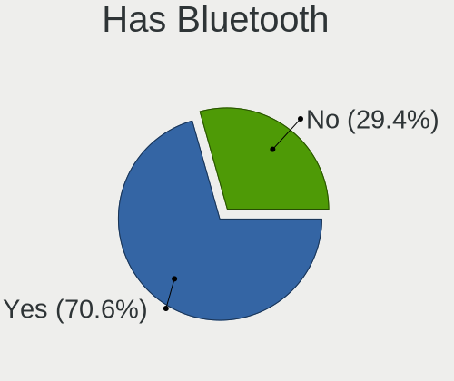
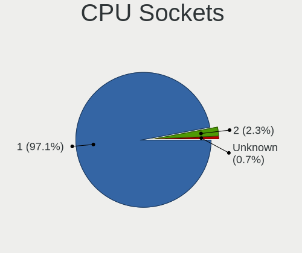
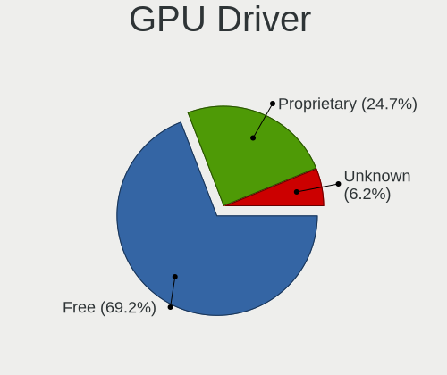
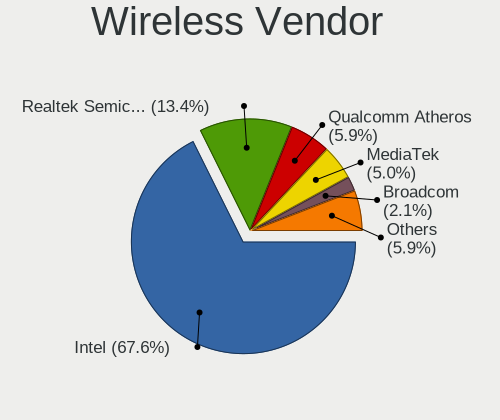
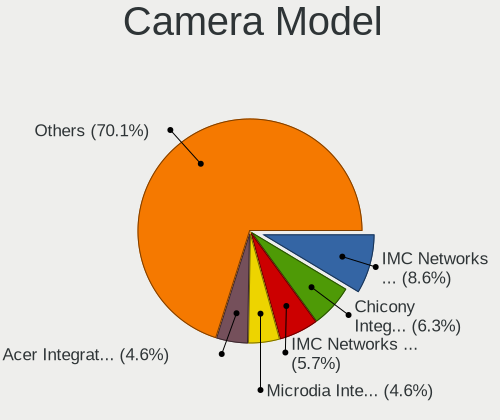

Gentoo 2.8 - Tested Hardware & Statistics
-----------------------------------------

A project to collect tested hardware configurations for Gentoo 2.8.

Anyone can contribute to this report by the [hw-probe](https://github.com/linuxhw/hw-probe) tool:

    sudo -E hw-probe -all -upload

Please contribute! Especially if your hardware is rare.

This is a report for all computer types. See also reports for [desktops](/Dist/Gentoo_2.8/Desktop/README.md) and [notebooks](/Dist/Gentoo_2.8/Notebook/README.md).

Contents
--------

* [ Test Cases ](#test-cases)

* [ System ](#system)
  - [ Kernel                   ](#kernel)
  - [ Kernel Family            ](#kernel-family)
  - [ Kernel Major Ver.        ](#kernel-major-ver)
  - [ Arch                     ](#arch)
  - [ DE                       ](#de)
  - [ Display Server           ](#display-server)
  - [ Display Manager          ](#display-manager)
  - [ OS Lang                  ](#os-lang)
  - [ Boot Mode                ](#boot-mode)
  - [ Filesystem               ](#filesystem)
  - [ Part. scheme             ](#part-scheme)
  - [ Dual Boot with Linux/BSD ](#dual-boot-with-linuxbsd)
  - [ Dual Boot (Win)          ](#dual-boot-win)

* [ Board ](#board)
  - [ Vendor                   ](#vendor)
  - [ Model                    ](#model)
  - [ Model Family             ](#model-family)
  - [ MFG Year                 ](#mfg-year)
  - [ Form Factor              ](#form-factor)
  - [ Secure Boot              ](#secure-boot)
  - [ Coreboot                 ](#coreboot)
  - [ RAM Size                 ](#ram-size)
  - [ RAM Used                 ](#ram-used)
  - [ Total Drives             ](#total-drives)
  - [ Has CD-ROM               ](#has-cd-rom)
  - [ Has Ethernet             ](#has-ethernet)
  - [ Has WiFi                 ](#has-wifi)
  - [ Has Bluetooth            ](#has-bluetooth)

* [ Location ](#location)
  - [ Country                  ](#country)
  - [ City                     ](#city)

* [ Drives ](#drives)
  - [ Drive Vendor             ](#drive-vendor)
  - [ Drive Model              ](#drive-model)
  - [ HDD Vendor               ](#hdd-vendor)
  - [ SSD Vendor               ](#ssd-vendor)
  - [ Drive Kind               ](#drive-kind)
  - [ Drive Connector          ](#drive-connector)
  - [ Drive Size               ](#drive-size)
  - [ Space Total              ](#space-total)
  - [ Space Used               ](#space-used)
  - [ Malfunc. Drives          ](#malfunc-drives)
  - [ Malfunc. Drive Vendor    ](#malfunc-drive-vendor)
  - [ Malfunc. HDD Vendor      ](#malfunc-hdd-vendor)
  - [ Malfunc. Drive Kind      ](#malfunc-drive-kind)
  - [ Failed Drives            ](#failed-drives)
  - [ Failed Drive Vendor      ](#failed-drive-vendor)
  - [ Drive Status             ](#drive-status)

* [ Storage controller ](#storage-controller)
  - [ Storage Vendor           ](#storage-vendor)
  - [ Storage Model            ](#storage-model)
  - [ Storage Kind             ](#storage-kind)

* [ Processor ](#processor)
  - [ CPU Vendor               ](#cpu-vendor)
  - [ CPU Model                ](#cpu-model)
  - [ CPU Model Family         ](#cpu-model-family)
  - [ CPU Cores                ](#cpu-cores)
  - [ CPU Sockets              ](#cpu-sockets)
  - [ CPU Threads              ](#cpu-threads)
  - [ CPU Op-Modes             ](#cpu-op-modes)
  - [ CPU Microcode            ](#cpu-microcode)
  - [ CPU Microarch            ](#cpu-microarch)

* [ Graphics ](#graphics)
  - [ GPU Vendor               ](#gpu-vendor)
  - [ GPU Model                ](#gpu-model)
  - [ GPU Combo                ](#gpu-combo)
  - [ GPU Driver               ](#gpu-driver)
  - [ GPU Memory               ](#gpu-memory)

* [ Monitor ](#monitor)
  - [ Monitor Vendor           ](#monitor-vendor)
  - [ Monitor Model            ](#monitor-model)
  - [ Monitor Resolution       ](#monitor-resolution)
  - [ Monitor Diagonal         ](#monitor-diagonal)
  - [ Monitor Width            ](#monitor-width)
  - [ Aspect Ratio             ](#aspect-ratio)
  - [ Monitor Area             ](#monitor-area)
  - [ Pixel Density            ](#pixel-density)
  - [ Multiple Monitors        ](#multiple-monitors)

* [ Network ](#network)
  - [ Net Controller Vendor    ](#net-controller-vendor)
  - [ Net Controller Model     ](#net-controller-model)
  - [ Wireless Vendor          ](#wireless-vendor)
  - [ Wireless Model           ](#wireless-model)
  - [ Ethernet Vendor          ](#ethernet-vendor)
  - [ Ethernet Model           ](#ethernet-model)
  - [ Net Controller Kind      ](#net-controller-kind)
  - [ Used Controller          ](#used-controller)
  - [ NICs                     ](#nics)
  - [ IPv6                     ](#ipv6)

* [ Bluetooth ](#bluetooth)
  - [ Bluetooth Vendor         ](#bluetooth-vendor)
  - [ Bluetooth Model          ](#bluetooth-model)

* [ Sound ](#sound)
  - [ Sound Vendor             ](#sound-vendor)
  - [ Sound Model              ](#sound-model)

* [ Memory ](#memory)
  - [ Memory Vendor            ](#memory-vendor)
  - [ Memory Model             ](#memory-model)
  - [ Memory Kind              ](#memory-kind)
  - [ Memory Form Factor       ](#memory-form-factor)
  - [ Memory Size              ](#memory-size)
  - [ Memory Speed             ](#memory-speed)

* [ Printers & scanners ](#printers--scanners)
  - [ Printer Vendor           ](#printer-vendor)
  - [ Printer Model            ](#printer-model)
  - [ Scanner Vendor           ](#scanner-vendor)
  - [ Scanner Model            ](#scanner-model)

* [ Camera ](#camera)
  - [ Camera Vendor            ](#camera-vendor)
  - [ Camera Model             ](#camera-model)

* [ Security ](#security)
  - [ Fingerprint Vendor       ](#fingerprint-vendor)
  - [ Fingerprint Model        ](#fingerprint-model)
  - [ Chipcard Vendor          ](#chipcard-vendor)
  - [ Chipcard Model           ](#chipcard-model)

* [ Unsupported ](#unsupported)
  - [ Unsupported Devices      ](#unsupported-devices)
  - [ Unsupported Device Types ](#unsupported-device-types)

Test Cases
----------

Total: 166

| Vendor        | Model                       | Form-Factor | Probe                                                      | Date         |
|---------------|-----------------------------|-------------|------------------------------------------------------------|--------------|
| MSI           | MPG Z390 GAMING PRO CARB... | Desktop     | [07a115654d](https://linux-hardware.org/?probe=07a115654d) | Apr 30, 2022 |
| Dell          | 0J37VM A00                  | Desktop     | [76f13aa200](https://linux-hardware.org/?probe=76f13aa200) | Apr 28, 2022 |
| Gigabyte      | Z590 UD                     | Desktop     | [b304c37639](https://linux-hardware.org/?probe=b304c37639) | Apr 27, 2022 |
| Dell          | XPS 15 9510                 | Notebook    | [a934bef382](https://linux-hardware.org/?probe=a934bef382) | Apr 24, 2022 |
| Lenovo        | ThinkPad X390 Yoga 20NN0... | Convertible | [3c1ff82bb0](https://linux-hardware.org/?probe=3c1ff82bb0) | Apr 24, 2022 |
| Dell          | XPS 15 9510                 | Notebook    | [b61b2af9eb](https://linux-hardware.org/?probe=b61b2af9eb) | Apr 23, 2022 |
| ASUSTek       | ROG STRIX B550-F GAMING     | Desktop     | [6af0b2a3c9](https://linux-hardware.org/?probe=6af0b2a3c9) | Apr 21, 2022 |
| MSI           | Z390-A PRO                  | Desktop     | [4121c8fcc2](https://linux-hardware.org/?probe=4121c8fcc2) | Apr 20, 2022 |
| Lenovo        | ThinkPad X220 4291QT1       | Notebook    | [9ffcb6bf7a](https://linux-hardware.org/?probe=9ffcb6bf7a) | Apr 18, 2022 |
| HP            | Pavilion Notebook           | Notebook    | [217905d42a](https://linux-hardware.org/?probe=217905d42a) | Apr 17, 2022 |
| Lenovo        | ThinkPad X220 4291QT1       | Notebook    | [00a23bc10c](https://linux-hardware.org/?probe=00a23bc10c) | Apr 17, 2022 |
| ASUSTek       | PRIME H570M-PLUS            | Desktop     | [5e6ce90c93](https://linux-hardware.org/?probe=5e6ce90c93) | Apr 13, 2022 |
| MSI           | B450-A PRO MAX              | Desktop     | [cfd276f151](https://linux-hardware.org/?probe=cfd276f151) | Apr 13, 2022 |
| Dell          | G5 5505                     | Notebook    | [ce1fc33387](https://linux-hardware.org/?probe=ce1fc33387) | Apr 13, 2022 |
| MSI           | GE66 Raider 11UE            | Notebook    | [45472dad72](https://linux-hardware.org/?probe=45472dad72) | Apr 12, 2022 |
| HP            | ProBook 6570b               | Notebook    | [63d922ecdd](https://linux-hardware.org/?probe=63d922ecdd) | Apr 12, 2022 |
| ASUSTek       | ROG Maximus XIII APEX       | Desktop     | [7a26d3fc81](https://linux-hardware.org/?probe=7a26d3fc81) | Apr 12, 2022 |
| HP            | ProBook 6570b               | Notebook    | [87414e70aa](https://linux-hardware.org/?probe=87414e70aa) | Apr 11, 2022 |
| Gigabyte      | H470 HD3                    | Desktop     | [5ce5c54ecd](https://linux-hardware.org/?probe=5ce5c54ecd) | Apr 09, 2022 |
| System76      | Gazelle                     | Notebook    | [9edcac1b2c](https://linux-hardware.org/?probe=9edcac1b2c) | Apr 09, 2022 |
| System76      | Gazelle                     | Notebook    | [e22baecee4](https://linux-hardware.org/?probe=e22baecee4) | Apr 07, 2022 |
| ASUSTek       | P6X58D-E                    | Desktop     | [68be7a767a](https://linux-hardware.org/?probe=68be7a767a) | Apr 07, 2022 |
| ASUSTek       | TUF Gaming B550-PLUS        | Desktop     | [403a6830d9](https://linux-hardware.org/?probe=403a6830d9) | Apr 04, 2022 |
| ASRock        | Z170A-X1                    | Desktop     | [9e1cc71d24](https://linux-hardware.org/?probe=9e1cc71d24) | Mar 31, 2022 |
| MSI           | MAG B550M MORTAR            | Desktop     | [9ebb4c0fd3](https://linux-hardware.org/?probe=9ebb4c0fd3) | Mar 31, 2022 |
| Raspberry ... | Raspberry Pi                | Soc         | [5240890472](https://linux-hardware.org/?probe=5240890472) | Mar 29, 2022 |
| Gigabyte      | Z590 UD                     | Desktop     | [5cde1a4e83](https://linux-hardware.org/?probe=5cde1a4e83) | Mar 24, 2022 |
| Timi          | Mi Laptop Pro 15            | Notebook    | [33f98f8274](https://linux-hardware.org/?probe=33f98f8274) | Mar 23, 2022 |
| ASUSTek       | ROG STRIX B550-F GAMING     | Desktop     | [f4e6e46fc5](https://linux-hardware.org/?probe=f4e6e46fc5) | Mar 23, 2022 |
| ASUSTek       | ROG STRIX Z370-H GAMING     | Desktop     | [6dddf500c7](https://linux-hardware.org/?probe=6dddf500c7) | Mar 22, 2022 |
| MSI           | MAG B550M MORTAR            | Desktop     | [78b6d2b02e](https://linux-hardware.org/?probe=78b6d2b02e) | Mar 21, 2022 |
| MSI           | MAG B550M MORTAR            | Desktop     | [593bf6f937](https://linux-hardware.org/?probe=593bf6f937) | Mar 21, 2022 |
| Unknown       | Unknown                     | Soc         | [dad2f6c4ba](https://linux-hardware.org/?probe=dad2f6c4ba) | Mar 20, 2022 |
| BANGHO        | MAX G0101                   | Notebook    | [b40c195d54](https://linux-hardware.org/?probe=b40c195d54) | Mar 20, 2022 |
| ASUSTek       | Z170 PRO GAMING             | Desktop     | [6efb7791bb](https://linux-hardware.org/?probe=6efb7791bb) | Mar 19, 2022 |
| MSI           | MS-7A34                     | Notebook    | [a3cfb1ce48](https://linux-hardware.org/?probe=a3cfb1ce48) | Mar 18, 2022 |
| MSI           | MS-7A34                     | Notebook    | [27f8a2eb1f](https://linux-hardware.org/?probe=27f8a2eb1f) | Mar 18, 2022 |
| Raspberry ... | Raspberry Pi                | Soc         | [4c5a9365d3](https://linux-hardware.org/?probe=4c5a9365d3) | Mar 17, 2022 |
| Dell          | 0J37VM A00                  | Desktop     | [bbcd3639ab](https://linux-hardware.org/?probe=bbcd3639ab) | Mar 15, 2022 |
| ASUSTek       | ROG STRIX Z390-E GAMING     | Desktop     | [70021af77a](https://linux-hardware.org/?probe=70021af77a) | Mar 15, 2022 |
| HP            | Victus by Laptop 16-e0xx... | Notebook    | [7c09492e3b](https://linux-hardware.org/?probe=7c09492e3b) | Mar 14, 2022 |
| HP            | Victus by Laptop 16-e0xx... | Notebook    | [f7e85dbf71](https://linux-hardware.org/?probe=f7e85dbf71) | Mar 14, 2022 |
| Framework     | Laptop                      | Notebook    | [8902c057fb](https://linux-hardware.org/?probe=8902c057fb) | Mar 10, 2022 |
| Raspberry ... | Raspberry Pi                | Soc         | [2dc3e976e3](https://linux-hardware.org/?probe=2dc3e976e3) | Mar 10, 2022 |
| Dell          | 0J37VM A00                  | Desktop     | [a78d4c99e3](https://linux-hardware.org/?probe=a78d4c99e3) | Mar 09, 2022 |
| Lenovo        | IdeaPad C340-14IML 81TK     | Convertible | [7eea4038f0](https://linux-hardware.org/?probe=7eea4038f0) | Mar 09, 2022 |
| Lenovo        | IdeaPad C340-14IML 81TK     | Convertible | [fe3e35f15b](https://linux-hardware.org/?probe=fe3e35f15b) | Mar 09, 2022 |
| Framework     | Laptop                      | Notebook    | [15219c6b68](https://linux-hardware.org/?probe=15219c6b68) | Mar 08, 2022 |
| Framework     | Laptop                      | Notebook    | [e17db20b1c](https://linux-hardware.org/?probe=e17db20b1c) | Mar 08, 2022 |
| Gigabyte      | Z590 UD                     | Desktop     | [392c7890c2](https://linux-hardware.org/?probe=392c7890c2) | Mar 08, 2022 |
| Intel         | NUC10i7FNB K61360-302       | Mini pc     | [bc052daf77](https://linux-hardware.org/?probe=bc052daf77) | Mar 07, 2022 |
| Raspberry ... | Raspberry Pi                | Soc         | [f7300f219d](https://linux-hardware.org/?probe=f7300f219d) | Mar 03, 2022 |
| ASUSTek       | TUF GAMING X570-PRO         | Desktop     | [44656b1bd4](https://linux-hardware.org/?probe=44656b1bd4) | Mar 03, 2022 |
| Gigabyte      | Z590 UD                     | Desktop     | [a5242ed058](https://linux-hardware.org/?probe=a5242ed058) | Feb 26, 2022 |
| Lenovo        | Yoga Slim 7 14IIL05 82A1    | Notebook    | [0022f4a8cc](https://linux-hardware.org/?probe=0022f4a8cc) | Feb 26, 2022 |
| Raspberry ... | Raspberry Pi                | Soc         | [06b438f37a](https://linux-hardware.org/?probe=06b438f37a) | Feb 24, 2022 |
| Gigabyte      | Z590 UD                     | Desktop     | [06d8d67698](https://linux-hardware.org/?probe=06d8d67698) | Feb 24, 2022 |
| Gigabyte      | Z590 UD                     | Desktop     | [071dd25266](https://linux-hardware.org/?probe=071dd25266) | Feb 24, 2022 |
| Dell          | XPS 13 9365                 | Convertible | [cde7566ecb](https://linux-hardware.org/?probe=cde7566ecb) | Feb 22, 2022 |
| ASUSTek       | UX430UAR                    | Notebook    | [c7cd5ce50d](https://linux-hardware.org/?probe=c7cd5ce50d) | Feb 21, 2022 |
| Dell          | XPS 13 9365                 | Convertible | [5dea4207b1](https://linux-hardware.org/?probe=5dea4207b1) | Feb 20, 2022 |
| Raspberry ... | Raspberry Pi                | Soc         | [62010933e5](https://linux-hardware.org/?probe=62010933e5) | Feb 17, 2022 |
| ASUSTek       | ROG CROSSHAIR VIII DARK ... | Desktop     | [5836ccecc2](https://linux-hardware.org/?probe=5836ccecc2) | Feb 10, 2022 |
| Raspberry ... | Raspberry Pi                | Soc         | [62bf8e7e99](https://linux-hardware.org/?probe=62bf8e7e99) | Feb 10, 2022 |
| MSI           | GS63VR 6RF                  | Notebook    | [c20c87027e](https://linux-hardware.org/?probe=c20c87027e) | Feb 10, 2022 |
| HP            | Pavilion Notebook           | Notebook    | [8f79e4d763](https://linux-hardware.org/?probe=8f79e4d763) | Feb 06, 2022 |
| Lenovo        | Legion Y7000 2019 PG0 81... | Notebook    | [f79196e39c](https://linux-hardware.org/?probe=f79196e39c) | Feb 05, 2022 |
| Gigabyte      | Z490 UD                     | Desktop     | [b571c22d4f](https://linux-hardware.org/?probe=b571c22d4f) | Feb 04, 2022 |
| Raspberry ... | Raspberry Pi                | Soc         | [a558bb9d2c](https://linux-hardware.org/?probe=a558bb9d2c) | Feb 03, 2022 |
| Neousys Te... | NVS-8208 Rev. A1            | Server      | [4a717f6348](https://linux-hardware.org/?probe=4a717f6348) | Feb 02, 2022 |
| MSI           | MPG B550 GAMING PLUS        | Desktop     | [d424a8e145](https://linux-hardware.org/?probe=d424a8e145) | Feb 01, 2022 |
| MSI           | MPG B550 GAMING PLUS        | Desktop     | [89dbe92caf](https://linux-hardware.org/?probe=89dbe92caf) | Feb 01, 2022 |
| Neousys Te... | NVS-8208 Rev. A1            | Server      | [7f7720253e](https://linux-hardware.org/?probe=7f7720253e) | Feb 01, 2022 |
| MSI           | GS63VR 6RF                  | Notebook    | [4873365af6](https://linux-hardware.org/?probe=4873365af6) | Jan 30, 2022 |
| ASRock        | AB350M Pro4                 | Desktop     | [6b7cf2d570](https://linux-hardware.org/?probe=6b7cf2d570) | Jan 27, 2022 |
| Raspberry ... | Raspberry Pi                | Soc         | [9082dd553a](https://linux-hardware.org/?probe=9082dd553a) | Jan 27, 2022 |
| Lenovo        | Yoga S740-14IIL 81RS        | Notebook    | [c021622ad4](https://linux-hardware.org/?probe=c021622ad4) | Jan 27, 2022 |
| Timi          | RedmiBook 13                | Notebook    | [e20538f56a](https://linux-hardware.org/?probe=e20538f56a) | Jan 26, 2022 |
| Timi          | RedmiBook 13                | Notebook    | [b424ef43c2](https://linux-hardware.org/?probe=b424ef43c2) | Jan 25, 2022 |
| Gigabyte      | B450M S2H                   | Desktop     | [656da02110](https://linux-hardware.org/?probe=656da02110) | Jan 24, 2022 |
| Lenovo        | IdeaPad 5 15ITL05 82FG      | Notebook    | [a4f6a4a38e](https://linux-hardware.org/?probe=a4f6a4a38e) | Jan 24, 2022 |
| Lenovo        | IdeaPad 5 15ITL05 82FG      | Notebook    | [9e4f498056](https://linux-hardware.org/?probe=9e4f498056) | Jan 24, 2022 |
| Gigabyte      | B450M S2H                   | Desktop     | [1721bed3e1](https://linux-hardware.org/?probe=1721bed3e1) | Jan 24, 2022 |
| Gigabyte      | Z490 UD                     | Desktop     | [eac4639ad2](https://linux-hardware.org/?probe=eac4639ad2) | Jan 22, 2022 |
| MSI           | GE73 Raider RGB 8RF         | Notebook    | [a5a825a072](https://linux-hardware.org/?probe=a5a825a072) | Jan 22, 2022 |
| Lenovo        | ThinkPad 20FMCT01WW         | Notebook    | [4bd81196a0](https://linux-hardware.org/?probe=4bd81196a0) | Jan 21, 2022 |
| Raspberry ... | Raspberry Pi                | Soc         | [c85ff3d537](https://linux-hardware.org/?probe=c85ff3d537) | Jan 20, 2022 |
| Timi          | Mi Laptop Pro 15            | Notebook    | [65ce2eb070](https://linux-hardware.org/?probe=65ce2eb070) | Jan 19, 2022 |
| Lenovo        | ThinkPad X1 Carbon 7th 2... | Notebook    | [d786a0b993](https://linux-hardware.org/?probe=d786a0b993) | Jan 17, 2022 |
| Lenovo        | ThinkPad X1 Carbon 7th 2... | Notebook    | [6af6121c33](https://linux-hardware.org/?probe=6af6121c33) | Jan 17, 2022 |
| Dell          | Precision 3561              | Notebook    | [f5417a1852](https://linux-hardware.org/?probe=f5417a1852) | Jan 16, 2022 |
| Lenovo        | Legion 5 Pro 16ACH6H 82J... | Notebook    | [2aa146518a](https://linux-hardware.org/?probe=2aa146518a) | Jan 16, 2022 |
| Raspberry ... | Raspberry Pi                | Soc         | [52494cf0b0](https://linux-hardware.org/?probe=52494cf0b0) | Jan 13, 2022 |
| TYAN Compu... | S7025                       | Server      | [c5f294d367](https://linux-hardware.org/?probe=c5f294d367) | Jan 12, 2022 |
| Lenovo        | Legion R7000 2020 82B6      | Notebook    | [5f92f3376e](https://linux-hardware.org/?probe=5f92f3376e) | Jan 11, 2022 |
| Acer          | Nitro AN515-54              | Notebook    | [d46da820e0](https://linux-hardware.org/?probe=d46da820e0) | Jan 10, 2022 |
| Lenovo        | IdeaPadFlex 5 14ITL05 82... | Convertible | [dcf0799dd1](https://linux-hardware.org/?probe=dcf0799dd1) | Jan 10, 2022 |
| Lenovo        | IdeaPadFlex 5 14ITL05 82... | Convertible | [fb3838c0db](https://linux-hardware.org/?probe=fb3838c0db) | Jan 10, 2022 |
| ASRock        | X370 Gaming X               | Desktop     | [e233d7c495](https://linux-hardware.org/?probe=e233d7c495) | Jan 09, 2022 |
| Raspberry ... | Raspberry Pi                | Soc         | [8406d08f2e](https://linux-hardware.org/?probe=8406d08f2e) | Jan 06, 2022 |
| ASUSTek       | ROG Zephyrus G14 GA401QE... | Notebook    | [0cf6f2102c](https://linux-hardware.org/?probe=0cf6f2102c) | Jan 03, 2022 |
| Timi          | RedmiBook 13                | Notebook    | [528d0d32b4](https://linux-hardware.org/?probe=528d0d32b4) | Jan 01, 2022 |
| Raspberry ... | Raspberry Pi                | Soc         | [eba53a3d91](https://linux-hardware.org/?probe=eba53a3d91) | Dec 30, 2021 |
| TYAN Compu... | S7025                       | Server      | [4a4fe05b48](https://linux-hardware.org/?probe=4a4fe05b48) | Dec 27, 2021 |
| EVGA          | Z390 DARK                   | Desktop     | [7672395a1c](https://linux-hardware.org/?probe=7672395a1c) | Dec 24, 2021 |
| Dell          | XPS 15 9570                 | Notebook    | [1695a19b52](https://linux-hardware.org/?probe=1695a19b52) | Dec 24, 2021 |
| Intel         | S1200RP G62251-406          | Server      | [986c6d1f51](https://linux-hardware.org/?probe=986c6d1f51) | Dec 24, 2021 |
| Raspberry ... | Raspberry Pi                | Soc         | [429df0480e](https://linux-hardware.org/?probe=429df0480e) | Dec 23, 2021 |
| Framework     | Laptop                      | Notebook    | [33bb6590a6](https://linux-hardware.org/?probe=33bb6590a6) | Dec 21, 2021 |
| TYAN Compu... | S7025                       | Server      | [88ee246f4e](https://linux-hardware.org/?probe=88ee246f4e) | Dec 21, 2021 |
| Intel         | NUC8i7HVB J68196-504        | Mini pc     | [36ad5ef96a](https://linux-hardware.org/?probe=36ad5ef96a) | Dec 16, 2021 |
| BESSTAR Te... | ATB15                       | Server      | [783d1d7b6f](https://linux-hardware.org/?probe=783d1d7b6f) | Dec 16, 2021 |
| ASUSTek       | P5LD2-Deluxe                | Desktop     | [a2ee48eeb1](https://linux-hardware.org/?probe=a2ee48eeb1) | Dec 16, 2021 |
| Raspberry ... | Raspberry Pi                | Soc         | [0ec288fb32](https://linux-hardware.org/?probe=0ec288fb32) | Dec 16, 2021 |
| ASUSTek       | ROG Strix G513QY_G513QY     | Notebook    | [ee63a84605](https://linux-hardware.org/?probe=ee63a84605) | Dec 11, 2021 |
| Toshiba       | Satellite C850D-118         | Notebook    | [b15f2e2c92](https://linux-hardware.org/?probe=b15f2e2c92) | Dec 09, 2021 |
| Raspberry ... | Raspberry Pi                | Soc         | [d1c651b135](https://linux-hardware.org/?probe=d1c651b135) | Dec 09, 2021 |
| MSI           | MPG Z690 EDGE WIFI DDR4     | Desktop     | [b92f432637](https://linux-hardware.org/?probe=b92f432637) | Dec 07, 2021 |
| MSI           | MPG Z690 EDGE WIFI DDR4     | Desktop     | [d8f50aaa2e](https://linux-hardware.org/?probe=d8f50aaa2e) | Dec 07, 2021 |
| ASUSTek       | TUF B450-PLUS GAMING        | Desktop     | [6649bea1f8](https://linux-hardware.org/?probe=6649bea1f8) | Dec 04, 2021 |
| ASUSTek       | TUF B450-PLUS GAMING        | Desktop     | [723e2a158a](https://linux-hardware.org/?probe=723e2a158a) | Dec 03, 2021 |
| ASRock        | H110M-HDV R3.0              | Desktop     | [e155882ffa](https://linux-hardware.org/?probe=e155882ffa) | Dec 02, 2021 |
| Raspberry ... | Raspberry Pi                | Soc         | [41b1b4ce39](https://linux-hardware.org/?probe=41b1b4ce39) | Dec 02, 2021 |
| HP            | Laptop 15s-eq0xxx           | Notebook    | [86f5c0bc34](https://linux-hardware.org/?probe=86f5c0bc34) | Nov 30, 2021 |
| HP            | Laptop 15s-eq0xxx           | Notebook    | [e06c73ada9](https://linux-hardware.org/?probe=e06c73ada9) | Nov 29, 2021 |
| Lenovo        | IdeaPad 5 Pro 16ACH6 82L... | Notebook    | [ad15be0510](https://linux-hardware.org/?probe=ad15be0510) | Nov 29, 2021 |
| Lenovo        | ThinkPad T470p 20J7S06Q0... | Notebook    | [6eca4a1be2](https://linux-hardware.org/?probe=6eca4a1be2) | Nov 22, 2021 |
| Lenovo        | ThinkPad T470p 20J7S06Q0... | Notebook    | [6c92c6ecbb](https://linux-hardware.org/?probe=6c92c6ecbb) | Nov 22, 2021 |
| ASUSTek       | ROG STRIX X570-E GAMING     | Desktop     | [e2c087b9c7](https://linux-hardware.org/?probe=e2c087b9c7) | Nov 21, 2021 |
| Acer          | Aspire A715-42G             | Notebook    | [3ea389d8ff](https://linux-hardware.org/?probe=3ea389d8ff) | Nov 21, 2021 |
| Acer          | Aspire A715-42G             | Notebook    | [19f48288ec](https://linux-hardware.org/?probe=19f48288ec) | Nov 20, 2021 |
| Raspberry ... | Raspberry Pi                | Soc         | [40748c60b0](https://linux-hardware.org/?probe=40748c60b0) | Nov 18, 2021 |
| ASUSTek       | PRIME X570-P                | Desktop     | [eafa22145d](https://linux-hardware.org/?probe=eafa22145d) | Nov 15, 2021 |
| ASUSTek       | TUF GAMING B550-PLUS        | Desktop     | [2900821ed3](https://linux-hardware.org/?probe=2900821ed3) | Nov 14, 2021 |
| ASUSTek       | ROG STRIX B550-F GAMING     | Desktop     | [4cfb74fb42](https://linux-hardware.org/?probe=4cfb74fb42) | Nov 14, 2021 |
| Lenovo        | ThinkPad E495 20NE000BGE    | Notebook    | [871e0a8d36](https://linux-hardware.org/?probe=871e0a8d36) | Nov 11, 2021 |
| Raspberry ... | Raspberry Pi                | Soc         | [3aeb2b6565](https://linux-hardware.org/?probe=3aeb2b6565) | Nov 11, 2021 |
| ASUSTek       | ROG ZENITH II EXTREME       | Desktop     | [6f308039a8](https://linux-hardware.org/?probe=6f308039a8) | Nov 06, 2021 |
| Raspberry ... | Raspberry Pi                | Soc         | [ced6e2a8c2](https://linux-hardware.org/?probe=ced6e2a8c2) | Nov 04, 2021 |
| Intel         | S1200RP G62251-405          | Server      | [798cf3cc96](https://linux-hardware.org/?probe=798cf3cc96) | Nov 02, 2021 |
| MSI           | H110M PRO-D                 | Desktop     | [cb3dcdd186](https://linux-hardware.org/?probe=cb3dcdd186) | Nov 02, 2021 |
| MSI           | H110M PRO-D                 | Desktop     | [b53420c26a](https://linux-hardware.org/?probe=b53420c26a) | Nov 02, 2021 |
| Dell          | Latitude 7490               | Notebook    | [ea64667f2c](https://linux-hardware.org/?probe=ea64667f2c) | Nov 01, 2021 |
| ASUSTek       | ROG STRIX B550-F GAMING     | Desktop     | [161865edb0](https://linux-hardware.org/?probe=161865edb0) | Oct 30, 2021 |
| ASUSTek       | ROG STRIX B550-F GAMING     | Desktop     | [a4806aa50f](https://linux-hardware.org/?probe=a4806aa50f) | Oct 30, 2021 |
| ASUSTek       | Z170-A                      | Desktop     | [aea7d9561e](https://linux-hardware.org/?probe=aea7d9561e) | Oct 29, 2021 |
| ASRock        | X370 Gaming X               | Desktop     | [0f4ae74d8e](https://linux-hardware.org/?probe=0f4ae74d8e) | Oct 29, 2021 |
| ASRock        | X370 Gaming X               | Desktop     | [f3f75352e4](https://linux-hardware.org/?probe=f3f75352e4) | Oct 29, 2021 |
| ASUSTek       | ROG CROSSHAIR VIII HERO     | Desktop     | [e9cc487951](https://linux-hardware.org/?probe=e9cc487951) | Oct 28, 2021 |
| Raspberry ... | Raspberry Pi                | Soc         | [1a6eea194f](https://linux-hardware.org/?probe=1a6eea194f) | Oct 28, 2021 |
| Lenovo        | ThinkPad P1 Gen 3 20TJS2... | Notebook    | [6105164e23](https://linux-hardware.org/?probe=6105164e23) | Oct 26, 2021 |
| ASUSTek       | ROG CROSSHAIR VIII HERO     | Desktop     | [cb6d9e548b](https://linux-hardware.org/?probe=cb6d9e548b) | Oct 26, 2021 |
| Lenovo        | ThinkPad E15 Gen 2 20T80... | Notebook    | [8a34d739fd](https://linux-hardware.org/?probe=8a34d739fd) | Oct 25, 2021 |
| Lenovo        | IdeaPadFlex 5 14ITL05 82... | Convertible | [5b06944051](https://linux-hardware.org/?probe=5b06944051) | Oct 25, 2021 |
| Gigabyte      | X570 AORUS MASTER           | Desktop     | [58e3f9c07f](https://linux-hardware.org/?probe=58e3f9c07f) | Oct 23, 2021 |
| Raspberry ... | Raspberry Pi                | Soc         | [5d0fc3aa0e](https://linux-hardware.org/?probe=5d0fc3aa0e) | Oct 21, 2021 |
| ASUSTek       | ROG CROSSHAIR VIII HERO     | Desktop     | [eb02a6d4d5](https://linux-hardware.org/?probe=eb02a6d4d5) | Oct 20, 2021 |
| ASRock        | X370 Killer SLI/ac          | Desktop     | [2e4c1c4527](https://linux-hardware.org/?probe=2e4c1c4527) | Oct 17, 2021 |
| Raspberry ... | Raspberry Pi                | Soc         | [243e5becca](https://linux-hardware.org/?probe=243e5becca) | Oct 14, 2021 |
| Acer          | Aspire A515-55              | Notebook    | [437c8fb96b](https://linux-hardware.org/?probe=437c8fb96b) | Oct 12, 2021 |
| Raspberry ... | Raspberry Pi                | Soc         | [95cd0c0751](https://linux-hardware.org/?probe=95cd0c0751) | Oct 07, 2021 |
| Lenovo        | ThinkBook 14 G3 ACL 21A2    | Notebook    | [3ad4e11bac](https://linux-hardware.org/?probe=3ad4e11bac) | Oct 06, 2021 |
| Lenovo        | ThinkBook 14 G3 ACL 21A2    | Notebook    | [18a2385458](https://linux-hardware.org/?probe=18a2385458) | Oct 06, 2021 |
| Gigabyte      | Z87X-UD3H-CF                | Desktop     | [9901023f19](https://linux-hardware.org/?probe=9901023f19) | Oct 03, 2021 |
| Timi          | Mi Laptop Pro 15            | Notebook    | [e2057e68dd](https://linux-hardware.org/?probe=e2057e68dd) | Oct 03, 2021 |
| Dell          | Inspiron 5415               | Notebook    | [a265f8ea5c](https://linux-hardware.org/?probe=a265f8ea5c) | Oct 01, 2021 |

System
------

Kernel
------

Version of the Linux kernel

| Version                        | Computers | Percent |
|--------------------------------|-----------|---------|
| 5.15.10-gentoo                 | 4         | 3.67%   |
| 5.17.1-gentoo-r1               | 3         | 2.75%   |
| 5.16.2-gentoo                  | 3         | 2.75%   |
| 5.15.10-gentoo-x86_64          | 3         | 2.75%   |
| 5.14.9-gentoo-x86_64           | 3         | 2.75%   |
| 5.17.0-gentoo-x86_64           | 2         | 1.83%   |
| 5.17.0-gentoo                  | 2         | 1.83%   |
| 5.16.9-gentoo                  | 2         | 1.83%   |
| 5.16.4-gentoo                  | 2         | 1.83%   |
| 5.16.11-gentoo-x86_64          | 2         | 1.83%   |
| 5.16.11-gentoo-dist            | 2         | 1.83%   |
| 5.16.0-gentoo-x86_64           | 2         | 1.83%   |
| 5.15.6-gentoo                  | 2         | 1.83%   |
| 5.15.1-gentoo-x86_64           | 2         | 1.83%   |
| 5.14.14-gentoo-x86_64          | 2         | 1.83%   |
| 5.14.14-gentoo-dist            | 2         | 1.83%   |
| 5.14.13-gentoo                 | 2         | 1.83%   |
| 5.14.12-gentoo                 | 2         | 1.83%   |
| 6.0.0-Phaco-g8f10ff49057f      | 1         | 0.92%   |
| 5.17.5-gentoo-x86_64           | 1         | 0.92%   |
| 5.17.3-gentoo-11-02-22         | 1         | 0.92%   |
| 5.17.3-gentoo                  | 1         | 0.92%   |
| 5.17.2-gentoo-limelight        | 1         | 0.92%   |
| 5.17.2-gentoo-groovin          | 1         | 0.92%   |
| 5.17.2-gentoo                  | 1         | 0.92%   |
| 5.17.1-gentoo-r1-x86_64        | 1         | 0.92%   |
| 5.16.9-gentoo-dist             | 1         | 0.92%   |
| 5.16.8-gentoo-x86_64           | 1         | 0.92%   |
| 5.16.8-gentoo-gentoo-dist      | 1         | 0.92%   |
| 5.16.7-tkg-cacule              | 1         | 0.92%   |
| 5.16.5-gentoo-x86_64           | 1         | 0.92%   |
| 5.16.5-gentoo-dist             | 1         | 0.92%   |
| 5.16.3-gentoo                  | 1         | 0.92%   |
| 5.16.2-gentoo-x86_64           | 1         | 0.92%   |
| 5.16.15                        | 1         | 0.92%   |
| 5.16.14-gentoo-x86_64-lto      | 1         | 0.92%   |
| 5.16.14-gentoo-x86_64          | 1         | 0.92%   |
| 5.16.14-gentoo-girlhog         | 1         | 0.92%   |
| 5.16.14-gentoo                 | 1         | 0.92%   |
| 5.16.13-gentoo                 | 1         | 0.92%   |
| 5.16.12-gentoo-x86_64          | 1         | 0.92%   |
| 5.16.10-gentoo-x86_64          | 1         | 0.92%   |
| 5.16.10-gentoo--20-feb-2022    | 1         | 0.92%   |
| 5.16.10-gentoo                 | 1         | 0.92%   |
| 5.16.1-gentoo-x86_64           | 1         | 0.92%   |
| 5.16.1-gentoo                  | 1         | 0.92%   |
| 5.16.0-xanmod1                 | 1         | 0.92%   |
| 5.16.0-pf5                     | 1         | 0.92%   |
| 5.16.0-gentoo-gentoo-dist      | 1         | 0.92%   |
| 5.16.0-gentoo                  | 1         | 0.92%   |
| 5.15.7-gentoo                  | 1         | 0.92%   |
| 5.15.5-gentoo-x86_64           | 1         | 0.92%   |
| 5.15.5-gentoo-dist             | 1         | 0.92%   |
| 5.15.5-gentoo                  | 1         | 0.92%   |
| 5.15.4-gentoo.8i7HVK           | 1         | 0.92%   |
| 5.15.4-gentoo-deimos           | 1         | 0.92%   |
| 5.15.35-adry                   | 1         | 0.92%   |
| 5.15.33-gentoo-x86_64          | 1         | 0.92%   |
| 5.15.33-gentoo-113-eee_drivers | 1         | 0.92%   |
| 5.15.32-gentoo-r1              | 1         | 0.92%   |

Kernel Family
-------------

Linux kernel without a distro release

| Version | Computers | Percent |
|---------|-----------|---------|
| 5.15.10 | 7         | 6.42%   |
| 5.16.0  | 6         | 5.5%    |
| 5.14.14 | 5         | 4.59%   |
| 5.17.1  | 4         | 3.67%   |
| 5.17.0  | 4         | 3.67%   |
| 5.16.2  | 4         | 3.67%   |
| 5.16.14 | 4         | 3.67%   |
| 5.16.11 | 4         | 3.67%   |
| 5.14.9  | 4         | 3.67%   |
| 5.17.2  | 3         | 2.75%   |
| 5.16.9  | 3         | 2.75%   |
| 5.16.10 | 3         | 2.75%   |
| 5.15.5  | 3         | 2.75%   |
| 5.15.12 | 3         | 2.75%   |
| 5.17.3  | 2         | 1.83%   |
| 5.16.8  | 2         | 1.83%   |
| 5.16.5  | 2         | 1.83%   |
| 5.16.4  | 2         | 1.83%   |
| 5.16.1  | 2         | 1.83%   |
| 5.15.6  | 2         | 1.83%   |
| 5.15.4  | 2         | 1.83%   |
| 5.15.33 | 2         | 1.83%   |
| 5.15.2  | 2         | 1.83%   |
| 5.15.13 | 2         | 1.83%   |
| 5.15.1  | 2         | 1.83%   |
| 5.15.0  | 2         | 1.83%   |
| 5.14.13 | 2         | 1.83%   |
| 5.14.12 | 2         | 1.83%   |
| 6.0.0   | 1         | 0.92%   |
| 5.17.5  | 1         | 0.92%   |
| 5.16.7  | 1         | 0.92%   |
| 5.16.3  | 1         | 0.92%   |
| 5.16.15 | 1         | 0.92%   |
| 5.16.13 | 1         | 0.92%   |
| 5.16.12 | 1         | 0.92%   |
| 5.15.7  | 1         | 0.92%   |
| 5.15.35 | 1         | 0.92%   |
| 5.15.32 | 1         | 0.92%   |
| 5.15.3  | 1         | 0.92%   |
| 5.15.19 | 1         | 0.92%   |
| 5.15.16 | 1         | 0.92%   |
| 5.14.7  | 1         | 0.92%   |
| 5.14.6  | 1         | 0.92%   |
| 5.14.15 | 1         | 0.92%   |
| 5.14.11 | 1         | 0.92%   |
| 5.10.84 | 1         | 0.92%   |
| 5.10.83 | 1         | 0.92%   |
| 5.10.76 | 1         | 0.92%   |
| 5.10.74 | 1         | 0.92%   |
| 5.10.70 | 1         | 0.92%   |
| 5.10.63 | 1         | 0.92%   |
| 5.10.11 | 1         | 0.92%   |

Kernel Major Ver.
-----------------

Linux kernel major version

| Version | Computers | Percent |
|---------|-----------|---------|
| 5.16    | 34        | 33.33%  |
| 5.15    | 31        | 30.39%  |
| 5.14    | 17        | 16.67%  |
| 5.17    | 13        | 12.75%  |
| 5.10    | 6         | 5.88%   |
| 6.0     | 1         | 0.98%   |

Arch
----

OS architecture (x86_64, i586, etc.)

| Name    | Computers | Percent |
|---------|-----------|---------|
| x86_64  | 92        | 97.87%  |
| aarch64 | 2         | 2.13%   |

DE
--

Desktop Environment

| Name          | Computers | Percent |
|---------------|-----------|---------|
| KDE5          | 32        | 32.99%  |
| Unknown       | 31        | 31.96%  |
| GNOME         | 15        | 15.46%  |
| XFCE          | 7         | 7.22%   |
| DWM           | 3         | 3.09%   |
| Enlightenment | 2         | 2.06%   |
| sway          | 1         | 1.03%   |
| MATE          | 1         | 1.03%   |
| LXQt          | 1         | 1.03%   |
| KDE           | 1         | 1.03%   |
| i3            | 1         | 1.03%   |
| fvwm          | 1         | 1.03%   |
| Cinnamon      | 1         | 1.03%   |

Display Server
--------------

X11 or Wayland

| Name    | Computers | Percent |
|---------|-----------|---------|
| X11     | 44        | 45.36%  |
| Wayland | 22        | 22.68%  |
| Unknown | 17        | 17.53%  |
| Tty     | 14        | 14.43%  |

Display Manager
---------------

SDDM, LightDM, etc.

| Name    | Computers | Percent |
|---------|-----------|---------|
| Unknown | 43        | 44.79%  |
| SDDM    | 31        | 32.29%  |
| LightDM | 10        | 10.42%  |
| GDM     | 7         | 7.29%   |
| SLiM    | 2         | 2.08%   |
| XDM     | 1         | 1.04%   |
| LXDM    | 1         | 1.04%   |
| GREETD  | 1         | 1.04%   |

OS Lang
-------

Language

| Lang       | Computers | Percent |
|------------|-----------|---------|
| en_US      | 36        | 38.3%   |
| en_GB      | 12        | 12.77%  |
| Unknown    | 10        | 10.64%  |
| C.UTF8     | 8         | 8.51%   |
| ru_RU      | 4         | 4.26%   |
| de_DE      | 3         | 3.19%   |
| C          | 3         | 3.19%   |
| pl_PL      | 2         | 2.13%   |
| fr_FR      | 2         | 2.13%   |
| es_AR      | 2         | 2.13%   |
| el_GR      | 2         | 2.13%   |
| tr_TR      | 1         | 1.06%   |
| sl_SI      | 1         | 1.06%   |
| pt_BR      | 1         | 1.06%   |
| it_IT      | 1         | 1.06%   |
| fr_CA      | 1         | 1.06%   |
| es_ES      | 1         | 1.06%   |
| en_US.UTF8 | 1         | 1.06%   |
| en_NZ      | 1         | 1.06%   |
| en_AU      | 1         | 1.06%   |
| de_CH      | 1         | 1.06%   |

Boot Mode
---------

EFI or BIOS

| Mode | Computers | Percent |
|------|-----------|---------|
| EFI  | 79        | 82.29%  |
| BIOS | 17        | 17.71%  |

Filesystem
----------

Type of filesystem

| Type  | Computers | Percent |
|-------|-----------|---------|
| Ext4  | 55        | 58.51%  |
| Btrfs | 31        | 32.98%  |
| F2fs  | 3         | 3.19%   |
| Zfs   | 2         | 2.13%   |
| XXX   | 1         | 1.06%   |
| Xtrfs | 1         | 1.06%   |
| Xfs   | 1         | 1.06%   |

Part. scheme
------------

Scheme of partitioning

| Type    | Computers | Percent |
|---------|-----------|---------|
| GPT     | 87        | 90.63%  |
| Unknown | 5         | 5.21%   |
| MBR     | 4         | 4.17%   |

Dual Boot with Linux/BSD
------------------------

Hosting more than one Linux/BSD

| Dual boot | Computers | Percent |
|-----------|-----------|---------|
| No        | 72        | 73.47%  |
| Yes       | 26        | 26.53%  |

Dual Boot (Win)
---------------

Hosting Linux and Windows

| Dual boot | Computers | Percent |
|-----------|-----------|---------|
| No        | 68        | 72.34%  |
| Yes       | 26        | 27.66%  |

Board
-----

Vendor
------

Motherboard manufacturer

| Name                    | Computers | Percent |
|-------------------------|-----------|---------|
| ASUSTek Computer        | 21        | 22.34%  |
| Lenovo                  | 18        | 19.15%  |
| MSI                     | 11        | 11.7%   |
| Dell                    | 8         | 8.51%   |
| Gigabyte Technology     | 6         | 6.38%   |
| Hewlett-Packard         | 5         | 5.32%   |
| ASRock                  | 5         | 5.32%   |
| Intel                   | 4         | 4.26%   |
| Acer                    | 3         | 3.19%   |
| Timi                    | 2         | 2.13%   |
| Framework               | 2         | 2.13%   |
| TYAN Computer           | 1         | 1.06%   |
| Toshiba                 | 1         | 1.06%   |
| System76                | 1         | 1.06%   |
| Raspberry Pi Foundation | 1         | 1.06%   |
| Neousys Technology      | 1         | 1.06%   |
| EVGA                    | 1         | 1.06%   |
| BESSTAR Tech            | 1         | 1.06%   |
| BANGHO                  | 1         | 1.06%   |
| Unknown                 | 1         | 1.06%   |

Model
-----

Motherboard model

| Name                                     | Computers | Percent |
|------------------------------------------|-----------|---------|
| Intel S1200RP                            | 2         | 2.13%   |
| HP Laptop 15s-eq0xxx                     | 2         | 2.13%   |
| Framework Laptop                         | 2         | 2.13%   |
| ASUS TUF GAMING B550-PLUS                | 2         | 2.13%   |
| TYAN S7025                               | 1         | 1.06%   |
| Toshiba Satellite C850D-118              | 1         | 1.06%   |
| Timi RedmiBook 13                        | 1         | 1.06%   |
| Timi Mi Laptop Pro 15                    | 1         | 1.06%   |
| System76 Gazelle                         | 1         | 1.06%   |
| RPi Raspberry Pi                         | 1         | 1.06%   |
| Neousys Nuvo-8208GC Series               | 1         | 1.06%   |
| MSI MS-7D31                              | 1         | 1.06%   |
| MSI MS-7C94                              | 1         | 1.06%   |
| MSI MS-7C56                              | 1         | 1.06%   |
| MSI MS-7B98                              | 1         | 1.06%   |
| MSI MS-7B86                              | 1         | 1.06%   |
| MSI MS-7B17                              | 1         | 1.06%   |
| MSI MS-7A34                              | 1         | 1.06%   |
| MSI MS-7996                              | 1         | 1.06%   |
| MSI GS63VR 6RF                           | 1         | 1.06%   |
| MSI GE73 Raider RGB 8RF                  | 1         | 1.06%   |
| MSI GE66 Raider 11UE                     | 1         | 1.06%   |
| Lenovo Yoga Slim 7 14IIL05 82A1          | 1         | 1.06%   |
| Lenovo Yoga S740-14IIL 81RS              | 1         | 1.06%   |
| Lenovo ThinkPad X390 Yoga 20NN0027MH     | 1         | 1.06%   |
| Lenovo ThinkPad X220 4291QT1             | 1         | 1.06%   |
| Lenovo ThinkPad X1 Carbon 7th 20QD0039RI | 1         | 1.06%   |
| Lenovo ThinkPad T470p 20J7S06Q00         | 1         | 1.06%   |
| Lenovo ThinkPad P1 Gen 3 20TJS2F437      | 1         | 1.06%   |
| Lenovo ThinkPad E495 20NE000BGE          | 1         | 1.06%   |
| Lenovo ThinkPad E15 Gen 2 20T8001STX     | 1         | 1.06%   |
| Lenovo ThinkPad 20FMCT01WW               | 1         | 1.06%   |
| Lenovo ThinkBook 14 G3 ACL 21A2          | 1         | 1.06%   |
| Lenovo Legion Y7000 2019 PG0 81T0        | 1         | 1.06%   |
| Lenovo Legion R7000 2020 82B6            | 1         | 1.06%   |
| Lenovo Legion 5 Pro 16ACH6H 82JQ         | 1         | 1.06%   |
| Lenovo IdeaPadFlex 5 14ITL05 82LT        | 1         | 1.06%   |
| Lenovo IdeaPad C340-14IML 81TK           | 1         | 1.06%   |
| Lenovo IdeaPad 5 Pro 16ACH6 82L5         | 1         | 1.06%   |
| Lenovo IdeaPad 5 15ITL05 82FG            | 1         | 1.06%   |
| Intel NUC8i7HVK                          | 1         | 1.06%   |
| Intel NUC10i7FNH                         | 1         | 1.06%   |
| HP Victus by Laptop 16-e0xxx             | 1         | 1.06%   |
| HP ProBook 6570b                         | 1         | 1.06%   |
| HP Pavilion Notebook                     | 1         | 1.06%   |
| Gigabyte Z87X-UD3H                       | 1         | 1.06%   |
| Gigabyte Z590 UD                         | 1         | 1.06%   |
| Gigabyte Z490 UD                         | 1         | 1.06%   |
| Gigabyte X570 AORUS MASTER               | 1         | 1.06%   |
| Gigabyte H470 HD3                        | 1         | 1.06%   |
| Gigabyte B450M S2H                       | 1         | 1.06%   |
| EVGA Z390 DARK                           | 1         | 1.06%   |
| Dell XPS 15 9570                         | 1         | 1.06%   |
| Dell XPS 15 9510                         | 1         | 1.06%   |
| Dell XPS 13 9365                         | 1         | 1.06%   |
| Dell Precision 3561                      | 1         | 1.06%   |
| Dell OptiPlex 7080                       | 1         | 1.06%   |
| Dell Latitude 7490                       | 1         | 1.06%   |
| Dell Inspiron 5415                       | 1         | 1.06%   |
| Dell G5 5505                             | 1         | 1.06%   |

Model Family
------------

Motherboard model prefix

| Name                | Computers | Percent |
|---------------------|-----------|---------|
| ASUS ROG            | 10        | 10.64%  |
| Lenovo ThinkPad     | 8         | 8.51%   |
| ASUS TUF            | 4         | 4.26%   |
| Lenovo Legion       | 3         | 3.19%   |
| Lenovo IdeaPad      | 3         | 3.19%   |
| Dell XPS            | 3         | 3.19%   |
| Lenovo Yoga         | 2         | 2.13%   |
| Intel S1200RP       | 2         | 2.13%   |
| HP Laptop           | 2         | 2.13%   |
| Framework Laptop    | 2         | 2.13%   |
| ASUS PRIME          | 2         | 2.13%   |
| ASRock X370         | 2         | 2.13%   |
| Acer Aspire         | 2         | 2.13%   |
| TYAN S7025          | 1         | 1.06%   |
| Toshiba Satellite   | 1         | 1.06%   |
| Timi RedmiBook      | 1         | 1.06%   |
| Timi Mi             | 1         | 1.06%   |
| System76 Gazelle    | 1         | 1.06%   |
| RPi Raspberry       | 1         | 1.06%   |
| Neousys Nuvo-8208GC | 1         | 1.06%   |
| MSI MS-7D31         | 1         | 1.06%   |
| MSI MS-7C94         | 1         | 1.06%   |
| MSI MS-7C56         | 1         | 1.06%   |
| MSI MS-7B98         | 1         | 1.06%   |
| MSI MS-7B86         | 1         | 1.06%   |
| MSI MS-7B17         | 1         | 1.06%   |
| MSI MS-7A34         | 1         | 1.06%   |
| MSI MS-7996         | 1         | 1.06%   |
| MSI GS63VR          | 1         | 1.06%   |
| MSI GE73            | 1         | 1.06%   |
| MSI GE66            | 1         | 1.06%   |
| Lenovo ThinkBook    | 1         | 1.06%   |
| Lenovo IdeaPadFlex  | 1         | 1.06%   |
| Intel NUC8i7HVK     | 1         | 1.06%   |
| Intel NUC10i7FNH    | 1         | 1.06%   |
| HP Victus           | 1         | 1.06%   |
| HP ProBook          | 1         | 1.06%   |
| HP Pavilion         | 1         | 1.06%   |
| Gigabyte Z87X-UD3H  | 1         | 1.06%   |
| Gigabyte Z590       | 1         | 1.06%   |
| Gigabyte Z490       | 1         | 1.06%   |
| Gigabyte X570       | 1         | 1.06%   |
| Gigabyte H470       | 1         | 1.06%   |
| Gigabyte B450M      | 1         | 1.06%   |
| EVGA Z390           | 1         | 1.06%   |
| Dell Precision      | 1         | 1.06%   |
| Dell OptiPlex       | 1         | 1.06%   |
| Dell Latitude       | 1         | 1.06%   |
| Dell Inspiron       | 1         | 1.06%   |
| Dell G5             | 1         | 1.06%   |
| BESSTAR Tech X400   | 1         | 1.06%   |
| BANGHO MAX          | 1         | 1.06%   |
| ASUS Z170-A         | 1         | 1.06%   |
| ASUS Z170           | 1         | 1.06%   |
| ASUS UX430UAR       | 1         | 1.06%   |
| ASUS P6X58D-E       | 1         | 1.06%   |
| ASUS P5LD2-Deluxe   | 1         | 1.06%   |
| ASRock Z170A-X1     | 1         | 1.06%   |
| ASRock H110M-HDV    | 1         | 1.06%   |
| ASRock AB350M       | 1         | 1.06%   |

MFG Year
--------

Motherboard manufacture year

| Year    | Computers | Percent |
|---------|-----------|---------|
| 2021    | 21        | 22.34%  |
| 2019    | 20        | 21.28%  |
| 2020    | 18        | 19.15%  |
| 2018    | 9         | 9.57%   |
| 2017    | 7         | 7.45%   |
| 2016    | 5         | 5.32%   |
| 2012    | 3         | 3.19%   |
| 2015    | 2         | 2.13%   |
| 2014    | 2         | 2.13%   |
| Unknown | 2         | 2.13%   |
| 2022    | 1         | 1.06%   |
| 2013    | 1         | 1.06%   |
| 2011    | 1         | 1.06%   |
| 2010    | 1         | 1.06%   |
| 2005    | 1         | 1.06%   |

Form Factor
-----------

Physical design of the computer

| Name           | Computers | Percent |
|----------------|-----------|---------|
| Notebook       | 43        | 45.74%  |
| Desktop        | 38        | 40.43%  |
| Server         | 5         | 5.32%   |
| Convertible    | 4         | 4.26%   |
| System on chip | 2         | 2.13%   |
| Mini pc        | 2         | 2.13%   |

Secure Boot
-----------

Enabled or disabled

| State    | Computers | Percent |
|----------|-----------|---------|
| Disabled | 91        | 96.81%  |
| Enabled  | 3         | 3.19%   |

Coreboot
--------

Have coreboot on board

| Used | Computers | Percent |
|------|-----------|---------|
| No   | 93        | 98.94%  |
| Yes  | 1         | 1.06%   |

RAM Size
--------

Total RAM memory

| Size in GB  | Computers | Percent |
|-------------|-----------|---------|
| 16.01-24.0  | 22        | 23.4%   |
| 32.01-64.0  | 21        | 22.34%  |
| 8.01-16.0   | 16        | 17.02%  |
| 64.01-256.0 | 15        | 15.96%  |
| 4.01-8.0    | 10        | 10.64%  |
| 24.01-32.0  | 5         | 5.32%   |
| 3.01-4.0    | 3         | 3.19%   |
| 2.01-3.0    | 1         | 1.06%   |
| 1.01-2.0    | 1         | 1.06%   |

RAM Used
--------

Used RAM memory

| Used GB    | Computers | Percent |
|------------|-----------|---------|
| 4.01-8.0   | 30        | 28.57%  |
| 1.01-2.0   | 22        | 20.95%  |
| 8.01-16.0  | 18        | 17.14%  |
| 2.01-3.0   | 15        | 14.29%  |
| 3.01-4.0   | 10        | 9.52%   |
| 0.51-1.0   | 4         | 3.81%   |
| 16.01-24.0 | 3         | 2.86%   |
| 0.01-0.5   | 2         | 1.9%    |
| 24.01-32.0 | 1         | 0.95%   |

Total Drives
------------

Number of drives on board

| Drives | Computers | Percent |
|--------|-----------|---------|
| 1      | 39        | 40.63%  |
| 2      | 24        | 25%     |
| 3      | 12        | 12.5%   |
| 5      | 9         | 9.38%   |
| 4      | 8         | 8.33%   |
| 7      | 2         | 2.08%   |
| 6      | 2         | 2.08%   |

Has CD-ROM
----------

Has CD-ROM on board

| Presented | Computers | Percent |
|-----------|-----------|---------|
| No        | 83        | 88.3%   |
| Yes       | 11        | 11.7%   |

Has Ethernet
------------

Has Ethernet on board

| Presented | Computers | Percent |
|-----------|-----------|---------|
| Yes       | 74        | 78.72%  |
| No        | 20        | 21.28%  |

Has WiFi
--------

Has WiFi module

| Presented | Computers | Percent |
|-----------|-----------|---------|
| Yes       | 66        | 70.21%  |
| No        | 28        | 29.79%  |

Has Bluetooth
-------------

Has Bluetooth module

| Presented | Computers | Percent |
|-----------|-----------|---------|
| Yes       | 66        | 68.75%  |
| No        | 30        | 31.25%  |

Location
--------

Country
-------

Geographic location (country)

| Country     | Computers | Percent |
|-------------|-----------|---------|
| USA         | 21        | 22.11%  |
| Russia      | 8         | 8.42%   |
| Germany     | 8         | 8.42%   |
| Poland      | 6         | 6.32%   |
| UK          | 5         | 5.26%   |
| Spain       | 5         | 5.26%   |
| Greece      | 3         | 3.16%   |
| France      | 3         | 3.16%   |
| Australia   | 3         | 3.16%   |
| Switzerland | 2         | 2.11%   |
| Netherlands | 2         | 2.11%   |
| India       | 2         | 2.11%   |
| Hong Kong   | 2         | 2.11%   |
| Finland     | 2         | 2.11%   |
| Czechia     | 2         | 2.11%   |
| China       | 2         | 2.11%   |
| Canada      | 2         | 2.11%   |
| Argentina   | 2         | 2.11%   |
| Uruguay     | 1         | 1.05%   |
| Turkey      | 1         | 1.05%   |
| Sweden      | 1         | 1.05%   |
| Slovenia    | 1         | 1.05%   |
| Romania     | 1         | 1.05%   |
| Philippines | 1         | 1.05%   |
| Norway      | 1         | 1.05%   |
| New Zealand | 1         | 1.05%   |
| Mexico      | 1         | 1.05%   |
| Malaysia    | 1         | 1.05%   |
| Italy       | 1         | 1.05%   |
| Ireland     | 1         | 1.05%   |
| Brazil      | 1         | 1.05%   |
| Belarus     | 1         | 1.05%   |
| Bangladesh  | 1         | 1.05%   |

City
----

Geographic location (city)

| City                          | Computers | Percent |
|-------------------------------|-----------|---------|
| Moscow                        | 3         | 3.06%   |
| Athens                        | 3         | 3.06%   |
| Zurich                        | 2         | 2.04%   |
| Sydney                        | 2         | 2.04%   |
| Swansea                       | 2         | 2.04%   |
| Ocala                         | 2         | 2.04%   |
| Los Angeles                   | 2         | 2.04%   |
| Kulmbach                      | 2         | 2.04%   |
| Houston                       | 2         | 2.04%   |
| Helsinki                      | 2         | 2.04%   |
| Central                       | 2         | 2.04%   |
| Barcelona                     | 2         | 2.04%   |
| Zebulon                       | 1         | 1.02%   |
| Yekaterinburg                 | 1         | 1.02%   |
| West Orange                   | 1         | 1.02%   |
| Warsaw                        | 1         | 1.02%   |
| Vigo                          | 1         | 1.02%   |
| Utrecht                       | 1         | 1.02%   |
| Ufa                           | 1         | 1.02%   |
| Szczecin                      | 1         | 1.02%   |
| Svobodnyy                     | 1         | 1.02%   |
| Storsteinnes                  | 1         | 1.02%   |
| St Louis                      | 1         | 1.02%   |
| Sestao                        | 1         | 1.02%   |
| Sao Paulo                     | 1         | 1.02%   |
| Rzeszw                    | 1         | 1.02%   |
| Redmond                       | 1         | 1.02%   |
| Ratingen                      | 1         | 1.02%   |
| Qubec                       | 1         | 1.02%   |
| Pujaut                        | 1         | 1.02%   |
| Prague                        | 1         | 1.02%   |
| Paris                         | 1         | 1.02%   |
| Orange                        | 1         | 1.02%   |
| Nykping                   | 1         | 1.02%   |
| Nuremberg                     | 1         | 1.02%   |
| Novosibirsk                   | 1         | 1.02%   |
| Nizhniy Novgorod              | 1         | 1.02%   |
| Niederdorla                   | 1         | 1.02%   |
| New York                      | 1         | 1.02%   |
| Neath                         | 1         | 1.02%   |
| Morcenx                       | 1         | 1.02%   |
| Monroe                        | 1         | 1.02%   |
| Minsk                         | 1         | 1.02%   |
| Milton Keynes                 | 1         | 1.02%   |
| Milan                         | 1         | 1.02%   |
| Maldonado                     | 1         | 1.02%   |
| Leidschendam                  | 1         | 1.02%   |
| Laziska Gorne                 | 1         | 1.02%   |
| Kuala Lumpur                  | 1         | 1.02%   |
| Krakow                        | 1         | 1.02%   |
| Killeen                       | 1         | 1.02%   |
| Ivanna Gorica             | 1         | 1.02%   |
| Hyderabad                     | 1         | 1.02%   |
| Hyannis                       | 1         | 1.02%   |
| Harsum                        | 1         | 1.02%   |
| Guangzhou                     | 1         | 1.02%   |
| Gold Coast                    | 1         | 1.02%   |
| Gmina Lwwek lski | 1         | 1.02%   |
| Glen Ellyn                    | 1         | 1.02%   |
| Fuzhou                        | 1         | 1.02%   |

Drives
------

Drive Vendor
------------

Hard drive vendors

| Vendor                         | Computers | Drives | Percent |
|--------------------------------|-----------|--------|---------|
| WDC                            | 36        | 55     | 21.3%   |
| Samsung Electronics            | 33        | 57     | 19.53%  |
| Seagate                        | 18        | 33     | 10.65%  |
| Intel                          | 10        | 13     | 5.92%   |
| Crucial                        | 9         | 20     | 5.33%   |
| Toshiba                        | 7         | 8      | 4.14%   |
| SK Hynix                       | 7         | 8      | 4.14%   |
| SanDisk                        | 6         | 7      | 3.55%   |
| Unknown                        | 4         | 12     | 2.37%   |
| Kingston                       | 4         | 4      | 2.37%   |
| Hitachi                        | 4         | 6      | 2.37%   |
| Corsair                        | 4         | 5      | 2.37%   |
| A-DATA Technology              | 4         | 5      | 2.37%   |
| Micron Technology              | 3         | 3      | 1.78%   |
| KIOXIA-EXCERIA                 | 3         | 6      | 1.78%   |
| Team                           | 2         | 4      | 1.18%   |
| HGST                           | 2         | 2      | 1.18%   |
| XrayDisk                       | 1         | 1      | 0.59%   |
| Solid State Storage Technology | 1         | 1      | 0.59%   |
| Silicon Motion                 | 1         | 1      | 0.59%   |
| PNY                            | 1         | 1      | 0.59%   |
| PLEXTOR                        | 1         | 2      | 0.59%   |
| Phison                         | 1         | 1      | 0.59%   |
| OCZ-VERTEX                     | 1         | 1      | 0.59%   |
| Netac                          | 1         | 1      | 0.59%   |
| LaCie                          | 1         | 1      | 0.59%   |
| KIOXIA                         | 1         | 1      | 0.59%   |
| Kingchuxing                    | 1         | 2      | 0.59%   |
| GOODRAM                        | 1         | 1      | 0.59%   |
| 2.5"                           | 1         | 1      | 0.59%   |

Drive Model
-----------

Hard drive models

| Model                                | Computers | Percent |
|--------------------------------------|-----------|---------|
| WDC WD10EZEX-08M2NA0 1TB             | 3         | 1.46%   |
| Samsung SSD 980 PRO 2TB              | 3         | 1.46%   |
| Crucial CT2000MX500SSD1 2TB          | 3         | 1.46%   |
| WDC WDS100T2B0A-00SM50 1TB SSD       | 2         | 0.98%   |
| WDC WD30EFRX-68EUZN0 3TB             | 2         | 0.98%   |
| Toshiba DT01ACA100 1TB               | 2         | 0.98%   |
| Seagate ST4000DM005-2DP166 4TB       | 2         | 0.98%   |
| Seagate ST2000DM001-1ER164 2TB       | 2         | 0.98%   |
| Samsung SSD 980 PRO 1TB              | 2         | 0.98%   |
| Samsung SSD 980 1TB                  | 2         | 0.98%   |
| Samsung SSD 970 EVO Plus 2TB         | 2         | 0.98%   |
| Samsung SSD 970 EVO Plus 250GB       | 2         | 0.98%   |
| Samsung SSD 970 EVO 500GB            | 2         | 0.98%   |
| Samsung SSD 970 EVO 250GB            | 2         | 0.98%   |
| Samsung NVMe SSD Drive 512GB         | 2         | 0.98%   |
| Samsung MZVLB512HBJQ-000L2 512GB     | 2         | 0.98%   |
| KIOXIA-EXCERIA SSD 500GB             | 2         | 0.98%   |
| Intel SSDPEKNW010T8 1TB              | 2         | 0.98%   |
| Intel SSDPEKNU512GZ 512GB            | 2         | 0.98%   |
| Intel SSDPEKKF256G8L 256GB           | 2         | 0.98%   |
| Hitachi HDS723020BLA642 2TB          | 2         | 0.98%   |
| Crucial CT500MX500SSD1 500GB         | 2         | 0.98%   |
| Crucial CT1000P1SSD8 1TB             | 2         | 0.98%   |
| Crucial CT1000MX500SSD1 1TB          | 2         | 0.98%   |
| A-DATA SX8200PNP 512GB               | 2         | 0.98%   |
| A-DATA SX8200PNP 1TB                 | 2         | 0.98%   |
| XrayDisk SSD 128GB                   | 1         | 0.49%   |
| WDC WDS500G3X0C-00SJG0 500GB         | 1         | 0.49%   |
| WDC WDS500G2X0C-00L350 500GB         | 1         | 0.49%   |
| WDC WDS500G2B0C-00PXH0 500GB         | 1         | 0.49%   |
| WDC WDS500G2B0B-00YS70 500GB SSD     | 1         | 0.49%   |
| WDC WDS500G2B0A-00SM50 500GB SSD     | 1         | 0.49%   |
| WDC WDS250G2X0C-00L350 250GB         | 1         | 0.49%   |
| WDC WDS240G2G0A-00JH30 240GB SSD     | 1         | 0.49%   |
| WDC WDS240G2G0A 240GB SSD            | 1         | 0.49%   |
| WDC WDS100T2B0C-00PXH0 1TB           | 1         | 0.49%   |
| WDC WD8003FFBX-68B9AN0 8TB           | 1         | 0.49%   |
| WDC WD60EZRX-00MVLB1 6TB             | 1         | 0.49%   |
| WDC WD60EFRX-68L0BN1 6TB             | 1         | 0.49%   |
| WDC WD5000AZLX-00JKKA0 500GB         | 1         | 0.49%   |
| WDC WD40EZRZ-00GXCB0 4TB             | 1         | 0.49%   |
| WDC WD3200LPVX-22V0TT0 320GB         | 1         | 0.49%   |
| WDC WD30EFRX-68AX9N0 3TB             | 1         | 0.49%   |
| WDC WD2500BEVS-22UST0 250GB          | 1         | 0.49%   |
| WDC WD20EZRX-00D8PB0 2TB             | 1         | 0.49%   |
| WDC WD20EZAZ-00GGJB0 2TB             | 1         | 0.49%   |
| WDC WD20EFRX-68EUZN0 2TB             | 1         | 0.49%   |
| WDC WD2003FZEX-00Z4SA0 2TB           | 1         | 0.49%   |
| WDC WD2003FYYS-18W0B0 2TB            | 1         | 0.49%   |
| WDC WD10SPSX-08A6W 1TB               | 1         | 0.49%   |
| WDC WD10PURX-64E5EY0 1TB             | 1         | 0.49%   |
| WDC WD10EZEX-60WN4A1 1TB             | 1         | 0.49%   |
| WDC WD10EZEX-22M                     | 1         | 0.49%   |
| WDC WD10EZEX-08WN4A0 1TB             | 1         | 0.49%   |
| WDC WD10EARS-00MVWB0 1TB             | 1         | 0.49%   |
| WDC WD10EADS-00L5B1 1TB              | 1         | 0.49%   |
| WDC WD1002FBYS-18W8B0 1TB            | 1         | 0.49%   |
| WDC WD1001FALS-00J7B1 1TB            | 1         | 0.49%   |
| WDC PC SN730 SDBPNTY-512G-1006 512GB | 1         | 0.49%   |
| WDC PC SN730 SDBPNTY-256G-1101 256GB | 1         | 0.49%   |

HDD Vendor
----------

Hard disk drive vendors

| Vendor  | Computers | Drives | Percent |
|---------|-----------|--------|---------|
| WDC     | 21        | 36     | 44.68%  |
| Seagate | 16        | 31     | 34.04%  |
| Hitachi | 4         | 6      | 8.51%   |
| Toshiba | 3         | 3      | 6.38%   |
| HGST    | 2         | 2      | 4.26%   |
| LaCie   | 1         | 1      | 2.13%   |

SSD Vendor
----------

Solid state drive vendors

| Vendor              | Computers | Drives | Percent |
|---------------------|-----------|--------|---------|
| Samsung Electronics | 15        | 18     | 31.25%  |
| WDC                 | 6         | 7      | 12.5%   |
| Crucial             | 6         | 16     | 12.5%   |
| SanDisk             | 5         | 6      | 10.42%  |
| Kingston            | 3         | 3      | 6.25%   |
| Corsair             | 3         | 4      | 6.25%   |
| Toshiba             | 2         | 3      | 4.17%   |
| XrayDisk            | 1         | 1      | 2.08%   |
| Team                | 1         | 2      | 2.08%   |
| PNY                 | 1         | 1      | 2.08%   |
| OCZ-VERTEX          | 1         | 1      | 2.08%   |
| Intel               | 1         | 1      | 2.08%   |
| GOODRAM             | 1         | 1      | 2.08%   |
| A-DATA Technology   | 1         | 1      | 2.08%   |
| 2.5"                | 1         | 1      | 2.08%   |

Drive Kind
----------

HDD or SSD

| Kind    | Computers | Drives | Percent |
|---------|-----------|--------|---------|
| NVMe    | 70        | 106    | 46.67%  |
| SSD     | 40        | 66     | 26.67%  |
| HDD     | 36        | 79     | 24%     |
| MMC     | 3         | 9      | 2%      |
| Unknown | 1         | 3      | 0.67%   |

Drive Connector
---------------

SATA, SAS, NVMe, etc.

| Type | Computers | Drives | Percent |
|------|-----------|--------|---------|
| NVMe | 70        | 106    | 53.03%  |
| SATA | 56        | 143    | 42.42%  |
| SAS  | 3         | 5      | 2.27%   |
| MMC  | 3         | 9      | 2.27%   |

Drive Size
----------

Size of hard drive

| Size in TB | Computers | Drives | Percent |
|------------|-----------|--------|---------|
| 0.01-0.5   | 28        | 51     | 33.73%  |
| 0.51-1.0   | 26        | 35     | 31.33%  |
| 1.01-2.0   | 16        | 24     | 19.28%  |
| 3.01-4.0   | 6         | 9      | 7.23%   |
| 4.01-10.0  | 5         | 21     | 6.02%   |
| 2.01-3.0   | 2         | 5      | 2.41%   |

Space Total
-----------

Amount of disk space available on the file system

| Size in GB     | Computers | Percent |
|----------------|-----------|---------|
| 251-500        | 22        | 22.68%  |
| 501-1000       | 21        | 21.65%  |
| 1001-2000      | 14        | 14.43%  |
| More than 3000 | 12        | 12.37%  |
| 101-250        | 9         | 9.28%   |
| 2001-3000      | 8         | 8.25%   |
| 1-20           | 5         | 5.15%   |
| 21-50          | 2         | 2.06%   |
| 51-100         | 2         | 2.06%   |
| Unknown        | 2         | 2.06%   |

Space Used
----------

Amount of used disk space

| Used GB        | Computers | Percent |
|----------------|-----------|---------|
| 251-500        | 20        | 20.62%  |
| 101-250        | 15        | 15.46%  |
| 1-20           | 13        | 13.4%   |
| 21-50          | 11        | 11.34%  |
| 1001-2000      | 10        | 10.31%  |
| 51-100         | 10        | 10.31%  |
| More than 3000 | 8         | 8.25%   |
| 501-1000       | 7         | 7.22%   |
| Unknown        | 2         | 2.06%   |
| 2001-3000      | 1         | 1.03%   |

Malfunc. Drives
---------------

Drive models with a malfunction

| Model                             | Computers | Drives | Percent |
|-----------------------------------|-----------|--------|---------|
| WDC WD60EFRX-68L0BN1 6TB          | 1         | 3      | 5.56%   |
| WDC WD30EFRX-68AX9N0 3TB          | 1         | 2      | 5.56%   |
| WDC WD20EZRX-00D8PB0 2TB          | 1         | 1      | 5.56%   |
| WDC WD10EZEX-08M2NA0 1TB          | 1         | 1      | 5.56%   |
| WDC WD1002FBYS-18W8B0 1TB         | 1         | 1      | 5.56%   |
| Seagate ST3160023AS 160GB         | 1         | 1      | 5.56%   |
| Seagate ST1000LM049-2GH172 1TB    | 1         | 1      | 5.56%   |
| Seagate ST1000LM035-1RK172 1TB    | 1         | 2      | 5.56%   |
| SanDisk SSD PLUS 1000GB           | 1         | 1      | 5.56%   |
| Samsung Electronics SSD 980 1TB   | 1         | 1      | 5.56%   |
| Kingston SV100S2128G 128GB SSD    | 1         | 1      | 5.56%   |
| Intel SSDPEKKF256G8L 256GB        | 1         | 1      | 5.56%   |
| Hitachi HUA721010KLA330 1TB       | 1         | 1      | 5.56%   |
| Hitachi HDS722020ALA330 2TB       | 1         | 2      | 5.56%   |
| Crucial CT525MX300SSD1 528GB      | 1         | 1      | 5.56%   |
| Crucial CT1000P1SSD8 1TB          | 1         | 1      | 5.56%   |
| A-DATA Technology SP550 240GB SSD | 1         | 1      | 5.56%   |
| 2.5" SATA SSD 3TG6-P 480GB        | 1         | 1      | 5.56%   |

Malfunc. Drive Vendor
---------------------

Vendors of faulty drives

| Vendor              | Computers | Drives | Percent |
|---------------------|-----------|--------|---------|
| WDC                 | 5         | 8      | 27.78%  |
| Seagate             | 3         | 4      | 16.67%  |
| Hitachi             | 2         | 3      | 11.11%  |
| Crucial             | 2         | 2      | 11.11%  |
| SanDisk             | 1         | 1      | 5.56%   |
| Samsung Electronics | 1         | 1      | 5.56%   |
| Kingston            | 1         | 1      | 5.56%   |
| Intel               | 1         | 1      | 5.56%   |
| A-DATA Technology   | 1         | 1      | 5.56%   |
| 2.5"                | 1         | 1      | 5.56%   |

Malfunc. HDD Vendor
-------------------

Vendors of faulty HDD drives

| Vendor  | Computers | Drives | Percent |
|---------|-----------|--------|---------|
| WDC     | 5         | 8      | 50%     |
| Seagate | 3         | 4      | 30%     |
| Hitachi | 2         | 3      | 20%     |

Malfunc. Drive Kind
-------------------

Kinds of faulty drives

| Kind | Computers | Drives | Percent |
|------|-----------|--------|---------|
| HDD  | 8         | 15     | 50%     |
| SSD  | 5         | 5      | 31.25%  |
| NVMe | 3         | 3      | 18.75%  |

Failed Drives
-------------

Failed drive models

| Model                            | Computers | Drives | Percent |
|----------------------------------|-----------|--------|---------|
| Toshiba THNSN5512GPUK NVMe 512GB | 1         | 1      | 100%    |

Failed Drive Vendor
-------------------

Failed drive vendors

| Vendor  | Computers | Drives | Percent |
|---------|-----------|--------|---------|
| Toshiba | 1         | 1      | 100%    |

Drive Status
------------

Number of failed and malfunc. drives

| Status   | Computers | Drives | Percent |
|----------|-----------|--------|---------|
| Works    | 87        | 210    | 76.32%  |
| Malfunc  | 16        | 23     | 14.04%  |
| Detected | 10        | 29     | 8.77%   |
| Failed   | 1         | 1      | 0.88%   |

Storage controller
------------------

Storage Vendor
--------------

Storage controller vendors

| Vendor                         | Computers | Percent |
|--------------------------------|-----------|---------|
| Intel                          | 51        | 32.48%  |
| Samsung Electronics            | 27        | 17.2%   |
| AMD                            | 27        | 17.2%   |
| Sandisk                        | 12        | 7.64%   |
| SK Hynix                       | 7         | 4.46%   |
| ASMedia Technology             | 5         | 3.18%   |
| Micron Technology              | 4         | 2.55%   |
| Toshiba America Info Systems   | 3         | 1.91%   |
| Silicon Motion                 | 3         | 1.91%   |
| Phison Electronics             | 3         | 1.91%   |
| KIOXIA                         | 3         | 1.91%   |
| ADATA Technology               | 3         | 1.91%   |
| Solid State Storage Technology | 2         | 1.27%   |
| Seagate Technology             | 2         | 1.27%   |
| Micron/Crucial Technology      | 2         | 1.27%   |
| Silicon Image                  | 1         | 0.64%   |
| Marvell Technology Group       | 1         | 0.64%   |
| Kingston Technology Company    | 1         | 0.64%   |

Storage Model
-------------

Storage controller models

| Model                                                                          | Computers | Percent |
|--------------------------------------------------------------------------------|-----------|---------|
| AMD FCH SATA Controller [AHCI mode]                                            | 22        | 12.94%  |
| Samsung NVMe SSD Controller SM981/PM981/PM983                                  | 15        | 8.82%   |
| Samsung NVMe SSD Controller PM9A1/PM9A3/980PRO                                 | 7         | 4.12%   |
| Intel Comet Lake SATA AHCI Controller                                          | 6         | 3.53%   |
| SK Hynix Gold P31 SSD                                                          | 5         | 2.94%   |
| Intel Q170/Q150/B150/H170/H110/Z170/CM236 Chipset SATA Controller [AHCI Mode]  | 5         | 2.94%   |
| Intel Cannon Lake PCH SATA AHCI Controller                                     | 5         | 2.94%   |
| Intel 500 Series Chipset Family SATA AHCI Controller                           | 5         | 2.94%   |
| ASMedia ASM1062 Serial ATA Controller                                          | 5         | 2.94%   |
| AMD 500 Series Chipset SATA Controller                                         | 5         | 2.94%   |
| Sandisk WD Black SN750 / PC SN730 NVMe SSD                                     | 4         | 2.35%   |
| Micron Non-Volatile memory controller                                          | 4         | 2.35%   |
| Intel 8 Series/C220 Series Chipset Family 6-port SATA Controller 1 [AHCI mode] | 4         | 2.35%   |
| Sandisk WD Blue SN550 NVMe SSD                                                 | 3         | 1.76%   |
| Samsung NVMe SSD Controller 980                                                | 3         | 1.76%   |
| Intel SSD Pro 7600p/760p/E 6100p Series                                        | 3         | 1.76%   |
| Intel SSD 660P Series                                                          | 3         | 1.76%   |
| Intel Cannon Lake Mobile PCH SATA AHCI Controller                              | 3         | 1.76%   |
| AMD 400 Series Chipset SATA Controller                                         | 3         | 1.76%   |
| ADATA XPG SX8200 Pro PCIe Gen3x4 M.2 2280 Solid State Drive                    | 3         | 1.76%   |
| Solid State Storage Non-Volatile memory controller                             | 2         | 1.18%   |
| Silicon Motion SM2263EN/SM2263XT SSD Controller                                | 2         | 1.18%   |
| Sandisk WD Black 2018/SN750 / PC SN720 NVMe SSD                                | 2         | 1.18%   |
| Sandisk Non-Volatile memory controller                                         | 2         | 1.18%   |
| Samsung NVMe SSD Controller SM961/PM961/SM963                                  | 2         | 1.18%   |
| Samsung NVMe SSD Controller SM951/PM951                                        | 2         | 1.18%   |
| Phison E16 PCIe4 NVMe Controller                                               | 2         | 1.18%   |
| KIOXIA NVMe SSD                                                                | 2         | 1.18%   |
| Intel Volume Management Device NVMe RAID Controller                            | 2         | 1.18%   |
| Intel Sunrise Point-LP SATA Controller [AHCI mode]                             | 2         | 1.18%   |
| Intel Non-Volatile memory controller                                           | 2         | 1.18%   |
| Intel HM170/QM170 Chipset SATA Controller [AHCI Mode]                          | 2         | 1.18%   |
| AMD X370 Series Chipset SATA Controller                                        | 2         | 1.18%   |
| AMD 300 Series Chipset SATA Controller                                         | 2         | 1.18%   |
| Toshiba America Info Systems XG6 NVMe SSD Controller                           | 1         | 0.59%   |
| Toshiba America Info Systems XG4 NVMe SSD Controller                           | 1         | 0.59%   |
| Toshiba America Info Systems BG3 NVMe SSD Controller                           | 1         | 0.59%   |
| SK Hynix Non-Volatile memory controller                                        | 1         | 0.59%   |
| SK Hynix BC501 NVMe Solid State Drive                                          | 1         | 0.59%   |
| Silicon Motion SM2262/SM2262EN SSD Controller                                  | 1         | 0.59%   |
| Silicon Image SiI 3132 Serial ATA Raid II Controller                           | 1         | 0.59%   |
| Seagate FireCuda 530 SSD                                                       | 1         | 0.59%   |
| Seagate FireCuda 520 SSD                                                       | 1         | 0.59%   |
| Sandisk WD Blue SN500 / PC SN520 NVMe SSD                                      | 1         | 0.59%   |
| Phison E7 NVMe Controller                                                      | 1         | 0.59%   |
| Micron/Crucial P1 NVMe PCIe SSD                                                | 1         | 0.59%   |
| Micron/Crucial NVMe Controller                                                 | 1         | 0.59%   |
| Marvell Group 88SE9172 SATA 6Gb/s Controller                                   | 1         | 0.59%   |
| KIOXIA Non-Volatile memory controller                                          | 1         | 0.59%   |
| Kingston Company U-SNS8154P3 NVMe SSD                                          | 1         | 0.59%   |
| Intel Wildcat Point-LP SATA Controller [AHCI Mode]                             | 1         | 0.59%   |
| Intel Tiger Lake-LP SATA Controller [AHCI mode]                                | 1         | 0.59%   |
| Intel Optane SSD 900P Series                                                   | 1         | 0.59%   |
| Intel NM10/ICH7 Family SATA Controller [IDE mode]                              | 1         | 0.59%   |
| Intel Ice Lake-LP SATA Controller [AHCI mode]                                  | 1         | 0.59%   |
| Intel Alder Lake-S PCH SATA Controller [AHCI Mode]                             | 1         | 0.59%   |
| Intel 82801JI (ICH10 Family) SATA AHCI Controller                              | 1         | 0.59%   |
| Intel 82801JI (ICH10 Family) 4 port SATA IDE Controller #1                     | 1         | 0.59%   |
| Intel 82801JI (ICH10 Family) 2 port SATA IDE Controller #2                     | 1         | 0.59%   |
| Intel 82801 Mobile SATA Controller [RAID mode]                                 | 1         | 0.59%   |

Storage Kind
------------

Kind of storage controller (IDE, SATA, NVMe, SAS, ...)

| Kind | Computers | Percent |
|------|-----------|---------|
| NVMe | 70        | 48.95%  |
| SATA | 67        | 46.85%  |
| RAID | 4         | 2.8%    |
| IDE  | 2         | 1.4%    |

Processor
---------

CPU Vendor
----------

Processor vendors

| Vendor | Computers | Percent |
|--------|-----------|---------|
| Intel  | 57        | 60.64%  |
| AMD    | 35        | 37.23%  |
| ARM    | 2         | 2.13%   |

CPU Model
---------

Processor models

| Model                                          | Computers | Percent |
|------------------------------------------------|-----------|---------|
| Intel Core i7-8750H CPU @ 2.20GHz              | 3         | 3.19%   |
| Intel 11th Gen Core i7-11800H @ 2.30GHz        | 3         | 3.19%   |
| AMD Ryzen 9 3950X 16-Core Processor            | 3         | 3.19%   |
| Intel Xeon CPU E3-1270 v3 @ 3.50GHz            | 2         | 2.13%   |
| Intel Core i9-9900K CPU @ 3.60GHz              | 2         | 2.13%   |
| Intel Core i7-6700K CPU @ 4.00GHz              | 2         | 2.13%   |
| Intel Core i7-1065G7 CPU @ 1.30GHz             | 2         | 2.13%   |
| Intel Core i5-9600K CPU @ 3.70GHz              | 2         | 2.13%   |
| Intel Core i5-9300H CPU @ 2.40GHz              | 2         | 2.13%   |
| Intel Core i5-10210U CPU @ 1.60GHz             | 2         | 2.13%   |
| Intel 11th Gen Core i7-1165G7 @ 2.80GHz        | 2         | 2.13%   |
| ARM Processor                                  | 2         | 2.13%   |
| AMD Ryzen 9 5950X 16-Core Processor            | 2         | 2.13%   |
| AMD Ryzen 9 5900X 12-Core Processor            | 2         | 2.13%   |
| AMD Ryzen 7 5800H with Radeon Graphics         | 2         | 2.13%   |
| AMD Ryzen 7 5700U with Radeon Graphics         | 2         | 2.13%   |
| AMD Ryzen 7 4800H with Radeon Graphics         | 2         | 2.13%   |
| AMD Ryzen 5 2600 Six-Core Processor            | 2         | 2.13%   |
| AMD Ryzen 5 1600 Six-Core Processor            | 2         | 2.13%   |
| Intel Xeon CPU X5690 @ 3.47GHz                 | 1         | 1.06%   |
| Intel Xeon CPU X5680 @ 3.33GHz                 | 1         | 1.06%   |
| Intel Pentium 4 CPU 3.20GHz                    | 1         | 1.06%   |
| Intel Core i7-9700 CPU @ 3.00GHz               | 1         | 1.06%   |
| Intel Core i7-8809G CPU @ 3.10GHz              | 1         | 1.06%   |
| Intel Core i7-8700K CPU @ 3.70GHz              | 1         | 1.06%   |
| Intel Core i7-8650U CPU @ 1.90GHz              | 1         | 1.06%   |
| Intel Core i7-8565U CPU @ 1.80GHz              | 1         | 1.06%   |
| Intel Core i7-7700HQ CPU @ 2.80GHz             | 1         | 1.06%   |
| Intel Core i7-6700HQ CPU @ 2.60GHz             | 1         | 1.06%   |
| Intel Core i7-10850H CPU @ 2.70GHz             | 1         | 1.06%   |
| Intel Core i7-10710U CPU @ 1.10GHz             | 1         | 1.06%   |
| Intel Core i7-10700F CPU @ 2.90GHz             | 1         | 1.06%   |
| Intel Core i7-10700 CPU @ 2.90GHz              | 1         | 1.06%   |
| Intel Core i7-10510U CPU @ 1.80GHz             | 1         | 1.06%   |
| Intel Core i5-8265U CPU @ 1.60GHz              | 1         | 1.06%   |
| Intel Core i5-8250U CPU @ 1.60GHz              | 1         | 1.06%   |
| Intel Core i5-8200Y CPU @ 1.30GHz              | 1         | 1.06%   |
| Intel Core i5-7400 CPU @ 3.00GHz               | 1         | 1.06%   |
| Intel Core i5-6500 CPU @ 3.20GHz               | 1         | 1.06%   |
| Intel Core i5-6400 CPU @ 2.70GHz               | 1         | 1.06%   |
| Intel Core i5-5200U CPU @ 2.20GHz              | 1         | 1.06%   |
| Intel Core i5-4670K CPU @ 3.40GHz              | 1         | 1.06%   |
| Intel Core i5-3210M CPU @ 2.50GHz              | 1         | 1.06%   |
| Intel Core i5-2520M CPU @ 2.50GHz              | 1         | 1.06%   |
| Intel Core i5-10400F CPU @ 2.90GHz             | 1         | 1.06%   |
| Intel Core i5-10400 CPU @ 2.90GHz              | 1         | 1.06%   |
| Intel Core i5-1035G1 CPU @ 1.00GHz             | 1         | 1.06%   |
| Intel Core i3-4000M CPU @ 2.40GHz              | 1         | 1.06%   |
| Intel 12th Gen Core i7-12700K                  | 1         | 1.06%   |
| Intel 11th Gen Core i9-11900K @ 3.50GHz        | 1         | 1.06%   |
| Intel 11th Gen Core i7-1185G7 @ 3.00GHz        | 1         | 1.06%   |
| Intel 11th Gen Core i7-11850H @ 2.50GHz        | 1         | 1.06%   |
| Intel 11th Gen Core i7-11700K @ 3.60GHz        | 1         | 1.06%   |
| Intel 11th Gen Core i5-1135G7 @ 2.40GHz        | 1         | 1.06%   |
| AMD Ryzen Threadripper 3960X 24-Core Processor | 1         | 1.06%   |
| AMD Ryzen 9 5900HX with Radeon Graphics        | 1         | 1.06%   |
| AMD Ryzen 9 3900X 12-Core Processor            | 1         | 1.06%   |
| AMD Ryzen 7 PRO 5750G with Radeon Graphics     | 1         | 1.06%   |
| AMD Ryzen 7 5800HS with Radeon Graphics        | 1         | 1.06%   |
| AMD Ryzen 7 5700G with Radeon Graphics         | 1         | 1.06%   |

CPU Model Family
----------------

Processor model prefix

| Model                  | Computers | Percent |
|------------------------|-----------|---------|
| Intel Core i7          | 19        | 20.21%  |
| Intel Core i5          | 19        | 20.21%  |
| Other                  | 13        | 13.83%  |
| AMD Ryzen 7            | 12        | 12.77%  |
| AMD Ryzen 9            | 9         | 9.57%   |
| AMD Ryzen 5            | 9         | 9.57%   |
| Intel Xeon             | 4         | 4.26%   |
| Intel Core i9          | 2         | 2.13%   |
| Intel Pentium 4        | 1         | 1.06%   |
| Intel Core i3          | 1         | 1.06%   |
| AMD Ryzen Threadripper | 1         | 1.06%   |
| AMD Ryzen 7 PRO        | 1         | 1.06%   |
| AMD Ryzen 5 PRO        | 1         | 1.06%   |
| AMD Ryzen 3            | 1         | 1.06%   |
| AMD E1                 | 1         | 1.06%   |

CPU Cores
---------

Number of processor cores

| Number  | Computers | Percent |
|---------|-----------|---------|
| 4       | 30        | 31.91%  |
| 8       | 24        | 25.53%  |
| 6       | 19        | 20.21%  |
| 2       | 8         | 8.51%   |
| 16      | 5         | 5.32%   |
| 12      | 5         | 5.32%   |
| 24      | 1         | 1.06%   |
| 1       | 1         | 1.06%   |
| Unknown | 1         | 1.06%   |

CPU Sockets
-----------

Number of sockets

| Number  | Computers | Percent |
|---------|-----------|---------|
| 1       | 92        | 97.87%  |
| 2       | 1         | 1.06%   |
| Unknown | 1         | 1.06%   |

CPU Threads
-----------

Threads per core (Hyper-Threading)

| Number  | Computers | Percent |
|---------|-----------|---------|
| 2       | 81        | 86.17%  |
| 1       | 12        | 12.77%  |
| Unknown | 1         | 1.06%   |

CPU Op-Modes
------------

CPU Operation Modes (32-bit, 64-bit)

| Op mode        | Computers | Percent |
|----------------|-----------|---------|
| 32-bit, 64-bit | 94        | 100%    |

CPU Microcode
-------------

Microcode number

| Number     | Computers | Percent |
|------------|-----------|---------|
| Unknown    | 14        | 14.74%  |
| 0x0a50000c | 6         | 6.32%   |
| 0x906ea    | 5         | 5.26%   |
| 0x08701021 | 5         | 5.26%   |
| 0x906ed    | 4         | 4.21%   |
| 0x806ec    | 4         | 4.21%   |
| 0x506e3    | 4         | 4.21%   |
| 0x906e9    | 3         | 3.16%   |
| 0x806d1    | 3         | 3.16%   |
| 0x806c1    | 3         | 3.16%   |
| 0x306c3    | 3         | 3.16%   |
| 0x0a201016 | 3         | 3.16%   |
| 0x08001138 | 3         | 3.16%   |
| 0xa0655    | 2         | 2.11%   |
| 0xa0653    | 2         | 2.11%   |
| 0x706e5    | 2         | 2.11%   |
| 0x206c2    | 2         | 2.11%   |
| 0x08608103 | 2         | 2.11%   |
| 0x08600103 | 2         | 2.11%   |
| 0x08108109 | 2         | 2.11%   |
| 0xf43      | 1         | 1.05%   |
| 0xa0671    | 1         | 1.05%   |
| 0xa0660    | 1         | 1.05%   |
| 0xa0652    | 1         | 1.05%   |
| 0x906ec    | 1         | 1.05%   |
| 0x90672    | 1         | 1.05%   |
| 0x806ea    | 1         | 1.05%   |
| 0x806e9    | 1         | 1.05%   |
| 0x306d4    | 1         | 1.05%   |
| 0x306a9    | 1         | 1.05%   |
| 0x206a7    | 1         | 1.05%   |
| 0x0a50000b | 1         | 1.05%   |
| 0x0a201205 | 1         | 1.05%   |
| 0x08608102 | 1         | 1.05%   |
| 0x08600106 | 1         | 1.05%   |
| 0x08600102 | 1         | 1.05%   |
| 0x08301039 | 1         | 1.05%   |
| 0x08108102 | 1         | 1.05%   |
| 0x0800820d | 1         | 1.05%   |
| 0x08001105 | 1         | 1.05%   |
| 0x05000119 | 1         | 1.05%   |

CPU Microarch
-------------

Microarchitecture

| Name             | Computers | Percent |
|------------------|-----------|---------|
| KabyLake         | 22        | 23.4%   |
| Zen 3            | 11        | 11.7%   |
| Zen 2            | 11        | 11.7%   |
| IceLake          | 7         | 7.45%   |
| Unknown          | 7         | 7.45%   |
| CometLake        | 6         | 6.38%   |
| Zen+             | 5         | 5.32%   |
| Skylake          | 5         | 5.32%   |
| Zen              | 4         | 4.26%   |
| TigerLake        | 4         | 4.26%   |
| Haswell          | 4         | 4.26%   |
| Westmere         | 2         | 2.13%   |
| SandyBridge      | 1         | 1.06%   |
| NetBurst         | 1         | 1.06%   |
| IvyBridge        | 1         | 1.06%   |
| Broadwell        | 1         | 1.06%   |
| Bobcat           | 1         | 1.06%   |
| Alderlake Hybrid | 1         | 1.06%   |

Graphics
--------

GPU Vendor
----------

Vendors of graphics cards

| Vendor                     | Computers | Percent |
|----------------------------|-----------|---------|
| Nvidia                     | 39        | 33.33%  |
| Intel                      | 39        | 33.33%  |
| AMD                        | 37        | 31.62%  |
| Matrox Electronics Systems | 2         | 1.71%   |

GPU Model
---------

Graphics card models

| Model                                                                     | Computers | Percent |
|---------------------------------------------------------------------------|-----------|---------|
| AMD Ellesmere [Radeon RX 470/480/570/570X/580/580X/590]                   | 9         | 7.38%   |
| AMD Cezanne                                                               | 6         | 4.92%   |
| Intel CoffeeLake-H GT2 [UHD Graphics 630]                                 | 5         | 4.1%    |
| Intel TigerLake-LP GT2 [Iris Xe Graphics]                                 | 4         | 3.28%   |
| Intel TigerLake-H GT1 [UHD Graphics]                                      | 4         | 3.28%   |
| Nvidia TU117M [GeForce GTX 1650 Mobile / Max-Q]                           | 3         | 2.46%   |
| Nvidia GP108M [GeForce MX250]                                             | 3         | 2.46%   |
| Intel HD Graphics 630                                                     | 3         | 2.46%   |
| Intel CometLake-U GT2 [UHD Graphics]                                      | 3         | 2.46%   |
| AMD Renoir                                                                | 3         | 2.46%   |
| AMD Picasso/Raven 2 [Radeon Vega Series / Radeon Vega Mobile Series]      | 3         | 2.46%   |
| AMD Navi 21 [Radeon RX 6800/6800 XT / 6900 XT]                            | 3         | 2.46%   |
| AMD Lucienne                                                              | 3         | 2.46%   |
| Nvidia TU102 [GeForce RTX 2080 Ti Rev. A]                                 | 2         | 1.64%   |
| Nvidia GP107M [GeForce GTX 1050 Ti Mobile]                                | 2         | 1.64%   |
| Nvidia GP106 [GeForce GTX 1060 6GB]                                       | 2         | 1.64%   |
| Nvidia GP106 [GeForce GTX 1060 3GB]                                       | 2         | 1.64%   |
| Nvidia GM206 [GeForce GTX 960]                                            | 2         | 1.64%   |
| Nvidia GA107M [GeForce RTX 3050 Ti Mobile]                                | 2         | 1.64%   |
| Nvidia GA106M [GeForce RTX 3060 Mobile / Max-Q]                           | 2         | 1.64%   |
| Matrox Electronics Systems MGA G200e [Pilot] ServerEngines (SEP1)         | 2         | 1.64%   |
| Intel WhiskeyLake-U GT2 [UHD Graphics 620]                                | 2         | 1.64%   |
| Intel UHD Graphics 620                                                    | 2         | 1.64%   |
| Intel Iris Plus Graphics G7                                               | 2         | 1.64%   |
| Intel HD Graphics 530                                                     | 2         | 1.64%   |
| Intel CometLake-S GT2 [UHD Graphics 630]                                  | 2         | 1.64%   |
| Intel CoffeeLake-S GT2 [UHD Graphics 630]                                 | 2         | 1.64%   |
| AMD Navi 22 [Radeon RX 6700/6700 XT/6750 XT / 6800M]                      | 2         | 1.64%   |
| Nvidia TU117M [GeForce GTX 1650 Ti Mobile]                                | 1         | 0.82%   |
| Nvidia TU117GLM [T600 Mobile]                                             | 1         | 0.82%   |
| Nvidia TU116 [GeForce GTX 1660 Ti]                                        | 1         | 0.82%   |
| Nvidia TU116 [GeForce GTX 1660 SUPER]                                     | 1         | 0.82%   |
| Nvidia TU116 [GeForce GTX 1650]                                           | 1         | 0.82%   |
| Nvidia TU106 [GeForce RTX 2070]                                           | 1         | 0.82%   |
| Nvidia TU106 [GeForce RTX 2070 Rev. A]                                    | 1         | 0.82%   |
| Nvidia GP108 [GeForce GT 1030]                                            | 1         | 0.82%   |
| Nvidia GP106M [GeForce GTX 1060 Mobile]                                   | 1         | 0.82%   |
| Nvidia GP104M [GeForce GTX 1070 Mobile]                                   | 1         | 0.82%   |
| Nvidia GP104 [GeForce GTX 1070]                                           | 1         | 0.82%   |
| Nvidia GP102 [GeForce GTX 1080 Ti]                                        | 1         | 0.82%   |
| Nvidia GM204 [GeForce GTX 970]                                            | 1         | 0.82%   |
| Nvidia GM108M [GeForce 940M]                                              | 1         | 0.82%   |
| Nvidia GM108M [GeForce 940MX]                                             | 1         | 0.82%   |
| Nvidia GK110B [GeForce GTX 780 Ti]                                        | 1         | 0.82%   |
| Nvidia GA106 [Geforce RTX 3050]                                           | 1         | 0.82%   |
| Nvidia GA104M [GeForce RTX 3070 Mobile / Max-Q]                           | 1         | 0.82%   |
| Nvidia GA104 [GeForce RTX 3060 Ti]                                        | 1         | 0.82%   |
| Nvidia GA102 [GeForce RTX 3080 Ti]                                        | 1         | 0.82%   |
| Intel UHD Graphics 615                                                    | 1         | 0.82%   |
| Intel Iris Plus Graphics G1 (Ice Lake)                                    | 1         | 0.82%   |
| Intel HD Graphics 5500                                                    | 1         | 0.82%   |
| Intel CometLake-H GT2 [UHD Graphics]                                      | 1         | 0.82%   |
| Intel Comet Lake UHD Graphics                                             | 1         | 0.82%   |
| Intel AlderLake-S GT1                                                     | 1         | 0.82%   |
| Intel 4th Gen Core Processor Integrated Graphics Controller               | 1         | 0.82%   |
| Intel 2nd Generation Core Processor Family Integrated Graphics Controller | 1         | 0.82%   |
| AMD Wrestler [Radeon HD 7310]                                             | 1         | 0.82%   |
| AMD Vega 10 XL/XT [Radeon RX Vega 56/64]                                  | 1         | 0.82%   |
| AMD Turks PRO [Radeon HD 7570]                                            | 1         | 0.82%   |
| AMD Thames [Radeon HD 7550M/7570M/7650M]                                  | 1         | 0.82%   |

GPU Combo
---------

Combinations of graphics cards

| Name           | Computers | Percent |
|----------------|-----------|---------|
| 1 x AMD        | 26        | 27.66%  |
| 1 x Intel      | 19        | 20.21%  |
| 1 x Nvidia     | 17        | 18.09%  |
| Intel + Nvidia | 16        | 17.02%  |
| AMD + Nvidia   | 6         | 6.38%   |
| 2 x AMD        | 4         | 4.26%   |
| Other          | 3         | 3.19%   |
| 1 x Matrox     | 2         | 2.13%   |
| Intel + AMD    | 1         | 1.06%   |

GPU Driver
----------

Free vs proprietary

| Driver      | Computers | Percent |
|-------------|-----------|---------|
| Free        | 55        | 58.51%  |
| Proprietary | 32        | 34.04%  |
| Unknown     | 7         | 7.45%   |

GPU Memory
----------

Total video memory

| Size in GB | Computers | Percent |
|------------|-----------|---------|
| Unknown    | 43        | 44.79%  |
| 7.01-8.0   | 11        | 11.46%  |
| 3.01-4.0   | 10        | 10.42%  |
| 1.01-2.0   | 9         | 9.38%   |
| 8.01-16.0  | 8         | 8.33%   |
| 5.01-6.0   | 5         | 5.21%   |
| 0.51-1.0   | 5         | 5.21%   |
| 0.01-0.5   | 4         | 4.17%   |
| 2.01-3.0   | 1         | 1.04%   |

Monitor
-------

Monitor Vendor
--------------

Monitor vendors

| Vendor                  | Computers | Percent |
|-------------------------|-----------|---------|
| BOE                     | 14        | 12.07%  |
| AU Optronics            | 10        | 8.62%   |
| Samsung Electronics     | 8         | 6.9%    |
| Chimei Innolux          | 8         | 6.9%    |
| Goldstar                | 7         | 6.03%   |
| Lenovo                  | 5         | 4.31%   |
| Hewlett-Packard         | 5         | 4.31%   |
| Dell                    | 5         | 4.31%   |
| Sharp                   | 4         | 3.45%   |
| LG Display              | 4         | 3.45%   |
| BenQ                    | 4         | 3.45%   |
| ASUSTek Computer        | 4         | 3.45%   |
| AOC                     | 4         | 3.45%   |
| Acer                    | 4         | 3.45%   |
| Philips                 | 3         | 2.59%   |
| Ancor Communications    | 3         | 2.59%   |
| ViewSonic               | 2         | 1.72%   |
| Iiyama                  | 2         | 1.72%   |
| Valve                   | 1         | 0.86%   |
| Toshiba                 | 1         | 0.86%   |
| Sceptre Tech            | 1         | 0.86%   |
| Sceptre                 | 1         | 0.86%   |
| PANDA                   | 1         | 0.86%   |
| Onkyo                   | 1         | 0.86%   |
| NEC Computers           | 1         | 0.86%   |
| MXX                     | 1         | 0.86%   |
| MStar                   | 1         | 0.86%   |
| Microstep               | 1         | 0.86%   |
| Mi                      | 1         | 0.86%   |
| LYC                     | 1         | 0.86%   |
| KTC                     | 1         | 0.86%   |
| HannStar                | 1         | 0.86%   |
| Gigabyte Technology     | 1         | 0.86%   |
| Gateway                 | 1         | 0.86%   |
| CSO                     | 1         | 0.86%   |
| Chi Mei Optoelectronics | 1         | 0.86%   |
| Belinea                 | 1         | 0.86%   |
| Unknown                 | 1         | 0.86%   |

Monitor Model
-------------

Monitor models

| Model                                                                  | Computers | Percent |
|------------------------------------------------------------------------|-----------|---------|
| Goldstar LG HDR 4K GSM7707 3840x2160 600x340mm 27.2-inch               | 3         | 2.44%   |
| Goldstar ULTRAWIDE GSM76E4 3440x1440 800x335mm 34.1-inch               | 2         | 1.63%   |
| BOE LCD Monitor BOE095F 2256x1504 285x190mm 13.5-inch                  | 2         | 1.63%   |
| AU Optronics LCD Monitor AUO61ED 1920x1080 344x194mm 15.5-inch         | 2         | 1.63%   |
| ViewSonic XG2402 SERIES VSC1B35 1920x1080 531x299mm 24.0-inch          | 1         | 0.81%   |
| ViewSonic VX2458-mhd VSC0437 1920x1080 521x293mm 23.5-inch             | 1         | 0.81%   |
| Valve Index HMD VLV91A8                                                | 1         | 0.81%   |
| Toshiba PA3552 TOS501C 1680x1050 433x270mm 20.1-inch                   | 1         | 0.81%   |
| Sharp LQ156M1JW01 SHP14C3 1920x1080 344x194mm 15.5-inch                | 1         | 0.81%   |
| Sharp LQ140M1JW49 SHP1523 1920x1080 309x174mm 14.0-inch                | 1         | 0.81%   |
| Sharp LCD Monitor SHP1515 1920x1200 336x210mm 15.6-inch                | 1         | 0.81%   |
| Sharp LCD Monitor SHP148D 3840x2160 344x194mm 15.5-inch                | 1         | 0.81%   |
| Sceptre Tech C305W-2560UN SPT0C0D 2560x1080 690x291mm 29.5-inch        | 1         | 0.81%   |
| Sceptre LCD Monitor C305W-2560UN                                       | 1         | 0.81%   |
| Samsung Electronics SyncMaster SAM05CC 1920x1080 530x300mm 24.0-inch   | 1         | 0.81%   |
| Samsung Electronics SMS27A850 SAM083D 2560x1440 518x324mm 24.1-inch    | 1         | 0.81%   |
| Samsung Electronics LU28R55 SAM1018 3840x2160 632x360mm 28.6-inch      | 1         | 0.81%   |
| Samsung Electronics LF24T450F SAM7096 1920x1080 527x296mm 23.8-inch    | 1         | 0.81%   |
| Samsung Electronics LCD Monitor SEC3150 1366x768 344x193mm 15.5-inch   | 1         | 0.81%   |
| Samsung Electronics LCD Monitor SDC4E51 1366x768 344x194mm 15.5-inch   | 1         | 0.81%   |
| Samsung Electronics LCD Monitor SDC415F 3840x2160 344x194mm 15.5-inch  | 1         | 0.81%   |
| Samsung Electronics C49HG9x SAM0E5E 3840x1080 1200x340mm 49.1-inch     | 1         | 0.81%   |
| Philips PHL 273V7 PHLC156 1920x1080 598x336mm 27.0-inch                | 1         | 0.81%   |
| Philips PHL 242M8 PHLC214 1920x1080 527x296mm 23.8-inch                | 1         | 0.81%   |
| Philips PHL 223V5 PHLC0CF 1920x1080 477x268mm 21.5-inch                | 1         | 0.81%   |
| PANDA LCD Monitor NCP0040 1920x1080 344x194mm 15.5-inch                | 1         | 0.81%   |
| Onkyo TX-NR535 ONK0E51 2560x1440 597x336mm 27.0-inch                   | 1         | 0.81%   |
| NEC Computers EA274WMi NEC6960 2560x1440 597x336mm 27.0-inch           | 1         | 0.81%   |
| MXX O-3-H MXX0001 3840x2160 1872x1053mm 84.6-inch                      | 1         | 0.81%   |
| MStar DP MST2380 2560x1440 597x336mm 27.0-inch                         | 1         | 0.81%   |
| Microstep LCD Monitor MSI MPG27CQ 2560x1440                            | 1         | 0.81%   |
| Mi Monitor XMI3444 3440x1440 797x334mm 34.0-inch                       | 1         | 0.81%   |
| LYC L2106 LYC0001 1920x1080 476x268mm 21.5-inch                        | 1         | 0.81%   |
| LG Display LCD Monitor LGD05E4 1920x1080 344x194mm 15.5-inch           | 1         | 0.81%   |
| LG Display LCD Monitor LGD0536 1920x1080 294x165mm 13.3-inch           | 1         | 0.81%   |
| LG Display LCD Monitor LGD04A7 1920x1080 344x194mm 15.5-inch           | 1         | 0.81%   |
| LG Display LCD Monitor LGD0258 1600x900 345x194mm 15.6-inch            | 1         | 0.81%   |
| Lenovo Q27q-10 LEN65F4 2560x1440 597x336mm 27.0-inch                   | 1         | 0.81%   |
| Lenovo P24h-10 LEN61AE 2560x1440 527x296mm 23.8-inch                   | 1         | 0.81%   |
| Lenovo M14t LEN62A3 1920x1080 309x174mm 14.0-inch                      | 1         | 0.81%   |
| Lenovo LEN Q27h-10 LEN66A7 2560x1440 598x336mm 27.0-inch               | 1         | 0.81%   |
| Lenovo LEN P27h-10 LEN61AF 2560x1440 597x336mm 27.0-inch               | 1         | 0.81%   |
| KTC Q2711SH KTC2700 2560x1440 597x336mm 27.0-inch                      | 1         | 0.81%   |
| Iiyama PL3288UH IVM7610 3840x2160 698x393mm 31.5-inch                  | 1         | 0.81%   |
| Iiyama PL2792Q IVM6637 2560x1440 597x336mm 27.0-inch                   | 1         | 0.81%   |
| Iiyama PL2792Q IVM6630 2560x1440 597x336mm 27.0-inch                   | 1         | 0.81%   |
| Hewlett-Packard LV1561w HWP2837 1366x768 344x194mm 15.5-inch           | 1         | 0.81%   |
| Hewlett-Packard LP2475w HWP26F9 1920x1200 546x352mm 25.6-inch          | 1         | 0.81%   |
| Hewlett-Packard E273q HPN3473 2560x1440 597x336mm 27.0-inch            | 1         | 0.81%   |
| Hewlett-Packard 27fh HPN354A 1920x1080 598x336mm 27.0-inch             | 1         | 0.81%   |
| Hewlett-Packard 24mq HPN366F 2560x1440 527x296mm 23.8-inch             | 1         | 0.81%   |
| Hewlett-Packard 22fw HPN3541 1920x1080 476x268mm 21.5-inch             | 1         | 0.81%   |
| HannStar JC198D HSD0CC6 1280x1024 376x301mm 19.0-inch                  | 1         | 0.81%   |
| Goldstar ULTRAWIDE GSM59F1 2560x1080 677x290mm 29.0-inch               | 1         | 0.81%   |
| Goldstar 27GL850 GSM5B7F 2560x1440 597x336mm 27.0-inch                 | 1         | 0.81%   |
| Goldstar 23EA53 GSM59A9 1920x1080 510x290mm 23.1-inch                  | 1         | 0.81%   |
| Gigabyte Technology AORUS AD27QD GBT2701 2560x1440 609x355mm 27.8-inch | 1         | 0.81%   |
| Gateway FPD1765 GWY06E9 1280x1024 338x270mm 17.0-inch                  | 1         | 0.81%   |
| Dell U2717D DEL40EB 2560x1440 597x336mm 27.0-inch                      | 1         | 0.81%   |
| Dell U2713H DELA091 2560x1440 597x336mm 27.0-inch                      | 1         | 0.81%   |

Monitor Resolution
------------------

Monitor screen resolution

| Resolution         | Computers | Percent |
|--------------------|-----------|---------|
| 1920x1080 (FHD)    | 48        | 43.64%  |
| 2560x1440 (QHD)    | 22        | 20%     |
| 3840x2160 (4K)     | 12        | 10.91%  |
| 1366x768 (WXGA)    | 6         | 5.45%   |
| 3440x1440          | 4         | 3.64%   |
| 1280x1024 (SXGA)   | 3         | 2.73%   |
| 2560x1600          | 2         | 1.82%   |
| 2560x1080          | 2         | 1.82%   |
| 2256x1504          | 2         | 1.82%   |
| 1920x1200 (WUXGA)  | 2         | 1.82%   |
| Unknown            | 2         | 1.82%   |
| 6400x1080          | 1         | 0.91%   |
| 3840x1080          | 1         | 0.91%   |
| 1680x1050 (WSXGA+) | 1         | 0.91%   |
| 1600x900 (HD+)     | 1         | 0.91%   |
| 1440x900 (WXGA+)   | 1         | 0.91%   |

Monitor Diagonal
----------------

Diagonal size in inches

| Inches  | Computers | Percent |
|---------|-----------|---------|
| 15      | 25        | 21.74%  |
| 27      | 23        | 20%     |
| 13      | 11        | 9.57%   |
| 23      | 10        | 8.7%    |
| 14      | 7         | 6.09%   |
| 34      | 5         | 4.35%   |
| 24      | 5         | 4.35%   |
| 21      | 5         | 4.35%   |
| 17      | 4         | 3.48%   |
| Unknown | 4         | 3.48%   |
| 25      | 3         | 2.61%   |
| 49      | 2         | 1.74%   |
| 31      | 2         | 1.74%   |
| 19      | 2         | 1.74%   |
| 16      | 2         | 1.74%   |
| 84      | 1         | 0.87%   |
| 29      | 1         | 0.87%   |
| 28      | 1         | 0.87%   |
| 20      | 1         | 0.87%   |
| 12      | 1         | 0.87%   |

Monitor Width
-------------

Physical width

| Width in mm | Computers | Percent |
|-------------|-----------|---------|
| 301-350     | 42        | 39.25%  |
| 501-600     | 33        | 30.84%  |
| 401-500     | 7         | 6.54%   |
| 201-300     | 6         | 5.61%   |
| 701-800     | 5         | 4.67%   |
| 601-700     | 5         | 4.67%   |
| Unknown     | 4         | 3.74%   |
| 351-400     | 2         | 1.87%   |
| 1001-1500   | 2         | 1.87%   |
| 1501-2000   | 1         | 0.93%   |

Aspect Ratio
------------

Proportional relationship between the width and the height

| Ratio   | Computers | Percent |
|---------|-----------|---------|
| 16/9    | 75        | 76.53%  |
| 16/10   | 7         | 7.14%   |
| 21/9    | 6         | 6.12%   |
| Unknown | 4         | 4.08%   |
| 5/4     | 3         | 3.06%   |
| 3/2     | 2         | 2.04%   |
| 32/9    | 1         | 1.02%   |

Monitor Area
------------

Area in inch

| Area in inch | Computers | Percent |
|----------------|-----------|---------|
| 101-110        | 25        | 22.12%  |
| 301-350        | 23        | 20.35%  |
| 201-250        | 16        | 14.16%  |
| 81-90          | 15        | 13.27%  |
| 351-500        | 8         | 7.08%   |
| 151-200        | 5         | 4.42%   |
| 251-300        | 4         | 3.54%   |
| Unknown        | 4         | 3.54%   |
| 71-80          | 3         | 2.65%   |
| 141-150        | 3         | 2.65%   |
| More than 1000 | 2         | 1.77%   |
| 111-120        | 2         | 1.77%   |
| 61-70          | 1         | 0.88%   |
| 121-130        | 1         | 0.88%   |
| 501-1000       | 1         | 0.88%   |

Pixel Density
-------------

Pixels per inch

| Density       | Computers | Percent |
|---------------|-----------|---------|
| 121-160       | 33        | 31.13%  |
| 101-120       | 29        | 27.36%  |
| 51-100        | 24        | 22.64%  |
| 161-240       | 11        | 10.38%  |
| More than 240 | 4         | 3.77%   |
| Unknown       | 4         | 3.77%   |
| 1-50          | 1         | 0.94%   |

Multiple Monitors
-----------------

Total monitors connected

| Total | Computers | Percent |
|-------|-----------|---------|
| 1     | 64        | 66.67%  |
| 2     | 19        | 19.79%  |
| 0     | 6         | 6.25%   |
| 3     | 5         | 5.21%   |
| 4     | 2         | 2.08%   |

Network
-------

Net Controller Vendor
---------------------

Controller vendors

| Vendor                            | Computers | Percent |
|-----------------------------------|-----------|---------|
| Intel                             | 69        | 54.33%  |
| Realtek Semiconductor             | 37        | 29.13%  |
| Qualcomm Atheros                  | 3         | 2.36%   |
| MEDIATEK                          | 3         | 2.36%   |
| Aquantia                          | 3         | 2.36%   |
| Marvell Technology Group          | 2         | 1.57%   |
| ASIX Electronics                  | 2         | 1.57%   |
| Samsung Electronics               | 1         | 0.79%   |
| Raspberry Pi                      | 1         | 0.79%   |
| Ralink Technology                 | 1         | 0.79%   |
| Microsoft                         | 1         | 0.79%   |
| ICS Advent                        | 1         | 0.79%   |
| Google                            | 1         | 0.79%   |
| Ericsson Business Mobile Networks | 1         | 0.79%   |
| Broadcom                          | 1         | 0.79%   |

Net Controller Model
--------------------

Controller models

| Model                                                             | Computers | Percent |
|-------------------------------------------------------------------|-----------|---------|
| Realtek RTL8111/8168/8411 PCI Express Gigabit Ethernet Controller | 23        | 14.47%  |
| Intel Wi-Fi 6 AX200                                               | 14        | 8.81%   |
| Realtek RTL8125 2.5GbE Controller                                 | 7         | 4.4%    |
| Intel Wireless 8265 / 8275                                        | 5         | 3.14%   |
| Intel I211 Gigabit Network Connection                             | 5         | 3.14%   |
| Intel I210 Gigabit Network Connection                             | 5         | 3.14%   |
| Intel Ethernet Connection (7) I219-V                              | 5         | 3.14%   |
| Intel Cannon Lake PCH CNVi WiFi                                   | 5         | 3.14%   |
| Intel Wi-Fi 6 AX210/AX211/AX411 160MHz                            | 4         | 2.52%   |
| Intel Ethernet Controller I225-V                                  | 4         | 2.52%   |
| Intel Ethernet Connection (2) I219-V                              | 4         | 2.52%   |
| Intel Comet Lake PCH-LP CNVi WiFi                                 | 4         | 2.52%   |
| Intel Tiger Lake PCH CNVi WiFi                                    | 3         | 1.89%   |
| Intel Ice Lake-LP PCH CNVi WiFi                                   | 3         | 1.89%   |
| Intel 82574L Gigabit Network Connection                           | 3         | 1.89%   |
| Aquantia AQC107 NBase-T/IEEE 802.3bz Ethernet Controller [AQtion] | 3         | 1.89%   |
| Realtek RTL810xE PCI Express Fast Ethernet controller             | 2         | 1.26%   |
| MEDIATEK MT7921 802.11ax PCI Express Wireless Network Adapter     | 2         | 1.26%   |
| Intel Wireless-AC 9260                                            | 2         | 1.26%   |
| Intel Wi-Fi 6 AX201                                               | 2         | 1.26%   |
| Intel Ethernet Controller XXV710 for 25GbE SFP28                  | 2         | 1.26%   |
| Intel Ethernet Connection (14) I219-V                             | 2         | 1.26%   |
| Intel Comet Lake PCH CNVi WiFi                                    | 2         | 1.26%   |
| Intel Cannon Point-LP CNVi [Wireless-AC]                          | 2         | 1.26%   |
| Samsung Galaxy series, misc. (tethering mode)                     | 1         | 0.63%   |
| Realtek RTL88x2bu [AC1200 Techkey]                                | 1         | 0.63%   |
| Realtek RTL8852AE 802.11ax PCIe Wireless Network Adapter          | 1         | 0.63%   |
| Realtek RTL8822CE 802.11ac PCIe Wireless Network Adapter          | 1         | 0.63%   |
| Realtek RTL8822BE 802.11a/b/g/n/ac WiFi adapter                   | 1         | 0.63%   |
| Realtek RTL8821CE 802.11ac PCIe Wireless Network Adapter          | 1         | 0.63%   |
| Realtek RTL8812AE 802.11ac PCIe Wireless Network Adapter          | 1         | 0.63%   |
| Realtek RTL8723BE PCIe Wireless Network Adapter                   | 1         | 0.63%   |
| Realtek RTL8723AE PCIe Wireless Network Adapter                   | 1         | 0.63%   |
| Realtek RTL8188CE 802.11b/g/n WiFi Adapter                        | 1         | 0.63%   |
| Realtek RTL8153 Gigabit Ethernet Adapter                          | 1         | 0.63%   |
| Realtek Killer E3000 2.5GbE Controller                            | 1         | 0.63%   |
| Raspberry Pi Pico                                                 | 1         | 0.63%   |
| Ralink RT2870/RT3070 Wireless Adapter                             | 1         | 0.63%   |
| Qualcomm Atheros Killer E2500 Gigabit Ethernet Controller         | 1         | 0.63%   |
| Qualcomm Atheros Killer E2400 Gigabit Ethernet Controller         | 1         | 0.63%   |
| Qualcomm Atheros AR9227 Wireless Network Adapter                  | 1         | 0.63%   |
| Qualcomm Atheros AR5212/5213/2414 Wireless Network Adapter        | 1         | 0.63%   |
| Microsoft XBOX ACC                                                | 1         | 0.63%   |
| MEDIATEK RZ608 Wi-Fi 6E 80MHz                                     | 1         | 0.63%   |
| Marvell Group 88E8056 PCI-E Gigabit Ethernet Controller           | 1         | 0.63%   |
| Marvell Group 88E8053 PCI-E Gigabit Ethernet Controller           | 1         | 0.63%   |
| Intel Wireless 8260                                               | 1         | 0.63%   |
| Intel Wireless 3160                                               | 1         | 0.63%   |
| Intel I350 Gigabit Network Connection                             | 1         | 0.63%   |
| Intel Ethernet Connection I217-V                                  | 1         | 0.63%   |
| Intel Ethernet Connection (7) I219-LM                             | 1         | 0.63%   |
| Intel Ethernet Connection (6) I219-V                              | 1         | 0.63%   |
| Intel Ethernet Connection (5) I219-V                              | 1         | 0.63%   |
| Intel Ethernet Connection (4) I219-LM                             | 1         | 0.63%   |
| Intel Ethernet Connection (2) I219-LM                             | 1         | 0.63%   |
| Intel Ethernet Connection (14) I219-LM                            | 1         | 0.63%   |
| Intel Ethernet Connection (11) I219-V                             | 1         | 0.63%   |
| Intel Ethernet Connection (11) I219-LM                            | 1         | 0.63%   |
| Intel Ethernet Connection (10) I219-V                             | 1         | 0.63%   |
| Intel Dual Band Wireless-AC 3168NGW [Stone Peak]                  | 1         | 0.63%   |

Wireless Vendor
---------------

Wireless vendors

| Vendor                | Computers | Percent |
|-----------------------|-----------|---------|
| Intel                 | 51        | 76.12%  |
| Realtek Semiconductor | 9         | 13.43%  |
| MEDIATEK              | 3         | 4.48%   |
| Ralink Technology     | 1         | 1.49%   |
| Qualcomm Atheros      | 1         | 1.49%   |
| Microsoft             | 1         | 1.49%   |
| Broadcom              | 1         | 1.49%   |

Wireless Model
--------------

Wireless models

| Model                                                         | Computers | Percent |
|---------------------------------------------------------------|-----------|---------|
| Intel Wi-Fi 6 AX200                                           | 14        | 20.59%  |
| Intel Wireless 8265 / 8275                                    | 5         | 7.35%   |
| Intel Cannon Lake PCH CNVi WiFi                               | 5         | 7.35%   |
| Intel Wi-Fi 6 AX210/AX211/AX411 160MHz                        | 4         | 5.88%   |
| Intel Comet Lake PCH-LP CNVi WiFi                             | 4         | 5.88%   |
| Intel Tiger Lake PCH CNVi WiFi                                | 3         | 4.41%   |
| Intel Ice Lake-LP PCH CNVi WiFi                               | 3         | 4.41%   |
| MEDIATEK MT7921 802.11ax PCI Express Wireless Network Adapter | 2         | 2.94%   |
| Intel Wireless-AC 9260                                        | 2         | 2.94%   |
| Intel Wi-Fi 6 AX201                                           | 2         | 2.94%   |
| Intel Comet Lake PCH CNVi WiFi                                | 2         | 2.94%   |
| Intel Cannon Point-LP CNVi [Wireless-AC]                      | 2         | 2.94%   |
| Realtek RTL88x2bu [AC1200 Techkey]                            | 1         | 1.47%   |
| Realtek RTL8852AE 802.11ax PCIe Wireless Network Adapter      | 1         | 1.47%   |
| Realtek RTL8822CE 802.11ac PCIe Wireless Network Adapter      | 1         | 1.47%   |
| Realtek RTL8822BE 802.11a/b/g/n/ac WiFi adapter               | 1         | 1.47%   |
| Realtek RTL8821CE 802.11ac PCIe Wireless Network Adapter      | 1         | 1.47%   |
| Realtek RTL8812AE 802.11ac PCIe Wireless Network Adapter      | 1         | 1.47%   |
| Realtek RTL8723BE PCIe Wireless Network Adapter               | 1         | 1.47%   |
| Realtek RTL8723AE PCIe Wireless Network Adapter               | 1         | 1.47%   |
| Realtek RTL8188CE 802.11b/g/n WiFi Adapter                    | 1         | 1.47%   |
| Ralink RT2870/RT3070 Wireless Adapter                         | 1         | 1.47%   |
| Qualcomm Atheros AR9227 Wireless Network Adapter              | 1         | 1.47%   |
| Qualcomm Atheros AR5212/5213/2414 Wireless Network Adapter    | 1         | 1.47%   |
| Microsoft XBOX ACC                                            | 1         | 1.47%   |
| MEDIATEK RZ608 Wi-Fi 6E 80MHz                                 | 1         | 1.47%   |
| Intel Wireless 8260                                           | 1         | 1.47%   |
| Intel Wireless 3160                                           | 1         | 1.47%   |
| Intel Dual Band Wireless-AC 3168NGW [Stone Peak]              | 1         | 1.47%   |
| Intel Centrino Advanced-N 6205 [Taylor Peak]                  | 1         | 1.47%   |
| Intel Alder Lake-S PCH CNVi WiFi                              | 1         | 1.47%   |
| Broadcom BCM4360 802.11ac Wireless Network Adapter            | 1         | 1.47%   |

Ethernet Vendor
---------------

Ethernet vendors

| Vendor                   | Computers | Percent |
|--------------------------|-----------|---------|
| Intel                    | 36        | 43.9%   |
| Realtek Semiconductor    | 34        | 41.46%  |
| Aquantia                 | 3         | 3.66%   |
| Qualcomm Atheros         | 2         | 2.44%   |
| Marvell Technology Group | 2         | 2.44%   |
| ASIX Electronics         | 2         | 2.44%   |
| Samsung Electronics      | 1         | 1.22%   |
| ICS Advent               | 1         | 1.22%   |
| Google                   | 1         | 1.22%   |

Ethernet Model
--------------

Ethernet models

| Model                                                             | Computers | Percent |
|-------------------------------------------------------------------|-----------|---------|
| Realtek RTL8111/8168/8411 PCI Express Gigabit Ethernet Controller | 23        | 25.84%  |
| Realtek RTL8125 2.5GbE Controller                                 | 7         | 7.87%   |
| Intel I211 Gigabit Network Connection                             | 5         | 5.62%   |
| Intel I210 Gigabit Network Connection                             | 5         | 5.62%   |
| Intel Ethernet Connection (7) I219-V                              | 5         | 5.62%   |
| Intel Ethernet Controller I225-V                                  | 4         | 4.49%   |
| Intel Ethernet Connection (2) I219-V                              | 4         | 4.49%   |
| Intel 82574L Gigabit Network Connection                           | 3         | 3.37%   |
| Aquantia AQC107 NBase-T/IEEE 802.3bz Ethernet Controller [AQtion] | 3         | 3.37%   |
| Realtek RTL810xE PCI Express Fast Ethernet controller             | 2         | 2.25%   |
| Intel Ethernet Controller XXV710 for 25GbE SFP28                  | 2         | 2.25%   |
| Intel Ethernet Connection (14) I219-V                             | 2         | 2.25%   |
| Samsung Galaxy series, misc. (tethering mode)                     | 1         | 1.12%   |
| Realtek RTL8153 Gigabit Ethernet Adapter                          | 1         | 1.12%   |
| Realtek Killer E3000 2.5GbE Controller                            | 1         | 1.12%   |
| Qualcomm Atheros Killer E2500 Gigabit Ethernet Controller         | 1         | 1.12%   |
| Qualcomm Atheros Killer E2400 Gigabit Ethernet Controller         | 1         | 1.12%   |
| Marvell Group 88E8056 PCI-E Gigabit Ethernet Controller           | 1         | 1.12%   |
| Marvell Group 88E8053 PCI-E Gigabit Ethernet Controller           | 1         | 1.12%   |
| Intel I350 Gigabit Network Connection                             | 1         | 1.12%   |
| Intel Ethernet Connection I217-V                                  | 1         | 1.12%   |
| Intel Ethernet Connection (7) I219-LM                             | 1         | 1.12%   |
| Intel Ethernet Connection (6) I219-V                              | 1         | 1.12%   |
| Intel Ethernet Connection (5) I219-V                              | 1         | 1.12%   |
| Intel Ethernet Connection (4) I219-LM                             | 1         | 1.12%   |
| Intel Ethernet Connection (2) I219-LM                             | 1         | 1.12%   |
| Intel Ethernet Connection (14) I219-LM                            | 1         | 1.12%   |
| Intel Ethernet Connection (11) I219-V                             | 1         | 1.12%   |
| Intel Ethernet Connection (11) I219-LM                            | 1         | 1.12%   |
| Intel Ethernet Connection (10) I219-V                             | 1         | 1.12%   |
| Intel 82579V Gigabit Network Connection                           | 1         | 1.12%   |
| Intel 82579LM Gigabit Network Connection (Lewisville)             | 1         | 1.12%   |
| ICS Advent DM9601 Fast Ethernet Adapter                           | 1         | 1.12%   |
| Google Nexus/Pixel Device (tether)                                | 1         | 1.12%   |
| ASIX AX88772                                                      | 1         | 1.12%   |
| ASIX AX88179 Gigabit Ethernet                                     | 1         | 1.12%   |

Net Controller Kind
-------------------

Ethernet, WiFi or modem

| Kind     | Computers | Percent |
|----------|-----------|---------|
| Ethernet | 74        | 52.48%  |
| WiFi     | 65        | 46.1%   |
| Modem    | 2         | 1.42%   |

Used Controller
---------------

Currently used network controller

| Kind     | Computers | Percent |
|----------|-----------|---------|
| WiFi     | 53        | 50.96%  |
| Ethernet | 51        | 49.04%  |

NICs
----

Total network controllers on board

| Total | Computers | Percent |
|-------|-----------|---------|
| 1     | 42        | 44.68%  |
| 2     | 38        | 40.43%  |
| 3     | 8         | 8.51%   |
| 0     | 3         | 3.19%   |
| 4     | 2         | 2.13%   |
| 6     | 1         | 1.06%   |

IPv6
----

IPv6 vs IPv4

| Used | Computers | Percent |
|------|-----------|---------|
| No   | 72        | 74.23%  |
| Yes  | 25        | 25.77%  |

Bluetooth
---------

Bluetooth Vendor
----------------

Controller vendors

| Vendor                  | Computers | Percent |
|-------------------------|-----------|---------|
| Intel                   | 49        | 73.13%  |
| Realtek Semiconductor   | 6         | 8.96%   |
| Cambridge Silicon Radio | 5         | 7.46%   |
| Toshiba                 | 1         | 1.49%   |
| MediaTek                | 1         | 1.49%   |
| IMC Networks            | 1         | 1.49%   |
| Foxconn / Hon Hai       | 1         | 1.49%   |
| Edimax Technology       | 1         | 1.49%   |
| Broadcom                | 1         | 1.49%   |
| ASUSTek Computer        | 1         | 1.49%   |

Bluetooth Model
---------------

Controller models

| Model                                               | Computers | Percent |
|-----------------------------------------------------|-----------|---------|
| Intel AX200 Bluetooth                               | 14        | 20.9%   |
| Intel Bluetooth Device                              | 11        | 16.42%  |
| Intel Bluetooth 9460/9560 Jefferson Peak (JfP)      | 10        | 14.93%  |
| Intel Bluetooth wireless interface                  | 6         | 8.96%   |
| Intel AX210 Bluetooth                               | 5         | 7.46%   |
| Cambridge Silicon Radio Bluetooth Dongle (HCI mode) | 5         | 7.46%   |
| Realtek Bluetooth Radio                             | 4         | 5.97%   |
| Intel Wireless-AC 9260 Bluetooth Adapter            | 2         | 2.99%   |
| Toshiba RT Bluetooth Radio                          | 1         | 1.49%   |
| Realtek RTL8822BE Bluetooth 4.2 Adapter             | 1         | 1.49%   |
| Realtek  Bluetooth 4.2 Adapter                      | 1         | 1.49%   |
| MediaTek Wireless_Device                            | 1         | 1.49%   |
| Intel Wireless-AC 3168 Bluetooth                    | 1         | 1.49%   |
| IMC Networks Wireless_Device                        | 1         | 1.49%   |
| Foxconn / Hon Hai Wireless_Device                   | 1         | 1.49%   |
| Edimax Bluetooth Adapter                            | 1         | 1.49%   |
| Broadcom HP Portable SoftSailing                    | 1         | 1.49%   |
| ASUS Broadcom BCM20702A0 Bluetooth                  | 1         | 1.49%   |

Sound
-----

Sound Vendor
------------

Sound card vendors

| Vendor                               | Computers | Percent |
|--------------------------------------|-----------|---------|
| Intel                                | 53        | 33.13%  |
| AMD                                  | 45        | 28.13%  |
| Nvidia                               | 29        | 18.13%  |
| Thesycon Systemsoftware & Consulting | 3         | 1.88%   |
| Logitech                             | 3         | 1.88%   |
| AudioQuest                           | 3         | 1.88%   |
| ASUSTek Computer                     | 3         | 1.88%   |
| Yamaha                               | 2         | 1.25%   |
| SteelSeries ApS                      | 2         | 1.25%   |
| Creative Labs                        | 2         | 1.25%   |
| C-Media Electronics                  | 2         | 1.25%   |
| Valve Software                       | 1         | 0.63%   |
| Texas Instruments                    | 1         | 0.63%   |
| Sony                                 | 1         | 0.63%   |
| Sennheiser Communications            | 1         | 0.63%   |
| SAVITECH                             | 1         | 0.63%   |
| RODE Microphones                     | 1         | 0.63%   |
| Razer USA                            | 1         | 0.63%   |
| Kingston Technology                  | 1         | 0.63%   |
| JMTek                                | 1         | 0.63%   |
| Generalplus Technology               | 1         | 0.63%   |
| FiiO Electronics Technology          | 1         | 0.63%   |
| Creative Technology                  | 1         | 0.63%   |
| ACTIONS                              | 1         | 0.63%   |

Sound Model
-----------

Sound card models

| Model                                                               | Computers | Percent |
|---------------------------------------------------------------------|-----------|---------|
| AMD Family 17h/19h HD Audio Controller                              | 17        | 8.81%   |
| AMD Renoir Radeon High Definition Audio Controller                  | 12        | 6.22%   |
| Intel Cannon Lake PCH cAVS                                          | 10        | 5.18%   |
| AMD Starship/Matisse HD Audio Controller                            | 10        | 5.18%   |
| AMD Ellesmere HDMI Audio [Radeon RX 470/480 / 570/580/590]          | 10        | 5.18%   |
| Intel 100 Series/C230 Series Chipset Family HD Audio Controller     | 6         | 3.11%   |
| AMD Family 17h (Models 00h-0fh) HD Audio Controller                 | 6         | 3.11%   |
| Nvidia GP106 High Definition Audio Controller                       | 5         | 2.59%   |
| Intel Tiger Lake-H HD Audio Controller                              | 5         | 2.59%   |
| AMD Navi 21/23 HDMI/DP Audio Controller                             | 5         | 2.59%   |
| Nvidia Audio device                                                 | 4         | 2.07%   |
| Intel Tiger Lake-LP Smart Sound Technology Audio Controller         | 4         | 2.07%   |
| Intel Comet Lake PCH-LP cAVS                                        | 4         | 2.07%   |
| Intel Comet Lake PCH cAVS                                           | 4         | 2.07%   |
| Thesycon Systemsoftware & Consulting D10s                           | 3         | 1.55%   |
| Nvidia TU107 GeForce GTX 1650 High Definition Audio Controller      | 3         | 1.55%   |
| Intel Sunrise Point-LP HD Audio                                     | 3         | 1.55%   |
| Intel Ice Lake-LP Smart Sound Technology Audio Controller           | 3         | 1.55%   |
| AMD Raven/Raven2/Fenghuang HDMI/DP Audio Controller                 | 3         | 1.55%   |
| Nvidia TU116 High Definition Audio Controller                       | 2         | 1.04%   |
| Nvidia TU106 High Definition Audio Controller                       | 2         | 1.04%   |
| Nvidia TU102 High Definition Audio Controller                       | 2         | 1.04%   |
| Nvidia GP104 High Definition Audio Controller                       | 2         | 1.04%   |
| Nvidia GM206 High Definition Audio Controller                       | 2         | 1.04%   |
| Intel CM238 HD Audio Controller                                     | 2         | 1.04%   |
| Intel Cannon Point-LP High Definition Audio Controller              | 2         | 1.04%   |
| Intel 82801JI (ICH10 Family) HD Audio Controller                    | 2         | 1.04%   |
| Intel 8 Series/C220 Series Chipset High Definition Audio Controller | 2         | 1.04%   |
| Creative Labs Sound Core3D [Sound Blaster Recon3D / Z-Series]       | 2         | 1.04%   |
| AudioQuest DragonFly Red                                            | 2         | 1.04%   |
| ASUSTek Computer USB Audio                                          | 2         | 1.04%   |
| AMD Turks HDMI Audio [Radeon HD 6500/6600 / 6700M Series]           | 2         | 1.04%   |
| AMD Navi 10 HDMI Audio                                              | 2         | 1.04%   |
| AMD Baffin HDMI/DP Audio [Radeon RX 550 640SP / RX 560/560X]        | 2         | 1.04%   |
| Yamaha Steinberg UR22mkII                                           | 1         | 0.52%   |
| Yamaha Steinberg UR22C                                              | 1         | 0.52%   |
| Valve Software Valve VR Radio & HMD Mic                             | 1         | 0.52%   |
| Texas Instruments PCM2912A Audio Codec                              | 1         | 0.52%   |
| SteelSeries ApS SteelSeries Arctis 5                                | 1         | 0.52%   |
| SteelSeries ApS Arctis 7 wireless adapter                           | 1         | 0.52%   |
| Sony DualShock 4 [CUH-ZCT2x]                                        | 1         | 0.52%   |
| Sennheiser Communications GSX 1200 Pro Main Audio                   | 1         | 0.52%   |
| SAVITECH SA9023 audio controller                                    | 1         | 0.52%   |
| RODE Microphones RODE VideoMic NTG                                  | 1         | 0.52%   |
| Razer USA Kraken Tournament Edition                                 | 1         | 0.52%   |
| Nvidia GP108 High Definition Audio Controller                       | 1         | 0.52%   |
| Nvidia GP107GL High Definition Audio Controller                     | 1         | 0.52%   |
| Nvidia GP102 HDMI Audio Controller                                  | 1         | 0.52%   |
| Nvidia GM204 High Definition Audio Controller                       | 1         | 0.52%   |
| Nvidia GK110 High Definition Audio Controller                       | 1         | 0.52%   |
| Nvidia GA104 High Definition Audio Controller                       | 1         | 0.52%   |
| Nvidia GA102 High Definition Audio Controller                       | 1         | 0.52%   |
| Logitech Z-5 Speakers                                               | 1         | 0.52%   |
| Logitech Yeti X                                                     | 1         | 0.52%   |
| Logitech USB Headset H540                                           | 1         | 0.52%   |
| Kingston Technology HyperX 7.1 Audio                                | 1         | 0.52%   |
| JMTek USB PnP Audio Device                                          | 1         | 0.52%   |
| Intel Xeon E3-1200 v3/4th Gen Core Processor HD Audio Controller    | 1         | 0.52%   |
| Intel Wildcat Point-LP High Definition Audio Controller             | 1         | 0.52%   |
| Intel USB PnP Sound Device                                          | 1         | 0.52%   |

Memory
------

Memory Vendor
-------------

Memory module vendors

| Vendor              | Computers | Percent |
|---------------------|-----------|---------|
| Samsung Electronics | 27        | 27.27%  |
| SK Hynix            | 15        | 15.15%  |
| Kingston            | 15        | 15.15%  |
| G.Skill             | 12        | 12.12%  |
| Crucial             | 12        | 12.12%  |
| Micron Technology   | 5         | 5.05%   |
| Corsair             | 4         | 4.04%   |
| Unknown             | 2         | 2.02%   |
| Patriot             | 2         | 2.02%   |
| Transcend           | 1         | 1.01%   |
| Team                | 1         | 1.01%   |
| Magnum Tech         | 1         | 1.01%   |
| Innodisk            | 1         | 1.01%   |
| A-DATA Technology   | 1         | 1.01%   |

Memory Model
------------

Memory module models

| Model                                                            | Computers | Percent |
|------------------------------------------------------------------|-----------|---------|
| SK Hynix RAM HMAA1GS6CJR6N-XN 8GB SODIMM DDR4 3200MT/s           | 3         | 2.88%   |
| Samsung RAM M471A1G44AB0-CWE 8192MB SODIMM DDR4 3200MT/s         | 3         | 2.88%   |
| SK Hynix RAM HMA81GS6JJR8N-VK 8GB SODIMM DDR4 2667MT/s           | 2         | 1.92%   |
| SK Hynix RAM HMA81GS6DJR8N-XN 8GB SODIMM DDR4 3200MT/s           | 2         | 1.92%   |
| SK Hynix RAM H9HCNNNCPMALHR-NEE 8GB Row Of Chips LPDDR4 4267MT/s | 2         | 1.92%   |
| Samsung RAM M471A2K43CB1-CTD 16GB SODIMM DDR4 2667MT/s           | 2         | 1.92%   |
| Samsung RAM M471A1K43DB1-CWE 8192MB SODIMM DDR4 3200MT/s         | 2         | 1.92%   |
| Samsung RAM M471A1K43CB1-CTD 8192MB SODIMM DDR4 2667MT/s         | 2         | 1.92%   |
| Samsung RAM M471A1K43BB1-CRC 8192MB SODIMM DDR4 2667MT/s         | 2         | 1.92%   |
| Samsung RAM M471A1G44AB0-CTD 8GB SODIMM DDR4 2667MT/s            | 2         | 1.92%   |
| Unknown RAM Module 8GB DIMM 1333MT/s                             | 1         | 0.96%   |
| Unknown RAM Module 512MB DIMM SDRAM                              | 1         | 0.96%   |
| Unknown RAM Module 1GB DIMM SDRAM                                | 1         | 0.96%   |
| Transcend RAM JM3200HSE-32G 32GB SODIMM DDR4 3200MT/s            | 1         | 0.96%   |
| Team RAM TEAMGROUP-UD4-3600 16GB DIMM DDR4 3600MT/s              | 1         | 0.96%   |
| SK Hynix RAM HMT351S6CFR8C-PB 4GB SODIMM DDR3 1600MT/s           | 1         | 0.96%   |
| SK Hynix RAM HMAA51S6AMR6N-UH 8GB SODIMM DDR4 2400MT/s           | 1         | 0.96%   |
| SK Hynix RAM HMAA4GS6AJR8N-XN 32GB SODIMM DDR4 3200MT/s          | 1         | 0.96%   |
| SK Hynix RAM HMAA2GS6AJR8N-XN 16384MB SODIMM DDR4 3200MT/s       | 1         | 0.96%   |
| SK Hynix RAM HMA851S6CJR6N-VK 4GB SODIMM DDR4 2667MT/s           | 1         | 0.96%   |
| SK Hynix RAM HMA82GS6AFR8N-UH 16384MB SODIMM DDR4 2667MT/s       | 1         | 0.96%   |
| Samsung RAM Module 8GB SODIMM DDR3 1333MT/s                      | 1         | 0.96%   |
| Samsung RAM Module 8GB Row Of Chips LPDDR3 2133MT/s              | 1         | 0.96%   |
| Samsung RAM M471B5773CHS-CK0 2GB SODIMM DDR3 1600MT/s            | 1         | 0.96%   |
| Samsung RAM M471B5173DB0-YK0 4096MB SODIMM DDR3 1600MT/s         | 1         | 0.96%   |
| Samsung RAM M471B1G73QH0-YK0 8GB SODIMM DDR3 1600MT/s            | 1         | 0.96%   |
| Samsung RAM M471A5244CB0-CWE 4GB SODIMM DDR4 3200MT/s            | 1         | 0.96%   |
| Samsung RAM M471A5244CB0-CWE 4GB Row Of Chips DDR4 3200MT/s      | 1         | 0.96%   |
| Samsung RAM M471A5244CB0-CTD 4096MB SODIMM DDR4 3266MT/s         | 1         | 0.96%   |
| Samsung RAM M471A2K43DB1-CTD 16GB SODIMM DDR4 2667MT/s           | 1         | 0.96%   |
| Samsung RAM M471A2G43BB2-CWE 16GB SODIMM DDR4 3200MT/s           | 1         | 0.96%   |
| Samsung RAM M471A2G43AB2-CWE 16GB SODIMM DDR4 3200MT/s           | 1         | 0.96%   |
| Samsung RAM M471A1G44AB0-CWE 8GB Row Of Chips DDR4 3200MT/s      | 1         | 0.96%   |
| Samsung RAM M378A2G43MX3-CTD 16GB DIMM DDR4 3466MT/s             | 1         | 0.96%   |
| Samsung RAM K4E6E304EB-EGCG 4GB Row Of Chips LPDDR3 2133MT/s     | 1         | 0.96%   |
| Samsung RAM K4E6E304EB-EGCF 4GB Row Of Chips LPDDR3 1867MT/s     | 1         | 0.96%   |
| Patriot RAM PSD416G24002S 16GB SODIMM DDR4 2667MT/s              | 1         | 0.96%   |
| Patriot RAM 3200 C16 Series 8GB DIMM DDR4 3200MT/s               | 1         | 0.96%   |
| Micron RAM Module 16GB SODIMM DDR4 2667MT/s                      | 1         | 0.96%   |
| Micron RAM 8ATF1G64HZ-3G2J1 8192MB SODIMM DDR4 3200MT/s          | 1         | 0.96%   |
| Micron RAM 8ATF1G64AZ-3G2J1 8GB DIMM DDR4 3200MT/s               | 1         | 0.96%   |
| Micron RAM 4ATF1G64HZ-3G2E2 8GB SODIMM DDR4 3200MT/s             | 1         | 0.96%   |
| Micron RAM 18KSF1G72AZ-1G6E1 8GB DIMM DDR3 1600MT/s              | 1         | 0.96%   |
| Magnum Tech RAM MAGNUMTECH 4GB SODIMM DDR3 1600MT/s              | 1         | 0.96%   |
| Kingston RAM KHX3200C16D4/8GX 8GB DIMM DDR4 3533MT/s             | 1         | 0.96%   |
| Kingston RAM KHX3200C16D4/16GX 16GB DIMM DDR4 3600MT/s           | 1         | 0.96%   |
| Kingston RAM KHX2666C16/16G 16GB DIMM DDR4 3200MT/s              | 1         | 0.96%   |
| Kingston RAM KHX2133C14D4/4G 4096MB DIMM DDR4 2933MT/s           | 1         | 0.96%   |
| Kingston RAM KHX2133C14/8G 8192MB DIMM DDR4 2400MT/s             | 1         | 0.96%   |
| Kingston RAM KHX1866C10D3/8G 8GB DIMM DDR3 1867MT/s              | 1         | 0.96%   |
| Kingston RAM KF3200C20S4/32GX 32GB SODIMM DDR4 3200MT/s          | 1         | 0.96%   |
| Kingston RAM KF3200C16D4/16GX 16GB DIMM DDR4 3200MT/s            | 1         | 0.96%   |
| Kingston RAM HX426C16FB/8 8GB DIMM DDR4 2667MT/s                 | 1         | 0.96%   |
| Kingston RAM HP26D4S9S8HJ-8 8GB SODIMM DDR4 2667MT/s             | 1         | 0.96%   |
| Kingston RAM 99U5702-095.A00G 8GB DIMM DDR4 2667MT/s             | 1         | 0.96%   |
| Kingston RAM 99U5624-013.A00G 8GB SODIMM DDR4 2400MT/s           | 1         | 0.96%   |
| Kingston RAM 9965525-055.A00LF 8GB DIMM DDR3 1600MT/s            | 1         | 0.96%   |
| Kingston RAM 9965487-004.A00LF 4GB DIMM 1066MT/s                 | 1         | 0.96%   |
| Kingston RAM 9905700-053.A00G 8GB SODIMM DDR4 3200MT/s           | 1         | 0.96%   |
| Kingston RAM 9905625-062.A00G 8GB DIMM DDR4 2133MT/s             | 1         | 0.96%   |

Memory Kind
-----------

Memory module kinds

| Kind    | Computers | Percent |
|---------|-----------|---------|
| DDR4    | 73        | 82.02%  |
| DDR3    | 8         | 8.99%   |
| LPDDR3  | 3         | 3.37%   |
| LPDDR4  | 2         | 2.25%   |
| Unknown | 2         | 2.25%   |
| SDRAM   | 1         | 1.12%   |

Memory Form Factor
------------------

Physical design of the memory module

| Name         | Computers | Percent |
|--------------|-----------|---------|
| SODIMM       | 44        | 49.44%  |
| DIMM         | 38        | 42.7%   |
| Row Of Chips | 7         | 7.87%   |

Memory Size
-----------

Memory module size

| Size  | Computers | Percent |
|-------|-----------|---------|
| 8192  | 50        | 52.08%  |
| 16384 | 21        | 21.88%  |
| 32768 | 11        | 11.46%  |
| 4096  | 11        | 11.46%  |
| 2048  | 1         | 1.04%   |
| 1024  | 1         | 1.04%   |
| 512   | 1         | 1.04%   |

Memory Speed
------------

Memory module speed

| Speed   | Computers | Percent |
|---------|-----------|---------|
| 3200    | 28        | 29.17%  |
| 2667    | 22        | 22.92%  |
| 2133    | 6         | 6.25%   |
| 1600    | 6         | 6.25%   |
| 3600    | 5         | 5.21%   |
| 2400    | 4         | 4.17%   |
| 4267    | 2         | 2.08%   |
| 3666    | 2         | 2.08%   |
| 3466    | 2         | 2.08%   |
| 3400    | 2         | 2.08%   |
| 3000    | 2         | 2.08%   |
| 2933    | 2         | 2.08%   |
| 1867    | 2         | 2.08%   |
| 1333    | 2         | 2.08%   |
| 4000    | 1         | 1.04%   |
| 3866    | 1         | 1.04%   |
| 3533    | 1         | 1.04%   |
| 3266    | 1         | 1.04%   |
| 2733    | 1         | 1.04%   |
| 2666    | 1         | 1.04%   |
| 1067    | 1         | 1.04%   |
| 1066    | 1         | 1.04%   |
| Unknown | 1         | 1.04%   |

Printers & scanners
-------------------

Printer Vendor
--------------

Printer device vendors

Zero info for selected period =(

Printer Model
-------------

Printer device models

Zero info for selected period =(

Scanner Vendor
--------------

Scanner device vendors

Zero info for selected period =(

Scanner Model
-------------

Scanner device models

Zero info for selected period =(

Camera
------

Camera Vendor
-------------

Camera device vendors

| Vendor                        | Computers | Percent |
|-------------------------------|-----------|---------|
| IMC Networks                  | 9         | 16.98%  |
| Chicony Electronics           | 9         | 16.98%  |
| Logitech                      | 6         | 11.32%  |
| Realtek Semiconductor         | 4         | 7.55%   |
| Acer                          | 4         | 7.55%   |
| Sunplus Innovation Technology | 3         | 5.66%   |
| Microdia                      | 3         | 5.66%   |
| Luxvisions Innotech Limited   | 3         | 5.66%   |
| Quanta                        | 2         | 3.77%   |
| Lite-On Technology            | 2         | 3.77%   |
| YGTek                         | 1         | 1.89%   |
| Valve Software                | 1         | 1.89%   |
| Syntek                        | 1         | 1.89%   |
| SunplusIT                     | 1         | 1.89%   |
| KYE Systems (Mouse Systems)   | 1         | 1.89%   |
| Generalplus Technology        | 1         | 1.89%   |
| Cubeternet                    | 1         | 1.89%   |
| Creative Technology           | 1         | 1.89%   |

Camera Model
------------

Camera device models

| Model                                                               | Computers | Percent |
|---------------------------------------------------------------------|-----------|---------|
| IMC Networks Integrated Camera                                      | 8         | 15.09%  |
| Chicony Integrated Camera                                           | 3         | 5.66%   |
| Sunplus Integrated_Webcam_HD                                        | 2         | 3.77%   |
| Realtek Integrated Webcam HD                                        | 2         | 3.77%   |
| Microdia Integrated_Webcam_HD                                       | 2         | 3.77%   |
| Luxvisions Innotech Limited HP TrueVision HD Camera                 | 2         | 3.77%   |
| Chicony HD User Facing                                              | 2         | 3.77%   |
| Acer Integrated Camera                                              | 2         | 3.77%   |
| YGTek Webcam                                                        | 1         | 1.89%   |
| Valve Software 3D Camera                                            | 1         | 1.89%   |
| Syntek Integrated Camera                                            | 1         | 1.89%   |
| SunplusIT AUKEY PCLM4                                 | 1         | 1.89%   |
| Sunplus Canyon CNS CWC5 Webcam                                      | 1         | 1.89%   |
| Realtek Laptop Camera                                               | 1         | 1.89%   |
| Realtek Integrated Camera                                           | 1         | 1.89%   |
| Quanta RGB-IR Camera                                                | 1         | 1.89%   |
| Quanta HD WebCam                                                    | 1         | 1.89%   |
| Microdia HP Integrated Webcam                                       | 1         | 1.89%   |
| Luxvisions Innotech Limited HP Wide Vision HD Camera                | 1         | 1.89%   |
| Logitech Webcam C270                                                | 1         | 1.89%   |
| Logitech StreamCam                                                  | 1         | 1.89%   |
| Logitech QuickCam Orbit/Sphere AF                                   | 1         | 1.89%   |
| Logitech HD Webcam C510                                             | 1         | 1.89%   |
| Logitech HD Pro Webcam C920                                         | 1         | 1.89%   |
| Logitech BRIO Ultra HD Webcam                                       | 1         | 1.89%   |
| Lite-On TOSHIBA Web Camera - HD                                     | 1         | 1.89%   |
| Lite-On Integrated Camera                                           | 1         | 1.89%   |
| KYE Systems (Mouse Systems) Genius Webcam                           | 1         | 1.89%   |
| IMC Networks USB2.0 HD UVC WebCam                                   | 1         | 1.89%   |
| Generalplus GENERAL WEBCAM                                          | 1         | 1.89%   |
| Cubeternet EtronTech CMOS based eSP570 WebCam [Onyx Titanium TC101] | 1         | 1.89%   |
| Creative Live! Cam Sync 1080p                                       | 1         | 1.89%   |
| Chicony XiaoMi USB 2.0 Webcam                                       | 1         | 1.89%   |
| Chicony USB2.0 Camera                                               | 1         | 1.89%   |
| Chicony USB 2.0 Camera                                              | 1         | 1.89%   |
| Chicony HP Truevision HD                                            | 1         | 1.89%   |
| Acer NEC HD WebCam                                                  | 1         | 1.89%   |
| Acer HD Webcam                                                      | 1         | 1.89%   |

Security
--------

Fingerprint Vendor
------------------

Fingerprint sensor vendors

| Vendor                     | Computers | Percent |
|----------------------------|-----------|---------|
| Elan Microelectronics      | 3         | 33.33%  |
| Validity Sensors           | 2         | 22.22%  |
| Synaptics                  | 2         | 22.22%  |
| Shenzhen Goodix Technology | 1         | 11.11%  |
| DigitalPersona             | 1         | 11.11%  |

Fingerprint Model
-----------------

Fingerprint sensor models

| Model                                             | Computers | Percent |
|---------------------------------------------------|-----------|---------|
| Elan ELAN:Fingerprint                             | 2         | 22.22%  |
| Validity Sensors VFS7552 Touch Fingerprint Sensor | 1         | 11.11%  |
| Validity Sensors Synaptics WBDI                   | 1         | 11.11%  |
| Synaptics Prometheus MIS Touch Fingerprint Reader | 1         | 11.11%  |
| Shenzhen Goodix  FingerPrint Device               | 1         | 11.11%  |
| Elan ELAN:ARM-M4                                  | 1         | 11.11%  |
| DigitalPersona Fingerprint Reader                 | 1         | 11.11%  |
| Unknown                                           | 1         | 11.11%  |

Chipcard Vendor
---------------

Chipcard module vendors

| Vendor      | Computers | Percent |
|-------------|-----------|---------|
| Broadcom    | 2         | 66.67%  |
| Alcor Micro | 1         | 33.33%  |

Chipcard Model
--------------

Chipcard module models

| Model                               | Computers | Percent |
|-------------------------------------|-----------|---------|
| Broadcom 5880                       | 1         | 33.33%  |
| Broadcom 58200                      | 1         | 33.33%  |
| Alcor Micro AU9540 Smartcard Reader | 1         | 33.33%  |

Unsupported
-----------

Unsupported Devices
-------------------

Total unsupported devices on board

| Total | Computers | Percent |
|-------|-----------|---------|
| 0     | 58        | 59.79%  |
| 1     | 21        | 21.65%  |
| 2     | 9         | 9.28%   |
| 3     | 6         | 6.19%   |
| 4     | 3         | 3.09%   |

Unsupported Device Types
------------------------

Types of unsupported devices

| Type                     | Computers | Percent |
|--------------------------|-----------|---------|
| Communication controller | 13        | 20.97%  |
| Fingerprint reader       | 9         | 14.52%  |
| Graphics card            | 7         | 11.29%  |
| Camera                   | 7         | 11.29%  |
| Bluetooth                | 6         | 9.68%   |
| Net/wireless             | 4         | 6.45%   |
| Multimedia controller    | 4         | 6.45%   |
| Chipcard                 | 3         | 4.84%   |
| Storage/ata              | 2         | 3.23%   |
| Modem                    | 2         | 3.23%   |
| Card reader              | 2         | 3.23%   |
| Sound                    | 1         | 1.61%   |
| Network                  | 1         | 1.61%   |
| Firewire controller      | 1         | 1.61%   |

