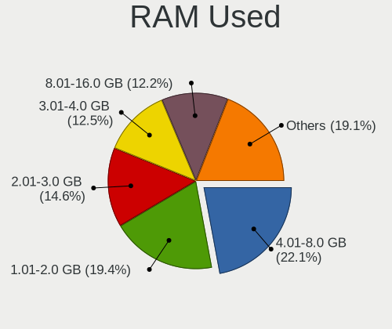
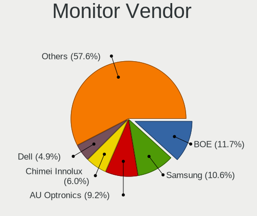
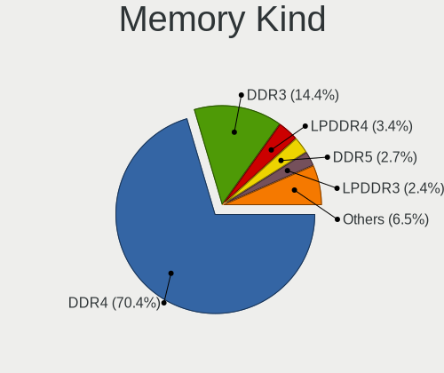
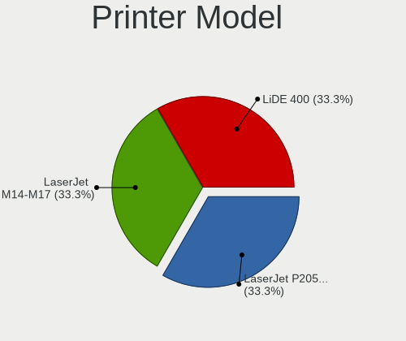
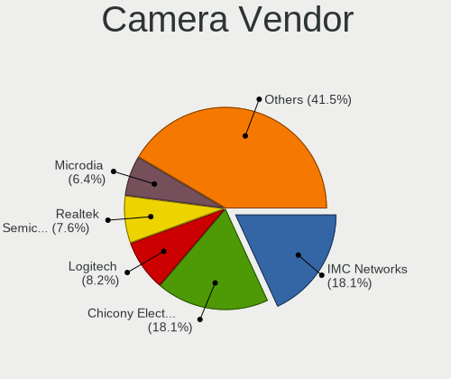
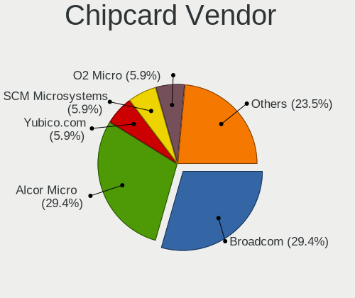
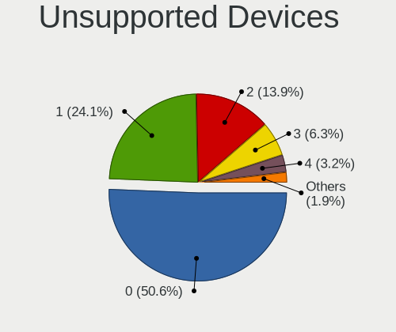

Gentoo 2.8 - Tested Hardware & Statistics
-----------------------------------------

A project to collect tested hardware configurations for Gentoo 2.8.

Anyone can contribute to this report by the [hw-probe](https://github.com/linuxhw/hw-probe) tool:

    sudo -E hw-probe -all -upload

Please contribute! Especially if your hardware is rare.

This is a report for all computer types. See also reports for [desktops](/Dist/Gentoo_2.8/Desktop/README.md) and [notebooks](/Dist/Gentoo_2.8/Notebook/README.md).

Contents
--------

* [ Test Cases ](#test-cases)

* [ System ](#system)
  - [ Kernel                   ](#kernel)
  - [ Kernel Family            ](#kernel-family)
  - [ Kernel Major Ver.        ](#kernel-major-ver)
  - [ Arch                     ](#arch)
  - [ DE                       ](#de)
  - [ Display Server           ](#display-server)
  - [ Display Manager          ](#display-manager)
  - [ OS Lang                  ](#os-lang)
  - [ Boot Mode                ](#boot-mode)
  - [ Filesystem               ](#filesystem)
  - [ Part. scheme             ](#part-scheme)
  - [ Dual Boot with Linux/BSD ](#dual-boot-with-linuxbsd)
  - [ Dual Boot (Win)          ](#dual-boot-win)

* [ Board ](#board)
  - [ Vendor                   ](#vendor)
  - [ Model                    ](#model)
  - [ Model Family             ](#model-family)
  - [ MFG Year                 ](#mfg-year)
  - [ Form Factor              ](#form-factor)
  - [ Secure Boot              ](#secure-boot)
  - [ Coreboot                 ](#coreboot)
  - [ RAM Size                 ](#ram-size)
  - [ RAM Used                 ](#ram-used)
  - [ Total Drives             ](#total-drives)
  - [ Has CD-ROM               ](#has-cd-rom)
  - [ Has Ethernet             ](#has-ethernet)
  - [ Has WiFi                 ](#has-wifi)
  - [ Has Bluetooth            ](#has-bluetooth)

* [ Location ](#location)
  - [ Country                  ](#country)
  - [ City                     ](#city)

* [ Drives ](#drives)
  - [ Drive Vendor             ](#drive-vendor)
  - [ Drive Model              ](#drive-model)
  - [ HDD Vendor               ](#hdd-vendor)
  - [ SSD Vendor               ](#ssd-vendor)
  - [ Drive Kind               ](#drive-kind)
  - [ Drive Connector          ](#drive-connector)
  - [ Drive Size               ](#drive-size)
  - [ Space Total              ](#space-total)
  - [ Space Used               ](#space-used)
  - [ Malfunc. Drives          ](#malfunc-drives)
  - [ Malfunc. Drive Vendor    ](#malfunc-drive-vendor)
  - [ Malfunc. HDD Vendor      ](#malfunc-hdd-vendor)
  - [ Malfunc. Drive Kind      ](#malfunc-drive-kind)
  - [ Failed Drives            ](#failed-drives)
  - [ Failed Drive Vendor      ](#failed-drive-vendor)
  - [ Drive Status             ](#drive-status)

* [ Storage controller ](#storage-controller)
  - [ Storage Vendor           ](#storage-vendor)
  - [ Storage Model            ](#storage-model)
  - [ Storage Kind             ](#storage-kind)

* [ Processor ](#processor)
  - [ CPU Vendor               ](#cpu-vendor)
  - [ CPU Model                ](#cpu-model)
  - [ CPU Model Family         ](#cpu-model-family)
  - [ CPU Cores                ](#cpu-cores)
  - [ CPU Sockets              ](#cpu-sockets)
  - [ CPU Threads              ](#cpu-threads)
  - [ CPU Op-Modes             ](#cpu-op-modes)
  - [ CPU Microcode            ](#cpu-microcode)
  - [ CPU Microarch            ](#cpu-microarch)

* [ Graphics ](#graphics)
  - [ GPU Vendor               ](#gpu-vendor)
  - [ GPU Model                ](#gpu-model)
  - [ GPU Combo                ](#gpu-combo)
  - [ GPU Driver               ](#gpu-driver)
  - [ GPU Memory               ](#gpu-memory)

* [ Monitor ](#monitor)
  - [ Monitor Vendor           ](#monitor-vendor)
  - [ Monitor Model            ](#monitor-model)
  - [ Monitor Resolution       ](#monitor-resolution)
  - [ Monitor Diagonal         ](#monitor-diagonal)
  - [ Monitor Width            ](#monitor-width)
  - [ Aspect Ratio             ](#aspect-ratio)
  - [ Monitor Area             ](#monitor-area)
  - [ Pixel Density            ](#pixel-density)
  - [ Multiple Monitors        ](#multiple-monitors)

* [ Network ](#network)
  - [ Net Controller Vendor    ](#net-controller-vendor)
  - [ Net Controller Model     ](#net-controller-model)
  - [ Wireless Vendor          ](#wireless-vendor)
  - [ Wireless Model           ](#wireless-model)
  - [ Ethernet Vendor          ](#ethernet-vendor)
  - [ Ethernet Model           ](#ethernet-model)
  - [ Net Controller Kind      ](#net-controller-kind)
  - [ Used Controller          ](#used-controller)
  - [ NICs                     ](#nics)
  - [ IPv6                     ](#ipv6)

* [ Bluetooth ](#bluetooth)
  - [ Bluetooth Vendor         ](#bluetooth-vendor)
  - [ Bluetooth Model          ](#bluetooth-model)

* [ Sound ](#sound)
  - [ Sound Vendor             ](#sound-vendor)
  - [ Sound Model              ](#sound-model)

* [ Memory ](#memory)
  - [ Memory Vendor            ](#memory-vendor)
  - [ Memory Model             ](#memory-model)
  - [ Memory Kind              ](#memory-kind)
  - [ Memory Form Factor       ](#memory-form-factor)
  - [ Memory Size              ](#memory-size)
  - [ Memory Speed             ](#memory-speed)

* [ Printers & scanners ](#printers--scanners)
  - [ Printer Vendor           ](#printer-vendor)
  - [ Printer Model            ](#printer-model)
  - [ Scanner Vendor           ](#scanner-vendor)
  - [ Scanner Model            ](#scanner-model)

* [ Camera ](#camera)
  - [ Camera Vendor            ](#camera-vendor)
  - [ Camera Model             ](#camera-model)

* [ Security ](#security)
  - [ Fingerprint Vendor       ](#fingerprint-vendor)
  - [ Fingerprint Model        ](#fingerprint-model)
  - [ Chipcard Vendor          ](#chipcard-vendor)
  - [ Chipcard Model           ](#chipcard-model)

* [ Unsupported ](#unsupported)
  - [ Unsupported Devices      ](#unsupported-devices)
  - [ Unsupported Device Types ](#unsupported-device-types)

Test Cases
----------

Total: 375

| Vendor        | Model                       | Form-Factor | Probe                                                      | Date         |
|---------------|-----------------------------|-------------|------------------------------------------------------------|--------------|
| ASUSTek       | Zenbook UM5302TA_UM5302T... | Notebook    | [1cfda531dd](https://linux-hardware.org/?probe=1cfda531dd) | Oct 01, 2022 |
| HP            | Laptop 15s-eq2xxx           | Notebook    | [6d9c960574](https://linux-hardware.org/?probe=6d9c960574) | Sep 28, 2022 |
| HP            | Laptop 14-dk1xxx            | Notebook    | [4479784a2e](https://linux-hardware.org/?probe=4479784a2e) | Sep 28, 2022 |
| HP            | Laptop 14-dk1xxx            | Notebook    | [d0808e8abe](https://linux-hardware.org/?probe=d0808e8abe) | Sep 27, 2022 |
| ASUSTek       | ROG STRIX Z590-E GAMING ... | Desktop     | [b3b8d3e04f](https://linux-hardware.org/?probe=b3b8d3e04f) | Sep 26, 2022 |
| ASUSTek       | ROG STRIX Z590-E GAMING ... | Desktop     | [9795d4f9aa](https://linux-hardware.org/?probe=9795d4f9aa) | Sep 26, 2022 |
| ASUSTek       | M3A78-CM                    | Desktop     | [6d3f575c3d](https://linux-hardware.org/?probe=6d3f575c3d) | Sep 26, 2022 |
| Sony          | PCG-GRT230(UC)              | Notebook    | [af843c265c](https://linux-hardware.org/?probe=af843c265c) | Sep 26, 2022 |
| Gigabyte      | AB350-Gaming-CF             | Desktop     | [c447921f07](https://linux-hardware.org/?probe=c447921f07) | Sep 25, 2022 |
| Lenovo        | ThinkPad P73 20QRS0G700     | Notebook    | [b32a413aa9](https://linux-hardware.org/?probe=b32a413aa9) | Sep 25, 2022 |
| Lenovo        | Yoga 310-11IAP 80U2         | Convertible | [6c8a53f608](https://linux-hardware.org/?probe=6c8a53f608) | Sep 25, 2022 |
| Lenovo        | ThinkPad P73 20QRS0G700     | Notebook    | [6ea4c40a80](https://linux-hardware.org/?probe=6ea4c40a80) | Sep 25, 2022 |
| ASRock        | J3160M                      | Desktop     | [c9cc54f48e](https://linux-hardware.org/?probe=c9cc54f48e) | Sep 25, 2022 |
| HP            | EliteBook 830 G6            | Notebook    | [cdbc7c7949](https://linux-hardware.org/?probe=cdbc7c7949) | Sep 25, 2022 |
| Supermicro    | H11SSL-i                    | Server      | [dd3ce003e4](https://linux-hardware.org/?probe=dd3ce003e4) | Sep 25, 2022 |
| HP            | EliteBook 830 G6            | Notebook    | [907383d255](https://linux-hardware.org/?probe=907383d255) | Sep 25, 2022 |
| Matsushita... | CF-29LTQGZBM                | Notebook    | [29f52f862c](https://linux-hardware.org/?probe=29f52f862c) | Sep 24, 2022 |
| Lenovo        | ThinkPad E15 Gen 2 20T80... | Notebook    | [de7c138e21](https://linux-hardware.org/?probe=de7c138e21) | Sep 22, 2022 |
| Lenovo        | ThinkPad L580 20LWCTO1WW    | Notebook    | [a80367f777](https://linux-hardware.org/?probe=a80367f777) | Sep 21, 2022 |
| ASUSTek       | ROG STRIX X570-I GAMING     | Desktop     | [d22f082243](https://linux-hardware.org/?probe=d22f082243) | Sep 21, 2022 |
| ASUSTek       | ROG STRIX X570-I GAMING     | Desktop     | [e4f1a8245a](https://linux-hardware.org/?probe=e4f1a8245a) | Sep 21, 2022 |
| ASUSTek       | AM1M-A                      | Desktop     | [a6e61a9993](https://linux-hardware.org/?probe=a6e61a9993) | Sep 19, 2022 |
| ASUSTek       | M3A78-CM                    | Desktop     | [eb1c0556c3](https://linux-hardware.org/?probe=eb1c0556c3) | Sep 19, 2022 |
| Gigabyte      | AB350-Gaming-CF             | Desktop     | [5a9ab0de04](https://linux-hardware.org/?probe=5a9ab0de04) | Sep 18, 2022 |
| System76      | Gazelle Professional        | Notebook    | [95f19a0c4c](https://linux-hardware.org/?probe=95f19a0c4c) | Sep 18, 2022 |
| ASUSTek       | ROG STRIX B550-F GAMING     | Desktop     | [d4d8cc3f34](https://linux-hardware.org/?probe=d4d8cc3f34) | Sep 16, 2022 |
| Dell          | G7 7588                     | Notebook    | [583c4a4c91](https://linux-hardware.org/?probe=583c4a4c91) | Sep 16, 2022 |
| Gigabyte      | Z590 UD                     | Desktop     | [475ed7f917](https://linux-hardware.org/?probe=475ed7f917) | Sep 15, 2022 |
| ASUSTek       | ROG STRIX B450-F GAMING     | Desktop     | [7ad1180946](https://linux-hardware.org/?probe=7ad1180946) | Sep 14, 2022 |
| Timi          | TM1604                      | Notebook    | [80f52c9545](https://linux-hardware.org/?probe=80f52c9545) | Sep 14, 2022 |
| HUAWEI        | KLVL-WXX9                   | Notebook    | [7bc7cbca76](https://linux-hardware.org/?probe=7bc7cbca76) | Sep 12, 2022 |
| ASUSTek       | M3A78-CM                    | Desktop     | [225bd59ba7](https://linux-hardware.org/?probe=225bd59ba7) | Sep 12, 2022 |
| Gigabyte      | AB350-Gaming-CF             | Desktop     | [ed5273b278](https://linux-hardware.org/?probe=ed5273b278) | Sep 11, 2022 |
| Intel         | X79G V2.x                   | Desktop     | [3cb7aa6549](https://linux-hardware.org/?probe=3cb7aa6549) | Sep 11, 2022 |
| MSI           | B450M MORTAR                | Desktop     | [2e0d41f272](https://linux-hardware.org/?probe=2e0d41f272) | Sep 10, 2022 |
| MSI           | B450M MORTAR                | Desktop     | [06ee689632](https://linux-hardware.org/?probe=06ee689632) | Sep 10, 2022 |
| ASUSTek       | ROG CROSSHAIR VIII HERO     | Desktop     | [5cfe072b9c](https://linux-hardware.org/?probe=5cfe072b9c) | Sep 10, 2022 |
| ASRock        | Z390 Phantom Gaming 4S      | Desktop     | [146e7ebf49](https://linux-hardware.org/?probe=146e7ebf49) | Sep 08, 2022 |
| Gigabyte      | B660 GAMING X AX DDR4       | Desktop     | [3d12a72937](https://linux-hardware.org/?probe=3d12a72937) | Sep 06, 2022 |
| MSI           | B450 TOMAHAWK MAX II        | Desktop     | [cc1fde17e8](https://linux-hardware.org/?probe=cc1fde17e8) | Sep 06, 2022 |
| Dell          | Latitude D410               | Notebook    | [6782e0a28f](https://linux-hardware.org/?probe=6782e0a28f) | Sep 05, 2022 |
| Acer          | Swift SF314-42              | Notebook    | [12fbd247f5](https://linux-hardware.org/?probe=12fbd247f5) | Sep 05, 2022 |
| Gigabyte      | AB350-Gaming-CF             | Desktop     | [1d90e3b685](https://linux-hardware.org/?probe=1d90e3b685) | Sep 05, 2022 |
| Lenovo        | ThinkPad T14 Gen 3 21AH0... | Notebook    | [88392a79f5](https://linux-hardware.org/?probe=88392a79f5) | Sep 04, 2022 |
| win elemen... | MoreFine S500+              | Notebook    | [d02a951b89](https://linux-hardware.org/?probe=d02a951b89) | Sep 04, 2022 |
| Lenovo        | ThinkPad E15 Gen 2 20T80... | Notebook    | [8320ded55c](https://linux-hardware.org/?probe=8320ded55c) | Sep 02, 2022 |
| Lenovo        | ThinkPad E15 Gen 2 20T80... | Notebook    | [21392e76a8](https://linux-hardware.org/?probe=21392e76a8) | Sep 01, 2022 |
| Lenovo        | ThinkPad E15 Gen 2 20T80... | Notebook    | [e16313490d](https://linux-hardware.org/?probe=e16313490d) | Sep 01, 2022 |
| Toshiba       | Satellite C850D-118         | Notebook    | [1950f0aeac](https://linux-hardware.org/?probe=1950f0aeac) | Aug 31, 2022 |
| ASUSTek       | M3A78-CM                    | Desktop     | [d146908413](https://linux-hardware.org/?probe=d146908413) | Aug 31, 2022 |
| Toshiba       | Satellite C850D-118         | Notebook    | [07000e4194](https://linux-hardware.org/?probe=07000e4194) | Aug 30, 2022 |
| Lenovo        | ThinkPad P50 20EQS33R0J     | Notebook    | [72f6962ac8](https://linux-hardware.org/?probe=72f6962ac8) | Aug 30, 2022 |
| ASRock        | X370 Gaming X               | Desktop     | [e915bb3a8c](https://linux-hardware.org/?probe=e915bb3a8c) | Aug 29, 2022 |
| win elemen... | MoreFine S500+              | Notebook    | [5a51c31ac9](https://linux-hardware.org/?probe=5a51c31ac9) | Aug 29, 2022 |
| Eluktronic... | MAX-17                      | Notebook    | [627ecbeb36](https://linux-hardware.org/?probe=627ecbeb36) | Aug 29, 2022 |
| Dell          | Precision 3570              | Notebook    | [7f7a44c923](https://linux-hardware.org/?probe=7f7a44c923) | Aug 29, 2022 |
| Timi          | A35                         | Notebook    | [df50ea1876](https://linux-hardware.org/?probe=df50ea1876) | Aug 29, 2022 |
| Gigabyte      | AB350-Gaming-CF             | Desktop     | [499889da7e](https://linux-hardware.org/?probe=499889da7e) | Aug 28, 2022 |
| ASRock        | X370 Gaming X               | Desktop     | [489691c2e3](https://linux-hardware.org/?probe=489691c2e3) | Aug 28, 2022 |
| Lenovo        | ThinkPad L15 Gen 2a 20X7... | Notebook    | [f30320f76e](https://linux-hardware.org/?probe=f30320f76e) | Aug 27, 2022 |
| Lenovo        | ThinkPad L15 Gen 2a 20X7... | Notebook    | [a1b7c5d6ab](https://linux-hardware.org/?probe=a1b7c5d6ab) | Aug 27, 2022 |
| Lenovo        | 3716 SDK0R32862 WIN 3258... | Desktop     | [7e810b23be](https://linux-hardware.org/?probe=7e810b23be) | Aug 26, 2022 |
| Lenovo        | ThinkBook 13s G2 ITL 20V... | Notebook    | [cf7da7df12](https://linux-hardware.org/?probe=cf7da7df12) | Aug 26, 2022 |
| Lenovo        | ThinkBook 13s G2 ITL 20V... | Notebook    | [76db86107b](https://linux-hardware.org/?probe=76db86107b) | Aug 26, 2022 |
| Lenovo        | Yoga S940-14IWL 81Q7        | Notebook    | [416e5db831](https://linux-hardware.org/?probe=416e5db831) | Aug 26, 2022 |
| Lenovo        | ThinkPad Yoga 460 20EMCT... | Convertible | [73c79e8944](https://linux-hardware.org/?probe=73c79e8944) | Aug 25, 2022 |
| Lenovo        | ThinkPad L15 Gen 2a 20X7... | Notebook    | [8a23dbfd36](https://linux-hardware.org/?probe=8a23dbfd36) | Aug 25, 2022 |
| Gigabyte      | Z77X-D3H                    | Desktop     | [294fe7d6c8](https://linux-hardware.org/?probe=294fe7d6c8) | Aug 24, 2022 |
| Gigabyte      | Z77X-D3H                    | Desktop     | [2952e542e1](https://linux-hardware.org/?probe=2952e542e1) | Aug 24, 2022 |
| ASUSTek       | TUF Gaming X570-PLUS        | Desktop     | [0df091061c](https://linux-hardware.org/?probe=0df091061c) | Aug 24, 2022 |
| Lenovo        | ThinkPad L15 Gen 2a 20X7... | Notebook    | [6d0a3e71d7](https://linux-hardware.org/?probe=6d0a3e71d7) | Aug 24, 2022 |
| ASUSTek       | M3A78-CM                    | Desktop     | [d22f756c4c](https://linux-hardware.org/?probe=d22f756c4c) | Aug 24, 2022 |
| ASUSTek       | TUF Gaming X570-PLUS        | Desktop     | [0c80683e2a](https://linux-hardware.org/?probe=0c80683e2a) | Aug 23, 2022 |
| Gigabyte      | AB350-Gaming-CF             | Desktop     | [f38202db0d](https://linux-hardware.org/?probe=f38202db0d) | Aug 21, 2022 |
| MSI           | Z590-A PRO                  | Desktop     | [8445aa0041](https://linux-hardware.org/?probe=8445aa0041) | Aug 20, 2022 |
| Timi          | A35                         | Notebook    | [cf89c68d08](https://linux-hardware.org/?probe=cf89c68d08) | Aug 19, 2022 |
| IBM           | 2722BDG                     | Notebook    | [e0fe2162a3](https://linux-hardware.org/?probe=e0fe2162a3) | Aug 18, 2022 |
| ASUSTek       | M3A78-CM                    | Desktop     | [1ea309e90c](https://linux-hardware.org/?probe=1ea309e90c) | Aug 17, 2022 |
| Gigabyte      | B450 GAMING X               | Desktop     | [80760b8e4b](https://linux-hardware.org/?probe=80760b8e4b) | Aug 16, 2022 |
| Dell          | G3 3500                     | Notebook    | [6a860d7c0f](https://linux-hardware.org/?probe=6a860d7c0f) | Aug 15, 2022 |
| Gigabyte      | AB350-Gaming-CF             | Desktop     | [48637ddb10](https://linux-hardware.org/?probe=48637ddb10) | Aug 14, 2022 |
| Purism        | Librem 15 v4                | Notebook    | [4448709e50](https://linux-hardware.org/?probe=4448709e50) | Aug 13, 2022 |
| Purism        | Librem 15 v4                | Notebook    | [9e76f9e7ff](https://linux-hardware.org/?probe=9e76f9e7ff) | Aug 13, 2022 |
| HP            | EliteBook 845 14 inch G9... | Notebook    | [ee6f495403](https://linux-hardware.org/?probe=ee6f495403) | Aug 13, 2022 |
| HP            | EliteBook 845 14 inch G9... | Notebook    | [289850f128](https://linux-hardware.org/?probe=289850f128) | Aug 13, 2022 |
| MSI           | B450 TOMAHAWK               | Desktop     | [8d95c82a1d](https://linux-hardware.org/?probe=8d95c82a1d) | Aug 12, 2022 |
| Timi          | A35                         | Notebook    | [944f3f0942](https://linux-hardware.org/?probe=944f3f0942) | Aug 12, 2022 |
| Lenovo        | ThinkPad L15 Gen 2a 20X7... | Notebook    | [166edbd7db](https://linux-hardware.org/?probe=166edbd7db) | Aug 12, 2022 |
| MSI           | B450 GAMING PRO CARBON A... | Desktop     | [7d7ceef044](https://linux-hardware.org/?probe=7d7ceef044) | Aug 12, 2022 |
| Acer          | Swift SF314-512             | Notebook    | [c374f64c25](https://linux-hardware.org/?probe=c374f64c25) | Aug 11, 2022 |
| Notebook      | N141CU                      | Notebook    | [4d96f7358c](https://linux-hardware.org/?probe=4d96f7358c) | Aug 10, 2022 |
| Acer          | Swift SF314-512             | Notebook    | [0c23760c27](https://linux-hardware.org/?probe=0c23760c27) | Aug 10, 2022 |
| Unknown       | QNAP TS-221                 | Desktop     | [8d3f7ca9cf](https://linux-hardware.org/?probe=8d3f7ca9cf) | Aug 10, 2022 |
| ASUSTek       | PRIME Z390-A                | Desktop     | [2781a13b80](https://linux-hardware.org/?probe=2781a13b80) | Aug 10, 2022 |
| ASUSTek       | ASUS TUF Gaming F17 FX70... | Notebook    | [9b228ae787](https://linux-hardware.org/?probe=9b228ae787) | Aug 10, 2022 |
| ASUSTek       | ASUS TUF Gaming F17 FX70... | Notebook    | [9f2e51f185](https://linux-hardware.org/?probe=9f2e51f185) | Aug 10, 2022 |
| ASRock        | P67 Extreme4 Gen3           | Desktop     | [b94e1be5ab](https://linux-hardware.org/?probe=b94e1be5ab) | Aug 09, 2022 |
| Lenovo        | Legion 5 Pro 16ACH6H 82J... | Notebook    | [0e7d0b5d33](https://linux-hardware.org/?probe=0e7d0b5d33) | Aug 09, 2022 |
| ASUSTek       | M3A78-CM                    | Desktop     | [1f10876798](https://linux-hardware.org/?probe=1f10876798) | Aug 08, 2022 |
| Microsoft     | Surface Go 3                | Tablet      | [f97852a196](https://linux-hardware.org/?probe=f97852a196) | Aug 08, 2022 |
| Lenovo        | ThinkPad Z16 Gen 1 21D40... | Notebook    | [78f846e0e5](https://linux-hardware.org/?probe=78f846e0e5) | Aug 08, 2022 |
| Gigabyte      | AB350-Gaming-CF             | Desktop     | [ac538e23dc](https://linux-hardware.org/?probe=ac538e23dc) | Aug 07, 2022 |
| Microsoft     | Surface Go 3                | Tablet      | [ca880d8154](https://linux-hardware.org/?probe=ca880d8154) | Aug 06, 2022 |
| ASUSTek       | TUF B450M-PLUS GAMING       | Desktop     | [3e7a65077d](https://linux-hardware.org/?probe=3e7a65077d) | Aug 06, 2022 |
| ASUSTek       | VivoBook_ASUSLaptop X421... | Notebook    | [2ff6a7fe85](https://linux-hardware.org/?probe=2ff6a7fe85) | Aug 06, 2022 |
| ASUSTek       | VivoBook_ASUSLaptop X421... | Notebook    | [d54acf14ff](https://linux-hardware.org/?probe=d54acf14ff) | Aug 06, 2022 |
| Toshiba       | NB100                       | Notebook    | [b91ee9b36b](https://linux-hardware.org/?probe=b91ee9b36b) | Aug 05, 2022 |
| HUAWEI        | HVY-WXX9                    | Notebook    | [019849a487](https://linux-hardware.org/?probe=019849a487) | Aug 04, 2022 |
| Gigabyte      | B450 GAMING X               | Desktop     | [b875ef6dbf](https://linux-hardware.org/?probe=b875ef6dbf) | Aug 04, 2022 |
| Lenovo        | ThinkPad T14 Gen 1 20S1S... | Notebook    | [4caa777a81](https://linux-hardware.org/?probe=4caa777a81) | Aug 04, 2022 |
| Pine Micro... | Pine64 PinePhonePro         | Phone       | [f14436327b](https://linux-hardware.org/?probe=f14436327b) | Aug 04, 2022 |
| Samsung       | 700G7C                      | Notebook    | [cd554f5d17](https://linux-hardware.org/?probe=cd554f5d17) | Aug 03, 2022 |
| ASUSTek       | ROG STRIX X570-E GAMING     | Desktop     | [3db1e1ee37](https://linux-hardware.org/?probe=3db1e1ee37) | Aug 03, 2022 |
| Pine Micro... | Pine64 PinePhonePro         | Phone       | [2cea7378e8](https://linux-hardware.org/?probe=2cea7378e8) | Aug 03, 2022 |
| Gigabyte      | B550M DS3H                  | Desktop     | [69188053f5](https://linux-hardware.org/?probe=69188053f5) | Aug 02, 2022 |
| ASRock        | B75M-GL R2.0                | Desktop     | [eed9f05678](https://linux-hardware.org/?probe=eed9f05678) | Aug 01, 2022 |
| Fanless Mi... | PCG02 GLE                   | Stick pc    | [19d2273e6b](https://linux-hardware.org/?probe=19d2273e6b) | Aug 01, 2022 |
| ASUSTek       | ROG Maximus Z690 EXTREME    | Desktop     | [effa59ed64](https://linux-hardware.org/?probe=effa59ed64) | Aug 01, 2022 |
| ASRock        | B550M Steel Legend          | Desktop     | [0ac4f27d0f](https://linux-hardware.org/?probe=0ac4f27d0f) | Jul 31, 2022 |
| ASUSTek       | TUF Gaming X570-PLUS        | Desktop     | [f22250f00c](https://linux-hardware.org/?probe=f22250f00c) | Jul 31, 2022 |
| TUXEDO        | InfinityBook Pro 14 Gen6    | Notebook    | [de9a854095](https://linux-hardware.org/?probe=de9a854095) | Jul 31, 2022 |
| ASUSTek       | M3A78-CM                    | Desktop     | [1051593809](https://linux-hardware.org/?probe=1051593809) | Jul 31, 2022 |
| Gigabyte      | 970A-DS3                    | Desktop     | [78f00bd2aa](https://linux-hardware.org/?probe=78f00bd2aa) | Jul 30, 2022 |
| Razer         | Blade 15 Studio Edition ... | Notebook    | [359f708604](https://linux-hardware.org/?probe=359f708604) | Jul 30, 2022 |
| Lenovo        | 1046 SDK0T08861 WIN 3305... | Desktop     | [d3d824f468](https://linux-hardware.org/?probe=d3d824f468) | Jul 29, 2022 |
| MSI           | B450M MORTAR                | Desktop     | [29a26324b9](https://linux-hardware.org/?probe=29a26324b9) | Jul 29, 2022 |
| ASUSTek       | ROG G703GI_G7BI             | Notebook    | [88a326be83](https://linux-hardware.org/?probe=88a326be83) | Jul 28, 2022 |
| Dell          | XPS 15 9570                 | Notebook    | [e7f56631b1](https://linux-hardware.org/?probe=e7f56631b1) | Jul 27, 2022 |
| Supermicro    | X10SRL-FB                   | Server      | [a8dc9cfc07](https://linux-hardware.org/?probe=a8dc9cfc07) | Jul 27, 2022 |
| Intel         | D54250WYK H13922-303        | Desktop     | [5ff32931fa](https://linux-hardware.org/?probe=5ff32931fa) | Jul 27, 2022 |
| MSI           | MPG Z390 GAMING PRO CARB... | Desktop     | [dc7eff27cf](https://linux-hardware.org/?probe=dc7eff27cf) | Jul 26, 2022 |
| Dell          | XPS 15 9570                 | Notebook    | [f3972b3a7d](https://linux-hardware.org/?probe=f3972b3a7d) | Jul 26, 2022 |
| Timi          | Mi Laptop Pro 15 2020       | Notebook    | [5455e664e0](https://linux-hardware.org/?probe=5455e664e0) | Jul 26, 2022 |
| HP            | EliteBook 845 G7 Noteboo... | Notebook    | [b15fb90c18](https://linux-hardware.org/?probe=b15fb90c18) | Jul 26, 2022 |
| ASRock        | X399 Taichi                 | Desktop     | [d2eb8a032b](https://linux-hardware.org/?probe=d2eb8a032b) | Jul 26, 2022 |
| ASUSTek       | ROG Maximus XI HERO         | Desktop     | [c98fed5f84](https://linux-hardware.org/?probe=c98fed5f84) | Jul 25, 2022 |
| ASUSTek       | ROG Maximus Z690 EXTREME    | Desktop     | [dae325b47b](https://linux-hardware.org/?probe=dae325b47b) | Jul 25, 2022 |
| Dell          | 0FKD45 A03                  | Server      | [0caba2e4b0](https://linux-hardware.org/?probe=0caba2e4b0) | Jul 25, 2022 |
| HP            | OMEN by Laptop 16-c0xxx     | Notebook    | [8f46b7dcca](https://linux-hardware.org/?probe=8f46b7dcca) | Jul 25, 2022 |
| HP            | Laptop 17-ca1xxx            | Notebook    | [64dad58b71](https://linux-hardware.org/?probe=64dad58b71) | Jul 25, 2022 |
| ASUSTek       | ROG Zephyrus G14 GA402RJ... | Notebook    | [6302f1ee8b](https://linux-hardware.org/?probe=6302f1ee8b) | Jul 25, 2022 |
| ASUSTek       | M3A78-CM                    | Desktop     | [e1e16aa154](https://linux-hardware.org/?probe=e1e16aa154) | Jul 25, 2022 |
| Gigabyte      | AB350-Gaming-CF             | Desktop     | [153acd77c2](https://linux-hardware.org/?probe=153acd77c2) | Jul 24, 2022 |
| ASRock        | AM1H-ITX                    | Desktop     | [a15c82ba0c](https://linux-hardware.org/?probe=a15c82ba0c) | Jul 24, 2022 |
| TYAN Compu... | S7025                       | Server      | [844d96fcd7](https://linux-hardware.org/?probe=844d96fcd7) | Jul 22, 2022 |
| Unknown       | QNAP TS-221                 | Desktop     | [fb3741faab](https://linux-hardware.org/?probe=fb3741faab) | Jul 21, 2022 |
| ASRock        | X570 Taichi                 | Desktop     | [56d5853243](https://linux-hardware.org/?probe=56d5853243) | Jul 19, 2022 |
| MSI           | MEG X570 UNIFY              | Desktop     | [d3d26541f1](https://linux-hardware.org/?probe=d3d26541f1) | Jul 19, 2022 |
| Gigabyte      | AB350-Gaming-CF             | Desktop     | [8f2f1582e8](https://linux-hardware.org/?probe=8f2f1582e8) | Jul 17, 2022 |
| ASUSTek       | M3A78-CM                    | Desktop     | [056d74f1a9](https://linux-hardware.org/?probe=056d74f1a9) | Jul 17, 2022 |
| ASUSTek       | ROG STRIX B560-I GAMING ... | Desktop     | [e6b6d3b5e6](https://linux-hardware.org/?probe=e6b6d3b5e6) | Jul 16, 2022 |
| ASUSTek       | ROG STRIX B560-I GAMING ... | Desktop     | [93f8a4ce9f](https://linux-hardware.org/?probe=93f8a4ce9f) | Jul 16, 2022 |
| Gigabyte      | Z590 UD                     | Desktop     | [e9e0b50bbb](https://linux-hardware.org/?probe=e9e0b50bbb) | Jul 15, 2022 |
| Dell          | Latitude 5289               | Convertible | [a0844cdadd](https://linux-hardware.org/?probe=a0844cdadd) | Jul 15, 2022 |
| ASUSTek       | ROG G703GI_G7BI             | Notebook    | [4d636c74d3](https://linux-hardware.org/?probe=4d636c74d3) | Jul 14, 2022 |
| MSI           | Z87-G45 GAMING              | Desktop     | [8602f7246a](https://linux-hardware.org/?probe=8602f7246a) | Jul 12, 2022 |
| Lenovo        | ThinkPad X13 Yoga Gen 2 ... | Convertible | [0d6de2415e](https://linux-hardware.org/?probe=0d6de2415e) | Jul 11, 2022 |
| MSI           | GS63VR 6RF                  | Notebook    | [30ad17796f](https://linux-hardware.org/?probe=30ad17796f) | Jul 11, 2022 |
| Lenovo        | IdeaPad 100-15IBD 80QQ      | Notebook    | [94e9d2f65a](https://linux-hardware.org/?probe=94e9d2f65a) | Jul 10, 2022 |
| Lenovo        | G510 20238                  | Notebook    | [f67a64f833](https://linux-hardware.org/?probe=f67a64f833) | Jul 10, 2022 |
| Gigabyte      | B450 AORUS M                | Desktop     | [6d15b85193](https://linux-hardware.org/?probe=6d15b85193) | Jul 10, 2022 |
| Lenovo        | ThinkPad T14 Gen 2a 20XK... | Notebook    | [8f36480ad7](https://linux-hardware.org/?probe=8f36480ad7) | Jul 10, 2022 |
| Dell          | 0J3C2F A02                  | Desktop     | [dccb88852f](https://linux-hardware.org/?probe=dccb88852f) | Jul 10, 2022 |
| ASUSTek       | M3A78-CM                    | Desktop     | [0237c9df10](https://linux-hardware.org/?probe=0237c9df10) | Jul 10, 2022 |
| ASUSTek       | ROG STRIX B550-F GAMING     | Desktop     | [85dbd84c37](https://linux-hardware.org/?probe=85dbd84c37) | Jul 09, 2022 |
| Dell          | 0J3C2F A02                  | Desktop     | [aa87616696](https://linux-hardware.org/?probe=aa87616696) | Jul 09, 2022 |
| Dell          | Latitude D420               | Notebook    | [2e3ded5234](https://linux-hardware.org/?probe=2e3ded5234) | Jul 08, 2022 |
| MSI           | GS63VR 6RF                  | Notebook    | [097cc820d3](https://linux-hardware.org/?probe=097cc820d3) | Jul 08, 2022 |
| Lenovo        | G510 20238                  | Notebook    | [5bdfb575ae](https://linux-hardware.org/?probe=5bdfb575ae) | Jul 07, 2022 |
| ASUSTek       | VivoBook_ASUSLaptop M760... | Notebook    | [850003c6da](https://linux-hardware.org/?probe=850003c6da) | Jul 05, 2022 |
| Lenovo        | IdeaPad 3 15ALC6 82KU       | Notebook    | [1b94ade16a](https://linux-hardware.org/?probe=1b94ade16a) | Jul 05, 2022 |
| ASUSTek       | ROG CROSSHAIR VIII DARK ... | Desktop     | [685e3d36bc](https://linux-hardware.org/?probe=685e3d36bc) | Jul 04, 2022 |
| ASUSTek       | ROG CROSSHAIR VIII DARK ... | Desktop     | [b436712f17](https://linux-hardware.org/?probe=b436712f17) | Jul 04, 2022 |
| ASUSTek       | ROG Maximus XI HERO         | Desktop     | [d442c531e8](https://linux-hardware.org/?probe=d442c531e8) | Jul 03, 2022 |
| Gigabyte      | Z690 AORUS MASTER           | Desktop     | [cf8784ac23](https://linux-hardware.org/?probe=cf8784ac23) | Jul 03, 2022 |
| HP            | EliteBook 2560p             | Notebook    | [c1e5d91a40](https://linux-hardware.org/?probe=c1e5d91a40) | Jul 02, 2022 |
| Dell          | Latitude D420               | Notebook    | [162b346743](https://linux-hardware.org/?probe=162b346743) | Jul 02, 2022 |
| Supermicro    | X10SRL-FB                   | Server      | [253c441703](https://linux-hardware.org/?probe=253c441703) | Jul 02, 2022 |
| ASUSTek       | PRIME Z390-A                | Desktop     | [1af80d1cdb](https://linux-hardware.org/?probe=1af80d1cdb) | Jul 01, 2022 |
| Timi          | RedmiBook 13                | Notebook    | [fb3b3f37d5](https://linux-hardware.org/?probe=fb3b3f37d5) | Jun 30, 2022 |
| Dell          | Latitude D420               | Notebook    | [c531c131ec](https://linux-hardware.org/?probe=c531c131ec) | Jun 28, 2022 |
| ASUSTek       | M3A78-CM                    | Desktop     | [4c0fa03f61](https://linux-hardware.org/?probe=4c0fa03f61) | Jun 28, 2022 |
| ASUSTek       | X555LJ                      | Notebook    | [0c6dd4c77c](https://linux-hardware.org/?probe=0c6dd4c77c) | Jun 27, 2022 |
| Gigabyte      | AB350-Gaming-CF             | Desktop     | [79dca3a17c](https://linux-hardware.org/?probe=79dca3a17c) | Jun 26, 2022 |
| Fujitsu       | D3417-B2 S26361-D3417-B2    | Desktop     | [f03dcf744a](https://linux-hardware.org/?probe=f03dcf744a) | Jun 26, 2022 |
| Dell          | Precision 7550              | Notebook    | [4779d18806](https://linux-hardware.org/?probe=4779d18806) | Jun 24, 2022 |
| Gigabyte      | Z590 UD                     | Desktop     | [74060af6fc](https://linux-hardware.org/?probe=74060af6fc) | Jun 23, 2022 |
| Lenovo        | ThinkPad X13 Yoga Gen 2 ... | Convertible | [bab7d495b0](https://linux-hardware.org/?probe=bab7d495b0) | Jun 21, 2022 |
| AVITA         | NS14A6                      | Notebook    | [e3169acbbb](https://linux-hardware.org/?probe=e3169acbbb) | Jun 20, 2022 |
| Intel         | S5000XVN                    | Server      | [da50147a63](https://linux-hardware.org/?probe=da50147a63) | Jun 20, 2022 |
| Lenovo        | ThinkPad T460 20FMS421US    | Notebook    | [b290cf5fe0](https://linux-hardware.org/?probe=b290cf5fe0) | Jun 19, 2022 |
| Gigabyte      | AB350-Gaming-CF             | Desktop     | [2028b239fc](https://linux-hardware.org/?probe=2028b239fc) | Jun 19, 2022 |
| ASUSTek       | M3A78-CM                    | Desktop     | [20c198dd50](https://linux-hardware.org/?probe=20c198dd50) | Jun 19, 2022 |
| Lenovo        | ThinkPad T14 Gen 2a 20XK... | Notebook    | [27fd147a80](https://linux-hardware.org/?probe=27fd147a80) | Jun 19, 2022 |
| ASUSTek       | ROG Strix G513QY_G513QY     | Notebook    | [17b77e3069](https://linux-hardware.org/?probe=17b77e3069) | Jun 17, 2022 |
| Dell          | Inspiron 15 5510            | Notebook    | [286f8505c9](https://linux-hardware.org/?probe=286f8505c9) | Jun 17, 2022 |
| ASUSTek       | TUF Gaming X570-PLUS        | Desktop     | [fe7fa5fe7a](https://linux-hardware.org/?probe=fe7fa5fe7a) | Jun 17, 2022 |
| ASUSTek       | M3A78-CM                    | Desktop     | [59350b295e](https://linux-hardware.org/?probe=59350b295e) | Jun 13, 2022 |
| Gigabyte      | AB350-Gaming-CF             | Desktop     | [223b882103](https://linux-hardware.org/?probe=223b882103) | Jun 12, 2022 |
| HP            | OMEN by Laptop              | Notebook    | [7b531e1607](https://linux-hardware.org/?probe=7b531e1607) | Jun 09, 2022 |
| Dell          | XPS 13 9365                 | Convertible | [197f417cea](https://linux-hardware.org/?probe=197f417cea) | Jun 09, 2022 |
| ASUSTek       | ROG STRIX B450-F GAMING     | Desktop     | [80a6dc4a46](https://linux-hardware.org/?probe=80a6dc4a46) | Jun 09, 2022 |
| Dell          | XPS 13 9365                 | Convertible | [f237211ddb](https://linux-hardware.org/?probe=f237211ddb) | Jun 09, 2022 |
| Pegatron      | 2ACE                        | Desktop     | [838cad5bc2](https://linux-hardware.org/?probe=838cad5bc2) | Jun 06, 2022 |
| Dell          | 0KWVT8 A03                  | Desktop     | [5745c8b787](https://linux-hardware.org/?probe=5745c8b787) | Jun 06, 2022 |
| Gigabyte      | AB350-Gaming-CF             | Desktop     | [cb81a60917](https://linux-hardware.org/?probe=cb81a60917) | Jun 05, 2022 |
| Unknown       | Unknown                     | Desktop     | [c6f9883076](https://linux-hardware.org/?probe=c6f9883076) | Jun 05, 2022 |
| HP            | OMEN by Laptop 15-dc0xxx    | Notebook    | [f2ca17eb5d](https://linux-hardware.org/?probe=f2ca17eb5d) | Jun 05, 2022 |
| Unknown       | Unknown                     | Desktop     | [4abb49be35](https://linux-hardware.org/?probe=4abb49be35) | Jun 04, 2022 |
| Lenovo        | ThinkPad T14 Gen 1 20S1S... | Notebook    | [0c1909c43b](https://linux-hardware.org/?probe=0c1909c43b) | Jun 03, 2022 |
| MSI           | X570-A PRO                  | Desktop     | [102ed915c5](https://linux-hardware.org/?probe=102ed915c5) | Jun 02, 2022 |
| Dell          | XPS 17 9710                 | Notebook    | [d17975e27b](https://linux-hardware.org/?probe=d17975e27b) | Jun 02, 2022 |
| HUAWEI        | BOHB-WAX9                   | Notebook    | [0a458659f6](https://linux-hardware.org/?probe=0a458659f6) | Jun 01, 2022 |
| Lenovo        | Legion Y540-15IRH 81SX      | Notebook    | [09fcdacb15](https://linux-hardware.org/?probe=09fcdacb15) | Jun 01, 2022 |
| Dell          | XPS 17 9710                 | Notebook    | [d33b756434](https://linux-hardware.org/?probe=d33b756434) | Jun 01, 2022 |
| ASUSTek       | TUF Gaming Z690-PLUS WIF... | Desktop     | [2c33cbbbe2](https://linux-hardware.org/?probe=2c33cbbbe2) | May 30, 2022 |
| Lenovo        | ThinkPad T14 Gen 1 20S1S... | Notebook    | [1be8c71a37](https://linux-hardware.org/?probe=1be8c71a37) | May 30, 2022 |
| Lenovo        | ThinkPad T14 Gen 1 20S1S... | Notebook    | [2669150033](https://linux-hardware.org/?probe=2669150033) | May 29, 2022 |
| Lenovo        | ThinkPad T14 Gen 1 20S1S... | Notebook    | [77989d3d20](https://linux-hardware.org/?probe=77989d3d20) | May 28, 2022 |
| ASUSTek       | Z170-A                      | Desktop     | [86021dcc38](https://linux-hardware.org/?probe=86021dcc38) | May 27, 2022 |
| HP            | Pavilion Gaming Laptop 1... | Notebook    | [e879d3c292](https://linux-hardware.org/?probe=e879d3c292) | May 27, 2022 |
| ASUSTek       | 1005HA                      | Notebook    | [0948f30719](https://linux-hardware.org/?probe=0948f30719) | May 26, 2022 |
| ASUSTek       | Z170-A                      | Desktop     | [b8603fccc0](https://linux-hardware.org/?probe=b8603fccc0) | May 26, 2022 |
| ASUSTek       | 1005HA                      | Notebook    | [1d5fe9025a](https://linux-hardware.org/?probe=1d5fe9025a) | May 25, 2022 |
| MSI           | PRO Z690-A DDR4             | Desktop     | [38ac6de56d](https://linux-hardware.org/?probe=38ac6de56d) | May 25, 2022 |
| ASRock        | B450 Gaming K4              | Desktop     | [af256d7649](https://linux-hardware.org/?probe=af256d7649) | May 24, 2022 |
| Supermicro    | H12SSL-NT                   | Server      | [6492614879](https://linux-hardware.org/?probe=6492614879) | May 21, 2022 |
| Lenovo        | ThinkPad T460 20FMS421US    | Notebook    | [47297bafb5](https://linux-hardware.org/?probe=47297bafb5) | May 21, 2022 |
| Lenovo        | ThinkPad T460 20FMS421US    | Notebook    | [7b878500c1](https://linux-hardware.org/?probe=7b878500c1) | May 21, 2022 |
| MSI           | MS-7A34                     | Notebook    | [8956078328](https://linux-hardware.org/?probe=8956078328) | May 21, 2022 |
| ASUSTek       | PRIME X570-PRO              | Desktop     | [f7225b80ed](https://linux-hardware.org/?probe=f7225b80ed) | May 18, 2022 |
| ASUSTek       | PRIME X570-PRO              | Desktop     | [84a0dc5b83](https://linux-hardware.org/?probe=84a0dc5b83) | May 18, 2022 |
| ASUSTek       | ROG Maximus XIII APEX       | Desktop     | [56fb967887](https://linux-hardware.org/?probe=56fb967887) | May 16, 2022 |
| MSI           | GE66 Raider 11UE            | Notebook    | [d1a9527039](https://linux-hardware.org/?probe=d1a9527039) | May 16, 2022 |
| MSI           | GE66 Raider 11UE            | Notebook    | [d675d89c8a](https://linux-hardware.org/?probe=d675d89c8a) | May 16, 2022 |
| Dell          | 0J3C2F A02                  | Desktop     | [07e2cea31c](https://linux-hardware.org/?probe=07e2cea31c) | May 13, 2022 |
| Lenovo        | ThinkPad P73 20QSS09S00     | Notebook    | [8438c92818](https://linux-hardware.org/?probe=8438c92818) | May 12, 2022 |
| Gigabyte      | Z590 UD                     | Desktop     | [2fcf37c00a](https://linux-hardware.org/?probe=2fcf37c00a) | May 11, 2022 |
| HP            | Laptop 15s-eq0xxx           | Notebook    | [474578814d](https://linux-hardware.org/?probe=474578814d) | May 10, 2022 |
| Dell          | 0J3C2F A02                  | Desktop     | [bd6c3ca5b4](https://linux-hardware.org/?probe=bd6c3ca5b4) | May 09, 2022 |
| ASRock        | X370 Gaming X               | Desktop     | [b24677a908](https://linux-hardware.org/?probe=b24677a908) | May 01, 2022 |
| MSI           | MPG Z390 GAMING PRO CARB... | Desktop     | [07a115654d](https://linux-hardware.org/?probe=07a115654d) | Apr 30, 2022 |
| Dell          | 0J37VM A00                  | Desktop     | [76f13aa200](https://linux-hardware.org/?probe=76f13aa200) | Apr 28, 2022 |
| Dell          | XPS 15 9510                 | Notebook    | [a934bef382](https://linux-hardware.org/?probe=a934bef382) | Apr 24, 2022 |
| Lenovo        | ThinkPad X390 Yoga 20NN0... | Convertible | [3c1ff82bb0](https://linux-hardware.org/?probe=3c1ff82bb0) | Apr 24, 2022 |
| Dell          | XPS 15 9510                 | Notebook    | [b61b2af9eb](https://linux-hardware.org/?probe=b61b2af9eb) | Apr 23, 2022 |
| ASUSTek       | ROG STRIX B550-F GAMING     | Desktop     | [6af0b2a3c9](https://linux-hardware.org/?probe=6af0b2a3c9) | Apr 21, 2022 |
| MSI           | Z390-A PRO                  | Desktop     | [4121c8fcc2](https://linux-hardware.org/?probe=4121c8fcc2) | Apr 20, 2022 |
| Lenovo        | ThinkPad X220 4291QT1       | Notebook    | [9ffcb6bf7a](https://linux-hardware.org/?probe=9ffcb6bf7a) | Apr 18, 2022 |
| HP            | Pavilion Notebook           | Notebook    | [217905d42a](https://linux-hardware.org/?probe=217905d42a) | Apr 17, 2022 |
| Lenovo        | ThinkPad X220 4291QT1       | Notebook    | [00a23bc10c](https://linux-hardware.org/?probe=00a23bc10c) | Apr 17, 2022 |
| ASUSTek       | PRIME H570M-PLUS            | Desktop     | [5e6ce90c93](https://linux-hardware.org/?probe=5e6ce90c93) | Apr 13, 2022 |
| MSI           | B450-A PRO MAX              | Desktop     | [cfd276f151](https://linux-hardware.org/?probe=cfd276f151) | Apr 13, 2022 |
| Dell          | G5 5505                     | Notebook    | [ce1fc33387](https://linux-hardware.org/?probe=ce1fc33387) | Apr 13, 2022 |
| MSI           | GE66 Raider 11UE            | Notebook    | [45472dad72](https://linux-hardware.org/?probe=45472dad72) | Apr 12, 2022 |
| HP            | ProBook 6570b               | Notebook    | [63d922ecdd](https://linux-hardware.org/?probe=63d922ecdd) | Apr 12, 2022 |
| ASUSTek       | ROG Maximus XIII APEX       | Desktop     | [7a26d3fc81](https://linux-hardware.org/?probe=7a26d3fc81) | Apr 12, 2022 |
| HP            | ProBook 6570b               | Notebook    | [87414e70aa](https://linux-hardware.org/?probe=87414e70aa) | Apr 11, 2022 |
| Gigabyte      | H470 HD3                    | Desktop     | [5ce5c54ecd](https://linux-hardware.org/?probe=5ce5c54ecd) | Apr 09, 2022 |
| System76      | Gazelle                     | Notebook    | [9edcac1b2c](https://linux-hardware.org/?probe=9edcac1b2c) | Apr 09, 2022 |
| System76      | Gazelle                     | Notebook    | [e22baecee4](https://linux-hardware.org/?probe=e22baecee4) | Apr 07, 2022 |
| ASUSTek       | P6X58D-E                    | Desktop     | [68be7a767a](https://linux-hardware.org/?probe=68be7a767a) | Apr 07, 2022 |
| ASUSTek       | TUF Gaming B550-PLUS        | Desktop     | [403a6830d9](https://linux-hardware.org/?probe=403a6830d9) | Apr 04, 2022 |
| ASRock        | Z170A-X1                    | Desktop     | [9e1cc71d24](https://linux-hardware.org/?probe=9e1cc71d24) | Mar 31, 2022 |
| MSI           | MAG B550M MORTAR            | Desktop     | [9ebb4c0fd3](https://linux-hardware.org/?probe=9ebb4c0fd3) | Mar 31, 2022 |
| Raspberry ... | Raspberry Pi                | Soc         | [5240890472](https://linux-hardware.org/?probe=5240890472) | Mar 29, 2022 |
| Gigabyte      | Z590 UD                     | Desktop     | [5cde1a4e83](https://linux-hardware.org/?probe=5cde1a4e83) | Mar 24, 2022 |
| Timi          | Mi Laptop Pro 15            | Notebook    | [33f98f8274](https://linux-hardware.org/?probe=33f98f8274) | Mar 23, 2022 |
| ASUSTek       | ROG STRIX Z370-H GAMING     | Desktop     | [6dddf500c7](https://linux-hardware.org/?probe=6dddf500c7) | Mar 22, 2022 |
| MSI           | MAG B550M MORTAR            | Desktop     | [593bf6f937](https://linux-hardware.org/?probe=593bf6f937) | Mar 21, 2022 |
| Unknown       | Unknown                     | Soc         | [dad2f6c4ba](https://linux-hardware.org/?probe=dad2f6c4ba) | Mar 20, 2022 |
| BANGHO        | MAX G0101                   | Notebook    | [b40c195d54](https://linux-hardware.org/?probe=b40c195d54) | Mar 20, 2022 |
| ASUSTek       | Z170 PRO GAMING             | Desktop     | [6efb7791bb](https://linux-hardware.org/?probe=6efb7791bb) | Mar 19, 2022 |
| MSI           | MS-7A34                     | Notebook    | [27f8a2eb1f](https://linux-hardware.org/?probe=27f8a2eb1f) | Mar 18, 2022 |
| ASUSTek       | ROG STRIX Z390-E GAMING     | Desktop     | [70021af77a](https://linux-hardware.org/?probe=70021af77a) | Mar 15, 2022 |
| HP            | Victus by Laptop 16-e0xx... | Notebook    | [7c09492e3b](https://linux-hardware.org/?probe=7c09492e3b) | Mar 14, 2022 |
| HP            | Victus by Laptop 16-e0xx... | Notebook    | [f7e85dbf71](https://linux-hardware.org/?probe=f7e85dbf71) | Mar 14, 2022 |
| Framework     | Laptop                      | Notebook    | [8902c057fb](https://linux-hardware.org/?probe=8902c057fb) | Mar 10, 2022 |
| Dell          | 0J37VM A00                  | Desktop     | [a78d4c99e3](https://linux-hardware.org/?probe=a78d4c99e3) | Mar 09, 2022 |
| Lenovo        | IdeaPad C340-14IML 81TK     | Convertible | [7eea4038f0](https://linux-hardware.org/?probe=7eea4038f0) | Mar 09, 2022 |
| Lenovo        | IdeaPad C340-14IML 81TK     | Convertible | [fe3e35f15b](https://linux-hardware.org/?probe=fe3e35f15b) | Mar 09, 2022 |
| Framework     | Laptop                      | Notebook    | [e17db20b1c](https://linux-hardware.org/?probe=e17db20b1c) | Mar 08, 2022 |
| Intel         | NUC10i7FNB K61360-302       | Mini pc     | [bc052daf77](https://linux-hardware.org/?probe=bc052daf77) | Mar 07, 2022 |
| ASUSTek       | TUF Gaming X570-PRO         | Desktop     | [44656b1bd4](https://linux-hardware.org/?probe=44656b1bd4) | Mar 03, 2022 |
| Gigabyte      | Z590 UD                     | Desktop     | [a5242ed058](https://linux-hardware.org/?probe=a5242ed058) | Feb 26, 2022 |
| Lenovo        | Yoga Slim 7 14IIL05 82A1    | Notebook    | [0022f4a8cc](https://linux-hardware.org/?probe=0022f4a8cc) | Feb 26, 2022 |
| Gigabyte      | Z590 UD                     | Desktop     | [071dd25266](https://linux-hardware.org/?probe=071dd25266) | Feb 24, 2022 |
| Dell          | XPS 13 9365                 | Convertible | [cde7566ecb](https://linux-hardware.org/?probe=cde7566ecb) | Feb 22, 2022 |
| ASUSTek       | UX430UAR                    | Notebook    | [c7cd5ce50d](https://linux-hardware.org/?probe=c7cd5ce50d) | Feb 21, 2022 |
| Dell          | XPS 13 9365                 | Convertible | [5dea4207b1](https://linux-hardware.org/?probe=5dea4207b1) | Feb 20, 2022 |
| ASUSTek       | ROG CROSSHAIR VIII DARK ... | Desktop     | [5836ccecc2](https://linux-hardware.org/?probe=5836ccecc2) | Feb 10, 2022 |
| MSI           | GS63VR 6RF                  | Notebook    | [c20c87027e](https://linux-hardware.org/?probe=c20c87027e) | Feb 10, 2022 |
| HP            | Pavilion Notebook           | Notebook    | [8f79e4d763](https://linux-hardware.org/?probe=8f79e4d763) | Feb 06, 2022 |
| Lenovo        | Legion Y7000 2019 PG0 81... | Notebook    | [f79196e39c](https://linux-hardware.org/?probe=f79196e39c) | Feb 05, 2022 |
| Gigabyte      | Z490 UD                     | Desktop     | [b571c22d4f](https://linux-hardware.org/?probe=b571c22d4f) | Feb 04, 2022 |
| Neousys Te... | NVS-8208 Rev. A1            | Server      | [4a717f6348](https://linux-hardware.org/?probe=4a717f6348) | Feb 02, 2022 |
| MSI           | MPG B550 GAMING PLUS        | Desktop     | [d424a8e145](https://linux-hardware.org/?probe=d424a8e145) | Feb 01, 2022 |
| MSI           | MPG B550 GAMING PLUS        | Desktop     | [89dbe92caf](https://linux-hardware.org/?probe=89dbe92caf) | Feb 01, 2022 |
| Neousys Te... | NVS-8208 Rev. A1            | Server      | [7f7720253e](https://linux-hardware.org/?probe=7f7720253e) | Feb 01, 2022 |
| MSI           | GS63VR 6RF                  | Notebook    | [4873365af6](https://linux-hardware.org/?probe=4873365af6) | Jan 30, 2022 |
| ASRock        | AB350M Pro4                 | Desktop     | [6b7cf2d570](https://linux-hardware.org/?probe=6b7cf2d570) | Jan 27, 2022 |
| Lenovo        | Yoga S740-14IIL 81RS        | Notebook    | [c021622ad4](https://linux-hardware.org/?probe=c021622ad4) | Jan 27, 2022 |
| Timi          | RedmiBook 13                | Notebook    | [e20538f56a](https://linux-hardware.org/?probe=e20538f56a) | Jan 26, 2022 |
| Gigabyte      | B450M S2H                   | Desktop     | [656da02110](https://linux-hardware.org/?probe=656da02110) | Jan 24, 2022 |
| Lenovo        | IdeaPad 5 15ITL05 82FG      | Notebook    | [a4f6a4a38e](https://linux-hardware.org/?probe=a4f6a4a38e) | Jan 24, 2022 |
| Lenovo        | IdeaPad 5 15ITL05 82FG      | Notebook    | [9e4f498056](https://linux-hardware.org/?probe=9e4f498056) | Jan 24, 2022 |
| Gigabyte      | B450M S2H                   | Desktop     | [1721bed3e1](https://linux-hardware.org/?probe=1721bed3e1) | Jan 24, 2022 |
| Gigabyte      | Z490 UD                     | Desktop     | [eac4639ad2](https://linux-hardware.org/?probe=eac4639ad2) | Jan 22, 2022 |
| MSI           | GE73 Raider RGB 8RF         | Notebook    | [a5a825a072](https://linux-hardware.org/?probe=a5a825a072) | Jan 22, 2022 |
| Lenovo        | ThinkPad 20FMCT01WW         | Notebook    | [4bd81196a0](https://linux-hardware.org/?probe=4bd81196a0) | Jan 21, 2022 |
| Timi          | Mi Laptop Pro 15            | Notebook    | [65ce2eb070](https://linux-hardware.org/?probe=65ce2eb070) | Jan 19, 2022 |
| Lenovo        | ThinkPad X1 Carbon 7th 2... | Notebook    | [d786a0b993](https://linux-hardware.org/?probe=d786a0b993) | Jan 17, 2022 |
| Lenovo        | ThinkPad X1 Carbon 7th 2... | Notebook    | [6af6121c33](https://linux-hardware.org/?probe=6af6121c33) | Jan 17, 2022 |
| Dell          | Precision 3561              | Notebook    | [f5417a1852](https://linux-hardware.org/?probe=f5417a1852) | Jan 16, 2022 |
| Lenovo        | Legion 5 Pro 16ACH6H 82J... | Notebook    | [2aa146518a](https://linux-hardware.org/?probe=2aa146518a) | Jan 16, 2022 |
| TYAN Compu... | S7025                       | Server      | [c5f294d367](https://linux-hardware.org/?probe=c5f294d367) | Jan 12, 2022 |
| Lenovo        | Legion R7000 2020 82B6      | Notebook    | [5f92f3376e](https://linux-hardware.org/?probe=5f92f3376e) | Jan 11, 2022 |
| Acer          | Nitro AN515-54              | Notebook    | [d46da820e0](https://linux-hardware.org/?probe=d46da820e0) | Jan 10, 2022 |
| Lenovo        | IdeaPadFlex 5 14ITL05 82... | Convertible | [dcf0799dd1](https://linux-hardware.org/?probe=dcf0799dd1) | Jan 10, 2022 |
| Lenovo        | IdeaPadFlex 5 14ITL05 82... | Convertible | [fb3838c0db](https://linux-hardware.org/?probe=fb3838c0db) | Jan 10, 2022 |
| ASUSTek       | ROG Zephyrus G14 GA401QE... | Notebook    | [0cf6f2102c](https://linux-hardware.org/?probe=0cf6f2102c) | Jan 03, 2022 |
| Timi          | RedmiBook 13                | Notebook    | [528d0d32b4](https://linux-hardware.org/?probe=528d0d32b4) | Jan 01, 2022 |
| TYAN Compu... | S7025                       | Server      | [4a4fe05b48](https://linux-hardware.org/?probe=4a4fe05b48) | Dec 27, 2021 |
| EVGA          | Z390 DARK                   | Desktop     | [7672395a1c](https://linux-hardware.org/?probe=7672395a1c) | Dec 24, 2021 |
| Dell          | XPS 15 9570                 | Notebook    | [1695a19b52](https://linux-hardware.org/?probe=1695a19b52) | Dec 24, 2021 |
| Intel         | S1200RP G62251-406          | Server      | [986c6d1f51](https://linux-hardware.org/?probe=986c6d1f51) | Dec 24, 2021 |
| Framework     | Laptop                      | Notebook    | [33bb6590a6](https://linux-hardware.org/?probe=33bb6590a6) | Dec 21, 2021 |
| TYAN Compu... | S7025                       | Server      | [88ee246f4e](https://linux-hardware.org/?probe=88ee246f4e) | Dec 21, 2021 |
| Intel         | NUC8i7HVB J68196-504        | Mini pc     | [36ad5ef96a](https://linux-hardware.org/?probe=36ad5ef96a) | Dec 16, 2021 |
| BESSTAR Te... | ATB15                       | Server      | [783d1d7b6f](https://linux-hardware.org/?probe=783d1d7b6f) | Dec 16, 2021 |
| ASUSTek       | P5LD2-Deluxe                | Desktop     | [a2ee48eeb1](https://linux-hardware.org/?probe=a2ee48eeb1) | Dec 16, 2021 |
| ASUSTek       | ROG Strix G513QY_G513QY     | Notebook    | [ee63a84605](https://linux-hardware.org/?probe=ee63a84605) | Dec 11, 2021 |
| Toshiba       | Satellite C850D-118         | Notebook    | [b15f2e2c92](https://linux-hardware.org/?probe=b15f2e2c92) | Dec 09, 2021 |
| MSI           | MPG Z690 EDGE WIFI DDR4     | Desktop     | [b92f432637](https://linux-hardware.org/?probe=b92f432637) | Dec 07, 2021 |
| MSI           | MPG Z690 EDGE WIFI DDR4     | Desktop     | [d8f50aaa2e](https://linux-hardware.org/?probe=d8f50aaa2e) | Dec 07, 2021 |
| ASUSTek       | TUF B450-PLUS GAMING        | Desktop     | [6649bea1f8](https://linux-hardware.org/?probe=6649bea1f8) | Dec 04, 2021 |
| ASUSTek       | TUF B450-PLUS GAMING        | Desktop     | [723e2a158a](https://linux-hardware.org/?probe=723e2a158a) | Dec 03, 2021 |
| ASRock        | H110M-HDV R3.0              | Desktop     | [e155882ffa](https://linux-hardware.org/?probe=e155882ffa) | Dec 02, 2021 |
| HP            | Laptop 15s-eq0xxx           | Notebook    | [86f5c0bc34](https://linux-hardware.org/?probe=86f5c0bc34) | Nov 30, 2021 |
| HP            | Laptop 15s-eq0xxx           | Notebook    | [e06c73ada9](https://linux-hardware.org/?probe=e06c73ada9) | Nov 29, 2021 |
| Lenovo        | IdeaPad 5 Pro 16ACH6 82L... | Notebook    | [ad15be0510](https://linux-hardware.org/?probe=ad15be0510) | Nov 29, 2021 |
| Lenovo        | ThinkPad T470p 20J7S06Q0... | Notebook    | [6eca4a1be2](https://linux-hardware.org/?probe=6eca4a1be2) | Nov 22, 2021 |
| Lenovo        | ThinkPad T470p 20J7S06Q0... | Notebook    | [6c92c6ecbb](https://linux-hardware.org/?probe=6c92c6ecbb) | Nov 22, 2021 |
| ASUSTek       | ROG STRIX X570-E GAMING     | Desktop     | [e2c087b9c7](https://linux-hardware.org/?probe=e2c087b9c7) | Nov 21, 2021 |
| Acer          | Aspire A715-42G             | Notebook    | [3ea389d8ff](https://linux-hardware.org/?probe=3ea389d8ff) | Nov 21, 2021 |
| Acer          | Aspire A715-42G             | Notebook    | [19f48288ec](https://linux-hardware.org/?probe=19f48288ec) | Nov 20, 2021 |
| Raspberry ... | Raspberry Pi                | Soc         | [40748c60b0](https://linux-hardware.org/?probe=40748c60b0) | Nov 18, 2021 |
| ASUSTek       | PRIME X570-P                | Desktop     | [eafa22145d](https://linux-hardware.org/?probe=eafa22145d) | Nov 15, 2021 |
| ASUSTek       | TUF GAMING B550-PLUS        | Desktop     | [2900821ed3](https://linux-hardware.org/?probe=2900821ed3) | Nov 14, 2021 |
| ASUSTek       | ROG STRIX B550-F GAMING     | Desktop     | [4cfb74fb42](https://linux-hardware.org/?probe=4cfb74fb42) | Nov 14, 2021 |
| Lenovo        | ThinkPad E495 20NE000BGE    | Notebook    | [871e0a8d36](https://linux-hardware.org/?probe=871e0a8d36) | Nov 11, 2021 |
| ASUSTek       | ROG ZENITH II EXTREME       | Desktop     | [6f308039a8](https://linux-hardware.org/?probe=6f308039a8) | Nov 06, 2021 |
| Intel         | S1200RP G62251-405          | Server      | [798cf3cc96](https://linux-hardware.org/?probe=798cf3cc96) | Nov 02, 2021 |
| MSI           | H110M PRO-D                 | Desktop     | [cb3dcdd186](https://linux-hardware.org/?probe=cb3dcdd186) | Nov 02, 2021 |
| MSI           | H110M PRO-D                 | Desktop     | [b53420c26a](https://linux-hardware.org/?probe=b53420c26a) | Nov 02, 2021 |
| Dell          | Latitude 7490               | Notebook    | [ea64667f2c](https://linux-hardware.org/?probe=ea64667f2c) | Nov 01, 2021 |
| ASUSTek       | ROG STRIX B550-F GAMING     | Desktop     | [161865edb0](https://linux-hardware.org/?probe=161865edb0) | Oct 30, 2021 |
| ASUSTek       | ROG STRIX B550-F GAMING     | Desktop     | [a4806aa50f](https://linux-hardware.org/?probe=a4806aa50f) | Oct 30, 2021 |
| ASUSTek       | Z170-A                      | Desktop     | [aea7d9561e](https://linux-hardware.org/?probe=aea7d9561e) | Oct 29, 2021 |
| ASRock        | X370 Gaming X               | Desktop     | [0f4ae74d8e](https://linux-hardware.org/?probe=0f4ae74d8e) | Oct 29, 2021 |
| ASRock        | X370 Gaming X               | Desktop     | [f3f75352e4](https://linux-hardware.org/?probe=f3f75352e4) | Oct 29, 2021 |
| ASUSTek       | ROG CROSSHAIR VIII HERO     | Desktop     | [e9cc487951](https://linux-hardware.org/?probe=e9cc487951) | Oct 28, 2021 |
| Lenovo        | ThinkPad P1 Gen 3 20TJS2... | Notebook    | [6105164e23](https://linux-hardware.org/?probe=6105164e23) | Oct 26, 2021 |
| Lenovo        | ThinkPad E15 Gen 2 20T80... | Notebook    | [8a34d739fd](https://linux-hardware.org/?probe=8a34d739fd) | Oct 25, 2021 |
| Lenovo        | IdeaPadFlex 5 14ITL05 82... | Convertible | [5b06944051](https://linux-hardware.org/?probe=5b06944051) | Oct 25, 2021 |
| Gigabyte      | X570 AORUS MASTER           | Desktop     | [58e3f9c07f](https://linux-hardware.org/?probe=58e3f9c07f) | Oct 23, 2021 |
| ASUSTek       | ROG CROSSHAIR VIII HERO     | Desktop     | [eb02a6d4d5](https://linux-hardware.org/?probe=eb02a6d4d5) | Oct 20, 2021 |
| ASRock        | X370 Killer SLI/ac          | Desktop     | [2e4c1c4527](https://linux-hardware.org/?probe=2e4c1c4527) | Oct 17, 2021 |
| Acer          | Aspire A515-55              | Notebook    | [437c8fb96b](https://linux-hardware.org/?probe=437c8fb96b) | Oct 12, 2021 |
| Raspberry ... | Raspberry Pi                | Soc         | [95cd0c0751](https://linux-hardware.org/?probe=95cd0c0751) | Oct 07, 2021 |
| Lenovo        | ThinkBook 14 G3 ACL 21A2    | Notebook    | [3ad4e11bac](https://linux-hardware.org/?probe=3ad4e11bac) | Oct 06, 2021 |
| Lenovo        | ThinkBook 14 G3 ACL 21A2    | Notebook    | [18a2385458](https://linux-hardware.org/?probe=18a2385458) | Oct 06, 2021 |
| Gigabyte      | Z87X-UD3H-CF                | Desktop     | [9901023f19](https://linux-hardware.org/?probe=9901023f19) | Oct 03, 2021 |
| Timi          | Mi Laptop Pro 15            | Notebook    | [e2057e68dd](https://linux-hardware.org/?probe=e2057e68dd) | Oct 03, 2021 |
| Dell          | Inspiron 5415               | Notebook    | [a265f8ea5c](https://linux-hardware.org/?probe=a265f8ea5c) | Oct 01, 2021 |

System
------

Kernel
------

Version of the Linux kernel

| Version               | Computers | Percent |
|-----------------------|-----------|---------|
| 5.15.59-gentoo-x86_64 | 10        | 3.62%   |
| 5.15.59-gentoo        | 9         | 3.26%   |
| 5.15.52-gentoo        | 9         | 3.26%   |
| 5.15.52-gentoo-x86_64 | 8         | 2.9%    |
| 5.15.41-gentoo-x86_64 | 8         | 2.9%    |
| 5.15.41-gentoo        | 6         | 2.17%   |
| 5.19.0-gentoo-x86_64  | 5         | 1.81%   |
| 5.17.1-gentoo-r1      | 5         | 1.81%   |
| 5.15.41-gentoo-dist   | 4         | 1.45%   |
| 5.19.0-gentoo         | 3         | 1.09%   |
| 5.18.7-gentoo         | 3         | 1.09%   |
| 5.18.1-gentoo-r2      | 3         | 1.09%   |
| 5.16.2-gentoo         | 3         | 1.09%   |
| 5.15.68-gentoo-x86_64 | 3         | 1.09%   |
| 5.15.52-gentoo-dist   | 3         | 1.09%   |
| 5.15.10-gentoo-x86_64 | 3         | 1.09%   |
| 5.15.10-gentoo        | 3         | 1.09%   |
| 5.14.9-gentoo-x86_64  | 3         | 1.09%   |
| 5.18.9-gentoo         | 2         | 0.72%   |
| 5.18.4-gentoo         | 2         | 0.72%   |
| 5.18.14-gentoo-x86_64 | 2         | 0.72%   |
| 5.18.10-k08           | 2         | 0.72%   |
| 5.18.10-gentoo        | 2         | 0.72%   |
| 5.17.9-gentoo-x86_64  | 2         | 0.72%   |
| 5.17.8-gentoo-x86_64  | 2         | 0.72%   |
| 5.17.3-gentoo         | 2         | 0.72%   |
| 5.17.0-gentoo-x86_64  | 2         | 0.72%   |
| 5.17.0-gentoo         | 2         | 0.72%   |
| 5.16.9-gentoo         | 2         | 0.72%   |
| 5.16.4-gentoo         | 2         | 0.72%   |
| 5.16.11-gentoo-x86_64 | 2         | 0.72%   |
| 5.16.11-gentoo-dist   | 2         | 0.72%   |
| 5.16.0-gentoo-x86_64  | 2         | 0.72%   |
| 5.15.6-gentoo         | 2         | 0.72%   |
| 5.15.12-gentoo-x86_64 | 2         | 0.72%   |
| 5.15.1-gentoo-x86_64  | 2         | 0.72%   |
| 5.14.14-gentoo-x86_64 | 2         | 0.72%   |
| 5.14.14-gentoo-dist   | 2         | 0.72%   |
| 5.14.13-gentoo        | 2         | 0.72%   |
| 5.14.12-gentoo        | 2         | 0.72%   |

Kernel Family
-------------

Linux kernel without a distro release

| Version | Computers | Percent |
|---------|-----------|---------|
| 5.15.52 | 23        | 8.36%   |
| 5.15.59 | 22        | 8%      |
| 5.15.41 | 19        | 6.91%   |
| 5.19.0  | 12        | 4.36%   |
| 5.16.0  | 7         | 2.55%   |
| 5.17.1  | 6         | 2.18%   |
| 5.15.10 | 6         | 2.18%   |
| 5.18.10 | 5         | 1.82%   |
| 5.18.1  | 5         | 1.82%   |
| 5.17.9  | 5         | 1.82%   |
| 5.14.14 | 5         | 1.82%   |
| 5.18.9  | 4         | 1.45%   |
| 5.17.7  | 4         | 1.45%   |
| 5.17.0  | 4         | 1.45%   |
| 5.16.2  | 4         | 1.45%   |
| 5.16.14 | 4         | 1.45%   |
| 5.16.11 | 4         | 1.45%   |
| 5.15.12 | 4         | 1.45%   |
| 5.14.9  | 4         | 1.45%   |
| 5.19.8  | 3         | 1.09%   |
| 5.18.7  | 3         | 1.09%   |
| 5.18.6  | 3         | 1.09%   |
| 5.18.15 | 3         | 1.09%   |
| 5.18.14 | 3         | 1.09%   |
| 5.18.0  | 3         | 1.09%   |
| 5.17.8  | 3         | 1.09%   |
| 5.17.3  | 3         | 1.09%   |
| 5.17.2  | 3         | 1.09%   |
| 5.16.9  | 3         | 1.09%   |
| 5.16.10 | 3         | 1.09%   |
| 5.15.68 | 3         | 1.09%   |
| 5.15.5  | 3         | 1.09%   |
| 5.19.9  | 2         | 0.73%   |
| 5.19.6  | 2         | 0.73%   |
| 5.19.11 | 2         | 0.73%   |
| 5.18.8  | 2         | 0.73%   |
| 5.18.4  | 2         | 0.73%   |
| 5.18.16 | 2         | 0.73%   |
| 5.17.6  | 2         | 0.73%   |
| 5.16.8  | 2         | 0.73%   |

Kernel Major Ver.
-----------------

Linux kernel major version

| Version | Computers | Percent |
|---------|-----------|---------|
| 5.15    | 102       | 39.53%  |
| 5.18    | 39        | 15.12%  |
| 5.16    | 35        | 13.57%  |
| 5.17    | 29        | 11.24%  |
| 5.19    | 26        | 10.08%  |
| 5.14    | 17        | 6.59%   |
| 5.10    | 7         | 2.71%   |
| 6.0     | 1         | 0.39%   |
| 4.9     | 1         | 0.39%   |
| 4.14    | 1         | 0.39%   |

Arch
----

OS architecture (x86_64, i586, etc.)

| Name     | Computers | Percent |
|----------|-----------|---------|
| x86_64   | 226       | 94.96%  |
| i686     | 7         | 2.94%   |
| aarch64  | 3         | 1.26%   |
| ppc      | 1         | 0.42%   |
| armv5tel | 1         | 0.42%   |

DE
--

Desktop Environment

| Name          | Computers | Percent |
|---------------|-----------|---------|
| Unknown       | 79        | 32.64%  |
| KDE5          | 77        | 31.82%  |
| GNOME         | 39        | 16.12%  |
| XFCE          | 21        | 8.68%   |
| dwm           | 5         | 2.07%   |
| MATE          | 4         | 1.65%   |
| LXQt          | 4         | 1.65%   |
| sway          | 2         | 0.83%   |
| i3            | 2         | 0.83%   |
| Enlightenment | 2         | 0.83%   |
| Cinnamon      | 2         | 0.83%   |
| xmonad        | 1         | 0.41%   |
| Unity         | 1         | 0.41%   |
| LeftWM        | 1         | 0.41%   |
| KDE           | 1         | 0.41%   |
| fvwm          | 1         | 0.41%   |

Display Server
--------------

X11 or Wayland

| Name    | Computers | Percent |
|---------|-----------|---------|
| X11     | 115       | 46.75%  |
| Wayland | 48        | 19.51%  |
| Tty     | 44        | 17.89%  |
| Unknown | 39        | 15.85%  |

Display Manager
---------------

SDDM, LightDM, etc.

| Name    | Computers | Percent |
|---------|-----------|---------|
| Unknown | 92        | 38.17%  |
| SDDM    | 82        | 34.02%  |
| LightDM | 28        | 11.62%  |
| GDM     | 23        | 9.54%   |
| LXDM    | 7         | 2.9%    |
| XDM     | 4         | 1.66%   |
| SLiM    | 4         | 1.66%   |
| GREETD  | 1         | 0.41%   |

OS Lang
-------

Language

| Lang       | Computers | Percent |
|------------|-----------|---------|
| en_US      | 102       | 42.86%  |
| C.UTF8     | 27        | 11.34%  |
| en_GB      | 23        | 9.66%   |
| Unknown    | 18        | 7.56%   |
| de_DE      | 13        | 5.46%   |
| ru_RU      | 10        | 4.2%    |
| C          | 8         | 3.36%   |
| pt_BR      | 4         | 1.68%   |
| pl_PL      | 4         | 1.68%   |
| fr_FR      | 3         | 1.26%   |
| es_ES      | 3         | 1.26%   |
| zh_CN      | 2         | 0.84%   |
| it_IT      | 2         | 0.84%   |
| es_AR      | 2         | 0.84%   |
| en_US.UTF8 | 2         | 0.84%   |
| en_AU      | 2         | 0.84%   |
| el_GR      | 2         | 0.84%   |
| de_CH      | 2         | 0.84%   |
| zh_TW      | 1         | 0.42%   |
| tr_TR      | 1         | 0.42%   |
| sl_SI      | 1         | 0.42%   |
| ja_JP      | 1         | 0.42%   |
| fr_CA      | 1         | 0.42%   |
| es_MX      | 1         | 0.42%   |
| en_NZ      | 1         | 0.42%   |
| en_CA      | 1         | 0.42%   |
| cs_CZ      | 1         | 0.42%   |

Boot Mode
---------

EFI or BIOS

| Mode | Computers | Percent |
|------|-----------|---------|
| EFI  | 205       | 84.71%  |
| BIOS | 37        | 15.29%  |

Filesystem
----------

Type of filesystem

| Type     | Computers | Percent |
|----------|-----------|---------|
| Ext4     | 141       | 59.24%  |
| Btrfs    | 62        | 26.05%  |
| Zfs      | 10        | 4.2%    |
| F2fs     | 10        | 4.2%    |
| XXXXXXX  | 8         | 3.36%   |
| Xfs      | 3         | 1.26%   |
| XXX      | 1         | 0.42%   |
| Xtrfs    | 1         | 0.42%   |
| Overlay  | 1         | 0.42%   |
| Bcachefs | 1         | 0.42%   |

Part. scheme
------------

Scheme of partitioning

| Type    | Computers | Percent |
|---------|-----------|---------|
| GPT     | 219       | 90.87%  |
| MBR     | 15        | 6.22%   |
| Unknown | 7         | 2.9%    |

Dual Boot with Linux/BSD
------------------------

Hosting more than one Linux/BSD

| Dual boot | Computers | Percent |
|-----------|-----------|---------|
| No        | 164       | 67.49%  |
| Yes       | 79        | 32.51%  |

Dual Boot (Win)
---------------

Hosting Linux and Windows

| Dual boot | Computers | Percent |
|-----------|-----------|---------|
| No        | 166       | 69.46%  |
| Yes       | 73        | 30.54%  |

Board
-----

Vendor
------

Motherboard manufacturer

| Name                           | Computers | Percent |
|--------------------------------|-----------|---------|
| ASUSTek Computer               | 51        | 21.43%  |
| Lenovo                         | 42        | 17.65%  |
| MSI                            | 22        | 9.24%   |
| Dell                           | 21        | 8.82%   |
| Hewlett-Packard                | 17        | 7.14%   |
| Gigabyte Technology            | 14        | 5.88%   |
| ASRock                         | 14        | 5.88%   |
| Intel                          | 7         | 2.94%   |
| Timi                           | 5         | 2.1%    |
| Acer                           | 5         | 2.1%    |
| Toshiba                        | 3         | 1.26%   |
| Supermicro                     | 3         | 1.26%   |
| HUAWEI                         | 3         | 1.26%   |
| Unknown                        | 3         | 1.26%   |
| win element                    | 2         | 0.84%   |
| TYAN Computer                  | 2         | 0.84%   |
| System76                       | 2         | 0.84%   |
| Framework                      | 2         | 0.84%   |
| TUXEDO                         | 1         | 0.42%   |
| Sony                           | 1         | 0.42%   |
| Samsung Electronics            | 1         | 0.42%   |
| Razer                          | 1         | 0.42%   |
| Raspberry Pi Foundation        | 1         | 0.42%   |
| Purism                         | 1         | 0.42%   |
| Pine Microsystems              | 1         | 0.42%   |
| Pegatron                       | 1         | 0.42%   |
| Notebook                       | 1         | 0.42%   |
| Neousys Technology             | 1         | 0.42%   |
| Microsoft                      | 1         | 0.42%   |
| Matsushita Electric Industrial | 1         | 0.42%   |
| IBM                            | 1         | 0.42%   |
| Fujitsu                        | 1         | 0.42%   |
| Fanless Mini PC                | 1         | 0.42%   |
| EVGA                           | 1         | 0.42%   |
| Eluktronics                    | 1         | 0.42%   |
| BESSTAR Tech                   | 1         | 0.42%   |
| BANGHO                         | 1         | 0.42%   |
| AVITA                          | 1         | 0.42%   |

Model
-----

Motherboard model

| Name                                      | Computers | Percent |
|-------------------------------------------|-----------|---------|
| Supermicro Super Server                   | 3         | 1.26%   |
| ASUS ROG STRIX B550-F GAMING              | 3         | 1.26%   |
| Unknown                                   | 3         | 1.26%   |
| win element MoreFine S500+                | 2         | 0.84%   |
| TYAN S7025                                | 2         | 0.84%   |
| Toshiba Satellite C850D-118               | 2         | 0.84%   |
| MSI MS-7C02                               | 2         | 0.84%   |
| MSI MS-7B89                               | 2         | 0.84%   |
| MSI GS63VR 6RF                            | 2         | 0.84%   |
| Lenovo ThinkPad E15 Gen 2 20T8000MPB      | 2         | 0.84%   |
| Lenovo Legion 5 Pro 16ACH6H 82JQ          | 2         | 0.84%   |
| Intel S1200RP                             | 2         | 0.84%   |
| HP Laptop 15s-eq0xxx                      | 2         | 0.84%   |
| HP Laptop 14-dk1xxx                       | 2         | 0.84%   |
| Framework Laptop                          | 2         | 0.84%   |
| Dell XPS 15 9570                          | 2         | 0.84%   |
| ASUS Z170-A                               | 2         | 0.84%   |
| ASUS TUF Gaming X570-PLUS                 | 2         | 0.84%   |
| ASUS TUF GAMING B550-PLUS                 | 2         | 0.84%   |
| ASUS ROG STRIX X570-E GAMING              | 2         | 0.84%   |
| ASUS ROG Strix G513QY_G513QY              | 2         | 0.84%   |
| ASUS ROG STRIX B450-F GAMING              | 2         | 0.84%   |
| ASUS ROG CROSSHAIR VIII HERO              | 2         | 0.84%   |
| ASUS ROG CROSSHAIR VIII DARK HERO         | 2         | 0.84%   |
| TUXEDO InfinityBook Pro 14 Gen6           | 1         | 0.42%   |
| Toshiba NB100                             | 1         | 0.42%   |
| Timi TM1604                               | 1         | 0.42%   |
| Timi RedmiBook 13                         | 1         | 0.42%   |
| Timi Mi Laptop Pro 15 2020                | 1         | 0.42%   |
| Timi Mi Laptop Pro 15                     | 1         | 0.42%   |
| Timi A35                                  | 1         | 0.42%   |
| System76 Gazelle Professional             | 1         | 0.42%   |
| System76 Gazelle                          | 1         | 0.42%   |
| Sony PCG-GRT230(UC)                       | 1         | 0.42%   |
| Samsung 700G7C                            | 1         | 0.42%   |
| Razer Blade 15 Studio Edition - Late 2019 | 1         | 0.42%   |
| RPi Raspberry Pi                          | 1         | 0.42%   |
| Purism Librem 15 v4                       | 1         | 0.42%   |
| Pine Microsystems Pine64 PinePhonePro     | 1         | 0.42%   |
| Pegatron 810-170st                        | 1         | 0.42%   |

Model Family
------------

Motherboard model prefix

| Name                 | Computers | Percent |
|----------------------|-----------|---------|
| ASUS ROG             | 25        | 10.5%   |
| Lenovo ThinkPad      | 23        | 9.66%   |
| ASUS TUF             | 8         | 3.36%   |
| Lenovo Legion        | 6         | 2.52%   |
| HP Laptop            | 6         | 2.52%   |
| Dell XPS             | 6         | 2.52%   |
| Lenovo IdeaPad       | 5         | 2.1%    |
| HP EliteBook         | 4         | 1.68%   |
| Dell Latitude        | 4         | 1.68%   |
| ASUS PRIME           | 4         | 1.68%   |
| Supermicro Super     | 3         | 1.26%   |
| Lenovo Yoga          | 3         | 1.26%   |
| HP OMEN              | 3         | 1.26%   |
| Dell Precision       | 3         | 1.26%   |
| Unknown              | 3         | 1.26%   |
| win element MoreFine | 2         | 0.84%   |
| TYAN S7025           | 2         | 0.84%   |
| Toshiba Satellite    | 2         | 0.84%   |
| Timi Mi              | 2         | 0.84%   |
| System76 Gazelle     | 2         | 0.84%   |
| MSI MS-7C02          | 2         | 0.84%   |
| MSI MS-7B89          | 2         | 0.84%   |
| MSI GS63VR           | 2         | 0.84%   |
| Lenovo ThinkBook     | 2         | 0.84%   |
| Intel S1200RP        | 2         | 0.84%   |
| HP Pavilion          | 2         | 0.84%   |
| Gigabyte B450        | 2         | 0.84%   |
| Framework Laptop     | 2         | 0.84%   |
| Dell OptiPlex        | 2         | 0.84%   |
| Dell Inspiron        | 2         | 0.84%   |
| ASUS Z170-A          | 2         | 0.84%   |
| ASUS VivoBook        | 2         | 0.84%   |
| ASRock X370          | 2         | 0.84%   |
| Acer Swift           | 2         | 0.84%   |
| Acer Aspire          | 2         | 0.84%   |
| TUXEDO InfinityBook  | 1         | 0.42%   |
| Toshiba NB100        | 1         | 0.42%   |
| Timi TM1604          | 1         | 0.42%   |
| Timi RedmiBook       | 1         | 0.42%   |
| Timi A35             | 1         | 0.42%   |

MFG Year
--------

Motherboard manufacture year

| Year    | Computers | Percent |
|---------|-----------|---------|
| 2021    | 54        | 22.69%  |
| 2019    | 43        | 18.07%  |
| 2020    | 40        | 16.81%  |
| 2018    | 26        | 10.92%  |
| 2017    | 11        | 4.62%   |
| 2022    | 9         | 3.78%   |
| 2012    | 9         | 3.78%   |
| 2016    | 8         | 3.36%   |
| 2015    | 7         | 2.94%   |
| 2014    | 6         | 2.52%   |
| 2013    | 5         | 2.1%    |
| Unknown | 5         | 2.1%    |
| 2011    | 4         | 1.68%   |
| 2006    | 3         | 1.26%   |
| 2008    | 2         | 0.84%   |
| 2005    | 2         | 0.84%   |
| 2010    | 1         | 0.42%   |
| 2009    | 1         | 0.42%   |
| 2007    | 1         | 0.42%   |
| 2003    | 1         | 0.42%   |

Form Factor
-----------

Physical design of the computer

| Name           | Computers | Percent |
|----------------|-----------|---------|
| Notebook       | 117       | 49.16%  |
| Desktop        | 96        | 40.34%  |
| Server         | 11        | 4.62%   |
| Convertible    | 7         | 2.94%   |
| System on chip | 2         | 0.84%   |
| Mini pc        | 2         | 0.84%   |
| Phone          | 1         | 0.42%   |
| Stick pc       | 1         | 0.42%   |
| Tablet         | 1         | 0.42%   |

Secure Boot
-----------

Enabled or disabled

| State    | Computers | Percent |
|----------|-----------|---------|
| Disabled | 234       | 97.5%   |
| Enabled  | 6         | 2.5%    |

Coreboot
--------

Have coreboot on board

| Used | Computers | Percent |
|------|-----------|---------|
| No   | 236       | 99.16%  |
| Yes  | 2         | 0.84%   |

RAM Size
--------

Total RAM memory

| Size in GB  | Computers | Percent |
|-------------|-----------|---------|
| 32.01-64.0  | 69        | 28.99%  |
| 16.01-24.0  | 46        | 19.33%  |
| 8.01-16.0   | 36        | 15.13%  |
| 64.01-256.0 | 31        | 13.03%  |
| 4.01-8.0    | 29        | 12.18%  |
| 24.01-32.0  | 9         | 3.78%   |
| 3.01-4.0    | 7         | 2.94%   |
| 2.01-3.0    | 4         | 1.68%   |
| 0.51-1.0    | 4         | 1.68%   |
| 1.01-2.0    | 2         | 0.84%   |
| 0.01-0.5    | 1         | 0.42%   |

RAM Used
--------

Used RAM memory

| Used GB    | Computers | Percent |
|------------|-----------|---------|
| 4.01-8.0   | 61        | 23.19%  |
| 1.01-2.0   | 49        | 18.63%  |
| 2.01-3.0   | 40        | 15.21%  |
| 8.01-16.0  | 34        | 12.93%  |
| 3.01-4.0   | 33        | 12.55%  |
| 0.51-1.0   | 18        | 6.84%   |
| 0.01-0.5   | 13        | 4.94%   |
| 16.01-24.0 | 9         | 3.42%   |
| 32.01-64.0 | 3         | 1.14%   |
| 24.01-32.0 | 2         | 0.76%   |
| 0          | 1         | 0.38%   |

Total Drives
------------

Number of drives on board

| Drives | Computers | Percent |
|--------|-----------|---------|
| 1      | 103       | 42.74%  |
| 2      | 66        | 27.39%  |
| 3      | 29        | 12.03%  |
| 4      | 16        | 6.64%   |
| 5      | 12        | 4.98%   |
| 6      | 8         | 3.32%   |
| 7      | 5         | 2.07%   |
| 26     | 1         | 0.41%   |
| 12     | 1         | 0.41%   |

Has CD-ROM
----------

Has CD-ROM on board

| Presented | Computers | Percent |
|-----------|-----------|---------|
| No        | 205       | 85.42%  |
| Yes       | 35        | 14.58%  |

Has Ethernet
------------

Has Ethernet on board

| Presented | Computers | Percent |
|-----------|-----------|---------|
| Yes       | 192       | 80.33%  |
| No        | 47        | 19.67%  |

Has WiFi
--------

Has WiFi module

| Presented | Computers | Percent |
|-----------|-----------|---------|
| Yes       | 177       | 74.06%  |
| No        | 62        | 25.94%  |

Has Bluetooth
-------------

Has Bluetooth module

| Presented | Computers | Percent |
|-----------|-----------|---------|
| Yes       | 165       | 68.18%  |
| No        | 77        | 31.82%  |

Location
--------

Country
-------

Geographic location (country)

| Country     | Computers | Percent |
|-------------|-----------|---------|
| USA         | 53        | 22.18%  |
| Germany     | 33        | 13.81%  |
| Russia      | 17        | 7.11%   |
| Poland      | 14        | 5.86%   |
| China       | 13        | 5.44%   |
| UK          | 11        | 4.6%    |
| France      | 9         | 3.77%   |
| Spain       | 8         | 3.35%   |
| Czechia     | 6         | 2.51%   |
| Switzerland | 5         | 2.09%   |
| Greece      | 5         | 2.09%   |
| Australia   | 5         | 2.09%   |
| Mexico      | 4         | 1.67%   |
| Finland     | 4         | 1.67%   |
| Canada      | 4         | 1.67%   |
| Brazil      | 4         | 1.67%   |
| Belarus     | 4         | 1.67%   |
| Sweden      | 3         | 1.26%   |
| Romania     | 3         | 1.26%   |
| Netherlands | 3         | 1.26%   |
| India       | 3         | 1.26%   |
| Hong Kong   | 3         | 1.26%   |
| Argentina   | 3         | 1.26%   |
| Turkey      | 2         | 0.84%   |
| Taiwan      | 2         | 0.84%   |
| Slovakia    | 2         | 0.84%   |
| Norway      | 2         | 0.84%   |
| Italy       | 2         | 0.84%   |
| Uruguay     | 1         | 0.42%   |
| Ukraine     | 1         | 0.42%   |
| Tunisia     | 1         | 0.42%   |
| Slovenia    | 1         | 0.42%   |
| Philippines | 1         | 0.42%   |
| New Zealand | 1         | 0.42%   |
| Malaysia    | 1         | 0.42%   |
| Japan       | 1         | 0.42%   |
| Ireland     | 1         | 0.42%   |
| Belgium     | 1         | 0.42%   |
| Bangladesh  | 1         | 0.42%   |
| Austria     | 1         | 0.42%   |

City
----

Geographic location (city)

| City           | Computers | Percent |
|----------------|-----------|---------|
| Moscow         | 6         | 2.45%   |
| Cieszyn        | 6         | 2.45%   |
| Berlin         | 5         | 2.04%   |
| Los Angeles    | 4         | 1.63%   |
| Foshan         | 4         | 1.63%   |
| Warsaw         | 3         | 1.22%   |
| Sydney         | 3         | 1.22%   |
| Swansea        | 3         | 1.22%   |
| Sterling       | 3         | 1.22%   |
| Prague         | 3         | 1.22%   |
| Minsk          | 3         | 1.22%   |
| Central        | 3         | 1.22%   |
| Athens         | 3         | 1.22%   |
| Zurich         | 2         | 0.82%   |
| Yekaterinburg  | 2         | 0.82%   |
| Weatherford    | 2         | 0.82%   |
| Troisdorf      | 2         | 0.82%   |
| Trnava         | 2         | 0.82%   |
| Seattle        | 2         | 0.82%   |
| Sao Paulo      | 2         | 0.82%   |
| Rostock        | 2         | 0.82%   |
| Postbauer-Heng | 2         | 0.82%   |
| Paris          | 2         | 0.82%   |
| Ocala          | 2         | 0.82%   |
| Nuremberg      | 2         | 0.82%   |
| Munich         | 2         | 0.82%   |
| Milan          | 2         | 0.82%   |
| Mexico City    | 2         | 0.82%   |
| Lincoln        | 2         | 0.82%   |
| Kulmbach       | 2         | 0.82%   |
| Kallithea      | 2         | 0.82%   |
| Hyderabad      | 2         | 0.82%   |
| Houston        | 2         | 0.82%   |
| Hangzhou       | 2         | 0.82%   |
| Guangzhou      | 2         | 0.82%   |
| Grasse         | 2         | 0.82%   |
| Croydon        | 2         | 0.82%   |
| Cluj-Napoca    | 2         | 0.82%   |
| Cherry Hill    | 2         | 0.82%   |
| Chengdu        | 2         | 0.82%   |

Drives
------

Drive Vendor
------------

Hard drive vendors

| Vendor                         | Computers | Drives | Percent |
|--------------------------------|-----------|--------|---------|
| Samsung Electronics            | 88        | 170    | 21.62%  |
| WDC                            | 77        | 136    | 18.92%  |
| Seagate                        | 41        | 85     | 10.07%  |
| Toshiba                        | 22        | 36     | 5.41%   |
| Intel                          | 19        | 23     | 4.67%   |
| SanDisk                        | 18        | 21     | 4.42%   |
| Crucial                        | 16        | 32     | 3.93%   |
| Kingston                       | 15        | 16     | 3.69%   |
| SK hynix                       | 14        | 15     | 3.44%   |
| Hitachi                        | 11        | 26     | 2.7%    |
| Unknown                        | 9         | 15     | 2.21%   |
| A-DATA Technology              | 9         | 10     | 2.21%   |
| HGST                           | 8         | 10     | 1.97%   |
| Micron Technology              | 6         | 6      | 1.47%   |
| Phison                         | 5         | 7      | 1.23%   |
| KIOXIA-EXCERIA                 | 4         | 7      | 0.98%   |
| Corsair                        | 4         | 5      | 0.98%   |
| Team                           | 3         | 6      | 0.74%   |
| OCZ                            | 3         | 3      | 0.74%   |
| KIOXIA                         | 3         | 4      | 0.74%   |
| GOODRAM                        | 3         | 9      | 0.74%   |
| Silicon Motion                 | 2         | 3      | 0.49%   |
| Plextor                        | 2         | 3      | 0.49%   |
| Kingchuxing                    | 2         | 5      | 0.49%   |
| Fujitsu                        | 2         | 2      | 0.49%   |
| Apacer                         | 2         | 2      | 0.49%   |
| Zheino                         | 1         | 1      | 0.25%   |
| XrayDisk                       | 1         | 1      | 0.25%   |
| UMIS                           | 1         | 1      | 0.25%   |
| Transcend                      | 1         | 1      | 0.25%   |
| T-FORCE                        | 1         | 1      | 0.25%   |
| Super Talent                   | 1         | 1      | 0.25%   |
| Solid State Storage Technology | 1         | 1      | 0.25%   |
| PNY                            | 1         | 1      | 0.25%   |
| Phison Electronics             | 1         | 1      | 0.25%   |
| Patriot                        | 1         | 1      | 0.25%   |
| OCZ-VERTEX                     | 1         | 1      | 0.25%   |
| Netac                          | 1         | 1      | 0.25%   |
| LITEON                         | 1         | 1      | 0.25%   |
| LaCie                          | 1         | 2      | 0.25%   |

Drive Model
-----------

Hard drive models

| Model                                | Computers | Percent |
|--------------------------------------|-----------|---------|
| Samsung SSD 970 EVO 500GB            | 6         | 1.21%   |
| Samsung SSD 970 PRO 1TB              | 5         | 1.01%   |
| WDC WDS100T2B0A-00SM50 1TB SSD       | 4         | 0.81%   |
| Toshiba DT01ACA100 1TB               | 4         | 0.81%   |
| Samsung SSD 980 PRO 2TB              | 4         | 0.81%   |
| Samsung SSD 980 PRO 1TB              | 4         | 0.81%   |
| Samsung SSD 970 EVO Plus 500GB       | 4         | 0.81%   |
| Samsung SSD 970 EVO 250GB            | 4         | 0.81%   |
| Samsung SSD 870 EVO 1TB              | 4         | 0.81%   |
| Samsung SSD 850 EVO 250GB            | 4         | 0.81%   |
| Intel SSDPEKNW010T8 1TB              | 4         | 0.81%   |
| Crucial CT2000MX500SSD1 2TB          | 4         | 0.81%   |
| WDC WDS500G2B0C-00PXH0 500GB         | 3         | 0.61%   |
| WDC WD40EZRZ-00GXCB0 4TB             | 3         | 0.61%   |
| WDC WD10EZEX-08M2NA0 1TB             | 3         | 0.61%   |
| Unknown MMC Card  64GB               | 3         | 0.61%   |
| Unknown MMC Card  128GB              | 3         | 0.61%   |
| Toshiba KXG6AZNV512G 512GB           | 3         | 0.61%   |
| Seagate ST4000DM004-2CV104 4TB       | 3         | 0.61%   |
| Seagate ST2000DM006-2DM164 2TB       | 3         | 0.61%   |
| SanDisk NVMe SSD Drive 500GB         | 3         | 0.61%   |
| Samsung SSD 980 PRO 500GB            | 3         | 0.61%   |
| Samsung SSD 980 1TB                  | 3         | 0.61%   |
| Samsung SSD 970 EVO Plus 2TB         | 3         | 0.61%   |
| Samsung SSD 970 EVO Plus 1TB         | 3         | 0.61%   |
| Samsung SSD 870 EVO 500GB            | 3         | 0.61%   |
| Samsung SSD 860 PRO 4TB              | 3         | 0.61%   |
| Samsung SSD 860 EVO 1TB              | 3         | 0.61%   |
| Samsung SSD 850 EVO 500GB            | 3         | 0.61%   |
| Kingston SA400S37240G 240GB SSD      | 3         | 0.61%   |
| Intel SSDPEKNU512GZ 512GB            | 3         | 0.61%   |
| Crucial CT1000MX500SSD1 1TB          | 3         | 0.61%   |
| WDC WDS500G3X0C-00SJG0 500GB         | 2         | 0.4%    |
| WDC WDS500G2B0A-00SM50 500GB SSD     | 2         | 0.4%    |
| WDC WD30EFRX-68EUZN0 3TB             | 2         | 0.4%    |
| WDC WD30EFRX-68AX9N0 3TB             | 2         | 0.4%    |
| WDC WD2500BEVS-22UST0 250GB          | 2         | 0.4%    |
| WDC PC SN730 SDBQNTY-512G-1001 512GB | 2         | 0.4%    |
| WDC PC SN530 SDBPNPZ-512G-1114 512GB | 2         | 0.4%    |
| WDC PC SN530 SDBPMPZ-512G-1101 512GB | 2         | 0.4%    |

HDD Vendor
----------

Hard disk drive vendors

| Vendor              | Computers | Drives | Percent |
|---------------------|-----------|--------|---------|
| WDC                 | 44        | 95     | 36.07%  |
| Seagate             | 38        | 81     | 31.15%  |
| Toshiba             | 15        | 24     | 12.3%   |
| Hitachi             | 11        | 26     | 9.02%   |
| HGST                | 8         | 10     | 6.56%   |
| Samsung Electronics | 2         | 2      | 1.64%   |
| Fujitsu             | 2         | 2      | 1.64%   |
| LaCie               | 1         | 2      | 0.82%   |
| IBM/Hitachi         | 1         | 1      | 0.82%   |

SSD Vendor
----------

Solid state drive vendors

| Vendor              | Computers | Drives | Percent |
|---------------------|-----------|--------|---------|
| Samsung Electronics | 42        | 65     | 34.15%  |
| Crucial             | 13        | 27     | 10.57%  |
| SanDisk             | 12        | 15     | 9.76%   |
| WDC                 | 10        | 12     | 8.13%   |
| Kingston            | 10        | 11     | 8.13%   |
| A-DATA Technology   | 6         | 6      | 4.88%   |
| Intel               | 4         | 4      | 3.25%   |
| OCZ                 | 3         | 3      | 2.44%   |
| GOODRAM             | 3         | 9      | 2.44%   |
| Corsair             | 3         | 4      | 2.44%   |
| Toshiba             | 2         | 3      | 1.63%   |
| Team                | 2         | 3      | 1.63%   |
| Zheino              | 1         | 1      | 0.81%   |
| XrayDisk            | 1         | 1      | 0.81%   |
| Transcend           | 1         | 1      | 0.81%   |
| Super Talent        | 1         | 1      | 0.81%   |
| SK hynix            | 1         | 1      | 0.81%   |
| PNY                 | 1         | 1      | 0.81%   |
| Plextor             | 1         | 1      | 0.81%   |
| Patriot             | 1         | 1      | 0.81%   |
| OCZ-VERTEX          | 1         | 1      | 0.81%   |
| Kingchuxing         | 1         | 1      | 0.81%   |
| Hoodisk             | 1         | 1      | 0.81%   |
| Apacer              | 1         | 1      | 0.81%   |
| 2.5"                | 1         | 1      | 0.81%   |

Drive Kind
----------

HDD or SSD

| Kind    | Computers | Drives | Percent |
|---------|-----------|--------|---------|
| NVMe    | 159       | 244    | 43.44%  |
| SSD     | 103       | 175    | 28.14%  |
| HDD     | 95        | 243    | 25.96%  |
| MMC     | 7         | 11     | 1.91%   |
| Unknown | 2         | 4      | 0.55%   |

Drive Connector
---------------

SATA, SAS, NVMe, etc.

| Type | Computers | Drives | Percent |
|------|-----------|--------|---------|
| NVMe | 159       | 244    | 49.69%  |
| SATA | 150       | 412    | 46.88%  |
| MMC  | 7         | 11     | 2.19%   |
| SAS  | 4         | 10     | 1.25%   |

Drive Size
----------

Size of hard drive

| Size in TB | Computers | Drives | Percent |
|------------|-----------|--------|---------|
| 0.01-0.5   | 83        | 140    | 36.09%  |
| 0.51-1.0   | 67        | 86     | 29.13%  |
| 1.01-2.0   | 37        | 80     | 16.09%  |
| 3.01-4.0   | 18        | 26     | 7.83%   |
| 4.01-10.0  | 14        | 55     | 6.09%   |
| 2.01-3.0   | 8         | 23     | 3.48%   |
| 10.01-20.0 | 3         | 8      | 1.3%    |

Space Total
-----------

Amount of disk space available on the file system

| Size in GB     | Computers | Percent |
|----------------|-----------|---------|
| 251-500        | 53        | 21.72%  |
| 501-1000       | 39        | 15.98%  |
| 101-250        | 37        | 15.16%  |
| 1001-2000      | 31        | 12.7%   |
| More than 3000 | 28        | 11.48%  |
| 2001-3000      | 19        | 7.79%   |
| Unknown        | 12        | 4.92%   |
| 1-20           | 11        | 4.51%   |
| 21-50          | 8         | 3.28%   |
| 51-100         | 6         | 2.46%   |

Space Used
----------

Amount of used disk space

| Used GB        | Computers | Percent |
|----------------|-----------|---------|
| 1-20           | 51        | 20.56%  |
| 251-500        | 33        | 13.31%  |
| 21-50          | 32        | 12.9%   |
| 101-250        | 32        | 12.9%   |
| 1001-2000      | 25        | 10.08%  |
| 51-100         | 23        | 9.27%   |
| 501-1000       | 20        | 8.06%   |
| More than 3000 | 16        | 6.45%   |
| Unknown        | 12        | 4.84%   |
| 2001-3000      | 4         | 1.61%   |

Malfunc. Drives
---------------

Drive models with a malfunction

| Model                                   | Computers | Drives | Percent |
|-----------------------------------------|-----------|--------|---------|
| Seagate ST1000LM024 HN-M101MBB 1TB      | 2         | 2      | 4.26%   |
| Samsung Electronics SSD 870 EVO 500GB   | 2         | 2      | 4.26%   |
| Kingston RBU-SNS8350DES3128GP 128GB SSD | 2         | 2      | 4.26%   |
| WDC WD60EFRX-68L0BN1 6TB                | 1         | 3      | 2.13%   |
| WDC WD40EFRX-68N32N0 4TB                | 1         | 1      | 2.13%   |
| WDC WD30EFRX-68AX9N0 3TB                | 1         | 2      | 2.13%   |
| WDC WD20EZRX-00D8PB0 2TB                | 1         | 1      | 2.13%   |
| WDC WD20EFRX-68AX9N0 2TB                | 1         | 1      | 2.13%   |
| WDC WD20EARS-00J2GB0 2TB                | 1         | 1      | 2.13%   |
| WDC WD1600BEVS-22RST0 160GB             | 1         | 1      | 2.13%   |
| WDC WD1600AAJS-75B4A0 160GB             | 1         | 1      | 2.13%   |
| WDC WD10EZEX-08M2NA0 1TB                | 1         | 2      | 2.13%   |
| WDC WD10EFRX-68JCSN0 1TB                | 1         | 1      | 2.13%   |
| WDC WD1002FBYS-18W8B0 1TB               | 1         | 1      | 2.13%   |
| Transcend TS512GSSD720 512GB            | 1         | 1      | 2.13%   |
| Toshiba MK6008GAH 64GB                  | 1         | 2      | 2.13%   |
| Toshiba HDWA120 2TB                     | 1         | 1      | 2.13%   |
| Seagate ST320LM010-1KJ15C 320GB         | 1         | 1      | 2.13%   |
| Seagate ST3160023AS 160GB               | 1         | 1      | 2.13%   |
| Seagate ST3000DM001-9YN166 3TB          | 1         | 1      | 2.13%   |
| Seagate ST2000DX001-1CM164 2TB          | 1         | 1      | 2.13%   |
| Seagate ST1000LM049-2GH172 1TB          | 1         | 1      | 2.13%   |
| Seagate ST1000LM035-1RK172 1TB          | 1         | 2      | 2.13%   |
| Seagate ST10000VN0004-1ZD101 10TB       | 1         | 4      | 2.13%   |
| SanDisk SSD PLUS 1000GB                 | 1         | 1      | 2.13%   |
| Samsung Electronics SSD 980 PRO 2TB     | 1         | 1      | 2.13%   |
| Samsung Electronics SSD 980 1TB         | 1         | 1      | 2.13%   |
| Samsung Electronics SSD 970 EVO 1TB     | 1         | 2      | 2.13%   |
| Samsung Electronics SSD 870 EVO 1TB     | 1         | 1      | 2.13%   |
| Samsung Electronics SSD 850 PRO 256GB   | 1         | 4      | 2.13%   |
| Samsung Electronics HD103SJ 1TB         | 1         | 1      | 2.13%   |
| OCZ VERTEX4 128GB SSD                   | 1         | 1      | 2.13%   |
| Kingston SV100S2128G 128GB SSD          | 1         | 1      | 2.13%   |
| Intel SSDPEKKF256G8L 256GB              | 1         | 1      | 2.13%   |
| Hitachi HUA721010KLA330 1TB             | 1         | 1      | 2.13%   |
| Hitachi HTS541680J9SA00 80GB            | 1         | 1      | 2.13%   |
| Hitachi HDS722020ALA330 2TB             | 1         | 2      | 2.13%   |
| HGST HTS721010A9E630 1TB                | 1         | 1      | 2.13%   |
| Fujitsu MHW2040AT 40GB                  | 1         | 1      | 2.13%   |
| Crucial CT525MX300SSD1 528GB            | 1         | 1      | 2.13%   |

Malfunc. Drive Vendor
---------------------

Vendors of faulty drives

| Vendor              | Computers | Drives | Percent |
|---------------------|-----------|--------|---------|
| WDC                 | 11        | 15     | 23.91%  |
| Seagate             | 9         | 13     | 19.57%  |
| Samsung Electronics | 7         | 12     | 15.22%  |
| Kingston            | 3         | 3      | 6.52%   |
| Hitachi             | 3         | 4      | 6.52%   |
| Toshiba             | 2         | 3      | 4.35%   |
| Crucial             | 2         | 2      | 4.35%   |
| A-DATA Technology   | 2         | 2      | 4.35%   |
| Transcend           | 1         | 1      | 2.17%   |
| SanDisk             | 1         | 1      | 2.17%   |
| OCZ                 | 1         | 1      | 2.17%   |
| Intel               | 1         | 1      | 2.17%   |
| HGST                | 1         | 1      | 2.17%   |
| Fujitsu             | 1         | 1      | 2.17%   |
| 2.5"                | 1         | 1      | 2.17%   |

Malfunc. HDD Vendor
-------------------

Vendors of faulty HDD drives

| Vendor              | Computers | Drives | Percent |
|---------------------|-----------|--------|---------|
| WDC                 | 11        | 15     | 39.29%  |
| Seagate             | 9         | 13     | 32.14%  |
| Hitachi             | 3         | 4      | 10.71%  |
| Toshiba             | 2         | 3      | 7.14%   |
| Samsung Electronics | 1         | 1      | 3.57%   |
| HGST                | 1         | 1      | 3.57%   |
| Fujitsu             | 1         | 1      | 3.57%   |

Malfunc. Drive Kind
-------------------

Kinds of faulty drives

| Kind | Computers | Drives | Percent |
|------|-----------|--------|---------|
| HDD  | 26        | 38     | 57.78%  |
| SSD  | 14        | 17     | 31.11%  |
| NVMe | 5         | 6      | 11.11%  |

Failed Drives
-------------

Failed drive models

| Model                            | Computers | Drives | Percent |
|----------------------------------|-----------|--------|---------|
| Toshiba THNSN5512GPUK NVMe 512GB | 1         | 1      | 100%    |

Failed Drive Vendor
-------------------

Failed drive vendors

| Vendor  | Computers | Drives | Percent |
|---------|-----------|--------|---------|
| Toshiba | 1         | 1      | 100%    |

Drive Status
------------

Number of failed and malfunc. drives

| Status   | Computers | Drives | Percent |
|----------|-----------|--------|---------|
| Works    | 212       | 561    | 76.53%  |
| Malfunc  | 42        | 61     | 15.16%  |
| Detected | 22        | 54     | 7.94%   |
| Failed   | 1         | 1      | 0.36%   |

Storage controller
------------------

Storage Vendor
--------------

Storage controller vendors

| Vendor                           | Computers | Percent |
|----------------------------------|-----------|---------|
| Intel                            | 116       | 30.77%  |
| AMD                              | 75        | 19.89%  |
| Samsung Electronics              | 66        | 17.51%  |
| SanDisk                          | 33        | 8.75%   |
| SK hynix                         | 13        | 3.45%   |
| Phison Electronics               | 10        | 2.65%   |
| ASMedia Technology               | 10        | 2.65%   |
| Toshiba America Info Systems     | 7         | 1.86%   |
| Micron Technology                | 7         | 1.86%   |
| KIOXIA                           | 6         | 1.59%   |
| Silicon Motion                   | 5         | 1.33%   |
| Kingston Technology Company      | 5         | 1.33%   |
| ADATA Technology                 | 4         | 1.06%   |
| Seagate Technology               | 3         | 0.8%    |
| Micron/Crucial Technology        | 3         | 0.8%    |
| Marvell Technology Group         | 3         | 0.8%    |
| Solid State Storage Technology   | 2         | 0.53%   |
| Broadcom / LSI                   | 2         | 0.53%   |
| Unknown                          | 1         | 0.27%   |
| Union Memory (Shenzhen)          | 1         | 0.27%   |
| Silicon Integrated Systems [SiS] | 1         | 0.27%   |
| Silicon Image                    | 1         | 0.27%   |
| LSI Logic / Symbios Logic        | 1         | 0.27%   |
| Lite-On Technology               | 1         | 0.27%   |
| JMicron Technology               | 1         | 0.27%   |

Storage Model
-------------

Storage controller models

| Model                                                                          | Computers | Percent |
|--------------------------------------------------------------------------------|-----------|---------|
| AMD FCH SATA Controller [AHCI mode]                                            | 58        | 14.11%  |
| Samsung NVMe SSD Controller SM981/PM981/PM983                                  | 40        | 9.73%   |
| Samsung NVMe SSD Controller PM9A1/PM9A3/980PRO                                 | 17        | 4.14%   |
| AMD 400 Series Chipset SATA Controller                                         | 14        | 3.41%   |
| SanDisk WD Black SN750 / PC SN730 NVMe SSD                                     | 11        | 2.68%   |
| SK hynix Gold P31 SSD                                                          | 10        | 2.43%   |
| AMD 500 Series Chipset SATA Controller                                         | 10        | 2.43%   |
| ASMedia ASM1062 Serial ATA Controller                                          | 9         | 2.19%   |
| SanDisk WD Blue SN550 NVMe SSD                                                 | 8         | 1.95%   |
| Intel Q170/Q150/B150/H170/H110/Z170/CM236 Chipset SATA Controller [AHCI Mode]  | 8         | 1.95%   |
| Intel Comet Lake SATA AHCI Controller                                          | 8         | 1.95%   |
| Intel Cannon Lake PCH SATA AHCI Controller                                     | 8         | 1.95%   |
| Intel Cannon Lake Mobile PCH SATA AHCI Controller                              | 8         | 1.95%   |
| Intel 500 Series Chipset Family SATA AHCI Controller                           | 8         | 1.95%   |
| Micron Non-Volatile memory controller                                          | 7         | 1.7%    |
| Intel Volume Management Device NVMe RAID Controller                            | 7         | 1.7%    |
| Intel SSD 660P Series                                                          | 7         | 1.7%    |
| Intel 8 Series/C220 Series Chipset Family 6-port SATA Controller 1 [AHCI mode] | 7         | 1.7%    |
| Samsung NVMe SSD Controller 980                                                | 6         | 1.46%   |
| Intel Sunrise Point-LP SATA Controller [AHCI mode]                             | 6         | 1.46%   |
| Intel Alder Lake-S PCH SATA Controller [AHCI Mode]                             | 5         | 1.22%   |
| Toshiba America Info Systems XG6 NVMe SSD Controller                           | 4         | 0.97%   |
| Silicon Motion SM2263EN/SM2263XT SSD Controller                                | 4         | 0.97%   |
| SanDisk Non-Volatile memory controller                                         | 4         | 0.97%   |
| Samsung NVMe SSD Controller SM961/PM961/SM963                                  | 4         | 0.97%   |
| Intel SSD Pro 7600p/760p/E 6100p Series                                        | 4         | 0.97%   |
| Intel HM170/QM170 Chipset SATA Controller [AHCI Mode]                          | 4         | 0.97%   |
| Intel 82801 Mobile SATA Controller [RAID mode]                                 | 4         | 0.97%   |
| ADATA XPG SX8200 Pro PCIe Gen3x4 M.2 2280 Solid State Drive                    | 4         | 0.97%   |
| SanDisk WD Blue SN570 NVMe SSD                                                 | 3         | 0.73%   |
| SanDisk WD Black 2018/SN750 / PC SN720 NVMe SSD                                | 3         | 0.73%   |
| Phison E16 PCIe4 NVMe Controller                                               | 3         | 0.73%   |
| Phison E12 NVMe Controller                                                     | 3         | 0.73%   |
| KIOXIA NVMe SSD                                                                | 3         | 0.73%   |
| Kingston Company U-SNS8154P3 NVMe SSD                                          | 3         | 0.73%   |
| Intel Wildcat Point-LP SATA Controller [AHCI Mode]                             | 3         | 0.73%   |
| Intel Non-Volatile memory controller                                           | 3         | 0.73%   |
| Intel 7 Series Chipset Family 6-port SATA Controller [AHCI mode]               | 3         | 0.73%   |
| AMD 300 Series Chipset SATA Controller                                         | 3         | 0.73%   |
| Solid State Storage Non-Volatile memory controller                             | 2         | 0.49%   |

Storage Kind
------------

Kind of storage controller (IDE, SATA, NVMe, SAS, ...)

| Kind | Computers | Percent |
|------|-----------|---------|
| SATA | 163       | 46.57%  |
| NVMe | 159       | 45.43%  |
| IDE  | 13        | 3.71%   |
| RAID | 12        | 3.43%   |
| SAS  | 3         | 0.86%   |

Processor
---------

CPU Vendor
----------

Processor vendors

| Vendor                | Computers | Percent |
|-----------------------|-----------|---------|
| Intel                 | 135       | 56.72%  |
| AMD                   | 98        | 41.18%  |
| ARM                   | 3         | 1.26%   |
| PowerBook6,7          | 1         | 0.42%   |
| Marvell Semiconductor | 1         | 0.42%   |

CPU Model
---------

Processor models

| Model                                         | Computers | Percent |
|-----------------------------------------------|-----------|---------|
| AMD Ryzen 9 5900X 12-Core Processor           | 6         | 2.52%   |
| Intel Core i7-8750H CPU @ 2.20GHz             | 5         | 2.1%    |
| AMD Ryzen 7 5800H with Radeon Graphics        | 5         | 2.1%    |
| Intel Core i5-10210U CPU @ 1.60GHz            | 4         | 1.68%   |
| Intel 11th Gen Core i7-11800H @ 2.30GHz       | 4         | 1.68%   |
| AMD Ryzen 9 5950X 16-Core Processor           | 4         | 1.68%   |
| AMD Ryzen 9 3950X 16-Core Processor           | 4         | 1.68%   |
| AMD Ryzen 9 3900X 12-Core Processor           | 4         | 1.68%   |
| AMD Ryzen 7 5700U with Radeon Graphics        | 4         | 1.68%   |
| AMD Ryzen 7 4800H with Radeon Graphics        | 4         | 1.68%   |
| AMD Ryzen 5 3600 6-Core Processor             | 4         | 1.68%   |
| AMD Ryzen 5 2600 Six-Core Processor           | 4         | 1.68%   |
| Intel Core i7-8565U CPU @ 1.80GHz             | 3         | 1.26%   |
| Intel Core i7-6700K CPU @ 4.00GHz             | 3         | 1.26%   |
| Intel 11th Gen Core i7-1165G7 @ 2.80GHz       | 3         | 1.26%   |
| ARM Processor                                 | 3         | 1.26%   |
| AMD Ryzen 9 5900HX with Radeon Graphics       | 3         | 1.26%   |
| AMD Ryzen 7 PRO 5850U with Radeon Graphics    | 3         | 1.26%   |
| AMD Ryzen 7 3700X 8-Core Processor            | 3         | 1.26%   |
| Intel Xeon CPU X5680 @ 3.33GHz                | 2         | 0.84%   |
| Intel Xeon CPU E3-1270 v3 @ 3.50GHz           | 2         | 0.84%   |
| Intel Core i9-9900K CPU @ 3.60GHz             | 2         | 0.84%   |
| Intel Core i7-9750H CPU @ 2.60GHz             | 2         | 0.84%   |
| Intel Core i7-8700K CPU @ 3.70GHz             | 2         | 0.84%   |
| Intel Core i7-6700HQ CPU @ 2.60GHz            | 2         | 0.84%   |
| Intel Core i7-3610QM CPU @ 2.30GHz            | 2         | 0.84%   |
| Intel Core i7-10850H CPU @ 2.70GHz            | 2         | 0.84%   |
| Intel Core i7-1065G7 CPU @ 1.30GHz            | 2         | 0.84%   |
| Intel Core i7-10510U CPU @ 1.80GHz            | 2         | 0.84%   |
| Intel Core i5-9600K CPU @ 3.70GHz             | 2         | 0.84%   |
| Intel Core i5-9300H CPU @ 2.40GHz             | 2         | 0.84%   |
| Intel Core i5-8300H CPU @ 2.30GHz             | 2         | 0.84%   |
| Intel 12th Gen Core i9-12900K                 | 2         | 0.84%   |
| Intel 12th Gen Core i7-12700K                 | 2         | 0.84%   |
| Intel 12th Gen Core i7-1260P                  | 2         | 0.84%   |
| Intel 11th Gen Core i9-11900KF @ 3.50GHz      | 2         | 0.84%   |
| Intel 11th Gen Core i5-1135G7 @ 2.40GHz       | 2         | 0.84%   |
| AMD Ryzen 7 4700U with Radeon Graphics        | 2         | 0.84%   |
| AMD Ryzen 7 3800X 8-Core Processor            | 2         | 0.84%   |
| AMD Ryzen 7 3700U with Radeon Vega Mobile Gfx | 2         | 0.84%   |

CPU Model Family
----------------

Processor model prefix

| Model                  | Computers | Percent |
|------------------------|-----------|---------|
| Intel Core i7          | 43        | 18.07%  |
| Intel Core i5          | 35        | 14.71%  |
| Other                  | 34        | 14.29%  |
| AMD Ryzen 7            | 29        | 12.18%  |
| AMD Ryzen 9            | 23        | 9.66%   |
| AMD Ryzen 5            | 23        | 9.66%   |
| Intel Xeon             | 11        | 4.62%   |
| AMD Ryzen 7 PRO        | 6         | 2.52%   |
| AMD Ryzen 3            | 5         | 2.1%    |
| Intel Core i9          | 4         | 1.68%   |
| Intel Pentium M        | 3         | 1.26%   |
| Intel Core i3          | 3         | 1.26%   |
| AMD Ryzen Threadripper | 3         | 1.26%   |
| Intel Pentium 4        | 2         | 0.84%   |
| Intel Celeron          | 2         | 0.84%   |
| Intel Atom             | 2         | 0.84%   |
| AMD EPYC               | 2         | 0.84%   |
| AMD E1                 | 2         | 0.84%   |
| Intel Core Duo         | 1         | 0.42%   |
| AMD Sempron            | 1         | 0.42%   |
| AMD Ryzen 5 PRO        | 1         | 0.42%   |
| AMD Phenom II X4       | 1         | 0.42%   |
| AMD FX                 | 1         | 0.42%   |
| AMD Athlon             | 1         | 0.42%   |

CPU Cores
---------

Number of processor cores

| Number  | Computers | Percent |
|---------|-----------|---------|
| 4       | 66        | 27.73%  |
| 8       | 57        | 23.95%  |
| 6       | 46        | 19.33%  |
| 2       | 26        | 10.92%  |
| 12      | 18        | 7.56%   |
| 16      | 12        | 5.04%   |
| 1       | 9         | 3.78%   |
| 24      | 1         | 0.42%   |
| 14      | 1         | 0.42%   |
| 10      | 1         | 0.42%   |
| Unknown | 1         | 0.42%   |

CPU Sockets
-----------

Number of sockets

| Number  | Computers | Percent |
|---------|-----------|---------|
| 1       | 234       | 98.32%  |
| 2       | 3         | 1.26%   |
| Unknown | 1         | 0.42%   |

CPU Threads
-----------

Threads per core (Hyper-Threading)

| Number  | Computers | Percent |
|---------|-----------|---------|
| 2       | 199       | 83.26%  |
| 1       | 39        | 16.32%  |
| Unknown | 1         | 0.42%   |

CPU Op-Modes
------------

CPU Operation Modes (32-bit, 64-bit)

| Op mode        | Computers | Percent |
|----------------|-----------|---------|
| 32-bit, 64-bit | 229       | 96.22%  |
| 32-bit         | 8         | 3.36%   |
| Unknown        | 1         | 0.42%   |

CPU Microcode
-------------

Microcode number

| Number     | Computers | Percent |
|------------|-----------|---------|
| Unknown    | 28        | 11.67%  |
| 0x0a50000c | 15        | 6.25%   |
| 0x906ea    | 14        | 5.83%   |
| 0x08701021 | 13        | 5.42%   |
| 0x806ec    | 10        | 4.17%   |
| 0x0a201016 | 8         | 3.33%   |
| 0x906ed    | 7         | 2.92%   |
| 0x806c1    | 7         | 2.92%   |
| 0x506e3    | 7         | 2.92%   |
| 0xa0671    | 6         | 2.5%    |
| 0x90672    | 6         | 2.5%    |
| 0x806d1    | 6         | 2.5%    |
| 0x306c3    | 6         | 2.5%    |
| 0x08600106 | 6         | 2.5%    |
| 0x08108109 | 6         | 2.5%    |
| 0x806e9    | 5         | 2.08%   |
| 0x08608103 | 5         | 2.08%   |
| 0x0800820d | 5         | 2.08%   |
| 0x906e9    | 4         | 1.67%   |
| 0x306a9    | 4         | 1.67%   |
| 0x206a7    | 4         | 1.67%   |
| 0x08600103 | 4         | 1.67%   |
| 0xa0652    | 3         | 1.25%   |
| 0x906a3    | 3         | 1.25%   |
| 0x306d4    | 3         | 1.25%   |
| 0x206c2    | 3         | 1.25%   |
| 0x08001138 | 3         | 1.25%   |
| 0xa0655    | 2         | 0.83%   |
| 0xa0653    | 2         | 0.83%   |
| 0x706e5    | 2         | 0.83%   |
| 0x406e3    | 2         | 0.83%   |
| 0x306e4    | 2         | 0.83%   |
| 0x0a404102 | 2         | 0.83%   |
| 0x0a404101 | 2         | 0.83%   |
| 0x0a201204 | 2         | 0.83%   |
| 0x08600102 | 2         | 0.83%   |
| 0x08301039 | 2         | 0.83%   |
| 0x05000119 | 2         | 0.83%   |
| 0xf43      | 1         | 0.42%   |
| 0xf29      | 1         | 0.42%   |

CPU Microarch
-------------

Microarchitecture

| Name             | Computers | Percent |
|------------------|-----------|---------|
| KabyLake         | 47        | 19.58%  |
| Zen 2            | 33        | 13.75%  |
| Zen 3            | 29        | 12.08%  |
| Unknown          | 17        | 7.08%   |
| IceLake          | 15        | 6.25%   |
| Zen+             | 14        | 5.83%   |
| Skylake          | 10        | 4.17%   |
| TigerLake        | 9         | 3.75%   |
| Haswell          | 9         | 3.75%   |
| Alderlake Hybrid | 9         | 3.75%   |
| CometLake        | 8         | 3.33%   |
| Zen              | 6         | 2.5%    |
| IvyBridge        | 6         | 2.5%    |
| SandyBridge      | 5         | 2.08%   |
| P6               | 4         | 1.67%   |
| Westmere         | 3         | 1.25%   |
| Broadwell        | 3         | 1.25%   |
| NetBurst         | 2         | 0.83%   |
| Jaguar           | 2         | 0.83%   |
| Bonnell          | 2         | 0.83%   |
| Bobcat           | 2         | 0.83%   |
| Silvermont       | 1         | 0.42%   |
| Piledriver       | 1         | 0.42%   |
| K10              | 1         | 0.42%   |
| Goldmont plus    | 1         | 0.42%   |
| Core             | 1         | 0.42%   |

Graphics
--------

GPU Vendor
----------

Vendors of graphics cards

| Vendor                     | Computers | Percent |
|----------------------------|-----------|---------|
| AMD                        | 100       | 35.59%  |
| Intel                      | 89        | 31.67%  |
| Nvidia                     | 86        | 30.6%   |
| Matrox Electronics Systems | 3         | 1.07%   |
| ASPEED Technology          | 3         | 1.07%   |

GPU Model
---------

Graphics card models

| Model                                                                         | Computers | Percent |
|-------------------------------------------------------------------------------|-----------|---------|
| AMD Ellesmere [Radeon RX 470/480/570/570X/580/580X/590]                       | 20        | 6.8%    |
| AMD Cezanne                                                                   | 14        | 4.76%   |
| Intel CoffeeLake-H GT2 [UHD Graphics 630]                                     | 12        | 4.08%   |
| AMD Renoir                                                                    | 11        | 3.74%   |
| Intel TigerLake-LP GT2 [Iris Xe Graphics]                                     | 9         | 3.06%   |
| Intel CometLake-U GT2 [UHD Graphics]                                          | 7         | 2.38%   |
| AMD Picasso/Raven 2 [Radeon Vega Series / Radeon Vega Mobile Series]          | 7         | 2.38%   |
| Nvidia GP107M [GeForce GTX 1050 Ti Mobile]                                    | 6         | 2.04%   |
| Intel TigerLake-H GT1 [UHD Graphics]                                          | 6         | 2.04%   |
| AMD Lucienne                                                                  | 6         | 2.04%   |
| AMD Navi 21 [Radeon RX 6800/6800 XT / 6900 XT]                                | 5         | 1.7%    |
| Nvidia GA106M [GeForce RTX 3060 Mobile / Max-Q]                               | 4         | 1.36%   |
| Intel WhiskeyLake-U GT2 [UHD Graphics 620]                                    | 4         | 1.36%   |
| Intel HD Graphics 630                                                         | 4         | 1.36%   |
| AMD Rembrandt [Radeon 680M]                                                   | 4         | 1.36%   |
| AMD Navi 22 [Radeon RX 6700/6700 XT/6750 XT / 6800M]                          | 4         | 1.36%   |
| Nvidia TU117M [GeForce GTX 1650 Mobile / Max-Q]                               | 3         | 1.02%   |
| Nvidia TU102 [GeForce RTX 2080 Ti Rev. A]                                     | 3         | 1.02%   |
| Nvidia GP108M [GeForce MX250]                                                 | 3         | 1.02%   |
| Nvidia GP106M [GeForce GTX 1060 Mobile]                                       | 3         | 1.02%   |
| Nvidia GP106 [GeForce GTX 1060 6GB]                                           | 3         | 1.02%   |
| Nvidia GP102 [GeForce GTX 1080 Ti]                                            | 3         | 1.02%   |
| Nvidia GM206 [GeForce GTX 960]                                                | 3         | 1.02%   |
| Nvidia GA107M [GeForce RTX 3050 Ti Mobile]                                    | 3         | 1.02%   |
| Intel UHD Graphics 620                                                        | 3         | 1.02%   |
| Intel Mobile 945GM/GMS/GME, 943/940GML Express Integrated Graphics Controller | 3         | 1.02%   |
| Intel HD Graphics 620                                                         | 3         | 1.02%   |
| Intel HD Graphics 5500                                                        | 3         | 1.02%   |
| Intel HD Graphics 530                                                         | 3         | 1.02%   |
| Intel Alder Lake-P Integrated Graphics Controller                             | 3         | 1.02%   |
| ASPEED Technology ASPEED Graphics Family                                      | 3         | 1.02%   |
| AMD Navi 23 [Radeon RX 6600/6600 XT/6600M]                                    | 3         | 1.02%   |
| AMD Cedar [Radeon HD 5000/6000/7350/8350 Series]                              | 3         | 1.02%   |
| Nvidia TU116 [GeForce GTX 1660 SUPER]                                         | 2         | 0.68%   |
| Nvidia TU106 [GeForce RTX 2070 Rev. A]                                        | 2         | 0.68%   |
| Nvidia TU104GLM [Quadro RTX 5000 Mobile / Max-Q]                              | 2         | 0.68%   |
| Nvidia TU104 [GeForce RTX 2080 Rev. A]                                        | 2         | 0.68%   |
| Nvidia GP106 [GeForce GTX 1060 3GB]                                           | 2         | 0.68%   |
| Nvidia GP104 [GeForce GTX 1080]                                               | 2         | 0.68%   |
| Nvidia GA107M [GeForce RTX 3050 Mobile]                                       | 2         | 0.68%   |

GPU Combo
---------

Combinations of graphics cards

| Name           | Computers | Percent |
|----------------|-----------|---------|
| 1 x AMD        | 79        | 33.05%  |
| 1 x Nvidia     | 46        | 19.25%  |
| 1 x Intel      | 46        | 19.25%  |
| Intel + Nvidia | 32        | 13.39%  |
| 2 x AMD        | 9         | 3.77%   |
| AMD + Nvidia   | 8         | 3.35%   |
| Other          | 5         | 2.09%   |
| 2 x Intel      | 5         | 2.09%   |
| 1 x Matrox     | 3         | 1.26%   |
| Intel + AMD    | 3         | 1.26%   |
| 1 x ASPEED     | 2         | 0.84%   |
| AMD + ASPEED   | 1         | 0.42%   |

GPU Driver
----------

Free vs proprietary

| Driver      | Computers | Percent |
|-------------|-----------|---------|
| Free        | 163       | 68.2%   |
| Proprietary | 60        | 25.1%   |
| Unknown     | 16        | 6.69%   |

GPU Memory
----------

Total video memory

| Size in GB | Computers | Percent |
|------------|-----------|---------|
| Unknown    | 104       | 42.62%  |
| 7.01-8.0   | 32        | 13.11%  |
| 3.01-4.0   | 23        | 9.43%   |
| 0.01-0.5   | 21        | 8.61%   |
| 1.01-2.0   | 20        | 8.2%    |
| 8.01-16.0  | 19        | 7.79%   |
| 0.51-1.0   | 12        | 4.92%   |
| 5.01-6.0   | 10        | 4.1%    |
| 2.01-3.0   | 3         | 1.23%   |

Monitor
-------

Monitor Vendor
--------------

Monitor vendors

| Vendor                  | Computers | Percent |
|-------------------------|-----------|---------|
| Samsung Electronics     | 33        | 11.7%   |
| BOE                     | 29        | 10.28%  |
| AU Optronics            | 23        | 8.16%   |
| Goldstar                | 19        | 6.74%   |
| Chimei Innolux          | 19        | 6.74%   |
| Dell                    | 13        | 4.61%   |
| LG Display              | 12        | 4.26%   |
| Lenovo                  | 11        | 3.9%    |
| Hewlett-Packard         | 10        | 3.55%   |
| ViewSonic               | 9         | 3.19%   |
| Sharp                   | 9         | 3.19%   |
| AOC                     | 9         | 3.19%   |
| BenQ                    | 7         | 2.48%   |
| ASUSTek Computer        | 7         | 2.48%   |
| Acer                    | 7         | 2.48%   |
| Ancor Communications    | 6         | 2.13%   |
| Philips                 | 5         | 1.77%   |
| Iiyama                  | 5         | 1.77%   |
| Eizo                    | 4         | 1.42%   |
| Sceptre Tech            | 3         | 1.06%   |
| MSI                     | 3         | 1.06%   |
| CSO                     | 3         | 1.06%   |
| Unknown                 | 3         | 1.06%   |
| Unknown                 | 2         | 0.71%   |
| Toshiba                 | 2         | 0.71%   |
| PANDA                   | 2         | 0.71%   |
| NEC Computers           | 2         | 0.71%   |
| HannStar                | 2         | 0.71%   |
| Chi Mei Optoelectronics | 2         | 0.71%   |
| ___                     | 1         | 0.35%   |
| Xiaomi                  | 1         | 0.35%   |
| Valve                   | 1         | 0.35%   |
| Sony                    | 1         | 0.35%   |
| Sceptre                 | 1         | 0.35%   |
| PNP                     | 1         | 0.35%   |
| Onkyo                   | 1         | 0.35%   |
| MXX                     | 1         | 0.35%   |
| MStar                   | 1         | 0.35%   |
| Microstep               | 1         | 0.35%   |
| Mi                      | 1         | 0.35%   |

Monitor Model
-------------

Monitor models

| Model                                                                | Computers | Percent |
|----------------------------------------------------------------------|-----------|---------|
| Goldstar HDR 4K GSM7707 3840x2160 600x340mm 27.2-inch                | 6         | 2.03%   |
| Samsung Electronics U28E590 SAM0C4D 3840x2160 607x345mm 27.5-inch    | 3         | 1.02%   |
| Chimei Innolux LCD Monitor CMN14D4 1920x1080 309x173mm 13.9-inch     | 3         | 1.02%   |
| Unknown                                                              | 3         | 1.02%   |
| Sharp LQ156M1JW01 SHP14C3 1920x1080 344x194mm 15.5-inch              | 2         | 0.68%   |
| Sceptre Tech C305W-2560UN SPT0C0D 2560x1080 690x291mm 29.5-inch      | 2         | 0.68%   |
| Samsung Electronics LCD Monitor SEC3150 1366x768 344x193mm 15.5-inch | 2         | 0.68%   |
| Philips PHL 242M8 PHLC214 1920x1080 527x296mm 23.8-inch              | 2         | 0.68%   |
| MSI MAG272QR MSI3CA8 2560x1440 597x336mm 27.0-inch                   | 2         | 0.68%   |
| LG Display LCD Monitor LGD04A7 1920x1080 344x194mm 15.5-inch         | 2         | 0.68%   |
| Lenovo LCD Monitor LEN40BA 1920x1080 344x194mm 15.5-inch             | 2         | 0.68%   |
| Goldstar ULTRAWIDE GSM76E4 3440x1440 800x335mm 34.1-inch             | 2         | 0.68%   |
| Goldstar 27GL850 GSM5B7F 2560x1440 600x340mm 27.2-inch               | 2         | 0.68%   |
| Eizo CS2731 ENC3069 2560x1440 597x336mm 27.0-inch                    | 2         | 0.68%   |
| Chimei Innolux LCD Monitor CMN15AB 1366x768 344x193mm 15.5-inch      | 2         | 0.68%   |
| BOE LCD Monitor BOE0973 2560x1440 344x194mm 15.5-inch                | 2         | 0.68%   |
| BOE LCD Monitor BOE095F 2256x1504 285x190mm 13.5-inch                | 2         | 0.68%   |
| BOE LCD Monitor BOE082B 1920x1080 309x174mm 14.0-inch                | 2         | 0.68%   |
| BOE LCD Monitor BOE0819 1920x1080 344x194mm 15.5-inch                | 2         | 0.68%   |
| AU Optronics LCD Monitor AUO61ED 1920x1080 344x194mm 15.5-inch       | 2         | 0.68%   |
| AU Optronics LCD Monitor AUO23ED 1920x1080 344x194mm 15.5-inch       | 2         | 0.68%   |
| ___ TV ___9000 1360x768                                              | 1         | 0.34%   |
| Xiaomi Mi TV XMD0002 1920x1080 708x398mm 32.0-inch                   | 1         | 0.34%   |
| ViewSonic VX2458-mhd VSC0437 1920x1080 521x293mm 23.5-inch           | 1         | 0.34%   |
| ViewSonic VX2458 Series VSC36AF 1920x1080 521x293mm 23.5-inch        | 1         | 0.34%   |
| ViewSonic VX2370 SERIES VSC342C 1920x1080 509x286mm 23.0-inch        | 1         | 0.34%   |
| ViewSonic VX2363 Series VSC6B2F 1920x1080 509x286mm 23.0-inch        | 1         | 0.34%   |
| ViewSonic VX2250 SERIES VSCCB25 1920x1080 477x268mm 21.5-inch        | 1         | 0.34%   |
| ViewSonic VG1655 VSCD239 1920x1080 340x190mm 15.3-inch               | 1         | 0.34%   |
| ViewSonic LCD Monitor VX3276-UHD 5760x2160                           | 1         | 0.34%   |
| ViewSonic LCD Monitor VSC2034 2560x1440 600x340mm 27.2-inch          | 1         | 0.34%   |
| ViewSonic LCD Monitor VSC1B35 1920x1080 530x300mm 24.0-inch          | 1         | 0.34%   |
| Valve Index HMD VLV91A8                                              | 1         | 0.34%   |
| Unknown LCDTV 9000 1360x768 1600x900mm 72.3-inch                     | 1         | 0.34%   |
| Unknown LCD Monitor FFFF 2288x1287 2550x2550mm 142.0-inch            | 1         | 0.34%   |
| Toshiba PA3552 TOS501C 1680x1050 433x270mm 20.1-inch                 | 1         | 0.34%   |
| Toshiba 32W_LCD_TV TSB3700 1920x1080 710x400mm 32.1-inch             | 1         | 0.34%   |
| Sony SDMU27M90*30 SNY075A 3840x2160 596x335mm 26.9-inch              | 1         | 0.34%   |
| Sharp LQ140M1JW49 SHP1523 1920x1080 309x174mm 14.0-inch              | 1         | 0.34%   |
| Sharp LCD Monitor SHP1517 3840x2400 366x229mm 17.0-inch              | 1         | 0.34%   |

Monitor Resolution
------------------

Monitor screen resolution

| Resolution         | Computers | Percent |
|--------------------|-----------|---------|
| 1920x1080 (FHD)    | 120       | 45.28%  |
| 2560x1440 (QHD)    | 38        | 14.34%  |
| 3840x2160 (4K)     | 27        | 10.19%  |
| 1366x768 (WXGA)    | 12        | 4.53%   |
| 3440x1440          | 7         | 2.64%   |
| 1920x1200 (WUXGA)  | 7         | 2.64%   |
| 1280x1024 (SXGA)   | 6         | 2.26%   |
| Unknown            | 6         | 2.26%   |
| 2560x1600          | 5         | 1.89%   |
| 3840x2400          | 4         | 1.51%   |
| 2560x1080          | 3         | 1.13%   |
| 1680x1050 (WSXGA+) | 3         | 1.13%   |
| 1440x900 (WXGA+)   | 3         | 1.13%   |
| 3840x1080          | 2         | 0.75%   |
| 2880x1800          | 2         | 0.75%   |
| 2256x1504          | 2         | 0.75%   |
| 1600x900 (HD+)     | 2         | 0.75%   |
| 1024x768 (XGA)     | 2         | 0.75%   |
| 1024x600           | 2         | 0.75%   |
| 7680x2160          | 1         | 0.38%   |
| 6400x1080          | 1         | 0.38%   |
| 5760x2160          | 1         | 0.38%   |
| 4000x2560          | 1         | 0.38%   |
| 3456x2160          | 1         | 0.38%   |
| 2880x1920          | 1         | 0.38%   |
| 2288x1287          | 1         | 0.38%   |
| 2160x1440          | 1         | 0.38%   |
| 2048x1152          | 1         | 0.38%   |
| 1920x1280          | 1         | 0.38%   |
| 1360x768           | 1         | 0.38%   |
| 1280x960           | 1         | 0.38%   |

Monitor Diagonal
----------------

Diagonal size in inches

| Inches  | Computers | Percent |
|---------|-----------|---------|
| 15      | 55        | 19.71%  |
| 27      | 45        | 16.13%  |
| 23      | 26        | 9.32%   |
| 13      | 23        | 8.24%   |
| 14      | 22        | 7.89%   |
| 24      | 16        | 5.73%   |
| 21      | 15        | 5.38%   |
| 17      | 14        | 5.02%   |
| Unknown | 11        | 3.94%   |
| 34      | 8         | 2.87%   |
| 16      | 7         | 2.51%   |
| 25      | 5         | 1.79%   |
| 19      | 4         | 1.43%   |
| 84      | 3         | 1.08%   |
| 31      | 3         | 1.08%   |
| 12      | 3         | 1.08%   |
| 72      | 2         | 0.72%   |
| 49      | 2         | 0.72%   |
| 29      | 2         | 0.72%   |
| 22      | 2         | 0.72%   |
| 18      | 2         | 0.72%   |
| 10      | 2         | 0.72%   |
| 142     | 1         | 0.36%   |
| 65      | 1         | 0.36%   |
| 54      | 1         | 0.36%   |
| 28      | 1         | 0.36%   |
| 26      | 1         | 0.36%   |
| 20      | 1         | 0.36%   |
| 8       | 1         | 0.36%   |

Monitor Width
-------------

Physical width

| Width in mm    | Computers | Percent |
|----------------|-----------|---------|
| 301-350        | 95        | 35.98%  |
| 501-600        | 76        | 28.79%  |
| 401-500        | 22        | 8.33%   |
| 201-300        | 18        | 6.82%   |
| 351-400        | 13        | 4.92%   |
| Unknown        | 11        | 4.17%   |
| 601-700        | 10        | 3.79%   |
| 701-800        | 8         | 3.03%   |
| 1501-2000      | 5         | 1.89%   |
| 1001-1500      | 4         | 1.52%   |
| More than 2000 | 1         | 0.38%   |
| 101-200        | 1         | 0.38%   |

Aspect Ratio
------------

Proportional relationship between the width and the height

| Ratio   | Computers | Percent |
|---------|-----------|---------|
| 16/9    | 179       | 75.21%  |
| 16/10   | 26        | 10.92%  |
| 21/9    | 10        | 4.2%    |
| Unknown | 8         | 3.36%   |
| 5/4     | 6         | 2.52%   |
| 3/2     | 4         | 1.68%   |
| 4/3     | 3         | 1.26%   |
| 32/9    | 1         | 0.42%   |
| 1.00    | 1         | 0.42%   |

Monitor Area
------------

Area in inch

| Area in inch | Computers | Percent |
|----------------|-----------|---------|
| 101-110        | 56        | 20.59%  |
| 301-350        | 46        | 16.91%  |
| 201-250        | 44        | 16.18%  |
| 81-90          | 36        | 13.24%  |
| 351-500        | 12        | 4.41%   |
| Unknown        | 11        | 4.04%   |
| 251-300        | 10        | 3.68%   |
| 151-200        | 10        | 3.68%   |
| More than 1000 | 9         | 3.31%   |
| 121-130        | 9         | 3.31%   |
| 71-80          | 8         | 2.94%   |
| 141-150        | 7         | 2.57%   |
| 111-120        | 6         | 2.21%   |
| 61-70          | 3         | 1.1%    |
| 51-60          | 1         | 0.37%   |
| 41-50          | 1         | 0.37%   |
| 1-40           | 1         | 0.37%   |
| 501-1000       | 1         | 0.37%   |
| 91-100         | 1         | 0.37%   |

Pixel Density
-------------

Pixels per inch

| Density       | Computers | Percent |
|---------------|-----------|---------|
| 121-160       | 76        | 29.01%  |
| 51-100        | 65        | 24.81%  |
| 101-120       | 60        | 22.9%   |
| 161-240       | 29        | 11.07%  |
| More than 240 | 16        | 6.11%   |
| Unknown       | 11        | 4.2%    |
| 1-50          | 5         | 1.91%   |

Multiple Monitors
-----------------

Total monitors connected

| Total | Computers | Percent |
|-------|-----------|---------|
| 1     | 159       | 65.7%   |
| 2     | 53        | 21.9%   |
| 0     | 18        | 7.44%   |
| 3     | 9         | 3.72%   |
| 4     | 3         | 1.24%   |

Network
-------

Net Controller Vendor
---------------------

Controller vendors

| Vendor                            | Computers | Percent |
|-----------------------------------|-----------|---------|
| Intel                             | 157       | 46.73%  |
| Realtek Semiconductor             | 107       | 31.85%  |
| Qualcomm Atheros                  | 15        | 4.46%   |
| MediaTek                          | 9         | 2.68%   |
| Broadcom                          | 8         | 2.38%   |
| Aquantia                          | 8         | 2.38%   |
| Marvell Technology Group          | 3         | 0.89%   |
| ASIX Electronics                  | 3         | 0.89%   |
| Samsung Electronics               | 2         | 0.6%    |
| Qualcomm                          | 2         | 0.6%    |
| Microsoft                         | 2         | 0.6%    |
| Lenovo                            | 2         | 0.6%    |
| Broadcom Limited                  | 2         | 0.6%    |
| ZTE WCDMA Technologies MSM        | 1         | 0.3%    |
| Silicon Integrated Systems [SiS]  | 1         | 0.3%    |
| Sierra Wireless                   | 1         | 0.3%    |
| Shenzhen Goodix Technology        | 1         | 0.3%    |
| Raspberry Pi                      | 1         | 0.3%    |
| Ralink Technology                 | 1         | 0.3%    |
| Quectel Wireless Solutions        | 1         | 0.3%    |
| NetGear                           | 1         | 0.3%    |
| ICS Advent                        | 1         | 0.3%    |
| Google                            | 1         | 0.3%    |
| Ericsson Business Mobile Networks | 1         | 0.3%    |
| Dresden Elektronik                | 1         | 0.3%    |
| DisplayLink                       | 1         | 0.3%    |
| Dell                              | 1         | 0.3%    |
| D-Link                            | 1         | 0.3%    |
| Apple                             | 1         | 0.3%    |

Net Controller Model
--------------------

Controller models

| Model                                                             | Computers | Percent |
|-------------------------------------------------------------------|-----------|---------|
| Realtek RTL8111/8168/8411 PCI Express Gigabit Ethernet Controller | 72        | 17.31%  |
| Intel Wi-Fi 6 AX200                                               | 40        | 9.62%   |
| Realtek RTL8125 2.5GbE Controller                                 | 17        | 4.09%   |
| Intel I211 Gigabit Network Connection                             | 15        | 3.61%   |
| Intel Ethernet Controller I225-V                                  | 11        | 2.64%   |
| Intel Cannon Lake PCH CNVi WiFi                                   | 10        | 2.4%    |
| Intel Wireless 8265 / 8275                                        | 8         | 1.92%   |
| Intel Ethernet Connection (7) I219-V                              | 8         | 1.92%   |
| Intel Comet Lake PCH-LP CNVi WiFi                                 | 8         | 1.92%   |
| Intel Wi-Fi 6 AX210/AX211/AX411 160MHz                            | 7         | 1.68%   |
| Intel Wi-Fi 6 AX201                                               | 7         | 1.68%   |
| Intel I210 Gigabit Network Connection                             | 7         | 1.68%   |
| Intel Tiger Lake PCH CNVi WiFi                                    | 6         | 1.44%   |
| MediaTek MT7921 802.11ax PCI Express Wireless Network Adapter     | 5         | 1.2%    |
| Intel Wireless 8260                                               | 5         | 1.2%    |
| Intel Ethernet Connection (2) I219-V                              | 5         | 1.2%    |
| Realtek RTL8852AE 802.11ax PCIe Wireless Network Adapter          | 4         | 0.96%   |
| Realtek RTL8822CE 802.11ac PCIe Wireless Network Adapter          | 4         | 0.96%   |
| Realtek RTL8821CE 802.11ac PCIe Wireless Network Adapter          | 4         | 0.96%   |
| Realtek RTL8153 Gigabit Ethernet Adapter                          | 4         | 0.96%   |
| Realtek RTL810xE PCI Express Fast Ethernet controller             | 4         | 0.96%   |
| Intel Wireless-AC 9260                                            | 4         | 0.96%   |
| Intel Comet Lake PCH CNVi WiFi                                    | 4         | 0.96%   |
| Intel 82574L Gigabit Network Connection                           | 4         | 0.96%   |
| Aquantia AQC107 NBase-T/IEEE 802.3bz Ethernet Controller [AQtion] | 4         | 0.96%   |
| Qualcomm Atheros Killer E2400 Gigabit Ethernet Controller         | 3         | 0.72%   |
| Qualcomm Atheros AR9485 Wireless Network Adapter                  | 3         | 0.72%   |
| Intel Ice Lake-LP PCH CNVi WiFi                                   | 3         | 0.72%   |
| Intel Ethernet Connection (7) I219-LM                             | 3         | 0.72%   |
| Intel Ethernet Connection (2) I219-LM                             | 3         | 0.72%   |
| Intel Cannon Point-LP CNVi [Wireless-AC]                          | 3         | 0.72%   |
| Intel Alder Lake-S PCH CNVi WiFi                                  | 3         | 0.72%   |
| Intel Alder Lake-P PCH CNVi WiFi                                  | 3         | 0.72%   |
| Intel 82579LM Gigabit Network Connection (Lewisville)             | 3         | 0.72%   |
| Realtek RTL8723BE PCIe Wireless Network Adapter                   | 2         | 0.48%   |
| Realtek RTL8723AE PCIe Wireless Network Adapter                   | 2         | 0.48%   |
| Qualcomm QCNFA765 Wireless Network Adapter                        | 2         | 0.48%   |
| Microsoft XBOX ACC                                                | 2         | 0.48%   |
| MediaTek MT7921K (RZ608) Wi-Fi 6E 80MHz                           | 2         | 0.48%   |
| Marvell Group 88E8053 PCI-E Gigabit Ethernet Controller           | 2         | 0.48%   |

Wireless Vendor
---------------

Wireless vendors

| Vendor                     | Computers | Percent |
|----------------------------|-----------|---------|
| Intel                      | 124       | 67.76%  |
| Realtek Semiconductor      | 24        | 13.11%  |
| Qualcomm Atheros           | 10        | 5.46%   |
| MediaTek                   | 9         | 4.92%   |
| Broadcom                   | 4         | 2.19%   |
| Qualcomm                   | 2         | 1.09%   |
| Microsoft                  | 2         | 1.09%   |
| Broadcom Limited           | 2         | 1.09%   |
| Sierra Wireless            | 1         | 0.55%   |
| Ralink Technology          | 1         | 0.55%   |
| Quectel Wireless Solutions | 1         | 0.55%   |
| NetGear                    | 1         | 0.55%   |
| Dell                       | 1         | 0.55%   |
| D-Link                     | 1         | 0.55%   |

Wireless Model
--------------

Wireless models

| Model                                                         | Computers | Percent |
|---------------------------------------------------------------|-----------|---------|
| Intel Wi-Fi 6 AX200                                           | 40        | 21.74%  |
| Intel Cannon Lake PCH CNVi WiFi                               | 10        | 5.43%   |
| Intel Wireless 8265 / 8275                                    | 8         | 4.35%   |
| Intel Comet Lake PCH-LP CNVi WiFi                             | 8         | 4.35%   |
| Intel Wi-Fi 6 AX210/AX211/AX411 160MHz                        | 7         | 3.8%    |
| Intel Wi-Fi 6 AX201                                           | 7         | 3.8%    |
| Intel Tiger Lake PCH CNVi WiFi                                | 6         | 3.26%   |
| MediaTek MT7921 802.11ax PCI Express Wireless Network Adapter | 5         | 2.72%   |
| Intel Wireless 8260                                           | 5         | 2.72%   |
| Realtek RTL8852AE 802.11ax PCIe Wireless Network Adapter      | 4         | 2.17%   |
| Realtek RTL8822CE 802.11ac PCIe Wireless Network Adapter      | 4         | 2.17%   |
| Realtek RTL8821CE 802.11ac PCIe Wireless Network Adapter      | 4         | 2.17%   |
| Intel Wireless-AC 9260                                        | 4         | 2.17%   |
| Intel Comet Lake PCH CNVi WiFi                                | 4         | 2.17%   |
| Qualcomm Atheros AR9485 Wireless Network Adapter              | 3         | 1.63%   |
| Intel Ice Lake-LP PCH CNVi WiFi                               | 3         | 1.63%   |
| Intel Cannon Point-LP CNVi [Wireless-AC]                      | 3         | 1.63%   |
| Intel Alder Lake-S PCH CNVi WiFi                              | 3         | 1.63%   |
| Intel Alder Lake-P PCH CNVi WiFi                              | 3         | 1.63%   |
| Realtek RTL8723BE PCIe Wireless Network Adapter               | 2         | 1.09%   |
| Realtek RTL8723AE PCIe Wireless Network Adapter               | 2         | 1.09%   |
| Qualcomm QCNFA765 Wireless Network Adapter                    | 2         | 1.09%   |
| Microsoft XBOX ACC                                            | 2         | 1.09%   |
| MediaTek MT7921K (RZ608) Wi-Fi 6E 80MHz                       | 2         | 1.09%   |
| Intel Wireless 7265                                           | 2         | 1.09%   |
| Intel PRO/Wireless 2915ABG [Calexico2] Network Connection     | 2         | 1.09%   |
| Intel Dual Band Wireless-AC 3168NGW [Stone Peak]              | 2         | 1.09%   |
| Sierra Wireless EM7455                                        | 1         | 0.54%   |
| Realtek RTL8822BE 802.11a/b/g/n/ac WiFi adapter               | 1         | 0.54%   |
| Realtek RTL8812AE 802.11ac PCIe Wireless Network Adapter      | 1         | 0.54%   |
| Realtek RTL8723DE Wireless Network Adapter                    | 1         | 0.54%   |
| Realtek RTL8192CE PCIe Wireless Network Adapter               | 1         | 0.54%   |
| Realtek RTL8188CE 802.11b/g/n WiFi Adapter                    | 1         | 0.54%   |
| Realtek RTL-8185 IEEE 802.11a/b/g Wireless LAN Controller     | 1         | 0.54%   |
| Realtek 802.11ax WLAN Adapter                                 | 1         | 0.54%   |
| Realtek 802.11ac NIC                                          | 1         | 0.54%   |
| Ralink RT2870/RT3070 Wireless Adapter                         | 1         | 0.54%   |
| Quectel Wireless Solutions Quectel EM05-CE                    | 1         | 0.54%   |
| Qualcomm Atheros QCA9377 802.11ac Wireless Network Adapter    | 1         | 0.54%   |
| Qualcomm Atheros QCA6174 802.11ac Wireless Network Adapter    | 1         | 0.54%   |

Ethernet Vendor
---------------

Ethernet vendors

| Vendor                           | Computers | Percent |
|----------------------------------|-----------|---------|
| Realtek Semiconductor            | 97        | 45.97%  |
| Intel                            | 78        | 36.97%  |
| Qualcomm Atheros                 | 8         | 3.79%   |
| Aquantia                         | 8         | 3.79%   |
| Broadcom                         | 4         | 1.9%    |
| Marvell Technology Group         | 3         | 1.42%   |
| ASIX Electronics                 | 3         | 1.42%   |
| Samsung Electronics              | 2         | 0.95%   |
| Lenovo                           | 2         | 0.95%   |
| ZTE WCDMA Technologies MSM       | 1         | 0.47%   |
| Silicon Integrated Systems [SiS] | 1         | 0.47%   |
| ICS Advent                       | 1         | 0.47%   |
| Google                           | 1         | 0.47%   |
| DisplayLink                      | 1         | 0.47%   |
| Apple                            | 1         | 0.47%   |

Ethernet Model
--------------

Ethernet models

| Model                                                               | Computers | Percent |
|---------------------------------------------------------------------|-----------|---------|
| Realtek RTL8111/8168/8411 PCI Express Gigabit Ethernet Controller   | 72        | 32.14%  |
| Realtek RTL8125 2.5GbE Controller                                   | 17        | 7.59%   |
| Intel I211 Gigabit Network Connection                               | 15        | 6.7%    |
| Intel Ethernet Controller I225-V                                    | 11        | 4.91%   |
| Intel Ethernet Connection (7) I219-V                                | 8         | 3.57%   |
| Intel I210 Gigabit Network Connection                               | 7         | 3.13%   |
| Intel Ethernet Connection (2) I219-V                                | 5         | 2.23%   |
| Realtek RTL8153 Gigabit Ethernet Adapter                            | 4         | 1.79%   |
| Realtek RTL810xE PCI Express Fast Ethernet controller               | 4         | 1.79%   |
| Intel 82574L Gigabit Network Connection                             | 4         | 1.79%   |
| Aquantia AQC107 NBase-T/IEEE 802.3bz Ethernet Controller [AQtion]   | 4         | 1.79%   |
| Qualcomm Atheros Killer E2400 Gigabit Ethernet Controller           | 3         | 1.34%   |
| Intel Ethernet Connection (7) I219-LM                               | 3         | 1.34%   |
| Intel Ethernet Connection (2) I219-LM                               | 3         | 1.34%   |
| Intel 82579LM Gigabit Network Connection (Lewisville)               | 3         | 1.34%   |
| Marvell Group 88E8053 PCI-E Gigabit Ethernet Controller             | 2         | 0.89%   |
| Intel Ethernet Controller XXV710 for 25GbE SFP28                    | 2         | 0.89%   |
| Intel Ethernet Connection (6) I219-V                                | 2         | 0.89%   |
| Intel Ethernet Connection (4) I219-LM                               | 2         | 0.89%   |
| Intel Ethernet Connection (14) I219-V                               | 2         | 0.89%   |
| Intel Ethernet Connection (11) I219-LM                              | 2         | 0.89%   |
| Intel 82599ES 10-Gigabit SFI/SFP+ Network Connection                | 2         | 0.89%   |
| ASIX AX88179 Gigabit Ethernet                                       | 2         | 0.89%   |
| Aquantia AQC113CS NBase-T/IEEE 802.3bz Ethernet Controller [AQtion] | 2         | 0.89%   |
| ZTE WCDMA MSM ZTE WCDMA MSM                                         | 1         | 0.45%   |
| Silicon Integrated Systems [SiS] SiS900 PCI Fast Ethernet           | 1         | 0.45%   |
| Samsung GT-I9070 (network tethering, USB debugging enabled)         | 1         | 0.45%   |
| Samsung Galaxy series, misc. (tethering mode)                       | 1         | 0.45%   |
| Realtek RTL8152 Fast Ethernet Adapter                               | 1         | 0.45%   |
| Realtek Killer E3000 2.5GbE Controller                              | 1         | 0.45%   |
| Qualcomm Atheros QCA8172 Fast Ethernet                              | 1         | 0.45%   |
| Qualcomm Atheros Killer E2500 Gigabit Ethernet Controller           | 1         | 0.45%   |
| Qualcomm Atheros Killer E220x Gigabit Ethernet Controller           | 1         | 0.45%   |
| Qualcomm Atheros AR8151 v2.0 Gigabit Ethernet                       | 1         | 0.45%   |
| Qualcomm Atheros AR8132 Fast Ethernet                               | 1         | 0.45%   |
| Marvell Group 88E8056 PCI-E Gigabit Ethernet Controller             | 1         | 0.45%   |
| Lenovo USB-C Dock Ethernet                                          | 1         | 0.45%   |
| Lenovo ThinkPad TBT 3 Dock                                          | 1         | 0.45%   |
| Intel I350 Gigabit Network Connection                               | 1         | 0.45%   |
| Intel Ethernet Connection I219-V                                    | 1         | 0.45%   |

Net Controller Kind
-------------------

Ethernet, WiFi or modem

| Kind     | Computers | Percent |
|----------|-----------|---------|
| Ethernet | 192       | 51.2%   |
| WiFi     | 175       | 46.67%  |
| Modem    | 7         | 1.87%   |
| Unknown  | 1         | 0.27%   |

Used Controller
---------------

Currently used network controller

| Kind     | Computers | Percent |
|----------|-----------|---------|
| Ethernet | 120       | 50.63%  |
| WiFi     | 117       | 49.37%  |

NICs
----

Total network controllers on board

| Total | Computers | Percent |
|-------|-----------|---------|
| 2     | 118       | 49.37%  |
| 1     | 95        | 39.75%  |
| 3     | 13        | 5.44%   |
| 4     | 5         | 2.09%   |
| 0     | 5         | 2.09%   |
| 6     | 2         | 0.84%   |
| 5     | 1         | 0.42%   |

IPv6
----

IPv6 vs IPv4

| Used | Computers | Percent |
|------|-----------|---------|
| No   | 173       | 71.19%  |
| Yes  | 70        | 28.81%  |

Bluetooth
---------

Bluetooth Vendor
----------------

Controller vendors

| Vendor                          | Computers | Percent |
|---------------------------------|-----------|---------|
| Intel                           | 114       | 68.67%  |
| Realtek Semiconductor           | 16        | 9.64%   |
| Cambridge Silicon Radio         | 8         | 4.82%   |
| IMC Networks                    | 6         | 3.61%   |
| Foxconn / Hon Hai               | 5         | 3.01%   |
| Toshiba                         | 2         | 1.2%    |
| MediaTek                        | 2         | 1.2%    |
| Broadcom                        | 2         | 1.2%    |
| ASUSTek Computer                | 2         | 1.2%    |
| Apple                           | 2         | 1.2%    |
| USI                             | 1         | 0.6%    |
| Realtek                         | 1         | 0.6%    |
| Qualcomm Atheros Communications | 1         | 0.6%    |
| Lite-On Technology              | 1         | 0.6%    |
| Hewlett-Packard                 | 1         | 0.6%    |
| Foxconn International           | 1         | 0.6%    |
| Edimax Technology               | 1         | 0.6%    |

Bluetooth Model
---------------

Controller models

| Model                                               | Computers | Percent |
|-----------------------------------------------------|-----------|---------|
| Intel AX200 Bluetooth                               | 37        | 22.29%  |
| Intel AX201 Bluetooth                               | 23        | 13.86%  |
| Intel Bluetooth 9460/9560 Jefferson Peak (JfP)      | 19        | 11.45%  |
| Intel Bluetooth wireless interface                  | 17        | 10.24%  |
| Realtek Bluetooth Radio                             | 10        | 6.02%   |
| Intel AX210 Bluetooth                               | 8         | 4.82%   |
| Cambridge Silicon Radio Bluetooth Dongle (HCI mode) | 8         | 4.82%   |
| Realtek  Bluetooth 4.2 Adapter                      | 4         | 2.41%   |
| Intel Wireless-AC 9260 Bluetooth Adapter            | 4         | 2.41%   |
| Intel Bluetooth Device                              | 4         | 2.41%   |
| IMC Networks Wireless_Device                        | 4         | 2.41%   |
| Foxconn / Hon Hai Wireless_Device                   | 3         | 1.81%   |
| Toshiba RT Bluetooth Radio                          | 2         | 1.2%    |
| MediaTek Wireless_Device                            | 2         | 1.2%    |
| USI Bluetooth Device                                | 1         | 0.6%    |
| Realtek RTL8822BE Bluetooth 4.2 Adapter             | 1         | 0.6%    |
| Realtek RTL8723B Bluetooth                          | 1         | 0.6%    |
| Realtek Bluetooth Radio                             | 1         | 0.6%    |
| Qualcomm Atheros Bluetooth USB Host Controller      | 1         | 0.6%    |
| Lite-On Atheros AR3012 Bluetooth                    | 1         | 0.6%    |
| Intel Wireless-AC 3168 Bluetooth                    | 1         | 0.6%    |
| Intel Centrino Bluetooth Wireless Transceiver       | 1         | 0.6%    |
| IMC Networks Bluetooth Radio                        | 1         | 0.6%    |
| IMC Networks Bluetooth Device                       | 1         | 0.6%    |
| HP Broadcom 2070 Bluetooth Combo                    | 1         | 0.6%    |
| Foxconn International BCM43142A0 Bluetooth module   | 1         | 0.6%    |
| Foxconn / Hon Hai Bluetooth USB Host Controller     | 1         | 0.6%    |
| Foxconn / Hon Hai Bluetooth Device                  | 1         | 0.6%    |
| Edimax Bluetooth Adapter                            | 1         | 0.6%    |
| Broadcom HP Portable SoftSailing                    | 1         | 0.6%    |
| Broadcom BCM20702A0                                 | 1         | 0.6%    |
| ASUS Broadcom Bluetooth 2.1                         | 1         | 0.6%    |
| ASUS Broadcom BCM20702A0 Bluetooth                  | 1         | 0.6%    |
| Apple Bluetooth USB Host Controller                 | 1         | 0.6%    |
| Apple Bluetooth HCI MacBookPro (HID mode)           | 1         | 0.6%    |

Sound
-----

Sound Vendor
------------

Sound card vendors

| Vendor                               | Computers | Percent |
|--------------------------------------|-----------|---------|
| Intel                                | 127       | 31.99%  |
| AMD                                  | 115       | 28.97%  |
| Nvidia                               | 68        | 17.13%  |
| C-Media Electronics                  | 10        | 2.52%   |
| Thesycon Systemsoftware & Consulting | 5         | 1.26%   |
| Logitech                             | 5         | 1.26%   |
| ASUSTek Computer                     | 5         | 1.26%   |
| SteelSeries ApS                      | 4         | 1.01%   |
| Realtek Semiconductor                | 3         | 0.76%   |
| Razer USA                            | 3         | 0.76%   |
| Creative Technology                  | 3         | 0.76%   |
| Creative Labs                        | 3         | 0.76%   |
| AudioQuest                           | 3         | 0.76%   |
| Yamaha                               | 2         | 0.5%    |
| Sony                                 | 2         | 0.5%    |
| SAVITECH                             | 2         | 0.5%    |
| RODE Microphones                     | 2         | 0.5%    |
| Lenovo                               | 2         | 0.5%    |
| JMTek                                | 2         | 0.5%    |
| Hewlett-Packard                      | 2         | 0.5%    |
| Focusrite-Novation                   | 2         | 0.5%    |
| Corsair                              | 2         | 0.5%    |
| Blue Microphones                     | 2         | 0.5%    |
| Audio-Technica                       | 2         | 0.5%    |
| Valve Software                       | 1         | 0.25%   |
| Unknown                              | 1         | 0.25%   |
| Texas Instruments                    | 1         | 0.25%   |
| TEAC                                 | 1         | 0.25%   |
| Silicon Integrated Systems [SiS]     | 1         | 0.25%   |
| Sennheiser Communications            | 1         | 0.25%   |
| Samson Technologies                  | 1         | 0.25%   |
| Nektar                               | 1         | 0.25%   |
| MAG Technology                       | 1         | 0.25%   |
| Kingston Technology                  | 1         | 0.25%   |
| JOUNIVO                              | 1         | 0.25%   |
| Huawei Technologies                  | 1         | 0.25%   |
| GN Netcom                            | 1         | 0.25%   |
| Generalplus Technology               | 1         | 0.25%   |
| FiiO Electronics Technology          | 1         | 0.25%   |
| FIFINE Microphones                   | 1         | 0.25%   |

Sound Model
-----------

Sound card models

| Model                                                                      | Computers | Percent |
|----------------------------------------------------------------------------|-----------|---------|
| AMD Family 17h/19h HD Audio Controller                                     | 44        | 9.13%   |
| AMD Renoir Radeon High Definition Audio Controller                         | 30        | 6.22%   |
| AMD Starship/Matisse HD Audio Controller                                   | 29        | 6.02%   |
| Intel Cannon Lake PCH cAVS                                                 | 22        | 4.56%   |
| AMD Ellesmere HDMI Audio [Radeon RX 470/480 / 570/580/590]                 | 21        | 4.36%   |
| AMD Navi 21/23 HDMI/DP Audio Controller                                    | 14        | 2.9%    |
| AMD Family 17h (Models 00h-0fh) HD Audio Controller                        | 11        | 2.28%   |
| Intel Tiger Lake-H HD Audio Controller                                     | 10        | 2.07%   |
| Intel Sunrise Point-LP HD Audio                                            | 10        | 2.07%   |
| Intel 100 Series/C230 Series Chipset Family HD Audio Controller            | 10        | 2.07%   |
| Intel Tiger Lake-LP Smart Sound Technology Audio Controller                | 9         | 1.87%   |
| Nvidia GP106 High Definition Audio Controller                              | 8         | 1.66%   |
| Intel Comet Lake PCH-LP cAVS                                               | 8         | 1.66%   |
| Nvidia TU104 HD Audio Controller                                           | 7         | 1.45%   |
| AMD Raven/Raven2/Fenghuang HDMI/DP Audio Controller                        | 7         | 1.45%   |
| Nvidia GA106 High Definition Audio Controller                              | 6         | 1.24%   |
| Intel Comet Lake PCH cAVS                                                  | 6         | 1.24%   |
| Thesycon Systemsoftware & Consulting D50s                                  | 5         | 1.04%   |
| Nvidia TU107 GeForce GTX 1650 High Definition Audio Controller             | 5         | 1.04%   |
| Nvidia GP104 High Definition Audio Controller                              | 5         | 1.04%   |
| Intel Alder Lake-S HD Audio Controller                                     | 5         | 1.04%   |
| Intel 8 Series/C220 Series Chipset High Definition Audio Controller        | 5         | 1.04%   |
| Nvidia TU106 High Definition Audio Controller                              | 4         | 0.83%   |
| Nvidia GP107GL High Definition Audio Controller                            | 4         | 0.83%   |
| Intel NM10/ICH7 Family High Definition Audio Controller                    | 4         | 0.83%   |
| Intel Cannon Point-LP High Definition Audio Controller                     | 4         | 0.83%   |
| Intel 7 Series/C216 Chipset Family High Definition Audio Controller        | 4         | 0.83%   |
| Intel 6 Series/C200 Series Chipset Family High Definition Audio Controller | 4         | 0.83%   |
| ASUSTek Computer USB Audio                                                 | 4         | 0.83%   |
| AMD Rembrandt Radeon High Definition Audio Controller                      | 4         | 0.83%   |
| AMD Navi 10 HDMI Audio                                                     | 4         | 0.83%   |
| AMD FCH Azalia Controller                                                  | 4         | 0.83%   |
| AMD Baffin HDMI/DP Audio [Radeon RX 550 640SP / RX 560/560X]               | 4         | 0.83%   |
| Nvidia TU116 High Definition Audio Controller                              | 3         | 0.62%   |
| Nvidia TU102 High Definition Audio Controller                              | 3         | 0.62%   |
| Nvidia GP102 HDMI Audio Controller                                         | 3         | 0.62%   |
| Nvidia GM206 High Definition Audio Controller                              | 3         | 0.62%   |
| Nvidia GK208 HDMI/DP Audio Controller                                      | 3         | 0.62%   |
| Nvidia GA102 High Definition Audio Controller                              | 3         | 0.62%   |
| Intel Wildcat Point-LP High Definition Audio Controller                    | 3         | 0.62%   |

Memory
------

Memory Vendor
-------------

Memory module vendors

| Vendor              | Computers | Percent |
|---------------------|-----------|---------|
| Samsung Electronics | 70        | 27.56%  |
| SK hynix            | 31        | 12.2%   |
| Kingston            | 29        | 11.42%  |
| G.Skill             | 23        | 9.06%   |
| Crucial             | 21        | 8.27%   |
| Micron Technology   | 19        | 7.48%   |
| Corsair             | 19        | 7.48%   |
| Unknown             | 13        | 5.12%   |
| Patriot             | 5         | 1.97%   |
| Unknown             | 5         | 1.97%   |
| Team                | 4         | 1.57%   |
| A-DATA Technology   | 4         | 1.57%   |
| Transcend           | 2         | 0.79%   |
| Unknown (ABCD)      | 1         | 0.39%   |
| Timetec             | 1         | 0.39%   |
| Ramaxel Technology  | 1         | 0.39%   |
| Qimonda             | 1         | 0.39%   |
| Patriot Memory      | 1         | 0.39%   |
| Nanya Technology    | 1         | 0.39%   |
| Magnum Tech         | 1         | 0.39%   |
| Innodisk            | 1         | 0.39%   |
| GOODRAM             | 1         | 0.39%   |

Memory Model
------------

Memory module models

| Model                                                            | Computers | Percent |
|------------------------------------------------------------------|-----------|---------|
| Samsung RAM M471A1G44AB0-CWE 8GB SODIMM DDR4 3200MT/s            | 6         | 2.25%   |
| Unknown                                                          | 5         | 1.87%   |
| SK hynix RAM HMAA1GS6CJR6N-XN 8GB SODIMM DDR4 3200MT/s           | 4         | 1.5%    |
| Samsung RAM M471A2K43CB1-CTD 16384MB SODIMM DDR4 8400MT/s        | 4         | 1.5%    |
| Samsung RAM M471A1G44AB0-CWE 8GB Row Of Chips DDR4 3200MT/s      | 4         | 1.5%    |
| Samsung RAM M471A2G44AM0-CWE 16GB SODIMM DDR4 3200MT/s           | 3         | 1.12%   |
| Samsung RAM M471A1K43EB1-CWE 8GB SODIMM DDR4 3200MT/s            | 3         | 1.12%   |
| Samsung RAM M471A1K43DB1-CWE 8192MB SODIMM DDR4 3200MT/s         | 3         | 1.12%   |
| Samsung RAM M471A1G44AB0-CTD 8GB SODIMM DDR4 2667MT/s            | 3         | 1.12%   |
| Corsair RAM CMK32GX4M2E3200C16 16GB DIMM DDR4 3200MT/s           | 3         | 1.12%   |
| Corsair RAM CMK16GX4M2B3200C16 8GB DIMM DDR4 3600MT/s            | 3         | 1.12%   |
| Unknown RAM Module 1GB SODIMM DDR                                | 2         | 0.75%   |
| SK hynix RAM HMA851S6CJR6N-VK 4GB SODIMM DDR4 2667MT/s           | 2         | 0.75%   |
| SK hynix RAM HMA81GS6JJR8N-VK 8GB SODIMM DDR4 2667MT/s           | 2         | 0.75%   |
| SK hynix RAM HMA81GS6DJR8N-XN 8GB SODIMM DDR4 3200MT/s           | 2         | 0.75%   |
| SK hynix RAM H9HCNNNCPMALHR-NEE 8GB Row Of Chips LPDDR4 4800MT/s | 2         | 0.75%   |
| Samsung RAM M471B5773CHS-CK0 2GB SODIMM DDR3 1600MT/s            | 2         | 0.75%   |
| Samsung RAM M471B5173DB0-YK0 4GB SODIMM DDR3 1600MT/s            | 2         | 0.75%   |
| Samsung RAM M471B1G73QH0-YK0 8192MB SODIMM DDR3 1600MT/s         | 2         | 0.75%   |
| Samsung RAM M471A2K43DB1-CWE 16GB SODIMM DDR4 3200MT/s           | 2         | 0.75%   |
| Samsung RAM M471A2K43DB1-CTD 16GB SODIMM DDR4 2667MT/s           | 2         | 0.75%   |
| Samsung RAM M471A2G43BB2-CWE 16GB SODIMM DDR4 3200MT/s           | 2         | 0.75%   |
| Samsung RAM M471A1K43CB1-CTD 8GB SODIMM DDR4 2667MT/s            | 2         | 0.75%   |
| Samsung RAM M471A1K43CB1-CRC 8GB SODIMM DDR4 2667MT/s            | 2         | 0.75%   |
| Samsung RAM M471A1K43BB1-CRC 8GB SODIMM DDR4 2667MT/s            | 2         | 0.75%   |
| Patriot RAM 3200 C16 Series 8GB DIMM DDR4 3200MT/s               | 2         | 0.75%   |
| Micron RAM 8ATF1G64HZ-3G2J1 8GB SODIMM DDR4 3200MT/s             | 2         | 0.75%   |
| Micron RAM 4ATS2G64HZ-3G2B1 16GB SODIMM DDR4 3200MT/s            | 2         | 0.75%   |
| Kingston RAM KHX3200C16D4/8GX 8GB DIMM DDR4 3600MT/s             | 2         | 0.75%   |
| Kingston RAM KHX1866C10D3/8G 8GB DIMM DDR3 2133MT/s              | 2         | 0.75%   |
| Kingston RAM KF3200C20S4/16GX 16384MB SODIMM DDR4 3200MT/s       | 2         | 0.75%   |
| Kingston RAM KF3200C16D4/16GX 16GB DIMM DDR4 3200MT/s            | 2         | 0.75%   |
| Kingston RAM 9965487-004.A00LF 4GB DIMM 1066MT/s                 | 2         | 0.75%   |
| G.Skill RAM F4-3600C16-16GVKC 16GB DIMM DDR4 3866MT/s            | 2         | 0.75%   |
| Crucial RAM BL16G36C16U4RL.M8FB1 16GB DIMM DDR4 4000MT/s         | 2         | 0.75%   |
| Crucial RAM BL16G32C16U4B.M16FE1 16GB DIMM DDR4 3200MT/s         | 2         | 0.75%   |
| Corsair RAM CMK32GX4M2B3200C16 16GB DIMM DDR4 3400MT/s           | 2         | 0.75%   |
| Unknown RAM Module 8GB DIMM DDR3 1333MT/s                        | 1         | 0.37%   |
| Unknown RAM Module 8GB DIMM 1333MT/s                             | 1         | 0.37%   |
| Unknown RAM Module 512MB SODIMM DDR2                             | 1         | 0.37%   |

Memory Kind
-----------

Memory module kinds

| Kind    | Computers | Percent |
|---------|-----------|---------|
| DDR4    | 166       | 73.13%  |
| DDR3    | 29        | 12.78%  |
| LPDDR4  | 7         | 3.08%   |
| LPDDR3  | 6         | 2.64%   |
| DDR2    | 4         | 1.76%   |
| DDR     | 4         | 1.76%   |
| Unknown | 4         | 1.76%   |
| DDR5    | 3         | 1.32%   |
| SDRAM   | 2         | 0.88%   |
| LPDDR5  | 2         | 0.88%   |

Memory Form Factor
------------------

Physical design of the memory module

| Name         | Computers | Percent |
|--------------|-----------|---------|
| SODIMM       | 112       | 48.91%  |
| DIMM         | 98        | 42.79%  |
| Row Of Chips | 17        | 7.42%   |
| Chip         | 2         | 0.87%   |

Memory Size
-----------

Memory module size

| Size  | Computers | Percent |
|-------|-----------|---------|
| 8192  | 99        | 41.08%  |
| 16384 | 69        | 28.63%  |
| 4096  | 30        | 12.45%  |
| 32768 | 27        | 11.2%   |
| 2048  | 8         | 3.32%   |
| 1024  | 4         | 1.66%   |
| 512   | 3         | 1.24%   |
| 256   | 1         | 0.41%   |

Memory Speed
------------

Memory module speed

| Speed   | Computers | Percent |
|---------|-----------|---------|
| 3200    | 82        | 33.47%  |
| 2667    | 37        | 15.1%   |
| 1600    | 20        | 8.16%   |
| 3600    | 13        | 5.31%   |
| 2133    | 13        | 5.31%   |
| 4800    | 6         | 2.45%   |
| 3733    | 6         | 2.45%   |
| 2400    | 6         | 2.45%   |
| 1333    | 6         | 2.45%   |
| 3400    | 5         | 2.04%   |
| Unknown | 5         | 2.04%   |
| 8400    | 4         | 1.63%   |
| 1867    | 4         | 1.63%   |
| 667     | 4         | 1.63%   |
| 4267    | 3         | 1.22%   |
| 3466    | 3         | 1.22%   |
| 3000    | 3         | 1.22%   |
| 6400    | 2         | 0.82%   |
| 4000    | 2         | 0.82%   |
| 3866    | 2         | 0.82%   |
| 3666    | 2         | 0.82%   |
| 2933    | 2         | 0.82%   |
| 2666    | 2         | 0.82%   |
| 1066    | 2         | 0.82%   |
| 533     | 2         | 0.82%   |
| 3334    | 1         | 0.41%   |
| 3266    | 1         | 0.41%   |
| 2866    | 1         | 0.41%   |
| 2733    | 1         | 0.41%   |
| 2197    | 1         | 0.41%   |
| 1400    | 1         | 0.41%   |
| 1067    | 1         | 0.41%   |
| 800     | 1         | 0.41%   |
| 133     | 1         | 0.41%   |

Printers & scanners
-------------------

Printer Vendor
--------------

Printer device vendors

| Vendor          | Computers | Percent |
|-----------------|-----------|---------|
| Hewlett-Packard | 1         | 50%     |
| Canon           | 1         | 50%     |

Printer Model
-------------

Printer device models

| Model               | Computers | Percent |
|---------------------|-----------|---------|
| HP LaserJet M14-M17 | 1         | 50%     |
| Canon LiDE 400      | 1         | 50%     |

Scanner Vendor
--------------

Scanner device vendors

Zero info for selected period =(

Scanner Model
-------------

Scanner device models

Zero info for selected period =(

Camera
------

Camera Vendor
-------------

Camera device vendors

| Vendor                                 | Computers | Percent |
|----------------------------------------|-----------|---------|
| Chicony Electronics                    | 26        | 20%     |
| IMC Networks                           | 22        | 16.92%  |
| Logitech                               | 13        | 10%     |
| Acer                                   | 9         | 6.92%   |
| Microdia                               | 8         | 6.15%   |
| Realtek Semiconductor                  | 7         | 5.38%   |
| Lite-On Technology                     | 7         | 5.38%   |
| Sunplus Innovation Technology          | 6         | 4.62%   |
| Quanta                                 | 6         | 4.62%   |
| Cheng Uei Precision Industry (Foxlink) | 4         | 3.08%   |
| Syntek                                 | 3         | 2.31%   |
| Luxvisions Innotech Limited            | 3         | 2.31%   |
| Samsung Electronics                    | 2         | 1.54%   |
| Cubeternet                             | 2         | 1.54%   |
| YGTek                                  | 1         | 0.77%   |
| Xiaomi                                 | 1         | 0.77%   |
| Valve Software                         | 1         | 0.77%   |
| SunplusIT                              | 1         | 0.77%   |
| Sonix Technology                       | 1         | 0.77%   |
| Ruision                                | 1         | 0.77%   |
| MacroSilicon                           | 1         | 0.77%   |
| KYE Systems (Mouse Systems)            | 1         | 0.77%   |
| Generalplus Technology                 | 1         | 0.77%   |
| DigiTech                               | 1         | 0.77%   |
| Creative Technology                    | 1         | 0.77%   |
| Alcor Micro                            | 1         | 0.77%   |

Camera Model
------------

Camera device models

| Model                                                          | Computers | Percent |
|----------------------------------------------------------------|-----------|---------|
| IMC Networks Integrated Camera                                 | 13        | 9.92%   |
| Chicony Integrated Camera                                      | 8         | 6.11%   |
| Microdia Integrated_Webcam_HD                                  | 6         | 4.58%   |
| IMC Networks USB2.0 HD UVC WebCam                              | 6         | 4.58%   |
| Acer Integrated Camera                                         | 6         | 4.58%   |
| Realtek Integrated Webcam HD                                   | 3         | 2.29%   |
| Logitech HD Pro Webcam C920                                    | 3         | 2.29%   |
| Chicony HD User Facing                                         | 3         | 2.29%   |
| Syntek Integrated Camera                                       | 2         | 1.53%   |
| Sunplus Integrated_Webcam_HD                                   | 2         | 1.53%   |
| Samsung Galaxy A5 (MTP)                                        | 2         | 1.53%   |
| Quanta RGB-IR Camera                                           | 2         | 1.53%   |
| Luxvisions Innotech Limited HP TrueVision HD Camera            | 2         | 1.53%   |
| Logitech BRIO Ultra HD Webcam                                  | 2         | 1.53%   |
| Lite-On TOSHIBA Web Camera - HD                                | 2         | 1.53%   |
| Lite-On Integrated Camera                                      | 2         | 1.53%   |
| Lite-On HP Wide Vision HD Camera                               | 2         | 1.53%   |
| Chicony XiaoMi USB 2.0 Webcam                                  | 2         | 1.53%   |
| Chicony USB2.0 Camera                                          | 2         | 1.53%   |
| Chicony HP HD Camera                                           | 2         | 1.53%   |
| Cheng Uei Precision Industry (Foxlink) HP TrueVision HD Camera | 2         | 1.53%   |
| Acer NEC HD WebCam                                             | 2         | 1.53%   |
| YGTek Webcam                                                   | 1         | 0.76%   |
| Xiaomi POCO X3 Pro                                             | 1         | 0.76%   |
| Valve Software 3D Camera                                       | 1         | 0.76%   |
| Syntek Lenovo EasyCamera                                       | 1         | 0.76%   |
| SunplusIT AUKEY PCLM4                            | 1         | 0.76%   |
| Sunplus PAPALOOK_229AF                                         | 1         | 0.76%   |
| Sunplus NexiGo N940 2K Webcam                                  | 1         | 0.76%   |
| Sunplus HP Wide Vision HD                                      | 1         | 0.76%   |
| Sunplus Canyon CNS-CWC5 Webcam                                 | 1         | 0.76%   |
| Sonix USB2.0 HD UVC WebCam                                     | 1         | 0.76%   |
| Ruision UVC Camera                                             | 1         | 0.76%   |
| Realtek USB Camera                                             | 1         | 0.76%   |
| Realtek Laptop Camera                                          | 1         | 0.76%   |
| Realtek Integrated_Webcam_HD                                   | 1         | 0.76%   |
| Realtek Integrated Camera                                      | 1         | 0.76%   |
| Quanta HP Wide Vision HD Camera                                | 1         | 0.76%   |
| Quanta HP TrueVision HD Camera                                 | 1         | 0.76%   |
| Quanta HD Webcam                                               | 1         | 0.76%   |

Security
--------

Fingerprint Vendor
------------------

Fingerprint sensor vendors

| Vendor                     | Computers | Percent |
|----------------------------|-----------|---------|
| Synaptics                  | 9         | 40.91%  |
| Validity Sensors           | 6         | 27.27%  |
| Elan Microelectronics      | 5         | 22.73%  |
| Shenzhen Goodix Technology | 1         | 4.55%   |
| DigitalPersona             | 1         | 4.55%   |

Fingerprint Model
-----------------

Fingerprint sensor models

| Model                                                      | Computers | Percent |
|------------------------------------------------------------|-----------|---------|
| Elan ELAN:Fingerprint                                      | 4         | 18.18%  |
| Synaptics Prometheus MIS Touch Fingerprint Reader          | 3         | 13.64%  |
| Synaptics Metallica MIS Touch Fingerprint Reader           | 3         | 13.64%  |
| Validity Sensors VFS 5011 fingerprint sensor               | 2         | 9.09%   |
| Unknown                                                    | 2         | 9.09%   |
| Validity Sensors VFS7552 Touch Fingerprint Sensor          | 1         | 4.55%   |
| Validity Sensors VFS7500 Touch Fingerprint Sensor          | 1         | 4.55%   |
| Validity Sensors VFS471 Fingerprint Reader                 | 1         | 4.55%   |
| Validity Sensors Synaptics WBDI                            | 1         | 4.55%   |
| Synaptics  VFS7552 Touch Fingerprint Sensor with PurePrint | 1         | 4.55%   |
| Shenzhen Goodix  FingerPrint Device                        | 1         | 4.55%   |
| Elan ELAN:ARM-M4                                           | 1         | 4.55%   |
| DigitalPersona Fingerprint Reader                          | 1         | 4.55%   |

Chipcard Vendor
---------------

Chipcard module vendors

| Vendor                    | Computers | Percent |
|---------------------------|-----------|---------|
| Broadcom                  | 4         | 33.33%  |
| Alcor Micro               | 4         | 33.33%  |
| Yubico.com                | 1         | 8.33%   |
| O2 Micro                  | 1         | 8.33%   |
| Clay Logic                | 1         | 8.33%   |
| Aladdin Knowledge Systems | 1         | 8.33%   |

Chipcard Model
--------------

Chipcard module models

| Model                               | Computers | Percent |
|-------------------------------------|-----------|---------|
| Alcor Micro AU9540 Smartcard Reader | 4         | 33.33%  |
| Broadcom 58200                      | 3         | 25%     |
| Yubico.com Yubikey 4/5 U2F+CCID     | 1         | 8.33%   |
| O2 Micro Oz776 SmartCard Reader     | 1         | 8.33%   |
| Clay Logic Nitrokey Pro             | 1         | 8.33%   |
| Broadcom 5880                       | 1         | 8.33%   |
| Aladdin Knowledge Systems Token JC  | 1         | 8.33%   |

Unsupported
-----------

Unsupported Devices
-------------------

Total unsupported devices on board

| Total | Computers | Percent |
|-------|-----------|---------|
| 0     | 131       | 53.47%  |
| 1     | 55        | 22.45%  |
| 2     | 33        | 13.47%  |
| 3     | 15        | 6.12%   |
| 4     | 7         | 2.86%   |
| 5     | 2         | 0.82%   |
| 7     | 1         | 0.41%   |
| 6     | 1         | 0.41%   |

Unsupported Device Types
------------------------

Types of unsupported devices

| Type                     | Computers | Percent |
|--------------------------|-----------|---------|
| Communication controller | 31        | 15.27%  |
| Graphics card            | 28        | 13.79%  |
| Net/wireless             | 23        | 11.33%  |
| Bluetooth                | 23        | 11.33%  |
| Fingerprint reader       | 22        | 10.84%  |
| Camera                   | 18        | 8.87%   |
| Multimedia controller    | 14        | 6.9%    |
| Sound                    | 11        | 5.42%   |
| Chipcard                 | 8         | 3.94%   |
| Network                  | 6         | 2.96%   |
| Card reader              | 6         | 2.96%   |
| Modem                    | 4         | 1.97%   |
| Storage/ata              | 2         | 0.99%   |
| Firewire controller      | 2         | 0.99%   |
| Unclassified device      | 1         | 0.49%   |
| Unassigned class         | 1         | 0.49%   |
| Storage/raid             | 1         | 0.49%   |
| Storage/ide              | 1         | 0.49%   |
| Net/ethernet             | 1         | 0.49%   |

