Gentoo 2.9 - Tested Hardware & Statistics
-----------------------------------------

A project to collect tested hardware configurations for Gentoo 2.9.

Anyone can contribute to this report by the [hw-probe](https://github.com/linuxhw/hw-probe) tool:

    sudo -E hw-probe -all -upload

Please contribute! Especially if your hardware is rare.

This is a report for all computer types. See also reports for [desktops](/Dist/Gentoo_2.9/Desktop/README.md) and [notebooks](/Dist/Gentoo_2.9/Notebook/README.md).

Contents
--------

* [ Test Cases ](#test-cases)

* [ System ](#system)
  - [ Kernel                   ](#kernel)
  - [ Kernel Family            ](#kernel-family)
  - [ Kernel Major Ver.        ](#kernel-major-ver)
  - [ Arch                     ](#arch)
  - [ DE                       ](#de)
  - [ Display Server           ](#display-server)
  - [ Display Manager          ](#display-manager)
  - [ OS Lang                  ](#os-lang)
  - [ Boot Mode                ](#boot-mode)
  - [ Filesystem               ](#filesystem)
  - [ Part. scheme             ](#part-scheme)
  - [ Dual Boot with Linux/BSD ](#dual-boot-with-linuxbsd)
  - [ Dual Boot (Win)          ](#dual-boot-win)

* [ Board ](#board)
  - [ Vendor                   ](#vendor)
  - [ Model                    ](#model)
  - [ Model Family             ](#model-family)
  - [ MFG Year                 ](#mfg-year)
  - [ Form Factor              ](#form-factor)
  - [ Secure Boot              ](#secure-boot)
  - [ Coreboot                 ](#coreboot)
  - [ RAM Size                 ](#ram-size)
  - [ RAM Used                 ](#ram-used)
  - [ Total Drives             ](#total-drives)
  - [ Has CD-ROM               ](#has-cd-rom)
  - [ Has Ethernet             ](#has-ethernet)
  - [ Has WiFi                 ](#has-wifi)
  - [ Has Bluetooth            ](#has-bluetooth)

* [ Location ](#location)
  - [ Country                  ](#country)
  - [ City                     ](#city)

* [ Drives ](#drives)
  - [ Drive Vendor             ](#drive-vendor)
  - [ Drive Model              ](#drive-model)
  - [ HDD Vendor               ](#hdd-vendor)
  - [ SSD Vendor               ](#ssd-vendor)
  - [ Drive Kind               ](#drive-kind)
  - [ Drive Connector          ](#drive-connector)
  - [ Drive Size               ](#drive-size)
  - [ Space Total              ](#space-total)
  - [ Space Used               ](#space-used)
  - [ Malfunc. Drives          ](#malfunc-drives)
  - [ Malfunc. Drive Vendor    ](#malfunc-drive-vendor)
  - [ Malfunc. HDD Vendor      ](#malfunc-hdd-vendor)
  - [ Malfunc. Drive Kind      ](#malfunc-drive-kind)
  - [ Failed Drives            ](#failed-drives)
  - [ Failed Drive Vendor      ](#failed-drive-vendor)
  - [ Drive Status             ](#drive-status)

* [ Storage controller ](#storage-controller)
  - [ Storage Vendor           ](#storage-vendor)
  - [ Storage Model            ](#storage-model)
  - [ Storage Kind             ](#storage-kind)

* [ Processor ](#processor)
  - [ CPU Vendor               ](#cpu-vendor)
  - [ CPU Model                ](#cpu-model)
  - [ CPU Model Family         ](#cpu-model-family)
  - [ CPU Cores                ](#cpu-cores)
  - [ CPU Sockets              ](#cpu-sockets)
  - [ CPU Threads              ](#cpu-threads)
  - [ CPU Op-Modes             ](#cpu-op-modes)
  - [ CPU Microcode            ](#cpu-microcode)
  - [ CPU Microarch            ](#cpu-microarch)

* [ Graphics ](#graphics)
  - [ GPU Vendor               ](#gpu-vendor)
  - [ GPU Model                ](#gpu-model)
  - [ GPU Combo                ](#gpu-combo)
  - [ GPU Driver               ](#gpu-driver)
  - [ GPU Memory               ](#gpu-memory)

* [ Monitor ](#monitor)
  - [ Monitor Vendor           ](#monitor-vendor)
  - [ Monitor Model            ](#monitor-model)
  - [ Monitor Resolution       ](#monitor-resolution)
  - [ Monitor Diagonal         ](#monitor-diagonal)
  - [ Monitor Width            ](#monitor-width)
  - [ Aspect Ratio             ](#aspect-ratio)
  - [ Monitor Area             ](#monitor-area)
  - [ Pixel Density            ](#pixel-density)
  - [ Multiple Monitors        ](#multiple-monitors)

* [ Network ](#network)
  - [ Net Controller Vendor    ](#net-controller-vendor)
  - [ Net Controller Model     ](#net-controller-model)
  - [ Wireless Vendor          ](#wireless-vendor)
  - [ Wireless Model           ](#wireless-model)
  - [ Ethernet Vendor          ](#ethernet-vendor)
  - [ Ethernet Model           ](#ethernet-model)
  - [ Net Controller Kind      ](#net-controller-kind)
  - [ Used Controller          ](#used-controller)
  - [ NICs                     ](#nics)
  - [ IPv6                     ](#ipv6)

* [ Bluetooth ](#bluetooth)
  - [ Bluetooth Vendor         ](#bluetooth-vendor)
  - [ Bluetooth Model          ](#bluetooth-model)

* [ Sound ](#sound)
  - [ Sound Vendor             ](#sound-vendor)
  - [ Sound Model              ](#sound-model)

* [ Memory ](#memory)
  - [ Memory Vendor            ](#memory-vendor)
  - [ Memory Model             ](#memory-model)
  - [ Memory Kind              ](#memory-kind)
  - [ Memory Form Factor       ](#memory-form-factor)
  - [ Memory Size              ](#memory-size)
  - [ Memory Speed             ](#memory-speed)

* [ Printers & scanners ](#printers--scanners)
  - [ Printer Vendor           ](#printer-vendor)
  - [ Printer Model            ](#printer-model)
  - [ Scanner Vendor           ](#scanner-vendor)
  - [ Scanner Model            ](#scanner-model)

* [ Camera ](#camera)
  - [ Camera Vendor            ](#camera-vendor)
  - [ Camera Model             ](#camera-model)

* [ Security ](#security)
  - [ Fingerprint Vendor       ](#fingerprint-vendor)
  - [ Fingerprint Model        ](#fingerprint-model)
  - [ Chipcard Vendor          ](#chipcard-vendor)
  - [ Chipcard Model           ](#chipcard-model)

* [ Unsupported ](#unsupported)
  - [ Unsupported Devices      ](#unsupported-devices)
  - [ Unsupported Device Types ](#unsupported-device-types)

Test Cases
----------

Total: 278

| Vendor        | Model                       | Form-Factor | Probe                                                      | Date         |
|---------------|-----------------------------|-------------|------------------------------------------------------------|--------------|
| ASUSTek       | TUF Gaming B550-PLUS        | Desktop     | [3faf4e88e1](https://linux-hardware.org/?probe=3faf4e88e1) | Apr 16, 2023 |
| ASUSTek       | TUF Gaming X570-PLUS        | Desktop     | [2fccbc61e2](https://linux-hardware.org/?probe=2fccbc61e2) | Apr 04, 2023 |
| Dell          | XPS 15 9570                 | Notebook    | [7beef34820](https://linux-hardware.org/?probe=7beef34820) | Apr 01, 2023 |
| ASUSTek       | Maximus VIII HERO ALPHA     | Desktop     | [cc262bb41a](https://linux-hardware.org/?probe=cc262bb41a) | Mar 26, 2023 |
| Lenovo        | ThinkPad T14 Gen 1 20S1S... | Notebook    | [644c9b9e55](https://linux-hardware.org/?probe=644c9b9e55) | Mar 21, 2023 |
| Lenovo        | ThinkPad T14 Gen 1 20S1S... | Notebook    | [06bd07f367](https://linux-hardware.org/?probe=06bd07f367) | Mar 21, 2023 |
| HP            | Pavilion Laptop 15-cs0xx... | Notebook    | [e3c4587227](https://linux-hardware.org/?probe=e3c4587227) | Mar 12, 2023 |
| Dell          | XPS 15 9570                 | Notebook    | [9d14bee09f](https://linux-hardware.org/?probe=9d14bee09f) | Mar 10, 2023 |
| ASUSTek       | ROG STRIX X570-I GAMING     | Desktop     | [5f35f09385](https://linux-hardware.org/?probe=5f35f09385) | Mar 06, 2023 |
| ASUSTek       | ROG STRIX X570-I GAMING     | Desktop     | [ccca18039f](https://linux-hardware.org/?probe=ccca18039f) | Mar 05, 2023 |
| MSI           | GS65 Stealth Thin 8RF       | Notebook    | [24373477d9](https://linux-hardware.org/?probe=24373477d9) | Mar 05, 2023 |
| IBM           | ThinkPad T41 23737JU        | Notebook    | [5495bd2109](https://linux-hardware.org/?probe=5495bd2109) | Mar 03, 2023 |
| Apple         | MacBookPro9,1               | Notebook    | [6553b59bfe](https://linux-hardware.org/?probe=6553b59bfe) | Mar 03, 2023 |
| ASUSTek       | ROG STRIX B450-F GAMING     | Desktop     | [9a42993edb](https://linux-hardware.org/?probe=9a42993edb) | Mar 03, 2023 |
| ASUSTek       | 1016P                       | Notebook    | [739984c8cf](https://linux-hardware.org/?probe=739984c8cf) | Mar 03, 2023 |
| MSI           | GS65 Stealth Thin 8RF       | Notebook    | [e8f0217102](https://linux-hardware.org/?probe=e8f0217102) | Mar 03, 2023 |
| Huanan        | X99-F8D V2.4                | Desktop     | [e260724901](https://linux-hardware.org/?probe=e260724901) | Mar 03, 2023 |
| ASUSTek       | 1016P                       | Notebook    | [29798857a5](https://linux-hardware.org/?probe=29798857a5) | Mar 02, 2023 |
| ASUSTek       | ROG STRIX Z590-E GAMING ... | Desktop     | [8f8eaa9d53](https://linux-hardware.org/?probe=8f8eaa9d53) | Mar 01, 2023 |
| HP            | Laptop 17-ca1xxx            | Notebook    | [7f93c1a4e3](https://linux-hardware.org/?probe=7f93c1a4e3) | Feb 28, 2023 |
| Lenovo        | Legion 5P 15IMH05 82AW      | Notebook    | [0de52a6150](https://linux-hardware.org/?probe=0de52a6150) | Feb 28, 2023 |
| Acer          | Aspire A515-45G             | Notebook    | [5f8c1e2d90](https://linux-hardware.org/?probe=5f8c1e2d90) | Feb 28, 2023 |
| ASUSTek       | PRIME B450M-A               | Desktop     | [373f4f8123](https://linux-hardware.org/?probe=373f4f8123) | Feb 27, 2023 |
| ASUSTek       | M3A78-CM                    | Desktop     | [aa86292f52](https://linux-hardware.org/?probe=aa86292f52) | Feb 27, 2023 |
| Gigabyte      | AB350-Gaming-CF             | Desktop     | [f8d42c3767](https://linux-hardware.org/?probe=f8d42c3767) | Feb 27, 2023 |
| ASUSTek       | VivoBook_ASUSLaptop X509... | Notebook    | [54e5bda708](https://linux-hardware.org/?probe=54e5bda708) | Feb 26, 2023 |
| ASUSTek       | VivoBook_ASUSLaptop X509... | Notebook    | [83af08dd1d](https://linux-hardware.org/?probe=83af08dd1d) | Feb 26, 2023 |
| ASUSTek       | VivoBook_ASUSLaptop X509... | Notebook    | [c5a45c78fc](https://linux-hardware.org/?probe=c5a45c78fc) | Feb 26, 2023 |
| ASUSTek       | M3A78-CM                    | Desktop     | [cf1d88a388](https://linux-hardware.org/?probe=cf1d88a388) | Feb 26, 2023 |
| Gigabyte      | B450 AORUS PRO-CF           | Desktop     | [7f2823a756](https://linux-hardware.org/?probe=7f2823a756) | Feb 26, 2023 |
| Gigabyte      | B450 AORUS PRO-CF           | Desktop     | [0b1c4036b1](https://linux-hardware.org/?probe=0b1c4036b1) | Feb 26, 2023 |
| ASRock        | AM1H-ITX                    | Desktop     | [2029821da8](https://linux-hardware.org/?probe=2029821da8) | Feb 25, 2023 |
| ASUSTek       | ASUS EXPERTBOOK B3402FBA... | Convertible | [cede8b490a](https://linux-hardware.org/?probe=cede8b490a) | Feb 22, 2023 |
| ASUSTek       | P10S-I Series               | Desktop     | [f2049b8af1](https://linux-hardware.org/?probe=f2049b8af1) | Feb 21, 2023 |
| ASUSTek       | P10S-I Series               | Desktop     | [ec5a8efdcd](https://linux-hardware.org/?probe=ec5a8efdcd) | Feb 21, 2023 |
| HP            | Victus by Gaming Laptop ... | Notebook    | [6a44442cfc](https://linux-hardware.org/?probe=6a44442cfc) | Feb 21, 2023 |
| Alienware     | 17                          | Notebook    | [848d5cd7e9](https://linux-hardware.org/?probe=848d5cd7e9) | Feb 20, 2023 |
| Gigabyte      | AB350-Gaming-CF             | Desktop     | [cc8a99e630](https://linux-hardware.org/?probe=cc8a99e630) | Feb 20, 2023 |
| ASUSTek       | M3A78-CM                    | Desktop     | [7b0fb49186](https://linux-hardware.org/?probe=7b0fb49186) | Feb 19, 2023 |
| ASUSTek       | PRIME H570M-PLUS            | Desktop     | [4fac3ddf27](https://linux-hardware.org/?probe=4fac3ddf27) | Feb 19, 2023 |
| ASUSTek       | TUF Gaming Z690-PLUS D4     | Desktop     | [e2facdc650](https://linux-hardware.org/?probe=e2facdc650) | Feb 19, 2023 |
| ASUSTek       | ROG STRIX X570-E GAMING     | Desktop     | [84e946f098](https://linux-hardware.org/?probe=84e946f098) | Feb 18, 2023 |
| Gigabyte      | B650 AORUS PRO AX           | Desktop     | [a526504d18](https://linux-hardware.org/?probe=a526504d18) | Feb 18, 2023 |
| MSI           | MAG B550 TOMAHAWK           | Desktop     | [46289356fa](https://linux-hardware.org/?probe=46289356fa) | Feb 18, 2023 |
| ASUSTek       | TUF Gaming B550-PRO         | Desktop     | [fa6a3fe6e3](https://linux-hardware.org/?probe=fa6a3fe6e3) | Feb 17, 2023 |
| Unknown       | Unknown                     | Notebook    | [7d36f8eee5](https://linux-hardware.org/?probe=7d36f8eee5) | Feb 16, 2023 |
| ASUSTek       | M3A78-CM                    | Desktop     | [2c0799202c](https://linux-hardware.org/?probe=2c0799202c) | Feb 15, 2023 |
| MSI           | Vector GP66 12UEO           | Notebook    | [040bddeff8](https://linux-hardware.org/?probe=040bddeff8) | Feb 14, 2023 |
| ASUSTek       | M3A78-CM                    | Desktop     | [e474459ee0](https://linux-hardware.org/?probe=e474459ee0) | Feb 13, 2023 |
| Gigabyte      | AB350-Gaming-CF             | Desktop     | [7eb2b7e26f](https://linux-hardware.org/?probe=7eb2b7e26f) | Feb 13, 2023 |
| ASUSTek       | M3A78-CM                    | Desktop     | [36a0d5221f](https://linux-hardware.org/?probe=36a0d5221f) | Feb 13, 2023 |
| Apple         | MacBookPro10,2              | Notebook    | [aedfc67444](https://linux-hardware.org/?probe=aedfc67444) | Feb 12, 2023 |
| Unknown       | Unknown                     | Notebook    | [e0fd4c1db9](https://linux-hardware.org/?probe=e0fd4c1db9) | Feb 11, 2023 |
| MSI           | PRO Z690-A WIFI DDR4        | Desktop     | [95337ab460](https://linux-hardware.org/?probe=95337ab460) | Feb 11, 2023 |
| Supermicro    | H11SSL-i                    | Server      | [ba881ed411](https://linux-hardware.org/?probe=ba881ed411) | Feb 10, 2023 |
| ASUSTek       | TUF Gaming X570-PLUS        | Desktop     | [469eaa6fba](https://linux-hardware.org/?probe=469eaa6fba) | Feb 10, 2023 |
| Gigabyte      | B650 AORUS PRO AX           | Desktop     | [4998be684f](https://linux-hardware.org/?probe=4998be684f) | Feb 10, 2023 |
| MSI           | MAG B550 TOMAHAWK           | Desktop     | [2cfb05371e](https://linux-hardware.org/?probe=2cfb05371e) | Feb 09, 2023 |
| MSI           | MAG B550 TOMAHAWK           | Desktop     | [4468518165](https://linux-hardware.org/?probe=4468518165) | Feb 09, 2023 |
| Apple         | MacBookPro10,2              | Notebook    | [85b07c179c](https://linux-hardware.org/?probe=85b07c179c) | Feb 09, 2023 |
| Apple         | MacBookPro10,2              | Notebook    | [238c7a2c08](https://linux-hardware.org/?probe=238c7a2c08) | Feb 09, 2023 |
| MSI           | X370 XPOWER GAMING TITAN... | Desktop     | [f09cd898c8](https://linux-hardware.org/?probe=f09cd898c8) | Feb 09, 2023 |
| ASUSTek       | M3A78-CM                    | Desktop     | [c71dba27f2](https://linux-hardware.org/?probe=c71dba27f2) | Feb 08, 2023 |
| ASRock        | B550M Steel Legend          | Desktop     | [83b847229c](https://linux-hardware.org/?probe=83b847229c) | Feb 08, 2023 |
| Valve         | Jupiter                     | Notebook    | [42a3945648](https://linux-hardware.org/?probe=42a3945648) | Feb 06, 2023 |
| Gigabyte      | B150M-D2V DDR3-CF           | Desktop     | [bc0593280c](https://linux-hardware.org/?probe=bc0593280c) | Feb 05, 2023 |
| Lenovo        | ThinkPad E14 Gen 4 21EBC... | Notebook    | [2ac999e9b0](https://linux-hardware.org/?probe=2ac999e9b0) | Feb 05, 2023 |
| Valve         | Jupiter                     | Notebook    | [5f77ae27c2](https://linux-hardware.org/?probe=5f77ae27c2) | Feb 04, 2023 |
| Radxa         | ROCK 5B                     | Soc         | [78a631609d](https://linux-hardware.org/?probe=78a631609d) | Feb 04, 2023 |
| Gigabyte      | B150M-D2V DDR3-CF           | Desktop     | [e12e1d2598](https://linux-hardware.org/?probe=e12e1d2598) | Feb 04, 2023 |
| MSI           | PRO X670-P WIFI             | Desktop     | [be3ef90301](https://linux-hardware.org/?probe=be3ef90301) | Feb 04, 2023 |
| Lenovo        | ThinkPad T570 W10DG 20JX... | Notebook    | [37d0cc301b](https://linux-hardware.org/?probe=37d0cc301b) | Feb 03, 2023 |
| Lenovo        | ThinkPad T570 W10DG 20JX... | Notebook    | [a08ee9b387](https://linux-hardware.org/?probe=a08ee9b387) | Feb 03, 2023 |
| ASUSTek       | GL702VT                     | Notebook    | [83abe24c59](https://linux-hardware.org/?probe=83abe24c59) | Feb 01, 2023 |
| MSI           | GP60 2PE                    | Notebook    | [a1bb8934a0](https://linux-hardware.org/?probe=a1bb8934a0) | Feb 01, 2023 |
| ASUSTek       | ROG STRIX X570-E GAMING     | Desktop     | [9fb41ee5bc](https://linux-hardware.org/?probe=9fb41ee5bc) | Feb 01, 2023 |
| ASUSTek       | ROG STRIX X570-E GAMING     | Desktop     | [4bb9990abe](https://linux-hardware.org/?probe=4bb9990abe) | Feb 01, 2023 |
| Lenovo        | IdeaPad 5 15ARE05 81YQ      | Notebook    | [396877a008](https://linux-hardware.org/?probe=396877a008) | Jan 31, 2023 |
| Sony          | PCG-GRT230(UC)              | Notebook    | [0a7c76da78](https://linux-hardware.org/?probe=0a7c76da78) | Jan 30, 2023 |
| Gigabyte      | AB350-Gaming-CF             | Desktop     | [5a2c721748](https://linux-hardware.org/?probe=5a2c721748) | Jan 30, 2023 |
| ASUSTek       | ProArt B550-CREATOR         | Desktop     | [c93e84b79b](https://linux-hardware.org/?probe=c93e84b79b) | Jan 29, 2023 |
| Google        | Helios                      | Notebook    | [c8b5d0660b](https://linux-hardware.org/?probe=c8b5d0660b) | Jan 28, 2023 |
| Lenovo        | IdeaPad S145-15IWL 81MV     | Notebook    | [f71299a9c6](https://linux-hardware.org/?probe=f71299a9c6) | Jan 27, 2023 |
| ASUSTek       | PRIME Z390-A                | Desktop     | [a30690db0c](https://linux-hardware.org/?probe=a30690db0c) | Jan 27, 2023 |
| ASUSTek       | M3A78-CM                    | Desktop     | [9001ac4e36](https://linux-hardware.org/?probe=9001ac4e36) | Jan 27, 2023 |
| Gigabyte      | Z370P D3-CF                 | Desktop     | [90f37ac742](https://linux-hardware.org/?probe=90f37ac742) | Jan 26, 2023 |
| Gigabyte      | Z370P D3-CF                 | Desktop     | [e524d7c4d9](https://linux-hardware.org/?probe=e524d7c4d9) | Jan 26, 2023 |
| Dell          | XPS 9320                    | Notebook    | [a1040b4a3f](https://linux-hardware.org/?probe=a1040b4a3f) | Jan 26, 2023 |
| Dell          | Latitude 5530               | Notebook    | [b365359e5f](https://linux-hardware.org/?probe=b365359e5f) | Jan 24, 2023 |
| Lenovo        | 1030 SDK0Q40104 WIN 3305... | Desktop     | [6a876fb2b4](https://linux-hardware.org/?probe=6a876fb2b4) | Jan 23, 2023 |
| Lenovo        | 1030 SDK0Q40104 WIN 3305... | Desktop     | [287d005187](https://linux-hardware.org/?probe=287d005187) | Jan 23, 2023 |
| Gigabyte      | AB350-Gaming-CF             | Desktop     | [c2f89a9e58](https://linux-hardware.org/?probe=c2f89a9e58) | Jan 23, 2023 |
| Dell          | Precision 7770              | Notebook    | [47044d362f](https://linux-hardware.org/?probe=47044d362f) | Jan 22, 2023 |
| Lenovo        | Legion 5 Pro 16ACH6H 82J... | Notebook    | [2f02d895e2](https://linux-hardware.org/?probe=2f02d895e2) | Jan 22, 2023 |
| HP            | Victus by Gaming Laptop ... | Notebook    | [92280be854](https://linux-hardware.org/?probe=92280be854) | Jan 22, 2023 |
| Lenovo        | ThinkPad T470s 20HGS27Y0... | Notebook    | [e1678320fc](https://linux-hardware.org/?probe=e1678320fc) | Jan 22, 2023 |
| Gigabyte      | B150M-D2V DDR3-CF           | Desktop     | [69bf20ee28](https://linux-hardware.org/?probe=69bf20ee28) | Jan 21, 2023 |
| Gigabyte      | B150M-D2V DDR3-CF           | Desktop     | [dfd88e113a](https://linux-hardware.org/?probe=dfd88e113a) | Jan 21, 2023 |
| Dell          | XPS 9320                    | Notebook    | [ebe686793d](https://linux-hardware.org/?probe=ebe686793d) | Jan 21, 2023 |
| Dell          | XPS 9320                    | Notebook    | [706152a268](https://linux-hardware.org/?probe=706152a268) | Jan 21, 2023 |
| Dell          | XPS 17 9700                 | Notebook    | [d37b338c87](https://linux-hardware.org/?probe=d37b338c87) | Jan 21, 2023 |
| Dell          | XPS 17 9700                 | Notebook    | [413cd3b7cf](https://linux-hardware.org/?probe=413cd3b7cf) | Jan 21, 2023 |
| Lenovo        | ThinkPad X1 Titanium Gen... | Convertible | [69f4adcf81](https://linux-hardware.org/?probe=69f4adcf81) | Jan 20, 2023 |
| ASUSTek       | M3A78-CM                    | Desktop     | [1f935f0c7b](https://linux-hardware.org/?probe=1f935f0c7b) | Jan 20, 2023 |
| ASUSTek       | VivoBook_ASUSLaptop X515... | Notebook    | [6c2dd878d0](https://linux-hardware.org/?probe=6c2dd878d0) | Jan 19, 2023 |
| ASUSTek       | ROG Maximus XIII HERO       | Desktop     | [0e8d25f649](https://linux-hardware.org/?probe=0e8d25f649) | Jan 19, 2023 |
| ASUSTek       | PRIME H570M-PLUS            | Desktop     | [4932579d3e](https://linux-hardware.org/?probe=4932579d3e) | Jan 19, 2023 |
| ASUSTek       | VivoBook_ASUSLaptop X515... | Notebook    | [5f73278ca0](https://linux-hardware.org/?probe=5f73278ca0) | Jan 19, 2023 |
| ASUSTek       | ROG Maximus XIII HERO       | Desktop     | [a1b3ac9ccc](https://linux-hardware.org/?probe=a1b3ac9ccc) | Jan 19, 2023 |
| ASUSTek       | TUF Gaming Z690-PLUS D4     | Desktop     | [b11a63e25d](https://linux-hardware.org/?probe=b11a63e25d) | Jan 19, 2023 |
| ASUSTek       | ROG Strix G732LXS_G732LX... | Notebook    | [753a61e1de](https://linux-hardware.org/?probe=753a61e1de) | Jan 19, 2023 |
| ASUSTek       | ROG Strix G732LXS_G732LX... | Notebook    | [b14d57e1a3](https://linux-hardware.org/?probe=b14d57e1a3) | Jan 19, 2023 |
| Dell          | Precision 7720              | Notebook    | [9a00916b91](https://linux-hardware.org/?probe=9a00916b91) | Jan 19, 2023 |
| ASUSTek       | TUF Gaming FX505DT_FX505... | Notebook    | [0770f064de](https://linux-hardware.org/?probe=0770f064de) | Jan 19, 2023 |
| Schenker      | XMG PRO (E22)               | Notebook    | [475e812e56](https://linux-hardware.org/?probe=475e812e56) | Jan 19, 2023 |
| ASRock        | AM1H-ITX                    | Desktop     | [7427c997d7](https://linux-hardware.org/?probe=7427c997d7) | Jan 18, 2023 |
| Dell          | Latitude 5410               | Notebook    | [da523f9f4c](https://linux-hardware.org/?probe=da523f9f4c) | Jan 18, 2023 |
| Lenovo        | ThinkPad X1 Titanium Gen... | Convertible | [b4e1da9857](https://linux-hardware.org/?probe=b4e1da9857) | Jan 17, 2023 |
| ASUSTek       | TUF Gaming B660M-PLUS WI... | Desktop     | [d78fd14781](https://linux-hardware.org/?probe=d78fd14781) | Jan 17, 2023 |
| HP            | Pavilion Gaming Laptop 1... | Notebook    | [d6b6c22af1](https://linux-hardware.org/?probe=d6b6c22af1) | Jan 17, 2023 |
| ASUSTek       | X99-A/USB                   | Desktop     | [0d5c9f7a33](https://linux-hardware.org/?probe=0d5c9f7a33) | Jan 16, 2023 |
| Dell          | Precision 7720              | Notebook    | [f8e1c53257](https://linux-hardware.org/?probe=f8e1c53257) | Jan 16, 2023 |
| MSI           | Bravo 15 B5DD               | Notebook    | [8e35281ea5](https://linux-hardware.org/?probe=8e35281ea5) | Jan 16, 2023 |
| Acer          | Predator PH315-51           | Notebook    | [0b2ae38776](https://linux-hardware.org/?probe=0b2ae38776) | Jan 16, 2023 |
| ASUSTek       | ROG CROSSHAIR VII HERO      | Desktop     | [5e6192ed2b](https://linux-hardware.org/?probe=5e6192ed2b) | Jan 16, 2023 |
| Gigabyte      | AB350-Gaming-CF             | Desktop     | [94ba7a4ca6](https://linux-hardware.org/?probe=94ba7a4ca6) | Jan 16, 2023 |
| Gigabyte      | B450M DS3H-CF               | Desktop     | [25cf332260](https://linux-hardware.org/?probe=25cf332260) | Jan 15, 2023 |
| Gigabyte      | B450M DS3H-CF               | Desktop     | [3f12fad87c](https://linux-hardware.org/?probe=3f12fad87c) | Jan 15, 2023 |
| Lenovo        | ThinkPad X1 Titanium Gen... | Convertible | [ca74e79834](https://linux-hardware.org/?probe=ca74e79834) | Jan 15, 2023 |
| ASUSTek       | M3A78-CM                    | Desktop     | [eeeb041ca6](https://linux-hardware.org/?probe=eeeb041ca6) | Jan 13, 2023 |
| MSI           | MPG B550 GAMING EDGE WIF... | Desktop     | [306315e4d8](https://linux-hardware.org/?probe=306315e4d8) | Jan 12, 2023 |
| Lenovo        | Legion Y540-15IRH-PG0 81... | Notebook    | [4fe502c977](https://linux-hardware.org/?probe=4fe502c977) | Jan 10, 2023 |
| Gigabyte      | AB350-Gaming-CF             | Desktop     | [aac6fb4537](https://linux-hardware.org/?probe=aac6fb4537) | Jan 09, 2023 |
| Google        | Sasuke                      | Notebook    | [aa3a09aaef](https://linux-hardware.org/?probe=aa3a09aaef) | Jan 07, 2023 |
| ASUSTek       | PRIME B460M-A               | Desktop     | [b5dd8ee9f3](https://linux-hardware.org/?probe=b5dd8ee9f3) | Jan 07, 2023 |
| Timi          | Mi Laptop Pro 15            | Notebook    | [7ea6f8ee94](https://linux-hardware.org/?probe=7ea6f8ee94) | Jan 06, 2023 |
| Dell          | 0J3C2F A02                  | Desktop     | [0944e31ade](https://linux-hardware.org/?probe=0944e31ade) | Jan 06, 2023 |
| Lenovo        | Legion 5 Pro 16IAH7H 82R... | Notebook    | [659196ed95](https://linux-hardware.org/?probe=659196ed95) | Jan 06, 2023 |
| HP            | 212A                        | Desktop     | [21acb67653](https://linux-hardware.org/?probe=21acb67653) | Jan 06, 2023 |
| Lenovo        | ThinkPad T480 20L6S04Q00    | Notebook    | [0dbae6cda4](https://linux-hardware.org/?probe=0dbae6cda4) | Jan 06, 2023 |
| Lenovo        | ThinkPad T480 20L6S04Q00    | Notebook    | [bca9343f96](https://linux-hardware.org/?probe=bca9343f96) | Jan 06, 2023 |
| ASUSTek       | M3A78-CM                    | Desktop     | [bb78c165c7](https://linux-hardware.org/?probe=bb78c165c7) | Jan 06, 2023 |
| Lenovo        | Legion 5 Pro 16IAH7H 82R... | Notebook    | [40a6c7370b](https://linux-hardware.org/?probe=40a6c7370b) | Jan 05, 2023 |
| Acer          | TravelMate B115-M           | Notebook    | [c39cf71ff8](https://linux-hardware.org/?probe=c39cf71ff8) | Jan 05, 2023 |
| ASRock        | AM1H-ITX                    | Desktop     | [3b32e784a3](https://linux-hardware.org/?probe=3b32e784a3) | Jan 03, 2023 |
| Dell          | Precision 7720              | Notebook    | [59813a7461](https://linux-hardware.org/?probe=59813a7461) | Jan 03, 2023 |
| Gigabyte      | AB350-Gaming-CF             | Desktop     | [92052e9c47](https://linux-hardware.org/?probe=92052e9c47) | Jan 02, 2023 |
| Supermicro    | H12SSL-NT                   | Server      | [954e228bd5](https://linux-hardware.org/?probe=954e228bd5) | Dec 31, 2022 |
| Dell          | 0TWFTR A02                  | All in one  | [5f63c2fd15](https://linux-hardware.org/?probe=5f63c2fd15) | Dec 31, 2022 |
| Phoenix       | 945GM                       | Desktop     | [d391eaf6e2](https://linux-hardware.org/?probe=d391eaf6e2) | Dec 31, 2022 |
| HP            | ProLiant DL360p Gen8        | Server      | [9b6998f35c](https://linux-hardware.org/?probe=9b6998f35c) | Dec 31, 2022 |
| Lenovo        | ThinkPad W540 20BG0033RT    | Notebook    | [5cfa12cec1](https://linux-hardware.org/?probe=5cfa12cec1) | Dec 31, 2022 |
| Lenovo        | Legion Y540-15IRH-PG0 81... | Notebook    | [4b130212a2](https://linux-hardware.org/?probe=4b130212a2) | Dec 30, 2022 |
| Lenovo        | Legion Y540-15IRH-PG0 81... | Notebook    | [0c7ced8708](https://linux-hardware.org/?probe=0c7ced8708) | Dec 30, 2022 |
| Lenovo        | IdeaPad Gaming 3 15ACH6 ... | Notebook    | [bd53b75b7b](https://linux-hardware.org/?probe=bd53b75b7b) | Dec 30, 2022 |
| ASUSTek       | M3A78-CM                    | Desktop     | [9a05e8c413](https://linux-hardware.org/?probe=9a05e8c413) | Dec 30, 2022 |
| Unknown       | Freecom Silverstore HNCN... | Desktop     | [723fbcd23f](https://linux-hardware.org/?probe=723fbcd23f) | Dec 29, 2022 |
| Dell          | Precision 7720              | Notebook    | [56db0ab146](https://linux-hardware.org/?probe=56db0ab146) | Dec 28, 2022 |
| Dell          | Precision 7720              | Notebook    | [e94a7bb989](https://linux-hardware.org/?probe=e94a7bb989) | Dec 28, 2022 |
| Dell          | G3 3500                     | Notebook    | [78e803b44e](https://linux-hardware.org/?probe=78e803b44e) | Dec 28, 2022 |
| HP            | Pavilion Aero Laptop 13-... | Notebook    | [03cca95360](https://linux-hardware.org/?probe=03cca95360) | Dec 27, 2022 |
| System76      | Darter Pro                  | Notebook    | [c5aebaaece](https://linux-hardware.org/?probe=c5aebaaece) | Dec 27, 2022 |
| Dell          | G5 5505                     | Notebook    | [87f62bee87](https://linux-hardware.org/?probe=87f62bee87) | Dec 26, 2022 |
| Supermicro    | X10SL7-F                    | Server      | [9c75de7af7](https://linux-hardware.org/?probe=9c75de7af7) | Dec 26, 2022 |
| Gigabyte      | AB350-Gaming-CF             | Desktop     | [5d2498f405](https://linux-hardware.org/?probe=5d2498f405) | Dec 26, 2022 |
| Star Labs     | StarLite                    | Notebook    | [0d27e6f7ee](https://linux-hardware.org/?probe=0d27e6f7ee) | Dec 25, 2022 |
| ASUSTek       | SABERTOOTH 990FX            | Desktop     | [d759e5fe02](https://linux-hardware.org/?probe=d759e5fe02) | Dec 25, 2022 |
| HP            | Pavilion Laptop 15-cs0xx... | Notebook    | [77390ced3c](https://linux-hardware.org/?probe=77390ced3c) | Dec 24, 2022 |
| Supermicro    | X10DSC+                     | Desktop     | [cf559d5e84](https://linux-hardware.org/?probe=cf559d5e84) | Dec 24, 2022 |
| Dell          | Vostro 5490                 | Notebook    | [f694fa24c8](https://linux-hardware.org/?probe=f694fa24c8) | Dec 23, 2022 |
| Lenovo        | ThinkPad T16 Gen 1 21CHC... | Notebook    | [0c1d9b9b28](https://linux-hardware.org/?probe=0c1d9b9b28) | Dec 23, 2022 |
| Lenovo        | ThinkPad X1 Carbon Gen 1... | Notebook    | [25cbb2c39a](https://linux-hardware.org/?probe=25cbb2c39a) | Dec 23, 2022 |
| Lenovo        | ThinkPad T16 Gen 1 21CHC... | Notebook    | [000660b461](https://linux-hardware.org/?probe=000660b461) | Dec 23, 2022 |
| ASUSTek       | M3A78-CM                    | Desktop     | [0277928378](https://linux-hardware.org/?probe=0277928378) | Dec 23, 2022 |
| Supermicro    | X10SRL-FB                   | Server      | [5fd1a2d6e1](https://linux-hardware.org/?probe=5fd1a2d6e1) | Dec 21, 2022 |
| HP            | 0980h                       | Desktop     | [d54665c87c](https://linux-hardware.org/?probe=d54665c87c) | Dec 21, 2022 |
| Lenovo        | ThinkPad T16 Gen 1 21CHC... | Notebook    | [638667a90f](https://linux-hardware.org/?probe=638667a90f) | Dec 20, 2022 |
| Dell          | Inspiron 15 7000 Gaming     | Notebook    | [b9aed745da](https://linux-hardware.org/?probe=b9aed745da) | Dec 20, 2022 |
| HP            | 0980h                       | Desktop     | [3faf0c7996](https://linux-hardware.org/?probe=3faf0c7996) | Dec 20, 2022 |
| Dell          | Inspiron 15 7000 Gaming     | Notebook    | [c7cea6dd19](https://linux-hardware.org/?probe=c7cea6dd19) | Dec 20, 2022 |
| HP            | 83E9                        | Desktop     | [02e854bd7c](https://linux-hardware.org/?probe=02e854bd7c) | Dec 20, 2022 |
| Dell          | Inspiron 15 3511            | Notebook    | [3d33008fb2](https://linux-hardware.org/?probe=3d33008fb2) | Dec 19, 2022 |
| HP            | 0B4Ch D                     | Desktop     | [2318fda45f](https://linux-hardware.org/?probe=2318fda45f) | Dec 19, 2022 |
| Gigabyte      | AB350-Gaming-CF             | Desktop     | [70a0e2a296](https://linux-hardware.org/?probe=70a0e2a296) | Dec 19, 2022 |
| Lenovo        | Legion 5 Pro 16IAH7H 82R... | Notebook    | [e0f5a5db4c](https://linux-hardware.org/?probe=e0f5a5db4c) | Dec 18, 2022 |
| Lenovo        | ThinkPad T470p 20J7S25C0... | Notebook    | [3dc497faf1](https://linux-hardware.org/?probe=3dc497faf1) | Dec 18, 2022 |
| Lenovo        | Legion 5 Pro 16IAH7H 82R... | Notebook    | [f15a27fd5e](https://linux-hardware.org/?probe=f15a27fd5e) | Dec 17, 2022 |
| HP            | 83E9                        | Desktop     | [cdf4ff19a6](https://linux-hardware.org/?probe=cdf4ff19a6) | Dec 17, 2022 |
| MSI           | MPG X570 GAMING EDGE WIF... | Desktop     | [d8774d83a7](https://linux-hardware.org/?probe=d8774d83a7) | Dec 16, 2022 |
| HP            | 83E9                        | Desktop     | [53f1974d93](https://linux-hardware.org/?probe=53f1974d93) | Dec 16, 2022 |
| ASUSTek       | M3A78-CM                    | Desktop     | [1860105d14](https://linux-hardware.org/?probe=1860105d14) | Dec 16, 2022 |
| Gigabyte      | B550M AORUS ELITE           | Desktop     | [3807037a5c](https://linux-hardware.org/?probe=3807037a5c) | Dec 15, 2022 |
| HP            | 212A                        | Desktop     | [c21bb6d20d](https://linux-hardware.org/?probe=c21bb6d20d) | Dec 14, 2022 |
| Gigabyte      | B550M DS3H                  | Desktop     | [8370a57760](https://linux-hardware.org/?probe=8370a57760) | Dec 12, 2022 |
| Gigabyte      | B650 AORUS PRO AX           | Desktop     | [b7374c7211](https://linux-hardware.org/?probe=b7374c7211) | Dec 12, 2022 |
| Supermicro    | H12SSL-NT                   | Server      | [82bfec7c72](https://linux-hardware.org/?probe=82bfec7c72) | Dec 12, 2022 |
| Gigabyte      | AB350-Gaming-CF             | Desktop     | [177dded9e0](https://linux-hardware.org/?probe=177dded9e0) | Dec 12, 2022 |
| MSI           | K9N2 Diamond                | Desktop     | [0a42d5e656](https://linux-hardware.org/?probe=0a42d5e656) | Dec 11, 2022 |
| Star Labs     | StarLite                    | Notebook    | [0d83c191fa](https://linux-hardware.org/?probe=0d83c191fa) | Dec 10, 2022 |
| Gigabyte      | B550M DS3H                  | Desktop     | [6dd02812db](https://linux-hardware.org/?probe=6dd02812db) | Dec 10, 2022 |
| HP            | ProBook 6570b               | Notebook    | [073546a981](https://linux-hardware.org/?probe=073546a981) | Dec 10, 2022 |
| Supermicro    | H12SSL-NT                   | Server      | [afb0183c71](https://linux-hardware.org/?probe=afb0183c71) | Dec 10, 2022 |
| Star Labs     | StarLite                    | Notebook    | [4446ba1d6a](https://linux-hardware.org/?probe=4446ba1d6a) | Dec 10, 2022 |
| Google        | Eve                         | Notebook    | [d78558c833](https://linux-hardware.org/?probe=d78558c833) | Dec 08, 2022 |
| ASUSTek       | PRIME X470-PRO              | Desktop     | [26f56cc499](https://linux-hardware.org/?probe=26f56cc499) | Dec 08, 2022 |
| Google        | Eve                         | Notebook    | [92d1d03fed](https://linux-hardware.org/?probe=92d1d03fed) | Dec 08, 2022 |
| Gigabyte      | B650 AORUS PRO AX           | Desktop     | [15f27b7ac6](https://linux-hardware.org/?probe=15f27b7ac6) | Dec 08, 2022 |
| ASUSTek       | ROG STRIX X670E-F GAMING... | Desktop     | [15d7102174](https://linux-hardware.org/?probe=15d7102174) | Dec 08, 2022 |
| ASUSTek       | ROG STRIX X670E-F GAMING... | Desktop     | [52525a1058](https://linux-hardware.org/?probe=52525a1058) | Dec 08, 2022 |
| ASRock        | AB350M                      | Desktop     | [95a14fd558](https://linux-hardware.org/?probe=95a14fd558) | Dec 07, 2022 |
| Gigabyte      | Z370P D3-CF                 | Desktop     | [13ac8bc162](https://linux-hardware.org/?probe=13ac8bc162) | Dec 06, 2022 |
| Samsung       | 950QED                      | Convertible | [396d57bb34](https://linux-hardware.org/?probe=396d57bb34) | Dec 06, 2022 |
| Gigabyte      | Z370P D3-CF                 | Desktop     | [c3510d4787](https://linux-hardware.org/?probe=c3510d4787) | Dec 06, 2022 |
| MSI           | MPG X570 GAMING PLUS        | Desktop     | [ccf3e1f074](https://linux-hardware.org/?probe=ccf3e1f074) | Dec 05, 2022 |
| MSI           | MPG X570 GAMING PLUS        | Desktop     | [60b1be0a32](https://linux-hardware.org/?probe=60b1be0a32) | Dec 05, 2022 |
| Gigabyte      | B650M DS3H                  | Desktop     | [73b49404f9](https://linux-hardware.org/?probe=73b49404f9) | Dec 05, 2022 |
| Toshiba       | Satellite L50-B             | Notebook    | [6d92129c25](https://linux-hardware.org/?probe=6d92129c25) | Dec 05, 2022 |
| ASUSTek       | PRIME X570-PRO              | Desktop     | [22fc01fd20](https://linux-hardware.org/?probe=22fc01fd20) | Dec 04, 2022 |
| ASUSTek       | M3A78-CM                    | Desktop     | [84a50cd483](https://linux-hardware.org/?probe=84a50cd483) | Dec 03, 2022 |
| ASUSTek       | PRIME B450M-A               | Desktop     | [debbc3f9ff](https://linux-hardware.org/?probe=debbc3f9ff) | Dec 03, 2022 |
| ASUSTek       | P8Z68-V PRO                 | Desktop     | [2adb8631b0](https://linux-hardware.org/?probe=2adb8631b0) | Dec 03, 2022 |
| HP            | G62                         | Notebook    | [494d9e65e4](https://linux-hardware.org/?probe=494d9e65e4) | Dec 03, 2022 |
| Pegatron      | 2AC2                        | Desktop     | [29d43d4af8](https://linux-hardware.org/?probe=29d43d4af8) | Dec 03, 2022 |
| ASUSTek       | TUF Gaming X570-PLUS        | Desktop     | [ee24c782fa](https://linux-hardware.org/?probe=ee24c782fa) | Dec 02, 2022 |
| Dell          | Inspiron 3501               | Notebook    | [f9379c4ffb](https://linux-hardware.org/?probe=f9379c4ffb) | Dec 01, 2022 |
| Unknown       | Unknown                     | Notebook    | [dceef2a9d5](https://linux-hardware.org/?probe=dceef2a9d5) | Dec 01, 2022 |
| Pegatron      | 2AC2                        | Desktop     | [3d92c6cbc8](https://linux-hardware.org/?probe=3d92c6cbc8) | Dec 01, 2022 |
| HP            | EliteBook 820 G3            | Notebook    | [d313455fa8](https://linux-hardware.org/?probe=d313455fa8) | Dec 01, 2022 |
| HP            | EliteBook 820 G3            | Notebook    | [31b9efe771](https://linux-hardware.org/?probe=31b9efe771) | Dec 01, 2022 |
| Lenovo        | ThinkBook 14s-IWL 20RM      | Notebook    | [d77cb5ebb0](https://linux-hardware.org/?probe=d77cb5ebb0) | Nov 30, 2022 |
| ASUSTek       | TUF Gaming X570-PLUS        | Desktop     | [e3f55c7b9d](https://linux-hardware.org/?probe=e3f55c7b9d) | Nov 28, 2022 |
| ASUSTek       | TUF Gaming X570-PLUS        | Desktop     | [54407c7caa](https://linux-hardware.org/?probe=54407c7caa) | Nov 28, 2022 |
| Gigabyte      | AB350-Gaming-CF             | Desktop     | [6bf87b9885](https://linux-hardware.org/?probe=6bf87b9885) | Nov 28, 2022 |
| HUAWEI        | KLVL-WXX9                   | Notebook    | [af7d162434](https://linux-hardware.org/?probe=af7d162434) | Nov 28, 2022 |
| HP            | 86EE                        | All in one  | [8533afb703](https://linux-hardware.org/?probe=8533afb703) | Nov 27, 2022 |
| Gigabyte      | Z370P D3-CF                 | Desktop     | [02c62a5eb8](https://linux-hardware.org/?probe=02c62a5eb8) | Nov 27, 2022 |
| Gigabyte      | Z370P D3-CF                 | Desktop     | [6206268283](https://linux-hardware.org/?probe=6206268283) | Nov 27, 2022 |
| Acer          | Swift SF314-57              | Notebook    | [ba4ed6c5f4](https://linux-hardware.org/?probe=ba4ed6c5f4) | Nov 26, 2022 |
| ASUSTek       | M3A78-CM                    | Desktop     | [1bd15590c9](https://linux-hardware.org/?probe=1bd15590c9) | Nov 25, 2022 |
| Lenovo        | Yoga Slim 7 Pro 14IAH7 8... | Notebook    | [fa4e2d1d61](https://linux-hardware.org/?probe=fa4e2d1d61) | Nov 23, 2022 |
| HUAWEI        | BOHB-WAX9                   | Notebook    | [b0d3226df4](https://linux-hardware.org/?probe=b0d3226df4) | Nov 21, 2022 |
| ASUSTek       | ROG STRIX X470-F GAMING     | Desktop     | [c150f785ea](https://linux-hardware.org/?probe=c150f785ea) | Nov 21, 2022 |
| ASUSTek       | ROG STRIX X470-F GAMING     | Desktop     | [4f36ecd91b](https://linux-hardware.org/?probe=4f36ecd91b) | Nov 19, 2022 |
| ASUSTek       | TUF Gaming X570-PRO         | Desktop     | [f58f70b732](https://linux-hardware.org/?probe=f58f70b732) | Nov 19, 2022 |
| Gigabyte      | X570 AORUS MASTER           | Desktop     | [16fc755db2](https://linux-hardware.org/?probe=16fc755db2) | Nov 19, 2022 |
| HUAWEI        | BOHB-WAX9                   | Notebook    | [8ffb460b9e](https://linux-hardware.org/?probe=8ffb460b9e) | Nov 19, 2022 |
| ASUSTek       | ROG Maximus XI HERO         | Desktop     | [ea05374336](https://linux-hardware.org/?probe=ea05374336) | Nov 19, 2022 |
| Unknown       | QNAP TS-221                 | Desktop     | [b9ff535a3f](https://linux-hardware.org/?probe=b9ff535a3f) | Nov 18, 2022 |
| ASUSTek       | ROG CROSSHAIR VIII FORMU... | Desktop     | [45fbc31f55](https://linux-hardware.org/?probe=45fbc31f55) | Nov 17, 2022 |
| ASUSTek       | ROG CROSSHAIR VIII FORMU... | Desktop     | [a5eb8c6aaa](https://linux-hardware.org/?probe=a5eb8c6aaa) | Nov 17, 2022 |
| Dell          | Inspiron N5010              | Notebook    | [8a94d169c5](https://linux-hardware.org/?probe=8a94d169c5) | Nov 17, 2022 |
| Dell          | Inspiron N5010              | Notebook    | [fbe52d681e](https://linux-hardware.org/?probe=fbe52d681e) | Nov 17, 2022 |
| HP            | Pavilion Aero Laptop 13-... | Notebook    | [5fd36e3d66](https://linux-hardware.org/?probe=5fd36e3d66) | Nov 17, 2022 |
| HP            | Pavilion Aero Laptop 13-... | Notebook    | [62b2a72fa9](https://linux-hardware.org/?probe=62b2a72fa9) | Nov 16, 2022 |
| Lenovo        | G50-30 80G0                 | Notebook    | [b870eb1d72](https://linux-hardware.org/?probe=b870eb1d72) | Nov 15, 2022 |
| MSI           | MEG X570 GODLIKE            | Desktop     | [de10599614](https://linux-hardware.org/?probe=de10599614) | Nov 15, 2022 |
| ASUSTek       | PRIME X570-PRO              | Desktop     | [642a889fcc](https://linux-hardware.org/?probe=642a889fcc) | Nov 14, 2022 |
| Lenovo        | Yoga 6 13ARE05 82FN         | Convertible | [9d91de9f87](https://linux-hardware.org/?probe=9d91de9f87) | Nov 12, 2022 |
| Lenovo        | Yoga 6 13ARE05 82FN         | Convertible | [da754cf27a](https://linux-hardware.org/?probe=da754cf27a) | Nov 11, 2022 |
| ASUSTek       | PRIME Z370-P II             | Desktop     | [7a41c26bea](https://linux-hardware.org/?probe=7a41c26bea) | Nov 09, 2022 |
| Acer          | Nitro AN515-58              | Notebook    | [9f4cb2a547](https://linux-hardware.org/?probe=9f4cb2a547) | Nov 09, 2022 |
| Toshiba       | Satellite L50-B             | Notebook    | [8939445388](https://linux-hardware.org/?probe=8939445388) | Nov 09, 2022 |
| Toshiba       | Satellite L50-B             | Notebook    | [420aaf8ede](https://linux-hardware.org/?probe=420aaf8ede) | Nov 09, 2022 |
| Acidanther... | Mac-AA95B1DDAB278B95 iMa... | All in one  | [33df9c20bf](https://linux-hardware.org/?probe=33df9c20bf) | Oct 30, 2022 |
| Acidanther... | Mac-AA95B1DDAB278B95 iMa... | All in one  | [c63ee0d1b7](https://linux-hardware.org/?probe=c63ee0d1b7) | Oct 30, 2022 |
| Dell          | Precision 5570              | Notebook    | [d74abc314b](https://linux-hardware.org/?probe=d74abc314b) | Oct 25, 2022 |
| MSI           | B450M PRO-VDH MAX           | Desktop     | [c1ce4e70e0](https://linux-hardware.org/?probe=c1ce4e70e0) | Oct 25, 2022 |
| ASUSTek       | ROG Strix G513QY_G513QY     | Notebook    | [9115752bd4](https://linux-hardware.org/?probe=9115752bd4) | Oct 24, 2022 |
| Apple         | MacBookPro8,1               | Notebook    | [aaad9f52d4](https://linux-hardware.org/?probe=aaad9f52d4) | Oct 24, 2022 |
| Huanan        | X99-F8 GAMING V2.0          | Desktop     | [7bc7482286](https://linux-hardware.org/?probe=7bc7482286) | Oct 21, 2022 |
| Apple         | MacBookPro8,1               | Notebook    | [f3890a4db1](https://linux-hardware.org/?probe=f3890a4db1) | Oct 21, 2022 |
| Gigabyte      | G5 KD                       | Notebook    | [c0f91f7282](https://linux-hardware.org/?probe=c0f91f7282) | Oct 20, 2022 |
| Gigabyte      | G5 KD                       | Notebook    | [35db9f3cd8](https://linux-hardware.org/?probe=35db9f3cd8) | Oct 19, 2022 |
| ASRock        | X670E Steel Legend          | Desktop     | [2b0983acd6](https://linux-hardware.org/?probe=2b0983acd6) | Oct 18, 2022 |
| ASUSTek       | ROG CROSSHAIR VIII DARK ... | Desktop     | [d2b5d08432](https://linux-hardware.org/?probe=d2b5d08432) | Oct 15, 2022 |
| HP            | EliteBook 845 G7 Noteboo... | Notebook    | [99d95e9424](https://linux-hardware.org/?probe=99d95e9424) | Oct 09, 2022 |
| Lenovo        | ThinkPad T430 2344BZU       | Notebook    | [ae4533cfd6](https://linux-hardware.org/?probe=ae4533cfd6) | Oct 03, 2022 |
| Acer          | Predator PH315-51           | Notebook    | [24ae1f3fb8](https://linux-hardware.org/?probe=24ae1f3fb8) | Sep 23, 2022 |

System
------

Kernel
------

Version of the Linux kernel

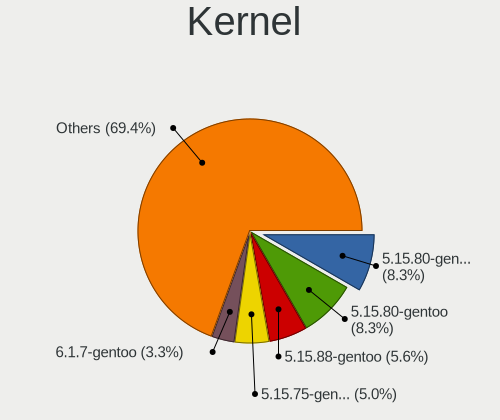

| Version               | Computers | Percent |
|-----------------------|-----------|---------|
| 5.15.80-gentoo-x86_64 | 15        | 8.38%   |
| 5.15.80-gentoo        | 15        | 8.38%   |
| 5.15.88-gentoo        | 10        | 5.59%   |
| 5.15.75-gentoo-x86_64 | 9         | 5.03%   |
| 6.1.7-gentoo          | 6         | 3.35%   |
| 5.15.75-gentoo        | 6         | 3.35%   |
| 6.1.12-gentoo         | 5         | 2.79%   |
| 5.15.88-gentoo-x86_64 | 5         | 2.79%   |
| 6.0.11-gentoo         | 4         | 2.23%   |
| 6.1.12-gentoo-x86_64  | 3         | 1.68%   |
| 5.15.85-gentoo-dist   | 3         | 1.68%   |
| 6.1.8-gentoo          | 2         | 1.12%   |
| 6.1.6-gentoo          | 2         | 1.12%   |
| 6.1.2-gentoo-x86_64   | 2         | 1.12%   |
| 6.1.12-gentoo-dist    | 2         | 1.12%   |
| 6.1.1-gentoo          | 2         | 1.12%   |
| 6.1.1-arch1-1         | 2         | 1.12%   |
| 6.1.0-gentoo          | 2         | 1.12%   |
| 6.0.9-gentoo-x86_64   | 2         | 1.12%   |
| 6.0.8                 | 2         | 1.12%   |
| 6.0.0-pf2             | 2         | 1.12%   |
| 5.15.77-gentoo-dist   | 2         | 1.12%   |
| 6.2.7-gentoo-dist     | 1         | 0.56%   |
| 6.2.2-gentoo          | 1         | 0.56%   |
| 6.2.1-gentoo-y        | 1         | 0.56%   |
| 6.2.1-gentoo          | 1         | 0.56%   |
| 6.2.1-calculate       | 1         | 0.56%   |
| 6.2.0-gentoo-x86_64   | 1         | 0.56%   |
| 6.2.0-gentoo          | 1         | 0.56%   |
| 6.1.9-gentoo-x86_64   | 1         | 0.56%   |
| 6.1.8-gentoo-x86_64   | 1         | 0.56%   |
| 6.1.8-gentoo-dist     | 1         | 0.56%   |
| 6.1.7-xanmod1         | 1         | 0.56%   |
| 6.1.7-gentoo-x86_64   | 1         | 0.56%   |
| 6.1.7-gentoo-dist     | 1         | 0.56%   |
| 6.1.7                 | 1         | 0.56%   |
| 6.1.6-gentoo-x86_64   | 1         | 0.56%   |
| 6.1.6-gentoo-dist     | 1         | 0.56%   |
| 6.1.4-gentoo-dist     | 1         | 0.56%   |
| 6.1.4-gentoo          | 1         | 0.56%   |

Kernel Family
-------------

Linux kernel without a distro release

| Version | Computers | Percent |
|---------|-----------|---------|
| 5.15.80 | 32        | 17.88%  |
| 5.15.75 | 19        | 10.61%  |
| 5.15.88 | 15        | 8.38%   |
| 6.1.12  | 11        | 6.15%   |
| 6.1.7   | 10        | 5.59%   |
| 6.0.0   | 7         | 3.91%   |
| 6.1.1   | 6         | 3.35%   |
| 6.1.0   | 5         | 2.79%   |
| 6.0.9   | 5         | 2.79%   |
| 6.1.8   | 4         | 2.23%   |
| 6.1.6   | 4         | 2.23%   |
| 6.0.11  | 4         | 2.23%   |
| 6.0.10  | 4         | 2.23%   |
| 5.15.85 | 4         | 2.23%   |
| 6.2.1   | 3         | 1.68%   |
| 6.1.3   | 3         | 1.68%   |
| 6.0.8   | 3         | 1.68%   |
| 6.2.0   | 2         | 1.12%   |
| 6.1.4   | 2         | 1.12%   |
| 6.1.2   | 2         | 1.12%   |
| 6.1.13  | 2         | 1.12%   |
| 6.1.10  | 2         | 1.12%   |
| 6.0.7   | 2         | 1.12%   |
| 5.19.16 | 2         | 1.12%   |
| 5.15.77 | 2         | 1.12%   |
| 5.15.74 | 2         | 1.12%   |
| 5.15.41 | 2         | 1.12%   |
| 6.2.7   | 1         | 0.56%   |
| 6.2.2   | 1         | 0.56%   |
| 6.1.9   | 1         | 0.56%   |
| 6.0.6   | 1         | 0.56%   |
| 6.0.2   | 1         | 0.56%   |
| 6.0.19  | 1         | 0.56%   |
| 6.0.12  | 1         | 0.56%   |
| 6.0.1   | 1         | 0.56%   |
| 5.19.10 | 1         | 0.56%   |
| 5.19.1  | 1         | 0.56%   |
| 5.15.83 | 1         | 0.56%   |
| 5.15.79 | 1         | 0.56%   |
| 5.15.69 | 1         | 0.56%   |

Kernel Major Ver.
-----------------

Linux kernel major version

| Version | Computers | Percent |
|---------|-----------|---------|
| 5.15    | 77        | 45.83%  |
| 6.1     | 50        | 29.76%  |
| 6.0     | 28        | 16.67%  |
| 6.2     | 7         | 4.17%   |
| 5.19    | 4         | 2.38%   |
| 5.10    | 2         | 1.19%   |

Arch
----

OS architecture (x86_64, i586, etc.)

| Name     | Computers | Percent |
|----------|-----------|---------|
| x86_64   | 154       | 96.86%  |
| i686     | 2         | 1.26%   |
| armv5tel | 2         | 1.26%   |
| aarch64  | 1         | 0.63%   |

DE
--

Desktop Environment

| Name        | Computers | Percent |
|-------------|-----------|---------|
| KDE5        | 46        | 28.4%   |
| Unknown     | 42        | 25.93%  |
| XFCE        | 23        | 14.2%   |
| GNOME       | 19        | 11.73%  |
| MATE        | 7         | 4.32%   |
| sway        | 4         | 2.47%   |
| X-Cinnamon  | 3         | 1.85%   |
| Trinity     | 3         | 1.85%   |
| Hyprland    | 3         | 1.85%   |
| DWM         | 3         | 1.85%   |
| LXQt        | 2         | 1.23%   |
| bspwm       | 2         | 1.23%   |
| Unity       | 1         | 0.62%   |
| sussy_bspwm | 1         | 0.62%   |
| KDE         | 1         | 0.62%   |
| i3          | 1         | 0.62%   |
| awesome     | 1         | 0.62%   |

Display Server
--------------

X11 or Wayland

| Name    | Computers | Percent |
|---------|-----------|---------|
| X11     | 83        | 50.92%  |
| Tty     | 29        | 17.79%  |
| Unknown | 28        | 17.18%  |
| Wayland | 23        | 14.11%  |

Display Manager
---------------

SDDM, LightDM, etc.

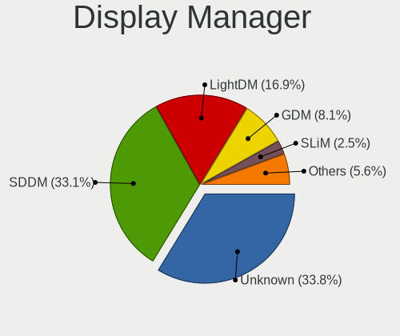

| Name    | Computers | Percent |
|---------|-----------|---------|
| Unknown | 54        | 33.96%  |
| SDDM    | 53        | 33.33%  |
| LightDM | 26        | 16.35%  |
| GDM     | 13        | 8.18%   |
| SLiM    | 4         | 2.52%   |
| TDM     | 3         | 1.89%   |
| GREETD  | 3         | 1.89%   |
| XDM     | 2         | 1.26%   |
| LXDM    | 1         | 0.63%   |

OS Lang
-------

Language

| Lang             | Computers | Percent |
|------------------|-----------|---------|
| en_US            | 70        | 43.75%  |
| C.UTF8           | 14        | 8.75%   |
| ru_RU            | 9         | 5.63%   |
| cs_CZ            | 9         | 5.63%   |
| Unknown          | 9         | 5.63%   |
| de_DE            | 7         | 4.38%   |
| C                | 6         | 3.75%   |
| it_IT            | 5         | 3.13%   |
| fr_FR            | 4         | 2.5%    |
| en_GB            | 4         | 2.5%    |
| en_AU            | 3         | 1.88%   |
| zh_CN            | 2         | 1.25%   |
| pl_PL            | 2         | 1.25%   |
| mi_NZ            | 2         | 1.25%   |
| es_ES            | 2         | 1.25%   |
| en_CA            | 2         | 1.25%   |
| pt_PT            | 1         | 0.63%   |
| pt_BR            | 1         | 0.63%   |
| nl_BE            | 1         | 0.63%   |
| ko_KR            | 1         | 0.63%   |
| ja_JP            | 1         | 0.63%   |
| es_ES.ISO-8859-1 | 1         | 0.63%   |
| en_IE            | 1         | 0.63%   |
| en_GB.iso88591   | 1         | 0.63%   |
| ca_ES            | 1         | 0.63%   |
| bg_BG            | 1         | 0.63%   |

Boot Mode
---------

EFI or BIOS

| Mode | Computers | Percent |
|------|-----------|---------|
| EFI  | 123       | 76.88%  |
| BIOS | 37        | 23.13%  |

Filesystem
----------

Type of filesystem

| Type     | Computers | Percent |
|----------|-----------|---------|
| Ext4     | 82        | 51.25%  |
| Btrfs    | 53        | 33.13%  |
| F2fs     | 8         | 5%      |
| Xfs      | 6         | 3.75%   |
| Zfs      | 4         | 2.5%    |
| Reiserfs | 4         | 2.5%    |
| XXXXXXX  | 2         | 1.25%   |
| Jfs      | 1         | 0.63%   |

Part. scheme
------------

Scheme of partitioning

| Type    | Computers | Percent |
|---------|-----------|---------|
| GPT     | 140       | 87.5%   |
| MBR     | 14        | 8.75%   |
| Unknown | 6         | 3.75%   |

Dual Boot with Linux/BSD
------------------------

Hosting more than one Linux/BSD

| Dual boot | Computers | Percent |
|-----------|-----------|---------|
| No        | 107       | 65.64%  |
| Yes       | 56        | 34.36%  |

Dual Boot (Win)
---------------

Hosting Linux and Windows

| Dual boot | Computers | Percent |
|-----------|-----------|---------|
| No        | 95        | 59.38%  |
| Yes       | 65        | 40.63%  |

Board
-----

Vendor
------

Motherboard manufacturer

| Name                | Computers | Percent |
|---------------------|-----------|---------|
| ASUSTek Computer    | 41        | 25.79%  |
| Lenovo              | 21        | 13.21%  |
| Dell                | 17        | 10.69%  |
| Hewlett-Packard     | 15        | 9.43%   |
| MSI                 | 13        | 8.18%   |
| Gigabyte Technology | 12        | 7.55%   |
| Supermicro          | 5         | 3.14%   |
| Acer                | 5         | 3.14%   |
| ASRock              | 4         | 2.52%   |
| Unknown             | 4         | 2.52%   |
| Google              | 3         | 1.89%   |
| Apple               | 3         | 1.89%   |
| HUAWEI              | 2         | 1.26%   |
| Huanan              | 2         | 1.26%   |
| Toshiba             | 1         | 0.63%   |
| Timi                | 1         | 0.63%   |
| Star Labs           | 1         | 0.63%   |
| Sony                | 1         | 0.63%   |
| Schenker            | 1         | 0.63%   |
| Samsung Electronics | 1         | 0.63%   |
| Radxa               | 1         | 0.63%   |
| Phoenix             | 1         | 0.63%   |
| Pegatron            | 1         | 0.63%   |
| IBM                 | 1         | 0.63%   |
| Alienware           | 1         | 0.63%   |
| Acidanthera         | 1         | 0.63%   |

Model
-----

Motherboard model

| Name                                         | Computers | Percent |
|----------------------------------------------|-----------|---------|
| Unknown                                      | 4         | 2.52%   |
| Supermicro Super Server                      | 3         | 1.89%   |
| MSI MS-7C91                                  | 2         | 1.26%   |
| MSI MS-7C37                                  | 2         | 1.26%   |
| MSI GS65 Stealth Thin 8RF                    | 2         | 1.26%   |
| Gigabyte Z370P D3                            | 2         | 1.26%   |
| Dell XPS 9320                                | 2         | 1.26%   |
| ASUS TUF Gaming X570-PLUS                    | 2         | 1.26%   |
| ASUS PRIME X570-PRO                          | 2         | 1.26%   |
| ASUS PRIME B450M-A                           | 2         | 1.26%   |
| ASUS M3A78-CM                                | 2         | 1.26%   |
| Toshiba Satellite L50-B                      | 1         | 0.63%   |
| Timi Mi Laptop Pro 15                        | 1         | 0.63%   |
| Supermicro X10SL7-F                          | 1         | 0.63%   |
| Supermicro SSG-6028R-E1CR24L                 | 1         | 0.63%   |
| Star Labs StarLite                           | 1         | 0.63%   |
| Sony PCG-GRT230(UC)                          | 1         | 0.63%   |
| Schenker XMG PRO (E22)                       | 1         | 0.63%   |
| Samsung 950QED                               | 1         | 0.63%   |
| Radxa ROCK 5B                                | 1         | 0.63%   |
| Phoenix 945GM                                | 1         | 0.63%   |
| Pegatron p7-1219                             | 1         | 0.63%   |
| MSI MS-7D25                                  | 1         | 0.63%   |
| MSI MS-7C34                                  | 1         | 0.63%   |
| MSI MS-7A38                                  | 1         | 0.63%   |
| MSI MS-7A31                                  | 1         | 0.63%   |
| MSI MS-7375                                  | 1         | 0.63%   |
| MSI GP60 2PE                                 | 1         | 0.63%   |
| MSI Bravo 15 B5DD                            | 1         | 0.63%   |
| Lenovo Yoga Slim 7 Pro 14IAH7 82UT           | 1         | 0.63%   |
| Lenovo Yoga 6 13ARE05 82FN                   | 1         | 0.63%   |
| Lenovo ThinkStation P710 30B6S1U500          | 1         | 0.63%   |
| Lenovo ThinkPad X1 Titanium Gen 1 20QA000GUS | 1         | 0.63%   |
| Lenovo ThinkPad X1 Carbon Gen 10 21CCS8QS00  | 1         | 0.63%   |
| Lenovo ThinkPad W540 20BG0033RT              | 1         | 0.63%   |
| Lenovo ThinkPad T570 W10DG 20JXS08118        | 1         | 0.63%   |
| Lenovo ThinkPad T480 20L6S04Q00              | 1         | 0.63%   |
| Lenovo ThinkPad T470s 20HGS27Y0V             | 1         | 0.63%   |
| Lenovo ThinkPad T470p 20J7S25C00             | 1         | 0.63%   |
| Lenovo ThinkPad T16 Gen 1 21CHCTO1WW         | 1         | 0.63%   |

Model Family
------------

Motherboard model prefix

| Name                         | Computers | Percent |
|------------------------------|-----------|---------|
| ASUS ROG                     | 11        | 6.92%   |
| Lenovo ThinkPad              | 10        | 6.29%   |
| ASUS PRIME                   | 9         | 5.66%   |
| ASUS TUF                     | 8         | 5.03%   |
| Lenovo Legion                | 4         | 2.52%   |
| HP Pavilion                  | 4         | 2.52%   |
| Dell XPS                     | 4         | 2.52%   |
| Dell Inspiron                | 4         | 2.52%   |
| Unknown                      | 4         | 2.52%   |
| Supermicro Super             | 3         | 1.89%   |
| Lenovo IdeaPad               | 3         | 1.89%   |
| MSI MS-7C91                  | 2         | 1.26%   |
| MSI MS-7C37                  | 2         | 1.26%   |
| MSI GS65                     | 2         | 1.26%   |
| Lenovo Yoga                  | 2         | 1.26%   |
| HP EliteBook                 | 2         | 1.26%   |
| Gigabyte Z370P               | 2         | 1.26%   |
| Gigabyte B550M               | 2         | 1.26%   |
| Dell Precision               | 2         | 1.26%   |
| Dell OptiPlex                | 2         | 1.26%   |
| Dell Latitude                | 2         | 1.26%   |
| ASUS VivoBook                | 2         | 1.26%   |
| ASUS M3A78-CM                | 2         | 1.26%   |
| Toshiba Satellite            | 1         | 0.63%   |
| Timi Mi                      | 1         | 0.63%   |
| Supermicro X10SL7-F          | 1         | 0.63%   |
| Supermicro SSG-6028R-E1CR24L | 1         | 0.63%   |
| Star Labs StarLite           | 1         | 0.63%   |
| Sony PCG-GRT230(UC)          | 1         | 0.63%   |
| Schenker XMG                 | 1         | 0.63%   |
| Samsung 950QED               | 1         | 0.63%   |
| Radxa ROCK                   | 1         | 0.63%   |
| Phoenix 945GM                | 1         | 0.63%   |
| Pegatron p7-1219             | 1         | 0.63%   |
| MSI MS-7D25                  | 1         | 0.63%   |
| MSI MS-7C34                  | 1         | 0.63%   |
| MSI MS-7A38                  | 1         | 0.63%   |
| MSI MS-7A31                  | 1         | 0.63%   |
| MSI MS-7375                  | 1         | 0.63%   |
| MSI GP60                     | 1         | 0.63%   |

MFG Year
--------

Motherboard manufacture year

| Year    | Computers | Percent |
|---------|-----------|---------|
| 2021    | 26        | 16.35%  |
| 2019    | 25        | 15.72%  |
| 2022    | 24        | 15.09%  |
| 2020    | 21        | 13.21%  |
| 2018    | 16        | 10.06%  |
| 2017    | 11        | 6.92%   |
| 2015    | 6         | 3.77%   |
| 2014    | 6         | 3.77%   |
| 2011    | 5         | 3.14%   |
| 2010    | 5         | 3.14%   |
| 2012    | 3         | 1.89%   |
| Unknown | 3         | 1.89%   |
| 2013    | 2         | 1.26%   |
| 2008    | 2         | 1.26%   |
| 2004    | 2         | 1.26%   |
| 2009    | 1         | 0.63%   |
| 2003    | 1         | 0.63%   |

Form Factor
-----------

Physical design of the computer

| Name           | Computers | Percent |
|----------------|-----------|---------|
| Notebook       | 76        | 47.8%   |
| Desktop        | 70        | 44.03%  |
| Server         | 5         | 3.14%   |
| Convertible    | 4         | 2.52%   |
| All in one     | 3         | 1.89%   |
| System on chip | 1         | 0.63%   |

Secure Boot
-----------

Enabled or disabled

| State    | Computers | Percent |
|----------|-----------|---------|
| Disabled | 156       | 98.11%  |
| Enabled  | 3         | 1.89%   |

Coreboot
--------

Have coreboot on board

| Used | Computers | Percent |
|------|-----------|---------|
| No   | 156       | 98.11%  |
| Yes  | 3         | 1.89%   |

RAM Size
--------

Total RAM memory

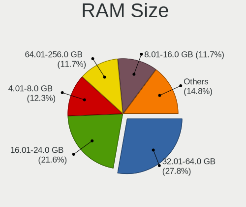

| Size in GB  | Computers | Percent |
|-------------|-----------|---------|
| 32.01-64.0  | 44        | 27.33%  |
| 16.01-24.0  | 35        | 21.74%  |
| 4.01-8.0    | 20        | 12.42%  |
| 64.01-256.0 | 19        | 11.8%   |
| 8.01-16.0   | 19        | 11.8%   |
| 3.01-4.0    | 9         | 5.59%   |
| 24.01-32.0  | 8         | 4.97%   |
| 1.01-2.0    | 3         | 1.86%   |
| 0.01-0.5    | 2         | 1.24%   |
| 2.01-3.0    | 1         | 0.62%   |
| 0.51-1.0    | 1         | 0.62%   |

RAM Used
--------

Used RAM memory

| Used GB     | Computers | Percent |
|-------------|-----------|---------|
| 4.01-8.0    | 33        | 18.86%  |
| 2.01-3.0    | 31        | 17.71%  |
| 1.01-2.0    | 31        | 17.71%  |
| 8.01-16.0   | 21        | 12%     |
| 3.01-4.0    | 20        | 11.43%  |
| 0.01-0.5    | 17        | 9.71%   |
| 0.51-1.0    | 14        | 8%      |
| 16.01-24.0  | 5         | 2.86%   |
| 32.01-64.0  | 1         | 0.57%   |
| 64.01-256.0 | 1         | 0.57%   |
| 0           | 1         | 0.57%   |

Total Drives
------------

Number of drives on board

| Drives | Computers | Percent |
|--------|-----------|---------|
| 1      | 65        | 40.12%  |
| 2      | 47        | 29.01%  |
| 3      | 17        | 10.49%  |
| 4      | 10        | 6.17%   |
| 6      | 7         | 4.32%   |
| 5      | 7         | 4.32%   |
| 8      | 4         | 2.47%   |
| 7      | 3         | 1.85%   |
| 21     | 1         | 0.62%   |
| 9      | 1         | 0.62%   |

Has CD-ROM
----------

Has CD-ROM on board

| Presented | Computers | Percent |
|-----------|-----------|---------|
| No        | 130       | 81.25%  |
| Yes       | 30        | 18.75%  |

Has Ethernet
------------

Has Ethernet on board

| Presented | Computers | Percent |
|-----------|-----------|---------|
| Yes       | 137       | 85.63%  |
| No        | 23        | 14.38%  |

Has WiFi
--------

Has WiFi module

| Presented | Computers | Percent |
|-----------|-----------|---------|
| Yes       | 110       | 69.18%  |
| No        | 49        | 30.82%  |

Has Bluetooth
-------------

Has Bluetooth module

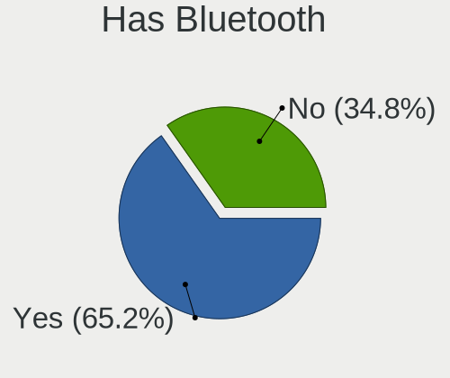

| Presented | Computers | Percent |
|-----------|-----------|---------|
| Yes       | 105       | 65.63%  |
| No        | 55        | 34.38%  |

Location
--------

Country
-------

Geographic location (country)

| Country     | Computers | Percent |
|-------------|-----------|---------|
| USA         | 40        | 25%     |
| Russia      | 16        | 10%     |
| Germany     | 15        | 9.38%   |
| Czechia     | 10        | 6.25%   |
| Poland      | 7         | 4.38%   |
| Canada      | 7         | 4.38%   |
| UK          | 6         | 3.75%   |
| Spain       | 5         | 3.13%   |
| Italy       | 5         | 3.13%   |
| France      | 5         | 3.13%   |
| Australia   | 5         | 3.13%   |
| Netherlands | 3         | 1.88%   |
| Slovakia    | 2         | 1.25%   |
| Portugal    | 2         | 1.25%   |
| New Zealand | 2         | 1.25%   |
| Mexico      | 2         | 1.25%   |
| China       | 2         | 1.25%   |
| Bulgaria    | 2         | 1.25%   |
| Brazil      | 2         | 1.25%   |
| Vietnam     | 1         | 0.63%   |
| Turkey      | 1         | 0.63%   |
| Taiwan      | 1         | 0.63%   |
| Switzerland | 1         | 0.63%   |
| Sweden      | 1         | 0.63%   |
| South Korea | 1         | 0.63%   |
| Singapore   | 1         | 0.63%   |
| Romania     | 1         | 0.63%   |
| Norway      | 1         | 0.63%   |
| Nepal       | 1         | 0.63%   |
| Mauritius   | 1         | 0.63%   |
| Malaysia    | 1         | 0.63%   |
| Lithuania   | 1         | 0.63%   |
| Japan       | 1         | 0.63%   |
| Ireland     | 1         | 0.63%   |
| Hungary     | 1         | 0.63%   |
| Greece      | 1         | 0.63%   |
| Georgia     | 1         | 0.63%   |
| Denmark     | 1         | 0.63%   |
| Cyprus      | 1         | 0.63%   |
| Croatia     | 1         | 0.63%   |

City
----

Geographic location (city)

| City                  | Computers | Percent |
|-----------------------|-----------|---------|
| Warsaw                | 5         | 2.99%   |
| Vitkov                | 4         | 2.4%    |
| Moscow                | 4         | 2.4%    |
| Taganrog              | 3         | 1.8%    |
| Saskatoon             | 3         | 1.8%    |
| Pittsburgh            | 3         | 1.8%    |
| Perth                 | 3         | 1.8%    |
| Berlin                | 3         | 1.8%    |
| Zarech'ye             | 2         | 1.2%    |
| Vancouver             | 2         | 1.2%    |
| Sydney                | 2         | 1.2%    |
| San Dimas             | 2         | 1.2%    |
| Royal Tunbridge Wells | 2         | 1.2%    |
| Oviedo                | 2         | 1.2%    |
| Milan                 | 2         | 1.2%    |
| Igualada              | 2         | 1.2%    |
| Hamilton              | 2         | 1.2%    |
| Christchurch          | 2         | 1.2%    |
| Augusta               | 2         | 1.2%    |
| Astrakhan             | 2         | 1.2%    |
| Amsterdam             | 2         | 1.2%    |
| Zweidlen-Dorf         | 1         | 0.6%    |
| Zagreb                | 1         | 0.6%    |
| Yekaterinburg         | 1         | 0.6%    |
| Wroclaw               | 1         | 0.6%    |
| Woodbridge            | 1         | 0.6%    |
| West Orange           | 1         | 0.6%    |
| Welling               | 1         | 0.6%    |
| Weisswasser           | 1         | 0.6%    |
| Vilnius               | 1         | 0.6%    |
| Vechelde              | 1         | 0.6%    |
| Vaxjo                 | 1         | 0.6%    |
| Valencia              | 1         | 0.6%    |
| Ufa                   | 1         | 0.6%    |
| Trondheim             | 1         | 0.6%    |
| Thurmont              | 1         | 0.6%    |
| Tbilisi               | 1         | 0.6%    |
| Taipei                | 1         | 0.6%    |
| Szeged                | 1         | 0.6%    |
| Suffolk               | 1         | 0.6%    |

Drives
------

Drive Vendor
------------

Hard drive vendors

| Vendor                      | Computers | Drives | Percent |
|-----------------------------|-----------|--------|---------|
| Samsung Electronics         | 67        | 115    | 24.45%  |
| WDC                         | 38        | 90     | 13.87%  |
| Seagate                     | 28        | 53     | 10.22%  |
| SanDisk                     | 21        | 30     | 7.66%   |
| Toshiba                     | 14        | 31     | 5.11%   |
| Phison Electronics          | 10        | 13     | 3.65%   |
| Intel                       | 10        | 12     | 3.65%   |
| Kingston                    | 7         | 9      | 2.55%   |
| SK hynix                    | 6         | 7      | 2.19%   |
| Micron Technology           | 6         | 7      | 2.19%   |
| Hitachi                     | 6         | 22     | 2.19%   |
| Crucial                     | 5         | 6      | 1.82%   |
| Unknown                     | 4         | 5      | 1.46%   |
| KIOXIA                      | 4         | 4      | 1.46%   |
| Kingston Technology Company | 4         | 4      | 1.46%   |
| China                       | 4         | 6      | 1.46%   |
| Silicon Motion              | 3         | 3      | 1.09%   |
| OCZ                         | 3         | 4      | 1.09%   |
| HGST                        | 3         | 5      | 1.09%   |
| GOODRAM                     | 3         | 9      | 1.09%   |
| A-DATA Technology           | 3         | 3      | 1.09%   |
| Realtek Semiconductor       | 2         | 6      | 0.73%   |
| Micron/Crucial Technology   | 2         | 3      | 0.73%   |
| Apple                       | 2         | 2      | 0.73%   |
| Yangtze Memory Technologies | 1         | 1      | 0.36%   |
| XPG                         | 1         | 6      | 0.36%   |
| TrekStor                    | 1         | 1      | 0.36%   |
| Star                        | 1         | 1      | 0.36%   |
| Solid State Storage         | 1         | 1      | 0.36%   |
| Smartbuy                    | 1         | 1      | 0.36%   |
| Patriot                     | 1         | 1      | 0.36%   |
| KingSpec                    | 1         | 2      | 0.36%   |
| Kingchuxing                 | 1         | 1      | 0.36%   |
| Intenso                     | 1         | 1      | 0.36%   |
| IBM/Hitachi                 | 1         | 1      | 0.36%   |
| HGST HTS                    | 1         | 1      | 0.36%   |
| FNK TECH                    | 1         | 1      | 0.36%   |
| Dogfish                     | 1         | 1      | 0.36%   |
| Corsair                     | 1         | 1      | 0.36%   |
| Apacer                      | 1         | 2      | 0.36%   |

Drive Model
-----------

Hard drive models

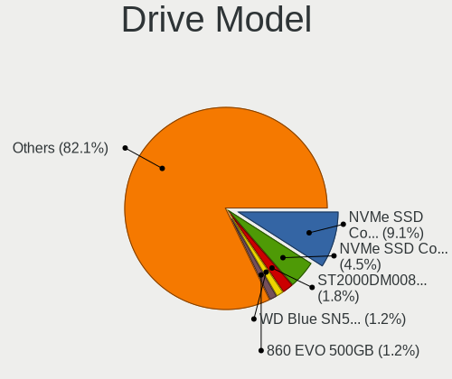

| Model                                                 | Computers | Percent |
|-------------------------------------------------------|-----------|---------|
| Samsung NVMe SSD Controller SM981/PM981/PM983 500GB   | 29        | 8.87%   |
| Samsung NVMe SSD Controller PM9A1/PM9A3/980PRO 1024GB | 15        | 4.59%   |
| Seagate ST2000DM008-2FR102 2TB                        | 6         | 1.83%   |
| Sandisk WD Blue SN550 NVMe SSD 250GB                  | 4         | 1.22%   |
| Samsung SSD 860 EVO 500GB                             | 4         | 1.22%   |
| Samsung SSD 860 EVO 1TB                               | 4         | 1.22%   |
| Samsung NVMe SSD Controller SM961/PM961/SM963 1024GB  | 4         | 1.22%   |
| Phison E16 PCIe4 NVMe Controller 1TB                  | 4         | 1.22%   |
| Intel SSD 660P Series 512GB                           | 4         | 1.22%   |
| WDC WD30EFRX-68EUZN0 3TB                              | 3         | 0.92%   |
| Silicon Motion SM2263EN/SM2263XT SSD Controller 256GB | 3         | 0.92%   |
| Seagate ST1000DM010-2EP102 1TB                        | 3         | 0.92%   |
| Samsung SSD 980 1TB                                   | 3         | 0.92%   |
| Phison PS5013 E13 NVMe Controller 512GB               | 3         | 0.92%   |
| China SSD 1TB                                         | 3         | 0.92%   |
| WDC WDS200T2B0B-00YS70 2TB SSD                        | 2         | 0.61%   |
| WDC WD6003FZBX-00K5WB0 6TB                            | 2         | 0.61%   |
| WDC WD40EZRZ-00WN9B0 4TB                              | 2         | 0.61%   |
| WDC WD20EFRX-68EUZN0 2TB                              | 2         | 0.61%   |
| WDC WD20EARX-00PASB0 2TB                              | 2         | 0.61%   |
| WDC WD10EZEX-08WN4A0 1TB                              | 2         | 0.61%   |
| Unknown MMC Card  32GB                                | 2         | 0.61%   |
| SK hynix BC501 NVMe Solid State Drive 512GB           | 2         | 0.61%   |
| Seagate ST1000LM049-2GH172 1TB                        | 2         | 0.61%   |
| Sandisk WD Black SN850 256GB                          | 2         | 0.61%   |
| SanDisk SSD PLUS 240GB                                | 2         | 0.61%   |
| SanDisk Extreme 55AE 1TB SSD                          | 2         | 0.61%   |
| Samsung SSD 980 500GB                                 | 2         | 0.61%   |
| Samsung SSD 860 QVO 1TB                               | 2         | 0.61%   |
| Samsung SSD 860 PRO 1TB                               | 2         | 0.61%   |
| Samsung SSD 860 EVO 250GB                             | 2         | 0.61%   |
| Samsung SSD 850 EVO 500GB                             | 2         | 0.61%   |
| Phison E12 NVMe Controller 256GB                      | 2         | 0.61%   |
| Micron/Crucial P2 NVMe PCIe SSD 1TB                   | 2         | 0.61%   |
| Kingston SA400S37240G 240GB SSD                       | 2         | 0.61%   |
| HGST HTS721010A9E630 1TB                              | 2         | 0.61%   |
| GOODRAM SSDPR-CL100-480-G2 480GB                      | 2         | 0.61%   |
| Yangtze Memory ZHITAI TiPlus5000 1TB                  | 1         | 0.31%   |
| XPG GAMMIX S70 1TB                                    | 1         | 0.31%   |
| WDC WDS500G2B0A-00SM50 500GB SSD                      | 1         | 0.31%   |

HDD Vendor
----------

Hard disk drive vendors

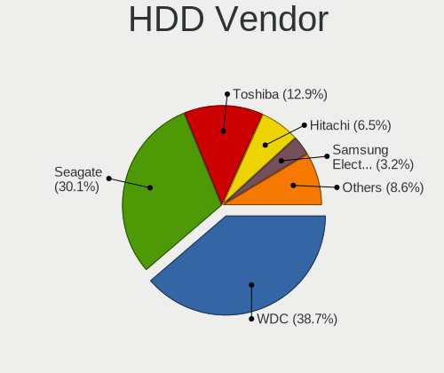

| Vendor              | Computers | Drives | Percent |
|---------------------|-----------|--------|---------|
| WDC                 | 35        | 83     | 38.04%  |
| Seagate             | 28        | 53     | 30.43%  |
| Toshiba             | 12        | 29     | 13.04%  |
| Hitachi             | 6         | 22     | 6.52%   |
| Samsung Electronics | 3         | 3      | 3.26%   |
| HGST                | 3         | 5      | 3.26%   |
| IBM/Hitachi         | 1         | 1      | 1.09%   |
| HGST HTS            | 1         | 1      | 1.09%   |
| FNK TECH            | 1         | 1      | 1.09%   |
| Apple               | 1         | 1      | 1.09%   |
| AFAYA               | 1         | 1      | 1.09%   |

SSD Vendor
----------

Solid state drive vendors

| Vendor              | Computers | Drives | Percent |
|---------------------|-----------|--------|---------|
| Samsung Electronics | 25        | 34     | 32.47%  |
| SanDisk             | 8         | 13     | 10.39%  |
| WDC                 | 6         | 7      | 7.79%   |
| Kingston            | 5         | 7      | 6.49%   |
| Crucial             | 5         | 6      | 6.49%   |
| China               | 4         | 6      | 5.19%   |
| OCZ                 | 3         | 4      | 3.9%    |
| GOODRAM             | 3         | 9      | 3.9%    |
| A-DATA Technology   | 3         | 3      | 3.9%    |
| Micron Technology   | 2         | 3      | 2.6%    |
| Intel               | 2         | 2      | 2.6%    |
| Star                | 1         | 1      | 1.3%    |
| Smartbuy            | 1         | 1      | 1.3%    |
| Patriot             | 1         | 1      | 1.3%    |
| KingSpec            | 1         | 2      | 1.3%    |
| Kingchuxing         | 1         | 1      | 1.3%    |
| Intenso             | 1         | 1      | 1.3%    |
| Dogfish             | 1         | 1      | 1.3%    |
| Corsair             | 1         | 1      | 1.3%    |
| Apple               | 1         | 1      | 1.3%    |
| Apacer              | 1         | 2      | 1.3%    |
| Unknown             | 1         | 1      | 1.3%    |

Drive Kind
----------

HDD or SSD

| Kind    | Computers | Drives | Percent |
|---------|-----------|--------|---------|
| NVMe    | 106       | 162    | 42.91%  |
| HDD     | 71        | 200    | 28.74%  |
| SSD     | 65        | 107    | 26.32%  |
| MMC     | 4         | 5      | 1.62%   |
| Unknown | 1         | 1      | 0.4%    |

Drive Connector
---------------

SATA, SAS, NVMe, etc.

| Type | Computers | Drives | Percent |
|------|-----------|--------|---------|
| NVMe | 106       | 162    | 49.07%  |
| SATA | 100       | 302    | 46.3%   |
| SAS  | 6         | 6      | 2.78%   |
| MMC  | 4         | 5      | 1.85%   |

Drive Size
----------

Size of hard drive

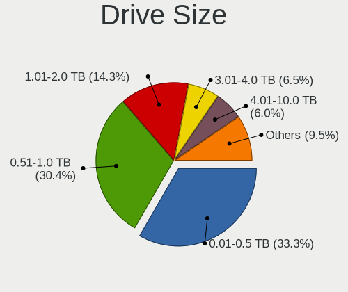

| Size in TB | Computers | Drives | Percent |
|------------|-----------|--------|---------|
| 0.01-0.5   | 56        | 96     | 33.53%  |
| 0.51-1.0   | 50        | 66     | 29.94%  |
| 1.01-2.0   | 24        | 52     | 14.37%  |
| 3.01-4.0   | 11        | 19     | 6.59%   |
| 2.01-3.0   | 10        | 36     | 5.99%   |
| 4.01-10.0  | 10        | 22     | 5.99%   |
| 10.01-20.0 | 6         | 16     | 3.59%   |

Space Total
-----------

Amount of disk space available on the file system

| Size in GB     | Computers | Percent |
|----------------|-----------|---------|
| 501-1000       | 31        | 19.25%  |
| More than 3000 | 29        | 18.01%  |
| 101-250        | 29        | 18.01%  |
| 251-500        | 25        | 15.53%  |
| 1001-2000      | 18        | 11.18%  |
| 51-100         | 8         | 4.97%   |
| Unknown        | 8         | 4.97%   |
| 1-20           | 6         | 3.73%   |
| 2001-3000      | 5         | 3.11%   |
| 21-50          | 2         | 1.24%   |

Space Used
----------

Amount of used disk space

| Used GB        | Computers | Percent |
|----------------|-----------|---------|
| 1-20           | 32        | 19.88%  |
| 251-500        | 20        | 12.42%  |
| 21-50          | 20        | 12.42%  |
| 101-250        | 19        | 11.8%   |
| 51-100         | 17        | 10.56%  |
| More than 3000 | 15        | 9.32%   |
| 501-1000       | 15        | 9.32%   |
| 1001-2000      | 10        | 6.21%   |
| Unknown        | 8         | 4.97%   |
| 2001-3000      | 5         | 3.11%   |

Malfunc. Drives
---------------

Drive models with a malfunction

| Model                                                             | Computers | Drives | Percent |
|-------------------------------------------------------------------|-----------|--------|---------|
| WDC WD6400AAKS-65A7B0 640GB                                       | 1         | 1      | 4%      |
| WDC WD60EFAX-68SHWN0 6TB                                          | 1         | 3      | 4%      |
| WDC WD5000BEVT-22ZAT0 500GB                                       | 1         | 1      | 4%      |
| WDC WD5000AAKX-753CA1 500GB                                       | 1         | 1      | 4%      |
| WDC WD30EFRX-68EUZN0 3TB                                          | 1         | 1      | 4%      |
| WDC WD30EFRX-68AX9N0 3TB                                          | 1         | 3      | 4%      |
| WDC WD20EFRX-68EUZN0 2TB                                          | 1         | 2      | 4%      |
| WDC WD10JPVX-75JC3T0 1TB                                          | 1         | 1      | 4%      |
| WDC WD10EFRX-68PJCN0 1TB                                          | 1         | 1      | 4%      |
| WDC WD10EADS-22M2B0 1TB                                           | 1         | 1      | 4%      |
| WDC WD1001FALS-00J7B1 1TB                                         | 1         | 1      | 4%      |
| Toshiba MQ02ABD100H 1TB                                           | 1         | 1      | 4%      |
| SK hynix BC501 NVMe Solid State Drive 512GB                       | 1         | 2      | 4%      |
| Samsung Electronics SSD 980 1TB                                   | 1         | 1      | 4%      |
| Samsung Electronics SP2504C 250GB                                 | 1         | 1      | 4%      |
| Samsung Electronics PM9A1 NVMe 2048GB                             | 1         | 1      | 4%      |
| Samsung Electronics NVMe SSD Controller SM981/PM981/PM983 500GB   | 1         | 2      | 4%      |
| Samsung Electronics NVMe SSD Controller PM9A1/PM9A3/980PRO 1024GB | 1         | 2      | 4%      |
| Realtek Semiconductor RTS5763DL NVMe SSD Controller 512GB         | 1         | 1      | 4%      |
| Realtek Semiconductor ADATA SX6000PNP 256GB                       | 1         | 4      | 4%      |
| OCZ VERTEX4 256GB SSD                                             | 1         | 1      | 4%      |
| Kingston Technology Company KC2000 NVMe SSD 1TB                   | 1         | 1      | 4%      |
| IBM/Hitachi IC25N040ATMR04-0 40GB                                 | 1         | 1      | 4%      |
| Hitachi HTS725050A9A364 500GB                                     | 1         | 1      | 4%      |
| HGST HTS 541075A9E680 752GB                                       | 1         | 1      | 4%      |

Malfunc. Drive Vendor
---------------------

Vendors of faulty drives

| Vendor                      | Computers | Drives | Percent |
|-----------------------------|-----------|--------|---------|
| WDC                         | 9         | 16     | 39.13%  |
| Samsung Electronics         | 5         | 7      | 21.74%  |
| Realtek Semiconductor       | 2         | 5      | 8.7%    |
| Toshiba                     | 1         | 1      | 4.35%   |
| SK hynix                    | 1         | 2      | 4.35%   |
| OCZ                         | 1         | 1      | 4.35%   |
| Kingston Technology Company | 1         | 1      | 4.35%   |
| IBM/Hitachi                 | 1         | 1      | 4.35%   |
| Hitachi                     | 1         | 1      | 4.35%   |
| HGST HTS                    | 1         | 1      | 4.35%   |

Malfunc. HDD Vendor
-------------------

Vendors of faulty HDD drives

| Vendor              | Computers | Drives | Percent |
|---------------------|-----------|--------|---------|
| WDC                 | 9         | 16     | 64.29%  |
| Toshiba             | 1         | 1      | 7.14%   |
| Samsung Electronics | 1         | 1      | 7.14%   |
| IBM/Hitachi         | 1         | 1      | 7.14%   |
| Hitachi             | 1         | 1      | 7.14%   |
| HGST HTS            | 1         | 1      | 7.14%   |

Malfunc. Drive Kind
-------------------

Kinds of faulty drives

| Kind | Computers | Drives | Percent |
|------|-----------|--------|---------|
| HDD  | 14        | 21     | 60.87%  |
| NVMe | 8         | 14     | 34.78%  |
| SSD  | 1         | 1      | 4.35%   |

Failed Drives
-------------

Failed drive models

Zero info for selected period =(

Failed Drive Vendor
-------------------

Failed drive vendors

Zero info for selected period =(

Drive Status
------------

Number of failed and malfunc. drives

| Status   | Computers | Drives | Percent |
|----------|-----------|--------|---------|
| Works    | 143       | 408    | 79.44%  |
| Malfunc  | 21        | 36     | 11.67%  |
| Detected | 16        | 31     | 8.89%   |

Storage controller
------------------

Storage Vendor
--------------

Storage controller vendors

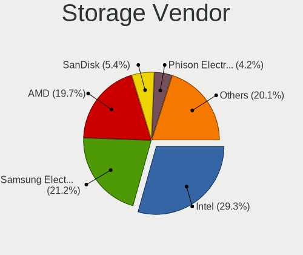

| Vendor                           | Computers | Percent |
|----------------------------------|-----------|---------|
| Intel                            | 76        | 29.69%  |
| Samsung Electronics              | 54        | 21.09%  |
| AMD                              | 50        | 19.53%  |
| SanDisk                          | 14        | 5.47%   |
| Phison Electronics               | 10        | 3.91%   |
| ASMedia Technology               | 8         | 3.13%   |
| SK hynix                         | 6         | 2.34%   |
| Kingston Technology Company      | 6         | 2.34%   |
| Micron Technology                | 4         | 1.56%   |
| KIOXIA                           | 4         | 1.56%   |
| Silicon Motion                   | 3         | 1.17%   |
| JMicron Technology               | 3         | 1.17%   |
| Toshiba America Info Systems     | 2         | 0.78%   |
| Realtek Semiconductor            | 2         | 0.78%   |
| Micron/Crucial Technology        | 2         | 0.78%   |
| Marvell Technology Group         | 2         | 0.78%   |
| Broadcom / LSI                   | 2         | 0.78%   |
| Yangtze Memory Technologies      | 1         | 0.39%   |
| Solid State Storage Technology   | 1         | 0.39%   |
| Silicon Integrated Systems [SiS] | 1         | 0.39%   |
| Silicon Image                    | 1         | 0.39%   |
| Nvidia                           | 1         | 0.39%   |
| INNOGRIT                         | 1         | 0.39%   |
| Hewlett-Packard                  | 1         | 0.39%   |
| ADATA Technology                 | 1         | 0.39%   |

Storage Model
-------------

Storage controller models

| Model                                                                          | Computers | Percent |
|--------------------------------------------------------------------------------|-----------|---------|
| AMD FCH SATA Controller [AHCI mode]                                            | 36        | 12.46%  |
| Samsung NVMe SSD Controller SM981/PM981/PM983                                  | 30        | 10.38%  |
| Samsung NVMe SSD Controller PM9A1/PM9A3/980PRO                                 | 16        | 5.54%   |
| AMD 400 Series Chipset SATA Controller                                         | 9         | 3.11%   |
| AMD 500 Series Chipset SATA Controller                                         | 8         | 2.77%   |
| Samsung NVMe SSD Controller 980                                                | 7         | 2.42%   |
| Intel Volume Management Device NVMe RAID Controller                            | 6         | 2.08%   |
| Samsung NVMe SSD Controller SM961/PM961/SM963                                  | 5         | 1.73%   |
| Intel 7 Series Chipset Family 6-port SATA Controller [AHCI mode]               | 5         | 1.73%   |
| ASMedia ASM1062 Serial ATA Controller                                          | 5         | 1.73%   |
| SanDisk WD Blue SN550 NVMe SSD                                                 | 4         | 1.38%   |
| Phison E16 PCIe4 NVMe Controller                                               | 4         | 1.38%   |
| Intel SSD 660P Series                                                          | 4         | 1.38%   |
| Intel Q170/Q150/B150/H170/H110/Z170/CM236 Chipset SATA Controller [AHCI Mode]  | 4         | 1.38%   |
| Intel Comet Lake SATA AHCI Controller                                          | 4         | 1.38%   |
| Intel Cannon Lake PCH SATA AHCI Controller                                     | 4         | 1.38%   |
| Intel C610/X99 series chipset sSATA Controller [AHCI mode]                     | 4         | 1.38%   |
| Intel C610/X99 series chipset 6-Port SATA Controller [AHCI mode]               | 4         | 1.38%   |
| Intel 8 Series/C220 Series Chipset Family 6-port SATA Controller 1 [AHCI mode] | 4         | 1.38%   |
| Silicon Motion SM2263EN/SM2263XT (DRAM-less) NVMe SSD Controllers              | 3         | 1.04%   |
| Phison PS5013 E13 NVMe Controller                                              | 3         | 1.04%   |
| KIOXIA NVMe SSD Controller BG4 (DRAM-less)                                     | 3         | 1.04%   |
| Intel Cannon Lake Mobile PCH SATA AHCI Controller                              | 3         | 1.04%   |
| Intel Alder Lake-S PCH SATA Controller [AHCI Mode]                             | 3         | 1.04%   |
| Intel 82801 Mobile SATA Controller [RAID mode]                                 | 3         | 1.04%   |
| Intel 6 Series/C200 Series Chipset Family 6 port Desktop SATA AHCI Controller  | 3         | 1.04%   |
| Intel 500 Series Chipset Family SATA AHCI Controller                           | 3         | 1.04%   |
| Intel 400 Series Chipset Family SATA AHCI Controller                           | 3         | 1.04%   |
| Intel 200 Series PCH SATA controller [AHCI mode]                               | 3         | 1.04%   |
| AMD 300 Series Chipset SATA Controller                                         | 3         | 1.04%   |
| SK hynix Platinum P41/PC801 NVMe Solid State Drive                             | 2         | 0.69%   |
| SK hynix BC501 NVMe Solid State Drive                                          | 2         | 0.69%   |
| SanDisk WD PC SN810 / Black SN850 NVMe SSD                                     | 2         | 0.69%   |
| Phison E12 NVMe Controller                                                     | 2         | 0.69%   |
| Micron/Crucial P2 [Nick P2] / P3 / P3 Plus NVMe PCIe SSD (DRAM-less)           | 2         | 0.69%   |
| Micron 2450 NVMe SSD [HendrixV] (DRAM-less)                                    | 2         | 0.69%   |
| JMicron JMB363 SATA/IDE Controller                                             | 2         | 0.69%   |
| Intel Sunrise Point-LP SATA Controller [AHCI mode]                             | 2         | 0.69%   |
| Intel SSD 670p Series [Keystone Harbor]                                        | 2         | 0.69%   |
| Intel HM170/QM170 Chipset SATA Controller [AHCI Mode]                          | 2         | 0.69%   |

Storage Kind
------------

Kind of storage controller (IDE, SATA, NVMe, SAS, ...)

| Kind | Computers | Percent |
|------|-----------|---------|
| SATA | 112       | 45.53%  |
| NVMe | 108       | 43.9%   |
| RAID | 12        | 4.88%   |
| IDE  | 12        | 4.88%   |
| SAS  | 2         | 0.81%   |

Processor
---------

CPU Vendor
----------

Processor vendors

| Vendor                | Computers | Percent |
|-----------------------|-----------|---------|
| Intel                 | 93        | 58.49%  |
| AMD                   | 63        | 39.62%  |
| Marvell Semiconductor | 2         | 1.26%   |
| ARM                   | 1         | 0.63%   |

CPU Model
---------

Processor models

| Model                                                                    | Computers | Percent |
|--------------------------------------------------------------------------|-----------|---------|
| AMD Ryzen 9 5900X 12-Core Processor                                      | 5         | 3.11%   |
| AMD Ryzen 5 5600X 6-Core Processor                                       | 5         | 3.11%   |
| Intel Core i7-8750H CPU @ 2.20GHz                                        | 4         | 2.48%   |
| AMD Ryzen 9 5950X 16-Core Processor                                      | 4         | 2.48%   |
| AMD Ryzen 7 5800X 8-Core Processor                                       | 4         | 2.48%   |
| Intel Core i5-10210U CPU @ 1.60GHz                                       | 3         | 1.86%   |
| Intel 12th Gen Core i7-12700H                                            | 3         | 1.86%   |
| AMD Ryzen 7 5800H with Radeon Graphics                                   | 3         | 1.86%   |
| AMD Ryzen 7 4800H with Radeon Graphics                                   | 3         | 1.86%   |
| Marvell Semiconductor Marvell Kirkwood (Flattened Device Tree) Processor | 2         | 1.24%   |
| Intel Core i9-9900K CPU @ 3.60GHz                                        | 2         | 1.24%   |
| Intel Core i7-2670QM CPU @ 2.20GHz                                       | 2         | 1.24%   |
| Intel Core i7-10875H CPU @ 2.30GHz                                       | 2         | 1.24%   |
| Intel 12th Gen Core i7-1280P                                             | 2         | 1.24%   |
| Intel 12th Gen Core i7-1260P                                             | 2         | 1.24%   |
| AMD Ryzen 9 7950X 16-Core Processor                                      | 2         | 1.24%   |
| AMD Ryzen 7 7700X 8-Core Processor                                       | 2         | 1.24%   |
| AMD Ryzen 7 3700X 8-Core Processor                                       | 2         | 1.24%   |
| AMD Ryzen 7 3700U with Radeon Vega Mobile Gfx                            | 2         | 1.24%   |
| AMD Ryzen 7 2700X Eight-Core Processor                                   | 2         | 1.24%   |
| AMD Phenom II X4 955 Processor                                           | 2         | 1.24%   |
| Intel Xeon CPU W3680 @ 3.33GHz                                           | 1         | 0.62%   |
| Intel Xeon CPU E5-2683 v4 @ 2.10GHz                                      | 1         | 0.62%   |
| Intel Xeon CPU E5-2680 v4 @ 2.40GHz                                      | 1         | 0.62%   |
| Intel Xeon CPU E5-2678 v3 @ 2.50GHz                                      | 1         | 0.62%   |
| Intel Xeon CPU E5-2650L v4 @ 1.70GHz                                     | 1         | 0.62%   |
| Intel Xeon CPU E5-2650 v2 @ 2.60GHz                                      | 1         | 0.62%   |
| Intel Xeon CPU E5-2620 v4 @ 2.10GHz                                      | 1         | 0.62%   |
| Intel Xeon CPU E5-2620 v3 @ 2.40GHz                                      | 1         | 0.62%   |
| Intel Xeon CPU E5-1650 v3 @ 3.50GHz                                      | 1         | 0.62%   |
| Intel Xeon CPU E3-1240L v5 @ 2.10GHz                                     | 1         | 0.62%   |
| Intel Xeon CPU E3-1230L v3 @ 1.80GHz                                     | 1         | 0.62%   |
| Intel Pentium Silver N5030 CPU @ 1.10GHz                                 | 1         | 0.62%   |
| Intel Pentium M processor 1600MHz                                        | 1         | 0.62%   |
| Intel Pentium CPU G630 @ 2.70GHz                                         | 1         | 0.62%   |
| Intel Pentium CPU 5405U @ 2.30GHz                                        | 1         | 0.62%   |
| Intel Pentium 4 CPU 2.80GHz                                              | 1         | 0.62%   |
| Intel Pentium 4 CPU 2.40GHz                                              | 1         | 0.62%   |
| Intel Core i9-10885H CPU @ 2.40GHz                                       | 1         | 0.62%   |
| Intel Core i7-9750H CPU @ 2.60GHz                                        | 1         | 0.62%   |

CPU Model Family
----------------

Processor model prefix

| Model                | Computers | Percent |
|----------------------|-----------|---------|
| Intel Core i7        | 27        | 16.88%  |
| AMD Ryzen 7          | 24        | 15%     |
| Other                | 22        | 13.75%  |
| Intel Core i5        | 19        | 11.88%  |
| AMD Ryzen 9          | 14        | 8.75%   |
| AMD Ryzen 5          | 13        | 8.13%   |
| Intel Xeon           | 10        | 6.25%   |
| Intel Core i3        | 5         | 3.13%   |
| Intel Core i9        | 3         | 1.88%   |
| Intel Pentium 4      | 2         | 1.25%   |
| Intel Pentium        | 2         | 1.25%   |
| Intel Celeron        | 2         | 1.25%   |
| AMD Ryzen 7 PRO      | 2         | 1.25%   |
| AMD Phenom II X4     | 2         | 1.25%   |
| AMD EPYC             | 2         | 1.25%   |
| Intel Pentium Silver | 1         | 0.63%   |
| Intel Pentium M      | 1         | 0.63%   |
| Intel Core 2 Duo     | 1         | 0.63%   |
| Intel Atom           | 1         | 0.63%   |
| AMD Sempron          | 1         | 0.63%   |
| AMD Ryzen 5 PRO      | 1         | 0.63%   |
| AMD Ryzen 3          | 1         | 0.63%   |
| AMD Phenom II X6     | 1         | 0.63%   |
| AMD FX               | 1         | 0.63%   |
| AMD Athlon II        | 1         | 0.63%   |
| AMD Athlon           | 1         | 0.63%   |

CPU Cores
---------

Number of processor cores

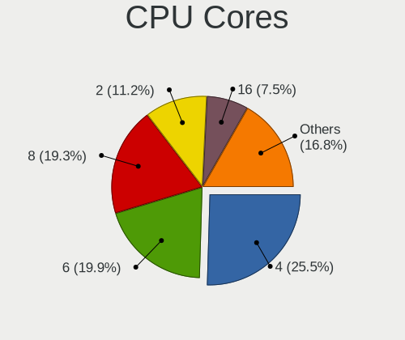

| Number | Computers | Percent |
|--------|-----------|---------|
| 4      | 40        | 25%     |
| 6      | 32        | 20%     |
| 8      | 31        | 19.38%  |
| 2      | 18        | 11.25%  |
| 16     | 12        | 7.5%    |
| 12     | 10        | 6.25%   |
| 1      | 6         | 3.75%   |
| 14     | 5         | 3.13%   |
| 10     | 3         | 1.88%   |
| 28     | 2         | 1.25%   |
| 32     | 1         | 0.63%   |

CPU Sockets
-----------

Number of sockets

| Number | Computers | Percent |
|--------|-----------|---------|
| 1      | 155       | 97.48%  |
| 2      | 4         | 2.52%   |

CPU Threads
-----------

Threads per core (Hyper-Threading)

| Number | Computers | Percent |
|--------|-----------|---------|
| 2      | 137       | 86.16%  |
| 1      | 22        | 13.84%  |

CPU Op-Modes
------------

CPU Operation Modes (32-bit, 64-bit)

| Op mode        | Computers | Percent |
|----------------|-----------|---------|
| 32-bit, 64-bit | 155       | 97.48%  |
| 32-bit         | 2         | 1.26%   |
| Unknown        | 2         | 1.26%   |

CPU Microcode
-------------

Microcode number

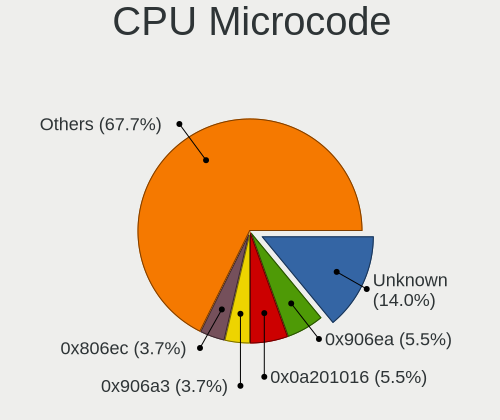

| Number     | Computers | Percent |
|------------|-----------|---------|
| Unknown    | 23        | 14.11%  |
| 0x906ea    | 9         | 5.52%   |
| 0x0a201016 | 9         | 5.52%   |
| 0x906a3    | 6         | 3.68%   |
| 0x806ec    | 6         | 3.68%   |
| 0x0a50000c | 6         | 3.68%   |
| 0x0a20120a | 6         | 3.68%   |
| 0x206a7    | 5         | 3.07%   |
| 0x08701021 | 5         | 3.07%   |
| 0x08600106 | 5         | 3.07%   |
| 0xa0652    | 4         | 2.45%   |
| 0x506e3    | 4         | 2.45%   |
| 0x306f2    | 4         | 2.45%   |
| 0x0a601203 | 4         | 2.45%   |
| 0x906e9    | 3         | 1.84%   |
| 0x90672    | 3         | 1.84%   |
| 0x406f1    | 3         | 1.84%   |
| 0x306a9    | 3         | 1.84%   |
| 0x0a50000d | 3         | 1.84%   |
| 0x0a201009 | 3         | 1.84%   |
| 0x0800820d | 3         | 1.84%   |
| 0x906ec    | 2         | 1.23%   |
| 0x906a4    | 2         | 1.23%   |
| 0x806ea    | 2         | 1.23%   |
| 0x806e9    | 2         | 1.23%   |
| 0x706e5    | 2         | 1.23%   |
| 0x406e3    | 2         | 1.23%   |
| 0x306c3    | 2         | 1.23%   |
| 0x08108109 | 2         | 1.23%   |
| 0xf41      | 1         | 0.61%   |
| 0xf29      | 1         | 0.61%   |
| 0xa0671    | 1         | 0.61%   |
| 0xa0653    | 1         | 0.61%   |
| 0x906c0    | 1         | 0.61%   |
| 0x90675    | 1         | 0.61%   |
| 0x806eb    | 1         | 0.61%   |
| 0x806d1    | 1         | 0.61%   |
| 0x806c1    | 1         | 0.61%   |
| 0x706a8    | 1         | 0.61%   |
| 0x6fb      | 1         | 0.61%   |

CPU Microarch
-------------

Microarchitecture

| Name             | Computers | Percent |
|------------------|-----------|---------|
| Zen 3            | 28        | 17.39%  |
| KabyLake         | 27        | 16.77%  |
| Zen 2            | 14        | 8.7%    |
| Alderlake Hybrid | 13        | 8.07%   |
| Unknown          | 12        | 7.45%   |
| Haswell          | 8         | 4.97%   |
| Zen+             | 6         | 3.73%   |
| Skylake          | 6         | 3.73%   |
| SandyBridge      | 6         | 3.73%   |
| CometLake        | 6         | 3.73%   |
| Icelake          | 5         | 3.11%   |
| Broadwell        | 5         | 3.11%   |
| K10              | 4         | 2.48%   |
| IvyBridge        | 4         | 2.48%   |
| Zen              | 3         | 1.86%   |
| Westmere         | 2         | 1.24%   |
| TigerLake        | 2         | 1.24%   |
| NetBurst         | 2         | 1.24%   |
| Tremont          | 1         | 0.62%   |
| Silvermont       | 1         | 0.62%   |
| P6               | 1         | 0.62%   |
| Jaguar           | 1         | 0.62%   |
| Goldmont plus    | 1         | 0.62%   |
| Core             | 1         | 0.62%   |
| Bulldozer        | 1         | 0.62%   |
| Bonnell          | 1         | 0.62%   |

Graphics
--------

GPU Vendor
----------

Vendors of graphics cards

| Vendor                     | Computers | Percent |
|----------------------------|-----------|---------|
| Intel                      | 66        | 35.11%  |
| Nvidia                     | 60        | 31.91%  |
| AMD                        | 55        | 29.26%  |
| ASPEED Technology          | 6         | 3.19%   |
| Matrox Electronics Systems | 1         | 0.53%   |

GPU Model
---------

Graphics card models

| Model                                                                     | Computers | Percent |
|---------------------------------------------------------------------------|-----------|---------|
| Intel Alder Lake-P Integrated Graphics Controller                         | 8         | 4.1%    |
| AMD Renoir                                                                | 7         | 3.59%   |
| Intel CometLake-U GT2 [UHD Graphics]                                      | 6         | 3.08%   |
| ASPEED Technology ASPEED Graphics Family                                  | 6         | 3.08%   |
| Intel CometLake-H GT2 [UHD Graphics]                                      | 5         | 2.56%   |
| Intel 2nd Generation Core Processor Family Integrated Graphics Controller | 5         | 2.56%   |
| AMD Navi 22 [Radeon RX 6700/6700 XT/6750 XT / 6800M/6850M XT]             | 5         | 2.56%   |
| AMD Navi 10 [Radeon RX 5600 OEM/5600 XT / 5700/5700 XT]                   | 5         | 2.56%   |
| AMD Cezanne [Radeon Vega Series / Radeon Vega Mobile Series]              | 5         | 2.56%   |
| Intel CoffeeLake-H GT2 [UHD Graphics 630]                                 | 4         | 2.05%   |
| AMD Raphael                                                               | 4         | 2.05%   |
| AMD Ellesmere [Radeon RX 470/480/570/570X/580/580X/590]                   | 4         | 2.05%   |
| Nvidia GA106M [GeForce RTX 3060 Mobile / Max-Q]                           | 3         | 1.54%   |
| Intel 4th Gen Core Processor Integrated Graphics Controller               | 3         | 1.54%   |
| AMD Picasso/Raven 2 [Radeon Vega Series / Radeon Vega Mobile Series]      | 3         | 1.54%   |
| AMD Navi 14 [Radeon RX 5500/5500M / Pro 5500M]                            | 3         | 1.54%   |
| Nvidia TU117M [GeForce GTX 1650 Mobile / Max-Q]                           | 2         | 1.03%   |
| Nvidia TU117 [GeForce GTX 1650]                                           | 2         | 1.03%   |
| Nvidia TU116M [GeForce GTX 1660 Ti Mobile]                                | 2         | 1.03%   |
| Nvidia TU106 [GeForce RTX 2060 Rev. A]                                    | 2         | 1.03%   |
| Nvidia TU104 [GeForce RTX 2080 Rev. A]                                    | 2         | 1.03%   |
| Nvidia GP104M [GeForce GTX 1070 Mobile]                                   | 2         | 1.03%   |
| Nvidia GP104 [GeForce GTX 1080]                                           | 2         | 1.03%   |
| Nvidia GA106 [RTX A2000]                                                  | 2         | 1.03%   |
| Nvidia GA104M [Geforce RTX 3070 Ti Laptop GPU]                            | 2         | 1.03%   |
| Nvidia GA102 [GeForce RTX 3080 Ti]                                        | 2         | 1.03%   |
| Intel UHD Graphics 620                                                    | 2         | 1.03%   |
| Intel Skylake GT2 [HD Graphics 520]                                       | 2         | 1.03%   |
| Intel Iris Plus Graphics G1 (Ice Lake)                                    | 2         | 1.03%   |
| Intel HD Graphics 630                                                     | 2         | 1.03%   |
| Intel CoffeeLake-S GT2 [UHD Graphics 630]                                 | 2         | 1.03%   |
| Intel AlderLake-S GT1                                                     | 2         | 1.03%   |
| Intel Alder Lake-UP3 GT2 [Iris Xe Graphics]                               | 2         | 1.03%   |
| Intel 3rd Gen Core processor Graphics Controller                          | 2         | 1.03%   |
| AMD RS780C [Radeon 3100]                                                  | 2         | 1.03%   |
| AMD Lexa [Radeon 540X/550X/630 / RX 640 / E9171 MCM]                      | 2         | 1.03%   |
| Nvidia TU117M                                                             | 1         | 0.51%   |
| Nvidia TU116 [GeForce GTX 1660 SUPER]                                     | 1         | 0.51%   |
| Nvidia TU106M [GeForce RTX 2060 Max-Q]                                    | 1         | 0.51%   |
| Nvidia TU106 [GeForce RTX 2070]                                           | 1         | 0.51%   |

GPU Combo
---------

Combinations of graphics cards

| Name            | Computers | Percent |
|-----------------|-----------|---------|
| 1 x AMD         | 43        | 26.88%  |
| 1 x Intel       | 40        | 25%     |
| 1 x Nvidia      | 30        | 18.75%  |
| Intel + Nvidia  | 24        | 15%     |
| 2 x AMD         | 5         | 3.13%   |
| 1 x ASPEED      | 4         | 2.5%    |
| AMD + Nvidia    | 4         | 2.5%    |
| Other           | 3         | 1.88%   |
| Intel + AMD     | 2         | 1.25%   |
| 2 x Nvidia      | 1         | 0.63%   |
| 2 x Intel       | 1         | 0.63%   |
| Nvidia + ASPEED | 1         | 0.63%   |
| 1 x Matrox      | 1         | 0.63%   |
| AMD + ASPEED    | 1         | 0.63%   |

GPU Driver
----------

Free vs proprietary

| Driver      | Computers | Percent |
|-------------|-----------|---------|
| Free        | 107       | 66.88%  |
| Proprietary | 41        | 25.63%  |
| Unknown     | 12        | 7.5%    |

GPU Memory
----------

Total video memory

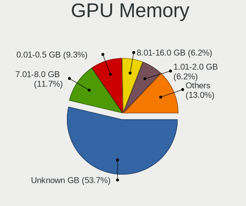

| Size in GB | Computers | Percent |
|------------|-----------|---------|
| Unknown    | 87        | 54.04%  |
| 7.01-8.0   | 19        | 11.8%   |
| 0.01-0.5   | 14        | 8.7%    |
| 1.01-2.0   | 10        | 6.21%   |
| 8.01-16.0  | 10        | 6.21%   |
| 0.51-1.0   | 8         | 4.97%   |
| 5.01-6.0   | 6         | 3.73%   |
| 3.01-4.0   | 5         | 3.11%   |
| 2.01-3.0   | 2         | 1.24%   |

Monitor
-------

Monitor Vendor
--------------

Monitor vendors

| Vendor               | Computers | Percent |
|----------------------|-----------|---------|
| Samsung Electronics  | 20        | 11.56%  |
| AU Optronics         | 18        | 10.4%   |
| BOE                  | 16        | 9.25%   |
| Dell                 | 12        | 6.94%   |
| LG Display           | 10        | 5.78%   |
| Hewlett-Packard      | 9         | 5.2%    |
| Goldstar             | 9         | 5.2%    |
| Sharp                | 7         | 4.05%   |
| Chimei Innolux       | 6         | 3.47%   |
| ASUSTek Computer     | 5         | 2.89%   |
| ViewSonic            | 4         | 2.31%   |
| Philips              | 4         | 2.31%   |
| BenQ                 | 4         | 2.31%   |
| AOC                  | 4         | 2.31%   |
| Ancor Communications | 4         | 2.31%   |
| Acer                 | 4         | 2.31%   |
| Iiyama               | 3         | 1.73%   |
| Apple                | 3         | 1.73%   |
| Viotek               | 2         | 1.16%   |
| Unknown              | 2         | 1.16%   |
| PANDA                | 2         | 1.16%   |
| LG Electronics       | 2         | 1.16%   |
| Lenovo               | 2         | 1.16%   |
| Gigabyte Technology  | 2         | 1.16%   |
| CSO                  | 2         | 1.16%   |
| ZIS                  | 1         | 0.58%   |
| RTK                  | 1         | 0.58%   |
| Panasonic            | 1         | 0.58%   |
| MSI                  | 1         | 0.58%   |
| MPI                  | 1         | 0.58%   |
| LTM                  | 1         | 0.58%   |
| ITE                  | 1         | 0.58%   |
| InnoLux Display      | 1         | 0.58%   |
| InfoVision           | 1         | 0.58%   |
| IBM                  | 1         | 0.58%   |
| HVR                  | 1         | 0.58%   |
| HannStar             | 1         | 0.58%   |
| FUS                  | 1         | 0.58%   |
| Fujitsu Siemens      | 1         | 0.58%   |
| ELSA                 | 1         | 0.58%   |

Monitor Model
-------------

Monitor models

| Model                                                                  | Computers | Percent |
|------------------------------------------------------------------------|-----------|---------|
| Unknown LCD Monitor FFFF 2288x1287 2550x2550mm 142.0-inch              | 2         | 1.1%    |
| Samsung Electronics SyncMaster SAM059A 1920x1080 477x268mm 21.5-inch   | 2         | 1.1%    |
| Samsung Electronics S27B350 SAM08DC 1920x1080 598x336mm 27.0-inch      | 2         | 1.1%    |
| Philips PHL 221V8 PHLC211 1920x1080 477x268mm 21.5-inch                | 2         | 1.1%    |
| Hewlett-Packard LA2205 HWP2848 1680x1050 473x296mm 22.0-inch           | 2         | 1.1%    |
| Hewlett-Packard 22es HWP331B 1920x1080 476x268mm 21.5-inch             | 2         | 1.1%    |
| Goldstar ULTRAWIDE GSM59F2 2560x1080 798x334mm 34.1-inch               | 2         | 1.1%    |
| AU Optronics LCD Monitor AUO80ED 1920x1080 344x193mm 15.5-inch         | 2         | 1.1%    |
| AU Optronics LCD Monitor AUO403D 1920x1080 309x173mm 13.9-inch         | 2         | 1.1%    |
| AU Optronics LCD Monitor AUO243D 1920x1080 310x170mm 13.9-inch         | 2         | 1.1%    |
| AU Optronics LCD Monitor AUO109D 1920x1080 381x214mm 17.2-inch         | 2         | 1.1%    |
| ASUSTek Computer VG278 AUS27AF 1920x1080 598x336mm 27.0-inch           | 2         | 1.1%    |
| ZIS ZWS 28" 240HZ ZIS4ED5 1920x1080 619x348mm 28.0-inch                | 1         | 0.55%   |
| Viotek GNV27DB VTK2700 2560x1440 597x336mm 27.0-inch                   | 1         | 0.55%   |
| Viotek GN34CW VTK3400 3440x1440 795x334mm 33.9-inch                    | 1         | 0.55%   |
| ViewSonic VX2450 SERIES VSCE226 1920x1080 525x297mm 23.7-inch          | 1         | 0.55%   |
| ViewSonic VX2370 SERIES VSC342C 1920x1080 509x286mm 23.0-inch          | 1         | 0.55%   |
| ViewSonic VG2039 SERIES VSC362D 1600x900 432x240mm 19.5-inch           | 1         | 0.55%   |
| ViewSonic VA2249 Series VSC7B2E 1920x1080 476x268mm 21.5-inch          | 1         | 0.55%   |
| Sharp LQ173M1JW03 SHP14DC 1920x1080 382x215mm 17.3-inch                | 1         | 0.55%   |
| Sharp LQ156M1JW01 SHP14C3 1920x1080 344x194mm 15.5-inch                | 1         | 0.55%   |
| Sharp LQ123P1JX32 SHP148A 2400x1600 259x173mm 12.3-inch                | 1         | 0.55%   |
| Sharp LCD Monitor SHP1551 3840x2400 288x180mm 13.4-inch                | 1         | 0.55%   |
| Sharp LCD Monitor SHP14D6 3840x2400 366x229mm 17.0-inch                | 1         | 0.55%   |
| Sharp LCD Monitor SHP148D 3840x2160 344x194mm 15.5-inch                | 1         | 0.55%   |
| Sharp LCD Monitor SHP1453 1920x1080 346x194mm 15.6-inch                | 1         | 0.55%   |
| Samsung Electronics U28E590 SAM0C4D 3840x2160 607x345mm 27.5-inch      | 1         | 0.55%   |
| Samsung Electronics T24C550 SAM0AA0 1920x1080 521x293mm 23.5-inch      | 1         | 0.55%   |
| Samsung Electronics S22B300 SAM08C8 1920x1080 477x268mm 21.5-inch      | 1         | 0.55%   |
| Samsung Electronics Odyssey G40B SAM727A 1920x1080 597x336mm 27.0-inch | 1         | 0.55%   |
| Samsung Electronics LCD Monitor SyncMaster                             | 1         | 0.55%   |
| Samsung Electronics LCD Monitor SDC4163 3456x2160 288x180mm 13.4-inch  | 1         | 0.55%   |
| Samsung Electronics LCD Monitor SDC4159 1920x1080 344x194mm 15.5-inch  | 1         | 0.55%   |
| Samsung Electronics LCD Monitor SAM0B30 1920x1080 480x270mm 21.7-inch  | 1         | 0.55%   |
| Samsung Electronics LCD Monitor SAM07D0 1360x768 700x390mm 31.5-inch   | 1         | 0.55%   |
| Samsung Electronics LCD Monitor LC34G55T 3440x2880                     | 1         | 0.55%   |
| Samsung Electronics LCD Monitor LC34G55T                               | 1         | 0.55%   |
| Samsung Electronics LC49G95T SAM7053 2560x1440 1193x336mm 48.8-inch    | 1         | 0.55%   |
| Samsung Electronics LC24RG50 SAM0F90 1920x1080 532x304mm 24.1-inch     | 1         | 0.55%   |
| Samsung Electronics C32JG5x SAM0F73 1920x1080 698x393mm 31.5-inch      | 1         | 0.55%   |

Monitor Resolution
------------------

Monitor screen resolution

| Resolution         | Computers | Percent |
|--------------------|-----------|---------|
| 1920x1080 (FHD)    | 81        | 49.39%  |
| 2560x1440 (QHD)    | 14        | 8.54%   |
| 3840x2160 (4K)     | 11        | 6.71%   |
| 1366x768 (WXGA)    | 7         | 4.27%   |
| 1680x1050 (WSXGA+) | 6         | 3.66%   |
| Unknown            | 5         | 3.05%   |
| 2560x1080          | 4         | 2.44%   |
| 3440x1440          | 3         | 1.83%   |
| 2560x1600          | 3         | 1.83%   |
| 1920x1200 (WUXGA)  | 3         | 1.83%   |
| 3840x2400          | 2         | 1.22%   |
| 3840x1080          | 2         | 1.22%   |
| 2288x1287          | 2         | 1.22%   |
| 1600x900 (HD+)     | 2         | 1.22%   |
| 1360x768           | 2         | 1.22%   |
| 6400x1440          | 1         | 0.61%   |
| 400x1280           | 1         | 0.61%   |
| 3840x1200          | 1         | 0.61%   |
| 3456x2160          | 1         | 0.61%   |
| 3440x2880          | 1         | 0.61%   |
| 2880x1800          | 1         | 0.61%   |
| 2400x1600          | 1         | 0.61%   |
| 2240x1400          | 1         | 0.61%   |
| 2160x1440          | 1         | 0.61%   |
| 2160x1200          | 1         | 0.61%   |
| 1440x900 (WXGA+)   | 1         | 0.61%   |
| 1280x800 (WXGA)    | 1         | 0.61%   |
| 1280x720 (HD)      | 1         | 0.61%   |
| 1280x1024 (SXGA)   | 1         | 0.61%   |
| 1152x864           | 1         | 0.61%   |
| 1128x1504          | 1         | 0.61%   |
| 1024x600           | 1         | 0.61%   |

Monitor Diagonal
----------------

Diagonal size in inches

| Inches  | Computers | Percent |
|---------|-----------|---------|
| 15      | 30        | 17.86%  |
| 27      | 27        | 16.07%  |
| 14      | 15        | 8.93%   |
| 21      | 13        | 7.74%   |
| 17      | 11        | 6.55%   |
| 24      | 10        | 5.95%   |
| 23      | 10        | 5.95%   |
| 13      | 10        | 5.95%   |
| Unknown | 8         | 4.76%   |
| 34      | 7         | 4.17%   |
| 31      | 5         | 2.98%   |
| 22      | 4         | 2.38%   |
| 16      | 3         | 1.79%   |
| 142     | 2         | 1.19%   |
| 18      | 2         | 1.19%   |
| 12      | 2         | 1.19%   |
| 72      | 1         | 0.6%    |
| 54      | 1         | 0.6%    |
| 48      | 1         | 0.6%    |
| 40      | 1         | 0.6%    |
| 28      | 1         | 0.6%    |
| 20      | 1         | 0.6%    |
| 19      | 1         | 0.6%    |
| 11      | 1         | 0.6%    |
| 10      | 1         | 0.6%    |

Monitor Width
-------------

Physical width

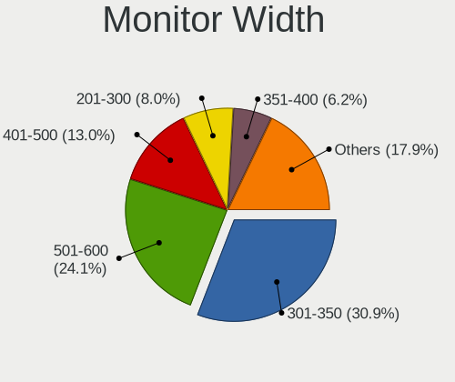

| Width in mm    | Computers | Percent |
|----------------|-----------|---------|
| 301-350        | 50        | 31.06%  |
| 501-600        | 39        | 24.22%  |
| 401-500        | 20        | 12.42%  |
| 201-300        | 13        | 8.07%   |
| 351-400        | 10        | 6.21%   |
| 601-700        | 8         | 4.97%   |
| Unknown        | 8         | 4.97%   |
| 701-800        | 7         | 4.35%   |
| More than 2000 | 2         | 1.24%   |
| 1001-1500      | 2         | 1.24%   |
| 801-900        | 1         | 0.62%   |
| 1501-2000      | 1         | 0.62%   |

Aspect Ratio
------------

Proportional relationship between the width and the height

| Ratio   | Computers | Percent |
|---------|-----------|---------|
| 16/9    | 109       | 71.71%  |
| 16/10   | 20        | 13.16%  |
| 21/9    | 7         | 4.61%   |
| Unknown | 6         | 3.95%   |
| 3/2     | 3         | 1.97%   |
| 1.00    | 3         | 1.97%   |
| 5/4     | 1         | 0.66%   |
| 4/3     | 1         | 0.66%   |
| 32/9    | 1         | 0.66%   |
| 0.31    | 1         | 0.66%   |

Monitor Area
------------

Area in inch

| Area in inch | Computers | Percent |
|----------------|-----------|---------|
| 101-110        | 30        | 18.29%  |
| 301-350        | 28        | 17.07%  |
| 201-250        | 27        | 16.46%  |
| 81-90          | 18        | 10.98%  |
| 351-500        | 11        | 6.71%   |
| 121-130        | 9         | 5.49%   |
| Unknown        | 8         | 4.88%   |
| 71-80          | 6         | 3.66%   |
| 151-200        | 5         | 3.05%   |
| More than 1000 | 4         | 2.44%   |
| 251-300        | 4         | 2.44%   |
| 111-120        | 4         | 2.44%   |
| 141-150        | 3         | 1.83%   |
| 61-70          | 2         | 1.22%   |
| 501-1000       | 2         | 1.22%   |
| 51-60          | 1         | 0.61%   |
| 41-50          | 1         | 0.61%   |
| 131-140        | 1         | 0.61%   |

Pixel Density
-------------

Pixels per inch

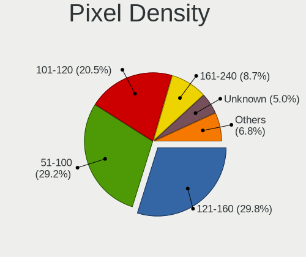

| Density       | Computers | Percent |
|---------------|-----------|---------|
| 121-160       | 49        | 30.63%  |
| 51-100        | 47        | 29.38%  |
| 101-120       | 31        | 19.38%  |
| 161-240       | 14        | 8.75%   |
| Unknown       | 8         | 5%      |
| More than 240 | 6         | 3.75%   |
| 1-50          | 5         | 3.13%   |

Multiple Monitors
-----------------

Total monitors connected

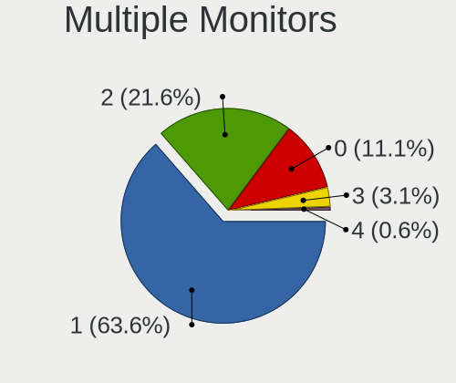

| Total | Computers | Percent |
|-------|-----------|---------|
| 1     | 102       | 63.35%  |
| 2     | 35        | 21.74%  |
| 0     | 18        | 11.18%  |
| 3     | 5         | 3.11%   |
| 4     | 1         | 0.62%   |

Network
-------

Net Controller Vendor
---------------------

Controller vendors

| Vendor                                | Computers | Percent |
|---------------------------------------|-----------|---------|
| Intel                                 | 106       | 45.11%  |
| Realtek Semiconductor                 | 83        | 35.32%  |
| Broadcom                              | 12        | 5.11%   |
| MediaTek                              | 8         | 3.4%    |
| Qualcomm Atheros                      | 7         | 2.98%   |
| STMicroelectronics                    | 2         | 0.85%   |
| Ralink                                | 2         | 0.85%   |
| Qualcomm                              | 2         | 0.85%   |
| Aquantia                              | 2         | 0.85%   |
| TP-Link                               | 1         | 0.43%   |
| Silicon Integrated Systems [SiS]      | 1         | 0.43%   |
| Senao                                 | 1         | 0.43%   |
| Qualcomm Atheros Communications       | 1         | 0.43%   |
| QinHeng Electronics                   | 1         | 0.43%   |
| Nvidia                                | 1         | 0.43%   |
| Insyde Software                       | 1         | 0.43%   |
| Input Club                            | 1         | 0.43%   |
| Fibocom                               | 1         | 0.43%   |
| Cisco Aironet Wireless Communications | 1         | 0.43%   |
| AVM                                   | 1         | 0.43%   |

Net Controller Model
--------------------

Controller models

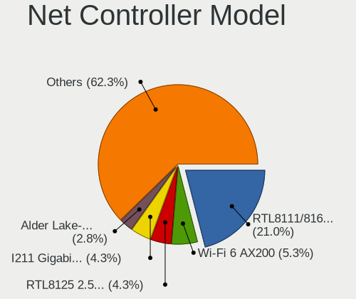

| Model                                                             | Computers | Percent |
|-------------------------------------------------------------------|-----------|---------|
| Realtek RTL8111/8168/8411 PCI Express Gigabit Ethernet Controller | 58        | 20.79%  |
| Intel Wi-Fi 6 AX200                                               | 15        | 5.38%   |
| Realtek RTL8125 2.5GbE Controller                                 | 12        | 4.3%    |
| Intel I211 Gigabit Network Connection                             | 12        | 4.3%    |
| Intel Alder Lake-P PCH CNVi WiFi                                  | 8         | 2.87%   |
| Realtek RTL8153 Gigabit Ethernet Adapter                          | 7         | 2.51%   |
| Intel Ethernet Controller I225-V                                  | 7         | 2.51%   |
| Intel I210 Gigabit Network Connection                             | 6         | 2.15%   |
| Intel Comet Lake PCH-LP CNVi WiFi                                 | 6         | 2.15%   |
| Realtek RTL8821CE 802.11ac PCIe Wireless Network Adapter          | 5         | 1.79%   |
| Intel Cannon Lake PCH CNVi WiFi                                   | 5         | 1.79%   |
| Realtek RTL8822CE 802.11ac PCIe Wireless Network Adapter          | 4         | 1.43%   |
| MediaTek MT7922 802.11ax PCI Express Wireless Network Adapter     | 4         | 1.43%   |
| MediaTek MT7921 802.11ax PCI Express Wireless Network Adapter     | 4         | 1.43%   |
| Intel Wireless-AC 9260                                            | 4         | 1.43%   |
| Intel Wireless 8265 / 8275                                        | 4         | 1.43%   |
| Intel Wireless 7265                                               | 4         | 1.43%   |
| Intel Wi-Fi 6 AX210/AX211/AX411 160MHz                            | 4         | 1.43%   |
| Intel Comet Lake PCH CNVi WiFi                                    | 4         | 1.43%   |
| Intel Wireless 7260                                               | 3         | 1.08%   |
| Intel Ethernet Connection (7) I219-V                              | 3         | 1.08%   |
| Intel Centrino Advanced-N 6235                                    | 3         | 1.08%   |
| Intel Alder Lake-S PCH CNVi WiFi                                  | 3         | 1.08%   |
| Broadcom BCM4331 802.11a/b/g/n                                    | 3         | 1.08%   |
| STMicroelectronics Virtual COM Port                               | 2         | 0.72%   |
| Realtek RTL810xE PCI Express Fast Ethernet controller             | 2         | 0.72%   |
| Realtek Killer E2600 Gigabit Ethernet Controller                  | 2         | 0.72%   |
| Qualcomm Atheros Killer E2500 Gigabit Ethernet Controller         | 2         | 0.72%   |
| Qualcomm Atheros Killer E220x Gigabit Ethernet Controller         | 2         | 0.72%   |
| Intel Wireless 8260                                               | 2         | 0.72%   |
| Intel Wireless 3160                                               | 2         | 0.72%   |
| Intel Ethernet Connection I219-LM                                 | 2         | 0.72%   |
| Intel Ethernet Connection (5) I219-LM                             | 2         | 0.72%   |
| Intel Ethernet Connection (4) I219-LM                             | 2         | 0.72%   |
| Intel Ethernet Connection (2) I218-LM                             | 2         | 0.72%   |
| Intel Ethernet Connection (14) I219-V                             | 2         | 0.72%   |
| Intel 82579V Gigabit Network Connection                           | 2         | 0.72%   |
| Broadcom NetXtreme BCM57765 Gigabit Ethernet PCIe                 | 2         | 0.72%   |
| Broadcom BCM4360 802.11ac Wireless Network Adapter                | 2         | 0.72%   |
| Broadcom BCM4313 802.11bgn Wireless Network Adapter               | 2         | 0.72%   |

Wireless Vendor
---------------

Wireless vendors

| Vendor                                | Computers | Percent |
|---------------------------------------|-----------|---------|
| Intel                                 | 76        | 65.52%  |
| Realtek Semiconductor                 | 12        | 10.34%  |
| MediaTek                              | 8         | 6.9%    |
| Broadcom                              | 8         | 6.9%    |
| Ralink                                | 2         | 1.72%   |
| Qualcomm Atheros                      | 2         | 1.72%   |
| Qualcomm                              | 2         | 1.72%   |
| TP-Link                               | 1         | 0.86%   |
| Senao                                 | 1         | 0.86%   |
| Qualcomm Atheros Communications       | 1         | 0.86%   |
| Fibocom                               | 1         | 0.86%   |
| Cisco Aironet Wireless Communications | 1         | 0.86%   |
| AVM                                   | 1         | 0.86%   |

Wireless Model
--------------

Wireless models

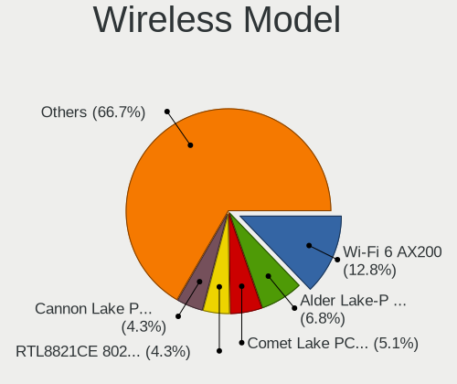

| Model                                                          | Computers | Percent |
|----------------------------------------------------------------|-----------|---------|
| Intel Wi-Fi 6 AX200                                            | 15        | 12.93%  |
| Intel Alder Lake-P PCH CNVi WiFi                               | 8         | 6.9%    |
| Intel Comet Lake PCH-LP CNVi WiFi                              | 6         | 5.17%   |
| Realtek RTL8821CE 802.11ac PCIe Wireless Network Adapter       | 5         | 4.31%   |
| Intel Cannon Lake PCH CNVi WiFi                                | 5         | 4.31%   |
| Realtek RTL8822CE 802.11ac PCIe Wireless Network Adapter       | 4         | 3.45%   |
| MediaTek MT7922 802.11ax PCI Express Wireless Network Adapter  | 4         | 3.45%   |
| MediaTek MT7921 802.11ax PCI Express Wireless Network Adapter  | 4         | 3.45%   |
| Intel Wireless-AC 9260                                         | 4         | 3.45%   |
| Intel Wireless 8265 / 8275                                     | 4         | 3.45%   |
| Intel Wireless 7265                                            | 4         | 3.45%   |
| Intel Wi-Fi 6 AX210/AX211/AX411 160MHz                         | 4         | 3.45%   |
| Intel Comet Lake PCH CNVi WiFi                                 | 4         | 3.45%   |
| Intel Wireless 7260                                            | 3         | 2.59%   |
| Intel Centrino Advanced-N 6235                                 | 3         | 2.59%   |
| Intel Alder Lake-S PCH CNVi WiFi                               | 3         | 2.59%   |
| Broadcom BCM4331 802.11a/b/g/n                                 | 3         | 2.59%   |
| Intel Wireless 8260                                            | 2         | 1.72%   |
| Intel Wireless 3160                                            | 2         | 1.72%   |
| Broadcom BCM4360 802.11ac Wireless Network Adapter             | 2         | 1.72%   |
| Broadcom BCM4313 802.11bgn Wireless Network Adapter            | 2         | 1.72%   |
| TP-Link TL-WN823N v2/v3 [Realtek RTL8192EU]                    | 1         | 0.86%   |
| Senao EUB9801 802.11abgn Wireless Adapter [Ralink RT3572]      | 1         | 0.86%   |
| Realtek RTL88x2bu [AC1200 Techkey]                             | 1         | 0.86%   |
| Realtek RTL8852AE 802.11ax PCIe Wireless Network Adapter       | 1         | 0.86%   |
| Realtek 802.11ac NIC                                           | 1         | 0.86%   |
| Ralink RT5392 PCIe Wireless Network Adapter                    | 1         | 0.86%   |
| Ralink RT5360 Wireless 802.11n 1T/1R                           | 1         | 0.86%   |
| Qualcomm QCNFA765 Wireless Network Adapter                     | 1         | 0.86%   |
| Qualcomm QCA6390 Wireless Network Adapter                      | 1         | 0.86%   |
| Qualcomm Atheros QCA9377 802.11ac Wireless Network Adapter     | 1         | 0.86%   |
| Qualcomm Atheros AR9271 802.11n                                | 1         | 0.86%   |
| Qualcomm Atheros AR9287 Wireless Network Adapter (PCI-Express) | 1         | 0.86%   |
| Intel Wireless 3165                                            | 1         | 0.86%   |
| Intel Wi-Fi 6 AX201 160MHz                                     | 1         | 0.86%   |
| Intel Wi-Fi 6 AX201                                            | 1         | 0.86%   |
| Intel Tiger Lake PCH CNVi WiFi                                 | 1         | 0.86%   |
| Intel Ice Lake-LP PCH CNVi WiFi                                | 1         | 0.86%   |
| Intel Gemini Lake PCH CNVi WiFi                                | 1         | 0.86%   |
| Intel Dual Band Wireless-AC 3168NGW [Stone Peak]               | 1         | 0.86%   |

Ethernet Vendor
---------------

Ethernet vendors

| Vendor                           | Computers | Percent |
|----------------------------------|-----------|---------|
| Realtek Semiconductor            | 79        | 52.67%  |
| Intel                            | 54        | 36%     |
| Broadcom                         | 7         | 4.67%   |
| Qualcomm Atheros                 | 5         | 3.33%   |
| Aquantia                         | 2         | 1.33%   |
| Silicon Integrated Systems [SiS] | 1         | 0.67%   |
| Nvidia                           | 1         | 0.67%   |
| Insyde Software                  | 1         | 0.67%   |

Ethernet Model
--------------

Ethernet models

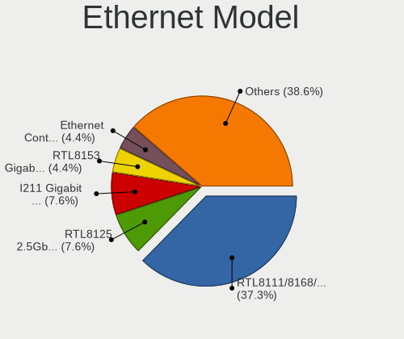

| Model                                                                         | Computers | Percent |
|-------------------------------------------------------------------------------|-----------|---------|
| Realtek RTL8111/8168/8411 PCI Express Gigabit Ethernet Controller             | 58        | 36.94%  |
| Realtek RTL8125 2.5GbE Controller                                             | 12        | 7.64%   |
| Intel I211 Gigabit Network Connection                                         | 12        | 7.64%   |
| Realtek RTL8153 Gigabit Ethernet Adapter                                      | 7         | 4.46%   |
| Intel Ethernet Controller I225-V                                              | 7         | 4.46%   |
| Intel I210 Gigabit Network Connection                                         | 6         | 3.82%   |
| Intel Ethernet Connection (7) I219-V                                          | 3         | 1.91%   |
| Realtek RTL810xE PCI Express Fast Ethernet controller                         | 2         | 1.27%   |
| Realtek Killer E2600 Gigabit Ethernet Controller                              | 2         | 1.27%   |
| Qualcomm Atheros Killer E2500 Gigabit Ethernet Controller                     | 2         | 1.27%   |
| Qualcomm Atheros Killer E220x Gigabit Ethernet Controller                     | 2         | 1.27%   |
| Intel Ethernet Connection I219-LM                                             | 2         | 1.27%   |
| Intel Ethernet Connection (5) I219-LM                                         | 2         | 1.27%   |
| Intel Ethernet Connection (4) I219-LM                                         | 2         | 1.27%   |
| Intel Ethernet Connection (2) I218-LM                                         | 2         | 1.27%   |
| Intel Ethernet Connection (14) I219-V                                         | 2         | 1.27%   |
| Intel 82579V Gigabit Network Connection                                       | 2         | 1.27%   |
| Broadcom NetXtreme BCM57765 Gigabit Ethernet PCIe                             | 2         | 1.27%   |
| Silicon Integrated Systems [SiS] SiS900 PCI Fast Ethernet                     | 1         | 0.64%   |
| Realtek RTL8152 Fast Ethernet Adapter                                         | 1         | 0.64%   |
| Realtek RTL-8100/8101L/8139 PCI Fast Ethernet Adapter                         | 1         | 0.64%   |
| Realtek Killer E3000 2.5GbE Controller                                        | 1         | 0.64%   |
| Qualcomm Atheros AR8131 Gigabit Ethernet                                      | 1         | 0.64%   |
| Nvidia MCP77 Ethernet                                                         | 1         | 0.64%   |
| Intel I350 Gigabit Network Connection                                         | 1         | 0.64%   |
| Intel Ethernet Connection I217-LM                                             | 1         | 0.64%   |
| Intel Ethernet Connection (7) I219-LM                                         | 1         | 0.64%   |
| Intel Ethernet Connection (2) I219-V                                          | 1         | 0.64%   |
| Intel Ethernet Connection (2) I218-V                                          | 1         | 0.64%   |
| Intel Ethernet Connection (17) I219-LM                                        | 1         | 0.64%   |
| Intel Ethernet Connection (16) I219-V                                         | 1         | 0.64%   |
| Intel Ethernet Connection (16) I219-LM                                        | 1         | 0.64%   |
| Intel Ethernet Connection (10) I219-V                                         | 1         | 0.64%   |
| Intel Ethernet Connection (10) I219-LM                                        | 1         | 0.64%   |
| Intel 82599ES 10-Gigabit SFI/SFP+ Network Connection                          | 1         | 0.64%   |
| Intel 82579LM Gigabit Network Connection (Lewisville)                         | 1         | 0.64%   |
| Intel 82575EB Gigabit Network Connection                                      | 1         | 0.64%   |
| Intel 82574L Gigabit Network Connection                                       | 1         | 0.64%   |
| Intel 82571EB/82571GB Gigabit Ethernet Controller D0/D1 (copper applications) | 1         | 0.64%   |
| Intel 82540EP Gigabit Ethernet Controller (Mobile)                            | 1         | 0.64%   |

Net Controller Kind
-------------------

Ethernet, WiFi or modem

| Kind     | Computers | Percent |
|----------|-----------|---------|
| Ethernet | 137       | 54.15%  |
| WiFi     | 110       | 43.48%  |
| Modem    | 6         | 2.37%   |

Used Controller
---------------

Currently used network controller

| Kind     | Computers | Percent |
|----------|-----------|---------|
| Ethernet | 85        | 52.15%  |
| WiFi     | 78        | 47.85%  |

NICs
----

Total network controllers on board

| Total | Computers | Percent |
|-------|-----------|---------|
| 2     | 89        | 55.97%  |
| 1     | 56        | 35.22%  |
| 3     | 10        | 6.29%   |
| 4     | 2         | 1.26%   |
| 0     | 2         | 1.26%   |

IPv6
----

IPv6 vs IPv4

| Used | Computers | Percent |
|------|-----------|---------|
| No   | 123       | 76.88%  |
| Yes  | 37        | 23.13%  |

Bluetooth
---------

Bluetooth Vendor
----------------

Controller vendors

| Vendor                   | Computers | Percent |
|--------------------------|-----------|---------|
| Intel                    | 71        | 65.14%  |
| Realtek Semiconductor    | 7         | 6.42%   |
| IMC Networks             | 7         | 6.42%   |
| Broadcom                 | 4         | 3.67%   |
| Apple                    | 4         | 3.67%   |
| Foxconn / Hon Hai        | 3         | 2.75%   |
| Cambridge Silicon Radio  | 3         | 2.75%   |
| MediaTek                 | 2         | 1.83%   |
| ASUSTek Computer         | 2         | 1.83%   |
| USI                      | 1         | 0.92%   |
| Realtek                  | 1         | 0.92%   |
| Lite-On Technology       | 1         | 0.92%   |
| HTC (High Tech Computer) | 1         | 0.92%   |
| Dell                     | 1         | 0.92%   |
| Belkin Components        | 1         | 0.92%   |

Bluetooth Model
---------------

Controller models

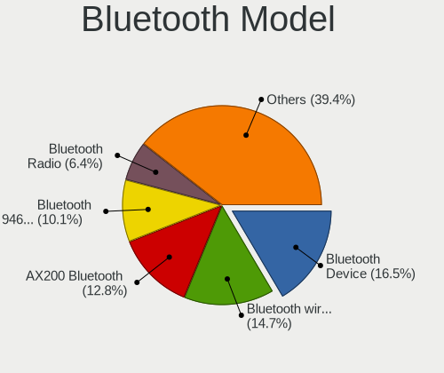

| Model                                                                | Computers | Percent |
|----------------------------------------------------------------------|-----------|---------|
| Intel Bluetooth wireless interface                                   | 16        | 14.68%  |
| Intel AX200 Bluetooth                                                | 14        | 12.84%  |
| Intel AX201 Bluetooth                                                | 12        | 11.01%  |
| Intel Bluetooth 9460/9560 Jefferson Peak (JfP)                       | 11        | 10.09%  |
| Realtek Bluetooth Radio                                              | 7         | 6.42%   |
| Intel Bluetooth Device                                               | 7         | 6.42%   |
| Intel Wireless-AC 9260 Bluetooth Adapter                             | 4         | 3.67%   |
| Intel AX210 Bluetooth                                                | 4         | 3.67%   |
| Intel Centrino Bluetooth Wireless Transceiver                        | 3         | 2.75%   |
| IMC Networks Wireless_Device                                         | 3         | 2.75%   |
| IMC Networks Bluetooth Radio                                         | 3         | 2.75%   |
| Cambridge Silicon Radio Bluetooth Dongle (HCI mode)                  | 3         | 2.75%   |
| Broadcom BCM20702A0 Bluetooth 4.0                                    | 3         | 2.75%   |
| Apple Bluetooth Host Controller                                      | 3         | 2.75%   |
| MediaTek Wireless_Device                                             | 2         | 1.83%   |
| Foxconn / Hon Hai MediaTek Bluetooth Adapter                         | 2         | 1.83%   |
| USI Bluetooth Device                                                 | 1         | 0.92%   |
| Realtek 802.11ac WLAN Adapter                                        | 1         | 0.92%   |
| Lite-On Wireless_Device                                              | 1         | 0.92%   |
| IMC Networks Bluetooth module                                        | 1         | 0.92%   |
| HTC (High Tech Computer) Vive Hub Bluetooth 4.1 (Broadcom BCM920703) | 1         | 0.92%   |
| Foxconn / Hon Hai Wireless_Device                                    | 1         | 0.92%   |
| Dell Wireless 365 Bluetooth                                          | 1         | 0.92%   |
| Broadcom HP Portable SoftSailing                                     | 1         | 0.92%   |
| Belkin Components F8T065BF Mini Bluetooth 4.0 Adapter                | 1         | 0.92%   |
| ASUS Bluetooth Radio                                                 | 1         | 0.92%   |
| ASUS ASUS USB-BT500                                                  | 1         | 0.92%   |
| Apple Bluetooth USB Host Controller                                  | 1         | 0.92%   |

Sound
-----

Sound Vendor
------------

Sound card vendors

| Vendor                               | Computers | Percent |
|--------------------------------------|-----------|---------|
| Intel                                | 81        | 32.93%  |
| AMD                                  | 62        | 25.2%   |
| Nvidia                               | 52        | 21.14%  |
| Logitech                             | 8         | 3.25%   |
| C-Media Electronics                  | 5         | 2.03%   |
| SteelSeries ApS                      | 4         | 1.63%   |
| Creative Labs                        | 3         | 1.22%   |
| Trust                                | 2         | 0.81%   |
| Texas Instruments                    | 2         | 0.81%   |
| JMTek                                | 2         | 0.81%   |
| Focusrite-Novation                   | 2         | 0.81%   |
| Corsair                              | 2         | 0.81%   |
| ASUSTek Computer                     | 2         | 0.81%   |
| Thesycon Systemsoftware & Consulting | 1         | 0.41%   |
| Sony                                 | 1         | 0.41%   |
| Solid State Logic                    | 1         | 0.41%   |
| Silicon Integrated Systems [SiS]     | 1         | 0.41%   |
| Sennheiser Communications            | 1         | 0.41%   |
| Samson Technologies                  | 1         | 0.41%   |
| Razer USA                            | 1         | 0.41%   |
| No brand                             | 1         | 0.41%   |
| M-Audio                              | 1         | 0.41%   |
| Lenovo                               | 1         | 0.41%   |
| Hewlett-Packard                      | 1         | 0.41%   |
| GN Netcom                            | 1         | 0.41%   |
| EGO SYStems                          | 1         | 0.41%   |
| DSEA A/S                             | 1         | 0.41%   |
| Clavia DMI AB                        | 1         | 0.41%   |
| Blue Microphones                     | 1         | 0.41%   |
| BEHRINGER International              | 1         | 0.41%   |
| Audio-Technica                       | 1         | 0.41%   |
| Audient                              | 1         | 0.41%   |

Sound Model
-----------

Sound card models

| Model                                                                      | Computers | Percent |
|----------------------------------------------------------------------------|-----------|---------|
| AMD Starship/Matisse HD Audio Controller                                   | 25        | 8.45%   |
| AMD Family 17h/19h HD Audio Controller                                     | 21        | 7.09%   |
| AMD Renoir Radeon High Definition Audio Controller                         | 14        | 4.73%   |
| Intel Alder Lake PCH-P High Definition Audio Controller                    | 9         | 3.04%   |
| AMD Navi 21/23 HDMI/DP Audio Controller                                    | 9         | 3.04%   |
| Intel Cannon Lake PCH cAVS                                                 | 8         | 2.7%    |
| AMD Navi 10 HDMI Audio                                                     | 8         | 2.7%    |
| Nvidia TU104 HD Audio Controller                                           | 6         | 2.03%   |
| Nvidia GA106 High Definition Audio Controller                              | 6         | 2.03%   |
| Intel Sunrise Point-LP HD Audio                                            | 6         | 2.03%   |
| Intel Comet Lake PCH-LP cAVS                                               | 6         | 2.03%   |
| Nvidia TU107 GeForce GTX 1650 High Definition Audio Controller             | 5         | 1.69%   |
| Nvidia TU106 High Definition Audio Controller                              | 5         | 1.69%   |
| Nvidia GP104 High Definition Audio Controller                              | 5         | 1.69%   |
| Nvidia GA104 High Definition Audio Controller                              | 5         | 1.69%   |
| Intel Comet Lake PCH cAVS                                                  | 5         | 1.69%   |
| Intel C610/X99 series chipset HD Audio Controller                          | 5         | 1.69%   |
| Intel 7 Series/C216 Chipset Family High Definition Audio Controller        | 5         | 1.69%   |
| AMD Rembrandt Radeon High Definition Audio Controller                      | 5         | 1.69%   |
| AMD Ellesmere HDMI Audio [Radeon RX 470/480 / 570/580/590]                 | 5         | 1.69%   |
| Nvidia GA102 High Definition Audio Controller                              | 4         | 1.35%   |
| Intel 6 Series/C200 Series Chipset Family High Definition Audio Controller | 4         | 1.35%   |
| AMD Family 17h (Models 00h-0fh) HD Audio Controller                        | 4         | 1.35%   |
| Nvidia TU116 High Definition Audio Controller                              | 3         | 1.01%   |
| Nvidia GP106 High Definition Audio Controller                              | 3         | 1.01%   |
| Intel Xeon E3-1200 v3/4th Gen Core Processor HD Audio Controller           | 3         | 1.01%   |
| Intel Ice Lake-LP Smart Sound Technology Audio Controller                  | 3         | 1.01%   |
| Intel CM238 HD Audio Controller                                            | 3         | 1.01%   |
| Intel Alder Lake-S HD Audio Controller                                     | 3         | 1.01%   |
| Intel 8 Series/C220 Series Chipset High Definition Audio Controller        | 3         | 1.01%   |
| Intel 200 Series PCH HD Audio                                              | 3         | 1.01%   |
| Intel 100 Series/C230 Series Chipset Family HD Audio Controller            | 3         | 1.01%   |
| AMD SBx00 Azalia (Intel HDA)                                               | 3         | 1.01%   |
| AMD Raven/Raven2/Fenghuang HDMI/DP Audio Controller                        | 3         | 1.01%   |
| Texas Instruments PCM2902 Audio Codec                                      | 2         | 0.68%   |
| SteelSeries ApS SteelSeries Arctis 7                                       | 2         | 0.68%   |
| Nvidia GP107GL High Definition Audio Controller                            | 2         | 0.68%   |
| Nvidia GM204 High Definition Audio Controller                              | 2         | 0.68%   |
| Logitech H390 headset with microphone                                      | 2         | 0.68%   |
| JMTek USB PnP Audio Device                                                 | 2         | 0.68%   |

Memory
------

Memory Vendor
-------------

Memory module vendors

| Vendor              | Computers | Percent |
|---------------------|-----------|---------|
| Samsung Electronics | 35        | 20.71%  |
| Corsair             | 24        | 14.2%   |
| Kingston            | 23        | 13.61%  |
| SK hynix            | 22        | 13.02%  |
| Micron Technology   | 16        | 9.47%   |
| Crucial             | 11        | 6.51%   |
| Unknown             | 8         | 4.73%   |
| G.Skill             | 8         | 4.73%   |
| A-DATA Technology   | 4         | 2.37%   |
| Nanya Technology    | 3         | 1.78%   |
| Timetec             | 2         | 1.18%   |
| Team                | 2         | 1.18%   |
| Elpida              | 2         | 1.18%   |
| Unknown             | 2         | 1.18%   |
| Unknown (ABCD)      | 1         | 0.59%   |
| Transcend           | 1         | 0.59%   |
| Qumo                | 1         | 0.59%   |
| Hikvision           | 1         | 0.59%   |
| GOODRAM             | 1         | 0.59%   |
| Apacer              | 1         | 0.59%   |
| AMD                 | 1         | 0.59%   |

Memory Model
------------

Memory module models

| Model                                                            | Computers | Percent |
|------------------------------------------------------------------|-----------|---------|
| Unknown RAM Module 2GB DIMM DDR2 667MT/s                         | 2         | 1.15%   |
| SK hynix RAM HMA82GS6CJR8N-VK 16GB SODIMM DDR4 2667MT/s          | 2         | 1.15%   |
| SK hynix RAM HMA81GS6JJR8N-VK 8GB SODIMM DDR4 2667MT/s           | 2         | 1.15%   |
| SK hynix RAM HMA81GS6DJR8N-XN 8GB SODIMM DDR4 3200MT/s           | 2         | 1.15%   |
| SK hynix RAM HMA81GS6AFR8N-UH 8GB SODIMM DDR4 2667MT/s           | 2         | 1.15%   |
| Samsung RAM M471A5244CB0-CTD 4GB SODIMM DDR4 3266MT/s            | 2         | 1.15%   |
| Samsung RAM M471A2K43CB1-CTD 16GB SODIMM DDR4 8400MT/s           | 2         | 1.15%   |
| Micron RAM 4ATF1G64HZ-3G2E1 8GB SODIMM DDR4 3200MT/s             | 2         | 1.15%   |
| Corsair RAM CMT64GX4M4Z3600C16 16GB DIMM DDR4 3600MT/s           | 2         | 1.15%   |
| Corsair RAM CMK64GX4M2E3200C16 32GB DIMM DDR4 3200MT/s           | 2         | 1.15%   |
| Corsair RAM CMK32GX4M2D3600C18 16GB DIMM DDR4 3800MT/s           | 2         | 1.15%   |
| Unknown                                                          | 2         | 1.15%   |
| Unknown RAM Module 4GB DIMM DDR3 1600MT/s                        | 1         | 0.57%   |
| Unknown RAM Module 2GB SODIMM 667MT/s                            | 1         | 0.57%   |
| Unknown RAM Module 256MB SODIMM DDR 133MT/s                      | 1         | 0.57%   |
| Unknown RAM Module 1GB SODIMM DDR                                | 1         | 0.57%   |
| Unknown RAM Module 1GB DIMM DDR2                                 | 1         | 0.57%   |
| Unknown RAM Module 16GB DIMM DDR3 1333MT/s                       | 1         | 0.57%   |
| Unknown (ABCD) RAM 123456789012345678 4GB SODIMM LPDDR4 2400MT/s | 1         | 0.57%   |
| Transcend RAM Module 4GB SODIMM DDR3 1333MT/s                    | 1         | 0.57%   |
| Timetec RAM SD4-3200 16GB SODIMM DDR4 3200MT/s                   | 1         | 0.57%   |
| Timetec RAM SD4-2400 8GB SODIMM DDR4 2400MT/s                    | 1         | 0.57%   |
| Team RAM TEAMGROUP-UD4-3200 8GB DIMM DDR4 3733MT/s               | 1         | 0.57%   |
| Team RAM TEAMGROUP-SD4-2666 16GB SODIMM DDR4 2667MT/s            | 1         | 0.57%   |
| SK hynix RAM Module 4GB Row Of Chips LPDDR4 3733MT/s             | 1         | 0.57%   |
| SK hynix RAM Module 2GB Row Of Chips LPDDR4 4267MT/s             | 1         | 0.57%   |
| SK hynix RAM HMT41GS6AFR8A-PB 8GB SODIMM DDR3 1600MT/s           | 1         | 0.57%   |
| SK hynix RAM HMT351U6CFR8C-H9 4GB DIMM DDR3 1600MT/s             | 1         | 0.57%   |
| SK hynix RAM HMT351S6CFR8C-PB 4GB SODIMM DDR3 1600MT/s           | 1         | 0.57%   |
| SK hynix RAM HMCG78MEBSA092N 16GB SODIMM DDR5 4800MT/s           | 1         | 0.57%   |
| SK hynix RAM HMAA4GS6CJR8N-XN 32GB SODIMM DDR4 3200MT/s          | 1         | 0.57%   |
| SK hynix RAM HMAA1GS6CJR6N-XN 8GB SODIMM DDR4 3200MT/s           | 1         | 0.57%   |
| SK hynix RAM HMA851S6DJR6N-XN 4GB SODIMM DDR4 3200MT/s           | 1         | 0.57%   |
| SK hynix RAM HMA851S6CJR6N-VK 4GB Row Of Chips DDR4 2667MT/s     | 1         | 0.57%   |
| SK hynix RAM HMA84GR7MFR4N-UH 32GB DIMM DDR4 2400MT/s            | 1         | 0.57%   |
| SK hynix RAM HMA81GS6CJR8N-VK 8GB SODIMM DDR4 2667MT/s           | 1         | 0.57%   |
| SK hynix RAM HMA42GR7AFR4N-TF 16GB DIMM DDR4 2133MT/s            | 1         | 0.57%   |
| SK hynix RAM H9JCNNNFA5MLYR-N6E 8GB SODIMM LPDDR5 6400MT/s       | 1         | 0.57%   |
| Samsung RAM Module 8GB SODIMM DDR4 2400MT/s                      | 1         | 0.57%   |
| Samsung RAM Module 8GB SODIMM DDR4 2133MT/s                      | 1         | 0.57%   |

Memory Kind
-----------

Memory module kinds

| Kind    | Computers | Percent |
|---------|-----------|---------|
| DDR4    | 100       | 67.11%  |
| DDR3    | 20        | 13.42%  |
| DDR5    | 7         | 4.7%    |
| LPDDR5  | 6         | 4.03%   |
| LPDDR4  | 4         | 2.68%   |
| DDR2    | 4         | 2.68%   |
| DDR     | 3         | 2.01%   |
| LPDDR3  | 2         | 1.34%   |
| SDRAM   | 1         | 0.67%   |
| DRAM    | 1         | 0.67%   |
| Unknown | 1         | 0.67%   |

Memory Form Factor
------------------

Physical design of the memory module

| Name         | Computers | Percent |
|--------------|-----------|---------|
| SODIMM       | 69        | 46.31%  |
| DIMM         | 69        | 46.31%  |
| Row Of Chips | 9         | 6.04%   |
| Unknown      | 2         | 1.34%   |

Memory Size
-----------

Memory module size

| Size  | Computers | Percent |
|-------|-----------|---------|
| 16384 | 56        | 35%     |
| 8192  | 49        | 30.63%  |
| 4096  | 27        | 16.88%  |
| 32768 | 14        | 8.75%   |
| 2048  | 10        | 6.25%   |
| 1024  | 2         | 1.25%   |
| 256   | 2         | 1.25%   |

Memory Speed
------------

Memory module speed

| Speed   | Computers | Percent |
|---------|-----------|---------|
| 3200    | 39        | 24.07%  |
| 2667    | 25        | 15.43%  |
| 1600    | 12        | 7.41%   |
| 3600    | 11        | 6.79%   |
| 2133    | 10        | 6.17%   |
| 6400    | 7         | 4.32%   |
| 2400    | 7         | 4.32%   |
| 1333    | 5         | 3.09%   |
| 4800    | 4         | 2.47%   |
| 3800    | 4         | 2.47%   |
| 667     | 4         | 2.47%   |
| 8400    | 2         | 1.23%   |
| 3733    | 2         | 1.23%   |
| 3400    | 2         | 1.23%   |
| 3266    | 2         | 1.23%   |
| 3000    | 2         | 1.23%   |
| 2933    | 2         | 1.23%   |
| 1866    | 2         | 1.23%   |
| 1334    | 2         | 1.23%   |
| Unknown | 2         | 1.23%   |
| 6000    | 1         | 0.62%   |
| 5200    | 1         | 0.62%   |
| 4267    | 1         | 0.62%   |
| 4000    | 1         | 0.62%   |
| 3933    | 1         | 0.62%   |
| 3666    | 1         | 0.62%   |
| 3534    | 1         | 0.62%   |
| 3533    | 1         | 0.62%   |
| 3466    | 1         | 0.62%   |
| 3333    | 1         | 0.62%   |
| 2800    | 1         | 0.62%   |
| 2666    | 1         | 0.62%   |
| 1867    | 1         | 0.62%   |
| 800     | 1         | 0.62%   |
| 400     | 1         | 0.62%   |
| 133     | 1         | 0.62%   |

Printers & scanners
-------------------

Printer Vendor
--------------

Printer device vendors

| Vendor          | Computers | Percent |
|-----------------|-----------|---------|
| Hewlett-Packard | 2         | 100%    |

Printer Model
-------------

Printer device models

| Model               | Computers | Percent |
|---------------------|-----------|---------|
| HP LaserJet M14-M17 | 1         | 50%     |
| HP LaserJet 3200    | 1         | 50%     |

Scanner Vendor
--------------

Scanner device vendors

Zero info for selected period =(

Scanner Model
-------------

Scanner device models

Zero info for selected period =(

Camera
------

Camera Vendor
-------------

Camera device vendors

| Vendor                                 | Computers | Percent |
|----------------------------------------|-----------|---------|
| IMC Networks                           | 15        | 16.85%  |
| Logitech                               | 13        | 14.61%  |
| Microdia                               | 12        | 13.48%  |
| Chicony Electronics                    | 12        | 13.48%  |
| Sunplus Innovation Technology          | 5         | 5.62%   |
| Realtek Semiconductor                  | 5         | 5.62%   |
| Quanta                                 | 4         | 4.49%   |
| Bison Electronics                      | 4         | 4.49%   |
| Apple                                  | 4         | 4.49%   |
| Luxvisions Innotech Limited            | 3         | 3.37%   |
| Lite-On Technology                     | 3         | 3.37%   |
| Syntek                                 | 2         | 2.25%   |
| Generalplus Technology                 | 2         | 2.25%   |
| WaveRider Communications               | 1         | 1.12%   |
| Samsung Electronics                    | 1         | 1.12%   |
| Elgato Systems                         | 1         | 1.12%   |
| Cheng Uei Precision Industry (Foxlink) | 1         | 1.12%   |
| Acer                                   | 1         | 1.12%   |

Camera Model
------------

Camera device models

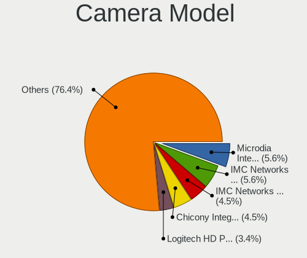

| Model                                                | Computers | Percent |
|------------------------------------------------------|-----------|---------|
| Microdia Integrated_Webcam_HD                        | 5         | 5.62%   |
| Logitech HD Pro Webcam C920                          | 5         | 5.62%   |
| IMC Networks Integrated Camera                       | 5         | 5.62%   |
| IMC Networks USB2.0 HD UVC WebCam                    | 4         | 4.49%   |
| Chicony Integrated Camera                            | 4         | 4.49%   |
| Logitech BRIO Ultra HD Webcam                        | 3         | 3.37%   |
| Syntek Integrated Camera                             | 2         | 2.25%   |
| Realtek Integrated_Webcam_HD                         | 2         | 2.25%   |
| Microdia Integrated_Webcam_FHD                       | 2         | 2.25%   |
| Microdia GC02M2                                      | 2         | 2.25%   |
| Logitech Webcam C270                                 | 2         | 2.25%   |
| IMC Networks USB2.0 VGA UVC WebCam                   | 2         | 2.25%   |
| Chicony HP Wide Vision HD Camera                     | 2         | 2.25%   |
| Apple FaceTime HD Camera                             | 2         | 2.25%   |
| WaveRider USB 2.0 Camera                             | 1         | 1.12%   |
| Sunplus Integrated_Webcam_HD                         | 1         | 1.12%   |
| Sunplus Integrated Webcam                            | 1         | 1.12%   |
| Sunplus HP Universal Camera                          | 1         | 1.12%   |
| Sunplus HD WebCam                                    | 1         | 1.12%   |
| Sunplus 1080p FHD Camera                             | 1         | 1.12%   |
| Samsung Galaxy series, misc. (MTP mode)              | 1         | 1.12%   |
| Realtek WebCamera                                    | 1         | 1.12%   |
| Realtek Integrated_Webcam_FHD                        | 1         | 1.12%   |
| Realtek FULL HD 1080P Webcam                         | 1         | 1.12%   |
| Quanta HD Webcam                                     | 1         | 1.12%   |
| Quanta HD User Facing                                | 1         | 1.12%   |
| Quanta HD Camera                                     | 1         | 1.12%   |
| Quanta ACER HD User Facing                           | 1         | 1.12%   |
| Microdia USB 2.0 Camera                              | 1         | 1.12%   |
| Microdia Sonix 1.3 MP Laptop Integrated Webcam       | 1         | 1.12%   |
| Microdia Laptop_Integrated_Webcam_FHD                | 1         | 1.12%   |
| Luxvisions Innotech Limited Integrated Camera        | 1         | 1.12%   |
| Luxvisions Innotech Limited HP Wide Vision HD Camera | 1         | 1.12%   |
| Luxvisions Innotech Limited HP 5M Camera             | 1         | 1.12%   |
| Logitech HD Webcam C615                              | 1         | 1.12%   |
| Logitech HD Webcam C525                              | 1         | 1.12%   |
| Logitech HD Webcam C510                              | 1         | 1.12%   |
| Lite-On Integrated Camera                            | 1         | 1.12%   |
| Lite-On HP Webcam                                    | 1         | 1.12%   |
| Lite-On HP HD Webcam                                 | 1         | 1.12%   |

Security
--------

Fingerprint Vendor
------------------

Fingerprint sensor vendors

| Vendor                     | Computers | Percent |
|----------------------------|-----------|---------|
| Validity Sensors           | 4         | 40%     |
| Shenzhen Goodix Technology | 3         | 30%     |
| Elan Microelectronics      | 2         | 20%     |
| LighTuning Technology      | 1         | 10%     |

Fingerprint Model
-----------------

Fingerprint sensor models

| Model                                        | Computers | Percent |
|----------------------------------------------|-----------|---------|
| Validity Sensors Synaptics WBDI              | 2         | 20%     |
| Validity Sensors VFS495 Fingerprint Reader   | 1         | 10%     |
| Validity Sensors VFS 5011 fingerprint sensor | 1         | 10%     |
| Shenzhen Goodix  Fingerprint Device          | 1         | 10%     |
| Shenzhen Goodix Fingerprint Reader           | 1         | 10%     |
| Shenzhen Goodix FingerPrint                  | 1         | 10%     |
| LighTuning EgisTec Touch Fingerprint Sensor  | 1         | 10%     |
| Elan ELAN:Fingerprint                        | 1         | 10%     |
| Elan ELAN:ARM-M4                             | 1         | 10%     |

Chipcard Vendor
---------------

Chipcard module vendors

| Vendor           | Computers | Percent |
|------------------|-----------|---------|
| Broadcom         | 3         | 37.5%   |
| Yubico.com       | 2         | 25%     |
| SCM Microsystems | 2         | 25%     |
| Alcor Micro      | 1         | 12.5%   |

Chipcard Model
--------------

Chipcard module models

| Model                                                  | Computers | Percent |
|--------------------------------------------------------|-----------|---------|
| Yubico.com Yubikey 4/5 CCID                            | 2         | 25%     |
| SCM Microsystems SCR331-LC1 / SCR3310 SmartCard Reader | 2         | 25%     |
| Broadcom 58200                                         | 2         | 25%     |
| Broadcom 5880                                          | 1         | 12.5%   |
| Alcor Micro AU9540 Smartcard Reader                    | 1         | 12.5%   |

Unsupported
-----------

Unsupported Devices
-------------------

Total unsupported devices on board

| Total | Computers | Percent |
|-------|-----------|---------|
| 0     | 68        | 40.24%  |
| 1     | 54        | 31.95%  |
| 2     | 19        | 11.24%  |
| 3     | 10        | 5.92%   |
| 4     | 8         | 4.73%   |
| 5     | 6         | 3.55%   |
| 6     | 4         | 2.37%   |

Unsupported Device Types
------------------------

Types of unsupported devices

| Type                     | Computers | Percent |
|--------------------------|-----------|---------|
| Graphics card            | 29        | 15.59%  |
| Communication controller | 29        | 15.59%  |
| Camera                   | 24        | 12.9%   |
| Bluetooth                | 22        | 11.83%  |
| Net/wireless             | 18        | 9.68%   |
| Fingerprint reader       | 10        | 5.38%   |
| Card reader              | 9         | 4.84%   |
| Sound                    | 8         | 4.3%    |
| Multimedia controller    | 8         | 4.3%    |
| Unassigned class         | 7         | 3.76%   |
| Chipcard                 | 5         | 2.69%   |
| Storage/ide              | 3         | 1.61%   |
| Network                  | 3         | 1.61%   |
| Net/ethernet             | 3         | 1.61%   |
| Modem                    | 3         | 1.61%   |
| Tv card                  | 2         | 1.08%   |
| Storage/nvme             | 2         | 1.08%   |
| Storage/ata              | 1         | 0.54%   |

