Gentoo 2.9 - Tested Hardware & Statistics (Desktops)
----------------------------------------------------

A project to collect tested hardware configurations for Gentoo 2.9.

Anyone can contribute to this report by the [hw-probe](https://github.com/linuxhw/hw-probe) tool:

    sudo -E hw-probe -all -upload

Please contribute! Especially if your hardware is rare.

Contents
--------

* [ Test Cases ](#test-cases)

* [ System ](#system)
  - [ Kernel                   ](#kernel)
  - [ Kernel Family            ](#kernel-family)
  - [ Kernel Major Ver.        ](#kernel-major-ver)
  - [ Arch                     ](#arch)
  - [ DE                       ](#de)
  - [ Display Server           ](#display-server)
  - [ Display Manager          ](#display-manager)
  - [ OS Lang                  ](#os-lang)
  - [ Boot Mode                ](#boot-mode)
  - [ Filesystem               ](#filesystem)
  - [ Part. scheme             ](#part-scheme)
  - [ Dual Boot with Linux/BSD ](#dual-boot-with-linuxbsd)
  - [ Dual Boot (Win)          ](#dual-boot-win)

* [ Board ](#board)
  - [ Vendor                   ](#vendor)
  - [ Model                    ](#model)
  - [ Model Family             ](#model-family)
  - [ MFG Year                 ](#mfg-year)
  - [ Form Factor              ](#form-factor)
  - [ Secure Boot              ](#secure-boot)
  - [ Coreboot                 ](#coreboot)
  - [ RAM Size                 ](#ram-size)
  - [ RAM Used                 ](#ram-used)
  - [ Total Drives             ](#total-drives)
  - [ Has CD-ROM               ](#has-cd-rom)
  - [ Has Ethernet             ](#has-ethernet)
  - [ Has WiFi                 ](#has-wifi)
  - [ Has Bluetooth            ](#has-bluetooth)

* [ Location ](#location)
  - [ Country                  ](#country)
  - [ City                     ](#city)

* [ Drives ](#drives)
  - [ Drive Vendor             ](#drive-vendor)
  - [ Drive Model              ](#drive-model)
  - [ HDD Vendor               ](#hdd-vendor)
  - [ SSD Vendor               ](#ssd-vendor)
  - [ Drive Kind               ](#drive-kind)
  - [ Drive Connector          ](#drive-connector)
  - [ Drive Size               ](#drive-size)
  - [ Space Total              ](#space-total)
  - [ Space Used               ](#space-used)
  - [ Malfunc. Drives          ](#malfunc-drives)
  - [ Malfunc. Drive Vendor    ](#malfunc-drive-vendor)
  - [ Malfunc. HDD Vendor      ](#malfunc-hdd-vendor)
  - [ Malfunc. Drive Kind      ](#malfunc-drive-kind)
  - [ Failed Drives            ](#failed-drives)
  - [ Failed Drive Vendor      ](#failed-drive-vendor)
  - [ Drive Status             ](#drive-status)

* [ Storage controller ](#storage-controller)
  - [ Storage Vendor           ](#storage-vendor)
  - [ Storage Model            ](#storage-model)
  - [ Storage Kind             ](#storage-kind)

* [ Processor ](#processor)
  - [ CPU Vendor               ](#cpu-vendor)
  - [ CPU Model                ](#cpu-model)
  - [ CPU Model Family         ](#cpu-model-family)
  - [ CPU Cores                ](#cpu-cores)
  - [ CPU Sockets              ](#cpu-sockets)
  - [ CPU Threads              ](#cpu-threads)
  - [ CPU Op-Modes             ](#cpu-op-modes)
  - [ CPU Microcode            ](#cpu-microcode)
  - [ CPU Microarch            ](#cpu-microarch)

* [ Graphics ](#graphics)
  - [ GPU Vendor               ](#gpu-vendor)
  - [ GPU Model                ](#gpu-model)
  - [ GPU Combo                ](#gpu-combo)
  - [ GPU Driver               ](#gpu-driver)
  - [ GPU Memory               ](#gpu-memory)

* [ Monitor ](#monitor)
  - [ Monitor Vendor           ](#monitor-vendor)
  - [ Monitor Model            ](#monitor-model)
  - [ Monitor Resolution       ](#monitor-resolution)
  - [ Monitor Diagonal         ](#monitor-diagonal)
  - [ Monitor Width            ](#monitor-width)
  - [ Aspect Ratio             ](#aspect-ratio)
  - [ Monitor Area             ](#monitor-area)
  - [ Pixel Density            ](#pixel-density)
  - [ Multiple Monitors        ](#multiple-monitors)

* [ Network ](#network)
  - [ Net Controller Vendor    ](#net-controller-vendor)
  - [ Net Controller Model     ](#net-controller-model)
  - [ Wireless Vendor          ](#wireless-vendor)
  - [ Wireless Model           ](#wireless-model)
  - [ Ethernet Vendor          ](#ethernet-vendor)
  - [ Ethernet Model           ](#ethernet-model)
  - [ Net Controller Kind      ](#net-controller-kind)
  - [ Used Controller          ](#used-controller)
  - [ NICs                     ](#nics)
  - [ IPv6                     ](#ipv6)

* [ Bluetooth ](#bluetooth)
  - [ Bluetooth Vendor         ](#bluetooth-vendor)
  - [ Bluetooth Model          ](#bluetooth-model)

* [ Sound ](#sound)
  - [ Sound Vendor             ](#sound-vendor)
  - [ Sound Model              ](#sound-model)

* [ Memory ](#memory)
  - [ Memory Vendor            ](#memory-vendor)
  - [ Memory Model             ](#memory-model)
  - [ Memory Kind              ](#memory-kind)
  - [ Memory Form Factor       ](#memory-form-factor)
  - [ Memory Size              ](#memory-size)
  - [ Memory Speed             ](#memory-speed)

* [ Printers & scanners ](#printers--scanners)
  - [ Printer Vendor           ](#printer-vendor)
  - [ Printer Model            ](#printer-model)
  - [ Scanner Vendor           ](#scanner-vendor)
  - [ Scanner Model            ](#scanner-model)

* [ Camera ](#camera)
  - [ Camera Vendor            ](#camera-vendor)
  - [ Camera Model             ](#camera-model)

* [ Security ](#security)
  - [ Fingerprint Vendor       ](#fingerprint-vendor)
  - [ Fingerprint Model        ](#fingerprint-model)
  - [ Chipcard Vendor          ](#chipcard-vendor)
  - [ Chipcard Model           ](#chipcard-model)

* [ Unsupported ](#unsupported)
  - [ Unsupported Devices      ](#unsupported-devices)
  - [ Unsupported Device Types ](#unsupported-device-types)

Test Cases
----------

Total: 136

| Vendor     | Model                       | Probe                                                      | Date         |
|------------|-----------------------------|------------------------------------------------------------|--------------|
| MSI        | B450 TOMAHAWK               | [911d7f21e7](https://linux-hardware.org/?probe=911d7f21e7) | Oct 18, 2023 |
| ASUSTek    | TUF Gaming B550-PLUS        | [3faf4e88e1](https://linux-hardware.org/?probe=3faf4e88e1) | Apr 16, 2023 |
| ASUSTek    | TUF Gaming X570-PLUS        | [2fccbc61e2](https://linux-hardware.org/?probe=2fccbc61e2) | Apr 04, 2023 |
| ASUSTek    | Maximus VIII HERO ALPHA     | [cc262bb41a](https://linux-hardware.org/?probe=cc262bb41a) | Mar 26, 2023 |
| ASUSTek    | ROG STRIX X570-I GAMING     | [5f35f09385](https://linux-hardware.org/?probe=5f35f09385) | Mar 06, 2023 |
| ASUSTek    | ROG STRIX X570-I GAMING     | [ccca18039f](https://linux-hardware.org/?probe=ccca18039f) | Mar 05, 2023 |
| ASUSTek    | ROG STRIX B450-F GAMING     | [9a42993edb](https://linux-hardware.org/?probe=9a42993edb) | Mar 03, 2023 |
| Huanan     | X99-F8D V2.4                | [e260724901](https://linux-hardware.org/?probe=e260724901) | Mar 03, 2023 |
| ASUSTek    | ROG STRIX Z590-E GAMING ... | [8f8eaa9d53](https://linux-hardware.org/?probe=8f8eaa9d53) | Mar 01, 2023 |
| ASUSTek    | PRIME B450M-A               | [373f4f8123](https://linux-hardware.org/?probe=373f4f8123) | Feb 27, 2023 |
| ASUSTek    | M3A78-CM                    | [aa86292f52](https://linux-hardware.org/?probe=aa86292f52) | Feb 27, 2023 |
| Gigabyte   | AB350-Gaming-CF             | [f8d42c3767](https://linux-hardware.org/?probe=f8d42c3767) | Feb 27, 2023 |
| ASUSTek    | M3A78-CM                    | [cf1d88a388](https://linux-hardware.org/?probe=cf1d88a388) | Feb 26, 2023 |
| Gigabyte   | B450 AORUS PRO-CF           | [7f2823a756](https://linux-hardware.org/?probe=7f2823a756) | Feb 26, 2023 |
| Gigabyte   | B450 AORUS PRO-CF           | [0b1c4036b1](https://linux-hardware.org/?probe=0b1c4036b1) | Feb 26, 2023 |
| ASRock     | AM1H-ITX                    | [2029821da8](https://linux-hardware.org/?probe=2029821da8) | Feb 25, 2023 |
| ASUSTek    | P10S-I Series               | [f2049b8af1](https://linux-hardware.org/?probe=f2049b8af1) | Feb 21, 2023 |
| ASUSTek    | P10S-I Series               | [ec5a8efdcd](https://linux-hardware.org/?probe=ec5a8efdcd) | Feb 21, 2023 |
| Gigabyte   | AB350-Gaming-CF             | [cc8a99e630](https://linux-hardware.org/?probe=cc8a99e630) | Feb 20, 2023 |
| ASUSTek    | M3A78-CM                    | [7b0fb49186](https://linux-hardware.org/?probe=7b0fb49186) | Feb 19, 2023 |
| ASUSTek    | PRIME H570M-PLUS            | [4fac3ddf27](https://linux-hardware.org/?probe=4fac3ddf27) | Feb 19, 2023 |
| ASUSTek    | TUF Gaming Z690-PLUS D4     | [e2facdc650](https://linux-hardware.org/?probe=e2facdc650) | Feb 19, 2023 |
| ASUSTek    | ROG STRIX X570-E GAMING     | [84e946f098](https://linux-hardware.org/?probe=84e946f098) | Feb 18, 2023 |
| Gigabyte   | B650 AORUS PRO AX           | [a526504d18](https://linux-hardware.org/?probe=a526504d18) | Feb 18, 2023 |
| MSI        | MAG B550 TOMAHAWK           | [46289356fa](https://linux-hardware.org/?probe=46289356fa) | Feb 18, 2023 |
| ASUSTek    | TUF Gaming B550-PRO         | [fa6a3fe6e3](https://linux-hardware.org/?probe=fa6a3fe6e3) | Feb 17, 2023 |
| ASUSTek    | M3A78-CM                    | [2c0799202c](https://linux-hardware.org/?probe=2c0799202c) | Feb 15, 2023 |
| ASUSTek    | M3A78-CM                    | [e474459ee0](https://linux-hardware.org/?probe=e474459ee0) | Feb 13, 2023 |
| Gigabyte   | AB350-Gaming-CF             | [7eb2b7e26f](https://linux-hardware.org/?probe=7eb2b7e26f) | Feb 13, 2023 |
| ASUSTek    | M3A78-CM                    | [36a0d5221f](https://linux-hardware.org/?probe=36a0d5221f) | Feb 13, 2023 |
| MSI        | PRO Z690-A WIFI DDR4        | [95337ab460](https://linux-hardware.org/?probe=95337ab460) | Feb 11, 2023 |
| ASUSTek    | TUF Gaming X570-PLUS        | [469eaa6fba](https://linux-hardware.org/?probe=469eaa6fba) | Feb 10, 2023 |
| Gigabyte   | B650 AORUS PRO AX           | [4998be684f](https://linux-hardware.org/?probe=4998be684f) | Feb 10, 2023 |
| MSI        | MAG B550 TOMAHAWK           | [2cfb05371e](https://linux-hardware.org/?probe=2cfb05371e) | Feb 09, 2023 |
| MSI        | MAG B550 TOMAHAWK           | [4468518165](https://linux-hardware.org/?probe=4468518165) | Feb 09, 2023 |
| MSI        | X370 XPOWER GAMING TITAN... | [f09cd898c8](https://linux-hardware.org/?probe=f09cd898c8) | Feb 09, 2023 |
| ASUSTek    | M3A78-CM                    | [c71dba27f2](https://linux-hardware.org/?probe=c71dba27f2) | Feb 08, 2023 |
| ASRock     | B550M Steel Legend          | [83b847229c](https://linux-hardware.org/?probe=83b847229c) | Feb 08, 2023 |
| Gigabyte   | B150M-D2V DDR3-CF           | [bc0593280c](https://linux-hardware.org/?probe=bc0593280c) | Feb 05, 2023 |
| Gigabyte   | B150M-D2V DDR3-CF           | [e12e1d2598](https://linux-hardware.org/?probe=e12e1d2598) | Feb 04, 2023 |
| MSI        | PRO X670-P WIFI             | [be3ef90301](https://linux-hardware.org/?probe=be3ef90301) | Feb 04, 2023 |
| ASUSTek    | ROG STRIX X570-E GAMING     | [9fb41ee5bc](https://linux-hardware.org/?probe=9fb41ee5bc) | Feb 01, 2023 |
| ASUSTek    | ROG STRIX X570-E GAMING     | [4bb9990abe](https://linux-hardware.org/?probe=4bb9990abe) | Feb 01, 2023 |
| Gigabyte   | AB350-Gaming-CF             | [5a2c721748](https://linux-hardware.org/?probe=5a2c721748) | Jan 30, 2023 |
| ASUSTek    | ProArt B550-CREATOR         | [c93e84b79b](https://linux-hardware.org/?probe=c93e84b79b) | Jan 29, 2023 |
| ASUSTek    | PRIME Z390-A                | [a30690db0c](https://linux-hardware.org/?probe=a30690db0c) | Jan 27, 2023 |
| ASUSTek    | M3A78-CM                    | [9001ac4e36](https://linux-hardware.org/?probe=9001ac4e36) | Jan 27, 2023 |
| Gigabyte   | Z370P D3-CF                 | [90f37ac742](https://linux-hardware.org/?probe=90f37ac742) | Jan 26, 2023 |
| Gigabyte   | Z370P D3-CF                 | [e524d7c4d9](https://linux-hardware.org/?probe=e524d7c4d9) | Jan 26, 2023 |
| Lenovo     | 1030 SDK0Q40104 WIN 3305... | [6a876fb2b4](https://linux-hardware.org/?probe=6a876fb2b4) | Jan 23, 2023 |
| Lenovo     | 1030 SDK0Q40104 WIN 3305... | [287d005187](https://linux-hardware.org/?probe=287d005187) | Jan 23, 2023 |
| Gigabyte   | AB350-Gaming-CF             | [c2f89a9e58](https://linux-hardware.org/?probe=c2f89a9e58) | Jan 23, 2023 |
| Gigabyte   | B150M-D2V DDR3-CF           | [69bf20ee28](https://linux-hardware.org/?probe=69bf20ee28) | Jan 21, 2023 |
| Gigabyte   | B150M-D2V DDR3-CF           | [dfd88e113a](https://linux-hardware.org/?probe=dfd88e113a) | Jan 21, 2023 |
| ASUSTek    | M3A78-CM                    | [1f935f0c7b](https://linux-hardware.org/?probe=1f935f0c7b) | Jan 20, 2023 |
| ASUSTek    | ROG Maximus XIII HERO       | [0e8d25f649](https://linux-hardware.org/?probe=0e8d25f649) | Jan 19, 2023 |
| ASUSTek    | PRIME H570M-PLUS            | [4932579d3e](https://linux-hardware.org/?probe=4932579d3e) | Jan 19, 2023 |
| ASUSTek    | ROG Maximus XIII HERO       | [a1b3ac9ccc](https://linux-hardware.org/?probe=a1b3ac9ccc) | Jan 19, 2023 |
| ASUSTek    | TUF Gaming Z690-PLUS D4     | [b11a63e25d](https://linux-hardware.org/?probe=b11a63e25d) | Jan 19, 2023 |
| ASRock     | AM1H-ITX                    | [7427c997d7](https://linux-hardware.org/?probe=7427c997d7) | Jan 18, 2023 |
| ASUSTek    | TUF Gaming B660M-PLUS WI... | [d78fd14781](https://linux-hardware.org/?probe=d78fd14781) | Jan 17, 2023 |
| ASUSTek    | X99-A/USB                   | [0d5c9f7a33](https://linux-hardware.org/?probe=0d5c9f7a33) | Jan 16, 2023 |
| ASUSTek    | ROG CROSSHAIR VII HERO      | [5e6192ed2b](https://linux-hardware.org/?probe=5e6192ed2b) | Jan 16, 2023 |
| Gigabyte   | AB350-Gaming-CF             | [94ba7a4ca6](https://linux-hardware.org/?probe=94ba7a4ca6) | Jan 16, 2023 |
| Gigabyte   | B450M DS3H-CF               | [25cf332260](https://linux-hardware.org/?probe=25cf332260) | Jan 15, 2023 |
| Gigabyte   | B450M DS3H-CF               | [3f12fad87c](https://linux-hardware.org/?probe=3f12fad87c) | Jan 15, 2023 |
| ASUSTek    | M3A78-CM                    | [eeeb041ca6](https://linux-hardware.org/?probe=eeeb041ca6) | Jan 13, 2023 |
| MSI        | MPG B550 GAMING EDGE WIF... | [306315e4d8](https://linux-hardware.org/?probe=306315e4d8) | Jan 12, 2023 |
| Gigabyte   | AB350-Gaming-CF             | [aac6fb4537](https://linux-hardware.org/?probe=aac6fb4537) | Jan 09, 2023 |
| ASUSTek    | PRIME B460M-A               | [b5dd8ee9f3](https://linux-hardware.org/?probe=b5dd8ee9f3) | Jan 07, 2023 |
| Dell       | 0J3C2F A02                  | [0944e31ade](https://linux-hardware.org/?probe=0944e31ade) | Jan 06, 2023 |
| HP         | 212A                        | [21acb67653](https://linux-hardware.org/?probe=21acb67653) | Jan 06, 2023 |
| ASUSTek    | M3A78-CM                    | [bb78c165c7](https://linux-hardware.org/?probe=bb78c165c7) | Jan 06, 2023 |
| ASRock     | AM1H-ITX                    | [3b32e784a3](https://linux-hardware.org/?probe=3b32e784a3) | Jan 03, 2023 |
| Gigabyte   | AB350-Gaming-CF             | [92052e9c47](https://linux-hardware.org/?probe=92052e9c47) | Jan 02, 2023 |
| Phoenix    | 945GM                       | [d391eaf6e2](https://linux-hardware.org/?probe=d391eaf6e2) | Dec 31, 2022 |
| ASUSTek    | M3A78-CM                    | [9a05e8c413](https://linux-hardware.org/?probe=9a05e8c413) | Dec 30, 2022 |
| Unknown    | Freecom Silverstore HNCN... | [723fbcd23f](https://linux-hardware.org/?probe=723fbcd23f) | Dec 29, 2022 |
| Gigabyte   | AB350-Gaming-CF             | [5d2498f405](https://linux-hardware.org/?probe=5d2498f405) | Dec 26, 2022 |
| ASUSTek    | SABERTOOTH 990FX            | [d759e5fe02](https://linux-hardware.org/?probe=d759e5fe02) | Dec 25, 2022 |
| Supermicro | X10DSC+                     | [cf559d5e84](https://linux-hardware.org/?probe=cf559d5e84) | Dec 24, 2022 |
| ASUSTek    | M3A78-CM                    | [0277928378](https://linux-hardware.org/?probe=0277928378) | Dec 23, 2022 |
| HP         | 0980h                       | [d54665c87c](https://linux-hardware.org/?probe=d54665c87c) | Dec 21, 2022 |
| HP         | 0980h                       | [3faf0c7996](https://linux-hardware.org/?probe=3faf0c7996) | Dec 20, 2022 |
| HP         | 83E9                        | [02e854bd7c](https://linux-hardware.org/?probe=02e854bd7c) | Dec 20, 2022 |
| HP         | 0B4Ch D                     | [2318fda45f](https://linux-hardware.org/?probe=2318fda45f) | Dec 19, 2022 |
| Gigabyte   | AB350-Gaming-CF             | [70a0e2a296](https://linux-hardware.org/?probe=70a0e2a296) | Dec 19, 2022 |
| HP         | 83E9                        | [cdf4ff19a6](https://linux-hardware.org/?probe=cdf4ff19a6) | Dec 17, 2022 |
| MSI        | MPG X570 GAMING EDGE WIF... | [d8774d83a7](https://linux-hardware.org/?probe=d8774d83a7) | Dec 16, 2022 |
| HP         | 83E9                        | [53f1974d93](https://linux-hardware.org/?probe=53f1974d93) | Dec 16, 2022 |
| ASUSTek    | M3A78-CM                    | [1860105d14](https://linux-hardware.org/?probe=1860105d14) | Dec 16, 2022 |
| Gigabyte   | B550M AORUS ELITE           | [3807037a5c](https://linux-hardware.org/?probe=3807037a5c) | Dec 15, 2022 |
| HP         | 212A                        | [c21bb6d20d](https://linux-hardware.org/?probe=c21bb6d20d) | Dec 14, 2022 |
| Gigabyte   | B550M DS3H                  | [8370a57760](https://linux-hardware.org/?probe=8370a57760) | Dec 12, 2022 |
| Gigabyte   | B650 AORUS PRO AX           | [b7374c7211](https://linux-hardware.org/?probe=b7374c7211) | Dec 12, 2022 |
| Gigabyte   | AB350-Gaming-CF             | [177dded9e0](https://linux-hardware.org/?probe=177dded9e0) | Dec 12, 2022 |
| MSI        | K9N2 Diamond                | [0a42d5e656](https://linux-hardware.org/?probe=0a42d5e656) | Dec 11, 2022 |
| Gigabyte   | B550M DS3H                  | [6dd02812db](https://linux-hardware.org/?probe=6dd02812db) | Dec 10, 2022 |
| ASUSTek    | PRIME X470-PRO              | [26f56cc499](https://linux-hardware.org/?probe=26f56cc499) | Dec 08, 2022 |
| Gigabyte   | B650 AORUS PRO AX           | [15f27b7ac6](https://linux-hardware.org/?probe=15f27b7ac6) | Dec 08, 2022 |
| ASUSTek    | ROG STRIX X670E-F GAMING... | [15d7102174](https://linux-hardware.org/?probe=15d7102174) | Dec 08, 2022 |
| ASUSTek    | ROG STRIX X670E-F GAMING... | [52525a1058](https://linux-hardware.org/?probe=52525a1058) | Dec 08, 2022 |
| ASRock     | AB350M                      | [95a14fd558](https://linux-hardware.org/?probe=95a14fd558) | Dec 07, 2022 |
| Gigabyte   | Z370P D3-CF                 | [13ac8bc162](https://linux-hardware.org/?probe=13ac8bc162) | Dec 06, 2022 |
| Gigabyte   | Z370P D3-CF                 | [c3510d4787](https://linux-hardware.org/?probe=c3510d4787) | Dec 06, 2022 |
| MSI        | MPG X570 GAMING PLUS        | [ccf3e1f074](https://linux-hardware.org/?probe=ccf3e1f074) | Dec 05, 2022 |
| MSI        | MPG X570 GAMING PLUS        | [60b1be0a32](https://linux-hardware.org/?probe=60b1be0a32) | Dec 05, 2022 |
| Gigabyte   | B650M DS3H                  | [73b49404f9](https://linux-hardware.org/?probe=73b49404f9) | Dec 05, 2022 |
| ASUSTek    | PRIME X570-PRO              | [22fc01fd20](https://linux-hardware.org/?probe=22fc01fd20) | Dec 04, 2022 |
| ASUSTek    | M3A78-CM                    | [84a50cd483](https://linux-hardware.org/?probe=84a50cd483) | Dec 03, 2022 |
| ASUSTek    | PRIME B450M-A               | [debbc3f9ff](https://linux-hardware.org/?probe=debbc3f9ff) | Dec 03, 2022 |
| ASUSTek    | P8Z68-V PRO                 | [2adb8631b0](https://linux-hardware.org/?probe=2adb8631b0) | Dec 03, 2022 |
| Pegatron   | 2AC2                        | [29d43d4af8](https://linux-hardware.org/?probe=29d43d4af8) | Dec 03, 2022 |
| ASUSTek    | TUF Gaming X570-PLUS        | [ee24c782fa](https://linux-hardware.org/?probe=ee24c782fa) | Dec 02, 2022 |
| Pegatron   | 2AC2                        | [3d92c6cbc8](https://linux-hardware.org/?probe=3d92c6cbc8) | Dec 01, 2022 |
| ASUSTek    | TUF Gaming X570-PLUS        | [e3f55c7b9d](https://linux-hardware.org/?probe=e3f55c7b9d) | Nov 28, 2022 |
| ASUSTek    | TUF Gaming X570-PLUS        | [54407c7caa](https://linux-hardware.org/?probe=54407c7caa) | Nov 28, 2022 |
| Gigabyte   | AB350-Gaming-CF             | [6bf87b9885](https://linux-hardware.org/?probe=6bf87b9885) | Nov 28, 2022 |
| Gigabyte   | Z370P D3-CF                 | [02c62a5eb8](https://linux-hardware.org/?probe=02c62a5eb8) | Nov 27, 2022 |
| Gigabyte   | Z370P D3-CF                 | [6206268283](https://linux-hardware.org/?probe=6206268283) | Nov 27, 2022 |
| ASUSTek    | M3A78-CM                    | [1bd15590c9](https://linux-hardware.org/?probe=1bd15590c9) | Nov 25, 2022 |
| ASUSTek    | ROG STRIX X470-F GAMING     | [c150f785ea](https://linux-hardware.org/?probe=c150f785ea) | Nov 21, 2022 |
| ASUSTek    | ROG STRIX X470-F GAMING     | [4f36ecd91b](https://linux-hardware.org/?probe=4f36ecd91b) | Nov 19, 2022 |
| ASUSTek    | TUF Gaming X570-PRO         | [f58f70b732](https://linux-hardware.org/?probe=f58f70b732) | Nov 19, 2022 |
| Gigabyte   | X570 AORUS MASTER           | [16fc755db2](https://linux-hardware.org/?probe=16fc755db2) | Nov 19, 2022 |
| ASUSTek    | ROG Maximus XI HERO         | [ea05374336](https://linux-hardware.org/?probe=ea05374336) | Nov 19, 2022 |
| Unknown    | QNAP TS-221                 | [b9ff535a3f](https://linux-hardware.org/?probe=b9ff535a3f) | Nov 18, 2022 |
| ASUSTek    | ROG CROSSHAIR VIII FORMU... | [45fbc31f55](https://linux-hardware.org/?probe=45fbc31f55) | Nov 17, 2022 |
| ASUSTek    | ROG CROSSHAIR VIII FORMU... | [a5eb8c6aaa](https://linux-hardware.org/?probe=a5eb8c6aaa) | Nov 17, 2022 |
| MSI        | MEG X570 GODLIKE            | [de10599614](https://linux-hardware.org/?probe=de10599614) | Nov 15, 2022 |
| ASUSTek    | PRIME X570-PRO              | [642a889fcc](https://linux-hardware.org/?probe=642a889fcc) | Nov 14, 2022 |
| ASUSTek    | PRIME Z370-P II             | [7a41c26bea](https://linux-hardware.org/?probe=7a41c26bea) | Nov 09, 2022 |
| MSI        | B450M PRO-VDH MAX           | [c1ce4e70e0](https://linux-hardware.org/?probe=c1ce4e70e0) | Oct 25, 2022 |
| Huanan     | X99-F8 GAMING V2.0          | [7bc7482286](https://linux-hardware.org/?probe=7bc7482286) | Oct 21, 2022 |
| ASRock     | X670E Steel Legend          | [2b0983acd6](https://linux-hardware.org/?probe=2b0983acd6) | Oct 18, 2022 |
| ASUSTek    | ROG CROSSHAIR VIII DARK ... | [d2b5d08432](https://linux-hardware.org/?probe=d2b5d08432) | Oct 15, 2022 |

System
------

Kernel
------

Version of the Linux kernel

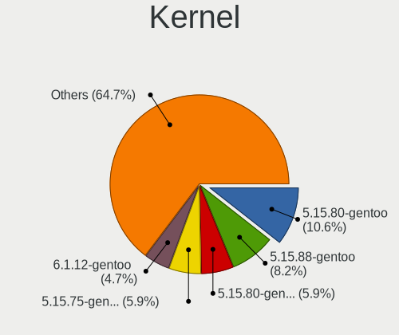

| Version                      | Desktops | Percent |
|------------------------------|----------|---------|
| 5.15.80-gentoo               | 9        | 10.59%  |
| 5.15.88-gentoo               | 7        | 8.24%   |
| 5.15.80-gentoo-x86_64        | 5        | 5.88%   |
| 5.15.75-gentoo-x86_64        | 5        | 5.88%   |
| 6.1.12-gentoo                | 4        | 4.71%   |
| 6.1.7-gentoo                 | 3        | 3.53%   |
| 6.0.11-gentoo                | 3        | 3.53%   |
| 6.1.0-gentoo                 | 2        | 2.35%   |
| 5.15.77-gentoo-dist          | 2        | 2.35%   |
| 5.15.75-gentoo               | 2        | 2.35%   |
| 6.2.0-gentoo-x86_64          | 1        | 1.18%   |
| 6.1.8-gentoo                 | 1        | 1.18%   |
| 6.1.7                        | 1        | 1.18%   |
| 6.1.6-gentoo-dist            | 1        | 1.18%   |
| 6.1.6-gentoo                 | 1        | 1.18%   |
| 6.1.4-gentoo                 | 1        | 1.18%   |
| 6.1.3-gentoo                 | 1        | 1.18%   |
| 6.1.19-gentoo                | 1        | 1.18%   |
| 6.1.13-gentoo-x86_64         | 1        | 1.18%   |
| 6.1.13-gentoo                | 1        | 1.18%   |
| 6.1.12-gentoonovirt          | 1        | 1.18%   |
| 6.1.12-gentoo-x86_64         | 1        | 1.18%   |
| 6.1.10-gentoo-x86_64         | 1        | 1.18%   |
| 6.1.10-gentoo                | 1        | 1.18%   |
| 6.1.1-gentoo                 | 1        | 1.18%   |
| 6.1.1-arch1-1                | 1        | 1.18%   |
| 6.1.0-rc1                    | 1        | 1.18%   |
| 6.0.9-gentoo-x86_64          | 1        | 1.18%   |
| 6.0.9-gentoo                 | 1        | 1.18%   |
| 6.0.8-gentoo-harambe-edition | 1        | 1.18%   |
| 6.0.6-gentoo-x86_64          | 1        | 1.18%   |
| 6.0.2-WorkStation-x86_64     | 1        | 1.18%   |
| 6.0.10-gentoo-x86_64         | 1        | 1.18%   |
| 6.0.10-gentoo                | 1        | 1.18%   |
| 6.0.1-tkg-bore-llvm          | 1        | 1.18%   |
| 6.0.0-pf5gentoo              | 1        | 1.18%   |
| 5.19.16-lqx4-SPTrinity       | 1        | 1.18%   |
| 5.19.16-gentoo               | 1        | 1.18%   |
| 5.19.1-N7700PG               | 1        | 1.18%   |
| 5.15.88-gentoo-x86_64        | 1        | 1.18%   |

Kernel Family
-------------

Linux kernel without a distro release

| Version | Desktops | Percent |
|---------|----------|---------|
| 5.15.80 | 15       | 17.65%  |
| 5.15.75 | 10       | 11.76%  |
| 5.15.88 | 8        | 9.41%   |
| 6.1.12  | 6        | 7.06%   |
| 6.1.7   | 4        | 4.71%   |
| 6.1.0   | 3        | 3.53%   |
| 6.0.11  | 3        | 3.53%   |
| 6.1.6   | 2        | 2.35%   |
| 6.1.13  | 2        | 2.35%   |
| 6.1.10  | 2        | 2.35%   |
| 6.1.1   | 2        | 2.35%   |
| 6.0.9   | 2        | 2.35%   |
| 6.0.10  | 2        | 2.35%   |
| 5.19.16 | 2        | 2.35%   |
| 5.15.85 | 2        | 2.35%   |
| 5.15.77 | 2        | 2.35%   |
| 6.2.0   | 1        | 1.18%   |
| 6.1.8   | 1        | 1.18%   |
| 6.1.4   | 1        | 1.18%   |
| 6.1.3   | 1        | 1.18%   |
| 6.1.19  | 1        | 1.18%   |
| 6.0.8   | 1        | 1.18%   |
| 6.0.6   | 1        | 1.18%   |
| 6.0.2   | 1        | 1.18%   |
| 6.0.1   | 1        | 1.18%   |
| 6.0.0   | 1        | 1.18%   |
| 5.19.1  | 1        | 1.18%   |
| 5.15.79 | 1        | 1.18%   |
| 5.15.74 | 1        | 1.18%   |
| 5.15.69 | 1        | 1.18%   |
| 5.15.59 | 1        | 1.18%   |
| 5.15.41 | 1        | 1.18%   |
| 5.15.23 | 1        | 1.18%   |
| 5.15.0  | 1        | 1.18%   |

Kernel Major Ver.
-----------------

Linux kernel major version

| Version | Desktops | Percent |
|---------|----------|---------|
| 5.15    | 38       | 49.35%  |
| 6.1     | 24       | 31.17%  |
| 6.0     | 11       | 14.29%  |
| 5.19    | 3        | 3.9%    |
| 6.2     | 1        | 1.3%    |

Arch
----

OS architecture (x86_64, i586, etc.)

| Name     | Desktops | Percent |
|----------|----------|---------|
| x86_64   | 69       | 97.18%  |
| armv5tel | 2        | 2.82%   |

DE
--

Desktop Environment

| Name        | Desktops | Percent |
|-------------|----------|---------|
| Unknown     | 22       | 30.56%  |
| KDE5        | 19       | 26.39%  |
| GNOME       | 11       | 15.28%  |
| XFCE        | 9        | 12.5%   |
| MATE        | 3        | 4.17%   |
| X-Cinnamon  | 2        | 2.78%   |
| Sway        | 2        | 2.78%   |
| Unity       | 1        | 1.39%   |
| sussy_bspwm | 1        | 1.39%   |
| i3          | 1        | 1.39%   |
| dwm         | 1        | 1.39%   |

Display Server
--------------

X11 or Wayland

| Name    | Desktops | Percent |
|---------|----------|---------|
| X11     | 33       | 45.21%  |
| Unknown | 15       | 20.55%  |
| Tty     | 14       | 19.18%  |
| Wayland | 11       | 15.07%  |

Display Manager
---------------

SDDM, LightDM, etc.

| Name    | Desktops | Percent |
|---------|----------|---------|
| Unknown | 28       | 39.44%  |
| SDDM    | 18       | 25.35%  |
| LightDM | 13       | 18.31%  |
| GDM     | 8        | 11.27%  |
| GREETD  | 2        | 2.82%   |
| SLiM    | 1        | 1.41%   |
| LXDM    | 1        | 1.41%   |

OS Lang
-------

Language

| Lang             | Desktops | Percent |
|------------------|----------|---------|
| en_US            | 36       | 50%     |
| C.UTF8           | 6        | 8.33%   |
| de_DE            | 5        | 6.94%   |
| Unknown          | 4        | 5.56%   |
| C                | 3        | 4.17%   |
| it_IT            | 2        | 2.78%   |
| fr_FR            | 2        | 2.78%   |
| en_GB            | 2        | 2.78%   |
| en_AU            | 2        | 2.78%   |
| cs_CZ            | 2        | 2.78%   |
| ru_RU            | 1        | 1.39%   |
| pt_PT            | 1        | 1.39%   |
| pt_BR            | 1        | 1.39%   |
| pl_PL            | 1        | 1.39%   |
| es_ES.ISO-8859-1 | 1        | 1.39%   |
| es_ES            | 1        | 1.39%   |
| ca_ES            | 1        | 1.39%   |
| bg_BG            | 1        | 1.39%   |

Boot Mode
---------

EFI or BIOS

| Mode | Desktops | Percent |
|------|----------|---------|
| EFI  | 55       | 76.39%  |
| BIOS | 17       | 23.61%  |

Filesystem
----------

Type of filesystem

| Type     | Desktops | Percent |
|----------|----------|---------|
| Ext4     | 36       | 50.7%   |
| Btrfs    | 22       | 30.99%  |
| F2fs     | 6        | 8.45%   |
| Zfs      | 3        | 4.23%   |
| Xfs      | 2        | 2.82%   |
| XXXXXXX  | 1        | 1.41%   |
| Reiserfs | 1        | 1.41%   |

Part. scheme
------------

Scheme of partitioning

| Type    | Desktops | Percent |
|---------|----------|---------|
| GPT     | 63       | 87.5%   |
| MBR     | 5        | 6.94%   |
| Unknown | 4        | 5.56%   |

Dual Boot with Linux/BSD
------------------------

Hosting more than one Linux/BSD

| Dual boot | Desktops | Percent |
|-----------|----------|---------|
| No        | 39       | 53.42%  |
| Yes       | 34       | 46.58%  |

Dual Boot (Win)
---------------

Hosting Linux and Windows

| Dual boot | Desktops | Percent |
|-----------|----------|---------|
| No        | 43       | 60.56%  |
| Yes       | 28       | 39.44%  |

Board
-----

Vendor
------

Motherboard manufacturer

| Name                | Desktops | Percent |
|---------------------|----------|---------|
| ASUSTek Computer    | 33       | 46.48%  |
| Gigabyte Technology | 11       | 15.49%  |
| MSI                 | 10       | 14.08%  |
| Hewlett-Packard     | 4        | 5.63%   |
| ASRock              | 4        | 5.63%   |
| Huanan              | 2        | 2.82%   |
| Unknown             | 2        | 2.82%   |
| Supermicro          | 1        | 1.41%   |
| Phoenix             | 1        | 1.41%   |
| Pegatron            | 1        | 1.41%   |
| Lenovo              | 1        | 1.41%   |
| Dell                | 1        | 1.41%   |

Model
-----

Motherboard model

| Name                                | Desktops | Percent |
|-------------------------------------|----------|---------|
| MSI MS-7C91                         | 2        | 2.82%   |
| MSI MS-7C37                         | 2        | 2.82%   |
| Gigabyte Z370P D3                   | 2        | 2.82%   |
| ASUS TUF Gaming X570-PLUS           | 2        | 2.82%   |
| ASUS PRIME X570-PRO                 | 2        | 2.82%   |
| ASUS PRIME B450M-A                  | 2        | 2.82%   |
| ASUS M3A78-CM                       | 2        | 2.82%   |
| Unknown                             | 2        | 2.82%   |
| Supermicro SSG-6028R-E1CR24L        | 1        | 1.41%   |
| Phoenix 945GM                       | 1        | 1.41%   |
| Pegatron p7-1219                    | 1        | 1.41%   |
| MSI MS-7D25                         | 1        | 1.41%   |
| MSI MS-7C34                         | 1        | 1.41%   |
| MSI MS-7C02                         | 1        | 1.41%   |
| MSI MS-7A38                         | 1        | 1.41%   |
| MSI MS-7A31                         | 1        | 1.41%   |
| MSI MS-7375                         | 1        | 1.41%   |
| Lenovo ThinkStation P710 30B6S1U500 | 1        | 1.41%   |
| Huanan X99-F8D V2.4                 | 1        | 1.41%   |
| Huanan X99-F8 GAMING V2.0           | 1        | 1.41%   |
| HP Z640 Workstation                 | 1        | 1.41%   |
| HP Z400 Workstation                 | 1        | 1.41%   |
| HP EliteDesk 705 G4 DM 35W (TAA)    | 1        | 1.41%   |
| HP Compaq dc7100 USDT(DX877AV)      | 1        | 1.41%   |
| Gigabyte X570 AORUS MASTER          | 1        | 1.41%   |
| Gigabyte B650M DS3H                 | 1        | 1.41%   |
| Gigabyte B650 AORUS PRO AX          | 1        | 1.41%   |
| Gigabyte B550M DS3H                 | 1        | 1.41%   |
| Gigabyte B550M AORUS ELITE          | 1        | 1.41%   |
| Gigabyte B450M DS3H                 | 1        | 1.41%   |
| Gigabyte B450 AORUS PRO             | 1        | 1.41%   |
| Gigabyte B150M-D2V DDR3             | 1        | 1.41%   |
| Gigabyte AB350-Gaming               | 1        | 1.41%   |
| Dell OptiPlex 790                   | 1        | 1.41%   |
| ASUS TUF Gaming Z690-PLUS D4        | 1        | 1.41%   |
| ASUS TUF Gaming X570-PRO            | 1        | 1.41%   |
| ASUS TUF Gaming B660M-PLUS WIFI     | 1        | 1.41%   |
| ASUS TUF Gaming B550-PRO            | 1        | 1.41%   |
| ASUS TUF Gaming B550-PLUS           | 1        | 1.41%   |
| ASUS SABERTOOTH 990FX               | 1        | 1.41%   |

Model Family
------------

Motherboard model prefix

| Name                         | Desktops | Percent |
|------------------------------|----------|---------|
| ASUS ROG                     | 9        | 12.68%  |
| ASUS PRIME                   | 9        | 12.68%  |
| ASUS TUF                     | 7        | 9.86%   |
| MSI MS-7C91                  | 2        | 2.82%   |
| MSI MS-7C37                  | 2        | 2.82%   |
| Gigabyte Z370P               | 2        | 2.82%   |
| Gigabyte B550M               | 2        | 2.82%   |
| ASUS M3A78-CM                | 2        | 2.82%   |
| Unknown                      | 2        | 2.82%   |
| Supermicro SSG-6028R-E1CR24L | 1        | 1.41%   |
| Phoenix 945GM                | 1        | 1.41%   |
| Pegatron p7-1219             | 1        | 1.41%   |
| MSI MS-7D25                  | 1        | 1.41%   |
| MSI MS-7C34                  | 1        | 1.41%   |
| MSI MS-7C02                  | 1        | 1.41%   |
| MSI MS-7A38                  | 1        | 1.41%   |
| MSI MS-7A31                  | 1        | 1.41%   |
| MSI MS-7375                  | 1        | 1.41%   |
| Lenovo ThinkStation          | 1        | 1.41%   |
| Huanan X99-F8D               | 1        | 1.41%   |
| Huanan X99-F8                | 1        | 1.41%   |
| HP Z640                      | 1        | 1.41%   |
| HP Z400                      | 1        | 1.41%   |
| HP EliteDesk                 | 1        | 1.41%   |
| HP Compaq                    | 1        | 1.41%   |
| Gigabyte X570                | 1        | 1.41%   |
| Gigabyte B650M               | 1        | 1.41%   |
| Gigabyte B650                | 1        | 1.41%   |
| Gigabyte B450M               | 1        | 1.41%   |
| Gigabyte B450                | 1        | 1.41%   |
| Gigabyte B150M-D2V           | 1        | 1.41%   |
| Gigabyte AB350-Gaming        | 1        | 1.41%   |
| Dell OptiPlex                | 1        | 1.41%   |
| ASUS SABERTOOTH              | 1        | 1.41%   |
| ASUS ProArt                  | 1        | 1.41%   |
| ASUS P8Z68-V                 | 1        | 1.41%   |
| ASUS P10S-I                  | 1        | 1.41%   |
| ASUS Maximus                 | 1        | 1.41%   |
| ASUS All                     | 1        | 1.41%   |
| ASRock X670E                 | 1        | 1.41%   |

MFG Year
--------

Motherboard manufacture year

| Year    | Desktops | Percent |
|---------|----------|---------|
| 2019    | 11       | 15.49%  |
| 2018    | 11       | 15.49%  |
| 2021    | 10       | 14.08%  |
| 2020    | 9        | 12.68%  |
| 2022    | 8        | 11.27%  |
| 2017    | 6        | 8.45%   |
| 2011    | 4        | 5.63%   |
| 2015    | 3        | 4.23%   |
| 2010    | 2        | 2.82%   |
| 2008    | 2        | 2.82%   |
| Unknown | 2        | 2.82%   |
| 2014    | 1        | 1.41%   |
| 2009    | 1        | 1.41%   |
| 2004    | 1        | 1.41%   |

Form Factor
-----------

Physical design of the computer

| Name    | Desktops | Percent |
|---------|----------|---------|
| Desktop | 71       | 100%    |

Secure Boot
-----------

Enabled or disabled

| State    | Desktops | Percent |
|----------|----------|---------|
| Disabled | 68       | 95.77%  |
| Enabled  | 3        | 4.23%   |

Coreboot
--------

Have coreboot on board

| Used | Desktops | Percent |
|------|----------|---------|
| No   | 71       | 100%    |

RAM Size
--------

Total RAM memory

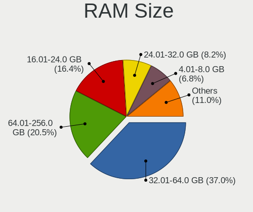

| Size in GB  | Desktops | Percent |
|-------------|----------|---------|
| 32.01-64.0  | 27       | 36.99%  |
| 64.01-256.0 | 15       | 20.55%  |
| 16.01-24.0  | 12       | 16.44%  |
| 24.01-32.0  | 6        | 8.22%   |
| 4.01-8.0    | 5        | 6.85%   |
| 3.01-4.0    | 3        | 4.11%   |
| 8.01-16.0   | 2        | 2.74%   |
| 1.01-2.0    | 1        | 1.37%   |
| 0.51-1.0    | 1        | 1.37%   |
| 0.01-0.5    | 1        | 1.37%   |

RAM Used
--------

Used RAM memory

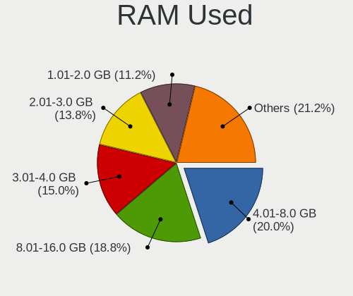

| Used GB     | Desktops | Percent |
|-------------|----------|---------|
| 4.01-8.0    | 16       | 20%     |
| 8.01-16.0   | 15       | 18.75%  |
| 3.01-4.0    | 12       | 15%     |
| 2.01-3.0    | 11       | 13.75%  |
| 1.01-2.0    | 9        | 11.25%  |
| 0.51-1.0    | 5        | 6.25%   |
| 0.01-0.5    | 5        | 6.25%   |
| 16.01-24.0  | 4        | 5%      |
| 32.01-64.0  | 1        | 1.25%   |
| 64.01-256.0 | 1        | 1.25%   |
| 0           | 1        | 1.25%   |

Total Drives
------------

Number of drives on board

| Drives | Desktops | Percent |
|--------|----------|---------|
| 2      | 18       | 25%     |
| 3      | 16       | 22.22%  |
| 4      | 9        | 12.5%   |
| 1      | 9        | 12.5%   |
| 5      | 7        | 9.72%   |
| 6      | 6        | 8.33%   |
| 8      | 4        | 5.56%   |
| 7      | 3        | 4.17%   |

Has CD-ROM
----------

Has CD-ROM on board

| Presented | Desktops | Percent |
|-----------|----------|---------|
| No        | 53       | 73.61%  |
| Yes       | 19       | 26.39%  |

Has Ethernet
------------

Has Ethernet on board

| Presented | Desktops | Percent |
|-----------|----------|---------|
| Yes       | 69       | 97.18%  |
| No        | 2        | 2.82%   |

Has WiFi
--------

Has WiFi module

| Presented | Desktops | Percent |
|-----------|----------|---------|
| No        | 41       | 57.75%  |
| Yes       | 30       | 42.25%  |

Has Bluetooth
-------------

Has Bluetooth module

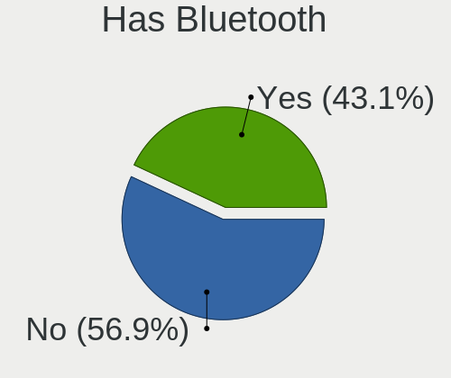

| Presented | Desktops | Percent |
|-----------|----------|---------|
| No        | 41       | 56.94%  |
| Yes       | 31       | 43.06%  |

Location
--------

Country
-------

Geographic location (country)

| Country   | Desktops | Percent |
|-----------|----------|---------|
| USA       | 18       | 25%     |
| Germany   | 9        | 12.5%   |
| Russia    | 5        | 6.94%   |
| Poland    | 5        | 6.94%   |
| Czechia   | 4        | 5.56%   |
| Australia | 4        | 5.56%   |
| Spain     | 3        | 4.17%   |
| France    | 3        | 4.17%   |
| UK        | 2        | 2.78%   |
| Italy     | 2        | 2.78%   |
| Brazil    | 2        | 2.78%   |
| Vietnam   | 1        | 1.39%   |
| Sweden    | 1        | 1.39%   |
| Slovakia  | 1        | 1.39%   |
| Singapore | 1        | 1.39%   |
| Romania   | 1        | 1.39%   |
| Portugal  | 1        | 1.39%   |
| Norway    | 1        | 1.39%   |
| Mexico    | 1        | 1.39%   |
| Mauritius | 1        | 1.39%   |
| Ireland   | 1        | 1.39%   |
| Hungary   | 1        | 1.39%   |
| Denmark   | 1        | 1.39%   |
| Croatia   | 1        | 1.39%   |
| Canada    | 1        | 1.39%   |
| Bulgaria  | 1        | 1.39%   |

City
----

Geographic location (city)

| City                  | Desktops | Percent |
|-----------------------|----------|---------|
| Warsaw                | 3        | 3.95%   |
| Vitkov                | 3        | 3.95%   |
| Sydney                | 2        | 2.63%   |
| Perth                 | 2        | 2.63%   |
| Augusta               | 2        | 2.63%   |
| Zarech'ye             | 1        | 1.32%   |
| Zagreb                | 1        | 1.32%   |
| Yekaterinburg         | 1        | 1.32%   |
| Wroclaw               | 1        | 1.32%   |
| West Orange           | 1        | 1.32%   |
| Weisswasser           | 1        | 1.32%   |
| Vaxjo                 | 1        | 1.32%   |
| Valencia              | 1        | 1.32%   |
| Trondheim             | 1        | 1.32%   |
| Thurmont              | 1        | 1.32%   |
| Szeged                | 1        | 1.32%   |
| St Petersburg         | 1        | 1.32%   |
| Sofia                 | 1        | 1.32%   |
| Singapore             | 1        | 1.32%   |
| Simmern               | 1        | 1.32%   |
| Seattle               | 1        | 1.32%   |
| Schwieberdingen       | 1        | 1.32%   |
| Saskatoon             | 1        | 1.32%   |
| San Dimas             | 1        | 1.32%   |
| San Antonio           | 1        | 1.32%   |
| San Angelo            | 1        | 1.32%   |
| Ruhland               | 1        | 1.32%   |
| Royal Tunbridge Wells | 1        | 1.32%   |
| Rimini                | 1        | 1.32%   |
| Ribnitz-Damgarten     | 1        | 1.32%   |
| Porto                 | 1        | 1.32%   |
| Port Louis            | 1        | 1.32%   |
| Parrish               | 1        | 1.32%   |
| Neuss                 | 1        | 1.32%   |
| Nesvady               | 1        | 1.32%   |
| Natal                 | 1        | 1.32%   |
| Nantes                | 1        | 1.32%   |
| Moscow                | 1        | 1.32%   |
| Monterrey             | 1        | 1.32%   |
| Monterey              | 1        | 1.32%   |

Drives
------

Drive Vendor
------------

Hard drive vendors

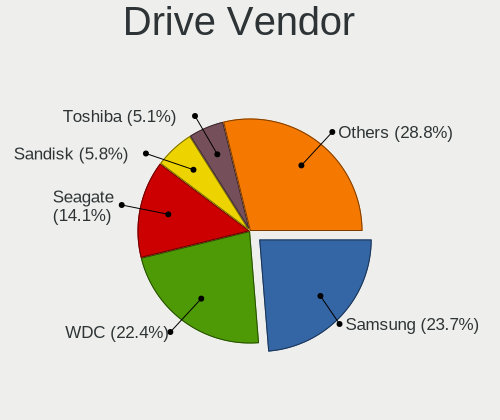

| Vendor                    | Desktops | Drives | Percent |
|---------------------------|----------|--------|---------|
| Samsung Electronics       | 37       | 70     | 23.72%  |
| WDC                       | 35       | 83     | 22.44%  |
| Seagate                   | 22       | 44     | 14.1%   |
| Sandisk                   | 9        | 16     | 5.77%   |
| Toshiba                   | 8        | 13     | 5.13%   |
| Phison Electronics        | 6        | 9      | 3.85%   |
| Hitachi                   | 5        | 21     | 3.21%   |
| Intel                     | 4        | 4      | 2.56%   |
| Crucial                   | 4        | 5      | 2.56%   |
| Kingston                  | 3        | 4      | 1.92%   |
| GOODRAM                   | 3        | 9      | 1.92%   |
| Silicon Motion            | 2        | 2      | 1.28%   |
| Realtek Semiconductor     | 2        | 6      | 1.28%   |
| OCZ                       | 2        | 3      | 1.28%   |
| Micron/Crucial Technology | 2        | 3      | 1.28%   |
| A-DATA Technology         | 2        | 2      | 1.28%   |
| XPG                       | 1        | 6      | 0.64%   |
| SK hynix                  | 1        | 1      | 0.64%   |
| KingSpec                  | 1        | 2      | 0.64%   |
| Kingchuxing               | 1        | 1      | 0.64%   |
| FNK TECH                  | 1        | 1      | 0.64%   |
| Corsair                   | 1        | 1      | 0.64%   |
| China                     | 1        | 2      | 0.64%   |
| Apacer                    | 1        | 2      | 0.64%   |
| AFAYA                     | 1        | 1      | 0.64%   |
| ADATA Technology          | 1        | 1      | 0.64%   |

Drive Model
-----------

Hard drive models

| Model                                                 | Desktops | Percent |
|-------------------------------------------------------|----------|---------|
| Samsung NVMe SSD Controller SM981/PM981/PM983 1TB     | 15       | 7.58%   |
| Samsung NVMe SSD Controller PM9A1/PM9A3/980PRO 1TB    | 8        | 4.04%   |
| Seagate ST2000DM008-2FR102 2TB                        | 5        | 2.53%   |
| Samsung SSD 860 EVO 500GB                             | 4        | 2.02%   |
| Samsung NVMe SSD Controller SM961/PM961/SM963 121GB   | 4        | 2.02%   |
| WDC WD30EFRX-68EUZN0 3TB                              | 3        | 1.52%   |
| WDC WD10EZEX-08WN4A0 1TB                              | 3        | 1.52%   |
| Seagate ST1000DM010-2EP102 1TB                        | 3        | 1.52%   |
| Samsung SSD 860 EVO 1TB                               | 3        | 1.52%   |
| WDC WD6003FZBX-00K5WB0 6TB                            | 2        | 1.01%   |
| WDC WD40EZRZ-00WN9B0 4TB                              | 2        | 1.01%   |
| WDC WD20EARX-00PASB0 2TB                              | 2        | 1.01%   |
| Silicon Motion SM2263EN/SM2263XT SSD Controller 256GB | 2        | 1.01%   |
| Sandisk WD Blue SN550 NVMe SSD 1TB                    | 2        | 1.01%   |
| Samsung SSD 980 500GB                                 | 2        | 1.01%   |
| Samsung SSD 860 QVO 1TB                               | 2        | 1.01%   |
| Samsung SSD 860 EVO 250GB                             | 2        | 1.01%   |
| Samsung SSD 850 EVO 500GB                             | 2        | 1.01%   |
| Phison PS5013 E13 NVMe Controller 256GB               | 2        | 1.01%   |
| Phison E16 PCIe4 NVMe Controller 500GB                | 2        | 1.01%   |
| Micron/Crucial P2 NVMe PCIe SSD 500GB                 | 2        | 1.01%   |
| GOODRAM SSDPR-CL100-480-G2 480GB                      | 2        | 1.01%   |
| XPG GAMMIX S70 1TB                                    | 1        | 0.51%   |
| WDC WDS500G2B0A-00SM50 500GB SSD                      | 1        | 0.51%   |
| WDC WDS200T2B0B-00YS70 2TB SSD                        | 1        | 0.51%   |
| WDC WDS100T2B0B-00YS70 1TB SSD                        | 1        | 0.51%   |
| WDC WD80EMAZ-00WJTA0 8TB                              | 1        | 0.51%   |
| WDC WD6400AAKS-65A7B0 640GB                           | 1        | 0.51%   |
| WDC WD6400AAKS-40H2B0 640GB                           | 1        | 0.51%   |
| WDC WD60EZAZ-00SF3B0 6TB                              | 1        | 0.51%   |
| WDC WD60EFZX-68B3FN0 6TB                              | 1        | 0.51%   |
| WDC WD60EFRX-68MYMN1 6TB                              | 1        | 0.51%   |
| WDC WD60EFAX-68SHWN0 6TB                              | 1        | 0.51%   |
| WDC WD5000LPLX-66ZNTT1 500GB                          | 1        | 0.51%   |
| WDC WD5000AZLX-22JKKA0 500GB                          | 1        | 0.51%   |
| WDC WD5000AAKX-753CA1 500GB                           | 1        | 0.51%   |
| WDC WD5000AAKX-60U6AA0 500GB                          | 1        | 0.51%   |
| WDC WD5000AADS-00M2B0 500GB                           | 1        | 0.51%   |
| WDC WD40PURZ-85TTDY0 4TB                              | 1        | 0.51%   |
| WDC WD40EZRZ-00GXCB0 4TB                              | 1        | 0.51%   |

HDD Vendor
----------

Hard disk drive vendors

| Vendor              | Desktops | Drives | Percent |
|---------------------|----------|--------|---------|
| WDC                 | 34       | 78     | 47.22%  |
| Seagate             | 22       | 44     | 30.56%  |
| Toshiba             | 7        | 12     | 9.72%   |
| Hitachi             | 5        | 21     | 6.94%   |
| Samsung Electronics | 2        | 2      | 2.78%   |
| FNK TECH            | 1        | 1      | 1.39%   |
| AFAYA               | 1        | 1      | 1.39%   |

SSD Vendor
----------

Solid state drive vendors

| Vendor              | Desktops | Drives | Percent |
|---------------------|----------|--------|---------|
| Samsung Electronics | 18       | 24     | 40%     |
| WDC                 | 4        | 5      | 8.89%   |
| Crucial             | 4        | 5      | 8.89%   |
| SanDisk             | 3        | 8      | 6.67%   |
| GOODRAM             | 3        | 9      | 6.67%   |
| OCZ                 | 2        | 3      | 4.44%   |
| Kingston            | 2        | 3      | 4.44%   |
| Intel               | 2        | 2      | 4.44%   |
| A-DATA Technology   | 2        | 2      | 4.44%   |
| KingSpec            | 1        | 2      | 2.22%   |
| Kingchuxing         | 1        | 1      | 2.22%   |
| Corsair             | 1        | 1      | 2.22%   |
| China               | 1        | 2      | 2.22%   |
| Apacer              | 1        | 2      | 2.22%   |

Drive Kind
----------

HDD or SSD

| Kind | Desktops | Drives | Percent |
|------|----------|--------|---------|
| HDD  | 53       | 159    | 38.13%  |
| NVMe | 48       | 84     | 34.53%  |
| SSD  | 38       | 69     | 27.34%  |

Drive Connector
---------------

SATA, SAS, NVMe, etc.

| Type | Desktops | Drives | Percent |
|------|----------|--------|---------|
| SATA | 63       | 225    | 55.26%  |
| NVMe | 48       | 84     | 42.11%  |
| SAS  | 3        | 3      | 2.63%   |

Drive Size
----------

Size of hard drive

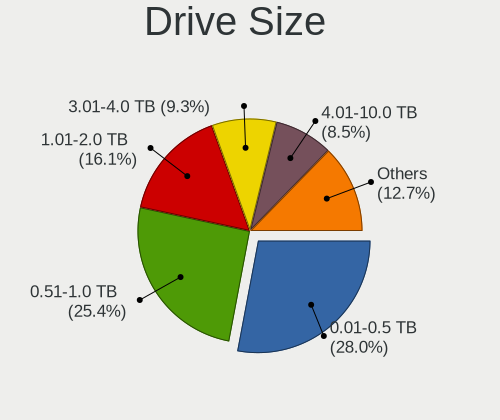

| Size in TB | Desktops | Drives | Percent |
|------------|----------|--------|---------|
| 0.01-0.5   | 33       | 64     | 27.97%  |
| 0.51-1.0   | 30       | 42     | 25.42%  |
| 1.01-2.0   | 19       | 31     | 16.1%   |
| 3.01-4.0   | 11       | 19     | 9.32%   |
| 4.01-10.0  | 10       | 22     | 8.47%   |
| 2.01-3.0   | 9        | 34     | 7.63%   |
| 10.01-20.0 | 6        | 16     | 5.08%   |

Space Total
-----------

Amount of disk space available on the file system

| Size in GB     | Desktops | Percent |
|----------------|----------|---------|
| More than 3000 | 24       | 33.33%  |
| 501-1000       | 11       | 15.28%  |
| 251-500        | 8        | 11.11%  |
| 101-250        | 8        | 11.11%  |
| 1001-2000      | 7        | 9.72%   |
| Unknown        | 6        | 8.33%   |
| 1-20           | 4        | 5.56%   |
| 2001-3000      | 2        | 2.78%   |
| 21-50          | 1        | 1.39%   |
| 51-100         | 1        | 1.39%   |

Space Used
----------

Amount of used disk space

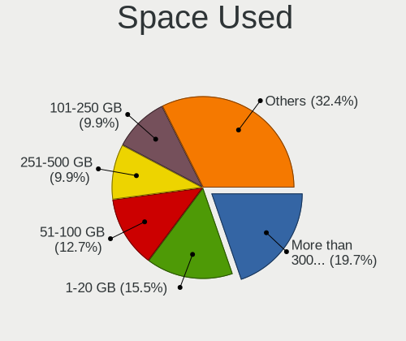

| Used GB        | Desktops | Percent |
|----------------|----------|---------|
| More than 3000 | 14       | 19.72%  |
| 1-20           | 11       | 15.49%  |
| 51-100         | 9        | 12.68%  |
| 251-500        | 7        | 9.86%   |
| 101-250        | 7        | 9.86%   |
| Unknown        | 6        | 8.45%   |
| 21-50          | 5        | 7.04%   |
| 1001-2000      | 5        | 7.04%   |
| 2001-3000      | 4        | 5.63%   |
| 501-1000       | 3        | 4.23%   |

Malfunc. Drives
---------------

Drive models with a malfunction

| Model                                                          | Desktops | Drives | Percent |
|----------------------------------------------------------------|----------|--------|---------|
| WDC WD6400AAKS-65A7B0 640GB                                    | 1        | 1      | 7.14%   |
| WDC WD60EFAX-68SHWN0 6TB                                       | 1        | 3      | 7.14%   |
| WDC WD5000AAKX-753CA1 500GB                                    | 1        | 1      | 7.14%   |
| WDC WD30EFRX-68EUZN0 3TB                                       | 1        | 1      | 7.14%   |
| WDC WD30EFRX-68AX9N0 3TB                                       | 1        | 3      | 7.14%   |
| WDC WD10EFRX-68PJCN0 1TB                                       | 1        | 1      | 7.14%   |
| WDC WD10EADS-22M2B0 1TB                                        | 1        | 1      | 7.14%   |
| WDC WD1001FALS-00J7B1 1TB                                      | 1        | 1      | 7.14%   |
| Samsung Electronics SSD 980 1TB                                | 1        | 1      | 7.14%   |
| Samsung Electronics SP2504C 250GB                              | 1        | 1      | 7.14%   |
| Samsung Electronics NVMe SSD Controller SM981/PM981/PM983 1TB  | 1        | 2      | 7.14%   |
| Samsung Electronics NVMe SSD Controller PM9A1/PM9A3/980PRO 1TB | 1        | 2      | 7.14%   |
| Realtek Semiconductor RTS5763DL NVMe SSD Controller 1TB        | 1        | 1      | 7.14%   |
| Realtek Semiconductor ADATA SX6000PNP 256GB                    | 1        | 4      | 7.14%   |

Malfunc. Drive Vendor
---------------------

Vendors of faulty drives

| Vendor                | Desktops | Drives | Percent |
|-----------------------|----------|--------|---------|
| WDC                   | 7        | 12     | 53.85%  |
| Samsung Electronics   | 4        | 6      | 30.77%  |
| Realtek Semiconductor | 2        | 5      | 15.38%  |

Malfunc. HDD Vendor
-------------------

Vendors of faulty HDD drives

| Vendor              | Desktops | Drives | Percent |
|---------------------|----------|--------|---------|
| WDC                 | 7        | 12     | 87.5%   |
| Samsung Electronics | 1        | 1      | 12.5%   |

Malfunc. Drive Kind
-------------------

Kinds of faulty drives

| Kind | Desktops | Drives | Percent |
|------|----------|--------|---------|
| HDD  | 8        | 13     | 61.54%  |
| NVMe | 5        | 10     | 38.46%  |

Failed Drives
-------------

Failed drive models

Zero info for selected period =(

Failed Drive Vendor
-------------------

Failed drive vendors

Zero info for selected period =(

Drive Status
------------

Number of failed and malfunc. drives

| Status   | Desktops | Drives | Percent |
|----------|----------|--------|---------|
| Works    | 67       | 269    | 77.01%  |
| Malfunc  | 12       | 23     | 13.79%  |
| Detected | 8        | 20     | 9.2%    |

Storage controller
------------------

Storage Vendor
--------------

Storage controller vendors

| Vendor                       | Desktops | Percent |
|------------------------------|----------|---------|
| AMD                          | 41       | 30.15%  |
| Samsung Electronics          | 28       | 20.59%  |
| Intel                        | 27       | 19.85%  |
| ASMedia Technology           | 8        | 5.88%   |
| SanDisk                      | 7        | 5.15%   |
| Phison Electronics           | 6        | 4.41%   |
| JMicron Technology           | 3        | 2.21%   |
| Silicon Motion               | 2        | 1.47%   |
| Realtek Semiconductor        | 2        | 1.47%   |
| Micron/Crucial Technology    | 2        | 1.47%   |
| Marvell Technology Group     | 2        | 1.47%   |
| Toshiba America Info Systems | 1        | 0.74%   |
| SK hynix                     | 1        | 0.74%   |
| Silicon Image                | 1        | 0.74%   |
| Nvidia                       | 1        | 0.74%   |
| Kingston Technology Company  | 1        | 0.74%   |
| INNOGRIT                     | 1        | 0.74%   |
| Broadcom / LSI               | 1        | 0.74%   |
| ADATA Technology             | 1        | 0.74%   |

Storage Model
-------------

Storage controller models

| Model                                                                         | Desktops | Percent |
|-------------------------------------------------------------------------------|----------|---------|
| AMD FCH SATA Controller [AHCI mode]                                           | 27       | 16.67%  |
| Samsung NVMe SSD Controller SM981/PM981/PM983                                 | 15       | 9.26%   |
| AMD 400 Series Chipset SATA Controller                                        | 10       | 6.17%   |
| Samsung NVMe SSD Controller PM9A1/PM9A3/980PRO                                | 8        | 4.94%   |
| AMD 500 Series Chipset SATA Controller                                        | 8        | 4.94%   |
| ASMedia ASM1062 Serial ATA Controller                                         | 5        | 3.09%   |
| Samsung NVMe SSD Controller SM961/PM961/SM963                                 | 4        | 2.47%   |
| Intel C610/X99 series chipset 6-Port SATA Controller [AHCI mode]              | 4        | 2.47%   |
| Samsung NVMe SSD Controller 980 (DRAM-less)                                   | 3        | 1.85%   |
| Intel Q170/Q150/B150/H170/H110/Z170/CM236 Chipset SATA Controller [AHCI Mode] | 3        | 1.85%   |
| Intel C610/X99 series chipset sSATA Controller [AHCI mode]                    | 3        | 1.85%   |
| Intel Alder Lake-S PCH SATA Controller [AHCI Mode]                            | 3        | 1.85%   |
| Intel 6 Series/C200 Series Chipset Family 6 port Desktop SATA AHCI Controller | 3        | 1.85%   |
| Intel 500 Series Chipset Family SATA AHCI Controller                          | 3        | 1.85%   |
| Intel 200 Series PCH SATA controller [AHCI mode]                              | 3        | 1.85%   |
| AMD 300 Series Chipset SATA Controller                                        | 3        | 1.85%   |
| Silicon Motion SM2263EN/SM2263XT (DRAM-less) NVMe SSD Controllers             | 2        | 1.23%   |
| SanDisk Ultra 3D / WD Blue SN550 NVMe SSD                                     | 2        | 1.23%   |
| Phison PS5013-E13 PCIe3 NVMe Controller (DRAM-less)                           | 2        | 1.23%   |
| Phison E16 PCIe4 NVMe Controller                                              | 2        | 1.23%   |
| Micron/Crucial P2 [Nick P2] / P3 / P3 Plus NVMe PCIe SSD (DRAM-less)          | 2        | 1.23%   |
| JMicron JMB363 SATA/IDE Controller                                            | 2        | 1.23%   |
| Intel Volume Management Device NVMe RAID Controller                           | 2        | 1.23%   |
| Intel Cannon Lake PCH SATA AHCI Controller                                    | 2        | 1.23%   |
| ASMedia ASM1166 Serial ATA Controller                                         | 2        | 1.23%   |
| AMD SB7x0/SB8x0/SB9x0 SATA Controller [IDE mode]                              | 2        | 1.23%   |
| AMD SB7x0/SB8x0/SB9x0 IDE Controller                                          | 2        | 1.23%   |
| Toshiba America Info Systems XG5 NVMe SSD Controller                          | 1        | 0.62%   |
| SK hynix BC511 NVMe SSD                                                       | 1        | 0.62%   |
| Silicon Image SiI 3132 Serial ATA Raid II Controller                          | 1        | 0.62%   |
| SanDisk WD PC SN810 / Black SN850 NVMe SSD                                    | 1        | 0.62%   |
| SanDisk WD Green SN350 240GB (DRAM-less) / SN560E NVMe SSD                    | 1        | 0.62%   |
| SanDisk WD Blue SN500 / PC SN520 x2 M.2 2280 NVMe SSD                         | 1        | 0.62%   |
| SanDisk PC SN735 NVMe SSD (DRAM-less)                                         | 1        | 0.62%   |
| SanDisk Extreme Pro / WD Black 2018/SN750/PC SN720 NVMe SSD                   | 1        | 0.62%   |
| Samsung NVMe SSD Controller SM951/PM951                                       | 1        | 0.62%   |
| Realtek RTS5763DL NVMe SSD Controller (DRAM-less)                             | 1        | 0.62%   |
| Realtek RTS5762 NVMe SSD Controller                                           | 1        | 0.62%   |
| Phison E7 NVMe Controller                                                     | 1        | 0.62%   |
| Phison E12 NVMe Controller                                                    | 1        | 0.62%   |

Storage Kind
------------

Kind of storage controller (IDE, SATA, NVMe, SAS, ...)

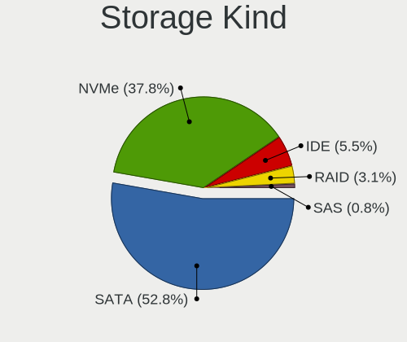

| Kind | Desktops | Percent |
|------|----------|---------|
| SATA | 67       | 52.76%  |
| NVMe | 48       | 37.8%   |
| IDE  | 7        | 5.51%   |
| RAID | 4        | 3.15%   |
| SAS  | 1        | 0.79%   |

Processor
---------

CPU Vendor
----------

Processor vendors

| Vendor                | Desktops | Percent |
|-----------------------|----------|---------|
| AMD                   | 43       | 60.56%  |
| Intel                 | 26       | 36.62%  |
| Marvell Semiconductor | 2        | 2.82%   |

CPU Model
---------

Processor models

| Model                                                                    | Desktops | Percent |
|--------------------------------------------------------------------------|----------|---------|
| AMD Ryzen 9 5900X 12-Core Processor                                      | 5        | 6.85%   |
| AMD Ryzen 5 5600X 6-Core Processor                                       | 5        | 6.85%   |
| AMD Ryzen 9 5950X 16-Core Processor                                      | 4        | 5.48%   |
| AMD Ryzen 7 5800X 8-Core Processor                                       | 4        | 5.48%   |
| Marvell Semiconductor Marvell Kirkwood (Flattened Device Tree) Processor | 2        | 2.74%   |
| AMD Ryzen 9 7950X 16-Core Processor                                      | 2        | 2.74%   |
| AMD Ryzen 7 7700X 8-Core Processor                                       | 2        | 2.74%   |
| AMD Ryzen 7 3700X 8-Core Processor                                       | 2        | 2.74%   |
| AMD Ryzen 7 2700X Eight-Core Processor                                   | 2        | 2.74%   |
| AMD Phenom II X4 955 Processor                                           | 2        | 2.74%   |
| Intel Xeon CPU W3680 @ 3.33GHz                                           | 1        | 1.37%   |
| Intel Xeon CPU E5-2683 v4 @ 2.10GHz                                      | 1        | 1.37%   |
| Intel Xeon CPU E5-2680 v4 @ 2.40GHz                                      | 1        | 1.37%   |
| Intel Xeon CPU E5-2678 v3 @ 2.50GHz                                      | 1        | 1.37%   |
| Intel Xeon CPU E5-2650L v4 @ 1.70GHz                                     | 1        | 1.37%   |
| Intel Xeon CPU E5-2620 v4 @ 2.10GHz                                      | 1        | 1.37%   |
| Intel Xeon CPU E5-1650 v3 @ 3.50GHz                                      | 1        | 1.37%   |
| Intel Xeon CPU E3-1240L v5 @ 2.10GHz                                     | 1        | 1.37%   |
| Intel Pentium CPU G630 @ 2.70GHz                                         | 1        | 1.37%   |
| Intel Pentium 4 CPU 2.80GHz                                              | 1        | 1.37%   |
| Intel Core i9-9900K CPU @ 3.60GHz                                        | 1        | 1.37%   |
| Intel Core i7-8700K CPU @ 3.70GHz                                        | 1        | 1.37%   |
| Intel Core i7-8086K CPU @ 4.00GHz                                        | 1        | 1.37%   |
| Intel Core i7-6700K CPU @ 4.00GHz                                        | 1        | 1.37%   |
| Intel Core i7-5930K CPU @ 3.50GHz                                        | 1        | 1.37%   |
| Intel Core i7-2600K CPU @ 3.40GHz                                        | 1        | 1.37%   |
| Intel Core i5-8600K CPU @ 3.60GHz                                        | 1        | 1.37%   |
| Intel Core i5-8400 CPU @ 2.80GHz                                         | 1        | 1.37%   |
| Intel Core i5-2500 CPU @ 3.30GHz                                         | 1        | 1.37%   |
| Intel Core i3-6100 CPU @ 3.70GHz                                         | 1        | 1.37%   |
| Intel Core i3-10100 CPU @ 3.60GHz                                        | 1        | 1.37%   |
| Intel Core 2 Duo CPU T5500 @ 1.66GHz                                     | 1        | 1.37%   |
| Intel 12th Gen Core i9-12900K                                            | 1        | 1.37%   |
| Intel 12th Gen Core i5-12600K                                            | 1        | 1.37%   |
| Intel 12th Gen Core i5-12400F                                            | 1        | 1.37%   |
| Intel 11th Gen Core i9-11900K @ 3.50GHz                                  | 1        | 1.37%   |
| Intel 11th Gen Core i5-11600K @ 3.90GHz                                  | 1        | 1.37%   |
| AMD Sempron 3850 APU with Radeon R3                                      | 1        | 1.37%   |
| AMD Ryzen 9 3950X 16-Core Processor                                      | 1        | 1.37%   |
| AMD Ryzen 9 3900XT 12-Core Processor                                     | 1        | 1.37%   |

CPU Model Family
----------------

Processor model prefix

| Model            | Desktops | Percent |
|------------------|----------|---------|
| AMD Ryzen 9      | 13       | 18.06%  |
| AMD Ryzen 7      | 12       | 16.67%  |
| AMD Ryzen 5      | 11       | 15.28%  |
| Other            | 7        | 9.72%   |
| Intel Xeon       | 7        | 9.72%   |
| Intel Core i7    | 5        | 6.94%   |
| Intel Core i5    | 3        | 4.17%   |
| Intel Core i3    | 2        | 2.78%   |
| AMD Phenom II X4 | 2        | 2.78%   |
| Intel Pentium 4  | 1        | 1.39%   |
| Intel Pentium    | 1        | 1.39%   |
| Intel Core i9    | 1        | 1.39%   |
| Intel Core 2 Duo | 1        | 1.39%   |
| AMD Sempron      | 1        | 1.39%   |
| AMD Ryzen 5 PRO  | 1        | 1.39%   |
| AMD Ryzen 3      | 1        | 1.39%   |
| AMD Phenom II X6 | 1        | 1.39%   |
| AMD FX           | 1        | 1.39%   |
| AMD Athlon       | 1        | 1.39%   |

CPU Cores
---------

Number of processor cores

| Number | Desktops | Percent |
|--------|----------|---------|
| 6      | 20       | 27.78%  |
| 8      | 15       | 20.83%  |
| 4      | 12       | 16.67%  |
| 16     | 9        | 12.5%   |
| 12     | 7        | 9.72%   |
| 2      | 3        | 4.17%   |
| 1      | 3        | 4.17%   |
| 28     | 2        | 2.78%   |
| 10     | 1        | 1.39%   |

CPU Sockets
-----------

Number of sockets

| Number | Desktops | Percent |
|--------|----------|---------|
| 1      | 69       | 97.18%  |
| 2      | 2        | 2.82%   |

CPU Threads
-----------

Threads per core (Hyper-Threading)

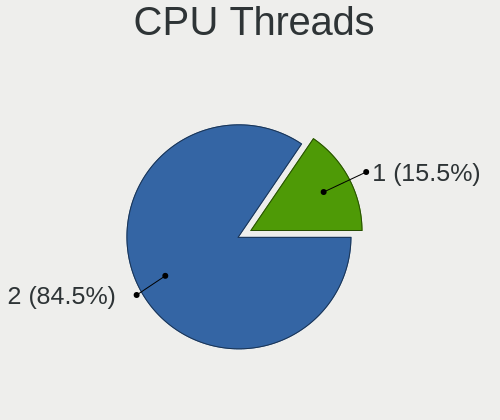

| Number | Desktops | Percent |
|--------|----------|---------|
| 2      | 60       | 84.51%  |
| 1      | 11       | 15.49%  |

CPU Op-Modes
------------

CPU Operation Modes (32-bit, 64-bit)

| Op mode        | Desktops | Percent |
|----------------|----------|---------|
| 32-bit, 64-bit | 69       | 97.18%  |
| Unknown        | 2        | 2.82%   |

CPU Microcode
-------------

Microcode number

| Number     | Desktops | Percent |
|------------|----------|---------|
| Unknown    | 10       | 13.51%  |
| 0x0a201016 | 9        | 12.16%  |
| 0x0a20120a | 6        | 8.11%   |
| 0x08701021 | 5        | 6.76%   |
| 0x906ea    | 4        | 5.41%   |
| 0x0a601203 | 4        | 5.41%   |
| 0x506e3    | 3        | 4.05%   |
| 0x406f1    | 3        | 4.05%   |
| 0x306f2    | 3        | 4.05%   |
| 0x0a201009 | 3        | 4.05%   |
| 0x0800820d | 3        | 4.05%   |
| 0x90672    | 2        | 2.7%    |
| 0x206a7    | 2        | 2.7%    |
| 0x08101016 | 2        | 2.7%    |
| 0xf41      | 1        | 1.35%   |
| 0xa0671    | 1        | 1.35%   |
| 0xa0653    | 1        | 1.35%   |
| 0x906ec    | 1        | 1.35%   |
| 0x90675    | 1        | 1.35%   |
| 0x6fb      | 1        | 1.35%   |
| 0x206c2    | 1        | 1.35%   |
| 0x0a50000c | 1        | 1.35%   |
| 0x08600106 | 1        | 1.35%   |
| 0x08001138 | 1        | 1.35%   |
| 0x0700010f | 1        | 1.35%   |
| 0x0600063e | 1        | 1.35%   |
| 0x010000db | 1        | 1.35%   |
| 0x010000bf | 1        | 1.35%   |
| 0x00000000 | 1        | 1.35%   |

CPU Microarch
-------------

Microarchitecture

| Name             | Desktops | Percent |
|------------------|----------|---------|
| Zen 3            | 21       | 28.77%  |
| Unknown          | 8        | 10.96%  |
| Zen 2            | 7        | 9.59%   |
| KabyLake         | 5        | 6.85%   |
| Broadwell        | 4        | 5.48%   |
| Zen+             | 3        | 4.11%   |
| Zen              | 3        | 4.11%   |
| Skylake          | 3        | 4.11%   |
| SandyBridge      | 3        | 4.11%   |
| K10              | 3        | 4.11%   |
| Haswell          | 3        | 4.11%   |
| Alderlake Hybrid | 3        | 4.11%   |
| Westmere         | 1        | 1.37%   |
| NetBurst         | 1        | 1.37%   |
| Jaguar           | 1        | 1.37%   |
| Icelake          | 1        | 1.37%   |
| Core             | 1        | 1.37%   |
| CometLake        | 1        | 1.37%   |
| Bulldozer        | 1        | 1.37%   |

Graphics
--------

GPU Vendor
----------

Vendors of graphics cards

| Vendor            | Desktops | Percent |
|-------------------|----------|---------|
| Nvidia            | 31       | 41.89%  |
| AMD               | 31       | 41.89%  |
| Intel             | 10       | 13.51%  |
| ASPEED Technology | 2        | 2.7%    |

GPU Model
---------

Graphics card models

| Model                                                                     | Desktops | Percent |
|---------------------------------------------------------------------------|----------|---------|
| AMD Raphael                                                               | 4        | 5.26%   |
| AMD Navi 22 [Radeon RX 6700/6700 XT/6750 XT / 6800M/6850M XT]             | 4        | 5.26%   |
| AMD Ellesmere [Radeon RX 470/480/570/570X/580/580X/590]                   | 4        | 5.26%   |
| AMD Navi 10 [Radeon RX 5600 OEM/5600 XT / 5700/5700 XT]                   | 3        | 3.95%   |
| Nvidia TU117 [GeForce GTX 1650]                                           | 2        | 2.63%   |
| Nvidia TU106 [GeForce RTX 2060 Rev. A]                                    | 2        | 2.63%   |
| Nvidia TU104 [GeForce RTX 2080 Rev. A]                                    | 2        | 2.63%   |
| Nvidia GP104 [GeForce GTX 1080]                                           | 2        | 2.63%   |
| Nvidia GA106 [RTX A2000]                                                  | 2        | 2.63%   |
| Nvidia GA102 [GeForce RTX 3080 Ti]                                        | 2        | 2.63%   |
| Intel AlderLake-S GT1                                                     | 2        | 2.63%   |
| Intel 2nd Generation Core Processor Family Integrated Graphics Controller | 2        | 2.63%   |
| ASPEED Technology ASPEED Graphics Family                                  | 2        | 2.63%   |
| AMD RS780C [Radeon 3100]                                                  | 2        | 2.63%   |
| AMD Raven Ridge [Radeon Vega Series / Radeon Vega Mobile Series]          | 2        | 2.63%   |
| AMD Navi 14 [Radeon RX 5500/5500M / Pro 5500M]                            | 2        | 2.63%   |
| Nvidia TU116 [GeForce GTX 1660 SUPER]                                     | 1        | 1.32%   |
| Nvidia TU106 [GeForce RTX 2070 Rev. A]                                    | 1        | 1.32%   |
| Nvidia TU104 [GeForce RTX 2080]                                           | 1        | 1.32%   |
| Nvidia TU104 [GeForce RTX 2080 SUPER]                                     | 1        | 1.32%   |
| Nvidia TU104 [GeForce RTX 2070 SUPER]                                     | 1        | 1.32%   |
| Nvidia GP107 [GeForce GTX 1050 Ti]                                        | 1        | 1.32%   |
| Nvidia GP106 [GeForce GTX 1060 6GB]                                       | 1        | 1.32%   |
| Nvidia GP106 [GeForce GTX 1060 3GB]                                       | 1        | 1.32%   |
| Nvidia GM204 [GeForce GTX 980]                                            | 1        | 1.32%   |
| Nvidia GM200GL [Quadro M6000]                                             | 1        | 1.32%   |
| Nvidia GM107 [GeForce GTX 750]                                            | 1        | 1.32%   |
| Nvidia GF119 [GeForce GT 610]                                             | 1        | 1.32%   |
| Nvidia GF108 [GeForce GT 430]                                             | 1        | 1.32%   |
| Nvidia GF100GL [Quadro 4000]                                              | 1        | 1.32%   |
| Nvidia GA106 [GeForce RTX 3060 Lite Hash Rate]                            | 1        | 1.32%   |
| Nvidia GA104 [GeForce RTX 3070]                                           | 1        | 1.32%   |
| Nvidia GA104 [GeForce RTX 3060]                                           | 1        | 1.32%   |
| Nvidia GA102 [GeForce RTX 3090]                                           | 1        | 1.32%   |
| Nvidia GA102 [GeForce RTX 3080 Lite Hash Rate]                            | 1        | 1.32%   |
| Nvidia C77 [nForce 780a/980a SLI]                                         | 1        | 1.32%   |
| Intel RocketLake-S GT1 [UHD Graphics 750]                                 | 1        | 1.32%   |
| Intel Mobile 945GSE Express Integrated Graphics Controller                | 1        | 1.32%   |
| Intel HD Graphics 530                                                     | 1        | 1.32%   |
| Intel CometLake-S GT2 [UHD Graphics 630]                                  | 1        | 1.32%   |

GPU Combo
---------

Combinations of graphics cards

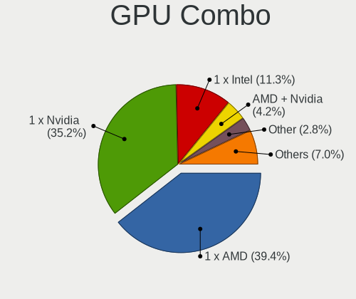

| Name           | Desktops | Percent |
|----------------|----------|---------|
| 1 x AMD        | 28       | 39.44%  |
| 1 x Nvidia     | 25       | 35.21%  |
| 1 x Intel      | 8        | 11.27%  |
| AMD + Nvidia   | 3        | 4.23%   |
| Other          | 2        | 2.82%   |
| Intel + Nvidia | 2        | 2.82%   |
| 1 x ASPEED     | 2        | 2.82%   |
| 2 x Nvidia     | 1        | 1.41%   |

GPU Driver
----------

Free vs proprietary

| Driver      | Desktops | Percent |
|-------------|----------|---------|
| Free        | 44       | 61.11%  |
| Proprietary | 22       | 30.56%  |
| Unknown     | 6        | 8.33%   |

GPU Memory
----------

Total video memory

| Size in GB | Desktops | Percent |
|------------|----------|---------|
| Unknown    | 30       | 41.1%   |
| 7.01-8.0   | 16       | 21.92%  |
| 8.01-16.0  | 9        | 12.33%  |
| 0.01-0.5   | 5        | 6.85%   |
| 5.01-6.0   | 4        | 5.48%   |
| 1.01-2.0   | 4        | 5.48%   |
| 3.01-4.0   | 2        | 2.74%   |
| 0.51-1.0   | 2        | 2.74%   |
| 2.01-3.0   | 1        | 1.37%   |

Monitor
-------

Monitor Vendor
--------------

Monitor vendors

| Vendor               | Desktops | Percent |
|----------------------|----------|---------|
| Samsung Electronics  | 15       | 17.44%  |
| Dell                 | 10       | 11.63%  |
| Hewlett-Packard      | 6        | 6.98%   |
| Goldstar             | 6        | 6.98%   |
| Iiyama               | 4        | 4.65%   |
| BenQ                 | 4        | 4.65%   |
| ASUSTek Computer     | 4        | 4.65%   |
| AOC                  | 4        | 4.65%   |
| Ancor Communications | 4        | 4.65%   |
| Acer                 | 4        | 4.65%   |
| ViewSonic            | 3        | 3.49%   |
| Philips              | 3        | 3.49%   |
| Unknown              | 2        | 2.33%   |
| LG Electronics       | 2        | 2.33%   |
| Lenovo               | 2        | 2.33%   |
| Gigabyte Technology  | 2        | 2.33%   |
| ZIS                  | 1        | 1.16%   |
| Viotek               | 1        | 1.16%   |
| MPI                  | 1        | 1.16%   |
| LTM                  | 1        | 1.16%   |
| ITE                  | 1        | 1.16%   |
| IBM                  | 1        | 1.16%   |
| HVR                  | 1        | 1.16%   |
| FUS                  | 1        | 1.16%   |
| Fujitsu Siemens      | 1        | 1.16%   |
| DENON                | 1        | 1.16%   |
| Chimei Innolux       | 1        | 1.16%   |

Monitor Model
-------------

Monitor models

| Model                                                                 | Desktops | Percent |
|-----------------------------------------------------------------------|----------|---------|
| Unknown LCD Monitor FFFF 2288x1287 2550x2550mm 142.0-inch             | 2        | 2.15%   |
| Samsung Electronics SyncMaster SAM059A 1920x1080 477x268mm 21.5-inch  | 2        | 2.15%   |
| Philips PHL 221V8 PHLC211 1920x1080 477x268mm 21.5-inch               | 2        | 2.15%   |
| Hewlett-Packard LA2205 HWP2848 1680x1050 473x296mm 22.0-inch          | 2        | 2.15%   |
| Goldstar ULTRAWIDE GSM59F2 2560x1080 677x290mm 29.0-inch              | 2        | 2.15%   |
| ZIS ZWS 28" 240HZ ZIS4ED5 1920x1080 619x348mm 28.0-inch               | 1        | 1.08%   |
| Viotek GNV27DB VTK2700 2560x1440 597x336mm 27.0-inch                  | 1        | 1.08%   |
| ViewSonic VX2450 SERIES VSCE226 1920x1080 525x297mm 23.7-inch         | 1        | 1.08%   |
| ViewSonic VG2039 SERIES VSC362D 1600x900 432x240mm 19.5-inch          | 1        | 1.08%   |
| ViewSonic VA2249 Series VSC7B2E 1920x1080 476x268mm 21.5-inch         | 1        | 1.08%   |
| Samsung Electronics U28E590 SAM0C4D 3840x2160 610x350mm 27.7-inch     | 1        | 1.08%   |
| Samsung Electronics T24C550 SAM0AA0 1920x1080 521x293mm 23.5-inch     | 1        | 1.08%   |
| Samsung Electronics S22B300 SAM08C8 1920x1080 477x268mm 21.5-inch     | 1        | 1.08%   |
| Samsung Electronics LCD Monitor SyncMaster                            | 1        | 1.08%   |
| Samsung Electronics LCD Monitor SAM0B30 1920x1080 885x498mm 40.0-inch | 1        | 1.08%   |
| Samsung Electronics LCD Monitor SAM07D0 1360x768 580x320mm 26.1-inch  | 1        | 1.08%   |
| Samsung Electronics LCD Monitor LC34G55T 3440x2880                    | 1        | 1.08%   |
| Samsung Electronics LCD Monitor LC34G55T                              | 1        | 1.08%   |
| Samsung Electronics LC49G95T SAM7053 3840x1080 1193x336mm 48.8-inch   | 1        | 1.08%   |
| Samsung Electronics LC24RG50 SAM0F90 1920x1080 532x304mm 24.1-inch    | 1        | 1.08%   |
| Samsung Electronics C32JG5x SAM0F73 1920x1080 698x393mm 31.5-inch     | 1        | 1.08%   |
| Samsung Electronics C32HG7x SAM0E13 2560x1440 697x392mm 31.5-inch     | 1        | 1.08%   |
| Samsung Electronics C27HG7x SAM0E16 2560x1440 598x336mm 27.0-inch     | 1        | 1.08%   |
| Samsung Electronics C27F390 SAM0D32 1920x1080 598x336mm 27.0-inch     | 1        | 1.08%   |
| Samsung Electronics C24F390 SAM0D2C 1920x1080 521x293mm 23.5-inch     | 1        | 1.08%   |
| Philips LCD Monitor PHL 499P9 6400x1440                               | 1        | 1.08%   |
| MPI WIMAXIT MPI7002 1920x1080 180x130mm 8.7-inch                      | 1        | 1.08%   |
| LTM LCD Monitor LTM045E 400x1280                                      | 1        | 1.08%   |
| LG Electronics LCD Monitor LG TV 3840x1080                            | 1        | 1.08%   |
| LG Electronics LCD Monitor LG IPS FULLHD 3840x1200                    | 1        | 1.08%   |
| Lenovo LEN D24f-10 LEN65EB 1920x1080 520x290mm 23.4-inch              | 1        | 1.08%   |
| Lenovo G27q-20 LEN66C3 2560x1440 597x336mm 27.0-inch                  | 1        | 1.08%   |
| ITE DP2VGA V226 ITE6516 1920x1080 600x340mm 27.2-inch                 | 1        | 1.08%   |
| Iiyama PLG2488H IVM6127 1920x1080 530x300mm 24.0-inch                 | 1        | 1.08%   |
| Iiyama PL2760Q IVM663D 2560x1440 597x336mm 27.0-inch                  | 1        | 1.08%   |
| Iiyama PL2740HS IVM6663 1920x1080 598x336mm 27.0-inch                 | 1        | 1.08%   |
| Iiyama PL2730H IVM663A 1920x1080 598x336mm 27.0-inch                  | 1        | 1.08%   |
| Iiyama PL2395W IVM5639 1920x1200 488x297mm 22.5-inch                  | 1        | 1.08%   |
| IBM L170 IBM1A4E 1280x1024 338x270mm 17.0-inch                        | 1        | 1.08%   |
| HVR HTC-VIVE HVRAA01 2160x1200                                        | 1        | 1.08%   |

Monitor Resolution
------------------

Monitor screen resolution

| Resolution         | Desktops | Percent |
|--------------------|----------|---------|
| 1920x1080 (FHD)    | 33       | 40.24%  |
| 2560x1440 (QHD)    | 9        | 10.98%  |
| 3840x2160 (4K)     | 7        | 8.54%   |
| Unknown            | 5        | 6.1%    |
| 2560x1080          | 4        | 4.88%   |
| 1680x1050 (WSXGA+) | 4        | 4.88%   |
| 3840x1080          | 2        | 2.44%   |
| 3440x1440          | 2        | 2.44%   |
| 2288x1287          | 2        | 2.44%   |
| 1366x768 (WXGA)    | 2        | 2.44%   |
| 6400x1440          | 1        | 1.22%   |
| 400x1280           | 1        | 1.22%   |
| 3840x1200          | 1        | 1.22%   |
| 3440x2880          | 1        | 1.22%   |
| 2160x1200          | 1        | 1.22%   |
| 1920x1200 (WUXGA)  | 1        | 1.22%   |
| 1600x900 (HD+)     | 1        | 1.22%   |
| 1440x900 (WXGA+)   | 1        | 1.22%   |
| 1360x768           | 1        | 1.22%   |
| 1280x720 (HD)      | 1        | 1.22%   |
| 1280x1024 (SXGA)   | 1        | 1.22%   |
| 1152x864           | 1        | 1.22%   |

Monitor Diagonal
----------------

Diagonal size in inches

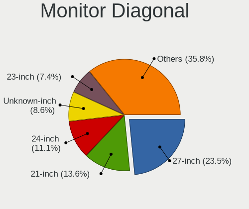

| Inches  | Desktops | Percent |
|---------|----------|---------|
| 27      | 19       | 23.46%  |
| 21      | 11       | 13.58%  |
| 24      | 9        | 11.11%  |
| Unknown | 7        | 8.64%   |
| 23      | 6        | 7.41%   |
| 34      | 5        | 6.17%   |
| 31      | 5        | 6.17%   |
| 22      | 4        | 4.94%   |
| 142     | 2        | 2.47%   |
| 18      | 2        | 2.47%   |
| 17      | 2        | 2.47%   |
| 72      | 1        | 1.23%   |
| 54      | 1        | 1.23%   |
| 48      | 1        | 1.23%   |
| 40      | 1        | 1.23%   |
| 28      | 1        | 1.23%   |
| 20      | 1        | 1.23%   |
| 19      | 1        | 1.23%   |
| 15      | 1        | 1.23%   |
| 14      | 1        | 1.23%   |

Monitor Width
-------------

Physical width

| Width in mm    | Desktops | Percent |
|----------------|----------|---------|
| 501-600        | 28       | 37.33%  |
| 401-500        | 17       | 22.67%  |
| 601-700        | 8        | 10.67%  |
| Unknown        | 7        | 9.33%   |
| 701-800        | 5        | 6.67%   |
| More than 2000 | 2        | 2.67%   |
| 301-350        | 2        | 2.67%   |
| 1001-1500      | 2        | 2.67%   |
| 801-900        | 1        | 1.33%   |
| 351-400        | 1        | 1.33%   |
| 201-300        | 1        | 1.33%   |
| 1501-2000      | 1        | 1.33%   |

Aspect Ratio
------------

Proportional relationship between the width and the height

| Ratio   | Desktops | Percent |
|---------|----------|---------|
| 16/9    | 47       | 65.28%  |
| 16/10   | 8        | 11.11%  |
| 21/9    | 5        | 6.94%   |
| Unknown | 5        | 6.94%   |
| 1.00    | 3        | 4.17%   |
| 5/4     | 1        | 1.39%   |
| 4/3     | 1        | 1.39%   |
| 32/9    | 1        | 1.39%   |
| 0.31    | 1        | 1.39%   |

Monitor Area
------------

Area in inch

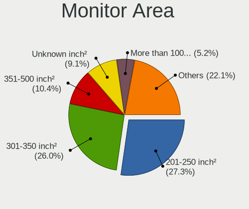

| Area in inch | Desktops | Percent |
|----------------|----------|---------|
| 201-250        | 21       | 27.27%  |
| 301-350        | 20       | 25.97%  |
| 351-500        | 9        | 11.69%  |
| Unknown        | 7        | 9.09%   |
| More than 1000 | 4        | 5.19%   |
| 251-300        | 4        | 5.19%   |
| 151-200        | 4        | 5.19%   |
| 141-150        | 3        | 3.9%    |
| 501-1000       | 2        | 2.6%    |
| 121-130        | 1        | 1.3%    |
| 111-120        | 1        | 1.3%    |
| 101-110        | 1        | 1.3%    |

Pixel Density
-------------

Pixels per inch

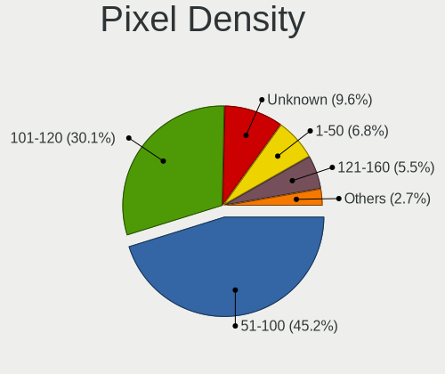

| Density | Desktops | Percent |
|---------|----------|---------|
| 51-100  | 33       | 45.21%  |
| 101-120 | 21       | 28.77%  |
| Unknown | 7        | 9.59%   |
| 1-50    | 5        | 6.85%   |
| 121-160 | 5        | 6.85%   |
| 161-240 | 2        | 2.74%   |

Multiple Monitors
-----------------

Total monitors connected

| Total | Desktops | Percent |
|-------|----------|---------|
| 1     | 35       | 48.61%  |
| 2     | 23       | 31.94%  |
| 0     | 9        | 12.5%   |
| 3     | 4        | 5.56%   |
| 4     | 1        | 1.39%   |

Network
-------

Net Controller Vendor
---------------------

Controller vendors

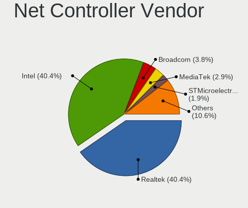

| Vendor                          | Desktops | Percent |
|---------------------------------|----------|---------|
| Realtek Semiconductor           | 42       | 40.38%  |
| Intel                           | 42       | 40.38%  |
| Broadcom                        | 4        | 3.85%   |
| MediaTek                        | 3        | 2.88%   |
| STMicroelectronics              | 2        | 1.92%   |
| Ralink                          | 2        | 1.92%   |
| Aquantia                        | 2        | 1.92%   |
| TP-Link                         | 1        | 0.96%   |
| Senao                           | 1        | 0.96%   |
| Qualcomm Atheros Communications | 1        | 0.96%   |
| Qualcomm Atheros                | 1        | 0.96%   |
| QinHeng Electronics             | 1        | 0.96%   |
| Nvidia                          | 1        | 0.96%   |
| Input Club                      | 1        | 0.96%   |

Net Controller Model
--------------------

Controller models

| Model                                                                         | Desktops | Percent |
|-------------------------------------------------------------------------------|----------|---------|
| Realtek RTL8111/8168/8411 PCI Express Gigabit Ethernet Controller             | 31       | 25.2%   |
| Intel I211 Gigabit Network Connection                                         | 12       | 9.76%   |
| Realtek RTL8125 2.5GbE Controller                                             | 11       | 8.94%   |
| Intel Wi-Fi 6 AX200                                                           | 9        | 7.32%   |
| Intel Ethernet Controller I225-V                                              | 7        | 5.69%   |
| Intel Wireless-AC 9260                                                        | 4        | 3.25%   |
| MediaTek MT7922 802.11ax PCI Express Wireless Network Adapter                 | 3        | 2.44%   |
| STMicroelectronics Virtual COM Port                                           | 2        | 1.63%   |
| Intel Wi-Fi 6 AX210/AX211/AX411 160MHz                                        | 2        | 1.63%   |
| Intel I210 Gigabit Network Connection                                         | 2        | 1.63%   |
| Intel Ethernet Connection (7) I219-V                                          | 2        | 1.63%   |
| Intel Ethernet Connection (2) I218-LM                                         | 2        | 1.63%   |
| Intel Alder Lake-S PCH CNVi WiFi                                              | 2        | 1.63%   |
| TP-Link TL-WN823N v2/v3 [Realtek RTL8192EU]                                   | 1        | 0.81%   |
| Senao EUB9801 802.11abgn Wireless Adapter [Ralink RT3572]                     | 1        | 0.81%   |
| Realtek RTL88x2bu [AC1200 Techkey]                                            | 1        | 0.81%   |
| Realtek RTL8821CE 802.11ac PCIe Wireless Network Adapter                      | 1        | 0.81%   |
| Realtek RTL8812AE 802.11ac PCIe Wireless Network Adapter                      | 1        | 0.81%   |
| Realtek RTL8153 Gigabit Ethernet Adapter                                      | 1        | 0.81%   |
| Realtek RTL-8100/8101L/8139 PCI Fast Ethernet Adapter                         | 1        | 0.81%   |
| Realtek Killer E3000 2.5GbE Controller                                        | 1        | 0.81%   |
| Realtek Killer E2600 Gigabit Ethernet Controller                              | 1        | 0.81%   |
| Realtek 802.11ac NIC                                                          | 1        | 0.81%   |
| Ralink RT5392 PCIe Wireless Network Adapter                                   | 1        | 0.81%   |
| Ralink RT5360 Wireless 802.11n 1T/1R                                          | 1        | 0.81%   |
| Qualcomm Atheros AR9271 802.11n                                               | 1        | 0.81%   |
| Qualcomm Atheros AR9287 Wireless Network Adapter (PCI-Express)                | 1        | 0.81%   |
| QinHeng USB Single Serial                                                     | 1        | 0.81%   |
| Nvidia MCP77 Ethernet                                                         | 1        | 0.81%   |
| Intel Wireless 7265                                                           | 1        | 0.81%   |
| Intel Ethernet Connection (2) I219-V                                          | 1        | 0.81%   |
| Intel Ethernet Connection (2) I218-V                                          | 1        | 0.81%   |
| Intel Ethernet Connection (14) I219-V                                         | 1        | 0.81%   |
| Intel Dual Band Wireless-AC 3168NGW [Stone Peak]                              | 1        | 0.81%   |
| Intel 82599ES 10-Gigabit SFI/SFP+ Network Connection                          | 1        | 0.81%   |
| Intel 82579V Gigabit Network Connection                                       | 1        | 0.81%   |
| Intel 82579LM Gigabit Network Connection (Lewisville)                         | 1        | 0.81%   |
| Intel 82575EB Gigabit Network Connection                                      | 1        | 0.81%   |
| Intel 82574L Gigabit Network Connection                                       | 1        | 0.81%   |
| Intel 82571EB/82571GB Gigabit Ethernet Controller D0/D1 (copper applications) | 1        | 0.81%   |

Wireless Vendor
---------------

Wireless vendors

| Vendor                          | Desktops | Percent |
|---------------------------------|----------|---------|
| Intel                           | 19       | 57.58%  |
| Realtek Semiconductor           | 4        | 12.12%  |
| MediaTek                        | 3        | 9.09%   |
| Ralink                          | 2        | 6.06%   |
| TP-Link                         | 1        | 3.03%   |
| Senao                           | 1        | 3.03%   |
| Qualcomm Atheros Communications | 1        | 3.03%   |
| Qualcomm Atheros                | 1        | 3.03%   |
| Broadcom                        | 1        | 3.03%   |

Wireless Model
--------------

Wireless models

| Model                                                          | Desktops | Percent |
|----------------------------------------------------------------|----------|---------|
| Intel Wi-Fi 6 AX200                                            | 9        | 27.27%  |
| Intel Wireless-AC 9260                                         | 4        | 12.12%  |
| MediaTek MT7922 802.11ax PCI Express Wireless Network Adapter  | 3        | 9.09%   |
| Intel Wi-Fi 6 AX210/AX211/AX411 160MHz                         | 2        | 6.06%   |
| Intel Alder Lake-S PCH CNVi WiFi                               | 2        | 6.06%   |
| TP-Link TL-WN823N v2/v3 [Realtek RTL8192EU]                    | 1        | 3.03%   |
| Senao EUB9801 802.11abgn Wireless Adapter [Ralink RT3572]      | 1        | 3.03%   |
| Realtek RTL88x2bu [AC1200 Techkey]                             | 1        | 3.03%   |
| Realtek RTL8821CE 802.11ac PCIe Wireless Network Adapter       | 1        | 3.03%   |
| Realtek RTL8812AE 802.11ac PCIe Wireless Network Adapter       | 1        | 3.03%   |
| Realtek 802.11ac NIC                                           | 1        | 3.03%   |
| Ralink RT5392 PCIe Wireless Network Adapter                    | 1        | 3.03%   |
| Ralink RT5360 Wireless 802.11n 1T/1R                           | 1        | 3.03%   |
| Qualcomm Atheros AR9271 802.11n                                | 1        | 3.03%   |
| Qualcomm Atheros AR9287 Wireless Network Adapter (PCI-Express) | 1        | 3.03%   |
| Intel Wireless 7265                                            | 1        | 3.03%   |
| Intel Dual Band Wireless-AC 3168NGW [Stone Peak]               | 1        | 3.03%   |
| Broadcom BCM4360 802.11ac Dual Band Wireless Network Adapter   | 1        | 3.03%   |

Ethernet Vendor
---------------

Ethernet vendors

| Vendor                | Desktops | Percent |
|-----------------------|----------|---------|
| Realtek Semiconductor | 42       | 52.5%   |
| Intel                 | 32       | 40%     |
| Broadcom              | 3        | 3.75%   |
| Aquantia              | 2        | 2.5%    |
| Nvidia                | 1        | 1.25%   |

Ethernet Model
--------------

Ethernet models

| Model                                                                         | Desktops | Percent |
|-------------------------------------------------------------------------------|----------|---------|
| Realtek RTL8111/8168/8411 PCI Express Gigabit Ethernet Controller             | 31       | 36.05%  |
| Intel I211 Gigabit Network Connection                                         | 12       | 13.95%  |
| Realtek RTL8125 2.5GbE Controller                                             | 11       | 12.79%  |
| Intel Ethernet Controller I225-V                                              | 7        | 8.14%   |
| Intel I210 Gigabit Network Connection                                         | 2        | 2.33%   |
| Intel Ethernet Connection (7) I219-V                                          | 2        | 2.33%   |
| Intel Ethernet Connection (2) I218-LM                                         | 2        | 2.33%   |
| Realtek RTL8153 Gigabit Ethernet Adapter                                      | 1        | 1.16%   |
| Realtek RTL-8100/8101L/8139 PCI Fast Ethernet Adapter                         | 1        | 1.16%   |
| Realtek Killer E3000 2.5GbE Controller                                        | 1        | 1.16%   |
| Realtek Killer E2600 Gigabit Ethernet Controller                              | 1        | 1.16%   |
| Nvidia MCP77 Ethernet                                                         | 1        | 1.16%   |
| Intel Ethernet Connection (2) I219-V                                          | 1        | 1.16%   |
| Intel Ethernet Connection (2) I218-V                                          | 1        | 1.16%   |
| Intel Ethernet Connection (14) I219-V                                         | 1        | 1.16%   |
| Intel 82599ES 10-Gigabit SFI/SFP+ Network Connection                          | 1        | 1.16%   |
| Intel 82579V Gigabit Network Connection                                       | 1        | 1.16%   |
| Intel 82579LM Gigabit Network Connection (Lewisville)                         | 1        | 1.16%   |
| Intel 82575EB Gigabit Network Connection                                      | 1        | 1.16%   |
| Intel 82574L Gigabit Network Connection                                       | 1        | 1.16%   |
| Intel 82571EB/82571GB Gigabit Ethernet Controller D0/D1 (copper applications) | 1        | 1.16%   |
| Broadcom NetXtreme BCM5764M Gigabit Ethernet PCIe                             | 1        | 1.16%   |
| Broadcom NetXtreme BCM5751 Gigabit Ethernet PCI Express                       | 1        | 1.16%   |
| Broadcom NetXtreme BCM5718 Gigabit Ethernet PCIe                              | 1        | 1.16%   |
| Aquantia AQC113CS NBase-T/IEEE 802.3bz Ethernet Controller [AQtion]           | 1        | 1.16%   |
| Aquantia AQC111 NBase-T/IEEE 802.3bz Ethernet Controller [AQtion]             | 1        | 1.16%   |

Net Controller Kind
-------------------

Ethernet, WiFi or modem

| Kind     | Desktops | Percent |
|----------|----------|---------|
| Ethernet | 69       | 66.99%  |
| WiFi     | 30       | 29.13%  |
| Modem    | 4        | 3.88%   |

Used Controller
---------------

Currently used network controller

| Kind     | Desktops | Percent |
|----------|----------|---------|
| Ethernet | 59       | 84.29%  |
| WiFi     | 11       | 15.71%  |

NICs
----

Total network controllers on board

| Total | Desktops | Percent |
|-------|----------|---------|
| 2     | 33       | 46.48%  |
| 1     | 27       | 38.03%  |
| 3     | 8        | 11.27%  |
| 0     | 2        | 2.82%   |
| 4     | 1        | 1.41%   |

IPv6
----

IPv6 vs IPv4

| Used | Desktops | Percent |
|------|----------|---------|
| No   | 55       | 76.39%  |
| Yes  | 17       | 23.61%  |

Bluetooth
---------

Bluetooth Vendor
----------------

Controller vendors

| Vendor                   | Desktops | Percent |
|--------------------------|----------|---------|
| Intel                    | 19       | 55.88%  |
| Cambridge Silicon Radio  | 3        | 8.82%   |
| Broadcom                 | 3        | 8.82%   |
| Realtek Semiconductor    | 2        | 5.88%   |
| MediaTek                 | 2        | 5.88%   |
| ASUSTek Computer         | 2        | 5.88%   |
| HTC (High Tech Computer) | 1        | 2.94%   |
| Foxconn / Hon Hai        | 1        | 2.94%   |
| Belkin Components        | 1        | 2.94%   |

Bluetooth Model
---------------

Controller models

| Model                                                                | Desktops | Percent |
|----------------------------------------------------------------------|----------|---------|
| Intel AX200 Bluetooth                                                | 9        | 26.47%  |
| Intel Wireless-AC 9260 Bluetooth Adapter                             | 4        | 11.76%  |
| Cambridge Silicon Radio Bluetooth Dongle (HCI mode)                  | 3        | 8.82%   |
| Broadcom BCM20702A0 Bluetooth 4.0                                    | 3        | 8.82%   |
| Realtek Bluetooth Radio                                              | 2        | 5.88%   |
| MediaTek Wireless_Device                                             | 2        | 5.88%   |
| Intel AX210 Bluetooth                                                | 2        | 5.88%   |
| Intel AX201 Bluetooth                                                | 2        | 5.88%   |
| Intel Wireless-AC 3168 Bluetooth                                     | 1        | 2.94%   |
| Intel Bluetooth wireless interface                                   | 1        | 2.94%   |
| HTC (High Tech Computer) Vive Hub Bluetooth 4.1 (Broadcom BCM920703) | 1        | 2.94%   |
| Foxconn / Hon Hai Wireless_Device                                    | 1        | 2.94%   |
| Belkin Components F8T065BF Mini Bluetooth 4.0 Adapter                | 1        | 2.94%   |
| ASUS Bluetooth Radio                                                 | 1        | 2.94%   |
| ASUS ASUS USB-BT500                                                  | 1        | 2.94%   |

Sound
-----

Sound Vendor
------------

Sound card vendors

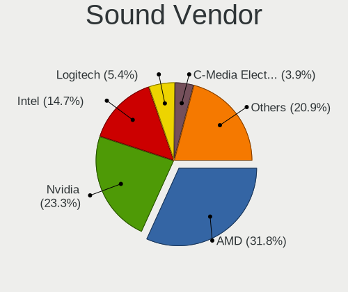

| Vendor              | Desktops | Percent |
|---------------------|----------|---------|
| AMD                 | 41       | 31.78%  |
| Nvidia              | 30       | 23.26%  |
| Intel               | 19       | 14.73%  |
| Logitech            | 7        | 5.43%   |
| C-Media Electronics | 5        | 3.88%   |
| SteelSeries ApS     | 4        | 3.1%    |
| Creative Labs       | 3        | 2.33%   |
| Trust               | 2        | 1.55%   |
| Texas Instruments   | 2        | 1.55%   |
| JMTek               | 2        | 1.55%   |
| Focusrite-Novation  | 2        | 1.55%   |
| ASUSTek Computer    | 2        | 1.55%   |
| Sony                | 1        | 0.78%   |
| Solid State Logic   | 1        | 0.78%   |
| Samson Technologies | 1        | 0.78%   |
| Razer USA           | 1        | 0.78%   |
| M-Audio             | 1        | 0.78%   |
| GN Netcom           | 1        | 0.78%   |
| Corsair             | 1        | 0.78%   |
| Clavia DMI AB       | 1        | 0.78%   |
| Blue Microphones    | 1        | 0.78%   |
| Audient             | 1        | 0.78%   |

Sound Model
-----------

Sound card models

| Model                                                                      | Desktops | Percent |
|----------------------------------------------------------------------------|----------|---------|
| AMD Starship/Matisse HD Audio Controller                                   | 25       | 15.92%  |
| AMD Navi 21/23 HDMI/DP Audio Controller                                    | 7        | 4.46%   |
| AMD Family 17h/19h HD Audio Controller                                     | 6        | 3.82%   |
| Nvidia TU104 HD Audio Controller                                           | 5        | 3.18%   |
| Intel C610/X99 series chipset HD Audio Controller                          | 5        | 3.18%   |
| AMD Navi 10 HDMI Audio                                                     | 5        | 3.18%   |
| AMD Ellesmere HDMI Audio [Radeon RX 470/480 / 570/580/590]                 | 5        | 3.18%   |
| Nvidia GA102 High Definition Audio Controller                              | 4        | 2.55%   |
| AMD Rembrandt Radeon High Definition Audio Controller                      | 4        | 2.55%   |
| AMD Family 17h (Models 00h-0fh) HD Audio Controller                        | 4        | 2.55%   |
| Nvidia TU106 High Definition Audio Controller                              | 3        | 1.91%   |
| Nvidia GA106 High Definition Audio Controller                              | 3        | 1.91%   |
| Intel 6 Series/C200 Series Chipset Family High Definition Audio Controller | 3        | 1.91%   |
| Intel 200 Series PCH HD Audio                                              | 3        | 1.91%   |
| Texas Instruments PCM2902 Audio Codec                                      | 2        | 1.27%   |
| SteelSeries ApS SteelSeries Arctis 7                                       | 2        | 1.27%   |
| Nvidia TU107 GeForce GTX 1650 High Definition Audio Controller             | 2        | 1.27%   |
| Nvidia GP106 High Definition Audio Controller                              | 2        | 1.27%   |
| Nvidia GP104 High Definition Audio Controller                              | 2        | 1.27%   |
| Nvidia GA104 High Definition Audio Controller                              | 2        | 1.27%   |
| JMTek USB PnP Audio Device                                                 | 2        | 1.27%   |
| Intel Alder Lake-S HD Audio Controller                                     | 2        | 1.27%   |
| Intel 100 Series/C230 Series Chipset Family HD Audio Controller            | 2        | 1.27%   |
| AMD SBx00 Azalia (Intel HDA)                                               | 2        | 1.27%   |
| AMD Renoir Radeon High Definition Audio Controller                         | 2        | 1.27%   |
| AMD Raven/Raven2/Fenghuang HDMI/DP Audio Controller                        | 2        | 1.27%   |
| Trust GXT 354 Headset                                                      | 1        | 0.64%   |
| Trust GXT 242 Microphone                                                   | 1        | 0.64%   |
| SteelSeries ApS SteelSeries Arctis 1 Wireless                              | 1        | 0.64%   |
| SteelSeries ApS Arctis 7+                                                  | 1        | 0.64%   |
| Sony DualShock 4 [CUH-ZCT2x]                                               | 1        | 0.64%   |
| Solid State Logic SSL 2+                                                   | 1        | 0.64%   |
| Samson Technologies C01U condenser microphone                              | 1        | 0.64%   |
| Razer USA Razer BlackShark V2 Pro                                          | 1        | 0.64%   |
| Nvidia TU116 High Definition Audio Controller                              | 1        | 0.64%   |
| Nvidia GP107GL High Definition Audio Controller                            | 1        | 0.64%   |
| Nvidia GM204 High Definition Audio Controller                              | 1        | 0.64%   |
| Nvidia GM200 High Definition Audio                                         | 1        | 0.64%   |
| Nvidia GM107 High Definition Audio Controller [GeForce 940MX]              | 1        | 0.64%   |
| Nvidia GF119 HDMI Audio Controller                                         | 1        | 0.64%   |

Memory
------

Memory Vendor
-------------

Memory module vendors

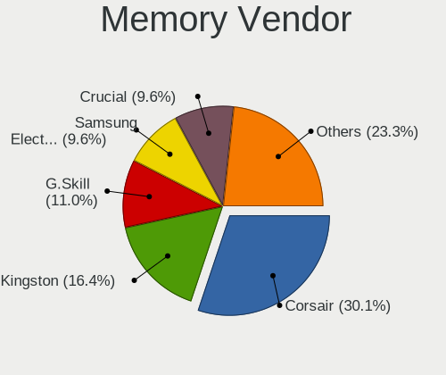

| Vendor              | Desktops | Percent |
|---------------------|----------|---------|
| Corsair             | 22       | 30.14%  |
| Kingston            | 12       | 16.44%  |
| G.Skill             | 8        | 10.96%  |
| Samsung Electronics | 7        | 9.59%   |
| Crucial             | 7        | 9.59%   |
| Unknown             | 4        | 5.48%   |
| SK hynix            | 3        | 4.11%   |
| Nanya Technology    | 2        | 2.74%   |
| Micron Technology   | 2        | 2.74%   |
| A-DATA Technology   | 2        | 2.74%   |
| Team                | 1        | 1.37%   |
| Qumo                | 1        | 1.37%   |
| Hikvision           | 1        | 1.37%   |
| GOODRAM             | 1        | 1.37%   |

Memory Model
------------

Memory module models

| Model                                                   | Desktops | Percent |
|---------------------------------------------------------|----------|---------|
| Unknown RAM Module 2GB DIMM DDR2 667MT/s                | 2        | 2.6%    |
| Corsair RAM CMT64GX4M4Z3600C16 16GB DIMM DDR4 3600MT/s  | 2        | 2.6%    |
| Corsair RAM CMK64GX4M2E3200C16 32GB DIMM DDR4 3200MT/s  | 2        | 2.6%    |
| Corsair RAM CMK32GX4M2D3600C18 16GB DIMM DDR4 3800MT/s  | 2        | 2.6%    |
| Unknown RAM Module 4GB DIMM DDR3 1600MT/s               | 1        | 1.3%    |
| Unknown RAM Module 1GB DIMM DDR2                        | 1        | 1.3%    |
| Team RAM TEAMGROUP-UD4-3200 8192MB DIMM DDR4 3733MT/s   | 1        | 1.3%    |
| SK hynix RAM HMT351U6CFR8C-H9 4GB DIMM DDR3 1600MT/s    | 1        | 1.3%    |
| SK hynix RAM HMA84GR7MFR4N-UH 32GB DIMM DDR4 2400MT/s   | 1        | 1.3%    |
| SK hynix RAM HMA42GR7AFR4N-TF 16GB DIMM DDR4 2133MT/s   | 1        | 1.3%    |
| Samsung RAM Module 8GB SODIMM DDR4 2400MT/s             | 1        | 1.3%    |
| Samsung RAM M471B5173DB0-YK0 4GB SODIMM DDR3 1600MT/s   | 1        | 1.3%    |
| Samsung RAM M393A2G40EB1-CPB 16GB DIMM DDR4 2133MT/s    | 1        | 1.3%    |
| Samsung RAM M391B5273DH0-CH9 4GB DIMM DDR3 1333MT/s     | 1        | 1.3%    |
| Samsung RAM M391A2K43BB1-CPB 16GB DIMM DDR4 2133MT/s    | 1        | 1.3%    |
| Samsung RAM M386A4G40DM0-CPB 32GB DIMM DDR4 2400MT/s    | 1        | 1.3%    |
| Samsung RAM M378B5273DH0-CH9 4096MB DIMM DDR3 2133MT/s  | 1        | 1.3%    |
| Qumo RAM QUM4U-16G2666N19 16GB DIMM DDR4 2666MT/s       | 1        | 1.3%    |
| Nanya RAM NT256D64S88C0G-5T 256MB DIMM DDR 400MT/s      | 1        | 1.3%    |
| Nanya RAM M2F4G64CB88B7N-DI 4GB DIMM DDR3 1600MT/s      | 1        | 1.3%    |
| Micron RAM 18ASF2G72PDZ-2G6D1 16GB DIMM DDR4 2667MT/s   | 1        | 1.3%    |
| Micron RAM 16ATF4G64AZ-3G2F1 32GB DIMM DDR4 3200MT/s    | 1        | 1.3%    |
| Kingston RAM KHX3200C16D4/16GX 16GB DIMM DDR4 3600MT/s  | 1        | 1.3%    |
| Kingston RAM KHX3000C15/16GX 16GB DIMM DDR4 3333MT/s    | 1        | 1.3%    |
| Kingston RAM KHX2666C16D4/4G 4GB DIMM DDR4 2667MT/s     | 1        | 1.3%    |
| Kingston RAM KHX2666C16/8G 8GB DIMM DDR4 3466MT/s       | 1        | 1.3%    |
| Kingston RAM KF560C40-16 16GB DIMM DDR5 6000MT/s        | 1        | 1.3%    |
| Kingston RAM KF3600C18D4/32GX 32GB DIMM DDR4 3600MT/s   | 1        | 1.3%    |
| Kingston RAM KF3600C18D4/16GX 16GB DIMM DDR4 3600MT/s   | 1        | 1.3%    |
| Kingston RAM KF3600C17D4/8GX 8GB DIMM DDR4 3600MT/s     | 1        | 1.3%    |
| Kingston RAM KF3200C16D4/32GX 32GB DIMM DDR4 3933MT/s   | 1        | 1.3%    |
| Kingston RAM KF3200C16D4/16GX 16GB DIMM DDR4 3200MT/s   | 1        | 1.3%    |
| Kingston RAM K 1GB DIMM DDR 667MT/s                     | 1        | 1.3%    |
| Kingston RAM 99U5471-012.A00LF 4GB DIMM DDR3 1600MT/s   | 1        | 1.3%    |
| Kingston RAM 9905713-035.A00G 8GB DIMM DDR4 2667MT/s    | 1        | 1.3%    |
| Kingston RAM 9905702-427.A00G 8GB DIMM DDR4 2667MT/s    | 1        | 1.3%    |
| Hikvision RAM HKED4161DAA1D0MA1 16GB DIMM DDR4 2667MT/s | 1        | 1.3%    |
| GOODRAM RAM GR1600D364L11/2G 2GB DIMM DDR3 1333MT/s     | 1        | 1.3%    |
| G.Skill RAM F5-6000J3636F16G 16GB DIMM DDR5 6400MT/s    | 1        | 1.3%    |
| G.Skill RAM F4-3600C16-16GTZNC 16GB DIMM DDR4 3600MT/s  | 1        | 1.3%    |

Memory Kind
-----------

Memory module kinds

| Kind  | Desktops | Percent |
|-------|----------|---------|
| DDR4  | 48       | 72.73%  |
| DDR3  | 7        | 10.61%  |
| DDR5  | 5        | 7.58%   |
| DDR2  | 4        | 6.06%   |
| SDRAM | 1        | 1.52%   |
| DDR   | 1        | 1.52%   |

Memory Form Factor
------------------

Physical design of the memory module

| Name   | Desktops | Percent |
|--------|----------|---------|
| DIMM   | 64       | 96.97%  |
| SODIMM | 2        | 3.03%   |

Memory Size
-----------

Memory module size

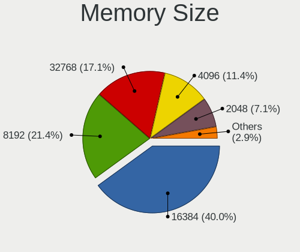

| Size  | Desktops | Percent |
|-------|----------|---------|
| 16384 | 28       | 40%     |
| 8192  | 15       | 21.43%  |
| 32768 | 12       | 17.14%  |
| 4096  | 8        | 11.43%  |
| 2048  | 5        | 7.14%   |
| 1024  | 1        | 1.43%   |
| 256   | 1        | 1.43%   |

Memory Speed
------------

Memory module speed

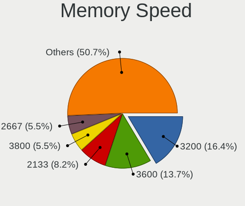

| Speed   | Desktops | Percent |
|---------|----------|---------|
| 3200    | 12       | 16.44%  |
| 3600    | 11       | 15.07%  |
| 2133    | 6        | 8.22%   |
| 3800    | 4        | 5.48%   |
| 2667    | 4        | 5.48%   |
| 2400    | 4        | 5.48%   |
| 1600    | 4        | 5.48%   |
| 667     | 3        | 4.11%   |
| 4800    | 2        | 2.74%   |
| 3400    | 2        | 2.74%   |
| 3000    | 2        | 2.74%   |
| 1333    | 2        | 2.74%   |
| 6400    | 1        | 1.37%   |
| 6000    | 1        | 1.37%   |
| 5200    | 1        | 1.37%   |
| 4000    | 1        | 1.37%   |
| 3933    | 1        | 1.37%   |
| 3733    | 1        | 1.37%   |
| 3666    | 1        | 1.37%   |
| 3534    | 1        | 1.37%   |
| 3533    | 1        | 1.37%   |
| 3466    | 1        | 1.37%   |
| 3333    | 1        | 1.37%   |
| 2800    | 1        | 1.37%   |
| 2666    | 1        | 1.37%   |
| 1866    | 1        | 1.37%   |
| 800     | 1        | 1.37%   |
| 400     | 1        | 1.37%   |
| Unknown | 1        | 1.37%   |

Printers & scanners
-------------------

Printer Vendor
--------------

Printer device vendors

| Vendor          | Desktops | Percent |
|-----------------|----------|---------|
| Hewlett-Packard | 1        | 100%    |

Printer Model
-------------

Printer device models

| Model               | Desktops | Percent |
|---------------------|----------|---------|
| HP LaserJet M14-M17 | 1        | 100%    |

Scanner Vendor
--------------

Scanner device vendors

Zero info for selected period =(

Scanner Model
-------------

Scanner device models

Zero info for selected period =(

Camera
------

Camera Vendor
-------------

Camera device vendors

| Vendor                   | Desktops | Percent |
|--------------------------|----------|---------|
| Logitech                 | 12       | 60%     |
| Microdia                 | 2        | 10%     |
| Generalplus Technology   | 2        | 10%     |
| WaveRider Communications | 1        | 5%      |
| Samsung Electronics      | 1        | 5%      |
| Realtek Semiconductor    | 1        | 5%      |
| Apple                    | 1        | 5%      |

Camera Model
------------

Camera device models

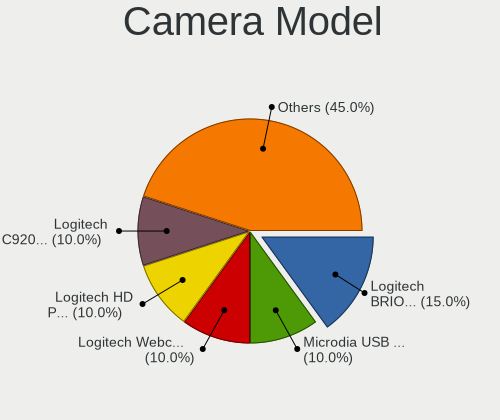

| Model                                    | Desktops | Percent |
|------------------------------------------|----------|---------|
| Logitech BRIO Ultra HD Webcam            | 3        | 15%     |
| Microdia USB 2.0 Camera                  | 2        | 10%     |
| Logitech Webcam C270                     | 2        | 10%     |
| Logitech HD Pro Webcam C920              | 2        | 10%     |
| Logitech C920 PRO HD Webcam              | 2        | 10%     |
| WaveRider USB 2.0 Camera                 | 1        | 5%      |
| Samsung Galaxy series, misc. (MTP mode)  | 1        | 5%      |
| Realtek FULL HD 1080P Webcam             | 1        | 5%      |
| Logitech HD Webcam C615                  | 1        | 5%      |
| Logitech HD Webcam C525                  | 1        | 5%      |
| Logitech HD Webcam C510                  | 1        | 5%      |
| Generalplus WEB CAM                      | 1        | 5%      |
| Generalplus 808 Camera #9 (web-cam mode) | 1        | 5%      |
| Apple iPhone 5/5C/5S/6/SE/7/8/X          | 1        | 5%      |

Security
--------

Fingerprint Vendor
------------------

Fingerprint sensor vendors

Zero info for selected period =(

Fingerprint Model
-----------------

Fingerprint sensor models

Zero info for selected period =(

Chipcard Vendor
---------------

Chipcard module vendors

| Vendor           | Desktops | Percent |
|------------------|----------|---------|
| Yubico.com       | 2        | 50%     |
| SCM Microsystems | 2        | 50%     |

Chipcard Model
--------------

Chipcard module models

| Model                                                  | Desktops | Percent |
|--------------------------------------------------------|----------|---------|
| Yubico.com Yubikey 4/5 CCID                            | 2        | 50%     |
| SCM Microsystems SCR331-LC1 / SCR3310 SmartCard Reader | 2        | 50%     |

Unsupported
-----------

Unsupported Devices
-------------------

Total unsupported devices on board

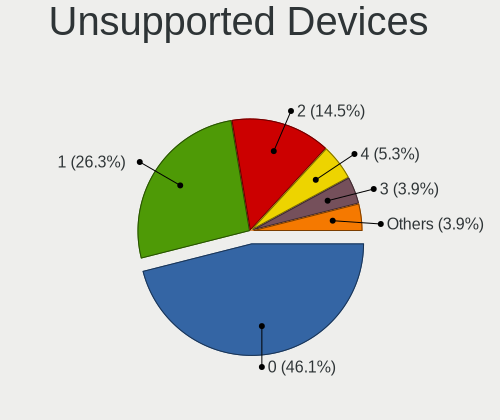

| Total | Desktops | Percent |
|-------|----------|---------|
| 0     | 35       | 46.05%  |
| 1     | 20       | 26.32%  |
| 2     | 11       | 14.47%  |
| 4     | 4        | 5.26%   |
| 3     | 3        | 3.95%   |
| 6     | 2        | 2.63%   |
| 5     | 1        | 1.32%   |

Unsupported Device Types
------------------------

Types of unsupported devices

| Type                     | Desktops | Percent |
|--------------------------|----------|---------|
| Graphics card            | 11       | 15.94%  |
| Net/wireless             | 10       | 14.49%  |
| Communication controller | 10       | 14.49%  |
| Bluetooth                | 8        | 11.59%  |
| Unassigned class         | 6        | 8.7%    |
| Sound                    | 6        | 8.7%    |
| Camera                   | 3        | 4.35%   |
| Tv card                  | 2        | 2.9%    |
| Storage/ide              | 2        | 2.9%    |
| Network                  | 2        | 2.9%    |
| Multimedia controller    | 2        | 2.9%    |
| Modem                    | 2        | 2.9%    |
| Chipcard                 | 2        | 2.9%    |
| Storage/ata              | 1        | 1.45%   |
| Net/ethernet             | 1        | 1.45%   |
| Card reader              | 1        | 1.45%   |

