Gentoo 2.9 - Tested Hardware & Statistics (Notebooks)
-----------------------------------------------------

A project to collect tested hardware configurations for Gentoo 2.9.

Anyone can contribute to this report by the [hw-probe](https://github.com/linuxhw/hw-probe) tool:

    sudo -E hw-probe -all -upload

Please contribute! Especially if your hardware is rare.

Contents
--------

* [ Test Cases ](#test-cases)

* [ System ](#system)
  - [ Kernel                   ](#kernel)
  - [ Kernel Family            ](#kernel-family)
  - [ Kernel Major Ver.        ](#kernel-major-ver)
  - [ Arch                     ](#arch)
  - [ DE                       ](#de)
  - [ Display Server           ](#display-server)
  - [ Display Manager          ](#display-manager)
  - [ OS Lang                  ](#os-lang)
  - [ Boot Mode                ](#boot-mode)
  - [ Filesystem               ](#filesystem)
  - [ Part. scheme             ](#part-scheme)
  - [ Dual Boot with Linux/BSD ](#dual-boot-with-linuxbsd)
  - [ Dual Boot (Win)          ](#dual-boot-win)

* [ Board ](#board)
  - [ Vendor                   ](#vendor)
  - [ Model                    ](#model)
  - [ Model Family             ](#model-family)
  - [ MFG Year                 ](#mfg-year)
  - [ Form Factor              ](#form-factor)
  - [ Secure Boot              ](#secure-boot)
  - [ Coreboot                 ](#coreboot)
  - [ RAM Size                 ](#ram-size)
  - [ RAM Used                 ](#ram-used)
  - [ Total Drives             ](#total-drives)
  - [ Has CD-ROM               ](#has-cd-rom)
  - [ Has Ethernet             ](#has-ethernet)
  - [ Has WiFi                 ](#has-wifi)
  - [ Has Bluetooth            ](#has-bluetooth)

* [ Location ](#location)
  - [ Country                  ](#country)
  - [ City                     ](#city)

* [ Drives ](#drives)
  - [ Drive Vendor             ](#drive-vendor)
  - [ Drive Model              ](#drive-model)
  - [ HDD Vendor               ](#hdd-vendor)
  - [ SSD Vendor               ](#ssd-vendor)
  - [ Drive Kind               ](#drive-kind)
  - [ Drive Connector          ](#drive-connector)
  - [ Drive Size               ](#drive-size)
  - [ Space Total              ](#space-total)
  - [ Space Used               ](#space-used)
  - [ Malfunc. Drives          ](#malfunc-drives)
  - [ Malfunc. Drive Vendor    ](#malfunc-drive-vendor)
  - [ Malfunc. HDD Vendor      ](#malfunc-hdd-vendor)
  - [ Malfunc. Drive Kind      ](#malfunc-drive-kind)
  - [ Failed Drives            ](#failed-drives)
  - [ Failed Drive Vendor      ](#failed-drive-vendor)
  - [ Drive Status             ](#drive-status)

* [ Storage controller ](#storage-controller)
  - [ Storage Vendor           ](#storage-vendor)
  - [ Storage Model            ](#storage-model)
  - [ Storage Kind             ](#storage-kind)

* [ Processor ](#processor)
  - [ CPU Vendor               ](#cpu-vendor)
  - [ CPU Model                ](#cpu-model)
  - [ CPU Model Family         ](#cpu-model-family)
  - [ CPU Cores                ](#cpu-cores)
  - [ CPU Sockets              ](#cpu-sockets)
  - [ CPU Threads              ](#cpu-threads)
  - [ CPU Op-Modes             ](#cpu-op-modes)
  - [ CPU Microcode            ](#cpu-microcode)
  - [ CPU Microarch            ](#cpu-microarch)

* [ Graphics ](#graphics)
  - [ GPU Vendor               ](#gpu-vendor)
  - [ GPU Model                ](#gpu-model)
  - [ GPU Combo                ](#gpu-combo)
  - [ GPU Driver               ](#gpu-driver)
  - [ GPU Memory               ](#gpu-memory)

* [ Monitor ](#monitor)
  - [ Monitor Vendor           ](#monitor-vendor)
  - [ Monitor Model            ](#monitor-model)
  - [ Monitor Resolution       ](#monitor-resolution)
  - [ Monitor Diagonal         ](#monitor-diagonal)
  - [ Monitor Width            ](#monitor-width)
  - [ Aspect Ratio             ](#aspect-ratio)
  - [ Monitor Area             ](#monitor-area)
  - [ Pixel Density            ](#pixel-density)
  - [ Multiple Monitors        ](#multiple-monitors)

* [ Network ](#network)
  - [ Net Controller Vendor    ](#net-controller-vendor)
  - [ Net Controller Model     ](#net-controller-model)
  - [ Wireless Vendor          ](#wireless-vendor)
  - [ Wireless Model           ](#wireless-model)
  - [ Ethernet Vendor          ](#ethernet-vendor)
  - [ Ethernet Model           ](#ethernet-model)
  - [ Net Controller Kind      ](#net-controller-kind)
  - [ Used Controller          ](#used-controller)
  - [ NICs                     ](#nics)
  - [ IPv6                     ](#ipv6)

* [ Bluetooth ](#bluetooth)
  - [ Bluetooth Vendor         ](#bluetooth-vendor)
  - [ Bluetooth Model          ](#bluetooth-model)

* [ Sound ](#sound)
  - [ Sound Vendor             ](#sound-vendor)
  - [ Sound Model              ](#sound-model)

* [ Memory ](#memory)
  - [ Memory Vendor            ](#memory-vendor)
  - [ Memory Model             ](#memory-model)
  - [ Memory Kind              ](#memory-kind)
  - [ Memory Form Factor       ](#memory-form-factor)
  - [ Memory Size              ](#memory-size)
  - [ Memory Speed             ](#memory-speed)

* [ Printers & scanners ](#printers--scanners)
  - [ Printer Vendor           ](#printer-vendor)
  - [ Printer Model            ](#printer-model)
  - [ Scanner Vendor           ](#scanner-vendor)
  - [ Scanner Model            ](#scanner-model)

* [ Camera ](#camera)
  - [ Camera Vendor            ](#camera-vendor)
  - [ Camera Model             ](#camera-model)

* [ Security ](#security)
  - [ Fingerprint Vendor       ](#fingerprint-vendor)
  - [ Fingerprint Model        ](#fingerprint-model)
  - [ Chipcard Vendor          ](#chipcard-vendor)
  - [ Chipcard Model           ](#chipcard-model)

* [ Unsupported ](#unsupported)
  - [ Unsupported Devices      ](#unsupported-devices)
  - [ Unsupported Device Types ](#unsupported-device-types)

Test Cases
----------

Total: 124

| Vendor    | Model                       | Probe                                                      | Date         |
|-----------|-----------------------------|------------------------------------------------------------|--------------|
| Dell      | XPS 15 9570                 | [7beef34820](https://linux-hardware.org/?probe=7beef34820) | Apr 01, 2023 |
| Lenovo    | ThinkPad T14 Gen 1 20S1S... | [644c9b9e55](https://linux-hardware.org/?probe=644c9b9e55) | Mar 21, 2023 |
| Lenovo    | ThinkPad T14 Gen 1 20S1S... | [06bd07f367](https://linux-hardware.org/?probe=06bd07f367) | Mar 21, 2023 |
| HP        | Pavilion Laptop 15-cs0xx... | [e3c4587227](https://linux-hardware.org/?probe=e3c4587227) | Mar 12, 2023 |
| Dell      | XPS 15 9570                 | [9d14bee09f](https://linux-hardware.org/?probe=9d14bee09f) | Mar 10, 2023 |
| MSI       | GS65 Stealth Thin 8RF       | [24373477d9](https://linux-hardware.org/?probe=24373477d9) | Mar 05, 2023 |
| IBM       | ThinkPad T41 23737JU        | [5495bd2109](https://linux-hardware.org/?probe=5495bd2109) | Mar 03, 2023 |
| Apple     | MacBookPro9,1               | [6553b59bfe](https://linux-hardware.org/?probe=6553b59bfe) | Mar 03, 2023 |
| ASUSTek   | 1016P                       | [739984c8cf](https://linux-hardware.org/?probe=739984c8cf) | Mar 03, 2023 |
| MSI       | GS65 Stealth Thin 8RF       | [e8f0217102](https://linux-hardware.org/?probe=e8f0217102) | Mar 03, 2023 |
| ASUSTek   | 1016P                       | [29798857a5](https://linux-hardware.org/?probe=29798857a5) | Mar 02, 2023 |
| HP        | Laptop 17-ca1xxx            | [7f93c1a4e3](https://linux-hardware.org/?probe=7f93c1a4e3) | Feb 28, 2023 |
| Lenovo    | Legion 5P 15IMH05 82AW      | [0de52a6150](https://linux-hardware.org/?probe=0de52a6150) | Feb 28, 2023 |
| Acer      | Aspire A515-45G             | [5f8c1e2d90](https://linux-hardware.org/?probe=5f8c1e2d90) | Feb 28, 2023 |
| ASUSTek   | VivoBook_ASUSLaptop X509... | [54e5bda708](https://linux-hardware.org/?probe=54e5bda708) | Feb 26, 2023 |
| ASUSTek   | VivoBook_ASUSLaptop X509... | [83af08dd1d](https://linux-hardware.org/?probe=83af08dd1d) | Feb 26, 2023 |
| ASUSTek   | VivoBook_ASUSLaptop X509... | [c5a45c78fc](https://linux-hardware.org/?probe=c5a45c78fc) | Feb 26, 2023 |
| HP        | Victus by Gaming Laptop ... | [6a44442cfc](https://linux-hardware.org/?probe=6a44442cfc) | Feb 21, 2023 |
| Alienware | 17                          | [848d5cd7e9](https://linux-hardware.org/?probe=848d5cd7e9) | Feb 20, 2023 |
| Unknown   | Unknown                     | [7d36f8eee5](https://linux-hardware.org/?probe=7d36f8eee5) | Feb 16, 2023 |
| MSI       | Vector GP66 12UEO           | [040bddeff8](https://linux-hardware.org/?probe=040bddeff8) | Feb 14, 2023 |
| Apple     | MacBookPro10,2              | [aedfc67444](https://linux-hardware.org/?probe=aedfc67444) | Feb 12, 2023 |
| Unknown   | Unknown                     | [e0fd4c1db9](https://linux-hardware.org/?probe=e0fd4c1db9) | Feb 11, 2023 |
| Apple     | MacBookPro10,2              | [85b07c179c](https://linux-hardware.org/?probe=85b07c179c) | Feb 09, 2023 |
| Apple     | MacBookPro10,2              | [238c7a2c08](https://linux-hardware.org/?probe=238c7a2c08) | Feb 09, 2023 |
| Valve     | Jupiter                     | [42a3945648](https://linux-hardware.org/?probe=42a3945648) | Feb 06, 2023 |
| Lenovo    | ThinkPad E14 Gen 4 21EBC... | [2ac999e9b0](https://linux-hardware.org/?probe=2ac999e9b0) | Feb 05, 2023 |
| Valve     | Jupiter                     | [5f77ae27c2](https://linux-hardware.org/?probe=5f77ae27c2) | Feb 04, 2023 |
| Lenovo    | ThinkPad T570 W10DG 20JX... | [37d0cc301b](https://linux-hardware.org/?probe=37d0cc301b) | Feb 03, 2023 |
| Lenovo    | ThinkPad T570 W10DG 20JX... | [a08ee9b387](https://linux-hardware.org/?probe=a08ee9b387) | Feb 03, 2023 |
| ASUSTek   | GL702VT                     | [83abe24c59](https://linux-hardware.org/?probe=83abe24c59) | Feb 01, 2023 |
| MSI       | GP60 2PE                    | [a1bb8934a0](https://linux-hardware.org/?probe=a1bb8934a0) | Feb 01, 2023 |
| Lenovo    | IdeaPad 5 15ARE05 81YQ      | [396877a008](https://linux-hardware.org/?probe=396877a008) | Jan 31, 2023 |
| Sony      | PCG-GRT230(UC)              | [0a7c76da78](https://linux-hardware.org/?probe=0a7c76da78) | Jan 30, 2023 |
| Google    | Helios                      | [c8b5d0660b](https://linux-hardware.org/?probe=c8b5d0660b) | Jan 28, 2023 |
| Lenovo    | IdeaPad S145-15IWL 81MV     | [f71299a9c6](https://linux-hardware.org/?probe=f71299a9c6) | Jan 27, 2023 |
| Dell      | XPS 9320                    | [a1040b4a3f](https://linux-hardware.org/?probe=a1040b4a3f) | Jan 26, 2023 |
| Dell      | Latitude 5530               | [b365359e5f](https://linux-hardware.org/?probe=b365359e5f) | Jan 24, 2023 |
| Dell      | Precision 7770              | [47044d362f](https://linux-hardware.org/?probe=47044d362f) | Jan 22, 2023 |
| Lenovo    | Legion 5 Pro 16ACH6H 82J... | [2f02d895e2](https://linux-hardware.org/?probe=2f02d895e2) | Jan 22, 2023 |
| HP        | Victus by Gaming Laptop ... | [92280be854](https://linux-hardware.org/?probe=92280be854) | Jan 22, 2023 |
| Lenovo    | ThinkPad T470s 20HGS27Y0... | [e1678320fc](https://linux-hardware.org/?probe=e1678320fc) | Jan 22, 2023 |
| Dell      | XPS 9320                    | [ebe686793d](https://linux-hardware.org/?probe=ebe686793d) | Jan 21, 2023 |
| Dell      | XPS 9320                    | [706152a268](https://linux-hardware.org/?probe=706152a268) | Jan 21, 2023 |
| Dell      | XPS 17 9700                 | [d37b338c87](https://linux-hardware.org/?probe=d37b338c87) | Jan 21, 2023 |
| Dell      | XPS 17 9700                 | [413cd3b7cf](https://linux-hardware.org/?probe=413cd3b7cf) | Jan 21, 2023 |
| ASUSTek   | VivoBook_ASUSLaptop X515... | [6c2dd878d0](https://linux-hardware.org/?probe=6c2dd878d0) | Jan 19, 2023 |
| ASUSTek   | VivoBook_ASUSLaptop X515... | [5f73278ca0](https://linux-hardware.org/?probe=5f73278ca0) | Jan 19, 2023 |
| ASUSTek   | ROG Strix G732LXS_G732LX... | [753a61e1de](https://linux-hardware.org/?probe=753a61e1de) | Jan 19, 2023 |
| ASUSTek   | ROG Strix G732LXS_G732LX... | [b14d57e1a3](https://linux-hardware.org/?probe=b14d57e1a3) | Jan 19, 2023 |
| Dell      | Precision 7720              | [9a00916b91](https://linux-hardware.org/?probe=9a00916b91) | Jan 19, 2023 |
| ASUSTek   | TUF Gaming FX505DT_FX505... | [0770f064de](https://linux-hardware.org/?probe=0770f064de) | Jan 19, 2023 |
| Schenker  | XMG PRO (E22)               | [475e812e56](https://linux-hardware.org/?probe=475e812e56) | Jan 19, 2023 |
| Dell      | Latitude 5410               | [da523f9f4c](https://linux-hardware.org/?probe=da523f9f4c) | Jan 18, 2023 |
| HP        | Pavilion Gaming Laptop 1... | [d6b6c22af1](https://linux-hardware.org/?probe=d6b6c22af1) | Jan 17, 2023 |
| Dell      | Precision 7720              | [f8e1c53257](https://linux-hardware.org/?probe=f8e1c53257) | Jan 16, 2023 |
| MSI       | Bravo 15 B5DD               | [8e35281ea5](https://linux-hardware.org/?probe=8e35281ea5) | Jan 16, 2023 |
| Acer      | Predator PH315-51           | [0b2ae38776](https://linux-hardware.org/?probe=0b2ae38776) | Jan 16, 2023 |
| Lenovo    | Legion Y540-15IRH-PG0 81... | [4fe502c977](https://linux-hardware.org/?probe=4fe502c977) | Jan 10, 2023 |
| Google    | Sasuke                      | [aa3a09aaef](https://linux-hardware.org/?probe=aa3a09aaef) | Jan 07, 2023 |
| Timi      | Mi Laptop Pro 15            | [7ea6f8ee94](https://linux-hardware.org/?probe=7ea6f8ee94) | Jan 06, 2023 |
| Lenovo    | Legion 5 Pro 16IAH7H 82R... | [659196ed95](https://linux-hardware.org/?probe=659196ed95) | Jan 06, 2023 |
| Lenovo    | ThinkPad T480 20L6S04Q00    | [0dbae6cda4](https://linux-hardware.org/?probe=0dbae6cda4) | Jan 06, 2023 |
| Lenovo    | ThinkPad T480 20L6S04Q00    | [bca9343f96](https://linux-hardware.org/?probe=bca9343f96) | Jan 06, 2023 |
| Lenovo    | Legion 5 Pro 16IAH7H 82R... | [40a6c7370b](https://linux-hardware.org/?probe=40a6c7370b) | Jan 05, 2023 |
| Acer      | TravelMate B115-M           | [c39cf71ff8](https://linux-hardware.org/?probe=c39cf71ff8) | Jan 05, 2023 |
| Dell      | Precision 7720              | [59813a7461](https://linux-hardware.org/?probe=59813a7461) | Jan 03, 2023 |
| Lenovo    | ThinkPad W540 20BG0033RT    | [5cfa12cec1](https://linux-hardware.org/?probe=5cfa12cec1) | Dec 31, 2022 |
| Lenovo    | Legion Y540-15IRH-PG0 81... | [4b130212a2](https://linux-hardware.org/?probe=4b130212a2) | Dec 30, 2022 |
| Lenovo    | Legion Y540-15IRH-PG0 81... | [0c7ced8708](https://linux-hardware.org/?probe=0c7ced8708) | Dec 30, 2022 |
| Lenovo    | IdeaPad Gaming 3 15ACH6 ... | [bd53b75b7b](https://linux-hardware.org/?probe=bd53b75b7b) | Dec 30, 2022 |
| Dell      | Precision 7720              | [56db0ab146](https://linux-hardware.org/?probe=56db0ab146) | Dec 28, 2022 |
| Dell      | Precision 7720              | [e94a7bb989](https://linux-hardware.org/?probe=e94a7bb989) | Dec 28, 2022 |
| Dell      | G3 3500                     | [78e803b44e](https://linux-hardware.org/?probe=78e803b44e) | Dec 28, 2022 |
| HP        | Pavilion Aero Laptop 13-... | [03cca95360](https://linux-hardware.org/?probe=03cca95360) | Dec 27, 2022 |
| System76  | Darter Pro                  | [c5aebaaece](https://linux-hardware.org/?probe=c5aebaaece) | Dec 27, 2022 |
| Dell      | G5 5505                     | [87f62bee87](https://linux-hardware.org/?probe=87f62bee87) | Dec 26, 2022 |
| Star Labs | StarLite                    | [0d27e6f7ee](https://linux-hardware.org/?probe=0d27e6f7ee) | Dec 25, 2022 |
| HP        | Pavilion Laptop 15-cs0xx... | [77390ced3c](https://linux-hardware.org/?probe=77390ced3c) | Dec 24, 2022 |
| Dell      | Vostro 5490                 | [f694fa24c8](https://linux-hardware.org/?probe=f694fa24c8) | Dec 23, 2022 |
| Lenovo    | ThinkPad T16 Gen 1 21CHC... | [0c1d9b9b28](https://linux-hardware.org/?probe=0c1d9b9b28) | Dec 23, 2022 |
| Lenovo    | ThinkPad X1 Carbon Gen 1... | [25cbb2c39a](https://linux-hardware.org/?probe=25cbb2c39a) | Dec 23, 2022 |
| Lenovo    | ThinkPad T16 Gen 1 21CHC... | [000660b461](https://linux-hardware.org/?probe=000660b461) | Dec 23, 2022 |
| Lenovo    | ThinkPad T16 Gen 1 21CHC... | [638667a90f](https://linux-hardware.org/?probe=638667a90f) | Dec 20, 2022 |
| Dell      | Inspiron 15 7000 Gaming     | [b9aed745da](https://linux-hardware.org/?probe=b9aed745da) | Dec 20, 2022 |
| Dell      | Inspiron 15 7000 Gaming     | [c7cea6dd19](https://linux-hardware.org/?probe=c7cea6dd19) | Dec 20, 2022 |
| Dell      | Inspiron 15 3511            | [3d33008fb2](https://linux-hardware.org/?probe=3d33008fb2) | Dec 19, 2022 |
| Lenovo    | Legion 5 Pro 16IAH7H 82R... | [e0f5a5db4c](https://linux-hardware.org/?probe=e0f5a5db4c) | Dec 18, 2022 |
| Lenovo    | ThinkPad T470p 20J7S25C0... | [3dc497faf1](https://linux-hardware.org/?probe=3dc497faf1) | Dec 18, 2022 |
| Lenovo    | Legion 5 Pro 16IAH7H 82R... | [f15a27fd5e](https://linux-hardware.org/?probe=f15a27fd5e) | Dec 17, 2022 |
| Star Labs | StarLite                    | [0d83c191fa](https://linux-hardware.org/?probe=0d83c191fa) | Dec 10, 2022 |
| HP        | ProBook 6570b               | [073546a981](https://linux-hardware.org/?probe=073546a981) | Dec 10, 2022 |
| Star Labs | StarLite                    | [4446ba1d6a](https://linux-hardware.org/?probe=4446ba1d6a) | Dec 10, 2022 |
| Google    | Eve                         | [d78558c833](https://linux-hardware.org/?probe=d78558c833) | Dec 08, 2022 |
| Google    | Eve                         | [92d1d03fed](https://linux-hardware.org/?probe=92d1d03fed) | Dec 08, 2022 |
| Toshiba   | Satellite L50-B             | [6d92129c25](https://linux-hardware.org/?probe=6d92129c25) | Dec 05, 2022 |
| HP        | G62                         | [494d9e65e4](https://linux-hardware.org/?probe=494d9e65e4) | Dec 03, 2022 |
| Dell      | Inspiron 3501               | [f9379c4ffb](https://linux-hardware.org/?probe=f9379c4ffb) | Dec 01, 2022 |
| Unknown   | Unknown                     | [dceef2a9d5](https://linux-hardware.org/?probe=dceef2a9d5) | Dec 01, 2022 |
| HP        | EliteBook 820 G3            | [d313455fa8](https://linux-hardware.org/?probe=d313455fa8) | Dec 01, 2022 |
| HP        | EliteBook 820 G3            | [31b9efe771](https://linux-hardware.org/?probe=31b9efe771) | Dec 01, 2022 |
| Lenovo    | ThinkBook 14s-IWL 20RM      | [d77cb5ebb0](https://linux-hardware.org/?probe=d77cb5ebb0) | Nov 30, 2022 |
| HUAWEI    | KLVL-WXX9                   | [af7d162434](https://linux-hardware.org/?probe=af7d162434) | Nov 28, 2022 |
| Acer      | Swift SF314-57              | [ba4ed6c5f4](https://linux-hardware.org/?probe=ba4ed6c5f4) | Nov 26, 2022 |
| Lenovo    | Yoga Slim 7 Pro 14IAH7 8... | [fa4e2d1d61](https://linux-hardware.org/?probe=fa4e2d1d61) | Nov 23, 2022 |
| HUAWEI    | BOHB-WAX9                   | [b0d3226df4](https://linux-hardware.org/?probe=b0d3226df4) | Nov 21, 2022 |
| HUAWEI    | BOHB-WAX9                   | [8ffb460b9e](https://linux-hardware.org/?probe=8ffb460b9e) | Nov 19, 2022 |
| Dell      | Inspiron N5010              | [8a94d169c5](https://linux-hardware.org/?probe=8a94d169c5) | Nov 17, 2022 |
| Dell      | Inspiron N5010              | [fbe52d681e](https://linux-hardware.org/?probe=fbe52d681e) | Nov 17, 2022 |
| HP        | Pavilion Aero Laptop 13-... | [5fd36e3d66](https://linux-hardware.org/?probe=5fd36e3d66) | Nov 17, 2022 |
| HP        | Pavilion Aero Laptop 13-... | [62b2a72fa9](https://linux-hardware.org/?probe=62b2a72fa9) | Nov 16, 2022 |
| Lenovo    | G50-30 80G0                 | [b870eb1d72](https://linux-hardware.org/?probe=b870eb1d72) | Nov 15, 2022 |
| Acer      | Nitro AN515-58              | [9f4cb2a547](https://linux-hardware.org/?probe=9f4cb2a547) | Nov 09, 2022 |
| Toshiba   | Satellite L50-B             | [8939445388](https://linux-hardware.org/?probe=8939445388) | Nov 09, 2022 |
| Toshiba   | Satellite L50-B             | [420aaf8ede](https://linux-hardware.org/?probe=420aaf8ede) | Nov 09, 2022 |
| Dell      | Precision 5570              | [d74abc314b](https://linux-hardware.org/?probe=d74abc314b) | Oct 25, 2022 |
| ASUSTek   | ROG Strix G513QY_G513QY     | [9115752bd4](https://linux-hardware.org/?probe=9115752bd4) | Oct 24, 2022 |
| Apple     | MacBookPro8,1               | [aaad9f52d4](https://linux-hardware.org/?probe=aaad9f52d4) | Oct 24, 2022 |
| Apple     | MacBookPro8,1               | [f3890a4db1](https://linux-hardware.org/?probe=f3890a4db1) | Oct 21, 2022 |
| Gigabyte  | G5 KD                       | [c0f91f7282](https://linux-hardware.org/?probe=c0f91f7282) | Oct 20, 2022 |
| Gigabyte  | G5 KD                       | [35db9f3cd8](https://linux-hardware.org/?probe=35db9f3cd8) | Oct 19, 2022 |
| HP        | EliteBook 845 G7 Noteboo... | [99d95e9424](https://linux-hardware.org/?probe=99d95e9424) | Oct 09, 2022 |
| Lenovo    | ThinkPad T430 2344BZU       | [ae4533cfd6](https://linux-hardware.org/?probe=ae4533cfd6) | Oct 03, 2022 |
| Acer      | Predator PH315-51           | [24ae1f3fb8](https://linux-hardware.org/?probe=24ae1f3fb8) | Sep 23, 2022 |

System
------

Kernel
------

Version of the Linux kernel

| Version                     | Notebooks | Percent |
|-----------------------------|-----------|---------|
| 5.15.80-gentoo-x86_64       | 9         | 10.98%  |
| 5.15.80-gentoo              | 6         | 7.32%   |
| 6.1.7-gentoo                | 3         | 3.66%   |
| 5.15.88-gentoo-x86_64       | 3         | 3.66%   |
| 5.15.88-gentoo              | 3         | 3.66%   |
| 5.15.75-gentoo-x86_64       | 3         | 3.66%   |
| 5.15.75-gentoo              | 3         | 3.66%   |
| 6.1.2-gentoo-x86_64         | 2         | 2.44%   |
| 6.1.12-gentoo-x86_64        | 2         | 2.44%   |
| 6.1.12-gentoo-dist          | 2         | 2.44%   |
| 6.0.0-pf2                   | 2         | 2.44%   |
| 5.15.85-gentoo-dist         | 2         | 2.44%   |
| 6.2.7-gentoo-dist           | 1         | 1.22%   |
| 6.2.2-gentoo                | 1         | 1.22%   |
| 6.2.1-gentoo-y              | 1         | 1.22%   |
| 6.2.1-gentoo                | 1         | 1.22%   |
| 6.2.1-calculate             | 1         | 1.22%   |
| 6.2.0-gentoo                | 1         | 1.22%   |
| 6.1.9-gentoo-x86_64         | 1         | 1.22%   |
| 6.1.8-gentoo-x86_64         | 1         | 1.22%   |
| 6.1.8-gentoo-dist           | 1         | 1.22%   |
| 6.1.8-gentoo                | 1         | 1.22%   |
| 6.1.7-xanmod1               | 1         | 1.22%   |
| 6.1.7-gentoo-x86_64         | 1         | 1.22%   |
| 6.1.7-gentoo-dist           | 1         | 1.22%   |
| 6.1.6-gentoo-x86_64         | 1         | 1.22%   |
| 6.1.6-gentoo                | 1         | 1.22%   |
| 6.1.4-gentoo-dist           | 1         | 1.22%   |
| 6.1.3-gentoosystemd         | 1         | 1.22%   |
| 6.1.3-gentoo-dist           | 1         | 1.22%   |
| 6.1.1-gentoo-x86_64         | 1         | 1.22%   |
| 6.1.1-gentoo                | 1         | 1.22%   |
| 6.1.1-arch1-1               | 1         | 1.22%   |
| 6.1.0-pf1                   | 1         | 1.22%   |
| 6.0.9-gentoo-x86_64         | 1         | 1.22%   |
| 6.0.9-gentoo-wayland-x86_64 | 1         | 1.22%   |
| 6.0.9-gentoo-dist           | 1         | 1.22%   |
| 6.0.8                       | 1         | 1.22%   |
| 6.0.7-gentoo-dist           | 1         | 1.22%   |
| 6.0.19-gentoo               | 1         | 1.22%   |

Kernel Family
-------------

Linux kernel without a distro release

| Version | Notebooks | Percent |
|---------|-----------|---------|
| 5.15.80 | 15        | 18.29%  |
| 5.15.75 | 7         | 8.54%   |
| 6.1.7   | 6         | 7.32%   |
| 6.0.0   | 6         | 7.32%   |
| 5.15.88 | 6         | 7.32%   |
| 6.1.12  | 4         | 4.88%   |
| 6.2.1   | 3         | 3.66%   |
| 6.1.8   | 3         | 3.66%   |
| 6.1.1   | 3         | 3.66%   |
| 6.0.9   | 3         | 3.66%   |
| 6.1.6   | 2         | 2.44%   |
| 6.1.3   | 2         | 2.44%   |
| 6.1.2   | 2         | 2.44%   |
| 5.15.85 | 2         | 2.44%   |
| 6.2.7   | 1         | 1.22%   |
| 6.2.2   | 1         | 1.22%   |
| 6.2.0   | 1         | 1.22%   |
| 6.1.9   | 1         | 1.22%   |
| 6.1.4   | 1         | 1.22%   |
| 6.1.0   | 1         | 1.22%   |
| 6.0.8   | 1         | 1.22%   |
| 6.0.7   | 1         | 1.22%   |
| 6.0.19  | 1         | 1.22%   |
| 6.0.12  | 1         | 1.22%   |
| 6.0.11  | 1         | 1.22%   |
| 6.0.10  | 1         | 1.22%   |
| 5.19.10 | 1         | 1.22%   |
| 5.15.74 | 1         | 1.22%   |
| 5.15.68 | 1         | 1.22%   |
| 5.15.41 | 1         | 1.22%   |
| 5.15.12 | 1         | 1.22%   |
| 5.10.76 | 1         | 1.22%   |

Kernel Major Ver.
-----------------

Linux kernel major version

| Version | Notebooks | Percent |
|---------|-----------|---------|
| 5.15    | 33        | 41.77%  |
| 6.1     | 24        | 30.38%  |
| 6.0     | 14        | 17.72%  |
| 6.2     | 6         | 7.59%   |
| 5.19    | 1         | 1.27%   |
| 5.10    | 1         | 1.27%   |

Arch
----

OS architecture (x86_64, i586, etc.)

| Name   | Notebooks | Percent |
|--------|-----------|---------|
| x86_64 | 74        | 97.37%  |
| i686   | 2         | 2.63%   |

DE
--

Desktop Environment

| Name       | Notebooks | Percent |
|------------|-----------|---------|
| KDE5       | 25        | 32.05%  |
| Unknown    | 15        | 19.23%  |
| XFCE       | 11        | 14.1%   |
| GNOME      | 7         | 8.97%   |
| MATE       | 5         | 6.41%   |
| Trinity    | 3         | 3.85%   |
| sway       | 2         | 2.56%   |
| LXQt       | 2         | 2.56%   |
| Hyprland   | 2         | 2.56%   |
| DWM        | 2         | 2.56%   |
| bspwm      | 2         | 2.56%   |
| X-Cinnamon | 1         | 1.28%   |
| awesome    | 1         | 1.28%   |

Display Server
--------------

X11 or Wayland

| Name    | Notebooks | Percent |
|---------|-----------|---------|
| X11     | 47        | 60.26%  |
| Tty     | 12        | 15.38%  |
| Wayland | 10        | 12.82%  |
| Unknown | 9         | 11.54%  |

Display Manager
---------------

SDDM, LightDM, etc.

| Name    | Notebooks | Percent |
|---------|-----------|---------|
| SDDM    | 30        | 39.47%  |
| Unknown | 21        | 27.63%  |
| LightDM | 11        | 14.47%  |
| GDM     | 5         | 6.58%   |
| TDM     | 3         | 3.95%   |
| SLiM    | 3         | 3.95%   |
| XDM     | 2         | 2.63%   |
| GREETD  | 1         | 1.32%   |

OS Lang
-------

Language

| Lang           | Notebooks | Percent |
|----------------|-----------|---------|
| en_US          | 29        | 38.16%  |
| ru_RU          | 8         | 10.53%  |
| cs_CZ          | 7         | 9.21%   |
| C.UTF8         | 7         | 9.21%   |
| Unknown        | 4         | 5.26%   |
| it_IT          | 3         | 3.95%   |
| mi_NZ          | 2         | 2.63%   |
| fr_FR          | 2         | 2.63%   |
| en_GB          | 2         | 2.63%   |
| en_CA          | 2         | 2.63%   |
| C              | 2         | 2.63%   |
| zh_CN          | 1         | 1.32%   |
| pl_PL          | 1         | 1.32%   |
| nl_BE          | 1         | 1.32%   |
| ja_JP          | 1         | 1.32%   |
| en_IE          | 1         | 1.32%   |
| en_GB.iso88591 | 1         | 1.32%   |
| en_AU          | 1         | 1.32%   |
| de_DE          | 1         | 1.32%   |

Boot Mode
---------

EFI or BIOS

| Mode | Notebooks | Percent |
|------|-----------|---------|
| EFI  | 61        | 80.26%  |
| BIOS | 15        | 19.74%  |

Filesystem
----------

Type of filesystem

| Type     | Notebooks | Percent |
|----------|-----------|---------|
| Ext4     | 41        | 53.25%  |
| Btrfs    | 28        | 36.36%  |
| Xfs      | 2         | 2.6%    |
| F2fs     | 2         | 2.6%    |
| Zfs      | 1         | 1.3%    |
| XXXXXXX  | 1         | 1.3%    |
| Reiserfs | 1         | 1.3%    |
| Jfs      | 1         | 1.3%    |

Part. scheme
------------

Scheme of partitioning

| Type    | Notebooks | Percent |
|---------|-----------|---------|
| GPT     | 66        | 86.84%  |
| MBR     | 8         | 10.53%  |
| Unknown | 2         | 2.63%   |

Dual Boot with Linux/BSD
------------------------

Hosting more than one Linux/BSD

| Dual boot | Notebooks | Percent |
|-----------|-----------|---------|
| No        | 61        | 78.21%  |
| Yes       | 17        | 21.79%  |

Dual Boot (Win)
---------------

Hosting Linux and Windows

| Dual boot | Notebooks | Percent |
|-----------|-----------|---------|
| No        | 43        | 55.84%  |
| Yes       | 34        | 44.16%  |

Board
-----

Vendor
------

Motherboard manufacturer

| Name                | Notebooks | Percent |
|---------------------|-----------|---------|
| Lenovo              | 18        | 23.68%  |
| Dell                | 15        | 19.74%  |
| Hewlett-Packard     | 9         | 11.84%  |
| ASUSTek Computer    | 7         | 9.21%   |
| Acer                | 5         | 6.58%   |
| MSI                 | 4         | 5.26%   |
| Google              | 3         | 3.95%   |
| Apple               | 3         | 3.95%   |
| HUAWEI              | 2         | 2.63%   |
| Unknown             | 2         | 2.63%   |
| Toshiba             | 1         | 1.32%   |
| Timi                | 1         | 1.32%   |
| Star Labs           | 1         | 1.32%   |
| Sony                | 1         | 1.32%   |
| Schenker            | 1         | 1.32%   |
| IBM                 | 1         | 1.32%   |
| Gigabyte Technology | 1         | 1.32%   |
| Alienware           | 1         | 1.32%   |

Model
-----

Motherboard model

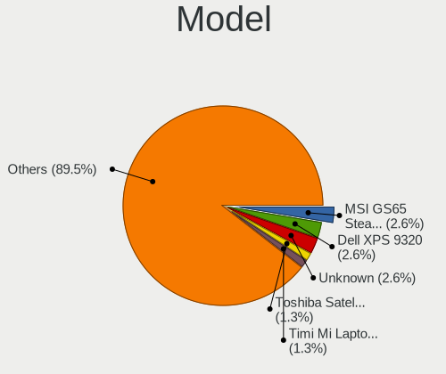

| Name                                        | Notebooks | Percent |
|---------------------------------------------|-----------|---------|
| MSI GS65 Stealth Thin 8RF                   | 2         | 2.63%   |
| Dell XPS 9320                               | 2         | 2.63%   |
| Unknown                                     | 2         | 2.63%   |
| Toshiba Satellite L50-B                     | 1         | 1.32%   |
| Timi Mi Laptop Pro 15                       | 1         | 1.32%   |
| Star Labs StarLite                          | 1         | 1.32%   |
| Sony PCG-GRT230(UC)                         | 1         | 1.32%   |
| Schenker XMG PRO (E22)                      | 1         | 1.32%   |
| MSI GP60 2PE                                | 1         | 1.32%   |
| MSI Bravo 15 B5DD                           | 1         | 1.32%   |
| Lenovo Yoga Slim 7 Pro 14IAH7 82UT          | 1         | 1.32%   |
| Lenovo ThinkPad X1 Carbon Gen 10 21CCS8QS00 | 1         | 1.32%   |
| Lenovo ThinkPad W540 20BG0033RT             | 1         | 1.32%   |
| Lenovo ThinkPad T570 W10DG 20JXS08118       | 1         | 1.32%   |
| Lenovo ThinkPad T480 20L6S04Q00             | 1         | 1.32%   |
| Lenovo ThinkPad T470s 20HGS27Y0V            | 1         | 1.32%   |
| Lenovo ThinkPad T470p 20J7S25C00            | 1         | 1.32%   |
| Lenovo ThinkPad T16 Gen 1 21CHCTO1WW        | 1         | 1.32%   |
| Lenovo ThinkPad T14 Gen 1 20S1SFAD00        | 1         | 1.32%   |
| Lenovo ThinkPad E14 Gen 4 21EBCTO1WW        | 1         | 1.32%   |
| Lenovo ThinkBook 14s-IWL 20RM               | 1         | 1.32%   |
| Lenovo Legion Y540-15IRH-PG0 81SY           | 1         | 1.32%   |
| Lenovo Legion 5P 15IMH05 82AW               | 1         | 1.32%   |
| Lenovo Legion 5 Pro 16IAH7H 82RF            | 1         | 1.32%   |
| Lenovo Legion 5 Pro 16ACH6H 82JQ            | 1         | 1.32%   |
| Lenovo IdeaPad S145-15IWL 81MV              | 1         | 1.32%   |
| Lenovo IdeaPad Gaming 3 15ACH6 82K2         | 1         | 1.32%   |
| Lenovo IdeaPad 5 15ARE05 81YQ               | 1         | 1.32%   |
| IBM ThinkPad T41 23737JU                    | 1         | 1.32%   |
| HUAWEI KLVL-WXX9                            | 1         | 1.32%   |
| HUAWEI BOHB-WAX9                            | 1         | 1.32%   |
| HP Victus by Gaming Laptop 15-fb0xxx        | 1         | 1.32%   |
| HP ProBook 6570b                            | 1         | 1.32%   |
| HP Pavilion Laptop 15-cs0xxx                | 1         | 1.32%   |
| HP Pavilion Gaming Laptop 17-cd1xxx         | 1         | 1.32%   |
| HP Pavilion Aero Laptop 13-be0xxx           | 1         | 1.32%   |
| HP Laptop 17-ca1xxx                         | 1         | 1.32%   |
| HP G62                                      | 1         | 1.32%   |
| HP EliteBook 845 G7 Notebook PC             | 1         | 1.32%   |
| HP EliteBook 820 G3                         | 1         | 1.32%   |

Model Family
------------

Motherboard model prefix

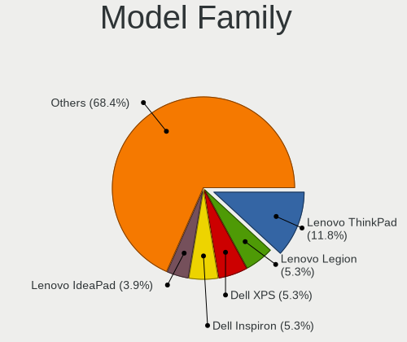

| Name                | Notebooks | Percent |
|---------------------|-----------|---------|
| Lenovo ThinkPad     | 9         | 11.84%  |
| Lenovo Legion       | 4         | 5.26%   |
| Dell XPS            | 4         | 5.26%   |
| Dell Inspiron       | 4         | 5.26%   |
| Lenovo IdeaPad      | 3         | 3.95%   |
| HP Pavilion         | 3         | 3.95%   |
| MSI GS65            | 2         | 2.63%   |
| HP EliteBook        | 2         | 2.63%   |
| Dell Precision      | 2         | 2.63%   |
| Dell Latitude       | 2         | 2.63%   |
| ASUS VivoBook       | 2         | 2.63%   |
| ASUS ROG            | 2         | 2.63%   |
| Unknown             | 2         | 2.63%   |
| Toshiba Satellite   | 1         | 1.32%   |
| Timi Mi             | 1         | 1.32%   |
| Star Labs StarLite  | 1         | 1.32%   |
| Sony PCG-GRT230(UC) | 1         | 1.32%   |
| Schenker XMG        | 1         | 1.32%   |
| MSI GP60            | 1         | 1.32%   |
| MSI Bravo           | 1         | 1.32%   |
| Lenovo Yoga         | 1         | 1.32%   |
| Lenovo ThinkBook    | 1         | 1.32%   |
| IBM ThinkPad        | 1         | 1.32%   |
| HUAWEI KLVL-WXX9    | 1         | 1.32%   |
| HUAWEI BOHB-WAX9    | 1         | 1.32%   |
| HP Victus           | 1         | 1.32%   |
| HP ProBook          | 1         | 1.32%   |
| HP Laptop           | 1         | 1.32%   |
| HP G62              | 1         | 1.32%   |
| Google Sasuke       | 1         | 1.32%   |
| Google Helios       | 1         | 1.32%   |
| Google Eve          | 1         | 1.32%   |
| Gigabyte G5         | 1         | 1.32%   |
| Dell Vostro         | 1         | 1.32%   |
| Dell G5             | 1         | 1.32%   |
| Dell G3             | 1         | 1.32%   |
| ASUS TUF            | 1         | 1.32%   |
| ASUS GL702VT        | 1         | 1.32%   |
| ASUS 1016P          | 1         | 1.32%   |
| Apple MacBookPro9   | 1         | 1.32%   |

MFG Year
--------

Motherboard manufacture year

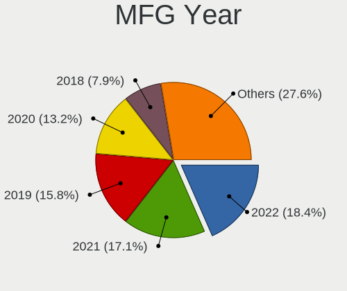

| Year | Notebooks | Percent |
|------|-----------|---------|
| 2022 | 14        | 18.42%  |
| 2021 | 13        | 17.11%  |
| 2019 | 12        | 15.79%  |
| 2020 | 10        | 13.16%  |
| 2018 | 6         | 7.89%   |
| 2017 | 5         | 6.58%   |
| 2014 | 5         | 6.58%   |
| 2010 | 3         | 3.95%   |
| 2015 | 2         | 2.63%   |
| 2012 | 2         | 2.63%   |
| 2013 | 1         | 1.32%   |
| 2011 | 1         | 1.32%   |
| 2004 | 1         | 1.32%   |
| 2003 | 1         | 1.32%   |

Form Factor
-----------

Physical design of the computer

| Name     | Notebooks | Percent |
|----------|-----------|---------|
| Notebook | 76        | 100%    |

Secure Boot
-----------

Enabled or disabled

| State    | Notebooks | Percent |
|----------|-----------|---------|
| Disabled | 76        | 100%    |

Coreboot
--------

Have coreboot on board

| Used | Notebooks | Percent |
|------|-----------|---------|
| No   | 73        | 96.05%  |
| Yes  | 3         | 3.95%   |

RAM Size
--------

Total RAM memory

| Size in GB  | Notebooks | Percent |
|-------------|-----------|---------|
| 16.01-24.0  | 20        | 26.32%  |
| 32.01-64.0  | 15        | 19.74%  |
| 4.01-8.0    | 14        | 18.42%  |
| 8.01-16.0   | 14        | 18.42%  |
| 3.01-4.0    | 6         | 7.89%   |
| 24.01-32.0  | 2         | 2.63%   |
| 1.01-2.0    | 2         | 2.63%   |
| 2.01-3.0    | 1         | 1.32%   |
| 64.01-256.0 | 1         | 1.32%   |
| 0.01-0.5    | 1         | 1.32%   |

RAM Used
--------

Used RAM memory

| Used GB   | Notebooks | Percent |
|-----------|-----------|---------|
| 1.01-2.0  | 20        | 24.1%   |
| 2.01-3.0  | 18        | 21.69%  |
| 4.01-8.0  | 14        | 16.87%  |
| 0.01-0.5  | 12        | 14.46%  |
| 0.51-1.0  | 7         | 8.43%   |
| 3.01-4.0  | 6         | 7.23%   |
| 8.01-16.0 | 6         | 7.23%   |

Total Drives
------------

Number of drives on board

| Drives | Notebooks | Percent |
|--------|-----------|---------|
| 1      | 50        | 64.1%   |
| 2      | 26        | 33.33%  |
| 3      | 2         | 2.56%   |

Has CD-ROM
----------

Has CD-ROM on board

| Presented | Notebooks | Percent |
|-----------|-----------|---------|
| No        | 68        | 89.47%  |
| Yes       | 8         | 10.53%  |

Has Ethernet
------------

Has Ethernet on board

| Presented | Notebooks | Percent |
|-----------|-----------|---------|
| Yes       | 59        | 76.62%  |
| No        | 18        | 23.38%  |

Has WiFi
--------

Has WiFi module

| Presented | Notebooks | Percent |
|-----------|-----------|---------|
| Yes       | 74        | 97.37%  |
| No        | 2         | 2.63%   |

Has Bluetooth
-------------

Has Bluetooth module

| Presented | Notebooks | Percent |
|-----------|-----------|---------|
| Yes       | 67        | 88.16%  |
| No        | 9         | 11.84%  |

Location
--------

Country
-------

Geographic location (country)

| Country     | Notebooks | Percent |
|-------------|-----------|---------|
| USA         | 19        | 25%     |
| Russia      | 8         | 10.53%  |
| Czechia     | 6         | 7.89%   |
| Canada      | 6         | 7.89%   |
| Germany     | 4         | 5.26%   |
| UK          | 3         | 3.95%   |
| Netherlands | 3         | 3.95%   |
| Italy       | 3         | 3.95%   |
| France      | 3         | 3.95%   |
| Poland      | 2         | 2.63%   |
| New Zealand | 2         | 2.63%   |
| Turkey      | 1         | 1.32%   |
| Taiwan      | 1         | 1.32%   |
| Spain       | 1         | 1.32%   |
| Slovakia    | 1         | 1.32%   |
| Portugal    | 1         | 1.32%   |
| Nepal       | 1         | 1.32%   |
| Mexico      | 1         | 1.32%   |
| Malaysia    | 1         | 1.32%   |
| Lithuania   | 1         | 1.32%   |
| Japan       | 1         | 1.32%   |
| Greece      | 1         | 1.32%   |
| Georgia     | 1         | 1.32%   |
| Cyprus      | 1         | 1.32%   |
| China       | 1         | 1.32%   |
| Bulgaria    | 1         | 1.32%   |
| Belgium     | 1         | 1.32%   |
| Australia   | 1         | 1.32%   |

City
----

Geographic location (city)

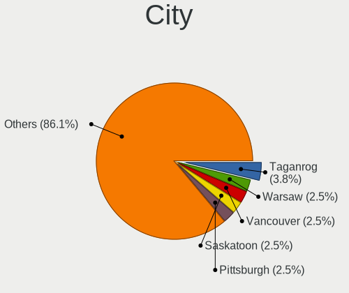

| City                  | Notebooks | Percent |
|-----------------------|-----------|---------|
| Taganrog              | 3         | 3.8%    |
| Warsaw                | 2         | 2.53%   |
| Vancouver             | 2         | 2.53%   |
| Saskatoon             | 2         | 2.53%   |
| Pittsburgh            | 2         | 2.53%   |
| Oviedo                | 2         | 2.53%   |
| Milan                 | 2         | 2.53%   |
| Hamilton              | 2         | 2.53%   |
| Christchurch          | 2         | 2.53%   |
| Amsterdam             | 2         | 2.53%   |
| Woodbridge            | 1         | 1.27%   |
| Vitkov                | 1         | 1.27%   |
| Vilnius               | 1         | 1.27%   |
| Vechelde              | 1         | 1.27%   |
| Ufa                   | 1         | 1.27%   |
| Tbilisi               | 1         | 1.27%   |
| Taipei                | 1         | 1.27%   |
| Suffolk               | 1         | 1.27%   |
| St. Claude            | 1         | 1.27%   |
| Šlapanice            | 1         | 1.27%   |
| San Dimas             | 1         | 1.27%   |
| Salinas               | 1         | 1.27%   |
| Ryazan                | 1         | 1.27%   |
| Royal Tunbridge Wells | 1         | 1.27%   |
| Renton                | 1         | 1.27%   |
| Ravenna               | 1         | 1.27%   |
| Quakertown            | 1         | 1.27%   |
| Purmerend             | 1         | 1.27%   |
| Prague                | 1         | 1.27%   |
| Ponetovice            | 1         | 1.27%   |
| Pokhara               | 1         | 1.27%   |
| Perth                 | 1         | 1.27%   |
| Paris                 | 1         | 1.27%   |
| Norristown            | 1         | 1.27%   |
| Nicosia               | 1         | 1.27%   |
| New York              | 1         | 1.27%   |
| Nandlstadt            | 1         | 1.27%   |
| Moscow                | 1         | 1.27%   |
| Mondim de Basto       | 1         | 1.27%   |
| Minato-ku             | 1         | 1.27%   |

Drives
------

Drive Vendor
------------

Hard drive vendors

| Vendor                      | Notebooks | Drives | Percent |
|-----------------------------|-----------|--------|---------|
| Samsung Electronics         | 27        | 37     | 27.27%  |
| Sandisk                     | 10        | 12     | 10.1%   |
| Intel                       | 6         | 8      | 6.06%   |
| Toshiba                     | 5         | 6      | 5.05%   |
| Phison Electronics          | 5         | 5      | 5.05%   |
| SK hynix                    | 4         | 5      | 4.04%   |
| Seagate                     | 4         | 5      | 4.04%   |
| Micron Technology           | 4         | 5      | 4.04%   |
| Unknown                     | 3         | 3      | 3.03%   |
| KIOXIA                      | 3         | 3      | 3.03%   |
| Kingston Technology Company | 3         | 3      | 3.03%   |
| China                       | 3         | 4      | 3.03%   |
| WDC                         | 2         | 2      | 2.02%   |
| Kingston                    | 2         | 2      | 2.02%   |
| HGST                        | 2         | 3      | 2.02%   |
| Apple                       | 2         | 2      | 2.02%   |
| Yangtze Memory Technologies | 1         | 1      | 1.01%   |
| TrekStor                    | 1         | 1      | 1.01%   |
| Star                        | 1         | 1      | 1.01%   |
| Solid State Storage         | 1         | 1      | 1.01%   |
| Smartbuy                    | 1         | 1      | 1.01%   |
| Silicon Motion              | 1         | 1      | 1.01%   |
| OCZ                         | 1         | 1      | 1.01%   |
| Intenso                     | 1         | 1      | 1.01%   |
| IBM/Hitachi                 | 1         | 1      | 1.01%   |
| Hitachi                     | 1         | 1      | 1.01%   |
| HGST HTS                    | 1         | 1      | 1.01%   |
| Dogfish                     | 1         | 1      | 1.01%   |
| Crucial                     | 1         | 1      | 1.01%   |
| Unknown                     | 1         | 1      | 1.01%   |

Drive Model
-----------

Hard drive models

| Model                                                 | Notebooks | Percent |
|-------------------------------------------------------|-----------|---------|
| Samsung NVMe SSD Controller SM981/PM981/PM983 500GB   | 14        | 13.59%  |
| Samsung NVMe SSD Controller PM9A1/PM9A3/980PRO 1TB    | 6         | 5.83%   |
| Intel SSD 660P Series 1024GB                          | 3         | 2.91%   |
| China SSD 1TB                                         | 3         | 2.91%   |
| Unknown MMC Card  32GB                                | 2         | 1.94%   |
| SK hynix BC501 NVMe Solid State Drive 512GB           | 2         | 1.94%   |
| Samsung SSD 980 1TB                                   | 2         | 1.94%   |
| Samsung SSD 860 PRO 1TB                               | 2         | 1.94%   |
| Phison E16 PCIe4 NVMe Controller 1TB                  | 2         | 1.94%   |
| HGST HTS721010A9E630 1TB                              | 2         | 1.94%   |
| Yangtze Memory ZHITAI TiPlus5000 1TB                  | 1         | 0.97%   |
| WDC WDS100T2B0A-00SM50 1TB SSD                        | 1         | 0.97%   |
| WDC WD10JPVX-75JC3T0 1TB                              | 1         | 0.97%   |
| Unknown MMC Card  128GB                               | 1         | 0.97%   |
| TrekStor I.GEAR 128GB                                 | 1         | 0.97%   |
| Toshiba XG6 NVMe SSD Controller 512GB                 | 1         | 0.97%   |
| Toshiba MQ04ABF100 1TB                                | 1         | 0.97%   |
| Toshiba MQ02ABD100H 1TB                               | 1         | 0.97%   |
| Toshiba MQ01ACF050 500GB                              | 1         | 0.97%   |
| Toshiba MQ01ABF050 500GB                              | 1         | 0.97%   |
| Star Drive SATA SSD 240GB                             | 1         | 0.97%   |
| Solid State Storage SSSTC CL1-4D256 256GB             | 1         | 0.97%   |
| Smartbuy SSD 240GB                                    | 1         | 0.97%   |
| SK hynix PC801 NVMe 2TB                               | 1         | 0.97%   |
| SK hynix PC801 NVMe 1TB                               | 1         | 0.97%   |
| Silicon Motion SM2263EN/SM2263XT SSD Controller 500GB | 1         | 0.97%   |
| Seagate ST9250315AS 250GB                             | 1         | 0.97%   |
| Seagate ST1000LM049-2GH172 1TB                        | 1         | 0.97%   |
| Seagate ST1000LM024 HN-M101MBB 1TB                    | 1         | 0.97%   |
| Seagate ST1000LM014-SSHD-8GB                          | 1         | 0.97%   |
| Sandisk WD_BLACK SN850X 1000GB                        | 1         | 0.97%   |
| Sandisk WD Blue SN550 NVMe SSD 250GB                  | 1         | 0.97%   |
| Sandisk WD Black SN850 1TB                            | 1         | 0.97%   |
| Sandisk WD Black SN750 / PC SN730 NVMe SSD 1024GB     | 1         | 0.97%   |
| SanDisk SSD PLUS 240GB                                | 1         | 0.97%   |
| SanDisk SD9SN8W-128G-1006 128GB SSD                   | 1         | 0.97%   |
| SanDisk SD8SNAT128G1002 128GB SSD                     | 1         | 0.97%   |
| SanDisk SD7TN3Q-256G-1006 256GB SSD                   | 1         | 0.97%   |
| Sandisk PC SN520 NVMe SSD 512GB                       | 1         | 0.97%   |
| SanDisk Extreme 55AE 1TB SSD                          | 1         | 0.97%   |

HDD Vendor
----------

Hard disk drive vendors

| Vendor      | Notebooks | Drives | Percent |
|-------------|-----------|--------|---------|
| Toshiba     | 4         | 5      | 26.67%  |
| Seagate     | 4         | 5      | 26.67%  |
| HGST        | 2         | 3      | 13.33%  |
| WDC         | 1         | 1      | 6.67%   |
| IBM/Hitachi | 1         | 1      | 6.67%   |
| Hitachi     | 1         | 1      | 6.67%   |
| HGST HTS    | 1         | 1      | 6.67%   |
| Apple       | 1         | 1      | 6.67%   |

SSD Vendor
----------

Solid state drive vendors

| Vendor              | Notebooks | Drives | Percent |
|---------------------|-----------|--------|---------|
| SanDisk             | 5         | 5      | 20.83%  |
| Samsung Electronics | 5         | 6      | 20.83%  |
| China               | 3         | 4      | 12.5%   |
| WDC                 | 1         | 1      | 4.17%   |
| Star                | 1         | 1      | 4.17%   |
| Smartbuy            | 1         | 1      | 4.17%   |
| OCZ                 | 1         | 1      | 4.17%   |
| Micron Technology   | 1         | 2      | 4.17%   |
| Kingston            | 1         | 1      | 4.17%   |
| Intenso             | 1         | 1      | 4.17%   |
| Dogfish             | 1         | 1      | 4.17%   |
| Crucial             | 1         | 1      | 4.17%   |
| Apple               | 1         | 1      | 4.17%   |
| Unknown             | 1         | 1      | 4.17%   |

Drive Kind
----------

HDD or SSD

| Kind    | Notebooks | Drives | Percent |
|---------|-----------|--------|---------|
| NVMe    | 51        | 70     | 56.04%  |
| SSD     | 21        | 27     | 23.08%  |
| HDD     | 15        | 18     | 16.48%  |
| MMC     | 3         | 3      | 3.3%    |
| Unknown | 1         | 1      | 1.1%    |

Drive Connector
---------------

SATA, SAS, NVMe, etc.

| Type | Notebooks | Drives | Percent |
|------|-----------|--------|---------|
| NVMe | 51        | 70     | 57.3%   |
| SATA | 32        | 43     | 35.96%  |
| SAS  | 3         | 3      | 3.37%   |
| MMC  | 3         | 3      | 3.37%   |

Drive Size
----------

Size of hard drive

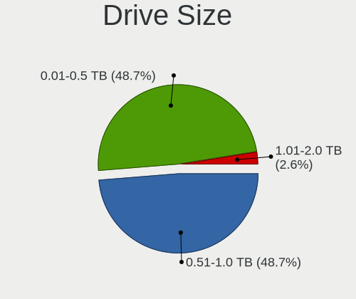

| Size in TB | Notebooks | Drives | Percent |
|------------|-----------|--------|---------|
| 0.51-1.0   | 19        | 22     | 48.72%  |
| 0.01-0.5   | 19        | 22     | 48.72%  |
| 1.01-2.0   | 1         | 1      | 2.56%   |

Space Total
-----------

Amount of disk space available on the file system

| Size in GB     | Notebooks | Percent |
|----------------|-----------|---------|
| 101-250        | 19        | 24.68%  |
| 501-1000       | 17        | 22.08%  |
| 251-500        | 15        | 19.48%  |
| 1001-2000      | 11        | 14.29%  |
| 51-100         | 5         | 6.49%   |
| More than 3000 | 3         | 3.9%    |
| 2001-3000      | 2         | 2.6%    |
| 1-20           | 2         | 2.6%    |
| Unknown        | 2         | 2.6%    |
| 21-50          | 1         | 1.3%    |

Space Used
----------

Amount of used disk space

| Used GB   | Notebooks | Percent |
|-----------|-----------|---------|
| 1-20      | 17        | 21.79%  |
| 21-50     | 14        | 17.95%  |
| 251-500   | 13        | 16.67%  |
| 101-250   | 11        | 14.1%   |
| 501-1000  | 11        | 14.1%   |
| 51-100    | 6         | 7.69%   |
| 1001-2000 | 3         | 3.85%   |
| Unknown   | 2         | 2.56%   |
| 2001-3000 | 1         | 1.28%   |

Malfunc. Drives
---------------

Drive models with a malfunction

| Model                                           | Notebooks | Drives | Percent |
|-------------------------------------------------|-----------|--------|---------|
| WDC WD10JPVX-75JC3T0 1TB                        | 1         | 1      | 11.11%  |
| Toshiba MQ02ABD100H 1TB                         | 1         | 1      | 11.11%  |
| SK hynix BC501 NVMe Solid State Drive 512GB     | 1         | 2      | 11.11%  |
| Samsung Electronics PM9A1 NVMe 2048GB           | 1         | 1      | 11.11%  |
| OCZ VERTEX4 256GB SSD                           | 1         | 1      | 11.11%  |
| Kingston Technology Company KC2000 NVMe SSD 1TB | 1         | 1      | 11.11%  |
| IBM/Hitachi IC25N040ATMR04-0 40GB               | 1         | 1      | 11.11%  |
| Hitachi HTS725050A9A364 500GB                   | 1         | 1      | 11.11%  |
| HGST HTS 541075A9E680 752GB                     | 1         | 1      | 11.11%  |

Malfunc. Drive Vendor
---------------------

Vendors of faulty drives

| Vendor                      | Notebooks | Drives | Percent |
|-----------------------------|-----------|--------|---------|
| WDC                         | 1         | 1      | 11.11%  |
| Toshiba                     | 1         | 1      | 11.11%  |
| SK hynix                    | 1         | 2      | 11.11%  |
| Samsung Electronics         | 1         | 1      | 11.11%  |
| OCZ                         | 1         | 1      | 11.11%  |
| Kingston Technology Company | 1         | 1      | 11.11%  |
| IBM/Hitachi                 | 1         | 1      | 11.11%  |
| Hitachi                     | 1         | 1      | 11.11%  |
| HGST HTS                    | 1         | 1      | 11.11%  |

Malfunc. HDD Vendor
-------------------

Vendors of faulty HDD drives

| Vendor      | Notebooks | Drives | Percent |
|-------------|-----------|--------|---------|
| WDC         | 1         | 1      | 20%     |
| Toshiba     | 1         | 1      | 20%     |
| IBM/Hitachi | 1         | 1      | 20%     |
| Hitachi     | 1         | 1      | 20%     |
| HGST HTS    | 1         | 1      | 20%     |

Malfunc. Drive Kind
-------------------

Kinds of faulty drives

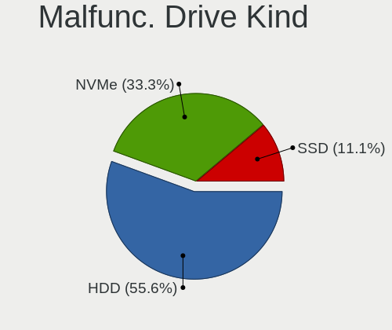

| Kind | Notebooks | Drives | Percent |
|------|-----------|--------|---------|
| HDD  | 5         | 5      | 55.56%  |
| NVMe | 3         | 4      | 33.33%  |
| SSD  | 1         | 1      | 11.11%  |

Failed Drives
-------------

Failed drive models

Zero info for selected period =(

Failed Drive Vendor
-------------------

Failed drive vendors

Zero info for selected period =(

Drive Status
------------

Number of failed and malfunc. drives

| Status   | Notebooks | Drives | Percent |
|----------|-----------|--------|---------|
| Works    | 65        | 100    | 81.25%  |
| Malfunc  | 8         | 10     | 10%     |
| Detected | 7         | 9      | 8.75%   |

Storage controller
------------------

Storage Vendor
--------------

Storage controller vendors

| Vendor                           | Notebooks | Percent |
|----------------------------------|-----------|---------|
| Intel                            | 44        | 41.9%   |
| Samsung Electronics              | 24        | 22.86%  |
| AMD                              | 8         | 7.62%   |
| Sandisk                          | 5         | 4.76%   |
| Phison Electronics               | 5         | 4.76%   |
| SK hynix                         | 4         | 3.81%   |
| Kingston Technology Company      | 4         | 3.81%   |
| Micron Technology                | 3         | 2.86%   |
| KIOXIA                           | 3         | 2.86%   |
| Yangtze Memory Technologies      | 1         | 0.95%   |
| Toshiba America Info Systems     | 1         | 0.95%   |
| Solid State Storage Technology   | 1         | 0.95%   |
| Silicon Motion                   | 1         | 0.95%   |
| Silicon Integrated Systems [SiS] | 1         | 0.95%   |

Storage Model
-------------

Storage controller models

| Model                                                                          | Notebooks | Percent |
|--------------------------------------------------------------------------------|-----------|---------|
| Samsung NVMe SSD Controller SM981/PM981/PM983                                  | 14        | 12.73%  |
| Samsung NVMe SSD Controller PM9A1/PM9A3/980PRO                                 | 7         | 6.36%   |
| AMD FCH SATA Controller [AHCI mode]                                            | 7         | 6.36%   |
| Intel 7 Series Chipset Family 6-port SATA Controller [AHCI mode]               | 5         | 4.55%   |
| Samsung NVMe SSD Controller 980                                                | 4         | 3.64%   |
| Intel Volume Management Device NVMe RAID Controller                            | 4         | 3.64%   |
| Intel Comet Lake SATA AHCI Controller                                          | 4         | 3.64%   |
| Intel SSD 660P Series                                                          | 3         | 2.73%   |
| Intel Cannon Lake Mobile PCH SATA AHCI Controller                              | 3         | 2.73%   |
| Intel 82801 Mobile SATA Controller [RAID mode]                                 | 3         | 2.73%   |
| Intel 8 Series/C220 Series Chipset Family 6-port SATA Controller 1 [AHCI mode] | 3         | 2.73%   |
| SK hynix Platinum P41/PC801 NVMe Solid State Drive                             | 2         | 1.82%   |
| SK hynix BC501 NVMe Solid State Drive                                          | 2         | 1.82%   |
| Phison E16 PCIe4 NVMe Controller                                               | 2         | 1.82%   |
| KIOXIA NVMe SSD Controller BG4 (DRAM-less)                                     | 2         | 1.82%   |
| Intel Sunrise Point-LP SATA Controller [AHCI mode]                             | 2         | 1.82%   |
| Intel SSD 670p Series [Keystone Harbor]                                        | 2         | 1.82%   |
| Intel HM170/QM170 Chipset SATA Controller [AHCI Mode]                          | 2         | 1.82%   |
| Intel 400 Series Chipset Family SATA AHCI Controller                           | 2         | 1.82%   |
| Yangtze Memory ZHITAI TiPro5000 NVMe SSD                                       | 1         | 0.91%   |
| Toshiba America Info Systems XG6 NVMe SSD Controller                           | 1         | 0.91%   |
| Solid State Storage CL1-3D256-Q11 NVMe SSD M.2                                 | 1         | 0.91%   |
| Silicon Motion SM2263EN/SM2263XT (DRAM-less) NVMe SSD Controllers              | 1         | 0.91%   |
| Silicon Integrated Systems [SiS] 5513 IDE Controller                           | 1         | 0.91%   |
| Sandisk Western Digital WD Black SN850X NVMe SSD                               | 1         | 0.91%   |
| SanDisk WD PC SN810 / Black SN850 NVMe SSD                                     | 1         | 0.91%   |
| SanDisk WD Blue SN550 NVMe SSD                                                 | 1         | 0.91%   |
| SanDisk WD Black SN750 / PC SN730 NVMe SSD                                     | 1         | 0.91%   |
| SanDisk PC SN520 NVMe SSD                                                      | 1         | 0.91%   |
| Samsung NVMe SSD Controller SM961/PM961/SM963                                  | 1         | 0.91%   |
| Phison PS5013 E13 NVMe Controller                                              | 1         | 0.91%   |
| Phison E18 PCIe4 NVMe Controller                                               | 1         | 0.91%   |
| Phison E12 NVMe Controller                                                     | 1         | 0.91%   |
| Micron 3400 NVMe SSD [Hendrix]                                                 | 1         | 0.91%   |
| Micron 2450 NVMe SSD [HendrixV] (DRAM-less)                                    | 1         | 0.91%   |
| Micron 2200S NVMe SSD [Cassandra]                                              | 1         | 0.91%   |
| KIOXIA NVMe SSD                                                                | 1         | 0.91%   |
| Kingston Company Company Non-Volatile memory controller                        | 1         | 0.91%   |
| Kingston Company OM8PCP Design-In PCIe 3 NVMe SSD (DRAM-less)                  | 1         | 0.91%   |
| Kingston Company KC2000/KC2500 NVMe SSD                                        | 1         | 0.91%   |

Storage Kind
------------

Kind of storage controller (IDE, SATA, NVMe, SAS, ...)

| Kind | Notebooks | Percent |
|------|-----------|---------|
| NVMe | 52        | 50.98%  |
| SATA | 40        | 39.22%  |
| RAID | 7         | 6.86%   |
| IDE  | 3         | 2.94%   |

Processor
---------

CPU Vendor
----------

Processor vendors

| Vendor | Notebooks | Percent |
|--------|-----------|---------|
| Intel  | 59        | 77.63%  |
| AMD    | 17        | 22.37%  |

CPU Model
---------

Processor models

| Model                                         | Notebooks | Percent |
|-----------------------------------------------|-----------|---------|
| Intel Core i7-8750H CPU @ 2.20GHz             | 4         | 5.26%   |
| Intel Core i5-10210U CPU @ 1.60GHz            | 3         | 3.95%   |
| Intel 12th Gen Core i7-12700H                 | 3         | 3.95%   |
| AMD Ryzen 7 5800H with Radeon Graphics        | 3         | 3.95%   |
| Intel Core i7-2670QM CPU @ 2.20GHz            | 2         | 2.63%   |
| Intel Core i7-10875H CPU @ 2.30GHz            | 2         | 2.63%   |
| Intel 12th Gen Core i7-1280P                  | 2         | 2.63%   |
| AMD Ryzen 7 4800H with Radeon Graphics        | 2         | 2.63%   |
| AMD Ryzen 7 3700U with Radeon Vega Mobile Gfx | 2         | 2.63%   |
| Intel Pentium Silver N5030 CPU @ 1.10GHz      | 1         | 1.32%   |
| Intel Pentium M processor 1600MHz             | 1         | 1.32%   |
| Intel Pentium CPU 5405U @ 2.30GHz             | 1         | 1.32%   |
| Intel Pentium 4 CPU 2.40GHz                   | 1         | 1.32%   |
| Intel Core i9-10885H CPU @ 2.40GHz            | 1         | 1.32%   |
| Intel Core i7-9750H CPU @ 2.60GHz             | 1         | 1.32%   |
| Intel Core i7-8565U CPU @ 1.80GHz             | 1         | 1.32%   |
| Intel Core i7-8550U CPU @ 1.80GHz             | 1         | 1.32%   |
| Intel Core i7-7920HQ CPU @ 3.10GHz            | 1         | 1.32%   |
| Intel Core i7-7820HQ CPU @ 2.90GHz            | 1         | 1.32%   |
| Intel Core i7-6700HQ CPU @ 2.60GHz            | 1         | 1.32%   |
| Intel Core i7-6600U CPU @ 2.60GHz             | 1         | 1.32%   |
| Intel Core i7-4710MQ CPU @ 2.50GHz            | 1         | 1.32%   |
| Intel Core i7-4700MQ CPU @ 2.40GHz            | 1         | 1.32%   |
| Intel Core i7-3820QM CPU @ 2.70GHz            | 1         | 1.32%   |
| Intel Core i7-10750H CPU @ 2.60GHz            | 1         | 1.32%   |
| Intel Core i7-1065G7 CPU @ 1.30GHz            | 1         | 1.32%   |
| Intel Core i7-10610U CPU @ 1.80GHz            | 1         | 1.32%   |
| Intel Core i7-10510U CPU @ 1.80GHz            | 1         | 1.32%   |
| Intel Core i5-8350U CPU @ 1.70GHz             | 1         | 1.32%   |
| Intel Core i5-7Y57 CPU @ 1.20GHz              | 1         | 1.32%   |
| Intel Core i5-7300U CPU @ 2.60GHz             | 1         | 1.32%   |
| Intel Core i5-7300HQ CPU @ 2.50GHz            | 1         | 1.32%   |
| Intel Core i5-6300U CPU @ 2.40GHz             | 1         | 1.32%   |
| Intel Core i5-5200U CPU @ 2.20GHz             | 1         | 1.32%   |
| Intel Core i5-4210H CPU @ 2.90GHz             | 1         | 1.32%   |
| Intel Core i5-3230M CPU @ 2.60GHz             | 1         | 1.32%   |
| Intel Core i5-3210M CPU @ 2.50GHz             | 1         | 1.32%   |
| Intel Core i5-2415M CPU @ 2.30GHz             | 1         | 1.32%   |
| Intel Core i5-1035G1 CPU @ 1.00GHz            | 1         | 1.32%   |
| Intel Core i5-10300H CPU @ 2.50GHz            | 1         | 1.32%   |

CPU Model Family
----------------

Processor model prefix

| Model                | Notebooks | Percent |
|----------------------|-----------|---------|
| Intel Core i7        | 22        | 28.95%  |
| Intel Core i5        | 15        | 19.74%  |
| Other                | 11        | 14.47%  |
| AMD Ryzen 7          | 10        | 13.16%  |
| Intel Core i3        | 3         | 3.95%   |
| AMD Ryzen 5          | 3         | 3.95%   |
| Intel Celeron        | 2         | 2.63%   |
| AMD Ryzen 7 PRO      | 2         | 2.63%   |
| Intel Pentium Silver | 1         | 1.32%   |
| Intel Pentium M      | 1         | 1.32%   |
| Intel Pentium 4      | 1         | 1.32%   |
| Intel Pentium        | 1         | 1.32%   |
| Intel Core i9        | 1         | 1.32%   |
| Intel Atom           | 1         | 1.32%   |
| AMD Ryzen 9          | 1         | 1.32%   |
| AMD Athlon II        | 1         | 1.32%   |

CPU Cores
---------

Number of processor cores

| Number | Notebooks | Percent |
|--------|-----------|---------|
| 4      | 26        | 34.21%  |
| 2      | 15        | 19.74%  |
| 8      | 13        | 17.11%  |
| 6      | 10        | 13.16%  |
| 14     | 5         | 6.58%   |
| 1      | 3         | 3.95%   |
| 12     | 2         | 2.63%   |
| 16     | 1         | 1.32%   |
| 10     | 1         | 1.32%   |

CPU Sockets
-----------

Number of sockets

| Number | Notebooks | Percent |
|--------|-----------|---------|
| 1      | 76        | 100%    |

CPU Threads
-----------

Threads per core (Hyper-Threading)

| Number | Notebooks | Percent |
|--------|-----------|---------|
| 2      | 68        | 89.47%  |
| 1      | 8         | 10.53%  |

CPU Op-Modes
------------

CPU Operation Modes (32-bit, 64-bit)

| Op mode        | Notebooks | Percent |
|----------------|-----------|---------|
| 32-bit, 64-bit | 74        | 97.37%  |
| 32-bit         | 2         | 2.63%   |

CPU Microcode
-------------

Microcode number

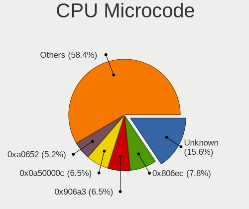

| Number     | Notebooks | Percent |
|------------|-----------|---------|
| Unknown    | 12        | 15.58%  |
| 0x806ec    | 6         | 7.79%   |
| 0x906a3    | 5         | 6.49%   |
| 0x0a50000c | 5         | 6.49%   |
| 0xa0652    | 4         | 5.19%   |
| 0x906ea    | 4         | 5.19%   |
| 0x906e9    | 3         | 3.9%    |
| 0x306a9    | 3         | 3.9%    |
| 0x206a7    | 3         | 3.9%    |
| 0x0a50000d | 3         | 3.9%    |
| 0x806ea    | 2         | 2.6%    |
| 0x806e9    | 2         | 2.6%    |
| 0x706e5    | 2         | 2.6%    |
| 0x406e3    | 2         | 2.6%    |
| 0x08600106 | 2         | 2.6%    |
| 0x08108109 | 2         | 2.6%    |
| 0xf29      | 1         | 1.3%    |
| 0x906c0    | 1         | 1.3%    |
| 0x906a4    | 1         | 1.3%    |
| 0x90672    | 1         | 1.3%    |
| 0x806eb    | 1         | 1.3%    |
| 0x806d1    | 1         | 1.3%    |
| 0x706a8    | 1         | 1.3%    |
| 0x695      | 1         | 1.3%    |
| 0x506e3    | 1         | 1.3%    |
| 0x306c3    | 1         | 1.3%    |
| 0x30678    | 1         | 1.3%    |
| 0x20655    | 1         | 1.3%    |
| 0x0a404102 | 1         | 1.3%    |
| 0x08608102 | 1         | 1.3%    |
| 0x08600104 | 1         | 1.3%    |
| 0x08108102 | 1         | 1.3%    |
| 0x010000c8 | 1         | 1.3%    |

CPU Microarch
-------------

Microarchitecture

| Name             | Notebooks | Percent |
|------------------|-----------|---------|
| KabyLake         | 20        | 26.32%  |
| Alderlake Hybrid | 8         | 10.53%  |
| Zen 3            | 7         | 9.21%   |
| CometLake        | 5         | 6.58%   |
| Zen 2            | 4         | 5.26%   |
| IceLake          | 4         | 5.26%   |
| Zen+             | 3         | 3.95%   |
| Skylake          | 3         | 3.95%   |
| SandyBridge      | 3         | 3.95%   |
| IvyBridge        | 3         | 3.95%   |
| Haswell          | 3         | 3.95%   |
| Unknown          | 3         | 3.95%   |
| Westmere         | 1         | 1.32%   |
| Tremont          | 1         | 1.32%   |
| TigerLake        | 1         | 1.32%   |
| Silvermont       | 1         | 1.32%   |
| P6               | 1         | 1.32%   |
| NetBurst         | 1         | 1.32%   |
| K10              | 1         | 1.32%   |
| Goldmont plus    | 1         | 1.32%   |
| Broadwell        | 1         | 1.32%   |
| Bonnell          | 1         | 1.32%   |

Graphics
--------

GPU Vendor
----------

Vendors of graphics cards

| Vendor | Notebooks | Percent |
|--------|-----------|---------|
| Intel  | 52        | 51.49%  |
| Nvidia | 28        | 27.72%  |
| AMD    | 21        | 20.79%  |

GPU Model
---------

Graphics card models

| Model                                                                     | Notebooks | Percent |
|---------------------------------------------------------------------------|-----------|---------|
| Intel Alder Lake-P Integrated Graphics Controller                         | 7         | 6.6%    |
| Intel CometLake-U GT2 [UHD Graphics]                                      | 6         | 5.66%   |
| Intel CometLake-H GT2 [UHD Graphics]                                      | 5         | 4.72%   |
| AMD Cezanne [Radeon Vega Series / Radeon Vega Mobile Series]              | 5         | 4.72%   |
| Intel CoffeeLake-H GT2 [UHD Graphics 630]                                 | 4         | 3.77%   |
| AMD Renoir                                                                | 4         | 3.77%   |
| Nvidia GA106M [GeForce RTX 3060 Mobile / Max-Q]                           | 3         | 2.83%   |
| Intel 4th Gen Core Processor Integrated Graphics Controller               | 3         | 2.83%   |
| Intel 2nd Generation Core Processor Family Integrated Graphics Controller | 3         | 2.83%   |
| AMD Picasso/Raven 2 [Radeon Vega Series / Radeon Vega Mobile Series]      | 3         | 2.83%   |
| Nvidia TU117M [GeForce GTX 1650 Mobile / Max-Q]                           | 2         | 1.89%   |
| Nvidia TU116M [GeForce GTX 1660 Ti Mobile]                                | 2         | 1.89%   |
| Nvidia GP104M [GeForce GTX 1070 Mobile]                                   | 2         | 1.89%   |
| Nvidia GA104M [Geforce RTX 3070 Ti Laptop GPU]                            | 2         | 1.89%   |
| Intel UHD Graphics 620                                                    | 2         | 1.89%   |
| Intel Skylake GT2 [HD Graphics 520]                                       | 2         | 1.89%   |
| Intel Iris Plus Graphics G1 (Ice Lake)                                    | 2         | 1.89%   |
| Intel HD Graphics 630                                                     | 2         | 1.89%   |
| Intel 3rd Gen Core processor Graphics Controller                          | 2         | 1.89%   |
| AMD Lexa [Radeon 540X/550X/630 / RX 640 / E9171 MCM]                      | 2         | 1.89%   |
| Nvidia TU117M                                                             | 1         | 0.94%   |
| Nvidia TU106M [GeForce RTX 2060 Max-Q]                                    | 1         | 0.94%   |
| Nvidia TU106 [GeForce RTX 2070]                                           | 1         | 0.94%   |
| Nvidia TU104M [GeForce RTX 2080 SUPER Mobile / Max-Q]                     | 1         | 0.94%   |
| Nvidia NV17M [GeForce4 420 Go]                                            | 1         | 0.94%   |
| Nvidia GP108M [GeForce MX330]                                             | 1         | 0.94%   |
| Nvidia GP108M [GeForce MX250]                                             | 1         | 0.94%   |
| Nvidia GP108M [GeForce MX150]                                             | 1         | 0.94%   |
| Nvidia GP107M [GeForce GTX 1050 Ti Mobile]                                | 1         | 0.94%   |
| Nvidia GP107M [GeForce GTX 1050 Mobile]                                   | 1         | 0.94%   |
| Nvidia GP106M [GeForce GTX 1060 Mobile]                                   | 1         | 0.94%   |
| Nvidia GP104GLM [Quadro P4000 Mobile]                                     | 1         | 0.94%   |
| Nvidia GM204M [GeForce GTX 970M]                                          | 1         | 0.94%   |
| Nvidia GM108M [GeForce 940MX]                                             | 1         | 0.94%   |
| Nvidia GM108M [GeForce 840M]                                              | 1         | 0.94%   |
| Nvidia GK106GLM [Quadro K2100M]                                           | 1         | 0.94%   |
| Nvidia GA104GLM [RTX A3000 12GB Laptop GPU]                               | 1         | 0.94%   |
| Intel WhiskeyLake-U GT2 [UHD Graphics 620]                                | 1         | 0.94%   |
| Intel Whiskey Lake-U GT1 [UHD Graphics 610]                               | 1         | 0.94%   |
| Intel TigerLake-LP GT2 [Iris Xe Graphics]                                 | 1         | 0.94%   |

GPU Combo
---------

Combinations of graphics cards

| Name           | Notebooks | Percent |
|----------------|-----------|---------|
| 1 x Intel      | 28        | 36.36%  |
| Intel + Nvidia | 22        | 28.57%  |
| 1 x AMD        | 13        | 16.88%  |
| 2 x AMD        | 5         | 6.49%   |
| 1 x Nvidia     | 5         | 6.49%   |
| Intel + AMD    | 2         | 2.6%    |
| 2 x Intel      | 1         | 1.3%    |
| AMD + Nvidia   | 1         | 1.3%    |

GPU Driver
----------

Free vs proprietary

| Driver      | Notebooks | Percent |
|-------------|-----------|---------|
| Free        | 55        | 72.37%  |
| Proprietary | 18        | 23.68%  |
| Unknown     | 3         | 3.95%   |

GPU Memory
----------

Total video memory

| Size in GB | Notebooks | Percent |
|------------|-----------|---------|
| Unknown    | 49        | 64.47%  |
| 0.01-0.5   | 8         | 10.53%  |
| 1.01-2.0   | 5         | 6.58%   |
| 0.51-1.0   | 5         | 6.58%   |
| 7.01-8.0   | 3         | 3.95%   |
| 3.01-4.0   | 3         | 3.95%   |
| 5.01-6.0   | 1         | 1.32%   |
| 2.01-3.0   | 1         | 1.32%   |
| 8.01-16.0  | 1         | 1.32%   |

Monitor
-------

Monitor Vendor
--------------

Monitor vendors

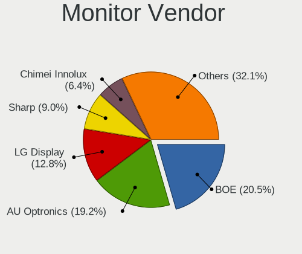

| Vendor              | Notebooks | Percent |
|---------------------|-----------|---------|
| BOE                 | 16        | 20.51%  |
| AU Optronics        | 15        | 19.23%  |
| LG Display          | 10        | 12.82%  |
| Sharp               | 7         | 8.97%   |
| Chimei Innolux      | 5         | 6.41%   |
| Samsung Electronics | 4         | 5.13%   |
| Apple               | 3         | 3.85%   |
| PANDA               | 2         | 2.56%   |
| Hewlett-Packard     | 2         | 2.56%   |
| Goldstar            | 2         | 2.56%   |
| CSO                 | 2         | 2.56%   |
| Viotek              | 1         | 1.28%   |
| Philips             | 1         | 1.28%   |
| Panasonic           | 1         | 1.28%   |
| MSI                 | 1         | 1.28%   |
| InnoLux Display     | 1         | 1.28%   |
| InfoVision          | 1         | 1.28%   |
| HannStar            | 1         | 1.28%   |
| ELSA                | 1         | 1.28%   |
| Dell                | 1         | 1.28%   |
| Unknown             | 1         | 1.28%   |

Monitor Model
-------------

Monitor models

| Model                                                                  | Notebooks | Percent |
|------------------------------------------------------------------------|-----------|---------|
| Samsung Electronics S27B350 SAM08DC 1920x1080 598x336mm 27.0-inch      | 2         | 2.56%   |
| AU Optronics LCD Monitor AUO80ED 1920x1080 344x193mm 15.5-inch         | 2         | 2.56%   |
| AU Optronics LCD Monitor AUO243D 1920x1080 309x173mm 13.9-inch         | 2         | 2.56%   |
| AU Optronics LCD Monitor AUO109D 1920x1080 381x214mm 17.2-inch         | 2         | 2.56%   |
| Viotek GN34CW VTK3400 3440x1440 795x334mm 33.9-inch                    | 1         | 1.28%   |
| Sharp LQ173M1JW03 SHP14DC 1920x1080 382x215mm 17.3-inch                | 1         | 1.28%   |
| Sharp LQ156M1JW01 SHP14C3 1920x1080 344x194mm 15.5-inch                | 1         | 1.28%   |
| Sharp LQ123P1JX32 SHP148A 2400x1600 259x173mm 12.3-inch                | 1         | 1.28%   |
| Sharp LCD Monitor SHP1551 3840x2400 288x180mm 13.4-inch                | 1         | 1.28%   |
| Sharp LCD Monitor SHP14D6 3840x2400 366x229mm 17.0-inch                | 1         | 1.28%   |
| Sharp LCD Monitor SHP148D 3840x2160 344x194mm 15.5-inch                | 1         | 1.28%   |
| Sharp LCD Monitor SHP1453 1920x1080 346x194mm 15.6-inch                | 1         | 1.28%   |
| Samsung Electronics Odyssey G40B SAM727A 1920x1080 597x336mm 27.0-inch | 1         | 1.28%   |
| Samsung Electronics LCD Monitor SDC4163 3456x2160 288x180mm 13.4-inch  | 1         | 1.28%   |
| Philips PHL19PFL3405 PHLD071 1360x768 410x230mm 18.5-inch              | 1         | 1.28%   |
| PANDA LCD Monitor NCP0035 1920x1080 309x174mm 14.0-inch                | 1         | 1.28%   |
| PANDA LCD Monitor NCP002D 1920x1080 344x194mm 15.5-inch                | 1         | 1.28%   |
| Panasonic LCD Monitor MEI96A2 2560x1440 309x173mm 13.9-inch            | 1         | 1.28%   |
| MSI MAG274QRF-QD MSI3CA8 2560x1440 597x336mm 27.0-inch                 | 1         | 1.28%   |
| LG Display LCD Monitor LGD06FF 1920x1080 344x194mm 15.5-inch           | 1         | 1.28%   |
| LG Display LCD Monitor LGD0657 1920x1080 344x194mm 15.5-inch           | 1         | 1.28%   |
| LG Display LCD Monitor LGD0609 1920x1080 309x174mm 14.0-inch           | 1         | 1.28%   |
| LG Display LCD Monitor LGD05EC 1920x1080 309x174mm 14.0-inch           | 1         | 1.28%   |
| LG Display LCD Monitor LGD05E5 1920x1080 344x194mm 15.5-inch           | 1         | 1.28%   |
| LG Display LCD Monitor LGD0521 1920x1080 309x174mm 14.0-inch           | 1         | 1.28%   |
| LG Display LCD Monitor LGD048A 1920x1080 276x156mm 12.5-inch           | 1         | 1.28%   |
| LG Display LCD Monitor LGD045C 1366x768 345x194mm 15.6-inch            | 1         | 1.28%   |
| LG Display LCD Monitor LGD02DA 1920x1080 382x215mm 17.3-inch           | 1         | 1.28%   |
| LG Display LCD Monitor LGD0258 1600x900 345x194mm 15.6-inch            | 1         | 1.28%   |
| InnoLux Display BT156GW01 INL0007 1366x768 344x194mm 15.5-inch         | 1         | 1.28%   |
| InfoVision LCD Monitor IVO8C78 1920x1080 309x174mm 14.0-inch           | 1         | 1.28%   |
| Hewlett-Packard 22m HPN3575 1920x1080 476x268mm 21.5-inch              | 1         | 1.28%   |
| Hewlett-Packard 22es HWP331B 1920x1080 476x268mm 21.5-inch             | 1         | 1.28%   |
| HannStar LCD Monitor HSD03E9 1024x600 220x129mm 10.0-inch              | 1         | 1.28%   |
| Goldstar L227W GSM566E 1680x1050 474x296mm 22.0-inch                   | 1         | 1.28%   |
| Goldstar HDR WQHD GSM772E 3440x1440 800x335mm 34.1-inch                | 1         | 1.28%   |
| ELSA EL271Q ELS0270 1920x1080 597x336mm 27.0-inch                      | 1         | 1.28%   |
| Dell S2421NX DEL41FB 1920x1080 527x296mm 23.8-inch                     | 1         | 1.28%   |
| CSO LCD Monitor CSO1600 2560x1600 345x215mm 16.0-inch                  | 1         | 1.28%   |
| CSO LCD Monitor CSO140C 2880x1800 302x188mm 14.0-inch                  | 1         | 1.28%   |

Monitor Resolution
------------------

Monitor screen resolution

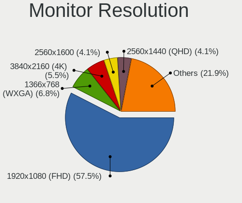

| Resolution         | Notebooks | Percent |
|--------------------|-----------|---------|
| 1920x1080 (FHD)    | 42        | 57.53%  |
| 1366x768 (WXGA)    | 5         | 6.85%   |
| 2560x1440 (QHD)    | 4         | 5.48%   |
| 3840x2160 (4K)     | 3         | 4.11%   |
| 2560x1600          | 3         | 4.11%   |
| 3840x2400          | 2         | 2.74%   |
| 1920x1200 (WUXGA)  | 2         | 2.74%   |
| 1680x1050 (WSXGA+) | 2         | 2.74%   |
| 3456x2160          | 1         | 1.37%   |
| 3440x1440          | 1         | 1.37%   |
| 2880x1800          | 1         | 1.37%   |
| 2400x1600          | 1         | 1.37%   |
| 2240x1400          | 1         | 1.37%   |
| 2160x1440          | 1         | 1.37%   |
| 1600x900 (HD+)     | 1         | 1.37%   |
| 1360x768           | 1         | 1.37%   |
| 1280x800 (WXGA)    | 1         | 1.37%   |
| 1024x600           | 1         | 1.37%   |

Monitor Diagonal
----------------

Diagonal size in inches

| Inches  | Notebooks | Percent |
|---------|-----------|---------|
| 15      | 28        | 35.9%   |
| 14      | 13        | 16.67%  |
| 17      | 9         | 11.54%  |
| 13      | 8         | 10.26%  |
| 27      | 5         | 6.41%   |
| 16      | 3         | 3.85%   |
| 34      | 2         | 2.56%   |
| 21      | 2         | 2.56%   |
| 12      | 2         | 2.56%   |
| 24      | 1         | 1.28%   |
| 23      | 1         | 1.28%   |
| 22      | 1         | 1.28%   |
| 11      | 1         | 1.28%   |
| 10      | 1         | 1.28%   |
| Unknown | 1         | 1.28%   |

Monitor Width
-------------

Physical width

| Width in mm | Notebooks | Percent |
|-------------|-----------|---------|
| 301-350     | 46        | 58.97%  |
| 201-300     | 10        | 12.82%  |
| 351-400     | 9         | 11.54%  |
| 501-600     | 6         | 7.69%   |
| 401-500     | 4         | 5.13%   |
| 701-800     | 2         | 2.56%   |
| Unknown     | 1         | 1.28%   |

Aspect Ratio
------------

Proportional relationship between the width and the height

| Ratio   | Notebooks | Percent |
|---------|-----------|---------|
| 16/9    | 54        | 75%     |
| 16/10   | 13        | 18.06%  |
| 3/2     | 2         | 2.78%   |
| 21/9    | 2         | 2.78%   |
| Unknown | 1         | 1.39%   |

Monitor Area
------------

Area in inch²

| Area in inch² | Notebooks | Percent |
|----------------|-----------|---------|
| 101-110        | 28        | 35.9%   |
| 81-90          | 16        | 20.51%  |
| 121-130        | 8         | 10.26%  |
| 71-80          | 5         | 6.41%   |
| 301-350        | 5         | 6.41%   |
| 201-250        | 4         | 5.13%   |
| 111-120        | 3         | 3.85%   |
| 61-70          | 2         | 2.56%   |
| 351-500        | 2         | 2.56%   |
| 51-60          | 1         | 1.28%   |
| 41-50          | 1         | 1.28%   |
| 151-200        | 1         | 1.28%   |
| 131-140        | 1         | 1.28%   |
| Unknown        | 1         | 1.28%   |

Pixel Density
-------------

Pixels per inch

| Density       | Notebooks | Percent |
|---------------|-----------|---------|
| 121-160       | 41        | 52.56%  |
| 161-240       | 11        | 14.1%   |
| 101-120       | 10        | 12.82%  |
| 51-100        | 9         | 11.54%  |
| More than 240 | 6         | 7.69%   |
| Unknown       | 1         | 1.28%   |

Multiple Monitors
-----------------

Total monitors connected

| Total | Notebooks | Percent |
|-------|-----------|---------|
| 1     | 62        | 80.52%  |
| 2     | 9         | 11.69%  |
| 0     | 5         | 6.49%   |
| 3     | 1         | 1.3%    |

Network
-------

Net Controller Vendor
---------------------

Controller vendors

| Vendor                                | Notebooks | Percent |
|---------------------------------------|-----------|---------|
| Intel                                 | 54        | 46.55%  |
| Realtek Semiconductor                 | 40        | 34.48%  |
| Qualcomm Atheros                      | 6         | 5.17%   |
| Broadcom                              | 6         | 5.17%   |
| MediaTek                              | 4         | 3.45%   |
| Qualcomm                              | 2         | 1.72%   |
| Silicon Integrated Systems [SiS]      | 1         | 0.86%   |
| Fibocom                               | 1         | 0.86%   |
| Cisco Aironet Wireless Communications | 1         | 0.86%   |
| AVM                                   | 1         | 0.86%   |

Net Controller Model
--------------------

Controller models

| Model                                                             | Notebooks | Percent |
|-------------------------------------------------------------------|-----------|---------|
| Realtek RTL8111/8168/8411 PCI Express Gigabit Ethernet Controller | 27        | 19.29%  |
| Intel Alder Lake-P PCH CNVi WiFi                                  | 7         | 5%      |
| Realtek RTL8153 Gigabit Ethernet Adapter                          | 6         | 4.29%   |
| Intel Comet Lake PCH-LP CNVi WiFi                                 | 6         | 4.29%   |
| Intel Wi-Fi 6 AX200                                               | 5         | 3.57%   |
| Realtek RTL8821CE 802.11ac PCIe Wireless Network Adapter          | 4         | 2.86%   |
| MediaTek MT7921 802.11ax PCI Express Wireless Network Adapter     | 4         | 2.86%   |
| Intel Wireless 8265 / 8275                                        | 4         | 2.86%   |
| Intel Comet Lake PCH CNVi WiFi                                    | 4         | 2.86%   |
| Intel Cannon Lake PCH CNVi WiFi                                   | 4         | 2.86%   |
| Realtek RTL8822CE 802.11ac PCIe Wireless Network Adapter          | 3         | 2.14%   |
| Intel Wireless 7265                                               | 3         | 2.14%   |
| Intel Wireless 7260                                               | 3         | 2.14%   |
| Intel Centrino Advanced-N 6235                                    | 3         | 2.14%   |
| Broadcom BCM4331 802.11a/b/g/n                                    | 3         | 2.14%   |
| Realtek RTL810xE PCI Express Fast Ethernet controller             | 2         | 1.43%   |
| Qualcomm Atheros Killer E2500 Gigabit Ethernet Controller         | 2         | 1.43%   |
| Qualcomm Atheros Killer E220x Gigabit Ethernet Controller         | 2         | 1.43%   |
| Intel Wireless 8260                                               | 2         | 1.43%   |
| Intel Wireless 3160                                               | 2         | 1.43%   |
| Intel Wi-Fi 6 AX210/AX211/AX411 160MHz                            | 2         | 1.43%   |
| Intel Ethernet Connection I219-LM                                 | 2         | 1.43%   |
| Intel Ethernet Connection (5) I219-LM                             | 2         | 1.43%   |
| Intel Ethernet Connection (4) I219-LM                             | 2         | 1.43%   |
| Broadcom NetXtreme BCM57765 Gigabit Ethernet PCIe                 | 2         | 1.43%   |
| Broadcom BCM4313 802.11bgn Wireless Network Adapter               | 2         | 1.43%   |
| Silicon Integrated Systems [SiS] SiS900 PCI Fast Ethernet         | 1         | 0.71%   |
| Silicon Integrated Systems [SiS] AC'97 Modem Controller           | 1         | 0.71%   |
| Realtek RTL8852AE 802.11ax PCIe Wireless Network Adapter          | 1         | 0.71%   |
| Realtek RTL8152 Fast Ethernet Adapter                             | 1         | 0.71%   |
| Realtek Killer E2600 Gigabit Ethernet Controller                  | 1         | 0.71%   |
| Qualcomm QCNFA765 Wireless Network Adapter                        | 1         | 0.71%   |
| Qualcomm QCA6390 Wireless Network Adapter                         | 1         | 0.71%   |
| Qualcomm Atheros QCA9377 802.11ac Wireless Network Adapter        | 1         | 0.71%   |
| Qualcomm Atheros AR8131 Gigabit Ethernet                          | 1         | 0.71%   |
| Intel Wireless 3165                                               | 1         | 0.71%   |
| Intel Wi-Fi 6 AX201 160MHz                                        | 1         | 0.71%   |
| Intel Tiger Lake PCH CNVi WiFi                                    | 1         | 0.71%   |
| Intel Ice Lake-LP PCH CNVi WiFi                                   | 1         | 0.71%   |
| Intel I210 Gigabit Network Connection                             | 1         | 0.71%   |

Wireless Vendor
---------------

Wireless vendors

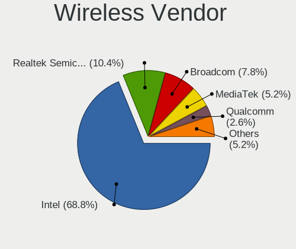

| Vendor                                | Notebooks | Percent |
|---------------------------------------|-----------|---------|
| Intel                                 | 53        | 68.83%  |
| Realtek Semiconductor                 | 8         | 10.39%  |
| Broadcom                              | 6         | 7.79%   |
| MediaTek                              | 4         | 5.19%   |
| Qualcomm                              | 2         | 2.6%    |
| Qualcomm Atheros                      | 1         | 1.3%    |
| Fibocom                               | 1         | 1.3%    |
| Cisco Aironet Wireless Communications | 1         | 1.3%    |
| AVM                                   | 1         | 1.3%    |

Wireless Model
--------------

Wireless models

| Model                                                         | Notebooks | Percent |
|---------------------------------------------------------------|-----------|---------|
| Intel Alder Lake-P PCH CNVi WiFi                              | 7         | 9.09%   |
| Intel Comet Lake PCH-LP CNVi WiFi                             | 6         | 7.79%   |
| Intel Wi-Fi 6 AX200                                           | 5         | 6.49%   |
| Realtek RTL8821CE 802.11ac PCIe Wireless Network Adapter      | 4         | 5.19%   |
| MediaTek MT7921 802.11ax PCI Express Wireless Network Adapter | 4         | 5.19%   |
| Intel Wireless 8265 / 8275                                    | 4         | 5.19%   |
| Intel Comet Lake PCH CNVi WiFi                                | 4         | 5.19%   |
| Intel Cannon Lake PCH CNVi WiFi                               | 4         | 5.19%   |
| Realtek RTL8822CE 802.11ac PCIe Wireless Network Adapter      | 3         | 3.9%    |
| Intel Wireless 7265                                           | 3         | 3.9%    |
| Intel Wireless 7260                                           | 3         | 3.9%    |
| Intel Centrino Advanced-N 6235                                | 3         | 3.9%    |
| Broadcom BCM4331 802.11a/b/g/n                                | 3         | 3.9%    |
| Intel Wireless 8260                                           | 2         | 2.6%    |
| Intel Wireless 3160                                           | 2         | 2.6%    |
| Intel Wi-Fi 6 AX210/AX211/AX411 160MHz                        | 2         | 2.6%    |
| Broadcom BCM4313 802.11bgn Wireless Network Adapter           | 2         | 2.6%    |
| Realtek RTL8852AE 802.11ax PCIe Wireless Network Adapter      | 1         | 1.3%    |
| Qualcomm QCNFA765 Wireless Network Adapter                    | 1         | 1.3%    |
| Qualcomm QCA6390 Wireless Network Adapter                     | 1         | 1.3%    |
| Qualcomm Atheros QCA9377 802.11ac Wireless Network Adapter    | 1         | 1.3%    |
| Intel Wireless 3165                                           | 1         | 1.3%    |
| Intel Wi-Fi 6 AX201 160MHz                                    | 1         | 1.3%    |
| Intel Tiger Lake PCH CNVi WiFi                                | 1         | 1.3%    |
| Intel Ice Lake-LP PCH CNVi WiFi                               | 1         | 1.3%    |
| Intel Gemini Lake PCH CNVi WiFi                               | 1         | 1.3%    |
| Intel Centrino Advanced-N 6205 [Taylor Peak]                  | 1         | 1.3%    |
| Intel Cannon Point-LP CNVi [Wireless-AC]                      | 1         | 1.3%    |
| Intel Alder Lake-S PCH CNVi WiFi                              | 1         | 1.3%    |
| Fibocom L830-EB-00 LTE WWAN Modem                             | 1         | 1.3%    |
| Cisco Aironet Wireless Cisco Aironet Wireless 802.11b         | 1         | 1.3%    |
| Broadcom BCM4306 802.11bg Wireless Network Controller         | 1         | 1.3%    |
| AVM Fritz!WLAN N [Atheros AR9001U]                            | 1         | 1.3%    |

Ethernet Vendor
---------------

Ethernet vendors

| Vendor                           | Notebooks | Percent |
|----------------------------------|-----------|---------|
| Realtek Semiconductor            | 36        | 60%     |
| Intel                            | 15        | 25%     |
| Qualcomm Atheros                 | 5         | 8.33%   |
| Broadcom                         | 3         | 5%      |
| Silicon Integrated Systems [SiS] | 1         | 1.67%   |

Ethernet Model
--------------

Ethernet models

| Model                                                             | Notebooks | Percent |
|-------------------------------------------------------------------|-----------|---------|
| Realtek RTL8111/8168/8411 PCI Express Gigabit Ethernet Controller | 27        | 44.26%  |
| Realtek RTL8153 Gigabit Ethernet Adapter                          | 6         | 9.84%   |
| Realtek RTL810xE PCI Express Fast Ethernet controller             | 2         | 3.28%   |
| Qualcomm Atheros Killer E2500 Gigabit Ethernet Controller         | 2         | 3.28%   |
| Qualcomm Atheros Killer E220x Gigabit Ethernet Controller         | 2         | 3.28%   |
| Intel Ethernet Connection I219-LM                                 | 2         | 3.28%   |
| Intel Ethernet Connection (5) I219-LM                             | 2         | 3.28%   |
| Intel Ethernet Connection (4) I219-LM                             | 2         | 3.28%   |
| Broadcom NetXtreme BCM57765 Gigabit Ethernet PCIe                 | 2         | 3.28%   |
| Silicon Integrated Systems [SiS] SiS900 PCI Fast Ethernet         | 1         | 1.64%   |
| Realtek RTL8152 Fast Ethernet Adapter                             | 1         | 1.64%   |
| Realtek Killer E2600 Gigabit Ethernet Controller                  | 1         | 1.64%   |
| Qualcomm Atheros AR8131 Gigabit Ethernet                          | 1         | 1.64%   |
| Intel I210 Gigabit Network Connection                             | 1         | 1.64%   |
| Intel Ethernet Connection I217-LM                                 | 1         | 1.64%   |
| Intel Ethernet Connection (17) I219-LM                            | 1         | 1.64%   |
| Intel Ethernet Connection (16) I219-LM                            | 1         | 1.64%   |
| Intel Ethernet Connection (14) I219-V                             | 1         | 1.64%   |
| Intel Ethernet Connection (10) I219-V                             | 1         | 1.64%   |
| Intel Ethernet Connection (10) I219-LM                            | 1         | 1.64%   |
| Intel 82579V Gigabit Network Connection                           | 1         | 1.64%   |
| Intel 82540EP Gigabit Ethernet Controller (Mobile)                | 1         | 1.64%   |
| Broadcom NetXtreme BCM57786 Gigabit Ethernet PCIe                 | 1         | 1.64%   |

Net Controller Kind
-------------------

Ethernet, WiFi or modem

| Kind     | Notebooks | Percent |
|----------|-----------|---------|
| WiFi     | 74        | 54.81%  |
| Ethernet | 59        | 43.7%   |
| Modem    | 2         | 1.48%   |

Used Controller
---------------

Currently used network controller

| Kind     | Notebooks | Percent |
|----------|-----------|---------|
| WiFi     | 62        | 75.61%  |
| Ethernet | 20        | 24.39%  |

NICs
----

Total network controllers on board

| Total | Notebooks | Percent |
|-------|-----------|---------|
| 2     | 49        | 64.47%  |
| 1     | 25        | 32.89%  |
| 3     | 2         | 2.63%   |

IPv6
----

IPv6 vs IPv4

| Used | Notebooks | Percent |
|------|-----------|---------|
| No   | 58        | 76.32%  |
| Yes  | 18        | 23.68%  |

Bluetooth
---------

Bluetooth Vendor
----------------

Controller vendors

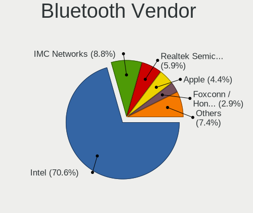

| Vendor                | Notebooks | Percent |
|-----------------------|-----------|---------|
| Intel                 | 48        | 70.59%  |
| IMC Networks          | 6         | 8.82%   |
| Realtek Semiconductor | 4         | 5.88%   |
| Apple                 | 3         | 4.41%   |
| Foxconn / Hon Hai     | 2         | 2.94%   |
| USI                   | 1         | 1.47%   |
| Realtek               | 1         | 1.47%   |
| Lite-On Technology    | 1         | 1.47%   |
| Dell                  | 1         | 1.47%   |
| Broadcom              | 1         | 1.47%   |

Bluetooth Model
---------------

Controller models

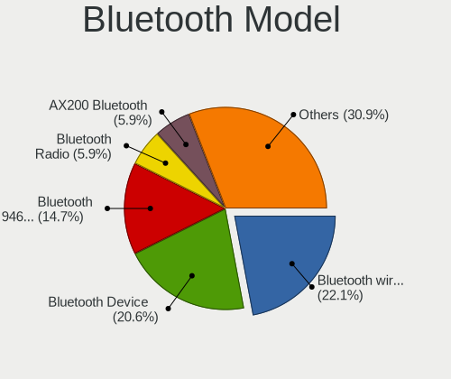

| Model                                          | Notebooks | Percent |
|------------------------------------------------|-----------|---------|
| Intel Bluetooth wireless interface             | 15        | 22.06%  |
| Intel Bluetooth 9460/9560 Jefferson Peak (JfP) | 10        | 14.71%  |
| Intel AX201 Bluetooth                          | 9         | 13.24%  |
| Intel Bluetooth Device                         | 5         | 7.35%   |
| Realtek Bluetooth Radio                        | 4         | 5.88%   |
| Intel AX200 Bluetooth                          | 4         | 5.88%   |
| Intel Centrino Bluetooth Wireless Transceiver  | 3         | 4.41%   |
| IMC Networks Bluetooth Radio                   | 3         | 4.41%   |
| Intel AX210 Bluetooth                          | 2         | 2.94%   |
| IMC Networks Wireless_Device                   | 2         | 2.94%   |
| Foxconn / Hon Hai MediaTek Bluetooth Adapter   | 2         | 2.94%   |
| Apple Bluetooth Host Controller                | 2         | 2.94%   |
| USI Bluetooth Device                           | 1         | 1.47%   |
| Realtek 802.11ac WLAN Adapter                  | 1         | 1.47%   |
| Lite-On Wireless_Device                        | 1         | 1.47%   |
| IMC Networks Bluetooth module                  | 1         | 1.47%   |
| Dell Wireless 365 Bluetooth                    | 1         | 1.47%   |
| Broadcom HP Portable SoftSailing               | 1         | 1.47%   |
| Apple Bluetooth USB Host Controller            | 1         | 1.47%   |

Sound
-----

Sound Vendor
------------

Sound card vendors

| Vendor                               | Notebooks | Percent |
|--------------------------------------|-----------|---------|
| Intel                                | 57        | 54.29%  |
| Nvidia                               | 21        | 20%     |
| AMD                                  | 18        | 17.14%  |
| Thesycon Systemsoftware & Consulting | 1         | 0.95%   |
| Silicon Integrated Systems [SiS]     | 1         | 0.95%   |
| Sennheiser Communications            | 1         | 0.95%   |
| No brand                             | 1         | 0.95%   |
| Lenovo                               | 1         | 0.95%   |
| Hewlett-Packard                      | 1         | 0.95%   |
| EGO SYStems                          | 1         | 0.95%   |
| Corsair                              | 1         | 0.95%   |
| Audio-Technica                       | 1         | 0.95%   |

Sound Model
-----------

Sound card models

| Model                                                                      | Notebooks | Percent |
|----------------------------------------------------------------------------|-----------|---------|
| AMD Family 17h/19h HD Audio Controller                                     | 14        | 11.11%  |
| AMD Renoir Radeon High Definition Audio Controller                         | 10        | 7.94%   |
| Intel Alder Lake PCH-P High Definition Audio Controller                    | 7         | 5.56%   |
| Intel Sunrise Point-LP HD Audio                                            | 6         | 4.76%   |
| Intel Comet Lake PCH-LP cAVS                                               | 6         | 4.76%   |
| Intel Comet Lake PCH cAVS                                                  | 5         | 3.97%   |
| Intel Cannon Lake PCH cAVS                                                 | 5         | 3.97%   |
| Intel 7 Series/C216 Chipset Family High Definition Audio Controller        | 5         | 3.97%   |
| Nvidia TU107 GeForce GTX 1650 High Definition Audio Controller             | 3         | 2.38%   |
| Nvidia GP104 High Definition Audio Controller                              | 3         | 2.38%   |
| Nvidia GA106 High Definition Audio Controller                              | 3         | 2.38%   |
| Nvidia GA104 High Definition Audio Controller                              | 3         | 2.38%   |
| Intel Xeon E3-1200 v3/4th Gen Core Processor HD Audio Controller           | 3         | 2.38%   |
| Intel Ice Lake-LP Smart Sound Technology Audio Controller                  | 3         | 2.38%   |
| Intel CM238 HD Audio Controller                                            | 3         | 2.38%   |
| Intel 8 Series/C220 Series Chipset High Definition Audio Controller        | 3         | 2.38%   |
| Nvidia TU116 High Definition Audio Controller                              | 2         | 1.59%   |
| Nvidia TU106 High Definition Audio Controller                              | 2         | 1.59%   |
| Intel Cannon Point-LP High Definition Audio Controller                     | 2         | 1.59%   |
| AMD Raven/Raven2/Fenghuang HDMI/DP Audio Controller                        | 2         | 1.59%   |
| AMD Navi 21/23 HDMI/DP Audio Controller                                    | 2         | 1.59%   |
| AMD Navi 10 HDMI Audio                                                     | 2         | 1.59%   |
| Thesycon Systemsoftware & Consulting D10                                   | 1         | 0.79%   |
| Silicon Integrated Systems [SiS] SiS7012 AC'97 Sound Controller            | 1         | 0.79%   |
| Sennheiser Communications SC60 for Lync                                    | 1         | 0.79%   |
| Nvidia TU104 HD Audio Controller                                           | 1         | 0.79%   |
| Nvidia GP107GL High Definition Audio Controller                            | 1         | 0.79%   |
| Nvidia GP106 High Definition Audio Controller                              | 1         | 0.79%   |
| Nvidia GM204 High Definition Audio Controller                              | 1         | 0.79%   |
| Nvidia GK106 HDMI Audio Controller                                         | 1         | 0.79%   |
| No brand CalDigit Thunderbolt 3 Audio                                      | 1         | 0.79%   |
| Lenovo ThinkPad Dock USB Audio                                             | 1         | 0.79%   |
| Intel Wildcat Point-LP High Definition Audio Controller                    | 1         | 0.79%   |
| Intel Tiger Lake-LP Smart Sound Technology Audio Controller                | 1         | 0.79%   |
| Intel Tiger Lake-H HD Audio Controller                                     | 1         | 0.79%   |
| Intel NM10/ICH7 Family High Definition Audio Controller                    | 1         | 0.79%   |
| Intel Jasper Lake HD Audio                                                 | 1         | 0.79%   |
| Intel Celeron/Pentium Silver Processor High Definition Audio               | 1         | 0.79%   |
| Intel Broadwell-U Audio Controller                                         | 1         | 0.79%   |
| Intel Atom Processor Z36xxx/Z37xxx Series High Definition Audio Controller | 1         | 0.79%   |

Memory
------

Memory Vendor
-------------

Memory module vendors

| Vendor              | Notebooks | Percent |
|---------------------|-----------|---------|
| Samsung Electronics | 25        | 30.12%  |
| SK hynix            | 17        | 20.48%  |
| Micron Technology   | 10        | 12.05%  |
| Kingston            | 10        | 12.05%  |
| Unknown             | 3         | 3.61%   |
| Crucial             | 3         | 3.61%   |
| Timetec             | 2         | 2.41%   |
| Corsair             | 2         | 2.41%   |
| A-DATA Technology   | 2         | 2.41%   |
| Unknown             | 2         | 2.41%   |
| Unknown (ABCD)      | 1         | 1.2%    |
| Transcend           | 1         | 1.2%    |
| Team                | 1         | 1.2%    |
| Nanya Technology    | 1         | 1.2%    |
| Elpida              | 1         | 1.2%    |
| Apacer              | 1         | 1.2%    |
| AMD                 | 1         | 1.2%    |

Memory Model
------------

Memory module models

| Model                                                            | Notebooks | Percent |
|------------------------------------------------------------------|-----------|---------|
| SK hynix RAM HMA82GS6CJR8N-VK 16GB SODIMM DDR4 2667MT/s          | 2         | 2.38%   |
| SK hynix RAM HMA81GS6DJR8N-XN 8GB SODIMM DDR4 3200MT/s           | 2         | 2.38%   |
| SK hynix RAM HMA81GS6AFR8N-UH 8GB SODIMM DDR4 2667MT/s           | 2         | 2.38%   |
| Samsung RAM M471A5244CB0-CTD 4GB SODIMM DDR4 3266MT/s            | 2         | 2.38%   |
| Samsung RAM M471A2K43CB1-CTD 16GB SODIMM DDR4 8400MT/s           | 2         | 2.38%   |
| Unknown                                                          | 2         | 2.38%   |
| Unknown RAM Module 2GB SODIMM 667MT/s                            | 1         | 1.19%   |
| Unknown RAM Module 256MB SODIMM DDR 133MT/s                      | 1         | 1.19%   |
| Unknown RAM Module 1GB SODIMM DDR                                | 1         | 1.19%   |
| Unknown (ABCD) RAM 123456789012345678 2GB SODIMM LPDDR4 2400MT/s | 1         | 1.19%   |
| Transcend RAM Module 4GB SODIMM DDR3 1333MT/s                    | 1         | 1.19%   |
| Timetec RAM SD4-3200 16GB SODIMM DDR4 3200MT/s                   | 1         | 1.19%   |
| Timetec RAM SD4-2400 8GB SODIMM DDR4 2400MT/s                    | 1         | 1.19%   |
| Team RAM TEAMGROUP-SD4-2666 16GB SODIMM DDR4 2667MT/s            | 1         | 1.19%   |
| SK hynix RAM Module 4GB Row Of Chips LPDDR4 3733MT/s             | 1         | 1.19%   |
| SK hynix RAM HMT41GS6AFR8A-PB 8192MB SODIMM DDR3 1600MT/s        | 1         | 1.19%   |
| SK hynix RAM HMT351S6CFR8C-PB 4GB SODIMM DDR3 1600MT/s           | 1         | 1.19%   |
| SK hynix RAM HMCG78MEBSA092N 16GB SODIMM DDR5 4800MT/s           | 1         | 1.19%   |
| SK hynix RAM HMAA4GS6CJR8N-XN 32GB SODIMM DDR4 3200MT/s          | 1         | 1.19%   |
| SK hynix RAM HMAA1GS6CJR6N-XN 8GB SODIMM DDR4 3200MT/s           | 1         | 1.19%   |
| SK hynix RAM HMA851S6DJR6N-XN 4GB SODIMM DDR4 3200MT/s           | 1         | 1.19%   |
| SK hynix RAM HMA851S6CJR6N-VK 4GB Row Of Chips DDR4 2667MT/s     | 1         | 1.19%   |
| SK hynix RAM HMA81GS6JJR8N-VK 8GB SODIMM DDR4 2667MT/s           | 1         | 1.19%   |
| SK hynix RAM HMA81GS6CJR8N-VK 8GB SODIMM DDR4 2667MT/s           | 1         | 1.19%   |
| SK hynix RAM H9JCNNNFA5MLYR-N6E 8GB SODIMM LPDDR5 6400MT/s       | 1         | 1.19%   |
| Samsung RAM Module 8GB SODIMM DDR4 2133MT/s                      | 1         | 1.19%   |
| Samsung RAM Module 4GB Row Of Chips LPDDR3 2133MT/s              | 1         | 1.19%   |
| Samsung RAM Module 16GB SODIMM DDR4 3200MT/s                     | 1         | 1.19%   |
| Samsung RAM M471B5273DH0-CH9 4GB SODIMM DDR3 1334MT/s            | 1         | 1.19%   |
| Samsung RAM M471B5173QH0-YK0 4096MB SODIMM DDR3 1600MT/s         | 1         | 1.19%   |
| Samsung RAM M471A5244CB0-CWE 4GB SODIMM DDR4 3200MT/s            | 1         | 1.19%   |
| Samsung RAM M471A2K43EB1-CWE 16GB SODIMM DDR4 3200MT/s           | 1         | 1.19%   |
| Samsung RAM M471A2G43BB2-CWE 16GB SODIMM DDR4 3200MT/s           | 1         | 1.19%   |
| Samsung RAM M471A1K43EB1-CWE 8GB SODIMM DDR4 3200MT/s            | 1         | 1.19%   |
| Samsung RAM M471A1K43DB1-CWE 8192MB SODIMM DDR4 3200MT/s         | 1         | 1.19%   |
| Samsung RAM M471A1K43DB1-CTD 8GB SODIMM DDR4 2667MT/s            | 1         | 1.19%   |
| Samsung RAM M471A1K43BB1-CTD 8GB SODIMM DDR4 2667MT/s            | 1         | 1.19%   |
| Samsung RAM M471A1K43BB1-CRC 8GB SODIMM DDR4 2667MT/s            | 1         | 1.19%   |
| Samsung RAM M471A1G44BB0-CWE 8GB SODIMM DDR4 3200MT/s            | 1         | 1.19%   |
| Samsung RAM M471A1G44AB0-CWE 8GB SODIMM DDR4 3200MT/s            | 1         | 1.19%   |

Memory Kind
-----------

Memory module kinds

| Kind    | Notebooks | Percent |
|---------|-----------|---------|
| DDR4    | 46        | 63.89%  |
| DDR3    | 11        | 15.28%  |
| LPDDR5  | 5         | 6.94%   |
| LPDDR4  | 3         | 4.17%   |
| LPDDR3  | 2         | 2.78%   |
| DDR5    | 2         | 2.78%   |
| DDR     | 2         | 2.78%   |
| Unknown | 1         | 1.39%   |

Memory Form Factor
------------------

Physical design of the memory module

| Name         | Notebooks | Percent |
|--------------|-----------|---------|
| SODIMM       | 63        | 87.5%   |
| Row Of Chips | 7         | 9.72%   |
| Unknown      | 2         | 2.78%   |

Memory Size
-----------

Memory module size

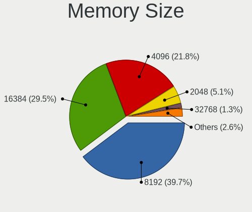

| Size  | Notebooks | Percent |
|-------|-----------|---------|
| 8192  | 30        | 38.46%  |
| 16384 | 23        | 29.49%  |
| 4096  | 18        | 23.08%  |
| 2048  | 4         | 5.13%   |
| 32768 | 1         | 1.28%   |
| 1024  | 1         | 1.28%   |
| 256   | 1         | 1.28%   |

Memory Speed
------------

Memory module speed

| Speed   | Notebooks | Percent |
|---------|-----------|---------|
| 3200    | 24        | 31.17%  |
| 2667    | 19        | 24.68%  |
| 1600    | 7         | 9.09%   |
| 6400    | 5         | 6.49%   |
| 2400    | 4         | 5.19%   |
| 8400    | 2         | 2.6%    |
| 4800    | 2         | 2.6%    |
| 3266    | 2         | 2.6%    |
| 2133    | 2         | 2.6%    |
| 1334    | 2         | 2.6%    |
| 1333    | 2         | 2.6%    |
| 3733    | 1         | 1.3%    |
| 2933    | 1         | 1.3%    |
| 1867    | 1         | 1.3%    |
| 667     | 1         | 1.3%    |
| 133     | 1         | 1.3%    |
| Unknown | 1         | 1.3%    |

Printers & scanners
-------------------

Printer Vendor
--------------

Printer device vendors

Zero info for selected period =(

Printer Model
-------------

Printer device models

Zero info for selected period =(

Scanner Vendor
--------------

Scanner device vendors

Zero info for selected period =(

Scanner Model
-------------

Scanner device models

Zero info for selected period =(

Camera
------

Camera Vendor
-------------

Camera device vendors

| Vendor                                 | Notebooks | Percent |
|----------------------------------------|-----------|---------|
| IMC Networks                           | 13        | 20.63%  |
| Chicony Electronics                    | 11        | 17.46%  |
| Microdia                               | 10        | 15.87%  |
| Sunplus Innovation Technology          | 4         | 6.35%   |
| Quanta                                 | 4         | 6.35%   |
| Realtek Semiconductor                  | 3         | 4.76%   |
| Lite-On Technology                     | 3         | 4.76%   |
| Bison Electronics                      | 3         | 4.76%   |
| Apple                                  | 3         | 4.76%   |
| Syntek                                 | 2         | 3.17%   |
| Luxvisions Innotech Limited            | 2         | 3.17%   |
| Acer                                   | 2         | 3.17%   |
| Logitech                               | 1         | 1.59%   |
| Elgato Systems                         | 1         | 1.59%   |
| Cheng Uei Precision Industry (Foxlink) | 1         | 1.59%   |

Camera Model
------------

Camera device models

| Model                                                           | Notebooks | Percent |
|-----------------------------------------------------------------|-----------|---------|
| Microdia Integrated_Webcam_HD                                   | 5         | 7.94%   |
| IMC Networks Integrated Camera                                  | 4         | 6.35%   |
| IMC Networks USB2.0 HD UVC WebCam                               | 3         | 4.76%   |
| Chicony Integrated Camera                                       | 3         | 4.76%   |
| Syntek Integrated Camera                                        | 2         | 3.17%   |
| Realtek Integrated_Webcam_HD                                    | 2         | 3.17%   |
| Microdia Integrated_Webcam_FHD                                  | 2         | 3.17%   |
| IMC Networks USB2.0 VGA UVC WebCam                              | 2         | 3.17%   |
| Chicony HP Wide Vision HD Camera                                | 2         | 3.17%   |
| Apple FaceTime HD Camera                                        | 2         | 3.17%   |
| Sunplus Integrated_Webcam_HD                                    | 1         | 1.59%   |
| Sunplus Integrated Webcam                                       | 1         | 1.59%   |
| Sunplus HP Universal Camera                                     | 1         | 1.59%   |
| Sunplus HD WebCam                                               | 1         | 1.59%   |
| Realtek WebCamera                                               | 1         | 1.59%   |
| Quanta HD Webcam                                                | 1         | 1.59%   |
| Quanta HD User Facing                                           | 1         | 1.59%   |
| Quanta HD Camera                                                | 1         | 1.59%   |
| Quanta ACER HD User Facing                                      | 1         | 1.59%   |
| Microdia USB 2.0 Camera                                         | 1         | 1.59%   |
| Microdia Sonix 1.3 MP Laptop Integrated Webcam                  | 1         | 1.59%   |
| Microdia Laptop_Integrated_Webcam_FHD                           | 1         | 1.59%   |
| Luxvisions Innotech Limited Integrated Camera                   | 1         | 1.59%   |
| Luxvisions Innotech Limited HP Wide Vision HD Camera            | 1         | 1.59%   |
| Logitech HD Pro Webcam C920                                     | 1         | 1.59%   |
| Lite-On Integrated Camera                                       | 1         | 1.59%   |
| Lite-On HP Webcam                                               | 1         | 1.59%   |
| Lite-On HP HD Webcam                                            | 1         | 1.59%   |
| IMC Networks UVC VGA Webcam                                     | 1         | 1.59%   |
| IMC Networks TOSHIBA Web Camera - HD                            | 1         | 1.59%   |
| IMC Networks Integrated RGB Camera                              | 1         | 1.59%   |
| IMC Networks HD Camera                                          | 1         | 1.59%   |
| Elgato Systems Game Capture HD60 X                              | 1         | 1.59%   |
| Chicony XiaoMi USB 2.0 Webcam                                   | 1         | 1.59%   |
| Chicony Webcam-101                                              | 1         | 1.59%   |
| Chicony USB2.0 Camera                                           | 1         | 1.59%   |
| Chicony HP HD Camera                                            | 1         | 1.59%   |
| Chicony HD WebCam                                               | 1         | 1.59%   |
| Chicony 720p HD Camera                                          | 1         | 1.59%   |
| Cheng Uei Precision Industry (Foxlink) HP Wide Vision HD Camera | 1         | 1.59%   |

Security
--------

Fingerprint Vendor
------------------

Fingerprint sensor vendors

| Vendor                     | Notebooks | Percent |
|----------------------------|-----------|---------|
| Validity Sensors           | 4         | 44.44%  |
| Shenzhen Goodix Technology | 2         | 22.22%  |
| Elan Microelectronics      | 2         | 22.22%  |
| LighTuning Technology      | 1         | 11.11%  |

Fingerprint Model
-----------------

Fingerprint sensor models

| Model                                        | Notebooks | Percent |
|----------------------------------------------|-----------|---------|
| Validity Sensors Synaptics WBDI              | 2         | 22.22%  |
| Validity Sensors VFS495 Fingerprint Reader   | 1         | 11.11%  |
| Validity Sensors VFS 5011 fingerprint sensor | 1         | 11.11%  |
| Shenzhen Goodix  Fingerprint Device          | 1         | 11.11%  |
| Shenzhen Goodix FingerPrint                  | 1         | 11.11%  |
| LighTuning EgisTec Touch Fingerprint Sensor  | 1         | 11.11%  |
| Elan ELAN:Fingerprint                        | 1         | 11.11%  |
| Elan ELAN:ARM-M4                             | 1         | 11.11%  |

Chipcard Vendor
---------------

Chipcard module vendors

| Vendor      | Notebooks | Percent |
|-------------|-----------|---------|
| Broadcom    | 3         | 75%     |
| Alcor Micro | 1         | 25%     |

Chipcard Model
--------------

Chipcard module models

| Model                               | Notebooks | Percent |
|-------------------------------------|-----------|---------|
| Broadcom 58200                      | 2         | 50%     |
| Broadcom 5880                       | 1         | 25%     |
| Alcor Micro AU9540 Smartcard Reader | 1         | 25%     |

Unsupported
-----------

Unsupported Devices
-------------------

Total unsupported devices on board

| Total | Notebooks | Percent |
|-------|-----------|---------|
| 0     | 30        | 37.04%  |
| 1     | 28        | 34.57%  |
| 3     | 7         | 8.64%   |
| 2     | 6         | 7.41%   |
| 5     | 4         | 4.94%   |
| 4     | 4         | 4.94%   |
| 6     | 2         | 2.47%   |

Unsupported Device Types
------------------------

Types of unsupported devices

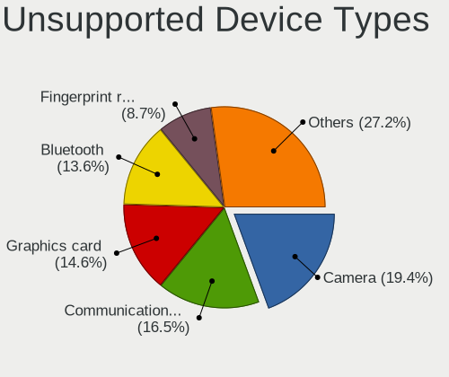

| Type                     | Notebooks | Percent |
|--------------------------|-----------|---------|
| Camera                   | 20        | 19.42%  |
| Communication controller | 17        | 16.5%   |
| Graphics card            | 15        | 14.56%  |
| Bluetooth                | 14        | 13.59%  |
| Fingerprint reader       | 9         | 8.74%   |
| Card reader              | 8         | 7.77%   |
| Net/wireless             | 7         | 6.8%    |
| Multimedia controller    | 5         | 4.85%   |
| Chipcard                 | 3         | 2.91%   |
| Net/ethernet             | 2         | 1.94%   |
| Storage/nvme             | 1         | 0.97%   |
| Sound                    | 1         | 0.97%   |
| Modem                    | 1         | 0.97%   |

