Kaisen - Tested Hardware & Statistics
-------------------------------------

A project to collect tested hardware configurations for Kaisen.

Anyone can contribute to this report by the [hw-probe](https://github.com/linuxhw/hw-probe) tool:

    sudo -E hw-probe -all -upload

Please contribute! Especially if your hardware is rare.

This is a report for all computer types. See also reports for [desktops](/Dist/Kaisen/Desktop/README.md) and [notebooks](/Dist/Kaisen/Notebook/README.md).

Contents
--------

* [ Test Cases ](#test-cases)

* [ System ](#system)
  - [ OS                       ](#os)
  - [ OS Family                ](#os-family)
  - [ Kernel                   ](#kernel)
  - [ Kernel Family            ](#kernel-family)
  - [ Kernel Major Ver.        ](#kernel-major-ver)
  - [ Arch                     ](#arch)
  - [ DE                       ](#de)
  - [ Display Server           ](#display-server)
  - [ Display Manager          ](#display-manager)
  - [ OS Lang                  ](#os-lang)
  - [ Boot Mode                ](#boot-mode)
  - [ Filesystem               ](#filesystem)
  - [ Part. scheme             ](#part-scheme)
  - [ Dual Boot with Linux/BSD ](#dual-boot-with-linuxbsd)
  - [ Dual Boot (Win)          ](#dual-boot-win)

* [ Board ](#board)
  - [ Vendor                   ](#vendor)
  - [ Model                    ](#model)
  - [ Model Family             ](#model-family)
  - [ MFG Year                 ](#mfg-year)
  - [ Form Factor              ](#form-factor)
  - [ Secure Boot              ](#secure-boot)
  - [ Coreboot                 ](#coreboot)
  - [ RAM Size                 ](#ram-size)
  - [ RAM Used                 ](#ram-used)
  - [ Total Drives             ](#total-drives)
  - [ Has CD-ROM               ](#has-cd-rom)
  - [ Has Ethernet             ](#has-ethernet)
  - [ Has WiFi                 ](#has-wifi)
  - [ Has Bluetooth            ](#has-bluetooth)

* [ Location ](#location)
  - [ Country                  ](#country)
  - [ City                     ](#city)

* [ Drives ](#drives)
  - [ Drive Vendor             ](#drive-vendor)
  - [ Drive Model              ](#drive-model)
  - [ HDD Vendor               ](#hdd-vendor)
  - [ SSD Vendor               ](#ssd-vendor)
  - [ Drive Kind               ](#drive-kind)
  - [ Drive Connector          ](#drive-connector)
  - [ Drive Size               ](#drive-size)
  - [ Space Total              ](#space-total)
  - [ Space Used               ](#space-used)
  - [ Malfunc. Drives          ](#malfunc-drives)
  - [ Malfunc. Drive Vendor    ](#malfunc-drive-vendor)
  - [ Malfunc. HDD Vendor      ](#malfunc-hdd-vendor)
  - [ Malfunc. Drive Kind      ](#malfunc-drive-kind)
  - [ Failed Drives            ](#failed-drives)
  - [ Failed Drive Vendor      ](#failed-drive-vendor)
  - [ Drive Status             ](#drive-status)

* [ Storage controller ](#storage-controller)
  - [ Storage Vendor           ](#storage-vendor)
  - [ Storage Model            ](#storage-model)
  - [ Storage Kind             ](#storage-kind)

* [ Processor ](#processor)
  - [ CPU Vendor               ](#cpu-vendor)
  - [ CPU Model                ](#cpu-model)
  - [ CPU Model Family         ](#cpu-model-family)
  - [ CPU Cores                ](#cpu-cores)
  - [ CPU Sockets              ](#cpu-sockets)
  - [ CPU Threads              ](#cpu-threads)
  - [ CPU Op-Modes             ](#cpu-op-modes)
  - [ CPU Microcode            ](#cpu-microcode)
  - [ CPU Microarch            ](#cpu-microarch)

* [ Graphics ](#graphics)
  - [ GPU Vendor               ](#gpu-vendor)
  - [ GPU Model                ](#gpu-model)
  - [ GPU Combo                ](#gpu-combo)
  - [ GPU Driver               ](#gpu-driver)
  - [ GPU Memory               ](#gpu-memory)

* [ Monitor ](#monitor)
  - [ Monitor Vendor           ](#monitor-vendor)
  - [ Monitor Model            ](#monitor-model)
  - [ Monitor Resolution       ](#monitor-resolution)
  - [ Monitor Diagonal         ](#monitor-diagonal)
  - [ Monitor Width            ](#monitor-width)
  - [ Aspect Ratio             ](#aspect-ratio)
  - [ Monitor Area             ](#monitor-area)
  - [ Pixel Density            ](#pixel-density)
  - [ Multiple Monitors        ](#multiple-monitors)

* [ Network ](#network)
  - [ Net Controller Vendor    ](#net-controller-vendor)
  - [ Net Controller Model     ](#net-controller-model)
  - [ Wireless Vendor          ](#wireless-vendor)
  - [ Wireless Model           ](#wireless-model)
  - [ Ethernet Vendor          ](#ethernet-vendor)
  - [ Ethernet Model           ](#ethernet-model)
  - [ Net Controller Kind      ](#net-controller-kind)
  - [ Used Controller          ](#used-controller)
  - [ NICs                     ](#nics)
  - [ IPv6                     ](#ipv6)

* [ Bluetooth ](#bluetooth)
  - [ Bluetooth Vendor         ](#bluetooth-vendor)
  - [ Bluetooth Model          ](#bluetooth-model)

* [ Sound ](#sound)
  - [ Sound Vendor             ](#sound-vendor)
  - [ Sound Model              ](#sound-model)

* [ Memory ](#memory)
  - [ Memory Vendor            ](#memory-vendor)
  - [ Memory Model             ](#memory-model)
  - [ Memory Kind              ](#memory-kind)
  - [ Memory Form Factor       ](#memory-form-factor)
  - [ Memory Size              ](#memory-size)
  - [ Memory Speed             ](#memory-speed)

* [ Printers & scanners ](#printers--scanners)
  - [ Printer Vendor           ](#printer-vendor)
  - [ Printer Model            ](#printer-model)
  - [ Scanner Vendor           ](#scanner-vendor)
  - [ Scanner Model            ](#scanner-model)

* [ Camera ](#camera)
  - [ Camera Vendor            ](#camera-vendor)
  - [ Camera Model             ](#camera-model)

* [ Security ](#security)
  - [ Fingerprint Vendor       ](#fingerprint-vendor)
  - [ Fingerprint Model        ](#fingerprint-model)
  - [ Chipcard Vendor          ](#chipcard-vendor)
  - [ Chipcard Model           ](#chipcard-model)

* [ Unsupported ](#unsupported)
  - [ Unsupported Devices      ](#unsupported-devices)
  - [ Unsupported Device Types ](#unsupported-device-types)

Test Cases
----------

Total: 41

| Vendor   | Model                       | Form-Factor | Probe                                                      | Date         |
|----------|-----------------------------|-------------|------------------------------------------------------------|--------------|
| Dell     | G3 3500                     | Notebook    | [9a574c1075](https://linux-hardware.org/?probe=9a574c1075) | Oct 04, 2022 |
| Samsung  | 370E4K                      | Notebook    | [1a297b75f9](https://linux-hardware.org/?probe=1a297b75f9) | Sep 18, 2022 |
| Dell     | Inspiron 15 7000 Gaming     | Notebook    | [edc0c871cb](https://linux-hardware.org/?probe=edc0c871cb) | Sep 17, 2022 |
| ASUSTek  | N76VB                       | Notebook    | [e488dd7682](https://linux-hardware.org/?probe=e488dd7682) | Aug 27, 2022 |
| MSI      | Vector GP76 12UH            | Notebook    | [7ac84940b8](https://linux-hardware.org/?probe=7ac84940b8) | Jul 24, 2022 |
| Acer     | Aspire One 753              | Notebook    | [eff74923d7](https://linux-hardware.org/?probe=eff74923d7) | Jul 21, 2022 |
| Samsung  | 950QDB                      | Convertible | [3501e7feef](https://linux-hardware.org/?probe=3501e7feef) | Jul 17, 2022 |
| Samsung  | 950QDB                      | Convertible | [a8ec786d20](https://linux-hardware.org/?probe=a8ec786d20) | Jul 17, 2022 |
| HP       | 339A                        | Desktop     | [7cfe4b70f8](https://linux-hardware.org/?probe=7cfe4b70f8) | Jun 30, 2022 |
| HP       | 8053                        | Desktop     | [ff703fcbf1](https://linux-hardware.org/?probe=ff703fcbf1) | Jun 23, 2022 |
| ASUSTek  | 970 PRO GAMING/AURA         | Desktop     | [67dbfe0d98](https://linux-hardware.org/?probe=67dbfe0d98) | May 14, 2022 |
| Dell     | Latitude 3540               | Notebook    | [e4dd2ae509](https://linux-hardware.org/?probe=e4dd2ae509) | May 06, 2022 |
| Dell     | Inspiron 14 5401            | Notebook    | [d357bf876a](https://linux-hardware.org/?probe=d357bf876a) | Apr 02, 2022 |
| Lenovo   | IdeaPad 5 15ARE05 81YQ      | Notebook    | [c9d1e057c3](https://linux-hardware.org/?probe=c9d1e057c3) | Jan 03, 2022 |
| HP       | EliteBook 840 G1            | Notebook    | [f04d152dbc](https://linux-hardware.org/?probe=f04d152dbc) | Dec 10, 2021 |
| Gigabyte | B550M AORUS ELITE           | Desktop     | [0105f991c1](https://linux-hardware.org/?probe=0105f991c1) | Dec 01, 2021 |
| Lenovo   | ThinkPad T520 4243E51       | Notebook    | [dbee2d500a](https://linux-hardware.org/?probe=dbee2d500a) | Nov 29, 2021 |
| Gigabyte | M61PM-S2                    | Desktop     | [ed3a73a8a0](https://linux-hardware.org/?probe=ed3a73a8a0) | Nov 02, 2021 |
| HP       | 81C3                        | Desktop     | [df2caaf484](https://linux-hardware.org/?probe=df2caaf484) | Oct 11, 2021 |
| HP       | Pavilion 15                 | Notebook    | [15e92e7427](https://linux-hardware.org/?probe=15e92e7427) | Sep 25, 2021 |
| Lenovo   | ThinkPad T450 20BV003SMS    | Notebook    | [352b2b53b8](https://linux-hardware.org/?probe=352b2b53b8) | Sep 14, 2021 |
| Lenovo   | ThinkPad T430 23427YU       | Notebook    | [9f7679f7be](https://linux-hardware.org/?probe=9f7679f7be) | Sep 06, 2021 |
| Apple    | Mac-F2268CC8                | All in one  | [7c349a10d2](https://linux-hardware.org/?probe=7c349a10d2) | Aug 19, 2021 |
| Lenovo   | ThinkPad T15 Gen 2i 20W4... | Notebook    | [7a6c5d1f4b](https://linux-hardware.org/?probe=7a6c5d1f4b) | Aug 16, 2021 |
| HP       | ProBook 650 G2              | Notebook    | [8bd4184e25](https://linux-hardware.org/?probe=8bd4184e25) | Aug 15, 2021 |
| HP       | ProBook 650 G2              | Notebook    | [9fef85ae5d](https://linux-hardware.org/?probe=9fef85ae5d) | Aug 11, 2021 |
| Gigabyte | AX370-Gaming K5-CF          | Desktop     | [d08d8c22f3](https://linux-hardware.org/?probe=d08d8c22f3) | Aug 06, 2021 |
| Intel    | H61M-S2PV                   | Desktop     | [a7ed913051](https://linux-hardware.org/?probe=a7ed913051) | Aug 05, 2021 |
| Foxconn  | 2ABF                        | Desktop     | [e722057484](https://linux-hardware.org/?probe=e722057484) | Jul 29, 2021 |
| HP       | 0B4Ch D                     | Desktop     | [775cf09e30](https://linux-hardware.org/?probe=775cf09e30) | Jul 23, 2021 |
| HP       | Pavilion g7                 | Notebook    | [2aba1a12dd](https://linux-hardware.org/?probe=2aba1a12dd) | Jul 21, 2021 |
| HP       | Pavilion g7                 | Notebook    | [a4cbb8c698](https://linux-hardware.org/?probe=a4cbb8c698) | Jul 15, 2021 |
| HP       | Pavilion g7                 | Notebook    | [3a0142c412](https://linux-hardware.org/?probe=3a0142c412) | Jul 13, 2021 |
| Gigabyte | GA-6PXSV1                   | Server      | [0ac54e7fb4](https://linux-hardware.org/?probe=0ac54e7fb4) | Jun 02, 2021 |
| HP       | EliteBook 840 G2            | Notebook    | [aa55e0ae92](https://linux-hardware.org/?probe=aa55e0ae92) | Apr 30, 2021 |
| HP       | ProBook 645 G1              | Notebook    | [501e0bc33f](https://linux-hardware.org/?probe=501e0bc33f) | Apr 15, 2021 |
| Lenovo   | Legion Y530-15ICH 81FV      | Notebook    | [871a04a1f3](https://linux-hardware.org/?probe=871a04a1f3) | Oct 27, 2020 |
| HP       | EliteBook 840 G2            | Notebook    | [d3d44f4bdf](https://linux-hardware.org/?probe=d3d44f4bdf) | Oct 22, 2020 |
| Lenovo   | Legion Y530-15ICH 81FV      | Notebook    | [51bd9bdbb7](https://linux-hardware.org/?probe=51bd9bdbb7) | Oct 08, 2020 |
| Apple    | MacBookPro9,2               | Notebook    | [65031a9a6d](https://linux-hardware.org/?probe=65031a9a6d) | May 29, 2020 |
| Apple    | MacBookPro9,2               | Notebook    | [7ad10f260f](https://linux-hardware.org/?probe=7ad10f260f) | May 18, 2020 |

System
------

OS
--

Installed operating systems

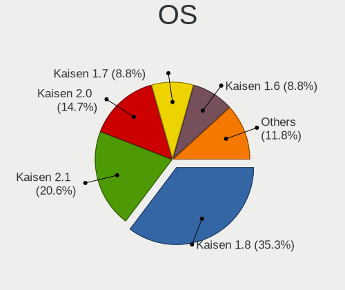

| Name       | Computers | Percent |
|------------|-----------|---------|
| Kaisen 1.8 | 12        | 34.29%  |
| Kaisen 2.1 | 8         | 22.86%  |
| Kaisen 2.0 | 5         | 14.29%  |
| Kaisen 1.7 | 3         | 8.57%   |
| Kaisen 1.6 | 3         | 8.57%   |
| Kaisen 1.4 | 3         | 8.57%   |
| Kaisen 1.0 | 1         | 2.86%   |

OS Family
---------

OS without a version

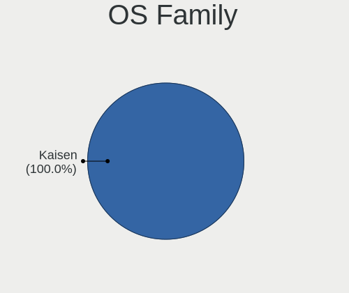

| Name   | Computers | Percent |
|--------|-----------|---------|
| Kaisen | 35        | 100%    |

Kernel
------

Version of the Linux kernel

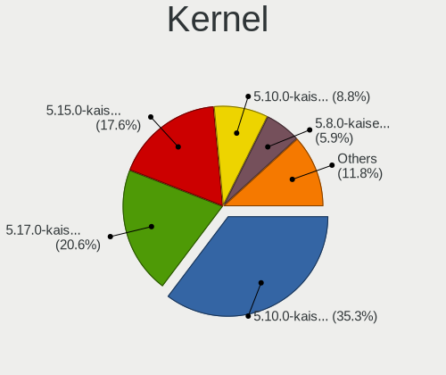

| Version              | Computers | Percent |
|----------------------|-----------|---------|
| 5.10.0-kaisen5-amd64 | 12        | 34.29%  |
| 5.17.0-kaisen1-amd64 | 7         | 20%     |
| 5.15.0-kaisen1-amd64 | 6         | 17.14%  |
| 5.10.0-kaisen3-amd64 | 3         | 8.57%   |
| 5.8.0-kaisen2-amd64  | 2         | 5.71%   |
| 5.9.0-kaisen2-amd64  | 1         | 2.86%   |
| 5.5.0-kaisen1-amd64  | 1         | 2.86%   |
| 5.19.0-kaisen1-amd64 | 1         | 2.86%   |
| 5.16.0-kaisen1-amd64 | 1         | 2.86%   |
| 5.14.0-kaisen1-amd64 | 1         | 2.86%   |

Kernel Family
-------------

Linux kernel without a distro release

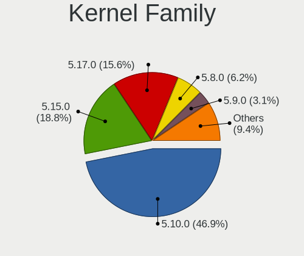

| Version | Computers | Percent |
|---------|-----------|---------|
| 5.10.0  | 15        | 42.86%  |
| 5.17.0  | 7         | 20%     |
| 5.15.0  | 6         | 17.14%  |
| 5.8.0   | 2         | 5.71%   |
| 5.9.0   | 1         | 2.86%   |
| 5.5.0   | 1         | 2.86%   |
| 5.19.0  | 1         | 2.86%   |
| 5.16.0  | 1         | 2.86%   |
| 5.14.0  | 1         | 2.86%   |

Kernel Major Ver.
-----------------

Linux kernel major version

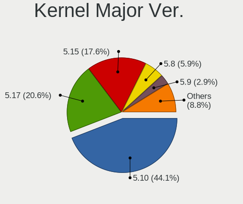

| Version | Computers | Percent |
|---------|-----------|---------|
| 5.10    | 15        | 42.86%  |
| 5.17    | 7         | 20%     |
| 5.15    | 6         | 17.14%  |
| 5.8     | 2         | 5.71%   |
| 5.9     | 1         | 2.86%   |
| 5.5     | 1         | 2.86%   |
| 5.19    | 1         | 2.86%   |
| 5.16    | 1         | 2.86%   |
| 5.14    | 1         | 2.86%   |

Arch
----

OS architecture (x86_64, i586, etc.)

| Name   | Computers | Percent |
|--------|-----------|---------|
| x86_64 | 35        | 100%    |

DE
--

Desktop Environment

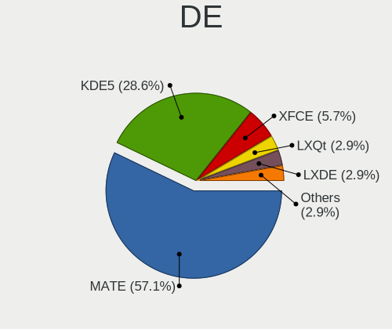

| Name    | Computers | Percent |
|---------|-----------|---------|
| MATE    | 20        | 57.14%  |
| KDE5    | 10        | 28.57%  |
| XFCE    | 2         | 5.71%   |
| LXQt    | 1         | 2.86%   |
| LXDE    | 1         | 2.86%   |
| Unknown | 1         | 2.86%   |

Display Server
--------------

X11 or Wayland

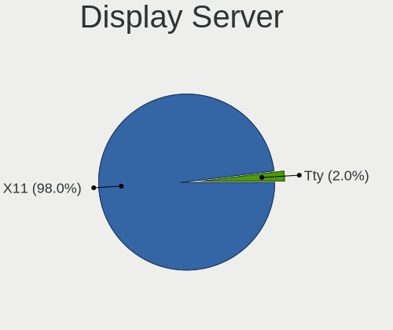

| Name | Computers | Percent |
|------|-----------|---------|
| X11  | 35        | 100%    |

Display Manager
---------------

SDDM, LightDM, etc.

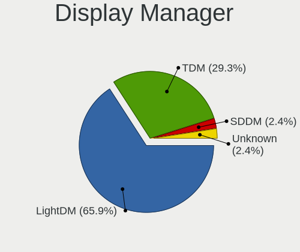

| Name    | Computers | Percent |
|---------|-----------|---------|
| LightDM | 21        | 60%     |
| TDM     | 12        | 34.29%  |
| SDDM    | 1         | 2.86%   |
| Unknown | 1         | 2.86%   |

OS Lang
-------

Language

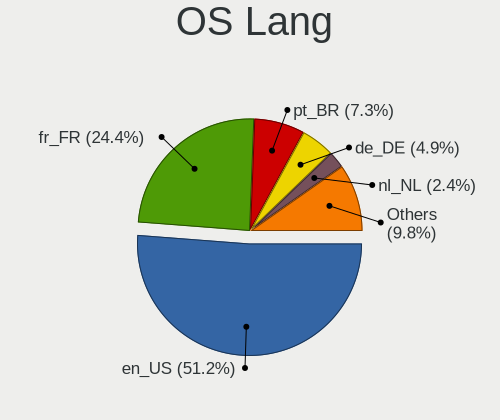

| Lang    | Computers | Percent |
|---------|-----------|---------|
| en_US   | 17        | 48.57%  |
| fr_FR   | 10        | 28.57%  |
| pt_BR   | 2         | 5.71%   |
| nl_NL   | 1         | 2.86%   |
| en_ZA   | 1         | 2.86%   |
| en_GB   | 1         | 2.86%   |
| de_DE   | 1         | 2.86%   |
| de_CH   | 1         | 2.86%   |
| Unknown | 1         | 2.86%   |

Boot Mode
---------

EFI or BIOS

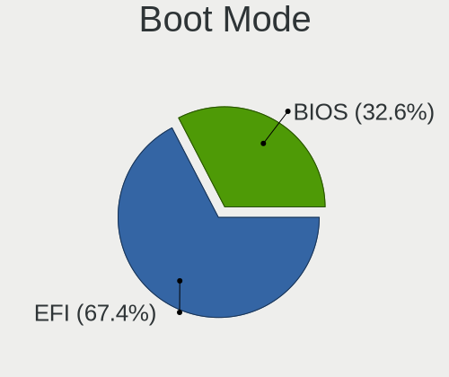

| Mode | Computers | Percent |
|------|-----------|---------|
| EFI  | 22        | 62.86%  |
| BIOS | 13        | 37.14%  |

Filesystem
----------

Type of filesystem

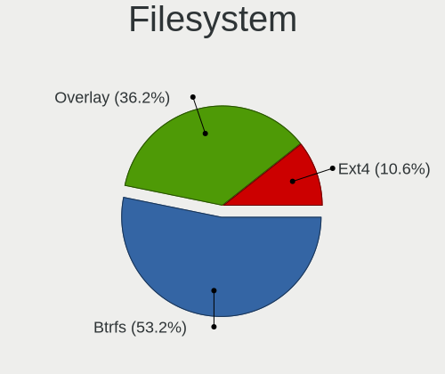

| Type    | Computers | Percent |
|---------|-----------|---------|
| Btrfs   | 18        | 51.43%  |
| Overlay | 12        | 34.29%  |
| Ext4    | 5         | 14.29%  |

Part. scheme
------------

Scheme of partitioning

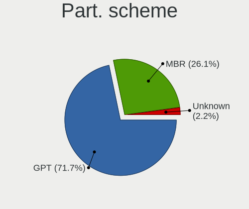

| Type    | Computers | Percent |
|---------|-----------|---------|
| GPT     | 23        | 65.71%  |
| MBR     | 11        | 31.43%  |
| Unknown | 1         | 2.86%   |

Dual Boot with Linux/BSD
------------------------

Hosting more than one Linux/BSD

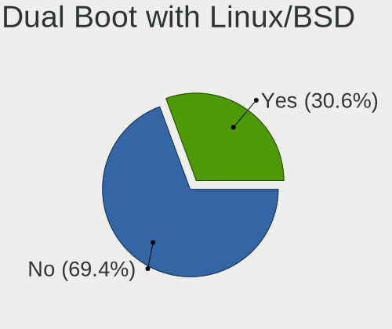

| Dual boot | Computers | Percent |
|-----------|-----------|---------|
| No        | 24        | 68.57%  |
| Yes       | 11        | 31.43%  |

Dual Boot (Win)
---------------

Hosting Linux and Windows

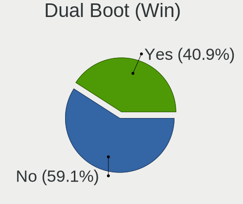

| Dual boot | Computers | Percent |
|-----------|-----------|---------|
| No        | 22        | 62.86%  |
| Yes       | 13        | 37.14%  |

Board
-----

Vendor
------

Motherboard manufacturer

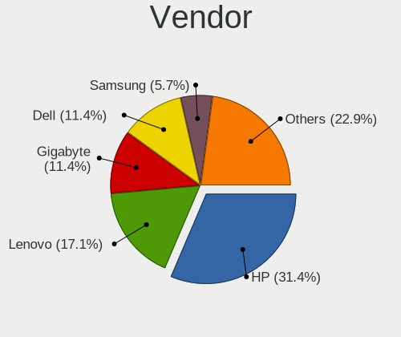

| Name                | Computers | Percent |
|---------------------|-----------|---------|
| Hewlett-Packard     | 11        | 31.43%  |
| Lenovo              | 6         | 17.14%  |
| Gigabyte Technology | 4         | 11.43%  |
| Dell                | 4         | 11.43%  |
| Samsung Electronics | 2         | 5.71%   |
| ASUSTek Computer    | 2         | 5.71%   |
| Apple               | 2         | 5.71%   |
| MSI                 | 1         | 2.86%   |
| Intel               | 1         | 2.86%   |
| Foxconn             | 1         | 2.86%   |
| Acer                | 1         | 2.86%   |

Model
-----

Motherboard model

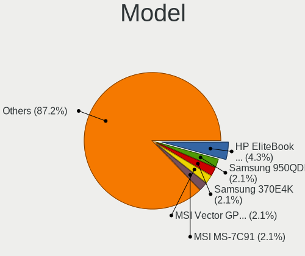

| Name                                  | Computers | Percent |
|---------------------------------------|-----------|---------|
| HP EliteBook 840 G2                   | 2         | 5.71%   |
| Samsung 950QDB                        | 1         | 2.86%   |
| Samsung 370E4K                        | 1         | 2.86%   |
| MSI Vector GP76 12UH                  | 1         | 2.86%   |
| Lenovo ThinkPad T520 4243E51          | 1         | 2.86%   |
| Lenovo ThinkPad T450 20BV003SMS       | 1         | 2.86%   |
| Lenovo ThinkPad T430 23427YU          | 1         | 2.86%   |
| Lenovo ThinkPad T15 Gen 2i 20W4CTO1WW | 1         | 2.86%   |
| Lenovo Legion Y530-15ICH 81FV         | 1         | 2.86%   |
| Lenovo IdeaPad 5 15ARE05 81YQ         | 1         | 2.86%   |
| Intel H61M-S2PV                       | 1         | 2.86%   |
| HP Z400 Workstation                   | 1         | 2.86%   |
| HP ProBook 650 G2                     | 1         | 2.86%   |
| HP ProBook 645 G1                     | 1         | 2.86%   |
| HP Pavilion g7                        | 1         | 2.86%   |
| HP Pavilion 15                        | 1         | 2.86%   |
| HP EliteDesk 800 G2 TWR               | 1         | 2.86%   |
| HP EliteBook 840 G1                   | 1         | 2.86%   |
| HP Elite Slice                        | 1         | 2.86%   |
| HP Compaq Pro 6300 MT                 | 1         | 2.86%   |
| Gigabyte M61PM-S2                     | 1         | 2.86%   |
| Gigabyte GA-6PXSV1                    | 1         | 2.86%   |
| Gigabyte B550M AORUS ELITE            | 1         | 2.86%   |
| Gigabyte AX370-Gaming K5              | 1         | 2.86%   |
| Foxconn s5-1204                       | 1         | 2.86%   |
| Dell Latitude 3540                    | 1         | 2.86%   |
| Dell Inspiron 15 7000 Gaming          | 1         | 2.86%   |
| Dell Inspiron 14 5401                 | 1         | 2.86%   |
| Dell G3 3500                          | 1         | 2.86%   |
| ASUS N76VB                            | 1         | 2.86%   |
| ASUS 970 PRO GAMING/AURA              | 1         | 2.86%   |
| Apple MacBookPro9,2                   | 1         | 2.86%   |
| Apple iMac10,1                        | 1         | 2.86%   |
| Acer Aspire One 753                   | 1         | 2.86%   |

Model Family
------------

Motherboard model prefix

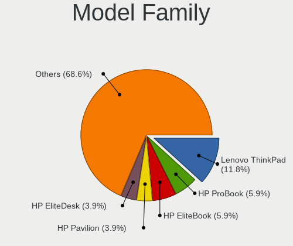

| Name                  | Computers | Percent |
|-----------------------|-----------|---------|
| Lenovo ThinkPad       | 4         | 11.43%  |
| HP EliteBook          | 3         | 8.57%   |
| HP ProBook            | 2         | 5.71%   |
| HP Pavilion           | 2         | 5.71%   |
| Dell Inspiron         | 2         | 5.71%   |
| Samsung 950QDB        | 1         | 2.86%   |
| Samsung 370E4K        | 1         | 2.86%   |
| MSI Vector            | 1         | 2.86%   |
| Lenovo Legion         | 1         | 2.86%   |
| Lenovo IdeaPad        | 1         | 2.86%   |
| Intel H61M-S2PV       | 1         | 2.86%   |
| HP Z400               | 1         | 2.86%   |
| HP EliteDesk          | 1         | 2.86%   |
| HP Elite              | 1         | 2.86%   |
| HP Compaq             | 1         | 2.86%   |
| Gigabyte M61PM-S2     | 1         | 2.86%   |
| Gigabyte GA-6PXSV1    | 1         | 2.86%   |
| Gigabyte B550M        | 1         | 2.86%   |
| Gigabyte AX370-Gaming | 1         | 2.86%   |
| Foxconn s5-1204       | 1         | 2.86%   |
| Dell Latitude         | 1         | 2.86%   |
| Dell G3               | 1         | 2.86%   |
| ASUS N76VB            | 1         | 2.86%   |
| ASUS 970              | 1         | 2.86%   |
| Apple MacBookPro9     | 1         | 2.86%   |
| Apple iMac10          | 1         | 2.86%   |
| Acer Aspire           | 1         | 2.86%   |

MFG Year
--------

Motherboard manufacture year

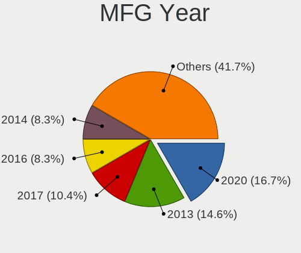

| Year | Computers | Percent |
|------|-----------|---------|
| 2020 | 4         | 11.43%  |
| 2016 | 4         | 11.43%  |
| 2015 | 4         | 11.43%  |
| 2013 | 4         | 11.43%  |
| 2011 | 4         | 11.43%  |
| 2012 | 3         | 8.57%   |
| 2021 | 2         | 5.71%   |
| 2017 | 2         | 5.71%   |
| 2014 | 2         | 5.71%   |
| 2010 | 2         | 5.71%   |
| 2022 | 1         | 2.86%   |
| 2018 | 1         | 2.86%   |
| 2009 | 1         | 2.86%   |
| 2006 | 1         | 2.86%   |

Form Factor
-----------

Physical design of the computer

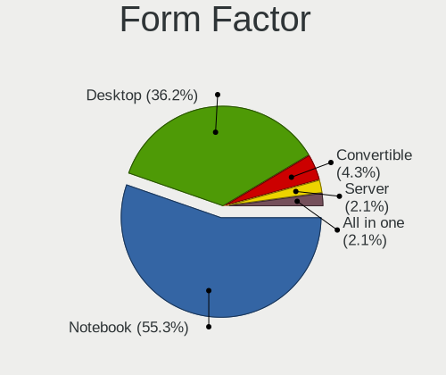

| Name        | Computers | Percent |
|-------------|-----------|---------|
| Notebook    | 22        | 62.86%  |
| Desktop     | 10        | 28.57%  |
| Convertible | 1         | 2.86%   |
| All in one  | 1         | 2.86%   |
| Server      | 1         | 2.86%   |

Secure Boot
-----------

Enabled or disabled

| State    | Computers | Percent |
|----------|-----------|---------|
| Disabled | 35        | 100%    |

Coreboot
--------

Have coreboot on board

| Used | Computers | Percent |
|------|-----------|---------|
| No   | 35        | 100%    |

RAM Size
--------

Total RAM memory

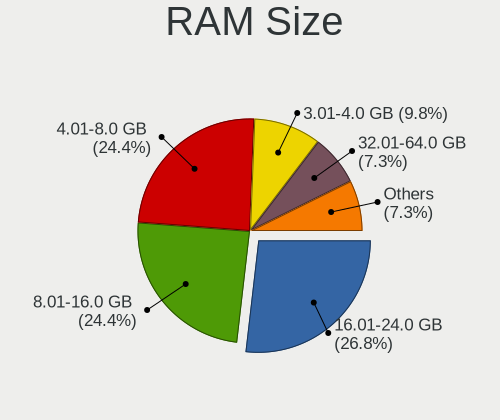

| Size in GB  | Computers | Percent |
|-------------|-----------|---------|
| 8.01-16.0   | 9         | 25.71%  |
| 4.01-8.0    | 8         | 22.86%  |
| 16.01-24.0  | 8         | 22.86%  |
| 3.01-4.0    | 4         | 11.43%  |
| 32.01-64.0  | 3         | 8.57%   |
| 24.01-32.0  | 1         | 2.86%   |
| 64.01-256.0 | 1         | 2.86%   |
| 1.01-2.0    | 1         | 2.86%   |

RAM Used
--------

Used RAM memory

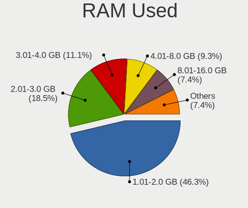

| Used GB   | Computers | Percent |
|-----------|-----------|---------|
| 1.01-2.0  | 17        | 48.57%  |
| 2.01-3.0  | 6         | 17.14%  |
| 3.01-4.0  | 4         | 11.43%  |
| 0.51-1.0  | 4         | 11.43%  |
| 4.01-8.0  | 3         | 8.57%   |
| 8.01-16.0 | 1         | 2.86%   |

Total Drives
------------

Number of drives on board

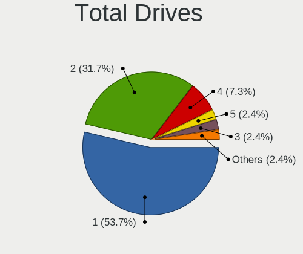

| Drives | Computers | Percent |
|--------|-----------|---------|
| 1      | 21        | 60%     |
| 2      | 10        | 28.57%  |
| 5      | 1         | 2.86%   |
| 4      | 1         | 2.86%   |
| 3      | 1         | 2.86%   |
| 0      | 1         | 2.86%   |

Has CD-ROM
----------

Has CD-ROM on board

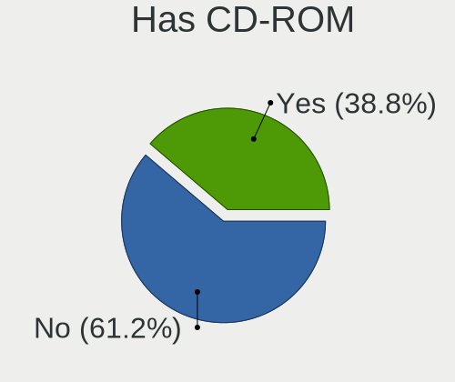

| Presented | Computers | Percent |
|-----------|-----------|---------|
| No        | 18        | 51.43%  |
| Yes       | 17        | 48.57%  |

Has Ethernet
------------

Has Ethernet on board

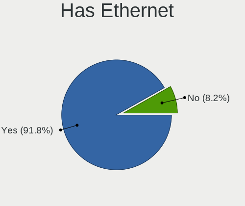

| Presented | Computers | Percent |
|-----------|-----------|---------|
| Yes       | 33        | 94.29%  |
| No        | 2         | 5.71%   |

Has WiFi
--------

Has WiFi module

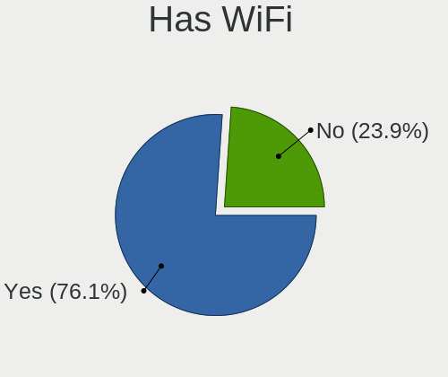

| Presented | Computers | Percent |
|-----------|-----------|---------|
| Yes       | 29        | 82.86%  |
| No        | 6         | 17.14%  |

Has Bluetooth
-------------

Has Bluetooth module

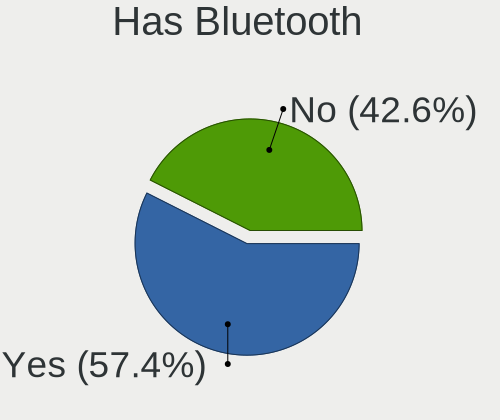

| Presented | Computers | Percent |
|-----------|-----------|---------|
| Yes       | 22        | 62.86%  |
| No        | 13        | 37.14%  |

Location
--------

Country
-------

Geographic location (country)

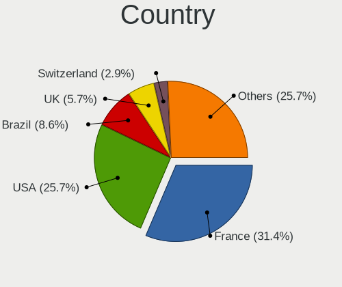

| Country      | Computers | Percent |
|--------------|-----------|---------|
| France       | 11        | 31.43%  |
| USA          | 9         | 25.71%  |
| Brazil       | 3         | 8.57%   |
| UK           | 2         | 5.71%   |
| Switzerland  | 1         | 2.86%   |
| Spain        | 1         | 2.86%   |
| South Africa | 1         | 2.86%   |
| Slovakia     | 1         | 2.86%   |
| Netherlands  | 1         | 2.86%   |
| Mexico       | 1         | 2.86%   |
| India        | 1         | 2.86%   |
| Germany      | 1         | 2.86%   |
| Belgium      | 1         | 2.86%   |
| Australia    | 1         | 2.86%   |

City
----

Geographic location (city)

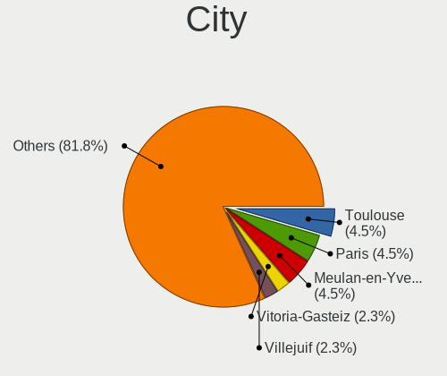

| City                | Computers | Percent |
|---------------------|-----------|---------|
| Toulouse            | 2         | 5.71%   |
| Paris               | 2         | 5.71%   |
| Meulan-en-Yvelines  | 2         | 5.71%   |
| Villejuif           | 1         | 2.86%   |
| Valencia            | 1         | 2.86%   |
| Tresses             | 1         | 2.86%   |
| Short Hills         | 1         | 2.86%   |
| Segovia             | 1         | 2.86%   |
| Rio de Janeiro      | 1         | 2.86%   |
| Pinckney            | 1         | 2.86%   |
| Perth               | 1         | 2.86%   |
| Nitra               | 1         | 2.86%   |
| Nieuw-Vossemeer     | 1         | 2.86%   |
| Milwaukee           | 1         | 2.86%   |
| Middlesbrough       | 1         | 2.86%   |
| Miami               | 1         | 2.86%   |
| Medway              | 1         | 2.86%   |
| Mechanicsburg       | 1         | 2.86%   |
| Manchester          | 1         | 2.86%   |
| Malappuram          | 1         | 2.86%   |
| Maceió             | 1         | 2.86%   |
| Joaima              | 1         | 2.86%   |
| Issy-les-Moulineaux | 1         | 2.86%   |
| Gavere              | 1         | 2.86%   |
| Friesoythe          | 1         | 2.86%   |
| Fort Lauderdale     | 1         | 2.86%   |
| Edenvale            | 1         | 2.86%   |
| Dijon               | 1         | 2.86%   |
| Brive-la-Gaillarde  | 1         | 2.86%   |
| Bern                | 1         | 2.86%   |
| Apodaca             | 1         | 2.86%   |
| Albany              | 1         | 2.86%   |

Drives
------

Drive Vendor
------------

Hard drive vendors

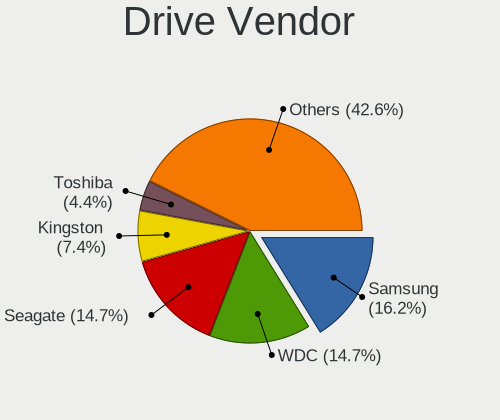

| Vendor              | Computers | Drives | Percent |
|---------------------|-----------|--------|---------|
| WDC                 | 9         | 10     | 18.37%  |
| Samsung Electronics | 8         | 10     | 16.33%  |
| Seagate             | 7         | 7      | 14.29%  |
| Kingston            | 4         | 4      | 8.16%   |
| HGST                | 3         | 3      | 6.12%   |
| SanDisk             | 2         | 2      | 4.08%   |
| Toshiba             | 1         | 1      | 2.04%   |
| SK hynix            | 1         | 1      | 2.04%   |
| Micron Technology   | 1         | 1      | 2.04%   |
| MARSHAL             | 1         | 1      | 2.04%   |
| LITEONIT            | 1         | 1      | 2.04%   |
| LITEON              | 1         | 1      | 2.04%   |
| KIOXIA              | 1         | 1      | 2.04%   |
| JMicron Technology  | 1         | 1      | 2.04%   |
| Intel               | 1         | 1      | 2.04%   |
| Hitachi             | 1         | 1      | 2.04%   |
| Crucial             | 1         | 1      | 2.04%   |
| Corsair             | 1         | 1      | 2.04%   |
| China               | 1         | 1      | 2.04%   |
| ASMedia             | 1         | 1      | 2.04%   |
| A-DATA Technology   | 1         | 1      | 2.04%   |
| Unknown             | 1         | 1      | 2.04%   |

Drive Model
-----------

Hard drive models

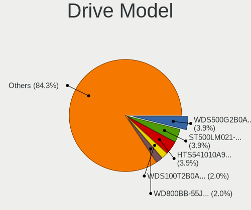

| Model                                     | Computers | Percent |
|-------------------------------------------|-----------|---------|
| WDC WDS500G2B0A-00SM50 500GB SSD          | 2         | 3.85%   |
| Seagate ST500LM021-1KJ152 500GB           | 2         | 3.85%   |
| HGST HTS541010A9E680 1TB                  | 2         | 3.85%   |
| WDC WDS100T2B0A-00SM50 1TB SSD            | 1         | 1.92%   |
| WDC WD800BB-55JKC0 80GB                   | 1         | 1.92%   |
| WDC WD5003ABYX-18WERA0 500GB              | 1         | 1.92%   |
| WDC WD5000AAKX-60U6AA0 500GB              | 1         | 1.92%   |
| WDC WD3200BPVT-22ZEST0 320GB              | 1         | 1.92%   |
| WDC WD30EFRX-68EUZN0 3TB                  | 1         | 1.92%   |
| WDC WD10JPVX-75JC3T0 1TB                  | 1         | 1.92%   |
| WDC WD10EZEX-75WN4A1 1TB                  | 1         | 1.92%   |
| Toshiba KXG6AZNV1T02 1TB                  | 1         | 1.92%   |
| SK hynix SKHynix_HFM256GDHTNI-87A0B 256GB | 1         | 1.92%   |
| Seagate ST500LM000-1EJ162 500GB           | 1         | 1.92%   |
| Seagate ST500DM002-1BD142 500GB           | 1         | 1.92%   |
| Seagate ST31000528AS 1TB                  | 1         | 1.92%   |
| Seagate ST2000DM008-2FR102 2TB            | 1         | 1.92%   |
| Seagate ST1000LM049-2GH172 1TB            | 1         | 1.92%   |
| SanDisk SD8SB8U-256G-1006 256GB SSD       | 1         | 1.92%   |
| SanDisk Portable SSD 1TB                  | 1         | 1.92%   |
| Samsung SSD 970 EVO Plus 2TB              | 1         | 1.92%   |
| Samsung SSD 970 EVO Plus 1TB              | 1         | 1.92%   |
| Samsung SSD 960 EVO 250GB                 | 1         | 1.92%   |
| Samsung SSD 860 QVO 1TB                   | 1         | 1.92%   |
| Samsung SSD 860 EVO 250GB                 | 1         | 1.92%   |
| Samsung SSD 850 PRO 256GB                 | 1         | 1.92%   |
| Samsung SSD 750 EVO 250GB                 | 1         | 1.92%   |
| Samsung MZVLQ1T0HBLB-00B 1TB              | 1         | 1.92%   |
| Samsung MZMPA024HMCD-000L1 24GB SSD       | 1         | 1.92%   |
| Samsung MZ7LN256HCHP-000L7 256GB SSD      | 1         | 1.92%   |
| Micron 2450_MTFDKBA1T0TFK 1024GB          | 1         | 1.92%   |
| MARSHAL MAL2500SA-T54L 500GB              | 1         | 1.92%   |
| LITEONIT LMT-64M6M mSATA 64GB SSD         | 1         | 1.92%   |
| LITEON CV3-8D256-11 SATA 256GB SSD        | 1         | 1.92%   |
| KIOXIA KBG40ZNS512G NVMe 512GB            | 1         | 1.92%   |
| Kingston SV300S37A240G 240GB SSD          | 1         | 1.92%   |
| Kingston SNVS1000GB 1TB                   | 1         | 1.92%   |
| Kingston SA400S37480G 480GB SSD           | 1         | 1.92%   |
| Kingston RBUSC180DS37128GH 128GB SSD      | 1         | 1.92%   |
| JMicron Generic 1TB                       | 1         | 1.92%   |

HDD Vendor
----------

Hard disk drive vendors

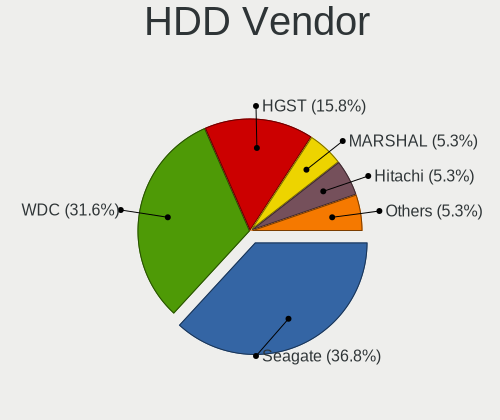

| Vendor  | Computers | Drives | Percent |
|---------|-----------|--------|---------|
| WDC     | 7         | 7      | 36.84%  |
| Seagate | 7         | 7      | 36.84%  |
| HGST    | 3         | 3      | 15.79%  |
| MARSHAL | 1         | 1      | 5.26%   |
| Hitachi | 1         | 1      | 5.26%   |

SSD Vendor
----------

Solid state drive vendors

| Vendor              | Computers | Drives | Percent |
|---------------------|-----------|--------|---------|
| Samsung Electronics | 6         | 6      | 26.09%  |
| WDC                 | 3         | 3      | 13.04%  |
| Kingston            | 3         | 3      | 13.04%  |
| SanDisk             | 2         | 2      | 8.7%    |
| LITEONIT            | 1         | 1      | 4.35%   |
| LITEON              | 1         | 1      | 4.35%   |
| JMicron Technology  | 1         | 1      | 4.35%   |
| Intel               | 1         | 1      | 4.35%   |
| Crucial             | 1         | 1      | 4.35%   |
| China               | 1         | 1      | 4.35%   |
| ASMedia             | 1         | 1      | 4.35%   |
| A-DATA Technology   | 1         | 1      | 4.35%   |
| Unknown             | 1         | 1      | 4.35%   |

Drive Kind
----------

HDD or SSD

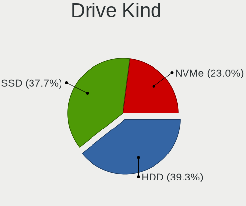

| Kind | Computers | Drives | Percent |
|------|-----------|--------|---------|
| SSD  | 19        | 23     | 43.18%  |
| HDD  | 17        | 19     | 38.64%  |
| NVMe | 8         | 10     | 18.18%  |

Drive Connector
---------------

SATA, SAS, NVMe, etc.

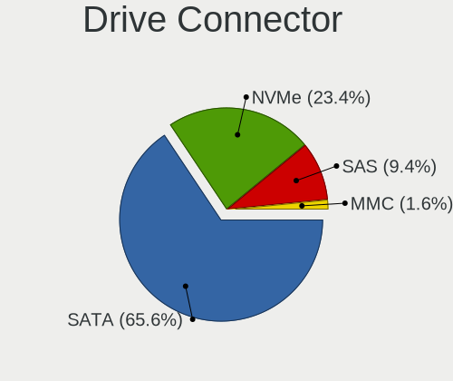

| Type | Computers | Drives | Percent |
|------|-----------|--------|---------|
| SATA | 29        | 38     | 70.73%  |
| NVMe | 8         | 10     | 19.51%  |
| SAS  | 4         | 4      | 9.76%   |

Drive Size
----------

Size of hard drive

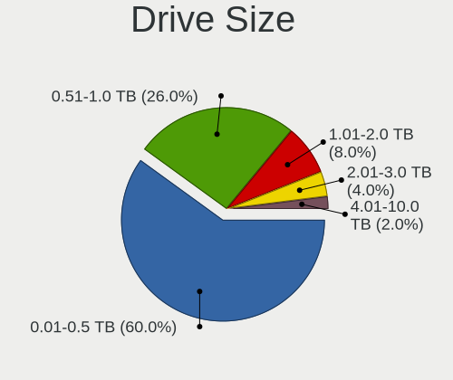

| Size in TB | Computers | Drives | Percent |
|------------|-----------|--------|---------|
| 0.01-0.5   | 24        | 29     | 64.86%  |
| 0.51-1.0   | 11        | 11     | 29.73%  |
| 2.01-3.0   | 1         | 1      | 2.7%    |
| 1.01-2.0   | 1         | 1      | 2.7%    |

Space Total
-----------

Amount of disk space available on the file system

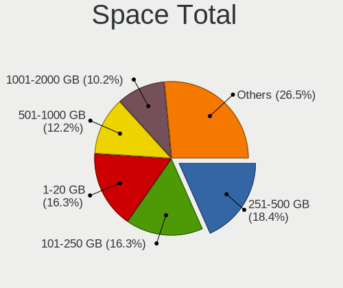

| Size in GB | Computers | Percent |
|------------|-----------|---------|
| 251-500    | 6         | 17.14%  |
| 101-250    | 6         | 17.14%  |
| 1-20       | 5         | 14.29%  |
| 501-1000   | 5         | 14.29%  |
| 51-100     | 4         | 11.43%  |
| Unknown    | 4         | 11.43%  |
| 1001-2000  | 3         | 8.57%   |
| 21-50      | 1         | 2.86%   |
| 2001-3000  | 1         | 2.86%   |

Space Used
----------

Amount of used disk space

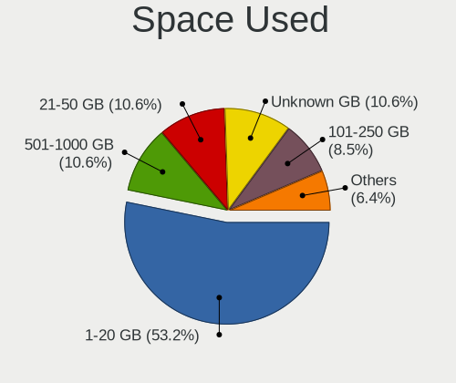

| Used GB  | Computers | Percent |
|----------|-----------|---------|
| 1-20     | 19        | 54.29%  |
| 101-250  | 4         | 11.43%  |
| Unknown  | 4         | 11.43%  |
| 21-50    | 3         | 8.57%   |
| 501-1000 | 3         | 8.57%   |
| 251-500  | 1         | 2.86%   |
| 51-100   | 1         | 2.86%   |

Malfunc. Drives
---------------

Drive models with a malfunction

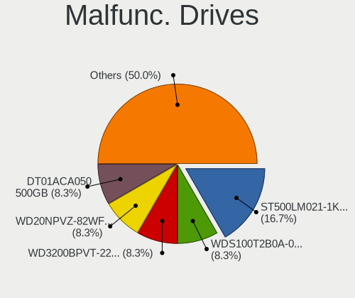

| Model                           | Computers | Drives | Percent |
|---------------------------------|-----------|--------|---------|
| Seagate ST500LM021-1KJ152 500GB | 2         | 2      | 25%     |
| WDC WDS100T2B0A-00SM50 1TB SSD  | 1         | 1      | 12.5%   |
| WDC WD3200BPVT-22ZEST0 320GB    | 1         | 1      | 12.5%   |
| Seagate ST500LM000-1EJ162 500GB | 1         | 1      | 12.5%   |
| MARSHAL MAL2500SA-T54L 500GB    | 1         | 1      | 12.5%   |
| Hitachi HTS545050A7E380 500GB   | 1         | 1      | 12.5%   |
| HGST HTS725050A7E630 500GB      | 1         | 1      | 12.5%   |

Malfunc. Drive Vendor
---------------------

Vendors of faulty drives

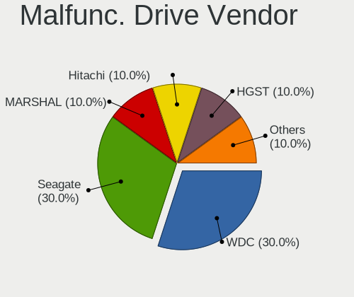

| Vendor  | Computers | Drives | Percent |
|---------|-----------|--------|---------|
| Seagate | 3         | 3      | 37.5%   |
| WDC     | 2         | 2      | 25%     |
| MARSHAL | 1         | 1      | 12.5%   |
| Hitachi | 1         | 1      | 12.5%   |
| HGST    | 1         | 1      | 12.5%   |

Malfunc. HDD Vendor
-------------------

Vendors of faulty HDD drives

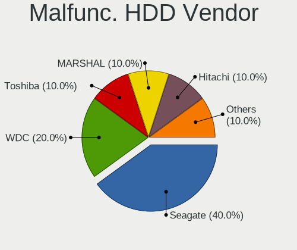

| Vendor  | Computers | Drives | Percent |
|---------|-----------|--------|---------|
| Seagate | 3         | 3      | 42.86%  |
| WDC     | 1         | 1      | 14.29%  |
| MARSHAL | 1         | 1      | 14.29%  |
| Hitachi | 1         | 1      | 14.29%  |
| HGST    | 1         | 1      | 14.29%  |

Malfunc. Drive Kind
-------------------

Kinds of faulty drives

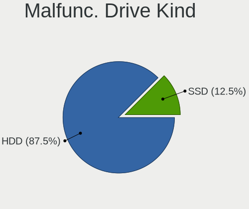

| Kind | Computers | Drives | Percent |
|------|-----------|--------|---------|
| HDD  | 7         | 7      | 87.5%   |
| SSD  | 1         | 1      | 12.5%   |

Failed Drives
-------------

Failed drive models

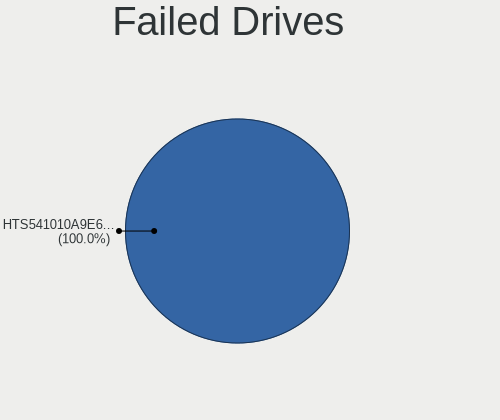

| Model                    | Computers | Drives | Percent |
|--------------------------|-----------|--------|---------|
| HGST HTS541010A9E680 1TB | 1         | 1      | 100%    |

Failed Drive Vendor
-------------------

Failed drive vendors

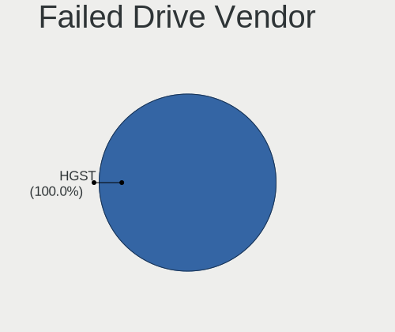

| Vendor | Computers | Drives | Percent |
|--------|-----------|--------|---------|
| HGST   | 1         | 1      | 100%    |

Drive Status
------------

Number of failed and malfunc. drives

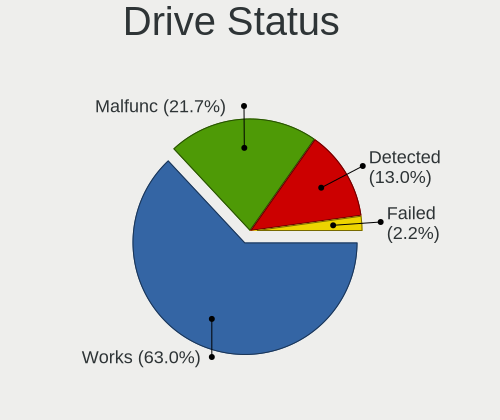

| Status   | Computers | Drives | Percent |
|----------|-----------|--------|---------|
| Works    | 24        | 38     | 63.16%  |
| Malfunc  | 8         | 8      | 21.05%  |
| Detected | 5         | 5      | 13.16%  |
| Failed   | 1         | 1      | 2.63%   |

Storage controller
------------------

Storage Vendor
--------------

Storage controller vendors

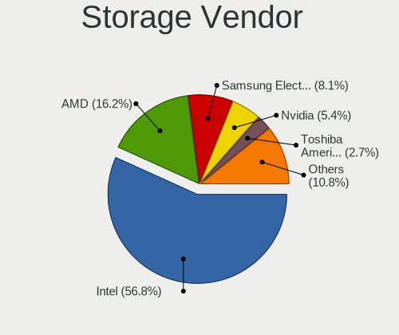

| Vendor                       | Computers | Percent |
|------------------------------|-----------|---------|
| Intel                        | 22        | 56.41%  |
| AMD                          | 6         | 15.38%  |
| Samsung Electronics          | 3         | 7.69%   |
| Nvidia                       | 2         | 5.13%   |
| Toshiba America Info Systems | 1         | 2.56%   |
| SK hynix                     | 1         | 2.56%   |
| Phison Electronics           | 1         | 2.56%   |
| Micron Technology            | 1         | 2.56%   |
| KIOXIA                       | 1         | 2.56%   |
| Kingston Technology Company  | 1         | 2.56%   |

Storage Model
-------------

Storage controller models

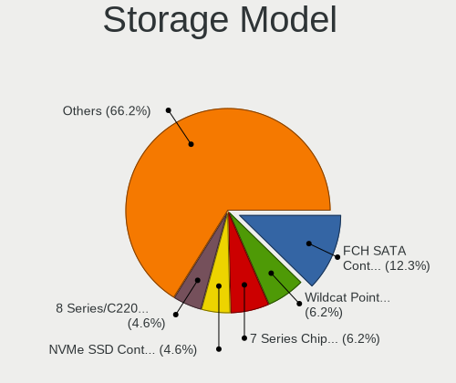

| Model                                                                         | Computers | Percent |
|-------------------------------------------------------------------------------|-----------|---------|
| AMD FCH SATA Controller [AHCI mode]                                           | 5         | 11.36%  |
| Intel Wildcat Point-LP SATA Controller [AHCI Mode]                            | 4         | 9.09%   |
| Intel 7 Series Chipset Family 6-port SATA Controller [AHCI mode]              | 3         | 6.82%   |
| Samsung NVMe SSD Controller SM981/PM981/PM983                                 | 2         | 4.55%   |
| Intel Q170/Q150/B150/H170/H110/Z170/CM236 Chipset SATA Controller [AHCI Mode] | 2         | 4.55%   |
| Intel 6 Series/C200 Series Chipset Family 6 port Desktop SATA AHCI Controller | 2         | 4.55%   |
| Toshiba America Info Systems XG6 NVMe SSD Controller                          | 1         | 2.27%   |
| SK hynix BC511                                                                | 1         | 2.27%   |
| Samsung NVMe SSD Controller SM961/PM961/SM963                                 | 1         | 2.27%   |
| Samsung NVMe SSD Controller 980                                               | 1         | 2.27%   |
| Phison NVMe Storage Controller                                                | 1         | 2.27%   |
| Nvidia MCP79 AHCI Controller                                                  | 1         | 2.27%   |
| Nvidia MCP61 SATA Controller                                                  | 1         | 2.27%   |
| Nvidia MCP61 IDE                                                              | 1         | 2.27%   |
| Micron Non-Volatile memory controller                                         | 1         | 2.27%   |
| KIOXIA NVMe SSD Controller BG4                                                | 1         | 2.27%   |
| Kingston Company Company Non-Volatile memory controller                       | 1         | 2.27%   |
| Intel Sunrise Point-LP SATA Controller [AHCI mode]                            | 1         | 2.27%   |
| Intel SATA Controller [RAID mode]                                             | 1         | 2.27%   |
| Intel HM170/QM170 Chipset SATA Controller [AHCI Mode]                         | 1         | 2.27%   |
| Intel Cannon Lake Mobile PCH SATA AHCI Controller                             | 1         | 2.27%   |
| Intel C604/X79 series chipset 4-Port SATA/SAS Storage Control Unit            | 1         | 2.27%   |
| Intel C600/X79 series chipset 6-Port SATA AHCI Controller                     | 1         | 2.27%   |
| Intel 82801 Mobile SATA Controller [RAID mode]                                | 1         | 2.27%   |
| Intel 8 Series SATA Controller 1 [AHCI mode]                                  | 1         | 2.27%   |
| Intel 7 Series/C210 Series Chipset Family 6-port SATA Controller [AHCI mode]  | 1         | 2.27%   |
| Intel 6 Series/C200 Series Chipset Family 6 port Mobile SATA AHCI Controller  | 1         | 2.27%   |
| Intel 5 Series/3400 Series Chipset 4 port SATA AHCI Controller                | 1         | 2.27%   |
| Intel 400 Series Chipset Family SATA AHCI Controller                          | 1         | 2.27%   |
| AMD X370 Series Chipset SATA Controller                                       | 1         | 2.27%   |
| AMD FCH IDE Controller                                                        | 1         | 2.27%   |
| AMD 500 Series Chipset SATA Controller                                        | 1         | 2.27%   |

Storage Kind
------------

Kind of storage controller (IDE, SATA, NVMe, SAS, ...)

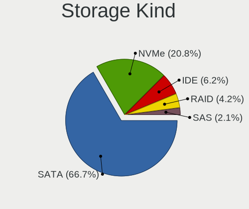

| Kind | Computers | Percent |
|------|-----------|---------|
| SATA | 27        | 67.5%   |
| NVMe | 8         | 20%     |
| RAID | 2         | 5%      |
| IDE  | 2         | 5%      |
| SAS  | 1         | 2.5%    |

Processor
---------

CPU Vendor
----------

Processor vendors

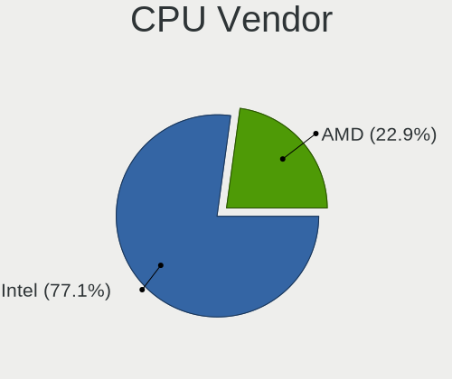

| Vendor | Computers | Percent |
|--------|-----------|---------|
| Intel  | 27        | 77.14%  |
| AMD    | 8         | 22.86%  |

CPU Model
---------

Processor models

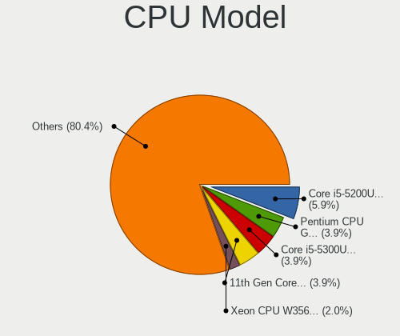

| Model                                     | Computers | Percent |
|-------------------------------------------|-----------|---------|
| Intel Pentium CPU G630 @ 2.70GHz          | 2         | 5.71%   |
| Intel Core i5-5300U CPU @ 2.30GHz         | 2         | 5.71%   |
| Intel Core i5-5200U CPU @ 2.20GHz         | 2         | 5.71%   |
| Intel Xeon CPU W3565 @ 3.20GHz            | 1         | 2.86%   |
| Intel Xeon CPU E5-1620 v2 @ 3.70GHz       | 1         | 2.86%   |
| Intel Core i7-8750H CPU @ 2.20GHz         | 1         | 2.86%   |
| Intel Core i7-7700HQ CPU @ 2.80GHz        | 1         | 2.86%   |
| Intel Core i7-3740QM CPU @ 2.70GHz        | 1         | 2.86%   |
| Intel Core i7-3630QM CPU @ 2.40GHz        | 1         | 2.86%   |
| Intel Core i7-2620M CPU @ 2.70GHz         | 1         | 2.86%   |
| Intel Core i7-1065G7 CPU @ 1.30GHz        | 1         | 2.86%   |
| Intel Core i5-6500T CPU @ 2.50GHz         | 1         | 2.86%   |
| Intel Core i5-6500 CPU @ 3.20GHz          | 1         | 2.86%   |
| Intel Core i5-6200U CPU @ 2.30GHz         | 1         | 2.86%   |
| Intel Core i5-4300U CPU @ 1.90GHz         | 1         | 2.86%   |
| Intel Core i5-4210U CPU @ 1.70GHz         | 1         | 2.86%   |
| Intel Core i5-3210M CPU @ 2.50GHz         | 1         | 2.86%   |
| Intel Core i5-10300H CPU @ 2.50GHz        | 1         | 2.86%   |
| Intel Core i3-3220 CPU @ 3.30GHz          | 1         | 2.86%   |
| Intel Core 2 Duo CPU E7600 @ 3.06GHz      | 1         | 2.86%   |
| Intel Celeron CPU U3600 @ 1.20GHz         | 1         | 2.86%   |
| Intel 12th Gen Core i7-12700H             | 1         | 2.86%   |
| Intel 11th Gen Core i7-1185G7 @ 3.00GHz   | 1         | 2.86%   |
| Intel 11th Gen Core i7-1165G7 @ 2.80GHz   | 1         | 2.86%   |
| AMD Ryzen 7 4800U with Radeon Graphics    | 1         | 2.86%   |
| AMD Ryzen 7 1700 Eight-Core Processor     | 1         | 2.86%   |
| AMD Ryzen 5 3600 6-Core Processor         | 1         | 2.86%   |
| AMD FX-6300 Six-Core Processor            | 1         | 2.86%   |
| AMD Athlon 64 Processor 3800+             | 1         | 2.86%   |
| AMD A6-5350M APU with Radeon HD Graphics  | 1         | 2.86%   |
| AMD A6-4400M APU with Radeon HD Graphics  | 1         | 2.86%   |
| AMD A10-5745M APU with Radeon HD Graphics | 1         | 2.86%   |

CPU Model Family
----------------

Processor model prefix

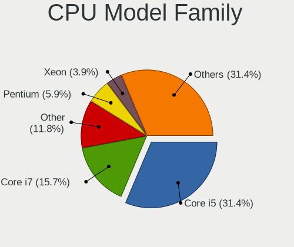

| Model            | Computers | Percent |
|------------------|-----------|---------|
| Intel Core i5    | 11        | 31.43%  |
| Intel Core i7    | 6         | 17.14%  |
| Other            | 3         | 8.57%   |
| Intel Xeon       | 2         | 5.71%   |
| Intel Pentium    | 2         | 5.71%   |
| AMD Ryzen 7      | 2         | 5.71%   |
| AMD A6           | 2         | 5.71%   |
| Intel Core i3    | 1         | 2.86%   |
| Intel Core 2 Duo | 1         | 2.86%   |
| Intel Celeron    | 1         | 2.86%   |
| AMD Ryzen 5      | 1         | 2.86%   |
| AMD FX           | 1         | 2.86%   |
| AMD Athlon 64    | 1         | 2.86%   |
| AMD A10          | 1         | 2.86%   |

CPU Cores
---------

Number of processor cores

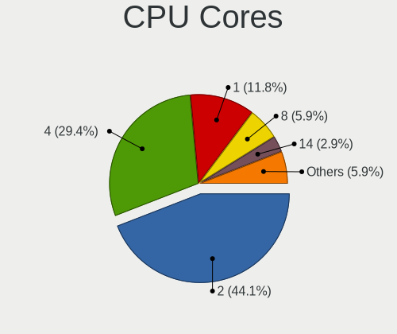

| Number | Computers | Percent |
|--------|-----------|---------|
| 2      | 15        | 42.86%  |
| 4      | 11        | 31.43%  |
| 1      | 4         | 11.43%  |
| 8      | 2         | 5.71%   |
| 14     | 1         | 2.86%   |
| 6      | 1         | 2.86%   |
| 3      | 1         | 2.86%   |

CPU Sockets
-----------

Number of sockets

| Number | Computers | Percent |
|--------|-----------|---------|
| 1      | 35        | 100%    |

CPU Threads
-----------

Threads per core (Hyper-Threading)

| Number | Computers | Percent |
|--------|-----------|---------|
| 2      | 27        | 77.14%  |
| 1      | 8         | 22.86%  |

CPU Op-Modes
------------

CPU Operation Modes (32-bit, 64-bit)

| Op mode        | Computers | Percent |
|----------------|-----------|---------|
| 32-bit, 64-bit | 35        | 100%    |

CPU Microcode
-------------

Microcode number

| Number     | Computers | Percent |
|------------|-----------|---------|
| 0x306d4    | 4         | 11.43%  |
| 0x306a9    | 4         | 11.43%  |
| 0x206a7    | 3         | 8.57%   |
| 0x806c1    | 2         | 5.71%   |
| 0x506e3    | 2         | 5.71%   |
| Unknown    | 2         | 5.71%   |
| 0xa0652    | 1         | 2.86%   |
| 0x906ea    | 1         | 2.86%   |
| 0x906e9    | 1         | 2.86%   |
| 0x906a3    | 1         | 2.86%   |
| 0x706e5    | 1         | 2.86%   |
| 0x406e3    | 1         | 2.86%   |
| 0x40651    | 1         | 2.86%   |
| 0x306e4    | 1         | 2.86%   |
| 0x20655    | 1         | 2.86%   |
| 0x106a5    | 1         | 2.86%   |
| 0x1067a    | 1         | 2.86%   |
| 0x08701021 | 1         | 2.86%   |
| 0x08600106 | 1         | 2.86%   |
| 0x08001137 | 1         | 2.86%   |
| 0x0600111f | 1         | 2.86%   |
| 0x06001119 | 1         | 2.86%   |
| 0x06001116 | 1         | 2.86%   |
| 0x06000822 | 1         | 2.86%   |

CPU Microarch
-------------

Microarchitecture

| Name             | Computers | Percent |
|------------------|-----------|---------|
| IvyBridge        | 5         | 14.29%  |
| Piledriver       | 4         | 11.43%  |
| Broadwell        | 4         | 11.43%  |
| Skylake          | 3         | 8.57%   |
| SandyBridge      | 3         | 8.57%   |
| Zen 2            | 2         | 5.71%   |
| TigerLake        | 2         | 5.71%   |
| KabyLake         | 2         | 5.71%   |
| Haswell          | 2         | 5.71%   |
| Zen              | 1         | 2.86%   |
| Westmere         | 1         | 2.86%   |
| Penryn           | 1         | 2.86%   |
| Nehalem          | 1         | 2.86%   |
| K8 Hammer        | 1         | 2.86%   |
| IceLake          | 1         | 2.86%   |
| CometLake        | 1         | 2.86%   |
| Alderlake Hybrid | 1         | 2.86%   |

Graphics
--------

GPU Vendor
----------

Vendors of graphics cards

| Vendor | Computers | Percent |
|--------|-----------|---------|
| Intel  | 24        | 57.14%  |
| Nvidia | 11        | 26.19%  |
| AMD    | 7         | 16.67%  |

GPU Model
---------

Graphics card models

| Model                                                                     | Computers | Percent |
|---------------------------------------------------------------------------|-----------|---------|
| Intel HD Graphics 5500                                                    | 4         | 9.52%   |
| Intel 3rd Gen Core processor Graphics Controller                          | 3         | 7.14%   |
| Intel 2nd Generation Core Processor Family Integrated Graphics Controller | 3         | 7.14%   |
| Intel TigerLake-LP GT2 [Iris Xe Graphics]                                 | 2         | 4.76%   |
| Intel HD Graphics 530                                                     | 2         | 4.76%   |
| Intel Haswell-ULT Integrated Graphics Controller                          | 2         | 4.76%   |
| Nvidia TU117M                                                             | 1         | 2.38%   |
| Nvidia MCP7A [GeForce 9400]                                               | 1         | 2.38%   |
| Nvidia GP108 [GeForce GT 1030]                                            | 1         | 2.38%   |
| Nvidia GP107M [GeForce GTX 1050 Ti Mobile]                                | 1         | 2.38%   |
| Nvidia GP107 [GeForce GTX 1050 Ti]                                        | 1         | 2.38%   |
| Nvidia GK208B [GeForce GT 710]                                            | 1         | 2.38%   |
| Nvidia GK107M [GeForce GT 740M]                                           | 1         | 2.38%   |
| Nvidia GF119M [Quadro NVS 4200M]                                          | 1         | 2.38%   |
| Nvidia GA104M [GeForce RTX 3080 Mobile / Max-Q 8GB/16GB]                  | 1         | 2.38%   |
| Nvidia G94GL [Quadro FX 1800]                                             | 1         | 2.38%   |
| Nvidia C61 [GeForce 6150SE nForce 430]                                    | 1         | 2.38%   |
| Intel Xeon E3-1200 v2/3rd Gen Core processor Graphics Controller          | 1         | 2.38%   |
| Intel Skylake GT2 [HD Graphics 520]                                       | 1         | 2.38%   |
| Intel Iris Plus Graphics G7                                               | 1         | 2.38%   |
| Intel HD Graphics 630                                                     | 1         | 2.38%   |
| Intel Core Processor Integrated Graphics Controller                       | 1         | 2.38%   |
| Intel CometLake-H GT2 [UHD Graphics]                                      | 1         | 2.38%   |
| Intel CoffeeLake-H GT2 [UHD Graphics 630]                                 | 1         | 2.38%   |
| Intel Alder Lake-P Integrated Graphics Controller                         | 1         | 2.38%   |
| AMD Venus PRO [Radeon HD 8850M / R9 M265X]                                | 1         | 2.38%   |
| AMD Trinity 2 [Radeon HD 7520G]                                           | 1         | 2.38%   |
| AMD RV710 [Radeon HD 4350/4550]                                           | 1         | 2.38%   |
| AMD Richland [Radeon HD 8610G]                                            | 1         | 2.38%   |
| AMD Richland [Radeon HD 8450G]                                            | 1         | 2.38%   |
| AMD Renoir                                                                | 1         | 2.38%   |
| AMD Ellesmere [Radeon RX 470/480/570/570X/580/580X/590]                   | 1         | 2.38%   |

GPU Combo
---------

Combinations of graphics cards

| Name           | Computers | Percent |
|----------------|-----------|---------|
| 1 x Intel      | 17        | 48.57%  |
| Intel + Nvidia | 6         | 17.14%  |
| 1 x AMD        | 6         | 17.14%  |
| 1 x Nvidia     | 5         | 14.29%  |
| Intel + AMD    | 1         | 2.86%   |

GPU Driver
----------

Free vs proprietary

| Driver      | Computers | Percent |
|-------------|-----------|---------|
| Free        | 32        | 91.43%  |
| Proprietary | 2         | 5.71%   |
| Unknown     | 1         | 2.86%   |

GPU Memory
----------

Total video memory

| Size in GB | Computers | Percent |
|------------|-----------|---------|
| Unknown    | 20        | 57.14%  |
| 0.51-1.0   | 5         | 14.29%  |
| 0.01-0.5   | 4         | 11.43%  |
| 7.01-8.0   | 2         | 5.71%   |
| 3.01-4.0   | 2         | 5.71%   |
| 1.01-2.0   | 2         | 5.71%   |

Monitor
-------

Monitor Vendor
--------------

Monitor vendors

| Vendor                  | Computers | Percent |
|-------------------------|-----------|---------|
| LG Display              | 5         | 13.89%  |
| Chimei Innolux          | 5         | 13.89%  |
| Samsung Electronics     | 4         | 11.11%  |
| AU Optronics            | 4         | 11.11%  |
| Dell                    | 3         | 8.33%   |
| Acer                    | 3         | 8.33%   |
| Chi Mei Optoelectronics | 2         | 5.56%   |
| BOE                     | 2         | 5.56%   |
| Apple                   | 2         | 5.56%   |
| Vizio                   | 1         | 2.78%   |
| Sharp                   | 1         | 2.78%   |
| Philips                 | 1         | 2.78%   |
| PANDA                   | 1         | 2.78%   |
| Lenovo                  | 1         | 2.78%   |
| Iiyama                  | 1         | 2.78%   |

Monitor Model
-------------

Monitor models

| Model                                                                     | Computers | Percent |
|---------------------------------------------------------------------------|-----------|---------|
| LG Display LCD Monitor LGD045E 1366x768 310x174mm 14.0-inch               | 2         | 5.56%   |
| Vizio M220MV VIZ0062 1920x1080 509x286mm 23.0-inch                        | 1         | 2.78%   |
| Sharp LQ173M1JW08 SHP1544 1920x1080 382x215mm 17.3-inch                   | 1         | 2.78%   |
| Samsung Electronics SMB2330H SAM064A 1920x1080 509x286mm 23.0-inch        | 1         | 2.78%   |
| Samsung Electronics SA300/SA350 SAM078E 1920x1080 477x268mm 21.5-inch     | 1         | 2.78%   |
| Samsung Electronics LCD Monitor SDC4159 1920x1080 344x194mm 15.5-inch     | 1         | 2.78%   |
| Samsung Electronics LCD Monitor SAM0D4B 1360x768 609x347mm 27.6-inch      | 1         | 2.78%   |
| Philips PHL 243V5 PHLC0D1 1920x1080 521x293mm 23.5-inch                   | 1         | 2.78%   |
| PANDA LCD Monitor NCP005F 1920x1080 344x194mm 15.5-inch                   | 1         | 2.78%   |
| LG Display LCD Monitor LGD40BA 1920x1080 344x194mm 15.5-inch              | 1         | 2.78%   |
| LG Display LCD Monitor LGD05E5 1920x1080 344x194mm 15.5-inch              | 1         | 2.78%   |
| LG Display LCD Monitor LGD0372 1600x900 382x215mm 17.3-inch               | 1         | 2.78%   |
| Lenovo LCD Monitor LEN40B2 1920x1080 344x193mm 15.5-inch                  | 1         | 2.78%   |
| Iiyama PL2773H IVM660A 1920x1080 600x340mm 27.2-inch                      | 1         | 2.78%   |
| Dell U2515H DELD06F 2560x1440 553x311mm 25.0-inch                         | 1         | 2.78%   |
| Dell SE2719HR DELF115 1920x1080 598x336mm 27.0-inch                       | 1         | 2.78%   |
| Dell 1909W DELA03C 1440x900 408x255mm 18.9-inch                           | 1         | 2.78%   |
| Chimei Innolux LCD Monitor CMN15C3 1920x1080 344x193mm 15.5-inch          | 1         | 2.78%   |
| Chimei Innolux LCD Monitor CMN15BC 1366x768 344x193mm 15.5-inch           | 1         | 2.78%   |
| Chimei Innolux LCD Monitor CMN14C3 1366x768 309x173mm 13.9-inch           | 1         | 2.78%   |
| Chimei Innolux LCD Monitor CMN1495 1366x768 309x173mm 13.9-inch           | 1         | 2.78%   |
| Chimei Innolux LCD Monitor CMN1482 1600x900 309x174mm 14.0-inch           | 1         | 2.78%   |
| Chi Mei Optoelectronics LCD Monitor CMO1720 1920x1080 382x215mm 17.3-inch | 1         | 2.78%   |
| Chi Mei Optoelectronics LCD Monitor CMO1100 1366x768 256x144mm 11.6-inch  | 1         | 2.78%   |
| BOE LCD Monitor BOE09DC 1920x1080 344x194mm 15.5-inch                     | 1         | 2.78%   |
| BOE LCD Monitor BOE05FE 1366x768 309x173mm 13.9-inch                      | 1         | 2.78%   |
| AU Optronics LCD Monitor AUO63ED 1920x1080 344x193mm 15.5-inch            | 1         | 2.78%   |
| AU Optronics LCD Monitor AUO453D 1920x1080 309x174mm 14.0-inch            | 1         | 2.78%   |
| AU Optronics LCD Monitor AUO313C 1366x768 309x173mm 13.9-inch             | 1         | 2.78%   |
| AU Optronics LCD Monitor AUO21ED 1920x1080 344x193mm 15.5-inch            | 1         | 2.78%   |
| Apple LCD Monitor APP9CC3 1280x800 286x179mm 13.3-inch                    | 1         | 2.78%   |
| Apple Color LCD APP9CBC 1920x1080 475x267mm 21.5-inch                     | 1         | 2.78%   |
| Acer X223HQ ACR0098 1920x1080 477x268mm 21.5-inch                         | 1         | 2.78%   |
| Acer K202HQL ACR03E0 1366x768 434x236mm 19.4-inch                         | 1         | 2.78%   |
| Acer B193W ACR001E 1440x900 408x255mm 18.9-inch                           | 1         | 2.78%   |

Monitor Resolution
------------------

Monitor screen resolution

| Resolution       | Computers | Percent |
|------------------|-----------|---------|
| 1920x1080 (FHD)  | 18        | 54.55%  |
| 1366x768 (WXGA)  | 9         | 27.27%  |
| 1600x900 (HD+)   | 2         | 6.06%   |
| 1440x900 (WXGA+) | 2         | 6.06%   |
| 2560x1440 (QHD)  | 1         | 3.03%   |
| 1280x800 (WXGA)  | 1         | 3.03%   |

Monitor Diagonal
----------------

Diagonal size in inches

| Inches | Computers | Percent |
|--------|-----------|---------|
| 15     | 10        | 27.78%  |
| 14     | 5         | 13.89%  |
| 13     | 4         | 11.11%  |
| 21     | 3         | 8.33%   |
| 17     | 3         | 8.33%   |
| 27     | 2         | 5.56%   |
| 23     | 2         | 5.56%   |
| 19     | 2         | 5.56%   |
| 31     | 1         | 2.78%   |
| 26     | 1         | 2.78%   |
| 25     | 1         | 2.78%   |
| 18     | 1         | 2.78%   |
| 11     | 1         | 2.78%   |

Monitor Width
-------------

Physical width

| Width in mm | Computers | Percent |
|-------------|-----------|---------|
| 301-350     | 18        | 50%     |
| 501-600     | 6         | 16.67%  |
| 401-500     | 6         | 16.67%  |
| 351-400     | 3         | 8.33%   |
| 201-300     | 2         | 5.56%   |
| 601-700     | 1         | 2.78%   |

Aspect Ratio
------------

Proportional relationship between the width and the height

| Ratio | Computers | Percent |
|-------|-----------|---------|
| 16/9  | 30        | 90.91%  |
| 16/10 | 3         | 9.09%   |

Monitor Area
------------

Area in inch²

| Area in inch² | Computers | Percent |
|----------------|-----------|---------|
| 101-110        | 10        | 27.78%  |
| 81-90          | 9         | 25%     |
| 201-250        | 4         | 11.11%  |
| 151-200        | 4         | 11.11%  |
| 121-130        | 3         | 8.33%   |
| 301-350        | 2         | 5.56%   |
| 251-300        | 2         | 5.56%   |
| 51-60          | 1         | 2.78%   |
| 351-500        | 1         | 2.78%   |

Pixel Density
-------------

Pixels per inch

| Density | Computers | Percent |
|---------|-----------|---------|
| 121-160 | 14        | 38.89%  |
| 101-120 | 12        | 33.33%  |
| 51-100  | 9         | 25%     |
| 1-50    | 1         | 2.78%   |

Multiple Monitors
-----------------

Total monitors connected

| Total | Computers | Percent |
|-------|-----------|---------|
| 1     | 29        | 82.86%  |
| 2     | 5         | 14.29%  |
| 0     | 1         | 2.86%   |

Network
-------

Net Controller Vendor
---------------------

Controller vendors

| Vendor                | Computers | Percent |
|-----------------------|-----------|---------|
| Intel                 | 18        | 33.33%  |
| Realtek Semiconductor | 14        | 25.93%  |
| Qualcomm Atheros      | 10        | 18.52%  |
| TP-Link               | 3         | 5.56%   |
| Broadcom              | 3         | 5.56%   |
| Nvidia                | 2         | 3.7%    |
| Lenovo                | 2         | 3.7%    |
| Sierra Wireless       | 1         | 1.85%   |
| ASUSTek Computer      | 1         | 1.85%   |

Net Controller Model
--------------------

Controller models

| Model                                                             | Computers | Percent |
|-------------------------------------------------------------------|-----------|---------|
| Realtek RTL8111/8168/8411 PCI Express Gigabit Ethernet Controller | 7         | 10.29%  |
| Intel 82579LM Gigabit Network Connection (Lewisville)             | 4         | 5.88%   |
| Realtek RTL810xE PCI Express Fast Ethernet controller             | 3         | 4.41%   |
| Intel Wireless 7265                                               | 3         | 4.41%   |
| Intel Centrino Advanced-N 6205 [Taylor Peak]                      | 3         | 4.41%   |
| TP-Link 802.11ac WLAN Adapter                                     | 2         | 2.94%   |
| Qualcomm Atheros QCA9565 / AR9565 Wireless Network Adapter        | 2         | 2.94%   |
| Qualcomm Atheros QCA6174 802.11ac Wireless Network Adapter        | 2         | 2.94%   |
| Qualcomm Atheros AR9485 Wireless Network Adapter                  | 2         | 2.94%   |
| Intel Ethernet Connection (3) I218-LM                             | 2         | 2.94%   |
| Intel Ethernet Connection (2) I219-LM                             | 2         | 2.94%   |
| TP-Link Archer T4UH wireless Realtek 8812AU                       | 1         | 1.47%   |
| Sierra Wireless EM7345 4G LTE                                     | 1         | 1.47%   |
| Realtek RTL8723BU 802.11b/g/n WLAN Adapter                        | 1         | 1.47%   |
| Realtek RTL8188EE Wireless Network Adapter                        | 1         | 1.47%   |
| Realtek RTL8169 PCI Gigabit Ethernet Controller                   | 1         | 1.47%   |
| Realtek RTL8153 Gigabit Ethernet Adapter                          | 1         | 1.47%   |
| Realtek RTL8125 2.5GbE Controller                                 | 1         | 1.47%   |
| Realtek 802.11ac NIC                                              | 1         | 1.47%   |
| Qualcomm Atheros QCA9377 802.11ac Wireless Network Adapter        | 1         | 1.47%   |
| Qualcomm Atheros AR928X Wireless Network Adapter (PCI-Express)    | 1         | 1.47%   |
| Qualcomm Atheros AR9287 Wireless Network Adapter (PCI-Express)    | 1         | 1.47%   |
| Qualcomm Atheros AR8161 Gigabit Ethernet                          | 1         | 1.47%   |
| Qualcomm Atheros AR8151 v2.0 Gigabit Ethernet                     | 1         | 1.47%   |
| Qualcomm Atheros AR8151 v1.0 Gigabit Ethernet                     | 1         | 1.47%   |
| Nvidia MCP79 Ethernet                                             | 1         | 1.47%   |
| Nvidia MCP61 Ethernet                                             | 1         | 1.47%   |
| Lenovo USB-C Dock Ethernet                                        | 1         | 1.47%   |
| Lenovo P2a42                                                      | 1         | 1.47%   |
| Intel Wireless 8260                                               | 1         | 1.47%   |
| Intel Wireless 7260                                               | 1         | 1.47%   |
| Intel Wi-Fi 6 AX210/AX211/AX411 160MHz                            | 1         | 1.47%   |
| Intel Wi-Fi 6 AX201                                               | 1         | 1.47%   |
| Intel Wi-Fi 6 AX200                                               | 1         | 1.47%   |
| Intel I211 Gigabit Network Connection                             | 1         | 1.47%   |
| Intel Ethernet Connection I219-V                                  | 1         | 1.47%   |
| Intel Ethernet Connection I218-LM                                 | 1         | 1.47%   |
| Intel Ethernet Connection (3) I218-V                              | 1         | 1.47%   |
| Intel Ethernet Connection (13) I219-LM                            | 1         | 1.47%   |
| Intel Comet Lake PCH CNVi WiFi                                    | 1         | 1.47%   |

Wireless Vendor
---------------

Wireless vendors

| Vendor                | Computers | Percent |
|-----------------------|-----------|---------|
| Intel                 | 13        | 40.63%  |
| Qualcomm Atheros      | 9         | 28.13%  |
| TP-Link               | 3         | 9.38%   |
| Realtek Semiconductor | 3         | 9.38%   |
| Broadcom              | 2         | 6.25%   |
| Sierra Wireless       | 1         | 3.13%   |
| ASUSTek Computer      | 1         | 3.13%   |

Wireless Model
--------------

Wireless models

| Model                                                          | Computers | Percent |
|----------------------------------------------------------------|-----------|---------|
| Intel Wireless 7265                                            | 3         | 9.38%   |
| Intel Centrino Advanced-N 6205 [Taylor Peak]                   | 3         | 9.38%   |
| TP-Link 802.11ac WLAN Adapter                                  | 2         | 6.25%   |
| Qualcomm Atheros QCA9565 / AR9565 Wireless Network Adapter     | 2         | 6.25%   |
| Qualcomm Atheros QCA6174 802.11ac Wireless Network Adapter     | 2         | 6.25%   |
| Qualcomm Atheros AR9485 Wireless Network Adapter               | 2         | 6.25%   |
| TP-Link Archer T4UH wireless Realtek 8812AU                    | 1         | 3.13%   |
| Sierra Wireless EM7345 4G LTE                                  | 1         | 3.13%   |
| Realtek RTL8723BU 802.11b/g/n WLAN Adapter                     | 1         | 3.13%   |
| Realtek RTL8188EE Wireless Network Adapter                     | 1         | 3.13%   |
| Realtek 802.11ac NIC                                           | 1         | 3.13%   |
| Qualcomm Atheros QCA9377 802.11ac Wireless Network Adapter     | 1         | 3.13%   |
| Qualcomm Atheros AR928X Wireless Network Adapter (PCI-Express) | 1         | 3.13%   |
| Qualcomm Atheros AR9287 Wireless Network Adapter (PCI-Express) | 1         | 3.13%   |
| Intel Wireless 8260                                            | 1         | 3.13%   |
| Intel Wireless 7260                                            | 1         | 3.13%   |
| Intel Wi-Fi 6 AX210/AX211/AX411 160MHz                         | 1         | 3.13%   |
| Intel Wi-Fi 6 AX201                                            | 1         | 3.13%   |
| Intel Wi-Fi 6 AX200                                            | 1         | 3.13%   |
| Intel Comet Lake PCH CNVi WiFi                                 | 1         | 3.13%   |
| Intel Alder Lake-P PCH CNVi WiFi                               | 1         | 3.13%   |
| Broadcom BCM4331 802.11a/b/g/n                                 | 1         | 3.13%   |
| Broadcom BCM43228 802.11a/b/g/n                                | 1         | 3.13%   |
| ASUS 802.11ac NIC                                              | 1         | 3.13%   |

Ethernet Vendor
---------------

Ethernet vendors

| Vendor                | Computers | Percent |
|-----------------------|-----------|---------|
| Realtek Semiconductor | 13        | 37.14%  |
| Intel                 | 13        | 37.14%  |
| Qualcomm Atheros      | 3         | 8.57%   |
| Nvidia                | 2         | 5.71%   |
| Lenovo                | 2         | 5.71%   |
| Broadcom              | 2         | 5.71%   |

Ethernet Model
--------------

Ethernet models

| Model                                                             | Computers | Percent |
|-------------------------------------------------------------------|-----------|---------|
| Realtek RTL8111/8168/8411 PCI Express Gigabit Ethernet Controller | 7         | 19.44%  |
| Intel 82579LM Gigabit Network Connection (Lewisville)             | 4         | 11.11%  |
| Realtek RTL810xE PCI Express Fast Ethernet controller             | 3         | 8.33%   |
| Intel Ethernet Connection (3) I218-LM                             | 2         | 5.56%   |
| Intel Ethernet Connection (2) I219-LM                             | 2         | 5.56%   |
| Realtek RTL8169 PCI Gigabit Ethernet Controller                   | 1         | 2.78%   |
| Realtek RTL8153 Gigabit Ethernet Adapter                          | 1         | 2.78%   |
| Realtek RTL8125 2.5GbE Controller                                 | 1         | 2.78%   |
| Qualcomm Atheros AR8161 Gigabit Ethernet                          | 1         | 2.78%   |
| Qualcomm Atheros AR8151 v2.0 Gigabit Ethernet                     | 1         | 2.78%   |
| Qualcomm Atheros AR8151 v1.0 Gigabit Ethernet                     | 1         | 2.78%   |
| Nvidia MCP79 Ethernet                                             | 1         | 2.78%   |
| Nvidia MCP61 Ethernet                                             | 1         | 2.78%   |
| Lenovo USB-C Dock Ethernet                                        | 1         | 2.78%   |
| Lenovo P2a42                                                      | 1         | 2.78%   |
| Intel I211 Gigabit Network Connection                             | 1         | 2.78%   |
| Intel Ethernet Connection I219-V                                  | 1         | 2.78%   |
| Intel Ethernet Connection I218-LM                                 | 1         | 2.78%   |
| Intel Ethernet Connection (3) I218-V                              | 1         | 2.78%   |
| Intel Ethernet Connection (13) I219-LM                            | 1         | 2.78%   |
| Intel 82575EB Gigabit Network Connection                          | 1         | 2.78%   |
| Broadcom NetXtreme BCM57765 Gigabit Ethernet PCIe                 | 1         | 2.78%   |
| Broadcom NetXtreme BCM5764M Gigabit Ethernet PCIe                 | 1         | 2.78%   |

Net Controller Kind
-------------------

Ethernet, WiFi or modem

| Kind     | Computers | Percent |
|----------|-----------|---------|
| Ethernet | 33        | 53.23%  |
| WiFi     | 29        | 46.77%  |

Used Controller
---------------

Currently used network controller

| Kind     | Computers | Percent |
|----------|-----------|---------|
| Ethernet | 19        | 52.78%  |
| WiFi     | 17        | 47.22%  |

NICs
----

Total network controllers on board

| Total | Computers | Percent |
|-------|-----------|---------|
| 2     | 22        | 62.86%  |
| 1     | 11        | 31.43%  |
| 4     | 1         | 2.86%   |
| 0     | 1         | 2.86%   |

IPv6
----

IPv6 vs IPv4

| Used | Computers | Percent |
|------|-----------|---------|
| No   | 24        | 68.57%  |
| Yes  | 11        | 31.43%  |

Bluetooth
---------

Bluetooth Vendor
----------------

Controller vendors

| Vendor                          | Computers | Percent |
|---------------------------------|-----------|---------|
| Intel                           | 9         | 40.91%  |
| Qualcomm Atheros Communications | 5         | 22.73%  |
| Broadcom                        | 3         | 13.64%  |
| Apple                           | 2         | 9.09%   |
| IMC Networks                    | 1         | 4.55%   |
| Foxconn / Hon Hai               | 1         | 4.55%   |
| Cambridge Silicon Radio         | 1         | 4.55%   |

Bluetooth Model
---------------

Controller models

| Model                                               | Computers | Percent |
|-----------------------------------------------------|-----------|---------|
| Intel Bluetooth wireless interface                  | 4         | 18.18%  |
| Qualcomm Atheros  Bluetooth Device                  | 3         | 13.64%  |
| Broadcom BCM20702A0 Bluetooth 4.0                   | 2         | 9.09%   |
| Qualcomm Atheros AR9462 Bluetooth                   | 1         | 4.55%   |
| Qualcomm Atheros AR3012 Bluetooth 4.0               | 1         | 4.55%   |
| Intel Bluetooth Device                              | 1         | 4.55%   |
| Intel Bluetooth 9460/9560 Jefferson Peak (JfP)      | 1         | 4.55%   |
| Intel AX210 Bluetooth                               | 1         | 4.55%   |
| Intel AX201 Bluetooth                               | 1         | 4.55%   |
| Intel AX200 Bluetooth                               | 1         | 4.55%   |
| IMC Networks Atheros AR3012 Bluetooth 4.0 Adapter   | 1         | 4.55%   |
| Foxconn / Hon Hai Acer Module                       | 1         | 4.55%   |
| Cambridge Silicon Radio Bluetooth Dongle (HCI mode) | 1         | 4.55%   |
| Broadcom HP Portable Bumble Bee                     | 1         | 4.55%   |
| Apple Built-in Bluetooth 2.0+EDR HCI                | 1         | 4.55%   |
| Apple Bluetooth USB Host Controller                 | 1         | 4.55%   |

Sound
-----

Sound Vendor
------------

Sound card vendors

| Vendor              | Computers | Percent |
|---------------------|-----------|---------|
| Intel               | 26        | 53.06%  |
| Nvidia              | 10        | 20.41%  |
| AMD                 | 8         | 16.33%  |
| Roland              | 1         | 2.04%   |
| Plantronics         | 1         | 2.04%   |
| Lenovo              | 1         | 2.04%   |
| C-Media Electronics | 1         | 2.04%   |
| ASUSTek Computer    | 1         | 2.04%   |

Sound Model
-----------

Sound card models

| Model                                                                      | Computers | Percent |
|----------------------------------------------------------------------------|-----------|---------|
| Intel Wildcat Point-LP High Definition Audio Controller                    | 4         | 6.78%   |
| Intel Broadwell-U Audio Controller                                         | 4         | 6.78%   |
| Intel 7 Series/C216 Chipset Family High Definition Audio Controller        | 4         | 6.78%   |
| Intel 6 Series/C200 Series Chipset Family High Definition Audio Controller | 3         | 5.08%   |
| AMD Trinity HDMI Audio Controller                                          | 3         | 5.08%   |
| AMD FCH Azalia Controller                                                  | 3         | 5.08%   |
| Nvidia GP107GL High Definition Audio Controller                            | 2         | 3.39%   |
| Intel Tiger Lake-LP Smart Sound Technology Audio Controller                | 2         | 3.39%   |
| Intel 8 Series HD Audio Controller                                         | 2         | 3.39%   |
| Intel 100 Series/C230 Series Chipset Family HD Audio Controller            | 2         | 3.39%   |
| Roland QUAD-CAPTURE                                                        | 1         | 1.69%   |
| Plantronics Blackwire 5220 Series                                          | 1         | 1.69%   |
| Nvidia TU107 GeForce GTX 1650 High Definition Audio Controller             | 1         | 1.69%   |
| Nvidia MCP79 High Definition Audio                                         | 1         | 1.69%   |
| Nvidia MCP61 High Definition Audio                                         | 1         | 1.69%   |
| Nvidia GP108 High Definition Audio Controller                              | 1         | 1.69%   |
| Nvidia GK208 HDMI/DP Audio Controller                                      | 1         | 1.69%   |
| Nvidia GK107 HDMI Audio Controller                                         | 1         | 1.69%   |
| Nvidia GF119 HDMI Audio Controller                                         | 1         | 1.69%   |
| Nvidia GA104 High Definition Audio Controller                              | 1         | 1.69%   |
| Lenovo ThinkPad USB-C Dock Gen2 USB Audio                                  | 1         | 1.69%   |
| Intel Sunrise Point-LP HD Audio                                            | 1         | 1.69%   |
| Intel Ice Lake-LP Smart Sound Technology Audio Controller                  | 1         | 1.69%   |
| Intel Haswell-ULT HD Audio Controller                                      | 1         | 1.69%   |
| Intel Comet Lake PCH cAVS                                                  | 1         | 1.69%   |
| Intel CM238 HD Audio Controller                                            | 1         | 1.69%   |
| Intel Cannon Lake PCH cAVS                                                 | 1         | 1.69%   |
| Intel C600/X79 series chipset High Definition Audio Controller             | 1         | 1.69%   |
| Intel Alder Lake PCH-P High Definition Audio Controller                    | 1         | 1.69%   |
| Intel 82801JI (ICH10 Family) HD Audio Controller                           | 1         | 1.69%   |
| Intel 5 Series/3400 Series Chipset High Definition Audio                   | 1         | 1.69%   |
| C-Media Electronics CM108 Audio Controller                                 | 1         | 1.69%   |
| ASUSTek Computer Xonar SoundCard                                           | 1         | 1.69%   |
| AMD Starship/Matisse HD Audio Controller                                   | 1         | 1.69%   |
| AMD SBx00 Azalia (Intel HDA)                                               | 1         | 1.69%   |
| AMD RV710/730 HDMI Audio [Radeon HD 4000 series]                           | 1         | 1.69%   |
| AMD Renoir Radeon High Definition Audio Controller                         | 1         | 1.69%   |
| AMD Family 17h/19h HD Audio Controller                                     | 1         | 1.69%   |
| AMD Family 17h (Models 00h-0fh) HD Audio Controller                        | 1         | 1.69%   |
| AMD Ellesmere HDMI Audio [Radeon RX 470/480 / 570/580/590]                 | 1         | 1.69%   |

Memory
------

Memory Vendor
-------------

Memory module vendors

| Vendor              | Computers | Percent |
|---------------------|-----------|---------|
| Samsung Electronics | 10        | 22.73%  |
| SK hynix            | 8         | 18.18%  |
| Crucial             | 6         | 13.64%  |
| Kingston            | 5         | 11.36%  |
| Micron Technology   | 4         | 9.09%   |
| Corsair             | 2         | 4.55%   |
| A-DATA Technology   | 2         | 4.55%   |
| Unknown             | 1         | 2.27%   |
| Ramaxel Technology  | 1         | 2.27%   |
| G.Skill             | 1         | 2.27%   |
| Elpida              | 1         | 2.27%   |
| Apacer              | 1         | 2.27%   |
| A Force             | 1         | 2.27%   |
| 8A020000802C        | 1         | 2.27%   |

Memory Model
------------

Memory module models

| Model                                                        | Computers | Percent |
|--------------------------------------------------------------|-----------|---------|
| Samsung RAM M471B1G73DB0-YK0 8GB SODIMM DDR3 1600MT/s        | 2         | 4.26%   |
| Crucial RAM CT102464BF160B.C16 8GB SODIMM DDR3 1600MT/s      | 2         | 4.26%   |
| Unknown RAM Module 1GB DIMM 400MT/s                          | 1         | 2.13%   |
| SK hynix RAM Module 8GB SODIMM DDR4 2133MT/s                 | 1         | 2.13%   |
| SK hynix RAM HMT451U6BFR8A-PB 4GB DIMM DDR3 1648MT/s         | 1         | 2.13%   |
| SK hynix RAM HMT451S6AFR8A-PB 4GB SODIMM DDR3 1600MT/s       | 1         | 2.13%   |
| SK hynix RAM HMT41GS6BFR8A-PB 8GB SODIMM DDR3 1600MT/s       | 1         | 2.13%   |
| SK hynix RAM HMT41GS6AFR8A-PB 8GB SODIMM DDR3 1600MT/s       | 1         | 2.13%   |
| SK hynix RAM HMT351S6EFR8A-PB 4GB SODIMM DDR3 1600MT/s       | 1         | 2.13%   |
| SK hynix RAM HMAA2GS6CJR8N-XN 16GB SODIMM DDR4 3200MT/s      | 1         | 2.13%   |
| SK hynix RAM HMAA1GS6CMR6N-XN 8GB Row Of Chips DDR4 3200MT/s | 1         | 2.13%   |
| SK hynix RAM HMA81GS6DJR8N-XN 8GB SODIMM DDR4 3200MT/s       | 1         | 2.13%   |
| Samsung RAM UBE3D4AA-MGCR 2GB Row Of Chips LPDDR4 4267MT/s   | 1         | 2.13%   |
| Samsung RAM Module 8GB SODIMM DDR4 2133MT/s                  | 1         | 2.13%   |
| Samsung RAM Module 2GB SODIMM DDR3 1067MT/s                  | 1         | 2.13%   |
| Samsung RAM M471B5273DH0-CH9 4GB SODIMM DDR3 1334MT/s        | 1         | 2.13%   |
| Samsung RAM M471B5173DB0-YK0 4096MB SODIMM DDR3 1600MT/s     | 1         | 2.13%   |
| Samsung RAM M471B1G73EB0-YK0 8GB SODIMM DDR3 1600MT/s        | 1         | 2.13%   |
| Samsung RAM M393B5270DH0-YH9 4GB DIMM DDR3 1333MT/s          | 1         | 2.13%   |
| Samsung RAM M378B5173DB0-CK0 4GB DIMM DDR3 1600MT/s          | 1         | 2.13%   |
| Samsung RAM M378B5173BH0-CK0 4GB DIMM DDR3 1600MT/s          | 1         | 2.13%   |
| Ramaxel RAM RMSA3260MD78HAF-2666 8GB SODIMM DDR4 2667MT/s    | 1         | 2.13%   |
| Micron RAM Module 4096MB SODIMM DDR3 1600MT/s                | 1         | 2.13%   |
| Micron RAM 8JTF51264AZ-1G6E1 4GB DIMM DDR3 1600MT/s          | 1         | 2.13%   |
| Micron RAM 4ATS2G64HZ-3G2B1 16GB SODIMM DDR4 3200MT/s        | 1         | 2.13%   |
| Micron RAM 16JTF51264AZ-1G4M1 4GB DIMM DDR3 1333MT/s         | 1         | 2.13%   |
| Kingston RAM KHX3200C16D4/16GX 16GB DIMM DDR4 3600MT/s       | 1         | 2.13%   |
| Kingston RAM KF3200C20S4/8G 8GB SODIMM DDR4 3200MT/s         | 1         | 2.13%   |
| Kingston RAM ASU16D3LS1KBG/4G 4GB SODIMM DDR3 1600MT/s       | 1         | 2.13%   |
| Kingston RAM 99U5471-033.A00LF 4GB DIMM DDR3 1333MT/s        | 1         | 2.13%   |
| Kingston RAM 9905702-017.A00G 8GB DIMM DDR4 2933MT/s         | 1         | 2.13%   |
| G.Skill RAM F4-3200C14-8GFX 8GB DIMM DDR4 3733MT/s           | 1         | 2.13%   |
| Elpida RAM EBJ81UG8EFU0-GN-F 8192MB SODIMM DDR3 1600MT/s     | 1         | 2.13%   |
| Crucial RAM RM51264BA1339.16FR 4096MB DIMM 1333MT/s          | 1         | 2.13%   |
| Crucial RAM CT8G4SFS8266.M8FD 8GB SODIMM DDR4 2667MT/s       | 1         | 2.13%   |
| Crucial RAM CT102464BF160B.Y16 8GB SODIMM DDR3 1600MT/s      | 1         | 2.13%   |
| Crucial RAM BLS16G4S26BFSD.16FD 16GB SODIMM DDR4 2667MT/s    | 1         | 2.13%   |
| Corsair RAM CMX4GX3M1A1600C11 4GB DIMM DDR3 1600MT/s         | 1         | 2.13%   |
| Corsair RAM CMSX16GX4M1A2400C16 16384MB SODIMM DDR4 2400MT/s | 1         | 2.13%   |
| Apacer RAM 78.A2GC8.CY00C 2GB SODIMM DDR3 800MT/s            | 1         | 2.13%   |

Memory Kind
-----------

Memory module kinds

| Kind    | Computers | Percent |
|---------|-----------|---------|
| DDR3    | 21        | 60%     |
| DDR4    | 12        | 34.29%  |
| LPDDR4  | 1         | 2.86%   |
| Unknown | 1         | 2.86%   |

Memory Form Factor
------------------

Physical design of the memory module

| Name         | Computers | Percent |
|--------------|-----------|---------|
| SODIMM       | 23        | 65.71%  |
| DIMM         | 10        | 28.57%  |
| Row Of Chips | 2         | 5.71%   |

Memory Size
-----------

Memory module size

| Size  | Computers | Percent |
|-------|-----------|---------|
| 8192  | 18        | 48.65%  |
| 4096  | 12        | 32.43%  |
| 16384 | 4         | 10.81%  |
| 2048  | 2         | 5.41%   |
| 1024  | 1         | 2.7%    |

Memory Speed
------------

Memory module speed

| Speed | Computers | Percent |
|-------|-----------|---------|
| 1600  | 15        | 41.67%  |
| 3200  | 4         | 11.11%  |
| 1333  | 3         | 8.33%   |
| 2667  | 2         | 5.56%   |
| 2133  | 2         | 5.56%   |
| 4267  | 1         | 2.78%   |
| 3733  | 1         | 2.78%   |
| 3600  | 1         | 2.78%   |
| 2933  | 1         | 2.78%   |
| 2400  | 1         | 2.78%   |
| 1648  | 1         | 2.78%   |
| 1334  | 1         | 2.78%   |
| 1067  | 1         | 2.78%   |
| 800   | 1         | 2.78%   |
| 400   | 1         | 2.78%   |

Printers & scanners
-------------------

Printer Vendor
--------------

Printer device vendors

| Vendor              | Computers | Percent |
|---------------------|-----------|---------|
| Samsung Electronics | 1         | 50%     |
| Kyocera             | 1         | 50%     |

Printer Model
-------------

Printer device models

| Model                   | Computers | Percent |
|-------------------------|-----------|---------|
| Samsung M2070 Series    | 1         | 50%     |
| Kyocera ECOSYS P5021cdw | 1         | 50%     |

Scanner Vendor
--------------

Scanner device vendors

Zero info for selected period =(

Scanner Model
-------------

Scanner device models

Zero info for selected period =(

Camera
------

Camera Vendor
-------------

Camera device vendors

| Vendor                                 | Computers | Percent |
|----------------------------------------|-----------|---------|
| Chicony Electronics                    | 6         | 26.09%  |
| Acer                                   | 3         | 13.04%  |
| Sunplus Innovation Technology          | 2         | 8.7%    |
| Microdia                               | 2         | 8.7%    |
| Cheng Uei Precision Industry (Foxlink) | 2         | 8.7%    |
| Apple                                  | 2         | 8.7%    |
| Unknown                                | 1         | 4.35%   |
| Suyin                                  | 1         | 4.35%   |
| Silicon Motion                         | 1         | 4.35%   |
| Realtek Semiconductor                  | 1         | 4.35%   |
| Lite-On Technology                     | 1         | 4.35%   |
| IMC Networks                           | 1         | 4.35%   |

Camera Model
------------

Camera device models

| Model                                               | Computers | Percent |
|-----------------------------------------------------|-----------|---------|
| Chicony Integrated Camera                           | 2         | 8.7%    |
| Chicony HP HD Webcam                                | 2         | 8.7%    |
| Acer Integrated Camera                              | 2         | 8.7%    |
| Unknown 720p HD Camera                              | 1         | 4.35%   |
| Suyin Acer/Lenovo Webcam [CN0316]                   | 1         | 4.35%   |
| Sunplus Integrated Webcam                           | 1         | 4.35%   |
| Sunplus Asus Webcam                                 | 1         | 4.35%   |
| Silicon Motion ATIV VGA Camera                      | 1         | 4.35%   |
| Realtek Integrated_Webcam_HD                        | 1         | 4.35%   |
| Microdia Laptop_Integrated_Webcam_HD                | 1         | 4.35%   |
| Microdia Integrated_Webcam_HD                       | 1         | 4.35%   |
| Lite-On HP HD Webcam                                | 1         | 4.35%   |
| IMC Networks Integrated Camera                      | 1         | 4.35%   |
| Chicony HP Truevision HD                            | 1         | 4.35%   |
| Chicony HP HD Camera                                | 1         | 4.35%   |
| Cheng Uei Precision Industry (Foxlink) Webcam       | 1         | 4.35%   |
| Cheng Uei Precision Industry (Foxlink) HP HD Webcam | 1         | 4.35%   |
| Apple FaceTime HD Camera                            | 1         | 4.35%   |
| Apple Built-in iSight                               | 1         | 4.35%   |
| Acer HD Webcam                                      | 1         | 4.35%   |

Security
--------

Fingerprint Vendor
------------------

Fingerprint sensor vendors

| Vendor                     | Computers | Percent |
|----------------------------|-----------|---------|
| Validity Sensors           | 5         | 71.43%  |
| Shenzhen Goodix Technology | 2         | 28.57%  |

Fingerprint Model
-----------------

Fingerprint sensor models

| Model                                        | Computers | Percent |
|----------------------------------------------|-----------|---------|
| Validity Sensors VFS495 Fingerprint Reader   | 4         | 57.14%  |
| Validity Sensors VFS 5011 fingerprint sensor | 1         | 14.29%  |
| Shenzhen Goodix  FingerPrint Device          | 1         | 14.29%  |
| Shenzhen Goodix Fingerprint Reader           | 1         | 14.29%  |

Chipcard Vendor
---------------

Chipcard module vendors

| Vendor      | Computers | Percent |
|-------------|-----------|---------|
| Alcor Micro | 1         | 100%    |

Chipcard Model
--------------

Chipcard module models

| Model                               | Computers | Percent |
|-------------------------------------|-----------|---------|
| Alcor Micro AU9540 Smartcard Reader | 1         | 100%    |

Unsupported
-----------

Unsupported Devices
-------------------

Total unsupported devices on board

| Total | Computers | Percent |
|-------|-----------|---------|
| 0     | 20        | 57.14%  |
| 1     | 12        | 34.29%  |
| 2     | 2         | 5.71%   |
| 3     | 1         | 2.86%   |

Unsupported Device Types
------------------------

Types of unsupported devices

| Type               | Computers | Percent |
|--------------------|-----------|---------|
| Fingerprint reader | 7         | 46.67%  |
| Net/wireless       | 4         | 26.67%  |
| Graphics card      | 1         | 6.67%   |
| Chipcard           | 1         | 6.67%   |
| Card reader        | 1         | 6.67%   |
| Camera             | 1         | 6.67%   |

