Kaisen - Tested Hardware & Statistics (Desktops)
------------------------------------------------

A project to collect tested hardware configurations for Kaisen.

Anyone can contribute to this report by the [hw-probe](https://github.com/linuxhw/hw-probe) tool:

    sudo -E hw-probe -all -upload

Please contribute! Especially if your hardware is rare.

Contents
--------

* [ Test Cases ](#test-cases)

* [ System ](#system)
  - [ OS                       ](#os)
  - [ OS Family                ](#os-family)
  - [ Kernel                   ](#kernel)
  - [ Kernel Family            ](#kernel-family)
  - [ Kernel Major Ver.        ](#kernel-major-ver)
  - [ Arch                     ](#arch)
  - [ DE                       ](#de)
  - [ Display Server           ](#display-server)
  - [ Display Manager          ](#display-manager)
  - [ OS Lang                  ](#os-lang)
  - [ Boot Mode                ](#boot-mode)
  - [ Filesystem               ](#filesystem)
  - [ Part. scheme             ](#part-scheme)
  - [ Dual Boot with Linux/BSD ](#dual-boot-with-linuxbsd)
  - [ Dual Boot (Win)          ](#dual-boot-win)

* [ Board ](#board)
  - [ Vendor                   ](#vendor)
  - [ Model                    ](#model)
  - [ Model Family             ](#model-family)
  - [ MFG Year                 ](#mfg-year)
  - [ Form Factor              ](#form-factor)
  - [ Secure Boot              ](#secure-boot)
  - [ Coreboot                 ](#coreboot)
  - [ RAM Size                 ](#ram-size)
  - [ RAM Used                 ](#ram-used)
  - [ Total Drives             ](#total-drives)
  - [ Has CD-ROM               ](#has-cd-rom)
  - [ Has Ethernet             ](#has-ethernet)
  - [ Has WiFi                 ](#has-wifi)
  - [ Has Bluetooth            ](#has-bluetooth)

* [ Location ](#location)
  - [ Country                  ](#country)
  - [ City                     ](#city)

* [ Drives ](#drives)
  - [ Drive Vendor             ](#drive-vendor)
  - [ Drive Model              ](#drive-model)
  - [ HDD Vendor               ](#hdd-vendor)
  - [ SSD Vendor               ](#ssd-vendor)
  - [ Drive Kind               ](#drive-kind)
  - [ Drive Connector          ](#drive-connector)
  - [ Drive Size               ](#drive-size)
  - [ Space Total              ](#space-total)
  - [ Space Used               ](#space-used)
  - [ Malfunc. Drives          ](#malfunc-drives)
  - [ Malfunc. Drive Vendor    ](#malfunc-drive-vendor)
  - [ Malfunc. HDD Vendor      ](#malfunc-hdd-vendor)
  - [ Malfunc. Drive Kind      ](#malfunc-drive-kind)
  - [ Failed Drives            ](#failed-drives)
  - [ Failed Drive Vendor      ](#failed-drive-vendor)
  - [ Drive Status             ](#drive-status)

* [ Storage controller ](#storage-controller)
  - [ Storage Vendor           ](#storage-vendor)
  - [ Storage Model            ](#storage-model)
  - [ Storage Kind             ](#storage-kind)

* [ Processor ](#processor)
  - [ CPU Vendor               ](#cpu-vendor)
  - [ CPU Model                ](#cpu-model)
  - [ CPU Model Family         ](#cpu-model-family)
  - [ CPU Cores                ](#cpu-cores)
  - [ CPU Sockets              ](#cpu-sockets)
  - [ CPU Threads              ](#cpu-threads)
  - [ CPU Op-Modes             ](#cpu-op-modes)
  - [ CPU Microcode            ](#cpu-microcode)
  - [ CPU Microarch            ](#cpu-microarch)

* [ Graphics ](#graphics)
  - [ GPU Vendor               ](#gpu-vendor)
  - [ GPU Model                ](#gpu-model)
  - [ GPU Combo                ](#gpu-combo)
  - [ GPU Driver               ](#gpu-driver)
  - [ GPU Memory               ](#gpu-memory)

* [ Monitor ](#monitor)
  - [ Monitor Vendor           ](#monitor-vendor)
  - [ Monitor Model            ](#monitor-model)
  - [ Monitor Resolution       ](#monitor-resolution)
  - [ Monitor Diagonal         ](#monitor-diagonal)
  - [ Monitor Width            ](#monitor-width)
  - [ Aspect Ratio             ](#aspect-ratio)
  - [ Monitor Area             ](#monitor-area)
  - [ Pixel Density            ](#pixel-density)
  - [ Multiple Monitors        ](#multiple-monitors)

* [ Network ](#network)
  - [ Net Controller Vendor    ](#net-controller-vendor)
  - [ Net Controller Model     ](#net-controller-model)
  - [ Wireless Vendor          ](#wireless-vendor)
  - [ Wireless Model           ](#wireless-model)
  - [ Ethernet Vendor          ](#ethernet-vendor)
  - [ Ethernet Model           ](#ethernet-model)
  - [ Net Controller Kind      ](#net-controller-kind)
  - [ Used Controller          ](#used-controller)
  - [ NICs                     ](#nics)
  - [ IPv6                     ](#ipv6)

* [ Bluetooth ](#bluetooth)
  - [ Bluetooth Vendor         ](#bluetooth-vendor)
  - [ Bluetooth Model          ](#bluetooth-model)

* [ Sound ](#sound)
  - [ Sound Vendor             ](#sound-vendor)
  - [ Sound Model              ](#sound-model)

* [ Memory ](#memory)
  - [ Memory Vendor            ](#memory-vendor)
  - [ Memory Model             ](#memory-model)
  - [ Memory Kind              ](#memory-kind)
  - [ Memory Form Factor       ](#memory-form-factor)
  - [ Memory Size              ](#memory-size)
  - [ Memory Speed             ](#memory-speed)

* [ Printers & scanners ](#printers--scanners)
  - [ Printer Vendor           ](#printer-vendor)
  - [ Printer Model            ](#printer-model)
  - [ Scanner Vendor           ](#scanner-vendor)
  - [ Scanner Model            ](#scanner-model)

* [ Camera ](#camera)
  - [ Camera Vendor            ](#camera-vendor)
  - [ Camera Model             ](#camera-model)

* [ Security ](#security)
  - [ Fingerprint Vendor       ](#fingerprint-vendor)
  - [ Fingerprint Model        ](#fingerprint-model)
  - [ Chipcard Vendor          ](#chipcard-vendor)
  - [ Chipcard Model           ](#chipcard-model)

* [ Unsupported ](#unsupported)
  - [ Unsupported Devices      ](#unsupported-devices)
  - [ Unsupported Device Types ](#unsupported-device-types)

Test Cases
----------

Total: 12

| Vendor   | Model               | Probe                                                      | Date         |
|----------|---------------------|------------------------------------------------------------|--------------|
| MSI      | B550-A PRO          | [d2ebdf5627](https://linux-hardware.org/?probe=d2ebdf5627) | Dec 20, 2022 |
| Dell     | 0M017G A00          | [6d65d5022d](https://linux-hardware.org/?probe=6d65d5022d) | Dec 20, 2022 |
| HP       | 339A                | [7cfe4b70f8](https://linux-hardware.org/?probe=7cfe4b70f8) | Jun 30, 2022 |
| HP       | 8053                | [ff703fcbf1](https://linux-hardware.org/?probe=ff703fcbf1) | Jun 23, 2022 |
| ASUSTek  | 970 PRO GAMING/AURA | [67dbfe0d98](https://linux-hardware.org/?probe=67dbfe0d98) | May 14, 2022 |
| Gigabyte | B550M AORUS ELITE   | [0105f991c1](https://linux-hardware.org/?probe=0105f991c1) | Dec 01, 2021 |
| Gigabyte | M61PM-S2            | [ed3a73a8a0](https://linux-hardware.org/?probe=ed3a73a8a0) | Nov 02, 2021 |
| HP       | 81C3                | [df2caaf484](https://linux-hardware.org/?probe=df2caaf484) | Oct 11, 2021 |
| Gigabyte | AX370-Gaming K5-CF  | [d08d8c22f3](https://linux-hardware.org/?probe=d08d8c22f3) | Aug 06, 2021 |
| Intel    | H61M-S2PV           | [a7ed913051](https://linux-hardware.org/?probe=a7ed913051) | Aug 05, 2021 |
| Foxconn  | 2ABF                | [e722057484](https://linux-hardware.org/?probe=e722057484) | Jul 29, 2021 |
| HP       | 0B4Ch D             | [775cf09e30](https://linux-hardware.org/?probe=775cf09e30) | Jul 23, 2021 |

System
------

OS
--

Installed operating systems

| Name       | Desktops | Percent |
|------------|----------|---------|
| Kaisen 1.8 | 4        | 33.33%  |
| Kaisen 1.7 | 3        | 25%     |
| Kaisen 2.2 | 2        | 16.67%  |
| Kaisen 2.1 | 2        | 16.67%  |
| Kaisen 2.0 | 1        | 8.33%   |

OS Family
---------

OS without a version

| Name   | Desktops | Percent |
|--------|----------|---------|
| Kaisen | 12       | 100%    |

Kernel
------

Version of the Linux kernel

| Version                | Desktops | Percent |
|------------------------|----------|---------|
| 5.10.0-kaisen5-amd64   | 6        | 50%     |
| 5.17.0-kaisen1-amd64   | 2        | 16.67%  |
| 5.15.0-kaisen1-amd64   | 2        | 16.67%  |
| 6.0.0-1kaisen-rt-amd64 | 1        | 8.33%   |
| 6.0.0-1kaisen-amd64    | 1        | 8.33%   |

Kernel Family
-------------

Linux kernel without a distro release

| Version | Desktops | Percent |
|---------|----------|---------|
| 5.10.0  | 6        | 50%     |
| 6.0.0   | 2        | 16.67%  |
| 5.17.0  | 2        | 16.67%  |
| 5.15.0  | 2        | 16.67%  |

Kernel Major Ver.
-----------------

Linux kernel major version

| Version | Desktops | Percent |
|---------|----------|---------|
| 5.10    | 6        | 50%     |
| 6.0     | 2        | 16.67%  |
| 5.17    | 2        | 16.67%  |
| 5.15    | 2        | 16.67%  |

Arch
----

OS architecture (x86_64, i586, etc.)

| Name   | Desktops | Percent |
|--------|----------|---------|
| x86_64 | 12       | 100%    |

DE
--

Desktop Environment

| Name | Desktops | Percent |
|------|----------|---------|
| MATE | 5        | 41.67%  |
| KDE5 | 5        | 41.67%  |
| XFCE | 1        | 8.33%   |
| LXQt | 1        | 8.33%   |

Display Server
--------------

X11 or Wayland

| Name | Desktops | Percent |
|------|----------|---------|
| X11  | 12       | 100%    |

Display Manager
---------------

SDDM, LightDM, etc.

| Name    | Desktops | Percent |
|---------|----------|---------|
| LightDM | 8        | 66.67%  |
| TDM     | 4        | 33.33%  |

OS Lang
-------

Language

| Lang  | Desktops | Percent |
|-------|----------|---------|
| en_US | 8        | 66.67%  |
| fr_FR | 1        | 8.33%   |
| en_ZA | 1        | 8.33%   |
| en_GB | 1        | 8.33%   |
| de_DE | 1        | 8.33%   |

Boot Mode
---------

EFI or BIOS

| Mode | Desktops | Percent |
|------|----------|---------|
| BIOS | 6        | 50%     |
| EFI  | 6        | 50%     |

Filesystem
----------

Type of filesystem

| Type    | Desktops | Percent |
|---------|----------|---------|
| Btrfs   | 7        | 58.33%  |
| Overlay | 5        | 41.67%  |

Part. scheme
------------

Scheme of partitioning

| Type    | Desktops | Percent |
|---------|----------|---------|
| GPT     | 7        | 58.33%  |
| MBR     | 4        | 33.33%  |
| Unknown | 1        | 8.33%   |

Dual Boot with Linux/BSD
------------------------

Hosting more than one Linux/BSD

| Dual boot | Desktops | Percent |
|-----------|----------|---------|
| No        | 8        | 66.67%  |
| Yes       | 4        | 33.33%  |

Dual Boot (Win)
---------------

Hosting Linux and Windows

| Dual boot | Desktops | Percent |
|-----------|----------|---------|
| No        | 7        | 58.33%  |
| Yes       | 5        | 41.67%  |

Board
-----

Vendor
------

Motherboard manufacturer

| Name                | Desktops | Percent |
|---------------------|----------|---------|
| Hewlett-Packard     | 4        | 33.33%  |
| Gigabyte Technology | 3        | 25%     |
| MSI                 | 1        | 8.33%   |
| Intel               | 1        | 8.33%   |
| Foxconn             | 1        | 8.33%   |
| Dell                | 1        | 8.33%   |
| ASUSTek Computer    | 1        | 8.33%   |

Model
-----

Motherboard model

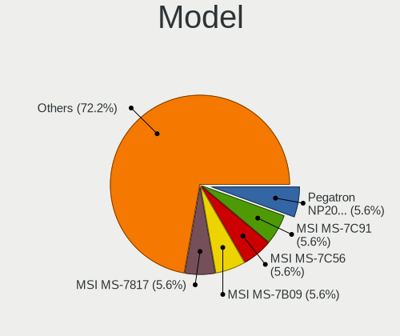

| Name                       | Desktops | Percent |
|----------------------------|----------|---------|
| MSI MS-7C56                | 1        | 8.33%   |
| Intel H61M-S2PV            | 1        | 8.33%   |
| HP Z400 Workstation        | 1        | 8.33%   |
| HP EliteDesk 800 G2 TWR    | 1        | 8.33%   |
| HP Elite Slice             | 1        | 8.33%   |
| HP Compaq Pro 6300 MT      | 1        | 8.33%   |
| Gigabyte M61PM-S2          | 1        | 8.33%   |
| Gigabyte B550M AORUS ELITE | 1        | 8.33%   |
| Gigabyte AX370-Gaming K5   | 1        | 8.33%   |
| Foxconn s5-1204            | 1        | 8.33%   |
| Dell Studio 540            | 1        | 8.33%   |
| ASUS 970 PRO GAMING/AURA   | 1        | 8.33%   |

Model Family
------------

Motherboard model prefix

| Name                  | Desktops | Percent |
|-----------------------|----------|---------|
| MSI MS-7C56           | 1        | 8.33%   |
| Intel H61M-S2PV       | 1        | 8.33%   |
| HP Z400               | 1        | 8.33%   |
| HP EliteDesk          | 1        | 8.33%   |
| HP Elite              | 1        | 8.33%   |
| HP Compaq             | 1        | 8.33%   |
| Gigabyte M61PM-S2     | 1        | 8.33%   |
| Gigabyte B550M        | 1        | 8.33%   |
| Gigabyte AX370-Gaming | 1        | 8.33%   |
| Foxconn s5-1204       | 1        | 8.33%   |
| Dell Studio           | 1        | 8.33%   |
| ASUS 970              | 1        | 8.33%   |

MFG Year
--------

Motherboard manufacture year

| Year | Desktops | Percent |
|------|----------|---------|
| 2016 | 3        | 25%     |
| 2020 | 2        | 16.67%  |
| 2011 | 2        | 16.67%  |
| 2017 | 1        | 8.33%   |
| 2012 | 1        | 8.33%   |
| 2010 | 1        | 8.33%   |
| 2008 | 1        | 8.33%   |
| 2006 | 1        | 8.33%   |

Form Factor
-----------

Physical design of the computer

| Name    | Desktops | Percent |
|---------|----------|---------|
| Desktop | 12       | 100%    |

Secure Boot
-----------

Enabled or disabled

| State    | Desktops | Percent |
|----------|----------|---------|
| Disabled | 12       | 100%    |

Coreboot
--------

Have coreboot on board

| Used | Desktops | Percent |
|------|----------|---------|
| No   | 12       | 100%    |

RAM Size
--------

Total RAM memory

| Size in GB  | Desktops | Percent |
|-------------|----------|---------|
| 4.01-8.0    | 3        | 25%     |
| 16.01-24.0  | 3        | 25%     |
| 8.01-16.0   | 2        | 16.67%  |
| 3.01-4.0    | 1        | 8.33%   |
| 24.01-32.0  | 1        | 8.33%   |
| 64.01-256.0 | 1        | 8.33%   |
| 1.01-2.0    | 1        | 8.33%   |

RAM Used
--------

Used RAM memory

| Used GB  | Desktops | Percent |
|----------|----------|---------|
| 1.01-2.0 | 5        | 41.67%  |
| 0.51-1.0 | 3        | 25%     |
| 4.01-8.0 | 2        | 16.67%  |
| 3.01-4.0 | 1        | 8.33%   |
| 2.01-3.0 | 1        | 8.33%   |

Total Drives
------------

Number of drives on board

| Drives | Desktops | Percent |
|--------|----------|---------|
| 1      | 6        | 50%     |
| 4      | 2        | 16.67%  |
| 5      | 1        | 8.33%   |
| 3      | 1        | 8.33%   |
| 2      | 1        | 8.33%   |
| 0      | 1        | 8.33%   |

Has CD-ROM
----------

Has CD-ROM on board

| Presented | Desktops | Percent |
|-----------|----------|---------|
| Yes       | 7        | 58.33%  |
| No        | 5        | 41.67%  |

Has Ethernet
------------

Has Ethernet on board

| Presented | Desktops | Percent |
|-----------|----------|---------|
| Yes       | 12       | 100%    |

Has WiFi
--------

Has WiFi module

| Presented | Desktops | Percent |
|-----------|----------|---------|
| Yes       | 6        | 50%     |
| No        | 6        | 50%     |

Has Bluetooth
-------------

Has Bluetooth module

| Presented | Desktops | Percent |
|-----------|----------|---------|
| No        | 10       | 83.33%  |
| Yes       | 2        | 16.67%  |

Location
--------

Country
-------

Geographic location (country)

| Country      | Desktops | Percent |
|--------------|----------|---------|
| USA          | 5        | 41.67%  |
| UK           | 2        | 16.67%  |
| Spain        | 1        | 8.33%   |
| South Africa | 1        | 8.33%   |
| Mexico       | 1        | 8.33%   |
| Germany      | 1        | 8.33%   |
| France       | 1        | 8.33%   |

City
----

Geographic location (city)

| City                   | Desktops | Percent |
|------------------------|----------|---------|
| Segovia                | 1        | 8.33%   |
| Rieschweiler-Muehlbach | 1        | 8.33%   |
| Prattville             | 1        | 8.33%   |
| Milwaukee              | 1        | 8.33%   |
| Middlesbrough          | 1        | 8.33%   |
| Miami                  | 1        | 8.33%   |
| Medway                 | 1        | 8.33%   |
| Manchester             | 1        | 8.33%   |
| Edenvale               | 1        | 8.33%   |
| Brive-la-Gaillarde     | 1        | 8.33%   |
| Apodaca                | 1        | 8.33%   |
| Albany                 | 1        | 8.33%   |

Drives
------

Drive Vendor
------------

Hard drive vendors

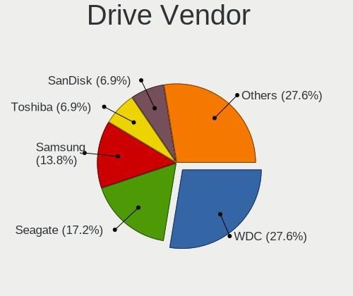

| Vendor              | Desktops | Drives | Percent |
|---------------------|----------|--------|---------|
| WDC                 | 5        | 6      | 26.32%  |
| Seagate             | 4        | 5      | 21.05%  |
| SanDisk             | 2        | 2      | 10.53%  |
| Samsung Electronics | 2        | 4      | 10.53%  |
| Kingston            | 2        | 2      | 10.53%  |
| China               | 1        | 1      | 5.26%   |
| ASMedia             | 1        | 1      | 5.26%   |
| A-DATA Technology   | 1        | 1      | 5.26%   |
| Unknown             | 1        | 1      | 5.26%   |

Drive Model
-----------

Hard drive models

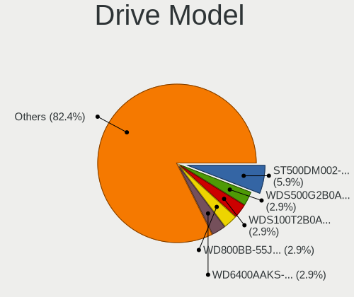

| Model                                | Desktops | Percent |
|--------------------------------------|----------|---------|
| Seagate ST500DM002-1BD142 500GB      | 2        | 9.09%   |
| WDC WDS500G2B0A-00SM50 500GB SSD     | 1        | 4.55%   |
| WDC WDS100T2B0A-00SM50 1TB SSD       | 1        | 4.55%   |
| WDC WD800BB-55JKC0 80GB              | 1        | 4.55%   |
| WDC WD5000AAKX-60U6AA0 500GB         | 1        | 4.55%   |
| WDC WD30EFRX-68EUZN0 3TB             | 1        | 4.55%   |
| WDC WD10EZEX-75WN4A1 1TB             | 1        | 4.55%   |
| Seagate ST2000DM008-2UB102 2TB       | 1        | 4.55%   |
| Seagate ST2000DM008-2FR102 2TB       | 1        | 4.55%   |
| SanDisk SD8SB8U-256G-1006 256GB SSD  | 1        | 4.55%   |
| SanDisk Portable SSD 1TB             | 1        | 4.55%   |
| Samsung SSD 970 EVO Plus 500GB       | 1        | 4.55%   |
| Samsung SSD 970 EVO Plus 1TB         | 1        | 4.55%   |
| Samsung SSD 960 EVO 250GB            | 1        | 4.55%   |
| Samsung SSD 860 QVO 1TB              | 1        | 4.55%   |
| Kingston SA400S37480G 480GB SSD      | 1        | 4.55%   |
| Kingston RBUSC180DS37128GH 128GB SSD | 1        | 4.55%   |
| China SATA SSD 256GB                 | 1        | 4.55%   |
| ASMedia ASM1153E 1TB                 | 1        | 4.55%   |
| A-DATA XPG EX500 240GB SSD           | 1        | 4.55%   |
| Unknown                              | 1        | 4.55%   |

HDD Vendor
----------

Hard disk drive vendors

| Vendor  | Desktops | Drives | Percent |
|---------|----------|--------|---------|
| WDC     | 4        | 4      | 50%     |
| Seagate | 4        | 5      | 50%     |

SSD Vendor
----------

Solid state drive vendors

| Vendor              | Desktops | Drives | Percent |
|---------------------|----------|--------|---------|
| WDC                 | 2        | 2      | 18.18%  |
| SanDisk             | 2        | 2      | 18.18%  |
| Kingston            | 2        | 2      | 18.18%  |
| Samsung Electronics | 1        | 1      | 9.09%   |
| China               | 1        | 1      | 9.09%   |
| ASMedia             | 1        | 1      | 9.09%   |
| A-DATA Technology   | 1        | 1      | 9.09%   |
| Unknown             | 1        | 1      | 9.09%   |

Drive Kind
----------

HDD or SSD

| Kind | Desktops | Drives | Percent |
|------|----------|--------|---------|
| SSD  | 8        | 11     | 50%     |
| HDD  | 6        | 9      | 37.5%   |
| NVMe | 2        | 3      | 12.5%   |

Drive Connector
---------------

SATA, SAS, NVMe, etc.

| Type | Desktops | Drives | Percent |
|------|----------|--------|---------|
| SATA | 11       | 17     | 68.75%  |
| SAS  | 3        | 3      | 18.75%  |
| NVMe | 2        | 3      | 12.5%   |

Drive Size
----------

Size of hard drive

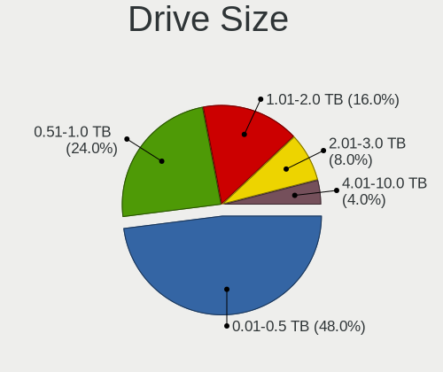

| Size in TB | Desktops | Drives | Percent |
|------------|----------|--------|---------|
| 0.01-0.5   | 8        | 11     | 53.33%  |
| 0.51-1.0   | 4        | 5      | 26.67%  |
| 1.01-2.0   | 2        | 3      | 13.33%  |
| 2.01-3.0   | 1        | 1      | 6.67%   |

Space Total
-----------

Amount of disk space available on the file system

| Size in GB | Desktops | Percent |
|------------|----------|---------|
| 101-250    | 3        | 25%     |
| 1001-2000  | 3        | 25%     |
| Unknown    | 2        | 16.67%  |
| 251-500    | 1        | 8.33%   |
| 1-20       | 1        | 8.33%   |
| 501-1000   | 1        | 8.33%   |
| 51-100     | 1        | 8.33%   |

Space Used
----------

Amount of used disk space

| Used GB  | Desktops | Percent |
|----------|----------|---------|
| 1-20     | 5        | 41.67%  |
| 501-1000 | 3        | 25%     |
| Unknown  | 2        | 16.67%  |
| 251-500  | 1        | 8.33%   |
| 21-50    | 1        | 8.33%   |

Malfunc. Drives
---------------

Drive models with a malfunction

| Model                          | Desktops | Drives | Percent |
|--------------------------------|----------|--------|---------|
| WDC WDS100T2B0A-00SM50 1TB SSD | 1        | 1      | 100%    |

Malfunc. Drive Vendor
---------------------

Vendors of faulty drives

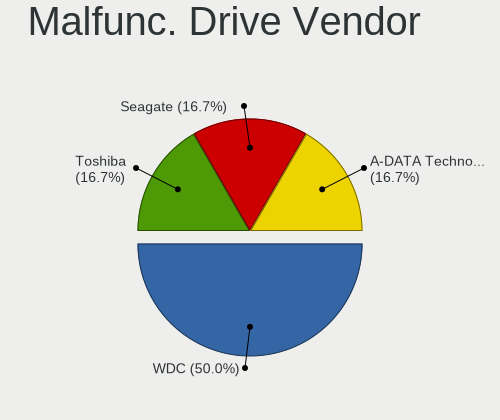

| Vendor | Desktops | Drives | Percent |
|--------|----------|--------|---------|
| WDC    | 1        | 1      | 100%    |

Malfunc. HDD Vendor
-------------------

Vendors of faulty HDD drives

Zero info for selected period =(

Malfunc. Drive Kind
-------------------

Kinds of faulty drives

| Kind | Desktops | Drives | Percent |
|------|----------|--------|---------|
| SSD  | 1        | 1      | 100%    |

Failed Drives
-------------

Failed drive models

Zero info for selected period =(

Failed Drive Vendor
-------------------

Failed drive vendors

Zero info for selected period =(

Drive Status
------------

Number of failed and malfunc. drives

| Status   | Desktops | Drives | Percent |
|----------|----------|--------|---------|
| Works    | 9        | 18     | 64.29%  |
| Detected | 4        | 4      | 28.57%  |
| Malfunc  | 1        | 1      | 7.14%   |

Storage controller
------------------

Storage Vendor
--------------

Storage controller vendors

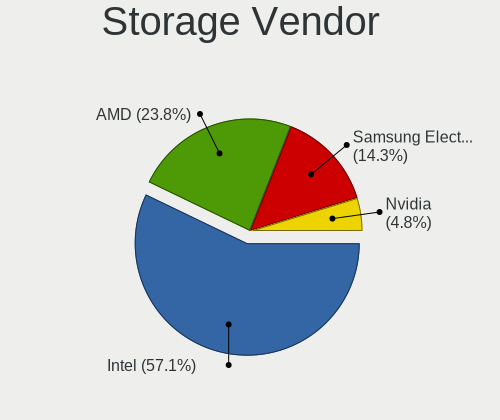

| Vendor              | Desktops | Percent |
|---------------------|----------|---------|
| Intel               | 7        | 53.85%  |
| AMD                 | 3        | 23.08%  |
| Samsung Electronics | 2        | 15.38%  |
| Nvidia              | 1        | 7.69%   |

Storage Model
-------------

Storage controller models

| Model                                                                         | Desktops | Percent |
|-------------------------------------------------------------------------------|----------|---------|
| Intel Q170/Q150/B150/H170/H110/Z170/CM236 Chipset SATA Controller [AHCI Mode] | 2        | 12.5%   |
| Intel 6 Series/C200 Series Chipset Family 6 port Desktop SATA AHCI Controller | 2        | 12.5%   |
| AMD 500 Series Chipset SATA Controller                                        | 2        | 12.5%   |
| Samsung NVMe SSD Controller SM981/PM981/PM983                                 | 1        | 6.25%   |
| Samsung NVMe SSD Controller SM961/PM961/SM963                                 | 1        | 6.25%   |
| Nvidia MCP61 SATA Controller                                                  | 1        | 6.25%   |
| Nvidia MCP61 IDE                                                              | 1        | 6.25%   |
| Intel SATA Controller [RAID mode]                                             | 1        | 6.25%   |
| Intel 82801JI (ICH10 Family) 4 port SATA IDE Controller #1                    | 1        | 6.25%   |
| Intel 82801JI (ICH10 Family) 2 port SATA IDE Controller #2                    | 1        | 6.25%   |
| Intel 7 Series/C210 Series Chipset Family 6-port SATA Controller [AHCI mode]  | 1        | 6.25%   |
| AMD X370 Series Chipset SATA Controller                                       | 1        | 6.25%   |
| AMD FCH SATA Controller [AHCI mode]                                           | 1        | 6.25%   |

Storage Kind
------------

Kind of storage controller (IDE, SATA, NVMe, SAS, ...)

| Kind | Desktops | Percent |
|------|----------|---------|
| SATA | 8        | 61.54%  |
| NVMe | 2        | 15.38%  |
| IDE  | 2        | 15.38%  |
| RAID | 1        | 7.69%   |

Processor
---------

CPU Vendor
----------

Processor vendors

| Vendor | Desktops | Percent |
|--------|----------|---------|
| Intel  | 7        | 58.33%  |
| AMD    | 5        | 41.67%  |

CPU Model
---------

Processor models

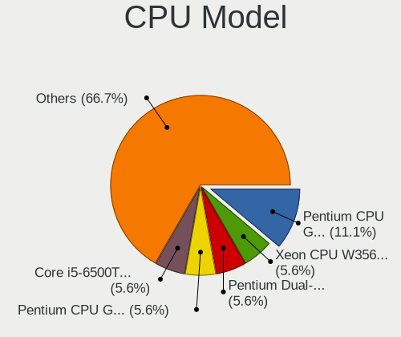

| Model                                 | Desktops | Percent |
|---------------------------------------|----------|---------|
| Intel Pentium CPU G630 @ 2.70GHz      | 2        | 16.67%  |
| Intel Xeon CPU W3565 @ 3.20GHz        | 1        | 8.33%   |
| Intel Core i5-6500T CPU @ 2.50GHz     | 1        | 8.33%   |
| Intel Core i5-6500 CPU @ 3.20GHz      | 1        | 8.33%   |
| Intel Core i3-3220 CPU @ 3.30GHz      | 1        | 8.33%   |
| Intel Core 2 Quad CPU Q6600 @ 2.40GHz | 1        | 8.33%   |
| AMD Ryzen 7 1700 Eight-Core Processor | 1        | 8.33%   |
| AMD Ryzen 5 5600X 6-Core Processor    | 1        | 8.33%   |
| AMD Ryzen 5 3600 6-Core Processor     | 1        | 8.33%   |
| AMD FX-6300 Six-Core Processor        | 1        | 8.33%   |
| AMD Athlon 64 Processor 3800+         | 1        | 8.33%   |

CPU Model Family
----------------

Processor model prefix

| Model             | Desktops | Percent |
|-------------------|----------|---------|
| Intel Pentium     | 2        | 16.67%  |
| Intel Core i5     | 2        | 16.67%  |
| AMD Ryzen 5       | 2        | 16.67%  |
| Intel Xeon        | 1        | 8.33%   |
| Intel Core i3     | 1        | 8.33%   |
| Intel Core 2 Quad | 1        | 8.33%   |
| AMD Ryzen 7       | 1        | 8.33%   |
| AMD FX            | 1        | 8.33%   |
| AMD Athlon 64     | 1        | 8.33%   |

CPU Cores
---------

Number of processor cores

| Number | Desktops | Percent |
|--------|----------|---------|
| 4      | 4        | 33.33%  |
| 2      | 3        | 25%     |
| 1      | 2        | 16.67%  |
| 8      | 1        | 8.33%   |
| 6      | 1        | 8.33%   |
| 3      | 1        | 8.33%   |

CPU Sockets
-----------

Number of sockets

| Number | Desktops | Percent |
|--------|----------|---------|
| 1      | 12       | 100%    |

CPU Threads
-----------

Threads per core (Hyper-Threading)

| Number | Desktops | Percent |
|--------|----------|---------|
| 1      | 7        | 58.33%  |
| 2      | 5        | 41.67%  |

CPU Op-Modes
------------

CPU Operation Modes (32-bit, 64-bit)

| Op mode        | Desktops | Percent |
|----------------|----------|---------|
| 32-bit, 64-bit | 12       | 100%    |

CPU Microcode
-------------

Microcode number

| Number     | Desktops | Percent |
|------------|----------|---------|
| 0x506e3    | 2        | 16.67%  |
| 0x206a7    | 2        | 16.67%  |
| 0x6fb      | 1        | 8.33%   |
| 0x306a9    | 1        | 8.33%   |
| 0x106a5    | 1        | 8.33%   |
| 0x0a20120a | 1        | 8.33%   |
| 0x08701021 | 1        | 8.33%   |
| 0x08001137 | 1        | 8.33%   |
| 0x06000822 | 1        | 8.33%   |
| Unknown    | 1        | 8.33%   |

CPU Microarch
-------------

Microarchitecture

| Name        | Desktops | Percent |
|-------------|----------|---------|
| Skylake     | 2        | 16.67%  |
| SandyBridge | 2        | 16.67%  |
| Zen 3       | 1        | 8.33%   |
| Zen 2       | 1        | 8.33%   |
| Zen         | 1        | 8.33%   |
| Piledriver  | 1        | 8.33%   |
| Nehalem     | 1        | 8.33%   |
| K8 Hammer   | 1        | 8.33%   |
| IvyBridge   | 1        | 8.33%   |
| Core        | 1        | 8.33%   |

Graphics
--------

GPU Vendor
----------

Vendors of graphics cards

| Vendor | Desktops | Percent |
|--------|----------|---------|
| Intel  | 6        | 46.15%  |
| Nvidia | 5        | 38.46%  |
| AMD    | 2        | 15.38%  |

GPU Model
---------

Graphics card models

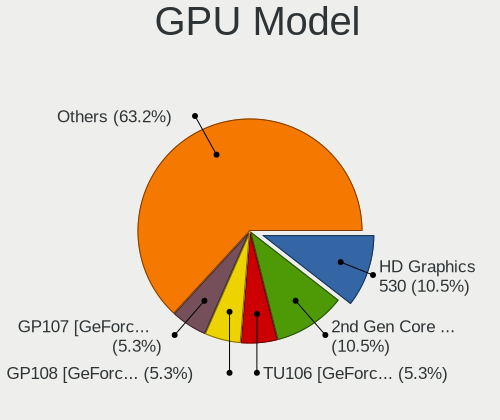

| Model                                                                     | Desktops | Percent |
|---------------------------------------------------------------------------|----------|---------|
| Intel HD Graphics 530                                                     | 2        | 15.38%  |
| Intel 2nd Generation Core Processor Family Integrated Graphics Controller | 2        | 15.38%  |
| Nvidia GP108 [GeForce GT 1030]                                            | 1        | 7.69%   |
| Nvidia GP107 [GeForce GTX 1050 Ti]                                        | 1        | 7.69%   |
| Nvidia GK208B [GeForce GT 710]                                            | 1        | 7.69%   |
| Nvidia G94GL [Quadro FX 1800]                                             | 1        | 7.69%   |
| Nvidia C61 [GeForce 6150SE nForce 430]                                    | 1        | 7.69%   |
| Intel Xeon E3-1200 v2/3rd Gen Core processor Graphics Controller          | 1        | 7.69%   |
| Intel 4 Series Chipset Integrated Graphics Controller                     | 1        | 7.69%   |
| AMD RV710 [Radeon HD 4350/4550]                                           | 1        | 7.69%   |
| AMD Navi 23 [Radeon RX 6600/6600 XT/6600M]                                | 1        | 7.69%   |

GPU Combo
---------

Combinations of graphics cards

| Name           | Desktops | Percent |
|----------------|----------|---------|
| 1 x Nvidia     | 4        | 33.33%  |
| 1 x Intel      | 4        | 33.33%  |
| 1 x AMD        | 2        | 16.67%  |
| 2 x Intel      | 1        | 8.33%   |
| Intel + Nvidia | 1        | 8.33%   |

GPU Driver
----------

Free vs proprietary

| Driver  | Desktops | Percent |
|---------|----------|---------|
| Free    | 11       | 91.67%  |
| Unknown | 1        | 8.33%   |

GPU Memory
----------

Total video memory

| Size in GB | Desktops | Percent |
|------------|----------|---------|
| Unknown    | 6        | 50%     |
| 0.51-1.0   | 2        | 16.67%  |
| 7.01-8.0   | 1        | 8.33%   |
| 3.01-4.0   | 1        | 8.33%   |
| 1.01-2.0   | 1        | 8.33%   |
| 0.01-0.5   | 1        | 8.33%   |

Monitor
-------

Monitor Vendor
--------------

Monitor vendors

| Vendor              | Desktops | Percent |
|---------------------|----------|---------|
| Samsung Electronics | 2        | 25%     |
| Dell                | 2        | 25%     |
| Vizio               | 1        | 12.5%   |
| Philips             | 1        | 12.5%   |
| Hewlett-Packard     | 1        | 12.5%   |
| Grundig             | 1        | 12.5%   |

Monitor Model
-------------

Monitor models

| Model                                                                | Desktops | Percent |
|----------------------------------------------------------------------|----------|---------|
| Vizio M220MV VIZ0062 1920x1080 509x286mm 23.0-inch                   | 1        | 12.5%   |
| Samsung Electronics SMB2330H SAM064A 1920x1080 509x286mm 23.0-inch   | 1        | 12.5%   |
| Samsung Electronics LCD Monitor SAM0D4B 1360x768 609x347mm 27.6-inch | 1        | 12.5%   |
| Philips PHL 243V5 PHLC0D1 1920x1080 521x293mm 23.5-inch              | 1        | 12.5%   |
| Hewlett-Packard V221 HWP3111 1920x1080 477x268mm 21.5-inch           | 1        | 12.5%   |
| Grundig WXGA GRU4448 1600x1200                                       | 1        | 12.5%   |
| Dell U2515H DELD06F 2560x1440 553x311mm 25.0-inch                    | 1        | 12.5%   |
| Dell SE2719HR DELF115 1920x1080 598x336mm 27.0-inch                  | 1        | 12.5%   |

Monitor Resolution
------------------

Monitor screen resolution

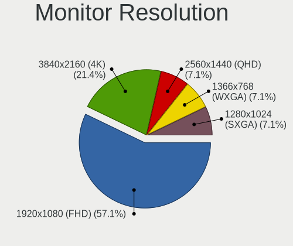

| Resolution      | Desktops | Percent |
|-----------------|----------|---------|
| 1920x1080 (FHD) | 5        | 62.5%   |
| 3840x2160 (4K)  | 1        | 12.5%   |
| 2560x1440 (QHD) | 1        | 12.5%   |
| 1366x768 (WXGA) | 1        | 12.5%   |

Monitor Diagonal
----------------

Diagonal size in inches

| Inches | Desktops | Percent |
|--------|----------|---------|
| 23     | 2        | 25%     |
| 54     | 1        | 12.5%   |
| 31     | 1        | 12.5%   |
| 27     | 1        | 12.5%   |
| 26     | 1        | 12.5%   |
| 25     | 1        | 12.5%   |
| 21     | 1        | 12.5%   |

Monitor Width
-------------

Physical width

| Width in mm | Desktops | Percent |
|-------------|----------|---------|
| 501-600     | 5        | 62.5%   |
| 601-700     | 1        | 12.5%   |
| 401-500     | 1        | 12.5%   |
| 1001-1500   | 1        | 12.5%   |

Aspect Ratio
------------

Proportional relationship between the width and the height

| Ratio | Desktops | Percent |
|-------|----------|---------|
| 16/9  | 8        | 100%    |

Monitor Area
------------

Area in inch²

| Area in inch² | Desktops | Percent |
|----------------|----------|---------|
| 251-300        | 2        | 25%     |
| 201-250        | 2        | 25%     |
| More than 1000 | 1        | 12.5%   |
| 351-500        | 1        | 12.5%   |
| 301-350        | 1        | 12.5%   |
| 151-200        | 1        | 12.5%   |

Pixel Density
-------------

Pixels per inch

| Density | Desktops | Percent |
|---------|----------|---------|
| 51-100  | 5        | 62.5%   |
| 101-120 | 2        | 25%     |
| 1-50    | 1        | 12.5%   |

Multiple Monitors
-----------------

Total monitors connected

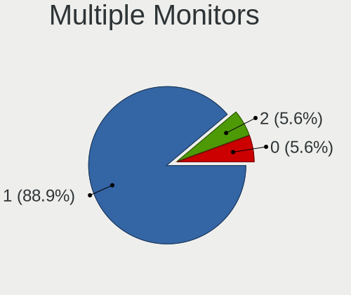

| Total | Desktops | Percent |
|-------|----------|---------|
| 1     | 11       | 91.67%  |
| 0     | 1        | 8.33%   |

Network
-------

Net Controller Vendor
---------------------

Controller vendors

| Vendor                | Desktops | Percent |
|-----------------------|----------|---------|
| Realtek Semiconductor | 7        | 36.84%  |
| Intel                 | 4        | 21.05%  |
| TP-Link               | 3        | 15.79%  |
| Qualcomm Atheros      | 2        | 10.53%  |
| Nvidia                | 1        | 5.26%   |
| Lenovo                | 1        | 5.26%   |
| Broadcom              | 1        | 5.26%   |

Net Controller Model
--------------------

Controller models

| Model                                                             | Desktops | Percent |
|-------------------------------------------------------------------|----------|---------|
| Realtek RTL8111/8168/8411 PCI Express Gigabit Ethernet Controller | 4        | 19.05%  |
| Intel Ethernet Connection (2) I219-LM                             | 2        | 9.52%   |
| TP-Link Archer T4UH wireless Realtek 8812AU                       | 1        | 4.76%   |
| TP-Link AC600 wireless Realtek RTL8811AU [Archer T2U Nano]        | 1        | 4.76%   |
| TP-Link 802.11ac WLAN Adapter                                     | 1        | 4.76%   |
| Realtek RTL8169 PCI Gigabit Ethernet Controller                   | 1        | 4.76%   |
| Realtek RTL8153 Gigabit Ethernet Adapter                          | 1        | 4.76%   |
| Realtek 802.11n WLAN Adapter                                      | 1        | 4.76%   |
| Qualcomm Atheros AR928X Wireless Network Adapter (PCI-Express)    | 1        | 4.76%   |
| Qualcomm Atheros AR9287 Wireless Network Adapter (PCI-Express)    | 1        | 4.76%   |
| Qualcomm Atheros AR8151 v2.0 Gigabit Ethernet                     | 1        | 4.76%   |
| Nvidia MCP61 Ethernet                                             | 1        | 4.76%   |
| Lenovo P2a42                                                      | 1        | 4.76%   |
| Intel I211 Gigabit Network Connection                             | 1        | 4.76%   |
| Intel 82579LM Gigabit Network Connection (Lewisville)             | 1        | 4.76%   |
| Intel 82575EB Gigabit Network Connection                          | 1        | 4.76%   |
| Broadcom NetXtreme BCM5764M Gigabit Ethernet PCIe                 | 1        | 4.76%   |

Wireless Vendor
---------------

Wireless vendors

| Vendor                | Desktops | Percent |
|-----------------------|----------|---------|
| TP-Link               | 3        | 50%     |
| Qualcomm Atheros      | 2        | 33.33%  |
| Realtek Semiconductor | 1        | 16.67%  |

Wireless Model
--------------

Wireless models

| Model                                                          | Desktops | Percent |
|----------------------------------------------------------------|----------|---------|
| TP-Link Archer T4UH wireless Realtek 8812AU                    | 1        | 16.67%  |
| TP-Link AC600 wireless Realtek RTL8811AU [Archer T2U Nano]     | 1        | 16.67%  |
| TP-Link 802.11ac WLAN Adapter                                  | 1        | 16.67%  |
| Realtek 802.11n WLAN Adapter                                   | 1        | 16.67%  |
| Qualcomm Atheros AR928X Wireless Network Adapter (PCI-Express) | 1        | 16.67%  |
| Qualcomm Atheros AR9287 Wireless Network Adapter (PCI-Express) | 1        | 16.67%  |

Ethernet Vendor
---------------

Ethernet vendors

| Vendor                | Desktops | Percent |
|-----------------------|----------|---------|
| Realtek Semiconductor | 6        | 42.86%  |
| Intel                 | 4        | 28.57%  |
| Qualcomm Atheros      | 1        | 7.14%   |
| Nvidia                | 1        | 7.14%   |
| Lenovo                | 1        | 7.14%   |
| Broadcom              | 1        | 7.14%   |

Ethernet Model
--------------

Ethernet models

| Model                                                             | Desktops | Percent |
|-------------------------------------------------------------------|----------|---------|
| Realtek RTL8111/8168/8411 PCI Express Gigabit Ethernet Controller | 4        | 26.67%  |
| Intel Ethernet Connection (2) I219-LM                             | 2        | 13.33%  |
| Realtek RTL8169 PCI Gigabit Ethernet Controller                   | 1        | 6.67%   |
| Realtek RTL8153 Gigabit Ethernet Adapter                          | 1        | 6.67%   |
| Qualcomm Atheros AR8151 v2.0 Gigabit Ethernet                     | 1        | 6.67%   |
| Nvidia MCP61 Ethernet                                             | 1        | 6.67%   |
| Lenovo P2a42                                                      | 1        | 6.67%   |
| Intel I211 Gigabit Network Connection                             | 1        | 6.67%   |
| Intel 82579LM Gigabit Network Connection (Lewisville)             | 1        | 6.67%   |
| Intel 82575EB Gigabit Network Connection                          | 1        | 6.67%   |
| Broadcom NetXtreme BCM5764M Gigabit Ethernet PCIe                 | 1        | 6.67%   |

Net Controller Kind
-------------------

Ethernet, WiFi or modem

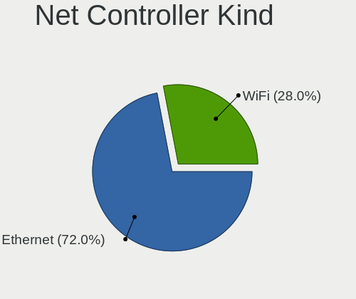

| Kind     | Desktops | Percent |
|----------|----------|---------|
| Ethernet | 12       | 66.67%  |
| WiFi     | 6        | 33.33%  |

Used Controller
---------------

Currently used network controller

| Kind     | Desktops | Percent |
|----------|----------|---------|
| Ethernet | 10       | 76.92%  |
| WiFi     | 3        | 23.08%  |

NICs
----

Total network controllers on board

| Total | Desktops | Percent |
|-------|----------|---------|
| 1     | 8        | 66.67%  |
| 2     | 2        | 16.67%  |
| 4     | 1        | 8.33%   |
| 0     | 1        | 8.33%   |

IPv6
----

IPv6 vs IPv4

| Used | Desktops | Percent |
|------|----------|---------|
| No   | 9        | 75%     |
| Yes  | 3        | 25%     |

Bluetooth
---------

Bluetooth Vendor
----------------

Controller vendors

| Vendor   | Desktops | Percent |
|----------|----------|---------|
| Broadcom | 2        | 100%    |

Bluetooth Model
---------------

Controller models

| Model                             | Desktops | Percent |
|-----------------------------------|----------|---------|
| Broadcom BCM20702A0 Bluetooth 4.0 | 2        | 100%    |

Sound
-----

Sound Vendor
------------

Sound card vendors

| Vendor              | Desktops | Percent |
|---------------------|----------|---------|
| Intel               | 7        | 41.18%  |
| Nvidia              | 4        | 23.53%  |
| AMD                 | 4        | 23.53%  |
| C-Media Electronics | 1        | 5.88%   |
| ASUSTek Computer    | 1        | 5.88%   |

Sound Model
-----------

Sound card models

| Model                                                                      | Desktops | Percent |
|----------------------------------------------------------------------------|----------|---------|
| Intel 82801JI (ICH10 Family) HD Audio Controller                           | 2        | 10.53%  |
| Intel 6 Series/C200 Series Chipset Family High Definition Audio Controller | 2        | 10.53%  |
| Intel 100 Series/C230 Series Chipset Family HD Audio Controller            | 2        | 10.53%  |
| AMD Starship/Matisse HD Audio Controller                                   | 2        | 10.53%  |
| Nvidia MCP61 High Definition Audio                                         | 1        | 5.26%   |
| Nvidia GP108 High Definition Audio Controller                              | 1        | 5.26%   |
| Nvidia GP107GL High Definition Audio Controller                            | 1        | 5.26%   |
| Nvidia GK208 HDMI/DP Audio Controller                                      | 1        | 5.26%   |
| Intel 7 Series/C216 Chipset Family High Definition Audio Controller        | 1        | 5.26%   |
| C-Media Electronics CM108 Audio Controller                                 | 1        | 5.26%   |
| ASUSTek Computer Xonar SoundCard                                           | 1        | 5.26%   |
| AMD SBx00 Azalia (Intel HDA)                                               | 1        | 5.26%   |
| AMD RV710/730 HDMI Audio [Radeon HD 4000 series]                           | 1        | 5.26%   |
| AMD Navi 21/23 HDMI/DP Audio Controller                                    | 1        | 5.26%   |
| AMD Family 17h (Models 00h-0fh) HD Audio Controller                        | 1        | 5.26%   |

Memory
------

Memory Vendor
-------------

Memory module vendors

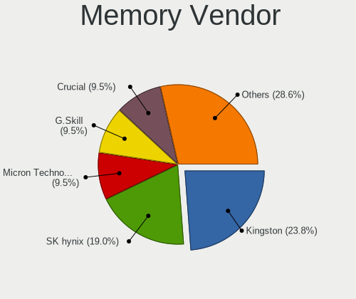

| Vendor              | Desktops | Percent |
|---------------------|----------|---------|
| SK hynix            | 3        | 20%     |
| Kingston            | 3        | 20%     |
| Micron Technology   | 2        | 13.33%  |
| G.Skill             | 2        | 13.33%  |
| Unknown             | 1        | 6.67%   |
| Samsung Electronics | 1        | 6.67%   |
| Crucial             | 1        | 6.67%   |
| Corsair             | 1        | 6.67%   |
| A Force             | 1        | 6.67%   |

Memory Model
------------

Memory module models

| Model                                                  | Desktops | Percent |
|--------------------------------------------------------|----------|---------|
| Unknown RAM Module 1GB DIMM 400MT/s                    | 1        | 6.25%   |
| SK hynix RAM Module 8GB SODIMM DDR4 2133MT/s           | 1        | 6.25%   |
| SK hynix RAM HYMP125U64CP8-S6 2GB DIMM DDR2 49926MT/s  | 1        | 6.25%   |
| SK hynix RAM HMT451U6BFR8A-PB 4GB DIMM DDR3 1648MT/s   | 1        | 6.25%   |
| Samsung RAM M378B5173DB0-CK0 4GB DIMM DDR3 1600MT/s    | 1        | 6.25%   |
| Samsung RAM M378B5173BH0-CK0 4GB DIMM DDR3 1600MT/s    | 1        | 6.25%   |
| Micron RAM 8JTF51264AZ-1G6E1 4GB DIMM DDR3 1600MT/s    | 1        | 6.25%   |
| Micron RAM 16JTF51264AZ-1G4M1 4GB DIMM DDR3 1333MT/s   | 1        | 6.25%   |
| Kingston RAM KHX3200C16D4/16GX 16GB DIMM DDR4 3600MT/s | 1        | 6.25%   |
| Kingston RAM 99U5471-033.A00LF 4GB DIMM DDR3 1333MT/s  | 1        | 6.25%   |
| Kingston RAM 9905702-017.A00G 8GB DIMM DDR4 2933MT/s   | 1        | 6.25%   |
| G.Skill RAM F4-3200C16-8GIS 8192MB DIMM DDR4 3200MT/s  | 1        | 6.25%   |
| G.Skill RAM F4-3200C14-8GFX 8GB DIMM DDR4 3733MT/s     | 1        | 6.25%   |
| Crucial RAM RM51264BA1339.16FR 4096MB DIMM 1333MT/s    | 1        | 6.25%   |
| Corsair RAM CMX4GX3M1A1600C11 4GB DIMM DDR3 1600MT/s   | 1        | 6.25%   |
| A Force RAM 1GX64V160K 8GB DIMM DDR3 1600MT/s          | 1        | 6.25%   |

Memory Kind
-----------

Memory module kinds

| Kind    | Desktops | Percent |
|---------|----------|---------|
| DDR4    | 5        | 41.67%  |
| DDR3    | 5        | 41.67%  |
| DDR2    | 1        | 8.33%   |
| Unknown | 1        | 8.33%   |

Memory Form Factor
------------------

Physical design of the memory module

| Name   | Desktops | Percent |
|--------|----------|---------|
| DIMM   | 11       | 91.67%  |
| SODIMM | 1        | 8.33%   |

Memory Size
-----------

Memory module size

| Size  | Desktops | Percent |
|-------|----------|---------|
| 8192  | 5        | 38.46%  |
| 4096  | 5        | 38.46%  |
| 16384 | 1        | 7.69%   |
| 2048  | 1        | 7.69%   |
| 1024  | 1        | 7.69%   |

Memory Speed
------------

Memory module speed

| Speed | Desktops | Percent |
|-------|----------|---------|
| 1600  | 3        | 23.08%  |
| 1333  | 2        | 15.38%  |
| 49926 | 1        | 7.69%   |
| 3733  | 1        | 7.69%   |
| 3600  | 1        | 7.69%   |
| 3200  | 1        | 7.69%   |
| 2933  | 1        | 7.69%   |
| 2133  | 1        | 7.69%   |
| 1648  | 1        | 7.69%   |
| 400   | 1        | 7.69%   |

Printers & scanners
-------------------

Printer Vendor
--------------

Printer device vendors

Zero info for selected period =(

Printer Model
-------------

Printer device models

Zero info for selected period =(

Scanner Vendor
--------------

Scanner device vendors

Zero info for selected period =(

Scanner Model
-------------

Scanner device models

Zero info for selected period =(

Camera
------

Camera Vendor
-------------

Camera device vendors

Zero info for selected period =(

Camera Model
------------

Camera device models

Zero info for selected period =(

Security
--------

Fingerprint Vendor
------------------

Fingerprint sensor vendors

Zero info for selected period =(

Fingerprint Model
-----------------

Fingerprint sensor models

Zero info for selected period =(

Chipcard Vendor
---------------

Chipcard module vendors

Zero info for selected period =(

Chipcard Model
--------------

Chipcard module models

Zero info for selected period =(

Unsupported
-----------

Unsupported Devices
-------------------

Total unsupported devices on board

| Total | Desktops | Percent |
|-------|----------|---------|
| 0     | 7        | 58.33%  |
| 1     | 5        | 41.67%  |

Unsupported Device Types
------------------------

Types of unsupported devices

| Type             | Desktops | Percent |
|------------------|----------|---------|
| Net/wireless     | 3        | 60%     |
| Unassigned class | 1        | 20%     |
| Graphics card    | 1        | 20%     |

