Kaisen - Tested Hardware & Statistics (Notebooks)
-------------------------------------------------

A project to collect tested hardware configurations for Kaisen.

Anyone can contribute to this report by the [hw-probe](https://github.com/linuxhw/hw-probe) tool:

    sudo -E hw-probe -all -upload

Please contribute! Especially if your hardware is rare.

Contents
--------

* [ Test Cases ](#test-cases)

* [ System ](#system)
  - [ OS                       ](#os)
  - [ OS Family                ](#os-family)
  - [ Kernel                   ](#kernel)
  - [ Kernel Family            ](#kernel-family)
  - [ Kernel Major Ver.        ](#kernel-major-ver)
  - [ Arch                     ](#arch)
  - [ DE                       ](#de)
  - [ Display Server           ](#display-server)
  - [ Display Manager          ](#display-manager)
  - [ OS Lang                  ](#os-lang)
  - [ Boot Mode                ](#boot-mode)
  - [ Filesystem               ](#filesystem)
  - [ Part. scheme             ](#part-scheme)
  - [ Dual Boot with Linux/BSD ](#dual-boot-with-linuxbsd)
  - [ Dual Boot (Win)          ](#dual-boot-win)

* [ Board ](#board)
  - [ Vendor                   ](#vendor)
  - [ Model                    ](#model)
  - [ Model Family             ](#model-family)
  - [ MFG Year                 ](#mfg-year)
  - [ Form Factor              ](#form-factor)
  - [ Secure Boot              ](#secure-boot)
  - [ Coreboot                 ](#coreboot)
  - [ RAM Size                 ](#ram-size)
  - [ RAM Used                 ](#ram-used)
  - [ Total Drives             ](#total-drives)
  - [ Has CD-ROM               ](#has-cd-rom)
  - [ Has Ethernet             ](#has-ethernet)
  - [ Has WiFi                 ](#has-wifi)
  - [ Has Bluetooth            ](#has-bluetooth)

* [ Location ](#location)
  - [ Country                  ](#country)
  - [ City                     ](#city)

* [ Drives ](#drives)
  - [ Drive Vendor             ](#drive-vendor)
  - [ Drive Model              ](#drive-model)
  - [ HDD Vendor               ](#hdd-vendor)
  - [ SSD Vendor               ](#ssd-vendor)
  - [ Drive Kind               ](#drive-kind)
  - [ Drive Connector          ](#drive-connector)
  - [ Drive Size               ](#drive-size)
  - [ Space Total              ](#space-total)
  - [ Space Used               ](#space-used)
  - [ Malfunc. Drives          ](#malfunc-drives)
  - [ Malfunc. Drive Vendor    ](#malfunc-drive-vendor)
  - [ Malfunc. HDD Vendor      ](#malfunc-hdd-vendor)
  - [ Malfunc. Drive Kind      ](#malfunc-drive-kind)
  - [ Failed Drives            ](#failed-drives)
  - [ Failed Drive Vendor      ](#failed-drive-vendor)
  - [ Drive Status             ](#drive-status)

* [ Storage controller ](#storage-controller)
  - [ Storage Vendor           ](#storage-vendor)
  - [ Storage Model            ](#storage-model)
  - [ Storage Kind             ](#storage-kind)

* [ Processor ](#processor)
  - [ CPU Vendor               ](#cpu-vendor)
  - [ CPU Model                ](#cpu-model)
  - [ CPU Model Family         ](#cpu-model-family)
  - [ CPU Cores                ](#cpu-cores)
  - [ CPU Sockets              ](#cpu-sockets)
  - [ CPU Threads              ](#cpu-threads)
  - [ CPU Op-Modes             ](#cpu-op-modes)
  - [ CPU Microcode            ](#cpu-microcode)
  - [ CPU Microarch            ](#cpu-microarch)

* [ Graphics ](#graphics)
  - [ GPU Vendor               ](#gpu-vendor)
  - [ GPU Model                ](#gpu-model)
  - [ GPU Combo                ](#gpu-combo)
  - [ GPU Driver               ](#gpu-driver)
  - [ GPU Memory               ](#gpu-memory)

* [ Monitor ](#monitor)
  - [ Monitor Vendor           ](#monitor-vendor)
  - [ Monitor Model            ](#monitor-model)
  - [ Monitor Resolution       ](#monitor-resolution)
  - [ Monitor Diagonal         ](#monitor-diagonal)
  - [ Monitor Width            ](#monitor-width)
  - [ Aspect Ratio             ](#aspect-ratio)
  - [ Monitor Area             ](#monitor-area)
  - [ Pixel Density            ](#pixel-density)
  - [ Multiple Monitors        ](#multiple-monitors)

* [ Network ](#network)
  - [ Net Controller Vendor    ](#net-controller-vendor)
  - [ Net Controller Model     ](#net-controller-model)
  - [ Wireless Vendor          ](#wireless-vendor)
  - [ Wireless Model           ](#wireless-model)
  - [ Ethernet Vendor          ](#ethernet-vendor)
  - [ Ethernet Model           ](#ethernet-model)
  - [ Net Controller Kind      ](#net-controller-kind)
  - [ Used Controller          ](#used-controller)
  - [ NICs                     ](#nics)
  - [ IPv6                     ](#ipv6)

* [ Bluetooth ](#bluetooth)
  - [ Bluetooth Vendor         ](#bluetooth-vendor)
  - [ Bluetooth Model          ](#bluetooth-model)

* [ Sound ](#sound)
  - [ Sound Vendor             ](#sound-vendor)
  - [ Sound Model              ](#sound-model)

* [ Memory ](#memory)
  - [ Memory Vendor            ](#memory-vendor)
  - [ Memory Model             ](#memory-model)
  - [ Memory Kind              ](#memory-kind)
  - [ Memory Form Factor       ](#memory-form-factor)
  - [ Memory Size              ](#memory-size)
  - [ Memory Speed             ](#memory-speed)

* [ Printers & scanners ](#printers--scanners)
  - [ Printer Vendor           ](#printer-vendor)
  - [ Printer Model            ](#printer-model)
  - [ Scanner Vendor           ](#scanner-vendor)
  - [ Scanner Model            ](#scanner-model)

* [ Camera ](#camera)
  - [ Camera Vendor            ](#camera-vendor)
  - [ Camera Model             ](#camera-model)

* [ Security ](#security)
  - [ Fingerprint Vendor       ](#fingerprint-vendor)
  - [ Fingerprint Model        ](#fingerprint-model)
  - [ Chipcard Vendor          ](#chipcard-vendor)
  - [ Chipcard Model           ](#chipcard-model)

* [ Unsupported ](#unsupported)
  - [ Unsupported Devices      ](#unsupported-devices)
  - [ Unsupported Device Types ](#unsupported-device-types)

Test Cases
----------

Total: 36

| Vendor  | Model                       | Probe                                                      | Date         |
|---------|-----------------------------|------------------------------------------------------------|--------------|
| HP      | Laptop 14-dq0xxx            | [cd8729c918](https://linux-hardware.org/?probe=cd8729c918) | Aug 21, 2025 |
| MSI     | Crosshair 15 A11UEK         | [c99f9c7e61](https://linux-hardware.org/?probe=c99f9c7e61) | Apr 27, 2024 |
| HP      | ProBook 640 G1              | [75c9689f14](https://linux-hardware.org/?probe=75c9689f14) | Feb 26, 2024 |
| ASUSTek | X751LAB                     | [f2f0720a64](https://linux-hardware.org/?probe=f2f0720a64) | Jan 18, 2024 |
| ASUSTek | X751LAB                     | [035f9d17bd](https://linux-hardware.org/?probe=035f9d17bd) | Jan 12, 2024 |
| HP      | Notebook                    | [6cc93c4c8a](https://linux-hardware.org/?probe=6cc93c4c8a) | Jun 19, 2023 |
| HP      | Laptop 15-bw0xx             | [0cef536369](https://linux-hardware.org/?probe=0cef536369) | Apr 10, 2023 |
| Lenovo  | ThinkPad T431s 20AA000MU... | [68779350fd](https://linux-hardware.org/?probe=68779350fd) | Feb 24, 2023 |
| Lenovo  | ThinkPad L470 20J4CTO1WW    | [7d55f655bb](https://linux-hardware.org/?probe=7d55f655bb) | Feb 15, 2023 |
| Dell    | G3 3500                     | [9a574c1075](https://linux-hardware.org/?probe=9a574c1075) | Oct 04, 2022 |
| Samsung | 370E4K                      | [1a297b75f9](https://linux-hardware.org/?probe=1a297b75f9) | Sep 18, 2022 |
| Dell    | Inspiron 15 7000 Gaming     | [edc0c871cb](https://linux-hardware.org/?probe=edc0c871cb) | Sep 17, 2022 |
| ASUSTek | N76VB                       | [e488dd7682](https://linux-hardware.org/?probe=e488dd7682) | Aug 27, 2022 |
| MSI     | Vector GP76 12UH            | [7ac84940b8](https://linux-hardware.org/?probe=7ac84940b8) | Jul 24, 2022 |
| Acer    | Aspire One 753              | [eff74923d7](https://linux-hardware.org/?probe=eff74923d7) | Jul 21, 2022 |
| Dell    | Latitude 3540               | [e4dd2ae509](https://linux-hardware.org/?probe=e4dd2ae509) | May 06, 2022 |
| Dell    | Inspiron 14 5401            | [d357bf876a](https://linux-hardware.org/?probe=d357bf876a) | Apr 02, 2022 |
| Lenovo  | IdeaPad 5 15ARE05 81YQ      | [c9d1e057c3](https://linux-hardware.org/?probe=c9d1e057c3) | Jan 03, 2022 |
| HP      | EliteBook 840 G1            | [f04d152dbc](https://linux-hardware.org/?probe=f04d152dbc) | Dec 10, 2021 |
| Lenovo  | ThinkPad T520 4243E51       | [dbee2d500a](https://linux-hardware.org/?probe=dbee2d500a) | Nov 29, 2021 |
| HP      | Pavilion 15                 | [15e92e7427](https://linux-hardware.org/?probe=15e92e7427) | Sep 25, 2021 |
| Lenovo  | ThinkPad T450 20BV003SMS    | [352b2b53b8](https://linux-hardware.org/?probe=352b2b53b8) | Sep 14, 2021 |
| Lenovo  | ThinkPad T430 23427YU       | [9f7679f7be](https://linux-hardware.org/?probe=9f7679f7be) | Sep 06, 2021 |
| Lenovo  | ThinkPad T15 Gen 2i 20W4... | [7a6c5d1f4b](https://linux-hardware.org/?probe=7a6c5d1f4b) | Aug 16, 2021 |
| HP      | ProBook 650 G2              | [8bd4184e25](https://linux-hardware.org/?probe=8bd4184e25) | Aug 15, 2021 |
| HP      | ProBook 650 G2              | [9fef85ae5d](https://linux-hardware.org/?probe=9fef85ae5d) | Aug 11, 2021 |
| HP      | Pavilion g7                 | [2aba1a12dd](https://linux-hardware.org/?probe=2aba1a12dd) | Jul 21, 2021 |
| HP      | Pavilion g7                 | [a4cbb8c698](https://linux-hardware.org/?probe=a4cbb8c698) | Jul 15, 2021 |
| HP      | Pavilion g7                 | [3a0142c412](https://linux-hardware.org/?probe=3a0142c412) | Jul 13, 2021 |
| HP      | EliteBook 840 G2            | [aa55e0ae92](https://linux-hardware.org/?probe=aa55e0ae92) | Apr 30, 2021 |
| HP      | ProBook 645 G1              | [501e0bc33f](https://linux-hardware.org/?probe=501e0bc33f) | Apr 15, 2021 |
| Lenovo  | Legion Y530-15ICH 81FV      | [871a04a1f3](https://linux-hardware.org/?probe=871a04a1f3) | Oct 27, 2020 |
| HP      | EliteBook 840 G2            | [d3d44f4bdf](https://linux-hardware.org/?probe=d3d44f4bdf) | Oct 22, 2020 |
| Lenovo  | Legion Y530-15ICH 81FV      | [51bd9bdbb7](https://linux-hardware.org/?probe=51bd9bdbb7) | Oct 08, 2020 |
| Apple   | MacBookPro9,2               | [65031a9a6d](https://linux-hardware.org/?probe=65031a9a6d) | May 29, 2020 |
| Apple   | MacBookPro9,2               | [7ad10f260f](https://linux-hardware.org/?probe=7ad10f260f) | May 18, 2020 |

System
------

OS
--

Installed operating systems

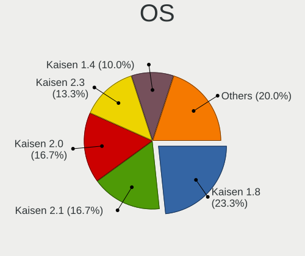

| Name       | Notebooks | Percent |
|------------|-----------|---------|
| Kaisen 1.8 | 7         | 23.33%  |
| Kaisen 2.1 | 5         | 16.67%  |
| Kaisen 2.0 | 5         | 16.67%  |
| Kaisen 2.3 | 4         | 13.33%  |
| Kaisen 1.4 | 3         | 10%     |
| Kaisen 2.2 | 2         | 6.67%   |
| Kaisen 1.6 | 2         | 6.67%   |
| Kaisen 3.0 | 1         | 3.33%   |
| Kaisen 1.0 | 1         | 3.33%   |

OS Family
---------

OS without a version

| Name   | Notebooks | Percent |
|--------|-----------|---------|
| Kaisen | 30        | 100%    |

Kernel
------

Version of the Linux kernel

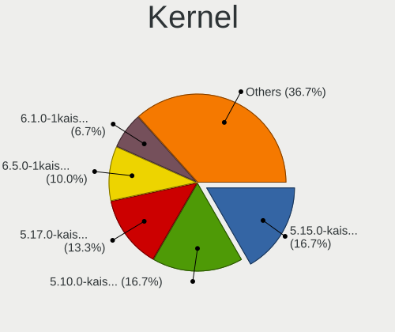

| Version              | Notebooks | Percent |
|----------------------|-----------|---------|
| 5.15.0-kaisen1-amd64 | 5         | 16.67%  |
| 5.10.0-kaisen5-amd64 | 5         | 16.67%  |
| 5.17.0-kaisen1-amd64 | 4         | 13.33%  |
| 6.5.0-1kaisen-amd64  | 3         | 10%     |
| 6.1.0-1kaisen-amd64  | 2         | 6.67%   |
| 5.8.0-kaisen2-amd64  | 2         | 6.67%   |
| 5.10.0-kaisen3-amd64 | 2         | 6.67%   |
| 6.12.9-1kaisen-amd64 | 1         | 3.33%   |
| 6.0.0-1kaisen-amd64  | 1         | 3.33%   |
| 5.9.0-kaisen2-amd64  | 1         | 3.33%   |
| 5.5.0-kaisen1-amd64  | 1         | 3.33%   |
| 5.19.0-kaisen1-amd64 | 1         | 3.33%   |
| 5.16.0-kaisen1-amd64 | 1         | 3.33%   |
| 5.14.0-kaisen1-amd64 | 1         | 3.33%   |

Kernel Family
-------------

Linux kernel without a distro release

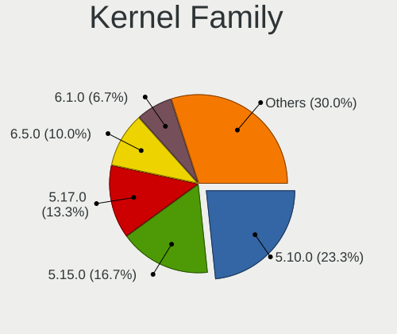

| Version | Notebooks | Percent |
|---------|-----------|---------|
| 5.10.0  | 7         | 23.33%  |
| 5.15.0  | 5         | 16.67%  |
| 5.17.0  | 4         | 13.33%  |
| 6.5.0   | 3         | 10%     |
| 6.1.0   | 2         | 6.67%   |
| 5.8.0   | 2         | 6.67%   |
| 6.12.9  | 1         | 3.33%   |
| 6.0.0   | 1         | 3.33%   |
| 5.9.0   | 1         | 3.33%   |
| 5.5.0   | 1         | 3.33%   |
| 5.19.0  | 1         | 3.33%   |
| 5.16.0  | 1         | 3.33%   |
| 5.14.0  | 1         | 3.33%   |

Kernel Major Ver.
-----------------

Linux kernel major version

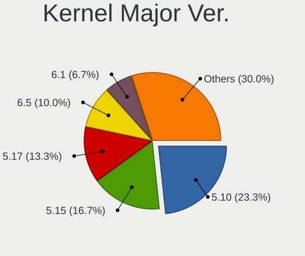

| Version | Notebooks | Percent |
|---------|-----------|---------|
| 5.10    | 7         | 23.33%  |
| 5.15    | 5         | 16.67%  |
| 5.17    | 4         | 13.33%  |
| 6.5     | 3         | 10%     |
| 6.1     | 2         | 6.67%   |
| 5.8     | 2         | 6.67%   |
| 6.12    | 1         | 3.33%   |
| 6.0     | 1         | 3.33%   |
| 5.9     | 1         | 3.33%   |
| 5.5     | 1         | 3.33%   |
| 5.19    | 1         | 3.33%   |
| 5.16    | 1         | 3.33%   |
| 5.14    | 1         | 3.33%   |

Arch
----

OS architecture (x86_64, i586, etc.)

| Name   | Notebooks | Percent |
|--------|-----------|---------|
| x86_64 | 30        | 100%    |

DE
--

Desktop Environment

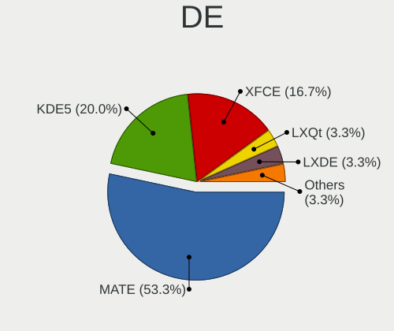

| Name    | Notebooks | Percent |
|---------|-----------|---------|
| MATE    | 16        | 53.33%  |
| KDE5    | 6         | 20%     |
| XFCE    | 5         | 16.67%  |
| LXQt    | 1         | 3.33%   |
| LXDE    | 1         | 3.33%   |
| Unknown | 1         | 3.33%   |

Display Server
--------------

X11 or Wayland

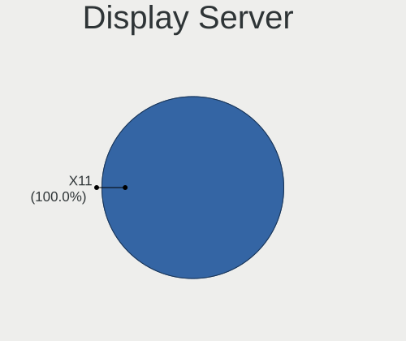

| Name | Notebooks | Percent |
|------|-----------|---------|
| X11  | 30        | 100%    |

Display Manager
---------------

SDDM, LightDM, etc.

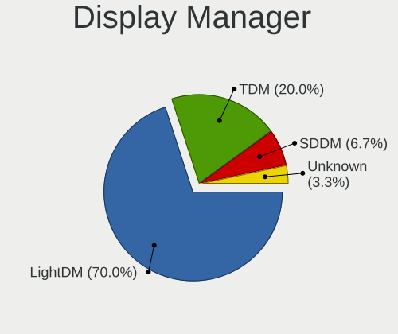

| Name    | Notebooks | Percent |
|---------|-----------|---------|
| LightDM | 21        | 70%     |
| TDM     | 6         | 20%     |
| SDDM    | 2         | 6.67%   |
| Unknown | 1         | 3.33%   |

OS Lang
-------

Language

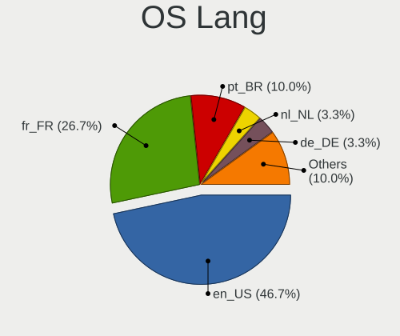

| Lang    | Notebooks | Percent |
|---------|-----------|---------|
| en_US   | 14        | 46.67%  |
| fr_FR   | 8         | 26.67%  |
| pt_BR   | 3         | 10%     |
| nl_NL   | 1         | 3.33%   |
| de_DE   | 1         | 3.33%   |
| de_CH   | 1         | 3.33%   |
| C       | 1         | 3.33%   |
| Unknown | 1         | 3.33%   |

Boot Mode
---------

EFI or BIOS

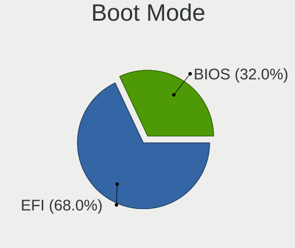

| Mode | Notebooks | Percent |
|------|-----------|---------|
| EFI  | 21        | 70%     |
| BIOS | 9         | 30%     |

Filesystem
----------

Type of filesystem

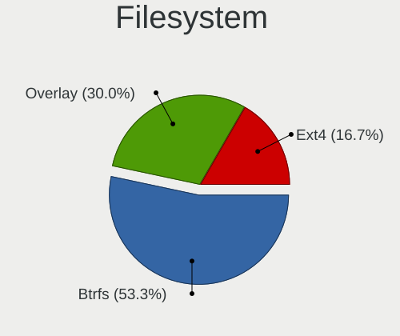

| Type    | Notebooks | Percent |
|---------|-----------|---------|
| Btrfs   | 16        | 53.33%  |
| Overlay | 9         | 30%     |
| Ext4    | 5         | 16.67%  |

Part. scheme
------------

Scheme of partitioning

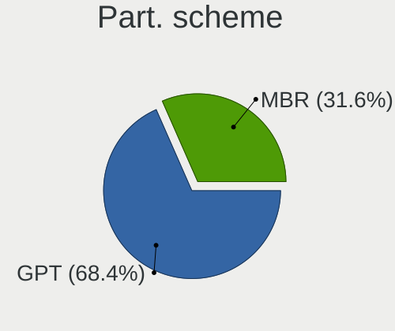

| Type | Notebooks | Percent |
|------|-----------|---------|
| GPT  | 21        | 70%     |
| MBR  | 9         | 30%     |

Dual Boot with Linux/BSD
------------------------

Hosting more than one Linux/BSD

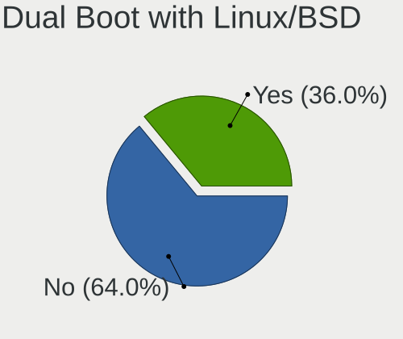

| Dual boot | Notebooks | Percent |
|-----------|-----------|---------|
| No        | 20        | 66.67%  |
| Yes       | 10        | 33.33%  |

Dual Boot (Win)
---------------

Hosting Linux and Windows

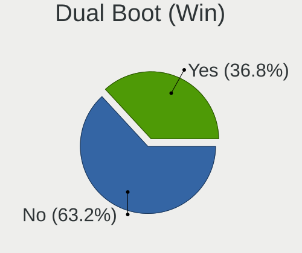

| Dual boot | Notebooks | Percent |
|-----------|-----------|---------|
| No        | 22        | 73.33%  |
| Yes       | 8         | 26.67%  |

Board
-----

Vendor
------

Motherboard manufacturer

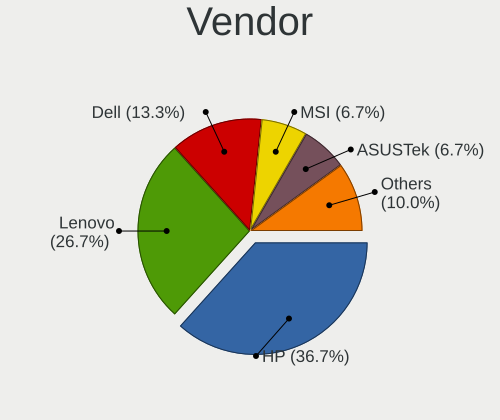

| Name                | Notebooks | Percent |
|---------------------|-----------|---------|
| Hewlett-Packard     | 11        | 36.67%  |
| Lenovo              | 8         | 26.67%  |
| Dell                | 4         | 13.33%  |
| MSI                 | 2         | 6.67%   |
| ASUSTek Computer    | 2         | 6.67%   |
| Samsung Electronics | 1         | 3.33%   |
| Apple               | 1         | 3.33%   |
| Acer                | 1         | 3.33%   |

Model
-----

Motherboard model

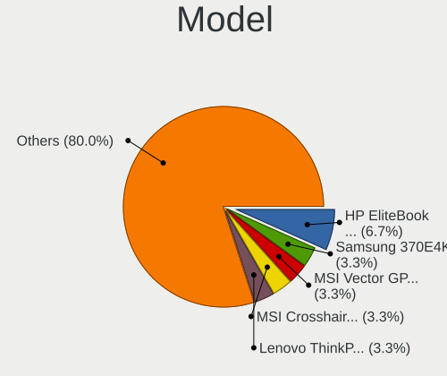

| Name                                  | Notebooks | Percent |
|---------------------------------------|-----------|---------|
| HP EliteBook 840 G2                   | 2         | 6.67%   |
| Samsung 370E4K                        | 1         | 3.33%   |
| MSI Vector GP76 12UH                  | 1         | 3.33%   |
| MSI Crosshair 15 A11UEK               | 1         | 3.33%   |
| Lenovo ThinkPad T520 4243E51          | 1         | 3.33%   |
| Lenovo ThinkPad T450 20BV003SMS       | 1         | 3.33%   |
| Lenovo ThinkPad T431s 20AA000MUS      | 1         | 3.33%   |
| Lenovo ThinkPad T430 23427YU          | 1         | 3.33%   |
| Lenovo ThinkPad T15 Gen 2i 20W4CTO1WW | 1         | 3.33%   |
| Lenovo ThinkPad L470 20J4CTO1WW       | 1         | 3.33%   |
| Lenovo Legion Y530-15ICH 81FV         | 1         | 3.33%   |
| Lenovo IdeaPad 5 15ARE05 81YQ         | 1         | 3.33%   |
| HP ProBook 650 G2                     | 1         | 3.33%   |
| HP ProBook 645 G1                     | 1         | 3.33%   |
| HP ProBook 640 G1                     | 1         | 3.33%   |
| HP Pavilion g7                        | 1         | 3.33%   |
| HP Pavilion 15                        | 1         | 3.33%   |
| HP Notebook                           | 1         | 3.33%   |
| HP Laptop 15-bw0xx                    | 1         | 3.33%   |
| HP Laptop 14-dq0xxx                   | 1         | 3.33%   |
| HP EliteBook 840 G1                   | 1         | 3.33%   |
| Dell Latitude 3540                    | 1         | 3.33%   |
| Dell Inspiron 15 7000 Gaming          | 1         | 3.33%   |
| Dell Inspiron 14 5401                 | 1         | 3.33%   |
| Dell G3 3500                          | 1         | 3.33%   |
| ASUS X751LAB                          | 1         | 3.33%   |
| ASUS N76VB                            | 1         | 3.33%   |
| Apple MacBookPro9,2                   | 1         | 3.33%   |
| Acer Aspire One 753                   | 1         | 3.33%   |

Model Family
------------

Motherboard model prefix

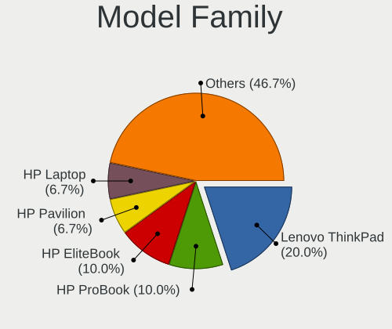

| Name              | Notebooks | Percent |
|-------------------|-----------|---------|
| Lenovo ThinkPad   | 6         | 20%     |
| HP ProBook        | 3         | 10%     |
| HP EliteBook      | 3         | 10%     |
| HP Pavilion       | 2         | 6.67%   |
| HP Laptop         | 2         | 6.67%   |
| Dell Inspiron     | 2         | 6.67%   |
| Samsung 370E4K    | 1         | 3.33%   |
| MSI Vector        | 1         | 3.33%   |
| MSI Crosshair     | 1         | 3.33%   |
| Lenovo Legion     | 1         | 3.33%   |
| Lenovo IdeaPad    | 1         | 3.33%   |
| HP Notebook       | 1         | 3.33%   |
| Dell Latitude     | 1         | 3.33%   |
| Dell G3           | 1         | 3.33%   |
| ASUS X751LAB      | 1         | 3.33%   |
| ASUS N76VB        | 1         | 3.33%   |
| Apple MacBookPro9 | 1         | 3.33%   |
| Acer Aspire       | 1         | 3.33%   |

MFG Year
--------

Motherboard manufacture year

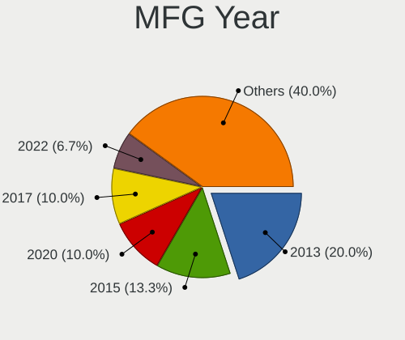

| Year | Notebooks | Percent |
|------|-----------|---------|
| 2013 | 6         | 20%     |
| 2015 | 4         | 13.33%  |
| 2020 | 3         | 10%     |
| 2017 | 3         | 10%     |
| 2022 | 2         | 6.67%   |
| 2021 | 2         | 6.67%   |
| 2014 | 2         | 6.67%   |
| 2012 | 2         | 6.67%   |
| 2011 | 2         | 6.67%   |
| 2019 | 1         | 3.33%   |
| 2018 | 1         | 3.33%   |
| 2016 | 1         | 3.33%   |
| 2010 | 1         | 3.33%   |

Form Factor
-----------

Physical design of the computer

| Name     | Notebooks | Percent |
|----------|-----------|---------|
| Notebook | 30        | 100%    |

Secure Boot
-----------

Enabled or disabled

| State    | Notebooks | Percent |
|----------|-----------|---------|
| Disabled | 30        | 100%    |

Coreboot
--------

Have coreboot on board

| Used | Notebooks | Percent |
|------|-----------|---------|
| No   | 30        | 100%    |

RAM Size
--------

Total RAM memory

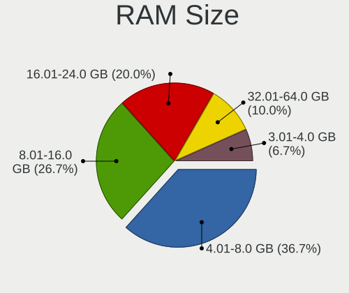

| Size in GB | Notebooks | Percent |
|------------|-----------|---------|
| 4.01-8.0   | 11        | 36.67%  |
| 8.01-16.0  | 8         | 26.67%  |
| 16.01-24.0 | 6         | 20%     |
| 32.01-64.0 | 3         | 10%     |
| 3.01-4.0   | 2         | 6.67%   |

RAM Used
--------

Used RAM memory

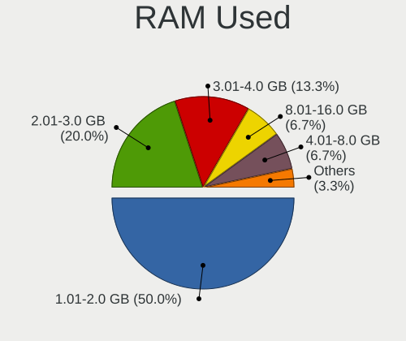

| Used GB   | Notebooks | Percent |
|-----------|-----------|---------|
| 1.01-2.0  | 15        | 50%     |
| 2.01-3.0  | 6         | 20%     |
| 3.01-4.0  | 4         | 13.33%  |
| 4.01-8.0  | 2         | 6.67%   |
| 8.01-16.0 | 2         | 6.67%   |
| 0.51-1.0  | 1         | 3.33%   |

Total Drives
------------

Number of drives on board

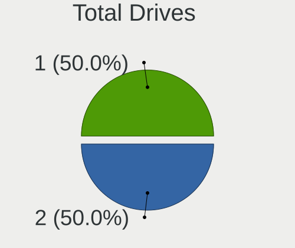

| Drives | Notebooks | Percent |
|--------|-----------|---------|
| 2      | 15        | 50%     |
| 1      | 15        | 50%     |

Has CD-ROM
----------

Has CD-ROM on board

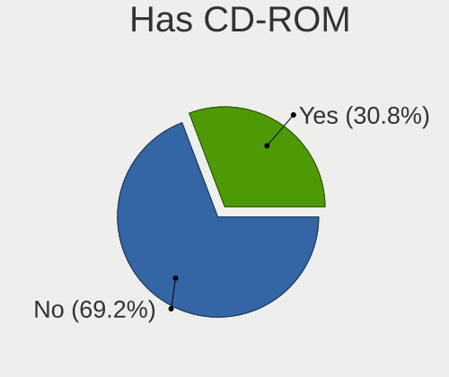

| Presented | Notebooks | Percent |
|-----------|-----------|---------|
| No        | 20        | 66.67%  |
| Yes       | 10        | 33.33%  |

Has Ethernet
------------

Has Ethernet on board

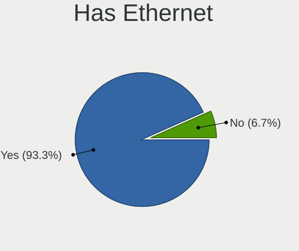

| Presented | Notebooks | Percent |
|-----------|-----------|---------|
| Yes       | 28        | 93.33%  |
| No        | 2         | 6.67%   |

Has WiFi
--------

Has WiFi module

| Presented | Notebooks | Percent |
|-----------|-----------|---------|
| Yes       | 30        | 100%    |

Has Bluetooth
-------------

Has Bluetooth module

| Presented | Notebooks | Percent |
|-----------|-----------|---------|
| Yes       | 24        | 80%     |
| No        | 6         | 20%     |

Location
--------

Country
-------

Geographic location (country)

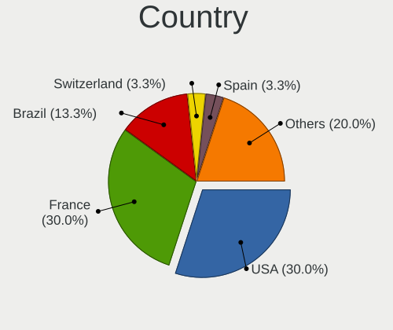

| Country     | Notebooks | Percent |
|-------------|-----------|---------|
| USA         | 9         | 30%     |
| France      | 9         | 30%     |
| Brazil      | 4         | 13.33%  |
| Switzerland | 1         | 3.33%   |
| Spain       | 1         | 3.33%   |
| Slovakia    | 1         | 3.33%   |
| Netherlands | 1         | 3.33%   |
| India       | 1         | 3.33%   |
| Germany     | 1         | 3.33%   |
| Belgium     | 1         | 3.33%   |
| Australia   | 1         | 3.33%   |

City
----

Geographic location (city)

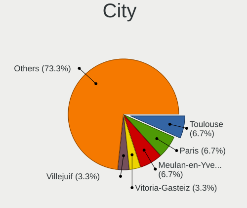

| City               | Notebooks | Percent |
|--------------------|-----------|---------|
| Toulouse           | 2         | 6.67%   |
| Paris              | 2         | 6.67%   |
| Meulan-en-Yvelines | 2         | 6.67%   |
| Vitoria-Gasteiz    | 1         | 3.33%   |
| Villejuif          | 1         | 3.33%   |
| Valencia           | 1         | 3.33%   |
| Tresses            | 1         | 3.33%   |
| Starkville         | 1         | 3.33%   |
| Short Hills        | 1         | 3.33%   |
| Sao Paulo          | 1         | 3.33%   |
| Salt Lake City     | 1         | 3.33%   |
| Roesrath           | 1         | 3.33%   |
| Rio de Janeiro     | 1         | 3.33%   |
| Pinckney           | 1         | 3.33%   |
| Philadelphia       | 1         | 3.33%   |
| Perth              | 1         | 3.33%   |
| Nitra              | 1         | 3.33%   |
| Nieuw-Vossemeer    | 1         | 3.33%   |
| Mechanicsburg      | 1         | 3.33%   |
| Malappuram         | 1         | 3.33%   |
| Maceió            | 1         | 3.33%   |
| Lawley             | 1         | 3.33%   |
| Las Vegas          | 1         | 3.33%   |
| Joaima             | 1         | 3.33%   |
| Gavere             | 1         | 3.33%   |
| Dijon              | 1         | 3.33%   |
| Bern               | 1         | 3.33%   |

Drives
------

Drive Vendor
------------

Hard drive vendors

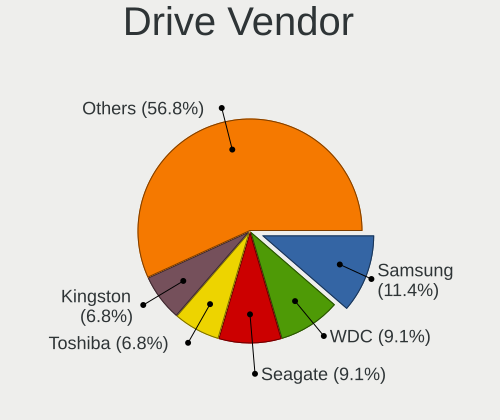

| Vendor                      | Notebooks | Drives | Percent |
|-----------------------------|-----------|--------|---------|
| Samsung Electronics         | 5         | 5      | 11.36%  |
| WDC                         | 4         | 4      | 9.09%   |
| Seagate                     | 4         | 4      | 9.09%   |
| Toshiba                     | 3         | 3      | 6.82%   |
| Kingston                    | 3         | 3      | 6.82%   |
| HGST                        | 3         | 3      | 6.82%   |
| Unknown                     | 2         | 2      | 4.55%   |
| Micron Technology           | 2         | 2      | 4.55%   |
| TO Exter                    | 1         | 1      | 2.27%   |
| TCSUNBOW                    | 1         | 1      | 2.27%   |
| SK hynix                    | 1         | 1      | 2.27%   |
| SanDisk                     | 1         | 1      | 2.27%   |
| Mushkin                     | 1         | 1      | 2.27%   |
| MAXIO Technology (Hangzhou) | 1         | 1      | 2.27%   |
| MARSHAL                     | 1         | 1      | 2.27%   |
| LITEONIT                    | 1         | 1      | 2.27%   |
| LITEON                      | 1         | 1      | 2.27%   |
| Lexar                       | 1         | 1      | 2.27%   |
| KIOXIA                      | 1         | 1      | 2.27%   |
| JMicron Technology          | 1         | 1      | 2.27%   |
| Intel                       | 1         | 1      | 2.27%   |
| Hitachi                     | 1         | 1      | 2.27%   |
| Crucial                     | 1         | 1      | 2.27%   |
| Corsair                     | 1         | 1      | 2.27%   |
| BHT                         | 1         | 1      | 2.27%   |
| Unknown                     | 1         | 1      | 2.27%   |

Drive Model
-----------

Hard drive models

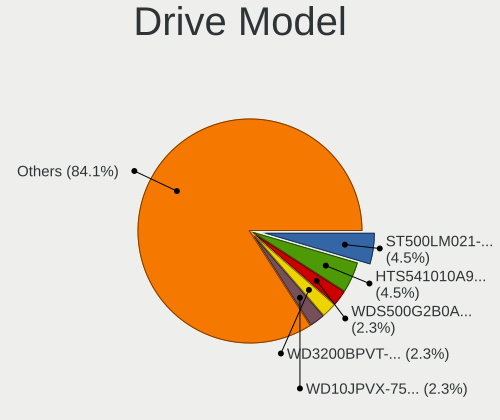

| Model                                     | Notebooks | Percent |
|-------------------------------------------|-----------|---------|
| Seagate ST500LM021-1KJ152 500GB           | 2         | 4.55%   |
| HGST HTS541010A9E680 1TB                  | 2         | 4.55%   |
| WDC WDS500G2B0A-00SM50 500GB              | 1         | 2.27%   |
| WDC WD3200BPVT-22ZEST0 320GB              | 1         | 2.27%   |
| WDC WD10JPVX-75JC3T0 1TB                  | 1         | 2.27%   |
| WDC WD Green 2.5 480GB                    | 1         | 2.27%   |
| Unknown SD  1GB                           | 1         | 2.27%   |
| Unknown CUTB42  64GB                      | 1         | 2.27%   |
| Toshiba MQ01ABF050 500GB                  | 1         | 2.27%   |
| Toshiba MQ01ABD100 1TB                    | 1         | 2.27%   |
| Toshiba KXG6AZNV1T02 1TB                  | 1         | 2.27%   |
| TO Exter nal USB 3.0 250GB                | 1         | 2.27%   |
| TCSUNBOW N4 120GB SSD                     | 1         | 2.27%   |
| SK hynix SKHynix_HFM256GDHTNI-87A0B 256GB | 1         | 2.27%   |
| Seagate ST500LM000-1EJ162 500GB           | 1         | 2.27%   |
| Seagate ST1000LM049-2GH172 1TB            | 1         | 2.27%   |
| SanDisk SSD PLUS 120 GB                   | 1         | 2.27%   |
| Samsung SSD 970 EVO Plus 1TB              | 1         | 2.27%   |
| Samsung SSD 850 PRO 256GB                 | 1         | 2.27%   |
| Samsung SSD 750 EVO 250GB                 | 1         | 2.27%   |
| Samsung MZMPA024HMCD-000L1 24GB SSD       | 1         | 2.27%   |
| Samsung MZ7LN256HCHP-000L7 256GB SSD      | 1         | 2.27%   |
| Mushkin MKNSSDEC240GB                     | 1         | 2.27%   |
| Micron 2450_MTFDKBA1T0TFK 1TB             | 1         | 2.27%   |
| Micron 2210_MTFDHBA512QFD 512GB           | 1         | 2.27%   |
| MAXIO (Hangzhou) NVMe SSD Drive 512GB     | 1         | 2.27%   |
| MARSHAL MAL2500SA-T54L 500GB              | 1         | 2.27%   |
| LITEONIT LMT-64M6M mSATA 64GB SSD         | 1         | 2.27%   |
| LITEON CV3-8D256-11 SATA 256GB SSD        | 1         | 2.27%   |
| Lexar SSD NS100 256GB                     | 1         | 2.27%   |
| KIOXIA KBG40ZNS512G NVMe 512GB            | 1         | 2.27%   |
| Kingston SV300S37A240G 240GB SSD          | 1         | 2.27%   |
| Kingston SNVS1000GB 1TB                   | 1         | 2.27%   |
| Kingston SA400S37240G 240GB SSD           | 1         | 2.27%   |
| JMicron Generic 320GB                     | 1         | 2.27%   |
| Intel SSDSC2BX480G4 480GB                 | 1         | 2.27%   |
| Hitachi HTS545050A7E380 500GB             | 1         | 2.27%   |
| HGST HTS725050A7E630 500GB                | 1         | 2.27%   |
| Crucial CT1000MX500SSD1 1TB               | 1         | 2.27%   |
| Corsair Force MP300 240GB                 | 1         | 2.27%   |

HDD Vendor
----------

Hard disk drive vendors

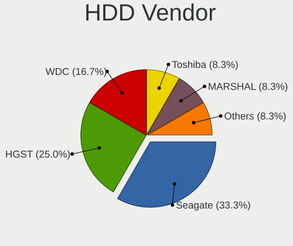

| Vendor             | Notebooks | Drives | Percent |
|--------------------|-----------|--------|---------|
| Seagate            | 4         | 4      | 25%     |
| HGST               | 3         | 3      | 18.75%  |
| WDC                | 2         | 2      | 12.5%   |
| Toshiba            | 2         | 2      | 12.5%   |
| TO Exter           | 1         | 1      | 6.25%   |
| MARSHAL            | 1         | 1      | 6.25%   |
| JMicron Technology | 1         | 1      | 6.25%   |
| Hitachi            | 1         | 1      | 6.25%   |
| Unknown            | 1         | 1      | 6.25%   |

SSD Vendor
----------

Solid state drive vendors

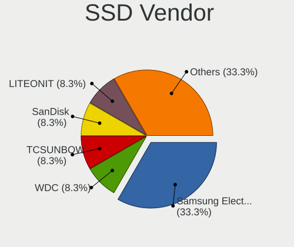

| Vendor              | Notebooks | Drives | Percent |
|---------------------|-----------|--------|---------|
| Samsung Electronics | 4         | 4      | 23.53%  |
| WDC                 | 2         | 2      | 11.76%  |
| Kingston            | 2         | 2      | 11.76%  |
| TCSUNBOW            | 1         | 1      | 5.88%   |
| SanDisk             | 1         | 1      | 5.88%   |
| Mushkin             | 1         | 1      | 5.88%   |
| LITEONIT            | 1         | 1      | 5.88%   |
| LITEON              | 1         | 1      | 5.88%   |
| Lexar               | 1         | 1      | 5.88%   |
| Intel               | 1         | 1      | 5.88%   |
| Crucial             | 1         | 1      | 5.88%   |
| BHT                 | 1         | 1      | 5.88%   |

Drive Kind
----------

HDD or SSD

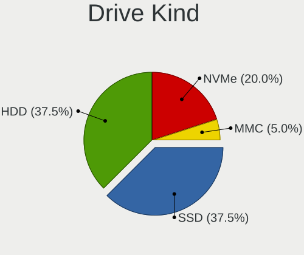

| Kind | Notebooks | Drives | Percent |
|------|-----------|--------|---------|
| SSD  | 15        | 17     | 37.5%   |
| HDD  | 15        | 16     | 37.5%   |
| NVMe | 8         | 9      | 20%     |
| MMC  | 2         | 2      | 5%      |

Drive Connector
---------------

SATA, SAS, NVMe, etc.

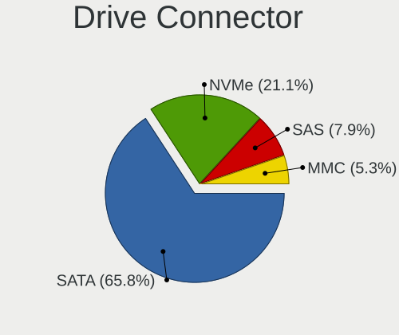

| Type | Notebooks | Drives | Percent |
|------|-----------|--------|---------|
| SATA | 25        | 30     | 65.79%  |
| NVMe | 8         | 9      | 21.05%  |
| SAS  | 3         | 3      | 7.89%   |
| MMC  | 2         | 2      | 5.26%   |

Drive Size
----------

Size of hard drive

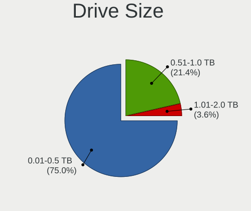

| Size in TB | Notebooks | Drives | Percent |
|------------|-----------|--------|---------|
| 0.01-0.5   | 21        | 27     | 77.78%  |
| 0.51-1.0   | 6         | 6      | 22.22%  |

Space Total
-----------

Amount of disk space available on the file system

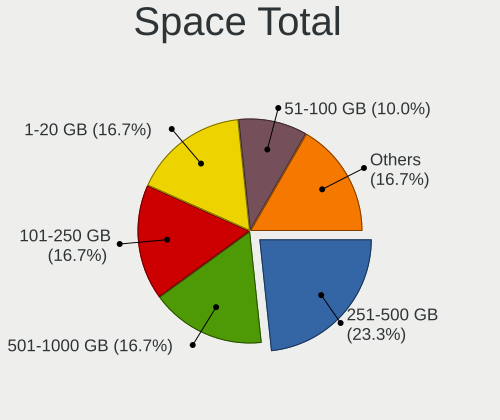

| Size in GB | Notebooks | Percent |
|------------|-----------|---------|
| 251-500    | 7         | 23.33%  |
| 101-250    | 5         | 16.67%  |
| 1-20       | 5         | 16.67%  |
| 501-1000   | 5         | 16.67%  |
| 51-100     | 3         | 10%     |
| 21-50      | 2         | 6.67%   |
| Unknown    | 2         | 6.67%   |
| 1001-2000  | 1         | 3.33%   |

Space Used
----------

Amount of used disk space

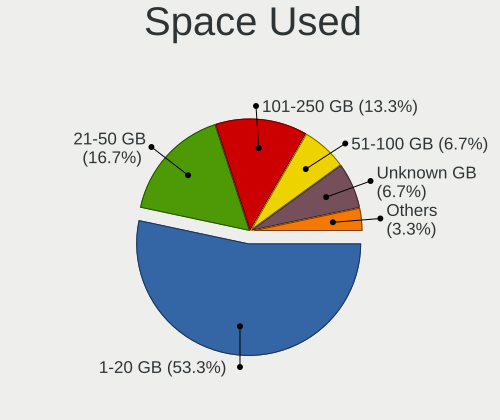

| Used GB  | Notebooks | Percent |
|----------|-----------|---------|
| 1-20     | 16        | 53.33%  |
| 21-50    | 5         | 16.67%  |
| 101-250  | 4         | 13.33%  |
| 51-100   | 2         | 6.67%   |
| Unknown  | 2         | 6.67%   |
| 501-1000 | 1         | 3.33%   |

Malfunc. Drives
---------------

Drive models with a malfunction

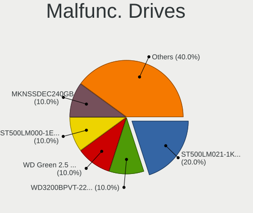

| Model                           | Notebooks | Drives | Percent |
|---------------------------------|-----------|--------|---------|
| Seagate ST500LM021-1KJ152 500GB | 2         | 2      | 20%     |
| WDC WD3200BPVT-22ZEST0 320GB    | 1         | 1      | 10%     |
| WDC WD Green 2.5 480GB          | 1         | 1      | 10%     |
| Seagate ST500LM000-1EJ162 500GB | 1         | 1      | 10%     |
| Mushkin MKNSSDEC240GB           | 1         | 1      | 10%     |
| MARSHAL MAL2500SA-T54L 500GB    | 1         | 1      | 10%     |
| Hitachi HTS545050A7E380 500GB   | 1         | 1      | 10%     |
| HGST HTS725050A7E630 500GB      | 1         | 1      | 10%     |
| Unknown                         | 1         | 1      | 10%     |

Malfunc. Drive Vendor
---------------------

Vendors of faulty drives

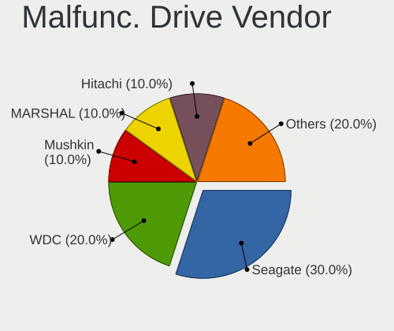

| Vendor  | Notebooks | Drives | Percent |
|---------|-----------|--------|---------|
| Seagate | 3         | 3      | 30%     |
| WDC     | 2         | 2      | 20%     |
| Mushkin | 1         | 1      | 10%     |
| MARSHAL | 1         | 1      | 10%     |
| Hitachi | 1         | 1      | 10%     |
| HGST    | 1         | 1      | 10%     |
| Unknown | 1         | 1      | 10%     |

Malfunc. HDD Vendor
-------------------

Vendors of faulty HDD drives

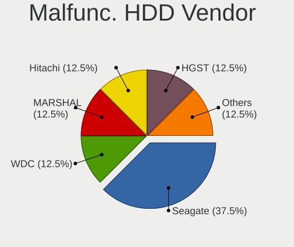

| Vendor  | Notebooks | Drives | Percent |
|---------|-----------|--------|---------|
| Seagate | 3         | 3      | 37.5%   |
| WDC     | 1         | 1      | 12.5%   |
| MARSHAL | 1         | 1      | 12.5%   |
| Hitachi | 1         | 1      | 12.5%   |
| HGST    | 1         | 1      | 12.5%   |
| Unknown | 1         | 1      | 12.5%   |

Malfunc. Drive Kind
-------------------

Kinds of faulty drives

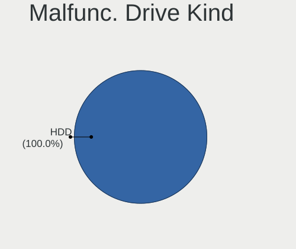

| Kind | Notebooks | Drives | Percent |
|------|-----------|--------|---------|
| HDD  | 8         | 8      | 80%     |
| SSD  | 2         | 2      | 20%     |

Failed Drives
-------------

Failed drive models

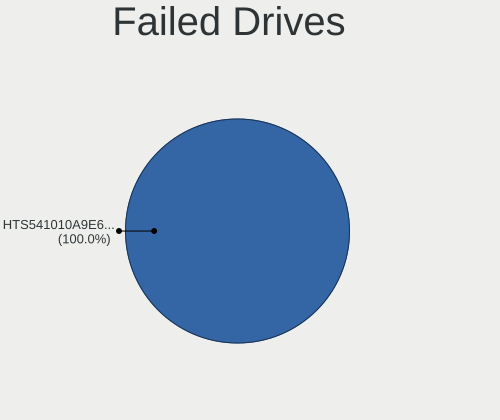

| Model                    | Notebooks | Drives | Percent |
|--------------------------|-----------|--------|---------|
| HGST HTS541010A9E680 1TB | 1         | 1      | 100%    |

Failed Drive Vendor
-------------------

Failed drive vendors

| Vendor | Notebooks | Drives | Percent |
|--------|-----------|--------|---------|
| HGST   | 1         | 1      | 100%    |

Drive Status
------------

Number of failed and malfunc. drives

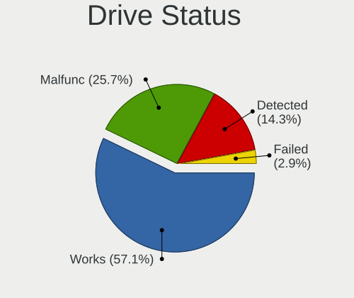

| Status   | Notebooks | Drives | Percent |
|----------|-----------|--------|---------|
| Works    | 20        | 28     | 57.14%  |
| Malfunc  | 9         | 10     | 25.71%  |
| Detected | 5         | 5      | 14.29%  |
| Failed   | 1         | 1      | 2.86%   |

Storage controller
------------------

Storage Vendor
--------------

Storage controller vendors

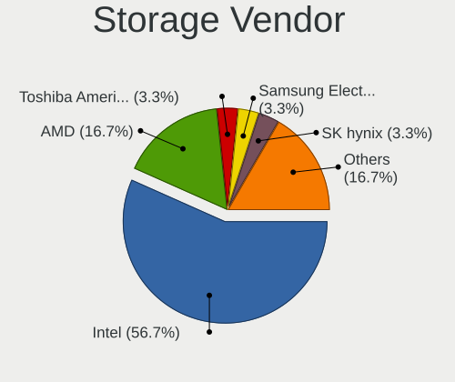

| Vendor                       | Notebooks | Percent |
|------------------------------|-----------|---------|
| Intel                        | 20        | 57.14%  |
| AMD                          | 6         | 17.14%  |
| Micron Technology            | 2         | 5.71%   |
| Toshiba America Info Systems | 1         | 2.86%   |
| SK hynix                     | 1         | 2.86%   |
| Samsung Electronics          | 1         | 2.86%   |
| Phison Electronics           | 1         | 2.86%   |
| MAXIO Technology (Hangzhou)  | 1         | 2.86%   |
| KIOXIA                       | 1         | 2.86%   |
| Kingston Technology Company  | 1         | 2.86%   |

Storage Model
-------------

Storage controller models

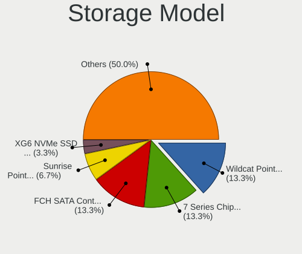

| Model                                                                          | Notebooks | Percent |
|--------------------------------------------------------------------------------|-----------|---------|
| AMD FCH SATA Controller [AHCI mode]                                            | 6         | 16.67%  |
| Intel Wildcat Point-LP SATA Controller [AHCI Mode]                             | 5         | 13.89%  |
| Intel 7 Series Chipset Family 6-port SATA Controller [AHCI mode]               | 4         | 11.11%  |
| Intel Sunrise Point-LP SATA Controller [AHCI mode]                             | 2         | 5.56%   |
| Toshiba America Info Systems XG6 NVMe SSD Controller                           | 1         | 2.78%   |
| SK hynix BC511 NVMe SSD                                                        | 1         | 2.78%   |
| Samsung NVMe SSD Controller SM981/PM981/PM983                                  | 1         | 2.78%   |
| Phison E8 PCIe3 x2 NVMe Controller                                             | 1         | 2.78%   |
| Micron 2450 NVMe SSD [HendrixV] (DRAM-less)                                    | 1         | 2.78%   |
| Micron 2210 NVMe SSD [Cobain]                                                  | 1         | 2.78%   |
| MAXIO (Hangzhou) NVMe SSD Controller MAP1202 (DRAM-less)                       | 1         | 2.78%   |
| KIOXIA NVMe SSD Controller BG4 (DRAM-less)                                     | 1         | 2.78%   |
| Kingston Company NV1 NVMe SSD [SM2263XT] (DRAM-less)                           | 1         | 2.78%   |
| Intel Tiger Lake SATA AHCI Controller                                          | 1         | 2.78%   |
| Intel HM170/QM170 Chipset SATA Controller [AHCI Mode]                          | 1         | 2.78%   |
| Intel Cannon Lake Mobile PCH SATA AHCI Controller                              | 1         | 2.78%   |
| Intel 82801 Mobile SATA Controller [RAID mode]                                 | 1         | 2.78%   |
| Intel 8 Series/C220 Series Chipset Family 6-port SATA Controller 1 [AHCI mode] | 1         | 2.78%   |
| Intel 8 Series SATA Controller 1 [AHCI mode]                                   | 1         | 2.78%   |
| Intel 6 Series/C200 Series Chipset Family 6 port Mobile SATA AHCI Controller   | 1         | 2.78%   |
| Intel 5 Series/3400 Series Chipset 4 port SATA AHCI Controller                 | 1         | 2.78%   |
| Intel 400 Series Chipset Family SATA AHCI Controller                           | 1         | 2.78%   |
| AMD FCH IDE Controller                                                         | 1         | 2.78%   |

Storage Kind
------------

Kind of storage controller (IDE, SATA, NVMe, SAS, ...)

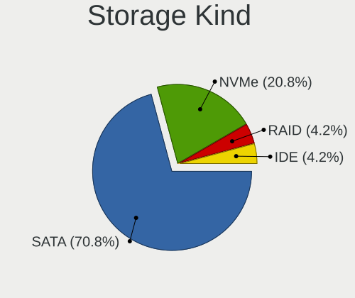

| Kind | Notebooks | Percent |
|------|-----------|---------|
| SATA | 25        | 71.43%  |
| NVMe | 8         | 22.86%  |
| RAID | 1         | 2.86%   |
| IDE  | 1         | 2.86%   |

Processor
---------

CPU Vendor
----------

Processor vendors

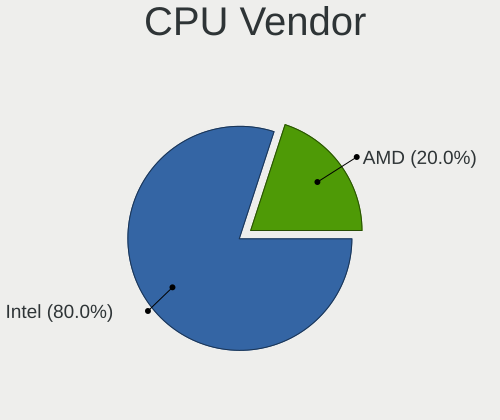

| Vendor | Notebooks | Percent |
|--------|-----------|---------|
| Intel  | 24        | 80%     |
| AMD    | 6         | 20%     |

CPU Model
---------

Processor models

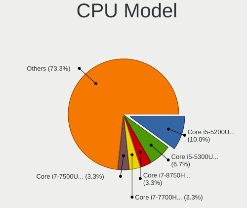

| Model                                        | Notebooks | Percent |
|----------------------------------------------|-----------|---------|
| Intel Core i5-5200U CPU @ 2.20GHz            | 3         | 10%     |
| Intel Core i5-5300U CPU @ 2.30GHz            | 2         | 6.67%   |
| Intel Core i7-8750H CPU @ 2.20GHz            | 1         | 3.33%   |
| Intel Core i7-7700HQ CPU @ 2.80GHz           | 1         | 3.33%   |
| Intel Core i7-7500U CPU @ 2.70GHz            | 1         | 3.33%   |
| Intel Core i7-3740QM CPU @ 2.70GHz           | 1         | 3.33%   |
| Intel Core i7-3630QM CPU @ 2.40GHz           | 1         | 3.33%   |
| Intel Core i7-2620M CPU @ 2.70GHz            | 1         | 3.33%   |
| Intel Core i7-1065G7 CPU @ 1.30GHz           | 1         | 3.33%   |
| Intel Core i5-6200U CPU @ 2.30GHz            | 1         | 3.33%   |
| Intel Core i5-4300U CPU @ 1.90GHz            | 1         | 3.33%   |
| Intel Core i5-4210U CPU @ 1.70GHz            | 1         | 3.33%   |
| Intel Core i5-4210M CPU @ 2.60GHz            | 1         | 3.33%   |
| Intel Core i5-3437U CPU @ 1.90GHz            | 1         | 3.33%   |
| Intel Core i5-3210M CPU @ 2.50GHz            | 1         | 3.33%   |
| Intel Core i5-10300H CPU @ 2.50GHz           | 1         | 3.33%   |
| Intel Celeron N4120 CPU @ 1.10GHz            | 1         | 3.33%   |
| Intel Celeron CPU U3600 @ 1.20GHz            | 1         | 3.33%   |
| Intel 12th Gen Core i7-12700H                | 1         | 3.33%   |
| Intel 11th Gen Core i7-1185G7 @ 3.00GHz      | 1         | 3.33%   |
| Intel 11th Gen Core i7-11800H @ 2.30GHz      | 1         | 3.33%   |
| AMD Ryzen 7 4800U with Radeon Graphics       | 1         | 3.33%   |
| AMD E2-7110 APU with AMD Radeon R2 Graphics  | 1         | 3.33%   |
| AMD A9-9420 RADEON R5, 5 COMPUTE CORES 2C+3G | 1         | 3.33%   |
| AMD A6-5350M APU with Radeon HD Graphics     | 1         | 3.33%   |
| AMD A6-4400M APU with Radeon HD Graphics     | 1         | 3.33%   |
| AMD A10-5745M APU with Radeon HD Graphics    | 1         | 3.33%   |

CPU Model Family
----------------

Processor model prefix

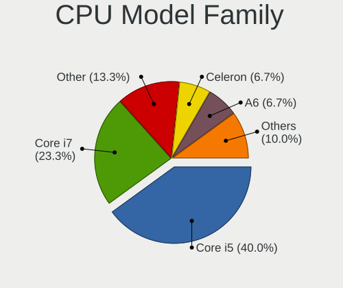

| Model         | Notebooks | Percent |
|---------------|-----------|---------|
| Intel Core i5 | 12        | 40%     |
| Intel Core i7 | 7         | 23.33%  |
| Other         | 4         | 13.33%  |
| Intel Celeron | 2         | 6.67%   |
| AMD A6        | 2         | 6.67%   |
| AMD Ryzen 7   | 1         | 3.33%   |
| AMD E2        | 1         | 3.33%   |
| AMD A10       | 1         | 3.33%   |

CPU Cores
---------

Number of processor cores

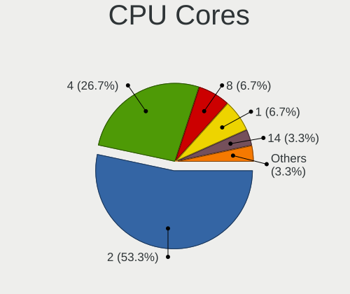

| Number | Notebooks | Percent |
|--------|-----------|---------|
| 2      | 16        | 53.33%  |
| 4      | 8         | 26.67%  |
| 8      | 2         | 6.67%   |
| 1      | 2         | 6.67%   |
| 14     | 1         | 3.33%   |
| 6      | 1         | 3.33%   |

CPU Sockets
-----------

Number of sockets

| Number | Notebooks | Percent |
|--------|-----------|---------|
| 1      | 30        | 100%    |

CPU Threads
-----------

Threads per core (Hyper-Threading)

| Number | Notebooks | Percent |
|--------|-----------|---------|
| 2      | 26        | 86.67%  |
| 1      | 4         | 13.33%  |

CPU Op-Modes
------------

CPU Operation Modes (32-bit, 64-bit)

| Op mode        | Notebooks | Percent |
|----------------|-----------|---------|
| 32-bit, 64-bit | 30        | 100%    |

CPU Microcode
-------------

Microcode number

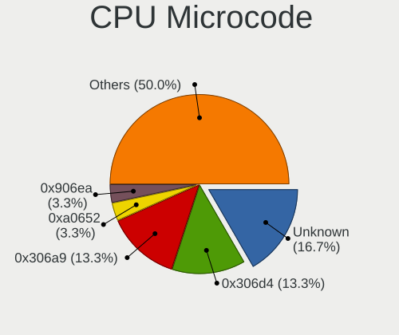

| Number     | Notebooks | Percent |
|------------|-----------|---------|
| Unknown    | 5         | 16.67%  |
| 0x306d4    | 4         | 13.33%  |
| 0x306a9    | 4         | 13.33%  |
| 0xa0652    | 1         | 3.33%   |
| 0x906ea    | 1         | 3.33%   |
| 0x906e9    | 1         | 3.33%   |
| 0x906a3    | 1         | 3.33%   |
| 0x806e9    | 1         | 3.33%   |
| 0x806c1    | 1         | 3.33%   |
| 0x706e5    | 1         | 3.33%   |
| 0x406e3    | 1         | 3.33%   |
| 0x40651    | 1         | 3.33%   |
| 0x206a7    | 1         | 3.33%   |
| 0x20655    | 1         | 3.33%   |
| 0x08600106 | 1         | 3.33%   |
| 0x07030106 | 1         | 3.33%   |
| 0x06006705 | 1         | 3.33%   |
| 0x0600111f | 1         | 3.33%   |
| 0x06001119 | 1         | 3.33%   |
| 0x06001116 | 1         | 3.33%   |

CPU Microarch
-------------

Microarchitecture

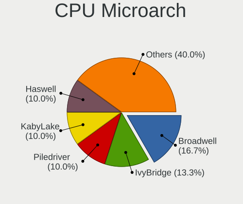

| Name             | Notebooks | Percent |
|------------------|-----------|---------|
| Broadwell        | 5         | 16.67%  |
| IvyBridge        | 4         | 13.33%  |
| Piledriver       | 3         | 10%     |
| KabyLake         | 3         | 10%     |
| Haswell          | 3         | 10%     |
| IceLake          | 2         | 6.67%   |
| Zen 2            | 1         | 3.33%   |
| Westmere         | 1         | 3.33%   |
| TigerLake        | 1         | 3.33%   |
| Skylake          | 1         | 3.33%   |
| SandyBridge      | 1         | 3.33%   |
| Puma             | 1         | 3.33%   |
| Goldmont plus    | 1         | 3.33%   |
| Excavator        | 1         | 3.33%   |
| CometLake        | 1         | 3.33%   |
| Alderlake Hybrid | 1         | 3.33%   |

Graphics
--------

GPU Vendor
----------

Vendors of graphics cards

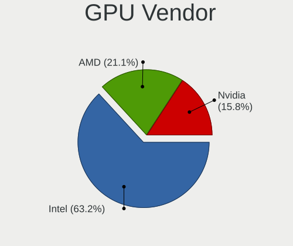

| Vendor | Notebooks | Percent |
|--------|-----------|---------|
| Intel  | 24        | 63.16%  |
| AMD    | 8         | 21.05%  |
| Nvidia | 6         | 15.79%  |

GPU Model
---------

Graphics card models

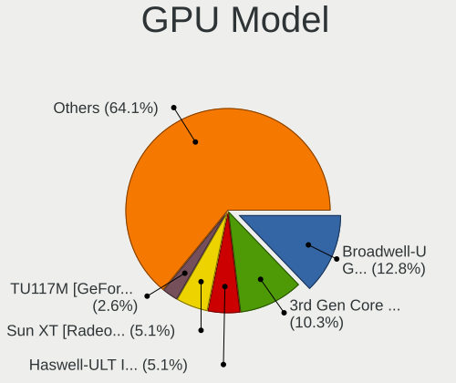

| Model                                                                         | Notebooks | Percent |
|-------------------------------------------------------------------------------|-----------|---------|
| Intel Broadwell-U GT2 [HD Graphics 5500]                                      | 5         | 12.82%  |
| Intel 3rd Gen Core processor Graphics Controller                              | 4         | 10.26%  |
| Intel Haswell-ULT Integrated Graphics Controller                              | 2         | 5.13%   |
| AMD Sun XT [Radeon HD 8670A/8670M/8690M / R5 M330 / M430 / Radeon 520 Mobile] | 2         | 5.13%   |
| Nvidia TU117M [GeForce GTX 1650 Mobile / Max-Q]                               | 1         | 2.56%   |
| Nvidia GP107M [GeForce GTX 1050 Ti Mobile]                                    | 1         | 2.56%   |
| Nvidia GK107M [GeForce GT 740M]                                               | 1         | 2.56%   |
| Nvidia GF119M [Quadro NVS 4200M]                                              | 1         | 2.56%   |
| Nvidia GA106M [GeForce RTX 3060 Mobile / Max-Q]                               | 1         | 2.56%   |
| Nvidia GA104M [GeForce RTX 3080 Mobile / Max-Q 8GB/16GB]                      | 1         | 2.56%   |
| Intel TigerLake-LP GT2 [Iris Xe Graphics]                                     | 1         | 2.56%   |
| Intel TigerLake-H GT1 [UHD Graphics]                                          | 1         | 2.56%   |
| Intel Skylake-U GT2 [HD Graphics 520]                                         | 1         | 2.56%   |
| Intel Kaby Lake-U GT2 [HD Graphics 620]                                       | 1         | 2.56%   |
| Intel Kaby Lake-H GT2 [HD Graphics 630]                                       | 1         | 2.56%   |
| Intel Iris Plus Graphics G7                                                   | 1         | 2.56%   |
| Intel GeminiLake [UHD Graphics 600]                                           | 1         | 2.56%   |
| Intel Core Processor Integrated Graphics Controller                           | 1         | 2.56%   |
| Intel CometLake-H GT2 [UHD Graphics]                                          | 1         | 2.56%   |
| Intel CoffeeLake-H GT2 [UHD Graphics 630]                                     | 1         | 2.56%   |
| Intel Alder Lake-P GT2 [Iris Xe Graphics]                                     | 1         | 2.56%   |
| Intel 4th Gen Core Processor Integrated Graphics Controller                   | 1         | 2.56%   |
| Intel 2nd Generation Core Processor Family Integrated Graphics Controller     | 1         | 2.56%   |
| AMD Venus PRO [Radeon HD 8850M / R9 M265X]                                    | 1         | 2.56%   |
| AMD Trinity 2 [Radeon HD 7520G]                                               | 1         | 2.56%   |
| AMD Stoney [Radeon R2/R3/R4/R5 Graphics]                                      | 1         | 2.56%   |
| AMD Richland [Radeon HD 8610G]                                                | 1         | 2.56%   |
| AMD Richland [Radeon HD 8450G]                                                | 1         | 2.56%   |
| AMD Renoir [Radeon Vega Series / Radeon Vega Mobile Series]                   | 1         | 2.56%   |
| AMD Mullins [Radeon R2/R3 Graphics]                                           | 1         | 2.56%   |

GPU Combo
---------

Combinations of graphics cards

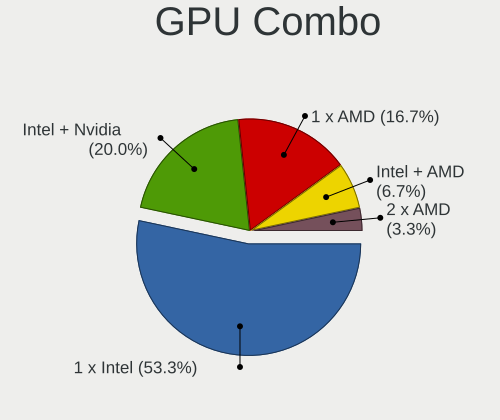

| Name           | Notebooks | Percent |
|----------------|-----------|---------|
| 1 x Intel      | 16        | 53.33%  |
| Intel + Nvidia | 6         | 20%     |
| 1 x AMD        | 5         | 16.67%  |
| Intel + AMD    | 2         | 6.67%   |
| 2 x AMD        | 1         | 3.33%   |

GPU Driver
----------

Free vs proprietary

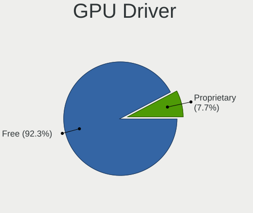

| Driver      | Notebooks | Percent |
|-------------|-----------|---------|
| Free        | 28        | 93.33%  |
| Proprietary | 2         | 6.67%   |

GPU Memory
----------

Total video memory

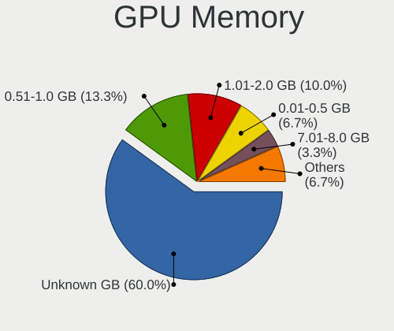

| Size in GB | Notebooks | Percent |
|------------|-----------|---------|
| Unknown    | 18        | 60%     |
| 0.51-1.0   | 4         | 13.33%  |
| 1.01-2.0   | 3         | 10%     |
| 0.01-0.5   | 2         | 6.67%   |
| 7.01-8.0   | 1         | 3.33%   |
| 5.01-6.0   | 1         | 3.33%   |
| 3.01-4.0   | 1         | 3.33%   |

Monitor
-------

Monitor Vendor
--------------

Monitor vendors

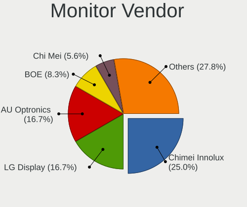

| Vendor                  | Notebooks | Percent |
|-------------------------|-----------|---------|
| Chimei Innolux          | 9         | 25%     |
| LG Display              | 6         | 16.67%  |
| AU Optronics            | 6         | 16.67%  |
| BOE                     | 3         | 8.33%   |
| Chi Mei Optoelectronics | 2         | 5.56%   |
| Acer                    | 2         | 5.56%   |
| Sharp                   | 1         | 2.78%   |
| Samsung Electronics     | 1         | 2.78%   |
| PANDA                   | 1         | 2.78%   |
| Lenovo                  | 1         | 2.78%   |
| Iiyama                  | 1         | 2.78%   |
| Goldstar                | 1         | 2.78%   |
| Dell                    | 1         | 2.78%   |
| Apple                   | 1         | 2.78%   |

Monitor Model
-------------

Monitor models

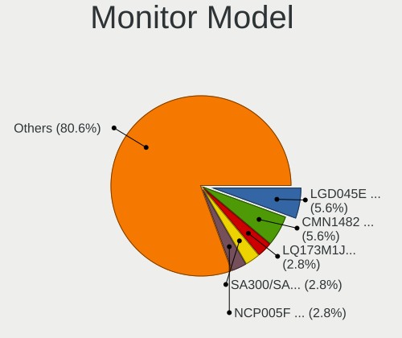

| Model                                                                     | Notebooks | Percent |
|---------------------------------------------------------------------------|-----------|---------|
| LG Display LCD Monitor LGD045E 1366x768 310x174mm 14.0-inch               | 2         | 5.56%   |
| Chimei Innolux LCD Monitor CMN1482 1600x900 309x174mm 14.0-inch           | 2         | 5.56%   |
| Sharp LQ173M1JW08 SHP1544 1920x1080 382x215mm 17.3-inch                   | 1         | 2.78%   |
| Samsung Electronics SA300/SA350 SAM078E 1920x1080 477x268mm 21.5-inch     | 1         | 2.78%   |
| PANDA LCD Monitor NCP005F 1920x1080 344x194mm 15.5-inch                   | 1         | 2.78%   |
| LG Display LCD Monitor LGD40BA 1920x1080 340x190mm 15.3-inch              | 1         | 2.78%   |
| LG Display LCD Monitor LGD05E5 1920x1080 344x194mm 15.5-inch              | 1         | 2.78%   |
| LG Display LCD Monitor LGD03F1 1600x900 309x174mm 14.0-inch               | 1         | 2.78%   |
| LG Display LCD Monitor LGD0372 1600x900 382x215mm 17.3-inch               | 1         | 2.78%   |
| Lenovo LCD Monitor LEN40B2 1920x1080 344x193mm 15.5-inch                  | 1         | 2.78%   |
| Iiyama PL2773H IVM660A 1920x1080 598x336mm 27.0-inch                      | 1         | 2.78%   |
| Goldstar E1960 GSM4BE5 1360x768 406x229mm 18.4-inch                       | 1         | 2.78%   |
| Dell 1909W DELA03C 1440x900 408x255mm 18.9-inch                           | 1         | 2.78%   |
| Chimei Innolux LCD Monitor CMN1734 1600x900 382x214mm 17.2-inch           | 1         | 2.78%   |
| Chimei Innolux LCD Monitor CMN15DC 1366x768 344x193mm 15.5-inch           | 1         | 2.78%   |
| Chimei Innolux LCD Monitor CMN15C3 1920x1080 344x193mm 15.5-inch          | 1         | 2.78%   |
| Chimei Innolux LCD Monitor CMN15BC 1366x768 344x193mm 15.5-inch           | 1         | 2.78%   |
| Chimei Innolux LCD Monitor CMN14C3 1366x768 309x173mm 13.9-inch           | 1         | 2.78%   |
| Chimei Innolux LCD Monitor CMN1495 1366x768 309x173mm 13.9-inch           | 1         | 2.78%   |
| Chimei Innolux LCD Monitor CMN142D 1366x768 309x173mm 13.9-inch           | 1         | 2.78%   |
| Chi Mei Optoelectronics LCD Monitor CMO1720 1920x1080 382x215mm 17.3-inch | 1         | 2.78%   |
| Chi Mei Optoelectronics LCD Monitor CMO1100 1366x768 256x144mm 11.6-inch  | 1         | 2.78%   |
| BOE LCD Monitor BOE09DC 1920x1080 344x194mm 15.5-inch                     | 1         | 2.78%   |
| BOE LCD Monitor BOE06B3 1366x768 309x173mm 13.9-inch                      | 1         | 2.78%   |
| BOE LCD Monitor BOE05FE 1366x768 309x173mm 13.9-inch                      | 1         | 2.78%   |
| AU Optronics LCD Monitor AUO80ED 1920x1080 344x193mm 15.5-inch            | 1         | 2.78%   |
| AU Optronics LCD Monitor AUO63ED 1920x1080 344x193mm 15.5-inch            | 1         | 2.78%   |
| AU Optronics LCD Monitor AUO453D 1920x1080 309x174mm 14.0-inch            | 1         | 2.78%   |
| AU Optronics LCD Monitor AUO313C 1366x768 309x173mm 13.9-inch             | 1         | 2.78%   |
| AU Optronics LCD Monitor AUO21ED 1920x1080 344x193mm 15.5-inch            | 1         | 2.78%   |
| AU Optronics LCD Monitor AUO203D 1920x1080 309x174mm 14.0-inch            | 1         | 2.78%   |
| Apple LCD Monitor APP9CC3 1280x800 286x179mm 13.3-inch                    | 1         | 2.78%   |
| Acer K202HQL ACR03E0 1600x900 432x240mm 19.5-inch                         | 1         | 2.78%   |
| Acer B193W ACR001E 1440x900 408x255mm 18.9-inch                           | 1         | 2.78%   |

Monitor Resolution
------------------

Monitor screen resolution

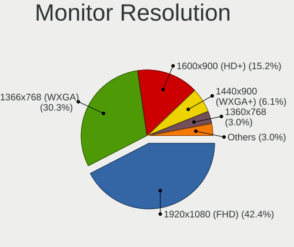

| Resolution       | Notebooks | Percent |
|------------------|-----------|---------|
| 1920x1080 (FHD)  | 14        | 42.42%  |
| 1366x768 (WXGA)  | 10        | 30.3%   |
| 1600x900 (HD+)   | 5         | 15.15%  |
| 1440x900 (WXGA+) | 2         | 6.06%   |
| 1360x768         | 1         | 3.03%   |
| 1280x800 (WXGA)  | 1         | 3.03%   |

Monitor Diagonal
----------------

Diagonal size in inches

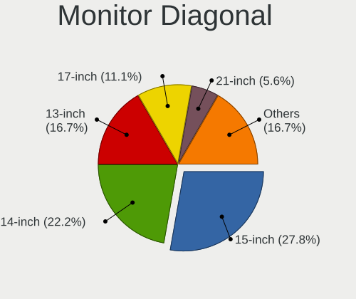

| Inches | Notebooks | Percent |
|--------|-----------|---------|
| 15     | 10        | 27.78%  |
| 14     | 8         | 22.22%  |
| 13     | 6         | 16.67%  |
| 17     | 4         | 11.11%  |
| 21     | 2         | 5.56%   |
| 19     | 2         | 5.56%   |
| 18     | 2         | 5.56%   |
| 27     | 1         | 2.78%   |
| 11     | 1         | 2.78%   |

Monitor Width
-------------

Physical width

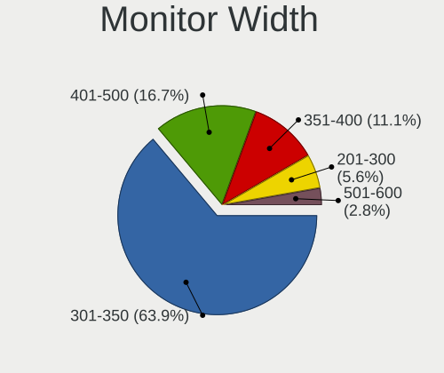

| Width in mm | Notebooks | Percent |
|-------------|-----------|---------|
| 301-350     | 23        | 63.89%  |
| 401-500     | 6         | 16.67%  |
| 351-400     | 4         | 11.11%  |
| 201-300     | 2         | 5.56%   |
| 501-600     | 1         | 2.78%   |

Aspect Ratio
------------

Proportional relationship between the width and the height

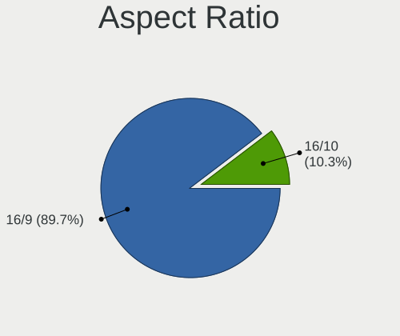

| Ratio | Notebooks | Percent |
|-------|-----------|---------|
| 16/9  | 29        | 90.63%  |
| 16/10 | 3         | 9.38%   |

Monitor Area
------------

Area in inch²

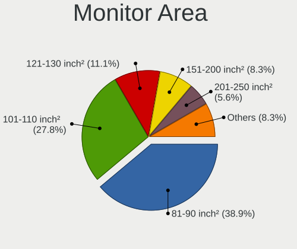

| Area in inch² | Notebooks | Percent |
|----------------|-----------|---------|
| 81-90          | 14        | 38.89%  |
| 101-110        | 10        | 27.78%  |
| 121-130        | 4         | 11.11%  |
| 151-200        | 3         | 8.33%   |
| 201-250        | 2         | 5.56%   |
| 51-60          | 1         | 2.78%   |
| 301-350        | 1         | 2.78%   |
| 141-150        | 1         | 2.78%   |

Pixel Density
-------------

Pixels per inch

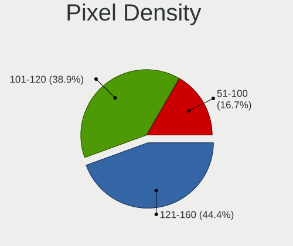

| Density | Notebooks | Percent |
|---------|-----------|---------|
| 121-160 | 16        | 44.44%  |
| 101-120 | 14        | 38.89%  |
| 51-100  | 6         | 16.67%  |

Multiple Monitors
-----------------

Total monitors connected

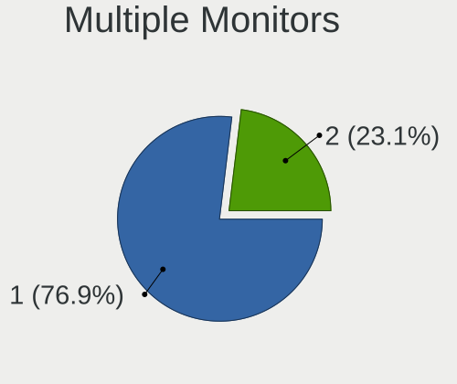

| Total | Notebooks | Percent |
|-------|-----------|---------|
| 1     | 24        | 80%     |
| 2     | 6         | 20%     |

Network
-------

Net Controller Vendor
---------------------

Controller vendors

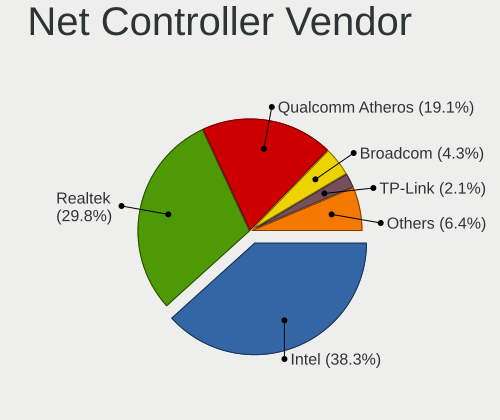

| Vendor                | Notebooks | Percent |
|-----------------------|-----------|---------|
| Intel                 | 18        | 38.3%   |
| Realtek Semiconductor | 14        | 29.79%  |
| Qualcomm Atheros      | 9         | 19.15%  |
| Broadcom              | 2         | 4.26%   |
| TP-Link               | 1         | 2.13%   |
| Sierra Wireless       | 1         | 2.13%   |
| Lenovo                | 1         | 2.13%   |
| ASUSTek Computer      | 1         | 2.13%   |

Net Controller Model
--------------------

Controller models

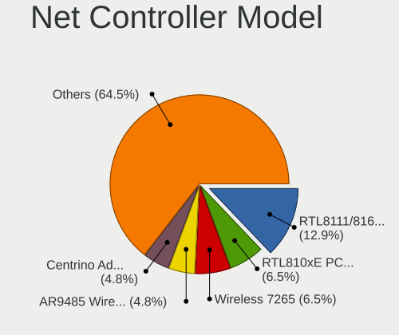

| Model                                                                  | Notebooks | Percent |
|------------------------------------------------------------------------|-----------|---------|
| Realtek RTL8111/8168/8211/8411 PCI Express Gigabit Ethernet Controller | 8         | 12.9%   |
| Realtek RTL810xE PCI Express Fast Ethernet controller                  | 4         | 6.45%   |
| Intel Wireless 7265                                                    | 4         | 6.45%   |
| Qualcomm Atheros AR9485 Wireless Network Adapter                       | 3         | 4.84%   |
| Intel Centrino Advanced-N 6205 [Taylor Peak]                           | 3         | 4.84%   |
| Intel 82579LM Gigabit Network Connection (Lewisville)                  | 3         | 4.84%   |
| Qualcomm Atheros QCA9565 / AR9565 Wireless Network Adapter             | 2         | 3.23%   |
| Qualcomm Atheros QCA6174 802.11ac Wireless Network Adapter             | 2         | 3.23%   |
| Intel Wireless 7260                                                    | 2         | 3.23%   |
| Intel Ethernet Connection (3) I218-LM                                  | 2         | 3.23%   |
| TP-Link AC600 wireless Realtek RTL8811AU [Archer T2U Nano]             | 1         | 1.61%   |
| Sierra Wireless EM7345 4G LTE                                          | 1         | 1.61%   |
| Realtek RTL8822CE 802.11ac PCIe Wireless Network Adapter               | 1         | 1.61%   |
| Realtek RTL8188EE Wireless Network Adapter                             | 1         | 1.61%   |
| Realtek RTL8125 2.5GbE Controller                                      | 1         | 1.61%   |
| Realtek 802.11ac NIC                                                   | 1         | 1.61%   |
| Qualcomm Atheros QCA9377 802.11ac Wireless Network Adapter             | 1         | 1.61%   |
| Qualcomm Atheros AR8161 Gigabit Ethernet                               | 1         | 1.61%   |
| Qualcomm Atheros AR8151 v1.0 Gigabit Ethernet                          | 1         | 1.61%   |
| Lenovo USB-C Dock Ethernet                                             | 1         | 1.61%   |
| Intel Wireless 8265 / 8275                                             | 1         | 1.61%   |
| Intel Wireless 8260                                                    | 1         | 1.61%   |
| Intel Wireless 3165                                                    | 1         | 1.61%   |
| Intel Wi-Fi 6 AX201                                                    | 1         | 1.61%   |
| Intel Wi-Fi 6 AX200                                                    | 1         | 1.61%   |
| Intel Tiger Lake PCH CNVi WiFi                                         | 1         | 1.61%   |
| Intel Ethernet Connection I219-V                                       | 1         | 1.61%   |
| Intel Ethernet Connection I218-LM                                      | 1         | 1.61%   |
| Intel Ethernet Connection I217-V                                       | 1         | 1.61%   |
| Intel Ethernet Connection (4) I219-V                                   | 1         | 1.61%   |
| Intel Ethernet Connection (3) I218-V                                   | 1         | 1.61%   |
| Intel Ethernet Connection (13) I219-LM                                 | 1         | 1.61%   |
| Intel Comet Lake PCH CNVi WiFi                                         | 1         | 1.61%   |
| Intel Centrino Advanced-N 6235                                         | 1         | 1.61%   |
| Intel Alder Lake-P PCH CNVi WiFi                                       | 1         | 1.61%   |
| Broadcom NetXtreme BCM57765 Gigabit Ethernet PCIe                      | 1         | 1.61%   |
| Broadcom BCM4331 802.11a/b/g/n                                         | 1         | 1.61%   |
| Broadcom BCM43228 802.11a/b/g/n                                        | 1         | 1.61%   |
| ASUS 802.11ac NIC                                                      | 1         | 1.61%   |

Wireless Vendor
---------------

Wireless vendors

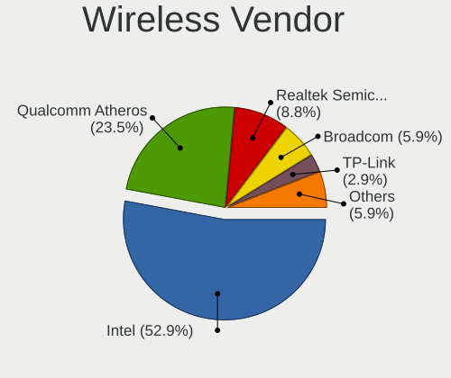

| Vendor                | Notebooks | Percent |
|-----------------------|-----------|---------|
| Intel                 | 18        | 52.94%  |
| Qualcomm Atheros      | 8         | 23.53%  |
| Realtek Semiconductor | 3         | 8.82%   |
| Broadcom              | 2         | 5.88%   |
| TP-Link               | 1         | 2.94%   |
| Sierra Wireless       | 1         | 2.94%   |
| ASUSTek Computer      | 1         | 2.94%   |

Wireless Model
--------------

Wireless models

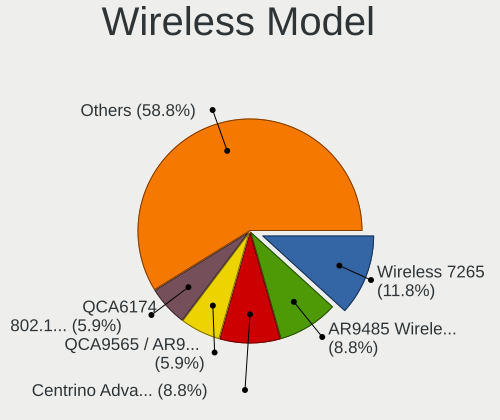

| Model                                                      | Notebooks | Percent |
|------------------------------------------------------------|-----------|---------|
| Intel Wireless 7265                                        | 4         | 11.76%  |
| Qualcomm Atheros AR9485 Wireless Network Adapter           | 3         | 8.82%   |
| Intel Centrino Advanced-N 6205 [Taylor Peak]               | 3         | 8.82%   |
| Qualcomm Atheros QCA9565 / AR9565 Wireless Network Adapter | 2         | 5.88%   |
| Qualcomm Atheros QCA6174 802.11ac Wireless Network Adapter | 2         | 5.88%   |
| Intel Wireless 7260                                        | 2         | 5.88%   |
| TP-Link AC600 wireless Realtek RTL8811AU [Archer T2U Nano] | 1         | 2.94%   |
| Sierra Wireless EM7345 4G LTE                              | 1         | 2.94%   |
| Realtek RTL8822CE 802.11ac PCIe Wireless Network Adapter   | 1         | 2.94%   |
| Realtek RTL8188EE Wireless Network Adapter                 | 1         | 2.94%   |
| Realtek 802.11ac NIC                                       | 1         | 2.94%   |
| Qualcomm Atheros QCA9377 802.11ac Wireless Network Adapter | 1         | 2.94%   |
| Intel Wireless 8265 / 8275                                 | 1         | 2.94%   |
| Intel Wireless 8260                                        | 1         | 2.94%   |
| Intel Wireless 3165                                        | 1         | 2.94%   |
| Intel Wi-Fi 6 AX201                                        | 1         | 2.94%   |
| Intel Wi-Fi 6 AX200                                        | 1         | 2.94%   |
| Intel Tiger Lake PCH CNVi WiFi                             | 1         | 2.94%   |
| Intel Comet Lake PCH CNVi WiFi                             | 1         | 2.94%   |
| Intel Centrino Advanced-N 6235                             | 1         | 2.94%   |
| Intel Alder Lake-P PCH CNVi WiFi                           | 1         | 2.94%   |
| Broadcom BCM4331 802.11a/b/g/n                             | 1         | 2.94%   |
| Broadcom BCM43228 802.11a/b/g/n                            | 1         | 2.94%   |
| ASUS 802.11ac NIC                                          | 1         | 2.94%   |

Ethernet Vendor
---------------

Ethernet vendors

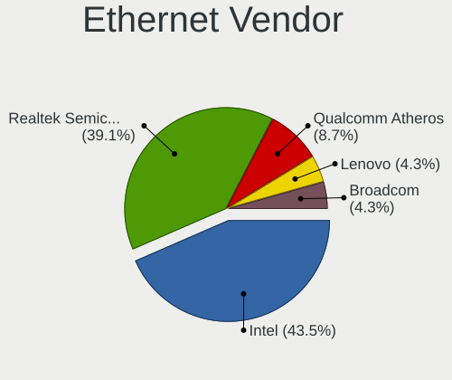

| Vendor                | Notebooks | Percent |
|-----------------------|-----------|---------|
| Realtek Semiconductor | 13        | 46.43%  |
| Intel                 | 11        | 39.29%  |
| Qualcomm Atheros      | 2         | 7.14%   |
| Lenovo                | 1         | 3.57%   |
| Broadcom              | 1         | 3.57%   |

Ethernet Model
--------------

Ethernet models

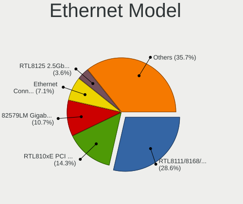

| Model                                                                  | Notebooks | Percent |
|------------------------------------------------------------------------|-----------|---------|
| Realtek RTL8111/8168/8211/8411 PCI Express Gigabit Ethernet Controller | 8         | 28.57%  |
| Realtek RTL810xE PCI Express Fast Ethernet controller                  | 4         | 14.29%  |
| Intel 82579LM Gigabit Network Connection (Lewisville)                  | 3         | 10.71%  |
| Intel Ethernet Connection (3) I218-LM                                  | 2         | 7.14%   |
| Realtek RTL8125 2.5GbE Controller                                      | 1         | 3.57%   |
| Qualcomm Atheros AR8161 Gigabit Ethernet                               | 1         | 3.57%   |
| Qualcomm Atheros AR8151 v1.0 Gigabit Ethernet                          | 1         | 3.57%   |
| Lenovo USB-C Dock Ethernet                                             | 1         | 3.57%   |
| Intel Ethernet Connection I219-V                                       | 1         | 3.57%   |
| Intel Ethernet Connection I218-LM                                      | 1         | 3.57%   |
| Intel Ethernet Connection I217-V                                       | 1         | 3.57%   |
| Intel Ethernet Connection (4) I219-V                                   | 1         | 3.57%   |
| Intel Ethernet Connection (3) I218-V                                   | 1         | 3.57%   |
| Intel Ethernet Connection (13) I219-LM                                 | 1         | 3.57%   |
| Broadcom NetXtreme BCM57765 Gigabit Ethernet PCIe                      | 1         | 3.57%   |

Net Controller Kind
-------------------

Ethernet, WiFi or modem

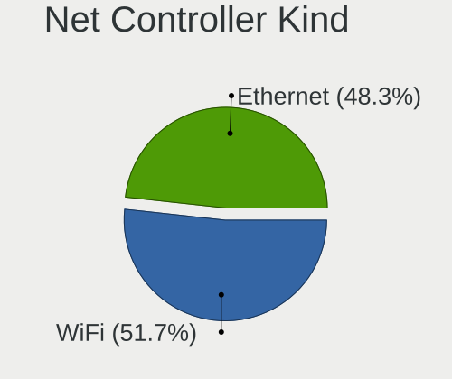

| Kind     | Notebooks | Percent |
|----------|-----------|---------|
| WiFi     | 30        | 51.72%  |
| Ethernet | 28        | 48.28%  |

Used Controller
---------------

Currently used network controller

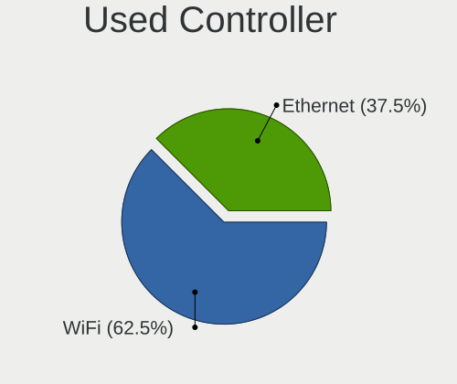

| Kind     | Notebooks | Percent |
|----------|-----------|---------|
| WiFi     | 20        | 62.5%   |
| Ethernet | 12        | 37.5%   |

NICs
----

Total network controllers on board

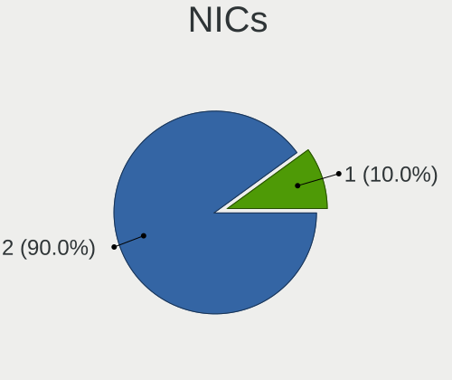

| Total | Notebooks | Percent |
|-------|-----------|---------|
| 2     | 27        | 90%     |
| 1     | 3         | 10%     |

IPv6
----

IPv6 vs IPv4

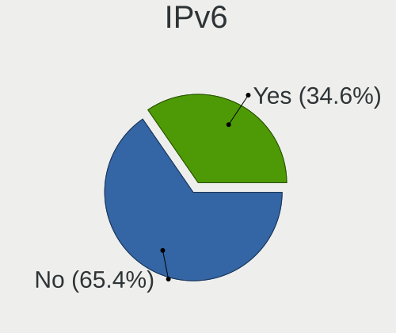

| Used | Notebooks | Percent |
|------|-----------|---------|
| No   | 20        | 66.67%  |
| Yes  | 10        | 33.33%  |

Bluetooth
---------

Bluetooth Vendor
----------------

Controller vendors

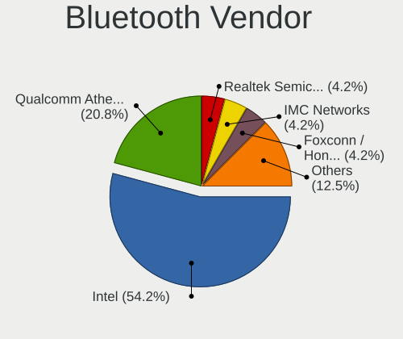

| Vendor                          | Notebooks | Percent |
|---------------------------------|-----------|---------|
| Intel                           | 13        | 54.17%  |
| Qualcomm Atheros Communications | 5         | 20.83%  |
| Realtek Semiconductor           | 1         | 4.17%   |
| IMC Networks                    | 1         | 4.17%   |
| Foxconn / Hon Hai               | 1         | 4.17%   |
| Cambridge Silicon Radio         | 1         | 4.17%   |
| Broadcom                        | 1         | 4.17%   |
| Apple                           | 1         | 4.17%   |

Bluetooth Model
---------------

Controller models

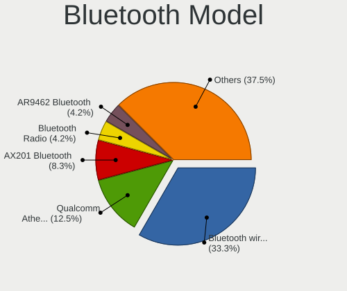

| Model                                               | Notebooks | Percent |
|-----------------------------------------------------|-----------|---------|
| Intel Bluetooth wireless interface                  | 8         | 33.33%  |
| Qualcomm Atheros  Bluetooth Device                  | 3         | 12.5%   |
| Intel AX201 Bluetooth                               | 2         | 8.33%   |
| Realtek Bluetooth Radio                             | 1         | 4.17%   |
| Qualcomm Atheros AR9462 Bluetooth                   | 1         | 4.17%   |
| Qualcomm Atheros AR3012 Bluetooth 4.0               | 1         | 4.17%   |
| Intel Bluetooth Device                              | 1         | 4.17%   |
| Intel Bluetooth 9460/9560 Jefferson Peak (JfP)      | 1         | 4.17%   |
| Intel AX200 Bluetooth                               | 1         | 4.17%   |
| IMC Networks Atheros AR3012 Bluetooth 4.0 Adapter   | 1         | 4.17%   |
| Foxconn / Hon Hai Acer Module                       | 1         | 4.17%   |
| Cambridge Silicon Radio Bluetooth Dongle (HCI mode) | 1         | 4.17%   |
| Broadcom HP Portable Bumble Bee                     | 1         | 4.17%   |
| Apple Bluetooth USB Host Controller                 | 1         | 4.17%   |

Sound
-----

Sound Vendor
------------

Sound card vendors

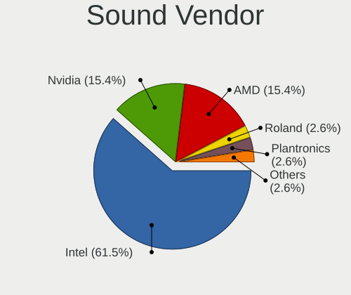

| Vendor      | Notebooks | Percent |
|-------------|-----------|---------|
| Intel       | 24        | 61.54%  |
| Nvidia      | 6         | 15.38%  |
| AMD         | 6         | 15.38%  |
| Roland      | 1         | 2.56%   |
| Plantronics | 1         | 2.56%   |
| Lenovo      | 1         | 2.56%   |

Sound Model
-----------

Sound card models

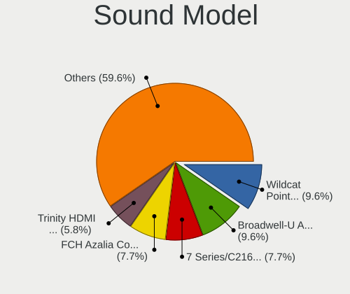

| Model                                                                        | Notebooks | Percent |
|------------------------------------------------------------------------------|-----------|---------|
| Intel Wildcat Point-LP High Definition Audio Controller                      | 5         | 9.62%   |
| Intel Broadwell-U Audio Controller                                           | 5         | 9.62%   |
| Intel 7 Series/C216 Chipset Family High Definition Audio Controller          | 4         | 7.69%   |
| AMD FCH Azalia Controller                                                    | 4         | 7.69%   |
| AMD Trinity HDMI Audio Controller                                            | 3         | 5.77%   |
| Intel Sunrise Point-LP HD Audio                                              | 2         | 3.85%   |
| Intel 8 Series HD Audio Controller                                           | 2         | 3.85%   |
| Roland QUAD-CAPTURE                                                          | 1         | 1.92%   |
| Plantronics Blackwire C5220 headset (remote control and 3.5mm audio adapter) | 1         | 1.92%   |
| Nvidia TU107 GeForce GTX 1650 High Definition Audio Controller               | 1         | 1.92%   |
| Nvidia GP107GL High Definition Audio Controller                              | 1         | 1.92%   |
| Nvidia GK107 HDMI Audio Controller                                           | 1         | 1.92%   |
| Nvidia GF119 HDMI Audio Controller                                           | 1         | 1.92%   |
| Nvidia GA106 High Definition Audio Controller                                | 1         | 1.92%   |
| Nvidia GA104 High Definition Audio Controller                                | 1         | 1.92%   |
| Lenovo ThinkPad USB-C Dock Gen2 USB Audio                                    | 1         | 1.92%   |
| Intel Xeon E3-1200 v3/4th Gen Core Processor HD Audio Controller             | 1         | 1.92%   |
| Intel Tiger Lake-LP Smart Sound Technology Audio Controller                  | 1         | 1.92%   |
| Intel Tiger Lake-H HD Audio Controller                                       | 1         | 1.92%   |
| Intel Ice Lake-LP Smart Sound Technology Audio Controller                    | 1         | 1.92%   |
| Intel Haswell-ULT HD Audio Controller                                        | 1         | 1.92%   |
| Intel Comet Lake PCH cAVS                                                    | 1         | 1.92%   |
| Intel CM238 HD Audio Controller                                              | 1         | 1.92%   |
| Intel Celeron/Pentium Silver Processor High Definition Audio                 | 1         | 1.92%   |
| Intel Cannon Lake PCH cAVS                                                   | 1         | 1.92%   |
| Intel Alder Lake PCH-P High Definition Audio Controller                      | 1         | 1.92%   |
| Intel 8 Series/C220 Series Chipset High Definition Audio Controller          | 1         | 1.92%   |
| Intel 6 Series/C200 Series Chipset Family High Definition Audio Controller   | 1         | 1.92%   |
| Intel 5 Series/3400 Series Chipset High Definition Audio                     | 1         | 1.92%   |
| AMD Ryzen HD Audio Controller                                                | 1         | 1.92%   |
| AMD Renoir/Cezanne HDMI/DP Audio Controller                                  | 1         | 1.92%   |
| AMD Kabini HDMI/DP Audio                                                     | 1         | 1.92%   |
| AMD High Definition Audio Controller                                         | 1         | 1.92%   |
| AMD Family 15h (Models 60h-6fh) Audio Controller                             | 1         | 1.92%   |

Memory
------

Memory Vendor
-------------

Memory module vendors

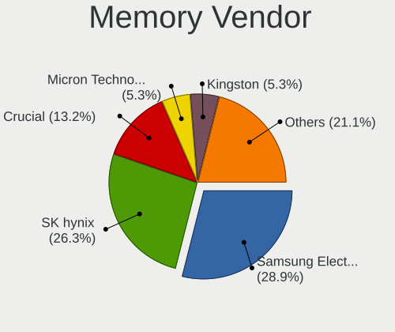

| Vendor              | Notebooks | Percent |
|---------------------|-----------|---------|
| Samsung Electronics | 11        | 28.95%  |
| SK hynix            | 10        | 26.32%  |
| Crucial             | 5         | 13.16%  |
| Micron Technology   | 2         | 5.26%   |
| Kingston            | 2         | 5.26%   |
| A-DATA Technology   | 2         | 5.26%   |
| Team                | 1         | 2.63%   |
| Ramaxel Technology  | 1         | 2.63%   |
| Elpida              | 1         | 2.63%   |
| Corsair             | 1         | 2.63%   |
| Apacer              | 1         | 2.63%   |
| 8A020000802C        | 1         | 2.63%   |

Memory Model
------------

Memory module models

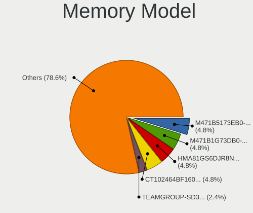

| Model                                                        | Notebooks | Percent |
|--------------------------------------------------------------|-----------|---------|
| SK hynix RAM HMA81GS6DJR8N-XN 8GB SODIMM DDR4 3200MT/s       | 2         | 4.76%   |
| Samsung RAM M471B5173EB0-YK0 4GB SODIMM DDR3 1600MT/s        | 2         | 4.76%   |
| Samsung RAM M471B1G73DB0-YK0 8GB SODIMM DDR3 1600MT/s        | 2         | 4.76%   |
| Crucial RAM CT102464BF160B.C16 8GB SODIMM DDR3 1600MT/s      | 2         | 4.76%   |
| Team RAM TEAMGROUP-SD3-1600 8GB SODIMM DDR3 1600MT/s         | 1         | 2.38%   |
| SK hynix RAM HMT451S6BFR8A-PB 4GB SODIMM DDR3 1600MT/s       | 1         | 2.38%   |
| SK hynix RAM HMT451S6AFR8A-PB 4GB SODIMM DDR3 1600MT/s       | 1         | 2.38%   |
| SK hynix RAM HMT41GS6BFR8A-PB 8GB SODIMM DDR3 2667MT/s       | 1         | 2.38%   |
| SK hynix RAM HMT41GS6AFR8A-PB 8GiB SODIMM DDR3 2667MT/s      | 1         | 2.38%   |
| SK hynix RAM HMT351S6EFR8A-PB 4GB SODIMM DDR3 1600MT/s       | 1         | 2.38%   |
| SK hynix RAM HMAA2GS6CJR8N-XN 16GB SODIMM DDR4 3200MT/s      | 1         | 2.38%   |
| SK hynix RAM HMAA1GS6CMR6N-XN 8GB Row Of Chips DDR4 3200MT/s | 1         | 2.38%   |
| SK hynix RAM HMA851S6AFR6N-UH 4GB SODIMM DDR4 2400MT/s       | 1         | 2.38%   |
| SK hynix RAM HMA82GS6AFR8N-UH 16GB SODIMM DDR4 2667MT/s      | 1         | 2.38%   |
| Samsung RAM Module 8GB SODIMM DDR4 2133MT/s                  | 1         | 2.38%   |
| Samsung RAM M471B5273DH0-CH9 4GB SODIMM DDR3 1600MT/s        | 1         | 2.38%   |
| Samsung RAM M471B5173QH0-YK0 4GB SODIMM DDR3 1600MT/s        | 1         | 2.38%   |
| Samsung RAM M471B5173DB0-YK0 4GB SODIMM DDR3 1600MT/s        | 1         | 2.38%   |
| Samsung RAM M471B5173BH0-YK0 4GB Chip DDR3 1600MT/s          | 1         | 2.38%   |
| Samsung RAM M471B1G73EB0-YK0 8192MB SODIMM DDR3 1600MT/s     | 1         | 2.38%   |
| Samsung RAM M471A1K43EB1-CWE 8GB SODIMM DDR4 3200MT/s        | 1         | 2.38%   |
| Samsung RAM M471A1K43CB1-CTD 8GB SODIMM DDR4 3200MT/s        | 1         | 2.38%   |
| Samsung RAM 456789ABCDEFGHIJKL 8GB SODIMM DDR3 1600MT/s      | 1         | 2.38%   |
| Ramaxel RAM RMSA3260MD78HAF-2666 8GB SODIMM DDR4 2667MT/s    | 1         | 2.38%   |
| Micron RAM Module 4096MB SODIMM DDR3 1600MT/s                | 1         | 2.38%   |
| Micron RAM 4ATS2G64HZ-3G2B1 16GB SODIMM DDR4 3200MT/s        | 1         | 2.38%   |
| Kingston RAM KF3200C20S4/8G 8GB SODIMM DDR4 3200MT/s         | 1         | 2.38%   |
| Kingston RAM ASU16D3LS1KBG/4G 4GB SODIMM DDR3 1600MT/s       | 1         | 2.38%   |
| Elpida RAM EBJ81UG8EFU0-GN-F 8GB SODIMM DDR3 1600MT/s        | 1         | 2.38%   |
| Crucial RAM CT8G4SFS8266.M8FD 8GB SODIMM DDR4 2667MT/s       | 1         | 2.38%   |
| Crucial RAM CT102464BF160B.Y16 8GB SODIMM DDR3 1600MT/s      | 1         | 2.38%   |
| Crucial RAM BLS16G4S26BFSD.16FD 16GB SODIMM DDR4 2667MT/s    | 1         | 2.38%   |
| Corsair RAM CMSX16GX4M1A2400C16 16GB SODIMM DDR4 2400MT/s    | 1         | 2.38%   |
| Apacer RAM 78.A2GC8.CY00C 2GB SODIMM DDR3 800MT/s            | 1         | 2.38%   |
| Apacer RAM 78.A2GC8.9L00C 2GB SODIMM DDR3 800MT/s            | 1         | 2.38%   |
| A-DATA RAM Module 8GB SODIMM DDR4 2133MT/s                   | 1         | 2.38%   |
| A-DATA RAM AM1U16BC4P2-B19H 4GB SODIMM DDR3 1600MT/s         | 1         | 2.38%   |
| 8A020000802C RAM DDR4 16GB 2400MHz 16GB SODIMM DDR4 2400MT/s | 1         | 2.38%   |

Memory Kind
-----------

Memory module kinds

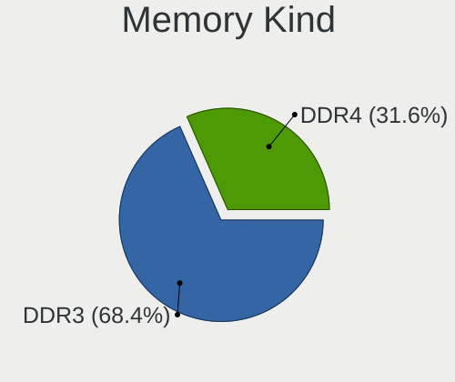

| Kind | Notebooks | Percent |
|------|-----------|---------|
| DDR3 | 18        | 60%     |
| DDR4 | 12        | 40%     |

Memory Form Factor
------------------

Physical design of the memory module

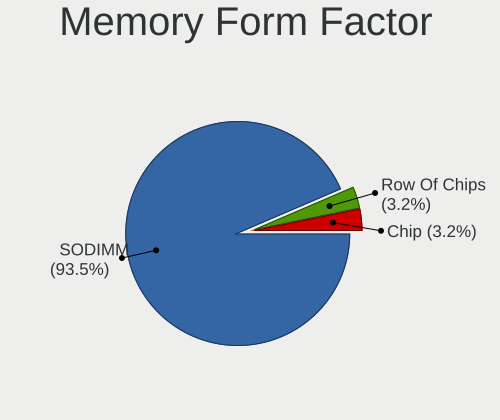

| Name         | Notebooks | Percent |
|--------------|-----------|---------|
| SODIMM       | 29        | 93.55%  |
| Row Of Chips | 1         | 3.23%   |
| Chip         | 1         | 3.23%   |

Memory Size
-----------

Memory module size

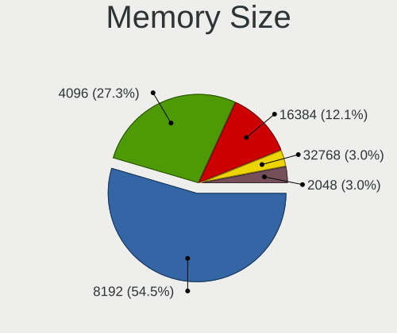

| Size  | Notebooks | Percent |
|-------|-----------|---------|
| 8192  | 18        | 54.55%  |
| 4096  | 9         | 27.27%  |
| 16384 | 4         | 12.12%  |
| 32768 | 1         | 3.03%   |
| 2048  | 1         | 3.03%   |

Memory Speed
------------

Memory module speed

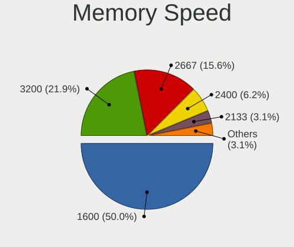

| Speed | Notebooks | Percent |
|-------|-----------|---------|
| 1600  | 16        | 50%     |
| 3200  | 7         | 21.88%  |
| 2667  | 5         | 15.63%  |
| 2400  | 2         | 6.25%   |
| 2133  | 1         | 3.13%   |
| 800   | 1         | 3.13%   |

Printers & scanners
-------------------

Printer Vendor
--------------

Printer device vendors

| Vendor              | Notebooks | Percent |
|---------------------|-----------|---------|
| Samsung Electronics | 1         | 100%    |

Printer Model
-------------

Printer device models

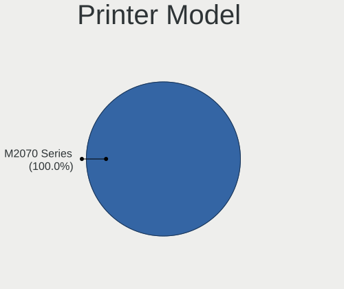

| Model                | Notebooks | Percent |
|----------------------|-----------|---------|
| Samsung M2070 Series | 1         | 100%    |

Scanner Vendor
--------------

Scanner device vendors

Zero info for selected period =(

Scanner Model
-------------

Scanner device models

Zero info for selected period =(

Camera
------

Camera Vendor
-------------

Camera device vendors

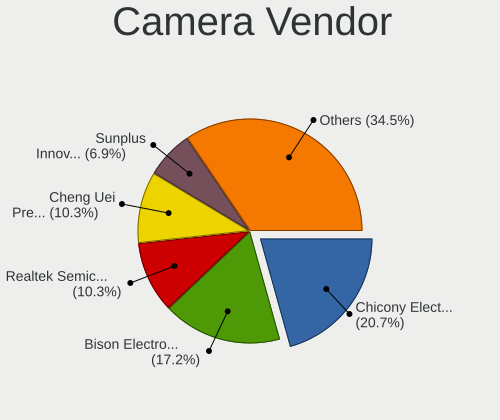

| Vendor                                 | Notebooks | Percent |
|----------------------------------------|-----------|---------|
| Chicony Electronics                    | 6         | 20.69%  |
| Bison Electronics                      | 5         | 17.24%  |
| Realtek Semiconductor                  | 3         | 10.34%  |
| Cheng Uei Precision Industry (Foxlink) | 3         | 10.34%  |
| Sunplus Innovation Technology          | 2         | 6.9%    |
| Microdia                               | 2         | 6.9%    |
| Lite-On Technology                     | 2         | 6.9%    |
| Suyin                                  | 1         | 3.45%   |
| Silicon Motion                         | 1         | 3.45%   |
| Quanta                                 | 1         | 3.45%   |
| Luxvisions Innotech Limited            | 1         | 3.45%   |
| IMC Networks                           | 1         | 3.45%   |
| Apple                                  | 1         | 3.45%   |

Camera Model
------------

Camera device models

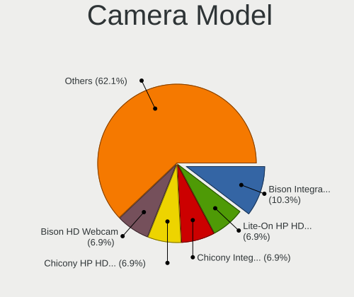

| Model                                                   | Notebooks | Percent |
|---------------------------------------------------------|-----------|---------|
| Bison Integrated Camera                                 | 3         | 10.34%  |
| Lite-On HP HD Webcam                                    | 2         | 6.9%    |
| Chicony Integrated Camera                               | 2         | 6.9%    |
| Chicony HP HD Webcam                                    | 2         | 6.9%    |
| Bison HD Webcam                                         | 2         | 6.9%    |
| Suyin Acer/Lenovo Webcam [CN0316]                       | 1         | 3.45%   |
| Sunplus Integrated Webcam                               | 1         | 3.45%   |
| Sunplus Asus Webcam                                     | 1         | 3.45%   |
| Silicon Motion ATIV VGA Camera                          | 1         | 3.45%   |
| Realtek USB Camera                                      | 1         | 3.45%   |
| Realtek Integrated_Webcam_HD                            | 1         | 3.45%   |
| Realtek Integrated Camera                               | 1         | 3.45%   |
| Quanta HP TrueVision HD Camera                          | 1         | 3.45%   |
| Microdia Laptop_Integrated_Webcam_HD                    | 1         | 3.45%   |
| Microdia Integrated_Webcam_HD                           | 1         | 3.45%   |
| Luxvisions Innotech Limited HP TrueVision HD Camera     | 1         | 3.45%   |
| IMC Networks Integrated Camera                          | 1         | 3.45%   |
| Chicony HP Truevision HD                                | 1         | 3.45%   |
| Chicony HP HD Camera                                    | 1         | 3.45%   |
| Cheng Uei Precision Industry (Foxlink) Webcam           | 1         | 3.45%   |
| Cheng Uei Precision Industry (Foxlink) HP TrueVision HD | 1         | 3.45%   |
| Cheng Uei Precision Industry (Foxlink) HP HD Webcam     | 1         | 3.45%   |
| Apple FaceTime HD Camera                                | 1         | 3.45%   |

Security
--------

Fingerprint Vendor
------------------

Fingerprint sensor vendors

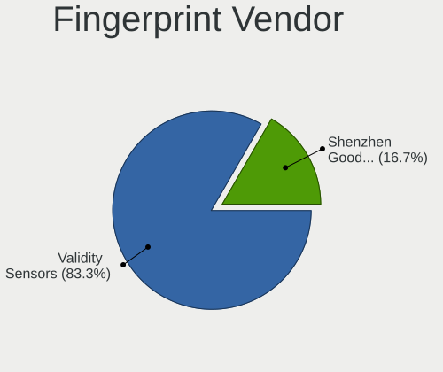

| Vendor                     | Notebooks | Percent |
|----------------------------|-----------|---------|
| Validity Sensors           | 6         | 75%     |
| Shenzhen Goodix Technology | 2         | 25%     |

Fingerprint Model
-----------------

Fingerprint sensor models

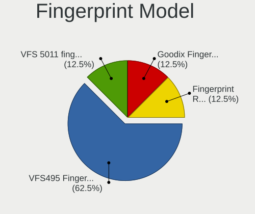

| Model                                        | Notebooks | Percent |
|----------------------------------------------|-----------|---------|
| Validity Sensors VFS495 Fingerprint Reader   | 5         | 62.5%   |
| Validity Sensors VFS 5011 fingerprint sensor | 1         | 12.5%   |
| Shenzhen Goodix  FingerPrint Device          | 1         | 12.5%   |
| Shenzhen Goodix Fingerprint Reader           | 1         | 12.5%   |

Chipcard Vendor
---------------

Chipcard module vendors

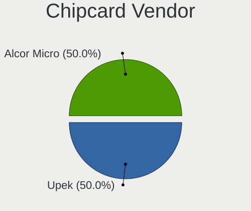

| Vendor      | Notebooks | Percent |
|-------------|-----------|---------|
| Upek        | 1         | 50%     |
| Alcor Micro | 1         | 50%     |

Chipcard Model
--------------

Chipcard module models

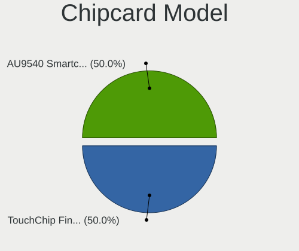

| Model                                                      | Notebooks | Percent |
|------------------------------------------------------------|-----------|---------|
| Upek TouchChip Fingerprint Coprocessor (WBF advanced mode) | 1         | 50%     |
| Alcor Micro AU9540 Smartcard Reader                        | 1         | 50%     |

Unsupported
-----------

Unsupported Devices
-------------------

Total unsupported devices on board

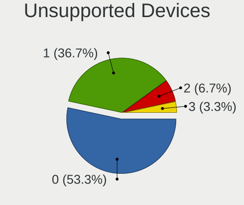

| Total | Notebooks | Percent |
|-------|-----------|---------|
| 0     | 16        | 53.33%  |
| 1     | 11        | 36.67%  |
| 2     | 2         | 6.67%   |
| 3     | 1         | 3.33%   |

Unsupported Device Types
------------------------

Types of unsupported devices

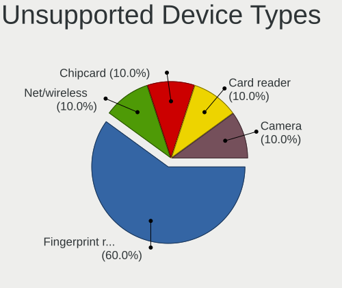

| Type               | Notebooks | Percent |
|--------------------|-----------|---------|
| Fingerprint reader | 8         | 57.14%  |
| Net/wireless       | 2         | 14.29%  |
| Chipcard           | 2         | 14.29%  |
| Card reader        | 1         | 7.14%   |
| Camera             | 1         | 7.14%   |

