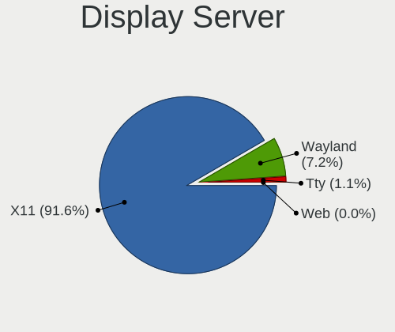
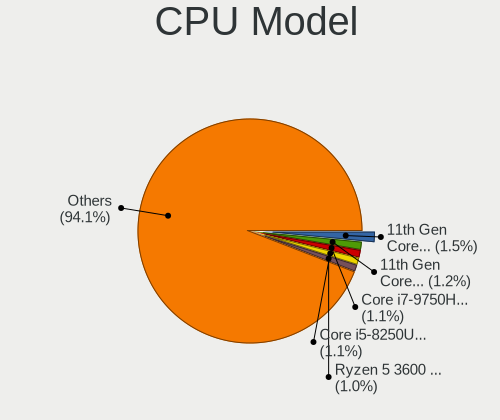
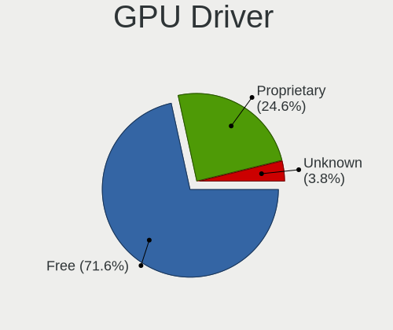
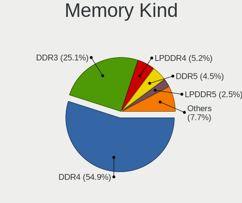
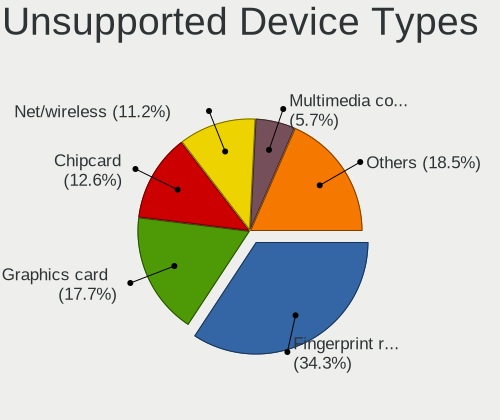

Kubuntu - Tested Hardware & Statistics
--------------------------------------

A project to collect tested hardware configurations for Kubuntu.

Anyone can contribute to this report by the [hw-probe](https://github.com/linuxhw/hw-probe) tool:

    sudo -E hw-probe -all -upload

Please contribute! Especially if your hardware is rare.

This is a report for all computer types. See also reports for [desktops](/Dist/Kubuntu/Desktop/README.md) and [notebooks](/Dist/Kubuntu/Notebook/README.md).

Contents
--------

* [ Test Cases ](#test-cases)

* [ System ](#system)
  - [ OS                       ](#os)
  - [ OS Family                ](#os-family)
  - [ Kernel                   ](#kernel)
  - [ Kernel Family            ](#kernel-family)
  - [ Kernel Major Ver.        ](#kernel-major-ver)
  - [ Arch                     ](#arch)
  - [ DE                       ](#de)
  - [ Display Server           ](#display-server)
  - [ Display Manager          ](#display-manager)
  - [ OS Lang                  ](#os-lang)
  - [ Boot Mode                ](#boot-mode)
  - [ Filesystem               ](#filesystem)
  - [ Part. scheme             ](#part-scheme)
  - [ Dual Boot with Linux/BSD ](#dual-boot-with-linuxbsd)
  - [ Dual Boot (Win)          ](#dual-boot-win)

* [ Board ](#board)
  - [ Vendor                   ](#vendor)
  - [ Model                    ](#model)
  - [ Model Family             ](#model-family)
  - [ MFG Year                 ](#mfg-year)
  - [ Form Factor              ](#form-factor)
  - [ Secure Boot              ](#secure-boot)
  - [ Coreboot                 ](#coreboot)
  - [ RAM Size                 ](#ram-size)
  - [ RAM Used                 ](#ram-used)
  - [ Total Drives             ](#total-drives)
  - [ Has CD-ROM               ](#has-cd-rom)
  - [ Has Ethernet             ](#has-ethernet)
  - [ Has WiFi                 ](#has-wifi)
  - [ Has Bluetooth            ](#has-bluetooth)

* [ Location ](#location)
  - [ Country                  ](#country)
  - [ City                     ](#city)

* [ Drives ](#drives)
  - [ Drive Vendor             ](#drive-vendor)
  - [ Drive Model              ](#drive-model)
  - [ HDD Vendor               ](#hdd-vendor)
  - [ SSD Vendor               ](#ssd-vendor)
  - [ Drive Kind               ](#drive-kind)
  - [ Drive Connector          ](#drive-connector)
  - [ Drive Size               ](#drive-size)
  - [ Space Total              ](#space-total)
  - [ Space Used               ](#space-used)
  - [ Malfunc. Drives          ](#malfunc-drives)
  - [ Malfunc. Drive Vendor    ](#malfunc-drive-vendor)
  - [ Malfunc. HDD Vendor      ](#malfunc-hdd-vendor)
  - [ Malfunc. Drive Kind      ](#malfunc-drive-kind)
  - [ Failed Drives            ](#failed-drives)
  - [ Failed Drive Vendor      ](#failed-drive-vendor)
  - [ Drive Status             ](#drive-status)

* [ Storage controller ](#storage-controller)
  - [ Storage Vendor           ](#storage-vendor)
  - [ Storage Model            ](#storage-model)
  - [ Storage Kind             ](#storage-kind)

* [ Processor ](#processor)
  - [ CPU Vendor               ](#cpu-vendor)
  - [ CPU Model                ](#cpu-model)
  - [ CPU Model Family         ](#cpu-model-family)
  - [ CPU Cores                ](#cpu-cores)
  - [ CPU Sockets              ](#cpu-sockets)
  - [ CPU Threads              ](#cpu-threads)
  - [ CPU Op-Modes             ](#cpu-op-modes)
  - [ CPU Microcode            ](#cpu-microcode)
  - [ CPU Microarch            ](#cpu-microarch)

* [ Graphics ](#graphics)
  - [ GPU Vendor               ](#gpu-vendor)
  - [ GPU Model                ](#gpu-model)
  - [ GPU Combo                ](#gpu-combo)
  - [ GPU Driver               ](#gpu-driver)
  - [ GPU Memory               ](#gpu-memory)

* [ Monitor ](#monitor)
  - [ Monitor Vendor           ](#monitor-vendor)
  - [ Monitor Model            ](#monitor-model)
  - [ Monitor Resolution       ](#monitor-resolution)
  - [ Monitor Diagonal         ](#monitor-diagonal)
  - [ Monitor Width            ](#monitor-width)
  - [ Aspect Ratio             ](#aspect-ratio)
  - [ Monitor Area             ](#monitor-area)
  - [ Pixel Density            ](#pixel-density)
  - [ Multiple Monitors        ](#multiple-monitors)

* [ Network ](#network)
  - [ Net Controller Vendor    ](#net-controller-vendor)
  - [ Net Controller Model     ](#net-controller-model)
  - [ Wireless Vendor          ](#wireless-vendor)
  - [ Wireless Model           ](#wireless-model)
  - [ Ethernet Vendor          ](#ethernet-vendor)
  - [ Ethernet Model           ](#ethernet-model)
  - [ Net Controller Kind      ](#net-controller-kind)
  - [ Used Controller          ](#used-controller)
  - [ NICs                     ](#nics)
  - [ IPv6                     ](#ipv6)

* [ Bluetooth ](#bluetooth)
  - [ Bluetooth Vendor         ](#bluetooth-vendor)
  - [ Bluetooth Model          ](#bluetooth-model)

* [ Sound ](#sound)
  - [ Sound Vendor             ](#sound-vendor)
  - [ Sound Model              ](#sound-model)

* [ Memory ](#memory)
  - [ Memory Vendor            ](#memory-vendor)
  - [ Memory Model             ](#memory-model)
  - [ Memory Kind              ](#memory-kind)
  - [ Memory Form Factor       ](#memory-form-factor)
  - [ Memory Size              ](#memory-size)
  - [ Memory Speed             ](#memory-speed)

* [ Printers & scanners ](#printers--scanners)
  - [ Printer Vendor           ](#printer-vendor)
  - [ Printer Model            ](#printer-model)
  - [ Scanner Vendor           ](#scanner-vendor)
  - [ Scanner Model            ](#scanner-model)

* [ Camera ](#camera)
  - [ Camera Vendor            ](#camera-vendor)
  - [ Camera Model             ](#camera-model)

* [ Security ](#security)
  - [ Fingerprint Vendor       ](#fingerprint-vendor)
  - [ Fingerprint Model        ](#fingerprint-model)
  - [ Chipcard Vendor          ](#chipcard-vendor)
  - [ Chipcard Model           ](#chipcard-model)

* [ Unsupported ](#unsupported)
  - [ Unsupported Devices      ](#unsupported-devices)
  - [ Unsupported Device Types ](#unsupported-device-types)

Test Cases
----------

Total: 4403

| Vendor        | Model                       | Form-Factor | Probe                                                      | Date         |
|---------------|-----------------------------|-------------|------------------------------------------------------------|--------------|
| Gigabyte      | B450 I AORUS PRO WIFI-CF    | Desktop     | [9866b7f07f](https://linux-hardware.org/?probe=9866b7f07f) | Dec 01, 2022 |
| ASUSTek       | P7P55D                      | Desktop     | [0a012accfd](https://linux-hardware.org/?probe=0a012accfd) | Dec 01, 2022 |
| HP            | ProBook 450 G2              | Notebook    | [552ac907a0](https://linux-hardware.org/?probe=552ac907a0) | Dec 01, 2022 |
| System76      | Thelio thelio-r1            | Desktop     | [76343aa234](https://linux-hardware.org/?probe=76343aa234) | Dec 01, 2022 |
| ASRock        | B75M-DGS                    | Desktop     | [ca277bb16c](https://linux-hardware.org/?probe=ca277bb16c) | Nov 30, 2022 |
| Lenovo        | IdeaPadFlex 5 14ALC7 82R... | Convertible | [1c30aa7bcd](https://linux-hardware.org/?probe=1c30aa7bcd) | Nov 30, 2022 |
| Haier         | A1420EM                     | Notebook    | [6f18b3c1ce](https://linux-hardware.org/?probe=6f18b3c1ce) | Nov 30, 2022 |
| MSI           | Z370 GAMING PLUS            | Desktop     | [bd1c91dba9](https://linux-hardware.org/?probe=bd1c91dba9) | Nov 30, 2022 |
| HP            | Spectre x360 Convertible... | Convertible | [d233ee2114](https://linux-hardware.org/?probe=d233ee2114) | Nov 30, 2022 |
| ASRock        | A320M-HDV R4.0              | Desktop     | [3a64631617](https://linux-hardware.org/?probe=3a64631617) | Nov 30, 2022 |
| HP            | ENVY x360 Convertible 15... | Convertible | [fc681f2f42](https://linux-hardware.org/?probe=fc681f2f42) | Nov 30, 2022 |
| MSI           | B560M-A PRO                 | Desktop     | [a92a0830e9](https://linux-hardware.org/?probe=a92a0830e9) | Nov 30, 2022 |
| ASRock        | A320M-HDV R4.0              | Desktop     | [12492cb99a](https://linux-hardware.org/?probe=12492cb99a) | Nov 29, 2022 |
| HUAWEI        | BOD-WXX9                    | Notebook    | [a2b8deb4e3](https://linux-hardware.org/?probe=a2b8deb4e3) | Nov 29, 2022 |
| Dell          | Inspiron 3521               | Notebook    | [2ecbfd5e39](https://linux-hardware.org/?probe=2ecbfd5e39) | Nov 29, 2022 |
| Dell          | Inspiron 5406 2n1           | Convertible | [92afc95831](https://linux-hardware.org/?probe=92afc95831) | Nov 29, 2022 |
| Razer         | Blade Stealth               | Notebook    | [e182c3c739](https://linux-hardware.org/?probe=e182c3c739) | Nov 29, 2022 |
| Acer          | Nitro AN517-51              | Notebook    | [c20385f7bd](https://linux-hardware.org/?probe=c20385f7bd) | Nov 29, 2022 |
| HUAWEI        | NBLK-WAX9X                  | Notebook    | [8f17b6a915](https://linux-hardware.org/?probe=8f17b6a915) | Nov 29, 2022 |
| Gigabyte      | X570 AORUS MASTER           | Desktop     | [f2c8b52293](https://linux-hardware.org/?probe=f2c8b52293) | Nov 28, 2022 |
| Dell          | G3 3779                     | Notebook    | [3e85396dae](https://linux-hardware.org/?probe=3e85396dae) | Nov 28, 2022 |
| MSI           | Prestige 15 A12SC           | Notebook    | [af2a404105](https://linux-hardware.org/?probe=af2a404105) | Nov 28, 2022 |
| Medion        | TJ4125                      | Desktop     | [a1c7ac96d3](https://linux-hardware.org/?probe=a1c7ac96d3) | Nov 27, 2022 |
| Gigabyte      | RC14UD                      | Notebook    | [37c4b79c24](https://linux-hardware.org/?probe=37c4b79c24) | Nov 27, 2022 |
| Dell          | G3 3779                     | Notebook    | [2def46f37c](https://linux-hardware.org/?probe=2def46f37c) | Nov 27, 2022 |
| Lenovo        | ThinkPad T430 2349DS5       | Notebook    | [f52677ec2e](https://linux-hardware.org/?probe=f52677ec2e) | Nov 27, 2022 |
| ASUSTek       | ASUS EXPERTBOOK B3402FEA... | Convertible | [e3c2051d8f](https://linux-hardware.org/?probe=e3c2051d8f) | Nov 26, 2022 |
| Monster       | TULPAR T7                   | Notebook    | [6634421091](https://linux-hardware.org/?probe=6634421091) | Nov 26, 2022 |
| Dell          | Vostro 5471                 | Notebook    | [7a6ec88b73](https://linux-hardware.org/?probe=7a6ec88b73) | Nov 26, 2022 |
| Dell          | Vostro 5471                 | Notebook    | [b9bbfd7551](https://linux-hardware.org/?probe=b9bbfd7551) | Nov 26, 2022 |
| Toshiba       | Satellite C670D-126         | Notebook    | [6c2fc84bf2](https://linux-hardware.org/?probe=6c2fc84bf2) | Nov 26, 2022 |
| GPU Compan... | GWNR71517                   | Notebook    | [15173435f0](https://linux-hardware.org/?probe=15173435f0) | Nov 26, 2022 |
| Lenovo        | IdeaPad 320-15IKB 80YE      | Notebook    | [fa21163ace](https://linux-hardware.org/?probe=fa21163ace) | Nov 26, 2022 |
| GPD           | G1621-02                    | Notebook    | [d6b679024c](https://linux-hardware.org/?probe=d6b679024c) | Nov 26, 2022 |
| Dell          | Latitude E6440              | Notebook    | [348f786878](https://linux-hardware.org/?probe=348f786878) | Nov 26, 2022 |
| Lenovo        | ThinkPad X230 23256N6       | Notebook    | [a462983d82](https://linux-hardware.org/?probe=a462983d82) | Nov 25, 2022 |
| Acer          | Nitro AN515-45              | Notebook    | [10186425ec](https://linux-hardware.org/?probe=10186425ec) | Nov 25, 2022 |
| Acer          | Nitro AN515-45              | Notebook    | [5a7b57dae6](https://linux-hardware.org/?probe=5a7b57dae6) | Nov 25, 2022 |
| Lenovo        | IdeaPad 5 Pro 14ACN6 82L... | Notebook    | [57c8d65b2e](https://linux-hardware.org/?probe=57c8d65b2e) | Nov 25, 2022 |
| ASUSTek       | X510UQ                      | Notebook    | [5972ededc2](https://linux-hardware.org/?probe=5972ededc2) | Nov 24, 2022 |
| Lenovo        | ThinkPad E14 Gen 2 20TA0... | Notebook    | [a4512e8a71](https://linux-hardware.org/?probe=a4512e8a71) | Nov 24, 2022 |
| Unknown       | HX90                        | Desktop     | [e1bd045aaa](https://linux-hardware.org/?probe=e1bd045aaa) | Nov 24, 2022 |
| Gigabyte      | H97-HD3                     | Desktop     | [7c2db201dc](https://linux-hardware.org/?probe=7c2db201dc) | Nov 24, 2022 |
| MSI           | B350 PC MATE                | Desktop     | [601fd47da1](https://linux-hardware.org/?probe=601fd47da1) | Nov 24, 2022 |
| Lenovo        | IdeaPadFlex 5 14ALC7 82R... | Convertible | [e47ce764e1](https://linux-hardware.org/?probe=e47ce764e1) | Nov 24, 2022 |
| Gigabyte      | Z270-HD3P-CF                | Desktop     | [6d3657ecde](https://linux-hardware.org/?probe=6d3657ecde) | Nov 23, 2022 |
| Dell          | XPS 15 9510                 | Notebook    | [26fb968043](https://linux-hardware.org/?probe=26fb968043) | Nov 23, 2022 |
| Lenovo        | IdeaPadFlex 5 14ALC05 82... | Convertible | [f396cc27ff](https://linux-hardware.org/?probe=f396cc27ff) | Nov 23, 2022 |
| AZW           | SEi                         | Desktop     | [deace4a3d6](https://linux-hardware.org/?probe=deace4a3d6) | Nov 23, 2022 |
| Lenovo        | Yoga C640-13IML 81UE        | Convertible | [1bed000f1a](https://linux-hardware.org/?probe=1bed000f1a) | Nov 23, 2022 |
| Lenovo        | G40-45 80E1                 | Notebook    | [c50111eb6d](https://linux-hardware.org/?probe=c50111eb6d) | Nov 22, 2022 |
| Intel         | NUC12WSBi7 M46422-302       | Mini pc     | [d876db7f78](https://linux-hardware.org/?probe=d876db7f78) | Nov 22, 2022 |
| Dell          | Latitude 5410               | Notebook    | [7fd0b3fca7](https://linux-hardware.org/?probe=7fd0b3fca7) | Nov 21, 2022 |
| Gigabyte      | GA-990FX-GAMING             | Desktop     | [498c078586](https://linux-hardware.org/?probe=498c078586) | Nov 21, 2022 |
| Gigabyte      | GA-990FX-GAMING             | Desktop     | [abda5b4aaf](https://linux-hardware.org/?probe=abda5b4aaf) | Nov 21, 2022 |
| Lenovo        | ThinkPad T440s 20AQ007SM... | Notebook    | [326b5bad4c](https://linux-hardware.org/?probe=326b5bad4c) | Nov 21, 2022 |
| Dell          | 0XPDFK A01                  | Desktop     | [1332a048d4](https://linux-hardware.org/?probe=1332a048d4) | Nov 21, 2022 |
| HP            | Unknown                     | Notebook    | [4530507592](https://linux-hardware.org/?probe=4530507592) | Nov 20, 2022 |
| HP            | 845A                        | Desktop     | [330b46ea11](https://linux-hardware.org/?probe=330b46ea11) | Nov 20, 2022 |
| ASUSTek       | M4A88TD-M EVO               | Desktop     | [e4514feafe](https://linux-hardware.org/?probe=e4514feafe) | Nov 20, 2022 |
| Acer          | Aspire ES1-711G             | Notebook    | [8852f94b38](https://linux-hardware.org/?probe=8852f94b38) | Nov 20, 2022 |
| ASUSTek       | K30AD_M31AD_M51AD_M32AD     | Desktop     | [7a30c89c58](https://linux-hardware.org/?probe=7a30c89c58) | Nov 20, 2022 |
| Gigabyte      | H110M-S2H-CF                | Desktop     | [87c95f019e](https://linux-hardware.org/?probe=87c95f019e) | Nov 20, 2022 |
| Apple         | MacBookPro8,1               | Notebook    | [8a52f497b0](https://linux-hardware.org/?probe=8a52f497b0) | Nov 19, 2022 |
| Acer          | Nitro AN517-51              | Notebook    | [de8506cc0b](https://linux-hardware.org/?probe=de8506cc0b) | Nov 19, 2022 |
| MSI           | Vector GP66 12UGS           | Notebook    | [9aab7e297a](https://linux-hardware.org/?probe=9aab7e297a) | Nov 19, 2022 |
| MSI           | Vector GP66 12UGS           | Notebook    | [e10c2abc9b](https://linux-hardware.org/?probe=e10c2abc9b) | Nov 19, 2022 |
| HP            | Laptop 17-cp0xxx            | Notebook    | [a3fde1deaa](https://linux-hardware.org/?probe=a3fde1deaa) | Nov 19, 2022 |
| Lenovo        | IdeaPad 3 15ADA05 81W1      | Notebook    | [36bc4b545f](https://linux-hardware.org/?probe=36bc4b545f) | Nov 19, 2022 |
| Toshiba       | Satellite C670D-126         | Notebook    | [17e464f802](https://linux-hardware.org/?probe=17e464f802) | Nov 19, 2022 |
| AMI           | Aptio CRB                   | Mini pc     | [0734f58b03](https://linux-hardware.org/?probe=0734f58b03) | Nov 18, 2022 |
| Lenovo        | Legion 5 15IMH05H 81Y6      | Notebook    | [53a2707274](https://linux-hardware.org/?probe=53a2707274) | Nov 18, 2022 |
| Dell          | Inspiron 7348               | Notebook    | [6a46a84480](https://linux-hardware.org/?probe=6a46a84480) | Nov 18, 2022 |
| Dell          | 0KWVT8 A02                  | Desktop     | [e1b586a15a](https://linux-hardware.org/?probe=e1b586a15a) | Nov 18, 2022 |
| HP            | Laptop 17-cp0xxx            | Notebook    | [f4c6260289](https://linux-hardware.org/?probe=f4c6260289) | Nov 18, 2022 |
| Unknown       | Unknown                     | Desktop     | [554da2ef73](https://linux-hardware.org/?probe=554da2ef73) | Nov 18, 2022 |
| ASUSTek       | VivoBook_ASUSLaptop X580... | Notebook    | [6e0f255eeb](https://linux-hardware.org/?probe=6e0f255eeb) | Nov 18, 2022 |
| Dell          | Inspiron 5759               | Notebook    | [8cdba26964](https://linux-hardware.org/?probe=8cdba26964) | Nov 18, 2022 |
| Digma         | EVE 15 C423 ES5069EW        | Notebook    | [57cd27008a](https://linux-hardware.org/?probe=57cd27008a) | Nov 18, 2022 |
| Lenovo        | ThinkPad X1 Yoga 2nd 20J... | Convertible | [dbbfcd826c](https://linux-hardware.org/?probe=dbbfcd826c) | Nov 18, 2022 |
| ASUSTek       | PRIME H510M-D               | Desktop     | [3491c5eef1](https://linux-hardware.org/?probe=3491c5eef1) | Nov 17, 2022 |
| Lenovo        | IdeaPadFlex 5 14ALC7 82R... | Convertible | [86026bcc45](https://linux-hardware.org/?probe=86026bcc45) | Nov 17, 2022 |
| ASUSTek       | K30AD_M31AD_M51AD_M32AD     | Desktop     | [aa5d7dc8a0](https://linux-hardware.org/?probe=aa5d7dc8a0) | Nov 17, 2022 |
| ASRock        | B560M-ITX/ac                | Desktop     | [c8f725f9cd](https://linux-hardware.org/?probe=c8f725f9cd) | Nov 17, 2022 |
| ASUSTek       | TUF Z270 MARK 1             | Desktop     | [dc1aa01b01](https://linux-hardware.org/?probe=dc1aa01b01) | Nov 17, 2022 |
| Gigabyte      | X570 AORUS MASTER           | Desktop     | [df66428cab](https://linux-hardware.org/?probe=df66428cab) | Nov 17, 2022 |
| Dell          | Inspiron 1545               | Notebook    | [dc9ddea189](https://linux-hardware.org/?probe=dc9ddea189) | Nov 17, 2022 |
| ASUSTek       | Zenbook Pro Duo UX582ZW_... | Notebook    | [cc20cc9828](https://linux-hardware.org/?probe=cc20cc9828) | Nov 16, 2022 |
| Dell          | Inspiron 1545               | Notebook    | [8b63918780](https://linux-hardware.org/?probe=8b63918780) | Nov 16, 2022 |
| HP            | Pavilion 15                 | Notebook    | [fbef42d1dc](https://linux-hardware.org/?probe=fbef42d1dc) | Nov 16, 2022 |
| Lenovo        | ThinkPad X230 23256N6       | Notebook    | [facd5aa317](https://linux-hardware.org/?probe=facd5aa317) | Nov 16, 2022 |
| HP            | EliteBook 840 G8 Noteboo... | Notebook    | [e7152e6cb3](https://linux-hardware.org/?probe=e7152e6cb3) | Nov 16, 2022 |
| HP            | EliteBook 840 G8 Noteboo... | Notebook    | [a30ec58d99](https://linux-hardware.org/?probe=a30ec58d99) | Nov 16, 2022 |
| Lenovo        | ThinkPad X1 Yoga 2nd 20J... | Convertible | [5e42accb39](https://linux-hardware.org/?probe=5e42accb39) | Nov 16, 2022 |
| ASUSTek       | STRIX Z270E GAMING          | Desktop     | [8e4ab9c969](https://linux-hardware.org/?probe=8e4ab9c969) | Nov 16, 2022 |
| ASUSTek       | K30AD_M31AD_M51AD_M32AD     | Desktop     | [2ff36bc758](https://linux-hardware.org/?probe=2ff36bc758) | Nov 16, 2022 |
| Dell          | Latitude E7250              | Notebook    | [907a7245b4](https://linux-hardware.org/?probe=907a7245b4) | Nov 15, 2022 |
| HP            | Spectre x360 Convertible... | Convertible | [12fe5843d1](https://linux-hardware.org/?probe=12fe5843d1) | Nov 15, 2022 |
| Intel         | NUC5i7RYB H73774-102        | Mini pc     | [6f1cef8a17](https://linux-hardware.org/?probe=6f1cef8a17) | Nov 15, 2022 |
| ASUSTek       | K30AD_M31AD_M51AD_M32AD     | Desktop     | [04a6897f33](https://linux-hardware.org/?probe=04a6897f33) | Nov 15, 2022 |
| HP            | Spectre x360 Convertible... | Convertible | [22b0ad0cb0](https://linux-hardware.org/?probe=22b0ad0cb0) | Nov 15, 2022 |
| Acer          | TravelMate P633-M           | Notebook    | [2277ff1866](https://linux-hardware.org/?probe=2277ff1866) | Nov 15, 2022 |
| Acer          | Aspire V3-571G              | Notebook    | [ea0093a1f6](https://linux-hardware.org/?probe=ea0093a1f6) | Nov 15, 2022 |
| Gigabyte      | H97-HD3                     | Desktop     | [b99ae215e4](https://linux-hardware.org/?probe=b99ae215e4) | Nov 14, 2022 |
| Gigabyte      | BOLD E3032                  | Desktop     | [9d013ae9aa](https://linux-hardware.org/?probe=9d013ae9aa) | Nov 14, 2022 |
| Dell          | Inspiron 3480               | Notebook    | [699e532a38](https://linux-hardware.org/?probe=699e532a38) | Nov 14, 2022 |
| Dell          | Inspiron 3480               | Notebook    | [3fca000783](https://linux-hardware.org/?probe=3fca000783) | Nov 14, 2022 |
| Dell          | Precision 7510              | Notebook    | [111903e578](https://linux-hardware.org/?probe=111903e578) | Nov 14, 2022 |
| Gigabyte      | B660M GAMING DDR4           | Desktop     | [d22c86a486](https://linux-hardware.org/?probe=d22c86a486) | Nov 14, 2022 |
| HP            | 1495                        | Desktop     | [f588871a3a](https://linux-hardware.org/?probe=f588871a3a) | Nov 14, 2022 |
| HP            | 1495                        | Desktop     | [5086b0aa3e](https://linux-hardware.org/?probe=5086b0aa3e) | Nov 14, 2022 |
| Gigabyte      | GA-MA790FX-DS5              | Desktop     | [63bba2efec](https://linux-hardware.org/?probe=63bba2efec) | Nov 14, 2022 |
| HP            | Laptop 17-cp0xxx            | Notebook    | [fa8dcc3eed](https://linux-hardware.org/?probe=fa8dcc3eed) | Nov 13, 2022 |
| ASUSTek       | K53Z                        | Notebook    | [7eb8b08a75](https://linux-hardware.org/?probe=7eb8b08a75) | Nov 13, 2022 |
| Gigabyte      | Z77X-UP7                    | Desktop     | [e0edc946f9](https://linux-hardware.org/?probe=e0edc946f9) | Nov 13, 2022 |
| Supermicro    | X9DAL                       | Desktop     | [56d4bd9f26](https://linux-hardware.org/?probe=56d4bd9f26) | Nov 13, 2022 |
| Lenovo        | ThinkPad T430 2349P25       | Notebook    | [ba76ce6af6](https://linux-hardware.org/?probe=ba76ce6af6) | Nov 13, 2022 |
| Foxconn       | 2ADA                        | Desktop     | [4ddae3c3a0](https://linux-hardware.org/?probe=4ddae3c3a0) | Nov 13, 2022 |
| ASUSTek       | ROG STRIX X570-E GAMING     | Desktop     | [733739e049](https://linux-hardware.org/?probe=733739e049) | Nov 12, 2022 |
| Lenovo        | ThinkPad X260 20F5S28R00    | Notebook    | [ac107ff6e8](https://linux-hardware.org/?probe=ac107ff6e8) | Nov 12, 2022 |
| Google        | Celes                       | Notebook    | [4b15e527d5](https://linux-hardware.org/?probe=4b15e527d5) | Nov 12, 2022 |
| Google        | Celes                       | Notebook    | [68323b0e01](https://linux-hardware.org/?probe=68323b0e01) | Nov 12, 2022 |
| Lenovo        | V14-IIL 82C4                | Notebook    | [ca336329c8](https://linux-hardware.org/?probe=ca336329c8) | Nov 12, 2022 |
| HP            | EliteBook 855 G7 Noteboo... | Notebook    | [311c90573c](https://linux-hardware.org/?probe=311c90573c) | Nov 12, 2022 |
| HP            | EliteBook 855 G7 Noteboo... | Notebook    | [1198a061e1](https://linux-hardware.org/?probe=1198a061e1) | Nov 12, 2022 |
| Dell          | 0HY9JP A00                  | Desktop     | [fed46e3161](https://linux-hardware.org/?probe=fed46e3161) | Nov 12, 2022 |
| ASRock        | B75M                        | Desktop     | [7da4910326](https://linux-hardware.org/?probe=7da4910326) | Nov 12, 2022 |
| ASUSTek       | TUF Gaming X570-PLUS        | Desktop     | [a8145bf5ce](https://linux-hardware.org/?probe=a8145bf5ce) | Nov 12, 2022 |
| ASUSTek       | PRIME A320I-K               | Desktop     | [c22a4715da](https://linux-hardware.org/?probe=c22a4715da) | Nov 12, 2022 |
| Timi          | TM1703                      | Notebook    | [b59fbfd729](https://linux-hardware.org/?probe=b59fbfd729) | Nov 11, 2022 |
| MSI           | B550M PRO-VDH WIFI          | Desktop     | [518979e264](https://linux-hardware.org/?probe=518979e264) | Nov 11, 2022 |
| Lenovo        | IdeaPad Z510 20287          | Notebook    | [d020fa04fe](https://linux-hardware.org/?probe=d020fa04fe) | Nov 11, 2022 |
| Intel         | DP965LT AAD41694-206        | Desktop     | [72773d35e0](https://linux-hardware.org/?probe=72773d35e0) | Nov 11, 2022 |
| ASUSTek       | SABERTOOTH 990FX R2.0       | Desktop     | [a9a0e77be4](https://linux-hardware.org/?probe=a9a0e77be4) | Nov 11, 2022 |
| ASRock        | X99 Extreme4                | Desktop     | [00da120cde](https://linux-hardware.org/?probe=00da120cde) | Nov 11, 2022 |
| Dell          | Latitude 12 Rugged Extre... | Notebook    | [d5b955a7b3](https://linux-hardware.org/?probe=d5b955a7b3) | Nov 11, 2022 |
| Lenovo        | ThinkPad P15v Gen 1 20TQ... | Notebook    | [d8adeb01a9](https://linux-hardware.org/?probe=d8adeb01a9) | Nov 10, 2022 |
| Dell          | 0773VG A00                  | Desktop     | [2ffe6c18f7](https://linux-hardware.org/?probe=2ffe6c18f7) | Nov 10, 2022 |
| HP            | EliteBook 8470p             | Notebook    | [45f26463b7](https://linux-hardware.org/?probe=45f26463b7) | Nov 10, 2022 |
| Acer          | Predator PT516-52s          | Notebook    | [b8ebbe76e8](https://linux-hardware.org/?probe=b8ebbe76e8) | Nov 10, 2022 |
| HP            | Pavilion g6                 | Notebook    | [e2a0a47587](https://linux-hardware.org/?probe=e2a0a47587) | Nov 10, 2022 |
| MSI           | GS75 Stealth 10SE           | Notebook    | [a13f6196b6](https://linux-hardware.org/?probe=a13f6196b6) | Nov 10, 2022 |
| ASUSTek       | ROG Zephyrus G14 GA402RJ... | Notebook    | [ffa33ab238](https://linux-hardware.org/?probe=ffa33ab238) | Nov 10, 2022 |
| Samsung       | 950QED                      | Convertible | [c68fd01b4c](https://linux-hardware.org/?probe=c68fd01b4c) | Nov 10, 2022 |
| Gigabyte      | B550M DS3H                  | Desktop     | [6531f0596d](https://linux-hardware.org/?probe=6531f0596d) | Nov 10, 2022 |
| VALE          | Notebook Slim S132          | Notebook    | [fc8cf254ad](https://linux-hardware.org/?probe=fc8cf254ad) | Nov 10, 2022 |
| VALE          | Notebook Slim S132          | Notebook    | [720ddf5d0f](https://linux-hardware.org/?probe=720ddf5d0f) | Nov 10, 2022 |
| MSI           | GS75 Stealth 10SE           | Notebook    | [eaed1093a4](https://linux-hardware.org/?probe=eaed1093a4) | Nov 10, 2022 |
| Dell          | XPS 15 9560                 | Notebook    | [d7a20bdac6](https://linux-hardware.org/?probe=d7a20bdac6) | Nov 09, 2022 |
| Timi          | TM1701                      | Notebook    | [917ec43bd1](https://linux-hardware.org/?probe=917ec43bd1) | Nov 09, 2022 |
| HP            | EliteBook 855 G7 Noteboo... | Notebook    | [de85ac10f6](https://linux-hardware.org/?probe=de85ac10f6) | Nov 09, 2022 |
| HP            | Laptop 17-cp0xxx            | Notebook    | [1c51983a67](https://linux-hardware.org/?probe=1c51983a67) | Nov 09, 2022 |
| HP            | Laptop 17-ca2xxx            | Notebook    | [a31e9f30cc](https://linux-hardware.org/?probe=a31e9f30cc) | Nov 09, 2022 |
| Lenovo        | ThinkPad X1 Carbon 5th 2... | Notebook    | [a72c604f03](https://linux-hardware.org/?probe=a72c604f03) | Nov 09, 2022 |
| Dell          | 0PGKWF A02                  | Desktop     | [d123f535c1](https://linux-hardware.org/?probe=d123f535c1) | Nov 09, 2022 |
| Lenovo        | ThinkBook 14 G4 ABA 21DK    | Notebook    | [5d479ec43f](https://linux-hardware.org/?probe=5d479ec43f) | Nov 08, 2022 |
| MSI           | Unknown                     | Notebook    | [76090d77bf](https://linux-hardware.org/?probe=76090d77bf) | Nov 08, 2022 |
| HP            | Laptop 17-cp0xxx            | Notebook    | [91355e2bd7](https://linux-hardware.org/?probe=91355e2bd7) | Nov 08, 2022 |
| HP            | OMEN by Laptop 16-c0xxx     | Notebook    | [5584c6e2d1](https://linux-hardware.org/?probe=5584c6e2d1) | Nov 08, 2022 |
| HP            | OMEN by Laptop 16-c0xxx     | Notebook    | [8ba7f1aa17](https://linux-hardware.org/?probe=8ba7f1aa17) | Nov 08, 2022 |
| Lenovo        | ThinkPad L15 Gen 1 20U8S... | Notebook    | [1a4822b860](https://linux-hardware.org/?probe=1a4822b860) | Nov 08, 2022 |
| Gigabyte      | B550 VISION D-P             | Desktop     | [c08b835f58](https://linux-hardware.org/?probe=c08b835f58) | Nov 07, 2022 |
| Lenovo        | B590 20206                  | Notebook    | [d454a9a1e7](https://linux-hardware.org/?probe=d454a9a1e7) | Nov 07, 2022 |
| HP            | ProBook 5330m               | Notebook    | [7ddff41cb6](https://linux-hardware.org/?probe=7ddff41cb6) | Nov 07, 2022 |
| Lenovo        | Yoga 7 14ITL5 82BH          | Convertible | [16b7880c43](https://linux-hardware.org/?probe=16b7880c43) | Nov 07, 2022 |
| Lenovo        | G500 20236                  | Notebook    | [76d6e74fad](https://linux-hardware.org/?probe=76d6e74fad) | Nov 07, 2022 |
| Dell          | Inspiron 5406 2n1           | Convertible | [a734aa34bf](https://linux-hardware.org/?probe=a734aa34bf) | Nov 07, 2022 |
| Gigabyte      | B660M D3H DDR4              | Desktop     | [64aed4564c](https://linux-hardware.org/?probe=64aed4564c) | Nov 07, 2022 |
| ASUSTek       | ROG STRIX X570-I GAMING     | Desktop     | [8ef47e1adb](https://linux-hardware.org/?probe=8ef47e1adb) | Nov 06, 2022 |
| Acer          | Aspire 5750                 | Notebook    | [83a24172bd](https://linux-hardware.org/?probe=83a24172bd) | Nov 06, 2022 |
| HP            | 250 G7 Notebook PC          | Notebook    | [d29197ed66](https://linux-hardware.org/?probe=d29197ed66) | Nov 06, 2022 |
| HP            | Pavilion x360 Convertibl... | Convertible | [317efeba98](https://linux-hardware.org/?probe=317efeba98) | Nov 06, 2022 |
| Lenovo        | IdeaPad 3 15ADA6 82KR       | Notebook    | [8090894691](https://linux-hardware.org/?probe=8090894691) | Nov 06, 2022 |
| Sony          | VGN-FW21E                   | Notebook    | [8be58df3e0](https://linux-hardware.org/?probe=8be58df3e0) | Nov 06, 2022 |
| HP            | Laptop 15-dw0xxx            | Notebook    | [46c9baf82c](https://linux-hardware.org/?probe=46c9baf82c) | Nov 05, 2022 |
| HP            | Laptop 15-dw0xxx            | Notebook    | [5783283bd4](https://linux-hardware.org/?probe=5783283bd4) | Nov 05, 2022 |
| HP            | ZBook 15u G6                | Notebook    | [58025a9d04](https://linux-hardware.org/?probe=58025a9d04) | Nov 05, 2022 |
| HP            | 250 G7 Notebook PC          | Notebook    | [e5684c9b19](https://linux-hardware.org/?probe=e5684c9b19) | Nov 05, 2022 |
| HP            | ZBook 15u G6                | Notebook    | [bd1a9c6659](https://linux-hardware.org/?probe=bd1a9c6659) | Nov 05, 2022 |
| HP            | Pavilion 17                 | Notebook    | [9dd715b48e](https://linux-hardware.org/?probe=9dd715b48e) | Nov 05, 2022 |
| Dell          | Latitude 3420               | Notebook    | [f30c035ae6](https://linux-hardware.org/?probe=f30c035ae6) | Nov 05, 2022 |
| PC Special... | PB50_70RF,RD,RC             | Notebook    | [c2e0841c46](https://linux-hardware.org/?probe=c2e0841c46) | Nov 05, 2022 |
| Lenovo        | IdeaPad 3 15ALC6 82MF       | Notebook    | [118a1f505b](https://linux-hardware.org/?probe=118a1f505b) | Nov 04, 2022 |
| Dell          | 0HV8FN A01                  | Desktop     | [e77651313c](https://linux-hardware.org/?probe=e77651313c) | Nov 04, 2022 |
| Dell          | 0HV8FN A01                  | Desktop     | [7a28d76fe6](https://linux-hardware.org/?probe=7a28d76fe6) | Nov 04, 2022 |
| ASUSTek       | M5A78L LE                   | Desktop     | [95729b1578](https://linux-hardware.org/?probe=95729b1578) | Nov 04, 2022 |
| MSI           | B450 TOMAHAWK               | Desktop     | [c4b2b4072b](https://linux-hardware.org/?probe=c4b2b4072b) | Nov 04, 2022 |
| AXIOO         | SlimBook 11                 | Notebook    | [ffc6980bf3](https://linux-hardware.org/?probe=ffc6980bf3) | Nov 03, 2022 |
| AXIOO         | SlimBook 11                 | Notebook    | [a16eac12d2](https://linux-hardware.org/?probe=a16eac12d2) | Nov 03, 2022 |
| ASUSTek       | ROG STRIX B550-F GAMING     | Desktop     | [40a3de202d](https://linux-hardware.org/?probe=40a3de202d) | Nov 03, 2022 |
| MSI           | X470 GAMING PLUS MAX        | Desktop     | [db852ba394](https://linux-hardware.org/?probe=db852ba394) | Nov 03, 2022 |
| Dell          | Latitude E6320              | Notebook    | [b66269072e](https://linux-hardware.org/?probe=b66269072e) | Nov 02, 2022 |
| Gigabyte      | AB350M-DS3H V2-CF           | Desktop     | [df76e744d7](https://linux-hardware.org/?probe=df76e744d7) | Nov 02, 2022 |
| Dell          | 0GY6Y8 A02                  | Desktop     | [760c526784](https://linux-hardware.org/?probe=760c526784) | Nov 02, 2022 |
| Dell          | 040DDP A00                  | Desktop     | [fba864b37c](https://linux-hardware.org/?probe=fba864b37c) | Nov 02, 2022 |
| Lenovo        | ThinkPad T440p 20AW000GU... | Notebook    | [b4ff1758e9](https://linux-hardware.org/?probe=b4ff1758e9) | Nov 02, 2022 |
| Gigabyte      | B450 AORUS M                | Desktop     | [e4dfd41fa4](https://linux-hardware.org/?probe=e4dfd41fa4) | Nov 02, 2022 |
| Panasonic     | CF-31WBLEHLM                | Notebook    | [623af75bb3](https://linux-hardware.org/?probe=623af75bb3) | Nov 02, 2022 |
| Panasonic     | CF-31WBLEHLM                | Notebook    | [52e7c62bae](https://linux-hardware.org/?probe=52e7c62bae) | Nov 02, 2022 |
| MSI           | MAG Z390 TOMAHAWK           | Desktop     | [4f1e0d9702](https://linux-hardware.org/?probe=4f1e0d9702) | Nov 02, 2022 |
| MSI           | MAG Z390 TOMAHAWK           | Desktop     | [842320d7b3](https://linux-hardware.org/?probe=842320d7b3) | Nov 02, 2022 |
| Gigabyte      | Z270-HD3P-CF                | Desktop     | [8b8ec08876](https://linux-hardware.org/?probe=8b8ec08876) | Nov 02, 2022 |
| Gigabyte      | AB350M-DS3H V2-CF           | Desktop     | [7b42bc51be](https://linux-hardware.org/?probe=7b42bc51be) | Nov 02, 2022 |
| Notebook      | P65_P67SE                   | Notebook    | [9b99df1e15](https://linux-hardware.org/?probe=9b99df1e15) | Nov 02, 2022 |
| Gigabyte      | H81M-DS2V                   | Desktop     | [caffb9ebd7](https://linux-hardware.org/?probe=caffb9ebd7) | Nov 01, 2022 |
| ASUSTek       | M5A78L-M LX V2              | Desktop     | [50bd7a7436](https://linux-hardware.org/?probe=50bd7a7436) | Nov 01, 2022 |
| Dell          | 0GY6Y8 A02                  | Desktop     | [50d2f412f0](https://linux-hardware.org/?probe=50d2f412f0) | Nov 01, 2022 |
| Lenovo        | IdeaPad 720S-13ARR 81BR     | Notebook    | [fefe8e5d04](https://linux-hardware.org/?probe=fefe8e5d04) | Nov 01, 2022 |
| Lenovo        | IdeaPad 720S-13ARR 81BR     | Notebook    | [df949b6e10](https://linux-hardware.org/?probe=df949b6e10) | Nov 01, 2022 |
| HUAWEI        | KPL-W0X                     | Notebook    | [6d6a8caf61](https://linux-hardware.org/?probe=6d6a8caf61) | Nov 01, 2022 |
| Lenovo        | SHARKBAY NOK                | Desktop     | [722ae37952](https://linux-hardware.org/?probe=722ae37952) | Nov 01, 2022 |
| ASUSTek       | ROG STRIX X670E-I GAMING... | Desktop     | [77ccdee0fe](https://linux-hardware.org/?probe=77ccdee0fe) | Nov 01, 2022 |
| HP            | Laptop 15-da2xxx            | Notebook    | [ea7591794a](https://linux-hardware.org/?probe=ea7591794a) | Nov 01, 2022 |
| Gigabyte      | AB350M-DS3H V2-CF           | Desktop     | [27b07caa39](https://linux-hardware.org/?probe=27b07caa39) | Oct 31, 2022 |
| ASRock        | B560M Pro4                  | Desktop     | [865aef7529](https://linux-hardware.org/?probe=865aef7529) | Oct 31, 2022 |
| Lenovo        | IdeaPad 3 15IGL05 81WQ      | Notebook    | [80f6da5216](https://linux-hardware.org/?probe=80f6da5216) | Oct 31, 2022 |
| ASUSTek       | P7P55D-E PRO                | Desktop     | [1e0daee604](https://linux-hardware.org/?probe=1e0daee604) | Oct 30, 2022 |
| Acer          | Aspire 5732Z                | Notebook    | [df73e0ca67](https://linux-hardware.org/?probe=df73e0ca67) | Oct 30, 2022 |
| Shuttle       | FH61R                       | Desktop     | [26f86947ef](https://linux-hardware.org/?probe=26f86947ef) | Oct 30, 2022 |
| Lenovo        | ThinkPad L15 Gen 1 20U8S... | Notebook    | [4b778e52ee](https://linux-hardware.org/?probe=4b778e52ee) | Oct 30, 2022 |
| ASUSTek       | Zephyrus S GX502GW_GX502... | Notebook    | [c3f344809a](https://linux-hardware.org/?probe=c3f344809a) | Oct 30, 2022 |
| EVGA          | 122-CK-NF68 2               | Desktop     | [91b3144c5c](https://linux-hardware.org/?probe=91b3144c5c) | Oct 30, 2022 |
| Lenovo        | ThinkPad L15 Gen 2 20X30... | Notebook    | [418b143f46](https://linux-hardware.org/?probe=418b143f46) | Oct 30, 2022 |
| ASUSTek       | ROG STRIX Z690-F GAMING ... | Desktop     | [7047610fd9](https://linux-hardware.org/?probe=7047610fd9) | Oct 30, 2022 |
| ASUSTek       | ASUS TUF Gaming F15 FX50... | Notebook    | [293877c614](https://linux-hardware.org/?probe=293877c614) | Oct 29, 2022 |
| Lenovo        | V15 G2 ALC 82KD             | Notebook    | [aea626acae](https://linux-hardware.org/?probe=aea626acae) | Oct 29, 2022 |
| Lenovo        | V15-IGL 82C3                | Notebook    | [5bd4292187](https://linux-hardware.org/?probe=5bd4292187) | Oct 29, 2022 |
| Dell          | Inspiron 7520               | Notebook    | [91f0c87afa](https://linux-hardware.org/?probe=91f0c87afa) | Oct 29, 2022 |
| ASUSTek       | ASUS TUF Gaming F15 FX50... | Notebook    | [d7491bf8e7](https://linux-hardware.org/?probe=d7491bf8e7) | Oct 29, 2022 |
| Dell          | 0478VN A00                  | Desktop     | [883100c74f](https://linux-hardware.org/?probe=883100c74f) | Oct 29, 2022 |
| Google        | Kench                       | Desktop     | [faf24fddcd](https://linux-hardware.org/?probe=faf24fddcd) | Oct 29, 2022 |
| ASUSTek       | ASUS TUF Gaming F15 FX50... | Notebook    | [6bdf703faf](https://linux-hardware.org/?probe=6bdf703faf) | Oct 29, 2022 |
| Dell          | 0478VN A00                  | Desktop     | [629858e96c](https://linux-hardware.org/?probe=629858e96c) | Oct 29, 2022 |
| Lenovo        | ThinkPad X1 Carbon 4th 2... | Notebook    | [cfa027a9e2](https://linux-hardware.org/?probe=cfa027a9e2) | Oct 28, 2022 |
| ASRock        | H61M-VS                     | Desktop     | [9a48b2a679](https://linux-hardware.org/?probe=9a48b2a679) | Oct 28, 2022 |
| Dell          | Latitude 5521               | Notebook    | [460057b367](https://linux-hardware.org/?probe=460057b367) | Oct 28, 2022 |
| Dell          | 0KRC95 A02                  | Desktop     | [8afc3da46d](https://linux-hardware.org/?probe=8afc3da46d) | Oct 28, 2022 |
| Lenovo        | ThinkPad X230 23256N6       | Notebook    | [a2d71fd3ca](https://linux-hardware.org/?probe=a2d71fd3ca) | Oct 28, 2022 |
| HP            | Laptop 15-da2xxx            | Notebook    | [071938b19a](https://linux-hardware.org/?probe=071938b19a) | Oct 28, 2022 |
| ASUSTek       | ROG CROSSHAIR VII HERO      | Desktop     | [ac3b0eaf36](https://linux-hardware.org/?probe=ac3b0eaf36) | Oct 28, 2022 |
| HP            | 255 G8 Notebook PC          | Notebook    | [ba5aec702a](https://linux-hardware.org/?probe=ba5aec702a) | Oct 27, 2022 |
| Gigabyte      | Z77X-UP7                    | Desktop     | [c33d6de923](https://linux-hardware.org/?probe=c33d6de923) | Oct 27, 2022 |
| Acer          | Predator PT516-52s          | Notebook    | [c0cebe4cfe](https://linux-hardware.org/?probe=c0cebe4cfe) | Oct 27, 2022 |
| Dell          | Latitude E5530 non-vPro     | Notebook    | [a5c5f0ec1e](https://linux-hardware.org/?probe=a5c5f0ec1e) | Oct 27, 2022 |
| HP            | Pavilion dv6                | Notebook    | [ed392a140d](https://linux-hardware.org/?probe=ed392a140d) | Oct 27, 2022 |
| HP            | G62                         | Notebook    | [c9ba156401](https://linux-hardware.org/?probe=c9ba156401) | Oct 27, 2022 |
| Dell          | Inspiron 5515               | Notebook    | [74ad4c8c59](https://linux-hardware.org/?probe=74ad4c8c59) | Oct 27, 2022 |
| HP            | 844C                        | Desktop     | [7e994c50c9](https://linux-hardware.org/?probe=7e994c50c9) | Oct 27, 2022 |
| Gigabyte      | AX370M-Gaming 3-CF          | Desktop     | [abe170cf19](https://linux-hardware.org/?probe=abe170cf19) | Oct 27, 2022 |
| Lenovo        | IdeaPad 3 15ADA05 81W1      | Notebook    | [a308f68bce](https://linux-hardware.org/?probe=a308f68bce) | Oct 27, 2022 |
| TUXEDO        | Stellaris AMD Gen3 (CZN)    | Notebook    | [0763832411](https://linux-hardware.org/?probe=0763832411) | Oct 27, 2022 |
| ASUSTek       | M5A78L-M LE                 | Desktop     | [6954f669c5](https://linux-hardware.org/?probe=6954f669c5) | Oct 27, 2022 |
| ASUSTek       | ROG STRIX Z690-F GAMING ... | Desktop     | [3acf0ca326](https://linux-hardware.org/?probe=3acf0ca326) | Oct 26, 2022 |
| Notebook      | PD5x_7xPNP_PNR_PNN_PNT      | Notebook    | [93229f0fab](https://linux-hardware.org/?probe=93229f0fab) | Oct 26, 2022 |
| ASUSTek       | PRIME X570-P                | Desktop     | [7910e04e13](https://linux-hardware.org/?probe=7910e04e13) | Oct 25, 2022 |
| Acer          | Aspire E5-571               | Notebook    | [2920658e38](https://linux-hardware.org/?probe=2920658e38) | Oct 25, 2022 |
| Samsung       | 767XCL                      | Notebook    | [17bd1b4506](https://linux-hardware.org/?probe=17bd1b4506) | Oct 25, 2022 |
| HP            | Pavilion g6                 | Notebook    | [448d52b32f](https://linux-hardware.org/?probe=448d52b32f) | Oct 25, 2022 |
| ASUSTek       | N751JK                      | Notebook    | [f6f0ff5048](https://linux-hardware.org/?probe=f6f0ff5048) | Oct 25, 2022 |
| Lenovo        | ThinkBook 14-IIL 20SL       | Notebook    | [94fa6196b8](https://linux-hardware.org/?probe=94fa6196b8) | Oct 25, 2022 |
| Acer          | Aspire 5750                 | Notebook    | [20df7ad008](https://linux-hardware.org/?probe=20df7ad008) | Oct 25, 2022 |
| Lenovo        | SHARKBAY 31900058 STD       | Desktop     | [bd3a8063b3](https://linux-hardware.org/?probe=bd3a8063b3) | Oct 25, 2022 |
| Sony          | VAIO                        | All in one  | [27e76b1c76](https://linux-hardware.org/?probe=27e76b1c76) | Oct 25, 2022 |
| ASUSTek       | M5A78L-M/USB3               | Desktop     | [6a9d81591f](https://linux-hardware.org/?probe=6a9d81591f) | Oct 25, 2022 |
| Dell          | Vostro 15 5501              | Notebook    | [3338297022](https://linux-hardware.org/?probe=3338297022) | Oct 25, 2022 |
| ASUSTek       | P8H61-M LX3 PLUS R2.0       | Desktop     | [285e8cd1a5](https://linux-hardware.org/?probe=285e8cd1a5) | Oct 25, 2022 |
| HP            | ProBook 640 G1              | Notebook    | [cfb2e32cea](https://linux-hardware.org/?probe=cfb2e32cea) | Oct 25, 2022 |
| ASUSTek       | PRIME H610M-A D4            | Desktop     | [daa76e4b78](https://linux-hardware.org/?probe=daa76e4b78) | Oct 25, 2022 |
| HUAWEI        | BOHB-WAX9                   | Notebook    | [fe222419ec](https://linux-hardware.org/?probe=fe222419ec) | Oct 25, 2022 |
| ASUSTek       | PRIME B350-PLUS             | Desktop     | [65c39a9702](https://linux-hardware.org/?probe=65c39a9702) | Oct 24, 2022 |
| HP            | 470 G8 Notebook PC          | Notebook    | [1cae6fb5ac](https://linux-hardware.org/?probe=1cae6fb5ac) | Oct 24, 2022 |
| HP            | 470 G8 Notebook PC          | Notebook    | [4c3e8196af](https://linux-hardware.org/?probe=4c3e8196af) | Oct 24, 2022 |
| Acer          | Nitro AN517-51              | Notebook    | [7fed0ea2a9](https://linux-hardware.org/?probe=7fed0ea2a9) | Oct 24, 2022 |
| Dell          | XPS 15 9560                 | Notebook    | [37fc32cacd](https://linux-hardware.org/?probe=37fc32cacd) | Oct 24, 2022 |
| Gigabyte      | B365M D2V                   | Desktop     | [c852b8f3f7](https://linux-hardware.org/?probe=c852b8f3f7) | Oct 24, 2022 |
| ASUSTek       | ROG STRIX Z390-E GAMING     | Desktop     | [f42213926f](https://linux-hardware.org/?probe=f42213926f) | Oct 24, 2022 |
| ASUSTek       | H97-PLUS                    | Desktop     | [aaf3b72437](https://linux-hardware.org/?probe=aaf3b72437) | Oct 24, 2022 |
| ASUSTek       | ROG STRIX B550-I GAMING     | Desktop     | [638c72b105](https://linux-hardware.org/?probe=638c72b105) | Oct 24, 2022 |
| Dell          | 0RW199                      | Desktop     | [dc99b64e62](https://linux-hardware.org/?probe=dc99b64e62) | Oct 24, 2022 |
| Lenovo        | ThinkPad P73 20QRS00100     | Notebook    | [532b112928](https://linux-hardware.org/?probe=532b112928) | Oct 24, 2022 |
| HP            | EliteBook 8470p             | Notebook    | [918b0ef1ab](https://linux-hardware.org/?probe=918b0ef1ab) | Oct 24, 2022 |
| HP            | Laptop 17-by0xxx            | Notebook    | [faedd5a008](https://linux-hardware.org/?probe=faedd5a008) | Oct 24, 2022 |
| MSI           | 760GM-P23                   | Desktop     | [21db3e8ee8](https://linux-hardware.org/?probe=21db3e8ee8) | Oct 23, 2022 |
| Lenovo        | IdeaPad Gaming 3 15ACH6 ... | Notebook    | [13c917aa38](https://linux-hardware.org/?probe=13c917aa38) | Oct 23, 2022 |
| ASUSTek       | STRIX Z270E GAMING          | Desktop     | [ca0e86eb6b](https://linux-hardware.org/?probe=ca0e86eb6b) | Oct 22, 2022 |
| Dell          | Latitude 7390               | Notebook    | [71f8a9e59b](https://linux-hardware.org/?probe=71f8a9e59b) | Oct 22, 2022 |
| Acer          | Predator PT516-52s          | Notebook    | [ec8dac6fd3](https://linux-hardware.org/?probe=ec8dac6fd3) | Oct 22, 2022 |
| Dell          | Vostro 3560                 | Notebook    | [b438a2ba8f](https://linux-hardware.org/?probe=b438a2ba8f) | Oct 22, 2022 |
| ASUSTek       | SABERTOOTH 990FX R2.0       | Desktop     | [ddc08ffe48](https://linux-hardware.org/?probe=ddc08ffe48) | Oct 22, 2022 |
| Lenovo        | ThinkBook 15 G3 ACL 21A4    | Notebook    | [a8c892608e](https://linux-hardware.org/?probe=a8c892608e) | Oct 21, 2022 |
| Dell          | Latitude E5530 non-vPro     | Notebook    | [20f991643f](https://linux-hardware.org/?probe=20f991643f) | Oct 21, 2022 |
| HP            | Laptop 17-by4xxx            | Notebook    | [6090ec7241](https://linux-hardware.org/?probe=6090ec7241) | Oct 21, 2022 |
| HP            | EliteBook 845 G7 Noteboo... | Notebook    | [0cf70c348b](https://linux-hardware.org/?probe=0cf70c348b) | Oct 21, 2022 |
| HP            | Laptop 15-da2xxx            | Notebook    | [a9de489f26](https://linux-hardware.org/?probe=a9de489f26) | Oct 21, 2022 |
| Lenovo        | IdeaPad 320-15IKB 80XL      | Notebook    | [c8e47b28fe](https://linux-hardware.org/?probe=c8e47b28fe) | Oct 20, 2022 |
| MSI           | A320M PRO-M2 V2             | Desktop     | [7524f39579](https://linux-hardware.org/?probe=7524f39579) | Oct 19, 2022 |
| Lenovo        | ThinkBook 14 G4 ABA 21DK    | Notebook    | [46cb50f2f6](https://linux-hardware.org/?probe=46cb50f2f6) | Oct 19, 2022 |
| Haier         | A1420EM                     | Notebook    | [62ce3535b2](https://linux-hardware.org/?probe=62ce3535b2) | Oct 19, 2022 |
| Haier         | A1420EM                     | Notebook    | [a50bc27e31](https://linux-hardware.org/?probe=a50bc27e31) | Oct 19, 2022 |
| Tactus        | GeoBook 140                 | Notebook    | [6d01f5c57b](https://linux-hardware.org/?probe=6d01f5c57b) | Oct 19, 2022 |
| Dell          | XPS 9320                    | Notebook    | [8dd41b53b6](https://linux-hardware.org/?probe=8dd41b53b6) | Oct 19, 2022 |
| Samsung       | R430/P430/R480              | Notebook    | [a2db8aeade](https://linux-hardware.org/?probe=a2db8aeade) | Oct 19, 2022 |
| Samsung       | R430/P430/R480              | Notebook    | [92957e0afc](https://linux-hardware.org/?probe=92957e0afc) | Oct 19, 2022 |
| Lenovo        | MIIX 510-12IKB 80XE         | Tablet      | [1066d54fec](https://linux-hardware.org/?probe=1066d54fec) | Oct 18, 2022 |
| Gigabyte      | MX33-BS0-00 00010001        | Server      | [abfee9c5f7](https://linux-hardware.org/?probe=abfee9c5f7) | Oct 18, 2022 |
| Lenovo        | Legion 5 17ACH6 82K0        | Notebook    | [431a84fc31](https://linux-hardware.org/?probe=431a84fc31) | Oct 18, 2022 |
| AZW           | SER V01                     | Mini pc     | [b106ebaef6](https://linux-hardware.org/?probe=b106ebaef6) | Oct 18, 2022 |
| MSI           | H110M PRO-D                 | Desktop     | [d0580b46f2](https://linux-hardware.org/?probe=d0580b46f2) | Oct 18, 2022 |
| Lenovo        | ThinkCentre A70 7844H9G     | Desktop     | [1b0e52eddb](https://linux-hardware.org/?probe=1b0e52eddb) | Oct 18, 2022 |
| Dell          | Precision 3570              | Notebook    | [90711415f5](https://linux-hardware.org/?probe=90711415f5) | Oct 18, 2022 |
| Lenovo        | IdeaPadFlex 5 14ALC7 82R... | Convertible | [159150cc56](https://linux-hardware.org/?probe=159150cc56) | Oct 17, 2022 |
| HP            | ProBook 450 G5              | Notebook    | [a7ebb4b3c4](https://linux-hardware.org/?probe=a7ebb4b3c4) | Oct 16, 2022 |
| Lenovo        | Yoga 2 13 20344             | Notebook    | [f779ba08c9](https://linux-hardware.org/?probe=f779ba08c9) | Oct 16, 2022 |
| JWIPC         | A320I S1                    | Desktop     | [44689a88d8](https://linux-hardware.org/?probe=44689a88d8) | Oct 16, 2022 |
| ASUSTek       | ROG Strix G512LV_G512LV     | Notebook    | [53a9eb1420](https://linux-hardware.org/?probe=53a9eb1420) | Oct 16, 2022 |
| Gigabyte      | B450 AORUS ELITE            | Desktop     | [c22c1df016](https://linux-hardware.org/?probe=c22c1df016) | Oct 15, 2022 |
| ASUSTek       | PN41                        | Mini pc     | [3498692f6e](https://linux-hardware.org/?probe=3498692f6e) | Oct 15, 2022 |
| HP            | OMEN Laptop 15-en0xxx       | Notebook    | [dad786ca06](https://linux-hardware.org/?probe=dad786ca06) | Oct 15, 2022 |
| ASUSTek       | X455LD                      | Notebook    | [ae520872e3](https://linux-hardware.org/?probe=ae520872e3) | Oct 14, 2022 |
| Lenovo        | ThinkPad T430 2342A19       | Notebook    | [7c6c3783e6](https://linux-hardware.org/?probe=7c6c3783e6) | Oct 14, 2022 |
| Dell          | Latitude E6420              | Notebook    | [f39e0305c5](https://linux-hardware.org/?probe=f39e0305c5) | Oct 13, 2022 |
| Dell          | Precision M6700             | Notebook    | [e198a003b6](https://linux-hardware.org/?probe=e198a003b6) | Oct 13, 2022 |
| Gigabyte      | Z68XP-UD3                   | Desktop     | [b36220c65b](https://linux-hardware.org/?probe=b36220c65b) | Oct 13, 2022 |
| Lenovo        | ThinkBook 14 G4 ABA 21DK    | Notebook    | [1258429041](https://linux-hardware.org/?probe=1258429041) | Oct 13, 2022 |
| HP            | Laptop 15-da2xxx            | Notebook    | [2813d441b5](https://linux-hardware.org/?probe=2813d441b5) | Oct 13, 2022 |
| HP            | Laptop 15-da2xxx            | Notebook    | [4039ed6d6f](https://linux-hardware.org/?probe=4039ed6d6f) | Oct 13, 2022 |
| ASRock        | A320M-HDV R4.0              | Desktop     | [20eebb7b05](https://linux-hardware.org/?probe=20eebb7b05) | Oct 12, 2022 |
| GPU Compan... | GWTC116-2                   | Notebook    | [93ee54a067](https://linux-hardware.org/?probe=93ee54a067) | Oct 11, 2022 |
| Gigabyte      | P55-US3L                    | Desktop     | [59843156e8](https://linux-hardware.org/?probe=59843156e8) | Oct 11, 2022 |
| HP            | ProBook 440 G8 Notebook ... | Notebook    | [125ad4881a](https://linux-hardware.org/?probe=125ad4881a) | Oct 11, 2022 |
| AMI           | Aptio CRB                   | Mini pc     | [77d21da9a2](https://linux-hardware.org/?probe=77d21da9a2) | Oct 11, 2022 |
| Dell          | Inspiron 5406 2n1           | Convertible | [7c58857f43](https://linux-hardware.org/?probe=7c58857f43) | Oct 11, 2022 |
| Lenovo        | ThinkPad E590 20NB005MUS    | Notebook    | [7a11da121e](https://linux-hardware.org/?probe=7a11da121e) | Oct 11, 2022 |
| Lenovo        | Legion 5 15ACH6H 82JU       | Notebook    | [d67f89127f](https://linux-hardware.org/?probe=d67f89127f) | Oct 11, 2022 |
| ASRock        | Z170 Extreme4               | Desktop     | [b88e8a8b49](https://linux-hardware.org/?probe=b88e8a8b49) | Oct 11, 2022 |
| Gigabyte      | Z370P D3-CF                 | Desktop     | [71c916389e](https://linux-hardware.org/?probe=71c916389e) | Oct 09, 2022 |
| HP            | EliteBook 845 G7 Noteboo... | Notebook    | [5268977f64](https://linux-hardware.org/?probe=5268977f64) | Oct 09, 2022 |
| Acer          | Aspire G7750                | Desktop     | [bd21d9c12b](https://linux-hardware.org/?probe=bd21d9c12b) | Oct 09, 2022 |
| Medion        | H110H4-EM2                  | Desktop     | [7bd38709d3](https://linux-hardware.org/?probe=7bd38709d3) | Oct 09, 2022 |
| Gigabyte      | AERO 15-X9                  | Notebook    | [aad99b4421](https://linux-hardware.org/?probe=aad99b4421) | Oct 09, 2022 |
| LG Electro... | 16T90P-K.ADB9U1             | Convertible | [7242c5df58](https://linux-hardware.org/?probe=7242c5df58) | Oct 09, 2022 |
| ASUSTek       | TUF X470-PLUS GAMING        | Desktop     | [691aa10e89](https://linux-hardware.org/?probe=691aa10e89) | Oct 09, 2022 |
| ASUSTek       | X555UA                      | Notebook    | [9cf559ac01](https://linux-hardware.org/?probe=9cf559ac01) | Oct 08, 2022 |
| ASRock        | A75M                        | Desktop     | [b3df324d02](https://linux-hardware.org/?probe=b3df324d02) | Oct 08, 2022 |
| Gigabyte      | AERO 15-X9                  | Notebook    | [1f634e5071](https://linux-hardware.org/?probe=1f634e5071) | Oct 08, 2022 |
| ASUSTek       | VivoBook_ASUSLaptop M740... | Notebook    | [1b90e3cfa5](https://linux-hardware.org/?probe=1b90e3cfa5) | Oct 08, 2022 |
| Lenovo        | IdeaPad Y510P 20217         | Notebook    | [fddd82ba56](https://linux-hardware.org/?probe=fddd82ba56) | Oct 08, 2022 |
| Lenovo        | IdeaPad Y510P 20217         | Notebook    | [9a16ca15b3](https://linux-hardware.org/?probe=9a16ca15b3) | Oct 08, 2022 |
| ASUSTek       | VivoBook_ASUSLaptop M740... | Notebook    | [9bb8f8e33b](https://linux-hardware.org/?probe=9bb8f8e33b) | Oct 07, 2022 |
| HP            | x2 Detachable 10-p0XX       | Tablet      | [c621294169](https://linux-hardware.org/?probe=c621294169) | Oct 07, 2022 |
| Lenovo        | ThinkPad X230 23256N6       | Notebook    | [e59c8f50b4](https://linux-hardware.org/?probe=e59c8f50b4) | Oct 07, 2022 |
| Apple         | Mac-F221BEC8                | Desktop     | [51442982cd](https://linux-hardware.org/?probe=51442982cd) | Oct 07, 2022 |
| MSI           | B150 PC MATE                | Desktop     | [d4a4eaeb7d](https://linux-hardware.org/?probe=d4a4eaeb7d) | Oct 07, 2022 |
| Apple         | MacBookPro16,1              | Notebook    | [865d1f0e6f](https://linux-hardware.org/?probe=865d1f0e6f) | Oct 07, 2022 |
| Lenovo        | ZHAOYANG E53-80 81CM        | Notebook    | [985ca1961c](https://linux-hardware.org/?probe=985ca1961c) | Oct 06, 2022 |
| ASUSTek       | PRIME B250M-PLUS            | Desktop     | [8a89e7f4da](https://linux-hardware.org/?probe=8a89e7f4da) | Oct 06, 2022 |
| Toshiba       | Satellite NB10t-A-102       | Notebook    | [0bf17a1e92](https://linux-hardware.org/?probe=0bf17a1e92) | Oct 06, 2022 |
| Dell          | 0C27VV A00                  | Desktop     | [0866f99d43](https://linux-hardware.org/?probe=0866f99d43) | Oct 06, 2022 |
| HP            | Pavilion Laptop 15-eh1xx... | Notebook    | [3b023a0363](https://linux-hardware.org/?probe=3b023a0363) | Oct 06, 2022 |
| MSI           | 760GM-P23                   | Desktop     | [236a43a0ce](https://linux-hardware.org/?probe=236a43a0ce) | Oct 06, 2022 |
| ASUSTek       | PRIME B450M-K II            | Desktop     | [1bf20fe68c](https://linux-hardware.org/?probe=1bf20fe68c) | Oct 05, 2022 |
| ASUSTek       | TUF Gaming B550-PLUS        | Desktop     | [99ed468a82](https://linux-hardware.org/?probe=99ed468a82) | Oct 05, 2022 |
| ASUSTek       | TUF Gaming B550-PLUS        | Desktop     | [e8b8141f03](https://linux-hardware.org/?probe=e8b8141f03) | Oct 05, 2022 |
| Dell          | Inspiron 5406 2n1           | Convertible | [84ba2e1db1](https://linux-hardware.org/?probe=84ba2e1db1) | Oct 05, 2022 |
| HP            | Compaq 15                   | Notebook    | [bba22531ad](https://linux-hardware.org/?probe=bba22531ad) | Oct 05, 2022 |
| Lenovo        | IdeaPad 320-15IKB 80XL      | Notebook    | [e4df51e64f](https://linux-hardware.org/?probe=e4df51e64f) | Oct 05, 2022 |
| HUAWEI        | NBD-WXX9                    | Notebook    | [2513dfd51e](https://linux-hardware.org/?probe=2513dfd51e) | Oct 05, 2022 |
| HP            | Compaq 15                   | Notebook    | [0f48335990](https://linux-hardware.org/?probe=0f48335990) | Oct 05, 2022 |
| Intel         | W7645                       | Notebook    | [4f76b8b5ad](https://linux-hardware.org/?probe=4f76b8b5ad) | Oct 04, 2022 |
| Lenovo        | Yoga C930-13IKB 81C4        | Convertible | [bc05c332e6](https://linux-hardware.org/?probe=bc05c332e6) | Oct 04, 2022 |
| Dell          | 042P49 A02                  | Desktop     | [1ba8422c66](https://linux-hardware.org/?probe=1ba8422c66) | Oct 04, 2022 |
| Lenovo        | ThinkPad X230 23256N6       | Notebook    | [082814c248](https://linux-hardware.org/?probe=082814c248) | Oct 04, 2022 |
| Apple         | MacBookPro10,1              | Notebook    | [3bc5547f39](https://linux-hardware.org/?probe=3bc5547f39) | Oct 04, 2022 |
| LG Electro... | 16T90P-K.ADB9U1             | Convertible | [d5bbcb7c9b](https://linux-hardware.org/?probe=d5bbcb7c9b) | Oct 04, 2022 |
| Lenovo        | ThinkPad E590 20NB005MUS    | Notebook    | [76709f5d09](https://linux-hardware.org/?probe=76709f5d09) | Oct 04, 2022 |
| HP            | ProLiant DL360 Gen9         | Server      | [eb5e8725ae](https://linux-hardware.org/?probe=eb5e8725ae) | Oct 04, 2022 |
| MSI           | B450I GAMING PLUS AC        | Desktop     | [e857a28ed2](https://linux-hardware.org/?probe=e857a28ed2) | Oct 04, 2022 |
| ASUSTek       | ROG STRIX B550-F GAMING     | Desktop     | [bc03e42377](https://linux-hardware.org/?probe=bc03e42377) | Oct 03, 2022 |
| HP            | ProBook 640 G2              | Notebook    | [2dc13504cf](https://linux-hardware.org/?probe=2dc13504cf) | Oct 03, 2022 |
| Lenovo        | ThinkCentre M90p 5498A2U    | Desktop     | [61d1e2102b](https://linux-hardware.org/?probe=61d1e2102b) | Oct 03, 2022 |
| ASUSTek       | M4A88TD-M EVO               | Desktop     | [6e0ea7e989](https://linux-hardware.org/?probe=6e0ea7e989) | Oct 03, 2022 |
| Acer          | Aspire A315-58              | Notebook    | [2969d635b3](https://linux-hardware.org/?probe=2969d635b3) | Oct 03, 2022 |
| Acer          | Aspire A315-58              | Notebook    | [28b873114a](https://linux-hardware.org/?probe=28b873114a) | Oct 03, 2022 |
| Acer          | Aspire E5-575G              | Notebook    | [330f866cf3](https://linux-hardware.org/?probe=330f866cf3) | Oct 03, 2022 |
| Gateway       | DX4850                      | Desktop     | [419e3338fb](https://linux-hardware.org/?probe=419e3338fb) | Oct 02, 2022 |
| ASUSTek       | ZenBook UX562FD_UX562FD     | Convertible | [b9f2861719](https://linux-hardware.org/?probe=b9f2861719) | Oct 02, 2022 |
| Lenovo        | IdeaPad 1 14IGL05 81VU      | Notebook    | [c555fbbf75](https://linux-hardware.org/?probe=c555fbbf75) | Oct 01, 2022 |
| Lenovo        | ThinkPad X230 23256N6       | Notebook    | [ec44263cbd](https://linux-hardware.org/?probe=ec44263cbd) | Oct 01, 2022 |
| MSI           | MAG Z490 TOMAHAWK           | Desktop     | [7221bbf8e7](https://linux-hardware.org/?probe=7221bbf8e7) | Oct 01, 2022 |
| Apple         | MacBookPro9,1               | Notebook    | [08db9e8d75](https://linux-hardware.org/?probe=08db9e8d75) | Oct 01, 2022 |
| Lenovo        | ThinkCentre M90p 5498A2U    | Desktop     | [f05b832b90](https://linux-hardware.org/?probe=f05b832b90) | Oct 01, 2022 |
| Shuttle       | FS35V4                      | Desktop     | [e38fd71e40](https://linux-hardware.org/?probe=e38fd71e40) | Oct 01, 2022 |
| Lenovo        | ThinkCentre M90p 5498A2U    | Desktop     | [d638b38369](https://linux-hardware.org/?probe=d638b38369) | Sep 30, 2022 |
| HP            | EliteBook 840 G3            | Notebook    | [24a248630f](https://linux-hardware.org/?probe=24a248630f) | Sep 30, 2022 |
| ASUSTek       | N56VZ                       | Notebook    | [2b78a7c7f1](https://linux-hardware.org/?probe=2b78a7c7f1) | Sep 29, 2022 |
| Lenovo        | ThinkPad E590 20NB005MUS    | Notebook    | [4b198e87aa](https://linux-hardware.org/?probe=4b198e87aa) | Sep 28, 2022 |
| Dell          | 0GY6Y8 A02                  | Desktop     | [dad71b5547](https://linux-hardware.org/?probe=dad71b5547) | Sep 28, 2022 |
| Samsung       | RV411/RV511/E3511/S3511/... | Notebook    | [ec59847e5b](https://linux-hardware.org/?probe=ec59847e5b) | Sep 27, 2022 |
| Gigabyte      | B450 I AORUS PRO WIFI-CF    | Desktop     | [19fe9ebfb6](https://linux-hardware.org/?probe=19fe9ebfb6) | Sep 27, 2022 |
| ASRock        | 990FX Extreme9              | Desktop     | [c7522b70ba](https://linux-hardware.org/?probe=c7522b70ba) | Sep 27, 2022 |
| ASUSTek       | ROG ZENITH EXTREME          | Desktop     | [3e14df6c26](https://linux-hardware.org/?probe=3e14df6c26) | Sep 27, 2022 |
| HP            | ZBook 15 G6                 | Notebook    | [476623a6a1](https://linux-hardware.org/?probe=476623a6a1) | Sep 26, 2022 |
| ASUSTek       | K93SV                       | Notebook    | [541a21ceb8](https://linux-hardware.org/?probe=541a21ceb8) | Sep 26, 2022 |
| Gigabyte      | AORUS 7 SB                  | Notebook    | [3e8222ad7c](https://linux-hardware.org/?probe=3e8222ad7c) | Sep 26, 2022 |
| Gigabyte      | X399 AORUS XTREME-CF        | Desktop     | [762ad6e460](https://linux-hardware.org/?probe=762ad6e460) | Sep 26, 2022 |
| MSI           | Z590-A PRO                  | Desktop     | [72bd6750e5](https://linux-hardware.org/?probe=72bd6750e5) | Sep 25, 2022 |
| Lenovo        | ThinkPad E15 Gen 3 20YG0... | Notebook    | [923985941d](https://linux-hardware.org/?probe=923985941d) | Sep 25, 2022 |
| HONOR         | BMH-WCX9                    | Notebook    | [867da0c4b8](https://linux-hardware.org/?probe=867da0c4b8) | Sep 25, 2022 |
| Lenovo        | ThinkPad X230 23256N6       | Notebook    | [f061f902ff](https://linux-hardware.org/?probe=f061f902ff) | Sep 25, 2022 |
| Lenovo        | ThinkPad T430 2349NZ8       | Notebook    | [8f61a903c5](https://linux-hardware.org/?probe=8f61a903c5) | Sep 25, 2022 |
| Acer          | Aspire R3-131T              | Notebook    | [0d44032bc0](https://linux-hardware.org/?probe=0d44032bc0) | Sep 25, 2022 |
| Dell          | Latitude E5400              | Notebook    | [09be905a45](https://linux-hardware.org/?probe=09be905a45) | Sep 24, 2022 |
| ASUSTek       | ROG ZENITH EXTREME          | Desktop     | [60635ca9bc](https://linux-hardware.org/?probe=60635ca9bc) | Sep 24, 2022 |
| ASUSTek       | PRIME B450M-GAMING/BR       | Desktop     | [2a7c09d404](https://linux-hardware.org/?probe=2a7c09d404) | Sep 24, 2022 |
| Gigabyte      | X570 GAMING X               | Desktop     | [07f9a5063e](https://linux-hardware.org/?probe=07f9a5063e) | Sep 23, 2022 |
| HUAWEI        | BOHB-WAX9                   | Notebook    | [18a4d2bb72](https://linux-hardware.org/?probe=18a4d2bb72) | Sep 23, 2022 |
| Biostar       | TA75MH2                     | Desktop     | [e76fb13311](https://linux-hardware.org/?probe=e76fb13311) | Sep 23, 2022 |
| Lenovo        | ThinkPad L14 Gen 2 20X1S... | Notebook    | [6e943a4d35](https://linux-hardware.org/?probe=6e943a4d35) | Sep 23, 2022 |
| HP            | Pavilion 14                 | Notebook    | [277d97cc71](https://linux-hardware.org/?probe=277d97cc71) | Sep 23, 2022 |
| ASUSTek       | ROG ZENITH EXTREME          | Desktop     | [384ab44e0a](https://linux-hardware.org/?probe=384ab44e0a) | Sep 23, 2022 |
| ASUSTek       | ROG ZENITH EXTREME          | Desktop     | [24c7d626c8](https://linux-hardware.org/?probe=24c7d626c8) | Sep 23, 2022 |
| Lenovo        | G50-45 80E3                 | Notebook    | [3b1de255e3](https://linux-hardware.org/?probe=3b1de255e3) | Sep 22, 2022 |
| ASUSTek       | Z97-PRO GAMER               | Desktop     | [f6e7ad269e](https://linux-hardware.org/?probe=f6e7ad269e) | Sep 22, 2022 |
| HP            | 255 G8 Notebook PC          | Notebook    | [20691b389b](https://linux-hardware.org/?probe=20691b389b) | Sep 21, 2022 |
| AZW           | SER                         | Mini pc     | [9e9ee5be74](https://linux-hardware.org/?probe=9e9ee5be74) | Sep 21, 2022 |
| Dell          | Latitude E5530 non-vPro     | Notebook    | [6352f6fb82](https://linux-hardware.org/?probe=6352f6fb82) | Sep 21, 2022 |
| HP            | Spectre x360 Convertible... | Convertible | [2a27e3cb58](https://linux-hardware.org/?probe=2a27e3cb58) | Sep 21, 2022 |
| ASUSTek       | ROG STRIX B550-F GAMING     | Desktop     | [256ff04106](https://linux-hardware.org/?probe=256ff04106) | Sep 20, 2022 |
| MSI           | Z390-A PRO                  | Desktop     | [9b0dd73d61](https://linux-hardware.org/?probe=9b0dd73d61) | Sep 20, 2022 |
| Supermicro    | SKAGIT09                    | Desktop     | [b7dcf8a06c](https://linux-hardware.org/?probe=b7dcf8a06c) | Sep 20, 2022 |
| Dell          | OptiPlex 9020 AIO           | All in one  | [f52114ac39](https://linux-hardware.org/?probe=f52114ac39) | Sep 19, 2022 |
| Dell          | Inspiron 7559               | Notebook    | [4abbaf3df9](https://linux-hardware.org/?probe=4abbaf3df9) | Sep 19, 2022 |
| Acer          | Aspire A515-45              | Notebook    | [41b1b790fd](https://linux-hardware.org/?probe=41b1b790fd) | Sep 19, 2022 |
| HP            | EliteBook 8560p             | Notebook    | [4a9e29fab2](https://linux-hardware.org/?probe=4a9e29fab2) | Sep 18, 2022 |
| Acer          | Aspire G7750                | Desktop     | [c54e28dc84](https://linux-hardware.org/?probe=c54e28dc84) | Sep 18, 2022 |
| Google        | Blooglet                    | Notebook    | [971a174a56](https://linux-hardware.org/?probe=971a174a56) | Sep 18, 2022 |
| Gigabyte      | B560M D3H                   | Desktop     | [515d75e6b7](https://linux-hardware.org/?probe=515d75e6b7) | Sep 17, 2022 |
| Acer          | Aspire S3-391               | Notebook    | [5aadfd37c5](https://linux-hardware.org/?probe=5aadfd37c5) | Sep 17, 2022 |
| Acer          | Aspire S3-391               | Notebook    | [82a1f45915](https://linux-hardware.org/?probe=82a1f45915) | Sep 17, 2022 |
| MSI           | Delta 15 A5EFK              | Notebook    | [382e0f70a3](https://linux-hardware.org/?probe=382e0f70a3) | Sep 17, 2022 |
| Dell          | XPS 15 9560                 | Notebook    | [4a903b438f](https://linux-hardware.org/?probe=4a903b438f) | Sep 17, 2022 |
| Intel         | NUC7i3BNB J22859-313        | Mini pc     | [97b748d5d3](https://linux-hardware.org/?probe=97b748d5d3) | Sep 16, 2022 |
| Lenovo        | IdeaPad 3 15ARE05 81W4      | Notebook    | [4ee2b37edf](https://linux-hardware.org/?probe=4ee2b37edf) | Sep 16, 2022 |
| ASUSTek       | Z97-K                       | Desktop     | [3f362093da](https://linux-hardware.org/?probe=3f362093da) | Sep 16, 2022 |
| ASUSTek       | G501VW                      | Notebook    | [cf04ceb420](https://linux-hardware.org/?probe=cf04ceb420) | Sep 15, 2022 |
| Dell          | Latitude 7430               | Notebook    | [4fdf1a303c](https://linux-hardware.org/?probe=4fdf1a303c) | Sep 15, 2022 |
| Gigabyte      | B450M DS3H-CF               | Desktop     | [ea2264656c](https://linux-hardware.org/?probe=ea2264656c) | Sep 15, 2022 |
| Google        | Treeya                      | Notebook    | [a2723e9afa](https://linux-hardware.org/?probe=a2723e9afa) | Sep 15, 2022 |
| Gigabyte      | P35C-DS3R                   | Desktop     | [eb49db3a8c](https://linux-hardware.org/?probe=eb49db3a8c) | Sep 14, 2022 |
| Dell          | Inspiron 5567               | Notebook    | [3af5d11f3f](https://linux-hardware.org/?probe=3af5d11f3f) | Sep 14, 2022 |
| Lenovo        | Yoga C640-13IML 81UE        | Convertible | [356956ad10](https://linux-hardware.org/?probe=356956ad10) | Sep 14, 2022 |
| Dell          | Inspiron 5567               | Notebook    | [22e62266a2](https://linux-hardware.org/?probe=22e62266a2) | Sep 13, 2022 |
| Lenovo        | ThinkPad T14 Gen 1 20S1S... | Notebook    | [d4fb6aa0ae](https://linux-hardware.org/?probe=d4fb6aa0ae) | Sep 13, 2022 |
| Lenovo        | B40-70 80F30005BR           | Notebook    | [b899f1b7da](https://linux-hardware.org/?probe=b899f1b7da) | Sep 13, 2022 |
| Lenovo        | B40-70 80F30005BR           | Notebook    | [99be4451df](https://linux-hardware.org/?probe=99be4451df) | Sep 13, 2022 |
| Microsoft     | Surface Pro 4               | Tablet      | [8aac6d779b](https://linux-hardware.org/?probe=8aac6d779b) | Sep 13, 2022 |
| Unknown       | Unknown                     | Other       | [1e94b50834](https://linux-hardware.org/?probe=1e94b50834) | Sep 12, 2022 |
| Lenovo        | ThinkPad T430 2347AT2       | Notebook    | [703c55185d](https://linux-hardware.org/?probe=703c55185d) | Sep 12, 2022 |
| Sony          | SVE1512J6EW                 | Notebook    | [69e2400606](https://linux-hardware.org/?probe=69e2400606) | Sep 11, 2022 |
| HP            | EliteBook 8470p             | Notebook    | [52f6655891](https://linux-hardware.org/?probe=52f6655891) | Sep 11, 2022 |
| Gigabyte      | Z77X-UP7                    | Desktop     | [1634db2e78](https://linux-hardware.org/?probe=1634db2e78) | Sep 11, 2022 |
| ASUSTek       | TUF Gaming B550M-PLUS       | Desktop     | [d79d03b7ef](https://linux-hardware.org/?probe=d79d03b7ef) | Sep 11, 2022 |
| Dell          | G15 5511                    | Notebook    | [b971c27fae](https://linux-hardware.org/?probe=b971c27fae) | Sep 10, 2022 |
| ASUSTek       | H81M-P PLUS                 | Desktop     | [1ede09cb8a](https://linux-hardware.org/?probe=1ede09cb8a) | Sep 10, 2022 |
| Lenovo        | ThinkPad T430 2347AT2       | Notebook    | [50f39d7738](https://linux-hardware.org/?probe=50f39d7738) | Sep 09, 2022 |
| ASRock        | H470M-HVS                   | Desktop     | [17e4855f90](https://linux-hardware.org/?probe=17e4855f90) | Sep 09, 2022 |
| Dell          | Latitude 7430               | Notebook    | [b1cdbef6b2](https://linux-hardware.org/?probe=b1cdbef6b2) | Sep 09, 2022 |
| Lenovo        | Yoga C640-13IML 81UE        | Convertible | [b50a1bc29b](https://linux-hardware.org/?probe=b50a1bc29b) | Sep 09, 2022 |
| Supermicro    | SKAGIT09                    | Desktop     | [d3f42d0c24](https://linux-hardware.org/?probe=d3f42d0c24) | Sep 08, 2022 |
| Acer          | Predator G3-571             | Notebook    | [553cf2f33f](https://linux-hardware.org/?probe=553cf2f33f) | Sep 08, 2022 |
| Dell          | Vostro 3700                 | Notebook    | [40e150eb3b](https://linux-hardware.org/?probe=40e150eb3b) | Sep 08, 2022 |
| Notebook      | NV4XMB,ME,MZ                | Notebook    | [0efc3cb183](https://linux-hardware.org/?probe=0efc3cb183) | Sep 07, 2022 |
| Dell          | Precision M4800             | Notebook    | [280ca4dce2](https://linux-hardware.org/?probe=280ca4dce2) | Sep 07, 2022 |
| Gigabyte      | B450M DS3H-CF               | Desktop     | [557860ffbd](https://linux-hardware.org/?probe=557860ffbd) | Sep 07, 2022 |
| Dell          | Precision M4800             | Notebook    | [9d494c5486](https://linux-hardware.org/?probe=9d494c5486) | Sep 07, 2022 |
| MSI           | B350 PC MATE                | Desktop     | [1f4f30c013](https://linux-hardware.org/?probe=1f4f30c013) | Sep 06, 2022 |
| MSI           | Z97-G43                     | Desktop     | [eeea153bb2](https://linux-hardware.org/?probe=eeea153bb2) | Sep 06, 2022 |
| ASUSTek       | P8H77-V LE                  | Desktop     | [8a1c5532d6](https://linux-hardware.org/?probe=8a1c5532d6) | Sep 06, 2022 |
| HP            | 255 G8 Notebook PC          | Notebook    | [5c53e30fe6](https://linux-hardware.org/?probe=5c53e30fe6) | Sep 06, 2022 |
| HP            | 2B3E                        | All in one  | [4ccdce6df9](https://linux-hardware.org/?probe=4ccdce6df9) | Sep 06, 2022 |
| Samsung       | 270E5G/270E5U               | Notebook    | [0300dd1a2d](https://linux-hardware.org/?probe=0300dd1a2d) | Sep 05, 2022 |
| Lenovo        | ThinkPad T470 W10DG 20JM... | Notebook    | [d496e01f0e](https://linux-hardware.org/?probe=d496e01f0e) | Sep 05, 2022 |
| Lenovo        | Legion 5 Pro 16ITH6H 82J... | Notebook    | [85798fb011](https://linux-hardware.org/?probe=85798fb011) | Sep 05, 2022 |
| ASUSTek       | UX51VZA                     | Notebook    | [46aa1dbafa](https://linux-hardware.org/?probe=46aa1dbafa) | Sep 04, 2022 |
| MSI           | B450-A PRO MAX              | Desktop     | [0c89daf254](https://linux-hardware.org/?probe=0c89daf254) | Sep 03, 2022 |
| HP            | Pavilion Gaming Laptop 1... | Notebook    | [8eec266b41](https://linux-hardware.org/?probe=8eec266b41) | Sep 03, 2022 |
| HP            | Laptop 15-da0xxx            | Notebook    | [5c11f5477e](https://linux-hardware.org/?probe=5c11f5477e) | Sep 03, 2022 |
| ASRock        | A320M-HDV                   | Desktop     | [5a9342d8e9](https://linux-hardware.org/?probe=5a9342d8e9) | Sep 03, 2022 |
| Dell          | 02YYK5 A00                  | Desktop     | [742579c33d](https://linux-hardware.org/?probe=742579c33d) | Sep 03, 2022 |
| HP            | Notebook                    | Notebook    | [a3b180cbb5](https://linux-hardware.org/?probe=a3b180cbb5) | Sep 03, 2022 |
| Dell          | 0F6X5P A00                  | Desktop     | [71ff7749aa](https://linux-hardware.org/?probe=71ff7749aa) | Sep 03, 2022 |
| OEM           | G41 775 ICH7 8712           | Desktop     | [4c9041cf15](https://linux-hardware.org/?probe=4c9041cf15) | Sep 03, 2022 |
| Lenovo        | G780 20138                  | Notebook    | [4a452f0874](https://linux-hardware.org/?probe=4a452f0874) | Sep 03, 2022 |
| Lenovo        | ThinkPad E14 20RBS25S00     | Notebook    | [a4290c0678](https://linux-hardware.org/?probe=a4290c0678) | Sep 03, 2022 |
| MSI           | 970 GAMING                  | Desktop     | [296c04b276](https://linux-hardware.org/?probe=296c04b276) | Sep 02, 2022 |
| Gigabyte      | B450M DS3H-CF               | Desktop     | [0789b27bdb](https://linux-hardware.org/?probe=0789b27bdb) | Sep 02, 2022 |
| Acer          | Spin SP313-51N              | Convertible | [33784347f5](https://linux-hardware.org/?probe=33784347f5) | Sep 02, 2022 |
| ASUSTek       | UX51VZA                     | Notebook    | [e93c1732ec](https://linux-hardware.org/?probe=e93c1732ec) | Sep 02, 2022 |
| ASUSTek       | P8H77-V LE                  | Desktop     | [f77ecfe3bc](https://linux-hardware.org/?probe=f77ecfe3bc) | Sep 02, 2022 |
| Gigabyte      | GA-870A-UD3                 | Desktop     | [27840cf8d2](https://linux-hardware.org/?probe=27840cf8d2) | Sep 02, 2022 |
| MSI           | MAG B550M BAZOOKA           | Desktop     | [a1b5555512](https://linux-hardware.org/?probe=a1b5555512) | Sep 02, 2022 |
| Lenovo        | ThinkBook 14 G2 ITL 20VD    | Notebook    | [a15c233224](https://linux-hardware.org/?probe=a15c233224) | Sep 02, 2022 |
| Lenovo        | IdeaPad 1 14IGL05 81VU      | Notebook    | [e8b9bc90f3](https://linux-hardware.org/?probe=e8b9bc90f3) | Sep 02, 2022 |
| Lenovo        | ThinkPad X1 Extreme Gen ... | Notebook    | [d34c9cb705](https://linux-hardware.org/?probe=d34c9cb705) | Sep 01, 2022 |
| Lenovo        | ThinkPad T460 20FMS08U00    | Notebook    | [d7457fd32a](https://linux-hardware.org/?probe=d7457fd32a) | Sep 01, 2022 |
| Lenovo        | IdeaPadFlex 3 11ADA05 82... | Convertible | [b99f4a264b](https://linux-hardware.org/?probe=b99f4a264b) | Sep 01, 2022 |
| ASUSTek       | P5K/EPU                     | Desktop     | [196d56922a](https://linux-hardware.org/?probe=196d56922a) | Aug 31, 2022 |
| HP            | Pavilion Gaming Laptop      | Notebook    | [8382b4123e](https://linux-hardware.org/?probe=8382b4123e) | Aug 31, 2022 |
| Samsung       | 870Z5E/880Z5E/680Z5E        | Notebook    | [0166c06969](https://linux-hardware.org/?probe=0166c06969) | Aug 30, 2022 |
| Gigabyte      | H81M-DS2                    | Desktop     | [373a11a297](https://linux-hardware.org/?probe=373a11a297) | Aug 29, 2022 |
| AMI           | Aptio CRB                   | Mini pc     | [505eb9a97c](https://linux-hardware.org/?probe=505eb9a97c) | Aug 29, 2022 |
| Lenovo        | 32E4 SDK0J40697 WIN 3305... | Mini pc     | [3825d0ce9c](https://linux-hardware.org/?probe=3825d0ce9c) | Aug 29, 2022 |
| Gigabyte      | B85M-HD3                    | Desktop     | [dcb5e7a20c](https://linux-hardware.org/?probe=dcb5e7a20c) | Aug 29, 2022 |
| Dell          | Latitude 9420               | Notebook    | [0b8d883170](https://linux-hardware.org/?probe=0b8d883170) | Aug 29, 2022 |
| Supermicro    | SKAGIT09                    | Desktop     | [3f4c6a4d48](https://linux-hardware.org/?probe=3f4c6a4d48) | Aug 29, 2022 |
| Toshiba       | Satellite L850              | Notebook    | [fe1480794c](https://linux-hardware.org/?probe=fe1480794c) | Aug 29, 2022 |
| Google        | Eldrid                      | Notebook    | [ae53120bac](https://linux-hardware.org/?probe=ae53120bac) | Aug 28, 2022 |
| HP            | Pavilion dv6700             | Notebook    | [8fae050683](https://linux-hardware.org/?probe=8fae050683) | Aug 28, 2022 |
| Gigabyte      | GA-MA770T-UD3               | Desktop     | [f6c6b627f7](https://linux-hardware.org/?probe=f6c6b627f7) | Aug 28, 2022 |
| HP            | Pavilion Gaming Laptop 1... | Notebook    | [20bea980d2](https://linux-hardware.org/?probe=20bea980d2) | Aug 28, 2022 |
| Pegatron      | 2AB6                        | Desktop     | [93af020634](https://linux-hardware.org/?probe=93af020634) | Aug 27, 2022 |
| AMI           | Aptio CRB                   | Mini pc     | [11cd220cfd](https://linux-hardware.org/?probe=11cd220cfd) | Aug 27, 2022 |
| HP            | Pavilion dv6700             | Notebook    | [1912258e10](https://linux-hardware.org/?probe=1912258e10) | Aug 27, 2022 |
| Lenovo        | ThinkPad E15 Gen 3 20YG0... | Notebook    | [208be390fa](https://linux-hardware.org/?probe=208be390fa) | Aug 26, 2022 |
| ASRock        | B450M/ac R2.0               | Desktop     | [ede2f61f08](https://linux-hardware.org/?probe=ede2f61f08) | Aug 26, 2022 |
| Dell          | Latitude E6400              | Notebook    | [8517e82248](https://linux-hardware.org/?probe=8517e82248) | Aug 26, 2022 |
| Sony          | VGN-NR11Z_T                 | Notebook    | [54c1e7c198](https://linux-hardware.org/?probe=54c1e7c198) | Aug 26, 2022 |
| MSI           | A320M PRO-VD/S              | Desktop     | [676e223d96](https://linux-hardware.org/?probe=676e223d96) | Aug 25, 2022 |
| HP            | ProBook 4540s               | Notebook    | [f082a7566a](https://linux-hardware.org/?probe=f082a7566a) | Aug 24, 2022 |
| HP            | ProBook 4540s               | Notebook    | [de08e9b296](https://linux-hardware.org/?probe=de08e9b296) | Aug 24, 2022 |
| MSI           | B450-A PRO                  | Desktop     | [36f10ad555](https://linux-hardware.org/?probe=36f10ad555) | Aug 24, 2022 |
| Apple         | MacBookPro11,1              | Notebook    | [5097845796](https://linux-hardware.org/?probe=5097845796) | Aug 24, 2022 |
| ASUSTek       | B85-PLUS                    | Desktop     | [1eba4b558d](https://linux-hardware.org/?probe=1eba4b558d) | Aug 23, 2022 |
| Intel         | NUC8i7HVB J68196-504        | Mini pc     | [348dc86c64](https://linux-hardware.org/?probe=348dc86c64) | Aug 23, 2022 |
| Intel         | NUC8i7HVB J68196-504        | Mini pc     | [83e175bed9](https://linux-hardware.org/?probe=83e175bed9) | Aug 23, 2022 |
| Gigabyte      | BOLD E3032                  | Desktop     | [4b70fe47a2](https://linux-hardware.org/?probe=4b70fe47a2) | Aug 23, 2022 |
| ASRock        | FM2A88M-HD+ R3.0            | Desktop     | [10973eca34](https://linux-hardware.org/?probe=10973eca34) | Aug 22, 2022 |
| Gigabyte      | H410M S2 V2                 | Desktop     | [cb43b7a4cf](https://linux-hardware.org/?probe=cb43b7a4cf) | Aug 22, 2022 |
| Gigabyte      | H97-Gaming 3                | Desktop     | [c084ff3123](https://linux-hardware.org/?probe=c084ff3123) | Aug 22, 2022 |
| HP            | ENVY Laptop 17-ce1xxx       | Notebook    | [4c201d43d0](https://linux-hardware.org/?probe=4c201d43d0) | Aug 22, 2022 |
| Supermicro    | SKAGIT09                    | Desktop     | [1ae2767db3](https://linux-hardware.org/?probe=1ae2767db3) | Aug 22, 2022 |
| Lenovo        | ThinkPad T500 2082BRG       | Notebook    | [29d7ac6ea6](https://linux-hardware.org/?probe=29d7ac6ea6) | Aug 21, 2022 |
| Lenovo        | ThinkPad T500 2082BRG       | Notebook    | [c8f76780a1](https://linux-hardware.org/?probe=c8f76780a1) | Aug 21, 2022 |
| Toshiba       | Satellite P70-B             | Notebook    | [4e04d56e06](https://linux-hardware.org/?probe=4e04d56e06) | Aug 21, 2022 |
| Toshiba       | Satellite P70-B             | Notebook    | [402017a7ea](https://linux-hardware.org/?probe=402017a7ea) | Aug 21, 2022 |
| Dell          | G3 3500                     | Notebook    | [1e8edd3350](https://linux-hardware.org/?probe=1e8edd3350) | Aug 21, 2022 |
| Acer          | Nitro AN515-57              | Notebook    | [bdc4179004](https://linux-hardware.org/?probe=bdc4179004) | Aug 21, 2022 |
| HP            | ProBook 6570b               | Notebook    | [eba0cd02ec](https://linux-hardware.org/?probe=eba0cd02ec) | Aug 21, 2022 |
| Dell          | Inspiron 15-5578            | Notebook    | [a0ff8934e5](https://linux-hardware.org/?probe=a0ff8934e5) | Aug 21, 2022 |
| HP            | Pavilion g6                 | Notebook    | [8d5375bd39](https://linux-hardware.org/?probe=8d5375bd39) | Aug 20, 2022 |
| Gigabyte      | Z490 AORUS ELITE AC         | Desktop     | [b12d6e7967](https://linux-hardware.org/?probe=b12d6e7967) | Aug 20, 2022 |
| ASUSTek       | VivoBook_ASUSLaptop X340... | Notebook    | [45bac2f9d1](https://linux-hardware.org/?probe=45bac2f9d1) | Aug 20, 2022 |
| Dell          | G3 3779                     | Notebook    | [a2b721ca15](https://linux-hardware.org/?probe=a2b721ca15) | Aug 19, 2022 |
| MSI           | B350 PC MATE                | Desktop     | [e058dec94d](https://linux-hardware.org/?probe=e058dec94d) | Aug 19, 2022 |
| MSI           | GF75 Thin 10SCXR            | Notebook    | [b75c38c8a5](https://linux-hardware.org/?probe=b75c38c8a5) | Aug 19, 2022 |
| Dell          | Latitude 7280               | Notebook    | [63e00d0c9d](https://linux-hardware.org/?probe=63e00d0c9d) | Aug 18, 2022 |
| Samsung       | 950QDB                      | Convertible | [d4fc73ce00](https://linux-hardware.org/?probe=d4fc73ce00) | Aug 18, 2022 |
| Acer          | Nitro AN517-41              | Notebook    | [73649d898c](https://linux-hardware.org/?probe=73649d898c) | Aug 18, 2022 |
| ASUSTek       | Z10PC-D8 Series             | Desktop     | [1cb7c569c1](https://linux-hardware.org/?probe=1cb7c569c1) | Aug 17, 2022 |
| Lenovo        | ThinkPad T440p 20AWS1AY0... | Notebook    | [fcda79b03d](https://linux-hardware.org/?probe=fcda79b03d) | Aug 17, 2022 |
| ASUSTek       | TUF Gaming B450-PLUS II     | Desktop     | [dd98185972](https://linux-hardware.org/?probe=dd98185972) | Aug 16, 2022 |
| ASUSTek       | H170M-PLUS/BR               | Desktop     | [feb4e50ec5](https://linux-hardware.org/?probe=feb4e50ec5) | Aug 16, 2022 |
| Lenovo        | Bantry CRB SDK0J40700 WI... | Desktop     | [792eb4143f](https://linux-hardware.org/?probe=792eb4143f) | Aug 16, 2022 |
| Apple         | MacBookPro11,1              | Notebook    | [4d6f6d6a23](https://linux-hardware.org/?probe=4d6f6d6a23) | Aug 15, 2022 |
| ZOTAC         | ZBOXNANO-CI520NANO/CI540... | Mini pc     | [96b090be6a](https://linux-hardware.org/?probe=96b090be6a) | Aug 15, 2022 |
| HP            | ProBook 6570b               | Notebook    | [b490a791c0](https://linux-hardware.org/?probe=b490a791c0) | Aug 15, 2022 |
| Dell          | Precision 3571              | Notebook    | [48c3133a7f](https://linux-hardware.org/?probe=48c3133a7f) | Aug 15, 2022 |
| MSI           | B350 PC MATE                | Desktop     | [646d091037](https://linux-hardware.org/?probe=646d091037) | Aug 15, 2022 |
| HP            | 805D                        | Desktop     | [54f4e0fdb0](https://linux-hardware.org/?probe=54f4e0fdb0) | Aug 14, 2022 |
| Lenovo        | IdeaPad Gaming 3 15ACH6 ... | Notebook    | [30820abfa2](https://linux-hardware.org/?probe=30820abfa2) | Aug 14, 2022 |
| ASUSTek       | NAGAMI                      | Desktop     | [c6c8918483](https://linux-hardware.org/?probe=c6c8918483) | Aug 12, 2022 |
| HP            | ZBook 15 G4                 | Notebook    | [92cacb2a11](https://linux-hardware.org/?probe=92cacb2a11) | Aug 12, 2022 |
| Lenovo        | IdeaPad 330-15IKB 81DC      | Notebook    | [ca96da9d08](https://linux-hardware.org/?probe=ca96da9d08) | Aug 12, 2022 |
| Dell          | 0C2XKD A01                  | Desktop     | [cfad241ca0](https://linux-hardware.org/?probe=cfad241ca0) | Aug 12, 2022 |
| Positivo      | POS-PARS760GCD POSITIVO     | Desktop     | [dc6e65929f](https://linux-hardware.org/?probe=dc6e65929f) | Aug 12, 2022 |
| Gigabyte      | H61M-S1                     | Desktop     | [18f3dd56e8](https://linux-hardware.org/?probe=18f3dd56e8) | Aug 11, 2022 |
| Panasonic     | CF-53JSWZGFF                | Notebook    | [88c83a7e28](https://linux-hardware.org/?probe=88c83a7e28) | Aug 11, 2022 |
| HP            | 8459                        | Desktop     | [677ca01f4f](https://linux-hardware.org/?probe=677ca01f4f) | Aug 11, 2022 |
| Gigabyte      | H370 AORUS GAMING 3 WIFI... | Desktop     | [d2f7a86fd8](https://linux-hardware.org/?probe=d2f7a86fd8) | Aug 11, 2022 |
| Dell          | Latitude 5590               | Notebook    | [a00272df56](https://linux-hardware.org/?probe=a00272df56) | Aug 11, 2022 |
| Timi          | TM1709                      | Notebook    | [26b592f734](https://linux-hardware.org/?probe=26b592f734) | Aug 11, 2022 |
| ASUSTek       | PRIME X570-P                | Desktop     | [ca185c2301](https://linux-hardware.org/?probe=ca185c2301) | Aug 10, 2022 |
| Unknown       | Unknown                     | Other       | [23e67d3f72](https://linux-hardware.org/?probe=23e67d3f72) | Aug 10, 2022 |
| Lenovo        | Yoga Slim 7 15ITL05 82AC    | Notebook    | [477ce53969](https://linux-hardware.org/?probe=477ce53969) | Aug 10, 2022 |
| HP            | ProBook 6570b               | Notebook    | [0acbdaf806](https://linux-hardware.org/?probe=0acbdaf806) | Aug 10, 2022 |
| Shanghai Z... | ZXE CRB                     | Notebook    | [9ac3c0b157](https://linux-hardware.org/?probe=9ac3c0b157) | Aug 09, 2022 |
| HP            | EliteBook 8470p             | Notebook    | [14aebc0034](https://linux-hardware.org/?probe=14aebc0034) | Aug 09, 2022 |
| HP            | G62                         | Notebook    | [430fe133db](https://linux-hardware.org/?probe=430fe133db) | Aug 09, 2022 |
| Lenovo        | ThinkPad T430 2347AT2       | Notebook    | [4b74670050](https://linux-hardware.org/?probe=4b74670050) | Aug 08, 2022 |
| Lenovo        | V15-ADA 82C7                | Notebook    | [5b7d298ca6](https://linux-hardware.org/?probe=5b7d298ca6) | Aug 08, 2022 |
| Dell          | Latitude 5420               | Notebook    | [824404ee24](https://linux-hardware.org/?probe=824404ee24) | Aug 08, 2022 |
| HP            | 212A                        | Desktop     | [3b1662cede](https://linux-hardware.org/?probe=3b1662cede) | Aug 08, 2022 |
| HP            | ProBook 455 G7              | Notebook    | [b2e805c687](https://linux-hardware.org/?probe=b2e805c687) | Aug 07, 2022 |
| Dell          | XPS 15 9520                 | Notebook    | [7311161548](https://linux-hardware.org/?probe=7311161548) | Aug 07, 2022 |
| Gigabyte      | H370 AORUS GAMING 3 WIFI... | Desktop     | [6eac3041ec](https://linux-hardware.org/?probe=6eac3041ec) | Aug 07, 2022 |
| MSI           | B550-A PRO                  | Desktop     | [fb01882d07](https://linux-hardware.org/?probe=fb01882d07) | Aug 06, 2022 |
| MSI           | Z97 GAMING 7                | Desktop     | [01cf6a0897](https://linux-hardware.org/?probe=01cf6a0897) | Aug 06, 2022 |
| MSI           | MAG Z490 TOMAHAWK           | Desktop     | [1340311493](https://linux-hardware.org/?probe=1340311493) | Aug 06, 2022 |
| Gigabyte      | 970A-DS3P                   | Desktop     | [23905636a4](https://linux-hardware.org/?probe=23905636a4) | Aug 06, 2022 |
| HP            | ProBook 440 G8 Notebook ... | Notebook    | [9c77d1a0d5](https://linux-hardware.org/?probe=9c77d1a0d5) | Aug 06, 2022 |
| HP            | ProBook 440 G8 Notebook ... | Notebook    | [ea189dab70](https://linux-hardware.org/?probe=ea189dab70) | Aug 06, 2022 |
| Lenovo        | Yoga C640-13IML 81UE        | Convertible | [9893d12c54](https://linux-hardware.org/?probe=9893d12c54) | Aug 06, 2022 |
| Gigabyte      | B450 I AORUS PRO WIFI-CF    | Desktop     | [6fa2b142e4](https://linux-hardware.org/?probe=6fa2b142e4) | Aug 06, 2022 |
| ASUSTek       | PRIME X570-P                | Desktop     | [49390f2f0e](https://linux-hardware.org/?probe=49390f2f0e) | Aug 06, 2022 |
| HP            | EliteBook 8470p             | Notebook    | [22e9ee373f](https://linux-hardware.org/?probe=22e9ee373f) | Aug 06, 2022 |
| Dell          | Precision 7530              | Notebook    | [40854a027f](https://linux-hardware.org/?probe=40854a027f) | Aug 05, 2022 |
| HP            | EliteBook 8470p             | Notebook    | [df685682b3](https://linux-hardware.org/?probe=df685682b3) | Aug 05, 2022 |
| Gigabyte      | B450 I AORUS PRO WIFI-CF    | Desktop     | [e5e72c1264](https://linux-hardware.org/?probe=e5e72c1264) | Aug 05, 2022 |
| ASUSTek       | ROG Maximus XI HERO         | Desktop     | [d725206bff](https://linux-hardware.org/?probe=d725206bff) | Aug 04, 2022 |
| Dell          | Latitude 5590               | Notebook    | [52f059849a](https://linux-hardware.org/?probe=52f059849a) | Aug 04, 2022 |
| Dell          | Latitude 5590               | Notebook    | [47292ecf57](https://linux-hardware.org/?probe=47292ecf57) | Aug 04, 2022 |
| Lenovo        | SHARKBAY SDK0E50510 WIN     | Desktop     | [42469385bc](https://linux-hardware.org/?probe=42469385bc) | Aug 04, 2022 |
| VIT           | P2402                       | Notebook    | [895454e84f](https://linux-hardware.org/?probe=895454e84f) | Aug 03, 2022 |
| Fujitsu       | LIFEBOOK U758               | Notebook    | [3a73f1ffdd](https://linux-hardware.org/?probe=3a73f1ffdd) | Aug 03, 2022 |
| ASUSTek       | VivoBook_ASUSLaptop X509... | Notebook    | [f79a1d3402](https://linux-hardware.org/?probe=f79a1d3402) | Aug 03, 2022 |
| ASUSTek       | VivoBook_ASUSLaptop X509... | Notebook    | [b2e4380743](https://linux-hardware.org/?probe=b2e4380743) | Aug 03, 2022 |
| Apple         | MacBookPro11,1              | Notebook    | [9814fa3bca](https://linux-hardware.org/?probe=9814fa3bca) | Aug 03, 2022 |
| Hardkernel    | ODROID-C4                   | Soc         | [85ed0f33f0](https://linux-hardware.org/?probe=85ed0f33f0) | Aug 02, 2022 |
| ASUSTek       | X540SA                      | Notebook    | [6adb003f2e](https://linux-hardware.org/?probe=6adb003f2e) | Aug 01, 2022 |
| ASUSTek       | X540SA                      | Notebook    | [4dbed1e983](https://linux-hardware.org/?probe=4dbed1e983) | Aug 01, 2022 |
| VIT           | P2402                       | Notebook    | [fd1ab8ad90](https://linux-hardware.org/?probe=fd1ab8ad90) | Aug 01, 2022 |
| Gigabyte      | G1.SNIPER B7-CF             | Desktop     | [83e4b444ae](https://linux-hardware.org/?probe=83e4b444ae) | Aug 01, 2022 |
| Gigabyte      | G1.SNIPER B7-CF             | Desktop     | [4e335cb7ce](https://linux-hardware.org/?probe=4e335cb7ce) | Aug 01, 2022 |
| Intel         | Unknown                     | Notebook    | [9fce3597b9](https://linux-hardware.org/?probe=9fce3597b9) | Aug 01, 2022 |
| HP            | ProBook 6570b               | Notebook    | [b99b5ef83f](https://linux-hardware.org/?probe=b99b5ef83f) | Aug 01, 2022 |
| HP            | ProBook 6570b               | Notebook    | [3898ce2b5f](https://linux-hardware.org/?probe=3898ce2b5f) | Aug 01, 2022 |
| ASUSTek       | ROG Flow X13 GV301QH_GV3... | Notebook    | [09c15c1ed8](https://linux-hardware.org/?probe=09c15c1ed8) | Jul 31, 2022 |
| HP            | EliteBook 840 G6            | Notebook    | [1a2713a2b0](https://linux-hardware.org/?probe=1a2713a2b0) | Jul 31, 2022 |
| Lenovo        | Legion Y540-17IRH 81Q4      | Notebook    | [5dcf2bfdbd](https://linux-hardware.org/?probe=5dcf2bfdbd) | Jul 30, 2022 |
| Lenovo        | 1051L 60073                 | Tablet      | [4ae44495ba](https://linux-hardware.org/?probe=4ae44495ba) | Jul 30, 2022 |
| Dell          | 0F8098                      | Desktop     | [4e6058685a](https://linux-hardware.org/?probe=4e6058685a) | Jul 30, 2022 |
| ASUSTek       | P8H67                       | Desktop     | [b1b842e547](https://linux-hardware.org/?probe=b1b842e547) | Jul 29, 2022 |
| HP            | 158A                        | Desktop     | [788844c3df](https://linux-hardware.org/?probe=788844c3df) | Jul 29, 2022 |
| ASUSTek       | Z87M-PLUS                   | Desktop     | [1b47c32e5d](https://linux-hardware.org/?probe=1b47c32e5d) | Jul 29, 2022 |
| HP            | 8754                        | Mini pc     | [1b0ae59d1f](https://linux-hardware.org/?probe=1b0ae59d1f) | Jul 28, 2022 |
| Gigabyte      | Z77-D3H                     | Desktop     | [2d3706b78b](https://linux-hardware.org/?probe=2d3706b78b) | Jul 28, 2022 |
| ASUSTek       | GRYPHON Z87                 | Desktop     | [73b9d340d2](https://linux-hardware.org/?probe=73b9d340d2) | Jul 28, 2022 |
| Dell          | Latitude 5590               | Notebook    | [7fa93449bd](https://linux-hardware.org/?probe=7fa93449bd) | Jul 28, 2022 |
| Dell          | Inspiron 7791 2n1           | Convertible | [8b027b07d9](https://linux-hardware.org/?probe=8b027b07d9) | Jul 27, 2022 |
| Lenovo        | 1051L 60073                 | Tablet      | [2b505d28f7](https://linux-hardware.org/?probe=2b505d28f7) | Jul 27, 2022 |
| Lenovo        | 1051L 60073                 | Tablet      | [51bf4e60d3](https://linux-hardware.org/?probe=51bf4e60d3) | Jul 27, 2022 |
| Lenovo        | ThinkPad T450 20BV0001US    | Notebook    | [9c0b784d1d](https://linux-hardware.org/?probe=9c0b784d1d) | Jul 27, 2022 |
| Lenovo        | ThinkPad E14 Gen 2 20TA0... | Notebook    | [5ed19c54a9](https://linux-hardware.org/?probe=5ed19c54a9) | Jul 27, 2022 |
| HP            | 86E9 A                      | Desktop     | [6634eaee32](https://linux-hardware.org/?probe=6634eaee32) | Jul 27, 2022 |
| Dell          | Inspiron 15-3567            | Notebook    | [3e40b1abe6](https://linux-hardware.org/?probe=3e40b1abe6) | Jul 27, 2022 |
| Dell          | G5 5590                     | Notebook    | [20f75f2334](https://linux-hardware.org/?probe=20f75f2334) | Jul 27, 2022 |
| ASUSTek       | PRIME X370-PRO              | Desktop     | [ee8688ecdb](https://linux-hardware.org/?probe=ee8688ecdb) | Jul 26, 2022 |
| Unknown       | Unknown                     | Notebook    | [03fa847263](https://linux-hardware.org/?probe=03fa847263) | Jul 26, 2022 |
| Lenovo        | G570 20079                  | Notebook    | [50bab54f21](https://linux-hardware.org/?probe=50bab54f21) | Jul 26, 2022 |
| HP            | Laptop 15-da0xxx            | Notebook    | [6967eac391](https://linux-hardware.org/?probe=6967eac391) | Jul 26, 2022 |
| ASRock        | Z270 Gaming K4              | Desktop     | [63612e20b4](https://linux-hardware.org/?probe=63612e20b4) | Jul 26, 2022 |
| Lenovo        | G50-45 80E3                 | Notebook    | [df38a7a1ff](https://linux-hardware.org/?probe=df38a7a1ff) | Jul 25, 2022 |
| ASRock        | 990FX Extreme3              | Desktop     | [158c8d142b](https://linux-hardware.org/?probe=158c8d142b) | Jul 24, 2022 |
| Lenovo        | IdeaPad 5 15ALC05 82LN      | Notebook    | [2c515ee09a](https://linux-hardware.org/?probe=2c515ee09a) | Jul 24, 2022 |
| Lenovo        | IdeaPad 5 15ALC05 82LN      | Notebook    | [e24e72037a](https://linux-hardware.org/?probe=e24e72037a) | Jul 24, 2022 |
| Acer          | Aspire E5-575G              | Notebook    | [d404840b57](https://linux-hardware.org/?probe=d404840b57) | Jul 24, 2022 |
| ASUSTek       | PRIME B350-PLUS             | Desktop     | [5658129aa4](https://linux-hardware.org/?probe=5658129aa4) | Jul 24, 2022 |
| HP            | EliteBook 8470p             | Notebook    | [ec23b6375e](https://linux-hardware.org/?probe=ec23b6375e) | Jul 24, 2022 |
| Fujitsu       | D3500-A1 S26361-D3500-A1    | Desktop     | [ba1841221c](https://linux-hardware.org/?probe=ba1841221c) | Jul 24, 2022 |
| MSI           | MPG X570 GAMING PLUS        | Desktop     | [021e469888](https://linux-hardware.org/?probe=021e469888) | Jul 23, 2022 |
| MSI           | MPG X570 GAMING PLUS        | Desktop     | [ea90d78c53](https://linux-hardware.org/?probe=ea90d78c53) | Jul 23, 2022 |
| ASUSTek       | TUF Gaming Z590-PLUS WIF... | Desktop     | [6e6e65c711](https://linux-hardware.org/?probe=6e6e65c711) | Jul 23, 2022 |
| Gigabyte      | X399 AORUS XTREME-CF        | Desktop     | [88530d3d60](https://linux-hardware.org/?probe=88530d3d60) | Jul 23, 2022 |
| Gigabyte      | X399 AORUS XTREME-CF        | Desktop     | [24bc799d14](https://linux-hardware.org/?probe=24bc799d14) | Jul 23, 2022 |
| Gigabyte      | P35-DS3L                    | Desktop     | [4ae76fafc9](https://linux-hardware.org/?probe=4ae76fafc9) | Jul 22, 2022 |
| Shuttle       | NC01U V1.0                  | Desktop     | [827d6c81ae](https://linux-hardware.org/?probe=827d6c81ae) | Jul 22, 2022 |
| Lenovo        | Legion 5 Pro 16ACH6H 82J... | Notebook    | [e71169659f](https://linux-hardware.org/?probe=e71169659f) | Jul 22, 2022 |
| HP            | G62                         | Notebook    | [418c1c572e](https://linux-hardware.org/?probe=418c1c572e) | Jul 21, 2022 |
| Lenovo        | ThinkBook 16p Gen 2 20YM    | Notebook    | [447161e791](https://linux-hardware.org/?probe=447161e791) | Jul 21, 2022 |
| Shuttle       | NC01U V1.0                  | Desktop     | [fecfaf6008](https://linux-hardware.org/?probe=fecfaf6008) | Jul 21, 2022 |
| Gigabyte      | 970A-DS3P                   | Desktop     | [379da1a196](https://linux-hardware.org/?probe=379da1a196) | Jul 21, 2022 |
| HP            | 8054                        | Desktop     | [466d7f5591](https://linux-hardware.org/?probe=466d7f5591) | Jul 21, 2022 |
| HP            | 18E9                        | Desktop     | [f15b2671b0](https://linux-hardware.org/?probe=f15b2671b0) | Jul 21, 2022 |
| Lenovo        | ThinkPad E570 20H5006TFR    | Notebook    | [1a1220dc79](https://linux-hardware.org/?probe=1a1220dc79) | Jul 21, 2022 |
| ASRock        | B550 Extreme4               | Desktop     | [226924706f](https://linux-hardware.org/?probe=226924706f) | Jul 20, 2022 |
| ASUSTek       | TUF Gaming Z690-PLUS        | Desktop     | [468283ab86](https://linux-hardware.org/?probe=468283ab86) | Jul 20, 2022 |
| Gigabyte      | P35-DS3L                    | Desktop     | [cabd591648](https://linux-hardware.org/?probe=cabd591648) | Jul 20, 2022 |
| Gigabyte      | Z390 GAMING X-CF            | Desktop     | [0e3950303c](https://linux-hardware.org/?probe=0e3950303c) | Jul 18, 2022 |
| ASUSTek       | ROG Zephyrus G14 GA402RK... | Notebook    | [23f16d1cac](https://linux-hardware.org/?probe=23f16d1cac) | Jul 18, 2022 |
| ASRock        | Z170 Extreme4               | Desktop     | [4f4b63a026](https://linux-hardware.org/?probe=4f4b63a026) | Jul 18, 2022 |
| Acer          | Predator PO3-620            | Desktop     | [f3e22c0e6d](https://linux-hardware.org/?probe=f3e22c0e6d) | Jul 18, 2022 |
| ASUSTek       | ROG Zephyrus G14 GA402RK... | Notebook    | [d83a4d5121](https://linux-hardware.org/?probe=d83a4d5121) | Jul 18, 2022 |
| HONOR         | HYM-WXX                     | Notebook    | [654a2a5950](https://linux-hardware.org/?probe=654a2a5950) | Jul 17, 2022 |
| ASUSTek       | K53U                        | Notebook    | [20120e258a](https://linux-hardware.org/?probe=20120e258a) | Jul 16, 2022 |
| Lenovo        | Yoga C640-13IML 81UE        | Convertible | [f6670624ed](https://linux-hardware.org/?probe=f6670624ed) | Jul 16, 2022 |
| Standard      | Unknown                     | Notebook    | [3b4805163d](https://linux-hardware.org/?probe=3b4805163d) | Jul 15, 2022 |
| HP            | 1790                        | Desktop     | [ff91b0d921](https://linux-hardware.org/?probe=ff91b0d921) | Jul 15, 2022 |
| Gigabyte      | X570 AORUS MASTER           | Desktop     | [01d595926f](https://linux-hardware.org/?probe=01d595926f) | Jul 15, 2022 |
| HP            | EliteBook x360 1030 G2      | Convertible | [789f614370](https://linux-hardware.org/?probe=789f614370) | Jul 14, 2022 |
| HP            | Laptop 15s-eq1xxx           | Notebook    | [57ef4db755](https://linux-hardware.org/?probe=57ef4db755) | Jul 14, 2022 |
| HP            | Laptop 17-cn0xxx            | Notebook    | [02a5205d57](https://linux-hardware.org/?probe=02a5205d57) | Jul 14, 2022 |
| Schenker      | XMG APEX (Mid 2021)         | Notebook    | [41136553b2](https://linux-hardware.org/?probe=41136553b2) | Jul 13, 2022 |
| MSI           | X99A XPOWER GAMING TITAN... | Desktop     | [e764729eeb](https://linux-hardware.org/?probe=e764729eeb) | Jul 13, 2022 |
| Lenovo        | YB1-X91L                    | Convertible | [3ea67a64cb](https://linux-hardware.org/?probe=3ea67a64cb) | Jul 13, 2022 |
| ASRock        | Z170 Extreme4               | Desktop     | [7ecf3ad1b7](https://linux-hardware.org/?probe=7ecf3ad1b7) | Jul 13, 2022 |
| ASRock        | B550 Extreme4               | Desktop     | [6106db3d9a](https://linux-hardware.org/?probe=6106db3d9a) | Jul 12, 2022 |
| MSI           | MPG X570S EDGE MAX WIFI     | Desktop     | [fafb6deae6](https://linux-hardware.org/?probe=fafb6deae6) | Jul 12, 2022 |
| ASRock        | J4105M                      | Desktop     | [509b122b9b](https://linux-hardware.org/?probe=509b122b9b) | Jul 12, 2022 |
| TUXEDO        | Stellaris AMD Gen3 (CZN)    | Notebook    | [33bea96de9](https://linux-hardware.org/?probe=33bea96de9) | Jul 12, 2022 |
| Lenovo        | ThinkPad X1 Nano Gen 1 2... | Notebook    | [21ef2a8d9a](https://linux-hardware.org/?probe=21ef2a8d9a) | Jul 12, 2022 |
| Lenovo        | ThinkPad E14 Gen 3 20Y70... | Notebook    | [1bbf224b5c](https://linux-hardware.org/?probe=1bbf224b5c) | Jul 11, 2022 |
| Dell          | Latitude E5520              | Notebook    | [e04cdad7b7](https://linux-hardware.org/?probe=e04cdad7b7) | Jul 11, 2022 |
| ASUSTek       | ROG Maximus Z690 EXTREME    | Desktop     | [d6531258d0](https://linux-hardware.org/?probe=d6531258d0) | Jul 11, 2022 |
| Gigabyte      | A320M-S2H-CF                | Desktop     | [0967e17760](https://linux-hardware.org/?probe=0967e17760) | Jul 11, 2022 |
| HP            | EliteBook 840 G5            | Notebook    | [392310b916](https://linux-hardware.org/?probe=392310b916) | Jul 11, 2022 |
| System76      | Lemur Ultra                 | Notebook    | [10e8deaf3b](https://linux-hardware.org/?probe=10e8deaf3b) | Jul 11, 2022 |
| ASRock        | B550 Taichi                 | Desktop     | [61fe809791](https://linux-hardware.org/?probe=61fe809791) | Jul 10, 2022 |
| Gigabyte      | Z77-D3H                     | Desktop     | [f9e15346d3](https://linux-hardware.org/?probe=f9e15346d3) | Jul 10, 2022 |
| Lenovo        | IdeaPad Y430 2781           | Notebook    | [b8960364cb](https://linux-hardware.org/?probe=b8960364cb) | Jul 10, 2022 |
| Toshiba       | TECRA S11                   | Notebook    | [c33fa181ba](https://linux-hardware.org/?probe=c33fa181ba) | Jul 08, 2022 |
| Lenovo        | ThinkPad X200 7458FDG       | Notebook    | [435e7998bd](https://linux-hardware.org/?probe=435e7998bd) | Jul 08, 2022 |
| ASUSTek       | P9X79 PRO                   | Desktop     | [d7e1136386](https://linux-hardware.org/?probe=d7e1136386) | Jul 07, 2022 |
| Lenovo        | IdeaPad 5 15ARE05 81YQ      | Notebook    | [6b007e333a](https://linux-hardware.org/?probe=6b007e333a) | Jul 06, 2022 |
| Lenovo        | IdeaPad 5 15ARE05 81YQ      | Notebook    | [f09a1deecc](https://linux-hardware.org/?probe=f09a1deecc) | Jul 06, 2022 |
| HP            | EliteBook 850 G8 Noteboo... | Notebook    | [445bedc2c9](https://linux-hardware.org/?probe=445bedc2c9) | Jul 06, 2022 |
| HP            | G42                         | Notebook    | [4a57fd54c6](https://linux-hardware.org/?probe=4a57fd54c6) | Jul 06, 2022 |
| HUAWEI        | CREM-WXX9                   | Notebook    | [e7e175955d](https://linux-hardware.org/?probe=e7e175955d) | Jul 05, 2022 |
| Chuwi         | CoreBook X                  | Notebook    | [a23d0fe53d](https://linux-hardware.org/?probe=a23d0fe53d) | Jul 04, 2022 |
| Sony          | VPCSA3M9E                   | Notebook    | [b36435a1fd](https://linux-hardware.org/?probe=b36435a1fd) | Jul 03, 2022 |
| Chuwi         | CoreBook X                  | Notebook    | [a8d8dfc814](https://linux-hardware.org/?probe=a8d8dfc814) | Jul 03, 2022 |
| Lenovo        | G50-45 80E3                 | Notebook    | [0dfbfe1182](https://linux-hardware.org/?probe=0dfbfe1182) | Jul 03, 2022 |
| MSI           | MPG X570S EDGE MAX WIFI     | Desktop     | [7d5d5c1a7e](https://linux-hardware.org/?probe=7d5d5c1a7e) | Jul 02, 2022 |
| HP            | 620                         | Notebook    | [cc970fdd77](https://linux-hardware.org/?probe=cc970fdd77) | Jul 02, 2022 |
| Lenovo        | ThinkPad T420 4180M8P       | Notebook    | [8a94c5bc15](https://linux-hardware.org/?probe=8a94c5bc15) | Jul 02, 2022 |
| Dell          | Latitude 7530               | Notebook    | [a66aca8921](https://linux-hardware.org/?probe=a66aca8921) | Jul 01, 2022 |
| HP            | 8459                        | Desktop     | [f43fdff127](https://linux-hardware.org/?probe=f43fdff127) | Jul 01, 2022 |
| Dell          | 06NWYK A01                  | Desktop     | [91408af847](https://linux-hardware.org/?probe=91408af847) | Jul 01, 2022 |
| ASUSTek       | ET2400A                     | Desktop     | [8801791f80](https://linux-hardware.org/?probe=8801791f80) | Jul 01, 2022 |
| HP            | EliteBook 840 G1            | Notebook    | [b691598870](https://linux-hardware.org/?probe=b691598870) | Jul 01, 2022 |
| HONOR         | BOHK-WAX9X                  | Notebook    | [1647402099](https://linux-hardware.org/?probe=1647402099) | Jun 30, 2022 |
| Lenovo        | ThinkPad P15 Gen 1 20SUS... | Notebook    | [4b04ded505](https://linux-hardware.org/?probe=4b04ded505) | Jun 30, 2022 |
| ASUSTek       | TUF Gaming B560M-PLUS WI... | Desktop     | [32e2995911](https://linux-hardware.org/?probe=32e2995911) | Jun 30, 2022 |
| Gigabyte      | GA-78LMT-USB3 SEx           | Desktop     | [530c44caa8](https://linux-hardware.org/?probe=530c44caa8) | Jun 30, 2022 |
| Jumper        | EZpad                       | Notebook    | [5d5f3980e1](https://linux-hardware.org/?probe=5d5f3980e1) | Jun 30, 2022 |
| Dell          | Latitude 3420               | Notebook    | [5fef19c107](https://linux-hardware.org/?probe=5fef19c107) | Jun 29, 2022 |
| HP            | Pavilion Gaming Laptop 1... | Notebook    | [6dc02ab574](https://linux-hardware.org/?probe=6dc02ab574) | Jun 29, 2022 |
| HP            | EliteBook 840 G6            | Notebook    | [faaa7b9c81](https://linux-hardware.org/?probe=faaa7b9c81) | Jun 29, 2022 |
| Gigabyte      | Z490 AORUS ELITE AC         | Desktop     | [86a93d8ea0](https://linux-hardware.org/?probe=86a93d8ea0) | Jun 29, 2022 |
| ASUSTek       | ROG ZENITH EXTREME          | Desktop     | [33c8a42a4d](https://linux-hardware.org/?probe=33c8a42a4d) | Jun 29, 2022 |
| Gigabyte      | X570 AORUS PRO              | Desktop     | [757741fe0d](https://linux-hardware.org/?probe=757741fe0d) | Jun 29, 2022 |
| HP            | Stream Laptop 11-ak0xxx     | Notebook    | [d2f3d5aefd](https://linux-hardware.org/?probe=d2f3d5aefd) | Jun 28, 2022 |
| ASUSTek       | ROG Zephyrus G14 GA402RK... | Notebook    | [0c1cbe6fd7](https://linux-hardware.org/?probe=0c1cbe6fd7) | Jun 28, 2022 |
| ASUSTek       | ROG ZENITH EXTREME          | Desktop     | [efb8cff806](https://linux-hardware.org/?probe=efb8cff806) | Jun 28, 2022 |
| Haier         | A1420EM                     | Notebook    | [3690a94424](https://linux-hardware.org/?probe=3690a94424) | Jun 28, 2022 |
| GPU Compan... | GWTC116-2                   | Notebook    | [183f3e59fb](https://linux-hardware.org/?probe=183f3e59fb) | Jun 28, 2022 |
| HP            | Stream Laptop 11-ak0xxx     | Notebook    | [f39c4bd8a0](https://linux-hardware.org/?probe=f39c4bd8a0) | Jun 27, 2022 |
| MSI           | MAG X570S TOMAHAWK MAX W... | Desktop     | [a6555d107c](https://linux-hardware.org/?probe=a6555d107c) | Jun 27, 2022 |
| Intel         | X99                         | Desktop     | [4322217bc5](https://linux-hardware.org/?probe=4322217bc5) | Jun 26, 2022 |
| HP            | 15                          | Notebook    | [3d3ad576a2](https://linux-hardware.org/?probe=3d3ad576a2) | Jun 26, 2022 |
| ASUSTek       | K46CB                       | Notebook    | [3af9df185f](https://linux-hardware.org/?probe=3af9df185f) | Jun 26, 2022 |
| ASRock        | A320M Pro4                  | Desktop     | [e1918d8aab](https://linux-hardware.org/?probe=e1918d8aab) | Jun 25, 2022 |
| Medion        | E3216 MD60900               | Convertible | [2890f2581b](https://linux-hardware.org/?probe=2890f2581b) | Jun 25, 2022 |
| Lenovo        | ThinkBook 14-IML 20RV       | Notebook    | [6afa74e5b6](https://linux-hardware.org/?probe=6afa74e5b6) | Jun 25, 2022 |
| Huanan        | X99-F8 GAMING V5.0          | Desktop     | [2688876fc9](https://linux-hardware.org/?probe=2688876fc9) | Jun 25, 2022 |
| ASUSTek       | TUF Gaming X570-PLUS        | Desktop     | [554ba1726f](https://linux-hardware.org/?probe=554ba1726f) | Jun 24, 2022 |
| ASUSTek       | TUF Gaming X570-PLUS        | Desktop     | [3dffa312da](https://linux-hardware.org/?probe=3dffa312da) | Jun 24, 2022 |
| Acer          | Nitro AN515-57              | Notebook    | [10d0c2a6ea](https://linux-hardware.org/?probe=10d0c2a6ea) | Jun 24, 2022 |
| ASRock        | A320M Pro4                  | Desktop     | [f4f2e68e79](https://linux-hardware.org/?probe=f4f2e68e79) | Jun 24, 2022 |
| MSI           | MPG X570 GAMING PLUS        | Desktop     | [ece1eb60ef](https://linux-hardware.org/?probe=ece1eb60ef) | Jun 24, 2022 |
| Dell          | Latitude XT3                | Notebook    | [87377f03e2](https://linux-hardware.org/?probe=87377f03e2) | Jun 24, 2022 |
| ASUSTek       | ZenBook UX325EA_UX325EA     | Notebook    | [0647ff3774](https://linux-hardware.org/?probe=0647ff3774) | Jun 24, 2022 |
| Apple         | Mac-F60DEB81FF30ACF6 Mac... | Desktop     | [04e6f0ee4a](https://linux-hardware.org/?probe=04e6f0ee4a) | Jun 24, 2022 |
| HP            | EliteBook 820 G1            | Notebook    | [ff4b7698ed](https://linux-hardware.org/?probe=ff4b7698ed) | Jun 23, 2022 |
| ABIT          | IP35 Pro                    | Desktop     | [a5f262c233](https://linux-hardware.org/?probe=a5f262c233) | Jun 23, 2022 |
| Dell          | Latitude 5590               | Notebook    | [aa45d97e0b](https://linux-hardware.org/?probe=aa45d97e0b) | Jun 23, 2022 |
| Dell          | Latitude 5590               | Notebook    | [3745dfcae3](https://linux-hardware.org/?probe=3745dfcae3) | Jun 23, 2022 |
| Apple         | Mac-F221BEC8                | Desktop     | [ba64ef130a](https://linux-hardware.org/?probe=ba64ef130a) | Jun 23, 2022 |
| Clevo         | Modified by dsanke          | Notebook    | [b88e7a22fe](https://linux-hardware.org/?probe=b88e7a22fe) | Jun 22, 2022 |
| Lenovo        | V130-15IGM 81HL             | Notebook    | [62f47da7d2](https://linux-hardware.org/?probe=62f47da7d2) | Jun 22, 2022 |
| Dell          | Precision 5540              | Notebook    | [d4a5611433](https://linux-hardware.org/?probe=d4a5611433) | Jun 22, 2022 |
| Gigabyte      | A320M-S2H V2-CF             | Desktop     | [2727a44bcd](https://linux-hardware.org/?probe=2727a44bcd) | Jun 22, 2022 |
| ASUSTek       | GR8                         | Notebook    | [90afe7bdd7](https://linux-hardware.org/?probe=90afe7bdd7) | Jun 20, 2022 |
| Apple         | MacBookPro15,2              | Notebook    | [c931d0e7bf](https://linux-hardware.org/?probe=c931d0e7bf) | Jun 20, 2022 |
| Medion        | AXIR                        | All in one  | [c3acbcaea0](https://linux-hardware.org/?probe=c3acbcaea0) | Jun 20, 2022 |
| Dell          | XPS 17 9720                 | Notebook    | [2a36b8d90d](https://linux-hardware.org/?probe=2a36b8d90d) | Jun 20, 2022 |
| ASUSTek       | P8P67 LE                    | Desktop     | [8e1bc37281](https://linux-hardware.org/?probe=8e1bc37281) | Jun 19, 2022 |
| Toshiba       | Satellite L655              | Notebook    | [2e67542246](https://linux-hardware.org/?probe=2e67542246) | Jun 19, 2022 |
| Packard Be... | H17HV                       | Notebook    | [daa945363e](https://linux-hardware.org/?probe=daa945363e) | Jun 19, 2022 |
| ASUSTek       | X550JF                      | Notebook    | [be77e811e2](https://linux-hardware.org/?probe=be77e811e2) | Jun 18, 2022 |
| TUXEDO        | InfinityBook S 15 Gen6      | Notebook    | [1dbf6320bc](https://linux-hardware.org/?probe=1dbf6320bc) | Jun 18, 2022 |
| SLIMBOOK      | PROX15-AMD                  | Notebook    | [e281d05a2a](https://linux-hardware.org/?probe=e281d05a2a) | Jun 18, 2022 |
| ASRock        | X570M Pro4                  | Desktop     | [bbb784f2df](https://linux-hardware.org/?probe=bbb784f2df) | Jun 18, 2022 |
| Dell          | 0YNVJG A01                  | Desktop     | [b75bebfda2](https://linux-hardware.org/?probe=b75bebfda2) | Jun 18, 2022 |
| HP            | 0A60h                       | Desktop     | [cb42238223](https://linux-hardware.org/?probe=cb42238223) | Jun 17, 2022 |
| ASRock        | B85M DASH/OL R2.0           | Desktop     | [c5763f8865](https://linux-hardware.org/?probe=c5763f8865) | Jun 17, 2022 |
| Apple         | MacBookPro5,3               | Notebook    | [aace637cfc](https://linux-hardware.org/?probe=aace637cfc) | Jun 17, 2022 |
| Samsung       | RV411/RV511/E3511/S3511/... | Notebook    | [bf18000c3c](https://linux-hardware.org/?probe=bf18000c3c) | Jun 17, 2022 |
| MSI           | Raider GE66 12UGS           | Notebook    | [d69dc59622](https://linux-hardware.org/?probe=d69dc59622) | Jun 16, 2022 |
| ASUSTek       | X99-A/USB                   | Desktop     | [3ad17f6d78](https://linux-hardware.org/?probe=3ad17f6d78) | Jun 16, 2022 |
| ASUSTek       | P5QC                        | Desktop     | [b9a53514e1](https://linux-hardware.org/?probe=b9a53514e1) | Jun 16, 2022 |
| Apple         | MacBookPro5,3               | Notebook    | [06bef31587](https://linux-hardware.org/?probe=06bef31587) | Jun 16, 2022 |
| MSI           | Z270 GAMING M5              | Desktop     | [d5f742022e](https://linux-hardware.org/?probe=d5f742022e) | Jun 16, 2022 |
| MSI           | Z270 GAMING M5              | Desktop     | [6c352cf792](https://linux-hardware.org/?probe=6c352cf792) | Jun 16, 2022 |
| HP            | ENVY x360 Convertible 13... | Convertible | [7adac78ac0](https://linux-hardware.org/?probe=7adac78ac0) | Jun 15, 2022 |
| Acer          | Aspire E1-570G              | Notebook    | [060b0319ff](https://linux-hardware.org/?probe=060b0319ff) | Jun 15, 2022 |
| ASUSTek       | CROSSHAIR VI HERO           | Desktop     | [b4a87914f3](https://linux-hardware.org/?probe=b4a87914f3) | Jun 15, 2022 |
| Acer          | Spin SP313-51N              | Convertible | [91316a0904](https://linux-hardware.org/?probe=91316a0904) | Jun 15, 2022 |
| Gigabyte      | B450M DS3H-CF               | Desktop     | [2b307211cd](https://linux-hardware.org/?probe=2b307211cd) | Jun 14, 2022 |
| Dell          | XPS 15 9560                 | Notebook    | [8faa0f9e6a](https://linux-hardware.org/?probe=8faa0f9e6a) | Jun 14, 2022 |
| ASUSTek       | UX51VZ                      | Notebook    | [d58122ba72](https://linux-hardware.org/?probe=d58122ba72) | Jun 13, 2022 |
| HP            | 620                         | Notebook    | [fe1a420f17](https://linux-hardware.org/?probe=fe1a420f17) | Jun 13, 2022 |
| HP            | EliteBook 2570p             | Notebook    | [8b6f8e8952](https://linux-hardware.org/?probe=8b6f8e8952) | Jun 13, 2022 |
| Jumper        | EZpad                       | Notebook    | [3a5e6bc998](https://linux-hardware.org/?probe=3a5e6bc998) | Jun 13, 2022 |
| Dell          | Inspiron 1428               | Notebook    | [e47c98983f](https://linux-hardware.org/?probe=e47c98983f) | Jun 13, 2022 |
| HP            | EliteBook 8460p             | Notebook    | [e65bd18434](https://linux-hardware.org/?probe=e65bd18434) | Jun 12, 2022 |
| Dell          | Inspiron 3521               | Notebook    | [13a04a66d8](https://linux-hardware.org/?probe=13a04a66d8) | Jun 12, 2022 |
| Dell          | Inspiron 15-3567            | Notebook    | [013de61252](https://linux-hardware.org/?probe=013de61252) | Jun 12, 2022 |
| Dell          | 0KC9NP A01                  | Desktop     | [c573376df6](https://linux-hardware.org/?probe=c573376df6) | Jun 11, 2022 |
| HP            | Pavilion dv7                | Notebook    | [7f7678265b](https://linux-hardware.org/?probe=7f7678265b) | Jun 11, 2022 |
| HP            | Pavilion dv7                | Notebook    | [c8d1e1be32](https://linux-hardware.org/?probe=c8d1e1be32) | Jun 10, 2022 |
| Gigabyte      | Z270-HD3P-CF                | Desktop     | [317ae1383a](https://linux-hardware.org/?probe=317ae1383a) | Jun 10, 2022 |
| ASRock        | X570M Pro4                  | Desktop     | [4f6d06171b](https://linux-hardware.org/?probe=4f6d06171b) | Jun 10, 2022 |
| TUXEDO        | Pulse 15 Gen1               | Notebook    | [2c789d1a84](https://linux-hardware.org/?probe=2c789d1a84) | Jun 10, 2022 |
| HP            | 0A98h                       | Desktop     | [d3c54ab2d6](https://linux-hardware.org/?probe=d3c54ab2d6) | Jun 10, 2022 |
| HP            | ZBook Firefly 14 G7 Mobi... | Notebook    | [011acdab42](https://linux-hardware.org/?probe=011acdab42) | Jun 09, 2022 |
| HP            | ZBook Firefly 14 G7 Mobi... | Notebook    | [c751dcffff](https://linux-hardware.org/?probe=c751dcffff) | Jun 09, 2022 |
| HP            | Pavilion dv6                | Notebook    | [88a92966a3](https://linux-hardware.org/?probe=88a92966a3) | Jun 09, 2022 |
| Dell          | Latitude 5590               | Notebook    | [befc14c3db](https://linux-hardware.org/?probe=befc14c3db) | Jun 09, 2022 |
| Dell          | Latitude 5590               | Notebook    | [0c8e1f9f23](https://linux-hardware.org/?probe=0c8e1f9f23) | Jun 09, 2022 |
| MSI           | GP76 Leopard 11UH           | Notebook    | [8a3c021b8a](https://linux-hardware.org/?probe=8a3c021b8a) | Jun 08, 2022 |
| AZW           | Gemini J45                  | Desktop     | [f4d7238f95](https://linux-hardware.org/?probe=f4d7238f95) | Jun 08, 2022 |
| ASUSTek       | ROG STRIX X570-E GAMING     | Desktop     | [15f48b1e64](https://linux-hardware.org/?probe=15f48b1e64) | Jun 08, 2022 |
| System76      | Kudu Professional           | Notebook    | [4ffc6fc358](https://linux-hardware.org/?probe=4ffc6fc358) | Jun 08, 2022 |
| System76      | Kudu Professional           | Notebook    | [0c0e2ed5b2](https://linux-hardware.org/?probe=0c0e2ed5b2) | Jun 08, 2022 |
| Lenovo        | ThinkPad P15s Gen 1 20T4... | Notebook    | [54a2c4fa94](https://linux-hardware.org/?probe=54a2c4fa94) | Jun 08, 2022 |
| ASRock        | 960GM-VGS3 FX               | Desktop     | [82aa782cce](https://linux-hardware.org/?probe=82aa782cce) | Jun 08, 2022 |
| ASUSTek       | Zenbook UX3402ZA_UX3402Z... | Convertible | [3a58a9889b](https://linux-hardware.org/?probe=3a58a9889b) | Jun 08, 2022 |
| HP            | 620                         | Notebook    | [1adcb99573](https://linux-hardware.org/?probe=1adcb99573) | Jun 07, 2022 |
| Lenovo        | ThinkPad X1 Extreme 20MG... | Notebook    | [f4c82e1fb6](https://linux-hardware.org/?probe=f4c82e1fb6) | Jun 07, 2022 |
| HP            | OMEN by Laptop 17-cb0xxx    | Notebook    | [1dea88e6b2](https://linux-hardware.org/?probe=1dea88e6b2) | Jun 07, 2022 |
| Lenovo        | ThinkPad P1 Gen 3 20TH00... | Notebook    | [42aaad44bc](https://linux-hardware.org/?probe=42aaad44bc) | Jun 06, 2022 |
| Dell          | Inspiron 7391 2n1           | Convertible | [acf0372bdc](https://linux-hardware.org/?probe=acf0372bdc) | Jun 06, 2022 |
| Lenovo        | ThinkPad X61 Tablet 7762... | Notebook    | [9ccaec00d8](https://linux-hardware.org/?probe=9ccaec00d8) | Jun 06, 2022 |
| ASUSTek       | WS X299 PRO                 | Desktop     | [219d19f97e](https://linux-hardware.org/?probe=219d19f97e) | Jun 06, 2022 |
| MSI           | X470 GAMING PLUS MAX        | Desktop     | [9bc79127f3](https://linux-hardware.org/?probe=9bc79127f3) | Jun 06, 2022 |
| Toshiba       | Satellite C75D-A            | Notebook    | [a5aee20b56](https://linux-hardware.org/?probe=a5aee20b56) | Jun 06, 2022 |
| Dell          | 0Y2MRG A00                  | Desktop     | [11bba01e79](https://linux-hardware.org/?probe=11bba01e79) | Jun 06, 2022 |
| Positivo      | Q464C                       | Notebook    | [e00b91e529](https://linux-hardware.org/?probe=e00b91e529) | Jun 06, 2022 |
| Dell          | Latitude 5590               | Notebook    | [be30c04869](https://linux-hardware.org/?probe=be30c04869) | Jun 05, 2022 |
| ASRock        | X470 Master SLI             | Desktop     | [eb62d09265](https://linux-hardware.org/?probe=eb62d09265) | Jun 05, 2022 |
| Lenovo        | IdeaPad 5 15ARE05 81YQ      | Notebook    | [065dee2160](https://linux-hardware.org/?probe=065dee2160) | Jun 04, 2022 |
| HP            | EliteBook 845 G7 Noteboo... | Notebook    | [de4976b9dd](https://linux-hardware.org/?probe=de4976b9dd) | Jun 04, 2022 |
| Dell          | Latitude 5590               | Notebook    | [cc94c06259](https://linux-hardware.org/?probe=cc94c06259) | Jun 04, 2022 |
| Lenovo        | ThinkBook 15 G2 ITL 20VE    | Notebook    | [5e57fb2871](https://linux-hardware.org/?probe=5e57fb2871) | Jun 04, 2022 |
| ASUSTek       | ROG Maximus Z690 HERO       | Desktop     | [70f49afd95](https://linux-hardware.org/?probe=70f49afd95) | Jun 04, 2022 |
| Gigabyte      | B550M AORUS ELITE           | Desktop     | [96f8c08754](https://linux-hardware.org/?probe=96f8c08754) | Jun 04, 2022 |
| HP            | Pavilion Laptop 15-eh1xx... | Notebook    | [11ec221a7e](https://linux-hardware.org/?probe=11ec221a7e) | Jun 04, 2022 |
| ASUSTek       | M5A78L-M LE/USB3            | Desktop     | [95173b9d90](https://linux-hardware.org/?probe=95173b9d90) | Jun 04, 2022 |
| HP            | ProBook 650 G2              | Notebook    | [a580e923a7](https://linux-hardware.org/?probe=a580e923a7) | Jun 03, 2022 |
| Dell          | Latitude E5470              | Notebook    | [e858488f6f](https://linux-hardware.org/?probe=e858488f6f) | Jun 03, 2022 |
| MSI           | CX61 2PC                    | Notebook    | [d3decdad4c](https://linux-hardware.org/?probe=d3decdad4c) | Jun 03, 2022 |
| HP            | ProBook 650 G2              | Notebook    | [27063b3b3a](https://linux-hardware.org/?probe=27063b3b3a) | Jun 03, 2022 |
| Dell          | OptiPlex 9020 AIO           | All in one  | [c8e2700624](https://linux-hardware.org/?probe=c8e2700624) | Jun 02, 2022 |
| Dell          | Latitude 7420               | Notebook    | [b2ba370a59](https://linux-hardware.org/?probe=b2ba370a59) | Jun 02, 2022 |
| Samsung       | 300E4C/300E5C/300E7C        | Notebook    | [66e01e7706](https://linux-hardware.org/?probe=66e01e7706) | Jun 02, 2022 |
| SK hynix      | Onnyx III                   | Notebook    | [a04d3f7fd9](https://linux-hardware.org/?probe=a04d3f7fd9) | Jun 01, 2022 |
| ASUSTek       | TX201LA                     | Notebook    | [ba677dadab](https://linux-hardware.org/?probe=ba677dadab) | Jun 01, 2022 |
| Toshiba       | Satellite L50-A-1D6         | Notebook    | [0436371728](https://linux-hardware.org/?probe=0436371728) | Jun 01, 2022 |
| Toshiba       | Satellite L50-A-1D6         | Notebook    | [20d1a7e37b](https://linux-hardware.org/?probe=20d1a7e37b) | Jun 01, 2022 |
| Dell          | Inspiron 7537               | Notebook    | [2861999420](https://linux-hardware.org/?probe=2861999420) | Jun 01, 2022 |
| Dell          | Inspiron 7537               | Notebook    | [103bb197fa](https://linux-hardware.org/?probe=103bb197fa) | Jun 01, 2022 |
| Dell          | G7 7588                     | Notebook    | [3e41b876c2](https://linux-hardware.org/?probe=3e41b876c2) | May 31, 2022 |
| Dell          | Vostro 5481                 | Notebook    | [5fd6fe3593](https://linux-hardware.org/?probe=5fd6fe3593) | May 31, 2022 |
| Lenovo        | IdeaPad Gaming 3 15IHU6 ... | Notebook    | [6378f52a92](https://linux-hardware.org/?probe=6378f52a92) | May 31, 2022 |
| Acer          | Aspire AV15-51              | Notebook    | [a9183103ee](https://linux-hardware.org/?probe=a9183103ee) | May 31, 2022 |
| ASRock        | B460 Phantom Gaming 4       | Desktop     | [b450673fc0](https://linux-hardware.org/?probe=b450673fc0) | May 31, 2022 |
| Google        | Coral                       | Notebook    | [c517ad03c1](https://linux-hardware.org/?probe=c517ad03c1) | May 30, 2022 |
| ASUSTek       | M5A78L LE                   | Desktop     | [8eda28a8d4](https://linux-hardware.org/?probe=8eda28a8d4) | May 30, 2022 |
| Dell          | Precision 7710              | Notebook    | [f24e29d104](https://linux-hardware.org/?probe=f24e29d104) | May 30, 2022 |
| Dell          | Precision 7710              | Notebook    | [1bae5a0bf0](https://linux-hardware.org/?probe=1bae5a0bf0) | May 30, 2022 |
| ASUSTek       | X540LA                      | Notebook    | [57e0b15d17](https://linux-hardware.org/?probe=57e0b15d17) | May 30, 2022 |
| HP            | Pavilion g4                 | Notebook    | [39cdebfff4](https://linux-hardware.org/?probe=39cdebfff4) | May 29, 2022 |
| Medion        | S6445 MD61489               | Notebook    | [a933286b06](https://linux-hardware.org/?probe=a933286b06) | May 29, 2022 |
| ASUSTek       | P7H55-M LE                  | Desktop     | [4f55b87c44](https://linux-hardware.org/?probe=4f55b87c44) | May 28, 2022 |
| Gigabyte      | Z270-HD3P-CF                | Desktop     | [326c7a11e6](https://linux-hardware.org/?probe=326c7a11e6) | May 28, 2022 |
| ASUSTek       | VivoBook_ASUSLaptop X421... | Notebook    | [177e92d46b](https://linux-hardware.org/?probe=177e92d46b) | May 28, 2022 |
| HP            | 304Bh                       | Desktop     | [eaf30cead9](https://linux-hardware.org/?probe=eaf30cead9) | May 27, 2022 |
| HP            | Pavilion x360 Convertibl... | Convertible | [8bcdd771fa](https://linux-hardware.org/?probe=8bcdd771fa) | May 27, 2022 |
| TUXEDO        | Polaris 15 AMD Gen1         | Notebook    | [f592de92c2](https://linux-hardware.org/?probe=f592de92c2) | May 27, 2022 |
| ASUSTek       | ROG Strix G513QY_G513QY     | Notebook    | [5718bd4854](https://linux-hardware.org/?probe=5718bd4854) | May 27, 2022 |
| Gigabyte      | AORUS 15 XE4                | Notebook    | [f56ba4f49d](https://linux-hardware.org/?probe=f56ba4f49d) | May 27, 2022 |
| Intel         | MAHOBAY                     | Desktop     | [1eddee7bcd](https://linux-hardware.org/?probe=1eddee7bcd) | May 26, 2022 |
| Lenovo        | ThinkCentre M90p 5864AL2    | Desktop     | [679cfd5a27](https://linux-hardware.org/?probe=679cfd5a27) | May 26, 2022 |
| ASUSTek       | B85M-E                      | Desktop     | [d153ce4509](https://linux-hardware.org/?probe=d153ce4509) | May 26, 2022 |
| HUAWEI        | CREM-WXX9                   | Notebook    | [5410acf8ab](https://linux-hardware.org/?probe=5410acf8ab) | May 25, 2022 |
| Dell          | Vostro 5625                 | Notebook    | [2ae97190b6](https://linux-hardware.org/?probe=2ae97190b6) | May 24, 2022 |
| ASUSTek       | VivoBook_ASUSLaptop TP40... | Convertible | [540416deba](https://linux-hardware.org/?probe=540416deba) | May 24, 2022 |
| Dell          | Inspiron 15 7000 Gaming     | Notebook    | [887985e68a](https://linux-hardware.org/?probe=887985e68a) | May 24, 2022 |
| Lenovo        | Yoga C930-13IKB 81C4        | Convertible | [63a10ce1e0](https://linux-hardware.org/?probe=63a10ce1e0) | May 23, 2022 |
| Acer          | Aspire M5-581TG             | Notebook    | [c6ffc6271c](https://linux-hardware.org/?probe=c6ffc6271c) | May 23, 2022 |
| ASUSTek       | PRIME B460M-K               | Desktop     | [765d22e752](https://linux-hardware.org/?probe=765d22e752) | May 23, 2022 |
| HP            | 15                          | Notebook    | [a61f6dd1eb](https://linux-hardware.org/?probe=a61f6dd1eb) | May 23, 2022 |
| Acer          | Aspire A515-55              | Notebook    | [52dce4d0c3](https://linux-hardware.org/?probe=52dce4d0c3) | May 23, 2022 |
| Acer          | Swift SFX14-41G             | Notebook    | [da40fdda29](https://linux-hardware.org/?probe=da40fdda29) | May 22, 2022 |
| ASRock        | B460 Phantom Gaming 4       | Desktop     | [2a6ba92f67](https://linux-hardware.org/?probe=2a6ba92f67) | May 22, 2022 |
| Lenovo        | ThinkPad T400 6474AL9       | Notebook    | [06ec4e94a2](https://linux-hardware.org/?probe=06ec4e94a2) | May 22, 2022 |
| Gigabyte      | GA-78LMT-S2P                | Desktop     | [3d856e6f83](https://linux-hardware.org/?probe=3d856e6f83) | May 22, 2022 |
| Acer          | Aspire E5-573               | Notebook    | [dce8b618f8](https://linux-hardware.org/?probe=dce8b618f8) | May 22, 2022 |
| ASUSTek       | P7P55D-E PRO                | Desktop     | [dfa1010543](https://linux-hardware.org/?probe=dfa1010543) | May 21, 2022 |
| MSI           | 2AE0                        | Desktop     | [d99294cadc](https://linux-hardware.org/?probe=d99294cadc) | May 21, 2022 |
| Microsoft     | Surface Pro 3               | Tablet      | [49df794b0b](https://linux-hardware.org/?probe=49df794b0b) | May 20, 2022 |
| Gigabyte      | B85M-D2V                    | Desktop     | [2bc6293c6a](https://linux-hardware.org/?probe=2bc6293c6a) | May 19, 2022 |
| Fujitsu       | D3161-A1 S26361-D3161-A1    | Desktop     | [93b08c2d75](https://linux-hardware.org/?probe=93b08c2d75) | May 19, 2022 |
| Toshiba       | PORTEGE Z10t-A              | Notebook    | [8266843e53](https://linux-hardware.org/?probe=8266843e53) | May 19, 2022 |
| Dell          | Inspiron 7572               | Notebook    | [b7747e3ea4](https://linux-hardware.org/?probe=b7747e3ea4) | May 19, 2022 |
| MSI           | X470 GAMING PRO CARBON      | Desktop     | [b098eb44db](https://linux-hardware.org/?probe=b098eb44db) | May 18, 2022 |
| Gigabyte      | F2A88XM-D3H                 | Desktop     | [cf5954d738](https://linux-hardware.org/?probe=cf5954d738) | May 18, 2022 |
| Dell          | Inspiron 5593               | Notebook    | [e08308603a](https://linux-hardware.org/?probe=e08308603a) | May 18, 2022 |
| ASRock        | B560M Pro4                  | Desktop     | [ba3b29db98](https://linux-hardware.org/?probe=ba3b29db98) | May 18, 2022 |
| Razer         | Blade 15 Mid 2019-Base      | Notebook    | [0d4945774e](https://linux-hardware.org/?probe=0d4945774e) | May 18, 2022 |
| Razer         | Blade 15 Mid 2019-Base      | Notebook    | [e771dc589b](https://linux-hardware.org/?probe=e771dc589b) | May 18, 2022 |
| Acer          | Aspire A515-55              | Notebook    | [c01f14c77f](https://linux-hardware.org/?probe=c01f14c77f) | May 18, 2022 |
| Lenovo        | IdeaPad L340-15IRH Gamin... | Notebook    | [0571b7cb83](https://linux-hardware.org/?probe=0571b7cb83) | May 18, 2022 |
| Acer          | Predator PH315-53           | Notebook    | [eb5d08e402](https://linux-hardware.org/?probe=eb5d08e402) | May 18, 2022 |
| Lenovo        | G780 20138                  | Notebook    | [ee6e90c751](https://linux-hardware.org/?probe=ee6e90c751) | May 17, 2022 |
| Gigabyte      | 990FXA-UD3                  | Desktop     | [4bc8f93383](https://linux-hardware.org/?probe=4bc8f93383) | May 17, 2022 |
| Gigabyte      | B85M-D2V                    | Desktop     | [da9da96cda](https://linux-hardware.org/?probe=da9da96cda) | May 17, 2022 |
| HP            | ProBook 6470b               | Notebook    | [0581bb1005](https://linux-hardware.org/?probe=0581bb1005) | May 17, 2022 |
| MSI           | X470 GAMING PRO CARBON      | Desktop     | [78fe695a2f](https://linux-hardware.org/?probe=78fe695a2f) | May 16, 2022 |
| Gigabyte      | 990FXA-UD3                  | Desktop     | [89b16a89c5](https://linux-hardware.org/?probe=89b16a89c5) | May 16, 2022 |
| ASUSTek       | M5A78L LE                   | Desktop     | [697a89162e](https://linux-hardware.org/?probe=697a89162e) | May 16, 2022 |
| HP            | Unknown                     | Notebook    | [796c00a0cd](https://linux-hardware.org/?probe=796c00a0cd) | May 15, 2022 |
| Dell          | 0KJCC5 A00                  | Desktop     | [bb68e24835](https://linux-hardware.org/?probe=bb68e24835) | May 15, 2022 |
| HP            | ProBook 6570b               | Notebook    | [e8c38d4e97](https://linux-hardware.org/?probe=e8c38d4e97) | May 15, 2022 |
| ASUSTek       | PRIME B250-PLUS             | Desktop     | [2ee65efb9e](https://linux-hardware.org/?probe=2ee65efb9e) | May 15, 2022 |
| Apple         | MacBookPro13,2              | Notebook    | [68e687c794](https://linux-hardware.org/?probe=68e687c794) | May 14, 2022 |
| ASUSTek       | ROG STRIX B550-I GAMING     | Desktop     | [0ec606b729](https://linux-hardware.org/?probe=0ec606b729) | May 14, 2022 |
| ASUSTek       | ROG STRIX B550-I GAMING     | Desktop     | [6fdf1cd28c](https://linux-hardware.org/?probe=6fdf1cd28c) | May 14, 2022 |
| Foxconn       | 2ADA                        | Desktop     | [cd20eb0809](https://linux-hardware.org/?probe=cd20eb0809) | May 14, 2022 |
| MSI           | B450M PRO-M2                | Desktop     | [0bb720a248](https://linux-hardware.org/?probe=0bb720a248) | May 14, 2022 |
| ASUSTek       | ROG CROSSHAIR VIII DARK ... | Desktop     | [2d1e8a0642](https://linux-hardware.org/?probe=2d1e8a0642) | May 14, 2022 |
| ASUSTek       | TUF B450M-PLUS GAMING       | Desktop     | [fb2a9c9ddf](https://linux-hardware.org/?probe=fb2a9c9ddf) | May 13, 2022 |
| ASUSTek       | Z97-P                       | Desktop     | [2152787c64](https://linux-hardware.org/?probe=2152787c64) | May 13, 2022 |
| ASUSTek       | F1A75-M LE                  | Desktop     | [823a7381c9](https://linux-hardware.org/?probe=823a7381c9) | May 13, 2022 |
| MSI           | B450M MORTAR TITANIUM       | Desktop     | [b03899e10b](https://linux-hardware.org/?probe=b03899e10b) | May 13, 2022 |
| ASUSTek       | F1A75-M LE                  | Desktop     | [d7733a6d5e](https://linux-hardware.org/?probe=d7733a6d5e) | May 13, 2022 |
| ASUSTek       | PRIME A320M-K               | Desktop     | [a0a6e09b95](https://linux-hardware.org/?probe=a0a6e09b95) | May 13, 2022 |
| Lenovo        | ThinkPad E14 20RBS25S00     | Notebook    | [beaf18770e](https://linux-hardware.org/?probe=beaf18770e) | May 12, 2022 |
| Lenovo        | SHARKBAY NOK                | Desktop     | [7923c29010](https://linux-hardware.org/?probe=7923c29010) | May 11, 2022 |
| HUAWEI        | CREM-WXX9                   | Notebook    | [dba988f81d](https://linux-hardware.org/?probe=dba988f81d) | May 10, 2022 |
| Lenovo        | ThinkPad T430 2347AT2       | Notebook    | [2ba7ecdb55](https://linux-hardware.org/?probe=2ba7ecdb55) | May 10, 2022 |
| Dell          | Latitude E6540              | Notebook    | [a5bb9f2b58](https://linux-hardware.org/?probe=a5bb9f2b58) | May 10, 2022 |
| HP            | ProBook 470 G1              | Notebook    | [cb4ef48c3d](https://linux-hardware.org/?probe=cb4ef48c3d) | May 10, 2022 |
| ASUSTek       | ROG Maximus Z690 EXTREME    | Desktop     | [76cc09b228](https://linux-hardware.org/?probe=76cc09b228) | May 10, 2022 |
| ASUSTek       | ROG Maximus Z690 EXTREME    | Desktop     | [6500cb78c3](https://linux-hardware.org/?probe=6500cb78c3) | May 10, 2022 |
| HP            | 1998                        | Desktop     | [7f82a04d73](https://linux-hardware.org/?probe=7f82a04d73) | May 10, 2022 |
| Positivo      | POS-PIQ57BQA                | Desktop     | [f3abe22dd6](https://linux-hardware.org/?probe=f3abe22dd6) | May 09, 2022 |
| Dell          | XPS 13 9370                 | Notebook    | [f90e5f669e](https://linux-hardware.org/?probe=f90e5f669e) | May 09, 2022 |
| ASUSTek       | TUF X470-PLUS GAMING        | Desktop     | [dc9b228486](https://linux-hardware.org/?probe=dc9b228486) | May 08, 2022 |
| Toshiba       | Satellite C650D             | Notebook    | [8aefcd7551](https://linux-hardware.org/?probe=8aefcd7551) | May 08, 2022 |
| Gigabyte      | F2A88XM-D3H                 | Desktop     | [4c4a006287](https://linux-hardware.org/?probe=4c4a006287) | May 07, 2022 |
| ASUSTek       | ROG ZENITH EXTREME          | Desktop     | [5f90cb38d2](https://linux-hardware.org/?probe=5f90cb38d2) | May 07, 2022 |
| HP            | ProBook 470 G1              | Notebook    | [a20a5df1ad](https://linux-hardware.org/?probe=a20a5df1ad) | May 06, 2022 |
| HP            | ProBook 6470b               | Notebook    | [7849fd57dc](https://linux-hardware.org/?probe=7849fd57dc) | May 06, 2022 |
| ASUSTek       | EB1501P                     | Desktop     | [f1d427d32b](https://linux-hardware.org/?probe=f1d427d32b) | May 06, 2022 |
| HUAWEI        | HVY-WXX9                    | Notebook    | [8eb673ec29](https://linux-hardware.org/?probe=8eb673ec29) | May 06, 2022 |
| HP            | Pavilion Laptop 15-cw1xx... | Notebook    | [ef836a5eca](https://linux-hardware.org/?probe=ef836a5eca) | May 06, 2022 |
| Acer          | Nitro AN515-45              | Notebook    | [aefe7a52e0](https://linux-hardware.org/?probe=aefe7a52e0) | May 06, 2022 |
| Apple         | MacBookPro11,2              | Notebook    | [0af35aa835](https://linux-hardware.org/?probe=0af35aa835) | May 06, 2022 |
| ASUSTek       | X550JX                      | Notebook    | [b420f9214c](https://linux-hardware.org/?probe=b420f9214c) | May 06, 2022 |
| ASUSTek       | TUF Gaming B460M-PLUS       | Desktop     | [71c0c4f257](https://linux-hardware.org/?probe=71c0c4f257) | May 05, 2022 |
| HP            | 2000                        | Notebook    | [1616d82d8e](https://linux-hardware.org/?probe=1616d82d8e) | May 05, 2022 |
| HP            | 2000                        | Notebook    | [f6f20fd25e](https://linux-hardware.org/?probe=f6f20fd25e) | May 05, 2022 |
| MSI           | X470 GAMING PLUS MAX        | Desktop     | [0b27354c9c](https://linux-hardware.org/?probe=0b27354c9c) | May 05, 2022 |
| Gigabyte      | Z370P D3-CF                 | Desktop     | [8a561e2442](https://linux-hardware.org/?probe=8a561e2442) | May 05, 2022 |
| Lenovo        | IdeaPad 3 15ITL6 82H8       | Notebook    | [df622f284f](https://linux-hardware.org/?probe=df622f284f) | May 05, 2022 |
| Lenovo        | IdeaPad 3 15ARE05 81W4      | Notebook    | [d861de9453](https://linux-hardware.org/?probe=d861de9453) | May 04, 2022 |
| Gigabyte      | X570 GAMING X               | Desktop     | [53a75b2d5c](https://linux-hardware.org/?probe=53a75b2d5c) | May 04, 2022 |
| HP            | ProBook 6450b               | Notebook    | [0c23a5cbc2](https://linux-hardware.org/?probe=0c23a5cbc2) | May 04, 2022 |
| HP            | Pavilion dv7                | Notebook    | [978f98cef3](https://linux-hardware.org/?probe=978f98cef3) | May 04, 2022 |
| Alienware     | 17                          | Notebook    | [1a4cd056f8](https://linux-hardware.org/?probe=1a4cd056f8) | May 04, 2022 |
| Toshiba       | Satellite C650D             | Notebook    | [ce16326df2](https://linux-hardware.org/?probe=ce16326df2) | May 03, 2022 |
| MSI           | MPG B550 GAMING PLUS        | Desktop     | [62f9f79f7c](https://linux-hardware.org/?probe=62f9f79f7c) | May 03, 2022 |
| MSI           | MPG B550 GAMING PLUS        | Desktop     | [afce1937fe](https://linux-hardware.org/?probe=afce1937fe) | May 03, 2022 |
| HP            | Pavilion Gaming Laptop 1... | Notebook    | [e126640b3b](https://linux-hardware.org/?probe=e126640b3b) | May 03, 2022 |
| ASUSTek       | P8B75-M                     | Desktop     | [dadde1bbc0](https://linux-hardware.org/?probe=dadde1bbc0) | May 02, 2022 |
| Supermicro    | X8ST3                       | Desktop     | [a94462f4b5](https://linux-hardware.org/?probe=a94462f4b5) | May 02, 2022 |
| Lenovo        | ThinkPad T400 6474AL9       | Notebook    | [b303038c87](https://linux-hardware.org/?probe=b303038c87) | May 01, 2022 |
| Lenovo        | ThinkPad X201 3680AC2       | Notebook    | [5c4515d51e](https://linux-hardware.org/?probe=5c4515d51e) | May 01, 2022 |
| Lenovo        | IdeaPad 500-15ISK 80NT      | Notebook    | [d5b6bc1a67](https://linux-hardware.org/?probe=d5b6bc1a67) | May 01, 2022 |
| HP            | Pavilion Laptop 13-bb0xx... | Notebook    | [ae7d5dbb0c](https://linux-hardware.org/?probe=ae7d5dbb0c) | May 01, 2022 |
| ASUSTek       | PRIME B550M-K               | Desktop     | [92c09fc927](https://linux-hardware.org/?probe=92c09fc927) | Apr 30, 2022 |
| ASRock        | B550 Extreme4               | Desktop     | [7a90a198f5](https://linux-hardware.org/?probe=7a90a198f5) | Apr 30, 2022 |
| ASUSTek       | M5A78L LE                   | Desktop     | [9328531b5a](https://linux-hardware.org/?probe=9328531b5a) | Apr 30, 2022 |
| Lenovo        | ThinkPad T530 2394CTO       | Notebook    | [73ee1262a6](https://linux-hardware.org/?probe=73ee1262a6) | Apr 30, 2022 |
| ASRock        | B550 Extreme4               | Desktop     | [75362e2061](https://linux-hardware.org/?probe=75362e2061) | Apr 30, 2022 |
| Lenovo        | 36C5 SDK0J40700 WIN 3258... | Desktop     | [d9ac32b17d](https://linux-hardware.org/?probe=d9ac32b17d) | Apr 30, 2022 |
| Dell          | XPS 15 9510                 | Notebook    | [52609c3695](https://linux-hardware.org/?probe=52609c3695) | Apr 29, 2022 |
| Lenovo        | Z50-75 80EC                 | Notebook    | [f301c52b41](https://linux-hardware.org/?probe=f301c52b41) | Apr 29, 2022 |
| ASUSTek       | ZenBook UX450FDX_UX480FD    | Notebook    | [9f7923bcd2](https://linux-hardware.org/?probe=9f7923bcd2) | Apr 29, 2022 |
| HP            | 3396                        | Desktop     | [bd2e5eb69c](https://linux-hardware.org/?probe=bd2e5eb69c) | Apr 29, 2022 |
| HP            | 3396                        | Desktop     | [705baf56a1](https://linux-hardware.org/?probe=705baf56a1) | Apr 29, 2022 |
| Lenovo        | ThinkPad X1 Extreme 2nd ... | Notebook    | [12a0105da3](https://linux-hardware.org/?probe=12a0105da3) | Apr 29, 2022 |
| Lenovo        | IdeaPad 5 15ARE05 81YQ      | Notebook    | [57271a5f8b](https://linux-hardware.org/?probe=57271a5f8b) | Apr 28, 2022 |
| ASUSTek       | VivoBook_ASUSLaptop M340... | Notebook    | [382d77c2b0](https://linux-hardware.org/?probe=382d77c2b0) | Apr 28, 2022 |
| Acer          | Nitro AN515-57              | Notebook    | [3206e0f075](https://linux-hardware.org/?probe=3206e0f075) | Apr 27, 2022 |
| ASRock        | B550 Extreme4               | Desktop     | [a7061bdb08](https://linux-hardware.org/?probe=a7061bdb08) | Apr 27, 2022 |
| Biostar       | A68N-2100K                  | Desktop     | [db9760ae3a](https://linux-hardware.org/?probe=db9760ae3a) | Apr 27, 2022 |
| Unknown       | Unknown                     | Notebook    | [e77a313003](https://linux-hardware.org/?probe=e77a313003) | Apr 27, 2022 |
| Biostar       | A68N-2100K                  | Desktop     | [87d629883f](https://linux-hardware.org/?probe=87d629883f) | Apr 27, 2022 |
| HP            | 250 G5 Notebook PC          | Notebook    | [e4ecdec958](https://linux-hardware.org/?probe=e4ecdec958) | Apr 27, 2022 |

...

See full list of test cases in the file [Test_Cases.md](</Dist/Kubuntu/All/Test_Cases.md>).

System
------

OS
--

Installed operating systems

| Name            | Computers | Percent |
|-----------------|-----------|---------|
| Kubuntu 20.04   | 1370      | 43.19%  |
| Kubuntu 22.04   | 479       | 15.1%   |
| Kubuntu 20.10   | 255       | 8.04%   |
| Kubuntu 21.10   | 241       | 7.6%    |
| Kubuntu 21.04   | 213       | 6.72%   |
| Kubuntu 18.04   | 198       | 6.24%   |
| Kubuntu 19.10   | 178       | 5.61%   |
| Kubuntu 11      | 78        | 2.46%   |
| Kubuntu 22.10   | 70        | 2.21%   |
| Kubuntu 11.1    | 26        | 0.82%   |
| Kubuntu 19.04   | 22        | 0.69%   |
| Kubuntu 16.04   | 12        | 0.38%   |
| Kubuntu         | 8         | 0.25%   |
| Kubuntu 18.10   | 7         | 0.22%   |
| Kubuntu 2.0     | 6         | 0.19%   |
| Kubuntu 17.10   | 3         | 0.09%   |
| Kubuntu 17.04   | 2         | 0.06%   |
| Kubuntu 14.04   | 2         | 0.06%   |
| Kubuntu 20.08.3 | 1         | 0.03%   |
| Kubuntu 12.04   | 1         | 0.03%   |

OS Family
---------

OS without a version

| Name    | Computers | Percent |
|---------|-----------|---------|
| Kubuntu | 3034      | 100%    |

Kernel
------

Version of the Linux kernel

| Version           | Computers | Percent |
|-------------------|-----------|---------|
| 5.4.0-42-generic  | 103       | 2.96%   |
| 5.15.0-52-generic | 82        | 2.36%   |
| 5.4.0-52-generic  | 68        | 1.96%   |
| 5.4.0-58-generic  | 59        | 1.7%    |
| 5.4.0-48-generic  | 59        | 1.7%    |
| 5.15.0-48-generic | 57        | 1.64%   |
| 5.15.0-46-generic | 52        | 1.5%    |
| 5.13.0-39-generic | 52        | 1.5%    |
| 5.19.0-23-generic | 50        | 1.44%   |
| 5.4.0-40-generic  | 47        | 1.35%   |
| 5.13.0-28-generic | 44        | 1.27%   |
| 5.15.0-41-generic | 39        | 1.12%   |
| 5.11.0-37-generic | 38        | 1.09%   |
| 5.11.0-25-generic | 38        | 1.09%   |
| 5.15.0-47-generic | 37        | 1.06%   |
| 5.13.0-30-generic | 37        | 1.06%   |
| 5.4.0-47-generic  | 36        | 1.04%   |
| 5.15.0-43-generic | 36        | 1.04%   |
| 5.4.0-65-generic  | 35        | 1.01%   |
| 5.8.0-48-generic  | 34        | 0.98%   |
| 5.3.0-40-generic  | 34        | 0.98%   |
| 5.4.0-37-generic  | 33        | 0.95%   |
| 5.4.0-29-generic  | 33        | 0.95%   |
| 5.15.0-53-generic | 32        | 0.92%   |
| 5.13.0-22-generic | 31        | 0.89%   |
| 5.4.0-45-generic  | 30        | 0.86%   |
| 5.8.0-50-generic  | 29        | 0.83%   |
| 5.13.0-35-generic | 29        | 0.83%   |
| 5.8.0-63-generic  | 28        | 0.81%   |
| 5.4.0-54-generic  | 28        | 0.81%   |
| 5.3.0-26-generic  | 28        | 0.81%   |
| 5.13.0-40-generic | 28        | 0.81%   |
| 5.8.0-44-generic  | 27        | 0.78%   |
| 5.8.0-43-generic  | 27        | 0.78%   |
| 5.15.0-50-generic | 26        | 0.75%   |
| 5.15.0-40-generic | 26        | 0.75%   |
| 5.11.0-22-generic | 26        | 0.75%   |
| 5.4.0-26-generic  | 25        | 0.72%   |
| 5.15.0-27-generic | 25        | 0.72%   |
| 5.13.0-27-generic | 24        | 0.69%   |

Kernel Family
-------------

Linux kernel without a distro release

| Version | Computers | Percent |
|---------|-----------|---------|
| 5.4.0   | 928       | 28.78%  |
| 5.15.0  | 517       | 16.03%  |
| 5.13.0  | 406       | 12.59%  |
| 5.8.0   | 405       | 12.56%  |
| 5.11.0  | 324       | 10.05%  |
| 5.3.0   | 224       | 6.95%   |
| 4.15.0  | 69        | 2.14%   |
| 5.19.0  | 59        | 1.83%   |
| 5.0.0   | 36        | 1.12%   |
| 5.10.0  | 17        | 0.53%   |
| 5.6.0   | 15        | 0.47%   |
| 5.17.0  | 14        | 0.43%   |
| 4.4.0   | 9         | 0.28%   |
| 4.18.0  | 8         | 0.25%   |
| 5.14.0  | 7         | 0.22%   |
| 6.0.0   | 5         | 0.16%   |
| 5.9.0   | 5         | 0.16%   |
| 5.7.0   | 4         | 0.12%   |
| 5.8.18  | 3         | 0.09%   |
| 5.18.4  | 3         | 0.09%   |
| 5.16.0  | 3         | 0.09%   |
| 5.12.8  | 3         | 0.09%   |
| 5.12.0  | 3         | 0.09%   |
| 4.13.0  | 3         | 0.09%   |
| 4.10.0  | 3         | 0.09%   |
| 6.0.7   | 2         | 0.06%   |
| 6.0.1   | 2         | 0.06%   |
| 5.9.16  | 2         | 0.06%   |
| 5.9.10  | 2         | 0.06%   |
| 5.8.5   | 2         | 0.06%   |
| 5.8.2   | 2         | 0.06%   |
| 5.8.12  | 2         | 0.06%   |
| 5.8.1   | 2         | 0.06%   |
| 5.7.10  | 2         | 0.06%   |
| 5.7.1   | 2         | 0.06%   |
| 5.5.13  | 2         | 0.06%   |
| 5.19.5  | 2         | 0.06%   |
| 5.18.10 | 2         | 0.06%   |
| 5.17.5  | 2         | 0.06%   |
| 5.16.2  | 2         | 0.06%   |

Kernel Major Ver.
-----------------

Linux kernel major version

| Version | Computers | Percent |
|---------|-----------|---------|
| 5.4     | 935       | 29.03%  |
| 5.15    | 530       | 16.45%  |
| 5.8     | 421       | 13.07%  |
| 5.13    | 416       | 12.92%  |
| 5.11    | 330       | 10.25%  |
| 5.3     | 227       | 7.05%   |
| 4.15    | 70        | 2.17%   |
| 5.19    | 65        | 2.02%   |
| 5.0     | 37        | 1.15%   |
| 5.10    | 28        | 0.87%   |
| 5.17    | 21        | 0.65%   |
| 5.6     | 20        | 0.62%   |
| 5.14    | 16        | 0.5%    |
| 5.9     | 13        | 0.4%    |
| 5.12    | 13        | 0.4%    |
| 6.0     | 12        | 0.37%   |
| 5.7     | 11        | 0.34%   |
| 5.18    | 10        | 0.31%   |
| 5.16    | 10        | 0.31%   |
| 4.18    | 10        | 0.31%   |
| 4.4     | 9         | 0.28%   |
| 5.5     | 5         | 0.16%   |
| 4.13    | 3         | 0.09%   |
| 4.10    | 3         | 0.09%   |
| 5.1     | 2         | 0.06%   |
| 6.1     | 1         | 0.03%   |
| 4.17    | 1         | 0.03%   |
| 4.12    | 1         | 0.03%   |
| 3.13    | 1         | 0.03%   |

Arch
----

OS architecture (x86_64, i586, etc.)

| Name    | Computers | Percent |
|---------|-----------|---------|
| x86_64  | 3018      | 99.47%  |
| i686    | 12        | 0.4%    |
| aarch64 | 3         | 0.1%    |
| riscv64 | 1         | 0.03%   |

DE
--

Desktop Environment

| Name       | Computers | Percent |
|------------|-----------|---------|
| KDE5       | 2148      | 69.51%  |
| KDE        | 895       | 28.96%  |
| GNOME      | 13        | 0.42%   |
| Cinnamon   | 9         | 0.29%   |
| Budgie     | 7         | 0.23%   |
| MATE       | 6         | 0.19%   |
| KDE4       | 3         | 0.1%    |
| XFCE       | 2         | 0.06%   |
| LXQt       | 2         | 0.06%   |
| X-Cinnamon | 1         | 0.03%   |
| Unity      | 1         | 0.03%   |
| i3         | 1         | 0.03%   |
| GNUstep    | 1         | 0.03%   |
| Unknown    | 1         | 0.03%   |

Display Server
--------------

X11 or Wayland

| Name    | Computers | Percent |
|---------|-----------|---------|
| X11     | 2937      | 96.17%  |
| Wayland | 88        | 2.88%   |
| Tty     | 29        | 0.95%   |

Display Manager
---------------

SDDM, LightDM, etc.

| Name    | Computers | Percent |
|---------|-----------|---------|
| SDDM    | 1731      | 55.97%  |
| Unknown | 1146      | 37.05%  |
| GDM     | 105       | 3.39%   |
| LightDM | 45        | 1.45%   |
| GDM3    | 42        | 1.36%   |
| TDM     | 21        | 0.68%   |
| SLiM    | 2         | 0.06%   |
| LXDM    | 1         | 0.03%   |

OS Lang
-------

Language

| Lang    | Computers | Percent |
|---------|-----------|---------|
| en_US   | 1255      | 40.93%  |
| de_DE   | 244       | 7.96%   |
| ru_RU   | 163       | 5.32%   |
| pt_BR   | 147       | 4.79%   |
| en_GB   | 143       | 4.66%   |
| fr_FR   | 139       | 4.53%   |
| it_IT   | 130       | 4.24%   |
| Unknown | 77        | 2.51%   |
| en_CA   | 66        | 2.15%   |
| es_ES   | 61        | 1.99%   |
| en_AU   | 61        | 1.99%   |
| pl_PL   | 59        | 1.92%   |
| en_IN   | 54        | 1.76%   |
| C       | 31        | 1.01%   |
| hu_HU   | 25        | 0.82%   |
| ru_UA   | 23        | 0.75%   |
| es_MX   | 23        | 0.75%   |
| es_AR   | 21        | 0.68%   |
| en_ZA   | 20        | 0.65%   |
| cs_CZ   | 19        | 0.62%   |
| nl_NL   | 16        | 0.52%   |
| de_AT   | 16        | 0.52%   |
| en_NZ   | 15        | 0.49%   |
| de_CH   | 12        | 0.39%   |
| pt_PT   | 10        | 0.33%   |
| tr_TR   | 9         | 0.29%   |
| sv_SE   | 9         | 0.29%   |
| es_CO   | 9         | 0.29%   |
| en_PH   | 9         | 0.29%   |
| en_IL   | 9         | 0.29%   |
| el_GR   | 9         | 0.29%   |
| uk_UA   | 8         | 0.26%   |
| es_CL   | 8         | 0.26%   |
| en_IE   | 8         | 0.26%   |
| nl_BE   | 7         | 0.23%   |
| es_VE   | 7         | 0.23%   |
| zh_CN   | 6         | 0.2%    |
| sl_SI   | 6         | 0.2%    |
| sk_SK   | 6         | 0.2%    |
| ja_JP   | 6         | 0.2%    |

Boot Mode
---------

EFI or BIOS

| Mode | Computers | Percent |
|------|-----------|---------|
| EFI  | 1705      | 55.3%   |
| BIOS | 1378      | 44.7%   |

Filesystem
----------

Type of filesystem

| Type     | Computers | Percent |
|----------|-----------|---------|
| Ext4     | 2788      | 91.26%  |
| Btrfs    | 118       | 3.86%   |
| Overlay  | 76        | 2.49%   |
| Xfs      | 33        | 1.08%   |
| Zfs      | 17        | 0.56%   |
| Unknown  | 12        | 0.39%   |
| Ext3     | 4         | 0.13%   |
| Ext2     | 3         | 0.1%    |
| XXXX     | 1         | 0.03%   |
| Reiserfs | 1         | 0.03%   |
| Jfs      | 1         | 0.03%   |
| ExX4     | 1         | 0.03%   |

Part. scheme
------------

Scheme of partitioning

| Type    | Computers | Percent |
|---------|-----------|---------|
| GPT     | 1400      | 45.43%  |
| Unknown | 1387      | 45%     |
| MBR     | 295       | 9.57%   |

Dual Boot with Linux/BSD
------------------------

Hosting more than one Linux/BSD

| Dual boot | Computers | Percent |
|-----------|-----------|---------|
| No        | 2648      | 86.28%  |
| Yes       | 421       | 13.72%  |

Dual Boot (Win)
---------------

Hosting Linux and Windows

| Dual boot | Computers | Percent |
|-----------|-----------|---------|
| No        | 1863      | 60.66%  |
| Yes       | 1208      | 39.34%  |

Board
-----

Vendor
------

Motherboard manufacturer

| Name                | Computers | Percent |
|---------------------|-----------|---------|
| ASUSTek Computer    | 488       | 16.08%  |
| Lenovo              | 456       | 15.03%  |
| Dell                | 432       | 14.24%  |
| Hewlett-Packard     | 416       | 13.71%  |
| Gigabyte Technology | 248       | 8.17%   |
| MSI                 | 205       | 6.76%   |
| Acer                | 133       | 4.38%   |
| ASRock              | 115       | 3.79%   |
| Samsung Electronics | 39        | 1.29%   |
| Apple               | 38        | 1.25%   |
| Intel               | 34        | 1.12%   |
| HUAWEI              | 28        | 0.92%   |
| Unknown             | 26        | 0.86%   |
| Toshiba             | 24        | 0.79%   |
| Sony                | 19        | 0.63%   |
| TUXEDO              | 18        | 0.59%   |
| Notebook            | 17        | 0.56%   |
| Google              | 16        | 0.53%   |
| Fujitsu             | 16        | 0.53%   |
| Timi                | 12        | 0.4%    |
| Positivo            | 12        | 0.4%    |
| Pegatron            | 12        | 0.4%    |
| Medion              | 11        | 0.36%   |
| Biostar             | 10        | 0.33%   |
| Foxconn             | 9         | 0.3%    |
| Alienware           | 9         | 0.3%    |
| ZOTAC               | 8         | 0.26%   |
| Packard Bell        | 8         | 0.26%   |
| Supermicro          | 7         | 0.23%   |
| Microsoft           | 7         | 0.23%   |
| ECS                 | 7         | 0.23%   |
| System76            | 6         | 0.2%    |
| PC Specialist       | 6         | 0.2%    |
| LG Electronics      | 6         | 0.2%    |
| Chuwi               | 6         | 0.2%    |
| Shuttle             | 5         | 0.16%   |
| Razer               | 5         | 0.16%   |
| Panasonic           | 5         | 0.16%   |
| Huanan              | 5         | 0.16%   |
| GPU Company         | 5         | 0.16%   |

Model
-----

Motherboard model

| Name                               | Computers | Percent |
|------------------------------------|-----------|---------|
| Unknown                            | 39        | 1.29%   |
| ASUS All Series                    | 38        | 1.25%   |
| Gigabyte B450M DS3H                | 11        | 0.36%   |
| ASUS ROG STRIX B550-F GAMING       | 10        | 0.33%   |
| MSI MS-7C37                        | 9         | 0.3%    |
| HP Pavilion g6                     | 9         | 0.3%    |
| HP Pavilion dv6                    | 9         | 0.3%    |
| MSI MS-7B79                        | 8         | 0.26%   |
| HUAWEI NBLK-WAX9X                  | 8         | 0.26%   |
| HP Notebook                        | 8         | 0.26%   |
| Dell XPS 15 9560                   | 8         | 0.26%   |
| Dell OptiPlex 9020                 | 8         | 0.26%   |
| ASUS ROG STRIX X570-E GAMING       | 8         | 0.26%   |
| Gigabyte X570 AORUS MASTER         | 7         | 0.23%   |
| Gigabyte 970A-DS3P                 | 7         | 0.23%   |
| Dell OptiPlex 7010                 | 7         | 0.23%   |
| ASUS PRIME B450M-A                 | 7         | 0.23%   |
| ASUS PRIME B350-PLUS               | 7         | 0.23%   |
| MSI MS-7A34                        | 6         | 0.2%    |
| MSI MS-7817                        | 6         | 0.2%    |
| HP Pavilion dv7                    | 6         | 0.2%    |
| HP Pavilion 15                     | 6         | 0.2%    |
| HP EliteBook 840 G5                | 6         | 0.2%    |
| HP EliteBook 840 G3                | 6         | 0.2%    |
| Gigabyte A320M-S2H                 | 6         | 0.2%    |
| MSI MS-7C02                        | 5         | 0.16%   |
| HP EliteBook 840 G6                | 5         | 0.16%   |
| Dell XPS 15 9570                   | 5         | 0.16%   |
| Dell XPS 15 7590                   | 5         | 0.16%   |
| Dell XPS 13 9310                   | 5         | 0.16%   |
| Dell Latitude E6540                | 5         | 0.16%   |
| Dell Latitude 5480                 | 5         | 0.16%   |
| ASUS PRIME X570-P                  | 5         | 0.16%   |
| ASRock AB350 Pro4                  | 5         | 0.16%   |
| MSI MS-7996                        | 4         | 0.13%   |
| MSI MS-7693                        | 4         | 0.13%   |
| Lenovo Legion Y530-15ICH 81FV      | 4         | 0.13%   |
| Lenovo IdeaPad 330-15IKB 81DE      | 4         | 0.13%   |
| HP Laptop 15s-eq0xxx               | 4         | 0.13%   |
| HP ENVY x360 Convertible 13-ay0xxx | 4         | 0.13%   |

Model Family
------------

Motherboard model prefix

| Name               | Computers | Percent |
|--------------------|-----------|---------|
| Lenovo ThinkPad    | 209       | 6.89%   |
| Dell Latitude      | 117       | 3.86%   |
| Dell Inspiron      | 108       | 3.56%   |
| HP Pavilion        | 88        | 2.9%    |
| Acer Aspire        | 87        | 2.87%   |
| Lenovo IdeaPad     | 84        | 2.77%   |
| ASUS ROG           | 66        | 2.18%   |
| ASUS PRIME         | 64        | 2.11%   |
| Dell XPS           | 63        | 2.08%   |
| HP ProBook         | 53        | 1.75%   |
| HP EliteBook       | 50        | 1.65%   |
| HP Laptop          | 45        | 1.48%   |
| Dell OptiPlex      | 43        | 1.42%   |
| Dell Precision     | 42        | 1.38%   |
| Unknown            | 39        | 1.29%   |
| ASUS All           | 38        | 1.25%   |
| ASUS VivoBook      | 35        | 1.15%   |
| ASUS TUF           | 32        | 1.05%   |
| HP Compaq          | 26        | 0.86%   |
| Dell Vostro        | 26        | 0.86%   |
| Lenovo ThinkCentre | 25        | 0.82%   |
| Lenovo Yoga        | 24        | 0.79%   |
| HP ENVY            | 24        | 0.79%   |
| Toshiba Satellite  | 20        | 0.66%   |
| Lenovo ThinkBook   | 18        | 0.59%   |
| Lenovo Legion      | 18        | 0.59%   |
| Gigabyte B450M     | 17        | 0.56%   |
| Acer Nitro         | 17        | 0.56%   |
| Gigabyte X570      | 16        | 0.53%   |
| ASUS ZenBook       | 16        | 0.53%   |
| ASUS ASUS          | 13        | 0.43%   |
| Acer Swift         | 11        | 0.36%   |
| HP Spectre         | 10        | 0.33%   |
| Gigabyte A320M-S2H | 10        | 0.33%   |
| MSI MS-7C37        | 9         | 0.3%    |
| HP ZBook           | 9         | 0.3%    |
| HP EliteDesk       | 9         | 0.3%    |
| Gigabyte B550      | 9         | 0.3%    |
| Dell G3            | 9         | 0.3%    |
| ASUS M5A78L-M      | 9         | 0.3%    |

MFG Year
--------

Motherboard manufacture year

| Year    | Computers | Percent |
|---------|-----------|---------|
| 2019    | 388       | 12.79%  |
| 2020    | 372       | 12.26%  |
| 2018    | 351       | 11.57%  |
| 2017    | 233       | 7.68%   |
| 2013    | 220       | 7.25%   |
| 2012    | 220       | 7.25%   |
| 2021    | 213       | 7.02%   |
| 2011    | 190       | 6.26%   |
| 2014    | 189       | 6.23%   |
| 2016    | 153       | 5.04%   |
| 2015    | 141       | 4.65%   |
| 2010    | 111       | 3.66%   |
| 2008    | 86        | 2.83%   |
| 2009    | 73        | 2.41%   |
| 2022    | 44        | 1.45%   |
| 2007    | 32        | 1.05%   |
| 2006    | 9         | 0.3%    |
| Unknown | 5         | 0.16%   |
| 2005    | 3         | 0.1%    |
| 2004    | 1         | 0.03%   |

Form Factor
-----------

Physical design of the computer

| Name           | Computers | Percent |
|----------------|-----------|---------|
| Notebook       | 1680      | 55.37%  |
| Desktop        | 1153      | 38%     |
| Convertible    | 99        | 3.26%   |
| Mini pc        | 40        | 1.32%   |
| All in one     | 27        | 0.89%   |
| Tablet         | 20        | 0.66%   |
| Server         | 11        | 0.36%   |
| System on chip | 3         | 0.1%    |
| Other          | 1         | 0.03%   |

Secure Boot
-----------

Enabled or disabled

| State    | Computers | Percent |
|----------|-----------|---------|
| Disabled | 2796      | 91.61%  |
| Enabled  | 256       | 8.39%   |

Coreboot
--------

Have coreboot on board

| Used | Computers | Percent |
|------|-----------|---------|
| No   | 3013      | 99.31%  |
| Yes  | 21        | 0.69%   |

RAM Size
--------

Total RAM memory

| Size in GB  | Computers | Percent |
|-------------|-----------|---------|
| 16.01-24.0  | 791       | 25.85%  |
| 4.01-8.0    | 682       | 22.29%  |
| 8.01-16.0   | 570       | 18.63%  |
| 32.01-64.0  | 401       | 13.1%   |
| 3.01-4.0    | 385       | 12.58%  |
| 64.01-256.0 | 89        | 2.91%   |
| 24.01-32.0  | 74        | 2.42%   |
| 1.01-2.0    | 48        | 1.57%   |
| 2.01-3.0    | 20        | 0.65%   |

RAM Used
--------

Used RAM memory

| Used GB    | Computers | Percent |
|------------|-----------|---------|
| 2.01-3.0   | 854       | 26%     |
| 1.01-2.0   | 783       | 23.84%  |
| 4.01-8.0   | 734       | 22.35%  |
| 3.01-4.0   | 533       | 16.23%  |
| 8.01-16.0  | 245       | 7.46%   |
| 0.51-1.0   | 81        | 2.47%   |
| 16.01-24.0 | 32        | 0.97%   |
| 24.01-32.0 | 11        | 0.33%   |
| 32.01-64.0 | 6         | 0.18%   |
| 0.01-0.5   | 4         | 0.12%   |
| Unknown    | 1         | 0.03%   |

Total Drives
------------

Number of drives on board

| Drives | Computers | Percent |
|--------|-----------|---------|
| 1      | 1655      | 53.1%   |
| 2      | 852       | 27.33%  |
| 3      | 282       | 9.05%   |
| 4      | 161       | 5.17%   |
| 5      | 81        | 2.6%    |
| 6      | 38        | 1.22%   |
| 7      | 19        | 0.61%   |
| 0      | 11        | 0.35%   |
| 8      | 6         | 0.19%   |
| 9      | 4         | 0.13%   |
| 10     | 3         | 0.1%    |
| 12     | 2         | 0.06%   |
| 11     | 2         | 0.06%   |
| 13     | 1         | 0.03%   |

Has CD-ROM
----------

Has CD-ROM on board

| Presented | Computers | Percent |
|-----------|-----------|---------|
| No        | 2026      | 66.21%  |
| Yes       | 1034      | 33.79%  |

Has Ethernet
------------

Has Ethernet on board

| Presented | Computers | Percent |
|-----------|-----------|---------|
| Yes       | 2589      | 85.22%  |
| No        | 449       | 14.78%  |

Has WiFi
--------

Has WiFi module

| Presented | Computers | Percent |
|-----------|-----------|---------|
| Yes       | 2343      | 76.9%   |
| No        | 704       | 23.1%   |

Has Bluetooth
-------------

Has Bluetooth module

| Presented | Computers | Percent |
|-----------|-----------|---------|
| Yes       | 1992      | 65.08%  |
| No        | 1069      | 34.92%  |

Location
--------

Country
-------

Geographic location (country)

| Country      | Computers | Percent |
|--------------|-----------|---------|
| USA          | 554       | 18.22%  |
| Germany      | 329       | 10.82%  |
| Russia       | 227       | 7.46%   |
| Brazil       | 193       | 6.35%   |
| France       | 175       | 5.75%   |
| Italy        | 167       | 5.49%   |
| UK           | 132       | 4.34%   |
| Spain        | 91        | 2.99%   |
| Poland       | 79        | 2.6%    |
| Canada       | 74        | 2.43%   |
| Netherlands  | 72        | 2.37%   |
| Ukraine      | 62        | 2.04%   |
| Australia    | 59        | 1.94%   |
| India        | 56        | 1.84%   |
| Mexico       | 41        | 1.35%   |
| Hungary      | 40        | 1.32%   |
| Switzerland  | 38        | 1.25%   |
| Czechia      | 34        | 1.12%   |
| Argentina    | 31        | 1.02%   |
| Belgium      | 28        | 0.92%   |
| Austria      | 27        | 0.89%   |
| Indonesia    | 23        | 0.76%   |
| Greece       | 23        | 0.76%   |
| South Africa | 22        | 0.72%   |
| Turkey       | 19        | 0.62%   |
| Sweden       | 19        | 0.62%   |
| Bulgaria     | 19        | 0.62%   |
| Romania      | 18        | 0.59%   |
| Slovenia     | 16        | 0.53%   |
| Finland      | 16        | 0.53%   |
| Denmark      | 16        | 0.53%   |
| New Zealand  | 15        | 0.49%   |
| Portugal     | 14        | 0.46%   |
| Colombia     | 14        | 0.46%   |
| Belarus      | 14        | 0.46%   |
| Serbia       | 13        | 0.43%   |
| China        | 13        | 0.43%   |
| Israel       | 12        | 0.39%   |
| Ireland      | 12        | 0.39%   |
| Slovakia     | 11        | 0.36%   |

City
----

Geographic location (city)

| City              | Computers | Percent |
|-------------------|-----------|---------|
| Moscow            | 62        | 1.96%   |
| Berlin            | 35        | 1.11%   |
| Paris             | 27        | 0.85%   |
| St Petersburg     | 26        | 0.82%   |
| Milan             | 26        | 0.82%   |
| Warsaw            | 22        | 0.69%   |
| Rome              | 22        | 0.69%   |
| Hamburg           | 22        | 0.69%   |
| Sao Paulo         | 21        | 0.66%   |
| Budapest          | 21        | 0.66%   |
| Kyiv              | 18        | 0.57%   |
| Sydney            | 17        | 0.54%   |
| Rio de Janeiro    | 17        | 0.54%   |
| Amsterdam         | 17        | 0.54%   |
| Zurich            | 16        | 0.51%   |
| Madrid            | 16        | 0.51%   |
| Cologne           | 15        | 0.47%   |
| Vienna            | 13        | 0.41%   |
| Munich            | 13        | 0.41%   |
| Melbourne         | 13        | 0.41%   |
| Frankfurt am Main | 13        | 0.41%   |
| Sofia             | 12        | 0.38%   |
| Prague            | 12        | 0.38%   |
| Novosibirsk       | 12        | 0.38%   |
| Minsk             | 12        | 0.38%   |
| Dallas            | 11        | 0.35%   |
| Belgrade          | 11        | 0.35%   |
| Athens            | 11        | 0.35%   |
| London            | 10        | 0.32%   |
| Jakarta           | 10        | 0.32%   |
| Wroclaw           | 9         | 0.28%   |
| Seattle           | 9         | 0.28%   |
| Los Angeles       | 9         | 0.28%   |
| Auckland          | 9         | 0.28%   |
| Phoenix           | 8         | 0.25%   |
| Miami             | 8         | 0.25%   |
| Marseille         | 8         | 0.25%   |
| Jacksonville      | 8         | 0.25%   |
| Dublin            | 8         | 0.25%   |
| Bucharest         | 8         | 0.25%   |

Drives
------

Drive Vendor
------------

Hard drive vendors

| Vendor                    | Computers | Drives | Percent |
|---------------------------|-----------|--------|---------|
| Samsung Electronics       | 865       | 1297   | 18.01%  |
| WDC                       | 718       | 1167   | 14.95%  |
| Seagate                   | 652       | 975    | 13.58%  |
| Toshiba                   | 296       | 390    | 6.16%   |
| Kingston                  | 283       | 340    | 5.89%   |
| Sandisk                   | 244       | 287    | 5.08%   |
| Crucial                   | 194       | 242    | 4.04%   |
| Unknown                   | 164       | 203    | 3.42%   |
| Intel                     | 142       | 191    | 2.96%   |
| Hitachi                   | 130       | 155    | 2.71%   |
| SK hynix                  | 121       | 144    | 2.52%   |
| HGST                      | 92        | 120    | 1.92%   |
| Micron Technology         | 73        | 81     | 1.52%   |
| A-DATA Technology         | 69        | 75     | 1.44%   |
| Phison                    | 41        | 55     | 0.85%   |
| KIOXIA                    | 40        | 44     | 0.83%   |
| China                     | 32        | 42     | 0.67%   |
| Transcend                 | 28        | 30     | 0.58%   |
| Silicon Motion            | 27        | 31     | 0.56%   |
| PNY                       | 27        | 31     | 0.56%   |
| Apple                     | 26        | 29     | 0.54%   |
| Intenso                   | 25        | 28     | 0.52%   |
| Patriot                   | 23        | 31     | 0.48%   |
| LITEON                    | 22        | 24     | 0.46%   |
| SPCC                      | 21        | 26     | 0.44%   |
| OCZ                       | 21        | 28     | 0.44%   |
| Maxtor                    | 18        | 19     | 0.37%   |
| Corsair                   | 18        | 30     | 0.37%   |
| GOODRAM                   | 17        | 32     | 0.35%   |
| JMicron Technology        | 15        | 17     | 0.31%   |
| XPG                       | 14        | 15     | 0.29%   |
| Unknown                   | 14        | 14     | 0.29%   |
| KingSpec                  | 13        | 15     | 0.27%   |
| Team                      | 11        | 12     | 0.23%   |
| SABRENT                   | 11        | 14     | 0.23%   |
| Micron/Crucial Technology | 11        | 13     | 0.23%   |
| LITEONIT                  | 11        | 13     | 0.23%   |
| Fujitsu                   | 11        | 14     | 0.23%   |
| Gigabyte Technology       | 10        | 11     | 0.21%   |
| Mushkin                   | 9         | 10     | 0.19%   |

Drive Model
-----------

Hard drive models

| Model                              | Computers | Percent |
|------------------------------------|-----------|---------|
| Samsung SSD 860 EVO 500GB          | 53        | 0.98%   |
| Kingston SA400S37240G 240GB SSD    | 48        | 0.89%   |
| Samsung SSD 850 EVO 500GB          | 45        | 0.83%   |
| Samsung SSD 850 EVO 250GB          | 44        | 0.82%   |
| Samsung SSD 860 EVO 1TB            | 36        | 0.67%   |
| Seagate ST1000LM035-1RK172 1TB     | 35        | 0.65%   |
| Seagate ST1000LM024 HN-M101MBB 1TB | 33        | 0.61%   |
| Samsung NVMe SSD Drive 500GB       | 33        | 0.61%   |
| Kingston SA400S37480G 480GB SSD    | 31        | 0.57%   |
| Toshiba MQ01ABD100 1TB             | 30        | 0.56%   |
| Samsung NVMe SSD Drive 1TB         | 30        | 0.56%   |
| Samsung NVMe SSD Drive 512GB       | 28        | 0.52%   |
| Crucial CT1000MX500SSD1 1TB        | 28        | 0.52%   |
| Unknown MMC Card  32GB             | 27        | 0.5%    |
| Toshiba MQ04ABF100 1TB             | 26        | 0.48%   |
| HGST HTS721010A9E630 1TB           | 25        | 0.46%   |
| Unknown MMC Card  64GB             | 24        | 0.45%   |
| Seagate ST1000DM010-2EP102 1TB     | 23        | 0.43%   |
| Samsung SSD 970 EVO Plus 500GB     | 23        | 0.43%   |
| Samsung SSD 970 EVO Plus 1TB       | 23        | 0.43%   |
| WDC WD10EZEX-08WN4A0 1TB           | 22        | 0.41%   |
| Crucial CT500MX500SSD1 500GB       | 20        | 0.37%   |
| Seagate ST500DM002-1BD142 500GB    | 19        | 0.35%   |
| Seagate ST4000DM004-2CV104 4TB     | 19        | 0.35%   |
| Seagate ST1000DM003-1ER162 1TB     | 19        | 0.35%   |
| Toshiba HDWD110 1TB                | 18        | 0.33%   |
| Toshiba DT01ACA100 1TB             | 18        | 0.33%   |
| Seagate ST500LT012-1DG142 500GB    | 18        | 0.33%   |
| Seagate ST2000DM001-1ER164 2TB     | 18        | 0.33%   |
| SanDisk SSD PLUS 240GB             | 18        | 0.33%   |
| Samsung SSD 860 EVO 250GB          | 18        | 0.33%   |
| WDC WDS240G2G0A-00JH30 240GB SSD   | 17        | 0.32%   |
| Seagate ST2000DM008-2FR102 2TB     | 17        | 0.32%   |
| Seagate ST1000DM003-1CH162 1TB     | 17        | 0.32%   |
| Kingston SV300S37A120G 120GB SSD   | 17        | 0.32%   |
| Kingston SA400S37120G 120GB SSD    | 17        | 0.32%   |
| Seagate Expansion 1TB              | 16        | 0.3%    |
| SanDisk NVMe SSD Drive 512GB       | 16        | 0.3%    |
| Samsung SSD 860 EVO M.2 500GB      | 16        | 0.3%    |
| Kingston SUV400S37240G 240GB SSD   | 16        | 0.3%    |

HDD Vendor
----------

Hard disk drive vendors

| Vendor              | Computers | Drives | Percent |
|---------------------|-----------|--------|---------|
| Seagate             | 637       | 945    | 35.55%  |
| WDC                 | 551       | 927    | 30.75%  |
| Toshiba             | 207       | 274    | 11.55%  |
| Hitachi             | 130       | 155    | 7.25%   |
| Samsung Electronics | 97        | 146    | 5.41%   |
| HGST                | 91        | 119    | 5.08%   |
| Unknown             | 19        | 22     | 1.06%   |
| Maxtor              | 17        | 18     | 0.95%   |
| Fujitsu             | 10        | 13     | 0.56%   |
| Apple               | 9         | 9      | 0.5%    |
| ASMT                | 6         | 7      | 0.33%   |
| Hewlett-Packard     | 3         | 5      | 0.17%   |
| SAGE                | 2         | 2      | 0.11%   |
| JMicron Technology  | 2         | 2      | 0.11%   |
| WD MediaMax         | 1         | 1      | 0.06%   |
| USB                 | 1         | 1      | 0.06%   |
| Magnetic Data       | 1         | 2      | 0.06%   |
| LIO-ORG             | 1         | 1      | 0.06%   |
| LaCie               | 1         | 1      | 0.06%   |
| KESU                | 1         | 1      | 0.06%   |
| ipTIME              | 1         | 1      | 0.06%   |
| IET                 | 1         | 1      | 0.06%   |
| HPE                 | 1         | 6      | 0.06%   |
| HGST HTS            | 1         | 1      | 0.06%   |
| ASMedia             | 1         | 1      | 0.06%   |

SSD Vendor
----------

Solid state drive vendors

| Vendor              | Computers | Drives | Percent |
|---------------------|-----------|--------|---------|
| Samsung Electronics | 452       | 624    | 27.13%  |
| Kingston            | 216       | 258    | 12.97%  |
| Crucial             | 165       | 210    | 9.9%    |
| SanDisk             | 163       | 191    | 9.78%   |
| WDC                 | 83        | 107    | 4.98%   |
| Intel               | 48        | 57     | 2.88%   |
| A-DATA Technology   | 47        | 52     | 2.82%   |
| Toshiba             | 31        | 44     | 1.86%   |
| China               | 31        | 41     | 1.86%   |
| Micron Technology   | 30        | 33     | 1.8%    |
| SK hynix            | 23        | 25     | 1.38%   |
| PNY                 | 23        | 27     | 1.38%   |
| Patriot             | 23        | 31     | 1.38%   |
| Transcend           | 22        | 22     | 1.32%   |
| OCZ                 | 21        | 28     | 1.26%   |
| Intenso             | 21        | 24     | 1.26%   |
| SPCC                | 19        | 23     | 1.14%   |
| LITEON              | 17        | 18     | 1.02%   |
| GOODRAM             | 17        | 32     | 1.02%   |
| KingSpec            | 13        | 15     | 0.78%   |
| LITEONIT            | 11        | 13     | 0.66%   |
| Corsair             | 11        | 21     | 0.66%   |
| Apple               | 11        | 11     | 0.66%   |
| Team                | 10        | 10     | 0.6%    |
| Apacer              | 9         | 14     | 0.54%   |
| Mushkin             | 8         | 9      | 0.48%   |
| JMicron Technology  | 7         | 8      | 0.42%   |
| Verbatim            | 6         | 7      | 0.36%   |
| Plextor             | 6         | 7      | 0.36%   |
| Emtec               | 6         | 6      | 0.36%   |
| Lexar               | 5         | 6      | 0.3%    |
| Dogfish             | 5         | 5      | 0.3%    |
| Unknown             | 5         | 5      | 0.3%    |
| Unknown             | 4         | 4      | 0.24%   |
| Seagate             | 4         | 9      | 0.24%   |
| Netac               | 4         | 5      | 0.24%   |
| KingDian            | 4         | 5      | 0.24%   |
| Gigabyte Technology | 4         | 4      | 0.24%   |
| Drevo               | 4         | 5      | 0.24%   |
| Zheino              | 3         | 5      | 0.18%   |

Drive Kind
----------

HDD or SSD

| Kind    | Computers | Drives | Percent |
|---------|-----------|--------|---------|
| HDD     | 1436      | 2661   | 33.97%  |
| SSD     | 1427      | 2111   | 33.76%  |
| NVMe    | 1154      | 1557   | 27.3%   |
| MMC     | 145       | 179    | 3.43%   |
| Unknown | 65        | 88     | 1.54%   |

Drive Connector
---------------

SATA, SAS, NVMe, etc.

| Type | Computers | Drives | Percent |
|------|-----------|--------|---------|
| SATA | 2220      | 4618   | 60.16%  |
| NVMe | 1143      | 1532   | 30.98%  |
| SAS  | 182       | 267    | 4.93%   |
| MMC  | 145       | 179    | 3.93%   |

Drive Size
----------

Size of hard drive

| Size in TB | Computers | Drives | Percent |
|------------|-----------|--------|---------|
| 0.01-0.5   | 1578      | 2455   | 51.25%  |
| 0.51-1.0   | 962       | 1453   | 31.24%  |
| 1.01-2.0   | 297       | 458    | 9.65%   |
| 3.01-4.0   | 101       | 186    | 3.28%   |
| 2.01-3.0   | 74        | 106    | 2.4%    |
| 4.01-10.0  | 60        | 102    | 1.95%   |
| 10.01-20.0 | 7         | 12     | 0.23%   |

Space Total
-----------

Amount of disk space available on the file system

| Size in GB     | Computers | Percent |
|----------------|-----------|---------|
| 101-250        | 792       | 25.2%   |
| 251-500        | 747       | 23.77%  |
| 501-1000       | 574       | 18.26%  |
| 1001-2000      | 313       | 9.96%   |
| More than 3000 | 232       | 7.38%   |
| 51-100         | 169       | 5.38%   |
| 2001-3000      | 137       | 4.36%   |
| 1-20           | 85        | 2.7%    |
| 21-50          | 80        | 2.55%   |
| Unknown        | 14        | 0.45%   |

Space Used
----------

Amount of used disk space

| Used GB        | Computers | Percent |
|----------------|-----------|---------|
| 1-20           | 761       | 23.52%  |
| 101-250        | 545       | 16.84%  |
| 21-50          | 507       | 15.67%  |
| 51-100         | 427       | 13.2%   |
| 251-500        | 375       | 11.59%  |
| 501-1000       | 284       | 8.78%   |
| 1001-2000      | 155       | 4.79%   |
| More than 3000 | 113       | 3.49%   |
| 2001-3000      | 55        | 1.7%    |
| Unknown        | 14        | 0.43%   |

Malfunc. Drives
---------------

Drive models with a malfunction

| Model                                 | Computers | Drives | Percent |
|---------------------------------------|-----------|--------|---------|
| HGST HTS721010A9E630 1TB              | 6         | 7      | 1.71%   |
| Seagate ST31000524AS 1TB              | 5         | 6      | 1.42%   |
| Seagate ST1000LM024 HN-M101MBB 1TB    | 5         | 11     | 1.42%   |
| Seagate ST500LT012-9WS142 500GB       | 4         | 4      | 1.14%   |
| Seagate ST500DM002-1BD142 500GB       | 4         | 4      | 1.14%   |
| Seagate ST1000LM035-1RK172 1TB        | 4         | 4      | 1.14%   |
| Seagate ST1000DM003-1CH162 1TB        | 4         | 9      | 1.14%   |
| Toshiba MQ04ABF100 1TB                | 3         | 3      | 0.85%   |
| Toshiba MQ01ABD100 1TB                | 3         | 5      | 0.85%   |
| Seagate ST500LM012 HN-M500MBB 500GB   | 3         | 3      | 0.85%   |
| Seagate ST31000528AS 1TB              | 3         | 3      | 0.85%   |
| Seagate ST1000LM048-2E7172 1TB        | 3         | 3      | 0.85%   |
| Kingston SV300S37A120G 120GB SSD      | 3         | 3      | 0.85%   |
| Hitachi HTS547564A9E384 640GB         | 3         | 3      | 0.85%   |
| HGST HTS545050A7E680 500GB            | 3         | 3      | 0.85%   |
| Crucial CT525MX300SSD1 528GB          | 3         | 3      | 0.85%   |
| Crucial CT1050MX300SSD1 1TB           | 3         | 3      | 0.85%   |
| WDC WD5000AAKS-00V1A0 500GB           | 2         | 3      | 0.57%   |
| WDC WD5000AAKS-00A7B0 500GB           | 2         | 2      | 0.57%   |
| WDC WD3200JD-22KLB0 320GB             | 2         | 2      | 0.57%   |
| WDC WD20EFRX-68EUZN0 2TB              | 2         | 4      | 0.57%   |
| WDC WD15EARS-00Z5B1 1TB               | 2         | 2      | 0.57%   |
| WDC WD10EZEX-08WN4A0 1TB              | 2         | 2      | 0.57%   |
| WDC WD1001FALS-40U9B0 1TB             | 2         | 2      | 0.57%   |
| Toshiba MK1652GSX 160GB               | 2         | 2      | 0.57%   |
| Toshiba HDWD110 1TB                   | 2         | 2      | 0.57%   |
| SK hynix SC401 SATA 512GB SSD         | 2         | 2      | 0.57%   |
| SK hynix BC711 HFM512GD3JX013N 512GB  | 2         | 2      | 0.57%   |
| Seagate ST9500325AS 500GB             | 2         | 2      | 0.57%   |
| Seagate ST9250315AS 250GB             | 2         | 3      | 0.57%   |
| Seagate ST500LT012-1DG142 500GB       | 2         | 2      | 0.57%   |
| Seagate ST500LM000-1EJ162 500GB       | 2         | 2      | 0.57%   |
| Seagate ST3500418AS 500GB             | 2         | 2      | 0.57%   |
| Seagate ST32000542AS 2TB              | 2         | 2      | 0.57%   |
| Seagate ST3160827AS 160GB             | 2         | 2      | 0.57%   |
| Seagate ST1000DM003-1SB102 1TB        | 2         | 2      | 0.57%   |
| SanDisk SSD PLUS 240GB                | 2         | 2      | 0.57%   |
| SanDisk SSD PLUS 240 GB               | 2         | 2      | 0.57%   |
| SanDisk SD9SN8W-128G-1006 128GB SSD   | 2         | 2      | 0.57%   |
| Samsung Electronics SSD 840 EVO 500GB | 2         | 3      | 0.57%   |

Malfunc. Drive Vendor
---------------------

Vendors of faulty drives

| Vendor              | Computers | Drives | Percent |
|---------------------|-----------|--------|---------|
| Seagate             | 78        | 99     | 23.01%  |
| WDC                 | 72        | 92     | 21.24%  |
| Samsung Electronics | 32        | 38     | 9.44%   |
| Toshiba             | 30        | 35     | 8.85%   |
| Hitachi             | 24        | 24     | 7.08%   |
| Crucial             | 16        | 20     | 4.72%   |
| HGST                | 14        | 15     | 4.13%   |
| SanDisk             | 11        | 11     | 3.24%   |
| Intel               | 11        | 11     | 3.24%   |
| SK hynix            | 9         | 9      | 2.65%   |
| Kingston            | 8         | 8      | 2.36%   |
| Micron Technology   | 5         | 5      | 1.47%   |
| A-DATA Technology   | 5         | 5      | 1.47%   |
| OCZ                 | 3         | 3      | 0.88%   |
| Maxtor              | 3         | 4      | 0.88%   |
| Apple               | 3         | 3      | 0.88%   |
| Fujitsu             | 2         | 2      | 0.59%   |
| Zheino              | 1         | 2      | 0.29%   |
| XPG                 | 1         | 1      | 0.29%   |
| VISIPRO             | 1         | 1      | 0.29%   |
| VENO                | 1         | 1      | 0.29%   |
| tecmiyo             | 1         | 3      | 0.29%   |
| SPCC                | 1         | 1      | 0.29%   |
| Neo                 | 1         | 1      | 0.29%   |
| Mushkin             | 1         | 1      | 0.29%   |
| LITEONIT            | 1         | 1      | 0.29%   |
| Drevo               | 1         | 1      | 0.29%   |
| BAITITON            | 1         | 1      | 0.29%   |
| ASMT                | 1         | 1      | 0.29%   |
| ASENNO              | 1         | 1      | 0.29%   |

Malfunc. HDD Vendor
-------------------

Vendors of faulty HDD drives

| Vendor              | Computers | Drives | Percent |
|---------------------|-----------|--------|---------|
| Seagate             | 78        | 99     | 32.77%  |
| WDC                 | 70        | 90     | 29.41%  |
| Toshiba             | 26        | 31     | 10.92%  |
| Hitachi             | 24        | 24     | 10.08%  |
| Samsung Electronics | 17        | 22     | 7.14%   |
| HGST                | 14        | 15     | 5.88%   |
| Maxtor              | 3         | 4      | 1.26%   |
| Apple               | 3         | 3      | 1.26%   |
| Fujitsu             | 2         | 2      | 0.84%   |
| ASMT                | 1         | 1      | 0.42%   |

Malfunc. Drive Kind
-------------------

Kinds of faulty drives

| Kind | Computers | Drives | Percent |
|------|-----------|--------|---------|
| HDD  | 217       | 291    | 68.67%  |
| SSD  | 82        | 92     | 25.95%  |
| NVMe | 17        | 17     | 5.38%   |

Failed Drives
-------------

Failed drive models

| Model                             | Computers | Drives | Percent |
|-----------------------------------|-----------|--------|---------|
| Seagate ST9500325AS 500GB         | 1         | 1      | 20%     |
| Samsung Electronics HD502IJ 500GB | 1         | 1      | 20%     |
| OCZ VERTEX460A 480GB SSD          | 1         | 1      | 20%     |
| Intel SSDSC2KB960G8 960GB         | 1         | 1      | 20%     |
| Hitachi HTS547550A9E384 500GB     | 1         | 1      | 20%     |

Failed Drive Vendor
-------------------

Failed drive vendors

| Vendor              | Computers | Drives | Percent |
|---------------------|-----------|--------|---------|
| Seagate             | 1         | 1      | 20%     |
| Samsung Electronics | 1         | 1      | 20%     |
| OCZ                 | 1         | 1      | 20%     |
| Intel               | 1         | 1      | 20%     |
| Hitachi             | 1         | 1      | 20%     |

Drive Status
------------

Number of failed and malfunc. drives

| Status   | Computers | Drives | Percent |
|----------|-----------|--------|---------|
| Detected | 1555      | 3474   | 45.59%  |
| Works    | 1543      | 2717   | 45.24%  |
| Malfunc  | 309       | 400    | 9.06%   |
| Failed   | 4         | 5      | 0.12%   |

Storage controller
------------------

Storage Vendor
--------------

Storage controller vendors

| Vendor                           | Computers | Percent |
|----------------------------------|-----------|---------|
| Intel                            | 1958      | 48.82%  |
| AMD                              | 692       | 17.25%  |
| Samsung Electronics              | 388       | 9.67%   |
| SanDisk                          | 190       | 4.74%   |
| SK hynix                         | 97        | 2.42%   |
| Kingston Technology Company      | 74        | 1.84%   |
| ASMedia Technology               | 71        | 1.77%   |
| Toshiba America Info Systems     | 70        | 1.75%   |
| Phison Electronics               | 63        | 1.57%   |
| Micron Technology                | 44        | 1.1%    |
| JMicron Technology               | 44        | 1.1%    |
| Micron/Crucial Technology        | 40        | 1%      |
| Silicon Motion                   | 39        | 0.97%   |
| Marvell Technology Group         | 36        | 0.9%    |
| KIOXIA                           | 35        | 0.87%   |
| Nvidia                           | 33        | 0.82%   |
| ADATA Technology                 | 33        | 0.82%   |
| Realtek Semiconductor            | 15        | 0.37%   |
| Solid State Storage Technology   | 12        | 0.3%    |
| Broadcom / LSI                   | 11        | 0.27%   |
| Lite-On Technology               | 10        | 0.25%   |
| Union Memory (Shenzhen)          | 8         | 0.2%    |
| VIA Technologies                 | 7         | 0.17%   |
| Silicon Image                    | 7         | 0.17%   |
| LSI Logic / Symbios Logic        | 6         | 0.15%   |
| Apple                            | 5         | 0.12%   |
| Lenovo                           | 4         | 0.1%    |
| Seagate Technology               | 3         | 0.07%   |
| Silicon Integrated Systems [SiS] | 2         | 0.05%   |
| Integrated Technology Express    | 2         | 0.05%   |
| INNOGRIT                         | 2         | 0.05%   |
| Adaptec                          | 2         | 0.05%   |
| Zhaoxin                          | 1         | 0.02%   |
| Yangtze Memory Technologies      | 1         | 0.02%   |
| Shenzhen Longsys Electronics     | 1         | 0.02%   |
| Promise Technology               | 1         | 0.02%   |
| O2 Micro                         | 1         | 0.02%   |
| Hewlett-Packard                  | 1         | 0.02%   |
| Biwin Storage Technology         | 1         | 0.02%   |
| 3ware                            | 1         | 0.02%   |

Storage Model
-------------

Storage controller models

| Model                                                                          | Computers | Percent |
|--------------------------------------------------------------------------------|-----------|---------|
| AMD FCH SATA Controller [AHCI mode]                                            | 488       | 10.67%  |
| Samsung NVMe SSD Controller SM981/PM981/PM983                                  | 241       | 5.27%   |
| Intel Sunrise Point-LP SATA Controller [AHCI mode]                             | 173       | 3.78%   |
| Intel 8 Series/C220 Series Chipset Family 6-port SATA Controller 1 [AHCI mode] | 154       | 3.37%   |
| Intel 82801 Mobile SATA Controller [RAID mode]                                 | 138       | 3.02%   |
| Intel 7 Series Chipset Family 6-port SATA Controller [AHCI mode]               | 126       | 2.76%   |
| AMD 400 Series Chipset SATA Controller                                         | 102       | 2.23%   |
| Intel 6 Series/C200 Series Chipset Family 6 port Mobile SATA AHCI Controller   | 86        | 1.88%   |
| Intel Q170/Q150/B150/H170/H110/Z170/CM236 Chipset SATA Controller [AHCI Mode]  | 80        | 1.75%   |
| Intel 8 Series SATA Controller 1 [AHCI mode]                                   | 79        | 1.73%   |
| Intel Cannon Lake Mobile PCH SATA AHCI Controller                              | 76        | 1.66%   |
| Intel Volume Management Device NVMe RAID Controller                            | 73        | 1.6%    |
| AMD SB7x0/SB8x0/SB9x0 SATA Controller [AHCI mode]                              | 73        | 1.6%    |
| AMD SB7x0/SB8x0/SB9x0 IDE Controller                                           | 69        | 1.51%   |
| ASMedia ASM1062 Serial ATA Controller                                          | 65        | 1.42%   |
| Samsung NVMe SSD Controller 980                                                | 63        | 1.38%   |
| SanDisk WD Black SN750 / PC SN730 NVMe SSD                                     | 62        | 1.36%   |
| Intel 6 Series/C200 Series Chipset Family 6 port Desktop SATA AHCI Controller  | 59        | 1.29%   |
| AMD 500 Series Chipset SATA Controller                                         | 57        | 1.25%   |
| Intel 200 Series PCH SATA controller [AHCI mode]                               | 56        | 1.22%   |
| Intel SSD 660P Series                                                          | 54        | 1.18%   |
| Intel Celeron/Pentium Silver Processor SATA Controller                         | 49        | 1.07%   |
| Samsung NVMe SSD Controller SM961/PM961/SM963                                  | 47        | 1.03%   |
| Intel Wildcat Point-LP SATA Controller [AHCI Mode]                             | 47        | 1.03%   |
| Intel 82801IBM/IEM (ICH9M/ICH9M-E) 4 port SATA Controller [AHCI mode]          | 47        | 1.03%   |
| Intel 7 Series/C210 Series Chipset Family 6-port SATA Controller [AHCI mode]   | 47        | 1.03%   |
| Intel SATA Controller [RAID mode]                                              | 45        | 0.98%   |
| Intel Comet Lake SATA AHCI Controller                                          | 45        | 0.98%   |
| Micron Non-Volatile memory controller                                          | 44        | 0.96%   |
| Intel Cannon Point-LP SATA Controller [AHCI Mode]                              | 41        | 0.9%    |
| Intel 5 Series/3400 Series Chipset 6 port SATA AHCI Controller                 | 38        | 0.83%   |
| SanDisk WD Blue SN550 NVMe SSD                                                 | 37        | 0.81%   |
| Intel HM170/QM170 Chipset SATA Controller [AHCI Mode]                          | 37        | 0.81%   |
| AMD SB7x0/SB8x0/SB9x0 SATA Controller [IDE mode]                               | 37        | 0.81%   |
| AMD 300 Series Chipset SATA Controller                                         | 36        | 0.79%   |
| Intel Cannon Lake PCH SATA AHCI Controller                                     | 34        | 0.74%   |
| AMD FCH SATA Controller D                                                      | 34        | 0.74%   |
| Toshiba America Info Systems XG6 NVMe SSD Controller                           | 31        | 0.68%   |
| Phison E12 NVMe Controller                                                     | 31        | 0.68%   |
| SK hynix Gold P31/PC711 NVMe Solid State Drive                                 | 30        | 0.66%   |

Storage Kind
------------

Kind of storage controller (IDE, SATA, NVMe, SAS, ...)

| Kind | Computers | Percent |
|------|-----------|---------|
| SATA | 2265      | 56.46%  |
| NVMe | 1141      | 28.44%  |
| IDE  | 296       | 7.38%   |
| RAID | 293       | 7.3%    |
| SAS  | 11        | 0.27%   |
| SCSI | 6         | 0.15%   |

Processor
---------

CPU Vendor
----------

Processor vendors

| Vendor        | Computers | Percent |
|---------------|-----------|---------|
| Intel         | 2200      | 72.51%  |
| AMD           | 829       | 27.32%  |
| ARM           | 2         | 0.07%   |
| sifive,u74-mc | 1         | 0.03%   |
| QUALCOMM      | 1         | 0.03%   |
| CentaurHauls  | 1         | 0.03%   |

CPU Model
---------

Processor models

| Model                                         | Computers | Percent |
|-----------------------------------------------|-----------|---------|
| Intel 11th Gen Core i7-1165G7 @ 2.80GHz       | 49        | 1.61%   |
| Intel Core i7-9750H CPU @ 2.60GHz             | 41        | 1.35%   |
| Intel Core i5-8250U CPU @ 1.60GHz             | 41        | 1.35%   |
| Intel Core i7-8565U CPU @ 1.80GHz             | 36        | 1.18%   |
| Intel Core i5-8265U CPU @ 1.60GHz             | 35        | 1.15%   |
| AMD Ryzen 5 3500U with Radeon Vega Mobile Gfx | 35        | 1.15%   |
| Intel Core i7-8550U CPU @ 1.80GHz             | 34        | 1.12%   |
| AMD Ryzen 5 3600 6-Core Processor             | 34        | 1.12%   |
| Intel Core i7-8750H CPU @ 2.20GHz             | 33        | 1.09%   |
| Intel Core i7-10510U CPU @ 1.80GHz            | 33        | 1.09%   |
| Intel Core i5-7200U CPU @ 2.50GHz             | 33        | 1.09%   |
| AMD Ryzen 7 3700X 8-Core Processor            | 31        | 1.02%   |
| Intel Core i5-3320M CPU @ 2.60GHz             | 29        | 0.95%   |
| Intel 11th Gen Core i5-1135G7 @ 2.40GHz       | 28        | 0.92%   |
| AMD Ryzen 9 3900X 12-Core Processor           | 27        | 0.89%   |
| Intel Core i7-7700HQ CPU @ 2.80GHz            | 25        | 0.82%   |
| Intel Core i7-10750H CPU @ 2.60GHz            | 24        | 0.79%   |
| Intel Core i5-6200U CPU @ 2.30GHz             | 24        | 0.79%   |
| Intel Core i5-10210U CPU @ 1.60GHz            | 23        | 0.76%   |
| AMD Ryzen 7 4800H with Radeon Graphics        | 22        | 0.72%   |
| Intel Core i7-1065G7 CPU @ 1.30GHz            | 19        | 0.62%   |
| AMD Ryzen 7 5800H with Radeon Graphics        | 19        | 0.62%   |
| AMD Ryzen 5 4500U with Radeon Graphics        | 19        | 0.62%   |
| Intel Core i7-6700HQ CPU @ 2.60GHz            | 18        | 0.59%   |
| Intel Celeron N4020 CPU @ 1.10GHz             | 18        | 0.59%   |
| Intel Core i7-7500U CPU @ 2.70GHz             | 17        | 0.56%   |
| Intel Core i7-6700K CPU @ 4.00GHz             | 16        | 0.53%   |
| Intel Core i7-4790 CPU @ 3.60GHz              | 16        | 0.53%   |
| Intel Core i5-4200U CPU @ 1.60GHz             | 16        | 0.53%   |
| AMD Ryzen 5 5600X 6-Core Processor            | 16        | 0.53%   |
| AMD FX-8350 Eight-Core Processor              | 16        | 0.53%   |
| Intel Core i7-4770 CPU @ 3.40GHz              | 15        | 0.49%   |
| AMD Ryzen 5 3400G with Radeon Vega Graphics   | 15        | 0.49%   |
| AMD Ryzen 5 2600 Six-Core Processor           | 15        | 0.49%   |
| AMD Ryzen 5 1600 Six-Core Processor           | 15        | 0.49%   |
| Intel Core i5-3470 CPU @ 3.20GHz              | 14        | 0.46%   |
| Intel Atom x5-Z8350 CPU @ 1.44GHz             | 14        | 0.46%   |
| Intel 11th Gen Core i7-11800H @ 2.30GHz       | 14        | 0.46%   |
| AMD Ryzen 7 4700U with Radeon Graphics        | 14        | 0.46%   |
| Intel Core i5-6300U CPU @ 2.40GHz             | 13        | 0.43%   |

CPU Model Family
----------------

Processor model prefix

| Model                   | Computers | Percent |
|-------------------------|-----------|---------|
| Intel Core i7           | 734       | 24.14%  |
| Intel Core i5           | 677       | 22.26%  |
| AMD Ryzen 5             | 236       | 7.76%   |
| Other                   | 187       | 6.15%   |
| AMD Ryzen 7             | 178       | 5.85%   |
| Intel Core i3           | 163       | 5.36%   |
| Intel Celeron           | 104       | 3.42%   |
| Intel Core 2 Duo        | 76        | 2.5%    |
| Intel Xeon              | 71        | 2.33%   |
| AMD Ryzen 9             | 65        | 2.14%   |
| Intel Pentium           | 59        | 1.94%   |
| AMD FX                  | 57        | 1.87%   |
| AMD Ryzen 3             | 37        | 1.22%   |
| AMD A10                 | 28        | 0.92%   |
| Intel Core i9           | 27        | 0.89%   |
| Intel Atom              | 25        | 0.82%   |
| AMD A6                  | 24        | 0.79%   |
| AMD A8                  | 23        | 0.76%   |
| Intel Pentium Dual-Core | 22        | 0.72%   |
| AMD Ryzen 7 PRO         | 21        | 0.69%   |
| Intel Core 2 Quad       | 19        | 0.62%   |
| AMD Phenom II X4        | 19        | 0.62%   |
| AMD Athlon II X4        | 14        | 0.46%   |
| AMD A4                  | 13        | 0.43%   |
| Intel Pentium Silver    | 11        | 0.36%   |
| AMD Ryzen 5 PRO         | 10        | 0.33%   |
| AMD Athlon              | 9         | 0.3%    |
| Intel Genuine           | 8         | 0.26%   |
| AMD Ryzen Threadripper  | 8         | 0.26%   |
| AMD E1                  | 8         | 0.26%   |
| AMD E                   | 8         | 0.26%   |
| Intel Pentium Dual      | 7         | 0.23%   |
| AMD Athlon II X2        | 7         | 0.23%   |
| AMD Athlon 64 X2        | 7         | 0.23%   |
| AMD Phenom II X6        | 6         | 0.2%    |
| AMD E2                  | 6         | 0.2%    |
| Intel Core m3           | 5         | 0.16%   |
| Intel Core 2            | 5         | 0.16%   |
| Intel Celeron Dual-Core | 5         | 0.16%   |
| AMD Phenom II X2        | 5         | 0.16%   |

CPU Cores
---------

Number of processor cores

| Number  | Computers | Percent |
|---------|-----------|---------|
| 4       | 1252      | 41.18%  |
| 2       | 989       | 32.53%  |
| 6       | 384       | 12.63%  |
| 8       | 264       | 8.68%   |
| 12      | 53        | 1.74%   |
| 1       | 32        | 1.05%   |
| 16      | 29        | 0.95%   |
| 14      | 11        | 0.36%   |
| 10      | 9         | 0.3%    |
| 3       | 5         | 0.16%   |
| 20      | 3         | 0.1%    |
| 32      | 2         | 0.07%   |
| 24      | 2         | 0.07%   |
| 18      | 2         | 0.07%   |
| Unknown | 2         | 0.07%   |
| 5       | 1         | 0.03%   |

CPU Sockets
-----------

Number of sockets

| Number  | Computers | Percent |
|---------|-----------|---------|
| 1       | 3011      | 99.24%  |
| 2       | 20        | 0.66%   |
| Unknown | 2         | 0.07%   |
| 4       | 1         | 0.03%   |

CPU Threads
-----------

Threads per core (Hyper-Threading)

| Number  | Computers | Percent |
|---------|-----------|---------|
| 2       | 2260      | 74.32%  |
| 1       | 779       | 25.62%  |
| Unknown | 2         | 0.07%   |

CPU Op-Modes
------------

CPU Operation Modes (32-bit, 64-bit)

| Op mode        | Computers | Percent |
|----------------|-----------|---------|
| 32-bit, 64-bit | 3030      | 99.87%  |
| 32-bit         | 2         | 0.07%   |
| Unknown        | 2         | 0.07%   |

CPU Microcode
-------------

Microcode number

| Number     | Computers | Percent |
|------------|-----------|---------|
| Unknown    | 718       | 23.01%  |
| 0x306a9    | 160       | 5.13%   |
| 0x306c3    | 147       | 4.71%   |
| 0x206a7    | 144       | 4.61%   |
| 0x906ea    | 111       | 3.56%   |
| 0x806ec    | 94        | 3.01%   |
| 0x806c1    | 82        | 2.63%   |
| 0x806ea    | 81        | 2.6%    |
| 0x40651    | 77        | 2.47%   |
| 0x1067a    | 71        | 2.27%   |
| 0x906e9    | 67        | 2.15%   |
| 0x08701021 | 67        | 2.15%   |
| 0x806e9    | 66        | 2.11%   |
| 0x506e3    | 59        | 1.89%   |
| 0x406e3    | 52        | 1.67%   |
| 0x08108109 | 47        | 1.51%   |
| 0x0800820d | 43        | 1.38%   |
| 0x306d4    | 42        | 1.35%   |
| 0x08701013 | 38        | 1.22%   |
| 0x08600106 | 37        | 1.19%   |
| 0x06000852 | 37        | 1.19%   |
| 0x0a50000c | 34        | 1.09%   |
| 0x08108102 | 34        | 1.09%   |
| 0xa0652    | 33        | 1.06%   |
| 0x806eb    | 31        | 0.99%   |
| 0x706e5    | 30        | 0.96%   |
| 0x010000c8 | 26        | 0.83%   |
| 0x906ed    | 25        | 0.8%    |
| 0x20655    | 24        | 0.77%   |
| 0x706a1    | 21        | 0.67%   |
| 0x406c4    | 21        | 0.67%   |
| 0x706a8    | 18        | 0.58%   |
| 0x30678    | 18        | 0.58%   |
| 0x10676    | 18        | 0.58%   |
| 0x06001119 | 18        | 0.58%   |
| 0x08600104 | 17        | 0.54%   |
| 0x6fb      | 16        | 0.51%   |
| 0x08608103 | 16        | 0.51%   |
| 0xa0653    | 15        | 0.48%   |
| 0x806d1    | 15        | 0.48%   |

CPU Microarch
-------------

Microarchitecture

| Name             | Computers | Percent |
|------------------|-----------|---------|
| KabyLake         | 601       | 19.75%  |
| Haswell          | 308       | 10.12%  |
| Zen 2            | 213       | 7%      |
| IvyBridge        | 213       | 7%      |
| SandyBridge      | 187       | 6.15%   |
| Zen+             | 156       | 5.13%   |
| Skylake          | 152       | 5%      |
| TigerLake        | 117       | 3.84%   |
| Penryn           | 108       | 3.55%   |
| Zen 3            | 95        | 3.12%   |
| CometLake        | 79        | 2.6%    |
| Zen              | 75        | 2.46%   |
| Piledriver       | 73        | 2.4%    |
| K10              | 60        | 1.97%   |
| Westmere         | 59        | 1.94%   |
| Icelake          | 59        | 1.94%   |
| Broadwell        | 57        | 1.87%   |
| Unknown          | 56        | 1.84%   |
| Goldmont plus    | 55        | 1.81%   |
| Silvermont       | 53        | 1.74%   |
| Core             | 47        | 1.54%   |
| Nehalem          | 35        | 1.15%   |
| Excavator        | 34        | 1.12%   |
| Alderlake Hybrid | 20        | 0.66%   |
| Goldmont         | 19        | 0.62%   |
| Puma             | 17        | 0.56%   |
| Steamroller      | 16        | 0.53%   |
| K10 Llano        | 16        | 0.53%   |
| K8 Hammer        | 14        | 0.46%   |
| Bobcat           | 14        | 0.46%   |
| Jaguar           | 13        | 0.43%   |
| NetBurst         | 7         | 0.23%   |
| Bulldozer        | 7         | 0.23%   |
| Bonnell          | 5         | 0.16%   |
| Tremont          | 1         | 0.03%   |
| K8 & K10 hybrid  | 1         | 0.03%   |
| K6               | 1         | 0.03%   |

Graphics
--------

GPU Vendor
----------

Vendors of graphics cards

| Vendor                           | Computers | Percent |
|----------------------------------|-----------|---------|
| Intel                            | 1687      | 46.04%  |
| Nvidia                           | 1119      | 30.54%  |
| AMD                              | 844       | 23.03%  |
| ASPEED Technology                | 6         | 0.16%   |
| Matrox Electronics Systems       | 5         | 0.14%   |
| Zhaoxin                          | 1         | 0.03%   |
| Silicon Integrated Systems [SiS] | 1         | 0.03%   |
| ATI Technologies                 | 1         | 0.03%   |

GPU Model
---------

Graphics card models

| Model                                                                                    | Computers | Percent |
|------------------------------------------------------------------------------------------|-----------|---------|
| Intel 2nd Generation Core Processor Family Integrated Graphics Controller                | 127       | 3.38%   |
| Intel 3rd Gen Core processor Graphics Controller                                         | 120       | 3.2%    |
| Intel TigerLake-LP GT2 [Iris Xe Graphics]                                                | 108       | 2.88%   |
| Intel CoffeeLake-H GT2 [UHD Graphics 630]                                                | 106       | 2.82%   |
| AMD Picasso/Raven 2 [Radeon Vega Series / Radeon Vega Mobile Series]                     | 98        | 2.61%   |
| Intel UHD Graphics 620                                                                   | 90        | 2.4%    |
| AMD Renoir                                                                               | 89        | 2.37%   |
| Intel WhiskeyLake-U GT2 [UHD Graphics 620]                                               | 84        | 2.24%   |
| Intel Haswell-ULT Integrated Graphics Controller                                         | 84        | 2.24%   |
| Intel HD Graphics 620                                                                    | 75        | 2%      |
| Intel 4th Gen Core Processor Integrated Graphics Controller                              | 71        | 1.89%   |
| AMD Ellesmere [Radeon RX 470/480/570/570X/580/580X/590]                                  | 65        | 1.73%   |
| Intel CometLake-U GT2 [UHD Graphics]                                                     | 62        | 1.65%   |
| Intel Xeon E3-1200 v3/4th Gen Core Processor Integrated Graphics Controller              | 61        | 1.62%   |
| Intel Skylake GT2 [HD Graphics 520]                                                      | 61        | 1.62%   |
| Intel HD Graphics 630                                                                    | 51        | 1.36%   |
| Intel HD Graphics 5500                                                                   | 47        | 1.25%   |
| Nvidia GP107 [GeForce GTX 1050 Ti]                                                       | 45        | 1.2%    |
| Intel HD Graphics 530                                                                    | 45        | 1.2%    |
| Intel GeminiLake [UHD Graphics 600]                                                      | 45        | 1.2%    |
| AMD Cezanne [Radeon Vega Series / Radeon Vega Mobile Series]                             | 44        | 1.17%   |
| Intel CometLake-H GT2 [UHD Graphics]                                                     | 42        | 1.12%   |
| Intel Mobile 4 Series Chipset Integrated Graphics Controller                             | 41        | 1.09%   |
| Nvidia GP107M [GeForce GTX 1050 Mobile]                                                  | 37        | 0.99%   |
| Nvidia TU117M [GeForce GTX 1650 Mobile / Max-Q]                                          | 32        | 0.85%   |
| Nvidia GK208B [GeForce GT 710]                                                           | 31        | 0.83%   |
| Intel Atom/Celeron/Pentium Processor x5-E8000/J3xxx/N3xxx Integrated Graphics Controller | 31        | 0.83%   |
| Intel Xeon E3-1200 v2/3rd Gen Core processor Graphics Controller                         | 27        | 0.72%   |
| Intel Core Processor Integrated Graphics Controller                                      | 27        | 0.72%   |
| Intel CoffeeLake-S GT2 [UHD Graphics 630]                                                | 27        | 0.72%   |
| AMD Raven Ridge [Radeon Vega Series / Radeon Vega Mobile Series]                         | 24        | 0.64%   |
| AMD Lucienne                                                                             | 24        | 0.64%   |
| Intel Atom Processor Z36xxx/Z37xxx Series Graphics & Display                             | 22        | 0.59%   |
| Nvidia GP108 [GeForce GT 1030]                                                           | 21        | 0.56%   |
| Nvidia GP106 [GeForce GTX 1060 6GB]                                                      | 21        | 0.56%   |
| AMD Topaz XT [Radeon R7 M260/M265 / M340/M360 / M440/M445 / 530/535 / 620/625 Mobile]    | 21        | 0.56%   |
| AMD Navi 10 [Radeon RX 5600 OEM/5600 XT / 5700/5700 XT]                                  | 21        | 0.56%   |
| Nvidia GF117M [GeForce 610M/710M/810M/820M / GT 620M/625M/630M/720M]                     | 20        | 0.53%   |
| Intel TigerLake-H GT1 [UHD Graphics]                                                     | 20        | 0.53%   |
| Nvidia TU116M [GeForce GTX 1660 Ti Mobile]                                               | 19        | 0.51%   |

GPU Combo
---------

Combinations of graphics cards

| Name                     | Computers | Percent |
|--------------------------|-----------|---------|
| 1 x Intel                | 1114      | 36.57%  |
| 1 x AMD                  | 662       | 21.73%  |
| 1 x Nvidia               | 589       | 19.34%  |
| Intel + Nvidia           | 462       | 15.17%  |
| Intel + AMD              | 84        | 2.76%   |
| 2 x AMD                  | 52        | 1.71%   |
| AMD + Nvidia             | 47        | 1.54%   |
| 2 x Nvidia               | 14        | 0.46%   |
| Other                    | 5         | 0.16%   |
| Nvidia + ASPEED          | 3         | 0.1%    |
| 1 x ASPEED               | 3         | 0.1%    |
| 3 x Nvidia               | 2         | 0.07%   |
| Nvidia + Matrox          | 2         | 0.07%   |
| 1 x Matrox               | 2         | 0.07%   |
| 2 x Intel                | 1         | 0.03%   |
| 1 x Zhaoxin              | 1         | 0.03%   |
| 1 x SiS                  | 1         | 0.03%   |
| Intel + AMD + 1 x Nvidia | 1         | 0.03%   |
| AMD + Matrox             | 1         | 0.03%   |

GPU Driver
----------

Free vs proprietary

| Driver      | Computers | Percent |
|-------------|-----------|---------|
| Free        | 2204      | 71.81%  |
| Proprietary | 804       | 26.2%   |
| Unknown     | 61        | 1.99%   |

GPU Memory
----------

Total video memory

| Size in GB | Computers | Percent |
|------------|-----------|---------|
| Unknown    | 1623      | 52.22%  |
| 1.01-2.0   | 390       | 12.55%  |
| 0.01-0.5   | 265       | 8.53%   |
| 3.01-4.0   | 252       | 8.11%   |
| 0.51-1.0   | 246       | 7.92%   |
| 7.01-8.0   | 165       | 5.31%   |
| 5.01-6.0   | 94        | 3.02%   |
| 8.01-16.0  | 34        | 1.09%   |
| 2.01-3.0   | 31        | 1%      |
| 16.01-24.0 | 4         | 0.13%   |
| 4.01-5.0   | 3         | 0.1%    |
| 32.01-64.0 | 1         | 0.03%   |

Monitor
-------

Monitor Vendor
--------------

Monitor vendors

| Vendor                  | Computers | Percent |
|-------------------------|-----------|---------|
| Samsung Electronics     | 459       | 12.81%  |
| AU Optronics            | 396       | 11.05%  |
| LG Display              | 316       | 8.82%   |
| Chimei Innolux          | 294       | 8.2%    |
| BOE                     | 285       | 7.95%   |
| Dell                    | 234       | 6.53%   |
| Goldstar                | 193       | 5.39%   |
| Acer                    | 136       | 3.79%   |
| Hewlett-Packard         | 124       | 3.46%   |
| BenQ                    | 100       | 2.79%   |
| Ancor Communications    | 91        | 2.54%   |
| AOC                     | 89        | 2.48%   |
| Sharp                   | 88        | 2.46%   |
| Philips                 | 86        | 2.4%    |
| Lenovo                  | 50        | 1.4%    |
| ViewSonic               | 49        | 1.37%   |
| Iiyama                  | 40        | 1.12%   |
| PANDA                   | 39        | 1.09%   |
| Chi Mei Optoelectronics | 39        | 1.09%   |
| ASUSTek Computer        | 35        | 0.98%   |
| Apple                   | 31        | 0.86%   |
| LG Electronics          | 29        | 0.81%   |
| InfoVision              | 25        | 0.7%    |
| Unknown                 | 22        | 0.61%   |
| Sony                    | 20        | 0.56%   |
| Panasonic               | 17        | 0.47%   |
| NEC Computers           | 16        | 0.45%   |
| HannStar                | 12        | 0.33%   |
| Eizo                    | 11        | 0.31%   |
| Sceptre Tech            | 10        | 0.28%   |
| Toshiba                 | 9         | 0.25%   |
| MSI                     | 9         | 0.25%   |
| Medion                  | 9         | 0.25%   |
| Vizio                   | 8         | 0.22%   |
| CSO                     | 8         | 0.22%   |
| Vestel Elektronik       | 7         | 0.2%    |
| Idek Iiyama             | 7         | 0.2%    |
| LG Philips              | 5         | 0.14%   |
| HKC                     | 5         | 0.14%   |
| Seiko/Epson             | 4         | 0.11%   |

Monitor Model
-------------

Monitor models

| Model                                                                  | Computers | Percent |
|------------------------------------------------------------------------|-----------|---------|
| AU Optronics LCD Monitor AUO21ED 1920x1080 344x193mm 15.5-inch         | 20        | 0.53%   |
| Chimei Innolux LCD Monitor CMN15F5 1920x1080 344x193mm 15.5-inch       | 17        | 0.45%   |
| AU Optronics LCD Monitor AUO38ED 1920x1080 344x193mm 15.5-inch         | 17        | 0.45%   |
| Samsung Electronics LCD Monitor SEC5441 1366x768 344x194mm 15.5-inch   | 16        | 0.43%   |
| Goldstar LG ULTRAWIDE GSM59F1 2560x1080 670x280mm 28.6-inch            | 15        | 0.4%    |
| Chimei Innolux LCD Monitor CMN15E8 1920x1080 344x193mm 15.5-inch       | 15        | 0.4%    |
| LG Display LCD Monitor LGD02DC 1366x768 344x194mm 15.5-inch            | 14        | 0.37%   |
| Goldstar IPS FULLHD GSM5AB8 1920x1080 480x270mm 21.7-inch              | 11        | 0.29%   |
| Dell U2412M DELA07A 1920x1200 518x324mm 24.1-inch                      | 11        | 0.29%   |
| Chimei Innolux LCD Monitor CMN14D4 1920x1080 309x173mm 13.9-inch       | 11        | 0.29%   |
| AU Optronics LCD Monitor AUO2E3C 1366x768 309x173mm 13.9-inch          | 11        | 0.29%   |
| Chimei Innolux LCD Monitor CMN15DB 1366x768 344x193mm 15.5-inch        | 10        | 0.27%   |
| BOE LCD Monitor BOE0812 1920x1080 344x194mm 15.5-inch                  | 10        | 0.27%   |
| AU Optronics LCD Monitor AUO403D 1920x1080 309x173mm 13.9-inch         | 10        | 0.27%   |
| Samsung Electronics S24F350 SAM0D20 1920x1080 521x293mm 23.5-inch      | 8         | 0.21%   |
| Samsung Electronics C27F390 SAM0D32 1920x1080 598x336mm 27.0-inch      | 8         | 0.21%   |
| Samsung Electronics C24F390 SAM0D2C 1920x1080 520x290mm 23.4-inch      | 8         | 0.21%   |
| Goldstar Ultra HD GSM5B09 3840x2160 600x340mm 27.2-inch                | 8         | 0.21%   |
| Goldstar FULL HD GSM5B55 1920x1080 480x270mm 21.7-inch                 | 8         | 0.21%   |
| Chimei Innolux LCD Monitor CMN15E7 1920x1080 344x193mm 15.5-inch       | 8         | 0.21%   |
| Chimei Innolux LCD Monitor CMN15E6 1366x768 344x193mm 15.5-inch        | 8         | 0.21%   |
| Chimei Innolux LCD Monitor CMN1521 1920x1080 344x193mm 15.5-inch       | 8         | 0.21%   |
| AU Optronics LCD Monitor AUO61ED 1920x1080 344x193mm 15.5-inch         | 8         | 0.21%   |
| Vestel Elektronik 55UHD_LCD_TV VES3700 3840x2160 1872x1053mm 84.6-inch | 7         | 0.19%   |
| Sharp LCD Monitor SHP1453 1920x1080 346x194mm 15.6-inch                | 7         | 0.19%   |
| LG Display LCD Monitor LGD0563 1920x1080 344x194mm 15.5-inch           | 7         | 0.19%   |
| Lenovo LCD Monitor LEN40BA 1920x1080 344x194mm 15.5-inch               | 7         | 0.19%   |
| AU Optronics LCD Monitor AUO573D 1920x1080 309x174mm 14.0-inch         | 7         | 0.19%   |
| AU Optronics LCD Monitor AUO123D 1920x1080 309x173mm 13.9-inch         | 7         | 0.19%   |
| Sharp LQ156M1JW01 SHP14C3 1920x1080 344x194mm 15.5-inch                | 6         | 0.16%   |
| Samsung Electronics LCD Monitor SDC324C 1920x1080 344x194mm 15.5-inch  | 6         | 0.16%   |
| Samsung Electronics LCD Monitor SAM0C39 1920x1080 885x498mm 40.0-inch  | 6         | 0.16%   |
| PANDA LCD Monitor NCP004D 1920x1080 344x194mm 15.5-inch                | 6         | 0.16%   |
| Panasonic LCD Monitor MEI96A2 2560x1440 309x173mm 13.9-inch            | 6         | 0.16%   |
| LG Display LCD Monitor LGD046F 1920x1080 345x194mm 15.6-inch           | 6         | 0.16%   |
| LG Display LCD Monitor LGD02F2 1366x768 344x194mm 15.5-inch            | 6         | 0.16%   |
| InfoVision LCD Monitor IVO057F 1920x1080 309x174mm 14.0-inch           | 6         | 0.16%   |
| Goldstar HDR 4K GSM7706 3840x2160 600x340mm 27.2-inch                  | 6         | 0.16%   |
| Dell U3415W DELA0A6 3440x1440 798x335mm 34.1-inch                      | 6         | 0.16%   |
| Chimei Innolux LCD Monitor CMN15D5 1920x1080 344x193mm 15.5-inch       | 6         | 0.16%   |

Monitor Resolution
------------------

Monitor screen resolution

| Resolution         | Computers | Percent |
|--------------------|-----------|---------|
| 1920x1080 (FHD)    | 1629      | 48.08%  |
| 1366x768 (WXGA)    | 509       | 15.02%  |
| 3840x2160 (4K)     | 236       | 6.97%   |
| 2560x1440 (QHD)    | 172       | 5.08%   |
| 1600x900 (HD+)     | 122       | 3.6%    |
| 1920x1200 (WUXGA)  | 103       | 3.04%   |
| 1680x1050 (WSXGA+) | 81        | 2.39%   |
| 1280x1024 (SXGA)   | 74        | 2.18%   |
| Unknown            | 69        | 2.04%   |
| 1440x900 (WXGA+)   | 44        | 1.3%    |
| 2560x1080          | 38        | 1.12%   |
| 3440x1440          | 36        | 1.06%   |
| 1280x800 (WXGA)    | 35        | 1.03%   |
| 3840x1080          | 28        | 0.83%   |
| 1360x768           | 25        | 0.74%   |
| 2560x1600          | 21        | 0.62%   |
| 2880x1800          | 14        | 0.41%   |
| 2160x1440          | 14        | 0.41%   |
| 3840x2400          | 12        | 0.35%   |
| 1024x768 (XGA)     | 11        | 0.32%   |
| 3840x1200          | 9         | 0.27%   |
| 1920x540           | 9         | 0.27%   |
| 1600x1200          | 9         | 0.27%   |
| 3200x1800 (QHD+)   | 7         | 0.21%   |
| 4480x1440          | 6         | 0.18%   |
| 2240x1400          | 5         | 0.15%   |
| 1920x1280          | 5         | 0.15%   |
| 3840x1600          | 4         | 0.12%   |
| 5760x1080          | 3         | 0.09%   |
| 3600x1080          | 3         | 0.09%   |
| 3456x2160          | 3         | 0.09%   |
| 3200x1080          | 3         | 0.09%   |
| 2736x1824          | 3         | 0.09%   |
| 2288x1287          | 3         | 0.09%   |
| 1280x720 (HD)      | 3         | 0.09%   |
| 7680x2160          | 2         | 0.06%   |
| 5760x2160          | 2         | 0.06%   |
| 4480x1080          | 2         | 0.06%   |
| 3600x1200          | 2         | 0.06%   |
| 3072x1920          | 2         | 0.06%   |

Monitor Diagonal
----------------

Diagonal size in inches

| Inches  | Computers | Percent |
|---------|-----------|---------|
| 15      | 883       | 24.75%  |
| 27      | 303       | 8.49%   |
| 13      | 298       | 8.35%   |
| 24      | 297       | 8.32%   |
| 14      | 265       | 7.43%   |
| 23      | 254       | 7.12%   |
| Unknown | 213       | 5.97%   |
| 17      | 200       | 5.61%   |
| 21      | 193       | 5.41%   |
| 31      | 83        | 2.33%   |
| 19      | 69        | 1.93%   |
| 34      | 66        | 1.85%   |
| 22      | 55        | 1.54%   |
| 20      | 49        | 1.37%   |
| 12      | 47        | 1.32%   |
| 18      | 41        | 1.15%   |
| 11      | 38        | 1.07%   |
| 16      | 23        | 0.64%   |
| 84      | 22        | 0.62%   |
| 32      | 20        | 0.56%   |
| 25      | 19        | 0.53%   |
| 54      | 16        | 0.45%   |
| 72      | 15        | 0.42%   |
| 26      | 9         | 0.25%   |
| 40      | 8         | 0.22%   |
| 47      | 6         | 0.17%   |
| 46      | 6         | 0.17%   |
| 42      | 6         | 0.17%   |
| 48      | 5         | 0.14%   |
| 37      | 5         | 0.14%   |
| 28      | 5         | 0.14%   |
| 60      | 4         | 0.11%   |
| 52      | 4         | 0.11%   |
| 39      | 4         | 0.11%   |
| 10      | 4         | 0.11%   |
| 74      | 3         | 0.08%   |
| 43      | 3         | 0.08%   |
| 36      | 3         | 0.08%   |
| 29      | 3         | 0.08%   |
| 142     | 2         | 0.06%   |

Monitor Width
-------------

Physical width

| Width in mm    | Computers | Percent |
|----------------|-----------|---------|
| 301-350        | 1319      | 38.04%  |
| 501-600        | 771       | 22.24%  |
| 401-500        | 357       | 10.3%   |
| 351-400        | 235       | 6.78%   |
| 201-300        | 234       | 6.75%   |
| Unknown        | 213       | 6.14%   |
| 601-700        | 124       | 3.58%   |
| 701-800        | 89        | 2.57%   |
| 1001-1500      | 51        | 1.47%   |
| 1501-2000      | 42        | 1.21%   |
| 801-900        | 18        | 0.52%   |
| 901-1000       | 9         | 0.26%   |
| More than 2000 | 2         | 0.06%   |
| 1-100          | 2         | 0.06%   |
| 101-200        | 1         | 0.03%   |

Aspect Ratio
------------

Proportional relationship between the width and the height

| Ratio   | Computers | Percent |
|---------|-----------|---------|
| 16/9    | 2388      | 76.44%  |
| 16/10   | 328       | 10.5%   |
| Unknown | 187       | 5.99%   |
| 21/9    | 73        | 2.34%   |
| 5/4     | 72        | 2.3%    |
| 3/2     | 32        | 1.02%   |
| 4/3     | 25        | 0.8%    |
| 32/9    | 9         | 0.29%   |
| 6/5     | 2         | 0.06%   |
| 1.96    | 2         | 0.06%   |
| 1.00    | 2         | 0.06%   |
| 3.40    | 1         | 0.03%   |
| 1.98    | 1         | 0.03%   |
| 0.62    | 1         | 0.03%   |
| 0.56    | 1         | 0.03%   |

Monitor Area
------------

Area in inch

| Area in inch | Computers | Percent |
|----------------|-----------|---------|
| 101-110        | 882       | 25.19%  |
| 201-250        | 600       | 17.13%  |
| 81-90          | 434       | 12.39%  |
| 301-350        | 309       | 8.82%   |
| Unknown        | 213       | 6.08%   |
| 351-500        | 174       | 4.97%   |
| 151-200        | 172       | 4.91%   |
| 121-130        | 145       | 4.14%   |
| 71-80          | 136       | 3.88%   |
| 251-300        | 118       | 3.37%   |
| More than 1000 | 76        | 2.17%   |
| 141-150        | 68        | 1.94%   |
| 501-1000       | 47        | 1.34%   |
| 61-70          | 39        | 1.11%   |
| 51-60          | 39        | 1.11%   |
| 131-140        | 19        | 0.54%   |
| 111-120        | 17        | 0.49%   |
| 91-100         | 7         | 0.2%    |
| 41-50          | 4         | 0.11%   |
| 1-40           | 3         | 0.09%   |

Pixel Density
-------------

Pixels per inch

| Density       | Computers | Percent |
|---------------|-----------|---------|
| 51-100        | 1072      | 31.5%   |
| 121-160       | 977       | 28.71%  |
| 101-120       | 766       | 22.51%  |
| Unknown       | 213       | 6.26%   |
| 161-240       | 195       | 5.73%   |
| More than 240 | 102       | 3%      |
| 1-50          | 78        | 2.29%   |

Multiple Monitors
-----------------

Total monitors connected

| Total | Computers | Percent |
|-------|-----------|---------|
| 1     | 2295      | 74.15%  |
| 2     | 650       | 21%     |
| 3     | 77        | 2.49%   |
| 0     | 65        | 2.1%    |
| 4     | 8         | 0.26%   |

Network
-------

Net Controller Vendor
---------------------

Controller vendors

| Vendor                            | Computers | Percent |
|-----------------------------------|-----------|---------|
| Realtek Semiconductor             | 1747      | 38.13%  |
| Intel                             | 1559      | 34.02%  |
| Qualcomm Atheros                  | 478       | 10.43%  |
| Broadcom                          | 195       | 4.26%   |
| Ralink Technology                 | 56        | 1.22%   |
| TP-Link                           | 55        | 1.2%    |
| MediaTek                          | 44        | 0.96%   |
| Ralink                            | 41        | 0.89%   |
| Broadcom Limited                  | 35        | 0.76%   |
| Nvidia                            | 27        | 0.59%   |
| Marvell Technology Group          | 27        | 0.59%   |
| Samsung Electronics               | 20        | 0.44%   |
| Qualcomm Atheros Communications   | 17        | 0.37%   |
| NetGear                           | 16        | 0.35%   |
| Microsoft                         | 16        | 0.35%   |
| ASIX Electronics                  | 16        | 0.35%   |
| Aquantia                          | 16        | 0.35%   |
| DisplayLink                       | 14        | 0.31%   |
| Xiaomi                            | 13        | 0.28%   |
| Huawei Technologies               | 13        | 0.28%   |
| Qualcomm                          | 12        | 0.26%   |
| Lenovo                            | 11        | 0.24%   |
| D-Link                            | 11        | 0.24%   |
| Sierra Wireless                   | 10        | 0.22%   |
| Dell                              | 10        | 0.22%   |
| Ericsson Business Mobile Networks | 9         | 0.2%    |
| Edimax Technology                 | 8         | 0.17%   |
| Linksys                           | 7         | 0.15%   |
| ASUSTek Computer                  | 7         | 0.15%   |
| JMicron Technology                | 6         | 0.13%   |
| D-Link System                     | 6         | 0.13%   |
| Apple                             | 6         | 0.13%   |
| Hewlett-Packard                   | 4         | 0.09%   |
| Fibocom                           | 4         | 0.09%   |
| Belkin Components                 | 4         | 0.09%   |
| AVM                               | 4         | 0.09%   |
| VIA Technologies                  | 3         | 0.07%   |
| T & A Mobile Phones               | 3         | 0.07%   |
| Google                            | 3         | 0.07%   |
| ZTE WCDMA Technologies MSM        | 2         | 0.04%   |

Net Controller Model
--------------------

Controller models

| Model                                                             | Computers | Percent |
|-------------------------------------------------------------------|-----------|---------|
| Realtek RTL8111/8168/8411 PCI Express Gigabit Ethernet Controller | 1229      | 22.94%  |
| Intel Wi-Fi 6 AX200                                               | 188       | 3.51%   |
| Realtek RTL810xE PCI Express Fast Ethernet controller             | 163       | 3.04%   |
| Intel 82579LM Gigabit Network Connection (Lewisville)             | 110       | 2.05%   |
| Realtek RTL8153 Gigabit Ethernet Adapter                          | 104       | 1.94%   |
| Intel I211 Gigabit Network Connection                             | 100       | 1.87%   |
| Intel Wireless 8265 / 8275                                        | 98        | 1.83%   |
| Intel Wi-Fi 6 AX201                                               | 83        | 1.55%   |
| Intel Wireless 7260                                               | 79        | 1.47%   |
| Qualcomm Atheros QCA9377 802.11ac Wireless Network Adapter        | 78        | 1.46%   |
| Realtek RTL8821CE 802.11ac PCIe Wireless Network Adapter          | 75        | 1.4%    |
| Qualcomm Atheros QCA6174 802.11ac Wireless Network Adapter        | 75        | 1.4%    |
| Realtek RTL8125 2.5GbE Controller                                 | 71        | 1.33%   |
| Intel Cannon Lake PCH CNVi WiFi                                   | 68        | 1.27%   |
| Intel Wireless 7265                                               | 66        | 1.23%   |
| Realtek RTL8822CE 802.11ac PCIe Wireless Network Adapter          | 64        | 1.19%   |
| Qualcomm Atheros AR9485 Wireless Network Adapter                  | 62        | 1.16%   |
| Qualcomm Atheros QCA9565 / AR9565 Wireless Network Adapter        | 60        | 1.12%   |
| Intel Ethernet Connection (2) I219-V                              | 55        | 1.03%   |
| Intel Comet Lake PCH-LP CNVi WiFi                                 | 53        | 0.99%   |
| Intel Wireless 3165                                               | 51        | 0.95%   |
| Intel Centrino Advanced-N 6205 [Taylor Peak]                      | 49        | 0.91%   |
| Intel Wireless-AC 9260                                            | 46        | 0.86%   |
| Intel Ethernet Connection I217-LM                                 | 46        | 0.86%   |
| Intel Cannon Point-LP CNVi [Wireless-AC]                          | 45        | 0.84%   |
| Intel Wireless 8260                                               | 41        | 0.77%   |
| Intel Comet Lake PCH CNVi WiFi                                    | 41        | 0.77%   |
| Intel Dual Band Wireless-AC 3168NGW [Stone Peak]                  | 36        | 0.67%   |
| Qualcomm Atheros AR9285 Wireless Network Adapter (PCI-Express)    | 34        | 0.63%   |
| Broadcom BCM4313 802.11bgn Wireless Network Adapter               | 33        | 0.62%   |
| Intel Ethernet Connection (7) I219-V                              | 32        | 0.6%    |
| Realtek RTL8723BE PCIe Wireless Network Adapter                   | 31        | 0.58%   |
| Intel Ethernet Controller I225-V                                  | 30        | 0.56%   |
| Realtek RTL8822BE 802.11a/b/g/n/ac WiFi adapter                   | 29        | 0.54%   |
| MediaTek MT7921 802.11ax PCI Express Wireless Network Adapter     | 28        | 0.52%   |
| Intel Ethernet Connection (7) I219-LM                             | 28        | 0.52%   |
| Intel Ethernet Connection (4) I219-LM                             | 28        | 0.52%   |
| Ralink MT7601U Wireless Adapter                                   | 26        | 0.49%   |
| Intel Ice Lake-LP PCH CNVi WiFi                                   | 24        | 0.45%   |
| Intel Wireless 3160                                               | 23        | 0.43%   |

Wireless Vendor
---------------

Wireless vendors

| Vendor                          | Computers | Percent |
|---------------------------------|-----------|---------|
| Intel                           | 1199      | 48.62%  |
| Realtek Semiconductor           | 401       | 16.26%  |
| Qualcomm Atheros                | 374       | 15.17%  |
| Broadcom                        | 134       | 5.43%   |
| Ralink Technology               | 56        | 2.27%   |
| TP-Link                         | 49        | 1.99%   |
| Ralink                          | 41        | 1.66%   |
| MediaTek                        | 40        | 1.62%   |
| Broadcom Limited                | 29        | 1.18%   |
| Qualcomm Atheros Communications | 17        | 0.69%   |
| NetGear                         | 16        | 0.65%   |
| Microsoft                       | 15        | 0.61%   |
| D-Link                          | 11        | 0.45%   |
| Sierra Wireless                 | 10        | 0.41%   |
| Edimax Technology               | 8         | 0.32%   |
| Qualcomm                        | 7         | 0.28%   |
| ASUSTek Computer                | 7         | 0.28%   |
| Linksys                         | 6         | 0.24%   |
| Marvell Technology Group        | 5         | 0.2%    |
| Dell                            | 5         | 0.2%    |
| Fibocom                         | 4         | 0.16%   |
| D-Link System                   | 4         | 0.16%   |
| Belkin Components               | 4         | 0.16%   |
| AVM                             | 4         | 0.16%   |
| Wacom                           | 2         | 0.08%   |
| Mercucys                        | 2         | 0.08%   |
| Hewlett-Packard                 | 2         | 0.08%   |
| ZyXEL Communications            | 1         | 0.04%   |
| ZyDAS                           | 1         | 0.04%   |
| Wilocity                        | 1         | 0.04%   |
| Tenda                           | 1         | 0.04%   |
| Sitecom Europe                  | 1         | 0.04%   |
| Philips (or NXP)                | 1         | 0.04%   |
| Micro Star International        | 1         | 0.04%   |
| LG Electronics                  | 1         | 0.04%   |
| IMC Networks                    | 1         | 0.04%   |
| Guillemot                       | 1         | 0.04%   |
| Gemtek                          | 1         | 0.04%   |
| AirTies Wireless Networks       | 1         | 0.04%   |
| Accton Technology               | 1         | 0.04%   |

Wireless Model
--------------

Wireless models

| Model                                                          | Computers | Percent |
|----------------------------------------------------------------|-----------|---------|
| Intel Wi-Fi 6 AX200                                            | 188       | 7.57%   |
| Intel Wireless 8265 / 8275                                     | 98        | 3.95%   |
| Intel Wi-Fi 6 AX201                                            | 83        | 3.34%   |
| Intel Wireless 7260                                            | 79        | 3.18%   |
| Qualcomm Atheros QCA9377 802.11ac Wireless Network Adapter     | 78        | 3.14%   |
| Realtek RTL8821CE 802.11ac PCIe Wireless Network Adapter       | 75        | 3.02%   |
| Qualcomm Atheros QCA6174 802.11ac Wireless Network Adapter     | 75        | 3.02%   |
| Intel Cannon Lake PCH CNVi WiFi                                | 68        | 2.74%   |
| Intel Wireless 7265                                            | 66        | 2.66%   |
| Realtek RTL8822CE 802.11ac PCIe Wireless Network Adapter       | 64        | 2.58%   |
| Qualcomm Atheros AR9485 Wireless Network Adapter               | 62        | 2.5%    |
| Qualcomm Atheros QCA9565 / AR9565 Wireless Network Adapter     | 60        | 2.42%   |
| Intel Comet Lake PCH-LP CNVi WiFi                              | 53        | 2.13%   |
| Intel Wireless 3165                                            | 51        | 2.05%   |
| Intel Centrino Advanced-N 6205 [Taylor Peak]                   | 49        | 1.97%   |
| Intel Wireless-AC 9260                                         | 46        | 1.85%   |
| Intel Cannon Point-LP CNVi [Wireless-AC]                       | 45        | 1.81%   |
| Intel Wireless 8260                                            | 41        | 1.65%   |
| Intel Comet Lake PCH CNVi WiFi                                 | 41        | 1.65%   |
| Intel Dual Band Wireless-AC 3168NGW [Stone Peak]               | 36        | 1.45%   |
| Qualcomm Atheros AR9285 Wireless Network Adapter (PCI-Express) | 34        | 1.37%   |
| Broadcom BCM4313 802.11bgn Wireless Network Adapter            | 33        | 1.33%   |
| Realtek RTL8723BE PCIe Wireless Network Adapter                | 31        | 1.25%   |
| Realtek RTL8822BE 802.11a/b/g/n/ac WiFi adapter                | 29        | 1.17%   |
| MediaTek MT7921 802.11ax PCI Express Wireless Network Adapter  | 28        | 1.13%   |
| Ralink MT7601U Wireless Adapter                                | 26        | 1.05%   |
| Intel Ice Lake-LP PCH CNVi WiFi                                | 24        | 0.97%   |
| Intel Wireless 3160                                            | 23        | 0.93%   |
| Intel Dual Band Wireless-AC 3165 Plus Bluetooth                | 23        | 0.93%   |
| Qualcomm Atheros AR9462 Wireless Network Adapter               | 22        | 0.89%   |
| Realtek RTL8188EUS 802.11n Wireless Network Adapter            | 21        | 0.85%   |
| Realtek RTL8188EE Wireless Network Adapter                     | 21        | 0.85%   |
| Broadcom BCM43142 802.11b/g/n                                  | 20        | 0.81%   |
| Realtek 802.11ac NIC                                           | 19        | 0.76%   |
| Realtek RTL88x2bu [AC1200 Techkey]                             | 18        | 0.72%   |
| Intel Wi-Fi 6 AX210/AX211/AX411 160MHz                         | 18        | 0.72%   |
| Intel Tiger Lake PCH CNVi WiFi                                 | 18        | 0.72%   |
| Intel Alder Lake-P PCH CNVi WiFi                               | 18        | 0.72%   |
| Realtek RTL8852AE 802.11ax PCIe Wireless Network Adapter       | 16        | 0.64%   |
| Qualcomm Atheros AR9271 802.11n                                | 16        | 0.64%   |

Ethernet Vendor
---------------

Ethernet vendors

| Vendor                           | Computers | Percent |
|----------------------------------|-----------|---------|
| Realtek Semiconductor            | 1574      | 56.99%  |
| Intel                            | 763       | 27.62%  |
| Qualcomm Atheros                 | 137       | 4.96%   |
| Broadcom                         | 77        | 2.79%   |
| Nvidia                           | 27        | 0.98%   |
| Marvell Technology Group         | 22        | 0.8%    |
| Samsung Electronics              | 20        | 0.72%   |
| ASIX Electronics                 | 16        | 0.58%   |
| Aquantia                         | 16        | 0.58%   |
| DisplayLink                      | 14        | 0.51%   |
| Xiaomi                           | 13        | 0.47%   |
| Lenovo                           | 11        | 0.4%    |
| Huawei Technologies              | 10        | 0.36%   |
| Broadcom Limited                 | 7         | 0.25%   |
| TP-Link                          | 6         | 0.22%   |
| JMicron Technology               | 6         | 0.22%   |
| Apple                            | 6         | 0.22%   |
| Qualcomm                         | 5         | 0.18%   |
| MediaTek                         | 4         | 0.14%   |
| VIA Technologies                 | 3         | 0.11%   |
| T & A Mobile Phones              | 3         | 0.11%   |
| Google                           | 3         | 0.11%   |
| ZTE WCDMA Technologies MSM       | 2         | 0.07%   |
| Silicon Integrated Systems [SiS] | 2         | 0.07%   |
| D-Link System                    | 2         | 0.07%   |
| 3Com                             | 2         | 0.07%   |
| QNAP System                      | 1         | 0.04%   |
| OnePlus Technology (Shenzhen)    | 1         | 0.04%   |
| Motorola PCS                     | 1         | 0.04%   |
| Motorola BCS                     | 1         | 0.04%   |
| Microsoft                        | 1         | 0.04%   |
| Mellanox Technologies            | 1         | 0.04%   |
| Linksys                          | 1         | 0.04%   |
| ICS Advent                       | 1         | 0.04%   |
| HMD Global                       | 1         | 0.04%   |
| Elecom                           | 1         | 0.04%   |
| Davicom Semiconductor            | 1         | 0.04%   |

Ethernet Model
--------------

Ethernet models

| Model                                                             | Computers | Percent |
|-------------------------------------------------------------------|-----------|---------|
| Realtek RTL8111/8168/8411 PCI Express Gigabit Ethernet Controller | 1229      | 43.29%  |
| Realtek RTL810xE PCI Express Fast Ethernet controller             | 163       | 5.74%   |
| Intel 82579LM Gigabit Network Connection (Lewisville)             | 110       | 3.87%   |
| Realtek RTL8153 Gigabit Ethernet Adapter                          | 104       | 3.66%   |
| Intel I211 Gigabit Network Connection                             | 100       | 3.52%   |
| Realtek RTL8125 2.5GbE Controller                                 | 71        | 2.5%    |
| Intel Ethernet Connection (2) I219-V                              | 55        | 1.94%   |
| Intel Ethernet Connection I217-LM                                 | 46        | 1.62%   |
| Intel Ethernet Connection (7) I219-V                              | 32        | 1.13%   |
| Intel Ethernet Controller I225-V                                  | 30        | 1.06%   |
| Intel Ethernet Connection (7) I219-LM                             | 28        | 0.99%   |
| Intel Ethernet Connection (4) I219-LM                             | 28        | 0.99%   |
| Intel Ethernet Connection I218-LM                                 | 23        | 0.81%   |
| Intel 82579V Gigabit Network Connection                           | 21        | 0.74%   |
| Intel Ethernet Connection (2) I218-V                              | 20        | 0.7%    |
| Qualcomm Atheros Killer E220x Gigabit Ethernet Controller         | 19        | 0.67%   |
| Qualcomm Atheros AR8151 v2.0 Gigabit Ethernet                     | 19        | 0.67%   |
| Intel I210 Gigabit Network Connection                             | 18        | 0.63%   |
| Qualcomm Atheros QCA8171 Gigabit Ethernet                         | 17        | 0.6%    |
| Intel Ethernet Connection I219-LM                                 | 17        | 0.6%    |
| Intel Ethernet Connection I217-V                                  | 17        | 0.6%    |
| Intel Ethernet Connection (6) I219-V                              | 17        | 0.6%    |
| Intel 82574L Gigabit Network Connection                           | 17        | 0.6%    |
| Qualcomm Atheros Killer E2500 Gigabit Ethernet Controller         | 16        | 0.56%   |
| Intel Ethernet Connection (3) I218-LM                             | 16        | 0.56%   |
| Qualcomm Atheros AR8161 Gigabit Ethernet                          | 15        | 0.53%   |
| Intel Ethernet Connection (2) I219-LM                             | 15        | 0.53%   |
| ASIX AX88179 Gigabit Ethernet                                     | 15        | 0.53%   |
| Aquantia AQC107 NBase-T/IEEE 802.3bz Ethernet Controller [AQtion] | 14        | 0.49%   |
| Samsung Galaxy series, misc. (tethering mode)                     | 13        | 0.46%   |
| Realtek RTL8152 Fast Ethernet Adapter                             | 13        | 0.46%   |
| Realtek RTL-8100/8101L/8139 PCI Fast Ethernet Adapter             | 13        | 0.46%   |
| Intel Ethernet Connection (4) I219-V                              | 13        | 0.46%   |
| Broadcom NetLink BCM57785 Gigabit Ethernet PCIe                   | 13        | 0.46%   |
| Realtek Killer E2600 Gigabit Ethernet Controller                  | 12        | 0.42%   |
| Intel 82577LM Gigabit Network Connection                          | 12        | 0.42%   |
| Intel Ethernet Connection (13) I219-V                             | 11        | 0.39%   |
| Broadcom NetXtreme BCM5761 Gigabit Ethernet PCIe                  | 11        | 0.39%   |
| Qualcomm Atheros AR8121/AR8113/AR8114 Gigabit or Fast Ethernet    | 10        | 0.35%   |
| Marvell Group 88E8040 PCI-E Fast Ethernet Controller              | 10        | 0.35%   |

Net Controller Kind
-------------------

Ethernet, WiFi or modem

| Kind     | Computers | Percent |
|----------|-----------|---------|
| Ethernet | 2585      | 52.07%  |
| WiFi     | 2344      | 47.22%  |
| Modem    | 33        | 0.66%   |
| Unknown  | 2         | 0.04%   |

Used Controller
---------------

Currently used network controller

| Kind     | Computers | Percent |
|----------|-----------|---------|
| WiFi     | 1836      | 57.2%   |
| Ethernet | 1373      | 42.77%  |
| Modem    | 1         | 0.03%   |

NICs
----

Total network controllers on board

| Total | Computers | Percent |
|-------|-----------|---------|
| 2     | 1639      | 53.97%  |
| 1     | 1273      | 41.92%  |
| 3     | 64        | 2.11%   |
| 0     | 48        | 1.58%   |
| 4     | 10        | 0.33%   |
| 6     | 3         | 0.1%    |

IPv6
----

IPv6 vs IPv4

| Used    | Computers | Percent |
|---------|-----------|---------|
| No      | 2570      | 83.6%   |
| Yes     | 503       | 16.36%  |
| Unknown | 1         | 0.03%   |

Bluetooth
---------

Bluetooth Vendor
----------------

Controller vendors

| Vendor                          | Computers | Percent |
|---------------------------------|-----------|---------|
| Intel                           | 1015      | 50.22%  |
| Realtek Semiconductor           | 203       | 10.04%  |
| Qualcomm Atheros Communications | 168       | 8.31%   |
| Cambridge Silicon Radio         | 152       | 7.52%   |
| Broadcom                        | 107       | 5.29%   |
| IMC Networks                    | 71        | 3.51%   |
| Lite-On Technology              | 65        | 3.22%   |
| Foxconn / Hon Hai               | 47        | 2.33%   |
| ASUSTek Computer                | 33        | 1.63%   |
| Apple                           | 33        | 1.63%   |
| Dell                            | 28        | 1.39%   |
| Realtek                         | 20        | 0.99%   |
| Hewlett-Packard                 | 12        | 0.59%   |
| Toshiba                         | 10        | 0.49%   |
| Ralink                          | 10        | 0.49%   |
| Marvell Semiconductor           | 6         | 0.3%    |
| Foxconn International           | 6         | 0.3%    |
| Ralink Technology               | 5         | 0.25%   |
| Dynex                           | 4         | 0.2%    |
| Alps Electric                   | 4         | 0.2%    |
| TP-Link                         | 3         | 0.15%   |
| Edimax Technology               | 3         | 0.15%   |
| Unknown                         | 2         | 0.1%    |
| Taiyo Yuden                     | 2         | 0.1%    |
| MediaTek                        | 2         | 0.1%    |
| Integrated System Solution      | 2         | 0.1%    |
| Belkin Components               | 2         | 0.1%    |
| Micro Star International        | 1         | 0.05%   |
| Kensington                      | 1         | 0.05%   |
| D-Link                          | 1         | 0.05%   |
| Creative Technology             | 1         | 0.05%   |
| Corsair                         | 1         | 0.05%   |
| AboCom Systems                  | 1         | 0.05%   |

Bluetooth Model
---------------

Controller models

| Model                                               | Computers | Percent |
|-----------------------------------------------------|-----------|---------|
| Intel Bluetooth wireless interface                  | 343       | 16.95%  |
| Intel AX201 Bluetooth                               | 188       | 9.29%   |
| Intel AX200 Bluetooth                               | 182       | 8.99%   |
| Intel Bluetooth 9460/9560 Jefferson Peak (JfP)      | 152       | 7.51%   |
| Cambridge Silicon Radio Bluetooth Dongle (HCI mode) | 152       | 7.51%   |
| Realtek Bluetooth Radio                             | 125       | 6.18%   |
| Qualcomm Atheros  Bluetooth Device                  | 85        | 4.2%    |
| Realtek  Bluetooth 4.2 Adapter                      | 63        | 3.11%   |
| Intel Wireless-AC 9260 Bluetooth Adapter            | 43        | 2.12%   |
| Intel Wireless-AC 3168 Bluetooth                    | 34        | 1.68%   |
| Qualcomm Atheros AR3012 Bluetooth 4.0               | 28        | 1.38%   |
| Qualcomm Atheros QCA61x4 Bluetooth 4.0              | 25        | 1.24%   |
| Lite-On Bluetooth Device                            | 25        | 1.24%   |
| IMC Networks Bluetooth Radio                        | 25        | 1.24%   |
| Broadcom BCM20702A0 Bluetooth 4.0                   | 24        | 1.19%   |
| Intel Centrino Bluetooth Wireless Transceiver       | 22        | 1.09%   |
| Realtek Bluetooth Radio                             | 20        | 0.99%   |
| Intel Bluetooth Device                              | 18        | 0.89%   |
| Broadcom BCM20702 Bluetooth 4.0 [ThinkPad]          | 18        | 0.89%   |
| Intel Centrino Advanced-N 6230 Bluetooth adapter    | 17        | 0.84%   |
| Intel AX210 Bluetooth                               | 17        | 0.84%   |
| IMC Networks Bluetooth Device                       | 17        | 0.84%   |
| Foxconn / Hon Hai Bluetooth Device                  | 16        | 0.79%   |
| Lite-On Qualcomm Atheros QCA9377 Bluetooth          | 14        | 0.69%   |
| Foxconn / Hon Hai Wireless_Device                   | 14        | 0.69%   |
| Qualcomm Atheros AR9462 Bluetooth                   | 13        | 0.64%   |
| Broadcom BCM2045B (BDC-2.1)                         | 13        | 0.64%   |
| Apple Bluetooth USB Host Controller                 | 13        | 0.64%   |
| Apple Bluetooth Host Controller                     | 13        | 0.64%   |
| Realtek RTL8723B Bluetooth                          | 11        | 0.54%   |
| IMC Networks Wireless_Device                        | 11        | 0.54%   |
| Dell BCM20702A0 Bluetooth Module                    | 11        | 0.54%   |
| Ralink RT3290 Bluetooth                             | 10        | 0.49%   |
| ASUS Broadcom BCM20702A0 Bluetooth                  | 10        | 0.49%   |
| Qualcomm Atheros AR3011 Bluetooth                   | 9         | 0.44%   |
| ASUS ASUS USB-BT500                                 | 9         | 0.44%   |
| Lite-On Atheros AR3012 Bluetooth                    | 8         | 0.4%    |
| HP Broadcom 2070 Bluetooth Combo                    | 8         | 0.4%    |
| Broadcom HP Portable SoftSailing                    | 8         | 0.4%    |
| Lite-On Wireless_Device                             | 7         | 0.35%   |

Sound
-----

Sound Vendor
------------

Sound card vendors

| Vendor                     | Computers | Percent |
|----------------------------|-----------|---------|
| Intel                      | 2140      | 48%     |
| AMD                        | 979       | 21.96%  |
| Nvidia                     | 808       | 18.12%  |
| C-Media Electronics        | 81        | 1.82%   |
| Logitech                   | 35        | 0.79%   |
| Creative Labs              | 33        | 0.74%   |
| GN Netcom                  | 30        | 0.67%   |
| Realtek Semiconductor      | 24        | 0.54%   |
| JMTek                      | 24        | 0.54%   |
| Texas Instruments          | 17        | 0.38%   |
| Razer USA                  | 14        | 0.31%   |
| Generalplus Technology     | 14        | 0.31%   |
| Creative Technology        | 14        | 0.31%   |
| Corsair                    | 14        | 0.31%   |
| Plantronics                | 13        | 0.29%   |
| ASUSTek Computer           | 13        | 0.29%   |
| Lenovo                     | 10        | 0.22%   |
| Kingston Technology        | 9         | 0.2%    |
| Focusrite-Novation         | 8         | 0.18%   |
| SteelSeries ApS            | 7         | 0.16%   |
| Hewlett-Packard            | 7         | 0.16%   |
| Blue Microphones           | 7         | 0.16%   |
| VIA Technologies           | 6         | 0.13%   |
| Tenx Technology            | 6         | 0.13%   |
| Sony                       | 6         | 0.13%   |
| Dell                       | 5         | 0.11%   |
| Yamaha                     | 4         | 0.09%   |
| Sennheiser Communications  | 4         | 0.09%   |
| SAVITECH                   | 4         | 0.09%   |
| ZOOM                       | 3         | 0.07%   |
| Unknown                    | 3         | 0.07%   |
| Trust                      | 3         | 0.07%   |
| TerraTec Electronic        | 3         | 0.07%   |
| Samson Technologies        | 3         | 0.07%   |
| RODE Microphones           | 3         | 0.07%   |
| QinHeng Electronics        | 3         | 0.07%   |
| PreSonus Audio Electronics | 3         | 0.07%   |
| M-Audio                    | 3         | 0.07%   |
| GYROCOM C&C                | 3         | 0.07%   |
| CMX Systems                | 3         | 0.07%   |

Sound Model
-----------

Sound card models

| Model                                                                      | Computers | Percent |
|----------------------------------------------------------------------------|-----------|---------|
| AMD Family 17h/19h HD Audio Controller                                     | 299       | 5.63%   |
| Intel Sunrise Point-LP HD Audio                                            | 243       | 4.57%   |
| Intel 7 Series/C216 Chipset Family High Definition Audio Controller        | 197       | 3.71%   |
| Intel 6 Series/C200 Series Chipset Family High Definition Audio Controller | 175       | 3.29%   |
| Intel 8 Series/C220 Series Chipset High Definition Audio Controller        | 171       | 3.22%   |
| AMD Starship/Matisse HD Audio Controller                                   | 159       | 2.99%   |
| Intel Cannon Lake PCH cAVS                                                 | 157       | 2.95%   |
| AMD Renoir Radeon High Definition Audio Controller                         | 143       | 2.69%   |
| Intel Xeon E3-1200 v3/4th Gen Core Processor HD Audio Controller           | 135       | 2.54%   |
| AMD Raven/Raven2/Fenghuang HDMI/DP Audio Controller                        | 119       | 2.24%   |
| Intel Tiger Lake-LP Smart Sound Technology Audio Controller                | 117       | 2.2%    |
| AMD SBx00 Azalia (Intel HDA)                                               | 110       | 2.07%   |
| Intel 100 Series/C230 Series Chipset Family HD Audio Controller            | 97        | 1.83%   |
| Nvidia GP107GL High Definition Audio Controller                            | 96        | 1.81%   |
| AMD Family 17h (Models 00h-0fh) HD Audio Controller                        | 95        | 1.79%   |
| Intel Cannon Point-LP High Definition Audio Controller                     | 90        | 1.69%   |
| AMD FCH Azalia Controller                                                  | 90        | 1.69%   |
| Intel Haswell-ULT HD Audio Controller                                      | 86        | 1.62%   |
| Intel 8 Series HD Audio Controller                                         | 85        | 1.6%    |
| Intel 5 Series/3400 Series Chipset High Definition Audio                   | 70        | 1.32%   |
| Intel Comet Lake PCH-LP cAVS                                               | 68        | 1.28%   |
| AMD Ellesmere HDMI Audio [Radeon RX 470/480 / 570/580/590]                 | 67        | 1.26%   |
| Intel 82801I (ICH9 Family) HD Audio Controller                             | 64        | 1.2%    |
| Nvidia TU116 High Definition Audio Controller                              | 59        | 1.11%   |
| Intel 200 Series PCH HD Audio                                              | 59        | 1.11%   |
| Intel Comet Lake PCH cAVS                                                  | 58        | 1.09%   |
| Intel Celeron/Pentium Silver Processor High Definition Audio               | 55        | 1.03%   |
| Nvidia TU107 GeForce GTX 1650 High Definition Audio Controller             | 53        | 1%      |
| Nvidia GP106 High Definition Audio Controller                              | 52        | 0.98%   |
| Nvidia GK208 HDMI/DP Audio Controller                                      | 52        | 0.98%   |
| Intel Broadwell-U Audio Controller                                         | 52        | 0.98%   |
| Nvidia TU106 High Definition Audio Controller                              | 51        | 0.96%   |
| Intel Wildcat Point-LP High Definition Audio Controller                    | 51        | 0.96%   |
| AMD Oland/Hainan/Cape Verde/Pitcairn HDMI Audio [Radeon HD 7000 Series]    | 49        | 0.92%   |
| Nvidia GP104 High Definition Audio Controller                              | 42        | 0.79%   |
| AMD Kabini HDMI/DP Audio                                                   | 42        | 0.79%   |
| Nvidia GF108 High Definition Audio Controller                              | 40        | 0.75%   |
| Intel Ice Lake-LP Smart Sound Technology Audio Controller                  | 38        | 0.71%   |
| Intel CM238 HD Audio Controller                                            | 36        | 0.68%   |
| Intel NM10/ICH7 Family High Definition Audio Controller                    | 35        | 0.66%   |

Memory
------

Memory Vendor
-------------

Memory module vendors

| Vendor              | Computers | Percent |
|---------------------|-----------|---------|
| Samsung Electronics | 489       | 21.83%  |
| SK hynix            | 363       | 16.21%  |
| Kingston            | 295       | 13.17%  |
| Micron Technology   | 212       | 9.46%   |
| Unknown             | 164       | 7.32%   |
| Crucial             | 156       | 6.96%   |
| Corsair             | 143       | 6.38%   |
| G.Skill             | 102       | 4.55%   |
| A-DATA Technology   | 43        | 1.92%   |
| Ramaxel Technology  | 34        | 1.52%   |
| Elpida              | 29        | 1.29%   |
| Unknown (ABCD)      | 26        | 1.16%   |
| Nanya Technology    | 25        | 1.12%   |
| Team                | 19        | 0.85%   |
| Patriot             | 15        | 0.67%   |
| Smart               | 13        | 0.58%   |
| Transcend           | 12        | 0.54%   |
| Unknown             | 11        | 0.49%   |
| GOODRAM             | 8         | 0.36%   |
| AMD                 | 6         | 0.27%   |
| Smart Brazil        | 5         | 0.22%   |
| Silicon Power       | 5         | 0.22%   |
| Apacer              | 5         | 0.22%   |
| Teikon              | 4         | 0.18%   |
| Wilk                | 3         | 0.13%   |
| SHARETRONIC         | 3         | 0.13%   |
| CSX                 | 3         | 0.13%   |
| ASint Technology    | 3         | 0.13%   |
| Reboto              | 2         | 0.09%   |
| PNY                 | 2         | 0.09%   |
| Kllisre             | 2         | 0.09%   |
| Kingmax             | 2         | 0.09%   |
| Imation             | 2         | 0.09%   |
| Hewlett-Packard     | 2         | 0.09%   |
| Goldkey             | 2         | 0.09%   |
| GLOWAY              | 2         | 0.09%   |
| GeIL                | 2         | 0.09%   |
| Avant               | 2         | 0.09%   |
| Atermiter           | 2         | 0.09%   |
| V-GeN               | 1         | 0.04%   |

Memory Model
------------

Memory module models

| Model                                                            | Computers | Percent |
|------------------------------------------------------------------|-----------|---------|
| Samsung RAM M471A1K43CB1-CTD 8GB SODIMM DDR4 2667MT/s            | 25        | 1.03%   |
| SK hynix RAM HMA81GS6AFR8N-UH 8GB SODIMM DDR4 2667MT/s           | 23        | 0.95%   |
| Unknown (ABCD) RAM 123456789012345678 2GB SODIMM LPDDR4 2400MT/s | 22        | 0.91%   |
| Samsung RAM M471A1K43DB1-CTD 8GB SODIMM DDR4 2667MT/s            | 21        | 0.87%   |
| Samsung RAM M471A1K43CB1-CRC 8GB SODIMM DDR4 2667MT/s            | 18        | 0.74%   |
| Samsung RAM M471A5244CB0-CTD 4GB SODIMM DDR4 3266MT/s            | 17        | 0.7%    |
| Samsung RAM M471A1G44AB0-CWE 8GB SODIMM DDR4 3200MT/s            | 16        | 0.66%   |
| Samsung RAM M471A1K43DB1-CWE 8192MB SODIMM DDR4 3200MT/s         | 15        | 0.62%   |
| Micron RAM 4ATF51264HZ-2G6E1 4GB SODIMM DDR4 2667MT/s            | 15        | 0.62%   |
| Corsair RAM CMK16GX4M2B3200C16 8GB DIMM DDR4 3600MT/s            | 15        | 0.62%   |
| SK hynix RAM HMT451S6BFR8A-PB 4GB SODIMM DDR3 1600MT/s           | 14        | 0.58%   |
| SK hynix RAM HMT351S6CFR8C-PB 4GB SODIMM DDR3 1600MT/s           | 14        | 0.58%   |
| Samsung RAM M471B5173DB0-YK0 4096MB SODIMM DDR3 1600MT/s         | 14        | 0.58%   |
| Samsung RAM M471B5273DH0-CH9 4GB SODIMM DDR3 1334MT/s            | 13        | 0.54%   |
| Samsung RAM M471A2K43DB1-CTD 16GB SODIMM DDR4 2667MT/s           | 13        | 0.54%   |
| Samsung RAM M471A1G44AB0-CWE 8GB Row Of Chips DDR4 3200MT/s      | 13        | 0.54%   |
| SK hynix RAM HMA851S6CJR6N-VK 4GB SODIMM DDR4 2667MT/s           | 12        | 0.5%    |
| SK hynix RAM HMA81GS6CJR8N-VK 8GB SODIMM DDR4 2667MT/s           | 12        | 0.5%    |
| Samsung RAM M471A2K43DB1-CWE 16GB SODIMM DDR4 3200MT/s           | 12        | 0.5%    |
| SK hynix RAM HMA81GS6DJR8N-XN 8GB SODIMM DDR4 3200MT/s           | 11        | 0.45%   |
| Samsung RAM M471B5173QH0-YK0 4GB SODIMM DDR3 1600MT/s            | 11        | 0.45%   |
| Samsung RAM M471B5173EB0-YK0 4GB SODIMM DDR3 1600MT/s            | 11        | 0.45%   |
| Samsung RAM M471A5244CB0-CRC 4GB SODIMM DDR4 2667MT/s            | 11        | 0.45%   |
| Samsung RAM M471A2K43CB1-CTD 16GB SODIMM DDR4 8400MT/s           | 11        | 0.45%   |
| Unknown                                                          | 11        | 0.45%   |
| Unknown RAM Module 4096MB DIMM 1333MT/s                          | 10        | 0.41%   |
| SK hynix RAM HMT41GS6BFR8A-PB 8GB SODIMM DDR3 1600MT/s           | 10        | 0.41%   |
| Samsung RAM M471A5244CB0-CWE 4096MB SODIMM DDR4 3200MT/s         | 10        | 0.41%   |
| Micron RAM 4ATF1G64HZ-3G2E1 8GB SODIMM DDR4 3200MT/s             | 10        | 0.41%   |
| SK hynix RAM HMAA1GS6CJR6N-XN 8GB SODIMM DDR4 3200MT/s           | 9         | 0.37%   |
| SK hynix RAM HMA81GS6JJR8N-VK 8GB SODIMM DDR4 2667MT/s           | 9         | 0.37%   |
| Samsung RAM M471B1G73DB0-YK0 8GB SODIMM DDR3 1600MT/s            | 9         | 0.37%   |
| Kingston RAM KHX2666C15S4/16G 16GB SODIMM DDR4 2667MT/s          | 9         | 0.37%   |
| SK hynix RAM HMT451S6AFR8A-PB 4GB SODIMM DDR3 1600MT/s           | 8         | 0.33%   |
| SK hynix RAM HMA82GS6JJR8N-VK 16GB SODIMM DDR4 2667MT/s          | 8         | 0.33%   |
| SK hynix RAM HMA41GS6AFR8N-TF 8GB SODIMM DDR4 2667MT/s           | 8         | 0.33%   |
| Samsung RAM M471B1G73QH0-YK0 8GB SODIMM DDR3 1600MT/s            | 8         | 0.33%   |
| Samsung RAM M471B1G73EB0-YK0 8GB SODIMM DDR3 1600MT/s            | 8         | 0.33%   |
| Samsung RAM M471A2G44AM0-CWE 16GB SODIMM DDR4 3200MT/s           | 8         | 0.33%   |
| SK hynix RAM HMT41GS6AFR8A-PB 8GB SODIMM DDR3 1600MT/s           | 7         | 0.29%   |

Memory Kind
-----------

Memory module kinds

| Kind    | Computers | Percent |
|---------|-----------|---------|
| DDR4    | 1092      | 56.61%  |
| DDR3    | 570       | 29.55%  |
| LPDDR4  | 75        | 3.89%   |
| Unknown | 50        | 2.59%   |
| DDR2    | 46        | 2.38%   |
| LPDDR3  | 45        | 2.33%   |
| SDRAM   | 29        | 1.5%    |
| DDR5    | 8         | 0.41%   |
| DDR     | 7         | 0.36%   |
| LPDDR5  | 6         | 0.31%   |
| DRAM    | 1         | 0.05%   |

Memory Form Factor
------------------

Physical design of the memory module

| Name         | Computers | Percent |
|--------------|-----------|---------|
| SODIMM       | 1108      | 57.32%  |
| DIMM         | 672       | 34.76%  |
| Row Of Chips | 131       | 6.78%   |
| Chip         | 12        | 0.62%   |
| Unknown      | 5         | 0.26%   |
| FB-DIMM      | 3         | 0.16%   |
| RIMM         | 2         | 0.1%    |

Memory Size
-----------

Memory module size

| Size  | Computers | Percent |
|-------|-----------|---------|
| 8192  | 899       | 42.75%  |
| 4096  | 553       | 26.3%   |
| 16384 | 378       | 17.97%  |
| 2048  | 187       | 8.89%   |
| 32768 | 56        | 2.66%   |
| 1024  | 27        | 1.28%   |
| 512   | 1         | 0.05%   |
| 256   | 1         | 0.05%   |
| 128   | 1         | 0.05%   |

Memory Speed
------------

Memory module speed

| Speed   | Computers | Percent |
|---------|-----------|---------|
| 2667    | 394       | 18.82%  |
| 1600    | 392       | 18.72%  |
| 3200    | 331       | 15.81%  |
| 2400    | 183       | 8.74%   |
| 1333    | 133       | 6.35%   |
| 2133    | 110       | 5.25%   |
| 3600    | 72        | 3.44%   |
| 1334    | 51        | 2.44%   |
| 4267    | 33        | 1.58%   |
| 800     | 32        | 1.53%   |
| 1867    | 30        | 1.43%   |
| 667     | 25        | 1.19%   |
| 2666    | 22        | 1.05%   |
| 3000    | 20        | 0.96%   |
| Unknown | 20        | 0.96%   |
| 3400    | 18        | 0.86%   |
| 3266    | 18        | 0.86%   |
| 3733    | 15        | 0.72%   |
| 1067    | 14        | 0.67%   |
| 1066    | 13        | 0.62%   |
| 8400    | 12        | 0.57%   |
| 3800    | 11        | 0.53%   |
| 3466    | 11        | 0.53%   |
| 2933    | 11        | 0.53%   |
| 3866    | 9         | 0.43%   |
| 1866    | 9         | 0.43%   |
| 4199    | 8         | 0.38%   |
| 4800    | 7         | 0.33%   |
| 2800    | 7         | 0.33%   |
| 6400    | 6         | 0.29%   |
| 400     | 6         | 0.29%   |
| 4266    | 5         | 0.24%   |
| 3333    | 5         | 0.24%   |
| 3151    | 5         | 0.24%   |
| 3066    | 5         | 0.24%   |
| 2048    | 5         | 0.24%   |
| 1800    | 5         | 0.24%   |
| 2000    | 4         | 0.19%   |
| 975     | 3         | 0.14%   |
| 533     | 3         | 0.14%   |

Printers & scanners
-------------------

Printer Vendor
--------------

Printer device vendors

| Vendor                 | Computers | Percent |
|------------------------|-----------|---------|
| Hewlett-Packard        | 42        | 42%     |
| Brother Industries     | 22        | 22%     |
| Samsung Electronics    | 9         | 9%      |
| Seiko Epson            | 8         | 8%      |
| Canon                  | 8         | 8%      |
| Xerox                  | 2         | 2%      |
| Zebra                  | 1         | 1%      |
| SAT                    | 1         | 1%      |
| Prolific Technology    | 1         | 1%      |
| Pantum                 | 1         | 1%      |
| Panasonic (Matsushita) | 1         | 1%      |
| Kyocera                | 1         | 1%      |
| ICS Advent             | 1         | 1%      |
| Datamax-O'Neil         | 1         | 1%      |
| Apple                  | 1         | 1%      |

Printer Model
-------------

Printer device models

| Model                                                  | Computers | Percent |
|--------------------------------------------------------|-----------|---------|
| HP OfficeJet Pro 8020 series                           | 3         | 2.94%   |
| Seiko Epson L3110 Series                               | 2         | 1.96%   |
| HP OfficeJet Pro 7740 series                           | 2         | 1.96%   |
| HP LaserJet 1018                                       | 2         | 1.96%   |
| HP ENVY 4500 series                                    | 2         | 1.96%   |
| HP DeskJet 2620 All-in-One Printer                     | 2         | 1.96%   |
| Brother HL-L2320D series                               | 2         | 1.96%   |
| Brother HL-2230 series                                 | 2         | 1.96%   |
| Zebra ZTC LP2844-Z-200dpi                              | 1         | 0.98%   |
| Xerox Phaser 6500DN                                    | 1         | 0.98%   |
| Xerox Phaser 3140 and 3155                             | 1         | 0.98%   |
| Seiko Epson WF-2530 Series                             | 1         | 0.98%   |
| Seiko Epson Printer                                    | 1         | 0.98%   |
| Seiko Epson ME Office 600F/Stylus Office BX300F/TX300F | 1         | 0.98%   |
| Seiko Epson L3150 Series                               | 1         | 0.98%   |
| Seiko Epson L222 Series                                | 1         | 0.98%   |
| Seiko Epson L120 Series                                | 1         | 0.98%   |
| SAT SAT38TUSE                                          | 1         | 0.98%   |
| Samsung Xerox Phaser 3117 Laser Printer                | 1         | 0.98%   |
| Samsung SCX-3200 Series                                | 1         | 0.98%   |
| Samsung ML-2250 Series                                 | 1         | 0.98%   |
| Samsung ML-216x Series Laser Printer                   | 1         | 0.98%   |
| Samsung M262x/M282x Xpress Series Laser Printer        | 1         | 0.98%   |
| Samsung M2070 Series                                   | 1         | 0.98%   |
| Samsung CLX-3180 Series                                | 1         | 0.98%   |
| Samsung CLX-3170 Series                                | 1         | 0.98%   |
| Samsung CLP-360 Series                                 | 1         | 0.98%   |
| Prolific PL2305 Parallel Port                          | 1         | 0.98%   |
| Pantum P2200 series                                    | 1         | 0.98%   |
| Panasonic (Matsushita) KX-MB1500RU                     | 1         | 0.98%   |
| Kyocera Mita FS-820                                    | 1         | 0.98%   |
| ICS Advent Parallel Adapter                            | 1         | 0.98%   |
| HP OfficeJet Pro 9010 series                           | 1         | 0.98%   |
| HP OfficeJet 9010 series                               | 1         | 0.98%   |
| HP OfficeJet 5500 series                               | 1         | 0.98%   |
| HP OfficeJet 4650 series                               | 1         | 0.98%   |
| HP Officejet 4630 series                               | 1         | 0.98%   |
| HP OfficeJet 3830 series                               | 1         | 0.98%   |
| HP LaserJet Pro M202dw                                 | 1         | 0.98%   |
| HP LaserJet P2055 series                               | 1         | 0.98%   |

Scanner Vendor
--------------

Scanner device vendors

| Vendor          | Computers | Percent |
|-----------------|-----------|---------|
| Canon           | 11        | 50%     |
| Seiko Epson     | 5         | 22.73%  |
| Mustek Systems  | 3         | 13.64%  |
| Hewlett-Packard | 3         | 13.64%  |

Scanner Model
-------------

Scanner device models

| Model                                                   | Computers | Percent |
|---------------------------------------------------------|-----------|---------|
| Seiko Epson GT-F730 [GT-S630/Perfection V33/V330 Photo] | 2         | 9.09%   |
| Canon CanoScan N670U/N676U/LiDE 20                      | 2         | 9.09%   |
| Canon CanoScan LiDE 220                                 | 2         | 9.09%   |
| Canon CanoScan LiDE 110                                 | 2         | 9.09%   |
| Seiko Epson GT-X820 [Perfection V600 Photo]             | 1         | 4.55%   |
| Seiko Epson GT-X770 [Perfection V500]                   | 1         | 4.55%   |
| Seiko Epson ES-D200 [GT-S50]                            | 1         | 4.55%   |
| Mustek Systems SNAPSCAN e22                             | 1         | 4.55%   |
| Mustek Systems ScanExpress A3 USB 1200 PRO              | 1         | 4.55%   |
| Mustek Systems BearPaw 1200 CU Plus                     | 1         | 4.55%   |
| HP ScanJet G4010                                        | 1         | 4.55%   |
| HP ScanJet 82x0C                                        | 1         | 4.55%   |
| HP ScanJet 3770                                         | 1         | 4.55%   |
| Canon CanoScan LiDE 60                                  | 1         | 4.55%   |
| Canon CanoScan LiDE 50/LiDE 35/LiDE 40                  | 1         | 4.55%   |
| Canon CanoScan LIDE 25                                  | 1         | 4.55%   |
| Canon CanoScan LiDE 210                                 | 1         | 4.55%   |
| Canon CanoScan LiDE 120                                 | 1         | 4.55%   |

Camera
------

Camera Vendor
-------------

Camera device vendors

| Vendor                                 | Computers | Percent |
|----------------------------------------|-----------|---------|
| Chicony Electronics                    | 397       | 19.51%  |
| IMC Networks                           | 194       | 9.53%   |
| Microdia                               | 186       | 9.14%   |
| Acer                                   | 167       | 8.21%   |
| Logitech                               | 162       | 7.96%   |
| Realtek Semiconductor                  | 156       | 7.67%   |
| Sunplus Innovation Technology          | 104       | 5.11%   |
| Quanta                                 | 94        | 4.62%   |
| Cheng Uei Precision Industry (Foxlink) | 79        | 3.88%   |
| Suyin                                  | 40        | 1.97%   |
| Syntek                                 | 39        | 1.92%   |
| Silicon Motion                         | 39        | 1.92%   |
| Lite-On Technology                     | 37        | 1.82%   |
| Apple                                  | 33        | 1.62%   |
| Microsoft                              | 30        | 1.47%   |
| Luxvisions Innotech Limited            | 27        | 1.33%   |
| Alcor Micro                            | 27        | 1.33%   |
| Samsung Electronics                    | 21        | 1.03%   |
| Ricoh                                  | 16        | 0.79%   |
| Z-Star Microelectronics                | 12        | 0.59%   |
| Generalplus Technology                 | 12        | 0.59%   |
| Lenovo                                 | 11        | 0.54%   |
| KYE Systems (Mouse Systems)            | 8         | 0.39%   |
| Genesys Logic                          | 8         | 0.39%   |
| Huawei Technologies                    | 7         | 0.34%   |
| Y Media                                | 6         | 0.29%   |
| SunplusIT                              | 6         | 0.29%   |
| Sunplus Technology                     | 6         | 0.29%   |
| MacroSilicon                           | 6         | 0.29%   |
| Cubeternet                             | 6         | 0.29%   |
| ARC International                      | 6         | 0.29%   |
| Unknown                                | 5         | 0.25%   |
| Importek                               | 5         | 0.25%   |
| Sonix Technology                       | 4         | 0.2%    |
| Intel                                  | 4         | 0.2%    |
| DJKANA19IDX53W                         | 4         | 0.2%    |
| Creative Technology                    | 4         | 0.2%    |
| USB Camera                             | 3         | 0.15%   |
| Razer USA                              | 3         | 0.15%   |
| Novatek Microelectronics               | 3         | 0.15%   |

Camera Model
------------

Camera device models

| Model                                                                      | Computers | Percent |
|----------------------------------------------------------------------------|-----------|---------|
| Chicony Integrated Camera                                                  | 86        | 4.18%   |
| Microdia Integrated_Webcam_HD                                              | 76        | 3.69%   |
| Realtek Integrated_Webcam_HD                                               | 68        | 3.31%   |
| IMC Networks USB2.0 HD UVC WebCam                                          | 60        | 2.92%   |
| IMC Networks Integrated Camera                                             | 57        | 2.77%   |
| Acer Integrated Camera                                                     | 54        | 2.63%   |
| Sunplus Integrated_Webcam_HD                                               | 47        | 2.28%   |
| Chicony HD WebCam                                                          | 40        | 1.94%   |
| Logitech HD Pro Webcam C920                                                | 34        | 1.65%   |
| Logitech Webcam C270                                                       | 33        | 1.6%    |
| Chicony USB2.0 Camera                                                      | 28        | 1.36%   |
| Syntek Integrated Camera                                                   | 27        | 1.31%   |
| Chicony HP HD Camera                                                       | 26        | 1.26%   |
| Acer Lenovo EasyCamera                                                     | 24        | 1.17%   |
| Microdia Integrated Webcam                                                 | 21        | 1.02%   |
| Samsung Galaxy series, misc. (MTP mode)                                    | 20        | 0.97%   |
| Chicony HD User Facing                                                     | 20        | 0.97%   |
| Acer HD Webcam                                                             | 18        | 0.88%   |
| Quanta HD User Facing                                                      | 17        | 0.83%   |
| Microdia Webcam Vitade AF                                                  | 17        | 0.83%   |
| Realtek USB Camera                                                         | 16        | 0.78%   |
| Lite-On Integrated Camera                                                  | 15        | 0.73%   |
| Quanta HP TrueVision HD Camera                                             | 14        | 0.68%   |
| Quanta HP HD Camera                                                        | 14        | 0.68%   |
| Chicony HP Wide Vision HD Camera                                           | 14        | 0.68%   |
| Chicony HP Truevision HD                                                   | 14        | 0.68%   |
| Apple iPhone 5/5C/5S/6/SE                                                  | 14        | 0.68%   |
| Acer BisonCam, NB Pro                                                      | 14        | 0.68%   |
| IMC Networks USB2.0 VGA UVC WebCam                                         | 13        | 0.63%   |
| Chicony Integrated Camera (1280x720@30)                                    | 13        | 0.63%   |
| Alcor Micro USB 2.0 Camera                                                 | 13        | 0.63%   |
| Realtek Integrated Webcam HD                                               | 12        | 0.58%   |
| Chicony USB 2.0 Camera                                                     | 12        | 0.58%   |
| Microsoft LifeCam HD-3000                                                  | 11        | 0.53%   |
| Cheng Uei Precision Industry (Foxlink) HP Wide Vision HD Integrated Webcam | 11        | 0.53%   |
| Quanta HD Webcam                                                           | 10        | 0.49%   |
| Luxvisions Innotech Limited HP TrueVision HD Camera                        | 10        | 0.49%   |
| Luxvisions Innotech Limited HP HD Camera                                   | 10        | 0.49%   |
| Logitech C922 Pro Stream Webcam                                            | 10        | 0.49%   |
| IMC Networks ov9734_azurewave_camera                                       | 10        | 0.49%   |

Security
--------

Fingerprint Vendor
------------------

Fingerprint sensor vendors

| Vendor                     | Computers | Percent |
|----------------------------|-----------|---------|
| Synaptics                  | 136       | 32.54%  |
| Validity Sensors           | 109       | 26.08%  |
| Shenzhen Goodix Technology | 81        | 19.38%  |
| Elan Microelectronics      | 32        | 7.66%   |
| AuthenTec                  | 20        | 4.78%   |
| Upek                       | 16        | 3.83%   |
| LighTuning Technology      | 15        | 3.59%   |
| STMicroelectronics         | 6         | 1.44%   |
| Focal-systems.Corp         | 2         | 0.48%   |
| DigitalPersona             | 1         | 0.24%   |

Fingerprint Model
-----------------

Fingerprint sensor models

| Model                                                                      | Computers | Percent |
|----------------------------------------------------------------------------|-----------|---------|
| Synaptics Prometheus MIS Touch Fingerprint Reader                          | 47        | 11.24%  |
| Shenzhen Goodix  Fingerprint Device                                        | 43        | 10.29%  |
| Unknown                                                                    | 40        | 9.57%   |
| Shenzhen Goodix Fingerprint Reader                                         | 23        | 5.5%    |
| Elan ELAN:Fingerprint                                                      | 19        | 4.55%   |
| Validity Sensors VFS 5011 fingerprint sensor                               | 18        | 4.31%   |
| Validity Sensors VFS495 Fingerprint Reader                                 | 17        | 4.07%   |
| Upek Biometric Touchchip/Touchstrip Fingerprint Sensor                     | 16        | 3.83%   |
| Shenzhen Goodix FingerPrint                                                | 15        | 3.59%   |
| Validity Sensors VFS5011 Fingerprint Reader                                | 13        | 3.11%   |
| Elan ELAN:ARM-M4                                                           | 11        | 2.63%   |
| Validity Sensors Synaptics WBDI                                            | 10        | 2.39%   |
| Validity Sensors Synaptics VFS7552 Touch Fingerprint Sensor with PurePrint | 10        | 2.39%   |
| Synaptics  WBDI                                                            | 10        | 2.39%   |
| Synaptics  FS7604 Touch Fingerprint Sensor with PurePrint                  | 10        | 2.39%   |
| Synaptics Metallica MIS Touch Fingerprint Reader                           | 9         | 2.15%   |
| LighTuning EgisTec Touch Fingerprint Sensor                                | 9         | 2.15%   |
| Synaptics  VFS7552 Touch Fingerprint Sensor with PurePrint                 | 8         | 1.91%   |
| Synaptics Metallica MOH Touch Fingerprint Reader                           | 8         | 1.91%   |
| Validity Sensors Swipe Fingerprint Sensor                                  | 7         | 1.67%   |
| AuthenTec AES2810                                                          | 7         | 1.67%   |
| Validity Sensors Fingerprint scanner                                       | 6         | 1.44%   |
| STMicroelectronics Fingerprint Reader                                      | 6         | 1.44%   |
| Validity Sensors VFS7552 Touch Fingerprint Sensor                          | 5         | 1.2%    |
| Validity Sensors VFS471 Fingerprint Reader                                 | 5         | 1.2%    |
| LighTuning ES603 Swipe Fingerprint Sensor                                  | 5         | 1.2%    |
| AuthenTec AES2501 Fingerprint Sensor                                       | 5         | 1.2%    |
| Validity Sensors VFS7500 Touch Fingerprint Sensor                          | 4         | 0.96%   |
| Validity Sensors VFS491                                                    | 4         | 0.96%   |
| Validity Sensors VFS451 Fingerprint Reader                                 | 4         | 0.96%   |
| AuthenTec Fingerprint Sensor                                               | 4         | 0.96%   |
| Validity Sensors Synaptics VFS7552 Touch Fingerprint Sensor                | 3         | 0.72%   |
| Synaptics WBDI Device                                                      | 2         | 0.48%   |
| Synaptics  WBDI Fingerprint Reader - USB 052                               | 2         | 0.48%   |
| Focal-systems.Corp FT9201Fingerprint.                                      | 2         | 0.48%   |
| Elan fingerprint sensor [FeinTech FPS00200]                                | 2         | 0.48%   |
| AuthenTec AES1660 Fingerprint Sensor                                       | 2         | 0.48%   |
| Validity Sensors VFS301 Fingerprint Reader                                 | 1         | 0.24%   |
| Validity Sensors VFS300 Fingerprint Reader                                 | 1         | 0.24%   |
| Validity Sensors VFS Fingerprint sensor                                    | 1         | 0.24%   |

Chipcard Vendor
---------------

Chipcard module vendors

| Vendor                    | Computers | Percent |
|---------------------------|-----------|---------|
| Broadcom                  | 75        | 41.21%  |
| Alcor Micro               | 49        | 26.92%  |
| Upek                      | 12        | 6.59%   |
| O2 Micro                  | 8         | 4.4%    |
| Lenovo                    | 6         | 3.3%    |
| SCM Microsystems          | 4         | 2.2%    |
| Advanced Card Systems     | 4         | 2.2%    |
| OmniKey                   | 3         | 1.65%   |
| Gemalto (was Gemplus)     | 3         | 1.65%   |
| Yubico.com                | 2         | 1.1%    |
| Reiner SCT Kartensysteme  | 2         | 1.1%    |
| Realtek Semiconductor     | 2         | 1.1%    |
| Fujitsu Siemens Computers | 2         | 1.1%    |
| BIT4ID                    | 2         | 1.1%    |
| Watchdata                 | 1         | 0.55%   |
| In Focus Systems          | 1         | 0.55%   |
| Giesecke & Devrient       | 1         | 0.55%   |
| Clay Logic                | 1         | 0.55%   |
| Chicony Electronics       | 1         | 0.55%   |
| Aladdin R.D.              | 1         | 0.55%   |
| Aladdin Knowledge Systems | 1         | 0.55%   |
| Aktiv                     | 1         | 0.55%   |

Chipcard Model
--------------

Chipcard module models

| Model                                                                        | Computers | Percent |
|------------------------------------------------------------------------------|-----------|---------|
| Alcor Micro AU9540 Smartcard Reader                                          | 47        | 25.82%  |
| Broadcom 5880                                                                | 21        | 11.54%  |
| Broadcom BCM5880 Secure Applications Processor                               | 20        | 10.99%  |
| Broadcom 58200                                                               | 19        | 10.44%  |
| Broadcom BCM5880 Secure Applications Processor with fingerprint swipe sensor | 13        | 7.14%   |
| Upek TouchChip Fingerprint Coprocessor (WBF advanced mode)                   | 12        | 6.59%   |
| O2 Micro OZ776 CCID Smartcard Reader                                         | 8         | 4.4%    |
| Lenovo Integrated Smart Card Reader                                          | 6         | 3.3%    |
| Advanced Card Systems ACR38 SmartCard Reader                                 | 4         | 2.2%    |
| Gemalto (was Gemplus) GemPC Twin SmartCard Reader                            | 3         | 1.65%   |
| Yubico.com Yubikey 4/5 U2F+CCID                                              | 2         | 1.1%    |
| SCM Microsystems SCR331 SmartCard Reader                                     | 2         | 1.1%    |
| Realtek Semiconductor Smart Card Reader Interface                            | 2         | 1.1%    |
| OmniKey CardMan 1021                                                         | 2         | 1.1%    |
| Broadcom BCM5880 Secure Applications Processor with fingerprint touch sensor | 2         | 1.1%    |
| BIT4ID miniLector EVO                                                        | 2         | 1.1%    |
| Alcor Micro Watchdata W 1981                                                 | 2         | 1.1%    |
| Watchdata USB Key                                                            | 1         | 0.55%   |
| SCM Microsystems SCR3340 - ExpressCard54 Smart Card Reader                   | 1         | 0.55%   |
| SCM Microsystems SCR331-LC1 / SCR3310 SmartCard Reader                       | 1         | 0.55%   |
| Reiner SCT Kartensysteme tanJack USB                                         | 1         | 0.55%   |
| Reiner SCT Kartensysteme cyberJack RFID basis contactless smartcard reader   | 1         | 0.55%   |
| OmniKey CardMan 3021 / 3121                                                  | 1         | 0.55%   |
| In Focus Systems EMV Smartcard Reader                                        | 1         | 0.55%   |
| Giesecke & Devrient StarSign CUT                                             | 1         | 0.55%   |
| Fujitsu Siemens Computers Smartcard Reader D323                              | 1         | 0.55%   |
| Fujitsu Siemens Computers Keyboard KB SCR                                    | 1         | 0.55%   |
| Clay Logic Nitrokey Pro                                                      | 1         | 0.55%   |
| Chicony Electronics HP Skylab USB Smartcard Keyboard                         | 1         | 0.55%   |
| Aladdin R.D. JaCarta                                                         | 1         | 0.55%   |
| Aladdin Knowledge Systems Token JC                                           | 1         | 0.55%   |
| Aktiv Rutoken lite                                                           | 1         | 0.55%   |

Unsupported
-----------

Unsupported Devices
-------------------

Total unsupported devices on board

| Total | Computers | Percent |
|-------|-----------|---------|
| 0     | 2122      | 68.76%  |
| 1     | 776       | 25.15%  |
| 2     | 154       | 4.99%   |
| 3     | 15        | 0.49%   |
| 4     | 8         | 0.26%   |
| 6     | 4         | 0.13%   |
| 7     | 3         | 0.1%    |
| 5     | 3         | 0.1%    |
| 9     | 1         | 0.03%   |

Unsupported Device Types
------------------------

Types of unsupported devices

| Type                     | Computers | Percent |
|--------------------------|-----------|---------|
| Fingerprint reader       | 412       | 35.3%   |
| Graphics card            | 191       | 16.37%  |
| Chipcard                 | 156       | 13.37%  |
| Net/wireless             | 138       | 11.83%  |
| Multimedia controller    | 46        | 3.94%   |
| Camera                   | 42        | 3.6%    |
| Sound                    | 36        | 3.08%   |
| Communication controller | 32        | 2.74%   |
| Bluetooth                | 32        | 2.74%   |
| Unassigned class         | 28        | 2.4%    |
| Card reader              | 16        | 1.37%   |
| Storage                  | 13        | 1.11%   |
| Net/ethernet             | 7         | 0.6%    |
| Network                  | 6         | 0.51%   |
| Storage/ide              | 4         | 0.34%   |
| Modem                    | 3         | 0.26%   |
| Firewire controller      | 3         | 0.26%   |
| Dvb card                 | 2         | 0.17%   |

