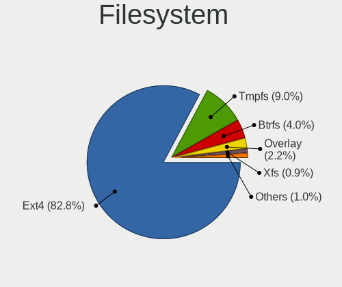
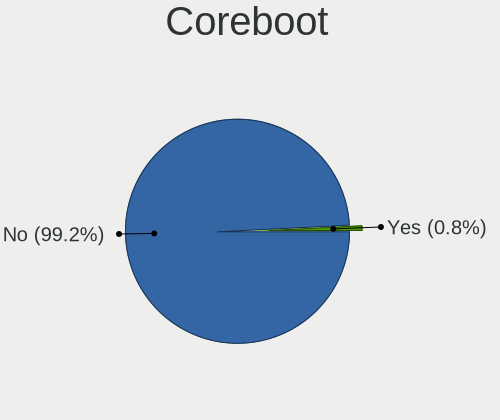
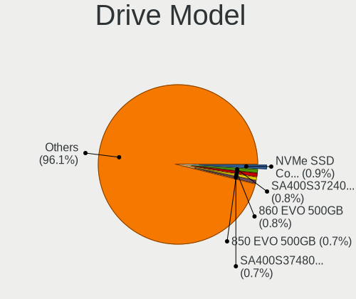
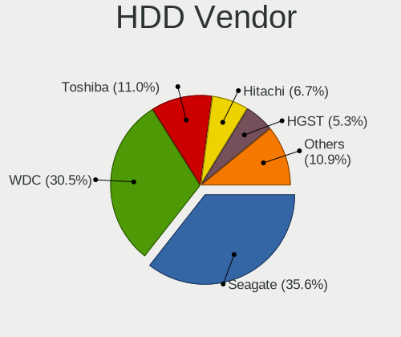
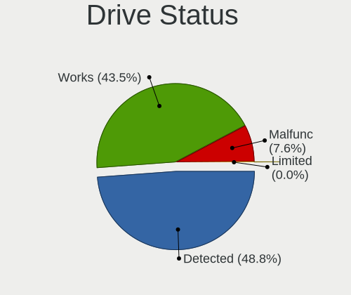
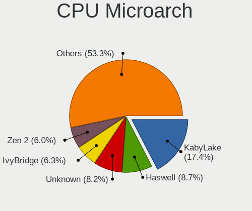
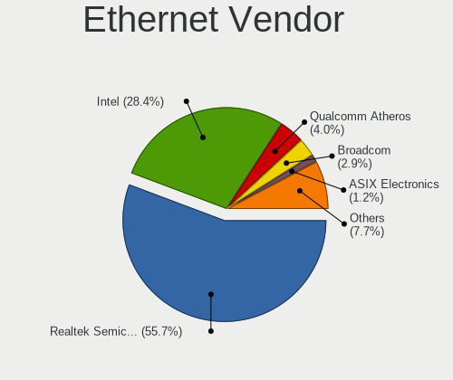

Kubuntu - Tested Hardware & Statistics
--------------------------------------

A project to collect tested hardware configurations for Kubuntu.

Anyone can contribute to this report by the [hw-probe](https://github.com/linuxhw/hw-probe) tool:

    sudo -E hw-probe -all -upload

Please contribute! Especially if your hardware is rare.

This is a report for all computer types. See also reports for [desktops](/Dist/Kubuntu/Desktop/README.md) and [notebooks](/Dist/Kubuntu/Notebook/README.md).

Contents
--------

* [ Test Cases ](#test-cases)

* [ System ](#system)
  - [ OS                       ](#os)
  - [ OS Family                ](#os-family)
  - [ Kernel                   ](#kernel)
  - [ Kernel Family            ](#kernel-family)
  - [ Kernel Major Ver.        ](#kernel-major-ver)
  - [ Arch                     ](#arch)
  - [ DE                       ](#de)
  - [ Display Server           ](#display-server)
  - [ Display Manager          ](#display-manager)
  - [ OS Lang                  ](#os-lang)
  - [ Boot Mode                ](#boot-mode)
  - [ Filesystem               ](#filesystem)
  - [ Part. scheme             ](#part-scheme)
  - [ Dual Boot with Linux/BSD ](#dual-boot-with-linuxbsd)
  - [ Dual Boot (Win)          ](#dual-boot-win)

* [ Board ](#board)
  - [ Vendor                   ](#vendor)
  - [ Model                    ](#model)
  - [ Model Family             ](#model-family)
  - [ MFG Year                 ](#mfg-year)
  - [ Form Factor              ](#form-factor)
  - [ Secure Boot              ](#secure-boot)
  - [ Coreboot                 ](#coreboot)
  - [ RAM Size                 ](#ram-size)
  - [ RAM Used                 ](#ram-used)
  - [ Total Drives             ](#total-drives)
  - [ Has CD-ROM               ](#has-cd-rom)
  - [ Has Ethernet             ](#has-ethernet)
  - [ Has WiFi                 ](#has-wifi)
  - [ Has Bluetooth            ](#has-bluetooth)

* [ Location ](#location)
  - [ Country                  ](#country)
  - [ City                     ](#city)

* [ Drives ](#drives)
  - [ Drive Vendor             ](#drive-vendor)
  - [ Drive Model              ](#drive-model)
  - [ HDD Vendor               ](#hdd-vendor)
  - [ SSD Vendor               ](#ssd-vendor)
  - [ Drive Kind               ](#drive-kind)
  - [ Drive Connector          ](#drive-connector)
  - [ Drive Size               ](#drive-size)
  - [ Space Total              ](#space-total)
  - [ Space Used               ](#space-used)
  - [ Malfunc. Drives          ](#malfunc-drives)
  - [ Malfunc. Drive Vendor    ](#malfunc-drive-vendor)
  - [ Malfunc. HDD Vendor      ](#malfunc-hdd-vendor)
  - [ Malfunc. Drive Kind      ](#malfunc-drive-kind)
  - [ Failed Drives            ](#failed-drives)
  - [ Failed Drive Vendor      ](#failed-drive-vendor)
  - [ Drive Status             ](#drive-status)

* [ Storage controller ](#storage-controller)
  - [ Storage Vendor           ](#storage-vendor)
  - [ Storage Model            ](#storage-model)
  - [ Storage Kind             ](#storage-kind)

* [ Processor ](#processor)
  - [ CPU Vendor               ](#cpu-vendor)
  - [ CPU Model                ](#cpu-model)
  - [ CPU Model Family         ](#cpu-model-family)
  - [ CPU Cores                ](#cpu-cores)
  - [ CPU Sockets              ](#cpu-sockets)
  - [ CPU Threads              ](#cpu-threads)
  - [ CPU Op-Modes             ](#cpu-op-modes)
  - [ CPU Microcode            ](#cpu-microcode)
  - [ CPU Microarch            ](#cpu-microarch)

* [ Graphics ](#graphics)
  - [ GPU Vendor               ](#gpu-vendor)
  - [ GPU Model                ](#gpu-model)
  - [ GPU Combo                ](#gpu-combo)
  - [ GPU Driver               ](#gpu-driver)
  - [ GPU Memory               ](#gpu-memory)

* [ Monitor ](#monitor)
  - [ Monitor Vendor           ](#monitor-vendor)
  - [ Monitor Model            ](#monitor-model)
  - [ Monitor Resolution       ](#monitor-resolution)
  - [ Monitor Diagonal         ](#monitor-diagonal)
  - [ Monitor Width            ](#monitor-width)
  - [ Aspect Ratio             ](#aspect-ratio)
  - [ Monitor Area             ](#monitor-area)
  - [ Pixel Density            ](#pixel-density)
  - [ Multiple Monitors        ](#multiple-monitors)

* [ Network ](#network)
  - [ Net Controller Vendor    ](#net-controller-vendor)
  - [ Net Controller Model     ](#net-controller-model)
  - [ Wireless Vendor          ](#wireless-vendor)
  - [ Wireless Model           ](#wireless-model)
  - [ Ethernet Vendor          ](#ethernet-vendor)
  - [ Ethernet Model           ](#ethernet-model)
  - [ Net Controller Kind      ](#net-controller-kind)
  - [ Used Controller          ](#used-controller)
  - [ NICs                     ](#nics)
  - [ IPv6                     ](#ipv6)

* [ Bluetooth ](#bluetooth)
  - [ Bluetooth Vendor         ](#bluetooth-vendor)
  - [ Bluetooth Model          ](#bluetooth-model)

* [ Sound ](#sound)
  - [ Sound Vendor             ](#sound-vendor)
  - [ Sound Model              ](#sound-model)

* [ Memory ](#memory)
  - [ Memory Vendor            ](#memory-vendor)
  - [ Memory Model             ](#memory-model)
  - [ Memory Kind              ](#memory-kind)
  - [ Memory Form Factor       ](#memory-form-factor)
  - [ Memory Size              ](#memory-size)
  - [ Memory Speed             ](#memory-speed)

* [ Printers & scanners ](#printers--scanners)
  - [ Printer Vendor           ](#printer-vendor)
  - [ Printer Model            ](#printer-model)
  - [ Scanner Vendor           ](#scanner-vendor)
  - [ Scanner Model            ](#scanner-model)

* [ Camera ](#camera)
  - [ Camera Vendor            ](#camera-vendor)
  - [ Camera Model             ](#camera-model)

* [ Security ](#security)
  - [ Fingerprint Vendor       ](#fingerprint-vendor)
  - [ Fingerprint Model        ](#fingerprint-model)
  - [ Chipcard Vendor          ](#chipcard-vendor)
  - [ Chipcard Model           ](#chipcard-model)

* [ Unsupported ](#unsupported)
  - [ Unsupported Devices      ](#unsupported-devices)
  - [ Unsupported Device Types ](#unsupported-device-types)

Test Cases
----------

Total: 8512

| Vendor        | Model                       | Form-Factor | Probe                                                      | Date         |
|---------------|-----------------------------|-------------|------------------------------------------------------------|--------------|
| Dell          | 0GDG8Y A00                  | Desktop     | [417dd2665a](https://linux-hardware.org/?probe=417dd2665a) | Jan 06, 2025 |
| Google        | Cret                        | Notebook    | [bc8e7edac4](https://linux-hardware.org/?probe=bc8e7edac4) | Jan 05, 2025 |
| ASRock        | AB350 Pro4                  | Desktop     | [0d776677a7](https://linux-hardware.org/?probe=0d776677a7) | Jan 05, 2025 |
| ASUSTek       | ASUS Zenbook S 14 UX5406... | Notebook    | [689364573c](https://linux-hardware.org/?probe=689364573c) | Jan 05, 2025 |
| Lenovo        | ThinkPad E520 1143R77       | Notebook    | [3d26d596e3](https://linux-hardware.org/?probe=3d26d596e3) | Jan 05, 2025 |
| ASRock        | A520M Phantom Gaming 4      | Desktop     | [55ed055bf7](https://linux-hardware.org/?probe=55ed055bf7) | Jan 05, 2025 |
| ASRock        | A520M Phantom Gaming 4      | Desktop     | [9bd6c2311d](https://linux-hardware.org/?probe=9bd6c2311d) | Jan 05, 2025 |
| ASRock        | Z690M-ITX/ax                | Desktop     | [bbbb62d243](https://linux-hardware.org/?probe=bbbb62d243) | Jan 05, 2025 |
| Gigabyte      | B760M DS3H DDR4             | Desktop     | [735622d487](https://linux-hardware.org/?probe=735622d487) | Jan 05, 2025 |
| Dell          | Inspiron 15-3567            | Notebook    | [96419f9337](https://linux-hardware.org/?probe=96419f9337) | Jan 05, 2025 |
| Dell          | XPS 16 9640                 | Notebook    | [58d3a3677b](https://linux-hardware.org/?probe=58d3a3677b) | Jan 04, 2025 |
| Dell          | XPS 16 9640                 | Notebook    | [8f38090e9d](https://linux-hardware.org/?probe=8f38090e9d) | Jan 04, 2025 |
| ASUSTek       | M5A97 LE R2.0               | Desktop     | [badfe83ed3](https://linux-hardware.org/?probe=badfe83ed3) | Jan 04, 2025 |
| Acer          | Aspire XC-705               | Desktop     | [9196850d14](https://linux-hardware.org/?probe=9196850d14) | Jan 04, 2025 |
| Toshiba       | Satellite C75D-B            | Notebook    | [6d15c78d08](https://linux-hardware.org/?probe=6d15c78d08) | Jan 04, 2025 |
| MACHINIST     | E5-MR9A V1.0                | Desktop     | [2cd6888290](https://linux-hardware.org/?probe=2cd6888290) | Jan 04, 2025 |
| HUAWEI        | CREFG-XX                    | Notebook    | [c781ee9905](https://linux-hardware.org/?probe=c781ee9905) | Jan 03, 2025 |
| ASUSTek       | ROG CROSSHAIR X670E HERO    | Desktop     | [fe9ee8d0b4](https://linux-hardware.org/?probe=fe9ee8d0b4) | Jan 03, 2025 |
| Lenovo        | ThinkPad L390 Yoga 20NT0... | Convertible | [bfb0f7c906](https://linux-hardware.org/?probe=bfb0f7c906) | Jan 03, 2025 |
| ASUSTek       | VivoBook_ASUSLaptop M160... | Notebook    | [51be04fcd7](https://linux-hardware.org/?probe=51be04fcd7) | Jan 03, 2025 |
| Lenovo        | ThinkBook 14 G4+ IAP 21C... | Notebook    | [0d48464f98](https://linux-hardware.org/?probe=0d48464f98) | Jan 03, 2025 |
| HP            | EliteBook 850 G8 Noteboo... | Notebook    | [514cd1a8a0](https://linux-hardware.org/?probe=514cd1a8a0) | Jan 03, 2025 |
| Fujitsu       | LIFEBOOK E751               | Notebook    | [d6240bc771](https://linux-hardware.org/?probe=d6240bc771) | Jan 02, 2025 |
| Apple         | Mac-4BC72D62AD45599E Mac... | Mini pc     | [f220b96aa0](https://linux-hardware.org/?probe=f220b96aa0) | Jan 02, 2025 |
| BESSTAR Te... | T3 MRD                      | Desktop     | [a4aa2dfab1](https://linux-hardware.org/?probe=a4aa2dfab1) | Jan 02, 2025 |
| Gigabyte      | AX370-Gaming K7             | Desktop     | [50b5770d28](https://linux-hardware.org/?probe=50b5770d28) | Jan 02, 2025 |
| Gigabyte      | Z790 UD AX                  | Desktop     | [64a970e671](https://linux-hardware.org/?probe=64a970e671) | Jan 01, 2025 |
| Lenovo        | 3717 SDK0J40700 WIN 3258... | Desktop     | [bc8aa268ef](https://linux-hardware.org/?probe=bc8aa268ef) | Jan 01, 2025 |
| AZW           | EQ                          | Mini pc     | [770d05536d](https://linux-hardware.org/?probe=770d05536d) | Jan 01, 2025 |
| MSI           | X470 GAMING PRO CARBON      | Desktop     | [0a1f200989](https://linux-hardware.org/?probe=0a1f200989) | Jan 01, 2025 |
| ASRock        | Z170M Pro4S                 | Desktop     | [14a8e0fe62](https://linux-hardware.org/?probe=14a8e0fe62) | Dec 31, 2024 |
| Dell          | Inspiron 7573               | Convertible | [57f273fb9c](https://linux-hardware.org/?probe=57f273fb9c) | Dec 31, 2024 |
| Apple         | Mac-4BC72D62AD45599E Mac... | Mini pc     | [9f68db2d70](https://linux-hardware.org/?probe=9f68db2d70) | Dec 31, 2024 |
| ASUSTek       | TUF Gaming B550-PLUS WIF... | Desktop     | [9f7d158933](https://linux-hardware.org/?probe=9f7d158933) | Dec 30, 2024 |
| HP            | 2AF7                        | Desktop     | [391d4cf404](https://linux-hardware.org/?probe=391d4cf404) | Dec 30, 2024 |
| MSI           | GF65 Thin 9SD               | Notebook    | [ed812824ea](https://linux-hardware.org/?probe=ed812824ea) | Dec 30, 2024 |
| MSI           | GF65 Thin 9SD               | Notebook    | [a53632802a](https://linux-hardware.org/?probe=a53632802a) | Dec 30, 2024 |
| Intel         | NUC13ANBi5 M89647-202       | Mini pc     | [2f800631ca](https://linux-hardware.org/?probe=2f800631ca) | Dec 29, 2024 |
| Apple         | MacBookPro11,2              | Notebook    | [238bce296a](https://linux-hardware.org/?probe=238bce296a) | Dec 29, 2024 |
| Chuwi         | GemiBook                    | Notebook    | [28c417a4f8](https://linux-hardware.org/?probe=28c417a4f8) | Dec 29, 2024 |
| Lenovo        | IdeaPadFlex 5 14IAU7 82R... | Convertible | [d8b62d6567](https://linux-hardware.org/?probe=d8b62d6567) | Dec 29, 2024 |
| MSI           | X470 GAMING PRO CARBON      | Desktop     | [6ec37ed4b3](https://linux-hardware.org/?probe=6ec37ed4b3) | Dec 29, 2024 |
| HP            | 3646h                       | Desktop     | [3a6019c6f8](https://linux-hardware.org/?probe=3a6019c6f8) | Dec 28, 2024 |
| Dell          | 07HXY6 A01                  | Desktop     | [05efb343fe](https://linux-hardware.org/?probe=05efb343fe) | Dec 28, 2024 |
| Lenovo        | IdeaPad Slim 5 14IRL8 82... | Notebook    | [eb4bdf954b](https://linux-hardware.org/?probe=eb4bdf954b) | Dec 28, 2024 |
| ASRock        | B550 Phantom Gaming-ITX/... | Desktop     | [a3e88e71e3](https://linux-hardware.org/?probe=a3e88e71e3) | Dec 28, 2024 |
| Panasonic     | CF-31SBLEB1M                | Notebook    | [c01282e1c8](https://linux-hardware.org/?probe=c01282e1c8) | Dec 27, 2024 |
| Panasonic     | CF-31SBLEB1M                | Notebook    | [b1be038c76](https://linux-hardware.org/?probe=b1be038c76) | Dec 27, 2024 |
| Dell          | Inspiron 1525               | Notebook    | [89a2a2261a](https://linux-hardware.org/?probe=89a2a2261a) | Dec 27, 2024 |
| CBR           | A320M.2-VH Challenger       | Desktop     | [1f5e2840d1](https://linux-hardware.org/?probe=1f5e2840d1) | Dec 27, 2024 |
| Dell          | Latitude 5580               | Notebook    | [61c3987fc9](https://linux-hardware.org/?probe=61c3987fc9) | Dec 27, 2024 |
| Google        | Voxel                       | Notebook    | [32b3903455](https://linux-hardware.org/?probe=32b3903455) | Dec 26, 2024 |
| Lenovo        | ThinkBook 15 G2 ARE 20VG    | Notebook    | [9ca24271a4](https://linux-hardware.org/?probe=9ca24271a4) | Dec 26, 2024 |
| HP            | 2B29                        | Desktop     | [2bacb97467](https://linux-hardware.org/?probe=2bacb97467) | Dec 26, 2024 |
| Dell          | XPS 9315                    | Notebook    | [db4876762a](https://linux-hardware.org/?probe=db4876762a) | Dec 26, 2024 |
| ASRock        | Z390 Phantom Gaming 4S      | Notebook    | [d134a178b2](https://linux-hardware.org/?probe=d134a178b2) | Dec 26, 2024 |
| HP            | Pavilion Laptop 15-cc1xx    | Notebook    | [697cdd9200](https://linux-hardware.org/?probe=697cdd9200) | Dec 25, 2024 |
| HP            | EliteBook 820 G3            | Notebook    | [cf6ba1ead2](https://linux-hardware.org/?probe=cf6ba1ead2) | Dec 25, 2024 |
| ASUSTek       | ROG Zephyrus G14 GA401QM... | Notebook    | [b163061b61](https://linux-hardware.org/?probe=b163061b61) | Dec 25, 2024 |
| Acer          | Aspire V5-573G              | Notebook    | [45f86a09ae](https://linux-hardware.org/?probe=45f86a09ae) | Dec 25, 2024 |
| GEEKOM        | A5                          | Desktop     | [b309e8ba45](https://linux-hardware.org/?probe=b309e8ba45) | Dec 24, 2024 |
| Dell          | Latitude 5430               | Notebook    | [751e3be041](https://linux-hardware.org/?probe=751e3be041) | Dec 24, 2024 |
| Dell          | Latitude 5430               | Notebook    | [b9d91d702c](https://linux-hardware.org/?probe=b9d91d702c) | Dec 24, 2024 |
| HP            | 1998                        | Desktop     | [8d460e04de](https://linux-hardware.org/?probe=8d460e04de) | Dec 23, 2024 |
| ASUSTek       | ROG STRIX B650E-F GAMING... | Desktop     | [ad40c6b991](https://linux-hardware.org/?probe=ad40c6b991) | Dec 23, 2024 |
| ASUSTek       | 970 PRO GAMING/AURA         | Desktop     | [4885d454da](https://linux-hardware.org/?probe=4885d454da) | Dec 23, 2024 |
| Gigabyte      | B450M DS3H V2               | Desktop     | [a0bed8cb3f](https://linux-hardware.org/?probe=a0bed8cb3f) | Dec 23, 2024 |
| ASUSTek       | ASUS EXPERTBOOK B1403CVA    | Notebook    | [b51fc6a4fb](https://linux-hardware.org/?probe=b51fc6a4fb) | Dec 23, 2024 |
| Clevo         | P170HMx                     | Notebook    | [c0ec7e3011](https://linux-hardware.org/?probe=c0ec7e3011) | Dec 22, 2024 |
| Dell          | 0F6X5P A00                  | Desktop     | [e95791f119](https://linux-hardware.org/?probe=e95791f119) | Dec 22, 2024 |
| ASUSTek       | ROG STRIX X870E-E GAMING... | Desktop     | [92c5acc84f](https://linux-hardware.org/?probe=92c5acc84f) | Dec 22, 2024 |
| Lenovo        | LOQ 15IRX9 83DV             | Notebook    | [edf55e35fa](https://linux-hardware.org/?probe=edf55e35fa) | Dec 22, 2024 |
| Acer          | Nitro AN515-57              | Notebook    | [857b365f00](https://linux-hardware.org/?probe=857b365f00) | Dec 22, 2024 |
| Unknown       | Unknown                     | Soc         | [4839a778ab](https://linux-hardware.org/?probe=4839a778ab) | Dec 22, 2024 |
| Gigabyte      | Z270-HD3P-CF                | Desktop     | [f95d24a4d3](https://linux-hardware.org/?probe=f95d24a4d3) | Dec 22, 2024 |
| Gigabyte      | B550 AORUS ELITE AX V2      | Desktop     | [671a76bf13](https://linux-hardware.org/?probe=671a76bf13) | Dec 21, 2024 |
| Intel         | DP55WB AAE64798-207         | Desktop     | [c2c0c50aa4](https://linux-hardware.org/?probe=c2c0c50aa4) | Dec 21, 2024 |
| HP            | Pavilion Laptop 15-eh0xx... | Notebook    | [31289d15a2](https://linux-hardware.org/?probe=31289d15a2) | Dec 21, 2024 |
| Lenovo        | 300w Gen 3 82J1             | Convertible | [abef694a7c](https://linux-hardware.org/?probe=abef694a7c) | Dec 21, 2024 |
| Lenovo        | 300w Gen 3 82J1             | Convertible | [1015720abc](https://linux-hardware.org/?probe=1015720abc) | Dec 21, 2024 |
| Fujitsu       | LIFEBOOK U758               | Notebook    | [2c6a5d22c1](https://linux-hardware.org/?probe=2c6a5d22c1) | Dec 20, 2024 |
| MSI           | MPG Z490 GAMING EDGE WIF... | Desktop     | [675e3b2432](https://linux-hardware.org/?probe=675e3b2432) | Dec 20, 2024 |
| HP            | Pavilion Laptop 14-dv0xx... | Notebook    | [210729b8a3](https://linux-hardware.org/?probe=210729b8a3) | Dec 20, 2024 |
| AZW           | SEi12 MAX                   | Mini pc     | [7fdbdbc1a6](https://linux-hardware.org/?probe=7fdbdbc1a6) | Dec 20, 2024 |
| Biostar       | B450MX-S                    | Desktop     | [298f913b02](https://linux-hardware.org/?probe=298f913b02) | Dec 20, 2024 |
| Dell          | Vostro 5625                 | Notebook    | [c081eaa179](https://linux-hardware.org/?probe=c081eaa179) | Dec 20, 2024 |
| ASUSTek       | VivoBook_ASUSLaptop X512... | Notebook    | [7c5e051820](https://linux-hardware.org/?probe=7c5e051820) | Dec 19, 2024 |
| MSI           | MPG Z490 GAMING EDGE WIF... | Desktop     | [28c2c92f61](https://linux-hardware.org/?probe=28c2c92f61) | Dec 19, 2024 |
| Gigabyte      | X570 AORUS MASTER           | Desktop     | [9e02fc3eec](https://linux-hardware.org/?probe=9e02fc3eec) | Dec 19, 2024 |
| Gigabyte      | X570 AORUS MASTER           | Desktop     | [e41eca5240](https://linux-hardware.org/?probe=e41eca5240) | Dec 19, 2024 |
| MSI           | MAG X670E TOMAHAWK WIFI     | Desktop     | [607a9aa50f](https://linux-hardware.org/?probe=607a9aa50f) | Dec 19, 2024 |
| ASUSTek       | P8Z77-V LX                  | Desktop     | [a65cf104b4](https://linux-hardware.org/?probe=a65cf104b4) | Dec 18, 2024 |
| Intel         | S1200SP H57532-260          | Server      | [172a6309df](https://linux-hardware.org/?probe=172a6309df) | Dec 18, 2024 |
| ASRock        | B550 Phantom Gaming 4       | Desktop     | [7946d22582](https://linux-hardware.org/?probe=7946d22582) | Dec 18, 2024 |
| Lenovo        | ThinkPad X1 Carbon Gen 1... | Notebook    | [d2b19da7f2](https://linux-hardware.org/?probe=d2b19da7f2) | Dec 18, 2024 |
| ASRock        | B760M Pro RS/D4 WiFi        | Desktop     | [34bf804bd1](https://linux-hardware.org/?probe=34bf804bd1) | Dec 17, 2024 |
| Samsung       | 730U3E/740U3E               | Notebook    | [c5e5057be2](https://linux-hardware.org/?probe=c5e5057be2) | Dec 17, 2024 |
| Apple         | Mac-942B59F58194171B iMa... | All in one  | [8b589149fb](https://linux-hardware.org/?probe=8b589149fb) | Dec 17, 2024 |
| ASUSTek       | ASUS TUF Gaming A16 FA61... | Notebook    | [efacc3d2bf](https://linux-hardware.org/?probe=efacc3d2bf) | Dec 16, 2024 |
| Fujitsu       | FMVU09001                   | Notebook    | [2be0996b78](https://linux-hardware.org/?probe=2be0996b78) | Dec 16, 2024 |
| ASUSTek       | ROG STRIX Z390-E GAMING     | Desktop     | [bbe170f0bc](https://linux-hardware.org/?probe=bbe170f0bc) | Dec 16, 2024 |
| HP            | Pavilion Laptop 15-eh0xx... | Notebook    | [b12c429941](https://linux-hardware.org/?probe=b12c429941) | Dec 16, 2024 |
| ASUSTek       | ASUS EXPERTBOOK B1403CVA    | Notebook    | [dc66ca3bfc](https://linux-hardware.org/?probe=dc66ca3bfc) | Dec 16, 2024 |
| HP            | Pavilion Power Laptop 15... | Notebook    | [a785db7994](https://linux-hardware.org/?probe=a785db7994) | Dec 15, 2024 |
| Intel         | NUC12WSBi5 M46425-303       | Mini pc     | [2684305e77](https://linux-hardware.org/?probe=2684305e77) | Dec 15, 2024 |
| Acer          | Aspire A315-56              | Notebook    | [139641552f](https://linux-hardware.org/?probe=139641552f) | Dec 15, 2024 |
| Unknown       | Unknown                     | Soc         | [7798007682](https://linux-hardware.org/?probe=7798007682) | Dec 15, 2024 |
| ASUSTek       | VivoBook_ASUSLaptop K340... | Notebook    | [ed3d05274d](https://linux-hardware.org/?probe=ed3d05274d) | Dec 14, 2024 |
| Samsung       | 950XDB/951XDB/950XDY        | Notebook    | [a53cca0335](https://linux-hardware.org/?probe=a53cca0335) | Dec 14, 2024 |
| MSI           | B450 GAMING PLUS MAX        | Desktop     | [7beb5cea9f](https://linux-hardware.org/?probe=7beb5cea9f) | Dec 14, 2024 |
| MSI           | Creator Z17 A12UGST         | Notebook    | [c6a09edf29](https://linux-hardware.org/?probe=c6a09edf29) | Dec 14, 2024 |
| MSI           | Creator Z17 A12UGST         | Notebook    | [ca137f5639](https://linux-hardware.org/?probe=ca137f5639) | Dec 14, 2024 |
| Lenovo        | ThinkPad E14 Gen 5 21JKC... | Notebook    | [3cfbdc1929](https://linux-hardware.org/?probe=3cfbdc1929) | Dec 14, 2024 |
| Dell          | Inspiron 5405               | Notebook    | [3bbbe8e729](https://linux-hardware.org/?probe=3bbbe8e729) | Dec 13, 2024 |
| Panasonic     | CF-191DCSG1M                | Notebook    | [c607411b91](https://linux-hardware.org/?probe=c607411b91) | Dec 13, 2024 |
| Panasonic     | CF-191DCSG1M                | Notebook    | [471033b960](https://linux-hardware.org/?probe=471033b960) | Dec 13, 2024 |
| Lenovo        | 310B SDK0J40697 WIN 3305... | Mini pc     | [b53a9b97fc](https://linux-hardware.org/?probe=b53a9b97fc) | Dec 13, 2024 |
| Dell          | 0GN6JF A01                  | Desktop     | [fce4597ad2](https://linux-hardware.org/?probe=fce4597ad2) | Dec 13, 2024 |
| Dell          | Inspiron 5559               | Notebook    | [34c0ea4ba1](https://linux-hardware.org/?probe=34c0ea4ba1) | Dec 12, 2024 |
| Apple         | Mac-942B59F58194171B iMa... | All in one  | [ea00b2a8c1](https://linux-hardware.org/?probe=ea00b2a8c1) | Dec 12, 2024 |
| Lenovo        | ThinkPad E15 Gen 2 20TD0... | Notebook    | [cb9d160c00](https://linux-hardware.org/?probe=cb9d160c00) | Dec 11, 2024 |
| Lenovo        | ThinkPad E15 Gen 2 20TD0... | Notebook    | [25c2515170](https://linux-hardware.org/?probe=25c2515170) | Dec 11, 2024 |
| Lenovo        | 3106 SDK0J40697 WIN 3305... | Desktop     | [bece5c47df](https://linux-hardware.org/?probe=bece5c47df) | Dec 11, 2024 |
| HP            | Laptop 17-cp0xxx            | Notebook    | [f1344c53ac](https://linux-hardware.org/?probe=f1344c53ac) | Dec 11, 2024 |
| HP            | Laptop 17-cp0xxx            | Notebook    | [8a8e971015](https://linux-hardware.org/?probe=8a8e971015) | Dec 11, 2024 |
| Unknown       | V00                         | Mini pc     | [5563f43111](https://linux-hardware.org/?probe=5563f43111) | Dec 11, 2024 |
| Lenovo        | 3106 SDK0J40697 WIN 3305... | Desktop     | [391bc43492](https://linux-hardware.org/?probe=391bc43492) | Dec 11, 2024 |
| Lenovo        | ThinkPad X13 Gen 1 20UF0... | Notebook    | [0c5a8d044d](https://linux-hardware.org/?probe=0c5a8d044d) | Dec 11, 2024 |
| ASUSTek       | X556URK                     | Notebook    | [7f87e4f208](https://linux-hardware.org/?probe=7f87e4f208) | Dec 11, 2024 |
| ASUSTek       | ROG Strix G513RW_G513RW     | Notebook    | [719c8de776](https://linux-hardware.org/?probe=719c8de776) | Dec 11, 2024 |
| Huanan        | X99-TF                      | Desktop     | [8fd5cc725c](https://linux-hardware.org/?probe=8fd5cc725c) | Dec 10, 2024 |
| Apple         | Mac-031B6874CF7F642A iMa... | All in one  | [1e678a3582](https://linux-hardware.org/?probe=1e678a3582) | Dec 10, 2024 |
| HP            | Laptop 15-dy2xxx            | Notebook    | [0bb2a3a7a8](https://linux-hardware.org/?probe=0bb2a3a7a8) | Dec 10, 2024 |
| Intel         | NUC9VXQNB K47179-500        | Mini pc     | [01c529e25c](https://linux-hardware.org/?probe=01c529e25c) | Dec 10, 2024 |
| ASUSTek       | PRIME A320M-K               | Desktop     | [1ef5763e52](https://linux-hardware.org/?probe=1ef5763e52) | Dec 10, 2024 |
| ASUSTek       | TUF B450M-PLUS GAMING       | Desktop     | [f3e2067835](https://linux-hardware.org/?probe=f3e2067835) | Dec 10, 2024 |
| Dynabook      | PORTEGE X40-K               | Notebook    | [5f7a69df31](https://linux-hardware.org/?probe=5f7a69df31) | Dec 09, 2024 |
| ZOTAC         | ZBOX-ECM73070C/7307LH/53... | Mini pc     | [4d77eb6ed7](https://linux-hardware.org/?probe=4d77eb6ed7) | Dec 09, 2024 |
| ASUSTek       | VivoBook_ASUSLaptop M160... | Notebook    | [6b5111843a](https://linux-hardware.org/?probe=6b5111843a) | Dec 09, 2024 |
| Lenovo        | V15 G4 AMN 82YU             | Notebook    | [152aa1b4ca](https://linux-hardware.org/?probe=152aa1b4ca) | Dec 09, 2024 |
| Pegatron      | 2AB6                        | Desktop     | [6ab7d72400](https://linux-hardware.org/?probe=6ab7d72400) | Dec 08, 2024 |
| HP            | ZBook 14u G6                | Notebook    | [bca0253524](https://linux-hardware.org/?probe=bca0253524) | Dec 08, 2024 |
| Lenovo        | V15 G4 AMN 82YU             | Notebook    | [5b795c5c2c](https://linux-hardware.org/?probe=5b795c5c2c) | Dec 08, 2024 |
| Dell          | Latitude E6430              | Notebook    | [a80a5df9fd](https://linux-hardware.org/?probe=a80a5df9fd) | Dec 08, 2024 |
| ASUSTek       | Z97-C                       | Desktop     | [456449c9b2](https://linux-hardware.org/?probe=456449c9b2) | Dec 08, 2024 |
| MSI           | B650 GAMING PLUS WIFI       | Desktop     | [85164bd103](https://linux-hardware.org/?probe=85164bd103) | Dec 08, 2024 |
| Dell          | 0NC2VH A01                  | Desktop     | [d1867f2f69](https://linux-hardware.org/?probe=d1867f2f69) | Dec 08, 2024 |
| Dell          | Precision M4800             | Notebook    | [66261c03d0](https://linux-hardware.org/?probe=66261c03d0) | Dec 08, 2024 |
| Acer          | Aspire A315-24P             | Notebook    | [68fa0e7660](https://linux-hardware.org/?probe=68fa0e7660) | Dec 08, 2024 |
| Biostar       | B450MX-S                    | Desktop     | [821e6039db](https://linux-hardware.org/?probe=821e6039db) | Dec 08, 2024 |
| MSI           | PRO B650-S WIFI             | Desktop     | [016f4d1c74](https://linux-hardware.org/?probe=016f4d1c74) | Dec 08, 2024 |
| ASUSTek       | X99-E WS/USB                | Desktop     | [7d160ef3b0](https://linux-hardware.org/?probe=7d160ef3b0) | Dec 07, 2024 |
| Gigabyte      | B550 GAMING X V2            | Desktop     | [b90a139240](https://linux-hardware.org/?probe=b90a139240) | Dec 07, 2024 |
| ASUSTek       | ASUS TUF Gaming A14 FA40... | Notebook    | [6ba761b666](https://linux-hardware.org/?probe=6ba761b666) | Dec 07, 2024 |
| Dell          | XPS 15 7590                 | Notebook    | [fbc857c378](https://linux-hardware.org/?probe=fbc857c378) | Dec 07, 2024 |
| Dell          | XPS 15 7590                 | Notebook    | [19ee3907ad](https://linux-hardware.org/?probe=19ee3907ad) | Dec 07, 2024 |
| Dell          | Precision 7520              | Notebook    | [3a1f5573bd](https://linux-hardware.org/?probe=3a1f5573bd) | Dec 07, 2024 |
| ASUSTek       | ROG Maximus XII FORMULA     | Desktop     | [000952dc62](https://linux-hardware.org/?probe=000952dc62) | Dec 07, 2024 |
| Unknown       | AX16                        | Notebook    | [786a7ec53a](https://linux-hardware.org/?probe=786a7ec53a) | Dec 06, 2024 |
| ASUSTek       | ASUS TUF Gaming A14 FA40... | Notebook    | [a9c5cf0de0](https://linux-hardware.org/?probe=a9c5cf0de0) | Dec 06, 2024 |
| Lenovo        | Legion 5 15IMH05 82AU       | Notebook    | [79ab3bbc9e](https://linux-hardware.org/?probe=79ab3bbc9e) | Dec 06, 2024 |
| Dell          | Inspiron 5748               | Notebook    | [e5b0755ec1](https://linux-hardware.org/?probe=e5b0755ec1) | Dec 06, 2024 |
| Shenzhen M... | F7BSI                       | Mini pc     | [6fecd84428](https://linux-hardware.org/?probe=6fecd84428) | Dec 06, 2024 |
| HP            | Laptop 15-dy2xxx            | Notebook    | [f591b54820](https://linux-hardware.org/?probe=f591b54820) | Dec 06, 2024 |
| MSI           | B650 GAMING PLUS WIFI       | Desktop     | [d025744ff8](https://linux-hardware.org/?probe=d025744ff8) | Dec 06, 2024 |
| HP            | Pavilion HDX9000            | Notebook    | [cd2b41f1d1](https://linux-hardware.org/?probe=cd2b41f1d1) | Dec 05, 2024 |
| ASUSTek       | PRIME B250M-A               | Desktop     | [9c45bca350](https://linux-hardware.org/?probe=9c45bca350) | Dec 05, 2024 |
| Gigabyte      | Q87M-D2H                    | Desktop     | [bcb77899dd](https://linux-hardware.org/?probe=bcb77899dd) | Dec 05, 2024 |
| ASUSTek       | F2A85-M PRO                 | Desktop     | [dc43147214](https://linux-hardware.org/?probe=dc43147214) | Dec 05, 2024 |
| ASUSTek       | PRIME B250M-A               | Desktop     | [0c7c4b2a6e](https://linux-hardware.org/?probe=0c7c4b2a6e) | Dec 04, 2024 |
| HP            | Laptop 15-db0xxx            | Notebook    | [3ceb5935c2](https://linux-hardware.org/?probe=3ceb5935c2) | Dec 04, 2024 |
| ASUSTek       | F2A85-M PRO                 | Desktop     | [fa47a2dbb2](https://linux-hardware.org/?probe=fa47a2dbb2) | Dec 04, 2024 |
| IBM           | System Planar               | Server      | [be2084ecfb](https://linux-hardware.org/?probe=be2084ecfb) | Dec 04, 2024 |
| Dell          | XPS 13 9305                 | Notebook    | [8ff051cc6e](https://linux-hardware.org/?probe=8ff051cc6e) | Dec 04, 2024 |
| HP            | Laptop 15-db0xxx            | Notebook    | [cc89356041](https://linux-hardware.org/?probe=cc89356041) | Dec 04, 2024 |
| Dell          | Latitude 3550               | Notebook    | [fe2494f626](https://linux-hardware.org/?probe=fe2494f626) | Dec 03, 2024 |
| AZW           | SER                         | Mini pc     | [2fff4fb280](https://linux-hardware.org/?probe=2fff4fb280) | Dec 03, 2024 |
| ASUSTek       | V-P8H67E                    | Desktop     | [d1c21b9076](https://linux-hardware.org/?probe=d1c21b9076) | Dec 03, 2024 |
| AMI           | Intel                       | Desktop     | [0f2096c0a4](https://linux-hardware.org/?probe=0f2096c0a4) | Dec 02, 2024 |
| AMI           | Intel                       | Desktop     | [ffcbee7a41](https://linux-hardware.org/?probe=ffcbee7a41) | Dec 02, 2024 |
| Gigabyte      | Z370P D3-CF                 | Desktop     | [440c2f4be0](https://linux-hardware.org/?probe=440c2f4be0) | Dec 02, 2024 |
| Lenovo        | 310B SDK0J40697 WIN 3305... | Mini pc     | [0787086502](https://linux-hardware.org/?probe=0787086502) | Dec 02, 2024 |
| MSI           | 890GXM-G65                  | Desktop     | [06796df9b3](https://linux-hardware.org/?probe=06796df9b3) | Dec 02, 2024 |
| Dell          | 0PXWHK A00                  | Desktop     | [e732eb7855](https://linux-hardware.org/?probe=e732eb7855) | Dec 02, 2024 |
| HP            | 158A                        | Desktop     | [fa4883453f](https://linux-hardware.org/?probe=fa4883453f) | Dec 02, 2024 |
| Gigabyte      | AX370-Gaming K7             | Desktop     | [5b59960dcf](https://linux-hardware.org/?probe=5b59960dcf) | Dec 02, 2024 |
| Dell          | Precision 3591              | Notebook    | [65487c2463](https://linux-hardware.org/?probe=65487c2463) | Dec 01, 2024 |
| Lenovo        | IdeaPad Gaming 3 15IHU6 ... | Notebook    | [af48bb81c6](https://linux-hardware.org/?probe=af48bb81c6) | Dec 01, 2024 |
| HUAWEI        | NBLK-WAX9X                  | Notebook    | [2f6d2fe7e2](https://linux-hardware.org/?probe=2f6d2fe7e2) | Dec 01, 2024 |
| Unknown       | AX16PRO                     | Notebook    | [603937e734](https://linux-hardware.org/?probe=603937e734) | Dec 01, 2024 |
| ASUSTek       | G750JX                      | Notebook    | [cde4dbbbc4](https://linux-hardware.org/?probe=cde4dbbbc4) | Dec 01, 2024 |
| Samsung       | 950QDB                      | Convertible | [fc51315eb6](https://linux-hardware.org/?probe=fc51315eb6) | Dec 01, 2024 |
| Lenovo        | ThinkPad T14 Gen 5 21MCC... | Notebook    | [c293c35272](https://linux-hardware.org/?probe=c293c35272) | Nov 30, 2024 |
| HP            | 1496                        | Desktop     | [151086aaf3](https://linux-hardware.org/?probe=151086aaf3) | Nov 30, 2024 |
| ASUSTek       | B85-PRO GAMER               | Desktop     | [12dd784125](https://linux-hardware.org/?probe=12dd784125) | Nov 30, 2024 |
| HP            | Pavilion Power Laptop 15... | Notebook    | [48bf512469](https://linux-hardware.org/?probe=48bf512469) | Nov 30, 2024 |
| Lenovo        | IdeaPad Gaming 3 15IHU6 ... | Notebook    | [c56cdb7a5f](https://linux-hardware.org/?probe=c56cdb7a5f) | Nov 30, 2024 |
| Lenovo        | IdeaPad Gaming 3 15IHU6 ... | Notebook    | [eaca726e51](https://linux-hardware.org/?probe=eaca726e51) | Nov 30, 2024 |
| ASUSTek       | X555LN                      | Notebook    | [8fe10d8894](https://linux-hardware.org/?probe=8fe10d8894) | Nov 30, 2024 |
| Lenovo        | ThinkPad X1 Carbon 6th 2... | Notebook    | [4dd33ed790](https://linux-hardware.org/?probe=4dd33ed790) | Nov 30, 2024 |
| ASUSTek       | B85-PRO GAMER               | Desktop     | [fb51898c9a](https://linux-hardware.org/?probe=fb51898c9a) | Nov 29, 2024 |
| Toshiba       | Satellite L500              | Notebook    | [81df2f2b8e](https://linux-hardware.org/?probe=81df2f2b8e) | Nov 29, 2024 |
| Nvidia        | M750SLI-DS4                 | Desktop     | [6e2167686c](https://linux-hardware.org/?probe=6e2167686c) | Nov 29, 2024 |
| MSI           | X470 GAMING PRO CARBON      | Desktop     | [ea4aa1f387](https://linux-hardware.org/?probe=ea4aa1f387) | Nov 29, 2024 |
| Intel         | H61                         | Desktop     | [9884456ecc](https://linux-hardware.org/?probe=9884456ecc) | Nov 29, 2024 |
| MSI           | B550M PRO-VDH WIFI          | Desktop     | [52266f066f](https://linux-hardware.org/?probe=52266f066f) | Nov 29, 2024 |
| MSI           | MEG X570 ACE                | Desktop     | [f510dcc7d0](https://linux-hardware.org/?probe=f510dcc7d0) | Nov 28, 2024 |
| Dell          | Latitude 5520               | Notebook    | [f1222f143e](https://linux-hardware.org/?probe=f1222f143e) | Nov 28, 2024 |
| Gateway       | NV75S                       | Notebook    | [c7e9f2b942](https://linux-hardware.org/?probe=c7e9f2b942) | Nov 28, 2024 |
| ASUSTek       | V-P8H67E                    | Desktop     | [89f2b30be4](https://linux-hardware.org/?probe=89f2b30be4) | Nov 28, 2024 |
| Notebook      | X370SNx                     | Notebook    | [b3c4edd504](https://linux-hardware.org/?probe=b3c4edd504) | Nov 28, 2024 |
| Gigabyte      | Z170-HD3P-CF                | Desktop     | [85900dda2b](https://linux-hardware.org/?probe=85900dda2b) | Nov 27, 2024 |
| Gigabyte      | Z170-HD3P-CF                | Desktop     | [1b415de6dd](https://linux-hardware.org/?probe=1b415de6dd) | Nov 27, 2024 |
| Dell          | XPS 13 9310                 | Notebook    | [5a464dff99](https://linux-hardware.org/?probe=5a464dff99) | Nov 27, 2024 |
| Lenovo        | ThinkPad X240 20AMS4QL00    | Notebook    | [4cf704813c](https://linux-hardware.org/?probe=4cf704813c) | Nov 27, 2024 |
| Lenovo        | ThinkPad L14 Gen 3 21C50... | Notebook    | [16f61a0dc5](https://linux-hardware.org/?probe=16f61a0dc5) | Nov 27, 2024 |
| Samsung       | 730U3E/740U3E               | Notebook    | [d3202d1f51](https://linux-hardware.org/?probe=d3202d1f51) | Nov 27, 2024 |
| ASUSTek       | ASUS TUF Gaming A16 FA60... | Notebook    | [bbcfd5f2d1](https://linux-hardware.org/?probe=bbcfd5f2d1) | Nov 26, 2024 |
| HP            | ZBook Firefly 15 G7 Mobi... | Notebook    | [8c0ecd4b30](https://linux-hardware.org/?probe=8c0ecd4b30) | Nov 26, 2024 |
| ASUSTek       | ASUS TUF Gaming A16 FA60... | Notebook    | [a6e55209bb](https://linux-hardware.org/?probe=a6e55209bb) | Nov 26, 2024 |
| Lenovo        | ThinkPad P14s Gen 2a 21A... | Notebook    | [33235dec27](https://linux-hardware.org/?probe=33235dec27) | Nov 26, 2024 |
| Samsung       | 300E5K/300E5Q               | Notebook    | [073b6e567f](https://linux-hardware.org/?probe=073b6e567f) | Nov 26, 2024 |
| ASRock        | Z390 Phantom Gaming 4S      | Notebook    | [628f4e5d70](https://linux-hardware.org/?probe=628f4e5d70) | Nov 26, 2024 |
| Apple         | MacBookPro5,3               | Notebook    | [f8e03fed09](https://linux-hardware.org/?probe=f8e03fed09) | Nov 25, 2024 |
| ASUSTek       | VivoBook_ASUSLaptop K650... | Notebook    | [d58ccbdbd5](https://linux-hardware.org/?probe=d58ccbdbd5) | Nov 25, 2024 |
| Lenovo        | ThinkPad P1 Gen 7 21KVCT... | Notebook    | [baf2e1a758](https://linux-hardware.org/?probe=baf2e1a758) | Nov 25, 2024 |
| Dell          | Latitude E6420              | Notebook    | [f1db6546f8](https://linux-hardware.org/?probe=f1db6546f8) | Nov 25, 2024 |
| Lenovo        | Yoga Pro 9 16IMH9 83DN      | Notebook    | [e72190a7d6](https://linux-hardware.org/?probe=e72190a7d6) | Nov 25, 2024 |
| HP            | 8169                        | Desktop     | [a6c381e34e](https://linux-hardware.org/?probe=a6c381e34e) | Nov 25, 2024 |
| Dell          | Inspiron 15-3567            | Notebook    | [0b52a4dd46](https://linux-hardware.org/?probe=0b52a4dd46) | Nov 25, 2024 |
| Dell          | Inspiron 15-3567            | Notebook    | [83c44e5dcb](https://linux-hardware.org/?probe=83c44e5dcb) | Nov 25, 2024 |
| HP            | EliteBook 2560p             | Notebook    | [54d07de40f](https://linux-hardware.org/?probe=54d07de40f) | Nov 25, 2024 |
| HP            | EliteBook 2560p             | Notebook    | [98af34c213](https://linux-hardware.org/?probe=98af34c213) | Nov 25, 2024 |
| Intel         | H61                         | Desktop     | [06e926278d](https://linux-hardware.org/?probe=06e926278d) | Nov 25, 2024 |
| Apple         | MacBookPro12,1              | Notebook    | [1ad2abc16d](https://linux-hardware.org/?probe=1ad2abc16d) | Nov 24, 2024 |
| Lenovo        | IdeaPad Slim 5 16ABR8 82... | Notebook    | [7204b37e87](https://linux-hardware.org/?probe=7204b37e87) | Nov 24, 2024 |
| Lenovo        | V15 G4 ABP 83CR             | Notebook    | [7babc4592f](https://linux-hardware.org/?probe=7babc4592f) | Nov 24, 2024 |
| Dell          | 06D7TR A00                  | Desktop     | [61383033d8](https://linux-hardware.org/?probe=61383033d8) | Nov 24, 2024 |
| MSI           | X470 GAMING PRO CARBON      | Desktop     | [2412cb727b](https://linux-hardware.org/?probe=2412cb727b) | Nov 23, 2024 |
| Dell          | Inspiron 7573               | Convertible | [14dfbb9ebc](https://linux-hardware.org/?probe=14dfbb9ebc) | Nov 23, 2024 |
| HP            | ZBook Studio 15.6 inch G... | Notebook    | [57b9a57ac3](https://linux-hardware.org/?probe=57b9a57ac3) | Nov 23, 2024 |
| Acer          | Nitro AN515-53              | Notebook    | [b0da0c19f6](https://linux-hardware.org/?probe=b0da0c19f6) | Nov 23, 2024 |
| Gigabyte      | B650 GAMING X AX            | Desktop     | [6375082100](https://linux-hardware.org/?probe=6375082100) | Nov 23, 2024 |
| HP            | OmniBook Ultra Laptop 14... | Notebook    | [c222e23ead](https://linux-hardware.org/?probe=c222e23ead) | Nov 22, 2024 |
| Dell          | XPS 15 9500                 | Notebook    | [d49fa36928](https://linux-hardware.org/?probe=d49fa36928) | Nov 22, 2024 |
| HUAWEI        | HLYL-WXX9                   | Notebook    | [8f540c9b38](https://linux-hardware.org/?probe=8f540c9b38) | Nov 21, 2024 |
| HP            | 212B                        | Desktop     | [00b61e1475](https://linux-hardware.org/?probe=00b61e1475) | Nov 21, 2024 |
| Apple         | Mac-031AEE4D24BFF0B1 Mac... | Mini pc     | [7bf8a4f66e](https://linux-hardware.org/?probe=7bf8a4f66e) | Nov 21, 2024 |
| HP            | ZBook Firefly 15 G7 Mobi... | Notebook    | [99528ec5f3](https://linux-hardware.org/?probe=99528ec5f3) | Nov 20, 2024 |
| HP            | ZBook Firefly 15 G7 Mobi... | Notebook    | [53a79bee6b](https://linux-hardware.org/?probe=53a79bee6b) | Nov 20, 2024 |
| ASUSTek       | VivoBook_ASUSLaptop M160... | Notebook    | [1ed45c318d](https://linux-hardware.org/?probe=1ed45c318d) | Nov 20, 2024 |
| Lenovo        | ThinkPad P1 Gen 2 20QTCT... | Notebook    | [acdced4028](https://linux-hardware.org/?probe=acdced4028) | Nov 20, 2024 |
| ASUSTek       | VivoBook_ASUSLaptop M650... | Notebook    | [a0c89e3089](https://linux-hardware.org/?probe=a0c89e3089) | Nov 20, 2024 |
| Lenovo        | IdeaPad Slim 3 16ABR8 82... | Notebook    | [7134e424f3](https://linux-hardware.org/?probe=7134e424f3) | Nov 20, 2024 |
| ASUSTek       | ASUS EXPERTBOOK B9400CEA... | Notebook    | [b9edf1bd37](https://linux-hardware.org/?probe=b9edf1bd37) | Nov 20, 2024 |
| Lenovo        | ThinkPad P1 Gen 2 20QTCT... | Notebook    | [c412825153](https://linux-hardware.org/?probe=c412825153) | Nov 19, 2024 |
| Lenovo        | 3728 NOK                    | Desktop     | [1af5098c4e](https://linux-hardware.org/?probe=1af5098c4e) | Nov 19, 2024 |
| Biostar       | B450MX-S                    | Desktop     | [867b43aac2](https://linux-hardware.org/?probe=867b43aac2) | Nov 19, 2024 |
| Gigabyte      | P35-DS3L                    | Desktop     | [beaa8307e1](https://linux-hardware.org/?probe=beaa8307e1) | Nov 18, 2024 |
| MSI           | PRO Z790-P WIFI             | Desktop     | [7d676a8612](https://linux-hardware.org/?probe=7d676a8612) | Nov 18, 2024 |
| Dell          | Precision 7710              | Notebook    | [f328fe1be2](https://linux-hardware.org/?probe=f328fe1be2) | Nov 18, 2024 |
| Dell          | Precision 7710              | Notebook    | [658f311eb3](https://linux-hardware.org/?probe=658f311eb3) | Nov 18, 2024 |
| HP            | ENVY x360 2-in-1 Laptop ... | Convertible | [dc328efd58](https://linux-hardware.org/?probe=dc328efd58) | Nov 18, 2024 |
| HP            | 87D6 SMVB                   | Desktop     | [88199b7676](https://linux-hardware.org/?probe=88199b7676) | Nov 18, 2024 |
| HP            | 87D6 SMVB                   | Desktop     | [9ee644390f](https://linux-hardware.org/?probe=9ee644390f) | Nov 18, 2024 |
| Dell          | Inspiron 5406 2n1           | Convertible | [5d437a2b90](https://linux-hardware.org/?probe=5d437a2b90) | Nov 18, 2024 |
| Biostar       | TZ77XE4                     | Desktop     | [a524ca5608](https://linux-hardware.org/?probe=a524ca5608) | Nov 17, 2024 |
| Lenovo        | IdeaPad Slim 5 16ABR8 82... | Notebook    | [da573e5f3a](https://linux-hardware.org/?probe=da573e5f3a) | Nov 17, 2024 |
| Foxconn       | G31MXP FAB:1.1              | Desktop     | [e6250c0cfc](https://linux-hardware.org/?probe=e6250c0cfc) | Nov 16, 2024 |
| Gigabyte      | Z68MA-D2H-B3                | Desktop     | [461bc5c613](https://linux-hardware.org/?probe=461bc5c613) | Nov 16, 2024 |
| Chuwi         | GemiBook Plus               | Notebook    | [10be58e89f](https://linux-hardware.org/?probe=10be58e89f) | Nov 16, 2024 |
| Lenovo        | Yoga 500-15IBD 80N6         | Notebook    | [e157b1804e](https://linux-hardware.org/?probe=e157b1804e) | Nov 16, 2024 |
| Lenovo        | 0B98401 WIN                 | Desktop     | [4e618ec5fd](https://linux-hardware.org/?probe=4e618ec5fd) | Nov 16, 2024 |
| Gigabyte      | B550 AORUS ELITE V2         | Desktop     | [67dac8ba1a](https://linux-hardware.org/?probe=67dac8ba1a) | Nov 16, 2024 |
| HP            | 255 15.6 inch G10           | Notebook    | [9c4d00b6d7](https://linux-hardware.org/?probe=9c4d00b6d7) | Nov 16, 2024 |
| MSI           | MPG B550 GAMING PLUS        | Desktop     | [2d1f399be3](https://linux-hardware.org/?probe=2d1f399be3) | Nov 16, 2024 |
| Dell          | Latitude E7250              | Notebook    | [ea43fea4c4](https://linux-hardware.org/?probe=ea43fea4c4) | Nov 15, 2024 |
| Thomson       | NEO17C-8B1TCO               | Notebook    | [b5896a8529](https://linux-hardware.org/?probe=b5896a8529) | Nov 15, 2024 |
| ASUSTek       | TUF Gaming B450-PLUS II     | Desktop     | [520d4f01d7](https://linux-hardware.org/?probe=520d4f01d7) | Nov 15, 2024 |
| Dell          | Latitude 5530               | Notebook    | [260bfa0ebf](https://linux-hardware.org/?probe=260bfa0ebf) | Nov 15, 2024 |
| Lenovo        | ThinkPad T480 20L5CTO1WW    | Notebook    | [cdda7d4c72](https://linux-hardware.org/?probe=cdda7d4c72) | Nov 15, 2024 |
| Lenovo        | ThinkPad X1 Carbon Gen 1... | Notebook    | [a8f5f86a85](https://linux-hardware.org/?probe=a8f5f86a85) | Nov 14, 2024 |
| GPU Compan... | GWTN156-11                  | Notebook    | [30f3f9fea6](https://linux-hardware.org/?probe=30f3f9fea6) | Nov 14, 2024 |
| ASUSTek       | H81T                        | Desktop     | [e5b4d3412b](https://linux-hardware.org/?probe=e5b4d3412b) | Nov 14, 2024 |
| ASUSTek       | ROG Zephyrus Duo 16 GX65... | Notebook    | [cd0098486b](https://linux-hardware.org/?probe=cd0098486b) | Nov 14, 2024 |
| Dell          | Inspiron 3521               | Notebook    | [850969e625](https://linux-hardware.org/?probe=850969e625) | Nov 14, 2024 |
| AZW           | SER V01                     | Mini pc     | [6113f96ca8](https://linux-hardware.org/?probe=6113f96ca8) | Nov 14, 2024 |
| Gigabyte      | Z68MA-D2H-B3                | Desktop     | [2bf1a8297a](https://linux-hardware.org/?probe=2bf1a8297a) | Nov 14, 2024 |
| Lenovo        | 36C8 SDK0J40700 WIN 3258... | Desktop     | [58f234c8d9](https://linux-hardware.org/?probe=58f234c8d9) | Nov 13, 2024 |
| HUAWEI        | FLMH-XX                     | Notebook    | [3472dd9d1b](https://linux-hardware.org/?probe=3472dd9d1b) | Nov 13, 2024 |
| Samsung       | 270E5G/270E5U               | Notebook    | [d4eba09088](https://linux-hardware.org/?probe=d4eba09088) | Nov 13, 2024 |
| ASUSTek       | PRIME A520M-K               | Desktop     | [4036e5d5c8](https://linux-hardware.org/?probe=4036e5d5c8) | Nov 13, 2024 |
| Dell          | Inspiron 7573               | Convertible | [f34d6238c3](https://linux-hardware.org/?probe=f34d6238c3) | Nov 13, 2024 |
| Fujitsu       | Unknown                     | Notebook    | [e1f88f1f19](https://linux-hardware.org/?probe=e1f88f1f19) | Nov 12, 2024 |
| ASUSTek       | ASUS TUF Gaming F15 FX50... | Notebook    | [d78f2cd0d5](https://linux-hardware.org/?probe=d78f2cd0d5) | Nov 12, 2024 |
| Dell          | 0PU052                      | Desktop     | [e831c0847c](https://linux-hardware.org/?probe=e831c0847c) | Nov 12, 2024 |
| HP            | ProLiant DL360 G7           | Server      | [3f3079ec72](https://linux-hardware.org/?probe=3f3079ec72) | Nov 12, 2024 |
| MSI           | PRO Z790-P WIFI             | Desktop     | [b98699dc00](https://linux-hardware.org/?probe=b98699dc00) | Nov 12, 2024 |
| Fisusen Te... | FSX-ALU4L2S Ver:1.2         | Desktop     | [1ad6062abc](https://linux-hardware.org/?probe=1ad6062abc) | Nov 12, 2024 |
| Fisusen Te... | FSX-ALU4L2S Ver:1.2         | Desktop     | [eaa81d85da](https://linux-hardware.org/?probe=eaa81d85da) | Nov 12, 2024 |
| Dell          | Inspiron 3521               | Notebook    | [6f60e0749d](https://linux-hardware.org/?probe=6f60e0749d) | Nov 12, 2024 |
| Lenovo        | Legion 5 Pro 16ACH6H 82J... | Notebook    | [6ee5a167b1](https://linux-hardware.org/?probe=6ee5a167b1) | Nov 12, 2024 |
| MSI           | B450 TOMAHAWK MAX           | Desktop     | [aa74d725f3](https://linux-hardware.org/?probe=aa74d725f3) | Nov 11, 2024 |
| Fujitsu       | LIFEBOOK E780               | Notebook    | [b41da32715](https://linux-hardware.org/?probe=b41da32715) | Nov 11, 2024 |
| ASUSTek       | P8Z68-V                     | Desktop     | [4a20d22dd5](https://linux-hardware.org/?probe=4a20d22dd5) | Nov 11, 2024 |
| ASUSTek       | P8Z68-V                     | Desktop     | [014f995cb5](https://linux-hardware.org/?probe=014f995cb5) | Nov 11, 2024 |
| MSI           | Z370 PC PRO                 | Desktop     | [9aef95d1fb](https://linux-hardware.org/?probe=9aef95d1fb) | Nov 11, 2024 |
| MSI           | Z370 PC PRO                 | Desktop     | [7252e66a9b](https://linux-hardware.org/?probe=7252e66a9b) | Nov 11, 2024 |
| ASUSTek       | TUF Z270 MARK 2             | Desktop     | [de78865944](https://linux-hardware.org/?probe=de78865944) | Nov 10, 2024 |
| Lenovo        | Legion Slim 5 16APH8 82Y... | Notebook    | [5238f646e9](https://linux-hardware.org/?probe=5238f646e9) | Nov 10, 2024 |
| ASUSTek       | P8Z68-V                     | Desktop     | [164a29cfe9](https://linux-hardware.org/?probe=164a29cfe9) | Nov 10, 2024 |
| Unknown       | Unknown                     | Desktop     | [6fe1fc4bfb](https://linux-hardware.org/?probe=6fe1fc4bfb) | Nov 10, 2024 |
| Dell          | 0PU052                      | Desktop     | [24b2e836ea](https://linux-hardware.org/?probe=24b2e836ea) | Nov 10, 2024 |
| Alurin        | ALU-BAR-R555-000-156        | Notebook    | [946a4bbb98](https://linux-hardware.org/?probe=946a4bbb98) | Nov 10, 2024 |
| Alurin        | ALU-BAR-R555-000-156        | Notebook    | [c528868479](https://linux-hardware.org/?probe=c528868479) | Nov 10, 2024 |
| Acer          | Aspire ES1-531              | Notebook    | [eda5406b2d](https://linux-hardware.org/?probe=eda5406b2d) | Nov 09, 2024 |
| MSI           | B760 GAMING PLUS WIFI       | Desktop     | [8c904e033f](https://linux-hardware.org/?probe=8c904e033f) | Nov 09, 2024 |
| Lenovo        | ThinkPad Edge E440 20C5A... | Notebook    | [1277be0ef5](https://linux-hardware.org/?probe=1277be0ef5) | Nov 09, 2024 |
| Dell          | Latitude 5410               | Notebook    | [be3048dbda](https://linux-hardware.org/?probe=be3048dbda) | Nov 09, 2024 |
| ASUSTek       | E402SA                      | Notebook    | [5e4e4b42cb](https://linux-hardware.org/?probe=5e4e4b42cb) | Nov 08, 2024 |
| HUAWEI        | MDF-XX                      | Notebook    | [a7c6acb850](https://linux-hardware.org/?probe=a7c6acb850) | Nov 08, 2024 |
| OrangePi      | 4 LTS                       | Soc         | [fc0f154b4f](https://linux-hardware.org/?probe=fc0f154b4f) | Nov 07, 2024 |
| MSI           | B360 GAMING PRO CARBON      | Desktop     | [8622f5cac7](https://linux-hardware.org/?probe=8622f5cac7) | Nov 07, 2024 |
| ASUSTek       | PRIME X570-P                | Desktop     | [8a99b0cee1](https://linux-hardware.org/?probe=8a99b0cee1) | Nov 06, 2024 |
| Lenovo        | ThinkPad P53 20QQS38314     | Notebook    | [c04225f7b2](https://linux-hardware.org/?probe=c04225f7b2) | Nov 06, 2024 |
| HP            | 2B36                        | Desktop     | [8d6853452d](https://linux-hardware.org/?probe=8d6853452d) | Nov 06, 2024 |
| Dell          | Vostro 3401                 | Notebook    | [219518f971](https://linux-hardware.org/?probe=219518f971) | Nov 06, 2024 |
| Lenovo        | SHARKBAY NOK                | Desktop     | [f7909ba95e](https://linux-hardware.org/?probe=f7909ba95e) | Nov 05, 2024 |
| Dell          | 0T10XW A02                  | Desktop     | [663596ec53](https://linux-hardware.org/?probe=663596ec53) | Nov 05, 2024 |
| ASUSTek       | P8B75-M                     | Desktop     | [2a0cc67f21](https://linux-hardware.org/?probe=2a0cc67f21) | Nov 05, 2024 |
| Nvidia        | M750SLI-DS4                 | Desktop     | [32195a3f35](https://linux-hardware.org/?probe=32195a3f35) | Nov 05, 2024 |
| Timi          | Redmi Book Pro 14 2022      | Notebook    | [317fe89cc5](https://linux-hardware.org/?probe=317fe89cc5) | Nov 05, 2024 |
| MSI           | B450 TOMAHAWK               | Desktop     | [9e7baf9bec](https://linux-hardware.org/?probe=9e7baf9bec) | Nov 05, 2024 |
| MSI           | GF63 Thin 8SC               | Notebook    | [9867ab6e6a](https://linux-hardware.org/?probe=9867ab6e6a) | Nov 05, 2024 |
| Unknown       | Unknown                     | Soc         | [5aba8aabee](https://linux-hardware.org/?probe=5aba8aabee) | Nov 05, 2024 |
| Lenovo        | ThinkPad T550 20CK0004GE    | Notebook    | [e7943e539d](https://linux-hardware.org/?probe=e7943e539d) | Nov 05, 2024 |
| TECNO Mobi... | Pocket Go                   | Notebook    | [3e1b35b41c](https://linux-hardware.org/?probe=3e1b35b41c) | Nov 04, 2024 |
| Dell          | Latitude E5450              | Notebook    | [23833c27eb](https://linux-hardware.org/?probe=23833c27eb) | Nov 04, 2024 |
| Apple         | MacBookPro12,1              | Notebook    | [8d8ff8e8b5](https://linux-hardware.org/?probe=8d8ff8e8b5) | Nov 04, 2024 |
| Acer          | Aspire A315-44P             | Notebook    | [c1acd872a4](https://linux-hardware.org/?probe=c1acd872a4) | Nov 04, 2024 |
| Dell          | 0T10XW A02                  | Desktop     | [f248927702](https://linux-hardware.org/?probe=f248927702) | Nov 04, 2024 |
| ASUSTek       | ROG STRIX B550-F GAMING     | Desktop     | [04191e06b0](https://linux-hardware.org/?probe=04191e06b0) | Nov 04, 2024 |
| TANSHI        | Gaming series               | Notebook    | [2f97c63ff7](https://linux-hardware.org/?probe=2f97c63ff7) | Nov 04, 2024 |
| HP            | EliteBook 8540w             | Notebook    | [72ef3bdc40](https://linux-hardware.org/?probe=72ef3bdc40) | Nov 03, 2024 |
| ASUSTek       | E1600WKA                    | All in one  | [f6b48232cc](https://linux-hardware.org/?probe=f6b48232cc) | Nov 03, 2024 |
| Lenovo        | ThinkPad P16s Gen 1 21CK... | Notebook    | [6bfe7b8d66](https://linux-hardware.org/?probe=6bfe7b8d66) | Nov 02, 2024 |
| Lenovo        | ThinkPad X395 20NMS0YG00    | Notebook    | [fa349693cc](https://linux-hardware.org/?probe=fa349693cc) | Nov 02, 2024 |
| HP            | 250 G7 Notebook PC          | Notebook    | [b369f42808](https://linux-hardware.org/?probe=b369f42808) | Nov 02, 2024 |
| Apple         | Mac-7BA5B2DFE22DDD8C Mac... | Mini pc     | [6bd8291a58](https://linux-hardware.org/?probe=6bd8291a58) | Nov 02, 2024 |
| ASUSTek       | P5K SE                      | Desktop     | [3a9546eaaa](https://linux-hardware.org/?probe=3a9546eaaa) | Nov 02, 2024 |
| Apple         | MacBookAir5,2               | Notebook    | [24a70f521a](https://linux-hardware.org/?probe=24a70f521a) | Nov 02, 2024 |
| Gigabyte      | AX370-Gaming K7             | Desktop     | [3a24bb6154](https://linux-hardware.org/?probe=3a24bb6154) | Nov 02, 2024 |
| Lenovo        | ThinkPad T14s Gen 4 21F8... | Notebook    | [59116a075c](https://linux-hardware.org/?probe=59116a075c) | Nov 01, 2024 |
| Lenovo        | ThinkPad X395 20NMS0YG00    | Notebook    | [0d8a4bb988](https://linux-hardware.org/?probe=0d8a4bb988) | Nov 01, 2024 |
| MSI           | X370 XPOWER GAMING TITAN... | Desktop     | [36275af64b](https://linux-hardware.org/?probe=36275af64b) | Nov 01, 2024 |
| Dell          | XPS 13 9343                 | Notebook    | [02e150f7e1](https://linux-hardware.org/?probe=02e150f7e1) | Nov 01, 2024 |
| ASUSTek       | PRIME H610M-E D4            | Desktop     | [e96c0b7bfb](https://linux-hardware.org/?probe=e96c0b7bfb) | Nov 01, 2024 |
| Acer          | Aspire A315-56              | Notebook    | [906eadb97b](https://linux-hardware.org/?probe=906eadb97b) | Nov 01, 2024 |
| Acer          | Aspire A315-56              | Notebook    | [1f38b58ff7](https://linux-hardware.org/?probe=1f38b58ff7) | Nov 01, 2024 |
| MSI           | X470 GAMING PRO CARBON      | Desktop     | [d9043dc2d5](https://linux-hardware.org/?probe=d9043dc2d5) | Nov 01, 2024 |
| Dell          | Latitude 3490               | Notebook    | [0beb8b64e1](https://linux-hardware.org/?probe=0beb8b64e1) | Oct 31, 2024 |
| ASUSTek       | VivoBook_ASUSLaptop M650... | Notebook    | [d901f51891](https://linux-hardware.org/?probe=d901f51891) | Oct 30, 2024 |
| Dell          | Latitude 5410               | Notebook    | [a4cdab59be](https://linux-hardware.org/?probe=a4cdab59be) | Oct 30, 2024 |
| ASUSTek       | PRIME B650M-A II            | Desktop     | [84cfce45dd](https://linux-hardware.org/?probe=84cfce45dd) | Oct 30, 2024 |
| HUAWEI        | BoDE-WXX9                   | Notebook    | [2a875e6cb6](https://linux-hardware.org/?probe=2a875e6cb6) | Oct 30, 2024 |
| ASUSTek       | ZenBook Pro Duo UX582ZM_... | Notebook    | [effb8547f0](https://linux-hardware.org/?probe=effb8547f0) | Oct 30, 2024 |
| Fujitsu       | D3164-C2 S26361-D3164-C2    | Desktop     | [9fed3b2d74](https://linux-hardware.org/?probe=9fed3b2d74) | Oct 29, 2024 |
| ASUSTek       | ASUS TUF Gaming F15 FX50... | Notebook    | [f4becfc085](https://linux-hardware.org/?probe=f4becfc085) | Oct 29, 2024 |
| Lenovo        | ThinkPad X220 42902P3       | Notebook    | [5224137903](https://linux-hardware.org/?probe=5224137903) | Oct 29, 2024 |
| ASUSTek       | VivoBook_ASUSLaptop X515... | Notebook    | [a89daa0832](https://linux-hardware.org/?probe=a89daa0832) | Oct 29, 2024 |
| HP            | ProBook 450 15.6 inch G9... | Notebook    | [9552f01581](https://linux-hardware.org/?probe=9552f01581) | Oct 29, 2024 |
| HP            | 18E4                        | Desktop     | [0936cdf872](https://linux-hardware.org/?probe=0936cdf872) | Oct 28, 2024 |
| Dell          | Latitude 5290 2-in-1        | Notebook    | [dcbfa3ffe4](https://linux-hardware.org/?probe=dcbfa3ffe4) | Oct 28, 2024 |
| ASUSTek       | PRIME B550-PLUS             | Desktop     | [0ef7db0f77](https://linux-hardware.org/?probe=0ef7db0f77) | Oct 28, 2024 |
| ASRock        | Z790-C                      | Desktop     | [973c6465bd](https://linux-hardware.org/?probe=973c6465bd) | Oct 28, 2024 |
| Acer          | Nitro AN517-51              | Notebook    | [41976f5ccb](https://linux-hardware.org/?probe=41976f5ccb) | Oct 28, 2024 |
| ASRock        | Z790-C                      | Desktop     | [809c05fba5](https://linux-hardware.org/?probe=809c05fba5) | Oct 28, 2024 |
| Dell          | 048DY8 A01                  | Desktop     | [48ed169a24](https://linux-hardware.org/?probe=48ed169a24) | Oct 28, 2024 |
| HP            | Laptop 15s-eq2xxx           | Notebook    | [a8355c9abf](https://linux-hardware.org/?probe=a8355c9abf) | Oct 28, 2024 |
| Microsoft     | Surface Pro                 | Tablet      | [7a9ec412b6](https://linux-hardware.org/?probe=7a9ec412b6) | Oct 28, 2024 |
| MSI           | B650 GAMING PLUS WIFI       | Desktop     | [d117ba60e9](https://linux-hardware.org/?probe=d117ba60e9) | Oct 27, 2024 |
| Lenovo        | 15ARE05 81W4                | Notebook    | [049414e1fb](https://linux-hardware.org/?probe=049414e1fb) | Oct 27, 2024 |
| Toshiba       | Satellite C850D-119         | Notebook    | [e3773c1a70](https://linux-hardware.org/?probe=e3773c1a70) | Oct 27, 2024 |
| Acer          | Nitro ANV15-51              | Notebook    | [f273e6c830](https://linux-hardware.org/?probe=f273e6c830) | Oct 27, 2024 |
| Acer          | Nitro ANV15-51              | Notebook    | [4d8ce01dce](https://linux-hardware.org/?probe=4d8ce01dce) | Oct 27, 2024 |
| MSI           | GL62 6QD                    | Notebook    | [3c9b967190](https://linux-hardware.org/?probe=3c9b967190) | Oct 27, 2024 |
| Lenovo        | ThinkPad X230 23205LG       | Notebook    | [4b9a855d1b](https://linux-hardware.org/?probe=4b9a855d1b) | Oct 27, 2024 |
| Samsung       | 370E4K                      | Notebook    | [9ad45ccd8d](https://linux-hardware.org/?probe=9ad45ccd8d) | Oct 26, 2024 |
| Dell          | XPS 15 9510                 | Notebook    | [c9c27cec3b](https://linux-hardware.org/?probe=c9c27cec3b) | Oct 26, 2024 |
| HP            | EliteBook 840 G5            | Notebook    | [9c9358857e](https://linux-hardware.org/?probe=9c9358857e) | Oct 26, 2024 |
| HP            | 8860 A                      | Desktop     | [3c64b023a9](https://linux-hardware.org/?probe=3c64b023a9) | Oct 26, 2024 |
| Google        | Treeya                      | Notebook    | [59292f60fe](https://linux-hardware.org/?probe=59292f60fe) | Oct 26, 2024 |
| Lenovo        | ThinkPad T480 20L6S03X00    | Notebook    | [51f7a46777](https://linux-hardware.org/?probe=51f7a46777) | Oct 26, 2024 |
| ASUSTek       | G551JM                      | Notebook    | [d6d0bfa34e](https://linux-hardware.org/?probe=d6d0bfa34e) | Oct 26, 2024 |
| ASUSTek       | G551JM                      | Notebook    | [c411632c1c](https://linux-hardware.org/?probe=c411632c1c) | Oct 26, 2024 |
| Lenovo        | IdeaPadFlex 5 15IIL05 81... | Convertible | [5bdc4d3abd](https://linux-hardware.org/?probe=5bdc4d3abd) | Oct 26, 2024 |
| ASRock        | B550AM Gaming               | Desktop     | [acb3396fce](https://linux-hardware.org/?probe=acb3396fce) | Oct 26, 2024 |
| Gigabyte      | A320M-S2H-CF                | Desktop     | [acff3f4794](https://linux-hardware.org/?probe=acff3f4794) | Oct 26, 2024 |
| HP            | Spectre x360 Convertible... | Convertible | [2ab2eb1412](https://linux-hardware.org/?probe=2ab2eb1412) | Oct 26, 2024 |
| Dell          | 0J4NFV A01                  | Desktop     | [6ba567e2bc](https://linux-hardware.org/?probe=6ba567e2bc) | Oct 25, 2024 |
| ASRock        | Q1900M                      | Desktop     | [9724395584](https://linux-hardware.org/?probe=9724395584) | Oct 25, 2024 |
| Dell          | Latitude 5530               | Notebook    | [05ab1c8f51](https://linux-hardware.org/?probe=05ab1c8f51) | Oct 25, 2024 |
| Apple         | MacBookPro14,1              | Notebook    | [442e9ddd1b](https://linux-hardware.org/?probe=442e9ddd1b) | Oct 25, 2024 |
| Dell          | Latitude 5480               | Notebook    | [1959cea403](https://linux-hardware.org/?probe=1959cea403) | Oct 24, 2024 |
| MSI           | MPG B650 EDGE WIFI          | Desktop     | [2d03a71708](https://linux-hardware.org/?probe=2d03a71708) | Oct 24, 2024 |
| Lenovo        | ThinkPad X230 23205LG       | Notebook    | [204d404540](https://linux-hardware.org/?probe=204d404540) | Oct 24, 2024 |
| Dell          | Latitude E5570              | Notebook    | [6d86bd0c29](https://linux-hardware.org/?probe=6d86bd0c29) | Oct 24, 2024 |
| ASUSTek       | SABERTOOTH Z77              | Desktop     | [46c6dbdba4](https://linux-hardware.org/?probe=46c6dbdba4) | Oct 24, 2024 |
| Lenovo        | ThinkPad T480 20L6S03X00    | Notebook    | [e0e5c654b9](https://linux-hardware.org/?probe=e0e5c654b9) | Oct 23, 2024 |
| MSI           | B350M PRO-VDH               | Desktop     | [dd36ced75f](https://linux-hardware.org/?probe=dd36ced75f) | Oct 23, 2024 |
| Gigabyte      | B650 AORUS ELITE AX V2      | Desktop     | [171bf9a6b1](https://linux-hardware.org/?probe=171bf9a6b1) | Oct 23, 2024 |
| ASUSTek       | B85M-E                      | Desktop     | [0750f91898](https://linux-hardware.org/?probe=0750f91898) | Oct 23, 2024 |
| Lenovo        | ThinkPad P15v Gen 3 21D9... | Notebook    | [3256d7f820](https://linux-hardware.org/?probe=3256d7f820) | Oct 23, 2024 |
| Lenovo        | ThinkPad P15v Gen 3 21D9... | Notebook    | [37b34d5541](https://linux-hardware.org/?probe=37b34d5541) | Oct 23, 2024 |
| ASUSTek       | TUF Gaming B650M-E WIFI     | Desktop     | [a31f68636f](https://linux-hardware.org/?probe=a31f68636f) | Oct 23, 2024 |
| ASUSTek       | M4A88TD-V EVO/USB3          | Desktop     | [594f81b2d2](https://linux-hardware.org/?probe=594f81b2d2) | Oct 23, 2024 |
| ASRock        | X470 Taichi                 | Desktop     | [281ae4fd93](https://linux-hardware.org/?probe=281ae4fd93) | Oct 23, 2024 |
| ASUSTek       | STRIX Z270E GAMING          | Desktop     | [788a8234d6](https://linux-hardware.org/?probe=788a8234d6) | Oct 23, 2024 |
| Dell          | Vostro 3550                 | Notebook    | [e9bb2708b0](https://linux-hardware.org/?probe=e9bb2708b0) | Oct 23, 2024 |
| Dell          | Vostro 3550                 | Notebook    | [e8577f4996](https://linux-hardware.org/?probe=e8577f4996) | Oct 23, 2024 |
| MSI           | MPG X570 GAMING PRO CARB... | Desktop     | [7f42b4b8eb](https://linux-hardware.org/?probe=7f42b4b8eb) | Oct 22, 2024 |
| HP            | ProBook 4520s               | Notebook    | [352aa6f393](https://linux-hardware.org/?probe=352aa6f393) | Oct 22, 2024 |
| HP            | Laptop 15s-eq2xxx           | Notebook    | [61f2fb57cf](https://linux-hardware.org/?probe=61f2fb57cf) | Oct 22, 2024 |
| Dell          | 0D28YY A00                  | Desktop     | [d99284464c](https://linux-hardware.org/?probe=d99284464c) | Oct 22, 2024 |
| Lenovo        | IdeaPadFlex 6-14IKB 81EM    | Convertible | [e865c64993](https://linux-hardware.org/?probe=e865c64993) | Oct 22, 2024 |
| Lenovo        | 3148 SDK0J40697 WIN 3305... | Desktop     | [90245dec30](https://linux-hardware.org/?probe=90245dec30) | Oct 22, 2024 |
| ASUSTek       | TUF Gaming X570-PRO         | Desktop     | [c4cd814f22](https://linux-hardware.org/?probe=c4cd814f22) | Oct 22, 2024 |
| Samsung       | N150/N210/N220              | Notebook    | [eef263185a](https://linux-hardware.org/?probe=eef263185a) | Oct 22, 2024 |
| Lenovo        | ThinkPad X1 Carbon 7th 2... | Notebook    | [c9ee96dd2a](https://linux-hardware.org/?probe=c9ee96dd2a) | Oct 22, 2024 |
| Lenovo        | Yoga 7 16IRL8 82YN          | Convertible | [dd0993b9ed](https://linux-hardware.org/?probe=dd0993b9ed) | Oct 22, 2024 |
| ASRock        | B550AM Gaming               | Desktop     | [adcb3f0df9](https://linux-hardware.org/?probe=adcb3f0df9) | Oct 22, 2024 |
| Lenovo        | 3130 SDK0J40697 WIN 3305... | Mini pc     | [12195ee0cf](https://linux-hardware.org/?probe=12195ee0cf) | Oct 22, 2024 |
| Gigabyte      | B550 UD AC-Y1               | Desktop     | [63e2546922](https://linux-hardware.org/?probe=63e2546922) | Oct 22, 2024 |
| Dell          | System Inspiron N4110       | Notebook    | [fe7c181867](https://linux-hardware.org/?probe=fe7c181867) | Oct 22, 2024 |
| Lenovo        | IdeaPadFlex 6-14IKB 81EM    | Convertible | [5b4680f0b2](https://linux-hardware.org/?probe=5b4680f0b2) | Oct 22, 2024 |
| HP            | 620                         | Notebook    | [5770270596](https://linux-hardware.org/?probe=5770270596) | Oct 22, 2024 |
| MSI           | MPG B650 EDGE WIFI          | Desktop     | [d86b5ef934](https://linux-hardware.org/?probe=d86b5ef934) | Oct 21, 2024 |
| ASUSTek       | ROG STRIX X670E-E GAMING... | Notebook    | [d422e778c0](https://linux-hardware.org/?probe=d422e778c0) | Oct 21, 2024 |
| MSI           | B350M PRO-VDH               | Desktop     | [30255b191f](https://linux-hardware.org/?probe=30255b191f) | Oct 21, 2024 |
| Acer          | Aspire A315-21              | Notebook    | [7e07d00b6a](https://linux-hardware.org/?probe=7e07d00b6a) | Oct 21, 2024 |
| TUXEDO        | InfinityBook Pro Gen7 (M... | Notebook    | [369e3e4bdd](https://linux-hardware.org/?probe=369e3e4bdd) | Oct 21, 2024 |
| Dell          | Latitude 5430               | Notebook    | [aea23cbc32](https://linux-hardware.org/?probe=aea23cbc32) | Oct 21, 2024 |
| Intel         | HM570                       | Desktop     | [f6d537fbb8](https://linux-hardware.org/?probe=f6d537fbb8) | Oct 21, 2024 |
| Dell          | Inspiron 15-3567            | Notebook    | [bdae6dbc5e](https://linux-hardware.org/?probe=bdae6dbc5e) | Oct 21, 2024 |
| ASUSTek       | ROG CROSSHAIR VIII HERO     | Desktop     | [a78280761c](https://linux-hardware.org/?probe=a78280761c) | Oct 20, 2024 |
| Acer          | Swift SF514-52TP            | Notebook    | [1114c4713d](https://linux-hardware.org/?probe=1114c4713d) | Oct 20, 2024 |
| Acer          | Swift SF514-52TP            | Notebook    | [90891d2f2a](https://linux-hardware.org/?probe=90891d2f2a) | Oct 20, 2024 |
| ASUSTek       | ROG STRIX B550-XE GAMING... | Desktop     | [a615005d3d](https://linux-hardware.org/?probe=a615005d3d) | Oct 20, 2024 |
| Dell          | System Inspiron N4110       | Notebook    | [826dbd78ff](https://linux-hardware.org/?probe=826dbd78ff) | Oct 19, 2024 |
| Gigabyte      | X570 AORUS ELITE            | Desktop     | [1517e4e467](https://linux-hardware.org/?probe=1517e4e467) | Oct 19, 2024 |
| HP            | ProLiant DL360 G7           | Server      | [9bdb7041b6](https://linux-hardware.org/?probe=9bdb7041b6) | Oct 19, 2024 |
| ASUSTek       | PRIME B250M-PLUS/BR         | Desktop     | [a1a7f94c44](https://linux-hardware.org/?probe=a1a7f94c44) | Oct 19, 2024 |
| ASUSTek       | P8B75-M LX PLUS             | Desktop     | [84f8b8a516](https://linux-hardware.org/?probe=84f8b8a516) | Oct 19, 2024 |
| ASUSTek       | M4A88TD-V EVO/USB3          | Desktop     | [60b027e69b](https://linux-hardware.org/?probe=60b027e69b) | Oct 19, 2024 |
| Lenovo        | ThinkPad X1 Carbon 7th 2... | Notebook    | [e0c1d7b9ce](https://linux-hardware.org/?probe=e0c1d7b9ce) | Oct 18, 2024 |
| Gigabyte      | B760M DS3H AX DDR4          | Desktop     | [90f6d1aeaa](https://linux-hardware.org/?probe=90f6d1aeaa) | Oct 18, 2024 |
| Lenovo        | Legion 7 16IAX7 82TD        | Notebook    | [84339c1373](https://linux-hardware.org/?probe=84339c1373) | Oct 18, 2024 |
| Dell          | 06D7TR A01                  | Desktop     | [4330cba698](https://linux-hardware.org/?probe=4330cba698) | Oct 18, 2024 |
| Lenovo        | ThinkPad X1 Yoga 1st 20F... | Convertible | [b94f17fdb3](https://linux-hardware.org/?probe=b94f17fdb3) | Oct 18, 2024 |
| HP            | ENVY x360 2-in-1 Laptop ... | Convertible | [b10034c28c](https://linux-hardware.org/?probe=b10034c28c) | Oct 18, 2024 |
| Gigabyte      | B360M GAMING HD             | Desktop     | [82d4e1568c](https://linux-hardware.org/?probe=82d4e1568c) | Oct 17, 2024 |
| Acer          | Predator G3-571             | Notebook    | [de41692048](https://linux-hardware.org/?probe=de41692048) | Oct 17, 2024 |
| HP            | EliteBook 840 G8 Noteboo... | Notebook    | [bd0906dab7](https://linux-hardware.org/?probe=bd0906dab7) | Oct 17, 2024 |
| MSI           | GT63 Titan 8RF              | Notebook    | [f4980bf120](https://linux-hardware.org/?probe=f4980bf120) | Oct 16, 2024 |
| MSI           | GP72MVR 7RFX                | Notebook    | [aa62c4b0dd](https://linux-hardware.org/?probe=aa62c4b0dd) | Oct 16, 2024 |
| MSI           | GP72MVR 7RFX                | Notebook    | [0ce7ce2745](https://linux-hardware.org/?probe=0ce7ce2745) | Oct 16, 2024 |
| HP            | EliteBook 840 G2            | Notebook    | [7bac64408f](https://linux-hardware.org/?probe=7bac64408f) | Oct 16, 2024 |
| Gigabyte      | B450 AORUS PRO WIFI-CF      | Desktop     | [0ce8e146cf](https://linux-hardware.org/?probe=0ce8e146cf) | Oct 16, 2024 |
| Lenovo        | ThinkPad X1 Yoga 1st 20F... | Convertible | [2f7890de1d](https://linux-hardware.org/?probe=2f7890de1d) | Oct 15, 2024 |
| Apple         | MacBookPro9,1               | Notebook    | [e4bf67d476](https://linux-hardware.org/?probe=e4bf67d476) | Oct 15, 2024 |
| Dell          | 0C3YXR A01                  | Desktop     | [702872562a](https://linux-hardware.org/?probe=702872562a) | Oct 15, 2024 |
| ASUSTek       | Q525UAR                     | Convertible | [322026070c](https://linux-hardware.org/?probe=322026070c) | Oct 15, 2024 |
| HP            | EliteBook 6930p             | Notebook    | [1b21be189a](https://linux-hardware.org/?probe=1b21be189a) | Oct 14, 2024 |
| HP            | Laptop 15-bs0xx             | Notebook    | [3144ddfcfc](https://linux-hardware.org/?probe=3144ddfcfc) | Oct 14, 2024 |
| Apple         | MacBook7,1                  | Notebook    | [bbc1331626](https://linux-hardware.org/?probe=bbc1331626) | Oct 14, 2024 |
| Lenovo        | ThinkPad P16s Gen 1 21BU... | Notebook    | [b9707fb8cd](https://linux-hardware.org/?probe=b9707fb8cd) | Oct 14, 2024 |
| Apple         | MacBookPro12,1              | Notebook    | [21665e8dad](https://linux-hardware.org/?probe=21665e8dad) | Oct 14, 2024 |
| HP            | Laptop 15s-fq5xxx           | Notebook    | [960da6f0c1](https://linux-hardware.org/?probe=960da6f0c1) | Oct 14, 2024 |
| Nvidia        | M750SLI-DS4                 | Desktop     | [597ea8c178](https://linux-hardware.org/?probe=597ea8c178) | Oct 14, 2024 |
| Gigabyte      | B450M DS3H-CF               | Desktop     | [4ea724da9a](https://linux-hardware.org/?probe=4ea724da9a) | Oct 14, 2024 |
| Dell          | Inspiron 15-3567            | Notebook    | [be96d4e9b3](https://linux-hardware.org/?probe=be96d4e9b3) | Oct 14, 2024 |
| Acer          | Veriton X2631G V:1.0        | Desktop     | [c16aec5e6a](https://linux-hardware.org/?probe=c16aec5e6a) | Oct 14, 2024 |
| Dell          | 04YP6J A01                  | Desktop     | [483d1ec29c](https://linux-hardware.org/?probe=483d1ec29c) | Oct 13, 2024 |
| HP            | 828A                        | Desktop     | [94d2315155](https://linux-hardware.org/?probe=94d2315155) | Oct 13, 2024 |
| ASUSTek       | TUF Gaming B550M-PLUS       | Desktop     | [958542aabf](https://linux-hardware.org/?probe=958542aabf) | Oct 13, 2024 |
| HP            | Pavilion Gaming Laptop 1... | Notebook    | [106afe3aa3](https://linux-hardware.org/?probe=106afe3aa3) | Oct 13, 2024 |
| ASUSTek       | ROG Strix G713IE_G713IE     | Notebook    | [ab3c9c93ba](https://linux-hardware.org/?probe=ab3c9c93ba) | Oct 13, 2024 |
| Dell          | Precision 5490              | Notebook    | [e8d341bdf0](https://linux-hardware.org/?probe=e8d341bdf0) | Oct 13, 2024 |
| Dell          | Latitude 7480               | Notebook    | [4686c4e7c6](https://linux-hardware.org/?probe=4686c4e7c6) | Oct 13, 2024 |
| Lenovo        | IdeaPad Slim 5 16AHP9 83... | Notebook    | [5d1ecf9a7e](https://linux-hardware.org/?probe=5d1ecf9a7e) | Oct 13, 2024 |
| Gigabyte      | B550I AORUS PRO AX          | Desktop     | [9e89e0d62c](https://linux-hardware.org/?probe=9e89e0d62c) | Oct 12, 2024 |
| HP            | Pavilion Laptop 15-eg0xx... | Notebook    | [3913cbf7ae](https://linux-hardware.org/?probe=3913cbf7ae) | Oct 12, 2024 |
| ASUSTek       | Maximus IV GENE-Z/GEN3      | Desktop     | [4d57a6b4ae](https://linux-hardware.org/?probe=4d57a6b4ae) | Oct 12, 2024 |
| ASUSTek       | PRIME B250M-PLUS            | Desktop     | [8e00234742](https://linux-hardware.org/?probe=8e00234742) | Oct 12, 2024 |
| Intel         | NUC12WSBi7 M46422-303       | Mini pc     | [f6fa0c5195](https://linux-hardware.org/?probe=f6fa0c5195) | Oct 12, 2024 |
| MSI           | B460M PRO-VDH WIFI          | Desktop     | [efedf1a09f](https://linux-hardware.org/?probe=efedf1a09f) | Oct 12, 2024 |
| HP            | Pavilion g6                 | Notebook    | [2639353fe7](https://linux-hardware.org/?probe=2639353fe7) | Oct 11, 2024 |
| HP            | ProBook 650 G1              | Notebook    | [1b1df91d0e](https://linux-hardware.org/?probe=1b1df91d0e) | Oct 11, 2024 |
| AZW           | MINI S                      | Desktop     | [9f7e9cafb9](https://linux-hardware.org/?probe=9f7e9cafb9) | Oct 11, 2024 |
| MSI           | Katana GF76 11SC            | Notebook    | [1a01b23b92](https://linux-hardware.org/?probe=1a01b23b92) | Oct 11, 2024 |
| Juana Mans... | SF20GM7                     | Notebook    | [8038ce30cd](https://linux-hardware.org/?probe=8038ce30cd) | Oct 11, 2024 |
| Apple         | MacBookAir7,2               | Notebook    | [c57cc10b49](https://linux-hardware.org/?probe=c57cc10b49) | Oct 11, 2024 |
| Dell          | Latitude E7450              | Notebook    | [b240417f21](https://linux-hardware.org/?probe=b240417f21) | Oct 10, 2024 |
| Dell          | Latitude 5440               | Notebook    | [71ee76b243](https://linux-hardware.org/?probe=71ee76b243) | Oct 10, 2024 |
| HP            | EliteBook 8740w             | Notebook    | [4721f064f7](https://linux-hardware.org/?probe=4721f064f7) | Oct 10, 2024 |
| ASUSTek       | ASUS EXPERTBOOK B3402FEA... | Convertible | [f8be0d1332](https://linux-hardware.org/?probe=f8be0d1332) | Oct 10, 2024 |
| Unknown       | Unknown                     | Notebook    | [cc06a0fc67](https://linux-hardware.org/?probe=cc06a0fc67) | Oct 10, 2024 |
| Lenovo        | ThinkBook 15 G2 ITL 20VE    | Notebook    | [11bd71149b](https://linux-hardware.org/?probe=11bd71149b) | Oct 10, 2024 |
| Lenovo        | ThinkBook 15 G2 ITL 20VE    | Notebook    | [b2a2d78933](https://linux-hardware.org/?probe=b2a2d78933) | Oct 10, 2024 |
| Gigabyte      | A320M-S2H-CF                | Desktop     | [786357d8a3](https://linux-hardware.org/?probe=786357d8a3) | Oct 10, 2024 |
| Gigabyte      | B450M DS3H V2               | Desktop     | [2b9caff686](https://linux-hardware.org/?probe=2b9caff686) | Oct 09, 2024 |
| Acer          | Aspire A315-44P             | Notebook    | [8131f1506d](https://linux-hardware.org/?probe=8131f1506d) | Oct 09, 2024 |
| Lenovo        | ThinkBook 16 G6 IRL 21KH    | Notebook    | [a010c0db0b](https://linux-hardware.org/?probe=a010c0db0b) | Oct 09, 2024 |
| ASUSTek       | Q400A                       | Notebook    | [71f5a7f27b](https://linux-hardware.org/?probe=71f5a7f27b) | Oct 09, 2024 |
| MSI           | B550M PRO                   | Desktop     | [1567bd14d8](https://linux-hardware.org/?probe=1567bd14d8) | Oct 09, 2024 |
| ASUSTek       | VivoBook_ASUSLaptop X415... | Notebook    | [30e368c030](https://linux-hardware.org/?probe=30e368c030) | Oct 08, 2024 |
| ASUSTek       | VivoBook_ASUSLaptop X415... | Notebook    | [a6c3210fa6](https://linux-hardware.org/?probe=a6c3210fa6) | Oct 08, 2024 |
| MSI           | PRO H610M-E DDR4            | Desktop     | [a95a15d17b](https://linux-hardware.org/?probe=a95a15d17b) | Oct 08, 2024 |
| Lenovo        | ThinkPad X260 20F5S8AB00    | Notebook    | [5876807d2f](https://linux-hardware.org/?probe=5876807d2f) | Oct 08, 2024 |
| MSI           | H61M-P21                    | Desktop     | [1dbbce13c7](https://linux-hardware.org/?probe=1dbbce13c7) | Oct 08, 2024 |
| Apple         | MacBookPro12,1              | Notebook    | [effcb6f158](https://linux-hardware.org/?probe=effcb6f158) | Oct 07, 2024 |
| Unknown       | Unknown                     | Desktop     | [80a672c3d8](https://linux-hardware.org/?probe=80a672c3d8) | Oct 07, 2024 |
| ASUSTek       | P7P55 LX                    | Desktop     | [bf4370907f](https://linux-hardware.org/?probe=bf4370907f) | Oct 07, 2024 |
| Apple         | MacBookPro12,1              | Notebook    | [e2b9f2ef87](https://linux-hardware.org/?probe=e2b9f2ef87) | Oct 07, 2024 |
| HP            | Pavilion x360 Convertibl... | Convertible | [e4051bb762](https://linux-hardware.org/?probe=e4051bb762) | Oct 07, 2024 |
| Gigabyte      | EX58-UD5                    | Desktop     | [5880d0b553](https://linux-hardware.org/?probe=5880d0b553) | Oct 07, 2024 |
| Notebook      | X370SNx1                    | Notebook    | [d9d9096946](https://linux-hardware.org/?probe=d9d9096946) | Oct 07, 2024 |
| MSI           | PRO B760-P WIFI DDR4        | Desktop     | [088f583974](https://linux-hardware.org/?probe=088f583974) | Oct 06, 2024 |
| Medion        | E2228T MD61900              | Convertible | [51f842538a](https://linux-hardware.org/?probe=51f842538a) | Oct 06, 2024 |
| Unknown       | Unknown                     | Desktop     | [599e683113](https://linux-hardware.org/?probe=599e683113) | Oct 06, 2024 |
| HP            | 250 G4                      | Notebook    | [c686ed18ff](https://linux-hardware.org/?probe=c686ed18ff) | Oct 06, 2024 |
| Lenovo        | IdeaPad 320-15AST 80XV      | Notebook    | [18e0b29e22](https://linux-hardware.org/?probe=18e0b29e22) | Oct 05, 2024 |
| MSI           | X470 GAMING PRO CARBON      | Desktop     | [a6f1e4b465](https://linux-hardware.org/?probe=a6f1e4b465) | Oct 05, 2024 |
| Dell          | Latitude 5440               | Notebook    | [15ad67d4bf](https://linux-hardware.org/?probe=15ad67d4bf) | Oct 05, 2024 |
| Gigabyte      | B450M DS3H V2               | Desktop     | [d04f626162](https://linux-hardware.org/?probe=d04f626162) | Oct 05, 2024 |
| Dell          | 0WR7PY A01                  | Desktop     | [77b343aeba](https://linux-hardware.org/?probe=77b343aeba) | Oct 05, 2024 |
| Dell          | Vostro 3578                 | Notebook    | [5b84db9b4b](https://linux-hardware.org/?probe=5b84db9b4b) | Oct 05, 2024 |
| Dell          | XPS 15 9500                 | Notebook    | [d7d4ff3908](https://linux-hardware.org/?probe=d7d4ff3908) | Oct 05, 2024 |
| HP            | EliteBook 745 G6            | Notebook    | [0344e21246](https://linux-hardware.org/?probe=0344e21246) | Oct 04, 2024 |
| Pegatron      | 2AB6                        | Desktop     | [9e31ddb1af](https://linux-hardware.org/?probe=9e31ddb1af) | Oct 04, 2024 |
| Lenovo        | G555 20045                  | Notebook    | [0a688043df](https://linux-hardware.org/?probe=0a688043df) | Oct 04, 2024 |
| Lenovo        | Yoga 7 14ARP8 82YM          | Convertible | [a3f6089f36](https://linux-hardware.org/?probe=a3f6089f36) | Oct 04, 2024 |
| Dell          | 0DR845                      | Desktop     | [0f42ddcf61](https://linux-hardware.org/?probe=0f42ddcf61) | Oct 04, 2024 |
| ASRock        | H410M-HDV                   | Desktop     | [01a1e8594c](https://linux-hardware.org/?probe=01a1e8594c) | Oct 04, 2024 |
| Lenovo        | 31A7 SDK0J40697 WIN 3305... | Mini pc     | [ada7ebf233](https://linux-hardware.org/?probe=ada7ebf233) | Oct 04, 2024 |
| Lenovo        | IdeaPad 5 2-in-1 14AHP9 ... | Convertible | [5c6e36b1e6](https://linux-hardware.org/?probe=5c6e36b1e6) | Oct 04, 2024 |
| Lenovo        | IdeaPad 5 Pro 14IAP7 82S... | Notebook    | [7613a21a8c](https://linux-hardware.org/?probe=7613a21a8c) | Oct 04, 2024 |
| Fujitsu       | LIFEBOOK T938               | Convertible | [9e4632ead1](https://linux-hardware.org/?probe=9e4632ead1) | Oct 04, 2024 |
| Fujitsu       | LIFEBOOK T938               | Convertible | [a81bb71161](https://linux-hardware.org/?probe=a81bb71161) | Oct 03, 2024 |
| MSI           | Z97M-G43                    | Desktop     | [ae53772186](https://linux-hardware.org/?probe=ae53772186) | Oct 03, 2024 |
| MSI           | Z97M-G43                    | Desktop     | [4f32e59ad9](https://linux-hardware.org/?probe=4f32e59ad9) | Oct 03, 2024 |
| Lenovo        | ThinkPad T16 Gen 1 21BVC... | Notebook    | [e8ba2e3f09](https://linux-hardware.org/?probe=e8ba2e3f09) | Oct 03, 2024 |
| Pegatron      | 2AB5                        | Desktop     | [5e1831ce63](https://linux-hardware.org/?probe=5e1831ce63) | Oct 03, 2024 |
| ASUSTek       | PRIME B550-PLUS             | Desktop     | [41921a1eeb](https://linux-hardware.org/?probe=41921a1eeb) | Oct 03, 2024 |
| ASUSTek       | ASUS TUF Gaming A15 FA50... | Notebook    | [eb4d6382f5](https://linux-hardware.org/?probe=eb4d6382f5) | Oct 03, 2024 |
| HP            | Spectre x360 Convertible... | Convertible | [e7dd0c4193](https://linux-hardware.org/?probe=e7dd0c4193) | Oct 03, 2024 |
| Dell          | Latitude E6430              | Notebook    | [9a577f1aa5](https://linux-hardware.org/?probe=9a577f1aa5) | Oct 02, 2024 |
| Dell          | Latitude E6430              | Notebook    | [48ba2b306b](https://linux-hardware.org/?probe=48ba2b306b) | Oct 02, 2024 |
| Pegatron      | Benicia                     | Desktop     | [da155fec72](https://linux-hardware.org/?probe=da155fec72) | Oct 02, 2024 |
| ASUSTek       | 970 PRO GAMING/AURA         | Desktop     | [3c3570695d](https://linux-hardware.org/?probe=3c3570695d) | Oct 02, 2024 |
| ASUSTek       | PRIME B350M-A               | Desktop     | [9f9436db09](https://linux-hardware.org/?probe=9f9436db09) | Oct 02, 2024 |
| TongFang      | GM6BG5Q                     | Notebook    | [dc8700d443](https://linux-hardware.org/?probe=dc8700d443) | Oct 02, 2024 |
| ASRock        | B650M-H/M.2+                | Desktop     | [40445bd99a](https://linux-hardware.org/?probe=40445bd99a) | Oct 02, 2024 |
| Gigabyte      | AX370-Gaming K7             | Desktop     | [ddc95ea8b4](https://linux-hardware.org/?probe=ddc95ea8b4) | Oct 01, 2024 |
| ASUSTek       | Z97-A                       | Desktop     | [f490208f34](https://linux-hardware.org/?probe=f490208f34) | Oct 01, 2024 |
| Dell          | Inspiron 15-3567            | Notebook    | [eea09c3fff](https://linux-hardware.org/?probe=eea09c3fff) | Oct 01, 2024 |
| ASRock        | H410M-HDV                   | Desktop     | [e8a196d76d](https://linux-hardware.org/?probe=e8a196d76d) | Oct 01, 2024 |
| Dell          | Latitude E6530              | Notebook    | [819b23dd43](https://linux-hardware.org/?probe=819b23dd43) | Oct 01, 2024 |
| ASRock        | B650E Steel Legend WiFi     | Desktop     | [cf9372b0ab](https://linux-hardware.org/?probe=cf9372b0ab) | Oct 01, 2024 |
| Lenovo        | IdeaPad 320-15AST 80XV      | Notebook    | [5098531588](https://linux-hardware.org/?probe=5098531588) | Oct 01, 2024 |
| Dell          | 0CXR46 A00                  | Desktop     | [407b847faa](https://linux-hardware.org/?probe=407b847faa) | Sep 30, 2024 |
| Dell          | 048DY8 A01                  | Desktop     | [909949bed3](https://linux-hardware.org/?probe=909949bed3) | Sep 30, 2024 |
| HP            | 212B                        | Desktop     | [8a25cf82be](https://linux-hardware.org/?probe=8a25cf82be) | Sep 30, 2024 |
| ASUSTek       | P6TD DELUXE                 | Desktop     | [b0b13c581e](https://linux-hardware.org/?probe=b0b13c581e) | Sep 30, 2024 |
| ASRock        | Z690 PG Velocita            | Desktop     | [3cca718666](https://linux-hardware.org/?probe=3cca718666) | Sep 29, 2024 |
| Dell          | XPS 13 9300                 | Notebook    | [e5e96718fa](https://linux-hardware.org/?probe=e5e96718fa) | Sep 29, 2024 |
| Gigabyte      | P35-DS3L                    | Desktop     | [199f033892](https://linux-hardware.org/?probe=199f033892) | Sep 29, 2024 |
| Gigabyte      | P35-DS3L                    | Desktop     | [c3ce9fa5d8](https://linux-hardware.org/?probe=c3ce9fa5d8) | Sep 28, 2024 |
| Intel         | NUC9i9QNB K49243-500        | Mini pc     | [dae336e37e](https://linux-hardware.org/?probe=dae336e37e) | Sep 28, 2024 |
| Dell          | 0F6X5P A00                  | Desktop     | [fc052cba3c](https://linux-hardware.org/?probe=fc052cba3c) | Sep 28, 2024 |
| Gigabyte      | GA-A75M-D2H                 | Desktop     | [f62a1a679c](https://linux-hardware.org/?probe=f62a1a679c) | Sep 28, 2024 |
| Unknown       | Beelink GT1                 | Soc         | [e8c673f13a](https://linux-hardware.org/?probe=e8c673f13a) | Sep 28, 2024 |
| Unknown       | Unknown                     | Notebook    | [8eae452ea2](https://linux-hardware.org/?probe=8eae452ea2) | Sep 28, 2024 |
| Dell          | 0JGM7F A00                  | Desktop     | [b7edac6094](https://linux-hardware.org/?probe=b7edac6094) | Sep 28, 2024 |
| Lenovo        | ThinkPad T450 20BUS0B000    | Notebook    | [0b5eb97e2c](https://linux-hardware.org/?probe=0b5eb97e2c) | Sep 28, 2024 |
| Dell          | Precision 5540              | Notebook    | [cf02756049](https://linux-hardware.org/?probe=cf02756049) | Sep 28, 2024 |
| MSI           | 760GM -E51                  | Desktop     | [88f6fb3c64](https://linux-hardware.org/?probe=88f6fb3c64) | Sep 28, 2024 |
| HP            | EliteBook 840 14 inch G1... | Notebook    | [b25c87e79e](https://linux-hardware.org/?probe=b25c87e79e) | Sep 27, 2024 |
| Dell          | 0WR7PY A02                  | Desktop     | [bc0335d49f](https://linux-hardware.org/?probe=bc0335d49f) | Sep 27, 2024 |
| Dell          | System Inspiron N7110       | Notebook    | [d183b0f670](https://linux-hardware.org/?probe=d183b0f670) | Sep 27, 2024 |
| HP            | 15                          | Notebook    | [6c9df8c1e4](https://linux-hardware.org/?probe=6c9df8c1e4) | Sep 27, 2024 |
| Lenovo        | ThinkPad P14s Gen 4 21K5... | Notebook    | [85fb0924d3](https://linux-hardware.org/?probe=85fb0924d3) | Sep 27, 2024 |
| Apple         | MacBook8,1                  | Notebook    | [b6d5064cea](https://linux-hardware.org/?probe=b6d5064cea) | Sep 27, 2024 |
| Lenovo        | ThinkPad T470 20HES18S0A    | Notebook    | [cd6482b31a](https://linux-hardware.org/?probe=cd6482b31a) | Sep 27, 2024 |
| Intel         | NUC9i9QNB K49243-500        | Mini pc     | [48601c29ad](https://linux-hardware.org/?probe=48601c29ad) | Sep 26, 2024 |
| Pegatron      | 2AB6                        | Desktop     | [621eefa747](https://linux-hardware.org/?probe=621eefa747) | Sep 26, 2024 |
| Microsoft     | Surface Pro 4               | Tablet      | [063ec8035a](https://linux-hardware.org/?probe=063ec8035a) | Sep 26, 2024 |
| ASUSTek       | ROG STRIX X670E-E GAMING... | Desktop     | [e1ead454b9](https://linux-hardware.org/?probe=e1ead454b9) | Sep 26, 2024 |
| Positivo      | Mobile                      | Notebook    | [6b9044e6ef](https://linux-hardware.org/?probe=6b9044e6ef) | Sep 26, 2024 |
| Lenovo        | ThinkPad L570 20J8S01L00    | Notebook    | [4dc13bc8ce](https://linux-hardware.org/?probe=4dc13bc8ce) | Sep 25, 2024 |
| Google        | Nightfury                   | Notebook    | [aeab74dab3](https://linux-hardware.org/?probe=aeab74dab3) | Sep 25, 2024 |
| HP            | Pavilion Laptop 15-eg2xx... | Notebook    | [77aec090af](https://linux-hardware.org/?probe=77aec090af) | Sep 24, 2024 |
| ASUSTek       | X555LF                      | Notebook    | [0fab3f70ea](https://linux-hardware.org/?probe=0fab3f70ea) | Sep 24, 2024 |
| ASUSTek       | X555LF                      | Notebook    | [7fa5e25191](https://linux-hardware.org/?probe=7fa5e25191) | Sep 24, 2024 |
| HP            | Notebook                    | Notebook    | [671baf0a55](https://linux-hardware.org/?probe=671baf0a55) | Sep 24, 2024 |
| Dell          | Inspiron N311z              | Notebook    | [83a0e6b52d](https://linux-hardware.org/?probe=83a0e6b52d) | Sep 24, 2024 |
| Lenovo        | V15-IIL 82C5                | Notebook    | [7308cf21ba](https://linux-hardware.org/?probe=7308cf21ba) | Sep 24, 2024 |
| Gigabyte      | GA-78LMT-USB3               | Desktop     | [4d7ee90e04](https://linux-hardware.org/?probe=4d7ee90e04) | Sep 24, 2024 |
| ASUSTek       | X555LN                      | Notebook    | [fc48a399c1](https://linux-hardware.org/?probe=fc48a399c1) | Sep 23, 2024 |
| Gigabyte      | 970A-DS3P                   | Desktop     | [b5cff39380](https://linux-hardware.org/?probe=b5cff39380) | Sep 23, 2024 |
| Gigabyte      | A520M DS3H V2               | Desktop     | [7e4ec3213b](https://linux-hardware.org/?probe=7e4ec3213b) | Sep 23, 2024 |
| Dell          | 0F6X5P A00                  | Desktop     | [0c54dd2ad4](https://linux-hardware.org/?probe=0c54dd2ad4) | Sep 22, 2024 |
| Acer          | Aspire E5-575               | Notebook    | [c29c98e6a0](https://linux-hardware.org/?probe=c29c98e6a0) | Sep 22, 2024 |
| ASUSTek       | ROG STRIX X570-E GAMING     | Desktop     | [0e6b9f527a](https://linux-hardware.org/?probe=0e6b9f527a) | Sep 22, 2024 |
| Lenovo        | ThinkPad E16 Gen 2 21MA0... | Notebook    | [b5245f6826](https://linux-hardware.org/?probe=b5245f6826) | Sep 21, 2024 |
| HP            | Pavilion Gaming Laptop 1... | Notebook    | [7f49175066](https://linux-hardware.org/?probe=7f49175066) | Sep 21, 2024 |
| HP            | Pavilion Gaming Laptop 1... | Notebook    | [7dc0c6d7ef](https://linux-hardware.org/?probe=7dc0c6d7ef) | Sep 21, 2024 |
| Lenovo        | ThinkPad T590 20N4S1T200    | Notebook    | [db75b736c8](https://linux-hardware.org/?probe=db75b736c8) | Sep 21, 2024 |
| Intel         | NUC12WSBi5 M46425-303       | Mini pc     | [79cb84cb1a](https://linux-hardware.org/?probe=79cb84cb1a) | Sep 21, 2024 |
| HP            | 843C                        | Desktop     | [1192869981](https://linux-hardware.org/?probe=1192869981) | Sep 21, 2024 |
| ASUSTek       | VivoBook_ASUSLaptop X420... | Notebook    | [71da8d4236](https://linux-hardware.org/?probe=71da8d4236) | Sep 21, 2024 |
| MSI           | 990FXA-GD80                 | Desktop     | [4e64b3d464](https://linux-hardware.org/?probe=4e64b3d464) | Sep 21, 2024 |
| Notebook      | NJ50_70CU                   | Notebook    | [9e2e247732](https://linux-hardware.org/?probe=9e2e247732) | Sep 21, 2024 |
| Gigabyte      | B550M DS3H                  | Desktop     | [eccf46ea1d](https://linux-hardware.org/?probe=eccf46ea1d) | Sep 21, 2024 |
| ASUSTek       | Z170-PRO                    | Desktop     | [c2c30664b7](https://linux-hardware.org/?probe=c2c30664b7) | Sep 21, 2024 |
| Fujitsu       | LIFEBOOK T938               | Convertible | [9ec2fb8b14](https://linux-hardware.org/?probe=9ec2fb8b14) | Sep 21, 2024 |
| Fujitsu       | LIFEBOOK T938               | Convertible | [6596b2201a](https://linux-hardware.org/?probe=6596b2201a) | Sep 21, 2024 |
| Apple         | MacBookPro7,1               | Notebook    | [78e53f0016](https://linux-hardware.org/?probe=78e53f0016) | Sep 20, 2024 |
| Dell          | Latitude 3301               | Notebook    | [f6a8ab5a34](https://linux-hardware.org/?probe=f6a8ab5a34) | Sep 20, 2024 |
| Dell          | XPS 15 9520                 | Notebook    | [2739bedf2b](https://linux-hardware.org/?probe=2739bedf2b) | Sep 20, 2024 |
| MSI           | MPG Z390 GAMING PLUS        | Desktop     | [13c4edab38](https://linux-hardware.org/?probe=13c4edab38) | Sep 20, 2024 |
| ASUSTek       | VivoBook_ASUSLaptop M650... | Notebook    | [387c75427e](https://linux-hardware.org/?probe=387c75427e) | Sep 20, 2024 |
| ASUSTek       | VivoBook_ASUSLaptop M650... | Notebook    | [7397996420](https://linux-hardware.org/?probe=7397996420) | Sep 20, 2024 |
| ASUSTek       | VivoBook_ASUSLaptop X512... | Notebook    | [801351cbf3](https://linux-hardware.org/?probe=801351cbf3) | Sep 19, 2024 |
| Lenovo        | ThinkPad W530 2463A52       | Notebook    | [c0860a78cd](https://linux-hardware.org/?probe=c0860a78cd) | Sep 18, 2024 |
| Rockchip      | RK3588 OPi 5 Plus           | Soc         | [e6512bb923](https://linux-hardware.org/?probe=e6512bb923) | Sep 18, 2024 |
| Rockchip      | RK3588 OPi 5 Plus           | Soc         | [29e7452de3](https://linux-hardware.org/?probe=29e7452de3) | Sep 18, 2024 |
| ASUSTek       | T101HA                      | Tablet      | [aa7e927d12](https://linux-hardware.org/?probe=aa7e927d12) | Sep 18, 2024 |
| ASUSTek       | T101HA                      | Tablet      | [4d3aa9ef9a](https://linux-hardware.org/?probe=4d3aa9ef9a) | Sep 18, 2024 |
| Gigabyte      | B150M-DS3H-CF               | Desktop     | [ad37bc0d59](https://linux-hardware.org/?probe=ad37bc0d59) | Sep 18, 2024 |
| HP            | ENVY x360 Convertible 15... | Convertible | [f302e99b1c](https://linux-hardware.org/?probe=f302e99b1c) | Sep 18, 2024 |
| Gigabyte      | B150M-DS3H-CF               | Desktop     | [08c3670392](https://linux-hardware.org/?probe=08c3670392) | Sep 18, 2024 |
| Lenovo        | ThinkPad T450 20BUS0B000    | Notebook    | [dd6ef8688e](https://linux-hardware.org/?probe=dd6ef8688e) | Sep 18, 2024 |
| HP            | ENVY x360 Convertible 15... | Convertible | [cc777a107d](https://linux-hardware.org/?probe=cc777a107d) | Sep 18, 2024 |
| Dell          | XPS 13 9343                 | Notebook    | [2dbfb786d5](https://linux-hardware.org/?probe=2dbfb786d5) | Sep 17, 2024 |
| Acer          | Spin SP513-53N              | Convertible | [79a03342d5](https://linux-hardware.org/?probe=79a03342d5) | Sep 17, 2024 |
| Intel         | NUC12WSBi7 M46422-303       | Mini pc     | [9facb5b04a](https://linux-hardware.org/?probe=9facb5b04a) | Sep 17, 2024 |
| Lenovo        | ThinkPad P14s Gen 4 21K5... | Notebook    | [eebb42a62c](https://linux-hardware.org/?probe=eebb42a62c) | Sep 17, 2024 |
| GEEKOM        | A7                          | Desktop     | [61bb59d773](https://linux-hardware.org/?probe=61bb59d773) | Sep 16, 2024 |
| Dell          | 0PXWHK A00                  | Desktop     | [64ca0b3da3](https://linux-hardware.org/?probe=64ca0b3da3) | Sep 16, 2024 |
| Lenovo        | ThinkPad A485 20MVS1AQ00    | Notebook    | [34bfc8c26a](https://linux-hardware.org/?probe=34bfc8c26a) | Sep 16, 2024 |
| MSI           | X470 GAMING PRO CARBON      | Desktop     | [b48e7ccff0](https://linux-hardware.org/?probe=b48e7ccff0) | Sep 15, 2024 |
| ASUSTek       | Strix GL504GS               | Notebook    | [f0c1524131](https://linux-hardware.org/?probe=f0c1524131) | Sep 15, 2024 |
| ASUSTek       | Strix GL504GS               | Notebook    | [c484b885c0](https://linux-hardware.org/?probe=c484b885c0) | Sep 15, 2024 |
| ASUSTek       | TUF Gaming X570-PLUS        | Desktop     | [4d4fad6d57](https://linux-hardware.org/?probe=4d4fad6d57) | Sep 15, 2024 |
| Lenovo        | IdeaPad S540-14API 81NH     | Notebook    | [a1593b5f7c](https://linux-hardware.org/?probe=a1593b5f7c) | Sep 14, 2024 |
| Chuwi         | GemiBook Pro                | Notebook    | [c7426d1005](https://linux-hardware.org/?probe=c7426d1005) | Sep 14, 2024 |
| ASUSTek       | PRIME B450M-A               | Desktop     | [72c90d2d0c](https://linux-hardware.org/?probe=72c90d2d0c) | Sep 14, 2024 |
| Intel         | B75                         | Desktop     | [95c46ed60c](https://linux-hardware.org/?probe=95c46ed60c) | Sep 14, 2024 |
| Acer          | Swift SF314-511             | Notebook    | [d213e0af9a](https://linux-hardware.org/?probe=d213e0af9a) | Sep 14, 2024 |
| Dell          | Precision M4800             | Notebook    | [7c6b03d6b0](https://linux-hardware.org/?probe=7c6b03d6b0) | Sep 13, 2024 |
| Lenovo        | IdeaPadFlex 5 14IIL05 81... | Convertible | [2f8c880cee](https://linux-hardware.org/?probe=2f8c880cee) | Sep 13, 2024 |
| ASUSTek       | PRIME X670-P WIFI           | Desktop     | [c85b492885](https://linux-hardware.org/?probe=c85b492885) | Sep 13, 2024 |
| ASUSTek       | X555LN                      | Notebook    | [acbf9d7e70](https://linux-hardware.org/?probe=acbf9d7e70) | Sep 12, 2024 |
| Timi          | RedmiBook 15                | Notebook    | [0b5157905f](https://linux-hardware.org/?probe=0b5157905f) | Sep 12, 2024 |
| ASUSTek       | ROG Strix G513RM_G513RM     | Notebook    | [ef8c47b1d9](https://linux-hardware.org/?probe=ef8c47b1d9) | Sep 12, 2024 |
| ASUSTek       | VivoBook_ASUSLaptop K650... | Notebook    | [38fd7b1b76](https://linux-hardware.org/?probe=38fd7b1b76) | Sep 11, 2024 |
| ASUSTek       | ROG STRIX Z370-E GAMING     | Desktop     | [968fd5975e](https://linux-hardware.org/?probe=968fd5975e) | Sep 11, 2024 |
| Dell          | Vostro 5625                 | Notebook    | [0ba2c3fbfa](https://linux-hardware.org/?probe=0ba2c3fbfa) | Sep 11, 2024 |
| Dell          | 048DY8 A01                  | Desktop     | [abc608fa11](https://linux-hardware.org/?probe=abc608fa11) | Sep 11, 2024 |
| HP            | ProBook 440 14 inch G9 N... | Notebook    | [6095a51efd](https://linux-hardware.org/?probe=6095a51efd) | Sep 11, 2024 |
| Fujitsu       | D3401-B2 S26361-D3401-B2    | Desktop     | [ecc2fc4b42](https://linux-hardware.org/?probe=ecc2fc4b42) | Sep 11, 2024 |
| Gigabyte      | 970A-DS3                    | Desktop     | [431476d6e8](https://linux-hardware.org/?probe=431476d6e8) | Sep 11, 2024 |
| MECHREVO      | Jiaolong15K Series GM5RG... | Notebook    | [335d47bc16](https://linux-hardware.org/?probe=335d47bc16) | Sep 11, 2024 |
| Toshiba       | Satellite L850-1VR          | Notebook    | [60e6341f6e](https://linux-hardware.org/?probe=60e6341f6e) | Sep 11, 2024 |
| Lenovo        | IdeaPadFlex 5 14IIL05 81... | Convertible | [c42b6099e6](https://linux-hardware.org/?probe=c42b6099e6) | Sep 11, 2024 |
| Gigabyte      | 970-GAMING                  | Desktop     | [e06391b86d](https://linux-hardware.org/?probe=e06391b86d) | Sep 10, 2024 |
| Lenovo        | SHARKBAY SDK0E50510 WIN     | Desktop     | [d0c5441818](https://linux-hardware.org/?probe=d0c5441818) | Sep 10, 2024 |
| ASUSTek       | ROG STRIX B550-F GAMING     | Desktop     | [dd74657516](https://linux-hardware.org/?probe=dd74657516) | Sep 10, 2024 |
| MSI           | MPG Z390 GAMING PRO CARB... | Desktop     | [fb30c3df6a](https://linux-hardware.org/?probe=fb30c3df6a) | Sep 10, 2024 |
| MSI           | MPG Z390 GAMING PRO CARB... | Desktop     | [fe1552023e](https://linux-hardware.org/?probe=fe1552023e) | Sep 10, 2024 |
| Dell          | Precision 5550              | Notebook    | [9842cbcc71](https://linux-hardware.org/?probe=9842cbcc71) | Sep 09, 2024 |
| Dell          | Precision 5680              | Notebook    | [bb7e125b99](https://linux-hardware.org/?probe=bb7e125b99) | Sep 09, 2024 |
| Samsung       | 900X3G                      | Notebook    | [6cd3890aea](https://linux-hardware.org/?probe=6cd3890aea) | Sep 09, 2024 |
| Dell          | Latitude E6440              | Notebook    | [46b9c0db60](https://linux-hardware.org/?probe=46b9c0db60) | Sep 09, 2024 |
| Acer          | Aspire 7250G                | Notebook    | [68d5009bac](https://linux-hardware.org/?probe=68d5009bac) | Sep 09, 2024 |
| Dell          | 0K8D6D A00                  | Server      | [b75294443b](https://linux-hardware.org/?probe=b75294443b) | Sep 09, 2024 |
| HP            | 1825                        | Desktop     | [dad25ef0f2](https://linux-hardware.org/?probe=dad25ef0f2) | Sep 09, 2024 |
| Google        | Coral                       | Notebook    | [9a0e0d1a5a](https://linux-hardware.org/?probe=9a0e0d1a5a) | Sep 09, 2024 |
| ASUSTek       | ROG STRIX Z790-I GAMING ... | Desktop     | [892913fe0d](https://linux-hardware.org/?probe=892913fe0d) | Sep 08, 2024 |
| ASUSTek       | ROG STRIX B550-F GAMING     | Desktop     | [0f08c484b0](https://linux-hardware.org/?probe=0f08c484b0) | Sep 08, 2024 |
| Intel         | DZ68DB AAG27985-101         | Desktop     | [2bb7aed3d1](https://linux-hardware.org/?probe=2bb7aed3d1) | Sep 08, 2024 |
| ASUSTek       | TUF Gaming B450M-PRO II     | Desktop     | [bcd7fd5eb4](https://linux-hardware.org/?probe=bcd7fd5eb4) | Sep 08, 2024 |
| Gigabyte      | AORUS 16X 9KG               | Notebook    | [098daa2563](https://linux-hardware.org/?probe=098daa2563) | Sep 08, 2024 |
| HP            | EliteBook 830 G6            | Notebook    | [f9944097ac](https://linux-hardware.org/?probe=f9944097ac) | Sep 08, 2024 |
| HP            | ProLiant DL380 G7           | Server      | [ae3c7088ad](https://linux-hardware.org/?probe=ae3c7088ad) | Sep 08, 2024 |
| Dell          | System Inspiron N7110       | Notebook    | [928b66365e](https://linux-hardware.org/?probe=928b66365e) | Sep 07, 2024 |
| Lenovo        | MAHOBAY NOK                 | Desktop     | [f401d0f3d7](https://linux-hardware.org/?probe=f401d0f3d7) | Sep 07, 2024 |
| ASUSTek       | Maximus VI HERO             | Desktop     | [64da4e01a4](https://linux-hardware.org/?probe=64da4e01a4) | Sep 07, 2024 |
| Dell          | Vostro 5625                 | Notebook    | [77ba1698f0](https://linux-hardware.org/?probe=77ba1698f0) | Sep 07, 2024 |
| ASUSTek       | ROG Strix G531GT_G531GT     | Notebook    | [eaf9d96fe3](https://linux-hardware.org/?probe=eaf9d96fe3) | Sep 05, 2024 |
| Acer          | Aspire GX-785               | Desktop     | [e50410f0ed](https://linux-hardware.org/?probe=e50410f0ed) | Sep 05, 2024 |
| Acer          | Aspire GX-785               | Desktop     | [f11ea56e9e](https://linux-hardware.org/?probe=f11ea56e9e) | Sep 05, 2024 |
| ASUSTek       | PRIME B650M-A II            | Desktop     | [f6a7476614](https://linux-hardware.org/?probe=f6a7476614) | Sep 05, 2024 |
| Acer          | Extensa 215-33              | Notebook    | [1b723d9f22](https://linux-hardware.org/?probe=1b723d9f22) | Sep 05, 2024 |
| Lenovo        | IdeaPad Slim 5 14AHP9 83... | Notebook    | [121ee8244a](https://linux-hardware.org/?probe=121ee8244a) | Sep 05, 2024 |
| ASUSTek       | VivoBook_ASUSLaptop K650... | Notebook    | [b1bf11cd0f](https://linux-hardware.org/?probe=b1bf11cd0f) | Sep 04, 2024 |
| Gigabyte      | Z77X-D3H                    | Desktop     | [1714ec1aaf](https://linux-hardware.org/?probe=1714ec1aaf) | Sep 04, 2024 |
| Dell          | 0DR845                      | Desktop     | [7385610ecd](https://linux-hardware.org/?probe=7385610ecd) | Sep 04, 2024 |
| HP            | ENVY x360 Convertible 15... | Convertible | [f61c6d0262](https://linux-hardware.org/?probe=f61c6d0262) | Sep 03, 2024 |
| Samsung       | 750XED                      | Notebook    | [932ab0c420](https://linux-hardware.org/?probe=932ab0c420) | Sep 03, 2024 |
| Lenovo        | IdeaPadFlex 5 16IAU7 82R... | Convertible | [a740cff3e1](https://linux-hardware.org/?probe=a740cff3e1) | Sep 03, 2024 |
| Dell          | XPS 9315                    | Notebook    | [39ffc1a843](https://linux-hardware.org/?probe=39ffc1a843) | Sep 02, 2024 |
| Thomson       | NEO17C-8B1TCO               | Notebook    | [b75988800d](https://linux-hardware.org/?probe=b75988800d) | Sep 02, 2024 |
| ASUSTek       | 970 PRO GAMING/AURA         | Desktop     | [db3ce60da0](https://linux-hardware.org/?probe=db3ce60da0) | Sep 02, 2024 |
| Dell          | XPS 13 7390 2-in-1          | Convertible | [8f889d40ea](https://linux-hardware.org/?probe=8f889d40ea) | Sep 02, 2024 |
| GMKtec        | NucBox M6                   | Desktop     | [c0aa2b18b2](https://linux-hardware.org/?probe=c0aa2b18b2) | Sep 02, 2024 |
| GMKtec        | NucBox M6                   | Desktop     | [a5236d6708](https://linux-hardware.org/?probe=a5236d6708) | Sep 02, 2024 |
| ASUSTek       | H81M-CS/BR                  | Desktop     | [21197e94df](https://linux-hardware.org/?probe=21197e94df) | Sep 02, 2024 |
| Gigabyte      | G31M-S2C                    | Desktop     | [29671c0af6](https://linux-hardware.org/?probe=29671c0af6) | Sep 02, 2024 |
| Lenovo        | ThinkPad T16 Gen 1 21BVC... | Notebook    | [4f637d09be](https://linux-hardware.org/?probe=4f637d09be) | Sep 02, 2024 |
| Microsoft     | Surface Pro 3               | Tablet      | [25ba875a22](https://linux-hardware.org/?probe=25ba875a22) | Sep 02, 2024 |
| Gigabyte      | B550M AORUS ELITE           | Desktop     | [8b0e9e2cb3](https://linux-hardware.org/?probe=8b0e9e2cb3) | Sep 02, 2024 |
| Gigabyte      | AX370-Gaming K7             | Desktop     | [f4ecd68705](https://linux-hardware.org/?probe=f4ecd68705) | Sep 01, 2024 |
| Gigabyte      | H81M-DS2                    | Desktop     | [cb4bfa7983](https://linux-hardware.org/?probe=cb4bfa7983) | Sep 01, 2024 |
| HP            | Laptop 14s-dq3xxx           | Notebook    | [d05b98ac9f](https://linux-hardware.org/?probe=d05b98ac9f) | Sep 01, 2024 |
| Unknown       | Unknown                     | Desktop     | [35b563fbe4](https://linux-hardware.org/?probe=35b563fbe4) | Sep 01, 2024 |
| Unknown       | Unknown                     | Desktop     | [6f7a85fa0d](https://linux-hardware.org/?probe=6f7a85fa0d) | Sep 01, 2024 |
| Apple         | MacBookPro8,2               | Notebook    | [2e27642378](https://linux-hardware.org/?probe=2e27642378) | Sep 01, 2024 |
| MSI           | Creator Z16 A11UE           | Notebook    | [146049daab](https://linux-hardware.org/?probe=146049daab) | Sep 01, 2024 |
| Intel         | NUC8BEB J72693-308          | Mini pc     | [baa988322d](https://linux-hardware.org/?probe=baa988322d) | Sep 01, 2024 |
| HP            | ProBook 450 G6              | Notebook    | [409f1a74c9](https://linux-hardware.org/?probe=409f1a74c9) | Sep 01, 2024 |
| MSI           | MPG X570 GAMING PLUS        | Desktop     | [d9466094dd](https://linux-hardware.org/?probe=d9466094dd) | Sep 01, 2024 |
| MSI           | X470 GAMING PRO CARBON      | Desktop     | [249520907c](https://linux-hardware.org/?probe=249520907c) | Sep 01, 2024 |
| Intel         | X99                         | Desktop     | [ae686462f8](https://linux-hardware.org/?probe=ae686462f8) | Aug 31, 2024 |
| Dell          | Inspiron 1525               | Notebook    | [1d2b7f9d7a](https://linux-hardware.org/?probe=1d2b7f9d7a) | Aug 31, 2024 |
| Lenovo        | ThinkPad T460 20FMS1201F    | Notebook    | [0d47268287](https://linux-hardware.org/?probe=0d47268287) | Aug 31, 2024 |
| Lenovo        | ThinkBook 15 G2 ITL 20VE    | Notebook    | [0bb61612c1](https://linux-hardware.org/?probe=0bb61612c1) | Aug 31, 2024 |
| ASRock Ind... | 4X4-7000 Series/D5          | Desktop     | [b1e161911d](https://linux-hardware.org/?probe=b1e161911d) | Aug 31, 2024 |
| HP            | EliteBook 840 G1            | Notebook    | [195cc1a6fb](https://linux-hardware.org/?probe=195cc1a6fb) | Aug 30, 2024 |
| Dell          | Latitude E7270              | Notebook    | [7b008f6780](https://linux-hardware.org/?probe=7b008f6780) | Aug 30, 2024 |
| ASUSTek       | PRIME B650-PLUS             | Desktop     | [ab12851d28](https://linux-hardware.org/?probe=ab12851d28) | Aug 30, 2024 |
| Razer         | Blade 16 - RZ09-0483        | Notebook    | [ceec81d2b3](https://linux-hardware.org/?probe=ceec81d2b3) | Aug 30, 2024 |
| Lenovo        | V15 G4 AMN 82YU             | Notebook    | [a30ad3a61c](https://linux-hardware.org/?probe=a30ad3a61c) | Aug 30, 2024 |
| Lenovo        | ThinkPad X240 20AL009ALM    | Notebook    | [74185c03a6](https://linux-hardware.org/?probe=74185c03a6) | Aug 30, 2024 |
| Microsoft     | Surface Pro 7               | Tablet      | [4ebfede82a](https://linux-hardware.org/?probe=4ebfede82a) | Aug 29, 2024 |
| Dell          | Precision 5520              | Notebook    | [2dbe2ff4f6](https://linux-hardware.org/?probe=2dbe2ff4f6) | Aug 29, 2024 |
| Microsoft     | Surface Pro 7               | Tablet      | [f8833c0696](https://linux-hardware.org/?probe=f8833c0696) | Aug 29, 2024 |
| ASUSTek       | ASUS Zenbook 14 UX3405MA... | Notebook    | [82fdd25b0b](https://linux-hardware.org/?probe=82fdd25b0b) | Aug 29, 2024 |
| ASUSTek       | H97-PLUS                    | Desktop     | [2ddf6a58fd](https://linux-hardware.org/?probe=2ddf6a58fd) | Aug 29, 2024 |
| Lenovo        | ThinkPad T480 20L50000GE    | Notebook    | [3f99efa511](https://linux-hardware.org/?probe=3f99efa511) | Aug 29, 2024 |
| MSI           | B760 GAMING PLUS WIFI       | Desktop     | [48e74e492a](https://linux-hardware.org/?probe=48e74e492a) | Aug 29, 2024 |
| Gigabyte      | B650M AORUS ELITE AX        | Notebook    | [02a803e0ad](https://linux-hardware.org/?probe=02a803e0ad) | Aug 29, 2024 |
| HP            | Pavilion g4                 | Notebook    | [cee1aebcc0](https://linux-hardware.org/?probe=cee1aebcc0) | Aug 28, 2024 |
| Dell          | Inspiron 7460               | Notebook    | [f3b882910e](https://linux-hardware.org/?probe=f3b882910e) | Aug 28, 2024 |
| Framework     | Laptop 13 (AMD Ryzen 704... | Notebook    | [016c00e94b](https://linux-hardware.org/?probe=016c00e94b) | Aug 27, 2024 |
| HP            | ENVY Laptop 15-ep1xxx       | Notebook    | [e2365fcd35](https://linux-hardware.org/?probe=e2365fcd35) | Aug 27, 2024 |
| ASUSTek       | Z170-PRO                    | Desktop     | [1df85adc47](https://linux-hardware.org/?probe=1df85adc47) | Aug 27, 2024 |
| Fujitsu       | D3401-B2 S26361-D3401-B2    | Desktop     | [4a901b8c0b](https://linux-hardware.org/?probe=4a901b8c0b) | Aug 27, 2024 |
| Dell          | Inspiron 5502               | Notebook    | [8c8a24c745](https://linux-hardware.org/?probe=8c8a24c745) | Aug 27, 2024 |
| HP            | 250 G8 Notebook PC          | Notebook    | [7ac05b5327](https://linux-hardware.org/?probe=7ac05b5327) | Aug 27, 2024 |
| ASUSTek       | Z170-A                      | Desktop     | [6c1129e7e6](https://linux-hardware.org/?probe=6c1129e7e6) | Aug 27, 2024 |
| Fujitsu       | LIFEBOOK A555               | Notebook    | [7b4fbc6849](https://linux-hardware.org/?probe=7b4fbc6849) | Aug 26, 2024 |
| MSI           | X370 GAMING PRO CARBON      | Desktop     | [c8e6b2f118](https://linux-hardware.org/?probe=c8e6b2f118) | Aug 26, 2024 |
| Gigabyte      | P55-UD3                     | Desktop     | [cf0af05881](https://linux-hardware.org/?probe=cf0af05881) | Aug 26, 2024 |
| Dell          | 0WR7PY A01                  | Desktop     | [eb98108706](https://linux-hardware.org/?probe=eb98108706) | Aug 26, 2024 |
| ASUSTek       | Q550LF                      | Notebook    | [506eddd317](https://linux-hardware.org/?probe=506eddd317) | Aug 26, 2024 |
| ASUSTek       | PRIME X670-P                | Desktop     | [84186c6be7](https://linux-hardware.org/?probe=84186c6be7) | Aug 25, 2024 |
| Lenovo        | Legion 5 17ACH6 82K0        | Notebook    | [fa9e63db04](https://linux-hardware.org/?probe=fa9e63db04) | Aug 25, 2024 |
| Dell          | 0WR7PY A01                  | Desktop     | [42c4b0b64e](https://linux-hardware.org/?probe=42c4b0b64e) | Aug 24, 2024 |
| ASUSTek       | Q550LF                      | Notebook    | [008af5e707](https://linux-hardware.org/?probe=008af5e707) | Aug 24, 2024 |
| Samsung       | 930QCG                      | Convertible | [58e3f222cf](https://linux-hardware.org/?probe=58e3f222cf) | Aug 23, 2024 |
| Olidata       | ALICON AI2S-A21 0.41        | Desktop     | [07fa7b2207](https://linux-hardware.org/?probe=07fa7b2207) | Aug 23, 2024 |
| Acer          | Aspire A315-54K             | Notebook    | [d73269df6b](https://linux-hardware.org/?probe=d73269df6b) | Aug 23, 2024 |
| ASUSTek       | ROG Strix G531GT_G531GT     | Notebook    | [6f5535115e](https://linux-hardware.org/?probe=6f5535115e) | Aug 22, 2024 |
| Foxconn       | H61MXL/H61MXL-K             | Desktop     | [d00e0f2aa0](https://linux-hardware.org/?probe=d00e0f2aa0) | Aug 22, 2024 |
| Lenovo        | IdeaPad Slim 3 16ABR8 82... | Notebook    | [10a2f62bd9](https://linux-hardware.org/?probe=10a2f62bd9) | Aug 22, 2024 |
| HP            | Pavilion dv7                | Notebook    | [cfad38b872](https://linux-hardware.org/?probe=cfad38b872) | Aug 22, 2024 |
| HP            | Pavilion dv7                | Notebook    | [b9565eeedc](https://linux-hardware.org/?probe=b9565eeedc) | Aug 22, 2024 |
| ASUSTek       | ROG Strix G733PY_G733PY_... | Notebook    | [d3a8fc48e3](https://linux-hardware.org/?probe=d3a8fc48e3) | Aug 22, 2024 |
| HP            | Pro x2 612 G2               | Tablet      | [047e6659e2](https://linux-hardware.org/?probe=047e6659e2) | Aug 22, 2024 |
| GEEKOM        | A5                          | Desktop     | [f6667e67e6](https://linux-hardware.org/?probe=f6667e67e6) | Aug 22, 2024 |
| HUAWEI        | BOM-WXX9                    | Notebook    | [c1ee416c49](https://linux-hardware.org/?probe=c1ee416c49) | Aug 21, 2024 |
| ASUSTek       | TUF Gaming B650-PLUS WIF... | Desktop     | [7496218099](https://linux-hardware.org/?probe=7496218099) | Aug 21, 2024 |
| HP            | Victus by Gaming Laptop ... | Notebook    | [a24709998d](https://linux-hardware.org/?probe=a24709998d) | Aug 21, 2024 |
| HP            | Pavilion g6                 | Notebook    | [7e16cfcd82](https://linux-hardware.org/?probe=7e16cfcd82) | Aug 21, 2024 |
| Apple         | MacBookPro11,5              | Notebook    | [a34e18b69a](https://linux-hardware.org/?probe=a34e18b69a) | Aug 20, 2024 |
| HP            | 1906                        | Desktop     | [a08dcad0b1](https://linux-hardware.org/?probe=a08dcad0b1) | Aug 19, 2024 |
| Apple         | Mac-942B59F58194171B iMa... | All in one  | [50734729a0](https://linux-hardware.org/?probe=50734729a0) | Aug 19, 2024 |
| HP            | 18E6                        | Desktop     | [b930cd6025](https://linux-hardware.org/?probe=b930cd6025) | Aug 19, 2024 |
| BOSGAME       | B95                         | Notebook    | [b56f847eaf](https://linux-hardware.org/?probe=b56f847eaf) | Aug 19, 2024 |
| Sony          | SVE1712C5E                  | Notebook    | [277bd30aed](https://linux-hardware.org/?probe=277bd30aed) | Aug 18, 2024 |
| HP            | Pavilion Laptop 15-eg2xx... | Notebook    | [b2ad01d5a0](https://linux-hardware.org/?probe=b2ad01d5a0) | Aug 18, 2024 |
| Lenovo        | ThinkPad E580 20KTS0TF00    | Notebook    | [9e5ff813b9](https://linux-hardware.org/?probe=9e5ff813b9) | Aug 18, 2024 |
| Lenovo        | IdeaPad Gaming 3 15IHU6 ... | Notebook    | [affe4b35c6](https://linux-hardware.org/?probe=affe4b35c6) | Aug 18, 2024 |
| Dell          | Latitude E6530              | Notebook    | [2c90332011](https://linux-hardware.org/?probe=2c90332011) | Aug 18, 2024 |
| Intel         | NUC9VXQNB K47179-500        | Mini pc     | [c8e4cc6976](https://linux-hardware.org/?probe=c8e4cc6976) | Aug 18, 2024 |
| Gigabyte      | H61M-DS2 DVI                | Desktop     | [a9fd6f75e3](https://linux-hardware.org/?probe=a9fd6f75e3) | Aug 17, 2024 |
| Samsung       | DP500A2M-KW6BR SGL9869A0... | All in one  | [2072820bd6](https://linux-hardware.org/?probe=2072820bd6) | Aug 17, 2024 |
| HUAWEI        | BOM-WXX9                    | Notebook    | [c3c2248719](https://linux-hardware.org/?probe=c3c2248719) | Aug 17, 2024 |
| HUAWEI        | BOM-WXX9                    | Notebook    | [43ecf8613d](https://linux-hardware.org/?probe=43ecf8613d) | Aug 17, 2024 |
| HUAWEI        | FLMH-XX                     | Notebook    | [ec02f6ec42](https://linux-hardware.org/?probe=ec02f6ec42) | Aug 17, 2024 |
| Unknown       | Unknown                     | Notebook    | [dcec7f8dfd](https://linux-hardware.org/?probe=dcec7f8dfd) | Aug 17, 2024 |
| Lenovo        | V145-15AST 81MT             | Notebook    | [7d0072134f](https://linux-hardware.org/?probe=7d0072134f) | Aug 17, 2024 |
| MSI           | X470 GAMING PRO CARBON      | Desktop     | [82e70084ce](https://linux-hardware.org/?probe=82e70084ce) | Aug 16, 2024 |
| MSI           | B450 TOMAHAWK MAX           | Desktop     | [7de01582ba](https://linux-hardware.org/?probe=7de01582ba) | Aug 16, 2024 |
| ASUSTek       | ASUS TUF Gaming F15 FX50... | Notebook    | [0bf77b8532](https://linux-hardware.org/?probe=0bf77b8532) | Aug 15, 2024 |
| Toshiba       | dynabook Satellite B654/... | Notebook    | [67a37011ca](https://linux-hardware.org/?probe=67a37011ca) | Aug 15, 2024 |
| MSI           | MPG B550 GAMING EDGE WIF... | Desktop     | [d1d78a1afa](https://linux-hardware.org/?probe=d1d78a1afa) | Aug 15, 2024 |
| Microsoft     | Surface Pro                 | Tablet      | [db57230363](https://linux-hardware.org/?probe=db57230363) | Aug 14, 2024 |
| ASUSTek       | PRIME B650M-A II            | Desktop     | [e9650bcedb](https://linux-hardware.org/?probe=e9650bcedb) | Aug 14, 2024 |
| Gigabyte      | Z490 AORUS ELITE AC         | Desktop     | [c6e46b55fe](https://linux-hardware.org/?probe=c6e46b55fe) | Aug 14, 2024 |
| ASUSTek       | TUF Gaming X570-PLUS        | Desktop     | [5aa1d7c5fa](https://linux-hardware.org/?probe=5aa1d7c5fa) | Aug 13, 2024 |
| Lenovo        | ThinkPad X1 Carbon 6th 2... | Notebook    | [75132eee8a](https://linux-hardware.org/?probe=75132eee8a) | Aug 13, 2024 |
| Lenovo        | ThinkPad T470 20HES18S0A    | Notebook    | [53d639d19e](https://linux-hardware.org/?probe=53d639d19e) | Aug 13, 2024 |
| Shenzhen M... | F7BSD                       | Mini pc     | [37e17c0fe9](https://linux-hardware.org/?probe=37e17c0fe9) | Aug 12, 2024 |
| HP            | ZBook Firefly 14 inch G9... | Notebook    | [ec0030be88](https://linux-hardware.org/?probe=ec0030be88) | Aug 12, 2024 |
| Unknown       | Unknown                     | Desktop     | [7e50390403](https://linux-hardware.org/?probe=7e50390403) | Aug 12, 2024 |
| Intel         | NUC9VXQNB K47179-500        | Mini pc     | [53a6a10da5](https://linux-hardware.org/?probe=53a6a10da5) | Aug 12, 2024 |
| Lenovo        | ThinkPad P50 20EN0017US     | Notebook    | [86d20c2ccc](https://linux-hardware.org/?probe=86d20c2ccc) | Aug 11, 2024 |
| ASUSTek       | Maximus VII HERO            | Desktop     | [5c94a6c420](https://linux-hardware.org/?probe=5c94a6c420) | Aug 10, 2024 |
| HP            | 3397                        | Desktop     | [27aae09898](https://linux-hardware.org/?probe=27aae09898) | Aug 10, 2024 |
| HP            | EliteBook 850 G2            | Notebook    | [f10cc323c5](https://linux-hardware.org/?probe=f10cc323c5) | Aug 10, 2024 |
| ASUSTek       | B85-PRO GAMER               | Desktop     | [24346c7b11](https://linux-hardware.org/?probe=24346c7b11) | Aug 09, 2024 |
| Lenovo        | ThinkPad X1 Carbon Gen 1... | Notebook    | [fef6ca7ee4](https://linux-hardware.org/?probe=fef6ca7ee4) | Aug 09, 2024 |
| Dell          | Inspiron 3521               | Notebook    | [f3e3da253b](https://linux-hardware.org/?probe=f3e3da253b) | Aug 09, 2024 |
| ASUSTek       | ROG STRIX B650E-E GAMING... | Desktop     | [afc3b37f5f](https://linux-hardware.org/?probe=afc3b37f5f) | Aug 09, 2024 |
| Dell          | 060J9C A00                  | Mini pc     | [7be68c4169](https://linux-hardware.org/?probe=7be68c4169) | Aug 09, 2024 |
| Unknown       | Orange Pi 5 Plus (DT)       | Soc         | [7067a29851](https://linux-hardware.org/?probe=7067a29851) | Aug 08, 2024 |
| ASUSTek       | X540SA                      | Notebook    | [95c076ad48](https://linux-hardware.org/?probe=95c076ad48) | Aug 07, 2024 |
| Dell          | Precision M4800             | Notebook    | [f05468134c](https://linux-hardware.org/?probe=f05468134c) | Aug 07, 2024 |
| Dell          | G5 5500                     | Notebook    | [529bf5c539](https://linux-hardware.org/?probe=529bf5c539) | Aug 07, 2024 |
| Dell          | G5 5500                     | Notebook    | [6b57608b15](https://linux-hardware.org/?probe=6b57608b15) | Aug 07, 2024 |
| Unknown       | Nintendo Switch (2017) (... | Soc         | [c8e6ce080b](https://linux-hardware.org/?probe=c8e6ce080b) | Aug 07, 2024 |
| Biostar       | G31D-M7                     | Desktop     | [b67c1be009](https://linux-hardware.org/?probe=b67c1be009) | Aug 07, 2024 |
| Avell High... | A70 MOB                     | Notebook    | [4fdf29dafe](https://linux-hardware.org/?probe=4fdf29dafe) | Aug 07, 2024 |
| ASUSTek       | X555LN                      | Notebook    | [f1bf5f5504](https://linux-hardware.org/?probe=f1bf5f5504) | Aug 06, 2024 |
| Fujitsu       | LIFEBOOK E780               | Notebook    | [bc8134d353](https://linux-hardware.org/?probe=bc8134d353) | Aug 06, 2024 |
| ASUSTek       | M4N68T-M LE                 | Desktop     | [356a623cc0](https://linux-hardware.org/?probe=356a623cc0) | Aug 05, 2024 |
| Lenovo        | SHARKBAY NOK                | Desktop     | [6956b94b89](https://linux-hardware.org/?probe=6956b94b89) | Aug 05, 2024 |
| Lenovo        | ThinkBook 15 G2 ARE 20VG    | Notebook    | [011662378d](https://linux-hardware.org/?probe=011662378d) | Aug 05, 2024 |
| HP            | Victus by Laptop 16-e0xx... | Notebook    | [43bd4dfa35](https://linux-hardware.org/?probe=43bd4dfa35) | Aug 05, 2024 |
| Apple         | MacBookPro11,2              | Notebook    | [c8123a73d3](https://linux-hardware.org/?probe=c8123a73d3) | Aug 05, 2024 |
| Dell          | Latitude 3590               | Notebook    | [d3485f7f4e](https://linux-hardware.org/?probe=d3485f7f4e) | Aug 05, 2024 |
| Dell          | Inspiron 5520               | Notebook    | [2b509a59ee](https://linux-hardware.org/?probe=2b509a59ee) | Aug 05, 2024 |
| Dell          | XPS 15 9500                 | Notebook    | [649daab5ff](https://linux-hardware.org/?probe=649daab5ff) | Aug 04, 2024 |
| MSI           | MAG X570S TORPEDO MAX       | Desktop     | [bed88d1de4](https://linux-hardware.org/?probe=bed88d1de4) | Aug 04, 2024 |
| ASRock        | Z270 Pro4                   | Desktop     | [5536db56f1](https://linux-hardware.org/?probe=5536db56f1) | Aug 04, 2024 |
| Dell          | Inspiron 5520               | Notebook    | [f9c0a1fd98](https://linux-hardware.org/?probe=f9c0a1fd98) | Aug 03, 2024 |
| Dell          | Inspiron 5520               | Notebook    | [96341f34a7](https://linux-hardware.org/?probe=96341f34a7) | Aug 03, 2024 |
| Samsung       | 900X3G                      | Notebook    | [6189a14605](https://linux-hardware.org/?probe=6189a14605) | Aug 03, 2024 |
| Samsung       | 900X3G                      | Notebook    | [b449ae23d8](https://linux-hardware.org/?probe=b449ae23d8) | Aug 03, 2024 |
| MSI           | X470 GAMING PRO CARBON      | Desktop     | [66634e8715](https://linux-hardware.org/?probe=66634e8715) | Aug 03, 2024 |
| Toshiba       | Satellite C50-A             | Notebook    | [5134fda652](https://linux-hardware.org/?probe=5134fda652) | Aug 03, 2024 |
| Lenovo        | ThinkPad X270 20HN001MUS    | Notebook    | [1f0bcc3a5a](https://linux-hardware.org/?probe=1f0bcc3a5a) | Aug 03, 2024 |
| Dell          | 0GY6Y8 A03                  | Desktop     | [fcd7a86ca6](https://linux-hardware.org/?probe=fcd7a86ca6) | Aug 02, 2024 |
| Gigabyte      | B650 GAMING X AX            | Desktop     | [e5c47e1119](https://linux-hardware.org/?probe=e5c47e1119) | Aug 02, 2024 |
| HP            | OMEN by Laptop 15z-en100    | Notebook    | [8fb4f017ef](https://linux-hardware.org/?probe=8fb4f017ef) | Aug 02, 2024 |
| Dell          | 0GY6Y8 A03                  | Desktop     | [418ebc291b](https://linux-hardware.org/?probe=418ebc291b) | Aug 02, 2024 |
| Lenovo        | ThinkPad X1 Carbon 7th 2... | Notebook    | [133a365ced](https://linux-hardware.org/?probe=133a365ced) | Aug 02, 2024 |
| Gigabyte      | AX370-Gaming K7             | Desktop     | [6ca3d35800](https://linux-hardware.org/?probe=6ca3d35800) | Aug 01, 2024 |
| AZW           | SER V1.0                    | Mini pc     | [25894d4b0b](https://linux-hardware.org/?probe=25894d4b0b) | Aug 01, 2024 |
| Dell          | G3 3579                     | Notebook    | [7251ad1d36](https://linux-hardware.org/?probe=7251ad1d36) | Aug 01, 2024 |
| ASUSTek       | ASUS EXPERTBOOK B5402FVA... | Convertible | [758ef81424](https://linux-hardware.org/?probe=758ef81424) | Aug 01, 2024 |
| Dell          | Latitude 5591               | Notebook    | [6523ef40aa](https://linux-hardware.org/?probe=6523ef40aa) | Aug 01, 2024 |
| ASRock        | B450 Steel Legend           | Desktop     | [c30cb81663](https://linux-hardware.org/?probe=c30cb81663) | Aug 01, 2024 |
| ASRock        | B450 Steel Legend           | Desktop     | [54b25b7058](https://linux-hardware.org/?probe=54b25b7058) | Aug 01, 2024 |
| MSI           | X470 GAMING PRO CARBON      | Desktop     | [91ac23bd2e](https://linux-hardware.org/?probe=91ac23bd2e) | Aug 01, 2024 |
| Lenovo        | 334A NOK                    | Mini pc     | [fed7dc047a](https://linux-hardware.org/?probe=fed7dc047a) | Jul 31, 2024 |
| Lenovo        | ThinkBook 14 G6 ABP 21KJ    | Notebook    | [8a8aa40902](https://linux-hardware.org/?probe=8a8aa40902) | Jul 30, 2024 |
| ASUSTek       | ASUS TUF Gaming F15 FX50... | Notebook    | [e14eaf6508](https://linux-hardware.org/?probe=e14eaf6508) | Jul 30, 2024 |
| MSI           | MPG B550 GAMING PLUS        | Desktop     | [ce2d2ebef8](https://linux-hardware.org/?probe=ce2d2ebef8) | Jul 30, 2024 |
| Lenovo        | ThinkPad T14 Gen 3 21AH0... | Notebook    | [f8bdefd56a](https://linux-hardware.org/?probe=f8bdefd56a) | Jul 30, 2024 |
| ASUSTek       | ROG STRIX X670E-E GAMING... | Desktop     | [de1bd8e3cb](https://linux-hardware.org/?probe=de1bd8e3cb) | Jul 30, 2024 |
| ASUSTek       | ROG STRIX X670E-E GAMING... | Desktop     | [1333a1a8dd](https://linux-hardware.org/?probe=1333a1a8dd) | Jul 30, 2024 |
| Gigabyte      | B650 GAMING X AX V2         | Desktop     | [6599eebde4](https://linux-hardware.org/?probe=6599eebde4) | Jul 30, 2024 |
| MACHINIST     | E5-MR9A V1.0                | Desktop     | [77788e715d](https://linux-hardware.org/?probe=77788e715d) | Jul 29, 2024 |
| Timi          | A30                         | Notebook    | [03b882d33f](https://linux-hardware.org/?probe=03b882d33f) | Jul 29, 2024 |
| Gigabyte      | GA-890XA-UD3                | Desktop     | [7fa0a90371](https://linux-hardware.org/?probe=7fa0a90371) | Jul 29, 2024 |
| ASUSTek       | VivoBook_ASUSLaptop M160... | Notebook    | [f621a647f0](https://linux-hardware.org/?probe=f621a647f0) | Jul 29, 2024 |
| ASUSTek       | P5KPL-CM                    | Desktop     | [30546cb187](https://linux-hardware.org/?probe=30546cb187) | Jul 29, 2024 |
| ASUSTek       | PRIME B350M-A               | Desktop     | [b0359d6d88](https://linux-hardware.org/?probe=b0359d6d88) | Jul 28, 2024 |
| ASUSTek       | Vivobook Go E1504FA_E150... | Notebook    | [1972507830](https://linux-hardware.org/?probe=1972507830) | Jul 28, 2024 |
| Lenovo        | ThinkPad P16 Gen 1 21D60... | Notebook    | [418eae0422](https://linux-hardware.org/?probe=418eae0422) | Jul 28, 2024 |
| Lenovo        | Yoga 720-12IKB 81B5         | Convertible | [4bf14c78d6](https://linux-hardware.org/?probe=4bf14c78d6) | Jul 28, 2024 |
| MSI           | B450M-A PRO MAX             | Desktop     | [456c72e5f8](https://linux-hardware.org/?probe=456c72e5f8) | Jul 27, 2024 |
| Lenovo        | ThinkPad T15 Gen 1 20S60... | Notebook    | [9eed8ad5c8](https://linux-hardware.org/?probe=9eed8ad5c8) | Jul 27, 2024 |
| HP            | Pro x2 612 G2               | Tablet      | [613e32a9e5](https://linux-hardware.org/?probe=613e32a9e5) | Jul 26, 2024 |
| ASUSTek       | B85-PRO GAMER               | Desktop     | [8ba5d05428](https://linux-hardware.org/?probe=8ba5d05428) | Jul 26, 2024 |
| HP            | ZBook Firefly 14 inch G8... | Notebook    | [4fadaa8ae9](https://linux-hardware.org/?probe=4fadaa8ae9) | Jul 26, 2024 |
| ASUSTek       | K43SJ                       | Notebook    | [ec195657ef](https://linux-hardware.org/?probe=ec195657ef) | Jul 26, 2024 |
| Valve         | Galileo                     | Notebook    | [47fb0d922a](https://linux-hardware.org/?probe=47fb0d922a) | Jul 26, 2024 |
| AZW           | SER V1.0                    | Mini pc     | [0bbcb49c1a](https://linux-hardware.org/?probe=0bbcb49c1a) | Jul 26, 2024 |
| ASUSTek       | PRIME X299-A                | Desktop     | [860a944117](https://linux-hardware.org/?probe=860a944117) | Jul 26, 2024 |
| ASUSTek       | ASUS TUF Gaming F15 FX50... | Notebook    | [c56ab22f06](https://linux-hardware.org/?probe=c56ab22f06) | Jul 26, 2024 |
| Getac         | F110G3                      | Notebook    | [11c3019515](https://linux-hardware.org/?probe=11c3019515) | Jul 26, 2024 |
| Dell          | G3 3579                     | Notebook    | [e26c347f45](https://linux-hardware.org/?probe=e26c347f45) | Jul 25, 2024 |
| ASUSTek       | P8H67-M LE                  | Desktop     | [0e270eee51](https://linux-hardware.org/?probe=0e270eee51) | Jul 25, 2024 |
| ASUSTek       | TUF Gaming X570-PRO         | Desktop     | [9012ef4428](https://linux-hardware.org/?probe=9012ef4428) | Jul 25, 2024 |
| Timi          | A30                         | Notebook    | [4e266b69a0](https://linux-hardware.org/?probe=4e266b69a0) | Jul 25, 2024 |
| Packard Be... | IMEDIA S3850                | Desktop     | [da5e573428](https://linux-hardware.org/?probe=da5e573428) | Jul 24, 2024 |
| HP            | Compaq 6730s                | Notebook    | [545beb9156](https://linux-hardware.org/?probe=545beb9156) | Jul 24, 2024 |
| Lenovo        | Yoga 9 15IMH5 82DE          | Convertible | [d0bcf5ad3b](https://linux-hardware.org/?probe=d0bcf5ad3b) | Jul 24, 2024 |
| Dell          | Latitude 7490               | Notebook    | [b5a207dd53](https://linux-hardware.org/?probe=b5a207dd53) | Jul 24, 2024 |
| ASUSTek       | TUF Gaming X670E-PLUS       | Desktop     | [ff4342e65c](https://linux-hardware.org/?probe=ff4342e65c) | Jul 24, 2024 |
| ASUSTek       | TUF Gaming X570-PLUS        | Desktop     | [7645946eaa](https://linux-hardware.org/?probe=7645946eaa) | Jul 24, 2024 |
| Dell          | Precision 7710              | Notebook    | [5832b6851e](https://linux-hardware.org/?probe=5832b6851e) | Jul 23, 2024 |
| Unknown       | Unknown                     | Desktop     | [dbab5a12cb](https://linux-hardware.org/?probe=dbab5a12cb) | Jul 23, 2024 |
| Microsoft     | Surface Laptop              | Tablet      | [b1c910b77e](https://linux-hardware.org/?probe=b1c910b77e) | Jul 23, 2024 |
| Dell          | Inspiron 7573               | Convertible | [e5d07b13cb](https://linux-hardware.org/?probe=e5d07b13cb) | Jul 23, 2024 |
| Lenovo        | MAHOBAY Win8 MM DPK IPG     | Desktop     | [72f48be8d0](https://linux-hardware.org/?probe=72f48be8d0) | Jul 22, 2024 |
| Lenovo        | ThinkPad E520 1143R77       | Notebook    | [8b56684ec6](https://linux-hardware.org/?probe=8b56684ec6) | Jul 22, 2024 |
| Lenovo        | ThinkPad T440p 20AW0006U... | Notebook    | [0b258a89a1](https://linux-hardware.org/?probe=0b258a89a1) | Jul 22, 2024 |
| Microsoft     | Surface Laptop 3            | Tablet      | [9b9453f5a7](https://linux-hardware.org/?probe=9b9453f5a7) | Jul 22, 2024 |
| ASUSTek       | VivoBook_ASUSLaptop M650... | Notebook    | [9b16a4eef5](https://linux-hardware.org/?probe=9b16a4eef5) | Jul 22, 2024 |
| HP            | 158B                        | Desktop     | [8968fc3701](https://linux-hardware.org/?probe=8968fc3701) | Jul 22, 2024 |
| BOSGAME       | B95                         | Notebook    | [c58cc291ee](https://linux-hardware.org/?probe=c58cc291ee) | Jul 22, 2024 |
| HP            | Pavilion Power Laptop 15... | Notebook    | [7c6e268b79](https://linux-hardware.org/?probe=7c6e268b79) | Jul 21, 2024 |
| ASUSTek       | VivoBook_ASUSLaptop M160... | Notebook    | [98a9cbc497](https://linux-hardware.org/?probe=98a9cbc497) | Jul 21, 2024 |
| Lenovo        | IdeaPad Gaming 3 15ACH6 ... | Notebook    | [f6fdbc3c45](https://linux-hardware.org/?probe=f6fdbc3c45) | Jul 21, 2024 |
| ASRock        | X470 Gaming K4              | Desktop     | [9483400c1a](https://linux-hardware.org/?probe=9483400c1a) | Jul 20, 2024 |
| Thomson       | NEO17C-8B1TCO               | Notebook    | [57196a3352](https://linux-hardware.org/?probe=57196a3352) | Jul 20, 2024 |
| ASUSTek       | P6T DELUXE V2               | Desktop     | [c4168d8fdb](https://linux-hardware.org/?probe=c4168d8fdb) | Jul 20, 2024 |
| Lenovo        | IdeaPad Slim 5 14IAH8 83... | Notebook    | [1fd609b5ad](https://linux-hardware.org/?probe=1fd609b5ad) | Jul 20, 2024 |
| Lenovo        | IdeaPad Slim 5 14IAH8 83... | Notebook    | [07b0621ce0](https://linux-hardware.org/?probe=07b0621ce0) | Jul 20, 2024 |
| Dell          | Inspiron 5406 2n1           | Convertible | [05e57ce9a8](https://linux-hardware.org/?probe=05e57ce9a8) | Jul 20, 2024 |
| Dell          | Latitude 5480               | Notebook    | [793652c84d](https://linux-hardware.org/?probe=793652c84d) | Jul 20, 2024 |
| ASRock        | Z790 PG Lightning           | Desktop     | [0cb6138a92](https://linux-hardware.org/?probe=0cb6138a92) | Jul 20, 2024 |
| AZW           | SER V1.0                    | Mini pc     | [ae337e4f13](https://linux-hardware.org/?probe=ae337e4f13) | Jul 20, 2024 |
| Fujitsu       | LIFEBOOK E756               | Notebook    | [67aaac08fb](https://linux-hardware.org/?probe=67aaac08fb) | Jul 19, 2024 |
| UMAX          | VisionBook 12WRx            | Notebook    | [4f3f84eb25](https://linux-hardware.org/?probe=4f3f84eb25) | Jul 19, 2024 |
| HUAWEI        | RLEF-XX                     | Notebook    | [6ac82c0b42](https://linux-hardware.org/?probe=6ac82c0b42) | Jul 19, 2024 |
| Lenovo        | ThinkPad T14 Gen 1 20S00... | Notebook    | [8261fcaf88](https://linux-hardware.org/?probe=8261fcaf88) | Jul 18, 2024 |
| Apple         | MacBookPro15,1              | Notebook    | [dd99fc758a](https://linux-hardware.org/?probe=dd99fc758a) | Jul 18, 2024 |
| Apple         | MacBookPro15,1              | Notebook    | [cd60fc080f](https://linux-hardware.org/?probe=cd60fc080f) | Jul 18, 2024 |
| MSI           | MAG X570 TOMAHAWK WIFI      | Desktop     | [f5bc2b848f](https://linux-hardware.org/?probe=f5bc2b848f) | Jul 18, 2024 |
| Fujitsu       | D3401-B2 S26361-D3401-B2    | Desktop     | [86dbf0c37d](https://linux-hardware.org/?probe=86dbf0c37d) | Jul 18, 2024 |
| Lenovo        | Yoga Slim 7 Pro 16ARH7 8... | Notebook    | [e8d8da1e41](https://linux-hardware.org/?probe=e8d8da1e41) | Jul 18, 2024 |
| ASUSTek       | PRIME B450M-K               | Desktop     | [eb0dfe72bd](https://linux-hardware.org/?probe=eb0dfe72bd) | Jul 18, 2024 |
| Alienware     | Area-51m R2 A00             | Notebook    | [b81380e2f7](https://linux-hardware.org/?probe=b81380e2f7) | Jul 17, 2024 |
| ASUSTek       | VivoBook_ASUSLaptop TP34... | Convertible | [e963e945a3](https://linux-hardware.org/?probe=e963e945a3) | Jul 17, 2024 |
| ASRock        | B550M-ITX/ac                | Desktop     | [3f08512bd1](https://linux-hardware.org/?probe=3f08512bd1) | Jul 17, 2024 |
| Thomson       | NEO17C-8B1TCO               | Notebook    | [1f664168bd](https://linux-hardware.org/?probe=1f664168bd) | Jul 16, 2024 |
| Dell          | Precision 5760              | Notebook    | [cc6dca65f2](https://linux-hardware.org/?probe=cc6dca65f2) | Jul 16, 2024 |
| ASUSTek       | ROG STRIX Z790-I GAMING ... | Desktop     | [048e081f26](https://linux-hardware.org/?probe=048e081f26) | Jul 16, 2024 |
| HP            | ProBook 450 G2              | Notebook    | [ae2d83c3bb](https://linux-hardware.org/?probe=ae2d83c3bb) | Jul 16, 2024 |
| Lenovo        | ThinkPad T14 Gen 5 21MCC... | Notebook    | [e5ebc41054](https://linux-hardware.org/?probe=e5ebc41054) | Jul 15, 2024 |
| ASUSTek       | VivoBook_ASUSLaptop X515... | Notebook    | [51f5235f40](https://linux-hardware.org/?probe=51f5235f40) | Jul 15, 2024 |
| ASUSTek       | ASUS TUF Gaming A16 FA61... | Notebook    | [d7b2736c42](https://linux-hardware.org/?probe=d7b2736c42) | Jul 15, 2024 |
| Lenovo        | E50-80 80J2                 | Notebook    | [d8878401b4](https://linux-hardware.org/?probe=d8878401b4) | Jul 15, 2024 |
| HP            | ProBook 440 G8 Notebook ... | Notebook    | [855f740c87](https://linux-hardware.org/?probe=855f740c87) | Jul 15, 2024 |
| Intel         | DH55HC AAE70933-505         | Desktop     | [dc2ae2fa5c](https://linux-hardware.org/?probe=dc2ae2fa5c) | Jul 15, 2024 |
| Lenovo        | ThinkPad X1 Carbon Gen 1... | Notebook    | [a3e43daae8](https://linux-hardware.org/?probe=a3e43daae8) | Jul 15, 2024 |
| Acer          | Aspire E5-475G              | Notebook    | [18965ce4ea](https://linux-hardware.org/?probe=18965ce4ea) | Jul 15, 2024 |
| ASUSTek       | ROG STRIX X570-E GAMING ... | Desktop     | [c97f769f84](https://linux-hardware.org/?probe=c97f769f84) | Jul 14, 2024 |
| ASUSTek       | SABERTOOTH 990FX            | Desktop     | [aff348b763](https://linux-hardware.org/?probe=aff348b763) | Jul 14, 2024 |
| Dell          | Precision 7510              | Notebook    | [d6b4d36eb1](https://linux-hardware.org/?probe=d6b4d36eb1) | Jul 14, 2024 |
| ASUSTek       | X555LN                      | Notebook    | [c97fa10f61](https://linux-hardware.org/?probe=c97fa10f61) | Jul 14, 2024 |
| BESSTAR Te... | GB7                         | Mini pc     | [38a02dd43a](https://linux-hardware.org/?probe=38a02dd43a) | Jul 13, 2024 |
| Acer          | Revo RN96                   | Desktop     | [cb7d128955](https://linux-hardware.org/?probe=cb7d128955) | Jul 13, 2024 |
| Lenovo        | Yoga 510-14IKB 80VB         | Convertible | [50ec67b72d](https://linux-hardware.org/?probe=50ec67b72d) | Jul 13, 2024 |
| HP            | 158B                        | Desktop     | [fd2a4a4a87](https://linux-hardware.org/?probe=fd2a4a4a87) | Jul 13, 2024 |
| HP            | ProBook 450 G5              | Notebook    | [c5209bc45c](https://linux-hardware.org/?probe=c5209bc45c) | Jul 12, 2024 |
| Acer          | Aspire One 721              | Notebook    | [1561681cfd](https://linux-hardware.org/?probe=1561681cfd) | Jul 12, 2024 |
| Lenovo        | IdeaPad Slim 3 16ABR8 82... | Notebook    | [881926475d](https://linux-hardware.org/?probe=881926475d) | Jul 11, 2024 |
| Acer          | Revo RN96                   | Desktop     | [815e942bf4](https://linux-hardware.org/?probe=815e942bf4) | Jul 11, 2024 |
| Dell          | 048DY8 A01                  | Desktop     | [43d9c11fed](https://linux-hardware.org/?probe=43d9c11fed) | Jul 11, 2024 |
| HP            | EliteBook 845 G7 Noteboo... | Notebook    | [987518b5c2](https://linux-hardware.org/?probe=987518b5c2) | Jul 11, 2024 |
| Lenovo        | ThinkPad T14s Gen 3 21CR... | Notebook    | [ca845576e9](https://linux-hardware.org/?probe=ca845576e9) | Jul 11, 2024 |
| Maibenben     | Perfectum Series            | Notebook    | [f291f48021](https://linux-hardware.org/?probe=f291f48021) | Jul 10, 2024 |
| ASUSTek       | PN53-G                      | Mini pc     | [003311a98c](https://linux-hardware.org/?probe=003311a98c) | Jul 10, 2024 |
| Dell          | 048DY8 A01                  | Desktop     | [207f109f0a](https://linux-hardware.org/?probe=207f109f0a) | Jul 10, 2024 |
| ASUSTek       | G751JT                      | Notebook    | [f0963299c0](https://linux-hardware.org/?probe=f0963299c0) | Jul 10, 2024 |
| ASUSTek       | G751JT                      | Notebook    | [c808a1b57e](https://linux-hardware.org/?probe=c808a1b57e) | Jul 10, 2024 |
| HUAWEI        | BOM-WXX9                    | Notebook    | [1e8758609a](https://linux-hardware.org/?probe=1e8758609a) | Jul 09, 2024 |
| MSI           | MAG X570 TOMAHAWK WIFI      | Desktop     | [c8b98f8a09](https://linux-hardware.org/?probe=c8b98f8a09) | Jul 09, 2024 |
| Lenovo        | MAHOBAY Win8 MM DPK IPG     | Desktop     | [07c5cc4b07](https://linux-hardware.org/?probe=07c5cc4b07) | Jul 09, 2024 |
| Lenovo        | IdeaPad Slim 5 16ABR8 82... | Notebook    | [4f3b511f6d](https://linux-hardware.org/?probe=4f3b511f6d) | Jul 09, 2024 |
| ASUSTek       | TUF Gaming X670E-PLUS       | Desktop     | [3e55966cd3](https://linux-hardware.org/?probe=3e55966cd3) | Jul 08, 2024 |
| HP            | 245 G7 Notebook PC          | Notebook    | [9ac235fa31](https://linux-hardware.org/?probe=9ac235fa31) | Jul 08, 2024 |
| Dell          | 0Y2MRG A00                  | Desktop     | [c88be2fac9](https://linux-hardware.org/?probe=c88be2fac9) | Jul 08, 2024 |
| ASUSTek       | X540SA                      | Notebook    | [d8c47f398e](https://linux-hardware.org/?probe=d8c47f398e) | Jul 08, 2024 |
| Dell          | 08NPPY A00                  | Desktop     | [086483448f](https://linux-hardware.org/?probe=086483448f) | Jul 08, 2024 |
| Lenovo        | IdeaPad Slim 3 16ABR8 82... | Notebook    | [26ff1867e8](https://linux-hardware.org/?probe=26ff1867e8) | Jul 08, 2024 |
| ASUSTek       | ASUS EXPERTBOOK B1502CVA... | Notebook    | [64e3eee4c8](https://linux-hardware.org/?probe=64e3eee4c8) | Jul 07, 2024 |
| Dell          | 0Y2MRG A00                  | Desktop     | [5ec24c65cc](https://linux-hardware.org/?probe=5ec24c65cc) | Jul 07, 2024 |
| HP            | Pavilion Gaming Laptop 1... | Notebook    | [a0e8d69d0e](https://linux-hardware.org/?probe=a0e8d69d0e) | Jul 07, 2024 |
| MSI           | X570-A PRO                  | Desktop     | [ce09faf63d](https://linux-hardware.org/?probe=ce09faf63d) | Jul 07, 2024 |
| Dell          | Inspiron 5406 2n1           | Convertible | [ef444307db](https://linux-hardware.org/?probe=ef444307db) | Jul 06, 2024 |
| ASUSTek       | B85M-E                      | Desktop     | [a8452650eb](https://linux-hardware.org/?probe=a8452650eb) | Jul 06, 2024 |
| Acer          | Aspire A315-44P             | Notebook    | [c9eda63152](https://linux-hardware.org/?probe=c9eda63152) | Jul 06, 2024 |
| ASUSTek       | PRIME B550M-A               | Desktop     | [f0d08f6a84](https://linux-hardware.org/?probe=f0d08f6a84) | Jul 06, 2024 |
| Lenovo        | IdeaPadFlex 5 15IIL05 81... | Convertible | [38ae21aee8](https://linux-hardware.org/?probe=38ae21aee8) | Jul 06, 2024 |
| HONOR         | HYM-WXX                     | Notebook    | [b7ffd5fdda](https://linux-hardware.org/?probe=b7ffd5fdda) | Jul 05, 2024 |
| Dell          | 048DY8 A01                  | Desktop     | [33f31c4a24](https://linux-hardware.org/?probe=33f31c4a24) | Jul 05, 2024 |
| Dell          | 048DY8 A01                  | Desktop     | [23260822b3](https://linux-hardware.org/?probe=23260822b3) | Jul 05, 2024 |
| MSI           | Z790 GAMING PLUS WIFI       | Desktop     | [0e9c2e373c](https://linux-hardware.org/?probe=0e9c2e373c) | Jul 05, 2024 |
| MSI           | A520M-A PRO                 | Desktop     | [57d0db3642](https://linux-hardware.org/?probe=57d0db3642) | Jul 05, 2024 |
| Unknown       | Unknown                     | Soc         | [ac0a3fec9a](https://linux-hardware.org/?probe=ac0a3fec9a) | Jul 05, 2024 |
| MSI           | PRO Z690-A WIFI             | Desktop     | [82d11210a6](https://linux-hardware.org/?probe=82d11210a6) | Jul 04, 2024 |
| Apple         | MacBookPro8,1               | Notebook    | [b749879a8b](https://linux-hardware.org/?probe=b749879a8b) | Jul 04, 2024 |

...

See full list of test cases in the file [Test_Cases.md](</Dist/Kubuntu/All/Test_Cases.md>).

System
------

OS
--

Installed operating systems

| Name            | Computers | Percent |
|-----------------|-----------|---------|
| Kubuntu 22.04   | 1571      | 25.6%   |
| Kubuntu 20.04   | 1443      | 23.51%  |
| Kubuntu 24.04   | 650       | 10.59%  |
| Kubuntu 23.10   | 394       | 6.42%   |
| Kubuntu 23.04   | 322       | 5.25%   |
| Kubuntu 22.10   | 298       | 4.86%   |
| Kubuntu 20.10   | 258       | 4.2%    |
| Kubuntu 21.10   | 243       | 3.96%   |
| Kubuntu 21.04   | 214       | 3.49%   |
| Kubuntu 18.04   | 208       | 3.39%   |
| Kubuntu 19.10   | 179       | 2.92%   |
| Kubuntu 24.10   | 162       | 2.64%   |
| Kubuntu 11      | 97        | 1.58%   |
| Kubuntu 11.1    | 26        | 0.42%   |
| Kubuntu 19.04   | 22        | 0.36%   |
| Kubuntu 16.04   | 13        | 0.21%   |
| Kubuntu         | 8         | 0.13%   |
| Kubuntu 18.10   | 7         | 0.11%   |
| Kubuntu 2.0     | 6         | 0.1%    |
| Kubuntu 2.1     | 4         | 0.07%   |
| Kubuntu 17.10   | 3         | 0.05%   |
| Kubuntu 14.04   | 3         | 0.05%   |
| Kubuntu 17.04   | 2         | 0.03%   |
| Kubuntu 2024.2  | 1         | 0.02%   |
| Kubuntu 2024.1  | 1         | 0.02%   |
| Kubuntu 20.08.3 | 1         | 0.02%   |
| Kubuntu 12.04   | 1         | 0.02%   |

OS Family
---------

OS without a version

| Name    | Computers | Percent |
|---------|-----------|---------|
| Kubuntu | 5794      | 100%    |

Kernel
------

Version of the Linux kernel

| Version           | Computers | Percent |
|-------------------|-----------|---------|
| 5.4.0-42-generic  | 103       | 1.52%   |
| 6.8.0-31-generic  | 99        | 1.46%   |
| 6.5.0-14-generic  | 93        | 1.37%   |
| 6.8.0-45-generic  | 85        | 1.25%   |
| 6.11.0-9-generic  | 84        | 1.24%   |
| 5.15.0-52-generic | 84        | 1.24%   |
| 6.2.0-20-generic  | 82        | 1.21%   |
| 5.15.0-56-generic | 80        | 1.18%   |
| 5.19.0-35-generic | 70        | 1.03%   |
| 6.8.0-41-generic  | 69        | 1.02%   |
| 5.4.0-52-generic  | 68        | 1%      |
| 6.2.0-26-generic  | 62        | 0.91%   |
| 6.8.0-35-generic  | 61        | 0.9%    |
| 5.4.0-58-generic  | 59        | 0.87%   |
| 5.4.0-48-generic  | 59        | 0.87%   |
| 5.15.0-48-generic | 58        | 0.85%   |
| 5.15.0-46-generic | 53        | 0.78%   |
| 5.13.0-39-generic | 53        | 0.78%   |
| 5.19.0-23-generic | 52        | 0.77%   |
| 6.5.0-28-generic  | 49        | 0.72%   |
| 6.5.0-15-generic  | 48        | 0.71%   |
| 6.5.0-10-generic  | 48        | 0.71%   |
| 6.2.0-34-generic  | 48        | 0.71%   |
| 6.5.0-26-generic  | 47        | 0.69%   |
| 5.4.0-40-generic  | 47        | 0.69%   |
| 5.19.0-38-generic | 47        | 0.69%   |
| 6.8.0-49-generic  | 45        | 0.66%   |
| 5.15.0-43-generic | 44        | 0.65%   |
| 5.13.0-28-generic | 44        | 0.65%   |
| 5.19.0-31-generic | 43        | 0.63%   |
| 5.15.0-91-generic | 43        | 0.63%   |
| 6.8.0-48-generic  | 42        | 0.62%   |
| 5.19.0-26-generic | 42        | 0.62%   |
| 5.15.0-58-generic | 42        | 0.62%   |
| 6.8.0-40-generic  | 41        | 0.6%    |
| 5.15.0-47-generic | 40        | 0.59%   |
| 6.8.0-38-generic  | 39        | 0.57%   |
| 6.5.0-9-generic   | 39        | 0.57%   |
| 6.2.0-39-generic  | 39        | 0.57%   |
| 5.15.0-41-generic | 39        | 0.57%   |

Kernel Family
-------------

Linux kernel without a distro release

| Version | Computers | Percent |
|---------|-----------|---------|
| 5.15.0  | 1077      | 17.17%  |
| 5.4.0   | 959       | 15.29%  |
| 6.8.0   | 642       | 10.24%  |
| 6.5.0   | 568       | 9.06%   |
| 6.2.0   | 474       | 7.56%   |
| 5.19.0  | 453       | 7.22%   |
| 5.13.0  | 410       | 6.54%   |
| 5.8.0   | 409       | 6.52%   |
| 5.11.0  | 325       | 5.18%   |
| 5.3.0   | 226       | 3.6%    |
| 6.11.0  | 155       | 2.47%   |
| 4.15.0  | 72        | 1.15%   |
| 5.0.0   | 36        | 0.57%   |
| 5.17.0  | 21        | 0.33%   |
| 5.10.0  | 19        | 0.3%    |
| 5.6.0   | 15        | 0.24%   |
| 6.6.0   | 10        | 0.16%   |
| 6.1.0   | 10        | 0.16%   |
| 4.4.0   | 10        | 0.16%   |
| 6.0.0   | 9         | 0.14%   |
| 5.14.0  | 9         | 0.14%   |
| 4.18.0  | 8         | 0.13%   |
| 6.0.9   | 6         | 0.1%    |
| 6.8.1   | 5         | 0.08%   |
| 6.3.0   | 5         | 0.08%   |
| 5.9.0   | 5         | 0.08%   |
| 4.9.140 | 5         | 0.08%   |
| 6.9.3   | 4         | 0.06%   |
| 6.8.9   | 4         | 0.06%   |
| 6.4.8   | 4         | 0.06%   |
| 6.4.0   | 4         | 0.06%   |
| 6.3.8   | 4         | 0.06%   |
| 5.7.0   | 4         | 0.06%   |
| 6.9.7   | 3         | 0.05%   |
| 6.7.4   | 3         | 0.05%   |
| 6.7.0   | 3         | 0.05%   |
| 6.6.1   | 3         | 0.05%   |
| 6.4.10  | 3         | 0.05%   |
| 6.3.6   | 3         | 0.05%   |
| 6.3.1   | 3         | 0.05%   |

Kernel Major Ver.
-----------------

Linux kernel major version

| Version | Computers | Percent |
|---------|-----------|---------|
| 5.15    | 1093      | 17.46%  |
| 5.4     | 966       | 15.43%  |
| 6.8     | 654       | 10.45%  |
| 6.5     | 575       | 9.19%   |
| 6.2     | 485       | 7.75%   |
| 5.19    | 460       | 7.35%   |
| 5.8     | 425       | 6.79%   |
| 5.13    | 421       | 6.73%   |
| 5.11    | 331       | 5.29%   |
| 5.3     | 229       | 3.66%   |
| 6.11    | 157       | 2.51%   |
| 4.15    | 73        | 1.17%   |
| 5.0     | 37        | 0.59%   |
| 6.1     | 33        | 0.53%   |
| 5.10    | 32        | 0.51%   |
| 5.17    | 28        | 0.45%   |
| 6.6     | 24        | 0.38%   |
| 6.3     | 23        | 0.37%   |
| 6.0     | 21        | 0.34%   |
| 5.6     | 20        | 0.32%   |
| 5.14    | 18        | 0.29%   |
| 6.4     | 16        | 0.26%   |
| 6.9     | 14        | 0.22%   |
| 6.7     | 13        | 0.21%   |
| 5.9     | 13        | 0.21%   |
| 5.18    | 13        | 0.21%   |
| 5.12    | 13        | 0.21%   |
| 5.7     | 11        | 0.18%   |
| 5.16    | 10        | 0.16%   |
| 4.4     | 10        | 0.16%   |
| 4.18    | 10        | 0.16%   |
| 6.10    | 7         | 0.11%   |
| 5.5     | 5         | 0.08%   |
| 4.9     | 5         | 0.08%   |
| 4.13    | 3         | 0.05%   |
| 4.10    | 3         | 0.05%   |
| 6.12    | 2         | 0.03%   |
| 5.1     | 2         | 0.03%   |
| 4.17    | 1         | 0.02%   |
| 4.14    | 1         | 0.02%   |

Arch
----

OS architecture (x86_64, i586, etc.)

| Name    | Computers | Percent |
|---------|-----------|---------|
| x86_64  | 5758      | 99.38%  |
| aarch64 | 19        | 0.33%   |
| i686    | 13        | 0.22%   |
| riscv64 | 4         | 0.07%   |

DE
--

Desktop Environment

| Name                     | Computers | Percent |
|--------------------------|-----------|---------|
| KDE5                     | 4703      | 79.79%  |
| KDE                      | 957       | 16.24%  |
| KDE6                     | 150       | 2.54%   |
| GNOME                    | 35        | 0.59%   |
| Cinnamon                 | 11        | 0.19%   |
| Budgie                   | 9         | 0.15%   |
| MATE                     | 8         | 0.14%   |
| XFCE                     | 4         | 0.07%   |
| KDE4                     | 4         | 0.07%   |
| LXQt                     | 3         | 0.05%   |
| X-Cinnamon               | 2         | 0.03%   |
| Unity                    | 2         | 0.03%   |
| Deepin                   | 2         | 0.03%   |
| kubuntu-live-environment | 1         | 0.02%   |
| i3                       | 1         | 0.02%   |
| GNUstep                  | 1         | 0.02%   |
| Unknown                  | 1         | 0.02%   |

Display Server
--------------

X11 or Wayland

| Name    | Computers | Percent |
|---------|-----------|---------|
| X11     | 5376      | 91.63%  |
| Wayland | 424       | 7.23%   |
| Tty     | 66        | 1.12%   |
| Web     | 1         | 0.02%   |

Display Manager
---------------

SDDM, LightDM, etc.

| Name    | Computers | Percent |
|---------|-----------|---------|
| SDDM    | 3582      | 60.72%  |
| Unknown | 1961      | 33.24%  |
| GDM     | 120       | 2.03%   |
| GDM3    | 113       | 1.92%   |
| LightDM | 97        | 1.64%   |
| TDM     | 21        | 0.36%   |
| SLiM    | 3         | 0.05%   |
| LXDM    | 1         | 0.02%   |
| KDM     | 1         | 0.02%   |

OS Lang
-------

Language

| Lang    | Computers | Percent |
|---------|-----------|---------|
| en_US   | 2598      | 44.49%  |
| de_DE   | 473       | 8.1%    |
| en_GB   | 313       | 5.36%   |
| ru_RU   | 270       | 4.62%   |
| fr_FR   | 257       | 4.4%    |
| it_IT   | 253       | 4.33%   |
| pt_BR   | 223       | 3.82%   |
| es_ES   | 133       | 2.28%   |
| en_CA   | 129       | 2.21%   |
| en_AU   | 105       | 1.8%    |
| en_IN   | 96        | 1.64%   |
| pl_PL   | 94        | 1.61%   |
| Unknown | 77        | 1.32%   |
| C       | 74        | 1.27%   |
| es_MX   | 39        | 0.67%   |
| cs_CZ   | 38        | 0.65%   |
| hu_HU   | 36        | 0.62%   |
| nl_NL   | 32        | 0.55%   |
| es_AR   | 30        | 0.51%   |
| en_ZA   | 30        | 0.51%   |
| de_AT   | 29        | 0.5%    |
| en_NZ   | 25        | 0.43%   |
| ru_UA   | 24        | 0.41%   |
| zh_CN   | 22        | 0.38%   |
| de_CH   | 20        | 0.34%   |
| tr_TR   | 19        | 0.33%   |
| es_CL   | 19        | 0.33%   |
| sv_SE   | 18        | 0.31%   |
| pt_PT   | 18        | 0.31%   |
| es_CO   | 16        | 0.27%   |
| fi_FI   | 15        | 0.26%   |
| el_GR   | 15        | 0.26%   |
| fr_BE   | 14        | 0.24%   |
| en_IE   | 14        | 0.24%   |
| nl_BE   | 13        | 0.22%   |
| en_PH   | 13        | 0.22%   |
| en_IL   | 13        | 0.22%   |
| zh_TW   | 10        | 0.17%   |
| uk_UA   | 10        | 0.17%   |
| ja_JP   | 10        | 0.17%   |

Boot Mode
---------

EFI or BIOS

| Mode | Computers | Percent |
|------|-----------|---------|
| EFI  | 3051      | 51.76%  |
| BIOS | 2843      | 48.24%  |

Filesystem
----------

Type of filesystem

| Type     | Computers | Percent |
|----------|-----------|---------|
| Ext4     | 4856      | 82.8%   |
| Tmpfs    | 527       | 8.99%   |
| Btrfs    | 236       | 4.02%   |
| Overlay  | 131       | 2.23%   |
| Xfs      | 55        | 0.94%   |
| Zfs      | 29        | 0.49%   |
| Unknown  | 12        | 0.2%    |
| Ext3     | 7         | 0.12%   |
| Ext2     | 5         | 0.09%   |
| F2fs     | 3         | 0.05%   |
| XXXX     | 1         | 0.02%   |
| Reiserfs | 1         | 0.02%   |
| Jfs      | 1         | 0.02%   |
| ExX4     | 1         | 0.02%   |

Part. scheme
------------

Scheme of partitioning

| Type    | Computers | Percent |
|---------|-----------|---------|
| GPT     | 3228      | 54.7%   |
| Unknown | 2198      | 37.25%  |
| MBR     | 475       | 8.05%   |

Dual Boot with Linux/BSD
------------------------

Hosting more than one Linux/BSD

| Dual boot | Computers | Percent |
|-----------|-----------|---------|
| No        | 5116      | 87.26%  |
| Yes       | 747       | 12.74%  |

Dual Boot (Win)
---------------

Hosting Linux and Windows

| Dual boot | Computers | Percent |
|-----------|-----------|---------|
| No        | 3774      | 64.27%  |
| Yes       | 2098      | 35.73%  |

Board
-----

Vendor
------

Motherboard manufacturer

| Name                | Computers | Percent |
|---------------------|-----------|---------|
| ASUSTek Computer    | 981       | 16.93%  |
| Lenovo              | 877       | 15.14%  |
| Hewlett-Packard     | 783       | 13.51%  |
| Dell                | 756       | 13.05%  |
| Gigabyte Technology | 421       | 7.27%   |
| MSI                 | 399       | 6.89%   |
| Acer                | 259       | 4.47%   |
| ASRock              | 193       | 3.33%   |
| Apple               | 117       | 2.02%   |
| Intel               | 75        | 1.29%   |
| Samsung Electronics | 70        | 1.21%   |
| HUAWEI              | 64        | 1.1%    |
| Unknown             | 61        | 1.05%   |
| Fujitsu             | 41        | 0.71%   |
| Toshiba             | 40        | 0.69%   |
| Google              | 37        | 0.64%   |
| Notebook            | 33        | 0.57%   |
| AZW                 | 32        | 0.55%   |
| Sony                | 29        | 0.5%    |
| Alienware           | 24        | 0.41%   |
| TUXEDO              | 23        | 0.4%    |
| Medion              | 20        | 0.35%   |
| Timi                | 19        | 0.33%   |
| Pegatron            | 19        | 0.33%   |
| Microsoft           | 18        | 0.31%   |
| Biostar             | 18        | 0.31%   |
| Packard Bell        | 14        | 0.24%   |
| Positivo            | 13        | 0.22%   |
| Foxconn             | 13        | 0.22%   |
| Chuwi               | 12        | 0.21%   |
| PC Specialist       | 10        | 0.17%   |
| ECS                 | 10        | 0.17%   |
| ZOTAC               | 9         | 0.16%   |
| System76            | 9         | 0.16%   |
| Supermicro          | 9         | 0.16%   |
| GPU Company         | 9         | 0.16%   |
| Gateway             | 8         | 0.14%   |
| Framework           | 8         | 0.14%   |
| BESSTAR Tech        | 8         | 0.14%   |
| Razer               | 7         | 0.12%   |

Model
-----

Motherboard model

| Name                               | Computers | Percent |
|------------------------------------|-----------|---------|
| Unknown                            | 78        | 1.35%   |
| ASUS All Series                    | 63        | 1.09%   |
| ASUS ROG STRIX B550-F GAMING       | 15        | 0.26%   |
| HP Notebook                        | 14        | 0.24%   |
| AZW SER                            | 14        | 0.24%   |
| MSI MS-7C37                        | 13        | 0.22%   |
| Dell OptiPlex 7010                 | 13        | 0.22%   |
| HP Pavilion g6                     | 12        | 0.21%   |
| Gigabyte B450M DS3H                | 12        | 0.21%   |
| MSI MS-7C56                        | 11        | 0.19%   |
| ASUS TUF Gaming X570-PLUS          | 11        | 0.19%   |
| MSI MS-7C91                        | 10        | 0.17%   |
| MSI MS-7B79                        | 10        | 0.17%   |
| MSI MS-7693                        | 10        | 0.17%   |
| HP EliteBook 840 G5                | 10        | 0.17%   |
| Dell OptiPlex 9020                 | 10        | 0.17%   |
| ASUS ROG STRIX X570-E GAMING       | 10        | 0.17%   |
| HUAWEI NBLK-WAX9X                  | 9         | 0.16%   |
| HP Pavilion dv6                    | 9         | 0.16%   |
| HP Pavilion 15                     | 9         | 0.16%   |
| Gigabyte X570 AORUS MASTER         | 9         | 0.16%   |
| Gigabyte A320M-S2H                 | 9         | 0.16%   |
| Gigabyte 970A-DS3P                 | 9         | 0.16%   |
| Dell XPS 15 9560                   | 9         | 0.16%   |
| ASUS PRIME B350-PLUS               | 9         | 0.16%   |
| ASUS PRIME A320M-K                 | 9         | 0.16%   |
| MSI MS-7C02                        | 8         | 0.14%   |
| MSI MS-7B86                        | 8         | 0.14%   |
| MSI MS-7817                        | 8         | 0.14%   |
| HP Pavilion dv7                    | 8         | 0.14%   |
| HP EliteBook 840 G6                | 8         | 0.14%   |
| Dell XPS 15 9570                   | 8         | 0.14%   |
| Dell XPS 15 7590                   | 8         | 0.14%   |
| Dell Latitude 7490                 | 8         | 0.14%   |
| ASUS TUF Gaming B550-PLUS          | 8         | 0.14%   |
| ASUS PRIME B450M-A                 | 8         | 0.14%   |
| MSI MS-7C95                        | 7         | 0.12%   |
| MSI MS-7A34                        | 7         | 0.12%   |
| HP Pavilion Notebook               | 7         | 0.12%   |
| HP ENVY x360 Convertible 13-ay0xxx | 7         | 0.12%   |

Model Family
------------

Motherboard model prefix

| Name               | Computers | Percent |
|--------------------|-----------|---------|
| Lenovo ThinkPad    | 397       | 6.85%   |
| Dell Latitude      | 205       | 3.54%   |
| Dell Inspiron      | 177       | 3.05%   |
| Acer Aspire        | 163       | 2.81%   |
| Lenovo IdeaPad     | 159       | 2.74%   |
| ASUS ROG           | 150       | 2.59%   |
| HP Pavilion        | 147       | 2.54%   |
| ASUS PRIME         | 146       | 2.52%   |
| Dell XPS           | 109       | 1.88%   |
| HP EliteBook       | 99        | 1.71%   |
| ASUS VivoBook      | 99        | 1.71%   |
| Dell Precision     | 92        | 1.59%   |
| HP ProBook         | 90        | 1.55%   |
| HP Laptop          | 81        | 1.4%    |
| Dell OptiPlex      | 79        | 1.36%   |
| Unknown            | 78        | 1.35%   |
| ASUS TUF           | 72        | 1.24%   |
| ASUS All           | 63        | 1.09%   |
| Lenovo ThinkCentre | 53        | 0.91%   |
| HP ENVY            | 52        | 0.9%    |
| Lenovo Yoga        | 48        | 0.83%   |
| Lenovo Legion      | 48        | 0.83%   |
| ASUS ASUS          | 47        | 0.81%   |
| HP Compaq          | 44        | 0.76%   |
| Dell Vostro        | 43        | 0.74%   |
| Acer Nitro         | 36        | 0.62%   |
| Lenovo ThinkBook   | 34        | 0.59%   |
| Toshiba Satellite  | 32        | 0.55%   |
| ASUS ZenBook       | 28        | 0.48%   |
| HP ZBook           | 27        | 0.47%   |
| Gigabyte X570      | 25        | 0.43%   |
| Acer Swift         | 24        | 0.41%   |
| Gigabyte B450M     | 22        | 0.38%   |
| HP EliteDesk       | 21        | 0.36%   |
| Gigabyte B550      | 21        | 0.36%   |
| HP Spectre         | 19        | 0.33%   |
| Microsoft Surface  | 18        | 0.31%   |
| Lenovo IdeaPadFlex | 17        | 0.29%   |
| HP OMEN            | 16        | 0.28%   |
| Fujitsu LIFEBOOK   | 16        | 0.28%   |

MFG Year
--------

Motherboard manufacture year

| Year    | Computers | Percent |
|---------|-----------|---------|
| 2020    | 691       | 11.93%  |
| 2019    | 605       | 10.44%  |
| 2018    | 545       | 9.41%   |
| 2021    | 516       | 8.91%   |
| 2017    | 407       | 7.02%   |
| 2012    | 384       | 6.63%   |
| 2022    | 370       | 6.39%   |
| 2013    | 366       | 6.32%   |
| 2014    | 316       | 5.45%   |
| 2011    | 304       | 5.25%   |
| 2016    | 257       | 4.44%   |
| 2015    | 232       | 4%      |
| 2023    | 219       | 3.78%   |
| 2010    | 181       | 3.12%   |
| 2008    | 127       | 2.19%   |
| 2009    | 122       | 2.11%   |
| 2024    | 63        | 1.09%   |
| 2007    | 55        | 0.95%   |
| Unknown | 21        | 0.36%   |
| 2006    | 9         | 0.16%   |
| 2005    | 3         | 0.05%   |
| 2004    | 1         | 0.02%   |

Form Factor
-----------

Physical design of the computer

| Name           | Computers | Percent |
|----------------|-----------|---------|
| Notebook       | 3165      | 54.63%  |
| Desktop        | 2150      | 37.11%  |
| Convertible    | 214       | 3.69%   |
| Mini pc        | 104       | 1.79%   |
| All in one     | 63        | 1.09%   |
| Tablet         | 53        | 0.91%   |
| Server         | 27        | 0.47%   |
| System on chip | 17        | 0.29%   |
| Stick pc       | 1         | 0.02%   |

Secure Boot
-----------

Enabled or disabled

| State    | Computers | Percent |
|----------|-----------|---------|
| Disabled | 5327      | 91.36%  |
| Enabled  | 504       | 8.64%   |

Coreboot
--------

Have coreboot on board

| Used | Computers | Percent |
|------|-----------|---------|
| No   | 5747      | 99.19%  |
| Yes  | 47        | 0.81%   |

RAM Size
--------

Total RAM memory

| Size in GB      | Computers | Percent |
|-----------------|-----------|---------|
| 16.01-24.0      | 1447      | 24.7%   |
| 4.01-8.0        | 1232      | 21.03%  |
| 8.01-16.0       | 1088      | 18.57%  |
| 32.01-64.0      | 941       | 16.06%  |
| 3.01-4.0        | 591       | 10.09%  |
| 64.01-256.0     | 251       | 4.28%   |
| 24.01-32.0      | 202       | 3.45%   |
| 1.01-2.0        | 62        | 1.06%   |
| 2.01-3.0        | 35        | 0.6%    |
| More than 256.0 | 8         | 0.14%   |
| 0.51-1.0        | 1         | 0.02%   |

RAM Used
--------

Used RAM memory

| Used GB     | Computers | Percent |
|-------------|-----------|---------|
| 2.01-3.0    | 1611      | 25.42%  |
| 4.01-8.0    | 1598      | 25.21%  |
| 1.01-2.0    | 1243      | 19.61%  |
| 3.01-4.0    | 1166      | 18.4%   |
| 8.01-16.0   | 487       | 7.68%   |
| 0.51-1.0    | 96        | 1.51%   |
| 16.01-24.0  | 87        | 1.37%   |
| 24.01-32.0  | 29        | 0.46%   |
| 32.01-64.0  | 12        | 0.19%   |
| 0.01-0.5    | 7         | 0.11%   |
| 64.01-256.0 | 1         | 0.02%   |
| Unknown     | 1         | 0.02%   |

Total Drives
------------

Number of drives on board

| Drives | Computers | Percent |
|--------|-----------|---------|
| 1      | 3216      | 53.93%  |
| 2      | 1564      | 26.23%  |
| 3      | 546       | 9.16%   |
| 4      | 320       | 5.37%   |
| 5      | 148       | 2.48%   |
| 6      | 68        | 1.14%   |
| 7      | 47        | 0.79%   |
| 0      | 18        | 0.3%    |
| 8      | 16        | 0.27%   |
| 9      | 7         | 0.12%   |
| 11     | 4         | 0.07%   |
| 10     | 4         | 0.07%   |
| 12     | 3         | 0.05%   |
| 16     | 1         | 0.02%   |
| 13     | 1         | 0.02%   |

Has CD-ROM
----------

Has CD-ROM on board

| Presented | Computers | Percent |
|-----------|-----------|---------|
| No        | 4116      | 70.54%  |
| Yes       | 1719      | 29.46%  |

Has Ethernet
------------

Has Ethernet on board

| Presented | Computers | Percent |
|-----------|-----------|---------|
| Yes       | 4857      | 83.61%  |
| No        | 952       | 16.39%  |

Has WiFi
--------

Has WiFi module

| Presented | Computers | Percent |
|-----------|-----------|---------|
| Yes       | 4557      | 78.23%  |
| No        | 1268      | 21.77%  |

Has Bluetooth
-------------

Has Bluetooth module

| Presented | Computers | Percent |
|-----------|-----------|---------|
| Yes       | 4040      | 69.01%  |
| No        | 1814      | 30.99%  |

Location
--------

Country
-------

Geographic location (country)

| Country      | Computers | Percent |
|--------------|-----------|---------|
| USA          | 1205      | 20.74%  |
| Germany      | 637       | 10.97%  |
| Russia       | 377       | 6.49%   |
| Italy        | 317       | 5.46%   |
| France       | 316       | 5.44%   |
| Brazil       | 296       | 5.1%    |
| UK           | 264       | 4.54%   |
| Spain        | 193       | 3.32%   |
| Canada       | 159       | 2.74%   |
| Poland       | 144       | 2.48%   |
| Netherlands  | 124       | 2.13%   |
| India        | 107       | 1.84%   |
| Australia    | 106       | 1.82%   |
| Mexico       | 68        | 1.17%   |
| Czechia      | 68        | 1.17%   |
| Switzerland  | 67        | 1.15%   |
| Ukraine      | 66        | 1.14%   |
| Hungary      | 62        | 1.07%   |
| Belgium      | 59        | 1.02%   |
| Austria      | 52        | 0.9%    |
| Argentina    | 51        | 0.88%   |
| Turkey       | 46        | 0.79%   |
| Sweden       | 45        | 0.77%   |
| Finland      | 44        | 0.76%   |
| Indonesia    | 39        | 0.67%   |
| South Africa | 37        | 0.64%   |
| Bulgaria     | 37        | 0.64%   |
| Romania      | 36        | 0.62%   |
| Greece       | 36        | 0.62%   |
| Portugal     | 34        | 0.59%   |
| China        | 34        | 0.59%   |
| Denmark      | 31        | 0.53%   |
| Norway       | 29        | 0.5%    |
| Colombia     | 28        | 0.48%   |
| Chile        | 28        | 0.48%   |
| Slovenia     | 26        | 0.45%   |
| Serbia       | 25        | 0.43%   |
| New Zealand  | 25        | 0.43%   |
| Slovakia     | 24        | 0.41%   |
| Ireland      | 22        | 0.38%   |

City
----

Geographic location (city)

| City              | Computers | Percent |
|-------------------|-----------|---------|
| Moscow            | 96        | 1.57%   |
| Berlin            | 57        | 0.93%   |
| Paris             | 50        | 0.82%   |
| St Petersburg     | 47        | 0.77%   |
| Milan             | 46        | 0.75%   |
| Hamburg           | 42        | 0.69%   |
| Warsaw            | 39        | 0.64%   |
| Rome              | 38        | 0.62%   |
| Sao Paulo         | 36        | 0.59%   |
| Budapest          | 34        | 0.56%   |
| Madrid            | 33        | 0.54%   |
| Frankfurt am Main | 31        | 0.51%   |
| Amsterdam         | 31        | 0.51%   |
| Sydney            | 30        | 0.49%   |
| Vienna            | 29        | 0.48%   |
| Munich            | 29        | 0.48%   |
| Cologne           | 25        | 0.41%   |
| Rio de Janeiro    | 24        | 0.39%   |
| Montreal          | 23        | 0.38%   |
| London            | 23        | 0.38%   |
| Melbourne         | 22        | 0.36%   |
| Dallas            | 22        | 0.36%   |
| Zurich            | 21        | 0.34%   |
| Sofia             | 21        | 0.34%   |
| Prague            | 20        | 0.33%   |
| Kyiv              | 19        | 0.31%   |
| Krakow            | 18        | 0.3%    |
| Belgrade          | 18        | 0.3%    |
| Barcelona         | 17        | 0.28%   |
| Seattle           | 16        | 0.26%   |
| Los Angeles       | 16        | 0.26%   |
| Dublin            | 16        | 0.26%   |
| San Francisco     | 15        | 0.25%   |
| Istanbul          | 15        | 0.25%   |
| Helsinki          | 15        | 0.25%   |
| Bengaluru         | 15        | 0.25%   |
| Athens            | 15        | 0.25%   |
| Santiago          | 14        | 0.23%   |
| Phoenix           | 14        | 0.23%   |
| New York          | 14        | 0.23%   |

Drives
------

Drive Vendor
------------

Hard drive vendors

| Vendor                      | Computers | Drives | Percent |
|-----------------------------|-----------|--------|---------|
| Samsung Electronics         | 1646      | 2616   | 17.81%  |
| WDC                         | 1206      | 1947   | 13.05%  |
| Seagate                     | 1093      | 1750   | 11.83%  |
| SanDisk                     | 555       | 716    | 6.01%   |
| Kingston                    | 511       | 632    | 5.53%   |
| Toshiba                     | 473       | 657    | 5.12%   |
| Crucial                     | 380       | 492    | 4.11%   |
| Unknown                     | 297       | 381    | 3.21%   |
| SK hynix                    | 273       | 323    | 2.95%   |
| Intel                       | 269       | 365    | 2.91%   |
| Hitachi                     | 199       | 250    | 2.15%   |
| Micron Technology           | 195       | 232    | 2.11%   |
| HGST                        | 160       | 211    | 1.73%   |
| A-DATA Technology           | 132       | 162    | 1.43%   |
| KIOXIA                      | 104       | 123    | 1.13%   |
| China                       | 82        | 106    | 0.89%   |
| Silicon Motion              | 76        | 97     | 0.82%   |
| Apple                       | 70        | 86     | 0.76%   |
| Phison Electronics          | 68        | 77     | 0.74%   |
| Phison                      | 67        | 84     | 0.72%   |
| SPCC                        | 65        | 94     | 0.7%    |
| Kingston Technology Company | 59        | 75     | 0.64%   |
| Micron/Crucial Technology   | 58        | 82     | 0.63%   |
| PNY                         | 55        | 94     | 0.6%    |
| Patriot                     | 51        | 67     | 0.55%   |
| Unknown                     | 50        | 58     | 0.54%   |
| Intenso                     | 44        | 54     | 0.48%   |
| Corsair                     | 42        | 59     | 0.45%   |
| Transcend                   | 39        | 43     | 0.42%   |
| JMicron Technology          | 36        | 39     | 0.39%   |
| OCZ                         | 35        | 43     | 0.38%   |
| LITEON                      | 33        | 36     | 0.36%   |
| Team                        | 29        | 32     | 0.31%   |
| Maxtor                      | 28        | 33     | 0.3%    |
| GOODRAM                     | 25        | 41     | 0.27%   |
| Lexar                       | 24        | 25     | 0.26%   |
| SABRENT                     | 23        | 28     | 0.25%   |
| Realtek Semiconductor       | 20        | 23     | 0.22%   |
| Hewlett-Packard             | 20        | 24     | 0.22%   |
| ADATA Technology            | 20        | 24     | 0.22%   |

Drive Model
-----------

Hard drive models

| Model                                                | Computers | Percent |
|------------------------------------------------------|-----------|---------|
| Samsung NVMe SSD Controller SM981/PM981/PM983 512GB  | 95        | 0.92%   |
| Kingston SA400S37240G 240GB SSD                      | 84        | 0.81%   |
| Samsung SSD 860 EVO 500GB                            | 83        | 0.8%    |
| Samsung SSD 850 EVO 500GB                            | 70        | 0.68%   |
| Kingston SA400S37480G 480GB SSD                      | 70        | 0.68%   |
| Samsung SSD 850 EVO 250GB                            | 69        | 0.67%   |
| Samsung NVMe SSD Controller PM9A1/PM9A3/980PRO 512GB | 65        | 0.63%   |
| Samsung SSD 860 EVO 1TB                              | 58        | 0.56%   |
| Crucial CT1000MX500SSD1 1TB                          | 55        | 0.53%   |
| Seagate ST1000LM035-1RK172 1TB                       | 51        | 0.49%   |
| Unknown                                              | 50        | 0.48%   |
| Seagate ST2000DM008-2FR102 2TB                       | 47        | 0.45%   |
| Seagate ST1000LM024 HN-M101MBB 1TB                   | 46        | 0.44%   |
| Unknown MMC Card  32GB                               | 44        | 0.43%   |
| Toshiba MQ01ABD100 1TB                               | 41        | 0.4%    |
| HGST HTS721010A9E630 1TB                             | 41        | 0.4%    |
| WDC WD10EZEX-08WN4A0 1TB                             | 40        | 0.39%   |
| Unknown MMC Card  64GB                               | 40        | 0.39%   |
| Seagate ST4000DM004-2CV104 4TB                       | 39        | 0.38%   |
| Seagate ST1000DM010-2EP102 1TB                       | 39        | 0.38%   |
| Toshiba MQ04ABF100 1TB                               | 37        | 0.36%   |
| Samsung SSD 970 EVO Plus 1TB                         | 37        | 0.36%   |
| Toshiba DT01ACA100 1TB                               | 36        | 0.35%   |
| Samsung SSD 970 EVO Plus 500GB                       | 36        | 0.35%   |
| Samsung SSD 860 EVO 250GB                            | 35        | 0.34%   |
| SanDisk NVMe SSD Drive 1TB                           | 34        | 0.33%   |
| Crucial CT500MX500SSD1 500GB                         | 34        | 0.33%   |
| Seagate ST1000DM003-1ER162 1TB                       | 33        | 0.32%   |
| Samsung NVMe SSD Drive 500GB                         | 33        | 0.32%   |
| Samsung SSD 980 1TB                                  | 32        | 0.31%   |
| Micron/Crucial P2 NVMe PCIe SSD 500GB                | 32        | 0.31%   |
| Seagate ST500DM002-1BD142 500GB                      | 31        | 0.3%    |
| SanDisk SSD PLUS 240GB                               | 30        | 0.29%   |
| Samsung NVMe SSD Drive 1TB                           | 30        | 0.29%   |
| Kingston SA400S37120G 120GB SSD                      | 29        | 0.28%   |
| Crucial CT240BX500SSD1 240GB                         | 29        | 0.28%   |
| Unknown SD/MMC/MS PRO 128GB                          | 28        | 0.27%   |
| Toshiba HDWD110 1TB                                  | 28        | 0.27%   |
| Samsung NVMe SSD Drive 512GB                         | 28        | 0.27%   |
| Seagate ST2000DM001-1ER164 2TB                       | 27        | 0.26%   |

HDD Vendor
----------

Hard disk drive vendors

| Vendor              | Computers | Drives | Percent |
|---------------------|-----------|--------|---------|
| Seagate             | 1062      | 1691   | 35.59%  |
| WDC                 | 909       | 1491   | 30.46%  |
| Toshiba             | 329       | 469    | 11.03%  |
| Hitachi             | 199       | 250    | 6.67%   |
| HGST                | 159       | 210    | 5.33%   |
| Samsung Electronics | 131       | 210    | 4.39%   |
| Unknown             | 33        | 42     | 1.11%   |
| Maxtor              | 27        | 32     | 0.9%    |
| SABRENT             | 22        | 27     | 0.74%   |
| JMicron Technology  | 20        | 22     | 0.67%   |
| Apple               | 20        | 20     | 0.67%   |
| Fujitsu             | 16        | 19     | 0.54%   |
| ASMT                | 10        | 11     | 0.34%   |
| External            | 9         | 15     | 0.3%    |
| Hewlett-Packard     | 7         | 9      | 0.23%   |
| TO Exter            | 5         | 5      | 0.17%   |
| SAGE                | 3         | 3      | 0.1%    |
| LaCie               | 3         | 4      | 0.1%    |
| KESU                | 3         | 3      | 0.1%    |
| USB                 | 2         | 3      | 0.07%   |
| IET                 | 2         | 2      | 0.07%   |
| WD MediaMax         | 1         | 1      | 0.03%   |
| USB3.0              | 1         | 2      | 0.03%   |
| StoreJet            | 1         | 1      | 0.03%   |
| SSI                 | 1         | 1      | 0.03%   |
| Shenzhen            | 1         | 1      | 0.03%   |
| MARVELL             | 1         | 1      | 0.03%   |
| Magnetic Data       | 1         | 2      | 0.03%   |
| LIO-ORG             | 1         | 1      | 0.03%   |
| ipTIME              | 1         | 1      | 0.03%   |
| Inateck             | 1         | 2      | 0.03%   |
| HPE                 | 1         | 6      | 0.03%   |
| HGST HTS            | 1         | 1      | 0.03%   |
| ASMedia             | 1         | 1      | 0.03%   |

SSD Vendor
----------

Solid state drive vendors

| Vendor              | Computers | Drives | Percent |
|---------------------|-----------|--------|---------|
| Samsung Electronics | 773       | 1154   | 25.31%  |
| Kingston            | 368       | 448    | 12.05%  |
| Crucial             | 307       | 405    | 10.05%  |
| SanDisk             | 273       | 346    | 8.94%   |
| WDC                 | 172       | 252    | 5.63%   |
| A-DATA Technology   | 93        | 116    | 3.05%   |
| China               | 81        | 105    | 2.65%   |
| Intel               | 80        | 108    | 2.62%   |
| Micron Technology   | 57        | 66     | 1.87%   |
| SPCC                | 54        | 77     | 1.77%   |
| PNY                 | 50        | 89     | 1.64%   |
| Patriot             | 48        | 64     | 1.57%   |
| SK hynix            | 44        | 49     | 1.44%   |
| Toshiba             | 42        | 59     | 1.38%   |
| Intenso             | 36        | 42     | 1.18%   |
| OCZ                 | 35        | 43     | 1.15%   |
| Transcend           | 32        | 34     | 1.05%   |
| Apple               | 30        | 33     | 0.98%   |
| LITEON              | 27        | 29     | 0.88%   |
| GOODRAM             | 25        | 41     | 0.82%   |
| Team                | 24        | 26     | 0.79%   |
| Corsair             | 22        | 35     | 0.72%   |
| LITEONIT            | 19        | 21     | 0.62%   |
| Unknown             | 19        | 24     | 0.62%   |
| Lexar               | 18        | 19     | 0.59%   |
| KingSpec            | 18        | 21     | 0.59%   |
| Apacer              | 16        | 21     | 0.52%   |
| Netac               | 15        | 18     | 0.49%   |
| Verbatim            | 14        | 16     | 0.46%   |
| Mushkin             | 12        | 15     | 0.39%   |
| Emtec               | 12        | 13     | 0.39%   |
| Hewlett-Packard     | 11        | 13     | 0.36%   |
| Seagate             | 10        | 17     | 0.33%   |
| Plextor             | 8         | 9      | 0.26%   |
| Gigabyte Technology | 7         | 7      | 0.23%   |
| Dogfish             | 7         | 7      | 0.23%   |
| FORESEE             | 6         | 6      | 0.2%    |
| Unknown             | 5         | 5      | 0.16%   |
| RZX                 | 4         | 5      | 0.13%   |
| Leven               | 4         | 5      | 0.13%   |

Drive Kind
----------

HDD or SSD

| Kind    | Computers | Drives | Percent |
|---------|-----------|--------|---------|
| NVMe    | 2730      | 3865   | 33.41%  |
| SSD     | 2613      | 4093   | 31.98%  |
| HDD     | 2408      | 4559   | 29.47%  |
| MMC     | 256       | 310    | 3.13%   |
| Unknown | 163       | 235    | 2%      |

Drive Connector
---------------

SATA, SAS, NVMe, etc.

| Type | Computers | Drives | Percent |
|------|-----------|--------|---------|
| SATA | 3828      | 8281   | 52.99%  |
| NVMe | 2726      | 3842   | 37.74%  |
| SAS  | 414       | 629    | 5.73%   |
| MMC  | 256       | 310    | 3.54%   |

Drive Size
----------

Size of hard drive

| Size in TB | Computers | Drives | Percent |
|------------|-----------|--------|---------|
| 0.01-0.5   | 2654      | 4243   | 48.98%  |
| 0.51-1.0   | 1676      | 2559   | 30.93%  |
| 1.01-2.0   | 607       | 1017   | 11.2%   |
| 3.01-4.0   | 218       | 428    | 4.02%   |
| 4.01-10.0  | 118       | 185    | 2.18%   |
| 2.01-3.0   | 112       | 160    | 2.07%   |
| 10.01-20.0 | 34        | 60     | 0.63%   |

Space Total
-----------

Amount of disk space available on the file system

| Size in GB     | Computers | Percent |
|----------------|-----------|---------|
| 251-500        | 1396      | 23.17%  |
| 101-250        | 1395      | 23.16%  |
| 501-1000       | 1152      | 19.12%  |
| 1001-2000      | 690       | 11.45%  |
| More than 3000 | 474       | 7.87%   |
| 2001-3000      | 278       | 4.61%   |
| 51-100         | 277       | 4.6%    |
| 1-20           | 197       | 3.27%   |
| 21-50          | 127       | 2.11%   |
| Unknown        | 38        | 0.63%   |

Space Used
----------

Amount of used disk space

| Used GB        | Computers | Percent |
|----------------|-----------|---------|
| 1-20           | 1374      | 22.03%  |
| 101-250        | 1065      | 17.08%  |
| 21-50          | 1015      | 16.28%  |
| 51-100         | 794       | 12.73%  |
| 251-500        | 720       | 11.55%  |
| 501-1000       | 597       | 9.57%   |
| 1001-2000      | 324       | 5.2%    |
| More than 3000 | 208       | 3.34%   |
| 2001-3000      | 101       | 1.62%   |
| Unknown        | 38        | 0.61%   |

Malfunc. Drives
---------------

Drive models with a malfunction

| Model                                   | Computers | Drives | Percent |
|-----------------------------------------|-----------|--------|---------|
| HGST HTS721010A9E630 1TB                | 9         | 10     | 1.58%   |
| Seagate ST1000LM024 HN-M101MBB 1TB      | 7         | 13     | 1.23%   |
| Seagate ST500DM002-1BD142 500GB         | 6         | 6      | 1.05%   |
| Seagate ST31000524AS 1TB                | 6         | 7      | 1.05%   |
| Toshiba MQ01ABD100 1TB                  | 5         | 7      | 0.88%   |
| Seagate ST31000528AS 1TB                | 5         | 6      | 0.88%   |
| Seagate ST1000LM035-1RK172 1TB          | 5         | 5      | 0.88%   |
| HGST HTS545050A7E680 500GB              | 5         | 5      | 0.88%   |
| WDC WD5000AAKS-00V1A0 500GB             | 4         | 5      | 0.7%    |
| Toshiba MQ04ABF100 1TB                  | 4         | 4      | 0.7%    |
| Seagate ST9500325AS 500GB               | 4         | 9      | 0.7%    |
| Seagate ST500LT012-9WS142 500GB         | 4         | 4      | 0.7%    |
| Seagate ST3500418AS 500GB               | 4         | 4      | 0.7%    |
| Seagate ST2000LM007-1R8174 2TB          | 4         | 4      | 0.7%    |
| Seagate ST1000DM003-1CH162 1TB          | 4         | 12     | 0.7%    |
| Samsung Electronics SSD 870 EVO 500GB   | 4         | 4      | 0.7%    |
| HGST HTS541010A9E680 1TB                | 4         | 9      | 0.7%    |
| Crucial CT1050MX300SSD1 1050GB          | 4         | 4      | 0.7%    |
| WDC WD30EZRX-00MMMB0 3TB                | 3         | 3      | 0.53%   |
| WDC WD30EFRX-68EUZN0 3TB                | 3         | 3      | 0.53%   |
| WDC WD20EFRX-68EUZN0 2TB                | 3         | 6      | 0.53%   |
| WDC WD20EARX-00PASB0 2TB                | 3         | 3      | 0.53%   |
| WDC WD10EZEX-22MFCA0 1TB                | 3         | 4      | 0.53%   |
| Seagate ST500LT012-1DG142 500GB         | 3         | 3      | 0.53%   |
| Seagate ST500LM012 HN-M500MBB 500GB     | 3         | 3      | 0.53%   |
| Seagate ST500LM000-1EJ162 500GB         | 3         | 3      | 0.53%   |
| Seagate ST1000LM048-2E7172 1TB          | 3         | 3      | 0.53%   |
| SanDisk SSD PLUS 480GB                  | 3         | 4      | 0.53%   |
| SanDisk SSD PLUS 240GB                  | 3         | 3      | 0.53%   |
| Samsung Electronics SSD 870 EVO 1TB     | 3         | 3      | 0.53%   |
| Neo Forza NFS121SA312-6007000 120GB SSD | 3         | 3      | 0.53%   |
| Kingston SV300S37A120G 120GB SSD        | 3         | 3      | 0.53%   |
| Kingston SA400S37480G 480GB SSD         | 3         | 3      | 0.53%   |
| Hitachi HTS547564A9E384 640GB           | 3         | 3      | 0.53%   |
| Crucial CT525MX300SSD1 528GB            | 3         | 3      | 0.53%   |
| XPG SPECTRIX S40G 1TB                   | 2         | 2      | 0.35%   |
| WDC WD5000AAKX-003CA0 500GB             | 2         | 2      | 0.35%   |
| WDC WD5000AAKS-00A7B0 500GB             | 2         | 2      | 0.35%   |
| WDC WD40EZRZ-00GXCB0 4TB                | 2         | 2      | 0.35%   |
| WDC WD40EFRX-68N32N0 4TB                | 2         | 4      | 0.35%   |

Malfunc. Drive Vendor
---------------------

Vendors of faulty drives

| Vendor              | Computers | Drives | Percent |
|---------------------|-----------|--------|---------|
| Seagate             | 122       | 161    | 22.1%   |
| WDC                 | 121       | 159    | 21.92%  |
| Samsung Electronics | 58        | 87     | 10.51%  |
| Toshiba             | 42        | 49     | 7.61%   |
| Hitachi             | 34        | 36     | 6.16%   |
| HGST                | 23        | 29     | 4.17%   |
| Crucial             | 21        | 25     | 3.8%    |
| SanDisk             | 19        | 20     | 3.44%   |
| Intel               | 17        | 23     | 3.08%   |
| SK hynix            | 14        | 14     | 2.54%   |
| Kingston            | 13        | 14     | 2.36%   |
| A-DATA Technology   | 8         | 8      | 1.45%   |
| Micron Technology   | 7         | 7      | 1.27%   |
| Maxtor              | 7         | 9      | 1.27%   |
| Apple               | 5         | 5      | 0.91%   |
| OCZ                 | 4         | 4      | 0.72%   |
| Neo                 | 3         | 3      | 0.54%   |
| XPG                 | 2         | 2      | 0.36%   |
| Team                | 2         | 2      | 0.36%   |
| T-FORCE             | 2         | 2      | 0.36%   |
| SSSTC               | 2         | 2      | 0.36%   |
| LITEONIT            | 2         | 2      | 0.36%   |
| LITEON              | 2         | 2      | 0.36%   |
| Intenso             | 2         | 2      | 0.36%   |
| Fujitsu             | 2         | 2      | 0.36%   |
| China               | 2         | 2      | 0.36%   |
| Zheino              | 1         | 2      | 0.18%   |
| VISIPRO             | 1         | 2      | 0.18%   |
| VENO                | 1         | 1      | 0.18%   |
| tecmiyo             | 1         | 3      | 0.18%   |
| SPCC                | 1         | 1      | 0.18%   |
| SABRENT             | 1         | 1      | 0.18%   |
| R580                | 1         | 1      | 0.18%   |
| Phison Electronics  | 1         | 1      | 0.18%   |
| ORTIAL              | 1         | 1      | 0.18%   |
| Mushkin             | 1         | 1      | 0.18%   |
| JMicron Technology  | 1         | 1      | 0.18%   |
| Drevo               | 1         | 1      | 0.18%   |
| Corsair             | 1         | 1      | 0.18%   |
| BAITITON            | 1         | 3      | 0.18%   |

Malfunc. HDD Vendor
-------------------

Vendors of faulty HDD drives

| Vendor              | Computers | Drives | Percent |
|---------------------|-----------|--------|---------|
| Seagate             | 122       | 161    | 33.06%  |
| WDC                 | 116       | 154    | 31.44%  |
| Toshiba             | 37        | 44     | 10.03%  |
| Hitachi             | 34        | 36     | 9.21%   |
| HGST                | 23        | 29     | 6.23%   |
| Samsung Electronics | 20        | 43     | 5.42%   |
| Maxtor              | 7         | 9      | 1.9%    |
| Apple               | 5         | 5      | 1.36%   |
| Fujitsu             | 2         | 2      | 0.54%   |
| SABRENT             | 1         | 1      | 0.27%   |
| JMicron Technology  | 1         | 1      | 0.27%   |
| ASMT                | 1         | 1      | 0.27%   |

Malfunc. Drive Kind
-------------------

Kinds of faulty drives

| Kind | Computers | Drives | Percent |
|------|-----------|--------|---------|
| HDD  | 337       | 486    | 65.31%  |
| SSD  | 141       | 167    | 27.33%  |
| NVMe | 38        | 41     | 7.36%   |

Failed Drives
-------------

Failed drive models

| Model                                 | Computers | Drives | Percent |
|---------------------------------------|-----------|--------|---------|
| Seagate ST9500325AS 500GB             | 1         | 1      | 12.5%   |
| Samsung Electronics SSD 960 EVO 250GB | 1         | 2      | 12.5%   |
| Samsung Electronics HD502IJ 500GB     | 1         | 1      | 12.5%   |
| OCZ VERTEX460A 480GB SSD              | 1         | 1      | 12.5%   |
| Intel SSDSC2KB960G8 960GB             | 1         | 1      | 12.5%   |
| Hitachi HTS547550A9E384 500GB         | 1         | 1      | 12.5%   |
| HGST HTS725050A7E630 500GB            | 1         | 1      | 12.5%   |
| Acer SSD FA100 256GB                  | 1         | 1      | 12.5%   |

Failed Drive Vendor
-------------------

Failed drive vendors

| Vendor              | Computers | Drives | Percent |
|---------------------|-----------|--------|---------|
| Samsung Electronics | 2         | 3      | 25%     |
| Seagate             | 1         | 1      | 12.5%   |
| OCZ                 | 1         | 1      | 12.5%   |
| Intel               | 1         | 1      | 12.5%   |
| Hitachi             | 1         | 1      | 12.5%   |
| HGST                | 1         | 1      | 12.5%   |
| Acer                | 1         | 1      | 12.5%   |

Drive Status
------------

Number of failed and malfunc. drives

| Status   | Computers | Drives | Percent |
|----------|-----------|--------|---------|
| Detected | 3169      | 7154   | 48.83%  |
| Works    | 2820      | 5204   | 43.45%  |
| Malfunc  | 493       | 694    | 7.6%    |
| Failed   | 7         | 9      | 0.11%   |
| Limited  | 1         | 1      | 0.02%   |

Storage controller
------------------

Storage Vendor
--------------

Storage controller vendors

| Vendor                         | Computers | Percent |
|--------------------------------|-----------|---------|
| Intel                          | 3503      | 43.85%  |
| AMD                            | 1286      | 16.1%   |
| Samsung Electronics            | 901       | 11.28%  |
| SanDisk                        | 451       | 5.65%   |
| SK hynix                       | 228       | 2.85%   |
| Kingston Technology Company    | 205       | 2.57%   |
| Phison Electronics             | 169       | 2.12%   |
| Micron Technology              | 141       | 1.77%   |
| ASMedia Technology             | 134       | 1.68%   |
| Micron/Crucial Technology      | 127       | 1.59%   |
| Toshiba America Info Systems   | 116       | 1.45%   |
| KIOXIA                         | 98        | 1.23%   |
| Silicon Motion                 | 97        | 1.21%   |
| JMicron Technology             | 71        | 0.89%   |
| Marvell Technology Group       | 69        | 0.86%   |
| ADATA Technology               | 63        | 0.79%   |
| Nvidia                         | 55        | 0.69%   |
| Realtek Semiconductor          | 43        | 0.54%   |
| MAXIO Technology (Hangzhou)    | 26        | 0.33%   |
| Solid State Storage Technology | 23        | 0.29%   |
| Broadcom / LSI                 | 18        | 0.23%   |
| Union Memory (Shenzhen)        | 17        | 0.21%   |
| Apple                          | 17        | 0.21%   |
| LSI Logic / Symbios Logic      | 15        | 0.19%   |
| Shenzhen Longsys Electronics   | 13        | 0.16%   |
| Lite-On Technology             | 13        | 0.16%   |
| Silicon Image                  | 12        | 0.15%   |
| VIA Technologies               | 9         | 0.11%   |
| Seagate Technology             | 8         | 0.1%    |
| Solidigm                       | 6         | 0.08%   |
| INNOGRIT                       | 6         | 0.08%   |
| Yangtze Memory Technologies    | 5         | 0.06%   |
| Lenovo                         | 5         | 0.06%   |
| Zhaoxin                        | 4         | 0.05%   |
| Hewlett-Packard                | 4         | 0.05%   |
| Biwin Storage Technology       | 4         | 0.05%   |
| Netac Technology               | 3         | 0.04%   |
| Adaptec                        | 3         | 0.04%   |
| Unknown                        | 3         | 0.04%   |
| Transcend                      | 2         | 0.03%   |

Storage Model
-------------

Storage controller models

| Model                                                                          | Computers | Percent |
|--------------------------------------------------------------------------------|-----------|---------|
| AMD FCH SATA Controller [AHCI mode]                                            | 838       | 9.32%   |
| Samsung NVMe SSD Controller SM981/PM981/PM983                                  | 418       | 4.65%   |
| Intel Sunrise Point-LP SATA Controller [AHCI mode]                             | 281       | 3.13%   |
| Intel 8 Series/C220 Series Chipset Family 6-port SATA Controller 1 [AHCI mode] | 262       | 2.91%   |
| Intel 82801 Mobile SATA Controller [RAID mode]                                 | 210       | 2.34%   |
| Intel Volume Management Device NVMe RAID Controller                            | 208       | 2.31%   |
| Intel 7 Series Chipset Family 6-port SATA Controller [AHCI mode]               | 207       | 2.3%    |
| AMD 400 Series Chipset SATA Controller                                         | 178       | 1.98%   |
| Samsung NVMe SSD Controller PM9A1/PM9A3/980PRO                                 | 177       | 1.97%   |
| Samsung NVMe SSD Controller 980 (DRAM-less)                                    | 168       | 1.87%   |
| AMD 500 Series Chipset SATA Controller                                         | 144       | 1.6%    |
| Intel Q170/Q150/B150/H170/H110/Z170/CM236 Chipset SATA Controller [AHCI Mode]  | 135       | 1.5%    |
| Intel 6 Series/C200 Series Chipset Family 6 port Mobile SATA AHCI Controller   | 129       | 1.43%   |
| Intel Cannon Lake Mobile PCH SATA AHCI Controller                              | 126       | 1.4%    |
| ASMedia ASM1061/ASM1062 Serial ATA Controller                                  | 123       | 1.37%   |
| AMD SB7x0/SB8x0/SB9x0 SATA Controller [AHCI mode]                              | 120       | 1.33%   |
| Intel 8 Series SATA Controller 1 [AHCI mode]                                   | 112       | 1.25%   |
| Intel 6 Series/C200 Series Chipset Family 6 port Desktop SATA AHCI Controller  | 112       | 1.25%   |
| Intel 200 Series PCH SATA controller [AHCI mode]                               | 107       | 1.19%   |
| Intel SATA Controller [RAID mode]                                              | 103       | 1.15%   |
| AMD SB7x0/SB8x0/SB9x0 IDE Controller                                           | 99        | 1.1%    |
| Intel SSD 660P Series                                                          | 91        | 1.01%   |
| Intel 7 Series/C210 Series Chipset Family 6-port SATA Controller [AHCI mode]   | 89        | 0.99%   |
| SanDisk Extreme Pro / WD Black SN750 / PC SN730 / Red SN700 NVMe SSD           | 87        | 0.97%   |
| Intel Wildcat Point-LP SATA Controller [AHCI Mode]                             | 85        | 0.95%   |
| Intel Celeron/Pentium Silver Processor SATA Controller                         | 84        | 0.93%   |
| Samsung NVMe SSD Controller SM961/PM961/SM963                                  | 81        | 0.9%    |
| Intel Cannon Lake PCH SATA AHCI Controller                                     | 77        | 0.86%   |
| Intel Comet Lake SATA AHCI Controller                                          | 76        | 0.85%   |
| SK hynix Gold P31/BC711/PC711 NVMe Solid State Drive                           | 73        | 0.81%   |
| SanDisk Ultra 3D / WD PC SN530, IX SN530, Blue SN550 NVMe SSD (DRAM-less)      | 71        | 0.79%   |
| Micron/Crucial P2 [Nick P2] / P3 / P3 Plus NVMe PCIe SSD (DRAM-less)           | 68        | 0.76%   |
| Intel 82801IBM/IEM (ICH9M/ICH9M-E) 4 port SATA Controller [AHCI mode]          | 67        | 0.75%   |
| Silicon Motion SM2263EN/SM2263XT (DRAM-less) NVMe SSD Controllers              | 66        | 0.73%   |
| KIOXIA NVMe SSD Controller BG4 (DRAM-less)                                     | 64        | 0.71%   |
| Intel HM170/QM170 Chipset SATA Controller [AHCI Mode]                          | 63        | 0.7%    |
| AMD 600 Series Chipset SATA Controller                                         | 63        | 0.7%    |
| Intel Tiger Lake-LP SATA Controller                                            | 61        | 0.68%   |
| Phison E12 NVMe Controller                                                     | 57        | 0.63%   |
| Intel 400 Series Chipset Family SATA AHCI Controller                           | 57        | 0.63%   |

Storage Kind
------------

Kind of storage controller (IDE, SATA, NVMe, SAS, ...)

| Kind | Computers | Percent |
|------|-----------|---------|
| SATA | 4116      | 52.02%  |
| NVMe | 2712      | 34.27%  |
| RAID | 610       | 7.71%   |
| IDE  | 445       | 5.62%   |
| SAS  | 22        | 0.28%   |
| SCSI | 8         | 0.1%    |

Processor
---------

CPU Vendor
----------

Processor vendors

| Vendor        | Computers | Percent |
|---------------|-----------|---------|
| Intel         | 4100      | 70.76%  |
| AMD           | 1667      | 28.77%  |
| ARM           | 16        | 0.28%   |
| sifive,u74-mc | 4         | 0.07%   |
| CentaurHauls  | 4         | 0.07%   |
| QUALCOMM      | 1         | 0.02%   |
| Phytium       | 1         | 0.02%   |
| Unknown       | 1         | 0.02%   |

CPU Model
---------

Processor models

| Model                                         | Computers | Percent |
|-----------------------------------------------|-----------|---------|
| Intel 11th Gen Core i7-1165G7 @ 2.80GHz       | 88        | 1.52%   |
| Intel 11th Gen Core i5-1135G7 @ 2.40GHz       | 69        | 1.19%   |
| Intel Core i7-9750H CPU @ 2.60GHz             | 65        | 1.12%   |
| Intel Core i5-8250U CPU @ 1.60GHz             | 61        | 1.05%   |
| AMD Ryzen 5 3600 6-Core Processor             | 58        | 1%      |
| Intel Core i5-7200U CPU @ 2.50GHz             | 56        | 0.96%   |
| AMD Ryzen 7 3700X 8-Core Processor            | 53        | 0.91%   |
| Intel Core i5-8265U CPU @ 1.60GHz             | 52        | 0.9%    |
| Intel Core i7-8550U CPU @ 1.80GHz             | 50        | 0.86%   |
| AMD Ryzen 5 3500U with Radeon Vega Mobile Gfx | 50        | 0.86%   |
| Intel Core i7-10510U CPU @ 1.80GHz            | 47        | 0.81%   |
| Intel Core i7-8750H CPU @ 2.20GHz             | 45        | 0.78%   |
| Intel Core i7-8565U CPU @ 1.80GHz             | 45        | 0.78%   |
| AMD Ryzen 7 5800H with Radeon Graphics        | 43        | 0.74%   |
| Intel Core i7-10750H CPU @ 2.60GHz            | 42        | 0.72%   |
| Intel Core i5-10210U CPU @ 1.60GHz            | 42        | 0.72%   |
| Intel Core i7-7700HQ CPU @ 2.80GHz            | 40        | 0.69%   |
| Intel Core i7-1065G7 CPU @ 1.30GHz            | 40        | 0.69%   |
| AMD Ryzen 5 5500U with Radeon Graphics        | 40        | 0.69%   |
| Intel Core i5-3320M CPU @ 2.60GHz             | 38        | 0.65%   |
| Intel Core i5-6200U CPU @ 2.30GHz             | 36        | 0.62%   |
| AMD Ryzen 7 4800H with Radeon Graphics        | 36        | 0.62%   |
| AMD Ryzen 5 5600X 6-Core Processor            | 35        | 0.6%    |
| Intel 12th Gen Core i7-12700H                 | 34        | 0.59%   |
| AMD Ryzen 7 5700U with Radeon Graphics        | 34        | 0.59%   |
| Intel Core i7-3770 CPU @ 3.40GHz              | 33        | 0.57%   |
| Intel Celeron N4020 CPU @ 1.10GHz             | 33        | 0.57%   |
| AMD Ryzen 5 4500U with Radeon Graphics        | 33        | 0.57%   |
| AMD Ryzen 9 3900X 12-Core Processor           | 32        | 0.55%   |
| Intel Core i7-7500U CPU @ 2.70GHz             | 31        | 0.53%   |
| Intel Core i7-4790 CPU @ 3.60GHz              | 30        | 0.52%   |
| Intel Core i7-6700HQ CPU @ 2.60GHz            | 29        | 0.5%    |
| Intel Core i5-1035G1 CPU @ 1.00GHz            | 29        | 0.5%    |
| AMD Ryzen 5 2600 Six-Core Processor           | 27        | 0.47%   |
| Intel Core i5-3470 CPU @ 3.20GHz              | 26        | 0.45%   |
| Intel Core i7-4790K CPU @ 4.00GHz             | 25        | 0.43%   |
| Intel Core i5-2520M CPU @ 2.50GHz             | 24        | 0.41%   |
| Intel 12th Gen Core i7-1260P                  | 24        | 0.41%   |
| AMD Ryzen 7 4700U with Radeon Graphics        | 24        | 0.41%   |
| AMD FX-8350 Eight-Core Processor              | 24        | 0.41%   |

CPU Model Family
----------------

Processor model prefix

| Model                   | Computers | Percent |
|-------------------------|-----------|---------|
| Intel Core i7           | 1231      | 21.21%  |
| Intel Core i5           | 1194      | 20.57%  |
| Other                   | 668       | 11.51%  |
| AMD Ryzen 5             | 482       | 8.3%    |
| AMD Ryzen 7             | 441       | 7.6%    |
| Intel Core i3           | 281       | 4.84%   |
| Intel Celeron           | 191       | 3.29%   |
| AMD Ryzen 9             | 158       | 2.72%   |
| Intel Core 2 Duo        | 124       | 2.14%   |
| Intel Xeon              | 122       | 2.1%    |
| Intel Pentium           | 90        | 1.55%   |
| AMD FX                  | 90        | 1.55%   |
| AMD Ryzen 3             | 63        | 1.09%   |
| Intel Core i9           | 54        | 0.93%   |
| AMD Ryzen 7 PRO         | 50        | 0.86%   |
| AMD A6                  | 40        | 0.69%   |
| Intel Atom              | 39        | 0.67%   |
| AMD A10                 | 39        | 0.67%   |
| AMD A8                  | 36        | 0.62%   |
| Intel Pentium Dual-Core | 32        | 0.55%   |
| Intel Core 2 Quad       | 31        | 0.53%   |
| AMD Phenom II X4        | 31        | 0.53%   |
| AMD Ryzen 5 PRO         | 29        | 0.5%    |
| Intel Pentium Silver    | 22        | 0.38%   |
| AMD A4                  | 19        | 0.33%   |
| AMD Athlon              | 16        | 0.28%   |
| AMD Athlon II X4        | 15        | 0.26%   |
| AMD Ryzen Threadripper  | 14        | 0.24%   |
| Intel Core              | 13        | 0.22%   |
| AMD Phenom II X6        | 12        | 0.21%   |
| AMD Athlon II X2        | 12        | 0.21%   |
| AMD Athlon 64 X2        | 12        | 0.21%   |
| AMD E1                  | 11        | 0.19%   |
| Intel Genuine           | 10        | 0.17%   |
| AMD E                   | 10        | 0.17%   |
| Intel Pentium Dual      | 8         | 0.14%   |
| Intel Core m3           | 8         | 0.14%   |
| Intel Pentium Gold      | 7         | 0.12%   |
| AMD E2                  | 7         | 0.12%   |
| AMD Phenom II X2        | 6         | 0.1%    |

CPU Cores
---------

Number of processor cores

| Number  | Computers | Percent |
|---------|-----------|---------|
| 4       | 2183      | 37.61%  |
| 2       | 1632      | 28.12%  |
| 6       | 776       | 13.37%  |
| 8       | 654       | 11.27%  |
| 12      | 168       | 2.89%   |
| 16      | 98        | 1.69%   |
| 14      | 85        | 1.46%   |
| 10      | 81        | 1.4%    |
| 1       | 44        | 0.76%   |
| 24      | 30        | 0.52%   |
| 3       | 14        | 0.24%   |
| Unknown | 14        | 0.24%   |
| 20      | 10        | 0.17%   |
| 32      | 7         | 0.12%   |
| 64      | 2         | 0.03%   |
| 18      | 2         | 0.03%   |
| 44      | 1         | 0.02%   |
| 36      | 1         | 0.02%   |
| 28      | 1         | 0.02%   |
| 5       | 1         | 0.02%   |

CPU Sockets
-----------

Number of sockets

| Number  | Computers | Percent |
|---------|-----------|---------|
| 1       | 5738      | 99.02%  |
| 2       | 40        | 0.69%   |
| Unknown | 14        | 0.24%   |
| 4       | 2         | 0.03%   |
| 3       | 1         | 0.02%   |

CPU Threads
-----------

Threads per core (Hyper-Threading)

| Number  | Computers | Percent |
|---------|-----------|---------|
| 2       | 4399      | 75.74%  |
| 1       | 1395      | 24.02%  |
| Unknown | 14        | 0.24%   |

CPU Op-Modes
------------

CPU Operation Modes (32-bit, 64-bit)

| Op mode        | Computers | Percent |
|----------------|-----------|---------|
| 32-bit, 64-bit | 5776      | 99.69%  |
| 64-bit         | 10        | 0.17%   |
| Unknown        | 6         | 0.1%    |
| 32-bit         | 2         | 0.03%   |

CPU Microcode
-------------

Microcode number

| Number     | Computers | Percent |
|------------|-----------|---------|
| Unknown    | 2803      | 46.93%  |
| 0x306a9    | 188       | 3.15%   |
| 0x306c3    | 177       | 2.96%   |
| 0x206a7    | 166       | 2.78%   |
| 0x906ea    | 134       | 2.24%   |
| 0x806ec    | 113       | 1.89%   |
| 0x806c1    | 110       | 1.84%   |
| 0x806ea    | 105       | 1.76%   |
| 0x08701021 | 85        | 1.42%   |
| 0x40651    | 84        | 1.41%   |
| 0x906e9    | 80        | 1.34%   |
| 0x506e3    | 80        | 1.34%   |
| 0x1067a    | 80        | 1.34%   |
| 0x806e9    | 76        | 1.27%   |
| 0x0a50000c | 70        | 1.17%   |
| 0x406e3    | 64        | 1.07%   |
| 0x08108109 | 60        | 1%      |
| 0x08600106 | 53        | 0.89%   |
| 0x0800820d | 51        | 0.85%   |
| 0x306d4    | 47        | 0.79%   |
| 0x906a3    | 44        | 0.74%   |
| 0x06000852 | 44        | 0.74%   |
| 0x706e5    | 40        | 0.67%   |
| 0x08108102 | 40        | 0.67%   |
| 0xa0652    | 39        | 0.65%   |
| 0x08701013 | 39        | 0.65%   |
| 0x08608103 | 38        | 0.64%   |
| 0x906ed    | 34        | 0.57%   |
| 0x806eb    | 33        | 0.55%   |
| 0x0a50000d | 32        | 0.54%   |
| 0x010000c8 | 32        | 0.54%   |
| 0x20655    | 29        | 0.49%   |
| 0x706a1    | 28        | 0.47%   |
| 0x706a8    | 26        | 0.44%   |
| 0x08600104 | 25        | 0.42%   |
| 0x406c4    | 23        | 0.39%   |
| 0x30678    | 22        | 0.37%   |
| 0x06001119 | 22        | 0.37%   |
| 0x806d1    | 21        | 0.35%   |
| 0xa0653    | 20        | 0.33%   |

CPU Microarch
-------------

Microarchitecture

| Name              | Computers | Percent |
|-------------------|-----------|---------|
| KabyLake          | 1012      | 17.4%   |
| Haswell           | 508       | 8.73%   |
| Unknown           | 478       | 8.22%   |
| IvyBridge         | 366       | 6.29%   |
| Zen 2             | 351       | 6.04%   |
| SandyBridge       | 306       | 5.26%   |
| Zen 3             | 298       | 5.12%   |
| Skylake           | 272       | 4.68%   |
| Zen+              | 249       | 4.28%   |
| TigerLake         | 239       | 4.11%   |
| Alderlake Hybrid  | 182       | 3.13%   |
| Penryn            | 169       | 2.91%   |
| CometLake         | 153       | 2.63%   |
| Icelake           | 134       | 2.3%    |
| Zen               | 121       | 2.08%   |
| Piledriver        | 114       | 1.96%   |
| Broadwell         | 113       | 1.94%   |
| Goldmont plus     | 96        | 1.65%   |
| K10               | 94        | 1.62%   |
| Westmere          | 93        | 1.6%    |
| Silvermont        | 82        | 1.41%   |
| Core              | 62        | 1.07%   |
| Excavator         | 58        | 1%      |
| Nehalem           | 55        | 0.95%   |
| Goldmont          | 37        | 0.64%   |
| Puma              | 26        | 0.45%   |
| Steamroller       | 22        | 0.38%   |
| K10 Llano         | 22        | 0.38%   |
| Bobcat            | 20        | 0.34%   |
| K8 Hammer         | 19        | 0.33%   |
| Jaguar            | 18        | 0.31%   |
| Bulldozer         | 10        | 0.17%   |
| Tremont           | 8         | 0.14%   |
| NetBurst          | 8         | 0.14%   |
| Bonnell           | 8         | 0.14%   |
| Meteorlake Hybrid | 6         | 0.1%    |
| Gracemont         | 3         | 0.05%   |
| K8 & K10 hybrid   | 2         | 0.03%   |
| Lunarlake Hybrid  | 1         | 0.02%   |
| K6                | 1         | 0.02%   |

Graphics
--------

GPU Vendor
----------

Vendors of graphics cards

| Vendor                           | Computers | Percent |
|----------------------------------|-----------|---------|
| Intel                            | 3191      | 45.43%  |
| Nvidia                           | 2106      | 29.98%  |
| AMD                              | 1701      | 24.22%  |
| Matrox Electronics Systems       | 10        | 0.14%   |
| ASPEED Technology                | 9         | 0.13%   |
| Zhaoxin                          | 4         | 0.06%   |
| ATI Technologies                 | 2         | 0.03%   |
| Silicon Integrated Systems [SiS] | 1         | 0.01%   |

GPU Model
---------

Graphics card models

| Model                                                                                    | Computers | Percent |
|------------------------------------------------------------------------------------------|-----------|---------|
| Intel TigerLake-LP GT2 [Iris Xe Graphics]                                                | 215       | 2.99%   |
| Intel 2nd Generation Core Processor Family Integrated Graphics Controller                | 210       | 2.92%   |
| Intel 3rd Gen Core processor Graphics Controller                                         | 198       | 2.75%   |
| Intel CoffeeLake-H GT2 [UHD Graphics 630]                                                | 167       | 2.32%   |
| AMD Picasso/Raven 2 [Radeon Vega Series / Radeon Vega Mobile Series]                     | 157       | 2.18%   |
| AMD Renoir [Radeon Vega Series / Radeon Vega Mobile Series]                              | 156       | 2.17%   |
| Intel UHD Graphics 620                                                                   | 151       | 2.1%    |
| Intel HD Graphics 620                                                                    | 142       | 1.97%   |
| AMD Cezanne [Radeon Vega Series / Radeon Vega Mobile Series]                             | 129       | 1.79%   |
| Intel WhiskeyLake-U GT2 [UHD Graphics 620]                                               | 121       | 1.68%   |
| Intel Haswell-ULT Integrated Graphics Controller                                         | 121       | 1.68%   |
| AMD Ellesmere [Radeon RX 470/480/570/570X/580/580X/590]                                  | 114       | 1.58%   |
| Intel 4th Gen Core Processor Integrated Graphics Controller                              | 112       | 1.56%   |
| Intel Xeon E3-1200 v3/4th Gen Core Processor Integrated Graphics Controller              | 108       | 1.5%    |
| Intel CometLake-U GT2 [UHD Graphics]                                                     | 102       | 1.42%   |
| Intel Skylake GT2 [HD Graphics 520]                                                      | 100       | 1.39%   |
| Intel HD Graphics 630                                                                    | 88        | 1.22%   |
| Intel HD Graphics 530                                                                    | 87        | 1.21%   |
| Intel Alder Lake-P GT2 [Iris Xe Graphics]                                                | 85        | 1.18%   |
| Nvidia TU117M [GeForce GTX 1650 Mobile / Max-Q]                                          | 84        | 1.17%   |
| Intel HD Graphics 5500                                                                   | 83        | 1.15%   |
| AMD Lucienne                                                                             | 80        | 1.11%   |
| Intel CometLake-H GT2 [UHD Graphics]                                                     | 78        | 1.08%   |
| Intel GeminiLake [UHD Graphics 600]                                                      | 77        | 1.07%   |
| Nvidia GP107 [GeForce GTX 1050 Ti]                                                       | 72        | 1%      |
| AMD Rembrandt [Radeon 680M]                                                              | 56        | 0.78%   |
| AMD Raphael                                                                              | 56        | 0.78%   |
| Intel Mobile 4 Series Chipset Integrated Graphics Controller                             | 54        | 0.75%   |
| Intel CoffeeLake-S GT2 [UHD Graphics 630]                                                | 52        | 0.72%   |
| Nvidia GP107M [GeForce GTX 1050 Mobile]                                                  | 51        | 0.71%   |
| Nvidia GK208B [GeForce GT 710]                                                           | 49        | 0.68%   |
| Intel TigerLake-H GT1 [UHD Graphics]                                                     | 49        | 0.68%   |
| Intel Atom/Celeron/Pentium Processor x5-E8000/J3xxx/N3xxx Integrated Graphics Controller | 48        | 0.67%   |
| Intel Xeon E3-1200 v2/3rd Gen Core processor Graphics Controller                         | 44        | 0.61%   |
| Intel Iris Plus Graphics G1 (Ice Lake)                                                   | 43        | 0.6%    |
| AMD Raven Ridge [Radeon Vega Series / Radeon Vega Mobile Series]                         | 43        | 0.6%    |
| Intel Raptor Lake-P [Iris Xe Graphics]                                                   | 42        | 0.58%   |
| Intel Core Processor Integrated Graphics Controller                                      | 42        | 0.58%   |
| Nvidia GA106M [GeForce RTX 3060 Mobile / Max-Q]                                          | 41        | 0.57%   |
| Intel Iris Plus Graphics G7                                                              | 41        | 0.57%   |

GPU Combo
---------

Combinations of graphics cards

| Name                     | Computers | Percent |
|--------------------------|-----------|---------|
| 1 x Intel                | 2123      | 36.43%  |
| 1 x AMD                  | 1292      | 22.17%  |
| 1 x Nvidia               | 1079      | 18.52%  |
| Intel + Nvidia           | 833       | 14.3%   |
| AMD + Nvidia             | 159       | 2.73%   |
| Intel + AMD              | 156       | 2.68%   |
| 2 x AMD                  | 99        | 1.7%    |
| Other                    | 27        | 0.46%   |
| 2 x Nvidia               | 23        | 0.39%   |
| 1 x ASPEED               | 5         | 0.09%   |
| 2 x Intel                | 4         | 0.07%   |
| 1 x Zhaoxin              | 4         | 0.07%   |
| Nvidia + Matrox          | 4         | 0.07%   |
| Nvidia + ASPEED          | 4         | 0.07%   |
| 1 x Matrox               | 4         | 0.07%   |
| 3 x Nvidia               | 3         | 0.05%   |
| Intel + 2 x Nvidia       | 2         | 0.03%   |
| AMD + Matrox             | 2         | 0.03%   |
| 3 x AMD                  | 1         | 0.02%   |
| 1 x SiS                  | 1         | 0.02%   |
| Intel + 2 x AMD          | 1         | 0.02%   |
| Intel + AMD + 1 x Nvidia | 1         | 0.02%   |

GPU Driver
----------

Free vs proprietary

| Driver      | Computers | Percent |
|-------------|-----------|---------|
| Free        | 4207      | 71.58%  |
| Proprietary | 1446      | 24.6%   |
| Unknown     | 224       | 3.81%   |

GPU Memory
----------

Total video memory

| Size in GB | Computers | Percent |
|------------|-----------|---------|
| Unknown    | 3504      | 58.97%  |
| 1.01-2.0   | 573       | 9.64%   |
| 0.01-0.5   | 476       | 8.01%   |
| 3.01-4.0   | 411       | 6.92%   |
| 0.51-1.0   | 332       | 5.59%   |
| 7.01-8.0   | 289       | 4.86%   |
| 5.01-6.0   | 162       | 2.73%   |
| 8.01-16.0  | 118       | 1.99%   |
| 2.01-3.0   | 47        | 0.79%   |
| 16.01-24.0 | 25        | 0.42%   |
| 4.01-5.0   | 4         | 0.07%   |
| 32.01-64.0 | 1         | 0.02%   |

Monitor
-------

Monitor Vendor
--------------

Monitor vendors

| Vendor                  | Computers | Percent |
|-------------------------|-----------|---------|
| Samsung Electronics     | 867       | 12.72%  |
| AU Optronics            | 696       | 10.21%  |
| BOE                     | 652       | 9.56%   |
| Chimei Innolux          | 555       | 8.14%   |
| LG Display              | 544       | 7.98%   |
| Dell                    | 445       | 6.53%   |
| Goldstar                | 384       | 5.63%   |
| Hewlett-Packard         | 238       | 3.49%   |
| Acer                    | 232       | 3.4%    |
| AOC                     | 168       | 2.46%   |
| BenQ                    | 167       | 2.45%   |
| Philips                 | 165       | 2.42%   |
| Sharp                   | 145       | 2.13%   |
| Ancor Communications    | 140       | 2.05%   |
| Apple                   | 98        | 1.44%   |
| Iiyama                  | 94        | 1.38%   |
| ASUSTek Computer        | 93        | 1.36%   |
| Lenovo                  | 92        | 1.35%   |
| PANDA                   | 71        | 1.04%   |
| ViewSonic               | 70        | 1.03%   |
| Chi Mei Optoelectronics | 61        | 0.89%   |
| InfoVision              | 54        | 0.79%   |
| Sony                    | 36        | 0.53%   |
| Unknown                 | 33        | 0.48%   |
| LG Electronics          | 33        | 0.48%   |
| CSO                     | 33        | 0.48%   |
| Sceptre Tech            | 25        | 0.37%   |
| Panasonic               | 25        | 0.37%   |
| MSI                     | 25        | 0.37%   |
| Eizo                    | 25        | 0.37%   |
| Gigabyte Technology     | 24        | 0.35%   |
| NEC Computers           | 23        | 0.34%   |
| HannStar                | 19        | 0.28%   |
| Vizio                   | 17        | 0.25%   |
| Toshiba                 | 15        | 0.22%   |
| Medion                  | 15        | 0.22%   |
| HKC                     | 15        | 0.22%   |
| Vestel Elektronik       | 13        | 0.19%   |
| Fujitsu Siemens         | 12        | 0.18%   |
| LG Philips              | 11        | 0.16%   |

Monitor Model
-------------

Monitor models

| Model                                                                     | Computers | Percent |
|---------------------------------------------------------------------------|-----------|---------|
| AU Optronics LCD Monitor AUO21ED 1920x1080 344x193mm 15.5-inch            | 31        | 0.44%   |
| Chimei Innolux LCD Monitor CMN14D4 1920x1080 309x173mm 13.9-inch          | 29        | 0.41%   |
| Chimei Innolux LCD Monitor CMN15F5 1920x1080 344x193mm 15.5-inch          | 27        | 0.38%   |
| Samsung Electronics LCD Monitor SEC5441 1280x800 286x179mm 13.3-inch      | 26        | 0.37%   |
| Goldstar ULTRAWIDE GSM59F1 2560x1080 677x290mm 29.0-inch                  | 25        | 0.35%   |
| Dell U2412M DELA07A 1920x1200 518x324mm 24.1-inch                         | 24        | 0.34%   |
| AU Optronics LCD Monitor AUO38ED 1920x1080 344x193mm 15.5-inch            | 24        | 0.34%   |
| Goldstar FULL HD GSM5B55 1920x1080 480x270mm 21.7-inch                    | 23        | 0.32%   |
| Chimei Innolux LCD Monitor CMN15E7 1920x1080 344x193mm 15.5-inch          | 23        | 0.32%   |
| Chimei Innolux LCD Monitor CMN1521 1920x1080 344x193mm 15.5-inch          | 22        | 0.31%   |
| Chimei Innolux LCD Monitor CMN15E8 1920x1080 344x193mm 15.5-inch          | 21        | 0.3%    |
| Samsung Electronics C24F390 SAM0D2C 1920x1080 521x293mm 23.5-inch         | 20        | 0.28%   |
| AU Optronics LCD Monitor AUO403D 1920x1080 309x174mm 14.0-inch            | 18        | 0.25%   |
| Chimei Innolux LCD Monitor CMN15DB 1366x768 344x193mm 15.5-inch           | 17        | 0.24%   |
| BOE LCD Monitor BOE0812 1920x1080 344x194mm 15.5-inch                     | 17        | 0.24%   |
| LG Display LCD Monitor LGD02DC 1366x768 344x194mm 15.5-inch               | 16        | 0.23%   |
| LG Display LCD Monitor LGD0563 1920x1080 344x194mm 15.5-inch              | 15        | 0.21%   |
| Goldstar IPS FULLHD GSM5AB8 1920x1080 480x270mm 21.7-inch                 | 15        | 0.21%   |
| AOC Q27G2WG4 AOC2702 2560x1440 597x336mm 27.0-inch                        | 15        | 0.21%   |
| Samsung Electronics C27F390 SAM0D32 1920x1080 600x340mm 27.2-inch         | 14        | 0.2%    |
| LG Display LCD Monitor LGD046F 1920x1080 344x194mm 15.5-inch              | 14        | 0.2%    |
| BOE LCD Monitor BOE0872 1920x1080 344x194mm 15.5-inch                     | 14        | 0.2%    |
| Goldstar HDR 4K GSM7706 3840x2160 600x340mm 27.2-inch                     | 13        | 0.18%   |
| AU Optronics LCD Monitor AUO2E3C 1366x768 309x173mm 13.9-inch             | 13        | 0.18%   |
| Vestel Elektronik 49FHD_LCD_TV VES3700 1920x1080 1280x720mm 57.8-inch     | 12        | 0.17%   |
| Unknown LCD Monitor FFFF 2288x1287 2550x2550mm 142.0-inch                 | 12        | 0.17%   |
| Samsung Electronics S24F350 SAM0D20 1920x1080 521x293mm 23.5-inch         | 12        | 0.17%   |
| PANDA LCD Monitor NCP004D 1920x1080 344x194mm 15.5-inch                   | 12        | 0.17%   |
| Chimei Innolux LCD Monitor CMN15E6 1366x768 344x193mm 15.5-inch           | 12        | 0.17%   |
| Chi Mei Optoelectronics LCD Monitor CMO1720 1920x1080 382x215mm 17.3-inch | 12        | 0.17%   |
| Sharp LCD Monitor SHP1453 1920x1080 346x194mm 15.6-inch                   | 11        | 0.15%   |
| Samsung Electronics LCD Monitor SDC4159 1920x1080 344x194mm 15.5-inch     | 11        | 0.15%   |
| Goldstar Ultra HD GSM5B09 3840x2160 600x340mm 27.2-inch                   | 11        | 0.15%   |
| Goldstar LG TV SSCR2 GSMC0C8 3840x2160                                    | 11        | 0.15%   |
| Chimei Innolux LCD Monitor CMN15D5 1920x1080 344x193mm 15.5-inch          | 11        | 0.15%   |
| BOE LCD Monitor BOE084E 1920x1080 382x215mm 17.3-inch                     | 11        | 0.15%   |
| Panasonic LCD Monitor MEI96A2 2560x1440 309x173mm 13.9-inch               | 10        | 0.14%   |
| Chi Mei Optoelectronics LCD Monitor CMO15A7 1366x768 344x193mm 15.5-inch  | 10        | 0.14%   |
| BOE LCD Monitor BOE06A4 1366x768 344x194mm 15.5-inch                      | 10        | 0.14%   |
| BenQ GL2460 BNQ78CE 1920x1080 531x299mm 24.0-inch                         | 10        | 0.14%   |

Monitor Resolution
------------------

Monitor screen resolution

| Resolution         | Computers | Percent |
|--------------------|-----------|---------|
| 1920x1080 (FHD)    | 3093      | 48.14%  |
| 1366x768 (WXGA)    | 827       | 12.87%  |
| 3840x2160 (4K)     | 499       | 7.77%   |
| 2560x1440 (QHD)    | 377       | 5.87%   |
| 1920x1200 (WUXGA)  | 255       | 3.97%   |
| 1600x900 (HD+)     | 207       | 3.22%   |
| 1680x1050 (WSXGA+) | 134       | 2.09%   |
| 1280x1024 (SXGA)   | 105       | 1.63%   |
| 3440x1440          | 100       | 1.56%   |
| 2560x1600          | 91        | 1.42%   |
| Unknown            | 85        | 1.32%   |
| 1440x900 (WXGA+)   | 83        | 1.29%   |
| 2560x1080          | 70        | 1.09%   |
| 1280x800 (WXGA)    | 55        | 0.86%   |
| 2880x1800          | 54        | 0.84%   |
| 3840x1080          | 43        | 0.67%   |
| 1360x768           | 41        | 0.64%   |
| 3840x2400          | 30        | 0.47%   |
| 2160x1440          | 26        | 0.4%    |
| 1920x540           | 19        | 0.3%    |
| 1600x1200          | 14        | 0.22%   |
| 1024x768 (XGA)     | 14        | 0.22%   |
| 2288x1287          | 13        | 0.2%    |
| 2240x1400          | 13        | 0.2%    |
| 1920x1280          | 13        | 0.2%    |
| 2256x1504          | 12        | 0.19%   |
| 3840x1200          | 10        | 0.16%   |
| 3840x1600          | 8         | 0.12%   |
| 3200x1800 (QHD+)   | 8         | 0.12%   |
| 4480x1440          | 6         | 0.09%   |
| 3456x2160          | 6         | 0.09%   |
| 3200x2000          | 6         | 0.09%   |
| 2880x1920          | 6         | 0.09%   |
| 1280x720 (HD)      | 6         | 0.09%   |
| 3072x1920          | 5         | 0.08%   |
| 2520x1680          | 5         | 0.08%   |
| 1024x600           | 5         | 0.08%   |
| 5760x1080          | 4         | 0.06%   |
| 3840x1100          | 4         | 0.06%   |
| 3600x1080          | 4         | 0.06%   |

Monitor Diagonal
----------------

Diagonal size in inches

| Inches  | Computers | Percent |
|---------|-----------|---------|
| 15      | 1575      | 23.11%  |
| 27      | 605       | 8.88%   |
| 24      | 600       | 8.8%    |
| 13      | 550       | 8.07%   |
| 14      | 531       | 7.79%   |
| 23      | 472       | 6.92%   |
| 17      | 361       | 5.3%    |
| 21      | 342       | 5.02%   |
| Unknown | 274       | 4.02%   |
| 31      | 229       | 3.36%   |
| 34      | 155       | 2.27%   |
| 16      | 130       | 1.91%   |
| 19      | 119       | 1.75%   |
| 12      | 87        | 1.28%   |
| 20      | 83        | 1.22%   |
| 22      | 82        | 1.2%    |
| 18      | 74        | 1.09%   |
| 11      | 73        | 1.07%   |
| 32      | 53        | 0.78%   |
| 84      | 47        | 0.69%   |
| 72      | 44        | 0.65%   |
| 54      | 40        | 0.59%   |
| 40      | 32        | 0.47%   |
| 25      | 29        | 0.43%   |
| 28      | 21        | 0.31%   |
| 48      | 18        | 0.26%   |
| 26      | 17        | 0.25%   |
| 46      | 15        | 0.22%   |
| 42      | 13        | 0.19%   |
| 142     | 12        | 0.18%   |
| 37      | 12        | 0.18%   |
| 52      | 10        | 0.15%   |
| 65      | 9         | 0.13%   |
| 39      | 9         | 0.13%   |
| 10      | 9         | 0.13%   |
| 43      | 7         | 0.1%    |
| 29      | 7         | 0.1%    |
| 49      | 6         | 0.09%   |
| 33      | 6         | 0.09%   |
| 36      | 5         | 0.07%   |

Monitor Width
-------------

Physical width

| Width in mm    | Computers | Percent |
|----------------|-----------|---------|
| 301-350        | 2473      | 37.3%   |
| 501-600        | 1521      | 22.94%  |
| 401-500        | 625       | 9.43%   |
| 201-300        | 456       | 6.88%   |
| 351-400        | 425       | 6.41%   |
| 601-700        | 315       | 4.75%   |
| Unknown        | 274       | 4.13%   |
| 701-800        | 217       | 3.27%   |
| 1001-1500      | 124       | 1.87%   |
| 1501-2000      | 99        | 1.49%   |
| 801-900        | 58        | 0.87%   |
| 901-1000       | 23        | 0.35%   |
| More than 2000 | 12        | 0.18%   |
| 1-100          | 5         | 0.08%   |
| 101-200        | 3         | 0.05%   |

Aspect Ratio
------------

Proportional relationship between the width and the height

| Ratio   | Computers | Percent |
|---------|-----------|---------|
| 16/9    | 4518      | 75.88%  |
| 16/10   | 756       | 12.7%   |
| Unknown | 224       | 3.76%   |
| 21/9    | 177       | 2.97%   |
| 5/4     | 98        | 1.65%   |
| 3/2     | 82        | 1.38%   |
| 4/3     | 36        | 0.6%    |
| 32/9    | 27        | 0.45%   |
| 1.00    | 12        | 0.2%    |
| 6/5     | 6         | 0.1%    |
| 3.40    | 4         | 0.07%   |
| 0.56    | 4         | 0.07%   |
| 1.96    | 2         | 0.03%   |
| 0.67    | 2         | 0.03%   |
| 0.62    | 2         | 0.03%   |
| 0.25    | 2         | 0.03%   |
| 3.20    | 1         | 0.02%   |
| 0.31    | 1         | 0.02%   |

Monitor Area
------------

Area in inch

| Area in inch | Computers | Percent |
|----------------|-----------|---------|
| 101-110        | 1576      | 23.5%   |
| 201-250        | 1120      | 16.7%   |
| 81-90          | 851       | 12.69%  |
| 301-350        | 622       | 9.28%   |
| 351-500        | 460       | 6.86%   |
| 151-200        | 295       | 4.4%    |
| 121-130        | 279       | 4.16%   |
| Unknown        | 274       | 4.09%   |
| 251-300        | 234       | 3.49%   |
| 71-80          | 232       | 3.46%   |
| More than 1000 | 197       | 2.94%   |
| 111-120        | 121       | 1.8%    |
| 501-1000       | 118       | 1.76%   |
| 141-150        | 106       | 1.58%   |
| 51-60          | 77        | 1.15%   |
| 61-70          | 74        | 1.1%    |
| 131-140        | 38        | 0.57%   |
| 91-100         | 15        | 0.22%   |
| 41-50          | 9         | 0.13%   |
| 1-40           | 8         | 0.12%   |

Pixel Density
-------------

Pixels per inch

| Density       | Computers | Percent |
|---------------|-----------|---------|
| 51-100        | 2053      | 31.68%  |
| 121-160       | 1909      | 29.46%  |
| 101-120       | 1372      | 21.17%  |
| 161-240       | 519       | 8.01%   |
| Unknown       | 274       | 4.23%   |
| More than 240 | 184       | 2.84%   |
| 1-50          | 170       | 2.62%   |

Multiple Monitors
-----------------

Total monitors connected

| Total | Computers | Percent |
|-------|-----------|---------|
| 1     | 4360      | 73.54%  |
| 2     | 1248      | 21.05%  |
| 3     | 163       | 2.75%   |
| 0     | 138       | 2.33%   |
| 4     | 20        | 0.34%   |

Network
-------

Net Controller Vendor
---------------------

Controller vendors

| Vendor                            | Computers | Percent |
|-----------------------------------|-----------|---------|
| Realtek Semiconductor             | 3265      | 37.18%  |
| Intel                             | 3035      | 34.56%  |
| Qualcomm Atheros                  | 749       | 8.53%   |
| Broadcom                          | 370       | 4.21%   |
| MediaTek                          | 265       | 3.02%   |
| TP-Link                           | 109       | 1.24%   |
| Ralink Technology                 | 84        | 0.96%   |
| Ralink                            | 74        | 0.84%   |
| Broadcom Limited                  | 64        | 0.73%   |
| ASIX Electronics                  | 63        | 0.72%   |
| Marvell Technology Group          | 47        | 0.54%   |
| Samsung Electronics               | 46        | 0.52%   |
| Nvidia                            | 44        | 0.5%    |
| Qualcomm                          | 36        | 0.41%   |
| DisplayLink                       | 32        | 0.36%   |
| Aquantia                          | 31        | 0.35%   |
| Microsoft                         | 30        | 0.34%   |
| Xiaomi                            | 27        | 0.31%   |
| Qualcomm Atheros Communications   | 26        | 0.3%    |
| NetGear                           | 26        | 0.3%    |
| Sierra Wireless                   | 25        | 0.28%   |
| Lenovo                            | 24        | 0.27%   |
| Huawei Technologies               | 22        | 0.25%   |
| Dell                              | 22        | 0.25%   |
| ASUSTek Computer                  | 19        | 0.22%   |
| D-Link                            | 17        | 0.19%   |
| Ericsson Business Mobile Networks | 13        | 0.15%   |
| Edimax Technology                 | 13        | 0.15%   |
| Hewlett-Packard                   | 12        | 0.14%   |
| Apple                             | 12        | 0.14%   |
| Linksys                           | 10        | 0.11%   |
| Google                            | 10        | 0.11%   |
| JMicron Technology                | 9         | 0.1%    |
| D-Link System                     | 9         | 0.1%    |
| OPPO Electronics                  | 7         | 0.08%   |
| Belkin Components                 | 7         | 0.08%   |
| AVM                               | 7         | 0.08%   |
| Fibocom                           | 6         | 0.07%   |
| QinHeng Electronics               | 5         | 0.06%   |
| ZTE WCDMA Technologies MSM        | 4         | 0.05%   |

Net Controller Model
--------------------

Controller models

| Model                                                                  | Computers | Percent |
|------------------------------------------------------------------------|-----------|---------|
| Realtek RTL8111/8168/8211/8411 PCI Express Gigabit Ethernet Controller | 2138      | 20.68%  |
| Intel Wi-Fi 6 AX200                                                    | 333       | 3.22%   |
| Realtek RTL810xE PCI Express Fast Ethernet controller                  | 275       | 2.66%   |
| Realtek RTL8125 2.5GbE Controller                                      | 251       | 2.43%   |
| Realtek RTL8153 Gigabit Ethernet Adapter                               | 232       | 2.24%   |
| Intel Wireless 8265 / 8275                                             | 194       | 1.88%   |
| Intel 82579LM Gigabit Network Connection (Lewisville)                  | 188       | 1.82%   |
| Intel Wi-Fi 6 AX201                                                    | 169       | 1.64%   |
| Intel I211 Gigabit Network Connection                                  | 167       | 1.62%   |
| Realtek RTL8821CE 802.11ac PCIe Wireless Network Adapter               | 147       | 1.42%   |
| Intel Wireless 7265                                                    | 143       | 1.38%   |
| Qualcomm Atheros QCA9377 802.11ac Wireless Network Adapter             | 131       | 1.27%   |
| Realtek RTL8822CE 802.11ac PCIe Wireless Network Adapter               | 128       | 1.24%   |
| Intel Wireless 7260                                                    | 124       | 1.2%    |
| Intel Alder Lake-P PCH CNVi WiFi                                       | 123       | 1.19%   |
| MediaTek MT7921 802.11ax PCI Express Wireless Network Adapter          | 117       | 1.13%   |
| Qualcomm Atheros QCA6174 802.11ac Wireless Network Adapter             | 113       | 1.09%   |
| Intel Cannon Lake PCH CNVi WiFi                                        | 108       | 1.04%   |
| Intel Ethernet Controller I225-V                                       | 107       | 1.04%   |
| Qualcomm Atheros AR9485 Wireless Network Adapter                       | 94        | 0.91%   |
| Intel Comet Lake PCH-LP CNVi WiFi                                      | 93        | 0.9%    |
| Intel Ethernet Connection (2) I219-V                                   | 92        | 0.89%   |
| Intel Ethernet Connection I217-LM                                      | 90        | 0.87%   |
| Intel Wi-Fi 6E(802.11ax) AX210/AX1675* 2x2 [Typhoon Peak]              | 89        | 0.86%   |
| Intel Wireless 8260                                                    | 85        | 0.82%   |
| Qualcomm Atheros QCA9565 / AR9565 Wireless Network Adapter             | 84        | 0.81%   |
| Intel Comet Lake PCH CNVi WiFi                                         | 79        | 0.76%   |
| MediaTek MT7922 802.11ax PCI Express Wireless Network Adapter          | 78        | 0.75%   |
| Intel Wireless 3165                                                    | 78        | 0.75%   |
| Intel Centrino Advanced-N 6205 [Taylor Peak]                           | 72        | 0.7%    |
| Intel Wi-Fi 5(802.11ac) Wireless-AC 9x6x [Thunder Peak]                | 70        | 0.68%   |
| Intel Ethernet Connection (4) I219-LM                                  | 69        | 0.67%   |
| Intel Cannon Point-LP CNVi [Wireless-AC]                               | 67        | 0.65%   |
| Intel Dual Band Wireless-AC 3168NGW [Stone Peak]                       | 65        | 0.63%   |
| Intel Ethernet Connection (7) I219-V                                   | 61        | 0.59%   |
| ASIX AX88179 Gigabit Ethernet                                          | 59        | 0.57%   |
| Qualcomm Atheros AR9285 Wireless Network Adapter (PCI-Express)         | 56        | 0.54%   |
| Intel Ice Lake-LP PCH CNVi WiFi                                        | 51        | 0.49%   |
| Realtek RTL8723BE PCIe Wireless Network Adapter                        | 48        | 0.46%   |
| Intel Ethernet Connection (7) I219-LM                                  | 47        | 0.45%   |

Wireless Vendor
---------------

Wireless vendors

| Vendor                                | Computers | Percent |
|---------------------------------------|-----------|---------|
| Intel                                 | 2366      | 49.19%  |
| Realtek Semiconductor                 | 780       | 16.22%  |
| Qualcomm Atheros                      | 589       | 12.25%  |
| Broadcom                              | 262       | 5.45%   |
| MediaTek                              | 230       | 4.78%   |
| TP-Link                               | 97        | 2.02%   |
| Ralink Technology                     | 84        | 1.75%   |
| Ralink                                | 74        | 1.54%   |
| Broadcom Limited                      | 51        | 1.06%   |
| Qualcomm                              | 27        | 0.56%   |
| Qualcomm Atheros Communications       | 26        | 0.54%   |
| NetGear                               | 26        | 0.54%   |
| Microsoft                             | 26        | 0.54%   |
| Sierra Wireless                       | 25        | 0.52%   |
| ASUSTek Computer                      | 19        | 0.4%    |
| D-Link                                | 17        | 0.35%   |
| Dell                                  | 16        | 0.33%   |
| Edimax Technology                     | 13        | 0.27%   |
| Marvell Technology Group              | 12        | 0.25%   |
| Linksys                               | 7         | 0.15%   |
| Belkin Components                     | 7         | 0.15%   |
| AVM                                   | 7         | 0.15%   |
| Fibocom                               | 6         | 0.12%   |
| D-Link System                         | 6         | 0.12%   |
| Wacom                                 | 4         | 0.08%   |
| Hewlett-Packard                       | 4         | 0.08%   |
| ZyDAS                                 | 3         | 0.06%   |
| 802.11g Adapter [Linksys WUSB54GC v3] | 3         | 0.06%   |
| ZyXEL Communications                  | 2         | 0.04%   |
| Wilocity                              | 2         | 0.04%   |
| Mercucys                              | 2         | 0.04%   |
| IMC Networks                          | 2         | 0.04%   |
| Texas Instruments                     | 1         | 0.02%   |
| Tenda                                 | 1         | 0.02%   |
| Sitecom Europe                        | 1         | 0.02%   |
| Senao                                 | 1         | 0.02%   |
| Realtek                               | 1         | 0.02%   |
| Quectel Wireless Solutions            | 1         | 0.02%   |
| Qualcomm Technologies                 | 1         | 0.02%   |
| Philips (or NXP)                      | 1         | 0.02%   |

Wireless Model
--------------

Wireless models

| Model                                                          | Computers | Percent |
|----------------------------------------------------------------|-----------|---------|
| Intel Wi-Fi 6 AX200                                            | 333       | 6.86%   |
| Intel Wireless 8265 / 8275                                     | 194       | 4%      |
| Intel Wi-Fi 6 AX201                                            | 169       | 3.48%   |
| Realtek RTL8821CE 802.11ac PCIe Wireless Network Adapter       | 147       | 3.03%   |
| Intel Wireless 7265                                            | 143       | 2.95%   |
| Qualcomm Atheros QCA9377 802.11ac Wireless Network Adapter     | 131       | 2.7%    |
| Realtek RTL8822CE 802.11ac PCIe Wireless Network Adapter       | 128       | 2.64%   |
| Intel Wireless 7260                                            | 124       | 2.56%   |
| Intel Alder Lake-P PCH CNVi WiFi                               | 123       | 2.53%   |
| MediaTek MT7921 802.11ax PCI Express Wireless Network Adapter  | 117       | 2.41%   |
| Qualcomm Atheros QCA6174 802.11ac Wireless Network Adapter     | 113       | 2.33%   |
| Intel Cannon Lake PCH CNVi WiFi                                | 108       | 2.23%   |
| Qualcomm Atheros AR9485 Wireless Network Adapter               | 94        | 1.94%   |
| Intel Comet Lake PCH-LP CNVi WiFi                              | 93        | 1.92%   |
| Intel Wi-Fi 6E(802.11ax) AX210/AX1675* 2x2 [Typhoon Peak]      | 89        | 1.83%   |
| Intel Wireless 8260                                            | 85        | 1.75%   |
| Qualcomm Atheros QCA9565 / AR9565 Wireless Network Adapter     | 84        | 1.73%   |
| Intel Comet Lake PCH CNVi WiFi                                 | 79        | 1.63%   |
| Intel Wireless 3165                                            | 78        | 1.61%   |
| Intel Centrino Advanced-N 6205 [Taylor Peak]                   | 72        | 1.48%   |
| Intel Wi-Fi 5(802.11ac) Wireless-AC 9x6x [Thunder Peak]        | 70        | 1.44%   |
| Intel Cannon Point-LP CNVi [Wireless-AC]                       | 67        | 1.38%   |
| Intel Dual Band Wireless-AC 3168NGW [Stone Peak]               | 65        | 1.34%   |
| Qualcomm Atheros AR9285 Wireless Network Adapter (PCI-Express) | 56        | 1.15%   |
| MediaTek MT7922 802.11ax PCI Express Wireless Network Adapter  | 51        | 1.05%   |
| Intel Ice Lake-LP PCH CNVi WiFi                                | 51        | 1.05%   |
| Realtek RTL8723BE PCIe Wireless Network Adapter                | 48        | 0.99%   |
| Realtek RTL8822BE 802.11a/b/g/n/ac WiFi adapter                | 45        | 0.93%   |
| Realtek RTL8188EUS 802.11n Wireless Network Adapter            | 45        | 0.93%   |
| Intel Tiger Lake PCH CNVi WiFi                                 | 44        | 0.91%   |
| Broadcom BCM4313 802.11bgn Wireless Network Adapter            | 44        | 0.91%   |
| Intel Raptor Lake PCH CNVi WiFi                                | 42        | 0.87%   |
| Realtek 802.11ac NIC                                           | 39        | 0.8%    |
| Ralink MT7601U Wireless Adapter                                | 38        | 0.78%   |
| Broadcom BCM43142 802.11b/g/n                                  | 38        | 0.78%   |
| Realtek RTL88x2bu [AC1200 Techkey]                             | 37        | 0.76%   |
| Intel Wireless 3160                                            | 37        | 0.76%   |
| Intel Raptor Lake-S PCH CNVi WiFi                              | 36        | 0.74%   |
| Intel Dual Band Wireless-AC 3165 Plus Bluetooth                | 34        | 0.7%    |
| Realtek RTL8852BE PCIe 802.11ax Wireless Network Controller    | 33        | 0.68%   |

Ethernet Vendor
---------------

Ethernet vendors

| Vendor                           | Computers | Percent |
|----------------------------------|-----------|---------|
| Realtek Semiconductor            | 2917      | 55.73%  |
| Intel                            | 1487      | 28.41%  |
| Qualcomm Atheros                 | 208       | 3.97%   |
| Broadcom                         | 154       | 2.94%   |
| ASIX Electronics                 | 63        | 1.2%    |
| Nvidia                           | 44        | 0.84%   |
| Marvell Technology Group         | 35        | 0.67%   |
| MediaTek                         | 34        | 0.65%   |
| Samsung Electronics              | 32        | 0.61%   |
| DisplayLink                      | 32        | 0.61%   |
| Aquantia                         | 31        | 0.59%   |
| Xiaomi                           | 27        | 0.52%   |
| Lenovo                           | 24        | 0.46%   |
| Huawei Technologies              | 19        | 0.36%   |
| Broadcom Limited                 | 14        | 0.27%   |
| TP-Link                          | 12        | 0.23%   |
| Apple                            | 12        | 0.23%   |
| Google                           | 10        | 0.19%   |
| Qualcomm                         | 9         | 0.17%   |
| JMicron Technology               | 9         | 0.17%   |
| OPPO Electronics                 | 7         | 0.13%   |
| VIA Technologies                 | 4         | 0.08%   |
| Motorola PCS                     | 4         | 0.08%   |
| Mellanox Technologies            | 4         | 0.08%   |
| T & A Mobile Phones              | 3         | 0.06%   |
| Microsoft                        | 3         | 0.06%   |
| Linksys                          | 3         | 0.06%   |
| Hewlett-Packard                  | 3         | 0.06%   |
| D-Link System                    | 3         | 0.06%   |
| ZTE WCDMA Technologies MSM       | 2         | 0.04%   |
| Spreadtrum Communications        | 2         | 0.04%   |
| Solarflare Communications        | 2         | 0.04%   |
| Silicon Integrated Systems [SiS] | 2         | 0.04%   |
| Raspberry Pi                     | 2         | 0.04%   |
| ICS Advent                       | 2         | 0.04%   |
| IBM                              | 2         | 0.04%   |
| American Megatrends              | 2         | 0.04%   |
| 3Com                             | 2         | 0.04%   |
| Tehuti Networks                  | 1         | 0.02%   |
| QNAP System                      | 1         | 0.02%   |

Ethernet Model
--------------

Ethernet models

| Model                                                                          | Computers | Percent |
|--------------------------------------------------------------------------------|-----------|---------|
| Realtek RTL8111/8168/8211/8411 PCI Express Gigabit Ethernet Controller         | 2138      | 39.62%  |
| Realtek RTL810xE PCI Express Fast Ethernet controller                          | 275       | 5.1%    |
| Realtek RTL8125 2.5GbE Controller                                              | 251       | 4.65%   |
| Realtek RTL8153 Gigabit Ethernet Adapter                                       | 232       | 4.3%    |
| Intel 82579LM Gigabit Network Connection (Lewisville)                          | 188       | 3.48%   |
| Intel I211 Gigabit Network Connection                                          | 167       | 3.09%   |
| Intel Ethernet Controller I225-V                                               | 107       | 1.98%   |
| Intel Ethernet Connection (2) I219-V                                           | 92        | 1.7%    |
| Intel Ethernet Connection I217-LM                                              | 90        | 1.67%   |
| Intel Ethernet Connection (4) I219-LM                                          | 69        | 1.28%   |
| Intel Ethernet Connection (7) I219-V                                           | 61        | 1.13%   |
| ASIX AX88179 Gigabit Ethernet                                                  | 59        | 1.09%   |
| Intel Ethernet Connection (7) I219-LM                                          | 47        | 0.87%   |
| Intel 82579V Gigabit Network Connection                                        | 40        | 0.74%   |
| Intel Ethernet Connection I219-LM                                              | 36        | 0.67%   |
| Intel Ethernet Connection (2) I219-LM                                          | 36        | 0.67%   |
| Qualcomm Atheros Killer E220x Gigabit Ethernet Controller                      | 34        | 0.63%   |
| Intel I210 Gigabit Network Connection                                          | 34        | 0.63%   |
| Intel Ethernet Connection (2) I218-V                                           | 33        | 0.61%   |
| Samsung Galaxy series, misc. (tethering mode)                                  | 32        | 0.59%   |
| Intel Ethernet Connection (3) I218-LM                                          | 31        | 0.57%   |
| Intel Ethernet Connection (4) I219-V                                           | 29        | 0.54%   |
| Intel Ethernet Connection I218-LM                                              | 28        | 0.52%   |
| Qualcomm Atheros AR8151 v2.0 Gigabit Ethernet                                  | 27        | 0.5%    |
| MediaTek MT7922 802.11ax PCI Express Wireless Network Adapter                  | 27        | 0.5%    |
| Intel Ethernet Connection I217-V                                               | 27        | 0.5%    |
| Realtek Killer E2600 GbE Controller                                            | 26        | 0.48%   |
| Intel Ethernet Connection (6) I219-V                                           | 26        | 0.48%   |
| Broadcom NetXtreme BCM57765 Gigabit Ethernet PCIe                              | 26        | 0.48%   |
| Realtek RTL8152 Fast Ethernet Adapter                                          | 25        | 0.46%   |
| Intel 82574L Gigabit Network Connection                                        | 24        | 0.44%   |
| Qualcomm Atheros QCA8171 Gigabit Ethernet                                      | 23        | 0.43%   |
| Qualcomm Atheros Killer E2500 Gigabit Ethernet Controller                      | 23        | 0.43%   |
| Qualcomm Atheros AR8161 Gigabit Ethernet                                       | 23        | 0.43%   |
| Broadcom NetXtreme BCM57766 Gigabit Ethernet PCIe                              | 21        | 0.39%   |
| Aquantia AQtion AQC107 NBase-T/IEEE 802.3an Ethernet Controller [Atlantic 10G] | 21        | 0.39%   |
| Intel Ethernet Connection (5) I219-LM                                          | 20        | 0.37%   |
| Intel Ethernet Connection (10) I219-V                                          | 20        | 0.37%   |
| Xiaomi Mi/Redmi series (RNDIS)                                                 | 19        | 0.35%   |
| Intel Ethernet Connection (13) I219-V                                          | 19        | 0.35%   |

Net Controller Kind
-------------------

Ethernet, WiFi or modem

| Kind     | Computers | Percent |
|----------|-----------|---------|
| Ethernet | 4845      | 51.1%   |
| WiFi     | 4553      | 48.02%  |
| Modem    | 75        | 0.79%   |
| Unknown  | 9         | 0.09%   |

Used Controller
---------------

Currently used network controller

| Kind     | Computers | Percent |
|----------|-----------|---------|
| WiFi     | 3546      | 57.82%  |
| Ethernet | 2584      | 42.13%  |
| Modem    | 3         | 0.05%   |

NICs
----

Total network controllers on board

| Total | Computers | Percent |
|-------|-----------|---------|
| 2     | 3078      | 53.03%  |
| 1     | 2461      | 42.4%   |
| 3     | 149       | 2.57%   |
| 0     | 85        | 1.46%   |
| 4     | 23        | 0.4%    |
| 6     | 5         | 0.09%   |
| 5     | 3         | 0.05%   |

IPv6
----

IPv6 vs IPv4

| Used    | Computers | Percent |
|---------|-----------|---------|
| No      | 4480      | 76.2%   |
| Yes     | 1398      | 23.78%  |
| Unknown | 1         | 0.02%   |

Bluetooth
---------

Bluetooth Vendor
----------------

Controller vendors

| Vendor                          | Computers | Percent |
|---------------------------------|-----------|---------|
| Intel                           | 2096      | 51.07%  |
| Realtek Semiconductor           | 418       | 10.19%  |
| Qualcomm Atheros Communications | 264       | 6.43%   |
| Cambridge Silicon Radio         | 249       | 6.07%   |
| IMC Networks                    | 198       | 4.82%   |
| Broadcom                        | 167       | 4.07%   |
| Foxconn / Hon Hai               | 139       | 3.39%   |
| Lite-On Technology              | 118       | 2.88%   |
| Apple                           | 98        | 2.39%   |
| ASUSTek Computer                | 62        | 1.51%   |
| MediaTek                        | 55        | 1.34%   |
| Dell                            | 42        | 1.02%   |
| Realtek                         | 39        | 0.95%   |
| Ralink                          | 22        | 0.54%   |
| TP-Link                         | 18        | 0.44%   |
| Hewlett-Packard                 | 18        | 0.44%   |
| Toshiba                         | 14        | 0.34%   |
| Marvell Semiconductor           | 13        | 0.32%   |
| USI                             | 11        | 0.27%   |
| Foxconn International           | 9         | 0.22%   |
| SiW                             | 6         | 0.15%   |
| Ralink Technology               | 6         | 0.15%   |
| Edimax Technology               | 5         | 0.12%   |
| Dynex                           | 5         | 0.12%   |
| Alps Electric                   | 5         | 0.12%   |
| Integrated System Solution      | 3         | 0.07%   |
| Unknown                         | 3         | 0.07%   |
| Taiyo Yuden                     | 2         | 0.05%   |
| Smart Modular Technologies      | 2         | 0.05%   |
| Micro Star International        | 2         | 0.05%   |
| D-Link                          | 2         | 0.05%   |
| Belkin Components               | 2         | 0.05%   |
| SINO WEALTH                     | 1         | 0.02%   |
| Logitech                        | 1         | 0.02%   |
| Kensington                      | 1         | 0.02%   |
| GN Netcom                       | 1         | 0.02%   |
| Creative Technology             | 1         | 0.02%   |
| Corsair                         | 1         | 0.02%   |
| Conwise Technology              | 1         | 0.02%   |
| Chicony Electronics             | 1         | 0.02%   |

Bluetooth Model
---------------

Controller models

| Model                                               | Computers | Percent |
|-----------------------------------------------------|-----------|---------|
| Intel Bluetooth wireless interface                  | 634       | 15.42%  |
| Intel AX201 Bluetooth                               | 418       | 10.17%  |
| Intel AX200 Bluetooth                               | 323       | 7.86%   |
| Intel Bluetooth 9460/9560 Jefferson Peak (JfP)      | 264       | 6.42%   |
| Realtek Bluetooth Radio                             | 254       | 6.18%   |
| Cambridge Silicon Radio Bluetooth Dongle (HCI mode) | 249       | 6.06%   |
| Intel AX211 Bluetooth                               | 175       | 4.26%   |
| Qualcomm Atheros  Bluetooth Device                  | 133       | 3.24%   |
| Realtek  Bluetooth 4.2 Adapter                      | 98        | 2.38%   |
| Intel AX210 Bluetooth                               | 85        | 2.07%   |
| IMC Networks Wireless_Device                        | 78        | 1.9%    |
| Intel Wireless-AC 9260 Bluetooth Adapter            | 67        | 1.63%   |
| IMC Networks Bluetooth Radio                        | 65        | 1.58%   |
| Intel Wireless-AC 3168 Bluetooth                    | 62        | 1.51%   |
| MediaTek Wireless_Device                            | 55        | 1.34%   |
| Apple Bluetooth Host Controller                     | 49        | 1.19%   |
| Qualcomm Atheros QCA61x4 Bluetooth 4.0              | 40        | 0.97%   |
| Qualcomm Atheros AR3012 Bluetooth 4.0               | 40        | 0.97%   |
| Intel Centrino Bluetooth Wireless Transceiver       | 40        | 0.97%   |
| Foxconn / Hon Hai Wireless_Device                   | 40        | 0.97%   |
| Realtek Bluetooth Radio                             | 39        | 0.95%   |
| Foxconn / Hon Hai MediaTek Bluetooth Adapter        | 38        | 0.92%   |
| Lite-On Bluetooth Device                            | 33        | 0.8%    |
| Realtek 802.11ac WLAN Adapter                       | 31        | 0.75%   |
| Broadcom BCM20702A0 Bluetooth 4.0                   | 31        | 0.75%   |
| Lite-On Qualcomm Atheros QCA9377 Bluetooth          | 30        | 0.73%   |
| Foxconn / Hon Hai Bluetooth Device                  | 29        | 0.71%   |
| Lite-On Wireless_Device                             | 28        | 0.68%   |
| Apple Bluetooth USB Host Controller                 | 27        | 0.66%   |
| IMC Networks Bluetooth Device                       | 26        | 0.63%   |
| Broadcom BCM20702 Bluetooth 4.0 [ThinkPad]          | 26        | 0.63%   |
| Intel Centrino Advanced-N 6230 Bluetooth adapter    | 24        | 0.58%   |
| Ralink RT3290 Bluetooth                             | 22        | 0.54%   |
| Qualcomm Atheros AR3011 Bluetooth                   | 21        | 0.51%   |
| Apple Built-in Bluetooth 2.0+EDR HCI                | 21        | 0.51%   |
| Broadcom BCM2045B (BDC-2.1)                         | 20        | 0.49%   |
| TP-Link TP-Link Bluetooth USB Adapter               | 18        | 0.44%   |
| ASUS Broadcom BCM20702A0 Bluetooth                  | 18        | 0.44%   |
| ASUS ASUS USB-BT500                                 | 18        | 0.44%   |
| Broadcom HP Portable SoftSailing                    | 17        | 0.41%   |

Sound
-----

Sound Vendor
------------

Sound card vendors

| Vendor                     | Computers | Percent |
|----------------------------|-----------|---------|
| Intel                      | 3989      | 46.09%  |
| AMD                        | 1933      | 22.34%  |
| Nvidia                     | 1582      | 18.28%  |
| C-Media Electronics        | 155       | 1.79%   |
| Logitech                   | 83        | 0.96%   |
| JMTek                      | 53        | 0.61%   |
| Creative Labs              | 53        | 0.61%   |
| GN Netcom                  | 52        | 0.6%    |
| Realtek Semiconductor      | 47        | 0.54%   |
| Hewlett-Packard            | 40        | 0.46%   |
| ASUSTek Computer           | 40        | 0.46%   |
| Texas Instruments          | 36        | 0.42%   |
| Generalplus Technology     | 34        | 0.39%   |
| Razer USA                  | 28        | 0.32%   |
| Focusrite-Novation         | 25        | 0.29%   |
| Corsair                    | 25        | 0.29%   |
| Lenovo                     | 24        | 0.28%   |
| Creative Technology        | 24        | 0.28%   |
| SteelSeries ApS            | 23        | 0.27%   |
| Plantronics                | 21        | 0.24%   |
| Kingston Technology        | 18        | 0.21%   |
| Micro Star International   | 16        | 0.18%   |
| VIA Technologies           | 12        | 0.14%   |
| Dell                       | 12        | 0.14%   |
| Tenx Technology            | 10        | 0.12%   |
| Sony                       | 10        | 0.12%   |
| Blue Microphones           | 10        | 0.12%   |
| Apple                      | 10        | 0.12%   |
| DSEA A/S                   | 9         | 0.1%    |
| BEHRINGER International    | 9         | 0.1%    |
| AKAI Professional M.I.     | 8         | 0.09%   |
| PreSonus Audio Electronics | 7         | 0.08%   |
| Microsoft                  | 7         | 0.08%   |
| Yamaha                     | 6         | 0.07%   |
| Trust                      | 6         | 0.07%   |
| SAVITECH                   | 6         | 0.07%   |
| Samson Technologies        | 6         | 0.07%   |
| M-Audio                    | 6         | 0.07%   |
| Cambridge Silicon Radio    | 6         | 0.07%   |
| TEAC                       | 5         | 0.06%   |

Sound Model
-----------

Sound card models

| Model                                                                      | Computers | Percent |
|----------------------------------------------------------------------------|-----------|---------|
| AMD Family 17h/19h/1ah HD Audio Controller                                 | 765       | 7.37%   |
| Intel Sunrise Point-LP HD Audio                                            | 427       | 4.12%   |
| AMD Renoir Radeon High Definition Audio Controller                         | 380       | 3.66%   |
| Intel 7 Series/C216 Chipset Family High Definition Audio Controller        | 334       | 3.22%   |
| Intel 8 Series/C220 Series Chipset High Definition Audio Controller        | 302       | 2.91%   |
| AMD Starship/Matisse HD Audio Controller                                   | 297       | 2.86%   |
| Intel 6 Series/C200 Series Chipset Family High Definition Audio Controller | 294       | 2.83%   |
| Intel Cannon Lake PCH cAVS                                                 | 271       | 2.61%   |
| Intel Tiger Lake-LP Smart Sound Technology Audio Controller                | 239       | 2.3%    |
| Intel Xeon E3-1200 v3/4th Gen Core Processor HD Audio Controller           | 228       | 2.2%    |
| AMD Raven/Raven2/Fenghuang HDMI/DP Audio Controller                        | 193       | 1.86%   |
| AMD SBx00 Azalia (Intel HDA)                                               | 177       | 1.71%   |
| Intel 100 Series/C230 Series Chipset Family HD Audio Controller            | 161       | 1.55%   |
| AMD Family 17h (Models 00h-0fh) HD Audio Controller                        | 152       | 1.47%   |
| Nvidia GP107GL High Definition Audio Controller                            | 148       | 1.43%   |
| Intel Alder Lake PCH-P High Definition Audio Controller                    | 148       | 1.43%   |
| AMD Rembrandt Radeon High Definition Audio Controller                      | 141       | 1.36%   |
| Intel Cannon Point-LP High Definition Audio Controller                     | 130       | 1.25%   |
| AMD FCH Azalia Controller                                                  | 129       | 1.24%   |
| Intel Haswell-ULT HD Audio Controller                                      | 123       | 1.19%   |
| Intel 8 Series HD Audio Controller                                         | 122       | 1.18%   |
| AMD Ellesmere HDMI Audio [Radeon RX 470/480 / 570/580/590]                 | 122       | 1.18%   |
| Intel 200 Series PCH HD Audio                                              | 113       | 1.09%   |
| Intel Comet Lake PCH-LP cAVS                                               | 112       | 1.08%   |
| Intel 5 Series/3400 Series Chipset High Definition Audio                   | 109       | 1.05%   |
| Nvidia TU107 GeForce GTX 1650 High Definition Audio Controller             | 106       | 1.02%   |
| Intel Comet Lake PCH cAVS                                                  | 106       | 1.02%   |
| Intel Broadwell-U Audio Controller                                         | 101       | 0.97%   |
| Intel Wildcat Point-LP High Definition Audio Controller                    | 100       | 0.96%   |
| Intel Celeron/Pentium Silver Processor High Definition Audio               | 95        | 0.92%   |
| Nvidia TU116 High Definition Audio Controller                              | 92        | 0.89%   |
| Nvidia TU106 High Definition Audio Controller                              | 91        | 0.88%   |
| Nvidia GK208 HDMI/DP Audio Controller                                      | 90        | 0.87%   |
| Intel 82801I (ICH9 Family) HD Audio Controller                             | 90        | 0.87%   |
| Intel Ice Lake-LP Smart Sound Technology Audio Controller                  | 86        | 0.83%   |
| Nvidia GP106 High Definition Audio Controller                              | 82        | 0.79%   |
| AMD Navi 21/23 HDMI/DP Audio Controller                                    | 82        | 0.79%   |
| Nvidia GP104 High Definition Audio Controller                              | 81        | 0.78%   |
| Nvidia GA104 High Definition Audio Controller                              | 79        | 0.76%   |
| Intel Tiger Lake-H HD Audio Controller                                     | 79        | 0.76%   |

Memory
------

Memory Vendor
-------------

Memory module vendors

| Vendor              | Computers | Percent |
|---------------------|-----------|---------|
| Samsung Electronics | 894       | 21.7%   |
| SK hynix            | 672       | 16.31%  |
| Kingston            | 505       | 12.26%  |
| Micron Technology   | 446       | 10.83%  |
| Crucial             | 304       | 7.38%   |
| Corsair             | 256       | 6.22%   |
| Unknown             | 237       | 5.75%   |
| G.Skill             | 189       | 4.59%   |
| A-DATA Technology   | 87        | 2.11%   |
| Ramaxel Technology  | 63        | 1.53%   |
| Unknown (ABCD)      | 55        | 1.34%   |
| Unknown             | 50        | 1.21%   |
| Nanya Technology    | 42        | 1.02%   |
| Elpida              | 42        | 1.02%   |
| Team                | 39        | 0.95%   |
| Patriot             | 26        | 0.63%   |
| Smart               | 21        | 0.51%   |
| Transcend           | 20        | 0.49%   |
| GOODRAM             | 11        | 0.27%   |
| Silicon Power       | 10        | 0.24%   |
| Apacer              | 10        | 0.24%   |
| Avant               | 8         | 0.19%   |
| AMD                 | 8         | 0.19%   |
| Wilk                | 5         | 0.12%   |
| Teikon              | 5         | 0.12%   |
| Smart Brazil        | 5         | 0.12%   |
| PNY                 | 5         | 0.12%   |
| ASint Technology    | 5         | 0.12%   |
| Timetec             | 4         | 0.1%    |
| Lexar               | 4         | 0.1%    |
| Kllisre             | 4         | 0.1%    |
| 4ea5                | 4         | 0.1%    |
| SHARETRONIC         | 3         | 0.07%   |
| KINGBANK            | 3         | 0.07%   |
| Goldkey             | 3         | 0.07%   |
| GeIL                | 3         | 0.07%   |
| ff                  | 3         | 0.07%   |
| CSX                 | 3         | 0.07%   |
| V-GeN               | 2         | 0.05%   |
| V-Color             | 2         | 0.05%   |

Memory Model
------------

Memory module models

| Model                                                            | Computers | Percent |
|------------------------------------------------------------------|-----------|---------|
| Unknown                                                          | 50        | 1.13%   |
| Unknown (ABCD) RAM 123456789012345678 2GB SODIMM LPDDR3 2400MT/s | 43        | 0.98%   |
| SK hynix RAM HMA81GS6AFR8N-UH 8GB SODIMM DDR4 2667MT/s           | 38        | 0.86%   |
| Samsung RAM M471A1K43CB1-CTD 8GB SODIMM DDR4 2667MT/s            | 33        | 0.75%   |
| Samsung RAM M471A1G44AB0-CWE 8GB SODIMM DDR4 3200MT/s            | 32        | 0.73%   |
| Samsung RAM M471A5244CB0-CTD 4GB SODIMM DDR4 3266MT/s            | 28        | 0.63%   |
| Samsung RAM M471A1K43CB1-CRC 8GB SODIMM DDR4 2667MT/s            | 28        | 0.63%   |
| Samsung RAM M471A1K43DB1-CWE 8GB SODIMM DDR4 3200MT/s            | 26        | 0.59%   |
| SK hynix RAM HMAA1GS6CJR6N-XN 8GB SODIMM DDR4 3200MT/s           | 25        | 0.57%   |
| Samsung RAM M471A1K43DB1-CTD 8GB SODIMM DDR4 2667MT/s            | 25        | 0.57%   |
| SK hynix RAM HMA81GS6DJR8N-XN 8GB SODIMM DDR4 3200MT/s           | 24        | 0.54%   |
| Samsung RAM M471A1G44AB0-CWE 8GB Row Of Chips DDR4 3200MT/s      | 23        | 0.52%   |
| Micron RAM 4ATF51264HZ-2G6E1 4GB SODIMM DDR4 2667MT/s            | 22        | 0.5%    |
| Corsair RAM CMK16GX4M2B3200C16 8GB DIMM DDR4 3600MT/s            | 22        | 0.5%    |
| Samsung RAM M471A1K43EB1-CWE 8GB SODIMM DDR4 3200MT/s            | 21        | 0.48%   |
| SK hynix RAM HMT351S6CFR8C-PB 4GB SODIMM DDR3 1600MT/s           | 20        | 0.45%   |
| Samsung RAM M471A5244CB0-CRC 4GB SODIMM DDR4 2667MT/s            | 20        | 0.45%   |
| Samsung RAM M471A2K43DB1-CTD 16GB SODIMM DDR4 2667MT/s           | 20        | 0.45%   |
| Samsung RAM M471B5173DB0-YK0 4GB SODIMM DDR3 1600MT/s            | 19        | 0.43%   |
| SK hynix RAM HMT41GS6BFR8A-PB 8GB SODIMM DDR3 1600MT/s           | 18        | 0.41%   |
| SK hynix RAM HMA81GS6CJR8N-VK 8GB SODIMM DDR4 2667MT/s           | 18        | 0.41%   |
| Samsung RAM M471A5244CB0-CWE 4096MB SODIMM DDR4 3200MT/s         | 18        | 0.41%   |
| Samsung RAM M471B5173QH0-YK0 4GB SODIMM DDR3 1600MT/s            | 17        | 0.39%   |
| Micron RAM 4ATF1G64HZ-3G2E1 8GB SODIMM DDR4 3200MT/s             | 17        | 0.39%   |
| SK hynix RAM HMA851S6CJR6N-VK 4GB SODIMM DDR4 2667MT/s           | 16        | 0.36%   |
| Samsung RAM M471B5273DH0-CH9 4GB SODIMM DDR3 1334MT/s            | 16        | 0.36%   |
| Samsung RAM M471B5173EB0-YK0 4GB SODIMM DDR3 1600MT/s            | 16        | 0.36%   |
| Samsung RAM M471B1G73DB0-YK0 8GB SODIMM DDR3 1600MT/s            | 16        | 0.36%   |
| Micron RAM 4ATF1G64HZ-3G2E1 8GB Row Of Chips DDR4 3200MT/s       | 16        | 0.36%   |
| Samsung RAM M471A1G44BB0-CWE 8GB SODIMM DDR4 3200MT/s            | 15        | 0.34%   |
| SK hynix RAM HMA82GS6JJR8N-VK 16GB SODIMM DDR4 2667MT/s          | 14        | 0.32%   |
| Samsung RAM M471A2K43DB1-CWE 16GB SODIMM DDR4 3200MT/s           | 14        | 0.32%   |
| Samsung RAM M471A2K43CB1-CTD 16GB SODIMM DDR4 8400MT/s           | 14        | 0.32%   |
| SK hynix RAM HMT451S6BFR8A-PB 4096MB SODIMM DDR3 1600MT/s        | 13        | 0.29%   |
| SK hynix RAM HMA81GS6JJR8N-VK 8GB SODIMM DDR4 2667MT/s           | 13        | 0.29%   |
| Unknown (ABCD) RAM 123456789012345678 2GB DIMM DDR3 2400MT/s     | 12        | 0.27%   |
| SK hynix RAM HMAA2GS6CJR8N-XN 16GB SODIMM DDR4 3200MT/s          | 12        | 0.27%   |
| SK hynix RAM HMA851S6AFR6N-UH 4GB SODIMM DDR4 2667MT/s           | 12        | 0.27%   |
| SK hynix RAM HMA41GS6AFR8N-TF 8GB SODIMM DDR4 2667MT/s           | 12        | 0.27%   |
| Samsung RAM M471B1G73EB0-YK0 8GB SODIMM DDR3 1600MT/s            | 12        | 0.27%   |

Memory Kind
-----------

Memory module kinds

| Kind    | Computers | Percent |
|---------|-----------|---------|
| DDR4    | 1947      | 54.94%  |
| DDR3    | 891       | 25.14%  |
| LPDDR4  | 185       | 5.22%   |
| DDR5    | 161       | 4.54%   |
| LPDDR5  | 88        | 2.48%   |
| LPDDR3  | 78        | 2.2%    |
| Unknown | 71        | 2%      |
| DDR2    | 60        | 1.69%   |
| SDRAM   | 49        | 1.38%   |
| DDR     | 11        | 0.31%   |
| DRAM    | 3         | 0.08%   |

Memory Form Factor
------------------

Physical design of the memory module

| Name         | Computers | Percent |
|--------------|-----------|---------|
| SODIMM       | 2001      | 56.46%  |
| DIMM         | 1159      | 32.7%   |
| Row Of Chips | 344       | 9.71%   |
| Chip         | 17        | 0.48%   |
| Unknown      | 16        | 0.45%   |
| RIMM         | 3         | 0.08%   |
| FB-DIMM      | 3         | 0.08%   |
| DIP          | 1         | 0.03%   |

Memory Size
-----------

Memory module size

| Size  | Computers | Percent |
|-------|-----------|---------|
| 8192  | 1616      | 41.6%   |
| 4096  | 891       | 22.93%  |
| 16384 | 855       | 22.01%  |
| 2048  | 283       | 7.28%   |
| 32768 | 190       | 4.89%   |
| 1024  | 40        | 1.03%   |
| 49152 | 3         | 0.08%   |
| 12288 | 3         | 0.08%   |
| 24576 | 1         | 0.03%   |
| 512   | 1         | 0.03%   |
| 256   | 1         | 0.03%   |
| 128   | 1         | 0.03%   |

Memory Speed
------------

Memory module speed

| Speed   | Computers | Percent |
|---------|-----------|---------|
| 3200    | 728       | 18.92%  |
| 2667    | 612       | 15.91%  |
| 1600    | 598       | 15.54%  |
| 2400    | 329       | 8.55%   |
| 1333    | 205       | 5.33%   |
| 2133    | 172       | 4.47%   |
| 3600    | 123       | 3.2%    |
| 4267    | 84        | 2.18%   |
| 1334    | 75        | 1.95%   |
| 4800    | 74        | 1.92%   |
| 6400    | 66        | 1.72%   |
| 1867    | 59        | 1.53%   |
| 5600    | 46        | 1.2%    |
| 2666    | 43        | 1.12%   |
| 3800    | 42        | 1.09%   |
| 800     | 41        | 1.07%   |
| 3733    | 37        | 0.96%   |
| 667     | 34        | 0.88%   |
| 3266    | 33        | 0.86%   |
| 3000    | 29        | 0.75%   |
| Unknown | 29        | 0.75%   |
| 6000    | 26        | 0.68%   |
| 2933    | 22        | 0.57%   |
| 1066    | 21        | 0.55%   |
| 1067    | 20        | 0.52%   |
| 4000    | 19        | 0.49%   |
| 3400    | 19        | 0.49%   |
| 1866    | 17        | 0.44%   |
| 7500    | 16        | 0.42%   |
| 1800    | 16        | 0.42%   |
| 8400    | 15        | 0.39%   |
| 4266    | 13        | 0.34%   |
| 4199    | 13        | 0.34%   |
| 3534    | 12        | 0.31%   |
| 3466    | 12        | 0.31%   |
| 3866    | 10        | 0.26%   |
| 3666    | 10        | 0.26%   |
| 3066    | 10        | 0.26%   |
| 2800    | 9         | 0.23%   |
| 400     | 9         | 0.23%   |

Printers & scanners
-------------------

Printer Vendor
--------------

Printer device vendors

| Vendor                 | Computers | Percent |
|------------------------|-----------|---------|
| Hewlett-Packard        | 57        | 35.63%  |
| Brother Industries     | 37        | 23.13%  |
| Seiko Epson            | 17        | 10.63%  |
| Samsung Electronics    | 14        | 8.75%   |
| Canon                  | 11        | 6.88%   |
| Zebra                  | 3         | 1.88%   |
| Pantum                 | 3         | 1.88%   |
| Dymo-CoStar            | 3         | 1.88%   |
| Xerox                  | 2         | 1.25%   |
| Prolific Technology    | 2         | 1.25%   |
| Lexmark International  | 2         | 1.25%   |
| Zebra Technologies     | 1         | 0.63%   |
| Ricoh                  | 1         | 0.63%   |
| QinHeng Electronics    | 1         | 0.63%   |
| Panasonic (Matsushita) | 1         | 0.63%   |
| Kyocera                | 1         | 0.63%   |
| iDPRT                  | 1         | 0.63%   |
| ICS Advent             | 1         | 0.63%   |
| Datamax-O'Neil         | 1         | 0.63%   |
| Apple                  | 1         | 0.63%   |

Printer Model
-------------

Printer device models

| Model                                                  | Computers | Percent |
|--------------------------------------------------------|-----------|---------|
| Samsung M2070 Series                                   | 3         | 1.84%   |
| HP OfficeJet Pro 8020 series                           | 3         | 1.84%   |
| Seiko Epson L360 Series                                | 2         | 1.23%   |
| Seiko Epson L3150 Series                               | 2         | 1.23%   |
| Seiko Epson L3110 Series                               | 2         | 1.23%   |
| Samsung SCX-3400 Series                                | 2         | 1.23%   |
| Prolific PL2305 Parallel Port                          | 2         | 1.23%   |
| HP OfficeJet Pro 7740 series                           | 2         | 1.23%   |
| HP LaserJet P2015 series                               | 2         | 1.23%   |
| HP LaserJet 1020                                       | 2         | 1.23%   |
| HP LaserJet 1018                                       | 2         | 1.23%   |
| HP ENVY 4500 series                                    | 2         | 1.23%   |
| HP DeskJet 2700 series                                 | 2         | 1.23%   |
| HP DeskJet 2620 All-in-One Printer                     | 2         | 1.23%   |
| Brother MFC-L2710DW series                             | 2         | 1.23%   |
| Brother MFC-J460DW                                     | 2         | 1.23%   |
| Brother HL-L2320D series                               | 2         | 1.23%   |
| Brother HL-L2300D series                               | 2         | 1.23%   |
| Brother HL-2230 series                                 | 2         | 1.23%   |
| Zebra ZTC ZM400-200dpi ZPL                             | 1         | 0.61%   |
| Zebra ZTC LP2844-Z-200dpi                              | 1         | 0.61%   |
| Zebra Thrmal 2844                                      | 1         | 0.61%   |
| Zebra ZD410 Direct Thermal Label Printer               | 1         | 0.61%   |
| Xerox Phaser 6500N                                     | 1         | 0.61%   |
| Xerox Phaser 3140 and 3155                             | 1         | 0.61%   |
| Seiko Epson XP-7100 Series                             | 1         | 0.61%   |
| Seiko Epson XP-3100 Series                             | 1         | 0.61%   |
| Seiko Epson XP-2200 Series                             | 1         | 0.61%   |
| Seiko Epson XP-2150 Series                             | 1         | 0.61%   |
| Seiko Epson XP-2100 Series                             | 1         | 0.61%   |
| Seiko Epson WF-2530 Series                             | 1         | 0.61%   |
| Seiko Epson Printer                                    | 1         | 0.61%   |
| Seiko Epson ME Office 600F/Stylus Office BX300F/TX300F | 1         | 0.61%   |
| Seiko Epson L120 Series                                | 1         | 0.61%   |
| Seiko Epson ET-3830 Series                             | 1         | 0.61%   |
| Seiko Epson ET-2700 Series                             | 1         | 0.61%   |
| Samsung Xerox Phaser 3117 Laser Printer                | 1         | 0.61%   |
| Samsung SCX-3200 Series                                | 1         | 0.61%   |
| Samsung ML-2250 Series                                 | 1         | 0.61%   |
| Samsung ML-216x Series Laser Printer                   | 1         | 0.61%   |

Scanner Vendor
--------------

Scanner device vendors

| Vendor          | Computers | Percent |
|-----------------|-----------|---------|
| Canon           | 17        | 48.57%  |
| Seiko Epson     | 12        | 34.29%  |
| Mustek Systems  | 3         | 8.57%   |
| Hewlett-Packard | 3         | 8.57%   |

Scanner Model
-------------

Scanner device models

| Model                                                   | Computers | Percent |
|---------------------------------------------------------|-----------|---------|
| Seiko Epson GT-X820 [Perfection V600 Photo]             | 3         | 8.57%   |
| Canon CanoScan N670U/N676U/LiDE 20                      | 3         | 8.57%   |
| Canon CanoScan LiDE 110                                 | 3         | 8.57%   |
| Seiko Epson GT-F730 [GT-S630/Perfection V33/V330 Photo] | 2         | 5.71%   |
| Canon CanoScan LiDE 50/LiDE 35/LiDE 40                  | 2         | 5.71%   |
| Canon CanoScan LIDE 25                                  | 2         | 5.71%   |
| Canon CanoScan LiDE 220                                 | 2         | 5.71%   |
| Canon CanoScan LiDE 210                                 | 2         | 5.71%   |
| Seiko Epson Perfection 660                              | 1         | 2.86%   |
| Seiko Epson GT-X900 [Perfection V700/V750 Photo]        | 1         | 2.86%   |
| Seiko Epson GT-X770 [Perfection V500]                   | 1         | 2.86%   |
| Seiko Epson GT-F720 [GT-S620/Perfection V30/V300 Photo] | 1         | 2.86%   |
| Seiko Epson GT-F600 [Perfection 4180]                   | 1         | 2.86%   |
| Seiko Epson GT-6600U [Perfection 610]                   | 1         | 2.86%   |
| Seiko Epson ES-D200 [GT-S50]                            | 1         | 2.86%   |
| Mustek Systems SNAPSCAN e22                             | 1         | 2.86%   |
| Mustek Systems ScanExpress A3 USB 1200 PRO              | 1         | 2.86%   |
| Mustek Systems BearPaw 1200 CU Plus                     | 1         | 2.86%   |
| HP ScanJet G4010                                        | 1         | 2.86%   |
| HP ScanJet 82x0C                                        | 1         | 2.86%   |
| HP ScanJet 3770                                         | 1         | 2.86%   |
| Canon CanoScan N1240U/LiDE 30                           | 1         | 2.86%   |
| Canon CanoScan LiDE 60                                  | 1         | 2.86%   |
| Canon CanoScan LiDE 120                                 | 1         | 2.86%   |

Camera
------

Camera Vendor
-------------

Camera device vendors

| Vendor                                 | Computers | Percent |
|----------------------------------------|-----------|---------|
| Chicony Electronics                    | 700       | 18.28%  |
| IMC Networks                           | 357       | 9.32%   |
| Microdia                               | 333       | 8.7%    |
| Logitech                               | 290       | 7.57%   |
| Realtek Semiconductor                  | 276       | 7.21%   |
| Bison Electronics                      | 228       | 5.95%   |
| Quanta                                 | 217       | 5.67%   |
| Sunplus Innovation Technology          | 205       | 5.35%   |
| Cheng Uei Precision Industry (Foxlink) | 143       | 3.73%   |
| Luxvisions Innotech Limited            | 93        | 2.43%   |
| Apple                                  | 92        | 2.4%    |
| Syntek                                 | 82        | 2.14%   |
| Acer                                   | 70        | 1.83%   |
| Suyin                                  | 65        | 1.7%    |
| Lite-On Technology                     | 59        | 1.54%   |
| Silicon Motion                         | 55        | 1.44%   |
| Microsoft                              | 47        | 1.23%   |
| Samsung Electronics                    | 45        | 1.18%   |
| Sonix Technology                       | 40        | 1.04%   |
| Alcor Micro                            | 39        | 1.02%   |
| SunplusIT                              | 23        | 0.6%    |
| Generalplus Technology                 | 21        | 0.55%   |
| Ricoh                                  | 18        | 0.47%   |
| Z-Star Microelectronics                | 17        | 0.44%   |
| ShineTech                              | 17        | 0.44%   |
| Lenovo                                 | 14        | 0.37%   |
| MacroSilicon                           | 11        | 0.29%   |
| KYE Systems (Mouse Systems)            | 11        | 0.29%   |
| icSpring                               | 11        | 0.29%   |
| GEMBIRD                                | 10        | 0.26%   |
| ARC International                      | 10        | 0.26%   |
| Trust                                  | 9         | 0.24%   |
| Shenzhen Kingcome Optoelectronic       | 9         | 0.24%   |
| Y Media                                | 8         | 0.21%   |
| Razer USA                              | 8         | 0.21%   |
| Genesys Logic                          | 8         | 0.21%   |
| Sunplus Technology                     | 7         | 0.18%   |
| Huawei Technologies                    | 7         | 0.18%   |
| Cubeternet                             | 7         | 0.18%   |
| Creative Technology                    | 7         | 0.18%   |

Camera Model
------------

Camera device models

| Model                                                                      | Computers | Percent |
|----------------------------------------------------------------------------|-----------|---------|
| Chicony Integrated Camera                                                  | 172       | 4.45%   |
| Microdia Integrated_Webcam_HD                                              | 140       | 3.62%   |
| IMC Networks USB2.0 HD UVC WebCam                                          | 116       | 3%      |
| Realtek Integrated_Webcam_HD                                               | 111       | 2.87%   |
| IMC Networks Integrated Camera                                             | 105       | 2.71%   |
| Bison Integrated Camera                                                    | 83        | 2.15%   |
| Sunplus Integrated_Webcam_HD                                               | 77        | 1.99%   |
| Logitech HD Pro Webcam C920                                                | 75        | 1.94%   |
| Syntek Integrated Camera                                                   | 61        | 1.58%   |
| Logitech Webcam C270                                                       | 60        | 1.55%   |
| Chicony HD WebCam                                                          | 57        | 1.47%   |
| Samsung Galaxy series, misc. (MTP mode)                                    | 42        | 1.09%   |
| Quanta HD User Facing                                                      | 40        | 1.03%   |
| Chicony HD User Facing                                                     | 39        | 1.01%   |
| Chicony HP HD Camera                                                       | 37        | 0.96%   |
| Quanta HP HD Camera                                                        | 35        | 0.9%    |
| Chicony USB2.0 Camera                                                      | 30        | 0.78%   |
| Bison HD Webcam                                                            | 30        | 0.78%   |
| Microdia Integrated Webcam                                                 | 28        | 0.72%   |
| Microdia Webcam Vitade AF                                                  | 27        | 0.7%    |
| Apple iPhone 5/5C/5S/6/SE/7/8/X/XR                                         | 27        | 0.7%    |
| Quanta HP TrueVision HD Camera                                             | 26        | 0.67%   |
| Microdia Integrated_Webcam_FHD                                             | 26        | 0.67%   |
| Luxvisions Innotech Limited Integrated Camera                              | 26        | 0.67%   |
| Chicony Integrated Camera (1280x720@30)                                    | 26        | 0.67%   |
| Apple FaceTime HD Camera (Built-in)                                        | 26        | 0.67%   |
| Chicony HP TrueVision HD Camera                                            | 25        | 0.65%   |
| IMC Networks HD Camera                                                     | 24        | 0.62%   |
| Chicony HP Wide Vision HD Camera                                           | 24        | 0.62%   |
| Lite-On Integrated Camera                                                  | 22        | 0.57%   |
| Sonix USB2.0 HD UVC WebCam                                                 | 21        | 0.54%   |
| IMC Networks USB2.0 VGA UVC WebCam                                         | 21        | 0.54%   |
| Microdia USB 2.0 Camera                                                    | 20        | 0.52%   |
| Acer Integrated Camera                                                     | 20        | 0.52%   |
| Quanta HP Wide Vision HD Camera                                            | 19        | 0.49%   |
| Chicony HP TrueVision HD                                                   | 19        | 0.49%   |
| Cheng Uei Precision Industry (Foxlink) HP Wide Vision HD Integrated Webcam | 19        | 0.49%   |
| Acer BisonCam,NB Pro                                                       | 19        | 0.49%   |
| Quanta HD Webcam                                                           | 18        | 0.47%   |
| Microsoft LifeCam HD-3000                                                  | 18        | 0.47%   |

Security
--------

Fingerprint Vendor
------------------

Fingerprint sensor vendors

| Vendor                             | Computers | Percent |
|------------------------------------|-----------|---------|
| Synaptics                          | 263       | 34.11%  |
| Validity Sensors                   | 202       | 26.2%   |
| Shenzhen Goodix Technology         | 145       | 18.81%  |
| Elan Microelectronics              | 55        | 7.13%   |
| AuthenTec                          | 30        | 3.89%   |
| Upek                               | 26        | 3.37%   |
| LighTuning Technology              | 25        | 3.24%   |
| Realtek USB2.0 Finger Print Bridge | 10        | 1.3%    |
| STMicroelectronics                 | 6         | 0.78%   |
| Samsung Electronics                | 3         | 0.39%   |
| Focal-systems.Corp                 | 3         | 0.39%   |
| FocalTech                          | 1         | 0.13%   |
| DigitalPersona                     | 1         | 0.13%   |
| Dell                               | 1         | 0.13%   |

Fingerprint Model
-----------------

Fingerprint sensor models

| Model                                                                      | Computers | Percent |
|----------------------------------------------------------------------------|-----------|---------|
| Shenzhen Goodix  Fingerprint Device                                        | 81        | 10.51%  |
| Synaptics Prometheus MIS Touch Fingerprint Reader                          | 78        | 10.12%  |
| Shenzhen Goodix Fingerprint Reader                                         | 40        | 5.19%   |
| Validity Sensors VFS495 Fingerprint Reader                                 | 38        | 4.93%   |
| Validity Sensors VFS 5011 fingerprint sensor                               | 26        | 3.37%   |
| Upek Biometric Touchchip/Touchstrip Fingerprint Sensor                     | 25        | 3.24%   |
| Elan ELAN:ARM-M4                                                           | 25        | 3.24%   |
| Validity Sensors Synaptics WBDI                                            | 24        | 3.11%   |
| Shenzhen Goodix FingerPrint                                                | 24        | 3.11%   |
| Validity Sensors VFS5011 Fingerprint Reader                                | 22        | 2.85%   |
| Synaptics Metallica MIS Touch Fingerprint Reader                           | 22        | 2.85%   |
| Synaptics UWP WBDI                                                         | 21        | 2.72%   |
| Elan ELAN:Fingerprint                                                      | 20        | 2.59%   |
| Validity Sensors Swipe Fingerprint Sensor                                  | 19        | 2.46%   |
| Synaptics WBDI                                                             | 19        | 2.46%   |
| Synaptics  FS7604 Touch Fingerprint Sensor with PurePrint                  | 17        | 2.2%    |
| Validity Sensors Synaptics VFS7552 Touch Fingerprint Sensor with PurePrint | 16        | 2.08%   |
| Synaptics FS7604 Touch Fingerprint Sensor with PurePrint                   | 16        | 2.08%   |
| Synaptics  WBDI                                                            | 14        | 1.82%   |
| Synaptics Prometheus Fingerprint Reader                                    | 13        | 1.69%   |
| Synaptics Metallica MOH Touch Fingerprint Reader                           | 13        | 1.69%   |
| LighTuning EgisTec Touch Fingerprint Sensor                                | 13        | 1.69%   |
| Synaptics Fingerprint reader [HP G6]                                       | 12        | 1.56%   |
| Validity Sensors VFS491                                                    | 11        | 1.43%   |
| Synaptics UWP WBDI Device                                                  | 10        | 1.3%    |
| Realtek USB2.0 Finger Print Bridge FocalTech Fingerprint Device            | 10        | 1.3%    |
| AuthenTec AES2810                                                          | 10        | 1.3%    |
| Validity Sensors VFS7500 Touch Fingerprint Sensor                          | 9         | 1.17%   |
| Synaptics WBDI Fingerprint Reader USB 086                                  | 9         | 1.17%   |
| Elan WBF Fingerprint Sensor                                                | 8         | 1.04%   |
| Validity Sensors VFS471 Fingerprint Reader                                 | 7         | 0.91%   |
| Validity Sensors VFS451 Fingerprint Reader                                 | 7         | 0.91%   |
| Validity Sensors Synaptics VFS7552 Touch Fingerprint Sensor                | 7         | 0.91%   |
| Validity Sensors Fingerprint scanner                                       | 7         | 0.91%   |
| LighTuning ES603 Swipe Fingerprint Sensor                                  | 7         | 0.91%   |
| AuthenTec AES2501 Fingerprint Sensor                                       | 7         | 0.91%   |
| Validity Sensors VFS7552 Touch Fingerprint Sensor                          | 6         | 0.78%   |
| Synaptics TouchPad                                                         | 6         | 0.78%   |
| STMicroelectronics Fingerprint Reader                                      | 6         | 0.78%   |
| AuthenTec Fingerprint Sensor                                               | 6         | 0.78%   |

Chipcard Vendor
---------------

Chipcard module vendors

| Vendor                    | Computers | Percent |
|---------------------------|-----------|---------|
| Broadcom                  | 142       | 44.65%  |
| Alcor Micro               | 98        | 30.82%  |
| Upek                      | 15        | 4.72%   |
| O2 Micro                  | 12        | 3.77%   |
| Lenovo                    | 9         | 2.83%   |
| Advanced Card Systems     | 8         | 2.52%   |
| Gemalto (was Gemplus)     | 5         | 1.57%   |
| SCM Microsystems          | 4         | 1.26%   |
| Yubico.com                | 3         | 0.94%   |
| OmniKey                   | 3         | 0.94%   |
| Reiner SCT Kartensysteme  | 2         | 0.63%   |
| Realtek Semiconductor     | 2         | 0.63%   |
| Fujitsu Siemens Computers | 2         | 0.63%   |
| Clay Logic                | 2         | 0.63%   |
| Bit4id                    | 2         | 0.63%   |
| Aladdin R.D.              | 2         | 0.63%   |
| Aladdin Knowledge Systems | 2         | 0.63%   |
| Watchdata                 | 1         | 0.31%   |
| In Focus Systems          | 1         | 0.31%   |
| Giesecke & Devrient       | 1         | 0.31%   |
| Chicony Electronics       | 1         | 0.31%   |
| Aktiv                     | 1         | 0.31%   |

Chipcard Model
--------------

Chipcard module models

| Model                                                                        | Computers | Percent |
|------------------------------------------------------------------------------|-----------|---------|
| Alcor Micro AU9540 Smartcard Reader                                          | 95        | 29.87%  |
| Broadcom 5880                                                                | 50        | 15.72%  |
| Broadcom 58200                                                               | 39        | 12.26%  |
| Broadcom BCM5880 Secure Applications Processor                               | 33        | 10.38%  |
| Broadcom BCM5880 Secure Applications Processor with fingerprint swipe sensor | 18        | 5.66%   |
| Upek TouchChip Fingerprint Coprocessor (WBF advanced mode)                   | 15        | 4.72%   |
| O2 Micro OZ776 CCID Smartcard Reader                                         | 12        | 3.77%   |
| Lenovo Integrated Smart Card Reader                                          | 9         | 2.83%   |
| Gemalto (was Gemplus) GemPC Twin SmartCard Reader                            | 4         | 1.26%   |
| Advanced Card Systems ACR38 SmartCard Reader                                 | 4         | 1.26%   |
| Yubico.com Yubikey 4/5 U2F+CCID                                              | 3         | 0.94%   |
| Alcor Micro Watchdata W 1981                                                 | 3         | 0.94%   |
| SCM Microsystems SCR331 SmartCard Reader                                     | 2         | 0.63%   |
| Realtek Semiconductor Smart Card Reader Interface                            | 2         | 0.63%   |
| OmniKey CardMan 1021                                                         | 2         | 0.63%   |
| Clay Logic Nitrokey Pro                                                      | 2         | 0.63%   |
| Broadcom BCM5880 Secure Applications Processor with fingerprint touch sensor | 2         | 0.63%   |
| Bit4id miniLector EVO                                                        | 2         | 0.63%   |
| Aladdin R.D. JaCarta                                                         | 2         | 0.63%   |
| Aladdin Knowledge Systems Token JC                                           | 2         | 0.63%   |
| Advanced Card Systems ACR39U                                                 | 2         | 0.63%   |
| Watchdata USB Key                                                            | 1         | 0.31%   |
| SCM Microsystems SCR3340 - ExpressCard54 Smart Card Reader                   | 1         | 0.31%   |
| SCM Microsystems SCR331-LC1 / SCR3310 SmartCard Reader                       | 1         | 0.31%   |
| Reiner SCT Kartensysteme tanJack USB                                         | 1         | 0.31%   |
| Reiner SCT Kartensysteme cyberJack RFID basis contactless smartcard reader   | 1         | 0.31%   |
| OmniKey CardMan 3021 / 3121                                                  | 1         | 0.31%   |
| In Focus Systems EMV Smartcard Reader                                        | 1         | 0.31%   |
| Giesecke & Devrient StarSign CUT                                             | 1         | 0.31%   |
| Gemalto (was Gemplus) GemPC Key SmartCard Reader                             | 1         | 0.31%   |
| Fujitsu Siemens Computers Smartcard Reader D323                              | 1         | 0.31%   |
| Fujitsu Siemens Computers Keyboard KB SCR                                    | 1         | 0.31%   |
| Chicony Electronics HP Skylab USB Smartcard Keyboard                         | 1         | 0.31%   |
| Aktiv Rutoken lite                                                           | 1         | 0.31%   |
| Advanced Card Systems ACR1252 CL Reader PICC                                 | 1         | 0.31%   |
| Advanced Card Systems ACR122U                                                | 1         | 0.31%   |

Unsupported
-----------

Unsupported Devices
-------------------

Total unsupported devices on board

| Total | Computers | Percent |
|-------|-----------|---------|
| 0     | 4046      | 68.32%  |
| 1     | 1524      | 25.73%  |
| 2     | 300       | 5.07%   |
| 3     | 30        | 0.51%   |
| 4     | 10        | 0.17%   |
| 7     | 4         | 0.07%   |
| 6     | 4         | 0.07%   |
| 5     | 3         | 0.05%   |
| 9     | 1         | 0.02%   |

Unsupported Device Types
------------------------

Types of unsupported devices

| Type                     | Computers | Percent |
|--------------------------|-----------|---------|
| Fingerprint reader       | 757       | 34.25%  |
| Graphics card            | 391       | 17.69%  |
| Chipcard                 | 279       | 12.62%  |
| Net/wireless             | 248       | 11.22%  |
| Multimedia controller    | 127       | 5.75%   |
| Camera                   | 93        | 4.21%   |
| Sound                    | 59        | 2.67%   |
| Bluetooth                | 57        | 2.58%   |
| Unassigned class         | 49        | 2.22%   |
| Communication controller | 43        | 1.95%   |
| Card reader              | 28        | 1.27%   |
| Storage                  | 26        | 1.18%   |
| Network                  | 12        | 0.54%   |
| Net/ethernet             | 12        | 0.54%   |
| Storage/ide              | 8         | 0.36%   |
| Modem                    | 7         | 0.32%   |
| Firewire controller      | 5         | 0.23%   |
| Storage/raid             | 4         | 0.18%   |
| Dvb card                 | 4         | 0.18%   |
| Storage/nvme             | 1         | 0.05%   |

