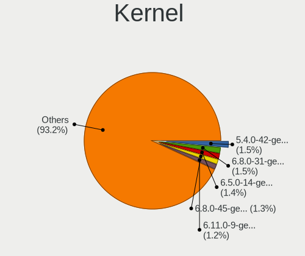
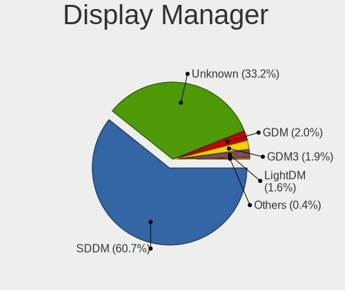
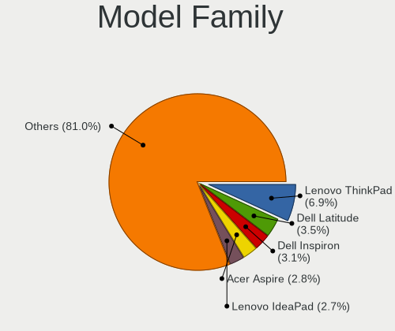
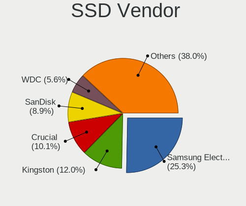
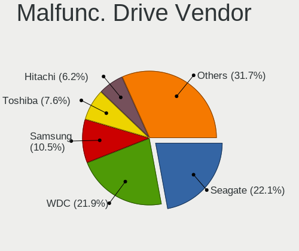
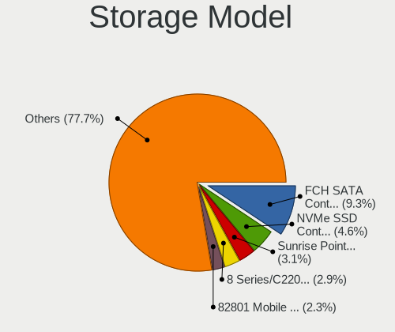
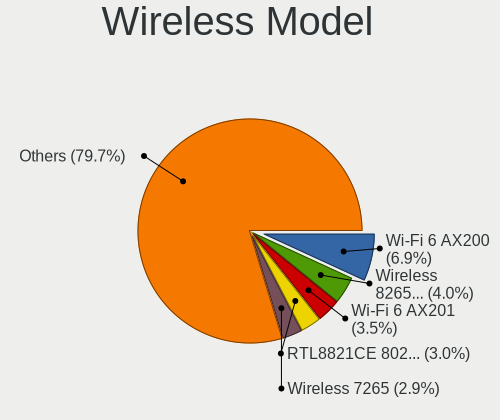
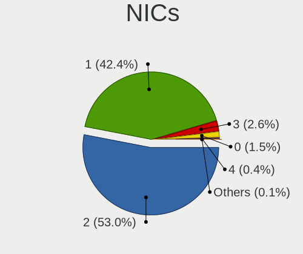

Kubuntu - Tested Hardware & Statistics
--------------------------------------

A project to collect tested hardware configurations for Kubuntu.

Anyone can contribute to this report by the [hw-probe](https://github.com/linuxhw/hw-probe) tool:

    sudo -E hw-probe -all -upload

Please contribute! Especially if your hardware is rare.

This is a report for all computer types. See also reports for [desktops](/Dist/Kubuntu/Desktop/README.md) and [notebooks](/Dist/Kubuntu/Notebook/README.md).

Contents
--------

* [ Test Cases ](#test-cases)

* [ System ](#system)
  - [ OS                       ](#os)
  - [ OS Family                ](#os-family)
  - [ Kernel                   ](#kernel)
  - [ Kernel Family            ](#kernel-family)
  - [ Kernel Major Ver.        ](#kernel-major-ver)
  - [ Arch                     ](#arch)
  - [ DE                       ](#de)
  - [ Display Server           ](#display-server)
  - [ Display Manager          ](#display-manager)
  - [ OS Lang                  ](#os-lang)
  - [ Boot Mode                ](#boot-mode)
  - [ Filesystem               ](#filesystem)
  - [ Part. scheme             ](#part-scheme)
  - [ Dual Boot with Linux/BSD ](#dual-boot-with-linuxbsd)
  - [ Dual Boot (Win)          ](#dual-boot-win)

* [ Board ](#board)
  - [ Vendor                   ](#vendor)
  - [ Model                    ](#model)
  - [ Model Family             ](#model-family)
  - [ MFG Year                 ](#mfg-year)
  - [ Form Factor              ](#form-factor)
  - [ Secure Boot              ](#secure-boot)
  - [ Coreboot                 ](#coreboot)
  - [ RAM Size                 ](#ram-size)
  - [ RAM Used                 ](#ram-used)
  - [ Total Drives             ](#total-drives)
  - [ Has CD-ROM               ](#has-cd-rom)
  - [ Has Ethernet             ](#has-ethernet)
  - [ Has WiFi                 ](#has-wifi)
  - [ Has Bluetooth            ](#has-bluetooth)

* [ Location ](#location)
  - [ Country                  ](#country)
  - [ City                     ](#city)

* [ Drives ](#drives)
  - [ Drive Vendor             ](#drive-vendor)
  - [ Drive Model              ](#drive-model)
  - [ HDD Vendor               ](#hdd-vendor)
  - [ SSD Vendor               ](#ssd-vendor)
  - [ Drive Kind               ](#drive-kind)
  - [ Drive Connector          ](#drive-connector)
  - [ Drive Size               ](#drive-size)
  - [ Space Total              ](#space-total)
  - [ Space Used               ](#space-used)
  - [ Malfunc. Drives          ](#malfunc-drives)
  - [ Malfunc. Drive Vendor    ](#malfunc-drive-vendor)
  - [ Malfunc. HDD Vendor      ](#malfunc-hdd-vendor)
  - [ Malfunc. Drive Kind      ](#malfunc-drive-kind)
  - [ Failed Drives            ](#failed-drives)
  - [ Failed Drive Vendor      ](#failed-drive-vendor)
  - [ Drive Status             ](#drive-status)

* [ Storage controller ](#storage-controller)
  - [ Storage Vendor           ](#storage-vendor)
  - [ Storage Model            ](#storage-model)
  - [ Storage Kind             ](#storage-kind)

* [ Processor ](#processor)
  - [ CPU Vendor               ](#cpu-vendor)
  - [ CPU Model                ](#cpu-model)
  - [ CPU Model Family         ](#cpu-model-family)
  - [ CPU Cores                ](#cpu-cores)
  - [ CPU Sockets              ](#cpu-sockets)
  - [ CPU Threads              ](#cpu-threads)
  - [ CPU Op-Modes             ](#cpu-op-modes)
  - [ CPU Microcode            ](#cpu-microcode)
  - [ CPU Microarch            ](#cpu-microarch)

* [ Graphics ](#graphics)
  - [ GPU Vendor               ](#gpu-vendor)
  - [ GPU Model                ](#gpu-model)
  - [ GPU Combo                ](#gpu-combo)
  - [ GPU Driver               ](#gpu-driver)
  - [ GPU Memory               ](#gpu-memory)

* [ Monitor ](#monitor)
  - [ Monitor Vendor           ](#monitor-vendor)
  - [ Monitor Model            ](#monitor-model)
  - [ Monitor Resolution       ](#monitor-resolution)
  - [ Monitor Diagonal         ](#monitor-diagonal)
  - [ Monitor Width            ](#monitor-width)
  - [ Aspect Ratio             ](#aspect-ratio)
  - [ Monitor Area             ](#monitor-area)
  - [ Pixel Density            ](#pixel-density)
  - [ Multiple Monitors        ](#multiple-monitors)

* [ Network ](#network)
  - [ Net Controller Vendor    ](#net-controller-vendor)
  - [ Net Controller Model     ](#net-controller-model)
  - [ Wireless Vendor          ](#wireless-vendor)
  - [ Wireless Model           ](#wireless-model)
  - [ Ethernet Vendor          ](#ethernet-vendor)
  - [ Ethernet Model           ](#ethernet-model)
  - [ Net Controller Kind      ](#net-controller-kind)
  - [ Used Controller          ](#used-controller)
  - [ NICs                     ](#nics)
  - [ IPv6                     ](#ipv6)

* [ Bluetooth ](#bluetooth)
  - [ Bluetooth Vendor         ](#bluetooth-vendor)
  - [ Bluetooth Model          ](#bluetooth-model)

* [ Sound ](#sound)
  - [ Sound Vendor             ](#sound-vendor)
  - [ Sound Model              ](#sound-model)

* [ Memory ](#memory)
  - [ Memory Vendor            ](#memory-vendor)
  - [ Memory Model             ](#memory-model)
  - [ Memory Kind              ](#memory-kind)
  - [ Memory Form Factor       ](#memory-form-factor)
  - [ Memory Size              ](#memory-size)
  - [ Memory Speed             ](#memory-speed)

* [ Printers & scanners ](#printers--scanners)
  - [ Printer Vendor           ](#printer-vendor)
  - [ Printer Model            ](#printer-model)
  - [ Scanner Vendor           ](#scanner-vendor)
  - [ Scanner Model            ](#scanner-model)

* [ Camera ](#camera)
  - [ Camera Vendor            ](#camera-vendor)
  - [ Camera Model             ](#camera-model)

* [ Security ](#security)
  - [ Fingerprint Vendor       ](#fingerprint-vendor)
  - [ Fingerprint Model        ](#fingerprint-model)
  - [ Chipcard Vendor          ](#chipcard-vendor)
  - [ Chipcard Model           ](#chipcard-model)

* [ Unsupported ](#unsupported)
  - [ Unsupported Devices      ](#unsupported-devices)
  - [ Unsupported Device Types ](#unsupported-device-types)

Test Cases
----------

Total: 3796

| Vendor        | Model                       | Form-Factor | Probe                                                      | Date         |
|---------------|-----------------------------|-------------|------------------------------------------------------------|--------------|
| ASUSTek       | X540SA                      | Notebook    | [6adb003f2e](https://linux-hardware.org/?probe=6adb003f2e) | Aug 01, 2022 |
| ASUSTek       | X540SA                      | Notebook    | [4dbed1e983](https://linux-hardware.org/?probe=4dbed1e983) | Aug 01, 2022 |
| VIT           | P2402                       | Notebook    | [fd1ab8ad90](https://linux-hardware.org/?probe=fd1ab8ad90) | Aug 01, 2022 |
| Gigabyte      | G1.SNIPER B7-CF             | Desktop     | [83e4b444ae](https://linux-hardware.org/?probe=83e4b444ae) | Aug 01, 2022 |
| Gigabyte      | G1.SNIPER B7-CF             | Desktop     | [4e335cb7ce](https://linux-hardware.org/?probe=4e335cb7ce) | Aug 01, 2022 |
| Intel         | Unknown                     | Notebook    | [9fce3597b9](https://linux-hardware.org/?probe=9fce3597b9) | Aug 01, 2022 |
| HP            | ProBook 6570b               | Notebook    | [b99b5ef83f](https://linux-hardware.org/?probe=b99b5ef83f) | Aug 01, 2022 |
| HP            | ProBook 6570b               | Notebook    | [105d26b09c](https://linux-hardware.org/?probe=105d26b09c) | Aug 01, 2022 |
| HP            | ProBook 6570b               | Notebook    | [3898ce2b5f](https://linux-hardware.org/?probe=3898ce2b5f) | Aug 01, 2022 |
| ASUSTek       | ROG Flow X13 GV301QH_GV3... | Notebook    | [09c15c1ed8](https://linux-hardware.org/?probe=09c15c1ed8) | Jul 31, 2022 |
| HP            | EliteBook 840 G6            | Notebook    | [1a2713a2b0](https://linux-hardware.org/?probe=1a2713a2b0) | Jul 31, 2022 |
| Lenovo        | Legion Y540-17IRH 81Q4      | Notebook    | [5dcf2bfdbd](https://linux-hardware.org/?probe=5dcf2bfdbd) | Jul 30, 2022 |
| Lenovo        | 1051L 60073                 | Tablet      | [4ae44495ba](https://linux-hardware.org/?probe=4ae44495ba) | Jul 30, 2022 |
| Dell          | 0F8098                      | Desktop     | [4e6058685a](https://linux-hardware.org/?probe=4e6058685a) | Jul 30, 2022 |
| ASUSTek       | P8H67                       | Desktop     | [b1b842e547](https://linux-hardware.org/?probe=b1b842e547) | Jul 29, 2022 |
| HP            | 158A                        | Desktop     | [788844c3df](https://linux-hardware.org/?probe=788844c3df) | Jul 29, 2022 |
| ASUSTek       | Z87M-PLUS                   | Desktop     | [1b47c32e5d](https://linux-hardware.org/?probe=1b47c32e5d) | Jul 29, 2022 |
| HP            | 8754                        | Mini pc     | [1b0ae59d1f](https://linux-hardware.org/?probe=1b0ae59d1f) | Jul 28, 2022 |
| Gigabyte      | Z77-D3H                     | Desktop     | [2d3706b78b](https://linux-hardware.org/?probe=2d3706b78b) | Jul 28, 2022 |
| HP            | 8459                        | Desktop     | [a1d6ae45cb](https://linux-hardware.org/?probe=a1d6ae45cb) | Jul 28, 2022 |
| ASUSTek       | GRYPHON Z87                 | Desktop     | [73b9d340d2](https://linux-hardware.org/?probe=73b9d340d2) | Jul 28, 2022 |
| Dell          | Latitude 5590               | Notebook    | [7fa93449bd](https://linux-hardware.org/?probe=7fa93449bd) | Jul 28, 2022 |
| Dell          | Inspiron 7791 2n1           | Convertible | [8b027b07d9](https://linux-hardware.org/?probe=8b027b07d9) | Jul 27, 2022 |
| Lenovo        | 1051L 60073                 | Tablet      | [2b505d28f7](https://linux-hardware.org/?probe=2b505d28f7) | Jul 27, 2022 |
| Lenovo        | 1051L 60073                 | Tablet      | [51bf4e60d3](https://linux-hardware.org/?probe=51bf4e60d3) | Jul 27, 2022 |
| Lenovo        | ThinkPad T450 20BV0001US    | Notebook    | [9c0b784d1d](https://linux-hardware.org/?probe=9c0b784d1d) | Jul 27, 2022 |
| Lenovo        | ThinkPad E14 Gen 2 20TA0... | Notebook    | [5ed19c54a9](https://linux-hardware.org/?probe=5ed19c54a9) | Jul 27, 2022 |
| HP            | 86E9 A                      | Desktop     | [6634eaee32](https://linux-hardware.org/?probe=6634eaee32) | Jul 27, 2022 |
| Dell          | Inspiron 15-3567            | Notebook    | [3e40b1abe6](https://linux-hardware.org/?probe=3e40b1abe6) | Jul 27, 2022 |
| Dell          | G5 5590                     | Notebook    | [20f75f2334](https://linux-hardware.org/?probe=20f75f2334) | Jul 27, 2022 |
| ASUSTek       | PRIME X370-PRO              | Desktop     | [ee8688ecdb](https://linux-hardware.org/?probe=ee8688ecdb) | Jul 26, 2022 |
| Unknown       | Unknown                     | Notebook    | [03fa847263](https://linux-hardware.org/?probe=03fa847263) | Jul 26, 2022 |
| Lenovo        | G570 20079                  | Notebook    | [50bab54f21](https://linux-hardware.org/?probe=50bab54f21) | Jul 26, 2022 |
| HP            | Laptop 15-da0xxx            | Notebook    | [6967eac391](https://linux-hardware.org/?probe=6967eac391) | Jul 26, 2022 |
| ASRock        | Z270 Gaming K4              | Desktop     | [63612e20b4](https://linux-hardware.org/?probe=63612e20b4) | Jul 26, 2022 |
| Lenovo        | G50-45 80E3                 | Notebook    | [df38a7a1ff](https://linux-hardware.org/?probe=df38a7a1ff) | Jul 25, 2022 |
| ASRock        | 990FX Extreme3              | Desktop     | [158c8d142b](https://linux-hardware.org/?probe=158c8d142b) | Jul 24, 2022 |
| Lenovo        | IdeaPad 5 15ALC05 82LN      | Notebook    | [2c515ee09a](https://linux-hardware.org/?probe=2c515ee09a) | Jul 24, 2022 |
| Lenovo        | IdeaPad 5 15ALC05 82LN      | Notebook    | [e24e72037a](https://linux-hardware.org/?probe=e24e72037a) | Jul 24, 2022 |
| Acer          | Aspire E5-575G              | Notebook    | [d404840b57](https://linux-hardware.org/?probe=d404840b57) | Jul 24, 2022 |
| ASUSTek       | PRIME B350-PLUS             | Desktop     | [5658129aa4](https://linux-hardware.org/?probe=5658129aa4) | Jul 24, 2022 |
| HP            | EliteBook 8470p             | Notebook    | [ec23b6375e](https://linux-hardware.org/?probe=ec23b6375e) | Jul 24, 2022 |
| Fujitsu       | D3500-A1 S26361-D3500-A1    | Desktop     | [ba1841221c](https://linux-hardware.org/?probe=ba1841221c) | Jul 24, 2022 |
| MSI           | MPG X570 GAMING PLUS        | Desktop     | [021e469888](https://linux-hardware.org/?probe=021e469888) | Jul 23, 2022 |
| MSI           | MPG X570 GAMING PLUS        | Desktop     | [ea90d78c53](https://linux-hardware.org/?probe=ea90d78c53) | Jul 23, 2022 |
| ASUSTek       | TUF Gaming Z590-PLUS WIF... | Desktop     | [6e6e65c711](https://linux-hardware.org/?probe=6e6e65c711) | Jul 23, 2022 |
| Gigabyte      | X399 AORUS XTREME-CF        | Desktop     | [88530d3d60](https://linux-hardware.org/?probe=88530d3d60) | Jul 23, 2022 |
| Gigabyte      | X399 AORUS XTREME-CF        | Desktop     | [24bc799d14](https://linux-hardware.org/?probe=24bc799d14) | Jul 23, 2022 |
| Gigabyte      | P35-DS3L                    | Desktop     | [4ae76fafc9](https://linux-hardware.org/?probe=4ae76fafc9) | Jul 22, 2022 |
| Shuttle       | NC01U V1.0                  | Desktop     | [827d6c81ae](https://linux-hardware.org/?probe=827d6c81ae) | Jul 22, 2022 |
| Lenovo        | Legion 5 Pro 16ACH6H 82J... | Notebook    | [e71169659f](https://linux-hardware.org/?probe=e71169659f) | Jul 22, 2022 |
| Shuttle       | NC01U V1.0                  | Desktop     | [1177e7dbe0](https://linux-hardware.org/?probe=1177e7dbe0) | Jul 21, 2022 |
| HP            | G62                         | Notebook    | [418c1c572e](https://linux-hardware.org/?probe=418c1c572e) | Jul 21, 2022 |
| Lenovo        | ThinkBook 16p Gen 2 20YM    | Notebook    | [447161e791](https://linux-hardware.org/?probe=447161e791) | Jul 21, 2022 |
| Shuttle       | NC01U V1.0                  | Desktop     | [fecfaf6008](https://linux-hardware.org/?probe=fecfaf6008) | Jul 21, 2022 |
| Gigabyte      | 970A-DS3P                   | Desktop     | [379da1a196](https://linux-hardware.org/?probe=379da1a196) | Jul 21, 2022 |
| HP            | 8054                        | Desktop     | [466d7f5591](https://linux-hardware.org/?probe=466d7f5591) | Jul 21, 2022 |
| HP            | 18E9                        | Desktop     | [f15b2671b0](https://linux-hardware.org/?probe=f15b2671b0) | Jul 21, 2022 |
| Lenovo        | ThinkPad E570 20H5006TFR    | Notebook    | [1a1220dc79](https://linux-hardware.org/?probe=1a1220dc79) | Jul 21, 2022 |
| ASRock        | B550 Extreme4               | Desktop     | [226924706f](https://linux-hardware.org/?probe=226924706f) | Jul 20, 2022 |
| ASUSTek       | TUF Gaming Z690-PLUS        | Desktop     | [468283ab86](https://linux-hardware.org/?probe=468283ab86) | Jul 20, 2022 |
| Gigabyte      | P35-DS3L                    | Desktop     | [cabd591648](https://linux-hardware.org/?probe=cabd591648) | Jul 20, 2022 |
| Gigabyte      | Z390 GAMING X-CF            | Desktop     | [0e3950303c](https://linux-hardware.org/?probe=0e3950303c) | Jul 18, 2022 |
| ASUSTek       | ROG Zephyrus G14 GA402RK... | Notebook    | [23f16d1cac](https://linux-hardware.org/?probe=23f16d1cac) | Jul 18, 2022 |
| ASRock        | Z170 Extreme4               | Desktop     | [4f4b63a026](https://linux-hardware.org/?probe=4f4b63a026) | Jul 18, 2022 |
| Acer          | Predator PO3-620            | Desktop     | [f3e22c0e6d](https://linux-hardware.org/?probe=f3e22c0e6d) | Jul 18, 2022 |
| ASUSTek       | ROG Zephyrus G14 GA402RK... | Notebook    | [d83a4d5121](https://linux-hardware.org/?probe=d83a4d5121) | Jul 18, 2022 |
| HONOR         | HYM-WXX                     | Notebook    | [654a2a5950](https://linux-hardware.org/?probe=654a2a5950) | Jul 17, 2022 |
| ASUSTek       | K53U                        | Notebook    | [20120e258a](https://linux-hardware.org/?probe=20120e258a) | Jul 16, 2022 |
| Lenovo        | Yoga C640-13IML 81UE        | Convertible | [f6670624ed](https://linux-hardware.org/?probe=f6670624ed) | Jul 16, 2022 |
| Standard      | Unknown                     | Notebook    | [3b4805163d](https://linux-hardware.org/?probe=3b4805163d) | Jul 15, 2022 |
| HP            | 1790                        | Desktop     | [ff91b0d921](https://linux-hardware.org/?probe=ff91b0d921) | Jul 15, 2022 |
| Gigabyte      | X570 AORUS MASTER           | Desktop     | [01d595926f](https://linux-hardware.org/?probe=01d595926f) | Jul 15, 2022 |
| HP            | EliteBook x360 1030 G2      | Convertible | [789f614370](https://linux-hardware.org/?probe=789f614370) | Jul 14, 2022 |
| HP            | Laptop 15s-eq1xxx           | Notebook    | [57ef4db755](https://linux-hardware.org/?probe=57ef4db755) | Jul 14, 2022 |
| HP            | Laptop 17-cn0xxx            | Notebook    | [02a5205d57](https://linux-hardware.org/?probe=02a5205d57) | Jul 14, 2022 |
| Schenker      | XMG APEX (Mid 2021)         | Notebook    | [41136553b2](https://linux-hardware.org/?probe=41136553b2) | Jul 13, 2022 |
| MSI           | X99A XPOWER GAMING TITAN... | Desktop     | [e764729eeb](https://linux-hardware.org/?probe=e764729eeb) | Jul 13, 2022 |
| Lenovo        | YB1-X91L                    | Convertible | [3ea67a64cb](https://linux-hardware.org/?probe=3ea67a64cb) | Jul 13, 2022 |
| ASRock        | Z170 Extreme4               | Desktop     | [7ecf3ad1b7](https://linux-hardware.org/?probe=7ecf3ad1b7) | Jul 13, 2022 |
| ASRock        | B550 Extreme4               | Desktop     | [6106db3d9a](https://linux-hardware.org/?probe=6106db3d9a) | Jul 12, 2022 |
| MSI           | MPG X570S EDGE MAX WIFI     | Desktop     | [fafb6deae6](https://linux-hardware.org/?probe=fafb6deae6) | Jul 12, 2022 |
| ASRock        | J4105M                      | Desktop     | [509b122b9b](https://linux-hardware.org/?probe=509b122b9b) | Jul 12, 2022 |
| TUXEDO        | Stellaris AMD Gen3 (CZN)    | Notebook    | [33bea96de9](https://linux-hardware.org/?probe=33bea96de9) | Jul 12, 2022 |
| Lenovo        | ThinkPad X1 Nano Gen 1 2... | Notebook    | [21ef2a8d9a](https://linux-hardware.org/?probe=21ef2a8d9a) | Jul 12, 2022 |
| Lenovo        | ThinkPad E14 Gen 3 20Y70... | Notebook    | [1bbf224b5c](https://linux-hardware.org/?probe=1bbf224b5c) | Jul 11, 2022 |
| Dell          | Latitude E5520              | Notebook    | [e04cdad7b7](https://linux-hardware.org/?probe=e04cdad7b7) | Jul 11, 2022 |
| ASUSTek       | ROG Maximus Z690 EXTREME    | Desktop     | [d6531258d0](https://linux-hardware.org/?probe=d6531258d0) | Jul 11, 2022 |
| Gigabyte      | A320M-S2H-CF                | Desktop     | [0967e17760](https://linux-hardware.org/?probe=0967e17760) | Jul 11, 2022 |
| HP            | EliteBook 840 G5            | Notebook    | [392310b916](https://linux-hardware.org/?probe=392310b916) | Jul 11, 2022 |
| System76      | Lemur Ultra                 | Notebook    | [10e8deaf3b](https://linux-hardware.org/?probe=10e8deaf3b) | Jul 11, 2022 |
| ASRock        | B550 Taichi                 | Desktop     | [61fe809791](https://linux-hardware.org/?probe=61fe809791) | Jul 10, 2022 |
| Gigabyte      | Z77-D3H                     | Desktop     | [f9e15346d3](https://linux-hardware.org/?probe=f9e15346d3) | Jul 10, 2022 |
| Lenovo        | IdeaPad Y430 2781           | Notebook    | [b8960364cb](https://linux-hardware.org/?probe=b8960364cb) | Jul 10, 2022 |
| Toshiba       | TECRA S11                   | Notebook    | [c33fa181ba](https://linux-hardware.org/?probe=c33fa181ba) | Jul 08, 2022 |
| Lenovo        | ThinkPad X200 7458FDG       | Notebook    | [435e7998bd](https://linux-hardware.org/?probe=435e7998bd) | Jul 08, 2022 |
| ASUSTek       | P9X79 PRO                   | Desktop     | [d7e1136386](https://linux-hardware.org/?probe=d7e1136386) | Jul 07, 2022 |
| Lenovo        | IdeaPad 5 15ARE05 81YQ      | Notebook    | [6b007e333a](https://linux-hardware.org/?probe=6b007e333a) | Jul 06, 2022 |
| Lenovo        | IdeaPad 5 15ARE05 81YQ      | Notebook    | [f09a1deecc](https://linux-hardware.org/?probe=f09a1deecc) | Jul 06, 2022 |
| HP            | EliteBook 850 G8 Noteboo... | Notebook    | [445bedc2c9](https://linux-hardware.org/?probe=445bedc2c9) | Jul 06, 2022 |
| HP            | G42                         | Notebook    | [4a57fd54c6](https://linux-hardware.org/?probe=4a57fd54c6) | Jul 06, 2022 |
| HUAWEI        | CREM-WXX9                   | Notebook    | [e7e175955d](https://linux-hardware.org/?probe=e7e175955d) | Jul 05, 2022 |
| Chuwi         | CoreBook X                  | Notebook    | [a23d0fe53d](https://linux-hardware.org/?probe=a23d0fe53d) | Jul 04, 2022 |
| Sony          | VPCSA3M9E                   | Notebook    | [b36435a1fd](https://linux-hardware.org/?probe=b36435a1fd) | Jul 03, 2022 |
| Lenovo        | G50-45 80E3                 | Notebook    | [2240dc8dde](https://linux-hardware.org/?probe=2240dc8dde) | Jul 03, 2022 |
| Chuwi         | CoreBook X                  | Notebook    | [a8d8dfc814](https://linux-hardware.org/?probe=a8d8dfc814) | Jul 03, 2022 |
| Lenovo        | G50-45 80E3                 | Notebook    | [0dfbfe1182](https://linux-hardware.org/?probe=0dfbfe1182) | Jul 03, 2022 |
| MSI           | MPG X570S EDGE MAX WIFI     | Desktop     | [7d5d5c1a7e](https://linux-hardware.org/?probe=7d5d5c1a7e) | Jul 02, 2022 |
| HP            | 620                         | Notebook    | [cc970fdd77](https://linux-hardware.org/?probe=cc970fdd77) | Jul 02, 2022 |
| Lenovo        | ThinkPad T420 4180M8P       | Notebook    | [8a94c5bc15](https://linux-hardware.org/?probe=8a94c5bc15) | Jul 02, 2022 |
| Dell          | Latitude 7530               | Notebook    | [a66aca8921](https://linux-hardware.org/?probe=a66aca8921) | Jul 01, 2022 |
| HP            | 8459                        | Desktop     | [f43fdff127](https://linux-hardware.org/?probe=f43fdff127) | Jul 01, 2022 |
| Dell          | 06NWYK A01                  | Desktop     | [91408af847](https://linux-hardware.org/?probe=91408af847) | Jul 01, 2022 |
| ASUSTek       | ET2400A                     | Desktop     | [8801791f80](https://linux-hardware.org/?probe=8801791f80) | Jul 01, 2022 |
| HP            | EliteBook 840 G1            | Notebook    | [b691598870](https://linux-hardware.org/?probe=b691598870) | Jul 01, 2022 |
| HONOR         | BOHK-WAX9X                  | Notebook    | [1647402099](https://linux-hardware.org/?probe=1647402099) | Jun 30, 2022 |
| Lenovo        | ThinkPad P15 Gen 1 20SUS... | Notebook    | [4b04ded505](https://linux-hardware.org/?probe=4b04ded505) | Jun 30, 2022 |
| ASUSTek       | TUF Gaming B560M-PLUS WI... | Desktop     | [32e2995911](https://linux-hardware.org/?probe=32e2995911) | Jun 30, 2022 |
| Gigabyte      | GA-78LMT-USB3 SEx           | Desktop     | [530c44caa8](https://linux-hardware.org/?probe=530c44caa8) | Jun 30, 2022 |
| Jumper        | EZpad                       | Notebook    | [5d5f3980e1](https://linux-hardware.org/?probe=5d5f3980e1) | Jun 30, 2022 |
| Jumper        | EZpad                       | Notebook    | [66b40738ff](https://linux-hardware.org/?probe=66b40738ff) | Jun 30, 2022 |
| Dell          | Latitude 3420               | Notebook    | [5fef19c107](https://linux-hardware.org/?probe=5fef19c107) | Jun 29, 2022 |
| Jumper        | EZpad                       | Notebook    | [3ea5b3080d](https://linux-hardware.org/?probe=3ea5b3080d) | Jun 29, 2022 |
| HP            | Pavilion Gaming Laptop 1... | Notebook    | [6dc02ab574](https://linux-hardware.org/?probe=6dc02ab574) | Jun 29, 2022 |
| HP            | EliteBook 840 G6            | Notebook    | [faaa7b9c81](https://linux-hardware.org/?probe=faaa7b9c81) | Jun 29, 2022 |
| Gigabyte      | Z490 AORUS ELITE AC         | Desktop     | [86a93d8ea0](https://linux-hardware.org/?probe=86a93d8ea0) | Jun 29, 2022 |
| ASUSTek       | ROG ZENITH EXTREME          | Desktop     | [33c8a42a4d](https://linux-hardware.org/?probe=33c8a42a4d) | Jun 29, 2022 |
| Gigabyte      | X570 AORUS PRO              | Desktop     | [757741fe0d](https://linux-hardware.org/?probe=757741fe0d) | Jun 29, 2022 |
| HP            | Stream Laptop 11-ak0xxx     | Notebook    | [d2f3d5aefd](https://linux-hardware.org/?probe=d2f3d5aefd) | Jun 28, 2022 |
| ASUSTek       | ROG Zephyrus G14 GA402RK... | Notebook    | [0c1cbe6fd7](https://linux-hardware.org/?probe=0c1cbe6fd7) | Jun 28, 2022 |
| ASUSTek       | ROG ZENITH EXTREME          | Desktop     | [efb8cff806](https://linux-hardware.org/?probe=efb8cff806) | Jun 28, 2022 |
| Haier         | A1420EM                     | Notebook    | [3690a94424](https://linux-hardware.org/?probe=3690a94424) | Jun 28, 2022 |
| GPU Compan... | GWTC116-2                   | Notebook    | [183f3e59fb](https://linux-hardware.org/?probe=183f3e59fb) | Jun 28, 2022 |
| HP            | Stream Laptop 11-ak0xxx     | Notebook    | [f39c4bd8a0](https://linux-hardware.org/?probe=f39c4bd8a0) | Jun 27, 2022 |
| Gigabyte      | Z490 AORUS ELITE AC         | Desktop     | [fd93206df4](https://linux-hardware.org/?probe=fd93206df4) | Jun 27, 2022 |
| MSI           | MAG X570S TOMAHAWK MAX W... | Desktop     | [a6555d107c](https://linux-hardware.org/?probe=a6555d107c) | Jun 27, 2022 |
| Intel         | X99                         | Desktop     | [4322217bc5](https://linux-hardware.org/?probe=4322217bc5) | Jun 26, 2022 |
| HP            | 15                          | Notebook    | [3d3ad576a2](https://linux-hardware.org/?probe=3d3ad576a2) | Jun 26, 2022 |
| ASUSTek       | K46CB                       | Notebook    | [3af9df185f](https://linux-hardware.org/?probe=3af9df185f) | Jun 26, 2022 |
| ASRock        | A320M Pro4                  | Desktop     | [e1918d8aab](https://linux-hardware.org/?probe=e1918d8aab) | Jun 25, 2022 |
| Medion        | E3216 MD60900               | Convertible | [2890f2581b](https://linux-hardware.org/?probe=2890f2581b) | Jun 25, 2022 |
| Lenovo        | ThinkBook 14-IML 20RV       | Notebook    | [6afa74e5b6](https://linux-hardware.org/?probe=6afa74e5b6) | Jun 25, 2022 |
| Huanan        | X99-F8 GAMING V5.0          | Desktop     | [2688876fc9](https://linux-hardware.org/?probe=2688876fc9) | Jun 25, 2022 |
| ASUSTek       | TUF Gaming X570-PLUS        | Desktop     | [554ba1726f](https://linux-hardware.org/?probe=554ba1726f) | Jun 24, 2022 |
| ASUSTek       | TUF Gaming X570-PLUS        | Desktop     | [3dffa312da](https://linux-hardware.org/?probe=3dffa312da) | Jun 24, 2022 |
| Acer          | Nitro AN515-57              | Notebook    | [10d0c2a6ea](https://linux-hardware.org/?probe=10d0c2a6ea) | Jun 24, 2022 |
| ASRock        | A320M Pro4                  | Desktop     | [f4f2e68e79](https://linux-hardware.org/?probe=f4f2e68e79) | Jun 24, 2022 |
| MSI           | MPG X570 GAMING PLUS        | Desktop     | [ece1eb60ef](https://linux-hardware.org/?probe=ece1eb60ef) | Jun 24, 2022 |
| Dell          | Latitude XT3                | Notebook    | [87377f03e2](https://linux-hardware.org/?probe=87377f03e2) | Jun 24, 2022 |
| ASUSTek       | ZenBook UX325EA_UX325EA     | Notebook    | [0647ff3774](https://linux-hardware.org/?probe=0647ff3774) | Jun 24, 2022 |
| Apple         | Mac-F60DEB81FF30ACF6 Mac... | Desktop     | [04e6f0ee4a](https://linux-hardware.org/?probe=04e6f0ee4a) | Jun 24, 2022 |
| HP            | EliteBook 820 G1            | Notebook    | [ff4b7698ed](https://linux-hardware.org/?probe=ff4b7698ed) | Jun 23, 2022 |
| ABIT          | IP35 Pro                    | Desktop     | [a5f262c233](https://linux-hardware.org/?probe=a5f262c233) | Jun 23, 2022 |
| Dell          | Latitude 5590               | Notebook    | [aa45d97e0b](https://linux-hardware.org/?probe=aa45d97e0b) | Jun 23, 2022 |
| Dell          | Latitude 5590               | Notebook    | [3745dfcae3](https://linux-hardware.org/?probe=3745dfcae3) | Jun 23, 2022 |
| Apple         | Mac-F221BEC8                | Desktop     | [ba64ef130a](https://linux-hardware.org/?probe=ba64ef130a) | Jun 23, 2022 |
| Clevo         | Modified by dsanke          | Notebook    | [b88e7a22fe](https://linux-hardware.org/?probe=b88e7a22fe) | Jun 22, 2022 |
| Lenovo        | V130-15IGM 81HL             | Notebook    | [62f47da7d2](https://linux-hardware.org/?probe=62f47da7d2) | Jun 22, 2022 |
| Dell          | Precision 5540              | Notebook    | [d4a5611433](https://linux-hardware.org/?probe=d4a5611433) | Jun 22, 2022 |
| Gigabyte      | A320M-S2H V2-CF             | Desktop     | [2727a44bcd](https://linux-hardware.org/?probe=2727a44bcd) | Jun 22, 2022 |
| ASUSTek       | GR8                         | Notebook    | [90afe7bdd7](https://linux-hardware.org/?probe=90afe7bdd7) | Jun 20, 2022 |
| Apple         | MacBookPro15,2              | Notebook    | [c931d0e7bf](https://linux-hardware.org/?probe=c931d0e7bf) | Jun 20, 2022 |
| Medion        | AXIR                        | All in one  | [c3acbcaea0](https://linux-hardware.org/?probe=c3acbcaea0) | Jun 20, 2022 |
| Dell          | XPS 17 9720                 | Notebook    | [2a36b8d90d](https://linux-hardware.org/?probe=2a36b8d90d) | Jun 20, 2022 |
| ASUSTek       | P8P67 LE                    | Desktop     | [8e1bc37281](https://linux-hardware.org/?probe=8e1bc37281) | Jun 19, 2022 |
| Toshiba       | Satellite L655              | Notebook    | [2e67542246](https://linux-hardware.org/?probe=2e67542246) | Jun 19, 2022 |
| Packard Be... | H17HV                       | Notebook    | [daa945363e](https://linux-hardware.org/?probe=daa945363e) | Jun 19, 2022 |
| ASUSTek       | X550JF                      | Notebook    | [be77e811e2](https://linux-hardware.org/?probe=be77e811e2) | Jun 18, 2022 |
| TUXEDO        | InfinityBook S 15 Gen6      | Notebook    | [1dbf6320bc](https://linux-hardware.org/?probe=1dbf6320bc) | Jun 18, 2022 |
| SLIMBOOK      | PROX15-AMD                  | Notebook    | [e281d05a2a](https://linux-hardware.org/?probe=e281d05a2a) | Jun 18, 2022 |
| ASRock        | X570M Pro4                  | Desktop     | [bbb784f2df](https://linux-hardware.org/?probe=bbb784f2df) | Jun 18, 2022 |
| Dell          | 0YNVJG A01                  | Desktop     | [b75bebfda2](https://linux-hardware.org/?probe=b75bebfda2) | Jun 18, 2022 |
| HP            | 0A60h                       | Desktop     | [cb42238223](https://linux-hardware.org/?probe=cb42238223) | Jun 17, 2022 |
| ASRock        | B85M DASH/OL R2.0           | Desktop     | [c5763f8865](https://linux-hardware.org/?probe=c5763f8865) | Jun 17, 2022 |
| Apple         | MacBookPro5,3               | Notebook    | [aace637cfc](https://linux-hardware.org/?probe=aace637cfc) | Jun 17, 2022 |
| Samsung       | RV411/RV511/E3511/S3511/... | Notebook    | [bf18000c3c](https://linux-hardware.org/?probe=bf18000c3c) | Jun 17, 2022 |
| MSI           | Raider GE66 12UGS           | Notebook    | [d69dc59622](https://linux-hardware.org/?probe=d69dc59622) | Jun 16, 2022 |
| Jumper        | EZpad                       | Notebook    | [b1a0e53c08](https://linux-hardware.org/?probe=b1a0e53c08) | Jun 16, 2022 |
| ASUSTek       | X99-A/USB                   | Desktop     | [3ad17f6d78](https://linux-hardware.org/?probe=3ad17f6d78) | Jun 16, 2022 |
| ASUSTek       | P5QC                        | Desktop     | [b9a53514e1](https://linux-hardware.org/?probe=b9a53514e1) | Jun 16, 2022 |
| Apple         | MacBookPro5,3               | Notebook    | [06bef31587](https://linux-hardware.org/?probe=06bef31587) | Jun 16, 2022 |
| MSI           | Z270 GAMING M5              | Desktop     | [d5f742022e](https://linux-hardware.org/?probe=d5f742022e) | Jun 16, 2022 |
| MSI           | Z270 GAMING M5              | Desktop     | [6c352cf792](https://linux-hardware.org/?probe=6c352cf792) | Jun 16, 2022 |
| HP            | ENVY x360 Convertible 13... | Convertible | [7adac78ac0](https://linux-hardware.org/?probe=7adac78ac0) | Jun 15, 2022 |
| Acer          | Aspire E1-570G              | Notebook    | [060b0319ff](https://linux-hardware.org/?probe=060b0319ff) | Jun 15, 2022 |
| ASUSTek       | CROSSHAIR VI HERO           | Desktop     | [b4a87914f3](https://linux-hardware.org/?probe=b4a87914f3) | Jun 15, 2022 |
| Acer          | Spin SP313-51N              | Convertible | [91316a0904](https://linux-hardware.org/?probe=91316a0904) | Jun 15, 2022 |
| Gigabyte      | B450M DS3H-CF               | Desktop     | [2b307211cd](https://linux-hardware.org/?probe=2b307211cd) | Jun 14, 2022 |
| Dell          | XPS 15 9560                 | Notebook    | [8faa0f9e6a](https://linux-hardware.org/?probe=8faa0f9e6a) | Jun 14, 2022 |
| ASUSTek       | UX51VZ                      | Notebook    | [d58122ba72](https://linux-hardware.org/?probe=d58122ba72) | Jun 13, 2022 |
| HP            | 620                         | Notebook    | [fe1a420f17](https://linux-hardware.org/?probe=fe1a420f17) | Jun 13, 2022 |
| HP            | EliteBook 2570p             | Notebook    | [8b6f8e8952](https://linux-hardware.org/?probe=8b6f8e8952) | Jun 13, 2022 |
| Jumper        | EZpad                       | Notebook    | [3a5e6bc998](https://linux-hardware.org/?probe=3a5e6bc998) | Jun 13, 2022 |
| Dell          | Inspiron 1428               | Notebook    | [e47c98983f](https://linux-hardware.org/?probe=e47c98983f) | Jun 13, 2022 |
| HP            | EliteBook 8460p             | Notebook    | [e65bd18434](https://linux-hardware.org/?probe=e65bd18434) | Jun 12, 2022 |
| Dell          | Inspiron 3521               | Notebook    | [13a04a66d8](https://linux-hardware.org/?probe=13a04a66d8) | Jun 12, 2022 |
| Dell          | Inspiron 15-3567            | Notebook    | [013de61252](https://linux-hardware.org/?probe=013de61252) | Jun 12, 2022 |
| Dell          | 0KC9NP A01                  | Desktop     | [c573376df6](https://linux-hardware.org/?probe=c573376df6) | Jun 11, 2022 |
| HP            | Pavilion dv7                | Notebook    | [7f7678265b](https://linux-hardware.org/?probe=7f7678265b) | Jun 11, 2022 |
| HP            | Pavilion dv7                | Notebook    | [c8d1e1be32](https://linux-hardware.org/?probe=c8d1e1be32) | Jun 10, 2022 |
| Gigabyte      | Z270-HD3P-CF                | Desktop     | [317ae1383a](https://linux-hardware.org/?probe=317ae1383a) | Jun 10, 2022 |
| ASRock        | X570M Pro4                  | Desktop     | [4f6d06171b](https://linux-hardware.org/?probe=4f6d06171b) | Jun 10, 2022 |
| TUXEDO        | Pulse 15 Gen1               | Notebook    | [2c789d1a84](https://linux-hardware.org/?probe=2c789d1a84) | Jun 10, 2022 |
| HP            | 0A98h                       | Desktop     | [d3c54ab2d6](https://linux-hardware.org/?probe=d3c54ab2d6) | Jun 10, 2022 |
| HP            | ZBook Firefly 14 G7 Mobi... | Notebook    | [011acdab42](https://linux-hardware.org/?probe=011acdab42) | Jun 09, 2022 |
| HP            | ZBook Firefly 14 G7 Mobi... | Notebook    | [c751dcffff](https://linux-hardware.org/?probe=c751dcffff) | Jun 09, 2022 |
| HP            | Pavilion dv6                | Notebook    | [88a92966a3](https://linux-hardware.org/?probe=88a92966a3) | Jun 09, 2022 |
| Dell          | Latitude 5590               | Notebook    | [befc14c3db](https://linux-hardware.org/?probe=befc14c3db) | Jun 09, 2022 |
| Dell          | Latitude 5590               | Notebook    | [0c8e1f9f23](https://linux-hardware.org/?probe=0c8e1f9f23) | Jun 09, 2022 |
| MSI           | GP76 Leopard 11UH           | Notebook    | [8a3c021b8a](https://linux-hardware.org/?probe=8a3c021b8a) | Jun 08, 2022 |
| AZW           | Gemini J45                  | Desktop     | [f4d7238f95](https://linux-hardware.org/?probe=f4d7238f95) | Jun 08, 2022 |
| ASUSTek       | ROG STRIX X570-E GAMING     | Desktop     | [15f48b1e64](https://linux-hardware.org/?probe=15f48b1e64) | Jun 08, 2022 |
| System76      | Kudu Professional           | Notebook    | [4ffc6fc358](https://linux-hardware.org/?probe=4ffc6fc358) | Jun 08, 2022 |
| System76      | Kudu Professional           | Notebook    | [0c0e2ed5b2](https://linux-hardware.org/?probe=0c0e2ed5b2) | Jun 08, 2022 |
| Lenovo        | ThinkPad P15s Gen 1 20T4... | Notebook    | [54a2c4fa94](https://linux-hardware.org/?probe=54a2c4fa94) | Jun 08, 2022 |
| ASRock        | 960GM-VGS3 FX               | Desktop     | [82aa782cce](https://linux-hardware.org/?probe=82aa782cce) | Jun 08, 2022 |
| ASUSTek       | Zenbook UX3402ZA_UX3402Z... | Convertible | [3a58a9889b](https://linux-hardware.org/?probe=3a58a9889b) | Jun 08, 2022 |
| HP            | 620                         | Notebook    | [1adcb99573](https://linux-hardware.org/?probe=1adcb99573) | Jun 07, 2022 |
| Lenovo        | ThinkPad X1 Extreme 20MG... | Notebook    | [f4c82e1fb6](https://linux-hardware.org/?probe=f4c82e1fb6) | Jun 07, 2022 |
| HP            | OMEN by Laptop 17-cb0xxx    | Notebook    | [1dea88e6b2](https://linux-hardware.org/?probe=1dea88e6b2) | Jun 07, 2022 |
| Lenovo        | ThinkPad P1 Gen 3 20TH00... | Notebook    | [42aaad44bc](https://linux-hardware.org/?probe=42aaad44bc) | Jun 06, 2022 |
| Dell          | Inspiron 7391 2n1           | Convertible | [acf0372bdc](https://linux-hardware.org/?probe=acf0372bdc) | Jun 06, 2022 |
| Lenovo        | ThinkPad X61 Tablet 7762... | Notebook    | [9ccaec00d8](https://linux-hardware.org/?probe=9ccaec00d8) | Jun 06, 2022 |
| ASUSTek       | WS X299 PRO                 | Desktop     | [219d19f97e](https://linux-hardware.org/?probe=219d19f97e) | Jun 06, 2022 |
| MSI           | X470 GAMING PLUS MAX        | Desktop     | [9bc79127f3](https://linux-hardware.org/?probe=9bc79127f3) | Jun 06, 2022 |
| Toshiba       | Satellite C75D-A            | Notebook    | [a5aee20b56](https://linux-hardware.org/?probe=a5aee20b56) | Jun 06, 2022 |
| Dell          | 0Y2MRG A00                  | Desktop     | [11bba01e79](https://linux-hardware.org/?probe=11bba01e79) | Jun 06, 2022 |
| Positivo      | Q464C                       | Notebook    | [e00b91e529](https://linux-hardware.org/?probe=e00b91e529) | Jun 06, 2022 |
| Dell          | Latitude 5590               | Notebook    | [be30c04869](https://linux-hardware.org/?probe=be30c04869) | Jun 05, 2022 |
| ASRock        | X470 Master SLI             | Desktop     | [eb62d09265](https://linux-hardware.org/?probe=eb62d09265) | Jun 05, 2022 |
| Lenovo        | IdeaPad 5 15ARE05 81YQ      | Notebook    | [065dee2160](https://linux-hardware.org/?probe=065dee2160) | Jun 04, 2022 |
| HP            | EliteBook 845 G7 Noteboo... | Notebook    | [de4976b9dd](https://linux-hardware.org/?probe=de4976b9dd) | Jun 04, 2022 |
| Dell          | Latitude 5590               | Notebook    | [cc94c06259](https://linux-hardware.org/?probe=cc94c06259) | Jun 04, 2022 |
| Lenovo        | ThinkBook 15 G2 ITL 20VE    | Notebook    | [5e57fb2871](https://linux-hardware.org/?probe=5e57fb2871) | Jun 04, 2022 |
| ASUSTek       | ROG Maximus Z690 HERO       | Desktop     | [70f49afd95](https://linux-hardware.org/?probe=70f49afd95) | Jun 04, 2022 |
| Gigabyte      | B550M AORUS ELITE           | Desktop     | [96f8c08754](https://linux-hardware.org/?probe=96f8c08754) | Jun 04, 2022 |
| HP            | Pavilion Laptop 15-eh1xx... | Notebook    | [11ec221a7e](https://linux-hardware.org/?probe=11ec221a7e) | Jun 04, 2022 |
| ASUSTek       | M5A78L-M LE/USB3            | Desktop     | [95173b9d90](https://linux-hardware.org/?probe=95173b9d90) | Jun 04, 2022 |
| HP            | ProBook 650 G2              | Notebook    | [a580e923a7](https://linux-hardware.org/?probe=a580e923a7) | Jun 03, 2022 |
| Dell          | Latitude E5470              | Notebook    | [e858488f6f](https://linux-hardware.org/?probe=e858488f6f) | Jun 03, 2022 |
| MSI           | CX61 2PC                    | Notebook    | [d3decdad4c](https://linux-hardware.org/?probe=d3decdad4c) | Jun 03, 2022 |
| HP            | ProBook 650 G2              | Notebook    | [27063b3b3a](https://linux-hardware.org/?probe=27063b3b3a) | Jun 03, 2022 |
| Dell          | OptiPlex 9020 AIO           | All in one  | [c8e2700624](https://linux-hardware.org/?probe=c8e2700624) | Jun 02, 2022 |
| Dell          | Latitude 7420               | Notebook    | [b2ba370a59](https://linux-hardware.org/?probe=b2ba370a59) | Jun 02, 2022 |
| Samsung       | 300E4C/300E5C/300E7C        | Notebook    | [66e01e7706](https://linux-hardware.org/?probe=66e01e7706) | Jun 02, 2022 |
| SK hynix      | Onnyx III                   | Notebook    | [a04d3f7fd9](https://linux-hardware.org/?probe=a04d3f7fd9) | Jun 01, 2022 |
| ASUSTek       | TX201LA                     | Notebook    | [ba677dadab](https://linux-hardware.org/?probe=ba677dadab) | Jun 01, 2022 |
| Toshiba       | Satellite L50-A-1D6         | Notebook    | [0436371728](https://linux-hardware.org/?probe=0436371728) | Jun 01, 2022 |
| Toshiba       | Satellite L50-A-1D6         | Notebook    | [20d1a7e37b](https://linux-hardware.org/?probe=20d1a7e37b) | Jun 01, 2022 |
| Dell          | Inspiron 7537               | Notebook    | [2861999420](https://linux-hardware.org/?probe=2861999420) | Jun 01, 2022 |
| Dell          | Inspiron 7537               | Notebook    | [103bb197fa](https://linux-hardware.org/?probe=103bb197fa) | Jun 01, 2022 |
| Dell          | G7 7588                     | Notebook    | [3e41b876c2](https://linux-hardware.org/?probe=3e41b876c2) | May 31, 2022 |
| Dell          | Vostro 5481                 | Notebook    | [5fd6fe3593](https://linux-hardware.org/?probe=5fd6fe3593) | May 31, 2022 |
| Lenovo        | IdeaPad Gaming 3 15IHU6 ... | Notebook    | [6378f52a92](https://linux-hardware.org/?probe=6378f52a92) | May 31, 2022 |
| Acer          | Aspire AV15-51              | Notebook    | [a9183103ee](https://linux-hardware.org/?probe=a9183103ee) | May 31, 2022 |
| ASRock        | B460 Phantom Gaming 4       | Desktop     | [b450673fc0](https://linux-hardware.org/?probe=b450673fc0) | May 31, 2022 |
| Google        | Coral                       | Notebook    | [c517ad03c1](https://linux-hardware.org/?probe=c517ad03c1) | May 30, 2022 |
| ASUSTek       | M5A78L LE                   | Desktop     | [8eda28a8d4](https://linux-hardware.org/?probe=8eda28a8d4) | May 30, 2022 |
| Dell          | Precision 7710              | Notebook    | [f24e29d104](https://linux-hardware.org/?probe=f24e29d104) | May 30, 2022 |
| Dell          | Precision 7710              | Notebook    | [1bae5a0bf0](https://linux-hardware.org/?probe=1bae5a0bf0) | May 30, 2022 |
| ASUSTek       | X540LA                      | Notebook    | [57e0b15d17](https://linux-hardware.org/?probe=57e0b15d17) | May 30, 2022 |
| HP            | Pavilion g4                 | Notebook    | [39cdebfff4](https://linux-hardware.org/?probe=39cdebfff4) | May 29, 2022 |
| Medion        | S6445 MD61489               | Notebook    | [a933286b06](https://linux-hardware.org/?probe=a933286b06) | May 29, 2022 |
| ASUSTek       | P7H55-M LE                  | Desktop     | [4f55b87c44](https://linux-hardware.org/?probe=4f55b87c44) | May 28, 2022 |
| Gigabyte      | Z270-HD3P-CF                | Desktop     | [326c7a11e6](https://linux-hardware.org/?probe=326c7a11e6) | May 28, 2022 |
| ASUSTek       | VivoBook_ASUSLaptop X421... | Notebook    | [177e92d46b](https://linux-hardware.org/?probe=177e92d46b) | May 28, 2022 |
| HP            | 304Bh                       | Desktop     | [eaf30cead9](https://linux-hardware.org/?probe=eaf30cead9) | May 27, 2022 |
| HP            | Pavilion x360 Convertibl... | Convertible | [8bcdd771fa](https://linux-hardware.org/?probe=8bcdd771fa) | May 27, 2022 |
| TUXEDO        | Polaris 15 AMD Gen1         | Notebook    | [f592de92c2](https://linux-hardware.org/?probe=f592de92c2) | May 27, 2022 |
| ASUSTek       | ROG Strix G513QY_G513QY     | Notebook    | [5718bd4854](https://linux-hardware.org/?probe=5718bd4854) | May 27, 2022 |
| Gigabyte      | AORUS 15 XE4                | Notebook    | [f56ba4f49d](https://linux-hardware.org/?probe=f56ba4f49d) | May 27, 2022 |
| Intel         | MAHOBAY                     | Desktop     | [1eddee7bcd](https://linux-hardware.org/?probe=1eddee7bcd) | May 26, 2022 |
| Lenovo        | ThinkCentre M90p 5864AL2    | Desktop     | [679cfd5a27](https://linux-hardware.org/?probe=679cfd5a27) | May 26, 2022 |
| ASUSTek       | B85M-E                      | Desktop     | [d153ce4509](https://linux-hardware.org/?probe=d153ce4509) | May 26, 2022 |
| HUAWEI        | CREM-WXX9                   | Notebook    | [5410acf8ab](https://linux-hardware.org/?probe=5410acf8ab) | May 25, 2022 |
| Dell          | Vostro 5625                 | Notebook    | [2ae97190b6](https://linux-hardware.org/?probe=2ae97190b6) | May 24, 2022 |
| ASUSTek       | VivoBook_ASUSLaptop TP40... | Convertible | [540416deba](https://linux-hardware.org/?probe=540416deba) | May 24, 2022 |
| Dell          | Inspiron 15 7000 Gaming     | Notebook    | [887985e68a](https://linux-hardware.org/?probe=887985e68a) | May 24, 2022 |
| Lenovo        | Yoga C930-13IKB 81C4        | Convertible | [63a10ce1e0](https://linux-hardware.org/?probe=63a10ce1e0) | May 23, 2022 |
| Acer          | Aspire M5-581TG             | Notebook    | [c6ffc6271c](https://linux-hardware.org/?probe=c6ffc6271c) | May 23, 2022 |
| ASUSTek       | PRIME B460M-K               | Desktop     | [765d22e752](https://linux-hardware.org/?probe=765d22e752) | May 23, 2022 |
| HP            | 15                          | Notebook    | [a61f6dd1eb](https://linux-hardware.org/?probe=a61f6dd1eb) | May 23, 2022 |
| Acer          | Aspire A515-55              | Notebook    | [52dce4d0c3](https://linux-hardware.org/?probe=52dce4d0c3) | May 23, 2022 |
| Acer          | Swift SFX14-41G             | Notebook    | [da40fdda29](https://linux-hardware.org/?probe=da40fdda29) | May 22, 2022 |
| ASRock        | B460 Phantom Gaming 4       | Desktop     | [2a6ba92f67](https://linux-hardware.org/?probe=2a6ba92f67) | May 22, 2022 |
| Lenovo        | ThinkPad T400 6474AL9       | Notebook    | [06ec4e94a2](https://linux-hardware.org/?probe=06ec4e94a2) | May 22, 2022 |
| Lenovo        | ThinkPad T400 6474AL9       | Notebook    | [d333d63d80](https://linux-hardware.org/?probe=d333d63d80) | May 22, 2022 |
| Gigabyte      | GA-78LMT-S2P                | Desktop     | [3d856e6f83](https://linux-hardware.org/?probe=3d856e6f83) | May 22, 2022 |
| Acer          | Aspire E5-573               | Notebook    | [dce8b618f8](https://linux-hardware.org/?probe=dce8b618f8) | May 22, 2022 |
| ASUSTek       | P7P55D-E PRO                | Desktop     | [dfa1010543](https://linux-hardware.org/?probe=dfa1010543) | May 21, 2022 |
| MSI           | 2AE0                        | Desktop     | [d99294cadc](https://linux-hardware.org/?probe=d99294cadc) | May 21, 2022 |
| Acer          | Aspire A515-55              | Notebook    | [445a484f8d](https://linux-hardware.org/?probe=445a484f8d) | May 21, 2022 |
| Microsoft     | Surface Pro 3               | Tablet      | [49df794b0b](https://linux-hardware.org/?probe=49df794b0b) | May 20, 2022 |
| Gigabyte      | B85M-D2V                    | Desktop     | [2bc6293c6a](https://linux-hardware.org/?probe=2bc6293c6a) | May 19, 2022 |
| Fujitsu       | D3161-A1 S26361-D3161-A1    | Desktop     | [93b08c2d75](https://linux-hardware.org/?probe=93b08c2d75) | May 19, 2022 |
| Toshiba       | PORTEGE Z10t-A              | Notebook    | [8266843e53](https://linux-hardware.org/?probe=8266843e53) | May 19, 2022 |
| Dell          | Inspiron 7572               | Notebook    | [b7747e3ea4](https://linux-hardware.org/?probe=b7747e3ea4) | May 19, 2022 |
| MSI           | X470 GAMING PRO CARBON      | Desktop     | [b098eb44db](https://linux-hardware.org/?probe=b098eb44db) | May 18, 2022 |
| Gigabyte      | F2A88XM-D3H                 | Desktop     | [cf5954d738](https://linux-hardware.org/?probe=cf5954d738) | May 18, 2022 |
| Dell          | Inspiron 5593               | Notebook    | [e08308603a](https://linux-hardware.org/?probe=e08308603a) | May 18, 2022 |
| ASRock        | B560M Pro4                  | Desktop     | [ba3b29db98](https://linux-hardware.org/?probe=ba3b29db98) | May 18, 2022 |
| Razer         | Blade 15 Mid 2019-Base      | Notebook    | [0d4945774e](https://linux-hardware.org/?probe=0d4945774e) | May 18, 2022 |
| Razer         | Blade 15 Mid 2019-Base      | Notebook    | [e771dc589b](https://linux-hardware.org/?probe=e771dc589b) | May 18, 2022 |
| Acer          | Aspire A515-55              | Notebook    | [c01f14c77f](https://linux-hardware.org/?probe=c01f14c77f) | May 18, 2022 |
| Lenovo        | IdeaPad L340-15IRH Gamin... | Notebook    | [0571b7cb83](https://linux-hardware.org/?probe=0571b7cb83) | May 18, 2022 |
| Acer          | Predator PH315-53           | Notebook    | [eb5d08e402](https://linux-hardware.org/?probe=eb5d08e402) | May 18, 2022 |
| Lenovo        | G780 20138                  | Notebook    | [ee6e90c751](https://linux-hardware.org/?probe=ee6e90c751) | May 17, 2022 |
| Gigabyte      | 990FXA-UD3                  | Desktop     | [4bc8f93383](https://linux-hardware.org/?probe=4bc8f93383) | May 17, 2022 |
| Gigabyte      | B85M-D2V                    | Desktop     | [da9da96cda](https://linux-hardware.org/?probe=da9da96cda) | May 17, 2022 |
| HP            | ProBook 6470b               | Notebook    | [0581bb1005](https://linux-hardware.org/?probe=0581bb1005) | May 17, 2022 |
| MSI           | X470 GAMING PRO CARBON      | Desktop     | [78fe695a2f](https://linux-hardware.org/?probe=78fe695a2f) | May 16, 2022 |
| Gigabyte      | 990FXA-UD3                  | Desktop     | [89b16a89c5](https://linux-hardware.org/?probe=89b16a89c5) | May 16, 2022 |
| ASUSTek       | M5A78L LE                   | Desktop     | [697a89162e](https://linux-hardware.org/?probe=697a89162e) | May 16, 2022 |
| HP            | Unknown                     | Notebook    | [796c00a0cd](https://linux-hardware.org/?probe=796c00a0cd) | May 15, 2022 |
| Dell          | 0KJCC5 A00                  | Desktop     | [bb68e24835](https://linux-hardware.org/?probe=bb68e24835) | May 15, 2022 |
| HP            | ProBook 6570b               | Notebook    | [e8c38d4e97](https://linux-hardware.org/?probe=e8c38d4e97) | May 15, 2022 |
| ASUSTek       | PRIME B250-PLUS             | Desktop     | [2ee65efb9e](https://linux-hardware.org/?probe=2ee65efb9e) | May 15, 2022 |
| Apple         | MacBookPro13,2              | Notebook    | [68e687c794](https://linux-hardware.org/?probe=68e687c794) | May 14, 2022 |
| ASUSTek       | ROG STRIX B550-I GAMING     | Desktop     | [0ec606b729](https://linux-hardware.org/?probe=0ec606b729) | May 14, 2022 |
| ASUSTek       | ROG STRIX B550-I GAMING     | Desktop     | [6fdf1cd28c](https://linux-hardware.org/?probe=6fdf1cd28c) | May 14, 2022 |
| Foxconn       | 2ADA                        | Desktop     | [cd20eb0809](https://linux-hardware.org/?probe=cd20eb0809) | May 14, 2022 |
| MSI           | B450M PRO-M2                | Desktop     | [0bb720a248](https://linux-hardware.org/?probe=0bb720a248) | May 14, 2022 |
| ASUSTek       | ROG CROSSHAIR VIII DARK ... | Desktop     | [2d1e8a0642](https://linux-hardware.org/?probe=2d1e8a0642) | May 14, 2022 |
| ASUSTek       | TUF B450M-PLUS GAMING       | Desktop     | [fb2a9c9ddf](https://linux-hardware.org/?probe=fb2a9c9ddf) | May 13, 2022 |
| ASUSTek       | Z97-P                       | Desktop     | [2152787c64](https://linux-hardware.org/?probe=2152787c64) | May 13, 2022 |
| ASUSTek       | F1A75-M LE                  | Desktop     | [823a7381c9](https://linux-hardware.org/?probe=823a7381c9) | May 13, 2022 |
| MSI           | B450M MORTAR TITANIUM       | Desktop     | [b03899e10b](https://linux-hardware.org/?probe=b03899e10b) | May 13, 2022 |
| ASUSTek       | F1A75-M LE                  | Desktop     | [d7733a6d5e](https://linux-hardware.org/?probe=d7733a6d5e) | May 13, 2022 |
| ASUSTek       | PRIME A320M-K               | Desktop     | [a0a6e09b95](https://linux-hardware.org/?probe=a0a6e09b95) | May 13, 2022 |
| Lenovo        | ThinkPad E14 20RBS25S00     | Notebook    | [beaf18770e](https://linux-hardware.org/?probe=beaf18770e) | May 12, 2022 |
| Lenovo        | SHARKBAY NOK                | Desktop     | [7923c29010](https://linux-hardware.org/?probe=7923c29010) | May 11, 2022 |
| HUAWEI        | CREM-WXX9                   | Notebook    | [dba988f81d](https://linux-hardware.org/?probe=dba988f81d) | May 10, 2022 |
| Lenovo        | ThinkPad T430 2347AT2       | Notebook    | [2ba7ecdb55](https://linux-hardware.org/?probe=2ba7ecdb55) | May 10, 2022 |
| Dell          | Latitude E6540              | Notebook    | [a5bb9f2b58](https://linux-hardware.org/?probe=a5bb9f2b58) | May 10, 2022 |
| HP            | ProBook 470 G1              | Notebook    | [cb4ef48c3d](https://linux-hardware.org/?probe=cb4ef48c3d) | May 10, 2022 |
| ASUSTek       | ROG Maximus Z690 EXTREME    | Desktop     | [76cc09b228](https://linux-hardware.org/?probe=76cc09b228) | May 10, 2022 |
| ASUSTek       | ROG Maximus Z690 EXTREME    | Desktop     | [6500cb78c3](https://linux-hardware.org/?probe=6500cb78c3) | May 10, 2022 |
| HP            | 1998                        | Desktop     | [7f82a04d73](https://linux-hardware.org/?probe=7f82a04d73) | May 10, 2022 |
| Positivo      | POS-PIQ57BQA                | Desktop     | [f3abe22dd6](https://linux-hardware.org/?probe=f3abe22dd6) | May 09, 2022 |
| Dell          | XPS 13 9370                 | Notebook    | [f90e5f669e](https://linux-hardware.org/?probe=f90e5f669e) | May 09, 2022 |
| Lenovo        | ThinkPad T400 6474AL9       | Notebook    | [0cfd533226](https://linux-hardware.org/?probe=0cfd533226) | May 08, 2022 |
| ASUSTek       | TUF X470-PLUS GAMING        | Desktop     | [dc9b228486](https://linux-hardware.org/?probe=dc9b228486) | May 08, 2022 |
| Toshiba       | Satellite C650D             | Notebook    | [8aefcd7551](https://linux-hardware.org/?probe=8aefcd7551) | May 08, 2022 |
| Gigabyte      | F2A88XM-D3H                 | Desktop     | [4c4a006287](https://linux-hardware.org/?probe=4c4a006287) | May 07, 2022 |
| ASUSTek       | ROG ZENITH EXTREME          | Desktop     | [5f90cb38d2](https://linux-hardware.org/?probe=5f90cb38d2) | May 07, 2022 |
| HP            | ProBook 470 G1              | Notebook    | [a20a5df1ad](https://linux-hardware.org/?probe=a20a5df1ad) | May 06, 2022 |
| HP            | ProBook 6470b               | Notebook    | [7849fd57dc](https://linux-hardware.org/?probe=7849fd57dc) | May 06, 2022 |
| ASUSTek       | EB1501P                     | Desktop     | [f1d427d32b](https://linux-hardware.org/?probe=f1d427d32b) | May 06, 2022 |
| HUAWEI        | HVY-WXX9                    | Notebook    | [8eb673ec29](https://linux-hardware.org/?probe=8eb673ec29) | May 06, 2022 |
| HP            | Pavilion Laptop 15-cw1xx... | Notebook    | [ef836a5eca](https://linux-hardware.org/?probe=ef836a5eca) | May 06, 2022 |
| Acer          | Nitro AN515-45              | Notebook    | [aefe7a52e0](https://linux-hardware.org/?probe=aefe7a52e0) | May 06, 2022 |
| Apple         | MacBookPro11,2              | Notebook    | [0af35aa835](https://linux-hardware.org/?probe=0af35aa835) | May 06, 2022 |
| ASUSTek       | X550JX                      | Notebook    | [b420f9214c](https://linux-hardware.org/?probe=b420f9214c) | May 06, 2022 |
| ASUSTek       | TUF Gaming B460M-PLUS       | Desktop     | [71c0c4f257](https://linux-hardware.org/?probe=71c0c4f257) | May 05, 2022 |
| HP            | 2000                        | Notebook    | [1616d82d8e](https://linux-hardware.org/?probe=1616d82d8e) | May 05, 2022 |
| HP            | 2000                        | Notebook    | [f6f20fd25e](https://linux-hardware.org/?probe=f6f20fd25e) | May 05, 2022 |
| MSI           | X470 GAMING PLUS MAX        | Desktop     | [0b27354c9c](https://linux-hardware.org/?probe=0b27354c9c) | May 05, 2022 |
| Gigabyte      | Z370P D3-CF                 | Desktop     | [8a561e2442](https://linux-hardware.org/?probe=8a561e2442) | May 05, 2022 |
| Lenovo        | IdeaPad 3 15ITL6 82H8       | Notebook    | [df622f284f](https://linux-hardware.org/?probe=df622f284f) | May 05, 2022 |
| Lenovo        | IdeaPad 3 15ARE05 81W4      | Notebook    | [d861de9453](https://linux-hardware.org/?probe=d861de9453) | May 04, 2022 |
| Gigabyte      | X570 GAMING X               | Desktop     | [53a75b2d5c](https://linux-hardware.org/?probe=53a75b2d5c) | May 04, 2022 |
| HP            | ProBook 6450b               | Notebook    | [0c23a5cbc2](https://linux-hardware.org/?probe=0c23a5cbc2) | May 04, 2022 |
| HP            | Pavilion dv7                | Notebook    | [978f98cef3](https://linux-hardware.org/?probe=978f98cef3) | May 04, 2022 |
| Alienware     | 17                          | Notebook    | [1a4cd056f8](https://linux-hardware.org/?probe=1a4cd056f8) | May 04, 2022 |
| Toshiba       | Satellite C650D             | Notebook    | [ce16326df2](https://linux-hardware.org/?probe=ce16326df2) | May 03, 2022 |
| MSI           | MPG B550 GAMING PLUS        | Desktop     | [62f9f79f7c](https://linux-hardware.org/?probe=62f9f79f7c) | May 03, 2022 |
| MSI           | MPG B550 GAMING PLUS        | Desktop     | [afce1937fe](https://linux-hardware.org/?probe=afce1937fe) | May 03, 2022 |
| HP            | Pavilion Gaming Laptop 1... | Notebook    | [e126640b3b](https://linux-hardware.org/?probe=e126640b3b) | May 03, 2022 |
| ASUSTek       | P8B75-M                     | Desktop     | [dadde1bbc0](https://linux-hardware.org/?probe=dadde1bbc0) | May 02, 2022 |
| Supermicro    | X8ST3                       | Desktop     | [a94462f4b5](https://linux-hardware.org/?probe=a94462f4b5) | May 02, 2022 |
| Lenovo        | ThinkPad T400 6474AL9       | Notebook    | [b303038c87](https://linux-hardware.org/?probe=b303038c87) | May 01, 2022 |
| Lenovo        | ThinkPad X201 3680AC2       | Notebook    | [5c4515d51e](https://linux-hardware.org/?probe=5c4515d51e) | May 01, 2022 |
| Lenovo        | IdeaPad 500-15ISK 80NT      | Notebook    | [d5b6bc1a67](https://linux-hardware.org/?probe=d5b6bc1a67) | May 01, 2022 |
| HP            | Pavilion Laptop 13-bb0xx... | Notebook    | [ae7d5dbb0c](https://linux-hardware.org/?probe=ae7d5dbb0c) | May 01, 2022 |
| ASUSTek       | PRIME B550M-K               | Desktop     | [92c09fc927](https://linux-hardware.org/?probe=92c09fc927) | Apr 30, 2022 |
| ASRock        | B550 Extreme4               | Desktop     | [7a90a198f5](https://linux-hardware.org/?probe=7a90a198f5) | Apr 30, 2022 |
| ASUSTek       | M5A78L LE                   | Desktop     | [9328531b5a](https://linux-hardware.org/?probe=9328531b5a) | Apr 30, 2022 |
| Lenovo        | ThinkPad T530 2394CTO       | Notebook    | [73ee1262a6](https://linux-hardware.org/?probe=73ee1262a6) | Apr 30, 2022 |
| ASRock        | B550 Extreme4               | Desktop     | [75362e2061](https://linux-hardware.org/?probe=75362e2061) | Apr 30, 2022 |
| Lenovo        | 36C5 SDK0J40700 WIN 3258... | Desktop     | [d9ac32b17d](https://linux-hardware.org/?probe=d9ac32b17d) | Apr 30, 2022 |
| Dell          | XPS 15 9510                 | Notebook    | [52609c3695](https://linux-hardware.org/?probe=52609c3695) | Apr 29, 2022 |
| Lenovo        | Z50-75 80EC                 | Notebook    | [f301c52b41](https://linux-hardware.org/?probe=f301c52b41) | Apr 29, 2022 |
| ASUSTek       | ZenBook UX450FDX_UX480FD    | Notebook    | [9f7923bcd2](https://linux-hardware.org/?probe=9f7923bcd2) | Apr 29, 2022 |
| HP            | 3396                        | Desktop     | [bd2e5eb69c](https://linux-hardware.org/?probe=bd2e5eb69c) | Apr 29, 2022 |
| HP            | 3396                        | Desktop     | [705baf56a1](https://linux-hardware.org/?probe=705baf56a1) | Apr 29, 2022 |
| Lenovo        | ThinkPad X1 Extreme 2nd ... | Notebook    | [12a0105da3](https://linux-hardware.org/?probe=12a0105da3) | Apr 29, 2022 |
| Lenovo        | IdeaPad 5 15ARE05 81YQ      | Notebook    | [57271a5f8b](https://linux-hardware.org/?probe=57271a5f8b) | Apr 28, 2022 |
| ASUSTek       | VivoBook_ASUSLaptop M340... | Notebook    | [382d77c2b0](https://linux-hardware.org/?probe=382d77c2b0) | Apr 28, 2022 |
| Acer          | Nitro AN515-57              | Notebook    | [3206e0f075](https://linux-hardware.org/?probe=3206e0f075) | Apr 27, 2022 |
| ASRock        | B550 Extreme4               | Desktop     | [a7061bdb08](https://linux-hardware.org/?probe=a7061bdb08) | Apr 27, 2022 |
| Biostar       | A68N-2100K                  | Desktop     | [db9760ae3a](https://linux-hardware.org/?probe=db9760ae3a) | Apr 27, 2022 |
| Unknown       | Unknown                     | Notebook    | [e77a313003](https://linux-hardware.org/?probe=e77a313003) | Apr 27, 2022 |
| Biostar       | A68N-2100K                  | Desktop     | [87d629883f](https://linux-hardware.org/?probe=87d629883f) | Apr 27, 2022 |
| HP            | 250 G5 Notebook PC          | Notebook    | [e4ecdec958](https://linux-hardware.org/?probe=e4ecdec958) | Apr 27, 2022 |
| Acer          | Aspire A515-55              | Notebook    | [fa33f58948](https://linux-hardware.org/?probe=fa33f58948) | Apr 27, 2022 |
| Lenovo        | ThinkPad T530 2394CTO       | Notebook    | [9fffc0babc](https://linux-hardware.org/?probe=9fffc0babc) | Apr 26, 2022 |
| Lenovo        | ThinkPad T530 2394CTO       | Notebook    | [b5f175a650](https://linux-hardware.org/?probe=b5f175a650) | Apr 26, 2022 |
| ASRock        | B550 Extreme4               | Desktop     | [fcd8a2962e](https://linux-hardware.org/?probe=fcd8a2962e) | Apr 26, 2022 |
| HP            | ENVY 17                     | Notebook    | [c33b35becc](https://linux-hardware.org/?probe=c33b35becc) | Apr 26, 2022 |
| ASUSTek       | G750JS                      | Notebook    | [24dab87910](https://linux-hardware.org/?probe=24dab87910) | Apr 26, 2022 |
| Lenovo        | ThinkPad X1 Extreme 2nd ... | Notebook    | [e466d79804](https://linux-hardware.org/?probe=e466d79804) | Apr 26, 2022 |
| Lenovo        | ThinkPad E14 20RBS25S00     | Notebook    | [89debf3e0e](https://linux-hardware.org/?probe=89debf3e0e) | Apr 25, 2022 |
| Lenovo        | ThinkPad X201 Tablet 083... | Notebook    | [8e7b2c79a0](https://linux-hardware.org/?probe=8e7b2c79a0) | Apr 25, 2022 |
| ASUSTek       | P7P55 LX                    | Desktop     | [82c13f2b01](https://linux-hardware.org/?probe=82c13f2b01) | Apr 25, 2022 |
| HP            | 0AACh                       | Desktop     | [f9e511945d](https://linux-hardware.org/?probe=f9e511945d) | Apr 25, 2022 |
| Gigabyte      | A320M-S2H V2-CF             | Desktop     | [4b41ff5fb9](https://linux-hardware.org/?probe=4b41ff5fb9) | Apr 24, 2022 |
| Dell          | Studio 1558                 | Notebook    | [b31435ef0c](https://linux-hardware.org/?probe=b31435ef0c) | Apr 24, 2022 |
| HP            | ProBook x360 11 G5 EE       | Convertible | [ef1e814871](https://linux-hardware.org/?probe=ef1e814871) | Apr 24, 2022 |
| HP            | ProBook x360 11 G5 EE       | Convertible | [3ea846ae2a](https://linux-hardware.org/?probe=3ea846ae2a) | Apr 24, 2022 |
| Lenovo        | IdeaPad 5 Pro 14ITL6 82L... | Notebook    | [a260bf9ce6](https://linux-hardware.org/?probe=a260bf9ce6) | Apr 24, 2022 |
| Lenovo        | IdeaPad 330S-15IKB 81F5     | Notebook    | [9877ddeaf6](https://linux-hardware.org/?probe=9877ddeaf6) | Apr 24, 2022 |
| Lenovo        | ThinkBook 15 G2 ARE 20VG    | Notebook    | [99e25e855e](https://linux-hardware.org/?probe=99e25e855e) | Apr 23, 2022 |
| Intel         | NUC6CAYB J23203-402         | Mini pc     | [86964dccfd](https://linux-hardware.org/?probe=86964dccfd) | Apr 23, 2022 |
| Acer          | Swift SF314-43              | Notebook    | [9ba9e35d88](https://linux-hardware.org/?probe=9ba9e35d88) | Apr 23, 2022 |
| Acer          | Nitro AN515-57              | Notebook    | [848b9d8f5c](https://linux-hardware.org/?probe=848b9d8f5c) | Apr 22, 2022 |
| Acer          | Nitro AN515-57              | Notebook    | [da630d58cf](https://linux-hardware.org/?probe=da630d58cf) | Apr 22, 2022 |
| TUXEDO        | Aura 15 Gen1                | Notebook    | [8ee6cabf43](https://linux-hardware.org/?probe=8ee6cabf43) | Apr 22, 2022 |
| Lenovo        | ThinkBook 15-IML 20RW       | Notebook    | [28690580aa](https://linux-hardware.org/?probe=28690580aa) | Apr 22, 2022 |
| HP            | 2B4B                        | Desktop     | [c3dd8ed52a](https://linux-hardware.org/?probe=c3dd8ed52a) | Apr 22, 2022 |
| ASRock        | Z87 Pro4                    | Desktop     | [0c4cc8712f](https://linux-hardware.org/?probe=0c4cc8712f) | Apr 22, 2022 |
| ASUSTek       | P5P43TD                     | Desktop     | [8c7c0bd289](https://linux-hardware.org/?probe=8c7c0bd289) | Apr 21, 2022 |
| Dynabook      | PORTEGE X30L-J              | Notebook    | [5894fd3a34](https://linux-hardware.org/?probe=5894fd3a34) | Apr 21, 2022 |
| ASUSTek       | G550JK                      | Notebook    | [566770a325](https://linux-hardware.org/?probe=566770a325) | Apr 21, 2022 |
| Positivo      | W940TU                      | Notebook    | [4d03effd28](https://linux-hardware.org/?probe=4d03effd28) | Apr 20, 2022 |
| Positivo      | W940TU                      | Notebook    | [971493b883](https://linux-hardware.org/?probe=971493b883) | Apr 20, 2022 |
| Dell          | Latitude XT3                | Notebook    | [6db9585e20](https://linux-hardware.org/?probe=6db9585e20) | Apr 20, 2022 |
| MSI           | A320M-A PRO MAX             | Desktop     | [b925b403ca](https://linux-hardware.org/?probe=b925b403ca) | Apr 20, 2022 |
| HP            | ENVY x360 Convertible 13... | Convertible | [53199db8c8](https://linux-hardware.org/?probe=53199db8c8) | Apr 20, 2022 |
| Lenovo        | ThinkPad T560 20FJS0NT04    | Notebook    | [19ebdf705a](https://linux-hardware.org/?probe=19ebdf705a) | Apr 20, 2022 |
| Dell          | XPS 15 7590                 | Notebook    | [ee7354dd8d](https://linux-hardware.org/?probe=ee7354dd8d) | Apr 19, 2022 |
| Dell          | Inspiron 15-3567            | Notebook    | [f8e7d70919](https://linux-hardware.org/?probe=f8e7d70919) | Apr 18, 2022 |
| Shuttle       | FH61V                       | Desktop     | [2fae1ee493](https://linux-hardware.org/?probe=2fae1ee493) | Apr 18, 2022 |
| Lenovo        | ThinkPad T420 4180DV2       | Notebook    | [4ed718df3e](https://linux-hardware.org/?probe=4ed718df3e) | Apr 18, 2022 |
| Lenovo        | ThinkPad T420 4180DV2       | Notebook    | [402c31b107](https://linux-hardware.org/?probe=402c31b107) | Apr 18, 2022 |
| ASUSTek       | S551LB                      | Notebook    | [bb1d6d3623](https://linux-hardware.org/?probe=bb1d6d3623) | Apr 17, 2022 |
| Shanghai Z... | ZXE CRB                     | Notebook    | [fe284f4173](https://linux-hardware.org/?probe=fe284f4173) | Apr 17, 2022 |
| MSI           | H81M-E33                    | Desktop     | [ff9197cd63](https://linux-hardware.org/?probe=ff9197cd63) | Apr 17, 2022 |
| Dell          | Latitude XT3                | Notebook    | [c4d7d751b7](https://linux-hardware.org/?probe=c4d7d751b7) | Apr 17, 2022 |
| Dell          | 0HY9JP A00                  | Desktop     | [a767ef8b4e](https://linux-hardware.org/?probe=a767ef8b4e) | Apr 16, 2022 |
| Dell          | 0HY9JP A00                  | Desktop     | [5ce6ef2934](https://linux-hardware.org/?probe=5ce6ef2934) | Apr 16, 2022 |
| Dell          | 0HY9JP A00                  | Desktop     | [fed643b7ec](https://linux-hardware.org/?probe=fed643b7ec) | Apr 16, 2022 |
| Dell          | Latitude 7410               | Notebook    | [da82f8bba8](https://linux-hardware.org/?probe=da82f8bba8) | Apr 15, 2022 |
| Lenovo        | G40-45 80E1                 | Notebook    | [840ffde0c4](https://linux-hardware.org/?probe=840ffde0c4) | Apr 15, 2022 |
| Apple         | Mac-8ED6AF5B48C039E1 Mac... | Mini pc     | [c00611352d](https://linux-hardware.org/?probe=c00611352d) | Apr 15, 2022 |
| Gigabyte      | Z490 AORUS ELITE AC         | Desktop     | [78a785e4a9](https://linux-hardware.org/?probe=78a785e4a9) | Apr 15, 2022 |
| Dell          | Latitude XT3                | Notebook    | [ce6c2e43a0](https://linux-hardware.org/?probe=ce6c2e43a0) | Apr 15, 2022 |
| ASUSTek       | A68HM-PLUS                  | Desktop     | [f52ef2faf2](https://linux-hardware.org/?probe=f52ef2faf2) | Apr 15, 2022 |
| Dell          | Latitude E6540              | Notebook    | [2ee68b5f38](https://linux-hardware.org/?probe=2ee68b5f38) | Apr 14, 2022 |
| Framework     | Laptop                      | Notebook    | [6846ee88e0](https://linux-hardware.org/?probe=6846ee88e0) | Apr 14, 2022 |
| Pegatron      | 2AD5                        | Desktop     | [e172be90b8](https://linux-hardware.org/?probe=e172be90b8) | Apr 14, 2022 |
| Lenovo        | ThinkPad Edge E540 20C60... | Notebook    | [45b8eba74c](https://linux-hardware.org/?probe=45b8eba74c) | Apr 14, 2022 |
| HP            | Pavilion Laptop 15-cs3xx... | Notebook    | [3e09de906e](https://linux-hardware.org/?probe=3e09de906e) | Apr 14, 2022 |
| Lenovo        | ThinkPad T420 41786UU       | Notebook    | [2211278055](https://linux-hardware.org/?probe=2211278055) | Apr 14, 2022 |
| Lenovo        | ThinkPad E14 Gen 3 20Y7C... | Notebook    | [4434290159](https://linux-hardware.org/?probe=4434290159) | Apr 14, 2022 |
| Lenovo        | ThinkPad P51 20HH000AUS     | Notebook    | [b7365a4abd](https://linux-hardware.org/?probe=b7365a4abd) | Apr 14, 2022 |
| Samsung       | R425D/R525D                 | Notebook    | [bd5a2f5943](https://linux-hardware.org/?probe=bd5a2f5943) | Apr 14, 2022 |
| Dell          | XPS 13 9300                 | Notebook    | [a21bd26d1e](https://linux-hardware.org/?probe=a21bd26d1e) | Apr 14, 2022 |
| HUAWEI        | KLVL-WXXW                   | Notebook    | [8888d86504](https://linux-hardware.org/?probe=8888d86504) | Apr 13, 2022 |
| Lenovo        | IdeaPad 710S Plus Touch-... | Notebook    | [f4578ea652](https://linux-hardware.org/?probe=f4578ea652) | Apr 13, 2022 |
| Lenovo        | ThinkPad X1 Extreme 2nd ... | Notebook    | [744144c472](https://linux-hardware.org/?probe=744144c472) | Apr 13, 2022 |
| Lenovo        | ThinkPad X1 Extreme 2nd ... | Notebook    | [479b8d48fc](https://linux-hardware.org/?probe=479b8d48fc) | Apr 13, 2022 |
| MSI           | Z270 SLI PLUS               | Desktop     | [fa00f6ccd6](https://linux-hardware.org/?probe=fa00f6ccd6) | Apr 13, 2022 |
| Lenovo        | ThinkPad T530 24296HG       | Notebook    | [74191e7ffb](https://linux-hardware.org/?probe=74191e7ffb) | Apr 13, 2022 |
| ASUSTek       | PN50                        | Mini pc     | [2d44f4a10b](https://linux-hardware.org/?probe=2d44f4a10b) | Apr 13, 2022 |
| Toshiba       | Satellite P70-B             | Notebook    | [6c01bb2cc3](https://linux-hardware.org/?probe=6c01bb2cc3) | Apr 13, 2022 |
| HP            | OMEN Laptop 15-en0xxx       | Notebook    | [de2cf28654](https://linux-hardware.org/?probe=de2cf28654) | Apr 13, 2022 |
| ASRock        | B550 Extreme4               | Desktop     | [f74831788b](https://linux-hardware.org/?probe=f74831788b) | Apr 13, 2022 |
| Dell          | Latitude 5591               | Notebook    | [3f3f097a1a](https://linux-hardware.org/?probe=3f3f097a1a) | Apr 13, 2022 |
| Gigabyte      | X570 AORUS MASTER           | Desktop     | [5923be4543](https://linux-hardware.org/?probe=5923be4543) | Apr 13, 2022 |
| Dell          | Latitude 7400               | Notebook    | [2c32d69a57](https://linux-hardware.org/?probe=2c32d69a57) | Apr 13, 2022 |
| HP            | Pavilion g6                 | Notebook    | [44035cfa83](https://linux-hardware.org/?probe=44035cfa83) | Apr 13, 2022 |
| ASRock        | H97 Pro4                    | Desktop     | [db6bf8f1b9](https://linux-hardware.org/?probe=db6bf8f1b9) | Apr 13, 2022 |
| Dell          | Precision 5520              | Notebook    | [eb5bfc87ed](https://linux-hardware.org/?probe=eb5bfc87ed) | Apr 12, 2022 |
| Lenovo        | ThinkPad T430 2349T2A       | Notebook    | [344710cc3a](https://linux-hardware.org/?probe=344710cc3a) | Apr 12, 2022 |
| HONOR         | NBD-WXX9                    | Notebook    | [090560f0c5](https://linux-hardware.org/?probe=090560f0c5) | Apr 12, 2022 |
| Dell          | Inspiron 7786               | Convertible | [cdf7aa0cb8](https://linux-hardware.org/?probe=cdf7aa0cb8) | Apr 11, 2022 |
| ASUSTek       | M5A78L-M PLUS/USB3          | Desktop     | [c3d5951840](https://linux-hardware.org/?probe=c3d5951840) | Apr 10, 2022 |
| Lenovo        | IdeaPad Z585                | Notebook    | [5f84c70657](https://linux-hardware.org/?probe=5f84c70657) | Apr 10, 2022 |
| Notebook      | NS50_70MU                   | Notebook    | [cf76bb9e39](https://linux-hardware.org/?probe=cf76bb9e39) | Apr 10, 2022 |
| ASRock        | H110M-ITX                   | Desktop     | [13dff6f000](https://linux-hardware.org/?probe=13dff6f000) | Apr 10, 2022 |
| Dell          | G7 7790                     | Notebook    | [6cdb296d8e](https://linux-hardware.org/?probe=6cdb296d8e) | Apr 10, 2022 |
| Dell          | Vostro 15 3515              | Notebook    | [848a486145](https://linux-hardware.org/?probe=848a486145) | Apr 10, 2022 |
| eMachines     | G525                        | Notebook    | [6ba45c519c](https://linux-hardware.org/?probe=6ba45c519c) | Apr 09, 2022 |
| HP            | Laptop 14s-fq0xxx           | Notebook    | [18045cb759](https://linux-hardware.org/?probe=18045cb759) | Apr 09, 2022 |
| ASUSTek       | ROG STRIX B450-F GAMING ... | Desktop     | [272c9f107a](https://linux-hardware.org/?probe=272c9f107a) | Apr 09, 2022 |
| Intel         | MAHOBAY                     | Desktop     | [47119856f6](https://linux-hardware.org/?probe=47119856f6) | Apr 09, 2022 |
| Positivo      | N1250                       | Notebook    | [c64a47d6fc](https://linux-hardware.org/?probe=c64a47d6fc) | Apr 09, 2022 |
| Sony          | VPCF236FM                   | Notebook    | [ea109b146b](https://linux-hardware.org/?probe=ea109b146b) | Apr 08, 2022 |
| Sony          | SVE1511W1ESI                | Notebook    | [403773664b](https://linux-hardware.org/?probe=403773664b) | Apr 08, 2022 |
| Dell          | Latitude 5480               | Notebook    | [6891954221](https://linux-hardware.org/?probe=6891954221) | Apr 08, 2022 |
| HP            | ENVY 15                     | Notebook    | [cdd8aea3c3](https://linux-hardware.org/?probe=cdd8aea3c3) | Apr 07, 2022 |
| Lenovo        | ThinkPad L15 Gen 1 20U8S... | Notebook    | [dea231bf61](https://linux-hardware.org/?probe=dea231bf61) | Apr 07, 2022 |
| Lenovo        | ThinkPad L15 Gen 1 20U8S... | Notebook    | [b02ac7d8ce](https://linux-hardware.org/?probe=b02ac7d8ce) | Apr 07, 2022 |
| Dell          | XPS 13 9310                 | Notebook    | [64c2c15492](https://linux-hardware.org/?probe=64c2c15492) | Apr 05, 2022 |
| HP            | 3047h                       | Desktop     | [6766d428ef](https://linux-hardware.org/?probe=6766d428ef) | Apr 05, 2022 |
| Wortmann      | TERRA_MOBILE_1749           | Notebook    | [ee8ada5124](https://linux-hardware.org/?probe=ee8ada5124) | Apr 05, 2022 |
| MSI           | Z590 PRO WIFI               | Desktop     | [e7576083a0](https://linux-hardware.org/?probe=e7576083a0) | Apr 05, 2022 |
| ASUSTek       | TUF X470-PLUS GAMING        | Desktop     | [f98a0cf73b](https://linux-hardware.org/?probe=f98a0cf73b) | Apr 05, 2022 |
| Lenovo        | ThinkPad T450 20BV0001US    | Notebook    | [f72149904c](https://linux-hardware.org/?probe=f72149904c) | Apr 05, 2022 |
| Lenovo        | ThinkPad X260 20F5S0W22B    | Notebook    | [765eaec64d](https://linux-hardware.org/?probe=765eaec64d) | Apr 04, 2022 |
| Dell          | Latitude E6530              | Notebook    | [a63f363043](https://linux-hardware.org/?probe=a63f363043) | Apr 04, 2022 |
| Lenovo        | IdeaPadFlex 14 20308        | Notebook    | [9ecbc31fc2](https://linux-hardware.org/?probe=9ecbc31fc2) | Apr 04, 2022 |
| HP            | 805D                        | Desktop     | [198cff1b8e](https://linux-hardware.org/?probe=198cff1b8e) | Apr 04, 2022 |
| MSI           | MPG X570 GAMING PLUS        | Desktop     | [73ecbc62b1](https://linux-hardware.org/?probe=73ecbc62b1) | Apr 04, 2022 |
| ASUSTek       | WS Z390 PRO                 | Desktop     | [9aea13fa1b](https://linux-hardware.org/?probe=9aea13fa1b) | Apr 04, 2022 |
| HP            | 1790                        | Desktop     | [5fd16b3e1e](https://linux-hardware.org/?probe=5fd16b3e1e) | Apr 03, 2022 |
| ASUSTek       | WS Z390 PRO                 | Desktop     | [ec2fb21c00](https://linux-hardware.org/?probe=ec2fb21c00) | Apr 03, 2022 |
| ASRock        | B560M Pro4                  | Desktop     | [5a4174b74d](https://linux-hardware.org/?probe=5a4174b74d) | Apr 02, 2022 |
| Dell          | Latitude E6540              | Notebook    | [e087a37f5f](https://linux-hardware.org/?probe=e087a37f5f) | Apr 02, 2022 |
| MSI           | H81M-E35 V2                 | Desktop     | [a3aea1cbf5](https://linux-hardware.org/?probe=a3aea1cbf5) | Apr 02, 2022 |
| HP            | 805D                        | Desktop     | [709488e1da](https://linux-hardware.org/?probe=709488e1da) | Mar 31, 2022 |
| Lenovo        | ThinkPad T540p 20BEA00FR... | Notebook    | [c9323a9c40](https://linux-hardware.org/?probe=c9323a9c40) | Mar 31, 2022 |
| Dell          | XPS 13 9305                 | Notebook    | [946628cb20](https://linux-hardware.org/?probe=946628cb20) | Mar 30, 2022 |
| Dell          | 0PC5F7 A03                  | Desktop     | [3d76ab6a14](https://linux-hardware.org/?probe=3d76ab6a14) | Mar 30, 2022 |
| Dell          | Vostro 15 3515              | Notebook    | [b61b3e31e7](https://linux-hardware.org/?probe=b61b3e31e7) | Mar 30, 2022 |
| Lenovo        | MIIX 320-10ICR 80XF         | Tablet      | [f47336bbed](https://linux-hardware.org/?probe=f47336bbed) | Mar 30, 2022 |
| HUAWEI        | BOHB-WAX9                   | Notebook    | [f398041b40](https://linux-hardware.org/?probe=f398041b40) | Mar 29, 2022 |
| Intel         | DP965LT AAD41694-206        | Desktop     | [b6f8d31fa5](https://linux-hardware.org/?probe=b6f8d31fa5) | Mar 28, 2022 |
| Gigabyte      | X570 AORUS PRO WIFI         | Desktop     | [5dae1dd2a5](https://linux-hardware.org/?probe=5dae1dd2a5) | Mar 28, 2022 |
| Lenovo        | ThinkPad X230 23202DG       | Notebook    | [323ca65327](https://linux-hardware.org/?probe=323ca65327) | Mar 28, 2022 |
| HP            | Pavilion 14                 | Notebook    | [1b15a2e740](https://linux-hardware.org/?probe=1b15a2e740) | Mar 28, 2022 |
| Lenovo        | IdeaPad S145-15IIL 82DJ     | Notebook    | [f457ad3a65](https://linux-hardware.org/?probe=f457ad3a65) | Mar 27, 2022 |
| HP            | Stream Notebook PC 14       | Notebook    | [9fc309dcaf](https://linux-hardware.org/?probe=9fc309dcaf) | Mar 27, 2022 |
| Lenovo        | NO DPK                      | Desktop     | [7cff95afcb](https://linux-hardware.org/?probe=7cff95afcb) | Mar 27, 2022 |
| Positivo      | Q232A                       | Notebook    | [fe29ba6b10](https://linux-hardware.org/?probe=fe29ba6b10) | Mar 27, 2022 |
| ASUSTek       | Z97-P                       | Desktop     | [d5f059e17d](https://linux-hardware.org/?probe=d5f059e17d) | Mar 26, 2022 |
| Lenovo        | IdeaPad S530-13IWL 81J7     | Notebook    | [a9a4291601](https://linux-hardware.org/?probe=a9a4291601) | Mar 26, 2022 |
| Gigabyte      | X570 AORUS PRO WIFI         | Desktop     | [dc2a2c1054](https://linux-hardware.org/?probe=dc2a2c1054) | Mar 25, 2022 |
| Dell          | Latitude 5290 2-in-1        | Notebook    | [f0a08eb35b](https://linux-hardware.org/?probe=f0a08eb35b) | Mar 25, 2022 |
| Dell          | Inspiron 5379               | Notebook    | [85c7a99f91](https://linux-hardware.org/?probe=85c7a99f91) | Mar 25, 2022 |
| Lenovo        | ThinkPad L13 Yoga Gen 2 ... | Convertible | [eef252e4f2](https://linux-hardware.org/?probe=eef252e4f2) | Mar 25, 2022 |
| Avell High... | B.ON                        | Notebook    | [19b689aa12](https://linux-hardware.org/?probe=19b689aa12) | Mar 25, 2022 |
| TrekStor      | Primetab T13B               | Tablet      | [c3cd38fd2d](https://linux-hardware.org/?probe=c3cd38fd2d) | Mar 25, 2022 |
| Apple         | MacBookPro14,1              | Notebook    | [a2db3c2cab](https://linux-hardware.org/?probe=a2db3c2cab) | Mar 24, 2022 |
| Gigabyte      | A320M-S2H V2-CF             | Desktop     | [3d513e3c6c](https://linux-hardware.org/?probe=3d513e3c6c) | Mar 24, 2022 |
| Razer         | Blade 15 Advanced Model ... | Notebook    | [cb089466a3](https://linux-hardware.org/?probe=cb089466a3) | Mar 24, 2022 |
| TrekStor      | Primetab T13B               | Tablet      | [43e7eab371](https://linux-hardware.org/?probe=43e7eab371) | Mar 23, 2022 |
| ASUSTek       | VivoBook_ASUSLaptop M340... | Notebook    | [c136393c4b](https://linux-hardware.org/?probe=c136393c4b) | Mar 23, 2022 |
| ASUSTek       | VivoBook_ASUSLaptop X760... | Notebook    | [713ff9dcb8](https://linux-hardware.org/?probe=713ff9dcb8) | Mar 23, 2022 |
| Dell          | XPS 15 7590                 | Notebook    | [96244433f0](https://linux-hardware.org/?probe=96244433f0) | Mar 23, 2022 |
| Gigabyte      | B75M-HD3                    | Desktop     | [b886cf0849](https://linux-hardware.org/?probe=b886cf0849) | Mar 23, 2022 |
| Acer          | Swift SF314-54G             | Notebook    | [615009b8ee](https://linux-hardware.org/?probe=615009b8ee) | Mar 23, 2022 |
| ASUSTek       | N550LF                      | Notebook    | [5e5462ce64](https://linux-hardware.org/?probe=5e5462ce64) | Mar 23, 2022 |
| Dell          | 0NK70N A03                  | Desktop     | [e5fe628a7b](https://linux-hardware.org/?probe=e5fe628a7b) | Mar 23, 2022 |
| Lenovo        | ThinkPad X230 23202DG       | Notebook    | [5b74db2557](https://linux-hardware.org/?probe=5b74db2557) | Mar 22, 2022 |
| MSI           | GP76 Leopard 11UH           | Notebook    | [d398e3284e](https://linux-hardware.org/?probe=d398e3284e) | Mar 22, 2022 |
| Dell          | XPS 13 9310                 | Notebook    | [c90c0f1819](https://linux-hardware.org/?probe=c90c0f1819) | Mar 22, 2022 |
| ASUSTek       | X555LNB                     | Notebook    | [ae49172b0f](https://linux-hardware.org/?probe=ae49172b0f) | Mar 21, 2022 |
| ASRock        | FM2A75 Pro4+                | Desktop     | [0d7edce12d](https://linux-hardware.org/?probe=0d7edce12d) | Mar 21, 2022 |
| ASUSTek       | X555LNB                     | Notebook    | [33e081f100](https://linux-hardware.org/?probe=33e081f100) | Mar 21, 2022 |
| Dell          | System Inspiron N7110       | Notebook    | [d3b1757cf5](https://linux-hardware.org/?probe=d3b1757cf5) | Mar 21, 2022 |
| ASUSTek       | K73E                        | Notebook    | [75069bd642](https://linux-hardware.org/?probe=75069bd642) | Mar 20, 2022 |
| Apple         | MacBookPro12,1              | Notebook    | [0e4992c717](https://linux-hardware.org/?probe=0e4992c717) | Mar 20, 2022 |
| Gigabyte      | B450 AORUS M                | Desktop     | [789a97d437](https://linux-hardware.org/?probe=789a97d437) | Mar 20, 2022 |
| HP            | 212B                        | Desktop     | [fd6a569226](https://linux-hardware.org/?probe=fd6a569226) | Mar 20, 2022 |
| ASUSTek       | VivoBook_ASUSLaptop M340... | Notebook    | [3607969e9d](https://linux-hardware.org/?probe=3607969e9d) | Mar 20, 2022 |
| ASUSTek       | P8B75-M                     | Desktop     | [b1a437de4c](https://linux-hardware.org/?probe=b1a437de4c) | Mar 19, 2022 |
| HP            | 212B                        | Desktop     | [a85896bd48](https://linux-hardware.org/?probe=a85896bd48) | Mar 19, 2022 |
| HP            | 1589                        | Desktop     | [998f465bfc](https://linux-hardware.org/?probe=998f465bfc) | Mar 19, 2022 |
| Lenovo        | ThinkPad X1 Yoga Gen 6 2... | Convertible | [05780b53fa](https://linux-hardware.org/?probe=05780b53fa) | Mar 19, 2022 |
| Pegatron      | 2AC3                        | Desktop     | [d1f5b906e4](https://linux-hardware.org/?probe=d1f5b906e4) | Mar 19, 2022 |
| Panasonic     | FZ-M1CC-51BE                | Notebook    | [94e014ee40](https://linux-hardware.org/?probe=94e014ee40) | Mar 18, 2022 |
| Dell          | 0RY206                      | Desktop     | [df958219ab](https://linux-hardware.org/?probe=df958219ab) | Mar 18, 2022 |
| Dell          | 0RY206                      | Desktop     | [d46b854bd5](https://linux-hardware.org/?probe=d46b854bd5) | Mar 18, 2022 |
| ASUSTek       | K52Jr                       | Notebook    | [b05ec1dbda](https://linux-hardware.org/?probe=b05ec1dbda) | Mar 18, 2022 |
| Foxconn       | G41MXE/G41MXE-K             | Desktop     | [cd5c0f974e](https://linux-hardware.org/?probe=cd5c0f974e) | Mar 18, 2022 |
| Dell          | Precision M6300             | Notebook    | [aac71b9e66](https://linux-hardware.org/?probe=aac71b9e66) | Mar 17, 2022 |
| ASUSTek       | K52Jr                       | Notebook    | [77c6485b0f](https://linux-hardware.org/?probe=77c6485b0f) | Mar 17, 2022 |
| Packard Be... | IMEDIA S2885                | Desktop     | [1cf614db1e](https://linux-hardware.org/?probe=1cf614db1e) | Mar 17, 2022 |
| ASUSTek       | PRIME B460-PLUS             | Desktop     | [c0db7c9966](https://linux-hardware.org/?probe=c0db7c9966) | Mar 17, 2022 |
| HP            | EliteBook 850 G5            | Notebook    | [6d8c8748e2](https://linux-hardware.org/?probe=6d8c8748e2) | Mar 17, 2022 |
| ASUSTek       | VivoBook_ASUSLaptop X521... | Notebook    | [8713806c38](https://linux-hardware.org/?probe=8713806c38) | Mar 17, 2022 |
| Lenovo        | Yoga 730-15IKB 81CU         | Convertible | [42b5f424ce](https://linux-hardware.org/?probe=42b5f424ce) | Mar 17, 2022 |
| ASUSTek       | Zenbook UN5401QA_UN5401Q... | Convertible | [d0253d1ffc](https://linux-hardware.org/?probe=d0253d1ffc) | Mar 16, 2022 |
| GEO           | GeoFlex 110                 | Convertible | [763a31bbc5](https://linux-hardware.org/?probe=763a31bbc5) | Mar 16, 2022 |
| HP            | ProBook 430 G2              | Notebook    | [e2ad81141c](https://linux-hardware.org/?probe=e2ad81141c) | Mar 16, 2022 |
| ASRock        | 990FX Killer                | Desktop     | [acdee8aa65](https://linux-hardware.org/?probe=acdee8aa65) | Mar 15, 2022 |
| HP            | Pavilion Aero Laptop 13-... | Notebook    | [8e9c955b47](https://linux-hardware.org/?probe=8e9c955b47) | Mar 15, 2022 |
| Lenovo        | ThinkPad T430 2347AT2       | Notebook    | [bf80f02a40](https://linux-hardware.org/?probe=bf80f02a40) | Mar 15, 2022 |
| Gigabyte      | Z590 AORUS PRO AX           | Desktop     | [c8809e0561](https://linux-hardware.org/?probe=c8809e0561) | Mar 15, 2022 |
| ASRock        | B85M DASH/OL R2.0           | Desktop     | [162abf1031](https://linux-hardware.org/?probe=162abf1031) | Mar 15, 2022 |
| Samsung       | 300E4Z/300E5Z/300E7Z        | Notebook    | [95c6b15672](https://linux-hardware.org/?probe=95c6b15672) | Mar 14, 2022 |
| ASUSTek       | VivoBook_ASUSLaptop X513... | Notebook    | [96b413780f](https://linux-hardware.org/?probe=96b413780f) | Mar 13, 2022 |
| Lenovo        | IdeaPad 520-15IKB 81BF      | Notebook    | [8ab5133b14](https://linux-hardware.org/?probe=8ab5133b14) | Mar 13, 2022 |
| Lenovo        | B580 20144                  | Notebook    | [9918c132f0](https://linux-hardware.org/?probe=9918c132f0) | Mar 13, 2022 |
| Lenovo        | B580 20144                  | Notebook    | [fd9ec44205](https://linux-hardware.org/?probe=fd9ec44205) | Mar 13, 2022 |
| Dell          | Latitude E6430              | Notebook    | [bc21cb0e8b](https://linux-hardware.org/?probe=bc21cb0e8b) | Mar 13, 2022 |
| Lenovo        | ThinkPad X1 Extreme 20MF... | Notebook    | [4998fff0f9](https://linux-hardware.org/?probe=4998fff0f9) | Mar 12, 2022 |
| HP            | Pavilion Aero Laptop 13-... | Notebook    | [e39d0d9111](https://linux-hardware.org/?probe=e39d0d9111) | Mar 11, 2022 |
| Acer          | Nitro AN515-56              | Notebook    | [39cdee5411](https://linux-hardware.org/?probe=39cdee5411) | Mar 11, 2022 |
| ASUSTek       | STRIX Z270E GAMING          | Desktop     | [09d876ab23](https://linux-hardware.org/?probe=09d876ab23) | Mar 11, 2022 |
| ASUSTek       | STRIX Z270E GAMING          | Desktop     | [e0e30a9273](https://linux-hardware.org/?probe=e0e30a9273) | Mar 11, 2022 |
| ASRock        | B360 Gaming K4              | Desktop     | [ae6cb3bea9](https://linux-hardware.org/?probe=ae6cb3bea9) | Mar 11, 2022 |
| HP            | 82F1                        | Desktop     | [390462d20a](https://linux-hardware.org/?probe=390462d20a) | Mar 10, 2022 |
| HP            | 82F1                        | Desktop     | [63273af14a](https://linux-hardware.org/?probe=63273af14a) | Mar 10, 2022 |
| Acer          | Aspire 5750G                | Notebook    | [066fecf595](https://linux-hardware.org/?probe=066fecf595) | Mar 10, 2022 |
| Dell          | XPS 13 9310                 | Notebook    | [e7a3d16cc0](https://linux-hardware.org/?probe=e7a3d16cc0) | Mar 09, 2022 |
| MSI           | PRESTIGE X570 CREATION      | Desktop     | [2032fbba77](https://linux-hardware.org/?probe=2032fbba77) | Mar 09, 2022 |
| Lenovo        | ThinkPad X220 4290EC5       | Notebook    | [508a68f09e](https://linux-hardware.org/?probe=508a68f09e) | Mar 09, 2022 |
| Raspberry ... | Raspberry Pi                | Soc         | [c7b32ff620](https://linux-hardware.org/?probe=c7b32ff620) | Mar 09, 2022 |
| Raspberry ... | Raspberry Pi                | Soc         | [257f76a0df](https://linux-hardware.org/?probe=257f76a0df) | Mar 09, 2022 |
| ASUSTek       | ZenBook UX435EG_UX435EG     | Notebook    | [8dbe399133](https://linux-hardware.org/?probe=8dbe399133) | Mar 08, 2022 |
| Lenovo        | IdeaPad S145-15IIL 82DJ     | Notebook    | [c7025ac75e](https://linux-hardware.org/?probe=c7025ac75e) | Mar 08, 2022 |
| Dell          | 0RW203 A00                  | Desktop     | [e06660b923](https://linux-hardware.org/?probe=e06660b923) | Mar 08, 2022 |
| Medion        | E2292 MD63390               | Convertible | [6f0eb8e6d7](https://linux-hardware.org/?probe=6f0eb8e6d7) | Mar 07, 2022 |
| MSI           | B450M MORTAR                | Desktop     | [f0f74fc82a](https://linux-hardware.org/?probe=f0f74fc82a) | Mar 07, 2022 |
| ASUSTek       | ROG Maximus XII FORMULA     | Desktop     | [bde9b00de4](https://linux-hardware.org/?probe=bde9b00de4) | Mar 07, 2022 |
| MSI           | A68HM-E33 V2                | Desktop     | [9f17c99bb5](https://linux-hardware.org/?probe=9f17c99bb5) | Mar 06, 2022 |
| ASUSTek       | UX331UN                     | Notebook    | [f1cf640532](https://linux-hardware.org/?probe=f1cf640532) | Mar 06, 2022 |
| Lenovo        | Yoga 7 14ITL5 82BH          | Convertible | [0f5c637f94](https://linux-hardware.org/?probe=0f5c637f94) | Mar 06, 2022 |
| ASUSTek       | PRIME Z690-P D4             | Desktop     | [456b0dd391](https://linux-hardware.org/?probe=456b0dd391) | Mar 06, 2022 |
| ASUSTek       | ASUS EXPERTBOOK B1400CEA... | Notebook    | [052e483cb5](https://linux-hardware.org/?probe=052e483cb5) | Mar 06, 2022 |
| Gigabyte      | B550 AORUS PRO AC           | Desktop     | [19c66b47da](https://linux-hardware.org/?probe=19c66b47da) | Mar 06, 2022 |
| ASUSTek       | ROG STRIX X570-E GAMING ... | Desktop     | [e66faafcce](https://linux-hardware.org/?probe=e66faafcce) | Mar 06, 2022 |
| HP            | 8266                        | Desktop     | [e0991ef205](https://linux-hardware.org/?probe=e0991ef205) | Mar 06, 2022 |
| MSI           | Katana GF76 11UC            | Notebook    | [949d0886a1](https://linux-hardware.org/?probe=949d0886a1) | Mar 06, 2022 |
| MSI           | Katana GF76 11UC            | Notebook    | [f5241bc829](https://linux-hardware.org/?probe=f5241bc829) | Mar 05, 2022 |
| ASUSTek       | ASUS EXPERTBOOK B1400CEA... | Notebook    | [7a52c91d68](https://linux-hardware.org/?probe=7a52c91d68) | Mar 05, 2022 |
| Unknown       | KN12A                       | Notebook    | [3ba6165509](https://linux-hardware.org/?probe=3ba6165509) | Mar 05, 2022 |
| MSI           | B450M MORTAR                | Desktop     | [1fb41e944f](https://linux-hardware.org/?probe=1fb41e944f) | Mar 05, 2022 |
| Lenovo        | ThinkPad P1 Gen 3 20TH00... | Notebook    | [1c879cd60e](https://linux-hardware.org/?probe=1c879cd60e) | Mar 04, 2022 |
| HP            | Spectre x360 Convertible    | Convertible | [7d46bb8f25](https://linux-hardware.org/?probe=7d46bb8f25) | Mar 03, 2022 |
| Dell          | 0K240Y A02                  | Desktop     | [b5783c7fa0](https://linux-hardware.org/?probe=b5783c7fa0) | Mar 03, 2022 |
| Dell          | Vostro 5470                 | Notebook    | [fda73ff759](https://linux-hardware.org/?probe=fda73ff759) | Mar 02, 2022 |
| Dell          | Latitude E6530              | Notebook    | [f13c84346e](https://linux-hardware.org/?probe=f13c84346e) | Mar 02, 2022 |
| ASUSTek       | UX331UN                     | Notebook    | [463899cdb7](https://linux-hardware.org/?probe=463899cdb7) | Mar 02, 2022 |
| ASUSTek       | K55N                        | Notebook    | [6143b27a96](https://linux-hardware.org/?probe=6143b27a96) | Mar 02, 2022 |
| MSI           | Katana GF76 11UC            | Notebook    | [880490eb1e](https://linux-hardware.org/?probe=880490eb1e) | Mar 01, 2022 |
| MSI           | H81M-E34                    | Desktop     | [563e906e47](https://linux-hardware.org/?probe=563e906e47) | Mar 01, 2022 |
| MSI           | 09AC                        | Desktop     | [a5c7015fca](https://linux-hardware.org/?probe=a5c7015fca) | Mar 01, 2022 |
| Schenker      | VIA 15                      | Notebook    | [c84aacc342](https://linux-hardware.org/?probe=c84aacc342) | Feb 28, 2022 |
| Acer          | Aspire A515-45              | Notebook    | [f2e18241da](https://linux-hardware.org/?probe=f2e18241da) | Feb 28, 2022 |
| Dell          | 042P49 A01                  | Desktop     | [25c0e14020](https://linux-hardware.org/?probe=25c0e14020) | Feb 28, 2022 |
| MSI           | Katana GF76 11UC            | Notebook    | [79cc0b97a4](https://linux-hardware.org/?probe=79cc0b97a4) | Feb 28, 2022 |
| HP            | Spectre x360 2-in-1 Lapt... | Convertible | [d3f2971c3c](https://linux-hardware.org/?probe=d3f2971c3c) | Feb 27, 2022 |
| MSI           | Katana GF76 11UC            | Notebook    | [74bc866ab2](https://linux-hardware.org/?probe=74bc866ab2) | Feb 27, 2022 |
| Gigabyte      | H410M S2H V3                | Desktop     | [e5da146c8e](https://linux-hardware.org/?probe=e5da146c8e) | Feb 27, 2022 |
| ASUSTek       | ASUS TUF Gaming F15 FX50... | Notebook    | [c7db8c9806](https://linux-hardware.org/?probe=c7db8c9806) | Feb 27, 2022 |
| HP            | Notebook                    | Notebook    | [bcc74ebe77](https://linux-hardware.org/?probe=bcc74ebe77) | Feb 27, 2022 |
| MSI           | MAG X570S TOMAHAWK MAX W... | Desktop     | [e0d39731a0](https://linux-hardware.org/?probe=e0d39731a0) | Feb 27, 2022 |
| MSI           | B350 PC MATE                | Desktop     | [2e06b2fed8](https://linux-hardware.org/?probe=2e06b2fed8) | Feb 27, 2022 |
| Lenovo        | ThinkPad L14 Gen 1 20U5S... | Notebook    | [f86d99b8a1](https://linux-hardware.org/?probe=f86d99b8a1) | Feb 27, 2022 |
| Dell          | Inspiron 3583               | Notebook    | [83dec4f285](https://linux-hardware.org/?probe=83dec4f285) | Feb 26, 2022 |
| ASUSTek       | B85-PRO GAMER               | Desktop     | [3f97cefeb4](https://linux-hardware.org/?probe=3f97cefeb4) | Feb 26, 2022 |
| Acer          | Aspire E5-553G              | Notebook    | [17586d38de](https://linux-hardware.org/?probe=17586d38de) | Feb 26, 2022 |
| HUAWEI        | HVY-WXX9                    | Notebook    | [fb4c469104](https://linux-hardware.org/?probe=fb4c469104) | Feb 26, 2022 |
| Biostar       | B450MH                      | Desktop     | [40f413ddcb](https://linux-hardware.org/?probe=40f413ddcb) | Feb 26, 2022 |
| HUAWEI        | HVY-WXX9                    | Notebook    | [9013eb37ee](https://linux-hardware.org/?probe=9013eb37ee) | Feb 25, 2022 |
| ASUSTek       | B85M-G                      | Desktop     | [8e648c583a](https://linux-hardware.org/?probe=8e648c583a) | Feb 25, 2022 |
| Dell          | XPS 15 9560                 | Notebook    | [4c72ebcb41](https://linux-hardware.org/?probe=4c72ebcb41) | Feb 25, 2022 |
| MSI           | MS-7502 Fab D               | Desktop     | [0149efd00d](https://linux-hardware.org/?probe=0149efd00d) | Feb 25, 2022 |
| Gigabyte      | B450M H                     | Desktop     | [fbed153592](https://linux-hardware.org/?probe=fbed153592) | Feb 25, 2022 |
| Timi          | Mi Laptop Air 12.5          | Notebook    | [7aa852e941](https://linux-hardware.org/?probe=7aa852e941) | Feb 25, 2022 |
| Timi          | Mi Laptop Air 12.5          | Notebook    | [67297aad2c](https://linux-hardware.org/?probe=67297aad2c) | Feb 25, 2022 |
| HP            | EliteBook 745 G3            | Notebook    | [eed2589bd2](https://linux-hardware.org/?probe=eed2589bd2) | Feb 25, 2022 |
| ASUSTek       | ZenBook UX434IQ_UM433IQ     | Notebook    | [013e049a4d](https://linux-hardware.org/?probe=013e049a4d) | Feb 24, 2022 |
| ASUSTek       | ZenBook UX434IQ_UM433IQ     | Notebook    | [885239a137](https://linux-hardware.org/?probe=885239a137) | Feb 24, 2022 |
| Dell          | Inspiron 1525               | Notebook    | [904717059e](https://linux-hardware.org/?probe=904717059e) | Feb 24, 2022 |
| Unknown       | TB-4000                     | Desktop     | [70155eb876](https://linux-hardware.org/?probe=70155eb876) | Feb 24, 2022 |
| Toshiba       | IS 1412                     | Notebook    | [3621d1064d](https://linux-hardware.org/?probe=3621d1064d) | Feb 24, 2022 |
| Fujitsu       | D3164-C2 S26361-D3164-C2    | Desktop     | [9d9c4fe241](https://linux-hardware.org/?probe=9d9c4fe241) | Feb 23, 2022 |
| Fujitsu       | D3164-C2 S26361-D3164-C2    | Desktop     | [84b8eefa6d](https://linux-hardware.org/?probe=84b8eefa6d) | Feb 23, 2022 |
| Supermicro    | X10DAI                      | Desktop     | [4de85d4700](https://linux-hardware.org/?probe=4de85d4700) | Feb 23, 2022 |
| ASUSTek       | X550JX                      | Notebook    | [ec93ded12b](https://linux-hardware.org/?probe=ec93ded12b) | Feb 23, 2022 |
| Lenovo        | ThinkPad T430 23495P8       | Notebook    | [03266eea0a](https://linux-hardware.org/?probe=03266eea0a) | Feb 23, 2022 |
| HP            | Notebook                    | Notebook    | [93a85593c3](https://linux-hardware.org/?probe=93a85593c3) | Feb 23, 2022 |
| HP            | Spectre x360 2-in-1 Lapt... | Convertible | [c4b59e08bc](https://linux-hardware.org/?probe=c4b59e08bc) | Feb 22, 2022 |
| ASUSTek       | GL753VD                     | Notebook    | [e1e83bde9c](https://linux-hardware.org/?probe=e1e83bde9c) | Feb 22, 2022 |
| HP            | EliteBook 8760w             | Notebook    | [cc9d99be2a](https://linux-hardware.org/?probe=cc9d99be2a) | Feb 22, 2022 |
| ASUSTek       | G75VW                       | Notebook    | [d31201b74c](https://linux-hardware.org/?probe=d31201b74c) | Feb 22, 2022 |
| Lenovo        | ThinkPad T460s 20F9S1G20... | Notebook    | [6a6c0b0b39](https://linux-hardware.org/?probe=6a6c0b0b39) | Feb 21, 2022 |
| Medion        | TJ4125                      | Desktop     | [04d5f95a16](https://linux-hardware.org/?probe=04d5f95a16) | Feb 21, 2022 |
| ASUSTek       | X550JX                      | Notebook    | [0ee9dcd568](https://linux-hardware.org/?probe=0ee9dcd568) | Feb 20, 2022 |
| ASRock        | N68-GS4 FX                  | Desktop     | [a73c8072f9](https://linux-hardware.org/?probe=a73c8072f9) | Feb 20, 2022 |
| ASRock        | N68-GS4 FX                  | Desktop     | [a457ae32df](https://linux-hardware.org/?probe=a457ae32df) | Feb 20, 2022 |
| Acer          | Aspire 3820                 | Notebook    | [e12ba75c05](https://linux-hardware.org/?probe=e12ba75c05) | Feb 19, 2022 |
| ASUSTek       | X550JX                      | Notebook    | [5ee5668ab1](https://linux-hardware.org/?probe=5ee5668ab1) | Feb 19, 2022 |
| Digma         | CITI E401 ET4007EW          | Notebook    | [a4a57f2b26](https://linux-hardware.org/?probe=a4a57f2b26) | Feb 19, 2022 |
| Lenovo        | ThinkPad Yoga 260 20FES2... | Convertible | [259dd8bc78](https://linux-hardware.org/?probe=259dd8bc78) | Feb 19, 2022 |
| Lenovo        | ThinkPad L430 2468CTO       | Notebook    | [9244a0f8f9](https://linux-hardware.org/?probe=9244a0f8f9) | Feb 18, 2022 |
| ASUSTek       | TUF X470-PLUS GAMING        | Desktop     | [59a321d574](https://linux-hardware.org/?probe=59a321d574) | Feb 18, 2022 |
| Lenovo        | ThinkPad Yoga 260 20FES2... | Convertible | [83a05f5d1e](https://linux-hardware.org/?probe=83a05f5d1e) | Feb 18, 2022 |
| ASUSTek       | ROG STRIX Z370-F GAMING     | Desktop     | [ff74abc44d](https://linux-hardware.org/?probe=ff74abc44d) | Feb 18, 2022 |
| HP            | Pavilion Laptop 14-ce0xx... | Notebook    | [ffb9eb537e](https://linux-hardware.org/?probe=ffb9eb537e) | Feb 17, 2022 |
| Samsung       | 300E4A/300E5A/300E7A/343... | Notebook    | [7f55b1fa12](https://linux-hardware.org/?probe=7f55b1fa12) | Feb 17, 2022 |
| MSI           | Z170-A PRO                  | Desktop     | [9628754bf4](https://linux-hardware.org/?probe=9628754bf4) | Feb 17, 2022 |
| Dell          | 0J8G6F A03                  | Desktop     | [c4314fa1c4](https://linux-hardware.org/?probe=c4314fa1c4) | Feb 17, 2022 |
| Intel         | NUC8BEB J72692-304          | Mini pc     | [4b198a6b46](https://linux-hardware.org/?probe=4b198a6b46) | Feb 17, 2022 |
| ASUSTek       | VivoBook_ASUSLaptop X350... | Notebook    | [5d2de5cd73](https://linux-hardware.org/?probe=5d2de5cd73) | Feb 17, 2022 |
| Timi          | RedmiBook 14 II             | Notebook    | [9fdad76c68](https://linux-hardware.org/?probe=9fdad76c68) | Feb 16, 2022 |
| HP            | Spectre x360 2-in-1 Lapt... | Convertible | [d1f8637478](https://linux-hardware.org/?probe=d1f8637478) | Feb 16, 2022 |
| ASUSTek       | TUF X470-PLUS GAMING        | Desktop     | [9773bc9c72](https://linux-hardware.org/?probe=9773bc9c72) | Feb 16, 2022 |
| Dell          | Latitude E6320              | Notebook    | [ae7b660be1](https://linux-hardware.org/?probe=ae7b660be1) | Feb 16, 2022 |
| Lenovo        | G40-45 80E1                 | Notebook    | [88c9f0db96](https://linux-hardware.org/?probe=88c9f0db96) | Feb 16, 2022 |
| Gateway       | IPISB-VR                    | Desktop     | [af56b8d361](https://linux-hardware.org/?probe=af56b8d361) | Feb 16, 2022 |
| MSI           | H81M-E35 V2                 | Desktop     | [20aafa92dd](https://linux-hardware.org/?probe=20aafa92dd) | Feb 16, 2022 |
| Lenovo        | MAHOBAY NOK                 | Desktop     | [4e3b8bfbb1](https://linux-hardware.org/?probe=4e3b8bfbb1) | Feb 16, 2022 |
| Jumper        | EZbook                      | Notebook    | [f27f93bafe](https://linux-hardware.org/?probe=f27f93bafe) | Feb 16, 2022 |
| Lenovo        | G500 20236                  | Notebook    | [725807db6f](https://linux-hardware.org/?probe=725807db6f) | Feb 15, 2022 |
| Lenovo        | ThinkPad T14s Gen 1 20UH... | Notebook    | [3db88acec8](https://linux-hardware.org/?probe=3db88acec8) | Feb 15, 2022 |
| Apple         | MacBookPro8,1               | Notebook    | [b99a5f9b59](https://linux-hardware.org/?probe=b99a5f9b59) | Feb 14, 2022 |
| HP            | ENVY x360 Convertible 15... | Convertible | [905ad02036](https://linux-hardware.org/?probe=905ad02036) | Feb 14, 2022 |
| Fujitsu Si... | LIFEBOOK S6420              | Notebook    | [d42d70a45a](https://linux-hardware.org/?probe=d42d70a45a) | Feb 14, 2022 |
| MSI           | MEG X570 GODLIKE            | Desktop     | [b4db24332b](https://linux-hardware.org/?probe=b4db24332b) | Feb 14, 2022 |
| ASUSTek       | ASUS BR1100CKA BR1100CKA... | Notebook    | [5768ab0770](https://linux-hardware.org/?probe=5768ab0770) | Feb 13, 2022 |
| Dell          | Inspiron 3793               | Notebook    | [9df9f66476](https://linux-hardware.org/?probe=9df9f66476) | Feb 13, 2022 |
| MSI           | GE62 6QD                    | Notebook    | [fc4efd1eff](https://linux-hardware.org/?probe=fc4efd1eff) | Feb 13, 2022 |
| Intel         | NUC7i7BNB J31145-310        | Mini pc     | [524246985d](https://linux-hardware.org/?probe=524246985d) | Feb 13, 2022 |
| MSI           | H81M-E35 V2                 | Desktop     | [fdba4d1aab](https://linux-hardware.org/?probe=fdba4d1aab) | Feb 13, 2022 |
| Lenovo        | Legion 5 17ACH6 82K0        | Notebook    | [c756082899](https://linux-hardware.org/?probe=c756082899) | Feb 13, 2022 |
| Google        | Homestar (rev3)             | Soc         | [313894dec8](https://linux-hardware.org/?probe=313894dec8) | Feb 12, 2022 |
| Gigabyte      | B450 I AORUS PRO WIFI-CF    | Desktop     | [a98c8db3ad](https://linux-hardware.org/?probe=a98c8db3ad) | Feb 12, 2022 |
| Lenovo        | G50-70 20351                | Notebook    | [5795d9b341](https://linux-hardware.org/?probe=5795d9b341) | Feb 12, 2022 |
| ASUSTek       | X540NA                      | Notebook    | [a9271fbd9f](https://linux-hardware.org/?probe=a9271fbd9f) | Feb 12, 2022 |
| ASUSTek       | ROG STRIX Z590-E GAMING ... | Desktop     | [ed39168e58](https://linux-hardware.org/?probe=ed39168e58) | Feb 12, 2022 |
| Dell          | Latitude 5580               | Notebook    | [77466f0d8f](https://linux-hardware.org/?probe=77466f0d8f) | Feb 11, 2022 |
| Dell          | Latitude 5580               | Notebook    | [8d65e0f7c7](https://linux-hardware.org/?probe=8d65e0f7c7) | Feb 11, 2022 |
| HP            | Compaq Presario CQ71        | Notebook    | [5061491140](https://linux-hardware.org/?probe=5061491140) | Feb 11, 2022 |
| HP            | Compaq Presario CQ71        | Notebook    | [cd89130dcd](https://linux-hardware.org/?probe=cd89130dcd) | Feb 11, 2022 |
| Acer          | Aspire 5750G                | Notebook    | [11d24586e8](https://linux-hardware.org/?probe=11d24586e8) | Feb 11, 2022 |
| ASUSTek       | TUF B450-PLUS GAMING        | Desktop     | [2885a7e3ed](https://linux-hardware.org/?probe=2885a7e3ed) | Feb 11, 2022 |
| Lenovo        | IdeaPad S145-15API 81UT     | Notebook    | [aba110f180](https://linux-hardware.org/?probe=aba110f180) | Feb 10, 2022 |
| MSI           | Prestige 14 A10RB           | Notebook    | [7195cacd54](https://linux-hardware.org/?probe=7195cacd54) | Feb 10, 2022 |
| ASUSTek       | P8H67-M PRO                 | Desktop     | [fe18f09b36](https://linux-hardware.org/?probe=fe18f09b36) | Feb 10, 2022 |
| MSI           | MAG B550M MORTAR            | Desktop     | [5e071a1807](https://linux-hardware.org/?probe=5e071a1807) | Feb 09, 2022 |
| HP            | EliteBook 8570w             | Notebook    | [df5a829402](https://linux-hardware.org/?probe=df5a829402) | Feb 09, 2022 |
| ASRock        | AB350 Pro4                  | Desktop     | [1564cdd40b](https://linux-hardware.org/?probe=1564cdd40b) | Feb 09, 2022 |
| Lenovo        | V14 G2 ITL 82NM             | Notebook    | [b53861af9b](https://linux-hardware.org/?probe=b53861af9b) | Feb 09, 2022 |
| Dell          | Inspiron 7706 2n1           | Convertible | [60c47d2f55](https://linux-hardware.org/?probe=60c47d2f55) | Feb 09, 2022 |
| Lenovo        | V14-IIL 82C4                | Notebook    | [bca05a8467](https://linux-hardware.org/?probe=bca05a8467) | Feb 09, 2022 |
| SUPoX COMP... | B250A-BTC PRO               | Desktop     | [780b5cb42e](https://linux-hardware.org/?probe=780b5cb42e) | Feb 09, 2022 |
| Dell          | Latitude E5440              | Notebook    | [8ddea24991](https://linux-hardware.org/?probe=8ddea24991) | Feb 08, 2022 |
| Dell          | Vostro 5490                 | Notebook    | [011e0963bd](https://linux-hardware.org/?probe=011e0963bd) | Feb 07, 2022 |
| HP            | Victus by Laptop 16-e0xx... | Notebook    | [9c3722a690](https://linux-hardware.org/?probe=9c3722a690) | Feb 07, 2022 |
| HP            | 0A60h                       | Desktop     | [8c9b5ec56f](https://linux-hardware.org/?probe=8c9b5ec56f) | Feb 06, 2022 |
| HP            | 843C                        | Desktop     | [65121c676e](https://linux-hardware.org/?probe=65121c676e) | Feb 06, 2022 |
| Gigabyte      | P55A-UD3                    | Desktop     | [0c22c792a0](https://linux-hardware.org/?probe=0c22c792a0) | Feb 06, 2022 |
| Lenovo        | ThinkPad L14 Gen 2 20X1S... | Notebook    | [4f80537faf](https://linux-hardware.org/?probe=4f80537faf) | Feb 06, 2022 |
| Sony          | VPCF236FM                   | Notebook    | [784b1b0c3b](https://linux-hardware.org/?probe=784b1b0c3b) | Feb 06, 2022 |
| Dell          | System XPS L502X            | Notebook    | [c2a3b5d930](https://linux-hardware.org/?probe=c2a3b5d930) | Feb 05, 2022 |
| Medion        | E4241 MD60996               | Notebook    | [d89f5e4089](https://linux-hardware.org/?probe=d89f5e4089) | Feb 05, 2022 |
| Lenovo        | G710 20252                  | Notebook    | [ffc1b2ca5a](https://linux-hardware.org/?probe=ffc1b2ca5a) | Feb 04, 2022 |
| Unknown       | Unknown                     | Desktop     | [f9a64bf682](https://linux-hardware.org/?probe=f9a64bf682) | Feb 04, 2022 |
| MSI           | B450I GAMING PLUS AC        | Desktop     | [36bac5a046](https://linux-hardware.org/?probe=36bac5a046) | Feb 04, 2022 |
| Unknown       | Unknown                     | Desktop     | [e4e8e488a2](https://linux-hardware.org/?probe=e4e8e488a2) | Feb 04, 2022 |
| Lenovo        | ThinkPad E14 20RBS25S00     | Notebook    | [1f4e97ac28](https://linux-hardware.org/?probe=1f4e97ac28) | Feb 04, 2022 |
| Gigabyte      | A320M-S2H-CF                | Desktop     | [3e8a21888f](https://linux-hardware.org/?probe=3e8a21888f) | Feb 04, 2022 |
| Lenovo        | V580c 20160                 | Notebook    | [8b9e72e0ed](https://linux-hardware.org/?probe=8b9e72e0ed) | Feb 03, 2022 |
| HP            | Laptop 15g-br1xx            | Notebook    | [092ea39c7e](https://linux-hardware.org/?probe=092ea39c7e) | Feb 03, 2022 |
| ASUSTek       | PRIME B350-PLUS             | Desktop     | [df711c6514](https://linux-hardware.org/?probe=df711c6514) | Feb 03, 2022 |
| Gigabyte      | H81M-H                      | Desktop     | [4c55c42084](https://linux-hardware.org/?probe=4c55c42084) | Feb 03, 2022 |
| MSI           | B450M MORTAR                | Desktop     | [a2fbd7d84e](https://linux-hardware.org/?probe=a2fbd7d84e) | Feb 03, 2022 |
| LG Electro... | 16Z90P-G.AA78C              | Notebook    | [30ddfbc611](https://linux-hardware.org/?probe=30ddfbc611) | Feb 03, 2022 |
| Toshiba       | Satellite S55-C             | Notebook    | [ba1cbdf586](https://linux-hardware.org/?probe=ba1cbdf586) | Feb 03, 2022 |
| Lenovo        | IdeaPad 3 15ARE05 81W4      | Notebook    | [3df622872c](https://linux-hardware.org/?probe=3df622872c) | Feb 03, 2022 |
| HP            | Pavilion dv6                | Notebook    | [63c8ab5447](https://linux-hardware.org/?probe=63c8ab5447) | Feb 03, 2022 |
| ASUSTek       | WS-C621E-SAGE Series        | Server      | [3035fdad91](https://linux-hardware.org/?probe=3035fdad91) | Feb 03, 2022 |
| ASUSTek       | Q87M-E                      | Desktop     | [99abdcb1fe](https://linux-hardware.org/?probe=99abdcb1fe) | Feb 02, 2022 |
| ASUSTek       | WS-C621E-SAGE Series        | Server      | [46a851b841](https://linux-hardware.org/?probe=46a851b841) | Feb 02, 2022 |
| ASUSTek       | Z97-P                       | Desktop     | [c51e8a279f](https://linux-hardware.org/?probe=c51e8a279f) | Feb 02, 2022 |
| ASUSTek       | Z97-P                       | Desktop     | [19cb128817](https://linux-hardware.org/?probe=19cb128817) | Feb 02, 2022 |
| LG Electro... | 16Z90P-G.AA78C              | Notebook    | [992ee00a94](https://linux-hardware.org/?probe=992ee00a94) | Feb 02, 2022 |
| ASUSTek       | VivoBook_ASUSLaptop X350... | Notebook    | [1e330f1e0e](https://linux-hardware.org/?probe=1e330f1e0e) | Feb 02, 2022 |
| Gigabyte      | F2A88XM-D3HP                | Desktop     | [0404256996](https://linux-hardware.org/?probe=0404256996) | Feb 01, 2022 |
| Intel         | NUC7i3BNB J22859-313        | Mini pc     | [8f83ae693d](https://linux-hardware.org/?probe=8f83ae693d) | Jan 31, 2022 |
| Dell          | Latitude 7410               | Notebook    | [5f60c8df83](https://linux-hardware.org/?probe=5f60c8df83) | Jan 31, 2022 |
| MSI           | GF63 Thin 10SC              | Notebook    | [be02f0bd97](https://linux-hardware.org/?probe=be02f0bd97) | Jan 31, 2022 |
| ASUSTek       | K30AD_M31AD_M51AD_M32AD     | Desktop     | [e8b6865345](https://linux-hardware.org/?probe=e8b6865345) | Jan 31, 2022 |
| ASUSTek       | K30AD_M31AD_M51AD_M32AD     | Desktop     | [1c6777fb1a](https://linux-hardware.org/?probe=1c6777fb1a) | Jan 31, 2022 |
| Lenovo        | ThinkPad T14s Gen 1 20UH... | Notebook    | [16f2c58e8a](https://linux-hardware.org/?probe=16f2c58e8a) | Jan 30, 2022 |
| Dell          | Latitude 7320 Detachable    | Tablet      | [255ffc0493](https://linux-hardware.org/?probe=255ffc0493) | Jan 30, 2022 |
| Lenovo        | ThinkPad T14s Gen 1 20UH... | Notebook    | [9d24496181](https://linux-hardware.org/?probe=9d24496181) | Jan 30, 2022 |
| Lenovo        | Y520-15IKBN 80WK            | Notebook    | [e618d0e8f6](https://linux-hardware.org/?probe=e618d0e8f6) | Jan 30, 2022 |
| Lenovo        | ThinkCentre M58 3231W2Y     | Desktop     | [69b300dfb1](https://linux-hardware.org/?probe=69b300dfb1) | Jan 29, 2022 |
| MSI           | GF63 Thin 10SCXR            | Notebook    | [c4a65986af](https://linux-hardware.org/?probe=c4a65986af) | Jan 29, 2022 |
| HP            | 250 G5 Notebook PC          | Notebook    | [b864987207](https://linux-hardware.org/?probe=b864987207) | Jan 29, 2022 |
| Lenovo        | ThinkBook 15 G2 ITL 20VE    | Notebook    | [cd876e95b9](https://linux-hardware.org/?probe=cd876e95b9) | Jan 29, 2022 |
| System76      | Serval WS                   | Notebook    | [a6e447aa98](https://linux-hardware.org/?probe=a6e447aa98) | Jan 28, 2022 |
| System76      | Serval WS                   | Notebook    | [371fbc5a98](https://linux-hardware.org/?probe=371fbc5a98) | Jan 28, 2022 |
| Dell          | G5 5500                     | Notebook    | [4917524046](https://linux-hardware.org/?probe=4917524046) | Jan 28, 2022 |
| Sony          | VPCSB1B9E                   | Notebook    | [2b1ede014c](https://linux-hardware.org/?probe=2b1ede014c) | Jan 28, 2022 |
| Dell          | 0M017G A00                  | Desktop     | [aa8f4035b5](https://linux-hardware.org/?probe=aa8f4035b5) | Jan 27, 2022 |
| Lenovo        | G500 20236                  | Notebook    | [c346ce1a75](https://linux-hardware.org/?probe=c346ce1a75) | Jan 27, 2022 |
| Fujitsu Si... | AMILO Xi 1526               | Notebook    | [5acf0f5805](https://linux-hardware.org/?probe=5acf0f5805) | Jan 27, 2022 |
| HP            | Compaq Presario CQ40        | Notebook    | [2e8ff0310b](https://linux-hardware.org/?probe=2e8ff0310b) | Jan 27, 2022 |
| ASUSTek       | P7P55D-E PRO                | Desktop     | [7daa77d5ba](https://linux-hardware.org/?probe=7daa77d5ba) | Jan 27, 2022 |
| Dell          | XPS 13 9310                 | Notebook    | [311e85f0cb](https://linux-hardware.org/?probe=311e85f0cb) | Jan 27, 2022 |
| ASUSTek       | Z97-PRO                     | Desktop     | [256f789c6d](https://linux-hardware.org/?probe=256f789c6d) | Jan 27, 2022 |
| Fujitsu Si... | AMILO Xi 1526               | Notebook    | [0b4735d586](https://linux-hardware.org/?probe=0b4735d586) | Jan 27, 2022 |
| Dell          | 0M017G A00                  | Desktop     | [bb36894a2c](https://linux-hardware.org/?probe=bb36894a2c) | Jan 27, 2022 |
| ASUSTek       | CM6330_CM6630_CM6730_CM6... | Desktop     | [a23be61a14](https://linux-hardware.org/?probe=a23be61a14) | Jan 26, 2022 |
| MSI           | B450I GAMING PLUS AC        | Desktop     | [c3278bb973](https://linux-hardware.org/?probe=c3278bb973) | Jan 26, 2022 |
| Lenovo        | IdeaPad S145-15API 81V7     | Notebook    | [3e03426280](https://linux-hardware.org/?probe=3e03426280) | Jan 26, 2022 |
| Lenovo        | IdeaPad S145-15API 81V7     | Notebook    | [4283316d8a](https://linux-hardware.org/?probe=4283316d8a) | Jan 26, 2022 |
| Lenovo        | IdeaPad 5 15ARE05 81YQ      | Notebook    | [4d5edb2eb3](https://linux-hardware.org/?probe=4d5edb2eb3) | Jan 25, 2022 |
| ASUSTek       | VivoBook_ASUSLaptop X532... | Notebook    | [bc4d814298](https://linux-hardware.org/?probe=bc4d814298) | Jan 24, 2022 |
| Dell          | Precision 5520              | Notebook    | [315d733003](https://linux-hardware.org/?probe=315d733003) | Jan 24, 2022 |
| ASRock        | B550 Extreme4               | Desktop     | [a6e7a03b85](https://linux-hardware.org/?probe=a6e7a03b85) | Jan 23, 2022 |
| Samsung       | 300E4A/300E5A/300E7A/343... | Notebook    | [5310be8910](https://linux-hardware.org/?probe=5310be8910) | Jan 23, 2022 |
| ASUSTek       | ASUS TUF Gaming A15 FA50... | Notebook    | [12d652c14a](https://linux-hardware.org/?probe=12d652c14a) | Jan 23, 2022 |
| Gigabyte      | GA-870A-UD3                 | Desktop     | [5f82282e71](https://linux-hardware.org/?probe=5f82282e71) | Jan 23, 2022 |
| ASUSTek       | EB1501P                     | Desktop     | [bd43e4b748](https://linux-hardware.org/?probe=bd43e4b748) | Jan 22, 2022 |
| ASUSTek       | EB1501P                     | Desktop     | [fec419577b](https://linux-hardware.org/?probe=fec419577b) | Jan 22, 2022 |
| HP            | ZBook Power G7 Mobile Wo... | Notebook    | [b8b6a312b1](https://linux-hardware.org/?probe=b8b6a312b1) | Jan 21, 2022 |
| Acer          | Aspire A515-44              | Notebook    | [f348809f89](https://linux-hardware.org/?probe=f348809f89) | Jan 21, 2022 |
| HP            | Pavilion Laptop 14-ce0xx... | Notebook    | [bdf7199e93](https://linux-hardware.org/?probe=bdf7199e93) | Jan 21, 2022 |
| Sony          | SVD13213SGW                 | Notebook    | [ee9e63ab7c](https://linux-hardware.org/?probe=ee9e63ab7c) | Jan 21, 2022 |
| HP            | EliteBook 8570w             | Notebook    | [81e03a6b48](https://linux-hardware.org/?probe=81e03a6b48) | Jan 21, 2022 |
| Acer          | Aspire F5-771G              | Notebook    | [dd9a69f04d](https://linux-hardware.org/?probe=dd9a69f04d) | Jan 20, 2022 |
| HP            | Laptop 15s-eq0xxx           | Notebook    | [ffedf62905](https://linux-hardware.org/?probe=ffedf62905) | Jan 20, 2022 |
| Lenovo        | ThinkPad T14 Gen 1 20UES... | Notebook    | [24c10d9f2d](https://linux-hardware.org/?probe=24c10d9f2d) | Jan 20, 2022 |
| Fujitsu       | LIFEBOOK E753               | Notebook    | [d44da01e91](https://linux-hardware.org/?probe=d44da01e91) | Jan 20, 2022 |
| Dell          | Latitude E5430 vPro         | Notebook    | [279789817e](https://linux-hardware.org/?probe=279789817e) | Jan 20, 2022 |
| Toshiba       | Satellite S55-C             | Notebook    | [8821f2145e](https://linux-hardware.org/?probe=8821f2145e) | Jan 20, 2022 |
| MSI           | FM2-A75IA-E53               | Desktop     | [e2b013c3eb](https://linux-hardware.org/?probe=e2b013c3eb) | Jan 19, 2022 |
| Lenovo        | ThinkPad L440 20AT002YGE    | Notebook    | [303ee02c20](https://linux-hardware.org/?probe=303ee02c20) | Jan 18, 2022 |
| Lenovo        | ThinkPad X1 Carbon 5th 2... | Notebook    | [5ba89b6e26](https://linux-hardware.org/?probe=5ba89b6e26) | Jan 18, 2022 |
| HP            | 0B40h                       | Desktop     | [d5bd9c64af](https://linux-hardware.org/?probe=d5bd9c64af) | Jan 18, 2022 |
| Dell          | Latitude 7490               | Notebook    | [66984a4e2b](https://linux-hardware.org/?probe=66984a4e2b) | Jan 18, 2022 |
| Dell          | Inspiron 3421               | Notebook    | [1f699a9a4d](https://linux-hardware.org/?probe=1f699a9a4d) | Jan 17, 2022 |
| ASUSTek       | Maximus VIII RANGER         | Desktop     | [2fdc6503ab](https://linux-hardware.org/?probe=2fdc6503ab) | Jan 17, 2022 |
| HP            | G60                         | Notebook    | [0c45a490c6](https://linux-hardware.org/?probe=0c45a490c6) | Jan 17, 2022 |
| HUAWEI        | WRTD-WXX9                   | Notebook    | [8f9db79811](https://linux-hardware.org/?probe=8f9db79811) | Jan 16, 2022 |
| Dell          | Vostro 14 5410              | Notebook    | [e3486517d4](https://linux-hardware.org/?probe=e3486517d4) | Jan 16, 2022 |
| Lenovo        | B590 20208                  | Notebook    | [44e656894a](https://linux-hardware.org/?probe=44e656894a) | Jan 16, 2022 |
| Lenovo        | B590 20208                  | Notebook    | [649e14be7d](https://linux-hardware.org/?probe=649e14be7d) | Jan 16, 2022 |
| Dell          | 0PC5F7 A03                  | Desktop     | [bc00e00b3d](https://linux-hardware.org/?probe=bc00e00b3d) | Jan 15, 2022 |
| Dell          | Latitude D830               | Notebook    | [3824b91be9](https://linux-hardware.org/?probe=3824b91be9) | Jan 15, 2022 |
| MSI           | B85I                        | Desktop     | [dc1862e477](https://linux-hardware.org/?probe=dc1862e477) | Jan 15, 2022 |
| HP            | Victus by Laptop 16-e0xx... | Notebook    | [d19a03f3b4](https://linux-hardware.org/?probe=d19a03f3b4) | Jan 14, 2022 |
| HP            | Victus by Laptop 16-e0xx... | Notebook    | [31cd8dd167](https://linux-hardware.org/?probe=31cd8dd167) | Jan 14, 2022 |
| HP            | Pavilion x360 Convertibl... | Convertible | [8ef391b2ba](https://linux-hardware.org/?probe=8ef391b2ba) | Jan 13, 2022 |
| HP            | ZBook 17 G2                 | Notebook    | [232d1f1cb4](https://linux-hardware.org/?probe=232d1f1cb4) | Jan 12, 2022 |
| Gigabyte      | B550 AORUS PRO AC           | Desktop     | [1bc317c3e4](https://linux-hardware.org/?probe=1bc317c3e4) | Jan 12, 2022 |
| Lenovo        | SHARKBAY 0B98401 PRO        | Desktop     | [20cc8ef2ea](https://linux-hardware.org/?probe=20cc8ef2ea) | Jan 11, 2022 |
| Gigabyte      | GA-990X-Gaming SLI-CF       | Desktop     | [a7be44496a](https://linux-hardware.org/?probe=a7be44496a) | Jan 11, 2022 |
| Lenovo        | ThinkPad E595 20NF0000GE    | Notebook    | [c78518f0ac](https://linux-hardware.org/?probe=c78518f0ac) | Jan 10, 2022 |
| Biostar       | H81MGV3                     | Desktop     | [533d05d210](https://linux-hardware.org/?probe=533d05d210) | Jan 09, 2022 |
| Gigabyte      | A320M-H-CF                  | Desktop     | [c09f135f63](https://linux-hardware.org/?probe=c09f135f63) | Jan 09, 2022 |
| Dell          | 0MX4YF A01                  | Server      | [2953317989](https://linux-hardware.org/?probe=2953317989) | Jan 08, 2022 |
| Dell          | 0DR845                      | Desktop     | [daa833f06d](https://linux-hardware.org/?probe=daa833f06d) | Jan 08, 2022 |
| Acer          | Aspire E1-571               | Notebook    | [c4d40f6344](https://linux-hardware.org/?probe=c4d40f6344) | Jan 08, 2022 |
| ASUSTek       | H61M-A/BR                   | Desktop     | [82aa762a97](https://linux-hardware.org/?probe=82aa762a97) | Jan 08, 2022 |
| Lenovo        | ThinkBook 15 G2 ITL 20VE    | Notebook    | [13c6bafd04](https://linux-hardware.org/?probe=13c6bafd04) | Jan 08, 2022 |
| Lenovo        | ThinkBook 15 G2 ITL 20VE    | Notebook    | [e50bae67a6](https://linux-hardware.org/?probe=e50bae67a6) | Jan 08, 2022 |
| Notebook      | NH5x_NH7x_HHx_HJx_HKx       | Notebook    | [2aefd7833a](https://linux-hardware.org/?probe=2aefd7833a) | Jan 07, 2022 |
| MSI           | B560M PRO-VDH               | Desktop     | [4538696d8c](https://linux-hardware.org/?probe=4538696d8c) | Jan 07, 2022 |
| Dell          | Precision 5510              | Notebook    | [98a122eac7](https://linux-hardware.org/?probe=98a122eac7) | Jan 07, 2022 |
| Lenovo        | Legion 5 17ACH6 82K0        | Notebook    | [a9bef5b272](https://linux-hardware.org/?probe=a9bef5b272) | Jan 07, 2022 |
| Lenovo        | IdeaPad S145-15AST 81N3     | Notebook    | [738a38c219](https://linux-hardware.org/?probe=738a38c219) | Jan 07, 2022 |
| Lenovo        | Legion 5 17ACH6 82K0        | Notebook    | [346c27c2c3](https://linux-hardware.org/?probe=346c27c2c3) | Jan 07, 2022 |
| Lenovo        | Legion 5 17ACH6 82K0        | Notebook    | [960db118f1](https://linux-hardware.org/?probe=960db118f1) | Jan 07, 2022 |
| Packard Be... | EasyNote TK85               | Notebook    | [5cd2548a30](https://linux-hardware.org/?probe=5cd2548a30) | Jan 07, 2022 |
| Packard Be... | EasyNote TK85               | Notebook    | [5e77633e52](https://linux-hardware.org/?probe=5e77633e52) | Jan 07, 2022 |
| MSI           | GE62 2QD                    | Notebook    | [5f35b0b1ab](https://linux-hardware.org/?probe=5f35b0b1ab) | Jan 07, 2022 |
| ASUSTek       | PRIME B560M-K               | Desktop     | [b44e84f8a6](https://linux-hardware.org/?probe=b44e84f8a6) | Jan 06, 2022 |
| Dell          | XPS 17 9710                 | Notebook    | [eb38386cfe](https://linux-hardware.org/?probe=eb38386cfe) | Jan 06, 2022 |
| HP            | Victus by Laptop 16-e0xx... | Notebook    | [bab91e3b63](https://linux-hardware.org/?probe=bab91e3b63) | Jan 06, 2022 |
| ASRock        | B75 Pro3-M                  | Desktop     | [2daf055722](https://linux-hardware.org/?probe=2daf055722) | Jan 05, 2022 |
| Gigabyte      | X570 AORUS PRO              | Desktop     | [843345dfe6](https://linux-hardware.org/?probe=843345dfe6) | Jan 04, 2022 |
| ASUSTek       | ROG ZENITH EXTREME          | Desktop     | [4717c4fff3](https://linux-hardware.org/?probe=4717c4fff3) | Jan 04, 2022 |
| ASRock        | Z77 Pro4-M                  | Desktop     | [c3ddad9a30](https://linux-hardware.org/?probe=c3ddad9a30) | Jan 03, 2022 |
| Samsung       | R538/R578/R778              | Notebook    | [617d9d3835](https://linux-hardware.org/?probe=617d9d3835) | Jan 03, 2022 |
| Dell          | Latitude 5411               | Notebook    | [2064d78411](https://linux-hardware.org/?probe=2064d78411) | Jan 03, 2022 |
| Sony          | VPCCA35FA                   | Notebook    | [85f4fcc0b6](https://linux-hardware.org/?probe=85f4fcc0b6) | Jan 03, 2022 |
| Sony          | VPCCA35FA                   | Notebook    | [f69299cbfb](https://linux-hardware.org/?probe=f69299cbfb) | Jan 03, 2022 |
| Lenovo        | ThinkPad P51 20HHCTO1WW     | Notebook    | [0d987db3d0](https://linux-hardware.org/?probe=0d987db3d0) | Jan 02, 2022 |
| HP            | Pavilion dv7                | Notebook    | [c8e2178f07](https://linux-hardware.org/?probe=c8e2178f07) | Jan 02, 2022 |
| ASRock        | G41C-GS                     | Desktop     | [841dc47501](https://linux-hardware.org/?probe=841dc47501) | Jan 01, 2022 |
| Irbis         | NB120                       | Notebook    | [82fdabd91d](https://linux-hardware.org/?probe=82fdabd91d) | Jan 01, 2022 |
| HP            | 0A60h                       | Desktop     | [2812050060](https://linux-hardware.org/?probe=2812050060) | Jan 01, 2022 |
| Lenovo        | ThinkPad T590 20N5S0MR00    | Notebook    | [29040ecce5](https://linux-hardware.org/?probe=29040ecce5) | Jan 01, 2022 |
| ASUSTek       | G771JMC                     | Notebook    | [8a937cb99d](https://linux-hardware.org/?probe=8a937cb99d) | Jan 01, 2022 |
| HP            | Laptop 15z-ef1xxx           | Notebook    | [65ddec042b](https://linux-hardware.org/?probe=65ddec042b) | Jan 01, 2022 |
| HP            | Spectre x360 Convertible... | Convertible | [b3a76ceb99](https://linux-hardware.org/?probe=b3a76ceb99) | Dec 31, 2021 |
| Dell          | Latitude 3420               | Notebook    | [a248c25326](https://linux-hardware.org/?probe=a248c25326) | Dec 31, 2021 |
| HP            | Spectre x360 Convertible... | Convertible | [8d56c47c8d](https://linux-hardware.org/?probe=8d56c47c8d) | Dec 31, 2021 |
| ASUSTek       | ROG ZENITH EXTREME          | Desktop     | [4e0fbd63d6](https://linux-hardware.org/?probe=4e0fbd63d6) | Dec 31, 2021 |
| ASUSTek       | ROG ZENITH EXTREME          | Desktop     | [9d97b2d4c1](https://linux-hardware.org/?probe=9d97b2d4c1) | Dec 31, 2021 |
| Mediacom      | M-SB151                     | Notebook    | [ebfc37b77e](https://linux-hardware.org/?probe=ebfc37b77e) | Dec 30, 2021 |
| Lenovo        | V580c 20160                 | Notebook    | [9f9fe096db](https://linux-hardware.org/?probe=9f9fe096db) | Dec 30, 2021 |
| HP            | ZBook 15 G4                 | Notebook    | [45c3b9ac54](https://linux-hardware.org/?probe=45c3b9ac54) | Dec 30, 2021 |
| HP            | ZBook 15 G4                 | Notebook    | [18501c3084](https://linux-hardware.org/?probe=18501c3084) | Dec 30, 2021 |
| ASRock        | X370 Killer SLI             | Desktop     | [7c10b6f7ae](https://linux-hardware.org/?probe=7c10b6f7ae) | Dec 30, 2021 |
| ASUSTek       | TUF B450M-PLUS GAMING       | Desktop     | [6324598512](https://linux-hardware.org/?probe=6324598512) | Dec 30, 2021 |
| ASUSTek       | TUF B450M-PLUS GAMING       | Desktop     | [38dda4af6b](https://linux-hardware.org/?probe=38dda4af6b) | Dec 30, 2021 |
| Lenovo        | ThinkPad L15 Gen 2 20X30... | Notebook    | [b93b965f55](https://linux-hardware.org/?probe=b93b965f55) | Dec 30, 2021 |
| Lenovo        | ThinkBook 14 G3 ACL 21A2    | Notebook    | [1d3389845e](https://linux-hardware.org/?probe=1d3389845e) | Dec 30, 2021 |
| HP            | Pavilion dv6                | Notebook    | [d39214a966](https://linux-hardware.org/?probe=d39214a966) | Dec 29, 2021 |
| ASUSTek       | PRIME B450M-A               | Desktop     | [f5d7590fc7](https://linux-hardware.org/?probe=f5d7590fc7) | Dec 28, 2021 |
| Gigabyte      | B550M DS3H                  | Desktop     | [21a8a676d1](https://linux-hardware.org/?probe=21a8a676d1) | Dec 28, 2021 |
| Gigabyte      | B550M DS3H                  | Desktop     | [61561f50ba](https://linux-hardware.org/?probe=61561f50ba) | Dec 28, 2021 |
| HP            | 828A                        | Desktop     | [c5e0a5a464](https://linux-hardware.org/?probe=c5e0a5a464) | Dec 28, 2021 |
| Gigabyte      | B550 VISION D-P             | Desktop     | [6f2dc843e9](https://linux-hardware.org/?probe=6f2dc843e9) | Dec 27, 2021 |
| Gigabyte      | P35-DS3L                    | Desktop     | [e13fea24e4](https://linux-hardware.org/?probe=e13fea24e4) | Dec 27, 2021 |
| Dell          | Inspiron 5570               | Notebook    | [d0059fcd5a](https://linux-hardware.org/?probe=d0059fcd5a) | Dec 27, 2021 |
| ASRock        | Z87 Pro4                    | Desktop     | [8459ac43a8](https://linux-hardware.org/?probe=8459ac43a8) | Dec 27, 2021 |
| Unknown       | Unknown                     | Notebook    | [d88cb8b5ae](https://linux-hardware.org/?probe=d88cb8b5ae) | Dec 27, 2021 |
| Acer          | Aspire T3-605               | Desktop     | [7acbb546e6](https://linux-hardware.org/?probe=7acbb546e6) | Dec 26, 2021 |
| Lenovo        | G710 20252                  | Notebook    | [961341534c](https://linux-hardware.org/?probe=961341534c) | Dec 26, 2021 |
| Lenovo        | SHARKBAY NOK                | Desktop     | [2a7c56982c](https://linux-hardware.org/?probe=2a7c56982c) | Dec 26, 2021 |
| ASUSTek       | ROG Strix G712LU_G712LU     | Notebook    | [4e4cc2bfb3](https://linux-hardware.org/?probe=4e4cc2bfb3) | Dec 26, 2021 |
| MSI           | B450 TOMAHAWK               | Desktop     | [dc6fd4bfc7](https://linux-hardware.org/?probe=dc6fd4bfc7) | Dec 25, 2021 |
| Dell          | XPS 15 9550                 | Notebook    | [fc814dc489](https://linux-hardware.org/?probe=fc814dc489) | Dec 25, 2021 |
| HP            | ProBook 640 G4              | Notebook    | [f1fa3d65b1](https://linux-hardware.org/?probe=f1fa3d65b1) | Dec 25, 2021 |
| Gigabyte      | A320M-S2H-CF                | Desktop     | [6c56118d24](https://linux-hardware.org/?probe=6c56118d24) | Dec 25, 2021 |
| MSI           | B560M PRO-VDH               | Desktop     | [70287063b9](https://linux-hardware.org/?probe=70287063b9) | Dec 24, 2021 |
| MSI           | B560M PRO-VDH               | Desktop     | [508decf868](https://linux-hardware.org/?probe=508decf868) | Dec 24, 2021 |
| MSI           | B560M PRO-VDH               | Desktop     | [4e8b9c1c51](https://linux-hardware.org/?probe=4e8b9c1c51) | Dec 24, 2021 |
| Gigabyte      | B150M-HD3-CF                | Desktop     | [1f8dbcbdc7](https://linux-hardware.org/?probe=1f8dbcbdc7) | Dec 24, 2021 |
| Lenovo        | IdeaPad D330-10IGM 81H3     | Tablet      | [ae7af1351c](https://linux-hardware.org/?probe=ae7af1351c) | Dec 24, 2021 |
| HP            | 250 G5 Notebook PC          | Notebook    | [286b87e3ee](https://linux-hardware.org/?probe=286b87e3ee) | Dec 23, 2021 |
| Lenovo        | Legion 5 15ARH05H 82B1      | Notebook    | [dcbbdb5fc5](https://linux-hardware.org/?probe=dcbbdb5fc5) | Dec 23, 2021 |
| MSI           | Delta 15 A5EFK              | Notebook    | [68010a3af5](https://linux-hardware.org/?probe=68010a3af5) | Dec 23, 2021 |
| MSI           | Delta 15 A5EFK              | Notebook    | [2d4a0a1823](https://linux-hardware.org/?probe=2d4a0a1823) | Dec 23, 2021 |
| Gigabyte      | B550 VISION D-P             | Desktop     | [8fdab6dc11](https://linux-hardware.org/?probe=8fdab6dc11) | Dec 23, 2021 |
| Dell          | XPS 13 7390                 | Notebook    | [08a0d84e0a](https://linux-hardware.org/?probe=08a0d84e0a) | Dec 22, 2021 |
| Timi          | Mi Gaming Laptop 15.6       | Notebook    | [0001a4fb5e](https://linux-hardware.org/?probe=0001a4fb5e) | Dec 22, 2021 |
| ASUSTek       | VivoBook_ASUSLaptop X712... | Notebook    | [36431daa99](https://linux-hardware.org/?probe=36431daa99) | Dec 22, 2021 |
| HP            | Laptop 15-ef0xxx            | Notebook    | [c72566a702](https://linux-hardware.org/?probe=c72566a702) | Dec 21, 2021 |
| ASUSTek       | VivoBook_ASUSLaptop X571... | Notebook    | [fe1f7f03e2](https://linux-hardware.org/?probe=fe1f7f03e2) | Dec 21, 2021 |
| HP            | ENVY Laptop 13-aq1xxx       | Notebook    | [88a4b38685](https://linux-hardware.org/?probe=88a4b38685) | Dec 21, 2021 |
| ASUSTek       | Z97-A                       | Desktop     | [1d27772094](https://linux-hardware.org/?probe=1d27772094) | Dec 21, 2021 |
| MSI           | H310M PRO-VDH PLUS          | Desktop     | [992c6c4350](https://linux-hardware.org/?probe=992c6c4350) | Dec 21, 2021 |
| Lenovo        | ThinkPad E480 20KN001QRT    | Notebook    | [85fbd45c1f](https://linux-hardware.org/?probe=85fbd45c1f) | Dec 21, 2021 |
| ASUSTek       | ROG STRIX X570-I GAMING     | Desktop     | [9923367f59](https://linux-hardware.org/?probe=9923367f59) | Dec 21, 2021 |
| Dell          | Latitude D830               | Notebook    | [e3d7d2ff2c](https://linux-hardware.org/?probe=e3d7d2ff2c) | Dec 21, 2021 |
| Lenovo        | ThinkPad E15 Gen 2 20TD0... | Notebook    | [6748ebc68a](https://linux-hardware.org/?probe=6748ebc68a) | Dec 20, 2021 |
| ASUSTek       | ASUS EXPERTBOOK P2451FA_... | Notebook    | [5c05fe22a6](https://linux-hardware.org/?probe=5c05fe22a6) | Dec 20, 2021 |
| Gigabyte      | H110M-S2H-CF                | Desktop     | [c64c369808](https://linux-hardware.org/?probe=c64c369808) | Dec 19, 2021 |
| Lenovo        | G505 20240                  | Notebook    | [e29df1e2a0](https://linux-hardware.org/?probe=e29df1e2a0) | Dec 19, 2021 |
| Acer          | Veriton M4630G V:1.0        | Desktop     | [e17d64b34b](https://linux-hardware.org/?probe=e17d64b34b) | Dec 18, 2021 |
| Dell          | Latitude E5530 non-vPro     | Notebook    | [f68d8e194a](https://linux-hardware.org/?probe=f68d8e194a) | Dec 18, 2021 |
| Gigabyte      | GA-870A-UD3                 | Desktop     | [c4b9060346](https://linux-hardware.org/?probe=c4b9060346) | Dec 18, 2021 |
| Acer          | Veriton M4630G V:1.0        | Desktop     | [e91c344097](https://linux-hardware.org/?probe=e91c344097) | Dec 18, 2021 |
| MSI           | GE75 Raider 10SE            | Notebook    | [8cd363d60f](https://linux-hardware.org/?probe=8cd363d60f) | Dec 17, 2021 |
| Lenovo        | Z50-70 20354                | Notebook    | [0bc101f563](https://linux-hardware.org/?probe=0bc101f563) | Dec 17, 2021 |
| Intel         | X99 V1.0                    | Desktop     | [49bca842a4](https://linux-hardware.org/?probe=49bca842a4) | Dec 17, 2021 |
| Unknown       | Unknown                     | Notebook    | [1892cdff8d](https://linux-hardware.org/?probe=1892cdff8d) | Dec 17, 2021 |
| Lenovo        | Unknown                     | Desktop     | [64951d70ab](https://linux-hardware.org/?probe=64951d70ab) | Dec 16, 2021 |
| Dell          | Latitude 5590               | Notebook    | [db16174d3a](https://linux-hardware.org/?probe=db16174d3a) | Dec 16, 2021 |
| Dell          | XPS 15 9500                 | Notebook    | [717b9f1dd0](https://linux-hardware.org/?probe=717b9f1dd0) | Dec 16, 2021 |
| ASUSTek       | ZenBook UX435EG_UX435EG     | Notebook    | [571b3e92fc](https://linux-hardware.org/?probe=571b3e92fc) | Dec 16, 2021 |
| ASUSTek       | ZenBook UX435EG_UX435EG     | Notebook    | [0cee48a6a7](https://linux-hardware.org/?probe=0cee48a6a7) | Dec 16, 2021 |
| Chuwi         | GemiBook                    | Notebook    | [9ed21194f5](https://linux-hardware.org/?probe=9ed21194f5) | Dec 15, 2021 |
| Dell          | 0290HC A00                  | All in one  | [3f067e729f](https://linux-hardware.org/?probe=3f067e729f) | Dec 15, 2021 |
| Dell          | 0MX4YF A01                  | Server      | [2015948e6d](https://linux-hardware.org/?probe=2015948e6d) | Dec 15, 2021 |
| HUAWEI        | NBLK-WAX9X                  | Notebook    | [a0a907bbb9](https://linux-hardware.org/?probe=a0a907bbb9) | Dec 13, 2021 |
| HP            | Pavilion g6                 | Notebook    | [a39e3fe72e](https://linux-hardware.org/?probe=a39e3fe72e) | Dec 13, 2021 |
| ASRock        | B560M Pro4                  | Desktop     | [f03914de42](https://linux-hardware.org/?probe=f03914de42) | Dec 13, 2021 |
| Dell          | Precision 5520              | Notebook    | [2b1ae8f2cc](https://linux-hardware.org/?probe=2b1ae8f2cc) | Dec 12, 2021 |
| Dell          | Precision 5510              | Notebook    | [787e9271a8](https://linux-hardware.org/?probe=787e9271a8) | Dec 12, 2021 |
| Dell          | XPS 15 7590                 | Notebook    | [bf66a9a6b8](https://linux-hardware.org/?probe=bf66a9a6b8) | Dec 12, 2021 |
| MSI           | Pulse GL76 11UEK            | Notebook    | [e9ea02a9ca](https://linux-hardware.org/?probe=e9ea02a9ca) | Dec 10, 2021 |
| Gigabyte      | X470 AORUS GAMING 7 WIFI... | Desktop     | [463119e0f9](https://linux-hardware.org/?probe=463119e0f9) | Dec 09, 2021 |
| ASUSTek       | VivoBook_ASUSLaptop X515... | Notebook    | [3cb01a3418](https://linux-hardware.org/?probe=3cb01a3418) | Dec 09, 2021 |
| ASRock        | B560M Pro4                  | Desktop     | [ca363e419b](https://linux-hardware.org/?probe=ca363e419b) | Dec 09, 2021 |
| Dell          | Latitude E5530 non-vPro     | Notebook    | [6ad7a31369](https://linux-hardware.org/?probe=6ad7a31369) | Dec 08, 2021 |
| ASUSTek       | X580VD                      | Notebook    | [8473dd1cc0](https://linux-hardware.org/?probe=8473dd1cc0) | Dec 08, 2021 |
| ASUSTek       | P8B75-M                     | Desktop     | [1540cd62c4](https://linux-hardware.org/?probe=1540cd62c4) | Dec 08, 2021 |
| ASUSTek       | ZenBook UX425EA_UX425EA     | Notebook    | [d0e3422cba](https://linux-hardware.org/?probe=d0e3422cba) | Dec 08, 2021 |
| Apple         | MacBookPro11,5              | Notebook    | [4fa997809c](https://linux-hardware.org/?probe=4fa997809c) | Dec 08, 2021 |
| Lenovo        | ThinkBook 13s G2 ITL 20V... | Notebook    | [53a5915a78](https://linux-hardware.org/?probe=53a5915a78) | Dec 08, 2021 |
| Acer          | Aspire TC-105               | Desktop     | [9b258cda27](https://linux-hardware.org/?probe=9b258cda27) | Dec 07, 2021 |
| HP            | 8750                        | Desktop     | [b6c8c71af0](https://linux-hardware.org/?probe=b6c8c71af0) | Dec 07, 2021 |
| Intel         | NUC7i3BNB J22859-313        | Mini pc     | [1c3a187ec6](https://linux-hardware.org/?probe=1c3a187ec6) | Dec 07, 2021 |
| HP            | 8750                        | Desktop     | [5c912921e0](https://linux-hardware.org/?probe=5c912921e0) | Dec 07, 2021 |
| Lenovo        | IdeaPad C340-14IML 81TK     | Convertible | [0114082cf9](https://linux-hardware.org/?probe=0114082cf9) | Dec 07, 2021 |
| Gigabyte      | H110M-S2H-CF                | Desktop     | [69f260930e](https://linux-hardware.org/?probe=69f260930e) | Dec 06, 2021 |
| ASUSTek       | ROG STRIX B550-F GAMING     | Desktop     | [1c12810a81](https://linux-hardware.org/?probe=1c12810a81) | Dec 06, 2021 |
| HP            | Presario CQ57               | Notebook    | [38f630bbc9](https://linux-hardware.org/?probe=38f630bbc9) | Dec 06, 2021 |
| ASUSTek       | M4A785TD-M EVO              | Desktop     | [c4beb99c9c](https://linux-hardware.org/?probe=c4beb99c9c) | Dec 05, 2021 |
| ASUSTek       | M4A785TD-M EVO              | Desktop     | [3fd9c8a1f8](https://linux-hardware.org/?probe=3fd9c8a1f8) | Dec 05, 2021 |
| MSI           | GE62 2QD                    | Notebook    | [f37c114570](https://linux-hardware.org/?probe=f37c114570) | Dec 05, 2021 |
| ASRock        | H55M-LE                     | Desktop     | [350e86d2a2](https://linux-hardware.org/?probe=350e86d2a2) | Dec 04, 2021 |
| ASUSTek       | K72Jr                       | Notebook    | [10bd6955bd](https://linux-hardware.org/?probe=10bd6955bd) | Dec 04, 2021 |
| Dell          | 0MX4YF A01                  | Server      | [2c7c189ffa](https://linux-hardware.org/?probe=2c7c189ffa) | Dec 04, 2021 |
| ASRock        | B550M Pro4                  | Desktop     | [fd97325649](https://linux-hardware.org/?probe=fd97325649) | Dec 04, 2021 |
| Lenovo        | Legion Y530-15ICH 81FV      | Notebook    | [dac924cd16](https://linux-hardware.org/?probe=dac924cd16) | Dec 04, 2021 |
| Lenovo        | G500 20236                  | Notebook    | [8aadcee8ff](https://linux-hardware.org/?probe=8aadcee8ff) | Dec 04, 2021 |
| Chuwi         | GemiBook                    | Notebook    | [1e8e0ca774](https://linux-hardware.org/?probe=1e8e0ca774) | Dec 03, 2021 |
| HP            | ENVY Laptop 17-ce1xxx       | Notebook    | [dfc664e15c](https://linux-hardware.org/?probe=dfc664e15c) | Dec 03, 2021 |
| Lenovo        | ThinkPad E15 Gen 3 20YGS... | Notebook    | [0faa779766](https://linux-hardware.org/?probe=0faa779766) | Dec 03, 2021 |
| ASRock        | B550 Phantom Gaming 4/ac    | Desktop     | [f0e9159f45](https://linux-hardware.org/?probe=f0e9159f45) | Dec 03, 2021 |
| Dell          | Inspiron N4050              | Notebook    | [46f1d21cbc](https://linux-hardware.org/?probe=46f1d21cbc) | Dec 02, 2021 |
| Acer          | Aspire VN7-572TG            | Notebook    | [b930282529](https://linux-hardware.org/?probe=b930282529) | Dec 02, 2021 |
| MSI           | GE75 Raider 10SE            | Notebook    | [ad71232894](https://linux-hardware.org/?probe=ad71232894) | Dec 02, 2021 |
| HP            | 829A                        | Mini pc     | [a790174646](https://linux-hardware.org/?probe=a790174646) | Dec 02, 2021 |
| MSI           | GE75 Raider 10SE            | Notebook    | [a60a276dff](https://linux-hardware.org/?probe=a60a276dff) | Dec 02, 2021 |
| HP            | Laptop 15-db0xxx            | Notebook    | [4993feea8f](https://linux-hardware.org/?probe=4993feea8f) | Dec 02, 2021 |
| Apple         | MacBookPro9,2               | Notebook    | [4b1e061cf3](https://linux-hardware.org/?probe=4b1e061cf3) | Nov 30, 2021 |
| ASUSTek       | ROG STRIX B550-F GAMING     | Desktop     | [acadafa3aa](https://linux-hardware.org/?probe=acadafa3aa) | Nov 30, 2021 |
| ASUSTek       | ROG STRIX B550-F GAMING     | Desktop     | [fc34582970](https://linux-hardware.org/?probe=fc34582970) | Nov 29, 2021 |
| HP            | ProBook 640 G4              | Notebook    | [e58b0e7945](https://linux-hardware.org/?probe=e58b0e7945) | Nov 29, 2021 |
| Unknown       | Unknown                     | Desktop     | [08926b737d](https://linux-hardware.org/?probe=08926b737d) | Nov 28, 2021 |
| Lenovo        | ThinkPad X1 Extreme 20MF... | Notebook    | [6d9c31a411](https://linux-hardware.org/?probe=6d9c31a411) | Nov 28, 2021 |
| Lenovo        | ThinkPad X1 Extreme 20MF... | Notebook    | [e005ddb405](https://linux-hardware.org/?probe=e005ddb405) | Nov 28, 2021 |
| Gigabyte      | B550 AORUS ELITE            | Desktop     | [5e81a55ce3](https://linux-hardware.org/?probe=5e81a55ce3) | Nov 28, 2021 |
| MSI           | MAG B550M MORTAR WIFI       | Desktop     | [58d43162d2](https://linux-hardware.org/?probe=58d43162d2) | Nov 28, 2021 |
| Lenovo        | ThinkBook 14p Gen 2 20YN    | Notebook    | [8b5b1397b4](https://linux-hardware.org/?probe=8b5b1397b4) | Nov 28, 2021 |
| Dell          | 0N4YC8 A00                  | Desktop     | [6960aecc48](https://linux-hardware.org/?probe=6960aecc48) | Nov 28, 2021 |
| Dell          | 0K240Y A01                  | Desktop     | [db19440955](https://linux-hardware.org/?probe=db19440955) | Nov 27, 2021 |
| HP            | Pavilion Notebook 15-bc5... | Notebook    | [dc1f8255a1](https://linux-hardware.org/?probe=dc1f8255a1) | Nov 27, 2021 |
| ASRock        | H61M-VS                     | Desktop     | [4aefcd6dd3](https://linux-hardware.org/?probe=4aefcd6dd3) | Nov 27, 2021 |
| Lenovo        | ThinkBook 15p Gen 2 21B1    | Notebook    | [109d14527f](https://linux-hardware.org/?probe=109d14527f) | Nov 27, 2021 |
| Dell          | Precision 5530              | Notebook    | [6095ea15d2](https://linux-hardware.org/?probe=6095ea15d2) | Nov 26, 2021 |
| Lenovo        | IdeaPad 320-17IKB 80XM      | Notebook    | [d63786632f](https://linux-hardware.org/?probe=d63786632f) | Nov 26, 2021 |
| HP            | 1497                        | Desktop     | [4fcff3a9a1](https://linux-hardware.org/?probe=4fcff3a9a1) | Nov 26, 2021 |
| MSI           | B460M PRO-VDH               | Desktop     | [4c7d18cb37](https://linux-hardware.org/?probe=4c7d18cb37) | Nov 26, 2021 |
| HP            | EliteBook x360 1030 G3      | Convertible | [74626859f8](https://linux-hardware.org/?probe=74626859f8) | Nov 25, 2021 |
| Lenovo        | ThinkPad T14 Gen 1 20S00... | Notebook    | [432a7b645a](https://linux-hardware.org/?probe=432a7b645a) | Nov 25, 2021 |
| ASUSTek       | PRIME Z590-P                | Desktop     | [f0c1e81fb5](https://linux-hardware.org/?probe=f0c1e81fb5) | Nov 25, 2021 |
| ASUSTek       | ROG STRIX B450-F GAMING ... | Desktop     | [f62619c698](https://linux-hardware.org/?probe=f62619c698) | Nov 24, 2021 |
| Gigabyte      | GA-870A-UD3                 | Desktop     | [896279284e](https://linux-hardware.org/?probe=896279284e) | Nov 24, 2021 |
| HP            | 212B                        | Desktop     | [0377d5dc76](https://linux-hardware.org/?probe=0377d5dc76) | Nov 23, 2021 |
| Gigabyte      | GA-870A-UD3                 | Desktop     | [c4eed7c2d5](https://linux-hardware.org/?probe=c4eed7c2d5) | Nov 23, 2021 |
| Dell          | XPS 15 9500                 | Notebook    | [10455f4980](https://linux-hardware.org/?probe=10455f4980) | Nov 23, 2021 |
| TUXEDO        | Pulse 15 Gen1               | Notebook    | [8c5bc064e9](https://linux-hardware.org/?probe=8c5bc064e9) | Nov 21, 2021 |
| Acer          | Aspire A315-51              | Notebook    | [d49eff3d64](https://linux-hardware.org/?probe=d49eff3d64) | Nov 21, 2021 |
| Fujitsu       | LIFEBOOK T904               | Notebook    | [d2c07efc8b](https://linux-hardware.org/?probe=d2c07efc8b) | Nov 21, 2021 |
| Fujitsu       | LIFEBOOK T904               | Notebook    | [5c46d85473](https://linux-hardware.org/?probe=5c46d85473) | Nov 20, 2021 |
| HP            | 304Ah                       | Desktop     | [ff34cb9fb8](https://linux-hardware.org/?probe=ff34cb9fb8) | Nov 20, 2021 |
| Lenovo        | V155-15API 81V5             | Notebook    | [2fa6ddfb10](https://linux-hardware.org/?probe=2fa6ddfb10) | Nov 20, 2021 |
| ASRock        | B550 Phantom Gaming 4/ac    | Desktop     | [0cb154dc0b](https://linux-hardware.org/?probe=0cb154dc0b) | Nov 20, 2021 |
| ASUSTek       | PRIME B560M-K               | Desktop     | [571e7e5de4](https://linux-hardware.org/?probe=571e7e5de4) | Nov 19, 2021 |
| HP            | 8599                        | Desktop     | [4103117abb](https://linux-hardware.org/?probe=4103117abb) | Nov 18, 2021 |
| Lenovo        | IdeaPad D330-10IGM 81H3     | Tablet      | [4b7026b949](https://linux-hardware.org/?probe=4b7026b949) | Nov 18, 2021 |
| Google        | Soraka                      | Tablet      | [72ccad3aa6](https://linux-hardware.org/?probe=72ccad3aa6) | Nov 18, 2021 |
| HUAWEI        | NBLK-WAX9X                  | Notebook    | [e4a9f9a630](https://linux-hardware.org/?probe=e4a9f9a630) | Nov 17, 2021 |
| ASUSTek       | VivoBook_ASUSLaptop X515... | Notebook    | [e85f83dd93](https://linux-hardware.org/?probe=e85f83dd93) | Nov 17, 2021 |
| ASUSTek       | H97-PLUS                    | Desktop     | [ed3c10b44f](https://linux-hardware.org/?probe=ed3c10b44f) | Nov 16, 2021 |
| Sony          | VPCF236FM                   | Notebook    | [70cffc5595](https://linux-hardware.org/?probe=70cffc5595) | Nov 16, 2021 |
| Gigabyte      | B550 AORUS ELITE V2         | Desktop     | [941a3ff2ca](https://linux-hardware.org/?probe=941a3ff2ca) | Nov 15, 2021 |
| ASUSTek       | STRIX Z270E GAMING          | Desktop     | [3f989c08c0](https://linux-hardware.org/?probe=3f989c08c0) | Nov 15, 2021 |
| ASUSTek       | Strix GL703GS_GL703GS       | Notebook    | [6eb0749ee8](https://linux-hardware.org/?probe=6eb0749ee8) | Nov 15, 2021 |
| MSI           | GE75 Raider 10SF            | Notebook    | [140e781aa9](https://linux-hardware.org/?probe=140e781aa9) | Nov 14, 2021 |
| HP            | Laptop 15s-eq2xxx           | Notebook    | [b7cdb93074](https://linux-hardware.org/?probe=b7cdb93074) | Nov 14, 2021 |
| Lenovo        | IdeaPad S145-15IWL 81S9     | Notebook    | [ed343e426b](https://linux-hardware.org/?probe=ed343e426b) | Nov 13, 2021 |
| Dell          | Inspiron 15 5510            | Notebook    | [8394f01b73](https://linux-hardware.org/?probe=8394f01b73) | Nov 13, 2021 |
| SUPoX COMP... | B250A-BTC PRO               | Desktop     | [523a272559](https://linux-hardware.org/?probe=523a272559) | Nov 13, 2021 |
| Dell          | XPS 13 9380                 | Notebook    | [da9478b174](https://linux-hardware.org/?probe=da9478b174) | Nov 12, 2021 |
| Lenovo        | ThinkPad E15 20RD004FMH     | Notebook    | [898d6c5381](https://linux-hardware.org/?probe=898d6c5381) | Nov 12, 2021 |
| Apple         | Mac-942B59F58194171B iMa... | All in one  | [86333ab8cf](https://linux-hardware.org/?probe=86333ab8cf) | Nov 12, 2021 |
| Apple         | Mac-942B59F58194171B iMa... | All in one  | [d455226b81](https://linux-hardware.org/?probe=d455226b81) | Nov 12, 2021 |
| MSI           | PRESTIGE X570 CREATION      | Desktop     | [e5c77a35e6](https://linux-hardware.org/?probe=e5c77a35e6) | Nov 11, 2021 |
| ASUSTek       | S451LB                      | Notebook    | [996eef15cb](https://linux-hardware.org/?probe=996eef15cb) | Nov 11, 2021 |
| Lenovo        | G710 20252                  | Notebook    | [752b6b8c82](https://linux-hardware.org/?probe=752b6b8c82) | Nov 11, 2021 |
| Lenovo        | ThinkPad L15 Gen 2 20X4S... | Notebook    | [eb66540889](https://linux-hardware.org/?probe=eb66540889) | Nov 10, 2021 |
| Dell          | Latitude E7250              | Notebook    | [5c22b9ed65](https://linux-hardware.org/?probe=5c22b9ed65) | Nov 10, 2021 |
| HP            | ProBook 440 G7              | Notebook    | [de7daa7785](https://linux-hardware.org/?probe=de7daa7785) | Nov 09, 2021 |
| Fujitsu       | D3433-S2 S26361-D3433-S2    | Desktop     | [a9a66b59f1](https://linux-hardware.org/?probe=a9a66b59f1) | Nov 09, 2021 |
| Lenovo        | ThinkPad E14 20RBS25S00     | Notebook    | [ac46929783](https://linux-hardware.org/?probe=ac46929783) | Nov 09, 2021 |
| Supermicro    | X9DRL-7F                    | Server      | [7e6079e076](https://linux-hardware.org/?probe=7e6079e076) | Nov 08, 2021 |
| Gigabyte      | F2A88XM-D3H                 | Desktop     | [6f5959b193](https://linux-hardware.org/?probe=6f5959b193) | Nov 08, 2021 |
| ASUSTek       | UX430UNR                    | Notebook    | [292992ce5a](https://linux-hardware.org/?probe=292992ce5a) | Nov 07, 2021 |
| ASUSTek       | H170M-PLUS                  | Desktop     | [2c9f00ee14](https://linux-hardware.org/?probe=2c9f00ee14) | Nov 07, 2021 |
| Sony          | VPCF236FM                   | Notebook    | [dda9f712f8](https://linux-hardware.org/?probe=dda9f712f8) | Nov 07, 2021 |
| Acer          | Aspire 1810TZ               | Notebook    | [b7e445953f](https://linux-hardware.org/?probe=b7e445953f) | Nov 06, 2021 |
| Dell          | Latitude E5530 non-vPro     | Notebook    | [e05f9fb40e](https://linux-hardware.org/?probe=e05f9fb40e) | Nov 06, 2021 |
| ASUSTek       | PRIME B350-PLUS             | Desktop     | [1b7032f3a3](https://linux-hardware.org/?probe=1b7032f3a3) | Nov 06, 2021 |
| Dell          | Studio 1735                 | Notebook    | [6a444456ef](https://linux-hardware.org/?probe=6a444456ef) | Nov 06, 2021 |
| Lenovo        | ThinkPad L440 20ASS0QS00    | Notebook    | [056c5c6007](https://linux-hardware.org/?probe=056c5c6007) | Nov 06, 2021 |
| Dell          | Latitude 5300 2-in-1        | Convertible | [44642a2fa4](https://linux-hardware.org/?probe=44642a2fa4) | Nov 06, 2021 |
| Dell          | Latitude 5300 2-in-1        | Convertible | [73cf10090b](https://linux-hardware.org/?probe=73cf10090b) | Nov 06, 2021 |
| Gigabyte      | B365M DS3H                  | Desktop     | [8e3176012c](https://linux-hardware.org/?probe=8e3176012c) | Nov 05, 2021 |
| HP            | Spectre x360 Convertible    | Convertible | [43d9b0df9e](https://linux-hardware.org/?probe=43d9b0df9e) | Nov 05, 2021 |
| Gigabyte      | B365M DS3H                  | Desktop     | [d6e0b55e4c](https://linux-hardware.org/?probe=d6e0b55e4c) | Nov 04, 2021 |
| Lenovo        | IdeaPad 110-17IKB 80VK      | Notebook    | [d6be5f45ee](https://linux-hardware.org/?probe=d6be5f45ee) | Nov 04, 2021 |
| ASUSTek       | ROG STRIX B550-F GAMING     | Desktop     | [4f70ff5761](https://linux-hardware.org/?probe=4f70ff5761) | Nov 04, 2021 |
| Lenovo        | ThinkPad X230 23252UU       | Notebook    | [8e8f78281b](https://linux-hardware.org/?probe=8e8f78281b) | Nov 04, 2021 |
| HP            | ProBook 440 G7              | Notebook    | [9949b4d2b4](https://linux-hardware.org/?probe=9949b4d2b4) | Nov 03, 2021 |
| Dell          | Latitude E5430 non-vPro     | Notebook    | [c2e407becb](https://linux-hardware.org/?probe=c2e407becb) | Nov 03, 2021 |
| ASUSTek       | EB1501P                     | Desktop     | [b4407d37ce](https://linux-hardware.org/?probe=b4407d37ce) | Nov 03, 2021 |
| Biostar       | A68MD PRO                   | Desktop     | [19a6612e0a](https://linux-hardware.org/?probe=19a6612e0a) | Nov 03, 2021 |
| ASUSTek       | H170M-PLUS                  | Desktop     | [b2e6c63aec](https://linux-hardware.org/?probe=b2e6c63aec) | Nov 03, 2021 |
| Lenovo        | ThinkPad E15 20RDCTO1WW     | Notebook    | [d7c67d8ce7](https://linux-hardware.org/?probe=d7c67d8ce7) | Nov 02, 2021 |
| HP            | EliteBook 840 G3            | Notebook    | [6376d7464b](https://linux-hardware.org/?probe=6376d7464b) | Nov 02, 2021 |
| Supermicro    | X9DRL-7F                    | Server      | [bfd8a85a69](https://linux-hardware.org/?probe=bfd8a85a69) | Nov 02, 2021 |
| Biostar       | A68MD PRO                   | Desktop     | [417cbcba6a](https://linux-hardware.org/?probe=417cbcba6a) | Nov 02, 2021 |
| Dell          | G3 3579                     | Notebook    | [a616f7e8bb](https://linux-hardware.org/?probe=a616f7e8bb) | Nov 02, 2021 |
| ASUSTek       | K50IJ                       | Notebook    | [905e53768d](https://linux-hardware.org/?probe=905e53768d) | Nov 02, 2021 |
| Acer          | Aspire F5-771G              | Notebook    | [d245e85553](https://linux-hardware.org/?probe=d245e85553) | Nov 02, 2021 |
| HP            | Pavilion Aero Laptop 13-... | Notebook    | [3a0bd3fa08](https://linux-hardware.org/?probe=3a0bd3fa08) | Nov 01, 2021 |
| ASRock        | B550 Phantom Gaming 4/ac    | Desktop     | [dfc6f722bc](https://linux-hardware.org/?probe=dfc6f722bc) | Nov 01, 2021 |
| Dell          | Inspiron 14 5410            | Notebook    | [6a3d844d87](https://linux-hardware.org/?probe=6a3d844d87) | Oct 30, 2021 |
| Dell          | Inspiron 14 5410            | Notebook    | [2a7532fb18](https://linux-hardware.org/?probe=2a7532fb18) | Oct 30, 2021 |
| Lenovo        | ThinkPad X230 2325L19       | Notebook    | [a120083d3c](https://linux-hardware.org/?probe=a120083d3c) | Oct 30, 2021 |
| Gigabyte      | H55N-USB3                   | Desktop     | [02dffbfea8](https://linux-hardware.org/?probe=02dffbfea8) | Oct 30, 2021 |
| MSI           | X370 GAMING PRO CARBON      | Desktop     | [3abf73fb8a](https://linux-hardware.org/?probe=3abf73fb8a) | Oct 30, 2021 |
| Lenovo        | Z70-80 80FG                 | Notebook    | [1db80a4db5](https://linux-hardware.org/?probe=1db80a4db5) | Oct 30, 2021 |
| Lenovo        | ThinkPad E14 Gen 3 20Y7C... | Notebook    | [73f2c9ee59](https://linux-hardware.org/?probe=73f2c9ee59) | Oct 30, 2021 |
| Lenovo        | Z70-80 80FG                 | Notebook    | [545eb61311](https://linux-hardware.org/?probe=545eb61311) | Oct 30, 2021 |
| ASUSTek       | X550LD                      | Notebook    | [50b1b1a6c5](https://linux-hardware.org/?probe=50b1b1a6c5) | Oct 29, 2021 |
| Lenovo        | ThinkPad T490 20N2CTO1WW    | Notebook    | [a01e524a66](https://linux-hardware.org/?probe=a01e524a66) | Oct 29, 2021 |
| Dell          | Precision 3551              | Notebook    | [f4b1efa60f](https://linux-hardware.org/?probe=f4b1efa60f) | Oct 29, 2021 |
| Unknown       | Unknown                     | Desktop     | [a1d5ea2503](https://linux-hardware.org/?probe=a1d5ea2503) | Oct 29, 2021 |
| Unknown       | Unknown                     | Desktop     | [6d213c2974](https://linux-hardware.org/?probe=6d213c2974) | Oct 29, 2021 |
| HP            | 212B                        | Desktop     | [9d2a807f08](https://linux-hardware.org/?probe=9d2a807f08) | Oct 29, 2021 |
| HP            | ZBook Studio G3             | Notebook    | [b91315ee52](https://linux-hardware.org/?probe=b91315ee52) | Oct 28, 2021 |
| MSI           | Prestige 15 A11SCX          | Notebook    | [c3581d7f8f](https://linux-hardware.org/?probe=c3581d7f8f) | Oct 28, 2021 |
| ASUSTek       | ROG STRIX X570-E GAMING     | Desktop     | [03af7df5b2](https://linux-hardware.org/?probe=03af7df5b2) | Oct 28, 2021 |
| HP            | 245 G8 Notebook PC          | Notebook    | [a94d17f64b](https://linux-hardware.org/?probe=a94d17f64b) | Oct 28, 2021 |
| Dell          | Inspiron 3502               | Notebook    | [2f836bc22f](https://linux-hardware.org/?probe=2f836bc22f) | Oct 27, 2021 |
| Dell          | Inspiron 3502               | Notebook    | [252d07f9f5](https://linux-hardware.org/?probe=252d07f9f5) | Oct 27, 2021 |
| Lenovo        | ThinkPad X220 Tablet 429... | Notebook    | [e07abb010e](https://linux-hardware.org/?probe=e07abb010e) | Oct 27, 2021 |
| Dell          | Latitude E5430 non-vPro     | Notebook    | [e6d67ebc2e](https://linux-hardware.org/?probe=e6d67ebc2e) | Oct 27, 2021 |
| HP            | Laptop 15s-eq0xxx           | Notebook    | [5bb4e443f9](https://linux-hardware.org/?probe=5bb4e443f9) | Oct 26, 2021 |
| Lenovo        | ThinkCentre M71e 3157RV2    | Desktop     | [6d4dc3e8af](https://linux-hardware.org/?probe=6d4dc3e8af) | Oct 26, 2021 |
| ASUSTek       | PRIME B350M-A               | Desktop     | [f20f2bfc32](https://linux-hardware.org/?probe=f20f2bfc32) | Oct 26, 2021 |
| Toshiba       | PORTEGE R830                | Notebook    | [0ad7e689f1](https://linux-hardware.org/?probe=0ad7e689f1) | Oct 26, 2021 |
| Gigabyte      | A320M-S2H-CF                | Desktop     | [633fc31d82](https://linux-hardware.org/?probe=633fc31d82) | Oct 26, 2021 |
| Dell          | Latitude 7390               | Notebook    | [92dcb677f7](https://linux-hardware.org/?probe=92dcb677f7) | Oct 26, 2021 |
| HP            | 212B                        | Desktop     | [b72e4a7240](https://linux-hardware.org/?probe=b72e4a7240) | Oct 26, 2021 |
| ASRock        | X570 Pro4                   | Desktop     | [39f15bd886](https://linux-hardware.org/?probe=39f15bd886) | Oct 26, 2021 |
| HP            | Pavilion Laptop 15-eg0xx... | Notebook    | [984d3d9933](https://linux-hardware.org/?probe=984d3d9933) | Oct 25, 2021 |
| ASUSTek       | VivoBook_ASUSLaptop X509... | Notebook    | [111b26a250](https://linux-hardware.org/?probe=111b26a250) | Oct 25, 2021 |
| Toshiba       | PORTEGE R830                | Notebook    | [7105829e72](https://linux-hardware.org/?probe=7105829e72) | Oct 25, 2021 |
| Lenovo        | 0x36A017AA SDK0J40709 WI... | Desktop     | [afbb381cf3](https://linux-hardware.org/?probe=afbb381cf3) | Oct 25, 2021 |
| Fujitsu       | D3041-A1 S26361-D3041-A1    | Desktop     | [3134454d4f](https://linux-hardware.org/?probe=3134454d4f) | Oct 24, 2021 |
| Fujitsu       | D3041-A1 S26361-D3041-A1    | Desktop     | [eb97afcaa6](https://linux-hardware.org/?probe=eb97afcaa6) | Oct 24, 2021 |
| Lenovo        | G50-45 80MQ                 | Notebook    | [0d0aa3b82b](https://linux-hardware.org/?probe=0d0aa3b82b) | Oct 24, 2021 |
| Lenovo        | ThinkPad L14 Gen 2 20X1S... | Notebook    | [cb8bcc4d2d](https://linux-hardware.org/?probe=cb8bcc4d2d) | Oct 22, 2021 |
| MSI           | MPG X570 GAMING PLUS        | Desktop     | [8e1fa1f2af](https://linux-hardware.org/?probe=8e1fa1f2af) | Oct 22, 2021 |
| ASUSTek       | H170M-PLUS                  | Desktop     | [0da96530a0](https://linux-hardware.org/?probe=0da96530a0) | Oct 22, 2021 |
| Dell          | XPS 15 7590                 | Notebook    | [51162ce3fb](https://linux-hardware.org/?probe=51162ce3fb) | Oct 22, 2021 |
| HP            | ProBook 5320m               | Notebook    | [c3f92d48e5](https://linux-hardware.org/?probe=c3f92d48e5) | Oct 21, 2021 |
| SLIMBOOK      | PROX15-AMD                  | Notebook    | [2d60265f85](https://linux-hardware.org/?probe=2d60265f85) | Oct 21, 2021 |
| Notebook      | NS50MU                      | Notebook    | [ad8b0e22a7](https://linux-hardware.org/?probe=ad8b0e22a7) | Oct 21, 2021 |
| ASUSTek       | ZenBook UX562FAC            | Convertible | [49b0f21555](https://linux-hardware.org/?probe=49b0f21555) | Oct 20, 2021 |
| HP            | ZBook Firefly 15 inch G8... | Notebook    | [25c0517a63](https://linux-hardware.org/?probe=25c0517a63) | Oct 20, 2021 |
| Lenovo        | ThinkPad P14s Gen 1 20Y1... | Notebook    | [273a5ff27d](https://linux-hardware.org/?probe=273a5ff27d) | Oct 20, 2021 |
| Lenovo        | ThinkPad P14s Gen 1 20S4... | Notebook    | [6214c9eb86](https://linux-hardware.org/?probe=6214c9eb86) | Oct 20, 2021 |
| Gateway       | NV55S                       | Notebook    | [0781065494](https://linux-hardware.org/?probe=0781065494) | Oct 20, 2021 |
| Gateway       | NV55S                       | Notebook    | [562bd81383](https://linux-hardware.org/?probe=562bd81383) | Oct 20, 2021 |
| Notebook      | PB50_70RF,RD,RC             | Notebook    | [ec41eeb7c0](https://linux-hardware.org/?probe=ec41eeb7c0) | Oct 20, 2021 |
| Acer          | Aspire V5-571PG             | Notebook    | [7302dc6be1](https://linux-hardware.org/?probe=7302dc6be1) | Oct 19, 2021 |
| Gigabyte      | A320M-S2H V2-CF             | Desktop     | [a478cf02e1](https://linux-hardware.org/?probe=a478cf02e1) | Oct 19, 2021 |
| Apple         | MacBookPro8,1               | Notebook    | [bfadd59ae5](https://linux-hardware.org/?probe=bfadd59ae5) | Oct 18, 2021 |
| HP            | Laptop 15-bw0xx             | Notebook    | [57ee9bd872](https://linux-hardware.org/?probe=57ee9bd872) | Oct 18, 2021 |
| ASUSTek       | ASUS TUF Dash F15 FX516P... | Notebook    | [696a85e281](https://linux-hardware.org/?probe=696a85e281) | Oct 18, 2021 |
| Intel         | D54250WYK H13922-303        | Desktop     | [21b715e26a](https://linux-hardware.org/?probe=21b715e26a) | Oct 17, 2021 |
| HP            | ENVY Laptop 17-ce1xxx       | Notebook    | [4c643fc684](https://linux-hardware.org/?probe=4c643fc684) | Oct 17, 2021 |
| Timi          | A35                         | Notebook    | [318b31ee5d](https://linux-hardware.org/?probe=318b31ee5d) | Oct 17, 2021 |
| Timi          | A34                         | Notebook    | [e2fbec93e6](https://linux-hardware.org/?probe=e2fbec93e6) | Oct 17, 2021 |
| MSI           | B350 TOMAHAWK               | Desktop     | [cb6caefa10](https://linux-hardware.org/?probe=cb6caefa10) | Oct 17, 2021 |
| ASUSTek       | ROG STRIX X570-I GAMING     | Desktop     | [8b87eef23f](https://linux-hardware.org/?probe=8b87eef23f) | Oct 16, 2021 |
| Gigabyte      | A320M-S2H V2-CF             | Desktop     | [57eaf5a3e0](https://linux-hardware.org/?probe=57eaf5a3e0) | Oct 15, 2021 |
| ASUSTek       | PRIME B450M-A               | Desktop     | [80c959f7ca](https://linux-hardware.org/?probe=80c959f7ca) | Oct 15, 2021 |
| Samsung       | DP505A2G-K01CH SAMSUNG_S... | All in one  | [4939b251f2](https://linux-hardware.org/?probe=4939b251f2) | Oct 15, 2021 |
| ASRock        | Z370 Pro4                   | Desktop     | [4603126532](https://linux-hardware.org/?probe=4603126532) | Oct 15, 2021 |
| Lenovo        | ThinkPad P14s Gen 2a 21A... | Notebook    | [8c2ed0d838](https://linux-hardware.org/?probe=8c2ed0d838) | Oct 15, 2021 |
| Notebook      | P775DM3(-G)                 | Notebook    | [9403539acc](https://linux-hardware.org/?probe=9403539acc) | Oct 15, 2021 |
| Dell          | Vostro 5490                 | Notebook    | [0a8aa1439f](https://linux-hardware.org/?probe=0a8aa1439f) | Oct 15, 2021 |
| Apple         | Mac-35C5E08120C7EEAF Mac... | Mini pc     | [ae1729d840](https://linux-hardware.org/?probe=ae1729d840) | Oct 15, 2021 |
| MSI           | GF65 Thin 10SDR             | Notebook    | [0a048a009d](https://linux-hardware.org/?probe=0a048a009d) | Oct 15, 2021 |
| Dell          | Inspiron 3521               | Notebook    | [831fff897a](https://linux-hardware.org/?probe=831fff897a) | Oct 15, 2021 |
| ASRock        | A520M-ITX/ac                | Desktop     | [6a9bd62b2a](https://linux-hardware.org/?probe=6a9bd62b2a) | Oct 14, 2021 |
| Lenovo        | IdeaPad L340-15IRH Gamin... | Notebook    | [fb676e6e3f](https://linux-hardware.org/?probe=fb676e6e3f) | Oct 14, 2021 |
| Lenovo        | IdeaPad S145-15AST 81N3     | Notebook    | [e9abe9397f](https://linux-hardware.org/?probe=e9abe9397f) | Oct 14, 2021 |
| Gigabyte      | AX370-Gaming 5              | Desktop     | [b5c229711c](https://linux-hardware.org/?probe=b5c229711c) | Oct 14, 2021 |
| ASUSTek       | PRIME B450M-A               | Desktop     | [0b5ca0df4e](https://linux-hardware.org/?probe=0b5ca0df4e) | Oct 14, 2021 |
| MSI           | B450 TOMAHAWK MAX           | Desktop     | [26c1610442](https://linux-hardware.org/?probe=26c1610442) | Oct 14, 2021 |
| Lenovo        | IdeaPad 3 15IIL05 81WE      | Notebook    | [e5391d41e0](https://linux-hardware.org/?probe=e5391d41e0) | Oct 14, 2021 |
| Lenovo        | IdeaPad 3 15IIL05 81WE      | Notebook    | [3f6e406107](https://linux-hardware.org/?probe=3f6e406107) | Oct 14, 2021 |
| MSI           | MPG X570 GAMING PRO CARB... | Desktop     | [a0c897a604](https://linux-hardware.org/?probe=a0c897a604) | Oct 13, 2021 |
| ASUSTek       | VivoBook_ASUSLaptop X515... | Notebook    | [6559ae09ed](https://linux-hardware.org/?probe=6559ae09ed) | Oct 13, 2021 |
| Acer          | Aspire A515-55              | Notebook    | [cc3e4f0eb1](https://linux-hardware.org/?probe=cc3e4f0eb1) | Oct 13, 2021 |
| ASUSTek       | ASUS TUF Gaming A15 FA50... | Notebook    | [da1bab4a9c](https://linux-hardware.org/?probe=da1bab4a9c) | Oct 13, 2021 |
| Dell          | Latitude E6320              | Notebook    | [4bea60d049](https://linux-hardware.org/?probe=4bea60d049) | Oct 12, 2021 |
| Dell          | Inspiron 5406 2n1           | Convertible | [928665d302](https://linux-hardware.org/?probe=928665d302) | Oct 12, 2021 |
| Lenovo        | IdeaPad S145-15API 81V7     | Notebook    | [edd8f01f22](https://linux-hardware.org/?probe=edd8f01f22) | Oct 12, 2021 |
| Gigabyte      | 970A-DS3P                   | Desktop     | [9dc8d76ce0](https://linux-hardware.org/?probe=9dc8d76ce0) | Oct 12, 2021 |
| SHENZHEN X... | ST106                       | Notebook    | [5ca1710273](https://linux-hardware.org/?probe=5ca1710273) | Oct 11, 2021 |
| ASUSTek       | PRIME B450M-A               | Desktop     | [138c57899f](https://linux-hardware.org/?probe=138c57899f) | Oct 11, 2021 |
| Chuwi         | GemiBook Pro                | Notebook    | [f4cbdf70ef](https://linux-hardware.org/?probe=f4cbdf70ef) | Oct 11, 2021 |
| ASUSTek       | X58L                        | Notebook    | [41130a006f](https://linux-hardware.org/?probe=41130a006f) | Oct 11, 2021 |
| ASUSTek       | X58L                        | Notebook    | [d2a76fcd0f](https://linux-hardware.org/?probe=d2a76fcd0f) | Oct 11, 2021 |
| HP            | 8767 A                      | Desktop     | [9e052340b3](https://linux-hardware.org/?probe=9e052340b3) | Oct 11, 2021 |
| Apple         | Mac-F2218FA9                | All in one  | [1f8f531e26](https://linux-hardware.org/?probe=1f8f531e26) | Oct 11, 2021 |
| Lenovo        | Yoga 7 14ITL5 82BH          | Convertible | [24dfac2738](https://linux-hardware.org/?probe=24dfac2738) | Oct 10, 2021 |
| HP            | EliteBook 2760p             | Notebook    | [0b1f6a34ce](https://linux-hardware.org/?probe=0b1f6a34ce) | Oct 10, 2021 |
| Dell          | Latitude 7490               | Notebook    | [8462c89ad6](https://linux-hardware.org/?probe=8462c89ad6) | Oct 10, 2021 |
| Google        | Kohaku                      | Notebook    | [7237ede542](https://linux-hardware.org/?probe=7237ede542) | Oct 10, 2021 |
| Dell          | Precision 5530              | Notebook    | [7f78c88ea8](https://linux-hardware.org/?probe=7f78c88ea8) | Oct 10, 2021 |
| HP            | Laptop 15-da0xxx            | Notebook    | [dd465bf3e8](https://linux-hardware.org/?probe=dd465bf3e8) | Oct 10, 2021 |
| Lenovo        | ThinkBook 14-IIL 20SL       | Notebook    | [b00a9b9ff3](https://linux-hardware.org/?probe=b00a9b9ff3) | Oct 09, 2021 |
| HP            | Notebook                    | Notebook    | [8051753f57](https://linux-hardware.org/?probe=8051753f57) | Oct 09, 2021 |
| HP            | ProBook 4530s               | Notebook    | [1e0b067117](https://linux-hardware.org/?probe=1e0b067117) | Oct 07, 2021 |
| Gigabyte      | B450 AORUS ELITE            | Desktop     | [bc7f078524](https://linux-hardware.org/?probe=bc7f078524) | Oct 07, 2021 |
| Acer          | Swift SF314-54              | Notebook    | [26501031e8](https://linux-hardware.org/?probe=26501031e8) | Oct 07, 2021 |
| ASUSTek       | PRIME X570-P                | Desktop     | [07b92ffa9f](https://linux-hardware.org/?probe=07b92ffa9f) | Oct 06, 2021 |
| ASUSTek       | PRIME X570-P                | Desktop     | [90c1b2e414](https://linux-hardware.org/?probe=90c1b2e414) | Oct 06, 2021 |
| Dell          | Precision M6800             | Notebook    | [24e7a40a7a](https://linux-hardware.org/?probe=24e7a40a7a) | Oct 06, 2021 |
| GPU Compan... | GWTC116-2                   | Notebook    | [f6025d3bd2](https://linux-hardware.org/?probe=f6025d3bd2) | Oct 05, 2021 |
| GPU Compan... | GWTC116-2                   | Notebook    | [76ffc45c2b](https://linux-hardware.org/?probe=76ffc45c2b) | Oct 05, 2021 |
| Intel         | DH67CL AAG10212-206         | Desktop     | [459d0f2e53](https://linux-hardware.org/?probe=459d0f2e53) | Oct 04, 2021 |
| TUXEDO        | Pulse 15 Gen1               | Notebook    | [03ba78f145](https://linux-hardware.org/?probe=03ba78f145) | Oct 04, 2021 |
| HP            | ProBook 450 G8 Notebook ... | Notebook    | [29322bf1de](https://linux-hardware.org/?probe=29322bf1de) | Oct 04, 2021 |
| CyberPower... | Tracer V                    | Notebook    | [3f47af726f](https://linux-hardware.org/?probe=3f47af726f) | Oct 04, 2021 |
| Lenovo        | Yoga 9 14ITL5 82BG          | Convertible | [23c12340c8](https://linux-hardware.org/?probe=23c12340c8) | Oct 04, 2021 |
| Dell          | 0MX4YF A01                  | Server      | [d350652289](https://linux-hardware.org/?probe=d350652289) | Oct 03, 2021 |
| Lenovo        | 0x36A017AA SDK0J40709 WI... | Desktop     | [a667195cd1](https://linux-hardware.org/?probe=a667195cd1) | Oct 03, 2021 |
| Lenovo        | G500 20236                  | Notebook    | [e3d2756797](https://linux-hardware.org/?probe=e3d2756797) | Oct 03, 2021 |
| Gigabyte      | 970A-DS3P                   | Desktop     | [cdb8dd9b53](https://linux-hardware.org/?probe=cdb8dd9b53) | Oct 03, 2021 |
| ASUSTek       | ASUS TUF Gaming F15 FX50... | Notebook    | [bea39ba8be](https://linux-hardware.org/?probe=bea39ba8be) | Oct 03, 2021 |
| Lenovo        | ThinkPad X230 Tablet 343... | Notebook    | [ddcd85bbe5](https://linux-hardware.org/?probe=ddcd85bbe5) | Oct 02, 2021 |
| ASRock        | B550M Steel Legend          | Desktop     | [6b9d5f5444](https://linux-hardware.org/?probe=6b9d5f5444) | Oct 02, 2021 |
| BESSTAR Te... | Cherry Trail CR             | Mini pc     | [fd46c16bb7](https://linux-hardware.org/?probe=fd46c16bb7) | Oct 01, 2021 |
| HP            | Laptop 14s-dq0xxx           | Notebook    | [9aafd5b0ae](https://linux-hardware.org/?probe=9aafd5b0ae) | Sep 30, 2021 |
| Positivo      | Mobile                      | Notebook    | [fb85092913](https://linux-hardware.org/?probe=fb85092913) | Sep 30, 2021 |
| Positivo      | Mobile                      | Notebook    | [e45a4b5186](https://linux-hardware.org/?probe=e45a4b5186) | Sep 30, 2021 |
| Lenovo        | G500 20236                  | Notebook    | [2e1b563aa1](https://linux-hardware.org/?probe=2e1b563aa1) | Sep 29, 2021 |
| Samsung       | 950XDB/951XDB/950XDY        | Notebook    | [fbc7a613a6](https://linux-hardware.org/?probe=fbc7a613a6) | Sep 29, 2021 |
| ASUSTek       | SABERTOOTH P67              | Desktop     | [8366a7edd1](https://linux-hardware.org/?probe=8366a7edd1) | Sep 29, 2021 |
| ASUSTek       | STRIX Z270E GAMING          | Desktop     | [569dd82022](https://linux-hardware.org/?probe=569dd82022) | Sep 28, 2021 |
| Lenovo        | B50-70 20384                | Notebook    | [8641901755](https://linux-hardware.org/?probe=8641901755) | Sep 27, 2021 |
| Dell          | System XPS L502X            | Notebook    | [1bb2d0be95](https://linux-hardware.org/?probe=1bb2d0be95) | Sep 26, 2021 |
| ECS           | A320AM4-M3D/3.x/5.x         | Desktop     | [c91a5b0d8d](https://linux-hardware.org/?probe=c91a5b0d8d) | Sep 25, 2021 |
| BESSTAR Te... | Cherry Trail CR             | Mini pc     | [628b05680b](https://linux-hardware.org/?probe=628b05680b) | Sep 25, 2021 |
| ASUSTek       | UX330UA                     | Notebook    | [175fc7f169](https://linux-hardware.org/?probe=175fc7f169) | Sep 25, 2021 |
| BESSTAR Te... | Cherry Trail CR             | Mini pc     | [a08b313e62](https://linux-hardware.org/?probe=a08b313e62) | Sep 25, 2021 |
| Lenovo        | ThinkPad X61s 7667DE3       | Notebook    | [9d3daab4b3](https://linux-hardware.org/?probe=9d3daab4b3) | Sep 25, 2021 |
| Lenovo        | IdeaPad Gaming 3 15ARH05... | Notebook    | [fe24c7bac1](https://linux-hardware.org/?probe=fe24c7bac1) | Sep 25, 2021 |
| Lenovo        | IdeaPad Gaming 3 15ARH05... | Notebook    | [24edfcf0ef](https://linux-hardware.org/?probe=24edfcf0ef) | Sep 25, 2021 |
| Lenovo        | Yoga 9 14ITL5 82BG          | Convertible | [6178de862b](https://linux-hardware.org/?probe=6178de862b) | Sep 24, 2021 |
| MSI           | GS60 2PE Ghost Pro          | Notebook    | [edb53f3a06](https://linux-hardware.org/?probe=edb53f3a06) | Sep 24, 2021 |
| ASUSTek       | VivoBook_ASUSLaptop X515... | Notebook    | [e4c16022ab](https://linux-hardware.org/?probe=e4c16022ab) | Sep 24, 2021 |
| Positivo      | CHT12CP                     | Notebook    | [0a2987d902](https://linux-hardware.org/?probe=0a2987d902) | Sep 24, 2021 |
| Positivo      | Smash3                      | Notebook    | [9789e38ff6](https://linux-hardware.org/?probe=9789e38ff6) | Sep 23, 2021 |
| Gigabyte      | H410M S2H V2                | Desktop     | [970a619e86](https://linux-hardware.org/?probe=970a619e86) | Sep 23, 2021 |
| Lenovo        | ThinkPad T580 20L90026RT    | Notebook    | [227465cf98](https://linux-hardware.org/?probe=227465cf98) | Sep 23, 2021 |
| Dell          | Inspiron 3531               | Notebook    | [43e74b0bbb](https://linux-hardware.org/?probe=43e74b0bbb) | Sep 23, 2021 |
| ASUSTek       | ROG STRIX X570-E GAMING     | Desktop     | [6ebd72e8d5](https://linux-hardware.org/?probe=6ebd72e8d5) | Sep 23, 2021 |
| ASRock        | Z97 Pro4                    | Desktop     | [25e00fc504](https://linux-hardware.org/?probe=25e00fc504) | Sep 23, 2021 |
| Acer          | Nitro AN515-54              | Notebook    | [abdedf857f](https://linux-hardware.org/?probe=abdedf857f) | Sep 23, 2021 |
| Positivo      | CHT12CP                     | Notebook    | [1473ddbea8](https://linux-hardware.org/?probe=1473ddbea8) | Sep 22, 2021 |
| Lenovo        | ThinkPad T520 42406AG       | Notebook    | [ca498dc06d](https://linux-hardware.org/?probe=ca498dc06d) | Sep 22, 2021 |
| Lenovo        | ThinkPad E555 20DHA01MCD    | Notebook    | [0a99b9ac87](https://linux-hardware.org/?probe=0a99b9ac87) | Sep 22, 2021 |
| Lenovo        | ThinkPad E555 20DHA01MCD    | Notebook    | [ea86578390](https://linux-hardware.org/?probe=ea86578390) | Sep 22, 2021 |
| Intel         | Eaglelake Fab D             | Desktop     | [acd05f91f6](https://linux-hardware.org/?probe=acd05f91f6) | Sep 21, 2021 |
| ASRock        | H81M-HG4 R4.0               | Desktop     | [f18ba9c670](https://linux-hardware.org/?probe=f18ba9c670) | Sep 21, 2021 |
| ASRock        | H81M-HG4 R4.0               | Desktop     | [a5dea4108e](https://linux-hardware.org/?probe=a5dea4108e) | Sep 21, 2021 |
| Lenovo        | IdeaPad S340-14IWL 81N7     | Notebook    | [1b82bac47b](https://linux-hardware.org/?probe=1b82bac47b) | Sep 21, 2021 |
| MSI           | Modern 14 B4MW              | Notebook    | [c1b1b6661d](https://linux-hardware.org/?probe=c1b1b6661d) | Sep 20, 2021 |
| Gigabyte      | H310M S2H x.x               | Desktop     | [d8df9a881c](https://linux-hardware.org/?probe=d8df9a881c) | Sep 20, 2021 |
| Lenovo        | ThinkBook 14s-IML 20RS      | Notebook    | [f93df3c890](https://linux-hardware.org/?probe=f93df3c890) | Sep 19, 2021 |
| ASUSTek       | K73SJ                       | Notebook    | [ac01f64caa](https://linux-hardware.org/?probe=ac01f64caa) | Sep 19, 2021 |
| Dell          | Inspiron 16 7610            | Notebook    | [1a8706e831](https://linux-hardware.org/?probe=1a8706e831) | Sep 18, 2021 |
| Dell          | 0Y2YM6 A00                  | Desktop     | [0362443cc0](https://linux-hardware.org/?probe=0362443cc0) | Sep 18, 2021 |
| Gigabyte      | A520M S2H                   | Desktop     | [1db5fc32c3](https://linux-hardware.org/?probe=1db5fc32c3) | Sep 18, 2021 |
| ASRock        | B550 Phantom Gaming 4/ac    | Desktop     | [2bffdf4c3d](https://linux-hardware.org/?probe=2bffdf4c3d) | Sep 18, 2021 |
| Acer          | Aspire XC-830               | Desktop     | [c2479661bc](https://linux-hardware.org/?probe=c2479661bc) | Sep 18, 2021 |
| ASUSTek       | P8P67                       | Desktop     | [8c1582c3ed](https://linux-hardware.org/?probe=8c1582c3ed) | Sep 18, 2021 |
| Dell          | 0RW199                      | Desktop     | [0e6d4730fc](https://linux-hardware.org/?probe=0e6d4730fc) | Sep 17, 2021 |
| Acer          | Aspire F5-573G              | Notebook    | [fb99d0767d](https://linux-hardware.org/?probe=fb99d0767d) | Sep 17, 2021 |
| HP            | 304Ah                       | Desktop     | [77079c1ca7](https://linux-hardware.org/?probe=77079c1ca7) | Sep 16, 2021 |
| ASUSTek       | TP500LN                     | Notebook    | [5e377590c7](https://linux-hardware.org/?probe=5e377590c7) | Sep 16, 2021 |
| Unknown       | Unknown                     | Notebook    | [d7b86e803f](https://linux-hardware.org/?probe=d7b86e803f) | Sep 16, 2021 |
| Gigabyte      | X99-UD3-CF                  | Desktop     | [c70024afd4](https://linux-hardware.org/?probe=c70024afd4) | Sep 16, 2021 |
| Apple         | MacBookPro5,4               | Notebook    | [0f8479d13d](https://linux-hardware.org/?probe=0f8479d13d) | Sep 15, 2021 |
| Dell          | 0J8H4R A00                  | Desktop     | [d482d475f7](https://linux-hardware.org/?probe=d482d475f7) | Sep 15, 2021 |
| Dell          | Latitude 7320 Detachable    | Tablet      | [21c50317b2](https://linux-hardware.org/?probe=21c50317b2) | Sep 14, 2021 |
| HP            | ProBook x360 435 G7         | Convertible | [2e48186431](https://linux-hardware.org/?probe=2e48186431) | Sep 14, 2021 |
| MSI           | MAG B550 TOMAHAWK           | Desktop     | [15fa98aa93](https://linux-hardware.org/?probe=15fa98aa93) | Sep 14, 2021 |
| HP            | Pavilion Aero Laptop 13-... | Notebook    | [e84546c757](https://linux-hardware.org/?probe=e84546c757) | Sep 14, 2021 |
| Dell          | 0MX4YF A01                  | Server      | [f574cad138](https://linux-hardware.org/?probe=f574cad138) | Sep 13, 2021 |
| HP            | 0AECh D                     | Desktop     | [42d762e479](https://linux-hardware.org/?probe=42d762e479) | Sep 12, 2021 |
| ASUSTek       | TUF Gaming FA506IV_TUF56... | Notebook    | [9cdec29684](https://linux-hardware.org/?probe=9cdec29684) | Sep 12, 2021 |
| Sony          | VPCCW25FL                   | Notebook    | [5dcd7a6c93](https://linux-hardware.org/?probe=5dcd7a6c93) | Sep 12, 2021 |
| Lenovo        | ThinkPad T550 20CJS03300    | Notebook    | [2b53cd0d2d](https://linux-hardware.org/?probe=2b53cd0d2d) | Sep 11, 2021 |
| MSI           | B350 TOMAHAWK               | Desktop     | [ea741ff4f6](https://linux-hardware.org/?probe=ea741ff4f6) | Sep 10, 2021 |
| Pegatron      | Narra6                      | Desktop     | [197972681f](https://linux-hardware.org/?probe=197972681f) | Sep 09, 2021 |
| Dell          | 0MX4YF A01                  | Server      | [8a2814fe20](https://linux-hardware.org/?probe=8a2814fe20) | Sep 09, 2021 |
| Google        | Kohaku                      | Notebook    | [787dfdb77f](https://linux-hardware.org/?probe=787dfdb77f) | Sep 09, 2021 |
| Google        | Kohaku                      | Notebook    | [548837aac5](https://linux-hardware.org/?probe=548837aac5) | Sep 09, 2021 |
| Gigabyte      | Z170M-D3H DDR3-CF           | Desktop     | [e81b4b3e42](https://linux-hardware.org/?probe=e81b4b3e42) | Sep 09, 2021 |
| Gigabyte      | H110M-S2PV-CF               | Desktop     | [fb3c4b683c](https://linux-hardware.org/?probe=fb3c4b683c) | Sep 08, 2021 |
| HP            | ENVY Notebook               | Notebook    | [5dbf3a9523](https://linux-hardware.org/?probe=5dbf3a9523) | Sep 08, 2021 |
| Dell          | 0MX4YF A01                  | Server      | [df37af4740](https://linux-hardware.org/?probe=df37af4740) | Sep 08, 2021 |
| HP            | 0AECh D                     | Desktop     | [be336df1da](https://linux-hardware.org/?probe=be336df1da) | Sep 08, 2021 |
| HP            | ENVY Notebook               | Notebook    | [3f338ee0d6](https://linux-hardware.org/?probe=3f338ee0d6) | Sep 08, 2021 |
| Microsoft     | Surface Laptop Go           | Tablet      | [846ba30d43](https://linux-hardware.org/?probe=846ba30d43) | Sep 07, 2021 |
| Gigabyte      | A320M-S2H V2-CF             | Desktop     | [014c8bb745](https://linux-hardware.org/?probe=014c8bb745) | Sep 07, 2021 |
| ASUSTek       | VivoBook_ASUSLaptop X515... | Notebook    | [99898b4c58](https://linux-hardware.org/?probe=99898b4c58) | Sep 07, 2021 |
| Lenovo        | 3098 SDK0J40705 WIN 3425... | Desktop     | [922e1625b6](https://linux-hardware.org/?probe=922e1625b6) | Sep 07, 2021 |
| Gigabyte      | B250M-DS3H-CF               | Desktop     | [07db84c018](https://linux-hardware.org/?probe=07db84c018) | Sep 07, 2021 |
| ASUSTek       | VivoBook_ASUSLaptop X512... | Notebook    | [aad125e760](https://linux-hardware.org/?probe=aad125e760) | Sep 07, 2021 |
| TUXEDO        | Pulse 15 Gen1               | Notebook    | [0ab8136443](https://linux-hardware.org/?probe=0ab8136443) | Sep 07, 2021 |
| Acer          | Aspire A315-41              | Notebook    | [48a05b1697](https://linux-hardware.org/?probe=48a05b1697) | Sep 07, 2021 |
| Dell          | Latitude 7490               | Notebook    | [5a238ecfcc](https://linux-hardware.org/?probe=5a238ecfcc) | Sep 06, 2021 |
| Lenovo        | ThinkPad X1 Yoga 3rd 20L... | Convertible | [c5fbf3298a](https://linux-hardware.org/?probe=c5fbf3298a) | Sep 06, 2021 |
| Lenovo        | ThinkPad P15s Gen 2i 20W... | Notebook    | [b34b284f99](https://linux-hardware.org/?probe=b34b284f99) | Sep 06, 2021 |
| Lenovo        | G500 20236                  | Notebook    | [6da34b890e](https://linux-hardware.org/?probe=6da34b890e) | Sep 06, 2021 |
| LG Electro... | A410-K.BE43P1               | Notebook    | [889fd56c8b](https://linux-hardware.org/?probe=889fd56c8b) | Sep 05, 2021 |
| ASUSTek       | F1A55-M LX R2.0             | Desktop     | [7a0ea791be](https://linux-hardware.org/?probe=7a0ea791be) | Sep 05, 2021 |
| ASUSTek       | SABERTOOTH 990FX            | Desktop     | [10f34cd263](https://linux-hardware.org/?probe=10f34cd263) | Sep 05, 2021 |
| ASUSTek       | F1A55-M LX R2.0             | Desktop     | [559710589f](https://linux-hardware.org/?probe=559710589f) | Sep 05, 2021 |
| Dell          | XPS 15 7590                 | Notebook    | [2e4363f1bc](https://linux-hardware.org/?probe=2e4363f1bc) | Sep 05, 2021 |
| ASUSTek       | ASUS TUF Gaming A15 FA50... | Notebook    | [fe1d6870db](https://linux-hardware.org/?probe=fe1d6870db) | Sep 05, 2021 |
| ASUSTek       | TUF Gaming FA506IV_TUF56... | Notebook    | [7366162a3e](https://linux-hardware.org/?probe=7366162a3e) | Sep 05, 2021 |
| MSI           | GS63 7RE                    | Notebook    | [db1e9a9bd4](https://linux-hardware.org/?probe=db1e9a9bd4) | Sep 04, 2021 |
| Lenovo        | ThinkPad T540p 20BE0084B... | Notebook    | [45914d6e06](https://linux-hardware.org/?probe=45914d6e06) | Sep 04, 2021 |
| Panasonic     | CFSX4-1                     | Notebook    | [d474bc1b91](https://linux-hardware.org/?probe=d474bc1b91) | Sep 03, 2021 |
| Panasonic     | CFSX4-1                     | Notebook    | [bee71431a0](https://linux-hardware.org/?probe=bee71431a0) | Sep 03, 2021 |
| Google        | Panther                     | Desktop     | [aef76824a2](https://linux-hardware.org/?probe=aef76824a2) | Sep 02, 2021 |
| Fujitsu       | LIFEBOOK U9310              | Notebook    | [48113d6636](https://linux-hardware.org/?probe=48113d6636) | Sep 02, 2021 |
| Lenovo        | Legion 5 15IMH05H 81Y6      | Notebook    | [a9c5f44138](https://linux-hardware.org/?probe=a9c5f44138) | Sep 02, 2021 |
| Dell          | 0Y7WYT A00                  | Desktop     | [ba7977bacc](https://linux-hardware.org/?probe=ba7977bacc) | Sep 01, 2021 |
| Lenovo        | ThinkPad E14 20RA004YUS     | Notebook    | [2eed4a9229](https://linux-hardware.org/?probe=2eed4a9229) | Sep 01, 2021 |
| Acer          | Aspire 7741                 | Notebook    | [67f170c148](https://linux-hardware.org/?probe=67f170c148) | Sep 01, 2021 |
| Acer          | Aspire A315-41              | Notebook    | [0a38ee6028](https://linux-hardware.org/?probe=0a38ee6028) | Sep 01, 2021 |
| Acer          | Aspire ES1-512              | Notebook    | [9a8b3b3880](https://linux-hardware.org/?probe=9a8b3b3880) | Sep 01, 2021 |
| HP            | Pavilion Laptop 15-cw0xx... | Notebook    | [b409334e94](https://linux-hardware.org/?probe=b409334e94) | Aug 30, 2021 |
| TUXEDO        | InfinityBook Pro 15 v5      | Notebook    | [e0a78bb2e5](https://linux-hardware.org/?probe=e0a78bb2e5) | Aug 30, 2021 |
| Lenovo        | 3098 SDK0J40705 WIN 3425... | Desktop     | [d532b9c69c](https://linux-hardware.org/?probe=d532b9c69c) | Aug 30, 2021 |
| Dell          | Latitude 5420               | Notebook    | [335717eb52](https://linux-hardware.org/?probe=335717eb52) | Aug 30, 2021 |
| Dell          | 0D28YY A01                  | Desktop     | [c56901e13e](https://linux-hardware.org/?probe=c56901e13e) | Aug 30, 2021 |
| ASRock        | B550 Extreme4               | Desktop     | [07024d83ca](https://linux-hardware.org/?probe=07024d83ca) | Aug 30, 2021 |
| HP            | Pavilion Gaming Laptop 1... | Notebook    | [7097749e7d](https://linux-hardware.org/?probe=7097749e7d) | Aug 30, 2021 |
| Gigabyte      | F2A55M-HD2                  | Desktop     | [d2ce2247c6](https://linux-hardware.org/?probe=d2ce2247c6) | Aug 30, 2021 |
| Gigabyte      | A520M S2H                   | Desktop     | [1c95ab3662](https://linux-hardware.org/?probe=1c95ab3662) | Aug 29, 2021 |
| MSI           | 970A SLI Krait Edition      | Desktop     | [7b8f7d0fb9](https://linux-hardware.org/?probe=7b8f7d0fb9) | Aug 29, 2021 |
| ASUSTek       | P8Z77-V PRO                 | Desktop     | [a113806a4a](https://linux-hardware.org/?probe=a113806a4a) | Aug 29, 2021 |
| SUPoX COMP... | B250A-BTC PRO               | Desktop     | [106ea40927](https://linux-hardware.org/?probe=106ea40927) | Aug 29, 2021 |
| ASUSTek       | PRIME H310M-D R2.0          | Desktop     | [13142f679a](https://linux-hardware.org/?probe=13142f679a) | Aug 28, 2021 |
| Gigabyte      | B75M-D3V                    | Desktop     | [7f53bb7787](https://linux-hardware.org/?probe=7f53bb7787) | Aug 28, 2021 |
| ASUSTek       | ROG STRIX B550-E GAMING     | Desktop     | [4d249ae75f](https://linux-hardware.org/?probe=4d249ae75f) | Aug 28, 2021 |
| ASUSTek       | VivoBook_ASUS Laptop E21... | Notebook    | [f15a7392b9](https://linux-hardware.org/?probe=f15a7392b9) | Aug 27, 2021 |
| Lenovo        | G500 20236                  | Notebook    | [63cfcbea30](https://linux-hardware.org/?probe=63cfcbea30) | Aug 27, 2021 |
| Gigabyte      | Z390 M GAMING-CF            | Desktop     | [5374669067](https://linux-hardware.org/?probe=5374669067) | Aug 26, 2021 |
| HP            | Pavilion g7                 | Notebook    | [bd69b29a21](https://linux-hardware.org/?probe=bd69b29a21) | Aug 24, 2021 |
| Google        | Cyan                        | Notebook    | [b8b9ee3f4b](https://linux-hardware.org/?probe=b8b9ee3f4b) | Aug 24, 2021 |
| Acer          | Aspire 7741                 | Notebook    | [2cd4785aec](https://linux-hardware.org/?probe=2cd4785aec) | Aug 23, 2021 |
| Dell          | Latitude E6510              | Notebook    | [79b48c22ef](https://linux-hardware.org/?probe=79b48c22ef) | Aug 23, 2021 |
| HP            | 250 G6 Notebook PC          | Notebook    | [d0d5aa4d58](https://linux-hardware.org/?probe=d0d5aa4d58) | Aug 23, 2021 |
| Lenovo        | IdeaPad U530 Touch 20289    | Notebook    | [21f27a86e7](https://linux-hardware.org/?probe=21f27a86e7) | Aug 23, 2021 |
| ASUSTek       | H61-PLUS                    | Desktop     | [806118d8b3](https://linux-hardware.org/?probe=806118d8b3) | Aug 22, 2021 |
| HP            | ProBook 650 G1              | Notebook    | [b1923f2545](https://linux-hardware.org/?probe=b1923f2545) | Aug 22, 2021 |
| Dell          | Latitude E6400              | Notebook    | [89bdf7b44a](https://linux-hardware.org/?probe=89bdf7b44a) | Aug 21, 2021 |
| ASUSTek       | ROG Strix G513QR_G513QR     | Notebook    | [d9a6f9c739](https://linux-hardware.org/?probe=d9a6f9c739) | Aug 21, 2021 |
| Dell          | XPS 15 9570                 | Notebook    | [1114f42cd0](https://linux-hardware.org/?probe=1114f42cd0) | Aug 21, 2021 |
| Dell          | XPS 15 9570                 | Notebook    | [44188d0e94](https://linux-hardware.org/?probe=44188d0e94) | Aug 21, 2021 |
| ASUSTek       | PRIME Z270-A                | Desktop     | [ba857882e8](https://linux-hardware.org/?probe=ba857882e8) | Aug 20, 2021 |
| Dell          | 0D28YY A01                  | Desktop     | [6f08d0dd20](https://linux-hardware.org/?probe=6f08d0dd20) | Aug 20, 2021 |
| Dell          | 0RY007                      | Desktop     | [c0cc6172aa](https://linux-hardware.org/?probe=c0cc6172aa) | Aug 20, 2021 |
| Dell          | Latitude E4200              | Notebook    | [db5bad5ade](https://linux-hardware.org/?probe=db5bad5ade) | Aug 20, 2021 |
| Dell          | Inspiron 3442               | Notebook    | [b708963e17](https://linux-hardware.org/?probe=b708963e17) | Aug 20, 2021 |
| Gigabyte      | M61SME-S2L                  | Desktop     | [8108bbbd72](https://linux-hardware.org/?probe=8108bbbd72) | Aug 20, 2021 |
| HP            | ENVY x360 Convertible 13... | Convertible | [85b8505955](https://linux-hardware.org/?probe=85b8505955) | Aug 20, 2021 |
| ASUSTek       | PRIME B460M-A               | Desktop     | [d5124a46f4](https://linux-hardware.org/?probe=d5124a46f4) | Aug 20, 2021 |
| Dell          | Inspiron 7577               | Notebook    | [82ff6985ce](https://linux-hardware.org/?probe=82ff6985ce) | Aug 18, 2021 |
| Wistron       | ProLiant ML110 G6           | Desktop     | [a43f59c4ab](https://linux-hardware.org/?probe=a43f59c4ab) | Aug 18, 2021 |
| ASUSTek       | Z170-WS                     | Desktop     | [ac73f29c0f](https://linux-hardware.org/?probe=ac73f29c0f) | Aug 18, 2021 |
| HP            | EliteBook x360 1030 G2      | Convertible | [49eb3e8236](https://linux-hardware.org/?probe=49eb3e8236) | Aug 18, 2021 |
| TUXEDO        | InfinityBook S 14 Gen6      | Notebook    | [4f0fc1bae7](https://linux-hardware.org/?probe=4f0fc1bae7) | Aug 18, 2021 |
| Lenovo        | ThinkPad E580 20KS0039GE    | Notebook    | [cbef0f044d](https://linux-hardware.org/?probe=cbef0f044d) | Aug 17, 2021 |
| PC Special... | N130BU                      | Notebook    | [5fee63c283](https://linux-hardware.org/?probe=5fee63c283) | Aug 17, 2021 |
| Lenovo        | ThinkPad X230 2325V1K       | Notebook    | [7d414b5aee](https://linux-hardware.org/?probe=7d414b5aee) | Aug 17, 2021 |
| Lenovo        | ThinkPad E15 Gen 2 20T80... | Notebook    | [05e4a8bcb2](https://linux-hardware.org/?probe=05e4a8bcb2) | Aug 16, 2021 |
| Dell          | XPS 17 9710                 | Notebook    | [c872a17921](https://linux-hardware.org/?probe=c872a17921) | Aug 16, 2021 |
| MSI           | MAG B550 TOMAHAWK           | Desktop     | [56d35bbff9](https://linux-hardware.org/?probe=56d35bbff9) | Aug 16, 2021 |
| HP            | Pavilion g7                 | Notebook    | [1767745263](https://linux-hardware.org/?probe=1767745263) | Aug 15, 2021 |
| Dell          | Inspiron 16 7610            | Notebook    | [de8b0ced34](https://linux-hardware.org/?probe=de8b0ced34) | Aug 15, 2021 |
| Dell          | Inspiron 16 7610            | Notebook    | [39c2edeacd](https://linux-hardware.org/?probe=39c2edeacd) | Aug 15, 2021 |
| Dell          | Vostro 14 5401              | Notebook    | [af21a56956](https://linux-hardware.org/?probe=af21a56956) | Aug 14, 2021 |
| Dell          | 0D28YY A01                  | Desktop     | [599f91ad85](https://linux-hardware.org/?probe=599f91ad85) | Aug 14, 2021 |
| HP            | EliteBook 840 G5            | Notebook    | [cf6e706210](https://linux-hardware.org/?probe=cf6e706210) | Aug 14, 2021 |
| HP            | Notebook                    | Notebook    | [53235618da](https://linux-hardware.org/?probe=53235618da) | Aug 13, 2021 |
| HP            | 8653 A                      | Desktop     | [7ba975c504](https://linux-hardware.org/?probe=7ba975c504) | Aug 13, 2021 |
| HP            | Pavilion dv7                | Notebook    | [bfb43959b7](https://linux-hardware.org/?probe=bfb43959b7) | Aug 13, 2021 |
| HP            | EliteBook x360 1030 G2      | Convertible | [3e73238fc6](https://linux-hardware.org/?probe=3e73238fc6) | Aug 13, 2021 |
| SYWZ          | S210H Series                | Desktop     | [72d2c9aafc](https://linux-hardware.org/?probe=72d2c9aafc) | Aug 13, 2021 |
| ASUSTek       | UX21E                       | Notebook    | [d334eaddee](https://linux-hardware.org/?probe=d334eaddee) | Aug 13, 2021 |
| Dell          | Inspiron 7405 2n1           | Convertible | [e898a5da94](https://linux-hardware.org/?probe=e898a5da94) | Aug 12, 2021 |
| ASUSTek       | M4A87TD                     | Desktop     | [c5c19a5f46](https://linux-hardware.org/?probe=c5c19a5f46) | Aug 11, 2021 |
| Dell          | 0XGMD0 A00                  | All in one  | [cd01c1ddbd](https://linux-hardware.org/?probe=cd01c1ddbd) | Aug 11, 2021 |
| Dell          | 0XGMD0 A00                  | All in one  | [9fe670524b](https://linux-hardware.org/?probe=9fe670524b) | Aug 11, 2021 |
| MSI           | B450M GAMING PLUS           | Desktop     | [18ff34f941](https://linux-hardware.org/?probe=18ff34f941) | Aug 10, 2021 |
| ASUSTek       | P8Z77-V PRO                 | Desktop     | [e3508d3cd3](https://linux-hardware.org/?probe=e3508d3cd3) | Aug 10, 2021 |
| Unknown       | Unknown                     | Notebook    | [a9baf23c04](https://linux-hardware.org/?probe=a9baf23c04) | Aug 10, 2021 |
| Unknown       | Unknown                     | Notebook    | [76ef4ade5e](https://linux-hardware.org/?probe=76ef4ade5e) | Aug 10, 2021 |
| Lenovo        | IdeaPad 330-15IKB 81DE      | Notebook    | [f2c3f335f8](https://linux-hardware.org/?probe=f2c3f335f8) | Aug 09, 2021 |
| Lenovo        | ThinkPad E15 20RD003JRT     | Notebook    | [761bc4f353](https://linux-hardware.org/?probe=761bc4f353) | Aug 09, 2021 |
| ASUSTek       | H81M-A                      | Desktop     | [fed696b5e3](https://linux-hardware.org/?probe=fed696b5e3) | Aug 08, 2021 |
| ASUSTek       | K72Jr                       | Notebook    | [02bdf9e250](https://linux-hardware.org/?probe=02bdf9e250) | Aug 08, 2021 |
| MSI           | GE620/GE620DX/FX620DX/FX... | Notebook    | [31891cbc13](https://linux-hardware.org/?probe=31891cbc13) | Aug 08, 2021 |
| ASUSTek       | ROG Zephyrus G15 GA503QR... | Notebook    | [e5a87d0b14](https://linux-hardware.org/?probe=e5a87d0b14) | Aug 08, 2021 |
| ASRock        | AB350 Pro4                  | Desktop     | [09efdaba88](https://linux-hardware.org/?probe=09efdaba88) | Aug 08, 2021 |
| ASUSTek       | FX503VD                     | Notebook    | [7c2b153867](https://linux-hardware.org/?probe=7c2b153867) | Aug 08, 2021 |
| Lenovo        | SHARKBAY 0B98401 PRO        | Desktop     | [bd0ee7aa7f](https://linux-hardware.org/?probe=bd0ee7aa7f) | Aug 08, 2021 |
| Dell          | Latitude E5440              | Notebook    | [cf175f4a5d](https://linux-hardware.org/?probe=cf175f4a5d) | Aug 08, 2021 |
| HP            | ENVY x360 Convertible 15... | Convertible | [c64960a834](https://linux-hardware.org/?probe=c64960a834) | Aug 07, 2021 |
| Samsung       | 700Z3A/700Z4A/700Z5A/700... | Notebook    | [c98a94e99c](https://linux-hardware.org/?probe=c98a94e99c) | Aug 06, 2021 |
| HP            | EliteBook 850 G8 Noteboo... | Notebook    | [a319e4cbd9](https://linux-hardware.org/?probe=a319e4cbd9) | Aug 06, 2021 |
| Gigabyte      | H310M M.2                   | Desktop     | [9218549ef6](https://linux-hardware.org/?probe=9218549ef6) | Aug 06, 2021 |
| Gigabyte      | H310M M.2                   | Desktop     | [1f289dd5ed](https://linux-hardware.org/?probe=1f289dd5ed) | Aug 06, 2021 |
| HP            | ENVY TS m7                  | Notebook    | [3edfb9b561](https://linux-hardware.org/?probe=3edfb9b561) | Aug 06, 2021 |
| Dell          | Inspiron 3185               | Notebook    | [8fdb3563d5](https://linux-hardware.org/?probe=8fdb3563d5) | Aug 05, 2021 |
| Unknown       | Unknown                     | Notebook    | [608425d791](https://linux-hardware.org/?probe=608425d791) | Aug 05, 2021 |
| MSI           | B85M-E45                    | Desktop     | [85f98480a8](https://linux-hardware.org/?probe=85f98480a8) | Aug 05, 2021 |
| HP            | Pavilion Laptop 17-ar0xx    | Notebook    | [aa28a89c93](https://linux-hardware.org/?probe=aa28a89c93) | Aug 05, 2021 |
| HP            | Laptop 15-ef1xxx            | Notebook    | [73e2aa30a9](https://linux-hardware.org/?probe=73e2aa30a9) | Aug 04, 2021 |
| Acer          | Nitro AN515-52              | Notebook    | [75944f340e](https://linux-hardware.org/?probe=75944f340e) | Aug 04, 2021 |
| Toshiba       | QOSMIO X70-A                | Notebook    | [4c65635b12](https://linux-hardware.org/?probe=4c65635b12) | Aug 04, 2021 |
| HP            | Laptop 15-ef1xxx            | Notebook    | [4f09def22f](https://linux-hardware.org/?probe=4f09def22f) | Aug 04, 2021 |
| ASUSTek       | G55VW                       | Notebook    | [9e7dc8e8cf](https://linux-hardware.org/?probe=9e7dc8e8cf) | Aug 03, 2021 |
| Gigabyte      | F2A68HM-S1                  | Desktop     | [57f0c24236](https://linux-hardware.org/?probe=57f0c24236) | Aug 03, 2021 |
| HP            | ENVY TS m7                  | Notebook    | [8418d1a788](https://linux-hardware.org/?probe=8418d1a788) | Aug 03, 2021 |
| Lenovo        | ThinkPad T460 20FN002VUS    | Notebook    | [7e1580d21a](https://linux-hardware.org/?probe=7e1580d21a) | Aug 03, 2021 |
| ASUSTek       | ZenBook UX434DA_UM433DA     | Notebook    | [ffa6b89ed0](https://linux-hardware.org/?probe=ffa6b89ed0) | Aug 02, 2021 |
| ASUSTek       | ASUS TUF Gaming F15 FX50... | Notebook    | [0d83a1132d](https://linux-hardware.org/?probe=0d83a1132d) | Aug 02, 2021 |
| ASRock        | X570 Pro4                   | Desktop     | [8486506e51](https://linux-hardware.org/?probe=8486506e51) | Aug 01, 2021 |
| Lenovo        | ThinkPad T470 W10DG 20JM... | Notebook    | [b1d019f3cd](https://linux-hardware.org/?probe=b1d019f3cd) | Aug 01, 2021 |
| Lenovo        | Legion 5 15ARH05H 82B1      | Notebook    | [f1cd4939b9](https://linux-hardware.org/?probe=f1cd4939b9) | Aug 01, 2021 |
| ASUSTek       | ROG STRIX B550-F GAMING     | Desktop     | [2a9fe5f63c](https://linux-hardware.org/?probe=2a9fe5f63c) | Jul 31, 2021 |
| ASUSTek       | ROG STRIX B550-F GAMING     | Desktop     | [1c5dccfd22](https://linux-hardware.org/?probe=1c5dccfd22) | Jul 31, 2021 |
| Lenovo        | ThinkPad W540 20BG001SGE    | Notebook    | [501513f8db](https://linux-hardware.org/?probe=501513f8db) | Jul 31, 2021 |
| Lenovo        | G400s VILG1                 | Notebook    | [48553f1ff1](https://linux-hardware.org/?probe=48553f1ff1) | Jul 30, 2021 |
| ASUSTek       | P5G41T-M LX3                | Desktop     | [7c3d5f062e](https://linux-hardware.org/?probe=7c3d5f062e) | Jul 30, 2021 |
| ASRock        | FM2A88X Extreme6+           | Desktop     | [30e4889c5a](https://linux-hardware.org/?probe=30e4889c5a) | Jul 30, 2021 |
| Alienware     | 17 R2                       | Notebook    | [897bcbbe33](https://linux-hardware.org/?probe=897bcbbe33) | Jul 30, 2021 |
| Chuwi         | GemiBook                    | Notebook    | [5fc4fcd616](https://linux-hardware.org/?probe=5fc4fcd616) | Jul 30, 2021 |
| HP            | Notebook                    | Notebook    | [79da18091b](https://linux-hardware.org/?probe=79da18091b) | Jul 30, 2021 |
| Dell          | Inspiron 3185               | Notebook    | [7fa1f6acee](https://linux-hardware.org/?probe=7fa1f6acee) | Jul 30, 2021 |
| Lenovo        | Legion 5 15ARH05H 82B1      | Notebook    | [f6d0f79499](https://linux-hardware.org/?probe=f6d0f79499) | Jul 29, 2021 |
| Dell          | Latitude E5430 vPro         | Notebook    | [2bd47e953e](https://linux-hardware.org/?probe=2bd47e953e) | Jul 29, 2021 |
| Timi          | A35S                        | Notebook    | [934e38533a](https://linux-hardware.org/?probe=934e38533a) | Jul 28, 2021 |
| MSI           | P67A-G43                    | Desktop     | [c6c1cfc214](https://linux-hardware.org/?probe=c6c1cfc214) | Jul 28, 2021 |
| HP            | ENVY x360 Convertible 15... | Convertible | [c027708276](https://linux-hardware.org/?probe=c027708276) | Jul 28, 2021 |
| MSI           | B450 GAMING PRO CARBON M... | Desktop     | [1e96b02bf3](https://linux-hardware.org/?probe=1e96b02bf3) | Jul 28, 2021 |
| MSI           | GE620/GE620DX/FX620DX/FX... | Notebook    | [4b49f7026f](https://linux-hardware.org/?probe=4b49f7026f) | Jul 27, 2021 |
| MSI           | GE620/GE620DX/FX620DX/FX... | Notebook    | [2bd8f0dd2e](https://linux-hardware.org/?probe=2bd8f0dd2e) | Jul 27, 2021 |
| Intel         | DP55WB AAE64798-206         | Desktop     | [7c880b70f2](https://linux-hardware.org/?probe=7c880b70f2) | Jul 27, 2021 |
| Samsung       | 350U2A/350U2B/300U1A/351... | Notebook    | [f32f0b6219](https://linux-hardware.org/?probe=f32f0b6219) | Jul 27, 2021 |
| MSI           | MPG B550 GAMING EDGE WIF... | Desktop     | [6df63b2eac](https://linux-hardware.org/?probe=6df63b2eac) | Jul 27, 2021 |
| HP            | Pavilion 15                 | Notebook    | [8958e486f3](https://linux-hardware.org/?probe=8958e486f3) | Jul 27, 2021 |
| HP            | EliteBook 845 G7 Noteboo... | Notebook    | [0ccf971558](https://linux-hardware.org/?probe=0ccf971558) | Jul 26, 2021 |
| Lenovo        | Z50-75 80EC                 | Notebook    | [5d118fd4cc](https://linux-hardware.org/?probe=5d118fd4cc) | Jul 26, 2021 |
| HP            | ProBook 445 G7              | Notebook    | [54207766a6](https://linux-hardware.org/?probe=54207766a6) | Jul 26, 2021 |
| MSI           | B85M-E45                    | Desktop     | [d06bc5e141](https://linux-hardware.org/?probe=d06bc5e141) | Jul 26, 2021 |
| ASUSTek       | ZenBook UX425IA_UM425IA     | Notebook    | [2ce8f90f70](https://linux-hardware.org/?probe=2ce8f90f70) | Jul 26, 2021 |
| Lenovo        | Yoga 2 Pro 20266            | Notebook    | [d07052119d](https://linux-hardware.org/?probe=d07052119d) | Jul 26, 2021 |
| ASUSTek       | M3A78-EM                    | Desktop     | [021f8f6a56](https://linux-hardware.org/?probe=021f8f6a56) | Jul 25, 2021 |
| HP            | Pavilion g6                 | Notebook    | [41b431df89](https://linux-hardware.org/?probe=41b431df89) | Jul 25, 2021 |
| ASUSTek       | PRIME B350-PLUS             | Desktop     | [4ae6eba2f6](https://linux-hardware.org/?probe=4ae6eba2f6) | Jul 25, 2021 |
| Gigabyte      | AX370-Gaming K5-CF          | Desktop     | [abb23e508c](https://linux-hardware.org/?probe=abb23e508c) | Jul 25, 2021 |
| Google        | Cyan                        | Notebook    | [46266a438c](https://linux-hardware.org/?probe=46266a438c) | Jul 24, 2021 |
| Fujitsu       | FMVS03004                   | Notebook    | [0182178989](https://linux-hardware.org/?probe=0182178989) | Jul 24, 2021 |
| Dell          | Precision 7530              | Notebook    | [ae6bf75479](https://linux-hardware.org/?probe=ae6bf75479) | Jul 23, 2021 |
| ASUSTek       | PRIME X370-PRO              | Desktop     | [6c1a9d102e](https://linux-hardware.org/?probe=6c1a9d102e) | Jul 23, 2021 |
| Dell          | Inspiron N5110              | Notebook    | [c1463a2843](https://linux-hardware.org/?probe=c1463a2843) | Jul 23, 2021 |
| Dell          | Inspiron N5110              | Notebook    | [b40b338aac](https://linux-hardware.org/?probe=b40b338aac) | Jul 23, 2021 |
| Foxconn       | ELA01                       | Desktop     | [13bcd06d5f](https://linux-hardware.org/?probe=13bcd06d5f) | Jul 23, 2021 |
| Dell          | XPS 15 9510                 | Notebook    | [e05ed6b947](https://linux-hardware.org/?probe=e05ed6b947) | Jul 23, 2021 |
| Foxconn       | ELA01                       | Desktop     | [a73982649a](https://linux-hardware.org/?probe=a73982649a) | Jul 22, 2021 |
| Lenovo        | V14 G2 ITL 82KA             | Notebook    | [5d8057c74b](https://linux-hardware.org/?probe=5d8057c74b) | Jul 22, 2021 |
| Lenovo        | V130-14IGM 81HM             | Notebook    | [97e870f1da](https://linux-hardware.org/?probe=97e870f1da) | Jul 22, 2021 |
| Shuttle       | FH67                        | Desktop     | [611a7c28dc](https://linux-hardware.org/?probe=611a7c28dc) | Jul 22, 2021 |
| Shuttle       | FH67                        | Desktop     | [3d3fb6c381](https://linux-hardware.org/?probe=3d3fb6c381) | Jul 22, 2021 |
| ASUSTek       | P6T DELUXE V2               | Desktop     | [09f145783b](https://linux-hardware.org/?probe=09f145783b) | Jul 22, 2021 |
| HP            | EliteBook 840 G6            | Notebook    | [d3941eaea3](https://linux-hardware.org/?probe=d3941eaea3) | Jul 21, 2021 |
| HP            | Pavilion dv6                | Notebook    | [0814f9bb87](https://linux-hardware.org/?probe=0814f9bb87) | Jul 21, 2021 |
| Lenovo        | ThinkPad X240 20AMS4P300    | Notebook    | [704fb2e1d1](https://linux-hardware.org/?probe=704fb2e1d1) | Jul 21, 2021 |
| Dell          | XPS 17 9700                 | Notebook    | [3a8e9b23c0](https://linux-hardware.org/?probe=3a8e9b23c0) | Jul 21, 2021 |
| HP            | ENVY x360 Convertible       | Convertible | [f2657e5c9a](https://linux-hardware.org/?probe=f2657e5c9a) | Jul 21, 2021 |
| Dell          | Inspiron 15 5510            | Notebook    | [49660ef55a](https://linux-hardware.org/?probe=49660ef55a) | Jul 21, 2021 |
| Colorful T... | C.H81A-BTC V20              | Desktop     | [1196c4098b](https://linux-hardware.org/?probe=1196c4098b) | Jul 20, 2021 |
| ASRock        | B550 Extreme4               | Desktop     | [9a73f63205](https://linux-hardware.org/?probe=9a73f63205) | Jul 20, 2021 |
| Lenovo        | Legion 5 15ARH05H 82B1      | Notebook    | [1a3712c974](https://linux-hardware.org/?probe=1a3712c974) | Jul 19, 2021 |
| Lenovo        | ThinkBook 14 G2 ITL 20VD    | Notebook    | [98bf3c76c1](https://linux-hardware.org/?probe=98bf3c76c1) | Jul 19, 2021 |
| Dell          | Vostro 3560                 | Notebook    | [68d21d8f50](https://linux-hardware.org/?probe=68d21d8f50) | Jul 18, 2021 |
| Lenovo        | MAHOBAY NO DPK              | Desktop     | [696645fa69](https://linux-hardware.org/?probe=696645fa69) | Jul 17, 2021 |
| HP            | Pavilion Notebook           | Notebook    | [40d1ea391b](https://linux-hardware.org/?probe=40d1ea391b) | Jul 17, 2021 |
| Lenovo        | Legion Y540-15IRH-PG0 81... | Notebook    | [fc0d0dfa77](https://linux-hardware.org/?probe=fc0d0dfa77) | Jul 16, 2021 |
| ASUSTek       | M5A99X EVO                  | Desktop     | [cd66889919](https://linux-hardware.org/?probe=cd66889919) | Jul 16, 2021 |
| Dell          | 0YXT71 A02                  | Desktop     | [1c944ecf6b](https://linux-hardware.org/?probe=1c944ecf6b) | Jul 16, 2021 |
| Lenovo        | ThinkPad L390 20NR001EGE    | Notebook    | [b808df1ed1](https://linux-hardware.org/?probe=b808df1ed1) | Jul 16, 2021 |
| MSI           | Modern 14 B4MW              | Notebook    | [9ca490ae55](https://linux-hardware.org/?probe=9ca490ae55) | Jul 16, 2021 |
| Dell          | G3 3579                     | Notebook    | [04e1e60c32](https://linux-hardware.org/?probe=04e1e60c32) | Jul 16, 2021 |
| MSI           | 970A-G46                    | Desktop     | [21cebf6095](https://linux-hardware.org/?probe=21cebf6095) | Jul 16, 2021 |
| MSI           | 970A-G46                    | Desktop     | [8f1810f8a3](https://linux-hardware.org/?probe=8f1810f8a3) | Jul 16, 2021 |
| Lenovo        | ThinkBook 14 G2 ITL 20VD    | Notebook    | [a6d2fe96d0](https://linux-hardware.org/?probe=a6d2fe96d0) | Jul 16, 2021 |
| Lenovo        | ThinkBook 14 G2 ITL 20VD    | Notebook    | [900e6f03ed](https://linux-hardware.org/?probe=900e6f03ed) | Jul 14, 2021 |
| HP            | ZBook Power G7 Mobile Wo... | Notebook    | [14b9ddda83](https://linux-hardware.org/?probe=14b9ddda83) | Jul 14, 2021 |
| ASUSTek       | TUF Gaming B550-PLUS        | Desktop     | [380f5c41bf](https://linux-hardware.org/?probe=380f5c41bf) | Jul 12, 2021 |
| Dell          | 0KWVT8 A02                  | Desktop     | [b0ed7c660f](https://linux-hardware.org/?probe=b0ed7c660f) | Jul 12, 2021 |
| Notebook      | P65_P67RGRERA               | Notebook    | [447e30ec88](https://linux-hardware.org/?probe=447e30ec88) | Jul 12, 2021 |
| Dell          | Latitude 3400               | Notebook    | [3591aab2e5](https://linux-hardware.org/?probe=3591aab2e5) | Jul 12, 2021 |
| ASUSTek       | VivoBook_ASUSLaptop X512... | Notebook    | [81a878aea5](https://linux-hardware.org/?probe=81a878aea5) | Jul 12, 2021 |
| ASUSTek       | ROG STRIX X570-E GAMING     | Desktop     | [90c5a647cc](https://linux-hardware.org/?probe=90c5a647cc) | Jul 12, 2021 |
| Purism        | Librem 15 v3                | Notebook    | [1f97243626](https://linux-hardware.org/?probe=1f97243626) | Jul 11, 2021 |
| Gigabyte      | GA-790XT-USB3               | Desktop     | [72f5d673d9](https://linux-hardware.org/?probe=72f5d673d9) | Jul 11, 2021 |
| Dell          | Latitude E6430              | Notebook    | [089735a3b4](https://linux-hardware.org/?probe=089735a3b4) | Jul 11, 2021 |
| ASRock        | 760GM-HDV                   | Desktop     | [f58961af45](https://linux-hardware.org/?probe=f58961af45) | Jul 11, 2021 |
| Samsung       | 300E5K/300E5Q               | Notebook    | [1c4febdfb6](https://linux-hardware.org/?probe=1c4febdfb6) | Jul 11, 2021 |
| ASUSTek       | TUF Gaming B550-PLUS        | Desktop     | [bf0935f2ef](https://linux-hardware.org/?probe=bf0935f2ef) | Jul 11, 2021 |
| ASUSTek       | H81M-A                      | Desktop     | [07c39de2b3](https://linux-hardware.org/?probe=07c39de2b3) | Jul 11, 2021 |
| Lenovo        | ThinkPad X1 Titanium Gen... | Notebook    | [6279f113cf](https://linux-hardware.org/?probe=6279f113cf) | Jul 10, 2021 |
| Lenovo        | ThinkPad X1 Titanium Gen... | Notebook    | [577f7a44f7](https://linux-hardware.org/?probe=577f7a44f7) | Jul 10, 2021 |
| MSI           | B560M PRO-VDH               | Desktop     | [472f5ec6b6](https://linux-hardware.org/?probe=472f5ec6b6) | Jul 09, 2021 |
| Dell          | G3 3579                     | Notebook    | [d5f51334ef](https://linux-hardware.org/?probe=d5f51334ef) | Jul 09, 2021 |
| Dell          | G3 3579                     | Notebook    | [8a7d8d5919](https://linux-hardware.org/?probe=8a7d8d5919) | Jul 09, 2021 |
| MSI           | H81M-P33                    | Desktop     | [48a72375f0](https://linux-hardware.org/?probe=48a72375f0) | Jul 08, 2021 |
| ASUSTek       | A88X-PLUS                   | Desktop     | [a0aa040344](https://linux-hardware.org/?probe=a0aa040344) | Jul 08, 2021 |
| Gigabyte      | B550M AORUS ELITE           | Desktop     | [f463800460](https://linux-hardware.org/?probe=f463800460) | Jul 08, 2021 |
| MSI           | H61M-P31/W8                 | Desktop     | [34e19b7f44](https://linux-hardware.org/?probe=34e19b7f44) | Jul 07, 2021 |
| ASUSTek       | F1A55-M LX R2.0             | Desktop     | [3db1fed912](https://linux-hardware.org/?probe=3db1fed912) | Jul 07, 2021 |
| Samsung       | 300E4C/300E5C/300E7C        | Notebook    | [f485424ae4](https://linux-hardware.org/?probe=f485424ae4) | Jul 07, 2021 |
| Dell          | XPS 15 9500                 | Notebook    | [7e2f0e6a10](https://linux-hardware.org/?probe=7e2f0e6a10) | Jul 06, 2021 |
| Lenovo        | ThinkPad T410 2537VTZ       | Notebook    | [303bbd18b2](https://linux-hardware.org/?probe=303bbd18b2) | Jul 06, 2021 |
| Entroware     | Apollo                      | Notebook    | [e707e4f502](https://linux-hardware.org/?probe=e707e4f502) | Jul 06, 2021 |
| Dell          | Latitude 5320               | Notebook    | [460e8274ff](https://linux-hardware.org/?probe=460e8274ff) | Jul 05, 2021 |
| Lenovo        | ThinkPad P15v Gen 1 20TQ... | Notebook    | [abf5e04bd3](https://linux-hardware.org/?probe=abf5e04bd3) | Jul 05, 2021 |
| Dell          | Inspiron 7306 2n1           | Convertible | [f4d326f499](https://linux-hardware.org/?probe=f4d326f499) | Jul 05, 2021 |
| Lenovo        | SDK0E50510 WIN              | Desktop     | [d37ee6f754](https://linux-hardware.org/?probe=d37ee6f754) | Jul 04, 2021 |
| Lenovo        | SDK0E50510 WIN              | Desktop     | [2d6120fa61](https://linux-hardware.org/?probe=2d6120fa61) | Jul 04, 2021 |
| MSI           | B560M PRO-VDH               | Desktop     | [3cf2658ea3](https://linux-hardware.org/?probe=3cf2658ea3) | Jul 04, 2021 |
| PC Special... | N550RN                      | Notebook    | [dc21c20be8](https://linux-hardware.org/?probe=dc21c20be8) | Jul 04, 2021 |
| ASRock        | A320M-DGS                   | Desktop     | [1039b9c2f5](https://linux-hardware.org/?probe=1039b9c2f5) | Jul 04, 2021 |
| MSI           | MPG B460I GAMING EDGE WI... | Desktop     | [1567387500](https://linux-hardware.org/?probe=1567387500) | Jul 04, 2021 |
| ASUSTek       | N550JK                      | Notebook    | [648f48c253](https://linux-hardware.org/?probe=648f48c253) | Jul 03, 2021 |
| Acer          | Predator G3-571             | Notebook    | [c812432d06](https://linux-hardware.org/?probe=c812432d06) | Jul 02, 2021 |
| ASRock        | B85 Pro4                    | Desktop     | [62a7b004a4](https://linux-hardware.org/?probe=62a7b004a4) | Jul 02, 2021 |
| Unknown       | Unknown                     | Notebook    | [5f8aa07d0a](https://linux-hardware.org/?probe=5f8aa07d0a) | Jul 02, 2021 |
| Unknown       | Unknown                     | Notebook    | [730eb45ad2](https://linux-hardware.org/?probe=730eb45ad2) | Jul 02, 2021 |
| Gigabyte      | X570 AORUS ELITE            | Desktop     | [c198cbd693](https://linux-hardware.org/?probe=c198cbd693) | Jul 02, 2021 |
| Lenovo        | Legion 5 Pro 16ACH6H 82J... | Notebook    | [d1fef5f2de](https://linux-hardware.org/?probe=d1fef5f2de) | Jul 02, 2021 |
| Lenovo        | Legion 5 Pro 16ACH6H 82J... | Notebook    | [f23be94d69](https://linux-hardware.org/?probe=f23be94d69) | Jul 02, 2021 |
| HP            | Pavilion dv6                | Notebook    | [d4fedbdd8f](https://linux-hardware.org/?probe=d4fedbdd8f) | Jul 02, 2021 |
| HP            | Pavilion dv6                | Notebook    | [6fd95d88a4](https://linux-hardware.org/?probe=6fd95d88a4) | Jul 02, 2021 |
| Gigabyte      | X58-USB3                    | Desktop     | [ec21765442](https://linux-hardware.org/?probe=ec21765442) | Jul 02, 2021 |
| Acer          | Aspire E5-771G              | Notebook    | [75dbf43fd0](https://linux-hardware.org/?probe=75dbf43fd0) | Jul 02, 2021 |
| HP            | EliteBook 850 G3            | Notebook    | [ab9083ed9e](https://linux-hardware.org/?probe=ab9083ed9e) | Jul 02, 2021 |
| Gigabyte      | P67A-UD7-B3                 | Desktop     | [addc902804](https://linux-hardware.org/?probe=addc902804) | Jul 02, 2021 |
| Gigabyte      | P67A-UD7-B3                 | Desktop     | [324f73d0c1](https://linux-hardware.org/?probe=324f73d0c1) | Jul 02, 2021 |
| ASUSTek       | ROG STRIX B450-I GAMING     | Desktop     | [318497ce75](https://linux-hardware.org/?probe=318497ce75) | Jul 02, 2021 |
| MSI           | B560M PRO-VDH               | Desktop     | [fb97d82a6b](https://linux-hardware.org/?probe=fb97d82a6b) | Jul 01, 2021 |
| Lenovo        | ThinkPad T460 20FN002VUS    | Notebook    | [13ca6385ce](https://linux-hardware.org/?probe=13ca6385ce) | Jul 01, 2021 |
| Lenovo        | ThinkPad T460 20FN002VUS    | Notebook    | [fbb0cc180c](https://linux-hardware.org/?probe=fbb0cc180c) | Jul 01, 2021 |
| HP            | Pavilion Gaming Laptop 1... | Notebook    | [e42003e8ce](https://linux-hardware.org/?probe=e42003e8ce) | Jul 01, 2021 |
| HP            | 17E2                        | Mini pc     | [e53c1d5e09](https://linux-hardware.org/?probe=e53c1d5e09) | Jul 01, 2021 |
| MSI           | B450M MORTAR MAX            | Desktop     | [1b0f28087e](https://linux-hardware.org/?probe=1b0f28087e) | Jul 01, 2021 |
| HP            | Pavilion 15                 | Notebook    | [1164b570da](https://linux-hardware.org/?probe=1164b570da) | Jul 01, 2021 |
| Toshiba       | QOSMIO X70-A                | Notebook    | [e214ce4b74](https://linux-hardware.org/?probe=e214ce4b74) | Jun 30, 2021 |
| Biostar       | TA790GXB A2+                | Desktop     | [9fb8b9219e](https://linux-hardware.org/?probe=9fb8b9219e) | Jun 30, 2021 |
| System76      | Oryx Pro                    | Notebook    | [fd3cc0ad52](https://linux-hardware.org/?probe=fd3cc0ad52) | Jun 30, 2021 |
| Lenovo        | ThinkPad T470p 20J60042M... | Notebook    | [6ce76d671e](https://linux-hardware.org/?probe=6ce76d671e) | Jun 29, 2021 |
| Dell          | G3 3590                     | Notebook    | [9a7cfa92a8](https://linux-hardware.org/?probe=9a7cfa92a8) | Jun 28, 2021 |
| ASRock        | B85 Pro4                    | Desktop     | [90aab519a6](https://linux-hardware.org/?probe=90aab519a6) | Jun 27, 2021 |
| ASRock        | N68-S3 UCC                  | Desktop     | [da689c7012](https://linux-hardware.org/?probe=da689c7012) | Jun 26, 2021 |
| MSI           | MAG B550M MORTAR            | Desktop     | [dfa95a4efd](https://linux-hardware.org/?probe=dfa95a4efd) | Jun 26, 2021 |
| ASUSTek       | TUF Gaming X570-PLUS        | Desktop     | [a26c01da62](https://linux-hardware.org/?probe=a26c01da62) | Jun 26, 2021 |
| Acer          | Extensa 2540                | Notebook    | [25d9dc3339](https://linux-hardware.org/?probe=25d9dc3339) | Jun 26, 2021 |
| Lenovo        | Yoga 14sACH 2021 82MS       | Notebook    | [0278ab88e1](https://linux-hardware.org/?probe=0278ab88e1) | Jun 26, 2021 |
| Dell          | Latitude 5580               | Notebook    | [da9c2daba5](https://linux-hardware.org/?probe=da9c2daba5) | Jun 26, 2021 |
| Dell          | Latitude 5580               | Notebook    | [0464095111](https://linux-hardware.org/?probe=0464095111) | Jun 25, 2021 |
| SUPoX COMP... | B250A-BTC PRO               | Desktop     | [faf606a1e6](https://linux-hardware.org/?probe=faf606a1e6) | Jun 25, 2021 |
| Lenovo        | IdeaPad 330-15IKB 81FE      | Notebook    | [7b98c8285d](https://linux-hardware.org/?probe=7b98c8285d) | Jun 24, 2021 |
| Gigabyte      | P67A-UD4                    | Desktop     | [11cdfd6b79](https://linux-hardware.org/?probe=11cdfd6b79) | Jun 24, 2021 |
| Fujitsu       | LIFEBOOK T901               | Notebook    | [fac68d6d96](https://linux-hardware.org/?probe=fac68d6d96) | Jun 23, 2021 |
| MSI           | B560M PRO-VDH               | Desktop     | [da4c434f55](https://linux-hardware.org/?probe=da4c434f55) | Jun 23, 2021 |
| MSI           | H61M-P31/W8                 | Desktop     | [2f94e6e262](https://linux-hardware.org/?probe=2f94e6e262) | Jun 22, 2021 |
| Dell          | Latitude 5501               | Notebook    | [93207f51d2](https://linux-hardware.org/?probe=93207f51d2) | Jun 22, 2021 |
| Dell          | Latitude 5501               | Notebook    | [40a42a978d](https://linux-hardware.org/?probe=40a42a978d) | Jun 22, 2021 |
| ASUSTek       | PRIME X470-PRO              | Desktop     | [fca4787959](https://linux-hardware.org/?probe=fca4787959) | Jun 22, 2021 |
| Intel         | X99                         | Desktop     | [436dda258b](https://linux-hardware.org/?probe=436dda258b) | Jun 21, 2021 |
| ASRock        | B360M IB-R1                 | Desktop     | [3c4ee680cf](https://linux-hardware.org/?probe=3c4ee680cf) | Jun 21, 2021 |
| ASUSTek       | P8Z77-V LX                  | Desktop     | [98be9faa06](https://linux-hardware.org/?probe=98be9faa06) | Jun 21, 2021 |
| Dell          | XPS 13 7390                 | Notebook    | [ffd6111ce0](https://linux-hardware.org/?probe=ffd6111ce0) | Jun 21, 2021 |
| Dell          | 0XCR8D A03                  | Desktop     | [7a94c5e5b2](https://linux-hardware.org/?probe=7a94c5e5b2) | Jun 21, 2021 |
| Dell          | 0D28YY A01                  | Desktop     | [5cdcacb2f2](https://linux-hardware.org/?probe=5cdcacb2f2) | Jun 20, 2021 |
| ASRock        | AB350 Pro4                  | Desktop     | [6c9f9a3c6f](https://linux-hardware.org/?probe=6c9f9a3c6f) | Jun 20, 2021 |
| ASRock        | X300M-STX                   | Desktop     | [270961254a](https://linux-hardware.org/?probe=270961254a) | Jun 20, 2021 |
| ASUSTek       | VivoBook_ASUSLaptop X412... | Notebook    | [b845fbd6b0](https://linux-hardware.org/?probe=b845fbd6b0) | Jun 20, 2021 |
| ASRock        | X300M-STX                   | Desktop     | [441c0bb81f](https://linux-hardware.org/?probe=441c0bb81f) | Jun 19, 2021 |
| Dell          | 0X2MKR A00                  | All in one  | [41fa85048c](https://linux-hardware.org/?probe=41fa85048c) | Jun 19, 2021 |
| Dell          | 0X2MKR A00                  | All in one  | [0050574359](https://linux-hardware.org/?probe=0050574359) | Jun 18, 2021 |
| Apple         | MacBookPro14,1              | Notebook    | [a69ed7dfd9](https://linux-hardware.org/?probe=a69ed7dfd9) | Jun 18, 2021 |
| System76      | Kudu Professional           | Notebook    | [3efac330f0](https://linux-hardware.org/?probe=3efac330f0) | Jun 18, 2021 |
| Dell          | Latitude E6520              | Notebook    | [718e90b724](https://linux-hardware.org/?probe=718e90b724) | Jun 17, 2021 |
| ASUSTek       | H87-PRO                     | Desktop     | [acd35c74b5](https://linux-hardware.org/?probe=acd35c74b5) | Jun 17, 2021 |
| Dell          | Latitude E5570              | Notebook    | [6134f58e73](https://linux-hardware.org/?probe=6134f58e73) | Jun 17, 2021 |
| HP            | ProBook 450 G7              | Notebook    | [dac3d6b5f5](https://linux-hardware.org/?probe=dac3d6b5f5) | Jun 17, 2021 |
| Dell          | Latitude 3400               | Notebook    | [32064bd8b8](https://linux-hardware.org/?probe=32064bd8b8) | Jun 17, 2021 |
| Acer          | Aspire E5-572G              | Notebook    | [073ee459eb](https://linux-hardware.org/?probe=073ee459eb) | Jun 16, 2021 |
| Intel         | H55                         | Desktop     | [c6c7036ebd](https://linux-hardware.org/?probe=c6c7036ebd) | Jun 16, 2021 |
| Lenovo        | IdeaPad 320-15ABR 80XS      | Notebook    | [3eb01e93e5](https://linux-hardware.org/?probe=3eb01e93e5) | Jun 16, 2021 |
| Intel         | ChiefRiver                  | Notebook    | [72aa2e75fc](https://linux-hardware.org/?probe=72aa2e75fc) | Jun 15, 2021 |
| Gigabyte      | F2A78M-DS2                  | Desktop     | [85c3988842](https://linux-hardware.org/?probe=85c3988842) | Jun 15, 2021 |
| HP            | EliteBook 850 G1            | Notebook    | [75e4118519](https://linux-hardware.org/?probe=75e4118519) | Jun 15, 2021 |
| Gigabyte      | GA-78LMT-USB3               | Desktop     | [89fd130ff2](https://linux-hardware.org/?probe=89fd130ff2) | Jun 15, 2021 |
| Dell          | Latitude 5590               | Notebook    | [ddf8c05b96](https://linux-hardware.org/?probe=ddf8c05b96) | Jun 15, 2021 |
| Acer          | Extensa 2540                | Notebook    | [505cc98c20](https://linux-hardware.org/?probe=505cc98c20) | Jun 14, 2021 |
| HUAWEI        | HLYL-WXX9                   | Notebook    | [b90af008d3](https://linux-hardware.org/?probe=b90af008d3) | Jun 14, 2021 |
| Gigabyte      | B360M HD3                   | Desktop     | [bed714271e](https://linux-hardware.org/?probe=bed714271e) | Jun 14, 2021 |
| HP            | 198E                        | Desktop     | [4d38d777c3](https://linux-hardware.org/?probe=4d38d777c3) | Jun 13, 2021 |
| Lenovo        | IdeaPad S145-15API 81V7     | Notebook    | [ba473cd8fd](https://linux-hardware.org/?probe=ba473cd8fd) | Jun 13, 2021 |
| HP            | Spectre x2 Detachable 12... | Tablet      | [d37cfc0abc](https://linux-hardware.org/?probe=d37cfc0abc) | Jun 13, 2021 |
| MSI           | Z77A-G43                    | Desktop     | [ead58254b2](https://linux-hardware.org/?probe=ead58254b2) | Jun 12, 2021 |
| HUAWEI        | NBLK-WAX9X                  | Notebook    | [f70719c970](https://linux-hardware.org/?probe=f70719c970) | Jun 12, 2021 |
| ASUSTek       | P5Q PRO TURBO               | Desktop     | [d99f5ee668](https://linux-hardware.org/?probe=d99f5ee668) | Jun 12, 2021 |
| ASUSTek       | P5Q PRO TURBO               | Desktop     | [cfa0cf242c](https://linux-hardware.org/?probe=cfa0cf242c) | Jun 11, 2021 |
| Lenovo        | Yoga 3 14 80JH              | Notebook    | [32e7e7d668](https://linux-hardware.org/?probe=32e7e7d668) | Jun 11, 2021 |
| HP            | ProBook 455 G7              | Notebook    | [174ef2fee6](https://linux-hardware.org/?probe=174ef2fee6) | Jun 11, 2021 |
| HP            | ProBook 455 G7              | Notebook    | [955f2768da](https://linux-hardware.org/?probe=955f2768da) | Jun 11, 2021 |
| MSI           | Z77A-G43                    | Desktop     | [c9549be0ad](https://linux-hardware.org/?probe=c9549be0ad) | Jun 11, 2021 |
| MSI           | X370 GAMING PRO CARBON      | Desktop     | [4342f2eefd](https://linux-hardware.org/?probe=4342f2eefd) | Jun 11, 2021 |
| Gigabyte      | H61MS                       | Desktop     | [c74e490e4d](https://linux-hardware.org/?probe=c74e490e4d) | Jun 11, 2021 |
| ASUSTek       | ZenBook UX425IA_UM425IA     | Notebook    | [bd7d3a3b09](https://linux-hardware.org/?probe=bd7d3a3b09) | Jun 11, 2021 |
| Dell          | Latitude E5430 non-vPro     | Notebook    | [3515fe7908](https://linux-hardware.org/?probe=3515fe7908) | Jun 10, 2021 |
| ASRock        | Z170 Extreme7+              | Desktop     | [442ebaf444](https://linux-hardware.org/?probe=442ebaf444) | Jun 10, 2021 |
| HP            | 198E                        | Desktop     | [683e970f55](https://linux-hardware.org/?probe=683e970f55) | Jun 10, 2021 |
| MSI           | Z77A-G43                    | Desktop     | [1fb08e646c](https://linux-hardware.org/?probe=1fb08e646c) | Jun 10, 2021 |
| MSI           | Z77A-G43                    | Desktop     | [ce2eb9d95f](https://linux-hardware.org/?probe=ce2eb9d95f) | Jun 09, 2021 |
| Lenovo        | IdeaPad D330-10IGM 81H3     | Tablet      | [851f20cb74](https://linux-hardware.org/?probe=851f20cb74) | Jun 09, 2021 |
| Acer          | Aspire V5-572G              | Notebook    | [d1a38eaf28](https://linux-hardware.org/?probe=d1a38eaf28) | Jun 09, 2021 |
| Acer          | Aspire E5-771G              | Notebook    | [292f75ec92](https://linux-hardware.org/?probe=292f75ec92) | Jun 08, 2021 |
| HP            | EliteBook 850 G1            | Notebook    | [4c0ae26777](https://linux-hardware.org/?probe=4c0ae26777) | Jun 08, 2021 |
| Lenovo        | G510 20238                  | Notebook    | [11016c6ad2](https://linux-hardware.org/?probe=11016c6ad2) | Jun 08, 2021 |
| Lenovo        | Tilapia CRB                 | Desktop     | [1b9acc3bdf](https://linux-hardware.org/?probe=1b9acc3bdf) | Jun 08, 2021 |
| Gigabyte      | H81M-H                      | Desktop     | [cfc0aceaf9](https://linux-hardware.org/?probe=cfc0aceaf9) | Jun 08, 2021 |
| Acer          | Aspire A515-44              | Notebook    | [60b4c707ad](https://linux-hardware.org/?probe=60b4c707ad) | Jun 07, 2021 |
| SUPoX COMP... | B250A-BTC PRO               | Desktop     | [660295a933](https://linux-hardware.org/?probe=660295a933) | Jun 07, 2021 |
| MSI           | MPG X570 GAMING PLUS        | Desktop     | [5e73374bbc](https://linux-hardware.org/?probe=5e73374bbc) | Jun 06, 2021 |
| ASRock        | Z390 Taichi Ultimate        | Desktop     | [fa126d0d5f](https://linux-hardware.org/?probe=fa126d0d5f) | Jun 05, 2021 |
| Fujitsu       | D3633-S1 S26361-D3633-S1    | Desktop     | [64ed40d969](https://linux-hardware.org/?probe=64ed40d969) | Jun 05, 2021 |
| MSI           | 970 GAMING                  | Desktop     | [dcae361982](https://linux-hardware.org/?probe=dcae361982) | Jun 05, 2021 |
| AMD           | AOPW-PLUS                   | Server      | [8bf97b9982](https://linux-hardware.org/?probe=8bf97b9982) | Jun 05, 2021 |
| Lenovo        | ThinkPad L14 Gen 1 20U6S... | Notebook    | [8cbe8c75f8](https://linux-hardware.org/?probe=8cbe8c75f8) | Jun 04, 2021 |
| ASUSTek       | ROG STRIX Z390-F GAMING     | Desktop     | [a580ef9f5c](https://linux-hardware.org/?probe=a580ef9f5c) | Jun 04, 2021 |
| HP            | 304Bh                       | Desktop     | [4f331fec6f](https://linux-hardware.org/?probe=4f331fec6f) | Jun 04, 2021 |
| MSI           | 970 GAMING                  | Desktop     | [fe8cc5a05e](https://linux-hardware.org/?probe=fe8cc5a05e) | Jun 04, 2021 |
| Microsoft     | Surface Pro 3               | Tablet      | [08473a1b95](https://linux-hardware.org/?probe=08473a1b95) | Jun 04, 2021 |
| Dell          | Latitude E6330              | Notebook    | [eaef8796a5](https://linux-hardware.org/?probe=eaef8796a5) | Jun 04, 2021 |
| HP            | 304Bh                       | Desktop     | [a41a097984](https://linux-hardware.org/?probe=a41a097984) | Jun 04, 2021 |
| HUAWEI        | HLYL-WXX9                   | Notebook    | [0d2cfdc2d8](https://linux-hardware.org/?probe=0d2cfdc2d8) | Jun 04, 2021 |
| Gigabyte      | B150M-D3H-CF                | Desktop     | [59e0d6d4ab](https://linux-hardware.org/?probe=59e0d6d4ab) | Jun 03, 2021 |
| ASUSTek       | PRIME A320M-K               | Desktop     | [c540bad35d](https://linux-hardware.org/?probe=c540bad35d) | Jun 03, 2021 |
| Dell          | Latitude E6330              | Notebook    | [4a51b670ac](https://linux-hardware.org/?probe=4a51b670ac) | Jun 03, 2021 |
| HP            | Laptop 15-ef1xxx            | Notebook    | [d2185ebe9f](https://linux-hardware.org/?probe=d2185ebe9f) | Jun 03, 2021 |
| Dell          | Latitude E6410              | Notebook    | [dd2824f257](https://linux-hardware.org/?probe=dd2824f257) | Jun 03, 2021 |
| ASRock        | B460 Phantom Gaming 4       | Desktop     | [eb72e1d1c7](https://linux-hardware.org/?probe=eb72e1d1c7) | Jun 01, 2021 |
| HP            | Pavilion Gaming Laptop 1... | Notebook    | [d3a001e377](https://linux-hardware.org/?probe=d3a001e377) | Jun 01, 2021 |
| HP            | Pavilion Gaming Laptop 1... | Notebook    | [a4d00095a1](https://linux-hardware.org/?probe=a4d00095a1) | Jun 01, 2021 |
| Purism        | Librem 15 v3                | Notebook    | [1ab69568a5](https://linux-hardware.org/?probe=1ab69568a5) | Jun 01, 2021 |
| ASUSTek       | K30BF_M32BF_A_F_K31BF_6     | Desktop     | [8961ca91b3](https://linux-hardware.org/?probe=8961ca91b3) | May 31, 2021 |
| Huanan        | X99-TF                      | Desktop     | [b92f4485e6](https://linux-hardware.org/?probe=b92f4485e6) | May 31, 2021 |
| Dell          | 00V62H A01                  | Desktop     | [0fc3abdb1c](https://linux-hardware.org/?probe=0fc3abdb1c) | May 31, 2021 |
| HP            | ENVY TS 14 Sleekbook        | Notebook    | [f52091e51e](https://linux-hardware.org/?probe=f52091e51e) | May 31, 2021 |
| ASUSTek       | ROG STRIX Z370-H GAMING     | Desktop     | [c1bf9c169d](https://linux-hardware.org/?probe=c1bf9c169d) | May 31, 2021 |
| Lenovo        | Z40-70 20366                | Notebook    | [b1b8196f26](https://linux-hardware.org/?probe=b1b8196f26) | May 31, 2021 |
| HP            | ENVY TS 15                  | Notebook    | [8369c42ce2](https://linux-hardware.org/?probe=8369c42ce2) | May 31, 2021 |
| Gigabyte      | B450M DS3H-CF               | Desktop     | [d71af3d423](https://linux-hardware.org/?probe=d71af3d423) | May 31, 2021 |
| Cube          | SurfTab twin 11.6           | Convertible | [1866d29174](https://linux-hardware.org/?probe=1866d29174) | May 30, 2021 |
| Acer          | AO722                       | Notebook    | [8a6d18ebad](https://linux-hardware.org/?probe=8a6d18ebad) | May 30, 2021 |
| Acer          | AO722                       | Notebook    | [bc3de3323b](https://linux-hardware.org/?probe=bc3de3323b) | May 30, 2021 |
| Gigabyte      | Z270X-UD3-CF                | Desktop     | [834a7ae73b](https://linux-hardware.org/?probe=834a7ae73b) | May 30, 2021 |
| Purism        | Librem 15 v3                | Notebook    | [c867c6dd96](https://linux-hardware.org/?probe=c867c6dd96) | May 29, 2021 |
| ASRock        | B550M Steel Legend          | Desktop     | [f39108e22f](https://linux-hardware.org/?probe=f39108e22f) | May 29, 2021 |
| ASUSTek       | STRIX Z270E GAMING          | Desktop     | [9673f97e2a](https://linux-hardware.org/?probe=9673f97e2a) | May 28, 2021 |
| ASUSTek       | PRIME Z390-P                | Desktop     | [243cdc0172](https://linux-hardware.org/?probe=243cdc0172) | May 28, 2021 |
| Positivo      | Serie AT300                 | Notebook    | [38a0173a4a](https://linux-hardware.org/?probe=38a0173a4a) | May 28, 2021 |
| MSI           | 970 GAMING                  | Desktop     | [d0fd1ce0e8](https://linux-hardware.org/?probe=d0fd1ce0e8) | May 28, 2021 |
| Unknown       | Unknown                     | Notebook    | [f36322ada4](https://linux-hardware.org/?probe=f36322ada4) | May 27, 2021 |
| Lenovo        | IdeaPad Z400 VIWZ1          | Notebook    | [635eb2015b](https://linux-hardware.org/?probe=635eb2015b) | May 27, 2021 |
| TUXEDO        | Unknown                     | Notebook    | [849be7da3e](https://linux-hardware.org/?probe=849be7da3e) | May 26, 2021 |
| Lenovo        | ThinkPad X220 Tablet 429... | Notebook    | [3ff174d668](https://linux-hardware.org/?probe=3ff174d668) | May 26, 2021 |
| Foxconn       | 2ABF                        | Desktop     | [57ffe115ac](https://linux-hardware.org/?probe=57ffe115ac) | May 26, 2021 |
| ASRock        | Z170 Extreme7+              | Desktop     | [3de199f8f3](https://linux-hardware.org/?probe=3de199f8f3) | May 26, 2021 |
| Dell          | XPS 17 9700                 | Notebook    | [98f9559b42](https://linux-hardware.org/?probe=98f9559b42) | May 25, 2021 |
| Dell          | Inspiron 5584               | Notebook    | [8b41a0da23](https://linux-hardware.org/?probe=8b41a0da23) | May 25, 2021 |
| ASRock        | N68C-S UCC                  | Desktop     | [5822d31941](https://linux-hardware.org/?probe=5822d31941) | May 25, 2021 |
| Dell          | 0D28YY A01                  | Desktop     | [4bd51e385d](https://linux-hardware.org/?probe=4bd51e385d) | May 25, 2021 |
| HP            | 1998                        | Desktop     | [639725c8af](https://linux-hardware.org/?probe=639725c8af) | May 24, 2021 |
| Acer          | Swift SF314-41              | Notebook    | [da566f34dd](https://linux-hardware.org/?probe=da566f34dd) | May 24, 2021 |
| Gigabyte      | B450M GAMING                | Desktop     | [2951d8e0c3](https://linux-hardware.org/?probe=2951d8e0c3) | May 24, 2021 |
| Positivo      | Serie AT300                 | Notebook    | [a021ecf0dd](https://linux-hardware.org/?probe=a021ecf0dd) | May 24, 2021 |
| HP            | OMEN Laptop 15-en0xxx       | Notebook    | [3ae2f83c9f](https://linux-hardware.org/?probe=3ae2f83c9f) | May 23, 2021 |
| MSI           | Z490-A PRO                  | Desktop     | [e034d1b339](https://linux-hardware.org/?probe=e034d1b339) | May 23, 2021 |
| Intel         | NUC7i7BNB J31145-309        | Mini pc     | [1bc6e7aca3](https://linux-hardware.org/?probe=1bc6e7aca3) | May 23, 2021 |
| Unknown       | Unknown                     | Notebook    | [de75ca92a2](https://linux-hardware.org/?probe=de75ca92a2) | May 23, 2021 |
| Unknown       | Unknown                     | Notebook    | [292fe218cd](https://linux-hardware.org/?probe=292fe218cd) | May 23, 2021 |
| Lenovo        | Yoga 9 14ITL5 82BG          | Convertible | [0b7b90bb5d](https://linux-hardware.org/?probe=0b7b90bb5d) | May 22, 2021 |
| Dell          | Vostro 14-3468              | Notebook    | [1742ee5823](https://linux-hardware.org/?probe=1742ee5823) | May 21, 2021 |
| GPU Compan... | GWTC116-2                   | Notebook    | [bb53a458d4](https://linux-hardware.org/?probe=bb53a458d4) | May 21, 2021 |
| HP            | 158B                        | Desktop     | [e7d78d4e6c](https://linux-hardware.org/?probe=e7d78d4e6c) | May 21, 2021 |
| Dell          | XPS 13 9343                 | Notebook    | [fc4a208720](https://linux-hardware.org/?probe=fc4a208720) | May 20, 2021 |
| Samsung       | 530U3C/530U4C               | Notebook    | [a7aa09da10](https://linux-hardware.org/?probe=a7aa09da10) | May 20, 2021 |
| HP            | EliteBook 840 G3            | Notebook    | [bc4cdd85ce](https://linux-hardware.org/?probe=bc4cdd85ce) | May 20, 2021 |
| Sony          | VGN-FW510F                  | Notebook    | [1a9761824e](https://linux-hardware.org/?probe=1a9761824e) | May 20, 2021 |
| ASUSTek       | ROG STRIX B550-F GAMING     | Desktop     | [290d3af922](https://linux-hardware.org/?probe=290d3af922) | May 19, 2021 |
| MSI           | H81M-E34                    | Desktop     | [ea9b132e77](https://linux-hardware.org/?probe=ea9b132e77) | May 19, 2021 |
| Acer          | Aspire E5-571G              | Notebook    | [d4b2f66b68](https://linux-hardware.org/?probe=d4b2f66b68) | May 19, 2021 |
| Dell          | Inspiron 7306 2n1           | Convertible | [6bfdd9fda4](https://linux-hardware.org/?probe=6bfdd9fda4) | May 19, 2021 |
| ASUSTek       | TUF Gaming X570-PLUS        | Desktop     | [54a21bec35](https://linux-hardware.org/?probe=54a21bec35) | May 19, 2021 |
| MSI           | Z170A GAMING M5             | Desktop     | [7493d31acb](https://linux-hardware.org/?probe=7493d31acb) | May 18, 2021 |
| ASUSTek       | TUF B450M-PLUS GAMING       | Desktop     | [f12c26f48d](https://linux-hardware.org/?probe=f12c26f48d) | May 18, 2021 |
| ASRock        | X300M-STX                   | Desktop     | [b4a3ede65b](https://linux-hardware.org/?probe=b4a3ede65b) | May 18, 2021 |
| ASRock        | X300M-STX                   | Desktop     | [015bfe4f6d](https://linux-hardware.org/?probe=015bfe4f6d) | May 18, 2021 |
| ASRock        | B550 Extreme4               | Desktop     | [6c7317e728](https://linux-hardware.org/?probe=6c7317e728) | May 18, 2021 |
| HP            | 21B4 A01                    | Desktop     | [45752d3232](https://linux-hardware.org/?probe=45752d3232) | May 18, 2021 |
| Gigabyte      | A320M-S2H V2-CF             | Desktop     | [9ccc881af0](https://linux-hardware.org/?probe=9ccc881af0) | May 18, 2021 |
| Gigabyte      | GA-78LMT-S2P                | Desktop     | [426ecdf62e](https://linux-hardware.org/?probe=426ecdf62e) | May 17, 2021 |
| Gigabyte      | GA-78LMT-S2P                | Desktop     | [d01af38384](https://linux-hardware.org/?probe=d01af38384) | May 17, 2021 |
| ASUSTek       | PRIME B350-PLUS             | Desktop     | [72441939be](https://linux-hardware.org/?probe=72441939be) | May 17, 2021 |
| Supermicro    | H8QG6                       | Server      | [d5563e325c](https://linux-hardware.org/?probe=d5563e325c) | May 17, 2021 |
| Dell          | Latitude 5480               | Notebook    | [1c717313bc](https://linux-hardware.org/?probe=1c717313bc) | May 17, 2021 |
| Intel         | DX79SI AAG28808-600         | Desktop     | [4d5e452411](https://linux-hardware.org/?probe=4d5e452411) | May 16, 2021 |
| Toshiba       | Satellite L850-1C9          | Notebook    | [1c040e75dd](https://linux-hardware.org/?probe=1c040e75dd) | May 16, 2021 |
| ASRock        | A320M-DGS                   | Desktop     | [e5a3726b96](https://linux-hardware.org/?probe=e5a3726b96) | May 16, 2021 |
| Foxconn       | 2ABF                        | Desktop     | [6e96a8df5f](https://linux-hardware.org/?probe=6e96a8df5f) | May 16, 2021 |
| Gigabyte      | B550 AORUS ELITE            | Desktop     | [57b918a36e](https://linux-hardware.org/?probe=57b918a36e) | May 15, 2021 |
| ASUSTek       | PRIME B360M-A               | Desktop     | [22b412f033](https://linux-hardware.org/?probe=22b412f033) | May 15, 2021 |
| Lenovo        | 312A SDK0J40697 WIN 3305... | Desktop     | [2c5c989a79](https://linux-hardware.org/?probe=2c5c989a79) | May 14, 2021 |
| Lenovo        | ThinkPad E550 20DF00CPFR    | Notebook    | [0afb5fd49d](https://linux-hardware.org/?probe=0afb5fd49d) | May 14, 2021 |
| Lenovo        | ThinkPad E550 20DF00CPFR    | Notebook    | [af28d9b401](https://linux-hardware.org/?probe=af28d9b401) | May 14, 2021 |
| ASUSTek       | P8H61/USB3 R2.0             | Desktop     | [acdc104331](https://linux-hardware.org/?probe=acdc104331) | May 14, 2021 |
| Acer          | Swift SF314-41              | Notebook    | [609b25a62b](https://linux-hardware.org/?probe=609b25a62b) | May 13, 2021 |
| Dell          | Latitude 5590               | Notebook    | [9b726ce28d](https://linux-hardware.org/?probe=9b726ce28d) | May 13, 2021 |
| HP            | EliteBook 830 G6            | Notebook    | [8fcf99f057](https://linux-hardware.org/?probe=8fcf99f057) | May 12, 2021 |
| ASUSTek       | B85M-G                      | Desktop     | [29ad7fb8e1](https://linux-hardware.org/?probe=29ad7fb8e1) | May 12, 2021 |
| Gigabyte      | B450 AORUS PRO WIFI-CF      | Desktop     | [3fd70c5b87](https://linux-hardware.org/?probe=3fd70c5b87) | May 12, 2021 |
| HP            | Pavilion dm4                | Notebook    | [12873cce8e](https://linux-hardware.org/?probe=12873cce8e) | May 12, 2021 |
| Dell          | XPS 13 9310                 | Notebook    | [057df01811](https://linux-hardware.org/?probe=057df01811) | May 11, 2021 |
| Dell          | 088DT1 A01                  | Desktop     | [3a544adcc9](https://linux-hardware.org/?probe=3a544adcc9) | May 11, 2021 |
| Gigabyte      | B365M DS3H                  | Desktop     | [740af6c089](https://linux-hardware.org/?probe=740af6c089) | May 10, 2021 |
| MSI           | X470 GAMING PLUS MAX        | Desktop     | [fa9f8b7f7e](https://linux-hardware.org/?probe=fa9f8b7f7e) | May 10, 2021 |
| MSI           | X470 GAMING PLUS MAX        | Desktop     | [db1a234412](https://linux-hardware.org/?probe=db1a234412) | May 10, 2021 |
| HP            | ENVY x360 Convertible 15... | Convertible | [987181b525](https://linux-hardware.org/?probe=987181b525) | May 09, 2021 |
| ASUSTek       | GL752VW                     | Notebook    | [6ca916356b](https://linux-hardware.org/?probe=6ca916356b) | May 09, 2021 |
| ECS           | A320AM4-M3D/3.x/5.x         | Desktop     | [9ad8acccaa](https://linux-hardware.org/?probe=9ad8acccaa) | May 08, 2021 |
| Microsoft     | Surface Pro 3               | Tablet      | [3672ef87de](https://linux-hardware.org/?probe=3672ef87de) | May 08, 2021 |
| TUXEDO        | Unknown                     | Notebook    | [6300246c13](https://linux-hardware.org/?probe=6300246c13) | May 07, 2021 |
| Gigabyte      | B365M DS3H                  | Desktop     | [31732d19ac](https://linux-hardware.org/?probe=31732d19ac) | May 07, 2021 |
| HP            | Laptop 15s-eq0xxx           | Notebook    | [d4cf6a320b](https://linux-hardware.org/?probe=d4cf6a320b) | May 07, 2021 |
| Acer          | Aspire E5-571G              | Notebook    | [640f11cd69](https://linux-hardware.org/?probe=640f11cd69) | May 07, 2021 |
| Gigabyte      | X570 AORUS MASTER           | Desktop     | [36a21dabee](https://linux-hardware.org/?probe=36a21dabee) | May 06, 2021 |
| MSI           | H110M PRO-VD                | Desktop     | [86167086f7](https://linux-hardware.org/?probe=86167086f7) | May 06, 2021 |
| Lenovo        | ThinkPad X1 Tablet 20GGS... | Tablet      | [4a03c325a9](https://linux-hardware.org/?probe=4a03c325a9) | May 06, 2021 |
| Lenovo        | IdeaPad S540-14IML 81NF     | Notebook    | [6367a7db0a](https://linux-hardware.org/?probe=6367a7db0a) | May 06, 2021 |
| Dell          | XPS 15 9550                 | Notebook    | [5f5bb678ea](https://linux-hardware.org/?probe=5f5bb678ea) | May 06, 2021 |
| HP            | Laptop 15s-eq1xxx           | Notebook    | [c686837768](https://linux-hardware.org/?probe=c686837768) | May 05, 2021 |
| Dell          | Latitude E6410              | Notebook    | [5c29371d72](https://linux-hardware.org/?probe=5c29371d72) | May 05, 2021 |
| Standard      | Unknown                     | Notebook    | [713ab93267](https://linux-hardware.org/?probe=713ab93267) | May 04, 2021 |
| HP            | ProBook 430 G1              | Notebook    | [818bb34eae](https://linux-hardware.org/?probe=818bb34eae) | May 04, 2021 |
| ASRock        | B450M Gaming                | Desktop     | [2126036020](https://linux-hardware.org/?probe=2126036020) | May 04, 2021 |
| Lenovo        | Yoga 510-15IKB 80VC         | Convertible | [a4d6f3cce4](https://linux-hardware.org/?probe=a4d6f3cce4) | May 04, 2021 |
| Unknown       | Unknown                     | Notebook    | [0a82b79706](https://linux-hardware.org/?probe=0a82b79706) | May 04, 2021 |
| Lenovo        | ThinkPad T14s Gen 1 20UH... | Notebook    | [4c91d3d2b0](https://linux-hardware.org/?probe=4c91d3d2b0) | May 04, 2021 |
| Lenovo        | ThinkPad T14s Gen 1 20UH... | Notebook    | [735f58d176](https://linux-hardware.org/?probe=735f58d176) | May 04, 2021 |
| HP            | Laptop 15s-eq1xxx           | Notebook    | [d0f897fbd4](https://linux-hardware.org/?probe=d0f897fbd4) | May 04, 2021 |
| Fujitsu       | LIFEBOOK UH572              | Notebook    | [47eae809a0](https://linux-hardware.org/?probe=47eae809a0) | May 03, 2021 |
| Gigabyte      | X570 AORUS MASTER           | Desktop     | [6c6c5bf2ea](https://linux-hardware.org/?probe=6c6c5bf2ea) | May 03, 2021 |
| Dell          | G7 7700                     | Notebook    | [b9bdfabacd](https://linux-hardware.org/?probe=b9bdfabacd) | May 02, 2021 |
| ASRock        | Z170 Extreme7+              | Desktop     | [1e8acae283](https://linux-hardware.org/?probe=1e8acae283) | May 01, 2021 |
| HP            | Pavilion 15                 | Notebook    | [882223f1be](https://linux-hardware.org/?probe=882223f1be) | May 01, 2021 |
| ASRock        | Z170 Extreme7+              | Desktop     | [7de0627698](https://linux-hardware.org/?probe=7de0627698) | May 01, 2021 |
| HP            | Pavilion Gaming Laptop 1... | Notebook    | [3d1ea8cdcf](https://linux-hardware.org/?probe=3d1ea8cdcf) | May 01, 2021 |
| Dell          | Precision M4700             | Notebook    | [908638c5f1](https://linux-hardware.org/?probe=908638c5f1) | May 01, 2021 |
| Notebook      | W54_55SU1,SUW               | Notebook    | [18aac22ace](https://linux-hardware.org/?probe=18aac22ace) | May 01, 2021 |
| ASUSTek       | K30AD_M31AD_M51AD_M32AD     | Desktop     | [c35116c9fa](https://linux-hardware.org/?probe=c35116c9fa) | Apr 30, 2021 |
| Gigabyte      | AORUS 5 SB                  | Notebook    | [ace32de58d](https://linux-hardware.org/?probe=ace32de58d) | Apr 29, 2021 |
| Dell          | 0M858N A01                  | Desktop     | [5cf29d108d](https://linux-hardware.org/?probe=5cf29d108d) | Apr 29, 2021 |
| Dell          | 0M858N A01                  | Desktop     | [6db1d18e09](https://linux-hardware.org/?probe=6db1d18e09) | Apr 29, 2021 |
| Dell          | 0N13T1 A01                  | Desktop     | [7c02e11615](https://linux-hardware.org/?probe=7c02e11615) | Apr 28, 2021 |
| Apple         | Mac-F22C86C8                | Mini pc     | [f8b00a2f85](https://linux-hardware.org/?probe=f8b00a2f85) | Apr 27, 2021 |
| MSI           | B450 TOMAHAWK MAX           | Desktop     | [731d132b14](https://linux-hardware.org/?probe=731d132b14) | Apr 26, 2021 |
| ASUSTek       | CM6330_CM6630_CM6730_CM6... | Desktop     | [0113cc8ad1](https://linux-hardware.org/?probe=0113cc8ad1) | Apr 26, 2021 |
| LG Electro... | A410-K.BE43P1               | Notebook    | [59c2086399](https://linux-hardware.org/?probe=59c2086399) | Apr 26, 2021 |
| ASRock        | N68C-GS4 FX                 | Desktop     | [48953fbb84](https://linux-hardware.org/?probe=48953fbb84) | Apr 26, 2021 |
| Lenovo        | ThinkPad E14 20RBS25S00     | Notebook    | [303f687cb8](https://linux-hardware.org/?probe=303f687cb8) | Apr 26, 2021 |
| Lenovo        | G510 20238                  | Notebook    | [747f7a1fc0](https://linux-hardware.org/?probe=747f7a1fc0) | Apr 26, 2021 |
| HUAWEI        | NBLK-WAX9X                  | Notebook    | [be76a90df9](https://linux-hardware.org/?probe=be76a90df9) | Apr 26, 2021 |
| Gigabyte      | AORUS 5 SB                  | Notebook    | [186fd87862](https://linux-hardware.org/?probe=186fd87862) | Apr 26, 2021 |
| LG Electro... | A410-K.BE43P1               | Notebook    | [e909bbda9e](https://linux-hardware.org/?probe=e909bbda9e) | Apr 26, 2021 |
| ASUSTek       | X555YI                      | Notebook    | [66780ed1f3](https://linux-hardware.org/?probe=66780ed1f3) | Apr 25, 2021 |
| HP            | ENVY 17                     | Notebook    | [d1edd93e74](https://linux-hardware.org/?probe=d1edd93e74) | Apr 25, 2021 |
| Lenovo        | IdeaPad C340-14IWL 81RL     | Convertible | [00e650f868](https://linux-hardware.org/?probe=00e650f868) | Apr 25, 2021 |
| ASUSTek       | X510UAR                     | Notebook    | [706b7d707b](https://linux-hardware.org/?probe=706b7d707b) | Apr 24, 2021 |
| Gigabyte      | Z170X-Gaming 5              | Desktop     | [54a619054a](https://linux-hardware.org/?probe=54a619054a) | Apr 24, 2021 |
| Lenovo        | ThinkPad T440s 20ARS45U0... | Notebook    | [4316a83fc7](https://linux-hardware.org/?probe=4316a83fc7) | Apr 24, 2021 |
| Gigabyte      | B450M GAMING                | Desktop     | [8ed2b2284e](https://linux-hardware.org/?probe=8ed2b2284e) | Apr 24, 2021 |
| ASUSTek       | K53E                        | Notebook    | [54fb711c08](https://linux-hardware.org/?probe=54fb711c08) | Apr 23, 2021 |
| HP            | Pavilion dv7                | Notebook    | [b8ddcf6f1e](https://linux-hardware.org/?probe=b8ddcf6f1e) | Apr 23, 2021 |
| Lenovo        | ThinkPad X250 20CLS1G70A    | Notebook    | [101cc9e3ae](https://linux-hardware.org/?probe=101cc9e3ae) | Apr 23, 2021 |
| HP            | 1497                        | Desktop     | [cfa3220a15](https://linux-hardware.org/?probe=cfa3220a15) | Apr 23, 2021 |
| HP            | 1497                        | Desktop     | [6d68a38b71](https://linux-hardware.org/?probe=6d68a38b71) | Apr 23, 2021 |
| ASUSTek       | ROG STRIX B460-I GAMING     | Desktop     | [092f84c945](https://linux-hardware.org/?probe=092f84c945) | Apr 23, 2021 |
| HP            | 3397                        | Desktop     | [cbbaaa3476](https://linux-hardware.org/?probe=cbbaaa3476) | Apr 23, 2021 |
| Gigabyte      | F2A88X-D3HP                 | Desktop     | [9f418e1758](https://linux-hardware.org/?probe=9f418e1758) | Apr 23, 2021 |
| Gigabyte      | F2A88X-D3HP                 | Desktop     | [f05632d235](https://linux-hardware.org/?probe=f05632d235) | Apr 23, 2021 |
| Apple         | Mac-F2218FA9                | All in one  | [df46bff297](https://linux-hardware.org/?probe=df46bff297) | Apr 22, 2021 |
| Alienware     | 17 R2                       | Notebook    | [494e22b607](https://linux-hardware.org/?probe=494e22b607) | Apr 22, 2021 |
| HP            | 21B4 A01                    | Desktop     | [399b0bbaf6](https://linux-hardware.org/?probe=399b0bbaf6) | Apr 22, 2021 |
| ASUSTek       | X401U                       | Notebook    | [c2a6402a22](https://linux-hardware.org/?probe=c2a6402a22) | Apr 22, 2021 |
| Dell          | Latitude 5590               | Notebook    | [ae217762e2](https://linux-hardware.org/?probe=ae217762e2) | Apr 21, 2021 |
| ASUSTek       | ROG Maximus X HERO          | Desktop     | [95caa8f42f](https://linux-hardware.org/?probe=95caa8f42f) | Apr 21, 2021 |
| Lenovo        | ThinkPad T420s 4170CTO      | Notebook    | [ae9bb97851](https://linux-hardware.org/?probe=ae9bb97851) | Apr 21, 2021 |
| Dell          | Latitude 5480               | Notebook    | [5c55627582](https://linux-hardware.org/?probe=5c55627582) | Apr 21, 2021 |
| ASUSTek       | ROG Maximus X HERO          | Desktop     | [3a850efa15](https://linux-hardware.org/?probe=3a850efa15) | Apr 20, 2021 |
| HUAWEI        | NBLK-WAX9X                  | Notebook    | [ce5e3cecc1](https://linux-hardware.org/?probe=ce5e3cecc1) | Apr 20, 2021 |
| Entroware     | Proteus                     | Notebook    | [2704b270f4](https://linux-hardware.org/?probe=2704b270f4) | Apr 20, 2021 |
| Unknown       | Unknown                     | Desktop     | [39a0744819](https://linux-hardware.org/?probe=39a0744819) | Apr 20, 2021 |
| Acer          | Swift SF314-52              | Notebook    | [763cd9b744](https://linux-hardware.org/?probe=763cd9b744) | Apr 20, 2021 |
| Dell          | 088DT1 A01                  | Desktop     | [724f9724ae](https://linux-hardware.org/?probe=724f9724ae) | Apr 20, 2021 |
| Acer          | Aspire E5-575G              | Notebook    | [ddf7e5250e](https://linux-hardware.org/?probe=ddf7e5250e) | Apr 19, 2021 |
| HP            | ProBook 455 G7              | Notebook    | [6558dfd5fd](https://linux-hardware.org/?probe=6558dfd5fd) | Apr 19, 2021 |
| Dell          | 0G7W4R A00                  | Desktop     | [477ba6a2a6](https://linux-hardware.org/?probe=477ba6a2a6) | Apr 19, 2021 |
| Gigabyte      | P67A-D3-B3                  | Desktop     | [5bf2da0f2e](https://linux-hardware.org/?probe=5bf2da0f2e) | Apr 19, 2021 |
| HP            | Pavilion Laptop 17-ar0xx    | Notebook    | [9bb274bf17](https://linux-hardware.org/?probe=9bb274bf17) | Apr 19, 2021 |
| HP            | Pavilion g6                 | Notebook    | [ee6b00c1a9](https://linux-hardware.org/?probe=ee6b00c1a9) | Apr 18, 2021 |
| Dell          | Latitude E6410              | Notebook    | [4c36275b5f](https://linux-hardware.org/?probe=4c36275b5f) | Apr 18, 2021 |
| Acer          | Aspire A514-53              | Notebook    | [2a5c4baa8f](https://linux-hardware.org/?probe=2a5c4baa8f) | Apr 18, 2021 |
| Lenovo        | IdeaPad 500-15ISK 80NT      | Notebook    | [93f314efa4](https://linux-hardware.org/?probe=93f314efa4) | Apr 18, 2021 |
| MSI           | X370 GAMING PLUS            | Desktop     | [4b65b5304b](https://linux-hardware.org/?probe=4b65b5304b) | Apr 18, 2021 |
| ASRock        | B550 Extreme4               | Desktop     | [a221421eba](https://linux-hardware.org/?probe=a221421eba) | Apr 17, 2021 |
| ASUSTek       | PRIME B365M-A               | Desktop     | [c5109bab9c](https://linux-hardware.org/?probe=c5109bab9c) | Apr 17, 2021 |
| Lenovo        | ThinkPad X1 Extreme 2nd ... | Notebook    | [aea69bc610](https://linux-hardware.org/?probe=aea69bc610) | Apr 17, 2021 |
| Lenovo        | ThinkPad X1 Extreme 2nd ... | Notebook    | [55c74fc3ae](https://linux-hardware.org/?probe=55c74fc3ae) | Apr 17, 2021 |
| Acer          | Aspire E5-575G              | Notebook    | [28c95d7c77](https://linux-hardware.org/?probe=28c95d7c77) | Apr 17, 2021 |
| ASUSTek       | ROG STRIX B450-F GAMING     | Desktop     | [1bd86cbcae](https://linux-hardware.org/?probe=1bd86cbcae) | Apr 17, 2021 |
| Dell          | XPS 13 9300                 | Notebook    | [f77abb46a7](https://linux-hardware.org/?probe=f77abb46a7) | Apr 16, 2021 |
| Dell          | Inspiron 5565               | Notebook    | [8f75eda1de](https://linux-hardware.org/?probe=8f75eda1de) | Apr 16, 2021 |
| Lenovo        | Legion 7 15IMH05 81YT       | Notebook    | [d01dac7a8f](https://linux-hardware.org/?probe=d01dac7a8f) | Apr 16, 2021 |
| Gigabyte      | B365M DS3H                  | Desktop     | [1749421eaa](https://linux-hardware.org/?probe=1749421eaa) | Apr 16, 2021 |
| MSI           | B350 TOMAHAWK               | Desktop     | [382673d3f6](https://linux-hardware.org/?probe=382673d3f6) | Apr 15, 2021 |
| Apple         | Mac-77F17D7DA9285301 iMa... | All in one  | [632b6526f7](https://linux-hardware.org/?probe=632b6526f7) | Apr 15, 2021 |
| ASUSTek       | PRIME B550-PLUS             | Desktop     | [21e6f57ac5](https://linux-hardware.org/?probe=21e6f57ac5) | Apr 14, 2021 |
| Dell          | Inspiron 3593               | Notebook    | [43a70e3901](https://linux-hardware.org/?probe=43a70e3901) | Apr 14, 2021 |
| MSI           | GX60 3CC                    | Notebook    | [0725dd67d5](https://linux-hardware.org/?probe=0725dd67d5) | Apr 14, 2021 |
| ASRock        | X79 Extreme4-M              | Desktop     | [80d1c14a8c](https://linux-hardware.org/?probe=80d1c14a8c) | Apr 13, 2021 |
| Unknown       | Unknown                     | Desktop     | [5ed47267b8](https://linux-hardware.org/?probe=5ed47267b8) | Apr 13, 2021 |
| MSI           | H110M PRO-VD                | Desktop     | [346db366ae](https://linux-hardware.org/?probe=346db366ae) | Apr 13, 2021 |
| HP            | 18E7                        | Desktop     | [81ec312d3f](https://linux-hardware.org/?probe=81ec312d3f) | Apr 13, 2021 |
| HP            | 255 G1                      | Notebook    | [0244337bdd](https://linux-hardware.org/?probe=0244337bdd) | Apr 12, 2021 |
| HP            | 255 G1                      | Notebook    | [df0d528c9c](https://linux-hardware.org/?probe=df0d528c9c) | Apr 12, 2021 |
| HP            | EliteBook 845 G7 Noteboo... | Notebook    | [163f6d6042](https://linux-hardware.org/?probe=163f6d6042) | Apr 12, 2021 |
| Acer          | Aspire A514-53              | Notebook    | [f56ecc6299](https://linux-hardware.org/?probe=f56ecc6299) | Apr 12, 2021 |
| MSI           | A320M-A PRO MAX             | Desktop     | [834cdeef2d](https://linux-hardware.org/?probe=834cdeef2d) | Apr 12, 2021 |
| Dell          | XPS 15 9500                 | Notebook    | [bf5944a98e](https://linux-hardware.org/?probe=bf5944a98e) | Apr 12, 2021 |
| Gigabyte      | AX370-Gaming K7             | Desktop     | [312edcd189](https://linux-hardware.org/?probe=312edcd189) | Apr 12, 2021 |
| HP            | ENVY 17                     | Notebook    | [d548035b69](https://linux-hardware.org/?probe=d548035b69) | Apr 11, 2021 |
| HP            | ENVY 17                     | Notebook    | [a4ee48d831](https://linux-hardware.org/?probe=a4ee48d831) | Apr 11, 2021 |
| Toshiba       | Satellite C850-BLK          | Notebook    | [9c4c8a260c](https://linux-hardware.org/?probe=9c4c8a260c) | Apr 11, 2021 |
| Dell          | XPS 15 7590                 | Notebook    | [b7de9b1f0c](https://linux-hardware.org/?probe=b7de9b1f0c) | Apr 11, 2021 |
| Dell          | XPS 15 9500                 | Notebook    | [850e9ad783](https://linux-hardware.org/?probe=850e9ad783) | Apr 10, 2021 |
| Gigabyte      | AX370-Gaming K7             | Desktop     | [9fec121fac](https://linux-hardware.org/?probe=9fec121fac) | Apr 10, 2021 |
| MSI           | PH67S-C43                   | Desktop     | [bf84a891cc](https://linux-hardware.org/?probe=bf84a891cc) | Apr 10, 2021 |
| Gigabyte      | AX370-Gaming K7             | Desktop     | [88c4aeb7cb](https://linux-hardware.org/?probe=88c4aeb7cb) | Apr 10, 2021 |
| Dell          | Inspiron 3501               | Notebook    | [cc2dcd8258](https://linux-hardware.org/?probe=cc2dcd8258) | Apr 10, 2021 |
| Gigabyte      | B450M DS3H-CF               | Desktop     | [c367f0f682](https://linux-hardware.org/?probe=c367f0f682) | Apr 10, 2021 |
| HP            | 15                          | Notebook    | [27bcfc6f15](https://linux-hardware.org/?probe=27bcfc6f15) | Apr 10, 2021 |
| HP            | 15                          | Notebook    | [aebfb75282](https://linux-hardware.org/?probe=aebfb75282) | Apr 10, 2021 |
| Gigabyte      | B550 AORUS ELITE            | Desktop     | [59cb82d24c](https://linux-hardware.org/?probe=59cb82d24c) | Apr 09, 2021 |
| HP            | Laptop 15-bs0xx             | Notebook    | [9a9c3c8d26](https://linux-hardware.org/?probe=9a9c3c8d26) | Apr 09, 2021 |
| Lenovo        | ThinkPad E14 20RBS25S00     | Notebook    | [e7997ebffd](https://linux-hardware.org/?probe=e7997ebffd) | Apr 09, 2021 |
| Gigabyte      | B75M-HD3                    | Desktop     | [82dd7f530a](https://linux-hardware.org/?probe=82dd7f530a) | Apr 09, 2021 |
| Gigabyte      | B75M-HD3                    | Desktop     | [f97ecb74c0](https://linux-hardware.org/?probe=f97ecb74c0) | Apr 09, 2021 |
| Acer          | Aspire A515-54              | Notebook    | [a1f4d1a0e6](https://linux-hardware.org/?probe=a1f4d1a0e6) | Apr 09, 2021 |
| Dell          | Latitude E7450              | Notebook    | [3a553eafc9](https://linux-hardware.org/?probe=3a553eafc9) | Apr 08, 2021 |
| Intel         | NUC7i3BNB J22859-313        | Mini pc     | [97ea0f0897](https://linux-hardware.org/?probe=97ea0f0897) | Apr 08, 2021 |
| Fujitsu       | D3221-A1 S26361-D3221-A1    | Desktop     | [035b6fca1d](https://linux-hardware.org/?probe=035b6fca1d) | Apr 08, 2021 |
| Lenovo        | ThinkPad T470 20HES18S03    | Notebook    | [8b6474986c](https://linux-hardware.org/?probe=8b6474986c) | Apr 08, 2021 |
| Dell          | Latitude E6410              | Notebook    | [eeecd5d68a](https://linux-hardware.org/?probe=eeecd5d68a) | Apr 08, 2021 |
| HP            | Laptop 15-bs0xx             | Notebook    | [60168d5b6d](https://linux-hardware.org/?probe=60168d5b6d) | Apr 07, 2021 |
| Lenovo        | ThinkPad X1 Carbon 7th 2... | Notebook    | [8de936a2ca](https://linux-hardware.org/?probe=8de936a2ca) | Apr 07, 2021 |
| Acer          | Nitro AN515-43              | Notebook    | [8a34a292e5](https://linux-hardware.org/?probe=8a34a292e5) | Apr 07, 2021 |
| HUAWEI        | NBLK-WAX9X                  | Notebook    | [969b2e9724](https://linux-hardware.org/?probe=969b2e9724) | Apr 07, 2021 |
| MSI           | A320M-A PRO MAX             | Desktop     | [37a29de2c0](https://linux-hardware.org/?probe=37a29de2c0) | Apr 07, 2021 |
| Intel         | DP965LT AAD41694-206        | Desktop     | [16c0660c6b](https://linux-hardware.org/?probe=16c0660c6b) | Apr 07, 2021 |
| Lenovo        | IdeaPad Slim 1-14AST-05 ... | Notebook    | [472e239d8d](https://linux-hardware.org/?probe=472e239d8d) | Apr 07, 2021 |
| Hampoo        | Cherry Trail CR V200        | Notebook    | [fcbaa285ef](https://linux-hardware.org/?probe=fcbaa285ef) | Apr 07, 2021 |
| Dell          | Latitude E7450              | Notebook    | [6bbbb32ae9](https://linux-hardware.org/?probe=6bbbb32ae9) | Apr 06, 2021 |
| Apple         | Mac-77F17D7DA9285301 iMa... | All in one  | [52053aadc4](https://linux-hardware.org/?probe=52053aadc4) | Apr 06, 2021 |
| ASRock        | J3355B-ITX                  | Desktop     | [8f3bd77b70](https://linux-hardware.org/?probe=8f3bd77b70) | Apr 06, 2021 |
| Lenovo        | ThinkPad T590 20N4CTO1WW    | Notebook    | [c55d72e928](https://linux-hardware.org/?probe=c55d72e928) | Apr 06, 2021 |
| ASUSTek       | Z87M-PLUS                   | Desktop     | [f0b779a05d](https://linux-hardware.org/?probe=f0b779a05d) | Apr 05, 2021 |
| Gigabyte      | B85M-HD3                    | Desktop     | [830633eff6](https://linux-hardware.org/?probe=830633eff6) | Apr 05, 2021 |
| Gigabyte      | B85M-HD3                    | Desktop     | [332a730e31](https://linux-hardware.org/?probe=332a730e31) | Apr 05, 2021 |
| HP            | 86F0 11000                  | All in one  | [5fd801909f](https://linux-hardware.org/?probe=5fd801909f) | Apr 05, 2021 |
| Acer          | Aspire A715-75G             | Notebook    | [f7a69f2819](https://linux-hardware.org/?probe=f7a69f2819) | Apr 04, 2021 |
| ASUSTek       | P8H61-M LE                  | Desktop     | [b7ca2f4a18](https://linux-hardware.org/?probe=b7ca2f4a18) | Apr 04, 2021 |
| Acer          | Aspire E1-571               | Notebook    | [bc92089206](https://linux-hardware.org/?probe=bc92089206) | Apr 04, 2021 |
| Dell          | Latitude E6410              | Notebook    | [a8a00914e7](https://linux-hardware.org/?probe=a8a00914e7) | Apr 04, 2021 |
| Gigabyte      | A320M-H-CF                  | Desktop     | [0b31a00f14](https://linux-hardware.org/?probe=0b31a00f14) | Apr 04, 2021 |
| Unknown       | Unknown                     | Desktop     | [831b3f8c68](https://linux-hardware.org/?probe=831b3f8c68) | Apr 04, 2021 |
| Toshiba       | Satellite E45-B             | Notebook    | [e8c59a070a](https://linux-hardware.org/?probe=e8c59a070a) | Apr 04, 2021 |
| HP            | 250 G6 Notebook PC          | Notebook    | [2ca16685f0](https://linux-hardware.org/?probe=2ca16685f0) | Apr 03, 2021 |
| Dell          | 0M5DCD A00                  | Desktop     | [0eaf54f4f5](https://linux-hardware.org/?probe=0eaf54f4f5) | Apr 03, 2021 |
| ASUSTek       | M4N68T-M LE                 | Desktop     | [819d6e7ad3](https://linux-hardware.org/?probe=819d6e7ad3) | Apr 03, 2021 |
| Dell          | 0M5DCD A00                  | Desktop     | [51543dbb4d](https://linux-hardware.org/?probe=51543dbb4d) | Apr 03, 2021 |
| ASUSTek       | H110M-C                     | Desktop     | [5809742ae4](https://linux-hardware.org/?probe=5809742ae4) | Apr 02, 2021 |
| Gigabyte      | GA-78LMT-USB3               | Desktop     | [ee6713c200](https://linux-hardware.org/?probe=ee6713c200) | Apr 02, 2021 |
| ASRock        | Z270 Gaming-ITX/ac          | Desktop     | [c4b61cff94](https://linux-hardware.org/?probe=c4b61cff94) | Apr 02, 2021 |
| ASUSTek       | PRIME B560M-A               | Desktop     | [a487078d9f](https://linux-hardware.org/?probe=a487078d9f) | Apr 02, 2021 |
| Dell          | Studio 1747                 | Notebook    | [31c1b6a828](https://linux-hardware.org/?probe=31c1b6a828) | Apr 01, 2021 |
| Dell          | XPS 15 9570                 | Notebook    | [f74fdee693](https://linux-hardware.org/?probe=f74fdee693) | Apr 01, 2021 |
| Gigabyte      | B450 AORUS PRO WIFI-CF      | Desktop     | [4080e1b43f](https://linux-hardware.org/?probe=4080e1b43f) | Apr 01, 2021 |
| HP            | 8299                        | Desktop     | [12120a16f6](https://linux-hardware.org/?probe=12120a16f6) | Mar 30, 2021 |
| ASUSTek       | M4A88TD-V EVO/USB3          | Desktop     | [d4f182e3de](https://linux-hardware.org/?probe=d4f182e3de) | Mar 30, 2021 |
| ASUSTek       | VivoBook_ASUSLaptop X512... | Notebook    | [07ad242a41](https://linux-hardware.org/?probe=07ad242a41) | Mar 30, 2021 |
| Dell          | Precision 5550              | Notebook    | [76fb436ef0](https://linux-hardware.org/?probe=76fb436ef0) | Mar 29, 2021 |
| MSI           | X399 SLI PLUS               | Desktop     | [4caff5f0c4](https://linux-hardware.org/?probe=4caff5f0c4) | Mar 29, 2021 |
| HP            | Laptop 15s-fq2xxx           | Notebook    | [b64ef3b76d](https://linux-hardware.org/?probe=b64ef3b76d) | Mar 29, 2021 |
| HP            | EliteBook x360 1030 G2      | Convertible | [6ae91d7edf](https://linux-hardware.org/?probe=6ae91d7edf) | Mar 29, 2021 |
| Gigabyte      | B550M AORUS PRO-P           | Desktop     | [26427e6d23](https://linux-hardware.org/?probe=26427e6d23) | Mar 29, 2021 |
| HP            | Pavilion g6                 | Notebook    | [4bbe96d0c3](https://linux-hardware.org/?probe=4bbe96d0c3) | Mar 29, 2021 |
| HP            | Pavilion g6                 | Notebook    | [509c863d2e](https://linux-hardware.org/?probe=509c863d2e) | Mar 29, 2021 |
| ASUSTek       | P9X79                       | Desktop     | [262c2c82c1](https://linux-hardware.org/?probe=262c2c82c1) | Mar 29, 2021 |
| TUXEDO        | InfinityBook S 14 Gen6      | Notebook    | [4d05114173](https://linux-hardware.org/?probe=4d05114173) | Mar 28, 2021 |
| ASUSTek       | P6T SE                      | Desktop     | [300de99867](https://linux-hardware.org/?probe=300de99867) | Mar 28, 2021 |
| Gigabyte      | Z390 AORUS PRO-CF           | Desktop     | [9e88c8329e](https://linux-hardware.org/?probe=9e88c8329e) | Mar 28, 2021 |
| TUXEDO        | InfinityBook S 14 Gen6      | Notebook    | [39d2fcc25c](https://linux-hardware.org/?probe=39d2fcc25c) | Mar 28, 2021 |
| ASUSTek       | M5A97 LE R2.0               | Desktop     | [a8d52f4df8](https://linux-hardware.org/?probe=a8d52f4df8) | Mar 28, 2021 |
| Dell          | XPS 13 9370                 | Notebook    | [8253b82c52](https://linux-hardware.org/?probe=8253b82c52) | Mar 28, 2021 |
| ASUSTek       | PRIME H270-PRO              | Desktop     | [c849cdad45](https://linux-hardware.org/?probe=c849cdad45) | Mar 27, 2021 |
| ASRock        | X470 Gaming-ITX/ac          | Desktop     | [04469024ca](https://linux-hardware.org/?probe=04469024ca) | Mar 27, 2021 |
| Lenovo        | ThinkPad E15 Gen 2 20TD0... | Notebook    | [151e709efd](https://linux-hardware.org/?probe=151e709efd) | Mar 25, 2021 |
| Dell          | Latitude E4310              | Notebook    | [9e4e10b6ac](https://linux-hardware.org/?probe=9e4e10b6ac) | Mar 25, 2021 |
| MSI           | GL75 Leopard 10SCSR         | Notebook    | [056f4dde93](https://linux-hardware.org/?probe=056f4dde93) | Mar 25, 2021 |
| Notebook      | W65_67SF                    | Notebook    | [18494a4239](https://linux-hardware.org/?probe=18494a4239) | Mar 25, 2021 |
| ASUSTek       | Z170 PRO GAMING             | Desktop     | [bb2ba9b142](https://linux-hardware.org/?probe=bb2ba9b142) | Mar 24, 2021 |
| ASUSTek       | P8H77-V LE                  | Desktop     | [973d60c63e](https://linux-hardware.org/?probe=973d60c63e) | Mar 24, 2021 |
| Gigabyte      | AB350-Gaming 3-CF           | Desktop     | [5d6376b524](https://linux-hardware.org/?probe=5d6376b524) | Mar 24, 2021 |
| Acer          | FIH57                       | Desktop     | [ddb03d82a0](https://linux-hardware.org/?probe=ddb03d82a0) | Mar 24, 2021 |
| Samsung       | RV415/RV515                 | Notebook    | [1e7bd01136](https://linux-hardware.org/?probe=1e7bd01136) | Mar 23, 2021 |
| Acer          | Aspire A515-44G             | Notebook    | [cee95b2125](https://linux-hardware.org/?probe=cee95b2125) | Mar 23, 2021 |
| MSI           | B365M PRO-VDH               | Desktop     | [85eae8241f](https://linux-hardware.org/?probe=85eae8241f) | Mar 22, 2021 |
| Sony          | VPCCW25FL                   | Notebook    | [b0f9776d13](https://linux-hardware.org/?probe=b0f9776d13) | Mar 21, 2021 |
| ASUSTek       | M5A97 R2.0                  | Desktop     | [b139612360](https://linux-hardware.org/?probe=b139612360) | Mar 21, 2021 |
| Positivo      | C14CR01                     | Notebook    | [80a20c54ab](https://linux-hardware.org/?probe=80a20c54ab) | Mar 21, 2021 |
| Sony          | VPCCW25FL                   | Notebook    | [6ac0416576](https://linux-hardware.org/?probe=6ac0416576) | Mar 21, 2021 |
| Gigabyte      | P61-S3                      | Desktop     | [b146f03965](https://linux-hardware.org/?probe=b146f03965) | Mar 20, 2021 |
| Gigabyte      | A320M-H-CF                  | Desktop     | [6270efa573](https://linux-hardware.org/?probe=6270efa573) | Mar 20, 2021 |
| ASUSTek       | ZN242GD                     | All in one  | [608d0ce708](https://linux-hardware.org/?probe=608d0ce708) | Mar 20, 2021 |
| HP            | Laptop 15s-eq1xxx           | Notebook    | [af1f2a3c0d](https://linux-hardware.org/?probe=af1f2a3c0d) | Mar 20, 2021 |
| Dell          | XPS 15 9500                 | Notebook    | [cac842cdbb](https://linux-hardware.org/?probe=cac842cdbb) | Mar 20, 2021 |
| ASUSTek       | ROG STRIX B550-F GAMING     | Desktop     | [e2f4d3b86f](https://linux-hardware.org/?probe=e2f4d3b86f) | Mar 20, 2021 |
| Seco          | C40 C                       | Desktop     | [70a92f2d8a](https://linux-hardware.org/?probe=70a92f2d8a) | Mar 19, 2021 |
| Gigabyte      | Z170X-UD5-CF                | Desktop     | [edac373896](https://linux-hardware.org/?probe=edac373896) | Mar 19, 2021 |
| MSI           | X370 GAMING PRO CARBON      | Desktop     | [45cb6a5741](https://linux-hardware.org/?probe=45cb6a5741) | Mar 18, 2021 |
| Intel         | Tiger Lake Client Platfo... | Notebook    | [da214bbadb](https://linux-hardware.org/?probe=da214bbadb) | Mar 18, 2021 |
| MSI           | H110M PRO-VD                | Desktop     | [4c78db6d10](https://linux-hardware.org/?probe=4c78db6d10) | Mar 18, 2021 |
| ASUSTek       | Maximus IV Extreme          | Desktop     | [42afab4523](https://linux-hardware.org/?probe=42afab4523) | Mar 18, 2021 |
| ASRock        | H67DE3                      | Desktop     | [14e5916050](https://linux-hardware.org/?probe=14e5916050) | Mar 18, 2021 |
| Lenovo        | IdeaPad S340-14API 81NB     | Notebook    | [b39a7d0921](https://linux-hardware.org/?probe=b39a7d0921) | Mar 17, 2021 |
| Dell          | XPS 13 9370                 | Notebook    | [23762cf400](https://linux-hardware.org/?probe=23762cf400) | Mar 17, 2021 |
| HP            | ENVY x360 Convertible 15... | Convertible | [e373906f4c](https://linux-hardware.org/?probe=e373906f4c) | Mar 17, 2021 |
| HP            | ENVY x360 Convertible 15... | Convertible | [af8d6ec07e](https://linux-hardware.org/?probe=af8d6ec07e) | Mar 17, 2021 |
| HP            | 0B4Ch D                     | Desktop     | [771a7d83ec](https://linux-hardware.org/?probe=771a7d83ec) | Mar 17, 2021 |
| HP            | EliteBook 840 G5            | Notebook    | [39fe1b14e2](https://linux-hardware.org/?probe=39fe1b14e2) | Mar 17, 2021 |
| Gigabyte      | Z87-HD3                     | Desktop     | [ff76102e23](https://linux-hardware.org/?probe=ff76102e23) | Mar 17, 2021 |
| ASUSTek       | H97M-E                      | Desktop     | [5b66ed3114](https://linux-hardware.org/?probe=5b66ed3114) | Mar 17, 2021 |
| ASUSTek       | H97M-E                      | Desktop     | [f6316adf72](https://linux-hardware.org/?probe=f6316adf72) | Mar 17, 2021 |
| ASUSTek       | TUF X470-PLUS GAMING        | Desktop     | [e323f3efa7](https://linux-hardware.org/?probe=e323f3efa7) | Mar 17, 2021 |
| Dell          | Latitude 5501               | Notebook    | [ec0cbf54dd](https://linux-hardware.org/?probe=ec0cbf54dd) | Mar 17, 2021 |
| Gigabyte      | GA-78LMT-USB3               | Desktop     | [4d8d7a3551](https://linux-hardware.org/?probe=4d8d7a3551) | Mar 17, 2021 |
| HP            | ProBook 4730s               | Notebook    | [5809a45a9a](https://linux-hardware.org/?probe=5809a45a9a) | Mar 17, 2021 |
| ASUSTek       | N551JM                      | Notebook    | [7faf90e652](https://linux-hardware.org/?probe=7faf90e652) | Mar 17, 2021 |
| Gigabyte      | B450M S2H                   | Desktop     | [285b5b2d08](https://linux-hardware.org/?probe=285b5b2d08) | Mar 17, 2021 |
| Lenovo        | ThinkPad T14 Gen 1 20S00... | Notebook    | [8d658bd869](https://linux-hardware.org/?probe=8d658bd869) | Mar 17, 2021 |
| Timi          | TM1607                      | Notebook    | [d2c709792b](https://linux-hardware.org/?probe=d2c709792b) | Mar 16, 2021 |
| ASRock        | G41C-VS                     | Desktop     | [6ef4d0ea12](https://linux-hardware.org/?probe=6ef4d0ea12) | Mar 16, 2021 |
| Acer          | Nitro AN515-51              | Notebook    | [ac92ab9404](https://linux-hardware.org/?probe=ac92ab9404) | Mar 15, 2021 |
| Dell          | XPS L701X                   | Notebook    | [a5c9be727c](https://linux-hardware.org/?probe=a5c9be727c) | Mar 15, 2021 |
| MSI           | X470 GAMING PRO             | Desktop     | [d189562952](https://linux-hardware.org/?probe=d189562952) | Mar 15, 2021 |
| Google        | Coral                       | Notebook    | [6cd9280b52](https://linux-hardware.org/?probe=6cd9280b52) | Mar 15, 2021 |
| ASUSTek       | ROG STRIX B550-A GAMING     | Desktop     | [402cbaf164](https://linux-hardware.org/?probe=402cbaf164) | Mar 15, 2021 |
| ASUSTek       | PRIME B350-PLUS             | Desktop     | [1c87cc6728](https://linux-hardware.org/?probe=1c87cc6728) | Mar 15, 2021 |
| ASUSTek       | PRIME B350-PLUS             | Desktop     | [e34ec3b73f](https://linux-hardware.org/?probe=e34ec3b73f) | Mar 15, 2021 |
| Dell          | System Inspiron N7110       | Notebook    | [fe4bf0f1bb](https://linux-hardware.org/?probe=fe4bf0f1bb) | Mar 15, 2021 |
| HP            | EliteBook 2570p             | Notebook    | [3bf2664982](https://linux-hardware.org/?probe=3bf2664982) | Mar 14, 2021 |
| MSI           | MPG Z490M GAMING EDGE WI... | Desktop     | [b8d7e8ae57](https://linux-hardware.org/?probe=b8d7e8ae57) | Mar 14, 2021 |
| Gigabyte      | B365M DS3H                  | Desktop     | [50735eb518](https://linux-hardware.org/?probe=50735eb518) | Mar 13, 2021 |
| ASUSTek       | ASUS TUF Gaming A15 FA50... | Notebook    | [08501b7f5a](https://linux-hardware.org/?probe=08501b7f5a) | Mar 13, 2021 |
| Lenovo        | ThinkPad T440 20B7S2SM00    | Notebook    | [f784781973](https://linux-hardware.org/?probe=f784781973) | Mar 13, 2021 |
| HUAWEI        | MACHR-WX9                   | Notebook    | [32ddd24929](https://linux-hardware.org/?probe=32ddd24929) | Mar 13, 2021 |
| ASUSTek       | VivoBook_ASUSLaptop X421... | Notebook    | [640a0a3857](https://linux-hardware.org/?probe=640a0a3857) | Mar 13, 2021 |
| Dell          | 0KRC95 A02                  | Desktop     | [ced325be18](https://linux-hardware.org/?probe=ced325be18) | Mar 12, 2021 |
| HP            | ProBook 455 G7              | Notebook    | [8e8f1a2dee](https://linux-hardware.org/?probe=8e8f1a2dee) | Mar 12, 2021 |
| HP            | ProBook 455 G7              | Notebook    | [8027a5eab2](https://linux-hardware.org/?probe=8027a5eab2) | Mar 12, 2021 |
| MSI           | Modern 15 A10M              | Notebook    | [d0b9267af6](https://linux-hardware.org/?probe=d0b9267af6) | Mar 12, 2021 |
| Acer          | Aspire 5742                 | Notebook    | [61d8c3bf71](https://linux-hardware.org/?probe=61d8c3bf71) | Mar 11, 2021 |
| ASUSTek       | VivoBook_ASUSLaptop X421... | Notebook    | [66de852009](https://linux-hardware.org/?probe=66de852009) | Mar 11, 2021 |
| ASRock        | B550 Extreme4               | Desktop     | [79444a2f75](https://linux-hardware.org/?probe=79444a2f75) | Mar 11, 2021 |
| Dell          | Latitude 5590               | Notebook    | [d2b562137b](https://linux-hardware.org/?probe=d2b562137b) | Mar 11, 2021 |
| ASRock        | B550 Extreme4               | Desktop     | [93620deb05](https://linux-hardware.org/?probe=93620deb05) | Mar 10, 2021 |
| Unknown       | Unknown                     | Desktop     | [3315bb8f22](https://linux-hardware.org/?probe=3315bb8f22) | Mar 08, 2021 |
| Notebook      | W54_55_94_95_97AU,AUQ       | Notebook    | [1a4c02ee0c](https://linux-hardware.org/?probe=1a4c02ee0c) | Mar 08, 2021 |
| HP            | Stream Notebook PC 14       | Notebook    | [72a34a3dd4](https://linux-hardware.org/?probe=72a34a3dd4) | Mar 05, 2021 |
| ASUSTek       | VivoBook_ASUSLaptop X512... | Notebook    | [ad1380deaa](https://linux-hardware.org/?probe=ad1380deaa) | Mar 05, 2021 |
| Gigabyte      | B365M DS3H                  | Desktop     | [d63ded0915](https://linux-hardware.org/?probe=d63ded0915) | Mar 05, 2021 |
| ASRock        | 990FX Extreme3              | Desktop     | [ee5505ce8e](https://linux-hardware.org/?probe=ee5505ce8e) | Mar 05, 2021 |
| Samsung       | 370E4K                      | Notebook    | [5f1f92fd09](https://linux-hardware.org/?probe=5f1f92fd09) | Mar 04, 2021 |
| Lenovo        | ThinkPad X1 Carbon 7th 2... | Notebook    | [28a8889148](https://linux-hardware.org/?probe=28a8889148) | Mar 04, 2021 |
| Acer          | Nitro AN515-43              | Notebook    | [67054a2b55](https://linux-hardware.org/?probe=67054a2b55) | Mar 04, 2021 |
| Dell          | XPS M1530                   | Notebook    | [9f9d1a39f5](https://linux-hardware.org/?probe=9f9d1a39f5) | Mar 03, 2021 |
| HP            | ProBook 6470b               | Notebook    | [81a0b5f406](https://linux-hardware.org/?probe=81a0b5f406) | Mar 03, 2021 |
| HP            | ProBook 6470b               | Notebook    | [169cf86ae0](https://linux-hardware.org/?probe=169cf86ae0) | Mar 03, 2021 |
| Gigabyte      | GA-970-Gaming SLI-CF        | Desktop     | [e3f7effc1c](https://linux-hardware.org/?probe=e3f7effc1c) | Mar 03, 2021 |
| Acer          | Aspire X3400                | Desktop     | [37dca6b989](https://linux-hardware.org/?probe=37dca6b989) | Mar 03, 2021 |
| Biostar       | A78MD                       | Desktop     | [0bd08c0771](https://linux-hardware.org/?probe=0bd08c0771) | Mar 02, 2021 |
| Dell          | XPS 13 9310                 | Notebook    | [97a0014c21](https://linux-hardware.org/?probe=97a0014c21) | Mar 02, 2021 |
| HP            | 8299                        | Desktop     | [e8e31dfc6e](https://linux-hardware.org/?probe=e8e31dfc6e) | Mar 01, 2021 |
| HP            | Pavilion 15                 | Notebook    | [7899110cfa](https://linux-hardware.org/?probe=7899110cfa) | Mar 01, 2021 |
| HP            | 2000                        | Notebook    | [48946efc8f](https://linux-hardware.org/?probe=48946efc8f) | Mar 01, 2021 |
| Dell          | 0NK70N A03                  | Desktop     | [f62aef3e7a](https://linux-hardware.org/?probe=f62aef3e7a) | Feb 28, 2021 |
| ZOTAC         | ZBOX-ID92/ZBOX-IQ01         | Mini pc     | [fcaa602427](https://linux-hardware.org/?probe=fcaa602427) | Feb 28, 2021 |
| Biostar       | A78MD                       | Desktop     | [06b1319f09](https://linux-hardware.org/?probe=06b1319f09) | Feb 28, 2021 |
| ASUSTek       | PRIME Z390-P                | Desktop     | [6cc823cf63](https://linux-hardware.org/?probe=6cc823cf63) | Feb 28, 2021 |
| Biostar       | A78MD                       | Desktop     | [c468e84e6d](https://linux-hardware.org/?probe=c468e84e6d) | Feb 28, 2021 |
| Foxconn       | 2AB1                        | Desktop     | [94f5daf626](https://linux-hardware.org/?probe=94f5daf626) | Feb 28, 2021 |
| HP            | 15                          | Notebook    | [3d3d11173c](https://linux-hardware.org/?probe=3d3d11173c) | Feb 27, 2021 |
| Dell          | 0XPDFK A01                  | Desktop     | [88dfa8bfe4](https://linux-hardware.org/?probe=88dfa8bfe4) | Feb 27, 2021 |
| Acer          | Aspire A515-52G             | Notebook    | [b36a5467df](https://linux-hardware.org/?probe=b36a5467df) | Feb 27, 2021 |
| Gigabyte      | AB350-Gaming 3-CF           | Desktop     | [3c6f2b954f](https://linux-hardware.org/?probe=3c6f2b954f) | Feb 27, 2021 |
| ASUSTek       | TUF Gaming X570-PLUS        | Desktop     | [0560c0ea42](https://linux-hardware.org/?probe=0560c0ea42) | Feb 27, 2021 |
| Dell          | 07PR60 A01                  | Desktop     | [fd52f038fb](https://linux-hardware.org/?probe=fd52f038fb) | Feb 26, 2021 |
| ASUSTek       | VivoBook_ASUS Laptop X50... | Notebook    | [12ac027d4a](https://linux-hardware.org/?probe=12ac027d4a) | Feb 26, 2021 |
| Dell          | Inspiron 5559               | Notebook    | [eca76d9f64](https://linux-hardware.org/?probe=eca76d9f64) | Feb 25, 2021 |
| Dell          | G5 5500                     | Notebook    | [786bdf5cec](https://linux-hardware.org/?probe=786bdf5cec) | Feb 25, 2021 |
| ASUSTek       | GL502VY                     | Notebook    | [8dddc7e74c](https://linux-hardware.org/?probe=8dddc7e74c) | Feb 24, 2021 |
| Lenovo        | ThinkPad E15 20RD003JRT     | Notebook    | [7c9fd9dde4](https://linux-hardware.org/?probe=7c9fd9dde4) | Feb 24, 2021 |
| MSI           | Bravo 15 A4DDR              | Notebook    | [9bec1814a1](https://linux-hardware.org/?probe=9bec1814a1) | Feb 24, 2021 |
| Dell          | Inspiron 5559               | Notebook    | [08723d28a4](https://linux-hardware.org/?probe=08723d28a4) | Feb 24, 2021 |
| Dell          | Latitude E6430s             | Notebook    | [cb9032f7b7](https://linux-hardware.org/?probe=cb9032f7b7) | Feb 24, 2021 |
| MSI           | B450M PRO-VDH MAX           | Desktop     | [fc1cb7dbc8](https://linux-hardware.org/?probe=fc1cb7dbc8) | Feb 23, 2021 |
| HP            | EliteBook 2570p             | Notebook    | [f3e1294a65](https://linux-hardware.org/?probe=f3e1294a65) | Feb 23, 2021 |
| Gigabyte      | A320M-S2H V2-CF             | Desktop     | [6950c83451](https://linux-hardware.org/?probe=6950c83451) | Feb 22, 2021 |
| Sony          | VGN-TZ150N                  | Notebook    | [213e5e739e](https://linux-hardware.org/?probe=213e5e739e) | Feb 22, 2021 |
| HP            | 1589                        | Desktop     | [8784e0d9ad](https://linux-hardware.org/?probe=8784e0d9ad) | Feb 22, 2021 |
| Acer          | Aspire E5-575               | Notebook    | [9493316900](https://linux-hardware.org/?probe=9493316900) | Feb 22, 2021 |
| ASUSTek       | PRIME Z390-P                | Desktop     | [fce5467293](https://linux-hardware.org/?probe=fce5467293) | Feb 21, 2021 |
| ASUSTek       | TUF B450M-PLUS GAMING       | Desktop     | [e6bcb06746](https://linux-hardware.org/?probe=e6bcb06746) | Feb 20, 2021 |
| HP            | Pavilion 15                 | Notebook    | [5ae0982f1c](https://linux-hardware.org/?probe=5ae0982f1c) | Feb 20, 2021 |
| Lenovo        | ThinkPad X1 Extreme 20MF... | Notebook    | [80bebb61bc](https://linux-hardware.org/?probe=80bebb61bc) | Feb 20, 2021 |
| Samsung       | 550P5C/550P7C               | Notebook    | [0abecd63a7](https://linux-hardware.org/?probe=0abecd63a7) | Feb 19, 2021 |
| ASUSTek       | TUF B450M-PLUS GAMING       | Desktop     | [25a2434de6](https://linux-hardware.org/?probe=25a2434de6) | Feb 19, 2021 |
| Dell          | Inspiron 5559               | Notebook    | [cc6c16c095](https://linux-hardware.org/?probe=cc6c16c095) | Feb 19, 2021 |
| ASUSTek       | ASUS TUF Gaming A15 FA50... | Notebook    | [91775ad60e](https://linux-hardware.org/?probe=91775ad60e) | Feb 19, 2021 |
| Dell          | Inspiron 5558               | Notebook    | [b5c80cfa67](https://linux-hardware.org/?probe=b5c80cfa67) | Feb 19, 2021 |
| ASRock        | A300M-STX                   | Desktop     | [5c5b3ce155](https://linux-hardware.org/?probe=5c5b3ce155) | Feb 19, 2021 |
| HP            | 8433 11                     | Desktop     | [32c974b562](https://linux-hardware.org/?probe=32c974b562) | Feb 19, 2021 |
| HP            | 8433 11                     | Desktop     | [a48247a3c8](https://linux-hardware.org/?probe=a48247a3c8) | Feb 19, 2021 |
| Gigabyte      | PH67-DS3-B3                 | Desktop     | [bc80a6485e](https://linux-hardware.org/?probe=bc80a6485e) | Feb 18, 2021 |
| Gigabyte      | EP45-UD3P                   | Desktop     | [2caf18393e](https://linux-hardware.org/?probe=2caf18393e) | Feb 18, 2021 |
| Gigabyte      | F2A88X-D3H                  | Desktop     | [ea95229d12](https://linux-hardware.org/?probe=ea95229d12) | Feb 18, 2021 |
| ASUSTek       | PRIME A320M-K               | Desktop     | [acdf8601fd](https://linux-hardware.org/?probe=acdf8601fd) | Feb 18, 2021 |
| MSI           | X470 GAMING PLUS            | Desktop     | [51e50d143a](https://linux-hardware.org/?probe=51e50d143a) | Feb 18, 2021 |
| TUXEDO        | Unknown                     | Notebook    | [4275f330af](https://linux-hardware.org/?probe=4275f330af) | Feb 18, 2021 |
| Dell          | 040DDP A00                  | Desktop     | [5bdc232dbb](https://linux-hardware.org/?probe=5bdc232dbb) | Feb 18, 2021 |
| Acer          | Nitro AN515-43              | Notebook    | [31612033c1](https://linux-hardware.org/?probe=31612033c1) | Feb 18, 2021 |
| Lenovo        | Yoga 730-15IKB 81CU         | Convertible | [494fd3428d](https://linux-hardware.org/?probe=494fd3428d) | Feb 17, 2021 |
| Notebook      | W65_67SJ                    | Notebook    | [27f2a581af](https://linux-hardware.org/?probe=27f2a581af) | Feb 17, 2021 |
| Notebook      | W65_67SJ                    | Notebook    | [d9841ed6c0](https://linux-hardware.org/?probe=d9841ed6c0) | Feb 17, 2021 |
| ASUSTek       | TUF Gaming B550-PLUS        | Desktop     | [65b32aa4a5](https://linux-hardware.org/?probe=65b32aa4a5) | Feb 16, 2021 |
| MSI           | A320M-A PRO MAX             | Desktop     | [fb6179a8ee](https://linux-hardware.org/?probe=fb6179a8ee) | Feb 16, 2021 |
| Acer          | Aspire V3-571G              | Notebook    | [c35cacb0a2](https://linux-hardware.org/?probe=c35cacb0a2) | Feb 15, 2021 |
| Lenovo        | ThinkPad E15 Gen 2 20TD0... | Notebook    | [0954aa8af0](https://linux-hardware.org/?probe=0954aa8af0) | Feb 15, 2021 |
| Dell          | 0HN7XN A01                  | Desktop     | [848bce680c](https://linux-hardware.org/?probe=848bce680c) | Feb 15, 2021 |
| Dell          | Inspiron 3593               | Notebook    | [823717302d](https://linux-hardware.org/?probe=823717302d) | Feb 15, 2021 |
| ASRock        | A300M-STX                   | Desktop     | [c364bd22bf](https://linux-hardware.org/?probe=c364bd22bf) | Feb 14, 2021 |
| JINGSHA       | Unknown                     | Desktop     | [8f0c5a3c20](https://linux-hardware.org/?probe=8f0c5a3c20) | Feb 14, 2021 |
| Lenovo        | ThinkPad T430s 2356A89      | Notebook    | [22f56fdeda](https://linux-hardware.org/?probe=22f56fdeda) | Feb 14, 2021 |
| Lenovo        | ThinkCentre M90p 5498PK8    | Desktop     | [df39a8847b](https://linux-hardware.org/?probe=df39a8847b) | Feb 14, 2021 |
| Hampoo        | I1D6_C109K                  | Tablet      | [41b4b04e73](https://linux-hardware.org/?probe=41b4b04e73) | Feb 13, 2021 |
| Acer          | Aspire 5732Z                | Notebook    | [7ad83acc43](https://linux-hardware.org/?probe=7ad83acc43) | Feb 13, 2021 |
| Acer          | Aspire A515-44              | Notebook    | [c7f9230c06](https://linux-hardware.org/?probe=c7f9230c06) | Feb 13, 2021 |
| ASUSTek       | Z170 PRO GAMING             | Desktop     | [99b31bd894](https://linux-hardware.org/?probe=99b31bd894) | Feb 13, 2021 |
| MSI           | B85M-E45                    | Desktop     | [16c99d1061](https://linux-hardware.org/?probe=16c99d1061) | Feb 13, 2021 |
| MSI           | Modern 14 B4MW              | Notebook    | [5c51e139e0](https://linux-hardware.org/?probe=5c51e139e0) | Feb 12, 2021 |
| MSI           | Modern 14 B4MW              | Notebook    | [67abd4509a](https://linux-hardware.org/?probe=67abd4509a) | Feb 12, 2021 |
| Lenovo        | Y50-70 20378                | Notebook    | [0b9e39df3d](https://linux-hardware.org/?probe=0b9e39df3d) | Feb 12, 2021 |
| ASUSTek       | TUF Gaming FX705DT_FX705... | Notebook    | [13d6b7a012](https://linux-hardware.org/?probe=13d6b7a012) | Feb 12, 2021 |
| MSI           | X58 Pro                     | Desktop     | [335083a19f](https://linux-hardware.org/?probe=335083a19f) | Feb 12, 2021 |
| Lenovo        | ThinkPad P53 20QQ000WBR     | Notebook    | [b9e89297b4](https://linux-hardware.org/?probe=b9e89297b4) | Feb 11, 2021 |
| ASRock        | X570 Extreme4               | Desktop     | [3f2929b8fd](https://linux-hardware.org/?probe=3f2929b8fd) | Feb 11, 2021 |
| Dell          | Vostro 5490                 | Notebook    | [b0adc07739](https://linux-hardware.org/?probe=b0adc07739) | Feb 11, 2021 |
| ASUSTek       | M5A78L-M/USB3               | Desktop     | [d993271043](https://linux-hardware.org/?probe=d993271043) | Feb 11, 2021 |
| ASUSTek       | M5A78L-M/USB3               | Desktop     | [ab8c311c17](https://linux-hardware.org/?probe=ab8c311c17) | Feb 11, 2021 |
| HP            | Pavilion dv5                | Notebook    | [a1d8a0b99b](https://linux-hardware.org/?probe=a1d8a0b99b) | Feb 10, 2021 |
| HP            | Pavilion dv5                | Notebook    | [fe4b5ef832](https://linux-hardware.org/?probe=fe4b5ef832) | Feb 10, 2021 |
| Dell          | Precision M4700             | Notebook    | [fb357e9f90](https://linux-hardware.org/?probe=fb357e9f90) | Feb 10, 2021 |
| Dell          | Inspiron 5559               | Notebook    | [4f0639f7c9](https://linux-hardware.org/?probe=4f0639f7c9) | Feb 10, 2021 |
| Dell          | Inspiron 5559               | Notebook    | [e3d953f88d](https://linux-hardware.org/?probe=e3d953f88d) | Feb 10, 2021 |
| DBM           | W54_W94_W955TU,-T,-C        | Notebook    | [2c4b40e7db](https://linux-hardware.org/?probe=2c4b40e7db) | Feb 10, 2021 |
| Dell          | Latitude 7480               | Notebook    | [fdcec0b826](https://linux-hardware.org/?probe=fdcec0b826) | Feb 10, 2021 |
| Lenovo        | ThinkPad T14 Gen 1 20S1S... | Notebook    | [f9cd3234a8](https://linux-hardware.org/?probe=f9cd3234a8) | Feb 10, 2021 |
| Lenovo        | ThinkPad T14 Gen 1 20S1S... | Notebook    | [55f9a9c65d](https://linux-hardware.org/?probe=55f9a9c65d) | Feb 10, 2021 |
| MSI           | GE66 Raider 10SF            | Notebook    | [a9bc0b88b6](https://linux-hardware.org/?probe=a9bc0b88b6) | Feb 10, 2021 |
| Dell          | 0F896N A03                  | Desktop     | [2dd5786964](https://linux-hardware.org/?probe=2dd5786964) | Feb 10, 2021 |
| Unknown       | Unknown                     | Desktop     | [84cb0d787d](https://linux-hardware.org/?probe=84cb0d787d) | Feb 09, 2021 |
| Gigabyte      | B550 AORUS PRO AC           | Desktop     | [a82b69905f](https://linux-hardware.org/?probe=a82b69905f) | Feb 09, 2021 |
| Apple         | Mac-35C5E08120C7EEAF Mac... | Mini pc     | [6679a796a7](https://linux-hardware.org/?probe=6679a796a7) | Feb 09, 2021 |
| Dell          | Precision M4700             | Notebook    | [f674f91052](https://linux-hardware.org/?probe=f674f91052) | Feb 08, 2021 |
| AZW           | Gemini M                    | Desktop     | [a610efb6d7](https://linux-hardware.org/?probe=a610efb6d7) | Feb 08, 2021 |
| Gigabyte      | X570 AORUS MASTER           | Desktop     | [dd9e4c1dde](https://linux-hardware.org/?probe=dd9e4c1dde) | Feb 07, 2021 |
| Dell          | Inspiron 17-7779            | Notebook    | [f579f7a11c](https://linux-hardware.org/?probe=f579f7a11c) | Feb 06, 2021 |
| ASRock        | B550M Steel Legend          | Desktop     | [38121d8789](https://linux-hardware.org/?probe=38121d8789) | Feb 06, 2021 |
| Gigabyte      | B550 AORUS ELITE            | Desktop     | [1835552ae4](https://linux-hardware.org/?probe=1835552ae4) | Feb 06, 2021 |
| HP            | 2000                        | Notebook    | [cd28e0c1a6](https://linux-hardware.org/?probe=cd28e0c1a6) | Feb 06, 2021 |
| Intel         | D33217GKE G76540-205        | Desktop     | [acd358e227](https://linux-hardware.org/?probe=acd358e227) | Feb 06, 2021 |
| ASUSTek       | M5A78L-M/USB3               | Desktop     | [c40d5bfeff](https://linux-hardware.org/?probe=c40d5bfeff) | Feb 05, 2021 |
| MSI           | G31TM-P21                   | Desktop     | [32a55d5e20](https://linux-hardware.org/?probe=32a55d5e20) | Feb 05, 2021 |
| Dell          | Inspiron 17-7779            | Notebook    | [e146e67342](https://linux-hardware.org/?probe=e146e67342) | Feb 05, 2021 |
| ASRock        | A300M-STX                   | Desktop     | [ceda1f734f](https://linux-hardware.org/?probe=ceda1f734f) | Feb 04, 2021 |
| Lenovo        | IdeaPad S145-15API 81V7     | Notebook    | [42eea1df17](https://linux-hardware.org/?probe=42eea1df17) | Feb 04, 2021 |
| Gigabyte      | GA-790XT-USB3               | Desktop     | [d14e71b6b4](https://linux-hardware.org/?probe=d14e71b6b4) | Feb 03, 2021 |
| Dell          | Latitude 5480               | Notebook    | [d4927a9f76](https://linux-hardware.org/?probe=d4927a9f76) | Feb 02, 2021 |
| Sony          | SVE15126CXS                 | Notebook    | [8a27b129a3](https://linux-hardware.org/?probe=8a27b129a3) | Feb 02, 2021 |
| MSI           | MPG X570 GAMING PRO CARB... | Desktop     | [c46120b50e](https://linux-hardware.org/?probe=c46120b50e) | Feb 01, 2021 |
| MSI           | MPG X570 GAMING PRO CARB... | Desktop     | [d88bfb96f9](https://linux-hardware.org/?probe=d88bfb96f9) | Feb 01, 2021 |
| MSI           | Z170A SLI PLUS              | Desktop     | [2e49a21374](https://linux-hardware.org/?probe=2e49a21374) | Feb 01, 2021 |
| ASUSTek       | ROG STRIX B550-F GAMING     | Desktop     | [2ed96135f2](https://linux-hardware.org/?probe=2ed96135f2) | Feb 01, 2021 |
| ASUSTek       | TUF Gaming X570-PLUS        | Desktop     | [1292b81dfa](https://linux-hardware.org/?probe=1292b81dfa) | Feb 01, 2021 |
| HP            | 8299                        | Desktop     | [16e50ec1cd](https://linux-hardware.org/?probe=16e50ec1cd) | Jan 31, 2021 |
| HP            | Laptop 17-ca0xxx            | Notebook    | [d0cfe35dee](https://linux-hardware.org/?probe=d0cfe35dee) | Jan 31, 2021 |
| MSI           | Modern 15 A11M              | Notebook    | [9b8f5ee4b1](https://linux-hardware.org/?probe=9b8f5ee4b1) | Jan 31, 2021 |
| Dell          | Inspiron 3793               | Notebook    | [bc856a8f93](https://linux-hardware.org/?probe=bc856a8f93) | Jan 31, 2021 |
| ASRock        | Z170 Extreme7+              | Desktop     | [8f8b3ad8e1](https://linux-hardware.org/?probe=8f8b3ad8e1) | Jan 31, 2021 |
| ASUSTek       | N56JN                       | Notebook    | [02008fdd48](https://linux-hardware.org/?probe=02008fdd48) | Jan 31, 2021 |
| HP            | 8768 A                      | Desktop     | [d3d1523106](https://linux-hardware.org/?probe=d3d1523106) | Jan 31, 2021 |
| ASRock        | E350M1/USB3                 | Desktop     | [fc0abf0e10](https://linux-hardware.org/?probe=fc0abf0e10) | Jan 30, 2021 |
| Schenker      | VIA 15 Pro                  | Notebook    | [4f091c50f8](https://linux-hardware.org/?probe=4f091c50f8) | Jan 30, 2021 |
| Dell          | XPS 13 7390                 | Notebook    | [203f2abb14](https://linux-hardware.org/?probe=203f2abb14) | Jan 30, 2021 |
| Gigabyte      | B550 AORUS PRO AC           | Desktop     | [f1d00fff81](https://linux-hardware.org/?probe=f1d00fff81) | Jan 30, 2021 |
| TUXEDO        | Aura 15 Gen1                | Notebook    | [9415eb01f4](https://linux-hardware.org/?probe=9415eb01f4) | Jan 29, 2021 |
| ASUSTek       | PRIME B550M-A               | Desktop     | [505a889ab1](https://linux-hardware.org/?probe=505a889ab1) | Jan 29, 2021 |
| Dell          | Latitude E7240              | Notebook    | [27236969c7](https://linux-hardware.org/?probe=27236969c7) | Jan 29, 2021 |
| Lenovo        | ThinkPad L430 2466EC5       | Notebook    | [8f5111df1d](https://linux-hardware.org/?probe=8f5111df1d) | Jan 28, 2021 |
| Acer          | Extensa 5230                | Notebook    | [7a92f28b53](https://linux-hardware.org/?probe=7a92f28b53) | Jan 28, 2021 |
| ASUSTek       | UX331UA                     | Notebook    | [6360711ded](https://linux-hardware.org/?probe=6360711ded) | Jan 28, 2021 |
| HP            | 250 G3                      | Notebook    | [19a1d2d008](https://linux-hardware.org/?probe=19a1d2d008) | Jan 28, 2021 |
| Acer          | Aspire E5-571G              | Notebook    | [77c2137bbd](https://linux-hardware.org/?probe=77c2137bbd) | Jan 28, 2021 |
| Intel         | NUC7i3BNB J22859-313        | Mini pc     | [81b93f4513](https://linux-hardware.org/?probe=81b93f4513) | Jan 27, 2021 |
| Acer          | Aspire E5-575G              | Notebook    | [eac34165b9](https://linux-hardware.org/?probe=eac34165b9) | Jan 27, 2021 |
| ASUSTek       | AM1M-A/BR                   | Desktop     | [f8f1db15da](https://linux-hardware.org/?probe=f8f1db15da) | Jan 26, 2021 |
| ASUSTek       | M5A78L-M/USB3               | Desktop     | [8c7c26863a](https://linux-hardware.org/?probe=8c7c26863a) | Jan 26, 2021 |
| HP            | Laptop 17-ca0xxx            | Notebook    | [1a3802ce22](https://linux-hardware.org/?probe=1a3802ce22) | Jan 26, 2021 |
| Lenovo        | ThinkPad T430s 2356A89      | Notebook    | [e576c1b644](https://linux-hardware.org/?probe=e576c1b644) | Jan 26, 2021 |
| Intel         | NUC7i3BNB J22859-313        | Mini pc     | [eb08059af1](https://linux-hardware.org/?probe=eb08059af1) | Jan 25, 2021 |
| Dell          | Inspiron 5570               | Notebook    | [3ae7d1367d](https://linux-hardware.org/?probe=3ae7d1367d) | Jan 25, 2021 |
| Dell          | Inspiron 5570               | Notebook    | [14e98bee82](https://linux-hardware.org/?probe=14e98bee82) | Jan 25, 2021 |
| Intel         | HuronRiver Platform         | Notebook    | [1ace53e871](https://linux-hardware.org/?probe=1ace53e871) | Jan 25, 2021 |
| ASUSTek       | VivoBook_ASUSLaptop X412... | Notebook    | [4cacca5cdf](https://linux-hardware.org/?probe=4cacca5cdf) | Jan 25, 2021 |
| ASUSTek       | PRIME X570-PRO              | Desktop     | [a2454e8838](https://linux-hardware.org/?probe=a2454e8838) | Jan 24, 2021 |
| Sony          | SVE1711V1RB                 | Notebook    | [47cc12535d](https://linux-hardware.org/?probe=47cc12535d) | Jan 24, 2021 |
| ASUSTek       | AM1M-A/BR                   | Desktop     | [f44186ef76](https://linux-hardware.org/?probe=f44186ef76) | Jan 24, 2021 |
| Dell          | Latitude E6430              | Notebook    | [f5bb578cc8](https://linux-hardware.org/?probe=f5bb578cc8) | Jan 24, 2021 |
| UNOWHY        | Y13G010S4EI                 | Notebook    | [c102ffe8b4](https://linux-hardware.org/?probe=c102ffe8b4) | Jan 24, 2021 |
| HP            | 255 G7 Notebook PC          | Notebook    | [54bfedf54f](https://linux-hardware.org/?probe=54bfedf54f) | Jan 24, 2021 |
| Pegatron      | A15                         | Notebook    | [6b61b060a2](https://linux-hardware.org/?probe=6b61b060a2) | Jan 23, 2021 |
| ASUSTek       | ROG STRIX X570-E GAMING     | Desktop     | [b1f5eac9a6](https://linux-hardware.org/?probe=b1f5eac9a6) | Jan 23, 2021 |
| Gigabyte      | H110M-A-CF                  | Desktop     | [d8b9528d50](https://linux-hardware.org/?probe=d8b9528d50) | Jan 23, 2021 |
| Dell          | Latitude E6540              | Notebook    | [a68f5a5125](https://linux-hardware.org/?probe=a68f5a5125) | Jan 23, 2021 |
| MSI           | X58 Pro-E                   | Desktop     | [b5a0f60525](https://linux-hardware.org/?probe=b5a0f60525) | Jan 22, 2021 |
| ZOTAC         | ZBOX-CI620/CI640/CI660      | Mini pc     | [d391c49614](https://linux-hardware.org/?probe=d391c49614) | Jan 22, 2021 |
| ASUSTek       | ZenBook UX431DA_UM431DA     | Notebook    | [c1c71784f0](https://linux-hardware.org/?probe=c1c71784f0) | Jan 22, 2021 |
| HP            | ProBook 445R G6             | Notebook    | [e5137128ac](https://linux-hardware.org/?probe=e5137128ac) | Jan 21, 2021 |
| ASRock        | N68C-S UCC                  | Desktop     | [4296bcfa3c](https://linux-hardware.org/?probe=4296bcfa3c) | Jan 21, 2021 |
| Pegatron      | M2N-VM1394                  | Desktop     | [5405301d47](https://linux-hardware.org/?probe=5405301d47) | Jan 21, 2021 |
| ASRock        | A300M-STX                   | Desktop     | [4f8794ed64](https://linux-hardware.org/?probe=4f8794ed64) | Jan 21, 2021 |
| HP            | Laptop 15s-eq0xxx           | Notebook    | [785ae57d8b](https://linux-hardware.org/?probe=785ae57d8b) | Jan 21, 2021 |
| MSI           | MPG Z390 GAMING PRO CARB... | Desktop     | [c1bf2c43e1](https://linux-hardware.org/?probe=c1bf2c43e1) | Jan 21, 2021 |
| HP            | ProBook 450 G2              | Notebook    | [c9e8f99464](https://linux-hardware.org/?probe=c9e8f99464) | Jan 21, 2021 |
| ASUSTek       | B85M-G                      | Desktop     | [2c8605f94a](https://linux-hardware.org/?probe=2c8605f94a) | Jan 21, 2021 |
| HP            | ProBook 450 G3              | Notebook    | [c5e2124079](https://linux-hardware.org/?probe=c5e2124079) | Jan 21, 2021 |
| Gigabyte      | B365M HD3                   | Desktop     | [32878b3dae](https://linux-hardware.org/?probe=32878b3dae) | Jan 20, 2021 |
| Gigabyte      | B365M HD3                   | Desktop     | [03b73f8223](https://linux-hardware.org/?probe=03b73f8223) | Jan 20, 2021 |
| Lenovo        | ThinkPad X1 Carbon 3rd 2... | Notebook    | [62e4ff5be8](https://linux-hardware.org/?probe=62e4ff5be8) | Jan 20, 2021 |
| MSI           | MPG Z390 GAMING PRO CARB... | Desktop     | [09f7b419ec](https://linux-hardware.org/?probe=09f7b419ec) | Jan 20, 2021 |
| HP            | ProBook 470 G5              | Notebook    | [27383e3edf](https://linux-hardware.org/?probe=27383e3edf) | Jan 20, 2021 |
| ASUSTek       | PRIME Q270M-C               | Desktop     | [c485dcca0d](https://linux-hardware.org/?probe=c485dcca0d) | Jan 20, 2021 |
| HP            | EliteBook 840 G5            | Notebook    | [c4e5a119a6](https://linux-hardware.org/?probe=c4e5a119a6) | Jan 19, 2021 |
| Lenovo        | IdeaPad 330-15IGM 81D1      | Notebook    | [41ccaa294c](https://linux-hardware.org/?probe=41ccaa294c) | Jan 19, 2021 |
| Pegatron      | M2N-VM1394                  | Desktop     | [837561f3bf](https://linux-hardware.org/?probe=837561f3bf) | Jan 19, 2021 |
| ASUSTek       | TUF X470-PLUS GAMING        | Desktop     | [c765adbbfc](https://linux-hardware.org/?probe=c765adbbfc) | Jan 18, 2021 |
| ASRock        | Z170 Extreme7+              | Desktop     | [293421172c](https://linux-hardware.org/?probe=293421172c) | Jan 18, 2021 |
| ASUSTek       | VivoBook_ASUSLaptop TP42... | Convertible | [27932b28cd](https://linux-hardware.org/?probe=27932b28cd) | Jan 18, 2021 |
| HP            | Laptop 15-dw0xxx            | Notebook    | [a69f5fa59f](https://linux-hardware.org/?probe=a69f5fa59f) | Jan 17, 2021 |
| HP            | 250 G7 Notebook PC          | Notebook    | [a2d9b3dfda](https://linux-hardware.org/?probe=a2d9b3dfda) | Jan 17, 2021 |
| HP            | EliteBook 1040 G4           | Notebook    | [b7ba6238f6](https://linux-hardware.org/?probe=b7ba6238f6) | Jan 17, 2021 |
| Lenovo        | ThinkPad X395 20NL000TCD    | Notebook    | [08990229db](https://linux-hardware.org/?probe=08990229db) | Jan 17, 2021 |
| Lenovo        | ThinkPad L14 Gen 1 20U50... | Notebook    | [3e6aa74bb1](https://linux-hardware.org/?probe=3e6aa74bb1) | Jan 17, 2021 |
| Dell          | XPS 17 9700                 | Notebook    | [3b0c45f89b](https://linux-hardware.org/?probe=3b0c45f89b) | Jan 16, 2021 |
| ASUSTek       | UL50VT                      | Notebook    | [ca605a1715](https://linux-hardware.org/?probe=ca605a1715) | Jan 16, 2021 |
| ASUSTek       | ROG STRIX B550-F GAMING     | Desktop     | [866d489976](https://linux-hardware.org/?probe=866d489976) | Jan 15, 2021 |
| MSI           | MEG X299 CREATION           | Desktop     | [589f688e41](https://linux-hardware.org/?probe=589f688e41) | Jan 15, 2021 |
| Huanan        | X79 VAA1                    | Desktop     | [d88d20e6fc](https://linux-hardware.org/?probe=d88d20e6fc) | Jan 15, 2021 |
| Dell          | Latitude 5580               | Notebook    | [eba5e925b8](https://linux-hardware.org/?probe=eba5e925b8) | Jan 14, 2021 |
| MSI           | MS-7502 Fab D               | Desktop     | [3f422e0757](https://linux-hardware.org/?probe=3f422e0757) | Jan 14, 2021 |
| HP            | Laptop 15-da0xxx            | Notebook    | [07a2135984](https://linux-hardware.org/?probe=07a2135984) | Jan 14, 2021 |
| HP            | EliteBook 840 G5            | Notebook    | [dbfdc51ac7](https://linux-hardware.org/?probe=dbfdc51ac7) | Jan 14, 2021 |
| Gigabyte      | A320M-S2H V2-CF             | Desktop     | [7af78d386a](https://linux-hardware.org/?probe=7af78d386a) | Jan 14, 2021 |
| HP            | Laptop 15-da0xxx            | Notebook    | [5aa7b5f881](https://linux-hardware.org/?probe=5aa7b5f881) | Jan 14, 2021 |
| MSI           | X570-A PRO                  | Desktop     | [c121653064](https://linux-hardware.org/?probe=c121653064) | Jan 14, 2021 |
| MSI           | X570-A PRO                  | Desktop     | [07bd3ed250](https://linux-hardware.org/?probe=07bd3ed250) | Jan 14, 2021 |
| ASUSTek       | P8Z77-V LX                  | Desktop     | [f631333cfc](https://linux-hardware.org/?probe=f631333cfc) | Jan 13, 2021 |
| ASRock        | AB350 Gaming-ITX/ac         | Desktop     | [a732f970ee](https://linux-hardware.org/?probe=a732f970ee) | Jan 13, 2021 |
| Fujitsu       | D3602-A1 S26361-D3602-A1    | Desktop     | [3bd076e0fa](https://linux-hardware.org/?probe=3bd076e0fa) | Jan 13, 2021 |
| Gigabyte      | G33-DS3R                    | Desktop     | [490a799d8b](https://linux-hardware.org/?probe=490a799d8b) | Jan 13, 2021 |
| HP            | Laptop 15-da0xxx            | Notebook    | [c413917ed5](https://linux-hardware.org/?probe=c413917ed5) | Jan 13, 2021 |
| MSI           | Prestige 15 A11SCX          | Notebook    | [ba007a35a6](https://linux-hardware.org/?probe=ba007a35a6) | Jan 12, 2021 |
| ASUSTek       | Berkeley                    | Desktop     | [4db5f0b0aa](https://linux-hardware.org/?probe=4db5f0b0aa) | Jan 12, 2021 |
| Gigabyte      | GA-790XT-USB3               | Desktop     | [637d6c6ea6](https://linux-hardware.org/?probe=637d6c6ea6) | Jan 11, 2021 |
| HUAWEI        | KLVL-WXX9                   | Notebook    | [49e7904b04](https://linux-hardware.org/?probe=49e7904b04) | Jan 11, 2021 |
| Lenovo        | ThinkPad T430 2347AG4       | Notebook    | [01c5b6209d](https://linux-hardware.org/?probe=01c5b6209d) | Jan 11, 2021 |
| HP            | 620                         | Notebook    | [23ef7f9a59](https://linux-hardware.org/?probe=23ef7f9a59) | Jan 11, 2021 |
| HP            | 620                         | Notebook    | [0a3e3591a1](https://linux-hardware.org/?probe=0a3e3591a1) | Jan 11, 2021 |
| HP            | EliteBook 2570p             | Notebook    | [731a3aef2a](https://linux-hardware.org/?probe=731a3aef2a) | Jan 10, 2021 |
| HP            | Presario CQ57               | Notebook    | [f87fc12d71](https://linux-hardware.org/?probe=f87fc12d71) | Jan 10, 2021 |
| Lenovo        | Z70-80 80FG                 | Notebook    | [a0041407c9](https://linux-hardware.org/?probe=a0041407c9) | Jan 09, 2021 |
| MSI           | B450 TOMAHAWK               | Desktop     | [224e801996](https://linux-hardware.org/?probe=224e801996) | Jan 09, 2021 |
| MSI           | B450 TOMAHAWK               | Desktop     | [9c6ca52484](https://linux-hardware.org/?probe=9c6ca52484) | Jan 09, 2021 |
| HP            | EliteBook 2570p             | Notebook    | [68910248cd](https://linux-hardware.org/?probe=68910248cd) | Jan 09, 2021 |
| ASRock        | Z170 Extreme7+              | Desktop     | [7fdf42857e](https://linux-hardware.org/?probe=7fdf42857e) | Jan 08, 2021 |
| Lenovo        | ThinkPad E14 Gen 2 20TA0... | Notebook    | [e1b42ecbe7](https://linux-hardware.org/?probe=e1b42ecbe7) | Jan 08, 2021 |
| ASRock        | Z170 Extreme7+              | Desktop     | [73f1457335](https://linux-hardware.org/?probe=73f1457335) | Jan 08, 2021 |
| Dell          | Vostro 5471                 | Notebook    | [28aad77d5f](https://linux-hardware.org/?probe=28aad77d5f) | Jan 08, 2021 |
| Acer          | Aspire V3-571G              | Notebook    | [0d9ac8d9d9](https://linux-hardware.org/?probe=0d9ac8d9d9) | Jan 08, 2021 |
| Lenovo        | ThinkPad T495 20NJCTO1WW    | Notebook    | [cccd6e2d9f](https://linux-hardware.org/?probe=cccd6e2d9f) | Jan 07, 2021 |
| HP            | ENVY x360 Convertible 13... | Convertible | [ea9171b574](https://linux-hardware.org/?probe=ea9171b574) | Jan 07, 2021 |
| MSI           | MPG X570 GAMING PRO CARB... | Desktop     | [235c23f313](https://linux-hardware.org/?probe=235c23f313) | Jan 07, 2021 |
| Huanan        | X99-F8 GAMING V5.0          | Desktop     | [3cf5084317](https://linux-hardware.org/?probe=3cf5084317) | Jan 07, 2021 |
| Huanan        | X99-F8 GAMING V5.0          | Desktop     | [f972c4183a](https://linux-hardware.org/?probe=f972c4183a) | Jan 07, 2021 |
| Lenovo        | ThinkPad X1 Yoga 1st 20F... | Convertible | [c040346718](https://linux-hardware.org/?probe=c040346718) | Jan 07, 2021 |
| Lenovo        | G560e 20107                 | Notebook    | [aa92d6896e](https://linux-hardware.org/?probe=aa92d6896e) | Jan 07, 2021 |
| ASUSTek       | AM1M-A/BR                   | Desktop     | [2641a0bb89](https://linux-hardware.org/?probe=2641a0bb89) | Jan 06, 2021 |
| ASUSTek       | M5A78L-M LX V2              | Desktop     | [d681950f18](https://linux-hardware.org/?probe=d681950f18) | Jan 06, 2021 |
| HP            | EliteBook 840 G3            | Notebook    | [37610922c3](https://linux-hardware.org/?probe=37610922c3) | Jan 06, 2021 |
| MSI           | B75A-G43                    | Desktop     | [23c8b4ee0a](https://linux-hardware.org/?probe=23c8b4ee0a) | Jan 06, 2021 |
| Gigabyte      | G41MT-S2                    | Desktop     | [ee6e390e3c](https://linux-hardware.org/?probe=ee6e390e3c) | Jan 06, 2021 |
| Digma         | ES6021EW                    | Notebook    | [27c6d34c4f](https://linux-hardware.org/?probe=27c6d34c4f) | Jan 05, 2021 |
| MSI           | B150 GAMING M3              | Desktop     | [000a2f3003](https://linux-hardware.org/?probe=000a2f3003) | Jan 05, 2021 |
| Lenovo        | ThinkPad X1 Carbon Gen 8... | Notebook    | [7fa2f92090](https://linux-hardware.org/?probe=7fa2f92090) | Jan 05, 2021 |
| Gigabyte      | 970A-DS3P                   | Desktop     | [661e288faf](https://linux-hardware.org/?probe=661e288faf) | Jan 05, 2021 |
| ASRock        | B450M Pro4                  | Desktop     | [c5fba295b9](https://linux-hardware.org/?probe=c5fba295b9) | Jan 05, 2021 |
| Intel         | NUC6CAYB J23203-404         | Mini pc     | [b4a706ae2b](https://linux-hardware.org/?probe=b4a706ae2b) | Jan 05, 2021 |
| Acer          | Aspire V3-571G              | Notebook    | [7933d453a8](https://linux-hardware.org/?probe=7933d453a8) | Jan 05, 2021 |
| ASUSTek       | ROG STRIX X570-E GAMING     | Desktop     | [1a2f4429b1](https://linux-hardware.org/?probe=1a2f4429b1) | Jan 05, 2021 |
| Dell          | Inspiron 3793               | Notebook    | [8b9b10b481](https://linux-hardware.org/?probe=8b9b10b481) | Jan 04, 2021 |
| Dell          | Inspiron 3793               | Notebook    | [800f790c23](https://linux-hardware.org/?probe=800f790c23) | Jan 04, 2021 |
| Dell          | Inspiron 14-3467            | Notebook    | [fe678ae6f5](https://linux-hardware.org/?probe=fe678ae6f5) | Jan 04, 2021 |
| HP            | EliteBook 840 G3            | Notebook    | [e6886a3a33](https://linux-hardware.org/?probe=e6886a3a33) | Jan 04, 2021 |
| HUAWEI        | KLVL-WXX9                   | Notebook    | [1394b7fb3a](https://linux-hardware.org/?probe=1394b7fb3a) | Jan 04, 2021 |
| Apple         | Mac-35C5E08120C7EEAF Mac... | Mini pc     | [64a44bf1e6](https://linux-hardware.org/?probe=64a44bf1e6) | Jan 04, 2021 |
| Alienware     | 0T76PD A01                  | Desktop     | [453a903a3b](https://linux-hardware.org/?probe=453a903a3b) | Jan 03, 2021 |
| Lenovo        | ThinkPad E480 20KN005CRT    | Notebook    | [7334ac7f2d](https://linux-hardware.org/?probe=7334ac7f2d) | Jan 03, 2021 |
| ASRock        | 775Dual-VSTA                | Desktop     | [e45a885545](https://linux-hardware.org/?probe=e45a885545) | Jan 03, 2021 |
| Lenovo        | Yoga 730-15IKB 81CU         | Convertible | [d243e287ce](https://linux-hardware.org/?probe=d243e287ce) | Jan 03, 2021 |
| Acer          | Aspire E5-571G              | Notebook    | [aab465bdfd](https://linux-hardware.org/?probe=aab465bdfd) | Jan 03, 2021 |
| ASUSTek       | Z9PR-D12 Series             | Server      | [6acbf140d4](https://linux-hardware.org/?probe=6acbf140d4) | Jan 03, 2021 |
| ASUSTek       | ROG STRIX X570-E GAMING     | Desktop     | [b4f32eead2](https://linux-hardware.org/?probe=b4f32eead2) | Jan 03, 2021 |
| ASUSTek       | TUF X470-PLUS GAMING        | Desktop     | [d4b2a29860](https://linux-hardware.org/?probe=d4b2a29860) | Jan 03, 2021 |
| HP            | ProBook 430 G6              | Notebook    | [e50e81e73a](https://linux-hardware.org/?probe=e50e81e73a) | Jan 03, 2021 |
| ASUSTek       | TUF X470-PLUS GAMING        | Desktop     | [7b4723037b](https://linux-hardware.org/?probe=7b4723037b) | Jan 03, 2021 |
| Alienware     | M11x                        | Notebook    | [a71a5056f6](https://linux-hardware.org/?probe=a71a5056f6) | Jan 03, 2021 |
| Samsung       | 3570R/370R/470R/450R/510... | Notebook    | [1d22a8d70a](https://linux-hardware.org/?probe=1d22a8d70a) | Jan 03, 2021 |
| ASRock        | N68C-GS4 FX                 | Desktop     | [cf19e9b8ee](https://linux-hardware.org/?probe=cf19e9b8ee) | Jan 03, 2021 |
| HP            | Spectre XT Ultrabook PC     | Notebook    | [df1b5ae83a](https://linux-hardware.org/?probe=df1b5ae83a) | Jan 02, 2021 |
| PEAQ          | PMM C1010-I01NL MD99337     | Notebook    | [33f6e6e450](https://linux-hardware.org/?probe=33f6e6e450) | Jan 02, 2021 |
| MSI           | H310M PRO-M2                | Desktop     | [d3ae82193a](https://linux-hardware.org/?probe=d3ae82193a) | Jan 02, 2021 |
| ASUSTek       | X555QG                      | Notebook    | [801defb54c](https://linux-hardware.org/?probe=801defb54c) | Jan 02, 2021 |
| HUAWEI        | MRC-WX0                     | Notebook    | [f650998a3d](https://linux-hardware.org/?probe=f650998a3d) | Jan 02, 2021 |
| ASUSTek       | SABERTOOTH Z77              | Desktop     | [630c70d8c6](https://linux-hardware.org/?probe=630c70d8c6) | Jan 01, 2021 |
| ZOTAC         | ZBOX-CI620/CI640/CI660      | Mini pc     | [e0c5fe36c4](https://linux-hardware.org/?probe=e0c5fe36c4) | Jan 01, 2021 |
| ASRock        | A300M-STX                   | Desktop     | [bd23fb61ad](https://linux-hardware.org/?probe=bd23fb61ad) | Jan 01, 2021 |
| Gigabyte      | F2A88XM-HD3                 | Desktop     | [3656c88417](https://linux-hardware.org/?probe=3656c88417) | Jan 01, 2021 |
| Lenovo        | ThinkPad T430 2347AT2       | Notebook    | [b2b1e214c2](https://linux-hardware.org/?probe=b2b1e214c2) | Jan 01, 2021 |
| HP            | Notebook                    | Notebook    | [f35ecfc673](https://linux-hardware.org/?probe=f35ecfc673) | Dec 31, 2020 |
| ASUSTek       | Maximus VIII RANGER         | Desktop     | [6fddc5c5e3](https://linux-hardware.org/?probe=6fddc5c5e3) | Dec 31, 2020 |
| ASUSTek       | Maximus VIII RANGER         | Desktop     | [d31654b018](https://linux-hardware.org/?probe=d31654b018) | Dec 31, 2020 |
| ASUSTek       | Z8PE-D18                    | Desktop     | [d3f825998d](https://linux-hardware.org/?probe=d3f825998d) | Dec 31, 2020 |
| ASUSTek       | PRIME Z390-P                | Desktop     | [2c0474607a](https://linux-hardware.org/?probe=2c0474607a) | Dec 30, 2020 |
| Biostar       | TA790GXB A2+                | Desktop     | [f308fe673b](https://linux-hardware.org/?probe=f308fe673b) | Dec 30, 2020 |
| Intel         | X58M                        | Desktop     | [e0308437db](https://linux-hardware.org/?probe=e0308437db) | Dec 30, 2020 |
| ASRock        | X300M-STX                   | Desktop     | [bb19b5f213](https://linux-hardware.org/?probe=bb19b5f213) | Dec 30, 2020 |
| Lenovo        | ThinkPad T14 Gen 1 20UDC... | Notebook    | [0a0be890cf](https://linux-hardware.org/?probe=0a0be890cf) | Dec 30, 2020 |
| Dell          | 0TWFTR A01                  | All in one  | [301b4de8ea](https://linux-hardware.org/?probe=301b4de8ea) | Dec 30, 2020 |
| HUAWEI        | KLVL-WXX9                   | Notebook    | [ee31e00fab](https://linux-hardware.org/?probe=ee31e00fab) | Dec 30, 2020 |
| Packard Be... | WMCP78M                     | Desktop     | [713aa810ca](https://linux-hardware.org/?probe=713aa810ca) | Dec 30, 2020 |
| Gigabyte      | X470 AORUS GAMING 7 WIFI... | Desktop     | [189b60f797](https://linux-hardware.org/?probe=189b60f797) | Dec 30, 2020 |
| ASUSTek       | P7P55D-E                    | Desktop     | [2655172fc1](https://linux-hardware.org/?probe=2655172fc1) | Dec 29, 2020 |
| ASUSTek       | PRIME B450-PLUS             | Desktop     | [7443ed9c8e](https://linux-hardware.org/?probe=7443ed9c8e) | Dec 29, 2020 |
| Lenovo        | Yoga 720-12IKB 81B5         | Convertible | [f6f6ae0026](https://linux-hardware.org/?probe=f6f6ae0026) | Dec 29, 2020 |
| ASRock        | G41C-GS                     | Desktop     | [b88f5bb549](https://linux-hardware.org/?probe=b88f5bb549) | Dec 29, 2020 |
| Gigabyte      | P61-S3                      | Desktop     | [cdc3efaa7d](https://linux-hardware.org/?probe=cdc3efaa7d) | Dec 29, 2020 |
| Intel         | H110                        | Desktop     | [61d0cc0b0d](https://linux-hardware.org/?probe=61d0cc0b0d) | Dec 29, 2020 |
| MSI           | H61M-P20                    | Desktop     | [f402863234](https://linux-hardware.org/?probe=f402863234) | Dec 29, 2020 |
| Dell          | Inspiron 1525               | Notebook    | [f479bc037f](https://linux-hardware.org/?probe=f479bc037f) | Dec 29, 2020 |
| Dell          | Latitude 5285               | Notebook    | [21853e6ddd](https://linux-hardware.org/?probe=21853e6ddd) | Dec 28, 2020 |
| TUXEDO        | Pulse 15 Gen1               | Notebook    | [84c045204c](https://linux-hardware.org/?probe=84c045204c) | Dec 28, 2020 |
| Gigabyte      | F2A78M-D3H                  | Desktop     | [6fd8b79bab](https://linux-hardware.org/?probe=6fd8b79bab) | Dec 28, 2020 |
| Lenovo        | ThinkPad T495s 20QJCTO1W... | Notebook    | [cb411462ef](https://linux-hardware.org/?probe=cb411462ef) | Dec 28, 2020 |
| ASUSTek       | PRIME A320M-K               | Desktop     | [cc4041e701](https://linux-hardware.org/?probe=cc4041e701) | Dec 28, 2020 |
| ASUSTek       | TUF Gaming X570-PLUS        | Desktop     | [095b9feabe](https://linux-hardware.org/?probe=095b9feabe) | Dec 28, 2020 |
| Gigabyte      | B450M S2H                   | Desktop     | [7ccb916116](https://linux-hardware.org/?probe=7ccb916116) | Dec 28, 2020 |
| Lenovo        | ThinkPad T450s 20BWS0130... | Notebook    | [1967b969bb](https://linux-hardware.org/?probe=1967b969bb) | Dec 28, 2020 |
| Gigabyte      | F2A78M-D3H                  | Desktop     | [2c09875054](https://linux-hardware.org/?probe=2c09875054) | Dec 28, 2020 |
| HP            | EliteBook x360 1030 G7 N... | Convertible | [b6102d6b20](https://linux-hardware.org/?probe=b6102d6b20) | Dec 27, 2020 |
| ASUSTek       | Q504UA                      | Notebook    | [149ef6f418](https://linux-hardware.org/?probe=149ef6f418) | Dec 27, 2020 |
| MSI           | Z77A-G41                    | Desktop     | [171be87aa0](https://linux-hardware.org/?probe=171be87aa0) | Dec 27, 2020 |
| Lenovo        | IdeaPad C340-14IML 81TK     | Convertible | [ba4eb365bc](https://linux-hardware.org/?probe=ba4eb365bc) | Dec 27, 2020 |
| ASUSTek       | F2A55-M LK2                 | Desktop     | [b6ffae8f7a](https://linux-hardware.org/?probe=b6ffae8f7a) | Dec 27, 2020 |
| Dell          | 088DT1 A01                  | Desktop     | [ca48c20657](https://linux-hardware.org/?probe=ca48c20657) | Dec 27, 2020 |
| ASRock        | A320M-HDV R4.0              | Desktop     | [bbd47be3f2](https://linux-hardware.org/?probe=bbd47be3f2) | Dec 27, 2020 |
| ASRock        | P67 Extreme6                | Desktop     | [276b4b3251](https://linux-hardware.org/?probe=276b4b3251) | Dec 26, 2020 |
| ASRock        | P67 Extreme6                | Desktop     | [49ac9f184b](https://linux-hardware.org/?probe=49ac9f184b) | Dec 26, 2020 |
| Acer          | Swift SF315-41              | Notebook    | [3f21e7f5a0](https://linux-hardware.org/?probe=3f21e7f5a0) | Dec 26, 2020 |
| Unknown       | Unknown                     | Notebook    | [62790cbdae](https://linux-hardware.org/?probe=62790cbdae) | Dec 26, 2020 |
| Lenovo        | IdeaPad C340-14IWL 81RL     | Convertible | [e31df74cd8](https://linux-hardware.org/?probe=e31df74cd8) | Dec 26, 2020 |
| Unknown       | Unknown                     | Notebook    | [8454591bac](https://linux-hardware.org/?probe=8454591bac) | Dec 26, 2020 |
| ASUSTek       | K72Jr                       | Notebook    | [f04420d116](https://linux-hardware.org/?probe=f04420d116) | Dec 26, 2020 |
| HUAWEI        | KLVL-WXX9                   | Notebook    | [ffeaeb9e4b](https://linux-hardware.org/?probe=ffeaeb9e4b) | Dec 26, 2020 |
| ASUSTek       | ROG STRIX X570-E GAMING     | Desktop     | [dcef8dba06](https://linux-hardware.org/?probe=dcef8dba06) | Dec 25, 2020 |
| Lenovo        | ThinkPad P1 Gen 3 20TJS1... | Notebook    | [c5acd280dc](https://linux-hardware.org/?probe=c5acd280dc) | Dec 25, 2020 |
| HP            | Laptop 17-ca0xxx            | Notebook    | [ffc5a4faa0](https://linux-hardware.org/?probe=ffc5a4faa0) | Dec 25, 2020 |
| ASUSTek       | M4A87TD/USB3                | Desktop     | [e0d1e76f11](https://linux-hardware.org/?probe=e0d1e76f11) | Dec 25, 2020 |
| Notebook      | NH50_70RH                   | Notebook    | [17b9e17199](https://linux-hardware.org/?probe=17b9e17199) | Dec 25, 2020 |
| ASUSTek       | P7P55D-E                    | Desktop     | [b762dffefb](https://linux-hardware.org/?probe=b762dffefb) | Dec 25, 2020 |
| Dell          | Inspiron 7391 2n1           | Convertible | [01da85c434](https://linux-hardware.org/?probe=01da85c434) | Dec 25, 2020 |
| Dell          | Inspiron 7391 2n1           | Convertible | [597b76daa1](https://linux-hardware.org/?probe=597b76daa1) | Dec 25, 2020 |
| Dell          | XPS 15 9500                 | Notebook    | [6b93ac772c](https://linux-hardware.org/?probe=6b93ac772c) | Dec 24, 2020 |
| Dell          | XPS 15 9570                 | Notebook    | [699368b0e6](https://linux-hardware.org/?probe=699368b0e6) | Dec 24, 2020 |
| Dell          | XPS 15 9570                 | Notebook    | [76064c0c88](https://linux-hardware.org/?probe=76064c0c88) | Dec 24, 2020 |
| ASUSTek       | PRIME A320M-C R2.0          | Desktop     | [c2463308c5](https://linux-hardware.org/?probe=c2463308c5) | Dec 24, 2020 |
| Gigabyte      | F2A88XM-HD3                 | Desktop     | [eb82a63318](https://linux-hardware.org/?probe=eb82a63318) | Dec 24, 2020 |
| Apple         | MacBookAir7,2               | Notebook    | [b3735eac0f](https://linux-hardware.org/?probe=b3735eac0f) | Dec 24, 2020 |
| Apple         | MacBookAir7,2               | Notebook    | [16fe529b66](https://linux-hardware.org/?probe=16fe529b66) | Dec 24, 2020 |
| Lenovo        | Legion Y540-15IRH-PG0 81... | Notebook    | [80a796809e](https://linux-hardware.org/?probe=80a796809e) | Dec 24, 2020 |
| Unknown       | Unknown                     | Desktop     | [c7f8e64bdf](https://linux-hardware.org/?probe=c7f8e64bdf) | Dec 24, 2020 |
| TUXEDO        | Unknown                     | Notebook    | [1035c22955](https://linux-hardware.org/?probe=1035c22955) | Dec 23, 2020 |
| TUXEDO        | Unknown                     | Notebook    | [1869efd485](https://linux-hardware.org/?probe=1869efd485) | Dec 23, 2020 |
| ASUSTek       | ROG STRIX X570-E GAMING     | Desktop     | [ba557d3a92](https://linux-hardware.org/?probe=ba557d3a92) | Dec 23, 2020 |
| ASUSTek       | ROG STRIX X570-E GAMING     | Desktop     | [f10fd9d89d](https://linux-hardware.org/?probe=f10fd9d89d) | Dec 23, 2020 |
| Dell          | G3 3590                     | Notebook    | [8e2ea96507](https://linux-hardware.org/?probe=8e2ea96507) | Dec 23, 2020 |
| Gigabyte      | GA-990FXA-UD3               | Desktop     | [191e84568a](https://linux-hardware.org/?probe=191e84568a) | Dec 22, 2020 |
| MSI           | MS-7388                     | Desktop     | [2470f3c112](https://linux-hardware.org/?probe=2470f3c112) | Dec 22, 2020 |
| HP            | Pavilion Laptop 15-cs3xx... | Notebook    | [a97071fcf0](https://linux-hardware.org/?probe=a97071fcf0) | Dec 22, 2020 |
| HP            | Laptop 15-db0xxx            | Notebook    | [87ecbeb3f9](https://linux-hardware.org/?probe=87ecbeb3f9) | Dec 22, 2020 |
| Lenovo        | ThinkPad E14 20RA004YUS     | Notebook    | [2f37bf84f5](https://linux-hardware.org/?probe=2f37bf84f5) | Dec 22, 2020 |
| Dell          | Latitude E6430              | Notebook    | [ff1b9b54b8](https://linux-hardware.org/?probe=ff1b9b54b8) | Dec 21, 2020 |
| HP            | EliteBook 840 G6            | Notebook    | [da7a49d389](https://linux-hardware.org/?probe=da7a49d389) | Dec 21, 2020 |
| Lenovo        | ThinkPad P1 Gen 3 20TJS1... | Notebook    | [991d88e936](https://linux-hardware.org/?probe=991d88e936) | Dec 21, 2020 |
| Lenovo        | ThinkPad P1 Gen 3 20TJS1... | Notebook    | [f5320272b1](https://linux-hardware.org/?probe=f5320272b1) | Dec 21, 2020 |
| Acer          | Aspire A515-44G             | Notebook    | [eb2ec87de1](https://linux-hardware.org/?probe=eb2ec87de1) | Dec 20, 2020 |
| ASUSTek       | PRIME A320M-K/BR            | Desktop     | [6af7f81ca3](https://linux-hardware.org/?probe=6af7f81ca3) | Dec 20, 2020 |
| HP            | EliteBook 840 G3            | Notebook    | [f5e5aaee76](https://linux-hardware.org/?probe=f5e5aaee76) | Dec 20, 2020 |
| HP            | 2000                        | Notebook    | [ee3b1aef4e](https://linux-hardware.org/?probe=ee3b1aef4e) | Dec 20, 2020 |
| Notebook      | W51XTU                      | Notebook    | [ea92a34511](https://linux-hardware.org/?probe=ea92a34511) | Dec 19, 2020 |
| ASUSTek       | X555QG                      | Notebook    | [263df4fa91](https://linux-hardware.org/?probe=263df4fa91) | Dec 19, 2020 |
| HP            | Pavilion x360 Convertibl... | Convertible | [244e92ab75](https://linux-hardware.org/?probe=244e92ab75) | Dec 19, 2020 |
| ASRock        | P55 Pro                     | Desktop     | [2c93457122](https://linux-hardware.org/?probe=2c93457122) | Dec 18, 2020 |
| Intel         | DG33FB AAD81072-303         | Desktop     | [fd86dcc178](https://linux-hardware.org/?probe=fd86dcc178) | Dec 18, 2020 |
| Dell          | G3 3590                     | Notebook    | [c61531cd2c](https://linux-hardware.org/?probe=c61531cd2c) | Dec 18, 2020 |
| Lenovo        | MAHOBAY                     | Desktop     | [0f2eefc2e9](https://linux-hardware.org/?probe=0f2eefc2e9) | Dec 18, 2020 |
| Dell          | Latitude 3400               | Notebook    | [9e4d883b87](https://linux-hardware.org/?probe=9e4d883b87) | Dec 17, 2020 |
| Apple         | MacBookAir4,2               | Notebook    | [eca1e345b0](https://linux-hardware.org/?probe=eca1e345b0) | Dec 17, 2020 |
| Dell          | Latitude 7390               | Notebook    | [0d5f4826a2](https://linux-hardware.org/?probe=0d5f4826a2) | Dec 16, 2020 |
| HP            | ProBook 4540s               | Notebook    | [7f0de14d6d](https://linux-hardware.org/?probe=7f0de14d6d) | Dec 16, 2020 |
| Intel         | NUC5i5RYB H40999-502        | Mini pc     | [3b024af75b](https://linux-hardware.org/?probe=3b024af75b) | Dec 16, 2020 |
| Dell          | Latitude 7300               | Notebook    | [07ee4ec79c](https://linux-hardware.org/?probe=07ee4ec79c) | Dec 16, 2020 |
| Gigabyte      | Z77-DS3H                    | Desktop     | [e7d015bde4](https://linux-hardware.org/?probe=e7d015bde4) | Dec 16, 2020 |
| Dell          | Inspiron 5458               | Notebook    | [ba9b8c33be](https://linux-hardware.org/?probe=ba9b8c33be) | Dec 16, 2020 |
| Acer          | Gateway NE46Rs              | Notebook    | [b04f216a38](https://linux-hardware.org/?probe=b04f216a38) | Dec 15, 2020 |
| Lenovo        | IdeaPad S540-14IML 81NF     | Notebook    | [0caaf0f2b5](https://linux-hardware.org/?probe=0caaf0f2b5) | Dec 15, 2020 |
| Lenovo        | ThinkPad T440s 20ARS1NS0... | Notebook    | [ad4a04d064](https://linux-hardware.org/?probe=ad4a04d064) | Dec 14, 2020 |
| HUAWEI        | NBLK-WAX9X                  | Notebook    | [40db30ed00](https://linux-hardware.org/?probe=40db30ed00) | Dec 14, 2020 |
| Dell          | Inspiron 5557               | Notebook    | [5a98d5a754](https://linux-hardware.org/?probe=5a98d5a754) | Dec 14, 2020 |
| ASUSTek       | ROG STRIX B550-F GAMING     | Desktop     | [da5b8f33d0](https://linux-hardware.org/?probe=da5b8f33d0) | Dec 14, 2020 |
| ASUSTek       | PRIME B450M-GAMING/BR       | Desktop     | [2711b7a9b7](https://linux-hardware.org/?probe=2711b7a9b7) | Dec 13, 2020 |
| Dell          | 0478VN A00                  | Desktop     | [d8b7b22f85](https://linux-hardware.org/?probe=d8b7b22f85) | Dec 13, 2020 |
| BESSTAR Te... | AB1A                        | Mini pc     | [699b06c357](https://linux-hardware.org/?probe=699b06c357) | Dec 13, 2020 |
| Samsung       | R540/R580/R780/SA41/E452... | Notebook    | [3046fb7580](https://linux-hardware.org/?probe=3046fb7580) | Dec 13, 2020 |
| Gigabyte      | M68M-S2                     | Desktop     | [2aa18660c1](https://linux-hardware.org/?probe=2aa18660c1) | Dec 13, 2020 |
| Intel         | NUC5i5RYB H40999-502        | Mini pc     | [189ec9e1a2](https://linux-hardware.org/?probe=189ec9e1a2) | Dec 12, 2020 |
| Lenovo        | IdeaPad 1 11ADA05 82GV      | Notebook    | [5885335d44](https://linux-hardware.org/?probe=5885335d44) | Dec 12, 2020 |
| Lenovo        | ThinkPad T470 W10DG 20JN... | Notebook    | [7aea4d859f](https://linux-hardware.org/?probe=7aea4d859f) | Dec 12, 2020 |
| Lenovo        | ThinkPad E480 20KNS0JU00    | Notebook    | [f3cb796c84](https://linux-hardware.org/?probe=f3cb796c84) | Dec 12, 2020 |
| ASUSTek       | ET2400A                     | Desktop     | [053ecece20](https://linux-hardware.org/?probe=053ecece20) | Dec 12, 2020 |
| MSI           | Bravo 15 A4DDR              | Notebook    | [bab2a69242](https://linux-hardware.org/?probe=bab2a69242) | Dec 12, 2020 |
| MSI           | Bravo 15 A4DDR              | Notebook    | [9f69acb29e](https://linux-hardware.org/?probe=9f69acb29e) | Dec 12, 2020 |
| Lenovo        | IdeaPad S540-14IML 81NF     | Notebook    | [b8d0c8158d](https://linux-hardware.org/?probe=b8d0c8158d) | Dec 12, 2020 |
| Lenovo        | ThinkPad T14s Gen 1 20UH... | Notebook    | [348e295ea8](https://linux-hardware.org/?probe=348e295ea8) | Dec 11, 2020 |
| Lenovo        | IdeaPad S540-14IML 81NF     | Notebook    | [880408fa1c](https://linux-hardware.org/?probe=880408fa1c) | Dec 11, 2020 |
| Lenovo        | ThinkPad T14s Gen 1 20UH... | Notebook    | [8eaef1ee87](https://linux-hardware.org/?probe=8eaef1ee87) | Dec 11, 2020 |
| ASUSTek       | ROG STRIX X570-E GAMING     | Desktop     | [b035fc6450](https://linux-hardware.org/?probe=b035fc6450) | Dec 11, 2020 |
| MSI           | GV62 8RE                    | Notebook    | [0f99c76a1f](https://linux-hardware.org/?probe=0f99c76a1f) | Dec 11, 2020 |
| Gigabyte      | B450M DS3H-CF               | Desktop     | [2f3e3d7641](https://linux-hardware.org/?probe=2f3e3d7641) | Dec 11, 2020 |
| Gigabyte      | B550I AORUS PRO AX          | Desktop     | [a7dd5ba89e](https://linux-hardware.org/?probe=a7dd5ba89e) | Dec 10, 2020 |
| Lenovo        | ThinkPad T400 2768CJ6       | Notebook    | [1d878eeb02](https://linux-hardware.org/?probe=1d878eeb02) | Dec 10, 2020 |
| Dell          | Latitude E6530              | Notebook    | [edc4b418f1](https://linux-hardware.org/?probe=edc4b418f1) | Dec 09, 2020 |
| Avell High... | Avell A52 LIV               | Notebook    | [1da7f21a54](https://linux-hardware.org/?probe=1da7f21a54) | Dec 09, 2020 |
| HP            | 339A                        | Desktop     | [81a0e65daf](https://linux-hardware.org/?probe=81a0e65daf) | Dec 09, 2020 |
| Acer          | Aspire A515-44              | Notebook    | [5c5750eef2](https://linux-hardware.org/?probe=5c5750eef2) | Dec 09, 2020 |
| Gigabyte      | B360M D3H-CF                | Desktop     | [27f9412b8a](https://linux-hardware.org/?probe=27f9412b8a) | Dec 08, 2020 |
| Dell          | Latitude 5401               | Notebook    | [2f4ca16020](https://linux-hardware.org/?probe=2f4ca16020) | Dec 08, 2020 |
| Lenovo        | ThinkPad 11e 20DAS15V00     | Notebook    | [8a32a0ec2e](https://linux-hardware.org/?probe=8a32a0ec2e) | Dec 08, 2020 |
| Lenovo        | ThinkPad 11e 20DAS15V00     | Notebook    | [318416a95a](https://linux-hardware.org/?probe=318416a95a) | Dec 08, 2020 |
| Razer         | Blade                       | Notebook    | [8bb9b715f6](https://linux-hardware.org/?probe=8bb9b715f6) | Dec 08, 2020 |
| HP            | Spectre x2 Detachable 12... | Tablet      | [fd5f6edfb2](https://linux-hardware.org/?probe=fd5f6edfb2) | Dec 08, 2020 |
| Lenovo        | Z50-70 20354                | Notebook    | [7aca37de47](https://linux-hardware.org/?probe=7aca37de47) | Dec 08, 2020 |
| Dell          | Latitude E6220              | Notebook    | [c3b3bae0fb](https://linux-hardware.org/?probe=c3b3bae0fb) | Dec 07, 2020 |
| Gigabyte      | GA-870A-UD3                 | Desktop     | [9e1974ae71](https://linux-hardware.org/?probe=9e1974ae71) | Dec 07, 2020 |
| HP            | Laptop 17-ca0xxx            | Notebook    | [2e367ad7ca](https://linux-hardware.org/?probe=2e367ad7ca) | Dec 07, 2020 |
| HUAWEI        | KLVL-WXX9                   | Notebook    | [0db5b997da](https://linux-hardware.org/?probe=0db5b997da) | Dec 06, 2020 |
| HUAWEI        | KLVL-WXX9                   | Notebook    | [89fcced62a](https://linux-hardware.org/?probe=89fcced62a) | Dec 06, 2020 |
| Lenovo        | ThinkPad E14 20RAS0SE00     | Notebook    | [6f4a845bea](https://linux-hardware.org/?probe=6f4a845bea) | Dec 06, 2020 |
| HP            | Laptop 15-dw1xxx            | Notebook    | [bfb2f3e541](https://linux-hardware.org/?probe=bfb2f3e541) | Dec 06, 2020 |
| PC Special... | GK5NR0O                     | Notebook    | [1dfbed1284](https://linux-hardware.org/?probe=1dfbed1284) | Dec 05, 2020 |
| Dell          | 09KPNV A01                  | Desktop     | [7615b677f1](https://linux-hardware.org/?probe=7615b677f1) | Dec 05, 2020 |
| Lenovo        | IdeaPad Gaming 3 15ARH05... | Notebook    | [ab33f2f647](https://linux-hardware.org/?probe=ab33f2f647) | Dec 05, 2020 |
| MSI           | GF63 8RC                    | Notebook    | [807db9dea0](https://linux-hardware.org/?probe=807db9dea0) | Dec 05, 2020 |
| MSI           | GF63 8RC                    | Notebook    | [89656eef14](https://linux-hardware.org/?probe=89656eef14) | Dec 05, 2020 |
| Dell          | Latitude E6440              | Notebook    | [c5f71093b2](https://linux-hardware.org/?probe=c5f71093b2) | Dec 05, 2020 |
| Pegatron      | 2AB5                        | Desktop     | [070afe6a00](https://linux-hardware.org/?probe=070afe6a00) | Dec 04, 2020 |
| ASUSTek       | CROSSHAIR V FORMULA-Z       | Desktop     | [e9fb942639](https://linux-hardware.org/?probe=e9fb942639) | Dec 04, 2020 |
| HP            | EliteBook Folio 1040 G3     | Notebook    | [a9d4fd08fb](https://linux-hardware.org/?probe=a9d4fd08fb) | Dec 04, 2020 |
| HP            | EliteBook Folio 1040 G3     | Notebook    | [1698815ca8](https://linux-hardware.org/?probe=1698815ca8) | Dec 04, 2020 |
| Dell          | 0VNP2H A02                  | Desktop     | [6e332680e5](https://linux-hardware.org/?probe=6e332680e5) | Dec 04, 2020 |
| Dell          | Inspiron 3437               | Notebook    | [a1663301b9](https://linux-hardware.org/?probe=a1663301b9) | Dec 04, 2020 |
| Dell          | Inspiron 5557               | Notebook    | [baed8eba69](https://linux-hardware.org/?probe=baed8eba69) | Dec 04, 2020 |
| Gigabyte      | GA-870A-UD3                 | Desktop     | [57079efb76](https://linux-hardware.org/?probe=57079efb76) | Dec 04, 2020 |
| Apple         | Mac-BE088AF8C5EB4FA2 iMa... | All in one  | [0f481a1b93](https://linux-hardware.org/?probe=0f481a1b93) | Dec 04, 2020 |
| HP            | Spectre x2 Detachable 12... | Tablet      | [38fa279b2b](https://linux-hardware.org/?probe=38fa279b2b) | Dec 04, 2020 |
| Dell          | 0CT103 A03                  | Desktop     | [8e89c2ac1c](https://linux-hardware.org/?probe=8e89c2ac1c) | Dec 04, 2020 |
| Apple         | Mac-BE088AF8C5EB4FA2 iMa... | All in one  | [14d57b951e](https://linux-hardware.org/?probe=14d57b951e) | Dec 04, 2020 |
| Dell          | XPS 13 9380                 | Notebook    | [12eca6d5e6](https://linux-hardware.org/?probe=12eca6d5e6) | Dec 03, 2020 |
| Dell          | XPS 13 9380                 | Notebook    | [3966da77f8](https://linux-hardware.org/?probe=3966da77f8) | Dec 03, 2020 |
| Lenovo        | ThinkPad W540 20BHS04K00    | Notebook    | [c429b95a44](https://linux-hardware.org/?probe=c429b95a44) | Dec 03, 2020 |
| BANGHO        | MOV                         | Notebook    | [237e3b0449](https://linux-hardware.org/?probe=237e3b0449) | Dec 03, 2020 |
| Gigabyte      | GA-MA74GM-S2H               | Desktop     | [17333fb7fd](https://linux-hardware.org/?probe=17333fb7fd) | Dec 03, 2020 |
| ASUSTek       | X555QG                      | Notebook    | [841208193d](https://linux-hardware.org/?probe=841208193d) | Dec 03, 2020 |
| HP            | ProBook 440 G7              | Notebook    | [3f285304e0](https://linux-hardware.org/?probe=3f285304e0) | Dec 03, 2020 |
| Dell          | Inspiron 3443               | Notebook    | [da0bddcec5](https://linux-hardware.org/?probe=da0bddcec5) | Dec 03, 2020 |
| Dell          | Inspiron 3443               | Notebook    | [2d72aed349](https://linux-hardware.org/?probe=2d72aed349) | Dec 03, 2020 |
| Acer          | Extensa 5620                | Notebook    | [f2087b24cf](https://linux-hardware.org/?probe=f2087b24cf) | Dec 02, 2020 |
| Dell          | Latitude 5591               | Notebook    | [43f7f0c137](https://linux-hardware.org/?probe=43f7f0c137) | Dec 02, 2020 |
| HP            | 2129                        | Desktop     | [2d6a252f42](https://linux-hardware.org/?probe=2d6a252f42) | Dec 02, 2020 |
| MSI           | NF980-G65                   | Desktop     | [905c03a3d4](https://linux-hardware.org/?probe=905c03a3d4) | Dec 02, 2020 |
| HP            | Pavilion Notebook           | Notebook    | [62a9325cf5](https://linux-hardware.org/?probe=62a9325cf5) | Dec 02, 2020 |
| MSI           | B150M ECO                   | Desktop     | [e04d48b463](https://linux-hardware.org/?probe=e04d48b463) | Dec 01, 2020 |
| Apple         | MacBookPro9,2               | Notebook    | [ffd7043bc8](https://linux-hardware.org/?probe=ffd7043bc8) | Dec 01, 2020 |
| Dell          | 0R849J A01                  | Desktop     | [a9811d7fbd](https://linux-hardware.org/?probe=a9811d7fbd) | Dec 01, 2020 |
| ASUSTek       | P5KPL-AM SE                 | Desktop     | [2c52f626c8](https://linux-hardware.org/?probe=2c52f626c8) | Dec 01, 2020 |
| Intel         | NUC5i5RYB H40999-502        | Mini pc     | [264c65947e](https://linux-hardware.org/?probe=264c65947e) | Dec 01, 2020 |
| MSI           | Z97 MPOWER                  | Desktop     | [be927dd59d](https://linux-hardware.org/?probe=be927dd59d) | Dec 01, 2020 |
| MSI           | Z97 MPOWER                  | Desktop     | [cfcbfb8f65](https://linux-hardware.org/?probe=cfcbfb8f65) | Nov 30, 2020 |
| Dell          | 0R849J A01                  | Desktop     | [024d1c547d](https://linux-hardware.org/?probe=024d1c547d) | Nov 30, 2020 |
| ZOTAC         | ZBOX-CI620/CI640/CI660      | Mini pc     | [39447c8f3d](https://linux-hardware.org/?probe=39447c8f3d) | Nov 30, 2020 |
| ASUSTek       | X555QG                      | Notebook    | [e90cdb39ef](https://linux-hardware.org/?probe=e90cdb39ef) | Nov 30, 2020 |
| Lenovo        | ThinkPad T440 20B7004KUS    | Notebook    | [1f8016d112](https://linux-hardware.org/?probe=1f8016d112) | Nov 30, 2020 |
| HP            | Pavilion x360 Convertibl... | Convertible | [78cf05bb96](https://linux-hardware.org/?probe=78cf05bb96) | Nov 29, 2020 |
| Fujitsu       | D3041-A1 S26361-D3041-A1    | Desktop     | [cedd6ad29f](https://linux-hardware.org/?probe=cedd6ad29f) | Nov 29, 2020 |
| MSI           | MAG B550M MORTAR            | Desktop     | [37f28ef73f](https://linux-hardware.org/?probe=37f28ef73f) | Nov 29, 2020 |
| ASUSTek       | ROG STRIX X570-E GAMING     | Desktop     | [f4f3d941a0](https://linux-hardware.org/?probe=f4f3d941a0) | Nov 28, 2020 |
| Dell          | XPS 15 9560                 | Notebook    | [5858e130c3](https://linux-hardware.org/?probe=5858e130c3) | Nov 27, 2020 |
| MSI           | H61MA-E35                   | Desktop     | [6add96f4ac](https://linux-hardware.org/?probe=6add96f4ac) | Nov 27, 2020 |
| Gigabyte      | GA-MA770T-UD3               | Desktop     | [873ae302a9](https://linux-hardware.org/?probe=873ae302a9) | Nov 27, 2020 |
| Lenovo        | ThinkPad T14 Gen 1 20UD0... | Notebook    | [8b31225bd7](https://linux-hardware.org/?probe=8b31225bd7) | Nov 27, 2020 |
| Gigabyte      | AX370M-DS3H-CF              | Desktop     | [d390d5e008](https://linux-hardware.org/?probe=d390d5e008) | Nov 26, 2020 |
| ASUSTek       | AM1I-A                      | Desktop     | [b3202de053](https://linux-hardware.org/?probe=b3202de053) | Nov 26, 2020 |
| Lenovo        | ThinkPad E15 20RD003JRT     | Notebook    | [698e9f1d85](https://linux-hardware.org/?probe=698e9f1d85) | Nov 25, 2020 |
| ASUSTek       | N56JN                       | Notebook    | [e14774acd5](https://linux-hardware.org/?probe=e14774acd5) | Nov 25, 2020 |
| MSI           | MEG X570 UNIFY              | Desktop     | [a50e9bd7bb](https://linux-hardware.org/?probe=a50e9bd7bb) | Nov 25, 2020 |
| BESSTAR Te... | AB1A                        | Mini pc     | [9740b02be6](https://linux-hardware.org/?probe=9740b02be6) | Nov 25, 2020 |
| Lenovo        | ThinkPad E15 20RD003JRT     | Notebook    | [4a16873b8c](https://linux-hardware.org/?probe=4a16873b8c) | Nov 25, 2020 |
| ZOTAC         | ZBOX-MI525                  | Mini pc     | [e8be53afa7](https://linux-hardware.org/?probe=e8be53afa7) | Nov 25, 2020 |
| TUXEDO        | Unknown                     | Notebook    | [bd5ed920b4](https://linux-hardware.org/?probe=bd5ed920b4) | Nov 24, 2020 |
| ASUSTek       | X751LD                      | Notebook    | [5621028ebe](https://linux-hardware.org/?probe=5621028ebe) | Nov 24, 2020 |
| Acer          | Swift SF315-41              | Notebook    | [f5235ca11f](https://linux-hardware.org/?probe=f5235ca11f) | Nov 24, 2020 |
| ASUSTek       | TUF B450M-PLUS GAMING       | Desktop     | [c433b6c798](https://linux-hardware.org/?probe=c433b6c798) | Nov 24, 2020 |
| Foxconn       | 945 7MD Series              | Desktop     | [65d7b7ad14](https://linux-hardware.org/?probe=65d7b7ad14) | Nov 23, 2020 |
| Fujitsu Si... | P5GD1-FM                    | Desktop     | [8473e30bdd](https://linux-hardware.org/?probe=8473e30bdd) | Nov 23, 2020 |
| HP            | Pavilion x360 Convertibl... | Convertible | [4cb05b8053](https://linux-hardware.org/?probe=4cb05b8053) | Nov 23, 2020 |
| Dell          | Latitude E7270              | Notebook    | [bd99a0a889](https://linux-hardware.org/?probe=bd99a0a889) | Nov 23, 2020 |
| Dell          | Latitude E7270              | Notebook    | [8352753e5c](https://linux-hardware.org/?probe=8352753e5c) | Nov 23, 2020 |
| HUAWEI        | NBLK-WAX9X                  | Notebook    | [44e261602f](https://linux-hardware.org/?probe=44e261602f) | Nov 22, 2020 |
| HP            | ProBook 470 G5              | Notebook    | [dbf4f96761](https://linux-hardware.org/?probe=dbf4f96761) | Nov 22, 2020 |
| ECS           | GeForce6100PM-M2            | Desktop     | [ff1cc0b0b7](https://linux-hardware.org/?probe=ff1cc0b0b7) | Nov 21, 2020 |
| Dell          | XPS 15 9570                 | Notebook    | [5b7b91dcd9](https://linux-hardware.org/?probe=5b7b91dcd9) | Nov 21, 2020 |
| ASUSTek       | X550LC                      | Notebook    | [e52b728376](https://linux-hardware.org/?probe=e52b728376) | Nov 21, 2020 |
| BANGHO        | MOV                         | Notebook    | [466365322d](https://linux-hardware.org/?probe=466365322d) | Nov 20, 2020 |
| Lenovo        | ThinkPad X1 Carbon Gen 8... | Notebook    | [baae1bd1ef](https://linux-hardware.org/?probe=baae1bd1ef) | Nov 20, 2020 |
| MSI           | GF65 Thin 10SDR             | Notebook    | [7459ea254f](https://linux-hardware.org/?probe=7459ea254f) | Nov 20, 2020 |
| MSI           | GF65 Thin 10SDR             | Notebook    | [ccd5e2e9b7](https://linux-hardware.org/?probe=ccd5e2e9b7) | Nov 20, 2020 |
| Acer          | Aspire 5742G                | Notebook    | [f352d26452](https://linux-hardware.org/?probe=f352d26452) | Nov 20, 2020 |
| HP            | ProBook 455R G6             | Notebook    | [6768a1ee64](https://linux-hardware.org/?probe=6768a1ee64) | Nov 20, 2020 |
| ASUSTek       | SABERTOOTH Z77              | Desktop     | [53383e710a](https://linux-hardware.org/?probe=53383e710a) | Nov 20, 2020 |
| ASUSTek       | M5A78L/USB3                 | Desktop     | [fd35bfd2d5](https://linux-hardware.org/?probe=fd35bfd2d5) | Nov 19, 2020 |
| Dell          | Inspiron 3443               | Notebook    | [d4740015ec](https://linux-hardware.org/?probe=d4740015ec) | Nov 19, 2020 |
| Gigabyte      | A320M-H-CF                  | Desktop     | [6e86841e74](https://linux-hardware.org/?probe=6e86841e74) | Nov 19, 2020 |
| Dell          | 048DY8 A01                  | Desktop     | [206fc66c5c](https://linux-hardware.org/?probe=206fc66c5c) | Nov 19, 2020 |
| ASUSTek       | PRIME B250-PLUS             | Desktop     | [54a29849d1](https://linux-hardware.org/?probe=54a29849d1) | Nov 19, 2020 |
| ASRock        | X570 Phantom Gaming 4       | Desktop     | [490fa38293](https://linux-hardware.org/?probe=490fa38293) | Nov 19, 2020 |
| ASUSTek       | TUF Gaming B550M-PLUS       | Desktop     | [fabdb78a80](https://linux-hardware.org/?probe=fabdb78a80) | Nov 19, 2020 |
| Lenovo        | B560 43308JG                | Notebook    | [a3bc47eb68](https://linux-hardware.org/?probe=a3bc47eb68) | Nov 18, 2020 |
| ASUSTek       | ROG STRIX TRX40-E GAMING    | Desktop     | [8b1f5d16fc](https://linux-hardware.org/?probe=8b1f5d16fc) | Nov 18, 2020 |
| Dell          | Inspiron 5577               | Notebook    | [efb6f602ba](https://linux-hardware.org/?probe=efb6f602ba) | Nov 18, 2020 |
| ASRock        | AB350 Pro4                  | Desktop     | [c8af4ac482](https://linux-hardware.org/?probe=c8af4ac482) | Nov 18, 2020 |
| Dell          | Latitude E6530              | Notebook    | [efeaeed22a](https://linux-hardware.org/?probe=efeaeed22a) | Nov 18, 2020 |
| ASUSTek       | TUF Gaming FX505DY_TUF50... | Notebook    | [feeec7a1c6](https://linux-hardware.org/?probe=feeec7a1c6) | Nov 18, 2020 |
| HP            | Spectre x360 Convertible... | Convertible | [2eca85f866](https://linux-hardware.org/?probe=2eca85f866) | Nov 18, 2020 |
| Lenovo        | ThinkPad E580 20KS001JPB    | Notebook    | [4eebd2d296](https://linux-hardware.org/?probe=4eebd2d296) | Nov 17, 2020 |
| Lenovo        | ThinkPad E580 20KS001JPB    | Notebook    | [081d245fc7](https://linux-hardware.org/?probe=081d245fc7) | Nov 17, 2020 |
| ASUSTek       | TUF Gaming FX505DY_TUF50... | Notebook    | [7264b1c132](https://linux-hardware.org/?probe=7264b1c132) | Nov 17, 2020 |
| Biostar       | B350GT3                     | Desktop     | [35a9330750](https://linux-hardware.org/?probe=35a9330750) | Nov 17, 2020 |
| Biostar       | B350GT3                     | Desktop     | [2f41a7e32d](https://linux-hardware.org/?probe=2f41a7e32d) | Nov 17, 2020 |
| HP            | ProBook 450 G7              | Notebook    | [2a743b7c68](https://linux-hardware.org/?probe=2a743b7c68) | Nov 17, 2020 |
| HP            | ProBook 450 G7              | Notebook    | [907aebb56a](https://linux-hardware.org/?probe=907aebb56a) | Nov 16, 2020 |
| MSI           | MEG X570 ACE                | Desktop     | [df9073af0d](https://linux-hardware.org/?probe=df9073af0d) | Nov 16, 2020 |
| MSI           | B75A-G43                    | Desktop     | [3674b1e802](https://linux-hardware.org/?probe=3674b1e802) | Nov 16, 2020 |
| ASUSTek       | ZenBook UX431DA_UM431DA     | Notebook    | [3d65def3ce](https://linux-hardware.org/?probe=3d65def3ce) | Nov 16, 2020 |
| Dell          | Latitude E6430              | Notebook    | [4cbfa4d98e](https://linux-hardware.org/?probe=4cbfa4d98e) | Nov 16, 2020 |
| MSI           | B75A-G43                    | Desktop     | [5f68cce112](https://linux-hardware.org/?probe=5f68cce112) | Nov 16, 2020 |
| ASUSTek       | H110I-PLUS                  | Desktop     | [a3c484b8ee](https://linux-hardware.org/?probe=a3c484b8ee) | Nov 16, 2020 |
| HUAWEI        | WRT-WX9                     | Notebook    | [2787eac1ff](https://linux-hardware.org/?probe=2787eac1ff) | Nov 15, 2020 |
| Fujitsu Si... | D2724-A1 S26361-D2724-A1    | Desktop     | [13e1369910](https://linux-hardware.org/?probe=13e1369910) | Nov 15, 2020 |
| Gigabyte      | 970A-DS3P                   | Desktop     | [401a871151](https://linux-hardware.org/?probe=401a871151) | Nov 15, 2020 |
| Fujitsu Si... | D2724-A1 S26361-D2724-A1    | Desktop     | [b1f9452aba](https://linux-hardware.org/?probe=b1f9452aba) | Nov 15, 2020 |
| Gigabyte      | AB350M-Gaming 3-CF          | Desktop     | [bdb4536081](https://linux-hardware.org/?probe=bdb4536081) | Nov 15, 2020 |
| Dell          | 0478VN A00                  | Desktop     | [38009ac448](https://linux-hardware.org/?probe=38009ac448) | Nov 15, 2020 |
| Lenovo        | SHARKBAY 0B98401 WIN        | Desktop     | [50cab28a32](https://linux-hardware.org/?probe=50cab28a32) | Nov 14, 2020 |
| Toshiba       | Satellite Pro L830          | Notebook    | [97a68dd7c5](https://linux-hardware.org/?probe=97a68dd7c5) | Nov 14, 2020 |
| Lenovo        | G50-45 80E3                 | Notebook    | [ff4800db40](https://linux-hardware.org/?probe=ff4800db40) | Nov 12, 2020 |
| MSI           | B85-G41 PC Mate             | Desktop     | [37775c5053](https://linux-hardware.org/?probe=37775c5053) | Nov 12, 2020 |
| ASRock        | P55 Pro/USB3                | Desktop     | [c6d943db90](https://linux-hardware.org/?probe=c6d943db90) | Nov 12, 2020 |
| Intel         | NUC7i3BNB J22859-313        | Mini pc     | [310425e23b](https://linux-hardware.org/?probe=310425e23b) | Nov 12, 2020 |
| Lenovo        | ThinkPad E590 20NCS02G00    | Notebook    | [75eb8d58f3](https://linux-hardware.org/?probe=75eb8d58f3) | Nov 12, 2020 |
| ASUSTek       | A88XM-E                     | Desktop     | [52b7c8a912](https://linux-hardware.org/?probe=52b7c8a912) | Nov 12, 2020 |
| HP            | Pavilion x360 Convertibl... | Convertible | [08124a672d](https://linux-hardware.org/?probe=08124a672d) | Nov 12, 2020 |
| Acer          | Swift SF315-41              | Notebook    | [43d05784be](https://linux-hardware.org/?probe=43d05784be) | Nov 12, 2020 |
| ASUSTek       | X99-DELUXE                  | Desktop     | [72e0270e6d](https://linux-hardware.org/?probe=72e0270e6d) | Nov 11, 2020 |
| Lenovo        | ThinkPad E590 20NCS02G00    | Notebook    | [11b7c15e41](https://linux-hardware.org/?probe=11b7c15e41) | Nov 11, 2020 |
| ASUSTek       | PN62                        | Mini pc     | [945c5cadf4](https://linux-hardware.org/?probe=945c5cadf4) | Nov 11, 2020 |
| HP            | Pavilion Gaming Laptop 1... | Notebook    | [415a886136](https://linux-hardware.org/?probe=415a886136) | Nov 10, 2020 |
| ASUSTek       | N752VX                      | Notebook    | [0f1745c7fe](https://linux-hardware.org/?probe=0f1745c7fe) | Nov 10, 2020 |
| Acer          | Swift SF314-56              | Notebook    | [0a2c9a74a4](https://linux-hardware.org/?probe=0a2c9a74a4) | Nov 10, 2020 |
| Dell          | 0M3918                      | Desktop     | [1ae4feee32](https://linux-hardware.org/?probe=1ae4feee32) | Nov 10, 2020 |
| ASUSTek       | P8H61-M LE/CSM              | Desktop     | [ddc4a811c7](https://linux-hardware.org/?probe=ddc4a811c7) | Nov 10, 2020 |
| ASUSTek       | PN62                        | Mini pc     | [82ddcf65c3](https://linux-hardware.org/?probe=82ddcf65c3) | Nov 09, 2020 |
| HP            | ProBook 455 G7              | Notebook    | [2430581ede](https://linux-hardware.org/?probe=2430581ede) | Nov 09, 2020 |
| ASUSTek       | P9X79 LE                    | Desktop     | [535bb960c8](https://linux-hardware.org/?probe=535bb960c8) | Nov 09, 2020 |
| Lenovo        | E41-25 81FS                 | Notebook    | [981f77fdb0](https://linux-hardware.org/?probe=981f77fdb0) | Nov 09, 2020 |
| Lenovo        | ThinkPad T430 2342A19       | Notebook    | [579f942204](https://linux-hardware.org/?probe=579f942204) | Nov 09, 2020 |
| HP            | Falco                       | Notebook    | [8a99b7cddd](https://linux-hardware.org/?probe=8a99b7cddd) | Nov 09, 2020 |
| ASUSTek       | A55BM-K                     | Desktop     | [bff939ac49](https://linux-hardware.org/?probe=bff939ac49) | Nov 09, 2020 |
| Dell          | Inspiron 5423               | Notebook    | [b3d994d481](https://linux-hardware.org/?probe=b3d994d481) | Nov 08, 2020 |
| ASRock        | N68-S3 FX                   | Desktop     | [3d560dcd13](https://linux-hardware.org/?probe=3d560dcd13) | Nov 08, 2020 |
| Dell          | Latitude 3150               | Notebook    | [8b0a72e6c2](https://linux-hardware.org/?probe=8b0a72e6c2) | Nov 08, 2020 |
| ASUSTek       | P8H61-M LE/CSM              | Desktop     | [aa86c8b102](https://linux-hardware.org/?probe=aa86c8b102) | Nov 08, 2020 |
| Gigabyte      | F2A88X-D3H                  | Desktop     | [2846226b13](https://linux-hardware.org/?probe=2846226b13) | Nov 08, 2020 |
| ASUSTek       | TP300LA                     | Notebook    | [e111d34571](https://linux-hardware.org/?probe=e111d34571) | Nov 07, 2020 |
| ASUSTek       | X550IU                      | Notebook    | [543559dfac](https://linux-hardware.org/?probe=543559dfac) | Nov 07, 2020 |
| ASUSTek       | X550IU                      | Notebook    | [c7b7b29a68](https://linux-hardware.org/?probe=c7b7b29a68) | Nov 07, 2020 |
| ASUSTek       | M5A78L-M LX V2              | Desktop     | [2e6d4602ae](https://linux-hardware.org/?probe=2e6d4602ae) | Nov 07, 2020 |
| Dell          | Latitude 3150               | Notebook    | [6b70080d16](https://linux-hardware.org/?probe=6b70080d16) | Nov 06, 2020 |
| Dell          | Inspiron N5110              | Notebook    | [ee5fa15c46](https://linux-hardware.org/?probe=ee5fa15c46) | Nov 06, 2020 |
| HP            | EliteBook 840 G6            | Notebook    | [5e61107d5a](https://linux-hardware.org/?probe=5e61107d5a) | Nov 06, 2020 |
| ASUSTek       | VivoBook_ASUSLaptop X512... | Notebook    | [883e1baba6](https://linux-hardware.org/?probe=883e1baba6) | Nov 06, 2020 |
| ASUSTek       | M4A78T-E                    | Desktop     | [9a0e560e5b](https://linux-hardware.org/?probe=9a0e560e5b) | Nov 05, 2020 |
| ASUSTek       | VivoBook_ASUSLaptop X571... | Notebook    | [517f296618](https://linux-hardware.org/?probe=517f296618) | Nov 05, 2020 |
| Acer          | Swift SF514-54T             | Notebook    | [55729d8e4c](https://linux-hardware.org/?probe=55729d8e4c) | Nov 05, 2020 |
| Dell          | Latitude E6540              | Notebook    | [90caadb7ca](https://linux-hardware.org/?probe=90caadb7ca) | Nov 05, 2020 |
| Dell          | 054KM3 A00                  | Desktop     | [e24f78dcc5](https://linux-hardware.org/?probe=e24f78dcc5) | Nov 05, 2020 |
| HP            | Laptop 17-ca1xxx            | Notebook    | [2d2aeee1c2](https://linux-hardware.org/?probe=2d2aeee1c2) | Nov 05, 2020 |
| Dell          | Precision 7740              | Notebook    | [887976cf88](https://linux-hardware.org/?probe=887976cf88) | Nov 05, 2020 |
| ASUSTek       | P5QL-E                      | Desktop     | [8eae2937da](https://linux-hardware.org/?probe=8eae2937da) | Nov 05, 2020 |
| Lenovo        | MIIX 310-10ICR 80SG         | Tablet      | [ea1071debc](https://linux-hardware.org/?probe=ea1071debc) | Nov 05, 2020 |
| ASUSTek       | P8P67-M PRO                 | Desktop     | [45a8acd5b2](https://linux-hardware.org/?probe=45a8acd5b2) | Nov 05, 2020 |
| Gigabyte      | B450M S2H                   | Desktop     | [e26ce61aa3](https://linux-hardware.org/?probe=e26ce61aa3) | Nov 04, 2020 |
| Lenovo        | ThinkPad T14 Gen 1 20UDC... | Notebook    | [aa9c0e0e54](https://linux-hardware.org/?probe=aa9c0e0e54) | Nov 04, 2020 |
| MSI           | NF980-G65                   | Desktop     | [91f0882001](https://linux-hardware.org/?probe=91f0882001) | Nov 04, 2020 |
| HP            | Laptop 15-rb0xx             | Notebook    | [24a0812127](https://linux-hardware.org/?probe=24a0812127) | Nov 04, 2020 |
| System76      | Galago Pro                  | Notebook    | [79822a5348](https://linux-hardware.org/?probe=79822a5348) | Nov 04, 2020 |
| Lenovo        | ThinkPad T14 Gen 1 20UDS... | Notebook    | [d65f8070e0](https://linux-hardware.org/?probe=d65f8070e0) | Nov 03, 2020 |
| Dell          | 0KWVT8 A02                  | Desktop     | [2403e6e21e](https://linux-hardware.org/?probe=2403e6e21e) | Nov 03, 2020 |
| HP            | ProBook x360 11 G5 EE       | Convertible | [ade4a70e45](https://linux-hardware.org/?probe=ade4a70e45) | Nov 03, 2020 |
| ASUSTek       | ROG ZENITH EXTREME          | Desktop     | [6879002942](https://linux-hardware.org/?probe=6879002942) | Nov 03, 2020 |
| Acer          | Aspire E1-522               | Notebook    | [105d49fff8](https://linux-hardware.org/?probe=105d49fff8) | Nov 03, 2020 |
| Acer          | Aspire E1-522               | Notebook    | [565e92bb38](https://linux-hardware.org/?probe=565e92bb38) | Nov 03, 2020 |
| ASUSTek       | ROG ZENITH EXTREME          | Desktop     | [6edccaf622](https://linux-hardware.org/?probe=6edccaf622) | Nov 03, 2020 |
| Dell          | Latitude E6520              | Notebook    | [7585dcdbb1](https://linux-hardware.org/?probe=7585dcdbb1) | Nov 03, 2020 |
| HP            | 250 G3                      | Notebook    | [8f9843ca68](https://linux-hardware.org/?probe=8f9843ca68) | Nov 02, 2020 |
| Lenovo        | IdeaPad 530S-14IKB 81EU     | Notebook    | [c0b2f5236d](https://linux-hardware.org/?probe=c0b2f5236d) | Nov 02, 2020 |
| Lenovo        | G40-30 80FY                 | Notebook    | [7bc709a3cd](https://linux-hardware.org/?probe=7bc709a3cd) | Nov 01, 2020 |
| Lenovo        | IdeaPad S145-15IWL 81MV     | Notebook    | [3375f7b42a](https://linux-hardware.org/?probe=3375f7b42a) | Nov 01, 2020 |
| Schenker      | SLIM15 SSL15L19             | Notebook    | [fa9a4ec7af](https://linux-hardware.org/?probe=fa9a4ec7af) | Oct 31, 2020 |
| Notebook      | Titanium B155 MAX           | Notebook    | [9e5524a702](https://linux-hardware.org/?probe=9e5524a702) | Oct 31, 2020 |
| HUAWEI        | MRC-WX0                     | Notebook    | [57608acdc4](https://linux-hardware.org/?probe=57608acdc4) | Oct 31, 2020 |
| MSI           | X370 GAMING PLUS            | Desktop     | [bc7b255540](https://linux-hardware.org/?probe=bc7b255540) | Oct 31, 2020 |
| HP            | 1497                        | Desktop     | [522b4035a5](https://linux-hardware.org/?probe=522b4035a5) | Oct 31, 2020 |
| ASRock        | Z170 OC Formula             | Desktop     | [067d0719a1](https://linux-hardware.org/?probe=067d0719a1) | Oct 30, 2020 |
| HP            | Compaq Presario CQ60        | Notebook    | [81d71d0c66](https://linux-hardware.org/?probe=81d71d0c66) | Oct 30, 2020 |
| Packard Be... | Veriton M275                | Desktop     | [0d3ab22c33](https://linux-hardware.org/?probe=0d3ab22c33) | Oct 30, 2020 |
| ASUSTek       | N551JM                      | Notebook    | [272cf23c9b](https://linux-hardware.org/?probe=272cf23c9b) | Oct 30, 2020 |
| ASUSTek       | N551JM                      | Notebook    | [f6c7f8b1e2](https://linux-hardware.org/?probe=f6c7f8b1e2) | Oct 30, 2020 |
| Dell          | Precision 5540              | Notebook    | [5b3140e7e8](https://linux-hardware.org/?probe=5b3140e7e8) | Oct 29, 2020 |
| Lenovo        | ThinkPad X240 20AMS1D10C    | Notebook    | [ca9137f2cc](https://linux-hardware.org/?probe=ca9137f2cc) | Oct 29, 2020 |
| Gigabyte      | AB350M-Gaming 3-CF          | Desktop     | [08b544552e](https://linux-hardware.org/?probe=08b544552e) | Oct 29, 2020 |
| Samsung       | 940Z5L                      | Notebook    | [6f6b5fc7b0](https://linux-hardware.org/?probe=6f6b5fc7b0) | Oct 29, 2020 |
| Gigabyte      | AB350N-Gaming WIFI-CF       | Desktop     | [5d99acdf08](https://linux-hardware.org/?probe=5d99acdf08) | Oct 29, 2020 |
| Packard Be... | EasyNote ML65               | Notebook    | [7817bf7259](https://linux-hardware.org/?probe=7817bf7259) | Oct 29, 2020 |
| MSI           | Z270 SLI                    | Desktop     | [f8adb0fcd7](https://linux-hardware.org/?probe=f8adb0fcd7) | Oct 29, 2020 |
| Avell High... | 1513                        | Notebook    | [e096bbb333](https://linux-hardware.org/?probe=e096bbb333) | Oct 29, 2020 |
| Acer          | Extensa 5620                | Notebook    | [e7fab7440e](https://linux-hardware.org/?probe=e7fab7440e) | Oct 29, 2020 |
| Gigabyte      | X58A-UD3R                   | Desktop     | [fb8d81c3d7](https://linux-hardware.org/?probe=fb8d81c3d7) | Oct 29, 2020 |
| Dell          | 0X75JG A00                  | Desktop     | [b984a93bcc](https://linux-hardware.org/?probe=b984a93bcc) | Oct 29, 2020 |
| MSI           | X370 GAMING PLUS            | Desktop     | [f69288c298](https://linux-hardware.org/?probe=f69288c298) | Oct 28, 2020 |
| ASRock        | X470 Gaming-ITX/ac          | Desktop     | [3f18f3f21e](https://linux-hardware.org/?probe=3f18f3f21e) | Oct 28, 2020 |
| Teclast       | F6 Pro                      | Notebook    | [968c4a4b44](https://linux-hardware.org/?probe=968c4a4b44) | Oct 28, 2020 |
| Unknown       | Unknown                     | Notebook    | [bc4aa886d3](https://linux-hardware.org/?probe=bc4aa886d3) | Oct 28, 2020 |
| Lenovo        | Yoga S730-13IWL 81J0        | Notebook    | [2c380693bb](https://linux-hardware.org/?probe=2c380693bb) | Oct 28, 2020 |
| ASRock        | Z170 Extreme7+              | Desktop     | [68232dd449](https://linux-hardware.org/?probe=68232dd449) | Oct 28, 2020 |
| Acer          | Aspire V3-571G              | Notebook    | [1b94400f00](https://linux-hardware.org/?probe=1b94400f00) | Oct 28, 2020 |
| Lenovo        | ThinkPad X230 Tablet 343... | Notebook    | [e318eef11b](https://linux-hardware.org/?probe=e318eef11b) | Oct 28, 2020 |
| Fujitsu Si... | P5GD1-FM                    | Desktop     | [bae48146c3](https://linux-hardware.org/?probe=bae48146c3) | Oct 28, 2020 |
| Dell          | Vostro 3558                 | Notebook    | [eda9a94c60](https://linux-hardware.org/?probe=eda9a94c60) | Oct 28, 2020 |
| Samsung       | RV411/RV511/E3511/S3511/... | Notebook    | [fa214e5217](https://linux-hardware.org/?probe=fa214e5217) | Oct 28, 2020 |
| ASRock        | Z87E-ITX                    | Desktop     | [dbb5f050b6](https://linux-hardware.org/?probe=dbb5f050b6) | Oct 28, 2020 |
| ASUSTek       | PRIME A320M-K               | Desktop     | [580695e51d](https://linux-hardware.org/?probe=580695e51d) | Oct 27, 2020 |
| Foxconn       | 2AB1                        | Desktop     | [abc0471a17](https://linux-hardware.org/?probe=abc0471a17) | Oct 27, 2020 |
| Dell          | 0KWVT8 A02                  | Desktop     | [6067b5fdca](https://linux-hardware.org/?probe=6067b5fdca) | Oct 26, 2020 |
| MSI           | H97 PC Mate                 | Desktop     | [7d2833c2f9](https://linux-hardware.org/?probe=7d2833c2f9) | Oct 25, 2020 |
| ASUSTek       | K53SJ                       | Notebook    | [9b2c191205](https://linux-hardware.org/?probe=9b2c191205) | Oct 25, 2020 |
| Acer          | Aspire E5-553G              | Notebook    | [57853d6509](https://linux-hardware.org/?probe=57853d6509) | Oct 25, 2020 |
| ASUSTek       | M5A99FX PRO R2.0            | Desktop     | [f484441baf](https://linux-hardware.org/?probe=f484441baf) | Oct 25, 2020 |
| Lenovo        | G780 20138                  | Notebook    | [5dd91534ec](https://linux-hardware.org/?probe=5dd91534ec) | Oct 25, 2020 |
| Dell          | 03NVJ6 A01                  | Desktop     | [10f9e6c3d8](https://linux-hardware.org/?probe=10f9e6c3d8) | Oct 25, 2020 |
| Dell          | Latitude E6400              | Notebook    | [7716757d6d](https://linux-hardware.org/?probe=7716757d6d) | Oct 24, 2020 |
| Lenovo        | 3706 SDK0J40700 WIN 3258... | Desktop     | [d19a6fb1ad](https://linux-hardware.org/?probe=d19a6fb1ad) | Oct 24, 2020 |
| ASUSTek       | PRIME Z390-P                | Desktop     | [7e20defaed](https://linux-hardware.org/?probe=7e20defaed) | Oct 24, 2020 |
| Complet       | MY8307                      | Tablet      | [cdc4024687](https://linux-hardware.org/?probe=cdc4024687) | Oct 24, 2020 |
| MSI           | NF980-G65                   | Desktop     | [b37787e43b](https://linux-hardware.org/?probe=b37787e43b) | Oct 24, 2020 |
| Acer          | Aspire F5-771G              | Notebook    | [13fb7214a9](https://linux-hardware.org/?probe=13fb7214a9) | Oct 23, 2020 |
| ASUSTek       | B85M-E                      | Desktop     | [b6190da277](https://linux-hardware.org/?probe=b6190da277) | Oct 23, 2020 |
| Packard Be... | M2N-NM                      | Desktop     | [52db91efa6](https://linux-hardware.org/?probe=52db91efa6) | Oct 23, 2020 |
| Dell          | 0TWFTR A01                  | All in one  | [027019184d](https://linux-hardware.org/?probe=027019184d) | Oct 23, 2020 |
| Dell          | Vostro 3558                 | Notebook    | [e22529c904](https://linux-hardware.org/?probe=e22529c904) | Oct 23, 2020 |
| Samsung       | 300V3A/300V4A/300V5A/200... | Notebook    | [47cb21f832](https://linux-hardware.org/?probe=47cb21f832) | Oct 23, 2020 |
| ASRock        | Z170 Extreme7+              | Desktop     | [892b8db889](https://linux-hardware.org/?probe=892b8db889) | Oct 23, 2020 |
| ASUSTek       | M4A785-M                    | Desktop     | [f5739b282a](https://linux-hardware.org/?probe=f5739b282a) | Oct 23, 2020 |
| Dell          | 0XPDFK A01                  | Desktop     | [0224c9fc78](https://linux-hardware.org/?probe=0224c9fc78) | Oct 22, 2020 |
| HP            | 630                         | Notebook    | [f5e6e95546](https://linux-hardware.org/?probe=f5e6e95546) | Oct 22, 2020 |
| HP            | ZHAN 66 Pro 15 G2           | Notebook    | [adb6a00cd2](https://linux-hardware.org/?probe=adb6a00cd2) | Oct 22, 2020 |
| Gigabyte      | 970A-DS3P                   | Desktop     | [4c38164a20](https://linux-hardware.org/?probe=4c38164a20) | Oct 21, 2020 |
| Dell          | Inspiron 7559               | Notebook    | [9baf706433](https://linux-hardware.org/?probe=9baf706433) | Oct 21, 2020 |
| Gigabyte      | F2A88X-D3H                  | Desktop     | [c48530abc5](https://linux-hardware.org/?probe=c48530abc5) | Oct 21, 2020 |
| Dell          | Inspiron 5521               | Notebook    | [4379ee4d7a](https://linux-hardware.org/?probe=4379ee4d7a) | Oct 21, 2020 |
| Acer          | Spin SP113-31               | Convertible | [c55fc9990d](https://linux-hardware.org/?probe=c55fc9990d) | Oct 21, 2020 |
| Dell          | 088DT1 A01                  | Desktop     | [41919737ef](https://linux-hardware.org/?probe=41919737ef) | Oct 20, 2020 |
| ASUSTek       | PRIME Z390-P                | Desktop     | [98ab87075c](https://linux-hardware.org/?probe=98ab87075c) | Oct 18, 2020 |
| Lenovo        | Legion 5 15IMH05H 81Y6      | Notebook    | [2defe4758c](https://linux-hardware.org/?probe=2defe4758c) | Oct 18, 2020 |
| MSI           | Z370M MORTAR                | Desktop     | [0a86954ea1](https://linux-hardware.org/?probe=0a86954ea1) | Oct 18, 2020 |
| Acer          | Aspire F5-771G              | Notebook    | [2078fc1092](https://linux-hardware.org/?probe=2078fc1092) | Oct 18, 2020 |
| Acer          | Aspire XC-605               | Desktop     | [77bfaa4cf4](https://linux-hardware.org/?probe=77bfaa4cf4) | Oct 17, 2020 |
| HP            | Laptop 15-rb0xx             | Notebook    | [78b81d2179](https://linux-hardware.org/?probe=78b81d2179) | Oct 16, 2020 |
| Sony          | SVF15318SNB                 | Notebook    | [cd7bfa655a](https://linux-hardware.org/?probe=cd7bfa655a) | Oct 15, 2020 |
| Lenovo        | ThinkPad T440s 20ARS1NS0... | Notebook    | [7480d0534c](https://linux-hardware.org/?probe=7480d0534c) | Oct 15, 2020 |
| Pegatron      | M2N-VM1394                  | Desktop     | [1fe28c5fbb](https://linux-hardware.org/?probe=1fe28c5fbb) | Oct 15, 2020 |
| ASUSTek       | B85-PLUS                    | Desktop     | [129ccdd03b](https://linux-hardware.org/?probe=129ccdd03b) | Oct 15, 2020 |
| Gigabyte      | X570 AORUS ELITE            | Desktop     | [b252bc95af](https://linux-hardware.org/?probe=b252bc95af) | Oct 15, 2020 |
| ASUSTek       | U50A                        | Notebook    | [1910c8ff4a](https://linux-hardware.org/?probe=1910c8ff4a) | Oct 14, 2020 |
| HP            | Pavilion Gaming Laptop 1... | Notebook    | [c51e5d8d0c](https://linux-hardware.org/?probe=c51e5d8d0c) | Oct 14, 2020 |
| Lenovo        | IdeaPad 700-17ISK 80RV      | Notebook    | [248f174931](https://linux-hardware.org/?probe=248f174931) | Oct 14, 2020 |
| ASRock        | AB350 Gaming-ITX/ac         | Desktop     | [e0f9f6a923](https://linux-hardware.org/?probe=e0f9f6a923) | Oct 14, 2020 |
| ZOTAC         | ZBOX-CI620/CI640/CI660      | Mini pc     | [c6155e13c4](https://linux-hardware.org/?probe=c6155e13c4) | Oct 14, 2020 |
| ZOTAC         | MEK Mini                    | Desktop     | [9e475e6609](https://linux-hardware.org/?probe=9e475e6609) | Oct 14, 2020 |
| Pegatron      | IPM31G                      | Desktop     | [e42252fd1c](https://linux-hardware.org/?probe=e42252fd1c) | Oct 14, 2020 |
| ASUSTek       | P5Q3                        | Desktop     | [9d6e8131e9](https://linux-hardware.org/?probe=9d6e8131e9) | Oct 14, 2020 |
| ASUSTek       | P5Q3                        | Desktop     | [35e64cec70](https://linux-hardware.org/?probe=35e64cec70) | Oct 14, 2020 |
| Pegatron      | IPM31G                      | Desktop     | [5026b30c12](https://linux-hardware.org/?probe=5026b30c12) | Oct 13, 2020 |
| Intel         | H55                         | Desktop     | [9b6779ffba](https://linux-hardware.org/?probe=9b6779ffba) | Oct 13, 2020 |
| HP            | ENVY x360 Convertible 13... | Convertible | [c87b57ee51](https://linux-hardware.org/?probe=c87b57ee51) | Oct 13, 2020 |
| Gigabyte      | Z77-D3H                     | Desktop     | [f788b311f5](https://linux-hardware.org/?probe=f788b311f5) | Oct 12, 2020 |
| Gigabyte      | Z68XP-UD3                   | Desktop     | [ee0649427b](https://linux-hardware.org/?probe=ee0649427b) | Oct 12, 2020 |
| Lenovo        | ThinkPad T400 7417CTO       | Notebook    | [41f5d8bbb1](https://linux-hardware.org/?probe=41f5d8bbb1) | Oct 12, 2020 |
| ASUSTek       | ROG ZENITH EXTREME          | Desktop     | [ede21e126b](https://linux-hardware.org/?probe=ede21e126b) | Oct 12, 2020 |
| Google        | Samus                       | Notebook    | [003074f1f5](https://linux-hardware.org/?probe=003074f1f5) | Oct 12, 2020 |
| Dell          | Inspiron 5547               | Notebook    | [81ee9f01b2](https://linux-hardware.org/?probe=81ee9f01b2) | Oct 11, 2020 |
| ASRock        | AB350M-HDV R3.0             | Desktop     | [368bc3c902](https://linux-hardware.org/?probe=368bc3c902) | Oct 11, 2020 |
| Dell          | Precision M6600             | Notebook    | [5eab77ccc6](https://linux-hardware.org/?probe=5eab77ccc6) | Oct 10, 2020 |
| Dell          | Precision M6600             | Notebook    | [8d87679ebf](https://linux-hardware.org/?probe=8d87679ebf) | Oct 10, 2020 |
| ASUSTek       | ROG ZENITH EXTREME          | Desktop     | [47dc69334e](https://linux-hardware.org/?probe=47dc69334e) | Oct 10, 2020 |
| Unknown       | Unknown                     | Notebook    | [787abc9835](https://linux-hardware.org/?probe=787abc9835) | Oct 10, 2020 |
| WeiBu         | WTGLKC1R120 SD-BS-CJ41G-... | Desktop     | [bf41c99f19](https://linux-hardware.org/?probe=bf41c99f19) | Oct 10, 2020 |
| ASUSTek       | P8Q77-M                     | Desktop     | [38d99fffea](https://linux-hardware.org/?probe=38d99fffea) | Oct 09, 2020 |
| ASUSTek       | P8Q77-M                     | Desktop     | [8e83d6783c](https://linux-hardware.org/?probe=8e83d6783c) | Oct 09, 2020 |
| Lenovo        | ThinkPad E15 20RD0011MC     | Notebook    | [726bdf3762](https://linux-hardware.org/?probe=726bdf3762) | Oct 08, 2020 |
| Lenovo        | ThinkPad E15 Gen 2 20T80... | Notebook    | [83ae97a2cc](https://linux-hardware.org/?probe=83ae97a2cc) | Oct 08, 2020 |
| ASUSTek       | Z87-A                       | Desktop     | [7e99ba9f73](https://linux-hardware.org/?probe=7e99ba9f73) | Oct 08, 2020 |
| Acer          | Aspire 5750                 | Notebook    | [fd6f0a34c8](https://linux-hardware.org/?probe=fd6f0a34c8) | Oct 08, 2020 |
| ASUSTek       | ROG ZENITH EXTREME          | Desktop     | [5d3f7000fa](https://linux-hardware.org/?probe=5d3f7000fa) | Oct 08, 2020 |
| Dell          | Latitude E7240              | Notebook    | [f0eed491f0](https://linux-hardware.org/?probe=f0eed491f0) | Oct 07, 2020 |
| Dell          | Inspiron 7460               | Notebook    | [8c83b04a18](https://linux-hardware.org/?probe=8c83b04a18) | Oct 07, 2020 |
| HP            | 1998                        | Desktop     | [36f71f3062](https://linux-hardware.org/?probe=36f71f3062) | Oct 07, 2020 |
| HUAWEI        | BOHK-WAX9X                  | Notebook    | [8b24c24267](https://linux-hardware.org/?probe=8b24c24267) | Oct 07, 2020 |
| HP            | 15                          | Notebook    | [d9177855f2](https://linux-hardware.org/?probe=d9177855f2) | Oct 06, 2020 |
| MSI           | K9A2 Platinum               | Desktop     | [d0cdd4c83e](https://linux-hardware.org/?probe=d0cdd4c83e) | Oct 06, 2020 |
| MSI           | K9A2 Platinum               | Desktop     | [410dc6ff65](https://linux-hardware.org/?probe=410dc6ff65) | Oct 06, 2020 |
| HP            | ENVY m7 Notebook            | Notebook    | [2087443349](https://linux-hardware.org/?probe=2087443349) | Oct 06, 2020 |
| HP            | EliteBook 840 G5            | Notebook    | [39dbff3b4e](https://linux-hardware.org/?probe=39dbff3b4e) | Oct 06, 2020 |
| HP            | EliteBook 840 G5            | Notebook    | [911a69ad62](https://linux-hardware.org/?probe=911a69ad62) | Oct 06, 2020 |
| Lenovo        | IdeaPad Z460 0913           | Notebook    | [f31c3b6a1e](https://linux-hardware.org/?probe=f31c3b6a1e) | Oct 06, 2020 |
| Samsung       | N145P/N250P/N260P           | Notebook    | [167ad77b77](https://linux-hardware.org/?probe=167ad77b77) | Oct 05, 2020 |
| Lenovo        | ThinkBook 15-IML 20RW       | Notebook    | [4c45779def](https://linux-hardware.org/?probe=4c45779def) | Oct 05, 2020 |
| Gigabyte      | X570 GAMING X               | Desktop     | [1d28040300](https://linux-hardware.org/?probe=1d28040300) | Oct 05, 2020 |
| Lenovo        | ThinkPad L440 20ASS2JL00    | Notebook    | [f94c3aa8fd](https://linux-hardware.org/?probe=f94c3aa8fd) | Oct 05, 2020 |
| Pegatron      | 2AD5                        | Desktop     | [4d341edca9](https://linux-hardware.org/?probe=4d341edca9) | Oct 05, 2020 |
| LG Electro... | 17Z90N-V.AA85D              | Notebook    | [4cfc3f24ed](https://linux-hardware.org/?probe=4cfc3f24ed) | Oct 05, 2020 |
| HP            | ProBook 450 G4              | Notebook    | [cf0e73081e](https://linux-hardware.org/?probe=cf0e73081e) | Oct 05, 2020 |
| Dell          | Latitude E5530 non-vPro     | Notebook    | [fd73b699f6](https://linux-hardware.org/?probe=fd73b699f6) | Oct 05, 2020 |
| Gigabyte      | A320M-DS2-CF                | Desktop     | [3b83599aee](https://linux-hardware.org/?probe=3b83599aee) | Oct 05, 2020 |
| HP            | Pavilion dv5                | Notebook    | [9bbeef69a8](https://linux-hardware.org/?probe=9bbeef69a8) | Oct 04, 2020 |
| Toshiba       | Satellite A200              | Notebook    | [d72bfa9a4e](https://linux-hardware.org/?probe=d72bfa9a4e) | Oct 04, 2020 |
| Apple         | MacBookPro5,1               | Notebook    | [6e37cbe673](https://linux-hardware.org/?probe=6e37cbe673) | Oct 04, 2020 |
| Lenovo        | ThinkPad T410 2522DS2       | Notebook    | [6ad4cf1872](https://linux-hardware.org/?probe=6ad4cf1872) | Oct 04, 2020 |
| HP            | 255 G7 Notebook PC          | Notebook    | [4544ce6b1d](https://linux-hardware.org/?probe=4544ce6b1d) | Oct 04, 2020 |
| Gigabyte      | B360M HD3                   | Desktop     | [e0aadcb07c](https://linux-hardware.org/?probe=e0aadcb07c) | Oct 04, 2020 |
| Samsung       | 700Z3A/700Z4A/700Z5A/700... | Notebook    | [02b8f545e7](https://linux-hardware.org/?probe=02b8f545e7) | Oct 03, 2020 |
| ASRock        | A300M-STX                   | Desktop     | [48d09a0a0f](https://linux-hardware.org/?probe=48d09a0a0f) | Oct 03, 2020 |
| Lenovo        | ThinkPad X1 Carbon 6th 2... | Notebook    | [f7cdc16947](https://linux-hardware.org/?probe=f7cdc16947) | Oct 03, 2020 |
| HP            | ProBook 650 G2              | Notebook    | [50d00d9ac8](https://linux-hardware.org/?probe=50d00d9ac8) | Oct 02, 2020 |
| ASRock        | B450 Pro4                   | Desktop     | [e7a5537652](https://linux-hardware.org/?probe=e7a5537652) | Oct 02, 2020 |
| MSI           | B350M MORTAR ARCTIC         | Desktop     | [afa58777a9](https://linux-hardware.org/?probe=afa58777a9) | Oct 02, 2020 |
| Dell          | 0773VG A02                  | Desktop     | [872ea44bee](https://linux-hardware.org/?probe=872ea44bee) | Oct 02, 2020 |
| Biostar       | A320MH                      | Desktop     | [ee41403938](https://linux-hardware.org/?probe=ee41403938) | Oct 02, 2020 |
| Gigabyte      | 970A-DS3P                   | Desktop     | [fcd36c5060](https://linux-hardware.org/?probe=fcd36c5060) | Oct 02, 2020 |
| Multilaser    | PC150                       | Notebook    | [b67243c0e6](https://linux-hardware.org/?probe=b67243c0e6) | Oct 01, 2020 |
| Dell          | Latitude 5501               | Notebook    | [ef5248a72c](https://linux-hardware.org/?probe=ef5248a72c) | Oct 01, 2020 |
| Medion        | P861X                       | Notebook    | [b088ab1281](https://linux-hardware.org/?probe=b088ab1281) | Oct 01, 2020 |
| Lenovo        | ThinkPad E520 1143ADU       | Notebook    | [124d606ddd](https://linux-hardware.org/?probe=124d606ddd) | Sep 30, 2020 |
| TUXEDO        | N13xWU                      | Notebook    | [4d7b7108a7](https://linux-hardware.org/?probe=4d7b7108a7) | Sep 30, 2020 |
| Samsung       | 305E4A/305E5A/305E7A        | Notebook    | [dc773c8027](https://linux-hardware.org/?probe=dc773c8027) | Sep 30, 2020 |
| Samsung       | 305E4A/305E5A/305E7A        | Notebook    | [875ed73389](https://linux-hardware.org/?probe=875ed73389) | Sep 30, 2020 |
| ASUSTek       | ROG STRIX Z390-E GAMING     | Desktop     | [c32337249b](https://linux-hardware.org/?probe=c32337249b) | Sep 30, 2020 |
| Samsung       | 300E5EV/300E4EV/270E5EV/... | Notebook    | [6f21834dc9](https://linux-hardware.org/?probe=6f21834dc9) | Sep 30, 2020 |
| Gigabyte      | Z97X-Gaming 5               | Desktop     | [3bee2f38f1](https://linux-hardware.org/?probe=3bee2f38f1) | Sep 29, 2020 |
| Gigabyte      | Z97X-Gaming 5               | Desktop     | [7478c9e282](https://linux-hardware.org/?probe=7478c9e282) | Sep 29, 2020 |
| Lenovo        | B560 43308JG                | Notebook    | [4b3226d9aa](https://linux-hardware.org/?probe=4b3226d9aa) | Sep 29, 2020 |
| WeiBu         | WTGLKC1R120 SD-BS-CJ41G-... | Desktop     | [ee0a5bb389](https://linux-hardware.org/?probe=ee0a5bb389) | Sep 29, 2020 |
| Apple         | MacBookPro14,1              | Notebook    | [b509e38dad](https://linux-hardware.org/?probe=b509e38dad) | Sep 29, 2020 |
| ASUSTek       | ROG STRIX Z390-E GAMING     | Desktop     | [47838e477e](https://linux-hardware.org/?probe=47838e477e) | Sep 29, 2020 |
| Dell          | XPS 15 9560                 | Notebook    | [44178be6cc](https://linux-hardware.org/?probe=44178be6cc) | Sep 29, 2020 |
| Lenovo        | Yoga C940-14IIL 81Q9        | Convertible | [e473000ada](https://linux-hardware.org/?probe=e473000ada) | Sep 28, 2020 |
| ASUSTek       | K75DE                       | Notebook    | [b4cb493794](https://linux-hardware.org/?probe=b4cb493794) | Sep 28, 2020 |
| ASUSTek       | PRIME B450M-A               | Desktop     | [a36b437918](https://linux-hardware.org/?probe=a36b437918) | Sep 28, 2020 |
| Gigabyte      | B450M DS3H-CF               | Desktop     | [b49235a2e5](https://linux-hardware.org/?probe=b49235a2e5) | Sep 28, 2020 |
| ASUSTek       | ROG STRIX X470-F GAMING     | Desktop     | [cf7fb176a2](https://linux-hardware.org/?probe=cf7fb176a2) | Sep 28, 2020 |
| MSI           | Z97A SLI Krait Edition      | Desktop     | [8204be4261](https://linux-hardware.org/?probe=8204be4261) | Sep 28, 2020 |
| ASRock        | AB350 Gaming-ITX/ac         | Desktop     | [a0ef0c68c8](https://linux-hardware.org/?probe=a0ef0c68c8) | Sep 28, 2020 |
| MSI           | X470 GAMING PLUS MAX        | Desktop     | [2000204f0c](https://linux-hardware.org/?probe=2000204f0c) | Sep 28, 2020 |
| Lenovo        | ThinkPad P53 20QN000DGE     | Notebook    | [3a0bc546cc](https://linux-hardware.org/?probe=3a0bc546cc) | Sep 28, 2020 |
| Dell          | Precision 3530              | Notebook    | [2e65c3e59b](https://linux-hardware.org/?probe=2e65c3e59b) | Sep 28, 2020 |
| Gigabyte      | F2A88XM-D3H                 | Desktop     | [ea4ebc4c7c](https://linux-hardware.org/?probe=ea4ebc4c7c) | Sep 27, 2020 |
| HP            | Pavilion Gaming Laptop 1... | Notebook    | [9e81c4a654](https://linux-hardware.org/?probe=9e81c4a654) | Sep 27, 2020 |
| LG Electro... | 17Z90N-V.AA85D              | Notebook    | [cfa1561aff](https://linux-hardware.org/?probe=cfa1561aff) | Sep 27, 2020 |
| Unknown       | G41T-M7                     | Desktop     | [b0a1c999b5](https://linux-hardware.org/?probe=b0a1c999b5) | Sep 26, 2020 |
| ASUSTek       | K72Jr                       | Notebook    | [8acb8baa23](https://linux-hardware.org/?probe=8acb8baa23) | Sep 26, 2020 |
| ASRock        | 775Dual-VSTA                | Desktop     | [40ed4cc83b](https://linux-hardware.org/?probe=40ed4cc83b) | Sep 24, 2020 |
| HP            | Pavilion Gaming Laptop 1... | Notebook    | [8727650187](https://linux-hardware.org/?probe=8727650187) | Sep 24, 2020 |
| Dell          | 0TWFTR A01                  | All in one  | [c46c49722a](https://linux-hardware.org/?probe=c46c49722a) | Sep 24, 2020 |
| WeiBu         | WTGLKC1R120 SD-BS-CJ41G-... | Desktop     | [c42578d8e4](https://linux-hardware.org/?probe=c42578d8e4) | Sep 24, 2020 |
| Lenovo        | ThinkPad L380 20M6S24V00    | Notebook    | [5ed75210ae](https://linux-hardware.org/?probe=5ed75210ae) | Sep 24, 2020 |
| HP            | Pavilion x360 Convertibl... | Convertible | [9525add8b0](https://linux-hardware.org/?probe=9525add8b0) | Sep 24, 2020 |
| ASUSTek       | B85M-E/BR                   | Desktop     | [b3089d3cb7](https://linux-hardware.org/?probe=b3089d3cb7) | Sep 24, 2020 |
| ASUSTek       | B85M-E/BR                   | Desktop     | [d734e4f3a6](https://linux-hardware.org/?probe=d734e4f3a6) | Sep 24, 2020 |
| HP            | 1998                        | Desktop     | [4645eff9b8](https://linux-hardware.org/?probe=4645eff9b8) | Sep 23, 2020 |
| Dell          | Latitude 3450               | Notebook    | [72d34c3efc](https://linux-hardware.org/?probe=72d34c3efc) | Sep 23, 2020 |
| Lenovo        | Z50-75 80EC                 | Notebook    | [7b7a357d96](https://linux-hardware.org/?probe=7b7a357d96) | Sep 23, 2020 |
| HP            | Pavilion Gaming Laptop 1... | Notebook    | [e1a432f778](https://linux-hardware.org/?probe=e1a432f778) | Sep 23, 2020 |
| Samsung       | 300V3A/300V4A/300V5A/200... | Notebook    | [4b03ee65ce](https://linux-hardware.org/?probe=4b03ee65ce) | Sep 23, 2020 |
| Lenovo        | Yoga 520-14IKB 80YM         | Convertible | [4c5a166fa8](https://linux-hardware.org/?probe=4c5a166fa8) | Sep 23, 2020 |
| Foxconn       | 2AB1                        | Desktop     | [49ad44dfa5](https://linux-hardware.org/?probe=49ad44dfa5) | Sep 22, 2020 |
| ASRock        | H110M-HG4                   | Desktop     | [bf0521b64f](https://linux-hardware.org/?probe=bf0521b64f) | Sep 22, 2020 |
| Dell          | Latitude E7440              | Notebook    | [7e013a08e4](https://linux-hardware.org/?probe=7e013a08e4) | Sep 22, 2020 |
| Dell          | Latitude 3450               | Notebook    | [876bad7f61](https://linux-hardware.org/?probe=876bad7f61) | Sep 22, 2020 |
| Acer          | Aspire ES1-111M             | Notebook    | [b5a412b4ae](https://linux-hardware.org/?probe=b5a412b4ae) | Sep 22, 2020 |
| Dell          | Latitude E6430              | Notebook    | [ea0ad060bb](https://linux-hardware.org/?probe=ea0ad060bb) | Sep 21, 2020 |
| HP            | Laptop 15-db1xxx            | Notebook    | [0c58f48e72](https://linux-hardware.org/?probe=0c58f48e72) | Sep 21, 2020 |
| ASUSTek       | PRIME Z270-K                | Desktop     | [427512ad2d](https://linux-hardware.org/?probe=427512ad2d) | Sep 21, 2020 |
| Samsung       | 300V3A/300V4A/300V5A/200... | Notebook    | [7a07706a75](https://linux-hardware.org/?probe=7a07706a75) | Sep 21, 2020 |
| Dell          | Latitude E7440              | Notebook    | [868beceb46](https://linux-hardware.org/?probe=868beceb46) | Sep 21, 2020 |
| MSI           | MPG Z390 GAMING EDGE AC     | Desktop     | [de8040f8f2](https://linux-hardware.org/?probe=de8040f8f2) | Sep 20, 2020 |
| HP            | Notebook                    | Notebook    | [07eb4784fa](https://linux-hardware.org/?probe=07eb4784fa) | Sep 20, 2020 |
| Lenovo        | V15-IIL 82C5                | Notebook    | [69c7b645f0](https://linux-hardware.org/?probe=69c7b645f0) | Sep 20, 2020 |
| ASRock        | B450M-HDV                   | Desktop     | [18c72cc162](https://linux-hardware.org/?probe=18c72cc162) | Sep 20, 2020 |
| Dell          | Inspiron 7559               | Notebook    | [0665343246](https://linux-hardware.org/?probe=0665343246) | Sep 20, 2020 |
| Lenovo        | V15-IIL 82C5                | Notebook    | [da6e444e64](https://linux-hardware.org/?probe=da6e444e64) | Sep 20, 2020 |
| Koloe         | X58                         | Desktop     | [81d474ab62](https://linux-hardware.org/?probe=81d474ab62) | Sep 20, 2020 |
| Pegatron      | 2AB5                        | Desktop     | [00d244942e](https://linux-hardware.org/?probe=00d244942e) | Sep 18, 2020 |
| Acer          | Aspire C27-962              | All in one  | [679e8852df](https://linux-hardware.org/?probe=679e8852df) | Sep 18, 2020 |
| HP            | 1998                        | Desktop     | [4217b92c39](https://linux-hardware.org/?probe=4217b92c39) | Sep 18, 2020 |
| Apple         | Mac-F2218FA9                | All in one  | [20134e0251](https://linux-hardware.org/?probe=20134e0251) | Sep 17, 2020 |
| HUAWEI        | BOHK-WAX9X                  | Notebook    | [6ec343f930](https://linux-hardware.org/?probe=6ec343f930) | Sep 16, 2020 |
| Lenovo        | G50-45 80E3                 | Notebook    | [29e9c90535](https://linux-hardware.org/?probe=29e9c90535) | Sep 16, 2020 |
| Lenovo        | ThinkPad T490 20N2S13700    | Notebook    | [1818c8c46e](https://linux-hardware.org/?probe=1818c8c46e) | Sep 16, 2020 |
| HP            | 250 G4                      | Notebook    | [6518dd62f0](https://linux-hardware.org/?probe=6518dd62f0) | Sep 16, 2020 |
| Gigabyte      | X470 AORUS ULTRA GAMING-... | Desktop     | [0cf8ee1ae8](https://linux-hardware.org/?probe=0cf8ee1ae8) | Sep 16, 2020 |
| Dell          | 0M5DCD A00                  | Desktop     | [a309e5b32f](https://linux-hardware.org/?probe=a309e5b32f) | Sep 16, 2020 |
| Dell          | 0M5DCD A00                  | Desktop     | [3b0cfbae5d](https://linux-hardware.org/?probe=3b0cfbae5d) | Sep 16, 2020 |
| Dell          | XPS M1530                   | Notebook    | [fee4b0a261](https://linux-hardware.org/?probe=fee4b0a261) | Sep 15, 2020 |
| Clevo         | M1110M                      | Notebook    | [c545781337](https://linux-hardware.org/?probe=c545781337) | Sep 15, 2020 |
| HP            | 245 G5 Notebook PC          | Notebook    | [d2e8cd8f97](https://linux-hardware.org/?probe=d2e8cd8f97) | Sep 15, 2020 |
| Lenovo        | U41-70                      | Notebook    | [fdb99e4db2](https://linux-hardware.org/?probe=fdb99e4db2) | Sep 15, 2020 |
| Gigabyte      | B550M DS3H                  | Desktop     | [b2f1c44a0a](https://linux-hardware.org/?probe=b2f1c44a0a) | Sep 14, 2020 |
| HP            | 245 G5 Notebook PC          | Notebook    | [da0f03edfc](https://linux-hardware.org/?probe=da0f03edfc) | Sep 14, 2020 |
| Toshiba       | Satellite C645              | Notebook    | [c20aac3a01](https://linux-hardware.org/?probe=c20aac3a01) | Sep 14, 2020 |
| ASRock        | H110M-HG4                   | Desktop     | [21fae97e39](https://linux-hardware.org/?probe=21fae97e39) | Sep 13, 2020 |
| ASUSTek       | G750JW                      | Notebook    | [7d9956c2b8](https://linux-hardware.org/?probe=7d9956c2b8) | Sep 13, 2020 |
| MSI           | Prestige 15 A10SC           | Notebook    | [cf7a5991ac](https://linux-hardware.org/?probe=cf7a5991ac) | Sep 13, 2020 |
| MSI           | B450 GAMING PRO CARBON A... | Desktop     | [3479e025dc](https://linux-hardware.org/?probe=3479e025dc) | Sep 13, 2020 |
| Gigabyte      | A320M-S2H-CF                | Desktop     | [c7631d7914](https://linux-hardware.org/?probe=c7631d7914) | Sep 12, 2020 |
| HP            | Pavilion x360 Convertibl... | Convertible | [026067e41d](https://linux-hardware.org/?probe=026067e41d) | Sep 12, 2020 |
| TYAN Compu... | S4885 Thunder K8SQ S4885    | Server      | [64251b3f2a](https://linux-hardware.org/?probe=64251b3f2a) | Sep 12, 2020 |
| ASUSTek       | TUF Gaming FX505DY          | Notebook    | [9149c8b59c](https://linux-hardware.org/?probe=9149c8b59c) | Sep 11, 2020 |
| ASUSTek       | TUF Gaming FX505DY          | Notebook    | [d549f8665d](https://linux-hardware.org/?probe=d549f8665d) | Sep 11, 2020 |
| Acer          | Aspire A715-75G             | Notebook    | [5f5f26f02c](https://linux-hardware.org/?probe=5f5f26f02c) | Sep 11, 2020 |
| HP            | 245 G5 Notebook PC          | Notebook    | [2ef10aa9df](https://linux-hardware.org/?probe=2ef10aa9df) | Sep 10, 2020 |
| Gigabyte      | M68MT-S2P                   | Desktop     | [b23396f446](https://linux-hardware.org/?probe=b23396f446) | Sep 10, 2020 |
| MSI           | B450M PRO-VDH MAX           | Desktop     | [044c2421f2](https://linux-hardware.org/?probe=044c2421f2) | Sep 10, 2020 |
| Lenovo        | IdeaPad S340-15API 81NC     | Notebook    | [3280a78a79](https://linux-hardware.org/?probe=3280a78a79) | Sep 09, 2020 |
| ASUSTek       | PRIME B450-PLUS             | Desktop     | [ed6724ef0b](https://linux-hardware.org/?probe=ed6724ef0b) | Sep 09, 2020 |
| Dell          | Precision 5510              | Notebook    | [f4f4ec51bf](https://linux-hardware.org/?probe=f4f4ec51bf) | Sep 09, 2020 |
| Dell          | Inspiron 5557               | Notebook    | [47f8b2d362](https://linux-hardware.org/?probe=47f8b2d362) | Sep 09, 2020 |
| HP            | 3031h                       | Desktop     | [55e0edb811](https://linux-hardware.org/?probe=55e0edb811) | Sep 09, 2020 |
| Huanan        | X79 INTEL (INTEL Xeon E5... | Desktop     | [fe6668f9b4](https://linux-hardware.org/?probe=fe6668f9b4) | Sep 08, 2020 |
| ASUSTek       | ROG ZENITH EXTREME          | Desktop     | [c45b64a8d0](https://linux-hardware.org/?probe=c45b64a8d0) | Sep 08, 2020 |
| Dell          | Latitude E6430s             | Notebook    | [bd8ab4dd1c](https://linux-hardware.org/?probe=bd8ab4dd1c) | Sep 08, 2020 |
| Gigabyte      | GA-78LMT-S2                 | Desktop     | [50084e0fd3](https://linux-hardware.org/?probe=50084e0fd3) | Sep 08, 2020 |
| HP            | Notebook                    | Notebook    | [06a50afc04](https://linux-hardware.org/?probe=06a50afc04) | Sep 08, 2020 |
| LG Electro... | 14Z990-V.AR52A2             | Notebook    | [c2bd6779ff](https://linux-hardware.org/?probe=c2bd6779ff) | Sep 08, 2020 |
| Gigabyte      | B360M HD3                   | Desktop     | [7521b3b6e2](https://linux-hardware.org/?probe=7521b3b6e2) | Sep 07, 2020 |
| Dell          | Inspiron 5557               | Notebook    | [7359e2dd84](https://linux-hardware.org/?probe=7359e2dd84) | Sep 07, 2020 |
| Lenovo        | Yoga 520-14IKB 81C8         | Convertible | [1b230fa054](https://linux-hardware.org/?probe=1b230fa054) | Sep 07, 2020 |
| ASUSTek       | EB1501P                     | Desktop     | [6f97b62a32](https://linux-hardware.org/?probe=6f97b62a32) | Sep 07, 2020 |
| ASUSTek       | P5LD2EB2-DHS                | Desktop     | [3c62df51c9](https://linux-hardware.org/?probe=3c62df51c9) | Sep 07, 2020 |
| Toshiba       | Satellite C70D-B            | Notebook    | [8be17e95f8](https://linux-hardware.org/?probe=8be17e95f8) | Sep 07, 2020 |
| ASUSTek       | P6T                         | Desktop     | [5b4f0b4a9d](https://linux-hardware.org/?probe=5b4f0b4a9d) | Sep 06, 2020 |
| HP            | Laptop 15-dy1xxx            | Notebook    | [9f5fedde56](https://linux-hardware.org/?probe=9f5fedde56) | Sep 06, 2020 |
| Dell          | Inspiron 13-7378            | Notebook    | [b5f30e080b](https://linux-hardware.org/?probe=b5f30e080b) | Sep 06, 2020 |
| Gigabyte      | X570 AORUS ELITE WIFI       | Desktop     | [6435c0f263](https://linux-hardware.org/?probe=6435c0f263) | Sep 06, 2020 |
| Gigabyte      | M68MT-S2P                   | Desktop     | [e27a9041fe](https://linux-hardware.org/?probe=e27a9041fe) | Sep 06, 2020 |
| MSI           | A320M GRENADE               | Desktop     | [d57136dab3](https://linux-hardware.org/?probe=d57136dab3) | Sep 05, 2020 |
| ASUSTek       | TUF Gaming FA706II_FA706... | Notebook    | [010c1cd9e2](https://linux-hardware.org/?probe=010c1cd9e2) | Sep 05, 2020 |
| ASUSTek       | Z170-A                      | Desktop     | [543b18512b](https://linux-hardware.org/?probe=543b18512b) | Sep 05, 2020 |
| Lenovo        | G50-70 20351                | Notebook    | [f93061fe2b](https://linux-hardware.org/?probe=f93061fe2b) | Sep 05, 2020 |
| Notebook      | NH50_70RA                   | Notebook    | [e196e35eef](https://linux-hardware.org/?probe=e196e35eef) | Sep 05, 2020 |
| Lenovo        | ThinkPad T430 2349S1P       | Notebook    | [fe7927ec17](https://linux-hardware.org/?probe=fe7927ec17) | Sep 05, 2020 |
| Lenovo        | IdeaPad 330-15IKB 81DE      | Notebook    | [d6346fbb4b](https://linux-hardware.org/?probe=d6346fbb4b) | Sep 05, 2020 |
| Gigabyte      | 970A-DS3P                   | Desktop     | [b1248e2b3b](https://linux-hardware.org/?probe=b1248e2b3b) | Sep 05, 2020 |
| ASUSTek       | TUF Gaming FA706II_FA706... | Notebook    | [37d0b9b508](https://linux-hardware.org/?probe=37d0b9b508) | Sep 05, 2020 |
| HP            | 843B                        | Desktop     | [9af121301d](https://linux-hardware.org/?probe=9af121301d) | Sep 05, 2020 |
| MSI           | B450 GAMING PRO CARBON A... | Desktop     | [c917a68a1f](https://linux-hardware.org/?probe=c917a68a1f) | Sep 05, 2020 |
| Lenovo        | ThinkPad L470 20J4000NIX    | Notebook    | [a9bf3bb043](https://linux-hardware.org/?probe=a9bf3bb043) | Sep 04, 2020 |
| ASUSTek       | E3 PRO GAMING V5            | Desktop     | [149e51be54](https://linux-hardware.org/?probe=149e51be54) | Sep 04, 2020 |
| ASUSTek       | E3 PRO GAMING V5            | Desktop     | [96dcfc5f7a](https://linux-hardware.org/?probe=96dcfc5f7a) | Sep 04, 2020 |
| Dell          | Inspiron 5557               | Notebook    | [a6f77b3cc6](https://linux-hardware.org/?probe=a6f77b3cc6) | Sep 04, 2020 |
| Gigabyte      | F2A75M-D3H                  | Desktop     | [ffa4fe7acd](https://linux-hardware.org/?probe=ffa4fe7acd) | Sep 04, 2020 |
| Sony          | SVF14A15CBB                 | Notebook    | [ad06e8af25](https://linux-hardware.org/?probe=ad06e8af25) | Sep 04, 2020 |
| ASUSTek       | H170 PRO GAMING             | Desktop     | [2e8f4e982d](https://linux-hardware.org/?probe=2e8f4e982d) | Sep 04, 2020 |
| ASUSTek       | H170 PRO GAMING             | Desktop     | [b079daad2c](https://linux-hardware.org/?probe=b079daad2c) | Sep 04, 2020 |
| ASUSTek       | STRIX Z270E GAMING          | Desktop     | [242f9cb8c6](https://linux-hardware.org/?probe=242f9cb8c6) | Sep 03, 2020 |
| Standard      | Unknown                     | Notebook    | [2a141c33ce](https://linux-hardware.org/?probe=2a141c33ce) | Sep 03, 2020 |
| MSI           | GF63 Thin 8RCS              | Notebook    | [ec4eac1cb7](https://linux-hardware.org/?probe=ec4eac1cb7) | Sep 03, 2020 |
| MSI           | MAG B550 TOMAHAWK           | Desktop     | [84ab08b92f](https://linux-hardware.org/?probe=84ab08b92f) | Sep 03, 2020 |
| MSI           | MAG B550 TOMAHAWK           | Desktop     | [57787ad63d](https://linux-hardware.org/?probe=57787ad63d) | Sep 03, 2020 |
| Gigabyte      | X570 AORUS ELITE WIFI       | Desktop     | [66f1d9fde1](https://linux-hardware.org/?probe=66f1d9fde1) | Sep 03, 2020 |
| HP            | OMEN by Laptop 15-ce0xx     | Notebook    | [8cd545336f](https://linux-hardware.org/?probe=8cd545336f) | Sep 03, 2020 |
| Dell          | Inspiron 7559               | Notebook    | [7fe7f3fa13](https://linux-hardware.org/?probe=7fe7f3fa13) | Sep 03, 2020 |
| Acer          | Aspire 5750                 | Notebook    | [6c84136b17](https://linux-hardware.org/?probe=6c84136b17) | Sep 03, 2020 |
| HP            | 255 G6 Notebook PC          | Notebook    | [1fbe32dcdc](https://linux-hardware.org/?probe=1fbe32dcdc) | Sep 03, 2020 |
| ASUSTek       | ROG STRIX Z390-E GAMING     | Desktop     | [13e0a80ca9](https://linux-hardware.org/?probe=13e0a80ca9) | Sep 03, 2020 |
| MSI           | Z97-G45 GAMING              | Desktop     | [23d327ddd1](https://linux-hardware.org/?probe=23d327ddd1) | Sep 02, 2020 |
| Acer          | Aspire VN7-592G             | Notebook    | [2eeaf6bdda](https://linux-hardware.org/?probe=2eeaf6bdda) | Sep 02, 2020 |
| Lenovo        | IdeaPad 330-15IKB 81FE      | Notebook    | [8771bcd693](https://linux-hardware.org/?probe=8771bcd693) | Sep 02, 2020 |
| Acer          | Aspire A515-51              | Notebook    | [3f826318c0](https://linux-hardware.org/?probe=3f826318c0) | Sep 02, 2020 |
| HP            | 3031h                       | Desktop     | [07f0c3ce98](https://linux-hardware.org/?probe=07f0c3ce98) | Sep 01, 2020 |
| ASUSTek       | Z170 PRO GAMING             | Desktop     | [1f74a97af3](https://linux-hardware.org/?probe=1f74a97af3) | Sep 01, 2020 |
| TUXEDO        | N650DU                      | Notebook    | [9ae3f57dbb](https://linux-hardware.org/?probe=9ae3f57dbb) | Sep 01, 2020 |
| ECS           | 945GCT-M3                   | Desktop     | [f9ba0e8e03](https://linux-hardware.org/?probe=f9ba0e8e03) | Sep 01, 2020 |
| BESSTAR Te... | AB1A                        | Mini pc     | [ae96b73126](https://linux-hardware.org/?probe=ae96b73126) | Aug 31, 2020 |
| HP            | EliteBook 2570p             | Notebook    | [fd7fc1ce8d](https://linux-hardware.org/?probe=fd7fc1ce8d) | Aug 31, 2020 |
| MSI           | Boston                      | Desktop     | [90c8e43351](https://linux-hardware.org/?probe=90c8e43351) | Aug 31, 2020 |
| ASUSTek       | ROG CROSSHAIR VII HERO      | Desktop     | [78553c451b](https://linux-hardware.org/?probe=78553c451b) | Aug 31, 2020 |
| Gigabyte      | B450M DS3H-CF               | Desktop     | [c3715c80a4](https://linux-hardware.org/?probe=c3715c80a4) | Aug 31, 2020 |
| Dell          | Inspiron 5557               | Notebook    | [8e66b19fac](https://linux-hardware.org/?probe=8e66b19fac) | Aug 31, 2020 |
| Dell          | 048DY8 A01                  | Desktop     | [bc89fe6963](https://linux-hardware.org/?probe=bc89fe6963) | Aug 31, 2020 |
| ASUSTek       | P5Q SE                      | Desktop     | [37d2955943](https://linux-hardware.org/?probe=37d2955943) | Aug 30, 2020 |
| Acer          | Aspire C24-865              | All in one  | [68d89317dc](https://linux-hardware.org/?probe=68d89317dc) | Aug 30, 2020 |
| Acer          | Aspire C24-865              | All in one  | [b10a4e5810](https://linux-hardware.org/?probe=b10a4e5810) | Aug 30, 2020 |
| ASUSTek       | ROG CROSSHAIR VII HERO      | Desktop     | [83c8a33e5b](https://linux-hardware.org/?probe=83c8a33e5b) | Aug 29, 2020 |
| HP            | Laptop 15-rb0xx             | Notebook    | [46be2eb505](https://linux-hardware.org/?probe=46be2eb505) | Aug 29, 2020 |
| ASUSTek       | X202E                       | Notebook    | [31ae5ac511](https://linux-hardware.org/?probe=31ae5ac511) | Aug 29, 2020 |
| ASUSTek       | PRIME B450M-A               | Desktop     | [e4cd61504d](https://linux-hardware.org/?probe=e4cd61504d) | Aug 29, 2020 |
| ASUSTek       | X202E                       | Notebook    | [74ccf153c8](https://linux-hardware.org/?probe=74ccf153c8) | Aug 29, 2020 |
| Lenovo        | ThinkPad T430s 23539MU      | Notebook    | [46e52c99b2](https://linux-hardware.org/?probe=46e52c99b2) | Aug 29, 2020 |
| Lenovo        | ThinkPad T430s 23539MU      | Notebook    | [675c58e89c](https://linux-hardware.org/?probe=675c58e89c) | Aug 29, 2020 |
| MSI           | B550-A PRO                  | Desktop     | [8a0712da96](https://linux-hardware.org/?probe=8a0712da96) | Aug 28, 2020 |
| ASUSTek       | Zephyrus G GU502DU_GA502... | Notebook    | [8906eb8e2a](https://linux-hardware.org/?probe=8906eb8e2a) | Aug 28, 2020 |
| Positivo      | C14CR21                     | Notebook    | [3ae459b25d](https://linux-hardware.org/?probe=3ae459b25d) | Aug 28, 2020 |
| HP            | 0266                        | Desktop     | [b2d762f823](https://linux-hardware.org/?probe=b2d762f823) | Aug 27, 2020 |
| Dell          | Inspiron 5557               | Notebook    | [09095e1ecf](https://linux-hardware.org/?probe=09095e1ecf) | Aug 27, 2020 |
| Dell          | Precision 7540              | Notebook    | [8e97d27134](https://linux-hardware.org/?probe=8e97d27134) | Aug 27, 2020 |
| Gigabyte      | A320M-DS2-CF                | Desktop     | [e971c1ded7](https://linux-hardware.org/?probe=e971c1ded7) | Aug 27, 2020 |
| ASRock        | Z87E-ITX                    | Desktop     | [e286963b35](https://linux-hardware.org/?probe=e286963b35) | Aug 26, 2020 |
| Dell          | Inspiron 7460               | Notebook    | [ac517bf42a](https://linux-hardware.org/?probe=ac517bf42a) | Aug 26, 2020 |
| ASRock        | H410M-HVS                   | Desktop     | [6fb6841972](https://linux-hardware.org/?probe=6fb6841972) | Aug 26, 2020 |
| ASUSTek       | H110M-CS/BR                 | Desktop     | [e1f992e468](https://linux-hardware.org/?probe=e1f992e468) | Aug 26, 2020 |
| HP            | 339A                        | Desktop     | [6565380ec2](https://linux-hardware.org/?probe=6565380ec2) | Aug 26, 2020 |
| Lenovo        | ThinkPad S5 Yoga 15 20DQ... | Notebook    | [0ee88118f8](https://linux-hardware.org/?probe=0ee88118f8) | Aug 26, 2020 |
| ASUSTek       | Zephyrus G GU502DU_GA502... | Notebook    | [3f34506c1d](https://linux-hardware.org/?probe=3f34506c1d) | Aug 26, 2020 |
| Lenovo        | ThinkPad T490 20N3S02L00    | Notebook    | [9cb7bccca3](https://linux-hardware.org/?probe=9cb7bccca3) | Aug 25, 2020 |
| ASRock        | Z170 Extreme7+              | Desktop     | [019aa19877](https://linux-hardware.org/?probe=019aa19877) | Aug 25, 2020 |
| Lenovo        | V370 HuronRiver Platform    | Notebook    | [ef3597f6f2](https://linux-hardware.org/?probe=ef3597f6f2) | Aug 24, 2020 |
| Lenovo        | ThinkPad X200 7458M3U       | Notebook    | [676494e561](https://linux-hardware.org/?probe=676494e561) | Aug 24, 2020 |
| Lenovo        | U41-70                      | Notebook    | [d35278ec3d](https://linux-hardware.org/?probe=d35278ec3d) | Aug 24, 2020 |
| LG Electro... | 15Z990-V.AA78B              | Notebook    | [f99a7bd86f](https://linux-hardware.org/?probe=f99a7bd86f) | Aug 24, 2020 |
| ASUSTek       | PRIME Z390-P                | Desktop     | [4889be0d7d](https://linux-hardware.org/?probe=4889be0d7d) | Aug 22, 2020 |
| Gigabyte      | F2A75M-D3H                  | Desktop     | [d958b35d39](https://linux-hardware.org/?probe=d958b35d39) | Aug 21, 2020 |
| TUXEDO        | N650DU                      | Notebook    | [74b4a706ca](https://linux-hardware.org/?probe=74b4a706ca) | Aug 21, 2020 |
| HP            | 212B                        | Desktop     | [2ec5e51a63](https://linux-hardware.org/?probe=2ec5e51a63) | Aug 21, 2020 |
| Samsung       | 530U3C/530U4C/532U3C        | Notebook    | [a032eb097e](https://linux-hardware.org/?probe=a032eb097e) | Aug 21, 2020 |
| Pegatron      | 2AB5                        | Desktop     | [954d271b91](https://linux-hardware.org/?probe=954d271b91) | Aug 20, 2020 |
| ASRock        | B360M Performance           | Desktop     | [52345bce36](https://linux-hardware.org/?probe=52345bce36) | Aug 19, 2020 |
| Dell          | Precision M4800             | Notebook    | [4765bc9ec2](https://linux-hardware.org/?probe=4765bc9ec2) | Aug 19, 2020 |
| MSI           | B450-A PRO MAX              | Desktop     | [a8bb7acbbc](https://linux-hardware.org/?probe=a8bb7acbbc) | Aug 19, 2020 |
| Dell          | Precision M4800             | Notebook    | [eee5b97967](https://linux-hardware.org/?probe=eee5b97967) | Aug 19, 2020 |
| Samsung       | 800G5M/800G5W               | Notebook    | [0d6c9159da](https://linux-hardware.org/?probe=0d6c9159da) | Aug 19, 2020 |
| Google        | Cyan                        | Notebook    | [9cf6dad6b6](https://linux-hardware.org/?probe=9cf6dad6b6) | Aug 19, 2020 |
| Google        | Cyan                        | Notebook    | [93a0058cec](https://linux-hardware.org/?probe=93a0058cec) | Aug 19, 2020 |
| Gigabyte      | X570 AORUS ELITE            | Desktop     | [5c09a8571d](https://linux-hardware.org/?probe=5c09a8571d) | Aug 19, 2020 |
| HP            | EliteBook 840 G1            | Notebook    | [eb53034724](https://linux-hardware.org/?probe=eb53034724) | Aug 18, 2020 |
| HP            | EliteBook 840 G1            | Notebook    | [e340100f45](https://linux-hardware.org/?probe=e340100f45) | Aug 18, 2020 |
| Acer          | Aspire A515-44G             | Notebook    | [ad50c2f263](https://linux-hardware.org/?probe=ad50c2f263) | Aug 17, 2020 |
| Acer          | Aspire A515-44G             | Notebook    | [97a874306a](https://linux-hardware.org/?probe=97a874306a) | Aug 17, 2020 |
| ASUSTek       | TUF X470-PLUS GAMING        | Desktop     | [316ac04cd7](https://linux-hardware.org/?probe=316ac04cd7) | Aug 17, 2020 |
| HP            | 1998                        | Desktop     | [7aa4744924](https://linux-hardware.org/?probe=7aa4744924) | Aug 17, 2020 |
| Unknown       | KN12A                       | Notebook    | [56648f0d99](https://linux-hardware.org/?probe=56648f0d99) | Aug 16, 2020 |
| ASRock        | Z170 Extreme7+              | Desktop     | [d254d96179](https://linux-hardware.org/?probe=d254d96179) | Aug 16, 2020 |
| Sony          | VPCEH35FM                   | Notebook    | [f96be03ce2](https://linux-hardware.org/?probe=f96be03ce2) | Aug 16, 2020 |
| Sony          | VPCEH35FM                   | Notebook    | [7c93afc948](https://linux-hardware.org/?probe=7c93afc948) | Aug 16, 2020 |
| Acer          | Nitro AN515-43              | Notebook    | [65cf550e5a](https://linux-hardware.org/?probe=65cf550e5a) | Aug 16, 2020 |
| MSI           | Z370-A PRO                  | Desktop     | [e37fd4a94f](https://linux-hardware.org/?probe=e37fd4a94f) | Aug 14, 2020 |
| ASUSTek       | X541SA                      | Notebook    | [2d6beed0c6](https://linux-hardware.org/?probe=2d6beed0c6) | Aug 13, 2020 |
| Lenovo        | ThinkPad T520 42405GG       | Notebook    | [b56a1ac043](https://linux-hardware.org/?probe=b56a1ac043) | Aug 13, 2020 |
| Dell          | Latitude E6410              | Notebook    | [09350e680d](https://linux-hardware.org/?probe=09350e680d) | Aug 12, 2020 |
| Lenovo        | HURONRIVER                  | All in one  | [f2d65d0d1d](https://linux-hardware.org/?probe=f2d65d0d1d) | Aug 12, 2020 |
| MSI           | B350 PC MATE                | Desktop     | [0d1eb9465b](https://linux-hardware.org/?probe=0d1eb9465b) | Aug 12, 2020 |
| MSI           | B250M BAZOOKA               | Desktop     | [78bb05b2c6](https://linux-hardware.org/?probe=78bb05b2c6) | Aug 12, 2020 |
| ASRock        | A320M-HDV R4.0              | Desktop     | [a00f58a226](https://linux-hardware.org/?probe=a00f58a226) | Aug 11, 2020 |
| Dell          | System XPS L502X            | Notebook    | [9621996153](https://linux-hardware.org/?probe=9621996153) | Aug 11, 2020 |
| Dell          | Latitude E6530              | Notebook    | [e257f7fabb](https://linux-hardware.org/?probe=e257f7fabb) | Aug 11, 2020 |
| HP            | Notebook                    | Notebook    | [1b80bb7f7e](https://linux-hardware.org/?probe=1b80bb7f7e) | Aug 11, 2020 |
| MSI           | Prestige 15 A10SC           | Notebook    | [6c6091dbad](https://linux-hardware.org/?probe=6c6091dbad) | Aug 10, 2020 |
| Dell          | Inspiron 5759               | Notebook    | [6484055ab4](https://linux-hardware.org/?probe=6484055ab4) | Aug 10, 2020 |
| Dell          | Inspiron 3793               | Notebook    | [3db004f298](https://linux-hardware.org/?probe=3db004f298) | Aug 09, 2020 |
| Lenovo        | Yoga 720-12IKB 81B5         | Convertible | [61518f1e84](https://linux-hardware.org/?probe=61518f1e84) | Aug 09, 2020 |
| Lenovo        | Yoga 720-12IKB 81B5         | Convertible | [09e63aa959](https://linux-hardware.org/?probe=09e63aa959) | Aug 09, 2020 |
| Dell          | Inspiron 3542               | Notebook    | [e4a1d6db53](https://linux-hardware.org/?probe=e4a1d6db53) | Aug 08, 2020 |
| Dell          | Inspiron 5570               | Notebook    | [e7bbf8e988](https://linux-hardware.org/?probe=e7bbf8e988) | Aug 08, 2020 |
| Gigabyte      | Z77-DS3H                    | Desktop     | [e238793adb](https://linux-hardware.org/?probe=e238793adb) | Aug 08, 2020 |
| Gigabyte      | Z87M-D3H                    | Desktop     | [69126c9388](https://linux-hardware.org/?probe=69126c9388) | Aug 08, 2020 |
| ASUSTek       | PRIME X470-PRO              | Desktop     | [e3d0d53b20](https://linux-hardware.org/?probe=e3d0d53b20) | Aug 08, 2020 |
| ASRock        | Z87 Pro3                    | Desktop     | [9fc26dbca3](https://linux-hardware.org/?probe=9fc26dbca3) | Aug 07, 2020 |
| ASRock        | B450 Gaming-ITX/ac          | Desktop     | [3e788a2bd9](https://linux-hardware.org/?probe=3e788a2bd9) | Aug 07, 2020 |
| BANGHO        | MAX G5                      | Notebook    | [f38efc30b3](https://linux-hardware.org/?probe=f38efc30b3) | Aug 07, 2020 |
| ASRock        | Z87 Pro3                    | Desktop     | [fda49e84b2](https://linux-hardware.org/?probe=fda49e84b2) | Aug 06, 2020 |
| ASUSTek       | K72Jr                       | Notebook    | [b34ac67f89](https://linux-hardware.org/?probe=b34ac67f89) | Aug 06, 2020 |
| ASRock        | Z170 Extreme7+              | Desktop     | [8f00b6e4d5](https://linux-hardware.org/?probe=8f00b6e4d5) | Aug 05, 2020 |
| HP            | EliteBook 840 G1            | Notebook    | [4d69d17277](https://linux-hardware.org/?probe=4d69d17277) | Aug 05, 2020 |
| Gigabyte      | H97M-D3H                    | Desktop     | [2cd61abaf3](https://linux-hardware.org/?probe=2cd61abaf3) | Aug 05, 2020 |
| Gigabyte      | H97M-D3H                    | Desktop     | [35d7a6081d](https://linux-hardware.org/?probe=35d7a6081d) | Aug 05, 2020 |
| Intel         | E5 (INTEL Xeon E5/Core i... | Desktop     | [3917eb1849](https://linux-hardware.org/?probe=3917eb1849) | Aug 05, 2020 |
| Apple         | Mac-F22C86C8                | Mini pc     | [6d92297671](https://linux-hardware.org/?probe=6d92297671) | Aug 05, 2020 |
| ASUSTek       | PRIME X570-P                | Desktop     | [801277e6be](https://linux-hardware.org/?probe=801277e6be) | Aug 05, 2020 |
| Chuwi         | Hi10 X                      | Tablet      | [fcd613858b](https://linux-hardware.org/?probe=fcd613858b) | Aug 05, 2020 |
| Gigabyte      | AERO 15-SA                  | Notebook    | [6f661c14fd](https://linux-hardware.org/?probe=6f661c14fd) | Aug 04, 2020 |
| Razer         | Blade                       | Notebook    | [d75a02f0df](https://linux-hardware.org/?probe=d75a02f0df) | Aug 04, 2020 |
| Chuwi         | Hi10 X                      | Tablet      | [64481efe47](https://linux-hardware.org/?probe=64481efe47) | Aug 04, 2020 |
| ASUSTek       | PRIME Z390-P                | Desktop     | [66421b347c](https://linux-hardware.org/?probe=66421b347c) | Aug 03, 2020 |
| ASUSTek       | FX503VD                     | Notebook    | [26ce95f067](https://linux-hardware.org/?probe=26ce95f067) | Aug 03, 2020 |
| Gigabyte      | GA-890GPA-UD3H              | Desktop     | [3e56d4fbe5](https://linux-hardware.org/?probe=3e56d4fbe5) | Aug 02, 2020 |
| Gigabyte      | P67X-UD3-B3                 | Desktop     | [2a8cccd919](https://linux-hardware.org/?probe=2a8cccd919) | Aug 02, 2020 |
| Dell          | Latitude E7450              | Notebook    | [5986404aa5](https://linux-hardware.org/?probe=5986404aa5) | Aug 02, 2020 |
| Gigabyte      | B450M DS3H-CF               | Desktop     | [0ecb4938d1](https://linux-hardware.org/?probe=0ecb4938d1) | Aug 02, 2020 |
| Lenovo        | ThinkPad T450 20BUS09905    | Notebook    | [1b8b139eab](https://linux-hardware.org/?probe=1b8b139eab) | Aug 02, 2020 |
| ASRock        | 775Dual-VSTA                | Desktop     | [a2ad60fd2b](https://linux-hardware.org/?probe=a2ad60fd2b) | Aug 01, 2020 |
| Lenovo        | ThinkPad T450 20BUS09905    | Notebook    | [e183ee6daa](https://linux-hardware.org/?probe=e183ee6daa) | Aug 01, 2020 |
| Dell          | Latitude E7440              | Notebook    | [9f2adcf4cc](https://linux-hardware.org/?probe=9f2adcf4cc) | Jul 31, 2020 |
| Dell          | Latitude 5580               | Notebook    | [f2260d4787](https://linux-hardware.org/?probe=f2260d4787) | Jul 30, 2020 |
| MSI           | MPG X570 GAMING PRO CARB... | Desktop     | [747e731b16](https://linux-hardware.org/?probe=747e731b16) | Jul 30, 2020 |
| Dell          | Latitude 5490               | Notebook    | [3e498b1c43](https://linux-hardware.org/?probe=3e498b1c43) | Jul 30, 2020 |
| Lenovo        | ThinkPad W550s 20E2000CM... | Notebook    | [fae2775795](https://linux-hardware.org/?probe=fae2775795) | Jul 30, 2020 |
| ASRock        | Z370 Gaming K6              | Desktop     | [d2b117ce8f](https://linux-hardware.org/?probe=d2b117ce8f) | Jul 29, 2020 |
| Dell          | Vostro 5590                 | Notebook    | [8232cfcfe5](https://linux-hardware.org/?probe=8232cfcfe5) | Jul 28, 2020 |
| Lenovo        | ThinkPad T490s 20NX000DR... | Notebook    | [8326d433b9](https://linux-hardware.org/?probe=8326d433b9) | Jul 27, 2020 |
| Lenovo        | ThinkPad T490s 20NX000DR... | Notebook    | [95b87e4baf](https://linux-hardware.org/?probe=95b87e4baf) | Jul 27, 2020 |
| Lenovo        | 314D SDK0J40697 WIN 3305... | Mini pc     | [0f375027b9](https://linux-hardware.org/?probe=0f375027b9) | Jul 27, 2020 |
| Dell          | Vostro 5481                 | Notebook    | [e87aff2d7f](https://linux-hardware.org/?probe=e87aff2d7f) | Jul 27, 2020 |
| HP            | 1495                        | Desktop     | [8a51ce66a3](https://linux-hardware.org/?probe=8a51ce66a3) | Jul 27, 2020 |

...

See full list of test cases in the file [Test_Cases.md](</Dist/Kubuntu/All/Test_Cases.md>).

System
------

OS
--

Installed operating systems

| Name            | Computers | Percent |
|-----------------|-----------|---------|
| Kubuntu 20.04   | 1323      | 48.53%  |
| Kubuntu 20.10   | 254       | 9.32%   |
| Kubuntu 21.10   | 236       | 8.66%   |
| Kubuntu 21.04   | 212       | 7.78%   |
| Kubuntu 22.04   | 194       | 7.12%   |
| Kubuntu 18.04   | 190       | 6.97%   |
| Kubuntu 19.10   | 178       | 6.53%   |
| Kubuntu 11      | 56        | 2.05%   |
| Kubuntu 19.04   | 22        | 0.81%   |
| Kubuntu 11.1    | 18        | 0.66%   |
| Kubuntu 16.04   | 11        | 0.4%    |
| Kubuntu         | 8         | 0.29%   |
| Kubuntu 18.10   | 7         | 0.26%   |
| Kubuntu 2.0     | 6         | 0.22%   |
| Kubuntu 17.10   | 3         | 0.11%   |
| Kubuntu 22.10   | 2         | 0.07%   |
| Kubuntu 17.04   | 2         | 0.07%   |
| Kubuntu 14.04   | 2         | 0.07%   |
| Kubuntu 20.08.3 | 1         | 0.04%   |
| Kubuntu 12.04   | 1         | 0.04%   |

OS Family
---------

OS without a version

| Name    | Computers | Percent |
|---------|-----------|---------|
| Kubuntu | 2607      | 100%    |

Kernel
------

Version of the Linux kernel

| Version           | Computers | Percent |
|-------------------|-----------|---------|
| 5.4.0-42-generic  | 103       | 3.45%   |
| 5.4.0-52-generic  | 68        | 2.28%   |
| 5.4.0-58-generic  | 59        | 1.98%   |
| 5.4.0-48-generic  | 59        | 1.98%   |
| 5.13.0-39-generic | 51        | 1.71%   |
| 5.4.0-40-generic  | 47        | 1.57%   |
| 5.13.0-28-generic | 44        | 1.47%   |
| 5.11.0-37-generic | 38        | 1.27%   |
| 5.11.0-25-generic | 38        | 1.27%   |
| 5.13.0-30-generic | 37        | 1.24%   |
| 5.4.0-47-generic  | 36        | 1.21%   |
| 5.15.0-41-generic | 36        | 1.21%   |
| 5.4.0-65-generic  | 35        | 1.17%   |
| 5.8.0-48-generic  | 34        | 1.14%   |
| 5.3.0-40-generic  | 34        | 1.14%   |
| 5.4.0-37-generic  | 33        | 1.11%   |
| 5.4.0-29-generic  | 33        | 1.11%   |
| 5.13.0-22-generic | 31        | 1.04%   |
| 5.4.0-45-generic  | 30        | 1%      |
| 5.8.0-50-generic  | 29        | 0.97%   |
| 5.13.0-35-generic | 29        | 0.97%   |
| 5.8.0-63-generic  | 28        | 0.94%   |
| 5.4.0-54-generic  | 28        | 0.94%   |
| 5.3.0-26-generic  | 28        | 0.94%   |
| 5.13.0-40-generic | 28        | 0.94%   |
| 5.8.0-44-generic  | 27        | 0.9%    |
| 5.8.0-43-generic  | 27        | 0.9%    |
| 5.15.0-40-generic | 26        | 0.87%   |
| 5.11.0-22-generic | 26        | 0.87%   |
| 5.4.0-26-generic  | 25        | 0.84%   |
| 5.15.0-27-generic | 25        | 0.84%   |
| 5.13.0-27-generic | 24        | 0.8%    |
| 5.4.0-56-generic  | 23        | 0.77%   |
| 5.3.0-42-generic  | 23        | 0.77%   |
| 5.13.0-19-generic | 23        | 0.77%   |
| 5.11.0-27-generic | 23        | 0.77%   |
| 5.8.0-45-generic  | 22        | 0.74%   |
| 5.4.0-33-generic  | 22        | 0.74%   |
| 5.11.0-38-generic | 22        | 0.74%   |
| 5.8.0-33-generic  | 21        | 0.7%    |
| 5.4.0-31-generic  | 21        | 0.7%    |
| 5.3.0-51-generic  | 21        | 0.7%    |
| 5.4.0-73-generic  | 20        | 0.67%   |
| 5.8.0-41-generic  | 19        | 0.64%   |
| 5.8.0-29-generic  | 19        | 0.64%   |
| 5.4.0-66-generic  | 19        | 0.64%   |
| 5.3.0-24-generic  | 19        | 0.64%   |
| 5.15.0-25-generic | 19        | 0.64%   |
| 5.8.0-59-generic  | 18        | 0.6%    |
| 5.8.0-55-generic  | 18        | 0.6%    |
| 5.3.0-29-generic  | 18        | 0.6%    |
| 5.13.0-44-generic | 18        | 0.6%    |
| 5.11.0-16-generic | 18        | 0.6%    |
| 5.8.0-25-generic  | 17        | 0.57%   |
| 5.4.0-72-generic  | 17        | 0.57%   |
| 5.3.0-46-generic  | 17        | 0.57%   |
| 5.15.0-33-generic | 17        | 0.57%   |
| 5.11.0-34-generic | 17        | 0.57%   |
| 5.11.0-31-generic | 17        | 0.57%   |
| 5.8.0-53-generic  | 16        | 0.54%   |

Kernel Family
-------------

Linux kernel without a distro release

| Version | Computers | Percent |
|---------|-----------|---------|
| 5.4.0   | 908       | 32.8%   |
| 5.8.0   | 404       | 14.6%   |
| 5.13.0  | 398       | 14.38%  |
| 5.11.0  | 322       | 11.63%  |
| 5.3.0   | 224       | 8.09%   |
| 5.15.0  | 187       | 6.76%   |
| 4.15.0  | 65        | 2.35%   |
| 5.0.0   | 36        | 1.3%    |
| 5.10.0  | 17        | 0.61%   |
| 5.6.0   | 15        | 0.54%   |
| 4.4.0   | 9         | 0.33%   |
| 5.17.0  | 8         | 0.29%   |
| 4.18.0  | 8         | 0.29%   |
| 5.14.0  | 7         | 0.25%   |
| 5.9.0   | 5         | 0.18%   |
| 5.7.0   | 4         | 0.14%   |
| 5.8.18  | 3         | 0.11%   |
| 5.18.4  | 3         | 0.11%   |
| 5.12.8  | 3         | 0.11%   |
| 5.12.0  | 3         | 0.11%   |
| 4.13.0  | 3         | 0.11%   |
| 4.10.0  | 3         | 0.11%   |
| 5.9.16  | 2         | 0.07%   |
| 5.9.10  | 2         | 0.07%   |
| 5.8.5   | 2         | 0.07%   |
| 5.8.2   | 2         | 0.07%   |
| 5.8.12  | 2         | 0.07%   |
| 5.8.1   | 2         | 0.07%   |
| 5.7.10  | 2         | 0.07%   |
| 5.7.1   | 2         | 0.07%   |
| 5.5.13  | 2         | 0.07%   |
| 5.18.10 | 2         | 0.07%   |
| 5.16.2  | 2         | 0.07%   |
| 5.16.10 | 2         | 0.07%   |
| 5.16.0  | 2         | 0.07%   |
| 5.15.5  | 2         | 0.07%   |
| 5.15.34 | 2         | 0.07%   |
| 5.14.9  | 2         | 0.07%   |
| 5.13.12 | 2         | 0.07%   |
| 5.13.1  | 2         | 0.07%   |
| 5.12.9  | 2         | 0.07%   |
| 5.12.6  | 2         | 0.07%   |
| 5.11.15 | 2         | 0.07%   |
| 5.11.12 | 2         | 0.07%   |
| 5.9.8   | 1         | 0.04%   |
| 5.9.6   | 1         | 0.04%   |
| 5.9.12  | 1         | 0.04%   |
| 5.9.1   | 1         | 0.04%   |
| 5.8.16  | 1         | 0.04%   |
| 5.8.14  | 1         | 0.04%   |
| 5.8.13  | 1         | 0.04%   |
| 5.8.11  | 1         | 0.04%   |
| 5.8.10  | 1         | 0.04%   |
| 5.7.6   | 1         | 0.04%   |
| 5.7.19  | 1         | 0.04%   |
| 5.7.15  | 1         | 0.04%   |
| 5.6.7   | 1         | 0.04%   |
| 5.6.17  | 1         | 0.04%   |
| 5.6.15  | 1         | 0.04%   |
| 5.6.11  | 1         | 0.04%   |

Kernel Major Ver.
-----------------

Linux kernel major version

| Version | Computers | Percent |
|---------|-----------|---------|
| 5.4     | 915       | 33.09%  |
| 5.8     | 420       | 15.19%  |
| 5.13    | 408       | 14.76%  |
| 5.11    | 328       | 11.86%  |
| 5.3     | 227       | 8.21%   |
| 5.15    | 198       | 7.16%   |
| 4.15    | 66        | 2.39%   |
| 5.0     | 37        | 1.34%   |
| 5.10    | 27        | 0.98%   |
| 5.6     | 20        | 0.72%   |
| 5.14    | 16        | 0.58%   |
| 5.17    | 14        | 0.51%   |
| 5.9     | 13        | 0.47%   |
| 5.12    | 13        | 0.47%   |
| 5.7     | 11        | 0.4%    |
| 4.18    | 10        | 0.36%   |
| 5.18    | 9         | 0.33%   |
| 4.4     | 9         | 0.33%   |
| 5.16    | 8         | 0.29%   |
| 5.5     | 5         | 0.18%   |
| 4.13    | 3         | 0.11%   |
| 4.10    | 3         | 0.11%   |
| 5.1     | 2         | 0.07%   |
| 4.17    | 1         | 0.04%   |
| 4.12    | 1         | 0.04%   |
| 3.13    | 1         | 0.04%   |

Arch
----

OS architecture (x86_64, i586, etc.)

| Name    | Computers | Percent |
|---------|-----------|---------|
| x86_64  | 2593      | 99.46%  |
| i686    | 12        | 0.46%   |
| aarch64 | 2         | 0.08%   |

DE
--

Desktop Environment

| Name     | Computers | Percent |
|----------|-----------|---------|
| KDE5     | 1723      | 64.92%  |
| KDE      | 891       | 33.57%  |
| GNOME    | 9         | 0.34%   |
| Cinnamon | 9         | 0.34%   |
| Budgie   | 7         | 0.26%   |
| MATE     | 5         | 0.19%   |
| KDE4     | 3         | 0.11%   |
| XFCE     | 2         | 0.08%   |
| LXQt     | 2         | 0.08%   |
| Unity    | 1         | 0.04%   |
| GNUstep  | 1         | 0.04%   |
| Unknown  | 1         | 0.04%   |

Display Server
--------------

X11 or Wayland

| Name    | Computers | Percent |
|---------|-----------|---------|
| X11     | 2529      | 96.45%  |
| Wayland | 68        | 2.59%   |
| Tty     | 25        | 0.95%   |

Display Manager
---------------

SDDM, LightDM, etc.

| Name    | Computers | Percent |
|---------|-----------|---------|
| SDDM    | 1443      | 54.35%  |
| Unknown | 1027      | 38.68%  |
| GDM     | 104       | 3.92%   |
| LightDM | 32        | 1.21%   |
| GDM3    | 26        | 0.98%   |
| TDM     | 21        | 0.79%   |
| SLiM    | 1         | 0.04%   |
| LXDM    | 1         | 0.04%   |

OS Lang
-------

Language

| Lang    | Computers | Percent |
|---------|-----------|---------|
| en_US   | 1055      | 39.99%  |
| de_DE   | 212       | 8.04%   |
| ru_RU   | 150       | 5.69%   |
| en_GB   | 134       | 5.08%   |
| pt_BR   | 132       | 5%      |
| fr_FR   | 122       | 4.62%   |
| it_IT   | 88        | 3.34%   |
| Unknown | 77        | 2.92%   |
| en_CA   | 62        | 2.35%   |
| es_ES   | 55        | 2.08%   |
| pl_PL   | 49        | 1.86%   |
| en_AU   | 48        | 1.82%   |
| en_IN   | 47        | 1.78%   |
| C       | 28        | 1.06%   |
| es_MX   | 23        | 0.87%   |
| ru_UA   | 22        | 0.83%   |
| hu_HU   | 21        | 0.8%    |
| en_ZA   | 19        | 0.72%   |
| cs_CZ   | 17        | 0.64%   |
| es_AR   | 15        | 0.57%   |
| de_AT   | 15        | 0.57%   |
| nl_NL   | 13        | 0.49%   |
| en_NZ   | 12        | 0.45%   |
| de_CH   | 12        | 0.45%   |
| sv_SE   | 9         | 0.34%   |
| pt_PT   | 9         | 0.34%   |
| tr_TR   | 8         | 0.3%    |
| es_CO   | 8         | 0.3%    |
| en_IL   | 8         | 0.3%    |
| en_IE   | 8         | 0.3%    |
| uk_UA   | 7         | 0.27%   |
| el_GR   | 7         | 0.27%   |
| sk_SK   | 6         | 0.23%   |
| nl_BE   | 6         | 0.23%   |
| fi_FI   | 6         | 0.23%   |
| es_VE   | 6         | 0.23%   |
| es_CL   | 6         | 0.23%   |
| ca_ES   | 6         | 0.23%   |
| zh_CN   | 5         | 0.19%   |
| sl_SI   | 5         | 0.19%   |
| ro_RO   | 5         | 0.19%   |
| ja_JP   | 5         | 0.19%   |
| fr_CH   | 5         | 0.19%   |
| fr_BE   | 5         | 0.19%   |
| zh_TW   | 4         | 0.15%   |
| en_PH   | 4         | 0.15%   |
| en_DK   | 4         | 0.15%   |
| da_DK   | 4         | 0.15%   |
| hr_HR   | 3         | 0.11%   |
| fr_CA   | 3         | 0.11%   |
| es_UY   | 3         | 0.11%   |
| es_PE   | 3         | 0.11%   |
| en_SG   | 3         | 0.11%   |
| en_NL   | 3         | 0.11%   |
| en_DE   | 3         | 0.11%   |
| bg_BG   | 3         | 0.11%   |
| be_BY   | 3         | 0.11%   |
| sr_RS   | 2         | 0.08%   |
| ko_KR   | 2         | 0.08%   |
| id_ID   | 2         | 0.08%   |

Boot Mode
---------

EFI or BIOS

| Mode | Computers | Percent |
|------|-----------|---------|
| EFI  | 1493      | 56.36%  |
| BIOS | 1156      | 43.64%  |

Filesystem
----------

Type of filesystem

| Type     | Computers | Percent |
|----------|-----------|---------|
| Ext4     | 2394      | 91.17%  |
| Btrfs    | 108       | 4.11%   |
| Overlay  | 57        | 2.17%   |
| Xfs      | 32        | 1.22%   |
| Zfs      | 16        | 0.61%   |
| Unknown  | 12        | 0.46%   |
| Ext2     | 2         | 0.08%   |
| XXXX     | 1         | 0.04%   |
| Reiserfs | 1         | 0.04%   |
| Jfs      | 1         | 0.04%   |
| ExX4     | 1         | 0.04%   |
| Ext3     | 1         | 0.04%   |

Part. scheme
------------

Scheme of partitioning

| Type    | Computers | Percent |
|---------|-----------|---------|
| Unknown | 1233      | 46.72%  |
| GPT     | 1141      | 43.24%  |
| MBR     | 265       | 10.04%  |

Dual Boot with Linux/BSD
------------------------

Hosting more than one Linux/BSD

| Dual boot | Computers | Percent |
|-----------|-----------|---------|
| No        | 2260      | 85.67%  |
| Yes       | 378       | 14.33%  |

Dual Boot (Win)
---------------

Hosting Linux and Windows

| Dual boot | Computers | Percent |
|-----------|-----------|---------|
| No        | 1593      | 60.32%  |
| Yes       | 1048      | 39.68%  |

Board
-----

Vendor
------

Motherboard manufacturer

| Name                   | Computers | Percent |
|------------------------|-----------|---------|
| ASUSTek Computer       | 425       | 16.3%   |
| Lenovo                 | 388       | 14.88%  |
| Dell                   | 374       | 14.35%  |
| Hewlett-Packard        | 362       | 13.89%  |
| Gigabyte Technology    | 205       | 7.86%   |
| MSI                    | 176       | 6.75%   |
| Acer                   | 114       | 4.37%   |
| ASRock                 | 103       | 3.95%   |
| Samsung Electronics    | 33        | 1.27%   |
| Apple                  | 31        | 1.19%   |
| Intel                  | 30        | 1.15%   |
| HUAWEI                 | 23        | 0.88%   |
| Unknown                | 23        | 0.88%   |
| Toshiba                | 20        | 0.77%   |
| TUXEDO                 | 18        | 0.69%   |
| Fujitsu                | 16        | 0.61%   |
| Sony                   | 15        | 0.58%   |
| Notebook               | 14        | 0.54%   |
| Positivo               | 11        | 0.42%   |
| Pegatron               | 11        | 0.42%   |
| Google                 | 11        | 0.42%   |
| Timi                   | 9         | 0.35%   |
| Medion                 | 9         | 0.35%   |
| Biostar                | 9         | 0.35%   |
| Alienware              | 9         | 0.35%   |
| Packard Bell           | 8         | 0.31%   |
| Foxconn                | 8         | 0.31%   |
| ZOTAC                  | 7         | 0.27%   |
| ECS                    | 7         | 0.27%   |
| System76               | 6         | 0.23%   |
| Microsoft              | 6         | 0.23%   |
| Chuwi                  | 6         | 0.23%   |
| PC Specialist          | 5         | 0.19%   |
| LG Electronics         | 5         | 0.19%   |
| Huanan                 | 5         | 0.19%   |
| Fujitsu Siemens        | 5         | 0.19%   |
| Supermicro             | 4         | 0.15%   |
| Schenker               | 4         | 0.15%   |
| Razer                  | 4         | 0.15%   |
| Hampoo                 | 4         | 0.15%   |
| Gateway                | 4         | 0.15%   |
| Shuttle                | 3         | 0.12%   |
| Panasonic              | 3         | 0.12%   |
| HONOR                  | 3         | 0.12%   |
| GPU Company            | 3         | 0.12%   |
| Clevo                  | 3         | 0.12%   |
| Avell High Performance | 3         | 0.12%   |
| Standard               | 2         | 0.08%   |
| SLIMBOOK               | 2         | 0.08%   |
| Purism                 | 2         | 0.08%   |
| Entroware              | 2         | 0.08%   |
| Digma                  | 2         | 0.08%   |
| BESSTAR Tech           | 2         | 0.08%   |
| BANGHO                 | 2         | 0.08%   |
| AZW                    | 2         | 0.08%   |
| XFX                    | 1         | 0.04%   |
| Wortmann AG            | 1         | 0.04%   |
| Wistron                | 1         | 0.04%   |
| WeiBu                  | 1         | 0.04%   |
| VIT                    | 1         | 0.04%   |

Model
-----

Motherboard model

| Name                               | Computers | Percent |
|------------------------------------|-----------|---------|
| Unknown                            | 34        | 1.3%    |
| ASUS All Series                    | 33        | 1.27%   |
| MSI MS-7C37                        | 9         | 0.35%   |
| HP Pavilion dv6                    | 8         | 0.31%   |
| Gigabyte B450M DS3H                | 8         | 0.31%   |
| Dell OptiPlex 9020                 | 8         | 0.31%   |
| ASUS ROG STRIX B550-F GAMING       | 8         | 0.31%   |
| MSI MS-7B79                        | 7         | 0.27%   |
| HUAWEI NBLK-WAX9X                  | 7         | 0.27%   |
| HP Notebook                        | 7         | 0.27%   |
| Gigabyte 970A-DS3P                 | 7         | 0.27%   |
| ASUS ROG STRIX X570-E GAMING       | 7         | 0.27%   |
| ASUS PRIME B450M-A                 | 7         | 0.27%   |
| MSI MS-7817                        | 6         | 0.23%   |
| HP Pavilion g6                     | 6         | 0.23%   |
| HP Pavilion dv7                    | 6         | 0.23%   |
| HP EliteBook 840 G5                | 6         | 0.23%   |
| Gigabyte A320M-S2H                 | 6         | 0.23%   |
| Dell XPS 15 9560                   | 6         | 0.23%   |
| ASUS PRIME B350-PLUS               | 6         | 0.23%   |
| MSI MS-7C02                        | 5         | 0.19%   |
| MSI MS-7A34                        | 5         | 0.19%   |
| HP Pavilion 15                     | 5         | 0.19%   |
| HP EliteBook 840 G6                | 5         | 0.19%   |
| HP EliteBook 840 G3                | 5         | 0.19%   |
| Gigabyte X570 AORUS MASTER         | 5         | 0.19%   |
| Dell XPS 15 9570                   | 5         | 0.19%   |
| Dell XPS 15 7590                   | 5         | 0.19%   |
| Dell XPS 13 9310                   | 5         | 0.19%   |
| Dell Latitude E6540                | 5         | 0.19%   |
| Dell Latitude 5480                 | 5         | 0.19%   |
| ASRock AB350 Pro4                  | 5         | 0.19%   |
| Lenovo Legion Y530-15ICH 81FV      | 4         | 0.15%   |
| Lenovo IdeaPad 330-15IKB 81DE      | 4         | 0.15%   |
| HP Laptop 15s-eq0xxx               | 4         | 0.15%   |
| HP ENVY x360 Convertible 13-ay0xxx | 4         | 0.15%   |
| HP EliteDesk 800 G1 SFF            | 4         | 0.15%   |
| HP 2000                            | 4         | 0.15%   |
| HP 15                              | 4         | 0.15%   |
| Gigabyte A320M-S2H V2              | 4         | 0.15%   |
| Gigabyte A320M-H                   | 4         | 0.15%   |
| Dell XPS 15 9500                   | 4         | 0.15%   |
| Dell Latitude 7480                 | 4         | 0.15%   |
| Dell Latitude 5580                 | 4         | 0.15%   |
| Dell Inspiron 7559                 | 4         | 0.15%   |
| Dell Inspiron 3847                 | 4         | 0.15%   |
| Dell G3 3579                       | 4         | 0.15%   |
| ASUS TUF X470-PLUS GAMING          | 4         | 0.15%   |
| ASUS PRIME A320M-K                 | 4         | 0.15%   |
| ZOTAC ZBOX-CI620/CI640/CI660       | 3         | 0.12%   |
| TUXEDO Pulse 15 Gen1               | 3         | 0.12%   |
| Samsung 300E4C/300E5C/300E7C       | 3         | 0.12%   |
| MSI MS-7C94                        | 3         | 0.12%   |
| MSI MS-7C91                        | 3         | 0.12%   |
| MSI MS-7C52                        | 3         | 0.12%   |
| MSI MS-7B93                        | 3         | 0.12%   |
| MSI MS-7B89                        | 3         | 0.12%   |
| MSI MS-7A33                        | 3         | 0.12%   |
| MSI MS-7996                        | 3         | 0.12%   |
| MSI MS-7758                        | 3         | 0.12%   |

Model Family
------------

Motherboard model prefix

| Name                   | Computers | Percent |
|------------------------|-----------|---------|
| Lenovo ThinkPad        | 189       | 7.25%   |
| Dell Latitude          | 102       | 3.91%   |
| Dell Inspiron          | 97        | 3.72%   |
| HP Pavilion            | 77        | 2.95%   |
| Acer Aspire            | 76        | 2.92%   |
| Lenovo IdeaPad         | 69        | 2.65%   |
| Dell XPS               | 57        | 2.19%   |
| ASUS PRIME             | 55        | 2.11%   |
| ASUS ROG               | 54        | 2.07%   |
| HP ProBook             | 45        | 1.73%   |
| HP EliteBook           | 45        | 1.73%   |
| HP Laptop              | 38        | 1.46%   |
| Dell Precision         | 35        | 1.34%   |
| Unknown                | 34        | 1.3%    |
| Dell OptiPlex          | 33        | 1.27%   |
| ASUS All               | 33        | 1.27%   |
| ASUS VivoBook          | 31        | 1.19%   |
| ASUS TUF               | 27        | 1.04%   |
| HP Compaq              | 24        | 0.92%   |
| HP ENVY                | 21        | 0.81%   |
| Dell Vostro            | 21        | 0.81%   |
| Lenovo Yoga            | 19        | 0.73%   |
| Lenovo ThinkCentre     | 19        | 0.73%   |
| Toshiba Satellite      | 16        | 0.61%   |
| Lenovo Legion          | 15        | 0.58%   |
| Lenovo ThinkBook       | 14        | 0.54%   |
| Gigabyte B450M         | 14        | 0.54%   |
| ASUS ZenBook           | 14        | 0.54%   |
| Gigabyte X570          | 13        | 0.5%    |
| Acer Nitro             | 12        | 0.46%   |
| ASUS ASUS              | 11        | 0.42%   |
| Acer Swift             | 11        | 0.42%   |
| Gigabyte A320M-S2H     | 10        | 0.38%   |
| MSI MS-7C37            | 9         | 0.35%   |
| HP ZBook               | 8         | 0.31%   |
| HP EliteDesk           | 8         | 0.31%   |
| Gigabyte B550          | 8         | 0.31%   |
| Fujitsu ESPRIMO        | 8         | 0.31%   |
| MSI MS-7B79            | 7         | 0.27%   |
| HUAWEI NBLK-WAX9X      | 7         | 0.27%   |
| HP Notebook            | 7         | 0.27%   |
| Gigabyte 970A-DS3P     | 7         | 0.27%   |
| Dell Studio            | 7         | 0.27%   |
| ASRock AB350           | 7         | 0.27%   |
| MSI MS-7817            | 6         | 0.23%   |
| Microsoft Surface      | 6         | 0.23%   |
| HP Spectre             | 6         | 0.23%   |
| HP ProDesk             | 6         | 0.23%   |
| HP OMEN                | 6         | 0.23%   |
| HP 250                 | 6         | 0.23%   |
| HP 15                  | 6         | 0.23%   |
| Dell G3                | 6         | 0.23%   |
| ASUS M5A78L-M          | 6         | 0.23%   |
| MSI Prestige           | 5         | 0.19%   |
| MSI MS-7C02            | 5         | 0.19%   |
| MSI MS-7A34            | 5         | 0.19%   |
| Gigabyte GA-78LMT-USB3 | 5         | 0.19%   |
| Dell System            | 5         | 0.19%   |
| ASUS Strix             | 5         | 0.19%   |
| ASUS SABERTOOTH        | 5         | 0.19%   |

MFG Year
--------

Motherboard manufacture year

| Year    | Computers | Percent |
|---------|-----------|---------|
| 2019    | 353       | 13.54%  |
| 2020    | 315       | 12.08%  |
| 2018    | 310       | 11.89%  |
| 2017    | 216       | 8.29%   |
| 2013    | 193       | 7.4%    |
| 2012    | 188       | 7.21%   |
| 2011    | 171       | 6.56%   |
| 2014    | 159       | 6.1%    |
| 2021    | 148       | 5.68%   |
| 2016    | 130       | 4.99%   |
| 2015    | 127       | 4.87%   |
| 2010    | 101       | 3.87%   |
| 2008    | 76        | 2.92%   |
| 2009    | 66        | 2.53%   |
| 2007    | 28        | 1.07%   |
| 2022    | 11        | 0.42%   |
| 2006    | 8         | 0.31%   |
| 2005    | 3         | 0.12%   |
| Unknown | 3         | 0.12%   |
| 2004    | 1         | 0.04%   |

Form Factor
-----------

Physical design of the computer

| Name           | Computers | Percent |
|----------------|-----------|---------|
| Notebook       | 1454      | 55.77%  |
| Desktop        | 990       | 37.97%  |
| Convertible    | 79        | 3.03%   |
| Mini pc        | 31        | 1.19%   |
| All in one     | 25        | 0.96%   |
| Tablet         | 17        | 0.65%   |
| Server         | 9         | 0.35%   |
| System on chip | 2         | 0.08%   |

Secure Boot
-----------

Enabled or disabled

| State    | Computers | Percent |
|----------|-----------|---------|
| Disabled | 2408      | 91.8%   |
| Enabled  | 215       | 8.2%    |

Coreboot
--------

Have coreboot on board

| Used | Computers | Percent |
|------|-----------|---------|
| No   | 2591      | 99.39%  |
| Yes  | 16        | 0.61%   |

RAM Size
--------

Total RAM memory

| Size in GB  | Computers | Percent |
|-------------|-----------|---------|
| 16.01-24.0  | 683       | 26.01%  |
| 4.01-8.0    | 583       | 22.2%   |
| 8.01-16.0   | 491       | 18.7%   |
| 3.01-4.0    | 339       | 12.91%  |
| 32.01-64.0  | 327       | 12.45%  |
| 64.01-256.0 | 75        | 2.86%   |
| 24.01-32.0  | 65        | 2.48%   |
| 1.01-2.0    | 46        | 1.75%   |
| 2.01-3.0    | 17        | 0.65%   |

RAM Used
--------

Used RAM memory

| Used GB    | Computers | Percent |
|------------|-----------|---------|
| 2.01-3.0   | 735       | 26.05%  |
| 1.01-2.0   | 683       | 24.21%  |
| 4.01-8.0   | 627       | 22.23%  |
| 3.01-4.0   | 439       | 15.56%  |
| 8.01-16.0  | 211       | 7.48%   |
| 0.51-1.0   | 75        | 2.66%   |
| 16.01-24.0 | 30        | 1.06%   |
| 24.01-32.0 | 10        | 0.35%   |
| 32.01-64.0 | 6         | 0.21%   |
| 0.01-0.5   | 4         | 0.14%   |
| Unknown    | 1         | 0.04%   |

Total Drives
------------

Number of drives on board

| Drives | Computers | Percent |
|--------|-----------|---------|
| 1      | 1432      | 53.47%  |
| 2      | 721       | 26.92%  |
| 3      | 242       | 9.04%   |
| 4      | 140       | 5.23%   |
| 5      | 67        | 2.5%    |
| 6      | 32        | 1.19%   |
| 7      | 16        | 0.6%    |
| 0      | 11        | 0.41%   |
| 8      | 5         | 0.19%   |
| 9      | 4         | 0.15%   |
| 10     | 3         | 0.11%   |
| 12     | 2         | 0.07%   |
| 11     | 2         | 0.07%   |
| 13     | 1         | 0.04%   |

Has CD-ROM
----------

Has CD-ROM on board

| Presented | Computers | Percent |
|-----------|-----------|---------|
| No        | 1716      | 65.27%  |
| Yes       | 913       | 34.73%  |

Has Ethernet
------------

Has Ethernet on board

| Presented | Computers | Percent |
|-----------|-----------|---------|
| Yes       | 2238      | 85.71%  |
| No        | 373       | 14.29%  |

Has WiFi
--------

Has WiFi module

| Presented | Computers | Percent |
|-----------|-----------|---------|
| Yes       | 2002      | 76.41%  |
| No        | 618       | 23.59%  |

Has Bluetooth
-------------

Has Bluetooth module

| Presented | Computers | Percent |
|-----------|-----------|---------|
| Yes       | 1702      | 64.74%  |
| No        | 927       | 35.26%  |

Location
--------

Country
-------

Geographic location (country)

| Country      | Computers | Percent |
|--------------|-----------|---------|
| USA          | 461       | 17.66%  |
| Germany      | 286       | 10.95%  |
| Russia       | 212       | 8.12%   |
| Brazil       | 173       | 6.63%   |
| France       | 153       | 5.86%   |
| UK           | 124       | 4.75%   |
| Italy        | 109       | 4.17%   |
| Spain        | 83        | 3.18%   |
| Canada       | 69        | 2.64%   |
| Netherlands  | 64        | 2.45%   |
| Poland       | 63        | 2.41%   |
| Ukraine      | 60        | 2.3%    |
| India        | 48        | 1.84%   |
| Australia    | 46        | 1.76%   |
| Mexico       | 38        | 1.46%   |
| Hungary      | 35        | 1.34%   |
| Switzerland  | 34        | 1.3%    |
| Czechia      | 31        | 1.19%   |
| Belgium      | 25        | 0.96%   |
| Austria      | 25        | 0.96%   |
| Argentina    | 23        | 0.88%   |
| South Africa | 21        | 0.8%    |
| Greece       | 20        | 0.77%   |
| Indonesia    | 18        | 0.69%   |
| Sweden       | 17        | 0.65%   |
| Bulgaria     | 17        | 0.65%   |
| Turkey       | 16        | 0.61%   |
| Finland      | 16        | 0.61%   |
| Romania      | 15        | 0.57%   |
| Slovenia     | 14        | 0.54%   |
| Denmark      | 13        | 0.5%    |
| Colombia     | 13        | 0.5%    |
| Belarus      | 13        | 0.5%    |
| Portugal     | 12        | 0.46%   |
| Serbia       | 11        | 0.42%   |
| New Zealand  | 11        | 0.42%   |
| Ireland      | 11        | 0.42%   |
| China        | 11        | 0.42%   |
| Israel       | 10        | 0.38%   |
| Iran         | 10        | 0.38%   |
| Slovakia     | 9         | 0.34%   |
| Norway       | 9         | 0.34%   |
| Croatia      | 8         | 0.31%   |
| Chile        | 8         | 0.31%   |
| Japan        | 7         | 0.27%   |
| Estonia      | 7         | 0.27%   |
| Bangladesh   | 7         | 0.27%   |
| Vietnam      | 6         | 0.23%   |
| Venezuela    | 6         | 0.23%   |
| Taiwan       | 6         | 0.23%   |
| Pakistan     | 6         | 0.23%   |
| Philippines  | 5         | 0.19%   |
| Uruguay      | 4         | 0.15%   |
| Thailand     | 4         | 0.15%   |
| South Korea  | 4         | 0.15%   |
| Singapore    | 4         | 0.15%   |
| Saudi Arabia | 4         | 0.15%   |
| Peru         | 4         | 0.15%   |
| Nigeria      | 4         | 0.15%   |
| Kazakhstan   | 4         | 0.15%   |

City
----

Geographic location (city)

| City              | Computers | Percent |
|-------------------|-----------|---------|
| Moscow            | 55        | 2.03%   |
| Berlin            | 29        | 1.07%   |
| St Petersburg     | 25        | 0.92%   |
| Paris             | 24        | 0.88%   |
| Warsaw            | 21        | 0.77%   |
| Hamburg           | 20        | 0.74%   |
| Sao Paulo         | 19        | 0.7%    |
| Kyiv              | 18        | 0.66%   |
| Budapest          | 18        | 0.66%   |
| Rome              | 17        | 0.63%   |
| Milan             | 16        | 0.59%   |
| Madrid            | 16        | 0.59%   |
| Sydney            | 15        | 0.55%   |
| Rio de Janeiro    | 14        | 0.52%   |
| Amsterdam         | 14        | 0.52%   |
| Zurich            | 13        | 0.48%   |
| Cologne           | 13        | 0.48%   |
| Vienna            | 12        | 0.44%   |
| Novosibirsk       | 12        | 0.44%   |
| Munich            | 12        | 0.44%   |
| Minsk             | 12        | 0.44%   |
| Frankfurt am Main | 12        | 0.44%   |
| Prague            | 11        | 0.41%   |
| Sofia             | 10        | 0.37%   |
| London            | 10        | 0.37%   |
| Jakarta           | 10        | 0.37%   |
| Athens            | 10        | 0.37%   |
| Seattle           | 9         | 0.33%   |
| Melbourne         | 9         | 0.33%   |
| Belgrade          | 9         | 0.33%   |
| Phoenix           | 8         | 0.29%   |
| Marseille         | 8         | 0.29%   |
| Los Angeles       | 8         | 0.29%   |
| Dallas            | 8         | 0.29%   |
| Sindelfingen      | 7         | 0.26%   |
| Leipzig           | 7         | 0.26%   |
| Krakow            | 7         | 0.26%   |
| Dublin            | 7         | 0.26%   |
| Curitiba          | 7         | 0.26%   |
| Toronto           | 6         | 0.22%   |
| San Jose          | 6         | 0.22%   |
| Montreal          | 6         | 0.22%   |
| Johannesburg      | 6         | 0.22%   |
| Helsinki          | 6         | 0.22%   |
| Chennai           | 6         | 0.22%   |
| Cape Town         | 6         | 0.22%   |
| Bucharest         | 6         | 0.22%   |
| Braslia         | 6         | 0.22%   |
| Yekaterinburg     | 5         | 0.18%   |
| Wroclaw           | 5         | 0.18%   |
| Tel Aviv          | 5         | 0.18%   |
| San Francisco     | 5         | 0.18%   |
| Pontault-Combault | 5         | 0.18%   |
| Odessa            | 5         | 0.18%   |
| Miami             | 5         | 0.18%   |
| Krasnodar         | 5         | 0.18%   |
| Jacksonville      | 5         | 0.18%   |
| Chicago           | 5         | 0.18%   |
| Brooklyn          | 5         | 0.18%   |
| Bonn              | 5         | 0.18%   |

Drives
------

Drive Vendor
------------

Hard drive vendors

| Vendor                         | Computers | Drives | Percent |
|--------------------------------|-----------|--------|---------|
| Samsung Electronics            | 752       | 1131   | 18.31%  |
| WDC                            | 638       | 1048   | 15.53%  |
| Seagate                        | 583       | 853    | 14.19%  |
| Toshiba                        | 253       | 331    | 6.16%   |
| Kingston                       | 235       | 285    | 5.72%   |
| SanDisk                        | 196       | 232    | 4.77%   |
| Crucial                        | 168       | 205    | 4.09%   |
| Unknown                        | 142       | 176    | 3.46%   |
| Intel                          | 122       | 167    | 2.97%   |
| Hitachi                        | 113       | 138    | 2.75%   |
| SK hynix                       | 102       | 120    | 2.48%   |
| HGST                           | 76        | 96     | 1.85%   |
| A-DATA Technology              | 64        | 70     | 1.56%   |
| Micron Technology              | 57        | 64     | 1.39%   |
| Phison                         | 35        | 48     | 0.85%   |
| KIOXIA                         | 29        | 32     | 0.71%   |
| Transcend                      | 27        | 29     | 0.66%   |
| Silicon Motion                 | 27        | 31     | 0.66%   |
| China                          | 26        | 34     | 0.63%   |
| Apple                          | 22        | 25     | 0.54%   |
| Patriot                        | 21        | 27     | 0.51%   |
| SPCC                           | 20        | 23     | 0.49%   |
| OCZ                            | 20        | 27     | 0.49%   |
| LITEON                         | 20        | 22     | 0.49%   |
| Intenso                        | 20        | 23     | 0.49%   |
| PNY                            | 19        | 22     | 0.46%   |
| Maxtor                         | 16        | 17     | 0.39%   |
| Corsair                        | 16        | 19     | 0.39%   |
| XPG                            | 14        | 15     | 0.34%   |
| KingSpec                       | 13        | 15     | 0.32%   |
| JMicron Technology             | 13        | 15     | 0.32%   |
| GOODRAM                        | 13        | 28     | 0.32%   |
| Fujitsu                        | 11        | 14     | 0.27%   |
| Unknown                        | 11        | 11     | 0.27%   |
| Team                           | 10        | 11     | 0.24%   |
| LITEONIT                       | 9         | 11     | 0.22%   |
| Gigabyte Technology            | 9         | 10     | 0.22%   |
| SABRENT                        | 8         | 9      | 0.19%   |
| Mushkin                        | 8         | 8      | 0.19%   |
| Apacer                         | 8         | 13     | 0.19%   |
| Hewlett-Packard                | 6         | 7      | 0.15%   |
| ASMT                           | 6         | 7      | 0.15%   |
| SSSTC                          | 5         | 5      | 0.12%   |
| Realtek Semiconductor          | 5         | 5      | 0.12%   |
| Micron/Crucial Technology      | 5         | 6      | 0.12%   |
| Verbatim                       | 4         | 4      | 0.1%    |
| Plextor                        | 4         | 5      | 0.1%    |
| Lexar                          | 4         | 4      | 0.1%    |
| Lenovo                         | 4         | 4      | 0.1%    |
| LDLC                           | 4         | 12     | 0.1%    |
| KingDian                       | 4         | 5      | 0.1%    |
| EMTEC                          | 4         | 4      | 0.1%    |
| Zheino                         | 3         | 5      | 0.07%   |
| Union Memory                   | 3         | 3      | 0.07%   |
| TO Exter                       | 3         | 3      | 0.07%   |
| Solid State Storage Technology | 3         | 6      | 0.07%   |
| Netac                          | 3         | 4      | 0.07%   |
| Lite-On                        | 3         | 3      | 0.07%   |
| Leven                          | 3         | 4      | 0.07%   |
| AMD                            | 3         | 3      | 0.07%   |

Drive Model
-----------

Hard drive models

| Model                               | Computers | Percent |
|-------------------------------------|-----------|---------|
| Samsung SSD 860 EVO 500GB           | 45        | 0.97%   |
| Samsung SSD 850 EVO 500GB           | 40        | 0.87%   |
| Samsung SSD 850 EVO 250GB           | 39        | 0.84%   |
| Kingston SA400S37240G 240GB SSD     | 38        | 0.82%   |
| Samsung NVMe SSD Drive 500GB        | 32        | 0.69%   |
| Seagate ST1000LM024 HN-M101MBB 1TB  | 31        | 0.67%   |
| Samsung SSD 860 EVO 1TB             | 31        | 0.67%   |
| Seagate ST1000LM035-1RK172 1TB      | 29        | 0.63%   |
| Samsung NVMe SSD Drive 1TB          | 29        | 0.63%   |
| Kingston SA400S37480G 480GB SSD     | 27        | 0.58%   |
| Samsung NVMe SSD Drive 512GB        | 26        | 0.56%   |
| Unknown MMC Card  32GB              | 24        | 0.52%   |
| Toshiba MQ04ABF100 1TB              | 24        | 0.52%   |
| Crucial CT1000MX500SSD1 1TB         | 24        | 0.52%   |
| Seagate ST1000DM010-2EP102 1TB      | 23        | 0.5%    |
| Toshiba MQ01ABD100 1TB              | 21        | 0.45%   |
| HGST HTS721010A9E630 1TB            | 21        | 0.45%   |
| WDC WD10EZEX-08WN4A0 1TB            | 20        | 0.43%   |
| Samsung SSD 970 EVO Plus 500GB      | 20        | 0.43%   |
| Unknown MMC Card  64GB              | 19        | 0.41%   |
| SanDisk SSD PLUS 240GB              | 18        | 0.39%   |
| Samsung SSD 860 EVO 250GB           | 18        | 0.39%   |
| Crucial CT500MX500SSD1 500GB        | 18        | 0.39%   |
| Seagate ST500LT012-1DG142 500GB     | 17        | 0.37%   |
| Seagate ST500DM002-1BD142 500GB     | 17        | 0.37%   |
| Seagate ST1000DM003-1ER162 1TB      | 17        | 0.37%   |
| Samsung SSD 970 EVO Plus 1TB        | 17        | 0.37%   |
| Seagate ST2000DM001-1ER164 2TB      | 16        | 0.35%   |
| Seagate ST1000DM003-1CH162 1TB      | 16        | 0.35%   |
| WDC WDS240G2G0A-00JH30 240GB SSD    | 15        | 0.32%   |
| Toshiba HDWD110 1TB                 | 15        | 0.32%   |
| Seagate ST4000DM004-2CV104 4TB      | 15        | 0.32%   |
| Seagate ST2000DM008-2FR102 2TB      | 15        | 0.32%   |
| Samsung SSD 860 EVO M.2 500GB       | 15        | 0.32%   |
| Kingston SA400S37120G 120GB SSD     | 15        | 0.32%   |
| Unknown SD/MMC/MS PRO 64GB          | 14        | 0.3%    |
| Toshiba MQ01ABF050 500GB            | 14        | 0.3%    |
| Toshiba DT01ACA100 1TB              | 14        | 0.3%    |
| Seagate ST3500413AS 500GB           | 14        | 0.3%    |
| Seagate ST2000DM006-2DM164 2TB      | 14        | 0.3%    |
| Seagate Expansion 1TB               | 14        | 0.3%    |
| SanDisk NVMe SSD Drive 512GB        | 14        | 0.3%    |
| Samsung SSD 860 QVO 1TB             | 14        | 0.3%    |
| Seagate ST1000LM048-2E7172 1TB      | 13        | 0.28%   |
| Samsung SSD 970 EVO 1TB             | 13        | 0.28%   |
| Kingston SUV400S37240G 240GB SSD    | 13        | 0.28%   |
| Intel SSDPEKNW512G8 512GB           | 13        | 0.28%   |
| WDC WDS500G2B0A-00SM50 500GB SSD    | 12        | 0.26%   |
| WDC WD1002FAEX-00Z3A0 1TB           | 12        | 0.26%   |
| SK hynix NVMe SSD Drive 512GB       | 12        | 0.26%   |
| SanDisk NVMe SSD Drive 256GB        | 12        | 0.26%   |
| Kingston SV300S37A120G 120GB SSD    | 12        | 0.26%   |
| HGST HTS541010A9E680 1TB            | 12        | 0.26%   |
| WDC WD20EARX-00PASB0 2TB            | 11        | 0.24%   |
| WDC WD10SPZX-21Z10T0 1TB            | 11        | 0.24%   |
| Toshiba DT01ACA200 2TB              | 11        | 0.24%   |
| Seagate ST9500325AS 500GB           | 11        | 0.24%   |
| Seagate ST500LM012 HN-M500MBB 500GB | 11        | 0.24%   |
| Seagate ST3500418AS 500GB           | 11        | 0.24%   |
| Seagate ST31000524AS 1TB            | 11        | 0.24%   |

HDD Vendor
----------

Hard disk drive vendors

| Vendor              | Computers | Drives | Percent |
|---------------------|-----------|--------|---------|
| Seagate             | 570       | 825    | 35.89%  |
| WDC                 | 488       | 836    | 30.73%  |
| Toshiba             | 179       | 237    | 11.27%  |
| Hitachi             | 113       | 138    | 7.12%   |
| Samsung Electronics | 84        | 131    | 5.29%   |
| HGST                | 75        | 95     | 4.72%   |
| Unknown             | 19        | 22     | 1.2%    |
| Maxtor              | 15        | 16     | 0.94%   |
| Fujitsu             | 10        | 13     | 0.63%   |
| Apple               | 9         | 9      | 0.57%   |
| SABRENT             | 8         | 9      | 0.5%    |
| ASMT                | 5         | 6      | 0.31%   |
| Hewlett-Packard     | 3         | 5      | 0.19%   |
| WD MediaMax         | 1         | 1      | 0.06%   |
| USB                 | 1         | 1      | 0.06%   |
| SAGE                | 1         | 1      | 0.06%   |
| Magnetic Data       | 1         | 1      | 0.06%   |
| LIO-ORG             | 1         | 1      | 0.06%   |
| LaCie               | 1         | 1      | 0.06%   |
| ipTIME              | 1         | 1      | 0.06%   |
| IET                 | 1         | 1      | 0.06%   |
| HGST HTS            | 1         | 1      | 0.06%   |
| ASMedia             | 1         | 1      | 0.06%   |

SSD Vendor
----------

Solid state drive vendors

| Vendor              | Computers | Drives | Percent |
|---------------------|-----------|--------|---------|
| Samsung Electronics | 402       | 552    | 28.09%  |
| Kingston            | 181       | 220    | 12.65%  |
| Crucial             | 146       | 181    | 10.2%   |
| SanDisk             | 142       | 167    | 9.92%   |
| WDC                 | 76        | 95     | 5.31%   |
| A-DATA Technology   | 44        | 49     | 3.07%   |
| Intel               | 40        | 49     | 2.8%    |
| Micron Technology   | 27        | 30     | 1.89%   |
| Toshiba             | 26        | 37     | 1.82%   |
| China               | 25        | 33     | 1.75%   |
| Transcend           | 22        | 22     | 1.54%   |
| Patriot             | 21        | 27     | 1.47%   |
| SK hynix            | 20        | 22     | 1.4%    |
| OCZ                 | 20        | 27     | 1.4%    |
| SPCC                | 18        | 20     | 1.26%   |
| Intenso             | 18        | 21     | 1.26%   |
| PNY                 | 16        | 19     | 1.12%   |
| LITEON              | 15        | 16     | 1.05%   |
| KingSpec            | 13        | 15     | 0.91%   |
| Goodram             | 13        | 28     | 0.91%   |
| Corsair             | 10        | 12     | 0.7%    |
| Team                | 9         | 9      | 0.63%   |
| LITEONIT            | 9         | 11     | 0.63%   |
| Apple               | 8         | 8      | 0.56%   |
| Apacer              | 8         | 13     | 0.56%   |
| Mushkin             | 7         | 7      | 0.49%   |
| Verbatim            | 4         | 4      | 0.28%   |
| Unknown             | 4         | 4      | 0.28%   |
| Seagate             | 4         | 9      | 0.28%   |
| KingDian            | 4         | 5      | 0.28%   |
| Unknown             | 4         | 4      | 0.28%   |
| Zheino              | 3         | 5      | 0.21%   |
| TO Exter            | 3         | 3      | 0.21%   |
| Plextor             | 3         | 4      | 0.21%   |
| Netac               | 3         | 4      | 0.21%   |
| Lexar               | 3         | 3      | 0.21%   |
| Gigabyte Technology | 3         | 3      | 0.21%   |
| EMTEC               | 3         | 3      | 0.21%   |
| VENO                | 2         | 4      | 0.14%   |
| TCSUNBOW            | 2         | 4      | 0.14%   |
| Super Talent        | 2         | 2      | 0.14%   |
| Smartbuy            | 2         | 3      | 0.14%   |
| RZX                 | 2         | 3      | 0.14%   |
| Leven               | 2         | 3      | 0.14%   |
| LDLC                | 2         | 2      | 0.14%   |
| JMicron Technology  | 2         | 2      | 0.14%   |
| INNOVATION IT       | 2         | 2      | 0.14%   |
| Drevo               | 2         | 3      | 0.14%   |
| BHT                 | 2         | 3      | 0.14%   |
| AMD                 | 2         | 2      | 0.14%   |
| AEGO                | 2         | 3      | 0.14%   |
| WDC WDS4            | 1         | 1      | 0.07%   |
| Vaseky              | 1         | 1      | 0.07%   |
| Varro               | 1         | 1      | 0.07%   |
| USB3.0              | 1         | 1      | 0.07%   |
| TUSUNBOW            | 1         | 1      | 0.07%   |
| Teclast             | 1         | 1      | 0.07%   |
| StoreJet            | 1         | 1      | 0.07%   |
| SMI                 | 1         | 1      | 0.07%   |
| ShanDianZhe         | 1         | 2      | 0.07%   |

Drive Kind
----------

HDD or SSD

| Kind    | Computers | Drives | Percent |
|---------|-----------|--------|---------|
| HDD     | 1273      | 2352   | 35.08%  |
| SSD     | 1231      | 1808   | 33.92%  |
| NVMe    | 952       | 1274   | 26.23%  |
| MMC     | 121       | 150    | 3.33%   |
| Unknown | 52        | 72     | 1.43%   |

Drive Connector
---------------

SATA, SAS, NVMe, etc.

| Type | Computers | Drives | Percent |
|------|-----------|--------|---------|
| SATA | 1942      | 4026   | 61.36%  |
| NVMe | 948       | 1262   | 29.95%  |
| SAS  | 154       | 218    | 4.87%   |
| MMC  | 121       | 150    | 3.82%   |

Drive Size
----------

Size of hard drive

| Size in TB | Computers | Drives | Percent |
|------------|-----------|--------|---------|
| 0.01-0.5   | 1373      | 2120   | 51.02%  |
| 0.51-1.0   | 854       | 1303   | 31.74%  |
| 1.01-2.0   | 255       | 392    | 9.48%   |
| 3.01-4.0   | 96        | 177    | 3.57%   |
| 2.01-3.0   | 69        | 100    | 2.56%   |
| 4.01-10.0  | 39        | 59     | 1.45%   |
| 10.01-20.0 | 5         | 9      | 0.19%   |

Space Total
-----------

Amount of disk space available on the file system

| Size in GB     | Computers | Percent |
|----------------|-----------|---------|
| 101-250        | 677       | 25.1%   |
| 251-500        | 658       | 24.4%   |
| 501-1000       | 490       | 18.17%  |
| 1001-2000      | 261       | 9.68%   |
| More than 3000 | 202       | 7.49%   |
| 51-100         | 142       | 5.27%   |
| 2001-3000      | 117       | 4.34%   |
| 21-50          | 69        | 2.56%   |
| 1-20           | 68        | 2.52%   |
| Unknown        | 13        | 0.48%   |

Space Used
----------

Amount of used disk space

| Used GB        | Computers | Percent |
|----------------|-----------|---------|
| 1-20           | 665       | 23.86%  |
| 101-250        | 470       | 16.86%  |
| 21-50          | 420       | 15.07%  |
| 51-100         | 370       | 13.28%  |
| 251-500        | 321       | 11.52%  |
| 501-1000       | 245       | 8.79%   |
| 1001-2000      | 138       | 4.95%   |
| More than 3000 | 98        | 3.52%   |
| 2001-3000      | 47        | 1.69%   |
| Unknown        | 13        | 0.47%   |

Malfunc. Drives
---------------

Drive models with a malfunction

| Model                                 | Computers | Drives | Percent |
|---------------------------------------|-----------|--------|---------|
| Seagate ST500LT012-9WS142 500GB       | 4         | 4      | 1.29%   |
| Seagate ST31000524AS 1TB              | 4         | 5      | 1.29%   |
| Seagate ST1000LM035-1RK172 1TB        | 4         | 4      | 1.29%   |
| Seagate ST1000LM024 HN-M101MBB 1TB    | 4         | 10     | 1.29%   |
| Seagate ST1000DM003-1CH162 1TB        | 4         | 9      | 1.29%   |
| HGST HTS721010A9E630 1TB              | 4         | 5      | 1.29%   |
| Toshiba MQ01ABD100 1TB                | 3         | 5      | 0.97%   |
| Seagate ST500LM012 HN-M500MBB 500GB   | 3         | 3      | 0.97%   |
| Seagate ST500DM002-1BD142 500GB       | 3         | 3      | 0.97%   |
| Seagate ST31000528AS 1TB              | 3         | 3      | 0.97%   |
| Seagate ST1000LM048-2E7172 1TB        | 3         | 3      | 0.97%   |
| Kingston SV300S37A120G 120GB SSD      | 3         | 3      | 0.97%   |
| Hitachi HTS547564A9E384 640GB         | 3         | 3      | 0.97%   |
| Crucial CT1050MX300SSD1 1TB           | 3         | 3      | 0.97%   |
| WDC WD5000AAKS-00V1A0 500GB           | 2         | 3      | 0.65%   |
| WDC WD5000AAKS-00A7B0 500GB           | 2         | 2      | 0.65%   |
| WDC WD3200JD-22KLB0 320GB             | 2         | 2      | 0.65%   |
| WDC WD20EFRX-68EUZN0 2TB              | 2         | 4      | 0.65%   |
| WDC WD15EARS-00Z5B1 1TB               | 2         | 2      | 0.65%   |
| WDC WD10EZEX-08WN4A0 1TB              | 2         | 2      | 0.65%   |
| WDC WD1001FALS-40U9B0 1TB             | 2         | 2      | 0.65%   |
| Toshiba MQ04ABF100 1TB                | 2         | 2      | 0.65%   |
| Toshiba MK1652GSX 160GB               | 2         | 2      | 0.65%   |
| Toshiba HDWD110 1TB                   | 2         | 2      | 0.65%   |
| SK hynix SC401 SATA 512GB SSD         | 2         | 2      | 0.65%   |
| Seagate ST9500325AS 500GB             | 2         | 2      | 0.65%   |
| Seagate ST9250315AS 250GB             | 2         | 3      | 0.65%   |
| Seagate ST500LT012-1DG142 500GB       | 2         | 2      | 0.65%   |
| Seagate ST500LM000-1EJ162 500GB       | 2         | 2      | 0.65%   |
| Seagate ST3500418AS 500GB             | 2         | 2      | 0.65%   |
| Seagate ST32000542AS 2TB              | 2         | 2      | 0.65%   |
| Seagate ST1000DM003-1SB102 1TB        | 2         | 2      | 0.65%   |
| SanDisk SSD PLUS 240GB                | 2         | 2      | 0.65%   |
| SanDisk SSD PLUS 240 GB               | 2         | 2      | 0.65%   |
| SanDisk SD9SN8W-128G-1006 128GB SSD   | 2         | 2      | 0.65%   |
| Samsung Electronics SSD 840 EVO 500GB | 2         | 3      | 0.65%   |
| Samsung Electronics HD502HJ 500GB     | 2         | 2      | 0.65%   |
| Intel SSDSA2M080G2GC 80GB             | 2         | 2      | 0.65%   |
| Hitachi HTS547575A9E384 752GB         | 2         | 2      | 0.65%   |
| Hitachi HTS545050B9A300 500GB         | 2         | 2      | 0.65%   |
| HGST HTS545050A7E680 500GB            | 2         | 2      | 0.65%   |
| HGST HTS541010A9E680 1TB              | 2         | 2      | 0.65%   |
| Crucial CT525MX300SSD4 528GB          | 2         | 2      | 0.65%   |
| Crucial CT525MX300SSD1 528GB          | 2         | 2      | 0.65%   |
| Crucial CT500P1SSD8 500GB             | 2         | 2      | 0.65%   |
| Crucial CT275MX300SSD1 275GB          | 2         | 3      | 0.65%   |
| Zheino CHN mSATA02M 256 256GB SSD     | 1         | 2      | 0.32%   |
| XPG SPECTRIX S40G 256GB               | 1         | 1      | 0.32%   |
| WDC WD6400BEVT-00A0RT0 640GB          | 1         | 1      | 0.32%   |
| WDC WD6400AADS-00M2B0 640GB           | 1         | 1      | 0.32%   |
| WDC WD5003ABYX-01WERA0 500GB          | 1         | 2      | 0.32%   |
| WDC WD5000LPVX-75V0TT0 500GB          | 1         | 1      | 0.32%   |
| WDC WD5000LPVX-60V0TT0 500GB          | 1         | 1      | 0.32%   |
| WDC WD5000LPVX-55V0TT0 500GB          | 1         | 1      | 0.32%   |
| WDC WD5000LPVT-24G33T1 500GB          | 1         | 1      | 0.32%   |
| WDC WD5000LPVT-22G33T0 500GB          | 1         | 1      | 0.32%   |
| WDC WD5000LPLX-00ZNTT0 500GB          | 1         | 1      | 0.32%   |
| WDC WD5000AAKX-003CA0 500GB           | 1         | 1      | 0.32%   |
| WDC WD5000AAKS-00UU3A0 500GB          | 1         | 2      | 0.32%   |
| WDC WD5000AADS-56S9B1 500GB           | 1         | 1      | 0.32%   |

Malfunc. Drive Vendor
---------------------

Vendors of faulty drives

| Vendor              | Computers | Drives | Percent |
|---------------------|-----------|--------|---------|
| Seagate             | 73        | 93     | 24.41%  |
| WDC                 | 66        | 81     | 22.07%  |
| Samsung Electronics | 30        | 36     | 10.03%  |
| Toshiba             | 28        | 33     | 9.36%   |
| Hitachi             | 19        | 19     | 6.35%   |
| Crucial             | 13        | 15     | 4.35%   |
| SanDisk             | 11        | 11     | 3.68%   |
| HGST                | 10        | 11     | 3.34%   |
| Intel               | 9         | 9      | 3.01%   |
| SK hynix            | 7         | 7      | 2.34%   |
| Kingston            | 6         | 6      | 2.01%   |
| A-DATA Technology   | 4         | 4      | 1.34%   |
| OCZ                 | 3         | 3      | 1%      |
| Micron Technology   | 3         | 3      | 1%      |
| Maxtor              | 3         | 4      | 1%      |
| Apple               | 3         | 3      | 1%      |
| Fujitsu             | 2         | 2      | 0.67%   |
| Zheino              | 1         | 2      | 0.33%   |
| XPG                 | 1         | 1      | 0.33%   |
| VENO                | 1         | 1      | 0.33%   |
| SPCC                | 1         | 1      | 0.33%   |
| Mushkin             | 1         | 1      | 0.33%   |
| LITEONIT            | 1         | 1      | 0.33%   |
| Drevo               | 1         | 1      | 0.33%   |
| ASMT                | 1         | 1      | 0.33%   |
| ASENNO              | 1         | 1      | 0.33%   |

Malfunc. HDD Vendor
-------------------

Vendors of faulty HDD drives

| Vendor              | Computers | Drives | Percent |
|---------------------|-----------|--------|---------|
| Seagate             | 73        | 93     | 33.8%   |
| WDC                 | 65        | 80     | 30.09%  |
| Toshiba             | 24        | 29     | 11.11%  |
| Hitachi             | 19        | 19     | 8.8%    |
| Samsung Electronics | 16        | 21     | 7.41%   |
| HGST                | 10        | 11     | 4.63%   |
| Maxtor              | 3         | 4      | 1.39%   |
| Apple               | 3         | 3      | 1.39%   |
| Fujitsu             | 2         | 2      | 0.93%   |
| ASMT                | 1         | 1      | 0.46%   |

Malfunc. Drive Kind
-------------------

Kinds of faulty drives

| Kind | Computers | Drives | Percent |
|------|-----------|--------|---------|
| HDD  | 197       | 263    | 70.61%  |
| SSD  | 67        | 72     | 24.01%  |
| NVMe | 15        | 15     | 5.38%   |

Failed Drives
-------------

Failed drive models

| Model                             | Computers | Drives | Percent |
|-----------------------------------|-----------|--------|---------|
| Seagate ST9500325AS 500GB         | 1         | 1      | 20%     |
| Samsung Electronics HD502IJ 500GB | 1         | 1      | 20%     |
| OCZ VERTEX460A 480GB SSD          | 1         | 1      | 20%     |
| Intel SSDSC2KB960G8 960GB         | 1         | 1      | 20%     |
| Hitachi HTS547550A9E384 500GB     | 1         | 1      | 20%     |

Failed Drive Vendor
-------------------

Failed drive vendors

| Vendor              | Computers | Drives | Percent |
|---------------------|-----------|--------|---------|
| Seagate             | 1         | 1      | 20%     |
| Samsung Electronics | 1         | 1      | 20%     |
| OCZ                 | 1         | 1      | 20%     |
| Intel               | 1         | 1      | 20%     |
| Hitachi             | 1         | 1      | 20%     |

Drive Status
------------

Number of failed and malfunc. drives

| Status   | Computers | Drives | Percent |
|----------|-----------|--------|---------|
| Works    | 1334      | 2325   | 45.45%  |
| Detected | 1323      | 2976   | 45.08%  |
| Malfunc  | 274       | 350    | 9.34%   |
| Failed   | 4         | 5      | 0.14%   |

Storage controller
------------------

Storage Vendor
--------------

Storage controller vendors

| Vendor                           | Computers | Percent |
|----------------------------------|-----------|---------|
| Intel                            | 1696      | 49.5%   |
| AMD                              | 599       | 17.48%  |
| Samsung Electronics              | 332       | 9.69%   |
| SanDisk                          | 155       | 4.52%   |
| SK hynix                         | 81        | 2.36%   |
| ASMedia Technology               | 64        | 1.87%   |
| Toshiba America Info Systems     | 56        | 1.63%   |
| Kingston Technology Company      | 55        | 1.61%   |
| Phison Electronics               | 50        | 1.46%   |
| JMicron Technology               | 39        | 1.14%   |
| Silicon Motion                   | 38        | 1.11%   |
| Marvell Technology Group         | 32        | 0.93%   |
| Nvidia                           | 31        | 0.9%    |
| Micron Technology                | 31        | 0.9%    |
| ADATA Technology                 | 29        | 0.85%   |
| Micron/Crucial Technology        | 26        | 0.76%   |
| KIOXIA                           | 25        | 0.73%   |
| Realtek Semiconductor            | 14        | 0.41%   |
| Lite-On Technology               | 9         | 0.26%   |
| Broadcom / LSI                   | 9         | 0.26%   |
| Solid State Storage Technology   | 8         | 0.23%   |
| VIA Technologies                 | 7         | 0.2%    |
| Union Memory (Shenzhen)          | 6         | 0.18%   |
| Silicon Image                    | 6         | 0.18%   |
| LSI Logic / Symbios Logic        | 4         | 0.12%   |
| Lenovo                           | 4         | 0.12%   |
| Apple                            | 4         | 0.12%   |
| Seagate Technology               | 3         | 0.09%   |
| Unknown                          | 2         | 0.06%   |
| Silicon Integrated Systems [SiS] | 2         | 0.06%   |
| Integrated Technology Express    | 2         | 0.06%   |
| Adaptec                          | 2         | 0.06%   |
| Zhaoxin                          | 1         | 0.03%   |
| Yangtze Memory Technologies      | 1         | 0.03%   |
| Shenzhen Longsys Electronics     | 1         | 0.03%   |
| Promise Technology               | 1         | 0.03%   |
| 3ware                            | 1         | 0.03%   |

Storage Model
-------------

Storage controller models

| Model                                                                                   | Computers | Percent |
|-----------------------------------------------------------------------------------------|-----------|---------|
| AMD FCH SATA Controller [AHCI mode]                                                     | 431       | 11.03%  |
| Samsung NVMe SSD Controller SM981/PM981/PM983                                           | 217       | 5.55%   |
| Intel Sunrise Point-LP SATA Controller [AHCI mode]                                      | 148       | 3.79%   |
| Intel 8 Series/C220 Series Chipset Family 6-port SATA Controller 1 [AHCI mode]          | 134       | 3.43%   |
| Intel 82801 Mobile SATA Controller [RAID mode]                                          | 123       | 3.15%   |
| Intel 7 Series Chipset Family 6-port SATA Controller [AHCI mode]                        | 102       | 2.61%   |
| AMD 400 Series Chipset SATA Controller                                                  | 86        | 2.2%    |
| Intel 6 Series/C200 Series Chipset Family 6 port Mobile SATA AHCI Controller            | 80        | 2.05%   |
| Intel Q170/Q150/B150/H170/H110/Z170/CM236 Chipset SATA Controller [AHCI Mode]           | 72        | 1.84%   |
| Intel 8 Series SATA Controller 1 [AHCI mode]                                            | 72        | 1.84%   |
| Intel Cannon Lake Mobile PCH SATA AHCI Controller                                       | 69        | 1.77%   |
| AMD SB7x0/SB8x0/SB9x0 SATA Controller [AHCI mode]                                       | 64        | 1.64%   |
| AMD SB7x0/SB8x0/SB9x0 IDE Controller                                                    | 60        | 1.53%   |
| ASMedia ASM1062 Serial ATA Controller                                                   | 58        | 1.48%   |
| SanDisk WD Black SN750 / PC SN730 NVMe SSD                                              | 55        | 1.41%   |
| Intel Volume Management Device NVMe RAID Controller                                     | 54        | 1.38%   |
| Intel 6 Series/C200 Series Chipset Family 6 port Desktop SATA AHCI Controller           | 52        | 1.33%   |
| Intel 200 Series PCH SATA controller [AHCI mode]                                        | 48        | 1.23%   |
| Intel SSD 660P Series                                                                   | 47        | 1.2%    |
| AMD 500 Series Chipset SATA Controller                                                  | 47        | 1.2%    |
| Samsung NVMe SSD Controller 980                                                         | 44        | 1.13%   |
| Samsung NVMe SSD Controller SM961/PM961/SM963                                           | 43        | 1.1%    |
| Intel Wildcat Point-LP SATA Controller [AHCI Mode]                                      | 43        | 1.1%    |
| Intel 82801IBM/IEM (ICH9M/ICH9M-E) 4 port SATA Controller [AHCI mode]                   | 42        | 1.07%   |
| Intel Celeron/Pentium Silver Processor SATA Controller                                  | 40        | 1.02%   |
| Intel SATA Controller [RAID mode]                                                       | 39        | 1%      |
| Intel 7 Series/C210 Series Chipset Family 6-port SATA Controller [AHCI mode]            | 39        | 1%      |
| Intel Comet Lake SATA AHCI Controller                                                   | 37        | 0.95%   |
| Intel Cannon Point-LP SATA Controller [AHCI Mode]                                       | 37        | 0.95%   |
| Intel 5 Series/3400 Series Chipset 6 port SATA AHCI Controller                          | 35        | 0.9%    |
| AMD SB7x0/SB8x0/SB9x0 SATA Controller [IDE mode]                                        | 34        | 0.87%   |
| Intel HM170/QM170 Chipset SATA Controller [AHCI Mode]                                   | 33        | 0.84%   |
| AMD 300 Series Chipset SATA Controller                                                  | 32        | 0.82%   |
| Micron Non-Volatile memory controller                                                   | 31        | 0.79%   |
| Intel Cannon Lake PCH SATA AHCI Controller                                              | 28        | 0.72%   |
| AMD FCH SATA Controller D                                                               | 28        | 0.72%   |
| SanDisk WD Blue SN550 NVMe SSD                                                          | 27        | 0.69%   |
| SanDisk WD Blue SN500 / PC SN520 NVMe SSD                                               | 27        | 0.69%   |
| Intel NM10/ICH7 Family SATA Controller [IDE mode]                                       | 27        | 0.69%   |
| Silicon Motion SM2263EN/SM2263XT SSD Controller                                         | 25        | 0.64%   |
| Toshiba America Info Systems XG6 NVMe SSD Controller                                    | 24        | 0.61%   |
| JMicron JMB363 SATA/IDE Controller                                                      | 24        | 0.61%   |
| Intel 82801G (ICH7 Family) IDE Controller                                               | 24        | 0.61%   |
| Intel 400 Series Chipset Family SATA AHCI Controller                                    | 24        | 0.61%   |
| ADATA XPG SX8200 Pro PCIe Gen3x4 M.2 2280 Solid State Drive                             | 24        | 0.61%   |
| Phison E12 NVMe Controller                                                              | 23        | 0.59%   |
| SK hynix BC501 NVMe Solid State Drive                                                   | 22        | 0.56%   |
| KIOXIA NVMe SSD Controller BG4                                                          | 22        | 0.56%   |
| Kingston Company A2000 NVMe SSD                                                         | 22        | 0.56%   |
| SK hynix Gold P31 SSD                                                                   | 21        | 0.54%   |
| Samsung NVMe SSD Controller PM9A1/PM9A3/980PRO                                          | 21        | 0.54%   |
| Intel 6 Series/C200 Series Chipset Family Desktop SATA Controller (IDE mode, ports 4-5) | 21        | 0.54%   |
| Intel 6 Series/C200 Series Chipset Family Desktop SATA Controller (IDE mode, ports 0-3) | 21        | 0.54%   |
| Phison E16 PCIe4 NVMe Controller                                                        | 19        | 0.49%   |
| Intel Tiger Lake-LP SATA Controller                                                     | 19        | 0.49%   |
| Intel 500 Series Chipset Family SATA AHCI Controller                                    | 19        | 0.49%   |
| Intel 9 Series Chipset Family SATA Controller [AHCI Mode]                               | 18        | 0.46%   |
| Intel 5 Series/3400 Series Chipset 4 port SATA AHCI Controller                          | 18        | 0.46%   |
| Kingston Company Company Non-Volatile memory controller                                 | 17        | 0.43%   |
| Intel 82801JI (ICH10 Family) SATA AHCI Controller                                       | 17        | 0.43%   |

Storage Kind
------------

Kind of storage controller (IDE, SATA, NVMe, SAS, ...)

| Kind | Computers | Percent |
|------|-----------|---------|
| SATA | 1960      | 57.14%  |
| NVMe | 947       | 27.61%  |
| IDE  | 261       | 7.61%   |
| RAID | 247       | 7.2%    |
| SAS  | 9         | 0.26%   |
| SCSI | 6         | 0.17%   |

Processor
---------

CPU Vendor
----------

Processor vendors

| Vendor       | Computers | Percent |
|--------------|-----------|---------|
| Intel        | 1892      | 72.57%  |
| AMD          | 712       | 27.31%  |
| QUALCOMM     | 1         | 0.04%   |
| CentaurHauls | 1         | 0.04%   |
| ARM          | 1         | 0.04%   |

CPU Model
---------

Processor models

| Model                                         | Computers | Percent |
|-----------------------------------------------|-----------|---------|
| Intel 11th Gen Core i7-1165G7 @ 2.80GHz       | 38        | 1.45%   |
| Intel Core i5-8250U CPU @ 1.60GHz             | 37        | 1.42%   |
| Intel Core i7-8565U CPU @ 1.80GHz             | 34        | 1.3%    |
| Intel Core i7-9750H CPU @ 2.60GHz             | 33        | 1.26%   |
| AMD Ryzen 5 3500U with Radeon Vega Mobile Gfx | 33        | 1.26%   |
| Intel Core i5-8265U CPU @ 1.60GHz             | 32        | 1.23%   |
| AMD Ryzen 5 3600 6-Core Processor             | 32        | 1.23%   |
| Intel Core i7-10510U CPU @ 1.80GHz            | 31        | 1.19%   |
| Intel Core i7-8750H CPU @ 2.20GHz             | 30        | 1.15%   |
| AMD Ryzen 7 3700X 8-Core Processor            | 30        | 1.15%   |
| Intel Core i7-8550U CPU @ 1.80GHz             | 28        | 1.07%   |
| Intel Core i5-7200U CPU @ 2.50GHz             | 26        | 1%      |
| AMD Ryzen 9 3900X 12-Core Processor           | 26        | 1%      |
| Intel Core i5-3320M CPU @ 2.60GHz             | 24        | 0.92%   |
| Intel Core i7-7700HQ CPU @ 2.80GHz            | 22        | 0.84%   |
| Intel Core i5-6200U CPU @ 2.30GHz             | 22        | 0.84%   |
| Intel 11th Gen Core i5-1135G7 @ 2.40GHz       | 22        | 0.84%   |
| AMD Ryzen 7 4800H with Radeon Graphics        | 22        | 0.84%   |
| Intel Core i5-10210U CPU @ 1.60GHz            | 21        | 0.8%    |
| Intel Core i7-10750H CPU @ 2.60GHz            | 20        | 0.77%   |
| AMD Ryzen 5 4500U with Radeon Graphics        | 18        | 0.69%   |
| Intel Core i7-6700HQ CPU @ 2.60GHz            | 17        | 0.65%   |
| Intel Core i7-1065G7 CPU @ 1.30GHz            | 16        | 0.61%   |
| AMD FX-8350 Eight-Core Processor              | 16        | 0.61%   |
| Intel Core i7-6700K CPU @ 4.00GHz             | 15        | 0.57%   |
| Intel Core i5-4200U CPU @ 1.60GHz             | 15        | 0.57%   |
| AMD Ryzen 5 2600 Six-Core Processor           | 15        | 0.57%   |
| Intel Core i7-7500U CPU @ 2.70GHz             | 14        | 0.54%   |
| Intel Core i7-4770 CPU @ 3.40GHz              | 14        | 0.54%   |
| AMD Ryzen 7 4700U with Radeon Graphics        | 14        | 0.54%   |
| Intel Core i5-4300U CPU @ 1.90GHz             | 13        | 0.5%    |
| Intel Core i5-1035G1 CPU @ 1.00GHz            | 13        | 0.5%    |
| Intel Atom x5-Z8350 CPU @ 1.44GHz             | 13        | 0.5%    |
| AMD Ryzen 5 3400G with Radeon Vega Graphics   | 13        | 0.5%    |
| Intel Core i7-4790 CPU @ 3.60GHz              | 12        | 0.46%   |
| Intel Core i5-3470 CPU @ 3.20GHz              | 12        | 0.46%   |
| Intel Core 2 Duo CPU E8400 @ 3.00GHz          | 12        | 0.46%   |
| AMD Ryzen 7 5800H with Radeon Graphics        | 12        | 0.46%   |
| AMD Ryzen 7 2700X Eight-Core Processor        | 12        | 0.46%   |
| AMD Ryzen 5 1600 Six-Core Processor           | 12        | 0.46%   |
| Intel Core i7-5500U CPU @ 2.40GHz             | 11        | 0.42%   |
| Intel Core i5-8300H CPU @ 2.30GHz             | 11        | 0.42%   |
| Intel Core i5-5300U CPU @ 2.30GHz             | 11        | 0.42%   |
| Intel Core i5-4210U CPU @ 1.70GHz             | 11        | 0.42%   |
| Intel Core i5-2450M CPU @ 2.50GHz             | 11        | 0.42%   |
| Intel 11th Gen Core i7-11800H @ 2.30GHz       | 11        | 0.42%   |
| AMD Ryzen 7 PRO 4750U with Radeon Graphics    | 11        | 0.42%   |
| AMD Ryzen 7 3700U with Radeon Vega Mobile Gfx | 11        | 0.42%   |
| AMD Ryzen 5 5600X 6-Core Processor            | 11        | 0.42%   |
| Intel Core i7-3770 CPU @ 3.40GHz              | 10        | 0.38%   |
| Intel Core i5-6300U CPU @ 2.40GHz             | 10        | 0.38%   |
| Intel Core i5-3230M CPU @ 2.60GHz             | 10        | 0.38%   |
| Intel Core i5-2520M CPU @ 2.50GHz             | 10        | 0.38%   |
| Intel Celeron N4020 CPU @ 1.10GHz             | 10        | 0.38%   |
| Intel Celeron N4000 CPU @ 1.10GHz             | 10        | 0.38%   |
| Intel Core i7-7700 CPU @ 3.60GHz              | 9         | 0.34%   |
| Intel Core i7-4700MQ CPU @ 2.40GHz            | 9         | 0.34%   |
| Intel Core i7-4510U CPU @ 2.00GHz             | 9         | 0.34%   |
| Intel Core i7-2670QM CPU @ 2.20GHz            | 9         | 0.34%   |
| Intel Core i7-2600 CPU @ 3.40GHz              | 9         | 0.34%   |

CPU Model Family
----------------

Processor model prefix

| Model                   | Computers | Percent |
|-------------------------|-----------|---------|
| Intel Core i7           | 643       | 24.62%  |
| Intel Core i5           | 594       | 22.74%  |
| AMD Ryzen 5             | 202       | 7.73%   |
| AMD Ryzen 7             | 147       | 5.63%   |
| Intel Core i3           | 145       | 5.55%   |
| Other                   | 131       | 5.02%   |
| Intel Celeron           | 84        | 3.22%   |
| Intel Core 2 Duo        | 66        | 2.53%   |
| Intel Xeon              | 60        | 2.3%    |
| AMD Ryzen 9             | 54        | 2.07%   |
| AMD FX                  | 52        | 1.99%   |
| Intel Pentium           | 48        | 1.84%   |
| AMD Ryzen 3             | 31        | 1.19%   |
| AMD A10                 | 27        | 1.03%   |
| Intel Atom              | 24        | 0.92%   |
| Intel Core i9           | 23        | 0.88%   |
| AMD A6                  | 22        | 0.84%   |
| Intel Pentium Dual-Core | 20        | 0.77%   |
| AMD A8                  | 19        | 0.73%   |
| Intel Core 2 Quad       | 17        | 0.65%   |
| AMD Ryzen 7 PRO         | 17        | 0.65%   |
| AMD Phenom II X4        | 17        | 0.65%   |
| AMD Athlon II X4        | 13        | 0.5%    |
| Intel Pentium Silver    | 10        | 0.38%   |
| AMD A4                  | 10        | 0.38%   |
| AMD Athlon              | 9         | 0.34%   |
| Intel Genuine           | 8         | 0.31%   |
| AMD Ryzen 5 PRO         | 8         | 0.31%   |
| AMD Ryzen Threadripper  | 7         | 0.27%   |
| AMD E1                  | 7         | 0.27%   |
| AMD E                   | 7         | 0.27%   |
| Intel Pentium Dual      | 6         | 0.23%   |
| AMD E2                  | 6         | 0.23%   |
| AMD Athlon II X2        | 6         | 0.23%   |
| AMD Athlon 64 X2        | 6         | 0.23%   |
| Intel Core m3           | 5         | 0.19%   |
| Intel Core 2            | 5         | 0.19%   |
| Intel Celeron Dual-Core | 5         | 0.19%   |
| Intel Pentium 4         | 4         | 0.15%   |
| AMD Sempron             | 4         | 0.15%   |
| AMD Phenom II X6        | 4         | 0.15%   |
| AMD Phenom II X2        | 4         | 0.15%   |
| AMD A12                 | 4         | 0.15%   |
| Intel Pentium D         | 3         | 0.11%   |
| AMD Phenom              | 3         | 0.11%   |
| AMD Athlon 64           | 3         | 0.11%   |
| AMD Opteron             | 2         | 0.08%   |
| AMD C-50                | 2         | 0.08%   |
| AMD Athlon X4           | 2         | 0.08%   |
| AMD Athlon II           | 2         | 0.08%   |
| Intel Xeon Gold         | 1         | 0.04%   |
| Intel Xeon Bronze       | 1         | 0.04%   |
| Intel Pentium Gold      | 1         | 0.04%   |
| AMD Z                   | 1         | 0.04%   |
| AMD Turion II           | 1         | 0.04%   |
| AMD Ryzen Embedded      | 1         | 0.04%   |
| AMD QC                  | 1         | 0.04%   |
| AMD GX                  | 1         | 0.04%   |
| AMD G                   | 1         | 0.04%   |
| AMD Dual Core Opteron   | 1         | 0.04%   |

CPU Cores
---------

Number of processor cores

| Number | Computers | Percent |
|--------|-----------|---------|
| 4      | 1085      | 41.55%  |
| 2      | 871       | 33.36%  |
| 6      | 321       | 12.29%  |
| 8      | 216       | 8.27%   |
| 12     | 46        | 1.76%   |
| 1      | 28        | 1.07%   |
| 16     | 22        | 0.84%   |
| 10     | 5         | 0.19%   |
| 3      | 5         | 0.19%   |
| 14     | 4         | 0.15%   |
| 32     | 2         | 0.08%   |
| 24     | 2         | 0.08%   |
| 20     | 2         | 0.08%   |
| 18     | 2         | 0.08%   |

CPU Sockets
-----------

Number of sockets

| Number | Computers | Percent |
|--------|-----------|---------|
| 1      | 2587      | 99.23%  |
| 2      | 19        | 0.73%   |
| 4      | 1         | 0.04%   |

CPU Threads
-----------

Threads per core (Hyper-Threading)

| Number | Computers | Percent |
|--------|-----------|---------|
| 2      | 1941      | 74.28%  |
| 1      | 672       | 25.72%  |

CPU Op-Modes
------------

CPU Operation Modes (32-bit, 64-bit)

| Op mode        | Computers | Percent |
|----------------|-----------|---------|
| 32-bit, 64-bit | 2604      | 99.88%  |
| 32-bit         | 2         | 0.08%   |
| Unknown        | 1         | 0.04%   |

CPU Microcode
-------------

Microcode number

| Number     | Computers | Percent |
|------------|-----------|---------|
| Unknown    | 528       | 19.69%  |
| 0x306a9    | 143       | 5.33%   |
| 0x206a7    | 139       | 5.18%   |
| 0x306c3    | 129       | 4.81%   |
| 0x906ea    | 101       | 3.77%   |
| 0x806ec    | 88        | 3.28%   |
| 0x40651    | 71        | 2.65%   |
| 0x806ea    | 70        | 2.61%   |
| 0x806c1    | 67        | 2.5%    |
| 0x1067a    | 66        | 2.46%   |
| 0x08701021 | 63        | 2.35%   |
| 0x806e9    | 62        | 2.31%   |
| 0x906e9    | 59        | 2.2%    |
| 0x506e3    | 56        | 2.09%   |
| 0x406e3    | 47        | 1.75%   |
| 0x08108109 | 41        | 1.53%   |
| 0x0800820d | 41        | 1.53%   |
| 0x306d4    | 40        | 1.49%   |
| 0x08701013 | 37        | 1.38%   |
| 0x08600106 | 34        | 1.27%   |
| 0x08108102 | 34        | 1.27%   |
| 0x06000852 | 34        | 1.27%   |
| 0x806eb    | 29        | 1.08%   |
| 0xa0652    | 28        | 1.04%   |
| 0x706e5    | 28        | 1.04%   |
| 0x906ed    | 23        | 0.86%   |
| 0x20655    | 23        | 0.86%   |
| 0x0a50000c | 23        | 0.86%   |
| 0x010000c8 | 22        | 0.82%   |
| 0x406c4    | 21        | 0.78%   |
| 0x706a1    | 20        | 0.75%   |
| 0x08600104 | 17        | 0.63%   |
| 0x06001119 | 17        | 0.63%   |
| 0x6fb      | 16        | 0.6%    |
| 0x30678    | 16        | 0.6%    |
| 0x10676    | 16        | 0.6%    |
| 0x306f2    | 15        | 0.56%   |
| 0x506c9    | 14        | 0.52%   |
| 0xa0653    | 13        | 0.48%   |
| 0x20652    | 13        | 0.48%   |
| 0x106e5    | 13        | 0.48%   |
| 0x806d1    | 12        | 0.45%   |
| 0x706a8    | 12        | 0.45%   |
| 0x6fd      | 12        | 0.45%   |
| 0x08600103 | 12        | 0.45%   |
| 0x07030105 | 12        | 0.45%   |
| 0x010000db | 12        | 0.45%   |
| 0x08101016 | 11        | 0.41%   |
| 0x08001138 | 11        | 0.41%   |
| 0x03000027 | 11        | 0.41%   |
| 0x106a5    | 10        | 0.37%   |
| 0x0a201009 | 10        | 0.37%   |
| 0x0810100b | 10        | 0.37%   |
| 0x08001137 | 10        | 0.37%   |
| 0x0700010f | 10        | 0.37%   |
| 0x06003106 | 10        | 0.37%   |
| 0x0a201016 | 9         | 0.34%   |
| 0x0600611a | 9         | 0.34%   |
| 0xa0655    | 8         | 0.3%    |
| 0x06006705 | 8         | 0.3%    |

CPU Microarch
-------------

Microarchitecture

| Name             | Computers | Percent |
|------------------|-----------|---------|
| KabyLake         | 527       | 20.16%  |
| Haswell          | 268       | 10.25%  |
| Zen 2            | 197       | 7.54%   |
| IvyBridge        | 178       | 6.81%   |
| SandyBridge      | 171       | 6.54%   |
| Zen+             | 139       | 5.32%   |
| Skylake          | 136       | 5.2%    |
| Penryn           | 95        | 3.63%   |
| TigerLake        | 90        | 3.44%   |
| Zen              | 65        | 2.49%   |
| Piledriver       | 64        | 2.45%   |
| Zen 3            | 63        | 2.41%   |
| CometLake        | 63        | 2.41%   |
| Westmere         | 56        | 2.14%   |
| K10              | 53        | 2.03%   |
| IceLake          | 51        | 1.95%   |
| Broadwell        | 51        | 1.95%   |
| Silvermont       | 46        | 1.76%   |
| Goldmont plus    | 43        | 1.64%   |
| Core             | 42        | 1.61%   |
| Excavator        | 33        | 1.26%   |
| Nehalem          | 30        | 1.15%   |
| Unknown          | 26        | 0.99%   |
| Goldmont         | 18        | 0.69%   |
| Steamroller      | 15        | 0.57%   |
| Puma             | 15        | 0.57%   |
| K10 Llano        | 13        | 0.5%    |
| Bobcat           | 13        | 0.5%    |
| K8 Hammer        | 12        | 0.46%   |
| Jaguar           | 12        | 0.46%   |
| NetBurst         | 7         | 0.27%   |
| Bulldozer        | 7         | 0.27%   |
| Alderlake Hybrid | 7         | 0.27%   |
| Bonnell          | 5         | 0.19%   |
| Tremont          | 1         | 0.04%   |
| K8 & K10 hybrid  | 1         | 0.04%   |
| K6               | 1         | 0.04%   |

Graphics
--------

GPU Vendor
----------

Vendors of graphics cards

| Vendor                           | Computers | Percent |
|----------------------------------|-----------|---------|
| Intel                            | 1453      | 46.29%  |
| Nvidia                           | 954       | 30.39%  |
| AMD                              | 722       | 23%     |
| ASPEED Technology                | 4         | 0.13%   |
| Matrox Electronics Systems       | 3         | 0.1%    |
| Zhaoxin                          | 1         | 0.03%   |
| Silicon Integrated Systems [SiS] | 1         | 0.03%   |
| ATI Technologies                 | 1         | 0.03%   |

GPU Model
---------

Graphics card models

| Model                                                                                    | Computers | Percent |
|------------------------------------------------------------------------------------------|-----------|---------|
| Intel 2nd Generation Core Processor Family Integrated Graphics Controller                | 116       | 3.61%   |
| Intel 3rd Gen Core processor Graphics Controller                                         | 100       | 3.11%   |
| Intel CoffeeLake-H GT2 [UHD Graphics 630]                                                | 95        | 2.95%   |
| AMD Picasso/Raven 2 [Radeon Vega Series / Radeon Vega Mobile Series]                     | 87        | 2.71%   |
| Intel TigerLake-LP GT2 [Iris Xe Graphics]                                                | 85        | 2.64%   |
| AMD Renoir                                                                               | 83        | 2.58%   |
| Intel WhiskeyLake-U GT2 [UHD Graphics 620]                                               | 79        | 2.46%   |
| Intel UHD Graphics 620                                                                   | 79        | 2.46%   |
| Intel Haswell-ULT Integrated Graphics Controller                                         | 76        | 2.36%   |
| Intel HD Graphics 620                                                                    | 62        | 1.93%   |
| Intel 4th Gen Core Processor Integrated Graphics Controller                              | 59        | 1.83%   |
| AMD Ellesmere [Radeon RX 470/480/570/570X/580/580X/590]                                  | 59        | 1.83%   |
| Intel CometLake-U GT2 [UHD Graphics]                                                     | 57        | 1.77%   |
| Intel Xeon E3-1200 v3/4th Gen Core Processor Integrated Graphics Controller              | 53        | 1.65%   |
| Intel Skylake GT2 [HD Graphics 520]                                                      | 52        | 1.62%   |
| Intel HD Graphics 630                                                                    | 44        | 1.37%   |
| Intel HD Graphics 5500                                                                   | 44        | 1.37%   |
| Intel HD Graphics 530                                                                    | 40        | 1.24%   |
| Intel Mobile 4 Series Chipset Integrated Graphics Controller                             | 36        | 1.12%   |
| Intel GeminiLake [UHD Graphics 600]                                                      | 34        | 1.06%   |
| Intel CometLake-H GT2 [UHD Graphics]                                                     | 33        | 1.03%   |
| Nvidia GP107M [GeForce GTX 1050 Mobile]                                                  | 32        | 1%      |
| Nvidia GP107 [GeForce GTX 1050 Ti]                                                       | 32        | 1%      |
| Nvidia TU117M [GeForce GTX 1650 Mobile / Max-Q]                                          | 29        | 0.9%    |
| Intel Atom/Celeron/Pentium Processor x5-E8000/J3xxx/N3xxx Integrated Graphics Controller | 28        | 0.87%   |
| AMD Cezanne                                                                              | 28        | 0.87%   |
| Intel Core Processor Integrated Graphics Controller                                      | 27        | 0.84%   |
| Nvidia GK208B [GeForce GT 710]                                                           | 26        | 0.81%   |
| Intel CoffeeLake-S GT2 [UHD Graphics 630]                                                | 25        | 0.78%   |
| Intel Xeon E3-1200 v2/3rd Gen Core processor Graphics Controller                         | 22        | 0.68%   |
| AMD Raven Ridge [Radeon Vega Series / Radeon Vega Mobile Series]                         | 22        | 0.68%   |
| Nvidia GP108 [GeForce GT 1030]                                                           | 20        | 0.62%   |
| AMD Navi 10 [Radeon RX 5600 OEM/5600 XT / 5700/5700 XT]                                  | 20        | 0.62%   |
| Nvidia GP106 [GeForce GTX 1060 6GB]                                                      | 18        | 0.56%   |
| Nvidia GF117M [GeForce 610M/710M/810M/820M / GT 620M/625M/630M/720M]                     | 18        | 0.56%   |
| Intel Iris Plus Graphics G1 (Ice Lake)                                                   | 18        | 0.56%   |
| Intel Atom Processor Z36xxx/Z37xxx Series Graphics & Display                             | 18        | 0.56%   |
| AMD Baffin [Radeon RX 460/560D / Pro 450/455/460/555/555X/560/560X]                      | 18        | 0.56%   |
| Nvidia GP107M [GeForce GTX 1050 Ti Mobile]                                               | 17        | 0.53%   |
| Nvidia GP104 [GeForce GTX 1070]                                                          | 17        | 0.53%   |
| Nvidia GM204 [GeForce GTX 970]                                                           | 17        | 0.53%   |
| Nvidia TU116M [GeForce GTX 1660 Ti Mobile]                                               | 16        | 0.5%    |
| Nvidia GM206 [GeForce GTX 960]                                                           | 16        | 0.5%    |
| Intel Iris Plus Graphics G7                                                              | 16        | 0.5%    |
| AMD Topaz XT [Radeon R7 M260/M265 / M340/M360 / M440/M445 / 530/535 / 620/625 Mobile]    | 16        | 0.5%    |
| AMD Cedar [Radeon HD 5000/6000/7350/8350 Series]                                         | 16        | 0.5%    |
| Nvidia TU106M [GeForce RTX 2060 Mobile]                                                  | 15        | 0.47%   |
| Intel TigerLake-H GT1 [UHD Graphics]                                                     | 15        | 0.47%   |
| AMD Wani [Radeon R5/R6/R7 Graphics]                                                      | 15        | 0.47%   |
| AMD Stoney [Radeon R2/R3/R4/R5 Graphics]                                                 | 15        | 0.47%   |
| Nvidia GT218 [GeForce 210]                                                               | 14        | 0.44%   |
| Nvidia GP108M [GeForce MX150]                                                            | 14        | 0.44%   |
| Nvidia GP106M [GeForce GTX 1060 Mobile]                                                  | 14        | 0.44%   |
| AMD Lexa PRO [Radeon 540/540X/550/550X / RX 540X/550/550X]                               | 14        | 0.44%   |
| Nvidia TU117M [GeForce GTX 1650 Ti Mobile]                                               | 13        | 0.4%    |
| Nvidia GP104 [GeForce GTX 1080]                                                          | 13        | 0.4%    |
| Nvidia GP108M [GeForce MX250]                                                            | 12        | 0.37%   |
| Nvidia GM107M [GeForce GTX 960M]                                                         | 12        | 0.37%   |
| Intel Mobile GM965/GL960 Integrated Graphics Controller (secondary)                      | 12        | 0.37%   |
| Intel Mobile GM965/GL960 Integrated Graphics Controller (primary)                        | 12        | 0.37%   |

GPU Combo
---------

Combinations of graphics cards

| Name            | Computers | Percent |
|-----------------|-----------|---------|
| 1 x Intel       | 970       | 37.05%  |
| 1 x AMD         | 570       | 21.77%  |
| 1 x Nvidia      | 504       | 19.25%  |
| Intel + Nvidia  | 396       | 15.13%  |
| Intel + AMD     | 69        | 2.64%   |
| 2 x AMD         | 46        | 1.76%   |
| AMD + Nvidia    | 39        | 1.49%   |
| 2 x Nvidia      | 12        | 0.46%   |
| 1 x ASPEED      | 3         | 0.11%   |
| Other           | 2         | 0.08%   |
| Nvidia + Matrox | 2         | 0.08%   |
| 3 x Nvidia      | 1         | 0.04%   |
| 1 x Zhaoxin     | 1         | 0.04%   |
| 1 x SiS         | 1         | 0.04%   |
| Nvidia + ASPEED | 1         | 0.04%   |
| 1 x Matrox      | 1         | 0.04%   |

GPU Driver
----------

Free vs proprietary

| Driver      | Computers | Percent |
|-------------|-----------|---------|
| Free        | 1903      | 72.11%  |
| Proprietary | 684       | 25.92%  |
| Unknown     | 52        | 1.97%   |

GPU Memory
----------

Total video memory

| Size in GB | Computers | Percent |
|------------|-----------|---------|
| Unknown    | 1349      | 50.51%  |
| 1.01-2.0   | 354       | 13.25%  |
| 0.01-0.5   | 229       | 8.57%   |
| 3.01-4.0   | 224       | 8.39%   |
| 0.51-1.0   | 223       | 8.35%   |
| 7.01-8.0   | 148       | 5.54%   |
| 5.01-6.0   | 83        | 3.11%   |
| 2.01-3.0   | 29        | 1.09%   |
| 8.01-16.0  | 26        | 0.97%   |
| 4.01-5.0   | 3         | 0.11%   |
| 16.01-24.0 | 2         | 0.07%   |
| 32.01-64.0 | 1         | 0.04%   |

Monitor
-------

Monitor Vendor
--------------

Monitor vendors

| Vendor                  | Computers | Percent |
|-------------------------|-----------|---------|
| Samsung Electronics     | 379       | 12.29%  |
| AU Optronics            | 333       | 10.79%  |
| LG Display              | 273       | 8.85%   |
| Chimei Innolux          | 251       | 8.14%   |
| BOE                     | 250       | 8.1%    |
| Dell                    | 216       | 7%      |
| Goldstar                | 163       | 5.28%   |
| Acer                    | 122       | 3.95%   |
| Hewlett-Packard         | 99        | 3.21%   |
| BenQ                    | 85        | 2.76%   |
| AOC                     | 82        | 2.66%   |
| Ancor Communications    | 81        | 2.63%   |
| Sharp                   | 80        | 2.59%   |
| Philips                 | 71        | 2.3%    |
| ViewSonic               | 45        | 1.46%   |
| Lenovo                  | 45        | 1.46%   |
| Iiyama                  | 38        | 1.23%   |
| PANDA                   | 37        | 1.2%    |
| Chi Mei Optoelectronics | 33        | 1.07%   |
| ASUSTek Computer        | 30        | 0.97%   |
| LG Electronics          | 28        | 0.91%   |
| Apple                   | 25        | 0.81%   |
| Unknown                 | 21        | 0.68%   |
| InfoVision              | 21        | 0.68%   |
| Sony                    | 19        | 0.62%   |
| NEC Computers           | 16        | 0.52%   |
| Panasonic               | 14        | 0.45%   |
| HannStar                | 10        | 0.32%   |
| Medion                  | 8         | 0.26%   |
| Eizo                    | 8         | 0.26%   |
| MSI                     | 7         | 0.23%   |
| Vestel Elektronik       | 6         | 0.19%   |
| Toshiba                 | 6         | 0.19%   |
| Sceptre Tech            | 6         | 0.19%   |
| Idek Iiyama             | 6         | 0.19%   |
| CSO                     | 6         | 0.19%   |
| Vizio                   | 5         | 0.16%   |
| LG Philips              | 5         | 0.16%   |
| Seiko/Epson             | 4         | 0.13%   |
| Gateway                 | 4         | 0.13%   |
| Fujitsu Siemens         | 4         | 0.13%   |
| Viotek                  | 3         | 0.1%    |
| SANYO                   | 3         | 0.1%    |
| SAC                     | 3         | 0.1%    |
| Packard Bell            | 3         | 0.1%    |
| LGD                     | 3         | 0.1%    |
| HPN                     | 3         | 0.1%    |
| Envision                | 3         | 0.1%    |
| DENON                   | 3         | 0.1%    |
| CPT                     | 3         | 0.1%    |
| AUS                     | 3         | 0.1%    |
| Xiaomi                  | 2         | 0.06%   |
| Unknown (XXX)           | 2         | 0.06%   |
| Targa Visionary         | 2         | 0.06%   |
| STD                     | 2         | 0.06%   |
| SFX                     | 2         | 0.06%   |
| Sceptre                 | 2         | 0.06%   |
| RTK                     | 2         | 0.06%   |
| ONN                     | 2         | 0.06%   |
| Onkyo                   | 2         | 0.06%   |

Monitor Model
-------------

Monitor models

| Model                                                                 | Computers | Percent |
|-----------------------------------------------------------------------|-----------|---------|
| AU Optronics LCD Monitor AUO21ED 1920x1080 344x194mm 15.5-inch        | 17        | 0.53%   |
| Chimei Innolux LCD Monitor CMN15E8 1920x1080 344x193mm 15.5-inch      | 15        | 0.46%   |
| Goldstar ULTRAWIDE GSM59F1 2560x1080 673x284mm 28.8-inch              | 14        | 0.43%   |
| AU Optronics LCD Monitor AUO38ED 1920x1080 344x193mm 15.5-inch        | 14        | 0.43%   |
| Samsung Electronics LCD Monitor SEC5441 1366x768 344x194mm 15.5-inch  | 13        | 0.4%    |
| LG Display LCD Monitor LGD02DC 1366x768 344x194mm 15.5-inch           | 13        | 0.4%    |
| Chimei Innolux LCD Monitor CMN15F5 1920x1080 344x193mm 15.5-inch      | 12        | 0.37%   |
| Dell U2412M DELA07A 1920x1200 518x324mm 24.1-inch                     | 11        | 0.34%   |
| Chimei Innolux LCD Monitor CMN14D4 1920x1080 309x173mm 13.9-inch      | 10        | 0.31%   |
| AU Optronics LCD Monitor AUO2E3C 1366x768 309x173mm 13.9-inch         | 10        | 0.31%   |
| Goldstar IPS FULLHD GSM5AB8 1920x1080 480x270mm 21.7-inch             | 9         | 0.28%   |
| BOE LCD Monitor BOE0812 1920x1080 344x194mm 15.5-inch                 | 9         | 0.28%   |
| Chimei Innolux LCD Monitor CMN15DB 1366x768 344x193mm 15.5-inch       | 8         | 0.25%   |
| AU Optronics LCD Monitor AUO61ED 1920x1080 344x193mm 15.5-inch        | 8         | 0.25%   |
| LG Display LCD Monitor LGD0563 1920x1080 344x194mm 15.5-inch          | 7         | 0.22%   |
| Lenovo LCD Monitor LEN40BA 1920x1080 344x194mm 15.5-inch              | 7         | 0.22%   |
| Goldstar FULL HD GSM5B55 1920x1080 480x270mm 21.7-inch                | 7         | 0.22%   |
| Chimei Innolux LCD Monitor CMN15E7 1920x1080 344x193mm 15.5-inch      | 7         | 0.22%   |
| AU Optronics LCD Monitor AUO573D 1920x1080 309x174mm 14.0-inch        | 7         | 0.22%   |
| AU Optronics LCD Monitor AUO403D 1920x1080 309x174mm 14.0-inch        | 7         | 0.22%   |
| Vestel Elektronik 39FHD_LCD_TV VES3700 1920x1080 1280x720mm 57.8-inch | 6         | 0.19%   |
| Sharp LQ156M1JW01 SHP14C3 1920x1080 344x194mm 15.5-inch               | 6         | 0.19%   |
| Sharp LCD Monitor SHP1453 1920x1080 346x194mm 15.6-inch               | 6         | 0.19%   |
| Samsung Electronics S24F350 SAM0D20 1920x1080 521x293mm 23.5-inch     | 6         | 0.19%   |
| Samsung Electronics LCD Monitor SAM0C39 1920x1080 885x498mm 40.0-inch | 6         | 0.19%   |
| Samsung Electronics C27F390 SAM0D32 1920x1080 598x336mm 27.0-inch     | 6         | 0.19%   |
| Samsung Electronics C24F390 SAM0D2C 1920x1080 521x293mm 23.5-inch     | 6         | 0.19%   |
| Panasonic TDM13O56 MEI96A2 3000x2000 285x190mm 13.5-inch              | 6         | 0.19%   |
| LG Display LCD Monitor LGD046F 1920x1080 345x194mm 15.6-inch          | 6         | 0.19%   |
| InfoVision LCD Monitor IVO057F 1920x1080 309x174mm 14.0-inch          | 6         | 0.19%   |
| Goldstar Ultra HD GSM5B09 3840x2160 600x340mm 27.2-inch               | 6         | 0.19%   |
| Goldstar HDR 4K GSM7706 3840x2160 600x340mm 27.2-inch                 | 6         | 0.19%   |
| Dell U3415W DELA0A6 3440x1440 798x335mm 34.1-inch                     | 6         | 0.19%   |
| Chimei Innolux LCD Monitor CMN15C3 1920x1080 344x193mm 15.5-inch      | 6         | 0.19%   |
| Chimei Innolux LCD Monitor CMN150C 1920x1080 344x193mm 15.5-inch      | 6         | 0.19%   |
| Chimei Innolux LCD Monitor CMN14D6 1366x768 309x173mm 13.9-inch       | 6         | 0.19%   |
| BOE LCD Monitor BOE0700 1920x1080 344x194mm 15.5-inch                 | 6         | 0.19%   |
| BOE LCD Monitor BOE06CB 1920x1080 344x194mm 15.5-inch                 | 6         | 0.19%   |
| BenQ GW2270 BNQ78DB 1920x1080 476x268mm 21.5-inch                     | 6         | 0.19%   |
| Unknown LCD Monitor SAMSUNG 1920x1080                                 | 5         | 0.15%   |
| Sharp LCD Monitor SHP148D 3840x2160 344x194mm 15.5-inch               | 5         | 0.15%   |
| Samsung Electronics LCD Monitor SDCA029 3840x2160 344x194mm 15.5-inch | 5         | 0.15%   |
| Samsung Electronics LCD Monitor SDC324C 1920x1080 344x194mm 15.5-inch | 5         | 0.15%   |
| PANDA LCD Monitor NCP004D 1920x1080 344x194mm 15.5-inch               | 5         | 0.15%   |
| PANDA LCD Monitor NCP0036 1920x1080 344x194mm 15.5-inch               | 5         | 0.15%   |
| LG Display LCD Monitor LGD065A 1920x1080 344x194mm 15.5-inch          | 5         | 0.15%   |
| LG Display LCD Monitor LGD0456 1366x768 344x194mm 15.5-inch           | 5         | 0.15%   |
| LG Display LCD Monitor LGD0385 1366x768 309x174mm 14.0-inch           | 5         | 0.15%   |
| LG Display LCD Monitor LGD033E 1366x768 309x174mm 14.0-inch           | 5         | 0.15%   |
| LG Display LCD Monitor LGD032C 1920x1080 344x194mm 15.5-inch          | 5         | 0.15%   |
| LG Display LCD Monitor LGD02F2 1366x768 344x194mm 15.5-inch           | 5         | 0.15%   |
| LG Display LCD Monitor LGD02D8 1366x768 277x156mm 12.5-inch           | 5         | 0.15%   |
| Goldstar HDR WFHD GSM7714 2560x1080 798x334mm 34.1-inch               | 5         | 0.15%   |
| Dell U2412M DELA07B 1920x1200 518x324mm 24.1-inch                     | 5         | 0.15%   |
| Chimei Innolux P130ZFA-BA1 CMN8201 2160x1440 275x183mm 13.0-inch      | 5         | 0.15%   |
| Chimei Innolux LCD Monitor CMN1728 1600x900 382x215mm 17.3-inch       | 5         | 0.15%   |
| Chimei Innolux LCD Monitor CMN15E6 1366x768 344x193mm 15.5-inch       | 5         | 0.15%   |
| Chimei Innolux LCD Monitor CMN15D5 1920x1080 344x193mm 15.5-inch      | 5         | 0.15%   |
| Chimei Innolux LCD Monitor CMN1521 1920x1080 344x193mm 15.5-inch      | 5         | 0.15%   |
| Chimei Innolux LCD Monitor CMN14D5 1920x1080 309x173mm 13.9-inch      | 5         | 0.15%   |

Monitor Resolution
------------------

Monitor screen resolution

| Resolution         | Computers | Percent |
|--------------------|-----------|---------|
| 1920x1080 (FHD)    | 1388      | 47.49%  |
| 1366x768 (WXGA)    | 443       | 15.16%  |
| 3840x2160 (4K)     | 201       | 6.88%   |
| 2560x1440 (QHD)    | 148       | 5.06%   |
| 1600x900 (HD+)     | 109       | 3.73%   |
| 1920x1200 (WUXGA)  | 90        | 3.08%   |
| 1680x1050 (WSXGA+) | 72        | 2.46%   |
| 1280x1024 (SXGA)   | 70        | 2.39%   |
| Unknown            | 65        | 2.22%   |
| 1440x900 (WXGA+)   | 40        | 1.37%   |
| 3440x1440          | 31        | 1.06%   |
| 2560x1080          | 31        | 1.06%   |
| 1280x800 (WXGA)    | 31        | 1.06%   |
| 3840x1080          | 25        | 0.86%   |
| 1360x768           | 24        | 0.82%   |
| 2560x1600          | 14        | 0.48%   |
| 2160x1440          | 14        | 0.48%   |
| 3840x2400          | 12        | 0.41%   |
| 2880x1800          | 11        | 0.38%   |
| 1600x1200          | 9         | 0.31%   |
| 1024x768 (XGA)     | 8         | 0.27%   |
| 3840x1200          | 7         | 0.24%   |
| 3200x1800 (QHD+)   | 7         | 0.24%   |
| 4480x1440          | 6         | 0.21%   |
| 1920x540           | 6         | 0.21%   |
| 1920x1280          | 4         | 0.14%   |
| 5760x1080          | 3         | 0.1%    |
| 3840x1600          | 3         | 0.1%    |
| 3600x1080          | 3         | 0.1%    |
| 3456x2160          | 3         | 0.1%    |
| 3200x1080          | 3         | 0.1%    |
| 7680x2160          | 2         | 0.07%   |
| 5760x2160          | 2         | 0.07%   |
| 4480x1080          | 2         | 0.07%   |
| 2736x1824          | 2         | 0.07%   |
| 2520x1680          | 2         | 0.07%   |
| 2288x1287          | 2         | 0.07%   |
| 2240x1400          | 2         | 0.07%   |
| 1024x600           | 2         | 0.07%   |
| 6400x2160          | 1         | 0.03%   |
| 6400x1080          | 1         | 0.03%   |
| 5760x1200          | 1         | 0.03%   |
| 4480x1600          | 1         | 0.03%   |
| 3840x1920          | 1         | 0.03%   |
| 3840x1024          | 1         | 0.03%   |
| 3600x1200          | 1         | 0.03%   |
| 3360x1080          | 1         | 0.03%   |
| 3072x1920          | 1         | 0.03%   |
| 3040x900           | 1         | 0.03%   |
| 3000x2000          | 1         | 0.03%   |
| 3000x1920          | 1         | 0.03%   |
| 2880x1440          | 1         | 0.03%   |
| 2880x1024          | 1         | 0.03%   |
| 2560x1700          | 1         | 0.03%   |
| 2400x1600          | 1         | 0.03%   |
| 2256x1504          | 1         | 0.03%   |
| 2160x1350          | 1         | 0.03%   |
| 2048x1152          | 1         | 0.03%   |
| 1921x1080          | 1         | 0.03%   |
| 1920x1440          | 1         | 0.03%   |

Monitor Diagonal
----------------

Diagonal size in inches

| Inches  | Computers | Percent |
|---------|-----------|---------|
| 15      | 757       | 24.64%  |
| 13      | 263       | 8.56%   |
| 24      | 253       | 8.24%   |
| 27      | 251       | 8.17%   |
| 14      | 230       | 7.49%   |
| 23      | 219       | 7.13%   |
| Unknown | 200       | 6.51%   |
| 17      | 172       | 5.6%    |
| 21      | 167       | 5.44%   |
| 31      | 68        | 2.21%   |
| 19      | 61        | 1.99%   |
| 34      | 55        | 1.79%   |
| 22      | 49        | 1.6%    |
| 20      | 44        | 1.43%   |
| 12      | 41        | 1.33%   |
| 18      | 37        | 1.2%    |
| 11      | 33        | 1.07%   |
| 84      | 18        | 0.59%   |
| 25      | 16        | 0.52%   |
| 16      | 16        | 0.52%   |
| 32      | 15        | 0.49%   |
| 54      | 14        | 0.46%   |
| 72      | 13        | 0.42%   |
| 40      | 9         | 0.29%   |
| 26      | 8         | 0.26%   |
| 47      | 6         | 0.2%    |
| 46      | 6         | 0.2%    |
| 52      | 5         | 0.16%   |
| 42      | 4         | 0.13%   |
| 37      | 4         | 0.13%   |
| 28      | 4         | 0.13%   |
| 48      | 3         | 0.1%    |
| 43      | 3         | 0.1%    |
| 39      | 3         | 0.1%    |
| 29      | 3         | 0.1%    |
| 10      | 3         | 0.1%    |
| 65      | 2         | 0.07%   |
| 55      | 2         | 0.07%   |
| 36      | 2         | 0.07%   |
| 30      | 2         | 0.07%   |
| 142     | 1         | 0.03%   |
| 74      | 1         | 0.03%   |
| 61      | 1         | 0.03%   |
| 60      | 1         | 0.03%   |
| 57      | 1         | 0.03%   |
| 49      | 1         | 0.03%   |
| 35      | 1         | 0.03%   |
| 33      | 1         | 0.03%   |
| 8       | 1         | 0.03%   |
| 5       | 1         | 0.03%   |
| 3       | 1         | 0.03%   |

Monitor Width
-------------

Physical width

| Width in mm    | Computers | Percent |
|----------------|-----------|---------|
| 301-350        | 1136      | 38.04%  |
| 501-600        | 653       | 21.87%  |
| 401-500        | 312       | 10.45%  |
| 201-300        | 208       | 6.97%   |
| 351-400        | 200       | 6.7%    |
| Unknown        | 200       | 6.7%    |
| 601-700        | 102       | 3.42%   |
| 701-800        | 73        | 2.44%   |
| 1001-1500      | 42        | 1.41%   |
| 1501-2000      | 32        | 1.07%   |
| 801-900        | 17        | 0.57%   |
| 901-1000       | 7         | 0.23%   |
| 1-100          | 2         | 0.07%   |
| More than 2000 | 1         | 0.03%   |
| 101-200        | 1         | 0.03%   |

Aspect Ratio
------------

Proportional relationship between the width and the height

| Ratio   | Computers | Percent |
|---------|-----------|---------|
| 16/9    | 2041      | 75.9%   |
| 16/10   | 279       | 10.38%  |
| Unknown | 176       | 6.55%   |
| 5/4     | 67        | 2.49%   |
| 21/9    | 60        | 2.23%   |
| 3/2     | 29        | 1.08%   |
| 4/3     | 22        | 0.82%   |
| 32/9    | 8         | 0.3%    |
| 6/5     | 2         | 0.07%   |
| 1.98    | 1         | 0.04%   |
| 1.96    | 1         | 0.04%   |
| 1.00    | 1         | 0.04%   |
| 0.62    | 1         | 0.04%   |
| 0.56    | 1         | 0.04%   |

Monitor Area
------------

Area in inch

| Area in inch | Computers | Percent |
|----------------|-----------|---------|
| 101-110        | 755       | 25.02%  |
| 201-250        | 513       | 17%     |
| 81-90          | 376       | 12.46%  |
| 301-350        | 257       | 8.52%   |
| Unknown        | 200       | 6.63%   |
| 151-200        | 153       | 5.07%   |
| 351-500        | 144       | 4.77%   |
| 71-80          | 125       | 4.14%   |
| 121-130        | 120       | 3.98%   |
| 251-300        | 104       | 3.45%   |
| 141-150        | 62        | 2.06%   |
| More than 1000 | 59        | 1.96%   |
| 501-1000       | 41        | 1.36%   |
| 61-70          | 33        | 1.09%   |
| 51-60          | 33        | 1.09%   |
| 131-140        | 18        | 0.6%    |
| 111-120        | 11        | 0.36%   |
| 91-100         | 7         | 0.23%   |
| 41-50          | 3         | 0.1%    |
| 1-40           | 3         | 0.1%    |

Pixel Density
-------------

Pixels per inch

| Density       | Computers | Percent |
|---------------|-----------|---------|
| 51-100        | 917       | 31.26%  |
| 121-160       | 836       | 28.5%   |
| 101-120       | 660       | 22.5%   |
| Unknown       | 200       | 6.82%   |
| 161-240       | 165       | 5.63%   |
| More than 240 | 92        | 3.14%   |
| 1-50          | 63        | 2.15%   |

Multiple Monitors
-----------------

Total monitors connected

| Total | Computers | Percent |
|-------|-----------|---------|
| 1     | 1967      | 74%     |
| 2     | 556       | 20.92%  |
| 3     | 73        | 2.75%   |
| 0     | 56        | 2.11%   |
| 4     | 6         | 0.23%   |

Network
-------

Net Controller Vendor
---------------------

Controller vendors

| Vendor                                | Computers | Percent |
|---------------------------------------|-----------|---------|
| Realtek Semiconductor                 | 1501      | 38.21%  |
| Intel                                 | 1341      | 34.14%  |
| Qualcomm Atheros                      | 428       | 10.9%   |
| Broadcom                              | 168       | 4.28%   |
| Ralink Technology                     | 48        | 1.22%   |
| TP-Link                               | 43        | 1.09%   |
| Ralink                                | 39        | 0.99%   |
| Broadcom Limited                      | 28        | 0.71%   |
| Nvidia                                | 25        | 0.64%   |
| MediaTek                              | 23        | 0.59%   |
| Marvell Technology Group              | 20        | 0.51%   |
| Qualcomm Atheros Communications       | 15        | 0.38%   |
| Microsoft                             | 15        | 0.38%   |
| Aquantia                              | 15        | 0.38%   |
| Xiaomi                                | 13        | 0.33%   |
| NetGear                               | 13        | 0.33%   |
| Samsung Electronics                   | 12        | 0.31%   |
| Qualcomm                              | 12        | 0.31%   |
| DisplayLink                           | 12        | 0.31%   |
| ASIX Electronics                      | 12        | 0.31%   |
| Huawei Technologies                   | 11        | 0.28%   |
| D-Link                                | 11        | 0.28%   |
| Lenovo                                | 10        | 0.25%   |
| Ericsson Business Mobile Networks     | 8         | 0.2%    |
| Edimax Technology                     | 8         | 0.2%    |
| Dell                                  | 8         | 0.2%    |
| Sierra Wireless                       | 6         | 0.15%   |
| JMicron Technology                    | 6         | 0.15%   |
| ASUSTek Computer                      | 6         | 0.15%   |
| Linksys                               | 5         | 0.13%   |
| D-Link System                         | 4         | 0.1%    |
| Apple                                 | 4         | 0.1%    |
| T & A Mobile Phones                   | 3         | 0.08%   |
| Google                                | 3         | 0.08%   |
| Fibocom                               | 3         | 0.08%   |
| Belkin Components                     | 3         | 0.08%   |
| ZTE WCDMA Technologies MSM            | 2         | 0.05%   |
| VIA Technologies                      | 2         | 0.05%   |
| STMicroelectronics                    | 2         | 0.05%   |
| Silicon Integrated Systems [SiS]      | 2         | 0.05%   |
| Oculus VR                             | 2         | 0.05%   |
| Hewlett-Packard                       | 2         | 0.05%   |
| AVM                                   | 2         | 0.05%   |
| 802.11g Adapter [Linksys WUSB54GC v3] | 2         | 0.05%   |
| 3Com                                  | 2         | 0.05%   |
| ZyXEL Communications                  | 1         | 0.03%   |
| ZyDAS                                 | 1         | 0.03%   |
| Wilocity                              | 1         | 0.03%   |
| Wacom                                 | 1         | 0.03%   |
| U.S. Robotics                         | 1         | 0.03%   |
| Toshiba                               | 1         | 0.03%   |
| Sigma Designs                         | 1         | 0.03%   |
| SEGGER                                | 1         | 0.03%   |
| Seeed Technology                      | 1         | 0.03%   |
| Realtek                               | 1         | 0.03%   |
| QNAP System                           | 1         | 0.03%   |
| Philips (or NXP)                      | 1         | 0.03%   |
| Motorola PCS                          | 1         | 0.03%   |
| Motorola BCS                          | 1         | 0.03%   |
| Motorola                              | 1         | 0.03%   |

Net Controller Model
--------------------

Controller models

| Model                                                             | Computers | Percent |
|-------------------------------------------------------------------|-----------|---------|
| Realtek RTL8111/8168/8411 PCI Express Gigabit Ethernet Controller | 1064      | 23.16%  |
| Intel Wi-Fi 6 AX200                                               | 169       | 3.68%   |
| Realtek RTL810xE PCI Express Fast Ethernet controller             | 147       | 3.2%    |
| Intel 82579LM Gigabit Network Connection (Lewisville)             | 94        | 2.05%   |
| Intel I211 Gigabit Network Connection                             | 90        | 1.96%   |
| Realtek RTL8153 Gigabit Ethernet Adapter                          | 89        | 1.94%   |
| Intel Wireless 8265 / 8275                                        | 89        | 1.94%   |
| Qualcomm Atheros QCA9377 802.11ac Wireless Network Adapter        | 73        | 1.59%   |
| Intel Wireless 7260                                               | 68        | 1.48%   |
| Intel Wi-Fi 6 AX201                                               | 67        | 1.46%   |
| Qualcomm Atheros QCA6174 802.11ac Wireless Network Adapter        | 64        | 1.39%   |
| Realtek RTL8821CE 802.11ac PCIe Wireless Network Adapter          | 60        | 1.31%   |
| Intel Cannon Lake PCH CNVi WiFi                                   | 59        | 1.28%   |
| Realtek RTL8125 2.5GbE Controller                                 | 58        | 1.26%   |
| Intel Wireless 7265                                               | 56        | 1.22%   |
| Qualcomm Atheros QCA9565 / AR9565 Wireless Network Adapter        | 54        | 1.18%   |
| Qualcomm Atheros AR9485 Wireless Network Adapter                  | 54        | 1.18%   |
| Realtek RTL8822CE 802.11ac PCIe Wireless Network Adapter          | 49        | 1.07%   |
| Intel Comet Lake PCH-LP CNVi WiFi                                 | 48        | 1.04%   |
| Intel Ethernet Connection (2) I219-V                              | 47        | 1.02%   |
| Intel Wireless 3165                                               | 45        | 0.98%   |
| Intel Cannon Point-LP CNVi [Wireless-AC]                          | 45        | 0.98%   |
| Intel Centrino Advanced-N 6205 [Taylor Peak]                      | 42        | 0.91%   |
| Intel Wireless-AC 9260                                            | 39        | 0.85%   |
| Intel Ethernet Connection I217-LM                                 | 39        | 0.85%   |
| Intel Comet Lake PCH CNVi WiFi                                    | 35        | 0.76%   |
| Intel Wireless 8260                                               | 34        | 0.74%   |
| Intel Dual Band Wireless-AC 3168NGW [Stone Peak]                  | 32        | 0.7%    |
| Qualcomm Atheros AR9285 Wireless Network Adapter (PCI-Express)    | 30        | 0.65%   |
| Broadcom BCM4313 802.11bgn Wireless Network Adapter               | 29        | 0.63%   |
| Realtek RTL8822BE 802.11a/b/g/n/ac WiFi adapter                   | 28        | 0.61%   |
| Realtek RTL8723BE PCIe Wireless Network Adapter                   | 26        | 0.57%   |
| Intel Ethernet Connection (4) I219-LM                             | 26        | 0.57%   |
| Intel Ethernet Connection (7) I219-LM                             | 25        | 0.54%   |
| Intel Ethernet Connection (7) I219-V                              | 24        | 0.52%   |
| Ralink MT7601U Wireless Adapter                                   | 23        | 0.5%    |
| Intel Dual Band Wireless-AC 3165 Plus Bluetooth                   | 22        | 0.48%   |
| Intel Ice Lake-LP PCH CNVi WiFi                                   | 21        | 0.46%   |
| Intel Ethernet Connection I218-LM                                 | 21        | 0.46%   |
| Intel Wireless 3160                                               | 20        | 0.44%   |
| Intel Ethernet Controller I225-V                                  | 20        | 0.44%   |
| Realtek RTL8188EE Wireless Network Adapter                        | 19        | 0.41%   |
| Intel 82579V Gigabit Network Connection                           | 19        | 0.41%   |
| Qualcomm Atheros AR9462 Wireless Network Adapter                  | 18        | 0.39%   |
| Qualcomm Atheros AR8151 v2.0 Gigabit Ethernet                     | 18        | 0.39%   |
| Intel Ethernet Connection (2) I218-V                              | 18        | 0.39%   |
| Broadcom BCM43142 802.11b/g/n                                     | 18        | 0.39%   |
| Intel Ethernet Connection (6) I219-V                              | 17        | 0.37%   |
| Realtek RTL8188EUS 802.11n Wireless Network Adapter               | 16        | 0.35%   |
| Qualcomm Atheros QCA8171 Gigabit Ethernet                         | 16        | 0.35%   |
| Realtek RTL88x2bu [AC1200 Techkey]                                | 15        | 0.33%   |
| Realtek 802.11ac NIC                                              | 15        | 0.33%   |
| Intel Ethernet Connection (3) I218-LM                             | 15        | 0.33%   |
| Realtek RTL8188CE 802.11b/g/n WiFi Adapter                        | 14        | 0.3%    |
| Qualcomm Atheros Killer E2500 Gigabit Ethernet Controller         | 14        | 0.3%    |
| Qualcomm Atheros Killer E220x Gigabit Ethernet Controller         | 14        | 0.3%    |
| Qualcomm Atheros AR9271 802.11n                                   | 14        | 0.3%    |
| Qualcomm Atheros AR8161 Gigabit Ethernet                          | 14        | 0.3%    |
| MediaTek MT7921 802.11ax PCI Express Wireless Network Adapter     | 14        | 0.3%    |
| Intel Tiger Lake PCH CNVi WiFi                                    | 14        | 0.3%    |

Wireless Vendor
---------------

Wireless vendors

| Vendor                                | Computers | Percent |
|---------------------------------------|-----------|---------|
| Intel                                 | 1038      | 49.41%  |
| Qualcomm Atheros                      | 333       | 15.85%  |
| Realtek Semiconductor                 | 332       | 15.8%   |
| Broadcom                              | 114       | 5.43%   |
| Ralink Technology                     | 48        | 2.28%   |
| TP-Link                               | 39        | 1.86%   |
| Ralink                                | 39        | 1.86%   |
| Broadcom Limited                      | 22        | 1.05%   |
| MediaTek                              | 19        | 0.9%    |
| Qualcomm Atheros Communications       | 15        | 0.71%   |
| Microsoft                             | 14        | 0.67%   |
| NetGear                               | 13        | 0.62%   |
| D-Link                                | 11        | 0.52%   |
| Edimax Technology                     | 8         | 0.38%   |
| Qualcomm                              | 7         | 0.33%   |
| Sierra Wireless                       | 6         | 0.29%   |
| ASUSTek Computer                      | 6         | 0.29%   |
| Linksys                               | 5         | 0.24%   |
| Marvell Technology Group              | 4         | 0.19%   |
| Dell                                  | 4         | 0.19%   |
| Belkin Components                     | 3         | 0.14%   |
| Fibocom                               | 2         | 0.1%    |
| D-Link System                         | 2         | 0.1%    |
| AVM                                   | 2         | 0.1%    |
| 802.11g Adapter [Linksys WUSB54GC v3] | 2         | 0.1%    |
| ZyXEL Communications                  | 1         | 0.05%   |
| ZyDAS                                 | 1         | 0.05%   |
| Wilocity                              | 1         | 0.05%   |
| Wacom                                 | 1         | 0.05%   |
| Realtek                               | 1         | 0.05%   |
| Philips (or NXP)                      | 1         | 0.05%   |
| Micro Star International              | 1         | 0.05%   |
| Mercucys                              | 1         | 0.05%   |
| IMC Networks                          | 1         | 0.05%   |
| Guillemot                             | 1         | 0.05%   |
| Gemtek                                | 1         | 0.05%   |
| AirTies Wireless Networks             | 1         | 0.05%   |
| Accton Technology                     | 1         | 0.05%   |

Wireless Model
--------------

Wireless models

| Model                                                          | Computers | Percent |
|----------------------------------------------------------------|-----------|---------|
| Intel Wi-Fi 6 AX200                                            | 169       | 7.99%   |
| Intel Wireless 8265 / 8275                                     | 89        | 4.21%   |
| Qualcomm Atheros QCA9377 802.11ac Wireless Network Adapter     | 73        | 3.45%   |
| Intel Wireless 7260                                            | 68        | 3.21%   |
| Intel Wi-Fi 6 AX201                                            | 67        | 3.17%   |
| Qualcomm Atheros QCA6174 802.11ac Wireless Network Adapter     | 64        | 3.02%   |
| Realtek RTL8821CE 802.11ac PCIe Wireless Network Adapter       | 60        | 2.84%   |
| Intel Cannon Lake PCH CNVi WiFi                                | 59        | 2.79%   |
| Intel Wireless 7265                                            | 56        | 2.65%   |
| Qualcomm Atheros QCA9565 / AR9565 Wireless Network Adapter     | 54        | 2.55%   |
| Qualcomm Atheros AR9485 Wireless Network Adapter               | 54        | 2.55%   |
| Realtek RTL8822CE 802.11ac PCIe Wireless Network Adapter       | 49        | 2.32%   |
| Intel Comet Lake PCH-LP CNVi WiFi                              | 48        | 2.27%   |
| Intel Wireless 3165                                            | 45        | 2.13%   |
| Intel Cannon Point-LP CNVi [Wireless-AC]                       | 45        | 2.13%   |
| Intel Centrino Advanced-N 6205 [Taylor Peak]                   | 42        | 1.98%   |
| Intel Wireless-AC 9260                                         | 39        | 1.84%   |
| Intel Comet Lake PCH CNVi WiFi                                 | 35        | 1.65%   |
| Intel Wireless 8260                                            | 34        | 1.61%   |
| Intel Dual Band Wireless-AC 3168NGW [Stone Peak]               | 32        | 1.51%   |
| Qualcomm Atheros AR9285 Wireless Network Adapter (PCI-Express) | 30        | 1.42%   |
| Broadcom BCM4313 802.11bgn Wireless Network Adapter            | 29        | 1.37%   |
| Realtek RTL8822BE 802.11a/b/g/n/ac WiFi adapter                | 28        | 1.32%   |
| Realtek RTL8723BE PCIe Wireless Network Adapter                | 26        | 1.23%   |
| Ralink MT7601U Wireless Adapter                                | 23        | 1.09%   |
| Intel Dual Band Wireless-AC 3165 Plus Bluetooth                | 22        | 1.04%   |
| Intel Ice Lake-LP PCH CNVi WiFi                                | 21        | 0.99%   |
| Intel Wireless 3160                                            | 20        | 0.95%   |
| Realtek RTL8188EE Wireless Network Adapter                     | 19        | 0.9%    |
| Qualcomm Atheros AR9462 Wireless Network Adapter               | 18        | 0.85%   |
| Broadcom BCM43142 802.11b/g/n                                  | 18        | 0.85%   |
| Realtek RTL8188EUS 802.11n Wireless Network Adapter            | 16        | 0.76%   |
| Realtek RTL88x2bu [AC1200 Techkey]                             | 15        | 0.71%   |
| Realtek 802.11ac NIC                                           | 15        | 0.71%   |
| Realtek RTL8188CE 802.11b/g/n WiFi Adapter                     | 14        | 0.66%   |
| Qualcomm Atheros AR9271 802.11n                                | 14        | 0.66%   |
| MediaTek MT7921 802.11ax PCI Express Wireless Network Adapter  | 14        | 0.66%   |
| Intel Tiger Lake PCH CNVi WiFi                                 | 14        | 0.66%   |
| Intel Centrino Advanced-N 6235                                 | 13        | 0.61%   |
| Intel Wi-Fi 6 AX210/AX211/AX411 160MHz                         | 12        | 0.57%   |
| Intel Centrino Wireless-N 1000 [Condor Peak]                   | 12        | 0.57%   |
| Broadcom BCM4360 802.11ac Wireless Network Adapter             | 12        | 0.57%   |
| Realtek RTL8852AE 802.11ax PCIe Wireless Network Adapter       | 10        | 0.47%   |
| Realtek RTL8723DE Wireless Network Adapter                     | 10        | 0.47%   |
| Intel Centrino Ultimate-N 6300                                 | 10        | 0.47%   |
| Realtek RTL8821AE 802.11ac PCIe Wireless Network Adapter       | 9         | 0.43%   |
| Realtek RTL8723BU 802.11b/g/n WLAN Adapter                     | 9         | 0.43%   |
| Ralink RT3290 Wireless 802.11n 1T/1R PCIe                      | 9         | 0.43%   |
| Intel Gemini Lake PCH CNVi WiFi                                | 9         | 0.43%   |
| Intel Centrino Wireless-N 1030 [Rainbow Peak]                  | 9         | 0.43%   |
| TP-Link 802.11ac NIC                                           | 8         | 0.38%   |
| Ralink RT3090 Wireless 802.11n 1T/1R PCIe                      | 8         | 0.38%   |
| Qualcomm Atheros AR93xx Wireless Network Adapter               | 8         | 0.38%   |
| Qualcomm Atheros AR9287 Wireless Network Adapter (PCI-Express) | 8         | 0.38%   |
| Intel WiFi Link 5100                                           | 8         | 0.38%   |
| Intel PRO/Wireless 4965 AG or AGN [Kedron] Network Connection  | 8         | 0.38%   |
| Broadcom BCM43602 802.11ac Wireless LAN SoC                    | 8         | 0.38%   |
| Broadcom BCM43228 802.11a/b/g/n                                | 8         | 0.38%   |
| Realtek RTL8192EE PCIe Wireless Network Adapter                | 7         | 0.33%   |
| Ralink RT5370 Wireless Adapter                                 | 7         | 0.33%   |

Ethernet Vendor
---------------

Ethernet vendors

| Vendor                           | Computers | Percent |
|----------------------------------|-----------|---------|
| Realtek Semiconductor            | 1362      | 57.15%  |
| Intel                            | 650       | 27.28%  |
| Qualcomm Atheros                 | 125       | 5.25%   |
| Broadcom                         | 67        | 2.81%   |
| Nvidia                           | 25        | 1.05%   |
| Marvell Technology Group         | 16        | 0.67%   |
| Aquantia                         | 15        | 0.63%   |
| Xiaomi                           | 13        | 0.55%   |
| Samsung Electronics              | 12        | 0.5%    |
| DisplayLink                      | 12        | 0.5%    |
| ASIX Electronics                 | 12        | 0.5%    |
| Lenovo                           | 10        | 0.42%   |
| Huawei Technologies              | 8         | 0.34%   |
| Broadcom Limited                 | 7         | 0.29%   |
| JMicron Technology               | 6         | 0.25%   |
| Qualcomm                         | 5         | 0.21%   |
| TP-Link                          | 4         | 0.17%   |
| MediaTek                         | 4         | 0.17%   |
| Apple                            | 4         | 0.17%   |
| T & A Mobile Phones              | 3         | 0.13%   |
| Google                           | 3         | 0.13%   |
| ZTE WCDMA Technologies MSM       | 2         | 0.08%   |
| VIA Technologies                 | 2         | 0.08%   |
| Silicon Integrated Systems [SiS] | 2         | 0.08%   |
| D-Link System                    | 2         | 0.08%   |
| 3Com                             | 2         | 0.08%   |
| QNAP System                      | 1         | 0.04%   |
| Motorola PCS                     | 1         | 0.04%   |
| Motorola BCS                     | 1         | 0.04%   |
| Microsoft                        | 1         | 0.04%   |
| Mellanox Technologies            | 1         | 0.04%   |
| HMD Global                       | 1         | 0.04%   |
| Hewlett-Packard                  | 1         | 0.04%   |
| Fibocom                          | 1         | 0.04%   |
| Elecom                           | 1         | 0.04%   |
| Davicom Semiconductor            | 1         | 0.04%   |

Ethernet Model
--------------

Ethernet models

| Model                                                             | Computers | Percent |
|-------------------------------------------------------------------|-----------|---------|
| Realtek RTL8111/8168/8411 PCI Express Gigabit Ethernet Controller | 1064      | 43.41%  |
| Realtek RTL810xE PCI Express Fast Ethernet controller             | 147       | 6%      |
| Intel 82579LM Gigabit Network Connection (Lewisville)             | 94        | 3.84%   |
| Intel I211 Gigabit Network Connection                             | 90        | 3.67%   |
| Realtek RTL8153 Gigabit Ethernet Adapter                          | 89        | 3.63%   |
| Realtek RTL8125 2.5GbE Controller                                 | 58        | 2.37%   |
| Intel Ethernet Connection (2) I219-V                              | 47        | 1.92%   |
| Intel Ethernet Connection I217-LM                                 | 39        | 1.59%   |
| Intel Ethernet Connection (4) I219-LM                             | 26        | 1.06%   |
| Intel Ethernet Connection (7) I219-LM                             | 25        | 1.02%   |
| Intel Ethernet Connection (7) I219-V                              | 24        | 0.98%   |
| Intel Ethernet Connection I218-LM                                 | 21        | 0.86%   |
| Intel Ethernet Controller I225-V                                  | 20        | 0.82%   |
| Intel 82579V Gigabit Network Connection                           | 19        | 0.78%   |
| Qualcomm Atheros AR8151 v2.0 Gigabit Ethernet                     | 18        | 0.73%   |
| Intel Ethernet Connection (2) I218-V                              | 18        | 0.73%   |
| Intel Ethernet Connection (6) I219-V                              | 17        | 0.69%   |
| Qualcomm Atheros QCA8171 Gigabit Ethernet                         | 16        | 0.65%   |
| Intel Ethernet Connection (3) I218-LM                             | 15        | 0.61%   |
| Qualcomm Atheros Killer E2500 Gigabit Ethernet Controller         | 14        | 0.57%   |
| Qualcomm Atheros Killer E220x Gigabit Ethernet Controller         | 14        | 0.57%   |
| Qualcomm Atheros AR8161 Gigabit Ethernet                          | 14        | 0.57%   |
| Intel Ethernet Connection I219-LM                                 | 14        | 0.57%   |
| Intel Ethernet Connection I217-V                                  | 14        | 0.57%   |
| Intel I210 Gigabit Network Connection                             | 13        | 0.53%   |
| Intel Ethernet Connection (2) I219-LM                             | 13        | 0.53%   |
| Aquantia AQC107 NBase-T/IEEE 802.3bz Ethernet Controller [AQtion] | 13        | 0.53%   |
| Realtek RTL-8100/8101L/8139 PCI Fast Ethernet Adapter             | 12        | 0.49%   |
| Intel Ethernet Connection (4) I219-V                              | 12        | 0.49%   |
| Intel 82577LM Gigabit Network Connection                          | 12        | 0.49%   |
| Intel 82574L Gigabit Network Connection                           | 12        | 0.49%   |
| ASIX AX88179 Gigabit Ethernet                                     | 12        | 0.49%   |
| Realtek RTL8152 Fast Ethernet Adapter                             | 11        | 0.45%   |
| Broadcom NetLink BCM57785 Gigabit Ethernet PCIe                   | 11        | 0.45%   |
| Qualcomm Atheros AR8121/AR8113/AR8114 Gigabit or Fast Ethernet    | 10        | 0.41%   |
| Broadcom NetXtreme BCM5761 Gigabit Ethernet PCIe                  | 10        | 0.41%   |
| Qualcomm Atheros Killer E2400 Gigabit Ethernet Controller         | 9         | 0.37%   |
| Nvidia MCP61 Ethernet                                             | 9         | 0.37%   |
| Intel Ethernet Connection (10) I219-V                             | 9         | 0.37%   |
| Intel 82578DM Gigabit Network Connection                          | 9         | 0.37%   |
| Intel 82567LM Gigabit Network Connection                          | 9         | 0.37%   |
| Xiaomi Mi/Redmi series (RNDIS)                                    | 8         | 0.33%   |
| Realtek Killer E2600 Gigabit Ethernet Controller                  | 8         | 0.33%   |
| Marvell Group 88E8040 PCI-E Fast Ethernet Controller              | 8         | 0.33%   |
| Intel Ethernet Connection I219-V                                  | 8         | 0.33%   |
| Intel 82567LM-3 Gigabit Network Connection                        | 8         | 0.33%   |
| Samsung Galaxy series, misc. (tethering mode)                     | 7         | 0.29%   |
| Qualcomm Atheros AR8152 v2.0 Fast Ethernet                        | 7         | 0.29%   |
| Intel Ethernet Connection (5) I219-LM                             | 7         | 0.29%   |
| Intel Ethernet Connection (13) I219-V                             | 7         | 0.29%   |
| Broadcom NetLink BCM57780 Gigabit Ethernet PCIe                   | 7         | 0.29%   |
| Qualcomm Atheros QCA8172 Fast Ethernet                            | 6         | 0.24%   |
| Nvidia MCP79 Ethernet                                             | 6         | 0.24%   |
| Broadcom NetXtreme BCM57766 Gigabit Ethernet PCIe                 | 6         | 0.24%   |
| Broadcom NetXtreme BCM57765 Gigabit Ethernet PCIe                 | 6         | 0.24%   |
| Xiaomi Mi/Redmi series (RNDIS + ADB)                              | 5         | 0.2%    |
| Samsung GT-I9070 (network tethering, USB debugging enabled)       | 5         | 0.2%    |
| Qualcomm Atheros AR8162 Fast Ethernet                             | 5         | 0.2%    |
| Qualcomm Atheros AR8132 Fast Ethernet                             | 5         | 0.2%    |
| Qualcomm Atheros AR8131 Gigabit Ethernet                          | 5         | 0.2%    |

Net Controller Kind
-------------------

Ethernet, WiFi or modem

| Kind     | Computers | Percent |
|----------|-----------|---------|
| Ethernet | 2234      | 52.38%  |
| WiFi     | 2003      | 46.96%  |
| Modem    | 28        | 0.66%   |

Used Controller
---------------

Currently used network controller

| Kind     | Computers | Percent |
|----------|-----------|---------|
| WiFi     | 1572      | 56.75%  |
| Ethernet | 1197      | 43.21%  |
| Modem    | 1         | 0.04%   |

NICs
----

Total network controllers on board

| Total | Computers | Percent |
|-------|-----------|---------|
| 2     | 1417      | 54.29%  |
| 1     | 1088      | 41.69%  |
| 3     | 56        | 2.15%   |
| 0     | 39        | 1.49%   |
| 4     | 7         | 0.27%   |
| 6     | 3         | 0.11%   |

IPv6
----

IPv6 vs IPv4

| Used    | Computers | Percent |
|---------|-----------|---------|
| No      | 2255      | 85.45%  |
| Yes     | 383       | 14.51%  |
| Unknown | 1         | 0.04%   |

Bluetooth
---------

Bluetooth Vendor
----------------

Controller vendors

| Vendor                          | Computers | Percent |
|---------------------------------|-----------|---------|
| Intel                           | 880       | 50.93%  |
| Realtek Semiconductor           | 163       | 9.43%   |
| Qualcomm Atheros Communications | 147       | 8.51%   |
| Cambridge Silicon Radio         | 126       | 7.29%   |
| Broadcom                        | 96        | 5.56%   |
| IMC Networks                    | 62        | 3.59%   |
| Lite-On Technology              | 57        | 3.3%    |
| Foxconn / Hon Hai               | 34        | 1.97%   |
| Apple                           | 28        | 1.62%   |
| ASUSTek Computer                | 26        | 1.5%    |
| Dell                            | 25        | 1.45%   |
| Realtek                         | 17        | 0.98%   |
| Hewlett-Packard                 | 10        | 0.58%   |
| Ralink                          | 9         | 0.52%   |
| Toshiba                         | 8         | 0.46%   |
| Foxconn International           | 6         | 0.35%   |
| Ralink Technology               | 5         | 0.29%   |
| Marvell Semiconductor           | 5         | 0.29%   |
| Dynex                           | 4         | 0.23%   |
| Unknown                         | 2         | 0.12%   |
| TP-Link                         | 2         | 0.12%   |
| Taiyo Yuden                     | 2         | 0.12%   |
| Integrated System Solution      | 2         | 0.12%   |
| Edimax Technology               | 2         | 0.12%   |
| Belkin Components               | 2         | 0.12%   |
| Alps Electric                   | 2         | 0.12%   |
| Micro Star International        | 1         | 0.06%   |
| Kensington                      | 1         | 0.06%   |
| D-Link                          | 1         | 0.06%   |
| Creative Technology             | 1         | 0.06%   |
| Corsair                         | 1         | 0.06%   |
| AboCom Systems                  | 1         | 0.06%   |

Bluetooth Model
---------------

Controller models

| Model                                                                               | Computers | Percent |
|-------------------------------------------------------------------------------------|-----------|---------|
| Intel Bluetooth wireless interface                                                  | 304       | 17.56%  |
| Intel AX200 Bluetooth                                                               | 165       | 9.53%   |
| Intel AX201 Bluetooth                                                               | 158       | 9.13%   |
| Intel Bluetooth 9460/9560 Jefferson Peak (JfP)                                      | 135       | 7.8%    |
| Cambridge Silicon Radio Bluetooth Dongle (HCI mode)                                 | 126       | 7.28%   |
| Qualcomm Atheros  Bluetooth Device                                                  | 97        | 5.6%    |
| Realtek Bluetooth Radio                                                             | 85        | 4.91%   |
| Realtek  Bluetooth 4.2 Adapter                                                      | 58        | 3.35%   |
| Intel Bluetooth Device                                                              | 58        | 3.35%   |
| Intel Wireless-AC 3168 Bluetooth                                                    | 30        | 1.73%   |
| Qualcomm Atheros AR3012 Bluetooth 4.0                                               | 24        | 1.39%   |
| Lite-On Bluetooth Device                                                            | 23        | 1.33%   |
| IMC Networks Bluetooth Radio                                                        | 22        | 1.27%   |
| Broadcom BCM20702A0 Bluetooth 4.0                                                   | 20        | 1.16%   |
| Intel Centrino Bluetooth Wireless Transceiver                                       | 19        | 1.1%    |
| Realtek Bluetooth Radio                                                             | 17        | 0.98%   |
| IMC Networks Bluetooth Device                                                       | 16        | 0.92%   |
| Foxconn / Hon Hai Bluetooth Device                                                  | 15        | 0.87%   |
| Broadcom BCM20702 Bluetooth 4.0 [ThinkPad]                                          | 15        | 0.87%   |
| Lite-On Qualcomm Atheros QCA9377 Bluetooth                                          | 13        | 0.75%   |
| Broadcom BCM2045B (BDC-2.1)                                                         | 13        | 0.75%   |
| Qualcomm Atheros AR9462 Bluetooth                                                   | 12        | 0.69%   |
| Intel AX210 Bluetooth                                                               | 12        | 0.69%   |
| Dell BCM20702A0 Bluetooth Module                                                    | 11        | 0.64%   |
| Apple Bluetooth USB Host Controller                                                 | 11        | 0.64%   |
| Apple Bluetooth Host Controller                                                     | 10        | 0.58%   |
| Realtek RTL8723B Bluetooth                                                          | 9         | 0.52%   |
| Ralink RT3290 Bluetooth                                                             | 9         | 0.52%   |
| Qualcomm Atheros AR3011 Bluetooth                                                   | 9         | 0.52%   |
| Lite-On Atheros AR3012 Bluetooth                                                    | 8         | 0.46%   |
| Broadcom HP Portable SoftSailing                                                    | 8         | 0.46%   |
| ASUS Broadcom BCM20702A0 Bluetooth                                                  | 8         | 0.46%   |
| Realtek RTL8822BE Bluetooth 4.2 Adapter                                             | 7         | 0.4%    |
| IMC Networks Bluetooth USB Host Controller                                          | 7         | 0.4%    |
| HP Broadcom 2070 Bluetooth Combo                                                    | 7         | 0.4%    |
| IMC Networks Wireless_Device                                                        | 6         | 0.35%   |
| Foxconn International BCM43142A0 Bluetooth module                                   | 6         | 0.35%   |
| Foxconn / Hon Hai Wireless_Device                                                   | 6         | 0.35%   |
| Dell DW375 Bluetooth Module                                                         | 6         | 0.35%   |
| ASUS ASUS USB-BT500                                                                 | 6         | 0.35%   |
| Apple Built-in Bluetooth 2.0+EDR HCI                                                | 6         | 0.35%   |
| Lite-On Bluetooth Radio                                                             | 5         | 0.29%   |
| Broadcom BCM2070 Bluetooth 2.1 + EDR                                                | 5         | 0.29%   |
| Marvell Bluetooth and Wireless LAN Composite Device                                 | 4         | 0.23%   |
| IMC Networks BCM20702A0                                                             | 4         | 0.23%   |
| IMC Networks Atheros AR3012 Bluetooth 4.0 Adapter                                   | 4         | 0.23%   |
| Foxconn / Hon Hai Foxconn T77H114 BCM2070 [Single-Chip Bluetooth 2.1 + EDR Adapter] | 4         | 0.23%   |
| Dynex Bluetooth 4.0 Adapter [Broadcom, 1.12, BCM20702A0]                            | 4         | 0.23%   |
| Broadcom BCM92045B3 ROM                                                             | 4         | 0.23%   |
| Broadcom BCM2070 Bluetooth Device                                                   | 4         | 0.23%   |
| Broadcom BCM2045 Bluetooth                                                          | 4         | 0.23%   |
| Realtek RTL8821A Bluetooth                                                          | 3         | 0.17%   |
| Ralink Motorola BC4 Bluetooth 3.0+HS Adapter                                        | 3         | 0.17%   |
| Qualcomm Atheros Bluetooth USB Host Controller                                      | 3         | 0.17%   |
| Lite-On Wireless_Device                                                             | 3         | 0.17%   |
| Lite-On Broadcom BCM43142A0 Bluetooth Device                                        | 3         | 0.17%   |
| HP Bluetooth 2.0 Interface [Broadcom BCM2045]                                       | 3         | 0.17%   |
| Foxconn / Hon Hai Broadcom Bluetooth 2.1 Device                                     | 3         | 0.17%   |
| Foxconn / Hon Hai Bluetooth USB Host Controller                                     | 3         | 0.17%   |
| Broadcom BCM43142A0 Bluetooth 4.0                                                   | 3         | 0.17%   |

Sound
-----

Sound Vendor
------------

Sound card vendors

| Vendor                           | Computers | Percent |
|----------------------------------|-----------|---------|
| Intel                            | 1840      | 48.19%  |
| AMD                              | 839       | 21.97%  |
| Nvidia                           | 680       | 17.81%  |
| C-Media Electronics              | 73        | 1.91%   |
| Logitech                         | 33        | 0.86%   |
| Creative Labs                    | 32        | 0.84%   |
| GN Netcom                        | 27        | 0.71%   |
| Realtek Semiconductor            | 22        | 0.58%   |
| JMTek                            | 19        | 0.5%    |
| Texas Instruments                | 15        | 0.39%   |
| Plantronics                      | 13        | 0.34%   |
| Creative Technology              | 13        | 0.34%   |
| Corsair                          | 12        | 0.31%   |
| Generalplus Technology           | 11        | 0.29%   |
| ASUSTek Computer                 | 11        | 0.29%   |
| Razer USA                        | 10        | 0.26%   |
| SteelSeries ApS                  | 7         | 0.18%   |
| Lenovo                           | 7         | 0.18%   |
| Focusrite-Novation               | 7         | 0.18%   |
| Tenx Technology                  | 6         | 0.16%   |
| Sony                             | 6         | 0.16%   |
| Kingston Technology              | 6         | 0.16%   |
| Hewlett-Packard                  | 6         | 0.16%   |
| VIA Technologies                 | 5         | 0.13%   |
| Blue Microphones                 | 5         | 0.13%   |
| Sennheiser Communications        | 4         | 0.1%    |
| SAVITECH                         | 4         | 0.1%    |
| Dell                             | 4         | 0.1%    |
| Yamaha                           | 3         | 0.08%   |
| RODE Microphones                 | 3         | 0.08%   |
| PreSonus Audio Electronics       | 3         | 0.08%   |
| ONN                              | 3         | 0.08%   |
| GYROCOM C&C                      | 3         | 0.08%   |
| C&T                              | 3         | 0.08%   |
| XMOS                             | 2         | 0.05%   |
| Unknown                          | 2         | 0.05%   |
| Trust                            | 2         | 0.05%   |
| TerraTec Electronic              | 2         | 0.05%   |
| Silicon Integrated Systems [SiS] | 2         | 0.05%   |
| Roland                           | 2         | 0.05%   |
| QinHeng Electronics              | 2         | 0.05%   |
| Native Instruments               | 2         | 0.05%   |
| Microsoft                        | 2         | 0.05%   |
| Micro Star International         | 2         | 0.05%   |
| iConnectivity                    | 2         | 0.05%   |
| Google                           | 2         | 0.05%   |
| Fry's Electronics                | 2         | 0.05%   |
| Conexant Systems                 | 2         | 0.05%   |
| Bose                             | 2         | 0.05%   |
| BEHRINGER International          | 2         | 0.05%   |
| Arturia                          | 2         | 0.05%   |
| ZOOM                             | 1         | 0.03%   |
| Zhaoxin                          | 1         | 0.03%   |
| YZ Technology                    | 1         | 0.03%   |
| www.hirestech.com 2010 REV 1.4   | 1         | 0.03%   |
| Winbond Electronics              | 1         | 0.03%   |
| Valve Software                   | 1         | 0.03%   |
| USB MICROPHONE                   | 1         | 0.03%   |
| Turtle Beach                     | 1         | 0.03%   |
| TEAC                             | 1         | 0.03%   |

Sound Model
-----------

Sound card models

| Model                                                                      | Computers | Percent |
|----------------------------------------------------------------------------|-----------|---------|
| AMD Family 17h/19h HD Audio Controller                                     | 243       | 5.34%   |
| Intel Sunrise Point-LP HD Audio                                            | 210       | 4.61%   |
| Intel 7 Series/C216 Chipset Family High Definition Audio Controller        | 165       | 3.62%   |
| Intel 6 Series/C200 Series Chipset Family High Definition Audio Controller | 157       | 3.45%   |
| Intel 8 Series/C220 Series Chipset High Definition Audio Controller        | 148       | 3.25%   |
| AMD Starship/Matisse HD Audio Controller                                   | 138       | 3.03%   |
| Intel Cannon Lake PCH cAVS                                                 | 137       | 3.01%   |
| Intel Xeon E3-1200 v3/4th Gen Core Processor HD Audio Controller           | 116       | 2.55%   |
| AMD Raven/Raven2/Fenghuang HDMI/DP Audio Controller                        | 107       | 2.35%   |
| AMD Renoir Radeon High Definition Audio Controller                         | 106       | 2.33%   |
| AMD SBx00 Azalia (Intel HDA)                                               | 97        | 2.13%   |
| Intel Tiger Lake-LP Smart Sound Technology Audio Controller                | 90        | 1.98%   |
| Intel 100 Series/C230 Series Chipset Family HD Audio Controller            | 86        | 1.89%   |
| Intel Cannon Point-LP High Definition Audio Controller                     | 83        | 1.82%   |
| AMD Family 17h (Models 00h-0fh) HD Audio Controller                        | 83        | 1.82%   |
| AMD FCH Azalia Controller                                                  | 80        | 1.76%   |
| Intel Haswell-ULT HD Audio Controller                                      | 77        | 1.69%   |
| Intel 8 Series HD Audio Controller                                         | 77        | 1.69%   |
| Nvidia GP107GL High Definition Audio Controller                            | 76        | 1.67%   |
| Intel 5 Series/3400 Series Chipset High Definition Audio                   | 65        | 1.43%   |
| Intel Comet Lake PCH-LP cAVS                                               | 62        | 1.36%   |
| AMD Ellesmere HDMI Audio [Radeon RX 470/480 / 570/580/590]                 | 61        | 1.34%   |
| Intel 82801I (ICH9 Family) HD Audio Controller                             | 55        | 1.21%   |
| Intel 200 Series PCH HD Audio                                              | 51        | 1.12%   |
| Nvidia TU116 High Definition Audio Controller                              | 48        | 1.05%   |
| Nvidia GP106 High Definition Audio Controller                              | 48        | 1.05%   |
| Intel Broadwell-U Audio Controller                                         | 48        | 1.05%   |
| Nvidia TU107 GeForce GTX 1650 High Definition Audio Controller             | 47        | 1.03%   |
| Intel Wildcat Point-LP High Definition Audio Controller                    | 47        | 1.03%   |
| Intel Comet Lake PCH cAVS                                                  | 44        | 0.97%   |
| Intel Celeron/Pentium Silver Processor High Definition Audio               | 43        | 0.94%   |
| Nvidia TU106 High Definition Audio Controller                              | 41        | 0.9%    |
| Nvidia GK208 HDMI/DP Audio Controller                                      | 41        | 0.9%    |
| AMD Kabini HDMI/DP Audio                                                   | 39        | 0.86%   |
| Nvidia GF108 High Definition Audio Controller                              | 38        | 0.83%   |
| AMD Oland/Hainan/Cape Verde/Pitcairn HDMI Audio [Radeon HD 7000 Series]    | 38        | 0.83%   |
| Nvidia GP104 High Definition Audio Controller                              | 37        | 0.81%   |
| Intel Ice Lake-LP Smart Sound Technology Audio Controller                  | 34        | 0.75%   |
| Intel NM10/ICH7 Family High Definition Audio Controller                    | 33        | 0.72%   |
| AMD Baffin HDMI/DP Audio [Radeon RX 550 640SP / RX 560/560X]               | 33        | 0.72%   |
| Intel CM238 HD Audio Controller                                            | 32        | 0.7%    |
| AMD Family 15h (Models 60h-6fh) Audio Controller                           | 32        | 0.7%    |
| AMD Navi 10 HDMI Audio                                                     | 30        | 0.66%   |
| Nvidia High Definition Audio Controller                                    | 29        | 0.64%   |
| Intel 82801JI (ICH10 Family) HD Audio Controller                           | 29        | 0.64%   |
| Intel Tiger Lake-H HD Audio Controller                                     | 24        | 0.53%   |
| Nvidia GM204 High Definition Audio Controller                              | 23        | 0.51%   |
| Nvidia GM107 High Definition Audio Controller [GeForce 940MX]              | 23        | 0.51%   |
| Nvidia GM206 High Definition Audio Controller                              | 22        | 0.48%   |
| Nvidia GK107 HDMI Audio Controller                                         | 22        | 0.48%   |
| Intel C610/X99 series chipset HD Audio Controller                          | 22        | 0.48%   |
| AMD Cedar HDMI Audio [Radeon HD 5400/6300/7300 Series]                     | 22        | 0.48%   |
| Realtek Semiconductor USB Audio                                            | 20        | 0.44%   |
| Nvidia TU104 HD Audio Controller                                           | 20        | 0.44%   |
| Nvidia GP108 High Definition Audio Controller                              | 20        | 0.44%   |
| Intel 9 Series Chipset Family HD Audio Controller                          | 20        | 0.44%   |
| Nvidia GF119 HDMI Audio Controller                                         | 19        | 0.42%   |
| Intel 82801H (ICH8 Family) HD Audio Controller                             | 19        | 0.42%   |
| Intel Celeron N3350/Pentium N4200/Atom E3900 Series Audio Cluster          | 18        | 0.4%    |
| Nvidia GK106 HDMI Audio Controller                                         | 17        | 0.37%   |

Memory
------

Memory Vendor
-------------

Memory module vendors

| Vendor              | Computers | Percent |
|---------------------|-----------|---------|
| Samsung Electronics | 424       | 21.74%  |
| SK hynix            | 311       | 15.95%  |
| Kingston            | 262       | 13.44%  |
| Micron Technology   | 182       | 9.33%   |
| Unknown             | 150       | 7.69%   |
| Crucial             | 134       | 6.87%   |
| Corsair             | 131       | 6.72%   |
| G.Skill             | 92        | 4.72%   |
| A-DATA Technology   | 36        | 1.85%   |
| Ramaxel Technology  | 30        | 1.54%   |
| Elpida              | 26        | 1.33%   |
| Nanya Technology    | 23        | 1.18%   |
| Unknown (ABCD)      | 19        | 0.97%   |
| Team                | 14        | 0.72%   |
| Patriot             | 14        | 0.72%   |
| Smart               | 12        | 0.62%   |
| Transcend           | 11        | 0.56%   |
| GOODRAM             | 7         | 0.36%   |
| Smart Brazil        | 5         | 0.26%   |
| Silicon Power       | 5         | 0.26%   |
| Apacer              | 5         | 0.26%   |
| Unknown             | 5         | 0.26%   |
| AMD                 | 4         | 0.21%   |
| Wilk                | 3         | 0.15%   |
| Teikon              | 3         | 0.15%   |
| ASint Technology    | 3         | 0.15%   |
| SHARETRONIC         | 2         | 0.1%    |
| Reboto              | 2         | 0.1%    |
| Kllisre             | 2         | 0.1%    |
| Kingmax             | 2         | 0.1%    |
| GLOWAY              | 2         | 0.1%    |
| GeIL                | 2         | 0.1%    |
| CSX                 | 2         | 0.1%    |
| Avant               | 2         | 0.1%    |
| V-GeN               | 1         | 0.05%   |
| V-Color             | 1         | 0.05%   |
| Unknown (0x29E)     | 1         | 0.05%   |
| Unknown (0x0C97)    | 1         | 0.05%   |
| Unknown (08AE)      | 1         | 0.05%   |
| Unifosa             | 1         | 0.05%   |
| Shenzhen Zhongteng  | 1         | 0.05%   |
| Shenzhen WODPOSIT   | 1         | 0.05%   |
| Qimonda             | 1         | 0.05%   |
| PUSKILL             | 1         | 0.05%   |
| PNY                 | 1         | 0.05%   |
| OCZ                 | 1         | 0.05%   |
| Mushkin             | 1         | 0.05%   |
| Magnum Tech         | 1         | 0.05%   |
| KingFast            | 1         | 0.05%   |
| Imation             | 1         | 0.05%   |
| Hewlett-Packard     | 1         | 0.05%   |
| Goldkey             | 1         | 0.05%   |
| Centon              | 1         | 0.05%   |
| Axiom               | 1         | 0.05%   |
| Atermiter           | 1         | 0.05%   |
| Ankowall            | 1         | 0.05%   |
| 48spaces            | 1         | 0.05%   |

Memory Model
------------

Memory module models

| Model                                                            | Computers | Percent |
|------------------------------------------------------------------|-----------|---------|
| Samsung RAM M471A1K43CB1-CTD 8GB SODIMM DDR4 2667MT/s            | 22        | 1.04%   |
| Samsung RAM M471A1K43DB1-CTD 8192MB SODIMM DDR4 2667MT/s         | 21        | 1%      |
| SK hynix RAM HMA81GS6AFR8N-UH 8GB SODIMM DDR4 2667MT/s           | 18        | 0.85%   |
| Samsung RAM M471A1K43CB1-CRC 8GB SODIMM DDR4 2667MT/s            | 17        | 0.81%   |
| Unknown (ABCD) RAM 123456789012345678 4GB SODIMM LPDDR4 2400MT/s | 16        | 0.76%   |
| Samsung RAM M471A5244CB0-CTD 4096MB SODIMM DDR4 3266MT/s         | 15        | 0.71%   |
| Micron RAM 4ATF51264HZ-2G6E1 4GB SODIMM DDR4 2667MT/s            | 14        | 0.66%   |
| Corsair RAM CMK16GX4M2B3200C16 8GB DIMM DDR4 3600MT/s            | 14        | 0.66%   |
| Samsung RAM M471B5273DH0-CH9 4GB SODIMM DDR3 1334MT/s            | 13        | 0.62%   |
| Samsung RAM M471A1G44AB0-CWE 8192MB SODIMM DDR4 3200MT/s         | 13        | 0.62%   |
| SK hynix RAM HMA851S6CJR6N-VK 4GB SODIMM DDR4 2667MT/s           | 12        | 0.57%   |
| Samsung RAM M471B5173DB0-YK0 4GB SODIMM DDR3 1600MT/s            | 12        | 0.57%   |
| Samsung RAM M471A2K43DB1-CTD 16GB SODIMM DDR4 2667MT/s           | 12        | 0.57%   |
| Samsung RAM M471A1K43DB1-CWE 8GB SODIMM DDR4 3200MT/s            | 12        | 0.57%   |
| Samsung RAM M471A1G44AB0-CWE 8GB Row Of Chips DDR4 3200MT/s      | 12        | 0.57%   |
| SK hynix RAM HMT451S6BFR8A-PB 4GB SODIMM DDR3 1600MT/s           | 11        | 0.52%   |
| Samsung RAM M471B5173EB0-YK0 4GB SODIMM DDR3 1600MT/s            | 11        | 0.52%   |
| Samsung RAM M471A2K43DB1-CWE 16GB SODIMM DDR4 3200MT/s           | 11        | 0.52%   |
| SK hynix RAM HMT41GS6BFR8A-PB 8GB SODIMM DDR3 1600MT/s           | 10        | 0.47%   |
| SK hynix RAM HMA81GS6CJR8N-VK 8GB SODIMM DDR4 2667MT/s           | 10        | 0.47%   |
| Samsung RAM M471B5173QH0-YK0 4GB SODIMM DDR3 1600MT/s            | 10        | 0.47%   |
| Samsung RAM M471A5244CB0-CRC 4GB SODIMM DDR4 2667MT/s            | 10        | 0.47%   |
| Samsung RAM M471A2K43CB1-CTD 16GB SODIMM DDR4 8400MT/s           | 10        | 0.47%   |
| SK hynix RAM HMT351S6CFR8C-PB 4GB SODIMM DDR3 1600MT/s           | 9         | 0.43%   |
| SK hynix RAM HMA81GS6DJR8N-XN 8GB SODIMM DDR4 3200MT/s           | 9         | 0.43%   |
| Kingston RAM KHX2666C15S4/16G 16GB SODIMM DDR4 2667MT/s          | 9         | 0.43%   |
| Unknown RAM Module 4096MB DIMM 1333MT/s                          | 8         | 0.38%   |
| SK hynix RAM HMA82GS6JJR8N-VK 16GB SODIMM DDR4 2667MT/s          | 8         | 0.38%   |
| SK hynix RAM HMA81GS6JJR8N-VK 8GB SODIMM DDR4 2667MT/s           | 8         | 0.38%   |
| Samsung RAM M471B1G73QH0-YK0 8GB SODIMM DDR3 1600MT/s            | 8         | 0.38%   |
| Samsung RAM M471A2G44AM0-CWE 16GB SODIMM DDR4 3200MT/s           | 8         | 0.38%   |
| SK hynix RAM HMT41GS6AFR8A-PB 8GB SODIMM DDR3 1600MT/s           | 7         | 0.33%   |
| SK hynix RAM HMT351S6EFR8A-PB 4GB SODIMM DDR3 1600MT/s           | 7         | 0.33%   |
| SK hynix RAM HMA41GS6AFR8N-TF 8192MB SODIMM DDR4 2667MT/s        | 7         | 0.33%   |
| Samsung RAM M471B5273CH0-CH9 4GB SODIMM DDR3 1334MT/s            | 7         | 0.33%   |
| Samsung RAM M471A5244CB0-CWE 4GB SODIMM DDR4 3200MT/s            | 7         | 0.33%   |
| Micron RAM 4ATF51264HZ-3G2J1 4GB SODIMM DDR4 3200MT/s            | 7         | 0.33%   |
| Micron RAM 4ATF1G64HZ-3G2E1 8GB SODIMM DDR4 3200MT/s             | 7         | 0.33%   |
| Unknown RAM Module 2048MB DIMM DDR2 800MT/s                      | 6         | 0.28%   |
| SK hynix RAM HMAA1GS6CMR6N-VK 8GB SODIMM DDR4 2667MT/s           | 6         | 0.28%   |
| SK hynix RAM HMAA1GS6CJR6N-XN 8GB SODIMM DDR4 3200MT/s           | 6         | 0.28%   |
| SK hynix RAM HMA851S6AFR6N-UH 4GB SODIMM DDR4 2667MT/s           | 6         | 0.28%   |
| Samsung RAM UBE3D4AA-MGCR 2GB Row Of Chips LPDDR4 4267MT/s       | 6         | 0.28%   |
| Samsung RAM M471B5773DH0-CH9 2GB SODIMM DDR3 1600MT/s            | 6         | 0.28%   |
| Samsung RAM M471B1G73EB0-YK0 8GB SODIMM DDR3 1600MT/s            | 6         | 0.28%   |
| Samsung RAM M471A1K43BB1-CTD 8192MB SODIMM DDR4 2667MT/s         | 6         | 0.28%   |
| Micron RAM 16JSF51264HZ-1G4D1 4GB SODIMM DDR3 1334MT/s           | 6         | 0.28%   |
| Kingston RAM KHX2400C14S4/16G 16GB SODIMM DDR4 2667MT/s          | 6         | 0.28%   |
| Kingston RAM KHX1600C9S3L/8G 8GB SODIMM DDR3 1600MT/s            | 6         | 0.28%   |
| G.Skill RAM F4-3200C16-16GVK 16GB DIMM DDR4 3600MT/s             | 6         | 0.28%   |
| Crucial RAM CT102464BF160B.C16 8GB SODIMM DDR3 1600MT/s          | 6         | 0.28%   |
| Corsair RAM CMK16GX4M2B3000C15 8GB DIMM DDR4 3000MT/s            | 6         | 0.28%   |
| Unknown RAM Module 2048MB DIMM SDRAM                             | 5         | 0.24%   |
| Smart Brazil RAM SMS4TDC3C0K0446SCG 4GB SODIMM DDR4 2667MT/s     | 5         | 0.24%   |
| SK hynix RAM HMA851S6JJR6N-VK 4GB SODIMM DDR4 2667MT/s           | 5         | 0.24%   |
| SK hynix RAM HMA851S6CJR6N-VK 4GB Row Of Chips DDR4 2667MT/s     | 5         | 0.24%   |
| SK hynix RAM HMA82GS6DJR8N-VK 16384MB SODIMM DDR4 2667MT/s       | 5         | 0.24%   |
| Samsung RAM Module 8192MB SODIMM DDR4 2133MT/s                   | 5         | 0.24%   |
| Samsung RAM M471B5273DH0-CK0 4GB SODIMM DDR3 1600MT/s            | 5         | 0.24%   |
| Samsung RAM M471B1G73DB0-YK0 8GB SODIMM DDR3 1600MT/s            | 5         | 0.24%   |

Memory Kind
-----------

Memory module kinds

| Kind    | Computers | Percent |
|---------|-----------|---------|
| DDR4    | 953       | 56.63%  |
| DDR3    | 503       | 29.89%  |
| LPDDR4  | 60        | 3.57%   |
| Unknown | 48        | 2.85%   |
| LPDDR3  | 43        | 2.55%   |
| DDR2    | 42        | 2.5%    |
| SDRAM   | 26        | 1.54%   |
| DDR     | 6         | 0.36%   |
| LPDDR5  | 1         | 0.06%   |
| DRAM    | 1         | 0.06%   |

Memory Form Factor
------------------

Physical design of the memory module

| Name         | Computers | Percent |
|--------------|-----------|---------|
| SODIMM       | 960       | 57.11%  |
| DIMM         | 595       | 35.4%   |
| Row Of Chips | 108       | 6.42%   |
| Chip         | 9         | 0.54%   |
| Unknown      | 5         | 0.3%    |
| RIMM         | 2         | 0.12%   |
| FB-DIMM      | 2         | 0.12%   |

Memory Size
-----------

Memory module size

| Size  | Computers | Percent |
|-------|-----------|---------|
| 8192  | 759       | 41.36%  |
| 4096  | 507       | 27.63%  |
| 16384 | 322       | 17.55%  |
| 2048  | 176       | 9.59%   |
| 32768 | 43        | 2.34%   |
| 1024  | 25        | 1.36%   |
| 512   | 1         | 0.05%   |
| 256   | 1         | 0.05%   |
| 128   | 1         | 0.05%   |

Memory Speed
------------

Memory module speed

| Speed   | Computers | Percent |
|---------|-----------|---------|
| 2667    | 361       | 19.8%   |
| 1600    | 340       | 18.65%  |
| 3200    | 261       | 14.32%  |
| 2400    | 162       | 8.89%   |
| 1333    | 113       | 6.2%    |
| 2133    | 100       | 5.49%   |
| 3600    | 67        | 3.68%   |
| 1334    | 49        | 2.69%   |
| 800     | 30        | 1.65%   |
| 4267    | 26        | 1.43%   |
| 1867    | 24        | 1.32%   |
| 667     | 24        | 1.32%   |
| 2666    | 19        | 1.04%   |
| 3000    | 18        | 0.99%   |
| Unknown | 17        | 0.93%   |
| 3266    | 16        | 0.88%   |
| 3466    | 15        | 0.82%   |
| 2933    | 14        | 0.77%   |
| 1067    | 14        | 0.77%   |
| 3733    | 13        | 0.71%   |
| 1066    | 12        | 0.66%   |
| 8400    | 11        | 0.6%    |
| 3800    | 9         | 0.49%   |
| 3400    | 9         | 0.49%   |
| 1866    | 9         | 0.49%   |
| 4199    | 7         | 0.38%   |
| 2800    | 7         | 0.38%   |
| 400     | 6         | 0.33%   |
| 4266    | 5         | 0.27%   |
| 3066    | 5         | 0.27%   |
| 2048    | 5         | 0.27%   |
| 3866    | 4         | 0.22%   |
| 3333    | 4         | 0.22%   |
| 3151    | 4         | 0.22%   |
| 2000    | 4         | 0.22%   |
| 1800    | 4         | 0.22%   |
| 975     | 3         | 0.16%   |
| 533     | 3         | 0.16%   |
| 49926   | 2         | 0.11%   |
| 4800    | 2         | 0.11%   |
| 3467    | 2         | 0.11%   |
| 3334    | 2         | 0.11%   |
| 2132    | 2         | 0.11%   |
| 6400    | 1         | 0.05%   |
| 6000    | 1         | 0.05%   |
| 5800    | 1         | 0.05%   |
| 4400    | 1         | 0.05%   |
| 3666    | 1         | 0.05%   |
| 3100    | 1         | 0.05%   |
| 3067    | 1         | 0.05%   |
| 3007    | 1         | 0.05%   |
| 2866    | 1         | 0.05%   |
| 2473    | 1         | 0.05%   |
| 2200    | 1         | 0.05%   |
| 2134    | 1         | 0.05%   |
| 1904    | 1         | 0.05%   |
| 1776    | 1         | 0.05%   |
| 1648    | 1         | 0.05%   |
| 1200    | 1         | 0.05%   |
| 880     | 1         | 0.05%   |

Printers & scanners
-------------------

Printer Vendor
--------------

Printer device vendors

| Vendor                 | Computers | Percent |
|------------------------|-----------|---------|
| Hewlett-Packard        | 37        | 45.68%  |
| Brother Industries     | 18        | 22.22%  |
| Samsung Electronics    | 8         | 9.88%   |
| Seiko Epson            | 5         | 6.17%   |
| Canon                  | 5         | 6.17%   |
| Xerox                  | 2         | 2.47%   |
| SAT                    | 1         | 1.23%   |
| Prolific Technology    | 1         | 1.23%   |
| Pantum                 | 1         | 1.23%   |
| Panasonic (Matsushita) | 1         | 1.23%   |
| ICS Advent             | 1         | 1.23%   |
| Apple                  | 1         | 1.23%   |

Printer Model
-------------

Printer device models

| Model                                           | Computers | Percent |
|-------------------------------------------------|-----------|---------|
| HP OfficeJet Pro 8020 series                    | 3         | 3.61%   |
| HP OfficeJet Pro 7740 series                    | 2         | 2.41%   |
| HP LaserJet 1018                                | 2         | 2.41%   |
| HP DeskJet 2620 All-in-One Printer              | 2         | 2.41%   |
| Xerox Phaser 6500DN                             | 1         | 1.2%    |
| Xerox Phaser 3140 and 3155                      | 1         | 1.2%    |
| Seiko Epson WF-2530 Series                      | 1         | 1.2%    |
| Seiko Epson Printer                             | 1         | 1.2%    |
| Seiko Epson L3150 Series                        | 1         | 1.2%    |
| Seiko Epson L3110 Series                        | 1         | 1.2%    |
| Seiko Epson L120 Series                         | 1         | 1.2%    |
| SAT SAT38TUSE                                   | 1         | 1.2%    |
| Samsung Xerox Phaser 3117 Laser Printer         | 1         | 1.2%    |
| Samsung SCX-3200 Series                         | 1         | 1.2%    |
| Samsung ML-2250 Series                          | 1         | 1.2%    |
| Samsung ML-216x Series Laser Printer            | 1         | 1.2%    |
| Samsung M262x/M282x Xpress Series Laser Printer | 1         | 1.2%    |
| Samsung CLX-3180 Series                         | 1         | 1.2%    |
| Samsung CLX-3170 Series                         | 1         | 1.2%    |
| Samsung CLP-360 Series                          | 1         | 1.2%    |
| Prolific PL2305 Parallel Port                   | 1         | 1.2%    |
| Pantum P2200 series                             | 1         | 1.2%    |
| Panasonic (Matsushita) KX-MB1500RU              | 1         | 1.2%    |
| ICS Advent Parallel Adapter                     | 1         | 1.2%    |
| HP OfficeJet Pro 9010 series                    | 1         | 1.2%    |
| HP OfficeJet 9010 series                        | 1         | 1.2%    |
| HP OfficeJet 4650 series                        | 1         | 1.2%    |
| HP Officejet 4630 series                        | 1         | 1.2%    |
| HP OfficeJet 3830 series                        | 1         | 1.2%    |
| HP LaserJet Pro M202dw                          | 1         | 1.2%    |
| HP LaserJet P2055 series                        | 1         | 1.2%    |
| HP LaserJet P2035                               | 1         | 1.2%    |
| HP LaserJet P2015 series                        | 1         | 1.2%    |
| HP LaserJet P1102                               | 1         | 1.2%    |
| HP LaserJet P1005                               | 1         | 1.2%    |
| HP LaserJet M402dn                              | 1         | 1.2%    |
| HP LaserJet M101-M106                           | 1         | 1.2%    |
| HP LaserJet CP1025nw                            | 1         | 1.2%    |
| HP LaserJet 200 color M251nw                    | 1         | 1.2%    |
| HP LaserJet 1300                                | 1         | 1.2%    |
| HP LaserJet 1022                                | 1         | 1.2%    |
| HP LaserJet 1020                                | 1         | 1.2%    |
| HP LaserJet 1010                                | 1         | 1.2%    |
| HP ENVY Photo 7100 series                       | 1         | 1.2%    |
| HP ENVY 5000 series                             | 1         | 1.2%    |
| HP ENVY 4500 series                             | 1         | 1.2%    |
| HP Deskjet F4500 series                         | 1         | 1.2%    |
| HP DeskJet F300 series                          | 1         | 1.2%    |
| HP DeskJet D1360                                | 1         | 1.2%    |
| HP DeskJet 930c                                 | 1         | 1.2%    |
| HP DeskJet 3700 series                          | 1         | 1.2%    |
| HP DeskJet 2700 series                          | 1         | 1.2%    |
| HP Deskjet 2540 series                          | 1         | 1.2%    |
| HP Deskjet 1050 J410                            | 1         | 1.2%    |
| Canon PIXMA MX920 Series                        | 1         | 1.2%    |
| Canon PIXMA MP495                               | 1         | 1.2%    |
| Canon PIXMA MP250                               | 1         | 1.2%    |
| Canon PIXMA MG2500 Series                       | 1         | 1.2%    |
| Canon MF4800 Series                             | 1         | 1.2%    |
| Brother MFC-L3770CDW series                     | 1         | 1.2%    |

Scanner Vendor
--------------

Scanner device vendors

| Vendor          | Computers | Percent |
|-----------------|-----------|---------|
| Canon           | 10        | 47.62%  |
| Seiko Epson     | 5         | 23.81%  |
| Mustek Systems  | 3         | 14.29%  |
| Hewlett-Packard | 3         | 14.29%  |

Scanner Model
-------------

Scanner device models

| Model                                                   | Computers | Percent |
|---------------------------------------------------------|-----------|---------|
| Seiko Epson GT-F730 [GT-S630/Perfection V33/V330 Photo] | 2         | 9.52%   |
| Canon CanoScan N670U/N676U/LiDE 20                      | 2         | 9.52%   |
| Canon CanoScan LiDE 220                                 | 2         | 9.52%   |
| Canon CanoScan LiDE 110                                 | 2         | 9.52%   |
| Seiko Epson GT-X820 [Perfection V600 Photo]             | 1         | 4.76%   |
| Seiko Epson GT-X770 [Perfection V500]                   | 1         | 4.76%   |
| Seiko Epson ES-D200 [GT-S50]                            | 1         | 4.76%   |
| Mustek Systems SNAPSCAN e22                             | 1         | 4.76%   |
| Mustek Systems ScanExpress A3 USB 1200 PRO              | 1         | 4.76%   |
| Mustek Systems BearPaw 1200 CU Plus                     | 1         | 4.76%   |
| HP ScanJet G4010                                        | 1         | 4.76%   |
| HP ScanJet 82x0C                                        | 1         | 4.76%   |
| HP ScanJet 3770                                         | 1         | 4.76%   |
| Canon CanoScan LiDE 50/LiDE 35/LiDE 40                  | 1         | 4.76%   |
| Canon CanoScan LIDE 25                                  | 1         | 4.76%   |
| Canon CanoScan LiDE 210                                 | 1         | 4.76%   |
| Canon CanoScan LiDE 120                                 | 1         | 4.76%   |

Camera
------

Camera Vendor
-------------

Camera device vendors

| Vendor                                 | Computers | Percent |
|----------------------------------------|-----------|---------|
| Chicony Electronics                    | 343       | 19.68%  |
| IMC Networks                           | 173       | 9.93%   |
| Microdia                               | 157       | 9.01%   |
| Acer                                   | 147       | 8.43%   |
| Realtek Semiconductor                  | 140       | 8.03%   |
| Logitech                               | 137       | 7.86%   |
| Sunplus Innovation Technology          | 92        | 5.28%   |
| Quanta                                 | 73        | 4.19%   |
| Cheng Uei Precision Industry (Foxlink) | 70        | 4.02%   |
| Suyin                                  | 37        | 2.12%   |
| Silicon Motion                         | 35        | 2.01%   |
| Syntek                                 | 31        | 1.78%   |
| Lite-On Technology                     | 29        | 1.66%   |
| Apple                                  | 27        | 1.55%   |
| Microsoft                              | 26        | 1.49%   |
| Luxvisions Innotech Limited            | 22        | 1.26%   |
| Alcor Micro                            | 22        | 1.26%   |
| Samsung Electronics                    | 18        | 1.03%   |
| Ricoh                                  | 14        | 0.8%    |
| Z-Star Microelectronics                | 11        | 0.63%   |
| Generalplus Technology                 | 10        | 0.57%   |
| Lenovo                                 | 9         | 0.52%   |
| Genesys Logic                          | 8         | 0.46%   |
| KYE Systems (Mouse Systems)            | 6         | 0.34%   |
| ARC International                      | 6         | 0.34%   |
| SunplusIT                              | 5         | 0.29%   |
| Sunplus Technology                     | 5         | 0.29%   |
| MacroSilicon                           | 5         | 0.29%   |
| Importek                               | 5         | 0.29%   |
| Huawei Technologies                    | 5         | 0.29%   |
| Sonix Technology                       | 4         | 0.23%   |
| Intel                                  | 4         | 0.23%   |
| Cubeternet                             | 4         | 0.23%   |
| Y Media                                | 3         | 0.17%   |
| Razer USA                              | 3         | 0.17%   |
| LG Electronics                         | 3         | 0.17%   |
| GEMBIRD                                | 3         | 0.17%   |
| Creative Technology                    | 3         | 0.17%   |
| Unknown                                | 2         | 0.11%   |
| Novatek Microelectronics               | 2         | 0.11%   |
| icSpring                               | 2         | 0.11%   |
| Hewlett-Packard                        | 2         | 0.11%   |
| Google                                 | 2         | 0.11%   |
| eMeet                                  | 2         | 0.11%   |
| DJJHNA29IE70D3                         | 2         | 0.11%   |
| DigiTech                               | 2         | 0.11%   |
| Arkmicro Technologies                  | 2         | 0.11%   |
| ALi                                    | 2         | 0.11%   |
| A4Tech                                 | 2         | 0.11%   |
| Yealink Network Technology             | 1         | 0.06%   |
| Xiongmai                               | 1         | 0.06%   |
| WCM_USB                                | 1         | 0.06%   |
| Valve Software                         | 1         | 0.06%   |
| USB Camera CS                          | 1         | 0.06%   |
| Sony                                   | 1         | 0.06%   |
| ShineTech                              | 1         | 0.06%   |
| Primax Electronics                     | 1         | 0.06%   |
| Pixart Imaging                         | 1         | 0.06%   |
| Philips (or NXP)                       | 1         | 0.06%   |
| OmniVision Technologies                | 1         | 0.06%   |

Camera Model
------------

Camera device models

| Model                                                                      | Computers | Percent |
|----------------------------------------------------------------------------|-----------|---------|
| Chicony Integrated Camera                                                  | 74        | 4.19%   |
| Microdia Integrated_Webcam_HD                                              | 66        | 3.74%   |
| Realtek Integrated_Webcam_HD                                               | 64        | 3.63%   |
| IMC Networks USB2.0 HD UVC WebCam                                          | 54        | 3.06%   |
| IMC Networks Integrated Camera                                             | 49        | 2.78%   |
| Acer Integrated Camera                                                     | 47        | 2.66%   |
| Sunplus Integrated_Webcam_HD                                               | 45        | 2.55%   |
| Chicony HD WebCam                                                          | 40        | 2.27%   |
| Logitech HD Pro Webcam C920                                                | 32        | 1.81%   |
| Logitech Webcam C270                                                       | 28        | 1.59%   |
| Chicony USB2.0 Camera                                                      | 24        | 1.36%   |
| Chicony HP HD Camera                                                       | 23        | 1.3%    |
| Syntek Integrated Camera                                                   | 21        | 1.19%   |
| Acer Lenovo EasyCamera                                                     | 21        | 1.19%   |
| Microdia Integrated Webcam                                                 | 19        | 1.08%   |
| Samsung Galaxy A5 (MTP)                                                    | 17        | 0.96%   |
| Chicony HD User Facing                                                     | 16        | 0.91%   |
| Acer HD Webcam                                                             | 16        | 0.91%   |
| Quanta HD User Facing                                                      | 14        | 0.79%   |
| Microdia Amcrest AWC2198 USB Webcam                                        | 14        | 0.79%   |
| Lite-On Integrated Camera                                                  | 14        | 0.79%   |
| Chicony HP Wide Vision HD Camera                                           | 13        | 0.74%   |
| Acer BisonCam, NB Pro                                                      | 13        | 0.74%   |
| Quanta HP HD Camera                                                        | 12        | 0.68%   |
| IMC Networks USB2.0 VGA UVC WebCam                                         | 12        | 0.68%   |
| Chicony HP Truevision HD                                                   | 12        | 0.68%   |
| Apple iPhone 5/5C/5S/6/SE                                                  | 12        | 0.68%   |
| Chicony Integrated Camera (1280x720@30)                                    | 11        | 0.62%   |
| Realtek Integrated Webcam HD                                               | 10        | 0.57%   |
| Quanta HP TrueVision HD Camera                                             | 10        | 0.57%   |
| IMC Networks ov9734_azurewave_camera                                       | 10        | 0.57%   |
| Cheng Uei Precision Industry (Foxlink) HP Wide Vision HD Integrated Webcam | 10        | 0.57%   |
| Quanta HD WebCam                                                           | 9         | 0.51%   |
| Microsoft LifeCam HD-3000                                                  | 9         | 0.51%   |
| Chicony USB 2.0 Camera                                                     | 9         | 0.51%   |
| Acer SunplusIT Integrated Camera                                           | 9         | 0.51%   |
| Realtek Integrated Webcam                                                  | 8         | 0.45%   |
| Quanta HP Webcam                                                           | 8         | 0.45%   |
| Luxvisions Innotech Limited HP TrueVision HD Camera                        | 8         | 0.45%   |
| Logitech HD Webcam C615                                                    | 8         | 0.45%   |
| Logitech C922 Pro Stream Webcam                                            | 8         | 0.45%   |
| IMC Networks USB2.0 UVC HD Webcam                                          | 8         | 0.45%   |
| Chicony TOSHIBA Web Camera - HD                                            | 8         | 0.45%   |
| Cheng Uei Precision Industry (Foxlink) HP Wide Vision HD Camera            | 8         | 0.45%   |
| Cheng Uei Precision Industry (Foxlink) HP Webcam                           | 8         | 0.45%   |
| Alcor Micro USB 2.0 PC cam                                                 | 8         | 0.45%   |
| Acer Lenovo Integrated Webcam                                              | 8         | 0.45%   |
| Sunplus HD WebCam                                                          | 7         | 0.4%    |
| Ricoh USB2.0 Camera                                                        | 7         | 0.4%    |
| Realtek USB Camera                                                         | 7         | 0.4%    |
| Luxvisions Innotech Limited HP HD Camera                                   | 7         | 0.4%    |
| Logitech HD Webcam C525                                                    | 7         | 0.4%    |
| IMC Networks USB2.0 HD IR UVC WebCam                                       | 7         | 0.4%    |
| Chicony USB2.0 VGA UVC WebCam                                              | 7         | 0.4%    |
| Chicony USB2.0 HD UVC WebCam                                               | 7         | 0.4%    |
| Chicony EasyCamera                                                         | 7         | 0.4%    |
| Cheng Uei Precision Industry (Foxlink) HP HD Camera                        | 7         | 0.4%    |
| Acer BisonCam,NB Pro                                                       | 7         | 0.4%    |
| Syntek EasyCamera                                                          | 6         | 0.34%   |
| Suyin HP Truevision HD                                                     | 6         | 0.34%   |

Security
--------

Fingerprint Vendor
------------------

Fingerprint sensor vendors

| Vendor                     | Computers | Percent |
|----------------------------|-----------|---------|
| Synaptics                  | 122       | 32.88%  |
| Validity Sensors           | 95        | 25.61%  |
| Shenzhen Goodix Technology | 72        | 19.41%  |
| Elan Microelectronics      | 27        | 7.28%   |
| AuthenTec                  | 17        | 4.58%   |
| Upek                       | 16        | 4.31%   |
| LighTuning Technology      | 14        | 3.77%   |
| STMicroelectronics         | 6         | 1.62%   |
| Focal-systems.Corp         | 1         | 0.27%   |
| DigitalPersona             | 1         | 0.27%   |

Fingerprint Model
-----------------

Fingerprint sensor models

| Model                                                                      | Computers | Percent |
|----------------------------------------------------------------------------|-----------|---------|
| Synaptics Prometheus MIS Touch Fingerprint Reader                          | 45        | 12.13%  |
| Shenzhen Goodix  FingerPrint Device                                        | 36        | 9.7%    |
| Unknown                                                                    | 32        | 8.63%   |
| Shenzhen Goodix Fingerprint Reader                                         | 21        | 5.66%   |
| Elan ELAN:Fingerprint                                                      | 19        | 5.12%   |
| Validity Sensors VFS 5011 fingerprint sensor                               | 16        | 4.31%   |
| Upek Biometric Touchchip/Touchstrip Fingerprint Sensor                     | 16        | 4.31%   |
| Shenzhen Goodix FingerPrint                                                | 15        | 4.04%   |
| Validity Sensors VFS495 Fingerprint Reader                                 | 13        | 3.5%    |
| Validity Sensors VFS5011 Fingerprint Reader                                | 12        | 3.23%   |
| Validity Sensors Synaptics VFS7552 Touch Fingerprint Sensor with PurePrint | 10        | 2.7%    |
| Validity Sensors Synaptics WBDI                                            | 9         | 2.43%   |
| Synaptics  WBDI                                                            | 9         | 2.43%   |
| Synaptics  FS7604 Touch Fingerprint Sensor with PurePrint                  | 9         | 2.43%   |
| LighTuning EgisTec Touch Fingerprint Sensor                                | 9         | 2.43%   |
| Synaptics Metallica MOH Touch Fingerprint Reader                           | 8         | 2.16%   |
| Synaptics Metallica MIS Touch Fingerprint Reader                           | 8         | 2.16%   |
| Elan ELAN:ARM-M4                                                           | 8         | 2.16%   |
| Validity Sensors Swipe Fingerprint Sensor                                  | 7         | 1.89%   |
| Synaptics  VFS7552 Touch Fingerprint Sensor with PurePrint                 | 7         | 1.89%   |
| Validity Sensors Fingerprint scanner                                       | 6         | 1.62%   |
| STMicroelectronics Fingerprint Reader                                      | 6         | 1.62%   |
| AuthenTec AES2810                                                          | 6         | 1.62%   |
| Validity Sensors VFS7552 Touch Fingerprint Sensor                          | 4         | 1.08%   |
| Validity Sensors VFS451 Fingerprint Reader                                 | 4         | 1.08%   |
| LighTuning ES603 Swipe Fingerprint Sensor                                  | 4         | 1.08%   |
| AuthenTec AES2501 Fingerprint Sensor                                       | 4         | 1.08%   |
| Validity Sensors VFS7500 Touch Fingerprint Sensor                          | 3         | 0.81%   |
| Validity Sensors VFS491                                                    | 3         | 0.81%   |
| Validity Sensors VFS471 Fingerprint Reader                                 | 3         | 0.81%   |
| Validity Sensors Synaptics VFS7552 Touch Fingerprint Sensor                | 3         | 0.81%   |
| AuthenTec Fingerprint Sensor                                               | 3         | 0.81%   |
| Synaptics WBDI Device                                                      | 2         | 0.54%   |
| Synaptics  WBDI Fingerprint Reader - USB 052                               | 2         | 0.54%   |
| AuthenTec AES1660 Fingerprint Sensor                                       | 2         | 0.54%   |
| Validity Sensors VFS301 Fingerprint Reader                                 | 1         | 0.27%   |
| Validity Sensors VFS Fingerprint sensor                                    | 1         | 0.27%   |
| LighTuning Fingerprint Reader                                              | 1         | 0.27%   |
| Focal-systems.Corp FT9201Fingerprint.                                      | 1         | 0.27%   |
| DigitalPersona Fingerprint Reader                                          | 1         | 0.27%   |
| AuthenTec AES3500 TruePrint Sensor                                         | 1         | 0.27%   |
| AuthenTec AES1600                                                          | 1         | 0.27%   |

Chipcard Vendor
---------------

Chipcard module vendors

| Vendor                    | Computers | Percent |
|---------------------------|-----------|---------|
| Broadcom                  | 63        | 39.38%  |
| Alcor Micro               | 46        | 28.75%  |
| Upek                      | 11        | 6.88%   |
| O2 Micro                  | 8         | 5%      |
| Lenovo                    | 6         | 3.75%   |
| Advanced Card Systems     | 4         | 2.5%    |
| Gemalto (was Gemplus)     | 3         | 1.88%   |
| Yubico.com                | 2         | 1.25%   |
| SCM Microsystems          | 2         | 1.25%   |
| Realtek Semiconductor     | 2         | 1.25%   |
| OmniKey                   | 2         | 1.25%   |
| Fujitsu Siemens Computers | 2         | 1.25%   |
| Watchdata                 | 1         | 0.63%   |
| Reiner SCT Kartensysteme  | 1         | 0.63%   |
| In Focus Systems          | 1         | 0.63%   |
| Giesecke & Devrient       | 1         | 0.63%   |
| Clay Logic                | 1         | 0.63%   |
| Chicony Electronics       | 1         | 0.63%   |
| Aladdin R.D.              | 1         | 0.63%   |
| Aladdin Knowledge Systems | 1         | 0.63%   |
| Aktiv                     | 1         | 0.63%   |

Chipcard Model
--------------

Chipcard module models

| Model                                                                        | Computers | Percent |
|------------------------------------------------------------------------------|-----------|---------|
| Alcor Micro AU9540 Smartcard Reader                                          | 44        | 27.5%   |
| Broadcom 5880                                                                | 18        | 11.25%  |
| Broadcom BCM5880 Secure Applications Processor                               | 16        | 10%     |
| Broadcom 58200                                                               | 15        | 9.38%   |
| Broadcom BCM5880 Secure Applications Processor with fingerprint swipe sensor | 12        | 7.5%    |
| Upek TouchChip Fingerprint Coprocessor (WBF advanced mode)                   | 11        | 6.88%   |
| O2 Micro OZ776 CCID Smartcard Reader                                         | 8         | 5%      |
| Lenovo Integrated Smart Card Reader                                          | 6         | 3.75%   |
| Advanced Card Systems ACR38 SmartCard Reader                                 | 4         | 2.5%    |
| Gemalto (was Gemplus) GemPC Twin SmartCard Reader                            | 3         | 1.88%   |
| Yubico.com Yubikey 4/5 U2F+CCID                                              | 2         | 1.25%   |
| Realtek Semiconductor Smart Card Reader Interface                            | 2         | 1.25%   |
| Broadcom BCM5880 Secure Applications Processor with fingerprint touch sensor | 2         | 1.25%   |
| Alcor Micro Watchdata W 1981                                                 | 2         | 1.25%   |
| Watchdata USB Key                                                            | 1         | 0.63%   |
| SCM Microsystems SCR3340 - ExpressCard54 Smart Card Reader                   | 1         | 0.63%   |
| SCM Microsystems SCR331 SmartCard Reader                                     | 1         | 0.63%   |
| Reiner SCT Kartensysteme tanJack USB                                         | 1         | 0.63%   |
| OmniKey CardMan 3021 / 3121                                                  | 1         | 0.63%   |
| OmniKey CardMan 1021                                                         | 1         | 0.63%   |
| In Focus Systems EMV Smartcard Reader                                        | 1         | 0.63%   |
| Giesecke & Devrient StarSign CUT                                             | 1         | 0.63%   |
| Fujitsu Siemens Computers Smartcard Reader D323                              | 1         | 0.63%   |
| Fujitsu Siemens Computers Keyboard KB SCR                                    | 1         | 0.63%   |
| Clay Logic Nitrokey Pro                                                      | 1         | 0.63%   |
| Chicony Electronics HP Skylab USB Smartcard Keyboard                         | 1         | 0.63%   |
| Aladdin R.D. JaCarta                                                         | 1         | 0.63%   |
| Aladdin Knowledge Systems Token JC                                           | 1         | 0.63%   |
| Aktiv Rutoken lite                                                           | 1         | 0.63%   |

Unsupported
-----------

Unsupported Devices
-------------------

Total unsupported devices on board

| Total | Computers | Percent |
|-------|-----------|---------|
| 0     | 1804      | 68.05%  |
| 1     | 687       | 25.91%  |
| 2     | 129       | 4.87%   |
| 3     | 14        | 0.53%   |
| 4     | 7         | 0.26%   |
| 6     | 4         | 0.15%   |
| 7     | 3         | 0.11%   |
| 5     | 2         | 0.08%   |
| 9     | 1         | 0.04%   |

Unsupported Device Types
------------------------

Types of unsupported devices

| Type                     | Computers | Percent |
|--------------------------|-----------|---------|
| Fingerprint reader       | 365       | 35.44%  |
| Graphics card            | 162       | 15.73%  |
| Chipcard                 | 139       | 13.5%   |
| Net/wireless             | 123       | 11.94%  |
| Multimedia controller    | 40        | 3.88%   |
| Camera                   | 37        | 3.59%   |
| Sound                    | 33        | 3.2%    |
| Bluetooth                | 30        | 2.91%   |
| Communication controller | 27        | 2.62%   |
| Unassigned class         | 24        | 2.33%   |
| Card reader              | 16        | 1.55%   |
| Storage                  | 12        | 1.17%   |
| Network                  | 5         | 0.49%   |
| Net/ethernet             | 5         | 0.49%   |
| Storage/ide              | 4         | 0.39%   |
| Modem                    | 3         | 0.29%   |
| Firewire controller      | 3         | 0.29%   |
| Dvb card                 | 2         | 0.19%   |

