Kubuntu - Tested Hardware & Statistics (Desktops)
-------------------------------------------------

A project to collect tested hardware configurations for Kubuntu.

Anyone can contribute to this report by the [hw-probe](https://github.com/linuxhw/hw-probe) tool:

    sudo -E hw-probe -all -upload

Please contribute! Especially if your hardware is rare.

Contents
--------

* [ Test Cases ](#test-cases)

* [ System ](#system)
  - [ OS                       ](#os)
  - [ OS Family                ](#os-family)
  - [ Kernel                   ](#kernel)
  - [ Kernel Family            ](#kernel-family)
  - [ Kernel Major Ver.        ](#kernel-major-ver)
  - [ Arch                     ](#arch)
  - [ DE                       ](#de)
  - [ Display Server           ](#display-server)
  - [ Display Manager          ](#display-manager)
  - [ OS Lang                  ](#os-lang)
  - [ Boot Mode                ](#boot-mode)
  - [ Filesystem               ](#filesystem)
  - [ Part. scheme             ](#part-scheme)
  - [ Dual Boot with Linux/BSD ](#dual-boot-with-linuxbsd)
  - [ Dual Boot (Win)          ](#dual-boot-win)

* [ Board ](#board)
  - [ Vendor                   ](#vendor)
  - [ Model                    ](#model)
  - [ Model Family             ](#model-family)
  - [ MFG Year                 ](#mfg-year)
  - [ Form Factor              ](#form-factor)
  - [ Secure Boot              ](#secure-boot)
  - [ Coreboot                 ](#coreboot)
  - [ RAM Size                 ](#ram-size)
  - [ RAM Used                 ](#ram-used)
  - [ Total Drives             ](#total-drives)
  - [ Has CD-ROM               ](#has-cd-rom)
  - [ Has Ethernet             ](#has-ethernet)
  - [ Has WiFi                 ](#has-wifi)
  - [ Has Bluetooth            ](#has-bluetooth)

* [ Location ](#location)
  - [ Country                  ](#country)
  - [ City                     ](#city)

* [ Drives ](#drives)
  - [ Drive Vendor             ](#drive-vendor)
  - [ Drive Model              ](#drive-model)
  - [ HDD Vendor               ](#hdd-vendor)
  - [ SSD Vendor               ](#ssd-vendor)
  - [ Drive Kind               ](#drive-kind)
  - [ Drive Connector          ](#drive-connector)
  - [ Drive Size               ](#drive-size)
  - [ Space Total              ](#space-total)
  - [ Space Used               ](#space-used)
  - [ Malfunc. Drives          ](#malfunc-drives)
  - [ Malfunc. Drive Vendor    ](#malfunc-drive-vendor)
  - [ Malfunc. HDD Vendor      ](#malfunc-hdd-vendor)
  - [ Malfunc. Drive Kind      ](#malfunc-drive-kind)
  - [ Failed Drives            ](#failed-drives)
  - [ Failed Drive Vendor      ](#failed-drive-vendor)
  - [ Drive Status             ](#drive-status)

* [ Storage controller ](#storage-controller)
  - [ Storage Vendor           ](#storage-vendor)
  - [ Storage Model            ](#storage-model)
  - [ Storage Kind             ](#storage-kind)

* [ Processor ](#processor)
  - [ CPU Vendor               ](#cpu-vendor)
  - [ CPU Model                ](#cpu-model)
  - [ CPU Model Family         ](#cpu-model-family)
  - [ CPU Cores                ](#cpu-cores)
  - [ CPU Sockets              ](#cpu-sockets)
  - [ CPU Threads              ](#cpu-threads)
  - [ CPU Op-Modes             ](#cpu-op-modes)
  - [ CPU Microcode            ](#cpu-microcode)
  - [ CPU Microarch            ](#cpu-microarch)

* [ Graphics ](#graphics)
  - [ GPU Vendor               ](#gpu-vendor)
  - [ GPU Model                ](#gpu-model)
  - [ GPU Combo                ](#gpu-combo)
  - [ GPU Driver               ](#gpu-driver)
  - [ GPU Memory               ](#gpu-memory)

* [ Monitor ](#monitor)
  - [ Monitor Vendor           ](#monitor-vendor)
  - [ Monitor Model            ](#monitor-model)
  - [ Monitor Resolution       ](#monitor-resolution)
  - [ Monitor Diagonal         ](#monitor-diagonal)
  - [ Monitor Width            ](#monitor-width)
  - [ Aspect Ratio             ](#aspect-ratio)
  - [ Monitor Area             ](#monitor-area)
  - [ Pixel Density            ](#pixel-density)
  - [ Multiple Monitors        ](#multiple-monitors)

* [ Network ](#network)
  - [ Net Controller Vendor    ](#net-controller-vendor)
  - [ Net Controller Model     ](#net-controller-model)
  - [ Wireless Vendor          ](#wireless-vendor)
  - [ Wireless Model           ](#wireless-model)
  - [ Ethernet Vendor          ](#ethernet-vendor)
  - [ Ethernet Model           ](#ethernet-model)
  - [ Net Controller Kind      ](#net-controller-kind)
  - [ Used Controller          ](#used-controller)
  - [ NICs                     ](#nics)
  - [ IPv6                     ](#ipv6)

* [ Bluetooth ](#bluetooth)
  - [ Bluetooth Vendor         ](#bluetooth-vendor)
  - [ Bluetooth Model          ](#bluetooth-model)

* [ Sound ](#sound)
  - [ Sound Vendor             ](#sound-vendor)
  - [ Sound Model              ](#sound-model)

* [ Memory ](#memory)
  - [ Memory Vendor            ](#memory-vendor)
  - [ Memory Model             ](#memory-model)
  - [ Memory Kind              ](#memory-kind)
  - [ Memory Form Factor       ](#memory-form-factor)
  - [ Memory Size              ](#memory-size)
  - [ Memory Speed             ](#memory-speed)

* [ Printers & scanners ](#printers--scanners)
  - [ Printer Vendor           ](#printer-vendor)
  - [ Printer Model            ](#printer-model)
  - [ Scanner Vendor           ](#scanner-vendor)
  - [ Scanner Model            ](#scanner-model)

* [ Camera ](#camera)
  - [ Camera Vendor            ](#camera-vendor)
  - [ Camera Model             ](#camera-model)

* [ Security ](#security)
  - [ Fingerprint Vendor       ](#fingerprint-vendor)
  - [ Fingerprint Model        ](#fingerprint-model)
  - [ Chipcard Vendor          ](#chipcard-vendor)
  - [ Chipcard Model           ](#chipcard-model)

* [ Unsupported ](#unsupported)
  - [ Unsupported Devices      ](#unsupported-devices)
  - [ Unsupported Device Types ](#unsupported-device-types)

Test Cases
----------

Total: 4050

| Vendor        | Model                       | Probe                                                      | Date         |
|---------------|-----------------------------|------------------------------------------------------------|--------------|
| Dell          | 0R230R A00                  | [608b6c552c](https://linux-hardware.org/?probe=608b6c552c) | Jan 03, 2026 |
| Dell          | 0R230R A00                  | [b78a6a2aaf](https://linux-hardware.org/?probe=b78a6a2aaf) | Jan 03, 2026 |
| MSI           | B450 TOMAHAWK MAX II        | [0a534903b3](https://linux-hardware.org/?probe=0a534903b3) | Jan 03, 2026 |
| MSI           | MAG B850 TOMAHAWK MAX WI... | [d607f051b6](https://linux-hardware.org/?probe=d607f051b6) | Jan 02, 2026 |
| ASRock        | 960GM-VGS3 FX               | [2b5f2cec37](https://linux-hardware.org/?probe=2b5f2cec37) | Jan 01, 2026 |
| ASUSTek       | P8H61-I                     | [aaf46102ca](https://linux-hardware.org/?probe=aaf46102ca) | Jan 01, 2026 |
| MSI           | X470 GAMING PRO CARBON      | [0a215bad0e](https://linux-hardware.org/?probe=0a215bad0e) | Jan 01, 2026 |
| Gigabyte      | B250M-DS3H-CF               | [0377551a1d](https://linux-hardware.org/?probe=0377551a1d) | Dec 31, 2025 |
| ASRock        | 960GM-VGS3 FX               | [dd90af4941](https://linux-hardware.org/?probe=dd90af4941) | Dec 31, 2025 |
| Dell          | 0R790T A00                  | [34f76aa611](https://linux-hardware.org/?probe=34f76aa611) | Dec 30, 2025 |
| ASUSTek       | M4A87TD                     | [ab90b74abd](https://linux-hardware.org/?probe=ab90b74abd) | Dec 30, 2025 |
| ASUSTek       | TUF Gaming B650-PLUS WIF... | [9f6dc397e2](https://linux-hardware.org/?probe=9f6dc397e2) | Dec 29, 2025 |
| Gigabyte      | B550M DS3H                  | [58bb579875](https://linux-hardware.org/?probe=58bb579875) | Dec 28, 2025 |
| Gigabyte      | Z370 AORUS Ultra Gaming-... | [b22aaf7082](https://linux-hardware.org/?probe=b22aaf7082) | Dec 27, 2025 |
| HP            | 83E9                        | [daed51befb](https://linux-hardware.org/?probe=daed51befb) | Dec 27, 2025 |
| Gigabyte      | Z390 UD                     | [3f58a2f673](https://linux-hardware.org/?probe=3f58a2f673) | Dec 26, 2025 |
| Gigabyte      | Z390 UD                     | [a39d636d40](https://linux-hardware.org/?probe=a39d636d40) | Dec 26, 2025 |
| ASUSTek       | ROG CROSSHAIR X670E GENE    | [272ddba6f7](https://linux-hardware.org/?probe=272ddba6f7) | Dec 24, 2025 |
| ASUSTek       | ROG CROSSHAIR X670E GENE    | [c1349647db](https://linux-hardware.org/?probe=c1349647db) | Dec 24, 2025 |
| ASUSTek       | H81M-K                      | [12d3387460](https://linux-hardware.org/?probe=12d3387460) | Dec 23, 2025 |
| ASUSTek       | PRIME A320M-K/BR            | [4c9cbbd6fa](https://linux-hardware.org/?probe=4c9cbbd6fa) | Dec 22, 2025 |
| ASUSTek       | Maximus VII RANGER          | [ff20b7add1](https://linux-hardware.org/?probe=ff20b7add1) | Dec 21, 2025 |
| Pegatron      | Maureen                     | [6687db4ed0](https://linux-hardware.org/?probe=6687db4ed0) | Dec 21, 2025 |
| Fujitsu Si... | D2598-A1 S26361-D2598-A1    | [7154f5e1d1](https://linux-hardware.org/?probe=7154f5e1d1) | Dec 21, 2025 |
| Gigabyte      | Z790 EAGLE                  | [42e6ee2716](https://linux-hardware.org/?probe=42e6ee2716) | Dec 21, 2025 |
| Pegatron      | Eureka3                     | [cf097cd08b](https://linux-hardware.org/?probe=cf097cd08b) | Dec 21, 2025 |
| Gigabyte      | Z890 AORUS ELITE WIFI7      | [4b7526574f](https://linux-hardware.org/?probe=4b7526574f) | Dec 19, 2025 |
| Gigabyte      | X670 AORUS ELITE AX         | [b38150588f](https://linux-hardware.org/?probe=b38150588f) | Dec 19, 2025 |
| MSI           | X470 GAMING PRO CARBON      | [8031e195fc](https://linux-hardware.org/?probe=8031e195fc) | Dec 18, 2025 |
| ASUSTek       | SABERTOOTH 990FX R2.0       | [c1f999dbb6](https://linux-hardware.org/?probe=c1f999dbb6) | Dec 18, 2025 |
| ASRock        | Z77 Extreme4                | [4076802605](https://linux-hardware.org/?probe=4076802605) | Dec 18, 2025 |
| Dell          | 0MF24N A03                  | [6f264b6775](https://linux-hardware.org/?probe=6f264b6775) | Dec 17, 2025 |
| Unknown       | Unknown                     | [638e38b67f](https://linux-hardware.org/?probe=638e38b67f) | Dec 17, 2025 |
| ASRock        | Z77 Extreme4                | [921365caba](https://linux-hardware.org/?probe=921365caba) | Dec 16, 2025 |
| ASUSTek       | B150M-C/BR                  | [f95ce6abb9](https://linux-hardware.org/?probe=f95ce6abb9) | Dec 15, 2025 |
| ASRock        | 960GM-VGS3 FX               | [5d2d95c2ad](https://linux-hardware.org/?probe=5d2d95c2ad) | Dec 15, 2025 |
| HP            | 828A                        | [632a634adf](https://linux-hardware.org/?probe=632a634adf) | Dec 15, 2025 |
| ASUSTek       | PRIME A320M-K               | [3f7983fc28](https://linux-hardware.org/?probe=3f7983fc28) | Dec 14, 2025 |
| ASUSTek       | PRIME A320M-K               | [cd5040e9d2](https://linux-hardware.org/?probe=cd5040e9d2) | Dec 14, 2025 |
| MSI           | MPG Z490M GAMING EDGE WI... | [af91683df0](https://linux-hardware.org/?probe=af91683df0) | Dec 13, 2025 |
| ASRock        | A300M-STX                   | [d1a2560740](https://linux-hardware.org/?probe=d1a2560740) | Dec 13, 2025 |
| ASUSTek       | M5A78L-M/USB3               | [008646f27e](https://linux-hardware.org/?probe=008646f27e) | Dec 12, 2025 |
| MSI           | MAG X670E TOMAHAWK WIFI     | [348fdca794](https://linux-hardware.org/?probe=348fdca794) | Dec 12, 2025 |
| Gigabyte      | B760I AORUS PRO             | [9154692dfd](https://linux-hardware.org/?probe=9154692dfd) | Dec 12, 2025 |
| ASRock        | FM2A85X Extreme6            | [b7e796973f](https://linux-hardware.org/?probe=b7e796973f) | Dec 11, 2025 |
| MACHINIST     | E5-V2.82H V1.1              | [b256500f89](https://linux-hardware.org/?probe=b256500f89) | Dec 11, 2025 |
| MSI           | MPG B650I EDGE WIFI         | [c6c68f5d47](https://linux-hardware.org/?probe=c6c68f5d47) | Dec 11, 2025 |
| Lenovo        | H415                        | [13941a5acc](https://linux-hardware.org/?probe=13941a5acc) | Dec 11, 2025 |
| MSI           | PRO Z790-A MAX WIFI         | [e72f9e0312](https://linux-hardware.org/?probe=e72f9e0312) | Dec 09, 2025 |
| ASUSTek       | ROG STRIX B550-F GAMING ... | [ce7079d8d0](https://linux-hardware.org/?probe=ce7079d8d0) | Dec 09, 2025 |
| MSI           | B450M GAMING PLUS           | [f4ccd345aa](https://linux-hardware.org/?probe=f4ccd345aa) | Dec 09, 2025 |
| Acer          | PRO565AM4-M9                | [0823655d51](https://linux-hardware.org/?probe=0823655d51) | Dec 09, 2025 |
| Intel         | SHARKBAY                    | [4ccf806250](https://linux-hardware.org/?probe=4ccf806250) | Dec 09, 2025 |
| Intel         | SHARKBAY                    | [e601c6e475](https://linux-hardware.org/?probe=e601c6e475) | Dec 09, 2025 |
| Gigabyte      | P55-UD3                     | [f89fa17517](https://linux-hardware.org/?probe=f89fa17517) | Dec 09, 2025 |
| ASUSTek       | P5KPL-CM                    | [d6aad8e5bc](https://linux-hardware.org/?probe=d6aad8e5bc) | Dec 09, 2025 |
| MSI           | MPG B550 GAMING PLUS        | [85c9295bd5](https://linux-hardware.org/?probe=85c9295bd5) | Dec 08, 2025 |
| Gigabyte      | Z890 AORUS ELITE WIFI7      | [791dd48baf](https://linux-hardware.org/?probe=791dd48baf) | Dec 08, 2025 |
| ASRock        | B550M Pro4                  | [81551c54bd](https://linux-hardware.org/?probe=81551c54bd) | Dec 08, 2025 |
| Gigabyte      | X570 AORUS ELITE            | [b6383325a1](https://linux-hardware.org/?probe=b6383325a1) | Dec 08, 2025 |
| MSI           | Z590-A PRO                  | [3933af73b6](https://linux-hardware.org/?probe=3933af73b6) | Dec 07, 2025 |
| MARIUS        | 2016 Mainframe 4000MHz 1... | [680d12614b](https://linux-hardware.org/?probe=680d12614b) | Dec 07, 2025 |
| Gigabyte      | Z97-HD3                     | [519718abad](https://linux-hardware.org/?probe=519718abad) | Dec 07, 2025 |
| Gigabyte      | X570 AORUS ULTRA            | [94b26b818c](https://linux-hardware.org/?probe=94b26b818c) | Dec 07, 2025 |
| MSI           | PRO Z690-A                  | [0e6d4364d4](https://linux-hardware.org/?probe=0e6d4364d4) | Dec 07, 2025 |
| HP            | 1589                        | [95c12ab32a](https://linux-hardware.org/?probe=95c12ab32a) | Dec 06, 2025 |
| ASRock        | Z690 Pro RS                 | [392ab2a2c8](https://linux-hardware.org/?probe=392ab2a2c8) | Dec 06, 2025 |
| MSI           | B250M PRO-VDH               | [1ae1dc130c](https://linux-hardware.org/?probe=1ae1dc130c) | Dec 06, 2025 |
| MSI           | MAG Z690 TOMAHAWK WIFI D... | [dde963d589](https://linux-hardware.org/?probe=dde963d589) | Dec 06, 2025 |
| MSI           | B450M MORTAR                | [5ed09d9584](https://linux-hardware.org/?probe=5ed09d9584) | Dec 06, 2025 |
| Gigabyte      | Z370P D3-CF                 | [14b8be4995](https://linux-hardware.org/?probe=14b8be4995) | Dec 06, 2025 |
| ASUSTek       | G10AJ                       | [679f5f24a8](https://linux-hardware.org/?probe=679f5f24a8) | Dec 06, 2025 |
| Unknown       | Unknown                     | [84e6b0d4a4](https://linux-hardware.org/?probe=84e6b0d4a4) | Dec 05, 2025 |
| ASUSTek       | M4A87TD                     | [2122ce3933](https://linux-hardware.org/?probe=2122ce3933) | Dec 05, 2025 |
| ASUSTek       | ProArt X870E-CREATOR WIF... | [dadbd84dd4](https://linux-hardware.org/?probe=dadbd84dd4) | Dec 05, 2025 |
| ASUSTek       | ProArt X870E-CREATOR WIF... | [115b11e85d](https://linux-hardware.org/?probe=115b11e85d) | Dec 05, 2025 |
| MSI           | PRO Z790-P WIFI             | [dc409233b1](https://linux-hardware.org/?probe=dc409233b1) | Dec 04, 2025 |
| MSI           | PRO Z790-P WIFI             | [1ba88a97b1](https://linux-hardware.org/?probe=1ba88a97b1) | Dec 03, 2025 |
| MSI           | B450 TOMAHAWK MAX           | [caf2b001b5](https://linux-hardware.org/?probe=caf2b001b5) | Dec 03, 2025 |
| MSI           | B450 TOMAHAWK MAX           | [3931c4ca92](https://linux-hardware.org/?probe=3931c4ca92) | Dec 03, 2025 |
| MSI           | B360M BAZOOKA               | [d6e69003aa](https://linux-hardware.org/?probe=d6e69003aa) | Dec 03, 2025 |
| HP            | 3396                        | [77dd14d836](https://linux-hardware.org/?probe=77dd14d836) | Dec 03, 2025 |
| MSI           | MAG B650M MORTAR WIFI       | [8eb078269f](https://linux-hardware.org/?probe=8eb078269f) | Dec 02, 2025 |
| MSI           | MAG B650M MORTAR WIFI       | [0476f462a4](https://linux-hardware.org/?probe=0476f462a4) | Dec 02, 2025 |
| Gigabyte      | Z270MX-Gaming5              | [bb29b1c445](https://linux-hardware.org/?probe=bb29b1c445) | Dec 02, 2025 |
| Gigabyte      | Z270MX-Gaming5              | [82da4d6d61](https://linux-hardware.org/?probe=82da4d6d61) | Dec 02, 2025 |
| Dell          | 0YNVJG A02                  | [cb1f80a2c8](https://linux-hardware.org/?probe=cb1f80a2c8) | Dec 02, 2025 |
| MSI           | H87-G43                     | [e4b4433675](https://linux-hardware.org/?probe=e4b4433675) | Dec 02, 2025 |
| Gigabyte      | B760I AORUS PRO             | [1d3e73bfba](https://linux-hardware.org/?probe=1d3e73bfba) | Dec 02, 2025 |
| MSI           | B360M BAZOOKA               | [d6fec32a09](https://linux-hardware.org/?probe=d6fec32a09) | Dec 01, 2025 |
| ASUSTek       | TUF Gaming Z690-PLUS WIF... | [1adfa71132](https://linux-hardware.org/?probe=1adfa71132) | Dec 01, 2025 |
| MSI           | X470 GAMING PRO CARBON      | [76242f0f5c](https://linux-hardware.org/?probe=76242f0f5c) | Dec 01, 2025 |
| ASUSTek       | Maximus VII HERO            | [b4cc2d8ce7](https://linux-hardware.org/?probe=b4cc2d8ce7) | Nov 30, 2025 |
| ASUSTek       | PRIME X570-PRO              | [62c41f0449](https://linux-hardware.org/?probe=62c41f0449) | Nov 30, 2025 |
| MSI           | MPG Z490 GAMING CARBON W... | [dba8dfde6d](https://linux-hardware.org/?probe=dba8dfde6d) | Nov 29, 2025 |
| Gigabyte      | P67A-UD3-B3                 | [8b40f96128](https://linux-hardware.org/?probe=8b40f96128) | Nov 29, 2025 |
| MSI           | B450M-A PRO MAX II          | [606c0cbe87](https://linux-hardware.org/?probe=606c0cbe87) | Nov 29, 2025 |
| MSI           | B450M-A PRO MAX II          | [c1d7fc7713](https://linux-hardware.org/?probe=c1d7fc7713) | Nov 29, 2025 |
| MSI           | B650 GAMING PLUS WIFI       | [973287c182](https://linux-hardware.org/?probe=973287c182) | Nov 28, 2025 |
| MSI           | X470 GAMING PRO CARBON      | [538e57b770](https://linux-hardware.org/?probe=538e57b770) | Nov 28, 2025 |
| ASUSTek       | Z97-A                       | [fa18321411](https://linux-hardware.org/?probe=fa18321411) | Nov 28, 2025 |
| Intel         | DX79SI AAG28808-600         | [3a531a1592](https://linux-hardware.org/?probe=3a531a1592) | Nov 28, 2025 |
| Gigabyte      | B460M DS3H                  | [6365f441b3](https://linux-hardware.org/?probe=6365f441b3) | Nov 26, 2025 |
| ASRock        | X570S PG Riptide            | [dbda02e3a8](https://linux-hardware.org/?probe=dbda02e3a8) | Nov 26, 2025 |
| ASRock        | B850M Pro-A WiFi            | [5a1ffc8bc4](https://linux-hardware.org/?probe=5a1ffc8bc4) | Nov 26, 2025 |
| MSI           | B560M PRO-VDH               | [1ba7902c43](https://linux-hardware.org/?probe=1ba7902c43) | Nov 25, 2025 |
| Unknown       | Unknown                     | [49057c278a](https://linux-hardware.org/?probe=49057c278a) | Nov 24, 2025 |
| Gigabyte      | GA-970A-DS3                 | [9b73d35fd7](https://linux-hardware.org/?probe=9b73d35fd7) | Nov 24, 2025 |
| MSI           | PRO Z890-P WIFI             | [d3148d8b04](https://linux-hardware.org/?probe=d3148d8b04) | Nov 24, 2025 |
| ASUSTek       | PRIME X870-P                | [0712343478](https://linux-hardware.org/?probe=0712343478) | Nov 24, 2025 |
| ASUSTek       | ROG STRIX B760-I GAMING ... | [2284902152](https://linux-hardware.org/?probe=2284902152) | Nov 23, 2025 |
| Unknown       | Unknown                     | [f1de22c5d5](https://linux-hardware.org/?probe=f1de22c5d5) | Nov 23, 2025 |
| ASRock        | Z490 Phantom Gaming 4/ax    | [24c94bf428](https://linux-hardware.org/?probe=24c94bf428) | Nov 23, 2025 |
| ASUSTek       | ROG STRIX B550-A GAMING     | [0b16a43847](https://linux-hardware.org/?probe=0b16a43847) | Nov 23, 2025 |
| ASUSTek       | PRIME H610M-E D4            | [00b89f59ad](https://linux-hardware.org/?probe=00b89f59ad) | Nov 23, 2025 |
| ASRock        | 960GM-VGS3 FX               | [968e3e448a](https://linux-hardware.org/?probe=968e3e448a) | Nov 22, 2025 |
| ASUSTek       | Rampage V EDITION 10        | [e0df66fb15](https://linux-hardware.org/?probe=e0df66fb15) | Nov 21, 2025 |
| Intel         | X79 V1.x                    | [eeef4fe12f](https://linux-hardware.org/?probe=eeef4fe12f) | Nov 21, 2025 |
| Intel         | X79 V1.x                    | [f89a14ad2e](https://linux-hardware.org/?probe=f89a14ad2e) | Nov 21, 2025 |
| Dell          | 088DT1 A01                  | [44d64f5b68](https://linux-hardware.org/?probe=44d64f5b68) | Nov 21, 2025 |
| ASUSTek       | TUF Gaming Z790-PRO WIFI    | [a9377fb2c0](https://linux-hardware.org/?probe=a9377fb2c0) | Nov 20, 2025 |
| ASUSTek       | TUF Gaming Z790-PRO WIFI    | [64d351156c](https://linux-hardware.org/?probe=64d351156c) | Nov 20, 2025 |
| Dell          | 0F5C5X A00                  | [cfadf3fffd](https://linux-hardware.org/?probe=cfadf3fffd) | Nov 19, 2025 |
| Dell          | 0PTTT9 A00                  | [3a7d455a64](https://linux-hardware.org/?probe=3a7d455a64) | Nov 18, 2025 |
| ASUSTek       | ROG STRIX B550-A GAMING     | [2745643ea4](https://linux-hardware.org/?probe=2745643ea4) | Nov 18, 2025 |
| Dell          | 0WR7PY A02                  | [1ee8f00fe4](https://linux-hardware.org/?probe=1ee8f00fe4) | Nov 17, 2025 |
| Dell          | 0HD5W2 A01                  | [8443a86a90](https://linux-hardware.org/?probe=8443a86a90) | Nov 15, 2025 |
| Supermicro    | X10DAI                      | [eec8eff902](https://linux-hardware.org/?probe=eec8eff902) | Nov 15, 2025 |
| MSI           | X470 GAMING PRO CARBON      | [81831d47ca](https://linux-hardware.org/?probe=81831d47ca) | Nov 14, 2025 |
| Gigabyte      | A520M K V2                  | [9761251850](https://linux-hardware.org/?probe=9761251850) | Nov 14, 2025 |
| ASUSTek       | TUF Gaming B450M-PRO II     | [f5916b5ac1](https://linux-hardware.org/?probe=f5916b5ac1) | Nov 14, 2025 |
| MSI           | A320M-A PRO MAX             | [69dd30a433](https://linux-hardware.org/?probe=69dd30a433) | Nov 11, 2025 |
| ASUSTek       | A68HM-PLUS                  | [f3918f7154](https://linux-hardware.org/?probe=f3918f7154) | Nov 11, 2025 |
| MSI           | Z370 PC PRO                 | [7cdba62051](https://linux-hardware.org/?probe=7cdba62051) | Nov 11, 2025 |
| AZW           | SER V1                      | [18909b730c](https://linux-hardware.org/?probe=18909b730c) | Nov 11, 2025 |
| ASUSTek       | G10AJ                       | [792688da40](https://linux-hardware.org/?probe=792688da40) | Nov 11, 2025 |
| Gigabyte      | Z790 GAMING X AX            | [d5a7037387](https://linux-hardware.org/?probe=d5a7037387) | Nov 11, 2025 |
| ASRock        | B850 Steel Legend WiFi      | [e9ce97b79d](https://linux-hardware.org/?probe=e9ce97b79d) | Nov 11, 2025 |
| ASUSTek       | PRIME X870-P WIFI           | [fa5f0d246e](https://linux-hardware.org/?probe=fa5f0d246e) | Nov 10, 2025 |
| MSI           | A320M-A PRO MAX             | [571d98b135](https://linux-hardware.org/?probe=571d98b135) | Nov 09, 2025 |
| Gigabyte      | Z390 AORUS MASTER-CF        | [3d38f70c02](https://linux-hardware.org/?probe=3d38f70c02) | Nov 08, 2025 |
| ASUSTek       | PRIME Z390-A                | [9186615268](https://linux-hardware.org/?probe=9186615268) | Nov 08, 2025 |
| ASUSTek       | PRIME Z490-A                | [be8398bed8](https://linux-hardware.org/?probe=be8398bed8) | Nov 08, 2025 |
| ASUSTek       | Z87-A                       | [6445f7036a](https://linux-hardware.org/?probe=6445f7036a) | Nov 07, 2025 |
| Lenovo        | 3098 NOK                    | [e5599695aa](https://linux-hardware.org/?probe=e5599695aa) | Nov 07, 2025 |
| MSI           | 970A-G43                    | [ca40d798a7](https://linux-hardware.org/?probe=ca40d798a7) | Nov 06, 2025 |
| ASRock        | 960GM-VGS3 FX               | [0de7b0e501](https://linux-hardware.org/?probe=0de7b0e501) | Nov 05, 2025 |
| ASUSTek       | TUF Gaming B850-PLUS WIF... | [aa8d6ae3b6](https://linux-hardware.org/?probe=aa8d6ae3b6) | Nov 04, 2025 |
| ASUSTek       | TUF Gaming B850-PLUS WIF... | [b362b137e4](https://linux-hardware.org/?probe=b362b137e4) | Nov 04, 2025 |
| HP            | ProLiant ML30 Gen9          | [143fb4dee3](https://linux-hardware.org/?probe=143fb4dee3) | Nov 04, 2025 |
| HP            | ProLiant ML30 Gen9          | [87e7c0294a](https://linux-hardware.org/?probe=87e7c0294a) | Nov 04, 2025 |
| SZQFTX        | Unknown                     | [29a7664a9b](https://linux-hardware.org/?probe=29a7664a9b) | Nov 04, 2025 |
| ASUSTek       | A68HM-PLUS                  | [e171d5cd38](https://linux-hardware.org/?probe=e171d5cd38) | Nov 03, 2025 |
| ASUSTek       | ROG STRIX Z490-G GAMING     | [fc6472b3bd](https://linux-hardware.org/?probe=fc6472b3bd) | Nov 03, 2025 |
| Gigabyte      | B550 GAMING X V2            | [1fd7171659](https://linux-hardware.org/?probe=1fd7171659) | Nov 03, 2025 |
| MSI           | A520M-A PRO                 | [b6e8caa135](https://linux-hardware.org/?probe=b6e8caa135) | Nov 03, 2025 |
| MSI           | B560M PRO                   | [b6380fa73c](https://linux-hardware.org/?probe=b6380fa73c) | Nov 02, 2025 |
| ASUSTek       | P7P55D-E LX                 | [d436d4e7df](https://linux-hardware.org/?probe=d436d4e7df) | Nov 02, 2025 |
| ASUSTek       | A68HM-PLUS                  | [81693053cb](https://linux-hardware.org/?probe=81693053cb) | Nov 02, 2025 |
| ASUSTek       | PRIME H310M-K R2.0          | [64fc3bbe8d](https://linux-hardware.org/?probe=64fc3bbe8d) | Nov 02, 2025 |
| Gigabyte      | B550M DS3H                  | [f55fcdfed7](https://linux-hardware.org/?probe=f55fcdfed7) | Nov 01, 2025 |
| GMKtec        | M3                          | [06eced0721](https://linux-hardware.org/?probe=06eced0721) | Nov 01, 2025 |
| MSI           | X470 GAMING PRO CARBON      | [f40f893a78](https://linux-hardware.org/?probe=f40f893a78) | Nov 01, 2025 |
| ASUSTek       | ROG STRIX Z390-F GAMING     | [b30f51e730](https://linux-hardware.org/?probe=b30f51e730) | Oct 31, 2025 |
| ASUSTek       | ROG STRIX X870-A GAMING ... | [c5ca4fb6a2](https://linux-hardware.org/?probe=c5ca4fb6a2) | Oct 31, 2025 |
| ASRock        | B450 Gaming-ITX/ac          | [abc6320472](https://linux-hardware.org/?probe=abc6320472) | Oct 31, 2025 |
| Gigabyte      | Z390 D                      | [7dbe2e1ba0](https://linux-hardware.org/?probe=7dbe2e1ba0) | Oct 30, 2025 |
| MSI           | MAG X670E TOMAHAWK WIFI     | [e245761597](https://linux-hardware.org/?probe=e245761597) | Oct 29, 2025 |
| BESSTAR Te... | HM90                        | [5fbd1dc46b](https://linux-hardware.org/?probe=5fbd1dc46b) | Oct 29, 2025 |
| Gigabyte      | F2A88XM-HD3P                | [fb34657e1a](https://linux-hardware.org/?probe=fb34657e1a) | Oct 29, 2025 |
| Lenovo        | MAHOBAY 0C48431 PRO         | [aee14419c9](https://linux-hardware.org/?probe=aee14419c9) | Oct 28, 2025 |
| Intel         | X79 V1.x                    | [b5cb021383](https://linux-hardware.org/?probe=b5cb021383) | Oct 28, 2025 |
| ASUSTek       | PRIME H310M-K R2.0          | [f0df9775ba](https://linux-hardware.org/?probe=f0df9775ba) | Oct 28, 2025 |
| ASUSTek       | PRIME Z490-P                | [9a5921cc32](https://linux-hardware.org/?probe=9a5921cc32) | Oct 26, 2025 |
| Fujitsu       | D3220-A1 S26361-D3220-A1    | [cffee45c29](https://linux-hardware.org/?probe=cffee45c29) | Oct 26, 2025 |
| MSI           | 2AE0                        | [e56c3bd1b2](https://linux-hardware.org/?probe=e56c3bd1b2) | Oct 26, 2025 |
| MSI           | PRO Z690-A WIFI             | [8e606652b7](https://linux-hardware.org/?probe=8e606652b7) | Oct 25, 2025 |
| Supermicro    | X10DAI                      | [83653412ae](https://linux-hardware.org/?probe=83653412ae) | Oct 25, 2025 |
| Supermicro    | X10DAI                      | [e3c9e9d19f](https://linux-hardware.org/?probe=e3c9e9d19f) | Oct 25, 2025 |
| ASUSTek       | ROG STRIX Z390-F GAMING     | [4bf0e78081](https://linux-hardware.org/?probe=4bf0e78081) | Oct 25, 2025 |
| ASUSTek       | G16CHR                      | [8db7d60555](https://linux-hardware.org/?probe=8db7d60555) | Oct 24, 2025 |
| HP            | 83E1                        | [e14ffb539f](https://linux-hardware.org/?probe=e14ffb539f) | Oct 23, 2025 |
| ASUSTek       | G10AJ                       | [7a980f7e43](https://linux-hardware.org/?probe=7a980f7e43) | Oct 22, 2025 |
| ASUSTek       | P8H61-M LX2                 | [92964ae537](https://linux-hardware.org/?probe=92964ae537) | Oct 21, 2025 |
| ASUSTek       | P8H61-M LX2                 | [a4048df014](https://linux-hardware.org/?probe=a4048df014) | Oct 21, 2025 |
| Acer          | Veriton S2660G              | [bbfa110a0a](https://linux-hardware.org/?probe=bbfa110a0a) | Oct 21, 2025 |
| MSI           | MAG B550 TOMAHAWK           | [414cf1cae9](https://linux-hardware.org/?probe=414cf1cae9) | Oct 21, 2025 |
| Dell          | 0WR7PY A02                  | [47d5db1368](https://linux-hardware.org/?probe=47d5db1368) | Oct 20, 2025 |
| ASUSTek       | PRIME A520M-A II            | [2c4ed7fdf0](https://linux-hardware.org/?probe=2c4ed7fdf0) | Oct 19, 2025 |
| ASUSTek       | PRIME A520M-A II            | [b5703ffd09](https://linux-hardware.org/?probe=b5703ffd09) | Oct 19, 2025 |
| ASUSTek       | P5E-VM HDMI                 | [495660ee37](https://linux-hardware.org/?probe=495660ee37) | Oct 18, 2025 |
| ASUSTek       | P5E-VM HDMI                 | [6eb2a5b53a](https://linux-hardware.org/?probe=6eb2a5b53a) | Oct 18, 2025 |
| HP            | 8055                        | [9545076669](https://linux-hardware.org/?probe=9545076669) | Oct 18, 2025 |
| MSI           | PRO B650-S WIFI             | [65e65eebfb](https://linux-hardware.org/?probe=65e65eebfb) | Oct 18, 2025 |
| MSI           | PRO B650-S WIFI             | [75f8f1d0ae](https://linux-hardware.org/?probe=75f8f1d0ae) | Oct 18, 2025 |
| Gigabyte      | B550 GAMING X V2            | [2a205694b8](https://linux-hardware.org/?probe=2a205694b8) | Oct 18, 2025 |
| Kllisre       | X99-F4 V2.0                 | [6737f1b15c](https://linux-hardware.org/?probe=6737f1b15c) | Oct 17, 2025 |
| MSI           | Z390-A PRO                  | [51713153b1](https://linux-hardware.org/?probe=51713153b1) | Oct 17, 2025 |
| Dell          | 0DT029 A00                  | [c72172ff47](https://linux-hardware.org/?probe=c72172ff47) | Oct 16, 2025 |
| MSI           | X470 GAMING PRO CARBON      | [936e85f1c1](https://linux-hardware.org/?probe=936e85f1c1) | Oct 15, 2025 |
| ASUSTek       | Z890 MAX GAMING WIFI7       | [afdc4c9509](https://linux-hardware.org/?probe=afdc4c9509) | Oct 13, 2025 |
| Gigabyte      | X570 AORUS XTREME           | [e8a45007d8](https://linux-hardware.org/?probe=e8a45007d8) | Oct 12, 2025 |
| Gigabyte      | X570 AORUS XTREME           | [0d8d85b5cd](https://linux-hardware.org/?probe=0d8d85b5cd) | Oct 12, 2025 |
| ASUSTek       | PRIME X470-PRO              | [5f21bf372e](https://linux-hardware.org/?probe=5f21bf372e) | Oct 12, 2025 |
| ASUSTek       | ROG CROSSHAIR X870E EXTR... | [784bb4532b](https://linux-hardware.org/?probe=784bb4532b) | Oct 11, 2025 |
| Dell          | 0FDY5C A00                  | [f388385ce4](https://linux-hardware.org/?probe=f388385ce4) | Oct 11, 2025 |
| MSI           | B550-A PRO                  | [8bd0fd5d49](https://linux-hardware.org/?probe=8bd0fd5d49) | Oct 10, 2025 |
| MSI           | B250 PC MATE                | [940142d593](https://linux-hardware.org/?probe=940142d593) | Oct 10, 2025 |
| ASUSTek       | A68HM-PLUS                  | [c5659bfe23](https://linux-hardware.org/?probe=c5659bfe23) | Oct 08, 2025 |
| HP            | 2B36                        | [419ff8cf8b](https://linux-hardware.org/?probe=419ff8cf8b) | Oct 07, 2025 |
| Gigabyte      | B75M-D2V                    | [b3c7164cc5](https://linux-hardware.org/?probe=b3c7164cc5) | Oct 07, 2025 |
| ASUSTek       | A68HM-PLUS                  | [803f9bf0f0](https://linux-hardware.org/?probe=803f9bf0f0) | Oct 07, 2025 |
| ASRock        | A520M-HVS                   | [dfafb8474a](https://linux-hardware.org/?probe=dfafb8474a) | Oct 05, 2025 |
| ASUSTek       | P7P55D-E                    | [90ecf6f39f](https://linux-hardware.org/?probe=90ecf6f39f) | Oct 05, 2025 |
| ASUSTek       | PRIME X670E-PRO WIFI        | [b103fa399b](https://linux-hardware.org/?probe=b103fa399b) | Oct 05, 2025 |
| ASUSTek       | A68HM-PLUS                  | [09402aefdc](https://linux-hardware.org/?probe=09402aefdc) | Oct 05, 2025 |
| MSI           | X470 GAMING PRO CARBON      | [674a11c951](https://linux-hardware.org/?probe=674a11c951) | Oct 04, 2025 |
| HP            | 8CF2                        | [125979ed5b](https://linux-hardware.org/?probe=125979ed5b) | Oct 04, 2025 |
| Fujitsu Si... | D2598-A1 S26361-D2598-A1    | [66f8885375](https://linux-hardware.org/?probe=66f8885375) | Oct 02, 2025 |
| MSI           | Z170A GAMING M5             | [7b9baeb73b](https://linux-hardware.org/?probe=7b9baeb73b) | Oct 02, 2025 |
| Gigabyte      | AX370-Gaming K7             | [af1b1ea629](https://linux-hardware.org/?probe=af1b1ea629) | Oct 01, 2025 |
| MSI           | X470 GAMING PRO CARBON      | [0db9ef8eee](https://linux-hardware.org/?probe=0db9ef8eee) | Oct 01, 2025 |
| Gigabyte      | B650M DS3H                  | [418aee2f91](https://linux-hardware.org/?probe=418aee2f91) | Sep 30, 2025 |
| Gigabyte      | B650M GAMING PLUS WIFI      | [a56d32ec81](https://linux-hardware.org/?probe=a56d32ec81) | Sep 30, 2025 |
| Gigabyte      | B850 AORUS ELITE WIFI7 I... | [6ef18f732c](https://linux-hardware.org/?probe=6ef18f732c) | Sep 28, 2025 |
| Gigabyte      | Z390 I AORUS PRO WIFI-CF    | [9aced12e2b](https://linux-hardware.org/?probe=9aced12e2b) | Sep 28, 2025 |
| Dell          | 0JP3NX A01                  | [9f8942b4b0](https://linux-hardware.org/?probe=9f8942b4b0) | Sep 28, 2025 |
| Gigabyte      | B550 GAMING X V2            | [9a90992d53](https://linux-hardware.org/?probe=9a90992d53) | Sep 28, 2025 |
| Gigabyte      | Z170-HD3P-CF                | [d3740e4d28](https://linux-hardware.org/?probe=d3740e4d28) | Sep 27, 2025 |
| Huanan        | X99-QD4 V0.1 693H           | [ec53896ca8](https://linux-hardware.org/?probe=ec53896ca8) | Sep 24, 2025 |
| HP            | 2B36                        | [eefe170d67](https://linux-hardware.org/?probe=eefe170d67) | Sep 23, 2025 |
| HP            | 2B36                        | [0798a0789b](https://linux-hardware.org/?probe=0798a0789b) | Sep 23, 2025 |
| HC            | HCAR357-MI V1.0             | [8a99bc16b3](https://linux-hardware.org/?probe=8a99bc16b3) | Sep 23, 2025 |
| HP            | 8751                        | [7684c9e1e5](https://linux-hardware.org/?probe=7684c9e1e5) | Sep 21, 2025 |
| MSI           | B85M-P33                    | [b1ce14d0e2](https://linux-hardware.org/?probe=b1ce14d0e2) | Sep 21, 2025 |
| MSI           | MAG X670E TOMAHAWK WIFI     | [f5a66dc25f](https://linux-hardware.org/?probe=f5a66dc25f) | Sep 20, 2025 |
| ASRock        | B550 Phantom Gaming 4/ac    | [a8c83b4e6f](https://linux-hardware.org/?probe=a8c83b4e6f) | Sep 20, 2025 |
| MSI           | B550 GAMING GEN3            | [ea35fe4f22](https://linux-hardware.org/?probe=ea35fe4f22) | Sep 20, 2025 |
| Gigabyte      | B850 EAGLE WIFI6E           | [067bd084d4](https://linux-hardware.org/?probe=067bd084d4) | Sep 19, 2025 |
| HP            | 21D0                        | [fbfe3348df](https://linux-hardware.org/?probe=fbfe3348df) | Sep 19, 2025 |
| ASRock        | X870E Taichi                | [a389e6e3d4](https://linux-hardware.org/?probe=a389e6e3d4) | Sep 18, 2025 |
| ASUSTek       | PRIME H670-PLUS D4          | [c24d4ef3c0](https://linux-hardware.org/?probe=c24d4ef3c0) | Sep 16, 2025 |
| ASUSTek       | ProArt X570-CREATOR WIFI    | [fecfafe38d](https://linux-hardware.org/?probe=fecfafe38d) | Sep 16, 2025 |
| HP            | 2AF8                        | [8f0ba098b1](https://linux-hardware.org/?probe=8f0ba098b1) | Sep 14, 2025 |
| HP            | 2AF8                        | [177f2ed854](https://linux-hardware.org/?probe=177f2ed854) | Sep 14, 2025 |
| MSI           | PRO Z790-P WIFI             | [848aea98f9](https://linux-hardware.org/?probe=848aea98f9) | Sep 13, 2025 |
| MSI           | PRO H610M-G DDR4            | [e2d2a0dea0](https://linux-hardware.org/?probe=e2d2a0dea0) | Sep 13, 2025 |
| Gigabyte      | B560M DS3H V2               | [59b896982a](https://linux-hardware.org/?probe=59b896982a) | Sep 13, 2025 |
| Gigabyte      | B560M DS3H V2               | [26714bfaa3](https://linux-hardware.org/?probe=26714bfaa3) | Sep 13, 2025 |
| ASRock        | Z790 PG-ITX/TB4             | [096bb2cfbb](https://linux-hardware.org/?probe=096bb2cfbb) | Sep 12, 2025 |
| Positivo      | POS-EIQ87CY POSITIVO        | [057db96690](https://linux-hardware.org/?probe=057db96690) | Sep 12, 2025 |
| ASUSTek       | PRIME B450M-A               | [d6c063fcaa](https://linux-hardware.org/?probe=d6c063fcaa) | Sep 11, 2025 |
| ASUSTek       | CROSSBLADE RANGER           | [5fce52b1a1](https://linux-hardware.org/?probe=5fce52b1a1) | Sep 09, 2025 |
| HP            | 158B                        | [ca916ef5b2](https://linux-hardware.org/?probe=ca916ef5b2) | Sep 07, 2025 |
| ASUSTek       | ROG STRIX X399-E GAMING     | [f670387a03](https://linux-hardware.org/?probe=f670387a03) | Sep 06, 2025 |
| ASUSTek       | ROG STRIX X399-E GAMING     | [38283089e6](https://linux-hardware.org/?probe=38283089e6) | Sep 06, 2025 |
| MSI           | MPG X570 GAMING EDGE WIF... | [b916233b75](https://linux-hardware.org/?probe=b916233b75) | Sep 06, 2025 |
| SZQFTX        | Unknown                     | [facc329a5a](https://linux-hardware.org/?probe=facc329a5a) | Sep 06, 2025 |
| MSI           | PRO B760-P WIFI DDR4        | [3ec30f8c33](https://linux-hardware.org/?probe=3ec30f8c33) | Sep 05, 2025 |
| ASRock        | 960GM-VGS3 FX               | [45863c210d](https://linux-hardware.org/?probe=45863c210d) | Sep 04, 2025 |
| MSI           | PRO B760-P WIFI DDR4        | [2e9a373a67](https://linux-hardware.org/?probe=2e9a373a67) | Sep 04, 2025 |
| MSI           | Z370 GAMING PLUS            | [50a15b8930](https://linux-hardware.org/?probe=50a15b8930) | Sep 03, 2025 |
| Gigabyte      | P43T-ES3G                   | [f1db8ceb48](https://linux-hardware.org/?probe=f1db8ceb48) | Sep 03, 2025 |
| ASUSTek       | ROG STRIX B650E-F GAMING... | [f69a8160e7](https://linux-hardware.org/?probe=f69a8160e7) | Sep 03, 2025 |
| ASUSTek       | ROG STRIX X399-E GAMING     | [36cbb05495](https://linux-hardware.org/?probe=36cbb05495) | Sep 02, 2025 |
| ASUSTek       | TUF Gaming A620M-PLUS WI... | [42d9217191](https://linux-hardware.org/?probe=42d9217191) | Sep 02, 2025 |
| Gigabyte      | AX370-Gaming K7             | [9daa61d505](https://linux-hardware.org/?probe=9daa61d505) | Sep 01, 2025 |
| Unknown       | Unknown                     | [51f3dcd050](https://linux-hardware.org/?probe=51f3dcd050) | Sep 01, 2025 |
| MSI           | X470 GAMING PRO CARBON      | [1b00862ab4](https://linux-hardware.org/?probe=1b00862ab4) | Sep 01, 2025 |
| MSI           | MAG X670E TOMAHAWK WIFI     | [e9ffa0a2ce](https://linux-hardware.org/?probe=e9ffa0a2ce) | Aug 31, 2025 |
| Acer          | Aspire XC-603G              | [4fdaa310ef](https://linux-hardware.org/?probe=4fdaa310ef) | Aug 31, 2025 |
| MSI           | MPG X570 GAMING EDGE WIF... | [4db581ac87](https://linux-hardware.org/?probe=4db581ac87) | Aug 31, 2025 |
| MSI           | H87-G43 GAMING              | [d0647089f9](https://linux-hardware.org/?probe=d0647089f9) | Aug 31, 2025 |
| ASUSTek       | ROG STRIX B550-F GAMING     | [cdb250e567](https://linux-hardware.org/?probe=cdb250e567) | Aug 30, 2025 |
| Trigkey       | S6 V1.0                     | [e425f1f348](https://linux-hardware.org/?probe=e425f1f348) | Aug 28, 2025 |
| Gigabyte      | B450M DS3H V2               | [99f7c9f3e8](https://linux-hardware.org/?probe=99f7c9f3e8) | Aug 26, 2025 |
| Gigabyte      | Z890 AORUS ELITE WIFI7      | [5fedf840b5](https://linux-hardware.org/?probe=5fedf840b5) | Aug 25, 2025 |
| MSI           | X370 GAMING PRO CARBON      | [84412a90c0](https://linux-hardware.org/?probe=84412a90c0) | Aug 24, 2025 |
| ASRock        | 960GM-VGS3 FX               | [74124869f1](https://linux-hardware.org/?probe=74124869f1) | Aug 22, 2025 |
| NZXT          | N7 B650E                    | [af713004c5](https://linux-hardware.org/?probe=af713004c5) | Aug 22, 2025 |
| MSI           | B550M PRO-VDH WIFI          | [63a96234be](https://linux-hardware.org/?probe=63a96234be) | Aug 22, 2025 |
| ASUSTek       | TUF Gaming A620M-PLUS WI... | [0a148ef26e](https://linux-hardware.org/?probe=0a148ef26e) | Aug 21, 2025 |
| HP            | 158B                        | [b330c07f12](https://linux-hardware.org/?probe=b330c07f12) | Aug 21, 2025 |
| ASUSTek       | M5A78L-M/USB3               | [60d38178e2](https://linux-hardware.org/?probe=60d38178e2) | Aug 20, 2025 |
| ASUSTek       | PRIME X299-A II             | [6ee22a97df](https://linux-hardware.org/?probe=6ee22a97df) | Aug 20, 2025 |
| MSI           | Z170A GAMING M7             | [c20f69403a](https://linux-hardware.org/?probe=c20f69403a) | Aug 20, 2025 |
| MSI           | Z370 GAMING PRO CARBON A... | [afeab59ada](https://linux-hardware.org/?probe=afeab59ada) | Aug 19, 2025 |
| MSI           | B450 TOMAHAWK MAX           | [b96e679977](https://linux-hardware.org/?probe=b96e679977) | Aug 18, 2025 |
| Shuttle       | FS35V4                      | [13c482e07a](https://linux-hardware.org/?probe=13c482e07a) | Aug 17, 2025 |
| ASRock        | X399 Taichi                 | [c29a0d36ae](https://linux-hardware.org/?probe=c29a0d36ae) | Aug 17, 2025 |
| MSI           | MPG Z490 GAMING PLUS        | [25c52e6182](https://linux-hardware.org/?probe=25c52e6182) | Aug 17, 2025 |
| Biostar       | B650MS2                     | [c3141194f1](https://linux-hardware.org/?probe=c3141194f1) | Aug 17, 2025 |
| ASRock        | B450 Gaming-ITX/ac          | [ed3f29c985](https://linux-hardware.org/?probe=ed3f29c985) | Aug 17, 2025 |
| HP            | 1998                        | [13577f923d](https://linux-hardware.org/?probe=13577f923d) | Aug 15, 2025 |
| MSI           | MPG B650I EDGE WIFI         | [87a900bc69](https://linux-hardware.org/?probe=87a900bc69) | Aug 15, 2025 |
| ASUSTek       | TUF Gaming B550M-PLUS WI... | [844d5ef776](https://linux-hardware.org/?probe=844d5ef776) | Aug 14, 2025 |
| ASUSTek       | WS C246 DC                  | [3e74550a47](https://linux-hardware.org/?probe=3e74550a47) | Aug 13, 2025 |
| ASUSTek       | ROG STRIX B450-F GAMING     | [04cfd47f7e](https://linux-hardware.org/?probe=04cfd47f7e) | Aug 13, 2025 |
| ASRock        | B650E Taichi Lite           | [0070e8b82d](https://linux-hardware.org/?probe=0070e8b82d) | Aug 11, 2025 |
| ASRock        | B450M-HDV R4.0              | [e6c72c868d](https://linux-hardware.org/?probe=e6c72c868d) | Aug 10, 2025 |
| Gigabyte      | B85M-D3H                    | [7d3dbe3fd0](https://linux-hardware.org/?probe=7d3dbe3fd0) | Aug 10, 2025 |
| ASUSTek       | M5A97 PRO                   | [bc5b7f97c4](https://linux-hardware.org/?probe=bc5b7f97c4) | Aug 08, 2025 |
| MSI           | MEG Z790 GODLIKE MAX        | [1185d71c47](https://linux-hardware.org/?probe=1185d71c47) | Aug 08, 2025 |
| MSI           | A520M PRO                   | [c09fc9fb9d](https://linux-hardware.org/?probe=c09fc9fb9d) | Aug 07, 2025 |
| MSI           | A520M PRO                   | [dd517889c5](https://linux-hardware.org/?probe=dd517889c5) | Aug 07, 2025 |
| MSI           | A320M-A PRO MAX             | [dca6c625eb](https://linux-hardware.org/?probe=dca6c625eb) | Aug 07, 2025 |
| ASUSTek       | PRIME Z390-P                | [a1301eed78](https://linux-hardware.org/?probe=a1301eed78) | Aug 07, 2025 |
| Gigabyte      | B650M H                     | [85e1cf083e](https://linux-hardware.org/?probe=85e1cf083e) | Aug 07, 2025 |
| Gigabyte      | B85M-D3H                    | [04cedabb4b](https://linux-hardware.org/?probe=04cedabb4b) | Aug 06, 2025 |
| Gigabyte      | X870 AORUS ELITE WIFI7 I... | [336204dbc7](https://linux-hardware.org/?probe=336204dbc7) | Aug 06, 2025 |
| Acer          | EG43M                       | [79f396e4c3](https://linux-hardware.org/?probe=79f396e4c3) | Aug 05, 2025 |
| ASUSTek       | M5A97 LE R2.0               | [9aa141e50e](https://linux-hardware.org/?probe=9aa141e50e) | Aug 03, 2025 |
| HP            | 1825                        | [a144637e61](https://linux-hardware.org/?probe=a144637e61) | Aug 02, 2025 |
| ASRock        | A620M Pro RS WiFi           | [4a922dd1db](https://linux-hardware.org/?probe=4a922dd1db) | Aug 02, 2025 |
| ASRock        | A620M Pro RS WiFi           | [8a2b96f587](https://linux-hardware.org/?probe=8a2b96f587) | Aug 02, 2025 |
| ASRock        | A620M Pro RS WiFi           | [e4c7e7cf2f](https://linux-hardware.org/?probe=e4c7e7cf2f) | Aug 02, 2025 |
| MSI           | MAG B550 TOMAHAWK           | [c6b3419665](https://linux-hardware.org/?probe=c6b3419665) | Aug 02, 2025 |
| AZW           | GK55                        | [f01ba6fff6](https://linux-hardware.org/?probe=f01ba6fff6) | Aug 02, 2025 |
| Gigabyte      | AX370-Gaming K7             | [d44288b73b](https://linux-hardware.org/?probe=d44288b73b) | Aug 01, 2025 |
| MSI           | A520M-A PRO                 | [daae88979a](https://linux-hardware.org/?probe=daae88979a) | Jul 31, 2025 |
| Gigabyte      | B650 EAGLE AX               | [53703278e8](https://linux-hardware.org/?probe=53703278e8) | Jul 31, 2025 |
| ECS           | G41T-M7                     | [aa7e60b87e](https://linux-hardware.org/?probe=aa7e60b87e) | Jul 31, 2025 |
| ASUSTek       | TUF Gaming X870-PLUS WIF... | [15e9016524](https://linux-hardware.org/?probe=15e9016524) | Jul 29, 2025 |
| MSI           | MPG B550 GAMING PLUS        | [3ff141ccc1](https://linux-hardware.org/?probe=3ff141ccc1) | Jul 28, 2025 |
| ASUSTek       | TUF Gaming B650M-E WIFI     | [eba6ea6186](https://linux-hardware.org/?probe=eba6ea6186) | Jul 28, 2025 |
| Gigabyte      | 970A-UD3P                   | [be2d615ca7](https://linux-hardware.org/?probe=be2d615ca7) | Jul 28, 2025 |
| Gigabyte      | 970A-UD3P                   | [6c02504132](https://linux-hardware.org/?probe=6c02504132) | Jul 28, 2025 |
| MSI           | B150M PRO-VDH               | [25dccd337f](https://linux-hardware.org/?probe=25dccd337f) | Jul 26, 2025 |
| System76      | Thelio thelio-r1            | [268ca62b8b](https://linux-hardware.org/?probe=268ca62b8b) | Jul 25, 2025 |
| ECS           | G41T-M7                     | [4de4593509](https://linux-hardware.org/?probe=4de4593509) | Jul 22, 2025 |
| HP            | 3048h                       | [d8203b8843](https://linux-hardware.org/?probe=d8203b8843) | Jul 22, 2025 |
| Unknown       | Unknown                     | [2d8ef16a26](https://linux-hardware.org/?probe=2d8ef16a26) | Jul 22, 2025 |
| ASUSTek       | TUF Gaming A520M-PLUS WI... | [b4c5120197](https://linux-hardware.org/?probe=b4c5120197) | Jul 20, 2025 |
| Dell          | 0MGK50 A02                  | [340a07e63d](https://linux-hardware.org/?probe=340a07e63d) | Jul 20, 2025 |
| Gigabyte      | X670 AORUS ELITE AX         | [2f49e332a4](https://linux-hardware.org/?probe=2f49e332a4) | Jul 20, 2025 |
| Gigabyte      | X670 AORUS ELITE AX         | [2504d4ec58](https://linux-hardware.org/?probe=2504d4ec58) | Jul 19, 2025 |
| MSI           | X470 GAMING PRO CARBON      | [619a3a2150](https://linux-hardware.org/?probe=619a3a2150) | Jul 19, 2025 |
| Gigabyte      | Z790 AORUS ELITE AX         | [6f07b8e313](https://linux-hardware.org/?probe=6f07b8e313) | Jul 19, 2025 |
| Gigabyte      | F2A68HM-H                   | [c94d167cce](https://linux-hardware.org/?probe=c94d167cce) | Jul 18, 2025 |
| ASUSTek       | PRIME B450M-GAMING/BR       | [0c9a610fc4](https://linux-hardware.org/?probe=0c9a610fc4) | Jul 18, 2025 |
| ASUSTek       | TUF Gaming B650M-E WIFI     | [826266c454](https://linux-hardware.org/?probe=826266c454) | Jul 17, 2025 |
| ASUSTek       | TUF Gaming B650-PLUS WIF... | [f0635d70e2](https://linux-hardware.org/?probe=f0635d70e2) | Jul 17, 2025 |
| ASUSTek       | TUF Gaming Z590-PLUS WIF... | [eb22b4d61f](https://linux-hardware.org/?probe=eb22b4d61f) | Jul 17, 2025 |
| Dell          | 0FDY5C A00                  | [932b1448fe](https://linux-hardware.org/?probe=932b1448fe) | Jul 17, 2025 |
| AZW           | MINI S                      | [949cfdc3bd](https://linux-hardware.org/?probe=949cfdc3bd) | Jul 17, 2025 |
| ASRock        | B650E Taichi Lite           | [2f9f22288b](https://linux-hardware.org/?probe=2f9f22288b) | Jul 16, 2025 |
| ASUSTek       | TUF Gaming Z590-PLUS WIF... | [ea9a246f84](https://linux-hardware.org/?probe=ea9a246f84) | Jul 15, 2025 |
| MSI           | Z170A GAMING M5             | [e3d8af69df](https://linux-hardware.org/?probe=e3d8af69df) | Jul 15, 2025 |
| MSI           | B460M PRO-VDH WIFI          | [3bea065b63](https://linux-hardware.org/?probe=3bea065b63) | Jul 14, 2025 |
| ASUSTek       | ROG STRIX Z690-G GAMING ... | [d0f2fa4a9e](https://linux-hardware.org/?probe=d0f2fa4a9e) | Jul 12, 2025 |
| Gigabyte      | GA-970A-DS3                 | [c0856ca4fa](https://linux-hardware.org/?probe=c0856ca4fa) | Jul 12, 2025 |
| ASUSTek       | ROG STRIX X870E-E GAMING... | [94242775c1](https://linux-hardware.org/?probe=94242775c1) | Jul 12, 2025 |
| HP            | 8299                        | [96ccfd51ec](https://linux-hardware.org/?probe=96ccfd51ec) | Jul 11, 2025 |
| MSI           | X470 GAMING PRO CARBON      | [182938a4b6](https://linux-hardware.org/?probe=182938a4b6) | Jul 10, 2025 |
| ASUSTek       | TUF X470-PLUS GAMING        | [e119a3ae24](https://linux-hardware.org/?probe=e119a3ae24) | Jul 10, 2025 |
| Colorful T... | C.H61U PRO V29              | [dd1793ed60](https://linux-hardware.org/?probe=dd1793ed60) | Jul 10, 2025 |
| HP            | 1998                        | [80b3ae5a5f](https://linux-hardware.org/?probe=80b3ae5a5f) | Jul 08, 2025 |
| ASRock        | X670E Steel Legend          | [6ae8ed6c86](https://linux-hardware.org/?probe=6ae8ed6c86) | Jul 08, 2025 |
| MSI           | MAG X670E TOMAHAWK WIFI     | [ff895ccfbe](https://linux-hardware.org/?probe=ff895ccfbe) | Jul 07, 2025 |
| ASUSTek       | Z97-C                       | [e926a6f2da](https://linux-hardware.org/?probe=e926a6f2da) | Jul 07, 2025 |
| ASUSTek       | ROG STRIX Z690-E GAMING ... | [75dd7c18b2](https://linux-hardware.org/?probe=75dd7c18b2) | Jul 07, 2025 |
| HP            | 158B                        | [b4e5b45e85](https://linux-hardware.org/?probe=b4e5b45e85) | Jul 07, 2025 |
| Gigabyte      | X150M-PLUS WS-CF            | [ce33bc5660](https://linux-hardware.org/?probe=ce33bc5660) | Jul 07, 2025 |
| ASUSTek       | P8H77-V LE                  | [ab5e9e1f3f](https://linux-hardware.org/?probe=ab5e9e1f3f) | Jul 06, 2025 |
| Gigabyte      | F2A78M-HD2                  | [2624b12a33](https://linux-hardware.org/?probe=2624b12a33) | Jul 06, 2025 |
| ASUSTek       | P8H77-V LE                  | [0bbff37a8f](https://linux-hardware.org/?probe=0bbff37a8f) | Jul 06, 2025 |
| Dell          | 0FDY5C A00                  | [d0260dff30](https://linux-hardware.org/?probe=d0260dff30) | Jul 06, 2025 |
| Shenzhen M... | DRFXL                       | [29c3690b8a](https://linux-hardware.org/?probe=29c3690b8a) | Jul 06, 2025 |
| MSI           | MAG B550M BAZOOKA           | [5f5229d429](https://linux-hardware.org/?probe=5f5229d429) | Jul 04, 2025 |
| ASUSTek       | ROG CROSSHAIR VIII DARK ... | [a9d373af6d](https://linux-hardware.org/?probe=a9d373af6d) | Jul 04, 2025 |
| HP            | 2AF7                        | [42b67b0da1](https://linux-hardware.org/?probe=42b67b0da1) | Jul 04, 2025 |
| ASRock        | AB350 Pro4                  | [d818bc25d0](https://linux-hardware.org/?probe=d818bc25d0) | Jul 03, 2025 |
| HP            | 802E                        | [7584369a11](https://linux-hardware.org/?probe=7584369a11) | Jul 02, 2025 |
| ASUSTek       | Z97-C                       | [b9cd4c3775](https://linux-hardware.org/?probe=b9cd4c3775) | Jul 02, 2025 |
| Gigabyte      | AX370-Gaming K7             | [944c87a6a6](https://linux-hardware.org/?probe=944c87a6a6) | Jul 01, 2025 |
| ASUSTek       | ROG STRIX B650E-F GAMING... | [5bd6b6b75a](https://linux-hardware.org/?probe=5bd6b6b75a) | Jul 01, 2025 |
| Dell          | 0HD5W2 A01                  | [c868f28b57](https://linux-hardware.org/?probe=c868f28b57) | Jul 01, 2025 |
| Dell          | 0HD5W2 A01                  | [3c15261113](https://linux-hardware.org/?probe=3c15261113) | Jul 01, 2025 |
| Gigabyte      | F2A88XM-D3H                 | [8a7812bcbf](https://linux-hardware.org/?probe=8a7812bcbf) | Jun 30, 2025 |
| Dell          | 0JP3NX A01                  | [0658925f43](https://linux-hardware.org/?probe=0658925f43) | Jun 30, 2025 |
| ASRock        | 960GM-VGS3 FX               | [ef3fe786c1](https://linux-hardware.org/?probe=ef3fe786c1) | Jun 30, 2025 |
| ASUSTek       | ROG STRIX B650E-E GAMING... | [0b4981f723](https://linux-hardware.org/?probe=0b4981f723) | Jun 29, 2025 |
| Gigabyte      | GA-78LMT-USB3 R2 sex        | [c4f330cc0f](https://linux-hardware.org/?probe=c4f330cc0f) | Jun 28, 2025 |
| Unknown       | Unknown                     | [bb9720d175](https://linux-hardware.org/?probe=bb9720d175) | Jun 28, 2025 |
| Gigabyte      | X870 AORUS ELITE WIFI7 I... | [6cfa6e3a9d](https://linux-hardware.org/?probe=6cfa6e3a9d) | Jun 28, 2025 |
| ASUSTek       | TUF Gaming X870-PLUS WIF... | [94856153b5](https://linux-hardware.org/?probe=94856153b5) | Jun 28, 2025 |
| MSI           | B550M PRO-VDH WIFI          | [2759a357c3](https://linux-hardware.org/?probe=2759a357c3) | Jun 26, 2025 |
| Shenzhen D... | MP100                       | [d4a8d8236e](https://linux-hardware.org/?probe=d4a8d8236e) | Jun 26, 2025 |
| Gigabyte      | Z97P-D3                     | [b884d10e15](https://linux-hardware.org/?probe=b884d10e15) | Jun 25, 2025 |
| Fujitsu       | D3430-U1 S26361-D3430-U1    | [c6c01dcbee](https://linux-hardware.org/?probe=c6c01dcbee) | Jun 25, 2025 |
| Shenzhen M... | AHBNB OEM                   | [c3a53b3365](https://linux-hardware.org/?probe=c3a53b3365) | Jun 25, 2025 |
| Shenzhen M... | AHBNB OEM                   | [7dacdc2bcb](https://linux-hardware.org/?probe=7dacdc2bcb) | Jun 24, 2025 |
| Gigabyte      | X470 AORUS GAMING 7 WIFI... | [aa1ccb05fa](https://linux-hardware.org/?probe=aa1ccb05fa) | Jun 24, 2025 |
| ASUSTek       | ROG STRIX Z690-G GAMING ... | [cb6309bd7f](https://linux-hardware.org/?probe=cb6309bd7f) | Jun 22, 2025 |
| Gigabyte      | B760M AORUS ELITE AX        | [5d818f8619](https://linux-hardware.org/?probe=5d818f8619) | Jun 22, 2025 |
| HP            | 805D                        | [bf4f36f4a3](https://linux-hardware.org/?probe=bf4f36f4a3) | Jun 22, 2025 |
| Dell          | 096JG8 A01                  | [924150dc28](https://linux-hardware.org/?probe=924150dc28) | Jun 22, 2025 |
| ASUSTek       | PRIME B450-PLUS             | [c102d28ae9](https://linux-hardware.org/?probe=c102d28ae9) | Jun 21, 2025 |
| MSI           | Z490-A PRO                  | [7d2ca55e70](https://linux-hardware.org/?probe=7d2ca55e70) | Jun 21, 2025 |
| ASRock        | Z97 Extreme4                | [f2e1d51aab](https://linux-hardware.org/?probe=f2e1d51aab) | Jun 21, 2025 |
| ASRock        | Z97 Extreme4                | [37f88156f2](https://linux-hardware.org/?probe=37f88156f2) | Jun 21, 2025 |
| MSI           | MAG X670E TOMAHAWK WIFI     | [361dba5f93](https://linux-hardware.org/?probe=361dba5f93) | Jun 21, 2025 |
| ASRock        | X870 Steel Legend WiFi      | [51a1f7c56a](https://linux-hardware.org/?probe=51a1f7c56a) | Jun 20, 2025 |
| HP            | 2215                        | [5efb489e32](https://linux-hardware.org/?probe=5efb489e32) | Jun 20, 2025 |
| ASUSTek       | PRIME B560-PLUS             | [75adfbb68a](https://linux-hardware.org/?probe=75adfbb68a) | Jun 20, 2025 |
| ASRock        | B450 Pro4 R2.0              | [9a7b62ea75](https://linux-hardware.org/?probe=9a7b62ea75) | Jun 20, 2025 |
| Lenovo        | 102F SBB0J05441 WIN 3305... | [0f5f237bfa](https://linux-hardware.org/?probe=0f5f237bfa) | Jun 20, 2025 |
| HP            | 802E                        | [e73c1e3e93](https://linux-hardware.org/?probe=e73c1e3e93) | Jun 19, 2025 |
| Gigabyte      | B550 GAMING X V2            | [0404d0924a](https://linux-hardware.org/?probe=0404d0924a) | Jun 18, 2025 |
| Dell          | 05WXFV A01                  | [4186645f5e](https://linux-hardware.org/?probe=4186645f5e) | Jun 18, 2025 |
| Dell          | 05WXFV A01                  | [5713b22ebc](https://linux-hardware.org/?probe=5713b22ebc) | Jun 17, 2025 |
| ASRock        | B150M-HDS                   | [2ae36f25a8](https://linux-hardware.org/?probe=2ae36f25a8) | Jun 16, 2025 |
| Unknown       | ROUTER                      | [fcd55b143d](https://linux-hardware.org/?probe=fcd55b143d) | Jun 15, 2025 |
| ASRock        | Z690M-ITX/ax                | [562f056fe8](https://linux-hardware.org/?probe=562f056fe8) | Jun 15, 2025 |
| ASUSTek       | P8B75-M                     | [9ce256defd](https://linux-hardware.org/?probe=9ce256defd) | Jun 15, 2025 |
| MSI           | B550-A PRO                  | [f6d3b152cd](https://linux-hardware.org/?probe=f6d3b152cd) | Jun 15, 2025 |
| Unknown       | Unknown                     | [38a51c2049](https://linux-hardware.org/?probe=38a51c2049) | Jun 14, 2025 |
| Gigabyte      | B250M-D3H-CF                | [1a5b2ca19f](https://linux-hardware.org/?probe=1a5b2ca19f) | Jun 13, 2025 |
| ASUSTek       | TUF Gaming B650-PLUS WIF... | [1a412a2df6](https://linux-hardware.org/?probe=1a412a2df6) | Jun 13, 2025 |
| AZW           | SER V1                      | [f2ca5fda54](https://linux-hardware.org/?probe=f2ca5fda54) | Jun 13, 2025 |
| Dell          | 0C27VV A01                  | [9f54a023a4](https://linux-hardware.org/?probe=9f54a023a4) | Jun 13, 2025 |
| ASUSTek       | TUF Gaming B550-PLUS WIF... | [d57bf6853f](https://linux-hardware.org/?probe=d57bf6853f) | Jun 12, 2025 |
| ASUSTek       | PRIME B450M-A               | [9242b5a051](https://linux-hardware.org/?probe=9242b5a051) | Jun 12, 2025 |
| Shenzhen M... | F6BFC                       | [7e64dfa19b](https://linux-hardware.org/?probe=7e64dfa19b) | Jun 12, 2025 |
| Dell          | 0FDY5C A00                  | [c7b1fe7f3c](https://linux-hardware.org/?probe=c7b1fe7f3c) | Jun 12, 2025 |
| MSI           | X470 GAMING PRO CARBON      | [96d75296bd](https://linux-hardware.org/?probe=96d75296bd) | Jun 11, 2025 |
| Lenovo        | 3098 0B98401 PRO            | [d4cece8ea2](https://linux-hardware.org/?probe=d4cece8ea2) | Jun 11, 2025 |
| Shenzhen D... | MP100                       | [bb96955626](https://linux-hardware.org/?probe=bb96955626) | Jun 11, 2025 |
| Gigabyte      | B550M DS3H                  | [0f94470fba](https://linux-hardware.org/?probe=0f94470fba) | Jun 11, 2025 |
| Fujitsu       | D3120-A1 S26361-D3120-A1    | [8029a5047e](https://linux-hardware.org/?probe=8029a5047e) | Jun 10, 2025 |
| ASUSTek       | ROG STRIX X670E-I GAMING... | [1f767c0334](https://linux-hardware.org/?probe=1f767c0334) | Jun 10, 2025 |
| ASUSTek       | B85M-E                      | [27155f6e4c](https://linux-hardware.org/?probe=27155f6e4c) | Jun 10, 2025 |
| Gigabyte      | B650 EAGLE                  | [21cb8bdf66](https://linux-hardware.org/?probe=21cb8bdf66) | Jun 10, 2025 |
| MSI           | MAG Z790 TOMAHAWK WIFI      | [a516c0623a](https://linux-hardware.org/?probe=a516c0623a) | Jun 09, 2025 |
| ASUSTek       | PRIME H310M-A R2.0          | [d75f1d317b](https://linux-hardware.org/?probe=d75f1d317b) | Jun 09, 2025 |
| Dell          | 0YC523                      | [6cc1699c04](https://linux-hardware.org/?probe=6cc1699c04) | Jun 08, 2025 |
| MSI           | MAG B850 TOMAHAWK MAX WI... | [315f4436a1](https://linux-hardware.org/?probe=315f4436a1) | Jun 08, 2025 |
| Dell          | 096JG8 A01                  | [1a0dde453e](https://linux-hardware.org/?probe=1a0dde453e) | Jun 08, 2025 |
| Lenovo        | 3098 0B98401 PRO            | [4b1fee239a](https://linux-hardware.org/?probe=4b1fee239a) | Jun 07, 2025 |
| Gigabyte      | Z97P-D3                     | [4c3c6e6247](https://linux-hardware.org/?probe=4c3c6e6247) | Jun 07, 2025 |
| ASUSTek       | H110M-PLUS                  | [36a9493758](https://linux-hardware.org/?probe=36a9493758) | Jun 07, 2025 |
| Gigabyte      | X670 AORUS ELITE AX         | [5bcb3e5bcb](https://linux-hardware.org/?probe=5bcb3e5bcb) | Jun 07, 2025 |
| Gigabyte      | X670 AORUS ELITE AX         | [53ff85967a](https://linux-hardware.org/?probe=53ff85967a) | Jun 07, 2025 |
| Gigabyte      | B450M S2H                   | [475088d246](https://linux-hardware.org/?probe=475088d246) | Jun 06, 2025 |
| Intel         | X99-DD31 V1.1               | [5dcd00cb57](https://linux-hardware.org/?probe=5dcd00cb57) | Jun 06, 2025 |
| Gigabyte      | B150M-EVO Reborn by dsan... | [606fef7398](https://linux-hardware.org/?probe=606fef7398) | Jun 06, 2025 |
| Dell          | 0FDY5C A00                  | [d706a0b2cc](https://linux-hardware.org/?probe=d706a0b2cc) | Jun 05, 2025 |
| Pegatron      | 2AD4                        | [d9d9f63156](https://linux-hardware.org/?probe=d9d9f63156) | Jun 04, 2025 |
| AZW           | SER V1                      | [09aa398732](https://linux-hardware.org/?probe=09aa398732) | Jun 03, 2025 |
| MSI           | MPG X570S CARBON MAX WIF... | [91f8c8f0d7](https://linux-hardware.org/?probe=91f8c8f0d7) | Jun 02, 2025 |
| HP            | 1998                        | [7a5b00422b](https://linux-hardware.org/?probe=7a5b00422b) | Jun 02, 2025 |
| Gigabyte      | AX370-Gaming K7             | [c4fbf4aed7](https://linux-hardware.org/?probe=c4fbf4aed7) | Jun 01, 2025 |
| MSI           | X470 GAMING PRO CARBON      | [5b8607214d](https://linux-hardware.org/?probe=5b8607214d) | Jun 01, 2025 |
| ASUSTek       | M5A99FX PRO R2.0            | [20faa7e25e](https://linux-hardware.org/?probe=20faa7e25e) | Jun 01, 2025 |
| ASUSTek       | TUF Gaming X870-PLUS WIF... | [d017df5f51](https://linux-hardware.org/?probe=d017df5f51) | May 31, 2025 |
| Pegatron      | 2AB6                        | [a1682ea927](https://linux-hardware.org/?probe=a1682ea927) | May 30, 2025 |
| Gigabyte      | B550M DS3H                  | [ee8934463e](https://linux-hardware.org/?probe=ee8934463e) | May 30, 2025 |
| MSI           | MAG B550 TOMAHAWK           | [91058bbc80](https://linux-hardware.org/?probe=91058bbc80) | May 30, 2025 |
| Dell          | 0F5C5X A00                  | [14770aa4e1](https://linux-hardware.org/?probe=14770aa4e1) | May 29, 2025 |
| HP            | 158B                        | [2bfaadf6f1](https://linux-hardware.org/?probe=2bfaadf6f1) | May 29, 2025 |
| Unknown       | Unknown                     | [06c18fb9bb](https://linux-hardware.org/?probe=06c18fb9bb) | May 29, 2025 |
| Gigabyte      | GA-A55M-DS2                 | [98f661d54f](https://linux-hardware.org/?probe=98f661d54f) | May 29, 2025 |
| Alienware     | 0TYR0X A00                  | [125cd38888](https://linux-hardware.org/?probe=125cd38888) | May 29, 2025 |
| HP            | 212B                        | [b54a3cb8ae](https://linux-hardware.org/?probe=b54a3cb8ae) | May 28, 2025 |
| Gigabyte      | GA-A55M-DS2                 | [07f2d56f5c](https://linux-hardware.org/?probe=07f2d56f5c) | May 27, 2025 |
| ASUSTek       | P9X79 DELUXE                | [f1a4de23f2](https://linux-hardware.org/?probe=f1a4de23f2) | May 27, 2025 |
| ASUSTek       | P9X79 DELUXE                | [7b442413c7](https://linux-hardware.org/?probe=7b442413c7) | May 26, 2025 |
| ASUSTek       | PRIME Z390-A                | [71cf350e0a](https://linux-hardware.org/?probe=71cf350e0a) | May 25, 2025 |
| Lenovo        | 3102 SDK0J40697 WIN 3305... | [66ae172566](https://linux-hardware.org/?probe=66ae172566) | May 25, 2025 |
| MSI           | B450M MORTAR TITANIUM       | [581bf356e0](https://linux-hardware.org/?probe=581bf356e0) | May 25, 2025 |
| Gigabyte      | MJPLNBB-00                  | [c5877105ee](https://linux-hardware.org/?probe=c5877105ee) | May 24, 2025 |
| ASUSTek       | PRIME X470-PRO              | [cf4d54ccab](https://linux-hardware.org/?probe=cf4d54ccab) | May 24, 2025 |
| ASUSTek       | ROG CROSSHAIR VIII HERO     | [f73fd0de23](https://linux-hardware.org/?probe=f73fd0de23) | May 23, 2025 |
| MSI           | MAG X670E TOMAHAWK WIFI     | [70ace056f1](https://linux-hardware.org/?probe=70ace056f1) | May 23, 2025 |
| Gigabyte      | 970A-D3P                    | [ee39802eab](https://linux-hardware.org/?probe=ee39802eab) | May 23, 2025 |
| Lenovo        | 3106 SDK0J40697 WIN 3305... | [5694319656](https://linux-hardware.org/?probe=5694319656) | May 23, 2025 |
| Gigabyte      | B650M K                     | [999f1396cb](https://linux-hardware.org/?probe=999f1396cb) | May 23, 2025 |
| ASUSTek       | Z97-K                       | [384b52d536](https://linux-hardware.org/?probe=384b52d536) | May 22, 2025 |
| Gigabyte      | H97M-D3H                    | [0d03c0b772](https://linux-hardware.org/?probe=0d03c0b772) | May 22, 2025 |
| Gigabyte      | Z97X-UD5H                   | [4f6aad5c6b](https://linux-hardware.org/?probe=4f6aad5c6b) | May 21, 2025 |
| HP            | 198E                        | [5411692c78](https://linux-hardware.org/?probe=5411692c78) | May 21, 2025 |
| Dell          | 0JJ7YG A00                  | [b5cbe92614](https://linux-hardware.org/?probe=b5cbe92614) | May 21, 2025 |
| MSI           | MPG X570 GAMING PLUS        | [b19418a2f3](https://linux-hardware.org/?probe=b19418a2f3) | May 21, 2025 |
| Gigabyte      | B550 AORUS PRO AC           | [1a08ab543e](https://linux-hardware.org/?probe=1a08ab543e) | May 20, 2025 |
| ASRock        | FM2A88X Extreme6+           | [ece1ef38cd](https://linux-hardware.org/?probe=ece1ef38cd) | May 20, 2025 |
| AZW           | MINI S                      | [868a31cd34](https://linux-hardware.org/?probe=868a31cd34) | May 20, 2025 |
| ASUSTek       | PRIME B450-PLUS             | [37c39bcb5f](https://linux-hardware.org/?probe=37c39bcb5f) | May 20, 2025 |
| MSI           | MPG X570 GAMING PLUS        | [f983debaf5](https://linux-hardware.org/?probe=f983debaf5) | May 19, 2025 |
| ASUSTek       | P5Q-WS                      | [84f5822b22](https://linux-hardware.org/?probe=84f5822b22) | May 19, 2025 |
| ASUSTek       | ROG STRIX B550-F GAMING     | [61ee5132e4](https://linux-hardware.org/?probe=61ee5132e4) | May 18, 2025 |
| HP            | 8B1D 11                     | [6344edcb1b](https://linux-hardware.org/?probe=6344edcb1b) | May 18, 2025 |
| Gigabyte      | H61M-DS2H                   | [fc5f7f027c](https://linux-hardware.org/?probe=fc5f7f027c) | May 17, 2025 |
| MSI           | PRO Z790-P WIFI             | [5e084516e9](https://linux-hardware.org/?probe=5e084516e9) | May 17, 2025 |
| ASUSTek       | TUF Gaming B550-PLUS        | [3cdec359d0](https://linux-hardware.org/?probe=3cdec359d0) | May 16, 2025 |
| Gigabyte      | Z97X-UD5H                   | [369f95a59d](https://linux-hardware.org/?probe=369f95a59d) | May 15, 2025 |
| Lenovo        | 3106 SDK0J40697 WIN 3305... | [01c100f630](https://linux-hardware.org/?probe=01c100f630) | May 14, 2025 |
| MSI           | B560M PRO-VDH               | [abc3543de5](https://linux-hardware.org/?probe=abc3543de5) | May 13, 2025 |
| MSI           | B560M PRO-VDH               | [3d5f7c6097](https://linux-hardware.org/?probe=3d5f7c6097) | May 13, 2025 |
| ASUSTek       | ROG STRIX X670E-F GAMING... | [2885c73e04](https://linux-hardware.org/?probe=2885c73e04) | May 13, 2025 |
| Dell          | 0JP3NX A01                  | [fd4c44e4fc](https://linux-hardware.org/?probe=fd4c44e4fc) | May 12, 2025 |
| ASUSTek       | KGPE-D16                    | [0bacc3972b](https://linux-hardware.org/?probe=0bacc3972b) | May 12, 2025 |
| Dell          | 0HD5W2 A01                  | [08fa0d2f64](https://linux-hardware.org/?probe=08fa0d2f64) | May 11, 2025 |
| Dell          | 0DV6DR A00                  | [a8a26e772a](https://linux-hardware.org/?probe=a8a26e772a) | May 11, 2025 |
| Gigabyte      | F2A88XM-HD3P                | [1a02f82d90](https://linux-hardware.org/?probe=1a02f82d90) | May 10, 2025 |
| ASUSTek       | TUF Gaming B650M-E WIFI     | [3b589074c8](https://linux-hardware.org/?probe=3b589074c8) | May 10, 2025 |
| ASUSTek       | Z87-PRO                     | [448c474b03](https://linux-hardware.org/?probe=448c474b03) | May 10, 2025 |
| HP            | 18E7                        | [1a1f66016a](https://linux-hardware.org/?probe=1a1f66016a) | May 10, 2025 |
| HP            | 8A98                        | [b52e5d4d18](https://linux-hardware.org/?probe=b52e5d4d18) | May 09, 2025 |
| Gigabyte      | GA-78LMT-USB3 R2 sex        | [d4570138cf](https://linux-hardware.org/?probe=d4570138cf) | May 08, 2025 |
| ASUSTek       | P8B75-M                     | [1b7d3f1f3e](https://linux-hardware.org/?probe=1b7d3f1f3e) | May 08, 2025 |
| ASUSTek       | H110S1                      | [6f239538e3](https://linux-hardware.org/?probe=6f239538e3) | May 07, 2025 |
| Gigabyte      | B550M AORUS ELITE           | [555b7af109](https://linux-hardware.org/?probe=555b7af109) | May 06, 2025 |
| ASUSTek       | TUF Gaming B550-PLUS        | [40272cbd5f](https://linux-hardware.org/?probe=40272cbd5f) | May 06, 2025 |
| ASRock        | B650M Pro RS WiFi           | [0552e7cbe6](https://linux-hardware.org/?probe=0552e7cbe6) | May 06, 2025 |
| Dell          | 0WN7Y6 A01                  | [76bf22d3c9](https://linux-hardware.org/?probe=76bf22d3c9) | May 06, 2025 |
| ASRock        | B550M Pro4                  | [6fcf82d89d](https://linux-hardware.org/?probe=6fcf82d89d) | May 05, 2025 |
| ASUSTek       | TUF Gaming B650M-E WIFI     | [a42a5fdefb](https://linux-hardware.org/?probe=a42a5fdefb) | May 05, 2025 |
| ASUSTek       | TUF Gaming B650M-E WIFI     | [4c27b8ee2b](https://linux-hardware.org/?probe=4c27b8ee2b) | May 05, 2025 |
| Dell          | 0WR7PY A01                  | [63fe969251](https://linux-hardware.org/?probe=63fe969251) | May 05, 2025 |
| Gigabyte      | Z590 UD AC                  | [266cad8dc2](https://linux-hardware.org/?probe=266cad8dc2) | May 05, 2025 |
| MSI           | MAG B550 TOMAHAWK MAX WI... | [a264f89339](https://linux-hardware.org/?probe=a264f89339) | May 05, 2025 |
| MSI           | MAG B550M BAZOOKA           | [bf01c7d4e0](https://linux-hardware.org/?probe=bf01c7d4e0) | May 04, 2025 |
| MSI           | PH67A-C43                   | [e3fad67397](https://linux-hardware.org/?probe=e3fad67397) | May 04, 2025 |
| MSI           | PH67A-C43                   | [5734d172a1](https://linux-hardware.org/?probe=5734d172a1) | May 03, 2025 |
| Biostar       | B450MH                      | [ca0648793b](https://linux-hardware.org/?probe=ca0648793b) | May 03, 2025 |
| MSI           | PRO B850-P WIFI             | [2d1e83d0e9](https://linux-hardware.org/?probe=2d1e83d0e9) | May 03, 2025 |
| MSI           | X470 GAMING PRO CARBON      | [b9378a849c](https://linux-hardware.org/?probe=b9378a849c) | May 03, 2025 |
| Gigabyte      | B550M K                     | [5db7c8f678](https://linux-hardware.org/?probe=5db7c8f678) | May 03, 2025 |
| Pegatron      | VIOLET                      | [5f46413f12](https://linux-hardware.org/?probe=5f46413f12) | May 02, 2025 |
| Gigabyte      | AX370-Gaming K7             | [08e99b43a6](https://linux-hardware.org/?probe=08e99b43a6) | May 01, 2025 |
| ASUSTek       | ROG STRIX B450-F GAMING     | [e296f22b9c](https://linux-hardware.org/?probe=e296f22b9c) | May 01, 2025 |
| Gigabyte      | A320M-S2H-CF                | [194286f25d](https://linux-hardware.org/?probe=194286f25d) | May 01, 2025 |
| MSI           | X470 GAMING PRO CARBON      | [6a626fcd0c](https://linux-hardware.org/?probe=6a626fcd0c) | May 01, 2025 |
| MSI           | PRO B650-S WIFI             | [7855e00e2a](https://linux-hardware.org/?probe=7855e00e2a) | May 01, 2025 |
| Google        | Kench                       | [be558532cb](https://linux-hardware.org/?probe=be558532cb) | May 01, 2025 |
| Intel         | X99-P4 V5.11                | [e2ed01f427](https://linux-hardware.org/?probe=e2ed01f427) | Apr 29, 2025 |
| Shenzhen M... | DRFXI                       | [6cb3633932](https://linux-hardware.org/?probe=6cb3633932) | Apr 29, 2025 |
| ASUSTek       | P8Z77-V                     | [597f8ff9e3](https://linux-hardware.org/?probe=597f8ff9e3) | Apr 28, 2025 |
| ASRock        | B150M-HDS                   | [977a290b94](https://linux-hardware.org/?probe=977a290b94) | Apr 27, 2025 |
| ASUSTek       | Z97-E                       | [b0f6ee7996](https://linux-hardware.org/?probe=b0f6ee7996) | Apr 27, 2025 |
| ASUSTek       | SABERTOOTH 990FX R2.0       | [e0e496a9d9](https://linux-hardware.org/?probe=e0e496a9d9) | Apr 26, 2025 |
| Gigabyte      | EP45-UD3R                   | [984aaf2844](https://linux-hardware.org/?probe=984aaf2844) | Apr 26, 2025 |
| Gigabyte      | B85M-D3H                    | [cd9821f42c](https://linux-hardware.org/?probe=cd9821f42c) | Apr 24, 2025 |
| ASUSTek       | ROG STRIX B550-I GAMING     | [9a152bcb4a](https://linux-hardware.org/?probe=9a152bcb4a) | Apr 24, 2025 |
| Gigabyte      | X570 AORUS ELITE            | [0771786158](https://linux-hardware.org/?probe=0771786158) | Apr 21, 2025 |
| ASUSTek       | X99-A/USB                   | [360a457d54](https://linux-hardware.org/?probe=360a457d54) | Apr 21, 2025 |
| Unknown       | Unknown                     | [8e8b9215d2](https://linux-hardware.org/?probe=8e8b9215d2) | Apr 21, 2025 |
| MSI           | MAG B550M BAZOOKA           | [7330fe5a64](https://linux-hardware.org/?probe=7330fe5a64) | Apr 19, 2025 |
| ASRock        | B150M-HDS                   | [14610b439b](https://linux-hardware.org/?probe=14610b439b) | Apr 19, 2025 |
| MSI           | MAG X570S TORPEDO MAX       | [49e6292815](https://linux-hardware.org/?probe=49e6292815) | Apr 18, 2025 |
| MSI           | MAG X570S TORPEDO MAX       | [54463f335b](https://linux-hardware.org/?probe=54463f335b) | Apr 18, 2025 |
| Gigabyte      | B450M DS3H-CF               | [31cf2a84ef](https://linux-hardware.org/?probe=31cf2a84ef) | Apr 18, 2025 |
| Gigabyte      | TRX40 DESIGNARE             | [eab92ece81](https://linux-hardware.org/?probe=eab92ece81) | Apr 18, 2025 |
| ASUSTek       | PRIME B365M-A               | [352dbe8089](https://linux-hardware.org/?probe=352dbe8089) | Apr 18, 2025 |
| Gigabyte      | B850I AORUS PRO             | [d65a6a1867](https://linux-hardware.org/?probe=d65a6a1867) | Apr 18, 2025 |
| Gigabyte      | B850I AORUS PRO             | [753bd5e6dc](https://linux-hardware.org/?probe=753bd5e6dc) | Apr 18, 2025 |
| ASUSTek       | A88X-PRO                    | [b94dde788e](https://linux-hardware.org/?probe=b94dde788e) | Apr 18, 2025 |
| ASUSTek       | PRIME Z790-P WIFI           | [69257dcc92](https://linux-hardware.org/?probe=69257dcc92) | Apr 18, 2025 |
| Gigabyte      | Z790 AORUS ELITE AX         | [4a7af57277](https://linux-hardware.org/?probe=4a7af57277) | Apr 17, 2025 |
| ASUSTek       | A88X-PRO                    | [72038c7508](https://linux-hardware.org/?probe=72038c7508) | Apr 16, 2025 |
| MSI           | B550 GAMING GEN3            | [c740dd532b](https://linux-hardware.org/?probe=c740dd532b) | Apr 16, 2025 |
| Pegatron      | 2AB6                        | [dc10e45914](https://linux-hardware.org/?probe=dc10e45914) | Apr 15, 2025 |
| ASUSTek       | ROG Maximus Z790 HERO       | [f4acab13fe](https://linux-hardware.org/?probe=f4acab13fe) | Apr 15, 2025 |
| Gigabyte      | Z77X-UP7                    | [f001ae1545](https://linux-hardware.org/?probe=f001ae1545) | Apr 14, 2025 |
| ASUSTek       | BM6AE_BM1AE_BP1AE           | [e6e94718fb](https://linux-hardware.org/?probe=e6e94718fb) | Apr 14, 2025 |
| MSI           | Z370 SLI PLUS               | [03bbf465a6](https://linux-hardware.org/?probe=03bbf465a6) | Apr 14, 2025 |
| Gigabyte      | X670 GAMING X AX V2         | [8f0dfd489a](https://linux-hardware.org/?probe=8f0dfd489a) | Apr 13, 2025 |
| Gigabyte      | B450 AORUS ELITE            | [d0385e1091](https://linux-hardware.org/?probe=d0385e1091) | Apr 13, 2025 |
| ASUSTek       | ROG STRIX B550-F GAMING     | [df1a05bff0](https://linux-hardware.org/?probe=df1a05bff0) | Apr 12, 2025 |
| ASUSTek       | ROG STRIX B450-F GAMING     | [6384b70b24](https://linux-hardware.org/?probe=6384b70b24) | Apr 12, 2025 |
| MSI           | MAG B850 TOMAHAWK MAX WI... | [19daac61d3](https://linux-hardware.org/?probe=19daac61d3) | Apr 12, 2025 |
| ASUSTek       | WS C246 DC                  | [97cf803693](https://linux-hardware.org/?probe=97cf803693) | Apr 11, 2025 |
| AZW           | SER V1                      | [80b3df2a86](https://linux-hardware.org/?probe=80b3df2a86) | Apr 09, 2025 |
| HP            | 2AF3                        | [b1c548230f](https://linux-hardware.org/?probe=b1c548230f) | Apr 09, 2025 |
| QIYIDA        | ED4 V1.1                    | [a2eb9480a8](https://linux-hardware.org/?probe=a2eb9480a8) | Apr 09, 2025 |
| MSI           | B550-A PRO                  | [4f76ddee72](https://linux-hardware.org/?probe=4f76ddee72) | Apr 08, 2025 |
| ASUSTek       | PRIME Z690-P                | [a744837f95](https://linux-hardware.org/?probe=a744837f95) | Apr 08, 2025 |
| Gigabyte      | GA-MA790GP-UD4H             | [4d59acfff0](https://linux-hardware.org/?probe=4d59acfff0) | Apr 08, 2025 |
| Gigabyte      | 970-GAMING                  | [aec0851b49](https://linux-hardware.org/?probe=aec0851b49) | Apr 07, 2025 |
| Gigabyte      | 970-GAMING                  | [d5c65e0927](https://linux-hardware.org/?probe=d5c65e0927) | Apr 07, 2025 |
| Gigabyte      | GA-MA790GP-UD4H             | [6e62f7c483](https://linux-hardware.org/?probe=6e62f7c483) | Apr 07, 2025 |
| MSI           | MPG X570 GAMING PRO CARB... | [4ed41cfd7f](https://linux-hardware.org/?probe=4ed41cfd7f) | Apr 06, 2025 |
| ASUSTek       | PRIME Z690-P                | [fd6768ac85](https://linux-hardware.org/?probe=fd6768ac85) | Apr 06, 2025 |
| Gigabyte      | B650 GAMING X AX V2         | [e37be9f046](https://linux-hardware.org/?probe=e37be9f046) | Apr 06, 2025 |
| ASUSTek       | PRIME A320M-K/BR            | [68472573b3](https://linux-hardware.org/?probe=68472573b3) | Apr 05, 2025 |
| ASUSTek       | Z97-E                       | [168919f853](https://linux-hardware.org/?probe=168919f853) | Apr 05, 2025 |
| ASUSTek       | TUF Gaming B450-PLUS II     | [674c69a702](https://linux-hardware.org/?probe=674c69a702) | Apr 04, 2025 |
| ASRock        | B450 Gaming-ITX/ac          | [1d6e110268](https://linux-hardware.org/?probe=1d6e110268) | Apr 03, 2025 |
| ASUSTek       | PRIME X870-P WIFI           | [aa08e1450a](https://linux-hardware.org/?probe=aa08e1450a) | Apr 02, 2025 |
| MSI           | X99A SLI PLUS               | [9842ed6b8f](https://linux-hardware.org/?probe=9842ed6b8f) | Apr 02, 2025 |
| Gigabyte      | AX370-Gaming K7             | [91ac5cc82f](https://linux-hardware.org/?probe=91ac5cc82f) | Apr 01, 2025 |
| Gigabyte      | Z170X-Gaming 7              | [9e8bb8907a](https://linux-hardware.org/?probe=9e8bb8907a) | Apr 01, 2025 |
| MSI           | X470 GAMING PRO CARBON      | [7a22a958a4](https://linux-hardware.org/?probe=7a22a958a4) | Apr 01, 2025 |
| ASUSTek       | TUF Gaming X570-PLUS        | [f9a6f55222](https://linux-hardware.org/?probe=f9a6f55222) | Mar 31, 2025 |
| ASUSTek       | WS C246 DC                  | [6673fa0e67](https://linux-hardware.org/?probe=6673fa0e67) | Mar 30, 2025 |
| Dell          | 08NPPY A00                  | [e92de460fe](https://linux-hardware.org/?probe=e92de460fe) | Mar 30, 2025 |
| Dell          | 08NPPY A00                  | [d65400eb67](https://linux-hardware.org/?probe=d65400eb67) | Mar 29, 2025 |
| Gigabyte      | B450M DS3H V2               | [fc582e79fa](https://linux-hardware.org/?probe=fc582e79fa) | Mar 29, 2025 |
| ASUSTek       | ROG STRIX X570-E GAMING ... | [21a5f6a61b](https://linux-hardware.org/?probe=21a5f6a61b) | Mar 28, 2025 |
| Gigabyte      | H81M-S2H                    | [fa52c198f6](https://linux-hardware.org/?probe=fa52c198f6) | Mar 24, 2025 |
| Intel         | DQ67EP AAG12529-308         | [1ab68932ed](https://linux-hardware.org/?probe=1ab68932ed) | Mar 24, 2025 |
| Gigabyte      | H110M-HD2-CF                | [842d576c18](https://linux-hardware.org/?probe=842d576c18) | Mar 24, 2025 |
| Huanan        | X99-QD4 V0.1 693H           | [337ed81ec1](https://linux-hardware.org/?probe=337ed81ec1) | Mar 24, 2025 |
| Foxconn       | 2ADA                        | [b2581b955f](https://linux-hardware.org/?probe=b2581b955f) | Mar 23, 2025 |
| Gigabyte      | H110M-HD2-CF                | [7ac71066e8](https://linux-hardware.org/?probe=7ac71066e8) | Mar 23, 2025 |
| MSI           | MAG X670E TOMAHAWK WIFI     | [e0b988b46b](https://linux-hardware.org/?probe=e0b988b46b) | Mar 23, 2025 |
| ASUSTek       | M5A97 LE R2.0               | [c55b37ac7c](https://linux-hardware.org/?probe=c55b37ac7c) | Mar 23, 2025 |
| ASUSTek       | PRIME X670-P                | [6c229cf1c7](https://linux-hardware.org/?probe=6c229cf1c7) | Mar 23, 2025 |
| ASUSTek       | M5A97 R2.0                  | [b550028f53](https://linux-hardware.org/?probe=b550028f53) | Mar 22, 2025 |
| ASUSTek       | PRIME Q370M-C               | [8a3a797679](https://linux-hardware.org/?probe=8a3a797679) | Mar 22, 2025 |
| ASRock        | B560 Steel Legend           | [23fb9edc5a](https://linux-hardware.org/?probe=23fb9edc5a) | Mar 21, 2025 |
| ASUSTek       | PRIME Q370M-C               | [88213d1c8c](https://linux-hardware.org/?probe=88213d1c8c) | Mar 21, 2025 |
| ASRock        | Z370 Gaming-ITX/ac          | [5af20fc4e2](https://linux-hardware.org/?probe=5af20fc4e2) | Mar 20, 2025 |
| ASUSTek       | TUF Z270 MARK 1             | [8152a5a578](https://linux-hardware.org/?probe=8152a5a578) | Mar 17, 2025 |
| ASUSTek       | ROG STRIX B450-F GAMING     | [4bff07170a](https://linux-hardware.org/?probe=4bff07170a) | Mar 16, 2025 |
| ASUSTek       | PRIME B350-PLUS             | [07af58692b](https://linux-hardware.org/?probe=07af58692b) | Mar 16, 2025 |
| Gigabyte      | GB-BRR3H-4300               | [0e2b2a3e16](https://linux-hardware.org/?probe=0e2b2a3e16) | Mar 14, 2025 |
| Gigabyte      | B150M-DS3H-CF               | [2495752f7e](https://linux-hardware.org/?probe=2495752f7e) | Mar 14, 2025 |
| MSI           | PRO Z790-P WIFI             | [da693f9d06](https://linux-hardware.org/?probe=da693f9d06) | Mar 14, 2025 |
| ASUSTek       | TUF B360M-PLUS GAMING/BR    | [543d05aeb0](https://linux-hardware.org/?probe=543d05aeb0) | Mar 14, 2025 |
| MSI           | PRO Z790-P WIFI             | [46867b14fe](https://linux-hardware.org/?probe=46867b14fe) | Mar 12, 2025 |
| ASUSTek       | TUF Gaming X570-PLUS        | [717ad1f044](https://linux-hardware.org/?probe=717ad1f044) | Mar 12, 2025 |
| HP            | 802F                        | [88bbb2a766](https://linux-hardware.org/?probe=88bbb2a766) | Mar 12, 2025 |
| MSI           | X470 GAMING PRO CARBON      | [44ff9085dc](https://linux-hardware.org/?probe=44ff9085dc) | Mar 11, 2025 |
| ASUSTek       | B85M-E                      | [6348914dbb](https://linux-hardware.org/?probe=6348914dbb) | Mar 11, 2025 |
| ASUSTek       | TUF Gaming X570-PLUS        | [fe8276831e](https://linux-hardware.org/?probe=fe8276831e) | Mar 11, 2025 |
| MSI           | Indio                       | [f453d03c4a](https://linux-hardware.org/?probe=f453d03c4a) | Mar 11, 2025 |
| MSI           | Indio                       | [76ba1759a5](https://linux-hardware.org/?probe=76ba1759a5) | Mar 10, 2025 |
| MSI           | Z370 GAMING PLUS            | [244d72d679](https://linux-hardware.org/?probe=244d72d679) | Mar 10, 2025 |
| ASRock        | H610M-HVS                   | [a22652c9ef](https://linux-hardware.org/?probe=a22652c9ef) | Mar 10, 2025 |
| Gigabyte      | B660M DS3H DDR4             | [9a99fbc772](https://linux-hardware.org/?probe=9a99fbc772) | Mar 10, 2025 |
| Unknown       | In-S_reserve                | [099579e7e8](https://linux-hardware.org/?probe=099579e7e8) | Mar 09, 2025 |
| ASUSTek       | M3A78                       | [64c811a18d](https://linux-hardware.org/?probe=64c811a18d) | Mar 08, 2025 |
| ASUSTek       | ROG CROSSHAIR VIII HERO     | [af4dc9d612](https://linux-hardware.org/?probe=af4dc9d612) | Mar 08, 2025 |
| MSI           | PRO H610M-G                 | [b726ced39f](https://linux-hardware.org/?probe=b726ced39f) | Mar 07, 2025 |
| MACHINIST     | B75 PRO V2.0                | [2fb6811862](https://linux-hardware.org/?probe=2fb6811862) | Mar 05, 2025 |
| MACHINIST     | B75 PRO V2.0                | [559215c49e](https://linux-hardware.org/?probe=559215c49e) | Mar 05, 2025 |
| AZW           | MINI S                      | [738ed60c63](https://linux-hardware.org/?probe=738ed60c63) | Mar 05, 2025 |
| Gigabyte      | B550 AORUS PRO AC           | [b04f14b915](https://linux-hardware.org/?probe=b04f14b915) | Mar 04, 2025 |
| Dell          | 0GDG8Y A00                  | [3e1a6537ca](https://linux-hardware.org/?probe=3e1a6537ca) | Mar 04, 2025 |
| Dell          | 0GDG8Y A00                  | [6d05ba3a2d](https://linux-hardware.org/?probe=6d05ba3a2d) | Mar 04, 2025 |
| AZW           | SEi                         | [644b93c060](https://linux-hardware.org/?probe=644b93c060) | Mar 02, 2025 |
| Gigabyte      | AX370-Gaming K7             | [9b0ae87e25](https://linux-hardware.org/?probe=9b0ae87e25) | Mar 02, 2025 |
| Gigabyte      | 990XA-UD3                   | [f2275e1ac9](https://linux-hardware.org/?probe=f2275e1ac9) | Mar 01, 2025 |
| Fujitsu       | D3230-A1 S26361-D3230-A1    | [84f9e0fd0b](https://linux-hardware.org/?probe=84f9e0fd0b) | Mar 01, 2025 |
| ASRock        | X79 Extreme4                | [ee90cd38d7](https://linux-hardware.org/?probe=ee90cd38d7) | Feb 28, 2025 |
| MSI           | X570-A PRO                  | [629ce09c55](https://linux-hardware.org/?probe=629ce09c55) | Feb 28, 2025 |
| ASUSTek       | ROG Maximus XI EXTREME      | [611564e25c](https://linux-hardware.org/?probe=611564e25c) | Feb 28, 2025 |
| ASRock        | B550M-HDV                   | [113575c717](https://linux-hardware.org/?probe=113575c717) | Feb 28, 2025 |
| ASUSTek       | PRIME Z370-A II             | [886fde6753](https://linux-hardware.org/?probe=886fde6753) | Feb 27, 2025 |
| ASRock        | H97M Anniversary            | [0de5210e66](https://linux-hardware.org/?probe=0de5210e66) | Feb 25, 2025 |
| MSI           | MPG X570 GAMING EDGE WIF... | [459b4eeb50](https://linux-hardware.org/?probe=459b4eeb50) | Feb 25, 2025 |
| MSI           | MPG X570 GAMING EDGE WIF... | [b69fc4120b](https://linux-hardware.org/?probe=b69fc4120b) | Feb 25, 2025 |
| ASRock        | H97M Anniversary            | [53fa1574aa](https://linux-hardware.org/?probe=53fa1574aa) | Feb 25, 2025 |
| ASUSTek       | TUF H370-PRO GAMING         | [ea0b99d295](https://linux-hardware.org/?probe=ea0b99d295) | Feb 24, 2025 |
| MSI           | PRO B650-P WIFI             | [63d6ee8d5c](https://linux-hardware.org/?probe=63d6ee8d5c) | Feb 24, 2025 |
| Dell          | 0WR7PY A01                  | [ef9b33cf04](https://linux-hardware.org/?probe=ef9b33cf04) | Feb 23, 2025 |
| Pegatron      | 2AD4                        | [57c9cab5b2](https://linux-hardware.org/?probe=57c9cab5b2) | Feb 23, 2025 |
| Dell          | 0WR7PY A01                  | [24a4aabc5d](https://linux-hardware.org/?probe=24a4aabc5d) | Feb 22, 2025 |
| AMI           | Intel                       | [e560e687e2](https://linux-hardware.org/?probe=e560e687e2) | Feb 22, 2025 |
| Gigabyte      | X570 GAMING X               | [8751fa30af](https://linux-hardware.org/?probe=8751fa30af) | Feb 22, 2025 |
| Gigabyte      | H81M-DS2                    | [d932a8d612](https://linux-hardware.org/?probe=d932a8d612) | Feb 20, 2025 |
| MSI           | Z97M GAMING                 | [05eb74d5cb](https://linux-hardware.org/?probe=05eb74d5cb) | Feb 18, 2025 |
| ASRock        | B560M Pro4                  | [680d4125ea](https://linux-hardware.org/?probe=680d4125ea) | Feb 18, 2025 |
| Dell          | 0654JC A01                  | [99793e0aff](https://linux-hardware.org/?probe=99793e0aff) | Feb 17, 2025 |
| MSI           | 970A GAMING PRO CARBON      | [d50ef07331](https://linux-hardware.org/?probe=d50ef07331) | Feb 16, 2025 |
| Gigabyte      | B650 GAMING X AX V2         | [adfe855b30](https://linux-hardware.org/?probe=adfe855b30) | Feb 16, 2025 |
| Gigabyte      | X670 AORUS ELITE AX         | [0c2091c472](https://linux-hardware.org/?probe=0c2091c472) | Feb 14, 2025 |
| HP            | 8169                        | [3dfa1f4d8a](https://linux-hardware.org/?probe=3dfa1f4d8a) | Feb 14, 2025 |
| HP            | 1998                        | [c5e22be89a](https://linux-hardware.org/?probe=c5e22be89a) | Feb 13, 2025 |
| HP            | 8169                        | [28507cda00](https://linux-hardware.org/?probe=28507cda00) | Feb 13, 2025 |
| MSI           | X58 Pro-E                   | [0ab1806406](https://linux-hardware.org/?probe=0ab1806406) | Feb 10, 2025 |
| MSI           | X58 Pro-E                   | [505d32acdb](https://linux-hardware.org/?probe=505d32acdb) | Feb 10, 2025 |
| ASUSTek       | PRIME B350-PLUS             | [4e39c1c406](https://linux-hardware.org/?probe=4e39c1c406) | Feb 10, 2025 |
| Dell          | 0FDY5C A00                  | [31ec58b92c](https://linux-hardware.org/?probe=31ec58b92c) | Feb 09, 2025 |
| MSI           | MAG B550 TOMAHAWK           | [303a0e3e4a](https://linux-hardware.org/?probe=303a0e3e4a) | Feb 09, 2025 |
| AZW           | SER V1                      | [ade3505640](https://linux-hardware.org/?probe=ade3505640) | Feb 07, 2025 |
| ASUSTek       | M2A-VM                      | [57e0c65846](https://linux-hardware.org/?probe=57e0c65846) | Feb 07, 2025 |
| Dell          | 0MWYPT A02                  | [1d00e5ca53](https://linux-hardware.org/?probe=1d00e5ca53) | Feb 06, 2025 |
| Dell          | 0MWYPT A02                  | [f96c966d46](https://linux-hardware.org/?probe=f96c966d46) | Feb 06, 2025 |
| MSI           | MAG B550 TOMAHAWK MAX WI... | [b5314bbb8d](https://linux-hardware.org/?probe=b5314bbb8d) | Feb 06, 2025 |
| MSI           | MAG B550M MORTAR            | [fdb94de5da](https://linux-hardware.org/?probe=fdb94de5da) | Feb 05, 2025 |
| Intel         | E-H110                      | [a8ce59f9c9](https://linux-hardware.org/?probe=a8ce59f9c9) | Feb 05, 2025 |
| ASRock        | Z790M-ITX WiFi              | [53c1201fc0](https://linux-hardware.org/?probe=53c1201fc0) | Feb 05, 2025 |
| MSI           | B450 TOMAHAWK MAX II        | [bc543443df](https://linux-hardware.org/?probe=bc543443df) | Feb 04, 2025 |
| Apple         | Mac-F60DEB81FF30ACF6 Mac... | [ab56fa64b0](https://linux-hardware.org/?probe=ab56fa64b0) | Feb 04, 2025 |
| Apple         | Mac-F60DEB81FF30ACF6 Mac... | [8ed39e04b4](https://linux-hardware.org/?probe=8ed39e04b4) | Feb 04, 2025 |
| Gigabyte      | AX370-Gaming K7             | [694b12c7b0](https://linux-hardware.org/?probe=694b12c7b0) | Feb 02, 2025 |
| MSI           | X470 GAMING PRO CARBON      | [15442c3731](https://linux-hardware.org/?probe=15442c3731) | Feb 01, 2025 |
| Gigabyte      | B450M DS3H-CF               | [2ef1e52cea](https://linux-hardware.org/?probe=2ef1e52cea) | Jan 31, 2025 |
| Intel         | DP55WB AAE64798-207         | [7b1112e462](https://linux-hardware.org/?probe=7b1112e462) | Jan 30, 2025 |
| Gigabyte      | B360M D3H-CF                | [f504240ba5](https://linux-hardware.org/?probe=f504240ba5) | Jan 29, 2025 |
| AMI           | Intel                       | [c81de758f6](https://linux-hardware.org/?probe=c81de758f6) | Jan 29, 2025 |
| Lenovo        | 3140 SDK0J40697 WIN 3305... | [b114ae9102](https://linux-hardware.org/?probe=b114ae9102) | Jan 28, 2025 |
| Fujitsu       | D3400-A1 S26361-D3400-A1    | [5d715fbe47](https://linux-hardware.org/?probe=5d715fbe47) | Jan 27, 2025 |
| Gigabyte      | Z97-D3H-CF                  | [c0063cc8ce](https://linux-hardware.org/?probe=c0063cc8ce) | Jan 27, 2025 |
| ASUSTek       | TUF Gaming B850M-PLUS WI... | [c4e71ec8da](https://linux-hardware.org/?probe=c4e71ec8da) | Jan 26, 2025 |
| ASUSTek       | TUF Gaming B850M-PLUS WI... | [76cb79440a](https://linux-hardware.org/?probe=76cb79440a) | Jan 26, 2025 |
| Dell          | 0KC9NP A01                  | [6fd3f82bab](https://linux-hardware.org/?probe=6fd3f82bab) | Jan 25, 2025 |
| Gigabyte      | B450M DS3H-CF               | [9a5a7a19b3](https://linux-hardware.org/?probe=9a5a7a19b3) | Jan 25, 2025 |
| Gigabyte      | B450M DS3H-CF               | [ef4f63f578](https://linux-hardware.org/?probe=ef4f63f578) | Jan 25, 2025 |
| ASUSTek       | STRIX Z270E GAMING          | [5a94d3f618](https://linux-hardware.org/?probe=5a94d3f618) | Jan 25, 2025 |
| Dell          | 0FDY5C A00                  | [45cda1e773](https://linux-hardware.org/?probe=45cda1e773) | Jan 23, 2025 |
| BESSTAR Te... | T3 MRD                      | [d5f3bad109](https://linux-hardware.org/?probe=d5f3bad109) | Jan 23, 2025 |
| ASRock        | X670E Steel Legend          | [cab5113b9a](https://linux-hardware.org/?probe=cab5113b9a) | Jan 21, 2025 |
| ASUSTek       | P5QL-ASUS-SE                | [a331e40ea6](https://linux-hardware.org/?probe=a331e40ea6) | Jan 20, 2025 |
| ASUSTek       | P5QL-ASUS-SE                | [30bd2df9e3](https://linux-hardware.org/?probe=30bd2df9e3) | Jan 20, 2025 |
| ASUSTek       | P8Z77-V LX                  | [e24ed322c4](https://linux-hardware.org/?probe=e24ed322c4) | Jan 19, 2025 |
| ASUSTek       | M5A97 EVO R2.0              | [7adb6e08ce](https://linux-hardware.org/?probe=7adb6e08ce) | Jan 19, 2025 |
| ASUSTek       | PRIME B450M-A               | [8badf3eccf](https://linux-hardware.org/?probe=8badf3eccf) | Jan 19, 2025 |
| ASRock        | B560M Pro4                  | [af3b347a1d](https://linux-hardware.org/?probe=af3b347a1d) | Jan 19, 2025 |
| ASRock        | X870E Taichi Lite           | [74b0bf549a](https://linux-hardware.org/?probe=74b0bf549a) | Jan 17, 2025 |
| GEEKOM        | XT12 Pro                    | [efe9d95f92](https://linux-hardware.org/?probe=efe9d95f92) | Jan 17, 2025 |
| HP            | 845A                        | [cd3bf7ae75](https://linux-hardware.org/?probe=cd3bf7ae75) | Jan 16, 2025 |
| Foxconn       | 2AA9h                       | [69aa0c5f0c](https://linux-hardware.org/?probe=69aa0c5f0c) | Jan 16, 2025 |
| ASRock        | A320M/ac                    | [a434eea263](https://linux-hardware.org/?probe=a434eea263) | Jan 16, 2025 |
| ASUSTek       | PRIME B350-PLUS             | [9637ceb838](https://linux-hardware.org/?probe=9637ceb838) | Jan 15, 2025 |
| Gigabyte      | Z270-HD3P-CF                | [521cfbb3b5](https://linux-hardware.org/?probe=521cfbb3b5) | Jan 15, 2025 |
| Gigabyte      | B650 GAMING X AX V2         | [3a81cc6ff0](https://linux-hardware.org/?probe=3a81cc6ff0) | Jan 15, 2025 |
| ASRock        | Z790 PG-ITX/TB4             | [4dd499cc44](https://linux-hardware.org/?probe=4dd499cc44) | Jan 15, 2025 |
| ASUSTek       | Maximus VII RANGER          | [772e25cfcd](https://linux-hardware.org/?probe=772e25cfcd) | Jan 15, 2025 |
| ASUSTek       | SABERTOOTH P67              | [4e846379a4](https://linux-hardware.org/?probe=4e846379a4) | Jan 15, 2025 |
| ASRock        | H510M-ITX/ac                | [0962ca75f7](https://linux-hardware.org/?probe=0962ca75f7) | Jan 14, 2025 |
| Gateway       | FX6850                      | [95f89fad69](https://linux-hardware.org/?probe=95f89fad69) | Jan 13, 2025 |
| ASUSTek       | PRIME B350-PLUS             | [b5d87643b6](https://linux-hardware.org/?probe=b5d87643b6) | Jan 13, 2025 |
| Gateway       | FX6850                      | [974490ee08](https://linux-hardware.org/?probe=974490ee08) | Jan 13, 2025 |
| ASUSTek       | EB1501P                     | [a048079235](https://linux-hardware.org/?probe=a048079235) | Jan 13, 2025 |
| MSI           | B450M-A PRO MAX             | [72901a53ac](https://linux-hardware.org/?probe=72901a53ac) | Jan 12, 2025 |
| ASUSTek       | PRIME B450M-A               | [ee92b994a4](https://linux-hardware.org/?probe=ee92b994a4) | Jan 12, 2025 |
| ASUSTek       | M5A97 R2.0                  | [024920416d](https://linux-hardware.org/?probe=024920416d) | Jan 12, 2025 |
| MSI           | B550M PRO-VDH WIFI          | [ad558baaae](https://linux-hardware.org/?probe=ad558baaae) | Jan 12, 2025 |
| MSI           | X470 GAMING PRO CARBON      | [2bd207b0dc](https://linux-hardware.org/?probe=2bd207b0dc) | Jan 12, 2025 |
| ASUSTek       | P7P55D-E PRO                | [7447841a9b](https://linux-hardware.org/?probe=7447841a9b) | Jan 11, 2025 |
| ASUSTek       | ROG STRIX B650E-E GAMING... | [f5653fa821](https://linux-hardware.org/?probe=f5653fa821) | Jan 10, 2025 |
| Gigabyte      | GA-890XA-UD3                | [81a05caa05](https://linux-hardware.org/?probe=81a05caa05) | Jan 10, 2025 |
| Dell          | 0KC9NP A01                  | [13b52eb094](https://linux-hardware.org/?probe=13b52eb094) | Jan 10, 2025 |
| Shenzhen M... | AHWSA                       | [1f03ddde27](https://linux-hardware.org/?probe=1f03ddde27) | Jan 09, 2025 |
| Gigabyte      | B550M AORUS ELITE           | [fa7f9c0326](https://linux-hardware.org/?probe=fa7f9c0326) | Jan 09, 2025 |
| ASUSTek       | STRIX Z270F GAMING          | [f7bce08c55](https://linux-hardware.org/?probe=f7bce08c55) | Jan 09, 2025 |
| ASUSTek       | ROG CROSSHAIR X670E HERO    | [9d70f003b1](https://linux-hardware.org/?probe=9d70f003b1) | Jan 08, 2025 |
| Dell          | 0JP3NX A02                  | [b1dba5d758](https://linux-hardware.org/?probe=b1dba5d758) | Jan 07, 2025 |
| Dell          | 0FDY5C A00                  | [a67751f44c](https://linux-hardware.org/?probe=a67751f44c) | Jan 07, 2025 |
| HP            | 8580                        | [d3f46a2098](https://linux-hardware.org/?probe=d3f46a2098) | Jan 07, 2025 |
| HC            | HCAR357-MI V1.0             | [6a2e37e825](https://linux-hardware.org/?probe=6a2e37e825) | Jan 07, 2025 |
| ASUSTek       | 970 PRO GAMING/AURA         | [b105855f62](https://linux-hardware.org/?probe=b105855f62) | Jan 06, 2025 |
| Dell          | 0GDG8Y A00                  | [417dd2665a](https://linux-hardware.org/?probe=417dd2665a) | Jan 06, 2025 |
| ASRock        | AB350 Pro4                  | [0d776677a7](https://linux-hardware.org/?probe=0d776677a7) | Jan 05, 2025 |
| ASRock        | A520M Phantom Gaming 4      | [55ed055bf7](https://linux-hardware.org/?probe=55ed055bf7) | Jan 05, 2025 |
| ASRock        | A520M Phantom Gaming 4      | [9bd6c2311d](https://linux-hardware.org/?probe=9bd6c2311d) | Jan 05, 2025 |
| ASRock        | Z690M-ITX/ax                | [bbbb62d243](https://linux-hardware.org/?probe=bbbb62d243) | Jan 05, 2025 |
| Gigabyte      | B760M DS3H DDR4             | [735622d487](https://linux-hardware.org/?probe=735622d487) | Jan 05, 2025 |
| ASUSTek       | M5A97 LE R2.0               | [badfe83ed3](https://linux-hardware.org/?probe=badfe83ed3) | Jan 04, 2025 |
| Acer          | Aspire XC-705               | [9196850d14](https://linux-hardware.org/?probe=9196850d14) | Jan 04, 2025 |
| MACHINIST     | E5-MR9A V1.0                | [2cd6888290](https://linux-hardware.org/?probe=2cd6888290) | Jan 04, 2025 |
| ASUSTek       | ROG CROSSHAIR X670E HERO    | [fe9ee8d0b4](https://linux-hardware.org/?probe=fe9ee8d0b4) | Jan 03, 2025 |
| BESSTAR Te... | T3 MRD                      | [a4aa2dfab1](https://linux-hardware.org/?probe=a4aa2dfab1) | Jan 02, 2025 |
| Gigabyte      | AX370-Gaming K7             | [50b5770d28](https://linux-hardware.org/?probe=50b5770d28) | Jan 02, 2025 |
| Gigabyte      | Z790 UD AX                  | [64a970e671](https://linux-hardware.org/?probe=64a970e671) | Jan 01, 2025 |
| Lenovo        | 3717 SDK0J40700 WIN 3258... | [bc8aa268ef](https://linux-hardware.org/?probe=bc8aa268ef) | Jan 01, 2025 |
| MSI           | X470 GAMING PRO CARBON      | [0a1f200989](https://linux-hardware.org/?probe=0a1f200989) | Jan 01, 2025 |
| ASRock        | Z170M Pro4S                 | [14a8e0fe62](https://linux-hardware.org/?probe=14a8e0fe62) | Dec 31, 2024 |
| ASUSTek       | TUF Gaming B550-PLUS WIF... | [9f7d158933](https://linux-hardware.org/?probe=9f7d158933) | Dec 30, 2024 |
| HP            | 2AF7                        | [391d4cf404](https://linux-hardware.org/?probe=391d4cf404) | Dec 30, 2024 |
| MSI           | X470 GAMING PRO CARBON      | [6ec37ed4b3](https://linux-hardware.org/?probe=6ec37ed4b3) | Dec 29, 2024 |
| HP            | 3646h                       | [3a6019c6f8](https://linux-hardware.org/?probe=3a6019c6f8) | Dec 28, 2024 |
| Dell          | 07HXY6 A01                  | [05efb343fe](https://linux-hardware.org/?probe=05efb343fe) | Dec 28, 2024 |
| ASRock        | B550 Phantom Gaming-ITX/... | [a3e88e71e3](https://linux-hardware.org/?probe=a3e88e71e3) | Dec 28, 2024 |
| CBR           | A320M.2-VH Challenger       | [1f5e2840d1](https://linux-hardware.org/?probe=1f5e2840d1) | Dec 27, 2024 |
| HP            | 2B29                        | [2bacb97467](https://linux-hardware.org/?probe=2bacb97467) | Dec 26, 2024 |
| GEEKOM        | A5                          | [b309e8ba45](https://linux-hardware.org/?probe=b309e8ba45) | Dec 24, 2024 |
| HP            | 1998                        | [8d460e04de](https://linux-hardware.org/?probe=8d460e04de) | Dec 23, 2024 |
| ASUSTek       | ROG STRIX B650E-F GAMING... | [ad40c6b991](https://linux-hardware.org/?probe=ad40c6b991) | Dec 23, 2024 |
| ASUSTek       | 970 PRO GAMING/AURA         | [4885d454da](https://linux-hardware.org/?probe=4885d454da) | Dec 23, 2024 |
| Gigabyte      | B450M DS3H V2               | [a0bed8cb3f](https://linux-hardware.org/?probe=a0bed8cb3f) | Dec 23, 2024 |
| Dell          | 0F6X5P A00                  | [e95791f119](https://linux-hardware.org/?probe=e95791f119) | Dec 22, 2024 |
| ASUSTek       | ROG STRIX X870E-E GAMING... | [92c5acc84f](https://linux-hardware.org/?probe=92c5acc84f) | Dec 22, 2024 |
| Gigabyte      | Z270-HD3P-CF                | [f95d24a4d3](https://linux-hardware.org/?probe=f95d24a4d3) | Dec 22, 2024 |
| Gigabyte      | B550 AORUS ELITE AX V2      | [671a76bf13](https://linux-hardware.org/?probe=671a76bf13) | Dec 21, 2024 |
| Intel         | DP55WB AAE64798-207         | [c2c0c50aa4](https://linux-hardware.org/?probe=c2c0c50aa4) | Dec 21, 2024 |
| MSI           | MPG Z490 GAMING EDGE WIF... | [675e3b2432](https://linux-hardware.org/?probe=675e3b2432) | Dec 20, 2024 |
| Biostar       | B450MX-S                    | [298f913b02](https://linux-hardware.org/?probe=298f913b02) | Dec 20, 2024 |
| MSI           | MPG Z490 GAMING EDGE WIF... | [28c2c92f61](https://linux-hardware.org/?probe=28c2c92f61) | Dec 19, 2024 |
| Gigabyte      | X570 AORUS MASTER           | [9e02fc3eec](https://linux-hardware.org/?probe=9e02fc3eec) | Dec 19, 2024 |
| Gigabyte      | X570 AORUS MASTER           | [e41eca5240](https://linux-hardware.org/?probe=e41eca5240) | Dec 19, 2024 |
| MSI           | MAG X670E TOMAHAWK WIFI     | [607a9aa50f](https://linux-hardware.org/?probe=607a9aa50f) | Dec 19, 2024 |
| ASUSTek       | P8Z77-V LX                  | [a65cf104b4](https://linux-hardware.org/?probe=a65cf104b4) | Dec 18, 2024 |
| ASRock        | B550 Phantom Gaming 4       | [7946d22582](https://linux-hardware.org/?probe=7946d22582) | Dec 18, 2024 |
| ASRock        | B760M Pro RS/D4 WiFi        | [34bf804bd1](https://linux-hardware.org/?probe=34bf804bd1) | Dec 17, 2024 |
| ASUSTek       | ROG STRIX Z390-E GAMING     | [bbe170f0bc](https://linux-hardware.org/?probe=bbe170f0bc) | Dec 16, 2024 |
| MSI           | B450 GAMING PLUS MAX        | [7beb5cea9f](https://linux-hardware.org/?probe=7beb5cea9f) | Dec 14, 2024 |
| Dell          | 0GN6JF A01                  | [fce4597ad2](https://linux-hardware.org/?probe=fce4597ad2) | Dec 13, 2024 |
| Lenovo        | 3106 SDK0J40697 WIN 3305... | [bece5c47df](https://linux-hardware.org/?probe=bece5c47df) | Dec 11, 2024 |
| Lenovo        | 3106 SDK0J40697 WIN 3305... | [391bc43492](https://linux-hardware.org/?probe=391bc43492) | Dec 11, 2024 |
| Huanan        | X99-TF                      | [8fd5cc725c](https://linux-hardware.org/?probe=8fd5cc725c) | Dec 10, 2024 |
| ASUSTek       | PRIME A320M-K               | [1ef5763e52](https://linux-hardware.org/?probe=1ef5763e52) | Dec 10, 2024 |
| ASUSTek       | TUF B450M-PLUS GAMING       | [f3e2067835](https://linux-hardware.org/?probe=f3e2067835) | Dec 10, 2024 |
| Pegatron      | 2AB6                        | [6ab7d72400](https://linux-hardware.org/?probe=6ab7d72400) | Dec 08, 2024 |
| ASUSTek       | Z97-C                       | [456449c9b2](https://linux-hardware.org/?probe=456449c9b2) | Dec 08, 2024 |
| MSI           | B650 GAMING PLUS WIFI       | [85164bd103](https://linux-hardware.org/?probe=85164bd103) | Dec 08, 2024 |
| Dell          | 0NC2VH A01                  | [d1867f2f69](https://linux-hardware.org/?probe=d1867f2f69) | Dec 08, 2024 |
| Biostar       | B450MX-S                    | [821e6039db](https://linux-hardware.org/?probe=821e6039db) | Dec 08, 2024 |
| MSI           | PRO B650-S WIFI             | [016f4d1c74](https://linux-hardware.org/?probe=016f4d1c74) | Dec 08, 2024 |
| ASUSTek       | X99-E WS/USB                | [7d160ef3b0](https://linux-hardware.org/?probe=7d160ef3b0) | Dec 07, 2024 |
| Gigabyte      | B550 GAMING X V2            | [b90a139240](https://linux-hardware.org/?probe=b90a139240) | Dec 07, 2024 |
| ASUSTek       | ROG Maximus XII FORMULA     | [000952dc62](https://linux-hardware.org/?probe=000952dc62) | Dec 07, 2024 |
| MSI           | B650 GAMING PLUS WIFI       | [d025744ff8](https://linux-hardware.org/?probe=d025744ff8) | Dec 06, 2024 |
| ASUSTek       | PRIME B250M-A               | [9c45bca350](https://linux-hardware.org/?probe=9c45bca350) | Dec 05, 2024 |
| Gigabyte      | Q87M-D2H                    | [bcb77899dd](https://linux-hardware.org/?probe=bcb77899dd) | Dec 05, 2024 |
| ASUSTek       | F2A85-M PRO                 | [dc43147214](https://linux-hardware.org/?probe=dc43147214) | Dec 05, 2024 |
| ASUSTek       | PRIME B250M-A               | [0c7c4b2a6e](https://linux-hardware.org/?probe=0c7c4b2a6e) | Dec 04, 2024 |
| ASUSTek       | F2A85-M PRO                 | [fa47a2dbb2](https://linux-hardware.org/?probe=fa47a2dbb2) | Dec 04, 2024 |
| ASUSTek       | V-P8H67E                    | [d1c21b9076](https://linux-hardware.org/?probe=d1c21b9076) | Dec 03, 2024 |
| AMI           | Intel                       | [0f2096c0a4](https://linux-hardware.org/?probe=0f2096c0a4) | Dec 02, 2024 |
| AMI           | Intel                       | [ffcbee7a41](https://linux-hardware.org/?probe=ffcbee7a41) | Dec 02, 2024 |
| Gigabyte      | Z370P D3-CF                 | [440c2f4be0](https://linux-hardware.org/?probe=440c2f4be0) | Dec 02, 2024 |
| MSI           | 890GXM-G65                  | [06796df9b3](https://linux-hardware.org/?probe=06796df9b3) | Dec 02, 2024 |
| Dell          | 0PXWHK A00                  | [e732eb7855](https://linux-hardware.org/?probe=e732eb7855) | Dec 02, 2024 |
| HP            | 158A                        | [fa4883453f](https://linux-hardware.org/?probe=fa4883453f) | Dec 02, 2024 |
| Gigabyte      | AX370-Gaming K7             | [5b59960dcf](https://linux-hardware.org/?probe=5b59960dcf) | Dec 02, 2024 |
| HP            | 1496                        | [151086aaf3](https://linux-hardware.org/?probe=151086aaf3) | Nov 30, 2024 |
| ASUSTek       | B85-PRO GAMER               | [12dd784125](https://linux-hardware.org/?probe=12dd784125) | Nov 30, 2024 |
| ASUSTek       | B85-PRO GAMER               | [fb51898c9a](https://linux-hardware.org/?probe=fb51898c9a) | Nov 29, 2024 |
| Nvidia        | M750SLI-DS4                 | [6e2167686c](https://linux-hardware.org/?probe=6e2167686c) | Nov 29, 2024 |
| MSI           | X470 GAMING PRO CARBON      | [ea4aa1f387](https://linux-hardware.org/?probe=ea4aa1f387) | Nov 29, 2024 |
| Intel         | H61                         | [9884456ecc](https://linux-hardware.org/?probe=9884456ecc) | Nov 29, 2024 |
| MSI           | B550M PRO-VDH WIFI          | [52266f066f](https://linux-hardware.org/?probe=52266f066f) | Nov 29, 2024 |
| MSI           | MEG X570 ACE                | [f510dcc7d0](https://linux-hardware.org/?probe=f510dcc7d0) | Nov 28, 2024 |
| ASUSTek       | V-P8H67E                    | [89f2b30be4](https://linux-hardware.org/?probe=89f2b30be4) | Nov 28, 2024 |
| Gigabyte      | Z170-HD3P-CF                | [85900dda2b](https://linux-hardware.org/?probe=85900dda2b) | Nov 27, 2024 |
| Gigabyte      | Z170-HD3P-CF                | [1b415de6dd](https://linux-hardware.org/?probe=1b415de6dd) | Nov 27, 2024 |
| HP            | 8169                        | [a6c381e34e](https://linux-hardware.org/?probe=a6c381e34e) | Nov 25, 2024 |
| Intel         | H61                         | [06e926278d](https://linux-hardware.org/?probe=06e926278d) | Nov 25, 2024 |
| Dell          | 06D7TR A00                  | [61383033d8](https://linux-hardware.org/?probe=61383033d8) | Nov 24, 2024 |
| MSI           | X470 GAMING PRO CARBON      | [2412cb727b](https://linux-hardware.org/?probe=2412cb727b) | Nov 23, 2024 |
| Gigabyte      | B650 GAMING X AX            | [6375082100](https://linux-hardware.org/?probe=6375082100) | Nov 23, 2024 |
| HP            | 212B                        | [00b61e1475](https://linux-hardware.org/?probe=00b61e1475) | Nov 21, 2024 |
| Lenovo        | 3728 NOK                    | [1af5098c4e](https://linux-hardware.org/?probe=1af5098c4e) | Nov 19, 2024 |
| Biostar       | B450MX-S                    | [867b43aac2](https://linux-hardware.org/?probe=867b43aac2) | Nov 19, 2024 |
| Gigabyte      | P35-DS3L                    | [beaa8307e1](https://linux-hardware.org/?probe=beaa8307e1) | Nov 18, 2024 |
| MSI           | PRO Z790-P WIFI             | [7d676a8612](https://linux-hardware.org/?probe=7d676a8612) | Nov 18, 2024 |
| HP            | 87D6 SMVB                   | [88199b7676](https://linux-hardware.org/?probe=88199b7676) | Nov 18, 2024 |
| HP            | 87D6 SMVB                   | [9ee644390f](https://linux-hardware.org/?probe=9ee644390f) | Nov 18, 2024 |
| Biostar       | TZ77XE4                     | [a524ca5608](https://linux-hardware.org/?probe=a524ca5608) | Nov 17, 2024 |
| Foxconn       | G31MXP FAB:1.1              | [e6250c0cfc](https://linux-hardware.org/?probe=e6250c0cfc) | Nov 16, 2024 |
| Gigabyte      | Z68MA-D2H-B3                | [461bc5c613](https://linux-hardware.org/?probe=461bc5c613) | Nov 16, 2024 |
| Lenovo        | 0B98401 WIN                 | [4e618ec5fd](https://linux-hardware.org/?probe=4e618ec5fd) | Nov 16, 2024 |
| Gigabyte      | B550 AORUS ELITE V2         | [67dac8ba1a](https://linux-hardware.org/?probe=67dac8ba1a) | Nov 16, 2024 |
| MSI           | MPG B550 GAMING PLUS        | [2d1f399be3](https://linux-hardware.org/?probe=2d1f399be3) | Nov 16, 2024 |
| ASUSTek       | TUF Gaming B450-PLUS II     | [520d4f01d7](https://linux-hardware.org/?probe=520d4f01d7) | Nov 15, 2024 |
| ASUSTek       | H81T                        | [e5b4d3412b](https://linux-hardware.org/?probe=e5b4d3412b) | Nov 14, 2024 |
| Gigabyte      | Z68MA-D2H-B3                | [2bf1a8297a](https://linux-hardware.org/?probe=2bf1a8297a) | Nov 14, 2024 |
| Lenovo        | 36C8 SDK0J40700 WIN 3258... | [58f234c8d9](https://linux-hardware.org/?probe=58f234c8d9) | Nov 13, 2024 |
| ASUSTek       | PRIME A520M-K               | [4036e5d5c8](https://linux-hardware.org/?probe=4036e5d5c8) | Nov 13, 2024 |
| Dell          | 0PU052                      | [e831c0847c](https://linux-hardware.org/?probe=e831c0847c) | Nov 12, 2024 |
| MSI           | PRO Z790-P WIFI             | [b98699dc00](https://linux-hardware.org/?probe=b98699dc00) | Nov 12, 2024 |
| Fisusen Te... | FSX-ALU4L2S Ver:1.2         | [1ad6062abc](https://linux-hardware.org/?probe=1ad6062abc) | Nov 12, 2024 |
| Fisusen Te... | FSX-ALU4L2S Ver:1.2         | [eaa81d85da](https://linux-hardware.org/?probe=eaa81d85da) | Nov 12, 2024 |
| MSI           | B450 TOMAHAWK MAX           | [aa74d725f3](https://linux-hardware.org/?probe=aa74d725f3) | Nov 11, 2024 |
| ASUSTek       | P8Z68-V                     | [4a20d22dd5](https://linux-hardware.org/?probe=4a20d22dd5) | Nov 11, 2024 |
| ASUSTek       | P8Z68-V                     | [014f995cb5](https://linux-hardware.org/?probe=014f995cb5) | Nov 11, 2024 |
| MSI           | Z370 PC PRO                 | [9aef95d1fb](https://linux-hardware.org/?probe=9aef95d1fb) | Nov 11, 2024 |
| MSI           | Z370 PC PRO                 | [7252e66a9b](https://linux-hardware.org/?probe=7252e66a9b) | Nov 11, 2024 |
| ASUSTek       | TUF Z270 MARK 2             | [de78865944](https://linux-hardware.org/?probe=de78865944) | Nov 10, 2024 |
| ASUSTek       | P8Z68-V                     | [164a29cfe9](https://linux-hardware.org/?probe=164a29cfe9) | Nov 10, 2024 |
| Unknown       | Unknown                     | [6fe1fc4bfb](https://linux-hardware.org/?probe=6fe1fc4bfb) | Nov 10, 2024 |
| Dell          | 0PU052                      | [24b2e836ea](https://linux-hardware.org/?probe=24b2e836ea) | Nov 10, 2024 |
| MSI           | B760 GAMING PLUS WIFI       | [8c904e033f](https://linux-hardware.org/?probe=8c904e033f) | Nov 09, 2024 |
| MSI           | B360 GAMING PRO CARBON      | [8622f5cac7](https://linux-hardware.org/?probe=8622f5cac7) | Nov 07, 2024 |
| ASUSTek       | PRIME X570-P                | [8a99b0cee1](https://linux-hardware.org/?probe=8a99b0cee1) | Nov 06, 2024 |
| HP            | 2B36                        | [8d6853452d](https://linux-hardware.org/?probe=8d6853452d) | Nov 06, 2024 |
| Lenovo        | SHARKBAY NOK                | [f7909ba95e](https://linux-hardware.org/?probe=f7909ba95e) | Nov 05, 2024 |
| Dell          | 0T10XW A02                  | [663596ec53](https://linux-hardware.org/?probe=663596ec53) | Nov 05, 2024 |
| ASUSTek       | P8B75-M                     | [2a0cc67f21](https://linux-hardware.org/?probe=2a0cc67f21) | Nov 05, 2024 |
| Nvidia        | M750SLI-DS4                 | [32195a3f35](https://linux-hardware.org/?probe=32195a3f35) | Nov 05, 2024 |
| MSI           | B450 TOMAHAWK               | [9e7baf9bec](https://linux-hardware.org/?probe=9e7baf9bec) | Nov 05, 2024 |
| Dell          | 0T10XW A02                  | [f248927702](https://linux-hardware.org/?probe=f248927702) | Nov 04, 2024 |
| ASUSTek       | ROG STRIX B550-F GAMING     | [04191e06b0](https://linux-hardware.org/?probe=04191e06b0) | Nov 04, 2024 |
| ASUSTek       | P5K SE                      | [3a9546eaaa](https://linux-hardware.org/?probe=3a9546eaaa) | Nov 02, 2024 |
| Gigabyte      | AX370-Gaming K7             | [3a24bb6154](https://linux-hardware.org/?probe=3a24bb6154) | Nov 02, 2024 |
| MSI           | X370 XPOWER GAMING TITAN... | [36275af64b](https://linux-hardware.org/?probe=36275af64b) | Nov 01, 2024 |
| ASUSTek       | PRIME H610M-E D4            | [e96c0b7bfb](https://linux-hardware.org/?probe=e96c0b7bfb) | Nov 01, 2024 |
| MSI           | X470 GAMING PRO CARBON      | [d9043dc2d5](https://linux-hardware.org/?probe=d9043dc2d5) | Nov 01, 2024 |
| ASUSTek       | PRIME B650M-A II            | [84cfce45dd](https://linux-hardware.org/?probe=84cfce45dd) | Oct 30, 2024 |
| Fujitsu       | D3164-C2 S26361-D3164-C2    | [9fed3b2d74](https://linux-hardware.org/?probe=9fed3b2d74) | Oct 29, 2024 |
| HP            | 18E4                        | [0936cdf872](https://linux-hardware.org/?probe=0936cdf872) | Oct 28, 2024 |
| ASUSTek       | PRIME B550-PLUS             | [0ef7db0f77](https://linux-hardware.org/?probe=0ef7db0f77) | Oct 28, 2024 |
| ASRock        | Z790-C                      | [973c6465bd](https://linux-hardware.org/?probe=973c6465bd) | Oct 28, 2024 |
| ASRock        | Z790-C                      | [809c05fba5](https://linux-hardware.org/?probe=809c05fba5) | Oct 28, 2024 |
| Dell          | 048DY8 A01                  | [48ed169a24](https://linux-hardware.org/?probe=48ed169a24) | Oct 28, 2024 |
| MSI           | B650 GAMING PLUS WIFI       | [d117ba60e9](https://linux-hardware.org/?probe=d117ba60e9) | Oct 27, 2024 |
| HP            | 8860 A                      | [3c64b023a9](https://linux-hardware.org/?probe=3c64b023a9) | Oct 26, 2024 |
| ASRock        | B550AM Gaming               | [acb3396fce](https://linux-hardware.org/?probe=acb3396fce) | Oct 26, 2024 |
| Gigabyte      | A320M-S2H-CF                | [acff3f4794](https://linux-hardware.org/?probe=acff3f4794) | Oct 26, 2024 |
| Dell          | 0J4NFV A01                  | [6ba567e2bc](https://linux-hardware.org/?probe=6ba567e2bc) | Oct 25, 2024 |
| ASRock        | Q1900M                      | [9724395584](https://linux-hardware.org/?probe=9724395584) | Oct 25, 2024 |
| MSI           | MPG B650 EDGE WIFI          | [2d03a71708](https://linux-hardware.org/?probe=2d03a71708) | Oct 24, 2024 |
| ASUSTek       | SABERTOOTH Z77              | [46c6dbdba4](https://linux-hardware.org/?probe=46c6dbdba4) | Oct 24, 2024 |
| MSI           | B350M PRO-VDH               | [dd36ced75f](https://linux-hardware.org/?probe=dd36ced75f) | Oct 23, 2024 |
| Gigabyte      | B650 AORUS ELITE AX V2      | [171bf9a6b1](https://linux-hardware.org/?probe=171bf9a6b1) | Oct 23, 2024 |
| ASUSTek       | B85M-E                      | [0750f91898](https://linux-hardware.org/?probe=0750f91898) | Oct 23, 2024 |
| ASUSTek       | TUF Gaming B650M-E WIFI     | [a31f68636f](https://linux-hardware.org/?probe=a31f68636f) | Oct 23, 2024 |
| ASUSTek       | M4A88TD-V EVO/USB3          | [594f81b2d2](https://linux-hardware.org/?probe=594f81b2d2) | Oct 23, 2024 |
| ASRock        | X470 Taichi                 | [281ae4fd93](https://linux-hardware.org/?probe=281ae4fd93) | Oct 23, 2024 |
| ASUSTek       | STRIX Z270E GAMING          | [788a8234d6](https://linux-hardware.org/?probe=788a8234d6) | Oct 23, 2024 |
| MSI           | MPG X570 GAMING PRO CARB... | [7f42b4b8eb](https://linux-hardware.org/?probe=7f42b4b8eb) | Oct 22, 2024 |
| Dell          | 0D28YY A00                  | [d99284464c](https://linux-hardware.org/?probe=d99284464c) | Oct 22, 2024 |
| Lenovo        | 3148 SDK0J40697 WIN 3305... | [90245dec30](https://linux-hardware.org/?probe=90245dec30) | Oct 22, 2024 |
| ASUSTek       | TUF Gaming X570-PRO         | [c4cd814f22](https://linux-hardware.org/?probe=c4cd814f22) | Oct 22, 2024 |
| ASRock        | B550AM Gaming               | [adcb3f0df9](https://linux-hardware.org/?probe=adcb3f0df9) | Oct 22, 2024 |
| Gigabyte      | B550 UD AC-Y1               | [63e2546922](https://linux-hardware.org/?probe=63e2546922) | Oct 22, 2024 |
| MSI           | MPG B650 EDGE WIFI          | [d86b5ef934](https://linux-hardware.org/?probe=d86b5ef934) | Oct 21, 2024 |
| MSI           | B350M PRO-VDH               | [30255b191f](https://linux-hardware.org/?probe=30255b191f) | Oct 21, 2024 |
| Intel         | HM570                       | [f6d537fbb8](https://linux-hardware.org/?probe=f6d537fbb8) | Oct 21, 2024 |
| ASUSTek       | ROG CROSSHAIR VIII HERO     | [a78280761c](https://linux-hardware.org/?probe=a78280761c) | Oct 20, 2024 |
| ASUSTek       | ROG STRIX B550-XE GAMING... | [a615005d3d](https://linux-hardware.org/?probe=a615005d3d) | Oct 20, 2024 |
| Gigabyte      | X570 AORUS ELITE            | [1517e4e467](https://linux-hardware.org/?probe=1517e4e467) | Oct 19, 2024 |
| ASUSTek       | PRIME B250M-PLUS/BR         | [a1a7f94c44](https://linux-hardware.org/?probe=a1a7f94c44) | Oct 19, 2024 |
| ASUSTek       | P8B75-M LX PLUS             | [84f8b8a516](https://linux-hardware.org/?probe=84f8b8a516) | Oct 19, 2024 |
| ASUSTek       | M4A88TD-V EVO/USB3          | [60b027e69b](https://linux-hardware.org/?probe=60b027e69b) | Oct 19, 2024 |
| Gigabyte      | B760M DS3H AX DDR4          | [90f6d1aeaa](https://linux-hardware.org/?probe=90f6d1aeaa) | Oct 18, 2024 |
| Dell          | 06D7TR A01                  | [4330cba698](https://linux-hardware.org/?probe=4330cba698) | Oct 18, 2024 |
| Gigabyte      | B360M GAMING HD             | [82d4e1568c](https://linux-hardware.org/?probe=82d4e1568c) | Oct 17, 2024 |
| Gigabyte      | B450 AORUS PRO WIFI-CF      | [0ce8e146cf](https://linux-hardware.org/?probe=0ce8e146cf) | Oct 16, 2024 |
| Dell          | 0C3YXR A01                  | [702872562a](https://linux-hardware.org/?probe=702872562a) | Oct 15, 2024 |
| Nvidia        | M750SLI-DS4                 | [597ea8c178](https://linux-hardware.org/?probe=597ea8c178) | Oct 14, 2024 |
| Gigabyte      | B450M DS3H-CF               | [4ea724da9a](https://linux-hardware.org/?probe=4ea724da9a) | Oct 14, 2024 |
| Acer          | Veriton X2631G V:1.0        | [c16aec5e6a](https://linux-hardware.org/?probe=c16aec5e6a) | Oct 14, 2024 |
| Dell          | 04YP6J A01                  | [483d1ec29c](https://linux-hardware.org/?probe=483d1ec29c) | Oct 13, 2024 |
| HP            | 828A                        | [94d2315155](https://linux-hardware.org/?probe=94d2315155) | Oct 13, 2024 |
| ASUSTek       | TUF Gaming B550M-PLUS       | [958542aabf](https://linux-hardware.org/?probe=958542aabf) | Oct 13, 2024 |
| Gigabyte      | B550I AORUS PRO AX          | [9e89e0d62c](https://linux-hardware.org/?probe=9e89e0d62c) | Oct 12, 2024 |
| ASUSTek       | Maximus IV GENE-Z/GEN3      | [4d57a6b4ae](https://linux-hardware.org/?probe=4d57a6b4ae) | Oct 12, 2024 |
| ASUSTek       | PRIME B250M-PLUS            | [8e00234742](https://linux-hardware.org/?probe=8e00234742) | Oct 12, 2024 |
| MSI           | B460M PRO-VDH WIFI          | [efedf1a09f](https://linux-hardware.org/?probe=efedf1a09f) | Oct 12, 2024 |
| AZW           | MINI S                      | [9f7e9cafb9](https://linux-hardware.org/?probe=9f7e9cafb9) | Oct 11, 2024 |
| Gigabyte      | A320M-S2H-CF                | [786357d8a3](https://linux-hardware.org/?probe=786357d8a3) | Oct 10, 2024 |
| Gigabyte      | B450M DS3H V2               | [2b9caff686](https://linux-hardware.org/?probe=2b9caff686) | Oct 09, 2024 |
| MSI           | B550M PRO                   | [1567bd14d8](https://linux-hardware.org/?probe=1567bd14d8) | Oct 09, 2024 |
| MSI           | PRO H610M-E DDR4            | [a95a15d17b](https://linux-hardware.org/?probe=a95a15d17b) | Oct 08, 2024 |
| MSI           | H61M-P21                    | [1dbbce13c7](https://linux-hardware.org/?probe=1dbbce13c7) | Oct 08, 2024 |
| Unknown       | Unknown                     | [80a672c3d8](https://linux-hardware.org/?probe=80a672c3d8) | Oct 07, 2024 |
| ASUSTek       | P7P55 LX                    | [bf4370907f](https://linux-hardware.org/?probe=bf4370907f) | Oct 07, 2024 |
| Gigabyte      | EX58-UD5                    | [5880d0b553](https://linux-hardware.org/?probe=5880d0b553) | Oct 07, 2024 |
| MSI           | PRO B760-P WIFI DDR4        | [088f583974](https://linux-hardware.org/?probe=088f583974) | Oct 06, 2024 |
| Unknown       | Unknown                     | [599e683113](https://linux-hardware.org/?probe=599e683113) | Oct 06, 2024 |
| MSI           | X470 GAMING PRO CARBON      | [a6f1e4b465](https://linux-hardware.org/?probe=a6f1e4b465) | Oct 05, 2024 |
| Gigabyte      | B450M DS3H V2               | [d04f626162](https://linux-hardware.org/?probe=d04f626162) | Oct 05, 2024 |
| Dell          | 0WR7PY A01                  | [77b343aeba](https://linux-hardware.org/?probe=77b343aeba) | Oct 05, 2024 |
| Pegatron      | 2AB6                        | [9e31ddb1af](https://linux-hardware.org/?probe=9e31ddb1af) | Oct 04, 2024 |
| Dell          | 0DR845                      | [0f42ddcf61](https://linux-hardware.org/?probe=0f42ddcf61) | Oct 04, 2024 |
| ASRock        | H410M-HDV                   | [01a1e8594c](https://linux-hardware.org/?probe=01a1e8594c) | Oct 04, 2024 |
| MSI           | Z97M-G43                    | [ae53772186](https://linux-hardware.org/?probe=ae53772186) | Oct 03, 2024 |
| MSI           | Z97M-G43                    | [4f32e59ad9](https://linux-hardware.org/?probe=4f32e59ad9) | Oct 03, 2024 |
| Pegatron      | 2AB5                        | [5e1831ce63](https://linux-hardware.org/?probe=5e1831ce63) | Oct 03, 2024 |
| ASUSTek       | PRIME B550-PLUS             | [41921a1eeb](https://linux-hardware.org/?probe=41921a1eeb) | Oct 03, 2024 |
| Pegatron      | Benicia                     | [da155fec72](https://linux-hardware.org/?probe=da155fec72) | Oct 02, 2024 |
| ASUSTek       | 970 PRO GAMING/AURA         | [3c3570695d](https://linux-hardware.org/?probe=3c3570695d) | Oct 02, 2024 |
| ASUSTek       | PRIME B350M-A               | [9f9436db09](https://linux-hardware.org/?probe=9f9436db09) | Oct 02, 2024 |
| ASRock        | B650M-H/M.2+                | [40445bd99a](https://linux-hardware.org/?probe=40445bd99a) | Oct 02, 2024 |
| Gigabyte      | AX370-Gaming K7             | [ddc95ea8b4](https://linux-hardware.org/?probe=ddc95ea8b4) | Oct 01, 2024 |
| ASUSTek       | Z97-A                       | [f490208f34](https://linux-hardware.org/?probe=f490208f34) | Oct 01, 2024 |
| ASRock        | H410M-HDV                   | [e8a196d76d](https://linux-hardware.org/?probe=e8a196d76d) | Oct 01, 2024 |
| ASRock        | B650E Steel Legend WiFi     | [cf9372b0ab](https://linux-hardware.org/?probe=cf9372b0ab) | Oct 01, 2024 |
| Dell          | 0CXR46 A00                  | [407b847faa](https://linux-hardware.org/?probe=407b847faa) | Sep 30, 2024 |
| Dell          | 048DY8 A01                  | [909949bed3](https://linux-hardware.org/?probe=909949bed3) | Sep 30, 2024 |
| HP            | 212B                        | [8a25cf82be](https://linux-hardware.org/?probe=8a25cf82be) | Sep 30, 2024 |
| ASUSTek       | P6TD DELUXE                 | [b0b13c581e](https://linux-hardware.org/?probe=b0b13c581e) | Sep 30, 2024 |
| ASRock        | Z690 PG Velocita            | [3cca718666](https://linux-hardware.org/?probe=3cca718666) | Sep 29, 2024 |
| Gigabyte      | P35-DS3L                    | [199f033892](https://linux-hardware.org/?probe=199f033892) | Sep 29, 2024 |
| Gigabyte      | P35-DS3L                    | [c3ce9fa5d8](https://linux-hardware.org/?probe=c3ce9fa5d8) | Sep 28, 2024 |
| Dell          | 0F6X5P A00                  | [fc052cba3c](https://linux-hardware.org/?probe=fc052cba3c) | Sep 28, 2024 |
| Gigabyte      | GA-A75M-D2H                 | [f62a1a679c](https://linux-hardware.org/?probe=f62a1a679c) | Sep 28, 2024 |
| Dell          | 0JGM7F A00                  | [b7edac6094](https://linux-hardware.org/?probe=b7edac6094) | Sep 28, 2024 |
| MSI           | 760GM -E51                  | [88f6fb3c64](https://linux-hardware.org/?probe=88f6fb3c64) | Sep 28, 2024 |
| Dell          | 0WR7PY A02                  | [bc0335d49f](https://linux-hardware.org/?probe=bc0335d49f) | Sep 27, 2024 |
| Pegatron      | 2AB6                        | [621eefa747](https://linux-hardware.org/?probe=621eefa747) | Sep 26, 2024 |
| ASUSTek       | ROG STRIX X670E-E GAMING... | [e1ead454b9](https://linux-hardware.org/?probe=e1ead454b9) | Sep 26, 2024 |
| Gigabyte      | GA-78LMT-USB3               | [4d7ee90e04](https://linux-hardware.org/?probe=4d7ee90e04) | Sep 24, 2024 |
| Gigabyte      | 970A-DS3P                   | [b5cff39380](https://linux-hardware.org/?probe=b5cff39380) | Sep 23, 2024 |
| Gigabyte      | A520M DS3H V2               | [7e4ec3213b](https://linux-hardware.org/?probe=7e4ec3213b) | Sep 23, 2024 |
| Dell          | 0F6X5P A00                  | [0c54dd2ad4](https://linux-hardware.org/?probe=0c54dd2ad4) | Sep 22, 2024 |
| ASUSTek       | ROG STRIX X570-E GAMING     | [0e6b9f527a](https://linux-hardware.org/?probe=0e6b9f527a) | Sep 22, 2024 |
| HP            | 843C                        | [1192869981](https://linux-hardware.org/?probe=1192869981) | Sep 21, 2024 |
| MSI           | 990FXA-GD80                 | [4e64b3d464](https://linux-hardware.org/?probe=4e64b3d464) | Sep 21, 2024 |
| Gigabyte      | B550M DS3H                  | [eccf46ea1d](https://linux-hardware.org/?probe=eccf46ea1d) | Sep 21, 2024 |
| ASUSTek       | Z170-PRO                    | [c2c30664b7](https://linux-hardware.org/?probe=c2c30664b7) | Sep 21, 2024 |
| MSI           | MPG Z390 GAMING PLUS        | [13c4edab38](https://linux-hardware.org/?probe=13c4edab38) | Sep 20, 2024 |
| Gigabyte      | B150M-DS3H-CF               | [ad37bc0d59](https://linux-hardware.org/?probe=ad37bc0d59) | Sep 18, 2024 |
| Gigabyte      | B150M-DS3H-CF               | [08c3670392](https://linux-hardware.org/?probe=08c3670392) | Sep 18, 2024 |
| GEEKOM        | A7                          | [61bb59d773](https://linux-hardware.org/?probe=61bb59d773) | Sep 16, 2024 |
| Dell          | 0PXWHK A00                  | [64ca0b3da3](https://linux-hardware.org/?probe=64ca0b3da3) | Sep 16, 2024 |
| MSI           | X470 GAMING PRO CARBON      | [b48e7ccff0](https://linux-hardware.org/?probe=b48e7ccff0) | Sep 15, 2024 |
| ASUSTek       | TUF Gaming X570-PLUS        | [4d4fad6d57](https://linux-hardware.org/?probe=4d4fad6d57) | Sep 15, 2024 |
| ASUSTek       | PRIME B450M-A               | [72c90d2d0c](https://linux-hardware.org/?probe=72c90d2d0c) | Sep 14, 2024 |
| Intel         | B75                         | [95c46ed60c](https://linux-hardware.org/?probe=95c46ed60c) | Sep 14, 2024 |
| ASUSTek       | PRIME X670-P WIFI           | [c85b492885](https://linux-hardware.org/?probe=c85b492885) | Sep 13, 2024 |
| ASUSTek       | ROG STRIX Z370-E GAMING     | [968fd5975e](https://linux-hardware.org/?probe=968fd5975e) | Sep 11, 2024 |
| Dell          | 048DY8 A01                  | [abc608fa11](https://linux-hardware.org/?probe=abc608fa11) | Sep 11, 2024 |
| Fujitsu       | D3401-B2 S26361-D3401-B2    | [ecc2fc4b42](https://linux-hardware.org/?probe=ecc2fc4b42) | Sep 11, 2024 |
| Gigabyte      | 970A-DS3                    | [431476d6e8](https://linux-hardware.org/?probe=431476d6e8) | Sep 11, 2024 |
| Gigabyte      | 970-GAMING                  | [e06391b86d](https://linux-hardware.org/?probe=e06391b86d) | Sep 10, 2024 |

...

See full list of test cases in the file [Test_Cases.md](</Dist/Kubuntu/Desktop/Test_Cases.md>).

System
------

OS
--

Installed operating systems

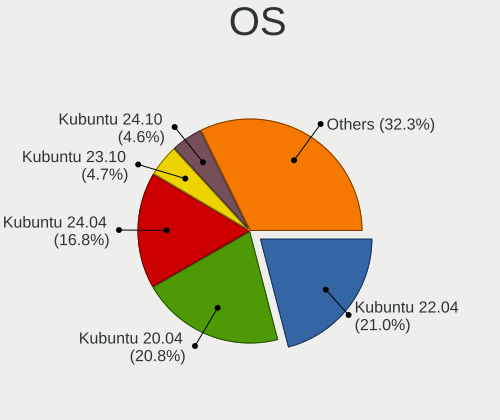

| Name             | Desktops | Percent |
|------------------|----------|---------|
| Kubuntu 22.04    | 597      | 20.96%  |
| Kubuntu 20.04    | 591      | 20.75%  |
| Kubuntu 24.04    | 478      | 16.78%  |
| Kubuntu 23.10    | 133      | 4.67%   |
| Kubuntu 24.10    | 130      | 4.56%   |
| Kubuntu 25.04    | 128      | 4.49%   |
| Kubuntu 23.04    | 117      | 4.11%   |
| Kubuntu 22.10    | 112      | 3.93%   |
| Kubuntu 18.04    | 95       | 3.34%   |
| Kubuntu 20.10    | 94       | 3.3%    |
| Kubuntu 25.10    | 78       | 2.74%   |
| Kubuntu 21.10    | 71       | 2.49%   |
| Kubuntu 21.04    | 69       | 2.42%   |
| Kubuntu 19.10    | 62       | 2.18%   |
| Kubuntu 11       | 47       | 1.65%   |
| Kubuntu 19.04    | 12       | 0.42%   |
| Kubuntu 16.04    | 9        | 0.32%   |
| Kubuntu          | 5        | 0.18%   |
| Kubuntu 18.10    | 4        | 0.14%   |
| Kubuntu 11.1     | 4        | 0.14%   |
| Kubuntu 26.04    | 2        | 0.07%   |
| Kubuntu 2.0      | 2        | 0.07%   |
| Kubuntu 2025.3   | 1        | 0.04%   |
| Kubuntu 17.10    | 1        | 0.04%   |
| Kubuntu 17.04    | 1        | 0.04%   |
| Kubuntu 12.04    | 1        | 0.04%   |
| Kubuntu 11.25.12 | 1        | 0.04%   |
| Kubuntu 11.25.11 | 1        | 0.04%   |
| Kubuntu 11.25.10 | 1        | 0.04%   |
| Kubuntu 11.25.09 | 1        | 0.04%   |

OS Family
---------

OS without a version

| Name    | Desktops | Percent |
|---------|----------|---------|
| Kubuntu | 2643     | 100%    |

Kernel
------

Version of the Linux kernel

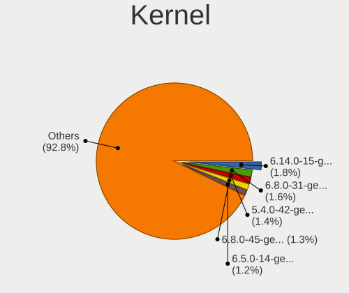

| Version           | Desktops | Percent |
|-------------------|----------|---------|
| 6.14.0-15-generic | 56       | 1.75%   |
| 6.8.0-31-generic  | 50       | 1.56%   |
| 5.4.0-42-generic  | 45       | 1.41%   |
| 6.8.0-45-generic  | 42       | 1.31%   |
| 6.5.0-14-generic  | 37       | 1.16%   |
| 6.8.0-51-generic  | 34       | 1.06%   |
| 6.8.0-35-generic  | 30       | 0.94%   |
| 6.11.0-13-generic | 28       | 0.88%   |
| 5.4.0-52-generic  | 28       | 0.88%   |
| 6.8.0-41-generic  | 27       | 0.85%   |
| 6.17.0-7-generic  | 26       | 0.81%   |
| 5.19.0-35-generic | 26       | 0.81%   |
| 5.15.0-56-generic | 26       | 0.81%   |
| 5.15.0-52-generic | 26       | 0.81%   |
| 6.17.0-6-generic  | 24       | 0.75%   |
| 6.11.0-9-generic  | 24       | 0.75%   |
| 5.19.0-23-generic | 24       | 0.75%   |
| 5.4.0-58-generic  | 23       | 0.72%   |
| 6.11.0-21-generic | 22       | 0.69%   |
| 5.4.0-48-generic  | 22       | 0.69%   |
| 5.15.0-46-generic | 22       | 0.69%   |
| 6.5.0-28-generic  | 21       | 0.66%   |
| 5.15.0-48-generic | 21       | 0.66%   |
| 6.5.0-15-generic  | 20       | 0.63%   |
| 6.14.0-29-generic | 20       | 0.63%   |
| 5.15.0-43-generic | 20       | 0.63%   |
| 6.8.0-49-generic  | 19       | 0.59%   |
| 6.11.0-26-generic | 19       | 0.59%   |
| 5.19.0-38-generic | 19       | 0.59%   |
| 6.2.0-20-generic  | 18       | 0.56%   |
| 6.14.0-27-generic | 18       | 0.56%   |
| 5.4.0-40-generic  | 18       | 0.56%   |
| 5.15.0-91-generic | 18       | 0.56%   |
| 6.8.0-36-generic  | 17       | 0.53%   |
| 6.5.0-10-generic  | 17       | 0.53%   |
| 6.2.0-26-generic  | 17       | 0.53%   |
| 6.14.0-33-generic | 17       | 0.53%   |
| 5.8.0-50-generic  | 17       | 0.53%   |
| 5.4.0-65-generic  | 17       | 0.53%   |
| 6.17.0-8-generic  | 16       | 0.5%    |

Kernel Family
-------------

Linux kernel without a distro release

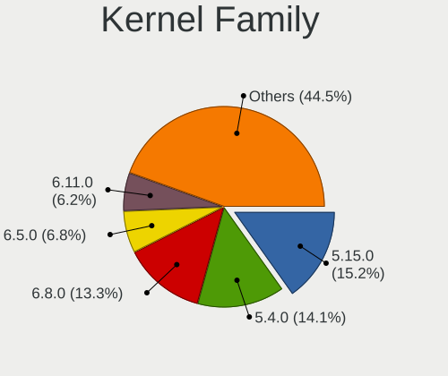

| Version | Desktops | Percent |
|---------|----------|---------|
| 5.15.0  | 440      | 15.18%  |
| 5.4.0   | 408      | 14.07%  |
| 6.8.0   | 385      | 13.28%  |
| 6.5.0   | 197      | 6.8%    |
| 6.11.0  | 179      | 6.17%   |
| 6.14.0  | 178      | 6.14%   |
| 5.19.0  | 165      | 5.69%   |
| 6.2.0   | 164      | 5.66%   |
| 5.8.0   | 162      | 5.59%   |
| 5.13.0  | 129      | 4.45%   |
| 5.11.0  | 117      | 4.04%   |
| 5.3.0   | 83       | 2.86%   |
| 6.17.0  | 73       | 2.52%   |
| 4.15.0  | 32       | 1.1%    |
| 5.0.0   | 17       | 0.59%   |
| 5.6.0   | 8        | 0.28%   |
| 4.4.0   | 6        | 0.21%   |
| 5.17.0  | 4        | 0.14%   |
| 5.10.0  | 4        | 0.14%   |
| 4.18.0  | 4        | 0.14%   |
| 6.6.0   | 3        | 0.1%    |
| 6.16.0  | 3        | 0.1%    |
| 5.9.0   | 3        | 0.1%    |
| 5.18.4  | 3        | 0.1%    |
| 6.8.10  | 2        | 0.07%   |
| 6.8.1   | 2        | 0.07%   |
| 6.4.3   | 2        | 0.07%   |
| 6.4.0   | 2        | 0.07%   |
| 6.3.0   | 2        | 0.07%   |
| 6.18.0  | 2        | 0.07%   |
| 6.15.4  | 2        | 0.07%   |
| 6.15.2  | 2        | 0.07%   |
| 6.1.5   | 2        | 0.07%   |
| 6.0.0   | 2        | 0.07%   |
| 5.9.16  | 2        | 0.07%   |
| 5.8.18  | 2        | 0.07%   |
| 5.7.10  | 2        | 0.07%   |
| 5.16.0  | 2        | 0.07%   |
| 4.13.0  | 2        | 0.07%   |
| 6.9.7   | 1        | 0.03%   |

Kernel Major Ver.
-----------------

Linux kernel major version

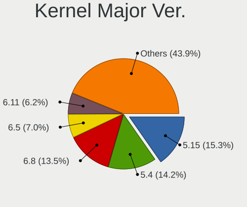

| Version | Desktops | Percent |
|---------|----------|---------|
| 5.15    | 444      | 15.32%  |
| 5.4     | 411      | 14.18%  |
| 6.8     | 390      | 13.46%  |
| 6.5     | 202      | 6.97%   |
| 6.11    | 180      | 6.21%   |
| 6.14    | 179      | 6.18%   |
| 5.8     | 170      | 5.87%   |
| 5.19    | 167      | 5.76%   |
| 6.2     | 166      | 5.73%   |
| 5.13    | 131      | 4.52%   |
| 5.11    | 118      | 4.07%   |
| 5.3     | 84       | 2.9%    |
| 6.17    | 75       | 2.59%   |
| 4.15    | 32       | 1.1%    |
| 5.0     | 18       | 0.62%   |
| 5.6     | 11       | 0.38%   |
| 5.10    | 10       | 0.35%   |
| 5.18    | 8        | 0.28%   |
| 6.4     | 7        | 0.24%   |
| 6.1     | 7        | 0.24%   |
| 6.6     | 6        | 0.21%   |
| 6.3     | 6        | 0.21%   |
| 6.15    | 6        | 0.21%   |
| 6.0     | 6        | 0.21%   |
| 5.9     | 6        | 0.21%   |
| 5.17    | 6        | 0.21%   |
| 4.4     | 6        | 0.21%   |
| 5.7     | 5        | 0.17%   |
| 4.18    | 5        | 0.17%   |
| 6.7     | 4        | 0.14%   |
| 6.12    | 4        | 0.14%   |
| 5.12    | 4        | 0.14%   |
| 6.9     | 3        | 0.1%    |
| 6.18    | 3        | 0.1%    |
| 6.16    | 3        | 0.1%    |
| 6.10    | 3        | 0.1%    |
| 5.16    | 3        | 0.1%    |
| 5.5     | 2        | 0.07%   |
| 5.14    | 2        | 0.07%   |
| 4.13    | 2        | 0.07%   |

Arch
----

OS architecture (x86_64, i586, etc.)

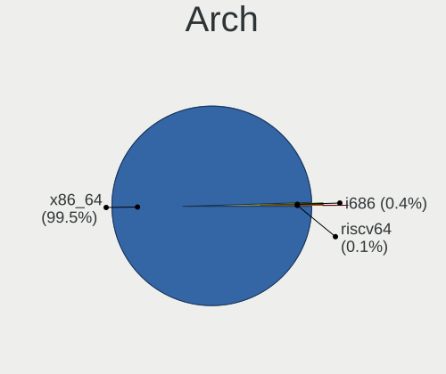

| Name    | Desktops | Percent |
|---------|----------|---------|
| x86_64  | 2630     | 99.51%  |
| i686    | 10       | 0.38%   |
| riscv64 | 3        | 0.11%   |

DE
--

Desktop Environment

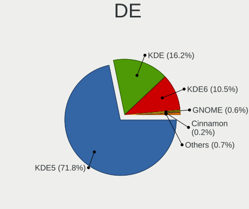

| Name       | Desktops | Percent |
|------------|----------|---------|
| KDE5       | 1946     | 71.76%  |
| KDE        | 440      | 16.22%  |
| KDE6       | 286      | 10.55%  |
| GNOME      | 16       | 0.59%   |
| Cinnamon   | 6        | 0.22%   |
| Budgie     | 5        | 0.18%   |
| XFCE       | 4        | 0.15%   |
| MATE       | 4        | 0.15%   |
| X-Cinnamon | 1        | 0.04%   |
| Unity      | 1        | 0.04%   |
| LXQt       | 1        | 0.04%   |
| KDE4       | 1        | 0.04%   |
| Unknown    | 1        | 0.04%   |

Display Server
--------------

X11 or Wayland

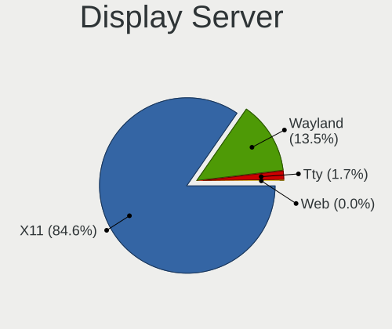

| Name    | Desktops | Percent |
|---------|----------|---------|
| X11     | 2277     | 84.65%  |
| Wayland | 362      | 13.46%  |
| Tty     | 46       | 1.71%   |
| Unknown | 4        | 0.15%   |
| Web     | 1        | 0.04%   |

Display Manager
---------------

SDDM, LightDM, etc.

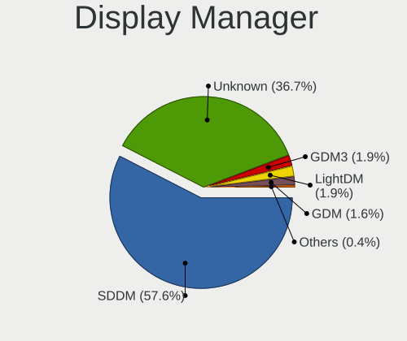

| Name    | Desktops | Percent |
|---------|----------|---------|
| SDDM    | 1551     | 57.55%  |
| Unknown | 988      | 36.66%  |
| GDM3    | 52       | 1.93%   |
| LightDM | 51       | 1.89%   |
| GDM     | 42       | 1.56%   |
| TDM     | 10       | 0.37%   |
| SLiM    | 1        | 0.04%   |

OS Lang
-------

Language

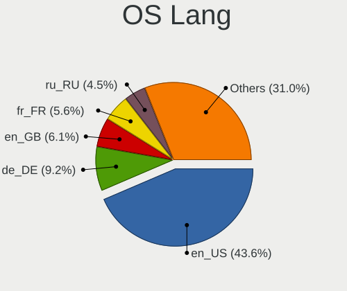

| Lang    | Desktops | Percent |
|---------|----------|---------|
| en_US   | 1159     | 43.56%  |
| de_DE   | 246      | 9.24%   |
| en_GB   | 162      | 6.09%   |
| fr_FR   | 149      | 5.6%    |
| ru_RU   | 119      | 4.47%   |
| pt_BR   | 103      | 3.87%   |
| it_IT   | 93       | 3.49%   |
| es_ES   | 61       | 2.29%   |
| en_CA   | 58       | 2.18%   |
| en_AU   | 51       | 1.92%   |
| pl_PL   | 47       | 1.77%   |
| C       | 31       | 1.16%   |
| Unknown | 28       | 1.05%   |
| de_AT   | 22       | 0.83%   |
| nl_NL   | 19       | 0.71%   |
| es_AR   | 18       | 0.68%   |
| en_IN   | 18       | 0.68%   |
| cs_CZ   | 17       | 0.64%   |
| es_MX   | 16       | 0.6%    |
| hu_HU   | 14       | 0.53%   |
| sv_SE   | 10       | 0.38%   |
| pt_PT   | 10       | 0.38%   |
| en_NZ   | 10       | 0.38%   |
| el_GR   | 10       | 0.38%   |
| ru_UA   | 9        | 0.34%   |
| de_CH   | 9        | 0.34%   |
| zh_CN   | 8        | 0.3%    |
| uk_UA   | 8        | 0.3%    |
| nl_BE   | 8        | 0.3%    |
| es_CO   | 8        | 0.3%    |
| es_CL   | 8        | 0.3%    |
| en_ZA   | 8        | 0.3%    |
| zh_TW   | 7        | 0.26%   |
| fr_BE   | 7        | 0.26%   |
| fi_FI   | 7        | 0.26%   |
| en_PH   | 6        | 0.23%   |
| en_IL   | 6        | 0.23%   |
| en_DK   | 6        | 0.23%   |
| ja_JP   | 5        | 0.19%   |
| es_VE   | 5        | 0.19%   |

Boot Mode
---------

EFI or BIOS

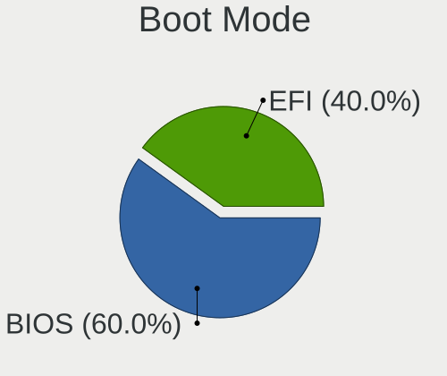

| Mode | Desktops | Percent |
|------|----------|---------|
| BIOS | 1611     | 59.96%  |
| EFI  | 1076     | 40.04%  |

Filesystem
----------

Type of filesystem

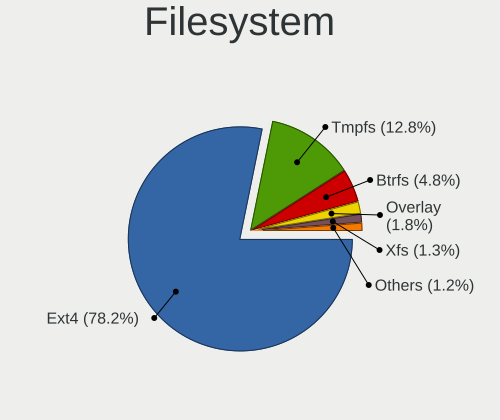

| Type     | Desktops | Percent |
|----------|----------|---------|
| Ext4     | 2097     | 78.19%  |
| Tmpfs    | 342      | 12.75%  |
| Btrfs    | 129      | 4.81%   |
| Overlay  | 48       | 1.79%   |
| Xfs      | 34       | 1.27%   |
| Zfs      | 15       | 0.56%   |
| Unknown  | 5        | 0.19%   |
| Ext3     | 4        | 0.15%   |
| F2fs     | 2        | 0.07%   |
| Ext2     | 2        | 0.07%   |
| XXXX     | 1        | 0.04%   |
| Reiserfs | 1        | 0.04%   |
| Jfs      | 1        | 0.04%   |
| ExX4     | 1        | 0.04%   |

Part. scheme
------------

Scheme of partitioning

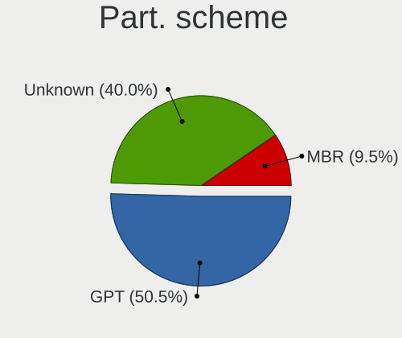

| Type    | Desktops | Percent |
|---------|----------|---------|
| GPT     | 1367     | 50.46%  |
| Unknown | 1084     | 40.01%  |
| MBR     | 258      | 9.52%   |

Dual Boot with Linux/BSD
------------------------

Hosting more than one Linux/BSD

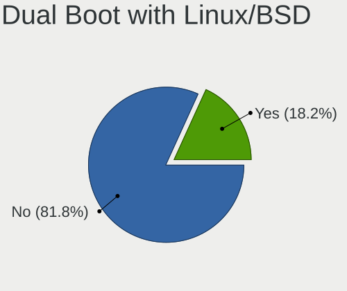

| Dual boot | Desktops | Percent |
|-----------|----------|---------|
| No        | 2206     | 81.79%  |
| Yes       | 491      | 18.21%  |

Dual Boot (Win)
---------------

Hosting Linux and Windows

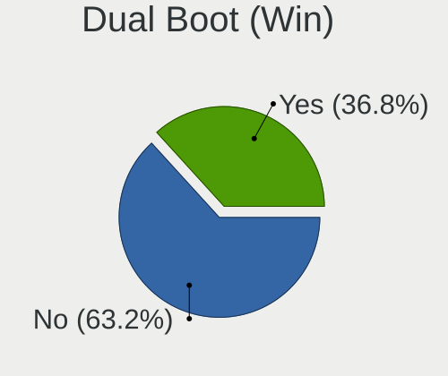

| Dual boot | Desktops | Percent |
|-----------|----------|---------|
| No        | 1702     | 63.25%  |
| Yes       | 989      | 36.75%  |

Board
-----

Vendor
------

Motherboard manufacturer

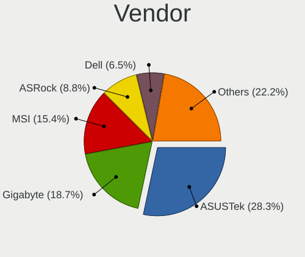

| Name                                 | Desktops | Percent |
|--------------------------------------|----------|---------|
| ASUSTek Computer                     | 749      | 28.34%  |
| Gigabyte Technology                  | 495      | 18.73%  |
| MSI                                  | 406      | 15.36%  |
| ASRock                               | 232      | 8.78%   |
| Dell                                 | 173      | 6.55%   |
| Hewlett-Packard                      | 166      | 6.28%   |
| Lenovo                               | 72       | 2.72%   |
| Intel                                | 44       | 1.66%   |
| Unknown                              | 33       | 1.25%   |
| Acer                                 | 27       | 1.02%   |
| Fujitsu                              | 24       | 0.91%   |
| Pegatron                             | 22       | 0.83%   |
| Biostar                              | 20       | 0.76%   |
| AZW                                  | 19       | 0.72%   |
| Foxconn                              | 14       | 0.53%   |
| ECS                                  | 11       | 0.42%   |
| Huanan                               | 9        | 0.34%   |
| Supermicro                           | 8        | 0.3%    |
| Shenzhen Meigao Electronic Equipment | 8        | 0.3%    |
| Shuttle                              | 7        | 0.26%   |
| Alienware                            | 7        | 0.26%   |
| Packard Bell                         | 6        | 0.23%   |
| Medion                               | 6        | 0.23%   |
| BESSTAR Tech                         | 6        | 0.23%   |
| Google                               | 5        | 0.19%   |
| GEEKOM                               | 5        | 0.19%   |
| Gateway                              | 5        | 0.19%   |
| Apple                                | 5        | 0.19%   |
| Positivo                             | 4        | 0.15%   |
| MACHINIST                            | 4        | 0.15%   |
| Fujitsu Siemens                      | 3        | 0.11%   |
| Colorful Technology                  | 3        | 0.11%   |
| ZOTAC                                | 2        | 0.08%   |
| XFX                                  | 2        | 0.08%   |
| WeiBu                                | 2        | 0.08%   |
| SYWZ                                 | 2        | 0.08%   |
| Seco                                 | 2        | 0.08%   |
| OEM                                  | 2        | 0.08%   |
| HC                                   | 2        | 0.08%   |
| GMKtec                               | 2        | 0.08%   |

Model
-----

Motherboard model

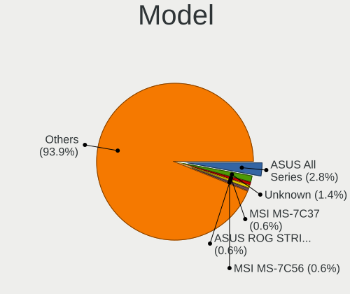

| Name                         | Desktops | Percent |
|------------------------------|----------|---------|
| ASUS All Series              | 75       | 2.84%   |
| Unknown                      | 36       | 1.36%   |
| MSI MS-7C37                  | 17       | 0.64%   |
| ASUS ROG STRIX B550-F GAMING | 17       | 0.64%   |
| MSI MS-7C56                  | 16       | 0.61%   |
| MSI MS-7C91                  | 15       | 0.57%   |
| Gigabyte B450M DS3H          | 15       | 0.57%   |
| Dell OptiPlex 7010           | 13       | 0.49%   |
| Dell OptiPlex 9020           | 12       | 0.45%   |
| ASUS TUF Gaming X570-PLUS    | 12       | 0.45%   |
| MSI MS-7C02                  | 11       | 0.42%   |
| MSI MS-7693                  | 11       | 0.42%   |
| ASUS PRIME B450M-A           | 11       | 0.42%   |
| MSI MS-7C95                  | 10       | 0.38%   |
| MSI MS-7B86                  | 10       | 0.38%   |
| MSI MS-7B79                  | 10       | 0.38%   |
| Gigabyte A320M-S2H           | 10       | 0.38%   |
| ASUS ROG STRIX X570-E GAMING | 10       | 0.38%   |
| ASUS PRIME B350-PLUS         | 10       | 0.38%   |
| ASUS PRIME A320M-K           | 10       | 0.38%   |
| MSI MS-7C52                  | 9        | 0.34%   |
| MSI MS-7817                  | 9        | 0.34%   |
| HP EliteDesk 800 G1 SFF      | 9        | 0.34%   |
| Gigabyte X570 AORUS MASTER   | 9        | 0.34%   |
| Gigabyte 970A-DS3P           | 9        | 0.34%   |
| ASUS TUF Gaming B550-PLUS    | 9        | 0.34%   |
| MSI MS-7E12                  | 8        | 0.3%    |
| Gigabyte B550M DS3H          | 8        | 0.3%    |
| Dell OptiPlex 7040           | 8        | 0.3%    |
| ASRock AB350 Pro4            | 8        | 0.3%    |
| MSI MS-7E26                  | 7        | 0.26%   |
| MSI MS-7A34                  | 7        | 0.26%   |
| HP Compaq Elite 8300 SFF     | 7        | 0.26%   |
| Gigabyte X570 AORUS ELITE    | 7        | 0.26%   |
| Gigabyte B550M AORUS ELITE   | 7        | 0.26%   |
| Dell OptiPlex 780            | 7        | 0.26%   |
| ASUS PRIME X370-PRO          | 7        | 0.26%   |
| MSI MS-7A38                  | 6        | 0.23%   |
| MSI MS-7A32                  | 6        | 0.23%   |
| HP Z440 Workstation          | 6        | 0.23%   |

Model Family
------------

Motherboard model prefix

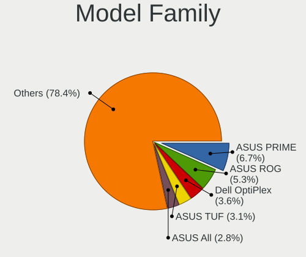

| Name               | Desktops | Percent |
|--------------------|----------|---------|
| ASUS PRIME         | 177      | 6.7%    |
| ASUS ROG           | 141      | 5.33%   |
| Dell OptiPlex      | 95       | 3.59%   |
| ASUS TUF           | 83       | 3.14%   |
| ASUS All           | 75       | 2.84%   |
| Lenovo ThinkCentre | 48       | 1.82%   |
| HP Compaq          | 37       | 1.4%    |
| Unknown            | 36       | 1.36%   |
| Dell Precision     | 35       | 1.32%   |
| Gigabyte X570      | 30       | 1.14%   |
| Gigabyte B450M     | 27       | 1.02%   |
| HP EliteDesk       | 25       | 0.95%   |
| Gigabyte B550      | 25       | 0.95%   |
| Dell Inspiron      | 19       | 0.72%   |
| Acer Aspire        | 19       | 0.72%   |
| HP ProDesk         | 18       | 0.68%   |
| Gigabyte B550M     | 18       | 0.68%   |
| Fujitsu ESPRIMO    | 18       | 0.68%   |
| MSI MS-7C37        | 17       | 0.64%   |
| MSI MS-7C56        | 16       | 0.61%   |
| MSI MS-7C91        | 15       | 0.57%   |
| Gigabyte A320M-S2H | 14       | 0.53%   |
| ASUS M5A78L-M      | 14       | 0.53%   |
| ASUS SABERTOOTH    | 13       | 0.49%   |
| Gigabyte B450      | 12       | 0.45%   |
| MSI MS-7C02        | 11       | 0.42%   |
| MSI MS-7693        | 11       | 0.42%   |
| Gigabyte Z390      | 11       | 0.42%   |
| ASUS M5A97         | 11       | 0.42%   |
| MSI MS-7C95        | 10       | 0.38%   |
| MSI MS-7B86        | 10       | 0.38%   |
| MSI MS-7B79        | 10       | 0.38%   |
| Gigabyte B650      | 10       | 0.38%   |
| Dell XPS           | 10       | 0.38%   |
| ASRock B450        | 10       | 0.38%   |
| ASRock AB350       | 10       | 0.38%   |
| MSI MS-7C52        | 9        | 0.34%   |
| MSI MS-7817        | 9        | 0.34%   |
| Lenovo IdeaCentre  | 9        | 0.34%   |
| HP Pavilion        | 9        | 0.34%   |

MFG Year
--------

Motherboard manufacture year

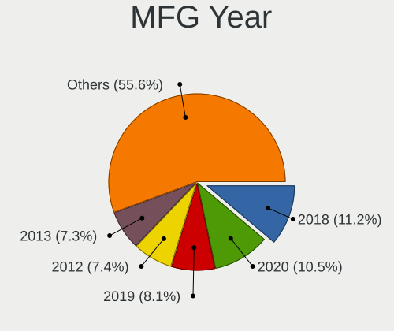

| Year    | Desktops | Percent |
|---------|----------|---------|
| 2018    | 295      | 11.16%  |
| 2020    | 278      | 10.52%  |
| 2019    | 213      | 8.06%   |
| 2012    | 195      | 7.38%   |
| 2013    | 192      | 7.26%   |
| 2017    | 181      | 6.85%   |
| 2014    | 166      | 6.28%   |
| 2021    | 149      | 5.64%   |
| 2022    | 145      | 5.49%   |
| 2011    | 137      | 5.18%   |
| 2015    | 120      | 4.54%   |
| 2016    | 112      | 4.24%   |
| 2023    | 106      | 4.01%   |
| 2009    | 91       | 3.44%   |
| 2010    | 89       | 3.37%   |
| 2008    | 61       | 2.31%   |
| 2024    | 56       | 2.12%   |
| 2007    | 31       | 1.17%   |
| 2025    | 12       | 0.45%   |
| 2006    | 8        | 0.3%    |
| 2005    | 4        | 0.15%   |
| 2004    | 1        | 0.04%   |
| Unknown | 1        | 0.04%   |

Form Factor
-----------

Physical design of the computer

| Name    | Desktops | Percent |
|---------|----------|---------|
| Desktop | 2643     | 100%    |

Secure Boot
-----------

Enabled or disabled

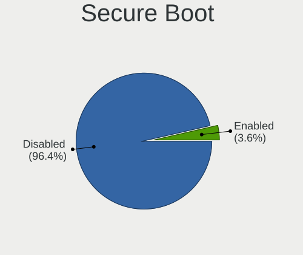

| State    | Desktops | Percent |
|----------|----------|---------|
| Disabled | 2554     | 96.41%  |
| Enabled  | 95       | 3.59%   |

Coreboot
--------

Have coreboot on board

| Used | Desktops | Percent |
|------|----------|---------|
| No   | 2636     | 99.74%  |
| Yes  | 7        | 0.26%   |

RAM Size
--------

Total RAM memory

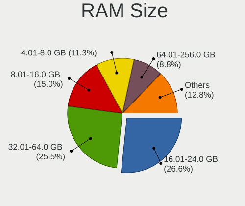

| Size in GB      | Desktops | Percent |
|-----------------|----------|---------|
| 16.01-24.0      | 715      | 26.63%  |
| 32.01-64.0      | 684      | 25.47%  |
| 8.01-16.0       | 403      | 15.01%  |
| 4.01-8.0        | 303      | 11.28%  |
| 64.01-256.0     | 236      | 8.79%   |
| 3.01-4.0        | 161      | 6%      |
| 24.01-32.0      | 158      | 5.88%   |
| 2.01-3.0        | 12       | 0.45%   |
| 1.01-2.0        | 7        | 0.26%   |
| More than 256.0 | 6        | 0.22%   |

RAM Used
--------

Used RAM memory

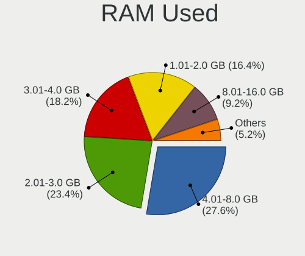

| Used GB     | Desktops | Percent |
|-------------|----------|---------|
| 4.01-8.0    | 810      | 27.64%  |
| 2.01-3.0    | 685      | 23.37%  |
| 3.01-4.0    | 534      | 18.22%  |
| 1.01-2.0    | 481      | 16.41%  |
| 8.01-16.0   | 270      | 9.21%   |
| 16.01-24.0  | 62       | 2.12%   |
| 0.51-1.0    | 42       | 1.43%   |
| 24.01-32.0  | 25       | 0.85%   |
| 32.01-64.0  | 14       | 0.48%   |
| 0.01-0.5    | 5        | 0.17%   |
| 64.01-256.0 | 2        | 0.07%   |
| Unknown     | 1        | 0.03%   |

Total Drives
------------

Number of drives on board

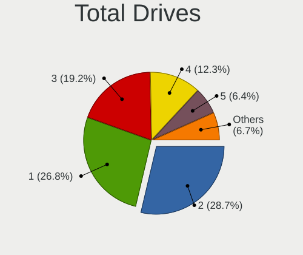

| Drives | Desktops | Percent |
|--------|----------|---------|
| 2      | 793      | 28.69%  |
| 1      | 740      | 26.77%  |
| 3      | 531      | 19.21%  |
| 4      | 339      | 12.26%  |
| 5      | 177      | 6.4%    |
| 6      | 80       | 2.89%   |
| 7      | 55       | 1.99%   |
| 8      | 19       | 0.69%   |
| 9      | 9        | 0.33%   |
| 0      | 9        | 0.33%   |
| 10     | 4        | 0.14%   |
| 12     | 3        | 0.11%   |
| 11     | 3        | 0.11%   |
| 16     | 1        | 0.04%   |
| 13     | 1        | 0.04%   |

Has CD-ROM
----------

Has CD-ROM on board

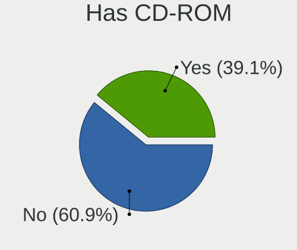

| Presented | Desktops | Percent |
|-----------|----------|---------|
| No        | 1632     | 60.92%  |
| Yes       | 1047     | 39.08%  |

Has Ethernet
------------

Has Ethernet on board

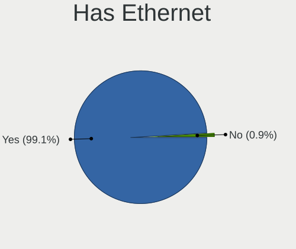

| Presented | Desktops | Percent |
|-----------|----------|---------|
| Yes       | 2618     | 99.05%  |
| No        | 25       | 0.95%   |

Has WiFi
--------

Has WiFi module

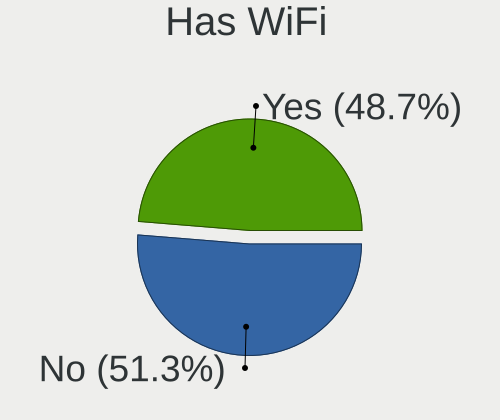

| Presented | Desktops | Percent |
|-----------|----------|---------|
| No        | 1373     | 51.29%  |
| Yes       | 1304     | 48.71%  |

Has Bluetooth
-------------

Has Bluetooth module

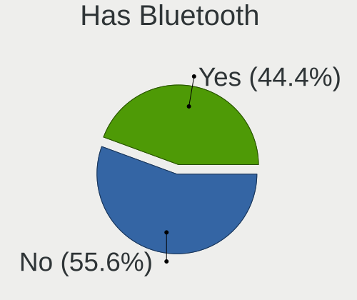

| Presented | Desktops | Percent |
|-----------|----------|---------|
| No        | 1489     | 55.6%   |
| Yes       | 1189     | 44.4%   |

Location
--------

Country
-------

Geographic location (country)

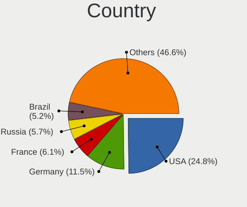

| Country      | Desktops | Percent |
|--------------|----------|---------|
| USA          | 657      | 24.78%  |
| Germany      | 305      | 11.51%  |
| France       | 162      | 6.11%   |
| Russia       | 152      | 5.73%   |
| Brazil       | 139      | 5.24%   |
| UK           | 137      | 5.17%   |
| Italy        | 119      | 4.49%   |
| Spain        | 83       | 3.13%   |
| Canada       | 81       | 3.06%   |
| Poland       | 63       | 2.38%   |
| Netherlands  | 57       | 2.15%   |
| Australia    | 54       | 2.04%   |
| Austria      | 32       | 1.21%   |
| Switzerland  | 29       | 1.09%   |
| Argentina    | 28       | 1.06%   |
| Ukraine      | 27       | 1.02%   |
| Sweden       | 27       | 1.02%   |
| India        | 24       | 0.91%   |
| Belgium      | 24       | 0.91%   |
| Mexico       | 23       | 0.87%   |
| Hungary      | 23       | 0.87%   |
| Czechia      | 23       | 0.87%   |
| Finland      | 21       | 0.79%   |
| Greece       | 19       | 0.72%   |
| Portugal     | 18       | 0.68%   |
| Turkey       | 16       | 0.6%    |
| Norway       | 15       | 0.57%   |
| Denmark      | 14       | 0.53%   |
| Bulgaria     | 14       | 0.53%   |
| New Zealand  | 13       | 0.49%   |
| Chile        | 13       | 0.49%   |
| South Africa | 12       | 0.45%   |
| Serbia       | 12       | 0.45%   |
| Romania      | 11       | 0.41%   |
| Colombia     | 11       | 0.41%   |
| Indonesia    | 10       | 0.38%   |
| China        | 10       | 0.38%   |
| Bangladesh   | 9        | 0.34%   |
| Peru         | 8        | 0.3%    |
| Israel       | 8        | 0.3%    |

City
----

Geographic location (city)

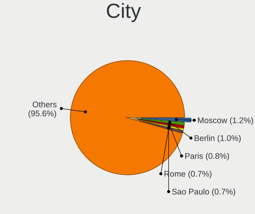

| City              | Desktops | Percent |
|-------------------|----------|---------|
| Moscow            | 34       | 1.21%   |
| Berlin            | 28       | 1%      |
| Paris             | 22       | 0.79%   |
| Rome              | 20       | 0.71%   |
| Sao Paulo         | 19       | 0.68%   |
| Vienna            | 18       | 0.64%   |
| London            | 18       | 0.64%   |
| Frankfurt am Main | 17       | 0.61%   |
| Sydney            | 16       | 0.57%   |
| Hamburg           | 16       | 0.57%   |
| Warsaw            | 15       | 0.54%   |
| St Petersburg     | 14       | 0.5%    |
| Munich            | 14       | 0.5%    |
| Milan             | 14       | 0.5%    |
| Rio de Janeiro    | 13       | 0.46%   |
| Melbourne         | 13       | 0.46%   |
| Budapest          | 13       | 0.46%   |
| Amsterdam         | 13       | 0.46%   |
| Dallas            | 12       | 0.43%   |
| Toronto           | 10       | 0.36%   |
| Zurich            | 9        | 0.32%   |
| Kyiv              | 9        | 0.32%   |
| Chicago           | 9        | 0.32%   |
| Santiago          | 8        | 0.29%   |
| San Francisco     | 8        | 0.29%   |
| Novosibirsk       | 8        | 0.29%   |
| Montreal          | 8        | 0.29%   |
| Los Angeles       | 8        | 0.29%   |
| Jacksonville      | 8        | 0.29%   |
| Cologne           | 8        | 0.29%   |
| Brisbane          | 8        | 0.29%   |
| Belgrade          | 8        | 0.29%   |
| Barcelona         | 8        | 0.29%   |
| Auckland          | 8        | 0.29%   |
| Mexico City       | 7        | 0.25%   |
| Manchester        | 7        | 0.25%   |
| Krakow            | 7        | 0.25%   |
| Irkutsk           | 7        | 0.25%   |
| Helsinki          | 7        | 0.25%   |
| Alicante          | 7        | 0.25%   |

Drives
------

Drive Vendor
------------

Hard drive vendors

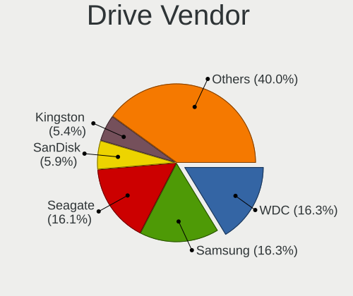

| Vendor                      | Desktops | Drives | Percent |
|-----------------------------|----------|--------|---------|
| WDC                         | 910      | 1647   | 16.29%  |
| Samsung Electronics         | 910      | 1776   | 16.29%  |
| Seagate                     | 898      | 1558   | 16.07%  |
| SanDisk                     | 330      | 463    | 5.91%   |
| Kingston                    | 304      | 413    | 5.44%   |
| Crucial                     | 271      | 365    | 4.85%   |
| Toshiba                     | 240      | 351    | 4.3%    |
| Hitachi                     | 148      | 201    | 2.65%   |
| A-DATA Technology           | 86       | 111    | 1.54%   |
| Intel                       | 83       | 110    | 1.49%   |
| HGST                        | 64       | 97     | 1.15%   |
| Unknown                     | 61       | 112    | 1.09%   |
| Phison Electronics          | 57       | 68     | 1.02%   |
| Kingston Technology Company | 57       | 80     | 1.02%   |
| Micron/Crucial Technology   | 55       | 85     | 0.98%   |
| Phison                      | 52       | 65     | 0.93%   |
| China                       | 50       | 66     | 0.89%   |
| SPCC                        | 49       | 75     | 0.88%   |
| PNY                         | 49       | 99     | 0.88%   |
| Silicon Motion              | 45       | 61     | 0.81%   |
| Patriot                     | 43       | 61     | 0.77%   |
| Micron Technology           | 42       | 53     | 0.75%   |
| Corsair                     | 41       | 62     | 0.73%   |
| Intenso                     | 37       | 45     | 0.66%   |
| OCZ                         | 35       | 45     | 0.63%   |
| SK hynix                    | 30       | 36     | 0.54%   |
| Maxtor                      | 28       | 36     | 0.5%    |
| Transcend                   | 27       | 31     | 0.48%   |
| Team                        | 26       | 30     | 0.47%   |
| ADATA Technology            | 23       | 25     | 0.41%   |
| GOODRAM                     | 21       | 38     | 0.38%   |
| Realtek Semiconductor       | 20       | 22     | 0.36%   |
| Lexar                       | 20       | 24     | 0.36%   |
| Gigabyte Technology         | 20       | 24     | 0.36%   |
| JMicron Technology          | 17       | 19     | 0.3%    |
| SABRENT                     | 16       | 18     | 0.29%   |
| MAXIO Technology (Hangzhou) | 16       | 18     | 0.29%   |
| KingSpec                    | 16       | 18     | 0.29%   |
| Hewlett-Packard             | 16       | 22     | 0.29%   |
| Unknown                     | 16       | 20     | 0.29%   |

Drive Model
-----------

Hard drive models

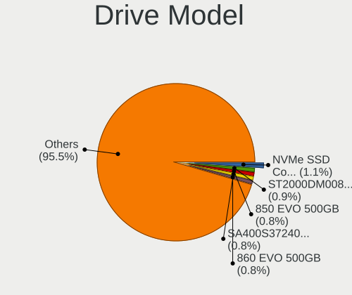

| Model                                                 | Desktops | Percent |
|-------------------------------------------------------|----------|---------|
| Samsung NVMe SSD Controller SM981/PM981/PM983 1TB     | 76       | 1.14%   |
| Seagate ST2000DM008-2FR102 2TB                        | 59       | 0.88%   |
| Samsung SSD 850 EVO 500GB                             | 56       | 0.84%   |
| Kingston SA400S37240G 240GB SSD                       | 56       | 0.84%   |
| Samsung SSD 860 EVO 500GB                             | 55       | 0.82%   |
| Samsung SSD 850 EVO 250GB                             | 55       | 0.82%   |
| Samsung SSD 860 EVO 1TB                               | 54       | 0.81%   |
| Seagate ST1000DM010-2EP102 1TB                        | 51       | 0.76%   |
| Kingston SA400S37480G 480GB SSD                       | 51       | 0.76%   |
| Crucial CT1000MX500SSD1 1TB                           | 48       | 0.72%   |
| Seagate ST4000DM004-2CV104 4TB                        | 47       | 0.7%    |
| WDC WD10EZEX-08WN4A0 1TB                              | 45       | 0.67%   |
| Seagate ST500DM002-1BD142 500GB                       | 40       | 0.6%    |
| Toshiba DT01ACA100 1TB                                | 38       | 0.57%   |
| Samsung NVMe SSD Controller PM9A1/PM9A3/980PRO 1TB    | 38       | 0.57%   |
| Seagate ST1000DM003-1ER162 1TB                        | 35       | 0.52%   |
| Toshiba HDWD110 1TB                                   | 32       | 0.48%   |
| Seagate ST2000DM001-1ER164 2TB                        | 29       | 0.43%   |
| Seagate ST2000DM006-2DM164 2TB                        | 28       | 0.42%   |
| Seagate ST1000DM003-1CH162 1TB                        | 27       | 0.4%    |
| Seagate ST31000524AS 1TB                              | 26       | 0.39%   |
| Samsung SSD 860 EVO 250GB                             | 25       | 0.37%   |
| Micron/Crucial P2 NVMe PCIe SSD 2TB                   | 25       | 0.37%   |
| Seagate ST31000528AS 1TB                              | 24       | 0.36%   |
| Samsung NVMe SSD Drive 500GB                          | 24       | 0.36%   |
| WDC WD20EARX-00PASB0 2TB                              | 23       | 0.34%   |
| Toshiba DT01ACA200 2TB                                | 23       | 0.34%   |
| Samsung SSD 970 EVO Plus 1TB                          | 23       | 0.34%   |
| Samsung SSD 840 EVO 250GB                             | 23       | 0.34%   |
| Crucial CT500MX500SSD1 500GB                          | 22       | 0.33%   |
| Crucial CT240BX500SSD1 240GB                          | 22       | 0.33%   |
| WDC WD20EZRX-00D8PB0 2TB                              | 21       | 0.31%   |
| Silicon Motion SM2263EN/SM2263XT SSD Controller 512GB | 21       | 0.31%   |
| Seagate ST3500418AS 500GB                             | 21       | 0.31%   |
| Seagate ST2000DM001-1CH164 2TB                        | 21       | 0.31%   |
| SanDisk NVMe SSD Drive 1TB                            | 21       | 0.31%   |
| Samsung SSD 980 1TB                                   | 21       | 0.31%   |
| Samsung SSD 970 EVO Plus 500GB                        | 21       | 0.31%   |
| Samsung SSD 870 QVO 1TB                               | 21       | 0.31%   |
| Kingston Company SNV2S1000G 1TB                       | 21       | 0.31%   |

HDD Vendor
----------

Hard disk drive vendors

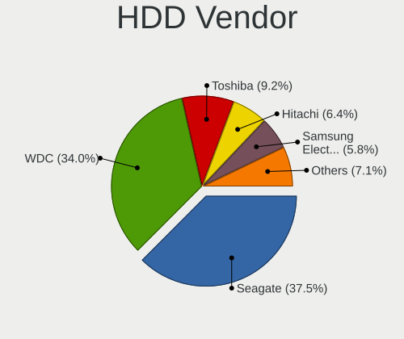

| Vendor              | Desktops | Drives | Percent |
|---------------------|----------|--------|---------|
| Seagate             | 872      | 1512   | 37.47%  |
| WDC                 | 791      | 1406   | 33.99%  |
| Toshiba             | 215      | 313    | 9.24%   |
| Hitachi             | 148      | 201    | 6.36%   |
| Samsung Electronics | 135      | 218    | 5.8%    |
| HGST                | 64       | 97     | 2.75%   |
| Maxtor              | 27       | 35     | 1.16%   |
| Unknown             | 21       | 29     | 0.9%    |
| JMicron Technology  | 7        | 8      | 0.3%    |
| Apple               | 5        | 5      | 0.21%   |
| Fujitsu             | 4        | 4      | 0.17%   |
| T-FORCE             | 3        | 4      | 0.13%   |
| Hewlett-Packard     | 3        | 5      | 0.13%   |
| WD MediaMax         | 2        | 2      | 0.09%   |
| USB3.0              | 2        | 4      | 0.09%   |
| USB                 | 2        | 3      | 0.09%   |
| LaCie               | 2        | 2      | 0.09%   |
| Intenso             | 2        | 4      | 0.09%   |
| Inateck             | 2        | 3      | 0.09%   |
| External            | 2        | 2      | 0.09%   |
| ASMT                | 2        | 3      | 0.09%   |
| TO Exter            | 1        | 1      | 0.04%   |
| SSK                 | 1        | 2      | 0.04%   |
| SSI                 | 1        | 1      | 0.04%   |
| Space ke            | 1        | 1      | 0.04%   |
| Shenzhen            | 1        | 1      | 0.04%   |
| SAGE                | 1        | 1      | 0.04%   |
| SABRENT             | 1        | 2      | 0.04%   |
| Min Yi U            | 1        | 1      | 0.04%   |
| Maxone              | 1        | 1      | 0.04%   |
| MARVELL             | 1        | 1      | 0.04%   |
| Magnetic Data       | 1        | 2      | 0.04%   |
| LIO-ORG             | 1        | 1      | 0.04%   |
| KESU                | 1        | 1      | 0.04%   |
| IET                 | 1        | 1      | 0.04%   |
| ASMedia             | 1        | 2      | 0.04%   |
| Unknown             | 1        | 1      | 0.04%   |

SSD Vendor
----------

Solid state drive vendors

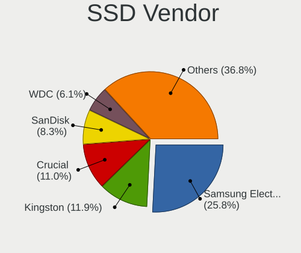

| Vendor              | Desktops | Drives | Percent |
|---------------------|----------|--------|---------|
| Samsung Electronics | 519      | 865    | 25.81%  |
| Kingston            | 240      | 322    | 11.93%  |
| Crucial             | 222      | 299    | 11.04%  |
| SanDisk             | 167      | 229    | 8.3%    |
| WDC                 | 122      | 184    | 6.07%   |
| A-DATA Technology   | 67       | 87     | 3.33%   |
| China               | 49       | 65     | 2.44%   |
| PNY                 | 47       | 97     | 2.34%   |
| Intel               | 42       | 57     | 2.09%   |
| SPCC                | 41       | 61     | 2.04%   |
| Patriot             | 40       | 57     | 1.99%   |
| OCZ                 | 35       | 45     | 1.74%   |
| Intenso             | 30       | 32     | 1.49%   |
| Micron Technology   | 23       | 30     | 1.14%   |
| Transcend           | 21       | 23     | 1.04%   |
| Team                | 20       | 23     | 0.99%   |
| GOODRAM             | 20       | 36     | 0.99%   |
| Corsair             | 19       | 36     | 0.94%   |
| Toshiba             | 18       | 25     | 0.9%    |
| SABRENT             | 14       | 15     | 0.7%    |
| Lexar               | 13       | 16     | 0.65%   |
| KingSpec            | 12       | 14     | 0.6%    |
| Hewlett-Packard     | 12       | 15     | 0.6%    |
| Gigabyte Technology | 12       | 14     | 0.6%    |
| Unknown             | 11       | 15     | 0.55%   |
| SK hynix            | 9        | 10     | 0.45%   |
| Mushkin             | 9        | 11     | 0.45%   |
| Verbatim            | 8        | 10     | 0.4%    |
| Seagate             | 8        | 9      | 0.4%    |
| Emtec               | 8        | 9      | 0.4%    |
| Apacer              | 8        | 13     | 0.4%    |
| Netac               | 6        | 10     | 0.3%    |
| Plextor             | 5        | 6      | 0.25%   |
| LITEON              | 5        | 6      | 0.25%   |
| Fanxiang            | 5        | 9      | 0.25%   |
| T-FORCE             | 4        | 4      | 0.2%    |
| LITEONIT            | 4        | 6      | 0.2%    |
| KIOXIA-EXCERIA      | 4        | 6      | 0.2%    |
| AMD                 | 4        | 4      | 0.2%    |
| Unknown             | 3        | 3      | 0.15%   |

Drive Kind
----------

HDD or SSD

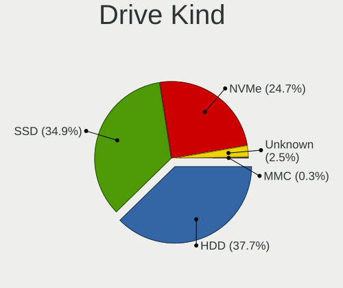

| Kind    | Desktops | Drives | Percent |
|---------|----------|--------|---------|
| HDD     | 1718     | 3880   | 37.69%  |
| SSD     | 1589     | 2925   | 34.86%  |
| NVMe    | 1127     | 1904   | 24.73%  |
| Unknown | 112      | 186    | 2.46%   |
| MMC     | 12       | 14     | 0.26%   |

Drive Connector
---------------

SATA, SAS, NVMe, etc.

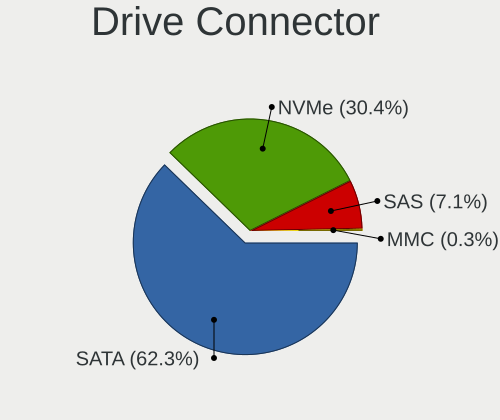

| Type | Desktops | Drives | Percent |
|------|----------|--------|---------|
| SATA | 2293     | 6583   | 62.26%  |
| NVMe | 1118     | 1884   | 30.36%  |
| SAS  | 260      | 428    | 7.06%   |
| MMC  | 12       | 14     | 0.33%   |

Drive Size
----------

Size of hard drive

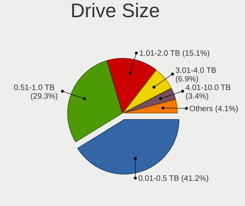

| Size in TB | Desktops | Drives | Percent |
|------------|----------|--------|---------|
| 0.01-0.5   | 1568     | 2954   | 41.21%  |
| 0.51-1.0   | 1113     | 1863   | 29.25%  |
| 1.01-2.0   | 573      | 1044   | 15.06%  |
| 3.01-4.0   | 263      | 492    | 6.91%   |
| 4.01-10.0  | 131      | 218    | 3.44%   |
| 2.01-3.0   | 123      | 171    | 3.23%   |
| 10.01-20.0 | 34       | 63     | 0.89%   |

Space Total
-----------

Amount of disk space available on the file system

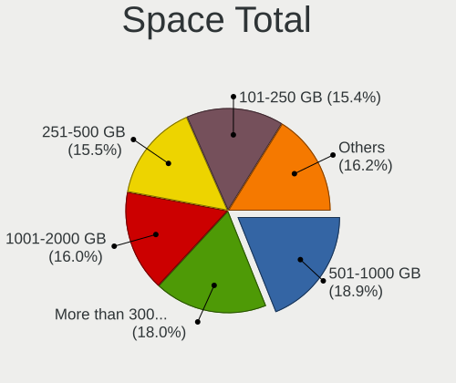

| Size in GB     | Desktops | Percent |
|----------------|----------|---------|
| 501-1000       | 525      | 18.93%  |
| More than 3000 | 498      | 17.96%  |
| 1001-2000      | 445      | 16.05%  |
| 251-500        | 429      | 15.47%  |
| 101-250        | 428      | 15.43%  |
| 2001-3000      | 241      | 8.69%   |
| 51-100         | 80       | 2.88%   |
| 1-20           | 78       | 2.81%   |
| 21-50          | 33       | 1.19%   |
| Unknown        | 16       | 0.58%   |

Space Used
----------

Amount of used disk space

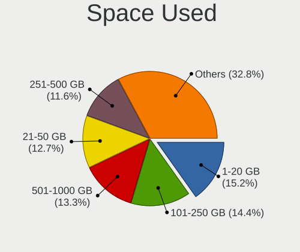

| Used GB        | Desktops | Percent |
|----------------|----------|---------|
| 1-20           | 435      | 15.18%  |
| 101-250        | 413      | 14.41%  |
| 501-1000       | 382      | 13.33%  |
| 21-50          | 363      | 12.67%  |
| 251-500        | 332      | 11.58%  |
| 51-100         | 317      | 11.06%  |
| 1001-2000      | 284      | 9.91%   |
| More than 3000 | 223      | 7.78%   |
| 2001-3000      | 101      | 3.52%   |
| Unknown        | 16       | 0.56%   |

Malfunc. Drives
---------------

Drive models with a malfunction

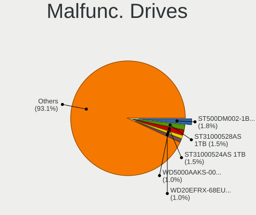

| Model                                   | Desktops | Drives | Percent |
|-----------------------------------------|----------|--------|---------|
| Seagate ST500DM002-1BD142 500GB         | 7        | 7      | 1.78%   |
| Seagate ST31000528AS 1TB                | 6        | 7      | 1.53%   |
| Seagate ST31000524AS 1TB                | 6        | 7      | 1.53%   |
| WDC WD5000AAKS-00V1A0 500GB             | 4        | 5      | 1.02%   |
| WDC WD20EFRX-68EUZN0 2TB                | 4        | 7      | 1.02%   |
| Seagate ST3500418AS 500GB               | 4        | 4      | 1.02%   |
| Seagate ST1000DM003-1CH162 1TB          | 4        | 12     | 1.02%   |
| Samsung Electronics SSD 870 EVO 500GB   | 4        | 5      | 1.02%   |
| WDC WD30EZRX-00MMMB0 3TB                | 3        | 3      | 0.76%   |
| WDC WD30EFRX-68EUZN0 3TB                | 3        | 3      | 0.76%   |
| WDC WD20EARX-00PASB0 2TB                | 3        | 3      | 0.76%   |
| WDC WD15EARS-00Z5B1 1TB                 | 3        | 3      | 0.76%   |
| WDC WD10EZEX-22MFCA0 1TB                | 3        | 5      | 0.76%   |
| Seagate ST8000DM004-2CX188 8TB          | 3        | 3      | 0.76%   |
| Seagate ST2000DM006-2DM164 2TB          | 3        | 4      | 0.76%   |
| Neo Forza NFS121SA312-6007000 120GB SSD | 3        | 4      | 0.76%   |
| Crucial CT1050MX300SSD1 1050GB          | 3        | 3      | 0.76%   |
| WDC WD5000AAKX-003CA0 500GB             | 2        | 2      | 0.51%   |
| WDC WD5000AAKS-00UU3A0 500GB            | 2        | 3      | 0.51%   |
| WDC WD5000AAKS-00A7B0 500GB             | 2        | 2      | 0.51%   |
| WDC WD40EZRZ-00GXCB0 4TB                | 2        | 2      | 0.51%   |
| WDC WD40EFRX-68N32N0 4TB                | 2        | 4      | 0.51%   |
| WDC WD3200JD-22KLB0 320GB               | 2        | 3      | 0.51%   |
| WDC WD3200AAKX-001CA0 320GB             | 2        | 2      | 0.51%   |
| WDC WD30EZRX-00DC0B0 3TB                | 2        | 2      | 0.51%   |
| WDC WD10EZRZ-00HTKB0 1TB                | 2        | 2      | 0.51%   |
| WDC WD10EZEX-60WN4A0 1TB                | 2        | 2      | 0.51%   |
| WDC WD10EZEX-60M2NA0 1TB                | 2        | 2      | 0.51%   |
| WDC WD10EZEX-08WN4A0 1TB                | 2        | 2      | 0.51%   |
| WDC WD10EZEX-00BN5A0 1TB                | 2        | 2      | 0.51%   |
| WDC WD10EARS-00Y5B1 1TB                 | 2        | 2      | 0.51%   |
| WDC WD10EARS-00MVWB0 1TB                | 2        | 5      | 0.51%   |
| WDC WD10EADS-00L5B1 1TB                 | 2        | 2      | 0.51%   |
| WDC WD1001FALS-40U9B0 1TB               | 2        | 4      | 0.51%   |
| Toshiba HDWD110 1TB                     | 2        | 2      | 0.51%   |
| Toshiba DT01ACA100 1TB                  | 2        | 3      | 0.51%   |
| Seagate ST9500325AS 500GB               | 2        | 7      | 0.51%   |
| Seagate ST9250315AS 250GB               | 2        | 3      | 0.51%   |
| Seagate ST3500620AS 500GB               | 2        | 2      | 0.51%   |
| Seagate ST32000542AS 2TB                | 2        | 2      | 0.51%   |

Malfunc. Drive Vendor
---------------------

Vendors of faulty drives

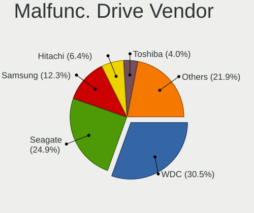

| Vendor              | Desktops | Drives | Percent |
|---------------------|----------|--------|---------|
| WDC                 | 114      | 155    | 30.48%  |
| Seagate             | 93       | 127    | 24.87%  |
| Samsung Electronics | 46       | 73     | 12.3%   |
| Hitachi             | 24       | 31     | 6.42%   |
| Toshiba             | 15       | 17     | 4.01%   |
| Intel               | 13       | 18     | 3.48%   |
| Crucial             | 13       | 18     | 3.48%   |
| SanDisk             | 10       | 12     | 2.67%   |
| Maxtor              | 6        | 8      | 1.6%    |
| Kingston            | 5        | 6      | 1.34%   |
| OCZ                 | 4        | 4      | 1.07%   |
| Neo                 | 3        | 4      | 0.8%    |
| A-DATA Technology   | 3        | 3      | 0.8%    |
| SPCC                | 2        | 2      | 0.53%   |
| Micron Technology   | 2        | 2      | 0.53%   |
| Intenso             | 2        | 2      | 0.53%   |
| HGST                | 2        | 7      | 0.53%   |
| Fujitsu             | 2        | 2      | 0.53%   |
| China               | 2        | 2      | 0.53%   |
| XPG                 | 1        | 1      | 0.27%   |
| VENO                | 1        | 1      | 0.27%   |
| T-FORCE             | 1        | 1      | 0.27%   |
| SSSTC               | 1        | 1      | 0.27%   |
| Phison Electronics  | 1        | 1      | 0.27%   |
| ORTIAL              | 1        | 1      | 0.27%   |
| Mushkin             | 1        | 1      | 0.27%   |
| LITEONIT            | 1        | 1      | 0.27%   |
| LITEON              | 1        | 1      | 0.27%   |
| KODAK               | 1        | 1      | 0.27%   |
| Corsair             | 1        | 1      | 0.27%   |
| ASMT                | 1        | 1      | 0.27%   |
| Apple               | 1        | 1      | 0.27%   |

Malfunc. HDD Vendor
-------------------

Vendors of faulty HDD drives

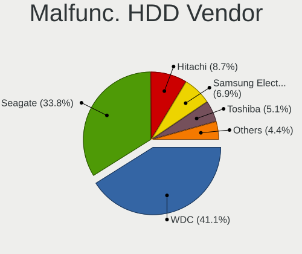

| Vendor              | Desktops | Drives | Percent |
|---------------------|----------|--------|---------|
| WDC                 | 113      | 154    | 41.09%  |
| Seagate             | 93       | 127    | 33.82%  |
| Hitachi             | 24       | 31     | 8.73%   |
| Samsung Electronics | 19       | 42     | 6.91%   |
| Toshiba             | 14       | 16     | 5.09%   |
| Maxtor              | 6        | 8      | 2.18%   |
| HGST                | 2        | 7      | 0.73%   |
| Fujitsu             | 2        | 2      | 0.73%   |
| ASMT                | 1        | 1      | 0.36%   |
| Apple               | 1        | 1      | 0.36%   |

Malfunc. Drive Kind
-------------------

Kinds of faulty drives

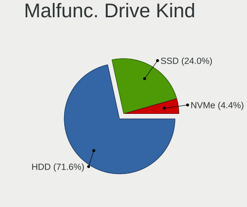

| Kind | Desktops | Drives | Percent |
|------|----------|--------|---------|
| HDD  | 242      | 389    | 71.6%   |
| SSD  | 81       | 99     | 23.96%  |
| NVMe | 15       | 18     | 4.44%   |

Failed Drives
-------------

Failed drive models

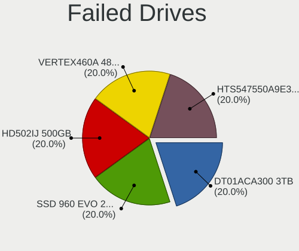

| Model                                 | Desktops | Drives | Percent |
|---------------------------------------|----------|--------|---------|
| Toshiba DT01ACA300 3TB                | 1        | 1      | 20%     |
| Samsung Electronics SSD 960 EVO 250GB | 1        | 2      | 20%     |
| Samsung Electronics HD502IJ 500GB     | 1        | 1      | 20%     |
| OCZ VERTEX460A 480GB SSD              | 1        | 1      | 20%     |
| Hitachi HTS547550A9E384 500GB         | 1        | 1      | 20%     |

Failed Drive Vendor
-------------------

Failed drive vendors

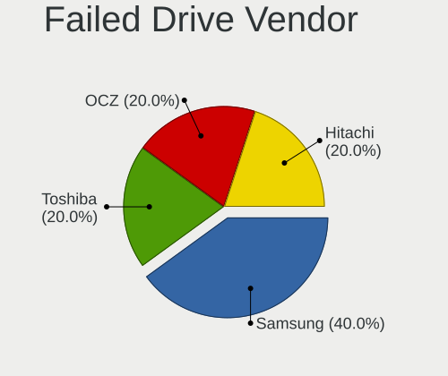

| Vendor              | Desktops | Drives | Percent |
|---------------------|----------|--------|---------|
| Samsung Electronics | 2        | 3      | 40%     |
| Toshiba             | 1        | 1      | 20%     |
| OCZ                 | 1        | 1      | 20%     |
| Hitachi             | 1        | 1      | 20%     |

Drive Status
------------

Number of failed and malfunc. drives

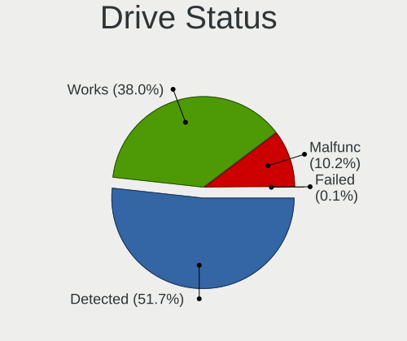

| Status   | Desktops | Drives | Percent |
|----------|----------|--------|---------|
| Detected | 1603     | 5140   | 51.74%  |
| Works    | 1176     | 3257   | 37.96%  |
| Malfunc  | 315      | 506    | 10.17%  |
| Failed   | 4        | 6      | 0.13%   |

Storage controller
------------------

Storage Vendor
--------------

Storage controller vendors

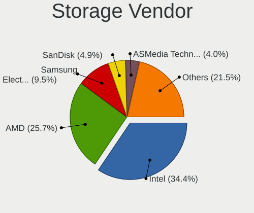

| Vendor                           | Desktops | Percent |
|----------------------------------|----------|---------|
| Intel                            | 1477     | 34.44%  |
| AMD                              | 1102     | 25.69%  |
| Samsung Electronics              | 407      | 9.49%   |
| SanDisk                          | 212      | 4.94%   |
| ASMedia Technology               | 170      | 3.96%   |
| Phison Electronics               | 142      | 3.31%   |
| Kingston Technology Company      | 123      | 2.87%   |
| Micron/Crucial Technology        | 107      | 2.49%   |
| JMicron Technology               | 81       | 1.89%   |
| Marvell Technology Group         | 72       | 1.68%   |
| Silicon Motion                   | 62       | 1.45%   |
| ADATA Technology                 | 44       | 1.03%   |
| Nvidia                           | 37       | 0.86%   |
| Realtek Semiconductor            | 36       | 0.84%   |
| MAXIO Technology (Hangzhou)      | 33       | 0.77%   |
| SK hynix                         | 21       | 0.49%   |
| Micron Technology                | 20       | 0.47%   |
| Broadcom / LSI                   | 17       | 0.4%    |
| Toshiba America Info Systems     | 14       | 0.33%   |
| Silicon Image                    | 13       | 0.3%    |
| Shenzhen Longsys Electronics     | 13       | 0.3%    |
| LSI Logic / Symbios Logic        | 13       | 0.3%    |
| KIOXIA                           | 10       | 0.23%   |
| INNOGRIT                         | 9        | 0.21%   |
| VIA Technologies                 | 8        | 0.19%   |
| Seagate Technology               | 8        | 0.19%   |
| Lite-On Technology               | 5        | 0.12%   |
| Hosin Global Electronics         | 4        | 0.09%   |
| Zhaoxin                          | 3        | 0.07%   |
| Yangtze Memory Technologies      | 3        | 0.07%   |
| Solid State Storage Technology   | 3        | 0.07%   |
| Solidigm                         | 2        | 0.05%   |
| Promise Technology               | 2        | 0.05%   |
| OCZ Technology Group             | 2        | 0.05%   |
| Integrated Technology Express    | 2        | 0.05%   |
| Adaptec                          | 2        | 0.05%   |
| Transcend                        | 1        | 0.02%   |
| Silicon Integrated Systems [SiS] | 1        | 0.02%   |
| Shenzhen Shichuangyi Electronics | 1        | 0.02%   |
| O2 Micro                         | 1        | 0.02%   |

Storage Model
-------------

Storage controller models

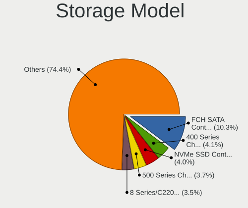

| Model                                                                                   | Desktops | Percent |
|-----------------------------------------------------------------------------------------|----------|---------|
| AMD FCH SATA Controller [AHCI mode]                                                     | 527      | 10.27%  |
| AMD 400 Series Chipset SATA Controller                                                  | 211      | 4.11%   |
| Samsung NVMe SSD Controller SM981/PM981/PM983                                           | 206      | 4.02%   |
| AMD 500 Series Chipset SATA Controller                                                  | 189      | 3.68%   |
| Intel 8 Series/C220 Series Chipset Family 6-port SATA Controller 1 [AHCI mode]          | 182      | 3.55%   |
| ASMedia ASM1061/ASM1062 Serial ATA Controller                                           | 153      | 2.98%   |
| AMD 600 Series Chipset SATA Controller                                                  | 130      | 2.53%   |
| Intel 200 Series PCH SATA controller [AHCI mode]                                        | 126      | 2.46%   |
| Intel Q170/Q150/B150/H170/H110/Z170/CM236 Chipset SATA Controller [AHCI Mode]           | 121      | 2.36%   |
| Intel 6 Series/C200 Series Chipset Family 6 port Desktop SATA AHCI Controller           | 115      | 2.24%   |
| AMD SB7x0/SB8x0/SB9x0 SATA Controller [AHCI mode]                                       | 114      | 2.22%   |
| Intel SATA Controller [RAID Mode]                                                       | 110      | 2.14%   |
| AMD SB7x0/SB8x0/SB9x0 IDE Controller                                                    | 100      | 1.95%   |
| Intel 7 Series/C210 Series Chipset Family 6-port SATA Controller [AHCI mode]            | 94       | 1.83%   |
| Samsung NVMe SSD Controller PM9A1/PM9A3/980PRO                                          | 90       | 1.75%   |
| Intel Cannon Lake PCH SATA AHCI Controller                                              | 86       | 1.68%   |
| Intel 9 Series Chipset Family SATA Controller [AHCI Mode]                               | 58       | 1.13%   |
| AMD 300 Series Chipset SATA Controller                                                  | 58       | 1.13%   |
| AMD SB7x0/SB8x0/SB9x0 SATA Controller [IDE mode]                                        | 57       | 1.11%   |
| Intel Alder Lake-S PCH SATA Controller [AHCI Mode]                                      | 56       | 1.09%   |
| AMD A320 Chipset SATA Controller [AHCI mode]                                            | 56       | 1.09%   |
| Intel Raptor Lake SATA AHCI Controller                                                  | 55       | 1.07%   |
| Phison E12 NVMe Controller                                                              | 52       | 1.01%   |
| Intel 500 Series Chipset Family SATA AHCI Controller                                    | 50       | 0.97%   |
| Silicon Motion SM2263EN/SM2263XT (DRAM-less) NVMe SSD Controllers                       | 49       | 0.96%   |
| Samsung NVMe SSD Controller 980 (DRAM-less)                                             | 49       | 0.96%   |
| Micron/Crucial P2 [Nick P2] / P3 / P3 Plus NVMe PCIe SSD (DRAM-less)                    | 45       | 0.88%   |
| JMicron JMB363 SATA/IDE Controller                                                      | 45       | 0.88%   |
| Intel 6 Series/C200 Series Chipset Family Desktop SATA Controller (IDE mode, ports 4-5) | 42       | 0.82%   |
| Intel 6 Series/C200 Series Chipset Family Desktop SATA Controller (IDE mode, ports 0-3) | 42       | 0.82%   |
| Kingston Company A2000 NVMe SSD [SM2263EN]                                              | 39       | 0.76%   |
| Intel NM10/ICH7 Family SATA Controller [IDE mode]                                       | 39       | 0.76%   |
| SanDisk WD SN560/SN740/SN770/SN5000 NVMe SSD                                            | 38       | 0.74%   |
| Phison E16 PCIe4 NVMe Controller                                                        | 37       | 0.72%   |
| Samsung NVMe SSD Controller SM961/PM961/SM963                                           | 35       | 0.68%   |
| Samsung NVMe SSD Controller S4LV008[Pascal]                                             | 35       | 0.68%   |
| SanDisk Ultra 3D / WD PC SN530, IX SN530, Blue SN550 NVMe SSD (DRAM-less)               | 34       | 0.66%   |
| Sandisk WD Black SN850X NVMe SSD                                                        | 31       | 0.6%    |
| Intel SSD 660P Series                                                                   | 31       | 0.6%    |
| Intel C610/X99 series chipset 6-Port SATA Controller [AHCI mode]                        | 31       | 0.6%    |

Storage Kind
------------

Kind of storage controller (IDE, SATA, NVMe, SAS, ...)

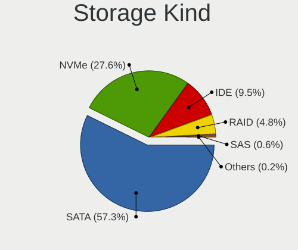

| Kind | Desktops | Percent |
|------|----------|---------|
| SATA | 2313     | 57.3%   |
| NVMe | 1115     | 27.62%  |
| IDE  | 383      | 9.49%   |
| RAID | 193      | 4.78%   |
| SAS  | 23       | 0.57%   |
| SCSI | 10       | 0.25%   |

Processor
---------

CPU Vendor
----------

Processor vendors

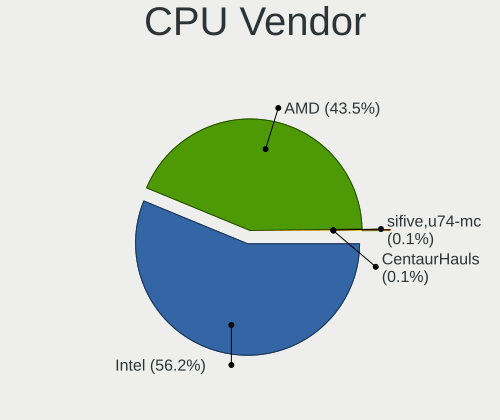

| Vendor        | Desktops | Percent |
|---------------|----------|---------|
| Intel         | 1486     | 56.22%  |
| AMD           | 1151     | 43.55%  |
| sifive,u74-mc | 3        | 0.11%   |
| CentaurHauls  | 3        | 0.11%   |

CPU Model
---------

Processor models

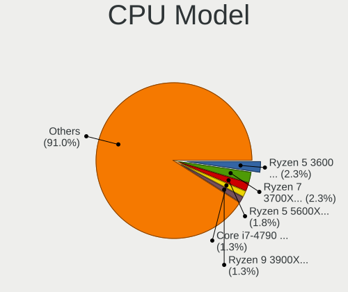

| Model                                       | Desktops | Percent |
|---------------------------------------------|----------|---------|
| AMD Ryzen 5 3600 6-Core Processor           | 62       | 2.33%   |
| AMD Ryzen 7 3700X 8-Core Processor          | 61       | 2.29%   |
| AMD Ryzen 5 5600X 6-Core Processor          | 47       | 1.77%   |
| Intel Core i7-4790 CPU @ 3.60GHz            | 35       | 1.32%   |
| AMD Ryzen 9 3900X 12-Core Processor         | 35       | 1.32%   |
| Intel Core i7-3770 CPU @ 3.40GHz            | 34       | 1.28%   |
| Intel Core i7-4790K CPU @ 4.00GHz           | 31       | 1.17%   |
| Intel Core i5-3470 CPU @ 3.20GHz            | 29       | 1.09%   |
| AMD Ryzen 5 2600 Six-Core Processor         | 29       | 1.09%   |
| AMD Ryzen 9 5900X 12-Core Processor         | 28       | 1.05%   |
| Intel Core i7-6700K CPU @ 4.00GHz           | 27       | 1.02%   |
| AMD Ryzen 5 5600G with Radeon Graphics      | 27       | 1.02%   |
| AMD Ryzen 7 5800X 8-Core Processor          | 26       | 0.98%   |
| AMD Ryzen 7 2700X Eight-Core Processor      | 26       | 0.98%   |
| AMD FX-8350 Eight-Core Processor            | 26       | 0.98%   |
| Intel Core i7-4770 CPU @ 3.40GHz            | 24       | 0.9%    |
| AMD Ryzen 9 5950X 16-Core Processor         | 24       | 0.9%    |
| Intel Core 2 Duo CPU E8400 @ 3.00GHz        | 23       | 0.86%   |
| AMD Ryzen 5 3400G with Radeon Vega Graphics | 23       | 0.86%   |
| Intel Core i7-7700K CPU @ 4.20GHz           | 22       | 0.83%   |
| AMD Ryzen 7 5700G with Radeon Graphics      | 22       | 0.83%   |
| AMD Ryzen 5 1600 Six-Core Processor         | 22       | 0.83%   |
| Intel Core i7-6700 CPU @ 3.40GHz            | 21       | 0.79%   |
| Intel Core i7-8700 CPU @ 3.20GHz            | 20       | 0.75%   |
| Intel Core i5-4460 CPU @ 3.20GHz            | 19       | 0.71%   |
| Intel Core i5-2400 CPU @ 3.10GHz            | 18       | 0.68%   |
| AMD Ryzen 5 2600X Six-Core Processor        | 18       | 0.68%   |
| Intel Core i7-8700K CPU @ 3.70GHz           | 17       | 0.64%   |
| Intel Core i5-8400 CPU @ 2.80GHz            | 17       | 0.64%   |
| Intel Core i5-6500 CPU @ 3.20GHz            | 17       | 0.64%   |
| Intel Core i7-7700 CPU @ 3.60GHz            | 16       | 0.6%    |
| Intel Core i7-2600 CPU @ 3.40GHz            | 16       | 0.6%    |
| Intel Core i5-4590 CPU @ 3.30GHz            | 16       | 0.6%    |
| Intel Core i9-9900K CPU @ 3.60GHz           | 15       | 0.56%   |
| Intel Core i5-9600K CPU @ 3.70GHz           | 15       | 0.56%   |
| Intel Core i5-6400 CPU @ 2.70GHz            | 15       | 0.56%   |
| Intel Core i5-10400F CPU @ 2.90GHz          | 15       | 0.56%   |
| Intel Core i3-2120 CPU @ 3.30GHz            | 15       | 0.56%   |
| AMD Ryzen 5 7600X 6-Core Processor          | 15       | 0.56%   |
| AMD Ryzen 5 2400G with Radeon Vega Graphics | 15       | 0.56%   |

CPU Model Family
----------------

Processor model prefix

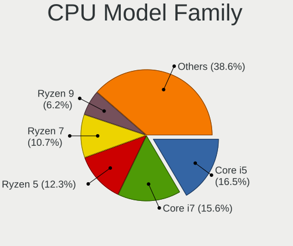

| Model                   | Desktops | Percent |
|-------------------------|----------|---------|
| Intel Core i5           | 439      | 16.52%  |
| Intel Core i7           | 415      | 15.61%  |
| AMD Ryzen 5             | 328      | 12.34%  |
| AMD Ryzen 7             | 284      | 10.68%  |
| AMD Ryzen 9             | 166      | 6.25%   |
| Other                   | 155      | 5.83%   |
| Intel Xeon              | 128      | 4.82%   |
| Intel Core i3           | 104      | 3.91%   |
| AMD FX                  | 99       | 3.72%   |
| Intel Core 2 Duo        | 49       | 1.84%   |
| Intel Pentium           | 48       | 1.81%   |
| Intel Core i9           | 41       | 1.54%   |
| Intel Celeron           | 39       | 1.47%   |
| Intel Core 2 Quad       | 36       | 1.35%   |
| AMD Ryzen 3             | 36       | 1.35%   |
| AMD Phenom II X4        | 32       | 1.2%    |
| AMD A10                 | 26       | 0.98%   |
| AMD A8                  | 23       | 0.87%   |
| AMD Athlon II X4        | 17       | 0.64%   |
| AMD Ryzen Threadripper  | 16       | 0.6%    |
| AMD Phenom II X6        | 14       | 0.53%   |
| AMD Athlon II X2        | 14       | 0.53%   |
| Intel Pentium Dual-Core | 13       | 0.49%   |
| AMD Ryzen 5 PRO         | 12       | 0.45%   |
| AMD Athlon 64 X2        | 12       | 0.45%   |
| AMD A6                  | 11       | 0.41%   |
| AMD Athlon              | 10       | 0.38%   |
| AMD Ryzen 7 PRO         | 9        | 0.34%   |
| AMD A4                  | 9        | 0.34%   |
| AMD Phenom II X2        | 6        | 0.23%   |
| Intel Pentium Gold      | 5        | 0.19%   |
| Intel Pentium D         | 5        | 0.19%   |
| Intel Core              | 5        | 0.19%   |
| AMD Phenom              | 5        | 0.19%   |
| Intel Pentium 4         | 4        | 0.15%   |
| Intel Atom              | 4        | 0.15%   |
| AMD Sempron             | 4        | 0.15%   |
| AMD Athlon 64           | 4        | 0.15%   |
| Intel Pentium Dual      | 3        | 0.11%   |
| AMD Opteron             | 3        | 0.11%   |

CPU Cores
---------

Number of processor cores

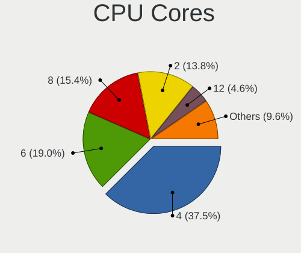

| Number  | Desktops | Percent |
|---------|----------|---------|
| 4       | 997      | 37.54%  |
| 6       | 505      | 19.01%  |
| 8       | 409      | 15.4%   |
| 2       | 367      | 13.82%  |
| 12      | 123      | 4.63%   |
| 16      | 105      | 3.95%   |
| 10      | 28       | 1.05%   |
| 1       | 27       | 1.02%   |
| 24      | 26       | 0.98%   |
| 14      | 21       | 0.79%   |
| 20      | 17       | 0.64%   |
| 3       | 16       | 0.6%    |
| 32      | 5        | 0.19%   |
| 18      | 3        | 0.11%   |
| Unknown | 3        | 0.11%   |
| 64      | 1        | 0.04%   |
| 44      | 1        | 0.04%   |
| 36      | 1        | 0.04%   |
| 28      | 1        | 0.04%   |

CPU Sockets
-----------

Number of sockets

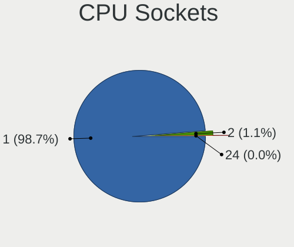

| Number  | Desktops | Percent |
|---------|----------|---------|
| 1       | 2609     | 98.71%  |
| 2       | 30       | 1.14%   |
| Unknown | 3        | 0.11%   |
| 24      | 1        | 0.04%   |

CPU Threads
-----------

Threads per core (Hyper-Threading)

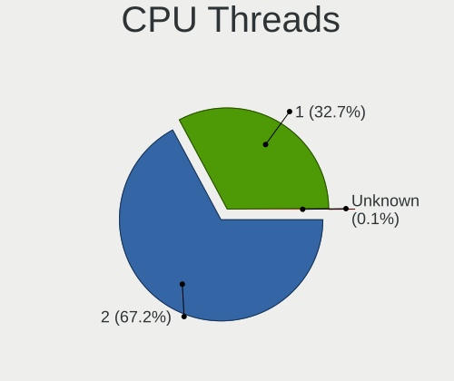

| Number  | Desktops | Percent |
|---------|----------|---------|
| 2       | 1781     | 67.16%  |
| 1       | 868      | 32.73%  |
| Unknown | 3        | 0.11%   |

CPU Op-Modes
------------

CPU Operation Modes (32-bit, 64-bit)

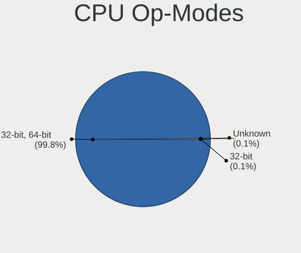

| Op mode        | Desktops | Percent |
|----------------|----------|---------|
| 32-bit, 64-bit | 2638     | 99.81%  |
| Unknown        | 3        | 0.11%   |
| 32-bit         | 2        | 0.08%   |

CPU Microcode
-------------

Microcode number

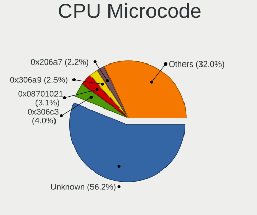

| Number     | Desktops | Percent |
|------------|----------|---------|
| Unknown    | 1536     | 56.18%  |
| 0x306c3    | 110      | 4.02%   |
| 0x08701021 | 86       | 3.15%   |
| 0x306a9    | 68       | 2.49%   |
| 0x206a7    | 60       | 2.19%   |
| 0x506e3    | 51       | 1.87%   |
| 0x0800820d | 51       | 1.87%   |
| 0x06000852 | 43       | 1.57%   |
| 0x906e9    | 40       | 1.46%   |
| 0x1067a    | 39       | 1.43%   |
| 0x08701013 | 38       | 1.39%   |
| 0x906ea    | 35       | 1.28%   |
| 0x010000c8 | 29       | 1.06%   |
| 0xa0653    | 20       | 0.73%   |
| 0x08001138 | 20       | 0.73%   |
| 0x906ed    | 19       | 0.69%   |
| 0x0a201016 | 19       | 0.69%   |
| 0x306f2    | 18       | 0.66%   |
| 0x0a601203 | 16       | 0.59%   |
| 0xa0655    | 15       | 0.55%   |
| 0x0a50000c | 14       | 0.51%   |
| 0x08108109 | 14       | 0.51%   |
| 0x08001137 | 14       | 0.51%   |
| 0x06001119 | 14       | 0.51%   |
| 0x6fb      | 13       | 0.48%   |
| 0x106e5    | 13       | 0.48%   |
| 0x0a201009 | 13       | 0.48%   |
| 0x010000db | 13       | 0.48%   |
| 0x106a5    | 12       | 0.44%   |
| 0x0a50000d | 12       | 0.44%   |
| 0x10676    | 11       | 0.4%    |
| 0xa0671    | 10       | 0.37%   |
| 0x306e4    | 10       | 0.37%   |
| 0x08101016 | 10       | 0.37%   |
| 0x06003106 | 10       | 0.37%   |
| 0x90672    | 8        | 0.29%   |
| 0x206d7    | 8        | 0.29%   |
| 0x08701030 | 8        | 0.29%   |
| 0x08600106 | 8        | 0.29%   |
| 0x0600063e | 8        | 0.29%   |

CPU Microarch
-------------

Microarchitecture

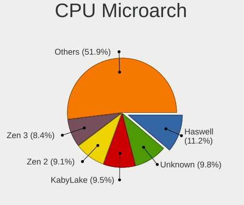

| Name             | Desktops | Percent |
|------------------|----------|---------|
| Haswell          | 298      | 11.2%   |
| Unknown          | 262      | 9.85%   |
| KabyLake         | 253      | 9.51%   |
| Zen 2            | 243      | 9.14%   |
| Zen 3            | 223      | 8.38%   |
| IvyBridge        | 166      | 6.24%   |
| Zen+             | 146      | 5.49%   |
| SandyBridge      | 142      | 5.34%   |
| Skylake          | 129      | 4.85%   |
| Piledriver       | 119      | 4.47%   |
| Zen              | 106      | 3.98%   |
| K10              | 90       | 3.38%   |
| Penryn           | 89       | 3.35%   |
| CometLake        | 75       | 2.82%   |
| Alderlake Hybrid | 48       | 1.8%    |
| Nehalem          | 46       | 1.73%   |
| Core             | 29       | 1.09%   |
| Westmere         | 28       | 1.05%   |
| Icelake          | 22       | 0.83%   |
| Steamroller      | 21       | 0.79%   |
| K8 Hammer        | 18       | 0.68%   |
| Broadwell        | 16       | 0.6%    |
| Excavator        | 13       | 0.49%   |
| Bulldozer        | 13       | 0.49%   |
| Goldmont plus    | 10       | 0.38%   |
| NetBurst         | 9        | 0.34%   |
| K10 Llano        | 9        | 0.34%   |
| Silvermont       | 8        | 0.3%    |
| Goldmont         | 7        | 0.26%   |
| Jaguar           | 5        | 0.19%   |
| TigerLake        | 3        | 0.11%   |
| Puma             | 3        | 0.11%   |
| Bobcat           | 3        | 0.11%   |
| Lunarlake Hybrid | 2        | 0.08%   |
| Gracemont        | 2        | 0.08%   |
| Bonnell          | 2        | 0.08%   |
| Tremont          | 1        | 0.04%   |
| K6               | 1        | 0.04%   |

Graphics
--------

GPU Vendor
----------

Vendors of graphics cards

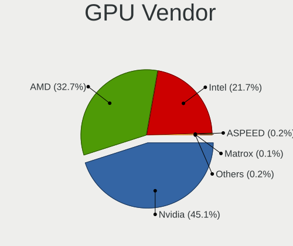

| Vendor                     | Desktops | Percent |
|----------------------------|----------|---------|
| Nvidia                     | 1296     | 45.06%  |
| AMD                        | 941      | 32.72%  |
| Intel                      | 625      | 21.73%  |
| ASPEED Technology          | 5        | 0.17%   |
| Matrox Electronics Systems | 4        | 0.14%   |
| Zhaoxin                    | 3        | 0.1%    |
| Qualcomm Atheros           | 1        | 0.03%   |
| ATI Technologies           | 1        | 0.03%   |

GPU Model
---------

Graphics card models

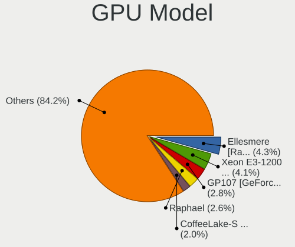

| Model                                                                       | Desktops | Percent |
|-----------------------------------------------------------------------------|----------|---------|
| AMD Ellesmere [Radeon RX 470/480/570/570X/580/580X/590]                     | 130      | 4.33%   |
| Intel Xeon E3-1200 v3/4th Gen Core Processor Integrated Graphics Controller | 124      | 4.13%   |
| Nvidia GP107 [GeForce GTX 1050 Ti]                                          | 85       | 2.83%   |
| AMD Raphael                                                                 | 78       | 2.6%    |
| Intel CoffeeLake-S GT2 [UHD Graphics 630]                                   | 59       | 1.96%   |
| Intel 2nd Generation Core Processor Family Integrated Graphics Controller   | 58       | 1.93%   |
| Nvidia GK208B [GeForce GT 710]                                              | 56       | 1.86%   |
| Intel Skylake-S GT2 [HD Graphics 530]                                       | 49       | 1.63%   |
| Intel Xeon E3-1200 v2/3rd Gen Core processor Graphics Controller            | 48       | 1.6%    |
| Nvidia GP106 [GeForce GTX 1060 6GB]                                         | 42       | 1.4%    |
| AMD Cezanne [Radeon Vega Series / Radeon Vega Mobile Series]                | 42       | 1.4%    |
| Nvidia GP104 [GeForce GTX 1070]                                             | 41       | 1.36%   |
| Nvidia GP108 [GeForce GT 1030]                                              | 40       | 1.33%   |
| AMD Picasso/Raven 2 [Radeon Vega Series / Radeon Vega Mobile Series]        | 39       | 1.3%    |
| AMD Navi 23 [Radeon RX 6600/6600 XT/6600M]                                  | 36       | 1.2%    |
| Nvidia GA106 [GeForce RTX 3060 Lite Hash Rate]                              | 35       | 1.17%   |
| Nvidia GP104 [GeForce GTX 1080]                                             | 34       | 1.13%   |
| Nvidia GM204 [GeForce GTX 970]                                              | 34       | 1.13%   |
| Intel Kaby Lake-S GT2 [HD Graphics 630]                                     | 33       | 1.1%    |
| AMD Navi 10 [Radeon RX 5600 OEM/5600 XT / 5700/5700 XT]                     | 33       | 1.1%    |
| Nvidia GM206 [GeForce GTX 960]                                              | 32       | 1.07%   |
| Nvidia TU117 [GeForce GTX 1650]                                             | 28       | 0.93%   |
| AMD Raven Ridge [Radeon Vega Series / Radeon Vega Mobile Series]            | 28       | 0.93%   |
| Nvidia GK208B [GeForce GT 730]                                              | 27       | 0.9%    |
| Intel IvyBridge GT2 [HD Graphics 4000]                                      | 27       | 0.9%    |
| AMD Navi 22 [Radeon RX 6700/6700 XT/6750 XT / 6800M/6850M XT]               | 26       | 0.87%   |
| AMD Lexa PRO [Radeon 540/540X/550/550X / RX 540X/550/550X]                  | 26       | 0.87%   |
| AMD Cedar [Radeon HD 5000/6000/7350/8350 Series]                            | 25       | 0.83%   |
| Nvidia TU106 [GeForce RTX 2060 Rev. A]                                      | 24       | 0.8%    |
| AMD Renoir [Radeon Vega Series / Radeon Vega Mobile Series]                 | 24       | 0.8%    |
| AMD Granite Ridge [Radeon Graphics]                                         | 24       | 0.8%    |
| Nvidia TU116 [GeForce GTX 1660 SUPER]                                       | 23       | 0.77%   |
| Nvidia GT218 [GeForce 210]                                                  | 23       | 0.77%   |
| Nvidia GP107 [GeForce GTX 1050]                                             | 23       | 0.77%   |
| Intel 4 Series Chipset Integrated Graphics Controller                       | 23       | 0.77%   |
| Nvidia TU104 [GeForce RTX 2070 SUPER]                                       | 22       | 0.73%   |
| Intel CometLake-S GT2 [UHD Graphics 630]                                    | 22       | 0.73%   |
| Nvidia GM107 [GeForce GTX 750 Ti]                                           | 21       | 0.7%    |
| AMD Navi 31 [Radeon RX 7900 XT/7900 XTX/7900 GRE/7900M]                     | 21       | 0.7%    |
| Nvidia TU116 [GeForce GTX 1660]                                             | 20       | 0.67%   |

GPU Combo
---------

Combinations of graphics cards

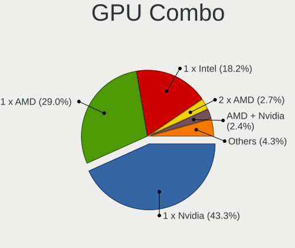

| Name                     | Desktops | Percent |
|--------------------------|----------|---------|
| 1 x Nvidia               | 1158     | 43.29%  |
| 1 x AMD                  | 777      | 29.05%  |
| 1 x Intel                | 486      | 18.17%  |
| 2 x AMD                  | 73       | 2.73%   |
| AMD + Nvidia             | 65       | 2.43%   |
| Intel + Nvidia           | 41       | 1.53%   |
| Intel + AMD              | 26       | 0.97%   |
| 2 x Nvidia               | 22       | 0.82%   |
| 3 x Nvidia               | 4        | 0.15%   |
| Other                    | 3        | 0.11%   |
| 1 x Zhaoxin              | 3        | 0.11%   |
| Nvidia + ASPEED          | 3        | 0.11%   |
| Intel + 2 x Nvidia       | 2        | 0.07%   |
| 1 x ASPEED               | 2        | 0.07%   |
| AMD + 2 x Nvidia         | 2        | 0.07%   |
| AMD + Matrox             | 2        | 0.07%   |
| 3 x AMD                  | 1        | 0.04%   |
| 2 x Intel                | 1        | 0.04%   |
| Nvidia + Matrox          | 1        | 0.04%   |
| 1 x Matrox               | 1        | 0.04%   |
| Intel + 2 x AMD          | 1        | 0.04%   |
| Intel + AMD + 1 x Nvidia | 1        | 0.04%   |

GPU Driver
----------

Free vs proprietary

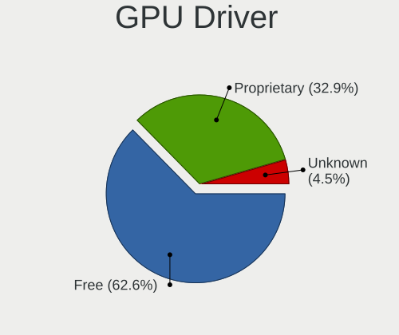

| Driver      | Desktops | Percent |
|-------------|----------|---------|
| Free        | 1689     | 62.65%  |
| Proprietary | 887      | 32.9%   |
| Unknown     | 120      | 4.45%   |

GPU Memory
----------

Total video memory

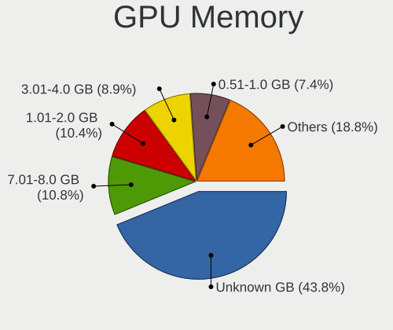

| Size in GB | Desktops | Percent |
|------------|----------|---------|
| Unknown    | 1197     | 43.83%  |
| 7.01-8.0   | 295      | 10.8%   |
| 1.01-2.0   | 283      | 10.36%  |
| 3.01-4.0   | 242      | 8.86%   |
| 0.51-1.0   | 201      | 7.36%   |
| 8.01-16.0  | 169      | 6.19%   |
| 0.01-0.5   | 143      | 5.24%   |
| 5.01-6.0   | 127      | 4.65%   |
| 16.01-24.0 | 35       | 1.28%   |
| 2.01-3.0   | 32       | 1.17%   |
| 4.01-5.0   | 4        | 0.15%   |
| 24.01-32.0 | 2        | 0.07%   |
| 32.01-64.0 | 1        | 0.04%   |

Monitor
-------

Monitor Vendor
--------------

Monitor vendors

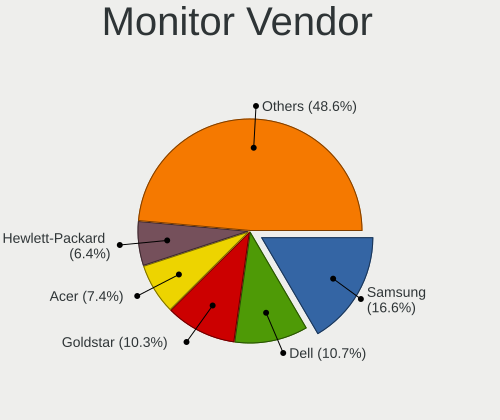

| Vendor               | Desktops | Percent |
|----------------------|----------|---------|
| Samsung Electronics  | 514      | 16.57%  |
| Dell                 | 331      | 10.67%  |
| Goldstar             | 320      | 10.32%  |
| Acer                 | 230      | 7.41%   |
| Hewlett-Packard      | 200      | 6.45%   |
| AOC                  | 150      | 4.84%   |
| BenQ                 | 148      | 4.77%   |
| Philips              | 138      | 4.45%   |
| Ancor Communications | 135      | 4.35%   |
| Iiyama               | 90       | 2.9%    |
| ASUSTek Computer     | 88       | 2.84%   |
| ViewSonic            | 66       | 2.13%   |
| Unknown              | 40       | 1.29%   |
| Lenovo               | 38       | 1.23%   |
| LG Electronics       | 33       | 1.06%   |
| Gigabyte Technology  | 30       | 0.97%   |
| Sony                 | 29       | 0.93%   |
| Sceptre Tech         | 26       | 0.84%   |
| Eizo                 | 25       | 0.81%   |
| MSI                  | 24       | 0.77%   |
| NEC Computers        | 21       | 0.68%   |
| Vizio                | 16       | 0.52%   |
| Panasonic            | 14       | 0.45%   |
| Mi                   | 14       | 0.45%   |
| Medion               | 13       | 0.42%   |
| HannStar             | 13       | 0.42%   |
| Unknown              | 13       | 0.42%   |
| Fujitsu Siemens      | 12       | 0.39%   |
| Vestel Elektronik    | 10       | 0.32%   |
| Idek Iiyama          | 10       | 0.32%   |
| HKC                  | 10       | 0.32%   |
| RTK                  | 9        | 0.29%   |
| ONN                  | 8        | 0.26%   |
| Insignia             | 8        | 0.26%   |
| Toshiba              | 7        | 0.23%   |
| Unknown (XXX)        | 6        | 0.19%   |
| Planar               | 6        | 0.19%   |
| Hitachi              | 6        | 0.19%   |
| MiTAC                | 5        | 0.16%   |
| CHD                  | 5        | 0.16%   |

Monitor Model
-------------

Monitor models

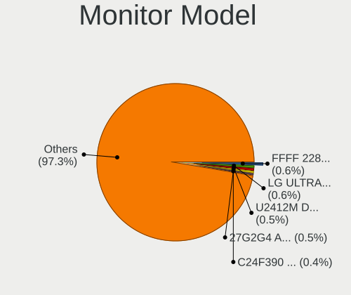

| Model                                                                 | Desktops | Percent |
|-----------------------------------------------------------------------|----------|---------|
| Unknown LCD Monitor FFFF 2288x1287 2550x2550mm 142.0-inch             | 21       | 0.62%   |
| Goldstar LG ULTRAWIDE GSM59F1 2560x1080 670x280mm 28.6-inch           | 20       | 0.59%   |
| Dell U2412M DELA07A 1920x1200 518x324mm 24.1-inch                     | 18       | 0.53%   |
| AOC 27G2G4 AOC2702 1920x1080 598x336mm 27.0-inch                      | 17       | 0.5%    |
| Samsung Electronics C24F390 SAM0D2C 1920x1080 521x293mm 23.5-inch     | 14       | 0.42%   |
| Goldstar Ultra HD GSM5B09 3840x2160 600x340mm 27.2-inch               | 13       | 0.39%   |
| Unknown                                                               | 13       | 0.39%   |
| Samsung Electronics C27F390 SAM0D32 1920x1080 598x336mm 27.0-inch     | 12       | 0.36%   |
| Goldstar FULL HD GSM5B55 1920x1080 480x270mm 21.7-inch                | 12       | 0.36%   |
| Goldstar LG TV SSCR2 GSMC0C8 3840x2160                                | 10       | 0.3%    |
| Goldstar LG IPS FULLHD GSM5AB8 1920x1080 480x270mm 21.7-inch          | 10       | 0.3%    |
| Vestel Elektronik 40UHD_LCD_TV VES3700 3840x2160 880x500mm 39.8-inch  | 9        | 0.27%   |
| Samsung Electronics S24F350 SAM0D20 1920x1080 521x293mm 23.5-inch     | 9        | 0.27%   |
| Goldstar HDR 4K GSM7707 3840x2160 600x340mm 27.2-inch                 | 9        | 0.27%   |
| Samsung Electronics U32J59x SAM0F35 3840x2160 697x392mm 31.5-inch     | 8        | 0.24%   |
| Samsung Electronics S22F350 SAM0D1A 1920x1080 477x268mm 21.5-inch     | 8        | 0.24%   |
| Samsung Electronics U28E590 SAM0C4D 3840x2160 607x345mm 27.5-inch     | 7        | 0.21%   |
| BenQ GL2460 BNQ78CE 1920x1080 531x299mm 24.0-inch                     | 7        | 0.21%   |
| Ancor Communications ASUS VS247 ACI249A 1920x1080 521x293mm 23.5-inch | 7        | 0.21%   |
| Acer G246HL ACR02FF 1920x1080 531x299mm 24.0-inch                     | 7        | 0.21%   |
| Sceptre Tech Sceptre F24 SPT09AB 1920x1080 530x290mm 23.8-inch        | 6        | 0.18%   |
| Samsung Electronics SyncMaster SAM0587 1920x1200 518x324mm 24.1-inch  | 6        | 0.18%   |
| Goldstar Ultra HD GSM5B08 3840x2160 600x340mm 27.2-inch               | 6        | 0.18%   |
| Goldstar 27GL850 GSM5B7F 2560x1440 597x336mm 27.0-inch                | 6        | 0.18%   |
| Dell U2412M DELA07B 1920x1200 518x324mm 24.1-inch                     | 6        | 0.18%   |
| Dell U2412M DELA079 1920x1200 518x324mm 24.1-inch                     | 6        | 0.18%   |
| AOC 2470W AOC2470 1920x1080 521x293mm 23.5-inch                       | 6        | 0.18%   |
| Ancor Communications ASUS VS228 ACI22FD 1920x1080 476x268mm 21.5-inch | 6        | 0.18%   |
| Unknown LCD Monitor SAMSUNG 1920x1080                                 | 5        | 0.15%   |
| Sceptre Tech Sceptre F27 SPT0AD7 1920x1080 600x330mm 27.0-inch        | 5        | 0.15%   |
| Sceptre Tech Sceptre E24 SPT099D 1920x1080 521x293mm 23.5-inch        | 5        | 0.15%   |
| Samsung Electronics SyncMaster SAM05CC 1920x1080 530x300mm 24.0-inch  | 5        | 0.15%   |
| RTK LCD Monitor RTK1D1A 1920x1080 1020x570mm 46.0-inch                | 5        | 0.15%   |
| Philips PHL 273V7 PHLC156 1920x1080 598x336mm 27.0-inch               | 5        | 0.15%   |
| Philips FTV PHL01EA 1920x1080 1440x810mm 65.0-inch                    | 5        | 0.15%   |
| ONN ONA18HO015 ONN0101 1920x1080 698x393mm 31.5-inch                  | 5        | 0.15%   |
| Mi Monitor XMI3444 3440x1440 797x334mm 34.0-inch                      | 5        | 0.15%   |
| Hewlett-Packard 27fh HPN354A 1920x1080 598x336mm 27.0-inch            | 5        | 0.15%   |
| Goldstar ULTRAGEAR GSM7766 2560x1440 697x392mm 31.5-inch              | 5        | 0.15%   |
| Goldstar HDR 4K GSM7706 3840x2160 600x340mm 27.2-inch                 | 5        | 0.15%   |

Monitor Resolution
------------------

Monitor screen resolution

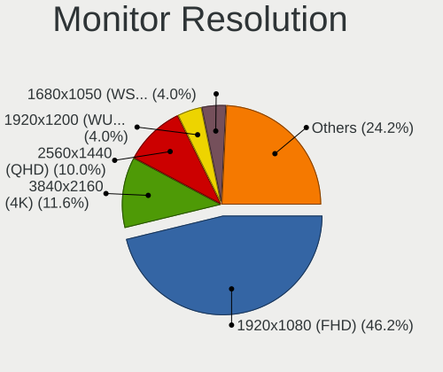

| Resolution         | Desktops | Percent |
|--------------------|----------|---------|
| 1920x1080 (FHD)    | 1367     | 46.21%  |
| 3840x2160 (4K)     | 342      | 11.56%  |
| 2560x1440 (QHD)    | 295      | 9.97%   |
| 1920x1200 (WUXGA)  | 119      | 4.02%   |
| 1680x1050 (WSXGA+) | 118      | 3.99%   |
| 1280x1024 (SXGA)   | 100      | 3.38%   |
| Unknown            | 83       | 2.81%   |
| 3440x1440          | 82       | 2.77%   |
| 1366x768 (WXGA)    | 64       | 2.16%   |
| 1440x900 (WXGA+)   | 57       | 1.93%   |
| 1600x900 (HD+)     | 56       | 1.89%   |
| 2560x1080          | 53       | 1.79%   |
| 3840x1080          | 44       | 1.49%   |
| 1360x768           | 37       | 1.25%   |
| 2288x1287          | 21       | 0.71%   |
| 1920x540           | 15       | 0.51%   |
| 3840x1200          | 10       | 0.34%   |
| 1600x1200          | 10       | 0.34%   |
| 1024x768 (XGA)     | 10       | 0.34%   |
| 3840x1600          | 8        | 0.27%   |
| 4480x1440          | 7        | 0.24%   |
| 1280x720 (HD)      | 5        | 0.17%   |
| 5760x1080          | 4        | 0.14%   |
| 3600x1080          | 4        | 0.14%   |
| 3200x1080          | 4        | 0.14%   |
| 2560x1600          | 4        | 0.14%   |
| 5760x2160          | 3        | 0.1%    |
| 7680x2160          | 2        | 0.07%   |
| 480x1920           | 2        | 0.07%   |
| 4480x1080          | 2        | 0.07%   |
| 3600x1200          | 2        | 0.07%   |
| 6400x2160          | 1        | 0.03%   |
| 6400x1080          | 1        | 0.03%   |
| 6160x1440          | 1        | 0.03%   |
| 5760x1200          | 1        | 0.03%   |
| 5120x1440          | 1        | 0.03%   |
| 504x315            | 1        | 0.03%   |
| 4800x1080          | 1        | 0.03%   |
| 4480x1600          | 1        | 0.03%   |
| 3840x2560          | 1        | 0.03%   |

Monitor Diagonal
----------------

Diagonal size in inches

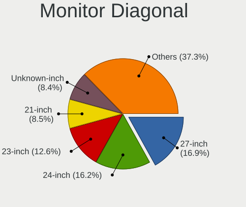

| Inches  | Desktops | Percent |
|---------|----------|---------|
| 27      | 520      | 16.92%  |
| 24      | 499      | 16.23%  |
| 23      | 387      | 12.59%  |
| 21      | 262      | 8.52%   |
| Unknown | 258      | 8.39%   |
| 31      | 207      | 6.73%   |
| 34      | 113      | 3.68%   |
| 19      | 112      | 3.64%   |
| 22      | 84       | 2.73%   |
| 20      | 65       | 2.11%   |
| 18      | 61       | 1.98%   |
| 17      | 49       | 1.59%   |
| 32      | 47       | 1.53%   |
| 84      | 43       | 1.4%    |
| 72      | 35       | 1.14%   |
| 40      | 30       | 0.98%   |
| 54      | 27       | 0.88%   |
| 25      | 25       | 0.81%   |
| 15      | 25       | 0.81%   |
| 142     | 21       | 0.68%   |
| 28      | 20       | 0.65%   |
| 48      | 16       | 0.52%   |
| 46      | 15       | 0.49%   |
| 63      | 14       | 0.46%   |
| 26      | 14       | 0.46%   |
| 42      | 10       | 0.33%   |
| 37      | 10       | 0.33%   |
| 39      | 9        | 0.29%   |
| 29      | 9        | 0.29%   |
| 65      | 8        | 0.26%   |
| 36      | 8        | 0.26%   |
| 52      | 7        | 0.23%   |
| 43      | 7        | 0.23%   |
| 74      | 5        | 0.16%   |
| 49      | 5        | 0.16%   |
| 35      | 5        | 0.16%   |
| 33      | 5        | 0.16%   |
| 60      | 4        | 0.13%   |
| 55      | 4        | 0.13%   |
| 64      | 3        | 0.1%    |

Monitor Width
-------------

Physical width

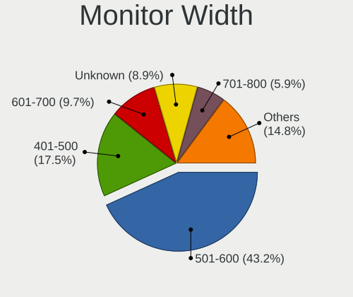

| Width in mm    | Desktops | Percent |
|----------------|----------|---------|
| 501-600        | 1259     | 43.22%  |
| 401-500        | 510      | 17.51%  |
| 601-700        | 283      | 9.72%   |
| Unknown        | 258      | 8.86%   |
| 701-800        | 171      | 5.87%   |
| 1001-1500      | 109      | 3.74%   |
| 1501-2000      | 85       | 2.92%   |
| 301-350        | 71       | 2.44%   |
| 351-400        | 64       | 2.2%    |
| 801-900        | 54       | 1.85%   |
| More than 2000 | 21       | 0.72%   |
| 901-1000       | 20       | 0.69%   |
| 201-300        | 6        | 0.21%   |
| 101-200        | 1        | 0.03%   |
| 1-100          | 1        | 0.03%   |

Aspect Ratio
------------

Proportional relationship between the width and the height

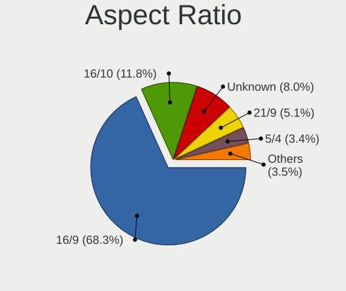

| Ratio   | Desktops | Percent |
|---------|----------|---------|
| 16/9    | 1849     | 68.25%  |
| 16/10   | 320      | 11.81%  |
| Unknown | 216      | 7.97%   |
| 21/9    | 137      | 5.06%   |
| 5/4     | 91       | 3.36%   |
| 4/3     | 26       | 0.96%   |
| 32/9    | 24       | 0.89%   |
| 1.00    | 22       | 0.81%   |
| 3/2     | 13       | 0.48%   |
| 6/5     | 6        | 0.22%   |
| 1.96    | 2        | 0.07%   |
| 0.25    | 2        | 0.07%   |
| 3.20    | 1        | 0.04%   |

Monitor Area
------------

Area in inch²

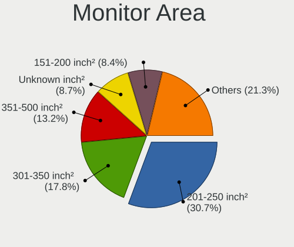

| Area in inch² | Desktops | Percent |
|----------------|----------|---------|
| 201-250        | 912      | 30.68%  |
| 301-350        | 529      | 17.79%  |
| 351-500        | 392      | 13.19%  |
| Unknown        | 258      | 8.68%   |
| 151-200        | 250      | 8.41%   |
| 251-300        | 212      | 7.13%   |
| More than 1000 | 179      | 6.02%   |
| 501-1000       | 109      | 3.67%   |
| 141-150        | 89       | 2.99%   |
| 101-110        | 24       | 0.81%   |
| 131-140        | 5        | 0.17%   |
| 81-90          | 3        | 0.1%    |
| 71-80          | 3        | 0.1%    |
| 51-60          | 2        | 0.07%   |
| 1-40           | 2        | 0.07%   |
| 121-130        | 2        | 0.07%   |
| 111-120        | 2        | 0.07%   |

Pixel Density
-------------

Pixels per inch

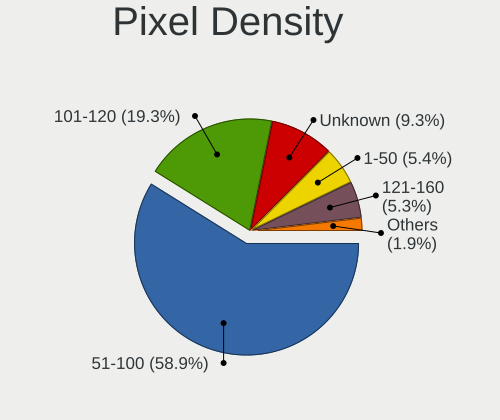

| Density       | Desktops | Percent |
|---------------|----------|---------|
| 51-100        | 1641     | 58.88%  |
| 101-120       | 538      | 19.3%   |
| Unknown       | 258      | 9.26%   |
| 1-50          | 150      | 5.38%   |
| 121-160       | 147      | 5.27%   |
| 161-240       | 52       | 1.87%   |
| More than 240 | 1        | 0.04%   |

Multiple Monitors
-----------------

Total monitors connected

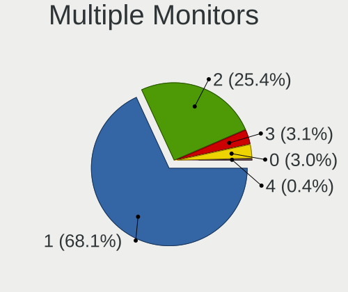

| Total | Desktops | Percent |
|-------|----------|---------|
| 1     | 1846     | 68.12%  |
| 2     | 688      | 25.39%  |
| 3     | 84       | 3.1%    |
| 0     | 80       | 2.95%   |
| 4     | 12       | 0.44%   |

Network
-------

Net Controller Vendor
---------------------

Controller vendors

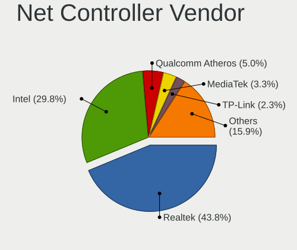

| Vendor                          | Desktops | Percent |
|---------------------------------|----------|---------|
| Realtek Semiconductor           | 1692     | 43.78%  |
| Intel                           | 1153     | 29.83%  |
| Qualcomm Atheros                | 193      | 4.99%   |
| MediaTek                        | 127      | 3.29%   |
| TP-Link                         | 87       | 2.25%   |
| Broadcom                        | 82       | 2.12%   |
| Ralink Technology               | 68       | 1.76%   |
| Ralink                          | 39       | 1.01%   |
| Aquantia                        | 34       | 0.88%   |
| Nvidia                          | 29       | 0.75%   |
| Microsoft                       | 27       | 0.7%    |
| NetGear                         | 26       | 0.67%   |
| Qualcomm Atheros Communications | 25       | 0.65%   |
| Samsung Electronics             | 24       | 0.62%   |
| ASIX Electronics                | 19       | 0.49%   |
| Xiaomi                          | 17       | 0.44%   |
| ASUSTek Computer                | 17       | 0.44%   |
| D-Link                          | 14       | 0.36%   |
| DisplayLink                     | 12       | 0.31%   |
| Huawei Technologies             | 10       | 0.26%   |
| D-Link System                   | 10       | 0.26%   |
| Edimax Technology               | 9        | 0.23%   |
| Broadcom Limited                | 8        | 0.21%   |
| OPPO Electronics                | 7        | 0.18%   |
| Linksys                         | 7        | 0.18%   |
| Belkin Components               | 7        | 0.18%   |
| AVM                             | 7        | 0.18%   |
| VIA Technologies                | 6        | 0.16%   |
| Qualcomm Technologies           | 5        | 0.13%   |
| QinHeng Electronics             | 5        | 0.13%   |
| Marvell Technology Group        | 5        | 0.13%   |
| Arduino SA                      | 5        | 0.13%   |
| Qualcomm                        | 4        | 0.1%    |
| Mellanox Technologies           | 4        | 0.1%    |
| Google                          | 4        | 0.1%    |
| Apple                           | 4        | 0.1%    |
| Wacom                           | 3        | 0.08%   |
| Oculus VR                       | 3        | 0.08%   |
| Mercucys                        | 3        | 0.08%   |
| Accton Technology               | 3        | 0.08%   |

Net Controller Model
--------------------

Controller models

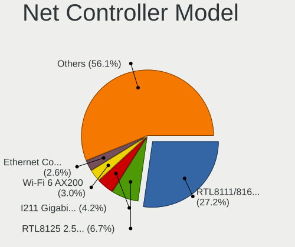

| Model                                                                          | Desktops | Percent |
|--------------------------------------------------------------------------------|----------|---------|
| Realtek RTL8111/8168/8211/8411 PCI Express Gigabit Ethernet Controller         | 1225     | 27.23%  |
| Realtek RTL8125 2.5GbE Controller                                              | 302      | 6.71%   |
| Intel I211 Gigabit Network Connection                                          | 190      | 4.22%   |
| Intel Wi-Fi 6 AX200                                                            | 137      | 3.05%   |
| Intel Ethernet Controller I225-V                                               | 119      | 2.65%   |
| Intel Ethernet Connection (2) I219-V                                           | 105      | 2.33%   |
| Intel 82579LM Gigabit Network Connection (Lewisville)                          | 84       | 1.87%   |
| MediaTek MT7922 802.11ax PCI Express Wireless Network Adapter                  | 65       | 1.45%   |
| Intel Ethernet Connection I217-LM                                              | 62       | 1.38%   |
| Intel Wi-Fi 6E(802.11ax) AX210/AX1675* 2x2 [Typhoon Peak]                      | 60       | 1.33%   |
| Intel Dual Band Wireless-AC 3168NGW [Stone Peak]                               | 59       | 1.31%   |
| Intel Ethernet Connection (7) I219-V                                           | 58       | 1.29%   |
| Intel Wi-Fi 5(802.11ac) Wireless-AC 9x6x [Thunder Peak]                        | 42       | 0.93%   |
| Intel Ethernet Connection (2) I218-V                                           | 41       | 0.91%   |
| Realtek 802.11ac NIC                                                           | 40       | 0.89%   |
| Realtek RTL810xE PCI Express Fast Ethernet controller                          | 39       | 0.87%   |
| Realtek RTL8153 Gigabit Ethernet Adapter                                       | 37       | 0.82%   |
| Intel 700 Series Chipset CNVi WiFi                                             | 36       | 0.8%    |
| Realtek RTL8188EUS 802.11n Wireless Network Adapter                            | 35       | 0.78%   |
| Intel 82579V Gigabit Network Connection                                        | 35       | 0.78%   |
| Realtek RTL8821CE 802.11ac PCIe Wireless Network Adapter                       | 31       | 0.69%   |
| Realtek RTL88x2bu [AC1200 Techkey]                                             | 27       | 0.6%    |
| Intel Ethernet Controller I226-V                                               | 27       | 0.6%    |
| Qualcomm Atheros Killer E220x Gigabit Ethernet Controller                      | 26       | 0.58%   |
| Ralink MT7601U Wireless Adapter                                                | 25       | 0.56%   |
| Intel Ethernet Connection I217-V                                               | 25       | 0.56%   |
| Intel 82574L Gigabit Network Connection                                        | 25       | 0.56%   |
| Broadcom BCM4360 802.11ac Dual Band Wireless Network Adapter                   | 25       | 0.56%   |
| MediaTek MT7921K (RZ608) Wi-Fi 6E 80MHz                                        | 24       | 0.53%   |
| Intel I210 Gigabit Network Connection                                          | 24       | 0.53%   |
| Intel Ethernet Connection (2) I219-LM                                          | 24       | 0.53%   |
| Realtek RTL8852BE PCIe 802.11ax Wireless Network Controller                    | 23       | 0.51%   |
| Aquantia AQtion AQC107 NBase-T/IEEE 802.3an Ethernet Controller [Atlantic 10G] | 23       | 0.51%   |
| Qualcomm Atheros AR9271 802.11n                                                | 22       | 0.49%   |
| Qualcomm Atheros AR9485 Wireless Network Adapter                               | 21       | 0.47%   |
| Intel Wireless 7265                                                            | 20       | 0.44%   |
| Intel Cannon Lake PCH CNVi WiFi                                                | 20       | 0.44%   |
| Intel Alder Lake-S PCH CNVi WiFi                                               | 20       | 0.44%   |
| Intel Ethernet Connection (7) I219-LM                                          | 19       | 0.42%   |
| Intel 82567LM-3 Gigabit Network Connection                                     | 19       | 0.42%   |

Wireless Vendor
---------------

Wireless vendors

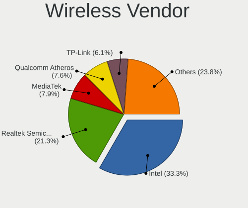

| Vendor                                | Desktops | Percent |
|---------------------------------------|----------|---------|
| Intel                                 | 467      | 33.33%  |
| Realtek Semiconductor                 | 299      | 21.34%  |
| MediaTek                              | 110      | 7.85%   |
| Qualcomm Atheros                      | 106      | 7.57%   |
| TP-Link                               | 85       | 6.07%   |
| Ralink Technology                     | 68       | 4.85%   |
| Broadcom                              | 45       | 3.21%   |
| Ralink                                | 39       | 2.78%   |
| Microsoft                             | 27       | 1.93%   |
| NetGear                               | 26       | 1.86%   |
| Qualcomm Atheros Communications       | 25       | 1.78%   |
| ASUSTek Computer                      | 17       | 1.21%   |
| D-Link                                | 14       | 1%      |
| Edimax Technology                     | 9        | 0.64%   |
| D-Link System                         | 7        | 0.5%    |
| Belkin Components                     | 7        | 0.5%    |
| AVM                                   | 7        | 0.5%    |
| Linksys                               | 6        | 0.43%   |
| Broadcom Limited                      | 5        | 0.36%   |
| Wacom                                 | 3        | 0.21%   |
| Mercucys                              | 3        | 0.21%   |
| ZyXEL Communications                  | 2        | 0.14%   |
| Wilocity                              | 2        | 0.14%   |
| Sitecom Europe                        | 2        | 0.14%   |
| Realtek                               | 2        | 0.14%   |
| IMC Networks                          | 2        | 0.14%   |
| Accton Technology                     | 2        | 0.14%   |
| 802.11g Adapter [Linksys WUSB54GC v3] | 2        | 0.14%   |
| ZyDAS                                 | 1        | 0.07%   |
| ZTopInc                               | 1        | 0.07%   |
| Tenda                                 | 1        | 0.07%   |
| Senao                                 | 1        | 0.07%   |
| Qualcomm Technologies                 | 1        | 0.07%   |
| Philips (or NXP)                      | 1        | 0.07%   |
| Micro Star International              | 1        | 0.07%   |
| LG Electronics                        | 1        | 0.07%   |
| Guillemot                             | 1        | 0.07%   |
| Gemtek                                | 1        | 0.07%   |
| AirTies Wireless Networks             | 1        | 0.07%   |
| Acer Peripherals (now BenQ)           | 1        | 0.07%   |

Wireless Model
--------------

Wireless models

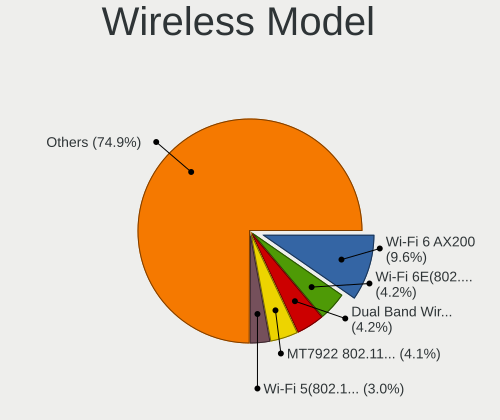

| Model                                                         | Desktops | Percent |
|---------------------------------------------------------------|----------|---------|
| Intel Wi-Fi 6 AX200                                           | 137      | 9.64%   |
| Intel Wi-Fi 6E(802.11ax) AX210/AX1675* 2x2 [Typhoon Peak]     | 60       | 4.22%   |
| Intel Dual Band Wireless-AC 3168NGW [Stone Peak]              | 59       | 4.15%   |
| MediaTek MT7922 802.11ax PCI Express Wireless Network Adapter | 58       | 4.08%   |
| Intel Wi-Fi 5(802.11ac) Wireless-AC 9x6x [Thunder Peak]       | 42       | 2.96%   |
| Realtek 802.11ac NIC                                          | 40       | 2.81%   |
| Realtek RTL8188EUS 802.11n Wireless Network Adapter           | 35       | 2.46%   |
| Intel 700 Series Chipset CNVi WiFi                            | 35       | 2.46%   |
| Realtek RTL8821CE 802.11ac PCIe Wireless Network Adapter      | 31       | 2.18%   |
| Realtek RTL88x2bu [AC1200 Techkey]                            | 27       | 1.9%    |
| Ralink MT7601U Wireless Adapter                               | 25       | 1.76%   |
| Broadcom BCM4360 802.11ac Dual Band Wireless Network Adapter  | 25       | 1.76%   |
| MediaTek MT7921K (RZ608) Wi-Fi 6E 80MHz                       | 24       | 1.69%   |
| Qualcomm Atheros AR9271 802.11n                               | 22       | 1.55%   |
| Qualcomm Atheros AR9485 Wireless Network Adapter              | 21       | 1.48%   |
| Intel Wireless 7265                                           | 20       | 1.41%   |
| Intel Cannon Lake PCH CNVi WiFi                               | 20       | 1.41%   |
| Realtek RTL8192EE PCIe Wireless Network Adapter               | 17       | 1.2%    |
| Intel Wireless 7260                                           | 17       | 1.2%    |
| Realtek RTL8852BE PCIe 802.11ax Wireless Network Controller   | 16       | 1.13%   |
| Intel Wireless 3165                                           | 16       | 1.13%   |
| TP-Link Archer T2U PLUS [RTL8821AU]                           | 13       | 0.91%   |
| TP-Link 802.11ac WLAN Adapter                                 | 13       | 0.91%   |
| Ralink RT5370 Wireless Adapter                                | 13       | 0.91%   |
| Qualcomm Atheros AR9462 Wireless Network Adapter              | 13       | 0.91%   |
| Intel Comet Lake PCH CNVi WiFi                                | 13       | 0.91%   |
| TP-Link 802.11ac NIC                                          | 12       | 0.84%   |
| Realtek RTL8822BE 802.11a/b/g/n/ac WiFi adapter               | 11       | 0.77%   |
| Realtek RTL8192EU 802.11b/g/n WLAN Adapter                    | 11       | 0.77%   |
| Realtek RTL8192CE PCIe Wireless Network Adapter               | 11       | 0.77%   |
| Qualcomm Atheros QCA9565 / AR9565 Wireless Network Adapter    | 11       | 0.77%   |
| Qualcomm Atheros QCA6174 802.11ac Wireless Network Adapter    | 11       | 0.77%   |
| Qualcomm Atheros AR93xx Wireless Network Adapter              | 11       | 0.77%   |
| Microsoft Xbox Wireless Adapter for Windows                   | 11       | 0.77%   |
| TP-Link TL-WN823N v2/v3 [Realtek RTL8192EU]                   | 10       | 0.7%    |
| Realtek RTL8812AE 802.11ac PCIe Wireless Network Adapter      | 10       | 0.7%    |
| Intel Wireless 8260                                           | 10       | 0.7%    |
| Realtek RTL8852CE PCIe 802.11ax Wireless Network Controller   | 9        | 0.63%   |
| Realtek RTL8812AU 802.11a/b/g/n/ac 2T2R DB WLAN Adapter       | 9        | 0.63%   |
| Realtek RTL8188FTV 802.11b/g/n 1T1R 2.4G WLAN Adapter         | 9        | 0.63%   |

Ethernet Vendor
---------------

Ethernet vendors

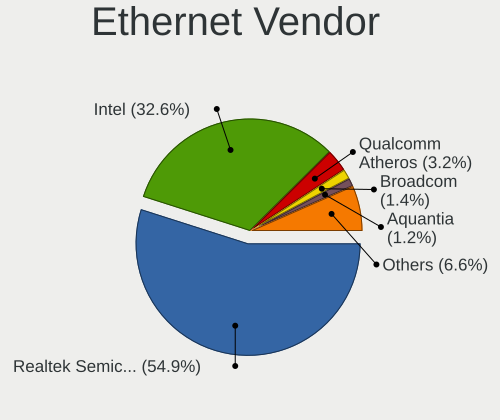

| Vendor                           | Desktops | Percent |
|----------------------------------|----------|---------|
| Realtek Semiconductor            | 1595     | 54.92%  |
| Intel                            | 948      | 32.64%  |
| Qualcomm Atheros                 | 94       | 3.24%   |
| Broadcom                         | 42       | 1.45%   |
| Aquantia                         | 34       | 1.17%   |
| Nvidia                           | 29       | 1%      |
| Samsung Electronics              | 24       | 0.83%   |
| ASIX Electronics                 | 19       | 0.65%   |
| Xiaomi                           | 17       | 0.59%   |
| MediaTek                         | 15       | 0.52%   |
| DisplayLink                      | 12       | 0.41%   |
| Huawei Technologies              | 10       | 0.34%   |
| OPPO Electronics                 | 7        | 0.24%   |
| VIA Technologies                 | 6        | 0.21%   |
| Marvell Technology Group         | 5        | 0.17%   |
| Qualcomm Technologies            | 4        | 0.14%   |
| Qualcomm                         | 4        | 0.14%   |
| Mellanox Technologies            | 4        | 0.14%   |
| Google                           | 4        | 0.14%   |
| Apple                            | 4        | 0.14%   |
| D-Link System                    | 3        | 0.1%    |
| Broadcom Limited                 | 3        | 0.1%    |
| TP-Link                          | 2        | 0.07%   |
| Solarflare Communications        | 2        | 0.07%   |
| Lenovo                           | 2        | 0.07%   |
| American Megatrends              | 2        | 0.07%   |
| 3Com                             | 2        | 0.07%   |
| ZTE WCDMA Technologies MSM       | 1        | 0.03%   |
| Tehuti Networks                  | 1        | 0.03%   |
| Spreadtrum Communications        | 1        | 0.03%   |
| Silicon Integrated Systems [SiS] | 1        | 0.03%   |
| OnePlus Technology (Shenzhen)    | 1        | 0.03%   |
| Motorola PCS                     | 1        | 0.03%   |
| Motorola BCS                     | 1        | 0.03%   |
| Linksys                          | 1        | 0.03%   |
| Elecom                           | 1        | 0.03%   |
| Davicom Semiconductor            | 1        | 0.03%   |
| Accton Technology                | 1        | 0.03%   |

Ethernet Model
--------------

Ethernet models

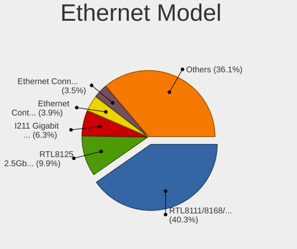

| Model                                                                          | Desktops | Percent |
|--------------------------------------------------------------------------------|----------|---------|
| Realtek RTL8111/8168/8211/8411 PCI Express Gigabit Ethernet Controller         | 1225     | 40.31%  |
| Realtek RTL8125 2.5GbE Controller                                              | 302      | 9.94%   |
| Intel I211 Gigabit Network Connection                                          | 190      | 6.25%   |
| Intel Ethernet Controller I225-V                                               | 119      | 3.92%   |
| Intel Ethernet Connection (2) I219-V                                           | 105      | 3.46%   |
| Intel 82579LM Gigabit Network Connection (Lewisville)                          | 84       | 2.76%   |
| Intel Ethernet Connection I217-LM                                              | 62       | 2.04%   |
| Intel Ethernet Connection (7) I219-V                                           | 58       | 1.91%   |
| Intel Ethernet Connection (2) I218-V                                           | 41       | 1.35%   |
| Realtek RTL810xE PCI Express Fast Ethernet controller                          | 39       | 1.28%   |
| Realtek RTL8153 Gigabit Ethernet Adapter                                       | 37       | 1.22%   |
| Intel 82579V Gigabit Network Connection                                        | 35       | 1.15%   |
| Intel Ethernet Controller I226-V                                               | 27       | 0.89%   |
| Qualcomm Atheros Killer E220x Gigabit Ethernet Controller                      | 26       | 0.86%   |
| Intel Ethernet Connection I217-V                                               | 25       | 0.82%   |
| Intel 82574L Gigabit Network Connection                                        | 25       | 0.82%   |
| Intel I210 Gigabit Network Connection                                          | 24       | 0.79%   |
| Intel Ethernet Connection (2) I219-LM                                          | 24       | 0.79%   |
| Aquantia AQtion AQC107 NBase-T/IEEE 802.3an Ethernet Controller [Atlantic 10G] | 23       | 0.76%   |
| Intel Ethernet Connection (7) I219-LM                                          | 19       | 0.63%   |
| Intel 82567LM-3 Gigabit Network Connection                                     | 19       | 0.63%   |
| Samsung Galaxy series, misc. (tethering mode)                                  | 17       | 0.56%   |
| ASIX AX88179 Gigabit Ethernet                                                  | 17       | 0.56%   |
| Intel Ethernet Connection (14) I219-V                                          | 15       | 0.49%   |
| Realtek RTL-8100/8101L/8139 PCI Fast Ethernet Adapter                          | 14       | 0.46%   |
| Qualcomm Atheros AR8121/AR8113/AR8114 Gigabit or Fast Ethernet                 | 14       | 0.46%   |
| Nvidia MCP61 Ethernet                                                          | 14       | 0.46%   |
| Intel Alder Lake-S PCH CNVi WiFi                                               | 14       | 0.46%   |
| Xiaomi Mi/Redmi series (RNDIS)                                                 | 12       | 0.39%   |
| Qualcomm Atheros AR8161 Gigabit Ethernet                                       | 12       | 0.39%   |
| Qualcomm Atheros Killer E2400 Gigabit Ethernet Controller                      | 11       | 0.36%   |
| Intel Ethernet Connection (2) I218-LM                                          | 11       | 0.36%   |
| Intel 82578DM Gigabit Network Connection                                       | 11       | 0.36%   |
| Realtek RTL8126 5GbE Controller                                                | 10       | 0.33%   |
| Intel Ethernet Connection (17) I219-V                                          | 10       | 0.33%   |
| Huawei FOA-LX9                                                                 | 9        | 0.3%    |
| Qualcomm Atheros QCA8171 Gigabit Ethernet                                      | 8        | 0.26%   |
| Qualcomm Atheros AR8151 v2.0 Gigabit Ethernet                                  | 8        | 0.26%   |
| Samsung GT-I9070 (network tethering, USB debugging enabled)                    | 7        | 0.23%   |
| Realtek RTL8852BE PCIe 802.11ax Wireless Network Controller                    | 7        | 0.23%   |

Net Controller Kind
-------------------

Ethernet, WiFi or modem

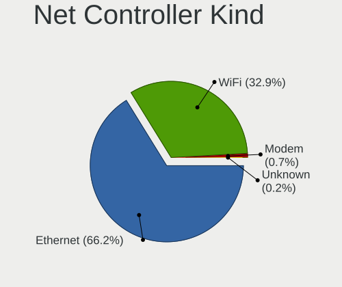

| Kind     | Desktops | Percent |
|----------|----------|---------|
| Ethernet | 2618     | 66.19%  |
| WiFi     | 1302     | 32.92%  |
| Modem    | 29       | 0.73%   |
| Unknown  | 6        | 0.15%   |

Used Controller
---------------

Currently used network controller

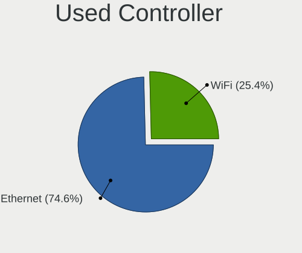

| Kind     | Desktops | Percent |
|----------|----------|---------|
| Ethernet | 2090     | 74.62%  |
| WiFi     | 711      | 25.38%  |

NICs
----

Total network controllers on board

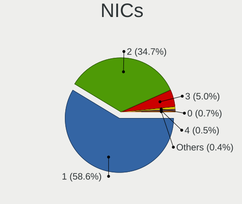

| Total | Desktops | Percent |
|-------|----------|---------|
| 1     | 1556     | 58.63%  |
| 2     | 921      | 34.7%   |
| 3     | 134      | 5.05%   |
| 0     | 19       | 0.72%   |
| 4     | 14       | 0.53%   |
| 6     | 5        | 0.19%   |
| 5     | 5        | 0.19%   |

IPv6
----

IPv6 vs IPv4

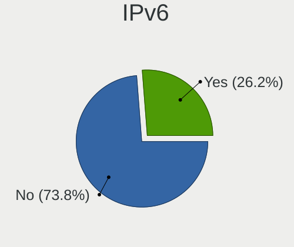

| Used | Desktops | Percent |
|------|----------|---------|
| No   | 1986     | 73.77%  |
| Yes  | 706      | 26.23%  |

Bluetooth
---------

Bluetooth Vendor
----------------

Controller vendors

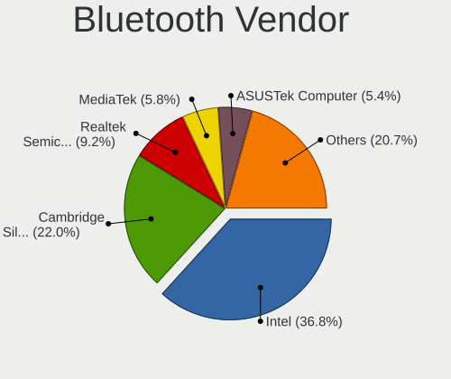

| Vendor                          | Desktops | Percent |
|---------------------------------|----------|---------|
| Intel                           | 454      | 36.76%  |
| Cambridge Silicon Radio         | 272      | 22.02%  |
| Realtek Semiconductor           | 114      | 9.23%   |
| MediaTek                        | 72       | 5.83%   |
| ASUSTek Computer                | 67       | 5.43%   |
| IMC Networks                    | 54       | 4.37%   |
| Broadcom                        | 50       | 4.05%   |
| Qualcomm Atheros Communications | 30       | 2.43%   |
| Foxconn / Hon Hai               | 26       | 2.11%   |
| TP-Link                         | 25       | 2.02%   |
| Unknown                         | 9        | 0.73%   |
| Realtek                         | 8        | 0.65%   |
| Dynex                           | 7        | 0.57%   |
| Apple                           | 7        | 0.57%   |
| SiW                             | 6        | 0.49%   |
| Edimax Technology               | 5        | 0.4%    |
| Lite-On Technology              | 4        | 0.32%   |
| Ralink                          | 3        | 0.24%   |
| Actions                         | 3        | 0.24%   |
| Micro Star International        | 2        | 0.16%   |
| Integrated System Solution      | 2        | 0.16%   |
| D-Link                          | 2        | 0.16%   |
| Conwise Technology              | 2        | 0.16%   |
| Belkin Components               | 2        | 0.16%   |
| Logitech                        | 1        | 0.08%   |
| Kensington                      | 1        | 0.08%   |
| HTC (High Tech Computer)        | 1        | 0.08%   |
| Hewlett-Packard                 | 1        | 0.08%   |
| Dell                            | 1        | 0.08%   |
| Creative Technology             | 1        | 0.08%   |
| Corsair                         | 1        | 0.08%   |
| BUFFALO                         | 1        | 0.08%   |
| AboCom Systems                  | 1        | 0.08%   |

Bluetooth Model
---------------

Controller models

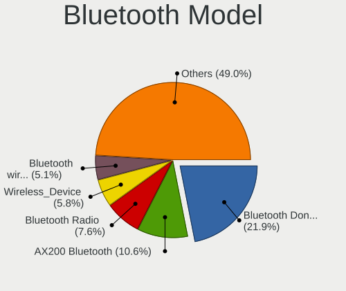

| Model                                                    | Desktops | Percent |
|----------------------------------------------------------|----------|---------|
| Cambridge Silicon Radio Bluetooth Dongle (HCI mode)      | 272      | 21.9%   |
| Intel AX200 Bluetooth                                    | 132      | 10.63%  |
| Realtek Bluetooth Radio                                  | 94       | 7.57%   |
| MediaTek Wireless_Device                                 | 72       | 5.8%    |
| Intel Bluetooth wireless interface                       | 63       | 5.07%   |
| Intel Wireless-AC 3168 Bluetooth                         | 56       | 4.51%   |
| Intel AX210 Bluetooth                                    | 54       | 4.35%   |
| Intel Bluetooth Device                                   | 48       | 3.86%   |
| Intel Wireless-AC 9260 Bluetooth Adapter                 | 41       | 3.3%    |
| Intel AX201 Bluetooth                                    | 34       | 2.74%   |
| Broadcom BCM20702A0 Bluetooth 4.0                        | 30       | 2.42%   |
| Intel Bluetooth 9460/9560 Jefferson Peak (JfP)           | 29       | 2.33%   |
| IMC Networks Bluetooth Radio                             | 27       | 2.17%   |
| TP-Link TP-T@- UB500 Adapter                             | 25       | 2.01%   |
| IMC Networks Wireless_Device                             | 23       | 1.85%   |
| ASUS ASUS USB-BT500                                      | 23       | 1.85%   |
| ASUS Broadcom BCM20702A0 Bluetooth                       | 19       | 1.53%   |
| Foxconn / Hon Hai Wireless_Device                        | 18       | 1.45%   |
| Qualcomm Atheros  Bluetooth Device                       | 12       | 0.97%   |
| Realtek  Bluetooth 4.2 Adapter                           | 11       | 0.89%   |
| Unknown                                                  | 9        | 0.72%   |
| Realtek Bluetooth Radio                                  | 8        | 0.64%   |
| Foxconn / Hon Hai Bluetooth Device                       | 8        | 0.64%   |
| Dynex Bluetooth 4.0 Adapter [Broadcom, 1.12, BCM20702A0] | 7        | 0.56%   |
| SiW SiW                                                  | 6        | 0.48%   |
| Realtek Bluetooth 5.3 Radio                              | 6        | 0.48%   |
| Qualcomm Atheros Bluetooth USB Host Controller           | 6        | 0.48%   |
| Qualcomm Atheros AR3011 Bluetooth                        | 6        | 0.48%   |
| ASUS Bluetooth Radio                                     | 6        | 0.48%   |
| Apple Bluetooth Host Controller                          | 6        | 0.48%   |
| Qualcomm Atheros AR9462 Bluetooth                        | 5        | 0.4%    |
| ASUS Qualcomm Bluetooth 4.1                              | 5        | 0.4%    |
| Broadcom BCM2045 Bluetooth                               | 4        | 0.32%   |
| ASUS Bluetooth Device                                    | 4        | 0.32%   |
| ASUS BCM20702A0                                          | 4        | 0.32%   |
| Realtek Bluetooth 5.4 Radio                              | 3        | 0.24%   |
| Ralink RT3290 Bluetooth                                  | 3        | 0.24%   |
| Lite-On Bluetooth Device                                 | 3        | 0.24%   |
| IMC Networks Bluetooth Device                            | 3        | 0.24%   |
| Edimax Bluetooth Device                                  | 3        | 0.24%   |

Sound
-----

Sound Vendor
------------

Sound card vendors

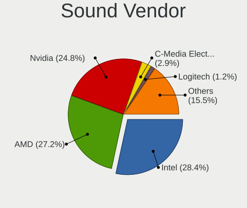

| Vendor                                       | Desktops | Percent |
|----------------------------------------------|----------|---------|
| Intel                                        | 1436     | 28.41%  |
| AMD                                          | 1373     | 27.16%  |
| Nvidia                                       | 1255     | 24.83%  |
| C-Media Electronics                          | 146      | 2.89%   |
| Logitech                                     | 63       | 1.25%   |
| Creative Labs                                | 57       | 1.13%   |
| ASUSTek Computer                             | 49       | 0.97%   |
| JMTek                                        | 47       | 0.93%   |
| Texas Instruments                            | 37       | 0.73%   |
| Generalplus Technology                       | 29       | 0.57%   |
| Micro Star International                     | 28       | 0.55%   |
| Creative Technology                          | 28       | 0.55%   |
| SteelSeries ApS                              | 27       | 0.53%   |
| Corsair                                      | 27       | 0.53%   |
| GN Netcom                                    | 26       | 0.51%   |
| Razer USA                                    | 24       | 0.47%   |
| Focusrite-Novation                           | 23       | 0.45%   |
| Hewlett-Packard                              | 18       | 0.36%   |
| VIA Technologies                             | 15       | 0.3%    |
| Kingston Technology                          | 14       | 0.28%   |
| Plantronics                                  | 12       | 0.24%   |
| BEHRINGER International                      | 11       | 0.22%   |
| Tenx Technology                              | 10       | 0.2%    |
| Samson Technologies                          | 10       | 0.2%    |
| Realtek Semiconductor                        | 10       | 0.2%    |
| DSEA A/S                                     | 10       | 0.2%    |
| Blue Microphones                             | 9        | 0.18%   |
| ASRock                                       | 9        | 0.18%   |
| RODE Microphones                             | 7        | 0.14%   |
| PreSonus Audio Electronics                   | 7        | 0.14%   |
| Dell                                         | 7        | 0.14%   |
| Trust                                        | 6        | 0.12%   |
| Giga-Byte Technology                         | 6        | 0.12%   |
| Zoran Co. Personal Media Division (Nogatech) | 5        | 0.1%    |
| Yamaha                                       | 5        | 0.1%    |
| SAVITECH                                     | 5        | 0.1%    |
| FiiO Electronics Technology                  | 5        | 0.1%    |
| Cambridge Silicon Radio                      | 5        | 0.1%    |
| AKAI Professional M.I.                       | 5        | 0.1%    |
| XMOS                                         | 4        | 0.08%   |

Sound Model
-----------

Sound card models

| Model                                                                      | Desktops | Percent |
|----------------------------------------------------------------------------|----------|---------|
| AMD Starship/Matisse HD Audio Controller                                   | 357      | 5.98%   |
| AMD Ryzen HD Audio Controller                                              | 291      | 4.88%   |
| Intel 8 Series/C220 Series Chipset High Definition Audio Controller        | 189      | 3.17%   |
| AMD SBx00 Azalia (Intel HDA)                                               | 173      | 2.9%    |
| AMD Family 17h (Models 00h-0fh) HD Audio Controller                        | 165      | 2.77%   |
| Intel 6 Series/C200 Series Chipset Family High Definition Audio Controller | 154      | 2.58%   |
| AMD Ellesmere HDMI Audio [Radeon RX 470/480 / 570/580/590]                 | 140      | 2.35%   |
| Intel 200 Series PCH HD Audio                                              | 135      | 2.26%   |
| Intel Xeon E3-1200 v3/4th Gen Core Processor HD Audio Controller           | 134      | 2.25%   |
| Intel 100 Series/C230 Series Chipset Family HD Audio Controller            | 128      | 2.15%   |
| Nvidia GP107GL High Definition Audio Controller                            | 117      | 1.96%   |
| AMD Radeon High Definition Audio Controller                                | 117      | 1.96%   |
| Intel 7 Series/C216 Chipset Family High Definition Audio Controller        | 105      | 1.76%   |
| Intel Cannon Lake PCH cAVS                                                 | 103      | 1.73%   |
| AMD Navi 21/23 HDMI/DP Audio Controller                                    | 101      | 1.69%   |
| Nvidia GK208 HDMI/DP Audio Controller                                      | 94       | 1.58%   |
| Nvidia GP104 High Definition Audio Controller                              | 93       | 1.56%   |
| AMD Renoir/Cezanne HDMI/DP Audio Controller                                | 93       | 1.56%   |
| AMD Oland/Hainan/Cape Verde/Pitcairn HDMI Audio [Radeon HD 7000 Series]    | 73       | 1.22%   |
| Nvidia TU116 High Definition Audio Controller                              | 69       | 1.16%   |
| AMD FCH Azalia Controller                                                  | 69       | 1.16%   |
| AMD Raven/Raven2/Fenghuang HDMI/DP Audio Controller                        | 67       | 1.12%   |
| Nvidia GP106 High Definition Audio Controller                              | 64       | 1.07%   |
| Intel 9 Series Chipset Family HD Audio Controller                          | 60       | 1.01%   |
| Nvidia GA104 High Definition Audio Controller                              | 57       | 0.96%   |
| Intel Alder Lake-S HD Audio Controller                                     | 56       | 0.94%   |
| AMD Baffin HDMI/DP Audio [Radeon RX 550 640SP / RX 560/560X]               | 56       | 0.94%   |
| Intel Raptor Lake High Definition Audio Controller                         | 55       | 0.92%   |
| Intel 82801JI (ICH10 Family) HD Audio Controller                           | 54       | 0.91%   |
| Nvidia TU106 High Definition Audio Controller                              | 53       | 0.89%   |
| Nvidia GA106 High Definition Audio Controller                              | 53       | 0.89%   |
| Nvidia TU104 HD Audio Controller                                           | 52       | 0.87%   |
| Nvidia GM107 High Definition Audio Controller [GeForce 940MX]              | 49       | 0.82%   |
| Nvidia GA102 High Definition Audio Controller                              | 45       | 0.75%   |
| Intel C610/X99 series chipset HD Audio Controller                          | 45       | 0.75%   |
| AMD Navi 10 HDMI Audio                                                     | 45       | 0.75%   |
| AMD Navi 31 HDMI/DP Audio                                                  | 44       | 0.74%   |
| ASUSTek Computer USB Audio                                                 | 43       | 0.72%   |
| Nvidia GM206 High Definition Audio Controller                              | 41       | 0.69%   |
| Nvidia GM204 High Definition Audio Controller                              | 41       | 0.69%   |

Memory
------

Memory Vendor
-------------

Memory module vendors

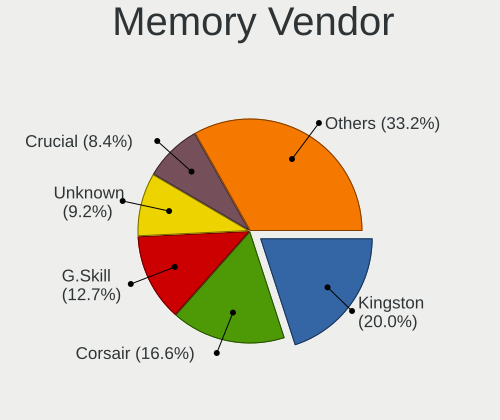

| Vendor                     | Desktops | Percent |
|----------------------------|----------|---------|
| Kingston                   | 320      | 20%     |
| Corsair                    | 265      | 16.56%  |
| G.Skill                    | 203      | 12.69%  |
| Unknown                    | 147      | 9.19%   |
| Crucial                    | 134      | 8.38%   |
| Samsung Electronics        | 119      | 7.44%   |
| SK hynix                   | 98       | 6.13%   |
| Micron Technology          | 55       | 3.44%   |
| Team                       | 45       | 2.81%   |
| A-DATA Technology          | 28       | 1.75%   |
| Patriot                    | 27       | 1.69%   |
| Unknown                    | 26       | 1.63%   |
| Ramaxel Technology         | 12       | 0.75%   |
| Nanya Technology           | 12       | 0.75%   |
| Silicon Power              | 7        | 0.44%   |
| Unknown (ABCD)             | 6        | 0.38%   |
| Transcend                  | 6        | 0.38%   |
| Avant                      | 6        | 0.38%   |
| AMD                        | 6        | 0.38%   |
| Smart                      | 5        | 0.31%   |
| PNY                        | 5        | 0.31%   |
| GOODRAM                    | 4        | 0.25%   |
| Elpida                     | 4        | 0.25%   |
| Wodposit                   | 3        | 0.19%   |
| ASint Technology           | 3        | 0.19%   |
| Apacer                     | 3        | 0.19%   |
| Unifosa                    | 2        | 0.13%   |
| Patriot Memory             | 2        | 0.13%   |
| Kllisre                    | 2        | 0.13%   |
| Kingmax                    | 2        | 0.13%   |
| KINGBANK                   | 2        | 0.13%   |
| Juhor                      | 2        | 0.13%   |
| GLOWAY                     | 2        | 0.13%   |
| GeIL                       | 2        | 0.13%   |
| Atermiter                  | 2        | 0.13%   |
| Xi'an UniIC Semiconductors | 1        | 0.06%   |
| V-GeN                      | 1        | 0.06%   |
| V-Color                    | 1        | 0.06%   |
| Unknown (82B5)             | 1        | 0.06%   |
| Unknown (0x9801)           | 1        | 0.06%   |

Memory Model
------------

Memory module models

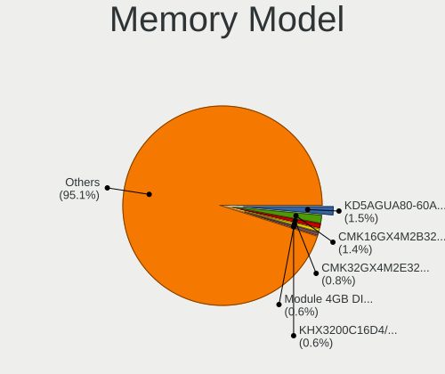

| Model                                                          | Desktops | Percent |
|----------------------------------------------------------------|----------|---------|
| Unknown                                                        | 26       | 1.46%   |
| Corsair RAM CMK16GX4M2B3200C16 8GB DIMM DDR4 3600MT/s          | 25       | 1.4%    |
| Corsair RAM CMK32GX4M2E3200C16 16GB DIMM DDR4 3600MT/s         | 14       | 0.79%   |
| Unknown RAM Module 4GB DIMM 1333MT/s                           | 11       | 0.62%   |
| Kingston RAM KHX3200C16D4/16GX 16GB DIMM DDR4 3600MT/s         | 11       | 0.62%   |
| G.Skill RAM F4-3000C16-8GISB 8GB DIMM DDR4 3200MT/s            | 11       | 0.62%   |
| Corsair RAM CMK16GX4M2B3000C15 8GB DIMM DDR4 3600MT/s          | 11       | 0.62%   |
| Unknown RAM Module 4096MB DIMM 1333MT/s                        | 10       | 0.56%   |
| Team RAM TEAMGROUP-UD4-3200 8GB DIMM DDR4 3733MT/s             | 10       | 0.56%   |
| Kingston RAM KHX3200C16D4/8GX 8GB DIMM DDR4 3733MT/s           | 10       | 0.56%   |
| Kingston RAM KHX1600C9D3/4GX 4GB DIMM DDR3 1867MT/s            | 10       | 0.56%   |
| Team RAM TEAMGROUP-UD4-3200 8GB DIMM DDR4 3800MT/s             | 9        | 0.51%   |
| Samsung RAM M378B5173DB0-CK0 4096MB DIMM DDR3 1600MT/s         | 9        | 0.51%   |
| Kingston RAM KF3200C16D4/16GX 16GB DIMM DDR4 3733MT/s          | 9        | 0.51%   |
| G.Skill RAM F4-3200C16-8GVKB 8GB DIMM DDR4 4000MT/s            | 9        | 0.51%   |
| G.Skill RAM F4-3200C16-16GVK 16GB DIMM DDR4 3600MT/s           | 9        | 0.51%   |
| Patriot RAM 3200 C16 Series 8GB DIMM DDR4 3600MT/s             | 8        | 0.45%   |
| Kingston RAM KHX1600C10D3/8G 8GB DIMM DDR3 2133MT/s            | 8        | 0.45%   |
| Kingston RAM KF560C36-16 16GB DIMM DDR5 6000MT/s               | 8        | 0.45%   |
| Corsair RAM CMK32GX4M2B3200C16 16GB DIMM DDR4 3800MT/s         | 8        | 0.45%   |
| G.Skill RAM F4-3200C16-16GIS 16GB DIMM DDR4 3600MT/s           | 7        | 0.39%   |
| Unknown RAM Module 8GB DIMM DDR3 1600MT/s                      | 6        | 0.34%   |
| Unknown RAM Module 2GB DIMM 1333MT/s                           | 6        | 0.34%   |
| Unknown RAM Module 2048MB DIMM DDR2 800MT/s                    | 6        | 0.34%   |
| Unknown (ABCD) RAM 123456789012345678 2GB DIMM LPDDR4 2133MT/s | 6        | 0.34%   |
| Samsung RAM M378B1G73DB0-CK0 8GB DIMM DDR3 1600MT/s            | 6        | 0.34%   |
| Kingston RAM KHX2666C16/8G 8GiB DIMM DDR4 3466MT/s             | 6        | 0.34%   |
| Kingston RAM KHX2133C14D4/8G 8GB DIMM DDR4 3000MT/s            | 6        | 0.34%   |
| G.Skill RAM F4-3600C16-16GVKC 16GB DIMM DDR4 3866MT/s          | 6        | 0.34%   |
| G.Skill RAM F4-3200C16-8GIS 8GB DIMM DDR4 3600MT/s             | 6        | 0.34%   |
| Crucial RAM BLS8G3D1609DS1S00. 8GB DIMM DDR3 1800MT/s          | 6        | 0.34%   |
| Corsair RAM CMW32GX4M2D3600C18 16GB DIMM DDR4 3600MT/s         | 6        | 0.34%   |
| Corsair RAM CMK16GX4M2A2666C16 8GB DIMM DDR4 3400MT/s          | 6        | 0.34%   |
| Unknown RAM Module 2048MB DIMM SDRAM                           | 5        | 0.28%   |
| Unknown RAM Module 2048MB DIMM 1333MT/s                        | 5        | 0.28%   |
| Team RAM TEAMGROUP-UD4-2666 16GB DIMM DDR4 2667MT/s            | 5        | 0.28%   |
| Samsung RAM M378B1G73EB0-YK0 8GB DIMM DDR3 1600MT/s            | 5        | 0.28%   |
| Patriot RAM PSD38G16002 8192MB DIMM DDR3 1600MT/s              | 5        | 0.28%   |
| Kingston RAM KHX2400C15D4/4G 4GB DIMM DDR4 3151MT/s            | 5        | 0.28%   |
| Kingston RAM KHX1866C10D3/8G 8GB DIMM DDR3 1867MT/s            | 5        | 0.28%   |

Memory Kind
-----------

Memory module kinds

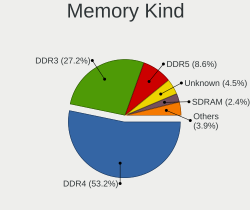

| Kind    | Desktops | Percent |
|---------|----------|---------|
| DDR4    | 764      | 53.24%  |
| DDR3    | 391      | 27.25%  |
| DDR5    | 124      | 8.64%   |
| Unknown | 65       | 4.53%   |
| SDRAM   | 35       | 2.44%   |
| DDR2    | 35       | 2.44%   |
| LPDDR4  | 9        | 0.63%   |
| DDR     | 9        | 0.63%   |
| DRAM    | 2        | 0.14%   |
| LPDDR5  | 1        | 0.07%   |

Memory Form Factor
------------------

Physical design of the memory module

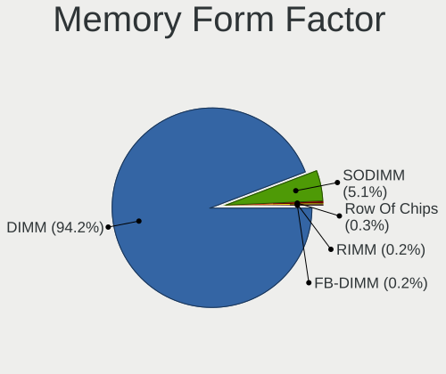

| Name         | Desktops | Percent |
|--------------|----------|---------|
| DIMM         | 1338     | 94.23%  |
| SODIMM       | 72       | 5.07%   |
| Row Of Chips | 4        | 0.28%   |
| RIMM         | 3        | 0.21%   |
| FB-DIMM      | 3        | 0.21%   |

Memory Size
-----------

Memory module size

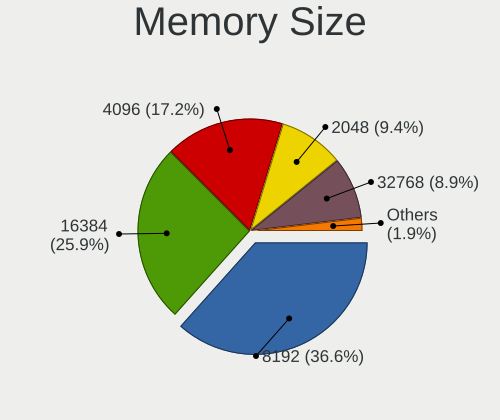

| Size  | Desktops | Percent |
|-------|----------|---------|
| 8192  | 578      | 36.61%  |
| 16384 | 409      | 25.9%   |
| 4096  | 272      | 17.23%  |
| 2048  | 149      | 9.44%   |
| 32768 | 141      | 8.93%   |
| 1024  | 18       | 1.14%   |
| 49152 | 6        | 0.38%   |
| 24576 | 2        | 0.13%   |
| 65536 | 1        | 0.06%   |
| 12288 | 1        | 0.06%   |
| 512   | 1        | 0.06%   |
| 256   | 1        | 0.06%   |

Memory Speed
------------

Memory module speed

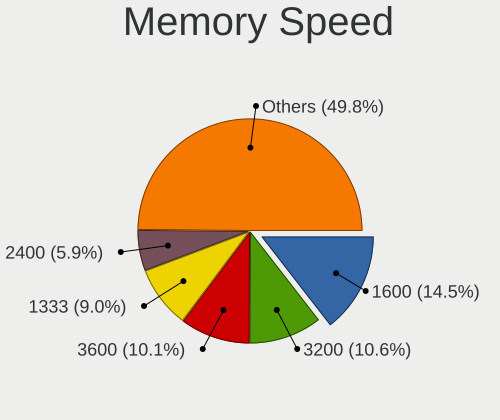

| Speed   | Desktops | Percent |
|---------|----------|---------|
| 1600    | 233      | 14.5%   |
| 3200    | 170      | 10.58%  |
| 3600    | 163      | 10.14%  |
| 1333    | 145      | 9.02%   |
| 2400    | 95       | 5.91%   |
| 2133    | 76       | 4.73%   |
| 2667    | 75       | 4.67%   |
| 3800    | 51       | 3.17%   |
| 6000    | 50       | 3.11%   |
| 3733    | 47       | 2.92%   |
| 2666    | 43       | 2.68%   |
| 3000    | 31       | 1.93%   |
| 800     | 31       | 1.93%   |
| 3400    | 25       | 1.56%   |
| 1866    | 25       | 1.56%   |
| 4000    | 24       | 1.49%   |
| 667     | 21       | 1.31%   |
| 4800    | 20       | 1.24%   |
| 5600    | 16       | 1%      |
| 2933    | 15       | 0.93%   |
| 1867    | 15       | 0.93%   |
| 1800    | 14       | 0.87%   |
| 1066    | 14       | 0.87%   |
| 3466    | 13       | 0.81%   |
| 6200    | 11       | 0.68%   |
| 3866    | 11       | 0.68%   |
| Unknown | 11       | 0.68%   |
| 3066    | 10       | 0.62%   |
| 2800    | 10       | 0.62%   |
| 3333    | 9        | 0.56%   |
| 400     | 9        | 0.56%   |
| 5200    | 8        | 0.5%    |
| 3666    | 7        | 0.44%   |
| 2000    | 7        | 0.44%   |
| 1334    | 7        | 0.44%   |
| 12800   | 6        | 0.37%   |
| 6400    | 6        | 0.37%   |
| 3334    | 6        | 0.37%   |
| 3266    | 6        | 0.37%   |
| 1648    | 6        | 0.37%   |

Printers & scanners
-------------------

Printer Vendor
--------------

Printer device vendors

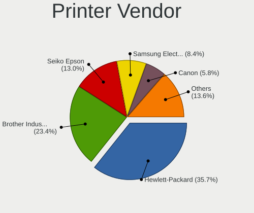

| Vendor                 | Desktops | Percent |
|------------------------|----------|---------|
| Hewlett-Packard        | 55       | 35.71%  |
| Brother Industries     | 36       | 23.38%  |
| Seiko Epson            | 20       | 12.99%  |
| Samsung Electronics    | 13       | 8.44%   |
| Canon                  | 9        | 5.84%   |
| Zebra                  | 3        | 1.95%   |
| Prolific Technology    | 2        | 1.3%    |
| Pantum                 | 2        | 1.3%    |
| Lexmark International  | 2        | 1.3%    |
| Dymo-CoStar            | 2        | 1.3%    |
| Xerox                  | 1        | 0.65%   |
| Ricoh                  | 1        | 0.65%   |
| QinHeng Electronics    | 1        | 0.65%   |
| Panasonic (Matsushita) | 1        | 0.65%   |
| Kyocera                | 1        | 0.65%   |
| iDPRT                  | 1        | 0.65%   |
| ICS Advent             | 1        | 0.65%   |
| Datamax-O'Neil         | 1        | 0.65%   |
| Apple                  | 1        | 0.65%   |
| Analog Devices         | 1        | 0.65%   |

Printer Model
-------------

Printer device models

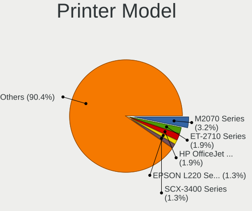

| Model                                                  | Desktops | Percent |
|--------------------------------------------------------|----------|---------|
| Samsung M2070 Series                                   | 5        | 3.21%   |
| Seiko Epson ET-2710 Series                             | 3        | 1.92%   |
| HP HP OfficeJet Pro 8020 series                        | 3        | 1.92%   |
| Seiko Epson EPSON L220 Series                          | 2        | 1.28%   |
| Samsung SCX-3400 Series                                | 2        | 1.28%   |
| Prolific PL2305 Parallel Port                          | 2        | 1.28%   |
| HP OfficeJet Pro 7740 series                           | 2        | 1.28%   |
| HP OfficeJet 4650 series                               | 2        | 1.28%   |
| HP OfficeJet 3830 series                               | 2        | 1.28%   |
| HP LaserJet P2015 series                               | 2        | 1.28%   |
| HP LaserJet 1018                                       | 2        | 1.28%   |
| HP LaserJet 1010                                       | 2        | 1.28%   |
| HP ENVY 4500 series                                    | 2        | 1.28%   |
| HP DeskJet 3630 series                                 | 2        | 1.28%   |
| HP DeskJet 2700 series                                 | 2        | 1.28%   |
| HP DeskJet 2600 series                                 | 2        | 1.28%   |
| Canon PIXMA MG2500 Series                              | 2        | 1.28%   |
| Brother MFC-L2710DW series                             | 2        | 1.28%   |
| Brother MFC-J460DW                                     | 2        | 1.28%   |
| Brother MFC-J1010DW                                    | 2        | 1.28%   |
| Brother HL-L2320D series                               | 2        | 1.28%   |
| Brother HL-L2300D series                               | 2        | 1.28%   |
| Brother DCP-9020CDW                                    | 2        | 1.28%   |
| Zebra ZTC ZM400-200dpi ZPL                             | 1        | 0.64%   |
| Zebra ZTC LP2844-Z-200dpi                              | 1        | 0.64%   |
| Zebra Thrmal 2844                                      | 1        | 0.64%   |
| Xerox Phaser 3140 and 3155                             | 1        | 0.64%   |
| Seiko Epson XP-7100 Series                             | 1        | 0.64%   |
| Seiko Epson XP-3100 Series                             | 1        | 0.64%   |
| Seiko Epson XP-2200 Series                             | 1        | 0.64%   |
| Seiko Epson XP-2150 Series                             | 1        | 0.64%   |
| Seiko Epson XP-2100 Series                             | 1        | 0.64%   |
| Seiko Epson WF-2530 Series                             | 1        | 0.64%   |
| Seiko Epson Printer                                    | 1        | 0.64%   |
| Seiko Epson ME Office 600F/Stylus Office BX300F/TX300F | 1        | 0.64%   |
| Seiko Epson L3110 Series                               | 1        | 0.64%   |
| Seiko Epson L120 Series                                | 1        | 0.64%   |
| Seiko Epson ET-5170 Series                             | 1        | 0.64%   |
| Seiko Epson ET-3830 Series                             | 1        | 0.64%   |
| Seiko Epson ET-3710 Series                             | 1        | 0.64%   |

Scanner Vendor
--------------

Scanner device vendors

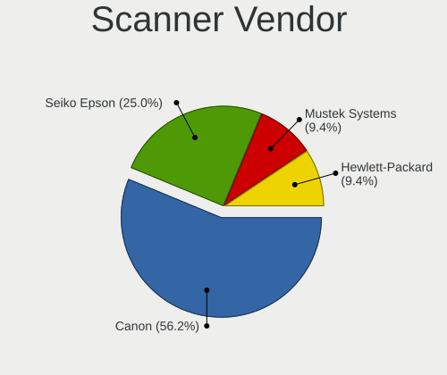

| Vendor          | Desktops | Percent |
|-----------------|----------|---------|
| Canon           | 18       | 56.25%  |
| Seiko Epson     | 8        | 25%     |
| Mustek Systems  | 3        | 9.38%   |
| Hewlett-Packard | 3        | 9.38%   |

Scanner Model
-------------

Scanner device models

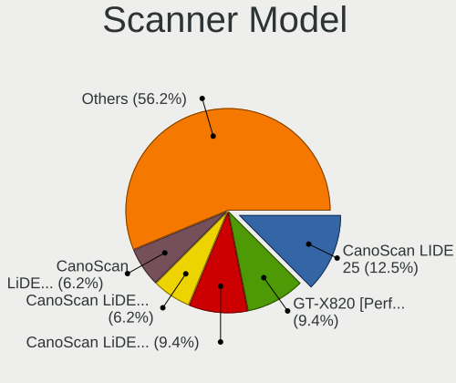

| Model                                                   | Desktops | Percent |
|---------------------------------------------------------|----------|---------|
| Canon CanoScan LIDE 25                                  | 4        | 12.5%   |
| Seiko Epson GT-X820 [Perfection V600 Photo]             | 3        | 9.38%   |
| Canon CanoScan LiDE 110                                 | 3        | 9.38%   |
| Canon CanoScan LiDE 50/LiDE 35/LiDE 40                  | 2        | 6.25%   |
| Canon CanoScan LiDE 220                                 | 2        | 6.25%   |
| Canon CanoScan LiDE 210                                 | 2        | 6.25%   |
| Seiko Epson Perfection 660                              | 1        | 3.13%   |
| Seiko Epson GT-F730 [GT-S630/Perfection V33/V330 Photo] | 1        | 3.13%   |
| Seiko Epson GT-F720 [GT-S620/Perfection V30/V300 Photo] | 1        | 3.13%   |
| Seiko Epson GT-6600U [Perfection 610]                   | 1        | 3.13%   |
| Seiko Epson ES-D200 [GT-S50]                            | 1        | 3.13%   |
| Mustek Systems SNAPSCAN e22                             | 1        | 3.13%   |
| Mustek Systems ScanExpress A3 USB 1200 PRO              | 1        | 3.13%   |
| Mustek Systems BearPaw 1200 CU Plus                     | 1        | 3.13%   |
| HP ScanJet G4010                                        | 1        | 3.13%   |
| HP ScanJet 82x0C                                        | 1        | 3.13%   |
| HP ScanJet 3770                                         | 1        | 3.13%   |
| Canon CanoScan N670U/N676U/LiDE 20                      | 1        | 3.13%   |
| Canon CanoScan N1240U/LiDE 30                           | 1        | 3.13%   |
| Canon CanoScan LiDE 60                                  | 1        | 3.13%   |
| Canon CanoScan LiDE 500F                                | 1        | 3.13%   |
| Canon CanoScan LiDE 120                                 | 1        | 3.13%   |

Camera
------

Camera Vendor
-------------

Camera device vendors

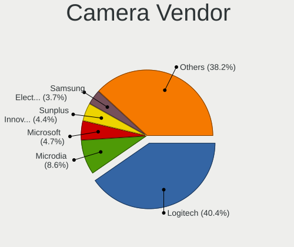

| Vendor                        | Desktops | Percent |
|-------------------------------|----------|---------|
| Logitech                      | 273      | 40.38%  |
| Microdia                      | 58       | 8.58%   |
| Microsoft                     | 32       | 4.73%   |
| Sunplus Innovation Technology | 30       | 4.44%   |
| Samsung Electronics           | 25       | 3.7%    |
| Generalplus Technology        | 19       | 2.81%   |
| MacroSilicon                  | 14       | 2.07%   |
| Chicony Electronics           | 14       | 2.07%   |
| Z-Star Microelectronics       | 12       | 1.78%   |
| Trust                         | 12       | 1.78%   |
| Apple                         | 12       | 1.78%   |
| Realtek Semiconductor         | 10       | 1.48%   |
| KYE Systems (Mouse Systems)   | 10       | 1.48%   |
| Creative Technology           | 9        | 1.33%   |
| ARC International             | 9        | 1.33%   |
| Huawei Technologies           | 8        | 1.18%   |
| Cubeternet                    | 8        | 1.18%   |
| Razer USA                     | 7        | 1.04%   |
| Jieli Technology              | 7        | 1.04%   |
| Alcor Micro                   | 6        | 0.89%   |
| webcam                        | 5        | 0.74%   |
| Sunplus IT                    | 5        | 0.74%   |
| GEMBIRD                       | 5        | 0.74%   |
| Genesys Logic                 | 4        | 0.59%   |
| eMeet                         | 4        | 0.59%   |
| AVerMedia Technologies        | 4        | 0.59%   |
| Valve Software                | 3        | 0.44%   |
| ValueHD                       | 3        | 0.44%   |
| Pixart Imaging                | 3        | 0.44%   |
| Philips (or NXP)              | 3        | 0.44%   |
| LG Electronics                | 3        | 0.44%   |
| Hewlett-Packard               | 3        | 0.44%   |
| A4Tech                        | 3        | 0.44%   |
| Xiongmai                      | 2        | 0.3%    |
| vivo                          | 2        | 0.3%    |
| Unknown                       | 2        | 0.3%    |
| Sonix Technology              | 2        | 0.3%    |
| SN0002                        | 2        | 0.3%    |
| Silicon Motion                | 2        | 0.3%    |
| SHENZHEN EMEET TECHNOLOGY     | 2        | 0.3%    |

Camera Model
------------

Camera device models

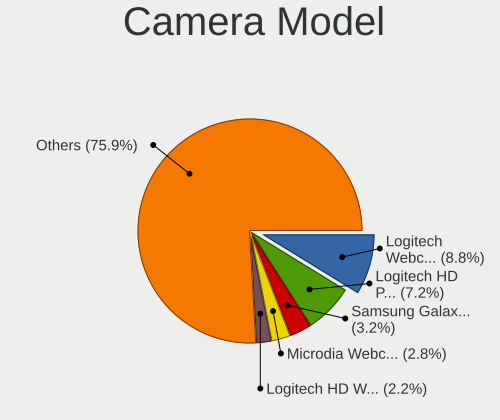

| Model                                    | Desktops | Percent |
|------------------------------------------|----------|---------|
| Logitech Webcam C270                     | 60       | 8.77%   |
| Logitech HD Pro Webcam C920              | 49       | 7.16%   |
| Samsung Galaxy series, misc. (MTP mode)  | 22       | 3.22%   |
| Microdia Webcam Vitade AF                | 19       | 2.78%   |
| Logitech HD Webcam C525                  | 15       | 2.19%   |
| Logitech C922 Pro Stream Webcam          | 15       | 2.19%   |
| Microsoft LifeCam HD-3000                | 14       | 2.05%   |
| Logitech C920 PRO HD Webcam              | 14       | 2.05%   |
| Microdia USB 2.0 Camera                  | 13       | 1.9%    |
| MacroSilicon USB Video                   | 11       | 1.61%   |
| Logitech HD Webcam C615                  | 11       | 1.61%   |
| Logitech BRIO Ultra HD Webcam            | 11       | 1.61%   |
| Logitech Webcam C170                     | 10       | 1.46%   |
| Apple iPhone 5/5C/5S/6/SE/7/8/X          | 10       | 1.46%   |
| Microsoft LifeCam Cinema                 | 9        | 1.32%   |
| Logitech Webcam C310                     | 9        | 1.32%   |
| Generalplus GENERAL WEBCAM               | 9        | 1.32%   |
| ARC International Camera                 | 9        | 1.32%   |
| Sunplus Full HD webcam                   | 8        | 1.17%   |
| Logitech HD Webcam C910                  | 8        | 1.17%   |
| Huawei HiCamera                          | 8        | 1.17%   |
| Z-Star Venus USB2.0 Camera               | 7        | 1.02%   |
| Microdia Integrated Camera               | 7        | 1.02%   |
| Logitech Webcam C930e                    | 7        | 1.02%   |
| Generalplus 808 Camera #9 (web-cam mode) | 7        | 1.02%   |
| Microdia CyberTrack H7                   | 6        | 0.88%   |
| Microdia Camera                          | 6        | 0.88%   |
| Logitech Webcam Pro 9000                 | 6        | 0.88%   |
| Logitech B525 HD Webcam                  | 6        | 0.88%   |
| Jieli USB PHY 2.0                        | 6        | 0.88%   |
| webcam webcam                            | 5        | 0.73%   |
| Trust USB Camera                         | 5        | 0.73%   |
| Microsoft LifeCam Studio                 | 5        | 0.73%   |
| Logitech Logitech Webcam C925e           | 5        | 0.73%   |
| Trust Full HD Webcam                     | 4        | 0.58%   |
| Sunplus SPCA2281 Web Camera              | 4        | 0.58%   |
| Sunplus Integrated Camera                | 4        | 0.58%   |
| Razer USA Gaming Webcam [Kiyo]           | 4        | 0.58%   |
| Logitech Webcam C210                     | 4        | 0.58%   |
| Logitech QuickCam Pro 9000               | 4        | 0.58%   |

Security
--------

Fingerprint Vendor
------------------

Fingerprint sensor vendors

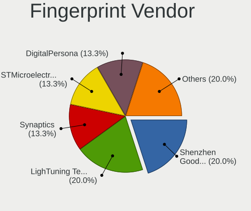

| Vendor                     | Desktops | Percent |
|----------------------------|----------|---------|
| Shenzhen Goodix Technology | 3        | 20%     |
| LighTuning Technology      | 3        | 20%     |
| Synaptics                  | 2        | 13.33%  |
| STMicroelectronics         | 2        | 13.33%  |
| DigitalPersona             | 2        | 13.33%  |
| Elan Microelectronics      | 1        | 6.67%   |
| Dell                       | 1        | 6.67%   |
| AuthenTec                  | 1        | 6.67%   |

Fingerprint Model
-----------------

Fingerprint sensor models

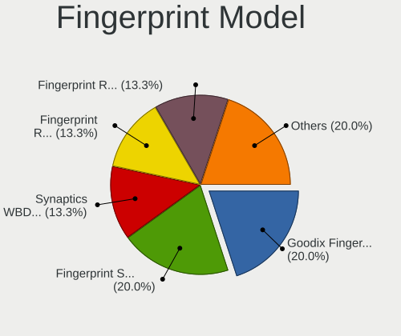

| Model                                          | Desktops | Percent |
|------------------------------------------------|----------|---------|
| Shenzhen Goodix  Fingerprint Device            | 3        | 20%     |
| LighTuning Fingerprint Sensor                  | 3        | 20%     |
| Synaptics  WBDI Fingerprint Reader - USB 052   | 2        | 13.33%  |
| STMicroelectronics Fingerprint Reader          | 2        | 13.33%  |
| DigitalPersona Fingerprint Reader              | 2        | 13.33%  |
| Elan fingerprint sensor [FeinTech FPS00200]    | 1        | 6.67%   |
| Dell MS819 Wired Mouse With Fingerprint Reader | 1        | 6.67%   |
| AuthenTec AES1600                              | 1        | 6.67%   |

Chipcard Vendor
---------------

Chipcard module vendors

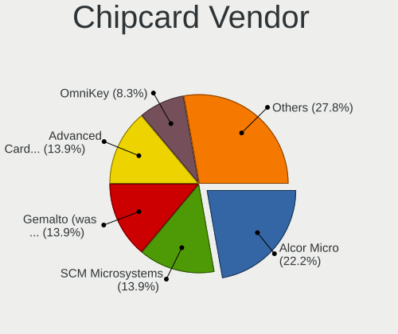

| Vendor                    | Desktops | Percent |
|---------------------------|----------|---------|
| Alcor Micro               | 8        | 22.22%  |
| SCM Microsystems          | 5        | 13.89%  |
| Gemalto (was Gemplus)     | 5        | 13.89%  |
| Advanced Card Systems     | 5        | 13.89%  |
| OmniKey                   | 3        | 8.33%   |
| Yubico.com                | 2        | 5.56%   |
| Reiner SCT Kartensysteme  | 2        | 5.56%   |
| Thetis                    | 1        | 2.78%   |
| Fujitsu Siemens Computers | 1        | 2.78%   |
| Bit4id                    | 1        | 2.78%   |
| Aladdin R.D.              | 1        | 2.78%   |
| Aladdin Knowledge Systems | 1        | 2.78%   |
| Aktiv                     | 1        | 2.78%   |

Chipcard Model
--------------

Chipcard module models

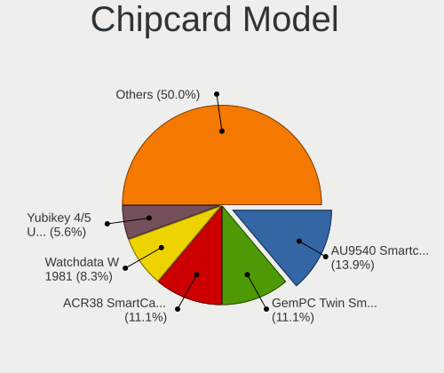

| Model                                                                      | Desktops | Percent |
|----------------------------------------------------------------------------|----------|---------|
| Alcor Micro AU9540 Smartcard Reader                                        | 5        | 13.89%  |
| Gemalto (was Gemplus) GemPC Twin SmartCard Reader                          | 4        | 11.11%  |
| Advanced Card Systems ACR38 SmartCard Reader                               | 4        | 11.11%  |
| Alcor Micro Watchdata W 1981                                               | 3        | 8.33%   |
| Yubico.com Yubikey 4/5 U2F+CCID                                            | 2        | 5.56%   |
| SCM Microsystems SCR331-LC1 / SCR3310 SmartCard Reader                     | 2        | 5.56%   |
| SCM Microsystems SCR331 SmartCard Reader                                   | 2        | 5.56%   |
| OmniKey CardMan 1021                                                       | 2        | 5.56%   |
| Thetis Security Key(F825)                                                  | 1        | 2.78%   |
| SCM Microsystems uTrust FIDO2 Security Key                                 | 1        | 2.78%   |
| Reiner SCT Kartensysteme tanJack USB                                       | 1        | 2.78%   |
| Reiner SCT Kartensysteme cyberJack RFID basis contactless smartcard reader | 1        | 2.78%   |
| OmniKey CardMan 3021 / 3121                                                | 1        | 2.78%   |
| Gemalto (was Gemplus) GemPC Key SmartCard Reader                           | 1        | 2.78%   |
| Fujitsu Siemens Computers Smartcard Reader D323                            | 1        | 2.78%   |
| Bit4id miniLector EVO                                                      | 1        | 2.78%   |
| Aladdin R.D. JaCarta                                                       | 1        | 2.78%   |
| Aladdin Knowledge Systems Token JC                                         | 1        | 2.78%   |
| Aktiv Rutoken lite                                                         | 1        | 2.78%   |
| Advanced Card Systems ACR122U                                              | 1        | 2.78%   |

Unsupported
-----------

Unsupported Devices
-------------------

Total unsupported devices on board

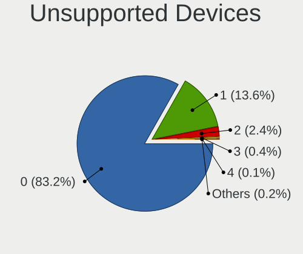

| Total | Desktops | Percent |
|-------|----------|---------|
| 0     | 2246     | 83.22%  |
| 1     | 368      | 13.63%  |
| 2     | 65       | 2.41%   |
| 3     | 10       | 0.37%   |
| 4     | 4        | 0.15%   |
| 6     | 3        | 0.11%   |
| 5     | 3        | 0.11%   |

Unsupported Device Types
------------------------

Types of unsupported devices

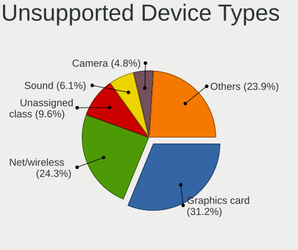

| Type                     | Desktops | Percent |
|--------------------------|----------|---------|
| Graphics card            | 163      | 31.23%  |
| Net/wireless             | 127      | 24.33%  |
| Unassigned class         | 50       | 9.58%   |
| Sound                    | 32       | 6.13%   |
| Camera                   | 25       | 4.79%   |
| Multimedia controller    | 22       | 4.21%   |
| Chipcard                 | 17       | 3.26%   |
| Communication controller | 16       | 3.07%   |
| Bluetooth                | 14       | 2.68%   |
| Network                  | 12       | 2.3%    |
| Fingerprint reader       | 11       | 2.11%   |
| Storage/ide              | 6        | 1.15%   |
| Net/ethernet             | 6        | 1.15%   |
| Storage/raid             | 5        | 0.96%   |
| Card reader              | 5        | 0.96%   |
| Firewire controller      | 4        | 0.77%   |
| Modem                    | 3        | 0.57%   |
| Dvb card                 | 3        | 0.57%   |
| Storage/nvme             | 1        | 0.19%   |

