Kubuntu - Tested Hardware & Statistics (Desktops)
-------------------------------------------------

A project to collect tested hardware configurations for Kubuntu.

Anyone can contribute to this report by the [hw-probe](https://github.com/linuxhw/hw-probe) tool:

    sudo -E hw-probe -all -upload

Please contribute! Especially if your hardware is rare.

Contents
--------

* [ Test Cases ](#test-cases)

* [ System ](#system)
  - [ OS                       ](#os)
  - [ OS Family                ](#os-family)
  - [ Kernel                   ](#kernel)
  - [ Kernel Family            ](#kernel-family)
  - [ Kernel Major Ver.        ](#kernel-major-ver)
  - [ Arch                     ](#arch)
  - [ DE                       ](#de)
  - [ Display Server           ](#display-server)
  - [ Display Manager          ](#display-manager)
  - [ OS Lang                  ](#os-lang)
  - [ Boot Mode                ](#boot-mode)
  - [ Filesystem               ](#filesystem)
  - [ Part. scheme             ](#part-scheme)
  - [ Dual Boot with Linux/BSD ](#dual-boot-with-linuxbsd)
  - [ Dual Boot (Win)          ](#dual-boot-win)

* [ Board ](#board)
  - [ Vendor                   ](#vendor)
  - [ Model                    ](#model)
  - [ Model Family             ](#model-family)
  - [ MFG Year                 ](#mfg-year)
  - [ Form Factor              ](#form-factor)
  - [ Secure Boot              ](#secure-boot)
  - [ Coreboot                 ](#coreboot)
  - [ RAM Size                 ](#ram-size)
  - [ RAM Used                 ](#ram-used)
  - [ Total Drives             ](#total-drives)
  - [ Has CD-ROM               ](#has-cd-rom)
  - [ Has Ethernet             ](#has-ethernet)
  - [ Has WiFi                 ](#has-wifi)
  - [ Has Bluetooth            ](#has-bluetooth)

* [ Location ](#location)
  - [ Country                  ](#country)
  - [ City                     ](#city)

* [ Drives ](#drives)
  - [ Drive Vendor             ](#drive-vendor)
  - [ Drive Model              ](#drive-model)
  - [ HDD Vendor               ](#hdd-vendor)
  - [ SSD Vendor               ](#ssd-vendor)
  - [ Drive Kind               ](#drive-kind)
  - [ Drive Connector          ](#drive-connector)
  - [ Drive Size               ](#drive-size)
  - [ Space Total              ](#space-total)
  - [ Space Used               ](#space-used)
  - [ Malfunc. Drives          ](#malfunc-drives)
  - [ Malfunc. Drive Vendor    ](#malfunc-drive-vendor)
  - [ Malfunc. HDD Vendor      ](#malfunc-hdd-vendor)
  - [ Malfunc. Drive Kind      ](#malfunc-drive-kind)
  - [ Failed Drives            ](#failed-drives)
  - [ Failed Drive Vendor      ](#failed-drive-vendor)
  - [ Drive Status             ](#drive-status)

* [ Storage controller ](#storage-controller)
  - [ Storage Vendor           ](#storage-vendor)
  - [ Storage Model            ](#storage-model)
  - [ Storage Kind             ](#storage-kind)

* [ Processor ](#processor)
  - [ CPU Vendor               ](#cpu-vendor)
  - [ CPU Model                ](#cpu-model)
  - [ CPU Model Family         ](#cpu-model-family)
  - [ CPU Cores                ](#cpu-cores)
  - [ CPU Sockets              ](#cpu-sockets)
  - [ CPU Threads              ](#cpu-threads)
  - [ CPU Op-Modes             ](#cpu-op-modes)
  - [ CPU Microcode            ](#cpu-microcode)
  - [ CPU Microarch            ](#cpu-microarch)

* [ Graphics ](#graphics)
  - [ GPU Vendor               ](#gpu-vendor)
  - [ GPU Model                ](#gpu-model)
  - [ GPU Combo                ](#gpu-combo)
  - [ GPU Driver               ](#gpu-driver)
  - [ GPU Memory               ](#gpu-memory)

* [ Monitor ](#monitor)
  - [ Monitor Vendor           ](#monitor-vendor)
  - [ Monitor Model            ](#monitor-model)
  - [ Monitor Resolution       ](#monitor-resolution)
  - [ Monitor Diagonal         ](#monitor-diagonal)
  - [ Monitor Width            ](#monitor-width)
  - [ Aspect Ratio             ](#aspect-ratio)
  - [ Monitor Area             ](#monitor-area)
  - [ Pixel Density            ](#pixel-density)
  - [ Multiple Monitors        ](#multiple-monitors)

* [ Network ](#network)
  - [ Net Controller Vendor    ](#net-controller-vendor)
  - [ Net Controller Model     ](#net-controller-model)
  - [ Wireless Vendor          ](#wireless-vendor)
  - [ Wireless Model           ](#wireless-model)
  - [ Ethernet Vendor          ](#ethernet-vendor)
  - [ Ethernet Model           ](#ethernet-model)
  - [ Net Controller Kind      ](#net-controller-kind)
  - [ Used Controller          ](#used-controller)
  - [ NICs                     ](#nics)
  - [ IPv6                     ](#ipv6)

* [ Bluetooth ](#bluetooth)
  - [ Bluetooth Vendor         ](#bluetooth-vendor)
  - [ Bluetooth Model          ](#bluetooth-model)

* [ Sound ](#sound)
  - [ Sound Vendor             ](#sound-vendor)
  - [ Sound Model              ](#sound-model)

* [ Memory ](#memory)
  - [ Memory Vendor            ](#memory-vendor)
  - [ Memory Model             ](#memory-model)
  - [ Memory Kind              ](#memory-kind)
  - [ Memory Form Factor       ](#memory-form-factor)
  - [ Memory Size              ](#memory-size)
  - [ Memory Speed             ](#memory-speed)

* [ Printers & scanners ](#printers--scanners)
  - [ Printer Vendor           ](#printer-vendor)
  - [ Printer Model            ](#printer-model)
  - [ Scanner Vendor           ](#scanner-vendor)
  - [ Scanner Model            ](#scanner-model)

* [ Camera ](#camera)
  - [ Camera Vendor            ](#camera-vendor)
  - [ Camera Model             ](#camera-model)

* [ Security ](#security)
  - [ Fingerprint Vendor       ](#fingerprint-vendor)
  - [ Fingerprint Model        ](#fingerprint-model)
  - [ Chipcard Vendor          ](#chipcard-vendor)
  - [ Chipcard Model           ](#chipcard-model)

* [ Unsupported ](#unsupported)
  - [ Unsupported Devices      ](#unsupported-devices)
  - [ Unsupported Device Types ](#unsupported-device-types)

Test Cases
----------

Total: 1445

| Vendor        | Model                       | Probe                                                      | Date         |
|---------------|-----------------------------|------------------------------------------------------------|--------------|
| HP            | 8459                        | [f43fdff127](https://linux-hardware.org/?probe=f43fdff127) | Jul 01, 2022 |
| Dell          | 06NWYK A01                  | [91408af847](https://linux-hardware.org/?probe=91408af847) | Jul 01, 2022 |
| ASUSTek       | ET2400A                     | [8801791f80](https://linux-hardware.org/?probe=8801791f80) | Jul 01, 2022 |
| ASUSTek       | TUF Gaming B560M-PLUS WI... | [32e2995911](https://linux-hardware.org/?probe=32e2995911) | Jun 30, 2022 |
| Gigabyte      | GA-78LMT-USB3 SEx           | [530c44caa8](https://linux-hardware.org/?probe=530c44caa8) | Jun 30, 2022 |
| Gigabyte      | Z490 AORUS ELITE AC         | [86a93d8ea0](https://linux-hardware.org/?probe=86a93d8ea0) | Jun 29, 2022 |
| ASUSTek       | ROG ZENITH EXTREME          | [33c8a42a4d](https://linux-hardware.org/?probe=33c8a42a4d) | Jun 29, 2022 |
| Gigabyte      | X570 AORUS PRO              | [757741fe0d](https://linux-hardware.org/?probe=757741fe0d) | Jun 29, 2022 |
| ASUSTek       | ROG ZENITH EXTREME          | [efb8cff806](https://linux-hardware.org/?probe=efb8cff806) | Jun 28, 2022 |
| Gigabyte      | Z490 AORUS ELITE AC         | [fd93206df4](https://linux-hardware.org/?probe=fd93206df4) | Jun 27, 2022 |
| MSI           | MAG X570S TOMAHAWK MAX W... | [a6555d107c](https://linux-hardware.org/?probe=a6555d107c) | Jun 27, 2022 |
| Intel         | X99                         | [4322217bc5](https://linux-hardware.org/?probe=4322217bc5) | Jun 26, 2022 |
| ASRock        | A320M Pro4                  | [e1918d8aab](https://linux-hardware.org/?probe=e1918d8aab) | Jun 25, 2022 |
| Huanan        | X99-F8 GAMING V5.0          | [2688876fc9](https://linux-hardware.org/?probe=2688876fc9) | Jun 25, 2022 |
| ASUSTek       | TUF Gaming X570-PLUS        | [554ba1726f](https://linux-hardware.org/?probe=554ba1726f) | Jun 24, 2022 |
| ASUSTek       | TUF Gaming X570-PLUS        | [3dffa312da](https://linux-hardware.org/?probe=3dffa312da) | Jun 24, 2022 |
| ASRock        | A320M Pro4                  | [f4f2e68e79](https://linux-hardware.org/?probe=f4f2e68e79) | Jun 24, 2022 |
| MSI           | MPG X570 GAMING PLUS        | [ece1eb60ef](https://linux-hardware.org/?probe=ece1eb60ef) | Jun 24, 2022 |
| Apple         | Mac-F60DEB81FF30ACF6 Mac... | [04e6f0ee4a](https://linux-hardware.org/?probe=04e6f0ee4a) | Jun 24, 2022 |
| ABIT          | IP35 Pro                    | [a5f262c233](https://linux-hardware.org/?probe=a5f262c233) | Jun 23, 2022 |
| Apple         | Mac-F221BEC8                | [ba64ef130a](https://linux-hardware.org/?probe=ba64ef130a) | Jun 23, 2022 |
| Gigabyte      | A320M-S2H V2-CF             | [2727a44bcd](https://linux-hardware.org/?probe=2727a44bcd) | Jun 22, 2022 |
| ASUSTek       | P8P67 LE                    | [8e1bc37281](https://linux-hardware.org/?probe=8e1bc37281) | Jun 19, 2022 |
| ASRock        | X570M Pro4                  | [bbb784f2df](https://linux-hardware.org/?probe=bbb784f2df) | Jun 18, 2022 |
| Dell          | 0YNVJG A01                  | [b75bebfda2](https://linux-hardware.org/?probe=b75bebfda2) | Jun 18, 2022 |
| HP            | 0A60h                       | [cb42238223](https://linux-hardware.org/?probe=cb42238223) | Jun 17, 2022 |
| ASRock        | B85M DASH/OL R2.0           | [c5763f8865](https://linux-hardware.org/?probe=c5763f8865) | Jun 17, 2022 |
| ASUSTek       | X99-A/USB                   | [3ad17f6d78](https://linux-hardware.org/?probe=3ad17f6d78) | Jun 16, 2022 |
| ASUSTek       | P5QC                        | [b9a53514e1](https://linux-hardware.org/?probe=b9a53514e1) | Jun 16, 2022 |
| MSI           | Z270 GAMING M5              | [d5f742022e](https://linux-hardware.org/?probe=d5f742022e) | Jun 16, 2022 |
| MSI           | Z270 GAMING M5              | [6c352cf792](https://linux-hardware.org/?probe=6c352cf792) | Jun 16, 2022 |
| ASUSTek       | CROSSHAIR VI HERO           | [b4a87914f3](https://linux-hardware.org/?probe=b4a87914f3) | Jun 15, 2022 |
| Gigabyte      | B450M DS3H-CF               | [2b307211cd](https://linux-hardware.org/?probe=2b307211cd) | Jun 14, 2022 |
| Dell          | 0KC9NP A01                  | [c573376df6](https://linux-hardware.org/?probe=c573376df6) | Jun 11, 2022 |
| Gigabyte      | Z270-HD3P-CF                | [317ae1383a](https://linux-hardware.org/?probe=317ae1383a) | Jun 10, 2022 |
| ASRock        | X570M Pro4                  | [4f6d06171b](https://linux-hardware.org/?probe=4f6d06171b) | Jun 10, 2022 |
| HP            | 0A98h                       | [d3c54ab2d6](https://linux-hardware.org/?probe=d3c54ab2d6) | Jun 10, 2022 |
| AZW           | Gemini J45                  | [f4d7238f95](https://linux-hardware.org/?probe=f4d7238f95) | Jun 08, 2022 |
| ASUSTek       | ROG STRIX X570-E GAMING     | [15f48b1e64](https://linux-hardware.org/?probe=15f48b1e64) | Jun 08, 2022 |
| ASRock        | 960GM-VGS3 FX               | [82aa782cce](https://linux-hardware.org/?probe=82aa782cce) | Jun 08, 2022 |
| ASUSTek       | WS X299 PRO                 | [219d19f97e](https://linux-hardware.org/?probe=219d19f97e) | Jun 06, 2022 |
| MSI           | X470 GAMING PLUS MAX        | [9bc79127f3](https://linux-hardware.org/?probe=9bc79127f3) | Jun 06, 2022 |
| Dell          | 0Y2MRG A00                  | [11bba01e79](https://linux-hardware.org/?probe=11bba01e79) | Jun 06, 2022 |
| ASRock        | X470 Master SLI             | [eb62d09265](https://linux-hardware.org/?probe=eb62d09265) | Jun 05, 2022 |
| ASUSTek       | ROG Maximus Z690 HERO       | [70f49afd95](https://linux-hardware.org/?probe=70f49afd95) | Jun 04, 2022 |
| Gigabyte      | B550M AORUS ELITE           | [96f8c08754](https://linux-hardware.org/?probe=96f8c08754) | Jun 04, 2022 |
| ASUSTek       | M5A78L-M LE/USB3            | [95173b9d90](https://linux-hardware.org/?probe=95173b9d90) | Jun 04, 2022 |
| ASRock        | B460 Phantom Gaming 4       | [b450673fc0](https://linux-hardware.org/?probe=b450673fc0) | May 31, 2022 |
| ASUSTek       | M5A78L LE                   | [8eda28a8d4](https://linux-hardware.org/?probe=8eda28a8d4) | May 30, 2022 |
| ASUSTek       | P7H55-M LE                  | [4f55b87c44](https://linux-hardware.org/?probe=4f55b87c44) | May 28, 2022 |
| Gigabyte      | Z270-HD3P-CF                | [326c7a11e6](https://linux-hardware.org/?probe=326c7a11e6) | May 28, 2022 |
| HP            | 304Bh                       | [eaf30cead9](https://linux-hardware.org/?probe=eaf30cead9) | May 27, 2022 |
| Intel         | MAHOBAY                     | [1eddee7bcd](https://linux-hardware.org/?probe=1eddee7bcd) | May 26, 2022 |
| Lenovo        | ThinkCentre M90p 5864AL2    | [679cfd5a27](https://linux-hardware.org/?probe=679cfd5a27) | May 26, 2022 |
| ASUSTek       | B85M-E                      | [d153ce4509](https://linux-hardware.org/?probe=d153ce4509) | May 26, 2022 |
| ASUSTek       | PRIME B460M-K               | [765d22e752](https://linux-hardware.org/?probe=765d22e752) | May 23, 2022 |
| ASRock        | B460 Phantom Gaming 4       | [2a6ba92f67](https://linux-hardware.org/?probe=2a6ba92f67) | May 22, 2022 |
| Gigabyte      | GA-78LMT-S2P                | [3d856e6f83](https://linux-hardware.org/?probe=3d856e6f83) | May 22, 2022 |
| ASUSTek       | P7P55D-E PRO                | [dfa1010543](https://linux-hardware.org/?probe=dfa1010543) | May 21, 2022 |
| MSI           | 2AE0                        | [d99294cadc](https://linux-hardware.org/?probe=d99294cadc) | May 21, 2022 |
| Gigabyte      | B85M-D2V                    | [2bc6293c6a](https://linux-hardware.org/?probe=2bc6293c6a) | May 19, 2022 |
| Fujitsu       | D3161-A1 S26361-D3161-A1    | [93b08c2d75](https://linux-hardware.org/?probe=93b08c2d75) | May 19, 2022 |
| MSI           | X470 GAMING PRO CARBON      | [b098eb44db](https://linux-hardware.org/?probe=b098eb44db) | May 18, 2022 |
| Gigabyte      | F2A88XM-D3H                 | [cf5954d738](https://linux-hardware.org/?probe=cf5954d738) | May 18, 2022 |
| ASRock        | B560M Pro4                  | [ba3b29db98](https://linux-hardware.org/?probe=ba3b29db98) | May 18, 2022 |
| Gigabyte      | 990FXA-UD3                  | [4bc8f93383](https://linux-hardware.org/?probe=4bc8f93383) | May 17, 2022 |
| Gigabyte      | B85M-D2V                    | [da9da96cda](https://linux-hardware.org/?probe=da9da96cda) | May 17, 2022 |
| MSI           | X470 GAMING PRO CARBON      | [78fe695a2f](https://linux-hardware.org/?probe=78fe695a2f) | May 16, 2022 |
| Gigabyte      | 990FXA-UD3                  | [89b16a89c5](https://linux-hardware.org/?probe=89b16a89c5) | May 16, 2022 |
| ASUSTek       | M5A78L LE                   | [697a89162e](https://linux-hardware.org/?probe=697a89162e) | May 16, 2022 |
| Dell          | 0KJCC5 A00                  | [bb68e24835](https://linux-hardware.org/?probe=bb68e24835) | May 15, 2022 |
| ASUSTek       | PRIME B250-PLUS             | [2ee65efb9e](https://linux-hardware.org/?probe=2ee65efb9e) | May 15, 2022 |
| ASUSTek       | ROG STRIX B550-I GAMING     | [0ec606b729](https://linux-hardware.org/?probe=0ec606b729) | May 14, 2022 |
| ASUSTek       | ROG STRIX B550-I GAMING     | [6fdf1cd28c](https://linux-hardware.org/?probe=6fdf1cd28c) | May 14, 2022 |
| Foxconn       | 2ADA                        | [cd20eb0809](https://linux-hardware.org/?probe=cd20eb0809) | May 14, 2022 |
| MSI           | B450M PRO-M2                | [0bb720a248](https://linux-hardware.org/?probe=0bb720a248) | May 14, 2022 |
| ASUSTek       | ROG CROSSHAIR VIII DARK ... | [2d1e8a0642](https://linux-hardware.org/?probe=2d1e8a0642) | May 14, 2022 |
| ASUSTek       | TUF B450M-PLUS GAMING       | [fb2a9c9ddf](https://linux-hardware.org/?probe=fb2a9c9ddf) | May 13, 2022 |
| ASUSTek       | Z97-P                       | [2152787c64](https://linux-hardware.org/?probe=2152787c64) | May 13, 2022 |
| ASUSTek       | F1A75-M LE                  | [823a7381c9](https://linux-hardware.org/?probe=823a7381c9) | May 13, 2022 |
| MSI           | B450M MORTAR TITANIUM       | [b03899e10b](https://linux-hardware.org/?probe=b03899e10b) | May 13, 2022 |
| ASUSTek       | F1A75-M LE                  | [d7733a6d5e](https://linux-hardware.org/?probe=d7733a6d5e) | May 13, 2022 |
| ASUSTek       | PRIME A320M-K               | [a0a6e09b95](https://linux-hardware.org/?probe=a0a6e09b95) | May 13, 2022 |
| Lenovo        | SHARKBAY NOK                | [7923c29010](https://linux-hardware.org/?probe=7923c29010) | May 11, 2022 |
| ASUSTek       | ROG Maximus Z690 EXTREME    | [76cc09b228](https://linux-hardware.org/?probe=76cc09b228) | May 10, 2022 |
| ASUSTek       | ROG Maximus Z690 EXTREME    | [6500cb78c3](https://linux-hardware.org/?probe=6500cb78c3) | May 10, 2022 |
| HP            | 1998                        | [7f82a04d73](https://linux-hardware.org/?probe=7f82a04d73) | May 10, 2022 |
| Positivo      | POS-PIQ57BQA                | [f3abe22dd6](https://linux-hardware.org/?probe=f3abe22dd6) | May 09, 2022 |
| ASUSTek       | TUF X470-PLUS GAMING        | [dc9b228486](https://linux-hardware.org/?probe=dc9b228486) | May 08, 2022 |
| Gigabyte      | F2A88XM-D3H                 | [4c4a006287](https://linux-hardware.org/?probe=4c4a006287) | May 07, 2022 |
| ASUSTek       | ROG ZENITH EXTREME          | [5f90cb38d2](https://linux-hardware.org/?probe=5f90cb38d2) | May 07, 2022 |
| ASUSTek       | EB1501P                     | [f1d427d32b](https://linux-hardware.org/?probe=f1d427d32b) | May 06, 2022 |
| ASUSTek       | TUF Gaming B460M-PLUS       | [71c0c4f257](https://linux-hardware.org/?probe=71c0c4f257) | May 05, 2022 |
| MSI           | X470 GAMING PLUS MAX        | [0b27354c9c](https://linux-hardware.org/?probe=0b27354c9c) | May 05, 2022 |
| Gigabyte      | Z370P D3-CF                 | [8a561e2442](https://linux-hardware.org/?probe=8a561e2442) | May 05, 2022 |
| Gigabyte      | X570 GAMING X               | [53a75b2d5c](https://linux-hardware.org/?probe=53a75b2d5c) | May 04, 2022 |
| MSI           | MPG B550 GAMING PLUS        | [62f9f79f7c](https://linux-hardware.org/?probe=62f9f79f7c) | May 03, 2022 |
| MSI           | MPG B550 GAMING PLUS        | [afce1937fe](https://linux-hardware.org/?probe=afce1937fe) | May 03, 2022 |
| ASUSTek       | P8B75-M                     | [dadde1bbc0](https://linux-hardware.org/?probe=dadde1bbc0) | May 02, 2022 |
| Supermicro    | X8ST3                       | [a94462f4b5](https://linux-hardware.org/?probe=a94462f4b5) | May 02, 2022 |
| ASUSTek       | PRIME B550M-K               | [92c09fc927](https://linux-hardware.org/?probe=92c09fc927) | Apr 30, 2022 |
| ASRock        | B550 Extreme4               | [7a90a198f5](https://linux-hardware.org/?probe=7a90a198f5) | Apr 30, 2022 |
| ASUSTek       | M5A78L LE                   | [9328531b5a](https://linux-hardware.org/?probe=9328531b5a) | Apr 30, 2022 |
| ASRock        | B550 Extreme4               | [75362e2061](https://linux-hardware.org/?probe=75362e2061) | Apr 30, 2022 |
| Lenovo        | 36C5 SDK0J40700 WIN 3258... | [d9ac32b17d](https://linux-hardware.org/?probe=d9ac32b17d) | Apr 30, 2022 |
| HP            | 3396                        | [bd2e5eb69c](https://linux-hardware.org/?probe=bd2e5eb69c) | Apr 29, 2022 |
| HP            | 3396                        | [705baf56a1](https://linux-hardware.org/?probe=705baf56a1) | Apr 29, 2022 |
| ASRock        | B550 Extreme4               | [a7061bdb08](https://linux-hardware.org/?probe=a7061bdb08) | Apr 27, 2022 |
| Biostar       | A68N-2100K                  | [db9760ae3a](https://linux-hardware.org/?probe=db9760ae3a) | Apr 27, 2022 |
| Biostar       | A68N-2100K                  | [87d629883f](https://linux-hardware.org/?probe=87d629883f) | Apr 27, 2022 |
| ASRock        | B550 Extreme4               | [fcd8a2962e](https://linux-hardware.org/?probe=fcd8a2962e) | Apr 26, 2022 |
| ASUSTek       | P7P55 LX                    | [82c13f2b01](https://linux-hardware.org/?probe=82c13f2b01) | Apr 25, 2022 |
| HP            | 0AACh                       | [f9e511945d](https://linux-hardware.org/?probe=f9e511945d) | Apr 25, 2022 |
| Gigabyte      | A320M-S2H V2-CF             | [4b41ff5fb9](https://linux-hardware.org/?probe=4b41ff5fb9) | Apr 24, 2022 |
| HP            | 2B4B                        | [c3dd8ed52a](https://linux-hardware.org/?probe=c3dd8ed52a) | Apr 22, 2022 |
| ASRock        | Z87 Pro4                    | [0c4cc8712f](https://linux-hardware.org/?probe=0c4cc8712f) | Apr 22, 2022 |
| ASUSTek       | P5P43TD                     | [8c7c0bd289](https://linux-hardware.org/?probe=8c7c0bd289) | Apr 21, 2022 |
| MSI           | A320M-A PRO MAX             | [b925b403ca](https://linux-hardware.org/?probe=b925b403ca) | Apr 20, 2022 |
| Shuttle       | FH61V                       | [2fae1ee493](https://linux-hardware.org/?probe=2fae1ee493) | Apr 18, 2022 |
| MSI           | H81M-E33                    | [ff9197cd63](https://linux-hardware.org/?probe=ff9197cd63) | Apr 17, 2022 |
| Dell          | 0HY9JP A00                  | [a767ef8b4e](https://linux-hardware.org/?probe=a767ef8b4e) | Apr 16, 2022 |
| Dell          | 0HY9JP A00                  | [5ce6ef2934](https://linux-hardware.org/?probe=5ce6ef2934) | Apr 16, 2022 |
| Dell          | 0HY9JP A00                  | [fed643b7ec](https://linux-hardware.org/?probe=fed643b7ec) | Apr 16, 2022 |
| Gigabyte      | Z490 AORUS ELITE AC         | [78a785e4a9](https://linux-hardware.org/?probe=78a785e4a9) | Apr 15, 2022 |
| ASUSTek       | A68HM-PLUS                  | [f52ef2faf2](https://linux-hardware.org/?probe=f52ef2faf2) | Apr 15, 2022 |
| Pegatron      | 2AD5                        | [e172be90b8](https://linux-hardware.org/?probe=e172be90b8) | Apr 14, 2022 |
| MSI           | Z270 SLI PLUS               | [fa00f6ccd6](https://linux-hardware.org/?probe=fa00f6ccd6) | Apr 13, 2022 |
| ASRock        | B550 Extreme4               | [f74831788b](https://linux-hardware.org/?probe=f74831788b) | Apr 13, 2022 |
| Gigabyte      | X570 AORUS MASTER           | [5923be4543](https://linux-hardware.org/?probe=5923be4543) | Apr 13, 2022 |
| ASRock        | H97 Pro4                    | [db6bf8f1b9](https://linux-hardware.org/?probe=db6bf8f1b9) | Apr 13, 2022 |
| ASUSTek       | M5A78L-M PLUS/USB3          | [c3d5951840](https://linux-hardware.org/?probe=c3d5951840) | Apr 10, 2022 |
| ASRock        | H110M-ITX                   | [13dff6f000](https://linux-hardware.org/?probe=13dff6f000) | Apr 10, 2022 |
| ASUSTek       | ROG STRIX B450-F GAMING ... | [272c9f107a](https://linux-hardware.org/?probe=272c9f107a) | Apr 09, 2022 |
| Intel         | MAHOBAY                     | [47119856f6](https://linux-hardware.org/?probe=47119856f6) | Apr 09, 2022 |
| HP            | 3047h                       | [6766d428ef](https://linux-hardware.org/?probe=6766d428ef) | Apr 05, 2022 |
| MSI           | Z590 PRO WIFI               | [e7576083a0](https://linux-hardware.org/?probe=e7576083a0) | Apr 05, 2022 |
| ASUSTek       | TUF X470-PLUS GAMING        | [f98a0cf73b](https://linux-hardware.org/?probe=f98a0cf73b) | Apr 05, 2022 |
| HP            | 805D                        | [198cff1b8e](https://linux-hardware.org/?probe=198cff1b8e) | Apr 04, 2022 |
| MSI           | MPG X570 GAMING PLUS        | [73ecbc62b1](https://linux-hardware.org/?probe=73ecbc62b1) | Apr 04, 2022 |
| ASUSTek       | WS Z390 PRO                 | [9aea13fa1b](https://linux-hardware.org/?probe=9aea13fa1b) | Apr 04, 2022 |
| HP            | 1790                        | [5fd16b3e1e](https://linux-hardware.org/?probe=5fd16b3e1e) | Apr 03, 2022 |
| ASUSTek       | WS Z390 PRO                 | [ec2fb21c00](https://linux-hardware.org/?probe=ec2fb21c00) | Apr 03, 2022 |
| ASRock        | B560M Pro4                  | [5a4174b74d](https://linux-hardware.org/?probe=5a4174b74d) | Apr 02, 2022 |
| MSI           | H81M-E35 V2                 | [a3aea1cbf5](https://linux-hardware.org/?probe=a3aea1cbf5) | Apr 02, 2022 |
| HP            | 805D                        | [709488e1da](https://linux-hardware.org/?probe=709488e1da) | Mar 31, 2022 |
| Dell          | 0PC5F7 A03                  | [3d76ab6a14](https://linux-hardware.org/?probe=3d76ab6a14) | Mar 30, 2022 |
| Intel         | DP965LT AAD41694-206        | [b6f8d31fa5](https://linux-hardware.org/?probe=b6f8d31fa5) | Mar 28, 2022 |
| Gigabyte      | X570 AORUS PRO WIFI         | [5dae1dd2a5](https://linux-hardware.org/?probe=5dae1dd2a5) | Mar 28, 2022 |
| Lenovo        | NO DPK                      | [7cff95afcb](https://linux-hardware.org/?probe=7cff95afcb) | Mar 27, 2022 |
| ASUSTek       | Z97-P                       | [d5f059e17d](https://linux-hardware.org/?probe=d5f059e17d) | Mar 26, 2022 |
| Gigabyte      | X570 AORUS PRO WIFI         | [dc2a2c1054](https://linux-hardware.org/?probe=dc2a2c1054) | Mar 25, 2022 |
| Gigabyte      | A320M-S2H V2-CF             | [3d513e3c6c](https://linux-hardware.org/?probe=3d513e3c6c) | Mar 24, 2022 |
| Gigabyte      | B75M-HD3                    | [b886cf0849](https://linux-hardware.org/?probe=b886cf0849) | Mar 23, 2022 |
| Dell          | 0NK70N A03                  | [e5fe628a7b](https://linux-hardware.org/?probe=e5fe628a7b) | Mar 23, 2022 |
| ASRock        | FM2A75 Pro4+                | [0d7edce12d](https://linux-hardware.org/?probe=0d7edce12d) | Mar 21, 2022 |
| Gigabyte      | B450 AORUS M                | [789a97d437](https://linux-hardware.org/?probe=789a97d437) | Mar 20, 2022 |
| HP            | 212B                        | [fd6a569226](https://linux-hardware.org/?probe=fd6a569226) | Mar 20, 2022 |
| ASUSTek       | P8B75-M                     | [b1a437de4c](https://linux-hardware.org/?probe=b1a437de4c) | Mar 19, 2022 |
| HP            | 212B                        | [a85896bd48](https://linux-hardware.org/?probe=a85896bd48) | Mar 19, 2022 |
| HP            | 1589                        | [998f465bfc](https://linux-hardware.org/?probe=998f465bfc) | Mar 19, 2022 |
| Pegatron      | 2AC3                        | [d1f5b906e4](https://linux-hardware.org/?probe=d1f5b906e4) | Mar 19, 2022 |
| Dell          | 0RY206                      | [df958219ab](https://linux-hardware.org/?probe=df958219ab) | Mar 18, 2022 |
| Dell          | 0RY206                      | [d46b854bd5](https://linux-hardware.org/?probe=d46b854bd5) | Mar 18, 2022 |
| Foxconn       | G41MXE/G41MXE-K             | [cd5c0f974e](https://linux-hardware.org/?probe=cd5c0f974e) | Mar 18, 2022 |
| Packard Be... | IMEDIA S2885                | [1cf614db1e](https://linux-hardware.org/?probe=1cf614db1e) | Mar 17, 2022 |
| ASUSTek       | PRIME B460-PLUS             | [c0db7c9966](https://linux-hardware.org/?probe=c0db7c9966) | Mar 17, 2022 |
| ASRock        | 990FX Killer                | [acdee8aa65](https://linux-hardware.org/?probe=acdee8aa65) | Mar 15, 2022 |
| Gigabyte      | Z590 AORUS PRO AX           | [c8809e0561](https://linux-hardware.org/?probe=c8809e0561) | Mar 15, 2022 |
| ASRock        | B85M DASH/OL R2.0           | [162abf1031](https://linux-hardware.org/?probe=162abf1031) | Mar 15, 2022 |
| ASUSTek       | STRIX Z270E GAMING          | [09d876ab23](https://linux-hardware.org/?probe=09d876ab23) | Mar 11, 2022 |
| ASUSTek       | STRIX Z270E GAMING          | [e0e30a9273](https://linux-hardware.org/?probe=e0e30a9273) | Mar 11, 2022 |
| ASRock        | B360 Gaming K4              | [ae6cb3bea9](https://linux-hardware.org/?probe=ae6cb3bea9) | Mar 11, 2022 |
| HP            | 82F1                        | [390462d20a](https://linux-hardware.org/?probe=390462d20a) | Mar 10, 2022 |
| HP            | 82F1                        | [63273af14a](https://linux-hardware.org/?probe=63273af14a) | Mar 10, 2022 |
| MSI           | PRESTIGE X570 CREATION      | [2032fbba77](https://linux-hardware.org/?probe=2032fbba77) | Mar 09, 2022 |
| Dell          | 0RW203 A00                  | [e06660b923](https://linux-hardware.org/?probe=e06660b923) | Mar 08, 2022 |
| MSI           | B450M MORTAR                | [f0f74fc82a](https://linux-hardware.org/?probe=f0f74fc82a) | Mar 07, 2022 |
| ASUSTek       | ROG Maximus XII FORMULA     | [bde9b00de4](https://linux-hardware.org/?probe=bde9b00de4) | Mar 07, 2022 |
| MSI           | A68HM-E33 V2                | [9f17c99bb5](https://linux-hardware.org/?probe=9f17c99bb5) | Mar 06, 2022 |
| ASUSTek       | PRIME Z690-P D4             | [456b0dd391](https://linux-hardware.org/?probe=456b0dd391) | Mar 06, 2022 |
| Gigabyte      | B550 AORUS PRO AC           | [19c66b47da](https://linux-hardware.org/?probe=19c66b47da) | Mar 06, 2022 |
| ASUSTek       | ROG STRIX X570-E GAMING ... | [e66faafcce](https://linux-hardware.org/?probe=e66faafcce) | Mar 06, 2022 |
| HP            | 8266                        | [e0991ef205](https://linux-hardware.org/?probe=e0991ef205) | Mar 06, 2022 |
| MSI           | B450M MORTAR                | [1fb41e944f](https://linux-hardware.org/?probe=1fb41e944f) | Mar 05, 2022 |
| Dell          | 0K240Y A02                  | [b5783c7fa0](https://linux-hardware.org/?probe=b5783c7fa0) | Mar 03, 2022 |
| MSI           | H81M-E34                    | [563e906e47](https://linux-hardware.org/?probe=563e906e47) | Mar 01, 2022 |
| MSI           | 09AC                        | [a5c7015fca](https://linux-hardware.org/?probe=a5c7015fca) | Mar 01, 2022 |
| Dell          | 042P49 A01                  | [25c0e14020](https://linux-hardware.org/?probe=25c0e14020) | Feb 28, 2022 |
| Gigabyte      | H410M S2H V3                | [e5da146c8e](https://linux-hardware.org/?probe=e5da146c8e) | Feb 27, 2022 |
| MSI           | MAG X570S TOMAHAWK MAX W... | [e0d39731a0](https://linux-hardware.org/?probe=e0d39731a0) | Feb 27, 2022 |
| MSI           | B350 PC MATE                | [2e06b2fed8](https://linux-hardware.org/?probe=2e06b2fed8) | Feb 27, 2022 |
| ASUSTek       | B85-PRO GAMER               | [3f97cefeb4](https://linux-hardware.org/?probe=3f97cefeb4) | Feb 26, 2022 |
| Biostar       | B450MH                      | [40f413ddcb](https://linux-hardware.org/?probe=40f413ddcb) | Feb 26, 2022 |
| ASUSTek       | B85M-G                      | [8e648c583a](https://linux-hardware.org/?probe=8e648c583a) | Feb 25, 2022 |
| MSI           | MS-7502 Fab D               | [0149efd00d](https://linux-hardware.org/?probe=0149efd00d) | Feb 25, 2022 |
| Gigabyte      | B450M H                     | [fbed153592](https://linux-hardware.org/?probe=fbed153592) | Feb 25, 2022 |
| Unknown       | TB-4000                     | [70155eb876](https://linux-hardware.org/?probe=70155eb876) | Feb 24, 2022 |
| Fujitsu       | D3164-C2 S26361-D3164-C2    | [9d9c4fe241](https://linux-hardware.org/?probe=9d9c4fe241) | Feb 23, 2022 |
| Fujitsu       | D3164-C2 S26361-D3164-C2    | [84b8eefa6d](https://linux-hardware.org/?probe=84b8eefa6d) | Feb 23, 2022 |
| Supermicro    | X10DAI                      | [4de85d4700](https://linux-hardware.org/?probe=4de85d4700) | Feb 23, 2022 |
| Medion        | TJ4125                      | [04d5f95a16](https://linux-hardware.org/?probe=04d5f95a16) | Feb 21, 2022 |
| ASRock        | N68-GS4 FX                  | [a73c8072f9](https://linux-hardware.org/?probe=a73c8072f9) | Feb 20, 2022 |
| ASRock        | N68-GS4 FX                  | [a457ae32df](https://linux-hardware.org/?probe=a457ae32df) | Feb 20, 2022 |
| ASUSTek       | TUF X470-PLUS GAMING        | [59a321d574](https://linux-hardware.org/?probe=59a321d574) | Feb 18, 2022 |
| ASUSTek       | ROG STRIX Z370-F GAMING     | [ff74abc44d](https://linux-hardware.org/?probe=ff74abc44d) | Feb 18, 2022 |
| MSI           | Z170-A PRO                  | [9628754bf4](https://linux-hardware.org/?probe=9628754bf4) | Feb 17, 2022 |
| Dell          | 0J8G6F A03                  | [c4314fa1c4](https://linux-hardware.org/?probe=c4314fa1c4) | Feb 17, 2022 |
| ASUSTek       | TUF X470-PLUS GAMING        | [9773bc9c72](https://linux-hardware.org/?probe=9773bc9c72) | Feb 16, 2022 |
| Gateway       | IPISB-VR                    | [af56b8d361](https://linux-hardware.org/?probe=af56b8d361) | Feb 16, 2022 |
| MSI           | H81M-E35 V2                 | [20aafa92dd](https://linux-hardware.org/?probe=20aafa92dd) | Feb 16, 2022 |
| Lenovo        | MAHOBAY NOK                 | [4e3b8bfbb1](https://linux-hardware.org/?probe=4e3b8bfbb1) | Feb 16, 2022 |
| MSI           | MEG X570 GODLIKE            | [b4db24332b](https://linux-hardware.org/?probe=b4db24332b) | Feb 14, 2022 |
| MSI           | H81M-E35 V2                 | [fdba4d1aab](https://linux-hardware.org/?probe=fdba4d1aab) | Feb 13, 2022 |
| Gigabyte      | B450 I AORUS PRO WIFI-CF    | [a98c8db3ad](https://linux-hardware.org/?probe=a98c8db3ad) | Feb 12, 2022 |
| ASUSTek       | ROG STRIX Z590-E GAMING ... | [ed39168e58](https://linux-hardware.org/?probe=ed39168e58) | Feb 12, 2022 |
| ASUSTek       | TUF B450-PLUS GAMING        | [2885a7e3ed](https://linux-hardware.org/?probe=2885a7e3ed) | Feb 11, 2022 |
| ASUSTek       | P8H67-M PRO                 | [fe18f09b36](https://linux-hardware.org/?probe=fe18f09b36) | Feb 10, 2022 |
| MSI           | MAG B550M MORTAR            | [5e071a1807](https://linux-hardware.org/?probe=5e071a1807) | Feb 09, 2022 |
| ASRock        | AB350 Pro4                  | [1564cdd40b](https://linux-hardware.org/?probe=1564cdd40b) | Feb 09, 2022 |
| SUPoX COMP... | B250A-BTC PRO               | [780b5cb42e](https://linux-hardware.org/?probe=780b5cb42e) | Feb 09, 2022 |
| HP            | 0A60h                       | [8c9b5ec56f](https://linux-hardware.org/?probe=8c9b5ec56f) | Feb 06, 2022 |
| HP            | 843C                        | [65121c676e](https://linux-hardware.org/?probe=65121c676e) | Feb 06, 2022 |
| Gigabyte      | P55A-UD3                    | [0c22c792a0](https://linux-hardware.org/?probe=0c22c792a0) | Feb 06, 2022 |
| Unknown       | Unknown                     | [f9a64bf682](https://linux-hardware.org/?probe=f9a64bf682) | Feb 04, 2022 |
| MSI           | B450I GAMING PLUS AC        | [36bac5a046](https://linux-hardware.org/?probe=36bac5a046) | Feb 04, 2022 |
| Unknown       | Unknown                     | [e4e8e488a2](https://linux-hardware.org/?probe=e4e8e488a2) | Feb 04, 2022 |
| Gigabyte      | A320M-S2H-CF                | [3e8a21888f](https://linux-hardware.org/?probe=3e8a21888f) | Feb 04, 2022 |
| ASUSTek       | PRIME B350-PLUS             | [df711c6514](https://linux-hardware.org/?probe=df711c6514) | Feb 03, 2022 |
| Gigabyte      | H81M-H                      | [4c55c42084](https://linux-hardware.org/?probe=4c55c42084) | Feb 03, 2022 |
| MSI           | B450M MORTAR                | [a2fbd7d84e](https://linux-hardware.org/?probe=a2fbd7d84e) | Feb 03, 2022 |
| ASUSTek       | Q87M-E                      | [99abdcb1fe](https://linux-hardware.org/?probe=99abdcb1fe) | Feb 02, 2022 |
| ASUSTek       | Z97-P                       | [c51e8a279f](https://linux-hardware.org/?probe=c51e8a279f) | Feb 02, 2022 |
| ASUSTek       | Z97-P                       | [19cb128817](https://linux-hardware.org/?probe=19cb128817) | Feb 02, 2022 |
| Gigabyte      | F2A88XM-D3HP                | [0404256996](https://linux-hardware.org/?probe=0404256996) | Feb 01, 2022 |
| ASUSTek       | K30AD_M31AD_M51AD_M32AD     | [e8b6865345](https://linux-hardware.org/?probe=e8b6865345) | Jan 31, 2022 |
| ASUSTek       | K30AD_M31AD_M51AD_M32AD     | [1c6777fb1a](https://linux-hardware.org/?probe=1c6777fb1a) | Jan 31, 2022 |
| Lenovo        | ThinkCentre M58 3231W2Y     | [69b300dfb1](https://linux-hardware.org/?probe=69b300dfb1) | Jan 29, 2022 |
| Dell          | 0M017G A00                  | [aa8f4035b5](https://linux-hardware.org/?probe=aa8f4035b5) | Jan 27, 2022 |
| ASUSTek       | P7P55D-E PRO                | [7daa77d5ba](https://linux-hardware.org/?probe=7daa77d5ba) | Jan 27, 2022 |
| ASUSTek       | Z97-PRO                     | [256f789c6d](https://linux-hardware.org/?probe=256f789c6d) | Jan 27, 2022 |
| Dell          | 0M017G A00                  | [bb36894a2c](https://linux-hardware.org/?probe=bb36894a2c) | Jan 27, 2022 |
| ASUSTek       | CM6330_CM6630_CM6730_CM6... | [a23be61a14](https://linux-hardware.org/?probe=a23be61a14) | Jan 26, 2022 |
| MSI           | B450I GAMING PLUS AC        | [c3278bb973](https://linux-hardware.org/?probe=c3278bb973) | Jan 26, 2022 |
| ASRock        | B550 Extreme4               | [a6e7a03b85](https://linux-hardware.org/?probe=a6e7a03b85) | Jan 23, 2022 |
| Gigabyte      | GA-870A-UD3                 | [5f82282e71](https://linux-hardware.org/?probe=5f82282e71) | Jan 23, 2022 |
| ASUSTek       | EB1501P                     | [bd43e4b748](https://linux-hardware.org/?probe=bd43e4b748) | Jan 22, 2022 |
| ASUSTek       | EB1501P                     | [fec419577b](https://linux-hardware.org/?probe=fec419577b) | Jan 22, 2022 |
| MSI           | FM2-A75IA-E53               | [e2b013c3eb](https://linux-hardware.org/?probe=e2b013c3eb) | Jan 19, 2022 |
| HP            | 0B40h                       | [d5bd9c64af](https://linux-hardware.org/?probe=d5bd9c64af) | Jan 18, 2022 |
| ASUSTek       | Maximus VIII RANGER         | [2fdc6503ab](https://linux-hardware.org/?probe=2fdc6503ab) | Jan 17, 2022 |
| Dell          | 0PC5F7 A03                  | [bc00e00b3d](https://linux-hardware.org/?probe=bc00e00b3d) | Jan 15, 2022 |
| MSI           | B85I                        | [dc1862e477](https://linux-hardware.org/?probe=dc1862e477) | Jan 15, 2022 |
| Gigabyte      | B550 AORUS PRO AC           | [1bc317c3e4](https://linux-hardware.org/?probe=1bc317c3e4) | Jan 12, 2022 |
| Lenovo        | SHARKBAY 0B98401 PRO        | [20cc8ef2ea](https://linux-hardware.org/?probe=20cc8ef2ea) | Jan 11, 2022 |
| Gigabyte      | GA-990X-Gaming SLI-CF       | [a7be44496a](https://linux-hardware.org/?probe=a7be44496a) | Jan 11, 2022 |
| Biostar       | H81MGV3                     | [533d05d210](https://linux-hardware.org/?probe=533d05d210) | Jan 09, 2022 |
| Gigabyte      | A320M-H-CF                  | [c09f135f63](https://linux-hardware.org/?probe=c09f135f63) | Jan 09, 2022 |
| Dell          | 0DR845                      | [daa833f06d](https://linux-hardware.org/?probe=daa833f06d) | Jan 08, 2022 |
| ASUSTek       | H61M-A/BR                   | [82aa762a97](https://linux-hardware.org/?probe=82aa762a97) | Jan 08, 2022 |
| MSI           | B560M PRO-VDH               | [4538696d8c](https://linux-hardware.org/?probe=4538696d8c) | Jan 07, 2022 |
| ASUSTek       | PRIME B560M-K               | [b44e84f8a6](https://linux-hardware.org/?probe=b44e84f8a6) | Jan 06, 2022 |
| ASRock        | B75 Pro3-M                  | [2daf055722](https://linux-hardware.org/?probe=2daf055722) | Jan 05, 2022 |
| Gigabyte      | X570 AORUS PRO              | [843345dfe6](https://linux-hardware.org/?probe=843345dfe6) | Jan 04, 2022 |
| ASUSTek       | ROG ZENITH EXTREME          | [4717c4fff3](https://linux-hardware.org/?probe=4717c4fff3) | Jan 04, 2022 |
| ASRock        | Z77 Pro4-M                  | [c3ddad9a30](https://linux-hardware.org/?probe=c3ddad9a30) | Jan 03, 2022 |
| ASRock        | G41C-GS                     | [841dc47501](https://linux-hardware.org/?probe=841dc47501) | Jan 01, 2022 |
| HP            | 0A60h                       | [2812050060](https://linux-hardware.org/?probe=2812050060) | Jan 01, 2022 |
| ASUSTek       | ROG ZENITH EXTREME          | [4e0fbd63d6](https://linux-hardware.org/?probe=4e0fbd63d6) | Dec 31, 2021 |
| ASUSTek       | ROG ZENITH EXTREME          | [9d97b2d4c1](https://linux-hardware.org/?probe=9d97b2d4c1) | Dec 31, 2021 |
| ASRock        | X370 Killer SLI             | [7c10b6f7ae](https://linux-hardware.org/?probe=7c10b6f7ae) | Dec 30, 2021 |
| ASUSTek       | TUF B450M-PLUS GAMING       | [6324598512](https://linux-hardware.org/?probe=6324598512) | Dec 30, 2021 |
| ASUSTek       | TUF B450M-PLUS GAMING       | [38dda4af6b](https://linux-hardware.org/?probe=38dda4af6b) | Dec 30, 2021 |
| ASUSTek       | PRIME B450M-A               | [f5d7590fc7](https://linux-hardware.org/?probe=f5d7590fc7) | Dec 28, 2021 |
| Gigabyte      | B550M DS3H                  | [21a8a676d1](https://linux-hardware.org/?probe=21a8a676d1) | Dec 28, 2021 |
| Gigabyte      | B550M DS3H                  | [61561f50ba](https://linux-hardware.org/?probe=61561f50ba) | Dec 28, 2021 |
| HP            | 828A                        | [c5e0a5a464](https://linux-hardware.org/?probe=c5e0a5a464) | Dec 28, 2021 |
| Gigabyte      | B550 VISION D-P             | [6f2dc843e9](https://linux-hardware.org/?probe=6f2dc843e9) | Dec 27, 2021 |
| Gigabyte      | P35-DS3L                    | [e13fea24e4](https://linux-hardware.org/?probe=e13fea24e4) | Dec 27, 2021 |
| ASRock        | Z87 Pro4                    | [8459ac43a8](https://linux-hardware.org/?probe=8459ac43a8) | Dec 27, 2021 |
| Acer          | Aspire T3-605               | [7acbb546e6](https://linux-hardware.org/?probe=7acbb546e6) | Dec 26, 2021 |
| Lenovo        | SHARKBAY NOK                | [2a7c56982c](https://linux-hardware.org/?probe=2a7c56982c) | Dec 26, 2021 |
| MSI           | B450 TOMAHAWK               | [dc6fd4bfc7](https://linux-hardware.org/?probe=dc6fd4bfc7) | Dec 25, 2021 |
| Gigabyte      | A320M-S2H-CF                | [6c56118d24](https://linux-hardware.org/?probe=6c56118d24) | Dec 25, 2021 |
| MSI           | B560M PRO-VDH               | [70287063b9](https://linux-hardware.org/?probe=70287063b9) | Dec 24, 2021 |
| MSI           | B560M PRO-VDH               | [508decf868](https://linux-hardware.org/?probe=508decf868) | Dec 24, 2021 |
| MSI           | B560M PRO-VDH               | [4e8b9c1c51](https://linux-hardware.org/?probe=4e8b9c1c51) | Dec 24, 2021 |
| Gigabyte      | B150M-HD3-CF                | [1f8dbcbdc7](https://linux-hardware.org/?probe=1f8dbcbdc7) | Dec 24, 2021 |
| Gigabyte      | B550 VISION D-P             | [8fdab6dc11](https://linux-hardware.org/?probe=8fdab6dc11) | Dec 23, 2021 |
| ASUSTek       | Z97-A                       | [1d27772094](https://linux-hardware.org/?probe=1d27772094) | Dec 21, 2021 |
| MSI           | H310M PRO-VDH PLUS          | [992c6c4350](https://linux-hardware.org/?probe=992c6c4350) | Dec 21, 2021 |
| ASUSTek       | ROG STRIX X570-I GAMING     | [9923367f59](https://linux-hardware.org/?probe=9923367f59) | Dec 21, 2021 |
| Gigabyte      | H110M-S2H-CF                | [c64c369808](https://linux-hardware.org/?probe=c64c369808) | Dec 19, 2021 |
| Acer          | Veriton M4630G V:1.0        | [e17d64b34b](https://linux-hardware.org/?probe=e17d64b34b) | Dec 18, 2021 |
| Gigabyte      | GA-870A-UD3                 | [c4b9060346](https://linux-hardware.org/?probe=c4b9060346) | Dec 18, 2021 |
| Acer          | Veriton M4630G V:1.0        | [e91c344097](https://linux-hardware.org/?probe=e91c344097) | Dec 18, 2021 |
| Intel         | X99 V1.0                    | [49bca842a4](https://linux-hardware.org/?probe=49bca842a4) | Dec 17, 2021 |
| Lenovo        | Unknown                     | [64951d70ab](https://linux-hardware.org/?probe=64951d70ab) | Dec 16, 2021 |
| ASRock        | B560M Pro4                  | [f03914de42](https://linux-hardware.org/?probe=f03914de42) | Dec 13, 2021 |
| Gigabyte      | X470 AORUS GAMING 7 WIFI... | [463119e0f9](https://linux-hardware.org/?probe=463119e0f9) | Dec 09, 2021 |
| ASRock        | B560M Pro4                  | [ca363e419b](https://linux-hardware.org/?probe=ca363e419b) | Dec 09, 2021 |
| ASUSTek       | P8B75-M                     | [1540cd62c4](https://linux-hardware.org/?probe=1540cd62c4) | Dec 08, 2021 |
| Acer          | Aspire TC-105               | [9b258cda27](https://linux-hardware.org/?probe=9b258cda27) | Dec 07, 2021 |
| HP            | 8750                        | [b6c8c71af0](https://linux-hardware.org/?probe=b6c8c71af0) | Dec 07, 2021 |
| HP            | 8750                        | [5c912921e0](https://linux-hardware.org/?probe=5c912921e0) | Dec 07, 2021 |
| Gigabyte      | H110M-S2H-CF                | [69f260930e](https://linux-hardware.org/?probe=69f260930e) | Dec 06, 2021 |
| ASUSTek       | ROG STRIX B550-F GAMING     | [1c12810a81](https://linux-hardware.org/?probe=1c12810a81) | Dec 06, 2021 |
| ASUSTek       | M4A785TD-M EVO              | [c4beb99c9c](https://linux-hardware.org/?probe=c4beb99c9c) | Dec 05, 2021 |
| ASUSTek       | M4A785TD-M EVO              | [3fd9c8a1f8](https://linux-hardware.org/?probe=3fd9c8a1f8) | Dec 05, 2021 |
| ASRock        | H55M-LE                     | [350e86d2a2](https://linux-hardware.org/?probe=350e86d2a2) | Dec 04, 2021 |
| ASRock        | B550M Pro4                  | [fd97325649](https://linux-hardware.org/?probe=fd97325649) | Dec 04, 2021 |
| ASRock        | B550 Phantom Gaming 4/ac    | [f0e9159f45](https://linux-hardware.org/?probe=f0e9159f45) | Dec 03, 2021 |
| ASUSTek       | ROG STRIX B550-F GAMING     | [acadafa3aa](https://linux-hardware.org/?probe=acadafa3aa) | Nov 30, 2021 |
| ASUSTek       | ROG STRIX B550-F GAMING     | [fc34582970](https://linux-hardware.org/?probe=fc34582970) | Nov 29, 2021 |
| Unknown       | Unknown                     | [08926b737d](https://linux-hardware.org/?probe=08926b737d) | Nov 28, 2021 |
| Gigabyte      | B550 AORUS ELITE            | [5e81a55ce3](https://linux-hardware.org/?probe=5e81a55ce3) | Nov 28, 2021 |
| MSI           | MAG B550M MORTAR WIFI       | [58d43162d2](https://linux-hardware.org/?probe=58d43162d2) | Nov 28, 2021 |
| Dell          | 0N4YC8 A00                  | [6960aecc48](https://linux-hardware.org/?probe=6960aecc48) | Nov 28, 2021 |
| Dell          | 0K240Y A01                  | [db19440955](https://linux-hardware.org/?probe=db19440955) | Nov 27, 2021 |
| ASRock        | H61M-VS                     | [4aefcd6dd3](https://linux-hardware.org/?probe=4aefcd6dd3) | Nov 27, 2021 |
| HP            | 1497                        | [4fcff3a9a1](https://linux-hardware.org/?probe=4fcff3a9a1) | Nov 26, 2021 |
| MSI           | B460M PRO-VDH               | [4c7d18cb37](https://linux-hardware.org/?probe=4c7d18cb37) | Nov 26, 2021 |
| ASUSTek       | PRIME Z590-P                | [f0c1e81fb5](https://linux-hardware.org/?probe=f0c1e81fb5) | Nov 25, 2021 |
| ASUSTek       | ROG STRIX B450-F GAMING ... | [f62619c698](https://linux-hardware.org/?probe=f62619c698) | Nov 24, 2021 |
| Gigabyte      | GA-870A-UD3                 | [896279284e](https://linux-hardware.org/?probe=896279284e) | Nov 24, 2021 |
| HP            | 212B                        | [0377d5dc76](https://linux-hardware.org/?probe=0377d5dc76) | Nov 23, 2021 |
| Gigabyte      | GA-870A-UD3                 | [c4eed7c2d5](https://linux-hardware.org/?probe=c4eed7c2d5) | Nov 23, 2021 |
| HP            | 304Ah                       | [ff34cb9fb8](https://linux-hardware.org/?probe=ff34cb9fb8) | Nov 20, 2021 |
| ASRock        | B550 Phantom Gaming 4/ac    | [0cb154dc0b](https://linux-hardware.org/?probe=0cb154dc0b) | Nov 20, 2021 |
| ASUSTek       | PRIME B560M-K               | [571e7e5de4](https://linux-hardware.org/?probe=571e7e5de4) | Nov 19, 2021 |
| HP            | 8599                        | [4103117abb](https://linux-hardware.org/?probe=4103117abb) | Nov 18, 2021 |
| ASUSTek       | H97-PLUS                    | [ed3c10b44f](https://linux-hardware.org/?probe=ed3c10b44f) | Nov 16, 2021 |
| Gigabyte      | B550 AORUS ELITE V2         | [941a3ff2ca](https://linux-hardware.org/?probe=941a3ff2ca) | Nov 15, 2021 |
| ASUSTek       | STRIX Z270E GAMING          | [3f989c08c0](https://linux-hardware.org/?probe=3f989c08c0) | Nov 15, 2021 |
| SUPoX COMP... | B250A-BTC PRO               | [523a272559](https://linux-hardware.org/?probe=523a272559) | Nov 13, 2021 |
| MSI           | PRESTIGE X570 CREATION      | [e5c77a35e6](https://linux-hardware.org/?probe=e5c77a35e6) | Nov 11, 2021 |
| Fujitsu       | D3433-S2 S26361-D3433-S2    | [a9a66b59f1](https://linux-hardware.org/?probe=a9a66b59f1) | Nov 09, 2021 |
| Gigabyte      | F2A88XM-D3H                 | [6f5959b193](https://linux-hardware.org/?probe=6f5959b193) | Nov 08, 2021 |
| ASUSTek       | H170M-PLUS                  | [2c9f00ee14](https://linux-hardware.org/?probe=2c9f00ee14) | Nov 07, 2021 |
| ASUSTek       | PRIME B350-PLUS             | [1b7032f3a3](https://linux-hardware.org/?probe=1b7032f3a3) | Nov 06, 2021 |
| Gigabyte      | B365M DS3H                  | [8e3176012c](https://linux-hardware.org/?probe=8e3176012c) | Nov 05, 2021 |
| Gigabyte      | B365M DS3H                  | [d6e0b55e4c](https://linux-hardware.org/?probe=d6e0b55e4c) | Nov 04, 2021 |
| ASUSTek       | ROG STRIX B550-F GAMING     | [4f70ff5761](https://linux-hardware.org/?probe=4f70ff5761) | Nov 04, 2021 |
| ASUSTek       | EB1501P                     | [b4407d37ce](https://linux-hardware.org/?probe=b4407d37ce) | Nov 03, 2021 |
| Biostar       | A68MD PRO                   | [19a6612e0a](https://linux-hardware.org/?probe=19a6612e0a) | Nov 03, 2021 |
| ASUSTek       | H170M-PLUS                  | [b2e6c63aec](https://linux-hardware.org/?probe=b2e6c63aec) | Nov 03, 2021 |
| Biostar       | A68MD PRO                   | [417cbcba6a](https://linux-hardware.org/?probe=417cbcba6a) | Nov 02, 2021 |
| ASRock        | B550 Phantom Gaming 4/ac    | [dfc6f722bc](https://linux-hardware.org/?probe=dfc6f722bc) | Nov 01, 2021 |
| Gigabyte      | H55N-USB3                   | [02dffbfea8](https://linux-hardware.org/?probe=02dffbfea8) | Oct 30, 2021 |
| MSI           | X370 GAMING PRO CARBON      | [3abf73fb8a](https://linux-hardware.org/?probe=3abf73fb8a) | Oct 30, 2021 |
| Unknown       | Unknown                     | [a1d5ea2503](https://linux-hardware.org/?probe=a1d5ea2503) | Oct 29, 2021 |
| Unknown       | Unknown                     | [6d213c2974](https://linux-hardware.org/?probe=6d213c2974) | Oct 29, 2021 |
| HP            | 212B                        | [9d2a807f08](https://linux-hardware.org/?probe=9d2a807f08) | Oct 29, 2021 |
| ASUSTek       | ROG STRIX X570-E GAMING     | [03af7df5b2](https://linux-hardware.org/?probe=03af7df5b2) | Oct 28, 2021 |
| Lenovo        | ThinkCentre M71e 3157RV2    | [6d4dc3e8af](https://linux-hardware.org/?probe=6d4dc3e8af) | Oct 26, 2021 |
| ASUSTek       | PRIME B350M-A               | [f20f2bfc32](https://linux-hardware.org/?probe=f20f2bfc32) | Oct 26, 2021 |
| Gigabyte      | A320M-S2H-CF                | [633fc31d82](https://linux-hardware.org/?probe=633fc31d82) | Oct 26, 2021 |
| HP            | 212B                        | [b72e4a7240](https://linux-hardware.org/?probe=b72e4a7240) | Oct 26, 2021 |
| ASRock        | X570 Pro4                   | [39f15bd886](https://linux-hardware.org/?probe=39f15bd886) | Oct 26, 2021 |
| Lenovo        | 0x36A017AA SDK0J40709 WI... | [afbb381cf3](https://linux-hardware.org/?probe=afbb381cf3) | Oct 25, 2021 |
| Fujitsu       | D3041-A1 S26361-D3041-A1    | [3134454d4f](https://linux-hardware.org/?probe=3134454d4f) | Oct 24, 2021 |
| Fujitsu       | D3041-A1 S26361-D3041-A1    | [eb97afcaa6](https://linux-hardware.org/?probe=eb97afcaa6) | Oct 24, 2021 |
| MSI           | MPG X570 GAMING PLUS        | [8e1fa1f2af](https://linux-hardware.org/?probe=8e1fa1f2af) | Oct 22, 2021 |
| ASUSTek       | H170M-PLUS                  | [0da96530a0](https://linux-hardware.org/?probe=0da96530a0) | Oct 22, 2021 |
| Gigabyte      | A320M-S2H V2-CF             | [a478cf02e1](https://linux-hardware.org/?probe=a478cf02e1) | Oct 19, 2021 |
| Intel         | D54250WYK H13922-303        | [21b715e26a](https://linux-hardware.org/?probe=21b715e26a) | Oct 17, 2021 |
| MSI           | B350 TOMAHAWK               | [cb6caefa10](https://linux-hardware.org/?probe=cb6caefa10) | Oct 17, 2021 |
| ASUSTek       | ROG STRIX X570-I GAMING     | [8b87eef23f](https://linux-hardware.org/?probe=8b87eef23f) | Oct 16, 2021 |
| Gigabyte      | A320M-S2H V2-CF             | [57eaf5a3e0](https://linux-hardware.org/?probe=57eaf5a3e0) | Oct 15, 2021 |
| ASUSTek       | PRIME B450M-A               | [80c959f7ca](https://linux-hardware.org/?probe=80c959f7ca) | Oct 15, 2021 |
| ASRock        | Z370 Pro4                   | [4603126532](https://linux-hardware.org/?probe=4603126532) | Oct 15, 2021 |
| ASRock        | A520M-ITX/ac                | [6a9bd62b2a](https://linux-hardware.org/?probe=6a9bd62b2a) | Oct 14, 2021 |
| Gigabyte      | AX370-Gaming 5              | [b5c229711c](https://linux-hardware.org/?probe=b5c229711c) | Oct 14, 2021 |
| ASUSTek       | PRIME B450M-A               | [0b5ca0df4e](https://linux-hardware.org/?probe=0b5ca0df4e) | Oct 14, 2021 |
| MSI           | B450 TOMAHAWK MAX           | [26c1610442](https://linux-hardware.org/?probe=26c1610442) | Oct 14, 2021 |
| MSI           | MPG X570 GAMING PRO CARB... | [a0c897a604](https://linux-hardware.org/?probe=a0c897a604) | Oct 13, 2021 |
| Gigabyte      | 970A-DS3P                   | [9dc8d76ce0](https://linux-hardware.org/?probe=9dc8d76ce0) | Oct 12, 2021 |
| ASUSTek       | PRIME B450M-A               | [138c57899f](https://linux-hardware.org/?probe=138c57899f) | Oct 11, 2021 |
| HP            | 8767 A                      | [9e052340b3](https://linux-hardware.org/?probe=9e052340b3) | Oct 11, 2021 |
| Gigabyte      | B450 AORUS ELITE            | [bc7f078524](https://linux-hardware.org/?probe=bc7f078524) | Oct 07, 2021 |
| ASUSTek       | PRIME X570-P                | [07b92ffa9f](https://linux-hardware.org/?probe=07b92ffa9f) | Oct 06, 2021 |
| ASUSTek       | PRIME X570-P                | [90c1b2e414](https://linux-hardware.org/?probe=90c1b2e414) | Oct 06, 2021 |
| Intel         | DH67CL AAG10212-206         | [459d0f2e53](https://linux-hardware.org/?probe=459d0f2e53) | Oct 04, 2021 |
| Lenovo        | 0x36A017AA SDK0J40709 WI... | [a667195cd1](https://linux-hardware.org/?probe=a667195cd1) | Oct 03, 2021 |
| Gigabyte      | 970A-DS3P                   | [cdb8dd9b53](https://linux-hardware.org/?probe=cdb8dd9b53) | Oct 03, 2021 |
| ASRock        | B550M Steel Legend          | [6b9d5f5444](https://linux-hardware.org/?probe=6b9d5f5444) | Oct 02, 2021 |
| ASUSTek       | SABERTOOTH P67              | [8366a7edd1](https://linux-hardware.org/?probe=8366a7edd1) | Sep 29, 2021 |
| ASUSTek       | STRIX Z270E GAMING          | [569dd82022](https://linux-hardware.org/?probe=569dd82022) | Sep 28, 2021 |
| ECS           | A320AM4-M3D/3.x/5.x         | [c91a5b0d8d](https://linux-hardware.org/?probe=c91a5b0d8d) | Sep 25, 2021 |
| Gigabyte      | H410M S2H V2                | [970a619e86](https://linux-hardware.org/?probe=970a619e86) | Sep 23, 2021 |
| ASUSTek       | ROG STRIX X570-E GAMING     | [6ebd72e8d5](https://linux-hardware.org/?probe=6ebd72e8d5) | Sep 23, 2021 |
| ASRock        | Z97 Pro4                    | [25e00fc504](https://linux-hardware.org/?probe=25e00fc504) | Sep 23, 2021 |
| Intel         | Eaglelake Fab D             | [acd05f91f6](https://linux-hardware.org/?probe=acd05f91f6) | Sep 21, 2021 |
| ASRock        | H81M-HG4 R4.0               | [f18ba9c670](https://linux-hardware.org/?probe=f18ba9c670) | Sep 21, 2021 |
| ASRock        | H81M-HG4 R4.0               | [a5dea4108e](https://linux-hardware.org/?probe=a5dea4108e) | Sep 21, 2021 |
| Gigabyte      | H310M S2H x.x               | [d8df9a881c](https://linux-hardware.org/?probe=d8df9a881c) | Sep 20, 2021 |
| Dell          | 0Y2YM6 A00                  | [0362443cc0](https://linux-hardware.org/?probe=0362443cc0) | Sep 18, 2021 |
| Gigabyte      | A520M S2H                   | [1db5fc32c3](https://linux-hardware.org/?probe=1db5fc32c3) | Sep 18, 2021 |
| ASRock        | B550 Phantom Gaming 4/ac    | [2bffdf4c3d](https://linux-hardware.org/?probe=2bffdf4c3d) | Sep 18, 2021 |
| Acer          | Aspire XC-830               | [c2479661bc](https://linux-hardware.org/?probe=c2479661bc) | Sep 18, 2021 |
| ASUSTek       | P8P67                       | [8c1582c3ed](https://linux-hardware.org/?probe=8c1582c3ed) | Sep 18, 2021 |
| Dell          | 0RW199                      | [0e6d4730fc](https://linux-hardware.org/?probe=0e6d4730fc) | Sep 17, 2021 |
| HP            | 304Ah                       | [77079c1ca7](https://linux-hardware.org/?probe=77079c1ca7) | Sep 16, 2021 |
| Gigabyte      | X99-UD3-CF                  | [c70024afd4](https://linux-hardware.org/?probe=c70024afd4) | Sep 16, 2021 |
| Dell          | 0J8H4R A00                  | [d482d475f7](https://linux-hardware.org/?probe=d482d475f7) | Sep 15, 2021 |
| MSI           | MAG B550 TOMAHAWK           | [15fa98aa93](https://linux-hardware.org/?probe=15fa98aa93) | Sep 14, 2021 |
| HP            | 0AECh D                     | [42d762e479](https://linux-hardware.org/?probe=42d762e479) | Sep 12, 2021 |
| MSI           | B350 TOMAHAWK               | [ea741ff4f6](https://linux-hardware.org/?probe=ea741ff4f6) | Sep 10, 2021 |
| Pegatron      | Narra6                      | [197972681f](https://linux-hardware.org/?probe=197972681f) | Sep 09, 2021 |
| Gigabyte      | Z170M-D3H DDR3-CF           | [e81b4b3e42](https://linux-hardware.org/?probe=e81b4b3e42) | Sep 09, 2021 |
| Gigabyte      | H110M-S2PV-CF               | [fb3c4b683c](https://linux-hardware.org/?probe=fb3c4b683c) | Sep 08, 2021 |
| HP            | 0AECh D                     | [be336df1da](https://linux-hardware.org/?probe=be336df1da) | Sep 08, 2021 |
| Gigabyte      | A320M-S2H V2-CF             | [014c8bb745](https://linux-hardware.org/?probe=014c8bb745) | Sep 07, 2021 |
| Lenovo        | 3098 SDK0J40705 WIN 3425... | [922e1625b6](https://linux-hardware.org/?probe=922e1625b6) | Sep 07, 2021 |
| Gigabyte      | B250M-DS3H-CF               | [07db84c018](https://linux-hardware.org/?probe=07db84c018) | Sep 07, 2021 |
| ASUSTek       | F1A55-M LX R2.0             | [7a0ea791be](https://linux-hardware.org/?probe=7a0ea791be) | Sep 05, 2021 |
| ASUSTek       | SABERTOOTH 990FX            | [10f34cd263](https://linux-hardware.org/?probe=10f34cd263) | Sep 05, 2021 |
| ASUSTek       | F1A55-M LX R2.0             | [559710589f](https://linux-hardware.org/?probe=559710589f) | Sep 05, 2021 |
| Google        | Panther                     | [aef76824a2](https://linux-hardware.org/?probe=aef76824a2) | Sep 02, 2021 |
| Dell          | 0Y7WYT A00                  | [ba7977bacc](https://linux-hardware.org/?probe=ba7977bacc) | Sep 01, 2021 |
| Lenovo        | 3098 SDK0J40705 WIN 3425... | [d532b9c69c](https://linux-hardware.org/?probe=d532b9c69c) | Aug 30, 2021 |
| Dell          | 0D28YY A01                  | [c56901e13e](https://linux-hardware.org/?probe=c56901e13e) | Aug 30, 2021 |
| ASRock        | B550 Extreme4               | [07024d83ca](https://linux-hardware.org/?probe=07024d83ca) | Aug 30, 2021 |
| Gigabyte      | F2A55M-HD2                  | [d2ce2247c6](https://linux-hardware.org/?probe=d2ce2247c6) | Aug 30, 2021 |
| Gigabyte      | A520M S2H                   | [1c95ab3662](https://linux-hardware.org/?probe=1c95ab3662) | Aug 29, 2021 |
| MSI           | 970A SLI Krait Edition      | [7b8f7d0fb9](https://linux-hardware.org/?probe=7b8f7d0fb9) | Aug 29, 2021 |
| ASUSTek       | P8Z77-V PRO                 | [a113806a4a](https://linux-hardware.org/?probe=a113806a4a) | Aug 29, 2021 |
| SUPoX COMP... | B250A-BTC PRO               | [106ea40927](https://linux-hardware.org/?probe=106ea40927) | Aug 29, 2021 |
| ASUSTek       | PRIME H310M-D R2.0          | [13142f679a](https://linux-hardware.org/?probe=13142f679a) | Aug 28, 2021 |
| Gigabyte      | B75M-D3V                    | [7f53bb7787](https://linux-hardware.org/?probe=7f53bb7787) | Aug 28, 2021 |
| ASUSTek       | ROG STRIX B550-E GAMING     | [4d249ae75f](https://linux-hardware.org/?probe=4d249ae75f) | Aug 28, 2021 |
| Gigabyte      | Z390 M GAMING-CF            | [5374669067](https://linux-hardware.org/?probe=5374669067) | Aug 26, 2021 |
| ASUSTek       | H61-PLUS                    | [806118d8b3](https://linux-hardware.org/?probe=806118d8b3) | Aug 22, 2021 |
| ASUSTek       | PRIME Z270-A                | [ba857882e8](https://linux-hardware.org/?probe=ba857882e8) | Aug 20, 2021 |
| Dell          | 0D28YY A01                  | [6f08d0dd20](https://linux-hardware.org/?probe=6f08d0dd20) | Aug 20, 2021 |
| Dell          | 0RY007                      | [c0cc6172aa](https://linux-hardware.org/?probe=c0cc6172aa) | Aug 20, 2021 |
| Gigabyte      | M61SME-S2L                  | [8108bbbd72](https://linux-hardware.org/?probe=8108bbbd72) | Aug 20, 2021 |
| ASUSTek       | PRIME B460M-A               | [d5124a46f4](https://linux-hardware.org/?probe=d5124a46f4) | Aug 20, 2021 |
| Wistron       | ProLiant ML110 G6           | [a43f59c4ab](https://linux-hardware.org/?probe=a43f59c4ab) | Aug 18, 2021 |
| ASUSTek       | Z170-WS                     | [ac73f29c0f](https://linux-hardware.org/?probe=ac73f29c0f) | Aug 18, 2021 |
| MSI           | MAG B550 TOMAHAWK           | [56d35bbff9](https://linux-hardware.org/?probe=56d35bbff9) | Aug 16, 2021 |
| Dell          | 0D28YY A01                  | [599f91ad85](https://linux-hardware.org/?probe=599f91ad85) | Aug 14, 2021 |
| HP            | 8653 A                      | [7ba975c504](https://linux-hardware.org/?probe=7ba975c504) | Aug 13, 2021 |
| SYWZ          | S210H Series                | [72d2c9aafc](https://linux-hardware.org/?probe=72d2c9aafc) | Aug 13, 2021 |
| ASUSTek       | M4A87TD                     | [c5c19a5f46](https://linux-hardware.org/?probe=c5c19a5f46) | Aug 11, 2021 |
| MSI           | B450M GAMING PLUS           | [18ff34f941](https://linux-hardware.org/?probe=18ff34f941) | Aug 10, 2021 |
| ASUSTek       | P8Z77-V PRO                 | [e3508d3cd3](https://linux-hardware.org/?probe=e3508d3cd3) | Aug 10, 2021 |
| ASUSTek       | H81M-A                      | [fed696b5e3](https://linux-hardware.org/?probe=fed696b5e3) | Aug 08, 2021 |
| ASRock        | AB350 Pro4                  | [09efdaba88](https://linux-hardware.org/?probe=09efdaba88) | Aug 08, 2021 |
| Lenovo        | SHARKBAY 0B98401 PRO        | [bd0ee7aa7f](https://linux-hardware.org/?probe=bd0ee7aa7f) | Aug 08, 2021 |
| Gigabyte      | H310M M.2                   | [9218549ef6](https://linux-hardware.org/?probe=9218549ef6) | Aug 06, 2021 |
| Gigabyte      | H310M M.2                   | [1f289dd5ed](https://linux-hardware.org/?probe=1f289dd5ed) | Aug 06, 2021 |
| MSI           | B85M-E45                    | [85f98480a8](https://linux-hardware.org/?probe=85f98480a8) | Aug 05, 2021 |
| Gigabyte      | F2A68HM-S1                  | [57f0c24236](https://linux-hardware.org/?probe=57f0c24236) | Aug 03, 2021 |
| ASRock        | X570 Pro4                   | [8486506e51](https://linux-hardware.org/?probe=8486506e51) | Aug 01, 2021 |
| ASUSTek       | ROG STRIX B550-F GAMING     | [2a9fe5f63c](https://linux-hardware.org/?probe=2a9fe5f63c) | Jul 31, 2021 |
| ASUSTek       | ROG STRIX B550-F GAMING     | [1c5dccfd22](https://linux-hardware.org/?probe=1c5dccfd22) | Jul 31, 2021 |
| ASUSTek       | P5G41T-M LX3                | [7c3d5f062e](https://linux-hardware.org/?probe=7c3d5f062e) | Jul 30, 2021 |
| ASRock        | FM2A88X Extreme6+           | [30e4889c5a](https://linux-hardware.org/?probe=30e4889c5a) | Jul 30, 2021 |
| MSI           | P67A-G43                    | [c6c1cfc214](https://linux-hardware.org/?probe=c6c1cfc214) | Jul 28, 2021 |
| MSI           | B450 GAMING PRO CARBON M... | [1e96b02bf3](https://linux-hardware.org/?probe=1e96b02bf3) | Jul 28, 2021 |
| Intel         | DP55WB AAE64798-206         | [7c880b70f2](https://linux-hardware.org/?probe=7c880b70f2) | Jul 27, 2021 |
| MSI           | MPG B550 GAMING EDGE WIF... | [6df63b2eac](https://linux-hardware.org/?probe=6df63b2eac) | Jul 27, 2021 |
| MSI           | B85M-E45                    | [d06bc5e141](https://linux-hardware.org/?probe=d06bc5e141) | Jul 26, 2021 |
| ASUSTek       | M3A78-EM                    | [021f8f6a56](https://linux-hardware.org/?probe=021f8f6a56) | Jul 25, 2021 |
| ASUSTek       | PRIME B350-PLUS             | [4ae6eba2f6](https://linux-hardware.org/?probe=4ae6eba2f6) | Jul 25, 2021 |
| Gigabyte      | AX370-Gaming K5-CF          | [abb23e508c](https://linux-hardware.org/?probe=abb23e508c) | Jul 25, 2021 |
| ASUSTek       | PRIME X370-PRO              | [6c1a9d102e](https://linux-hardware.org/?probe=6c1a9d102e) | Jul 23, 2021 |
| Foxconn       | ELA01                       | [13bcd06d5f](https://linux-hardware.org/?probe=13bcd06d5f) | Jul 23, 2021 |
| Foxconn       | ELA01                       | [a73982649a](https://linux-hardware.org/?probe=a73982649a) | Jul 22, 2021 |
| Shuttle       | FH67                        | [611a7c28dc](https://linux-hardware.org/?probe=611a7c28dc) | Jul 22, 2021 |
| Shuttle       | FH67                        | [3d3fb6c381](https://linux-hardware.org/?probe=3d3fb6c381) | Jul 22, 2021 |
| ASUSTek       | P6T DELUXE V2               | [09f145783b](https://linux-hardware.org/?probe=09f145783b) | Jul 22, 2021 |
| Colorful T... | C.H81A-BTC V20              | [1196c4098b](https://linux-hardware.org/?probe=1196c4098b) | Jul 20, 2021 |
| ASRock        | B550 Extreme4               | [9a73f63205](https://linux-hardware.org/?probe=9a73f63205) | Jul 20, 2021 |
| Lenovo        | MAHOBAY NO DPK              | [696645fa69](https://linux-hardware.org/?probe=696645fa69) | Jul 17, 2021 |
| ASUSTek       | M5A99X EVO                  | [cd66889919](https://linux-hardware.org/?probe=cd66889919) | Jul 16, 2021 |
| Dell          | 0YXT71 A02                  | [1c944ecf6b](https://linux-hardware.org/?probe=1c944ecf6b) | Jul 16, 2021 |
| MSI           | 970A-G46                    | [21cebf6095](https://linux-hardware.org/?probe=21cebf6095) | Jul 16, 2021 |
| MSI           | 970A-G46                    | [8f1810f8a3](https://linux-hardware.org/?probe=8f1810f8a3) | Jul 16, 2021 |
| ASUSTek       | TUF Gaming B550-PLUS        | [380f5c41bf](https://linux-hardware.org/?probe=380f5c41bf) | Jul 12, 2021 |
| Dell          | 0KWVT8 A02                  | [b0ed7c660f](https://linux-hardware.org/?probe=b0ed7c660f) | Jul 12, 2021 |
| ASUSTek       | ROG STRIX X570-E GAMING     | [90c5a647cc](https://linux-hardware.org/?probe=90c5a647cc) | Jul 12, 2021 |
| Gigabyte      | GA-790XT-USB3               | [72f5d673d9](https://linux-hardware.org/?probe=72f5d673d9) | Jul 11, 2021 |
| ASRock        | 760GM-HDV                   | [f58961af45](https://linux-hardware.org/?probe=f58961af45) | Jul 11, 2021 |
| ASUSTek       | TUF Gaming B550-PLUS        | [bf0935f2ef](https://linux-hardware.org/?probe=bf0935f2ef) | Jul 11, 2021 |
| ASUSTek       | H81M-A                      | [07c39de2b3](https://linux-hardware.org/?probe=07c39de2b3) | Jul 11, 2021 |
| MSI           | B560M PRO-VDH               | [472f5ec6b6](https://linux-hardware.org/?probe=472f5ec6b6) | Jul 09, 2021 |
| MSI           | H81M-P33                    | [48a72375f0](https://linux-hardware.org/?probe=48a72375f0) | Jul 08, 2021 |
| ASUSTek       | A88X-PLUS                   | [a0aa040344](https://linux-hardware.org/?probe=a0aa040344) | Jul 08, 2021 |
| Gigabyte      | B550M AORUS ELITE           | [f463800460](https://linux-hardware.org/?probe=f463800460) | Jul 08, 2021 |
| MSI           | H61M-P31/W8                 | [34e19b7f44](https://linux-hardware.org/?probe=34e19b7f44) | Jul 07, 2021 |
| ASUSTek       | F1A55-M LX R2.0             | [3db1fed912](https://linux-hardware.org/?probe=3db1fed912) | Jul 07, 2021 |
| Lenovo        | SDK0E50510 WIN              | [d37ee6f754](https://linux-hardware.org/?probe=d37ee6f754) | Jul 04, 2021 |
| Lenovo        | SDK0E50510 WIN              | [2d6120fa61](https://linux-hardware.org/?probe=2d6120fa61) | Jul 04, 2021 |
| MSI           | B560M PRO-VDH               | [3cf2658ea3](https://linux-hardware.org/?probe=3cf2658ea3) | Jul 04, 2021 |
| ASRock        | A320M-DGS                   | [1039b9c2f5](https://linux-hardware.org/?probe=1039b9c2f5) | Jul 04, 2021 |
| MSI           | MPG B460I GAMING EDGE WI... | [1567387500](https://linux-hardware.org/?probe=1567387500) | Jul 04, 2021 |
| ASRock        | B85 Pro4                    | [62a7b004a4](https://linux-hardware.org/?probe=62a7b004a4) | Jul 02, 2021 |
| Gigabyte      | X570 AORUS ELITE            | [c198cbd693](https://linux-hardware.org/?probe=c198cbd693) | Jul 02, 2021 |
| Gigabyte      | X58-USB3                    | [ec21765442](https://linux-hardware.org/?probe=ec21765442) | Jul 02, 2021 |
| Gigabyte      | P67A-UD7-B3                 | [addc902804](https://linux-hardware.org/?probe=addc902804) | Jul 02, 2021 |
| Gigabyte      | P67A-UD7-B3                 | [324f73d0c1](https://linux-hardware.org/?probe=324f73d0c1) | Jul 02, 2021 |
| ASUSTek       | ROG STRIX B450-I GAMING     | [318497ce75](https://linux-hardware.org/?probe=318497ce75) | Jul 02, 2021 |
| MSI           | B560M PRO-VDH               | [fb97d82a6b](https://linux-hardware.org/?probe=fb97d82a6b) | Jul 01, 2021 |
| MSI           | B450M MORTAR MAX            | [1b0f28087e](https://linux-hardware.org/?probe=1b0f28087e) | Jul 01, 2021 |
| Biostar       | TA790GXB A2+                | [9fb8b9219e](https://linux-hardware.org/?probe=9fb8b9219e) | Jun 30, 2021 |
| ASRock        | B85 Pro4                    | [90aab519a6](https://linux-hardware.org/?probe=90aab519a6) | Jun 27, 2021 |
| ASRock        | N68-S3 UCC                  | [da689c7012](https://linux-hardware.org/?probe=da689c7012) | Jun 26, 2021 |
| MSI           | MAG B550M MORTAR            | [dfa95a4efd](https://linux-hardware.org/?probe=dfa95a4efd) | Jun 26, 2021 |
| ASUSTek       | TUF Gaming X570-PLUS        | [a26c01da62](https://linux-hardware.org/?probe=a26c01da62) | Jun 26, 2021 |
| SUPoX COMP... | B250A-BTC PRO               | [faf606a1e6](https://linux-hardware.org/?probe=faf606a1e6) | Jun 25, 2021 |
| Gigabyte      | P67A-UD4                    | [11cdfd6b79](https://linux-hardware.org/?probe=11cdfd6b79) | Jun 24, 2021 |
| MSI           | B560M PRO-VDH               | [da4c434f55](https://linux-hardware.org/?probe=da4c434f55) | Jun 23, 2021 |
| MSI           | H61M-P31/W8                 | [2f94e6e262](https://linux-hardware.org/?probe=2f94e6e262) | Jun 22, 2021 |
| ASUSTek       | PRIME X470-PRO              | [fca4787959](https://linux-hardware.org/?probe=fca4787959) | Jun 22, 2021 |
| Intel         | X99                         | [436dda258b](https://linux-hardware.org/?probe=436dda258b) | Jun 21, 2021 |
| ASRock        | B360M IB-R1                 | [3c4ee680cf](https://linux-hardware.org/?probe=3c4ee680cf) | Jun 21, 2021 |
| ASUSTek       | P8Z77-V LX                  | [98be9faa06](https://linux-hardware.org/?probe=98be9faa06) | Jun 21, 2021 |
| Dell          | 0XCR8D A03                  | [7a94c5e5b2](https://linux-hardware.org/?probe=7a94c5e5b2) | Jun 21, 2021 |
| Dell          | 0D28YY A01                  | [5cdcacb2f2](https://linux-hardware.org/?probe=5cdcacb2f2) | Jun 20, 2021 |
| ASRock        | AB350 Pro4                  | [6c9f9a3c6f](https://linux-hardware.org/?probe=6c9f9a3c6f) | Jun 20, 2021 |
| ASRock        | X300M-STX                   | [270961254a](https://linux-hardware.org/?probe=270961254a) | Jun 20, 2021 |
| ASRock        | X300M-STX                   | [441c0bb81f](https://linux-hardware.org/?probe=441c0bb81f) | Jun 19, 2021 |
| ASUSTek       | H87-PRO                     | [acd35c74b5](https://linux-hardware.org/?probe=acd35c74b5) | Jun 17, 2021 |
| Intel         | H55                         | [c6c7036ebd](https://linux-hardware.org/?probe=c6c7036ebd) | Jun 16, 2021 |
| Gigabyte      | F2A78M-DS2                  | [85c3988842](https://linux-hardware.org/?probe=85c3988842) | Jun 15, 2021 |
| Gigabyte      | GA-78LMT-USB3               | [89fd130ff2](https://linux-hardware.org/?probe=89fd130ff2) | Jun 15, 2021 |
| Gigabyte      | B360M HD3                   | [bed714271e](https://linux-hardware.org/?probe=bed714271e) | Jun 14, 2021 |
| HP            | 198E                        | [4d38d777c3](https://linux-hardware.org/?probe=4d38d777c3) | Jun 13, 2021 |
| MSI           | Z77A-G43                    | [ead58254b2](https://linux-hardware.org/?probe=ead58254b2) | Jun 12, 2021 |
| ASUSTek       | P5Q PRO TURBO               | [d99f5ee668](https://linux-hardware.org/?probe=d99f5ee668) | Jun 12, 2021 |
| ASUSTek       | P5Q PRO TURBO               | [cfa0cf242c](https://linux-hardware.org/?probe=cfa0cf242c) | Jun 11, 2021 |
| MSI           | Z77A-G43                    | [c9549be0ad](https://linux-hardware.org/?probe=c9549be0ad) | Jun 11, 2021 |
| MSI           | X370 GAMING PRO CARBON      | [4342f2eefd](https://linux-hardware.org/?probe=4342f2eefd) | Jun 11, 2021 |
| Gigabyte      | H61MS                       | [c74e490e4d](https://linux-hardware.org/?probe=c74e490e4d) | Jun 11, 2021 |
| ASRock        | Z170 Extreme7+              | [442ebaf444](https://linux-hardware.org/?probe=442ebaf444) | Jun 10, 2021 |
| HP            | 198E                        | [683e970f55](https://linux-hardware.org/?probe=683e970f55) | Jun 10, 2021 |
| MSI           | Z77A-G43                    | [1fb08e646c](https://linux-hardware.org/?probe=1fb08e646c) | Jun 10, 2021 |
| MSI           | Z77A-G43                    | [ce2eb9d95f](https://linux-hardware.org/?probe=ce2eb9d95f) | Jun 09, 2021 |
| Lenovo        | Tilapia CRB                 | [1b9acc3bdf](https://linux-hardware.org/?probe=1b9acc3bdf) | Jun 08, 2021 |
| Gigabyte      | H81M-H                      | [cfc0aceaf9](https://linux-hardware.org/?probe=cfc0aceaf9) | Jun 08, 2021 |
| SUPoX COMP... | B250A-BTC PRO               | [660295a933](https://linux-hardware.org/?probe=660295a933) | Jun 07, 2021 |
| MSI           | MPG X570 GAMING PLUS        | [5e73374bbc](https://linux-hardware.org/?probe=5e73374bbc) | Jun 06, 2021 |
| ASRock        | Z390 Taichi Ultimate        | [fa126d0d5f](https://linux-hardware.org/?probe=fa126d0d5f) | Jun 05, 2021 |
| Fujitsu       | D3633-S1 S26361-D3633-S1    | [64ed40d969](https://linux-hardware.org/?probe=64ed40d969) | Jun 05, 2021 |
| MSI           | 970 GAMING                  | [dcae361982](https://linux-hardware.org/?probe=dcae361982) | Jun 05, 2021 |
| ASUSTek       | ROG STRIX Z390-F GAMING     | [a580ef9f5c](https://linux-hardware.org/?probe=a580ef9f5c) | Jun 04, 2021 |
| HP            | 304Bh                       | [4f331fec6f](https://linux-hardware.org/?probe=4f331fec6f) | Jun 04, 2021 |
| MSI           | 970 GAMING                  | [fe8cc5a05e](https://linux-hardware.org/?probe=fe8cc5a05e) | Jun 04, 2021 |
| HP            | 304Bh                       | [a41a097984](https://linux-hardware.org/?probe=a41a097984) | Jun 04, 2021 |
| Gigabyte      | B150M-D3H-CF                | [59e0d6d4ab](https://linux-hardware.org/?probe=59e0d6d4ab) | Jun 03, 2021 |
| ASUSTek       | PRIME A320M-K               | [c540bad35d](https://linux-hardware.org/?probe=c540bad35d) | Jun 03, 2021 |
| ASRock        | B460 Phantom Gaming 4       | [eb72e1d1c7](https://linux-hardware.org/?probe=eb72e1d1c7) | Jun 01, 2021 |
| ASUSTek       | K30BF_M32BF_A_F_K31BF_6     | [8961ca91b3](https://linux-hardware.org/?probe=8961ca91b3) | May 31, 2021 |
| Huanan        | X99-TF                      | [b92f4485e6](https://linux-hardware.org/?probe=b92f4485e6) | May 31, 2021 |
| Dell          | 00V62H A01                  | [0fc3abdb1c](https://linux-hardware.org/?probe=0fc3abdb1c) | May 31, 2021 |
| ASUSTek       | ROG STRIX Z370-H GAMING     | [c1bf9c169d](https://linux-hardware.org/?probe=c1bf9c169d) | May 31, 2021 |
| Gigabyte      | B450M DS3H-CF               | [d71af3d423](https://linux-hardware.org/?probe=d71af3d423) | May 31, 2021 |
| Gigabyte      | Z270X-UD3-CF                | [834a7ae73b](https://linux-hardware.org/?probe=834a7ae73b) | May 30, 2021 |
| ASRock        | B550M Steel Legend          | [f39108e22f](https://linux-hardware.org/?probe=f39108e22f) | May 29, 2021 |
| ASUSTek       | STRIX Z270E GAMING          | [9673f97e2a](https://linux-hardware.org/?probe=9673f97e2a) | May 28, 2021 |
| ASUSTek       | PRIME Z390-P                | [243cdc0172](https://linux-hardware.org/?probe=243cdc0172) | May 28, 2021 |
| MSI           | 970 GAMING                  | [d0fd1ce0e8](https://linux-hardware.org/?probe=d0fd1ce0e8) | May 28, 2021 |
| Foxconn       | 2ABF                        | [57ffe115ac](https://linux-hardware.org/?probe=57ffe115ac) | May 26, 2021 |
| ASRock        | Z170 Extreme7+              | [3de199f8f3](https://linux-hardware.org/?probe=3de199f8f3) | May 26, 2021 |
| ASRock        | N68C-S UCC                  | [5822d31941](https://linux-hardware.org/?probe=5822d31941) | May 25, 2021 |
| Dell          | 0D28YY A01                  | [4bd51e385d](https://linux-hardware.org/?probe=4bd51e385d) | May 25, 2021 |
| HP            | 1998                        | [639725c8af](https://linux-hardware.org/?probe=639725c8af) | May 24, 2021 |
| Gigabyte      | B450M GAMING                | [2951d8e0c3](https://linux-hardware.org/?probe=2951d8e0c3) | May 24, 2021 |
| MSI           | Z490-A PRO                  | [e034d1b339](https://linux-hardware.org/?probe=e034d1b339) | May 23, 2021 |
| HP            | 158B                        | [e7d78d4e6c](https://linux-hardware.org/?probe=e7d78d4e6c) | May 21, 2021 |
| ASUSTek       | ROG STRIX B550-F GAMING     | [290d3af922](https://linux-hardware.org/?probe=290d3af922) | May 19, 2021 |
| MSI           | H81M-E34                    | [ea9b132e77](https://linux-hardware.org/?probe=ea9b132e77) | May 19, 2021 |
| ASUSTek       | TUF Gaming X570-PLUS        | [54a21bec35](https://linux-hardware.org/?probe=54a21bec35) | May 19, 2021 |
| MSI           | Z170A GAMING M5             | [7493d31acb](https://linux-hardware.org/?probe=7493d31acb) | May 18, 2021 |
| ASUSTek       | TUF B450M-PLUS GAMING       | [f12c26f48d](https://linux-hardware.org/?probe=f12c26f48d) | May 18, 2021 |
| ASRock        | X300M-STX                   | [b4a3ede65b](https://linux-hardware.org/?probe=b4a3ede65b) | May 18, 2021 |
| ASRock        | X300M-STX                   | [015bfe4f6d](https://linux-hardware.org/?probe=015bfe4f6d) | May 18, 2021 |
| ASRock        | B550 Extreme4               | [6c7317e728](https://linux-hardware.org/?probe=6c7317e728) | May 18, 2021 |
| HP            | 21B4 A01                    | [45752d3232](https://linux-hardware.org/?probe=45752d3232) | May 18, 2021 |
| Gigabyte      | A320M-S2H V2-CF             | [9ccc881af0](https://linux-hardware.org/?probe=9ccc881af0) | May 18, 2021 |
| Gigabyte      | GA-78LMT-S2P                | [426ecdf62e](https://linux-hardware.org/?probe=426ecdf62e) | May 17, 2021 |
| Gigabyte      | GA-78LMT-S2P                | [d01af38384](https://linux-hardware.org/?probe=d01af38384) | May 17, 2021 |
| ASUSTek       | PRIME B350-PLUS             | [72441939be](https://linux-hardware.org/?probe=72441939be) | May 17, 2021 |
| Intel         | DX79SI AAG28808-600         | [4d5e452411](https://linux-hardware.org/?probe=4d5e452411) | May 16, 2021 |
| ASRock        | A320M-DGS                   | [e5a3726b96](https://linux-hardware.org/?probe=e5a3726b96) | May 16, 2021 |
| Foxconn       | 2ABF                        | [6e96a8df5f](https://linux-hardware.org/?probe=6e96a8df5f) | May 16, 2021 |
| Gigabyte      | B550 AORUS ELITE            | [57b918a36e](https://linux-hardware.org/?probe=57b918a36e) | May 15, 2021 |
| ASUSTek       | PRIME B360M-A               | [22b412f033](https://linux-hardware.org/?probe=22b412f033) | May 15, 2021 |
| Lenovo        | 312A SDK0J40697 WIN 3305... | [2c5c989a79](https://linux-hardware.org/?probe=2c5c989a79) | May 14, 2021 |
| ASUSTek       | P8H61/USB3 R2.0             | [acdc104331](https://linux-hardware.org/?probe=acdc104331) | May 14, 2021 |
| ASUSTek       | B85M-G                      | [29ad7fb8e1](https://linux-hardware.org/?probe=29ad7fb8e1) | May 12, 2021 |
| Gigabyte      | B450 AORUS PRO WIFI-CF      | [3fd70c5b87](https://linux-hardware.org/?probe=3fd70c5b87) | May 12, 2021 |
| Dell          | 088DT1 A01                  | [3a544adcc9](https://linux-hardware.org/?probe=3a544adcc9) | May 11, 2021 |
| Gigabyte      | B365M DS3H                  | [740af6c089](https://linux-hardware.org/?probe=740af6c089) | May 10, 2021 |
| MSI           | X470 GAMING PLUS MAX        | [fa9f8b7f7e](https://linux-hardware.org/?probe=fa9f8b7f7e) | May 10, 2021 |
| MSI           | X470 GAMING PLUS MAX        | [db1a234412](https://linux-hardware.org/?probe=db1a234412) | May 10, 2021 |
| ECS           | A320AM4-M3D/3.x/5.x         | [9ad8acccaa](https://linux-hardware.org/?probe=9ad8acccaa) | May 08, 2021 |
| Gigabyte      | B365M DS3H                  | [31732d19ac](https://linux-hardware.org/?probe=31732d19ac) | May 07, 2021 |
| Gigabyte      | X570 AORUS MASTER           | [36a21dabee](https://linux-hardware.org/?probe=36a21dabee) | May 06, 2021 |
| MSI           | H110M PRO-VD                | [86167086f7](https://linux-hardware.org/?probe=86167086f7) | May 06, 2021 |
| ASRock        | B450M Gaming                | [2126036020](https://linux-hardware.org/?probe=2126036020) | May 04, 2021 |
| Gigabyte      | X570 AORUS MASTER           | [6c6c5bf2ea](https://linux-hardware.org/?probe=6c6c5bf2ea) | May 03, 2021 |
| ASRock        | Z170 Extreme7+              | [1e8acae283](https://linux-hardware.org/?probe=1e8acae283) | May 01, 2021 |
| ASRock        | Z170 Extreme7+              | [7de0627698](https://linux-hardware.org/?probe=7de0627698) | May 01, 2021 |
| ASUSTek       | K30AD_M31AD_M51AD_M32AD     | [c35116c9fa](https://linux-hardware.org/?probe=c35116c9fa) | Apr 30, 2021 |
| Dell          | 0M858N A01                  | [5cf29d108d](https://linux-hardware.org/?probe=5cf29d108d) | Apr 29, 2021 |
| Dell          | 0M858N A01                  | [6db1d18e09](https://linux-hardware.org/?probe=6db1d18e09) | Apr 29, 2021 |
| Dell          | 0N13T1 A01                  | [7c02e11615](https://linux-hardware.org/?probe=7c02e11615) | Apr 28, 2021 |
| MSI           | B450 TOMAHAWK MAX           | [731d132b14](https://linux-hardware.org/?probe=731d132b14) | Apr 26, 2021 |
| ASUSTek       | CM6330_CM6630_CM6730_CM6... | [0113cc8ad1](https://linux-hardware.org/?probe=0113cc8ad1) | Apr 26, 2021 |
| ASRock        | N68C-GS4 FX                 | [48953fbb84](https://linux-hardware.org/?probe=48953fbb84) | Apr 26, 2021 |
| Gigabyte      | Z170X-Gaming 5              | [54a619054a](https://linux-hardware.org/?probe=54a619054a) | Apr 24, 2021 |
| Gigabyte      | B450M GAMING                | [8ed2b2284e](https://linux-hardware.org/?probe=8ed2b2284e) | Apr 24, 2021 |
| HP            | 1497                        | [cfa3220a15](https://linux-hardware.org/?probe=cfa3220a15) | Apr 23, 2021 |
| HP            | 1497                        | [6d68a38b71](https://linux-hardware.org/?probe=6d68a38b71) | Apr 23, 2021 |
| ASUSTek       | ROG STRIX B460-I GAMING     | [092f84c945](https://linux-hardware.org/?probe=092f84c945) | Apr 23, 2021 |
| HP            | 3397                        | [cbbaaa3476](https://linux-hardware.org/?probe=cbbaaa3476) | Apr 23, 2021 |
| Gigabyte      | F2A88X-D3HP                 | [9f418e1758](https://linux-hardware.org/?probe=9f418e1758) | Apr 23, 2021 |
| Gigabyte      | F2A88X-D3HP                 | [f05632d235](https://linux-hardware.org/?probe=f05632d235) | Apr 23, 2021 |
| HP            | 21B4 A01                    | [399b0bbaf6](https://linux-hardware.org/?probe=399b0bbaf6) | Apr 22, 2021 |
| ASUSTek       | ROG Maximus X HERO          | [95caa8f42f](https://linux-hardware.org/?probe=95caa8f42f) | Apr 21, 2021 |
| ASUSTek       | ROG Maximus X HERO          | [3a850efa15](https://linux-hardware.org/?probe=3a850efa15) | Apr 20, 2021 |
| Unknown       | Unknown                     | [39a0744819](https://linux-hardware.org/?probe=39a0744819) | Apr 20, 2021 |
| Dell          | 088DT1 A01                  | [724f9724ae](https://linux-hardware.org/?probe=724f9724ae) | Apr 20, 2021 |
| Dell          | 0G7W4R A00                  | [477ba6a2a6](https://linux-hardware.org/?probe=477ba6a2a6) | Apr 19, 2021 |
| Gigabyte      | P67A-D3-B3                  | [5bf2da0f2e](https://linux-hardware.org/?probe=5bf2da0f2e) | Apr 19, 2021 |
| MSI           | X370 GAMING PLUS            | [4b65b5304b](https://linux-hardware.org/?probe=4b65b5304b) | Apr 18, 2021 |
| ASRock        | B550 Extreme4               | [a221421eba](https://linux-hardware.org/?probe=a221421eba) | Apr 17, 2021 |
| ASUSTek       | PRIME B365M-A               | [c5109bab9c](https://linux-hardware.org/?probe=c5109bab9c) | Apr 17, 2021 |
| ASUSTek       | ROG STRIX B450-F GAMING     | [1bd86cbcae](https://linux-hardware.org/?probe=1bd86cbcae) | Apr 17, 2021 |
| Gigabyte      | B365M DS3H                  | [1749421eaa](https://linux-hardware.org/?probe=1749421eaa) | Apr 16, 2021 |
| MSI           | B350 TOMAHAWK               | [382673d3f6](https://linux-hardware.org/?probe=382673d3f6) | Apr 15, 2021 |
| ASUSTek       | PRIME B550-PLUS             | [21e6f57ac5](https://linux-hardware.org/?probe=21e6f57ac5) | Apr 14, 2021 |
| ASRock        | X79 Extreme4-M              | [80d1c14a8c](https://linux-hardware.org/?probe=80d1c14a8c) | Apr 13, 2021 |
| Unknown       | Unknown                     | [5ed47267b8](https://linux-hardware.org/?probe=5ed47267b8) | Apr 13, 2021 |
| MSI           | H110M PRO-VD                | [346db366ae](https://linux-hardware.org/?probe=346db366ae) | Apr 13, 2021 |
| HP            | 18E7                        | [81ec312d3f](https://linux-hardware.org/?probe=81ec312d3f) | Apr 13, 2021 |
| MSI           | A320M-A PRO MAX             | [834cdeef2d](https://linux-hardware.org/?probe=834cdeef2d) | Apr 12, 2021 |
| Gigabyte      | AX370-Gaming K7             | [312edcd189](https://linux-hardware.org/?probe=312edcd189) | Apr 12, 2021 |
| Gigabyte      | AX370-Gaming K7             | [9fec121fac](https://linux-hardware.org/?probe=9fec121fac) | Apr 10, 2021 |
| MSI           | PH67S-C43                   | [bf84a891cc](https://linux-hardware.org/?probe=bf84a891cc) | Apr 10, 2021 |
| Gigabyte      | AX370-Gaming K7             | [88c4aeb7cb](https://linux-hardware.org/?probe=88c4aeb7cb) | Apr 10, 2021 |
| Gigabyte      | B450M DS3H-CF               | [c367f0f682](https://linux-hardware.org/?probe=c367f0f682) | Apr 10, 2021 |
| Gigabyte      | B550 AORUS ELITE            | [59cb82d24c](https://linux-hardware.org/?probe=59cb82d24c) | Apr 09, 2021 |
| Gigabyte      | B75M-HD3                    | [82dd7f530a](https://linux-hardware.org/?probe=82dd7f530a) | Apr 09, 2021 |
| Gigabyte      | B75M-HD3                    | [f97ecb74c0](https://linux-hardware.org/?probe=f97ecb74c0) | Apr 09, 2021 |
| Fujitsu       | D3221-A1 S26361-D3221-A1    | [035b6fca1d](https://linux-hardware.org/?probe=035b6fca1d) | Apr 08, 2021 |
| MSI           | A320M-A PRO MAX             | [37a29de2c0](https://linux-hardware.org/?probe=37a29de2c0) | Apr 07, 2021 |
| Intel         | DP965LT AAD41694-206        | [16c0660c6b](https://linux-hardware.org/?probe=16c0660c6b) | Apr 07, 2021 |
| ASRock        | J3355B-ITX                  | [8f3bd77b70](https://linux-hardware.org/?probe=8f3bd77b70) | Apr 06, 2021 |
| ASUSTek       | Z87M-PLUS                   | [f0b779a05d](https://linux-hardware.org/?probe=f0b779a05d) | Apr 05, 2021 |
| Gigabyte      | B85M-HD3                    | [830633eff6](https://linux-hardware.org/?probe=830633eff6) | Apr 05, 2021 |
| Gigabyte      | B85M-HD3                    | [332a730e31](https://linux-hardware.org/?probe=332a730e31) | Apr 05, 2021 |
| ASUSTek       | P8H61-M LE                  | [b7ca2f4a18](https://linux-hardware.org/?probe=b7ca2f4a18) | Apr 04, 2021 |
| Gigabyte      | A320M-H-CF                  | [0b31a00f14](https://linux-hardware.org/?probe=0b31a00f14) | Apr 04, 2021 |
| Unknown       | Unknown                     | [831b3f8c68](https://linux-hardware.org/?probe=831b3f8c68) | Apr 04, 2021 |
| Dell          | 0M5DCD A00                  | [0eaf54f4f5](https://linux-hardware.org/?probe=0eaf54f4f5) | Apr 03, 2021 |
| ASUSTek       | M4N68T-M LE                 | [819d6e7ad3](https://linux-hardware.org/?probe=819d6e7ad3) | Apr 03, 2021 |
| Dell          | 0M5DCD A00                  | [51543dbb4d](https://linux-hardware.org/?probe=51543dbb4d) | Apr 03, 2021 |
| ASUSTek       | H110M-C                     | [5809742ae4](https://linux-hardware.org/?probe=5809742ae4) | Apr 02, 2021 |
| Gigabyte      | GA-78LMT-USB3               | [ee6713c200](https://linux-hardware.org/?probe=ee6713c200) | Apr 02, 2021 |
| ASRock        | Z270 Gaming-ITX/ac          | [c4b61cff94](https://linux-hardware.org/?probe=c4b61cff94) | Apr 02, 2021 |
| ASUSTek       | PRIME B560M-A               | [a487078d9f](https://linux-hardware.org/?probe=a487078d9f) | Apr 02, 2021 |
| Gigabyte      | B450 AORUS PRO WIFI-CF      | [4080e1b43f](https://linux-hardware.org/?probe=4080e1b43f) | Apr 01, 2021 |
| HP            | 8299                        | [12120a16f6](https://linux-hardware.org/?probe=12120a16f6) | Mar 30, 2021 |
| ASUSTek       | M4A88TD-V EVO/USB3          | [d4f182e3de](https://linux-hardware.org/?probe=d4f182e3de) | Mar 30, 2021 |
| MSI           | X399 SLI PLUS               | [4caff5f0c4](https://linux-hardware.org/?probe=4caff5f0c4) | Mar 29, 2021 |
| Gigabyte      | B550M AORUS PRO-P           | [26427e6d23](https://linux-hardware.org/?probe=26427e6d23) | Mar 29, 2021 |
| ASUSTek       | P9X79                       | [262c2c82c1](https://linux-hardware.org/?probe=262c2c82c1) | Mar 29, 2021 |
| ASUSTek       | P6T SE                      | [300de99867](https://linux-hardware.org/?probe=300de99867) | Mar 28, 2021 |
| Gigabyte      | Z390 AORUS PRO-CF           | [9e88c8329e](https://linux-hardware.org/?probe=9e88c8329e) | Mar 28, 2021 |
| ASUSTek       | M5A97 LE R2.0               | [a8d52f4df8](https://linux-hardware.org/?probe=a8d52f4df8) | Mar 28, 2021 |
| ASUSTek       | PRIME H270-PRO              | [c849cdad45](https://linux-hardware.org/?probe=c849cdad45) | Mar 27, 2021 |
| ASRock        | X470 Gaming-ITX/ac          | [04469024ca](https://linux-hardware.org/?probe=04469024ca) | Mar 27, 2021 |
| ASUSTek       | Z170 PRO GAMING             | [bb2ba9b142](https://linux-hardware.org/?probe=bb2ba9b142) | Mar 24, 2021 |
| ASUSTek       | P8H77-V LE                  | [973d60c63e](https://linux-hardware.org/?probe=973d60c63e) | Mar 24, 2021 |
| Gigabyte      | AB350-Gaming 3-CF           | [5d6376b524](https://linux-hardware.org/?probe=5d6376b524) | Mar 24, 2021 |
| Acer          | FIH57                       | [ddb03d82a0](https://linux-hardware.org/?probe=ddb03d82a0) | Mar 24, 2021 |
| MSI           | B365M PRO-VDH               | [85eae8241f](https://linux-hardware.org/?probe=85eae8241f) | Mar 22, 2021 |
| ASUSTek       | M5A97 R2.0                  | [b139612360](https://linux-hardware.org/?probe=b139612360) | Mar 21, 2021 |
| Gigabyte      | P61-S3                      | [b146f03965](https://linux-hardware.org/?probe=b146f03965) | Mar 20, 2021 |
| Gigabyte      | A320M-H-CF                  | [6270efa573](https://linux-hardware.org/?probe=6270efa573) | Mar 20, 2021 |
| ASUSTek       | ROG STRIX B550-F GAMING     | [e2f4d3b86f](https://linux-hardware.org/?probe=e2f4d3b86f) | Mar 20, 2021 |
| Seco          | C40 C                       | [70a92f2d8a](https://linux-hardware.org/?probe=70a92f2d8a) | Mar 19, 2021 |
| Gigabyte      | Z170X-UD5-CF                | [edac373896](https://linux-hardware.org/?probe=edac373896) | Mar 19, 2021 |
| MSI           | X370 GAMING PRO CARBON      | [45cb6a5741](https://linux-hardware.org/?probe=45cb6a5741) | Mar 18, 2021 |
| MSI           | H110M PRO-VD                | [4c78db6d10](https://linux-hardware.org/?probe=4c78db6d10) | Mar 18, 2021 |
| ASUSTek       | Maximus IV Extreme          | [42afab4523](https://linux-hardware.org/?probe=42afab4523) | Mar 18, 2021 |
| ASRock        | H67DE3                      | [14e5916050](https://linux-hardware.org/?probe=14e5916050) | Mar 18, 2021 |
| HP            | 0B4Ch D                     | [771a7d83ec](https://linux-hardware.org/?probe=771a7d83ec) | Mar 17, 2021 |
| Gigabyte      | Z87-HD3                     | [ff76102e23](https://linux-hardware.org/?probe=ff76102e23) | Mar 17, 2021 |
| ASUSTek       | H97M-E                      | [5b66ed3114](https://linux-hardware.org/?probe=5b66ed3114) | Mar 17, 2021 |
| ASUSTek       | H97M-E                      | [f6316adf72](https://linux-hardware.org/?probe=f6316adf72) | Mar 17, 2021 |
| ASUSTek       | TUF X470-PLUS GAMING        | [e323f3efa7](https://linux-hardware.org/?probe=e323f3efa7) | Mar 17, 2021 |
| Gigabyte      | GA-78LMT-USB3               | [4d8d7a3551](https://linux-hardware.org/?probe=4d8d7a3551) | Mar 17, 2021 |
| Gigabyte      | B450M S2H                   | [285b5b2d08](https://linux-hardware.org/?probe=285b5b2d08) | Mar 17, 2021 |
| ASRock        | G41C-VS                     | [6ef4d0ea12](https://linux-hardware.org/?probe=6ef4d0ea12) | Mar 16, 2021 |
| MSI           | X470 GAMING PRO             | [d189562952](https://linux-hardware.org/?probe=d189562952) | Mar 15, 2021 |
| ASUSTek       | ROG STRIX B550-A GAMING     | [402cbaf164](https://linux-hardware.org/?probe=402cbaf164) | Mar 15, 2021 |
| ASUSTek       | PRIME B350-PLUS             | [1c87cc6728](https://linux-hardware.org/?probe=1c87cc6728) | Mar 15, 2021 |
| ASUSTek       | PRIME B350-PLUS             | [e34ec3b73f](https://linux-hardware.org/?probe=e34ec3b73f) | Mar 15, 2021 |
| MSI           | MPG Z490M GAMING EDGE WI... | [b8d7e8ae57](https://linux-hardware.org/?probe=b8d7e8ae57) | Mar 14, 2021 |
| Gigabyte      | B365M DS3H                  | [50735eb518](https://linux-hardware.org/?probe=50735eb518) | Mar 13, 2021 |
| Dell          | 0KRC95 A02                  | [ced325be18](https://linux-hardware.org/?probe=ced325be18) | Mar 12, 2021 |
| ASRock        | B550 Extreme4               | [79444a2f75](https://linux-hardware.org/?probe=79444a2f75) | Mar 11, 2021 |
| ASRock        | B550 Extreme4               | [93620deb05](https://linux-hardware.org/?probe=93620deb05) | Mar 10, 2021 |
| Unknown       | Unknown                     | [3315bb8f22](https://linux-hardware.org/?probe=3315bb8f22) | Mar 08, 2021 |
| Gigabyte      | B365M DS3H                  | [d63ded0915](https://linux-hardware.org/?probe=d63ded0915) | Mar 05, 2021 |
| ASRock        | 990FX Extreme3              | [ee5505ce8e](https://linux-hardware.org/?probe=ee5505ce8e) | Mar 05, 2021 |
| Gigabyte      | GA-970-Gaming SLI-CF        | [e3f7effc1c](https://linux-hardware.org/?probe=e3f7effc1c) | Mar 03, 2021 |
| Acer          | Aspire X3400                | [37dca6b989](https://linux-hardware.org/?probe=37dca6b989) | Mar 03, 2021 |
| Biostar       | A78MD                       | [0bd08c0771](https://linux-hardware.org/?probe=0bd08c0771) | Mar 02, 2021 |
| HP            | 8299                        | [e8e31dfc6e](https://linux-hardware.org/?probe=e8e31dfc6e) | Mar 01, 2021 |
| Dell          | 0NK70N A03                  | [f62aef3e7a](https://linux-hardware.org/?probe=f62aef3e7a) | Feb 28, 2021 |
| Biostar       | A78MD                       | [06b1319f09](https://linux-hardware.org/?probe=06b1319f09) | Feb 28, 2021 |
| ASUSTek       | PRIME Z390-P                | [6cc823cf63](https://linux-hardware.org/?probe=6cc823cf63) | Feb 28, 2021 |
| Biostar       | A78MD                       | [c468e84e6d](https://linux-hardware.org/?probe=c468e84e6d) | Feb 28, 2021 |
| Foxconn       | 2AB1                        | [94f5daf626](https://linux-hardware.org/?probe=94f5daf626) | Feb 28, 2021 |
| Dell          | 0XPDFK A01                  | [88dfa8bfe4](https://linux-hardware.org/?probe=88dfa8bfe4) | Feb 27, 2021 |
| Gigabyte      | AB350-Gaming 3-CF           | [3c6f2b954f](https://linux-hardware.org/?probe=3c6f2b954f) | Feb 27, 2021 |
| ASUSTek       | TUF Gaming X570-PLUS        | [0560c0ea42](https://linux-hardware.org/?probe=0560c0ea42) | Feb 27, 2021 |
| Dell          | 07PR60 A01                  | [fd52f038fb](https://linux-hardware.org/?probe=fd52f038fb) | Feb 26, 2021 |
| MSI           | B450M PRO-VDH MAX           | [fc1cb7dbc8](https://linux-hardware.org/?probe=fc1cb7dbc8) | Feb 23, 2021 |
| Gigabyte      | A320M-S2H V2-CF             | [6950c83451](https://linux-hardware.org/?probe=6950c83451) | Feb 22, 2021 |
| HP            | 1589                        | [8784e0d9ad](https://linux-hardware.org/?probe=8784e0d9ad) | Feb 22, 2021 |
| ASUSTek       | PRIME Z390-P                | [fce5467293](https://linux-hardware.org/?probe=fce5467293) | Feb 21, 2021 |
| ASUSTek       | TUF B450M-PLUS GAMING       | [e6bcb06746](https://linux-hardware.org/?probe=e6bcb06746) | Feb 20, 2021 |
| ASUSTek       | TUF B450M-PLUS GAMING       | [25a2434de6](https://linux-hardware.org/?probe=25a2434de6) | Feb 19, 2021 |
| ASRock        | A300M-STX                   | [5c5b3ce155](https://linux-hardware.org/?probe=5c5b3ce155) | Feb 19, 2021 |
| HP            | 8433 11                     | [32c974b562](https://linux-hardware.org/?probe=32c974b562) | Feb 19, 2021 |
| HP            | 8433 11                     | [a48247a3c8](https://linux-hardware.org/?probe=a48247a3c8) | Feb 19, 2021 |
| Gigabyte      | PH67-DS3-B3                 | [bc80a6485e](https://linux-hardware.org/?probe=bc80a6485e) | Feb 18, 2021 |
| Gigabyte      | EP45-UD3P                   | [2caf18393e](https://linux-hardware.org/?probe=2caf18393e) | Feb 18, 2021 |
| Gigabyte      | F2A88X-D3H                  | [ea95229d12](https://linux-hardware.org/?probe=ea95229d12) | Feb 18, 2021 |
| ASUSTek       | PRIME A320M-K               | [acdf8601fd](https://linux-hardware.org/?probe=acdf8601fd) | Feb 18, 2021 |
| MSI           | X470 GAMING PLUS            | [51e50d143a](https://linux-hardware.org/?probe=51e50d143a) | Feb 18, 2021 |
| Dell          | 040DDP A00                  | [5bdc232dbb](https://linux-hardware.org/?probe=5bdc232dbb) | Feb 18, 2021 |
| ASUSTek       | TUF Gaming B550-PLUS        | [65b32aa4a5](https://linux-hardware.org/?probe=65b32aa4a5) | Feb 16, 2021 |
| MSI           | A320M-A PRO MAX             | [fb6179a8ee](https://linux-hardware.org/?probe=fb6179a8ee) | Feb 16, 2021 |
| Dell          | 0HN7XN A01                  | [848bce680c](https://linux-hardware.org/?probe=848bce680c) | Feb 15, 2021 |
| ASRock        | A300M-STX                   | [c364bd22bf](https://linux-hardware.org/?probe=c364bd22bf) | Feb 14, 2021 |
| JINGSHA       | Unknown                     | [8f0c5a3c20](https://linux-hardware.org/?probe=8f0c5a3c20) | Feb 14, 2021 |
| Lenovo        | ThinkCentre M90p 5498PK8    | [df39a8847b](https://linux-hardware.org/?probe=df39a8847b) | Feb 14, 2021 |
| ASUSTek       | Z170 PRO GAMING             | [99b31bd894](https://linux-hardware.org/?probe=99b31bd894) | Feb 13, 2021 |
| MSI           | B85M-E45                    | [16c99d1061](https://linux-hardware.org/?probe=16c99d1061) | Feb 13, 2021 |
| MSI           | X58 Pro                     | [335083a19f](https://linux-hardware.org/?probe=335083a19f) | Feb 12, 2021 |
| ASRock        | X570 Extreme4               | [3f2929b8fd](https://linux-hardware.org/?probe=3f2929b8fd) | Feb 11, 2021 |
| ASUSTek       | M5A78L-M/USB3               | [d993271043](https://linux-hardware.org/?probe=d993271043) | Feb 11, 2021 |
| ASUSTek       | M5A78L-M/USB3               | [ab8c311c17](https://linux-hardware.org/?probe=ab8c311c17) | Feb 11, 2021 |
| Dell          | 0F896N A03                  | [2dd5786964](https://linux-hardware.org/?probe=2dd5786964) | Feb 10, 2021 |
| Unknown       | Unknown                     | [84cb0d787d](https://linux-hardware.org/?probe=84cb0d787d) | Feb 09, 2021 |
| Gigabyte      | B550 AORUS PRO AC           | [a82b69905f](https://linux-hardware.org/?probe=a82b69905f) | Feb 09, 2021 |
| AZW           | Gemini M                    | [a610efb6d7](https://linux-hardware.org/?probe=a610efb6d7) | Feb 08, 2021 |
| Gigabyte      | X570 AORUS MASTER           | [dd9e4c1dde](https://linux-hardware.org/?probe=dd9e4c1dde) | Feb 07, 2021 |
| ASRock        | B550M Steel Legend          | [38121d8789](https://linux-hardware.org/?probe=38121d8789) | Feb 06, 2021 |
| Gigabyte      | B550 AORUS ELITE            | [1835552ae4](https://linux-hardware.org/?probe=1835552ae4) | Feb 06, 2021 |
| Intel         | D33217GKE G76540-205        | [acd358e227](https://linux-hardware.org/?probe=acd358e227) | Feb 06, 2021 |
| ASUSTek       | M5A78L-M/USB3               | [c40d5bfeff](https://linux-hardware.org/?probe=c40d5bfeff) | Feb 05, 2021 |
| MSI           | G31TM-P21                   | [32a55d5e20](https://linux-hardware.org/?probe=32a55d5e20) | Feb 05, 2021 |
| ASRock        | A300M-STX                   | [ceda1f734f](https://linux-hardware.org/?probe=ceda1f734f) | Feb 04, 2021 |
| Gigabyte      | GA-790XT-USB3               | [d14e71b6b4](https://linux-hardware.org/?probe=d14e71b6b4) | Feb 03, 2021 |
| MSI           | MPG X570 GAMING PRO CARB... | [c46120b50e](https://linux-hardware.org/?probe=c46120b50e) | Feb 01, 2021 |
| MSI           | MPG X570 GAMING PRO CARB... | [d88bfb96f9](https://linux-hardware.org/?probe=d88bfb96f9) | Feb 01, 2021 |
| MSI           | Z170A SLI PLUS              | [2e49a21374](https://linux-hardware.org/?probe=2e49a21374) | Feb 01, 2021 |
| ASUSTek       | ROG STRIX B550-F GAMING     | [2ed96135f2](https://linux-hardware.org/?probe=2ed96135f2) | Feb 01, 2021 |
| ASUSTek       | TUF Gaming X570-PLUS        | [1292b81dfa](https://linux-hardware.org/?probe=1292b81dfa) | Feb 01, 2021 |
| HP            | 8299                        | [16e50ec1cd](https://linux-hardware.org/?probe=16e50ec1cd) | Jan 31, 2021 |
| ASRock        | Z170 Extreme7+              | [8f8b3ad8e1](https://linux-hardware.org/?probe=8f8b3ad8e1) | Jan 31, 2021 |
| HP            | 8768 A                      | [d3d1523106](https://linux-hardware.org/?probe=d3d1523106) | Jan 31, 2021 |
| ASRock        | E350M1/USB3                 | [fc0abf0e10](https://linux-hardware.org/?probe=fc0abf0e10) | Jan 30, 2021 |
| Gigabyte      | B550 AORUS PRO AC           | [f1d00fff81](https://linux-hardware.org/?probe=f1d00fff81) | Jan 30, 2021 |
| ASUSTek       | PRIME B550M-A               | [505a889ab1](https://linux-hardware.org/?probe=505a889ab1) | Jan 29, 2021 |
| ASUSTek       | AM1M-A/BR                   | [f8f1db15da](https://linux-hardware.org/?probe=f8f1db15da) | Jan 26, 2021 |
| ASUSTek       | M5A78L-M/USB3               | [8c7c26863a](https://linux-hardware.org/?probe=8c7c26863a) | Jan 26, 2021 |
| ASUSTek       | PRIME X570-PRO              | [a2454e8838](https://linux-hardware.org/?probe=a2454e8838) | Jan 24, 2021 |
| ASUSTek       | AM1M-A/BR                   | [f44186ef76](https://linux-hardware.org/?probe=f44186ef76) | Jan 24, 2021 |
| ASUSTek       | ROG STRIX X570-E GAMING     | [b1f5eac9a6](https://linux-hardware.org/?probe=b1f5eac9a6) | Jan 23, 2021 |
| Gigabyte      | H110M-A-CF                  | [d8b9528d50](https://linux-hardware.org/?probe=d8b9528d50) | Jan 23, 2021 |
| MSI           | X58 Pro-E                   | [b5a0f60525](https://linux-hardware.org/?probe=b5a0f60525) | Jan 22, 2021 |
| ASRock        | N68C-S UCC                  | [4296bcfa3c](https://linux-hardware.org/?probe=4296bcfa3c) | Jan 21, 2021 |
| Pegatron      | M2N-VM1394                  | [5405301d47](https://linux-hardware.org/?probe=5405301d47) | Jan 21, 2021 |
| ASRock        | A300M-STX                   | [4f8794ed64](https://linux-hardware.org/?probe=4f8794ed64) | Jan 21, 2021 |
| MSI           | MPG Z390 GAMING PRO CARB... | [c1bf2c43e1](https://linux-hardware.org/?probe=c1bf2c43e1) | Jan 21, 2021 |
| ASUSTek       | B85M-G                      | [2c8605f94a](https://linux-hardware.org/?probe=2c8605f94a) | Jan 21, 2021 |
| Gigabyte      | B365M HD3                   | [32878b3dae](https://linux-hardware.org/?probe=32878b3dae) | Jan 20, 2021 |
| Gigabyte      | B365M HD3                   | [03b73f8223](https://linux-hardware.org/?probe=03b73f8223) | Jan 20, 2021 |
| MSI           | MPG Z390 GAMING PRO CARB... | [09f7b419ec](https://linux-hardware.org/?probe=09f7b419ec) | Jan 20, 2021 |
| ASUSTek       | PRIME Q270M-C               | [c485dcca0d](https://linux-hardware.org/?probe=c485dcca0d) | Jan 20, 2021 |
| Pegatron      | M2N-VM1394                  | [837561f3bf](https://linux-hardware.org/?probe=837561f3bf) | Jan 19, 2021 |
| ASUSTek       | TUF X470-PLUS GAMING        | [c765adbbfc](https://linux-hardware.org/?probe=c765adbbfc) | Jan 18, 2021 |
| ASRock        | Z170 Extreme7+              | [293421172c](https://linux-hardware.org/?probe=293421172c) | Jan 18, 2021 |
| ASUSTek       | ROG STRIX B550-F GAMING     | [866d489976](https://linux-hardware.org/?probe=866d489976) | Jan 15, 2021 |
| MSI           | MEG X299 CREATION           | [589f688e41](https://linux-hardware.org/?probe=589f688e41) | Jan 15, 2021 |
| Huanan        | X79 VAA1                    | [d88d20e6fc](https://linux-hardware.org/?probe=d88d20e6fc) | Jan 15, 2021 |
| MSI           | MS-7502 Fab D               | [3f422e0757](https://linux-hardware.org/?probe=3f422e0757) | Jan 14, 2021 |
| Gigabyte      | A320M-S2H V2-CF             | [7af78d386a](https://linux-hardware.org/?probe=7af78d386a) | Jan 14, 2021 |
| MSI           | X570-A PRO                  | [c121653064](https://linux-hardware.org/?probe=c121653064) | Jan 14, 2021 |
| MSI           | X570-A PRO                  | [07bd3ed250](https://linux-hardware.org/?probe=07bd3ed250) | Jan 14, 2021 |
| ASUSTek       | P8Z77-V LX                  | [f631333cfc](https://linux-hardware.org/?probe=f631333cfc) | Jan 13, 2021 |
| ASRock        | AB350 Gaming-ITX/ac         | [a732f970ee](https://linux-hardware.org/?probe=a732f970ee) | Jan 13, 2021 |
| Fujitsu       | D3602-A1 S26361-D3602-A1    | [3bd076e0fa](https://linux-hardware.org/?probe=3bd076e0fa) | Jan 13, 2021 |
| Gigabyte      | G33-DS3R                    | [490a799d8b](https://linux-hardware.org/?probe=490a799d8b) | Jan 13, 2021 |
| ASUSTek       | Berkeley                    | [4db5f0b0aa](https://linux-hardware.org/?probe=4db5f0b0aa) | Jan 12, 2021 |
| Gigabyte      | GA-790XT-USB3               | [637d6c6ea6](https://linux-hardware.org/?probe=637d6c6ea6) | Jan 11, 2021 |
| MSI           | B450 TOMAHAWK               | [224e801996](https://linux-hardware.org/?probe=224e801996) | Jan 09, 2021 |
| MSI           | B450 TOMAHAWK               | [9c6ca52484](https://linux-hardware.org/?probe=9c6ca52484) | Jan 09, 2021 |
| ASRock        | Z170 Extreme7+              | [7fdf42857e](https://linux-hardware.org/?probe=7fdf42857e) | Jan 08, 2021 |
| ASRock        | Z170 Extreme7+              | [73f1457335](https://linux-hardware.org/?probe=73f1457335) | Jan 08, 2021 |
| MSI           | MPG X570 GAMING PRO CARB... | [235c23f313](https://linux-hardware.org/?probe=235c23f313) | Jan 07, 2021 |
| Huanan        | X99-F8 GAMING V5.0          | [3cf5084317](https://linux-hardware.org/?probe=3cf5084317) | Jan 07, 2021 |
| Huanan        | X99-F8 GAMING V5.0          | [f972c4183a](https://linux-hardware.org/?probe=f972c4183a) | Jan 07, 2021 |
| ASUSTek       | AM1M-A/BR                   | [2641a0bb89](https://linux-hardware.org/?probe=2641a0bb89) | Jan 06, 2021 |
| ASUSTek       | M5A78L-M LX V2              | [d681950f18](https://linux-hardware.org/?probe=d681950f18) | Jan 06, 2021 |
| MSI           | B75A-G43                    | [23c8b4ee0a](https://linux-hardware.org/?probe=23c8b4ee0a) | Jan 06, 2021 |
| Gigabyte      | G41MT-S2                    | [ee6e390e3c](https://linux-hardware.org/?probe=ee6e390e3c) | Jan 06, 2021 |
| MSI           | B150 GAMING M3              | [000a2f3003](https://linux-hardware.org/?probe=000a2f3003) | Jan 05, 2021 |
| Gigabyte      | 970A-DS3P                   | [661e288faf](https://linux-hardware.org/?probe=661e288faf) | Jan 05, 2021 |
| ASRock        | B450M Pro4                  | [c5fba295b9](https://linux-hardware.org/?probe=c5fba295b9) | Jan 05, 2021 |
| ASUSTek       | ROG STRIX X570-E GAMING     | [1a2f4429b1](https://linux-hardware.org/?probe=1a2f4429b1) | Jan 05, 2021 |
| Alienware     | 0T76PD A01                  | [453a903a3b](https://linux-hardware.org/?probe=453a903a3b) | Jan 03, 2021 |
| ASRock        | 775Dual-VSTA                | [e45a885545](https://linux-hardware.org/?probe=e45a885545) | Jan 03, 2021 |
| ASUSTek       | ROG STRIX X570-E GAMING     | [b4f32eead2](https://linux-hardware.org/?probe=b4f32eead2) | Jan 03, 2021 |
| ASUSTek       | TUF X470-PLUS GAMING        | [d4b2a29860](https://linux-hardware.org/?probe=d4b2a29860) | Jan 03, 2021 |
| ASUSTek       | TUF X470-PLUS GAMING        | [7b4723037b](https://linux-hardware.org/?probe=7b4723037b) | Jan 03, 2021 |
| ASRock        | N68C-GS4 FX                 | [cf19e9b8ee](https://linux-hardware.org/?probe=cf19e9b8ee) | Jan 03, 2021 |
| MSI           | H310M PRO-M2                | [d3ae82193a](https://linux-hardware.org/?probe=d3ae82193a) | Jan 02, 2021 |
| ASUSTek       | SABERTOOTH Z77              | [630c70d8c6](https://linux-hardware.org/?probe=630c70d8c6) | Jan 01, 2021 |
| ASRock        | A300M-STX                   | [bd23fb61ad](https://linux-hardware.org/?probe=bd23fb61ad) | Jan 01, 2021 |
| Gigabyte      | F2A88XM-HD3                 | [3656c88417](https://linux-hardware.org/?probe=3656c88417) | Jan 01, 2021 |
| ASUSTek       | Maximus VIII RANGER         | [6fddc5c5e3](https://linux-hardware.org/?probe=6fddc5c5e3) | Dec 31, 2020 |
| ASUSTek       | Maximus VIII RANGER         | [d31654b018](https://linux-hardware.org/?probe=d31654b018) | Dec 31, 2020 |
| ASUSTek       | Z8PE-D18                    | [d3f825998d](https://linux-hardware.org/?probe=d3f825998d) | Dec 31, 2020 |
| ASUSTek       | PRIME Z390-P                | [2c0474607a](https://linux-hardware.org/?probe=2c0474607a) | Dec 30, 2020 |
| Biostar       | TA790GXB A2+                | [f308fe673b](https://linux-hardware.org/?probe=f308fe673b) | Dec 30, 2020 |
| Intel         | X58M                        | [e0308437db](https://linux-hardware.org/?probe=e0308437db) | Dec 30, 2020 |
| ASRock        | X300M-STX                   | [bb19b5f213](https://linux-hardware.org/?probe=bb19b5f213) | Dec 30, 2020 |
| Packard Be... | WMCP78M                     | [713aa810ca](https://linux-hardware.org/?probe=713aa810ca) | Dec 30, 2020 |
| Gigabyte      | X470 AORUS GAMING 7 WIFI... | [189b60f797](https://linux-hardware.org/?probe=189b60f797) | Dec 30, 2020 |
| ASUSTek       | P7P55D-E                    | [2655172fc1](https://linux-hardware.org/?probe=2655172fc1) | Dec 29, 2020 |
| ASUSTek       | PRIME B450-PLUS             | [7443ed9c8e](https://linux-hardware.org/?probe=7443ed9c8e) | Dec 29, 2020 |
| ASRock        | G41C-GS                     | [b88f5bb549](https://linux-hardware.org/?probe=b88f5bb549) | Dec 29, 2020 |
| Gigabyte      | P61-S3                      | [cdc3efaa7d](https://linux-hardware.org/?probe=cdc3efaa7d) | Dec 29, 2020 |
| Intel         | H110                        | [61d0cc0b0d](https://linux-hardware.org/?probe=61d0cc0b0d) | Dec 29, 2020 |
| MSI           | H61M-P20                    | [f402863234](https://linux-hardware.org/?probe=f402863234) | Dec 29, 2020 |
| Gigabyte      | F2A78M-D3H                  | [6fd8b79bab](https://linux-hardware.org/?probe=6fd8b79bab) | Dec 28, 2020 |
| ASUSTek       | PRIME A320M-K               | [cc4041e701](https://linux-hardware.org/?probe=cc4041e701) | Dec 28, 2020 |
| ASUSTek       | TUF Gaming X570-PLUS        | [095b9feabe](https://linux-hardware.org/?probe=095b9feabe) | Dec 28, 2020 |
| Gigabyte      | B450M S2H                   | [7ccb916116](https://linux-hardware.org/?probe=7ccb916116) | Dec 28, 2020 |
| Gigabyte      | F2A78M-D3H                  | [2c09875054](https://linux-hardware.org/?probe=2c09875054) | Dec 28, 2020 |
| MSI           | Z77A-G41                    | [171be87aa0](https://linux-hardware.org/?probe=171be87aa0) | Dec 27, 2020 |
| ASUSTek       | F2A55-M LK2                 | [b6ffae8f7a](https://linux-hardware.org/?probe=b6ffae8f7a) | Dec 27, 2020 |
| Dell          | 088DT1 A01                  | [ca48c20657](https://linux-hardware.org/?probe=ca48c20657) | Dec 27, 2020 |
| ASRock        | A320M-HDV R4.0              | [bbd47be3f2](https://linux-hardware.org/?probe=bbd47be3f2) | Dec 27, 2020 |
| ASRock        | P67 Extreme6                | [276b4b3251](https://linux-hardware.org/?probe=276b4b3251) | Dec 26, 2020 |
| ASRock        | P67 Extreme6                | [49ac9f184b](https://linux-hardware.org/?probe=49ac9f184b) | Dec 26, 2020 |
| ASUSTek       | ROG STRIX X570-E GAMING     | [dcef8dba06](https://linux-hardware.org/?probe=dcef8dba06) | Dec 25, 2020 |
| ASUSTek       | M4A87TD/USB3                | [e0d1e76f11](https://linux-hardware.org/?probe=e0d1e76f11) | Dec 25, 2020 |
| ASUSTek       | P7P55D-E                    | [b762dffefb](https://linux-hardware.org/?probe=b762dffefb) | Dec 25, 2020 |
| ASUSTek       | PRIME A320M-C R2.0          | [c2463308c5](https://linux-hardware.org/?probe=c2463308c5) | Dec 24, 2020 |
| Gigabyte      | F2A88XM-HD3                 | [eb82a63318](https://linux-hardware.org/?probe=eb82a63318) | Dec 24, 2020 |
| Unknown       | Unknown                     | [c7f8e64bdf](https://linux-hardware.org/?probe=c7f8e64bdf) | Dec 24, 2020 |
| ASUSTek       | ROG STRIX X570-E GAMING     | [ba557d3a92](https://linux-hardware.org/?probe=ba557d3a92) | Dec 23, 2020 |
| ASUSTek       | ROG STRIX X570-E GAMING     | [f10fd9d89d](https://linux-hardware.org/?probe=f10fd9d89d) | Dec 23, 2020 |
| Gigabyte      | GA-990FXA-UD3               | [191e84568a](https://linux-hardware.org/?probe=191e84568a) | Dec 22, 2020 |
| MSI           | MS-7388                     | [2470f3c112](https://linux-hardware.org/?probe=2470f3c112) | Dec 22, 2020 |
| ASUSTek       | PRIME A320M-K/BR            | [6af7f81ca3](https://linux-hardware.org/?probe=6af7f81ca3) | Dec 20, 2020 |
| ASRock        | P55 Pro                     | [2c93457122](https://linux-hardware.org/?probe=2c93457122) | Dec 18, 2020 |
| Intel         | DG33FB AAD81072-303         | [fd86dcc178](https://linux-hardware.org/?probe=fd86dcc178) | Dec 18, 2020 |
| Lenovo        | MAHOBAY                     | [0f2eefc2e9](https://linux-hardware.org/?probe=0f2eefc2e9) | Dec 18, 2020 |
| Gigabyte      | Z77-DS3H                    | [e7d015bde4](https://linux-hardware.org/?probe=e7d015bde4) | Dec 16, 2020 |
| ASUSTek       | ROG STRIX B550-F GAMING     | [da5b8f33d0](https://linux-hardware.org/?probe=da5b8f33d0) | Dec 14, 2020 |
| ASUSTek       | PRIME B450M-GAMING/BR       | [2711b7a9b7](https://linux-hardware.org/?probe=2711b7a9b7) | Dec 13, 2020 |
| Dell          | 0478VN A00                  | [d8b7b22f85](https://linux-hardware.org/?probe=d8b7b22f85) | Dec 13, 2020 |
| Gigabyte      | M68M-S2                     | [2aa18660c1](https://linux-hardware.org/?probe=2aa18660c1) | Dec 13, 2020 |
| ASUSTek       | ET2400A                     | [053ecece20](https://linux-hardware.org/?probe=053ecece20) | Dec 12, 2020 |
| ASUSTek       | ROG STRIX X570-E GAMING     | [b035fc6450](https://linux-hardware.org/?probe=b035fc6450) | Dec 11, 2020 |
| Gigabyte      | B450M DS3H-CF               | [2f3e3d7641](https://linux-hardware.org/?probe=2f3e3d7641) | Dec 11, 2020 |
| Gigabyte      | B550I AORUS PRO AX          | [a7dd5ba89e](https://linux-hardware.org/?probe=a7dd5ba89e) | Dec 10, 2020 |
| HP            | 339A                        | [81a0e65daf](https://linux-hardware.org/?probe=81a0e65daf) | Dec 09, 2020 |
| Gigabyte      | B360M D3H-CF                | [27f9412b8a](https://linux-hardware.org/?probe=27f9412b8a) | Dec 08, 2020 |
| Gigabyte      | GA-870A-UD3                 | [9e1974ae71](https://linux-hardware.org/?probe=9e1974ae71) | Dec 07, 2020 |
| Dell          | 09KPNV A01                  | [7615b677f1](https://linux-hardware.org/?probe=7615b677f1) | Dec 05, 2020 |
| Pegatron      | 2AB5                        | [070afe6a00](https://linux-hardware.org/?probe=070afe6a00) | Dec 04, 2020 |
| ASUSTek       | CROSSHAIR V FORMULA-Z       | [e9fb942639](https://linux-hardware.org/?probe=e9fb942639) | Dec 04, 2020 |
| Dell          | 0VNP2H A02                  | [6e332680e5](https://linux-hardware.org/?probe=6e332680e5) | Dec 04, 2020 |
| Gigabyte      | GA-870A-UD3                 | [57079efb76](https://linux-hardware.org/?probe=57079efb76) | Dec 04, 2020 |
| Dell          | 0CT103 A03                  | [8e89c2ac1c](https://linux-hardware.org/?probe=8e89c2ac1c) | Dec 04, 2020 |
| Gigabyte      | GA-MA74GM-S2H               | [17333fb7fd](https://linux-hardware.org/?probe=17333fb7fd) | Dec 03, 2020 |
| HP            | 2129                        | [2d6a252f42](https://linux-hardware.org/?probe=2d6a252f42) | Dec 02, 2020 |
| MSI           | NF980-G65                   | [905c03a3d4](https://linux-hardware.org/?probe=905c03a3d4) | Dec 02, 2020 |
| MSI           | B150M ECO                   | [e04d48b463](https://linux-hardware.org/?probe=e04d48b463) | Dec 01, 2020 |
| Dell          | 0R849J A01                  | [a9811d7fbd](https://linux-hardware.org/?probe=a9811d7fbd) | Dec 01, 2020 |
| ASUSTek       | P5KPL-AM SE                 | [2c52f626c8](https://linux-hardware.org/?probe=2c52f626c8) | Dec 01, 2020 |
| MSI           | Z97 MPOWER                  | [be927dd59d](https://linux-hardware.org/?probe=be927dd59d) | Dec 01, 2020 |
| MSI           | Z97 MPOWER                  | [cfcbfb8f65](https://linux-hardware.org/?probe=cfcbfb8f65) | Nov 30, 2020 |
| Dell          | 0R849J A01                  | [024d1c547d](https://linux-hardware.org/?probe=024d1c547d) | Nov 30, 2020 |
| Fujitsu       | D3041-A1 S26361-D3041-A1    | [cedd6ad29f](https://linux-hardware.org/?probe=cedd6ad29f) | Nov 29, 2020 |
| MSI           | MAG B550M MORTAR            | [37f28ef73f](https://linux-hardware.org/?probe=37f28ef73f) | Nov 29, 2020 |
| ASUSTek       | ROG STRIX X570-E GAMING     | [f4f3d941a0](https://linux-hardware.org/?probe=f4f3d941a0) | Nov 28, 2020 |
| MSI           | H61MA-E35                   | [6add96f4ac](https://linux-hardware.org/?probe=6add96f4ac) | Nov 27, 2020 |
| Gigabyte      | GA-MA770T-UD3               | [873ae302a9](https://linux-hardware.org/?probe=873ae302a9) | Nov 27, 2020 |
| Gigabyte      | AX370M-DS3H-CF              | [d390d5e008](https://linux-hardware.org/?probe=d390d5e008) | Nov 26, 2020 |
| ASUSTek       | AM1I-A                      | [b3202de053](https://linux-hardware.org/?probe=b3202de053) | Nov 26, 2020 |
| MSI           | MEG X570 UNIFY              | [a50e9bd7bb](https://linux-hardware.org/?probe=a50e9bd7bb) | Nov 25, 2020 |
| ASUSTek       | TUF B450M-PLUS GAMING       | [c433b6c798](https://linux-hardware.org/?probe=c433b6c798) | Nov 24, 2020 |
| Foxconn       | 945 7MD Series              | [65d7b7ad14](https://linux-hardware.org/?probe=65d7b7ad14) | Nov 23, 2020 |
| Fujitsu Si... | P5GD1-FM                    | [8473e30bdd](https://linux-hardware.org/?probe=8473e30bdd) | Nov 23, 2020 |
| ECS           | GeForce6100PM-M2            | [ff1cc0b0b7](https://linux-hardware.org/?probe=ff1cc0b0b7) | Nov 21, 2020 |
| ASUSTek       | SABERTOOTH Z77              | [53383e710a](https://linux-hardware.org/?probe=53383e710a) | Nov 20, 2020 |
| ASUSTek       | M5A78L/USB3                 | [fd35bfd2d5](https://linux-hardware.org/?probe=fd35bfd2d5) | Nov 19, 2020 |
| Gigabyte      | A320M-H-CF                  | [6e86841e74](https://linux-hardware.org/?probe=6e86841e74) | Nov 19, 2020 |
| Dell          | 048DY8 A01                  | [206fc66c5c](https://linux-hardware.org/?probe=206fc66c5c) | Nov 19, 2020 |
| ASUSTek       | PRIME B250-PLUS             | [54a29849d1](https://linux-hardware.org/?probe=54a29849d1) | Nov 19, 2020 |
| ASRock        | X570 Phantom Gaming 4       | [490fa38293](https://linux-hardware.org/?probe=490fa38293) | Nov 19, 2020 |
| ASUSTek       | TUF Gaming B550M-PLUS       | [fabdb78a80](https://linux-hardware.org/?probe=fabdb78a80) | Nov 19, 2020 |
| ASUSTek       | ROG STRIX TRX40-E GAMING    | [8b1f5d16fc](https://linux-hardware.org/?probe=8b1f5d16fc) | Nov 18, 2020 |
| ASRock        | AB350 Pro4                  | [c8af4ac482](https://linux-hardware.org/?probe=c8af4ac482) | Nov 18, 2020 |
| Biostar       | B350GT3                     | [35a9330750](https://linux-hardware.org/?probe=35a9330750) | Nov 17, 2020 |
| Biostar       | B350GT3                     | [2f41a7e32d](https://linux-hardware.org/?probe=2f41a7e32d) | Nov 17, 2020 |
| MSI           | MEG X570 ACE                | [df9073af0d](https://linux-hardware.org/?probe=df9073af0d) | Nov 16, 2020 |
| MSI           | B75A-G43                    | [3674b1e802](https://linux-hardware.org/?probe=3674b1e802) | Nov 16, 2020 |
| MSI           | B75A-G43                    | [5f68cce112](https://linux-hardware.org/?probe=5f68cce112) | Nov 16, 2020 |
| ASUSTek       | H110I-PLUS                  | [a3c484b8ee](https://linux-hardware.org/?probe=a3c484b8ee) | Nov 16, 2020 |
| Fujitsu Si... | D2724-A1 S26361-D2724-A1    | [13e1369910](https://linux-hardware.org/?probe=13e1369910) | Nov 15, 2020 |
| Gigabyte      | 970A-DS3P                   | [401a871151](https://linux-hardware.org/?probe=401a871151) | Nov 15, 2020 |
| Fujitsu Si... | D2724-A1 S26361-D2724-A1    | [b1f9452aba](https://linux-hardware.org/?probe=b1f9452aba) | Nov 15, 2020 |
| Gigabyte      | AB350M-Gaming 3-CF          | [bdb4536081](https://linux-hardware.org/?probe=bdb4536081) | Nov 15, 2020 |
| Dell          | 0478VN A00                  | [38009ac448](https://linux-hardware.org/?probe=38009ac448) | Nov 15, 2020 |
| Lenovo        | SHARKBAY 0B98401 WIN        | [50cab28a32](https://linux-hardware.org/?probe=50cab28a32) | Nov 14, 2020 |
| MSI           | B85-G41 PC Mate             | [37775c5053](https://linux-hardware.org/?probe=37775c5053) | Nov 12, 2020 |
| ASRock        | P55 Pro/USB3                | [c6d943db90](https://linux-hardware.org/?probe=c6d943db90) | Nov 12, 2020 |
| ASUSTek       | A88XM-E                     | [52b7c8a912](https://linux-hardware.org/?probe=52b7c8a912) | Nov 12, 2020 |
| ASUSTek       | X99-DELUXE                  | [72e0270e6d](https://linux-hardware.org/?probe=72e0270e6d) | Nov 11, 2020 |
| Dell          | 0M3918                      | [1ae4feee32](https://linux-hardware.org/?probe=1ae4feee32) | Nov 10, 2020 |
| ASUSTek       | P8H61-M LE/CSM              | [ddc4a811c7](https://linux-hardware.org/?probe=ddc4a811c7) | Nov 10, 2020 |
| ASUSTek       | P9X79 LE                    | [535bb960c8](https://linux-hardware.org/?probe=535bb960c8) | Nov 09, 2020 |
| ASUSTek       | A55BM-K                     | [bff939ac49](https://linux-hardware.org/?probe=bff939ac49) | Nov 09, 2020 |
| ASRock        | N68-S3 FX                   | [3d560dcd13](https://linux-hardware.org/?probe=3d560dcd13) | Nov 08, 2020 |
| ASUSTek       | P8H61-M LE/CSM              | [aa86c8b102](https://linux-hardware.org/?probe=aa86c8b102) | Nov 08, 2020 |
| Gigabyte      | F2A88X-D3H                  | [2846226b13](https://linux-hardware.org/?probe=2846226b13) | Nov 08, 2020 |
| ASUSTek       | M5A78L-M LX V2              | [2e6d4602ae](https://linux-hardware.org/?probe=2e6d4602ae) | Nov 07, 2020 |
| ASUSTek       | M4A78T-E                    | [9a0e560e5b](https://linux-hardware.org/?probe=9a0e560e5b) | Nov 05, 2020 |
| Dell          | 054KM3 A00                  | [e24f78dcc5](https://linux-hardware.org/?probe=e24f78dcc5) | Nov 05, 2020 |
| ASUSTek       | P5QL-E                      | [8eae2937da](https://linux-hardware.org/?probe=8eae2937da) | Nov 05, 2020 |
| ASUSTek       | P8P67-M PRO                 | [45a8acd5b2](https://linux-hardware.org/?probe=45a8acd5b2) | Nov 05, 2020 |
| Gigabyte      | B450M S2H                   | [e26ce61aa3](https://linux-hardware.org/?probe=e26ce61aa3) | Nov 04, 2020 |
| MSI           | NF980-G65                   | [91f0882001](https://linux-hardware.org/?probe=91f0882001) | Nov 04, 2020 |
| Dell          | 0KWVT8 A02                  | [2403e6e21e](https://linux-hardware.org/?probe=2403e6e21e) | Nov 03, 2020 |
| ASUSTek       | ROG ZENITH EXTREME          | [6879002942](https://linux-hardware.org/?probe=6879002942) | Nov 03, 2020 |
| ASUSTek       | ROG ZENITH EXTREME          | [6edccaf622](https://linux-hardware.org/?probe=6edccaf622) | Nov 03, 2020 |
| MSI           | X370 GAMING PLUS            | [bc7b255540](https://linux-hardware.org/?probe=bc7b255540) | Oct 31, 2020 |
| HP            | 1497                        | [522b4035a5](https://linux-hardware.org/?probe=522b4035a5) | Oct 31, 2020 |
| ASRock        | Z170 OC Formula             | [067d0719a1](https://linux-hardware.org/?probe=067d0719a1) | Oct 30, 2020 |
| Packard Be... | Veriton M275                | [0d3ab22c33](https://linux-hardware.org/?probe=0d3ab22c33) | Oct 30, 2020 |
| Gigabyte      | AB350M-Gaming 3-CF          | [08b544552e](https://linux-hardware.org/?probe=08b544552e) | Oct 29, 2020 |
| Gigabyte      | AB350N-Gaming WIFI-CF       | [5d99acdf08](https://linux-hardware.org/?probe=5d99acdf08) | Oct 29, 2020 |
| MSI           | Z270 SLI                    | [f8adb0fcd7](https://linux-hardware.org/?probe=f8adb0fcd7) | Oct 29, 2020 |
| Gigabyte      | X58A-UD3R                   | [fb8d81c3d7](https://linux-hardware.org/?probe=fb8d81c3d7) | Oct 29, 2020 |
| Dell          | 0X75JG A00                  | [b984a93bcc](https://linux-hardware.org/?probe=b984a93bcc) | Oct 29, 2020 |
| MSI           | X370 GAMING PLUS            | [f69288c298](https://linux-hardware.org/?probe=f69288c298) | Oct 28, 2020 |
| ASRock        | X470 Gaming-ITX/ac          | [3f18f3f21e](https://linux-hardware.org/?probe=3f18f3f21e) | Oct 28, 2020 |
| ASRock        | Z170 Extreme7+              | [68232dd449](https://linux-hardware.org/?probe=68232dd449) | Oct 28, 2020 |
| Fujitsu Si... | P5GD1-FM                    | [bae48146c3](https://linux-hardware.org/?probe=bae48146c3) | Oct 28, 2020 |
| ASRock        | Z87E-ITX                    | [dbb5f050b6](https://linux-hardware.org/?probe=dbb5f050b6) | Oct 28, 2020 |
| ASUSTek       | PRIME A320M-K               | [580695e51d](https://linux-hardware.org/?probe=580695e51d) | Oct 27, 2020 |
| Foxconn       | 2AB1                        | [abc0471a17](https://linux-hardware.org/?probe=abc0471a17) | Oct 27, 2020 |
| Dell          | 0KWVT8 A02                  | [6067b5fdca](https://linux-hardware.org/?probe=6067b5fdca) | Oct 26, 2020 |
| MSI           | H97 PC Mate                 | [7d2833c2f9](https://linux-hardware.org/?probe=7d2833c2f9) | Oct 25, 2020 |
| ASUSTek       | M5A99FX PRO R2.0            | [f484441baf](https://linux-hardware.org/?probe=f484441baf) | Oct 25, 2020 |
| Dell          | 03NVJ6 A01                  | [10f9e6c3d8](https://linux-hardware.org/?probe=10f9e6c3d8) | Oct 25, 2020 |
| Lenovo        | 3706 SDK0J40700 WIN 3258... | [d19a6fb1ad](https://linux-hardware.org/?probe=d19a6fb1ad) | Oct 24, 2020 |
| ASUSTek       | PRIME Z390-P                | [7e20defaed](https://linux-hardware.org/?probe=7e20defaed) | Oct 24, 2020 |
| MSI           | NF980-G65                   | [b37787e43b](https://linux-hardware.org/?probe=b37787e43b) | Oct 24, 2020 |
| ASUSTek       | B85M-E                      | [b6190da277](https://linux-hardware.org/?probe=b6190da277) | Oct 23, 2020 |
| Packard Be... | M2N-NM                      | [52db91efa6](https://linux-hardware.org/?probe=52db91efa6) | Oct 23, 2020 |
| ASRock        | Z170 Extreme7+              | [892b8db889](https://linux-hardware.org/?probe=892b8db889) | Oct 23, 2020 |
| ASUSTek       | M4A785-M                    | [f5739b282a](https://linux-hardware.org/?probe=f5739b282a) | Oct 23, 2020 |
| Dell          | 0XPDFK A01                  | [0224c9fc78](https://linux-hardware.org/?probe=0224c9fc78) | Oct 22, 2020 |
| Gigabyte      | 970A-DS3P                   | [4c38164a20](https://linux-hardware.org/?probe=4c38164a20) | Oct 21, 2020 |
| Gigabyte      | F2A88X-D3H                  | [c48530abc5](https://linux-hardware.org/?probe=c48530abc5) | Oct 21, 2020 |
| Dell          | 088DT1 A01                  | [41919737ef](https://linux-hardware.org/?probe=41919737ef) | Oct 20, 2020 |
| ASUSTek       | PRIME Z390-P                | [98ab87075c](https://linux-hardware.org/?probe=98ab87075c) | Oct 18, 2020 |
| MSI           | Z370M MORTAR                | [0a86954ea1](https://linux-hardware.org/?probe=0a86954ea1) | Oct 18, 2020 |
| Acer          | Aspire XC-605               | [77bfaa4cf4](https://linux-hardware.org/?probe=77bfaa4cf4) | Oct 17, 2020 |
| Pegatron      | M2N-VM1394                  | [1fe28c5fbb](https://linux-hardware.org/?probe=1fe28c5fbb) | Oct 15, 2020 |
| ASUSTek       | B85-PLUS                    | [129ccdd03b](https://linux-hardware.org/?probe=129ccdd03b) | Oct 15, 2020 |
| Gigabyte      | X570 AORUS ELITE            | [b252bc95af](https://linux-hardware.org/?probe=b252bc95af) | Oct 15, 2020 |
| ASRock        | AB350 Gaming-ITX/ac         | [e0f9f6a923](https://linux-hardware.org/?probe=e0f9f6a923) | Oct 14, 2020 |
| ZOTAC         | MEK Mini                    | [9e475e6609](https://linux-hardware.org/?probe=9e475e6609) | Oct 14, 2020 |
| Pegatron      | IPM31G                      | [e42252fd1c](https://linux-hardware.org/?probe=e42252fd1c) | Oct 14, 2020 |
| ASUSTek       | P5Q3                        | [9d6e8131e9](https://linux-hardware.org/?probe=9d6e8131e9) | Oct 14, 2020 |
| ASUSTek       | P5Q3                        | [35e64cec70](https://linux-hardware.org/?probe=35e64cec70) | Oct 14, 2020 |
| Pegatron      | IPM31G                      | [5026b30c12](https://linux-hardware.org/?probe=5026b30c12) | Oct 13, 2020 |
| Intel         | H55                         | [9b6779ffba](https://linux-hardware.org/?probe=9b6779ffba) | Oct 13, 2020 |
| Gigabyte      | Z77-D3H                     | [f788b311f5](https://linux-hardware.org/?probe=f788b311f5) | Oct 12, 2020 |
| Gigabyte      | Z68XP-UD3                   | [ee0649427b](https://linux-hardware.org/?probe=ee0649427b) | Oct 12, 2020 |
| ASUSTek       | ROG ZENITH EXTREME          | [ede21e126b](https://linux-hardware.org/?probe=ede21e126b) | Oct 12, 2020 |
| ASRock        | AB350M-HDV R3.0             | [368bc3c902](https://linux-hardware.org/?probe=368bc3c902) | Oct 11, 2020 |
| ASUSTek       | ROG ZENITH EXTREME          | [47dc69334e](https://linux-hardware.org/?probe=47dc69334e) | Oct 10, 2020 |
| WeiBu         | WTGLKC1R120 SD-BS-CJ41G-... | [bf41c99f19](https://linux-hardware.org/?probe=bf41c99f19) | Oct 10, 2020 |
| ASUSTek       | P8Q77-M                     | [38d99fffea](https://linux-hardware.org/?probe=38d99fffea) | Oct 09, 2020 |
| ASUSTek       | P8Q77-M                     | [8e83d6783c](https://linux-hardware.org/?probe=8e83d6783c) | Oct 09, 2020 |
| ASUSTek       | Z87-A                       | [7e99ba9f73](https://linux-hardware.org/?probe=7e99ba9f73) | Oct 08, 2020 |
| ASUSTek       | ROG ZENITH EXTREME          | [5d3f7000fa](https://linux-hardware.org/?probe=5d3f7000fa) | Oct 08, 2020 |
| HP            | 1998                        | [36f71f3062](https://linux-hardware.org/?probe=36f71f3062) | Oct 07, 2020 |
| MSI           | K9A2 Platinum               | [d0cdd4c83e](https://linux-hardware.org/?probe=d0cdd4c83e) | Oct 06, 2020 |
| MSI           | K9A2 Platinum               | [410dc6ff65](https://linux-hardware.org/?probe=410dc6ff65) | Oct 06, 2020 |
| Gigabyte      | X570 GAMING X               | [1d28040300](https://linux-hardware.org/?probe=1d28040300) | Oct 05, 2020 |
| Pegatron      | 2AD5                        | [4d341edca9](https://linux-hardware.org/?probe=4d341edca9) | Oct 05, 2020 |
| Gigabyte      | A320M-DS2-CF                | [3b83599aee](https://linux-hardware.org/?probe=3b83599aee) | Oct 05, 2020 |
| Gigabyte      | B360M HD3                   | [e0aadcb07c](https://linux-hardware.org/?probe=e0aadcb07c) | Oct 04, 2020 |
| ASRock        | A300M-STX                   | [48d09a0a0f](https://linux-hardware.org/?probe=48d09a0a0f) | Oct 03, 2020 |
| ASRock        | B450 Pro4                   | [e7a5537652](https://linux-hardware.org/?probe=e7a5537652) | Oct 02, 2020 |
| MSI           | B350M MORTAR ARCTIC         | [afa58777a9](https://linux-hardware.org/?probe=afa58777a9) | Oct 02, 2020 |
| Dell          | 0773VG A02                  | [872ea44bee](https://linux-hardware.org/?probe=872ea44bee) | Oct 02, 2020 |
| Biostar       | A320MH                      | [ee41403938](https://linux-hardware.org/?probe=ee41403938) | Oct 02, 2020 |
| Gigabyte      | 970A-DS3P                   | [fcd36c5060](https://linux-hardware.org/?probe=fcd36c5060) | Oct 02, 2020 |
| ASUSTek       | ROG STRIX Z390-E GAMING     | [c32337249b](https://linux-hardware.org/?probe=c32337249b) | Sep 30, 2020 |
| Gigabyte      | Z97X-Gaming 5               | [3bee2f38f1](https://linux-hardware.org/?probe=3bee2f38f1) | Sep 29, 2020 |
| Gigabyte      | Z97X-Gaming 5               | [7478c9e282](https://linux-hardware.org/?probe=7478c9e282) | Sep 29, 2020 |
| WeiBu         | WTGLKC1R120 SD-BS-CJ41G-... | [ee0a5bb389](https://linux-hardware.org/?probe=ee0a5bb389) | Sep 29, 2020 |
| ASUSTek       | ROG STRIX Z390-E GAMING     | [47838e477e](https://linux-hardware.org/?probe=47838e477e) | Sep 29, 2020 |
| ASUSTek       | PRIME B450M-A               | [a36b437918](https://linux-hardware.org/?probe=a36b437918) | Sep 28, 2020 |
| Gigabyte      | B450M DS3H-CF               | [b49235a2e5](https://linux-hardware.org/?probe=b49235a2e5) | Sep 28, 2020 |
| ASUSTek       | ROG STRIX X470-F GAMING     | [cf7fb176a2](https://linux-hardware.org/?probe=cf7fb176a2) | Sep 28, 2020 |
| MSI           | Z97A SLI Krait Edition      | [8204be4261](https://linux-hardware.org/?probe=8204be4261) | Sep 28, 2020 |
| ASRock        | AB350 Gaming-ITX/ac         | [a0ef0c68c8](https://linux-hardware.org/?probe=a0ef0c68c8) | Sep 28, 2020 |
| MSI           | X470 GAMING PLUS MAX        | [2000204f0c](https://linux-hardware.org/?probe=2000204f0c) | Sep 28, 2020 |
| Gigabyte      | F2A88XM-D3H                 | [ea4ebc4c7c](https://linux-hardware.org/?probe=ea4ebc4c7c) | Sep 27, 2020 |
| Unknown       | G41T-M7                     | [b0a1c999b5](https://linux-hardware.org/?probe=b0a1c999b5) | Sep 26, 2020 |
| ASRock        | 775Dual-VSTA                | [40ed4cc83b](https://linux-hardware.org/?probe=40ed4cc83b) | Sep 24, 2020 |
| WeiBu         | WTGLKC1R120 SD-BS-CJ41G-... | [c42578d8e4](https://linux-hardware.org/?probe=c42578d8e4) | Sep 24, 2020 |
| ASUSTek       | B85M-E/BR                   | [b3089d3cb7](https://linux-hardware.org/?probe=b3089d3cb7) | Sep 24, 2020 |
| ASUSTek       | B85M-E/BR                   | [d734e4f3a6](https://linux-hardware.org/?probe=d734e4f3a6) | Sep 24, 2020 |
| HP            | 1998                        | [4645eff9b8](https://linux-hardware.org/?probe=4645eff9b8) | Sep 23, 2020 |
| Foxconn       | 2AB1                        | [49ad44dfa5](https://linux-hardware.org/?probe=49ad44dfa5) | Sep 22, 2020 |
| ASRock        | H110M-HG4                   | [bf0521b64f](https://linux-hardware.org/?probe=bf0521b64f) | Sep 22, 2020 |
| ASUSTek       | PRIME Z270-K                | [427512ad2d](https://linux-hardware.org/?probe=427512ad2d) | Sep 21, 2020 |
| MSI           | MPG Z390 GAMING EDGE AC     | [de8040f8f2](https://linux-hardware.org/?probe=de8040f8f2) | Sep 20, 2020 |
| ASRock        | B450M-HDV                   | [18c72cc162](https://linux-hardware.org/?probe=18c72cc162) | Sep 20, 2020 |
| Koloe         | X58                         | [81d474ab62](https://linux-hardware.org/?probe=81d474ab62) | Sep 20, 2020 |
| Pegatron      | 2AB5                        | [00d244942e](https://linux-hardware.org/?probe=00d244942e) | Sep 18, 2020 |
| HP            | 1998                        | [4217b92c39](https://linux-hardware.org/?probe=4217b92c39) | Sep 18, 2020 |
| Gigabyte      | X470 AORUS ULTRA GAMING-... | [0cf8ee1ae8](https://linux-hardware.org/?probe=0cf8ee1ae8) | Sep 16, 2020 |
| Dell          | 0M5DCD A00                  | [a309e5b32f](https://linux-hardware.org/?probe=a309e5b32f) | Sep 16, 2020 |
| Dell          | 0M5DCD A00                  | [3b0cfbae5d](https://linux-hardware.org/?probe=3b0cfbae5d) | Sep 16, 2020 |
| Gigabyte      | B550M DS3H                  | [b2f1c44a0a](https://linux-hardware.org/?probe=b2f1c44a0a) | Sep 14, 2020 |
| ASRock        | H110M-HG4                   | [21fae97e39](https://linux-hardware.org/?probe=21fae97e39) | Sep 13, 2020 |
| MSI           | B450 GAMING PRO CARBON A... | [3479e025dc](https://linux-hardware.org/?probe=3479e025dc) | Sep 13, 2020 |
| Gigabyte      | A320M-S2H-CF                | [c7631d7914](https://linux-hardware.org/?probe=c7631d7914) | Sep 12, 2020 |
| Gigabyte      | M68MT-S2P                   | [b23396f446](https://linux-hardware.org/?probe=b23396f446) | Sep 10, 2020 |
| MSI           | B450M PRO-VDH MAX           | [044c2421f2](https://linux-hardware.org/?probe=044c2421f2) | Sep 10, 2020 |
| ASUSTek       | PRIME B450-PLUS             | [ed6724ef0b](https://linux-hardware.org/?probe=ed6724ef0b) | Sep 09, 2020 |
| HP            | 3031h                       | [55e0edb811](https://linux-hardware.org/?probe=55e0edb811) | Sep 09, 2020 |
| Huanan        | X79 INTEL (INTEL Xeon E5... | [fe6668f9b4](https://linux-hardware.org/?probe=fe6668f9b4) | Sep 08, 2020 |
| ASUSTek       | ROG ZENITH EXTREME          | [c45b64a8d0](https://linux-hardware.org/?probe=c45b64a8d0) | Sep 08, 2020 |
| Gigabyte      | GA-78LMT-S2                 | [50084e0fd3](https://linux-hardware.org/?probe=50084e0fd3) | Sep 08, 2020 |
| Gigabyte      | B360M HD3                   | [7521b3b6e2](https://linux-hardware.org/?probe=7521b3b6e2) | Sep 07, 2020 |
| ASUSTek       | EB1501P                     | [6f97b62a32](https://linux-hardware.org/?probe=6f97b62a32) | Sep 07, 2020 |
| ASUSTek       | P5LD2EB2-DHS                | [3c62df51c9](https://linux-hardware.org/?probe=3c62df51c9) | Sep 07, 2020 |
| ASUSTek       | P6T                         | [5b4f0b4a9d](https://linux-hardware.org/?probe=5b4f0b4a9d) | Sep 06, 2020 |
| Gigabyte      | X570 AORUS ELITE WIFI       | [6435c0f263](https://linux-hardware.org/?probe=6435c0f263) | Sep 06, 2020 |
| Gigabyte      | M68MT-S2P                   | [e27a9041fe](https://linux-hardware.org/?probe=e27a9041fe) | Sep 06, 2020 |
| MSI           | A320M GRENADE               | [d57136dab3](https://linux-hardware.org/?probe=d57136dab3) | Sep 05, 2020 |
| ASUSTek       | Z170-A                      | [543b18512b](https://linux-hardware.org/?probe=543b18512b) | Sep 05, 2020 |
| Gigabyte      | 970A-DS3P                   | [b1248e2b3b](https://linux-hardware.org/?probe=b1248e2b3b) | Sep 05, 2020 |
| HP            | 843B                        | [9af121301d](https://linux-hardware.org/?probe=9af121301d) | Sep 05, 2020 |
| MSI           | B450 GAMING PRO CARBON A... | [c917a68a1f](https://linux-hardware.org/?probe=c917a68a1f) | Sep 05, 2020 |
| ASUSTek       | E3 PRO GAMING V5            | [149e51be54](https://linux-hardware.org/?probe=149e51be54) | Sep 04, 2020 |
| ASUSTek       | E3 PRO GAMING V5            | [96dcfc5f7a](https://linux-hardware.org/?probe=96dcfc5f7a) | Sep 04, 2020 |
| Gigabyte      | F2A75M-D3H                  | [ffa4fe7acd](https://linux-hardware.org/?probe=ffa4fe7acd) | Sep 04, 2020 |
| ASUSTek       | H170 PRO GAMING             | [2e8f4e982d](https://linux-hardware.org/?probe=2e8f4e982d) | Sep 04, 2020 |
| ASUSTek       | H170 PRO GAMING             | [b079daad2c](https://linux-hardware.org/?probe=b079daad2c) | Sep 04, 2020 |
| ASUSTek       | STRIX Z270E GAMING          | [242f9cb8c6](https://linux-hardware.org/?probe=242f9cb8c6) | Sep 03, 2020 |
| MSI           | MAG B550 TOMAHAWK           | [84ab08b92f](https://linux-hardware.org/?probe=84ab08b92f) | Sep 03, 2020 |
| MSI           | MAG B550 TOMAHAWK           | [57787ad63d](https://linux-hardware.org/?probe=57787ad63d) | Sep 03, 2020 |
| Gigabyte      | X570 AORUS ELITE WIFI       | [66f1d9fde1](https://linux-hardware.org/?probe=66f1d9fde1) | Sep 03, 2020 |
| ASUSTek       | ROG STRIX Z390-E GAMING     | [13e0a80ca9](https://linux-hardware.org/?probe=13e0a80ca9) | Sep 03, 2020 |
| MSI           | Z97-G45 GAMING              | [23d327ddd1](https://linux-hardware.org/?probe=23d327ddd1) | Sep 02, 2020 |
| HP            | 3031h                       | [07f0c3ce98](https://linux-hardware.org/?probe=07f0c3ce98) | Sep 01, 2020 |
| ASUSTek       | Z170 PRO GAMING             | [1f74a97af3](https://linux-hardware.org/?probe=1f74a97af3) | Sep 01, 2020 |
| ECS           | 945GCT-M3                   | [f9ba0e8e03](https://linux-hardware.org/?probe=f9ba0e8e03) | Sep 01, 2020 |
| MSI           | Boston                      | [90c8e43351](https://linux-hardware.org/?probe=90c8e43351) | Aug 31, 2020 |
| ASUSTek       | ROG CROSSHAIR VII HERO      | [78553c451b](https://linux-hardware.org/?probe=78553c451b) | Aug 31, 2020 |
| Gigabyte      | B450M DS3H-CF               | [c3715c80a4](https://linux-hardware.org/?probe=c3715c80a4) | Aug 31, 2020 |
| Dell          | 048DY8 A01                  | [bc89fe6963](https://linux-hardware.org/?probe=bc89fe6963) | Aug 31, 2020 |
| ASUSTek       | P5Q SE                      | [37d2955943](https://linux-hardware.org/?probe=37d2955943) | Aug 30, 2020 |
| ASUSTek       | ROG CROSSHAIR VII HERO      | [83c8a33e5b](https://linux-hardware.org/?probe=83c8a33e5b) | Aug 29, 2020 |
| ASUSTek       | PRIME B450M-A               | [e4cd61504d](https://linux-hardware.org/?probe=e4cd61504d) | Aug 29, 2020 |
| MSI           | B550-A PRO                  | [8a0712da96](https://linux-hardware.org/?probe=8a0712da96) | Aug 28, 2020 |
| HP            | 0266                        | [b2d762f823](https://linux-hardware.org/?probe=b2d762f823) | Aug 27, 2020 |
| Gigabyte      | A320M-DS2-CF                | [e971c1ded7](https://linux-hardware.org/?probe=e971c1ded7) | Aug 27, 2020 |
| ASRock        | Z87E-ITX                    | [e286963b35](https://linux-hardware.org/?probe=e286963b35) | Aug 26, 2020 |
| ASRock        | H410M-HVS                   | [6fb6841972](https://linux-hardware.org/?probe=6fb6841972) | Aug 26, 2020 |
| ASUSTek       | H110M-CS/BR                 | [e1f992e468](https://linux-hardware.org/?probe=e1f992e468) | Aug 26, 2020 |
| HP            | 339A                        | [6565380ec2](https://linux-hardware.org/?probe=6565380ec2) | Aug 26, 2020 |
| ASRock        | Z170 Extreme7+              | [019aa19877](https://linux-hardware.org/?probe=019aa19877) | Aug 25, 2020 |
| ASUSTek       | PRIME Z390-P                | [4889be0d7d](https://linux-hardware.org/?probe=4889be0d7d) | Aug 22, 2020 |
| Gigabyte      | F2A75M-D3H                  | [d958b35d39](https://linux-hardware.org/?probe=d958b35d39) | Aug 21, 2020 |
| HP            | 212B                        | [2ec5e51a63](https://linux-hardware.org/?probe=2ec5e51a63) | Aug 21, 2020 |
| Pegatron      | 2AB5                        | [954d271b91](https://linux-hardware.org/?probe=954d271b91) | Aug 20, 2020 |
| ASRock        | B360M Performance           | [52345bce36](https://linux-hardware.org/?probe=52345bce36) | Aug 19, 2020 |
| MSI           | B450-A PRO MAX              | [a8bb7acbbc](https://linux-hardware.org/?probe=a8bb7acbbc) | Aug 19, 2020 |
| Gigabyte      | X570 AORUS ELITE            | [5c09a8571d](https://linux-hardware.org/?probe=5c09a8571d) | Aug 19, 2020 |
| ASUSTek       | TUF X470-PLUS GAMING        | [316ac04cd7](https://linux-hardware.org/?probe=316ac04cd7) | Aug 17, 2020 |
| HP            | 1998                        | [7aa4744924](https://linux-hardware.org/?probe=7aa4744924) | Aug 17, 2020 |
| ASRock        | Z170 Extreme7+              | [d254d96179](https://linux-hardware.org/?probe=d254d96179) | Aug 16, 2020 |
| MSI           | Z370-A PRO                  | [e37fd4a94f](https://linux-hardware.org/?probe=e37fd4a94f) | Aug 14, 2020 |
| MSI           | B350 PC MATE                | [0d1eb9465b](https://linux-hardware.org/?probe=0d1eb9465b) | Aug 12, 2020 |
| MSI           | B250M BAZOOKA               | [78bb05b2c6](https://linux-hardware.org/?probe=78bb05b2c6) | Aug 12, 2020 |
| ASRock        | A320M-HDV R4.0              | [a00f58a226](https://linux-hardware.org/?probe=a00f58a226) | Aug 11, 2020 |
| Gigabyte      | Z77-DS3H                    | [e238793adb](https://linux-hardware.org/?probe=e238793adb) | Aug 08, 2020 |
| Gigabyte      | Z87M-D3H                    | [69126c9388](https://linux-hardware.org/?probe=69126c9388) | Aug 08, 2020 |
| ASUSTek       | PRIME X470-PRO              | [e3d0d53b20](https://linux-hardware.org/?probe=e3d0d53b20) | Aug 08, 2020 |
| ASRock        | Z87 Pro3                    | [9fc26dbca3](https://linux-hardware.org/?probe=9fc26dbca3) | Aug 07, 2020 |
| ASRock        | B450 Gaming-ITX/ac          | [3e788a2bd9](https://linux-hardware.org/?probe=3e788a2bd9) | Aug 07, 2020 |
| ASRock        | Z87 Pro3                    | [fda49e84b2](https://linux-hardware.org/?probe=fda49e84b2) | Aug 06, 2020 |
| ASRock        | Z170 Extreme7+              | [8f00b6e4d5](https://linux-hardware.org/?probe=8f00b6e4d5) | Aug 05, 2020 |
| Gigabyte      | H97M-D3H                    | [2cd61abaf3](https://linux-hardware.org/?probe=2cd61abaf3) | Aug 05, 2020 |
| Gigabyte      | H97M-D3H                    | [35d7a6081d](https://linux-hardware.org/?probe=35d7a6081d) | Aug 05, 2020 |
| Intel         | E5 (INTEL Xeon E5/Core i... | [3917eb1849](https://linux-hardware.org/?probe=3917eb1849) | Aug 05, 2020 |
| ASUSTek       | PRIME X570-P                | [801277e6be](https://linux-hardware.org/?probe=801277e6be) | Aug 05, 2020 |
| ASUSTek       | PRIME Z390-P                | [66421b347c](https://linux-hardware.org/?probe=66421b347c) | Aug 03, 2020 |
| Gigabyte      | GA-890GPA-UD3H              | [3e56d4fbe5](https://linux-hardware.org/?probe=3e56d4fbe5) | Aug 02, 2020 |
| Gigabyte      | P67X-UD3-B3                 | [2a8cccd919](https://linux-hardware.org/?probe=2a8cccd919) | Aug 02, 2020 |
| Gigabyte      | B450M DS3H-CF               | [0ecb4938d1](https://linux-hardware.org/?probe=0ecb4938d1) | Aug 02, 2020 |
| ASRock        | 775Dual-VSTA                | [a2ad60fd2b](https://linux-hardware.org/?probe=a2ad60fd2b) | Aug 01, 2020 |
| MSI           | MPG X570 GAMING PRO CARB... | [747e731b16](https://linux-hardware.org/?probe=747e731b16) | Jul 30, 2020 |
| ASRock        | Z370 Gaming K6              | [d2b117ce8f](https://linux-hardware.org/?probe=d2b117ce8f) | Jul 29, 2020 |
| HP            | 1495                        | [8a51ce66a3](https://linux-hardware.org/?probe=8a51ce66a3) | Jul 27, 2020 |
| ASUSTek       | Z97-A                       | [94b11d033b](https://linux-hardware.org/?probe=94b11d033b) | Jul 26, 2020 |
| Gigabyte      | GA-78LMT-S2                 | [d5f013fb10](https://linux-hardware.org/?probe=d5f013fb10) | Jul 25, 2020 |
| Gigabyte      | H110M-S2V-CF                | [8fde64525d](https://linux-hardware.org/?probe=8fde64525d) | Jul 24, 2020 |
| ASUSTek       | PRIME X570-P                | [f8f7d2d073](https://linux-hardware.org/?probe=f8f7d2d073) | Jul 24, 2020 |
| Dell          | 0FKTT8 A02                  | [599497ea19](https://linux-hardware.org/?probe=599497ea19) | Jul 24, 2020 |
| ECS           | G31T-M7                     | [41d6caba99](https://linux-hardware.org/?probe=41d6caba99) | Jul 24, 2020 |
| Gigabyte      | H110M-S2V-CF                | [780c10c662](https://linux-hardware.org/?probe=780c10c662) | Jul 24, 2020 |
| MSI           | X570-A PRO                  | [5dfcf0d477](https://linux-hardware.org/?probe=5dfcf0d477) | Jul 24, 2020 |
| Gigabyte      | X570 AORUS PRO              | [f6f1267e91](https://linux-hardware.org/?probe=f6f1267e91) | Jul 23, 2020 |
| ASRock        | AB350 Gaming-ITX/ac         | [746d3cea84](https://linux-hardware.org/?probe=746d3cea84) | Jul 23, 2020 |
| MSI           | H97 GUARD-PRO               | [ca29557f55](https://linux-hardware.org/?probe=ca29557f55) | Jul 23, 2020 |
| Huanan        | X79-ZD3 INTEL (INTEL Xeo... | [f1727aeef0](https://linux-hardware.org/?probe=f1727aeef0) | Jul 22, 2020 |
| ASUSTek       | M4N72-E                     | [d77d4e79eb](https://linux-hardware.org/?probe=d77d4e79eb) | Jul 22, 2020 |
| ASUSTek       | B85-PRO GAMER               | [f69af5d26f](https://linux-hardware.org/?probe=f69af5d26f) | Jul 21, 2020 |
| Gigabyte      | A320M-S2H-CF                | [6284319c25](https://linux-hardware.org/?probe=6284319c25) | Jul 20, 2020 |
| ASRock        | B450 Gaming-ITX/ac          | [3f740083f9](https://linux-hardware.org/?probe=3f740083f9) | Jul 19, 2020 |
| ASRock        | B450 Gaming-ITX/ac          | [f1c586d370](https://linux-hardware.org/?probe=f1c586d370) | Jul 19, 2020 |
| Gigabyte      | H97-Gaming 3                | [2298274454](https://linux-hardware.org/?probe=2298274454) | Jul 17, 2020 |
| Gigabyte      | H97-Gaming 3                | [2f5df8729a](https://linux-hardware.org/?probe=2f5df8729a) | Jul 17, 2020 |
| Dell          | 0XPDFK A01                  | [97e1cc5928](https://linux-hardware.org/?probe=97e1cc5928) | Jul 17, 2020 |
| Dell          | 00V62H A00                  | [34a7d1db11](https://linux-hardware.org/?probe=34a7d1db11) | Jul 17, 2020 |
| ASUSTek       | ROG CROSSHAIR VIII HERO     | [b3cf909105](https://linux-hardware.org/?probe=b3cf909105) | Jul 17, 2020 |
| MSI           | 870U-G55                    | [256a906a3a](https://linux-hardware.org/?probe=256a906a3a) | Jul 14, 2020 |
| ASUSTek       | AM1I-A                      | [9425979073](https://linux-hardware.org/?probe=9425979073) | Jul 14, 2020 |
| ASUSTek       | TUF B450-PRO GAMING         | [de4ad13bb4](https://linux-hardware.org/?probe=de4ad13bb4) | Jul 14, 2020 |
| ASRock        | H61M-VG4                    | [2f9520527b](https://linux-hardware.org/?probe=2f9520527b) | Jul 11, 2020 |
| ASRock        | H61M-VG4                    | [b36bc5f47e](https://linux-hardware.org/?probe=b36bc5f47e) | Jul 11, 2020 |
| ECS           | A790GXM-AD3                 | [dc63f56959](https://linux-hardware.org/?probe=dc63f56959) | Jul 10, 2020 |
| ECS           | A790GXM-AD3                 | [f692211349](https://linux-hardware.org/?probe=f692211349) | Jul 10, 2020 |
| MSI           | B450M PRO-M2 MAX            | [79aa82328a](https://linux-hardware.org/?probe=79aa82328a) | Jul 10, 2020 |
| HP            | 3646h                       | [717ed10c8e](https://linux-hardware.org/?probe=717ed10c8e) | Jul 09, 2020 |
| ASRock        | AM2NF3-VSTA                 | [3231309a17](https://linux-hardware.org/?probe=3231309a17) | Jul 09, 2020 |
| Dell          | 048DY8 A01                  | [fc9d7c9dbe](https://linux-hardware.org/?probe=fc9d7c9dbe) | Jul 09, 2020 |
| MSI           | G41M-P33 Combo              | [eb330d82bf](https://linux-hardware.org/?probe=eb330d82bf) | Jul 09, 2020 |
| ASUSTek       | TUF B450-PRO GAMING         | [9465d6fd4e](https://linux-hardware.org/?probe=9465d6fd4e) | Jul 09, 2020 |
| ASUSTek       | PRIME Z390-P                | [e70d8ca32d](https://linux-hardware.org/?probe=e70d8ca32d) | Jul 08, 2020 |
| Foxconn       | 2ABF                        | [910a91e8d2](https://linux-hardware.org/?probe=910a91e8d2) | Jul 07, 2020 |
| Fujitsu       | D3161-A1 S26361-D3161-A1    | [e7446f8931](https://linux-hardware.org/?probe=e7446f8931) | Jul 06, 2020 |
| Acer          | Aspire MC605 v1.0           | [1ddf75d3b7](https://linux-hardware.org/?probe=1ddf75d3b7) | Jul 06, 2020 |
| HP            | 3646h                       | [e30378adda](https://linux-hardware.org/?probe=e30378adda) | Jul 01, 2020 |
| MSI           | G41M-P33 Combo              | [f4d356b23c](https://linux-hardware.org/?probe=f4d356b23c) | Jul 01, 2020 |
| MSI           | G41M-P33 Combo              | [aff1817a63](https://linux-hardware.org/?probe=aff1817a63) | Jul 01, 2020 |
| ASUSTek       | EB1501P                     | [451ede4dd5](https://linux-hardware.org/?probe=451ede4dd5) | Jul 01, 2020 |
| MSI           | H97 PC Mate                 | [f913833d11](https://linux-hardware.org/?probe=f913833d11) | Jun 30, 2020 |
| MSI           | G41M-P33 Combo              | [0ee105915b](https://linux-hardware.org/?probe=0ee105915b) | Jun 30, 2020 |
| HP            | 1495                        | [e653a7c634](https://linux-hardware.org/?probe=e653a7c634) | Jun 30, 2020 |
| Acer          | Aspire T3-715A              | [af6b734a68](https://linux-hardware.org/?probe=af6b734a68) | Jun 30, 2020 |
| Acer          | Aspire T3-715A              | [43d21108b1](https://linux-hardware.org/?probe=43d21108b1) | Jun 30, 2020 |
| MSI           | X370 SLI PLUS               | [3a3835d50f](https://linux-hardware.org/?probe=3a3835d50f) | Jun 30, 2020 |
| MSI           | X570-A PRO                  | [4b560b1e8d](https://linux-hardware.org/?probe=4b560b1e8d) | Jun 29, 2020 |
| MSI           | B350 PC MATE                | [2d20d8d586](https://linux-hardware.org/?probe=2d20d8d586) | Jun 28, 2020 |
| MSI           | G41M-P33 Combo              | [ba89294f76](https://linux-hardware.org/?probe=ba89294f76) | Jun 27, 2020 |
| Gigabyte      | Z97X-UD3H-BK-CF             | [345d74a8be](https://linux-hardware.org/?probe=345d74a8be) | Jun 26, 2020 |
| Gigabyte      | 970-GAMING                  | [e78780d56d](https://linux-hardware.org/?probe=e78780d56d) | Jun 24, 2020 |
| Gigabyte      | 970-GAMING                  | [f3886361af](https://linux-hardware.org/?probe=f3886361af) | Jun 24, 2020 |
| ASUSTek       | PRIME X470-PRO              | [5d95482dd3](https://linux-hardware.org/?probe=5d95482dd3) | Jun 24, 2020 |
| ASUSTek       | PRIME B450M-A               | [6533c926f7](https://linux-hardware.org/?probe=6533c926f7) | Jun 23, 2020 |
| Gigabyte      | B365M DS3H                  | [e5a5391106](https://linux-hardware.org/?probe=e5a5391106) | Jun 23, 2020 |
| ASRock        | AM2NF3-VSTA                 | [2a17598f66](https://linux-hardware.org/?probe=2a17598f66) | Jun 23, 2020 |
| ASUSTek       | PRIME X470-PRO              | [bec57f19ed](https://linux-hardware.org/?probe=bec57f19ed) | Jun 23, 2020 |
| ASUSTek       | PRIME X570-PRO              | [e578876ee9](https://linux-hardware.org/?probe=e578876ee9) | Jun 23, 2020 |
| ASRock        | AM2NF3-VSTA                 | [5ecf090d54](https://linux-hardware.org/?probe=5ecf090d54) | Jun 21, 2020 |
| MSI           | G41M-P33 Combo              | [bd024d4ce2](https://linux-hardware.org/?probe=bd024d4ce2) | Jun 20, 2020 |
| MSI           | G41M-P33 Combo              | [4569a83fa0](https://linux-hardware.org/?probe=4569a83fa0) | Jun 20, 2020 |
| Gigabyte      | X99-UD4-CF                  | [f2f35bedba](https://linux-hardware.org/?probe=f2f35bedba) | Jun 20, 2020 |
| Gigabyte      | B365M DS3H                  | [3c311dbb3d](https://linux-hardware.org/?probe=3c311dbb3d) | Jun 20, 2020 |
| ASRock        | B450M/ac                    | [9ef30975fb](https://linux-hardware.org/?probe=9ef30975fb) | Jun 19, 2020 |
| Lenovo        | MAHOBAY NOK                 | [0d8f915ebe](https://linux-hardware.org/?probe=0d8f915ebe) | Jun 18, 2020 |
| ASRock        | A320M-HDV R3.0              | [e33cafa4a6](https://linux-hardware.org/?probe=e33cafa4a6) | Jun 17, 2020 |
| Dell          | 048DY8 A01                  | [a01da8b9cb](https://linux-hardware.org/?probe=a01da8b9cb) | Jun 16, 2020 |
| ASUSTek       | ROG STRIX Z370-G GAMING     | [98775b699c](https://linux-hardware.org/?probe=98775b699c) | Jun 16, 2020 |
| Gigabyte      | X99-UD4-CF                  | [22ca9e31e5](https://linux-hardware.org/?probe=22ca9e31e5) | Jun 15, 2020 |
| Gigabyte      | B365M DS3H                  | [13f8a3088a](https://linux-hardware.org/?probe=13f8a3088a) | Jun 15, 2020 |
| MSI           | X370 SLI PLUS               | [796d817286](https://linux-hardware.org/?probe=796d817286) | Jun 14, 2020 |
| MSI           | MPG X570 GAMING EDGE WIF... | [4b8ab04c19](https://linux-hardware.org/?probe=4b8ab04c19) | Jun 13, 2020 |
| MSI           | X399 GAMING PRO CARBON A... | [f14aaa2c68](https://linux-hardware.org/?probe=f14aaa2c68) | Jun 13, 2020 |
| HP            | 1495                        | [c9c1099add](https://linux-hardware.org/?probe=c9c1099add) | Jun 12, 2020 |
| ASUSTek       | X99-A                       | [9f73fa9aef](https://linux-hardware.org/?probe=9f73fa9aef) | Jun 12, 2020 |
| ASUSTek       | A88XM-E                     | [2bfa6a1ebb](https://linux-hardware.org/?probe=2bfa6a1ebb) | Jun 11, 2020 |
| HP            | 8591                        | [27ba8cf5b9](https://linux-hardware.org/?probe=27ba8cf5b9) | Jun 11, 2020 |
| ASUSTek       | CM6330_CM6630_CM6730_CM6... | [96ea0d1786](https://linux-hardware.org/?probe=96ea0d1786) | Jun 10, 2020 |
| Acer          | Aspire MC605 v1.0           | [351886a313](https://linux-hardware.org/?probe=351886a313) | Jun 10, 2020 |
| ZOTAC         | Cherry Trail FFD            | [18e726a7e2](https://linux-hardware.org/?probe=18e726a7e2) | Jun 10, 2020 |
| Gigabyte      | AX370-Gaming K3             | [c5e79c39f3](https://linux-hardware.org/?probe=c5e79c39f3) | Jun 10, 2020 |
| Dell          | 0C2XKD A00                  | [739ceaf54e](https://linux-hardware.org/?probe=739ceaf54e) | Jun 09, 2020 |
| Dell          | 088DT1 A01                  | [4cc00c0b24](https://linux-hardware.org/?probe=4cc00c0b24) | Jun 08, 2020 |
| ASUSTek       | CM6330_CM6630_CM6730_CM6... | [b03c6bffae](https://linux-hardware.org/?probe=b03c6bffae) | Jun 08, 2020 |
| ASUSTek       | SABERTOOTH 990FX R2.0       | [067e65da66](https://linux-hardware.org/?probe=067e65da66) | Jun 07, 2020 |
| Gigabyte      | P61-S3                      | [6074b50487](https://linux-hardware.org/?probe=6074b50487) | Jun 07, 2020 |
| Gigabyte      | 970A-DS3                    | [fafed886c2](https://linux-hardware.org/?probe=fafed886c2) | Jun 07, 2020 |
| ASUSTek       | A88XM-PLUS                  | [9c57c2c81d](https://linux-hardware.org/?probe=9c57c2c81d) | Jun 06, 2020 |
| ASUSTek       | A88XM-PLUS                  | [2a6d578647](https://linux-hardware.org/?probe=2a6d578647) | Jun 06, 2020 |
| XFX           | MB-750I-72P9                | [3b6f246900](https://linux-hardware.org/?probe=3b6f246900) | Jun 06, 2020 |
| Gigabyte      | P55-USB3                    | [43290e9548](https://linux-hardware.org/?probe=43290e9548) | Jun 04, 2020 |
| Lenovo        | ThinkCentre M58p 7479AD4    | [67ffdf7c6b](https://linux-hardware.org/?probe=67ffdf7c6b) | Jun 03, 2020 |
| Gigabyte      | Z170X-Gaming 3              | [a8f18725c7](https://linux-hardware.org/?probe=a8f18725c7) | Jun 03, 2020 |
| Lenovo        | ThinkCentre M58p 7479AD4    | [b061f7cdf0](https://linux-hardware.org/?probe=b061f7cdf0) | Jun 01, 2020 |
| ASUSTek       | P5LD2EB2-DHS                | [3de22ae680](https://linux-hardware.org/?probe=3de22ae680) | May 30, 2020 |
| Gigabyte      | X570 AORUS MASTER           | [5c36dd075c](https://linux-hardware.org/?probe=5c36dd075c) | May 28, 2020 |
| HP            | 822A                        | [1e9ccee3cc](https://linux-hardware.org/?probe=1e9ccee3cc) | May 28, 2020 |
| ASUSTek       | P8B75-M                     | [ee88269196](https://linux-hardware.org/?probe=ee88269196) | May 28, 2020 |
| ASUSTek       | P8B75-M                     | [b03ff365bd](https://linux-hardware.org/?probe=b03ff365bd) | May 28, 2020 |
| Acer          | Aspire MC605 v1.0           | [7c514cba36](https://linux-hardware.org/?probe=7c514cba36) | May 26, 2020 |
| MSI           | MPG X570 GAMING PRO CARB... | [5d99916419](https://linux-hardware.org/?probe=5d99916419) | May 26, 2020 |
| Acer          | Aspire MC605 v1.0           | [367c03176d](https://linux-hardware.org/?probe=367c03176d) | May 26, 2020 |
| MSI           | 890FXA-GD70                 | [13e137bf70](https://linux-hardware.org/?probe=13e137bf70) | May 26, 2020 |
| MSI           | 890FXA-GD70                 | [118e637bea](https://linux-hardware.org/?probe=118e637bea) | May 26, 2020 |
| Gigabyte      | GA-78LMT-USB3 SEx           | [f9b28ed0fd](https://linux-hardware.org/?probe=f9b28ed0fd) | May 25, 2020 |
| Dell          | 0C27VV A01                  | [1192d26033](https://linux-hardware.org/?probe=1192d26033) | May 25, 2020 |
| Gigabyte      | GA-78LMT-USB3 SEx           | [4570574009](https://linux-hardware.org/?probe=4570574009) | May 24, 2020 |
| Gigabyte      | B450M DS3H-CF               | [85eaf92024](https://linux-hardware.org/?probe=85eaf92024) | May 23, 2020 |
| Gigabyte      | G41MT-S2                    | [f8702707c6](https://linux-hardware.org/?probe=f8702707c6) | May 22, 2020 |
| HP            | 2B05                        | [18cf8082cf](https://linux-hardware.org/?probe=18cf8082cf) | May 21, 2020 |
| Gigabyte      | B75M-HD3                    | [bedfc8fa0f](https://linux-hardware.org/?probe=bedfc8fa0f) | May 21, 2020 |
| ASUSTek       | ROG CROSSHAIR VIII HERO     | [aa40c0bbfe](https://linux-hardware.org/?probe=aa40c0bbfe) | May 20, 2020 |
| ASUSTek       | M4A88TD-V EVO/USB3          | [a4f4b1886e](https://linux-hardware.org/?probe=a4f4b1886e) | May 20, 2020 |
| MSI           | MPG X570 GAMING PRO CARB... | [52d692bb22](https://linux-hardware.org/?probe=52d692bb22) | May 18, 2020 |
| Gigabyte      | B450M S2H                   | [aae61a6dd0](https://linux-hardware.org/?probe=aae61a6dd0) | May 18, 2020 |
| Gigabyte      | B450M DS3H-CF               | [efd0440a98](https://linux-hardware.org/?probe=efd0440a98) | May 17, 2020 |
| Gigabyte      | Z390 AORUS PRO WIFI-CF      | [e526204afd](https://linux-hardware.org/?probe=e526204afd) | May 16, 2020 |
| ASUSTek       | Maximus III Formula         | [68098da61c](https://linux-hardware.org/?probe=68098da61c) | May 16, 2020 |
| ASUSTek       | M4A88TD-V EVO/USB3          | [5a2fb87ad8](https://linux-hardware.org/?probe=5a2fb87ad8) | May 16, 2020 |
| HP            | 2B05                        | [3d400c1712](https://linux-hardware.org/?probe=3d400c1712) | May 16, 2020 |
| ASUSTek       | P5N-D                       | [b25cc2b7d0](https://linux-hardware.org/?probe=b25cc2b7d0) | May 15, 2020 |
| ASUSTek       | B75M-A                      | [c2166b0fd6](https://linux-hardware.org/?probe=c2166b0fd6) | May 14, 2020 |
| ASUSTek       | B75M-A                      | [1f7883ca50](https://linux-hardware.org/?probe=1f7883ca50) | May 14, 2020 |
| ASUSTek       | SABERTOOTH X58              | [b28847c6ea](https://linux-hardware.org/?probe=b28847c6ea) | May 13, 2020 |
| Gigabyte      | Z170X-Gaming 3              | [127deb3398](https://linux-hardware.org/?probe=127deb3398) | May 13, 2020 |
| MSI           | H61MA-E35                   | [86a0188756](https://linux-hardware.org/?probe=86a0188756) | May 12, 2020 |
| HP            | 8593                        | [1e043f3437](https://linux-hardware.org/?probe=1e043f3437) | May 12, 2020 |
| ASUSTek       | PRIME Z390-A                | [293425d26e](https://linux-hardware.org/?probe=293425d26e) | May 12, 2020 |
| ASUSTek       | M5A99FX PRO R2.0            | [81d99f433a](https://linux-hardware.org/?probe=81d99f433a) | May 12, 2020 |
| ASUSTek       | Z97-A-USB31                 | [33e83e91d6](https://linux-hardware.org/?probe=33e83e91d6) | May 11, 2020 |
| ASUSTek       | Z97-A-USB31                 | [a912cfd29f](https://linux-hardware.org/?probe=a912cfd29f) | May 11, 2020 |
| Unknown       | SKYBAY                      | [d7678521f8](https://linux-hardware.org/?probe=d7678521f8) | May 09, 2020 |
| Dell          | 0YU822 A00                  | [7e198436d5](https://linux-hardware.org/?probe=7e198436d5) | May 09, 2020 |
| Gigabyte      | 990FXA-UD3                  | [cfcfe66ed5](https://linux-hardware.org/?probe=cfcfe66ed5) | May 09, 2020 |
| ASUSTek       | M5A78L LE                   | [bfd4db6986](https://linux-hardware.org/?probe=bfd4db6986) | May 09, 2020 |
| Dell          | 0HN7XN A00                  | [bf437b3d4d](https://linux-hardware.org/?probe=bf437b3d4d) | May 09, 2020 |
| Dell          | 0HN7XN A00                  | [0b20f22d3e](https://linux-hardware.org/?probe=0b20f22d3e) | May 09, 2020 |
| Acer          | Aspire XC600                | [037ab363ad](https://linux-hardware.org/?probe=037ab363ad) | May 07, 2020 |
| Gigabyte      | Z170X-Gaming 3              | [529b3dc9d7](https://linux-hardware.org/?probe=529b3dc9d7) | May 06, 2020 |
| Gigabyte      | Z170X-Gaming 3              | [c351bb9aff](https://linux-hardware.org/?probe=c351bb9aff) | May 06, 2020 |
| MSI           | H97 PC Mate                 | [25f66d5708](https://linux-hardware.org/?probe=25f66d5708) | May 06, 2020 |
| ASUSTek       | ROG STRIX Z390-I GAMING     | [683ea6779d](https://linux-hardware.org/?probe=683ea6779d) | May 05, 2020 |
| Gigabyte      | B450M DS3H-CF               | [a90b0b05f4](https://linux-hardware.org/?probe=a90b0b05f4) | May 02, 2020 |
| ASUSTek       | M4A87TD EVO                 | [a260c9daa7](https://linux-hardware.org/?probe=a260c9daa7) | May 01, 2020 |
| ASUSTek       | M4A87TD EVO                 | [206baf206d](https://linux-hardware.org/?probe=206baf206d) | May 01, 2020 |
| Dell          | 0PC5F7 A01                  | [541846e7d7](https://linux-hardware.org/?probe=541846e7d7) | May 01, 2020 |
| ASUSTek       | M5A78L LE                   | [c86ac0eb55](https://linux-hardware.org/?probe=c86ac0eb55) | Apr 28, 2020 |
| ASUSTek       | M5A78L LE                   | [451f27f05c](https://linux-hardware.org/?probe=451f27f05c) | Apr 25, 2020 |
| MSI           | H97 PC Mate                 | [2565308a86](https://linux-hardware.org/?probe=2565308a86) | Apr 24, 2020 |
| ASUSTek       | P5Q SE2                     | [b34f509de6](https://linux-hardware.org/?probe=b34f509de6) | Apr 23, 2020 |
| ASRock        | X370 Gaming X               | [ee40a22fd6](https://linux-hardware.org/?probe=ee40a22fd6) | Apr 23, 2020 |
| ASUSTek       | M5A97 PRO                   | [49aba0085a](https://linux-hardware.org/?probe=49aba0085a) | Apr 23, 2020 |
| HP            | 1494                        | [6fce1acc21](https://linux-hardware.org/?probe=6fce1acc21) | Apr 23, 2020 |
| ASUSTek       | M5A97 LE R2.0               | [6c7aeb0ade](https://linux-hardware.org/?probe=6c7aeb0ade) | Apr 22, 2020 |
| ASRock        | FM2A75 Pro4                 | [3d17251dfa](https://linux-hardware.org/?probe=3d17251dfa) | Apr 21, 2020 |
| ASRock        | FM2A75 Pro4                 | [6fd32cc015](https://linux-hardware.org/?probe=6fd32cc015) | Apr 21, 2020 |
| ASRock        | FM2A75 Pro4                 | [0e575b1961](https://linux-hardware.org/?probe=0e575b1961) | Apr 21, 2020 |
| MSI           | Z97I GAMING AC              | [0ecedca18a](https://linux-hardware.org/?probe=0ecedca18a) | Apr 20, 2020 |
| HP            | 304Ah                       | [cdf8aa658f](https://linux-hardware.org/?probe=cdf8aa658f) | Apr 19, 2020 |
| HP            | 1494                        | [7fbf32e47f](https://linux-hardware.org/?probe=7fbf32e47f) | Apr 19, 2020 |
| HP            | 304Ah                       | [fdd86df3a7](https://linux-hardware.org/?probe=fdd86df3a7) | Apr 19, 2020 |
| HP            | 304Ah                       | [a8dee87d39](https://linux-hardware.org/?probe=a8dee87d39) | Apr 19, 2020 |
| ASUSTek       | AM1I-A                      | [18c59392b2](https://linux-hardware.org/?probe=18c59392b2) | Apr 18, 2020 |
| MSI           | H61MA-E35                   | [2e35363058](https://linux-hardware.org/?probe=2e35363058) | Apr 18, 2020 |
| MSI           | Z97I GAMING AC              | [38c8205309](https://linux-hardware.org/?probe=38c8205309) | Apr 16, 2020 |
| ASUSTek       | M5A99X EVO R2.0             | [944db1421f](https://linux-hardware.org/?probe=944db1421f) | Apr 14, 2020 |
| ASRock        | J3455-ITX                   | [92dca5ec57](https://linux-hardware.org/?probe=92dca5ec57) | Apr 14, 2020 |
| Gigabyte      | P61-S3                      | [5b4be824a5](https://linux-hardware.org/?probe=5b4be824a5) | Apr 14, 2020 |
| Gigabyte      | F2A75M-D3H                  | [1e66f12a8b](https://linux-hardware.org/?probe=1e66f12a8b) | Apr 13, 2020 |
| ASUSTek       | Z87-PRO                     | [ff19591c79](https://linux-hardware.org/?probe=ff19591c79) | Apr 12, 2020 |
| MSI           | Z370-A PRO                  | [5709f429d1](https://linux-hardware.org/?probe=5709f429d1) | Apr 12, 2020 |
| HP            | 158B                        | [72e5b51ce7](https://linux-hardware.org/?probe=72e5b51ce7) | Apr 09, 2020 |
| Gigabyte      | GA-MA74GM-S2H               | [a5b4926b16](https://linux-hardware.org/?probe=a5b4926b16) | Apr 08, 2020 |
| MSI           | H97 PC Mate                 | [58e215593a](https://linux-hardware.org/?probe=58e215593a) | Apr 03, 2020 |
| ASUSTek       | A88X-PLUS                   | [eca8e2e768](https://linux-hardware.org/?probe=eca8e2e768) | Apr 02, 2020 |
| ASRock        | H81 Pro BTC R2.0            | [ce2286218c](https://linux-hardware.org/?probe=ce2286218c) | Apr 01, 2020 |
| ASUSTek       | ROG ZENITH II EXTREME       | [c6d8f47ada](https://linux-hardware.org/?probe=c6d8f47ada) | Mar 31, 2020 |
| ASUSTek       | SABERTOOTH X99              | [9d35e45847](https://linux-hardware.org/?probe=9d35e45847) | Mar 29, 2020 |
| ASUSTek       | ROG CROSSHAIR VIII HERO     | [18e07bee29](https://linux-hardware.org/?probe=18e07bee29) | Mar 26, 2020 |
| ASRock        | G41M-VS3                    | [9a633ab363](https://linux-hardware.org/?probe=9a633ab363) | Mar 26, 2020 |
| ASRock        | G41M-VS3                    | [985df839b0](https://linux-hardware.org/?probe=985df839b0) | Mar 26, 2020 |
| MSI           | H61MA-E35                   | [41c4aadbe8](https://linux-hardware.org/?probe=41c4aadbe8) | Mar 25, 2020 |
| MSI           | H61MA-E35                   | [dc043b3724](https://linux-hardware.org/?probe=dc043b3724) | Mar 25, 2020 |
| Gigabyte      | GA-970A-DS3                 | [2f276e14b6](https://linux-hardware.org/?probe=2f276e14b6) | Mar 25, 2020 |
| ECS           | P4M900T-M2                  | [19a430f737](https://linux-hardware.org/?probe=19a430f737) | Mar 24, 2020 |
| ECS           | P4M900T-M2                  | [a5ad7fe4da](https://linux-hardware.org/?probe=a5ad7fe4da) | Mar 24, 2020 |
| ASUSTek       | ROG STRIX Z370-E GAMING     | [9404088765](https://linux-hardware.org/?probe=9404088765) | Mar 24, 2020 |
| Gigabyte      | Z170X-Gaming 3              | [6fc123427e](https://linux-hardware.org/?probe=6fc123427e) | Mar 21, 2020 |
| Gigabyte      | Z170X-Gaming 3              | [ec5fdd7cf2](https://linux-hardware.org/?probe=ec5fdd7cf2) | Mar 21, 2020 |
| HP            | 0AECh D                     | [c1406e47fc](https://linux-hardware.org/?probe=c1406e47fc) | Mar 17, 2020 |
| HP            | 0AECh D                     | [a0e6c86c2f](https://linux-hardware.org/?probe=a0e6c86c2f) | Mar 17, 2020 |
| ASRock        | AB350 Pro4                  | [4e79732748](https://linux-hardware.org/?probe=4e79732748) | Mar 16, 2020 |
| MSI           | Boston                      | [883ba74fb4](https://linux-hardware.org/?probe=883ba74fb4) | Mar 16, 2020 |
| Unknown       | SKYBAY                      | [7c8775c454](https://linux-hardware.org/?probe=7c8775c454) | Mar 14, 2020 |
| MSI           | H61MA-E35                   | [7a334444a5](https://linux-hardware.org/?probe=7a334444a5) | Mar 10, 2020 |
| MSI           | Boston                      | [978133e3b4](https://linux-hardware.org/?probe=978133e3b4) | Mar 10, 2020 |
| MSI           | Boston                      | [32846b22f9](https://linux-hardware.org/?probe=32846b22f9) | Mar 09, 2020 |
| ASUSTek       | PRIME B350-PLUS             | [e439957a21](https://linux-hardware.org/?probe=e439957a21) | Mar 08, 2020 |
| Gigabyte      | B360M D3H-CF                | [ec4c81e7d9](https://linux-hardware.org/?probe=ec4c81e7d9) | Mar 06, 2020 |
| ASUSTek       | ROG CROSSHAIR VII HERO      | [bad44f5189](https://linux-hardware.org/?probe=bad44f5189) | Mar 05, 2020 |
| Gigabyte      | 945GM-S2                    | [bcea5a9b37](https://linux-hardware.org/?probe=bcea5a9b37) | Mar 05, 2020 |
| ASRock        | A75 Pro4-M                  | [33b3f33d6e](https://linux-hardware.org/?probe=33b3f33d6e) | Mar 02, 2020 |
| Gigabyte      | 945GM-S2                    | [b5a99c79e0](https://linux-hardware.org/?probe=b5a99c79e0) | Mar 01, 2020 |
| ASUSTek       | M5A78L LE                   | [21be05fddf](https://linux-hardware.org/?probe=21be05fddf) | Mar 01, 2020 |
| ASUSTek       | M4A88T-M/USB3               | [bad637246c](https://linux-hardware.org/?probe=bad637246c) | Feb 29, 2020 |
| Gigabyte      | X299 AORUS Gaming 3 Pro-... | [34ced022e3](https://linux-hardware.org/?probe=34ced022e3) | Feb 29, 2020 |
| OEM           | BAT-I                       | [0c0d9826b7](https://linux-hardware.org/?probe=0c0d9826b7) | Feb 29, 2020 |
| Gigabyte      | X470 AORUS GAMING 7 WIFI... | [adbf1fbf9b](https://linux-hardware.org/?probe=adbf1fbf9b) | Feb 27, 2020 |
| Gigabyte      | B250M-D3H-CF                | [1dbdaaefc6](https://linux-hardware.org/?probe=1dbdaaefc6) | Feb 25, 2020 |
| ASRock        | B450M Pro4                  | [a68766c116](https://linux-hardware.org/?probe=a68766c116) | Feb 24, 2020 |
| ASRock        | B450M Pro4                  | [d9d3bb7e35](https://linux-hardware.org/?probe=d9d3bb7e35) | Feb 24, 2020 |
| Dell          | 088DT1 A01                  | [d31badda40](https://linux-hardware.org/?probe=d31badda40) | Feb 23, 2020 |
| PCWare        | IPMH61R2                    | [3be231fcc7](https://linux-hardware.org/?probe=3be231fcc7) | Feb 22, 2020 |
| Dell          | 088DT1 A01                  | [bebbb15b29](https://linux-hardware.org/?probe=bebbb15b29) | Feb 22, 2020 |
| ASUSTek       | X99-A                       | [2d2ef6c415](https://linux-hardware.org/?probe=2d2ef6c415) | Feb 20, 2020 |
| Gigabyte      | Z97P-D3                     | [a8667fc22f](https://linux-hardware.org/?probe=a8667fc22f) | Feb 16, 2020 |
| Gigabyte      | B450 AORUS PRO WIFI-CF      | [a8d0df7780](https://linux-hardware.org/?probe=a8d0df7780) | Feb 15, 2020 |
| Gigabyte      | B450 AORUS PRO WIFI-CF      | [0aae65d959](https://linux-hardware.org/?probe=0aae65d959) | Feb 15, 2020 |
| Gigabyte      | GA-990X-Gaming SLI-CF       | [b272121873](https://linux-hardware.org/?probe=b272121873) | Feb 14, 2020 |
| MSI           | B450 TOMAHAWK               | [b173313efb](https://linux-hardware.org/?probe=b173313efb) | Feb 04, 2020 |
| ASRock        | FM2A88X Extreme4+           | [f3c713b688](https://linux-hardware.org/?probe=f3c713b688) | Feb 04, 2020 |
| ASUSTek       | AM1I-A                      | [57fde75886](https://linux-hardware.org/?probe=57fde75886) | Feb 02, 2020 |
| ASRock        | 970 Extreme3 R2.0           | [3f97a907dc](https://linux-hardware.org/?probe=3f97a907dc) | Feb 01, 2020 |
| Google        | Panther                     | [245abb63bc](https://linux-hardware.org/?probe=245abb63bc) | Feb 01, 2020 |
| Gigabyte      | PH67A-UD3-B3                | [4007156b8e](https://linux-hardware.org/?probe=4007156b8e) | Jan 31, 2020 |
| Gigabyte      | B75M-HD3                    | [417597a413](https://linux-hardware.org/?probe=417597a413) | Jan 30, 2020 |
| Gigabyte      | B75M-HD3                    | [4cc1d9f862](https://linux-hardware.org/?probe=4cc1d9f862) | Jan 30, 2020 |
| ASUSTek       | P5QPL-AM                    | [1318efaf85](https://linux-hardware.org/?probe=1318efaf85) | Jan 26, 2020 |
| Gigabyte      | X470 AORUS ULTRA GAMING-... | [2daa738d33](https://linux-hardware.org/?probe=2daa738d33) | Jan 24, 2020 |
| ASUSTek       | PRIME B350-PLUS             | [003ded3875](https://linux-hardware.org/?probe=003ded3875) | Jan 24, 2020 |
| MSI           | X470 GAMING PLUS            | [d0c4004002](https://linux-hardware.org/?probe=d0c4004002) | Jan 24, 2020 |
| ASRock        | H55M Pro                    | [cc44740ac1](https://linux-hardware.org/?probe=cc44740ac1) | Jan 24, 2020 |
| Gigabyte      | X79-UD3                     | [1ae1d017ff](https://linux-hardware.org/?probe=1ae1d017ff) | Jan 24, 2020 |
| Gigabyte      | H61M-DS2 DVI                | [016eb3ca52](https://linux-hardware.org/?probe=016eb3ca52) | Jan 22, 2020 |
| ASUSTek       | ROG STRIX X470-F GAMING     | [1edaf69823](https://linux-hardware.org/?probe=1edaf69823) | Jan 20, 2020 |
| Gigabyte      | B450M DS3H-CF               | [c4a1263189](https://linux-hardware.org/?probe=c4a1263189) | Jan 19, 2020 |
| MSI           | X470 GAMING PLUS            | [1dfbdfe48a](https://linux-hardware.org/?probe=1dfbdfe48a) | Jan 18, 2020 |
| Biostar       | TH55B HD                    | [3f28da0706](https://linux-hardware.org/?probe=3f28da0706) | Jan 17, 2020 |
| MSI           | X470 GAMING PLUS            | [8b691dd8fe](https://linux-hardware.org/?probe=8b691dd8fe) | Jan 17, 2020 |
| ASRock        | H81 Pro BTC R2.0            | [9ad122a9b9](https://linux-hardware.org/?probe=9ad122a9b9) | Jan 16, 2020 |
| MSI           | MS-6702                     | [e78238313a](https://linux-hardware.org/?probe=e78238313a) | Jan 13, 2020 |
| Dell          | 0GY6Y8 A02                  | [2b6818da17](https://linux-hardware.org/?probe=2b6818da17) | Jan 13, 2020 |
| Dell          | 0GY6Y8 A02                  | [67d6d63a0c](https://linux-hardware.org/?probe=67d6d63a0c) | Jan 13, 2020 |
| ASUSTek       | M5A78L-M/USB3               | [067fad3e52](https://linux-hardware.org/?probe=067fad3e52) | Jan 12, 2020 |
| ASRock        | 970 Extreme3 R2.0           | [07c838e5bf](https://linux-hardware.org/?probe=07c838e5bf) | Jan 12, 2020 |
| ASUSTek       | M5A78L-M/USB3               | [75d408a3a5](https://linux-hardware.org/?probe=75d408a3a5) | Jan 10, 2020 |
| Pegatron      | 2AB5                        | [053bf3f711](https://linux-hardware.org/?probe=053bf3f711) | Jan 07, 2020 |
| ASUSTek       | Z87-PLUS                    | [e9fa9cf162](https://linux-hardware.org/?probe=e9fa9cf162) | Jan 06, 2020 |
| ASUSTek       | Z87-PLUS                    | [33b922b8e2](https://linux-hardware.org/?probe=33b922b8e2) | Jan 06, 2020 |
| Gigabyte      | GA-78LMT-USB3 SEx           | [603e99ac6b](https://linux-hardware.org/?probe=603e99ac6b) | Jan 05, 2020 |
| Gigabyte      | Z77-HD3                     | [ec6796e321](https://linux-hardware.org/?probe=ec6796e321) | Jan 04, 2020 |
| ASUSTek       | PRIME Z270-A                | [583cde57a2](https://linux-hardware.org/?probe=583cde57a2) | Jan 03, 2020 |
| Foxconn       | 2AB1                        | [0bb9532342](https://linux-hardware.org/?probe=0bb9532342) | Dec 31, 2019 |
| ASRock        | B365M Phantom Gaming 4      | [574c0eb70a](https://linux-hardware.org/?probe=574c0eb70a) | Dec 29, 2019 |
| ASRock        | H110M-HDV                   | [1811d1ee7a](https://linux-hardware.org/?probe=1811d1ee7a) | Dec 29, 2019 |
| ASRock        | 970M Pro3                   | [dd362ca3c4](https://linux-hardware.org/?probe=dd362ca3c4) | Dec 27, 2019 |
| Lenovo        | ThinkCentre M90p 5536AW9    | [75d510c6d7](https://linux-hardware.org/?probe=75d510c6d7) | Dec 25, 2019 |
| ASUSTek       | M5A99FX PRO R2.0            | [b38e3e18fc](https://linux-hardware.org/?probe=b38e3e18fc) | Dec 23, 2019 |
| Gigabyte      | X570 AORUS MASTER           | [801ca1718a](https://linux-hardware.org/?probe=801ca1718a) | Dec 19, 2019 |
| Gigabyte      | X570 AORUS MASTER           | [a6e6ec4497](https://linux-hardware.org/?probe=a6e6ec4497) | Dec 16, 2019 |
| Gigabyte      | X570 AORUS MASTER           | [9eecdf2341](https://linux-hardware.org/?probe=9eecdf2341) | Dec 16, 2019 |
| ECS           | G41T-M7                     | [c409a64286](https://linux-hardware.org/?probe=c409a64286) | Dec 09, 2019 |
| ECS           | G41T-M7                     | [9a37ac5469](https://linux-hardware.org/?probe=9a37ac5469) | Dec 09, 2019 |
| ASUSTek       | X99-A                       | [021596f9b3](https://linux-hardware.org/?probe=021596f9b3) | Dec 06, 2019 |
| ASUSTek       | P5QLD PRO                   | [0c343f4a5e](https://linux-hardware.org/?probe=0c343f4a5e) | Dec 05, 2019 |
| Gigabyte      | EP35C-DS3R                  | [ee080efd68](https://linux-hardware.org/?probe=ee080efd68) | Dec 03, 2019 |
| Gigabyte      | 970A-UD3P                   | [cfcec9bcbb](https://linux-hardware.org/?probe=cfcec9bcbb) | Dec 02, 2019 |
| ASUSTek       | P8H61-M LE R2.0             | [d4c9d16a5c](https://linux-hardware.org/?probe=d4c9d16a5c) | Dec 02, 2019 |
| MSI           | B450M MORTAR MAX            | [c89169b474](https://linux-hardware.org/?probe=c89169b474) | Dec 02, 2019 |
| Gigabyte      | 970A-UD3P                   | [75358150da](https://linux-hardware.org/?probe=75358150da) | Dec 02, 2019 |
| ASUSTek       | TUF X470-PLUS GAMING        | [73d66bb071](https://linux-hardware.org/?probe=73d66bb071) | Dec 02, 2019 |
| ASUSTek       | PRIME B250M-A               | [636cf95a59](https://linux-hardware.org/?probe=636cf95a59) | Nov 28, 2019 |
| ASUSTek       | AM1I-A                      | [f40b146e07](https://linux-hardware.org/?probe=f40b146e07) | Nov 27, 2019 |
| ASUSTek       | PRIME Z370-A                | [2060194544](https://linux-hardware.org/?probe=2060194544) | Nov 25, 2019 |
| MSI           | H61MA-E35                   | [60dfc4f073](https://linux-hardware.org/?probe=60dfc4f073) | Nov 23, 2019 |
| ASUSTek       | Z97-A                       | [5971016817](https://linux-hardware.org/?probe=5971016817) | Nov 23, 2019 |
| Dell          | 0XR1GT A00                  | [a2b999ffc1](https://linux-hardware.org/?probe=a2b999ffc1) | Nov 22, 2019 |
| Gateway       | IPIMB-ARA                   | [17b44001ed](https://linux-hardware.org/?probe=17b44001ed) | Nov 21, 2019 |
| ASUSTek       | Z97-A                       | [6513e1916f](https://linux-hardware.org/?probe=6513e1916f) | Nov 20, 2019 |
| ASUSTek       | Z97-A                       | [18bc44c6c9](https://linux-hardware.org/?probe=18bc44c6c9) | Nov 20, 2019 |
| Gigabyte      | GA-890GPA-UD3H              | [f7081e6ceb](https://linux-hardware.org/?probe=f7081e6ceb) | Nov 17, 2019 |
| ASUSTek       | P8H61-M LX                  | [326f488ace](https://linux-hardware.org/?probe=326f488ace) | Nov 16, 2019 |
| ASUSTek       | CM6330_CM6630_CM6730_CM6... | [6a2846d1f0](https://linux-hardware.org/?probe=6a2846d1f0) | Nov 11, 2019 |
| ASUSTek       | PRIME B450M-A               | [1b02b9d86e](https://linux-hardware.org/?probe=1b02b9d86e) | Oct 16, 2019 |
| ASUSTek       | M5A97 EVO R2.0              | [9747a20297](https://linux-hardware.org/?probe=9747a20297) | Oct 14, 2019 |
| MSI           | H61M-P23                    | [5b8812901d](https://linux-hardware.org/?probe=5b8812901d) | Oct 14, 2019 |
| Gigabyte      | 970A-UD3P                   | [67417fc48c](https://linux-hardware.org/?probe=67417fc48c) | Oct 14, 2019 |
| ASUSTek       | AM1I-A                      | [88667f06a8](https://linux-hardware.org/?probe=88667f06a8) | Aug 12, 2019 |
| Gigabyte      | Z87-HD3                     | [0c7acf2c99](https://linux-hardware.org/?probe=0c7acf2c99) | Jul 24, 2019 |
| ASUSTek       | ROG STRIX B450-F GAMING     | [bf6f02a425](https://linux-hardware.org/?probe=bf6f02a425) | Jul 23, 2019 |
| ASUSTek       | H87M-PLUS                   | [06ddb0f5d9](https://linux-hardware.org/?probe=06ddb0f5d9) | May 20, 2019 |
| ASUSTek       | AM1I-A                      | [d3f07499db](https://linux-hardware.org/?probe=d3f07499db) | May 15, 2019 |
| ASUSTek       | H87M-PLUS                   | [f79161999a](https://linux-hardware.org/?probe=f79161999a) | May 10, 2019 |
| ASRock        | 775i945GZ                   | [03cb7cca84](https://linux-hardware.org/?probe=03cb7cca84) | Apr 02, 2019 |
| Gigabyte      | P35C-DS3R                   | [46990ee187](https://linux-hardware.org/?probe=46990ee187) | Feb 09, 2019 |
| ASUSTek       | PRIME B350-PLUS             | [187d172454](https://linux-hardware.org/?probe=187d172454) | Jan 08, 2019 |
| Pegatron      | 2AB5                        | [b0a2f5c41e](https://linux-hardware.org/?probe=b0a2f5c41e) | Jan 08, 2019 |
| Gigabyte      | Z170X-Gaming 7              | [a177e065de](https://linux-hardware.org/?probe=a177e065de) | Nov 14, 2018 |
| Pegatron      | 2AB5                        | [85d0b75160](https://linux-hardware.org/?probe=85d0b75160) | Oct 24, 2018 |
| Pegatron      | 2AB5                        | [25cf879f80](https://linux-hardware.org/?probe=25cf879f80) | Oct 24, 2018 |
| ASUSTek       | M5A78L LE                   | [0c49463415](https://linux-hardware.org/?probe=0c49463415) | Sep 17, 2018 |
| ASUSTek       | M5A78L LE                   | [b12573c077](https://linux-hardware.org/?probe=b12573c077) | Aug 27, 2018 |
| ASUSTek       | M5A78L LE                   | [4704ae2fb8](https://linux-hardware.org/?probe=4704ae2fb8) | Aug 27, 2018 |
| Pegatron      | 2AB5                        | [a6bf92ae3a](https://linux-hardware.org/?probe=a6bf92ae3a) | Aug 03, 2018 |
| Fujitsu       | D3401-A1 S26361-D3401-A1    | [31bf9ac5b7](https://linux-hardware.org/?probe=31bf9ac5b7) | Jun 21, 2018 |
| American M... | K7S41GX                     | [f878099d6d](https://linux-hardware.org/?probe=f878099d6d) | Mar 29, 2018 |
| ASUSTek       | P5Q TURBO                   | [08ba62f605](https://linux-hardware.org/?probe=08ba62f605) | Mar 25, 2018 |
| ASUSTek       | AM1I-A                      | [3fc2a60275](https://linux-hardware.org/?probe=3fc2a60275) | Feb 13, 2018 |
| ASUSTek       | AM1I-A                      | [75f3daaf7c](https://linux-hardware.org/?probe=75f3daaf7c) | Dec 14, 2017 |
| ASUSTek       | AM1I-A                      | [d808fb540d](https://linux-hardware.org/?probe=d808fb540d) | Sep 16, 2017 |
| ASUSTek       | AM1I-A                      | [3b78a94776](https://linux-hardware.org/?probe=3b78a94776) | Sep 16, 2017 |

System
------

OS
--

Installed operating systems

| Name          | Desktops | Percent |
|---------------|----------|---------|
| Kubuntu 20.04 | 532      | 52.26%  |
| Kubuntu 20.10 | 93       | 9.14%   |
| Kubuntu 18.04 | 82       | 8.06%   |
| Kubuntu 21.10 | 68       | 6.68%   |
| Kubuntu 21.04 | 67       | 6.58%   |
| Kubuntu 19.10 | 62       | 6.09%   |
| Kubuntu 22.04 | 54       | 5.3%    |
| Kubuntu 11    | 24       | 2.36%   |
| Kubuntu 19.04 | 12       | 1.18%   |
| Kubuntu 16.04 | 9        | 0.88%   |
| Kubuntu       | 5        | 0.49%   |
| Kubuntu 18.10 | 4        | 0.39%   |
| Kubuntu 2.0   | 2        | 0.2%    |
| Kubuntu 22.10 | 1        | 0.1%    |
| Kubuntu 17.10 | 1        | 0.1%    |
| Kubuntu 17.04 | 1        | 0.1%    |
| Kubuntu 12.04 | 1        | 0.1%    |

OS Family
---------

OS without a version

| Name    | Desktops | Percent |
|---------|----------|---------|
| Kubuntu | 959      | 100%    |

Kernel
------

Version of the Linux kernel

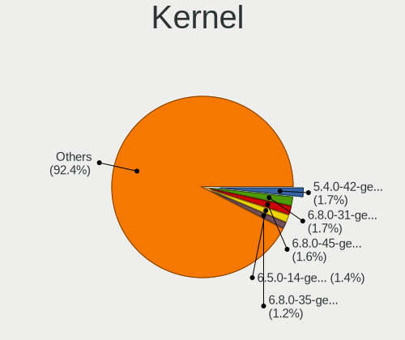

| Version           | Desktops | Percent |
|-------------------|----------|---------|
| 5.4.0-42-generic  | 44       | 3.9%    |
| 5.4.0-52-generic  | 28       | 2.48%   |
| 5.4.0-58-generic  | 23       | 2.04%   |
| 5.4.0-48-generic  | 22       | 1.95%   |
| 5.4.0-40-generic  | 18       | 1.6%    |
| 5.8.0-50-generic  | 17       | 1.51%   |
| 5.4.0-65-generic  | 17       | 1.51%   |
| 5.8.0-48-generic  | 15       | 1.33%   |
| 5.4.0-54-generic  | 15       | 1.33%   |
| 5.4.0-37-generic  | 15       | 1.33%   |
| 5.13.0-39-generic | 15       | 1.33%   |
| 5.4.0-47-generic  | 14       | 1.24%   |
| 5.13.0-28-generic | 14       | 1.24%   |
| 5.11.0-37-generic | 14       | 1.24%   |
| 5.8.0-45-generic  | 13       | 1.15%   |
| 5.4.0-45-generic  | 13       | 1.15%   |
| 5.8.0-43-generic  | 12       | 1.06%   |
| 5.3.0-40-generic  | 12       | 1.06%   |
| 5.15.0-27-generic | 12       | 1.06%   |
| 5.4.0-29-generic  | 11       | 0.98%   |
| 5.3.0-26-generic  | 11       | 0.98%   |
| 5.13.0-22-generic | 11       | 0.98%   |
| 5.11.0-25-generic | 11       | 0.98%   |
| 5.11.0-22-generic | 11       | 0.98%   |
| 5.8.0-63-generic  | 10       | 0.89%   |
| 5.8.0-44-generic  | 10       | 0.89%   |
| 5.4.0-74-generic  | 10       | 0.89%   |
| 5.13.0-40-generic | 10       | 0.89%   |
| 5.13.0-35-generic | 10       | 0.89%   |
| 5.8.0-33-generic  | 9        | 0.8%    |
| 5.4.0-66-generic  | 9        | 0.8%    |
| 5.13.0-30-generic | 9        | 0.8%    |
| 5.8.0-53-generic  | 8        | 0.71%   |
| 5.8.0-29-generic  | 8        | 0.71%   |
| 5.4.0-70-generic  | 8        | 0.71%   |
| 5.4.0-26-generic  | 8        | 0.71%   |
| 5.3.0-51-generic  | 8        | 0.71%   |
| 5.3.0-24-generic  | 8        | 0.71%   |
| 5.15.0-40-generic | 8        | 0.71%   |
| 5.11.0-43-generic | 8        | 0.71%   |
| 5.11.0-34-generic | 8        | 0.71%   |
| 5.11.0-17-generic | 8        | 0.71%   |
| 5.8.0-55-generic  | 7        | 0.62%   |
| 5.8.0-25-generic  | 7        | 0.62%   |
| 5.4.0-99-generic  | 7        | 0.62%   |
| 5.4.0-91-generic  | 7        | 0.62%   |
| 5.4.0-73-generic  | 7        | 0.62%   |
| 5.4.0-56-generic  | 7        | 0.62%   |
| 5.4.0-39-generic  | 7        | 0.62%   |
| 5.4.0-33-generic  | 7        | 0.62%   |
| 5.13.0-19-generic | 7        | 0.62%   |
| 5.11.0-27-generic | 7        | 0.62%   |
| 5.4.0-81-generic  | 6        | 0.53%   |
| 5.4.0-80-generic  | 6        | 0.53%   |
| 5.4.0-60-generic  | 6        | 0.53%   |
| 5.4.0-53-generic  | 6        | 0.53%   |
| 5.4.0-31-generic  | 6        | 0.53%   |
| 5.3.0-46-generic  | 6        | 0.53%   |
| 5.3.0-42-generic  | 6        | 0.53%   |
| 5.3.0-23-generic  | 6        | 0.53%   |

Kernel Family
-------------

Linux kernel without a distro release

| Version | Desktops | Percent |
|---------|----------|---------|
| 5.4.0   | 378      | 36.63%  |
| 5.8.0   | 161      | 15.6%   |
| 5.13.0  | 121      | 11.72%  |
| 5.11.0  | 114      | 11.05%  |
| 5.3.0   | 83       | 8.04%   |
| 5.15.0  | 47       | 4.55%   |
| 4.15.0  | 27       | 2.62%   |
| 5.0.0   | 17       | 1.65%   |
| 5.6.0   | 8        | 0.78%   |
| 4.4.0   | 6        | 0.58%   |
| 5.10.0  | 4        | 0.39%   |
| 4.18.0  | 4        | 0.39%   |
| 5.9.0   | 3        | 0.29%   |
| 5.18.4  | 3        | 0.29%   |
| 5.9.16  | 2        | 0.19%   |
| 5.8.18  | 2        | 0.19%   |
| 5.7.10  | 2        | 0.19%   |
| 5.17.0  | 2        | 0.19%   |
| 4.13.0  | 2        | 0.19%   |
| 5.9.6   | 1        | 0.1%    |
| 5.8.5   | 1        | 0.1%    |
| 5.8.2   | 1        | 0.1%    |
| 5.8.16  | 1        | 0.1%    |
| 5.8.12  | 1        | 0.1%    |
| 5.8.10  | 1        | 0.1%    |
| 5.8.1   | 1        | 0.1%    |
| 5.7.6   | 1        | 0.1%    |
| 5.7.15  | 1        | 0.1%    |
| 5.7.1   | 1        | 0.1%    |
| 5.6.7   | 1        | 0.1%    |
| 5.6.15  | 1        | 0.1%    |
| 5.6.11  | 1        | 0.1%    |
| 5.5.6   | 1        | 0.1%    |
| 5.5.13  | 1        | 0.1%    |
| 5.4.78  | 1        | 0.1%    |
| 5.4.72  | 1        | 0.1%    |
| 5.4.7   | 1        | 0.1%    |
| 5.4.42  | 1        | 0.1%    |
| 5.3.11  | 1        | 0.1%    |
| 5.17.14 | 1        | 0.1%    |
| 5.16.2  | 1        | 0.1%    |
| 5.16.0  | 1        | 0.1%    |
| 5.15.29 | 1        | 0.1%    |
| 5.15.13 | 1        | 0.1%    |
| 5.15.12 | 1        | 0.1%    |
| 5.14.21 | 1        | 0.1%    |
| 5.14.10 | 1        | 0.1%    |
| 5.13.9  | 1        | 0.1%    |
| 5.13.12 | 1        | 0.1%    |
| 5.12.9  | 1        | 0.1%    |
| 5.12.8  | 1        | 0.1%    |
| 5.12.7  | 1        | 0.1%    |
| 5.12.6  | 1        | 0.1%    |
| 5.11.15 | 1        | 0.1%    |
| 5.10.86 | 1        | 0.1%    |
| 5.10.7  | 1        | 0.1%    |
| 5.10.6  | 1        | 0.1%    |
| 5.10.4  | 1        | 0.1%    |
| 5.10.3  | 1        | 0.1%    |
| 5.10.26 | 1        | 0.1%    |

Kernel Major Ver.
-----------------

Linux kernel major version

| Version | Desktops | Percent |
|---------|----------|---------|
| 5.4     | 381      | 36.95%  |
| 5.8     | 169      | 16.39%  |
| 5.13    | 123      | 11.93%  |
| 5.11    | 115      | 11.15%  |
| 5.3     | 84       | 8.15%   |
| 5.15    | 50       | 4.85%   |
| 4.15    | 27       | 2.62%   |
| 5.0     | 18       | 1.75%   |
| 5.6     | 11       | 1.07%   |
| 5.10    | 10       | 0.97%   |
| 5.9     | 6        | 0.58%   |
| 4.4     | 6        | 0.58%   |
| 5.7     | 5        | 0.48%   |
| 4.18    | 5        | 0.48%   |
| 5.12    | 4        | 0.39%   |
| 5.18    | 3        | 0.29%   |
| 5.17    | 3        | 0.29%   |
| 5.5     | 2        | 0.19%   |
| 5.16    | 2        | 0.19%   |
| 5.14    | 2        | 0.19%   |
| 4.13    | 2        | 0.19%   |
| 5.1     | 1        | 0.1%    |
| 4.10    | 1        | 0.1%    |
| 3.13    | 1        | 0.1%    |

Arch
----

OS architecture (x86_64, i586, etc.)

| Name   | Desktops | Percent |
|--------|----------|---------|
| x86_64 | 950      | 99.06%  |
| i686   | 9        | 0.94%   |

DE
--

Desktop Environment

| Name     | Desktops | Percent |
|----------|----------|---------|
| KDE5     | 592      | 60.41%  |
| KDE      | 369      | 37.65%  |
| GNOME    | 4        | 0.41%   |
| Cinnamon | 4        | 0.41%   |
| Budgie   | 4        | 0.41%   |
| MATE     | 3        | 0.31%   |
| XFCE     | 2        | 0.2%    |
| Unity    | 1        | 0.1%    |
| KDE4     | 1        | 0.1%    |

Display Server
--------------

X11 or Wayland

| Name    | Desktops | Percent |
|---------|----------|---------|
| X11     | 929      | 96.37%  |
| Wayland | 22       | 2.28%   |
| Tty     | 13       | 1.35%   |

Display Manager
---------------

SDDM, LightDM, etc.

| Name    | Desktops | Percent |
|---------|----------|---------|
| SDDM    | 492      | 50.05%  |
| Unknown | 413      | 42.01%  |
| GDM     | 40       | 4.07%   |
| LightDM | 18       | 1.83%   |
| TDM     | 10       | 1.02%   |
| GDM3    | 9        | 0.92%   |
| SLiM    | 1        | 0.1%    |

OS Lang
-------

Language

| Lang    | Desktops | Percent |
|---------|----------|---------|
| en_US   | 375      | 38.58%  |
| de_DE   | 84       | 8.64%   |
| ru_RU   | 63       | 6.48%   |
| en_GB   | 59       | 6.07%   |
| fr_FR   | 50       | 5.14%   |
| pt_BR   | 48       | 4.94%   |
| it_IT   | 29       | 2.98%   |
| Unknown | 28       | 2.88%   |
| en_AU   | 25       | 2.57%   |
| pl_PL   | 23       | 2.37%   |
| en_CA   | 23       | 2.37%   |
| es_ES   | 16       | 1.65%   |
| hu_HU   | 11       | 1.13%   |
| de_AT   | 10       | 1.03%   |
| es_AR   | 9        | 0.93%   |
| ru_UA   | 8        | 0.82%   |
| C       | 7        | 0.72%   |
| uk_UA   | 6        | 0.62%   |
| es_MX   | 6        | 0.62%   |
| en_ZA   | 6        | 0.62%   |
| en_IN   | 6        | 0.62%   |
| cs_CZ   | 6        | 0.62%   |
| en_IL   | 5        | 0.51%   |
| el_GR   | 5        | 0.51%   |
| zh_TW   | 4        | 0.41%   |
| pt_PT   | 4        | 0.41%   |
| en_NZ   | 4        | 0.41%   |
| nl_NL   | 3        | 0.31%   |
| fi_FI   | 3        | 0.31%   |
| es_CL   | 3        | 0.31%   |
| tr_TR   | 2        | 0.21%   |
| sv_SE   | 2        | 0.21%   |
| sr_RS   | 2        | 0.21%   |
| sl_SI   | 2        | 0.21%   |
| nl_BE   | 2        | 0.21%   |
| ja_JP   | 2        | 0.21%   |
| fr_CH   | 2        | 0.21%   |
| es_VE   | 2        | 0.21%   |
| es_CO   | 2        | 0.21%   |
| en_DE   | 2        | 0.21%   |
| de_CH   | 2        | 0.21%   |
| bg_BG   | 2        | 0.21%   |
| zh_CN   | 1        | 0.1%    |
| sk_SK   | 1        | 0.1%    |
| sa_IN   | 1        | 0.1%    |
| ko_KR   | 1        | 0.1%    |
| hr_HR   | 1        | 0.1%    |
| fr_DZ   | 1        | 0.1%    |
| fr_BE   | 1        | 0.1%    |
| eu_ES   | 1        | 0.1%    |
| es_PE   | 1        | 0.1%    |
| en_PK   | 1        | 0.1%    |
| en_PH   | 1        | 0.1%    |
| en_NL   | 1        | 0.1%    |
| en_IE   | 1        | 0.1%    |
| en_HK   | 1        | 0.1%    |
| en_DK   | 1        | 0.1%    |
| en_001  | 1        | 0.1%    |
| da_DK   | 1        | 0.1%    |
| ca_ES   | 1        | 0.1%    |

Boot Mode
---------

EFI or BIOS

| Mode | Desktops | Percent |
|------|----------|---------|
| BIOS | 530      | 54.25%  |
| EFI  | 447      | 45.75%  |

Filesystem
----------

Type of filesystem

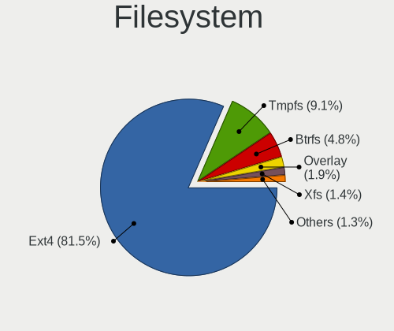

| Type     | Desktops | Percent |
|----------|----------|---------|
| Ext4     | 868      | 89.67%  |
| Btrfs    | 46       | 4.75%   |
| Xfs      | 19       | 1.96%   |
| Overlay  | 16       | 1.65%   |
| Zfs      | 8        | 0.83%   |
| Unknown  | 5        | 0.52%   |
| XXXX     | 1        | 0.1%    |
| Reiserfs | 1        | 0.1%    |
| Jfs      | 1        | 0.1%    |
| ExX4     | 1        | 0.1%    |
| Ext3     | 1        | 0.1%    |
| Ext2     | 1        | 0.1%    |

Part. scheme
------------

Scheme of partitioning

| Type    | Desktops | Percent |
|---------|----------|---------|
| Unknown | 490      | 50.1%   |
| GPT     | 368      | 37.63%  |
| MBR     | 120      | 12.27%  |

Dual Boot with Linux/BSD
------------------------

Hosting more than one Linux/BSD

| Dual boot | Desktops | Percent |
|-----------|----------|---------|
| No        | 784      | 80.08%  |
| Yes       | 195      | 19.92%  |

Dual Boot (Win)
---------------

Hosting Linux and Windows

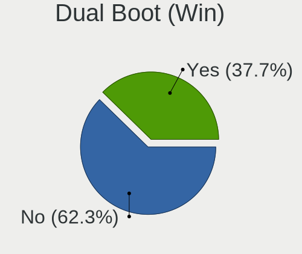

| Dual boot | Desktops | Percent |
|-----------|----------|---------|
| No        | 569      | 58.06%  |
| Yes       | 411      | 41.94%  |

Board
-----

Vendor
------

Motherboard manufacturer

| Name                | Desktops | Percent |
|---------------------|----------|---------|
| ASUSTek Computer    | 264      | 27.53%  |
| Gigabyte Technology | 194      | 20.23%  |
| MSI                 | 136      | 14.18%  |
| ASRock              | 98       | 10.22%  |
| Dell                | 64       | 6.67%   |
| Hewlett-Packard     | 61       | 6.36%   |
| Lenovo              | 23       | 2.4%    |
| Intel               | 16       | 1.67%   |
| Pegatron            | 10       | 1.04%   |
| Acer                | 10       | 1.04%   |
| Unknown             | 10       | 1.04%   |
| Fujitsu             | 9        | 0.94%   |
| Biostar             | 9        | 0.94%   |
| Foxconn             | 8        | 0.83%   |
| ECS                 | 7        | 0.73%   |
| Huanan              | 5        | 0.52%   |
| Packard Bell        | 3        | 0.31%   |
| ZOTAC               | 2        | 0.21%   |
| Supermicro          | 2        | 0.21%   |
| Shuttle             | 2        | 0.21%   |
| Google              | 2        | 0.21%   |
| Gateway             | 2        | 0.21%   |
| Fujitsu Siemens     | 2        | 0.21%   |
| AZW                 | 2        | 0.21%   |
| Apple               | 2        | 0.21%   |
| XFX                 | 1        | 0.1%    |
| Wistron             | 1        | 0.1%    |
| WeiBu               | 1        | 0.1%    |
| SYWZ                | 1        | 0.1%    |
| SUPoX COMPUTER      | 1        | 0.1%    |
| Seco                | 1        | 0.1%    |
| Positivo            | 1        | 0.1%    |
| PCWare              | 1        | 0.1%    |
| OEM                 | 1        | 0.1%    |
| Medion              | 1        | 0.1%    |
| Koloe               | 1        | 0.1%    |
| JINGSHA             | 1        | 0.1%    |
| Colorful Technology | 1        | 0.1%    |
| American Megatrends | 1        | 0.1%    |
| Alienware           | 1        | 0.1%    |
| ABIT                | 1        | 0.1%    |

Model
-----

Motherboard model

| Name                         | Desktops | Percent |
|------------------------------|----------|---------|
| ASUS All Series              | 31       | 3.23%   |
| Unknown                      | 12       | 1.25%   |
| MSI MS-7C37                  | 8        | 0.83%   |
| Gigabyte B450M DS3H          | 8        | 0.83%   |
| Dell OptiPlex 9020           | 8        | 0.83%   |
| ASUS ROG STRIX B550-F GAMING | 8        | 0.83%   |
| MSI MS-7B79                  | 7        | 0.73%   |
| ASUS ROG STRIX X570-E GAMING | 7        | 0.73%   |
| ASUS PRIME B450M-A           | 7        | 0.73%   |
| MSI MS-7817                  | 6        | 0.63%   |
| Gigabyte 970A-DS3P           | 6        | 0.63%   |
| MSI MS-7C02                  | 5        | 0.52%   |
| MSI MS-7A34                  | 5        | 0.52%   |
| Gigabyte X570 AORUS MASTER   | 5        | 0.52%   |
| Gigabyte A320M-S2H           | 5        | 0.52%   |
| ASUS PRIME B350-PLUS         | 5        | 0.52%   |
| ASRock AB350 Pro4            | 5        | 0.52%   |
| HP EliteDesk 800 G1 SFF      | 4        | 0.42%   |
| Gigabyte A320M-S2H V2        | 4        | 0.42%   |
| Gigabyte A320M-H             | 4        | 0.42%   |
| Dell Inspiron 3847           | 4        | 0.42%   |
| ASUS TUF X470-PLUS GAMING    | 4        | 0.42%   |
| ASUS PRIME A320M-K           | 4        | 0.42%   |
| MSI MS-7C94                  | 3        | 0.31%   |
| MSI MS-7C91                  | 3        | 0.31%   |
| MSI MS-7C52                  | 3        | 0.31%   |
| MSI MS-7B93                  | 3        | 0.31%   |
| MSI MS-7B89                  | 3        | 0.31%   |
| MSI MS-7A33                  | 3        | 0.31%   |
| MSI MS-7996                  | 3        | 0.31%   |
| MSI MS-7758                  | 3        | 0.31%   |
| MSI MS-7693                  | 3        | 0.31%   |
| HP Z440 Workstation          | 3        | 0.31%   |
| Gigabyte X570 AORUS ELITE    | 3        | 0.31%   |
| Gigabyte GA-870A-UD3         | 3        | 0.31%   |
| Gigabyte GA-78LMT-USB3 6.0   | 3        | 0.31%   |
| Gigabyte B550 AORUS PRO AC   | 3        | 0.31%   |
| Gigabyte B550 AORUS ELITE    | 3        | 0.31%   |
| Gigabyte B450M S2H           | 3        | 0.31%   |
| Dell XPS 8700                | 3        | 0.31%   |
| Dell OptiPlex 7010           | 3        | 0.31%   |
| Dell OptiPlex 390            | 3        | 0.31%   |
| ASUS Z170 PRO GAMING         | 3        | 0.31%   |
| ASUS TUF Gaming X570-PLUS    | 3        | 0.31%   |
| ASUS TUF B450M-PLUS GAMING   | 3        | 0.31%   |
| ASUS PRIME X570-P            | 3        | 0.31%   |
| ASUS M5A78L-M/USB3           | 3        | 0.31%   |
| Pegatron ECOQUIET 630A       | 2        | 0.21%   |
| MSI MS-7D54                  | 2        | 0.21%   |
| MSI MS-7C56                  | 2        | 0.21%   |
| MSI MS-7C36                  | 2        | 0.21%   |
| MSI MS-7C35                  | 2        | 0.21%   |
| MSI MS-7B85                  | 2        | 0.21%   |
| MSI MS-7B48                  | 2        | 0.21%   |
| MSI MS-7B17                  | 2        | 0.21%   |
| MSI MS-7B09                  | 2        | 0.21%   |
| MSI MS-7A59                  | 2        | 0.21%   |
| MSI MS-7A38                  | 2        | 0.21%   |
| MSI MS-7A32                  | 2        | 0.21%   |
| MSI MS-7850                  | 2        | 0.21%   |

Model Family
------------

Motherboard model prefix

| Name                   | Desktops | Percent |
|------------------------|----------|---------|
| ASUS PRIME             | 53       | 5.53%   |
| ASUS ROG               | 47       | 4.9%    |
| ASUS All               | 31       | 3.23%   |
| Dell OptiPlex          | 28       | 2.92%   |
| HP Compaq              | 20       | 2.09%   |
| Lenovo ThinkCentre     | 18       | 1.88%   |
| ASUS TUF               | 17       | 1.77%   |
| Gigabyte B450M         | 14       | 1.46%   |
| Gigabyte X570          | 13       | 1.36%   |
| Dell Precision         | 13       | 1.36%   |
| Unknown                | 12       | 1.25%   |
| Dell Inspiron          | 10       | 1.04%   |
| Gigabyte A320M-S2H     | 9        | 0.94%   |
| Acer Aspire            | 9        | 0.94%   |
| MSI MS-7C37            | 8        | 0.83%   |
| Gigabyte B550          | 8        | 0.83%   |
| MSI MS-7B79            | 7        | 0.73%   |
| Fujitsu ESPRIMO        | 7        | 0.73%   |
| ASRock AB350           | 7        | 0.73%   |
| MSI MS-7817            | 6        | 0.63%   |
| HP EliteDesk           | 6        | 0.63%   |
| Gigabyte 970A-DS3P     | 6        | 0.63%   |
| ASUS M5A78L-M          | 6        | 0.63%   |
| MSI MS-7C02            | 5        | 0.52%   |
| MSI MS-7A34            | 5        | 0.52%   |
| HP ProDesk             | 5        | 0.52%   |
| Gigabyte GA-78LMT-USB3 | 5        | 0.52%   |
| ASUS SABERTOOTH        | 5        | 0.52%   |
| HP Pavilion            | 4        | 0.42%   |
| Gigabyte Z170X-Gaming  | 4        | 0.42%   |
| Gigabyte X470          | 4        | 0.42%   |
| Gigabyte B550M         | 4        | 0.42%   |
| Gigabyte B450          | 4        | 0.42%   |
| Gigabyte AX370-Gaming  | 4        | 0.42%   |
| Gigabyte A320M-H       | 4        | 0.42%   |
| Dell XPS               | 4        | 0.42%   |
| Dell Vostro            | 4        | 0.42%   |
| ASUS P8H61-M           | 4        | 0.42%   |
| ASUS P5Q               | 4        | 0.42%   |
| ASUS Maximus           | 4        | 0.42%   |
| ASUS M5A97             | 4        | 0.42%   |
| MSI MS-7C94            | 3        | 0.31%   |
| MSI MS-7C91            | 3        | 0.31%   |
| MSI MS-7C52            | 3        | 0.31%   |
| MSI MS-7B93            | 3        | 0.31%   |
| MSI MS-7B89            | 3        | 0.31%   |
| MSI MS-7A33            | 3        | 0.31%   |
| MSI MS-7996            | 3        | 0.31%   |
| MSI MS-7758            | 3        | 0.31%   |
| MSI MS-7693            | 3        | 0.31%   |
| Intel X99              | 3        | 0.31%   |
| HP Z440                | 3        | 0.31%   |
| Gigabyte Z390          | 3        | 0.31%   |
| Gigabyte GA-870A-UD3   | 3        | 0.31%   |
| ASUS Z170              | 3        | 0.31%   |
| ASUS P8Z77-V           | 3        | 0.31%   |
| ASUS M5A78L            | 3        | 0.31%   |
| ASRock Z170            | 3        | 0.31%   |
| ASRock X570            | 3        | 0.31%   |
| ASRock B550M           | 3        | 0.31%   |

MFG Year
--------

Motherboard manufacture year

| Year    | Desktops | Percent |
|---------|----------|---------|
| 2018    | 125      | 13.03%  |
| 2019    | 103      | 10.74%  |
| 2013    | 91       | 9.49%   |
| 2020    | 82       | 8.55%   |
| 2017    | 82       | 8.55%   |
| 2012    | 79       | 8.24%   |
| 2011    | 65       | 6.78%   |
| 2014    | 59       | 6.15%   |
| 2010    | 55       | 5.74%   |
| 2015    | 52       | 5.42%   |
| 2016    | 42       | 4.38%   |
| 2009    | 41       | 4.28%   |
| 2008    | 31       | 3.23%   |
| 2021    | 25       | 2.61%   |
| 2007    | 16       | 1.67%   |
| 2006    | 7        | 0.73%   |
| 2005    | 2        | 0.21%   |
| 2004    | 1        | 0.1%    |
| Unknown | 1        | 0.1%    |

Form Factor
-----------

Physical design of the computer

| Name    | Desktops | Percent |
|---------|----------|---------|
| Desktop | 959      | 100%    |

Secure Boot
-----------

Enabled or disabled

| State    | Desktops | Percent |
|----------|----------|---------|
| Disabled | 938      | 97.81%  |
| Enabled  | 21       | 2.19%   |

Coreboot
--------

Have coreboot on board

| Used | Desktops | Percent |
|------|----------|---------|
| No   | 956      | 99.69%  |
| Yes  | 3        | 0.31%   |

RAM Size
--------

Total RAM memory

| Size in GB  | Desktops | Percent |
|-------------|----------|---------|
| 16.01-24.0  | 288      | 29.6%   |
| 32.01-64.0  | 187      | 19.22%  |
| 8.01-16.0   | 180      | 18.5%   |
| 4.01-8.0    | 122      | 12.54%  |
| 3.01-4.0    | 89       | 9.15%   |
| 64.01-256.0 | 50       | 5.14%   |
| 24.01-32.0  | 44       | 4.52%   |
| 1.01-2.0    | 7        | 0.72%   |
| 2.01-3.0    | 6        | 0.62%   |

RAM Used
--------

Used RAM memory

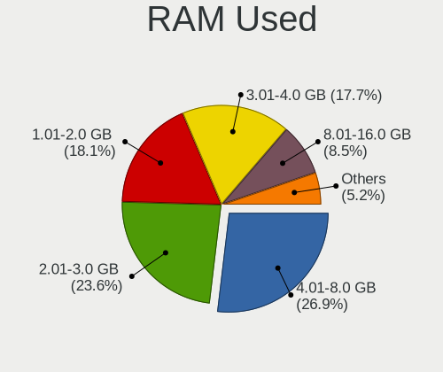

| Used GB    | Desktops | Percent |
|------------|----------|---------|
| 2.01-3.0   | 250      | 23.81%  |
| 4.01-8.0   | 248      | 23.62%  |
| 1.01-2.0   | 232      | 22.1%   |
| 3.01-4.0   | 167      | 15.9%   |
| 8.01-16.0  | 89       | 8.48%   |
| 0.51-1.0   | 32       | 3.05%   |
| 16.01-24.0 | 17       | 1.62%   |
| 24.01-32.0 | 7        | 0.67%   |
| 0.01-0.5   | 4        | 0.38%   |
| 32.01-64.0 | 3        | 0.29%   |
| Unknown    | 1        | 0.1%    |

Total Drives
------------

Number of drives on board

| Drives | Desktops | Percent |
|--------|----------|---------|
| 2      | 294      | 29.2%   |
| 1      | 274      | 27.21%  |
| 3      | 184      | 18.27%  |
| 4      | 125      | 12.41%  |
| 5      | 66       | 6.55%   |
| 6      | 28       | 2.78%   |
| 7      | 15       | 1.49%   |
| 8      | 5        | 0.5%    |
| 9      | 4        | 0.4%    |
| 0      | 4        | 0.4%    |
| 10     | 3        | 0.3%    |
| 12     | 2        | 0.2%    |
| 11     | 2        | 0.2%    |
| 13     | 1        | 0.1%    |

Has CD-ROM
----------

Has CD-ROM on board

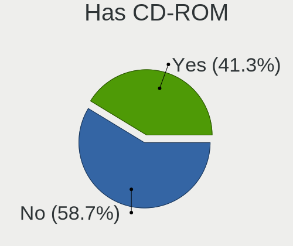

| Presented | Desktops | Percent |
|-----------|----------|---------|
| No        | 514      | 52.77%  |
| Yes       | 460      | 47.23%  |

Has Ethernet
------------

Has Ethernet on board

| Presented | Desktops | Percent |
|-----------|----------|---------|
| Yes       | 952      | 99.27%  |
| No        | 7        | 0.73%   |

Has WiFi
--------

Has WiFi module

| Presented | Desktops | Percent |
|-----------|----------|---------|
| No        | 571      | 58.87%  |
| Yes       | 399      | 41.13%  |

Has Bluetooth
-------------

Has Bluetooth module

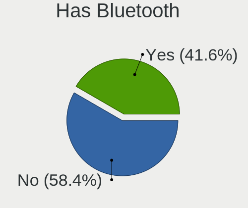

| Presented | Desktops | Percent |
|-----------|----------|---------|
| No        | 628      | 64.61%  |
| Yes       | 344      | 35.39%  |

Location
--------

Country
-------

Geographic location (country)

| Country      | Desktops | Percent |
|--------------|----------|---------|
| USA          | 200      | 20.81%  |
| Germany      | 107      | 11.13%  |
| Russia       | 82       | 8.53%   |
| Brazil       | 64       | 6.66%   |
| France       | 56       | 5.83%   |
| UK           | 51       | 5.31%   |
| Italy        | 38       | 3.95%   |
| Canada       | 29       | 3.02%   |
| Poland       | 27       | 2.81%   |
| Spain        | 26       | 2.71%   |
| Ukraine      | 24       | 2.5%    |
| Australia    | 24       | 2.5%    |
| Netherlands  | 22       | 2.29%   |
| Hungary      | 17       | 1.77%   |
| Argentina    | 13       | 1.35%   |
| Austria      | 12       | 1.25%   |
| Greece       | 10       | 1.04%   |
| Switzerland  | 9        | 0.94%   |
| Finland      | 8        | 0.83%   |
| Sweden       | 7        | 0.73%   |
| Mexico       | 7        | 0.73%   |
| India        | 7        | 0.73%   |
| Czechia      | 7        | 0.73%   |
| Belgium      | 7        | 0.73%   |
| South Africa | 6        | 0.62%   |
| Serbia       | 6        | 0.62%   |
| Israel       | 6        | 0.62%   |
| Turkey       | 5        | 0.52%   |
| Portugal     | 5        | 0.52%   |
| Bulgaria     | 5        | 0.52%   |
| Taiwan       | 4        | 0.42%   |
| Norway       | 4        | 0.42%   |
| New Zealand  | 4        | 0.42%   |
| Denmark      | 4        | 0.42%   |
| Chile        | 4        | 0.42%   |
| Slovenia     | 3        | 0.31%   |
| Slovakia     | 3        | 0.31%   |
| Romania      | 3        | 0.31%   |
| Japan        | 3        | 0.31%   |
| Estonia      | 3        | 0.31%   |
| Colombia     | 3        | 0.31%   |
| Belarus      | 3        | 0.31%   |
| Bangladesh   | 3        | 0.31%   |
| Venezuela    | 2        | 0.21%   |
| South Korea  | 2        | 0.21%   |
| Peru         | 2        | 0.21%   |
| Pakistan     | 2        | 0.21%   |
| Hong Kong    | 2        | 0.21%   |
| Vietnam      | 1        | 0.1%    |
| Uzbekistan   | 1        | 0.1%    |
| Suriname     | 1        | 0.1%    |
| Saudi Arabia | 1        | 0.1%    |
| Philippines  | 1        | 0.1%    |
| Oman         | 1        | 0.1%    |
| Nigeria      | 1        | 0.1%    |
| Martinique   | 1        | 0.1%    |
| Malta        | 1        | 0.1%    |
| Luxembourg   | 1        | 0.1%    |
| Lithuania    | 1        | 0.1%    |
| Latvia       | 1        | 0.1%    |

City
----

Geographic location (city)

| City              | Desktops | Percent |
|-------------------|----------|---------|
| Moscow            | 16       | 1.61%   |
| Paris             | 13       | 1.31%   |
| Berlin            | 10       | 1%      |
| Warsaw            | 9        | 0.9%    |
| Sydney            | 9        | 0.9%    |
| Rome              | 9        | 0.9%    |
| Kyiv              | 9        | 0.9%    |
| Budapest          | 9        | 0.9%    |
| St Petersburg     | 8        | 0.8%    |
| Sao Paulo         | 8        | 0.8%    |
| Novosibirsk       | 7        | 0.7%    |
| Rio de Janeiro    | 6        | 0.6%    |
| Melbourne         | 6        | 0.6%    |
| Munich            | 5        | 0.5%    |
| London            | 5        | 0.5%    |
| Hamburg           | 5        | 0.5%    |
| Frankfurt am Main | 5        | 0.5%    |
| Cologne           | 5        | 0.5%    |
| Chicago           | 5        | 0.5%    |
| Belgrade          | 5        | 0.5%    |
| Amsterdam         | 5        | 0.5%    |
| Zurich            | 4        | 0.4%    |
| Vienna            | 4        | 0.4%    |
| Sindelfingen      | 4        | 0.4%    |
| Milan             | 4        | 0.4%    |
| Manchester        | 4        | 0.4%    |
| Krakow            | 4        | 0.4%    |
| Irkutsk           | 4        | 0.4%    |
| Athens            | 4        | 0.4%    |
| Toronto           | 3        | 0.3%    |
| Tampere           | 3        | 0.3%    |
| Seattle           | 3        | 0.3%    |
| Sao Carlos        | 3        | 0.3%    |
| Samara            | 3        | 0.3%    |
| Pretoria          | 3        | 0.3%    |
| Pontault-Combault | 3        | 0.3%    |
| Ottawa            | 3        | 0.3%    |
| Oryol             | 3        | 0.3%    |
| Liverpool         | 3        | 0.3%    |
| Leipzig           | 3        | 0.3%    |
| Lebanon           | 3        | 0.3%    |
| Kazan          | 3        | 0.3%    |
| Johannesburg      | 3        | 0.3%    |
| Jacksonville      | 3        | 0.3%    |
| Ilmenau           | 3        | 0.3%    |
| Helsinki          | 3        | 0.3%    |
| Brooklyn          | 3        | 0.3%    |
| Albuquerque       | 3        | 0.3%    |
| Vancouver         | 2        | 0.2%    |
| Tolyatti          | 2        | 0.2%    |
| Thessaloniki      | 2        | 0.2%    |
| Tartu             | 2        | 0.2%    |
| Surgut            | 2        | 0.2%    |
| Strongsville      | 2        | 0.2%    |
| St Louis          | 2        | 0.2%    |
| Sofia             | 2        | 0.2%    |
| Santo Andr      | 2        | 0.2%    |
| San Jose          | 2        | 0.2%    |
| San Francisco     | 2        | 0.2%    |
| San Diego         | 2        | 0.2%    |

Drives
------

Drive Vendor
------------

Hard drive vendors

| Vendor                      | Desktops | Drives | Percent |
|-----------------------------|----------|--------|---------|
| WDC                         | 381      | 736    | 19.37%  |
| Seagate                     | 373      | 594    | 18.96%  |
| Samsung Electronics         | 332      | 588    | 16.88%  |
| Kingston                    | 108      | 141    | 5.49%   |
| Toshiba                     | 91       | 134    | 4.63%   |
| Crucial                     | 90       | 114    | 4.58%   |
| SanDisk                     | 79       | 101    | 4.02%   |
| Hitachi                     | 73       | 94     | 3.71%   |
| Intel                       | 38       | 49     | 1.93%   |
| A-DATA Technology           | 29       | 33     | 1.47%   |
| Unknown                     | 25       | 32     | 1.27%   |
| HGST                        | 25       | 32     | 1.27%   |
| Phison                      | 24       | 34     | 1.22%   |
| Patriot                     | 16       | 22     | 0.81%   |
| OCZ                         | 16       | 23     | 0.81%   |
| Micron Technology           | 16       | 21     | 0.81%   |
| Transcend                   | 15       | 16     | 0.76%   |
| Silicon Motion              | 14       | 14     | 0.71%   |
| Maxtor                      | 14       | 15     | 0.71%   |
| Intenso                     | 12       | 14     | 0.61%   |
| China                       | 12       | 19     | 0.61%   |
| Corsair                     | 11       | 14     | 0.56%   |
| SPCC                        | 10       | 12     | 0.51%   |
| XPG                         | 9        | 10     | 0.46%   |
| PNY                         | 9        | 12     | 0.46%   |
| Goodram                     | 9        | 24     | 0.46%   |
| JMicron Technology          | 8        | 9      | 0.41%   |
| KingSpec                    | 7        | 9      | 0.36%   |
| Gigabyte Technology         | 7        | 8      | 0.36%   |
| Team                        | 6        | 6      | 0.31%   |
| SABRENT                     | 6        | 6      | 0.31%   |
| SK hynix                    | 5        | 6      | 0.25%   |
| Mushkin                     | 5        | 5      | 0.25%   |
| Hewlett-Packard             | 5        | 7      | 0.25%   |
| Fujitsu                     | 5        | 5      | 0.25%   |
| LDLC                        | 4        | 12     | 0.2%    |
| Realtek Semiconductor       | 3        | 3      | 0.15%   |
| KingDian                    | 3        | 4      | 0.15%   |
| ASMT                        | 3        | 3      | 0.15%   |
| Apacer                      | 3        | 8      | 0.15%   |
| AMD                         | 3        | 3      | 0.15%   |
| Verbatim                    | 2        | 2      | 0.1%    |
| VENO                        | 2        | 4      | 0.1%    |
| Super Talent                | 2        | 2      | 0.1%    |
| StoreJet                    | 2        | 2      | 0.1%    |
| Smartbuy                    | 2        | 3      | 0.1%    |
| Plextor                     | 2        | 3      | 0.1%    |
| Micron/Crucial Technology   | 2        | 2      | 0.1%    |
| MDT                         | 2        | 4      | 0.1%    |
| LITEON                      | 2        | 3      | 0.1%    |
| Leven                       | 2        | 3      | 0.1%    |
| KIOXIA                      | 2        | 2      | 0.1%    |
| INNOVATION IT               | 2        | 2      | 0.1%    |
| AEGO                        | 2        | 3      | 0.1%    |
| ADATA Technology            | 2        | 2      | 0.1%    |
| Yangtze Memory Technologies | 1        | 1      | 0.05%   |
| XrayDisk                    | 1        | 1      | 0.05%   |
| WD MediaMax                 | 1        | 1      | 0.05%   |
| USB                         | 1        | 1      | 0.05%   |
| TUSUNBOW                    | 1        | 1      | 0.05%   |

Drive Model
-----------

Hard drive models

| Model                                  | Desktops | Percent |
|----------------------------------------|----------|---------|
| Samsung SSD 850 EVO 250GB              | 28       | 1.17%   |
| Samsung SSD 850 EVO 500GB              | 26       | 1.09%   |
| Seagate ST1000DM010-2EP102 1TB         | 23       | 0.96%   |
| Samsung SSD 860 EVO 500GB              | 22       | 0.92%   |
| Samsung SM963 2.5" NVMe PCIe SSD 500GB | 22       | 0.92%   |
| Samsung SSD 860 EVO 1TB                | 20       | 0.84%   |
| WDC WD10EZEX-08WN4A0 1TB               | 19       | 0.8%    |
| Kingston SA400S37240G 240GB SSD        | 19       | 0.8%    |
| Kingston SA400S37480G 480GB SSD        | 18       | 0.75%   |
| Seagate ST1000DM003-1ER162 1TB         | 17       | 0.71%   |
| Seagate ST500DM002-1BD142 500GB        | 16       | 0.67%   |
| Crucial CT1000MX500SSD1 1TB            | 16       | 0.67%   |
| Toshiba HDWD110 1TB                    | 15       | 0.63%   |
| Seagate ST1000DM003-1CH162 1TB         | 15       | 0.63%   |
| Seagate ST4000DM004-2CV104 4TB         | 14       | 0.59%   |
| Seagate ST3500413AS 500GB              | 14       | 0.59%   |
| Seagate ST2000DM001-1ER164 2TB         | 14       | 0.59%   |
| Samsung NVMe SSD Drive 1TB             | 14       | 0.59%   |
| Seagate ST2000DM008-2FR102 2TB         | 13       | 0.54%   |
| Seagate ST2000DM006-2DM164 2TB         | 13       | 0.54%   |
| WDC WD1002FAEX-00Z3A0 1TB              | 12       | 0.5%    |
| Toshiba DT01ACA100 1TB                 | 12       | 0.5%    |
| Samsung SSD 970 EVO Plus 500GB         | 12       | 0.5%    |
| Samsung SSD 970 EVO Plus 1TB           | 12       | 0.5%    |
| WDC WD20EARX-00PASB0 2TB               | 11       | 0.46%   |
| Seagate ST3500418AS 500GB              | 11       | 0.46%   |
| Seagate ST31000524AS 1TB               | 11       | 0.46%   |
| Seagate ST2000DM001-1CH164 2TB         | 11       | 0.46%   |
| WDC WDS500G2B0A-00SM50 500GB SSD       | 10       | 0.42%   |
| WDC WD20EZRX-00D8PB0 2TB               | 10       | 0.42%   |
| WDC WD1003FZEX-00K3CA0 1TB             | 10       | 0.42%   |
| Samsung SSD 970 EVO 1TB                | 10       | 0.42%   |
| Samsung SSD 860 EVO 250GB              | 10       | 0.42%   |
| Samsung HD103SJ 1TB                    | 10       | 0.42%   |
| WDC WD20EZRZ-00Z5HB0 2TB               | 9        | 0.38%   |
| Toshiba DT01ACA200 2TB                 | 9        | 0.38%   |
| Kingston SA2000M81000G 1TB             | 9        | 0.38%   |
| WDC WDS240G2G0A-00JH30 240GB SSD       | 8        | 0.34%   |
| WDC WD40EZRZ-00GXCB0 4TB               | 8        | 0.34%   |
| WDC WD30EFRX-68EUZN0 3TB               | 8        | 0.34%   |
| WDC WD20EARS-00MVWB0 2TB               | 8        | 0.34%   |
| Toshiba HDWD130 3TB                    | 8        | 0.34%   |
| Seagate ST31000528AS 1TB               | 8        | 0.34%   |
| Seagate ST1000LM024 HN-M101MBB 1TB     | 8        | 0.34%   |
| Seagate Expansion+ Desk 4TB            | 8        | 0.34%   |
| Samsung SSD 840 EVO 120GB              | 8        | 0.34%   |
| Samsung NVMe SSD Drive 250GB           | 8        | 0.34%   |
| Samsung HD502HJ 500GB                  | 8        | 0.34%   |
| Kingston SUV400S37240G 240GB SSD       | 8        | 0.34%   |
| Crucial CT500MX500SSD1 500GB           | 8        | 0.34%   |
| WDC WD20EFRX-68EUZN0 2TB               | 7        | 0.29%   |
| WDC WD10EZEX-00BN5A0 1TB               | 7        | 0.29%   |
| WDC WD10EARS-00Y5B1 1TB                | 7        | 0.29%   |
| WDC WD1003FZEX-00MK2A0 1TB             | 7        | 0.29%   |
| Unknown SD/MMC/MS PRO 128GB            | 7        | 0.29%   |
| Seagate ST3000DM008-2DM166 3TB         | 7        | 0.29%   |
| Seagate ST1000LM048-2E7172 1TB         | 7        | 0.29%   |
| Seagate Expansion 1TB                  | 7        | 0.29%   |
| SanDisk SSD PLUS 480GB                 | 7        | 0.29%   |
| Samsung SSD 970 EVO 500GB              | 7        | 0.29%   |

HDD Vendor
----------

Hard disk drive vendors

| Vendor              | Desktops | Drives | Percent |
|---------------------|----------|--------|---------|
| Seagate             | 365      | 579    | 36.54%  |
| WDC                 | 342      | 660    | 34.23%  |
| Toshiba             | 83       | 121    | 8.31%   |
| Hitachi             | 73       | 94     | 7.31%   |
| Samsung Electronics | 70       | 114    | 7.01%   |
| HGST                | 25       | 32     | 2.5%    |
| Maxtor              | 13       | 14     | 1.3%    |
| Unknown             | 10       | 10     | 1%      |
| Fujitsu             | 4        | 4      | 0.4%    |
| JMicron Technology  | 3        | 4      | 0.3%    |
| Hewlett-Packard     | 3        | 5      | 0.3%    |
| ASMT                | 3        | 3      | 0.3%    |
| WD MediaMax         | 1        | 1      | 0.1%    |
| USB                 | 1        | 1      | 0.1%    |
| SAGE                | 1        | 1      | 0.1%    |
| LIO-ORG             | 1        | 1      | 0.1%    |
| LaCie               | 1        | 1      | 0.1%    |

SSD Vendor
----------

Solid state drive vendors

| Vendor              | Desktops | Drives | Percent |
|---------------------|----------|--------|---------|
| Samsung Electronics | 194      | 279    | 27.32%  |
| Kingston            | 94       | 121    | 13.24%  |
| Crucial             | 75       | 97     | 10.56%  |
| SanDisk             | 65       | 80     | 9.15%   |
| WDC                 | 43       | 51     | 6.06%   |
| Intel               | 23       | 30     | 3.24%   |
| A-DATA Technology   | 23       | 27     | 3.24%   |
| Patriot             | 16       | 22     | 2.25%   |
| OCZ                 | 16       | 23     | 2.25%   |
| Micron Technology   | 12       | 14     | 1.69%   |
| China               | 12       | 19     | 1.69%   |
| Transcend           | 11       | 11     | 1.55%   |
| Intenso             | 11       | 13     | 1.55%   |
| SPCC                | 9        | 10     | 1.27%   |
| Goodram             | 9        | 24     | 1.27%   |
| PNY                 | 7        | 10     | 0.99%   |
| KingSpec            | 7        | 9      | 0.99%   |
| Corsair             | 7        | 9      | 0.99%   |
| Toshiba             | 6        | 10     | 0.85%   |
| Team                | 6        | 6      | 0.85%   |
| Mushkin             | 5        | 5      | 0.7%    |
| Unknown             | 3        | 3      | 0.42%   |
| SK hynix            | 3        | 4      | 0.42%   |
| KingDian            | 3        | 4      | 0.42%   |
| Gigabyte Technology | 3        | 3      | 0.42%   |
| Apacer              | 3        | 8      | 0.42%   |
| Verbatim            | 2        | 2      | 0.28%   |
| VENO                | 2        | 4      | 0.28%   |
| Super Talent        | 2        | 2      | 0.28%   |
| Smartbuy            | 2        | 3      | 0.28%   |
| Seagate             | 2        | 2      | 0.28%   |
| Plextor             | 2        | 3      | 0.28%   |
| LITEON              | 2        | 3      | 0.28%   |
| Leven               | 2        | 3      | 0.28%   |
| LDLC                | 2        | 2      | 0.28%   |
| INNOVATION IT       | 2        | 2      | 0.28%   |
| AMD                 | 2        | 2      | 0.28%   |
| AEGO                | 2        | 3      | 0.28%   |
| TUSUNBOW            | 1        | 1      | 0.14%   |
| TCSUNBOW            | 1        | 1      | 0.14%   |
| StoreJet            | 1        | 1      | 0.14%   |
| PNY USB             | 1        | 1      | 0.14%   |
| Netac               | 1        | 2      | 0.14%   |
| Mercury             | 1        | 1      | 0.14%   |
| Maxtor              | 1        | 1      | 0.14%   |
| LITEONIT            | 1        | 1      | 0.14%   |
| Lexar               | 1        | 1      | 0.14%   |
| KIOXIA-EXCERIA      | 1        | 1      | 0.14%   |
| JMicron Technology  | 1        | 1      | 0.14%   |
| Hewlett-Packard     | 1        | 1      | 0.14%   |
| Fujitsu             | 1        | 1      | 0.14%   |
| EMTEC               | 1        | 1      | 0.14%   |
| Drevo               | 1        | 2      | 0.14%   |
| Colorful            | 1        | 1      | 0.14%   |
| Avant               | 1        | 1      | 0.14%   |
| Apple               | 1        | 1      | 0.14%   |
| AMD-RAID            | 1        | 3      | 0.14%   |
| Unknown             | 1        | 1      | 0.14%   |

Drive Kind
----------

HDD or SSD

| Kind    | Desktops | Drives | Percent |
|---------|----------|--------|---------|
| HDD     | 708      | 1645   | 44.64%  |
| SSD     | 574      | 947    | 36.19%  |
| NVMe    | 267      | 421    | 16.83%  |
| Unknown | 32       | 52     | 2.02%   |
| MMC     | 5        | 7      | 0.32%   |

Drive Connector
---------------

SATA, SAS, NVMe, etc.

| Type | Desktops | Drives | Percent |
|------|----------|--------|---------|
| SATA | 893      | 2529   | 71.9%   |
| NVMe | 265      | 413    | 21.34%  |
| SAS  | 79       | 123    | 6.36%   |
| MMC  | 5        | 7      | 0.4%    |

Drive Size
----------

Size of hard drive

| Size in TB | Desktops | Drives | Percent |
|------------|----------|--------|---------|
| 0.01-0.5   | 634      | 1163   | 43.01%  |
| 0.51-1.0   | 447      | 788    | 30.33%  |
| 1.01-2.0   | 202      | 326    | 13.7%   |
| 3.01-4.0   | 83       | 147    | 5.63%   |
| 2.01-3.0   | 67       | 96     | 4.55%   |
| 4.01-10.0  | 36       | 63     | 2.44%   |
| 10.01-20.0 | 5        | 9      | 0.34%   |

Space Total
-----------

Amount of disk space available on the file system

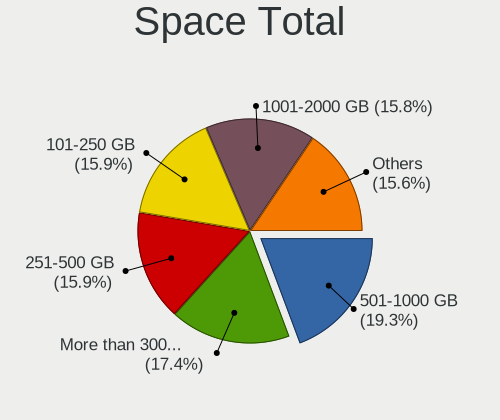

| Size in GB     | Desktops | Percent |
|----------------|----------|---------|
| 501-1000       | 189      | 18.79%  |
| More than 3000 | 173      | 17.2%   |
| 251-500        | 172      | 17.1%   |
| 101-250        | 167      | 16.6%   |
| 1001-2000      | 147      | 14.61%  |
| 2001-3000      | 85       | 8.45%   |
| 51-100         | 36       | 3.58%   |
| 1-20           | 20       | 1.99%   |
| 21-50          | 12       | 1.19%   |
| Unknown        | 5        | 0.5%    |

Space Used
----------

Amount of used disk space

| Used GB        | Desktops | Percent |
|----------------|----------|---------|
| 1-20           | 177      | 17.12%  |
| 101-250        | 142      | 13.73%  |
| 501-1000       | 132      | 12.77%  |
| 51-100         | 128      | 12.38%  |
| 21-50          | 119      | 11.51%  |
| 251-500        | 110      | 10.64%  |
| 1001-2000      | 96       | 9.28%   |
| More than 3000 | 86       | 8.32%   |
| 2001-3000      | 39       | 3.77%   |
| Unknown        | 5        | 0.48%   |

Malfunc. Drives
---------------

Drive models with a malfunction

| Model                                          | Desktops | Drives | Percent |
|------------------------------------------------|----------|--------|---------|
| Seagate ST31000524AS 1TB                       | 4        | 5      | 2.3%    |
| Seagate ST1000DM003-1CH162 1TB                 | 4        | 9      | 2.3%    |
| Seagate ST31000528AS 1TB                       | 3        | 3      | 1.72%   |
| Crucial CT1050MX300SSD1 1TB                    | 3        | 3      | 1.72%   |
| WDC WD5000AAKS-00V1A0 500GB                    | 2        | 3      | 1.15%   |
| WDC WD5000AAKS-00A7B0 500GB                    | 2        | 2      | 1.15%   |
| WDC WD3200JD-22KLB0 320GB                      | 2        | 2      | 1.15%   |
| WDC WD20EFRX-68EUZN0 2TB                       | 2        | 4      | 1.15%   |
| WDC WD15EARS-00Z5B1 1TB                        | 2        | 2      | 1.15%   |
| WDC WD10EZEX-08WN4A0 1TB                       | 2        | 2      | 1.15%   |
| WDC WD1001FALS-40U9B0 1TB                      | 2        | 2      | 1.15%   |
| Toshiba HDWD110 1TB                            | 2        | 2      | 1.15%   |
| Seagate ST9250315AS 250GB                      | 2        | 3      | 1.15%   |
| Seagate ST500DM002-1BD142 500GB                | 2        | 2      | 1.15%   |
| Seagate ST3500418AS 500GB                      | 2        | 2      | 1.15%   |
| Seagate ST32000542AS 2TB                       | 2        | 2      | 1.15%   |
| Seagate ST1000DM003-1SB102 1TB                 | 2        | 2      | 1.15%   |
| SanDisk SSD PLUS 240 GB                        | 2        | 2      | 1.15%   |
| Samsung Electronics HD502HJ 500GB              | 2        | 2      | 1.15%   |
| Intel SSDSA2M080G2GC 80GB                      | 2        | 2      | 1.15%   |
| Crucial CT275MX300SSD1 275GB                   | 2        | 3      | 1.15%   |
| WDC WD6400AADS-00M2B0 640GB                    | 1        | 1      | 0.57%   |
| WDC WD5003ABYX-01WERA0 500GB                   | 1        | 2      | 0.57%   |
| WDC WD5000AAKX-003CA0 500GB                    | 1        | 1      | 0.57%   |
| WDC WD5000AAKS-00UU3A0 500GB                   | 1        | 2      | 0.57%   |
| WDC WD5000AADS-56S9B1 499GB                    | 1        | 1      | 0.57%   |
| WDC WD40EZRZ-00GXCB0 4TB                       | 1        | 1      | 0.57%   |
| WDC WD40EZRX-00SPEB0 4TB                       | 1        | 1      | 0.57%   |
| WDC WD40EFRX-68N32N0 4TB                       | 1        | 2      | 0.57%   |
| WDC WD4003FZEX-00Z4SA0 4TB                     | 1        | 2      | 0.57%   |
| WDC WD3200BPVT-00HXZT1 320GB                   | 1        | 1      | 0.57%   |
| WDC WD3200BEKT-75F3T0 320GB                    | 1        | 1      | 0.57%   |
| WDC WD3200AAKX-001CA0 320GB                    | 1        | 1      | 0.57%   |
| WDC WD3200AAJB-56R1A0 320GB                    | 1        | 2      | 0.57%   |
| WDC WD30PURX-64P6ZY0 3TB                       | 1        | 1      | 0.57%   |
| WDC WD30EZRX-00MMMB0 3TB                       | 1        | 1      | 0.57%   |
| WDC WD30EZRX-00DC0B0 3TB                       | 1        | 1      | 0.57%   |
| WDC WD30EFRX-68EUZN0 3TB                       | 1        | 1      | 0.57%   |
| WDC WD2502ABYS-23B7A0 39M4511 42C0463IBM 250GB | 1        | 1      | 0.57%   |
| WDC WD2500AAJS-00B4A0 250GB                    | 1        | 1      | 0.57%   |
| WDC WD20EZRZ-00Z5HB0 2TB                       | 1        | 1      | 0.57%   |
| WDC WD20EARX-00PASB0 2TB                       | 1        | 1      | 0.57%   |
| WDC WD20EARX-008FB0 2TB                        | 1        | 1      | 0.57%   |
| WDC WD2003FZEX-00Z4SA0 2TB                     | 1        | 1      | 0.57%   |
| WDC WD1600AAJS-22L7A0 160GB                    | 1        | 1      | 0.57%   |
| WDC WD1600AAJS-08L7A0 160GB                    | 1        | 1      | 0.57%   |
| WDC WD15EARS-00MVWB0 1TB                       | 1        | 1      | 0.57%   |
| WDC WD10JPVX-22JC3T0 1TB                       | 1        | 1      | 0.57%   |
| WDC WD10JPVT-08A1YT2 1TB                       | 1        | 1      | 0.57%   |
| WDC WD10EZRZ-00HTKB0 1TB                       | 1        | 1      | 0.57%   |
| WDC WD10EZEX-75M2NA0 1TB                       | 1        | 1      | 0.57%   |
| WDC WD10EZEX-60WN4A1 1TB                       | 1        | 1      | 0.57%   |
| WDC WD10EZEX-60M2NA0 1TB                       | 1        | 1      | 0.57%   |
| WDC WD10EZEX-22MFCA0 1TB                       | 1        | 1      | 0.57%   |
| WDC WD10EZEX-21M2NA0 1TB                       | 1        | 1      | 0.57%   |
| WDC WD10EZEX-00RKKA0 1TB                       | 1        | 1      | 0.57%   |
| WDC WD10EZEX-00BN5A0 1TB                       | 1        | 1      | 0.57%   |
| WDC WD10EARS-22Y5B1 1TB                        | 1        | 1      | 0.57%   |
| WDC WD10EARS-00Y5B1 1TB                        | 1        | 1      | 0.57%   |
| WDC WD10EADS-00M2B0 1TB                        | 1        | 1      | 0.57%   |

Malfunc. Drive Vendor
---------------------

Vendors of faulty drives

| Vendor              | Desktops | Drives | Percent |
|---------------------|----------|--------|---------|
| WDC                 | 55       | 70     | 33.74%  |
| Seagate             | 41       | 52     | 25.15%  |
| Samsung Electronics | 19       | 24     | 11.66%  |
| Hitachi             | 9        | 9      | 5.52%   |
| Toshiba             | 8        | 9      | 4.91%   |
| Intel               | 7        | 7      | 4.29%   |
| Crucial             | 6        | 8      | 3.68%   |
| SanDisk             | 5        | 5      | 3.07%   |
| OCZ                 | 3        | 3      | 1.84%   |
| Maxtor              | 2        | 3      | 1.23%   |
| Fujitsu             | 2        | 2      | 1.23%   |
| VENO                | 1        | 1      | 0.61%   |
| SPCC                | 1        | 1      | 0.61%   |
| Micron Technology   | 1        | 1      | 0.61%   |
| Kingston            | 1        | 1      | 0.61%   |
| ASMT                | 1        | 1      | 0.61%   |
| A-DATA Technology   | 1        | 1      | 0.61%   |

Malfunc. HDD Vendor
-------------------

Vendors of faulty HDD drives

| Vendor              | Desktops | Drives | Percent |
|---------------------|----------|--------|---------|
| WDC                 | 55       | 70     | 42.31%  |
| Seagate             | 41       | 52     | 31.54%  |
| Samsung Electronics | 13       | 18     | 10%     |
| Hitachi             | 9        | 9      | 6.92%   |
| Toshiba             | 7        | 8      | 5.38%   |
| Maxtor              | 2        | 3      | 1.54%   |
| Fujitsu             | 2        | 2      | 1.54%   |
| ASMT                | 1        | 1      | 0.77%   |

Malfunc. Drive Kind
-------------------

Kinds of faulty drives

| Kind | Desktops | Drives | Percent |
|------|----------|--------|---------|
| HDD  | 112      | 163    | 77.78%  |
| SSD  | 28       | 31     | 19.44%  |
| NVMe | 4        | 4      | 2.78%   |

Failed Drives
-------------

Failed drive models

| Model                    | Desktops | Drives | Percent |
|--------------------------|----------|--------|---------|
| OCZ VERTEX460A 480GB SSD | 1        | 1      | 100%    |

Failed Drive Vendor
-------------------

Failed drive vendors

| Vendor | Desktops | Drives | Percent |
|--------|----------|--------|---------|
| OCZ    | 1        | 1      | 100%    |

Drive Status
------------

Number of failed and malfunc. drives

| Status   | Desktops | Drives | Percent |
|----------|----------|--------|---------|
| Detected | 516      | 1726   | 45.54%  |
| Works    | 476      | 1147   | 42.01%  |
| Malfunc  | 140      | 198    | 12.36%  |
| Failed   | 1        | 1      | 0.09%   |

Storage controller
------------------

Storage Vendor
--------------

Storage controller vendors

| Vendor                           | Desktops | Percent |
|----------------------------------|----------|---------|
| Intel                            | 543      | 38.9%   |
| AMD                              | 395      | 28.3%   |
| Samsung Electronics              | 119      | 8.52%   |
| ASMedia Technology               | 58       | 4.15%   |
| JMicron Technology               | 39       | 2.79%   |
| SanDisk                          | 35       | 2.51%   |
| Phison Electronics               | 34       | 2.44%   |
| Marvell Technology Group         | 28       | 2.01%   |
| Nvidia                           | 24       | 1.72%   |
| Silicon Motion                   | 22       | 1.58%   |
| Micron/Crucial Technology        | 16       | 1.15%   |
| Kingston Technology Company      | 15       | 1.07%   |
| ADATA Technology                 | 13       | 0.93%   |
| Broadcom / LSI                   | 8        | 0.57%   |
| Realtek Semiconductor            | 7        | 0.5%    |
| Silicon Image                    | 6        | 0.43%   |
| VIA Technologies                 | 5        | 0.36%   |
| Toshiba America Info Systems     | 5        | 0.36%   |
| Micron Technology                | 5        | 0.36%   |
| LSI Logic / Symbios Logic        | 4        | 0.29%   |
| Seagate Technology               | 3        | 0.21%   |
| SK hynix                         | 2        | 0.14%   |
| Integrated Technology Express    | 2        | 0.14%   |
| Adaptec                          | 2        | 0.14%   |
| Yangtze Memory Technologies      | 1        | 0.07%   |
| Unknown                          | 1        | 0.07%   |
| Silicon Integrated Systems [SiS] | 1        | 0.07%   |
| Promise Technology               | 1        | 0.07%   |
| Lite-On Technology               | 1        | 0.07%   |
| 3ware                            | 1        | 0.07%   |

Storage Model
-------------

Storage controller models

| Model                                                                                   | Desktops | Percent |
|-----------------------------------------------------------------------------------------|----------|---------|
| AMD FCH SATA Controller [AHCI mode]                                                     | 247      | 14%     |
| Samsung NVMe SSD Controller SM981/PM981/PM983                                           | 90       | 5.1%    |
| AMD 400 Series Chipset SATA Controller                                                  | 85       | 4.82%   |
| Intel 8 Series/C220 Series Chipset Family 6-port SATA Controller 1 [AHCI mode]          | 73       | 4.14%   |
| ASMedia ASM1062 Serial ATA Controller                                                   | 54       | 3.06%   |
| AMD SB7x0/SB8x0/SB9x0 IDE Controller                                                    | 53       | 3%      |
| Intel Q170/Q150/B150/H170/H110/Z170/CM236 Chipset SATA Controller [AHCI Mode]           | 51       | 2.89%   |
| Intel 6 Series/C200 Series Chipset Family 6 port Desktop SATA AHCI Controller           | 49       | 2.78%   |
| AMD SB7x0/SB8x0/SB9x0 SATA Controller [AHCI mode]                                       | 49       | 2.78%   |
| AMD 500 Series Chipset SATA Controller                                                  | 46       | 2.61%   |
| Intel 200 Series PCH SATA controller [AHCI mode]                                        | 44       | 2.49%   |
| Intel 7 Series/C210 Series Chipset Family 6-port SATA Controller [AHCI mode]            | 37       | 2.1%    |
| Intel SATA Controller [RAID mode]                                                       | 35       | 1.98%   |
| AMD SB7x0/SB8x0/SB9x0 SATA Controller [IDE mode]                                        | 31       | 1.76%   |
| AMD 300 Series Chipset SATA Controller                                                  | 31       | 1.76%   |
| AMD FCH SATA Controller D                                                               | 27       | 1.53%   |
| Intel NM10/ICH7 Family SATA Controller [IDE mode]                                       | 26       | 1.47%   |
| JMicron JMB363 SATA/IDE Controller                                                      | 24       | 1.36%   |
| Intel Cannon Lake PCH SATA AHCI Controller                                              | 24       | 1.36%   |
| Intel 6 Series/C200 Series Chipset Family Desktop SATA Controller (IDE mode, ports 4-5) | 21       | 1.19%   |
| Intel 6 Series/C200 Series Chipset Family Desktop SATA Controller (IDE mode, ports 0-3) | 21       | 1.19%   |
| Samsung NVMe SSD Controller SM961/PM961/SM963                                           | 20       | 1.13%   |
| Intel 82801G (ICH7 Family) IDE Controller                                               | 20       | 1.13%   |
| Intel 9 Series Chipset Family SATA Controller [AHCI Mode]                               | 18       | 1.02%   |
| Intel 5 Series/3400 Series Chipset 6 port SATA AHCI Controller                          | 18       | 1.02%   |
| Intel 82801JI (ICH10 Family) SATA AHCI Controller                                       | 17       | 0.96%   |
| Phison E16 PCIe4 NVMe Controller                                                        | 15       | 0.85%   |
| Phison E12 NVMe Controller                                                              | 15       | 0.85%   |
| SanDisk WD Blue SN550 NVMe SSD                                                          | 14       | 0.79%   |
| Kingston Company A2000 NVMe SSD                                                         | 14       | 0.79%   |
| AMD X370 Series Chipset SATA Controller                                                 | 14       | 0.79%   |
| Silicon Motion SM2263EN/SM2263XT SSD Controller                                         | 13       | 0.74%   |
| Nvidia MCP61 SATA Controller                                                            | 13       | 0.74%   |
| Nvidia MCP61 IDE                                                                        | 11       | 0.62%   |
| Intel C610/X99 series chipset 6-Port SATA Controller [AHCI mode]                        | 11       | 0.62%   |
| Intel 82801JI (ICH10 Family) 4 port SATA IDE Controller #1                              | 11       | 0.62%   |
| Intel 82801JI (ICH10 Family) 2 port SATA IDE Controller #2                              | 11       | 0.62%   |
| Intel 500 Series Chipset Family SATA AHCI Controller                                    | 11       | 0.62%   |
| ADATA XPG SX8200 Pro PCIe Gen3x4 M.2 2280 Solid State Drive                             | 11       | 0.62%   |
| Intel SSD 660P Series                                                                   | 10       | 0.57%   |
| Intel C610/X99 series chipset sSATA Controller [AHCI mode]                              | 10       | 0.57%   |
| Intel 400 Series Chipset Family SATA AHCI Controller                                    | 10       | 0.57%   |
| Silicon Motion SM2262/SM2262EN SSD Controller                                           | 9        | 0.51%   |
| JMicron JMB368 IDE controller                                                           | 9        | 0.51%   |
| Intel C600/X79 series chipset SATA RAID Controller                                      | 9        | 0.51%   |
| Intel C600/X79 series chipset 6-Port SATA AHCI Controller                               | 9        | 0.51%   |
| Marvell Group 88SE9172 SATA 6Gb/s Controller                                            | 8        | 0.45%   |
| Intel 5 Series/3400 Series Chipset 4 port SATA IDE Controller                           | 8        | 0.45%   |
| Intel 5 Series/3400 Series Chipset 2 port SATA IDE Controller                           | 8        | 0.45%   |
| SanDisk WD Black SN750 / PC SN730 NVMe SSD                                              | 6        | 0.34%   |
| SanDisk WD Black 2018/SN750 / PC SN720 NVMe SSD                                         | 6        | 0.34%   |
| Samsung NVMe SSD Controller PM9A1/PM9A3/980PRO                                          | 6        | 0.34%   |
| Micron/Crucial P1 NVMe PCIe SSD                                                         | 6        | 0.34%   |
| Marvell Group 88SE9128 PCIe SATA 6 Gb/s RAID controller                                 | 6        | 0.34%   |
| Intel 82801I (ICH9 Family) 2 port SATA Controller [IDE mode]                            | 6        | 0.34%   |
| Intel 7 Series/C210 Series Chipset Family 4-port SATA Controller [IDE mode]             | 6        | 0.34%   |
| Intel 7 Series/C210 Series Chipset Family 2-port SATA Controller [IDE mode]             | 6        | 0.34%   |
| Intel 4 Series Chipset PT IDER Controller                                               | 6        | 0.34%   |
| Samsung NVMe SSD Controller 980                                                         | 5        | 0.28%   |
| Micron/Crucial NVMe Controller                                                          | 5        | 0.28%   |

Storage Kind
------------

Kind of storage controller (IDE, SATA, NVMe, SAS, ...)

| Kind | Desktops | Percent |
|------|----------|---------|
| SATA | 812      | 59.71%  |
| NVMe | 266      | 19.56%  |
| IDE  | 205      | 15.07%  |
| RAID | 65       | 4.78%   |
| SAS  | 6        | 0.44%   |
| SCSI | 6        | 0.44%   |

Processor
---------

CPU Vendor
----------

Processor vendors

| Vendor | Desktops | Percent |
|--------|----------|---------|
| Intel  | 542      | 56.52%  |
| AMD    | 417      | 43.48%  |

CPU Model
---------

Processor models

| Model                                       | Desktops | Percent |
|---------------------------------------------|----------|---------|
| AMD Ryzen 5 3600 6-Core Processor           | 32       | 3.32%   |
| AMD Ryzen 7 3700X 8-Core Processor          | 29       | 3.01%   |
| AMD Ryzen 9 3900X 12-Core Processor         | 26       | 2.7%    |
| AMD FX-8350 Eight-Core Processor            | 16       | 1.66%   |
| Intel Core i7-6700K CPU @ 4.00GHz           | 15       | 1.56%   |
| Intel Core i7-4770 CPU @ 3.40GHz            | 14       | 1.45%   |
| AMD Ryzen 5 2600 Six-Core Processor         | 14       | 1.45%   |
| AMD Ryzen 5 3400G with Radeon Vega Graphics | 13       | 1.35%   |
| Intel Core i7-4790 CPU @ 3.60GHz            | 12       | 1.24%   |
| Intel Core 2 Duo CPU E8400 @ 3.00GHz        | 12       | 1.24%   |
| AMD Ryzen 7 2700X Eight-Core Processor      | 12       | 1.24%   |
| AMD Ryzen 5 1600 Six-Core Processor         | 12       | 1.24%   |
| Intel Core i5-3470 CPU @ 3.20GHz            | 11       | 1.14%   |
| Intel Core i7-3770 CPU @ 3.40GHz            | 10       | 1.04%   |
| AMD Ryzen 5 5600X 6-Core Processor          | 10       | 1.04%   |
| Intel Core i7-7700 CPU @ 3.60GHz            | 9        | 0.93%   |
| Intel Core i5-4690 CPU @ 3.50GHz            | 9        | 0.93%   |
| AMD Ryzen 7 3800X 8-Core Processor          | 9        | 0.93%   |
| AMD Ryzen 5 2600X Six-Core Processor        | 9        | 0.93%   |
| AMD Ryzen 5 2400G with Radeon Vega Graphics | 9        | 0.93%   |
| Intel Core i7-4790K CPU @ 4.00GHz           | 8        | 0.83%   |
| Intel Core i7-2600 CPU @ 3.40GHz            | 8        | 0.83%   |
| Intel Core i5-4460 CPU @ 3.20GHz            | 8        | 0.83%   |
| Intel Core i5-2400 CPU @ 3.10GHz            | 8        | 0.83%   |
| AMD Ryzen 9 5950X 16-Core Processor         | 8        | 0.83%   |
| AMD Ryzen 7 2700 Eight-Core Processor       | 8        | 0.83%   |
| Intel Core i9-9900K CPU @ 3.60GHz           | 7        | 0.73%   |
| Intel Core i7-8700K CPU @ 3.70GHz           | 7        | 0.73%   |
| Intel Core i7-7700K CPU @ 4.20GHz           | 7        | 0.73%   |
| Intel Core i5-2500 CPU @ 3.30GHz            | 7        | 0.73%   |
| Intel Core i5 CPU 650 @ 3.20GHz             | 7        | 0.73%   |
| Intel Core i3-2120 CPU @ 3.30GHz            | 7        | 0.73%   |
| AMD Ryzen 9 5900X 12-Core Processor         | 7        | 0.73%   |
| AMD Ryzen 7 1700X Eight-Core Processor      | 7        | 0.73%   |
| Intel Core i5-9400F CPU @ 2.90GHz           | 6        | 0.62%   |
| Intel Core i5-6500 CPU @ 3.20GHz            | 6        | 0.62%   |
| Intel Core i5-6400 CPU @ 2.70GHz            | 6        | 0.62%   |
| Intel Core 2 Quad CPU Q6600 @ 2.40GHz       | 6        | 0.62%   |
| AMD Ryzen 5 3600X 6-Core Processor          | 6        | 0.62%   |
| AMD Ryzen 3 3200G with Radeon Vega Graphics | 6        | 0.62%   |
| AMD Ryzen 3 2200G with Radeon Vega Graphics | 6        | 0.62%   |
| AMD Phenom II X4 955 Processor              | 6        | 0.62%   |
| Intel Pentium CPU G4560 @ 3.50GHz           | 5        | 0.52%   |
| Intel Core i7-8700 CPU @ 3.20GHz            | 5        | 0.52%   |
| Intel Core i7-6700 CPU @ 3.40GHz            | 5        | 0.52%   |
| Intel Core i7 CPU 920 @ 2.67GHz             | 5        | 0.52%   |
| Intel Core i5-4570 CPU @ 3.20GHz            | 5        | 0.52%   |
| Intel Core i3-2100 CPU @ 3.10GHz            | 5        | 0.52%   |
| AMD FX-4300 Quad-Core Processor             | 5        | 0.52%   |
| AMD Athlon II X4 640 Processor              | 5        | 0.52%   |
| AMD A10-5800K APU with Radeon HD Graphics   | 5        | 0.52%   |
| Intel Pentium CPU G3220 @ 3.00GHz           | 4        | 0.41%   |
| Intel Core i7-9700K CPU @ 3.60GHz           | 4        | 0.41%   |
| Intel Core i7-9700 CPU @ 3.00GHz            | 4        | 0.41%   |
| Intel Core i7-5930K CPU @ 3.50GHz           | 4        | 0.41%   |
| Intel Core i7-3770K CPU @ 3.50GHz           | 4        | 0.41%   |
| Intel Core i5-8400 CPU @ 2.80GHz            | 4        | 0.41%   |
| Intel Core i5-3570 CPU @ 3.40GHz            | 4        | 0.41%   |
| Intel Core i5-2500K CPU @ 3.30GHz           | 4        | 0.41%   |
| Intel Core i5-10400F CPU @ 2.90GHz          | 4        | 0.41%   |

CPU Model Family
----------------

Processor model prefix

| Model                   | Desktops | Percent |
|-------------------------|----------|---------|
| Intel Core i5           | 161      | 16.7%   |
| Intel Core i7           | 159      | 16.49%  |
| AMD Ryzen 5             | 117      | 12.14%  |
| AMD Ryzen 7             | 76       | 7.88%   |
| Intel Xeon              | 53       | 5.5%    |
| AMD Ryzen 9             | 46       | 4.77%   |
| Intel Core i3           | 45       | 4.67%   |
| AMD FX                  | 45       | 4.67%   |
| Intel Core 2 Duo        | 27       | 2.8%    |
| Intel Pentium           | 23       | 2.39%   |
| AMD Phenom II X4        | 17       | 1.76%   |
| Intel Core 2 Quad       | 16       | 1.66%   |
| AMD Ryzen 3             | 16       | 1.66%   |
| AMD A10                 | 15       | 1.56%   |
| Intel Core i9           | 13       | 1.35%   |
| Intel Celeron           | 13       | 1.35%   |
| AMD Athlon II X4        | 13       | 1.35%   |
| AMD A8                  | 12       | 1.24%   |
| Other                   | 10       | 1.04%   |
| Intel Pentium Dual-Core | 9        | 0.93%   |
| AMD Ryzen Threadripper  | 6        | 0.62%   |
| AMD Athlon II X2        | 6        | 0.62%   |
| AMD Athlon 64 X2        | 6        | 0.62%   |
| AMD Athlon              | 6        | 0.62%   |
| AMD Sempron             | 4        | 0.41%   |
| AMD Phenom II X6        | 4        | 0.41%   |
| AMD Phenom II X2        | 4        | 0.41%   |
| AMD A4                  | 4        | 0.41%   |
| Intel Pentium D         | 3        | 0.31%   |
| Intel Pentium 4         | 3        | 0.31%   |
| Intel Atom              | 3        | 0.31%   |
| AMD Ryzen 7 PRO         | 3        | 0.31%   |
| AMD Phenom              | 3        | 0.31%   |
| AMD Athlon 64           | 3        | 0.31%   |
| AMD A6                  | 3        | 0.31%   |
| Intel Pentium Dual      | 2        | 0.21%   |
| Intel Core 2            | 2        | 0.21%   |
| AMD Ryzen 5 PRO         | 2        | 0.21%   |
| AMD Athlon X4           | 2        | 0.21%   |
| Intel Xeon Bronze       | 1        | 0.1%    |
| Intel Pentium Silver    | 1        | 0.1%    |
| Intel Genuine           | 1        | 0.1%    |
| AMD Ryzen Embedded      | 1        | 0.1%    |
| AMD GX                  | 1        | 0.1%    |
| AMD E1                  | 1        | 0.1%    |
| AMD E                   | 1        | 0.1%    |
| AMD Athlon XP           | 1        | 0.1%    |
| AMD A12                 | 1        | 0.1%    |

CPU Cores
---------

Number of processor cores

| Number | Desktops | Percent |
|--------|----------|---------|
| 4      | 408      | 42.41%  |
| 2      | 189      | 19.65%  |
| 6      | 156      | 16.22%  |
| 8      | 117      | 12.16%  |
| 12     | 41       | 4.26%   |
| 16     | 18       | 1.87%   |
| 1      | 17       | 1.77%   |
| 3      | 5        | 0.52%   |
| 10     | 4        | 0.42%   |
| 24     | 2        | 0.21%   |
| 20     | 2        | 0.21%   |
| 18     | 2        | 0.21%   |
| 32     | 1        | 0.1%    |

CPU Sockets
-----------

Number of sockets

| Number | Desktops | Percent |
|--------|----------|---------|
| 1      | 946      | 98.64%  |
| 2      | 13       | 1.36%   |

CPU Threads
-----------

Threads per core (Hyper-Threading)

| Number | Desktops | Percent |
|--------|----------|---------|
| 2      | 615      | 63.93%  |
| 1      | 347      | 36.07%  |

CPU Op-Modes
------------

CPU Operation Modes (32-bit, 64-bit)

| Op mode        | Desktops | Percent |
|----------------|----------|---------|
| 32-bit, 64-bit | 957      | 99.79%  |
| 32-bit         | 2        | 0.21%   |

CPU Microcode
-------------

Microcode number

| Number     | Desktops | Percent |
|------------|----------|---------|
| Unknown    | 195      | 19.62%  |
| 0x306c3    | 74       | 7.44%   |
| 0x08701021 | 63       | 6.34%   |
| 0x306a9    | 49       | 4.93%   |
| 0x206a7    | 48       | 4.83%   |
| 0x0800820d | 40       | 4.02%   |
| 0x08701013 | 36       | 3.62%   |
| 0x506e3    | 33       | 3.32%   |
| 0x1067a    | 32       | 3.22%   |
| 0x06000852 | 32       | 3.22%   |
| 0x906e9    | 27       | 2.72%   |
| 0x906ea    | 24       | 2.41%   |
| 0x010000c8 | 20       | 2.01%   |
| 0x306f2    | 15       | 1.51%   |
| 0x6fb      | 13       | 1.31%   |
| 0xa0653    | 12       | 1.21%   |
| 0x08108109 | 12       | 1.21%   |
| 0x010000db | 12       | 1.21%   |
| 0x906ed    | 11       | 1.11%   |
| 0x06001119 | 11       | 1.11%   |
| 0x106e5    | 10       | 1.01%   |
| 0x106a5    | 10       | 1.01%   |
| 0x0a201009 | 10       | 1.01%   |
| 0x08001138 | 10       | 1.01%   |
| 0x08001137 | 10       | 1.01%   |
| 0x10676    | 9        | 0.91%   |
| 0x0a201016 | 9        | 0.91%   |
| 0x08101016 | 9        | 0.91%   |
| 0x06003106 | 8        | 0.8%    |
| 0xa0655    | 7        | 0.7%    |
| 0x0600063e | 7        | 0.7%    |
| 0xa0671    | 6        | 0.6%    |
| 0x906ec    | 6        | 0.6%    |
| 0x306e4    | 6        | 0.6%    |
| 0x20655    | 6        | 0.6%    |
| 0x206d7    | 5        | 0.5%    |
| 0x0a50000c | 5        | 0.5%    |
| 0x0810100b | 5        | 0.5%    |
| 0x206c2    | 4        | 0.4%    |
| 0x20652    | 4        | 0.4%    |
| 0x0800820b | 4        | 0.4%    |
| 0x08001129 | 4        | 0.4%    |
| 0x010000dc | 4        | 0.4%    |
| 0x40651    | 3        | 0.3%    |
| 0x08600106 | 3        | 0.3%    |
| 0x0800111c | 3        | 0.3%    |
| 0x0700010f | 3        | 0.3%    |
| 0xf64      | 2        | 0.2%    |
| 0xf43      | 2        | 0.2%    |
| 0x906eb    | 2        | 0.2%    |
| 0x90672    | 2        | 0.2%    |
| 0x706a8    | 2        | 0.2%    |
| 0x706a1    | 2        | 0.2%    |
| 0x6fd      | 2        | 0.2%    |
| 0x506c9    | 2        | 0.2%    |
| 0x50657    | 2        | 0.2%    |
| 0x50654    | 2        | 0.2%    |
| 0x406f1    | 2        | 0.2%    |
| 0x0a201205 | 2        | 0.2%    |
| 0x0a201204 | 2        | 0.2%    |

CPU Microarch
-------------

Microarchitecture

| Name             | Desktops | Percent |
|------------------|----------|---------|
| Haswell          | 122      | 12.64%  |
| Zen 2            | 117      | 12.12%  |
| KabyLake         | 87       | 9.02%   |
| Zen+             | 71       | 7.36%   |
| SandyBridge      | 64       | 6.63%   |
| IvyBridge        | 63       | 6.53%   |
| Piledriver       | 55       | 5.7%    |
| Zen              | 50       | 5.18%   |
| Skylake          | 49       | 5.08%   |
| K10              | 48       | 4.97%   |
| Penryn           | 45       | 4.66%   |
| Zen 3            | 33       | 3.42%   |
| Nehalem          | 26       | 2.69%   |
| CometLake        | 21       | 2.18%   |
| Core             | 20       | 2.07%   |
| Westmere         | 18       | 1.87%   |
| Steamroller      | 11       | 1.14%   |
| K8 Hammer        | 11       | 1.14%   |
| Bulldozer        | 7        | 0.73%   |
| NetBurst         | 6        | 0.62%   |
| Excavator        | 6        | 0.62%   |
| Unknown          | 6        | 0.62%   |
| Icelake          | 5        | 0.52%   |
| Jaguar           | 4        | 0.41%   |
| Goldmont plus    | 4        | 0.41%   |
| K10 Llano        | 3        | 0.31%   |
| Goldmont         | 3        | 0.31%   |
| Silvermont       | 2        | 0.21%   |
| Broadwell        | 2        | 0.21%   |
| Bonnell          | 2        | 0.21%   |
| Puma             | 1        | 0.1%    |
| K6               | 1        | 0.1%    |
| Bobcat           | 1        | 0.1%    |
| Alderlake Hybrid | 1        | 0.1%    |

Graphics
--------

GPU Vendor
----------

Vendors of graphics cards

| Vendor                     | Desktops | Percent |
|----------------------------|----------|---------|
| Nvidia                     | 455      | 45.27%  |
| AMD                        | 338      | 33.63%  |
| Intel                      | 209      | 20.8%   |
| ASPEED Technology          | 2        | 0.2%    |
| Matrox Electronics Systems | 1        | 0.1%    |

GPU Model
---------

Graphics card models

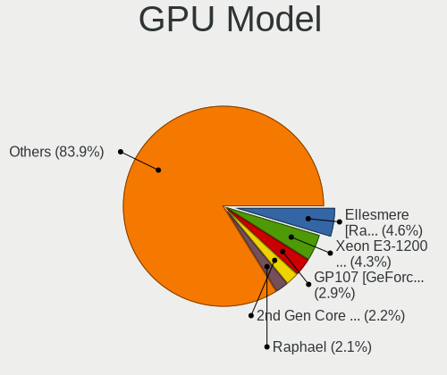

| Model                                                                       | Desktops | Percent |
|-----------------------------------------------------------------------------|----------|---------|
| AMD Ellesmere [Radeon RX 470/480/570/570X/580/580X/590]                     | 57       | 5.52%   |
| Intel Xeon E3-1200 v3/4th Gen Core Processor Integrated Graphics Controller | 49       | 4.75%   |
| Nvidia GP107 [GeForce GTX 1050 Ti]                                          | 31       | 3%      |
| Nvidia GK208B [GeForce GT 710]                                              | 26       | 2.52%   |
| Intel Xeon E3-1200 v2/3rd Gen Core processor Graphics Controller            | 22       | 2.13%   |
| Intel CoffeeLake-S GT2 [UHD Graphics 630]                                   | 22       | 2.13%   |
| Intel 2nd Generation Core Processor Family Integrated Graphics Controller   | 21       | 2.03%   |
| AMD Navi 10 [Radeon RX 5600 OEM/5600 XT / 5700/5700 XT]                     | 20       | 1.94%   |
| AMD Picasso/Raven 2 [Radeon Vega Series / Radeon Vega Mobile Series]        | 19       | 1.84%   |
| Nvidia GP108 [GeForce GT 1030]                                              | 18       | 1.74%   |
| Nvidia GP106 [GeForce GTX 1060 6GB]                                         | 17       | 1.65%   |
| Nvidia GP104 [GeForce GTX 1070]                                             | 16       | 1.55%   |
| Nvidia GM206 [GeForce GTX 960]                                              | 16       | 1.55%   |
| Nvidia GM204 [GeForce GTX 970]                                              | 16       | 1.55%   |
| Intel HD Graphics 530                                                       | 15       | 1.45%   |
| AMD Cedar [Radeon HD 5000/6000/7350/8350 Series]                            | 15       | 1.45%   |
| Nvidia GT218 [GeForce 210]                                                  | 13       | 1.26%   |
| Nvidia GP104 [GeForce GTX 1080]                                             | 13       | 1.26%   |
| Intel 4 Series Chipset Integrated Graphics Controller                       | 12       | 1.16%   |
| AMD Vega 10 XL/XT [Radeon RX Vega 56/64]                                    | 12       | 1.16%   |
| Nvidia GP106 [GeForce GTX 1060 3GB]                                         | 11       | 1.07%   |
| AMD Lexa PRO [Radeon 540/540X/550/550X / RX 540X/550/550X]                  | 11       | 1.07%   |
| Nvidia TU116 [GeForce GTX 1660 SUPER]                                       | 10       | 0.97%   |
| Intel HD Graphics 630                                                       | 10       | 0.97%   |
| Intel CometLake-S GT2 [UHD Graphics 630]                                    | 10       | 0.97%   |
| AMD Raven Ridge [Radeon Vega Series / Radeon Vega Mobile Series]            | 10       | 0.97%   |
| Nvidia GP102 [GeForce GTX 1080 Ti]                                          | 9        | 0.87%   |
| Nvidia GF119 [GeForce GT 610]                                               | 9        | 0.87%   |
| AMD Caicos [Radeon HD 6450/7450/8450 / R5 230 OEM]                          | 9        | 0.87%   |
| Nvidia TU116 [GeForce GTX 1660]                                             | 8        | 0.78%   |
| Nvidia GP107 [GeForce GTX 1050]                                             | 8        | 0.78%   |
| Nvidia GK208B [GeForce GT 730]                                              | 8        | 0.78%   |
| Intel IvyBridge GT2 [HD Graphics 4000]                                      | 8        | 0.78%   |
| AMD RS780L [Radeon 3000]                                                    | 8        | 0.78%   |
| AMD Navi 14 [Radeon RX 5500/5500M / Pro 5500M]                              | 8        | 0.78%   |
| Nvidia GM107 [GeForce GTX 750 Ti]                                           | 7        | 0.68%   |
| Nvidia GF108 [GeForce GT 630]                                               | 7        | 0.68%   |
| Intel Core Processor Integrated Graphics Controller                         | 7        | 0.68%   |
| Nvidia TU117 [GeForce GTX 1650]                                             | 6        | 0.58%   |
| Nvidia TU116 [GeForce GTX 1660 Ti]                                          | 6        | 0.58%   |
| Nvidia TU106 [GeForce RTX 2060 Rev. A]                                      | 6        | 0.58%   |
| Nvidia TU104 [GeForce RTX 2080 SUPER]                                       | 6        | 0.58%   |
| AMD Oland XT [Radeon HD 8670 / R5 340X OEM / R7 250/350/350X OEM]           | 6        | 0.58%   |
| AMD Kaveri [Radeon R7 Graphics]                                             | 6        | 0.58%   |
| AMD Juniper XT [Radeon HD 5770]                                             | 6        | 0.58%   |
| AMD Cape Verde XT [Radeon HD 7770/8760 / R7 250X]                           | 6        | 0.58%   |
| AMD Baffin [Radeon RX 550 640SP / RX 560/560X]                              | 6        | 0.58%   |
| AMD Baffin [Radeon RX 460/560D / Pro 450/455/460/555/555X/560/560X]         | 6        | 0.58%   |
| Nvidia TU106 [GeForce RTX 2060 SUPER]                                       | 5        | 0.48%   |
| Nvidia TU104 [GeForce RTX 2070 SUPER]                                       | 5        | 0.48%   |
| Nvidia TU102 [GeForce RTX 2080 Ti Rev. A]                                   | 5        | 0.48%   |
| Nvidia GM206 [GeForce GTX 950]                                              | 5        | 0.48%   |
| Nvidia GK107 [GeForce GTX 650]                                              | 5        | 0.48%   |
| AMD Renoir                                                                  | 5        | 0.48%   |
| AMD Pitcairn PRO [Radeon HD 7850 / R7 265 / R9 270 1024SP]                  | 5        | 0.48%   |
| AMD Cape Verde PRO [Radeon HD 7750/8740 / R7 250E]                          | 5        | 0.48%   |
| Nvidia TU116 [GeForce GTX 1650 SUPER]                                       | 4        | 0.39%   |
| Nvidia TU106 [GeForce RTX 2070]                                             | 4        | 0.39%   |
| Nvidia GP107GL [Quadro P400]                                                | 4        | 0.39%   |
| Nvidia GP104 [GeForce GTX 1070 Ti]                                          | 4        | 0.39%   |

GPU Combo
---------

Combinations of graphics cards

| Name            | Desktops | Percent |
|-----------------|----------|---------|
| 1 x Nvidia      | 426      | 44.05%  |
| 1 x AMD         | 316      | 32.68%  |
| 1 x Intel       | 178      | 18.41%  |
| 2 x AMD         | 12       | 1.24%   |
| 2 x Nvidia      | 10       | 1.03%   |
| Intel + Nvidia  | 10       | 1.03%   |
| AMD + Nvidia    | 7        | 0.72%   |
| Intel + AMD     | 4        | 0.41%   |
| 3 x Nvidia      | 1        | 0.1%    |
| Nvidia + Matrox | 1        | 0.1%    |
| Nvidia + ASPEED | 1        | 0.1%    |
| 1 x ASPEED      | 1        | 0.1%    |

GPU Driver
----------

Free vs proprietary

| Driver      | Desktops | Percent |
|-------------|----------|---------|
| Free        | 590      | 60.57%  |
| Proprietary | 365      | 37.47%  |
| Unknown     | 19       | 1.95%   |

GPU Memory
----------

Total video memory

| Size in GB | Desktops | Percent |
|------------|----------|---------|
| Unknown    | 298      | 30.16%  |
| 1.01-2.0   | 144      | 14.57%  |
| 0.51-1.0   | 135      | 13.66%  |
| 7.01-8.0   | 126      | 12.75%  |
| 3.01-4.0   | 116      | 11.74%  |
| 0.01-0.5   | 72       | 7.29%   |
| 5.01-6.0   | 47       | 4.76%   |
| 8.01-16.0  | 25       | 2.53%   |
| 2.01-3.0   | 19       | 1.92%   |
| 4.01-5.0   | 3        | 0.3%    |
| 16.01-24.0 | 2        | 0.2%    |
| 32.01-64.0 | 1        | 0.1%    |

Monitor
-------

Monitor Vendor
--------------

Monitor vendors

| Vendor                  | Desktops | Percent |
|-------------------------|----------|---------|
| Samsung Electronics     | 198      | 17.52%  |
| Dell                    | 123      | 10.88%  |
| Goldstar                | 105      | 9.29%   |
| Acer                    | 85       | 7.52%   |
| Hewlett-Packard         | 67       | 5.93%   |
| BenQ                    | 64       | 5.66%   |
| AOC                     | 64       | 5.66%   |
| Ancor Communications    | 60       | 5.31%   |
| Philips                 | 46       | 4.07%   |
| ViewSonic               | 35       | 3.1%    |
| LG Electronics          | 28       | 2.48%   |
| Iiyama                  | 26       | 2.3%    |
| ASUSTek Computer        | 22       | 1.95%   |
| Unknown                 | 18       | 1.59%   |
| Sony                    | 15       | 1.33%   |
| NEC Computers           | 11       | 0.97%   |
| Lenovo                  | 8        | 0.71%   |
| Eizo                    | 8        | 0.71%   |
| Panasonic               | 7        | 0.62%   |
| HannStar                | 6        | 0.53%   |
| Medion                  | 5        | 0.44%   |
| Sceptre Tech            | 4        | 0.35%   |
| Idek Iiyama             | 4        | 0.35%   |
| Chi Mei Optoelectronics | 4        | 0.35%   |
| Vizio                   | 3        | 0.27%   |
| Viotek                  | 3        | 0.27%   |
| SAC                     | 3        | 0.27%   |
| MSI                     | 3        | 0.27%   |
| LG Display              | 3        | 0.27%   |
| HPN                     | 3        | 0.27%   |
| Envision                | 3        | 0.27%   |
| DENON                   | 3        | 0.27%   |
| AUS                     | 3        | 0.27%   |
| Vestel Elektronik       | 2        | 0.18%   |
| Unknown (XXX)           | 2        | 0.18%   |
| Targa Visionary         | 2        | 0.18%   |
| Sharp                   | 2        | 0.18%   |
| SFX                     | 2        | 0.18%   |
| Sceptre                 | 2        | 0.18%   |
| Packard Bell            | 2        | 0.18%   |
| ONN                     | 2        | 0.18%   |
| Onkyo                   | 2        | 0.18%   |
| HJW                     | 2        | 0.18%   |
| HannStar Display        | 2        | 0.18%   |
| Grundig                 | 2        | 0.18%   |
| Gateway                 | 2        | 0.18%   |
| Fujitsu Siemens         | 2        | 0.18%   |
| Envision Peripherals    | 2        | 0.18%   |
| Yamaha                  | 1        | 0.09%   |
| Xiaomi                  | 1        | 0.09%   |
| Westinghouse            | 1        | 0.09%   |
| VST                     | 1        | 0.09%   |
| VMO                     | 1        | 0.09%   |
| Vestel                  | 1        | 0.09%   |
| Valve                   | 1        | 0.09%   |
| TXD                     | 1        | 0.09%   |
| Toshiba                 | 1        | 0.09%   |
| Tech Concepts           | 1        | 0.09%   |
| Tatung                  | 1        | 0.09%   |
| STD                     | 1        | 0.09%   |

Monitor Model
-------------

Monitor models

| Model                                                                 | Desktops | Percent |
|-----------------------------------------------------------------------|----------|---------|
| Goldstar ULTRAWIDE GSM59F1 2560x1080 673x284mm 28.8-inch              | 10       | 0.81%   |
| Dell U2412M DELA07A 1920x1200 518x324mm 24.1-inch                     | 7        | 0.56%   |
| Goldstar Ultra HD GSM5B09 3840x2160 600x340mm 27.2-inch               | 6        | 0.48%   |
| Unknown LCD Monitor SAMSUNG 1920x1080                                 | 5        | 0.4%    |
| Goldstar IPS FULLHD GSM5AB8 1920x1080 480x270mm 21.7-inch             | 5        | 0.4%    |
| Samsung Electronics SyncMaster SAM01E1 1280x1024 376x301mm 19.0-inch  | 4        | 0.32%   |
| Samsung Electronics S22F350 SAM0D1A 1920x1080 477x268mm 21.5-inch     | 4        | 0.32%   |
| BenQ GW2270 BNQ78DB 1920x1080 476x268mm 21.5-inch                     | 4        | 0.32%   |
| BenQ GL2450H BNQ78A7 1920x1080 531x298mm 24.0-inch                    | 4        | 0.32%   |
| Samsung Electronics SyncMaster SAM05CC 1920x1080 530x300mm 24.0-inch  | 3        | 0.24%   |
| Samsung Electronics LCD Monitor SyncMaster 1920x1080                  | 3        | 0.24%   |
| Samsung Electronics LCD Monitor SAM0C39 1920x1080 885x498mm 40.0-inch | 3        | 0.24%   |
| Samsung Electronics LCD Monitor SAM0902 1920x1080 890x500mm 40.2-inch | 3        | 0.24%   |
| Samsung Electronics C24F390 SAM0D2C 1920x1080 521x293mm 23.5-inch     | 3        | 0.24%   |
| Hewlett-Packard L1740 HWP2649 1280x1024 338x270mm 17.0-inch           | 3        | 0.24%   |
| Hewlett-Packard 24es HWP3320 1920x1080 527x296mm 23.8-inch            | 3        | 0.24%   |
| Goldstar Ultra HD GSM5B08 3840x2160 600x340mm 27.2-inch               | 3        | 0.24%   |
| Goldstar MP59G GSM5B35 1920x1080 480x270mm 21.7-inch                  | 3        | 0.24%   |
| Goldstar HDR 4K GSM7706 3840x2160 600x340mm 27.2-inch                 | 3        | 0.24%   |
| Dell UP2716D DEL40DD 2560x1440 597x336mm 27.0-inch                    | 3        | 0.24%   |
| Dell U3415W DELA0A6 3440x1440 800x330mm 34.1-inch                     | 3        | 0.24%   |
| Dell U2412M DELA07B 1920x1200 518x324mm 24.1-inch                     | 3        | 0.24%   |
| Dell U2412M DELA079 1920x1200 518x324mm 24.1-inch                     | 3        | 0.24%   |
| Dell U2312HM DEL4073 1920x1080 510x290mm 23.1-inch                    | 3        | 0.24%   |
| Dell LCD Monitor P2314H                                               | 3        | 0.24%   |
| BenQ GW2470 BNQ78D9 1920x1080 527x296mm 23.8-inch                     | 3        | 0.24%   |
| BenQ GL2780 BNQ78EC 1920x1080 598x336mm 27.0-inch                     | 3        | 0.24%   |
| BenQ GL2460 BNQ78CE 1920x1080 531x299mm 24.0-inch                     | 3        | 0.24%   |
| ASUSTek Computer VG245 AUS24A1 1920x1080 531x299mm 24.0-inch          | 3        | 0.24%   |
| AOC G2460 AOC2460 1920x1080 531x299mm 24.0-inch                       | 3        | 0.24%   |
| AOC 27V2G5 AOC2702 1920x1080 598x336mm 27.0-inch                      | 3        | 0.24%   |
| AOC 2260WG5 AOC2260 1920x1080 477x268mm 21.5-inch                     | 3        | 0.24%   |
| Ancor Communications VS248 ACI2498 1920x1080 531x299mm 24.0-inch      | 3        | 0.24%   |
| Ancor Communications PB248 ACI24A3 1920x1200 518x324mm 24.1-inch      | 3        | 0.24%   |
| Ancor Communications ASUS VS247 ACI249A 1920x1080 521x293mm 23.5-inch | 3        | 0.24%   |
| Ancor Communications ASUS VC239 ACI23C4 1920x1080 509x286mm 23.0-inch | 3        | 0.24%   |
| Acer G276HL ACR0300 1920x1080 598x336mm 27.0-inch                     | 3        | 0.24%   |
| Viotek GN34CW VTK3400 3440x1440 795x334mm 33.9-inch                   | 2        | 0.16%   |
| ViewSonic VX3276-FHD VSCE735 1920x1080 698x393mm 31.5-inch            | 2        | 0.16%   |
| ViewSonic VX3209-2K VSC328E 2560x1440 698x393mm 31.5-inch             | 2        | 0.16%   |
| ViewSonic VX2776 Series VSC3E32 1920x1080 598x336mm 27.0-inch         | 2        | 0.16%   |
| ViewSonic VX2770 SERIES VSC3A2C 1920x1080 597x336mm 27.0-inch         | 2        | 0.16%   |
| ViewSonic VA2431 Series VSCD824 1920x1080 521x293mm 23.5-inch         | 2        | 0.16%   |
| Vestel Elektronik 28W_LCD_TV VES3700 1920x540                         | 2        | 0.16%   |
| Unknown LCD Monitor SAMSUNG 3840x2160                                 | 2        | 0.16%   |
| Targa Visionary LCD 24-1 Wide TARA240 1920x1080 521x293mm 23.5-inch   | 2        | 0.16%   |
| Sony TV SNYEE01 1920x1080                                             | 2        | 0.16%   |
| Sceptre Tech E24 SPT099D 1920x1080 521x293mm 23.5-inch                | 2        | 0.16%   |
| Samsung Electronics U32J59x SAM0F33 3840x2160 697x392mm 31.5-inch     | 2        | 0.16%   |
| Samsung Electronics U28E590 SAM0C4D 3840x2160 607x345mm 27.5-inch     | 2        | 0.16%   |
| Samsung Electronics U28D590 SAM0B80 3840x2160 607x345mm 27.5-inch     | 2        | 0.16%   |
| Samsung Electronics SyncMaster STN0046 1280x1024 338x270mm 17.0-inch  | 2        | 0.16%   |
| Samsung Electronics SyncMaster SAM0587 1920x1200 518x324mm 24.1-inch  | 2        | 0.16%   |
| Samsung Electronics SyncMaster SAM0272 1280x1024 338x270mm 17.0-inch  | 2        | 0.16%   |
| Samsung Electronics SyncMaster SAM01B7 1280x1024 338x270mm 17.0-inch  | 2        | 0.16%   |
| Samsung Electronics SMC23A550U SAM07F4 1920x1080 510x287mm 23.0-inch  | 2        | 0.16%   |
| Samsung Electronics S24F350 SAM0D20 1920x1080 521x293mm 23.5-inch     | 2        | 0.16%   |
| Samsung Electronics S24D590 SAM0B47 1920x1080 521x293mm 23.5-inch     | 2        | 0.16%   |
| Samsung Electronics S24D300 SAM0B43 1920x1080 530x300mm 24.0-inch     | 2        | 0.16%   |
| Samsung Electronics S22B350 SAM08D4 1920x1080 477x268mm 21.5-inch     | 2        | 0.16%   |

Monitor Resolution
------------------

Monitor screen resolution

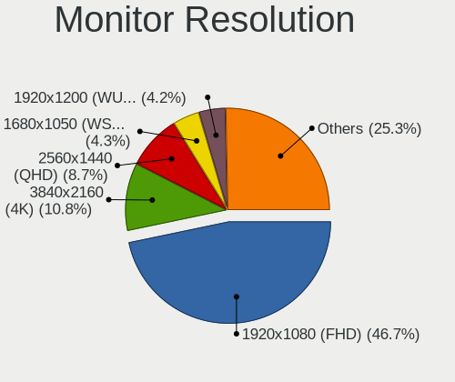

| Resolution         | Desktops | Percent |
|--------------------|----------|---------|
| 1920x1080 (FHD)    | 501      | 45.46%  |
| 3840x2160 (4K)     | 95       | 8.62%   |
| 2560x1440 (QHD)    | 80       | 7.26%   |
| Unknown            | 59       | 5.35%   |
| 1680x1050 (WSXGA+) | 57       | 5.17%   |
| 1280x1024 (SXGA)   | 56       | 5.08%   |
| 1920x1200 (WUXGA)  | 53       | 4.81%   |
| 1366x768 (WXGA)    | 23       | 2.09%   |
| 3840x1080          | 21       | 1.91%   |
| 3440x1440          | 20       | 1.81%   |
| 1440x900 (WXGA+)   | 20       | 1.81%   |
| 2560x1080          | 19       | 1.72%   |
| 1600x900 (HD+)     | 19       | 1.72%   |
| 1360x768           | 14       | 1.27%   |
| 3840x1200          | 7        | 0.64%   |
| 1600x1200          | 6        | 0.54%   |
| 4480x1440          | 5        | 0.45%   |
| 1920x540           | 5        | 0.45%   |
| 1024x768 (XGA)     | 4        | 0.36%   |
| 5760x1080          | 3        | 0.27%   |
| 3840x1600          | 3        | 0.27%   |
| 3600x1080          | 3        | 0.27%   |
| 3200x1080          | 3        | 0.27%   |
| 2560x1600          | 3        | 0.27%   |
| 7680x2160          | 2        | 0.18%   |
| 4480x1080          | 2        | 0.18%   |
| 6400x2160          | 1        | 0.09%   |
| 6400x1080          | 1        | 0.09%   |
| 5760x2160          | 1        | 0.09%   |
| 5760x1200          | 1        | 0.09%   |
| 4480x1600          | 1        | 0.09%   |
| 3840x1920          | 1        | 0.09%   |
| 3840x1024          | 1        | 0.09%   |
| 3600x1200          | 1        | 0.09%   |
| 3360x1080          | 1        | 0.09%   |
| 3040x900           | 1        | 0.09%   |
| 2880x1440          | 1        | 0.09%   |
| 2880x1024          | 1        | 0.09%   |
| 2288x1287          | 1        | 0.09%   |
| 2048x1152          | 1        | 0.09%   |
| 1921x1080          | 1        | 0.09%   |
| 1920x1440          | 1        | 0.09%   |
| 1400x1050          | 1        | 0.09%   |
| 1280x960           | 1        | 0.09%   |
| 1280x720 (HD)      | 1        | 0.09%   |

Monitor Diagonal
----------------

Diagonal size in inches

| Inches  | Desktops | Percent |
|---------|----------|---------|
| Unknown | 171      | 15.41%  |
| 24      | 168      | 15.14%  |
| 27      | 159      | 14.32%  |
| 23      | 137      | 12.34%  |
| 21      | 109      | 9.82%   |
| 31      | 50       | 4.5%    |
| 19      | 50       | 4.5%    |
| 22      | 41       | 3.69%   |
| 34      | 33       | 2.97%   |
| 17      | 31       | 2.79%   |
| 20      | 27       | 2.43%   |
| 18      | 22       | 1.98%   |
| 54      | 13       | 1.17%   |
| 25      | 12       | 1.08%   |
| 84      | 9        | 0.81%   |
| 72      | 9        | 0.81%   |
| 32      | 8        | 0.72%   |
| 15      | 8        | 0.72%   |
| 26      | 5        | 0.45%   |
| 46      | 4        | 0.36%   |
| 40      | 4        | 0.36%   |
| 37      | 4        | 0.36%   |
| 52      | 3        | 0.27%   |
| 47      | 3        | 0.27%   |
| 43      | 3        | 0.27%   |
| 28      | 3        | 0.27%   |
| 55      | 2        | 0.18%   |
| 48      | 2        | 0.18%   |
| 42      | 2        | 0.18%   |
| 39      | 2        | 0.18%   |
| 30      | 2        | 0.18%   |
| 29      | 2        | 0.18%   |
| 142     | 1        | 0.09%   |
| 74      | 1        | 0.09%   |
| 65      | 1        | 0.09%   |
| 60      | 1        | 0.09%   |
| 57      | 1        | 0.09%   |
| 49      | 1        | 0.09%   |
| 36      | 1        | 0.09%   |
| 35      | 1        | 0.09%   |
| 33      | 1        | 0.09%   |
| 14      | 1        | 0.09%   |
| 12      | 1        | 0.09%   |
| 3       | 1        | 0.09%   |

Monitor Width
-------------

Physical width

| Width in mm    | Desktops | Percent |
|----------------|----------|---------|
| 501-600        | 416      | 39.47%  |
| 401-500        | 210      | 19.92%  |
| Unknown        | 171      | 16.22%  |
| 601-700        | 73       | 6.93%   |
| 701-800        | 43       | 4.08%   |
| 351-400        | 38       | 3.61%   |
| 301-350        | 34       | 3.23%   |
| 1001-1500      | 31       | 2.94%   |
| 1501-2000      | 19       | 1.8%    |
| 801-900        | 11       | 1.04%   |
| 901-1000       | 5        | 0.47%   |
| More than 2000 | 1        | 0.09%   |
| 201-300        | 1        | 0.09%   |
| 1-100          | 1        | 0.09%   |

Aspect Ratio
------------

Proportional relationship between the width and the height

| Ratio   | Desktops | Percent |
|---------|----------|---------|
| 16/9    | 599      | 59.07%  |
| Unknown | 156      | 15.38%  |
| 16/10   | 139      | 13.71%  |
| 5/4     | 55       | 5.42%   |
| 21/9    | 38       | 3.75%   |
| 4/3     | 12       | 1.18%   |
| 32/9    | 7        | 0.69%   |
| 3/2     | 4        | 0.39%   |
| 6/5     | 2        | 0.2%    |
| 1.96    | 1        | 0.1%    |
| 1.00    | 1        | 0.1%    |

Monitor Area
------------

Area in inch

| Area in inch | Desktops | Percent |
|----------------|----------|---------|
| 201-250        | 335      | 31.34%  |
| Unknown        | 171      | 16%     |
| 301-350        | 162      | 15.15%  |
| 151-200        | 107      | 10.01%  |
| 351-500        | 99       | 9.26%   |
| 251-300        | 70       | 6.55%   |
| 141-150        | 44       | 4.12%   |
| More than 1000 | 41       | 3.84%   |
| 501-1000       | 24       | 2.25%   |
| 101-110        | 7        | 0.65%   |
| 131-140        | 3        | 0.28%   |
| 121-130        | 2        | 0.19%   |
| 81-90          | 1        | 0.09%   |
| 71-80          | 1        | 0.09%   |
| 1-40           | 1        | 0.09%   |
| 111-120        | 1        | 0.09%   |

Pixel Density
-------------

Pixels per inch

| Density       | Desktops | Percent |
|---------------|----------|---------|
| 51-100        | 579      | 56.54%  |
| 101-120       | 173      | 16.89%  |
| Unknown       | 171      | 16.7%   |
| 1-50          | 41       | 4%      |
| 121-160       | 39       | 3.81%   |
| 161-240       | 20       | 1.95%   |
| More than 240 | 1        | 0.1%    |

Multiple Monitors
-----------------

Total monitors connected

| Total | Desktops | Percent |
|-------|----------|---------|
| 1     | 684      | 69.94%  |
| 2     | 244      | 24.95%  |
| 3     | 27       | 2.76%   |
| 0     | 20       | 2.04%   |
| 4     | 3        | 0.31%   |

Network
-------

Net Controller Vendor
---------------------

Controller vendors

| Vendor                                | Desktops | Percent |
|---------------------------------------|----------|---------|
| Realtek Semiconductor                 | 601      | 44.39%  |
| Intel                                 | 380      | 28.06%  |
| Qualcomm Atheros                      | 95       | 7.02%   |
| Ralink Technology                     | 34       | 2.51%   |
| Broadcom                              | 33       | 2.44%   |
| TP-Link                               | 29       | 2.14%   |
| Nvidia                                | 18       | 1.33%   |
| Ralink                                | 17       | 1.26%   |
| Microsoft                             | 14       | 1.03%   |
| Aquantia                              | 13       | 0.96%   |
| Qualcomm Atheros Communications       | 12       | 0.89%   |
| NetGear                               | 10       | 0.74%   |
| Edimax Technology                     | 7        | 0.52%   |
| Xiaomi                                | 6        | 0.44%   |
| Samsung Electronics                   | 6        | 0.44%   |
| D-Link                                | 6        | 0.44%   |
| Broadcom Limited                      | 6        | 0.44%   |
| MediaTek                              | 5        | 0.37%   |
| D-Link System                         | 4        | 0.3%    |
| ASUSTek Computer                      | 4        | 0.3%    |
| Linksys                               | 3        | 0.22%   |
| Huawei Technologies                   | 3        | 0.22%   |
| DisplayLink                           | 3        | 0.22%   |
| VIA Technologies                      | 2        | 0.15%   |
| STMicroelectronics                    | 2        | 0.15%   |
| Qualcomm                              | 2        | 0.15%   |
| Oculus VR                             | 2        | 0.15%   |
| Marvell Technology Group              | 2        | 0.15%   |
| Belkin Components                     | 2        | 0.15%   |
| AVM                                   | 2        | 0.15%   |
| ASIX Electronics                      | 2        | 0.15%   |
| Apple                                 | 2        | 0.15%   |
| 3Com                                  | 2        | 0.15%   |
| ZTE WCDMA Technologies MSM            | 1        | 0.07%   |
| Wilocity                              | 1        | 0.07%   |
| Wacom                                 | 1        | 0.07%   |
| U.S. Robotics                         | 1        | 0.07%   |
| Tenda                                 | 1        | 0.07%   |
| Silicon Integrated Systems [SiS]      | 1        | 0.07%   |
| Sigma Designs                         | 1        | 0.07%   |
| Seeed Technology                      | 1        | 0.07%   |
| Realtek                               | 1        | 0.07%   |
| Philips (or NXP)                      | 1        | 0.07%   |
| Motorola BCS                          | 1        | 0.07%   |
| Motorola                              | 1        | 0.07%   |
| Micro Star International              | 1        | 0.07%   |
| Mellanox Technologies                 | 1        | 0.07%   |
| Lenovo                                | 1        | 0.07%   |
| IMC Networks                          | 1        | 0.07%   |
| Guillemot                             | 1        | 0.07%   |
| Google                                | 1        | 0.07%   |
| Gemtek                                | 1        | 0.07%   |
| Elecom                                | 1        | 0.07%   |
| Davicom Semiconductor                 | 1        | 0.07%   |
| Arduino SA                            | 1        | 0.07%   |
| AirTies Wireless Networks             | 1        | 0.07%   |
| Accton Technology                     | 1        | 0.07%   |
| 802.11g Adapter [Linksys WUSB54GC v3] | 1        | 0.07%   |

Net Controller Model
--------------------

Controller models

| Model                                                             | Desktops | Percent |
|-------------------------------------------------------------------|----------|---------|
| Realtek RTL8111/8168/8411 PCI Express Gigabit Ethernet Controller | 490      | 32.01%  |
| Intel I211 Gigabit Network Connection                             | 88       | 5.75%   |
| Intel Wi-Fi 6 AX200                                               | 54       | 3.53%   |
| Realtek RTL8125 2.5GbE Controller                                 | 53       | 3.46%   |
| Intel Ethernet Connection (2) I219-V                              | 43       | 2.81%   |
| Intel 82579LM Gigabit Network Connection (Lewisville)             | 31       | 2.02%   |
| Intel Ethernet Connection I217-LM                                 | 23       | 1.5%    |
| Realtek RTL810xE PCI Express Fast Ethernet controller             | 21       | 1.37%   |
| Intel Dual Band Wireless-AC 3168NGW [Stone Peak]                  | 20       | 1.31%   |
| Intel Wireless-AC 9260                                            | 17       | 1.11%   |
| Intel Ethernet Controller I225-V                                  | 17       | 1.11%   |
| Intel Ethernet Connection (2) I218-V                              | 17       | 1.11%   |
| Intel Ethernet Connection (7) I219-V                              | 16       | 1.05%   |
| Ralink MT7601U Wireless Adapter                                   | 14       | 0.91%   |
| Intel 82579V Gigabit Network Connection                           | 12       | 0.78%   |
| Realtek RTL8153 Gigabit Ethernet Adapter                          | 11       | 0.72%   |
| Realtek RTL-8100/8101L/8139 PCI Fast Ethernet Adapter             | 11       | 0.72%   |
| Qualcomm Atheros AR9271 802.11n                                   | 11       | 0.72%   |
| Intel Ethernet Connection I217-V                                  | 11       | 0.72%   |
| Aquantia AQC107 NBase-T/IEEE 802.3bz Ethernet Controller [AQtion] | 11       | 0.72%   |
| Realtek RTL8188EUS 802.11n Wireless Network Adapter               | 10       | 0.65%   |
| Realtek 802.11ac NIC                                              | 10       | 0.65%   |
| Qualcomm Atheros Killer E220x Gigabit Ethernet Controller         | 9        | 0.59%   |
| Qualcomm Atheros AR8121/AR8113/AR8114 Gigabit or Fast Ethernet    | 9        | 0.59%   |
| Nvidia MCP61 Ethernet                                             | 9        | 0.59%   |
| Intel I210 Gigabit Network Connection                             | 9        | 0.59%   |
| Intel 82578DM Gigabit Network Connection                          | 9        | 0.59%   |
| Intel 82574L Gigabit Network Connection                           | 9        | 0.59%   |
| Broadcom BCM4360 802.11ac Wireless Network Adapter                | 9        | 0.59%   |
| Qualcomm Atheros AR9485 Wireless Network Adapter                  | 8        | 0.52%   |
| Intel Wireless 7260                                               | 8        | 0.52%   |
| Intel 82567LM-3 Gigabit Network Connection                        | 8        | 0.52%   |
| Ralink RT5370 Wireless Adapter                                    | 7        | 0.46%   |
| Qualcomm Atheros QCA9565 / AR9565 Wireless Network Adapter        | 7        | 0.46%   |
| Qualcomm Atheros AR9462 Wireless Network Adapter                  | 7        | 0.46%   |
| Qualcomm Atheros AR9227 Wireless Network Adapter                  | 7        | 0.46%   |
| Microsoft Xbox 360 Wireless Adapter                               | 7        | 0.46%   |
| Intel Wireless 3165                                               | 7        | 0.46%   |
| Intel Ethernet Connection (2) I219-LM                             | 7        | 0.46%   |
| Qualcomm Atheros QCA6174 802.11ac Wireless Network Adapter        | 6        | 0.39%   |
| Qualcomm Atheros AR8161 Gigabit Ethernet                          | 6        | 0.39%   |
| Intel Ethernet Connection (7) I219-LM                             | 6        | 0.39%   |
| Samsung Galaxy series, misc. (tethering mode)                     | 5        | 0.33%   |
| Realtek RTL88x2bu [AC1200 Techkey]                                | 5        | 0.33%   |
| Realtek RTL8822BE 802.11a/b/g/n/ac WiFi adapter                   | 5        | 0.33%   |
| Realtek RTL8821CE 802.11ac PCIe Wireless Network Adapter          | 5        | 0.33%   |
| Realtek RTL8192EU 802.11b/g/n WLAN Adapter                        | 5        | 0.33%   |
| Realtek RTL8192EE PCIe Wireless Network Adapter                   | 5        | 0.33%   |
| Realtek RTL8192CE PCIe Wireless Network Adapter                   | 5        | 0.33%   |
| Ralink RT2870/RT3070 Wireless Adapter                             | 5        | 0.33%   |
| Qualcomm Atheros QCA8171 Gigabit Ethernet                         | 5        | 0.33%   |
| Qualcomm Atheros Killer E2500 Gigabit Ethernet Controller         | 5        | 0.33%   |
| Qualcomm Atheros AR8151 v2.0 Gigabit Ethernet                     | 5        | 0.33%   |
| NetGear A6100 AC600 DB Wireless Adapter [Realtek RTL8811AU]       | 5        | 0.33%   |
| Intel Wireless 7265                                               | 5        | 0.33%   |
| Intel Wi-Fi 6 AX210/AX211/AX411 160MHz                            | 5        | 0.33%   |
| Intel Cannon Lake PCH CNVi WiFi                                   | 5        | 0.33%   |
| TP-Link TL-WN823N v2/v3 [Realtek RTL8192EU]                       | 4        | 0.26%   |
| TP-Link Archer T9UH v1 [Realtek RTL8814AU]                        | 4        | 0.26%   |
| TP-Link Archer T4U ver.3                                          | 4        | 0.26%   |

Wireless Vendor
---------------

Wireless vendors

| Vendor                                | Desktops | Percent |
|---------------------------------------|----------|---------|
| Intel                                 | 135      | 31.18%  |
| Realtek Semiconductor                 | 73       | 16.86%  |
| Qualcomm Atheros                      | 51       | 11.78%  |
| Ralink Technology                     | 34       | 7.85%   |
| TP-Link                               | 28       | 6.47%   |
| Ralink                                | 17       | 3.93%   |
| Broadcom                              | 15       | 3.46%   |
| Microsoft                             | 14       | 3.23%   |
| Qualcomm Atheros Communications       | 12       | 2.77%   |
| NetGear                               | 10       | 2.31%   |
| Edimax Technology                     | 7        | 1.62%   |
| D-Link                                | 6        | 1.39%   |
| ASUSTek Computer                      | 4        | 0.92%   |
| MediaTek                              | 3        | 0.69%   |
| Linksys                               | 3        | 0.69%   |
| Broadcom Limited                      | 3        | 0.69%   |
| D-Link System                         | 2        | 0.46%   |
| Belkin Components                     | 2        | 0.46%   |
| AVM                                   | 2        | 0.46%   |
| Wilocity                              | 1        | 0.23%   |
| Wacom                                 | 1        | 0.23%   |
| Tenda                                 | 1        | 0.23%   |
| Realtek                               | 1        | 0.23%   |
| Philips (or NXP)                      | 1        | 0.23%   |
| Micro Star International              | 1        | 0.23%   |
| IMC Networks                          | 1        | 0.23%   |
| Guillemot                             | 1        | 0.23%   |
| Gemtek                                | 1        | 0.23%   |
| AirTies Wireless Networks             | 1        | 0.23%   |
| Accton Technology                     | 1        | 0.23%   |
| 802.11g Adapter [Linksys WUSB54GC v3] | 1        | 0.23%   |

Wireless Model
--------------

Wireless models

| Model                                                                                         | Desktops | Percent |
|-----------------------------------------------------------------------------------------------|----------|---------|
| Intel Wi-Fi 6 AX200                                                                           | 54       | 12.3%   |
| Intel Dual Band Wireless-AC 3168NGW [Stone Peak]                                              | 20       | 4.56%   |
| Intel Wireless-AC 9260                                                                        | 17       | 3.87%   |
| Ralink MT7601U Wireless Adapter                                                               | 14       | 3.19%   |
| Qualcomm Atheros AR9271 802.11n                                                               | 11       | 2.51%   |
| Realtek RTL8188EUS 802.11n Wireless Network Adapter                                           | 10       | 2.28%   |
| Realtek 802.11ac NIC                                                                          | 10       | 2.28%   |
| Broadcom BCM4360 802.11ac Wireless Network Adapter                                            | 9        | 2.05%   |
| Qualcomm Atheros AR9485 Wireless Network Adapter                                              | 8        | 1.82%   |
| Intel Wireless 7260                                                                           | 8        | 1.82%   |
| Ralink RT5370 Wireless Adapter                                                                | 7        | 1.59%   |
| Qualcomm Atheros QCA9565 / AR9565 Wireless Network Adapter                                    | 7        | 1.59%   |
| Qualcomm Atheros AR9462 Wireless Network Adapter                                              | 7        | 1.59%   |
| Qualcomm Atheros AR9227 Wireless Network Adapter                                              | 7        | 1.59%   |
| Microsoft Xbox 360 Wireless Adapter                                                           | 7        | 1.59%   |
| Intel Wireless 3165                                                                           | 7        | 1.59%   |
| Qualcomm Atheros QCA6174 802.11ac Wireless Network Adapter                                    | 6        | 1.37%   |
| Realtek RTL88x2bu [AC1200 Techkey]                                                            | 5        | 1.14%   |
| Realtek RTL8822BE 802.11a/b/g/n/ac WiFi adapter                                               | 5        | 1.14%   |
| Realtek RTL8821CE 802.11ac PCIe Wireless Network Adapter                                      | 5        | 1.14%   |
| Realtek RTL8192EU 802.11b/g/n WLAN Adapter                                                    | 5        | 1.14%   |
| Realtek RTL8192EE PCIe Wireless Network Adapter                                               | 5        | 1.14%   |
| Realtek RTL8192CE PCIe Wireless Network Adapter                                               | 5        | 1.14%   |
| Ralink RT2870/RT3070 Wireless Adapter                                                         | 5        | 1.14%   |
| NetGear A6100 AC600 DB Wireless Adapter [Realtek RTL8811AU]                                   | 5        | 1.14%   |
| Intel Wireless 7265                                                                           | 5        | 1.14%   |
| Intel Wi-Fi 6 AX210/AX211/AX411 160MHz                                                        | 5        | 1.14%   |
| Intel Cannon Lake PCH CNVi WiFi                                                               | 5        | 1.14%   |
| TP-Link TL-WN823N v2/v3 [Realtek RTL8192EU]                                                   | 4        | 0.91%   |
| TP-Link Archer T9UH v1 [Realtek RTL8814AU]                                                    | 4        | 0.91%   |
| TP-Link Archer T4U ver.3                                                                      | 4        | 0.91%   |
| Realtek RTL8821AE 802.11ac PCIe Wireless Network Adapter                                      | 4        | 0.91%   |
| Realtek RTL8812AE 802.11ac PCIe Wireless Network Adapter                                      | 4        | 0.91%   |
| Qualcomm Atheros AR93xx Wireless Network Adapter                                              | 4        | 0.91%   |
| Microsoft Wireless XBox Controller Dongle                                                     | 4        | 0.91%   |
| TP-Link TL-WN821N v5/v6 [RTL8192EU]                                                           | 3        | 0.68%   |
| TP-Link TL-WN722N v2/v3 [Realtek RTL8188EUS]                                                  | 3        | 0.68%   |
| TP-Link 802.11ac WLAN Adapter                                                                 | 3        | 0.68%   |
| Realtek RTL8812AU 802.11a/b/g/n/ac 2T2R DB WLAN Adapter                                       | 3        | 0.68%   |
| Realtek RTL8188FTV 802.11b/g/n 1T1R 2.4G WLAN Adapter                                         | 3        | 0.68%   |
| Realtek Realtek 8812AU/8821AU 802.11ac WLAN Adapter [USB Wireless Dual-Band Adapter 2.4/5Ghz] | 3        | 0.68%   |
| Ralink RT5572 Wireless Adapter                                                                | 3        | 0.68%   |
| Ralink MT7610U ("Archer T2U" 2.4G+5G WLAN Adapter                                             | 3        | 0.68%   |
| Ralink RT5392 PCIe Wireless Network Adapter                                                   | 3        | 0.68%   |
| Ralink RT5390 Wireless 802.11n 1T/1R PCIe                                                     | 3        | 0.68%   |
| Qualcomm Atheros AR9287 Wireless Network Adapter (PCI-Express)                                | 3        | 0.68%   |
| Microsoft XBOX ACC                                                                            | 3        | 0.68%   |
| Intel Comet Lake PCH CNVi WiFi                                                                | 3        | 0.68%   |
| Edimax EW-7811Un 802.11n Wireless Adapter [Realtek RTL8188CUS]                                | 3        | 0.68%   |
| TP-Link Archer T2U PLUS [RTL8821AU]                                                           | 2        | 0.46%   |
| TP-Link AC600 wireless Realtek RTL8811AU [Archer T2U Nano]                                    | 2        | 0.46%   |
| TP-Link 802.11ac NIC                                                                          | 2        | 0.46%   |
| Realtek RTL8188EE Wireless Network Adapter                                                    | 2        | 0.46%   |
| Ralink RT5390R 802.11bgn PCIe Wireless Network Adapter                                        | 2        | 0.46%   |
| Ralink RT3090 Wireless 802.11n 1T/1R PCIe                                                     | 2        | 0.46%   |
| Ralink RT2790 Wireless 802.11n 1T/2R PCIe                                                     | 2        | 0.46%   |
| Qualcomm Atheros AR9285 Wireless Network Adapter (PCI-Express)                                | 2        | 0.46%   |
| Qualcomm Atheros AR5416 Wireless Network Adapter [AR5008 802.11(a)bgn]                        | 2        | 0.46%   |
| Qualcomm Atheros AR5212/5213/2414 Wireless Network Adapter                                    | 2        | 0.46%   |
| MediaTek MT7612U 802.11a/b/g/n/ac Wireless Adapter                                            | 2        | 0.46%   |

Ethernet Vendor
---------------

Ethernet vendors

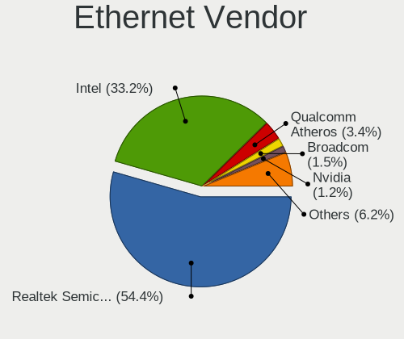

| Vendor                           | Desktops | Percent |
|----------------------------------|----------|---------|
| Realtek Semiconductor            | 575      | 55.24%  |
| Intel                            | 323      | 31.03%  |
| Qualcomm Atheros                 | 46       | 4.42%   |
| Broadcom                         | 20       | 1.92%   |
| Nvidia                           | 18       | 1.73%   |
| Aquantia                         | 13       | 1.25%   |
| Xiaomi                           | 6        | 0.58%   |
| Samsung Electronics              | 6        | 0.58%   |
| Huawei Technologies              | 3        | 0.29%   |
| DisplayLink                      | 3        | 0.29%   |
| Broadcom Limited                 | 3        | 0.29%   |
| VIA Technologies                 | 2        | 0.19%   |
| Qualcomm                         | 2        | 0.19%   |
| MediaTek                         | 2        | 0.19%   |
| Marvell Technology Group         | 2        | 0.19%   |
| D-Link System                    | 2        | 0.19%   |
| ASIX Electronics                 | 2        | 0.19%   |
| Apple                            | 2        | 0.19%   |
| 3Com                             | 2        | 0.19%   |
| ZTE WCDMA Technologies MSM       | 1        | 0.1%    |
| TP-Link                          | 1        | 0.1%    |
| Silicon Integrated Systems [SiS] | 1        | 0.1%    |
| Motorola BCS                     | 1        | 0.1%    |
| Mellanox Technologies            | 1        | 0.1%    |
| Lenovo                           | 1        | 0.1%    |
| Google                           | 1        | 0.1%    |
| Elecom                           | 1        | 0.1%    |
| Davicom Semiconductor            | 1        | 0.1%    |

Ethernet Model
--------------

Ethernet models

| Model                                                             | Desktops | Percent |
|-------------------------------------------------------------------|----------|---------|
| Realtek RTL8111/8168/8411 PCI Express Gigabit Ethernet Controller | 490      | 45.24%  |
| Intel I211 Gigabit Network Connection                             | 88       | 8.13%   |
| Realtek RTL8125 2.5GbE Controller                                 | 53       | 4.89%   |
| Intel Ethernet Connection (2) I219-V                              | 43       | 3.97%   |
| Intel 82579LM Gigabit Network Connection (Lewisville)             | 31       | 2.86%   |
| Intel Ethernet Connection I217-LM                                 | 23       | 2.12%   |
| Realtek RTL810xE PCI Express Fast Ethernet controller             | 21       | 1.94%   |
| Intel Ethernet Controller I225-V                                  | 17       | 1.57%   |
| Intel Ethernet Connection (2) I218-V                              | 17       | 1.57%   |
| Intel Ethernet Connection (7) I219-V                              | 16       | 1.48%   |
| Intel 82579V Gigabit Network Connection                           | 12       | 1.11%   |
| Realtek RTL8153 Gigabit Ethernet Adapter                          | 11       | 1.02%   |
| Realtek RTL-8100/8101L/8139 PCI Fast Ethernet Adapter             | 11       | 1.02%   |
| Intel Ethernet Connection I217-V                                  | 11       | 1.02%   |
| Aquantia AQC107 NBase-T/IEEE 802.3bz Ethernet Controller [AQtion] | 11       | 1.02%   |
| Qualcomm Atheros Killer E220x Gigabit Ethernet Controller         | 9        | 0.83%   |
| Qualcomm Atheros AR8121/AR8113/AR8114 Gigabit or Fast Ethernet    | 9        | 0.83%   |
| Nvidia MCP61 Ethernet                                             | 9        | 0.83%   |
| Intel I210 Gigabit Network Connection                             | 9        | 0.83%   |
| Intel 82578DM Gigabit Network Connection                          | 9        | 0.83%   |
| Intel 82574L Gigabit Network Connection                           | 9        | 0.83%   |
| Intel 82567LM-3 Gigabit Network Connection                        | 8        | 0.74%   |
| Intel Ethernet Connection (2) I219-LM                             | 7        | 0.65%   |
| Qualcomm Atheros AR8161 Gigabit Ethernet                          | 6        | 0.55%   |
| Intel Ethernet Connection (7) I219-LM                             | 6        | 0.55%   |
| Samsung Galaxy series, misc. (tethering mode)                     | 5        | 0.46%   |
| Qualcomm Atheros QCA8171 Gigabit Ethernet                         | 5        | 0.46%   |
| Qualcomm Atheros Killer E2500 Gigabit Ethernet Controller         | 5        | 0.46%   |
| Qualcomm Atheros AR8151 v2.0 Gigabit Ethernet                     | 5        | 0.46%   |
| Realtek RTL-8110SC/8169SC Gigabit Ethernet                        | 4        | 0.37%   |
| Qualcomm Atheros Killer E2400 Gigabit Ethernet Controller         | 4        | 0.37%   |
| Nvidia MCP77 Ethernet                                             | 4        | 0.37%   |
| Intel Ethernet Connection (2) I218-LM                             | 4        | 0.37%   |
| Intel Ethernet Connection (14) I219-V                             | 4        | 0.37%   |
| Xiaomi Mi/Redmi series (RNDIS)                                    | 3        | 0.28%   |
| Xiaomi Mi/Redmi series (RNDIS + ADB)                              | 3        | 0.28%   |
| Intel Ethernet Connection (12) I219-V                             | 3        | 0.28%   |
| Broadcom NetXtreme BCM5764M Gigabit Ethernet PCIe                 | 3        | 0.28%   |
| Broadcom NetXtreme BCM5761 Gigabit Ethernet PCIe                  | 3        | 0.28%   |
| Broadcom NetLink BCM57780 Gigabit Ethernet PCIe                   | 3        | 0.28%   |
| VIA VT6102/VT6103 [Rhine-II]                                      | 2        | 0.18%   |
| Qualcomm Redmi 9T                                                 | 2        | 0.18%   |
| Qualcomm Atheros AR8152 v2.0 Fast Ethernet                        | 2        | 0.18%   |
| Nvidia MCP67 Ethernet                                             | 2        | 0.18%   |
| Nvidia MCP51 Ethernet Controller                                  | 2        | 0.18%   |
| Intel Ethernet Connection (5) I219-LM                             | 2        | 0.18%   |
| Intel Ethernet Connection (11) I219-V                             | 2        | 0.18%   |
| Intel 82576 Gigabit Network Connection                            | 2        | 0.18%   |
| Intel 82566DM-2 Gigabit Network Connection                        | 2        | 0.18%   |
| Intel 82566DC-2 Gigabit Network Connection                        | 2        | 0.18%   |
| Intel 82557/8/9/0/1 Ethernet Pro 100                              | 2        | 0.18%   |
| Huawei COL-L29                                                    | 2        | 0.18%   |
| D-Link System DGE-528T Gigabit Ethernet Adapter                   | 2        | 0.18%   |
| Broadcom NetXtreme BCM5754 Gigabit Ethernet PCI Express           | 2        | 0.18%   |
| Broadcom NetLink BCM57781 Gigabit Ethernet PCIe                   | 2        | 0.18%   |
| Broadcom Limited NetXtreme BCM5722 Gigabit Ethernet PCI Express   | 2        | 0.18%   |
| ASIX AX88179 Gigabit Ethernet                                     | 2        | 0.18%   |
| Apple iPad 4/Mini1                                                | 2        | 0.18%   |
| ZTE WCDMA MSM Z6201V                                              | 1        | 0.09%   |
| TP-Link UE300 10/100/1000 LAN (ethernet mode) [Realtek RTL8153]   | 1        | 0.09%   |

Net Controller Kind
-------------------

Ethernet, WiFi or modem

| Kind     | Desktops | Percent |
|----------|----------|---------|
| Ethernet | 951      | 69.88%  |
| WiFi     | 401      | 29.46%  |
| Modem    | 9        | 0.66%   |

Used Controller
---------------

Currently used network controller

| Kind     | Desktops | Percent |
|----------|----------|---------|
| Ethernet | 781      | 76.72%  |
| WiFi     | 237      | 23.28%  |

NICs
----

Total network controllers on board

| Total | Desktops | Percent |
|-------|----------|---------|
| 1     | 646      | 67.15%  |
| 2     | 266      | 27.65%  |
| 3     | 39       | 4.05%   |
| 4     | 4        | 0.42%   |
| 0     | 4        | 0.42%   |
| 6     | 3        | 0.31%   |

IPv6
----

IPv6 vs IPv4

| Used | Desktops | Percent |
|------|----------|---------|
| No   | 845      | 86.67%  |
| Yes  | 130      | 13.33%  |

Bluetooth
---------

Bluetooth Vendor
----------------

Controller vendors

| Vendor                          | Desktops | Percent |
|---------------------------------|----------|---------|
| Intel                           | 125      | 35.01%  |
| Cambridge Silicon Radio         | 114      | 31.93%  |
| Broadcom                        | 31       | 8.68%   |
| Realtek Semiconductor           | 24       | 6.72%   |
| ASUSTek Computer                | 21       | 5.88%   |
| Qualcomm Atheros Communications | 14       | 3.92%   |
| IMC Networks                    | 5        | 1.4%    |
| Dynex                           | 4        | 1.12%   |
| Lite-On Technology              | 3        | 0.84%   |
| Integrated System Solution      | 2        | 0.56%   |
| Belkin Components               | 2        | 0.56%   |
| Apple                           | 2        | 0.56%   |
| TP-Link                         | 1        | 0.28%   |
| Realtek                         | 1        | 0.28%   |
| Ralink                          | 1        | 0.28%   |
| Micro Star International        | 1        | 0.28%   |
| Kensington                      | 1        | 0.28%   |
| Edimax Technology               | 1        | 0.28%   |
| D-Link                          | 1        | 0.28%   |
| Creative Technology             | 1        | 0.28%   |
| Corsair                         | 1        | 0.28%   |
| AboCom Systems                  | 1        | 0.28%   |

Bluetooth Model
---------------

Controller models

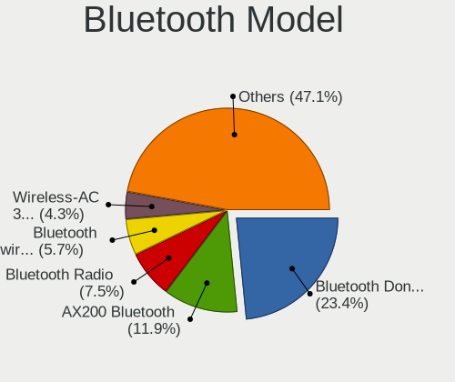

| Model                                                   | Desktops | Percent |
|---------------------------------------------------------|----------|---------|
| Cambridge Silicon Radio Bluetooth Dongle (HCI mode)     | 114      | 31.84%  |
| Intel AX200 Bluetooth                                   | 51       | 14.25%  |
| Intel Bluetooth wireless interface                      | 23       | 6.42%   |
| Realtek Bluetooth Radio                                 | 18       | 5.03%   |
| Intel Wireless-AC 3168 Bluetooth                        | 18       | 5.03%   |
| Broadcom BCM20702A0 Bluetooth 4.0                       | 17       | 4.75%   |
| Intel Wireless-AC 9260 Bluetooth Adapter                | 16       | 4.47%   |
| Intel Bluetooth 9460/9560 Jefferson Peak (JfP)          | 8        | 2.23%   |
| ASUS Broadcom BCM20702A0 Bluetooth                      | 8        | 2.23%   |
| Realtek  Bluetooth 4.2 Adapter                          | 5        | 1.4%    |
| Intel AX210 Bluetooth                                   | 5        | 1.4%    |
| Qualcomm Atheros  Bluetooth Device                      | 4        | 1.12%   |
| Qualcomm Atheros AR9462 Bluetooth                       | 4        | 1.12%   |
| Intel Bluetooth Device                                  | 4        | 1.12%   |
| Dynex BCM20702A0                                        | 4        | 1.12%   |
| Broadcom BCM92045B3 ROM                                 | 4        | 1.12%   |
| ASUS ASUS USB-BT500                                     | 4        | 1.12%   |
| Qualcomm Atheros Bluetooth USB Host Controller          | 3        | 0.84%   |
| IMC Networks Bluetooth Device                           | 3        | 0.84%   |
| Broadcom BCM2045 Bluetooth                              | 3        | 0.84%   |
| ASUS Bluetooth Radio                                    | 3        | 0.84%   |
| Qualcomm Atheros AR3011 Bluetooth                       | 2        | 0.56%   |
| Lite-On Bluetooth Device                                | 2        | 0.56%   |
| Integrated System Solution KY-BT100 Bluetooth Adapter   | 2        | 0.56%   |
| IMC Networks Bluetooth Radio                            | 2        | 0.56%   |
| Belkin Components F8T065BF Mini Bluetooth 4.0 Adapter   | 2        | 0.56%   |
| ASUS Bluetooth Device                                   | 2        | 0.56%   |
| TP-Link UB500 Adapter                                   | 1        | 0.28%   |
| Realtek RTL8821A Bluetooth                              | 1        | 0.28%   |
| Realtek Bluetooth Radio                                 | 1        | 0.28%   |
| Ralink RT3290 Bluetooth                                 | 1        | 0.28%   |
| Qualcomm Atheros QCA61x4 Bluetooth 4.0                  | 1        | 0.28%   |
| Micro Star International Bluetooth Device               | 1        | 0.28%   |
| Lite-On Atheros AR3012 Bluetooth                        | 1        | 0.28%   |
| Kensington Bluetooth EDR Dongle                         | 1        | 0.28%   |
| Intel Centrino Bluetooth Wireless Transceiver           | 1        | 0.28%   |
| Edimax EW-7611ULB 802.11b/g/n and Bluetooth 4.0 Adapter | 1        | 0.28%   |
| D-Link DBT-122 Bluetooth adapter                        | 1        | 0.28%   |
| Creative Bluetooth Audio W2                             | 1        | 0.28%   |
| Corsair HS70 BLUETOOTH Gaming Headset                   | 1        | 0.28%   |
| Broadcom Bluetooth Controller                           | 1        | 0.28%   |
| Broadcom Bluetooth 3.0 Dongle                           | 1        | 0.28%   |
| Broadcom Bluetooth 3.0 Device                           | 1        | 0.28%   |
| Broadcom BCM92046DG-CL1ROM Bluetooth 2.1 UHE Dongle     | 1        | 0.28%   |
| Broadcom BCM92046DG-CL1ROM Bluetooth 2.1 Adapter        | 1        | 0.28%   |
| Broadcom BCM2035B3 Bluetooth Adapter                    | 1        | 0.28%   |
| Broadcom ANYCOM Blue USB-200/250                        | 1        | 0.28%   |
| ASUS Qualcomm Bluetooth 4.1                             | 1        | 0.28%   |
| ASUS Broadcom BCM20702 Single-Chip Bluetooth 4.0 + LE   | 1        | 0.28%   |
| ASUS Bluetooth Adapter                                  | 1        | 0.28%   |
| ASUS BCM20702A0                                         | 1        | 0.28%   |
| Apple Built-in Bluetooth 2.0+EDR HCI                    | 1        | 0.28%   |
| Apple Bluetooth USB Host Controller                     | 1        | 0.28%   |
| AboCom Systems AboCom Bluetooth Device                  | 1        | 0.28%   |

Sound
-----

Sound Vendor
------------

Sound card vendors

| Vendor                           | Desktops | Percent |
|----------------------------------|----------|---------|
| Intel                            | 519      | 29.57%  |
| AMD                              | 504      | 28.72%  |
| Nvidia                           | 435      | 24.79%  |
| C-Media Electronics              | 59       | 3.36%   |
| Creative Labs                    | 30       | 1.71%   |
| Logitech                         | 18       | 1.03%   |
| JMTek                            | 14       | 0.8%    |
| Texas Instruments                | 12       | 0.68%   |
| GN Netcom                        | 12       | 0.68%   |
| Corsair                          | 12       | 0.68%   |
| ASUSTek Computer                 | 11       | 0.63%   |
| Creative Technology              | 9        | 0.51%   |
| Razer USA                        | 7        | 0.4%    |
| Focusrite-Novation               | 6        | 0.34%   |
| VIA Technologies                 | 5        | 0.28%   |
| Tenx Technology                  | 5        | 0.28%   |
| SteelSeries ApS                  | 5        | 0.28%   |
| Plantronics                      | 5        | 0.28%   |
| Sennheiser Communications        | 4        | 0.23%   |
| Generalplus Technology           | 4        | 0.23%   |
| Yamaha                           | 3        | 0.17%   |
| SAVITECH                         | 3        | 0.17%   |
| Realtek Semiconductor            | 3        | 0.17%   |
| PreSonus Audio Electronics       | 3        | 0.17%   |
| ONN                              | 3        | 0.17%   |
| Kingston Technology              | 3        | 0.17%   |
| Blue Microphones                 | 3        | 0.17%   |
| XMOS                             | 2        | 0.11%   |
| Trust                            | 2        | 0.11%   |
| TerraTec Electronic              | 2        | 0.11%   |
| Roland                           | 2        | 0.11%   |
| RODE Microphones                 | 2        | 0.11%   |
| Native Instruments               | 2        | 0.11%   |
| Micro Star International         | 2        | 0.11%   |
| iConnectivity                    | 2        | 0.11%   |
| Hewlett-Packard                  | 2        | 0.11%   |
| Fry's Electronics                | 2        | 0.11%   |
| Bose                             | 2        | 0.11%   |
| BEHRINGER International          | 2        | 0.11%   |
| Valve Software                   | 1        | 0.06%   |
| Unknown                          | 1        | 0.06%   |
| Turtle Beach                     | 1        | 0.06%   |
| TEAC                             | 1        | 0.06%   |
| Sunplus Innovation Technology    | 1        | 0.06%   |
| Sony                             | 1        | 0.06%   |
| Silicon Integrated Systems [SiS] | 1        | 0.06%   |
| Schiit Audio                     | 1        | 0.06%   |
| Samson Technologies              | 1        | 0.06%   |
| ROCCAT                           | 1        | 0.06%   |
| QinHeng Electronics              | 1        | 0.06%   |
| Prototype product Vendor ID      | 1        | 0.06%   |
| Nam Tai E&E Products             | 1        | 0.06%   |
| M-Audio                          | 1        | 0.06%   |
| Insignia (Best Buy)              | 1        | 0.06%   |
| Holtek Semiconductor             | 1        | 0.06%   |
| Hint                             | 1        | 0.06%   |
| Harman                           | 1        | 0.06%   |
| Hangzhou Worlde                  | 1        | 0.06%   |
| GYROCOM C&C                      | 1        | 0.06%   |
| Guillemot                        | 1        | 0.06%   |

Sound Model
-----------

Sound card models

| Model                                                                             | Desktops | Percent |
|-----------------------------------------------------------------------------------|----------|---------|
| AMD Starship/Matisse HD Audio Controller                                          | 134      | 6.57%   |
| AMD SBx00 Azalia (Intel HDA)                                                      | 80       | 3.92%   |
| AMD Family 17h (Models 00h-0fh) HD Audio Controller                               | 80       | 3.92%   |
| Intel 8 Series/C220 Series Chipset High Definition Audio Controller               | 77       | 3.77%   |
| Intel 6 Series/C200 Series Chipset Family High Definition Audio Controller        | 67       | 3.28%   |
| AMD Ellesmere HDMI Audio [Radeon RX 470/480 / 570/580/590]                        | 59       | 2.89%   |
| Intel Xeon E3-1200 v3/4th Gen Core Processor HD Audio Controller                  | 52       | 2.55%   |
| Intel 100 Series/C230 Series Chipset Family HD Audio Controller                   | 52       | 2.55%   |
| AMD Family 17h/19h HD Audio Controller                                            | 49       | 2.4%    |
| Intel 200 Series PCH HD Audio                                                     | 47       | 2.3%    |
| Nvidia GP107GL High Definition Audio Controller                                   | 45       | 2.2%    |
| Intel 7 Series/C216 Chipset Family High Definition Audio Controller               | 41       | 2.01%   |
| Nvidia GK208 HDMI/DP Audio Controller                                             | 37       | 1.81%   |
| AMD FCH Azalia Controller                                                         | 35       | 1.71%   |
| AMD Oland/Hainan/Cape Verde/Pitcairn HDMI Audio [Radeon HD 7000 Series]           | 34       | 1.67%   |
| Nvidia GP104 High Definition Audio Controller                                     | 33       | 1.62%   |
| Nvidia GP106 High Definition Audio Controller                                     | 31       | 1.52%   |
| Intel Cannon Lake PCH cAVS                                                        | 31       | 1.52%   |
| Nvidia TU116 High Definition Audio Controller                                     | 30       | 1.47%   |
| Intel 82801JI (ICH10 Family) HD Audio Controller                                  | 29       | 1.42%   |
| AMD Raven/Raven2/Fenghuang HDMI/DP Audio Controller                               | 29       | 1.42%   |
| AMD Navi 10 HDMI Audio                                                            | 28       | 1.37%   |
| Intel NM10/ICH7 Family High Definition Audio Controller                           | 27       | 1.32%   |
| AMD Baffin HDMI/DP Audio [Radeon RX 550 640SP / RX 560/560X]                      | 27       | 1.32%   |
| Intel 5 Series/3400 Series Chipset High Definition Audio                          | 23       | 1.13%   |
| Nvidia GM206 High Definition Audio Controller                                     | 22       | 1.08%   |
| Intel C610/X99 series chipset HD Audio Controller                                 | 21       | 1.03%   |
| Nvidia GM204 High Definition Audio Controller                                     | 20       | 0.98%   |
| Intel 9 Series Chipset Family HD Audio Controller                                 | 20       | 0.98%   |
| Nvidia High Definition Audio Controller                                           | 19       | 0.93%   |
| Nvidia TU106 High Definition Audio Controller                                     | 18       | 0.88%   |
| Nvidia GP108 High Definition Audio Controller                                     | 18       | 0.88%   |
| Nvidia GF108 High Definition Audio Controller                                     | 18       | 0.88%   |
| Nvidia TU104 HD Audio Controller                                                  | 15       | 0.73%   |
| AMD Cedar HDMI Audio [Radeon HD 5400/6300/7300 Series]                            | 15       | 0.73%   |
| AMD Caicos HDMI Audio [Radeon HD 6450 / 7450/8450/8490 OEM / R5 230/235/235X OEM] | 15       | 0.73%   |
| Nvidia GM107 High Definition Audio Controller [GeForce 940MX]                     | 14       | 0.69%   |
| Nvidia MCP61 High Definition Audio                                                | 13       | 0.64%   |
| Nvidia GK107 HDMI Audio Controller                                                | 13       | 0.64%   |
| Nvidia GF119 HDMI Audio Controller                                                | 13       | 0.64%   |
| JMTek USB PnP Audio Device                                                        | 13       | 0.64%   |
| Intel C600/X79 series chipset High Definition Audio Controller                    | 13       | 0.64%   |
| Nvidia GK106 HDMI Audio Controller                                                | 12       | 0.59%   |
| AMD Vega 10 HDMI Audio [Radeon Vega 56/64]                                        | 12       | 0.59%   |
| Intel Comet Lake PCH-V cAVS                                                       | 11       | 0.54%   |
| C-Media Electronics Audio Adapter (Unitek Y-247A)                                 | 11       | 0.54%   |
| Intel 82801I (ICH9 Family) HD Audio Controller                                    | 10       | 0.49%   |
| AMD Renoir Radeon High Definition Audio Controller                                | 10       | 0.49%   |
| AMD Juniper HDMI Audio [Radeon HD 5700 Series]                                    | 10       | 0.49%   |
| Nvidia GP102 HDMI Audio Controller                                                | 9        | 0.44%   |
| C-Media Electronics Blue Snowball                                                 | 9        | 0.44%   |
| Intel Tiger Lake-H HD Audio Controller                                            | 8        | 0.39%   |
| Intel 82801JD/DO (ICH10 Family) HD Audio Controller                               | 8        | 0.39%   |
| AMD Turks HDMI Audio [Radeon HD 6500/6600 / 6700M Series]                         | 8        | 0.39%   |
| AMD RV710/730 HDMI Audio [Radeon HD 4000 series]                                  | 8        | 0.39%   |
| AMD Navi 21/23 HDMI/DP Audio Controller                                           | 8        | 0.39%   |
| Nvidia TU102 High Definition Audio Controller                                     | 7        | 0.34%   |
| Nvidia GF106 High Definition Audio Controller                                     | 7        | 0.34%   |
| Intel Comet Lake PCH cAVS                                                         | 7        | 0.34%   |
| Creative Labs Sound Core3D [Sound Blaster Recon3D / Z-Series]                     | 7        | 0.34%   |

Memory
------

Memory Vendor
-------------

Memory module vendors

| Vendor              | Desktops | Percent |
|---------------------|----------|---------|
| Kingston            | 122      | 18.83%  |
| Corsair             | 108      | 16.67%  |
| Unknown             | 92       | 14.2%   |
| G.Skill             | 82       | 12.65%  |
| Crucial             | 63       | 9.72%   |
| SK hynix            | 42       | 6.48%   |
| Samsung Electronics | 40       | 6.17%   |
| Micron Technology   | 22       | 3.4%    |
| Patriot             | 13       | 2.01%   |
| Team                | 9        | 1.39%   |
| A-DATA Technology   | 7        | 1.08%   |
| Transcend           | 4        | 0.62%   |
| Goodram             | 4        | 0.62%   |
| Smart               | 3        | 0.46%   |
| Ramaxel Technology  | 3        | 0.46%   |
| Nanya Technology    | 3        | 0.46%   |
| AMD                 | 3        | 0.46%   |
| Silicon Power       | 2        | 0.31%   |
| Kingmax             | 2        | 0.31%   |
| GLOWAY              | 2        | 0.31%   |
| Elpida              | 2        | 0.31%   |
| Unknown             | 2        | 0.31%   |
| Unknown (ABCD)      | 1        | 0.15%   |
| Unknown (0x0C97)    | 1        | 0.15%   |
| Unifosa             | 1        | 0.15%   |
| Reboto              | 1        | 0.15%   |
| PNY                 | 1        | 0.15%   |
| OCZ                 | 1        | 0.15%   |
| Mushkin             | 1        | 0.15%   |
| Kllisre             | 1        | 0.15%   |
| Imation             | 1        | 0.15%   |
| Hewlett-Packard     | 1        | 0.15%   |
| GeIL                | 1        | 0.15%   |
| CSX                 | 1        | 0.15%   |
| Centon              | 1        | 0.15%   |
| Avant               | 1        | 0.15%   |
| Atermiter           | 1        | 0.15%   |
| ASint Technology    | 1        | 0.15%   |
| Apacer              | 1        | 0.15%   |
| Ankowall            | 1        | 0.15%   |

Memory Model
------------

Memory module models

| Model                                                    | Desktops | Percent |
|----------------------------------------------------------|----------|---------|
| Corsair RAM CMK16GX4M2B3200C16 8GB DIMM DDR4 3600MT/s    | 13       | 1.78%   |
| Unknown RAM Module 4096MB DIMM 1333MT/s                  | 8        | 1.1%    |
| Unknown RAM Module 2048MB DIMM DDR2 800MT/s              | 6        | 0.82%   |
| G.Skill RAM F4-3200C16-16GVK 16GB DIMM DDR4 3600MT/s     | 6        | 0.82%   |
| Corsair RAM CMK16GX4M2B3000C15 8192MB DIMM DDR4 3000MT/s | 6        | 0.82%   |
| Unknown RAM Module 2048MB DIMM SDRAM                     | 5        | 0.69%   |
| Kingston RAM KHX3200C16D4/8GX 8192MB DIMM DDR4 3533MT/s  | 5        | 0.69%   |
| G.Skill RAM F4-3200C16-8GVKB 8GB DIMM DDR4 3200MT/s      | 5        | 0.69%   |
| Corsair RAM CMK32GX4M2B3200C16 16GB DIMM DDR4 3400MT/s   | 5        | 0.69%   |
| Unknown RAM Module 2GB DIMM 1333MT/s                     | 4        | 0.55%   |
| Unknown RAM Module 2048MB DIMM 1333MT/s                  | 4        | 0.55%   |
| Kingston RAM KHX3200C16D4/16GX 16GB DIMM DDR4 3600MT/s   | 4        | 0.55%   |
| Kingston RAM KHX2666C16/8G 8GB DIMM DDR4 3466MT/s        | 4        | 0.55%   |
| Kingston RAM KHX2400C15D4/4G 4096MB DIMM DDR4 3151MT/s   | 4        | 0.55%   |
| Kingston RAM KHX2400C15/8G 8GB DIMM DDR4 2933MT/s        | 4        | 0.55%   |
| Kingston RAM KHX1600C9D3/4GX 4GB DIMM DDR3 2400MT/s      | 4        | 0.55%   |
| G.Skill RAM F4-3600C16-16GVKC 16GB DIMM DDR4 3866MT/s    | 4        | 0.55%   |
| G.Skill RAM F4-3600C16-16GTZNC 16GB DIMM DDR4 3600MT/s   | 4        | 0.55%   |
| G.Skill RAM F4-3200C14-8GFX 8GB DIMM DDR4 3733MT/s       | 4        | 0.55%   |
| Corsair RAM CMK32GX4M2E3200C16 16GB DIMM DDR4 3200MT/s   | 4        | 0.55%   |
| Corsair RAM CMK16GX4M2A2666C16 8GB DIMM DDR4 3200MT/s    | 4        | 0.55%   |
| Unknown RAM Module 8192MB DIMM DDR3 1333MT/s             | 3        | 0.41%   |
| Unknown RAM Module 8192MB DIMM 1333MT/s                  | 3        | 0.41%   |
| Unknown RAM Module 4GB DIMM 1333MT/s                     | 3        | 0.41%   |
| Unknown RAM Module 4096MB DIMM 1600MT/s                  | 3        | 0.41%   |
| Unknown RAM Module 2048MB DIMM DDR 667MT/s               | 3        | 0.41%   |
| Patriot RAM PSD38G16002 8GB DIMM DDR3 1600MT/s           | 3        | 0.41%   |
| Kingston RAM KHX1866C10D3/8G 8GB DIMM DDR3 1867MT/s      | 3        | 0.41%   |
| Kingston RAM KHX1600C10D3/8G 8GB DIMM DDR3 1600MT/s      | 3        | 0.41%   |
| Kingston RAM KHX1600C10D3/ 8GB DIMM DDR3 1600MT/s        | 3        | 0.41%   |
| Crucial RAM BLS16G4D32AESB.M16FE 16GB DIMM DDR4 3600MT/s | 3        | 0.41%   |
| Corsair RAM CMK32GX4M2B3000C15 16GB DIMM DDR4 3000MT/s   | 3        | 0.41%   |
| Corsair RAM CMK16GX4M2A2400C14 8GB DIMM DDR4 2800MT/s    | 3        | 0.41%   |
| Unknown RAM Module 8GB DIMM 1600MT/s                     | 2        | 0.27%   |
| Unknown RAM Module 8192MB DIMM DDR3 1600MT/s             | 2        | 0.27%   |
| Unknown RAM Module 8192MB DIMM 667MT/s                   | 2        | 0.27%   |
| Unknown RAM Module 4GB DIMM 1600MT/s                     | 2        | 0.27%   |
| Unknown RAM Module 4096MB DIMM SDRAM                     | 2        | 0.27%   |
| Unknown RAM Module 4096MB DIMM DDR3 1333MT/s             | 2        | 0.27%   |
| Unknown RAM Module 4096MB DIMM DDR2 800MT/s              | 2        | 0.27%   |
| Unknown RAM Module 2048MB DIMM DDR3 1333MT/s             | 2        | 0.27%   |
| Unknown RAM Module 2048MB DIMM DDR2 667MT/s              | 2        | 0.27%   |
| Unknown RAM Module 2048MB DIMM DDR2 400MT/s              | 2        | 0.27%   |
| Unknown RAM Module 2048MB DIMM 800MT/s                   | 2        | 0.27%   |
| Unknown RAM Module 2048MB DIMM 400MT/s                   | 2        | 0.27%   |
| Team RAM TEAMGROUP-UD4-3200 8GB DIMM DDR4 3733MT/s       | 2        | 0.27%   |
| Team RAM TEAMGROUP-UD4-2666 8192MB DIMM DDR4 2667MT/s    | 2        | 0.27%   |
| SK hynix RAM HMT451U6AFR8A-PB 4GB DIMM DDR3 1600MT/s     | 2        | 0.27%   |
| SK hynix RAM HMT41GU6BFR8C-PB 8GB DIMM DDR3 1600MT/s     | 2        | 0.27%   |
| SK hynix RAM HMT351U6CFR8C-PB 4GB DIMM DDR3 1800MT/s     | 2        | 0.27%   |
| SK hynix RAM HMT325U6EFR8C-PB 2GB DIMM DDR3 1600MT/s     | 2        | 0.27%   |
| Samsung RAM M393B2G70DB0 16GB DIMM DDR3 1866MT/s         | 2        | 0.27%   |
| Samsung RAM M378B5773DH0-CK0 2GB DIMM DDR3 1600MT/s      | 2        | 0.27%   |
| Samsung RAM M378B5673FH0-CH9 2GB DIMM DDR3 1600MT/s      | 2        | 0.27%   |
| Samsung RAM M378B5173DB0-CK0 4GB DIMM DDR3 1600MT/s      | 2        | 0.27%   |
| Samsung RAM M378B1G73EB0-YK0 8192MB DIMM DDR3 1600MT/s   | 2        | 0.27%   |
| Samsung RAM M378B1G73DB0-CK0 8GB DIMM DDR3 2133MT/s      | 2        | 0.27%   |
| Samsung RAM M378A5244CB0-CRC 4GB DIMM DDR4 3066MT/s      | 2        | 0.27%   |
| Patriot RAM 3200 C16 Series 8GB DIMM DDR4 3200MT/s       | 2        | 0.27%   |
| Micron RAM 8JTF25664AZ-1G4M1 2048MB DIMM DDR3 1333MT/s   | 2        | 0.27%   |

Memory Kind
-----------

Memory module kinds

| Kind    | Desktops | Percent |
|---------|----------|---------|
| DDR4    | 318      | 53.9%   |
| DDR3    | 184      | 31.19%  |
| Unknown | 42       | 7.12%   |
| DDR2    | 25       | 4.24%   |
| SDRAM   | 15       | 2.54%   |
| DDR     | 5        | 0.85%   |
| LPDDR4  | 1        | 0.17%   |

Memory Form Factor
------------------

Physical design of the memory module

| Name    | Desktops | Percent |
|---------|----------|---------|
| DIMM    | 561      | 96.06%  |
| SODIMM  | 19       | 3.25%   |
| RIMM    | 2        | 0.34%   |
| FB-DIMM | 2        | 0.34%   |

Memory Size
-----------

Memory module size

| Size  | Desktops | Percent |
|-------|----------|---------|
| 8192  | 243      | 37.56%  |
| 16384 | 138      | 21.33%  |
| 4096  | 138      | 21.33%  |
| 2048  | 93       | 14.37%  |
| 32768 | 21       | 3.25%   |
| 1024  | 12       | 1.85%   |
| 512   | 1        | 0.15%   |
| 256   | 1        | 0.15%   |

Memory Speed
------------

Memory module speed

| Speed   | Desktops | Percent |
|---------|----------|---------|
| 1600    | 105      | 16.33%  |
| 1333    | 76       | 11.82%  |
| 3200    | 69       | 10.73%  |
| 3600    | 59       | 9.18%   |
| 2400    | 42       | 6.53%   |
| 2667    | 35       | 5.44%   |
| 2133    | 35       | 5.44%   |
| 800     | 20       | 3.11%   |
| 2666    | 18       | 2.8%    |
| 3466    | 15       | 2.33%   |
| 3000    | 15       | 2.33%   |
| 667     | 15       | 2.33%   |
| 2933    | 13       | 2.02%   |
| 3733    | 12       | 1.87%   |
| 3800    | 8        | 1.24%   |
| 3400    | 8        | 1.24%   |
| 1066    | 8        | 1.24%   |
| Unknown | 8        | 1.24%   |
| 2800    | 7        | 1.09%   |
| 1867    | 6        | 0.93%   |
| 1866    | 6        | 0.93%   |
| 400     | 6        | 0.93%   |
| 3533    | 5        | 0.78%   |
| 3866    | 4        | 0.62%   |
| 3333    | 4        | 0.62%   |
| 3151    | 4        | 0.62%   |
| 3066    | 4        | 0.62%   |
| 1800    | 4        | 0.62%   |
| 2000    | 3        | 0.47%   |
| 3467    | 2        | 0.31%   |
| 3334    | 2        | 0.31%   |
| 2132    | 2        | 0.31%   |
| 1334    | 2        | 0.31%   |
| 1067    | 2        | 0.31%   |
| 533     | 2        | 0.31%   |
| 49926   | 1        | 0.16%   |
| 6000    | 1        | 0.16%   |
| 5800    | 1        | 0.16%   |
| 4400    | 1        | 0.16%   |
| 3666    | 1        | 0.16%   |
| 3266    | 1        | 0.16%   |
| 3100    | 1        | 0.16%   |
| 3067    | 1        | 0.16%   |
| 3007    | 1        | 0.16%   |
| 2473    | 1        | 0.16%   |
| 2200    | 1        | 0.16%   |
| 2134    | 1        | 0.16%   |
| 2048    | 1        | 0.16%   |
| 1904    | 1        | 0.16%   |
| 1648    | 1        | 0.16%   |
| 880     | 1        | 0.16%   |
| 333     | 1        | 0.16%   |

Printers & scanners
-------------------

Printer Vendor
--------------

Printer device vendors

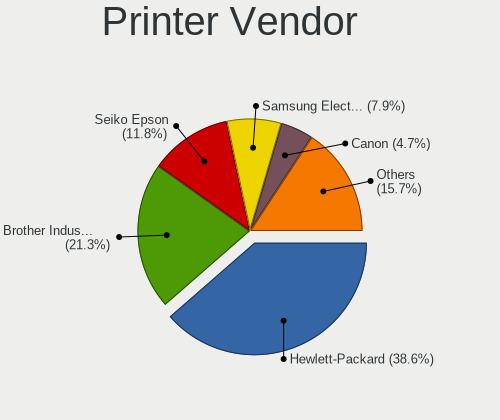

| Vendor                 | Desktops | Percent |
|------------------------|----------|---------|
| Hewlett-Packard        | 32       | 49.23%  |
| Brother Industries     | 16       | 24.62%  |
| Seiko Epson            | 4        | 6.15%   |
| Samsung Electronics    | 4        | 6.15%   |
| Canon                  | 3        | 4.62%   |
| SAT                    | 1        | 1.54%   |
| Prolific Technology    | 1        | 1.54%   |
| Pantum                 | 1        | 1.54%   |
| Panasonic (Matsushita) | 1        | 1.54%   |
| ICS Advent             | 1        | 1.54%   |
| Apple                  | 1        | 1.54%   |

Printer Model
-------------

Printer device models

| Model                                | Desktops | Percent |
|--------------------------------------|----------|---------|
| HP OfficeJet Pro 8020 series         | 3        | 4.48%   |
| HP OfficeJet Pro 7740 series         | 2        | 2.99%   |
| HP LaserJet 1018                     | 2        | 2.99%   |
| HP DeskJet 2620 All-in-One Printer   | 2        | 2.99%   |
| Seiko Epson WF-2530 Series           | 1        | 1.49%   |
| Seiko Epson Printer                  | 1        | 1.49%   |
| Seiko Epson L3150 Series             | 1        | 1.49%   |
| Seiko Epson L120 Series              | 1        | 1.49%   |
| SAT SAT38TUSE                        | 1        | 1.49%   |
| Samsung ML-2250 Series               | 1        | 1.49%   |
| Samsung ML-216x Series Laser Printer | 1        | 1.49%   |
| Samsung CLX-3180 Series              | 1        | 1.49%   |
| Samsung CLX-3170 Series              | 1        | 1.49%   |
| Prolific PL2305 Parallel Port        | 1        | 1.49%   |
| Pantum P2200 series                  | 1        | 1.49%   |
| Panasonic (Matsushita) KX-MB1500CX   | 1        | 1.49%   |
| ICS Advent Parallel Adapter          | 1        | 1.49%   |
| HP OfficeJet Pro 9010 series         | 1        | 1.49%   |
| HP OfficeJet 9010 series             | 1        | 1.49%   |
| HP OfficeJet 4650 series             | 1        | 1.49%   |
| HP Officejet 4630 series             | 1        | 1.49%   |
| HP OfficeJet 3830 series             | 1        | 1.49%   |
| HP LaserJet P2035                    | 1        | 1.49%   |
| HP LaserJet P2015 series             | 1        | 1.49%   |
| HP LaserJet P1102                    | 1        | 1.49%   |
| HP LaserJet P1005                    | 1        | 1.49%   |
| HP LaserJet M402dn                   | 1        | 1.49%   |
| HP LaserJet M101-M106                | 1        | 1.49%   |
| HP LaserJet CP1025nw                 | 1        | 1.49%   |
| HP LaserJet 200 color M251nw         | 1        | 1.49%   |
| HP LaserJet 1300                     | 1        | 1.49%   |
| HP LaserJet 1022                     | 1        | 1.49%   |
| HP LaserJet 1010                     | 1        | 1.49%   |
| HP ENVY Photo 7100 series            | 1        | 1.49%   |
| HP ENVY 5000 series                  | 1        | 1.49%   |
| HP ENVY 4500 series                  | 1        | 1.49%   |
| HP Deskjet F4500 series              | 1        | 1.49%   |
| HP DeskJet D1360                     | 1        | 1.49%   |
| HP DeskJet 930c                      | 1        | 1.49%   |
| HP DeskJet 2700 series               | 1        | 1.49%   |
| HP Deskjet 2540 series               | 1        | 1.49%   |
| HP Deskjet 1050 J410                 | 1        | 1.49%   |
| Canon PIXMA MX920 Series             | 1        | 1.49%   |
| Canon PIXMA MP495                    | 1        | 1.49%   |
| Canon PIXMA MG2500 Series            | 1        | 1.49%   |
| Brother MFC-L3770CDW series          | 1        | 1.49%   |
| Brother MFC-L2710DW series           | 1        | 1.49%   |
| Brother MFC-J805DW                   | 1        | 1.49%   |
| Brother MFC-J6530DW                  | 1        | 1.49%   |
| Brother MFC-J491DW                   | 1        | 1.49%   |
| Brother MFC-9330CDW                  | 1        | 1.49%   |
| Brother MFC-7460DN                   | 1        | 1.49%   |
| Brother MFC-7420                     | 1        | 1.49%   |
| Brother HL-L2380DW                   | 1        | 1.49%   |
| Brother HL-L2320D series             | 1        | 1.49%   |
| Brother HL-L2300D series             | 1        | 1.49%   |
| Brother HL-5340 series               | 1        | 1.49%   |
| Brother HL-2170W series              | 1        | 1.49%   |
| Brother DCP-L2540DW                  | 1        | 1.49%   |
| Brother DCP-J140W                    | 1        | 1.49%   |

Scanner Vendor
--------------

Scanner device vendors

| Vendor          | Desktops | Percent |
|-----------------|----------|---------|
| Canon           | 8        | 47.06%  |
| Seiko Epson     | 3        | 17.65%  |
| Mustek Systems  | 3        | 17.65%  |
| Hewlett-Packard | 3        | 17.65%  |

Scanner Model
-------------

Scanner device models

| Model                                                   | Desktops | Percent |
|---------------------------------------------------------|----------|---------|
| Canon CanoScan LiDE 220                                 | 2        | 11.76%  |
| Canon CanoScan LiDE 110                                 | 2        | 11.76%  |
| Seiko Epson GT-X820 [Perfection V600 Photo]             | 1        | 5.88%   |
| Seiko Epson GT-F730 [GT-S630/Perfection V33/V330 Photo] | 1        | 5.88%   |
| Seiko Epson ES-D200 [GT-S50]                            | 1        | 5.88%   |
| Mustek Systems SNAPSCAN e22                             | 1        | 5.88%   |
| Mustek Systems ScanExpress A3 USB 1200 PRO              | 1        | 5.88%   |
| Mustek Systems BearPaw 1200 CU Plus                     | 1        | 5.88%   |
| HP ScanJet G4010                                        | 1        | 5.88%   |
| HP ScanJet 82x0C                                        | 1        | 5.88%   |
| HP ScanJet 3770                                         | 1        | 5.88%   |
| Canon CanoScan LiDE 50/LiDE 35/LiDE 40                  | 1        | 5.88%   |
| Canon CanoScan LIDE 25                                  | 1        | 5.88%   |
| Canon CanoScan LiDE 210                                 | 1        | 5.88%   |
| Canon CanoScan LiDE 120                                 | 1        | 5.88%   |

Camera
------

Camera Vendor
-------------

Camera device vendors

| Vendor                        | Desktops | Percent |
|-------------------------------|----------|---------|
| Logitech                      | 111      | 46.44%  |
| Microsoft                     | 15       | 6.28%   |
| Microdia                      | 15       | 6.28%   |
| Samsung Electronics           | 10       | 4.18%   |
| Z-Star Microelectronics       | 7        | 2.93%   |
| Sunplus Innovation Technology | 6        | 2.51%   |
| Generalplus Technology        | 6        | 2.51%   |
| Chicony Electronics           | 5        | 2.09%   |
| ARC International             | 5        | 2.09%   |
| Apple                         | 5        | 2.09%   |
| KYE Systems (Mouse Systems)   | 4        | 1.67%   |
| Huawei Technologies           | 4        | 1.67%   |
| Genesys Logic                 | 4        | 1.67%   |
| Cubeternet                    | 4        | 1.67%   |
| MacroSilicon                  | 3        | 1.26%   |
| Creative Technology           | 3        | 1.26%   |
| Alcor Micro                   | 3        | 1.26%   |
| Realtek Semiconductor         | 2        | 0.84%   |
| Razer USA                     | 2        | 0.84%   |
| IMC Networks                  | 2        | 0.84%   |
| Hewlett-Packard               | 2        | 0.84%   |
| GEMBIRD                       | 2        | 0.84%   |
| Arkmicro Technologies         | 2        | 0.84%   |
| A4Tech                        | 2        | 0.84%   |
| Xiongmai                      | 1        | 0.42%   |
| Valve Software                | 1        | 0.42%   |
| Unknown                       | 1        | 0.42%   |
| Silicon Motion                | 1        | 0.42%   |
| Pixart Imaging                | 1        | 0.42%   |
| Philips (or NXP)              | 1        | 0.42%   |
| Novatek Microelectronics      | 1        | 0.42%   |
| Mimaki Engineering            | 1        | 0.42%   |
| MediaTek                      | 1        | 0.42%   |
| lihappe8                      | 1        | 0.42%   |
| LG Electronics                | 1        | 0.42%   |
| Lenovo                        | 1        | 0.42%   |
| Intel                         | 1        | 0.42%   |
| HDR webcam                    | 1        | 0.42%   |
| 2M UVC CAMERA                 | 1        | 0.42%   |

Camera Model
------------

Camera device models

| Model                                          | Desktops | Percent |
|------------------------------------------------|----------|---------|
| Logitech Webcam C270                           | 25       | 10.29%  |
| Logitech HD Pro Webcam C920                    | 22       | 9.05%   |
| Samsung Galaxy series, misc. (MTP mode)        | 9        | 3.7%    |
| Logitech HD Webcam C615                        | 7        | 2.88%   |
| Logitech HD Webcam C525                        | 7        | 2.88%   |
| Microsoft LifeCam HD-3000                      | 6        | 2.47%   |
| Logitech C922 Pro Stream Webcam                | 6        | 2.47%   |
| Microsoft LifeCam Cinema                       | 5        | 2.06%   |
| Microdia Webcam Vitade AF                      | 5        | 2.06%   |
| Logitech Webcam C310                           | 5        | 2.06%   |
| ARC International Camera                       | 5        | 2.06%   |
| Z-Star Venus USB2.0 Camera                     | 4        | 1.65%   |
| Microdia USB 2.0 Camera                        | 4        | 1.65%   |
| Logitech Webcam Pro 9000                       | 4        | 1.65%   |
| Logitech Webcam C170                           | 4        | 1.65%   |
| Logitech B525 HD Webcam                        | 4        | 1.65%   |
| Huawei UVC Camera                              | 4        | 1.65%   |
| Generalplus GENERAL WEBCAM                     | 4        | 1.65%   |
| Apple iPhone 5/5C/5S/6/SE                      | 4        | 1.65%   |
| Microdia Camera                                | 3        | 1.23%   |
| MacroSilicon MiraBox Capture                   | 3        | 1.23%   |
| Logitech Webcam C930e                          | 3        | 1.23%   |
| Logitech Webcam C210                           | 3        | 1.23%   |
| Logitech Webcam C200                           | 3        | 1.23%   |
| Cubeternet GL-UPC822 UVC WebCam                | 3        | 1.23%   |
| Z-Star A4 tech USB2.0 Camera                   | 2        | 0.82%   |
| Sunplus Aukey-PC-LM1E Camera                   | 2        | 0.82%   |
| Razer USA Gaming Webcam [Kiyo]                 | 2        | 0.82%   |
| Logitech Webcam C300                           | 2        | 0.82%   |
| Logitech QuickCam E 3500                       | 2        | 0.82%   |
| Logitech HD Webcam C910                        | 2        | 0.82%   |
| Logitech HD Webcam C510                        | 2        | 0.82%   |
| KYE Systems (Mouse Systems) Genius FaceCam 320 | 2        | 0.82%   |
| Genesys Logic USB2.0 Digital Camera            | 2        | 0.82%   |
| Genesys Logic Camera                           | 2        | 0.82%   |
| Generalplus 808 Camera                         | 2        | 0.82%   |
| GEMBIRD USB2.0 PC CAMERA                       | 2        | 0.82%   |
| Creative Live! Cam Chat HD [VF0700]            | 2        | 0.82%   |
| Arkmicro USB2.0 PC CAMERA                      | 2        | 0.82%   |
| Z-Star A4 TECH HD PC Camera                    | 1        | 0.41%   |
| Xiongmai web camera                            | 1        | 0.41%   |
| Valve Software 3D Camera                       | 1        | 0.41%   |
| Unknown Integrated RGB Camera                  | 1        | 0.41%   |
| Sunplus Lihappe8 Webcam L0485A2SP              | 1        | 0.41%   |
| Sunplus Full HD webcam                         | 1        | 0.41%   |
| Sunplus FHD Camera Microphone                  | 1        | 0.41%   |
| Sunplus 2K FHD camera                          | 1        | 0.41%   |
| Silicon Motion SM731 Camera                    | 1        | 0.41%   |
| Samsung Galaxy (debugging mode)                | 1        | 0.41%   |
| Realtek HK 2M CAM                              | 1        | 0.41%   |
| Realtek FULL HD 1080P Webcam                   | 1        | 0.41%   |
| Pixart Imaging Webcam Genius iLook 300         | 1        | 0.41%   |
| Philips (or NXP) PCVC740K ToUcam Pro [pwc]     | 1        | 0.41%   |
| Novatek HP High Definition 2MP Webcam          | 1        | 0.41%   |
| Mimaki Engineering HD WEB CAMERA               | 1        | 0.41%   |
| Microsoft LifeCam VX-800                       | 1        | 0.41%   |
| Microsoft LifeCam Studio                       | 1        | 0.41%   |
| Microsoft LifeCam NX-3000 (UVC-compliant)      | 1        | 0.41%   |
| Microsoft LifeCam HD-5000                      | 1        | 0.41%   |
| Microdia Sonix USB 2.0 Camera                  | 1        | 0.41%   |

Security
--------

Fingerprint Vendor
------------------

Fingerprint sensor vendors

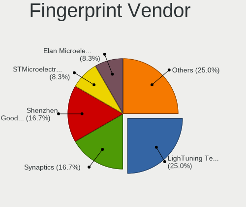

| Vendor                     | Desktops | Percent |
|----------------------------|----------|---------|
| Synaptics                  | 1        | 16.67%  |
| STMicroelectronics         | 1        | 16.67%  |
| Shenzhen Goodix Technology | 1        | 16.67%  |
| Elan Microelectronics      | 1        | 16.67%  |
| DigitalPersona             | 1        | 16.67%  |
| AuthenTec                  | 1        | 16.67%  |

Fingerprint Model
-----------------

Fingerprint sensor models

| Model                                        | Desktops | Percent |
|----------------------------------------------|----------|---------|
| Synaptics  WBDI Fingerprint Reader - USB 052 | 1        | 16.67%  |
| STMicroelectronics Fingerprint Reader        | 1        | 16.67%  |
| Shenzhen Goodix  Fingerprint Device          | 1        | 16.67%  |
| Elan ELAN:Fingerprint                        | 1        | 16.67%  |
| DigitalPersona Fingerprint Reader            | 1        | 16.67%  |
| AuthenTec AES1600                            | 1        | 16.67%  |

Chipcard Vendor
---------------

Chipcard module vendors

| Vendor                    | Desktops | Percent |
|---------------------------|----------|---------|
| Advanced Card Systems     | 4        | 23.53%  |
| Gemalto (was Gemplus)     | 3        | 17.65%  |
| Alcor Micro               | 3        | 17.65%  |
| OmniKey                   | 2        | 11.76%  |
| SCM Microsystems          | 1        | 5.88%   |
| Reiner SCT Kartensysteme  | 1        | 5.88%   |
| Fujitsu Siemens Computers | 1        | 5.88%   |
| Aladdin R.D.              | 1        | 5.88%   |
| Aktiv                     | 1        | 5.88%   |

Chipcard Model
--------------

Chipcard module models

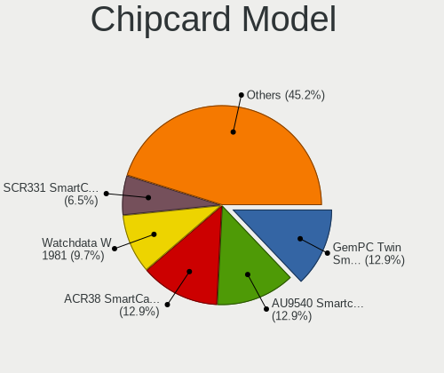

| Model                                             | Desktops | Percent |
|---------------------------------------------------|----------|---------|
| Advanced Card Systems ACR38 SmartCard Reader      | 4        | 23.53%  |
| Gemalto (was Gemplus) GemPC Twin SmartCard Reader | 3        | 17.65%  |
| Alcor Micro Watchdata W 1981                      | 2        | 11.76%  |
| SCM Microsystems SCR331 SmartCard Reader          | 1        | 5.88%   |
| Reiner SCT Kartensysteme tanJack USB              | 1        | 5.88%   |
| OmniKey CardMan 3021 / 3121                       | 1        | 5.88%   |
| OmniKey CardMan 1021                              | 1        | 5.88%   |
| Fujitsu Siemens Computers Smartcard Reader D323   | 1        | 5.88%   |
| Alcor Micro AU9540 Smartcard Reader               | 1        | 5.88%   |
| Aladdin R.D. JaCarta                              | 1        | 5.88%   |
| Aktiv Rutoken lite                                | 1        | 5.88%   |

Unsupported
-----------

Unsupported Devices
-------------------

Total unsupported devices on board

| Total | Desktops | Percent |
|-------|----------|---------|
| 0     | 825      | 84.7%   |
| 1     | 121      | 12.42%  |
| 2     | 17       | 1.75%   |
| 4     | 4        | 0.41%   |
| 3     | 3        | 0.31%   |
| 6     | 2        | 0.21%   |
| 5     | 2        | 0.21%   |

Unsupported Device Types
------------------------

Types of unsupported devices

| Type                     | Desktops | Percent |
|--------------------------|----------|---------|
| Net/wireless             | 42       | 23.2%   |
| Graphics card            | 37       | 20.44%  |
| Unassigned class         | 22       | 12.15%  |
| Sound                    | 17       | 9.39%   |
| Multimedia controller    | 11       | 6.08%   |
| Camera                   | 11       | 6.08%   |
| Chipcard                 | 9        | 4.97%   |
| Bluetooth                | 7        | 3.87%   |
| Communication controller | 6        | 3.31%   |
| Fingerprint reader       | 5        | 2.76%   |
| Storage/ide              | 4        | 2.21%   |
| Network                  | 3        | 1.66%   |
| Net/ethernet             | 2        | 1.1%    |
| Firewire controller      | 2        | 1.1%    |
| Modem                    | 1        | 0.55%   |
| Dvb card                 | 1        | 0.55%   |
| Card reader              | 1        | 0.55%   |

