Kubuntu - Tested Hardware & Statistics (Desktops)
-------------------------------------------------

A project to collect tested hardware configurations for Kubuntu.

Anyone can contribute to this report by the [hw-probe](https://github.com/linuxhw/hw-probe) tool:

    sudo -E hw-probe -all -upload

Please contribute! Especially if your hardware is rare.

Contents
--------

* [ Test Cases ](#test-cases)

* [ System ](#system)
  - [ OS                       ](#os)
  - [ OS Family                ](#os-family)
  - [ Kernel                   ](#kernel)
  - [ Kernel Family            ](#kernel-family)
  - [ Kernel Major Ver.        ](#kernel-major-ver)
  - [ Arch                     ](#arch)
  - [ DE                       ](#de)
  - [ Display Server           ](#display-server)
  - [ Display Manager          ](#display-manager)
  - [ OS Lang                  ](#os-lang)
  - [ Boot Mode                ](#boot-mode)
  - [ Filesystem               ](#filesystem)
  - [ Part. scheme             ](#part-scheme)
  - [ Dual Boot with Linux/BSD ](#dual-boot-with-linuxbsd)
  - [ Dual Boot (Win)          ](#dual-boot-win)

* [ Board ](#board)
  - [ Vendor                   ](#vendor)
  - [ Model                    ](#model)
  - [ Model Family             ](#model-family)
  - [ MFG Year                 ](#mfg-year)
  - [ Form Factor              ](#form-factor)
  - [ Secure Boot              ](#secure-boot)
  - [ Coreboot                 ](#coreboot)
  - [ RAM Size                 ](#ram-size)
  - [ RAM Used                 ](#ram-used)
  - [ Total Drives             ](#total-drives)
  - [ Has CD-ROM               ](#has-cd-rom)
  - [ Has Ethernet             ](#has-ethernet)
  - [ Has WiFi                 ](#has-wifi)
  - [ Has Bluetooth            ](#has-bluetooth)

* [ Location ](#location)
  - [ Country                  ](#country)
  - [ City                     ](#city)

* [ Drives ](#drives)
  - [ Drive Vendor             ](#drive-vendor)
  - [ Drive Model              ](#drive-model)
  - [ HDD Vendor               ](#hdd-vendor)
  - [ SSD Vendor               ](#ssd-vendor)
  - [ Drive Kind               ](#drive-kind)
  - [ Drive Connector          ](#drive-connector)
  - [ Drive Size               ](#drive-size)
  - [ Space Total              ](#space-total)
  - [ Space Used               ](#space-used)
  - [ Malfunc. Drives          ](#malfunc-drives)
  - [ Malfunc. Drive Vendor    ](#malfunc-drive-vendor)
  - [ Malfunc. HDD Vendor      ](#malfunc-hdd-vendor)
  - [ Malfunc. Drive Kind      ](#malfunc-drive-kind)
  - [ Failed Drives            ](#failed-drives)
  - [ Failed Drive Vendor      ](#failed-drive-vendor)
  - [ Drive Status             ](#drive-status)

* [ Storage controller ](#storage-controller)
  - [ Storage Vendor           ](#storage-vendor)
  - [ Storage Model            ](#storage-model)
  - [ Storage Kind             ](#storage-kind)

* [ Processor ](#processor)
  - [ CPU Vendor               ](#cpu-vendor)
  - [ CPU Model                ](#cpu-model)
  - [ CPU Model Family         ](#cpu-model-family)
  - [ CPU Cores                ](#cpu-cores)
  - [ CPU Sockets              ](#cpu-sockets)
  - [ CPU Threads              ](#cpu-threads)
  - [ CPU Op-Modes             ](#cpu-op-modes)
  - [ CPU Microcode            ](#cpu-microcode)
  - [ CPU Microarch            ](#cpu-microarch)

* [ Graphics ](#graphics)
  - [ GPU Vendor               ](#gpu-vendor)
  - [ GPU Model                ](#gpu-model)
  - [ GPU Combo                ](#gpu-combo)
  - [ GPU Driver               ](#gpu-driver)
  - [ GPU Memory               ](#gpu-memory)

* [ Monitor ](#monitor)
  - [ Monitor Vendor           ](#monitor-vendor)
  - [ Monitor Model            ](#monitor-model)
  - [ Monitor Resolution       ](#monitor-resolution)
  - [ Monitor Diagonal         ](#monitor-diagonal)
  - [ Monitor Width            ](#monitor-width)
  - [ Aspect Ratio             ](#aspect-ratio)
  - [ Monitor Area             ](#monitor-area)
  - [ Pixel Density            ](#pixel-density)
  - [ Multiple Monitors        ](#multiple-monitors)

* [ Network ](#network)
  - [ Net Controller Vendor    ](#net-controller-vendor)
  - [ Net Controller Model     ](#net-controller-model)
  - [ Wireless Vendor          ](#wireless-vendor)
  - [ Wireless Model           ](#wireless-model)
  - [ Ethernet Vendor          ](#ethernet-vendor)
  - [ Ethernet Model           ](#ethernet-model)
  - [ Net Controller Kind      ](#net-controller-kind)
  - [ Used Controller          ](#used-controller)
  - [ NICs                     ](#nics)
  - [ IPv6                     ](#ipv6)

* [ Bluetooth ](#bluetooth)
  - [ Bluetooth Vendor         ](#bluetooth-vendor)
  - [ Bluetooth Model          ](#bluetooth-model)

* [ Sound ](#sound)
  - [ Sound Vendor             ](#sound-vendor)
  - [ Sound Model              ](#sound-model)

* [ Memory ](#memory)
  - [ Memory Vendor            ](#memory-vendor)
  - [ Memory Model             ](#memory-model)
  - [ Memory Kind              ](#memory-kind)
  - [ Memory Form Factor       ](#memory-form-factor)
  - [ Memory Size              ](#memory-size)
  - [ Memory Speed             ](#memory-speed)

* [ Printers & scanners ](#printers--scanners)
  - [ Printer Vendor           ](#printer-vendor)
  - [ Printer Model            ](#printer-model)
  - [ Scanner Vendor           ](#scanner-vendor)
  - [ Scanner Model            ](#scanner-model)

* [ Camera ](#camera)
  - [ Camera Vendor            ](#camera-vendor)
  - [ Camera Model             ](#camera-model)

* [ Security ](#security)
  - [ Fingerprint Vendor       ](#fingerprint-vendor)
  - [ Fingerprint Model        ](#fingerprint-model)
  - [ Chipcard Vendor          ](#chipcard-vendor)
  - [ Chipcard Model           ](#chipcard-model)

* [ Unsupported ](#unsupported)
  - [ Unsupported Devices      ](#unsupported-devices)
  - [ Unsupported Device Types ](#unsupported-device-types)

Test Cases
----------

Total: 2082

| Vendor        | Model                       | Probe                                                      | Date         |
|---------------|-----------------------------|------------------------------------------------------------|--------------|
| Seco          | C40 C                       | [4d990c8a0c](https://linux-hardware.org/?probe=4d990c8a0c) | Jun 10, 2023 |
| Supermicro    | C7H61                       | [7eef5b7873](https://linux-hardware.org/?probe=7eef5b7873) | Jun 08, 2023 |
| Gigabyte      | F2A88XM-D3H                 | [610c9c318f](https://linux-hardware.org/?probe=610c9c318f) | Jun 08, 2023 |
| Gigabyte      | GA-MA770-US3                | [c22850601d](https://linux-hardware.org/?probe=c22850601d) | Jun 07, 2023 |
| MSI           | 2AE0                        | [15b3c478d3](https://linux-hardware.org/?probe=15b3c478d3) | Jun 06, 2023 |
| ASRock        | A320M-HDV R4.0              | [5e9fd3f392](https://linux-hardware.org/?probe=5e9fd3f392) | Jun 05, 2023 |
| Biostar       | B350GT3                     | [b425f8d45a](https://linux-hardware.org/?probe=b425f8d45a) | Jun 05, 2023 |
| ASUSTek       | H81M-A                      | [9636642e65](https://linux-hardware.org/?probe=9636642e65) | Jun 04, 2023 |
| MSI           | B450M PRO-M2 V2             | [fc8a306ca0](https://linux-hardware.org/?probe=fc8a306ca0) | Jun 03, 2023 |
| Gigabyte      | B365M H                     | [b7a585d1f1](https://linux-hardware.org/?probe=b7a585d1f1) | Jun 03, 2023 |
| Biostar       | A10N-8800E                  | [906dbab25c](https://linux-hardware.org/?probe=906dbab25c) | Jun 01, 2023 |
| Gigabyte      | AX370-Gaming K7             | [7baed02e0e](https://linux-hardware.org/?probe=7baed02e0e) | Jun 01, 2023 |
| ASRock        | H170M Pro4                  | [d936c663d3](https://linux-hardware.org/?probe=d936c663d3) | Jun 01, 2023 |
| ASUSTek       | M5A78L-M LX PLUS            | [fc4e2630c0](https://linux-hardware.org/?probe=fc4e2630c0) | Jun 01, 2023 |
| ASUSTek       | M5A78L-M LX PLUS            | [f02c7845e5](https://linux-hardware.org/?probe=f02c7845e5) | Jun 01, 2023 |
| Lenovo        | MAHOBAY Win8 Pro DPK TPG    | [0586d2c0e2](https://linux-hardware.org/?probe=0586d2c0e2) | Jun 01, 2023 |
| ASUSTek       | PRIME A320M-K               | [ebd7782079](https://linux-hardware.org/?probe=ebd7782079) | May 31, 2023 |
| ASUSTek       | P5Q                         | [e936e44332](https://linux-hardware.org/?probe=e936e44332) | May 31, 2023 |
| ASUSTek       | Z97-DELUXE                  | [2723d218b7](https://linux-hardware.org/?probe=2723d218b7) | May 31, 2023 |
| ASUSTek       | P9X79                       | [c677ff5b2d](https://linux-hardware.org/?probe=c677ff5b2d) | May 31, 2023 |
| AZW           | GTR V02                     | [bd1740c7b2](https://linux-hardware.org/?probe=bd1740c7b2) | May 31, 2023 |
| AZW           | GTR V02                     | [cab90f1838](https://linux-hardware.org/?probe=cab90f1838) | May 31, 2023 |
| ASRock        | AB350M Pro4                 | [4f23de2827](https://linux-hardware.org/?probe=4f23de2827) | May 30, 2023 |
| Packard Be... | MCP73                       | [e180017a10](https://linux-hardware.org/?probe=e180017a10) | May 29, 2023 |
| ASUSTek       | H81M-A                      | [70714d71f5](https://linux-hardware.org/?probe=70714d71f5) | May 28, 2023 |
| ASUSTek       | P7P55-M                     | [a8fd95ce79](https://linux-hardware.org/?probe=a8fd95ce79) | May 25, 2023 |
| ASUSTek       | ROG CROSSHAIR VII HERO      | [1c62418caf](https://linux-hardware.org/?probe=1c62418caf) | May 25, 2023 |
| Alienware     | 04VWF2 A00                  | [0d6c86d757](https://linux-hardware.org/?probe=0d6c86d757) | May 25, 2023 |
| Acer          | Aspire M3920                | [5e61c22a26](https://linux-hardware.org/?probe=5e61c22a26) | May 24, 2023 |
| ASUSTek       | PRIME B350M-A               | [174a3139c4](https://linux-hardware.org/?probe=174a3139c4) | May 24, 2023 |
| ASUSTek       | ROG STRIX Z390-E GAMING     | [9568d26302](https://linux-hardware.org/?probe=9568d26302) | May 24, 2023 |
| ASUSTek       | Z170-PRO                    | [27819563b9](https://linux-hardware.org/?probe=27819563b9) | May 23, 2023 |
| Gigabyte      | Z490 AORUS ELITE AC         | [7f3dae82d3](https://linux-hardware.org/?probe=7f3dae82d3) | May 23, 2023 |
| Packard Be... | MCP73                       | [1203dc5301](https://linux-hardware.org/?probe=1203dc5301) | May 22, 2023 |
| ASRock        | X99 Extreme6/ac             | [8e255dc13b](https://linux-hardware.org/?probe=8e255dc13b) | May 22, 2023 |
| Gigabyte      | GA-78LMT-USB3 R2 sex        | [434372d228](https://linux-hardware.org/?probe=434372d228) | May 21, 2023 |
| Gigabyte      | A320M-H-CF                  | [1c178d1658](https://linux-hardware.org/?probe=1c178d1658) | May 21, 2023 |
| MSI           | MPG B460I GAMING EDGE WI... | [80c62a0473](https://linux-hardware.org/?probe=80c62a0473) | May 21, 2023 |
| Alienware     | 04VWF2 A00                  | [7c09c55150](https://linux-hardware.org/?probe=7c09c55150) | May 21, 2023 |
| MSI           | X370 GAMING PLUS            | [610c8c1a42](https://linux-hardware.org/?probe=610c8c1a42) | May 19, 2023 |
| Fujitsu       | D3430-U1 S26361-D3430-U1    | [1e7af790ed](https://linux-hardware.org/?probe=1e7af790ed) | May 19, 2023 |
| Lenovo        | 36C8 SDK0J40700 WIN 3258... | [166ec29ce0](https://linux-hardware.org/?probe=166ec29ce0) | May 18, 2023 |
| Gigabyte      | B365M DS3H                  | [28b96d7d6a](https://linux-hardware.org/?probe=28b96d7d6a) | May 17, 2023 |
| Gigabyte      | A320M-H-CF                  | [c8250719d9](https://linux-hardware.org/?probe=c8250719d9) | May 16, 2023 |
| HP            | 3397                        | [17d9dcc121](https://linux-hardware.org/?probe=17d9dcc121) | May 15, 2023 |
| ASUSTek       | F1A75-V PRO                 | [9ee8a0ca50](https://linux-hardware.org/?probe=9ee8a0ca50) | May 14, 2023 |
| AMI           | Intel                       | [569d80a4a0](https://linux-hardware.org/?probe=569d80a4a0) | May 14, 2023 |
| ASUSTek       | PRIME X570-PRO              | [0701f94970](https://linux-hardware.org/?probe=0701f94970) | May 13, 2023 |
| Gigabyte      | H310M H x.x                 | [f8c0bd3176](https://linux-hardware.org/?probe=f8c0bd3176) | May 12, 2023 |
| Dell          | 0WR7PY A02                  | [9448d89bb6](https://linux-hardware.org/?probe=9448d89bb6) | May 12, 2023 |
| Gigabyte      | X570S AORUS ELITE AX        | [094fd8b39a](https://linux-hardware.org/?probe=094fd8b39a) | May 12, 2023 |
| Intel         | H61                         | [57ef0f0f97](https://linux-hardware.org/?probe=57ef0f0f97) | May 11, 2023 |
| Gigabyte      | B75M-D3H                    | [e360693145](https://linux-hardware.org/?probe=e360693145) | May 11, 2023 |
| ASUSTek       | TUF Gaming X570-PLUS        | [c80f41d509](https://linux-hardware.org/?probe=c80f41d509) | May 09, 2023 |
| Acer          | Aspire M3920                | [aed14c1e20](https://linux-hardware.org/?probe=aed14c1e20) | May 07, 2023 |
| ASUSTek       | M5A97 PLUS                  | [a062cb2ab6](https://linux-hardware.org/?probe=a062cb2ab6) | May 07, 2023 |
| Biostar       | AM1MHP                      | [1f21e13fcd](https://linux-hardware.org/?probe=1f21e13fcd) | May 07, 2023 |
| ASRock        | FM2A88X Extreme6+           | [00a1158a86](https://linux-hardware.org/?probe=00a1158a86) | May 04, 2023 |
| ASUSTek       | P8H61-M LX R2.0             | [ae1618c708](https://linux-hardware.org/?probe=ae1618c708) | May 03, 2023 |
| Gigabyte      | H87-HD3                     | [f0e4057e5f](https://linux-hardware.org/?probe=f0e4057e5f) | May 03, 2023 |
| ASUSTek       | M5A99X EVO                  | [63015eecb0](https://linux-hardware.org/?probe=63015eecb0) | May 03, 2023 |
| MSI           | B450I GAMING PLUS AC        | [36574d4502](https://linux-hardware.org/?probe=36574d4502) | May 03, 2023 |
| ASUSTek       | Z97-PRO GAMER               | [2da8ff7129](https://linux-hardware.org/?probe=2da8ff7129) | May 03, 2023 |
| Gigabyte      | AX370-Gaming K7             | [ee8e81add2](https://linux-hardware.org/?probe=ee8e81add2) | May 01, 2023 |
| ASUSTek       | ROG STRIX X399-E GAMING     | [a3c89effff](https://linux-hardware.org/?probe=a3c89effff) | May 01, 2023 |
| HP            | 828A                        | [f1590b355f](https://linux-hardware.org/?probe=f1590b355f) | Apr 30, 2023 |
| Intel         | H81                         | [c70b10516b](https://linux-hardware.org/?probe=c70b10516b) | Apr 30, 2023 |
| Gigabyte      | B365M DS3H                  | [7feb43607e](https://linux-hardware.org/?probe=7feb43607e) | Apr 27, 2023 |
| MSI           | 970 GAMING                  | [44c5943019](https://linux-hardware.org/?probe=44c5943019) | Apr 27, 2023 |
| ASUSTek       | TUF Gaming B550M-PLUS       | [812906148b](https://linux-hardware.org/?probe=812906148b) | Apr 27, 2023 |
| ASUSTek       | P5K/EPU                     | [33ef71c7e7](https://linux-hardware.org/?probe=33ef71c7e7) | Apr 26, 2023 |
| Alienware     | Aurora R15 AMD              | [f2e22848d1](https://linux-hardware.org/?probe=f2e22848d1) | Apr 25, 2023 |
| MSI           | FM2-A75MA-E35               | [011f691ce1](https://linux-hardware.org/?probe=011f691ce1) | Apr 25, 2023 |
| Gigabyte      | EX58-UD5                    | [3d8d7c49f8](https://linux-hardware.org/?probe=3d8d7c49f8) | Apr 24, 2023 |
| Gigabyte      | EX58-UD5                    | [e9a3b8f1d1](https://linux-hardware.org/?probe=e9a3b8f1d1) | Apr 24, 2023 |
| Foxconn       | H67M-S/H67M-V/H67           | [92fa61186f](https://linux-hardware.org/?probe=92fa61186f) | Apr 23, 2023 |
| ASUSTek       | TUF Gaming B550M-PLUS       | [c4a5aad8a1](https://linux-hardware.org/?probe=c4a5aad8a1) | Apr 22, 2023 |
| Fujitsu       | D3500-A1 S26361-D3500-A1    | [475a4d151d](https://linux-hardware.org/?probe=475a4d151d) | Apr 22, 2023 |
| HP            | 82F2 A01                    | [fbcf679bae](https://linux-hardware.org/?probe=fbcf679bae) | Apr 21, 2023 |
| Supermicro    | C7H61                       | [f5e17f37d4](https://linux-hardware.org/?probe=f5e17f37d4) | Apr 21, 2023 |
| ASUSTek       | M5A78L LE                   | [3d241113f4](https://linux-hardware.org/?probe=3d241113f4) | Apr 21, 2023 |
| MSI           | 970 GAMING                  | [cb295448b6](https://linux-hardware.org/?probe=cb295448b6) | Apr 21, 2023 |
| ASUSTek       | Z170-PRO                    | [970c4dfa6f](https://linux-hardware.org/?probe=970c4dfa6f) | Apr 20, 2023 |
| Supermicro    | C7H61                       | [d975325f4b](https://linux-hardware.org/?probe=d975325f4b) | Apr 20, 2023 |
| ASUSTek       | Maximus VIII HERO           | [f83e11ca39](https://linux-hardware.org/?probe=f83e11ca39) | Apr 20, 2023 |
| Dell          | 0D881F A05                  | [7aef52516b](https://linux-hardware.org/?probe=7aef52516b) | Apr 16, 2023 |
| ASRock        | B560M Pro4                  | [af72ecc689](https://linux-hardware.org/?probe=af72ecc689) | Apr 16, 2023 |
| MSI           | MPG B460I GAMING EDGE WI... | [c34c2e032c](https://linux-hardware.org/?probe=c34c2e032c) | Apr 15, 2023 |
| Gigabyte      | Z97X-Gaming 3               | [ffa823032e](https://linux-hardware.org/?probe=ffa823032e) | Apr 14, 2023 |
| ASUSTek       | TUF Gaming X670E-PLUS       | [9518f3e6d8](https://linux-hardware.org/?probe=9518f3e6d8) | Apr 13, 2023 |
| ASRock        | Z170 Extreme4               | [d21971f30f](https://linux-hardware.org/?probe=d21971f30f) | Apr 13, 2023 |
| ASUSTek       | Z97-A                       | [139f5f3aca](https://linux-hardware.org/?probe=139f5f3aca) | Apr 12, 2023 |
| Dell          | 0RW199                      | [8c41f4ff91](https://linux-hardware.org/?probe=8c41f4ff91) | Apr 11, 2023 |
| Dell          | 0F373D A00                  | [e42bdc9769](https://linux-hardware.org/?probe=e42bdc9769) | Apr 09, 2023 |
| ASUSTek       | M4A785TD-M EVO              | [0ddbf6cc2e](https://linux-hardware.org/?probe=0ddbf6cc2e) | Apr 07, 2023 |
| MSI           | MPG Z690 CARBON WIFI        | [8187fc54a3](https://linux-hardware.org/?probe=8187fc54a3) | Apr 07, 2023 |
| Gigabyte      | M61SME-S2                   | [25d436d2cb](https://linux-hardware.org/?probe=25d436d2cb) | Apr 06, 2023 |
| HP            | 0A9Ch                       | [178046626f](https://linux-hardware.org/?probe=178046626f) | Apr 05, 2023 |
| Gigabyte      | 970-GAMING                  | [6ec3c125d5](https://linux-hardware.org/?probe=6ec3c125d5) | Apr 05, 2023 |
| HP            | 3397                        | [175b460d57](https://linux-hardware.org/?probe=175b460d57) | Apr 05, 2023 |
| HP            | 3397                        | [b512b25055](https://linux-hardware.org/?probe=b512b25055) | Apr 05, 2023 |
| ASUSTek       | Z97-K                       | [32f708c916](https://linux-hardware.org/?probe=32f708c916) | Apr 05, 2023 |
| ASUSTek       | TUF Gaming X570-PRO         | [7eeea6ba29](https://linux-hardware.org/?probe=7eeea6ba29) | Apr 04, 2023 |
| MSI           | MPG B550 GAMING PLUS        | [62f7197973](https://linux-hardware.org/?probe=62f7197973) | Apr 04, 2023 |
| ASUSTek       | Z97-K                       | [6e750dfaa5](https://linux-hardware.org/?probe=6e750dfaa5) | Apr 04, 2023 |
| Alienware     | 0VDT73 A00                  | [ed92305da6](https://linux-hardware.org/?probe=ed92305da6) | Apr 04, 2023 |
| Gigabyte      | B460M AORUS PRO             | [72dc18dacb](https://linux-hardware.org/?probe=72dc18dacb) | Apr 03, 2023 |
| ASUSTek       | PRIME H310M-A R2.0          | [f8e61fd850](https://linux-hardware.org/?probe=f8e61fd850) | Apr 03, 2023 |
| Gigabyte      | X570 AORUS XTREME           | [35c3ae13c5](https://linux-hardware.org/?probe=35c3ae13c5) | Apr 02, 2023 |
| WeiBu         | ADL-N Prod                  | [9b96a245f1](https://linux-hardware.org/?probe=9b96a245f1) | Apr 02, 2023 |
| Gigabyte      | B460M AORUS PRO             | [12647b9601](https://linux-hardware.org/?probe=12647b9601) | Apr 02, 2023 |
| AAEON         | MF-001 V1.0                 | [ddceb8b5b0](https://linux-hardware.org/?probe=ddceb8b5b0) | Apr 02, 2023 |
| Gigabyte      | EX58-UD5                    | [0fbed59931](https://linux-hardware.org/?probe=0fbed59931) | Apr 02, 2023 |
| Gigabyte      | AX370-Gaming K7             | [bc77efa103](https://linux-hardware.org/?probe=bc77efa103) | Apr 01, 2023 |
| MSI           | MAG A520M VECTOR WIFI       | [3c08cf9aba](https://linux-hardware.org/?probe=3c08cf9aba) | Apr 01, 2023 |
| Gigabyte      | Z97X-Gaming 3               | [89ca656f30](https://linux-hardware.org/?probe=89ca656f30) | Apr 01, 2023 |
| Lenovo        | ThinkCentre M58 9728AHG     | [cb0fa70953](https://linux-hardware.org/?probe=cb0fa70953) | Apr 01, 2023 |
| ASUSTek       | EB1036                      | [955d389e06](https://linux-hardware.org/?probe=955d389e06) | Mar 30, 2023 |
| ASUSTek       | PRIME A320M-K               | [4f9eed1de2](https://linux-hardware.org/?probe=4f9eed1de2) | Mar 29, 2023 |
| Intel         | DQ67OW AAG28716-309         | [3a82d680e5](https://linux-hardware.org/?probe=3a82d680e5) | Mar 29, 2023 |
| Dell          | 0200DY A01                  | [722b28547b](https://linux-hardware.org/?probe=722b28547b) | Mar 28, 2023 |
| HP            | 0AACh                       | [e313c99b98](https://linux-hardware.org/?probe=e313c99b98) | Mar 28, 2023 |
| MSI           | B85-G43                     | [3dac8c76c2](https://linux-hardware.org/?probe=3dac8c76c2) | Mar 28, 2023 |
| MSI           | MAG B550 TOMAHAWK           | [fd1273ed2e](https://linux-hardware.org/?probe=fd1273ed2e) | Mar 28, 2023 |
| ASUSTek       | PRIME H510M-E               | [046b4b7497](https://linux-hardware.org/?probe=046b4b7497) | Mar 28, 2023 |
| Gigabyte      | A320M-S2H-CF                | [0f38ea375f](https://linux-hardware.org/?probe=0f38ea375f) | Mar 28, 2023 |
| Lenovo        | SHARKBAY SDK0J40709 WIN ... | [22e3e1831c](https://linux-hardware.org/?probe=22e3e1831c) | Mar 28, 2023 |
| HP            | 0AACh                       | [f354a2f03e](https://linux-hardware.org/?probe=f354a2f03e) | Mar 27, 2023 |
| Gigabyte      | B550 AORUS ELITE V2         | [6553d2c85a](https://linux-hardware.org/?probe=6553d2c85a) | Mar 26, 2023 |
| HP            | 1998                        | [346f37956b](https://linux-hardware.org/?probe=346f37956b) | Mar 26, 2023 |
| MSI           | Z170A PC MATE               | [ad4b4f6a8f](https://linux-hardware.org/?probe=ad4b4f6a8f) | Mar 25, 2023 |
| ASUSTek       | H97-PLUS                    | [30d5652df2](https://linux-hardware.org/?probe=30d5652df2) | Mar 25, 2023 |
| ASUSTek       | ROG Maximus XII FORMULA     | [bf5cc186ea](https://linux-hardware.org/?probe=bf5cc186ea) | Mar 25, 2023 |
| ASUSTek       | ROG Maximus XII FORMULA     | [c37a546614](https://linux-hardware.org/?probe=c37a546614) | Mar 25, 2023 |
| Lenovo        | SHARKBAY SDK0E50510 PRO     | [e7b44d994b](https://linux-hardware.org/?probe=e7b44d994b) | Mar 25, 2023 |
| ASUSTek       | ROG Maximus XII FORMULA     | [444375922e](https://linux-hardware.org/?probe=444375922e) | Mar 25, 2023 |
| ASUSTek       | PRIME Z590-A                | [9a8b9b917f](https://linux-hardware.org/?probe=9a8b9b917f) | Mar 24, 2023 |
| ASUSTek       | P8Z77-V LE                  | [c50deee021](https://linux-hardware.org/?probe=c50deee021) | Mar 24, 2023 |
| ASUSTek       | M5A78L-M LX/BR              | [4e2b8b9de9](https://linux-hardware.org/?probe=4e2b8b9de9) | Mar 24, 2023 |
| MSI           | B360M BAZOOKA               | [6d1a1f7bd2](https://linux-hardware.org/?probe=6d1a1f7bd2) | Mar 24, 2023 |
| ASUSTek       | SABERTOOTH Z77              | [43113791e9](https://linux-hardware.org/?probe=43113791e9) | Mar 23, 2023 |
| Gigabyte      | X670E AORUS MASTER          | [4077bee378](https://linux-hardware.org/?probe=4077bee378) | Mar 23, 2023 |
| Lenovo        | ThinkCentre M58 9728AHG     | [e1cfc1c76d](https://linux-hardware.org/?probe=e1cfc1c76d) | Mar 23, 2023 |
| Lenovo        | SHARKBAY NOK                | [84f93bfcf1](https://linux-hardware.org/?probe=84f93bfcf1) | Mar 23, 2023 |
| ASUSTek       | ROG STRIX Z390-E GAMING     | [d9c0447b0d](https://linux-hardware.org/?probe=d9c0447b0d) | Mar 21, 2023 |
| ASUSTek       | ROG STRIX B650-A GAMING ... | [293e9a941a](https://linux-hardware.org/?probe=293e9a941a) | Mar 20, 2023 |
| HP            | 21F5                        | [865a85e5bc](https://linux-hardware.org/?probe=865a85e5bc) | Mar 20, 2023 |
| Gigabyte      | B550 AORUS ELITE V2         | [a71c5a4629](https://linux-hardware.org/?probe=a71c5a4629) | Mar 19, 2023 |
| Gigabyte      | H170-D3HP-CF                | [619a36ed2f](https://linux-hardware.org/?probe=619a36ed2f) | Mar 19, 2023 |
| Intel         | DH67BL AAG10189-208         | [420f476f82](https://linux-hardware.org/?probe=420f476f82) | Mar 19, 2023 |
| Gigabyte      | B450 AORUS M                | [efaf7d4a30](https://linux-hardware.org/?probe=efaf7d4a30) | Mar 18, 2023 |
| MSI           | 970 GAMING                  | [99e92fa4df](https://linux-hardware.org/?probe=99e92fa4df) | Mar 18, 2023 |
| MSI           | MPG B460I GAMING EDGE WI... | [8cf99eb521](https://linux-hardware.org/?probe=8cf99eb521) | Mar 18, 2023 |
| Acer          | Aspire XC600 v1.0           | [ef3e267972](https://linux-hardware.org/?probe=ef3e267972) | Mar 18, 2023 |
| HP            | 8266                        | [8bac7f79e8](https://linux-hardware.org/?probe=8bac7f79e8) | Mar 17, 2023 |
| MSI           | MAG B550 TOMAHAWK           | [e0fa4709db](https://linux-hardware.org/?probe=e0fa4709db) | Mar 17, 2023 |
| MSI           | MAG B550 TOMAHAWK           | [3e5167941c](https://linux-hardware.org/?probe=3e5167941c) | Mar 17, 2023 |
| ASUSTek       | H81M-K                      | [9ca1015389](https://linux-hardware.org/?probe=9ca1015389) | Mar 16, 2023 |
| ASUSTek       | PRIME H510M-D               | [d1edfbc4b3](https://linux-hardware.org/?probe=d1edfbc4b3) | Mar 16, 2023 |
| Acer          | Aspire M3920                | [bb2e9ec8a1](https://linux-hardware.org/?probe=bb2e9ec8a1) | Mar 16, 2023 |
| Unknown       | Unknown                     | [b20f8089c3](https://linux-hardware.org/?probe=b20f8089c3) | Mar 15, 2023 |
| Unknown       | Unknown                     | [b0b8ac79d9](https://linux-hardware.org/?probe=b0b8ac79d9) | Mar 15, 2023 |
| Supermicro    | X9DRD-C/iT+                 | [57c78aa4db](https://linux-hardware.org/?probe=57c78aa4db) | Mar 15, 2023 |
| ASUSTek       | PRIME Z590-P                | [f424a1dc42](https://linux-hardware.org/?probe=f424a1dc42) | Mar 14, 2023 |
| HP            | 2B52                        | [b541e6085e](https://linux-hardware.org/?probe=b541e6085e) | Mar 14, 2023 |
| ASUSTek       | H61M-K                      | [783ff991d4](https://linux-hardware.org/?probe=783ff991d4) | Mar 14, 2023 |
| Gigabyte      | Z270X-Ultra Gaming-CF       | [c5a25ab496](https://linux-hardware.org/?probe=c5a25ab496) | Mar 14, 2023 |
| MSI           | B85-G43                     | [7e9ce07cb8](https://linux-hardware.org/?probe=7e9ce07cb8) | Mar 13, 2023 |
| MSI           | B85-G43                     | [9a9a70ade3](https://linux-hardware.org/?probe=9a9a70ade3) | Mar 13, 2023 |
| ASRockRack    | ROMED6U-2L2T                | [1af076312d](https://linux-hardware.org/?probe=1af076312d) | Mar 12, 2023 |
| Gigabyte      | B560M DS3H V2               | [77b7a9348b](https://linux-hardware.org/?probe=77b7a9348b) | Mar 12, 2023 |
| MSI           | MAG B660M BAZOOKA DDR4      | [cb1be19cd3](https://linux-hardware.org/?probe=cb1be19cd3) | Mar 11, 2023 |
| MSI           | B85-G43                     | [47ac638c2e](https://linux-hardware.org/?probe=47ac638c2e) | Mar 11, 2023 |
| HP            | 0AACh                       | [83f0c7df93](https://linux-hardware.org/?probe=83f0c7df93) | Mar 10, 2023 |
| Gigabyte      | B550 AORUS ELITE AX V2      | [d039d459d7](https://linux-hardware.org/?probe=d039d459d7) | Mar 10, 2023 |
| Lenovo        | 36F7 SDK0J40700 WIN 3258... | [fdc9f52c81](https://linux-hardware.org/?probe=fdc9f52c81) | Mar 08, 2023 |
| Lenovo        | 36F7 SDK0J40700 WIN 3258... | [7bd6e95116](https://linux-hardware.org/?probe=7bd6e95116) | Mar 08, 2023 |
| Gigabyte      | B365M DS3H                  | [22569ee1f4](https://linux-hardware.org/?probe=22569ee1f4) | Mar 07, 2023 |
| MSI           | 970 GAMING                  | [ca2ad0edee](https://linux-hardware.org/?probe=ca2ad0edee) | Mar 05, 2023 |
| Lenovo        | SHARKBAY SDK0E50510 PRO     | [483a11d21e](https://linux-hardware.org/?probe=483a11d21e) | Mar 05, 2023 |
| Gigabyte      | EX58-UD5                    | [8805f0bce5](https://linux-hardware.org/?probe=8805f0bce5) | Mar 05, 2023 |
| Gigabyte      | B365M DS3H                  | [7d43df02db](https://linux-hardware.org/?probe=7d43df02db) | Mar 04, 2023 |
| HP            | 89B5 A                      | [b1f4e34d2d](https://linux-hardware.org/?probe=b1f4e34d2d) | Mar 04, 2023 |
| ASUSTek       | P9X79                       | [9a3c215b30](https://linux-hardware.org/?probe=9a3c215b30) | Mar 03, 2023 |
| Gigabyte      | H410M H V3                  | [fdee05953f](https://linux-hardware.org/?probe=fdee05953f) | Mar 03, 2023 |
| MSI           | MAG B550 TOMAHAWK           | [4d68c19c3e](https://linux-hardware.org/?probe=4d68c19c3e) | Mar 02, 2023 |
| ASUSTek       | ROG CROSSHAIR VIII HERO     | [6c007c983c](https://linux-hardware.org/?probe=6c007c983c) | Mar 02, 2023 |
| Pegatron      | SM3330B 0500B               | [7ec6d4d881](https://linux-hardware.org/?probe=7ec6d4d881) | Mar 01, 2023 |
| Gigabyte      | X58A-UD7                    | [727ce4b27e](https://linux-hardware.org/?probe=727ce4b27e) | Mar 01, 2023 |
| Gigabyte      | X58A-UD7                    | [bbc9bc409c](https://linux-hardware.org/?probe=bbc9bc409c) | Mar 01, 2023 |
| Gigabyte      | Z97X-Gaming 3               | [131f94f213](https://linux-hardware.org/?probe=131f94f213) | Mar 01, 2023 |
| ASRock        | B550M Steel Legend          | [8fd450db03](https://linux-hardware.org/?probe=8fd450db03) | Feb 28, 2023 |
| ASRock        | Z790 PG Lightning           | [86c7144757](https://linux-hardware.org/?probe=86c7144757) | Feb 27, 2023 |
| Gigabyte      | B360M HD3                   | [d3821bdbab](https://linux-hardware.org/?probe=d3821bdbab) | Feb 26, 2023 |
| ASRock        | G41C-GS                     | [6a698dda57](https://linux-hardware.org/?probe=6a698dda57) | Feb 26, 2023 |
| ASUSTek       | PRIME B450M-K               | [575e6a8c55](https://linux-hardware.org/?probe=575e6a8c55) | Feb 26, 2023 |
| Gigabyte      | B450M DS3H WIFI-CF          | [c872892cfd](https://linux-hardware.org/?probe=c872892cfd) | Feb 26, 2023 |
| MSI           | A320M PRO-VD PLUS           | [bd6c07d84d](https://linux-hardware.org/?probe=bd6c07d84d) | Feb 26, 2023 |
| MSI           | MAG B550 TOMAHAWK           | [2943aa6cd7](https://linux-hardware.org/?probe=2943aa6cd7) | Feb 25, 2023 |
| ASRock        | H97 Pro4                    | [f703af2e6b](https://linux-hardware.org/?probe=f703af2e6b) | Feb 25, 2023 |
| Gigabyte      | B450 AORUS ELITE            | [e7bf168729](https://linux-hardware.org/?probe=e7bf168729) | Feb 25, 2023 |
| ASRock        | M3A770DE                    | [b025c7a092](https://linux-hardware.org/?probe=b025c7a092) | Feb 24, 2023 |
| Gigabyte      | B365M DS3H                  | [463265c999](https://linux-hardware.org/?probe=463265c999) | Feb 24, 2023 |
| Gigabyte      | B365M DS3H                  | [4aec81f692](https://linux-hardware.org/?probe=4aec81f692) | Feb 24, 2023 |
| ASUSTek       | ROG STRIX Z790-E GAMING ... | [471b84b6d4](https://linux-hardware.org/?probe=471b84b6d4) | Feb 23, 2023 |
| Gigabyte      | H510M H                     | [2f9c2ec647](https://linux-hardware.org/?probe=2f9c2ec647) | Feb 23, 2023 |
| Dell          | 0PC5F7 A03                  | [27f07447f7](https://linux-hardware.org/?probe=27f07447f7) | Feb 23, 2023 |
| Shuttle       | FL10J                       | [943316a9c5](https://linux-hardware.org/?probe=943316a9c5) | Feb 22, 2023 |
| MSI           | B85-G43                     | [62273631b2](https://linux-hardware.org/?probe=62273631b2) | Feb 21, 2023 |
| Dell          | 01TN68 A02                  | [ce7bdb1ddf](https://linux-hardware.org/?probe=ce7bdb1ddf) | Feb 21, 2023 |
| ASRock        | 960GC-GS FX                 | [39718b8983](https://linux-hardware.org/?probe=39718b8983) | Feb 20, 2023 |
| Gigabyte      | X99-Ultra Gaming-CF         | [031c13ea35](https://linux-hardware.org/?probe=031c13ea35) | Feb 19, 2023 |
| ASUSTek       | H97-PLUS                    | [6824ee9944](https://linux-hardware.org/?probe=6824ee9944) | Feb 19, 2023 |
| Gigabyte      | X670 AORUS ELITE AX         | [25c9923614](https://linux-hardware.org/?probe=25c9923614) | Feb 18, 2023 |
| ASRock        | B550M Steel Legend          | [b3c5c043ea](https://linux-hardware.org/?probe=b3c5c043ea) | Feb 18, 2023 |
| ASRock        | B550M Steel Legend          | [1c1470c8a2](https://linux-hardware.org/?probe=1c1470c8a2) | Feb 18, 2023 |
| Intel         | DP965LT AAD41694-206        | [2744ec3c4a](https://linux-hardware.org/?probe=2744ec3c4a) | Feb 18, 2023 |
| MSI           | MAG B560 TOMAHAWK WIFI      | [6538791548](https://linux-hardware.org/?probe=6538791548) | Feb 17, 2023 |
| MSI           | MAG B560 TOMAHAWK WIFI      | [2da59271fe](https://linux-hardware.org/?probe=2da59271fe) | Feb 17, 2023 |
| Dell          | 0DF42J A00                  | [e192547cd3](https://linux-hardware.org/?probe=e192547cd3) | Feb 17, 2023 |
| Dell          | 0XPDFK A01                  | [146c38cbdf](https://linux-hardware.org/?probe=146c38cbdf) | Feb 16, 2023 |
| ASUSTek       | PRIME B550M-A               | [361eb28148](https://linux-hardware.org/?probe=361eb28148) | Feb 16, 2023 |
| Pegatron      | SM3330B 0500B               | [701fdae932](https://linux-hardware.org/?probe=701fdae932) | Feb 16, 2023 |
| Gigabyte      | B760I AORUS PRO DDR4        | [62a320f515](https://linux-hardware.org/?probe=62a320f515) | Feb 16, 2023 |
| ASUSTek       | TUF Gaming B550-PLUS        | [5d2153f4f2](https://linux-hardware.org/?probe=5d2153f4f2) | Feb 14, 2023 |
| Gigabyte      | Z390 AORUS PRO WIFI-CF      | [695abe8c65](https://linux-hardware.org/?probe=695abe8c65) | Feb 14, 2023 |
| MSI           | B450M MORTAR                | [5b93510482](https://linux-hardware.org/?probe=5b93510482) | Feb 13, 2023 |
| ASUSTek       | Z10PE-D16 WS                | [d517411fc5](https://linux-hardware.org/?probe=d517411fc5) | Feb 13, 2023 |
| Gigabyte      | B560 HD3                    | [067646f7f8](https://linux-hardware.org/?probe=067646f7f8) | Feb 12, 2023 |
| MSI           | B450 GAMING PRO CARBON A... | [874ccdcf1a](https://linux-hardware.org/?probe=874ccdcf1a) | Feb 12, 2023 |
| HP            | 3397                        | [cc5cdaf09b](https://linux-hardware.org/?probe=cc5cdaf09b) | Feb 12, 2023 |
| ASUSTek       | Z10PE-D16 WS                | [b2c120d8d7](https://linux-hardware.org/?probe=b2c120d8d7) | Feb 11, 2023 |
| Gigabyte      | B660M GAMING X DDR4         | [845d2e4d52](https://linux-hardware.org/?probe=845d2e4d52) | Feb 10, 2023 |
| ASUSTek       | Z10PE-D16 WS                | [a19717f948](https://linux-hardware.org/?probe=a19717f948) | Feb 10, 2023 |
| ASUSTek       | ROG STRIX B650-A GAMING ... | [f493bc6d9d](https://linux-hardware.org/?probe=f493bc6d9d) | Feb 10, 2023 |
| Gigabyte      | B560 HD3                    | [b4fa86401f](https://linux-hardware.org/?probe=b4fa86401f) | Feb 09, 2023 |
| MSI           | 970 GAMING                  | [552d730c6d](https://linux-hardware.org/?probe=552d730c6d) | Feb 09, 2023 |
| MSI           | MAG B650 TOMAHAWK WIFI      | [ee5a11ee81](https://linux-hardware.org/?probe=ee5a11ee81) | Feb 08, 2023 |
| MSI           | MAG B650 TOMAHAWK WIFI      | [5df3b5ad7e](https://linux-hardware.org/?probe=5df3b5ad7e) | Feb 08, 2023 |
| ASUSTek       | ROG STRIX X670E-A GAMING... | [518a58b5ca](https://linux-hardware.org/?probe=518a58b5ca) | Feb 08, 2023 |
| ASUSTek       | PRIME Z490-P                | [be25e0c930](https://linux-hardware.org/?probe=be25e0c930) | Feb 07, 2023 |
| ASUSTek       | PRIME Z490-P                | [d139473252](https://linux-hardware.org/?probe=d139473252) | Feb 07, 2023 |
| Dell          | 0WR7PY A02                  | [7dcb345b45](https://linux-hardware.org/?probe=7dcb345b45) | Feb 06, 2023 |
| Dell          | 0WR7PY A02                  | [8c3dd4055e](https://linux-hardware.org/?probe=8c3dd4055e) | Feb 06, 2023 |
| Gigabyte      | H170-D3HP-CF                | [223378c538](https://linux-hardware.org/?probe=223378c538) | Feb 06, 2023 |
| Fujitsu       | D3221-A1 S26361-D3221-A1    | [00006691a6](https://linux-hardware.org/?probe=00006691a6) | Feb 05, 2023 |
| ECS           | H81H3-MV                    | [e60810d8e6](https://linux-hardware.org/?probe=e60810d8e6) | Feb 05, 2023 |
| ASRock        | X300M-STX                   | [c614e44344](https://linux-hardware.org/?probe=c614e44344) | Feb 05, 2023 |
| ASRock        | X300M-STX                   | [ad59fdb4e4](https://linux-hardware.org/?probe=ad59fdb4e4) | Feb 05, 2023 |
| HP            | 0AACh                       | [86d994993f](https://linux-hardware.org/?probe=86d994993f) | Feb 03, 2023 |
| Gigabyte      | M68MT-S2P                   | [2aa4452578](https://linux-hardware.org/?probe=2aa4452578) | Feb 02, 2023 |
| ASUSTek       | PRIME B450-PLUS             | [c91d5b265b](https://linux-hardware.org/?probe=c91d5b265b) | Feb 02, 2023 |
| ASUSTek       | PRIME B550M-A               | [ef1817a829](https://linux-hardware.org/?probe=ef1817a829) | Feb 02, 2023 |
| HP            | 0AACh                       | [f41abcf7f9](https://linux-hardware.org/?probe=f41abcf7f9) | Feb 01, 2023 |
| HP            | 0AACh                       | [32961ffb11](https://linux-hardware.org/?probe=32961ffb11) | Jan 31, 2023 |
| HP            | 0AACh                       | [94baf3c57c](https://linux-hardware.org/?probe=94baf3c57c) | Jan 31, 2023 |
| ASUSTek       | P8P67 DELUXE                | [8f3278e68a](https://linux-hardware.org/?probe=8f3278e68a) | Jan 30, 2023 |
| Lenovo        | NO DPK                      | [0abc762f30](https://linux-hardware.org/?probe=0abc762f30) | Jan 28, 2023 |
| Gigabyte      | GA-78LMT-USB3 SEx           | [1a9e67408e](https://linux-hardware.org/?probe=1a9e67408e) | Jan 28, 2023 |
| ASRock        | A320M-HDV R4.0              | [f447127e74](https://linux-hardware.org/?probe=f447127e74) | Jan 28, 2023 |
| AZW           | GTR V02                     | [b1b34f10a2](https://linux-hardware.org/?probe=b1b34f10a2) | Jan 28, 2023 |
| MSI           | B560M PRO-VDH               | [cd55d1ec5d](https://linux-hardware.org/?probe=cd55d1ec5d) | Jan 28, 2023 |
| ASUSTek       | PRIME H510M-E               | [fa464af5fb](https://linux-hardware.org/?probe=fa464af5fb) | Jan 27, 2023 |
| Dell          | 0XPDFK A01                  | [4611591cc9](https://linux-hardware.org/?probe=4611591cc9) | Jan 27, 2023 |
| HP            | 3397                        | [764f737fcf](https://linux-hardware.org/?probe=764f737fcf) | Jan 27, 2023 |
| HP            | 3397                        | [10b6614763](https://linux-hardware.org/?probe=10b6614763) | Jan 26, 2023 |
| Lenovo        | 36F7 SDK0J40700 WIN 3258... | [b7dea81a92](https://linux-hardware.org/?probe=b7dea81a92) | Jan 25, 2023 |
| ASRock        | B450M Pro4                  | [6462d71b74](https://linux-hardware.org/?probe=6462d71b74) | Jan 25, 2023 |
| Dell          | 0Y2K8N A00                  | [7f135346af](https://linux-hardware.org/?probe=7f135346af) | Jan 24, 2023 |
| MSI           | MS-B1831                    | [64348a9180](https://linux-hardware.org/?probe=64348a9180) | Jan 24, 2023 |
| ASUSTek       | PRIME A320M-K               | [b20da22e41](https://linux-hardware.org/?probe=b20da22e41) | Jan 23, 2023 |
| Gigabyte      | X570S AORUS MASTER          | [a6f80e64b2](https://linux-hardware.org/?probe=a6f80e64b2) | Jan 21, 2023 |
| Lenovo        | 3148 SDK0L22692 WIN 3792... | [f66c33020e](https://linux-hardware.org/?probe=f66c33020e) | Jan 21, 2023 |
| Gigabyte      | B365M DS3H                  | [29d770594e](https://linux-hardware.org/?probe=29d770594e) | Jan 21, 2023 |
| Dell          | 0WR7PY A02                  | [0072a47bce](https://linux-hardware.org/?probe=0072a47bce) | Jan 20, 2023 |
| ASUSTek       | P8Z68-V LX                  | [49f0bb23ea](https://linux-hardware.org/?probe=49f0bb23ea) | Jan 20, 2023 |
| ASUSTek       | ROG STRIX Z370-F GAMING     | [2b7ce5b726](https://linux-hardware.org/?probe=2b7ce5b726) | Jan 20, 2023 |
| Dell          | 03NVJ6 A03                  | [4269f0e624](https://linux-hardware.org/?probe=4269f0e624) | Jan 20, 2023 |
| MSI           | B550M PRO-VDH WIFI          | [3dfd98d007](https://linux-hardware.org/?probe=3dfd98d007) | Jan 17, 2023 |
| ASRock        | Z370 Killer SLI/ac          | [8f20499728](https://linux-hardware.org/?probe=8f20499728) | Jan 17, 2023 |
| Dell          | 0D881F A05                  | [0426ee9130](https://linux-hardware.org/?probe=0426ee9130) | Jan 17, 2023 |
| ASUSTek       | H110M-K                     | [dcbf101b59](https://linux-hardware.org/?probe=dcbf101b59) | Jan 17, 2023 |
| ASUSTek       | H110M-K                     | [3964c82d71](https://linux-hardware.org/?probe=3964c82d71) | Jan 17, 2023 |
| Gigabyte      | B650M DS3H                  | [8493fa353c](https://linux-hardware.org/?probe=8493fa353c) | Jan 16, 2023 |
| ASUSTek       | P5K/EPU                     | [c159b4d65b](https://linux-hardware.org/?probe=c159b4d65b) | Jan 16, 2023 |
| Dell          | 06D7TR A00                  | [bf8115e391](https://linux-hardware.org/?probe=bf8115e391) | Jan 15, 2023 |
| ASUSTek       | ROG STRIX B550-F GAMING     | [86039b3063](https://linux-hardware.org/?probe=86039b3063) | Jan 15, 2023 |
| ASUSTek       | Pro WS WRX80E-SAGE SE WI... | [7d0bdd8606](https://linux-hardware.org/?probe=7d0bdd8606) | Jan 15, 2023 |
| ASUSTek       | Pro WS WRX80E-SAGE SE WI... | [614c167f82](https://linux-hardware.org/?probe=614c167f82) | Jan 15, 2023 |
| ASRock        | A320M-HDV R4.0              | [aa35c556bc](https://linux-hardware.org/?probe=aa35c556bc) | Jan 13, 2023 |
| ASUSTek       | Z97-P                       | [709045636c](https://linux-hardware.org/?probe=709045636c) | Jan 13, 2023 |
| MSI           | B350 PC MATE                | [77a4e207cd](https://linux-hardware.org/?probe=77a4e207cd) | Jan 13, 2023 |
| ASUSTek       | G10AJ                       | [e300c19806](https://linux-hardware.org/?probe=e300c19806) | Jan 13, 2023 |
| ASUSTek       | TUF Gaming B550-PLUS        | [c3a30838c3](https://linux-hardware.org/?probe=c3a30838c3) | Jan 13, 2023 |
| Dell          | 0GXM1W A01                  | [dc468fd3a8](https://linux-hardware.org/?probe=dc468fd3a8) | Jan 12, 2023 |
| Alienware     | 0H869M A00                  | [6dc1967760](https://linux-hardware.org/?probe=6dc1967760) | Jan 12, 2023 |
| ASUSTek       | P5K/EPU                     | [c6ffd59fb2](https://linux-hardware.org/?probe=c6ffd59fb2) | Jan 11, 2023 |
| Gigabyte      | F2A88XM-HD3P                | [8434b565c3](https://linux-hardware.org/?probe=8434b565c3) | Jan 10, 2023 |
| ASUSTek       | STRIX Z270H GAMING          | [1a619ff898](https://linux-hardware.org/?probe=1a619ff898) | Jan 10, 2023 |
| Gigabyte      | AX370-Gaming K7             | [3b3f695b94](https://linux-hardware.org/?probe=3b3f695b94) | Jan 08, 2023 |
| ASUSTek       | Z170-A                      | [eb562a1e24](https://linux-hardware.org/?probe=eb562a1e24) | Jan 08, 2023 |
| ASUSTek       | ROG STRIX X570-I GAMING     | [1ff445305d](https://linux-hardware.org/?probe=1ff445305d) | Jan 06, 2023 |
| ASUSTek       | PRIME B450M-A II            | [c7a6fdbf55](https://linux-hardware.org/?probe=c7a6fdbf55) | Jan 06, 2023 |
| MSI           | MEG Z490 UNIFY              | [cb25b352e0](https://linux-hardware.org/?probe=cb25b352e0) | Jan 06, 2023 |
| Gigabyte      | Z490 AORUS ELITE AC         | [e4f0b0506b](https://linux-hardware.org/?probe=e4f0b0506b) | Jan 06, 2023 |
| ASRock        | A320M-HDV R4.0              | [78ab02a131](https://linux-hardware.org/?probe=78ab02a131) | Jan 05, 2023 |
| ASUSTek       | PRIME B350-PLUS             | [ce4648337e](https://linux-hardware.org/?probe=ce4648337e) | Jan 05, 2023 |
| Dell          | 0WPMFG A00                  | [02a8ab8bdc](https://linux-hardware.org/?probe=02a8ab8bdc) | Jan 05, 2023 |
| Gigabyte      | Z490 AORUS ELITE AC         | [efb1372825](https://linux-hardware.org/?probe=efb1372825) | Jan 05, 2023 |
| Dell          | 096JG8 A01                  | [1c58ea8841](https://linux-hardware.org/?probe=1c58ea8841) | Jan 05, 2023 |
| Dell          | 096JG8 A01                  | [90cbbe6b1d](https://linux-hardware.org/?probe=90cbbe6b1d) | Jan 04, 2023 |
| Dell          | 096JG8 A01                  | [2e047c3ad5](https://linux-hardware.org/?probe=2e047c3ad5) | Jan 04, 2023 |
| MSI           | X370 GAMING PRO CARBON      | [54403a8bbf](https://linux-hardware.org/?probe=54403a8bbf) | Jan 02, 2023 |
| ASUSTek       | TUF Gaming B550-PLUS        | [a35156e0c3](https://linux-hardware.org/?probe=a35156e0c3) | Jan 02, 2023 |
| MSI           | B350 PC MATE                | [20c4d1a764](https://linux-hardware.org/?probe=20c4d1a764) | Jan 02, 2023 |
| ASUSTek       | G10DK                       | [e75694d9a6](https://linux-hardware.org/?probe=e75694d9a6) | Jan 02, 2023 |
| Gigabyte      | Z590 UD AC                  | [9346b2e1bc](https://linux-hardware.org/?probe=9346b2e1bc) | Jan 01, 2023 |
| ASUSTek       | G15CF                       | [93e783c74a](https://linux-hardware.org/?probe=93e783c74a) | Jan 01, 2023 |
| ASUSTek       | TUF Gaming B550M-PLUS       | [2c31fd54e4](https://linux-hardware.org/?probe=2c31fd54e4) | Jan 01, 2023 |
| Dell          | 0PTTT9 A00                  | [7f2851fcf5](https://linux-hardware.org/?probe=7f2851fcf5) | Dec 31, 2022 |
| ASUSTek       | PRIME B350-PLUS             | [c4eccac7c7](https://linux-hardware.org/?probe=c4eccac7c7) | Dec 31, 2022 |
| MSI           | B360M BAZOOKA               | [ad26afeb83](https://linux-hardware.org/?probe=ad26afeb83) | Dec 31, 2022 |
| Gigabyte      | AB350M-DS3H V2-CF           | [1c7a329282](https://linux-hardware.org/?probe=1c7a329282) | Dec 30, 2022 |
| BESSTAR Te... | HM80                        | [9af0f05e7e](https://linux-hardware.org/?probe=9af0f05e7e) | Dec 29, 2022 |
| ASUSTek       | Z170 PRO GAMING/AURA        | [87e8ae1350](https://linux-hardware.org/?probe=87e8ae1350) | Dec 29, 2022 |
| HP            | 8399                        | [204c8c0a3f](https://linux-hardware.org/?probe=204c8c0a3f) | Dec 29, 2022 |
| Acer          | Aspire X3960                | [f045d61192](https://linux-hardware.org/?probe=f045d61192) | Dec 29, 2022 |
| Acer          | Aspire X3960                | [75e053c90f](https://linux-hardware.org/?probe=75e053c90f) | Dec 29, 2022 |
| Pegatron      | 2AB6                        | [742c9ebcca](https://linux-hardware.org/?probe=742c9ebcca) | Dec 28, 2022 |
| Pegatron      | 2AB6                        | [9e95c7e7c7](https://linux-hardware.org/?probe=9e95c7e7c7) | Dec 28, 2022 |
| MSI           | MEG X570 UNIFY              | [2c2bf7f512](https://linux-hardware.org/?probe=2c2bf7f512) | Dec 28, 2022 |
| MSI           | MEG X570 UNIFY              | [19f962298b](https://linux-hardware.org/?probe=19f962298b) | Dec 28, 2022 |
| Dell          | 0KWVT8 A03                  | [9d2542cf36](https://linux-hardware.org/?probe=9d2542cf36) | Dec 27, 2022 |
| Dell          | 0KWVT8 A03                  | [f2998cdede](https://linux-hardware.org/?probe=f2998cdede) | Dec 27, 2022 |
| Gigabyte      | 970-GAMING                  | [4a2d0b56d6](https://linux-hardware.org/?probe=4a2d0b56d6) | Dec 27, 2022 |
| Gigabyte      | 970-GAMING                  | [9df04c213d](https://linux-hardware.org/?probe=9df04c213d) | Dec 26, 2022 |
| Gigabyte      | X570 I AORUS PRO WIFI       | [8d9b11c617](https://linux-hardware.org/?probe=8d9b11c617) | Dec 25, 2022 |
| Gigabyte      | B450 AORUS ELITE            | [d66772a936](https://linux-hardware.org/?probe=d66772a936) | Dec 25, 2022 |
| Gigabyte      | 970-GAMING                  | [ef0c06d132](https://linux-hardware.org/?probe=ef0c06d132) | Dec 25, 2022 |
| Gigabyte      | 970-GAMING                  | [9de3d146ff](https://linux-hardware.org/?probe=9de3d146ff) | Dec 25, 2022 |
| ASUSTek       | X99-DELUXE                  | [3d538213fc](https://linux-hardware.org/?probe=3d538213fc) | Dec 25, 2022 |
| BESSTAR Te... | HM90                        | [3672c73d5a](https://linux-hardware.org/?probe=3672c73d5a) | Dec 24, 2022 |
| ASRock        | X570 Steel Legend           | [7b79249b18](https://linux-hardware.org/?probe=7b79249b18) | Dec 23, 2022 |
| MSI           | MPG Z390 GAMING PRO CARB... | [841b610817](https://linux-hardware.org/?probe=841b610817) | Dec 23, 2022 |
| Gigabyte      | Z97M-DS3H                   | [dca79c9d6d](https://linux-hardware.org/?probe=dca79c9d6d) | Dec 21, 2022 |
| MSI           | X470 GAMING PLUS            | [44cdfa03bf](https://linux-hardware.org/?probe=44cdfa03bf) | Dec 19, 2022 |
| MSI           | B450M PRO-VDH MAX           | [d5d8eaf2b9](https://linux-hardware.org/?probe=d5d8eaf2b9) | Dec 19, 2022 |
| ASUSTek       | P8H61-M LX2                 | [db147cf534](https://linux-hardware.org/?probe=db147cf534) | Dec 17, 2022 |
| ASUSTek       | P8H61-M LX2                 | [fa2cc2d975](https://linux-hardware.org/?probe=fa2cc2d975) | Dec 17, 2022 |
| ASUSTek       | Crosshair IV Formula        | [c2eff145f7](https://linux-hardware.org/?probe=c2eff145f7) | Dec 17, 2022 |
| Gigabyte      | X670 AORUS ELITE AX         | [9b51850f9d](https://linux-hardware.org/?probe=9b51850f9d) | Dec 17, 2022 |
| ASUSTek       | Crosshair IV Formula        | [7739bbf37e](https://linux-hardware.org/?probe=7739bbf37e) | Dec 16, 2022 |
| ASUSTek       | Crosshair IV Formula        | [645efe8dd2](https://linux-hardware.org/?probe=645efe8dd2) | Dec 16, 2022 |
| Dell          | 084J0R A00                  | [dabf78159d](https://linux-hardware.org/?probe=dabf78159d) | Dec 15, 2022 |
| Lenovo        | NOK                         | [01d1b7fdb7](https://linux-hardware.org/?probe=01d1b7fdb7) | Dec 15, 2022 |
| MSI           | A320M PRO-VD/S              | [9e9573c0c5](https://linux-hardware.org/?probe=9e9573c0c5) | Dec 14, 2022 |
| Lenovo        | ThinkCentre A70 7844H9G     | [aad5a91184](https://linux-hardware.org/?probe=aad5a91184) | Dec 14, 2022 |
| MSI           | A320M PRO-VD/S              | [c428800285](https://linux-hardware.org/?probe=c428800285) | Dec 14, 2022 |
| Gigabyte      | Z590 UD AC                  | [895bd1b0b2](https://linux-hardware.org/?probe=895bd1b0b2) | Dec 13, 2022 |
| ASUSTek       | H170-PRO                    | [0a28fbd557](https://linux-hardware.org/?probe=0a28fbd557) | Dec 12, 2022 |
| Gigabyte      | B450M S2H                   | [c5220a0b87](https://linux-hardware.org/?probe=c5220a0b87) | Dec 11, 2022 |
| ASRock        | H570 Steel Legend           | [ef9d66faf0](https://linux-hardware.org/?probe=ef9d66faf0) | Dec 11, 2022 |
| Gigabyte      | B550M DS3H                  | [13434876df](https://linux-hardware.org/?probe=13434876df) | Dec 11, 2022 |
| Dell          | 02YYK5 A00                  | [1168ac14f5](https://linux-hardware.org/?probe=1168ac14f5) | Dec 09, 2022 |
| ASUSTek       | SABERTOOTH Z77              | [3892b54ac4](https://linux-hardware.org/?probe=3892b54ac4) | Dec 08, 2022 |
| ASRock        | B660M Pro RS                | [0a1500b793](https://linux-hardware.org/?probe=0a1500b793) | Dec 05, 2022 |
| ASUSTek       | SABERTOOTH Z77              | [eced972f80](https://linux-hardware.org/?probe=eced972f80) | Dec 05, 2022 |
| ASUSTek       | SABERTOOTH Z77              | [d37c93af89](https://linux-hardware.org/?probe=d37c93af89) | Dec 05, 2022 |
| Lenovo        | Tilapia CRB                 | [a32aaf0f8c](https://linux-hardware.org/?probe=a32aaf0f8c) | Dec 05, 2022 |
| ASRock        | B450M Pro4                  | [36ef5b0deb](https://linux-hardware.org/?probe=36ef5b0deb) | Dec 04, 2022 |
| Gigabyte      | X470 AORUS ULTRA GAMING-... | [23f903a61d](https://linux-hardware.org/?probe=23f903a61d) | Dec 03, 2022 |
| ASRock        | B75 Pro3-M                  | [db7e5686f3](https://linux-hardware.org/?probe=db7e5686f3) | Dec 03, 2022 |
| ASUSTek       | TUF Z390-PLUS GAMING        | [dc233f857f](https://linux-hardware.org/?probe=dc233f857f) | Dec 03, 2022 |
| ASUSTek       | ROG STRIX X570-F GAMING     | [1b361e2f17](https://linux-hardware.org/?probe=1b361e2f17) | Dec 02, 2022 |
| Dell          | 084J0R A00                  | [57b5a73c5d](https://linux-hardware.org/?probe=57b5a73c5d) | Dec 01, 2022 |
| Gigabyte      | B450 I AORUS PRO WIFI-CF    | [9866b7f07f](https://linux-hardware.org/?probe=9866b7f07f) | Dec 01, 2022 |
| ASUSTek       | P7P55D                      | [0a012accfd](https://linux-hardware.org/?probe=0a012accfd) | Dec 01, 2022 |
| System76      | Thelio thelio-r1            | [76343aa234](https://linux-hardware.org/?probe=76343aa234) | Dec 01, 2022 |
| ASRock        | B75M-DGS                    | [ca277bb16c](https://linux-hardware.org/?probe=ca277bb16c) | Nov 30, 2022 |
| MSI           | Z370 GAMING PLUS            | [bd1c91dba9](https://linux-hardware.org/?probe=bd1c91dba9) | Nov 30, 2022 |
| ASRock        | A320M-HDV R4.0              | [3a64631617](https://linux-hardware.org/?probe=3a64631617) | Nov 30, 2022 |
| MSI           | B560M-A PRO                 | [a92a0830e9](https://linux-hardware.org/?probe=a92a0830e9) | Nov 30, 2022 |
| ASRock        | A320M-HDV R4.0              | [12492cb99a](https://linux-hardware.org/?probe=12492cb99a) | Nov 29, 2022 |
| Gigabyte      | X570 AORUS MASTER           | [f2c8b52293](https://linux-hardware.org/?probe=f2c8b52293) | Nov 28, 2022 |
| Medion        | TJ4125                      | [a1c7ac96d3](https://linux-hardware.org/?probe=a1c7ac96d3) | Nov 27, 2022 |
| Unknown       | HX90                        | [e1bd045aaa](https://linux-hardware.org/?probe=e1bd045aaa) | Nov 24, 2022 |
| Gigabyte      | H97-HD3                     | [7c2db201dc](https://linux-hardware.org/?probe=7c2db201dc) | Nov 24, 2022 |
| MSI           | B350 PC MATE                | [601fd47da1](https://linux-hardware.org/?probe=601fd47da1) | Nov 24, 2022 |
| Gigabyte      | Z270-HD3P-CF                | [6d3657ecde](https://linux-hardware.org/?probe=6d3657ecde) | Nov 23, 2022 |
| AZW           | SEi                         | [deace4a3d6](https://linux-hardware.org/?probe=deace4a3d6) | Nov 23, 2022 |
| Gigabyte      | GA-990FX-GAMING             | [498c078586](https://linux-hardware.org/?probe=498c078586) | Nov 21, 2022 |
| Gigabyte      | GA-990FX-GAMING             | [abda5b4aaf](https://linux-hardware.org/?probe=abda5b4aaf) | Nov 21, 2022 |
| Dell          | 0XPDFK A01                  | [1332a048d4](https://linux-hardware.org/?probe=1332a048d4) | Nov 21, 2022 |
| HP            | 845A                        | [330b46ea11](https://linux-hardware.org/?probe=330b46ea11) | Nov 20, 2022 |
| ASUSTek       | M4A88TD-M EVO               | [e4514feafe](https://linux-hardware.org/?probe=e4514feafe) | Nov 20, 2022 |
| ASUSTek       | K30AD_M31AD_M51AD_M32AD     | [7a30c89c58](https://linux-hardware.org/?probe=7a30c89c58) | Nov 20, 2022 |
| Gigabyte      | H110M-S2H-CF                | [87c95f019e](https://linux-hardware.org/?probe=87c95f019e) | Nov 20, 2022 |
| Dell          | 0KWVT8 A02                  | [e1b586a15a](https://linux-hardware.org/?probe=e1b586a15a) | Nov 18, 2022 |
| Unknown       | Unknown                     | [554da2ef73](https://linux-hardware.org/?probe=554da2ef73) | Nov 18, 2022 |
| ASUSTek       | PRIME H510M-D               | [3491c5eef1](https://linux-hardware.org/?probe=3491c5eef1) | Nov 17, 2022 |
| ASUSTek       | K30AD_M31AD_M51AD_M32AD     | [aa5d7dc8a0](https://linux-hardware.org/?probe=aa5d7dc8a0) | Nov 17, 2022 |
| ASRock        | B560M-ITX/ac                | [c8f725f9cd](https://linux-hardware.org/?probe=c8f725f9cd) | Nov 17, 2022 |
| ASUSTek       | TUF Z270 MARK 1             | [dc1aa01b01](https://linux-hardware.org/?probe=dc1aa01b01) | Nov 17, 2022 |
| Gigabyte      | X570 AORUS MASTER           | [df66428cab](https://linux-hardware.org/?probe=df66428cab) | Nov 17, 2022 |
| ASUSTek       | STRIX Z270E GAMING          | [8e4ab9c969](https://linux-hardware.org/?probe=8e4ab9c969) | Nov 16, 2022 |
| ASUSTek       | K30AD_M31AD_M51AD_M32AD     | [2ff36bc758](https://linux-hardware.org/?probe=2ff36bc758) | Nov 16, 2022 |
| ASUSTek       | K30AD_M31AD_M51AD_M32AD     | [04a6897f33](https://linux-hardware.org/?probe=04a6897f33) | Nov 15, 2022 |
| Gigabyte      | H97-HD3                     | [b99ae215e4](https://linux-hardware.org/?probe=b99ae215e4) | Nov 14, 2022 |
| Gigabyte      | BOLD E3032                  | [9d013ae9aa](https://linux-hardware.org/?probe=9d013ae9aa) | Nov 14, 2022 |
| Gigabyte      | B660M GAMING DDR4           | [d22c86a486](https://linux-hardware.org/?probe=d22c86a486) | Nov 14, 2022 |
| HP            | 1495                        | [f588871a3a](https://linux-hardware.org/?probe=f588871a3a) | Nov 14, 2022 |
| HP            | 1495                        | [5086b0aa3e](https://linux-hardware.org/?probe=5086b0aa3e) | Nov 14, 2022 |
| Gigabyte      | GA-MA790FX-DS5              | [63bba2efec](https://linux-hardware.org/?probe=63bba2efec) | Nov 14, 2022 |
| Gigabyte      | Z77X-UP7                    | [e0edc946f9](https://linux-hardware.org/?probe=e0edc946f9) | Nov 13, 2022 |
| Supermicro    | X9DAL                       | [56d4bd9f26](https://linux-hardware.org/?probe=56d4bd9f26) | Nov 13, 2022 |
| Foxconn       | 2ADA                        | [4ddae3c3a0](https://linux-hardware.org/?probe=4ddae3c3a0) | Nov 13, 2022 |
| ASUSTek       | ROG STRIX X570-E GAMING     | [733739e049](https://linux-hardware.org/?probe=733739e049) | Nov 12, 2022 |
| Dell          | 0HY9JP A00                  | [fed46e3161](https://linux-hardware.org/?probe=fed46e3161) | Nov 12, 2022 |
| ASRock        | B75M                        | [7da4910326](https://linux-hardware.org/?probe=7da4910326) | Nov 12, 2022 |
| ASUSTek       | TUF Gaming X570-PLUS        | [a8145bf5ce](https://linux-hardware.org/?probe=a8145bf5ce) | Nov 12, 2022 |
| ASUSTek       | PRIME A320I-K               | [c22a4715da](https://linux-hardware.org/?probe=c22a4715da) | Nov 12, 2022 |
| MSI           | B550M PRO-VDH WIFI          | [518979e264](https://linux-hardware.org/?probe=518979e264) | Nov 11, 2022 |
| Intel         | DP965LT AAD41694-206        | [72773d35e0](https://linux-hardware.org/?probe=72773d35e0) | Nov 11, 2022 |
| ASUSTek       | SABERTOOTH 990FX R2.0       | [a9a0e77be4](https://linux-hardware.org/?probe=a9a0e77be4) | Nov 11, 2022 |
| ASRock        | X99 Extreme4                | [00da120cde](https://linux-hardware.org/?probe=00da120cde) | Nov 11, 2022 |
| Dell          | 0773VG A00                  | [2ffe6c18f7](https://linux-hardware.org/?probe=2ffe6c18f7) | Nov 10, 2022 |
| Gigabyte      | B550M DS3H                  | [6531f0596d](https://linux-hardware.org/?probe=6531f0596d) | Nov 10, 2022 |
| Dell          | 0PGKWF A02                  | [d123f535c1](https://linux-hardware.org/?probe=d123f535c1) | Nov 09, 2022 |
| Gigabyte      | B550 VISION D-P             | [c08b835f58](https://linux-hardware.org/?probe=c08b835f58) | Nov 07, 2022 |
| Gigabyte      | B660M D3H DDR4              | [64aed4564c](https://linux-hardware.org/?probe=64aed4564c) | Nov 07, 2022 |
| ASUSTek       | ROG STRIX X570-I GAMING     | [8ef47e1adb](https://linux-hardware.org/?probe=8ef47e1adb) | Nov 06, 2022 |
| Dell          | 0HV8FN A01                  | [e77651313c](https://linux-hardware.org/?probe=e77651313c) | Nov 04, 2022 |
| Dell          | 0HV8FN A01                  | [7a28d76fe6](https://linux-hardware.org/?probe=7a28d76fe6) | Nov 04, 2022 |
| ASUSTek       | M5A78L LE                   | [95729b1578](https://linux-hardware.org/?probe=95729b1578) | Nov 04, 2022 |
| MSI           | B450 TOMAHAWK               | [c4b2b4072b](https://linux-hardware.org/?probe=c4b2b4072b) | Nov 04, 2022 |
| ASUSTek       | ROG STRIX B550-F GAMING     | [40a3de202d](https://linux-hardware.org/?probe=40a3de202d) | Nov 03, 2022 |
| MSI           | X470 GAMING PLUS MAX        | [db852ba394](https://linux-hardware.org/?probe=db852ba394) | Nov 03, 2022 |
| Gigabyte      | AB350M-DS3H V2-CF           | [df76e744d7](https://linux-hardware.org/?probe=df76e744d7) | Nov 02, 2022 |
| Dell          | 0GY6Y8 A02                  | [760c526784](https://linux-hardware.org/?probe=760c526784) | Nov 02, 2022 |
| Dell          | 040DDP A00                  | [fba864b37c](https://linux-hardware.org/?probe=fba864b37c) | Nov 02, 2022 |
| Gigabyte      | B450 AORUS M                | [e4dfd41fa4](https://linux-hardware.org/?probe=e4dfd41fa4) | Nov 02, 2022 |
| MSI           | MAG Z390 TOMAHAWK           | [4f1e0d9702](https://linux-hardware.org/?probe=4f1e0d9702) | Nov 02, 2022 |
| MSI           | MAG Z390 TOMAHAWK           | [842320d7b3](https://linux-hardware.org/?probe=842320d7b3) | Nov 02, 2022 |
| Gigabyte      | Z270-HD3P-CF                | [8b8ec08876](https://linux-hardware.org/?probe=8b8ec08876) | Nov 02, 2022 |
| Gigabyte      | AB350M-DS3H V2-CF           | [7b42bc51be](https://linux-hardware.org/?probe=7b42bc51be) | Nov 02, 2022 |
| Gigabyte      | H81M-DS2V                   | [caffb9ebd7](https://linux-hardware.org/?probe=caffb9ebd7) | Nov 01, 2022 |
| ASUSTek       | M5A78L-M LX V2              | [50bd7a7436](https://linux-hardware.org/?probe=50bd7a7436) | Nov 01, 2022 |
| Dell          | 0GY6Y8 A02                  | [50d2f412f0](https://linux-hardware.org/?probe=50d2f412f0) | Nov 01, 2022 |
| Lenovo        | SHARKBAY NOK                | [722ae37952](https://linux-hardware.org/?probe=722ae37952) | Nov 01, 2022 |
| ASUSTek       | ROG STRIX X670E-I GAMING... | [77ccdee0fe](https://linux-hardware.org/?probe=77ccdee0fe) | Nov 01, 2022 |
| Gigabyte      | AB350M-DS3H V2-CF           | [27b07caa39](https://linux-hardware.org/?probe=27b07caa39) | Oct 31, 2022 |
| ASRock        | B560M Pro4                  | [865aef7529](https://linux-hardware.org/?probe=865aef7529) | Oct 31, 2022 |
| ASUSTek       | P7P55D-E PRO                | [1e0daee604](https://linux-hardware.org/?probe=1e0daee604) | Oct 30, 2022 |
| Shuttle       | FH61R                       | [26f86947ef](https://linux-hardware.org/?probe=26f86947ef) | Oct 30, 2022 |
| EVGA          | 122-CK-NF68 2               | [91b3144c5c](https://linux-hardware.org/?probe=91b3144c5c) | Oct 30, 2022 |
| ASUSTek       | ROG STRIX Z690-F GAMING ... | [7047610fd9](https://linux-hardware.org/?probe=7047610fd9) | Oct 30, 2022 |
| Dell          | 0478VN A00                  | [883100c74f](https://linux-hardware.org/?probe=883100c74f) | Oct 29, 2022 |
| Google        | Kench                       | [faf24fddcd](https://linux-hardware.org/?probe=faf24fddcd) | Oct 29, 2022 |
| Dell          | 0478VN A00                  | [629858e96c](https://linux-hardware.org/?probe=629858e96c) | Oct 29, 2022 |
| ASRock        | H61M-VS                     | [9a48b2a679](https://linux-hardware.org/?probe=9a48b2a679) | Oct 28, 2022 |
| Dell          | 0KRC95 A02                  | [8afc3da46d](https://linux-hardware.org/?probe=8afc3da46d) | Oct 28, 2022 |
| ASUSTek       | ROG CROSSHAIR VII HERO      | [ac3b0eaf36](https://linux-hardware.org/?probe=ac3b0eaf36) | Oct 28, 2022 |
| Gigabyte      | Z77X-UP7                    | [c33d6de923](https://linux-hardware.org/?probe=c33d6de923) | Oct 27, 2022 |
| HP            | 844C                        | [7e994c50c9](https://linux-hardware.org/?probe=7e994c50c9) | Oct 27, 2022 |
| Gigabyte      | AX370M-Gaming 3-CF          | [abe170cf19](https://linux-hardware.org/?probe=abe170cf19) | Oct 27, 2022 |
| ASUSTek       | M5A78L-M LE                 | [6954f669c5](https://linux-hardware.org/?probe=6954f669c5) | Oct 27, 2022 |
| ASUSTek       | ROG STRIX Z690-F GAMING ... | [3acf0ca326](https://linux-hardware.org/?probe=3acf0ca326) | Oct 26, 2022 |
| ASUSTek       | PRIME X570-P                | [7910e04e13](https://linux-hardware.org/?probe=7910e04e13) | Oct 25, 2022 |
| Lenovo        | SHARKBAY 31900058 STD       | [bd3a8063b3](https://linux-hardware.org/?probe=bd3a8063b3) | Oct 25, 2022 |
| ASUSTek       | M5A78L-M/USB3               | [6a9d81591f](https://linux-hardware.org/?probe=6a9d81591f) | Oct 25, 2022 |
| ASUSTek       | P8H61-M LX3 PLUS R2.0       | [285e8cd1a5](https://linux-hardware.org/?probe=285e8cd1a5) | Oct 25, 2022 |
| ASUSTek       | PRIME H610M-A D4            | [daa76e4b78](https://linux-hardware.org/?probe=daa76e4b78) | Oct 25, 2022 |
| ASUSTek       | PRIME B350-PLUS             | [65c39a9702](https://linux-hardware.org/?probe=65c39a9702) | Oct 24, 2022 |
| Gigabyte      | B365M D2V                   | [c852b8f3f7](https://linux-hardware.org/?probe=c852b8f3f7) | Oct 24, 2022 |
| ASUSTek       | ROG STRIX Z390-E GAMING     | [f42213926f](https://linux-hardware.org/?probe=f42213926f) | Oct 24, 2022 |
| ASUSTek       | H97-PLUS                    | [aaf3b72437](https://linux-hardware.org/?probe=aaf3b72437) | Oct 24, 2022 |
| ASUSTek       | ROG STRIX B550-I GAMING     | [638c72b105](https://linux-hardware.org/?probe=638c72b105) | Oct 24, 2022 |
| Dell          | 0RW199                      | [dc99b64e62](https://linux-hardware.org/?probe=dc99b64e62) | Oct 24, 2022 |
| MSI           | 760GM-P23                   | [21db3e8ee8](https://linux-hardware.org/?probe=21db3e8ee8) | Oct 23, 2022 |
| ASUSTek       | STRIX Z270E GAMING          | [ca0e86eb6b](https://linux-hardware.org/?probe=ca0e86eb6b) | Oct 22, 2022 |
| ASUSTek       | SABERTOOTH 990FX R2.0       | [ddc08ffe48](https://linux-hardware.org/?probe=ddc08ffe48) | Oct 22, 2022 |
| MSI           | A320M PRO-M2 V2             | [7524f39579](https://linux-hardware.org/?probe=7524f39579) | Oct 19, 2022 |
| MSI           | H110M PRO-D                 | [d0580b46f2](https://linux-hardware.org/?probe=d0580b46f2) | Oct 18, 2022 |
| Lenovo        | ThinkCentre A70 7844H9G     | [1b0e52eddb](https://linux-hardware.org/?probe=1b0e52eddb) | Oct 18, 2022 |
| JWIPC         | A320I S1                    | [44689a88d8](https://linux-hardware.org/?probe=44689a88d8) | Oct 16, 2022 |
| Gigabyte      | B450 AORUS ELITE            | [c22c1df016](https://linux-hardware.org/?probe=c22c1df016) | Oct 15, 2022 |
| Gigabyte      | Z68XP-UD3                   | [b36220c65b](https://linux-hardware.org/?probe=b36220c65b) | Oct 13, 2022 |
| ASRock        | A320M-HDV R4.0              | [20eebb7b05](https://linux-hardware.org/?probe=20eebb7b05) | Oct 12, 2022 |
| Gigabyte      | P55-US3L                    | [59843156e8](https://linux-hardware.org/?probe=59843156e8) | Oct 11, 2022 |
| ASRock        | Z170 Extreme4               | [b88e8a8b49](https://linux-hardware.org/?probe=b88e8a8b49) | Oct 11, 2022 |
| Gigabyte      | Z370P D3-CF                 | [71c916389e](https://linux-hardware.org/?probe=71c916389e) | Oct 09, 2022 |
| Acer          | Aspire G7750                | [bd21d9c12b](https://linux-hardware.org/?probe=bd21d9c12b) | Oct 09, 2022 |
| Medion        | H110H4-EM2                  | [7bd38709d3](https://linux-hardware.org/?probe=7bd38709d3) | Oct 09, 2022 |
| ASUSTek       | TUF X470-PLUS GAMING        | [691aa10e89](https://linux-hardware.org/?probe=691aa10e89) | Oct 09, 2022 |
| ASRock        | A75M                        | [b3df324d02](https://linux-hardware.org/?probe=b3df324d02) | Oct 08, 2022 |
| Apple         | Mac-F221BEC8                | [51442982cd](https://linux-hardware.org/?probe=51442982cd) | Oct 07, 2022 |
| MSI           | B150 PC MATE                | [d4a4eaeb7d](https://linux-hardware.org/?probe=d4a4eaeb7d) | Oct 07, 2022 |
| ASUSTek       | PRIME B250M-PLUS            | [8a89e7f4da](https://linux-hardware.org/?probe=8a89e7f4da) | Oct 06, 2022 |
| Dell          | 0C27VV A00                  | [0866f99d43](https://linux-hardware.org/?probe=0866f99d43) | Oct 06, 2022 |
| MSI           | 760GM-P23                   | [236a43a0ce](https://linux-hardware.org/?probe=236a43a0ce) | Oct 06, 2022 |
| ASUSTek       | PRIME B450M-K II            | [1bf20fe68c](https://linux-hardware.org/?probe=1bf20fe68c) | Oct 05, 2022 |
| ASUSTek       | TUF Gaming B550-PLUS        | [99ed468a82](https://linux-hardware.org/?probe=99ed468a82) | Oct 05, 2022 |
| ASUSTek       | TUF Gaming B550-PLUS        | [e8b8141f03](https://linux-hardware.org/?probe=e8b8141f03) | Oct 05, 2022 |
| Dell          | 042P49 A02                  | [1ba8422c66](https://linux-hardware.org/?probe=1ba8422c66) | Oct 04, 2022 |
| MSI           | B450I GAMING PLUS AC        | [e857a28ed2](https://linux-hardware.org/?probe=e857a28ed2) | Oct 04, 2022 |
| ASUSTek       | ROG STRIX B550-F GAMING     | [bc03e42377](https://linux-hardware.org/?probe=bc03e42377) | Oct 03, 2022 |
| Lenovo        | ThinkCentre M90p 5498A2U    | [61d1e2102b](https://linux-hardware.org/?probe=61d1e2102b) | Oct 03, 2022 |
| ASUSTek       | M4A88TD-M EVO               | [6e0ea7e989](https://linux-hardware.org/?probe=6e0ea7e989) | Oct 03, 2022 |
| Gateway       | DX4850                      | [419e3338fb](https://linux-hardware.org/?probe=419e3338fb) | Oct 02, 2022 |
| MSI           | MAG Z490 TOMAHAWK           | [7221bbf8e7](https://linux-hardware.org/?probe=7221bbf8e7) | Oct 01, 2022 |
| Lenovo        | ThinkCentre M90p 5498A2U    | [f05b832b90](https://linux-hardware.org/?probe=f05b832b90) | Oct 01, 2022 |
| Shuttle       | FS35V4                      | [e38fd71e40](https://linux-hardware.org/?probe=e38fd71e40) | Oct 01, 2022 |
| Lenovo        | ThinkCentre M90p 5498A2U    | [d638b38369](https://linux-hardware.org/?probe=d638b38369) | Sep 30, 2022 |
| Dell          | 0GY6Y8 A02                  | [dad71b5547](https://linux-hardware.org/?probe=dad71b5547) | Sep 28, 2022 |
| Gigabyte      | B450 I AORUS PRO WIFI-CF    | [19fe9ebfb6](https://linux-hardware.org/?probe=19fe9ebfb6) | Sep 27, 2022 |
| ASRock        | 990FX Extreme9              | [c7522b70ba](https://linux-hardware.org/?probe=c7522b70ba) | Sep 27, 2022 |
| ASUSTek       | ROG ZENITH EXTREME          | [3e14df6c26](https://linux-hardware.org/?probe=3e14df6c26) | Sep 27, 2022 |
| Gigabyte      | X399 AORUS XTREME-CF        | [762ad6e460](https://linux-hardware.org/?probe=762ad6e460) | Sep 26, 2022 |
| MSI           | Z590-A PRO                  | [72bd6750e5](https://linux-hardware.org/?probe=72bd6750e5) | Sep 25, 2022 |
| ASUSTek       | ROG ZENITH EXTREME          | [60635ca9bc](https://linux-hardware.org/?probe=60635ca9bc) | Sep 24, 2022 |
| ASUSTek       | PRIME B450M-GAMING/BR       | [2a7c09d404](https://linux-hardware.org/?probe=2a7c09d404) | Sep 24, 2022 |
| Gigabyte      | X570 GAMING X               | [07f9a5063e](https://linux-hardware.org/?probe=07f9a5063e) | Sep 23, 2022 |
| Biostar       | TA75MH2                     | [e76fb13311](https://linux-hardware.org/?probe=e76fb13311) | Sep 23, 2022 |
| ASUSTek       | ROG ZENITH EXTREME          | [384ab44e0a](https://linux-hardware.org/?probe=384ab44e0a) | Sep 23, 2022 |
| ASUSTek       | ROG ZENITH EXTREME          | [24c7d626c8](https://linux-hardware.org/?probe=24c7d626c8) | Sep 23, 2022 |
| ASUSTek       | Z97-PRO GAMER               | [f6e7ad269e](https://linux-hardware.org/?probe=f6e7ad269e) | Sep 22, 2022 |
| ASUSTek       | ROG STRIX B550-F GAMING     | [256ff04106](https://linux-hardware.org/?probe=256ff04106) | Sep 20, 2022 |
| MSI           | Z390-A PRO                  | [9b0dd73d61](https://linux-hardware.org/?probe=9b0dd73d61) | Sep 20, 2022 |
| Supermicro    | SKAGIT09                    | [b7dcf8a06c](https://linux-hardware.org/?probe=b7dcf8a06c) | Sep 20, 2022 |
| Acer          | Aspire G7750                | [c54e28dc84](https://linux-hardware.org/?probe=c54e28dc84) | Sep 18, 2022 |
| Gigabyte      | B560M D3H                   | [515d75e6b7](https://linux-hardware.org/?probe=515d75e6b7) | Sep 17, 2022 |
| ASUSTek       | Z97-K                       | [3f362093da](https://linux-hardware.org/?probe=3f362093da) | Sep 16, 2022 |
| Gigabyte      | B450M DS3H-CF               | [ea2264656c](https://linux-hardware.org/?probe=ea2264656c) | Sep 15, 2022 |
| Gigabyte      | P35C-DS3R                   | [eb49db3a8c](https://linux-hardware.org/?probe=eb49db3a8c) | Sep 14, 2022 |
| Gigabyte      | Z77X-UP7                    | [1634db2e78](https://linux-hardware.org/?probe=1634db2e78) | Sep 11, 2022 |
| ASUSTek       | TUF Gaming B550M-PLUS       | [d79d03b7ef](https://linux-hardware.org/?probe=d79d03b7ef) | Sep 11, 2022 |
| ASUSTek       | H81M-P PLUS                 | [1ede09cb8a](https://linux-hardware.org/?probe=1ede09cb8a) | Sep 10, 2022 |
| ASRock        | H470M-HVS                   | [17e4855f90](https://linux-hardware.org/?probe=17e4855f90) | Sep 09, 2022 |
| Supermicro    | SKAGIT09                    | [d3f42d0c24](https://linux-hardware.org/?probe=d3f42d0c24) | Sep 08, 2022 |
| Gigabyte      | B450M DS3H-CF               | [557860ffbd](https://linux-hardware.org/?probe=557860ffbd) | Sep 07, 2022 |
| MSI           | B350 PC MATE                | [1f4f30c013](https://linux-hardware.org/?probe=1f4f30c013) | Sep 06, 2022 |
| MSI           | Z97-G43                     | [eeea153bb2](https://linux-hardware.org/?probe=eeea153bb2) | Sep 06, 2022 |
| ASUSTek       | P8H77-V LE                  | [8a1c5532d6](https://linux-hardware.org/?probe=8a1c5532d6) | Sep 06, 2022 |
| MSI           | B450-A PRO MAX              | [0c89daf254](https://linux-hardware.org/?probe=0c89daf254) | Sep 03, 2022 |
| ASRock        | A320M-HDV                   | [5a9342d8e9](https://linux-hardware.org/?probe=5a9342d8e9) | Sep 03, 2022 |
| Dell          | 02YYK5 A00                  | [742579c33d](https://linux-hardware.org/?probe=742579c33d) | Sep 03, 2022 |
| Dell          | 0F6X5P A00                  | [71ff7749aa](https://linux-hardware.org/?probe=71ff7749aa) | Sep 03, 2022 |
| OEM           | G41 775 ICH7 8712           | [4c9041cf15](https://linux-hardware.org/?probe=4c9041cf15) | Sep 03, 2022 |
| MSI           | 970 GAMING                  | [296c04b276](https://linux-hardware.org/?probe=296c04b276) | Sep 02, 2022 |
| Gigabyte      | B450M DS3H-CF               | [0789b27bdb](https://linux-hardware.org/?probe=0789b27bdb) | Sep 02, 2022 |
| ASUSTek       | P8H77-V LE                  | [f77ecfe3bc](https://linux-hardware.org/?probe=f77ecfe3bc) | Sep 02, 2022 |
| Gigabyte      | GA-870A-UD3                 | [27840cf8d2](https://linux-hardware.org/?probe=27840cf8d2) | Sep 02, 2022 |
| MSI           | MAG B550M BAZOOKA           | [a1b5555512](https://linux-hardware.org/?probe=a1b5555512) | Sep 02, 2022 |
| ASUSTek       | P5K/EPU                     | [196d56922a](https://linux-hardware.org/?probe=196d56922a) | Aug 31, 2022 |
| Gigabyte      | H81M-DS2                    | [373a11a297](https://linux-hardware.org/?probe=373a11a297) | Aug 29, 2022 |
| Gigabyte      | B85M-HD3                    | [dcb5e7a20c](https://linux-hardware.org/?probe=dcb5e7a20c) | Aug 29, 2022 |
| Supermicro    | SKAGIT09                    | [3f4c6a4d48](https://linux-hardware.org/?probe=3f4c6a4d48) | Aug 29, 2022 |
| Gigabyte      | GA-MA770T-UD3               | [f6c6b627f7](https://linux-hardware.org/?probe=f6c6b627f7) | Aug 28, 2022 |
| Pegatron      | 2AB6                        | [93af020634](https://linux-hardware.org/?probe=93af020634) | Aug 27, 2022 |
| ASRock        | B450M/ac R2.0               | [ede2f61f08](https://linux-hardware.org/?probe=ede2f61f08) | Aug 26, 2022 |
| MSI           | A320M PRO-VD/S              | [676e223d96](https://linux-hardware.org/?probe=676e223d96) | Aug 25, 2022 |
| MSI           | B450-A PRO                  | [36f10ad555](https://linux-hardware.org/?probe=36f10ad555) | Aug 24, 2022 |
| ASUSTek       | B85-PLUS                    | [1eba4b558d](https://linux-hardware.org/?probe=1eba4b558d) | Aug 23, 2022 |
| Gigabyte      | BOLD E3032                  | [4b70fe47a2](https://linux-hardware.org/?probe=4b70fe47a2) | Aug 23, 2022 |
| ASRock        | FM2A88M-HD+ R3.0            | [10973eca34](https://linux-hardware.org/?probe=10973eca34) | Aug 22, 2022 |
| Gigabyte      | H410M S2 V2                 | [cb43b7a4cf](https://linux-hardware.org/?probe=cb43b7a4cf) | Aug 22, 2022 |
| Gigabyte      | H97-Gaming 3                | [c084ff3123](https://linux-hardware.org/?probe=c084ff3123) | Aug 22, 2022 |
| Supermicro    | SKAGIT09                    | [1ae2767db3](https://linux-hardware.org/?probe=1ae2767db3) | Aug 22, 2022 |
| Gigabyte      | Z490 AORUS ELITE AC         | [b12d6e7967](https://linux-hardware.org/?probe=b12d6e7967) | Aug 20, 2022 |
| MSI           | B350 PC MATE                | [e058dec94d](https://linux-hardware.org/?probe=e058dec94d) | Aug 19, 2022 |
| ASUSTek       | Z10PC-D8 Series             | [1cb7c569c1](https://linux-hardware.org/?probe=1cb7c569c1) | Aug 17, 2022 |
| ASUSTek       | TUF Gaming B450-PLUS II     | [dd98185972](https://linux-hardware.org/?probe=dd98185972) | Aug 16, 2022 |
| ASUSTek       | H170M-PLUS/BR               | [feb4e50ec5](https://linux-hardware.org/?probe=feb4e50ec5) | Aug 16, 2022 |
| Lenovo        | Bantry CRB SDK0J40700 WI... | [792eb4143f](https://linux-hardware.org/?probe=792eb4143f) | Aug 16, 2022 |
| MSI           | B350 PC MATE                | [646d091037](https://linux-hardware.org/?probe=646d091037) | Aug 15, 2022 |
| HP            | 805D                        | [54f4e0fdb0](https://linux-hardware.org/?probe=54f4e0fdb0) | Aug 14, 2022 |
| ASUSTek       | NAGAMI                      | [c6c8918483](https://linux-hardware.org/?probe=c6c8918483) | Aug 12, 2022 |
| Dell          | 0C2XKD A01                  | [cfad241ca0](https://linux-hardware.org/?probe=cfad241ca0) | Aug 12, 2022 |
| Positivo      | POS-PARS760GCD POSITIVO     | [dc6e65929f](https://linux-hardware.org/?probe=dc6e65929f) | Aug 12, 2022 |
| Gigabyte      | H61M-S1                     | [18f3dd56e8](https://linux-hardware.org/?probe=18f3dd56e8) | Aug 11, 2022 |
| HP            | 8459                        | [677ca01f4f](https://linux-hardware.org/?probe=677ca01f4f) | Aug 11, 2022 |
| Gigabyte      | H370 AORUS GAMING 3 WIFI... | [d2f7a86fd8](https://linux-hardware.org/?probe=d2f7a86fd8) | Aug 11, 2022 |
| ASUSTek       | PRIME X570-P                | [ca185c2301](https://linux-hardware.org/?probe=ca185c2301) | Aug 10, 2022 |
| HP            | 212A                        | [3b1662cede](https://linux-hardware.org/?probe=3b1662cede) | Aug 08, 2022 |
| Gigabyte      | H370 AORUS GAMING 3 WIFI... | [6eac3041ec](https://linux-hardware.org/?probe=6eac3041ec) | Aug 07, 2022 |
| MSI           | B550-A PRO                  | [fb01882d07](https://linux-hardware.org/?probe=fb01882d07) | Aug 06, 2022 |
| MSI           | Z97 GAMING 7                | [01cf6a0897](https://linux-hardware.org/?probe=01cf6a0897) | Aug 06, 2022 |
| MSI           | MAG Z490 TOMAHAWK           | [1340311493](https://linux-hardware.org/?probe=1340311493) | Aug 06, 2022 |
| Gigabyte      | 970A-DS3P                   | [23905636a4](https://linux-hardware.org/?probe=23905636a4) | Aug 06, 2022 |
| Gigabyte      | B450 I AORUS PRO WIFI-CF    | [6fa2b142e4](https://linux-hardware.org/?probe=6fa2b142e4) | Aug 06, 2022 |
| ASUSTek       | PRIME X570-P                | [49390f2f0e](https://linux-hardware.org/?probe=49390f2f0e) | Aug 06, 2022 |
| Gigabyte      | B450 I AORUS PRO WIFI-CF    | [e5e72c1264](https://linux-hardware.org/?probe=e5e72c1264) | Aug 05, 2022 |
| ASUSTek       | ROG Maximus XI HERO         | [d725206bff](https://linux-hardware.org/?probe=d725206bff) | Aug 04, 2022 |
| Lenovo        | SHARKBAY SDK0E50510 WIN     | [42469385bc](https://linux-hardware.org/?probe=42469385bc) | Aug 04, 2022 |
| Gigabyte      | G1.SNIPER B7-CF             | [83e4b444ae](https://linux-hardware.org/?probe=83e4b444ae) | Aug 01, 2022 |
| Gigabyte      | G1.SNIPER B7-CF             | [4e335cb7ce](https://linux-hardware.org/?probe=4e335cb7ce) | Aug 01, 2022 |
| Dell          | 0F8098                      | [4e6058685a](https://linux-hardware.org/?probe=4e6058685a) | Jul 30, 2022 |
| ASUSTek       | P8H67                       | [b1b842e547](https://linux-hardware.org/?probe=b1b842e547) | Jul 29, 2022 |
| HP            | 158A                        | [788844c3df](https://linux-hardware.org/?probe=788844c3df) | Jul 29, 2022 |
| ASUSTek       | Z87M-PLUS                   | [1b47c32e5d](https://linux-hardware.org/?probe=1b47c32e5d) | Jul 29, 2022 |
| Gigabyte      | Z77-D3H                     | [2d3706b78b](https://linux-hardware.org/?probe=2d3706b78b) | Jul 28, 2022 |
| ASUSTek       | GRYPHON Z87                 | [73b9d340d2](https://linux-hardware.org/?probe=73b9d340d2) | Jul 28, 2022 |
| HP            | 86E9 A                      | [6634eaee32](https://linux-hardware.org/?probe=6634eaee32) | Jul 27, 2022 |
| ASUSTek       | PRIME X370-PRO              | [ee8688ecdb](https://linux-hardware.org/?probe=ee8688ecdb) | Jul 26, 2022 |
| ASRock        | Z270 Gaming K4              | [63612e20b4](https://linux-hardware.org/?probe=63612e20b4) | Jul 26, 2022 |
| ASRock        | 990FX Extreme3              | [158c8d142b](https://linux-hardware.org/?probe=158c8d142b) | Jul 24, 2022 |
| ASUSTek       | PRIME B350-PLUS             | [5658129aa4](https://linux-hardware.org/?probe=5658129aa4) | Jul 24, 2022 |
| Fujitsu       | D3500-A1 S26361-D3500-A1    | [ba1841221c](https://linux-hardware.org/?probe=ba1841221c) | Jul 24, 2022 |
| MSI           | MPG X570 GAMING PLUS        | [021e469888](https://linux-hardware.org/?probe=021e469888) | Jul 23, 2022 |
| MSI           | MPG X570 GAMING PLUS        | [ea90d78c53](https://linux-hardware.org/?probe=ea90d78c53) | Jul 23, 2022 |
| ASUSTek       | TUF Gaming Z590-PLUS WIF... | [6e6e65c711](https://linux-hardware.org/?probe=6e6e65c711) | Jul 23, 2022 |
| Gigabyte      | X399 AORUS XTREME-CF        | [88530d3d60](https://linux-hardware.org/?probe=88530d3d60) | Jul 23, 2022 |
| Gigabyte      | X399 AORUS XTREME-CF        | [24bc799d14](https://linux-hardware.org/?probe=24bc799d14) | Jul 23, 2022 |
| Gigabyte      | P35-DS3L                    | [4ae76fafc9](https://linux-hardware.org/?probe=4ae76fafc9) | Jul 22, 2022 |
| Shuttle       | NC01U V1.0                  | [827d6c81ae](https://linux-hardware.org/?probe=827d6c81ae) | Jul 22, 2022 |
| Shuttle       | NC01U V1.0                  | [fecfaf6008](https://linux-hardware.org/?probe=fecfaf6008) | Jul 21, 2022 |
| Gigabyte      | 970A-DS3P                   | [379da1a196](https://linux-hardware.org/?probe=379da1a196) | Jul 21, 2022 |
| HP            | 8054                        | [466d7f5591](https://linux-hardware.org/?probe=466d7f5591) | Jul 21, 2022 |
| HP            | 18E9                        | [f15b2671b0](https://linux-hardware.org/?probe=f15b2671b0) | Jul 21, 2022 |
| ASRock        | B550 Extreme4               | [226924706f](https://linux-hardware.org/?probe=226924706f) | Jul 20, 2022 |
| ASUSTek       | TUF Gaming Z690-PLUS        | [468283ab86](https://linux-hardware.org/?probe=468283ab86) | Jul 20, 2022 |
| Gigabyte      | P35-DS3L                    | [cabd591648](https://linux-hardware.org/?probe=cabd591648) | Jul 20, 2022 |
| Gigabyte      | Z390 GAMING X-CF            | [0e3950303c](https://linux-hardware.org/?probe=0e3950303c) | Jul 18, 2022 |
| ASRock        | Z170 Extreme4               | [4f4b63a026](https://linux-hardware.org/?probe=4f4b63a026) | Jul 18, 2022 |
| Acer          | Predator PO3-620            | [f3e22c0e6d](https://linux-hardware.org/?probe=f3e22c0e6d) | Jul 18, 2022 |
| HP            | 1790                        | [ff91b0d921](https://linux-hardware.org/?probe=ff91b0d921) | Jul 15, 2022 |
| Gigabyte      | X570 AORUS MASTER           | [01d595926f](https://linux-hardware.org/?probe=01d595926f) | Jul 15, 2022 |
| MSI           | X99A XPOWER GAMING TITAN... | [e764729eeb](https://linux-hardware.org/?probe=e764729eeb) | Jul 13, 2022 |
| ASRock        | Z170 Extreme4               | [7ecf3ad1b7](https://linux-hardware.org/?probe=7ecf3ad1b7) | Jul 13, 2022 |
| ASRock        | B550 Extreme4               | [6106db3d9a](https://linux-hardware.org/?probe=6106db3d9a) | Jul 12, 2022 |
| MSI           | MPG X570S EDGE MAX WIFI     | [fafb6deae6](https://linux-hardware.org/?probe=fafb6deae6) | Jul 12, 2022 |
| ASRock        | J4105M                      | [509b122b9b](https://linux-hardware.org/?probe=509b122b9b) | Jul 12, 2022 |
| ASUSTek       | ROG Maximus Z690 EXTREME    | [d6531258d0](https://linux-hardware.org/?probe=d6531258d0) | Jul 11, 2022 |
| Gigabyte      | A320M-S2H-CF                | [0967e17760](https://linux-hardware.org/?probe=0967e17760) | Jul 11, 2022 |
| ASRock        | B550 Taichi                 | [61fe809791](https://linux-hardware.org/?probe=61fe809791) | Jul 10, 2022 |
| Gigabyte      | Z77-D3H                     | [f9e15346d3](https://linux-hardware.org/?probe=f9e15346d3) | Jul 10, 2022 |
| ASUSTek       | P9X79 PRO                   | [d7e1136386](https://linux-hardware.org/?probe=d7e1136386) | Jul 07, 2022 |
| MSI           | MPG X570S EDGE MAX WIFI     | [7d5d5c1a7e](https://linux-hardware.org/?probe=7d5d5c1a7e) | Jul 02, 2022 |
| HP            | 8459                        | [f43fdff127](https://linux-hardware.org/?probe=f43fdff127) | Jul 01, 2022 |
| Dell          | 06NWYK A01                  | [91408af847](https://linux-hardware.org/?probe=91408af847) | Jul 01, 2022 |
| ASUSTek       | ET2400A                     | [8801791f80](https://linux-hardware.org/?probe=8801791f80) | Jul 01, 2022 |
| ASUSTek       | TUF Gaming B560M-PLUS WI... | [32e2995911](https://linux-hardware.org/?probe=32e2995911) | Jun 30, 2022 |
| Gigabyte      | GA-78LMT-USB3 SEx           | [530c44caa8](https://linux-hardware.org/?probe=530c44caa8) | Jun 30, 2022 |
| Gigabyte      | Z490 AORUS ELITE AC         | [86a93d8ea0](https://linux-hardware.org/?probe=86a93d8ea0) | Jun 29, 2022 |
| ASUSTek       | ROG ZENITH EXTREME          | [33c8a42a4d](https://linux-hardware.org/?probe=33c8a42a4d) | Jun 29, 2022 |
| Gigabyte      | X570 AORUS PRO              | [757741fe0d](https://linux-hardware.org/?probe=757741fe0d) | Jun 29, 2022 |
| ASUSTek       | ROG ZENITH EXTREME          | [efb8cff806](https://linux-hardware.org/?probe=efb8cff806) | Jun 28, 2022 |
| MSI           | MAG X570S TOMAHAWK MAX W... | [a6555d107c](https://linux-hardware.org/?probe=a6555d107c) | Jun 27, 2022 |
| Intel         | X99                         | [4322217bc5](https://linux-hardware.org/?probe=4322217bc5) | Jun 26, 2022 |
| ASRock        | A320M Pro4                  | [e1918d8aab](https://linux-hardware.org/?probe=e1918d8aab) | Jun 25, 2022 |
| Huanan        | X99-F8 GAMING V5.0          | [2688876fc9](https://linux-hardware.org/?probe=2688876fc9) | Jun 25, 2022 |
| ASUSTek       | TUF Gaming X570-PLUS        | [554ba1726f](https://linux-hardware.org/?probe=554ba1726f) | Jun 24, 2022 |
| ASUSTek       | TUF Gaming X570-PLUS        | [3dffa312da](https://linux-hardware.org/?probe=3dffa312da) | Jun 24, 2022 |
| ASRock        | A320M Pro4                  | [f4f2e68e79](https://linux-hardware.org/?probe=f4f2e68e79) | Jun 24, 2022 |
| MSI           | MPG X570 GAMING PLUS        | [ece1eb60ef](https://linux-hardware.org/?probe=ece1eb60ef) | Jun 24, 2022 |
| Apple         | Mac-F60DEB81FF30ACF6 Mac... | [04e6f0ee4a](https://linux-hardware.org/?probe=04e6f0ee4a) | Jun 24, 2022 |
| ABIT          | IP35 Pro                    | [a5f262c233](https://linux-hardware.org/?probe=a5f262c233) | Jun 23, 2022 |
| Apple         | Mac-F221BEC8                | [ba64ef130a](https://linux-hardware.org/?probe=ba64ef130a) | Jun 23, 2022 |
| Gigabyte      | A320M-S2H V2-CF             | [2727a44bcd](https://linux-hardware.org/?probe=2727a44bcd) | Jun 22, 2022 |
| ASUSTek       | P8P67 LE                    | [8e1bc37281](https://linux-hardware.org/?probe=8e1bc37281) | Jun 19, 2022 |
| ASRock        | X570M Pro4                  | [bbb784f2df](https://linux-hardware.org/?probe=bbb784f2df) | Jun 18, 2022 |
| Dell          | 0YNVJG A01                  | [b75bebfda2](https://linux-hardware.org/?probe=b75bebfda2) | Jun 18, 2022 |
| HP            | 0A60h                       | [cb42238223](https://linux-hardware.org/?probe=cb42238223) | Jun 17, 2022 |
| ASRock        | B85M DASH/OL R2.0           | [c5763f8865](https://linux-hardware.org/?probe=c5763f8865) | Jun 17, 2022 |
| ASUSTek       | X99-A/USB                   | [3ad17f6d78](https://linux-hardware.org/?probe=3ad17f6d78) | Jun 16, 2022 |
| ASUSTek       | P5QC                        | [b9a53514e1](https://linux-hardware.org/?probe=b9a53514e1) | Jun 16, 2022 |
| MSI           | Z270 GAMING M5              | [d5f742022e](https://linux-hardware.org/?probe=d5f742022e) | Jun 16, 2022 |
| MSI           | Z270 GAMING M5              | [6c352cf792](https://linux-hardware.org/?probe=6c352cf792) | Jun 16, 2022 |
| ASUSTek       | CROSSHAIR VI HERO           | [b4a87914f3](https://linux-hardware.org/?probe=b4a87914f3) | Jun 15, 2022 |
| Gigabyte      | B450M DS3H-CF               | [2b307211cd](https://linux-hardware.org/?probe=2b307211cd) | Jun 14, 2022 |
| Dell          | 0KC9NP A01                  | [c573376df6](https://linux-hardware.org/?probe=c573376df6) | Jun 11, 2022 |
| Gigabyte      | Z270-HD3P-CF                | [317ae1383a](https://linux-hardware.org/?probe=317ae1383a) | Jun 10, 2022 |
| ASRock        | X570M Pro4                  | [4f6d06171b](https://linux-hardware.org/?probe=4f6d06171b) | Jun 10, 2022 |
| HP            | 0A98h                       | [d3c54ab2d6](https://linux-hardware.org/?probe=d3c54ab2d6) | Jun 10, 2022 |
| AZW           | Gemini J45                  | [f4d7238f95](https://linux-hardware.org/?probe=f4d7238f95) | Jun 08, 2022 |
| ASUSTek       | ROG STRIX X570-E GAMING     | [15f48b1e64](https://linux-hardware.org/?probe=15f48b1e64) | Jun 08, 2022 |
| ASRock        | 960GM-VGS3 FX               | [82aa782cce](https://linux-hardware.org/?probe=82aa782cce) | Jun 08, 2022 |
| ASUSTek       | WS X299 PRO                 | [219d19f97e](https://linux-hardware.org/?probe=219d19f97e) | Jun 06, 2022 |
| MSI           | X470 GAMING PLUS MAX        | [9bc79127f3](https://linux-hardware.org/?probe=9bc79127f3) | Jun 06, 2022 |
| Dell          | 0Y2MRG A00                  | [11bba01e79](https://linux-hardware.org/?probe=11bba01e79) | Jun 06, 2022 |
| ASRock        | X470 Master SLI             | [eb62d09265](https://linux-hardware.org/?probe=eb62d09265) | Jun 05, 2022 |
| ASUSTek       | ROG Maximus Z690 HERO       | [70f49afd95](https://linux-hardware.org/?probe=70f49afd95) | Jun 04, 2022 |
| Gigabyte      | B550M AORUS ELITE           | [96f8c08754](https://linux-hardware.org/?probe=96f8c08754) | Jun 04, 2022 |
| ASUSTek       | M5A78L-M LE/USB3            | [95173b9d90](https://linux-hardware.org/?probe=95173b9d90) | Jun 04, 2022 |
| ASRock        | B460 Phantom Gaming 4       | [b450673fc0](https://linux-hardware.org/?probe=b450673fc0) | May 31, 2022 |
| ASUSTek       | M5A78L LE                   | [8eda28a8d4](https://linux-hardware.org/?probe=8eda28a8d4) | May 30, 2022 |
| ASUSTek       | P7H55-M LE                  | [4f55b87c44](https://linux-hardware.org/?probe=4f55b87c44) | May 28, 2022 |
| Gigabyte      | Z270-HD3P-CF                | [326c7a11e6](https://linux-hardware.org/?probe=326c7a11e6) | May 28, 2022 |
| HP            | 304Bh                       | [eaf30cead9](https://linux-hardware.org/?probe=eaf30cead9) | May 27, 2022 |
| Intel         | MAHOBAY                     | [1eddee7bcd](https://linux-hardware.org/?probe=1eddee7bcd) | May 26, 2022 |
| Lenovo        | ThinkCentre M90p 5864AL2    | [679cfd5a27](https://linux-hardware.org/?probe=679cfd5a27) | May 26, 2022 |
| ASUSTek       | B85M-E                      | [d153ce4509](https://linux-hardware.org/?probe=d153ce4509) | May 26, 2022 |
| ASUSTek       | PRIME B460M-K               | [765d22e752](https://linux-hardware.org/?probe=765d22e752) | May 23, 2022 |
| ASRock        | B460 Phantom Gaming 4       | [2a6ba92f67](https://linux-hardware.org/?probe=2a6ba92f67) | May 22, 2022 |
| Gigabyte      | GA-78LMT-S2P                | [3d856e6f83](https://linux-hardware.org/?probe=3d856e6f83) | May 22, 2022 |
| ASUSTek       | P7P55D-E PRO                | [dfa1010543](https://linux-hardware.org/?probe=dfa1010543) | May 21, 2022 |
| MSI           | 2AE0                        | [d99294cadc](https://linux-hardware.org/?probe=d99294cadc) | May 21, 2022 |
| Gigabyte      | B85M-D2V                    | [2bc6293c6a](https://linux-hardware.org/?probe=2bc6293c6a) | May 19, 2022 |
| Fujitsu       | D3161-A1 S26361-D3161-A1    | [93b08c2d75](https://linux-hardware.org/?probe=93b08c2d75) | May 19, 2022 |
| MSI           | X470 GAMING PRO CARBON      | [b098eb44db](https://linux-hardware.org/?probe=b098eb44db) | May 18, 2022 |
| Gigabyte      | F2A88XM-D3H                 | [cf5954d738](https://linux-hardware.org/?probe=cf5954d738) | May 18, 2022 |
| ASRock        | B560M Pro4                  | [ba3b29db98](https://linux-hardware.org/?probe=ba3b29db98) | May 18, 2022 |
| Gigabyte      | 990FXA-UD3                  | [4bc8f93383](https://linux-hardware.org/?probe=4bc8f93383) | May 17, 2022 |
| Gigabyte      | B85M-D2V                    | [da9da96cda](https://linux-hardware.org/?probe=da9da96cda) | May 17, 2022 |
| MSI           | X470 GAMING PRO CARBON      | [78fe695a2f](https://linux-hardware.org/?probe=78fe695a2f) | May 16, 2022 |
| Gigabyte      | 990FXA-UD3                  | [89b16a89c5](https://linux-hardware.org/?probe=89b16a89c5) | May 16, 2022 |
| ASUSTek       | M5A78L LE                   | [697a89162e](https://linux-hardware.org/?probe=697a89162e) | May 16, 2022 |
| Dell          | 0KJCC5 A00                  | [bb68e24835](https://linux-hardware.org/?probe=bb68e24835) | May 15, 2022 |
| ASUSTek       | PRIME B250-PLUS             | [2ee65efb9e](https://linux-hardware.org/?probe=2ee65efb9e) | May 15, 2022 |
| ASUSTek       | ROG STRIX B550-I GAMING     | [0ec606b729](https://linux-hardware.org/?probe=0ec606b729) | May 14, 2022 |
| ASUSTek       | ROG STRIX B550-I GAMING     | [6fdf1cd28c](https://linux-hardware.org/?probe=6fdf1cd28c) | May 14, 2022 |
| Foxconn       | 2ADA                        | [cd20eb0809](https://linux-hardware.org/?probe=cd20eb0809) | May 14, 2022 |
| MSI           | B450M PRO-M2                | [0bb720a248](https://linux-hardware.org/?probe=0bb720a248) | May 14, 2022 |
| ASUSTek       | ROG CROSSHAIR VIII DARK ... | [2d1e8a0642](https://linux-hardware.org/?probe=2d1e8a0642) | May 14, 2022 |
| ASUSTek       | TUF B450M-PLUS GAMING       | [fb2a9c9ddf](https://linux-hardware.org/?probe=fb2a9c9ddf) | May 13, 2022 |
| ASUSTek       | Z97-P                       | [2152787c64](https://linux-hardware.org/?probe=2152787c64) | May 13, 2022 |
| ASUSTek       | F1A75-M LE                  | [823a7381c9](https://linux-hardware.org/?probe=823a7381c9) | May 13, 2022 |
| MSI           | B450M MORTAR TITANIUM       | [b03899e10b](https://linux-hardware.org/?probe=b03899e10b) | May 13, 2022 |
| ASUSTek       | F1A75-M LE                  | [d7733a6d5e](https://linux-hardware.org/?probe=d7733a6d5e) | May 13, 2022 |
| ASUSTek       | PRIME A320M-K               | [a0a6e09b95](https://linux-hardware.org/?probe=a0a6e09b95) | May 13, 2022 |
| Lenovo        | SHARKBAY NOK                | [7923c29010](https://linux-hardware.org/?probe=7923c29010) | May 11, 2022 |
| ASUSTek       | ROG Maximus Z690 EXTREME    | [76cc09b228](https://linux-hardware.org/?probe=76cc09b228) | May 10, 2022 |
| ASUSTek       | ROG Maximus Z690 EXTREME    | [6500cb78c3](https://linux-hardware.org/?probe=6500cb78c3) | May 10, 2022 |
| HP            | 1998                        | [7f82a04d73](https://linux-hardware.org/?probe=7f82a04d73) | May 10, 2022 |
| Positivo      | POS-PIQ57BQA                | [f3abe22dd6](https://linux-hardware.org/?probe=f3abe22dd6) | May 09, 2022 |
| ASUSTek       | TUF X470-PLUS GAMING        | [dc9b228486](https://linux-hardware.org/?probe=dc9b228486) | May 08, 2022 |
| Gigabyte      | F2A88XM-D3H                 | [4c4a006287](https://linux-hardware.org/?probe=4c4a006287) | May 07, 2022 |
| ASUSTek       | ROG ZENITH EXTREME          | [5f90cb38d2](https://linux-hardware.org/?probe=5f90cb38d2) | May 07, 2022 |
| ASUSTek       | EB1501P                     | [f1d427d32b](https://linux-hardware.org/?probe=f1d427d32b) | May 06, 2022 |
| ASUSTek       | TUF Gaming B460M-PLUS       | [71c0c4f257](https://linux-hardware.org/?probe=71c0c4f257) | May 05, 2022 |
| MSI           | X470 GAMING PLUS MAX        | [0b27354c9c](https://linux-hardware.org/?probe=0b27354c9c) | May 05, 2022 |
| Gigabyte      | Z370P D3-CF                 | [8a561e2442](https://linux-hardware.org/?probe=8a561e2442) | May 05, 2022 |
| Gigabyte      | X570 GAMING X               | [53a75b2d5c](https://linux-hardware.org/?probe=53a75b2d5c) | May 04, 2022 |
| MSI           | MPG B550 GAMING PLUS        | [62f9f79f7c](https://linux-hardware.org/?probe=62f9f79f7c) | May 03, 2022 |
| MSI           | MPG B550 GAMING PLUS        | [afce1937fe](https://linux-hardware.org/?probe=afce1937fe) | May 03, 2022 |
| ASUSTek       | P8B75-M                     | [dadde1bbc0](https://linux-hardware.org/?probe=dadde1bbc0) | May 02, 2022 |
| Supermicro    | X8ST3                       | [a94462f4b5](https://linux-hardware.org/?probe=a94462f4b5) | May 02, 2022 |
| ASUSTek       | PRIME B550M-K               | [92c09fc927](https://linux-hardware.org/?probe=92c09fc927) | Apr 30, 2022 |
| ASRock        | B550 Extreme4               | [7a90a198f5](https://linux-hardware.org/?probe=7a90a198f5) | Apr 30, 2022 |
| ASUSTek       | M5A78L LE                   | [9328531b5a](https://linux-hardware.org/?probe=9328531b5a) | Apr 30, 2022 |
| ASRock        | B550 Extreme4               | [75362e2061](https://linux-hardware.org/?probe=75362e2061) | Apr 30, 2022 |
| Lenovo        | 36C5 SDK0J40700 WIN 3258... | [d9ac32b17d](https://linux-hardware.org/?probe=d9ac32b17d) | Apr 30, 2022 |
| HP            | 3396                        | [bd2e5eb69c](https://linux-hardware.org/?probe=bd2e5eb69c) | Apr 29, 2022 |
| HP            | 3396                        | [705baf56a1](https://linux-hardware.org/?probe=705baf56a1) | Apr 29, 2022 |
| ASRock        | B550 Extreme4               | [a7061bdb08](https://linux-hardware.org/?probe=a7061bdb08) | Apr 27, 2022 |
| Biostar       | A68N-2100K                  | [db9760ae3a](https://linux-hardware.org/?probe=db9760ae3a) | Apr 27, 2022 |
| Biostar       | A68N-2100K                  | [87d629883f](https://linux-hardware.org/?probe=87d629883f) | Apr 27, 2022 |
| ASRock        | B550 Extreme4               | [fcd8a2962e](https://linux-hardware.org/?probe=fcd8a2962e) | Apr 26, 2022 |
| ASUSTek       | P7P55 LX                    | [82c13f2b01](https://linux-hardware.org/?probe=82c13f2b01) | Apr 25, 2022 |
| HP            | 0AACh                       | [f9e511945d](https://linux-hardware.org/?probe=f9e511945d) | Apr 25, 2022 |
| Gigabyte      | A320M-S2H V2-CF             | [4b41ff5fb9](https://linux-hardware.org/?probe=4b41ff5fb9) | Apr 24, 2022 |
| HP            | 2B4B                        | [c3dd8ed52a](https://linux-hardware.org/?probe=c3dd8ed52a) | Apr 22, 2022 |
| ASRock        | Z87 Pro4                    | [0c4cc8712f](https://linux-hardware.org/?probe=0c4cc8712f) | Apr 22, 2022 |
| ASUSTek       | P5P43TD                     | [8c7c0bd289](https://linux-hardware.org/?probe=8c7c0bd289) | Apr 21, 2022 |
| MSI           | A320M-A PRO MAX             | [b925b403ca](https://linux-hardware.org/?probe=b925b403ca) | Apr 20, 2022 |
| Shuttle       | FH61V                       | [2fae1ee493](https://linux-hardware.org/?probe=2fae1ee493) | Apr 18, 2022 |
| MSI           | H81M-E33                    | [ff9197cd63](https://linux-hardware.org/?probe=ff9197cd63) | Apr 17, 2022 |
| Dell          | 0HY9JP A00                  | [a767ef8b4e](https://linux-hardware.org/?probe=a767ef8b4e) | Apr 16, 2022 |
| Dell          | 0HY9JP A00                  | [5ce6ef2934](https://linux-hardware.org/?probe=5ce6ef2934) | Apr 16, 2022 |
| Dell          | 0HY9JP A00                  | [fed643b7ec](https://linux-hardware.org/?probe=fed643b7ec) | Apr 16, 2022 |
| Gigabyte      | Z490 AORUS ELITE AC         | [78a785e4a9](https://linux-hardware.org/?probe=78a785e4a9) | Apr 15, 2022 |
| ASUSTek       | A68HM-PLUS                  | [f52ef2faf2](https://linux-hardware.org/?probe=f52ef2faf2) | Apr 15, 2022 |
| Pegatron      | 2AD5                        | [e172be90b8](https://linux-hardware.org/?probe=e172be90b8) | Apr 14, 2022 |
| MSI           | Z270 SLI PLUS               | [fa00f6ccd6](https://linux-hardware.org/?probe=fa00f6ccd6) | Apr 13, 2022 |
| ASRock        | B550 Extreme4               | [f74831788b](https://linux-hardware.org/?probe=f74831788b) | Apr 13, 2022 |
| Gigabyte      | X570 AORUS MASTER           | [5923be4543](https://linux-hardware.org/?probe=5923be4543) | Apr 13, 2022 |
| ASRock        | H97 Pro4                    | [db6bf8f1b9](https://linux-hardware.org/?probe=db6bf8f1b9) | Apr 13, 2022 |
| ASUSTek       | M5A78L-M PLUS/USB3          | [c3d5951840](https://linux-hardware.org/?probe=c3d5951840) | Apr 10, 2022 |
| ASRock        | H110M-ITX                   | [13dff6f000](https://linux-hardware.org/?probe=13dff6f000) | Apr 10, 2022 |
| ASUSTek       | ROG STRIX B450-F GAMING ... | [272c9f107a](https://linux-hardware.org/?probe=272c9f107a) | Apr 09, 2022 |
| Intel         | MAHOBAY                     | [47119856f6](https://linux-hardware.org/?probe=47119856f6) | Apr 09, 2022 |
| HP            | 3047h                       | [6766d428ef](https://linux-hardware.org/?probe=6766d428ef) | Apr 05, 2022 |
| MSI           | Z590 PRO WIFI               | [e7576083a0](https://linux-hardware.org/?probe=e7576083a0) | Apr 05, 2022 |
| ASUSTek       | TUF X470-PLUS GAMING        | [f98a0cf73b](https://linux-hardware.org/?probe=f98a0cf73b) | Apr 05, 2022 |
| HP            | 805D                        | [198cff1b8e](https://linux-hardware.org/?probe=198cff1b8e) | Apr 04, 2022 |
| MSI           | MPG X570 GAMING PLUS        | [73ecbc62b1](https://linux-hardware.org/?probe=73ecbc62b1) | Apr 04, 2022 |
| ASUSTek       | WS Z390 PRO                 | [9aea13fa1b](https://linux-hardware.org/?probe=9aea13fa1b) | Apr 04, 2022 |
| HP            | 1790                        | [5fd16b3e1e](https://linux-hardware.org/?probe=5fd16b3e1e) | Apr 03, 2022 |
| ASUSTek       | WS Z390 PRO                 | [ec2fb21c00](https://linux-hardware.org/?probe=ec2fb21c00) | Apr 03, 2022 |
| ASRock        | B560M Pro4                  | [5a4174b74d](https://linux-hardware.org/?probe=5a4174b74d) | Apr 02, 2022 |
| MSI           | H81M-E35 V2                 | [a3aea1cbf5](https://linux-hardware.org/?probe=a3aea1cbf5) | Apr 02, 2022 |
| HP            | 805D                        | [709488e1da](https://linux-hardware.org/?probe=709488e1da) | Mar 31, 2022 |
| Dell          | 0PC5F7 A03                  | [3d76ab6a14](https://linux-hardware.org/?probe=3d76ab6a14) | Mar 30, 2022 |
| Intel         | DP965LT AAD41694-206        | [b6f8d31fa5](https://linux-hardware.org/?probe=b6f8d31fa5) | Mar 28, 2022 |
| Gigabyte      | X570 AORUS PRO WIFI         | [5dae1dd2a5](https://linux-hardware.org/?probe=5dae1dd2a5) | Mar 28, 2022 |
| Lenovo        | NO DPK                      | [7cff95afcb](https://linux-hardware.org/?probe=7cff95afcb) | Mar 27, 2022 |
| ASUSTek       | Z97-P                       | [d5f059e17d](https://linux-hardware.org/?probe=d5f059e17d) | Mar 26, 2022 |
| Gigabyte      | X570 AORUS PRO WIFI         | [dc2a2c1054](https://linux-hardware.org/?probe=dc2a2c1054) | Mar 25, 2022 |
| Gigabyte      | A320M-S2H V2-CF             | [3d513e3c6c](https://linux-hardware.org/?probe=3d513e3c6c) | Mar 24, 2022 |
| Gigabyte      | B75M-HD3                    | [b886cf0849](https://linux-hardware.org/?probe=b886cf0849) | Mar 23, 2022 |
| Dell          | 0NK70N A03                  | [e5fe628a7b](https://linux-hardware.org/?probe=e5fe628a7b) | Mar 23, 2022 |
| ASRock        | FM2A75 Pro4+                | [0d7edce12d](https://linux-hardware.org/?probe=0d7edce12d) | Mar 21, 2022 |
| Gigabyte      | B450 AORUS M                | [789a97d437](https://linux-hardware.org/?probe=789a97d437) | Mar 20, 2022 |
| HP            | 212B                        | [fd6a569226](https://linux-hardware.org/?probe=fd6a569226) | Mar 20, 2022 |
| ASUSTek       | P8B75-M                     | [b1a437de4c](https://linux-hardware.org/?probe=b1a437de4c) | Mar 19, 2022 |
| HP            | 212B                        | [a85896bd48](https://linux-hardware.org/?probe=a85896bd48) | Mar 19, 2022 |
| HP            | 1589                        | [998f465bfc](https://linux-hardware.org/?probe=998f465bfc) | Mar 19, 2022 |
| Pegatron      | 2AC3                        | [d1f5b906e4](https://linux-hardware.org/?probe=d1f5b906e4) | Mar 19, 2022 |
| Dell          | 0RY206                      | [df958219ab](https://linux-hardware.org/?probe=df958219ab) | Mar 18, 2022 |
| Dell          | 0RY206                      | [d46b854bd5](https://linux-hardware.org/?probe=d46b854bd5) | Mar 18, 2022 |
| Foxconn       | G41MXE/G41MXE-K             | [cd5c0f974e](https://linux-hardware.org/?probe=cd5c0f974e) | Mar 18, 2022 |
| Packard Be... | IMEDIA S2885                | [1cf614db1e](https://linux-hardware.org/?probe=1cf614db1e) | Mar 17, 2022 |
| ASUSTek       | PRIME B460-PLUS             | [c0db7c9966](https://linux-hardware.org/?probe=c0db7c9966) | Mar 17, 2022 |
| ASRock        | 990FX Killer                | [acdee8aa65](https://linux-hardware.org/?probe=acdee8aa65) | Mar 15, 2022 |
| Gigabyte      | Z590 AORUS PRO AX           | [c8809e0561](https://linux-hardware.org/?probe=c8809e0561) | Mar 15, 2022 |
| ASRock        | B85M DASH/OL R2.0           | [162abf1031](https://linux-hardware.org/?probe=162abf1031) | Mar 15, 2022 |
| ASUSTek       | STRIX Z270E GAMING          | [09d876ab23](https://linux-hardware.org/?probe=09d876ab23) | Mar 11, 2022 |
| ASUSTek       | STRIX Z270E GAMING          | [e0e30a9273](https://linux-hardware.org/?probe=e0e30a9273) | Mar 11, 2022 |
| ASRock        | B360 Gaming K4              | [ae6cb3bea9](https://linux-hardware.org/?probe=ae6cb3bea9) | Mar 11, 2022 |
| HP            | 82F1                        | [390462d20a](https://linux-hardware.org/?probe=390462d20a) | Mar 10, 2022 |
| HP            | 82F1                        | [63273af14a](https://linux-hardware.org/?probe=63273af14a) | Mar 10, 2022 |
| MSI           | PRESTIGE X570 CREATION      | [2032fbba77](https://linux-hardware.org/?probe=2032fbba77) | Mar 09, 2022 |
| Dell          | 0RW203 A00                  | [e06660b923](https://linux-hardware.org/?probe=e06660b923) | Mar 08, 2022 |
| MSI           | B450M MORTAR                | [f0f74fc82a](https://linux-hardware.org/?probe=f0f74fc82a) | Mar 07, 2022 |
| ASUSTek       | ROG Maximus XII FORMULA     | [bde9b00de4](https://linux-hardware.org/?probe=bde9b00de4) | Mar 07, 2022 |
| MSI           | A68HM-E33 V2                | [9f17c99bb5](https://linux-hardware.org/?probe=9f17c99bb5) | Mar 06, 2022 |
| ASUSTek       | PRIME Z690-P D4             | [456b0dd391](https://linux-hardware.org/?probe=456b0dd391) | Mar 06, 2022 |
| Gigabyte      | B550 AORUS PRO AC           | [19c66b47da](https://linux-hardware.org/?probe=19c66b47da) | Mar 06, 2022 |
| ASUSTek       | ROG STRIX X570-E GAMING ... | [e66faafcce](https://linux-hardware.org/?probe=e66faafcce) | Mar 06, 2022 |
| HP            | 8266                        | [e0991ef205](https://linux-hardware.org/?probe=e0991ef205) | Mar 06, 2022 |
| MSI           | B450M MORTAR                | [1fb41e944f](https://linux-hardware.org/?probe=1fb41e944f) | Mar 05, 2022 |
| Dell          | 0K240Y A02                  | [b5783c7fa0](https://linux-hardware.org/?probe=b5783c7fa0) | Mar 03, 2022 |
| MSI           | H81M-E34                    | [563e906e47](https://linux-hardware.org/?probe=563e906e47) | Mar 01, 2022 |
| MSI           | 09AC                        | [a5c7015fca](https://linux-hardware.org/?probe=a5c7015fca) | Mar 01, 2022 |
| Dell          | 042P49 A01                  | [25c0e14020](https://linux-hardware.org/?probe=25c0e14020) | Feb 28, 2022 |
| Gigabyte      | H410M S2H V3                | [e5da146c8e](https://linux-hardware.org/?probe=e5da146c8e) | Feb 27, 2022 |
| MSI           | MAG X570S TOMAHAWK MAX W... | [e0d39731a0](https://linux-hardware.org/?probe=e0d39731a0) | Feb 27, 2022 |
| MSI           | B350 PC MATE                | [2e06b2fed8](https://linux-hardware.org/?probe=2e06b2fed8) | Feb 27, 2022 |
| ASUSTek       | B85-PRO GAMER               | [3f97cefeb4](https://linux-hardware.org/?probe=3f97cefeb4) | Feb 26, 2022 |
| Biostar       | B450MH                      | [40f413ddcb](https://linux-hardware.org/?probe=40f413ddcb) | Feb 26, 2022 |
| ASUSTek       | B85M-G                      | [8e648c583a](https://linux-hardware.org/?probe=8e648c583a) | Feb 25, 2022 |
| MSI           | MS-7502 Fab D               | [0149efd00d](https://linux-hardware.org/?probe=0149efd00d) | Feb 25, 2022 |
| Gigabyte      | B450M H                     | [fbed153592](https://linux-hardware.org/?probe=fbed153592) | Feb 25, 2022 |
| Unknown       | TB-4000                     | [70155eb876](https://linux-hardware.org/?probe=70155eb876) | Feb 24, 2022 |
| Fujitsu       | D3164-C2 S26361-D3164-C2    | [9d9c4fe241](https://linux-hardware.org/?probe=9d9c4fe241) | Feb 23, 2022 |
| Fujitsu       | D3164-C2 S26361-D3164-C2    | [84b8eefa6d](https://linux-hardware.org/?probe=84b8eefa6d) | Feb 23, 2022 |
| Supermicro    | X10DAI                      | [4de85d4700](https://linux-hardware.org/?probe=4de85d4700) | Feb 23, 2022 |
| Medion        | TJ4125                      | [04d5f95a16](https://linux-hardware.org/?probe=04d5f95a16) | Feb 21, 2022 |
| ASRock        | N68-GS4 FX                  | [a73c8072f9](https://linux-hardware.org/?probe=a73c8072f9) | Feb 20, 2022 |
| ASRock        | N68-GS4 FX                  | [a457ae32df](https://linux-hardware.org/?probe=a457ae32df) | Feb 20, 2022 |
| ASUSTek       | TUF X470-PLUS GAMING        | [59a321d574](https://linux-hardware.org/?probe=59a321d574) | Feb 18, 2022 |
| ASUSTek       | ROG STRIX Z370-F GAMING     | [ff74abc44d](https://linux-hardware.org/?probe=ff74abc44d) | Feb 18, 2022 |
| MSI           | Z170-A PRO                  | [9628754bf4](https://linux-hardware.org/?probe=9628754bf4) | Feb 17, 2022 |
| Dell          | 0J8G6F A03                  | [c4314fa1c4](https://linux-hardware.org/?probe=c4314fa1c4) | Feb 17, 2022 |
| ASUSTek       | TUF X470-PLUS GAMING        | [9773bc9c72](https://linux-hardware.org/?probe=9773bc9c72) | Feb 16, 2022 |
| Gateway       | IPISB-VR                    | [af56b8d361](https://linux-hardware.org/?probe=af56b8d361) | Feb 16, 2022 |
| MSI           | H81M-E35 V2                 | [20aafa92dd](https://linux-hardware.org/?probe=20aafa92dd) | Feb 16, 2022 |
| Lenovo        | MAHOBAY NOK                 | [4e3b8bfbb1](https://linux-hardware.org/?probe=4e3b8bfbb1) | Feb 16, 2022 |
| MSI           | MEG X570 GODLIKE            | [b4db24332b](https://linux-hardware.org/?probe=b4db24332b) | Feb 14, 2022 |
| MSI           | H81M-E35 V2                 | [fdba4d1aab](https://linux-hardware.org/?probe=fdba4d1aab) | Feb 13, 2022 |
| Gigabyte      | B450 I AORUS PRO WIFI-CF    | [a98c8db3ad](https://linux-hardware.org/?probe=a98c8db3ad) | Feb 12, 2022 |
| ASUSTek       | ROG STRIX Z590-E GAMING ... | [ed39168e58](https://linux-hardware.org/?probe=ed39168e58) | Feb 12, 2022 |
| ASUSTek       | TUF B450-PLUS GAMING        | [2885a7e3ed](https://linux-hardware.org/?probe=2885a7e3ed) | Feb 11, 2022 |
| ASUSTek       | P8H67-M PRO                 | [fe18f09b36](https://linux-hardware.org/?probe=fe18f09b36) | Feb 10, 2022 |
| MSI           | MAG B550M MORTAR            | [5e071a1807](https://linux-hardware.org/?probe=5e071a1807) | Feb 09, 2022 |
| ASRock        | AB350 Pro4                  | [1564cdd40b](https://linux-hardware.org/?probe=1564cdd40b) | Feb 09, 2022 |
| SUPoX COMP... | B250A-BTC PRO               | [780b5cb42e](https://linux-hardware.org/?probe=780b5cb42e) | Feb 09, 2022 |
| HP            | 0A60h                       | [8c9b5ec56f](https://linux-hardware.org/?probe=8c9b5ec56f) | Feb 06, 2022 |
| HP            | 843C                        | [65121c676e](https://linux-hardware.org/?probe=65121c676e) | Feb 06, 2022 |
| Gigabyte      | P55A-UD3                    | [0c22c792a0](https://linux-hardware.org/?probe=0c22c792a0) | Feb 06, 2022 |
| Unknown       | Unknown                     | [f9a64bf682](https://linux-hardware.org/?probe=f9a64bf682) | Feb 04, 2022 |
| MSI           | B450I GAMING PLUS AC        | [36bac5a046](https://linux-hardware.org/?probe=36bac5a046) | Feb 04, 2022 |
| Unknown       | Unknown                     | [e4e8e488a2](https://linux-hardware.org/?probe=e4e8e488a2) | Feb 04, 2022 |
| Gigabyte      | A320M-S2H-CF                | [3e8a21888f](https://linux-hardware.org/?probe=3e8a21888f) | Feb 04, 2022 |
| ASUSTek       | PRIME B350-PLUS             | [df711c6514](https://linux-hardware.org/?probe=df711c6514) | Feb 03, 2022 |
| Gigabyte      | H81M-H                      | [4c55c42084](https://linux-hardware.org/?probe=4c55c42084) | Feb 03, 2022 |
| MSI           | B450M MORTAR                | [a2fbd7d84e](https://linux-hardware.org/?probe=a2fbd7d84e) | Feb 03, 2022 |
| ASUSTek       | Q87M-E                      | [99abdcb1fe](https://linux-hardware.org/?probe=99abdcb1fe) | Feb 02, 2022 |
| ASUSTek       | Z97-P                       | [c51e8a279f](https://linux-hardware.org/?probe=c51e8a279f) | Feb 02, 2022 |
| ASUSTek       | Z97-P                       | [19cb128817](https://linux-hardware.org/?probe=19cb128817) | Feb 02, 2022 |
| Gigabyte      | F2A88XM-D3HP                | [0404256996](https://linux-hardware.org/?probe=0404256996) | Feb 01, 2022 |
| ASUSTek       | K30AD_M31AD_M51AD_M32AD     | [e8b6865345](https://linux-hardware.org/?probe=e8b6865345) | Jan 31, 2022 |
| ASUSTek       | K30AD_M31AD_M51AD_M32AD     | [1c6777fb1a](https://linux-hardware.org/?probe=1c6777fb1a) | Jan 31, 2022 |
| Lenovo        | ThinkCentre M58 3231W2Y     | [69b300dfb1](https://linux-hardware.org/?probe=69b300dfb1) | Jan 29, 2022 |
| Dell          | 0M017G A00                  | [aa8f4035b5](https://linux-hardware.org/?probe=aa8f4035b5) | Jan 27, 2022 |
| ASUSTek       | P7P55D-E PRO                | [7daa77d5ba](https://linux-hardware.org/?probe=7daa77d5ba) | Jan 27, 2022 |
| ASUSTek       | Z97-PRO                     | [256f789c6d](https://linux-hardware.org/?probe=256f789c6d) | Jan 27, 2022 |
| Dell          | 0M017G A00                  | [bb36894a2c](https://linux-hardware.org/?probe=bb36894a2c) | Jan 27, 2022 |
| ASUSTek       | CM6330_CM6630_CM6730_CM6... | [a23be61a14](https://linux-hardware.org/?probe=a23be61a14) | Jan 26, 2022 |
| MSI           | B450I GAMING PLUS AC        | [c3278bb973](https://linux-hardware.org/?probe=c3278bb973) | Jan 26, 2022 |
| ASRock        | B550 Extreme4               | [a6e7a03b85](https://linux-hardware.org/?probe=a6e7a03b85) | Jan 23, 2022 |
| Gigabyte      | GA-870A-UD3                 | [5f82282e71](https://linux-hardware.org/?probe=5f82282e71) | Jan 23, 2022 |
| ASUSTek       | EB1501P                     | [bd43e4b748](https://linux-hardware.org/?probe=bd43e4b748) | Jan 22, 2022 |
| ASUSTek       | EB1501P                     | [fec419577b](https://linux-hardware.org/?probe=fec419577b) | Jan 22, 2022 |
| MSI           | FM2-A75IA-E53               | [e2b013c3eb](https://linux-hardware.org/?probe=e2b013c3eb) | Jan 19, 2022 |
| HP            | 0B40h                       | [d5bd9c64af](https://linux-hardware.org/?probe=d5bd9c64af) | Jan 18, 2022 |
| ASUSTek       | Maximus VIII RANGER         | [2fdc6503ab](https://linux-hardware.org/?probe=2fdc6503ab) | Jan 17, 2022 |
| Dell          | 0PC5F7 A03                  | [bc00e00b3d](https://linux-hardware.org/?probe=bc00e00b3d) | Jan 15, 2022 |
| MSI           | B85I                        | [dc1862e477](https://linux-hardware.org/?probe=dc1862e477) | Jan 15, 2022 |
| Gigabyte      | B550 AORUS PRO AC           | [1bc317c3e4](https://linux-hardware.org/?probe=1bc317c3e4) | Jan 12, 2022 |
| Lenovo        | SHARKBAY 0B98401 PRO        | [20cc8ef2ea](https://linux-hardware.org/?probe=20cc8ef2ea) | Jan 11, 2022 |
| Gigabyte      | GA-990X-Gaming SLI-CF       | [a7be44496a](https://linux-hardware.org/?probe=a7be44496a) | Jan 11, 2022 |
| Biostar       | H81MGV3                     | [533d05d210](https://linux-hardware.org/?probe=533d05d210) | Jan 09, 2022 |
| Gigabyte      | A320M-H-CF                  | [c09f135f63](https://linux-hardware.org/?probe=c09f135f63) | Jan 09, 2022 |
| Dell          | 0DR845                      | [daa833f06d](https://linux-hardware.org/?probe=daa833f06d) | Jan 08, 2022 |
| ASUSTek       | H61M-A/BR                   | [82aa762a97](https://linux-hardware.org/?probe=82aa762a97) | Jan 08, 2022 |
| MSI           | B560M PRO-VDH               | [4538696d8c](https://linux-hardware.org/?probe=4538696d8c) | Jan 07, 2022 |
| ASUSTek       | PRIME B560M-K               | [b44e84f8a6](https://linux-hardware.org/?probe=b44e84f8a6) | Jan 06, 2022 |
| ASRock        | B75 Pro3-M                  | [2daf055722](https://linux-hardware.org/?probe=2daf055722) | Jan 05, 2022 |
| Gigabyte      | X570 AORUS PRO              | [843345dfe6](https://linux-hardware.org/?probe=843345dfe6) | Jan 04, 2022 |
| ASUSTek       | ROG ZENITH EXTREME          | [4717c4fff3](https://linux-hardware.org/?probe=4717c4fff3) | Jan 04, 2022 |
| ASRock        | Z77 Pro4-M                  | [c3ddad9a30](https://linux-hardware.org/?probe=c3ddad9a30) | Jan 03, 2022 |
| ASRock        | G41C-GS                     | [841dc47501](https://linux-hardware.org/?probe=841dc47501) | Jan 01, 2022 |
| HP            | 0A60h                       | [2812050060](https://linux-hardware.org/?probe=2812050060) | Jan 01, 2022 |
| ASUSTek       | ROG ZENITH EXTREME          | [4e0fbd63d6](https://linux-hardware.org/?probe=4e0fbd63d6) | Dec 31, 2021 |
| ASUSTek       | ROG ZENITH EXTREME          | [9d97b2d4c1](https://linux-hardware.org/?probe=9d97b2d4c1) | Dec 31, 2021 |
| ASRock        | X370 Killer SLI             | [7c10b6f7ae](https://linux-hardware.org/?probe=7c10b6f7ae) | Dec 30, 2021 |
| ASUSTek       | TUF B450M-PLUS GAMING       | [6324598512](https://linux-hardware.org/?probe=6324598512) | Dec 30, 2021 |
| ASUSTek       | TUF B450M-PLUS GAMING       | [38dda4af6b](https://linux-hardware.org/?probe=38dda4af6b) | Dec 30, 2021 |
| ASUSTek       | PRIME B450M-A               | [f5d7590fc7](https://linux-hardware.org/?probe=f5d7590fc7) | Dec 28, 2021 |
| Gigabyte      | B550M DS3H                  | [21a8a676d1](https://linux-hardware.org/?probe=21a8a676d1) | Dec 28, 2021 |
| Gigabyte      | B550M DS3H                  | [61561f50ba](https://linux-hardware.org/?probe=61561f50ba) | Dec 28, 2021 |
| HP            | 828A                        | [c5e0a5a464](https://linux-hardware.org/?probe=c5e0a5a464) | Dec 28, 2021 |
| Gigabyte      | B550 VISION D-P             | [6f2dc843e9](https://linux-hardware.org/?probe=6f2dc843e9) | Dec 27, 2021 |
| Gigabyte      | P35-DS3L                    | [e13fea24e4](https://linux-hardware.org/?probe=e13fea24e4) | Dec 27, 2021 |
| ASRock        | Z87 Pro4                    | [8459ac43a8](https://linux-hardware.org/?probe=8459ac43a8) | Dec 27, 2021 |
| Acer          | Aspire T3-605               | [7acbb546e6](https://linux-hardware.org/?probe=7acbb546e6) | Dec 26, 2021 |
| Lenovo        | SHARKBAY NOK                | [2a7c56982c](https://linux-hardware.org/?probe=2a7c56982c) | Dec 26, 2021 |
| MSI           | B450 TOMAHAWK               | [dc6fd4bfc7](https://linux-hardware.org/?probe=dc6fd4bfc7) | Dec 25, 2021 |
| Gigabyte      | A320M-S2H-CF                | [6c56118d24](https://linux-hardware.org/?probe=6c56118d24) | Dec 25, 2021 |
| MSI           | B560M PRO-VDH               | [70287063b9](https://linux-hardware.org/?probe=70287063b9) | Dec 24, 2021 |
| MSI           | B560M PRO-VDH               | [508decf868](https://linux-hardware.org/?probe=508decf868) | Dec 24, 2021 |
| MSI           | B560M PRO-VDH               | [4e8b9c1c51](https://linux-hardware.org/?probe=4e8b9c1c51) | Dec 24, 2021 |
| Gigabyte      | B150M-HD3-CF                | [1f8dbcbdc7](https://linux-hardware.org/?probe=1f8dbcbdc7) | Dec 24, 2021 |
| Gigabyte      | B550 VISION D-P             | [8fdab6dc11](https://linux-hardware.org/?probe=8fdab6dc11) | Dec 23, 2021 |
| ASUSTek       | Z97-A                       | [1d27772094](https://linux-hardware.org/?probe=1d27772094) | Dec 21, 2021 |
| MSI           | H310M PRO-VDH PLUS          | [992c6c4350](https://linux-hardware.org/?probe=992c6c4350) | Dec 21, 2021 |
| ASUSTek       | ROG STRIX X570-I GAMING     | [9923367f59](https://linux-hardware.org/?probe=9923367f59) | Dec 21, 2021 |
| Gigabyte      | H110M-S2H-CF                | [c64c369808](https://linux-hardware.org/?probe=c64c369808) | Dec 19, 2021 |
| Acer          | Veriton M4630G V:1.0        | [e17d64b34b](https://linux-hardware.org/?probe=e17d64b34b) | Dec 18, 2021 |
| Gigabyte      | GA-870A-UD3                 | [c4b9060346](https://linux-hardware.org/?probe=c4b9060346) | Dec 18, 2021 |
| Acer          | Veriton M4630G V:1.0        | [e91c344097](https://linux-hardware.org/?probe=e91c344097) | Dec 18, 2021 |
| Intel         | X99 V1.0                    | [49bca842a4](https://linux-hardware.org/?probe=49bca842a4) | Dec 17, 2021 |
| Lenovo        | Unknown                     | [64951d70ab](https://linux-hardware.org/?probe=64951d70ab) | Dec 16, 2021 |
| ASRock        | B560M Pro4                  | [f03914de42](https://linux-hardware.org/?probe=f03914de42) | Dec 13, 2021 |
| Gigabyte      | X470 AORUS GAMING 7 WIFI... | [463119e0f9](https://linux-hardware.org/?probe=463119e0f9) | Dec 09, 2021 |
| ASRock        | B560M Pro4                  | [ca363e419b](https://linux-hardware.org/?probe=ca363e419b) | Dec 09, 2021 |
| ASUSTek       | P8B75-M                     | [1540cd62c4](https://linux-hardware.org/?probe=1540cd62c4) | Dec 08, 2021 |
| Acer          | Aspire TC-105               | [9b258cda27](https://linux-hardware.org/?probe=9b258cda27) | Dec 07, 2021 |
| HP            | 8750                        | [b6c8c71af0](https://linux-hardware.org/?probe=b6c8c71af0) | Dec 07, 2021 |
| HP            | 8750                        | [5c912921e0](https://linux-hardware.org/?probe=5c912921e0) | Dec 07, 2021 |
| Gigabyte      | H110M-S2H-CF                | [69f260930e](https://linux-hardware.org/?probe=69f260930e) | Dec 06, 2021 |
| ASUSTek       | ROG STRIX B550-F GAMING     | [1c12810a81](https://linux-hardware.org/?probe=1c12810a81) | Dec 06, 2021 |
| ASUSTek       | M4A785TD-M EVO              | [c4beb99c9c](https://linux-hardware.org/?probe=c4beb99c9c) | Dec 05, 2021 |
| ASUSTek       | M4A785TD-M EVO              | [3fd9c8a1f8](https://linux-hardware.org/?probe=3fd9c8a1f8) | Dec 05, 2021 |
| ASRock        | H55M-LE                     | [350e86d2a2](https://linux-hardware.org/?probe=350e86d2a2) | Dec 04, 2021 |
| ASRock        | B550M Pro4                  | [fd97325649](https://linux-hardware.org/?probe=fd97325649) | Dec 04, 2021 |
| ASRock        | B550 Phantom Gaming 4/ac    | [f0e9159f45](https://linux-hardware.org/?probe=f0e9159f45) | Dec 03, 2021 |
| ASUSTek       | ROG STRIX B550-F GAMING     | [acadafa3aa](https://linux-hardware.org/?probe=acadafa3aa) | Nov 30, 2021 |
| ASUSTek       | ROG STRIX B550-F GAMING     | [fc34582970](https://linux-hardware.org/?probe=fc34582970) | Nov 29, 2021 |
| Unknown       | Unknown                     | [08926b737d](https://linux-hardware.org/?probe=08926b737d) | Nov 28, 2021 |
| Gigabyte      | B550 AORUS ELITE            | [5e81a55ce3](https://linux-hardware.org/?probe=5e81a55ce3) | Nov 28, 2021 |
| MSI           | MAG B550M MORTAR WIFI       | [58d43162d2](https://linux-hardware.org/?probe=58d43162d2) | Nov 28, 2021 |
| Dell          | 0N4YC8 A00                  | [6960aecc48](https://linux-hardware.org/?probe=6960aecc48) | Nov 28, 2021 |
| Dell          | 0K240Y A01                  | [db19440955](https://linux-hardware.org/?probe=db19440955) | Nov 27, 2021 |
| ASRock        | H61M-VS                     | [4aefcd6dd3](https://linux-hardware.org/?probe=4aefcd6dd3) | Nov 27, 2021 |
| HP            | 1497                        | [4fcff3a9a1](https://linux-hardware.org/?probe=4fcff3a9a1) | Nov 26, 2021 |
| MSI           | B460M PRO-VDH               | [4c7d18cb37](https://linux-hardware.org/?probe=4c7d18cb37) | Nov 26, 2021 |
| ASUSTek       | PRIME Z590-P                | [f0c1e81fb5](https://linux-hardware.org/?probe=f0c1e81fb5) | Nov 25, 2021 |
| ASUSTek       | ROG STRIX B450-F GAMING ... | [f62619c698](https://linux-hardware.org/?probe=f62619c698) | Nov 24, 2021 |
| Gigabyte      | GA-870A-UD3                 | [896279284e](https://linux-hardware.org/?probe=896279284e) | Nov 24, 2021 |
| HP            | 212B                        | [0377d5dc76](https://linux-hardware.org/?probe=0377d5dc76) | Nov 23, 2021 |
| Gigabyte      | GA-870A-UD3                 | [c4eed7c2d5](https://linux-hardware.org/?probe=c4eed7c2d5) | Nov 23, 2021 |
| HP            | 304Ah                       | [ff34cb9fb8](https://linux-hardware.org/?probe=ff34cb9fb8) | Nov 20, 2021 |
| ASRock        | B550 Phantom Gaming 4/ac    | [0cb154dc0b](https://linux-hardware.org/?probe=0cb154dc0b) | Nov 20, 2021 |
| ASUSTek       | PRIME B560M-K               | [571e7e5de4](https://linux-hardware.org/?probe=571e7e5de4) | Nov 19, 2021 |
| HP            | 8599                        | [4103117abb](https://linux-hardware.org/?probe=4103117abb) | Nov 18, 2021 |
| ASUSTek       | H97-PLUS                    | [ed3c10b44f](https://linux-hardware.org/?probe=ed3c10b44f) | Nov 16, 2021 |
| Gigabyte      | B550 AORUS ELITE V2         | [941a3ff2ca](https://linux-hardware.org/?probe=941a3ff2ca) | Nov 15, 2021 |
| ASUSTek       | STRIX Z270E GAMING          | [3f989c08c0](https://linux-hardware.org/?probe=3f989c08c0) | Nov 15, 2021 |
| SUPoX COMP... | B250A-BTC PRO               | [523a272559](https://linux-hardware.org/?probe=523a272559) | Nov 13, 2021 |
| MSI           | PRESTIGE X570 CREATION      | [e5c77a35e6](https://linux-hardware.org/?probe=e5c77a35e6) | Nov 11, 2021 |
| Fujitsu       | D3433-S2 S26361-D3433-S2    | [a9a66b59f1](https://linux-hardware.org/?probe=a9a66b59f1) | Nov 09, 2021 |
| Gigabyte      | F2A88XM-D3H                 | [6f5959b193](https://linux-hardware.org/?probe=6f5959b193) | Nov 08, 2021 |
| ASUSTek       | H170M-PLUS                  | [2c9f00ee14](https://linux-hardware.org/?probe=2c9f00ee14) | Nov 07, 2021 |
| ASUSTek       | PRIME B350-PLUS             | [1b7032f3a3](https://linux-hardware.org/?probe=1b7032f3a3) | Nov 06, 2021 |
| Gigabyte      | B365M DS3H                  | [8e3176012c](https://linux-hardware.org/?probe=8e3176012c) | Nov 05, 2021 |
| Gigabyte      | B365M DS3H                  | [d6e0b55e4c](https://linux-hardware.org/?probe=d6e0b55e4c) | Nov 04, 2021 |
| ASUSTek       | ROG STRIX B550-F GAMING     | [4f70ff5761](https://linux-hardware.org/?probe=4f70ff5761) | Nov 04, 2021 |
| ASUSTek       | EB1501P                     | [b4407d37ce](https://linux-hardware.org/?probe=b4407d37ce) | Nov 03, 2021 |
| Biostar       | A68MD PRO                   | [19a6612e0a](https://linux-hardware.org/?probe=19a6612e0a) | Nov 03, 2021 |
| ASUSTek       | H170M-PLUS                  | [b2e6c63aec](https://linux-hardware.org/?probe=b2e6c63aec) | Nov 03, 2021 |
| Biostar       | A68MD PRO                   | [417cbcba6a](https://linux-hardware.org/?probe=417cbcba6a) | Nov 02, 2021 |
| ASRock        | B550 Phantom Gaming 4/ac    | [dfc6f722bc](https://linux-hardware.org/?probe=dfc6f722bc) | Nov 01, 2021 |
| Gigabyte      | H55N-USB3                   | [02dffbfea8](https://linux-hardware.org/?probe=02dffbfea8) | Oct 30, 2021 |
| MSI           | X370 GAMING PRO CARBON      | [3abf73fb8a](https://linux-hardware.org/?probe=3abf73fb8a) | Oct 30, 2021 |
| Unknown       | Unknown                     | [a1d5ea2503](https://linux-hardware.org/?probe=a1d5ea2503) | Oct 29, 2021 |
| Unknown       | Unknown                     | [6d213c2974](https://linux-hardware.org/?probe=6d213c2974) | Oct 29, 2021 |
| HP            | 212B                        | [9d2a807f08](https://linux-hardware.org/?probe=9d2a807f08) | Oct 29, 2021 |
| ASUSTek       | ROG STRIX X570-E GAMING     | [03af7df5b2](https://linux-hardware.org/?probe=03af7df5b2) | Oct 28, 2021 |
| Lenovo        | ThinkCentre M71e 3157RV2    | [6d4dc3e8af](https://linux-hardware.org/?probe=6d4dc3e8af) | Oct 26, 2021 |
| ASUSTek       | PRIME B350M-A               | [f20f2bfc32](https://linux-hardware.org/?probe=f20f2bfc32) | Oct 26, 2021 |
| Gigabyte      | A320M-S2H-CF                | [633fc31d82](https://linux-hardware.org/?probe=633fc31d82) | Oct 26, 2021 |
| HP            | 212B                        | [b72e4a7240](https://linux-hardware.org/?probe=b72e4a7240) | Oct 26, 2021 |
| ASRock        | X570 Pro4                   | [39f15bd886](https://linux-hardware.org/?probe=39f15bd886) | Oct 26, 2021 |
| Lenovo        | 0x36A017AA SDK0J40709 WI... | [afbb381cf3](https://linux-hardware.org/?probe=afbb381cf3) | Oct 25, 2021 |
| Fujitsu       | D3041-A1 S26361-D3041-A1    | [3134454d4f](https://linux-hardware.org/?probe=3134454d4f) | Oct 24, 2021 |
| Fujitsu       | D3041-A1 S26361-D3041-A1    | [eb97afcaa6](https://linux-hardware.org/?probe=eb97afcaa6) | Oct 24, 2021 |
| MSI           | MPG X570 GAMING PLUS        | [8e1fa1f2af](https://linux-hardware.org/?probe=8e1fa1f2af) | Oct 22, 2021 |
| ASUSTek       | H170M-PLUS                  | [0da96530a0](https://linux-hardware.org/?probe=0da96530a0) | Oct 22, 2021 |
| Gigabyte      | A320M-S2H V2-CF             | [a478cf02e1](https://linux-hardware.org/?probe=a478cf02e1) | Oct 19, 2021 |

...

See full list of test cases in the file [Test_Cases.md](</Dist/Kubuntu/Desktop/Test_Cases.md>).

System
------

OS
--

Installed operating systems

| Name          | Desktops | Percent |
|---------------|----------|---------|
| Kubuntu 20.04 | 576      | 38.92%  |
| Kubuntu 22.04 | 309      | 20.88%  |
| Kubuntu 22.10 | 109      | 7.36%   |
| Kubuntu 20.10 | 94       | 6.35%   |
| Kubuntu 18.04 | 91       | 6.15%   |
| Kubuntu 21.10 | 70       | 4.73%   |
| Kubuntu 21.04 | 69       | 4.66%   |
| Kubuntu 19.10 | 62       | 4.19%   |
| Kubuntu 11    | 41       | 2.77%   |
| Kubuntu 23.04 | 20       | 1.35%   |
| Kubuntu 19.04 | 12       | 0.81%   |
| Kubuntu 16.04 | 9        | 0.61%   |
| Kubuntu       | 5        | 0.34%   |
| Kubuntu 18.10 | 4        | 0.27%   |
| Kubuntu 11.1  | 4        | 0.27%   |
| Kubuntu 2.0   | 2        | 0.14%   |
| Kubuntu 17.10 | 1        | 0.07%   |
| Kubuntu 17.04 | 1        | 0.07%   |
| Kubuntu 12.04 | 1        | 0.07%   |

OS Family
---------

OS without a version

| Name    | Desktops | Percent |
|---------|----------|---------|
| Kubuntu | 1397     | 100%    |

Kernel
------

Version of the Linux kernel

| Version           | Desktops | Percent |
|-------------------|----------|---------|
| 5.4.0-42-generic  | 44       | 2.69%   |
| 5.4.0-52-generic  | 28       | 1.71%   |
| 5.15.0-56-generic | 27       | 1.65%   |
| 5.19.0-35-generic | 26       | 1.59%   |
| 5.15.0-52-generic | 26       | 1.59%   |
| 5.19.0-23-generic | 24       | 1.47%   |
| 5.4.0-58-generic  | 23       | 1.4%    |
| 5.4.0-48-generic  | 22       | 1.34%   |
| 5.15.0-46-generic | 22       | 1.34%   |
| 5.15.0-48-generic | 21       | 1.28%   |
| 5.15.0-43-generic | 20       | 1.22%   |
| 5.19.0-38-generic | 19       | 1.16%   |
| 5.4.0-40-generic  | 18       | 1.1%    |
| 5.8.0-50-generic  | 17       | 1.04%   |
| 5.4.0-65-generic  | 17       | 1.04%   |
| 5.19.0-31-generic | 16       | 0.98%   |
| 5.19.0-29-generic | 16       | 0.98%   |
| 5.15.0-47-generic | 16       | 0.98%   |
| 5.13.0-39-generic | 16       | 0.98%   |
| 5.8.0-48-generic  | 15       | 0.92%   |
| 5.4.0-54-generic  | 15       | 0.92%   |
| 5.4.0-37-generic  | 15       | 0.92%   |
| 5.15.0-67-generic | 15       | 0.92%   |
| 5.15.0-41-generic | 15       | 0.92%   |
| 5.4.0-47-generic  | 14       | 0.85%   |
| 5.13.0-28-generic | 14       | 0.85%   |
| 5.11.0-37-generic | 14       | 0.85%   |
| 6.2.0-20-generic  | 13       | 0.79%   |
| 5.8.0-45-generic  | 13       | 0.79%   |
| 5.4.0-45-generic  | 13       | 0.79%   |
| 5.15.0-27-generic | 13       | 0.79%   |
| 5.8.0-43-generic  | 12       | 0.73%   |
| 5.3.0-40-generic  | 12       | 0.73%   |
| 5.15.0-58-generic | 12       | 0.73%   |
| 5.13.0-22-generic | 12       | 0.73%   |
| 5.4.0-29-generic  | 11       | 0.67%   |
| 5.3.0-26-generic  | 11       | 0.67%   |
| 5.15.0-53-generic | 11       | 0.67%   |
| 5.15.0-40-generic | 11       | 0.67%   |
| 5.11.0-25-generic | 11       | 0.67%   |

Kernel Family
-------------

Linux kernel without a distro release

| Version | Desktops | Percent |
|---------|----------|---------|
| 5.4.0   | 401      | 26.73%  |
| 5.15.0  | 292      | 19.47%  |
| 5.8.0   | 162      | 10.8%   |
| 5.19.0  | 148      | 9.87%   |
| 5.13.0  | 128      | 8.53%   |
| 5.11.0  | 117      | 7.8%    |
| 5.3.0   | 83       | 5.53%   |
| 4.15.0  | 29       | 1.93%   |
| 5.0.0   | 17       | 1.13%   |
| 6.2.0   | 15       | 1%      |
| 5.6.0   | 8        | 0.53%   |
| 4.4.0   | 6        | 0.4%    |
| 5.17.0  | 4        | 0.27%   |
| 5.10.0  | 4        | 0.27%   |
| 4.18.0  | 4        | 0.27%   |
| 5.9.0   | 3        | 0.2%    |
| 5.18.4  | 3        | 0.2%    |
| 6.1.5   | 2        | 0.13%   |
| 6.0.0   | 2        | 0.13%   |
| 5.9.16  | 2        | 0.13%   |
| 5.8.18  | 2        | 0.13%   |
| 5.7.10  | 2        | 0.13%   |
| 5.16.0  | 2        | 0.13%   |
| 4.13.0  | 2        | 0.13%   |
| 6.3.5   | 1        | 0.07%   |
| 6.2.7   | 1        | 0.07%   |
| 6.2.5   | 1        | 0.07%   |
| 6.1.9   | 1        | 0.07%   |
| 6.1.18  | 1        | 0.07%   |
| 6.1.0   | 1        | 0.07%   |
| 6.0.9   | 1        | 0.07%   |
| 6.0.6   | 1        | 0.07%   |
| 6.0.3   | 1        | 0.07%   |
| 6.0.1   | 1        | 0.07%   |
| 5.9.6   | 1        | 0.07%   |
| 5.8.5   | 1        | 0.07%   |
| 5.8.2   | 1        | 0.07%   |
| 5.8.16  | 1        | 0.07%   |
| 5.8.12  | 1        | 0.07%   |
| 5.8.10  | 1        | 0.07%   |

Kernel Major Ver.
-----------------

Linux kernel major version

| Version | Desktops | Percent |
|---------|----------|---------|
| 5.4     | 404      | 26.95%  |
| 5.15    | 296      | 19.75%  |
| 5.8     | 170      | 11.34%  |
| 5.19    | 149      | 9.94%   |
| 5.13    | 130      | 8.67%   |
| 5.11    | 118      | 7.87%   |
| 5.3     | 84       | 5.6%    |
| 4.15    | 29       | 1.93%   |
| 5.0     | 18       | 1.2%    |
| 6.2     | 17       | 1.13%   |
| 5.6     | 11       | 0.73%   |
| 5.10    | 10       | 0.67%   |
| 5.18    | 7        | 0.47%   |
| 6.0     | 6        | 0.4%    |
| 5.9     | 6        | 0.4%    |
| 5.17    | 6        | 0.4%    |
| 4.4     | 6        | 0.4%    |
| 6.1     | 5        | 0.33%   |
| 5.7     | 5        | 0.33%   |
| 4.18    | 5        | 0.33%   |
| 5.12    | 4        | 0.27%   |
| 5.16    | 3        | 0.2%    |
| 5.5     | 2        | 0.13%   |
| 5.14    | 2        | 0.13%   |
| 4.13    | 2        | 0.13%   |
| 6.3     | 1        | 0.07%   |
| 5.1     | 1        | 0.07%   |
| 4.10    | 1        | 0.07%   |
| 3.13    | 1        | 0.07%   |

Arch
----

OS architecture (x86_64, i586, etc.)

| Name   | Desktops | Percent |
|--------|----------|---------|
| x86_64 | 1388     | 99.36%  |
| i686   | 9        | 0.64%   |

DE
--

Desktop Environment

| Name     | Desktops | Percent |
|----------|----------|---------|
| KDE5     | 1026     | 71.9%   |
| KDE      | 374      | 26.21%  |
| GNOME    | 9        | 0.63%   |
| Cinnamon | 6        | 0.42%   |
| Budgie   | 5        | 0.35%   |
| MATE     | 3        | 0.21%   |
| XFCE     | 2        | 0.14%   |
| Unity    | 1        | 0.07%   |
| KDE4     | 1        | 0.07%   |

Display Server
--------------

X11 or Wayland

| Name    | Desktops | Percent |
|---------|----------|---------|
| X11     | 1351     | 96.29%  |
| Wayland | 31       | 2.21%   |
| Tty     | 20       | 1.43%   |
| Web     | 1        | 0.07%   |

Display Manager
---------------

SDDM, LightDM, etc.

| Name    | Desktops | Percent |
|---------|----------|---------|
| SDDM    | 770      | 53.73%  |
| Unknown | 549      | 38.31%  |
| GDM     | 41       | 2.86%   |
| LightDM | 31       | 2.16%   |
| GDM3    | 31       | 2.16%   |
| TDM     | 10       | 0.7%    |
| SLiM    | 1        | 0.07%   |

OS Lang
-------

Language

| Lang    | Desktops | Percent |
|---------|----------|---------|
| en_US   | 568      | 40.26%  |
| de_DE   | 133      | 9.43%   |
| ru_RU   | 77       | 5.46%   |
| en_GB   | 77       | 5.46%   |
| fr_FR   | 75       | 5.32%   |
| pt_BR   | 66       | 4.68%   |
| it_IT   | 53       | 3.76%   |
| en_AU   | 34       | 2.41%   |
| en_CA   | 30       | 2.13%   |
| pl_PL   | 29       | 2.06%   |
| Unknown | 28       | 1.98%   |
| es_ES   | 27       | 1.91%   |
| es_AR   | 13       | 0.92%   |
| de_AT   | 13       | 0.92%   |
| hu_HU   | 12       | 0.85%   |
| C       | 12       | 0.85%   |
| nl_NL   | 11       | 0.78%   |
| en_IN   | 10       | 0.71%   |
| ru_UA   | 9        | 0.64%   |
| uk_UA   | 7        | 0.5%    |
| es_MX   | 7        | 0.5%    |
| el_GR   | 7        | 0.5%    |
| cs_CZ   | 7        | 0.5%    |
| en_ZA   | 6        | 0.43%   |
| en_PH   | 6        | 0.43%   |
| en_IL   | 6        | 0.43%   |
| zh_TW   | 5        | 0.35%   |
| pt_PT   | 5        | 0.35%   |
| en_NZ   | 5        | 0.35%   |
| sl_SI   | 4        | 0.28%   |
| fi_FI   | 4        | 0.28%   |
| tr_TR   | 3        | 0.21%   |
| sv_SE   | 3        | 0.21%   |
| sr_RS   | 3        | 0.21%   |
| nl_BE   | 3        | 0.21%   |
| es_VE   | 3        | 0.21%   |
| es_CO   | 3        | 0.21%   |
| es_CL   | 3        | 0.21%   |
| en_DE   | 3        | 0.21%   |
| de_CH   | 3        | 0.21%   |

Boot Mode
---------

EFI or BIOS

| Mode | Desktops | Percent |
|------|----------|---------|
| BIOS | 801      | 56.33%  |
| EFI  | 621      | 43.67%  |

Filesystem
----------

Type of filesystem

| Type     | Desktops | Percent |
|----------|----------|---------|
| Ext4     | 1266     | 89.79%  |
| Btrfs    | 58       | 4.11%   |
| Overlay  | 32       | 2.27%   |
| Xfs      | 21       | 1.49%   |
| Tmpfs    | 12       | 0.85%   |
| Zfs      | 8        | 0.57%   |
| Unknown  | 5        | 0.35%   |
| Ext3     | 3        | 0.21%   |
| XXXX     | 1        | 0.07%   |
| Reiserfs | 1        | 0.07%   |
| Jfs      | 1        | 0.07%   |
| ExX4     | 1        | 0.07%   |
| Ext2     | 1        | 0.07%   |

Part. scheme
------------

Scheme of partitioning

| Type    | Desktops | Percent |
|---------|----------|---------|
| Unknown | 649      | 45.19%  |
| GPT     | 615      | 42.83%  |
| MBR     | 172      | 11.98%  |

Dual Boot with Linux/BSD
------------------------

Hosting more than one Linux/BSD

| Dual boot | Desktops | Percent |
|-----------|----------|---------|
| No        | 1156     | 81.18%  |
| Yes       | 268      | 18.82%  |

Dual Boot (Win)
---------------

Hosting Linux and Windows

| Dual boot | Desktops | Percent |
|-----------|----------|---------|
| No        | 851      | 59.89%  |
| Yes       | 570      | 40.11%  |

Board
-----

Vendor
------

Motherboard manufacturer

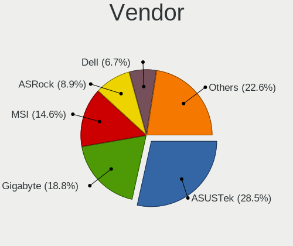

| Name                | Desktops | Percent |
|---------------------|----------|---------|
| ASUSTek Computer    | 387      | 27.7%   |
| Gigabyte Technology | 288      | 20.62%  |
| MSI                 | 191      | 13.67%  |
| ASRock              | 134      | 9.59%   |
| Dell                | 100      | 7.16%   |
| Hewlett-Packard     | 82       | 5.87%   |
| Lenovo              | 40       | 2.86%   |
| Intel               | 19       | 1.36%   |
| Acer                | 15       | 1.07%   |
| Pegatron            | 13       | 0.93%   |
| Biostar             | 13       | 0.93%   |
| Unknown             | 13       | 0.93%   |
| Fujitsu             | 12       | 0.86%   |
| Foxconn             | 10       | 0.72%   |
| ECS                 | 8        | 0.57%   |
| Supermicro          | 7        | 0.5%    |
| Shuttle             | 6        | 0.43%   |
| Huanan              | 5        | 0.36%   |
| AZW                 | 5        | 0.36%   |
| Alienware           | 5        | 0.36%   |
| Packard Bell        | 4        | 0.29%   |
| Medion              | 3        | 0.21%   |
| Google              | 3        | 0.21%   |
| Gateway             | 3        | 0.21%   |
| Apple               | 3        | 0.21%   |
| ZOTAC               | 2        | 0.14%   |
| WeiBu               | 2        | 0.14%   |
| Seco                | 2        | 0.14%   |
| Positivo            | 2        | 0.14%   |
| OEM                 | 2        | 0.14%   |
| Fujitsu Siemens     | 2        | 0.14%   |
| BESSTAR Tech        | 2        | 0.14%   |
| XFX                 | 1        | 0.07%   |
| Wistron             | 1        | 0.07%   |
| SYWZ                | 1        | 0.07%   |
| SUPoX COMPUTER      | 1        | 0.07%   |
| PCWare              | 1        | 0.07%   |
| Koloe               | 1        | 0.07%   |
| JWIPC               | 1        | 0.07%   |
| JINGSHA             | 1        | 0.07%   |

Model
-----

Motherboard model

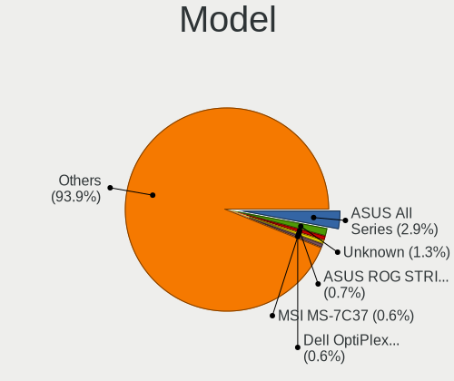

| Name                             | Desktops | Percent |
|----------------------------------|----------|---------|
| ASUS All Series                  | 46       | 3.29%   |
| Unknown                          | 15       | 1.07%   |
| Gigabyte B450M DS3H              | 11       | 0.79%   |
| ASUS ROG STRIX B550-F GAMING     | 11       | 0.79%   |
| MSI MS-7C37                      | 9        | 0.64%   |
| MSI MS-7B79                      | 9        | 0.64%   |
| Dell OptiPlex 9020               | 9        | 0.64%   |
| Dell OptiPlex 7010               | 9        | 0.64%   |
| ASUS ROG STRIX X570-E GAMING     | 8        | 0.57%   |
| ASUS PRIME B350-PLUS             | 8        | 0.57%   |
| MSI MS-7C91                      | 7        | 0.5%    |
| Gigabyte X570 AORUS MASTER       | 7        | 0.5%    |
| Gigabyte A320M-S2H               | 7        | 0.5%    |
| Gigabyte 970A-DS3P               | 7        | 0.5%    |
| ASUS PRIME B450M-A               | 7        | 0.5%    |
| ASUS PRIME A320M-K               | 7        | 0.5%    |
| MSI MS-7A34                      | 6        | 0.43%   |
| MSI MS-7817                      | 6        | 0.43%   |
| MSI MS-7693                      | 6        | 0.43%   |
| ASRock A320M-HDV R4.0            | 6        | 0.43%   |
| MSI MS-7C02                      | 5        | 0.36%   |
| HP Compaq Elite 8300 SFF         | 5        | 0.36%   |
| Dell XPS 8700                    | 5        | 0.36%   |
| Dell OptiPlex 780                | 5        | 0.36%   |
| ASUS TUF Gaming X570-PLUS        | 5        | 0.36%   |
| ASUS TUF Gaming B550-PLUS        | 5        | 0.36%   |
| ASUS PRIME X570-P                | 5        | 0.36%   |
| ASRock AB350 Pro4                | 5        | 0.36%   |
| MSI MS-7C56                      | 4        | 0.29%   |
| MSI MS-7A33                      | 4        | 0.29%   |
| MSI MS-7996                      | 4        | 0.29%   |
| HP EliteDesk 800 G1 SFF          | 4        | 0.29%   |
| Gigabyte GA-78LMT-USB3 6.0       | 4        | 0.29%   |
| Gigabyte B450M S2H               | 4        | 0.29%   |
| Gigabyte A320M-S2H V2            | 4        | 0.29%   |
| Gigabyte A320M-H                 | 4        | 0.29%   |
| Dell Precision WorkStation T3500 | 4        | 0.29%   |
| Dell OptiPlex 390                | 4        | 0.29%   |
| Dell Inspiron 3847               | 4        | 0.29%   |
| ASUS TUF X470-PLUS GAMING        | 4        | 0.29%   |

Model Family
------------

Motherboard model prefix

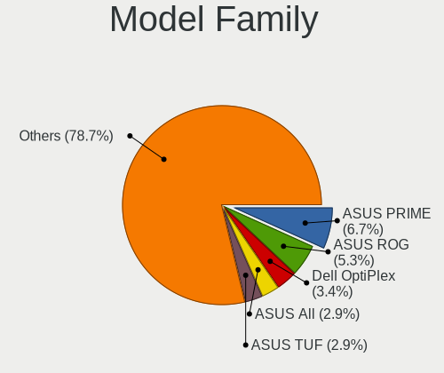

| Name                   | Desktops | Percent |
|------------------------|----------|---------|
| ASUS PRIME             | 79       | 5.65%   |
| ASUS ROG               | 70       | 5.01%   |
| Dell OptiPlex          | 49       | 3.51%   |
| ASUS All               | 46       | 3.29%   |
| ASUS TUF               | 32       | 2.29%   |
| Lenovo ThinkCentre     | 30       | 2.15%   |
| HP Compaq              | 26       | 1.86%   |
| Dell Precision         | 21       | 1.5%    |
| Gigabyte B450M         | 19       | 1.36%   |
| Gigabyte X570          | 18       | 1.29%   |
| Unknown                | 15       | 1.07%   |
| Acer Aspire            | 13       | 0.93%   |
| Dell Inspiron          | 12       | 0.86%   |
| Gigabyte B550          | 11       | 0.79%   |
| Gigabyte A320M-S2H     | 11       | 0.79%   |
| ASUS M5A78L-M          | 11       | 0.79%   |
| Gigabyte B450          | 10       | 0.72%   |
| MSI MS-7C37            | 9        | 0.64%   |
| MSI MS-7B79            | 9        | 0.64%   |
| HP EliteDesk           | 9        | 0.64%   |
| Fujitsu ESPRIMO        | 9        | 0.64%   |
| HP ProDesk             | 8        | 0.57%   |
| Dell XPS               | 8        | 0.57%   |
| ASRock A320M-HDV       | 8        | 0.57%   |
| MSI MS-7C91            | 7        | 0.5%    |
| Gigabyte GA-78LMT-USB3 | 7        | 0.5%    |
| Gigabyte 970A-DS3P     | 7        | 0.5%    |
| ASUS SABERTOOTH        | 7        | 0.5%    |
| ASRock AB350           | 7        | 0.5%    |
| MSI MS-7A34            | 6        | 0.43%   |
| MSI MS-7817            | 6        | 0.43%   |
| MSI MS-7693            | 6        | 0.43%   |
| HP Pavilion            | 6        | 0.43%   |
| ASUS P8H61-M           | 6        | 0.43%   |
| ASRock B450M           | 6        | 0.43%   |
| MSI MS-7C02            | 5        | 0.36%   |
| Lenovo IdeaCentre      | 5        | 0.36%   |
| Gigabyte Z390          | 5        | 0.36%   |
| Gigabyte X470          | 5        | 0.36%   |
| Gigabyte B550M         | 5        | 0.36%   |

MFG Year
--------

Motherboard manufacture year

| Year    | Desktops | Percent |
|---------|----------|---------|
| 2018    | 185      | 13.24%  |
| 2019    | 131      | 9.38%   |
| 2020    | 129      | 9.23%   |
| 2013    | 121      | 8.66%   |
| 2017    | 110      | 7.87%   |
| 2012    | 109      | 7.8%    |
| 2014    | 89       | 6.37%   |
| 2011    | 85       | 6.08%   |
| 2015    | 80       | 5.73%   |
| 2010    | 66       | 4.72%   |
| 2021    | 63       | 4.51%   |
| 2016    | 63       | 4.51%   |
| 2009    | 60       | 4.29%   |
| 2008    | 40       | 2.86%   |
| 2022    | 29       | 2.08%   |
| 2007    | 21       | 1.5%    |
| 2006    | 8        | 0.57%   |
| 2023    | 3        | 0.21%   |
| 2005    | 3        | 0.21%   |
| 2004    | 1        | 0.07%   |
| Unknown | 1        | 0.07%   |

Form Factor
-----------

Physical design of the computer

| Name    | Desktops | Percent |
|---------|----------|---------|
| Desktop | 1397     | 100%    |

Secure Boot
-----------

Enabled or disabled

| State    | Desktops | Percent |
|----------|----------|---------|
| Disabled | 1366     | 97.64%  |
| Enabled  | 33       | 2.36%   |

Coreboot
--------

Have coreboot on board

| Used | Desktops | Percent |
|------|----------|---------|
| No   | 1393     | 99.71%  |
| Yes  | 4        | 0.29%   |

RAM Size
--------

Total RAM memory

| Size in GB      | Desktops | Percent |
|-----------------|----------|---------|
| 16.01-24.0      | 419      | 29.57%  |
| 32.01-64.0      | 303      | 21.38%  |
| 8.01-16.0       | 247      | 17.43%  |
| 4.01-8.0        | 172      | 12.14%  |
| 3.01-4.0        | 114      | 8.05%   |
| 64.01-256.0     | 81       | 5.72%   |
| 24.01-32.0      | 66       | 4.66%   |
| 2.01-3.0        | 7        | 0.49%   |
| 1.01-2.0        | 7        | 0.49%   |
| More than 256.0 | 1        | 0.07%   |

RAM Used
--------

Used RAM memory

| Used GB    | Desktops | Percent |
|------------|----------|---------|
| 4.01-8.0   | 389      | 25.47%  |
| 2.01-3.0   | 369      | 24.17%  |
| 1.01-2.0   | 312      | 20.43%  |
| 3.01-4.0   | 249      | 16.31%  |
| 8.01-16.0  | 121      | 7.92%   |
| 0.51-1.0   | 38       | 2.49%   |
| 16.01-24.0 | 29       | 1.9%    |
| 24.01-32.0 | 9        | 0.59%   |
| 32.01-64.0 | 6        | 0.39%   |
| 0.01-0.5   | 4        | 0.26%   |
| Unknown    | 1        | 0.07%   |

Total Drives
------------

Number of drives on board

| Drives | Desktops | Percent |
|--------|----------|---------|
| 2      | 431      | 29.44%  |
| 1      | 396      | 27.05%  |
| 3      | 278      | 18.99%  |
| 4      | 177      | 12.09%  |
| 5      | 93       | 6.35%   |
| 6      | 42       | 2.87%   |
| 7      | 24       | 1.64%   |
| 8      | 6        | 0.41%   |
| 9      | 5        | 0.34%   |
| 0      | 4        | 0.27%   |
| 10     | 3        | 0.2%    |
| 12     | 2        | 0.14%   |
| 11     | 2        | 0.14%   |
| 13     | 1        | 0.07%   |

Has CD-ROM
----------

Has CD-ROM on board

| Presented | Desktops | Percent |
|-----------|----------|---------|
| No        | 783      | 55.34%  |
| Yes       | 632      | 44.66%  |

Has Ethernet
------------

Has Ethernet on board

| Presented | Desktops | Percent |
|-----------|----------|---------|
| Yes       | 1387     | 99.28%  |
| No        | 10       | 0.72%   |

Has WiFi
--------

Has WiFi module

| Presented | Desktops | Percent |
|-----------|----------|---------|
| No        | 796      | 56.29%  |
| Yes       | 618      | 43.71%  |

Has Bluetooth
-------------

Has Bluetooth module

| Presented | Desktops | Percent |
|-----------|----------|---------|
| No        | 883      | 62.54%  |
| Yes       | 529      | 37.46%  |

Location
--------

Country
-------

Geographic location (country)

| Country      | Desktops | Percent |
|--------------|----------|---------|
| USA          | 307      | 21.91%  |
| Germany      | 168      | 11.99%  |
| Russia       | 97       | 6.92%   |
| Brazil       | 87       | 6.21%   |
| France       | 79       | 5.64%   |
| UK           | 72       | 5.14%   |
| Italy        | 69       | 4.93%   |
| Canada       | 43       | 3.07%   |
| Spain        | 40       | 2.86%   |
| Poland       | 39       | 2.78%   |
| Netherlands  | 37       | 2.64%   |
| Australia    | 32       | 2.28%   |
| Ukraine      | 26       | 1.86%   |
| Argentina    | 19       | 1.36%   |
| Hungary      | 18       | 1.28%   |
| Austria      | 17       | 1.21%   |
| Switzerland  | 12       | 0.86%   |
| India        | 12       | 0.86%   |
| Greece       | 12       | 0.86%   |
| Serbia       | 11       | 0.79%   |
| Finland      | 11       | 0.79%   |
| Mexico       | 10       | 0.71%   |
| Belgium      | 10       | 0.71%   |
| Sweden       | 9        | 0.64%   |
| Czechia      | 9        | 0.64%   |
| Portugal     | 8        | 0.57%   |
| Bulgaria     | 8        | 0.57%   |
| Turkey       | 7        | 0.5%    |
| Slovenia     | 7        | 0.5%    |
| Israel       | 7        | 0.5%    |
| South Africa | 6        | 0.43%   |
| Philippines  | 6        | 0.43%   |
| New Zealand  | 6        | 0.43%   |
| Denmark      | 6        | 0.43%   |
| Taiwan       | 5        | 0.36%   |
| Romania      | 5        | 0.36%   |
| Norway       | 5        | 0.36%   |
| Chile        | 5        | 0.36%   |
| Japan        | 4        | 0.29%   |
| Indonesia    | 4        | 0.29%   |

City
----

Geographic location (city)

| City              | Desktops | Percent |
|-------------------|----------|---------|
| Moscow            | 20       | 1.37%   |
| Berlin            | 16       | 1.1%    |
| Paris             | 14       | 0.96%   |
| Sao Paulo         | 12       | 0.82%   |
| Rome              | 12       | 0.82%   |
| Sydney            | 11       | 0.75%   |
| St Petersburg     | 10       | 0.69%   |
| Rio de Janeiro    | 10       | 0.69%   |
| Munich            | 10       | 0.69%   |
| London            | 10       | 0.69%   |
| Hamburg           | 10       | 0.69%   |
| Warsaw            | 9        | 0.62%   |
| Kyiv              | 9        | 0.62%   |
| Budapest          | 9        | 0.62%   |
| Vienna            | 8        | 0.55%   |
| Melbourne         | 8        | 0.55%   |
| Novosibirsk       | 7        | 0.48%   |
| Frankfurt am Main | 7        | 0.48%   |
| Dallas            | 7        | 0.48%   |
| Belgrade          | 7        | 0.48%   |
| Amsterdam         | 7        | 0.48%   |
| Montreal          | 6        | 0.41%   |
| Milan             | 6        | 0.41%   |
| Cologne           | 6        | 0.41%   |
| Chicago           | 6        | 0.41%   |
| Leipzig           | 5        | 0.34%   |
| Jacksonville      | 5        | 0.34%   |
| Zurich            | 4        | 0.27%   |
| Wroclaw           | 4        | 0.27%   |
| Valencia          | 4        | 0.27%   |
| Toronto           | 4        | 0.27%   |
| Sindelfingen      | 4        | 0.27%   |
| Seattle           | 4        | 0.27%   |
| Ottawa            | 4        | 0.27%   |
| Miami             | 4        | 0.27%   |
| Manchester        | 4        | 0.27%   |
| Ljubljana         | 4        | 0.27%   |
| Krakow            | 4        | 0.27%   |
| Irkutsk           | 4        | 0.27%   |
| Groningen         | 4        | 0.27%   |

Drives
------

Drive Vendor
------------

Hard drive vendors

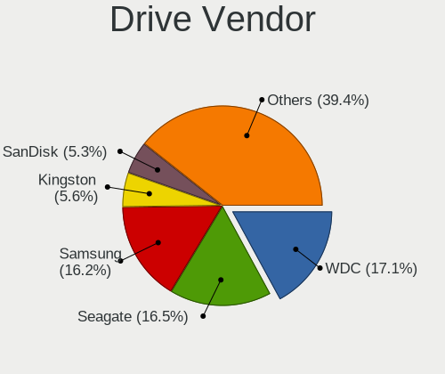

| Vendor                    | Desktops | Drives | Percent |
|---------------------------|----------|--------|---------|
| WDC                       | 535      | 974    | 18.59%  |
| Seagate                   | 503      | 826    | 17.48%  |
| Samsung Electronics       | 469      | 839    | 16.3%   |
| Kingston                  | 168      | 215    | 5.84%   |
| Toshiba                   | 146      | 213    | 5.07%   |
| Crucial                   | 134      | 171    | 4.66%   |
| SanDisk                   | 131      | 170    | 4.55%   |
| Hitachi                   | 102      | 132    | 3.54%   |
| Intel                     | 49       | 64     | 1.7%    |
| A-DATA Technology         | 45       | 51     | 1.56%   |
| HGST                      | 37       | 52     | 1.29%   |
| Phison                    | 36       | 48     | 1.25%   |
| Unknown                   | 35       | 48     | 1.22%   |
| China                     | 25       | 34     | 0.87%   |
| OCZ                       | 23       | 30     | 0.8%    |
| PNY                       | 22       | 32     | 0.76%   |
| Patriot                   | 22       | 33     | 0.76%   |
| Micron Technology         | 22       | 27     | 0.76%   |
| Maxtor                    | 22       | 25     | 0.76%   |
| Intenso                   | 19       | 22     | 0.66%   |
| Transcend                 | 17       | 19     | 0.59%   |
| Silicon Motion            | 17       | 17     | 0.59%   |
| Corsair                   | 17       | 30     | 0.59%   |
| SPCC                      | 14       | 18     | 0.49%   |
| GOODRAM                   | 12       | 27     | 0.42%   |
| Phison Electronics        | 11       | 11     | 0.38%   |
| Micron/Crucial Technology | 11       | 14     | 0.38%   |
| JMicron Technology        | 10       | 11     | 0.35%   |
| Gigabyte Technology       | 10       | 11     | 0.35%   |
| XPG                       | 9        | 10     | 0.31%   |
| SK hynix                  | 9        | 13     | 0.31%   |
| SABRENT                   | 9        | 9      | 0.31%   |
| Team                      | 8        | 8      | 0.28%   |
| Mushkin                   | 8        | 9      | 0.28%   |
| KingSpec                  | 7        | 9      | 0.24%   |
| Hewlett-Packard           | 7        | 9      | 0.24%   |
| ADATA Technology          | 6        | 6      | 0.21%   |
| Unknown                   | 6        | 6      | 0.21%   |
| Realtek Semiconductor     | 5        | 5      | 0.17%   |
| Lexar                     | 5        | 6      | 0.17%   |

Drive Model
-----------

Hard drive models

| Model                                               | Desktops | Percent |
|-----------------------------------------------------|----------|---------|
| Kingston SA400S37240G 240GB SSD                     | 35       | 1.02%   |
| Samsung SSD 850 EVO 500GB                           | 34       | 0.99%   |
| Samsung SSD 850 EVO 250GB                           | 33       | 0.96%   |
| Samsung SSD 860 EVO 500GB                           | 31       | 0.9%    |
| Samsung SSD 860 EVO 1TB                             | 27       | 0.78%   |
| Kingston SA400S37480G 480GB SSD                     | 25       | 0.73%   |
| WDC WD10EZEX-08WN4A0 1TB                            | 24       | 0.7%    |
| Seagate ST4000DM004-2CV104 4TB                      | 24       | 0.7%    |
| Seagate ST1000DM010-2EP102 1TB                      | 24       | 0.7%    |
| Samsung NVMe SSD Drive 500GB                        | 24       | 0.7%    |
| Toshiba HDWD110 1TB                                 | 23       | 0.67%   |
| Seagate ST500DM002-1BD142 500GB                     | 23       | 0.67%   |
| Toshiba DT01ACA100 1TB                              | 22       | 0.64%   |
| Seagate ST1000DM003-1CH162 1TB                      | 22       | 0.64%   |
| Crucial CT1000MX500SSD1 1TB                         | 22       | 0.64%   |
| Seagate ST1000DM003-1ER162 1TB                      | 21       | 0.61%   |
| Seagate ST2000DM008-2FR102 2TB                      | 20       | 0.58%   |
| Seagate ST2000DM001-1ER164 2TB                      | 20       | 0.58%   |
| Samsung SSD 970 EVO Plus 1TB                        | 18       | 0.52%   |
| Samsung NVMe SSD Controller SM981/PM981/PM983 256GB | 18       | 0.52%   |
| WDC WD20EARX-00PASB0 2TB                            | 17       | 0.49%   |
| Toshiba DT01ACA200 2TB                              | 16       | 0.46%   |
| Seagate ST2000DM006-2DM164 2TB                      | 16       | 0.46%   |
| Seagate ST3500413AS 500GB                           | 15       | 0.44%   |
| WDC WD20EZRZ-00Z5HB0 2TB                            | 14       | 0.41%   |
| Seagate ST3500418AS 500GB                           | 14       | 0.41%   |
| Samsung SSD 860 EVO 250GB                           | 14       | 0.41%   |
| Samsung NVMe SSD Drive 1TB                          | 14       | 0.41%   |
| Kingston SA2000M81000G 1TB                          | 14       | 0.41%   |
| WDC WD20EZRX-00D8PB0 2TB                            | 13       | 0.38%   |
| Seagate ST31000524AS 1TB                            | 13       | 0.38%   |
| Samsung SSD 970 EVO Plus 500GB                      | 13       | 0.38%   |
| Samsung SSD 840 EVO 250GB                           | 13       | 0.38%   |
| Samsung HD103SJ 1TB                                 | 13       | 0.38%   |
| WDC WD1002FAEX-00Z3A0 1TB                           | 12       | 0.35%   |
| SanDisk NVMe SSD Drive 500GB                        | 12       | 0.35%   |
| Kingston SA400S37120G 120GB SSD                     | 12       | 0.35%   |
| WDC WDS500G2B0A-00SM50 500GB SSD                    | 11       | 0.32%   |
| WDC WD40EZRZ-00GXCB0 4TB                            | 11       | 0.32%   |
| Seagate ST2000DM001-1CH164 2TB                      | 11       | 0.32%   |

HDD Vendor
----------

Hard disk drive vendors

| Vendor              | Desktops | Drives | Percent |
|---------------------|----------|--------|---------|
| Seagate             | 489      | 802    | 35.38%  |
| WDC                 | 479      | 865    | 34.66%  |
| Toshiba             | 131      | 189    | 9.48%   |
| Hitachi             | 102      | 132    | 7.38%   |
| Samsung Electronics | 90       | 142    | 6.51%   |
| HGST                | 37       | 52     | 2.68%   |
| Maxtor              | 21       | 24     | 1.52%   |
| Unknown             | 13       | 14     | 0.94%   |
| Fujitsu             | 4        | 4      | 0.29%   |
| Hewlett-Packard     | 3        | 5      | 0.22%   |
| Apple               | 2        | 2      | 0.14%   |
| WD MediaMax         | 1        | 1      | 0.07%   |
| USB3.0              | 1        | 1      | 0.07%   |
| USB                 | 1        | 1      | 0.07%   |
| SAGE                | 1        | 1      | 0.07%   |
| Magnetic Data       | 1        | 2      | 0.07%   |
| LIO-ORG             | 1        | 1      | 0.07%   |
| LaCie               | 1        | 1      | 0.07%   |
| JMicron Technology  | 1        | 1      | 0.07%   |
| IET                 | 1        | 1      | 0.07%   |
| External            | 1        | 1      | 0.07%   |
| ASMT                | 1        | 1      | 0.07%   |

SSD Vendor
----------

Solid state drive vendors

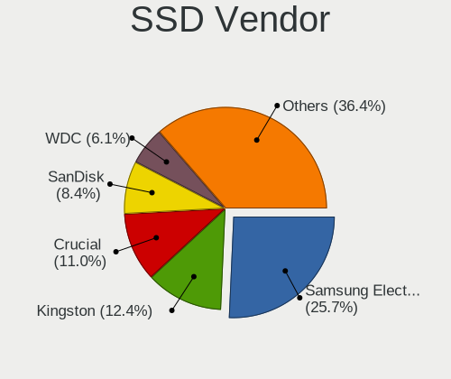

| Vendor              | Desktops | Drives | Percent |
|---------------------|----------|--------|---------|
| Samsung Electronics | 275      | 414    | 25.99%  |
| Kingston            | 140      | 174    | 13.23%  |
| Crucial             | 113      | 147    | 10.68%  |
| SanDisk             | 93       | 114    | 8.79%   |
| WDC                 | 57       | 72     | 5.39%   |
| A-DATA Technology   | 38       | 44     | 3.59%   |
| Intel               | 29       | 39     | 2.74%   |
| China               | 25       | 34     | 2.36%   |
| OCZ                 | 23       | 30     | 2.17%   |
| Patriot             | 22       | 33     | 2.08%   |
| PNY                 | 20       | 30     | 1.89%   |
| Intenso             | 17       | 19     | 1.61%   |
| Micron Technology   | 16       | 18     | 1.51%   |
| Transcend           | 12       | 12     | 1.13%   |
| Toshiba             | 12       | 17     | 1.13%   |
| SPCC                | 12       | 15     | 1.13%   |
| GOODRAM             | 12       | 27     | 1.13%   |
| SABRENT             | 9        | 9      | 0.85%   |
| Corsair             | 9        | 20     | 0.85%   |
| Team                | 8        | 8      | 0.76%   |
| Mushkin             | 8        | 9      | 0.76%   |
| KingSpec            | 7        | 9      | 0.66%   |
| Lexar               | 4        | 5      | 0.38%   |
| JMicron Technology  | 4        | 5      | 0.38%   |
| Gigabyte Technology | 4        | 4      | 0.38%   |
| Apacer              | 4        | 9      | 0.38%   |
| Verbatim            | 3        | 4      | 0.28%   |
| Unknown             | 3        | 3      | 0.28%   |
| SK hynix            | 3        | 4      | 0.28%   |
| Seagate             | 3        | 3      | 0.28%   |
| Plextor             | 3        | 4      | 0.28%   |
| KingDian            | 3        | 4      | 0.28%   |
| Hewlett-Packard     | 3        | 3      | 0.28%   |
| Emtec               | 3        | 3      | 0.28%   |
| ASMT                | 3        | 3      | 0.28%   |
| Unknown             | 3        | 3      | 0.28%   |
| VENO                | 2        | 4      | 0.19%   |
| Super Talent        | 2        | 2      | 0.19%   |
| Smartbuy            | 2        | 4      | 0.19%   |
| LITEONIT            | 2        | 2      | 0.19%   |

Drive Kind
----------

HDD or SSD

| Kind    | Desktops | Drives | Percent |
|---------|----------|--------|---------|
| HDD     | 1001     | 2243   | 42.61%  |
| SSD     | 850      | 1418   | 36.19%  |
| NVMe    | 438      | 676    | 18.65%  |
| Unknown | 53       | 80     | 2.26%   |
| MMC     | 7        | 9      | 0.3%    |

Drive Connector
---------------

SATA, SAS, NVMe, etc.

| Type | Desktops | Drives | Percent |
|------|----------|--------|---------|
| SATA | 1279     | 3558   | 69.25%  |
| NVMe | 438      | 673    | 23.71%  |
| SAS  | 123      | 186    | 6.66%   |
| MMC  | 7        | 9      | 0.38%   |

Drive Size
----------

Size of hard drive

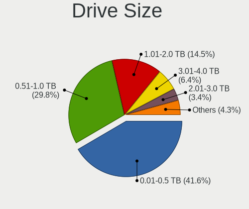

| Size in TB | Desktops | Drives | Percent |
|------------|----------|--------|---------|
| 0.01-0.5   | 910      | 1667   | 43.25%  |
| 0.51-1.0   | 616      | 1042   | 29.28%  |
| 1.01-2.0   | 289      | 472    | 13.74%  |
| 3.01-4.0   | 127      | 231    | 6.04%   |
| 2.01-3.0   | 79       | 113    | 3.75%   |
| 4.01-10.0  | 63       | 105    | 2.99%   |
| 10.01-20.0 | 20       | 31     | 0.95%   |

Space Total
-----------

Amount of disk space available on the file system

| Size in GB     | Desktops | Percent |
|----------------|----------|---------|
| 501-1000       | 270      | 18.47%  |
| More than 3000 | 250      | 17.1%   |
| 251-500        | 246      | 16.83%  |
| 101-250        | 237      | 16.21%  |
| 1001-2000      | 222      | 15.18%  |
| 2001-3000      | 131      | 8.96%   |
| 51-100         | 46       | 3.15%   |
| 1-20           | 35       | 2.39%   |
| 21-50          | 18       | 1.23%   |
| Unknown        | 7        | 0.48%   |

Space Used
----------

Amount of used disk space

| Used GB        | Desktops | Percent |
|----------------|----------|---------|
| 1-20           | 240      | 16.02%  |
| 101-250        | 207      | 13.82%  |
| 501-1000       | 193      | 12.88%  |
| 51-100         | 179      | 11.95%  |
| 21-50          | 177      | 11.82%  |
| 251-500        | 175      | 11.68%  |
| 1001-2000      | 143      | 9.55%   |
| More than 3000 | 121      | 8.08%   |
| 2001-3000      | 56       | 3.74%   |
| Unknown        | 7        | 0.47%   |

Malfunc. Drives
---------------

Drive models with a malfunction

| Model                             | Desktops | Drives | Percent |
|-----------------------------------|----------|--------|---------|
| Seagate ST500DM002-1BD142 500GB   | 5        | 5      | 2.06%   |
| Seagate ST31000524AS 1TB          | 5        | 6      | 2.06%   |
| Seagate ST1000DM003-1CH162 1TB    | 4        | 9      | 1.65%   |
| WDC WD5000AAKS-00V1A0 500GB       | 3        | 4      | 1.23%   |
| WDC WD20EFRX-68EUZN0 2TB          | 3        | 6      | 1.23%   |
| Seagate ST31000528AS 1TB          | 3        | 3      | 1.23%   |
| Crucial CT525MX300SSD1 528GB      | 3        | 3      | 1.23%   |
| Crucial CT1050MX300SSD1 1TB       | 3        | 3      | 1.23%   |
| WDC WD5000AAKS-00A7B0 500GB       | 2        | 2      | 0.82%   |
| WDC WD40EZRZ-00GXCB0 4TB          | 2        | 2      | 0.82%   |
| WDC WD3200JD-22KLB0 320GB         | 2        | 2      | 0.82%   |
| WDC WD30EZRX-00MMMB0 3TB          | 2        | 2      | 0.82%   |
| WDC WD20EARX-00PASB0 2TB          | 2        | 2      | 0.82%   |
| WDC WD15EARS-00Z5B1 1TB           | 2        | 2      | 0.82%   |
| WDC WD10EZEX-08WN4A0 1TB          | 2        | 2      | 0.82%   |
| WDC WD10EARS-00MVWB0 1TB          | 2        | 4      | 0.82%   |
| WDC WD10EADS-00L5B1 1TB           | 2        | 2      | 0.82%   |
| WDC WD1001FALS-40U9B0 1TB         | 2        | 2      | 0.82%   |
| Toshiba HDWD110 1TB               | 2        | 2      | 0.82%   |
| Seagate ST9250315AS 250GB         | 2        | 3      | 0.82%   |
| Seagate ST3500418AS 500GB         | 2        | 2      | 0.82%   |
| Seagate ST32000542AS 2TB          | 2        | 2      | 0.82%   |
| Seagate ST3160827AS 160GB         | 2        | 3      | 0.82%   |
| Seagate ST1000DM003-1SB102 1TB    | 2        | 2      | 0.82%   |
| SanDisk SSD PLUS 240 GB           | 2        | 2      | 0.82%   |
| Samsung Electronics HD502HJ 500GB | 2        | 2      | 0.82%   |
| OCZ VERTEX3 120GB SSD             | 2        | 2      | 0.82%   |
| Intel SSDSA2M080G2GC 80GB         | 2        | 2      | 0.82%   |
| Hitachi HDS721010CLA630 1TB       | 2        | 2      | 0.82%   |
| Crucial CT275MX300SSD1 275GB      | 2        | 3      | 0.82%   |
| WDC WD6400AADS-00M2B0 640GB       | 1        | 1      | 0.41%   |
| WDC WD5003ABYX-01WERA0 500GB      | 1        | 2      | 0.41%   |
| WDC WD5000BEVT-22A0RT0 500GB      | 1        | 1      | 0.41%   |
| WDC WD5000AZRX-00A3KB0 500GB      | 1        | 1      | 0.41%   |
| WDC WD5000AVVS-63M8B0 500GB       | 1        | 1      | 0.41%   |
| WDC WD5000AAKX-003CA0 500GB       | 1        | 1      | 0.41%   |
| WDC WD5000AAKS-00UU3A0 500GB      | 1        | 2      | 0.41%   |
| WDC WD5000AAKS-00M9A0 500GB       | 1        | 1      | 0.41%   |
| WDC WD5000AADS-56S9B1 500GB       | 1        | 1      | 0.41%   |
| WDC WD40EZRX-00SPEB0 4TB          | 1        | 1      | 0.41%   |

Malfunc. Drive Vendor
---------------------

Vendors of faulty drives

| Vendor              | Desktops | Drives | Percent |
|---------------------|----------|--------|---------|
| WDC                 | 74       | 97     | 32.31%  |
| Seagate             | 54       | 70     | 23.58%  |
| Samsung Electronics | 24       | 33     | 10.48%  |
| Hitachi             | 14       | 14     | 6.11%   |
| Crucial             | 11       | 14     | 4.8%    |
| Toshiba             | 10       | 11     | 4.37%   |
| Intel               | 10       | 13     | 4.37%   |
| SanDisk             | 7        | 8      | 3.06%   |
| OCZ                 | 4        | 4      | 1.75%   |
| Maxtor              | 4        | 5      | 1.75%   |
| Kingston            | 3        | 3      | 1.31%   |
| Micron Technology   | 2        | 2      | 0.87%   |
| Fujitsu             | 2        | 2      | 0.87%   |
| VENO                | 1        | 1      | 0.44%   |
| T-FORCE             | 1        | 1      | 0.44%   |
| SPCC                | 1        | 1      | 0.44%   |
| Phison Electronics  | 1        | 1      | 0.44%   |
| Neo                 | 1        | 1      | 0.44%   |
| LITEONIT            | 1        | 1      | 0.44%   |
| Intenso             | 1        | 1      | 0.44%   |
| HGST                | 1        | 1      | 0.44%   |
| ASMT                | 1        | 1      | 0.44%   |
| A-DATA Technology   | 1        | 1      | 0.44%   |

Malfunc. HDD Vendor
-------------------

Vendors of faulty HDD drives

| Vendor              | Desktops | Drives | Percent |
|---------------------|----------|--------|---------|
| WDC                 | 74       | 97     | 42.77%  |
| Seagate             | 54       | 70     | 31.21%  |
| Samsung Electronics | 14       | 23     | 8.09%   |
| Hitachi             | 14       | 14     | 8.09%   |
| Toshiba             | 9        | 10     | 5.2%    |
| Maxtor              | 4        | 5      | 2.31%   |
| Fujitsu             | 2        | 2      | 1.16%   |
| HGST                | 1        | 1      | 0.58%   |
| ASMT                | 1        | 1      | 0.58%   |

Malfunc. Drive Kind
-------------------

Kinds of faulty drives

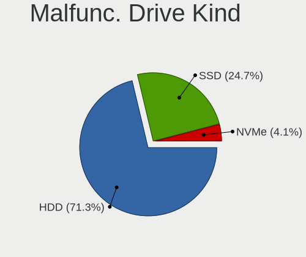

| Kind | Desktops | Drives | Percent |
|------|----------|--------|---------|
| HDD  | 151      | 223    | 73.3%   |
| SSD  | 49       | 57     | 23.79%  |
| NVMe | 6        | 6      | 2.91%   |

Failed Drives
-------------

Failed drive models

| Model                             | Desktops | Drives | Percent |
|-----------------------------------|----------|--------|---------|
| Samsung Electronics HD502IJ 500GB | 1        | 1      | 33.33%  |
| OCZ VERTEX460A 480GB SSD          | 1        | 1      | 33.33%  |
| Hitachi HTS547550A9E384 500GB     | 1        | 1      | 33.33%  |

Failed Drive Vendor
-------------------

Failed drive vendors

| Vendor              | Desktops | Drives | Percent |
|---------------------|----------|--------|---------|
| Samsung Electronics | 1        | 1      | 33.33%  |
| OCZ                 | 1        | 1      | 33.33%  |
| Hitachi             | 1        | 1      | 33.33%  |

Drive Status
------------

Number of failed and malfunc. drives

| Status   | Desktops | Drives | Percent |
|----------|----------|--------|---------|
| Detected | 775      | 2453   | 46.74%  |
| Works    | 684      | 1684   | 41.25%  |
| Malfunc  | 197      | 286    | 11.88%  |
| Failed   | 2        | 3      | 0.12%   |

Storage controller
------------------

Storage Vendor
--------------

Storage controller vendors

| Vendor                           | Desktops | Percent |
|----------------------------------|----------|---------|
| Intel                            | 796      | 38.58%  |
| AMD                              | 572      | 27.73%  |
| Samsung Electronics              | 176      | 8.53%   |
| ASMedia Technology               | 80       | 3.88%   |
| SanDisk                          | 67       | 3.25%   |
| Phison Electronics               | 61       | 2.96%   |
| JMicron Technology               | 48       | 2.33%   |
| Marvell Technology Group         | 37       | 1.79%   |
| Kingston Technology Company      | 35       | 1.7%    |
| Micron/Crucial Technology        | 32       | 1.55%   |
| Nvidia                           | 28       | 1.36%   |
| Silicon Motion                   | 26       | 1.26%   |
| ADATA Technology                 | 17       | 0.82%   |
| Broadcom / LSI                   | 10       | 0.48%   |
| Silicon Image                    | 9        | 0.44%   |
| Realtek Semiconductor            | 9        | 0.44%   |
| LSI Logic / Symbios Logic        | 8        | 0.39%   |
| Toshiba America Info Systems     | 7        | 0.34%   |
| VIA Technologies                 | 6        | 0.29%   |
| SK hynix                         | 6        | 0.29%   |
| Micron Technology                | 6        | 0.29%   |
| Seagate Technology               | 5        | 0.24%   |
| KIOXIA                           | 4        | 0.19%   |
| Lite-On Technology               | 2        | 0.1%    |
| Integrated Technology Express    | 2        | 0.1%    |
| INNOGRIT                         | 2        | 0.1%    |
| Adaptec                          | 2        | 0.1%    |
| Yangtze Memory Technologies      | 1        | 0.05%   |
| Solidigm                         | 1        | 0.05%   |
| Solid State Storage Technology   | 1        | 0.05%   |
| Silicon Integrated Systems [SiS] | 1        | 0.05%   |
| Shenzhen Longsys Electronics     | 1        | 0.05%   |
| Promise Technology               | 1        | 0.05%   |
| OCZ Technology Group             | 1        | 0.05%   |
| O2 Micro                         | 1        | 0.05%   |
| Netac Technology                 | 1        | 0.05%   |
| 3ware                            | 1        | 0.05%   |

Storage Model
-------------

Storage controller models

| Model                                                                                   | Desktops | Percent |
|-----------------------------------------------------------------------------------------|----------|---------|
| AMD FCH SATA Controller [AHCI mode]                                                     | 349      | 13.56%  |
| Samsung NVMe SSD Controller SM981/PM981/PM983                                           | 118      | 4.59%   |
| AMD 400 Series Chipset SATA Controller                                                  | 118      | 4.59%   |
| Intel 8 Series/C220 Series Chipset Family 6-port SATA Controller 1 [AHCI mode]          | 97       | 3.77%   |
| ASMedia ASM1062 Serial ATA Controller                                                   | 75       | 2.91%   |
| AMD 500 Series Chipset SATA Controller                                                  | 74       | 2.88%   |
| Intel Q170/Q150/B150/H170/H110/Z170/CM236 Chipset SATA Controller [AHCI Mode]           | 71       | 2.76%   |
| AMD SB7x0/SB8x0/SB9x0 IDE Controller                                                    | 71       | 2.76%   |
| Intel 6 Series/C200 Series Chipset Family 6 port Desktop SATA AHCI Controller           | 70       | 2.72%   |
| AMD SB7x0/SB8x0/SB9x0 SATA Controller [AHCI mode]                                       | 69       | 2.68%   |
| Intel 200 Series PCH SATA controller [AHCI mode]                                        | 65       | 2.53%   |
| Intel 7 Series/C210 Series Chipset Family 6-port SATA Controller [AHCI mode]            | 58       | 2.25%   |
| Intel SATA Controller [RAID mode]                                                       | 51       | 1.98%   |
| AMD 300 Series Chipset SATA Controller                                                  | 42       | 1.63%   |
| AMD FCH SATA Controller D                                                               | 41       | 1.59%   |
| AMD SB7x0/SB8x0/SB9x0 SATA Controller [IDE mode]                                        | 40       | 1.55%   |
| Intel Cannon Lake PCH SATA AHCI Controller                                              | 37       | 1.44%   |
| Intel 9 Series Chipset Family SATA Controller [AHCI Mode]                               | 34       | 1.32%   |
| JMicron JMB363 SATA/IDE Controller                                                      | 31       | 1.2%    |
| Intel NM10/ICH7 Family SATA Controller [IDE mode]                                       | 30       | 1.17%   |
| Intel 6 Series/C200 Series Chipset Family Desktop SATA Controller (IDE mode, ports 4-5) | 28       | 1.09%   |
| Intel 6 Series/C200 Series Chipset Family Desktop SATA Controller (IDE mode, ports 0-3) | 28       | 1.09%   |
| Intel 500 Series Chipset Family SATA AHCI Controller                                    | 28       | 1.09%   |
| Phison E12 NVMe Controller                                                              | 27       | 1.05%   |
| Samsung NVMe SSD Controller PM9A1/PM9A3/980PRO                                          | 23       | 0.89%   |
| Kingston Company A2000 NVMe SSD                                                         | 23       | 0.89%   |
| Intel 82801JI (ICH10 Family) SATA AHCI Controller                                       | 23       | 0.89%   |
| Intel 82801G (ICH7 Family) IDE Controller                                               | 23       | 0.89%   |
| Samsung NVMe SSD Controller SM961/PM961/SM963                                           | 22       | 0.86%   |
| Intel 5 Series/3400 Series Chipset 6 port SATA AHCI Controller                          | 19       | 0.74%   |
| SanDisk WD Blue SN550 NVMe SSD                                                          | 18       | 0.7%    |
| AMD X370 Series Chipset SATA Controller                                                 | 18       | 0.7%    |
| Phison E16 PCIe4 NVMe Controller                                                        | 17       | 0.66%   |
| Intel C610/X99 series chipset 6-Port SATA Controller [AHCI mode]                        | 17       | 0.66%   |
| Silicon Motion SM2263EN/SM2263XT SSD Controller                                         | 16       | 0.62%   |
| Samsung NVMe SSD Controller 980                                                         | 16       | 0.62%   |
| Intel C610/X99 series chipset sSATA Controller [AHCI mode]                              | 15       | 0.58%   |
| Nvidia MCP61 SATA Controller                                                            | 14       | 0.54%   |
| Intel SSD 660P Series                                                                   | 14       | 0.54%   |
| Intel C600/X79 series chipset 6-Port SATA AHCI Controller                               | 14       | 0.54%   |

Storage Kind
------------

Kind of storage controller (IDE, SATA, NVMe, SAS, ...)

| Kind | Desktops | Percent |
|------|----------|---------|
| SATA | 1196     | 59.35%  |
| NVMe | 438      | 21.74%  |
| IDE  | 265      | 13.15%  |
| RAID | 98       | 4.86%   |
| SAS  | 10       | 0.5%    |
| SCSI | 8        | 0.4%    |

Processor
---------

CPU Vendor
----------

Processor vendors

| Vendor | Desktops | Percent |
|--------|----------|---------|
| Intel  | 798      | 57.12%  |
| AMD    | 599      | 42.88%  |

CPU Model
---------

Processor models

| Model                                       | Desktops | Percent |
|---------------------------------------------|----------|---------|
| AMD Ryzen 5 3600 6-Core Processor           | 37       | 2.64%   |
| AMD Ryzen 7 3700X 8-Core Processor          | 35       | 2.49%   |
| AMD Ryzen 9 3900X 12-Core Processor         | 29       | 2.07%   |
| AMD Ryzen 5 5600X 6-Core Processor          | 21       | 1.5%    |
| Intel Core i7-4790 CPU @ 3.60GHz            | 20       | 1.42%   |
| Intel Core i7-6700K CPU @ 4.00GHz           | 19       | 1.35%   |
| Intel Core i7-3770 CPU @ 3.40GHz            | 19       | 1.35%   |
| AMD FX-8350 Eight-Core Processor            | 19       | 1.35%   |
| AMD Ryzen 5 2600 Six-Core Processor         | 17       | 1.21%   |
| AMD Ryzen 5 1600 Six-Core Processor         | 17       | 1.21%   |
| Intel Core i7-4770 CPU @ 3.40GHz            | 16       | 1.14%   |
| Intel Core i5-3470 CPU @ 3.20GHz            | 16       | 1.14%   |
| AMD Ryzen 5 3400G with Radeon Vega Graphics | 16       | 1.14%   |
| Intel Core i7-4790K CPU @ 4.00GHz           | 15       | 1.07%   |
| AMD Ryzen 7 2700X Eight-Core Processor      | 15       | 1.07%   |
| Intel Core 2 Duo CPU E8400 @ 3.00GHz        | 14       | 1%      |
| AMD Ryzen 9 5900X 12-Core Processor         | 14       | 1%      |
| AMD Ryzen 5 2600X Six-Core Processor        | 13       | 0.93%   |
| Intel Core i5-2400 CPU @ 3.10GHz            | 12       | 0.85%   |
| AMD Ryzen 9 5950X 16-Core Processor         | 12       | 0.85%   |
| AMD Ryzen 5 2400G with Radeon Vega Graphics | 12       | 0.85%   |
| Intel Core i5-4460 CPU @ 3.20GHz            | 11       | 0.78%   |
| AMD Ryzen 7 5700G with Radeon Graphics      | 11       | 0.78%   |
| AMD Ryzen 7 3800X 8-Core Processor          | 11       | 0.78%   |
| Intel Core i7-7700K CPU @ 4.20GHz           | 10       | 0.71%   |
| Intel Core i7-6700 CPU @ 3.40GHz            | 10       | 0.71%   |
| Intel Core i5-4690 CPU @ 3.50GHz            | 10       | 0.71%   |
| Intel Core i5-10400F CPU @ 2.90GHz          | 10       | 0.71%   |
| AMD Ryzen 7 2700 Eight-Core Processor       | 10       | 0.71%   |
| Intel Core i9-9900K CPU @ 3.60GHz           | 9        | 0.64%   |
| Intel Core i7-8700K CPU @ 3.70GHz           | 9        | 0.64%   |
| Intel Core i7-7700 CPU @ 3.60GHz            | 9        | 0.64%   |
| Intel Core i7-2600 CPU @ 3.40GHz            | 9        | 0.64%   |
| Intel Core i7 CPU 920 @ 2.67GHz             | 9        | 0.64%   |
| Intel Core i5-6500 CPU @ 3.20GHz            | 9        | 0.64%   |
| Intel Core i7-8700 CPU @ 3.20GHz            | 8        | 0.57%   |
| Intel Core i7-3770K CPU @ 3.50GHz           | 8        | 0.57%   |
| Intel Core i5-6400 CPU @ 2.70GHz            | 8        | 0.57%   |
| Intel Core i5-4590 CPU @ 3.30GHz            | 8        | 0.57%   |
| Intel Core i5 CPU 650 @ 3.20GHz             | 8        | 0.57%   |

CPU Model Family
----------------

Processor model prefix

| Model                   | Desktops | Percent |
|-------------------------|----------|---------|
| Intel Core i5           | 239      | 17.02%  |
| Intel Core i7           | 230      | 16.38%  |
| AMD Ryzen 5             | 167      | 11.89%  |
| AMD Ryzen 7             | 112      | 7.98%   |
| AMD Ryzen 9             | 74       | 5.27%   |
| Intel Xeon              | 72       | 5.13%   |
| Intel Core i3           | 69       | 4.91%   |
| AMD FX                  | 62       | 4.42%   |
| Other                   | 35       | 2.49%   |
| Intel Core 2 Duo        | 33       | 2.35%   |
| Intel Pentium           | 30       | 2.14%   |
| Intel Celeron           | 25       | 1.78%   |
| AMD Ryzen 3             | 22       | 1.57%   |
| AMD Phenom II X4        | 22       | 1.57%   |
| Intel Core 2 Quad       | 21       | 1.5%    |
| Intel Core i9           | 19       | 1.35%   |
| AMD A8                  | 18       | 1.28%   |
| AMD A10                 | 17       | 1.21%   |
| AMD Athlon II X4        | 14       | 1%      |
| Intel Pentium Dual-Core | 10       | 0.71%   |
| AMD Ryzen Threadripper  | 10       | 0.71%   |
| AMD Athlon II X2        | 8        | 0.57%   |
| AMD Athlon 64 X2        | 8        | 0.57%   |
| AMD Athlon              | 7        | 0.5%    |
| AMD Ryzen 7 PRO         | 6        | 0.43%   |
| AMD Phenom II X6        | 6        | 0.43%   |
| AMD A6                  | 6        | 0.43%   |
| AMD A4                  | 6        | 0.43%   |
| AMD Phenom II X2        | 5        | 0.36%   |
| Intel Pentium 4         | 4        | 0.28%   |
| AMD Sempron             | 4        | 0.28%   |
| AMD Ryzen 5 PRO         | 4        | 0.28%   |
| AMD Phenom              | 4        | 0.28%   |
| AMD Athlon 64           | 4        | 0.28%   |
| Intel Pentium Dual      | 3        | 0.21%   |
| Intel Pentium D         | 3        | 0.21%   |
| Intel Atom              | 3        | 0.21%   |
| Intel Core 2            | 2        | 0.14%   |
| AMD Ryzen Embedded      | 2        | 0.14%   |
| AMD Opteron             | 2        | 0.14%   |

CPU Cores
---------

Number of processor cores

| Number | Desktops | Percent |
|--------|----------|---------|
| 4      | 581      | 41.44%  |
| 2      | 252      | 17.97%  |
| 6      | 246      | 17.55%  |
| 8      | 174      | 12.41%  |
| 12     | 54       | 3.85%   |
| 16     | 38       | 2.71%   |
| 1      | 24       | 1.71%   |
| 3      | 10       | 0.71%   |
| 10     | 9        | 0.64%   |
| 24     | 5        | 0.36%   |
| 20     | 3        | 0.21%   |
| 32     | 2        | 0.14%   |
| 18     | 2        | 0.14%   |
| 36     | 1        | 0.07%   |
| 14     | 1        | 0.07%   |

CPU Sockets
-----------

Number of sockets

| Number | Desktops | Percent |
|--------|----------|---------|
| 1      | 1379     | 98.71%  |
| 2      | 18       | 1.29%   |

CPU Threads
-----------

Threads per core (Hyper-Threading)

| Number | Desktops | Percent |
|--------|----------|---------|
| 2      | 913      | 65.17%  |
| 1      | 488      | 34.83%  |

CPU Op-Modes
------------

CPU Operation Modes (32-bit, 64-bit)

| Op mode        | Desktops | Percent |
|----------------|----------|---------|
| 32-bit, 64-bit | 1395     | 99.86%  |
| 32-bit         | 2        | 0.14%   |

CPU Microcode
-------------

Microcode number

| Number     | Desktops | Percent |
|------------|----------|---------|
| Unknown    | 411      | 28.4%   |
| 0x306c3    | 95       | 6.57%   |
| 0x08701021 | 74       | 5.11%   |
| 0x306a9    | 62       | 4.28%   |
| 0x206a7    | 56       | 3.87%   |
| 0x506e3    | 46       | 3.18%   |
| 0x0800820d | 46       | 3.18%   |
| 0x06000852 | 39       | 2.7%    |
| 0x1067a    | 37       | 2.56%   |
| 0x08701013 | 37       | 2.56%   |
| 0x906e9    | 35       | 2.42%   |
| 0x906ea    | 31       | 2.14%   |
| 0x010000c8 | 25       | 1.73%   |
| 0xa0653    | 19       | 1.31%   |
| 0x306f2    | 16       | 1.11%   |
| 0x906ed    | 15       | 1.04%   |
| 0x0a201016 | 15       | 1.04%   |
| 0x08001138 | 15       | 1.04%   |
| 0xa0655    | 13       | 0.9%    |
| 0x6fb      | 13       | 0.9%    |
| 0x0a50000c | 13       | 0.9%    |
| 0x08108109 | 13       | 0.9%    |
| 0x06001119 | 13       | 0.9%    |
| 0x010000db | 13       | 0.9%    |
| 0x106e5    | 12       | 0.83%   |
| 0x106a5    | 12       | 0.83%   |
| 0x0a201009 | 12       | 0.83%   |
| 0x08001137 | 12       | 0.83%   |
| 0x10676    | 11       | 0.76%   |
| 0x08101016 | 10       | 0.69%   |
| 0x06003106 | 10       | 0.69%   |
| 0xa0671    | 9        | 0.62%   |
| 0x306e4    | 8        | 0.55%   |
| 0x206d7    | 8        | 0.55%   |
| 0x906ec    | 7        | 0.48%   |
| 0x20655    | 7        | 0.48%   |
| 0x0a601203 | 7        | 0.48%   |
| 0x0600063e | 7        | 0.48%   |
| 0x406f1    | 6        | 0.41%   |
| 0x0810100b | 6        | 0.41%   |

CPU Microarch
-------------

Microarchitecture

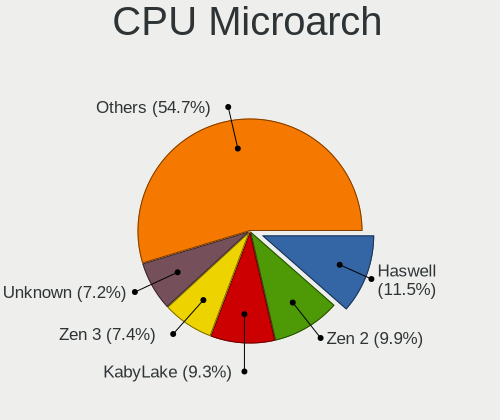

| Name             | Desktops | Percent |
|------------------|----------|---------|
| Haswell          | 169      | 12.03%  |
| Zen 2            | 146      | 10.39%  |
| KabyLake         | 130      | 9.25%   |
| IvyBridge        | 100      | 7.12%   |
| Zen+             | 95       | 6.76%   |
| SandyBridge      | 84       | 5.98%   |
| Zen 3            | 79       | 5.62%   |
| Piledriver       | 77       | 5.48%   |
| Skylake          | 71       | 5.05%   |
| Zen              | 69       | 4.91%   |
| K10              | 62       | 4.41%   |
| Penryn           | 58       | 4.13%   |
| CometLake        | 41       | 2.92%   |
| Nehalem          | 36       | 2.56%   |
| Unknown          | 36       | 2.56%   |
| Core             | 24       | 1.71%   |
| Westmere         | 21       | 1.49%   |
| Steamroller      | 14       | 1%      |
| K8 Hammer        | 14       | 1%      |
| Excavator        | 12       | 0.85%   |
| Icelake          | 8        | 0.57%   |
| NetBurst         | 7        | 0.5%    |
| Goldmont plus    | 7        | 0.5%    |
| Bulldozer        | 7        | 0.5%    |
| Broadwell        | 7        | 0.5%    |
| Alderlake Hybrid | 7        | 0.5%    |
| K10 Llano        | 5        | 0.36%   |
| Jaguar           | 5        | 0.36%   |
| Silvermont       | 4        | 0.28%   |
| Goldmont         | 4        | 0.28%   |
| Bonnell          | 2        | 0.14%   |
| Tremont          | 1        | 0.07%   |
| Puma             | 1        | 0.07%   |
| K6               | 1        | 0.07%   |
| Bobcat           | 1        | 0.07%   |

Graphics
--------

GPU Vendor
----------

Vendors of graphics cards

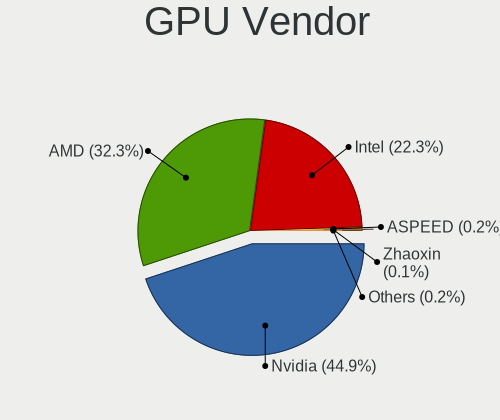

| Vendor                     | Desktops | Percent |
|----------------------------|----------|---------|
| Nvidia                     | 668      | 45.01%  |
| AMD                        | 492      | 33.15%  |
| Intel                      | 316      | 21.29%  |
| ASPEED Technology          | 4        | 0.27%   |
| Matrox Electronics Systems | 3        | 0.2%    |
| ATI Technologies           | 1        | 0.07%   |

GPU Model
---------

Graphics card models

| Model                                                                       | Desktops | Percent |
|-----------------------------------------------------------------------------|----------|---------|
| AMD Ellesmere [Radeon RX 470/480/570/570X/580/580X/590]                     | 75       | 4.92%   |
| Intel Xeon E3-1200 v3/4th Gen Core Processor Integrated Graphics Controller | 68       | 4.46%   |
| Nvidia GP107 [GeForce GTX 1050 Ti]                                          | 51       | 3.35%   |
| Nvidia GK208B [GeForce GT 710]                                              | 36       | 2.36%   |
| Intel CoffeeLake-S GT2 [UHD Graphics 630]                                   | 31       | 2.04%   |
| Intel Xeon E3-1200 v2/3rd Gen Core processor Graphics Controller            | 30       | 1.97%   |
| Intel 2nd Generation Core Processor Family Integrated Graphics Controller   | 29       | 1.9%    |
| Intel HD Graphics 530                                                       | 26       | 1.71%   |
| Nvidia GP108 [GeForce GT 1030]                                              | 25       | 1.64%   |
| AMD Navi 10 [Radeon RX 5600 OEM/5600 XT / 5700/5700 XT]                     | 25       | 1.64%   |
| Nvidia GP106 [GeForce GTX 1060 6GB]                                         | 24       | 1.58%   |
| AMD Picasso/Raven 2 [Radeon Vega Series / Radeon Vega Mobile Series]        | 24       | 1.58%   |
| Nvidia GP104 [GeForce GTX 1070]                                             | 22       | 1.44%   |
| Nvidia GM204 [GeForce GTX 970]                                              | 22       | 1.44%   |
| AMD Cedar [Radeon HD 5000/6000/7350/8350 Series]                            | 20       | 1.31%   |
| Nvidia GM206 [GeForce GTX 960]                                              | 19       | 1.25%   |
| Intel IvyBridge GT2 [HD Graphics 4000]                                      | 17       | 1.12%   |
| Nvidia GT218 [GeForce 210]                                                  | 16       | 1.05%   |
| Intel 4 Series Chipset Integrated Graphics Controller                       | 16       | 1.05%   |
| Nvidia TU116 [GeForce GTX 1660 SUPER]                                       | 15       | 0.98%   |
| Nvidia GP104 [GeForce GTX 1080]                                             | 15       | 0.98%   |
| Nvidia GM107 [GeForce GTX 750 Ti]                                           | 15       | 0.98%   |
| Nvidia GK208B [GeForce GT 730]                                              | 15       | 0.98%   |
| Intel CometLake-S GT2 [UHD Graphics 630]                                    | 15       | 0.98%   |
| AMD Lexa PRO [Radeon 540/540X/550/550X / RX 540X/550/550X]                  | 15       | 0.98%   |
| AMD Cezanne [Radeon Vega Series / Radeon Vega Mobile Series]                | 15       | 0.98%   |
| Intel HD Graphics 630                                                       | 14       | 0.92%   |
| AMD Vega 10 XL/XT [Radeon RX Vega 56/64]                                    | 14       | 0.92%   |
| AMD Raven Ridge [Radeon Vega Series / Radeon Vega Mobile Series]            | 14       | 0.92%   |
| Nvidia TU117 [GeForce GTX 1650]                                             | 13       | 0.85%   |
| Nvidia GP107 [GeForce GTX 1050]                                             | 12       | 0.79%   |
| Nvidia TU116 [GeForce GTX 1660]                                             | 11       | 0.72%   |
| Nvidia TU106 [GeForce RTX 2060 Rev. A]                                      | 11       | 0.72%   |
| Nvidia GP106 [GeForce GTX 1060 3GB]                                         | 11       | 0.72%   |
| Nvidia GP102 [GeForce GTX 1080 Ti]                                          | 11       | 0.72%   |
| Intel 4th Generation Core Processor Family Integrated Graphics Controller   | 11       | 0.72%   |
| AMD RS780L [Radeon 3000]                                                    | 11       | 0.72%   |
| AMD Renoir                                                                  | 11       | 0.72%   |
| AMD Navi 23 [Radeon RX 6600/6600 XT/6600M]                                  | 11       | 0.72%   |
| Nvidia TU104 [GeForce RTX 2070 SUPER]                                       | 10       | 0.66%   |

GPU Combo
---------

Combinations of graphics cards

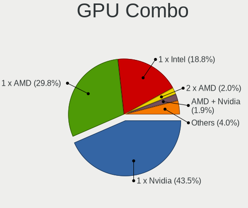

| Name                     | Desktops | Percent |
|--------------------------|----------|---------|
| 1 x Nvidia               | 619      | 43.96%  |
| 1 x AMD                  | 454      | 32.24%  |
| 1 x Intel                | 257      | 18.25%  |
| Intel + Nvidia           | 16       | 1.14%   |
| 2 x AMD                  | 15       | 1.07%   |
| 2 x Nvidia               | 14       | 0.99%   |
| AMD + Nvidia             | 14       | 0.99%   |
| Intel + AMD              | 9        | 0.64%   |
| Nvidia + ASPEED          | 3        | 0.21%   |
| 3 x Nvidia               | 2        | 0.14%   |
| AMD + Matrox             | 2        | 0.14%   |
| Nvidia + Matrox          | 1        | 0.07%   |
| Intel + AMD + 1 x Nvidia | 1        | 0.07%   |
| 1 x ASPEED               | 1        | 0.07%   |

GPU Driver
----------

Free vs proprietary

| Driver      | Desktops | Percent |
|-------------|----------|---------|
| Free        | 853      | 60.24%  |
| Proprietary | 529      | 37.36%  |
| Unknown     | 34       | 2.4%    |

GPU Memory
----------

Total video memory

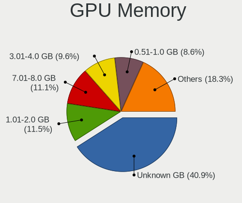

| Size in GB | Desktops | Percent |
|------------|----------|---------|
| Unknown    | 506      | 35.19%  |
| 1.01-2.0   | 194      | 13.49%  |
| 0.51-1.0   | 167      | 11.61%  |
| 7.01-8.0   | 165      | 11.47%  |
| 3.01-4.0   | 158      | 10.99%  |
| 0.01-0.5   | 96       | 6.68%   |
| 5.01-6.0   | 71       | 4.94%   |
| 8.01-16.0  | 47       | 3.27%   |
| 2.01-3.0   | 22       | 1.53%   |
| 16.01-24.0 | 8        | 0.56%   |
| 4.01-5.0   | 3        | 0.21%   |
| 32.01-64.0 | 1        | 0.07%   |

Monitor
-------

Monitor Vendor
--------------

Monitor vendors

| Vendor                  | Desktops | Percent |
|-------------------------|----------|---------|
| Samsung Electronics     | 285      | 17.48%  |
| Dell                    | 175      | 10.74%  |
| Goldstar                | 162      | 9.94%   |
| Acer                    | 115      | 7.06%   |
| Hewlett-Packard         | 102      | 6.26%   |
| BenQ                    | 89       | 5.46%   |
| AOC                     | 83       | 5.09%   |
| Ancor Communications    | 81       | 4.97%   |
| Philips                 | 76       | 4.66%   |
| ASUSTek Computer        | 43       | 2.64%   |
| ViewSonic               | 42       | 2.58%   |
| Iiyama                  | 37       | 2.27%   |
| LG Electronics          | 31       | 1.9%    |
| Unknown                 | 20       | 1.23%   |
| Sony                    | 17       | 1.04%   |
| NEC Computers           | 14       | 0.86%   |
| Lenovo                  | 13       | 0.8%    |
| Eizo                    | 12       | 0.74%   |
| Panasonic               | 9        | 0.55%   |
| HannStar                | 9        | 0.55%   |
| Sceptre Tech            | 8        | 0.49%   |
| Vizio                   | 7        | 0.43%   |
| Medion                  | 7        | 0.43%   |
| Idek Iiyama             | 7        | 0.43%   |
| Unknown                 | 6        | 0.37%   |
| MSI                     | 5        | 0.31%   |
| Vestel Elektronik       | 4        | 0.25%   |
| Gigabyte Technology     | 4        | 0.25%   |
| Fujitsu Siemens         | 4        | 0.25%   |
| Chi Mei Optoelectronics | 4        | 0.25%   |
| AUS                     | 4        | 0.25%   |
| Xiaomi                  | 3        | 0.18%   |
| Viotek                  | 3        | 0.18%   |
| Unknown (XXX)           | 3        | 0.18%   |
| Toshiba                 | 3        | 0.18%   |
| SAC                     | 3        | 0.18%   |
| Planar                  | 3        | 0.18%   |
| ONN                     | 3        | 0.18%   |
| ONKYO                   | 3        | 0.18%   |
| LG Display              | 3        | 0.18%   |

Monitor Model
-------------

Monitor models

| Model                                                                 | Desktops | Percent |
|-----------------------------------------------------------------------|----------|---------|
| Goldstar ULTRAWIDE GSM59F1 2560x1080 673x284mm 28.8-inch              | 12       | 0.67%   |
| Dell U2412M DELA07A 1920x1200 518x324mm 24.1-inch                     | 11       | 0.62%   |
| Goldstar Ultra HD GSM5B09 3840x2160 600x340mm 27.2-inch               | 7        | 0.39%   |
| Goldstar IPS FULLHD GSM5AB8 1920x1080 480x270mm 21.7-inch             | 7        | 0.39%   |
| Samsung Electronics C24F390 SAM0D2C 1920x1080 521x293mm 23.5-inch     | 6        | 0.34%   |
| AOC 27P2DG5 AOC2702 1920x1080 598x336mm 27.0-inch                     | 6        | 0.34%   |
| Unknown                                                               | 6        | 0.34%   |
| Unknown LCD Monitor SAMSUNG 1920x1080                                 | 5        | 0.28%   |
| Sceptre Tech E24 SPT099D 1920x1080 521x293mm 23.5-inch                | 5        | 0.28%   |
| Samsung Electronics SyncMaster SAM0587 1920x1200 518x324mm 24.1-inch  | 5        | 0.28%   |
| Dell P2214H DELA098 1920x1080 477x268mm 21.5-inch                     | 5        | 0.28%   |
| Samsung Electronics SyncMaster SAM01E1 1280x1024 376x301mm 19.0-inch  | 4        | 0.22%   |
| Samsung Electronics S24F350 SAM0D20 1920x1080 521x293mm 23.5-inch     | 4        | 0.22%   |
| Samsung Electronics S22F350 SAM0D1A 1920x1080 477x268mm 21.5-inch     | 4        | 0.22%   |
| Samsung Electronics C27F390 SAM0D32 1920x1080 598x336mm 27.0-inch     | 4        | 0.22%   |
| Philips PHL 242V8 PHLC219 1920x1080 527x296mm 23.8-inch               | 4        | 0.22%   |
| Goldstar LG Ultra HD GSM5B08 3840x2160 600x340mm 27.2-inch            | 4        | 0.22%   |
| Goldstar HDR 4K GSM7706 3840x2160 600x340mm 27.2-inch                 | 4        | 0.22%   |
| Goldstar FULL HD GSM5B55 1920x1080 480x270mm 21.7-inch                | 4        | 0.22%   |
| Dell U2412M DELA079 1920x1200 520x320mm 24.0-inch                     | 4        | 0.22%   |
| BenQ GW2270 BNQ78DB 1920x1080 480x270mm 21.7-inch                     | 4        | 0.22%   |
| BenQ GL2460 BNQ78CE 1920x1080 531x299mm 24.0-inch                     | 4        | 0.22%   |
| BenQ GL2450H BNQ78A7 1920x1080 531x298mm 24.0-inch                    | 4        | 0.22%   |
| Ancor Communications PB248 ACI24A3 1920x1200 518x324mm 24.1-inch      | 4        | 0.22%   |
| Ancor Communications ASUS VS247 ACI249A 1920x1080 521x293mm 23.5-inch | 4        | 0.22%   |
| Vestel Elektronik 43UHD_LCD_TV VES3700 3840x2160 950x540mm 43.0-inch  | 3        | 0.17%   |
| Unknown LCD Monitor FFFF 2288x1287 2550x2550mm 142.0-inch             | 3        | 0.17%   |
| Samsung Electronics U32J59x SAM0F35 3840x2160 697x392mm 31.5-inch     | 3        | 0.17%   |
| Samsung Electronics U28E590 SAM0C4D 1680x1050 610x350mm 27.7-inch     | 3        | 0.17%   |
| Samsung Electronics SyncMaster SAM05CC 1920x1080 530x300mm 24.0-inch  | 3        | 0.17%   |
| Samsung Electronics S24D300 SAM0B43 1920x1080 531x299mm 24.0-inch     | 3        | 0.17%   |
| Samsung Electronics S22B350 SAM08D4 1920x1080 477x268mm 21.5-inch     | 3        | 0.17%   |
| Samsung Electronics LCD Monitor SyncMaster 1920x1080                  | 3        | 0.17%   |
| Samsung Electronics LCD Monitor SAM0C39 1920x1080 885x498mm 40.0-inch | 3        | 0.17%   |
| Samsung Electronics LCD Monitor SAM0902 1920x1080 890x500mm 40.2-inch | 3        | 0.17%   |
| Samsung Electronics LCD Monitor SAM04FD 1280x720                      | 3        | 0.17%   |
| ONN ONA18HO015 ONN0101 1920x1080 698x393mm 31.5-inch                  | 3        | 0.17%   |
| Iiyama PL2273HDS IVM561A 1920x1080 477x268mm 21.5-inch                | 3        | 0.17%   |
| Hewlett-Packard L1740 HWP2649 1280x1024 338x270mm 17.0-inch           | 3        | 0.17%   |
| Hewlett-Packard 24w HPN3431 1920x1080 527x296mm 23.8-inch             | 3        | 0.17%   |

Monitor Resolution
------------------

Monitor screen resolution

| Resolution         | Desktops | Percent |
|--------------------|----------|---------|
| 1920x1080 (FHD)    | 717      | 45.47%  |
| 3840x2160 (4K)     | 146      | 9.26%   |
| 2560x1440 (QHD)    | 118      | 7.48%   |
| 1680x1050 (WSXGA+) | 79       | 5.01%   |
| 1920x1200 (WUXGA)  | 75       | 4.76%   |
| Unknown            | 72       | 4.57%   |
| 1280x1024 (SXGA)   | 70       | 4.44%   |
| 1366x768 (WXGA)    | 38       | 2.41%   |
| 3440x1440          | 36       | 2.28%   |
| 1440x900 (WXGA+)   | 30       | 1.9%    |
| 3840x1080          | 28       | 1.78%   |
| 2560x1080          | 27       | 1.71%   |
| 1600x900 (HD+)     | 27       | 1.71%   |
| 1360x768           | 19       | 1.2%    |
| 1920x540           | 10       | 0.63%   |
| 3840x1200          | 9        | 0.57%   |
| 1600x1200          | 9        | 0.57%   |
| 1024x768 (XGA)     | 7        | 0.44%   |
| 4480x1440          | 6        | 0.38%   |
| 3840x1600          | 5        | 0.32%   |
| 5760x1080          | 4        | 0.25%   |
| 3600x1080          | 3        | 0.19%   |
| 3200x1080          | 3        | 0.19%   |
| 2560x1600          | 3        | 0.19%   |
| 2288x1287          | 3        | 0.19%   |
| 1280x720 (HD)      | 3        | 0.19%   |
| 7680x2160          | 2        | 0.13%   |
| 5760x2160          | 2        | 0.13%   |
| 4480x1080          | 2        | 0.13%   |
| 3600x1200          | 2        | 0.13%   |
| 6400x2160          | 1        | 0.06%   |
| 6400x1080          | 1        | 0.06%   |
| 6160x1440          | 1        | 0.06%   |
| 5760x1200          | 1        | 0.06%   |
| 5120x1440          | 1        | 0.06%   |
| 480x1920           | 1        | 0.06%   |
| 4800x1080          | 1        | 0.06%   |
| 4480x1600          | 1        | 0.06%   |
| 3840x1920          | 1        | 0.06%   |
| 3840x1024          | 1        | 0.06%   |

Monitor Diagonal
----------------

Diagonal size in inches

| Inches  | Desktops | Percent |
|---------|----------|---------|
| 24      | 250      | 15.61%  |
| 27      | 233      | 14.54%  |
| Unknown | 207      | 12.92%  |
| 23      | 205      | 12.8%   |
| 21      | 165      | 10.3%   |
| 31      | 77       | 4.81%   |
| 19      | 67       | 4.18%   |
| 22      | 53       | 3.31%   |
| 34      | 52       | 3.25%   |
| 20      | 36       | 2.25%   |
| 17      | 36       | 2.25%   |
| 18      | 34       | 2.12%   |
| 32      | 20       | 1.25%   |
| 25      | 17       | 1.06%   |
| 84      | 16       | 1%      |
| 54      | 16       | 1%      |
| 72      | 14       | 0.87%   |
| 15      | 12       | 0.75%   |
| 40      | 11       | 0.69%   |
| 26      | 8        | 0.5%    |
| 37      | 6        | 0.37%   |
| 28      | 6        | 0.37%   |
| 48      | 5        | 0.31%   |
| 46      | 5        | 0.31%   |
| 65      | 4        | 0.25%   |
| 42      | 4        | 0.25%   |
| 36      | 4        | 0.25%   |
| 142     | 3        | 0.19%   |
| 69      | 3        | 0.19%   |
| 60      | 3        | 0.19%   |
| 52      | 3        | 0.19%   |
| 47      | 3        | 0.19%   |
| 39      | 3        | 0.19%   |
| 74      | 2        | 0.12%   |
| 55      | 2        | 0.12%   |
| 49      | 2        | 0.12%   |
| 43      | 2        | 0.12%   |
| 35      | 2        | 0.12%   |
| 33      | 2        | 0.12%   |
| 30      | 2        | 0.12%   |

Monitor Width
-------------

Physical width

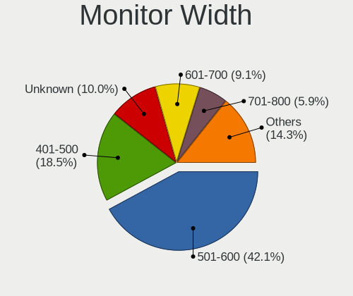

| Width in mm    | Desktops | Percent |
|----------------|----------|---------|
| 501-600        | 621      | 40.67%  |
| 401-500        | 307      | 20.1%   |
| Unknown        | 207      | 13.56%  |
| 601-700        | 114      | 7.47%   |
| 701-800        | 78       | 5.11%   |
| 351-400        | 44       | 2.88%   |
| 1001-1500      | 44       | 2.88%   |
| 301-350        | 43       | 2.82%   |
| 1501-2000      | 35       | 2.29%   |
| 801-900        | 23       | 1.51%   |
| 901-1000       | 6        | 0.39%   |
| More than 2000 | 3        | 0.2%    |
| 201-300        | 1        | 0.07%   |
| 1-100          | 1        | 0.07%   |

Aspect Ratio
------------

Proportional relationship between the width and the height

| Ratio   | Desktops | Percent |
|---------|----------|---------|
| 16/9    | 898      | 62.1%   |
| 16/10   | 192      | 13.28%  |
| Unknown | 188      | 13%     |
| 5/4     | 66       | 4.56%   |
| 21/9    | 61       | 4.22%   |
| 4/3     | 17       | 1.18%   |
| 32/9    | 10       | 0.69%   |
| 3/2     | 6        | 0.41%   |
| 1.00    | 3        | 0.21%   |
| 6/5     | 2        | 0.14%   |
| 1.96    | 2        | 0.14%   |
| 0.25    | 1        | 0.07%   |

Monitor Area
------------

Area in inch

| Area in inch | Desktops | Percent |
|----------------|----------|---------|
| 201-250        | 501      | 32.49%  |
| 301-350        | 237      | 15.37%  |
| Unknown        | 207      | 13.42%  |
| 351-500        | 160      | 10.38%  |
| 151-200        | 146      | 9.47%   |
| 251-300        | 102      | 6.61%   |
| More than 1000 | 67       | 4.35%   |
| 141-150        | 59       | 3.83%   |
| 501-1000       | 43       | 2.79%   |
| 101-110        | 11       | 0.71%   |
| 131-140        | 3        | 0.19%   |
| 121-130        | 2        | 0.13%   |
| 81-90          | 1        | 0.06%   |
| 71-80          | 1        | 0.06%   |
| 1-40           | 1        | 0.06%   |
| 111-120        | 1        | 0.06%   |

Pixel Density
-------------

Pixels per inch

| Density       | Desktops | Percent |
|---------------|----------|---------|
| 51-100        | 853      | 58.11%  |
| 101-120       | 263      | 17.92%  |
| Unknown       | 207      | 14.1%   |
| 1-50          | 61       | 4.16%   |
| 121-160       | 58       | 3.95%   |
| 161-240       | 25       | 1.7%    |
| More than 240 | 1        | 0.07%   |

Multiple Monitors
-----------------

Total monitors connected

| Total | Desktops | Percent |
|-------|----------|---------|
| 1     | 992      | 69.61%  |
| 2     | 355      | 24.91%  |
| 3     | 38       | 2.67%   |
| 0     | 36       | 2.53%   |
| 4     | 4        | 0.28%   |

Network
-------

Net Controller Vendor
---------------------

Controller vendors

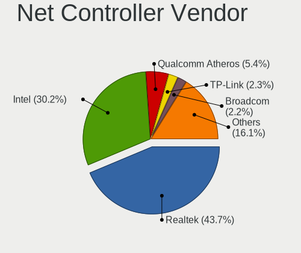

| Vendor                          | Desktops | Percent |
|---------------------------------|----------|---------|
| Realtek Semiconductor           | 869      | 43.52%  |
| Intel                           | 581      | 29.09%  |
| Qualcomm Atheros                | 128      | 6.41%   |
| Broadcom                        | 56       | 2.8%    |
| Ralink Technology               | 49       | 2.45%   |
| TP-Link                         | 43       | 2.15%   |
| Ralink                          | 22       | 1.1%    |
| Nvidia                          | 22       | 1.1%    |
| Aquantia                        | 22       | 1.1%    |
| MediaTek                        | 21       | 1.05%   |
| Qualcomm Atheros Communications | 17       | 0.85%   |
| Microsoft                       | 15       | 0.75%   |
| Samsung Electronics             | 12       | 0.6%    |
| NetGear                         | 12       | 0.6%    |
| D-Link                          | 9        | 0.45%   |
| Xiaomi                          | 8        | 0.4%    |
| ASUSTek Computer                | 8        | 0.4%    |
| Edimax Technology               | 7        | 0.35%   |
| Huawei Technologies             | 6        | 0.3%    |
| Broadcom Limited                | 6        | 0.3%    |
| ASIX Electronics                | 6        | 0.3%    |
| DisplayLink                     | 5        | 0.25%   |
| D-Link System                   | 5        | 0.25%   |
| VIA Technologies                | 4        | 0.2%    |
| Marvell Technology Group        | 4        | 0.2%    |
| Linksys                         | 4        | 0.2%    |
| Belkin Components               | 4        | 0.2%    |
| AVM                             | 4        | 0.2%    |
| Wacom                           | 2        | 0.1%    |
| STMicroelectronics              | 2        | 0.1%    |
| Qualcomm                        | 2        | 0.1%    |
| Oculus VR                       | 2        | 0.1%    |
| Mercucys                        | 2        | 0.1%    |
| Mellanox Technologies           | 2        | 0.1%    |
| Lenovo                          | 2        | 0.1%    |
| Arduino SA                      | 2        | 0.1%    |
| Apple                           | 2        | 0.1%    |
| 3Com                            | 2        | 0.1%    |
| ZyXEL Communications            | 1        | 0.05%   |
| ZTE WCDMA Technologies MSM      | 1        | 0.05%   |

Net Controller Model
--------------------

Controller models

| Model                                                             | Desktops | Percent |
|-------------------------------------------------------------------|----------|---------|
| Realtek RTL8111/8168/8411 PCI Express Gigabit Ethernet Controller | 691      | 30.29%  |
| Intel I211 Gigabit Network Connection                             | 113      | 4.95%   |
| Realtek RTL8125 2.5GbE Controller                                 | 95       | 4.16%   |
| Intel Wi-Fi 6 AX200                                               | 77       | 3.38%   |
| Intel Ethernet Connection (2) I219-V                              | 64       | 2.81%   |
| Intel 82579LM Gigabit Network Connection (Lewisville)             | 48       | 2.1%    |
| Intel Ethernet Controller I225-V                                  | 46       | 2.02%   |
| Intel Ethernet Connection I217-LM                                 | 30       | 1.32%   |
| Intel Dual Band Wireless-AC 3168NGW [Stone Peak]                  | 29       | 1.27%   |
| Intel Ethernet Connection (7) I219-V                              | 28       | 1.23%   |
| Intel Ethernet Connection (2) I218-V                              | 26       | 1.14%   |
| Realtek RTL810xE PCI Express Fast Ethernet controller             | 25       | 1.1%    |
| Intel Wireless-AC 9260                                            | 23       | 1.01%   |
| Intel 82579V Gigabit Network Connection                           | 22       | 0.96%   |
| Ralink MT7601U Wireless Adapter                                   | 19       | 0.83%   |
| Aquantia AQC107 NBase-T/IEEE 802.3bz Ethernet Controller [AQtion] | 19       | 0.83%   |
| Realtek RTL8153 Gigabit Ethernet Adapter                          | 18       | 0.79%   |
| Qualcomm Atheros Killer E220x Gigabit Ethernet Controller         | 18       | 0.79%   |
| Realtek 802.11ac NIC                                              | 17       | 0.75%   |
| Intel 82574L Gigabit Network Connection                           | 17       | 0.75%   |
| Qualcomm Atheros AR9271 802.11n                                   | 16       | 0.7%    |
| Realtek RTL8188EUS 802.11n Wireless Network Adapter               | 15       | 0.66%   |
| Intel I210 Gigabit Network Connection                             | 15       | 0.66%   |
| Intel Ethernet Connection I217-V                                  | 14       | 0.61%   |
| Broadcom BCM4360 802.11ac Wireless Network Adapter                | 14       | 0.61%   |
| Qualcomm Atheros AR9485 Wireless Network Adapter                  | 13       | 0.57%   |
| Intel 82567LM-3 Gigabit Network Connection                        | 13       | 0.57%   |
| Realtek RTL-8100/8101L/8139 PCI Fast Ethernet Adapter             | 12       | 0.53%   |
| Realtek RTL8821CE 802.11ac PCIe Wireless Network Adapter          | 11       | 0.48%   |
| Intel Wireless 7260                                               | 11       | 0.48%   |
| Intel Cannon Lake PCH CNVi WiFi                                   | 11       | 0.48%   |
| Realtek RTL8192EE PCIe Wireless Network Adapter                   | 10       | 0.44%   |
| Ralink RT5370 Wireless Adapter                                    | 10       | 0.44%   |
| Qualcomm Atheros AR8161 Gigabit Ethernet                          | 10       | 0.44%   |
| Nvidia MCP61 Ethernet                                             | 10       | 0.44%   |
| Intel Wireless 3165                                               | 10       | 0.44%   |
| Intel Wi-Fi 6 AX210/AX211/AX411 160MHz                            | 10       | 0.44%   |
| Intel Ethernet Connection (2) I219-LM                             | 10       | 0.44%   |
| Intel Ethernet Connection (14) I219-V                             | 10       | 0.44%   |
| Intel 82578DM Gigabit Network Connection                          | 10       | 0.44%   |

Wireless Vendor
---------------

Wireless vendors

| Vendor                                | Desktops | Percent |
|---------------------------------------|----------|---------|
| Intel                                 | 210      | 31.58%  |
| Realtek Semiconductor                 | 128      | 19.25%  |
| Qualcomm Atheros                      | 71       | 10.68%  |
| Ralink Technology                     | 49       | 7.37%   |
| TP-Link                               | 37       | 5.56%   |
| Broadcom                              | 27       | 4.06%   |
| Ralink                                | 22       | 3.31%   |
| MediaTek                              | 19       | 2.86%   |
| Qualcomm Atheros Communications       | 17       | 2.56%   |
| Microsoft                             | 15       | 2.26%   |
| NetGear                               | 12       | 1.8%    |
| D-Link                                | 9        | 1.35%   |
| ASUSTek Computer                      | 8        | 1.2%    |
| Edimax Technology                     | 7        | 1.05%   |
| Belkin Components                     | 4        | 0.6%    |
| AVM                                   | 4        | 0.6%    |
| Linksys                               | 3        | 0.45%   |
| D-Link System                         | 3        | 0.45%   |
| Broadcom Limited                      | 3        | 0.45%   |
| Wacom                                 | 2        | 0.3%    |
| Mercucys                              | 2        | 0.3%    |
| ZyXEL Communications                  | 1        | 0.15%   |
| Wilocity                              | 1        | 0.15%   |
| Sitecom Europe                        | 1        | 0.15%   |
| Realtek                               | 1        | 0.15%   |
| Philips (or NXP)                      | 1        | 0.15%   |
| Micro Star International              | 1        | 0.15%   |
| LG Electronics                        | 1        | 0.15%   |
| IMC Networks                          | 1        | 0.15%   |
| Guillemot                             | 1        | 0.15%   |
| Gemtek                                | 1        | 0.15%   |
| AirTies Wireless Networks             | 1        | 0.15%   |
| Accton Technology                     | 1        | 0.15%   |
| 802.11g Adapter [Linksys WUSB54GC v3] | 1        | 0.15%   |

Wireless Model
--------------

Wireless models

| Model                                                         | Desktops | Percent |
|---------------------------------------------------------------|----------|---------|
| Intel Wi-Fi 6 AX200                                           | 77       | 11.44%  |
| Intel Dual Band Wireless-AC 3168NGW [Stone Peak]              | 29       | 4.31%   |
| Intel Wireless-AC 9260                                        | 23       | 3.42%   |
| Ralink MT7601U Wireless Adapter                               | 19       | 2.82%   |
| Realtek 802.11ac NIC                                          | 17       | 2.53%   |
| Qualcomm Atheros AR9271 802.11n                               | 16       | 2.38%   |
| Realtek RTL8188EUS 802.11n Wireless Network Adapter           | 15       | 2.23%   |
| Broadcom BCM4360 802.11ac Wireless Network Adapter            | 14       | 2.08%   |
| Qualcomm Atheros AR9485 Wireless Network Adapter              | 13       | 1.93%   |
| Realtek RTL8821CE 802.11ac PCIe Wireless Network Adapter      | 11       | 1.63%   |
| Intel Wireless 7260                                           | 11       | 1.63%   |
| Intel Cannon Lake PCH CNVi WiFi                               | 11       | 1.63%   |
| Realtek RTL8192EE PCIe Wireless Network Adapter               | 10       | 1.49%   |
| Ralink RT5370 Wireless Adapter                                | 10       | 1.49%   |
| Intel Wireless 3165                                           | 10       | 1.49%   |
| Intel Wi-Fi 6 AX210/AX211/AX411 160MHz                        | 10       | 1.49%   |
| Qualcomm Atheros AR93xx Wireless Network Adapter              | 9        | 1.34%   |
| MediaTek MT7921K (RZ608) Wi-Fi 6E 80MHz                       | 9        | 1.34%   |
| Realtek RTL88x2bu [AC1200 Techkey]                            | 8        | 1.19%   |
| Realtek RTL8821AE 802.11ac PCIe Wireless Network Adapter      | 8        | 1.19%   |
| Qualcomm Atheros QCA9565 / AR9565 Wireless Network Adapter    | 8        | 1.19%   |
| Qualcomm Atheros QCA6174 802.11ac Wireless Network Adapter    | 8        | 1.19%   |
| Qualcomm Atheros AR9462 Wireless Network Adapter              | 8        | 1.19%   |
| Realtek RTL8822BE 802.11a/b/g/n/ac WiFi adapter               | 7        | 1.04%   |
| Realtek RTL8192EU 802.11b/g/n WLAN Adapter                    | 7        | 1.04%   |
| Qualcomm Atheros AR9227 Wireless Network Adapter              | 7        | 1.04%   |
| Microsoft Xbox 360 Wireless Adapter                           | 7        | 1.04%   |
| Intel Wireless 7265                                           | 7        | 1.04%   |
| Realtek RTL8812AU 802.11a/b/g/n/ac 2T2R DB WLAN Adapter       | 6        | 0.89%   |
| Realtek RTL8812AE 802.11ac PCIe Wireless Network Adapter      | 6        | 0.89%   |
| Realtek RTL8192CE PCIe Wireless Network Adapter               | 6        | 0.89%   |
| Realtek RTL8188FTV 802.11b/g/n 1T1R 2.4G WLAN Adapter         | 6        | 0.89%   |
| Ralink RT2870/RT3070 Wireless Adapter                         | 6        | 0.89%   |
| NetGear A6100 AC600 DB Wireless Adapter [Realtek RTL8811AU]   | 6        | 0.89%   |
| MediaTek MT7922 802.11ax PCI Express Wireless Network Adapter | 6        | 0.89%   |
| Intel Wireless 8260                                           | 6        | 0.89%   |
| Intel Comet Lake PCH CNVi WiFi                                | 6        | 0.89%   |
| TP-Link TL-WN823N v2/v3 [Realtek RTL8192EU]                   | 5        | 0.74%   |
| TP-Link TL-WN722N v2/v3 [Realtek RTL8188EUS]                  | 5        | 0.74%   |
| TP-Link Archer T9UH v1 [Realtek RTL8814AU]                    | 5        | 0.74%   |

Ethernet Vendor
---------------

Ethernet vendors

| Vendor                           | Desktops | Percent |
|----------------------------------|----------|---------|
| Realtek Semiconductor            | 822      | 53.73%  |
| Intel                            | 495      | 32.35%  |
| Qualcomm Atheros                 | 64       | 4.18%   |
| Broadcom                         | 31       | 2.03%   |
| Nvidia                           | 22       | 1.44%   |
| Aquantia                         | 22       | 1.44%   |
| Samsung Electronics              | 9        | 0.59%   |
| Xiaomi                           | 8        | 0.52%   |
| TP-Link                          | 6        | 0.39%   |
| Huawei Technologies              | 6        | 0.39%   |
| ASIX Electronics                 | 6        | 0.39%   |
| DisplayLink                      | 5        | 0.33%   |
| VIA Technologies                 | 4        | 0.26%   |
| Marvell Technology Group         | 4        | 0.26%   |
| Broadcom Limited                 | 3        | 0.2%    |
| Qualcomm                         | 2        | 0.13%   |
| Mellanox Technologies            | 2        | 0.13%   |
| MediaTek                         | 2        | 0.13%   |
| Lenovo                           | 2        | 0.13%   |
| D-Link System                    | 2        | 0.13%   |
| Apple                            | 2        | 0.13%   |
| 3Com                             | 2        | 0.13%   |
| ZTE WCDMA Technologies MSM       | 1        | 0.07%   |
| Silicon Integrated Systems [SiS] | 1        | 0.07%   |
| OnePlus Technology (Shenzhen)    | 1        | 0.07%   |
| Motorola BCS                     | 1        | 0.07%   |
| Linksys                          | 1        | 0.07%   |
| Google                           | 1        | 0.07%   |
| Elecom                           | 1        | 0.07%   |
| Davicom Semiconductor            | 1        | 0.07%   |
| American Megatrends              | 1        | 0.07%   |

Ethernet Model
--------------

Ethernet models

| Model                                                             | Desktops | Percent |
|-------------------------------------------------------------------|----------|---------|
| Realtek RTL8111/8168/8411 PCI Express Gigabit Ethernet Controller | 691      | 43.4%   |
| Intel I211 Gigabit Network Connection                             | 113      | 7.1%    |
| Realtek RTL8125 2.5GbE Controller                                 | 95       | 5.97%   |
| Intel Ethernet Connection (2) I219-V                              | 64       | 4.02%   |
| Intel 82579LM Gigabit Network Connection (Lewisville)             | 48       | 3.02%   |
| Intel Ethernet Controller I225-V                                  | 46       | 2.89%   |
| Intel Ethernet Connection I217-LM                                 | 30       | 1.88%   |
| Intel Ethernet Connection (7) I219-V                              | 28       | 1.76%   |
| Intel Ethernet Connection (2) I218-V                              | 26       | 1.63%   |
| Realtek RTL810xE PCI Express Fast Ethernet controller             | 25       | 1.57%   |
| Intel 82579V Gigabit Network Connection                           | 22       | 1.38%   |
| Aquantia AQC107 NBase-T/IEEE 802.3bz Ethernet Controller [AQtion] | 19       | 1.19%   |
| Realtek RTL8153 Gigabit Ethernet Adapter                          | 18       | 1.13%   |
| Qualcomm Atheros Killer E220x Gigabit Ethernet Controller         | 18       | 1.13%   |
| Intel 82574L Gigabit Network Connection                           | 17       | 1.07%   |
| Intel I210 Gigabit Network Connection                             | 15       | 0.94%   |
| Intel Ethernet Connection I217-V                                  | 14       | 0.88%   |
| Intel 82567LM-3 Gigabit Network Connection                        | 13       | 0.82%   |
| Realtek RTL-8100/8101L/8139 PCI Fast Ethernet Adapter             | 12       | 0.75%   |
| Qualcomm Atheros AR8161 Gigabit Ethernet                          | 10       | 0.63%   |
| Nvidia MCP61 Ethernet                                             | 10       | 0.63%   |
| Intel Ethernet Connection (2) I219-LM                             | 10       | 0.63%   |
| Intel Ethernet Connection (14) I219-V                             | 10       | 0.63%   |
| Intel 82578DM Gigabit Network Connection                          | 10       | 0.63%   |
| Samsung Galaxy series, misc. (tethering mode)                     | 9        | 0.57%   |
| Qualcomm Atheros AR8121/AR8113/AR8114 Gigabit or Fast Ethernet    | 9        | 0.57%   |
| Intel Ethernet Connection (7) I219-LM                             | 9        | 0.57%   |
| Qualcomm Atheros QCA8171 Gigabit Ethernet                         | 7        | 0.44%   |
| Qualcomm Atheros Killer E2500 Gigabit Ethernet Controller         | 6        | 0.38%   |
| Qualcomm Atheros Killer E2400 Gigabit Ethernet Controller         | 6        | 0.38%   |
| Broadcom NetXtreme BCM5761 Gigabit Ethernet PCIe                  | 6        | 0.38%   |
| Xiaomi Mi/Redmi series (RNDIS)                                    | 5        | 0.31%   |
| TP-Link Archer T2U PLUS [RTL8821AU]                               | 5        | 0.31%   |
| Qualcomm Atheros AR8151 v2.0 Gigabit Ethernet                     | 5        | 0.31%   |
| Huawei ANE-LX1                                                    | 5        | 0.31%   |
| Realtek RTL-8110SC/8169SC Gigabit Ethernet                        | 4        | 0.25%   |
| Nvidia MCP77 Ethernet                                             | 4        | 0.25%   |
| Intel Ethernet Connection (2) I218-LM                             | 4        | 0.25%   |
| Intel Ethernet Connection (12) I219-V                             | 4        | 0.25%   |
| Broadcom NetXtreme BCM5754 Gigabit Ethernet PCI Express           | 4        | 0.25%   |

Net Controller Kind
-------------------

Ethernet, WiFi or modem

| Kind     | Desktops | Percent |
|----------|----------|---------|
| Ethernet | 1386     | 68.58%  |
| WiFi     | 620      | 30.68%  |
| Modem    | 15       | 0.74%   |

Used Controller
---------------

Currently used network controller

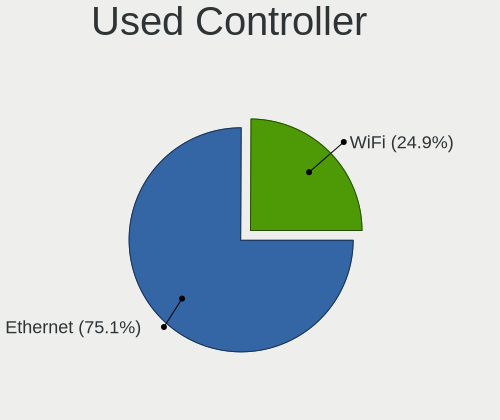

| Kind     | Desktops | Percent |
|----------|----------|---------|
| Ethernet | 1124     | 76.05%  |
| WiFi     | 354      | 23.95%  |

NICs
----

Total network controllers on board

| Total | Desktops | Percent |
|-------|----------|---------|
| 1     | 899      | 64.21%  |
| 2     | 419      | 29.93%  |
| 3     | 63       | 4.5%    |
| 4     | 8        | 0.57%   |
| 0     | 6        | 0.43%   |
| 6     | 3        | 0.21%   |
| 5     | 2        | 0.14%   |

IPv6
----

IPv6 vs IPv4

| Used | Desktops | Percent |
|------|----------|---------|
| No   | 1150     | 80.87%  |
| Yes  | 272      | 19.13%  |

Bluetooth
---------

Bluetooth Vendor
----------------

Controller vendors

| Vendor                          | Desktops | Percent |
|---------------------------------|----------|---------|
| Intel                           | 197      | 35.75%  |
| Cambridge Silicon Radio         | 158      | 28.68%  |
| Realtek Semiconductor           | 43       | 7.8%    |
| Broadcom                        | 35       | 6.35%   |
| ASUSTek Computer                | 35       | 6.35%   |
| Qualcomm Atheros Communications | 18       | 3.27%   |
| IMC Networks                    | 11       | 2%      |
| MediaTek                        | 10       | 1.81%   |
| TP-Link                         | 5        | 0.91%   |
| ISSC                            | 4        | 0.73%   |
| Foxconn / Hon Hai               | 4        | 0.73%   |
| Dynex                           | 4        | 0.73%   |
| Realtek                         | 3        | 0.54%   |
| Lite-On Technology              | 3        | 0.54%   |
| Edimax Technology               | 3        | 0.54%   |
| Apple                           | 3        | 0.54%   |
| Ralink                          | 2        | 0.36%   |
| Micro Star International        | 2        | 0.36%   |
| Integrated System Solution      | 2        | 0.36%   |
| D-Link                          | 2        | 0.36%   |
| Belkin Components               | 2        | 0.36%   |
| Kensington                      | 1        | 0.18%   |
| Creative Technology             | 1        | 0.18%   |
| Corsair                         | 1        | 0.18%   |
| Conwise Technology              | 1        | 0.18%   |
| AboCom Systems                  | 1        | 0.18%   |

Bluetooth Model
---------------

Controller models

| Model                                                    | Desktops | Percent |
|----------------------------------------------------------|----------|---------|
| Cambridge Silicon Radio Bluetooth Dongle (HCI mode)      | 158      | 28.62%  |
| Intel AX200 Bluetooth                                    | 75       | 13.59%  |
| Realtek Bluetooth Radio                                  | 34       | 6.16%   |
| Intel Bluetooth wireless interface                       | 34       | 6.16%   |
| Intel Wireless-AC 3168 Bluetooth                         | 27       | 4.89%   |
| Intel Wireless-AC 9260 Bluetooth Adapter                 | 23       | 4.17%   |
| Broadcom BCM20702A0 Bluetooth 4.0                        | 23       | 4.17%   |
| Intel Bluetooth 9460/9560 Jefferson Peak (JfP)           | 16       | 2.9%    |
| ASUS Broadcom BCM20702A0 Bluetooth                       | 11       | 1.99%   |
| MediaTek Wireless_Device                                 | 10       | 1.81%   |
| Intel AX210 Bluetooth                                    | 10       | 1.81%   |
| ASUS ASUS USB-BT500                                      | 10       | 1.81%   |
| Intel AX201 Bluetooth                                    | 9        | 1.63%   |
| Realtek  Bluetooth 4.2 Adapter                           | 7        | 1.27%   |
| Qualcomm Atheros  Bluetooth Device                       | 7        | 1.27%   |
| IMC Networks Bluetooth Radio                             | 6        | 1.09%   |
| TP-Link UB500 Adapter                                    | 5        | 0.91%   |
| Qualcomm Atheros Bluetooth USB Host Controller           | 4        | 0.72%   |
| Qualcomm Atheros AR9462 Bluetooth                        | 4        | 0.72%   |
| ISSC Bluetooth Device                                    | 4        | 0.72%   |
| Foxconn / Hon Hai Wireless_Device                        | 4        | 0.72%   |
| Dynex Bluetooth 4.0 Adapter [Broadcom, 1.12, BCM20702A0] | 4        | 0.72%   |
| Realtek Bluetooth Radio                                  | 3        | 0.54%   |
| Intel Bluetooth Device                                   | 3        | 0.54%   |
| IMC Networks Bluetooth Device                            | 3        | 0.54%   |
| Broadcom BCM2045 Bluetooth                               | 3        | 0.54%   |
| ASUS Qualcomm Bluetooth 4.1                              | 3        | 0.54%   |
| ASUS Bluetooth Radio                                     | 3        | 0.54%   |
| Ralink RT3290 Bluetooth                                  | 2        | 0.36%   |
| Qualcomm Atheros AR3011 Bluetooth                        | 2        | 0.36%   |
| Lite-On Bluetooth Device                                 | 2        | 0.36%   |
| Integrated System Solution KY-BT100 Bluetooth Adapter    | 2        | 0.36%   |
| D-Link DBT-122 Bluetooth adapter                         | 2        | 0.36%   |
| Broadcom Bluetooth 3.0 Device                            | 2        | 0.36%   |
| Belkin Components F8T065BF Mini Bluetooth 4.0 Adapter    | 2        | 0.36%   |
| ASUS Broadcom BCM20702 Single-Chip Bluetooth 4.0 + LE    | 2        | 0.36%   |
| ASUS Bluetooth Device                                    | 2        | 0.36%   |
| ASUS Bluetooth Adapter                                   | 2        | 0.36%   |
| ASUS BCM20702A0                                          | 2        | 0.36%   |
| Apple Bluetooth Host Controller                          | 2        | 0.36%   |

Sound
-----

Sound Vendor
------------

Sound card vendors

| Vendor                     | Desktops | Percent |
|----------------------------|----------|---------|
| Intel                      | 765      | 29.61%  |
| AMD                        | 729      | 28.21%  |
| Nvidia                     | 642      | 24.85%  |
| C-Media Electronics        | 80       | 3.1%    |
| Creative Labs              | 35       | 1.35%   |
| JMTek                      | 23       | 0.89%   |
| Logitech                   | 22       | 0.85%   |
| ASUSTek Computer           | 19       | 0.74%   |
| Texas Instruments          | 16       | 0.62%   |
| GN Netcom                  | 16       | 0.62%   |
| Corsair                    | 16       | 0.62%   |
| Razer USA                  | 12       | 0.46%   |
| SteelSeries ApS            | 11       | 0.43%   |
| Creative Technology        | 11       | 0.43%   |
| Kingston Technology        | 10       | 0.39%   |
| Generalplus Technology     | 10       | 0.39%   |
| VIA Technologies           | 9        | 0.35%   |
| Focusrite-Novation         | 8        | 0.31%   |
| Tenx Technology            | 7        | 0.27%   |
| Blue Microphones           | 7        | 0.27%   |
| Realtek Semiconductor      | 5        | 0.19%   |
| Plantronics                | 5        | 0.19%   |
| Yamaha                     | 4        | 0.15%   |
| SAVITECH                   | 4        | 0.15%   |
| PreSonus Audio Electronics | 4        | 0.15%   |
| Micro Star International   | 4        | 0.15%   |
| DSEA A/S                   | 4        | 0.15%   |
| BEHRINGER International    | 4        | 0.15%   |
| TEAC                       | 3        | 0.12%   |
| Sony                       | 3        | 0.12%   |
| Samson Technologies        | 3        | 0.12%   |
| Roland                     | 3        | 0.12%   |
| Hewlett-Packard            | 3        | 0.12%   |
| Dell                       | 3        | 0.12%   |
| Best Buy                   | 3        | 0.12%   |
| XMOS                       | 2        | 0.08%   |
| Unknown                    | 2        | 0.08%   |
| Turtle Beach               | 2        | 0.08%   |
| Trust                      | 2        | 0.08%   |
| TerraTec Electronic        | 2        | 0.08%   |

Sound Model
-----------

Sound card models

| Model                                                                      | Desktops | Percent |
|----------------------------------------------------------------------------|----------|---------|
| AMD Starship/Matisse HD Audio Controller                                   | 187      | 6.21%   |
| AMD Family 17h (Models 00h-0fh) HD Audio Controller                        | 111      | 3.69%   |
| AMD SBx00 Azalia (Intel HDA)                                               | 110      | 3.65%   |
| Intel 8 Series/C220 Series Chipset High Definition Audio Controller        | 104      | 3.45%   |
| Intel 6 Series/C200 Series Chipset Family High Definition Audio Controller | 95       | 3.16%   |
| AMD Family 17h/19h HD Audio Controller                                     | 92       | 3.06%   |
| Intel 100 Series/C230 Series Chipset Family HD Audio Controller            | 77       | 2.56%   |
| AMD Ellesmere HDMI Audio [Radeon RX 470/480 / 570/580/590]                 | 77       | 2.56%   |
| Intel Xeon E3-1200 v3/4th Gen Core Processor HD Audio Controller           | 75       | 2.49%   |
| Nvidia GP107GL High Definition Audio Controller                            | 69       | 2.29%   |
| Intel 200 Series PCH HD Audio                                              | 68       | 2.26%   |
| Intel 7 Series/C216 Chipset Family High Definition Audio Controller        | 63       | 2.09%   |
| Nvidia GK208 HDMI/DP Audio Controller                                      | 57       | 1.89%   |
| AMD Oland/Hainan/Cape Verde/Pitcairn HDMI Audio [Radeon HD 7000 Series]    | 52       | 1.73%   |
| Intel Cannon Lake PCH cAVS                                                 | 46       | 1.53%   |
| AMD FCH Azalia Controller                                                  | 46       | 1.53%   |
| Nvidia TU116 High Definition Audio Controller                              | 44       | 1.46%   |
| Nvidia GP104 High Definition Audio Controller                              | 44       | 1.46%   |
| Nvidia GP106 High Definition Audio Controller                              | 38       | 1.26%   |
| Intel 82801JI (ICH10 Family) HD Audio Controller                           | 38       | 1.26%   |
| AMD Raven/Raven2/Fenghuang HDMI/DP Audio Controller                        | 38       | 1.26%   |
| AMD Baffin HDMI/DP Audio [Radeon RX 550 640SP / RX 560/560X]               | 37       | 1.23%   |
| Intel 9 Series Chipset Family HD Audio Controller                          | 36       | 1.2%    |
| AMD Navi 10 HDMI Audio                                                     | 33       | 1.1%    |
| AMD Renoir Radeon High Definition Audio Controller                         | 32       | 1.06%   |
| AMD Navi 21/23 HDMI/DP Audio Controller                                    | 30       | 1%      |
| Intel NM10/ICH7 Family High Definition Audio Controller                    | 29       | 0.96%   |
| Nvidia High Definition Audio Controller                                    | 28       | 0.93%   |
| Nvidia TU106 High Definition Audio Controller                              | 27       | 0.9%    |
| Nvidia GM204 High Definition Audio Controller                              | 27       | 0.9%    |
| Intel C610/X99 series chipset HD Audio Controller                          | 27       | 0.9%    |
| Intel 5 Series/3400 Series Chipset High Definition Audio                   | 27       | 0.9%    |
| Nvidia TU104 HD Audio Controller                                           | 26       | 0.86%   |
| Nvidia GM107 High Definition Audio Controller [GeForce 940MX]              | 26       | 0.86%   |
| Nvidia GP108 High Definition Audio Controller                              | 25       | 0.83%   |
| Nvidia GM206 High Definition Audio Controller                              | 25       | 0.83%   |
| Nvidia GF108 High Definition Audio Controller                              | 22       | 0.73%   |
| AMD Cedar HDMI Audio [Radeon HD 5400/6300/7300 Series]                     | 20       | 0.66%   |
| Nvidia GF119 HDMI Audio Controller                                         | 19       | 0.63%   |
| JMTek USB PnP Audio Device                                                 | 19       | 0.63%   |

Memory
------

Memory Vendor
-------------

Memory module vendors

| Vendor              | Desktops | Percent |
|---------------------|----------|---------|
| Kingston            | 182      | 19.63%  |
| Corsair             | 148      | 15.97%  |
| G.Skill             | 122      | 13.16%  |
| Unknown             | 114      | 12.3%   |
| Crucial             | 87       | 9.39%   |
| Samsung Electronics | 61       | 6.58%   |
| SK hynix            | 60       | 6.47%   |
| Micron Technology   | 29       | 3.13%   |
| Team                | 18       | 1.94%   |
| Patriot             | 17       | 1.83%   |
| A-DATA Technology   | 11       | 1.19%   |
| Ramaxel Technology  | 7        | 0.76%   |
| Nanya Technology    | 7        | 0.76%   |
| AMD                 | 6        | 0.65%   |
| Transcend           | 5        | 0.54%   |
| Smart               | 4        | 0.43%   |
| PNY                 | 4        | 0.43%   |
| GOODRAM             | 4        | 0.43%   |
| Unknown             | 4        | 0.43%   |
| Unknown (ABCD)      | 3        | 0.32%   |
| Silicon Power       | 3        | 0.32%   |
| Avant               | 3        | 0.32%   |
| Unifosa             | 2        | 0.22%   |
| Kingmax             | 2        | 0.22%   |
| GLOWAY              | 2        | 0.22%   |
| Elpida              | 2        | 0.22%   |
| V-GeN               | 1        | 0.11%   |
| Unknown (82B5)      | 1        | 0.11%   |
| Unknown (0x0C97)    | 1        | 0.11%   |
| Toshiba             | 1        | 0.11%   |
| Reboto              | 1        | 0.11%   |
| Qumo                | 1        | 0.11%   |
| OCZ                 | 1        | 0.11%   |
| Neo Forza           | 1        | 0.11%   |
| Mushkin             | 1        | 0.11%   |
| Lexar               | 1        | 0.11%   |
| Kllisre             | 1        | 0.11%   |
| Imation             | 1        | 0.11%   |
| Hewlett-Packard     | 1        | 0.11%   |
| GeIL                | 1        | 0.11%   |

Memory Model
------------

Memory module models

| Model                                                          | Desktops | Percent |
|----------------------------------------------------------------|----------|---------|
| Corsair RAM CMK16GX4M2B3200C16 8GB DIMM DDR4 3600MT/s          | 16       | 1.54%   |
| Unknown RAM Module 4096MB DIMM 1333MT/s                        | 10       | 0.96%   |
| Corsair RAM CMK16GX4M2B3000C15 8GB DIMM DDR4 3533MT/s          | 8        | 0.77%   |
| Kingston RAM KHX3200C16D4/16GX 16GB DIMM DDR4 3600MT/s         | 7        | 0.67%   |
| G.Skill RAM F4-3200C16-8GVKB 8GB DIMM DDR4 3866MT/s            | 7        | 0.67%   |
| G.Skill RAM F4-3000C16-8GISB 8192MB DIMM DDR4 3200MT/s         | 7        | 0.67%   |
| Unknown RAM Module 4GB DIMM 1333MT/s                           | 6        | 0.58%   |
| Unknown RAM Module 2048MB DIMM DDR2 800MT/s                    | 6        | 0.58%   |
| Kingston RAM KHX3200C16D4/8GX 8GB DIMM DDR4 3600MT/s           | 6        | 0.58%   |
| G.Skill RAM F4-3200C16-16GVK 16384MB DIMM DDR4 3600MT/s        | 6        | 0.58%   |
| Corsair RAM CMK32GX4M2B3200C16 16GB DIMM DDR4 3400MT/s         | 6        | 0.58%   |
| Unknown RAM Module 2048MB DIMM SDRAM                           | 5        | 0.48%   |
| Unknown RAM Module 2048MB DIMM 1333MT/s                        | 5        | 0.48%   |
| Samsung RAM M378B5173DB0-CK0 4GB DIMM DDR3 1600MT/s            | 5        | 0.48%   |
| Patriot RAM PSD38G16002 8GB DIMM DDR3 1600MT/s                 | 5        | 0.48%   |
| Kingston RAM KHX2400C15D4/4G 4GB DIMM DDR4 3151MT/s            | 5        | 0.48%   |
| Kingston RAM KHX1600C9D3/4GX 4GB DIMM DDR3 1600MT/s            | 5        | 0.48%   |
| G.Skill RAM F4-3600C16-16GVKC 16GB DIMM DDR4 3866MT/s          | 5        | 0.48%   |
| G.Skill RAM F4-3200C16-16GIS 16GB DIMM DDR4 3600MT/s           | 5        | 0.48%   |
| Unknown RAM Module 8192MB DIMM DDR3 1333MT/s                   | 4        | 0.39%   |
| Unknown RAM Module 2GB DIMM 1333MT/s                           | 4        | 0.39%   |
| Team RAM TEAMGROUP-UD4-2666 16384MB DIMM DDR4 2933MT/s         | 4        | 0.39%   |
| Samsung RAM M378B1G73DB0-CK0 8GB DIMM DDR3 2133MT/s            | 4        | 0.39%   |
| Kingston RAM KHX2666C16/8G 8GB DIMM DDR4 3466MT/s              | 4        | 0.39%   |
| Kingston RAM KHX2400C15/8G 8192MB DIMM DDR4 3400MT/s           | 4        | 0.39%   |
| Kingston RAM KHX2133C14D4/8G 8GB DIMM DDR4 2667MT/s            | 4        | 0.39%   |
| G.Skill RAM F4-3600C16-16GTZNC 16GB DIMM DDR4 3600MT/s         | 4        | 0.39%   |
| G.Skill RAM F4-3200C16-8GIS 8GB DIMM DDR4 3200MT/s             | 4        | 0.39%   |
| G.Skill RAM F4-3200C14-8GFX 8GB DIMM DDR4 3733MT/s             | 4        | 0.39%   |
| Corsair RAM CMK32GX4M2Z3600C18 16GB DIMM DDR4 3800MT/s         | 4        | 0.39%   |
| Corsair RAM CMK32GX4M2E3200C16 16GB DIMM DDR4 3534MT/s         | 4        | 0.39%   |
| Corsair RAM CMK32GX4M2D3600C18 16GB DIMM DDR4 3800MT/s         | 4        | 0.39%   |
| Corsair RAM CMK16GX4M2A2666C16 8GB DIMM DDR4 3400MT/s          | 4        | 0.39%   |
| Unknown                                                        | 4        | 0.39%   |
| Unknown RAM Module 8192MB DIMM DDR3 1600MT/s                   | 3        | 0.29%   |
| Unknown RAM Module 8192MB DIMM 1333MT/s                        | 3        | 0.29%   |
| Unknown RAM Module 4096MB DIMM 1600MT/s                        | 3        | 0.29%   |
| Unknown RAM Module 2048MB DIMM DDR3 1333MT/s                   | 3        | 0.29%   |
| Unknown RAM Module 2048MB DIMM DDR 667MT/s                     | 3        | 0.29%   |
| Unknown (ABCD) RAM 123456789012345678 2GB DIMM LPDDR4 2400MT/s | 3        | 0.29%   |

Memory Kind
-----------

Memory module kinds

| Kind    | Desktops | Percent |
|---------|----------|---------|
| DDR4    | 457      | 54.6%   |
| DDR3    | 255      | 30.47%  |
| Unknown | 51       | 6.09%   |
| DDR2    | 29       | 3.46%   |
| SDRAM   | 20       | 2.39%   |
| DDR5    | 14       | 1.67%   |
| DDR     | 7        | 0.84%   |
| LPDDR4  | 4        | 0.48%   |

Memory Form Factor
------------------

Physical design of the memory module

| Name         | Desktops | Percent |
|--------------|----------|---------|
| DIMM         | 791      | 95.42%  |
| SODIMM       | 32       | 3.86%   |
| FB-DIMM      | 3        | 0.36%   |
| RIMM         | 2        | 0.24%   |
| Row Of Chips | 1        | 0.12%   |

Memory Size
-----------

Memory module size

| Size  | Desktops | Percent |
|-------|----------|---------|
| 8192  | 357      | 39.02%  |
| 16384 | 199      | 21.75%  |
| 4096  | 190      | 20.77%  |
| 2048  | 111      | 12.13%  |
| 32768 | 42       | 4.59%   |
| 1024  | 14       | 1.53%   |
| 512   | 1        | 0.11%   |
| 256   | 1        | 0.11%   |

Memory Speed
------------

Memory module speed

| Speed   | Desktops | Percent |
|---------|----------|---------|
| 1600    | 151      | 16.29%  |
| 1333    | 104      | 11.22%  |
| 3200    | 88       | 9.49%   |
| 3600    | 87       | 9.39%   |
| 2400    | 59       | 6.36%   |
| 2133    | 52       | 5.61%   |
| 2667    | 51       | 5.5%    |
| 800     | 23       | 2.48%   |
| 2666    | 22       | 2.37%   |
| 3400    | 21       | 2.27%   |
| 3800    | 19       | 2.05%   |
| 3000    | 19       | 2.05%   |
| 667     | 18       | 1.94%   |
| 3733    | 17       | 1.83%   |
| 2933    | 16       | 1.73%   |
| 3866    | 12       | 1.29%   |
| 1867    | 11       | 1.19%   |
| 1866    | 11       | 1.19%   |
| 1066    | 11       | 1.19%   |
| 2800    | 9        | 0.97%   |
| 3533    | 8        | 0.86%   |
| 1800    | 8        | 0.86%   |
| 400     | 8        | 0.86%   |
| Unknown | 8        | 0.86%   |
| 3333    | 7        | 0.76%   |
| 3666    | 6        | 0.65%   |
| 3066    | 6        | 0.65%   |
| 4800    | 5        | 0.54%   |
| 3466    | 5        | 0.54%   |
| 3266    | 5        | 0.54%   |
| 3151    | 5        | 0.54%   |
| 3534    | 4        | 0.43%   |
| 2000    | 4        | 0.43%   |
| 6000    | 3        | 0.32%   |
| 1334    | 3        | 0.32%   |
| 49926   | 2        | 0.22%   |
| 6400    | 2        | 0.22%   |
| 5200    | 2        | 0.22%   |
| 3467    | 2        | 0.22%   |
| 3334    | 2        | 0.22%   |

Printers & scanners
-------------------

Printer Vendor
--------------

Printer device vendors

| Vendor                 | Desktops | Percent |
|------------------------|----------|---------|
| Hewlett-Packard        | 42       | 42.42%  |
| Brother Industries     | 21       | 21.21%  |
| Seiko Epson            | 10       | 10.1%   |
| Samsung Electronics    | 7        | 7.07%   |
| Canon                  | 5        | 5.05%   |
| Prolific Technology    | 2        | 2.02%   |
| Dymo-CoStar            | 2        | 2.02%   |
| Zebra                  | 1        | 1.01%   |
| Xerox                  | 1        | 1.01%   |
| QinHeng Electronics    | 1        | 1.01%   |
| Pantum                 | 1        | 1.01%   |
| Panasonic (Matsushita) | 1        | 1.01%   |
| Kyocera                | 1        | 1.01%   |
| ICS Advent             | 1        | 1.01%   |
| Datamax-O'Neil         | 1        | 1.01%   |
| BESTEASY               | 1        | 1.01%   |
| Apple                  | 1        | 1.01%   |

Printer Model
-------------

Printer device models

| Model                                                  | Desktops | Percent |
|--------------------------------------------------------|----------|---------|
| HP OfficeJet Pro 8020 series                           | 3        | 2.97%   |
| Seiko Epson L220 Series                                | 2        | 1.98%   |
| Samsung M2070 Series                                   | 2        | 1.98%   |
| Prolific PL2305 Parallel Port                          | 2        | 1.98%   |
| HP OfficeJet Pro 7740 series                           | 2        | 1.98%   |
| HP LaserJet P2015 series                               | 2        | 1.98%   |
| HP LaserJet 1018                                       | 2        | 1.98%   |
| HP ENVY 4500 series                                    | 2        | 1.98%   |
| HP DeskJet 2700 series                                 | 2        | 1.98%   |
| HP DeskJet 2600 series                                 | 2        | 1.98%   |
| Brother MFC-J460DW                                     | 2        | 1.98%   |
| Brother HL-L2320D series                               | 2        | 1.98%   |
| Zebra ZTC LP2844-Z-200dpi                              | 1        | 0.99%   |
| Xerox Phaser 3140 and 3155                             | 1        | 0.99%   |
| Seiko Epson XP-3100 Series                             | 1        | 0.99%   |
| Seiko Epson XP-2100 Series                             | 1        | 0.99%   |
| Seiko Epson WF-2530 Series                             | 1        | 0.99%   |
| Seiko Epson Printer                                    | 1        | 0.99%   |
| Seiko Epson ME Office 600F/Stylus Office BX300F/TX300F | 1        | 0.99%   |
| Seiko Epson L3110 Series                               | 1        | 0.99%   |
| Seiko Epson L120 Series                                | 1        | 0.99%   |
| Seiko Epson ET-2710 Series                             | 1        | 0.99%   |
| Samsung ML-2250 Series                                 | 1        | 0.99%   |
| Samsung ML-216x Series Laser Printer                   | 1        | 0.99%   |
| Samsung M2020 Series                                   | 1        | 0.99%   |
| Samsung CLX-3180 Series                                | 1        | 0.99%   |
| Samsung CLX-3170 Series                                | 1        | 0.99%   |
| QinHeng CH340S                                         | 1        | 0.99%   |
| Pantum P2200 series                                    | 1        | 0.99%   |
| Panasonic (Matsushita) KX-MB1500RU                     | 1        | 0.99%   |
| Kyocera Mita FS-820                                    | 1        | 0.99%   |
| ICS Advent Parallel Adapter                            | 1        | 0.99%   |
| HP OfficeJet Pro 9010 series                           | 1        | 0.99%   |
| HP OfficeJet 9010 series                               | 1        | 0.99%   |
| HP OfficeJet 5500 series                               | 1        | 0.99%   |
| HP OfficeJet 4650 series                               | 1        | 0.99%   |
| HP Officejet 4630 series                               | 1        | 0.99%   |
| HP OfficeJet 3830 series                               | 1        | 0.99%   |
| HP LaserJet Pro M201dw                                 | 1        | 0.99%   |
| HP LaserJet P2035                                      | 1        | 0.99%   |

Scanner Vendor
--------------

Scanner device vendors

| Vendor          | Desktops | Percent |
|-----------------|----------|---------|
| Canon           | 12       | 52.17%  |
| Seiko Epson     | 5        | 21.74%  |
| Mustek Systems  | 3        | 13.04%  |
| Hewlett-Packard | 3        | 13.04%  |

Scanner Model
-------------

Scanner device models

| Model                                                   | Desktops | Percent |
|---------------------------------------------------------|----------|---------|
| Seiko Epson GT-X820 [Perfection V600 Photo]             | 3        | 13.04%  |
| Canon CanoScan LiDE 50/LiDE 35/LiDE 40                  | 2        | 8.7%    |
| Canon CanoScan LiDE 220                                 | 2        | 8.7%    |
| Canon CanoScan LiDE 210                                 | 2        | 8.7%    |
| Canon CanoScan LiDE 110                                 | 2        | 8.7%    |
| Seiko Epson GT-F730 [GT-S630/Perfection V33/V330 Photo] | 1        | 4.35%   |
| Seiko Epson ES-D200 [GT-S50]                            | 1        | 4.35%   |
| Mustek Systems SNAPSCAN e22                             | 1        | 4.35%   |
| Mustek Systems ScanExpress A3 USB 1200 PRO              | 1        | 4.35%   |
| Mustek Systems BearPaw 1200 CU Plus                     | 1        | 4.35%   |
| HP ScanJet G4010                                        | 1        | 4.35%   |
| HP ScanJet 82x0C                                        | 1        | 4.35%   |
| HP ScanJet 3770                                         | 1        | 4.35%   |
| Canon CanoScan N670U/N676U/LiDE 20                      | 1        | 4.35%   |
| Canon CanoScan LiDE 60                                  | 1        | 4.35%   |
| Canon CanoScan LIDE 25                                  | 1        | 4.35%   |
| Canon CanoScan LiDE 120                                 | 1        | 4.35%   |

Camera
------

Camera Vendor
-------------

Camera device vendors

| Vendor                        | Desktops | Percent |
|-------------------------------|----------|---------|
| Logitech                      | 148      | 43.4%   |
| Microdia                      | 27       | 7.92%   |
| Microsoft                     | 21       | 6.16%   |
| Samsung Electronics           | 15       | 4.4%    |
| Generalplus Technology        | 11       | 3.23%   |
| Sunplus Innovation Technology | 10       | 2.93%   |
| KYE Systems (Mouse Systems)   | 8        | 2.35%   |
| Z-Star Microelectronics       | 7        | 2.05%   |
| Cubeternet                    | 6        | 1.76%   |
| ARC International             | 6        | 1.76%   |
| Huawei Technologies           | 5        | 1.47%   |
| Creative Technology           | 5        | 1.47%   |
| Chicony Electronics           | 5        | 1.47%   |
| Apple                         | 5        | 1.47%   |
| Alcor Micro                   | 5        | 1.47%   |
| Realtek Semiconductor         | 4        | 1.17%   |
| MacroSilicon                  | 4        | 1.17%   |
| Genesys Logic                 | 4        | 1.17%   |
| Razer USA                     | 3        | 0.88%   |
| Xiongmai                      | 2        | 0.59%   |
| Unknown                       | 2        | 0.59%   |
| Silicon Motion                | 2        | 0.59%   |
| Philips (or NXP)              | 2        | 0.59%   |
| Lenovo                        | 2        | 0.59%   |
| Jieli Technology              | 2        | 0.59%   |
| IMC Networks                  | 2        | 0.59%   |
| Hewlett-Packard               | 2        | 0.59%   |
| GEMBIRD                       | 2        | 0.59%   |
| Arkmicro Technologies         | 2        | 0.59%   |
| A4Tech                        | 2        | 0.59%   |
| webcam                        | 1        | 0.29%   |
| Valve Software                | 1        | 0.29%   |
| ValueHD                       | 1        | 0.29%   |
| Trust                         | 1        | 0.29%   |
| Sunplus IT                    | 1        | 0.29%   |
| Sonix Technology              | 1        | 0.29%   |
| Pixart Imaging                | 1        | 0.29%   |
| Novatek Microelectronics      | 1        | 0.29%   |
| Mimaki Engineering            | 1        | 0.29%   |
| MediaTek                      | 1        | 0.29%   |

Camera Model
------------

Camera device models

| Model                                    | Desktops | Percent |
|------------------------------------------|----------|---------|
| Logitech HD Pro Webcam C920              | 36       | 10.4%   |
| Logitech Webcam C270                     | 32       | 9.25%   |
| Samsung Galaxy series, misc. (MTP mode)  | 14       | 4.05%   |
| Microsoft LifeCam HD-3000                | 10       | 2.89%   |
| Microdia Webcam Vitade AF                | 9        | 2.6%    |
| Logitech HD Webcam C525                  | 9        | 2.6%    |
| Logitech HD Webcam C615                  | 8        | 2.31%   |
| Logitech C922 Pro Stream Webcam          | 8        | 2.31%   |
| Generalplus GENERAL WEBCAM               | 8        | 2.31%   |
| Microsoft LifeCam Cinema                 | 6        | 1.73%   |
| Logitech Webcam C170                     | 6        | 1.73%   |
| ARC International Camera                 | 6        | 1.73%   |
| Microdia Integrated Camera               | 5        | 1.45%   |
| Logitech Webcam Pro 9000                 | 5        | 1.45%   |
| Logitech Webcam C310                     | 5        | 1.45%   |
| Logitech B525 HD Webcam                  | 5        | 1.45%   |
| Huawei UVC Camera                        | 5        | 1.45%   |
| Z-Star Venus USB2.0 Camera               | 4        | 1.16%   |
| Microdia CameraA                         | 4        | 1.16%   |
| Microdia Camera                          | 4        | 1.16%   |
| MacroSilicon usb video                   | 4        | 1.16%   |
| Logitech Webcam C930e                    | 4        | 1.16%   |
| Logitech HD Webcam C910                  | 4        | 1.16%   |
| Apple iPhone 5/5C/5S/6/SE/7/8/X          | 4        | 1.16%   |
| Microdia USB 2.0 Camera                  | 3        | 0.87%   |
| Logitech Webcam C210                     | 3        | 0.87%   |
| Logitech Webcam C200                     | 3        | 0.87%   |
| KYE Systems (Mouse Systems) PC-W3 Camera | 3        | 0.87%   |
| Generalplus 808 Camera #9 (web-cam mode) | 3        | 0.87%   |
| Cubeternet GL-UPC822 UVC WebCam          | 3        | 0.87%   |
| Alcor Micro USB 2.0 PC Camera            | 3        | 0.87%   |
| Z-Star A4 TECH USB2.0 PC Camera E        | 2        | 0.58%   |
| Xiongmai web camera                      | 2        | 0.58%   |
| Unknown HD camera                        | 2        | 0.58%   |
| Sunplus Aukey-PC-LM1E Camera             | 2        | 0.58%   |
| Razer USA Gaming Webcam [Kiyo]           | 2        | 0.58%   |
| Logitech Webcam C300                     | 2        | 0.58%   |
| Logitech QuickCam Sphere                 | 2        | 0.58%   |
| Logitech QuickCam Pro for Notebooks      | 2        | 0.58%   |
| Logitech QuickCam E 3500                 | 2        | 0.58%   |

Security
--------

Fingerprint Vendor
------------------

Fingerprint sensor vendors

| Vendor                     | Desktops | Percent |
|----------------------------|----------|---------|
| Synaptics                  | 2        | 22.22%  |
| LighTuning Technology      | 2        | 22.22%  |
| STMicroelectronics         | 1        | 11.11%  |
| Shenzhen Goodix Technology | 1        | 11.11%  |
| Elan Microelectronics      | 1        | 11.11%  |
| DigitalPersona             | 1        | 11.11%  |
| AuthenTec                  | 1        | 11.11%  |

Fingerprint Model
-----------------

Fingerprint sensor models

| Model                                        | Desktops | Percent |
|----------------------------------------------|----------|---------|
| Synaptics  WBDI Fingerprint Reader - USB 052 | 2        | 22.22%  |
| LighTuning Fingerprint Sensor                | 2        | 22.22%  |
| STMicroelectronics Fingerprint Reader        | 1        | 11.11%  |
| Shenzhen Goodix  Fingerprint Device          | 1        | 11.11%  |
| Elan fingerprint sensor [FeinTech FPS00200]  | 1        | 11.11%  |
| DigitalPersona Fingerprint Reader            | 1        | 11.11%  |
| AuthenTec AES1600                            | 1        | 11.11%  |

Chipcard Vendor
---------------

Chipcard module vendors

| Vendor                    | Desktops | Percent |
|---------------------------|----------|---------|
| Advanced Card Systems     | 4        | 17.39%  |
| SCM Microsystems          | 3        | 13.04%  |
| OmniKey                   | 3        | 13.04%  |
| Gemalto (was Gemplus)     | 3        | 13.04%  |
| Alcor Micro               | 3        | 13.04%  |
| Reiner SCT Kartensysteme  | 2        | 8.7%    |
| Yubico.com                | 1        | 4.35%   |
| Fujitsu Siemens Computers | 1        | 4.35%   |
| BIT4ID                    | 1        | 4.35%   |
| Aladdin R.D.              | 1        | 4.35%   |
| Aktiv                     | 1        | 4.35%   |

Chipcard Model
--------------

Chipcard module models

| Model                                                                      | Desktops | Percent |
|----------------------------------------------------------------------------|----------|---------|
| Advanced Card Systems ACR38 SmartCard Reader                               | 4        | 17.39%  |
| Gemalto (was Gemplus) GemPC Twin SmartCard Reader                          | 3        | 13.04%  |
| SCM Microsystems SCR331 SmartCard Reader                                   | 2        | 8.7%    |
| OmniKey CardMan 1021                                                       | 2        | 8.7%    |
| Alcor Micro Watchdata W 1981                                               | 2        | 8.7%    |
| Yubico.com Yubikey 4/5 U2F+CCID                                            | 1        | 4.35%   |
| SCM Microsystems SCR331-LC1 / SCR3310 SmartCard Reader                     | 1        | 4.35%   |
| Reiner SCT Kartensysteme tanJack USB                                       | 1        | 4.35%   |
| Reiner SCT Kartensysteme cyberJack RFID basis contactless smartcard reader | 1        | 4.35%   |
| OmniKey CardMan 3021 / 3121                                                | 1        | 4.35%   |
| Fujitsu Siemens Computers Smartcard Reader D323                            | 1        | 4.35%   |
| BIT4ID miniLector EVO                                                      | 1        | 4.35%   |
| Alcor Micro AU9540 Smartcard Reader                                        | 1        | 4.35%   |
| Aladdin R.D. JaCarta                                                       | 1        | 4.35%   |
| Aktiv Rutoken lite                                                         | 1        | 4.35%   |

Unsupported
-----------

Unsupported Devices
-------------------

Total unsupported devices on board

| Total | Desktops | Percent |
|-------|----------|---------|
| 0     | 1188     | 83.6%   |
| 1     | 192      | 13.51%  |
| 2     | 27       | 1.9%    |
| 3     | 5        | 0.35%   |
| 4     | 4        | 0.28%   |
| 5     | 3        | 0.21%   |
| 6     | 2        | 0.14%   |

Unsupported Device Types
------------------------

Types of unsupported devices

| Type                     | Desktops | Percent |
|--------------------------|----------|---------|
| Net/wireless             | 68       | 24.73%  |
| Graphics card            | 66       | 24%     |
| Unassigned class         | 30       | 10.91%  |
| Sound                    | 21       | 7.64%   |
| Camera                   | 16       | 5.82%   |
| Multimedia controller    | 13       | 4.73%   |
| Communication controller | 12       | 4.36%   |
| Chipcard                 | 11       | 4%      |
| Bluetooth                | 11       | 4%      |
| Fingerprint reader       | 8        | 2.91%   |
| Storage/ide              | 5        | 1.82%   |
| Network                  | 3        | 1.09%   |
| Net/ethernet             | 3        | 1.09%   |
| Firewire controller      | 3        | 1.09%   |
| Modem                    | 2        | 0.73%   |
| Card reader              | 2        | 0.73%   |
| Dvb card                 | 1        | 0.36%   |

