Kubuntu - Tested Hardware & Statistics (Desktops)
-------------------------------------------------

A project to collect tested hardware configurations for Kubuntu.

Anyone can contribute to this report by the [hw-probe](https://github.com/linuxhw/hw-probe) tool:

    sudo -E hw-probe -all -upload

Please contribute! Especially if your hardware is rare.

Contents
--------

* [ Test Cases ](#test-cases)

* [ System ](#system)
  - [ OS                       ](#os)
  - [ OS Family                ](#os-family)
  - [ Kernel                   ](#kernel)
  - [ Kernel Family            ](#kernel-family)
  - [ Kernel Major Ver.        ](#kernel-major-ver)
  - [ Arch                     ](#arch)
  - [ DE                       ](#de)
  - [ Display Server           ](#display-server)
  - [ Display Manager          ](#display-manager)
  - [ OS Lang                  ](#os-lang)
  - [ Boot Mode                ](#boot-mode)
  - [ Filesystem               ](#filesystem)
  - [ Part. scheme             ](#part-scheme)
  - [ Dual Boot with Linux/BSD ](#dual-boot-with-linuxbsd)
  - [ Dual Boot (Win)          ](#dual-boot-win)

* [ Board ](#board)
  - [ Vendor                   ](#vendor)
  - [ Model                    ](#model)
  - [ Model Family             ](#model-family)
  - [ MFG Year                 ](#mfg-year)
  - [ Form Factor              ](#form-factor)
  - [ Secure Boot              ](#secure-boot)
  - [ Coreboot                 ](#coreboot)
  - [ RAM Size                 ](#ram-size)
  - [ RAM Used                 ](#ram-used)
  - [ Total Drives             ](#total-drives)
  - [ Has CD-ROM               ](#has-cd-rom)
  - [ Has Ethernet             ](#has-ethernet)
  - [ Has WiFi                 ](#has-wifi)
  - [ Has Bluetooth            ](#has-bluetooth)

* [ Location ](#location)
  - [ Country                  ](#country)
  - [ City                     ](#city)

* [ Drives ](#drives)
  - [ Drive Vendor             ](#drive-vendor)
  - [ Drive Model              ](#drive-model)
  - [ HDD Vendor               ](#hdd-vendor)
  - [ SSD Vendor               ](#ssd-vendor)
  - [ Drive Kind               ](#drive-kind)
  - [ Drive Connector          ](#drive-connector)
  - [ Drive Size               ](#drive-size)
  - [ Space Total              ](#space-total)
  - [ Space Used               ](#space-used)
  - [ Malfunc. Drives          ](#malfunc-drives)
  - [ Malfunc. Drive Vendor    ](#malfunc-drive-vendor)
  - [ Malfunc. HDD Vendor      ](#malfunc-hdd-vendor)
  - [ Malfunc. Drive Kind      ](#malfunc-drive-kind)
  - [ Failed Drives            ](#failed-drives)
  - [ Failed Drive Vendor      ](#failed-drive-vendor)
  - [ Drive Status             ](#drive-status)

* [ Storage controller ](#storage-controller)
  - [ Storage Vendor           ](#storage-vendor)
  - [ Storage Model            ](#storage-model)
  - [ Storage Kind             ](#storage-kind)

* [ Processor ](#processor)
  - [ CPU Vendor               ](#cpu-vendor)
  - [ CPU Model                ](#cpu-model)
  - [ CPU Model Family         ](#cpu-model-family)
  - [ CPU Cores                ](#cpu-cores)
  - [ CPU Sockets              ](#cpu-sockets)
  - [ CPU Threads              ](#cpu-threads)
  - [ CPU Op-Modes             ](#cpu-op-modes)
  - [ CPU Microcode            ](#cpu-microcode)
  - [ CPU Microarch            ](#cpu-microarch)

* [ Graphics ](#graphics)
  - [ GPU Vendor               ](#gpu-vendor)
  - [ GPU Model                ](#gpu-model)
  - [ GPU Combo                ](#gpu-combo)
  - [ GPU Driver               ](#gpu-driver)
  - [ GPU Memory               ](#gpu-memory)

* [ Monitor ](#monitor)
  - [ Monitor Vendor           ](#monitor-vendor)
  - [ Monitor Model            ](#monitor-model)
  - [ Monitor Resolution       ](#monitor-resolution)
  - [ Monitor Diagonal         ](#monitor-diagonal)
  - [ Monitor Width            ](#monitor-width)
  - [ Aspect Ratio             ](#aspect-ratio)
  - [ Monitor Area             ](#monitor-area)
  - [ Pixel Density            ](#pixel-density)
  - [ Multiple Monitors        ](#multiple-monitors)

* [ Network ](#network)
  - [ Net Controller Vendor    ](#net-controller-vendor)
  - [ Net Controller Model     ](#net-controller-model)
  - [ Wireless Vendor          ](#wireless-vendor)
  - [ Wireless Model           ](#wireless-model)
  - [ Ethernet Vendor          ](#ethernet-vendor)
  - [ Ethernet Model           ](#ethernet-model)
  - [ Net Controller Kind      ](#net-controller-kind)
  - [ Used Controller          ](#used-controller)
  - [ NICs                     ](#nics)
  - [ IPv6                     ](#ipv6)

* [ Bluetooth ](#bluetooth)
  - [ Bluetooth Vendor         ](#bluetooth-vendor)
  - [ Bluetooth Model          ](#bluetooth-model)

* [ Sound ](#sound)
  - [ Sound Vendor             ](#sound-vendor)
  - [ Sound Model              ](#sound-model)

* [ Memory ](#memory)
  - [ Memory Vendor            ](#memory-vendor)
  - [ Memory Model             ](#memory-model)
  - [ Memory Kind              ](#memory-kind)
  - [ Memory Form Factor       ](#memory-form-factor)
  - [ Memory Size              ](#memory-size)
  - [ Memory Speed             ](#memory-speed)

* [ Printers & scanners ](#printers--scanners)
  - [ Printer Vendor           ](#printer-vendor)
  - [ Printer Model            ](#printer-model)
  - [ Scanner Vendor           ](#scanner-vendor)
  - [ Scanner Model            ](#scanner-model)

* [ Camera ](#camera)
  - [ Camera Vendor            ](#camera-vendor)
  - [ Camera Model             ](#camera-model)

* [ Security ](#security)
  - [ Fingerprint Vendor       ](#fingerprint-vendor)
  - [ Fingerprint Model        ](#fingerprint-model)
  - [ Chipcard Vendor          ](#chipcard-vendor)
  - [ Chipcard Model           ](#chipcard-model)

* [ Unsupported ](#unsupported)
  - [ Unsupported Devices      ](#unsupported-devices)
  - [ Unsupported Device Types ](#unsupported-device-types)

Test Cases
----------

Total: 2597

| Vendor        | Model                       | Probe                                                      | Date         |
|---------------|-----------------------------|------------------------------------------------------------|--------------|
| ASUSTek       | PRIME X370-PRO              | [58d150eef2](https://linux-hardware.org/?probe=58d150eef2) | Feb 02, 2024 |
| Lenovo        | NO DPK                      | [ce1ff05aed](https://linux-hardware.org/?probe=ce1ff05aed) | Feb 02, 2024 |
| ASUSTek       | P5Q                         | [63522c9a09](https://linux-hardware.org/?probe=63522c9a09) | Feb 02, 2024 |
| Gigabyte      | AX370-Gaming K7             | [c2514048e9](https://linux-hardware.org/?probe=c2514048e9) | Feb 02, 2024 |
| ASUSTek       | TUF Gaming B550-PLUS        | [8e3680cd5d](https://linux-hardware.org/?probe=8e3680cd5d) | Feb 01, 2024 |
| ASUSTek       | ROG STRIX B350-F GAMING     | [6c75053ee6](https://linux-hardware.org/?probe=6c75053ee6) | Feb 01, 2024 |
| MSI           | X470 GAMING PRO CARBON      | [9d2088ace3](https://linux-hardware.org/?probe=9d2088ace3) | Feb 01, 2024 |
| Dell          | 0YJPT1 A00                  | [014e8534ab](https://linux-hardware.org/?probe=014e8534ab) | Jan 31, 2024 |
| Lenovo        | NO DPK                      | [fd4b4dd902](https://linux-hardware.org/?probe=fd4b4dd902) | Jan 31, 2024 |
| ASUSTek       | SABERTOOTH 990FX            | [a477ec4fe1](https://linux-hardware.org/?probe=a477ec4fe1) | Jan 31, 2024 |
| HP            | 1998                        | [8ab7c171c3](https://linux-hardware.org/?probe=8ab7c171c3) | Jan 31, 2024 |
| MSI           | PRO B660M-A WIFI DDR4       | [aabd02c85c](https://linux-hardware.org/?probe=aabd02c85c) | Jan 30, 2024 |
| Gigabyte      | X570 AORUS ULTRA            | [c823432a5a](https://linux-hardware.org/?probe=c823432a5a) | Jan 30, 2024 |
| Dell          | 0GY6Y8 A02                  | [c52cbab2e3](https://linux-hardware.org/?probe=c52cbab2e3) | Jan 30, 2024 |
| HP            | 1998                        | [92ff4b3ecd](https://linux-hardware.org/?probe=92ff4b3ecd) | Jan 30, 2024 |
| ASUSTek       | TUF B450-PRO GAMING         | [4cfb847d84](https://linux-hardware.org/?probe=4cfb847d84) | Jan 29, 2024 |
| Acer          | Veriton X6630G              | [66d62ae7ed](https://linux-hardware.org/?probe=66d62ae7ed) | Jan 29, 2024 |
| Acer          | Veriton X6630G              | [9684aca764](https://linux-hardware.org/?probe=9684aca764) | Jan 29, 2024 |
| ASUSTek       | PRIME Z590-V                | [9cfcec4d2d](https://linux-hardware.org/?probe=9cfcec4d2d) | Jan 29, 2024 |
| MSI           | MAG B560M MORTAR            | [709499c177](https://linux-hardware.org/?probe=709499c177) | Jan 28, 2024 |
| ASRock        | Z690 Phantom Gaming-ITX/... | [fe3286f6e5](https://linux-hardware.org/?probe=fe3286f6e5) | Jan 28, 2024 |
| MSI           | A320M BAZOOKA               | [db3234d7aa](https://linux-hardware.org/?probe=db3234d7aa) | Jan 28, 2024 |
| Gigabyte      | H67A-USB3-B3                | [e53ca59dec](https://linux-hardware.org/?probe=e53ca59dec) | Jan 27, 2024 |
| MSI           | PRO B650-S WIFI             | [08d3d9b75e](https://linux-hardware.org/?probe=08d3d9b75e) | Jan 26, 2024 |
| ASUSTek       | ROG STRIX B350-F GAMING     | [3524a7d564](https://linux-hardware.org/?probe=3524a7d564) | Jan 26, 2024 |
| ASRock        | B450M Pro4                  | [23faf0c03e](https://linux-hardware.org/?probe=23faf0c03e) | Jan 25, 2024 |
| MSI           | B560M PRO-VDH               | [e64338286f](https://linux-hardware.org/?probe=e64338286f) | Jan 24, 2024 |
| MSI           | MPG X670E CARBON WIFI       | [0bc85e1b60](https://linux-hardware.org/?probe=0bc85e1b60) | Jan 24, 2024 |
| ASUSTek       | SABERTOOTH Z77              | [94b425089f](https://linux-hardware.org/?probe=94b425089f) | Jan 24, 2024 |
| AZW           | Gemini T45                  | [5a3dba74d6](https://linux-hardware.org/?probe=5a3dba74d6) | Jan 24, 2024 |
| AZW           | Gemini T45                  | [a0e1db7908](https://linux-hardware.org/?probe=a0e1db7908) | Jan 24, 2024 |
| AZW           | MINI S 10                   | [d549e8a8a6](https://linux-hardware.org/?probe=d549e8a8a6) | Jan 24, 2024 |
| AZW           | MINI S 10                   | [b1a0a41e9e](https://linux-hardware.org/?probe=b1a0a41e9e) | Jan 24, 2024 |
| ASUSTek       | M4A89GTD-PRO/USB3           | [7c94952653](https://linux-hardware.org/?probe=7c94952653) | Jan 23, 2024 |
| MSI           | MPG X670E CARBON WIFI       | [18a98466b2](https://linux-hardware.org/?probe=18a98466b2) | Jan 23, 2024 |
| MSI           | MAG B560M MORTAR            | [2637ed4a7c](https://linux-hardware.org/?probe=2637ed4a7c) | Jan 23, 2024 |
| ASRock        | X370 Gaming-ITX/ac          | [af9215d3a5](https://linux-hardware.org/?probe=af9215d3a5) | Jan 23, 2024 |
| Fujitsu       | D3222-B1 S26361-D3222-B1    | [7eea5af3e6](https://linux-hardware.org/?probe=7eea5af3e6) | Jan 22, 2024 |
| Gigabyte      | Z97-HD3                     | [e568089bad](https://linux-hardware.org/?probe=e568089bad) | Jan 21, 2024 |
| ASUSTek       | TUF Gaming X570-PLUS        | [6a43bd4926](https://linux-hardware.org/?probe=6a43bd4926) | Jan 21, 2024 |
| MSI           | MPG Z390 GAMING PLUS        | [494d0af2e5](https://linux-hardware.org/?probe=494d0af2e5) | Jan 19, 2024 |
| Great Wall    | MBX-Z60AR110 TBD            | [fdfa81d344](https://linux-hardware.org/?probe=fdfa81d344) | Jan 18, 2024 |
| Medion        | MS-7800                     | [8af71869fc](https://linux-hardware.org/?probe=8af71869fc) | Jan 17, 2024 |
| Medion        | H110H4-EM                   | [ea736cf314](https://linux-hardware.org/?probe=ea736cf314) | Jan 17, 2024 |
| MSI           | B560M PRO-VDH               | [cc460a0905](https://linux-hardware.org/?probe=cc460a0905) | Jan 16, 2024 |
| ASUSTek       | PRIME H410M-A               | [0d81012aa0](https://linux-hardware.org/?probe=0d81012aa0) | Jan 16, 2024 |
| Intel         | B75 V124                    | [4548b73c01](https://linux-hardware.org/?probe=4548b73c01) | Jan 16, 2024 |
| ASUSTek       | M4A89GTD-PRO/USB3           | [c69281db28](https://linux-hardware.org/?probe=c69281db28) | Jan 15, 2024 |
| MSI           | X470 GAMING PRO CARBON      | [cdfc29ad66](https://linux-hardware.org/?probe=cdfc29ad66) | Jan 15, 2024 |
| MSI           | P67A-G43                    | [30b1edf89c](https://linux-hardware.org/?probe=30b1edf89c) | Jan 14, 2024 |
| MSI           | A520M-A PRO                 | [37f2fc1ee2](https://linux-hardware.org/?probe=37f2fc1ee2) | Jan 14, 2024 |
| Lenovo        | SHARKBAY SDK0E50510 WIN     | [35dd663593](https://linux-hardware.org/?probe=35dd663593) | Jan 14, 2024 |
| ASUSTek       | ROG STRIX X570-E GAMING ... | [398927cd45](https://linux-hardware.org/?probe=398927cd45) | Jan 13, 2024 |
| Unknown       | AY07J                       | [1cb5749c2b](https://linux-hardware.org/?probe=1cb5749c2b) | Jan 13, 2024 |
| MSI           | A520M-A PRO                 | [04c5daf912](https://linux-hardware.org/?probe=04c5daf912) | Jan 13, 2024 |
| Unknown       | Unknown                     | [25341b5586](https://linux-hardware.org/?probe=25341b5586) | Jan 13, 2024 |
| MSI           | H410M PRO                   | [76a24b5fa3](https://linux-hardware.org/?probe=76a24b5fa3) | Jan 12, 2024 |
| ASUSTek       | PRIME A320M-K               | [bddc683db5](https://linux-hardware.org/?probe=bddc683db5) | Jan 12, 2024 |
| MSI           | Z370 GAMING PLUS            | [a188d14c50](https://linux-hardware.org/?probe=a188d14c50) | Jan 11, 2024 |
| ASUSTek       | TUF Gaming X570-PLUS        | [f1814dff2e](https://linux-hardware.org/?probe=f1814dff2e) | Jan 11, 2024 |
| MSI           | B350 GAMING PRO CARBON      | [e8b3f439b3](https://linux-hardware.org/?probe=e8b3f439b3) | Jan 10, 2024 |
| HP            | 8767 A                      | [88f6719b01](https://linux-hardware.org/?probe=88f6719b01) | Jan 10, 2024 |
| ASUSTek       | H81T R2.0                   | [23cc8eb053](https://linux-hardware.org/?probe=23cc8eb053) | Jan 10, 2024 |
| HP            | 8643 SMVB                   | [0cd91acdff](https://linux-hardware.org/?probe=0cd91acdff) | Jan 10, 2024 |
| MSI           | B350 GAMING PRO CARBON      | [a089502ce1](https://linux-hardware.org/?probe=a089502ce1) | Jan 10, 2024 |
| Gigabyte      | GA-MA69VM-S2                | [7caaae153c](https://linux-hardware.org/?probe=7caaae153c) | Jan 09, 2024 |
| ASUSTek       | ROG STRIX B650E-F GAMING... | [a092034ebf](https://linux-hardware.org/?probe=a092034ebf) | Jan 09, 2024 |
| Dell          | 0HD5W2 A01                  | [7194fe43ed](https://linux-hardware.org/?probe=7194fe43ed) | Jan 09, 2024 |
| Biostar       | B550MX/E PRO                | [8c12a7197e](https://linux-hardware.org/?probe=8c12a7197e) | Jan 08, 2024 |
| Gigabyte      | H67A-UD3H-B3                | [f43717fa8e](https://linux-hardware.org/?probe=f43717fa8e) | Jan 08, 2024 |
| ASUSTek       | ProArt Z790-CREATOR WIFI    | [e19857a2a6](https://linux-hardware.org/?probe=e19857a2a6) | Jan 08, 2024 |
| Apple         | Mac-F60DEB81FF30ACF6 Mac... | [ee9fb5898f](https://linux-hardware.org/?probe=ee9fb5898f) | Jan 07, 2024 |
| ASUSTek       | Maximus VIII HERO           | [e23adc98db](https://linux-hardware.org/?probe=e23adc98db) | Jan 06, 2024 |
| HP            | 3397                        | [0ba7322ded](https://linux-hardware.org/?probe=0ba7322ded) | Jan 05, 2024 |
| MSI           | MPG Z390 GAMING PLUS        | [5feecec8b2](https://linux-hardware.org/?probe=5feecec8b2) | Jan 05, 2024 |
| MSI           | B450-A PRO MAX              | [c58bf7eae4](https://linux-hardware.org/?probe=c58bf7eae4) | Jan 05, 2024 |
| Biostar       | B365MHC                     | [0936a451ce](https://linux-hardware.org/?probe=0936a451ce) | Jan 04, 2024 |
| ASUSTek       | PRIME A320M-K               | [cf07066830](https://linux-hardware.org/?probe=cf07066830) | Jan 03, 2024 |
| Gigabyte      | B550M AORUS ELITE           | [3de5d6e06c](https://linux-hardware.org/?probe=3de5d6e06c) | Jan 02, 2024 |
| ASUSTek       | ROG STRIX X670E-E GAMING... | [21c267752a](https://linux-hardware.org/?probe=21c267752a) | Jan 02, 2024 |
| Gigabyte      | AX370-Gaming K7             | [435dc251c1](https://linux-hardware.org/?probe=435dc251c1) | Jan 02, 2024 |
| Dell          | 0F6X5P A00                  | [750a1d90dd](https://linux-hardware.org/?probe=750a1d90dd) | Jan 01, 2024 |
| Dell          | 0F6X5P A00                  | [b4f1a69ca3](https://linux-hardware.org/?probe=b4f1a69ca3) | Jan 01, 2024 |
| Dell          | 0F6X5P A00                  | [b5efb44fe4](https://linux-hardware.org/?probe=b5efb44fe4) | Jan 01, 2024 |
| MSI           | 2AE0                        | [00b5d15112](https://linux-hardware.org/?probe=00b5d15112) | Jan 01, 2024 |
| MSI           | X470 GAMING PRO CARBON      | [8a1771af4b](https://linux-hardware.org/?probe=8a1771af4b) | Jan 01, 2024 |
| ASRock        | Z170A-X1                    | [faba481c2b](https://linux-hardware.org/?probe=faba481c2b) | Dec 31, 2023 |
| HP            | 8704                        | [49843bcacc](https://linux-hardware.org/?probe=49843bcacc) | Dec 31, 2023 |
| Toshiba       | STI 013442                  | [c8488906f2](https://linux-hardware.org/?probe=c8488906f2) | Dec 31, 2023 |
| Toshiba       | STI 013442                  | [ed56d2dcb5](https://linux-hardware.org/?probe=ed56d2dcb5) | Dec 31, 2023 |
| MSI           | MPG B550 GAMING PLUS        | [d0b71859f2](https://linux-hardware.org/?probe=d0b71859f2) | Dec 31, 2023 |
| Gigabyte      | B550M DS3H                  | [bf4f14e416](https://linux-hardware.org/?probe=bf4f14e416) | Dec 30, 2023 |
| MSI           | X470 GAMING PRO CARBON      | [3700165122](https://linux-hardware.org/?probe=3700165122) | Dec 28, 2023 |
| ASUSTek       | ROG STRIX B350-F GAMING     | [c68ea76b65](https://linux-hardware.org/?probe=c68ea76b65) | Dec 28, 2023 |
| ASUSTek       | ROG STRIX B350-F GAMING     | [48d04b219b](https://linux-hardware.org/?probe=48d04b219b) | Dec 28, 2023 |
| Packard Be... | MCP73T-AD                   | [c7d9006760](https://linux-hardware.org/?probe=c7d9006760) | Dec 27, 2023 |
| HP            | 339A                        | [49cb574539](https://linux-hardware.org/?probe=49cb574539) | Dec 27, 2023 |
| MSI           | MPG B650 CARBON WIFI        | [6a0970bd24](https://linux-hardware.org/?probe=6a0970bd24) | Dec 27, 2023 |
| Gigabyte      | B760M DS3H DDR4             | [10fa4fd32b](https://linux-hardware.org/?probe=10fa4fd32b) | Dec 27, 2023 |
| Foxconn       | 2AB7                        | [2d0962bbfa](https://linux-hardware.org/?probe=2d0962bbfa) | Dec 27, 2023 |
| Foxconn       | 2AB7                        | [b1b00dd0b5](https://linux-hardware.org/?probe=b1b00dd0b5) | Dec 27, 2023 |
| Dell          | 0JCTF8 A00                  | [988e9fc65c](https://linux-hardware.org/?probe=988e9fc65c) | Dec 25, 2023 |
| Dell          | 0F6X5P A00                  | [8b6cbdd646](https://linux-hardware.org/?probe=8b6cbdd646) | Dec 24, 2023 |
| Unknown       | Unknown                     | [74c274a303](https://linux-hardware.org/?probe=74c274a303) | Dec 24, 2023 |
| Unknown       | Unknown                     | [123aa39382](https://linux-hardware.org/?probe=123aa39382) | Dec 24, 2023 |
| Fujitsu       | D3161-A1 S26361-D3161-A1    | [c1069bda0b](https://linux-hardware.org/?probe=c1069bda0b) | Dec 23, 2023 |
| Unknown       | Unknown                     | [9549fcd83e](https://linux-hardware.org/?probe=9549fcd83e) | Dec 23, 2023 |
| Dell          | 0F6X5P A00                  | [fb2877e727](https://linux-hardware.org/?probe=fb2877e727) | Dec 21, 2023 |
| ASUSTek       | TUF Gaming X570-PLUS        | [98eee633b1](https://linux-hardware.org/?probe=98eee633b1) | Dec 20, 2023 |
| ASRock        | X670E PG Lightning          | [c41952876f](https://linux-hardware.org/?probe=c41952876f) | Dec 19, 2023 |
| MSI           | H97M-P35                    | [759943cd15](https://linux-hardware.org/?probe=759943cd15) | Dec 19, 2023 |
| ASRock        | X570 Steel Legend           | [0fe8df6dfe](https://linux-hardware.org/?probe=0fe8df6dfe) | Dec 19, 2023 |
| HP            | 81B3                        | [86d9fc12a5](https://linux-hardware.org/?probe=86d9fc12a5) | Dec 19, 2023 |
| HP            | 828A                        | [94483ed23a](https://linux-hardware.org/?probe=94483ed23a) | Dec 19, 2023 |
| MSI           | MPG Z390 GAMING PLUS        | [d56dcc35b9](https://linux-hardware.org/?probe=d56dcc35b9) | Dec 18, 2023 |
| MSI           | X470 GAMING PRO CARBON      | [6115b25184](https://linux-hardware.org/?probe=6115b25184) | Dec 18, 2023 |
| ASRock        | X570 Steel Legend           | [16550580d3](https://linux-hardware.org/?probe=16550580d3) | Dec 18, 2023 |
| Unknown       | Unknown                     | [c88b531754](https://linux-hardware.org/?probe=c88b531754) | Dec 17, 2023 |
| Unknown       | Unknown                     | [e3d9d4d8a7](https://linux-hardware.org/?probe=e3d9d4d8a7) | Dec 17, 2023 |
| Gigabyte      | 970-GAMING                  | [f1f6a55f9c](https://linux-hardware.org/?probe=f1f6a55f9c) | Dec 16, 2023 |
| Gigabyte      | 970-GAMING                  | [8b6e7627f9](https://linux-hardware.org/?probe=8b6e7627f9) | Dec 16, 2023 |
| MSI           | Z370 GAMING PLUS            | [57cc6cbccf](https://linux-hardware.org/?probe=57cc6cbccf) | Dec 14, 2023 |
| HP            | 2AA7 H                      | [5e9703dff5](https://linux-hardware.org/?probe=5e9703dff5) | Dec 13, 2023 |
| Gigabyte      | B550 AORUS ELITE V2         | [22dfb202b4](https://linux-hardware.org/?probe=22dfb202b4) | Dec 12, 2023 |
| ASUSTek       | TUF X470-PLUS GAMING        | [0a531cbda1](https://linux-hardware.org/?probe=0a531cbda1) | Dec 12, 2023 |
| ASUSTek       | PRIME H610M-A D4            | [39a6569b14](https://linux-hardware.org/?probe=39a6569b14) | Dec 12, 2023 |
| Unknown       | Unknown                     | [4fd70c36f8](https://linux-hardware.org/?probe=4fd70c36f8) | Dec 12, 2023 |
| MSI           | X470 GAMING PRO CARBON      | [281cfa9ff7](https://linux-hardware.org/?probe=281cfa9ff7) | Dec 11, 2023 |
| ASUSTek       | CROSSHAIR VI HERO           | [cea97f4e49](https://linux-hardware.org/?probe=cea97f4e49) | Dec 11, 2023 |
| Fujitsu       | D3161-A1 S26361-D3161-A1    | [9c4f708056](https://linux-hardware.org/?probe=9c4f708056) | Dec 10, 2023 |
| ASRock        | B560M Pro4                  | [b85850b4c2](https://linux-hardware.org/?probe=b85850b4c2) | Dec 10, 2023 |
| Gigabyte      | P55-UD3                     | [4c20f6a826](https://linux-hardware.org/?probe=4c20f6a826) | Dec 10, 2023 |
| Gigabyte      | X670E AORUS MASTER          | [3a6b7f5ae4](https://linux-hardware.org/?probe=3a6b7f5ae4) | Dec 09, 2023 |
| ASUSTek       | ROG STRIX B450-F GAMING     | [7a0919a7fc](https://linux-hardware.org/?probe=7a0919a7fc) | Dec 09, 2023 |
| ASUSTek       | Crosshair V Formula         | [4167bf6fe4](https://linux-hardware.org/?probe=4167bf6fe4) | Dec 08, 2023 |
| HP            | 843B                        | [27527dbb19](https://linux-hardware.org/?probe=27527dbb19) | Dec 07, 2023 |
| Fujitsu       | D3161-A1 S26361-D3161-A1    | [be768fb273](https://linux-hardware.org/?probe=be768fb273) | Dec 06, 2023 |
| ASUSTek       | PRIME A320M-K               | [e90c011500](https://linux-hardware.org/?probe=e90c011500) | Dec 05, 2023 |
| Gigabyte      | F2A68HM-H                   | [57a63775b2](https://linux-hardware.org/?probe=57a63775b2) | Dec 05, 2023 |
| ASUSTek       | ROG STRIX TRX40-XE GAMIN... | [31b3b0fd94](https://linux-hardware.org/?probe=31b3b0fd94) | Dec 05, 2023 |
| ASUSTek       | H81M-K                      | [8fd5e3b166](https://linux-hardware.org/?probe=8fd5e3b166) | Dec 04, 2023 |
| ASRock        | X570 Steel Legend           | [166b024a63](https://linux-hardware.org/?probe=166b024a63) | Dec 03, 2023 |
| ASUSTek       | Pro WS WRX80E-SAGE SE WI... | [f9629d4399](https://linux-hardware.org/?probe=f9629d4399) | Dec 02, 2023 |
| Gigabyte      | B550M AORUS PRO-P           | [abb3c226ed](https://linux-hardware.org/?probe=abb3c226ed) | Dec 02, 2023 |
| ASUSTek       | M4A88TD-M EVO               | [2fcc002511](https://linux-hardware.org/?probe=2fcc002511) | Dec 02, 2023 |
| Gigabyte      | AX370-Gaming K7             | [ff37eb859a](https://linux-hardware.org/?probe=ff37eb859a) | Dec 02, 2023 |
| ASUSTek       | M4A88TD-M EVO               | [7f6b5fd810](https://linux-hardware.org/?probe=7f6b5fd810) | Dec 01, 2023 |
| MSI           | X470 GAMING PRO CARBON      | [88bd7270db](https://linux-hardware.org/?probe=88bd7270db) | Dec 01, 2023 |
| Lenovo        | MAHOBAY Win8 Pro DPK TPG    | [cafac3babc](https://linux-hardware.org/?probe=cafac3babc) | Dec 01, 2023 |
| Gigabyte      | B550M DS3H                  | [86519a17c4](https://linux-hardware.org/?probe=86519a17c4) | Nov 30, 2023 |
| AZW           | LZX TBD                     | [11f35f4369](https://linux-hardware.org/?probe=11f35f4369) | Nov 30, 2023 |
| Lenovo        | SHARKBAY NOK                | [be4ecb6dfa](https://linux-hardware.org/?probe=be4ecb6dfa) | Nov 29, 2023 |
| ASUSTek       | P7P55D-E PRO                | [6fe23dd80e](https://linux-hardware.org/?probe=6fe23dd80e) | Nov 28, 2023 |
| ASUSTek       | TUF Gaming X570-PLUS        | [a35b8ef607](https://linux-hardware.org/?probe=a35b8ef607) | Nov 28, 2023 |
| ASUSTek       | Z170-A                      | [e38428746a](https://linux-hardware.org/?probe=e38428746a) | Nov 27, 2023 |
| ASUSTek       | M5A97 R2.0                  | [4b4737d484](https://linux-hardware.org/?probe=4b4737d484) | Nov 27, 2023 |
| ASUSTek       | ROG Maximus X HERO          | [c166853e23](https://linux-hardware.org/?probe=c166853e23) | Nov 26, 2023 |
| ASUSTek       | TUF Gaming X570-PLUS        | [1878fa087a](https://linux-hardware.org/?probe=1878fa087a) | Nov 26, 2023 |
| ASUSTek       | ROG STRIX B460-I GAMING     | [7a0adaf9f3](https://linux-hardware.org/?probe=7a0adaf9f3) | Nov 25, 2023 |
| ASUSTek       | ROG STRIX B460-I GAMING     | [b96e460a4f](https://linux-hardware.org/?probe=b96e460a4f) | Nov 25, 2023 |
| ASUSTek       | PRIME H610M-A D4            | [16e9af1d1a](https://linux-hardware.org/?probe=16e9af1d1a) | Nov 24, 2023 |
| ASUSTek       | ROG STRIX X670E-E GAMING... | [48112cbfe0](https://linux-hardware.org/?probe=48112cbfe0) | Nov 24, 2023 |
| ASRock        | Z690M-ITX/ax                | [c60e251b40](https://linux-hardware.org/?probe=c60e251b40) | Nov 23, 2023 |
| BESSTAR Te... | TH50                        | [39c4acf035](https://linux-hardware.org/?probe=39c4acf035) | Nov 22, 2023 |
| Lenovo        | ThinkCentre M91p 4518A31    | [9031421465](https://linux-hardware.org/?probe=9031421465) | Nov 22, 2023 |
| ASUSTek       | ROG STRIX X670E-E GAMING... | [195e3a2ce6](https://linux-hardware.org/?probe=195e3a2ce6) | Nov 22, 2023 |
| Gigabyte      | B550M DS3H                  | [47105264f8](https://linux-hardware.org/?probe=47105264f8) | Nov 22, 2023 |
| ASUSTek       | PRIME X299-DELUXE           | [cd86a8c45b](https://linux-hardware.org/?probe=cd86a8c45b) | Nov 22, 2023 |
| HP            | 2AA7 H                      | [c98041f477](https://linux-hardware.org/?probe=c98041f477) | Nov 21, 2023 |
| ASUSTek       | Maximus VII FORMULA         | [e696c3dd13](https://linux-hardware.org/?probe=e696c3dd13) | Nov 21, 2023 |
| ASUSTek       | Maximus VII FORMULA         | [07e18044ae](https://linux-hardware.org/?probe=07e18044ae) | Nov 21, 2023 |
| Gigabyte      | X570 AORUS MASTER           | [6066ce2199](https://linux-hardware.org/?probe=6066ce2199) | Nov 20, 2023 |
| Dell          | 0YJPT1 A00                  | [7728c1ff4c](https://linux-hardware.org/?probe=7728c1ff4c) | Nov 20, 2023 |
| Dell          | 02M8NY A00                  | [dd2bdfb403](https://linux-hardware.org/?probe=dd2bdfb403) | Nov 20, 2023 |
| Dell          | 0HY9JP A00                  | [f4c78fb767](https://linux-hardware.org/?probe=f4c78fb767) | Nov 19, 2023 |
| ASUSTek       | Maximus VII FORMULA         | [1aed7bfcb8](https://linux-hardware.org/?probe=1aed7bfcb8) | Nov 19, 2023 |
| ASUSTek       | Maximus VII FORMULA         | [8c24f72ac9](https://linux-hardware.org/?probe=8c24f72ac9) | Nov 19, 2023 |
| MSI           | MPG B550 GAMING PLUS        | [8049743efd](https://linux-hardware.org/?probe=8049743efd) | Nov 19, 2023 |
| ASUSTek       | P8Z77-V LK                  | [883da32584](https://linux-hardware.org/?probe=883da32584) | Nov 18, 2023 |
| Dell          | 0HY9JP A00                  | [c845b4f25f](https://linux-hardware.org/?probe=c845b4f25f) | Nov 18, 2023 |
| ASUSTek       | PRIME B450M-A               | [4a8b7c376d](https://linux-hardware.org/?probe=4a8b7c376d) | Nov 18, 2023 |
| Gigabyte      | X570 AORUS ELITE            | [391e71ffae](https://linux-hardware.org/?probe=391e71ffae) | Nov 17, 2023 |
| ASRock        | X570 Steel Legend           | [dc260fc224](https://linux-hardware.org/?probe=dc260fc224) | Nov 16, 2023 |
| Gigabyte      | X570 UD                     | [2902bc3e9f](https://linux-hardware.org/?probe=2902bc3e9f) | Nov 15, 2023 |
| ASUSTek       | SABERTOOTH 990FX R2.0       | [585ce3241c](https://linux-hardware.org/?probe=585ce3241c) | Nov 13, 2023 |
| Lenovo        | 312A SDK0J40697 WIN 3305... | [0874caf8a9](https://linux-hardware.org/?probe=0874caf8a9) | Nov 13, 2023 |
| ASRock        | B760M Steel Legend WiFi     | [8fd2ed0ba7](https://linux-hardware.org/?probe=8fd2ed0ba7) | Nov 13, 2023 |
| Dell          | 0VHWTR A01                  | [5ef7be7906](https://linux-hardware.org/?probe=5ef7be7906) | Nov 12, 2023 |
| MSI           | X99A SLI PLUS               | [0afc087be6](https://linux-hardware.org/?probe=0afc087be6) | Nov 12, 2023 |
| ASUSTek       | ROG STRIX X670E-E GAMING... | [8762b09fbd](https://linux-hardware.org/?probe=8762b09fbd) | Nov 12, 2023 |
| MSI           | X99A SLI PLUS               | [f34d67b79a](https://linux-hardware.org/?probe=f34d67b79a) | Nov 11, 2023 |
| ASUSTek       | TUF Gaming B450-PLUS II     | [d91c0b4b6f](https://linux-hardware.org/?probe=d91c0b4b6f) | Nov 10, 2023 |
| Dell          | 0WN7Y6 A01                  | [85e2b37a15](https://linux-hardware.org/?probe=85e2b37a15) | Nov 10, 2023 |
| ASUSTek       | SABERTOOTH Z77              | [76926e3f2c](https://linux-hardware.org/?probe=76926e3f2c) | Nov 09, 2023 |
| ASUSTek       | PRIME B365M-K               | [a26aceca7f](https://linux-hardware.org/?probe=a26aceca7f) | Nov 08, 2023 |
| MSI           | MAG B660M MORTAR            | [a8c3434f4e](https://linux-hardware.org/?probe=a8c3434f4e) | Nov 07, 2023 |
| ASUSTek       | PRIME X570-PRO              | [a599d9b486](https://linux-hardware.org/?probe=a599d9b486) | Nov 07, 2023 |
| Dell          | 0D881F A05                  | [9b3ffcb3d5](https://linux-hardware.org/?probe=9b3ffcb3d5) | Nov 07, 2023 |
| Gigabyte      | Z97X-Gaming 7               | [f72df0be76](https://linux-hardware.org/?probe=f72df0be76) | Nov 06, 2023 |
| Dell          | 0VHWTR A01                  | [8cd8d5ade1](https://linux-hardware.org/?probe=8cd8d5ade1) | Nov 06, 2023 |
| ASUSTek       | P8Z77-M                     | [fef5a2e8ae](https://linux-hardware.org/?probe=fef5a2e8ae) | Nov 05, 2023 |
| Dell          | 08WKV3 A00                  | [e16dbbaf8b](https://linux-hardware.org/?probe=e16dbbaf8b) | Nov 05, 2023 |
| ASUSTek       | ROG STRIX X570-E GAMING     | [4f690a4297](https://linux-hardware.org/?probe=4f690a4297) | Nov 05, 2023 |
| MSI           | B560M PRO-VDH               | [82bf4f530a](https://linux-hardware.org/?probe=82bf4f530a) | Nov 05, 2023 |
| Gigabyte      | B550I AORUS PRO AX          | [5f192519d4](https://linux-hardware.org/?probe=5f192519d4) | Nov 05, 2023 |
| HP            | 8184 X4                     | [fb7f295b44](https://linux-hardware.org/?probe=fb7f295b44) | Nov 05, 2023 |
| Unknown       | Unknown                     | [85733c0ec0](https://linux-hardware.org/?probe=85733c0ec0) | Nov 05, 2023 |
| ASUSTek       | M5A97 R2.0                  | [8a4147b40a](https://linux-hardware.org/?probe=8a4147b40a) | Nov 05, 2023 |
| MSI           | MAG B550 TOMAHAWK           | [482f1a0fe7](https://linux-hardware.org/?probe=482f1a0fe7) | Nov 05, 2023 |
| ASUSTek       | TUF Gaming X570-PLUS        | [ee2a20b30a](https://linux-hardware.org/?probe=ee2a20b30a) | Nov 05, 2023 |
| Gigabyte      | GA-970A-DS3                 | [a513bb8188](https://linux-hardware.org/?probe=a513bb8188) | Nov 04, 2023 |
| MSI           | B560M PRO-VDH               | [04e96e2742](https://linux-hardware.org/?probe=04e96e2742) | Nov 04, 2023 |
| Gigabyte      | H81M-DS2                    | [5ac9818b1f](https://linux-hardware.org/?probe=5ac9818b1f) | Nov 03, 2023 |
| ASUSTek       | TUF Gaming Z490-PLUS        | [c9e7b12e63](https://linux-hardware.org/?probe=c9e7b12e63) | Nov 03, 2023 |
| Gigabyte      | P35-DS3L                    | [c2df6f267b](https://linux-hardware.org/?probe=c2df6f267b) | Nov 03, 2023 |
| ASRock        | H61M-VS                     | [677490b7c2](https://linux-hardware.org/?probe=677490b7c2) | Nov 02, 2023 |
| ASRock        | P67 Professional            | [c998340fa9](https://linux-hardware.org/?probe=c998340fa9) | Nov 02, 2023 |
| Gigabyte      | AX370-Gaming K7             | [0f4435d620](https://linux-hardware.org/?probe=0f4435d620) | Nov 02, 2023 |
| ASUSTek       | TUF Gaming B560M-PLUS       | [493dcbc1f8](https://linux-hardware.org/?probe=493dcbc1f8) | Nov 01, 2023 |
| MSI           | B450-A PRO                  | [f0b1ef4bc8](https://linux-hardware.org/?probe=f0b1ef4bc8) | Nov 01, 2023 |
| ASUSTek       | Z170-A                      | [50a30d4ebd](https://linux-hardware.org/?probe=50a30d4ebd) | Nov 01, 2023 |
| MSI           | X470 GAMING PRO CARBON      | [7271f0fc8c](https://linux-hardware.org/?probe=7271f0fc8c) | Nov 01, 2023 |
| HP            | 2AF7                        | [0a2c239b75](https://linux-hardware.org/?probe=0a2c239b75) | Nov 01, 2023 |
| ASUSTek       | BT1AD                       | [133784e5ee](https://linux-hardware.org/?probe=133784e5ee) | Oct 31, 2023 |
| ASRock        | H110 Pro BTC+               | [c889a29b7f](https://linux-hardware.org/?probe=c889a29b7f) | Oct 31, 2023 |
| Lenovo        | MAHOBAY NOK                 | [77d9982cf2](https://linux-hardware.org/?probe=77d9982cf2) | Oct 31, 2023 |
| MSI           | PRO B550M-P GEN3            | [8a9f37b293](https://linux-hardware.org/?probe=8a9f37b293) | Oct 31, 2023 |
| ASUSTek       | PRIME H310M-K R2.0          | [fe3816864f](https://linux-hardware.org/?probe=fe3816864f) | Oct 30, 2023 |
| ASUSTek       | ROG CROSSHAIR VII HERO      | [5d7ab82de7](https://linux-hardware.org/?probe=5d7ab82de7) | Oct 30, 2023 |
| Unknown       | Unknown                     | [986edacf9a](https://linux-hardware.org/?probe=986edacf9a) | Oct 30, 2023 |
| HP            | 2AF7                        | [04c535a13d](https://linux-hardware.org/?probe=04c535a13d) | Oct 30, 2023 |
| ASUSTek       | M4A89GTD-PRO                | [b160015184](https://linux-hardware.org/?probe=b160015184) | Oct 29, 2023 |
| HP            | 1790                        | [8bde9984db](https://linux-hardware.org/?probe=8bde9984db) | Oct 29, 2023 |
| MSI           | MAG B760 TOMAHAWK WIFI      | [42e6514c85](https://linux-hardware.org/?probe=42e6514c85) | Oct 29, 2023 |
| ASUSTek       | PRIME B550-PLUS             | [40769bf0a3](https://linux-hardware.org/?probe=40769bf0a3) | Oct 27, 2023 |
| MSI           | B250M PRO-VDH               | [c3d5a72f41](https://linux-hardware.org/?probe=c3d5a72f41) | Oct 27, 2023 |
| Gigabyte      | Z490 AORUS ELITE AC         | [3831a70240](https://linux-hardware.org/?probe=3831a70240) | Oct 27, 2023 |
| SYWZ          | S210H Series                | [9239922f80](https://linux-hardware.org/?probe=9239922f80) | Oct 26, 2023 |
| ASUSTek       | ROG STRIX X670E-A GAMING... | [6e87d140be](https://linux-hardware.org/?probe=6e87d140be) | Oct 25, 2023 |
| ASUSTek       | TUF Gaming X570-PLUS        | [36893aadc0](https://linux-hardware.org/?probe=36893aadc0) | Oct 25, 2023 |
| ASUSTek       | PRIME Z790M-PLUS D4         | [67564f88a0](https://linux-hardware.org/?probe=67564f88a0) | Oct 24, 2023 |
| ASUSTek       | ROG STRIX B550-F GAMING     | [c74b24edc0](https://linux-hardware.org/?probe=c74b24edc0) | Oct 23, 2023 |
| Colorful T... | BATTLE-AX B450M-HD V14      | [314500a8ed](https://linux-hardware.org/?probe=314500a8ed) | Oct 23, 2023 |
| ASRockRack    | ROMED8-2T                   | [d71e04d478](https://linux-hardware.org/?probe=d71e04d478) | Oct 23, 2023 |
| Gigabyte      | Z77X-UP7                    | [806cdb2bef](https://linux-hardware.org/?probe=806cdb2bef) | Oct 23, 2023 |
| Gigabyte      | GA-890FXA-UD5               | [bd8cdfe190](https://linux-hardware.org/?probe=bd8cdfe190) | Oct 22, 2023 |
| ECS           | CHICAGO2                    | [e33ec52f5a](https://linux-hardware.org/?probe=e33ec52f5a) | Oct 21, 2023 |
| Dell          | 0XR1GT A00                  | [33b1df369f](https://linux-hardware.org/?probe=33b1df369f) | Oct 21, 2023 |
| AZW           | SER V1                      | [60f9b9fdd9](https://linux-hardware.org/?probe=60f9b9fdd9) | Oct 21, 2023 |
| Unknown       | Unknown                     | [f23d0ff7da](https://linux-hardware.org/?probe=f23d0ff7da) | Oct 20, 2023 |
| Unknown       | Unknown                     | [09b04f5fd5](https://linux-hardware.org/?probe=09b04f5fd5) | Oct 20, 2023 |
| MSI           | MAG B560M MORTAR            | [a7f26cedd6](https://linux-hardware.org/?probe=a7f26cedd6) | Oct 20, 2023 |
| ASUSTek       | M11BB                       | [acf7108592](https://linux-hardware.org/?probe=acf7108592) | Oct 20, 2023 |
| ASUSTek       | M11BB                       | [38436a17ef](https://linux-hardware.org/?probe=38436a17ef) | Oct 20, 2023 |
| MSI           | X470 GAMING PRO CARBON      | [a0cdc0c3e1](https://linux-hardware.org/?probe=a0cdc0c3e1) | Oct 19, 2023 |
| Fujitsu       | D2990-A3 S26361-D2990-A3    | [c2215ccabb](https://linux-hardware.org/?probe=c2215ccabb) | Oct 19, 2023 |
| MSI           | X470 GAMING PLUS MAX        | [aad7482915](https://linux-hardware.org/?probe=aad7482915) | Oct 19, 2023 |
| Gigabyte      | Z390 GAMING X-CF            | [0c25658c6d](https://linux-hardware.org/?probe=0c25658c6d) | Oct 18, 2023 |
| ASUSTek       | PRIME B660M-K D4            | [0944131c12](https://linux-hardware.org/?probe=0944131c12) | Oct 18, 2023 |
| ASRock        | B560M Pro4                  | [77690da2b6](https://linux-hardware.org/?probe=77690da2b6) | Oct 17, 2023 |
| Gigabyte      | GA-970A-DS3                 | [86d888a421](https://linux-hardware.org/?probe=86d888a421) | Oct 17, 2023 |
| Gigabyte      | H110M-H-CF                  | [6b4c286aca](https://linux-hardware.org/?probe=6b4c286aca) | Oct 16, 2023 |
| MSI           | B450 GAMING PLUS MAX        | [bc33324b0d](https://linux-hardware.org/?probe=bc33324b0d) | Oct 15, 2023 |
| MSI           | B560M PRO                   | [1dba250310](https://linux-hardware.org/?probe=1dba250310) | Oct 14, 2023 |
| Shenzhen M... | F6BFC                       | [007ce9ca02](https://linux-hardware.org/?probe=007ce9ca02) | Oct 14, 2023 |
| ASUSTek       | P8Z77-V LX                  | [09a90189ec](https://linux-hardware.org/?probe=09a90189ec) | Oct 14, 2023 |
| Intel         | JSL MRD                     | [a39b6e2f92](https://linux-hardware.org/?probe=a39b6e2f92) | Oct 14, 2023 |
| MSI           | MPG B460I GAMING EDGE WI... | [1bea1dafbf](https://linux-hardware.org/?probe=1bea1dafbf) | Oct 13, 2023 |
| ASUSTek       | PRIME H310M-C               | [2696ecde8d](https://linux-hardware.org/?probe=2696ecde8d) | Oct 13, 2023 |
| MSI           | B85-G43                     | [8684995c92](https://linux-hardware.org/?probe=8684995c92) | Oct 13, 2023 |
| Gigabyte      | Z370P D3-CF                 | [09d2bdba5b](https://linux-hardware.org/?probe=09d2bdba5b) | Oct 12, 2023 |
| ASRock        | X79 Extreme9                | [4a0805a07a](https://linux-hardware.org/?probe=4a0805a07a) | Oct 11, 2023 |
| MSI           | X470 GAMING PRO CARBON      | [f6dac1e5f6](https://linux-hardware.org/?probe=f6dac1e5f6) | Oct 09, 2023 |
| ASRock        | B450 Pro4                   | [02211f49db](https://linux-hardware.org/?probe=02211f49db) | Oct 08, 2023 |
| ASUSTek       | TUF Gaming X570-PLUS        | [26ba02b08e](https://linux-hardware.org/?probe=26ba02b08e) | Oct 08, 2023 |
| ASRock        | 970 Pro3 R2.0               | [84ff0a9a08](https://linux-hardware.org/?probe=84ff0a9a08) | Oct 07, 2023 |
| ASRock        | 970 Pro3 R2.0               | [1505f63948](https://linux-hardware.org/?probe=1505f63948) | Oct 07, 2023 |
| MSI           | Z370 GAMING PLUS            | [7e01bc1824](https://linux-hardware.org/?probe=7e01bc1824) | Oct 06, 2023 |
| MSI           | MPG X570 GAMING EDGE WIF... | [364af80964](https://linux-hardware.org/?probe=364af80964) | Oct 06, 2023 |
| ASUSTek       | Z87-PRO                     | [31248aa2bf](https://linux-hardware.org/?probe=31248aa2bf) | Oct 06, 2023 |
| MSI           | MPG X570 GAMING EDGE WIF... | [c5a3a209c0](https://linux-hardware.org/?probe=c5a3a209c0) | Oct 05, 2023 |
| ASUSTek       | ROG STRIX B550-F GAMING     | [c35ab8ae2e](https://linux-hardware.org/?probe=c35ab8ae2e) | Oct 05, 2023 |
| MSI           | Z370 GAMING PLUS            | [57b1771805](https://linux-hardware.org/?probe=57b1771805) | Oct 04, 2023 |
| ASUSTek       | E2KM1I-DELUXE               | [bb9493309a](https://linux-hardware.org/?probe=bb9493309a) | Oct 04, 2023 |
| HP            | 3396                        | [e83b1b4945](https://linux-hardware.org/?probe=e83b1b4945) | Oct 03, 2023 |
| ASUSTek       | Z97-K                       | [8892c7239e](https://linux-hardware.org/?probe=8892c7239e) | Oct 03, 2023 |
| ASUSTek       | TUF Gaming X570-PLUS        | [0d7876c259](https://linux-hardware.org/?probe=0d7876c259) | Oct 03, 2023 |
| MSI           | MPG B460I GAMING EDGE WI... | [124cb639c1](https://linux-hardware.org/?probe=124cb639c1) | Oct 02, 2023 |
| ASUSTek       | TUF Gaming X570-PLUS        | [5fe25903c1](https://linux-hardware.org/?probe=5fe25903c1) | Oct 02, 2023 |
| Gigabyte      | AX370-Gaming K7             | [f8ee109cbd](https://linux-hardware.org/?probe=f8ee109cbd) | Oct 01, 2023 |
| MSI           | X470 GAMING PRO CARBON      | [1448f32279](https://linux-hardware.org/?probe=1448f32279) | Oct 01, 2023 |
| Dell          | 0X8DXD A00                  | [a44e0088f6](https://linux-hardware.org/?probe=a44e0088f6) | Oct 01, 2023 |
| HP            | 1790                        | [b87e9dd9ad](https://linux-hardware.org/?probe=b87e9dd9ad) | Sep 29, 2023 |
| HP            | 1790                        | [89791e7bf0](https://linux-hardware.org/?probe=89791e7bf0) | Sep 29, 2023 |
| ASUSTek       | TUF Gaming X570-PLUS        | [6f07d7c834](https://linux-hardware.org/?probe=6f07d7c834) | Sep 29, 2023 |
| ASUSTek       | EB1501P                     | [df48fa7e96](https://linux-hardware.org/?probe=df48fa7e96) | Sep 29, 2023 |
| MSI           | H97M-G43                    | [b74346acb3](https://linux-hardware.org/?probe=b74346acb3) | Sep 28, 2023 |
| ASUSTek       | PRIME B365M-A               | [76937ddbce](https://linux-hardware.org/?probe=76937ddbce) | Sep 28, 2023 |
| Unknown       | Unknown                     | [a329c5630e](https://linux-hardware.org/?probe=a329c5630e) | Sep 28, 2023 |
| ASUSTek       | TUF X470-PLUS GAMING        | [e54490e96a](https://linux-hardware.org/?probe=e54490e96a) | Sep 27, 2023 |
| ASUSTek       | TUF X470-PLUS GAMING        | [2f574aa287](https://linux-hardware.org/?probe=2f574aa287) | Sep 27, 2023 |
| Unknown       | Unknown                     | [128658b9f0](https://linux-hardware.org/?probe=128658b9f0) | Sep 26, 2023 |
| Acer          | FX58M                       | [e24f36e0bd](https://linux-hardware.org/?probe=e24f36e0bd) | Sep 26, 2023 |
| Lenovo        | 3741 SDK0T76463 WIN 3422... | [e8397f6d0a](https://linux-hardware.org/?probe=e8397f6d0a) | Sep 26, 2023 |
| ASUSTek       | PRIME Z390-P                | [37840dad1c](https://linux-hardware.org/?probe=37840dad1c) | Sep 26, 2023 |
| ASUSTek       | TUF Gaming X570-PLUS        | [fe1163082c](https://linux-hardware.org/?probe=fe1163082c) | Sep 26, 2023 |
| Unknown       | Unknown                     | [56cd5e0bfd](https://linux-hardware.org/?probe=56cd5e0bfd) | Sep 25, 2023 |
| ASUSTek       | ROG STRIX B450-I GAMING     | [7f88191a7b](https://linux-hardware.org/?probe=7f88191a7b) | Sep 23, 2023 |
| ASRock        | ALiveXFire-eSATA2           | [7e69c8e2e1](https://linux-hardware.org/?probe=7e69c8e2e1) | Sep 23, 2023 |
| Dell          | 0D881F A05                  | [583c577b02](https://linux-hardware.org/?probe=583c577b02) | Sep 22, 2023 |
| ASUSTek       | TUF Z390-PRO GAMING         | [16fe0e3ba6](https://linux-hardware.org/?probe=16fe0e3ba6) | Sep 22, 2023 |
| ASUSTek       | TUF Z390-PRO GAMING         | [aab34fa582](https://linux-hardware.org/?probe=aab34fa582) | Sep 22, 2023 |
| ASRock        | H87 Pro4                    | [dc831a82cd](https://linux-hardware.org/?probe=dc831a82cd) | Sep 22, 2023 |
| Gigabyte      | GA-970A-DS3                 | [54a894ffd7](https://linux-hardware.org/?probe=54a894ffd7) | Sep 21, 2023 |
| HP            | 18E7                        | [ba0cb8996d](https://linux-hardware.org/?probe=ba0cb8996d) | Sep 21, 2023 |
| Gigabyte      | H310M H                     | [389282109e](https://linux-hardware.org/?probe=389282109e) | Sep 21, 2023 |
| MSI           | MPG B460I GAMING EDGE WI... | [b6d619d509](https://linux-hardware.org/?probe=b6d619d509) | Sep 21, 2023 |
| MSI           | MPG B460I GAMING EDGE WI... | [42b79f2641](https://linux-hardware.org/?probe=42b79f2641) | Sep 20, 2023 |
| ASUSTek       | Maximus IX FORMULA          | [e76f3de142](https://linux-hardware.org/?probe=e76f3de142) | Sep 19, 2023 |
| ASUSTek       | Rampage V EDITION 10        | [e753271d63](https://linux-hardware.org/?probe=e753271d63) | Sep 19, 2023 |
| ASRock        | Z68 Pro3                    | [4ffee8598b](https://linux-hardware.org/?probe=4ffee8598b) | Sep 19, 2023 |
| Gigabyte      | B550M AORUS ELITE           | [c8a7f18e5d](https://linux-hardware.org/?probe=c8a7f18e5d) | Sep 19, 2023 |
| ASUSTek       | ROG STRIX X670E-A GAMING... | [144dcee0ae](https://linux-hardware.org/?probe=144dcee0ae) | Sep 18, 2023 |
| Gigabyte      | H310M H                     | [5a9f4e8791](https://linux-hardware.org/?probe=5a9f4e8791) | Sep 17, 2023 |
| ASUSTek       | PRIME B450M-A               | [17e0d2ab92](https://linux-hardware.org/?probe=17e0d2ab92) | Sep 17, 2023 |
| ASUSTek       | PRIME X670-P WIFI           | [e6db76aa66](https://linux-hardware.org/?probe=e6db76aa66) | Sep 17, 2023 |
| ASUSTek       | PRIME X670-P                | [76d6f570a8](https://linux-hardware.org/?probe=76d6f570a8) | Sep 16, 2023 |
| ASUSTek       | Z97-PRO                     | [37d6d12772](https://linux-hardware.org/?probe=37d6d12772) | Sep 15, 2023 |
| ASUSTek       | TUF Gaming X570-PLUS        | [de7e036404](https://linux-hardware.org/?probe=de7e036404) | Sep 15, 2023 |
| HP            | 0A9Ch                       | [4894ac01b8](https://linux-hardware.org/?probe=4894ac01b8) | Sep 14, 2023 |
| ASRock        | B650M PG Riptide            | [3a1c100a69](https://linux-hardware.org/?probe=3a1c100a69) | Sep 14, 2023 |
| ASUSTek       | PRIME X370-PRO              | [15256fdeb2](https://linux-hardware.org/?probe=15256fdeb2) | Sep 14, 2023 |
| MSI           | MAG B650 TOMAHAWK WIFI      | [959fc9f783](https://linux-hardware.org/?probe=959fc9f783) | Sep 13, 2023 |
| MSI           | MAG B650 TOMAHAWK WIFI      | [641089b224](https://linux-hardware.org/?probe=641089b224) | Sep 13, 2023 |
| AZW           | MINI S 10                   | [5cd0efea8b](https://linux-hardware.org/?probe=5cd0efea8b) | Sep 12, 2023 |
| HP            | 1998                        | [c3451afea8](https://linux-hardware.org/?probe=c3451afea8) | Sep 11, 2023 |
| ASUSTek       | ROG STRIX B560-A GAMING ... | [b12897892a](https://linux-hardware.org/?probe=b12897892a) | Sep 09, 2023 |
| MSI           | B360M BAZOOKA               | [33cc2ca68e](https://linux-hardware.org/?probe=33cc2ca68e) | Sep 09, 2023 |
| ASUSTek       | PRIME A320M-K               | [1275709f08](https://linux-hardware.org/?probe=1275709f08) | Sep 09, 2023 |
| MSI           | MPG B550 GAMING PLUS        | [48cc912b75](https://linux-hardware.org/?probe=48cc912b75) | Sep 06, 2023 |
| Lenovo        | 3708 NOK                    | [153f0dfa9d](https://linux-hardware.org/?probe=153f0dfa9d) | Sep 06, 2023 |
| Alienware     | 0H869M A00                  | [64132daa63](https://linux-hardware.org/?probe=64132daa63) | Sep 06, 2023 |
| ASUSTek       | TUF Gaming Z590-PLUS WIF... | [d2ae9b900d](https://linux-hardware.org/?probe=d2ae9b900d) | Sep 06, 2023 |
| ASUSTek       | PRIME X470-PRO              | [f081f44bda](https://linux-hardware.org/?probe=f081f44bda) | Sep 05, 2023 |
| MSI           | MAG B560M MORTAR            | [07429e910f](https://linux-hardware.org/?probe=07429e910f) | Sep 05, 2023 |
| Gigabyte      | B650M AORUS ELITE AX        | [71da9ea288](https://linux-hardware.org/?probe=71da9ea288) | Sep 04, 2023 |
| Gigabyte      | B650M AORUS ELITE AX        | [31cb6a887e](https://linux-hardware.org/?probe=31cb6a887e) | Sep 04, 2023 |
| MSI           | MAG B560M MORTAR            | [c8978cf811](https://linux-hardware.org/?probe=c8978cf811) | Sep 03, 2023 |
| MSI           | MAG B560M MORTAR            | [62ac121b13](https://linux-hardware.org/?probe=62ac121b13) | Sep 03, 2023 |
| Gigabyte      | H510M H                     | [1aeb1ffd17](https://linux-hardware.org/?probe=1aeb1ffd17) | Sep 02, 2023 |
| Gigabyte      | AX370-Gaming K7             | [7dabe0d117](https://linux-hardware.org/?probe=7dabe0d117) | Sep 01, 2023 |
| MSI           | X470 GAMING PRO CARBON      | [d80ee341d8](https://linux-hardware.org/?probe=d80ee341d8) | Sep 01, 2023 |
| Dell          | 0XPDFK A01                  | [ac52854722](https://linux-hardware.org/?probe=ac52854722) | Aug 31, 2023 |
| Gigabyte      | X570 AORUS MASTER           | [17e971c3fb](https://linux-hardware.org/?probe=17e971c3fb) | Aug 31, 2023 |
| ASUSTek       | PRIME X299-DELUXE           | [d9a8673516](https://linux-hardware.org/?probe=d9a8673516) | Aug 31, 2023 |
| AZW           | MINI S                      | [fb828c24eb](https://linux-hardware.org/?probe=fb828c24eb) | Aug 31, 2023 |
| Gigabyte      | B550 AORUS ELITE V2         | [27e226b6d4](https://linux-hardware.org/?probe=27e226b6d4) | Aug 30, 2023 |
| MSI           | MPG B460I GAMING EDGE WI... | [5a4e0650a2](https://linux-hardware.org/?probe=5a4e0650a2) | Aug 30, 2023 |
| ASUSTek       | P8Z68-V PRO GEN3            | [a9d960e012](https://linux-hardware.org/?probe=a9d960e012) | Aug 29, 2023 |
| Gigabyte      | H310M H                     | [ca4ddb2663](https://linux-hardware.org/?probe=ca4ddb2663) | Aug 29, 2023 |
| ASRock        | Z68 Extreme3 Gen3           | [a2f18f43e4](https://linux-hardware.org/?probe=a2f18f43e4) | Aug 29, 2023 |
| HP            | 212B                        | [80b2496334](https://linux-hardware.org/?probe=80b2496334) | Aug 29, 2023 |
| MSI           | B550-A PRO                  | [a4bd03aafc](https://linux-hardware.org/?probe=a4bd03aafc) | Aug 29, 2023 |
| ASUSTek       | Pro WS 565-ACE              | [ae73127da5](https://linux-hardware.org/?probe=ae73127da5) | Aug 28, 2023 |
| MSI           | MAG B550M BAZOOKA           | [5b0183001d](https://linux-hardware.org/?probe=5b0183001d) | Aug 28, 2023 |
| MSI           | B550-A PRO                  | [19f07f081f](https://linux-hardware.org/?probe=19f07f081f) | Aug 27, 2023 |
| HP            | 18E7                        | [0b94065a0f](https://linux-hardware.org/?probe=0b94065a0f) | Aug 27, 2023 |
| Gigabyte      | B550 GAMING X V2            | [fa48902a10](https://linux-hardware.org/?probe=fa48902a10) | Aug 27, 2023 |
| ASUSTek       | PRIME Z690-P WIFI D4        | [cf2cba5c59](https://linux-hardware.org/?probe=cf2cba5c59) | Aug 26, 2023 |
| MSI           | 990FXA GAMING               | [813d9c9c10](https://linux-hardware.org/?probe=813d9c9c10) | Aug 26, 2023 |
| ASRock        | X570 Steel Legend           | [65b6b29fc7](https://linux-hardware.org/?probe=65b6b29fc7) | Aug 26, 2023 |
| MSI           | X470 GAMING PRO CARBON      | [5004de7897](https://linux-hardware.org/?probe=5004de7897) | Aug 26, 2023 |
| ASUSTek       | PRIME X370-PRO              | [e4200e4c9a](https://linux-hardware.org/?probe=e4200e4c9a) | Aug 25, 2023 |
| ASUSTek       | TUF Gaming X570-PLUS        | [3acc953bde](https://linux-hardware.org/?probe=3acc953bde) | Aug 24, 2023 |
| ASUSTek       | TUF Gaming X570-PLUS        | [ccdc0814a8](https://linux-hardware.org/?probe=ccdc0814a8) | Aug 24, 2023 |
| ASUSTek       | M5A99X EVO R2.0             | [bc15f84b8c](https://linux-hardware.org/?probe=bc15f84b8c) | Aug 24, 2023 |
| ASUSTek       | M5A97 R2.0                  | [0161911081](https://linux-hardware.org/?probe=0161911081) | Aug 24, 2023 |
| ASRock        | X570 Steel Legend           | [7bd62bca50](https://linux-hardware.org/?probe=7bd62bca50) | Aug 23, 2023 |
| Intel         | H55                         | [8320e0c758](https://linux-hardware.org/?probe=8320e0c758) | Aug 22, 2023 |
| Dell          | 0D881F A05                  | [8c6f4a2e1c](https://linux-hardware.org/?probe=8c6f4a2e1c) | Aug 21, 2023 |
| Fujitsu       | D3602-A1 S26361-D3602-A1    | [8144c6d466](https://linux-hardware.org/?probe=8144c6d466) | Aug 21, 2023 |
| Gigabyte      | X470 AORUS ULTRA GAMING-... | [c78c246642](https://linux-hardware.org/?probe=c78c246642) | Aug 20, 2023 |
| Gigabyte      | B365M D3H-CF                | [3911bdd51d](https://linux-hardware.org/?probe=3911bdd51d) | Aug 20, 2023 |
| Gigabyte      | B365M D3H-CF                | [1979db3345](https://linux-hardware.org/?probe=1979db3345) | Aug 20, 2023 |
| ASRock        | X370 Taichi                 | [9a7f33c81b](https://linux-hardware.org/?probe=9a7f33c81b) | Aug 20, 2023 |
| Gigabyte      | Z390 M GAMING-CF            | [b5973b3c67](https://linux-hardware.org/?probe=b5973b3c67) | Aug 18, 2023 |
| MSI           | B250M MORTAR                | [fc97ccab18](https://linux-hardware.org/?probe=fc97ccab18) | Aug 17, 2023 |
| ASUSTek       | TUF Gaming A520M-PLUS WI... | [1962f7a581](https://linux-hardware.org/?probe=1962f7a581) | Aug 17, 2023 |
| Intel         | D53427RKE G87971-402        | [433dcaffa6](https://linux-hardware.org/?probe=433dcaffa6) | Aug 17, 2023 |
| MSI           | MPG B460I GAMING EDGE WI... | [2da4b77f8a](https://linux-hardware.org/?probe=2da4b77f8a) | Aug 17, 2023 |
| MSI           | B450 GAMING PLUS MAX        | [aaec4c4fe1](https://linux-hardware.org/?probe=aaec4c4fe1) | Aug 16, 2023 |
| ASRock        | Z77 Extreme4                | [e9f564475b](https://linux-hardware.org/?probe=e9f564475b) | Aug 16, 2023 |
| ASRock        | X370 Taichi                 | [e338ac8876](https://linux-hardware.org/?probe=e338ac8876) | Aug 14, 2023 |
| MSI           | MPG B650 CARBON WIFI        | [37086c4564](https://linux-hardware.org/?probe=37086c4564) | Aug 14, 2023 |
| ASUSTek       | TUF Gaming B550-PLUS        | [ed6e0727b2](https://linux-hardware.org/?probe=ed6e0727b2) | Aug 14, 2023 |
| Dell          | 0D881F A05                  | [83dd0f7fe7](https://linux-hardware.org/?probe=83dd0f7fe7) | Aug 14, 2023 |
| MSI           | H310M PRO-VDH PLUS          | [e2fe66aca4](https://linux-hardware.org/?probe=e2fe66aca4) | Aug 13, 2023 |
| ASUSTek       | ROG STRIX X670E-A GAMING... | [0c8514df53](https://linux-hardware.org/?probe=0c8514df53) | Aug 13, 2023 |
| Gigabyte      | Z690 AORUS MASTER           | [760a5d6077](https://linux-hardware.org/?probe=760a5d6077) | Aug 13, 2023 |
| Dell          | 0GNVHC A00                  | [27e3be4942](https://linux-hardware.org/?probe=27e3be4942) | Aug 12, 2023 |
| ASUSTek       | CM1630                      | [dfd52e2852](https://linux-hardware.org/?probe=dfd52e2852) | Aug 12, 2023 |
| MSI           | X470 GAMING PRO CARBON      | [b4b9fa2d17](https://linux-hardware.org/?probe=b4b9fa2d17) | Aug 12, 2023 |
| ASUSTek       | CM1630                      | [d8f56bcdaf](https://linux-hardware.org/?probe=d8f56bcdaf) | Aug 12, 2023 |
| MSI           | X470 GAMING PRO CARBON      | [181db8cf87](https://linux-hardware.org/?probe=181db8cf87) | Aug 11, 2023 |
| Gigabyte      | Z690 AORUS MASTER           | [be6c815f39](https://linux-hardware.org/?probe=be6c815f39) | Aug 10, 2023 |
| ASUSTek       | Q87M-E                      | [0dee84c129](https://linux-hardware.org/?probe=0dee84c129) | Aug 10, 2023 |
| Dell          | 0HY9JP A00                  | [f28a198267](https://linux-hardware.org/?probe=f28a198267) | Aug 10, 2023 |
| Gigabyte      | TRX40 DESIGNARE             | [a71dc0067b](https://linux-hardware.org/?probe=a71dc0067b) | Aug 07, 2023 |
| ASRock        | N68C-S UCC                  | [ebe7ed3f69](https://linux-hardware.org/?probe=ebe7ed3f69) | Aug 07, 2023 |
| ASUSTek       | P5QD TURBO                  | [3d156d18e6](https://linux-hardware.org/?probe=3d156d18e6) | Aug 06, 2023 |
| MSI           | B450M-A PRO MAX             | [ec1bd43523](https://linux-hardware.org/?probe=ec1bd43523) | Aug 05, 2023 |
| ASUSTek       | PRIME Z270-K                | [838f543301](https://linux-hardware.org/?probe=838f543301) | Aug 04, 2023 |
| ASUSTek       | PRIME Z270-K                | [1b9b10c938](https://linux-hardware.org/?probe=1b9b10c938) | Aug 04, 2023 |
| HP            | 2AF7                        | [655c896815](https://linux-hardware.org/?probe=655c896815) | Aug 04, 2023 |
| HP            | 158A                        | [ae8ecc3ee7](https://linux-hardware.org/?probe=ae8ecc3ee7) | Aug 04, 2023 |
| HP            | 3031h                       | [95b5c80f67](https://linux-hardware.org/?probe=95b5c80f67) | Aug 03, 2023 |
| HP            | 3031h                       | [04c8ac1eee](https://linux-hardware.org/?probe=04c8ac1eee) | Aug 03, 2023 |
| Unknown       | Unknown                     | [3bb1942723](https://linux-hardware.org/?probe=3bb1942723) | Aug 02, 2023 |
| HP            | 158A                        | [bac95226bd](https://linux-hardware.org/?probe=bac95226bd) | Aug 02, 2023 |
| Gigabyte      | AX370-Gaming K7             | [7748df9ae9](https://linux-hardware.org/?probe=7748df9ae9) | Aug 01, 2023 |
| ASUSTek       | ROG STRIX B450-F GAMING ... | [6519784d61](https://linux-hardware.org/?probe=6519784d61) | Aug 01, 2023 |
| MSI           | X470 GAMING PRO CARBON      | [48c7912f46](https://linux-hardware.org/?probe=48c7912f46) | Aug 01, 2023 |
| ASUSTek       | TUF Gaming X570-PLUS        | [cb493cc8c8](https://linux-hardware.org/?probe=cb493cc8c8) | Aug 01, 2023 |
| MSI           | PRO Z690-A                  | [19f4cb0c69](https://linux-hardware.org/?probe=19f4cb0c69) | Jul 31, 2023 |
| Google        | Zako                        | [66946b6b49](https://linux-hardware.org/?probe=66946b6b49) | Jul 30, 2023 |
| ASUSTek       | PRIME B450M-A II            | [22b080cd6b](https://linux-hardware.org/?probe=22b080cd6b) | Jul 29, 2023 |
| ASUSTek       | PRIME Z390-A                | [8102a251ad](https://linux-hardware.org/?probe=8102a251ad) | Jul 29, 2023 |
| MSI           | X99S SLI PLUS               | [edf7fd3a91](https://linux-hardware.org/?probe=edf7fd3a91) | Jul 28, 2023 |
| Gigabyte      | EP45T-UD3LR                 | [c2928283bd](https://linux-hardware.org/?probe=c2928283bd) | Jul 28, 2023 |
| MSI           | PRO Z690-A                  | [f1a5d69727](https://linux-hardware.org/?probe=f1a5d69727) | Jul 28, 2023 |
| ASUSTek       | ROG STRIX B550-F GAMING     | [4a34b9da9b](https://linux-hardware.org/?probe=4a34b9da9b) | Jul 27, 2023 |
| ASUSTek       | ROG STRIX B550-F GAMING     | [a26bbadd26](https://linux-hardware.org/?probe=a26bbadd26) | Jul 27, 2023 |
| Supermicro    | C7H61                       | [57c9a4eeff](https://linux-hardware.org/?probe=57c9a4eeff) | Jul 27, 2023 |
| MSI           | X470 GAMING PRO CARBON      | [810ff8bbd6](https://linux-hardware.org/?probe=810ff8bbd6) | Jul 26, 2023 |
| ASRock        | B450 Gaming-ITX/ac          | [3548050f99](https://linux-hardware.org/?probe=3548050f99) | Jul 26, 2023 |
| ASUSTek       | TUF Gaming X570-PLUS        | [7c5e9b6bc6](https://linux-hardware.org/?probe=7c5e9b6bc6) | Jul 26, 2023 |
| ASRock        | FM2A88X Extreme6+           | [4a1a31cb65](https://linux-hardware.org/?probe=4a1a31cb65) | Jul 25, 2023 |
| Acer          | Aspire X3990                | [7b6b27241f](https://linux-hardware.org/?probe=7b6b27241f) | Jul 24, 2023 |
| Gigabyte      | P67A-UD3-B3                 | [26e7657871](https://linux-hardware.org/?probe=26e7657871) | Jul 23, 2023 |
| ASRock        | B560M Pro4                  | [881853b4dc](https://linux-hardware.org/?probe=881853b4dc) | Jul 23, 2023 |
| Dell          | 0757V0 A00                  | [e367a3740a](https://linux-hardware.org/?probe=e367a3740a) | Jul 23, 2023 |
| MSI           | Z87 MPOWER                  | [dcbda0f556](https://linux-hardware.org/?probe=dcbda0f556) | Jul 23, 2023 |
| MSI           | B550M PRO-VDH WIFI          | [751e776113](https://linux-hardware.org/?probe=751e776113) | Jul 23, 2023 |
| Medion        | H110H4-EM2                  | [443b61cb44](https://linux-hardware.org/?probe=443b61cb44) | Jul 22, 2023 |
| ASUSTek       | PRIME B550M-A AC            | [1a39665e1c](https://linux-hardware.org/?probe=1a39665e1c) | Jul 22, 2023 |
| Intel         | DQ57TM AAE70931-402         | [01621f8578](https://linux-hardware.org/?probe=01621f8578) | Jul 21, 2023 |
| MSI           | MPG Z390 GAMING PLUS        | [620c7f4aec](https://linux-hardware.org/?probe=620c7f4aec) | Jul 21, 2023 |
| ASUSTek       | TUF Gaming X570-PLUS        | [c5028381e5](https://linux-hardware.org/?probe=c5028381e5) | Jul 20, 2023 |
| Dell          | 0D881F A05                  | [26695664a7](https://linux-hardware.org/?probe=26695664a7) | Jul 18, 2023 |
| HP            | 83E9                        | [35c7f631ac](https://linux-hardware.org/?probe=35c7f631ac) | Jul 18, 2023 |
| MSI           | MAG B650 TOMAHAWK WIFI      | [b29b313957](https://linux-hardware.org/?probe=b29b313957) | Jul 17, 2023 |
| MSI           | X470 GAMING PRO CARBON      | [164e93a53b](https://linux-hardware.org/?probe=164e93a53b) | Jul 16, 2023 |
| Gigabyte      | X570S UD                    | [8fb3c405c0](https://linux-hardware.org/?probe=8fb3c405c0) | Jul 16, 2023 |
| ASRock        | X300M-STX                   | [0b447416c6](https://linux-hardware.org/?probe=0b447416c6) | Jul 15, 2023 |
| Lenovo        | MAHOBAY                     | [ded2ed05d8](https://linux-hardware.org/?probe=ded2ed05d8) | Jul 15, 2023 |
| ASUSTek       | PRIME A320M-K               | [d64ea4b9cd](https://linux-hardware.org/?probe=d64ea4b9cd) | Jul 15, 2023 |
| Unknown       | Unknown                     | [3caf271d7c](https://linux-hardware.org/?probe=3caf271d7c) | Jul 15, 2023 |
| Unknown       | Unknown                     | [689d391a1d](https://linux-hardware.org/?probe=689d391a1d) | Jul 15, 2023 |
| ASUSTek       | TUF Gaming X570-PLUS        | [c453f1df6b](https://linux-hardware.org/?probe=c453f1df6b) | Jul 14, 2023 |
| MSI           | X370 GAMING PRO CARBON      | [87a3354fc2](https://linux-hardware.org/?probe=87a3354fc2) | Jul 13, 2023 |
| ASRock        | B85M Pro4                   | [8e53be597f](https://linux-hardware.org/?probe=8e53be597f) | Jul 13, 2023 |
| ASRock        | B85M Pro4                   | [dcb1a242c5](https://linux-hardware.org/?probe=dcb1a242c5) | Jul 13, 2023 |
| Seeed Stud... | ODYSSEY-X86J4105 SD-BS-C... | [b5374c8055](https://linux-hardware.org/?probe=b5374c8055) | Jul 12, 2023 |
| MSI           | MPG B460I GAMING EDGE WI... | [93b2067918](https://linux-hardware.org/?probe=93b2067918) | Jul 11, 2023 |
| ASUSTek       | Q87M-E                      | [0d59e226ae](https://linux-hardware.org/?probe=0d59e226ae) | Jul 10, 2023 |
| MSI           | X470 GAMING PRO CARBON      | [17c907528f](https://linux-hardware.org/?probe=17c907528f) | Jul 09, 2023 |
| MSI           | B360M MORTAR TITANIUM       | [31b2aa5991](https://linux-hardware.org/?probe=31b2aa5991) | Jul 08, 2023 |
| ASUSTek       | M5A97 R2.0                  | [7c39787112](https://linux-hardware.org/?probe=7c39787112) | Jul 08, 2023 |
| Pegatron      | 2AC3                        | [a2981d590e](https://linux-hardware.org/?probe=a2981d590e) | Jul 08, 2023 |
| Huanan        | X99-F8 GAMING V5.0          | [2f16685519](https://linux-hardware.org/?probe=2f16685519) | Jul 08, 2023 |
| ASUSTek       | PRIME H510M-K               | [c0b828ddc4](https://linux-hardware.org/?probe=c0b828ddc4) | Jul 07, 2023 |
| ASUSTek       | PRIME B450M-K II            | [43cb92095e](https://linux-hardware.org/?probe=43cb92095e) | Jul 07, 2023 |
| ASUSTek       | M5A78L-M LX PLUS            | [e5d4d7b4a7](https://linux-hardware.org/?probe=e5d4d7b4a7) | Jul 06, 2023 |
| MSI           | MAG Z790 TOMAHAWK WIFI      | [b1f7c9aea2](https://linux-hardware.org/?probe=b1f7c9aea2) | Jul 06, 2023 |
| MSI           | X470 GAMING PRO CARBON      | [6b250aabab](https://linux-hardware.org/?probe=6b250aabab) | Jul 05, 2023 |
| Lenovo        | ThinkCentre A70 7844H9G     | [46bfb7c0ff](https://linux-hardware.org/?probe=46bfb7c0ff) | Jul 05, 2023 |
| Gigabyte      | Z87-D3HP-CF                 | [7502eb638e](https://linux-hardware.org/?probe=7502eb638e) | Jul 04, 2023 |
| ASUSTek       | TUF Gaming X570-PLUS        | [673c5bfa9a](https://linux-hardware.org/?probe=673c5bfa9a) | Jul 04, 2023 |
| Gigabyte      | B550 AORUS PRO              | [61c278235a](https://linux-hardware.org/?probe=61c278235a) | Jul 03, 2023 |
| Gigabyte      | B550 AORUS PRO              | [48f79dc803](https://linux-hardware.org/?probe=48f79dc803) | Jul 03, 2023 |
| Gigabyte      | B550 AORUS PRO              | [9d47ca40b8](https://linux-hardware.org/?probe=9d47ca40b8) | Jul 03, 2023 |
| Dell          | 0D881F A05                  | [947d2ff164](https://linux-hardware.org/?probe=947d2ff164) | Jul 03, 2023 |
| MSI           | X470 GAMING PRO CARBON      | [b5a7ef8997](https://linux-hardware.org/?probe=b5a7ef8997) | Jul 02, 2023 |
| Gigabyte      | X570S UD                    | [22ca0e18f4](https://linux-hardware.org/?probe=22ca0e18f4) | Jul 02, 2023 |
| ASUSTek       | TUF Gaming B550-PLUS        | [07c8a86c16](https://linux-hardware.org/?probe=07c8a86c16) | Jul 02, 2023 |
| Gateway       | IPISB-VR                    | [73ab7736ca](https://linux-hardware.org/?probe=73ab7736ca) | Jul 02, 2023 |
| Gigabyte      | AX370-Gaming K7             | [1c976fee39](https://linux-hardware.org/?probe=1c976fee39) | Jul 01, 2023 |
| ASUSTek       | ROG STRIX B560-A GAMING ... | [51d5b7d342](https://linux-hardware.org/?probe=51d5b7d342) | Jul 01, 2023 |
| ASUSTek       | ROG STRIX B560-A GAMING ... | [0571943e1f](https://linux-hardware.org/?probe=0571943e1f) | Jul 01, 2023 |
| Gigabyte      | B85-HD3                     | [ed2ea8b876](https://linux-hardware.org/?probe=ed2ea8b876) | Jul 01, 2023 |
| Gigabyte      | A320M-S2H-CF                | [7e7099c099](https://linux-hardware.org/?probe=7e7099c099) | Jul 01, 2023 |
| Intel         | SHARKBAY                    | [581282a150](https://linux-hardware.org/?probe=581282a150) | Jun 29, 2023 |
| ASUSTek       | PRIME Z270-A                | [171e61b165](https://linux-hardware.org/?probe=171e61b165) | Jun 29, 2023 |
| ASUSTek       | P8Z77-V LE                  | [802b3686d4](https://linux-hardware.org/?probe=802b3686d4) | Jun 28, 2023 |
| Huanan        | Unknown                     | [397d33202e](https://linux-hardware.org/?probe=397d33202e) | Jun 28, 2023 |
| MSI           | H81M-P32                    | [c0c2f3ba48](https://linux-hardware.org/?probe=c0c2f3ba48) | Jun 28, 2023 |
| MSI           | H81M-P32                    | [75cbcde6b8](https://linux-hardware.org/?probe=75cbcde6b8) | Jun 28, 2023 |
| MSI           | H81M-P33                    | [1726bb80ec](https://linux-hardware.org/?probe=1726bb80ec) | Jun 27, 2023 |
| Positivo      | POS-PIH81DI                 | [42e304c777](https://linux-hardware.org/?probe=42e304c777) | Jun 26, 2023 |
| Positivo      | POS-PIH81DI                 | [77d2d3d01b](https://linux-hardware.org/?probe=77d2d3d01b) | Jun 26, 2023 |
| ASUSTek       | Maximus IX HERO             | [bd98bbb8c0](https://linux-hardware.org/?probe=bd98bbb8c0) | Jun 25, 2023 |
| ASUSTek       | PRIME H310M-A R2.0          | [aab1616d0e](https://linux-hardware.org/?probe=aab1616d0e) | Jun 25, 2023 |
| Gigabyte      | M68MT-S2P                   | [dda587b759](https://linux-hardware.org/?probe=dda587b759) | Jun 22, 2023 |
| MSI           | X470 GAMING PRO CARBON      | [3dffeb35fa](https://linux-hardware.org/?probe=3dffeb35fa) | Jun 20, 2023 |
| Fujitsu       | D3600-A1 S26361-D3600-A1    | [29e7fc8e13](https://linux-hardware.org/?probe=29e7fc8e13) | Jun 20, 2023 |
| BESSTAR Te... | UM700                       | [37292d4c84](https://linux-hardware.org/?probe=37292d4c84) | Jun 20, 2023 |
| Gigabyte      | Z490 AORUS ELITE AC         | [260297ab72](https://linux-hardware.org/?probe=260297ab72) | Jun 19, 2023 |
| XFX           | MI-9300-7AS9                | [e2c3a51177](https://linux-hardware.org/?probe=e2c3a51177) | Jun 18, 2023 |
| MSI           | X470 GAMING PRO CARBON      | [587c48c954](https://linux-hardware.org/?probe=587c48c954) | Jun 17, 2023 |
| ASRock        | A320M-HDV R4.0              | [e2e55f5267](https://linux-hardware.org/?probe=e2e55f5267) | Jun 16, 2023 |
| ASUSTek       | PRIME H610M-E D4            | [39d273ec86](https://linux-hardware.org/?probe=39d273ec86) | Jun 15, 2023 |
| Fujitsu       | D3222-B1 S26361-D3222-B1    | [01f33d2c9b](https://linux-hardware.org/?probe=01f33d2c9b) | Jun 14, 2023 |
| Gigabyte      | C246-WU4-CF                 | [8babb9b5f1](https://linux-hardware.org/?probe=8babb9b5f1) | Jun 13, 2023 |
| ASUSTek       | TUF Gaming Z690-PLUS WIF... | [7f974cd282](https://linux-hardware.org/?probe=7f974cd282) | Jun 12, 2023 |
| Lenovo        | 312A SDK0R32862 WIN 3258... | [1e8ab337a5](https://linux-hardware.org/?probe=1e8ab337a5) | Jun 11, 2023 |
| Seco          | C40 C                       | [4d990c8a0c](https://linux-hardware.org/?probe=4d990c8a0c) | Jun 10, 2023 |
| Supermicro    | C7H61                       | [7eef5b7873](https://linux-hardware.org/?probe=7eef5b7873) | Jun 08, 2023 |
| Gigabyte      | F2A88XM-D3H                 | [610c9c318f](https://linux-hardware.org/?probe=610c9c318f) | Jun 08, 2023 |
| Gigabyte      | GA-MA770-US3                | [c22850601d](https://linux-hardware.org/?probe=c22850601d) | Jun 07, 2023 |
| MSI           | 2AE0                        | [15b3c478d3](https://linux-hardware.org/?probe=15b3c478d3) | Jun 06, 2023 |
| ASRock        | A320M-HDV R4.0              | [5e9fd3f392](https://linux-hardware.org/?probe=5e9fd3f392) | Jun 05, 2023 |
| Biostar       | B350GT3                     | [b425f8d45a](https://linux-hardware.org/?probe=b425f8d45a) | Jun 05, 2023 |
| ASUSTek       | H81M-A                      | [9636642e65](https://linux-hardware.org/?probe=9636642e65) | Jun 04, 2023 |
| MSI           | B450M PRO-M2 V2             | [fc8a306ca0](https://linux-hardware.org/?probe=fc8a306ca0) | Jun 03, 2023 |
| Gigabyte      | B365M H                     | [b7a585d1f1](https://linux-hardware.org/?probe=b7a585d1f1) | Jun 03, 2023 |
| Biostar       | A10N-8800E                  | [906dbab25c](https://linux-hardware.org/?probe=906dbab25c) | Jun 01, 2023 |
| Gigabyte      | AX370-Gaming K7             | [7baed02e0e](https://linux-hardware.org/?probe=7baed02e0e) | Jun 01, 2023 |
| ASRock        | H170M Pro4                  | [d936c663d3](https://linux-hardware.org/?probe=d936c663d3) | Jun 01, 2023 |
| ASUSTek       | M5A78L-M LX PLUS            | [fc4e2630c0](https://linux-hardware.org/?probe=fc4e2630c0) | Jun 01, 2023 |
| ASUSTek       | M5A78L-M LX PLUS            | [f02c7845e5](https://linux-hardware.org/?probe=f02c7845e5) | Jun 01, 2023 |
| Lenovo        | MAHOBAY Win8 Pro DPK TPG    | [0586d2c0e2](https://linux-hardware.org/?probe=0586d2c0e2) | Jun 01, 2023 |
| ASUSTek       | PRIME A320M-K               | [ebd7782079](https://linux-hardware.org/?probe=ebd7782079) | May 31, 2023 |
| ASUSTek       | P5Q                         | [e936e44332](https://linux-hardware.org/?probe=e936e44332) | May 31, 2023 |
| ASUSTek       | Z97-DELUXE                  | [2723d218b7](https://linux-hardware.org/?probe=2723d218b7) | May 31, 2023 |
| ASUSTek       | P9X79                       | [c677ff5b2d](https://linux-hardware.org/?probe=c677ff5b2d) | May 31, 2023 |
| AZW           | GTR V02                     | [bd1740c7b2](https://linux-hardware.org/?probe=bd1740c7b2) | May 31, 2023 |
| AZW           | GTR V02                     | [cab90f1838](https://linux-hardware.org/?probe=cab90f1838) | May 31, 2023 |
| ASRock        | AB350M Pro4                 | [4f23de2827](https://linux-hardware.org/?probe=4f23de2827) | May 30, 2023 |
| Packard Be... | MCP73                       | [e180017a10](https://linux-hardware.org/?probe=e180017a10) | May 29, 2023 |
| ASUSTek       | H81M-A                      | [70714d71f5](https://linux-hardware.org/?probe=70714d71f5) | May 28, 2023 |
| ASUSTek       | P7P55-M                     | [a8fd95ce79](https://linux-hardware.org/?probe=a8fd95ce79) | May 25, 2023 |
| ASUSTek       | ROG CROSSHAIR VII HERO      | [1c62418caf](https://linux-hardware.org/?probe=1c62418caf) | May 25, 2023 |
| Alienware     | 04VWF2 A00                  | [0d6c86d757](https://linux-hardware.org/?probe=0d6c86d757) | May 25, 2023 |
| Acer          | Aspire M3920                | [5e61c22a26](https://linux-hardware.org/?probe=5e61c22a26) | May 24, 2023 |
| ASUSTek       | PRIME B350M-A               | [174a3139c4](https://linux-hardware.org/?probe=174a3139c4) | May 24, 2023 |
| ASUSTek       | ROG STRIX Z390-E GAMING     | [9568d26302](https://linux-hardware.org/?probe=9568d26302) | May 24, 2023 |
| ASUSTek       | Z170-PRO                    | [27819563b9](https://linux-hardware.org/?probe=27819563b9) | May 23, 2023 |
| Gigabyte      | Z490 AORUS ELITE AC         | [7f3dae82d3](https://linux-hardware.org/?probe=7f3dae82d3) | May 23, 2023 |
| Packard Be... | MCP73                       | [1203dc5301](https://linux-hardware.org/?probe=1203dc5301) | May 22, 2023 |
| ASRock        | X99 Extreme6/ac             | [8e255dc13b](https://linux-hardware.org/?probe=8e255dc13b) | May 22, 2023 |
| Gigabyte      | GA-78LMT-USB3 R2 sex        | [434372d228](https://linux-hardware.org/?probe=434372d228) | May 21, 2023 |
| Gigabyte      | A320M-H-CF                  | [1c178d1658](https://linux-hardware.org/?probe=1c178d1658) | May 21, 2023 |
| MSI           | MPG B460I GAMING EDGE WI... | [80c62a0473](https://linux-hardware.org/?probe=80c62a0473) | May 21, 2023 |
| Alienware     | 04VWF2 A00                  | [7c09c55150](https://linux-hardware.org/?probe=7c09c55150) | May 21, 2023 |
| MSI           | X370 GAMING PLUS            | [610c8c1a42](https://linux-hardware.org/?probe=610c8c1a42) | May 19, 2023 |
| Fujitsu       | D3430-U1 S26361-D3430-U1    | [1e7af790ed](https://linux-hardware.org/?probe=1e7af790ed) | May 19, 2023 |
| Lenovo        | 36C8 SDK0J40700 WIN 3258... | [166ec29ce0](https://linux-hardware.org/?probe=166ec29ce0) | May 18, 2023 |
| Gigabyte      | B365M DS3H                  | [28b96d7d6a](https://linux-hardware.org/?probe=28b96d7d6a) | May 17, 2023 |
| Gigabyte      | A320M-H-CF                  | [c8250719d9](https://linux-hardware.org/?probe=c8250719d9) | May 16, 2023 |
| HP            | 3397                        | [17d9dcc121](https://linux-hardware.org/?probe=17d9dcc121) | May 15, 2023 |
| ASUSTek       | F1A75-V PRO                 | [9ee8a0ca50](https://linux-hardware.org/?probe=9ee8a0ca50) | May 14, 2023 |
| AMI           | Intel                       | [569d80a4a0](https://linux-hardware.org/?probe=569d80a4a0) | May 14, 2023 |
| ASUSTek       | PRIME X570-PRO              | [0701f94970](https://linux-hardware.org/?probe=0701f94970) | May 13, 2023 |
| Gigabyte      | H310M H x.x                 | [f8c0bd3176](https://linux-hardware.org/?probe=f8c0bd3176) | May 12, 2023 |
| Dell          | 0WR7PY A02                  | [9448d89bb6](https://linux-hardware.org/?probe=9448d89bb6) | May 12, 2023 |
| Gigabyte      | X570S AORUS ELITE AX        | [094fd8b39a](https://linux-hardware.org/?probe=094fd8b39a) | May 12, 2023 |
| Intel         | H61                         | [57ef0f0f97](https://linux-hardware.org/?probe=57ef0f0f97) | May 11, 2023 |
| Gigabyte      | B75M-D3H                    | [e360693145](https://linux-hardware.org/?probe=e360693145) | May 11, 2023 |
| ASUSTek       | TUF Gaming X570-PLUS        | [c80f41d509](https://linux-hardware.org/?probe=c80f41d509) | May 09, 2023 |
| Acer          | Aspire M3920                | [aed14c1e20](https://linux-hardware.org/?probe=aed14c1e20) | May 07, 2023 |
| ASUSTek       | M5A97 PLUS                  | [a062cb2ab6](https://linux-hardware.org/?probe=a062cb2ab6) | May 07, 2023 |
| Biostar       | AM1MHP                      | [1f21e13fcd](https://linux-hardware.org/?probe=1f21e13fcd) | May 07, 2023 |
| ASRock        | FM2A88X Extreme6+           | [00a1158a86](https://linux-hardware.org/?probe=00a1158a86) | May 04, 2023 |
| ASUSTek       | P8H61-M LX R2.0             | [ae1618c708](https://linux-hardware.org/?probe=ae1618c708) | May 03, 2023 |
| Gigabyte      | H87-HD3                     | [f0e4057e5f](https://linux-hardware.org/?probe=f0e4057e5f) | May 03, 2023 |
| ASUSTek       | M5A99X EVO                  | [63015eecb0](https://linux-hardware.org/?probe=63015eecb0) | May 03, 2023 |
| MSI           | B450I GAMING PLUS AC        | [36574d4502](https://linux-hardware.org/?probe=36574d4502) | May 03, 2023 |
| ASUSTek       | Z97-PRO GAMER               | [2da8ff7129](https://linux-hardware.org/?probe=2da8ff7129) | May 03, 2023 |
| Gigabyte      | AX370-Gaming K7             | [ee8e81add2](https://linux-hardware.org/?probe=ee8e81add2) | May 01, 2023 |
| ASUSTek       | ROG STRIX X399-E GAMING     | [a3c89effff](https://linux-hardware.org/?probe=a3c89effff) | May 01, 2023 |
| HP            | 828A                        | [f1590b355f](https://linux-hardware.org/?probe=f1590b355f) | Apr 30, 2023 |
| Intel         | H81                         | [c70b10516b](https://linux-hardware.org/?probe=c70b10516b) | Apr 30, 2023 |
| Gigabyte      | B365M DS3H                  | [7feb43607e](https://linux-hardware.org/?probe=7feb43607e) | Apr 27, 2023 |
| MSI           | 970 GAMING                  | [44c5943019](https://linux-hardware.org/?probe=44c5943019) | Apr 27, 2023 |
| ASUSTek       | TUF Gaming B550M-PLUS       | [812906148b](https://linux-hardware.org/?probe=812906148b) | Apr 27, 2023 |
| ASUSTek       | P5K/EPU                     | [33ef71c7e7](https://linux-hardware.org/?probe=33ef71c7e7) | Apr 26, 2023 |
| Alienware     | Aurora R15 AMD              | [f2e22848d1](https://linux-hardware.org/?probe=f2e22848d1) | Apr 25, 2023 |
| MSI           | FM2-A75MA-E35               | [011f691ce1](https://linux-hardware.org/?probe=011f691ce1) | Apr 25, 2023 |
| Gigabyte      | EX58-UD5                    | [3d8d7c49f8](https://linux-hardware.org/?probe=3d8d7c49f8) | Apr 24, 2023 |
| Gigabyte      | EX58-UD5                    | [e9a3b8f1d1](https://linux-hardware.org/?probe=e9a3b8f1d1) | Apr 24, 2023 |
| Foxconn       | H67M-S/H67M-V/H67           | [92fa61186f](https://linux-hardware.org/?probe=92fa61186f) | Apr 23, 2023 |
| ASUSTek       | TUF Gaming B550M-PLUS       | [c4a5aad8a1](https://linux-hardware.org/?probe=c4a5aad8a1) | Apr 22, 2023 |
| Fujitsu       | D3500-A1 S26361-D3500-A1    | [475a4d151d](https://linux-hardware.org/?probe=475a4d151d) | Apr 22, 2023 |
| HP            | 82F2 A01                    | [fbcf679bae](https://linux-hardware.org/?probe=fbcf679bae) | Apr 21, 2023 |
| Supermicro    | C7H61                       | [f5e17f37d4](https://linux-hardware.org/?probe=f5e17f37d4) | Apr 21, 2023 |
| ASUSTek       | M5A78L LE                   | [3d241113f4](https://linux-hardware.org/?probe=3d241113f4) | Apr 21, 2023 |
| MSI           | 970 GAMING                  | [cb295448b6](https://linux-hardware.org/?probe=cb295448b6) | Apr 21, 2023 |
| ASUSTek       | Z170-PRO                    | [970c4dfa6f](https://linux-hardware.org/?probe=970c4dfa6f) | Apr 20, 2023 |
| Supermicro    | C7H61                       | [d975325f4b](https://linux-hardware.org/?probe=d975325f4b) | Apr 20, 2023 |
| ASUSTek       | Maximus VIII HERO           | [f83e11ca39](https://linux-hardware.org/?probe=f83e11ca39) | Apr 20, 2023 |
| Dell          | 0D881F A05                  | [7aef52516b](https://linux-hardware.org/?probe=7aef52516b) | Apr 16, 2023 |
| ASRock        | B560M Pro4                  | [af72ecc689](https://linux-hardware.org/?probe=af72ecc689) | Apr 16, 2023 |
| MSI           | MPG B460I GAMING EDGE WI... | [c34c2e032c](https://linux-hardware.org/?probe=c34c2e032c) | Apr 15, 2023 |
| Gigabyte      | Z97X-Gaming 3               | [ffa823032e](https://linux-hardware.org/?probe=ffa823032e) | Apr 14, 2023 |
| ASUSTek       | TUF Gaming X670E-PLUS       | [9518f3e6d8](https://linux-hardware.org/?probe=9518f3e6d8) | Apr 13, 2023 |
| ASRock        | Z170 Extreme4               | [d21971f30f](https://linux-hardware.org/?probe=d21971f30f) | Apr 13, 2023 |
| ASUSTek       | Z97-A                       | [139f5f3aca](https://linux-hardware.org/?probe=139f5f3aca) | Apr 12, 2023 |
| Dell          | 0RW199                      | [8c41f4ff91](https://linux-hardware.org/?probe=8c41f4ff91) | Apr 11, 2023 |
| Dell          | 0F373D A00                  | [e42bdc9769](https://linux-hardware.org/?probe=e42bdc9769) | Apr 09, 2023 |
| ASUSTek       | M4A785TD-M EVO              | [0ddbf6cc2e](https://linux-hardware.org/?probe=0ddbf6cc2e) | Apr 07, 2023 |
| MSI           | MPG Z690 CARBON WIFI        | [8187fc54a3](https://linux-hardware.org/?probe=8187fc54a3) | Apr 07, 2023 |
| Gigabyte      | M61SME-S2                   | [25d436d2cb](https://linux-hardware.org/?probe=25d436d2cb) | Apr 06, 2023 |
| HP            | 0A9Ch                       | [178046626f](https://linux-hardware.org/?probe=178046626f) | Apr 05, 2023 |
| Gigabyte      | 970-GAMING                  | [6ec3c125d5](https://linux-hardware.org/?probe=6ec3c125d5) | Apr 05, 2023 |
| HP            | 3397                        | [175b460d57](https://linux-hardware.org/?probe=175b460d57) | Apr 05, 2023 |
| HP            | 3397                        | [b512b25055](https://linux-hardware.org/?probe=b512b25055) | Apr 05, 2023 |
| ASUSTek       | Z97-K                       | [32f708c916](https://linux-hardware.org/?probe=32f708c916) | Apr 05, 2023 |
| ASUSTek       | TUF Gaming X570-PRO         | [7eeea6ba29](https://linux-hardware.org/?probe=7eeea6ba29) | Apr 04, 2023 |
| MSI           | MPG B550 GAMING PLUS        | [62f7197973](https://linux-hardware.org/?probe=62f7197973) | Apr 04, 2023 |
| ASUSTek       | Z97-K                       | [6e750dfaa5](https://linux-hardware.org/?probe=6e750dfaa5) | Apr 04, 2023 |
| Alienware     | 0VDT73 A00                  | [ed92305da6](https://linux-hardware.org/?probe=ed92305da6) | Apr 04, 2023 |
| Gigabyte      | B460M AORUS PRO             | [72dc18dacb](https://linux-hardware.org/?probe=72dc18dacb) | Apr 03, 2023 |
| ASUSTek       | PRIME H310M-A R2.0          | [f8e61fd850](https://linux-hardware.org/?probe=f8e61fd850) | Apr 03, 2023 |
| Gigabyte      | X570 AORUS XTREME           | [35c3ae13c5](https://linux-hardware.org/?probe=35c3ae13c5) | Apr 02, 2023 |
| WeiBu         | ADL-N Prod                  | [9b96a245f1](https://linux-hardware.org/?probe=9b96a245f1) | Apr 02, 2023 |
| Gigabyte      | B460M AORUS PRO             | [12647b9601](https://linux-hardware.org/?probe=12647b9601) | Apr 02, 2023 |
| AAEON         | MF-001 V1.0                 | [ddceb8b5b0](https://linux-hardware.org/?probe=ddceb8b5b0) | Apr 02, 2023 |
| Gigabyte      | EX58-UD5                    | [0fbed59931](https://linux-hardware.org/?probe=0fbed59931) | Apr 02, 2023 |
| Gigabyte      | AX370-Gaming K7             | [bc77efa103](https://linux-hardware.org/?probe=bc77efa103) | Apr 01, 2023 |
| MSI           | MAG A520M VECTOR WIFI       | [3c08cf9aba](https://linux-hardware.org/?probe=3c08cf9aba) | Apr 01, 2023 |
| Gigabyte      | Z97X-Gaming 3               | [89ca656f30](https://linux-hardware.org/?probe=89ca656f30) | Apr 01, 2023 |
| Lenovo        | ThinkCentre M58 9728AHG     | [cb0fa70953](https://linux-hardware.org/?probe=cb0fa70953) | Apr 01, 2023 |
| ASUSTek       | EB1036                      | [955d389e06](https://linux-hardware.org/?probe=955d389e06) | Mar 30, 2023 |
| ASUSTek       | PRIME A320M-K               | [4f9eed1de2](https://linux-hardware.org/?probe=4f9eed1de2) | Mar 29, 2023 |
| Intel         | DQ67OW AAG28716-309         | [3a82d680e5](https://linux-hardware.org/?probe=3a82d680e5) | Mar 29, 2023 |
| Dell          | 0200DY A01                  | [722b28547b](https://linux-hardware.org/?probe=722b28547b) | Mar 28, 2023 |
| HP            | 0AACh                       | [e313c99b98](https://linux-hardware.org/?probe=e313c99b98) | Mar 28, 2023 |
| MSI           | B85-G43                     | [3dac8c76c2](https://linux-hardware.org/?probe=3dac8c76c2) | Mar 28, 2023 |
| MSI           | MAG B550 TOMAHAWK           | [fd1273ed2e](https://linux-hardware.org/?probe=fd1273ed2e) | Mar 28, 2023 |
| ASUSTek       | PRIME H510M-E               | [046b4b7497](https://linux-hardware.org/?probe=046b4b7497) | Mar 28, 2023 |
| Gigabyte      | A320M-S2H-CF                | [0f38ea375f](https://linux-hardware.org/?probe=0f38ea375f) | Mar 28, 2023 |
| Lenovo        | SHARKBAY SDK0J40709 WIN ... | [22e3e1831c](https://linux-hardware.org/?probe=22e3e1831c) | Mar 28, 2023 |
| HP            | 0AACh                       | [f354a2f03e](https://linux-hardware.org/?probe=f354a2f03e) | Mar 27, 2023 |
| Gigabyte      | B550 AORUS ELITE V2         | [6553d2c85a](https://linux-hardware.org/?probe=6553d2c85a) | Mar 26, 2023 |
| HP            | 1998                        | [346f37956b](https://linux-hardware.org/?probe=346f37956b) | Mar 26, 2023 |
| MSI           | Z170A PC MATE               | [ad4b4f6a8f](https://linux-hardware.org/?probe=ad4b4f6a8f) | Mar 25, 2023 |
| ASUSTek       | H97-PLUS                    | [30d5652df2](https://linux-hardware.org/?probe=30d5652df2) | Mar 25, 2023 |
| ASUSTek       | ROG Maximus XII FORMULA     | [bf5cc186ea](https://linux-hardware.org/?probe=bf5cc186ea) | Mar 25, 2023 |
| ASUSTek       | ROG Maximus XII FORMULA     | [c37a546614](https://linux-hardware.org/?probe=c37a546614) | Mar 25, 2023 |
| Lenovo        | SHARKBAY SDK0E50510 PRO     | [e7b44d994b](https://linux-hardware.org/?probe=e7b44d994b) | Mar 25, 2023 |
| ASUSTek       | ROG Maximus XII FORMULA     | [444375922e](https://linux-hardware.org/?probe=444375922e) | Mar 25, 2023 |
| ASUSTek       | PRIME Z590-A                | [9a8b9b917f](https://linux-hardware.org/?probe=9a8b9b917f) | Mar 24, 2023 |
| ASUSTek       | P8Z77-V LE                  | [c50deee021](https://linux-hardware.org/?probe=c50deee021) | Mar 24, 2023 |
| ASUSTek       | M5A78L-M LX/BR              | [4e2b8b9de9](https://linux-hardware.org/?probe=4e2b8b9de9) | Mar 24, 2023 |
| MSI           | B360M BAZOOKA               | [6d1a1f7bd2](https://linux-hardware.org/?probe=6d1a1f7bd2) | Mar 24, 2023 |
| ASUSTek       | SABERTOOTH Z77              | [43113791e9](https://linux-hardware.org/?probe=43113791e9) | Mar 23, 2023 |
| Gigabyte      | X670E AORUS MASTER          | [4077bee378](https://linux-hardware.org/?probe=4077bee378) | Mar 23, 2023 |
| Lenovo        | ThinkCentre M58 9728AHG     | [e1cfc1c76d](https://linux-hardware.org/?probe=e1cfc1c76d) | Mar 23, 2023 |
| Lenovo        | SHARKBAY NOK                | [84f93bfcf1](https://linux-hardware.org/?probe=84f93bfcf1) | Mar 23, 2023 |
| ASUSTek       | ROG STRIX Z390-E GAMING     | [d9c0447b0d](https://linux-hardware.org/?probe=d9c0447b0d) | Mar 21, 2023 |
| ASUSTek       | ROG STRIX B650-A GAMING ... | [293e9a941a](https://linux-hardware.org/?probe=293e9a941a) | Mar 20, 2023 |
| HP            | 21F5                        | [865a85e5bc](https://linux-hardware.org/?probe=865a85e5bc) | Mar 20, 2023 |
| Gigabyte      | B550 AORUS ELITE V2         | [a71c5a4629](https://linux-hardware.org/?probe=a71c5a4629) | Mar 19, 2023 |
| Gigabyte      | H170-D3HP-CF                | [619a36ed2f](https://linux-hardware.org/?probe=619a36ed2f) | Mar 19, 2023 |
| Intel         | DH67BL AAG10189-208         | [420f476f82](https://linux-hardware.org/?probe=420f476f82) | Mar 19, 2023 |
| Gigabyte      | B450 AORUS M                | [efaf7d4a30](https://linux-hardware.org/?probe=efaf7d4a30) | Mar 18, 2023 |
| MSI           | 970 GAMING                  | [99e92fa4df](https://linux-hardware.org/?probe=99e92fa4df) | Mar 18, 2023 |
| MSI           | MPG B460I GAMING EDGE WI... | [8cf99eb521](https://linux-hardware.org/?probe=8cf99eb521) | Mar 18, 2023 |
| Acer          | Aspire XC600 v1.0           | [ef3e267972](https://linux-hardware.org/?probe=ef3e267972) | Mar 18, 2023 |
| HP            | 8266                        | [8bac7f79e8](https://linux-hardware.org/?probe=8bac7f79e8) | Mar 17, 2023 |
| MSI           | MAG B550 TOMAHAWK           | [e0fa4709db](https://linux-hardware.org/?probe=e0fa4709db) | Mar 17, 2023 |
| MSI           | MAG B550 TOMAHAWK           | [3e5167941c](https://linux-hardware.org/?probe=3e5167941c) | Mar 17, 2023 |
| ASUSTek       | H81M-K                      | [9ca1015389](https://linux-hardware.org/?probe=9ca1015389) | Mar 16, 2023 |
| ASUSTek       | PRIME H510M-D               | [d1edfbc4b3](https://linux-hardware.org/?probe=d1edfbc4b3) | Mar 16, 2023 |
| Acer          | Aspire M3920                | [bb2e9ec8a1](https://linux-hardware.org/?probe=bb2e9ec8a1) | Mar 16, 2023 |
| Unknown       | Unknown                     | [b20f8089c3](https://linux-hardware.org/?probe=b20f8089c3) | Mar 15, 2023 |
| Unknown       | Unknown                     | [b0b8ac79d9](https://linux-hardware.org/?probe=b0b8ac79d9) | Mar 15, 2023 |
| Supermicro    | X9DRD-C/iT+                 | [57c78aa4db](https://linux-hardware.org/?probe=57c78aa4db) | Mar 15, 2023 |
| ASUSTek       | PRIME Z590-P                | [f424a1dc42](https://linux-hardware.org/?probe=f424a1dc42) | Mar 14, 2023 |
| HP            | 2B52                        | [b541e6085e](https://linux-hardware.org/?probe=b541e6085e) | Mar 14, 2023 |
| ASUSTek       | H61M-K                      | [783ff991d4](https://linux-hardware.org/?probe=783ff991d4) | Mar 14, 2023 |
| Gigabyte      | Z270X-Ultra Gaming-CF       | [c5a25ab496](https://linux-hardware.org/?probe=c5a25ab496) | Mar 14, 2023 |
| MSI           | B85-G43                     | [7e9ce07cb8](https://linux-hardware.org/?probe=7e9ce07cb8) | Mar 13, 2023 |
| MSI           | B85-G43                     | [9a9a70ade3](https://linux-hardware.org/?probe=9a9a70ade3) | Mar 13, 2023 |
| ASRockRack    | ROMED6U-2L2T                | [1af076312d](https://linux-hardware.org/?probe=1af076312d) | Mar 12, 2023 |
| Gigabyte      | B560M DS3H V2               | [77b7a9348b](https://linux-hardware.org/?probe=77b7a9348b) | Mar 12, 2023 |
| MSI           | MAG B660M BAZOOKA DDR4      | [cb1be19cd3](https://linux-hardware.org/?probe=cb1be19cd3) | Mar 11, 2023 |
| MSI           | B85-G43                     | [47ac638c2e](https://linux-hardware.org/?probe=47ac638c2e) | Mar 11, 2023 |
| HP            | 0AACh                       | [83f0c7df93](https://linux-hardware.org/?probe=83f0c7df93) | Mar 10, 2023 |
| Gigabyte      | B550 AORUS ELITE AX V2      | [d039d459d7](https://linux-hardware.org/?probe=d039d459d7) | Mar 10, 2023 |
| Lenovo        | 36F7 SDK0J40700 WIN 3258... | [fdc9f52c81](https://linux-hardware.org/?probe=fdc9f52c81) | Mar 08, 2023 |
| Lenovo        | 36F7 SDK0J40700 WIN 3258... | [7bd6e95116](https://linux-hardware.org/?probe=7bd6e95116) | Mar 08, 2023 |
| Gigabyte      | B365M DS3H                  | [22569ee1f4](https://linux-hardware.org/?probe=22569ee1f4) | Mar 07, 2023 |
| MSI           | 970 GAMING                  | [ca2ad0edee](https://linux-hardware.org/?probe=ca2ad0edee) | Mar 05, 2023 |
| Lenovo        | SHARKBAY SDK0E50510 PRO     | [483a11d21e](https://linux-hardware.org/?probe=483a11d21e) | Mar 05, 2023 |
| Gigabyte      | EX58-UD5                    | [8805f0bce5](https://linux-hardware.org/?probe=8805f0bce5) | Mar 05, 2023 |
| Gigabyte      | B365M DS3H                  | [7d43df02db](https://linux-hardware.org/?probe=7d43df02db) | Mar 04, 2023 |
| HP            | 89B5 A                      | [b1f4e34d2d](https://linux-hardware.org/?probe=b1f4e34d2d) | Mar 04, 2023 |
| ASUSTek       | P9X79                       | [9a3c215b30](https://linux-hardware.org/?probe=9a3c215b30) | Mar 03, 2023 |
| Gigabyte      | H410M H V3                  | [fdee05953f](https://linux-hardware.org/?probe=fdee05953f) | Mar 03, 2023 |
| MSI           | MAG B550 TOMAHAWK           | [4d68c19c3e](https://linux-hardware.org/?probe=4d68c19c3e) | Mar 02, 2023 |
| ASUSTek       | ROG CROSSHAIR VIII HERO     | [6c007c983c](https://linux-hardware.org/?probe=6c007c983c) | Mar 02, 2023 |
| Pegatron      | SM3330B 0500B               | [7ec6d4d881](https://linux-hardware.org/?probe=7ec6d4d881) | Mar 01, 2023 |
| Gigabyte      | X58A-UD7                    | [727ce4b27e](https://linux-hardware.org/?probe=727ce4b27e) | Mar 01, 2023 |
| Gigabyte      | X58A-UD7                    | [bbc9bc409c](https://linux-hardware.org/?probe=bbc9bc409c) | Mar 01, 2023 |
| Gigabyte      | Z97X-Gaming 3               | [131f94f213](https://linux-hardware.org/?probe=131f94f213) | Mar 01, 2023 |
| ASRock        | B550M Steel Legend          | [8fd450db03](https://linux-hardware.org/?probe=8fd450db03) | Feb 28, 2023 |
| ASRock        | Z790 PG Lightning           | [86c7144757](https://linux-hardware.org/?probe=86c7144757) | Feb 27, 2023 |
| Gigabyte      | B360M HD3                   | [d3821bdbab](https://linux-hardware.org/?probe=d3821bdbab) | Feb 26, 2023 |
| ASRock        | G41C-GS                     | [6a698dda57](https://linux-hardware.org/?probe=6a698dda57) | Feb 26, 2023 |
| ASUSTek       | PRIME B450M-K               | [575e6a8c55](https://linux-hardware.org/?probe=575e6a8c55) | Feb 26, 2023 |
| Gigabyte      | B450M DS3H WIFI-CF          | [c872892cfd](https://linux-hardware.org/?probe=c872892cfd) | Feb 26, 2023 |
| MSI           | A320M PRO-VD PLUS           | [bd6c07d84d](https://linux-hardware.org/?probe=bd6c07d84d) | Feb 26, 2023 |
| MSI           | MAG B550 TOMAHAWK           | [2943aa6cd7](https://linux-hardware.org/?probe=2943aa6cd7) | Feb 25, 2023 |
| ASRock        | H97 Pro4                    | [f703af2e6b](https://linux-hardware.org/?probe=f703af2e6b) | Feb 25, 2023 |
| Gigabyte      | B450 AORUS ELITE            | [e7bf168729](https://linux-hardware.org/?probe=e7bf168729) | Feb 25, 2023 |
| ASRock        | M3A770DE                    | [b025c7a092](https://linux-hardware.org/?probe=b025c7a092) | Feb 24, 2023 |
| Gigabyte      | B365M DS3H                  | [463265c999](https://linux-hardware.org/?probe=463265c999) | Feb 24, 2023 |
| Gigabyte      | B365M DS3H                  | [4aec81f692](https://linux-hardware.org/?probe=4aec81f692) | Feb 24, 2023 |
| ASUSTek       | ROG STRIX Z790-E GAMING ... | [471b84b6d4](https://linux-hardware.org/?probe=471b84b6d4) | Feb 23, 2023 |
| Gigabyte      | H510M H                     | [2f9c2ec647](https://linux-hardware.org/?probe=2f9c2ec647) | Feb 23, 2023 |
| Dell          | 0PC5F7 A03                  | [27f07447f7](https://linux-hardware.org/?probe=27f07447f7) | Feb 23, 2023 |
| Shuttle       | FL10J                       | [943316a9c5](https://linux-hardware.org/?probe=943316a9c5) | Feb 22, 2023 |
| MSI           | B85-G43                     | [62273631b2](https://linux-hardware.org/?probe=62273631b2) | Feb 21, 2023 |
| Dell          | 01TN68 A02                  | [ce7bdb1ddf](https://linux-hardware.org/?probe=ce7bdb1ddf) | Feb 21, 2023 |
| ASRock        | 960GC-GS FX                 | [39718b8983](https://linux-hardware.org/?probe=39718b8983) | Feb 20, 2023 |
| Gigabyte      | X99-Ultra Gaming-CF         | [031c13ea35](https://linux-hardware.org/?probe=031c13ea35) | Feb 19, 2023 |
| ASUSTek       | H97-PLUS                    | [6824ee9944](https://linux-hardware.org/?probe=6824ee9944) | Feb 19, 2023 |
| Gigabyte      | X670 AORUS ELITE AX         | [25c9923614](https://linux-hardware.org/?probe=25c9923614) | Feb 18, 2023 |
| ASRock        | B550M Steel Legend          | [b3c5c043ea](https://linux-hardware.org/?probe=b3c5c043ea) | Feb 18, 2023 |
| ASRock        | B550M Steel Legend          | [1c1470c8a2](https://linux-hardware.org/?probe=1c1470c8a2) | Feb 18, 2023 |
| Intel         | DP965LT AAD41694-206        | [2744ec3c4a](https://linux-hardware.org/?probe=2744ec3c4a) | Feb 18, 2023 |
| MSI           | MAG B560 TOMAHAWK WIFI      | [6538791548](https://linux-hardware.org/?probe=6538791548) | Feb 17, 2023 |
| MSI           | MAG B560 TOMAHAWK WIFI      | [2da59271fe](https://linux-hardware.org/?probe=2da59271fe) | Feb 17, 2023 |
| Dell          | 0DF42J A00                  | [e192547cd3](https://linux-hardware.org/?probe=e192547cd3) | Feb 17, 2023 |
| Dell          | 0XPDFK A01                  | [146c38cbdf](https://linux-hardware.org/?probe=146c38cbdf) | Feb 16, 2023 |
| ASUSTek       | PRIME B550M-A               | [361eb28148](https://linux-hardware.org/?probe=361eb28148) | Feb 16, 2023 |
| Pegatron      | SM3330B 0500B               | [701fdae932](https://linux-hardware.org/?probe=701fdae932) | Feb 16, 2023 |
| Gigabyte      | B760I AORUS PRO DDR4        | [62a320f515](https://linux-hardware.org/?probe=62a320f515) | Feb 16, 2023 |
| ASUSTek       | TUF Gaming B550-PLUS        | [5d2153f4f2](https://linux-hardware.org/?probe=5d2153f4f2) | Feb 14, 2023 |
| Gigabyte      | Z390 AORUS PRO WIFI-CF      | [695abe8c65](https://linux-hardware.org/?probe=695abe8c65) | Feb 14, 2023 |
| MSI           | B450M MORTAR                | [5b93510482](https://linux-hardware.org/?probe=5b93510482) | Feb 13, 2023 |
| ASUSTek       | Z10PE-D16 WS                | [d517411fc5](https://linux-hardware.org/?probe=d517411fc5) | Feb 13, 2023 |
| Gigabyte      | B560 HD3                    | [067646f7f8](https://linux-hardware.org/?probe=067646f7f8) | Feb 12, 2023 |
| MSI           | B450 GAMING PRO CARBON A... | [874ccdcf1a](https://linux-hardware.org/?probe=874ccdcf1a) | Feb 12, 2023 |
| HP            | 3397                        | [cc5cdaf09b](https://linux-hardware.org/?probe=cc5cdaf09b) | Feb 12, 2023 |
| ASUSTek       | Z10PE-D16 WS                | [b2c120d8d7](https://linux-hardware.org/?probe=b2c120d8d7) | Feb 11, 2023 |
| Gigabyte      | B660M GAMING X DDR4         | [845d2e4d52](https://linux-hardware.org/?probe=845d2e4d52) | Feb 10, 2023 |
| ASUSTek       | Z10PE-D16 WS                | [a19717f948](https://linux-hardware.org/?probe=a19717f948) | Feb 10, 2023 |
| ASUSTek       | ROG STRIX B650-A GAMING ... | [f493bc6d9d](https://linux-hardware.org/?probe=f493bc6d9d) | Feb 10, 2023 |
| Gigabyte      | B560 HD3                    | [b4fa86401f](https://linux-hardware.org/?probe=b4fa86401f) | Feb 09, 2023 |
| MSI           | 970 GAMING                  | [552d730c6d](https://linux-hardware.org/?probe=552d730c6d) | Feb 09, 2023 |
| MSI           | MAG B650 TOMAHAWK WIFI      | [ee5a11ee81](https://linux-hardware.org/?probe=ee5a11ee81) | Feb 08, 2023 |
| MSI           | MAG B650 TOMAHAWK WIFI      | [5df3b5ad7e](https://linux-hardware.org/?probe=5df3b5ad7e) | Feb 08, 2023 |
| ASUSTek       | ROG STRIX X670E-A GAMING... | [518a58b5ca](https://linux-hardware.org/?probe=518a58b5ca) | Feb 08, 2023 |
| ASUSTek       | PRIME Z490-P                | [be25e0c930](https://linux-hardware.org/?probe=be25e0c930) | Feb 07, 2023 |
| ASUSTek       | PRIME Z490-P                | [d139473252](https://linux-hardware.org/?probe=d139473252) | Feb 07, 2023 |
| Dell          | 0WR7PY A02                  | [7dcb345b45](https://linux-hardware.org/?probe=7dcb345b45) | Feb 06, 2023 |
| Dell          | 0WR7PY A02                  | [8c3dd4055e](https://linux-hardware.org/?probe=8c3dd4055e) | Feb 06, 2023 |
| Gigabyte      | H170-D3HP-CF                | [223378c538](https://linux-hardware.org/?probe=223378c538) | Feb 06, 2023 |
| Fujitsu       | D3221-A1 S26361-D3221-A1    | [00006691a6](https://linux-hardware.org/?probe=00006691a6) | Feb 05, 2023 |
| ECS           | H81H3-MV                    | [e60810d8e6](https://linux-hardware.org/?probe=e60810d8e6) | Feb 05, 2023 |
| ASRock        | X300M-STX                   | [c614e44344](https://linux-hardware.org/?probe=c614e44344) | Feb 05, 2023 |
| ASRock        | X300M-STX                   | [ad59fdb4e4](https://linux-hardware.org/?probe=ad59fdb4e4) | Feb 05, 2023 |
| HP            | 0AACh                       | [86d994993f](https://linux-hardware.org/?probe=86d994993f) | Feb 03, 2023 |
| Gigabyte      | M68MT-S2P                   | [2aa4452578](https://linux-hardware.org/?probe=2aa4452578) | Feb 02, 2023 |
| ASUSTek       | PRIME B450-PLUS             | [c91d5b265b](https://linux-hardware.org/?probe=c91d5b265b) | Feb 02, 2023 |
| ASUSTek       | PRIME B550M-A               | [ef1817a829](https://linux-hardware.org/?probe=ef1817a829) | Feb 02, 2023 |
| HP            | 0AACh                       | [f41abcf7f9](https://linux-hardware.org/?probe=f41abcf7f9) | Feb 01, 2023 |
| HP            | 0AACh                       | [32961ffb11](https://linux-hardware.org/?probe=32961ffb11) | Jan 31, 2023 |
| HP            | 0AACh                       | [94baf3c57c](https://linux-hardware.org/?probe=94baf3c57c) | Jan 31, 2023 |
| ASUSTek       | P8P67 DELUXE                | [8f3278e68a](https://linux-hardware.org/?probe=8f3278e68a) | Jan 30, 2023 |
| Lenovo        | NO DPK                      | [0abc762f30](https://linux-hardware.org/?probe=0abc762f30) | Jan 28, 2023 |
| Gigabyte      | GA-78LMT-USB3 SEx           | [1a9e67408e](https://linux-hardware.org/?probe=1a9e67408e) | Jan 28, 2023 |
| ASRock        | A320M-HDV R4.0              | [f447127e74](https://linux-hardware.org/?probe=f447127e74) | Jan 28, 2023 |
| AZW           | GTR V02                     | [b1b34f10a2](https://linux-hardware.org/?probe=b1b34f10a2) | Jan 28, 2023 |
| MSI           | B560M PRO-VDH               | [cd55d1ec5d](https://linux-hardware.org/?probe=cd55d1ec5d) | Jan 28, 2023 |
| ASUSTek       | PRIME H510M-E               | [fa464af5fb](https://linux-hardware.org/?probe=fa464af5fb) | Jan 27, 2023 |
| Dell          | 0XPDFK A01                  | [4611591cc9](https://linux-hardware.org/?probe=4611591cc9) | Jan 27, 2023 |
| HP            | 3397                        | [764f737fcf](https://linux-hardware.org/?probe=764f737fcf) | Jan 27, 2023 |
| HP            | 3397                        | [10b6614763](https://linux-hardware.org/?probe=10b6614763) | Jan 26, 2023 |
| Lenovo        | 36F7 SDK0J40700 WIN 3258... | [b7dea81a92](https://linux-hardware.org/?probe=b7dea81a92) | Jan 25, 2023 |
| ASRock        | B450M Pro4                  | [6462d71b74](https://linux-hardware.org/?probe=6462d71b74) | Jan 25, 2023 |
| Dell          | 0Y2K8N A00                  | [7f135346af](https://linux-hardware.org/?probe=7f135346af) | Jan 24, 2023 |
| MSI           | MS-B1831                    | [64348a9180](https://linux-hardware.org/?probe=64348a9180) | Jan 24, 2023 |
| ASUSTek       | PRIME A320M-K               | [b20da22e41](https://linux-hardware.org/?probe=b20da22e41) | Jan 23, 2023 |
| Gigabyte      | X570S AORUS MASTER          | [a6f80e64b2](https://linux-hardware.org/?probe=a6f80e64b2) | Jan 21, 2023 |
| Lenovo        | 3148 SDK0L22692 WIN 3792... | [f66c33020e](https://linux-hardware.org/?probe=f66c33020e) | Jan 21, 2023 |
| Gigabyte      | B365M DS3H                  | [29d770594e](https://linux-hardware.org/?probe=29d770594e) | Jan 21, 2023 |
| Dell          | 0WR7PY A02                  | [0072a47bce](https://linux-hardware.org/?probe=0072a47bce) | Jan 20, 2023 |
| ASUSTek       | P8Z68-V LX                  | [49f0bb23ea](https://linux-hardware.org/?probe=49f0bb23ea) | Jan 20, 2023 |
| ASUSTek       | ROG STRIX Z370-F GAMING     | [2b7ce5b726](https://linux-hardware.org/?probe=2b7ce5b726) | Jan 20, 2023 |
| Dell          | 03NVJ6 A03                  | [4269f0e624](https://linux-hardware.org/?probe=4269f0e624) | Jan 20, 2023 |
| MSI           | B550M PRO-VDH WIFI          | [3dfd98d007](https://linux-hardware.org/?probe=3dfd98d007) | Jan 17, 2023 |
| ASRock        | Z370 Killer SLI/ac          | [8f20499728](https://linux-hardware.org/?probe=8f20499728) | Jan 17, 2023 |
| Dell          | 0D881F A05                  | [0426ee9130](https://linux-hardware.org/?probe=0426ee9130) | Jan 17, 2023 |
| ASUSTek       | H110M-K                     | [dcbf101b59](https://linux-hardware.org/?probe=dcbf101b59) | Jan 17, 2023 |
| ASUSTek       | H110M-K                     | [3964c82d71](https://linux-hardware.org/?probe=3964c82d71) | Jan 17, 2023 |
| Gigabyte      | B650M DS3H                  | [8493fa353c](https://linux-hardware.org/?probe=8493fa353c) | Jan 16, 2023 |
| ASUSTek       | P5K/EPU                     | [c159b4d65b](https://linux-hardware.org/?probe=c159b4d65b) | Jan 16, 2023 |
| Dell          | 06D7TR A00                  | [bf8115e391](https://linux-hardware.org/?probe=bf8115e391) | Jan 15, 2023 |
| ASUSTek       | ROG STRIX B550-F GAMING     | [86039b3063](https://linux-hardware.org/?probe=86039b3063) | Jan 15, 2023 |
| ASUSTek       | Pro WS WRX80E-SAGE SE WI... | [7d0bdd8606](https://linux-hardware.org/?probe=7d0bdd8606) | Jan 15, 2023 |
| ASUSTek       | Pro WS WRX80E-SAGE SE WI... | [614c167f82](https://linux-hardware.org/?probe=614c167f82) | Jan 15, 2023 |
| ASRock        | A320M-HDV R4.0              | [aa35c556bc](https://linux-hardware.org/?probe=aa35c556bc) | Jan 13, 2023 |
| ASUSTek       | Z97-P                       | [709045636c](https://linux-hardware.org/?probe=709045636c) | Jan 13, 2023 |
| MSI           | B350 PC MATE                | [77a4e207cd](https://linux-hardware.org/?probe=77a4e207cd) | Jan 13, 2023 |
| ASUSTek       | G10AJ                       | [e300c19806](https://linux-hardware.org/?probe=e300c19806) | Jan 13, 2023 |
| ASUSTek       | TUF Gaming B550-PLUS        | [c3a30838c3](https://linux-hardware.org/?probe=c3a30838c3) | Jan 13, 2023 |
| Dell          | 0GXM1W A01                  | [dc468fd3a8](https://linux-hardware.org/?probe=dc468fd3a8) | Jan 12, 2023 |
| Alienware     | 0H869M A00                  | [6dc1967760](https://linux-hardware.org/?probe=6dc1967760) | Jan 12, 2023 |
| ASUSTek       | P5K/EPU                     | [c6ffd59fb2](https://linux-hardware.org/?probe=c6ffd59fb2) | Jan 11, 2023 |
| Gigabyte      | F2A88XM-HD3P                | [8434b565c3](https://linux-hardware.org/?probe=8434b565c3) | Jan 10, 2023 |
| ASUSTek       | STRIX Z270H GAMING          | [1a619ff898](https://linux-hardware.org/?probe=1a619ff898) | Jan 10, 2023 |
| Gigabyte      | AX370-Gaming K7             | [3b3f695b94](https://linux-hardware.org/?probe=3b3f695b94) | Jan 08, 2023 |
| ASUSTek       | Z170-A                      | [eb562a1e24](https://linux-hardware.org/?probe=eb562a1e24) | Jan 08, 2023 |
| ASUSTek       | ROG STRIX X570-I GAMING     | [1ff445305d](https://linux-hardware.org/?probe=1ff445305d) | Jan 06, 2023 |
| ASUSTek       | PRIME B450M-A II            | [c7a6fdbf55](https://linux-hardware.org/?probe=c7a6fdbf55) | Jan 06, 2023 |
| MSI           | MEG Z490 UNIFY              | [cb25b352e0](https://linux-hardware.org/?probe=cb25b352e0) | Jan 06, 2023 |
| Gigabyte      | Z490 AORUS ELITE AC         | [e4f0b0506b](https://linux-hardware.org/?probe=e4f0b0506b) | Jan 06, 2023 |
| ASRock        | A320M-HDV R4.0              | [78ab02a131](https://linux-hardware.org/?probe=78ab02a131) | Jan 05, 2023 |
| ASUSTek       | PRIME B350-PLUS             | [ce4648337e](https://linux-hardware.org/?probe=ce4648337e) | Jan 05, 2023 |
| Dell          | 0WPMFG A00                  | [02a8ab8bdc](https://linux-hardware.org/?probe=02a8ab8bdc) | Jan 05, 2023 |
| Gigabyte      | Z490 AORUS ELITE AC         | [efb1372825](https://linux-hardware.org/?probe=efb1372825) | Jan 05, 2023 |
| Dell          | 096JG8 A01                  | [1c58ea8841](https://linux-hardware.org/?probe=1c58ea8841) | Jan 05, 2023 |
| Dell          | 096JG8 A01                  | [90cbbe6b1d](https://linux-hardware.org/?probe=90cbbe6b1d) | Jan 04, 2023 |
| Dell          | 096JG8 A01                  | [2e047c3ad5](https://linux-hardware.org/?probe=2e047c3ad5) | Jan 04, 2023 |
| MSI           | X370 GAMING PRO CARBON      | [54403a8bbf](https://linux-hardware.org/?probe=54403a8bbf) | Jan 02, 2023 |
| ASUSTek       | TUF Gaming B550-PLUS        | [a35156e0c3](https://linux-hardware.org/?probe=a35156e0c3) | Jan 02, 2023 |
| MSI           | B350 PC MATE                | [20c4d1a764](https://linux-hardware.org/?probe=20c4d1a764) | Jan 02, 2023 |
| ASUSTek       | G10DK                       | [e75694d9a6](https://linux-hardware.org/?probe=e75694d9a6) | Jan 02, 2023 |
| Gigabyte      | Z590 UD AC                  | [9346b2e1bc](https://linux-hardware.org/?probe=9346b2e1bc) | Jan 01, 2023 |
| ASUSTek       | G15CF                       | [93e783c74a](https://linux-hardware.org/?probe=93e783c74a) | Jan 01, 2023 |
| ASUSTek       | TUF Gaming B550M-PLUS       | [2c31fd54e4](https://linux-hardware.org/?probe=2c31fd54e4) | Jan 01, 2023 |
| Dell          | 0PTTT9 A00                  | [7f2851fcf5](https://linux-hardware.org/?probe=7f2851fcf5) | Dec 31, 2022 |
| ASUSTek       | PRIME B350-PLUS             | [c4eccac7c7](https://linux-hardware.org/?probe=c4eccac7c7) | Dec 31, 2022 |
| MSI           | B360M BAZOOKA               | [ad26afeb83](https://linux-hardware.org/?probe=ad26afeb83) | Dec 31, 2022 |
| Gigabyte      | AB350M-DS3H V2-CF           | [1c7a329282](https://linux-hardware.org/?probe=1c7a329282) | Dec 30, 2022 |
| BESSTAR Te... | HM80                        | [9af0f05e7e](https://linux-hardware.org/?probe=9af0f05e7e) | Dec 29, 2022 |
| ASUSTek       | Z170 PRO GAMING/AURA        | [87e8ae1350](https://linux-hardware.org/?probe=87e8ae1350) | Dec 29, 2022 |
| HP            | 8399                        | [204c8c0a3f](https://linux-hardware.org/?probe=204c8c0a3f) | Dec 29, 2022 |
| Acer          | Aspire X3960                | [f045d61192](https://linux-hardware.org/?probe=f045d61192) | Dec 29, 2022 |
| Acer          | Aspire X3960                | [75e053c90f](https://linux-hardware.org/?probe=75e053c90f) | Dec 29, 2022 |
| Pegatron      | 2AB6                        | [742c9ebcca](https://linux-hardware.org/?probe=742c9ebcca) | Dec 28, 2022 |
| Pegatron      | 2AB6                        | [9e95c7e7c7](https://linux-hardware.org/?probe=9e95c7e7c7) | Dec 28, 2022 |
| MSI           | MEG X570 UNIFY              | [2c2bf7f512](https://linux-hardware.org/?probe=2c2bf7f512) | Dec 28, 2022 |
| MSI           | MEG X570 UNIFY              | [19f962298b](https://linux-hardware.org/?probe=19f962298b) | Dec 28, 2022 |
| Dell          | 0KWVT8 A03                  | [9d2542cf36](https://linux-hardware.org/?probe=9d2542cf36) | Dec 27, 2022 |
| Dell          | 0KWVT8 A03                  | [f2998cdede](https://linux-hardware.org/?probe=f2998cdede) | Dec 27, 2022 |
| Gigabyte      | 970-GAMING                  | [4a2d0b56d6](https://linux-hardware.org/?probe=4a2d0b56d6) | Dec 27, 2022 |
| Gigabyte      | 970-GAMING                  | [9df04c213d](https://linux-hardware.org/?probe=9df04c213d) | Dec 26, 2022 |
| Gigabyte      | X570 I AORUS PRO WIFI       | [8d9b11c617](https://linux-hardware.org/?probe=8d9b11c617) | Dec 25, 2022 |
| Gigabyte      | B450 AORUS ELITE            | [d66772a936](https://linux-hardware.org/?probe=d66772a936) | Dec 25, 2022 |
| Gigabyte      | 970-GAMING                  | [ef0c06d132](https://linux-hardware.org/?probe=ef0c06d132) | Dec 25, 2022 |
| Gigabyte      | 970-GAMING                  | [9de3d146ff](https://linux-hardware.org/?probe=9de3d146ff) | Dec 25, 2022 |
| ASUSTek       | X99-DELUXE                  | [3d538213fc](https://linux-hardware.org/?probe=3d538213fc) | Dec 25, 2022 |
| BESSTAR Te... | HM90                        | [3672c73d5a](https://linux-hardware.org/?probe=3672c73d5a) | Dec 24, 2022 |
| ASRock        | X570 Steel Legend           | [7b79249b18](https://linux-hardware.org/?probe=7b79249b18) | Dec 23, 2022 |
| MSI           | MPG Z390 GAMING PRO CARB... | [841b610817](https://linux-hardware.org/?probe=841b610817) | Dec 23, 2022 |
| Gigabyte      | Z97M-DS3H                   | [dca79c9d6d](https://linux-hardware.org/?probe=dca79c9d6d) | Dec 21, 2022 |
| MSI           | X470 GAMING PLUS            | [44cdfa03bf](https://linux-hardware.org/?probe=44cdfa03bf) | Dec 19, 2022 |
| MSI           | B450M PRO-VDH MAX           | [d5d8eaf2b9](https://linux-hardware.org/?probe=d5d8eaf2b9) | Dec 19, 2022 |
| ASUSTek       | P8H61-M LX2                 | [db147cf534](https://linux-hardware.org/?probe=db147cf534) | Dec 17, 2022 |
| ASUSTek       | P8H61-M LX2                 | [fa2cc2d975](https://linux-hardware.org/?probe=fa2cc2d975) | Dec 17, 2022 |
| ASUSTek       | Crosshair IV Formula        | [c2eff145f7](https://linux-hardware.org/?probe=c2eff145f7) | Dec 17, 2022 |
| Gigabyte      | X670 AORUS ELITE AX         | [9b51850f9d](https://linux-hardware.org/?probe=9b51850f9d) | Dec 17, 2022 |
| ASUSTek       | Crosshair IV Formula        | [7739bbf37e](https://linux-hardware.org/?probe=7739bbf37e) | Dec 16, 2022 |
| ASUSTek       | Crosshair IV Formula        | [645efe8dd2](https://linux-hardware.org/?probe=645efe8dd2) | Dec 16, 2022 |
| Dell          | 084J0R A00                  | [dabf78159d](https://linux-hardware.org/?probe=dabf78159d) | Dec 15, 2022 |
| Lenovo        | NOK                         | [01d1b7fdb7](https://linux-hardware.org/?probe=01d1b7fdb7) | Dec 15, 2022 |
| MSI           | A320M PRO-VD/S              | [9e9573c0c5](https://linux-hardware.org/?probe=9e9573c0c5) | Dec 14, 2022 |
| Lenovo        | ThinkCentre A70 7844H9G     | [aad5a91184](https://linux-hardware.org/?probe=aad5a91184) | Dec 14, 2022 |
| MSI           | A320M PRO-VD/S              | [c428800285](https://linux-hardware.org/?probe=c428800285) | Dec 14, 2022 |
| Gigabyte      | Z590 UD AC                  | [895bd1b0b2](https://linux-hardware.org/?probe=895bd1b0b2) | Dec 13, 2022 |
| ASUSTek       | H170-PRO                    | [0a28fbd557](https://linux-hardware.org/?probe=0a28fbd557) | Dec 12, 2022 |
| Gigabyte      | B450M S2H                   | [c5220a0b87](https://linux-hardware.org/?probe=c5220a0b87) | Dec 11, 2022 |
| ASRock        | H570 Steel Legend           | [ef9d66faf0](https://linux-hardware.org/?probe=ef9d66faf0) | Dec 11, 2022 |
| Gigabyte      | B550M DS3H                  | [13434876df](https://linux-hardware.org/?probe=13434876df) | Dec 11, 2022 |
| Dell          | 02YYK5 A00                  | [1168ac14f5](https://linux-hardware.org/?probe=1168ac14f5) | Dec 09, 2022 |
| ASUSTek       | SABERTOOTH Z77              | [3892b54ac4](https://linux-hardware.org/?probe=3892b54ac4) | Dec 08, 2022 |
| ASRock        | B660M Pro RS                | [0a1500b793](https://linux-hardware.org/?probe=0a1500b793) | Dec 05, 2022 |
| ASUSTek       | SABERTOOTH Z77              | [eced972f80](https://linux-hardware.org/?probe=eced972f80) | Dec 05, 2022 |
| ASUSTek       | SABERTOOTH Z77              | [d37c93af89](https://linux-hardware.org/?probe=d37c93af89) | Dec 05, 2022 |
| Lenovo        | Tilapia CRB                 | [a32aaf0f8c](https://linux-hardware.org/?probe=a32aaf0f8c) | Dec 05, 2022 |
| ASRock        | B450M Pro4                  | [36ef5b0deb](https://linux-hardware.org/?probe=36ef5b0deb) | Dec 04, 2022 |
| Gigabyte      | X470 AORUS ULTRA GAMING-... | [23f903a61d](https://linux-hardware.org/?probe=23f903a61d) | Dec 03, 2022 |
| ASRock        | B75 Pro3-M                  | [db7e5686f3](https://linux-hardware.org/?probe=db7e5686f3) | Dec 03, 2022 |
| ASUSTek       | TUF Z390-PLUS GAMING        | [dc233f857f](https://linux-hardware.org/?probe=dc233f857f) | Dec 03, 2022 |
| ASUSTek       | ROG STRIX X570-F GAMING     | [1b361e2f17](https://linux-hardware.org/?probe=1b361e2f17) | Dec 02, 2022 |
| Dell          | 084J0R A00                  | [57b5a73c5d](https://linux-hardware.org/?probe=57b5a73c5d) | Dec 01, 2022 |
| Gigabyte      | B450 I AORUS PRO WIFI-CF    | [9866b7f07f](https://linux-hardware.org/?probe=9866b7f07f) | Dec 01, 2022 |
| ASUSTek       | P7P55D                      | [0a012accfd](https://linux-hardware.org/?probe=0a012accfd) | Dec 01, 2022 |
| System76      | Thelio thelio-r1            | [76343aa234](https://linux-hardware.org/?probe=76343aa234) | Dec 01, 2022 |
| ASRock        | B75M-DGS                    | [ca277bb16c](https://linux-hardware.org/?probe=ca277bb16c) | Nov 30, 2022 |
| MSI           | Z370 GAMING PLUS            | [bd1c91dba9](https://linux-hardware.org/?probe=bd1c91dba9) | Nov 30, 2022 |
| ASRock        | A320M-HDV R4.0              | [3a64631617](https://linux-hardware.org/?probe=3a64631617) | Nov 30, 2022 |
| MSI           | B560M-A PRO                 | [a92a0830e9](https://linux-hardware.org/?probe=a92a0830e9) | Nov 30, 2022 |
| ASRock        | A320M-HDV R4.0              | [12492cb99a](https://linux-hardware.org/?probe=12492cb99a) | Nov 29, 2022 |
| Gigabyte      | X570 AORUS MASTER           | [f2c8b52293](https://linux-hardware.org/?probe=f2c8b52293) | Nov 28, 2022 |
| Medion        | TJ4125                      | [a1c7ac96d3](https://linux-hardware.org/?probe=a1c7ac96d3) | Nov 27, 2022 |
| Unknown       | HX90                        | [e1bd045aaa](https://linux-hardware.org/?probe=e1bd045aaa) | Nov 24, 2022 |
| Gigabyte      | H97-HD3                     | [7c2db201dc](https://linux-hardware.org/?probe=7c2db201dc) | Nov 24, 2022 |
| MSI           | B350 PC MATE                | [601fd47da1](https://linux-hardware.org/?probe=601fd47da1) | Nov 24, 2022 |
| Gigabyte      | Z270-HD3P-CF                | [6d3657ecde](https://linux-hardware.org/?probe=6d3657ecde) | Nov 23, 2022 |
| AZW           | SEi                         | [deace4a3d6](https://linux-hardware.org/?probe=deace4a3d6) | Nov 23, 2022 |
| Gigabyte      | GA-990FX-GAMING             | [498c078586](https://linux-hardware.org/?probe=498c078586) | Nov 21, 2022 |
| Gigabyte      | GA-990FX-GAMING             | [abda5b4aaf](https://linux-hardware.org/?probe=abda5b4aaf) | Nov 21, 2022 |
| Dell          | 0XPDFK A01                  | [1332a048d4](https://linux-hardware.org/?probe=1332a048d4) | Nov 21, 2022 |
| HP            | 845A                        | [330b46ea11](https://linux-hardware.org/?probe=330b46ea11) | Nov 20, 2022 |
| ASUSTek       | M4A88TD-M EVO               | [e4514feafe](https://linux-hardware.org/?probe=e4514feafe) | Nov 20, 2022 |
| ASUSTek       | K30AD_M31AD_M51AD_M32AD     | [7a30c89c58](https://linux-hardware.org/?probe=7a30c89c58) | Nov 20, 2022 |
| Gigabyte      | H110M-S2H-CF                | [87c95f019e](https://linux-hardware.org/?probe=87c95f019e) | Nov 20, 2022 |
| Dell          | 0KWVT8 A02                  | [e1b586a15a](https://linux-hardware.org/?probe=e1b586a15a) | Nov 18, 2022 |
| Unknown       | Unknown                     | [554da2ef73](https://linux-hardware.org/?probe=554da2ef73) | Nov 18, 2022 |
| ASUSTek       | PRIME H510M-D               | [3491c5eef1](https://linux-hardware.org/?probe=3491c5eef1) | Nov 17, 2022 |
| ASUSTek       | K30AD_M31AD_M51AD_M32AD     | [aa5d7dc8a0](https://linux-hardware.org/?probe=aa5d7dc8a0) | Nov 17, 2022 |
| ASRock        | B560M-ITX/ac                | [c8f725f9cd](https://linux-hardware.org/?probe=c8f725f9cd) | Nov 17, 2022 |
| ASUSTek       | TUF Z270 MARK 1             | [dc1aa01b01](https://linux-hardware.org/?probe=dc1aa01b01) | Nov 17, 2022 |
| Gigabyte      | X570 AORUS MASTER           | [df66428cab](https://linux-hardware.org/?probe=df66428cab) | Nov 17, 2022 |
| ASUSTek       | STRIX Z270E GAMING          | [8e4ab9c969](https://linux-hardware.org/?probe=8e4ab9c969) | Nov 16, 2022 |
| ASUSTek       | K30AD_M31AD_M51AD_M32AD     | [2ff36bc758](https://linux-hardware.org/?probe=2ff36bc758) | Nov 16, 2022 |
| ASUSTek       | K30AD_M31AD_M51AD_M32AD     | [04a6897f33](https://linux-hardware.org/?probe=04a6897f33) | Nov 15, 2022 |
| Gigabyte      | H97-HD3                     | [b99ae215e4](https://linux-hardware.org/?probe=b99ae215e4) | Nov 14, 2022 |
| Gigabyte      | BOLD E3032                  | [9d013ae9aa](https://linux-hardware.org/?probe=9d013ae9aa) | Nov 14, 2022 |
| Gigabyte      | B660M GAMING DDR4           | [d22c86a486](https://linux-hardware.org/?probe=d22c86a486) | Nov 14, 2022 |
| HP            | 1495                        | [f588871a3a](https://linux-hardware.org/?probe=f588871a3a) | Nov 14, 2022 |
| HP            | 1495                        | [5086b0aa3e](https://linux-hardware.org/?probe=5086b0aa3e) | Nov 14, 2022 |
| Gigabyte      | GA-MA790FX-DS5              | [63bba2efec](https://linux-hardware.org/?probe=63bba2efec) | Nov 14, 2022 |
| Gigabyte      | Z77X-UP7                    | [e0edc946f9](https://linux-hardware.org/?probe=e0edc946f9) | Nov 13, 2022 |
| Supermicro    | X9DAL                       | [56d4bd9f26](https://linux-hardware.org/?probe=56d4bd9f26) | Nov 13, 2022 |
| Foxconn       | 2ADA                        | [4ddae3c3a0](https://linux-hardware.org/?probe=4ddae3c3a0) | Nov 13, 2022 |
| ASUSTek       | ROG STRIX X570-E GAMING     | [733739e049](https://linux-hardware.org/?probe=733739e049) | Nov 12, 2022 |
| Dell          | 0HY9JP A00                  | [fed46e3161](https://linux-hardware.org/?probe=fed46e3161) | Nov 12, 2022 |
| ASRock        | B75M                        | [7da4910326](https://linux-hardware.org/?probe=7da4910326) | Nov 12, 2022 |
| ASUSTek       | TUF Gaming X570-PLUS        | [a8145bf5ce](https://linux-hardware.org/?probe=a8145bf5ce) | Nov 12, 2022 |
| ASUSTek       | PRIME A320I-K               | [c22a4715da](https://linux-hardware.org/?probe=c22a4715da) | Nov 12, 2022 |
| MSI           | B550M PRO-VDH WIFI          | [518979e264](https://linux-hardware.org/?probe=518979e264) | Nov 11, 2022 |
| Intel         | DP965LT AAD41694-206        | [72773d35e0](https://linux-hardware.org/?probe=72773d35e0) | Nov 11, 2022 |
| ASUSTek       | SABERTOOTH 990FX R2.0       | [a9a0e77be4](https://linux-hardware.org/?probe=a9a0e77be4) | Nov 11, 2022 |
| ASRock        | X99 Extreme4                | [00da120cde](https://linux-hardware.org/?probe=00da120cde) | Nov 11, 2022 |
| Dell          | 0773VG A00                  | [2ffe6c18f7](https://linux-hardware.org/?probe=2ffe6c18f7) | Nov 10, 2022 |
| Gigabyte      | B550M DS3H                  | [6531f0596d](https://linux-hardware.org/?probe=6531f0596d) | Nov 10, 2022 |
| Dell          | 0PGKWF A02                  | [d123f535c1](https://linux-hardware.org/?probe=d123f535c1) | Nov 09, 2022 |
| Gigabyte      | B550 VISION D-P             | [c08b835f58](https://linux-hardware.org/?probe=c08b835f58) | Nov 07, 2022 |
| Gigabyte      | B660M D3H DDR4              | [64aed4564c](https://linux-hardware.org/?probe=64aed4564c) | Nov 07, 2022 |
| ASUSTek       | ROG STRIX X570-I GAMING     | [8ef47e1adb](https://linux-hardware.org/?probe=8ef47e1adb) | Nov 06, 2022 |
| Dell          | 0HV8FN A01                  | [e77651313c](https://linux-hardware.org/?probe=e77651313c) | Nov 04, 2022 |
| Dell          | 0HV8FN A01                  | [7a28d76fe6](https://linux-hardware.org/?probe=7a28d76fe6) | Nov 04, 2022 |
| ASUSTek       | M5A78L LE                   | [95729b1578](https://linux-hardware.org/?probe=95729b1578) | Nov 04, 2022 |
| MSI           | B450 TOMAHAWK               | [c4b2b4072b](https://linux-hardware.org/?probe=c4b2b4072b) | Nov 04, 2022 |
| ASUSTek       | ROG STRIX B550-F GAMING     | [40a3de202d](https://linux-hardware.org/?probe=40a3de202d) | Nov 03, 2022 |
| MSI           | X470 GAMING PLUS MAX        | [db852ba394](https://linux-hardware.org/?probe=db852ba394) | Nov 03, 2022 |
| Gigabyte      | AB350M-DS3H V2-CF           | [df76e744d7](https://linux-hardware.org/?probe=df76e744d7) | Nov 02, 2022 |
| Dell          | 0GY6Y8 A02                  | [760c526784](https://linux-hardware.org/?probe=760c526784) | Nov 02, 2022 |
| Dell          | 040DDP A00                  | [fba864b37c](https://linux-hardware.org/?probe=fba864b37c) | Nov 02, 2022 |
| Gigabyte      | B450 AORUS M                | [e4dfd41fa4](https://linux-hardware.org/?probe=e4dfd41fa4) | Nov 02, 2022 |
| MSI           | MAG Z390 TOMAHAWK           | [4f1e0d9702](https://linux-hardware.org/?probe=4f1e0d9702) | Nov 02, 2022 |
| MSI           | MAG Z390 TOMAHAWK           | [842320d7b3](https://linux-hardware.org/?probe=842320d7b3) | Nov 02, 2022 |
| Gigabyte      | Z270-HD3P-CF                | [8b8ec08876](https://linux-hardware.org/?probe=8b8ec08876) | Nov 02, 2022 |
| Gigabyte      | AB350M-DS3H V2-CF           | [7b42bc51be](https://linux-hardware.org/?probe=7b42bc51be) | Nov 02, 2022 |
| Gigabyte      | H81M-DS2V                   | [caffb9ebd7](https://linux-hardware.org/?probe=caffb9ebd7) | Nov 01, 2022 |
| ASUSTek       | M5A78L-M LX V2              | [50bd7a7436](https://linux-hardware.org/?probe=50bd7a7436) | Nov 01, 2022 |
| Dell          | 0GY6Y8 A02                  | [50d2f412f0](https://linux-hardware.org/?probe=50d2f412f0) | Nov 01, 2022 |
| Lenovo        | SHARKBAY NOK                | [722ae37952](https://linux-hardware.org/?probe=722ae37952) | Nov 01, 2022 |
| ASUSTek       | ROG STRIX X670E-I GAMING... | [77ccdee0fe](https://linux-hardware.org/?probe=77ccdee0fe) | Nov 01, 2022 |
| Gigabyte      | AB350M-DS3H V2-CF           | [27b07caa39](https://linux-hardware.org/?probe=27b07caa39) | Oct 31, 2022 |
| ASRock        | B560M Pro4                  | [865aef7529](https://linux-hardware.org/?probe=865aef7529) | Oct 31, 2022 |
| ASUSTek       | P7P55D-E PRO                | [1e0daee604](https://linux-hardware.org/?probe=1e0daee604) | Oct 30, 2022 |
| Shuttle       | FH61R                       | [26f86947ef](https://linux-hardware.org/?probe=26f86947ef) | Oct 30, 2022 |
| EVGA          | 122-CK-NF68 2               | [91b3144c5c](https://linux-hardware.org/?probe=91b3144c5c) | Oct 30, 2022 |
| ASUSTek       | ROG STRIX Z690-F GAMING ... | [7047610fd9](https://linux-hardware.org/?probe=7047610fd9) | Oct 30, 2022 |
| Dell          | 0478VN A00                  | [883100c74f](https://linux-hardware.org/?probe=883100c74f) | Oct 29, 2022 |
| Google        | Kench                       | [faf24fddcd](https://linux-hardware.org/?probe=faf24fddcd) | Oct 29, 2022 |
| Dell          | 0478VN A00                  | [629858e96c](https://linux-hardware.org/?probe=629858e96c) | Oct 29, 2022 |
| ASRock        | H61M-VS                     | [9a48b2a679](https://linux-hardware.org/?probe=9a48b2a679) | Oct 28, 2022 |
| Dell          | 0KRC95 A02                  | [8afc3da46d](https://linux-hardware.org/?probe=8afc3da46d) | Oct 28, 2022 |
| ASUSTek       | ROG CROSSHAIR VII HERO      | [ac3b0eaf36](https://linux-hardware.org/?probe=ac3b0eaf36) | Oct 28, 2022 |
| Gigabyte      | Z77X-UP7                    | [c33d6de923](https://linux-hardware.org/?probe=c33d6de923) | Oct 27, 2022 |
| HP            | 844C                        | [7e994c50c9](https://linux-hardware.org/?probe=7e994c50c9) | Oct 27, 2022 |
| Gigabyte      | AX370M-Gaming 3-CF          | [abe170cf19](https://linux-hardware.org/?probe=abe170cf19) | Oct 27, 2022 |
| ASUSTek       | M5A78L-M LE                 | [6954f669c5](https://linux-hardware.org/?probe=6954f669c5) | Oct 27, 2022 |
| ASUSTek       | ROG STRIX Z690-F GAMING ... | [3acf0ca326](https://linux-hardware.org/?probe=3acf0ca326) | Oct 26, 2022 |
| ASUSTek       | PRIME X570-P                | [7910e04e13](https://linux-hardware.org/?probe=7910e04e13) | Oct 25, 2022 |
| Lenovo        | SHARKBAY 31900058 STD       | [bd3a8063b3](https://linux-hardware.org/?probe=bd3a8063b3) | Oct 25, 2022 |
| ASUSTek       | M5A78L-M/USB3               | [6a9d81591f](https://linux-hardware.org/?probe=6a9d81591f) | Oct 25, 2022 |
| ASUSTek       | P8H61-M LX3 PLUS R2.0       | [285e8cd1a5](https://linux-hardware.org/?probe=285e8cd1a5) | Oct 25, 2022 |
| ASUSTek       | PRIME H610M-A D4            | [daa76e4b78](https://linux-hardware.org/?probe=daa76e4b78) | Oct 25, 2022 |
| ASUSTek       | PRIME B350-PLUS             | [65c39a9702](https://linux-hardware.org/?probe=65c39a9702) | Oct 24, 2022 |
| Gigabyte      | B365M D2V                   | [c852b8f3f7](https://linux-hardware.org/?probe=c852b8f3f7) | Oct 24, 2022 |
| ASUSTek       | ROG STRIX Z390-E GAMING     | [f42213926f](https://linux-hardware.org/?probe=f42213926f) | Oct 24, 2022 |
| ASUSTek       | H97-PLUS                    | [aaf3b72437](https://linux-hardware.org/?probe=aaf3b72437) | Oct 24, 2022 |
| ASUSTek       | ROG STRIX B550-I GAMING     | [638c72b105](https://linux-hardware.org/?probe=638c72b105) | Oct 24, 2022 |
| Dell          | 0RW199                      | [dc99b64e62](https://linux-hardware.org/?probe=dc99b64e62) | Oct 24, 2022 |
| MSI           | 760GM-P23                   | [21db3e8ee8](https://linux-hardware.org/?probe=21db3e8ee8) | Oct 23, 2022 |
| ASUSTek       | STRIX Z270E GAMING          | [ca0e86eb6b](https://linux-hardware.org/?probe=ca0e86eb6b) | Oct 22, 2022 |
| ASUSTek       | SABERTOOTH 990FX R2.0       | [ddc08ffe48](https://linux-hardware.org/?probe=ddc08ffe48) | Oct 22, 2022 |
| MSI           | A320M PRO-M2 V2             | [7524f39579](https://linux-hardware.org/?probe=7524f39579) | Oct 19, 2022 |
| MSI           | H110M PRO-D                 | [d0580b46f2](https://linux-hardware.org/?probe=d0580b46f2) | Oct 18, 2022 |
| Lenovo        | ThinkCentre A70 7844H9G     | [1b0e52eddb](https://linux-hardware.org/?probe=1b0e52eddb) | Oct 18, 2022 |
| JWIPC         | A320I S1                    | [44689a88d8](https://linux-hardware.org/?probe=44689a88d8) | Oct 16, 2022 |
| Gigabyte      | B450 AORUS ELITE            | [c22c1df016](https://linux-hardware.org/?probe=c22c1df016) | Oct 15, 2022 |

...

See full list of test cases in the file [Test_Cases.md](</Dist/Kubuntu/Desktop/Test_Cases.md>).

System
------

OS
--

Installed operating systems

| Name          | Desktops | Percent |
|---------------|----------|---------|
| Kubuntu 20.04 | 580      | 31.82%  |
| Kubuntu 22.04 | 456      | 25.01%  |
| Kubuntu 23.04 | 115      | 6.31%   |
| Kubuntu 22.10 | 111      | 6.09%   |
| Kubuntu 20.10 | 94       | 5.16%   |
| Kubuntu 18.04 | 94       | 5.16%   |
| Kubuntu 23.10 | 84       | 4.61%   |
| Kubuntu 21.10 | 71       | 3.89%   |
| Kubuntu 21.04 | 69       | 3.78%   |
| Kubuntu 19.10 | 62       | 3.4%    |
| Kubuntu 11    | 47       | 2.58%   |
| Kubuntu 19.04 | 12       | 0.66%   |
| Kubuntu 16.04 | 9        | 0.49%   |
| Kubuntu       | 5        | 0.27%   |
| Kubuntu 18.10 | 4        | 0.22%   |
| Kubuntu 11.1  | 4        | 0.22%   |
| Kubuntu 2.0   | 2        | 0.11%   |
| Kubuntu 24.04 | 1        | 0.05%   |
| Kubuntu 17.10 | 1        | 0.05%   |
| Kubuntu 17.04 | 1        | 0.05%   |
| Kubuntu 12.04 | 1        | 0.05%   |

OS Family
---------

OS without a version

| Name    | Desktops | Percent |
|---------|----------|---------|
| Kubuntu | 1710     | 100%    |

Kernel
------

Version of the Linux kernel

| Version           | Desktops | Percent |
|-------------------|----------|---------|
| 5.4.0-42-generic  | 44       | 2.17%   |
| 6.5.0-14-generic  | 37       | 1.82%   |
| 5.4.0-52-generic  | 28       | 1.38%   |
| 5.15.0-56-generic | 27       | 1.33%   |
| 5.19.0-35-generic | 26       | 1.28%   |
| 5.15.0-52-generic | 26       | 1.28%   |
| 5.19.0-23-generic | 24       | 1.18%   |
| 5.4.0-58-generic  | 23       | 1.13%   |
| 5.4.0-48-generic  | 22       | 1.08%   |
| 5.15.0-46-generic | 22       | 1.08%   |
| 5.15.0-48-generic | 21       | 1.03%   |
| 5.15.0-43-generic | 20       | 0.99%   |
| 5.19.0-38-generic | 19       | 0.94%   |
| 5.4.0-40-generic  | 18       | 0.89%   |
| 6.5.0-10-generic  | 17       | 0.84%   |
| 6.2.0-20-generic  | 17       | 0.84%   |
| 5.8.0-50-generic  | 17       | 0.84%   |
| 5.4.0-65-generic  | 17       | 0.84%   |
| 6.2.0-26-generic  | 16       | 0.79%   |
| 5.19.0-31-generic | 16       | 0.79%   |
| 5.19.0-29-generic | 16       | 0.79%   |
| 5.15.0-47-generic | 16       | 0.79%   |
| 5.13.0-39-generic | 16       | 0.79%   |
| 5.8.0-48-generic  | 15       | 0.74%   |
| 5.4.0-54-generic  | 15       | 0.74%   |
| 5.4.0-37-generic  | 15       | 0.74%   |
| 5.15.0-91-generic | 15       | 0.74%   |
| 5.15.0-67-generic | 15       | 0.74%   |
| 5.15.0-41-generic | 15       | 0.74%   |
| 6.2.0-32-generic  | 14       | 0.69%   |
| 6.2.0-27-generic  | 14       | 0.69%   |
| 5.4.0-47-generic  | 14       | 0.69%   |
| 5.13.0-28-generic | 14       | 0.69%   |
| 5.11.0-37-generic | 14       | 0.69%   |
| 6.2.0-34-generic  | 13       | 0.64%   |
| 5.8.0-45-generic  | 13       | 0.64%   |
| 5.4.0-45-generic  | 13       | 0.64%   |
| 5.15.0-27-generic | 13       | 0.64%   |
| 5.8.0-43-generic  | 12       | 0.59%   |
| 5.3.0-40-generic  | 12       | 0.59%   |

Kernel Family
-------------

Linux kernel without a distro release

| Version | Desktops | Percent |
|---------|----------|---------|
| 5.4.0   | 404      | 21.78%  |
| 5.15.0  | 373      | 20.11%  |
| 5.8.0   | 162      | 8.73%   |
| 5.19.0  | 162      | 8.73%   |
| 6.2.0   | 158      | 8.52%   |
| 5.13.0  | 129      | 6.95%   |
| 5.11.0  | 117      | 6.31%   |
| 6.5.0   | 91       | 4.91%   |
| 5.3.0   | 83       | 4.47%   |
| 4.15.0  | 31       | 1.67%   |
| 5.0.0   | 17       | 0.92%   |
| 5.6.0   | 8        | 0.43%   |
| 4.4.0   | 6        | 0.32%   |
| 5.17.0  | 4        | 0.22%   |
| 5.10.0  | 4        | 0.22%   |
| 4.18.0  | 4        | 0.22%   |
| 5.9.0   | 3        | 0.16%   |
| 5.18.4  | 3        | 0.16%   |
| 6.4.0   | 2        | 0.11%   |
| 6.3.0   | 2        | 0.11%   |
| 6.1.5   | 2        | 0.11%   |
| 6.0.0   | 2        | 0.11%   |
| 5.9.16  | 2        | 0.11%   |
| 5.8.18  | 2        | 0.11%   |
| 5.7.10  | 2        | 0.11%   |
| 5.16.0  | 2        | 0.11%   |
| 4.13.0  | 2        | 0.11%   |
| 6.6.10  | 1        | 0.05%   |
| 6.6.1   | 1        | 0.05%   |
| 6.6.0   | 1        | 0.05%   |
| 6.5.5   | 1        | 0.05%   |
| 6.5.3   | 1        | 0.05%   |
| 6.5.10  | 1        | 0.05%   |
| 6.5.1   | 1        | 0.05%   |
| 6.4.6   | 1        | 0.05%   |
| 6.4.3   | 1        | 0.05%   |
| 6.4.10  | 1        | 0.05%   |
| 6.4.1   | 1        | 0.05%   |
| 6.3.8   | 1        | 0.05%   |
| 6.3.6   | 1        | 0.05%   |

Kernel Major Ver.
-----------------

Linux kernel major version

| Version | Desktops | Percent |
|---------|----------|---------|
| 5.4     | 407      | 21.95%  |
| 5.15    | 377      | 20.33%  |
| 5.8     | 170      | 9.17%   |
| 5.19    | 163      | 8.79%   |
| 6.2     | 160      | 8.63%   |
| 5.13    | 131      | 7.07%   |
| 5.11    | 118      | 6.36%   |
| 6.5     | 95       | 5.12%   |
| 5.3     | 84       | 4.53%   |
| 4.15    | 31       | 1.67%   |
| 5.0     | 18       | 0.97%   |
| 5.6     | 11       | 0.59%   |
| 5.10    | 10       | 0.54%   |
| 6.1     | 7        | 0.38%   |
| 5.18    | 7        | 0.38%   |
| 6.4     | 6        | 0.32%   |
| 6.3     | 6        | 0.32%   |
| 6.0     | 6        | 0.32%   |
| 5.9     | 6        | 0.32%   |
| 5.17    | 6        | 0.32%   |
| 4.4     | 6        | 0.32%   |
| 5.7     | 5        | 0.27%   |
| 4.18    | 5        | 0.27%   |
| 5.12    | 4        | 0.22%   |
| 6.6     | 3        | 0.16%   |
| 5.16    | 3        | 0.16%   |
| 5.5     | 2        | 0.11%   |
| 5.14    | 2        | 0.11%   |
| 4.13    | 2        | 0.11%   |
| 5.1     | 1        | 0.05%   |
| 4.10    | 1        | 0.05%   |
| 3.13    | 1        | 0.05%   |

Arch
----

OS architecture (x86_64, i586, etc.)

| Name    | Desktops | Percent |
|---------|----------|---------|
| x86_64  | 1697     | 99.24%  |
| i686    | 10       | 0.58%   |
| riscv64 | 3        | 0.18%   |

DE
--

Desktop Environment

| Name     | Desktops | Percent |
|----------|----------|---------|
| KDE5     | 1333     | 76.48%  |
| KDE      | 380      | 21.8%   |
| GNOME    | 11       | 0.63%   |
| Cinnamon | 6        | 0.34%   |
| Budgie   | 5        | 0.29%   |
| MATE     | 4        | 0.23%   |
| XFCE     | 2        | 0.11%   |
| Unity    | 1        | 0.06%   |
| KDE4     | 1        | 0.06%   |

Display Server
--------------

X11 or Wayland

| Name    | Desktops | Percent |
|---------|----------|---------|
| X11     | 1638     | 95.07%  |
| Wayland | 56       | 3.25%   |
| Tty     | 28       | 1.63%   |
| Web     | 1        | 0.06%   |

Display Manager
---------------

SDDM, LightDM, etc.

| Name    | Desktops | Percent |
|---------|----------|---------|
| SDDM    | 969      | 55.43%  |
| Unknown | 645      | 36.9%   |
| GDM     | 42       | 2.4%    |
| GDM3    | 41       | 2.35%   |
| LightDM | 40       | 2.29%   |
| TDM     | 10       | 0.57%   |
| SLiM    | 1        | 0.06%   |

OS Lang
-------

Language

| Lang    | Desktops | Percent |
|---------|----------|---------|
| en_US   | 716      | 41.51%  |
| de_DE   | 162      | 9.39%   |
| fr_FR   | 97       | 5.62%   |
| en_GB   | 93       | 5.39%   |
| ru_RU   | 89       | 5.16%   |
| pt_BR   | 73       | 4.23%   |
| it_IT   | 71       | 4.12%   |
| en_AU   | 39       | 2.26%   |
| pl_PL   | 33       | 1.91%   |
| es_ES   | 33       | 1.91%   |
| en_CA   | 33       | 1.91%   |
| Unknown | 28       | 1.62%   |
| C       | 18       | 1.04%   |
| nl_NL   | 15       | 0.87%   |
| es_AR   | 14       | 0.81%   |
| de_AT   | 13       | 0.75%   |
| hu_HU   | 12       | 0.7%    |
| en_IN   | 11       | 0.64%   |
| ru_UA   | 9        | 0.52%   |
| cs_CZ   | 9        | 0.52%   |
| es_MX   | 8        | 0.46%   |
| el_GR   | 8        | 0.46%   |
| uk_UA   | 7        | 0.41%   |
| zh_CN   | 6        | 0.35%   |
| sv_SE   | 6        | 0.35%   |
| pt_PT   | 6        | 0.35%   |
| es_CO   | 6        | 0.35%   |
| en_ZA   | 6        | 0.35%   |
| en_PH   | 6        | 0.35%   |
| en_IL   | 6        | 0.35%   |
| de_CH   | 6        | 0.35%   |
| zh_TW   | 5        | 0.29%   |
| nl_BE   | 5        | 0.29%   |
| fi_FI   | 5        | 0.29%   |
| en_NZ   | 5        | 0.29%   |
| sl_SI   | 4        | 0.23%   |
| fr_BE   | 4        | 0.23%   |
| es_CL   | 4        | 0.23%   |
| es_VE   | 3        | 0.17%   |
| es_PE   | 3        | 0.17%   |

Boot Mode
---------

EFI or BIOS

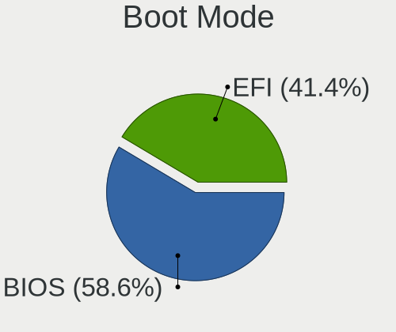

| Mode | Desktops | Percent |
|------|----------|---------|
| BIOS | 985      | 56.64%  |
| EFI  | 754      | 43.36%  |

Filesystem
----------

Type of filesystem

| Type     | Desktops | Percent |
|----------|----------|---------|
| Ext4     | 1476     | 85.42%  |
| Tmpfs    | 84       | 4.86%   |
| Btrfs    | 79       | 4.57%   |
| Overlay  | 36       | 2.08%   |
| Xfs      | 29       | 1.68%   |
| Zfs      | 9        | 0.52%   |
| Unknown  | 5        | 0.29%   |
| Ext3     | 3        | 0.17%   |
| F2fs     | 2        | 0.12%   |
| XXXX     | 1        | 0.06%   |
| Reiserfs | 1        | 0.06%   |
| Jfs      | 1        | 0.06%   |
| ExX4     | 1        | 0.06%   |
| Ext2     | 1        | 0.06%   |

Part. scheme
------------

Scheme of partitioning

| Type    | Desktops | Percent |
|---------|----------|---------|
| GPT     | 818      | 46.66%  |
| Unknown | 743      | 42.38%  |
| MBR     | 192      | 10.95%  |

Dual Boot with Linux/BSD
------------------------

Hosting more than one Linux/BSD

| Dual boot | Desktops | Percent |
|-----------|----------|---------|
| No        | 1406     | 80.71%  |
| Yes       | 336      | 19.29%  |

Dual Boot (Win)
---------------

Hosting Linux and Windows

| Dual boot | Desktops | Percent |
|-----------|----------|---------|
| No        | 1061     | 60.94%  |
| Yes       | 680      | 39.06%  |

Board
-----

Vendor
------

Motherboard manufacturer

| Name                                 | Desktops | Percent |
|--------------------------------------|----------|---------|
| ASUSTek Computer                     | 490      | 28.65%  |
| Gigabyte Technology                  | 332      | 19.42%  |
| MSI                                  | 238      | 13.92%  |
| ASRock                               | 159      | 9.3%    |
| Dell                                 | 112      | 6.55%   |
| Hewlett-Packard                      | 102      | 5.96%   |
| Lenovo                               | 50       | 2.92%   |
| Intel                                | 25       | 1.46%   |
| Unknown                              | 21       | 1.23%   |
| Acer                                 | 18       | 1.05%   |
| Fujitsu                              | 17       | 0.99%   |
| Biostar                              | 15       | 0.88%   |
| Pegatron                             | 14       | 0.82%   |
| Foxconn                              | 11       | 0.64%   |
| AZW                                  | 11       | 0.64%   |
| ECS                                  | 9        | 0.53%   |
| Supermicro                           | 7        | 0.41%   |
| Shuttle                              | 6        | 0.35%   |
| Medion                               | 6        | 0.35%   |
| Huanan                               | 6        | 0.35%   |
| Packard Bell                         | 5        | 0.29%   |
| Alienware                            | 5        | 0.29%   |
| Google                               | 4        | 0.23%   |
| Gateway                              | 4        | 0.23%   |
| BESSTAR Tech                         | 4        | 0.23%   |
| Apple                                | 4        | 0.23%   |
| Positivo                             | 3        | 0.18%   |
| ZOTAC                                | 2        | 0.12%   |
| XFX                                  | 2        | 0.12%   |
| WeiBu                                | 2        | 0.12%   |
| SYWZ                                 | 2        | 0.12%   |
| Seco                                 | 2        | 0.12%   |
| OEM                                  | 2        | 0.12%   |
| Fujitsu Siemens                      | 2        | 0.12%   |
| Colorful Technology                  | 2        | 0.12%   |
| ASRockRack                           | 2        | 0.12%   |
| Wistron                              | 1        | 0.06%   |
| SUPoX COMPUTER                       | 1        | 0.06%   |
| Shenzhen Meigao Electronic Equipment | 1        | 0.06%   |
| Semp Toshiba                         | 1        | 0.06%   |

Model
-----

Motherboard model

| Name                         | Desktops | Percent |
|------------------------------|----------|---------|
| ASUS All Series              | 54       | 3.16%   |
| Unknown                      | 24       | 1.4%    |
| ASUS ROG STRIX B550-F GAMING | 14       | 0.82%   |
| Gigabyte B450M DS3H          | 11       | 0.64%   |
| MSI MS-7C37                  | 10       | 0.58%   |
| MSI MS-7B79                  | 10       | 0.58%   |
| Dell OptiPlex 7010           | 10       | 0.58%   |
| Dell OptiPlex 9020           | 9        | 0.53%   |
| ASUS TUF Gaming X570-PLUS    | 9        | 0.53%   |
| ASUS ROG STRIX X570-E GAMING | 9        | 0.53%   |
| MSI MS-7C91                  | 8        | 0.47%   |
| MSI MS-7C56                  | 8        | 0.47%   |
| MSI MS-7817                  | 8        | 0.47%   |
| Gigabyte X570 AORUS MASTER   | 8        | 0.47%   |
| Gigabyte A320M-S2H           | 8        | 0.47%   |
| ASUS TUF Gaming B550-PLUS    | 8        | 0.47%   |
| ASUS PRIME B450M-A           | 8        | 0.47%   |
| ASUS PRIME B350-PLUS         | 8        | 0.47%   |
| ASUS PRIME A320M-K           | 8        | 0.47%   |
| MSI MS-7B86                  | 7        | 0.41%   |
| Gigabyte 970A-DS3P           | 7        | 0.41%   |
| MSI MS-7A34                  | 6        | 0.35%   |
| MSI MS-7693                  | 6        | 0.35%   |
| HP EliteDesk 800 G1 SFF      | 6        | 0.35%   |
| HP Compaq Elite 8300 SFF     | 6        | 0.35%   |
| ASRock A320M-HDV R4.0        | 6        | 0.35%   |
| MSI MS-7C95                  | 5        | 0.29%   |
| MSI MS-7C02                  | 5        | 0.29%   |
| Gigabyte B550M DS3H          | 5        | 0.29%   |
| Dell XPS 8700                | 5        | 0.29%   |
| Dell OptiPlex 780            | 5        | 0.29%   |
| Dell OptiPlex 390            | 5        | 0.29%   |
| ASUS TUF X470-PLUS GAMING    | 5        | 0.29%   |
| ASUS PRIME X570-P            | 5        | 0.29%   |
| ASUS PRIME X370-PRO          | 5        | 0.29%   |
| ASRock AB350 Pro4            | 5        | 0.29%   |
| MSI MS-7C52                  | 4        | 0.23%   |
| MSI MS-7A38                  | 4        | 0.23%   |
| MSI MS-7A33                  | 4        | 0.23%   |
| MSI MS-7996                  | 4        | 0.23%   |

Model Family
------------

Motherboard model prefix

| Name                   | Desktops | Percent |
|------------------------|----------|---------|
| ASUS PRIME             | 110      | 6.43%   |
| ASUS ROG               | 89       | 5.2%    |
| Dell OptiPlex          | 55       | 3.22%   |
| ASUS All               | 54       | 3.16%   |
| ASUS TUF               | 48       | 2.81%   |
| Lenovo ThinkCentre     | 37       | 2.16%   |
| HP Compaq              | 30       | 1.75%   |
| Dell Precision         | 24       | 1.4%    |
| Unknown                | 24       | 1.4%    |
| Gigabyte X570          | 22       | 1.29%   |
| Gigabyte B450M         | 19       | 1.11%   |
| Gigabyte B550          | 15       | 0.88%   |
| Acer Aspire            | 15       | 0.88%   |
| Fujitsu ESPRIMO        | 13       | 0.76%   |
| Dell Inspiron          | 13       | 0.76%   |
| HP EliteDesk           | 12       | 0.7%    |
| Gigabyte A320M-S2H     | 12       | 0.7%    |
| ASUS M5A78L-M          | 11       | 0.64%   |
| MSI MS-7C37            | 10       | 0.58%   |
| MSI MS-7B79            | 10       | 0.58%   |
| HP ProDesk             | 10       | 0.58%   |
| Gigabyte B550M         | 10       | 0.58%   |
| Gigabyte B450          | 10       | 0.58%   |
| Dell XPS               | 9        | 0.53%   |
| MSI MS-7C91            | 8        | 0.47%   |
| MSI MS-7C56            | 8        | 0.47%   |
| MSI MS-7817            | 8        | 0.47%   |
| HP Pavilion            | 8        | 0.47%   |
| ASUS SABERTOOTH        | 8        | 0.47%   |
| ASRock A320M-HDV       | 8        | 0.47%   |
| MSI MS-7B86            | 7        | 0.41%   |
| Lenovo IdeaCentre      | 7        | 0.41%   |
| Gigabyte Z390          | 7        | 0.41%   |
| Gigabyte GA-78LMT-USB3 | 7        | 0.41%   |
| Gigabyte 970A-DS3P     | 7        | 0.41%   |
| ASUS P8Z77-V           | 7        | 0.41%   |
| ASUS Maximus           | 7        | 0.41%   |
| ASRock B450M           | 7        | 0.41%   |
| ASRock AB350           | 7        | 0.41%   |
| MSI MS-7A34            | 6        | 0.35%   |

MFG Year
--------

Motherboard manufacture year

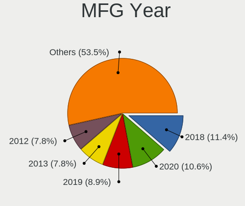

| Year    | Desktops | Percent |
|---------|----------|---------|
| 2018    | 215      | 12.57%  |
| 2020    | 173      | 10.12%  |
| 2019    | 163      | 9.53%   |
| 2013    | 140      | 8.19%   |
| 2012    | 138      | 8.07%   |
| 2017    | 124      | 7.25%   |
| 2014    | 109      | 6.37%   |
| 2011    | 101      | 5.91%   |
| 2015    | 88       | 5.15%   |
| 2021    | 86       | 5.03%   |
| 2016    | 75       | 4.39%   |
| 2010    | 71       | 4.15%   |
| 2009    | 68       | 3.98%   |
| 2022    | 57       | 3.33%   |
| 2008    | 44       | 2.57%   |
| 2007    | 23       | 1.35%   |
| 2023    | 20       | 1.17%   |
| 2006    | 8        | 0.47%   |
| 2005    | 3        | 0.18%   |
| 2024    | 2        | 0.12%   |
| 2004    | 1        | 0.06%   |
| Unknown | 1        | 0.06%   |

Form Factor
-----------

Physical design of the computer

| Name    | Desktops | Percent |
|---------|----------|---------|
| Desktop | 1710     | 100%    |

Secure Boot
-----------

Enabled or disabled

| State    | Desktops | Percent |
|----------|----------|---------|
| Disabled | 1668     | 97.43%  |
| Enabled  | 44       | 2.57%   |

Coreboot
--------

Have coreboot on board

| Used | Desktops | Percent |
|------|----------|---------|
| No   | 1705     | 99.71%  |
| Yes  | 5        | 0.29%   |

RAM Size
--------

Total RAM memory

| Size in GB      | Desktops | Percent |
|-----------------|----------|---------|
| 16.01-24.0      | 504      | 29.02%  |
| 32.01-64.0      | 383      | 22.05%  |
| 8.01-16.0       | 292      | 16.81%  |
| 4.01-8.0        | 215      | 12.38%  |
| 3.01-4.0        | 128      | 7.37%   |
| 64.01-256.0     | 114      | 6.56%   |
| 24.01-32.0      | 84       | 4.84%   |
| 2.01-3.0        | 7        | 0.4%    |
| 1.01-2.0        | 7        | 0.4%    |
| More than 256.0 | 3        | 0.17%   |

RAM Used
--------

Used RAM memory

| Used GB    | Desktops | Percent |
|------------|----------|---------|
| 4.01-8.0   | 495      | 26.41%  |
| 2.01-3.0   | 441      | 23.53%  |
| 1.01-2.0   | 363      | 19.37%  |
| 3.01-4.0   | 318      | 16.97%  |
| 8.01-16.0  | 152      | 8.11%   |
| 16.01-24.0 | 40       | 2.13%   |
| 0.51-1.0   | 39       | 2.08%   |
| 24.01-32.0 | 12       | 0.64%   |
| 32.01-64.0 | 8        | 0.43%   |
| 0.01-0.5   | 5        | 0.27%   |
| Unknown    | 1        | 0.05%   |

Total Drives
------------

Number of drives on board

| Drives | Desktops | Percent |
|--------|----------|---------|
| 2      | 520      | 28.99%  |
| 1      | 476      | 26.53%  |
| 3      | 338      | 18.84%  |
| 4      | 230      | 12.82%  |
| 5      | 116      | 6.47%   |
| 6      | 50       | 2.79%   |
| 7      | 33       | 1.84%   |
| 8      | 11       | 0.61%   |
| 9      | 6        | 0.33%   |
| 0      | 5        | 0.28%   |
| 11     | 3        | 0.17%   |
| 10     | 3        | 0.17%   |
| 12     | 2        | 0.11%   |
| 13     | 1        | 0.06%   |

Has CD-ROM
----------

Has CD-ROM on board

| Presented | Desktops | Percent |
|-----------|----------|---------|
| No        | 975      | 56.42%  |
| Yes       | 753      | 43.58%  |

Has Ethernet
------------

Has Ethernet on board

| Presented | Desktops | Percent |
|-----------|----------|---------|
| Yes       | 1694     | 99.06%  |
| No        | 16       | 0.94%   |

Has WiFi
--------

Has WiFi module

| Presented | Desktops | Percent |
|-----------|----------|---------|
| No        | 953      | 55.02%  |
| Yes       | 779      | 44.98%  |

Has Bluetooth
-------------

Has Bluetooth module

| Presented | Desktops | Percent |
|-----------|----------|---------|
| No        | 1064     | 61.54%  |
| Yes       | 665      | 38.46%  |

Location
--------

Country
-------

Geographic location (country)

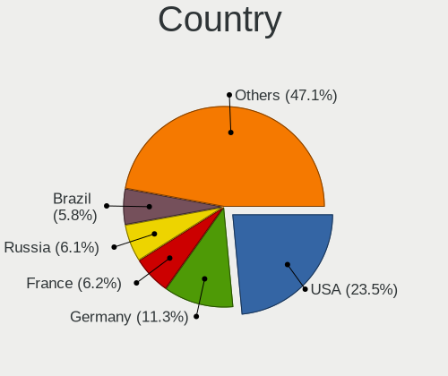

| Country      | Desktops | Percent |
|--------------|----------|---------|
| USA          | 378      | 22.05%  |
| Germany      | 204      | 11.9%   |
| Russia       | 112      | 6.53%   |
| France       | 104      | 6.07%   |
| Brazil       | 95       | 5.54%   |
| UK           | 91       | 5.31%   |
| Italy        | 90       | 5.25%   |
| Canada       | 50       | 2.92%   |
| Spain        | 48       | 2.8%    |
| Netherlands  | 46       | 2.68%   |
| Poland       | 45       | 2.63%   |
| Australia    | 37       | 2.16%   |
| Ukraine      | 26       | 1.52%   |
| Argentina    | 21       | 1.23%   |
| Switzerland  | 20       | 1.17%   |
| Austria      | 20       | 1.17%   |
| Hungary      | 18       | 1.05%   |
| Sweden       | 17       | 0.99%   |
| Finland      | 14       | 0.82%   |
| India        | 13       | 0.76%   |
| Greece       | 13       | 0.76%   |
| Belgium      | 13       | 0.76%   |
| Mexico       | 12       | 0.7%    |
| Czechia      | 12       | 0.7%    |
| Serbia       | 11       | 0.64%   |
| Portugal     | 10       | 0.58%   |
| Turkey       | 9        | 0.53%   |
| Norway       | 9        | 0.53%   |
| Denmark      | 9        | 0.53%   |
| Bulgaria     | 9        | 0.53%   |
| Romania      | 8        | 0.47%   |
| Slovenia     | 7        | 0.41%   |
| Israel       | 7        | 0.41%   |
| China        | 7        | 0.41%   |
| Chile        | 7        | 0.41%   |
| Bangladesh   | 7        | 0.41%   |
| South Africa | 6        | 0.35%   |
| Philippines  | 6        | 0.35%   |
| Peru         | 6        | 0.35%   |
| New Zealand  | 6        | 0.35%   |

City
----

Geographic location (city)

| City              | Desktops | Percent |
|-------------------|----------|---------|
| Moscow            | 23       | 1.28%   |
| Berlin            | 19       | 1.06%   |
| Paris             | 16       | 0.89%   |
| Rome              | 14       | 0.78%   |
| Hamburg           | 14       | 0.78%   |
| Sao Paulo         | 13       | 0.72%   |
| London            | 13       | 0.72%   |
| Sydney            | 11       | 0.61%   |
| Rio de Janeiro    | 11       | 0.61%   |
| Warsaw            | 10       | 0.56%   |
| Vienna            | 10       | 0.56%   |
| St Petersburg     | 10       | 0.56%   |
| Munich            | 10       | 0.56%   |
| Melbourne         | 10       | 0.56%   |
| Milan             | 9        | 0.5%    |
| Kyiv              | 9        | 0.5%    |
| Frankfurt am Main | 9        | 0.5%    |
| Budapest          | 9        | 0.5%    |
| Dallas            | 8        | 0.45%   |
| Novosibirsk       | 7        | 0.39%   |
| Montreal          | 7        | 0.39%   |
| Cologne           | 7        | 0.39%   |
| Chicago           | 7        | 0.39%   |
| Belgrade          | 7        | 0.39%   |
| Amsterdam         | 7        | 0.39%   |
| San Francisco     | 6        | 0.33%   |
| Krakow            | 6        | 0.33%   |
| Zurich            | 5        | 0.28%   |
| Sindelfingen      | 5        | 0.28%   |
| Miami             | 5        | 0.28%   |
| Manchester        | 5        | 0.28%   |
| Leipzig           | 5        | 0.28%   |
| Jacksonville      | 5        | 0.28%   |
| Irkutsk           | 5        | 0.28%   |
| Helsinki          | 5        | 0.28%   |
| Wroclaw           | 4        | 0.22%   |
| Valencia          | 4        | 0.22%   |
| Toronto           | 4        | 0.22%   |
| Seattle           | 4        | 0.22%   |
| Santo Andr      | 4        | 0.22%   |

Drives
------

Drive Vendor
------------

Hard drive vendors

| Vendor                      | Desktops | Drives | Percent |
|-----------------------------|----------|--------|---------|
| WDC                         | 627      | 1146   | 17.56%  |
| Seagate                     | 609      | 1042   | 17.06%  |
| Samsung Electronics         | 578      | 1119   | 16.19%  |
| Kingston                    | 208      | 271    | 5.83%   |
| SanDisk                     | 179      | 244    | 5.01%   |
| Toshiba                     | 177      | 259    | 4.96%   |
| Crucial                     | 176      | 218    | 4.93%   |
| Hitachi                     | 119      | 156    | 3.33%   |
| A-DATA Technology           | 61       | 73     | 1.71%   |
| Intel                       | 58       | 75     | 1.62%   |
| HGST                        | 47       | 71     | 1.32%   |
| Unknown                     | 41       | 63     | 1.15%   |
| Phison                      | 39       | 51     | 1.09%   |
| China                       | 32       | 41     | 0.9%    |
| PNY                         | 27       | 48     | 0.76%   |
| Patriot                     | 27       | 39     | 0.76%   |
| Maxtor                      | 27       | 31     | 0.76%   |
| OCZ                         | 26       | 33     | 0.73%   |
| Silicon Motion              | 24       | 28     | 0.67%   |
| Micron Technology           | 24       | 29     | 0.67%   |
| Corsair                     | 24       | 40     | 0.67%   |
| SPCC                        | 23       | 37     | 0.64%   |
| Intenso                     | 22       | 28     | 0.62%   |
| Phison Electronics          | 21       | 22     | 0.59%   |
| Transcend                   | 20       | 22     | 0.56%   |
| Micron/Crucial Technology   | 19       | 24     | 0.53%   |
| Kingston Technology Company | 14       | 23     | 0.39%   |
| GOODRAM                     | 13       | 29     | 0.36%   |
| JMicron Technology          | 12       | 13     | 0.34%   |
| Gigabyte Technology         | 12       | 13     | 0.34%   |
| SK hynix                    | 11       | 15     | 0.31%   |
| XPG                         | 10       | 11     | 0.28%   |
| Team                        | 10       | 10     | 0.28%   |
| SABRENT                     | 10       | 10     | 0.28%   |
| Hewlett-Packard             | 10       | 13     | 0.28%   |
| ADATA Technology            | 9        | 10     | 0.25%   |
| Unknown                     | 9        | 10     | 0.25%   |
| Mushkin                     | 8        | 9      | 0.22%   |
| Lexar                       | 8        | 9      | 0.22%   |
| Realtek Semiconductor       | 7        | 7      | 0.2%    |

Drive Model
-----------

Hard drive models

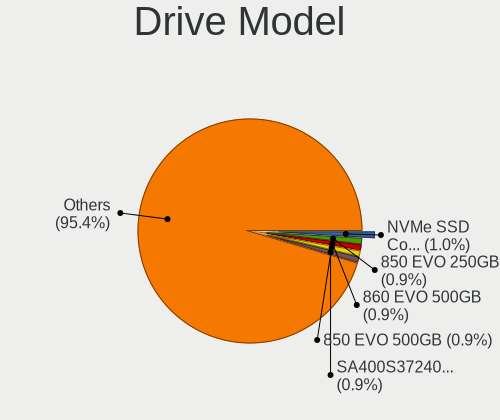

| Model                                             | Desktops | Percent |
|---------------------------------------------------|----------|---------|
| Kingston SA400S37240G 240GB SSD                   | 41       | 0.95%   |
| Samsung SSD 860 EVO 500GB                         | 40       | 0.93%   |
| Samsung SSD 850 EVO 500GB                         | 40       | 0.93%   |
| Samsung SSD 850 EVO 250GB                         | 40       | 0.93%   |
| Seagate ST2000DM008-2FR102 2TB                    | 37       | 0.86%   |
| Samsung SSD 860 EVO 1TB                           | 34       | 0.79%   |
| WDC WD10EZEX-08WN4A0 1TB                          | 32       | 0.75%   |
| Samsung NVMe SSD Controller SM981/PM981/PM983 1TB | 31       | 0.72%   |
| Kingston SA400S37480G 480GB SSD                   | 31       | 0.72%   |
| Toshiba DT01ACA100 1TB                            | 30       | 0.7%    |
| Seagate ST1000DM003-1ER162 1TB                    | 28       | 0.65%   |
| Toshiba HDWD110 1TB                               | 27       | 0.63%   |
| Seagate ST4000DM004-2CV104 4TB                    | 27       | 0.63%   |
| Seagate ST1000DM010-2EP102 1TB                    | 27       | 0.63%   |
| Crucial CT1000MX500SSD1 1TB                       | 27       | 0.63%   |
| Seagate ST500DM002-1BD142 500GB                   | 25       | 0.58%   |
| Seagate ST1000DM003-1CH162 1TB                    | 25       | 0.58%   |
| Seagate ST2000DM001-1ER164 2TB                    | 24       | 0.56%   |
| Samsung NVMe SSD Drive 500GB                      | 24       | 0.56%   |
| Samsung SSD 970 EVO Plus 1TB                      | 21       | 0.49%   |
| Toshiba DT01ACA200 2TB                            | 19       | 0.44%   |
| Seagate ST31000524AS 1TB                          | 19       | 0.44%   |
| Seagate ST2000DM006-2DM164 2TB                    | 19       | 0.44%   |
| WDC WD20EARX-00PASB0 2TB                          | 18       | 0.42%   |
| Samsung SSD 860 EVO 250GB                         | 18       | 0.42%   |
| Seagate ST3500418AS 500GB                         | 17       | 0.4%    |
| WDC WD20EZRZ-00Z5HB0 2TB                          | 16       | 0.37%   |
| Samsung SSD 970 EVO Plus 500GB                    | 16       | 0.37%   |
| Samsung SSD 840 EVO 250GB                         | 16       | 0.37%   |
| Seagate ST3500413AS 500GB                         | 15       | 0.35%   |
| Samsung HD103SJ 1TB                               | 15       | 0.35%   |
| Crucial CT500MX500SSD1 500GB                      | 15       | 0.35%   |
| WDC WD1002FAEX-00Z3A0 1TB                         | 14       | 0.33%   |
| Seagate ST31000528AS 1TB                          | 14       | 0.33%   |
| Seagate ST2000DM001-1CH164 2TB                    | 14       | 0.33%   |
| SanDisk SSD PLUS 480GB                            | 14       | 0.33%   |
| Samsung SSD 870 QVO 1TB                           | 14       | 0.33%   |
| Samsung NVMe SSD Drive 1TB                        | 14       | 0.33%   |
| Kingston SA400S37120G 120GB SSD                   | 14       | 0.33%   |
| Kingston SA2000M81000G 1TB                        | 14       | 0.33%   |

HDD Vendor
----------

Hard disk drive vendors

| Vendor              | Desktops | Drives | Percent |
|---------------------|----------|--------|---------|
| Seagate             | 589      | 1011   | 35.85%  |
| WDC                 | 552      | 1006   | 33.6%   |
| Toshiba             | 162      | 234    | 9.86%   |
| Hitachi             | 119      | 156    | 7.24%   |
| Samsung Electronics | 102      | 166    | 6.21%   |
| HGST                | 47       | 71     | 2.86%   |
| Maxtor              | 26       | 30     | 1.58%   |
| Unknown             | 14       | 16     | 0.85%   |
| JMicron Technology  | 7        | 8      | 0.43%   |
| Fujitsu             | 4        | 4      | 0.24%   |
| Apple               | 4        | 4      | 0.24%   |
| Hewlett-Packard     | 3        | 5      | 0.18%   |
| USB                 | 2        | 3      | 0.12%   |
| External            | 2        | 2      | 0.12%   |
| WD MediaMax         | 1        | 1      | 0.06%   |
| TO Exter            | 1        | 1      | 0.06%   |
| StoreJet            | 1        | 1      | 0.06%   |
| SSI                 | 1        | 1      | 0.06%   |
| SAGE                | 1        | 1      | 0.06%   |
| Magnetic Data       | 1        | 2      | 0.06%   |
| LIO-ORG             | 1        | 1      | 0.06%   |
| LaCie               | 1        | 1      | 0.06%   |
| IET                 | 1        | 1      | 0.06%   |
| ASMT                | 1        | 1      | 0.06%   |

SSD Vendor
----------

Solid state drive vendors

| Vendor              | Desktops | Drives | Percent |
|---------------------|----------|--------|---------|
| Samsung Electronics | 342      | 549    | 25.95%  |
| Kingston            | 171      | 217    | 12.97%  |
| Crucial             | 147      | 185    | 11.15%  |
| SanDisk             | 118      | 156    | 8.95%   |
| WDC                 | 73       | 97     | 5.54%   |
| A-DATA Technology   | 50       | 61     | 3.79%   |
| Intel               | 32       | 43     | 2.43%   |
| China               | 32       | 41     | 2.43%   |
| Patriot             | 26       | 38     | 1.97%   |
| OCZ                 | 26       | 33     | 1.97%   |
| PNY                 | 25       | 46     | 1.9%    |
| SPCC                | 20       | 32     | 1.52%   |
| Intenso             | 18       | 20     | 1.37%   |
| Micron Technology   | 17       | 19     | 1.29%   |
| Transcend           | 15       | 15     | 1.14%   |
| Toshiba             | 13       | 18     | 0.99%   |
| GOODRAM             | 13       | 29     | 0.99%   |
| Corsair             | 12       | 25     | 0.91%   |
| SABRENT             | 10       | 10     | 0.76%   |
| Team                | 9        | 9      | 0.68%   |
| Mushkin             | 8        | 9      | 0.61%   |
| Lexar               | 7        | 8      | 0.53%   |
| KingSpec            | 7        | 9      | 0.53%   |
| Hewlett-Packard     | 6        | 6      | 0.46%   |
| Gigabyte Technology | 6        | 6      | 0.46%   |
| Seagate             | 5        | 5      | 0.38%   |
| Plextor             | 5        | 6      | 0.38%   |
| Unknown             | 5        | 6      | 0.38%   |
| Verbatim            | 4        | 5      | 0.3%    |
| SK hynix            | 4        | 5      | 0.3%    |
| Emtec               | 4        | 5      | 0.3%    |
| Apacer              | 4        | 9      | 0.3%    |
| Unknown             | 3        | 3      | 0.23%   |
| Smartbuy            | 3        | 5      | 0.23%   |
| LITEON              | 3        | 4      | 0.23%   |
| KIOXIA-EXCERIA      | 3        | 5      | 0.23%   |
| KingDian            | 3        | 4      | 0.23%   |
| INNOVATION IT       | 3        | 3      | 0.23%   |
| ASMT                | 3        | 3      | 0.23%   |
| AMD                 | 3        | 3      | 0.23%   |

Drive Kind
----------

HDD or SSD

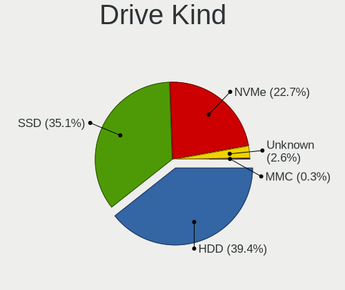

| Kind    | Desktops | Drives | Percent |
|---------|----------|--------|---------|
| HDD     | 1192     | 2727   | 40.92%  |
| SSD     | 1048     | 1820   | 35.98%  |
| NVMe    | 595      | 960    | 20.43%  |
| Unknown | 68       | 109    | 2.33%   |
| MMC     | 10       | 12     | 0.34%   |

Drive Connector
---------------

SATA, SAS, NVMe, etc.

| Type | Desktops | Drives | Percent |
|------|----------|--------|---------|
| SATA | 1550     | 4407   | 67.04%  |
| NVMe | 592      | 953    | 25.61%  |
| SAS  | 160      | 256    | 6.92%   |
| MMC  | 10       | 12     | 0.43%   |

Drive Size
----------

Size of hard drive

| Size in TB | Desktops | Drives | Percent |
|------------|----------|--------|---------|
| 0.01-0.5   | 1090     | 2029   | 42.54%  |
| 0.51-1.0   | 760      | 1299   | 29.66%  |
| 1.01-2.0   | 370      | 628    | 14.44%  |
| 3.01-4.0   | 151      | 279    | 5.89%   |
| 2.01-3.0   | 90       | 131    | 3.51%   |
| 4.01-10.0  | 86       | 153    | 3.36%   |
| 10.01-20.0 | 15       | 28     | 0.59%   |

Space Total
-----------

Amount of disk space available on the file system

| Size in GB     | Desktops | Percent |
|----------------|----------|---------|
| 501-1000       | 336      | 18.77%  |
| More than 3000 | 307      | 17.15%  |
| 251-500        | 292      | 16.31%  |
| 101-250        | 289      | 16.15%  |
| 1001-2000      | 282      | 15.75%  |
| 2001-3000      | 162      | 9.05%   |
| 51-100         | 55       | 3.07%   |
| 1-20           | 40       | 2.23%   |
| 21-50          | 19       | 1.06%   |
| Unknown        | 8        | 0.45%   |

Space Used
----------

Amount of used disk space

| Used GB        | Desktops | Percent |
|----------------|----------|---------|
| 1-20           | 278      | 15.08%  |
| 101-250        | 263      | 14.27%  |
| 501-1000       | 252      | 13.67%  |
| 21-50          | 219      | 11.88%  |
| 251-500        | 218      | 11.83%  |
| 51-100         | 215      | 11.67%  |
| 1001-2000      | 175      | 9.5%    |
| More than 3000 | 149      | 8.08%   |
| 2001-3000      | 66       | 3.58%   |
| Unknown        | 8        | 0.43%   |

Malfunc. Drives
---------------

Drive models with a malfunction

| Model                                   | Desktops | Drives | Percent |
|-----------------------------------------|----------|--------|---------|
| Seagate ST500DM002-1BD142 500GB         | 6        | 6      | 2.04%   |
| Seagate ST31000524AS 1TB                | 5        | 6      | 1.7%    |
| WDC WD5000AAKS-00V1A0 500GB             | 4        | 5      | 1.36%   |
| Seagate ST1000DM003-1CH162 1TB          | 4        | 10     | 1.36%   |
| WDC WD30EZRX-00MMMB0 3TB                | 3        | 3      | 1.02%   |
| WDC WD20EFRX-68EUZN0 2TB                | 3        | 6      | 1.02%   |
| WDC WD20EARX-00PASB0 2TB                | 3        | 3      | 1.02%   |
| Seagate ST3500418AS 500GB               | 3        | 3      | 1.02%   |
| Seagate ST31000528AS 1TB                | 3        | 3      | 1.02%   |
| Samsung Electronics SSD 870 EVO 500GB   | 3        | 3      | 1.02%   |
| Crucial CT1050MX300SSD1 1050GB          | 3        | 3      | 1.02%   |
| WDC WD5000AAKS-00A7B0 500GB             | 2        | 2      | 0.68%   |
| WDC WD40EZRZ-00GXCB0 4TB                | 2        | 2      | 0.68%   |
| WDC WD40EFRX-68N32N0 4TB                | 2        | 4      | 0.68%   |
| WDC WD3200JD-22KLB0 320GB               | 2        | 3      | 0.68%   |
| WDC WD30EFRX-68EUZN0 3TB                | 2        | 2      | 0.68%   |
| WDC WD15EARS-00Z5B1 1TB                 | 2        | 2      | 0.68%   |
| WDC WD10EZEX-22MFCA0 1TB                | 2        | 3      | 0.68%   |
| WDC WD10EZEX-08WN4A0 1TB                | 2        | 2      | 0.68%   |
| WDC WD10EZEX-00BN5A0 1TB                | 2        | 2      | 0.68%   |
| WDC WD10EARS-00MVWB0 1TB                | 2        | 4      | 0.68%   |
| WDC WD10EADS-00L5B1 1TB                 | 2        | 2      | 0.68%   |
| WDC WD1001FALS-40U9B0 1TB               | 2        | 3      | 0.68%   |
| Toshiba HDWD110 1TB                     | 2        | 2      | 0.68%   |
| Seagate ST9500325AS 500GB               | 2        | 6      | 0.68%   |
| Seagate ST9250315AS 250GB               | 2        | 3      | 0.68%   |
| Seagate ST32000542AS 2TB                | 2        | 2      | 0.68%   |
| Seagate ST3160827AS 160GB               | 2        | 3      | 0.68%   |
| Seagate ST1000DM003-1SB102 1TB          | 2        | 2      | 0.68%   |
| SanDisk SSD PLUS 240 GB                 | 2        | 2      | 0.68%   |
| SanDisk SSD PLUS 1000GB                 | 2        | 2      | 0.68%   |
| Samsung Electronics SSD 870 EVO 1TB     | 2        | 2      | 0.68%   |
| Samsung Electronics HD502HJ 500GB       | 2        | 2      | 0.68%   |
| Samsung Electronics HD103SI 1TB         | 2        | 4      | 0.68%   |
| OCZ VERTEX3 120GB SSD                   | 2        | 2      | 0.68%   |
| Neo Forza NFS121SA312-6007000 120GB SSD | 2        | 2      | 0.68%   |
| Maxtor STM3250310AS 250GB               | 2        | 2      | 0.68%   |
| Intel SSDSA2M080G2GC 80GB               | 2        | 2      | 0.68%   |
| Hitachi HDS721010CLA630 1TB             | 2        | 2      | 0.68%   |
| Crucial CT525MX300SSD1 528GB            | 2        | 2      | 0.68%   |

Malfunc. Drive Vendor
---------------------

Vendors of faulty drives

| Vendor              | Desktops | Drives | Percent |
|---------------------|----------|--------|---------|
| WDC                 | 91       | 126    | 32.62%  |
| Seagate             | 63       | 85     | 22.58%  |
| Samsung Electronics | 33       | 54     | 11.83%  |
| Hitachi             | 16       | 17     | 5.73%   |
| Toshiba             | 11       | 12     | 3.94%   |
| Intel               | 11       | 16     | 3.94%   |
| Crucial             | 11       | 14     | 3.94%   |
| SanDisk             | 8        | 9      | 2.87%   |
| Maxtor              | 6        | 7      | 2.15%   |
| OCZ                 | 4        | 4      | 1.43%   |
| Kingston            | 3        | 3      | 1.08%   |
| Neo                 | 2        | 2      | 0.72%   |
| Micron Technology   | 2        | 2      | 0.72%   |
| Intenso             | 2        | 2      | 0.72%   |
| HGST                | 2        | 6      | 0.72%   |
| Fujitsu             | 2        | 2      | 0.72%   |
| A-DATA Technology   | 2        | 2      | 0.72%   |
| VENO                | 1        | 1      | 0.36%   |
| T-FORCE             | 1        | 1      | 0.36%   |
| SSSTC               | 1        | 1      | 0.36%   |
| SPCC                | 1        | 1      | 0.36%   |
| Phison Electronics  | 1        | 1      | 0.36%   |
| ORTIAL              | 1        | 1      | 0.36%   |
| LITEONIT            | 1        | 1      | 0.36%   |
| Corsair             | 1        | 1      | 0.36%   |
| ASMT                | 1        | 1      | 0.36%   |
| Apple               | 1        | 1      | 0.36%   |

Malfunc. HDD Vendor
-------------------

Vendors of faulty HDD drives

| Vendor              | Desktops | Drives | Percent |
|---------------------|----------|--------|---------|
| WDC                 | 90       | 125    | 43.69%  |
| Seagate             | 63       | 85     | 30.58%  |
| Hitachi             | 16       | 17     | 7.77%   |
| Samsung Electronics | 15       | 33     | 7.28%   |
| Toshiba             | 10       | 11     | 4.85%   |
| Maxtor              | 6        | 7      | 2.91%   |
| HGST                | 2        | 6      | 0.97%   |
| Fujitsu             | 2        | 2      | 0.97%   |
| ASMT                | 1        | 1      | 0.49%   |
| Apple               | 1        | 1      | 0.49%   |

Malfunc. Drive Kind
-------------------

Kinds of faulty drives

| Kind | Desktops | Drives | Percent |
|------|----------|--------|---------|
| HDD  | 180      | 288    | 72%     |
| SSD  | 61       | 75     | 24.4%   |
| NVMe | 9        | 10     | 3.6%    |

Failed Drives
-------------

Failed drive models

| Model                                 | Desktops | Drives | Percent |
|---------------------------------------|----------|--------|---------|
| Samsung Electronics SSD 960 EVO 250GB | 1        | 2      | 25%     |
| Samsung Electronics HD502IJ 500GB     | 1        | 1      | 25%     |
| OCZ VERTEX460A 480GB SSD              | 1        | 1      | 25%     |
| Hitachi HTS547550A9E384 500GB         | 1        | 1      | 25%     |

Failed Drive Vendor
-------------------

Failed drive vendors

| Vendor              | Desktops | Drives | Percent |
|---------------------|----------|--------|---------|
| Samsung Electronics | 2        | 3      | 50%     |
| OCZ                 | 1        | 1      | 25%     |
| Hitachi             | 1        | 1      | 25%     |

Drive Status
------------

Number of failed and malfunc. drives

| Status   | Desktops | Drives | Percent |
|----------|----------|--------|---------|
| Detected | 966      | 3080   | 47.4%   |
| Works    | 832      | 2170   | 40.82%  |
| Malfunc  | 237      | 373    | 11.63%  |
| Failed   | 3        | 5      | 0.15%   |

Storage controller
------------------

Storage Vendor
--------------

Storage controller vendors

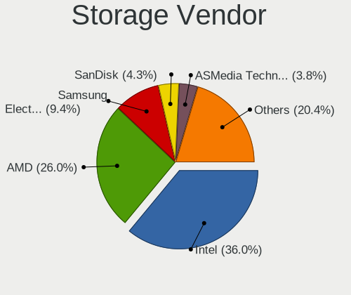

| Vendor                                  | Desktops | Percent |
|-----------------------------------------|----------|---------|
| Intel                                   | 977      | 37.52%  |
| AMD                                     | 695      | 26.69%  |
| Samsung Electronics                     | 230      | 8.83%   |
| ASMedia Technology                      | 104      | 3.99%   |
| SanDisk                                 | 97       | 3.73%   |
| Phison Electronics                      | 78       | 3%      |
| JMicron Technology                      | 59       | 2.27%   |
| Kingston Technology Company             | 54       | 2.07%   |
| Marvell Technology Group                | 49       | 1.88%   |
| Micron/Crucial Technology               | 47       | 1.8%    |
| Silicon Motion                          | 36       | 1.38%   |
| Nvidia                                  | 32       | 1.23%   |
| ADATA Technology                        | 23       | 0.88%   |
| Realtek Semiconductor                   | 16       | 0.61%   |
| Broadcom / LSI                          | 12       | 0.46%   |
| Silicon Image                           | 11       | 0.42%   |
| LSI Logic / Symbios Logic               | 11       | 0.42%   |
| VIA Technologies                        | 7        | 0.27%   |
| Toshiba America Info Systems            | 7        | 0.27%   |
| SK hynix                                | 7        | 0.27%   |
| Micron Technology                       | 7        | 0.27%   |
| KIOXIA                                  | 7        | 0.27%   |
| Seagate Technology                      | 6        | 0.23%   |
| MAXIO Technology (Hangzhou)             | 6        | 0.23%   |
| Shenzhen Longsys Electronics            | 3        | 0.12%   |
| INNOGRIT                                | 3        | 0.12%   |
| Zhaoxin                                 | 2        | 0.08%   |
| Yangtze Memory Technologies             | 2        | 0.08%   |
| Lite-On Technology                      | 2        | 0.08%   |
| Integrated Technology Express           | 2        | 0.08%   |
| Adaptec                                 | 2        | 0.08%   |
| Solidigm                                | 1        | 0.04%   |
| Solid State Storage Technology          | 1        | 0.04%   |
| Silicon Integrated Systems [SiS]        | 1        | 0.04%   |
| Shenzhen Shichuangyi Electronics        | 1        | 0.04%   |
| Promise Technology                      | 1        | 0.04%   |
| OCZ Technology Group                    | 1        | 0.04%   |
| O2 Micro                                | 1        | 0.04%   |
| Netac Technology                        | 1        | 0.04%   |
| Jiangsu Xinsheng Intelligent Technology | 1        | 0.04%   |

Storage Model
-------------

Storage controller models

| Model                                                                                   | Desktops | Percent |
|-----------------------------------------------------------------------------------------|----------|---------|
| AMD FCH SATA Controller [AHCI mode]                                                     | 394      | 12.29%  |
| Samsung NVMe SSD Controller SM981/PM981/PM983                                           | 140      | 4.37%   |
| AMD 400 Series Chipset SATA Controller                                                  | 139      | 4.34%   |
| Intel 8 Series/C220 Series Chipset Family 6-port SATA Controller 1 [AHCI mode]          | 121      | 3.78%   |
| AMD 500 Series Chipset SATA Controller                                                  | 104      | 3.24%   |
| ASMedia ASM1061/ASM1062 Serial ATA Controller                                           | 98       | 3.06%   |
| Intel 200 Series PCH SATA controller [AHCI mode]                                        | 83       | 2.59%   |
| Intel 6 Series/C200 Series Chipset Family 6 port Desktop SATA AHCI Controller           | 82       | 2.56%   |
| Intel Q170/Q150/B150/H170/H110/Z170/CM236 Chipset SATA Controller [AHCI Mode]           | 80       | 2.5%    |
| AMD SB7x0/SB8x0/SB9x0 SATA Controller [AHCI mode]                                       | 79       | 2.46%   |
| AMD SB7x0/SB8x0/SB9x0 IDE Controller                                                    | 78       | 2.43%   |
| Intel 7 Series/C210 Series Chipset Family 6-port SATA Controller [AHCI mode]            | 74       | 2.31%   |
| Intel SATA Controller [RAID mode]                                                       | 71       | 2.22%   |
| Intel Cannon Lake PCH SATA AHCI Controller                                              | 54       | 1.68%   |
| AMD 300 Series Chipset SATA Controller                                                  | 46       | 1.44%   |
| AMD SB7x0/SB8x0/SB9x0 SATA Controller [IDE mode]                                        | 45       | 1.4%    |
| AMD FCH SATA Controller D                                                               | 44       | 1.37%   |
| Samsung NVMe SSD Controller PM9A1/PM9A3/980PRO                                          | 42       | 1.31%   |
| Intel 9 Series Chipset Family SATA Controller [AHCI Mode]                               | 39       | 1.22%   |
| Intel 500 Series Chipset Family SATA AHCI Controller                                    | 37       | 1.15%   |
| JMicron JMB363 SATA/IDE Controller                                                      | 34       | 1.06%   |
| Intel 6 Series/C200 Series Chipset Family Desktop SATA Controller (IDE mode, ports 4-5) | 33       | 1.03%   |
| Intel 6 Series/C200 Series Chipset Family Desktop SATA Controller (IDE mode, ports 0-3) | 33       | 1.03%   |
| Intel NM10/ICH7 Family SATA Controller [IDE mode]                                       | 31       | 0.97%   |
| Phison E12 NVMe Controller                                                              | 30       | 0.94%   |
| Kingston Company A2000 NVMe SSD SM2263EN                                                | 28       | 0.87%   |
| AMD 600 Series Chipset SATA Controller                                                  | 28       | 0.87%   |
| Silicon Motion SM2263EN/SM2263XT (DRAM-less) NVMe SSD Controllers                       | 26       | 0.81%   |
| Intel Alder Lake-S PCH SATA Controller [AHCI Mode]                                      | 26       | 0.81%   |
| Samsung NVMe SSD Controller SM961/PM961/SM963                                           | 25       | 0.78%   |
| Samsung NVMe SSD Controller 980 (DRAM-less)                                             | 24       | 0.75%   |
| Intel 82801JI (ICH10 Family) SATA AHCI Controller                                       | 24       | 0.75%   |
| Intel 82801G (ICH7 Family) IDE Controller                                               | 24       | 0.75%   |
| AMD X370 Series Chipset SATA Controller                                                 | 24       | 0.75%   |
| Micron/Crucial P2 [Nick P2] / P3 / P3 Plus NVMe PCIe SSD (DRAM-less)                    | 23       | 0.72%   |
| Intel 5 Series/3400 Series Chipset 6 port SATA AHCI Controller                          | 22       | 0.69%   |
| Intel C610/X99 series chipset 6-Port SATA Controller [AHCI mode]                        | 21       | 0.66%   |
| Phison E16 PCIe4 NVMe Controller                                                        | 20       | 0.62%   |
| SanDisk Ultra 3D / WD Blue SN550 NVMe SSD                                               | 19       | 0.59%   |
| Intel SSD 660P Series                                                                   | 18       | 0.56%   |

Storage Kind
------------

Kind of storage controller (IDE, SATA, NVMe, SAS, ...)

| Kind | Desktops | Percent |
|------|----------|---------|
| SATA | 1484     | 59.03%  |
| NVMe | 591      | 23.51%  |
| IDE  | 295      | 11.73%  |
| RAID | 123      | 4.89%   |
| SAS  | 13       | 0.52%   |
| SCSI | 8        | 0.32%   |

Processor
---------

CPU Vendor
----------

Processor vendors

| Vendor        | Desktops | Percent |
|---------------|----------|---------|
| Intel         | 979      | 57.25%  |
| AMD           | 726      | 42.46%  |
| sifive,u74-mc | 3        | 0.18%   |
| CentaurHauls  | 2        | 0.12%   |

CPU Model
---------

Processor models

| Model                                       | Desktops | Percent |
|---------------------------------------------|----------|---------|
| AMD Ryzen 5 3600 6-Core Processor           | 47       | 2.74%   |
| AMD Ryzen 7 3700X 8-Core Processor          | 41       | 2.39%   |
| AMD Ryzen 9 3900X 12-Core Processor         | 30       | 1.75%   |
| AMD Ryzen 5 5600X 6-Core Processor          | 27       | 1.57%   |
| Intel Core i7-4790 CPU @ 3.60GHz            | 25       | 1.46%   |
| Intel Core i7-3770 CPU @ 3.40GHz            | 25       | 1.46%   |
| AMD Ryzen 5 2600 Six-Core Processor         | 21       | 1.22%   |
| Intel Core i7-6700K CPU @ 4.00GHz           | 20       | 1.16%   |
| Intel Core i7-4770 CPU @ 3.40GHz            | 20       | 1.16%   |
| Intel Core i7-4790K CPU @ 4.00GHz           | 19       | 1.11%   |
| Intel Core i5-3470 CPU @ 3.20GHz            | 19       | 1.11%   |
| AMD FX-8350 Eight-Core Processor            | 19       | 1.11%   |
| AMD Ryzen 5 1600 Six-Core Processor         | 18       | 1.05%   |
| AMD Ryzen 9 5900X 12-Core Processor         | 17       | 0.99%   |
| AMD Ryzen 7 2700X Eight-Core Processor      | 17       | 0.99%   |
| AMD Ryzen 5 3400G with Radeon Vega Graphics | 17       | 0.99%   |
| Intel Core i5-2400 CPU @ 3.10GHz            | 16       | 0.93%   |
| AMD Ryzen 5 2600X Six-Core Processor        | 16       | 0.93%   |
| Intel Core 2 Duo CPU E8400 @ 3.00GHz        | 15       | 0.87%   |
| AMD Ryzen 7 5700G with Radeon Graphics      | 15       | 0.87%   |
| Intel Core i9-9900K CPU @ 3.60GHz           | 13       | 0.76%   |
| Intel Core i7-7700K CPU @ 4.20GHz           | 13       | 0.76%   |
| Intel Core i5-4690 CPU @ 3.50GHz            | 13       | 0.76%   |
| AMD Ryzen 9 5950X 16-Core Processor         | 13       | 0.76%   |
| AMD Ryzen 5 2400G with Radeon Vega Graphics | 13       | 0.76%   |
| Intel Core i5-4590 CPU @ 3.30GHz            | 12       | 0.7%    |
| Intel Core i5-4460 CPU @ 3.20GHz            | 12       | 0.7%    |
| AMD Ryzen 7 3800X 8-Core Processor          | 12       | 0.7%    |
| Intel Core i7-8700 CPU @ 3.20GHz            | 11       | 0.64%   |
| Intel Core i7-6700 CPU @ 3.40GHz            | 11       | 0.64%   |
| Intel Core i5-6500 CPU @ 3.20GHz            | 11       | 0.64%   |
| Intel Core i5-10400F CPU @ 2.90GHz          | 11       | 0.64%   |
| Intel Core i3-2120 CPU @ 3.30GHz            | 11       | 0.64%   |
| AMD Ryzen 7 2700 Eight-Core Processor       | 11       | 0.64%   |
| Intel Core i7-8700K CPU @ 3.70GHz           | 10       | 0.58%   |
| Intel Core i7-2600 CPU @ 3.40GHz            | 10       | 0.58%   |
| Intel Core i7 CPU 920 @ 2.67GHz             | 10       | 0.58%   |
| Intel Core i5-9600K CPU @ 3.70GHz           | 10       | 0.58%   |
| Intel Core i5-6400 CPU @ 2.70GHz            | 10       | 0.58%   |
| AMD Ryzen 9 7950X 16-Core Processor         | 10       | 0.58%   |

CPU Model Family
----------------

Processor model prefix

| Model                   | Desktops | Percent |
|-------------------------|----------|---------|
| Intel Core i5           | 299      | 17.4%   |
| Intel Core i7           | 274      | 15.95%  |
| AMD Ryzen 5             | 210      | 12.22%  |
| AMD Ryzen 7             | 144      | 8.38%   |
| AMD Ryzen 9             | 93       | 5.41%   |
| Intel Core i3           | 80       | 4.66%   |
| Intel Xeon              | 77       | 4.48%   |
| Other                   | 71       | 4.13%   |
| AMD FX                  | 68       | 3.96%   |
| Intel Pentium           | 37       | 2.15%   |
| Intel Core 2 Duo        | 35       | 2.04%   |
| Intel Celeron           | 31       | 1.8%    |
| AMD Phenom II X4        | 28       | 1.63%   |
| Intel Core i9           | 26       | 1.51%   |
| AMD Ryzen 3             | 25       | 1.46%   |
| Intel Core 2 Quad       | 24       | 1.4%    |
| AMD A8                  | 20       | 1.16%   |
| AMD A10                 | 19       | 1.11%   |
| AMD Athlon II X4        | 14       | 0.81%   |
| AMD Ryzen Threadripper  | 13       | 0.76%   |
| Intel Pentium Dual-Core | 12       | 0.7%    |
| AMD Athlon II X2        | 10       | 0.58%   |
| AMD Athlon 64 X2        | 9        | 0.52%   |
| AMD Phenom II X6        | 8        | 0.47%   |
| AMD Ryzen 7 PRO         | 7        | 0.41%   |
| AMD Athlon              | 7        | 0.41%   |
| AMD A6                  | 7        | 0.41%   |
| AMD Ryzen 5 PRO         | 6        | 0.35%   |
| AMD A4                  | 6        | 0.35%   |
| AMD Phenom II X2        | 5        | 0.29%   |
| Intel Pentium Gold      | 4        | 0.23%   |
| Intel Pentium 4         | 4        | 0.23%   |
| AMD Sempron             | 4        | 0.23%   |
| AMD Phenom              | 4        | 0.23%   |
| AMD Athlon 64           | 4        | 0.23%   |
| Intel Pentium Dual      | 3        | 0.17%   |
| Intel Pentium D         | 3        | 0.17%   |
| Intel Atom              | 3        | 0.17%   |
| Intel Core 2            | 2        | 0.12%   |
| AMD Ryzen Embedded      | 2        | 0.12%   |

CPU Cores
---------

Number of processor cores

| Number  | Desktops | Percent |
|---------|----------|---------|
| 4       | 688      | 40.09%  |
| 6       | 318      | 18.53%  |
| 2       | 292      | 17.02%  |
| 8       | 222      | 12.94%  |
| 12      | 70       | 4.08%   |
| 16      | 52       | 3.03%   |
| 1       | 24       | 1.4%    |
| 10      | 12       | 0.7%    |
| 3       | 12       | 0.7%    |
| 24      | 10       | 0.58%   |
| 32      | 3        | 0.17%   |
| 20      | 3        | 0.17%   |
| 14      | 3        | 0.17%   |
| Unknown | 3        | 0.17%   |
| 18      | 2        | 0.12%   |
| 64      | 1        | 0.06%   |
| 36      | 1        | 0.06%   |

CPU Sockets
-----------

Number of sockets

| Number  | Desktops | Percent |
|---------|----------|---------|
| 1       | 1687     | 98.65%  |
| 2       | 20       | 1.17%   |
| Unknown | 3        | 0.18%   |

CPU Threads
-----------

Threads per core (Hyper-Threading)

| Number  | Desktops | Percent |
|---------|----------|---------|
| 2       | 1119     | 65.29%  |
| 1       | 592      | 34.54%  |
| Unknown | 3        | 0.18%   |

CPU Op-Modes
------------

CPU Operation Modes (32-bit, 64-bit)

| Op mode        | Desktops | Percent |
|----------------|----------|---------|
| 32-bit, 64-bit | 1705     | 99.71%  |
| Unknown        | 3        | 0.18%   |
| 32-bit         | 2        | 0.12%   |

CPU Microcode
-------------

Microcode number

| Number     | Desktops | Percent |
|------------|----------|---------|
| Unknown    | 631      | 35.57%  |
| 0x306c3    | 106      | 5.98%   |
| 0x08701021 | 83       | 4.68%   |
| 0x306a9    | 67       | 3.78%   |
| 0x206a7    | 59       | 3.33%   |
| 0x0800820d | 48       | 2.71%   |
| 0x506e3    | 47       | 2.65%   |
| 0x06000852 | 39       | 2.2%    |
| 0x1067a    | 38       | 2.14%   |
| 0x08701013 | 38       | 2.14%   |
| 0x906e9    | 37       | 2.09%   |
| 0x906ea    | 33       | 1.86%   |
| 0x010000c8 | 28       | 1.58%   |
| 0xa0653    | 20       | 1.13%   |
| 0x906ed    | 18       | 1.01%   |
| 0x0a201016 | 18       | 1.01%   |
| 0x306f2    | 17       | 0.96%   |
| 0x08001138 | 17       | 0.96%   |
| 0x0a601203 | 15       | 0.85%   |
| 0xa0655    | 14       | 0.79%   |
| 0x0a50000c | 14       | 0.79%   |
| 0x08108109 | 14       | 0.79%   |
| 0x06001119 | 14       | 0.79%   |
| 0x6fb      | 13       | 0.73%   |
| 0x106e5    | 13       | 0.73%   |
| 0x0a201009 | 13       | 0.73%   |
| 0x010000db | 13       | 0.73%   |
| 0x106a5    | 12       | 0.68%   |
| 0x08001137 | 12       | 0.68%   |
| 0x10676    | 11       | 0.62%   |
| 0xa0671    | 10       | 0.56%   |
| 0x306e4    | 10       | 0.56%   |
| 0x08101016 | 10       | 0.56%   |
| 0x06003106 | 10       | 0.56%   |
| 0x90672    | 8        | 0.45%   |
| 0x206d7    | 8        | 0.45%   |
| 0x0a50000d | 8        | 0.45%   |
| 0x0600063e | 8        | 0.45%   |
| 0x906ec    | 7        | 0.39%   |
| 0x20655    | 7        | 0.39%   |

CPU Microarch
-------------

Microarchitecture

| Name             | Desktops | Percent |
|------------------|----------|---------|
| Haswell          | 206      | 11.98%  |
| Zen 2            | 179      | 10.41%  |
| KabyLake         | 165      | 9.59%   |
| IvyBridge        | 123      | 7.15%   |
| Zen+             | 110      | 6.4%    |
| Zen 3            | 106      | 6.16%   |
| SandyBridge      | 102      | 5.93%   |
| Skylake          | 82       | 4.77%   |
| Piledriver       | 82       | 4.77%   |
| Zen              | 79       | 4.59%   |
| Unknown          | 78       | 4.53%   |
| K10              | 72       | 4.19%   |
| Penryn           | 64       | 3.72%   |
| CometLake        | 48       | 2.79%   |
| Nehalem          | 38       | 2.21%   |
| Core             | 25       | 1.45%   |
| Westmere         | 24       | 1.4%    |
| Alderlake Hybrid | 16       | 0.93%   |
| Steamroller      | 15       | 0.87%   |
| K8 Hammer        | 15       | 0.87%   |
| Icelake          | 14       | 0.81%   |
| Excavator        | 13       | 0.76%   |
| Bulldozer        | 10       | 0.58%   |
| Broadwell        | 9        | 0.52%   |
| Goldmont plus    | 8        | 0.47%   |
| NetBurst         | 7        | 0.41%   |
| Goldmont         | 6        | 0.35%   |
| K10 Llano        | 5        | 0.29%   |
| Jaguar           | 5        | 0.29%   |
| Silvermont       | 4        | 0.23%   |
| Bobcat           | 3        | 0.17%   |
| Puma             | 2        | 0.12%   |
| Bonnell          | 2        | 0.12%   |
| Tremont          | 1        | 0.06%   |
| TigerLake        | 1        | 0.06%   |
| K6               | 1        | 0.06%   |

Graphics
--------

GPU Vendor
----------

Vendors of graphics cards

| Vendor                     | Desktops | Percent |
|----------------------------|----------|---------|
| Nvidia                     | 804      | 44.03%  |
| AMD                        | 600      | 32.86%  |
| Intel                      | 411      | 22.51%  |
| ASPEED Technology          | 5        | 0.27%   |
| Matrox Electronics Systems | 3        | 0.16%   |
| Zhaoxin                    | 2        | 0.11%   |
| ATI Technologies           | 1        | 0.05%   |

GPU Model
---------

Graphics card models

| Model                                                                       | Desktops | Percent |
|-----------------------------------------------------------------------------|----------|---------|
| AMD Ellesmere [Radeon RX 470/480/570/570X/580/580X/590]                     | 95       | 5.03%   |
| Intel Xeon E3-1200 v3/4th Gen Core Processor Integrated Graphics Controller | 85       | 4.5%    |
| Nvidia GP107 [GeForce GTX 1050 Ti]                                          | 57       | 3.02%   |
| Nvidia GK208B [GeForce GT 710]                                              | 44       | 2.33%   |
| Intel 2nd Generation Core Processor Family Integrated Graphics Controller   | 43       | 2.28%   |
| Intel Xeon E3-1200 v2/3rd Gen Core processor Graphics Controller            | 37       | 1.96%   |
| Intel CoffeeLake-S GT2 [UHD Graphics 630]                                   | 37       | 1.96%   |
| Nvidia GP108 [GeForce GT 1030]                                              | 30       | 1.59%   |
| Intel HD Graphics 530                                                       | 30       | 1.59%   |
| Nvidia GP106 [GeForce GTX 1060 6GB]                                         | 29       | 1.54%   |
| AMD Picasso/Raven 2 [Radeon Vega Series / Radeon Vega Mobile Series]        | 28       | 1.48%   |
| AMD Navi 10 [Radeon RX 5600 OEM/5600 XT / 5700/5700 XT]                     | 26       | 1.38%   |
| Nvidia GP104 [GeForce GTX 1070]                                             | 25       | 1.32%   |
| Nvidia GM204 [GeForce GTX 970]                                              | 25       | 1.32%   |
| AMD Raphael                                                                 | 25       | 1.32%   |
| Intel IvyBridge GT2 [HD Graphics 4000]                                      | 23       | 1.22%   |
| Nvidia GM206 [GeForce GTX 960]                                              | 22       | 1.17%   |
| AMD Cedar [Radeon HD 5000/6000/7350/8350 Series]                            | 21       | 1.11%   |
| AMD Cezanne [Radeon Vega Series / Radeon Vega Mobile Series]                | 20       | 1.06%   |
| Nvidia TU116 [GeForce GTX 1660 SUPER]                                       | 19       | 1.01%   |
| Nvidia GT218 [GeForce 210]                                                  | 19       | 1.01%   |
| Nvidia GP104 [GeForce GTX 1080]                                             | 19       | 1.01%   |
| Nvidia GK208B [GeForce GT 730]                                              | 19       | 1.01%   |
| Intel HD Graphics 630                                                       | 18       | 0.95%   |
| Intel 4 Series Chipset Integrated Graphics Controller                       | 18       | 0.95%   |
| AMD Lexa PRO [Radeon 540/540X/550/550X / RX 540X/550/550X]                  | 18       | 0.95%   |
| Nvidia GM107 [GeForce GTX 750 Ti]                                           | 17       | 0.9%    |
| AMD Raven Ridge [Radeon Vega Series / Radeon Vega Mobile Series]            | 17       | 0.9%    |
| AMD Navi 23 [Radeon RX 6600/6600 XT/6600M]                                  | 17       | 0.9%    |
| Nvidia TU117 [GeForce GTX 1650]                                             | 16       | 0.85%   |
| Nvidia TU106 [GeForce RTX 2060 Rev. A]                                      | 15       | 0.79%   |
| Nvidia GP107 [GeForce GTX 1050]                                             | 15       | 0.79%   |
| Intel CometLake-S GT2 [UHD Graphics 630]                                    | 15       | 0.79%   |
| AMD Vega 10 XL/XT [Radeon RX Vega 56/64]                                    | 15       | 0.79%   |
| AMD Navi 22 [Radeon RX 6700/6700 XT/6750 XT / 6800M/6850M XT]               | 15       | 0.79%   |
| Nvidia TU116 [GeForce GTX 1660]                                             | 14       | 0.74%   |
| Intel 4th Generation Core Processor Family Integrated Graphics Controller   | 14       | 0.74%   |
| Nvidia GP106 [GeForce GTX 1060 3GB]                                         | 13       | 0.69%   |
| Nvidia GA106 [GeForce RTX 3060 Lite Hash Rate]                              | 13       | 0.69%   |
| AMD Renoir [Radeon RX Vega 6 (Ryzen 4000/5000 Mobile Series)]               | 13       | 0.69%   |

GPU Combo
---------

Combinations of graphics cards

| Name                     | Desktops | Percent |
|--------------------------|----------|---------|
| 1 x Nvidia               | 741      | 42.91%  |
| 1 x AMD                  | 540      | 31.27%  |
| 1 x Intel                | 328      | 18.99%  |
| 2 x AMD                  | 28       | 1.62%   |
| Intel + Nvidia           | 21       | 1.22%   |
| AMD + Nvidia             | 18       | 1.04%   |
| 2 x Nvidia               | 17       | 0.98%   |
| Intel + AMD              | 15       | 0.87%   |
| Other                    | 3        | 0.17%   |
| 3 x Nvidia               | 3        | 0.17%   |
| Nvidia + ASPEED          | 3        | 0.17%   |
| 1 x Zhaoxin              | 2        | 0.12%   |
| 1 x ASPEED               | 2        | 0.12%   |
| AMD + Matrox             | 2        | 0.12%   |
| 3 x AMD                  | 1        | 0.06%   |
| Nvidia + Matrox          | 1        | 0.06%   |
| Intel + 2 x AMD          | 1        | 0.06%   |
| Intel + AMD + 1 x Nvidia | 1        | 0.06%   |

GPU Driver
----------

Free vs proprietary

| Driver      | Desktops | Percent |
|-------------|----------|---------|
| Free        | 1054     | 60.75%  |
| Proprietary | 632      | 36.43%  |
| Unknown     | 49       | 2.82%   |

GPU Memory
----------

Total video memory

| Size in GB | Desktops | Percent |
|------------|----------|---------|
| Unknown    | 667      | 37.79%  |
| 1.01-2.0   | 223      | 12.63%  |
| 7.01-8.0   | 199      | 11.27%  |
| 3.01-4.0   | 186      | 10.54%  |
| 0.51-1.0   | 178      | 10.08%  |
| 0.01-0.5   | 112      | 6.35%   |
| 5.01-6.0   | 89       | 5.04%   |
| 8.01-16.0  | 67       | 3.8%    |
| 2.01-3.0   | 25       | 1.42%   |
| 16.01-24.0 | 14       | 0.79%   |
| 4.01-5.0   | 4        | 0.23%   |
| 32.01-64.0 | 1        | 0.06%   |

Monitor
-------

Monitor Vendor
--------------

Monitor vendors

| Vendor                  | Desktops | Percent |
|-------------------------|----------|---------|
| Samsung Electronics     | 348      | 17.48%  |
| Dell                    | 216      | 10.85%  |
| Goldstar                | 199      | 9.99%   |
| Acer                    | 137      | 6.88%   |
| Hewlett-Packard         | 131      | 6.58%   |
| BenQ                    | 102      | 5.12%   |
| AOC                     | 97       | 4.87%   |
| Ancor Communications    | 94       | 4.72%   |
| Philips                 | 92       | 4.62%   |
| Iiyama                  | 60       | 3.01%   |
| ASUSTek Computer        | 51       | 2.56%   |
| ViewSonic               | 46       | 2.31%   |
| LG Electronics          | 31       | 1.56%   |
| Sony                    | 23       | 1.16%   |
| Unknown                 | 21       | 1.05%   |
| Lenovo                  | 20       | 1%      |
| Eizo                    | 18       | 0.9%    |
| NEC Computers           | 16       | 0.8%    |
| Panasonic               | 11       | 0.55%   |
| HannStar                | 10       | 0.5%    |
| Gigabyte Technology     | 10       | 0.5%    |
| MSI                     | 9        | 0.45%   |
| Medion                  | 9        | 0.45%   |
| Vizio                   | 8        | 0.4%    |
| Sceptre Tech            | 8        | 0.4%    |
| Idek Iiyama             | 7        | 0.35%   |
| Unknown                 | 6        | 0.3%    |
| Unknown (XXX)           | 5        | 0.25%   |
| RTK                     | 5        | 0.25%   |
| ONN                     | 5        | 0.25%   |
| Fujitsu Siemens         | 5        | 0.25%   |
| Vestel Elektronik       | 4        | 0.2%    |
| Planar                  | 4        | 0.2%    |
| Mi                      | 4        | 0.2%    |
| LG Display              | 4        | 0.2%    |
| HKC                     | 4        | 0.2%    |
| Hitachi                 | 4        | 0.2%    |
| DENON                   | 4        | 0.2%    |
| Chi Mei Optoelectronics | 4        | 0.2%    |
| AUS                     | 4        | 0.2%    |

Monitor Model
-------------

Monitor models

| Model                                                                 | Desktops | Percent |
|-----------------------------------------------------------------------|----------|---------|
| Goldstar ULTRAWIDE GSM59F1 2560x1080 673x284mm 28.8-inch              | 16       | 0.74%   |
| Dell U2412M DELA07A 1920x1200 518x324mm 24.1-inch                     | 14       | 0.64%   |
| Samsung Electronics C24F390 SAM0D2C 1920x1080 521x293mm 23.5-inch     | 8        | 0.37%   |
| Goldstar IPS FULLHD GSM5AB8 1920x1080 480x270mm 21.7-inch             | 8        | 0.37%   |
| AOC 27G2G8 AOC2702 1920x1080 598x336mm 27.0-inch                      | 8        | 0.37%   |
| Samsung Electronics C27F390 SAM0D32 1920x1080 598x336mm 27.0-inch     | 7        | 0.32%   |
| Goldstar Ultra HD GSM5B09 3840x2160 600x340mm 27.2-inch               | 7        | 0.32%   |
| Goldstar TV SSCR2 GSMC0C8 3840x2160                                   | 7        | 0.32%   |
| Samsung Electronics U28E590 SAM0C4D 3840x2160 607x345mm 27.5-inch     | 6        | 0.28%   |
| Samsung Electronics SyncMaster SAM0587 1920x1200 518x324mm 24.1-inch  | 6        | 0.28%   |
| Goldstar FULL HD GSM5B55 1920x1080 480x270mm 21.7-inch                | 6        | 0.28%   |
| Unknown                                                               | 6        | 0.28%   |
| Unknown LCD Monitor SAMSUNG 1920x1080                                 | 5        | 0.23%   |
| Sceptre Tech Sceptre E24 SPT099D 1920x1080 521x293mm 23.5-inch        | 5        | 0.23%   |
| Samsung Electronics S24F350 SAM0D20 1920x1080 521x293mm 23.5-inch     | 5        | 0.23%   |
| Samsung Electronics S22F350 SAM0D1A 1920x1080 477x268mm 21.5-inch     | 5        | 0.23%   |
| Dell U2412M DELA079 1920x1200 518x324mm 24.1-inch                     | 5        | 0.23%   |
| Dell P2214H DELA098 1920x1080 477x268mm 21.5-inch                     | 5        | 0.23%   |
| BenQ GL2450H BNQ78A7 1920x1080 531x298mm 24.0-inch                    | 5        | 0.23%   |
| Samsung Electronics SyncMaster SAM01E1 1280x1024 380x300mm 19.1-inch  | 4        | 0.18%   |
| Samsung Electronics S24D300 SAM0B43 1920x1080 531x299mm 24.0-inch     | 4        | 0.18%   |
| Samsung Electronics LCD Monitor SAM0C39 1920x1080 885x498mm 40.0-inch | 4        | 0.18%   |
| Philips PHL 242V8 PHLC219 1920x1080 527x296mm 23.8-inch               | 4        | 0.18%   |
| ONN 100002487 ONN0101 1920x1080 517x323mm 24.0-inch                   | 4        | 0.18%   |
| Hewlett-Packard 24w HPN3431 1920x1080 527x296mm 23.8-inch             | 4        | 0.18%   |
| Goldstar ULTRAWIDE GSM76F9 2560x1080 531x298mm 24.0-inch              | 4        | 0.18%   |
| Goldstar Ultra HD GSM5B08 3840x2160 600x340mm 27.2-inch               | 4        | 0.18%   |
| Goldstar HDR 4K GSM7707 3840x2160 600x340mm 27.2-inch                 | 4        | 0.18%   |
| Goldstar HDR 4K GSM7706 3840x2160 600x340mm 27.2-inch                 | 4        | 0.18%   |
| Dell U2718Q DELA0EC 3840x2160 609x349mm 27.6-inch                     | 4        | 0.18%   |
| BenQ GW2270 BNQ78DB 1920x1080 480x270mm 21.7-inch                     | 4        | 0.18%   |
| BenQ GL2460 BNQ78CE 1920x1080 531x299mm 24.0-inch                     | 4        | 0.18%   |
| AOC 2470W AOC2470 1920x1080 521x293mm 23.5-inch                       | 4        | 0.18%   |
| Ancor Communications PB248 ACI24A3 1920x1200 518x324mm 24.1-inch      | 4        | 0.18%   |
| Ancor Communications ASUS VS247 ACI249A 1920x1080 521x293mm 23.5-inch | 4        | 0.18%   |
| Acer G276HL ACR0300 1920x1080 600x340mm 27.2-inch                     | 4        | 0.18%   |
| Acer G246HL ACR02FF 1920x1080 531x299mm 24.0-inch                     | 4        | 0.18%   |
| Vestel Elektronik 32FHD_LCD_TV VES3700 1920x1080 700x400mm 31.7-inch  | 3        | 0.14%   |
| Unknown LCD Monitor FFFF 2288x1287 2550x2550mm 142.0-inch             | 3        | 0.14%   |
| Unknown (XXX) Beyond TV XXX2851 2560x1440 1209x680mm 54.6-inch        | 3        | 0.14%   |

Monitor Resolution
------------------

Monitor screen resolution

| Resolution         | Desktops | Percent |
|--------------------|----------|---------|
| 1920x1080 (FHD)    | 891      | 46.17%  |
| 3840x2160 (4K)     | 199      | 10.31%  |
| 2560x1440 (QHD)    | 152      | 7.88%   |
| 1680x1050 (WSXGA+) | 92       | 4.77%   |
| 1920x1200 (WUXGA)  | 87       | 4.51%   |
| 1280x1024 (SXGA)   | 76       | 3.94%   |
| Unknown            | 73       | 3.78%   |
| 1366x768 (WXGA)    | 47       | 2.44%   |
| 3440x1440          | 44       | 2.28%   |
| 1600x900 (HD+)     | 40       | 2.07%   |
| 1440x900 (WXGA+)   | 38       | 1.97%   |
| 2560x1080          | 37       | 1.92%   |
| 3840x1080          | 30       | 1.55%   |
| 1360x768           | 25       | 1.3%    |
| 1920x540           | 10       | 0.52%   |
| 3840x1200          | 9        | 0.47%   |
| 1600x1200          | 9        | 0.47%   |
| 1024x768 (XGA)     | 7        | 0.36%   |
| 4480x1440          | 6        | 0.31%   |
| 3840x1600          | 6        | 0.31%   |
| 2560x1600          | 5        | 0.26%   |
| 5760x1080          | 4        | 0.21%   |
| 1280x720 (HD)      | 4        | 0.21%   |
| 3600x1080          | 3        | 0.16%   |
| 3200x1080          | 3        | 0.16%   |
| 2288x1287          | 3        | 0.16%   |
| 7680x2160          | 2        | 0.1%    |
| 5760x2160          | 2        | 0.1%    |
| 4480x1080          | 2        | 0.1%    |
| 3600x1200          | 2        | 0.1%    |
| 6400x2160          | 1        | 0.05%   |
| 6400x1080          | 1        | 0.05%   |
| 6160x1440          | 1        | 0.05%   |
| 5760x1200          | 1        | 0.05%   |
| 5120x1440          | 1        | 0.05%   |
| 480x1920           | 1        | 0.05%   |
| 4800x1080          | 1        | 0.05%   |
| 4480x1600          | 1        | 0.05%   |
| 3840x1920          | 1        | 0.05%   |
| 3840x1024          | 1        | 0.05%   |

Monitor Diagonal
----------------

Diagonal size in inches

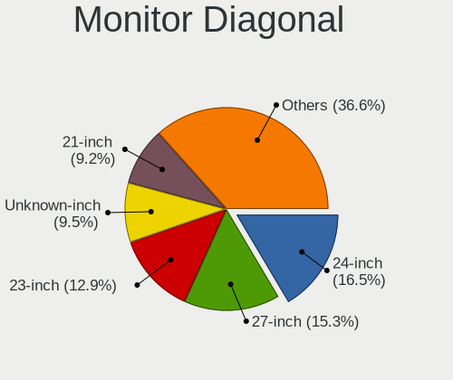

| Inches  | Desktops | Percent |
|---------|----------|---------|
| 24      | 323      | 16.39%  |
| 27      | 296      | 15.02%  |
| 23      | 255      | 12.94%  |
| Unknown | 214      | 10.86%  |
| 21      | 194      | 9.84%   |
| 31      | 106      | 5.38%   |
| 19      | 80       | 4.06%   |
| 34      | 67       | 3.4%    |
| 22      | 60       | 3.04%   |
| 20      | 48       | 2.44%   |
| 18      | 42       | 2.13%   |
| 17      | 39       | 1.98%   |
| 72      | 24       | 1.22%   |
| 54      | 23       | 1.17%   |
| 32      | 22       | 1.12%   |
| 84      | 21       | 1.07%   |
| 40      | 18       | 0.91%   |
| 25      | 18       | 0.91%   |
| 15      | 12       | 0.61%   |
| 28      | 11       | 0.56%   |
| 46      | 10       | 0.51%   |
| 26      | 10       | 0.51%   |
| 48      | 7        | 0.36%   |
| 37      | 7        | 0.36%   |
| 52      | 6        | 0.3%    |
| 42      | 5        | 0.25%   |
| 65      | 4        | 0.2%    |
| 43      | 4        | 0.2%    |
| 36      | 4        | 0.2%    |
| 29      | 4        | 0.2%    |
| 142     | 3        | 0.15%   |
| 69      | 3        | 0.15%   |
| 60      | 3        | 0.15%   |
| 39      | 3        | 0.15%   |
| 35      | 3        | 0.15%   |
| 33      | 3        | 0.15%   |
| 74      | 2        | 0.1%    |
| 55      | 2        | 0.1%    |
| 49      | 2        | 0.1%    |
| 30      | 2        | 0.1%    |

Monitor Width
-------------

Physical width

| Width in mm    | Desktops | Percent |
|----------------|----------|---------|
| 501-600        | 786      | 41.88%  |
| 401-500        | 370      | 19.71%  |
| Unknown        | 214      | 11.4%   |
| 601-700        | 158      | 8.42%   |
| 701-800        | 96       | 5.11%   |
| 1001-1500      | 61       | 3.25%   |
| 1501-2000      | 50       | 2.66%   |
| 301-350        | 48       | 2.56%   |
| 351-400        | 47       | 2.5%    |
| 801-900        | 32       | 1.7%    |
| 901-1000       | 10       | 0.53%   |
| More than 2000 | 3        | 0.16%   |
| 201-300        | 1        | 0.05%   |
| 1-100          | 1        | 0.05%   |

Aspect Ratio
------------

Proportional relationship between the width and the height

| Ratio   | Desktops | Percent |
|---------|----------|---------|
| 16/9    | 1144     | 64.89%  |
| 16/10   | 229      | 12.99%  |
| Unknown | 193      | 10.95%  |
| 21/9    | 80       | 4.54%   |
| 5/4     | 70       | 3.97%   |
| 4/3     | 18       | 1.02%   |
| 32/9    | 11       | 0.62%   |
| 3/2     | 8        | 0.45%   |
| 6/5     | 4        | 0.23%   |
| 1.00    | 3        | 0.17%   |
| 1.96    | 2        | 0.11%   |
| 0.25    | 1        | 0.06%   |

Monitor Area
------------

Area in inch

| Area in inch | Desktops | Percent |
|----------------|----------|---------|
| 201-250        | 621      | 32.58%  |
| 301-350        | 302      | 15.84%  |
| Unknown        | 214      | 11.23%  |
| 351-500        | 213      | 11.18%  |
| 151-200        | 180      | 9.44%   |
| 251-300        | 133      | 6.98%   |
| More than 1000 | 96       | 5.04%   |
| 141-150        | 67       | 3.52%   |
| 501-1000       | 58       | 3.04%   |
| 101-110        | 11       | 0.58%   |
| 131-140        | 4        | 0.21%   |
| 81-90          | 2        | 0.1%    |
| 121-130        | 2        | 0.1%    |
| 71-80          | 1        | 0.05%   |
| 1-40           | 1        | 0.05%   |
| 111-120        | 1        | 0.05%   |

Pixel Density
-------------

Pixels per inch

| Density       | Desktops | Percent |
|---------------|----------|---------|
| 51-100        | 1065     | 59.1%   |
| 101-120       | 325      | 18.04%  |
| Unknown       | 214      | 11.88%  |
| 1-50          | 84       | 4.66%   |
| 121-160       | 84       | 4.66%   |
| 161-240       | 29       | 1.61%   |
| More than 240 | 1        | 0.06%   |

Multiple Monitors
-----------------

Total monitors connected

| Total | Desktops | Percent |
|-------|----------|---------|
| 1     | 1210     | 69.3%   |
| 2     | 428      | 24.51%  |
| 0     | 51       | 2.92%   |
| 3     | 50       | 2.86%   |
| 4     | 7        | 0.4%    |

Network
-------

Net Controller Vendor
---------------------

Controller vendors

| Vendor                          | Desktops | Percent |
|---------------------------------|----------|---------|
| Realtek Semiconductor           | 1070     | 43.58%  |
| Intel                           | 728      | 29.65%  |
| Qualcomm Atheros                | 145      | 5.91%   |
| Broadcom                        | 62       | 2.53%   |
| TP-Link                         | 54       | 2.2%    |
| Ralink Technology               | 52       | 2.12%   |
| MediaTek                        | 37       | 1.51%   |
| Ralink                          | 26       | 1.06%   |
| Nvidia                          | 25       | 1.02%   |
| Aquantia                        | 24       | 0.98%   |
| Qualcomm Atheros Communications | 19       | 0.77%   |
| NetGear                         | 18       | 0.73%   |
| Microsoft                       | 18       | 0.73%   |
| Samsung Electronics             | 12       | 0.49%   |
| D-Link                          | 11       | 0.45%   |
| ASUSTek Computer                | 11       | 0.45%   |
| Huawei Technologies             | 9        | 0.37%   |
| Edimax Technology               | 9        | 0.37%   |
| Xiaomi                          | 8        | 0.33%   |
| DisplayLink                     | 7        | 0.29%   |
| D-Link System                   | 7        | 0.29%   |
| ASIX Electronics                | 7        | 0.29%   |
| Broadcom Limited                | 6        | 0.24%   |
| Linksys                         | 5        | 0.2%    |
| Belkin Components               | 5        | 0.2%    |
| AVM                             | 5        | 0.2%    |
| VIA Technologies                | 4        | 0.16%   |
| Marvell Technology Group        | 4        | 0.16%   |
| Arduino SA                      | 4        | 0.16%   |
| Mellanox Technologies           | 3        | 0.12%   |
| Google                          | 3        | 0.12%   |
| Apple                           | 3        | 0.12%   |
| Wilocity                        | 2        | 0.08%   |
| Wacom                           | 2        | 0.08%   |
| STMicroelectronics              | 2        | 0.08%   |
| Solarflare Communications       | 2        | 0.08%   |
| Seeed Technology                | 2        | 0.08%   |
| Qualcomm                        | 2        | 0.08%   |
| QinHeng Electronics             | 2        | 0.08%   |
| Oculus VR                       | 2        | 0.08%   |

Net Controller Model
--------------------

Controller models

| Model                                                                          | Desktops | Percent |
|--------------------------------------------------------------------------------|----------|---------|
| Realtek RTL8111/8168/8211/8411 PCI Express Gigabit Ethernet Controller         | 823      | 29.28%  |
| Intel I211 Gigabit Network Connection                                          | 139      | 4.94%   |
| Realtek RTL8125 2.5GbE Controller                                              | 138      | 4.91%   |
| Intel Wi-Fi 6 AX200                                                            | 89       | 3.17%   |
| Intel Ethernet Connection (2) I219-V                                           | 77       | 2.74%   |
| Intel Ethernet Controller I225-V                                               | 64       | 2.28%   |
| Intel 82579LM Gigabit Network Connection (Lewisville)                          | 60       | 2.13%   |
| Intel Ethernet Connection I217-LM                                              | 40       | 1.42%   |
| Intel Ethernet Connection (7) I219-V                                           | 39       | 1.39%   |
| Intel Dual Band Wireless-AC 3168NGW [Stone Peak]                               | 32       | 1.14%   |
| Intel Ethernet Connection (2) I218-V                                           | 31       | 1.1%    |
| Realtek RTL810xE PCI Express Fast Ethernet controller                          | 30       | 1.07%   |
| Intel Wi-Fi 5(802.11ac) Wireless-AC 9x6x [Thunder Peak]                        | 28       | 1%      |
| Intel 82579V Gigabit Network Connection                                        | 26       | 0.92%   |
| Realtek RTL8153 Gigabit Ethernet Adapter                                       | 25       | 0.89%   |
| Realtek RTL8188EUS 802.11n Wireless Network Adapter                            | 24       | 0.85%   |
| Realtek 802.11ac NIC                                                           | 21       | 0.75%   |
| Intel Wi-Fi 6E(802.11ax) AX210/AX1675* 2x2 [Typhoon Peak]                      | 21       | 0.75%   |
| Ralink MT7601U Wireless Adapter                                                | 20       | 0.71%   |
| Qualcomm Atheros Killer E220x Gigabit Ethernet Controller                      | 19       | 0.68%   |
| Intel I210 Gigabit Network Connection                                          | 19       | 0.68%   |
| Aquantia AQtion AQC107 NBase-T/IEEE 802.3an Ethernet Controller [Atlantic 10G] | 19       | 0.68%   |
| Qualcomm Atheros AR9271 802.11n                                                | 18       | 0.64%   |
| Qualcomm Atheros AR9485 Wireless Network Adapter                               | 18       | 0.64%   |
| Intel Ethernet Connection I217-V                                               | 17       | 0.6%    |
| Intel 82574L Gigabit Network Connection                                        | 17       | 0.6%    |
| Broadcom BCM4360 802.11ac Dual Band Wireless Network Adapter                   | 17       | 0.6%    |
| Realtek RTL8821CE 802.11ac PCIe Wireless Network Adapter                       | 15       | 0.53%   |
| MediaTek MT7922 802.11ax PCI Express Wireless Network Adapter                  | 15       | 0.53%   |
| Realtek RTL-8100/8101L/8139 PCI Fast Ethernet Adapter                          | 14       | 0.5%    |
| MediaTek MT7921K (RZ608) Wi-Fi 6E 80MHz                                        | 14       | 0.5%    |
| Intel 82567LM-3 Gigabit Network Connection                                     | 14       | 0.5%    |
| Realtek RTL88x2bu [AC1200 Techkey]                                             | 12       | 0.43%   |
| Ralink RT5370 Wireless Adapter                                                 | 12       | 0.43%   |
| Nvidia MCP61 Ethernet                                                          | 12       | 0.43%   |
| Intel Wireless 7265                                                            | 12       | 0.43%   |
| Intel Wireless 7260                                                            | 12       | 0.43%   |
| Intel Wireless 3165                                                            | 12       | 0.43%   |
| Intel Ethernet Connection (14) I219-V                                          | 12       | 0.43%   |
| TP-Link 802.11ac NIC                                                           | 11       | 0.39%   |

Wireless Vendor
---------------

Wireless vendors

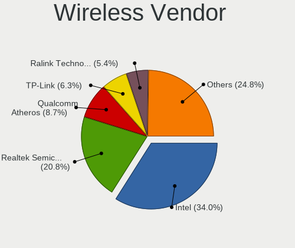

| Vendor                                | Desktops | Percent |
|---------------------------------------|----------|---------|
| Intel                                 | 264      | 31.5%   |
| Realtek Semiconductor                 | 168      | 20.05%  |
| Qualcomm Atheros                      | 83       | 9.9%    |
| TP-Link                               | 53       | 6.32%   |
| Ralink Technology                     | 52       | 6.21%   |
| MediaTek                              | 34       | 4.06%   |
| Broadcom                              | 32       | 3.82%   |
| Ralink                                | 26       | 3.1%    |
| Qualcomm Atheros Communications       | 19       | 2.27%   |
| NetGear                               | 18       | 2.15%   |
| Microsoft                             | 18       | 2.15%   |
| D-Link                                | 11       | 1.31%   |
| ASUSTek Computer                      | 11       | 1.31%   |
| Edimax Technology                     | 9        | 1.07%   |
| Belkin Components                     | 5        | 0.6%    |
| AVM                                   | 5        | 0.6%    |
| Linksys                               | 4        | 0.48%   |
| D-Link System                         | 4        | 0.48%   |
| Broadcom Limited                      | 3        | 0.36%   |
| Wilocity                              | 2        | 0.24%   |
| Wacom                                 | 2        | 0.24%   |
| Mercucys                              | 2        | 0.24%   |
| IMC Networks                          | 2        | 0.24%   |
| ZyXEL Communications                  | 1        | 0.12%   |
| Tenda                                 | 1        | 0.12%   |
| Sitecom Europe                        | 1        | 0.12%   |
| Philips (or NXP)                      | 1        | 0.12%   |
| Micro Star International              | 1        | 0.12%   |
| LG Electronics                        | 1        | 0.12%   |
| Guillemot                             | 1        | 0.12%   |
| Gemtek                                | 1        | 0.12%   |
| AirTies Wireless Networks             | 1        | 0.12%   |
| Accton Technology                     | 1        | 0.12%   |
| 802.11g Adapter [Linksys WUSB54GC v3] | 1        | 0.12%   |

Wireless Model
--------------

Wireless models

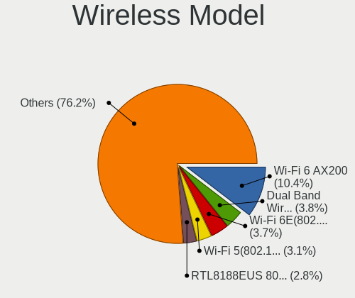

| Model                                                         | Desktops | Percent |
|---------------------------------------------------------------|----------|---------|
| Intel Wi-Fi 6 AX200                                           | 89       | 10.47%  |
| Intel Dual Band Wireless-AC 3168NGW [Stone Peak]              | 32       | 3.76%   |
| Intel Wi-Fi 5(802.11ac) Wireless-AC 9x6x [Thunder Peak]       | 28       | 3.29%   |
| Realtek RTL8188EUS 802.11n Wireless Network Adapter           | 24       | 2.82%   |
| Realtek 802.11ac NIC                                          | 21       | 2.47%   |
| Intel Wi-Fi 6E(802.11ax) AX210/AX1675* 2x2 [Typhoon Peak]     | 21       | 2.47%   |
| Ralink MT7601U Wireless Adapter                               | 20       | 2.35%   |
| Qualcomm Atheros AR9271 802.11n                               | 18       | 2.12%   |
| Qualcomm Atheros AR9485 Wireless Network Adapter              | 18       | 2.12%   |
| Broadcom BCM4360 802.11ac Dual Band Wireless Network Adapter  | 17       | 2%      |
| Realtek RTL8821CE 802.11ac PCIe Wireless Network Adapter      | 15       | 1.76%   |
| MediaTek MT7922 802.11ax PCI Express Wireless Network Adapter | 15       | 1.76%   |
| MediaTek MT7921K (RZ608) Wi-Fi 6E 80MHz                       | 14       | 1.65%   |
| Realtek RTL88x2bu [AC1200 Techkey]                            | 12       | 1.41%   |
| Ralink RT5370 Wireless Adapter                                | 12       | 1.41%   |
| Intel Wireless 7265                                           | 12       | 1.41%   |
| Intel Wireless 7260                                           | 12       | 1.41%   |
| Intel Wireless 3165                                           | 12       | 1.41%   |
| TP-Link 802.11ac NIC                                          | 11       | 1.29%   |
| Microsoft Xbox Wireless Adapter for Windows                   | 11       | 1.29%   |
| Intel Cannon Lake PCH CNVi WiFi                               | 11       | 1.29%   |
| Realtek RTL8192EE PCIe Wireless Network Adapter               | 10       | 1.18%   |
| Qualcomm Atheros AR9462 Wireless Network Adapter              | 10       | 1.18%   |
| Realtek RTL8822BE 802.11a/b/g/n/ac WiFi adapter               | 9        | 1.06%   |
| Qualcomm Atheros QCA6174 802.11ac Wireless Network Adapter    | 9        | 1.06%   |
| Qualcomm Atheros AR93xx Wireless Network Adapter              | 9        | 1.06%   |
| TP-Link 802.11ac WLAN Adapter                                 | 8        | 0.94%   |
| Realtek RTL8821AE 802.11ac PCIe Wireless Network Adapter      | 8        | 0.94%   |
| Realtek RTL8192EU 802.11b/g/n WLAN Adapter                    | 8        | 0.94%   |
| Qualcomm Atheros QCA9565 / AR9565 Wireless Network Adapter    | 8        | 0.94%   |
| TP-Link TL-WN823N v2/v3 [Realtek RTL8192EU]                   | 7        | 0.82%   |
| TP-Link Archer T2U PLUS [RTL8821AU]                           | 7        | 0.82%   |
| Realtek RTL8812AU 802.11a/b/g/n/ac 2T2R DB WLAN Adapter       | 7        | 0.82%   |
| Realtek RTL8812AE 802.11ac PCIe Wireless Network Adapter      | 7        | 0.82%   |
| Realtek RTL8192CE PCIe Wireless Network Adapter               | 7        | 0.82%   |
| Qualcomm Atheros AR9227 Wireless Network Adapter              | 7        | 0.82%   |
| NetGear A6100 AC600 DB Wireless Adapter [Realtek RTL8811AU]   | 7        | 0.82%   |
| Microsoft Xbox 360 Wireless Adapter                           | 7        | 0.82%   |
| Intel Wireless 8260                                           | 7        | 0.82%   |
| Intel Comet Lake PCH CNVi WiFi                                | 7        | 0.82%   |

Ethernet Vendor
---------------

Ethernet vendors

| Vendor                           | Desktops | Percent |
|----------------------------------|----------|---------|
| Realtek Semiconductor            | 1009     | 54.01%  |
| Intel                            | 619      | 33.14%  |
| Qualcomm Atheros                 | 69       | 3.69%   |
| Broadcom                         | 33       | 1.77%   |
| Nvidia                           | 25       | 1.34%   |
| Aquantia                         | 24       | 1.28%   |
| Samsung Electronics              | 12       | 0.64%   |
| Huawei Technologies              | 9        | 0.48%   |
| Xiaomi                           | 8        | 0.43%   |
| DisplayLink                      | 7        | 0.37%   |
| ASIX Electronics                 | 7        | 0.37%   |
| VIA Technologies                 | 4        | 0.21%   |
| Marvell Technology Group         | 4        | 0.21%   |
| Mellanox Technologies            | 3        | 0.16%   |
| MediaTek                         | 3        | 0.16%   |
| Google                           | 3        | 0.16%   |
| D-Link System                    | 3        | 0.16%   |
| Broadcom Limited                 | 3        | 0.16%   |
| Apple                            | 3        | 0.16%   |
| Solarflare Communications        | 2        | 0.11%   |
| Qualcomm                         | 2        | 0.11%   |
| Lenovo                           | 2        | 0.11%   |
| American Megatrends              | 2        | 0.11%   |
| 3Com                             | 2        | 0.11%   |
| ZTE WCDMA Technologies MSM       | 1        | 0.05%   |
| TP-Link                          | 1        | 0.05%   |
| Tehuti Networks                  | 1        | 0.05%   |
| Silicon Integrated Systems [SiS] | 1        | 0.05%   |
| OnePlus Technology (Shenzhen)    | 1        | 0.05%   |
| Motorola BCS                     | 1        | 0.05%   |
| Linksys                          | 1        | 0.05%   |
| Elecom                           | 1        | 0.05%   |
| Davicom Semiconductor            | 1        | 0.05%   |
| Accton Technology                | 1        | 0.05%   |

Ethernet Model
--------------

Ethernet models

| Model                                                                          | Desktops | Percent |
|--------------------------------------------------------------------------------|----------|---------|
| Realtek RTL8111/8168/8211/8411 PCI Express Gigabit Ethernet Controller         | 823      | 42.42%  |
| Intel I211 Gigabit Network Connection                                          | 139      | 7.16%   |
| Realtek RTL8125 2.5GbE Controller                                              | 138      | 7.11%   |
| Intel Ethernet Connection (2) I219-V                                           | 77       | 3.97%   |
| Intel Ethernet Controller I225-V                                               | 64       | 3.3%    |
| Intel 82579LM Gigabit Network Connection (Lewisville)                          | 60       | 3.09%   |
| Intel Ethernet Connection I217-LM                                              | 40       | 2.06%   |
| Intel Ethernet Connection (7) I219-V                                           | 39       | 2.01%   |
| Intel Ethernet Connection (2) I218-V                                           | 31       | 1.6%    |
| Realtek RTL810xE PCI Express Fast Ethernet controller                          | 30       | 1.55%   |
| Intel 82579V Gigabit Network Connection                                        | 26       | 1.34%   |
| Realtek RTL8153 Gigabit Ethernet Adapter                                       | 25       | 1.29%   |
| Qualcomm Atheros Killer E220x Gigabit Ethernet Controller                      | 19       | 0.98%   |
| Intel I210 Gigabit Network Connection                                          | 19       | 0.98%   |
| Aquantia AQtion AQC107 NBase-T/IEEE 802.3an Ethernet Controller [Atlantic 10G] | 19       | 0.98%   |
| Intel Ethernet Connection I217-V                                               | 17       | 0.88%   |
| Intel 82574L Gigabit Network Connection                                        | 17       | 0.88%   |
| Realtek RTL-8100/8101L/8139 PCI Fast Ethernet Adapter                          | 14       | 0.72%   |
| Intel 82567LM-3 Gigabit Network Connection                                     | 14       | 0.72%   |
| Nvidia MCP61 Ethernet                                                          | 12       | 0.62%   |
| Intel Ethernet Connection (14) I219-V                                          | 12       | 0.62%   |
| Qualcomm Atheros AR8161 Gigabit Ethernet                                       | 11       | 0.57%   |
| Qualcomm Atheros AR8121/AR8113/AR8114 Gigabit or Fast Ethernet                 | 11       | 0.57%   |
| Intel Ethernet Connection (7) I219-LM                                          | 11       | 0.57%   |
| Intel 82578DM Gigabit Network Connection                                       | 11       | 0.57%   |
| Intel Ethernet Connection (2) I219-LM                                          | 10       | 0.52%   |
| Samsung Galaxy series, misc. (tethering mode)                                  | 9        | 0.46%   |
| Huawei STG-LX1                                                                 | 8        | 0.41%   |
| Qualcomm Atheros QCA8171 Gigabit Ethernet                                      | 7        | 0.36%   |
| Qualcomm Atheros Killer E2500 Gigabit Ethernet Controller                      | 6        | 0.31%   |
| Qualcomm Atheros Killer E2400 Gigabit Ethernet Controller                      | 6        | 0.31%   |
| Intel Ethernet Connection (12) I219-V                                          | 6        | 0.31%   |
| Broadcom NetXtreme BCM5761 Gigabit Ethernet PCIe                               | 6        | 0.31%   |
| Xiaomi Mi/Redmi series (RNDIS)                                                 | 5        | 0.26%   |
| Qualcomm Atheros AR8151 v2.0 Gigabit Ethernet                                  | 5        | 0.26%   |
| Intel Ethernet Connection (2) I218-LM                                          | 5        | 0.26%   |
| ASIX AX88179 Gigabit Ethernet                                                  | 5        | 0.26%   |
| Realtek RTL-8110SC/8169SC Gigabit Ethernet                                     | 4        | 0.21%   |
| Nvidia MCP77 Ethernet                                                          | 4        | 0.21%   |
| Intel Ethernet Connection (17) I219-V                                          | 4        | 0.21%   |

Net Controller Kind
-------------------

Ethernet, WiFi or modem

| Kind     | Desktops | Percent |
|----------|----------|---------|
| Ethernet | 1693     | 67.91%  |
| WiFi     | 781      | 31.33%  |
| Modem    | 19       | 0.76%   |

Used Controller
---------------

Currently used network controller

| Kind     | Desktops | Percent |
|----------|----------|---------|
| Ethernet | 1376     | 75.69%  |
| WiFi     | 442      | 24.31%  |

NICs
----

Total network controllers on board

| Total | Desktops | Percent |
|-------|----------|---------|
| 1     | 1094     | 63.72%  |
| 2     | 514      | 29.94%  |
| 3     | 83       | 4.83%   |
| 0     | 11       | 0.64%   |
| 4     | 9        | 0.52%   |
| 6     | 4        | 0.23%   |
| 5     | 2        | 0.12%   |

IPv6
----

IPv6 vs IPv4

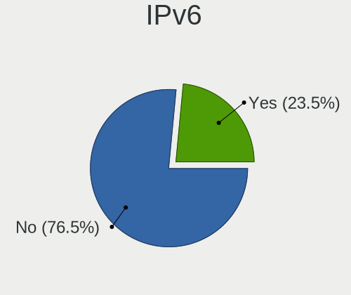

| Used | Desktops | Percent |
|------|----------|---------|
| No   | 1371     | 78.75%  |
| Yes  | 370      | 21.25%  |

Bluetooth
---------

Bluetooth Vendor
----------------

Controller vendors

| Vendor                          | Desktops | Percent |
|---------------------------------|----------|---------|
| Intel                           | 247      | 35.75%  |
| Cambridge Silicon Radio         | 187      | 27.06%  |
| Realtek Semiconductor           | 57       | 8.25%   |
| ASUSTek Computer                | 49       | 7.09%   |
| Broadcom                        | 44       | 6.37%   |
| Qualcomm Atheros Communications | 22       | 3.18%   |
| MediaTek                        | 21       | 3.04%   |
| IMC Networks                    | 13       | 1.88%   |
| TP-Link                         | 9        | 1.3%    |
| Foxconn / Hon Hai               | 6        | 0.87%   |
| Dynex                           | 5        | 0.72%   |
| Realtek                         | 4        | 0.58%   |
| Lite-On Technology              | 4        | 0.58%   |
| Apple                           | 4        | 0.58%   |
| Edimax Technology               | 3        | 0.43%   |
| Ralink                          | 2        | 0.29%   |
| Micro Star International        | 2        | 0.29%   |
| Integrated System Solution      | 2        | 0.29%   |
| D-Link                          | 2        | 0.29%   |
| Belkin Components               | 2        | 0.29%   |
| Logitech                        | 1        | 0.14%   |
| Kensington                      | 1        | 0.14%   |
| Creative Technology             | 1        | 0.14%   |
| Corsair                         | 1        | 0.14%   |
| Conwise Technology              | 1        | 0.14%   |
| AboCom Systems                  | 1        | 0.14%   |

Bluetooth Model
---------------

Controller models

| Model                                                    | Desktops | Percent |
|----------------------------------------------------------|----------|---------|
| Cambridge Silicon Radio Bluetooth Dongle (HCI mode)      | 187      | 26.98%  |
| Intel AX200 Bluetooth                                    | 86       | 12.41%  |
| Realtek Bluetooth Radio                                  | 48       | 6.93%   |
| Intel Bluetooth wireless interface                       | 43       | 6.2%    |
| Intel Wireless-AC 3168 Bluetooth                         | 29       | 4.18%   |
| Intel Wireless-AC 9260 Bluetooth Adapter                 | 27       | 3.9%    |
| Broadcom BCM20702A0 Bluetooth 4.0                        | 24       | 3.46%   |
| MediaTek Wireless_Device                                 | 21       | 3.03%   |
| Intel AX210 Bluetooth                                    | 21       | 3.03%   |
| Intel Bluetooth 9460/9560 Jefferson Peak (JfP)           | 17       | 2.45%   |
| Intel AX201 Bluetooth                                    | 16       | 2.31%   |
| ASUS ASUS USB-BT500                                      | 16       | 2.31%   |
| ASUS Broadcom BCM20702A0 Bluetooth                       | 12       | 1.73%   |
| TP-Link UB500 Adapter                                    | 9        | 1.3%    |
| Realtek  Bluetooth 4.2 Adapter                           | 8        | 1.15%   |
| Qualcomm Atheros  Bluetooth Device                       | 8        | 1.15%   |
| Intel Bluetooth Device                                   | 8        | 1.15%   |
| IMC Networks Bluetooth Radio                             | 8        | 1.15%   |
| Qualcomm Atheros Bluetooth USB Host Controller           | 6        | 0.87%   |
| Foxconn / Hon Hai Wireless_Device                        | 6        | 0.87%   |
| Dynex Bluetooth 4.0 Adapter [Broadcom, 1.12, BCM20702A0] | 5        | 0.72%   |
| ASUS Bluetooth Radio                                     | 5        | 0.72%   |
| Realtek Bluetooth Radio                                  | 4        | 0.58%   |
| Qualcomm Atheros AR9462 Bluetooth                        | 4        | 0.58%   |
| Broadcom BCM92045B3 ROM                                  | 4        | 0.58%   |
| ASUS Qualcomm Bluetooth 4.1                              | 4        | 0.58%   |
| ASUS BCM20702A0                                          | 4        | 0.58%   |
| Qualcomm Atheros AR3011 Bluetooth                        | 3        | 0.43%   |
| Lite-On Bluetooth Device                                 | 3        | 0.43%   |
| IMC Networks Bluetooth Device                            | 3        | 0.43%   |
| Broadcom BCM2045 Bluetooth                               | 3        | 0.43%   |
| ASUS Broadcom BCM20702 Single-Chip Bluetooth 4.0 + LE    | 3        | 0.43%   |
| ASUS Bluetooth Device                                    | 3        | 0.43%   |
| Apple Bluetooth Host Controller                          | 3        | 0.43%   |
| Ralink RT3290 Bluetooth                                  | 2        | 0.29%   |
| Intel Centrino Bluetooth Wireless Transceiver            | 2        | 0.29%   |
| Integrated System Solution KY-BT100 Bluetooth Adapter    | 2        | 0.29%   |
| D-Link DBT-122 Bluetooth adapter                         | 2        | 0.29%   |
| Broadcom Bluetooth Controller                            | 2        | 0.29%   |
| Broadcom Bluetooth 3.0 Device                            | 2        | 0.29%   |

Sound
-----

Sound Vendor
------------

Sound card vendors

| Vendor                     | Desktops | Percent |
|----------------------------|----------|---------|
| Intel                      | 943      | 29.82%  |
| AMD                        | 882      | 27.89%  |
| Nvidia                     | 773      | 24.45%  |
| C-Media Electronics        | 97       | 3.07%   |
| Creative Labs              | 39       | 1.23%   |
| Logitech                   | 35       | 1.11%   |
| ASUSTek Computer           | 27       | 0.85%   |
| JMTek                      | 26       | 0.82%   |
| Texas Instruments          | 20       | 0.63%   |
| Corsair                    | 19       | 0.6%    |
| GN Netcom                  | 18       | 0.57%   |
| Generalplus Technology     | 17       | 0.54%   |
| Focusrite-Novation         | 15       | 0.47%   |
| Razer USA                  | 14       | 0.44%   |
| Creative Technology        | 13       | 0.41%   |
| SteelSeries ApS            | 12       | 0.38%   |
| Kingston Technology        | 12       | 0.38%   |
| VIA Technologies           | 11       | 0.35%   |
| Tenx Technology            | 9        | 0.28%   |
| Micro Star International   | 9        | 0.28%   |
| Plantronics                | 7        | 0.22%   |
| Blue Microphones           | 7        | 0.22%   |
| Realtek Semiconductor      | 6        | 0.19%   |
| PreSonus Audio Electronics | 6        | 0.19%   |
| SAVITECH                   | 5        | 0.16%   |
| Yamaha                     | 4        | 0.13%   |
| Trust                      | 4        | 0.13%   |
| Samson Technologies        | 4        | 0.13%   |
| RODE Microphones           | 4        | 0.13%   |
| Hewlett-Packard            | 4        | 0.13%   |
| DSEA A/S                   | 4        | 0.13%   |
| Dell                       | 4        | 0.13%   |
| BEHRINGER International    | 4        | 0.13%   |
| TEAC                       | 3        | 0.09%   |
| Sennheiser Communications  | 3        | 0.09%   |
| Roland                     | 3        | 0.09%   |
| ONN                        | 3        | 0.09%   |
| Bose                       | 3        | 0.09%   |
| Zhaoxin                    | 2        | 0.06%   |
| XMOS                       | 2        | 0.06%   |

Sound Model
-----------

Sound card models

| Model                                                                      | Desktops | Percent |
|----------------------------------------------------------------------------|----------|---------|
| AMD Starship/Matisse HD Audio Controller                                   | 230      | 6.2%    |
| Intel 8 Series/C220 Series Chipset High Definition Audio Controller        | 131      | 3.53%   |
| AMD Family 17h (Models 00h-0fh) HD Audio Controller                        | 128      | 3.45%   |
| AMD SBx00 Azalia (Intel HDA)                                               | 126      | 3.4%    |
| AMD Family 17h/19h HD Audio Controller                                     | 125      | 3.37%   |
| Intel 6 Series/C200 Series Chipset Family High Definition Audio Controller | 113      | 3.05%   |
| AMD Ellesmere HDMI Audio [Radeon RX 470/480 / 570/580/590]                 | 99       | 2.67%   |
| Intel Xeon E3-1200 v3/4th Gen Core Processor HD Audio Controller           | 93       | 2.51%   |
| Intel 200 Series PCH HD Audio                                              | 85       | 2.29%   |
| Intel 100 Series/C230 Series Chipset Family HD Audio Controller            | 85       | 2.29%   |
| Intel 7 Series/C216 Chipset Family High Definition Audio Controller        | 82       | 2.21%   |
| Nvidia GP107GL High Definition Audio Controller                            | 79       | 2.13%   |
| Nvidia GK208 HDMI/DP Audio Controller                                      | 70       | 1.89%   |
| Intel Cannon Lake PCH cAVS                                                 | 64       | 1.73%   |
| AMD Oland/Hainan/Cape Verde/Pitcairn HDMI Audio [Radeon HD 7000 Series]    | 59       | 1.59%   |
| Nvidia GP104 High Definition Audio Controller                              | 55       | 1.48%   |
| Nvidia TU116 High Definition Audio Controller                              | 52       | 1.4%    |
| AMD Navi 21/23 HDMI/DP Audio Controller                                    | 52       | 1.4%    |
| AMD FCH Azalia Controller                                                  | 50       | 1.35%   |
| Nvidia GP106 High Definition Audio Controller                              | 46       | 1.24%   |
| AMD Renoir Radeon High Definition Audio Controller                         | 45       | 1.21%   |
| AMD Raven/Raven2/Fenghuang HDMI/DP Audio Controller                        | 45       | 1.21%   |
| Intel 9 Series Chipset Family HD Audio Controller                          | 43       | 1.16%   |
| Intel 82801JI (ICH10 Family) HD Audio Controller                           | 42       | 1.13%   |
| AMD Baffin HDMI/DP Audio [Radeon RX 550 640SP / RX 560/560X]               | 42       | 1.13%   |
| AMD Navi 10 HDMI Audio                                                     | 35       | 0.94%   |
| Nvidia TU106 High Definition Audio Controller                              | 33       | 0.89%   |
| Nvidia TU104 HD Audio Controller                                           | 31       | 0.84%   |
| Nvidia High Definition Audio Controller                                    | 31       | 0.84%   |
| Intel 5 Series/3400 Series Chipset High Definition Audio                   | 31       | 0.84%   |
| Nvidia GP108 High Definition Audio Controller                              | 30       | 0.81%   |
| Nvidia GM204 High Definition Audio Controller                              | 30       | 0.81%   |
| Nvidia GM107 High Definition Audio Controller [GeForce 940MX]              | 30       | 0.81%   |
| Intel NM10/ICH7 Family High Definition Audio Controller                    | 30       | 0.81%   |
| Intel C610/X99 series chipset HD Audio Controller                          | 30       | 0.81%   |
| Nvidia GM206 High Definition Audio Controller                              | 28       | 0.75%   |
| Nvidia GF108 High Definition Audio Controller                              | 28       | 0.75%   |
| AMD Rembrandt Radeon High Definition Audio Controller                      | 28       | 0.75%   |
| Intel Alder Lake-S HD Audio Controller                                     | 26       | 0.7%    |
| Intel Tiger Lake-H HD Audio Controller                                     | 25       | 0.67%   |

Memory
------

Memory Vendor
-------------

Memory module vendors

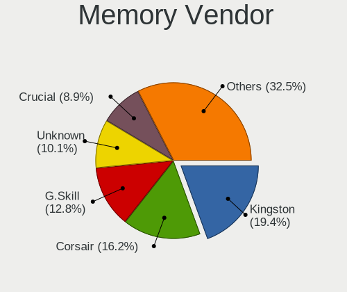

| Vendor                     | Desktops | Percent |
|----------------------------|----------|---------|
| Kingston                   | 232      | 20.44%  |
| Corsair                    | 184      | 16.21%  |
| G.Skill                    | 144      | 12.69%  |
| Unknown                    | 126      | 11.1%   |
| Crucial                    | 104      | 9.16%   |
| Samsung Electronics        | 79       | 6.96%   |
| SK hynix                   | 72       | 6.34%   |
| Micron Technology          | 38       | 3.35%   |
| Patriot                    | 21       | 1.85%   |
| Team                       | 20       | 1.76%   |
| A-DATA Technology          | 16       | 1.41%   |
| Nanya Technology           | 11       | 0.97%   |
| Unknown                    | 9        | 0.79%   |
| Ramaxel Technology         | 8        | 0.7%    |
| Transcend                  | 6        | 0.53%   |
| AMD                        | 6        | 0.53%   |
| Unknown (ABCD)             | 5        | 0.44%   |
| Smart                      | 4        | 0.35%   |
| Silicon Power              | 4        | 0.35%   |
| PNY                        | 4        | 0.35%   |
| GOODRAM                    | 4        | 0.35%   |
| Avant                      | 4        | 0.35%   |
| Elpida                     | 3        | 0.26%   |
| Unifosa                    | 2        | 0.18%   |
| Kingmax                    | 2        | 0.18%   |
| GLOWAY                     | 2        | 0.18%   |
| GeIL                       | 2        | 0.18%   |
| Xi'an UniIC Semiconductors | 1        | 0.09%   |
| V-GeN                      | 1        | 0.09%   |
| V-Color                    | 1        | 0.09%   |
| Unknown (82B5)             | 1        | 0.09%   |
| Unknown (0x0C97)           | 1        | 0.09%   |
| Toshiba                    | 1        | 0.09%   |
| Teikon                     | 1        | 0.09%   |
| Reboto                     | 1        | 0.09%   |
| Qumo                       | 1        | 0.09%   |
| OCZ                        | 1        | 0.09%   |
| Neo Forza                  | 1        | 0.09%   |
| Mushkin                    | 1        | 0.09%   |
| Lexar                      | 1        | 0.09%   |

Memory Model
------------

Memory module models

| Model                                                          | Desktops | Percent |
|----------------------------------------------------------------|----------|---------|
| Corsair RAM CMK16GX4M2B3200C16 8GB DIMM DDR4 3600MT/s          | 21       | 1.66%   |
| Unknown RAM Module 4096MB DIMM 1333MT/s                        | 10       | 0.79%   |
| Corsair RAM CMK16GX4M2B3000C15 8GB DIMM DDR4 3533MT/s          | 10       | 0.79%   |
| Unknown RAM Module 4GB DIMM 1333MT/s                           | 9        | 0.71%   |
| Kingston RAM KHX3200C16D4/16GX 16GB DIMM DDR4 3600MT/s         | 9        | 0.71%   |
| G.Skill RAM F4-3000C16-8GISB 8192MB DIMM DDR4 3200MT/s         | 9        | 0.71%   |
| Unknown                                                        | 9        | 0.71%   |
| G.Skill RAM F4-3200C16-8GVKB 8GB DIMM DDR4 3866MT/s            | 8        | 0.63%   |
| Kingston RAM KHX3200C16D4/8GX 8GB DIMM DDR4 3733MT/s           | 7        | 0.55%   |
| Kingston RAM KHX1600C9D3/4GX 4GB DIMM DDR3 1600MT/s            | 7        | 0.55%   |
| G.Skill RAM F4-3200C16-16GIS 16GB DIMM DDR4 3600MT/s           | 7        | 0.55%   |
| Corsair RAM CMK32GX4M2E3200C16 16GB DIMM DDR4 3534MT/s         | 7        | 0.55%   |
| Unknown RAM Module 2GB DIMM 1333MT/s                           | 6        | 0.47%   |
| Unknown RAM Module 2048MB DIMM DDR2 800MT/s                    | 6        | 0.47%   |
| Samsung RAM M378B5173DB0-CK0 4GB DIMM DDR3 1600MT/s            | 6        | 0.47%   |
| G.Skill RAM F4-3200C16-16GVK 16GB DIMM DDR4 3600MT/s           | 6        | 0.47%   |
| Corsair RAM CMK32GX4M2B3200C16 16GB DIMM DDR4 3800MT/s         | 6        | 0.47%   |
| Unknown RAM Module 2048MB DIMM SDRAM                           | 5        | 0.39%   |
| Unknown RAM Module 2048MB DIMM 1333MT/s                        | 5        | 0.39%   |
| Unknown (ABCD) RAM 123456789012345678 2GB DIMM LPDDR4 2400MT/s | 5        | 0.39%   |
| Team RAM TEAMGROUP-UD4-2666 16GB DIMM DDR4 3200MT/s            | 5        | 0.39%   |
| Samsung RAM M378B1G73DB0-CK0 8GB DIMM DDR3 2133MT/s            | 5        | 0.39%   |
| Patriot RAM PSD38G16002 8GB DIMM DDR3 1600MT/s                 | 5        | 0.39%   |
| Patriot RAM 3200 C16 Series 16GB DIMM DDR4 3600MT/s            | 5        | 0.39%   |
| Kingston RAM KHX2666C16/8G 8GB DIMM DDR4 3466MT/s              | 5        | 0.39%   |
| Kingston RAM KHX2400C15D4/4G 4GB DIMM DDR4 3151MT/s            | 5        | 0.39%   |
| Kingston RAM KF3200C16D4/16GX 16GB DIMM DDR4 3200MT/s          | 5        | 0.39%   |
| G.Skill RAM F4-3600C16-16GVKC 16GB DIMM DDR4 3866MT/s          | 5        | 0.39%   |
| G.Skill RAM F4-3600C16-16GTZNC 16GB DIMM DDR4 3600MT/s         | 5        | 0.39%   |
| G.Skill RAM F4-3200C16-8GIS 8GB DIMM DDR4 3200MT/s             | 5        | 0.39%   |
| Corsair RAM CMK32GX4M2D3600C18 16GB DIMM DDR4 3800MT/s         | 5        | 0.39%   |
| Corsair RAM CMK16GX4M2D3600C18 8GB DIMM DDR4 3600MT/s          | 5        | 0.39%   |
| Unknown RAM Module 8GB DIMM DDR3 1600MT/s                      | 4        | 0.32%   |
| Unknown RAM Module 8192MB DIMM DDR3 1333MT/s                   | 4        | 0.32%   |
| Samsung RAM M378A5244CB0-CRC 4GB DIMM DDR4 3066MT/s            | 4        | 0.32%   |
| Kingston RAM KHX2400C15/8G 8GB DIMM DDR4 3400MT/s              | 4        | 0.32%   |
| Kingston RAM KHX2133C14D4/8G 8GB DIMM DDR4 2667MT/s            | 4        | 0.32%   |
| Kingston RAM KF560C36-32 32GB DIMM DDR5 4800MT/s               | 4        | 0.32%   |
| G.Skill RAM F4-3200C14-8GFX 8GB DIMM DDR4 3733MT/s             | 4        | 0.32%   |
| Crucial RAM BLS8G3D1609DS1S00. 8GB DIMM DDR3 1800MT/s          | 4        | 0.32%   |

Memory Kind
-----------

Memory module kinds

| Kind    | Desktops | Percent |
|---------|----------|---------|
| DDR4    | 549      | 54.09%  |
| DDR3    | 302      | 29.75%  |
| Unknown | 59       | 5.81%   |
| DDR5    | 35       | 3.45%   |
| DDR2    | 30       | 2.96%   |
| SDRAM   | 25       | 2.46%   |
| LPDDR4  | 7        | 0.69%   |
| DDR     | 7        | 0.69%   |
| DRAM    | 1        | 0.1%    |

Memory Form Factor
------------------

Physical design of the memory module

| Name         | Desktops | Percent |
|--------------|----------|---------|
| DIMM         | 958      | 95.51%  |
| SODIMM       | 38       | 3.79%   |
| FB-DIMM      | 3        | 0.3%    |
| Row Of Chips | 2        | 0.2%    |
| RIMM         | 2        | 0.2%    |

Memory Size
-----------

Memory module size

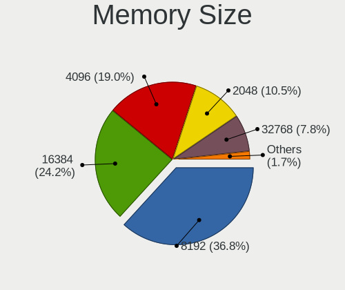

| Size  | Desktops | Percent |
|-------|----------|---------|
| 8192  | 422      | 37.78%  |
| 16384 | 251      | 22.47%  |
| 4096  | 226      | 20.23%  |
| 2048  | 127      | 11.37%  |
| 32768 | 75       | 6.71%   |
| 1024  | 14       | 1.25%   |
| 512   | 1        | 0.09%   |
| 256   | 1        | 0.09%   |

Memory Speed
------------

Memory module speed

| Speed   | Desktops | Percent |
|---------|----------|---------|
| 1600    | 172      | 15.17%  |
| 1333    | 124      | 10.93%  |
| 3200    | 120      | 10.58%  |
| 3600    | 105      | 9.26%   |
| 2400    | 69       | 6.08%   |
| 2133    | 58       | 5.11%   |
| 2667    | 56       | 4.94%   |
| 2666    | 32       | 2.82%   |
| 3800    | 28       | 2.47%   |
| 3733    | 27       | 2.38%   |
| 800     | 24       | 2.12%   |
| 3000    | 19       | 1.68%   |
| 3400    | 18       | 1.59%   |
| 667     | 18       | 1.59%   |
| 2933    | 17       | 1.5%    |
| 1866    | 15       | 1.32%   |
| 1867    | 14       | 1.23%   |
| 4800    | 13       | 1.15%   |
| 3866    | 13       | 1.15%   |
| 1800    | 13       | 1.15%   |
| 1066    | 13       | 1.15%   |
| 3666    | 10       | 0.88%   |
| 3533    | 10       | 0.88%   |
| 3066    | 10       | 0.88%   |
| 400     | 9        | 0.79%   |
| Unknown | 9        | 0.79%   |
| 6000    | 8        | 0.71%   |
| 3333    | 8        | 0.71%   |
| 2800    | 8        | 0.71%   |
| 3534    | 7        | 0.62%   |
| 3466    | 7        | 0.62%   |
| 1334    | 6        | 0.53%   |
| 6400    | 5        | 0.44%   |
| 3266    | 5        | 0.44%   |
| 3151    | 5        | 0.44%   |
| 2000    | 5        | 0.44%   |
| 3334    | 4        | 0.35%   |
| 1648    | 4        | 0.35%   |
| 5600    | 3        | 0.26%   |
| 5200    | 3        | 0.26%   |

Printers & scanners
-------------------

Printer Vendor
--------------

Printer device vendors

| Vendor                 | Desktops | Percent |
|------------------------|----------|---------|
| Hewlett-Packard        | 43       | 40.19%  |
| Brother Industries     | 22       | 20.56%  |
| Seiko Epson            | 12       | 11.21%  |
| Samsung Electronics    | 7        | 6.54%   |
| Canon                  | 6        | 5.61%   |
| Zebra                  | 2        | 1.87%   |
| Prolific Technology    | 2        | 1.87%   |
| Pantum                 | 2        | 1.87%   |
| Dymo-CoStar            | 2        | 1.87%   |
| Xerox                  | 1        | 0.93%   |
| SAT                    | 1        | 0.93%   |
| Ricoh                  | 1        | 0.93%   |
| QinHeng Electronics    | 1        | 0.93%   |
| Panasonic (Matsushita) | 1        | 0.93%   |
| Kyocera                | 1        | 0.93%   |
| ICS Advent             | 1        | 0.93%   |
| Datamax-O'Neil         | 1        | 0.93%   |
| Apple                  | 1        | 0.93%   |

Printer Model
-------------

Printer device models

| Model                                                  | Desktops | Percent |
|--------------------------------------------------------|----------|---------|
| HP OfficeJet Pro 8020 series                           | 3        | 2.75%   |
| Seiko Epson L360 Series                                | 2        | 1.83%   |
| Samsung M2070 Series                                   | 2        | 1.83%   |
| Prolific PL2305 Parallel Port                          | 2        | 1.83%   |
| HP OfficeJet Pro 7740 series                           | 2        | 1.83%   |
| HP LaserJet P2015 series                               | 2        | 1.83%   |
| HP LaserJet 1018                                       | 2        | 1.83%   |
| HP ENVY 4500 series                                    | 2        | 1.83%   |
| HP DeskJet 2700 series                                 | 2        | 1.83%   |
| HP DeskJet 2600 series                                 | 2        | 1.83%   |
| Brother MFC-J460DW                                     | 2        | 1.83%   |
| Brother HL-L2320D series                               | 2        | 1.83%   |
| Zebra ZTC LP2844-Z-200dpi                              | 1        | 0.92%   |
| Zebra Thrmal 2844                                      | 1        | 0.92%   |
| Xerox Phaser 3140 and 3155                             | 1        | 0.92%   |
| Seiko Epson XP-7100 Series                             | 1        | 0.92%   |
| Seiko Epson XP-3100 Series                             | 1        | 0.92%   |
| Seiko Epson XP-2200 Series                             | 1        | 0.92%   |
| Seiko Epson XP-2100 Series                             | 1        | 0.92%   |
| Seiko Epson WF-2530 Series                             | 1        | 0.92%   |
| Seiko Epson Printer                                    | 1        | 0.92%   |
| Seiko Epson ME Office 600F/Stylus Office BX300F/TX300F | 1        | 0.92%   |
| Seiko Epson L3150 Series                               | 1        | 0.92%   |
| Seiko Epson L3110 Series                               | 1        | 0.92%   |
| Seiko Epson L120 Series                                | 1        | 0.92%   |
| SAT SAT38TUSE                                          | 1        | 0.92%   |
| Samsung ML-2250 Series                                 | 1        | 0.92%   |
| Samsung ML-216x Series Laser Printer                   | 1        | 0.92%   |
| Samsung M2020 Series                                   | 1        | 0.92%   |
| Samsung CLX-3180 Series                                | 1        | 0.92%   |
| Samsung CLX-3170 Series                                | 1        | 0.92%   |
| Ricoh SP 211SU                                         | 1        | 0.92%   |
| QinHeng CH340S                                         | 1        | 0.92%   |
| Pantum P2200W series                                   | 1        | 0.92%   |
| Pantum P2200 series                                    | 1        | 0.92%   |
| Panasonic (Matsushita) KX-MB1500RU                     | 1        | 0.92%   |
| Kyocera Mita FS-820                                    | 1        | 0.92%   |
| ICS Advent Parallel Adapter                            | 1        | 0.92%   |
| HP OfficeJet Pro 9010 series                           | 1        | 0.92%   |
| HP OfficeJet 9010 series                               | 1        | 0.92%   |

Scanner Vendor
--------------

Scanner device vendors

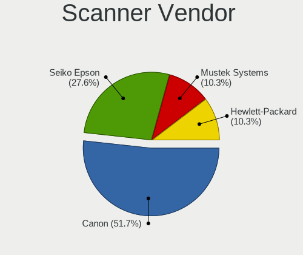

| Vendor          | Desktops | Percent |
|-----------------|----------|---------|
| Canon           | 13       | 50%     |
| Seiko Epson     | 7        | 26.92%  |
| Mustek Systems  | 3        | 11.54%  |
| Hewlett-Packard | 3        | 11.54%  |

Scanner Model
-------------

Scanner device models

| Model                                                   | Desktops | Percent |
|---------------------------------------------------------|----------|---------|
| Seiko Epson GT-X820 [Perfection V600 Photo]             | 3        | 11.54%  |
| Canon CanoScan LiDE 50/LiDE 35/LiDE 40                  | 2        | 7.69%   |
| Canon CanoScan LIDE 25                                  | 2        | 7.69%   |
| Canon CanoScan LiDE 220                                 | 2        | 7.69%   |
| Canon CanoScan LiDE 210                                 | 2        | 7.69%   |
| Canon CanoScan LiDE 110                                 | 2        | 7.69%   |
| Seiko Epson Perfection 660                              | 1        | 3.85%   |
| Seiko Epson GT-F730 [GT-S630/Perfection V33/V330 Photo] | 1        | 3.85%   |
| Seiko Epson GT-F720 [GT-S620/Perfection V30/V300 Photo] | 1        | 3.85%   |
| Seiko Epson ES-D200 [GT-S50]                            | 1        | 3.85%   |
| Mustek Systems SNAPSCAN e22                             | 1        | 3.85%   |
| Mustek Systems ScanExpress A3 USB 1200 PRO              | 1        | 3.85%   |
| Mustek Systems BearPaw 1200 CU Plus                     | 1        | 3.85%   |
| HP ScanJet G4010                                        | 1        | 3.85%   |
| HP ScanJet 82x0C                                        | 1        | 3.85%   |
| HP ScanJet 3770                                         | 1        | 3.85%   |
| Canon CanoScan N670U/N676U/LiDE 20                      | 1        | 3.85%   |
| Canon CanoScan LiDE 60                                  | 1        | 3.85%   |
| Canon CanoScan LiDE 120                                 | 1        | 3.85%   |

Camera
------

Camera Vendor
-------------

Camera device vendors

| Vendor                        | Desktops | Percent |
|-------------------------------|----------|---------|
| Logitech                      | 182      | 42.92%  |
| Microdia                      | 35       | 8.25%   |
| Microsoft                     | 25       | 5.9%    |
| Samsung Electronics           | 17       | 4.01%   |
| Generalplus Technology        | 14       | 3.3%    |
| Sunplus Innovation Technology | 13       | 3.07%   |
| KYE Systems (Mouse Systems)   | 9        | 2.12%   |
| Chicony Electronics           | 9        | 2.12%   |
| Z-Star Microelectronics       | 7        | 1.65%   |
| MacroSilicon                  | 7        | 1.65%   |
| Cubeternet                    | 7        | 1.65%   |
| Realtek Semiconductor         | 6        | 1.42%   |
| ARC International             | 6        | 1.42%   |
| Apple                         | 6        | 1.42%   |
| Trust                         | 5        | 1.18%   |
| Razer USA                     | 5        | 1.18%   |
| Huawei Technologies           | 5        | 1.18%   |
| Creative Technology           | 5        | 1.18%   |
| Alcor Micro                   | 5        | 1.18%   |
| Genesys Logic                 | 4        | 0.94%   |
| GEMBIRD                       | 4        | 0.94%   |
| Jieli Technology              | 3        | 0.71%   |
| A4Tech                        | 3        | 0.71%   |
| Xiongmai                      | 2        | 0.47%   |
| Unknown                       | 2        | 0.47%   |
| Sonix Technology              | 2        | 0.47%   |
| Silicon Motion                | 2        | 0.47%   |
| Philips (or NXP)              | 2        | 0.47%   |
| LG Electronics                | 2        | 0.47%   |
| Lenovo                        | 2        | 0.47%   |
| IMC Networks                  | 2        | 0.47%   |
| Hewlett-Packard               | 2        | 0.47%   |
| Arkmicro Technologies         | 2        | 0.47%   |
| YT-221117-J                   | 1        | 0.24%   |
| YGTek                         | 1        | 0.24%   |
| webcamvendor                  | 1        | 0.24%   |
| Valve Software                | 1        | 0.24%   |
| ValueHD                       | 1        | 0.24%   |
| USB Camera                    | 1        | 0.24%   |
| SJ-180517-N                   | 1        | 0.24%   |

Camera Model
------------

Camera device models

| Model                                     | Desktops | Percent |
|-------------------------------------------|----------|---------|
| Logitech Webcam C270                      | 41       | 9.51%   |
| Logitech HD Pro Webcam C920               | 37       | 8.58%   |
| Samsung Galaxy series, misc. (MTP mode)   | 15       | 3.48%   |
| Microsoft LifeCam HD-3000                 | 12       | 2.78%   |
| Microdia Webcam Vitade AF                 | 11       | 2.55%   |
| Microdia USB 2.0 Camera                   | 10       | 2.32%   |
| Logitech HD Webcam C525                   | 10       | 2.32%   |
| Logitech HD Webcam C615                   | 9        | 2.09%   |
| Logitech C922 Pro Stream Webcam           | 9        | 2.09%   |
| Generalplus GENERAL WEBCAM                | 9        | 2.09%   |
| Logitech C920 PRO HD Webcam               | 8        | 1.86%   |
| Microsoft LifeCam Cinema                  | 7        | 1.62%   |
| MacroSilicon USB3. 0 capture              | 7        | 1.62%   |
| Logitech Webcam C310                      | 7        | 1.62%   |
| Microdia Camera                           | 6        | 1.39%   |
| Logitech Webcam C170                      | 6        | 1.39%   |
| Logitech HD Webcam C910                   | 6        | 1.39%   |
| Logitech B525 HD Webcam                   | 6        | 1.39%   |
| ARC International Camera                  | 6        | 1.39%   |
| Microdia Integrated Camera                | 5        | 1.16%   |
| Logitech Webcam Pro 9000                  | 5        | 1.16%   |
| Logitech Webcam C930e                     | 5        | 1.16%   |
| Huawei HiCamera                           | 5        | 1.16%   |
| Generalplus 808 Camera                    | 5        | 1.16%   |
| Apple iPhone 5/5C/5S/6/SE/7/8/X/XR        | 5        | 1.16%   |
| Z-Star Venus USB2.0 Camera                | 4        | 0.93%   |
| Razer USA Gaming Webcam [Kiyo]            | 4        | 0.93%   |
| KYE Systems (Mouse Systems) Genius Webcam | 4        | 0.93%   |
| Sunplus USB Camera                        | 3        | 0.7%    |
| Logitech Webcam C210                      | 3        | 0.7%    |
| Logitech Webcam C200                      | 3        | 0.7%    |
| Logitech HD Webcam C510                   | 3        | 0.7%    |
| Logitech BRIO Ultra HD Webcam             | 3        | 0.7%    |
| Jieli USB PHY 2.0                         | 3        | 0.7%    |
| GEMBIRD USB2.0 PC CAMERA                  | 3        | 0.7%    |
| Cubeternet GL-UPC822 UVC WebCam           | 3        | 0.7%    |
| Alcor Micro USB 2.0 PC Camera             | 3        | 0.7%    |
| Z-Star A4 TECH USB2.0 PC Camera E         | 2        | 0.46%   |
| Xiongmai web camera                       | 2        | 0.46%   |
| Unknown HD camera                         | 2        | 0.46%   |

Security
--------

Fingerprint Vendor
------------------

Fingerprint sensor vendors

| Vendor                     | Desktops | Percent |
|----------------------------|----------|---------|
| Synaptics                  | 2        | 20%     |
| LighTuning Technology      | 2        | 20%     |
| STMicroelectronics         | 1        | 10%     |
| Shenzhen Goodix Technology | 1        | 10%     |
| Elan Microelectronics      | 1        | 10%     |
| DigitalPersona             | 1        | 10%     |
| Dell                       | 1        | 10%     |
| AuthenTec                  | 1        | 10%     |

Fingerprint Model
-----------------

Fingerprint sensor models

| Model                                          | Desktops | Percent |
|------------------------------------------------|----------|---------|
| Synaptics  WBDI Fingerprint Reader - USB 052   | 2        | 20%     |
| LighTuning Fingerprint Sensor                  | 2        | 20%     |
| STMicroelectronics Fingerprint Reader          | 1        | 10%     |
| Shenzhen Goodix  Fingerprint Device            | 1        | 10%     |
| Elan fingerprint sensor [FeinTech FPS00200]    | 1        | 10%     |
| DigitalPersona Fingerprint Reader              | 1        | 10%     |
| Dell MS819 Wired Mouse With Fingerprint Reader | 1        | 10%     |
| AuthenTec AES1600                              | 1        | 10%     |

Chipcard Vendor
---------------

Chipcard module vendors

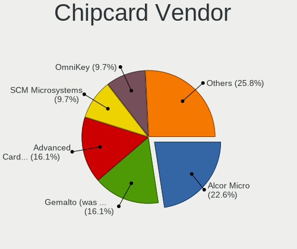

| Vendor                    | Desktops | Percent |
|---------------------------|----------|---------|
| Alcor Micro               | 5        | 20%     |
| Advanced Card Systems     | 4        | 16%     |
| SCM Microsystems          | 3        | 12%     |
| OmniKey                   | 3        | 12%     |
| Gemalto (was Gemplus)     | 3        | 12%     |
| Reiner SCT Kartensysteme  | 2        | 8%      |
| Yubico.com                | 1        | 4%      |
| Fujitsu Siemens Computers | 1        | 4%      |
| Bit4id                    | 1        | 4%      |
| Aladdin R.D.              | 1        | 4%      |
| Aktiv                     | 1        | 4%      |

Chipcard Model
--------------

Chipcard module models

| Model                                                                      | Desktops | Percent |
|----------------------------------------------------------------------------|----------|---------|
| Advanced Card Systems ACR38 SmartCard Reader                               | 4        | 16%     |
| Gemalto (was Gemplus) GemPC Twin SmartCard Reader                          | 3        | 12%     |
| Alcor Micro Watchdata W 1981                                               | 3        | 12%     |
| SCM Microsystems SCR331 SmartCard Reader                                   | 2        | 8%      |
| OmniKey CardMan 1021                                                       | 2        | 8%      |
| Alcor Micro AU9540 Smartcard Reader                                        | 2        | 8%      |
| Yubico.com Yubikey 4/5 U2F+CCID                                            | 1        | 4%      |
| SCM Microsystems SCR331-LC1 / SCR3310 SmartCard Reader                     | 1        | 4%      |
| Reiner SCT Kartensysteme tanJack USB                                       | 1        | 4%      |
| Reiner SCT Kartensysteme cyberJack RFID basis contactless smartcard reader | 1        | 4%      |
| OmniKey CardMan 3021 / 3121                                                | 1        | 4%      |
| Fujitsu Siemens Computers Smartcard Reader D323                            | 1        | 4%      |
| Bit4id miniLector EVO                                                      | 1        | 4%      |
| Aladdin R.D. JaCarta                                                       | 1        | 4%      |
| Aktiv Rutoken lite                                                         | 1        | 4%      |

Unsupported
-----------

Unsupported Devices
-------------------

Total unsupported devices on board

| Total | Desktops | Percent |
|-------|----------|---------|
| 0     | 1460     | 83.72%  |
| 1     | 233      | 13.36%  |
| 2     | 36       | 2.06%   |
| 3     | 6        | 0.34%   |
| 4     | 4        | 0.23%   |
| 5     | 3        | 0.17%   |
| 6     | 2        | 0.11%   |

Unsupported Device Types
------------------------

Types of unsupported devices

| Type                     | Desktops | Percent |
|--------------------------|----------|---------|
| Net/wireless             | 85       | 25.84%  |
| Graphics card            | 83       | 25.23%  |
| Unassigned class         | 34       | 10.33%  |
| Sound                    | 26       | 7.9%    |
| Camera                   | 18       | 5.47%   |
| Multimedia controller    | 14       | 4.26%   |
| Communication controller | 14       | 4.26%   |
| Chipcard                 | 13       | 3.95%   |
| Bluetooth                | 11       | 3.34%   |
| Fingerprint reader       | 8        | 2.43%   |
| Storage/ide              | 5        | 1.52%   |
| Net/ethernet             | 4        | 1.22%   |
| Network                  | 3        | 0.91%   |
| Firewire controller      | 3        | 0.91%   |
| Card reader              | 3        | 0.91%   |
| Modem                    | 2        | 0.61%   |
| Storage/raid             | 1        | 0.3%    |
| Storage/nvme             | 1        | 0.3%    |
| Dvb card                 | 1        | 0.3%    |

