Kubuntu - Tested Hardware & Statistics (Desktops)
-------------------------------------------------

A project to collect tested hardware configurations for Kubuntu.

Anyone can contribute to this report by the [hw-probe](https://github.com/linuxhw/hw-probe) tool:

    sudo -E hw-probe -all -upload

Please contribute! Especially if your hardware is rare.

Contents
--------

* [ Test Cases ](#test-cases)

* [ System ](#system)
  - [ OS                       ](#os)
  - [ OS Family                ](#os-family)
  - [ Kernel                   ](#kernel)
  - [ Kernel Family            ](#kernel-family)
  - [ Kernel Major Ver.        ](#kernel-major-ver)
  - [ Arch                     ](#arch)
  - [ DE                       ](#de)
  - [ Display Server           ](#display-server)
  - [ Display Manager          ](#display-manager)
  - [ OS Lang                  ](#os-lang)
  - [ Boot Mode                ](#boot-mode)
  - [ Filesystem               ](#filesystem)
  - [ Part. scheme             ](#part-scheme)
  - [ Dual Boot with Linux/BSD ](#dual-boot-with-linuxbsd)
  - [ Dual Boot (Win)          ](#dual-boot-win)

* [ Board ](#board)
  - [ Vendor                   ](#vendor)
  - [ Model                    ](#model)
  - [ Model Family             ](#model-family)
  - [ MFG Year                 ](#mfg-year)
  - [ Form Factor              ](#form-factor)
  - [ Secure Boot              ](#secure-boot)
  - [ Coreboot                 ](#coreboot)
  - [ RAM Size                 ](#ram-size)
  - [ RAM Used                 ](#ram-used)
  - [ Total Drives             ](#total-drives)
  - [ Has CD-ROM               ](#has-cd-rom)
  - [ Has Ethernet             ](#has-ethernet)
  - [ Has WiFi                 ](#has-wifi)
  - [ Has Bluetooth            ](#has-bluetooth)

* [ Location ](#location)
  - [ Country                  ](#country)
  - [ City                     ](#city)

* [ Drives ](#drives)
  - [ Drive Vendor             ](#drive-vendor)
  - [ Drive Model              ](#drive-model)
  - [ HDD Vendor               ](#hdd-vendor)
  - [ SSD Vendor               ](#ssd-vendor)
  - [ Drive Kind               ](#drive-kind)
  - [ Drive Connector          ](#drive-connector)
  - [ Drive Size               ](#drive-size)
  - [ Space Total              ](#space-total)
  - [ Space Used               ](#space-used)
  - [ Malfunc. Drives          ](#malfunc-drives)
  - [ Malfunc. Drive Vendor    ](#malfunc-drive-vendor)
  - [ Malfunc. HDD Vendor      ](#malfunc-hdd-vendor)
  - [ Malfunc. Drive Kind      ](#malfunc-drive-kind)
  - [ Failed Drives            ](#failed-drives)
  - [ Failed Drive Vendor      ](#failed-drive-vendor)
  - [ Drive Status             ](#drive-status)

* [ Storage controller ](#storage-controller)
  - [ Storage Vendor           ](#storage-vendor)
  - [ Storage Model            ](#storage-model)
  - [ Storage Kind             ](#storage-kind)

* [ Processor ](#processor)
  - [ CPU Vendor               ](#cpu-vendor)
  - [ CPU Model                ](#cpu-model)
  - [ CPU Model Family         ](#cpu-model-family)
  - [ CPU Cores                ](#cpu-cores)
  - [ CPU Sockets              ](#cpu-sockets)
  - [ CPU Threads              ](#cpu-threads)
  - [ CPU Op-Modes             ](#cpu-op-modes)
  - [ CPU Microcode            ](#cpu-microcode)
  - [ CPU Microarch            ](#cpu-microarch)

* [ Graphics ](#graphics)
  - [ GPU Vendor               ](#gpu-vendor)
  - [ GPU Model                ](#gpu-model)
  - [ GPU Combo                ](#gpu-combo)
  - [ GPU Driver               ](#gpu-driver)
  - [ GPU Memory               ](#gpu-memory)

* [ Monitor ](#monitor)
  - [ Monitor Vendor           ](#monitor-vendor)
  - [ Monitor Model            ](#monitor-model)
  - [ Monitor Resolution       ](#monitor-resolution)
  - [ Monitor Diagonal         ](#monitor-diagonal)
  - [ Monitor Width            ](#monitor-width)
  - [ Aspect Ratio             ](#aspect-ratio)
  - [ Monitor Area             ](#monitor-area)
  - [ Pixel Density            ](#pixel-density)
  - [ Multiple Monitors        ](#multiple-monitors)

* [ Network ](#network)
  - [ Net Controller Vendor    ](#net-controller-vendor)
  - [ Net Controller Model     ](#net-controller-model)
  - [ Wireless Vendor          ](#wireless-vendor)
  - [ Wireless Model           ](#wireless-model)
  - [ Ethernet Vendor          ](#ethernet-vendor)
  - [ Ethernet Model           ](#ethernet-model)
  - [ Net Controller Kind      ](#net-controller-kind)
  - [ Used Controller          ](#used-controller)
  - [ NICs                     ](#nics)
  - [ IPv6                     ](#ipv6)

* [ Bluetooth ](#bluetooth)
  - [ Bluetooth Vendor         ](#bluetooth-vendor)
  - [ Bluetooth Model          ](#bluetooth-model)

* [ Sound ](#sound)
  - [ Sound Vendor             ](#sound-vendor)
  - [ Sound Model              ](#sound-model)

* [ Memory ](#memory)
  - [ Memory Vendor            ](#memory-vendor)
  - [ Memory Model             ](#memory-model)
  - [ Memory Kind              ](#memory-kind)
  - [ Memory Form Factor       ](#memory-form-factor)
  - [ Memory Size              ](#memory-size)
  - [ Memory Speed             ](#memory-speed)

* [ Printers & scanners ](#printers--scanners)
  - [ Printer Vendor           ](#printer-vendor)
  - [ Printer Model            ](#printer-model)
  - [ Scanner Vendor           ](#scanner-vendor)
  - [ Scanner Model            ](#scanner-model)

* [ Camera ](#camera)
  - [ Camera Vendor            ](#camera-vendor)
  - [ Camera Model             ](#camera-model)

* [ Security ](#security)
  - [ Fingerprint Vendor       ](#fingerprint-vendor)
  - [ Fingerprint Model        ](#fingerprint-model)
  - [ Chipcard Vendor          ](#chipcard-vendor)
  - [ Chipcard Model           ](#chipcard-model)

* [ Unsupported ](#unsupported)
  - [ Unsupported Devices      ](#unsupported-devices)
  - [ Unsupported Device Types ](#unsupported-device-types)

Test Cases
----------

Total: 3305

| Vendor        | Model                       | Probe                                                      | Date         |
|---------------|-----------------------------|------------------------------------------------------------|--------------|
| Dell          | 0GDG8Y A00                  | [417dd2665a](https://linux-hardware.org/?probe=417dd2665a) | Jan 06, 2025 |
| ASRock        | AB350 Pro4                  | [0d776677a7](https://linux-hardware.org/?probe=0d776677a7) | Jan 05, 2025 |
| ASRock        | A520M Phantom Gaming 4      | [55ed055bf7](https://linux-hardware.org/?probe=55ed055bf7) | Jan 05, 2025 |
| ASRock        | A520M Phantom Gaming 4      | [9bd6c2311d](https://linux-hardware.org/?probe=9bd6c2311d) | Jan 05, 2025 |
| ASRock        | Z690M-ITX/ax                | [bbbb62d243](https://linux-hardware.org/?probe=bbbb62d243) | Jan 05, 2025 |
| Gigabyte      | B760M DS3H DDR4             | [735622d487](https://linux-hardware.org/?probe=735622d487) | Jan 05, 2025 |
| ASUSTek       | M5A97 LE R2.0               | [badfe83ed3](https://linux-hardware.org/?probe=badfe83ed3) | Jan 04, 2025 |
| Acer          | Aspire XC-705               | [9196850d14](https://linux-hardware.org/?probe=9196850d14) | Jan 04, 2025 |
| MACHINIST     | E5-MR9A V1.0                | [2cd6888290](https://linux-hardware.org/?probe=2cd6888290) | Jan 04, 2025 |
| ASUSTek       | ROG CROSSHAIR X670E HERO    | [fe9ee8d0b4](https://linux-hardware.org/?probe=fe9ee8d0b4) | Jan 03, 2025 |
| BESSTAR Te... | T3 MRD                      | [a4aa2dfab1](https://linux-hardware.org/?probe=a4aa2dfab1) | Jan 02, 2025 |
| Gigabyte      | AX370-Gaming K7             | [50b5770d28](https://linux-hardware.org/?probe=50b5770d28) | Jan 02, 2025 |
| Gigabyte      | Z790 UD AX                  | [64a970e671](https://linux-hardware.org/?probe=64a970e671) | Jan 01, 2025 |
| Lenovo        | 3717 SDK0J40700 WIN 3258... | [bc8aa268ef](https://linux-hardware.org/?probe=bc8aa268ef) | Jan 01, 2025 |
| MSI           | X470 GAMING PRO CARBON      | [0a1f200989](https://linux-hardware.org/?probe=0a1f200989) | Jan 01, 2025 |
| ASRock        | Z170M Pro4S                 | [14a8e0fe62](https://linux-hardware.org/?probe=14a8e0fe62) | Dec 31, 2024 |
| ASUSTek       | TUF Gaming B550-PLUS WIF... | [9f7d158933](https://linux-hardware.org/?probe=9f7d158933) | Dec 30, 2024 |
| HP            | 2AF7                        | [391d4cf404](https://linux-hardware.org/?probe=391d4cf404) | Dec 30, 2024 |
| MSI           | X470 GAMING PRO CARBON      | [6ec37ed4b3](https://linux-hardware.org/?probe=6ec37ed4b3) | Dec 29, 2024 |
| HP            | 3646h                       | [3a6019c6f8](https://linux-hardware.org/?probe=3a6019c6f8) | Dec 28, 2024 |
| Dell          | 07HXY6 A01                  | [05efb343fe](https://linux-hardware.org/?probe=05efb343fe) | Dec 28, 2024 |
| ASRock        | B550 Phantom Gaming-ITX/... | [a3e88e71e3](https://linux-hardware.org/?probe=a3e88e71e3) | Dec 28, 2024 |
| CBR           | A320M.2-VH Challenger       | [1f5e2840d1](https://linux-hardware.org/?probe=1f5e2840d1) | Dec 27, 2024 |
| HP            | 2B29                        | [2bacb97467](https://linux-hardware.org/?probe=2bacb97467) | Dec 26, 2024 |
| GEEKOM        | A5                          | [b309e8ba45](https://linux-hardware.org/?probe=b309e8ba45) | Dec 24, 2024 |
| HP            | 1998                        | [8d460e04de](https://linux-hardware.org/?probe=8d460e04de) | Dec 23, 2024 |
| ASUSTek       | ROG STRIX B650E-F GAMING... | [ad40c6b991](https://linux-hardware.org/?probe=ad40c6b991) | Dec 23, 2024 |
| ASUSTek       | 970 PRO GAMING/AURA         | [4885d454da](https://linux-hardware.org/?probe=4885d454da) | Dec 23, 2024 |
| Gigabyte      | B450M DS3H V2               | [a0bed8cb3f](https://linux-hardware.org/?probe=a0bed8cb3f) | Dec 23, 2024 |
| Dell          | 0F6X5P A00                  | [e95791f119](https://linux-hardware.org/?probe=e95791f119) | Dec 22, 2024 |
| ASUSTek       | ROG STRIX X870E-E GAMING... | [92c5acc84f](https://linux-hardware.org/?probe=92c5acc84f) | Dec 22, 2024 |
| Gigabyte      | Z270-HD3P-CF                | [f95d24a4d3](https://linux-hardware.org/?probe=f95d24a4d3) | Dec 22, 2024 |
| Gigabyte      | B550 AORUS ELITE AX V2      | [671a76bf13](https://linux-hardware.org/?probe=671a76bf13) | Dec 21, 2024 |
| Intel         | DP55WB AAE64798-207         | [c2c0c50aa4](https://linux-hardware.org/?probe=c2c0c50aa4) | Dec 21, 2024 |
| MSI           | MPG Z490 GAMING EDGE WIF... | [675e3b2432](https://linux-hardware.org/?probe=675e3b2432) | Dec 20, 2024 |
| Biostar       | B450MX-S                    | [298f913b02](https://linux-hardware.org/?probe=298f913b02) | Dec 20, 2024 |
| MSI           | MPG Z490 GAMING EDGE WIF... | [28c2c92f61](https://linux-hardware.org/?probe=28c2c92f61) | Dec 19, 2024 |
| Gigabyte      | X570 AORUS MASTER           | [9e02fc3eec](https://linux-hardware.org/?probe=9e02fc3eec) | Dec 19, 2024 |
| Gigabyte      | X570 AORUS MASTER           | [e41eca5240](https://linux-hardware.org/?probe=e41eca5240) | Dec 19, 2024 |
| MSI           | MAG X670E TOMAHAWK WIFI     | [607a9aa50f](https://linux-hardware.org/?probe=607a9aa50f) | Dec 19, 2024 |
| ASUSTek       | P8Z77-V LX                  | [a65cf104b4](https://linux-hardware.org/?probe=a65cf104b4) | Dec 18, 2024 |
| ASRock        | B550 Phantom Gaming 4       | [7946d22582](https://linux-hardware.org/?probe=7946d22582) | Dec 18, 2024 |
| ASRock        | B760M Pro RS/D4 WiFi        | [34bf804bd1](https://linux-hardware.org/?probe=34bf804bd1) | Dec 17, 2024 |
| ASUSTek       | ROG STRIX Z390-E GAMING     | [bbe170f0bc](https://linux-hardware.org/?probe=bbe170f0bc) | Dec 16, 2024 |
| MSI           | B450 GAMING PLUS MAX        | [7beb5cea9f](https://linux-hardware.org/?probe=7beb5cea9f) | Dec 14, 2024 |
| Dell          | 0GN6JF A01                  | [fce4597ad2](https://linux-hardware.org/?probe=fce4597ad2) | Dec 13, 2024 |
| Lenovo        | 3106 SDK0J40697 WIN 3305... | [bece5c47df](https://linux-hardware.org/?probe=bece5c47df) | Dec 11, 2024 |
| Lenovo        | 3106 SDK0J40697 WIN 3305... | [391bc43492](https://linux-hardware.org/?probe=391bc43492) | Dec 11, 2024 |
| Huanan        | X99-TF                      | [8fd5cc725c](https://linux-hardware.org/?probe=8fd5cc725c) | Dec 10, 2024 |
| ASUSTek       | PRIME A320M-K               | [1ef5763e52](https://linux-hardware.org/?probe=1ef5763e52) | Dec 10, 2024 |
| ASUSTek       | TUF B450M-PLUS GAMING       | [f3e2067835](https://linux-hardware.org/?probe=f3e2067835) | Dec 10, 2024 |
| Pegatron      | 2AB6                        | [6ab7d72400](https://linux-hardware.org/?probe=6ab7d72400) | Dec 08, 2024 |
| ASUSTek       | Z97-C                       | [456449c9b2](https://linux-hardware.org/?probe=456449c9b2) | Dec 08, 2024 |
| MSI           | B650 GAMING PLUS WIFI       | [85164bd103](https://linux-hardware.org/?probe=85164bd103) | Dec 08, 2024 |
| Dell          | 0NC2VH A01                  | [d1867f2f69](https://linux-hardware.org/?probe=d1867f2f69) | Dec 08, 2024 |
| Biostar       | B450MX-S                    | [821e6039db](https://linux-hardware.org/?probe=821e6039db) | Dec 08, 2024 |
| MSI           | PRO B650-S WIFI             | [016f4d1c74](https://linux-hardware.org/?probe=016f4d1c74) | Dec 08, 2024 |
| ASUSTek       | X99-E WS/USB                | [7d160ef3b0](https://linux-hardware.org/?probe=7d160ef3b0) | Dec 07, 2024 |
| Gigabyte      | B550 GAMING X V2            | [b90a139240](https://linux-hardware.org/?probe=b90a139240) | Dec 07, 2024 |
| ASUSTek       | ROG Maximus XII FORMULA     | [000952dc62](https://linux-hardware.org/?probe=000952dc62) | Dec 07, 2024 |
| MSI           | B650 GAMING PLUS WIFI       | [d025744ff8](https://linux-hardware.org/?probe=d025744ff8) | Dec 06, 2024 |
| ASUSTek       | PRIME B250M-A               | [9c45bca350](https://linux-hardware.org/?probe=9c45bca350) | Dec 05, 2024 |
| Gigabyte      | Q87M-D2H                    | [bcb77899dd](https://linux-hardware.org/?probe=bcb77899dd) | Dec 05, 2024 |
| ASUSTek       | F2A85-M PRO                 | [dc43147214](https://linux-hardware.org/?probe=dc43147214) | Dec 05, 2024 |
| ASUSTek       | PRIME B250M-A               | [0c7c4b2a6e](https://linux-hardware.org/?probe=0c7c4b2a6e) | Dec 04, 2024 |
| ASUSTek       | F2A85-M PRO                 | [fa47a2dbb2](https://linux-hardware.org/?probe=fa47a2dbb2) | Dec 04, 2024 |
| ASUSTek       | V-P8H67E                    | [d1c21b9076](https://linux-hardware.org/?probe=d1c21b9076) | Dec 03, 2024 |
| AMI           | Intel                       | [0f2096c0a4](https://linux-hardware.org/?probe=0f2096c0a4) | Dec 02, 2024 |
| AMI           | Intel                       | [ffcbee7a41](https://linux-hardware.org/?probe=ffcbee7a41) | Dec 02, 2024 |
| Gigabyte      | Z370P D3-CF                 | [440c2f4be0](https://linux-hardware.org/?probe=440c2f4be0) | Dec 02, 2024 |
| MSI           | 890GXM-G65                  | [06796df9b3](https://linux-hardware.org/?probe=06796df9b3) | Dec 02, 2024 |
| Dell          | 0PXWHK A00                  | [e732eb7855](https://linux-hardware.org/?probe=e732eb7855) | Dec 02, 2024 |
| HP            | 158A                        | [fa4883453f](https://linux-hardware.org/?probe=fa4883453f) | Dec 02, 2024 |
| Gigabyte      | AX370-Gaming K7             | [5b59960dcf](https://linux-hardware.org/?probe=5b59960dcf) | Dec 02, 2024 |
| HP            | 1496                        | [151086aaf3](https://linux-hardware.org/?probe=151086aaf3) | Nov 30, 2024 |
| ASUSTek       | B85-PRO GAMER               | [12dd784125](https://linux-hardware.org/?probe=12dd784125) | Nov 30, 2024 |
| ASUSTek       | B85-PRO GAMER               | [fb51898c9a](https://linux-hardware.org/?probe=fb51898c9a) | Nov 29, 2024 |
| Nvidia        | M750SLI-DS4                 | [6e2167686c](https://linux-hardware.org/?probe=6e2167686c) | Nov 29, 2024 |
| MSI           | X470 GAMING PRO CARBON      | [ea4aa1f387](https://linux-hardware.org/?probe=ea4aa1f387) | Nov 29, 2024 |
| Intel         | H61                         | [9884456ecc](https://linux-hardware.org/?probe=9884456ecc) | Nov 29, 2024 |
| MSI           | B550M PRO-VDH WIFI          | [52266f066f](https://linux-hardware.org/?probe=52266f066f) | Nov 29, 2024 |
| MSI           | MEG X570 ACE                | [f510dcc7d0](https://linux-hardware.org/?probe=f510dcc7d0) | Nov 28, 2024 |
| ASUSTek       | V-P8H67E                    | [89f2b30be4](https://linux-hardware.org/?probe=89f2b30be4) | Nov 28, 2024 |
| Gigabyte      | Z170-HD3P-CF                | [85900dda2b](https://linux-hardware.org/?probe=85900dda2b) | Nov 27, 2024 |
| Gigabyte      | Z170-HD3P-CF                | [1b415de6dd](https://linux-hardware.org/?probe=1b415de6dd) | Nov 27, 2024 |
| HP            | 8169                        | [a6c381e34e](https://linux-hardware.org/?probe=a6c381e34e) | Nov 25, 2024 |
| Intel         | H61                         | [06e926278d](https://linux-hardware.org/?probe=06e926278d) | Nov 25, 2024 |
| Dell          | 06D7TR A00                  | [61383033d8](https://linux-hardware.org/?probe=61383033d8) | Nov 24, 2024 |
| MSI           | X470 GAMING PRO CARBON      | [2412cb727b](https://linux-hardware.org/?probe=2412cb727b) | Nov 23, 2024 |
| Gigabyte      | B650 GAMING X AX            | [6375082100](https://linux-hardware.org/?probe=6375082100) | Nov 23, 2024 |
| HP            | 212B                        | [00b61e1475](https://linux-hardware.org/?probe=00b61e1475) | Nov 21, 2024 |
| Lenovo        | 3728 NOK                    | [1af5098c4e](https://linux-hardware.org/?probe=1af5098c4e) | Nov 19, 2024 |
| Biostar       | B450MX-S                    | [867b43aac2](https://linux-hardware.org/?probe=867b43aac2) | Nov 19, 2024 |
| Gigabyte      | P35-DS3L                    | [beaa8307e1](https://linux-hardware.org/?probe=beaa8307e1) | Nov 18, 2024 |
| MSI           | PRO Z790-P WIFI             | [7d676a8612](https://linux-hardware.org/?probe=7d676a8612) | Nov 18, 2024 |
| HP            | 87D6 SMVB                   | [88199b7676](https://linux-hardware.org/?probe=88199b7676) | Nov 18, 2024 |
| HP            | 87D6 SMVB                   | [9ee644390f](https://linux-hardware.org/?probe=9ee644390f) | Nov 18, 2024 |
| Biostar       | TZ77XE4                     | [a524ca5608](https://linux-hardware.org/?probe=a524ca5608) | Nov 17, 2024 |
| Foxconn       | G31MXP FAB:1.1              | [e6250c0cfc](https://linux-hardware.org/?probe=e6250c0cfc) | Nov 16, 2024 |
| Gigabyte      | Z68MA-D2H-B3                | [461bc5c613](https://linux-hardware.org/?probe=461bc5c613) | Nov 16, 2024 |
| Lenovo        | 0B98401 WIN                 | [4e618ec5fd](https://linux-hardware.org/?probe=4e618ec5fd) | Nov 16, 2024 |
| Gigabyte      | B550 AORUS ELITE V2         | [67dac8ba1a](https://linux-hardware.org/?probe=67dac8ba1a) | Nov 16, 2024 |
| MSI           | MPG B550 GAMING PLUS        | [2d1f399be3](https://linux-hardware.org/?probe=2d1f399be3) | Nov 16, 2024 |
| ASUSTek       | TUF Gaming B450-PLUS II     | [520d4f01d7](https://linux-hardware.org/?probe=520d4f01d7) | Nov 15, 2024 |
| ASUSTek       | H81T                        | [e5b4d3412b](https://linux-hardware.org/?probe=e5b4d3412b) | Nov 14, 2024 |
| Gigabyte      | Z68MA-D2H-B3                | [2bf1a8297a](https://linux-hardware.org/?probe=2bf1a8297a) | Nov 14, 2024 |
| Lenovo        | 36C8 SDK0J40700 WIN 3258... | [58f234c8d9](https://linux-hardware.org/?probe=58f234c8d9) | Nov 13, 2024 |
| ASUSTek       | PRIME A520M-K               | [4036e5d5c8](https://linux-hardware.org/?probe=4036e5d5c8) | Nov 13, 2024 |
| Dell          | 0PU052                      | [e831c0847c](https://linux-hardware.org/?probe=e831c0847c) | Nov 12, 2024 |
| MSI           | PRO Z790-P WIFI             | [b98699dc00](https://linux-hardware.org/?probe=b98699dc00) | Nov 12, 2024 |
| Fisusen Te... | FSX-ALU4L2S Ver:1.2         | [1ad6062abc](https://linux-hardware.org/?probe=1ad6062abc) | Nov 12, 2024 |
| Fisusen Te... | FSX-ALU4L2S Ver:1.2         | [eaa81d85da](https://linux-hardware.org/?probe=eaa81d85da) | Nov 12, 2024 |
| MSI           | B450 TOMAHAWK MAX           | [aa74d725f3](https://linux-hardware.org/?probe=aa74d725f3) | Nov 11, 2024 |
| ASUSTek       | P8Z68-V                     | [4a20d22dd5](https://linux-hardware.org/?probe=4a20d22dd5) | Nov 11, 2024 |
| ASUSTek       | P8Z68-V                     | [014f995cb5](https://linux-hardware.org/?probe=014f995cb5) | Nov 11, 2024 |
| MSI           | Z370 PC PRO                 | [9aef95d1fb](https://linux-hardware.org/?probe=9aef95d1fb) | Nov 11, 2024 |
| MSI           | Z370 PC PRO                 | [7252e66a9b](https://linux-hardware.org/?probe=7252e66a9b) | Nov 11, 2024 |
| ASUSTek       | TUF Z270 MARK 2             | [de78865944](https://linux-hardware.org/?probe=de78865944) | Nov 10, 2024 |
| ASUSTek       | P8Z68-V                     | [164a29cfe9](https://linux-hardware.org/?probe=164a29cfe9) | Nov 10, 2024 |
| Unknown       | Unknown                     | [6fe1fc4bfb](https://linux-hardware.org/?probe=6fe1fc4bfb) | Nov 10, 2024 |
| Dell          | 0PU052                      | [24b2e836ea](https://linux-hardware.org/?probe=24b2e836ea) | Nov 10, 2024 |
| MSI           | B760 GAMING PLUS WIFI       | [8c904e033f](https://linux-hardware.org/?probe=8c904e033f) | Nov 09, 2024 |
| MSI           | B360 GAMING PRO CARBON      | [8622f5cac7](https://linux-hardware.org/?probe=8622f5cac7) | Nov 07, 2024 |
| ASUSTek       | PRIME X570-P                | [8a99b0cee1](https://linux-hardware.org/?probe=8a99b0cee1) | Nov 06, 2024 |
| HP            | 2B36                        | [8d6853452d](https://linux-hardware.org/?probe=8d6853452d) | Nov 06, 2024 |
| Lenovo        | SHARKBAY NOK                | [f7909ba95e](https://linux-hardware.org/?probe=f7909ba95e) | Nov 05, 2024 |
| Dell          | 0T10XW A02                  | [663596ec53](https://linux-hardware.org/?probe=663596ec53) | Nov 05, 2024 |
| ASUSTek       | P8B75-M                     | [2a0cc67f21](https://linux-hardware.org/?probe=2a0cc67f21) | Nov 05, 2024 |
| Nvidia        | M750SLI-DS4                 | [32195a3f35](https://linux-hardware.org/?probe=32195a3f35) | Nov 05, 2024 |
| MSI           | B450 TOMAHAWK               | [9e7baf9bec](https://linux-hardware.org/?probe=9e7baf9bec) | Nov 05, 2024 |
| Dell          | 0T10XW A02                  | [f248927702](https://linux-hardware.org/?probe=f248927702) | Nov 04, 2024 |
| ASUSTek       | ROG STRIX B550-F GAMING     | [04191e06b0](https://linux-hardware.org/?probe=04191e06b0) | Nov 04, 2024 |
| ASUSTek       | P5K SE                      | [3a9546eaaa](https://linux-hardware.org/?probe=3a9546eaaa) | Nov 02, 2024 |
| Gigabyte      | AX370-Gaming K7             | [3a24bb6154](https://linux-hardware.org/?probe=3a24bb6154) | Nov 02, 2024 |
| MSI           | X370 XPOWER GAMING TITAN... | [36275af64b](https://linux-hardware.org/?probe=36275af64b) | Nov 01, 2024 |
| ASUSTek       | PRIME H610M-E D4            | [e96c0b7bfb](https://linux-hardware.org/?probe=e96c0b7bfb) | Nov 01, 2024 |
| MSI           | X470 GAMING PRO CARBON      | [d9043dc2d5](https://linux-hardware.org/?probe=d9043dc2d5) | Nov 01, 2024 |
| ASUSTek       | PRIME B650M-A II            | [84cfce45dd](https://linux-hardware.org/?probe=84cfce45dd) | Oct 30, 2024 |
| Fujitsu       | D3164-C2 S26361-D3164-C2    | [9fed3b2d74](https://linux-hardware.org/?probe=9fed3b2d74) | Oct 29, 2024 |
| HP            | 18E4                        | [0936cdf872](https://linux-hardware.org/?probe=0936cdf872) | Oct 28, 2024 |
| ASUSTek       | PRIME B550-PLUS             | [0ef7db0f77](https://linux-hardware.org/?probe=0ef7db0f77) | Oct 28, 2024 |
| ASRock        | Z790-C                      | [973c6465bd](https://linux-hardware.org/?probe=973c6465bd) | Oct 28, 2024 |
| ASRock        | Z790-C                      | [809c05fba5](https://linux-hardware.org/?probe=809c05fba5) | Oct 28, 2024 |
| Dell          | 048DY8 A01                  | [48ed169a24](https://linux-hardware.org/?probe=48ed169a24) | Oct 28, 2024 |
| MSI           | B650 GAMING PLUS WIFI       | [d117ba60e9](https://linux-hardware.org/?probe=d117ba60e9) | Oct 27, 2024 |
| HP            | 8860 A                      | [3c64b023a9](https://linux-hardware.org/?probe=3c64b023a9) | Oct 26, 2024 |
| ASRock        | B550AM Gaming               | [acb3396fce](https://linux-hardware.org/?probe=acb3396fce) | Oct 26, 2024 |
| Gigabyte      | A320M-S2H-CF                | [acff3f4794](https://linux-hardware.org/?probe=acff3f4794) | Oct 26, 2024 |
| Dell          | 0J4NFV A01                  | [6ba567e2bc](https://linux-hardware.org/?probe=6ba567e2bc) | Oct 25, 2024 |
| ASRock        | Q1900M                      | [9724395584](https://linux-hardware.org/?probe=9724395584) | Oct 25, 2024 |
| MSI           | MPG B650 EDGE WIFI          | [2d03a71708](https://linux-hardware.org/?probe=2d03a71708) | Oct 24, 2024 |
| ASUSTek       | SABERTOOTH Z77              | [46c6dbdba4](https://linux-hardware.org/?probe=46c6dbdba4) | Oct 24, 2024 |
| MSI           | B350M PRO-VDH               | [dd36ced75f](https://linux-hardware.org/?probe=dd36ced75f) | Oct 23, 2024 |
| Gigabyte      | B650 AORUS ELITE AX V2      | [171bf9a6b1](https://linux-hardware.org/?probe=171bf9a6b1) | Oct 23, 2024 |
| ASUSTek       | B85M-E                      | [0750f91898](https://linux-hardware.org/?probe=0750f91898) | Oct 23, 2024 |
| ASUSTek       | TUF Gaming B650M-E WIFI     | [a31f68636f](https://linux-hardware.org/?probe=a31f68636f) | Oct 23, 2024 |
| ASUSTek       | M4A88TD-V EVO/USB3          | [594f81b2d2](https://linux-hardware.org/?probe=594f81b2d2) | Oct 23, 2024 |
| ASRock        | X470 Taichi                 | [281ae4fd93](https://linux-hardware.org/?probe=281ae4fd93) | Oct 23, 2024 |
| ASUSTek       | STRIX Z270E GAMING          | [788a8234d6](https://linux-hardware.org/?probe=788a8234d6) | Oct 23, 2024 |
| MSI           | MPG X570 GAMING PRO CARB... | [7f42b4b8eb](https://linux-hardware.org/?probe=7f42b4b8eb) | Oct 22, 2024 |
| Dell          | 0D28YY A00                  | [d99284464c](https://linux-hardware.org/?probe=d99284464c) | Oct 22, 2024 |
| Lenovo        | 3148 SDK0J40697 WIN 3305... | [90245dec30](https://linux-hardware.org/?probe=90245dec30) | Oct 22, 2024 |
| ASUSTek       | TUF Gaming X570-PRO         | [c4cd814f22](https://linux-hardware.org/?probe=c4cd814f22) | Oct 22, 2024 |
| ASRock        | B550AM Gaming               | [adcb3f0df9](https://linux-hardware.org/?probe=adcb3f0df9) | Oct 22, 2024 |
| Gigabyte      | B550 UD AC-Y1               | [63e2546922](https://linux-hardware.org/?probe=63e2546922) | Oct 22, 2024 |
| MSI           | MPG B650 EDGE WIFI          | [d86b5ef934](https://linux-hardware.org/?probe=d86b5ef934) | Oct 21, 2024 |
| MSI           | B350M PRO-VDH               | [30255b191f](https://linux-hardware.org/?probe=30255b191f) | Oct 21, 2024 |
| Intel         | HM570                       | [f6d537fbb8](https://linux-hardware.org/?probe=f6d537fbb8) | Oct 21, 2024 |
| ASUSTek       | ROG CROSSHAIR VIII HERO     | [a78280761c](https://linux-hardware.org/?probe=a78280761c) | Oct 20, 2024 |
| ASUSTek       | ROG STRIX B550-XE GAMING... | [a615005d3d](https://linux-hardware.org/?probe=a615005d3d) | Oct 20, 2024 |
| Gigabyte      | X570 AORUS ELITE            | [1517e4e467](https://linux-hardware.org/?probe=1517e4e467) | Oct 19, 2024 |
| ASUSTek       | PRIME B250M-PLUS/BR         | [a1a7f94c44](https://linux-hardware.org/?probe=a1a7f94c44) | Oct 19, 2024 |
| ASUSTek       | P8B75-M LX PLUS             | [84f8b8a516](https://linux-hardware.org/?probe=84f8b8a516) | Oct 19, 2024 |
| ASUSTek       | M4A88TD-V EVO/USB3          | [60b027e69b](https://linux-hardware.org/?probe=60b027e69b) | Oct 19, 2024 |
| Gigabyte      | B760M DS3H AX DDR4          | [90f6d1aeaa](https://linux-hardware.org/?probe=90f6d1aeaa) | Oct 18, 2024 |
| Dell          | 06D7TR A01                  | [4330cba698](https://linux-hardware.org/?probe=4330cba698) | Oct 18, 2024 |
| Gigabyte      | B360M GAMING HD             | [82d4e1568c](https://linux-hardware.org/?probe=82d4e1568c) | Oct 17, 2024 |
| Gigabyte      | B450 AORUS PRO WIFI-CF      | [0ce8e146cf](https://linux-hardware.org/?probe=0ce8e146cf) | Oct 16, 2024 |
| Dell          | 0C3YXR A01                  | [702872562a](https://linux-hardware.org/?probe=702872562a) | Oct 15, 2024 |
| Nvidia        | M750SLI-DS4                 | [597ea8c178](https://linux-hardware.org/?probe=597ea8c178) | Oct 14, 2024 |
| Gigabyte      | B450M DS3H-CF               | [4ea724da9a](https://linux-hardware.org/?probe=4ea724da9a) | Oct 14, 2024 |
| Acer          | Veriton X2631G V:1.0        | [c16aec5e6a](https://linux-hardware.org/?probe=c16aec5e6a) | Oct 14, 2024 |
| Dell          | 04YP6J A01                  | [483d1ec29c](https://linux-hardware.org/?probe=483d1ec29c) | Oct 13, 2024 |
| HP            | 828A                        | [94d2315155](https://linux-hardware.org/?probe=94d2315155) | Oct 13, 2024 |
| ASUSTek       | TUF Gaming B550M-PLUS       | [958542aabf](https://linux-hardware.org/?probe=958542aabf) | Oct 13, 2024 |
| Gigabyte      | B550I AORUS PRO AX          | [9e89e0d62c](https://linux-hardware.org/?probe=9e89e0d62c) | Oct 12, 2024 |
| ASUSTek       | Maximus IV GENE-Z/GEN3      | [4d57a6b4ae](https://linux-hardware.org/?probe=4d57a6b4ae) | Oct 12, 2024 |
| ASUSTek       | PRIME B250M-PLUS            | [8e00234742](https://linux-hardware.org/?probe=8e00234742) | Oct 12, 2024 |
| MSI           | B460M PRO-VDH WIFI          | [efedf1a09f](https://linux-hardware.org/?probe=efedf1a09f) | Oct 12, 2024 |
| AZW           | MINI S                      | [9f7e9cafb9](https://linux-hardware.org/?probe=9f7e9cafb9) | Oct 11, 2024 |
| Gigabyte      | A320M-S2H-CF                | [786357d8a3](https://linux-hardware.org/?probe=786357d8a3) | Oct 10, 2024 |
| Gigabyte      | B450M DS3H V2               | [2b9caff686](https://linux-hardware.org/?probe=2b9caff686) | Oct 09, 2024 |
| MSI           | B550M PRO                   | [1567bd14d8](https://linux-hardware.org/?probe=1567bd14d8) | Oct 09, 2024 |
| MSI           | PRO H610M-E DDR4            | [a95a15d17b](https://linux-hardware.org/?probe=a95a15d17b) | Oct 08, 2024 |
| MSI           | H61M-P21                    | [1dbbce13c7](https://linux-hardware.org/?probe=1dbbce13c7) | Oct 08, 2024 |
| Unknown       | Unknown                     | [80a672c3d8](https://linux-hardware.org/?probe=80a672c3d8) | Oct 07, 2024 |
| ASUSTek       | P7P55 LX                    | [bf4370907f](https://linux-hardware.org/?probe=bf4370907f) | Oct 07, 2024 |
| Gigabyte      | EX58-UD5                    | [5880d0b553](https://linux-hardware.org/?probe=5880d0b553) | Oct 07, 2024 |
| MSI           | PRO B760-P WIFI DDR4        | [088f583974](https://linux-hardware.org/?probe=088f583974) | Oct 06, 2024 |
| Unknown       | Unknown                     | [599e683113](https://linux-hardware.org/?probe=599e683113) | Oct 06, 2024 |
| MSI           | X470 GAMING PRO CARBON      | [a6f1e4b465](https://linux-hardware.org/?probe=a6f1e4b465) | Oct 05, 2024 |
| Gigabyte      | B450M DS3H V2               | [d04f626162](https://linux-hardware.org/?probe=d04f626162) | Oct 05, 2024 |
| Dell          | 0WR7PY A01                  | [77b343aeba](https://linux-hardware.org/?probe=77b343aeba) | Oct 05, 2024 |
| Pegatron      | 2AB6                        | [9e31ddb1af](https://linux-hardware.org/?probe=9e31ddb1af) | Oct 04, 2024 |
| Dell          | 0DR845                      | [0f42ddcf61](https://linux-hardware.org/?probe=0f42ddcf61) | Oct 04, 2024 |
| ASRock        | H410M-HDV                   | [01a1e8594c](https://linux-hardware.org/?probe=01a1e8594c) | Oct 04, 2024 |
| MSI           | Z97M-G43                    | [ae53772186](https://linux-hardware.org/?probe=ae53772186) | Oct 03, 2024 |
| MSI           | Z97M-G43                    | [4f32e59ad9](https://linux-hardware.org/?probe=4f32e59ad9) | Oct 03, 2024 |
| Pegatron      | 2AB5                        | [5e1831ce63](https://linux-hardware.org/?probe=5e1831ce63) | Oct 03, 2024 |
| ASUSTek       | PRIME B550-PLUS             | [41921a1eeb](https://linux-hardware.org/?probe=41921a1eeb) | Oct 03, 2024 |
| Pegatron      | Benicia                     | [da155fec72](https://linux-hardware.org/?probe=da155fec72) | Oct 02, 2024 |
| ASUSTek       | 970 PRO GAMING/AURA         | [3c3570695d](https://linux-hardware.org/?probe=3c3570695d) | Oct 02, 2024 |
| ASUSTek       | PRIME B350M-A               | [9f9436db09](https://linux-hardware.org/?probe=9f9436db09) | Oct 02, 2024 |
| ASRock        | B650M-H/M.2+                | [40445bd99a](https://linux-hardware.org/?probe=40445bd99a) | Oct 02, 2024 |
| Gigabyte      | AX370-Gaming K7             | [ddc95ea8b4](https://linux-hardware.org/?probe=ddc95ea8b4) | Oct 01, 2024 |
| ASUSTek       | Z97-A                       | [f490208f34](https://linux-hardware.org/?probe=f490208f34) | Oct 01, 2024 |
| ASRock        | H410M-HDV                   | [e8a196d76d](https://linux-hardware.org/?probe=e8a196d76d) | Oct 01, 2024 |
| ASRock        | B650E Steel Legend WiFi     | [cf9372b0ab](https://linux-hardware.org/?probe=cf9372b0ab) | Oct 01, 2024 |
| Dell          | 0CXR46 A00                  | [407b847faa](https://linux-hardware.org/?probe=407b847faa) | Sep 30, 2024 |
| Dell          | 048DY8 A01                  | [909949bed3](https://linux-hardware.org/?probe=909949bed3) | Sep 30, 2024 |
| HP            | 212B                        | [8a25cf82be](https://linux-hardware.org/?probe=8a25cf82be) | Sep 30, 2024 |
| ASUSTek       | P6TD DELUXE                 | [b0b13c581e](https://linux-hardware.org/?probe=b0b13c581e) | Sep 30, 2024 |
| ASRock        | Z690 PG Velocita            | [3cca718666](https://linux-hardware.org/?probe=3cca718666) | Sep 29, 2024 |
| Gigabyte      | P35-DS3L                    | [199f033892](https://linux-hardware.org/?probe=199f033892) | Sep 29, 2024 |
| Gigabyte      | P35-DS3L                    | [c3ce9fa5d8](https://linux-hardware.org/?probe=c3ce9fa5d8) | Sep 28, 2024 |
| Dell          | 0F6X5P A00                  | [fc052cba3c](https://linux-hardware.org/?probe=fc052cba3c) | Sep 28, 2024 |
| Gigabyte      | GA-A75M-D2H                 | [f62a1a679c](https://linux-hardware.org/?probe=f62a1a679c) | Sep 28, 2024 |
| Dell          | 0JGM7F A00                  | [b7edac6094](https://linux-hardware.org/?probe=b7edac6094) | Sep 28, 2024 |
| MSI           | 760GM -E51                  | [88f6fb3c64](https://linux-hardware.org/?probe=88f6fb3c64) | Sep 28, 2024 |
| Dell          | 0WR7PY A02                  | [bc0335d49f](https://linux-hardware.org/?probe=bc0335d49f) | Sep 27, 2024 |
| Pegatron      | 2AB6                        | [621eefa747](https://linux-hardware.org/?probe=621eefa747) | Sep 26, 2024 |
| ASUSTek       | ROG STRIX X670E-E GAMING... | [e1ead454b9](https://linux-hardware.org/?probe=e1ead454b9) | Sep 26, 2024 |
| Gigabyte      | GA-78LMT-USB3               | [4d7ee90e04](https://linux-hardware.org/?probe=4d7ee90e04) | Sep 24, 2024 |
| Gigabyte      | 970A-DS3P                   | [b5cff39380](https://linux-hardware.org/?probe=b5cff39380) | Sep 23, 2024 |
| Gigabyte      | A520M DS3H V2               | [7e4ec3213b](https://linux-hardware.org/?probe=7e4ec3213b) | Sep 23, 2024 |
| Dell          | 0F6X5P A00                  | [0c54dd2ad4](https://linux-hardware.org/?probe=0c54dd2ad4) | Sep 22, 2024 |
| ASUSTek       | ROG STRIX X570-E GAMING     | [0e6b9f527a](https://linux-hardware.org/?probe=0e6b9f527a) | Sep 22, 2024 |
| HP            | 843C                        | [1192869981](https://linux-hardware.org/?probe=1192869981) | Sep 21, 2024 |
| MSI           | 990FXA-GD80                 | [4e64b3d464](https://linux-hardware.org/?probe=4e64b3d464) | Sep 21, 2024 |
| Gigabyte      | B550M DS3H                  | [eccf46ea1d](https://linux-hardware.org/?probe=eccf46ea1d) | Sep 21, 2024 |
| ASUSTek       | Z170-PRO                    | [c2c30664b7](https://linux-hardware.org/?probe=c2c30664b7) | Sep 21, 2024 |
| MSI           | MPG Z390 GAMING PLUS        | [13c4edab38](https://linux-hardware.org/?probe=13c4edab38) | Sep 20, 2024 |
| Gigabyte      | B150M-DS3H-CF               | [ad37bc0d59](https://linux-hardware.org/?probe=ad37bc0d59) | Sep 18, 2024 |
| Gigabyte      | B150M-DS3H-CF               | [08c3670392](https://linux-hardware.org/?probe=08c3670392) | Sep 18, 2024 |
| GEEKOM        | A7                          | [61bb59d773](https://linux-hardware.org/?probe=61bb59d773) | Sep 16, 2024 |
| Dell          | 0PXWHK A00                  | [64ca0b3da3](https://linux-hardware.org/?probe=64ca0b3da3) | Sep 16, 2024 |
| MSI           | X470 GAMING PRO CARBON      | [b48e7ccff0](https://linux-hardware.org/?probe=b48e7ccff0) | Sep 15, 2024 |
| ASUSTek       | TUF Gaming X570-PLUS        | [4d4fad6d57](https://linux-hardware.org/?probe=4d4fad6d57) | Sep 15, 2024 |
| ASUSTek       | PRIME B450M-A               | [72c90d2d0c](https://linux-hardware.org/?probe=72c90d2d0c) | Sep 14, 2024 |
| Intel         | B75                         | [95c46ed60c](https://linux-hardware.org/?probe=95c46ed60c) | Sep 14, 2024 |
| ASUSTek       | PRIME X670-P WIFI           | [c85b492885](https://linux-hardware.org/?probe=c85b492885) | Sep 13, 2024 |
| ASUSTek       | ROG STRIX Z370-E GAMING     | [968fd5975e](https://linux-hardware.org/?probe=968fd5975e) | Sep 11, 2024 |
| Dell          | 048DY8 A01                  | [abc608fa11](https://linux-hardware.org/?probe=abc608fa11) | Sep 11, 2024 |
| Fujitsu       | D3401-B2 S26361-D3401-B2    | [ecc2fc4b42](https://linux-hardware.org/?probe=ecc2fc4b42) | Sep 11, 2024 |
| Gigabyte      | 970A-DS3                    | [431476d6e8](https://linux-hardware.org/?probe=431476d6e8) | Sep 11, 2024 |
| Gigabyte      | 970-GAMING                  | [e06391b86d](https://linux-hardware.org/?probe=e06391b86d) | Sep 10, 2024 |
| Lenovo        | SHARKBAY SDK0E50510 WIN     | [d0c5441818](https://linux-hardware.org/?probe=d0c5441818) | Sep 10, 2024 |
| ASUSTek       | ROG STRIX B550-F GAMING     | [dd74657516](https://linux-hardware.org/?probe=dd74657516) | Sep 10, 2024 |
| MSI           | MPG Z390 GAMING PRO CARB... | [fb30c3df6a](https://linux-hardware.org/?probe=fb30c3df6a) | Sep 10, 2024 |
| MSI           | MPG Z390 GAMING PRO CARB... | [fe1552023e](https://linux-hardware.org/?probe=fe1552023e) | Sep 10, 2024 |
| HP            | 1825                        | [dad25ef0f2](https://linux-hardware.org/?probe=dad25ef0f2) | Sep 09, 2024 |
| ASUSTek       | ROG STRIX Z790-I GAMING ... | [892913fe0d](https://linux-hardware.org/?probe=892913fe0d) | Sep 08, 2024 |
| ASUSTek       | ROG STRIX B550-F GAMING     | [0f08c484b0](https://linux-hardware.org/?probe=0f08c484b0) | Sep 08, 2024 |
| Intel         | DZ68DB AAG27985-101         | [2bb7aed3d1](https://linux-hardware.org/?probe=2bb7aed3d1) | Sep 08, 2024 |
| ASUSTek       | TUF Gaming B450M-PRO II     | [bcd7fd5eb4](https://linux-hardware.org/?probe=bcd7fd5eb4) | Sep 08, 2024 |
| Lenovo        | MAHOBAY NOK                 | [f401d0f3d7](https://linux-hardware.org/?probe=f401d0f3d7) | Sep 07, 2024 |
| ASUSTek       | Maximus VI HERO             | [64da4e01a4](https://linux-hardware.org/?probe=64da4e01a4) | Sep 07, 2024 |
| Acer          | Aspire GX-785               | [e50410f0ed](https://linux-hardware.org/?probe=e50410f0ed) | Sep 05, 2024 |
| Acer          | Aspire GX-785               | [f11ea56e9e](https://linux-hardware.org/?probe=f11ea56e9e) | Sep 05, 2024 |
| ASUSTek       | PRIME B650M-A II            | [f6a7476614](https://linux-hardware.org/?probe=f6a7476614) | Sep 05, 2024 |
| Gigabyte      | Z77X-D3H                    | [1714ec1aaf](https://linux-hardware.org/?probe=1714ec1aaf) | Sep 04, 2024 |
| Dell          | 0DR845                      | [7385610ecd](https://linux-hardware.org/?probe=7385610ecd) | Sep 04, 2024 |
| ASUSTek       | 970 PRO GAMING/AURA         | [db3ce60da0](https://linux-hardware.org/?probe=db3ce60da0) | Sep 02, 2024 |
| GMKtec        | NucBox M6                   | [c0aa2b18b2](https://linux-hardware.org/?probe=c0aa2b18b2) | Sep 02, 2024 |
| GMKtec        | NucBox M6                   | [a5236d6708](https://linux-hardware.org/?probe=a5236d6708) | Sep 02, 2024 |
| ASUSTek       | H81M-CS/BR                  | [21197e94df](https://linux-hardware.org/?probe=21197e94df) | Sep 02, 2024 |
| Gigabyte      | G31M-S2C                    | [29671c0af6](https://linux-hardware.org/?probe=29671c0af6) | Sep 02, 2024 |
| Gigabyte      | B550M AORUS ELITE           | [8b0e9e2cb3](https://linux-hardware.org/?probe=8b0e9e2cb3) | Sep 02, 2024 |
| Gigabyte      | AX370-Gaming K7             | [f4ecd68705](https://linux-hardware.org/?probe=f4ecd68705) | Sep 01, 2024 |
| Gigabyte      | H81M-DS2                    | [cb4bfa7983](https://linux-hardware.org/?probe=cb4bfa7983) | Sep 01, 2024 |
| Unknown       | Unknown                     | [35b563fbe4](https://linux-hardware.org/?probe=35b563fbe4) | Sep 01, 2024 |
| Unknown       | Unknown                     | [6f7a85fa0d](https://linux-hardware.org/?probe=6f7a85fa0d) | Sep 01, 2024 |
| MSI           | MPG X570 GAMING PLUS        | [d9466094dd](https://linux-hardware.org/?probe=d9466094dd) | Sep 01, 2024 |
| MSI           | X470 GAMING PRO CARBON      | [249520907c](https://linux-hardware.org/?probe=249520907c) | Sep 01, 2024 |
| Intel         | X99                         | [ae686462f8](https://linux-hardware.org/?probe=ae686462f8) | Aug 31, 2024 |
| ASRock Ind... | 4X4-7000 Series/D5          | [b1e161911d](https://linux-hardware.org/?probe=b1e161911d) | Aug 31, 2024 |
| ASUSTek       | PRIME B650-PLUS             | [ab12851d28](https://linux-hardware.org/?probe=ab12851d28) | Aug 30, 2024 |
| ASUSTek       | H97-PLUS                    | [2ddf6a58fd](https://linux-hardware.org/?probe=2ddf6a58fd) | Aug 29, 2024 |
| MSI           | B760 GAMING PLUS WIFI       | [48e74e492a](https://linux-hardware.org/?probe=48e74e492a) | Aug 29, 2024 |
| ASUSTek       | Z170-PRO                    | [1df85adc47](https://linux-hardware.org/?probe=1df85adc47) | Aug 27, 2024 |
| Fujitsu       | D3401-B2 S26361-D3401-B2    | [4a901b8c0b](https://linux-hardware.org/?probe=4a901b8c0b) | Aug 27, 2024 |
| ASUSTek       | Z170-A                      | [6c1129e7e6](https://linux-hardware.org/?probe=6c1129e7e6) | Aug 27, 2024 |
| MSI           | X370 GAMING PRO CARBON      | [c8e6b2f118](https://linux-hardware.org/?probe=c8e6b2f118) | Aug 26, 2024 |
| Gigabyte      | P55-UD3                     | [cf0af05881](https://linux-hardware.org/?probe=cf0af05881) | Aug 26, 2024 |
| Dell          | 0WR7PY A01                  | [eb98108706](https://linux-hardware.org/?probe=eb98108706) | Aug 26, 2024 |
| ASUSTek       | PRIME X670-P                | [84186c6be7](https://linux-hardware.org/?probe=84186c6be7) | Aug 25, 2024 |
| Dell          | 0WR7PY A01                  | [42c4b0b64e](https://linux-hardware.org/?probe=42c4b0b64e) | Aug 24, 2024 |
| Olidata       | ALICON AI2S-A21 0.41        | [07fa7b2207](https://linux-hardware.org/?probe=07fa7b2207) | Aug 23, 2024 |
| Foxconn       | H61MXL/H61MXL-K             | [d00e0f2aa0](https://linux-hardware.org/?probe=d00e0f2aa0) | Aug 22, 2024 |
| GEEKOM        | A5                          | [f6667e67e6](https://linux-hardware.org/?probe=f6667e67e6) | Aug 22, 2024 |
| ASUSTek       | TUF Gaming B650-PLUS WIF... | [7496218099](https://linux-hardware.org/?probe=7496218099) | Aug 21, 2024 |
| HP            | 1906                        | [a08dcad0b1](https://linux-hardware.org/?probe=a08dcad0b1) | Aug 19, 2024 |
| HP            | 18E6                        | [b930cd6025](https://linux-hardware.org/?probe=b930cd6025) | Aug 19, 2024 |
| Gigabyte      | H61M-DS2 DVI                | [a9fd6f75e3](https://linux-hardware.org/?probe=a9fd6f75e3) | Aug 17, 2024 |
| MSI           | X470 GAMING PRO CARBON      | [82e70084ce](https://linux-hardware.org/?probe=82e70084ce) | Aug 16, 2024 |
| MSI           | B450 TOMAHAWK MAX           | [7de01582ba](https://linux-hardware.org/?probe=7de01582ba) | Aug 16, 2024 |
| MSI           | MPG B550 GAMING EDGE WIF... | [d1d78a1afa](https://linux-hardware.org/?probe=d1d78a1afa) | Aug 15, 2024 |
| ASUSTek       | PRIME B650M-A II            | [e9650bcedb](https://linux-hardware.org/?probe=e9650bcedb) | Aug 14, 2024 |
| Gigabyte      | Z490 AORUS ELITE AC         | [c6e46b55fe](https://linux-hardware.org/?probe=c6e46b55fe) | Aug 14, 2024 |
| ASUSTek       | TUF Gaming X570-PLUS        | [5aa1d7c5fa](https://linux-hardware.org/?probe=5aa1d7c5fa) | Aug 13, 2024 |
| Unknown       | Unknown                     | [7e50390403](https://linux-hardware.org/?probe=7e50390403) | Aug 12, 2024 |
| ASUSTek       | Maximus VII HERO            | [5c94a6c420](https://linux-hardware.org/?probe=5c94a6c420) | Aug 10, 2024 |
| HP            | 3397                        | [27aae09898](https://linux-hardware.org/?probe=27aae09898) | Aug 10, 2024 |
| ASUSTek       | B85-PRO GAMER               | [24346c7b11](https://linux-hardware.org/?probe=24346c7b11) | Aug 09, 2024 |
| ASUSTek       | ROG STRIX B650E-E GAMING... | [afc3b37f5f](https://linux-hardware.org/?probe=afc3b37f5f) | Aug 09, 2024 |
| Biostar       | G31D-M7                     | [b67c1be009](https://linux-hardware.org/?probe=b67c1be009) | Aug 07, 2024 |
| ASUSTek       | M4N68T-M LE                 | [356a623cc0](https://linux-hardware.org/?probe=356a623cc0) | Aug 05, 2024 |
| Lenovo        | SHARKBAY NOK                | [6956b94b89](https://linux-hardware.org/?probe=6956b94b89) | Aug 05, 2024 |
| MSI           | MAG X570S TORPEDO MAX       | [bed88d1de4](https://linux-hardware.org/?probe=bed88d1de4) | Aug 04, 2024 |
| ASRock        | Z270 Pro4                   | [5536db56f1](https://linux-hardware.org/?probe=5536db56f1) | Aug 04, 2024 |
| MSI           | X470 GAMING PRO CARBON      | [66634e8715](https://linux-hardware.org/?probe=66634e8715) | Aug 03, 2024 |
| Dell          | 0GY6Y8 A03                  | [fcd7a86ca6](https://linux-hardware.org/?probe=fcd7a86ca6) | Aug 02, 2024 |
| Gigabyte      | B650 GAMING X AX            | [e5c47e1119](https://linux-hardware.org/?probe=e5c47e1119) | Aug 02, 2024 |
| Dell          | 0GY6Y8 A03                  | [418ebc291b](https://linux-hardware.org/?probe=418ebc291b) | Aug 02, 2024 |
| Gigabyte      | AX370-Gaming K7             | [6ca3d35800](https://linux-hardware.org/?probe=6ca3d35800) | Aug 01, 2024 |
| ASRock        | B450 Steel Legend           | [c30cb81663](https://linux-hardware.org/?probe=c30cb81663) | Aug 01, 2024 |
| ASRock        | B450 Steel Legend           | [54b25b7058](https://linux-hardware.org/?probe=54b25b7058) | Aug 01, 2024 |
| MSI           | X470 GAMING PRO CARBON      | [91ac23bd2e](https://linux-hardware.org/?probe=91ac23bd2e) | Aug 01, 2024 |
| MSI           | MPG B550 GAMING PLUS        | [ce2d2ebef8](https://linux-hardware.org/?probe=ce2d2ebef8) | Jul 30, 2024 |
| ASUSTek       | ROG STRIX X670E-E GAMING... | [de1bd8e3cb](https://linux-hardware.org/?probe=de1bd8e3cb) | Jul 30, 2024 |
| ASUSTek       | ROG STRIX X670E-E GAMING... | [1333a1a8dd](https://linux-hardware.org/?probe=1333a1a8dd) | Jul 30, 2024 |
| Gigabyte      | B650 GAMING X AX V2         | [6599eebde4](https://linux-hardware.org/?probe=6599eebde4) | Jul 30, 2024 |
| MACHINIST     | E5-MR9A V1.0                | [77788e715d](https://linux-hardware.org/?probe=77788e715d) | Jul 29, 2024 |
| Gigabyte      | GA-890XA-UD3                | [7fa0a90371](https://linux-hardware.org/?probe=7fa0a90371) | Jul 29, 2024 |
| ASUSTek       | P5KPL-CM                    | [30546cb187](https://linux-hardware.org/?probe=30546cb187) | Jul 29, 2024 |
| ASUSTek       | PRIME B350M-A               | [b0359d6d88](https://linux-hardware.org/?probe=b0359d6d88) | Jul 28, 2024 |
| MSI           | B450M-A PRO MAX             | [456c72e5f8](https://linux-hardware.org/?probe=456c72e5f8) | Jul 27, 2024 |
| ASUSTek       | B85-PRO GAMER               | [8ba5d05428](https://linux-hardware.org/?probe=8ba5d05428) | Jul 26, 2024 |
| ASUSTek       | PRIME X299-A                | [860a944117](https://linux-hardware.org/?probe=860a944117) | Jul 26, 2024 |
| ASUSTek       | P8H67-M LE                  | [0e270eee51](https://linux-hardware.org/?probe=0e270eee51) | Jul 25, 2024 |
| ASUSTek       | TUF Gaming X570-PRO         | [9012ef4428](https://linux-hardware.org/?probe=9012ef4428) | Jul 25, 2024 |
| Packard Be... | IMEDIA S3850                | [da5e573428](https://linux-hardware.org/?probe=da5e573428) | Jul 24, 2024 |
| ASUSTek       | TUF Gaming X670E-PLUS       | [ff4342e65c](https://linux-hardware.org/?probe=ff4342e65c) | Jul 24, 2024 |
| ASUSTek       | TUF Gaming X570-PLUS        | [7645946eaa](https://linux-hardware.org/?probe=7645946eaa) | Jul 24, 2024 |
| Unknown       | Unknown                     | [dbab5a12cb](https://linux-hardware.org/?probe=dbab5a12cb) | Jul 23, 2024 |
| Lenovo        | MAHOBAY Win8 MM DPK IPG     | [72f48be8d0](https://linux-hardware.org/?probe=72f48be8d0) | Jul 22, 2024 |
| HP            | 158B                        | [8968fc3701](https://linux-hardware.org/?probe=8968fc3701) | Jul 22, 2024 |
| ASRock        | X470 Gaming K4              | [9483400c1a](https://linux-hardware.org/?probe=9483400c1a) | Jul 20, 2024 |
| ASUSTek       | P6T DELUXE V2               | [c4168d8fdb](https://linux-hardware.org/?probe=c4168d8fdb) | Jul 20, 2024 |
| ASRock        | Z790 PG Lightning           | [0cb6138a92](https://linux-hardware.org/?probe=0cb6138a92) | Jul 20, 2024 |
| MSI           | MAG X570 TOMAHAWK WIFI      | [f5bc2b848f](https://linux-hardware.org/?probe=f5bc2b848f) | Jul 18, 2024 |
| Fujitsu       | D3401-B2 S26361-D3401-B2    | [86dbf0c37d](https://linux-hardware.org/?probe=86dbf0c37d) | Jul 18, 2024 |
| ASUSTek       | PRIME B450M-K               | [eb0dfe72bd](https://linux-hardware.org/?probe=eb0dfe72bd) | Jul 18, 2024 |
| ASRock        | B550M-ITX/ac                | [3f08512bd1](https://linux-hardware.org/?probe=3f08512bd1) | Jul 17, 2024 |
| ASUSTek       | ROG STRIX Z790-I GAMING ... | [048e081f26](https://linux-hardware.org/?probe=048e081f26) | Jul 16, 2024 |
| Intel         | DH55HC AAE70933-505         | [dc2ae2fa5c](https://linux-hardware.org/?probe=dc2ae2fa5c) | Jul 15, 2024 |
| ASUSTek       | ROG STRIX X570-E GAMING ... | [c97f769f84](https://linux-hardware.org/?probe=c97f769f84) | Jul 14, 2024 |
| ASUSTek       | SABERTOOTH 990FX            | [aff348b763](https://linux-hardware.org/?probe=aff348b763) | Jul 14, 2024 |
| Acer          | Revo RN96                   | [cb7d128955](https://linux-hardware.org/?probe=cb7d128955) | Jul 13, 2024 |
| HP            | 158B                        | [fd2a4a4a87](https://linux-hardware.org/?probe=fd2a4a4a87) | Jul 13, 2024 |
| Acer          | Revo RN96                   | [815e942bf4](https://linux-hardware.org/?probe=815e942bf4) | Jul 11, 2024 |
| Dell          | 048DY8 A01                  | [43d9c11fed](https://linux-hardware.org/?probe=43d9c11fed) | Jul 11, 2024 |
| Dell          | 048DY8 A01                  | [207f109f0a](https://linux-hardware.org/?probe=207f109f0a) | Jul 10, 2024 |
| MSI           | MAG X570 TOMAHAWK WIFI      | [c8b98f8a09](https://linux-hardware.org/?probe=c8b98f8a09) | Jul 09, 2024 |
| Lenovo        | MAHOBAY Win8 MM DPK IPG     | [07c5cc4b07](https://linux-hardware.org/?probe=07c5cc4b07) | Jul 09, 2024 |
| ASUSTek       | TUF Gaming X670E-PLUS       | [3e55966cd3](https://linux-hardware.org/?probe=3e55966cd3) | Jul 08, 2024 |
| Dell          | 0Y2MRG A00                  | [c88be2fac9](https://linux-hardware.org/?probe=c88be2fac9) | Jul 08, 2024 |
| Dell          | 08NPPY A00                  | [086483448f](https://linux-hardware.org/?probe=086483448f) | Jul 08, 2024 |
| Dell          | 0Y2MRG A00                  | [5ec24c65cc](https://linux-hardware.org/?probe=5ec24c65cc) | Jul 07, 2024 |
| MSI           | X570-A PRO                  | [ce09faf63d](https://linux-hardware.org/?probe=ce09faf63d) | Jul 07, 2024 |
| ASUSTek       | B85M-E                      | [a8452650eb](https://linux-hardware.org/?probe=a8452650eb) | Jul 06, 2024 |
| ASUSTek       | PRIME B550M-A               | [f0d08f6a84](https://linux-hardware.org/?probe=f0d08f6a84) | Jul 06, 2024 |
| Dell          | 048DY8 A01                  | [33f31c4a24](https://linux-hardware.org/?probe=33f31c4a24) | Jul 05, 2024 |
| Dell          | 048DY8 A01                  | [23260822b3](https://linux-hardware.org/?probe=23260822b3) | Jul 05, 2024 |
| MSI           | Z790 GAMING PLUS WIFI       | [0e9c2e373c](https://linux-hardware.org/?probe=0e9c2e373c) | Jul 05, 2024 |
| MSI           | A520M-A PRO                 | [57d0db3642](https://linux-hardware.org/?probe=57d0db3642) | Jul 05, 2024 |
| MSI           | PRO Z690-A WIFI             | [82d11210a6](https://linux-hardware.org/?probe=82d11210a6) | Jul 04, 2024 |
| ASUSTek       | TUF Gaming B550M-PLUS       | [d982fabc4a](https://linux-hardware.org/?probe=d982fabc4a) | Jul 04, 2024 |
| Gigabyte      | X570S AERO G                | [843ab4b92c](https://linux-hardware.org/?probe=843ab4b92c) | Jul 03, 2024 |
| Dell          | 0K240Y A01                  | [7e1d841ef5](https://linux-hardware.org/?probe=7e1d841ef5) | Jul 03, 2024 |
| Gigabyte      | A320M-S2H-CF                | [e14db79fb1](https://linux-hardware.org/?probe=e14db79fb1) | Jul 02, 2024 |
| Intel         | HM570                       | [0140ed07ec](https://linux-hardware.org/?probe=0140ed07ec) | Jul 02, 2024 |
| HP            | 2AFA                        | [0a7720ada0](https://linux-hardware.org/?probe=0a7720ada0) | Jul 01, 2024 |
| HP            | 2AFA                        | [14609f713d](https://linux-hardware.org/?probe=14609f713d) | Jul 01, 2024 |
| Gigabyte      | AX370-Gaming K7             | [0b2fed265f](https://linux-hardware.org/?probe=0b2fed265f) | Jul 01, 2024 |
| MSI           | PRO Z790-P WIFI             | [7fcd6c5aae](https://linux-hardware.org/?probe=7fcd6c5aae) | Jul 01, 2024 |
| MSI           | X470 GAMING PRO CARBON      | [03349c5084](https://linux-hardware.org/?probe=03349c5084) | Jul 01, 2024 |
| ASRock        | Z790 Taichi Lite            | [ef95746d6e](https://linux-hardware.org/?probe=ef95746d6e) | Jul 01, 2024 |
| HP            | 8876 11                     | [3e37ce6409](https://linux-hardware.org/?probe=3e37ce6409) | Jun 30, 2024 |
| HP            | 2129                        | [8999b4e714](https://linux-hardware.org/?probe=8999b4e714) | Jun 29, 2024 |
| Fujitsu       | D3230-A1 S26361-D3230-A1    | [67a596e66d](https://linux-hardware.org/?probe=67a596e66d) | Jun 29, 2024 |
| Lenovo        | MAHOBAY 0B98401 PRO         | [6c7bcd021d](https://linux-hardware.org/?probe=6c7bcd021d) | Jun 29, 2024 |
| ASUSTek       | M5A78L-M PLUS/USB3          | [c58a112703](https://linux-hardware.org/?probe=c58a112703) | Jun 29, 2024 |
| Fujitsu       | D3230-A1 S26361-D3230-A1    | [6c5690edc3](https://linux-hardware.org/?probe=6c5690edc3) | Jun 29, 2024 |
| ASUSTek       | PRIME B450M-A II            | [10cc6e356c](https://linux-hardware.org/?probe=10cc6e356c) | Jun 28, 2024 |
| Lenovo        | MAHOBAY 0B98401 PRO         | [de32ab8e14](https://linux-hardware.org/?probe=de32ab8e14) | Jun 28, 2024 |
| MSI           | Z590-A PRO                  | [c7af568c23](https://linux-hardware.org/?probe=c7af568c23) | Jun 28, 2024 |
| MSI           | MAG Z790 TOMAHAWK WIFI D... | [d50c33c9d4](https://linux-hardware.org/?probe=d50c33c9d4) | Jun 27, 2024 |
| MSI           | MAG B650 TOMAHAWK WIFI      | [bba470ebe1](https://linux-hardware.org/?probe=bba470ebe1) | Jun 27, 2024 |
| ASUSTek       | TUF Gaming X670E-PLUS       | [0e38c9ffa2](https://linux-hardware.org/?probe=0e38c9ffa2) | Jun 27, 2024 |
| ASUSTek       | TUF Gaming X670E-PLUS       | [5bd2fbd2ba](https://linux-hardware.org/?probe=5bd2fbd2ba) | Jun 27, 2024 |
| Intel         | H81                         | [ede844f96a](https://linux-hardware.org/?probe=ede844f96a) | Jun 27, 2024 |
| ASRock        | Z270 Taichi                 | [590fbdc611](https://linux-hardware.org/?probe=590fbdc611) | Jun 26, 2024 |
| ASUSTek       | PRIME B550-PLUS             | [d3672e758d](https://linux-hardware.org/?probe=d3672e758d) | Jun 25, 2024 |
| Gigabyte      | Z590 AORUS PRO AX           | [23b1acf284](https://linux-hardware.org/?probe=23b1acf284) | Jun 25, 2024 |
| ASUSTek       | ProArt Z790-CREATOR WIFI    | [0e3b3cfc57](https://linux-hardware.org/?probe=0e3b3cfc57) | Jun 25, 2024 |
| ASUSTek       | TUF Gaming X570-PLUS        | [ceb19f4768](https://linux-hardware.org/?probe=ceb19f4768) | Jun 23, 2024 |
| ASUSTek       | PRIME B760M-A D4            | [cdb8159601](https://linux-hardware.org/?probe=cdb8159601) | Jun 23, 2024 |
| MSI           | MAG Z790 TOMAHAWK WIFI D... | [ac4cddaec8](https://linux-hardware.org/?probe=ac4cddaec8) | Jun 22, 2024 |
| ASUSTek       | Pro WS WRX80E-SAGE SE WI... | [392cb57f53](https://linux-hardware.org/?probe=392cb57f53) | Jun 22, 2024 |
| ASUSTek       | TUF Gaming B450M-PRO S      | [164cc5266c](https://linux-hardware.org/?probe=164cc5266c) | Jun 22, 2024 |
| ASUSTek       | M5A97 EVO R2.0              | [40127dadf5](https://linux-hardware.org/?probe=40127dadf5) | Jun 21, 2024 |
| ASUSTek       | PRIME B360M-A               | [f81159ea35](https://linux-hardware.org/?probe=f81159ea35) | Jun 19, 2024 |
| MSI           | MAG X570 TOMAHAWK WIFI      | [68d634239b](https://linux-hardware.org/?probe=68d634239b) | Jun 18, 2024 |
| Dell          | 0T1D10 A01                  | [5293cefaef](https://linux-hardware.org/?probe=5293cefaef) | Jun 18, 2024 |
| MSI           | 970 GAMING                  | [7071b11ba7](https://linux-hardware.org/?probe=7071b11ba7) | Jun 18, 2024 |
| ASUSTek       | PRIME B450M-A II            | [3ac1eff1c8](https://linux-hardware.org/?probe=3ac1eff1c8) | Jun 18, 2024 |
| HP            | 18E7                        | [9a6371efa9](https://linux-hardware.org/?probe=9a6371efa9) | Jun 15, 2024 |
| Gigabyte      | Z590 AORUS PRO AX           | [2bdbfd5ccd](https://linux-hardware.org/?probe=2bdbfd5ccd) | Jun 15, 2024 |
| Dell          | 0HY9JP A00                  | [3c365b04b3](https://linux-hardware.org/?probe=3c365b04b3) | Jun 15, 2024 |
| MSI           | 970 GAMING                  | [dcde27dfb1](https://linux-hardware.org/?probe=dcde27dfb1) | Jun 14, 2024 |
| Intel         | H81                         | [f0a726fada](https://linux-hardware.org/?probe=f0a726fada) | Jun 14, 2024 |
| Dell          | 0GY6Y8 A02                  | [8d460943ce](https://linux-hardware.org/?probe=8d460943ce) | Jun 14, 2024 |
| ASUSTek       | PRIME H510M-A               | [ec21967f0a](https://linux-hardware.org/?probe=ec21967f0a) | Jun 14, 2024 |
| HP            | 8595                        | [35718de056](https://linux-hardware.org/?probe=35718de056) | Jun 13, 2024 |
| ASUSTek       | ROG STRIX B360-F GAMING     | [f1be01dd26](https://linux-hardware.org/?probe=f1be01dd26) | Jun 13, 2024 |
| MSI           | PRO B650-P WIFI             | [3b2e777f18](https://linux-hardware.org/?probe=3b2e777f18) | Jun 13, 2024 |
| ASUSTek       | CROSSHAIR VI HERO           | [4fd540ab4e](https://linux-hardware.org/?probe=4fd540ab4e) | Jun 12, 2024 |
| ASRock        | B650M-H/M.2+                | [ba4d7f73e7](https://linux-hardware.org/?probe=ba4d7f73e7) | Jun 12, 2024 |
| Gigabyte      | A320M-S2H-CF                | [0daecc8e36](https://linux-hardware.org/?probe=0daecc8e36) | Jun 12, 2024 |
| Gigabyte      | X570 UD                     | [468d9bb326](https://linux-hardware.org/?probe=468d9bb326) | Jun 12, 2024 |
| HP            | 8704                        | [b81332ea6f](https://linux-hardware.org/?probe=b81332ea6f) | Jun 10, 2024 |
| ASUSTek       | PRIME B450-PLUS             | [25637fcd16](https://linux-hardware.org/?probe=25637fcd16) | Jun 10, 2024 |
| ASUSTek       | PRIME B450M-GAMING/BR       | [8ed7d5ad10](https://linux-hardware.org/?probe=8ed7d5ad10) | Jun 10, 2024 |
| ASUSTek       | PRIME B450M-GAMING/BR       | [593dc0e739](https://linux-hardware.org/?probe=593dc0e739) | Jun 10, 2024 |
| ASUSTek       | M4N68T-M LE                 | [196e8db012](https://linux-hardware.org/?probe=196e8db012) | Jun 10, 2024 |
| MSI           | 970 GAMING                  | [2bf231e482](https://linux-hardware.org/?probe=2bf231e482) | Jun 10, 2024 |
| MSI           | Indio                       | [e1d7cda7e1](https://linux-hardware.org/?probe=e1d7cda7e1) | Jun 09, 2024 |
| ASUSTek       | PRIME B450-PLUS             | [29676eb2af](https://linux-hardware.org/?probe=29676eb2af) | Jun 09, 2024 |
| ASRock        | Z690M-ITX/ax                | [140a4d343a](https://linux-hardware.org/?probe=140a4d343a) | Jun 09, 2024 |
| MSI           | MPG Z390 GAMING PLUS        | [9694df133d](https://linux-hardware.org/?probe=9694df133d) | Jun 09, 2024 |
| ASUSTek       | PRIME Z690-P D4             | [02e64270cf](https://linux-hardware.org/?probe=02e64270cf) | Jun 09, 2024 |
| MSI           | B350 PC MATE                | [3506c89fc7](https://linux-hardware.org/?probe=3506c89fc7) | Jun 09, 2024 |
| MSI           | Z87-G45 GAMING              | [d65968aab9](https://linux-hardware.org/?probe=d65968aab9) | Jun 08, 2024 |
| Gigabyte      | A320M-H-CF                  | [c6cfa28e4c](https://linux-hardware.org/?probe=c6cfa28e4c) | Jun 08, 2024 |
| Gigabyte      | GB-BRR5H-4500               | [a5e0188d5f](https://linux-hardware.org/?probe=a5e0188d5f) | Jun 08, 2024 |
| ASRock        | AB350 Pro4                  | [72ccfbff42](https://linux-hardware.org/?probe=72ccfbff42) | Jun 08, 2024 |
| Huanan        | X99-F8 GAMING V5.0          | [d8c9efc2f8](https://linux-hardware.org/?probe=d8c9efc2f8) | Jun 08, 2024 |
| Huanan        | X99-F8 GAMING V5.0          | [a6bdd30878](https://linux-hardware.org/?probe=a6bdd30878) | Jun 08, 2024 |
| MSI           | MPG B550 GAMING PLUS        | [ecdf65b3e2](https://linux-hardware.org/?probe=ecdf65b3e2) | Jun 08, 2024 |
| Dell          | 0YP9G7 A00                  | [30704d56a9](https://linux-hardware.org/?probe=30704d56a9) | Jun 07, 2024 |
| ASRock        | Z790 Nova WiFi              | [9b6ec31a31](https://linux-hardware.org/?probe=9b6ec31a31) | Jun 07, 2024 |
| Gigabyte      | F2A55M-S1                   | [a276ceeae9](https://linux-hardware.org/?probe=a276ceeae9) | Jun 07, 2024 |
| ASUSTek       | PRIME X370-PRO              | [a45e1b649c](https://linux-hardware.org/?probe=a45e1b649c) | Jun 06, 2024 |
| MSI           | 970 GAMING                  | [602c9a8e8d](https://linux-hardware.org/?probe=602c9a8e8d) | Jun 05, 2024 |
| ASUSTek       | P8B75-M LX PLUS             | [fdb14858e0](https://linux-hardware.org/?probe=fdb14858e0) | Jun 05, 2024 |
| HP            | 2AA7 H                      | [3f761cfc1d](https://linux-hardware.org/?probe=3f761cfc1d) | Jun 04, 2024 |
| Intel         | B75                         | [a7c5d8d818](https://linux-hardware.org/?probe=a7c5d8d818) | Jun 04, 2024 |
| Intel         | B75                         | [6999f30447](https://linux-hardware.org/?probe=6999f30447) | Jun 04, 2024 |
| GEEKOM        | Mini IT13                   | [555ca1e51b](https://linux-hardware.org/?probe=555ca1e51b) | Jun 03, 2024 |
| ASUSTek       | TUF Gaming X570-PLUS        | [502a526ae9](https://linux-hardware.org/?probe=502a526ae9) | Jun 03, 2024 |
| ASRock        | Z690 Steel Legend WiFi 6... | [e547ebb478](https://linux-hardware.org/?probe=e547ebb478) | Jun 02, 2024 |
| ASUSTek       | P5Q                         | [b03f355816](https://linux-hardware.org/?probe=b03f355816) | Jun 02, 2024 |
| Acer          | Aspire XC-705               | [4465a8e0b3](https://linux-hardware.org/?probe=4465a8e0b3) | Jun 02, 2024 |
| Gigabyte      | H81M-DS2                    | [643f4990ff](https://linux-hardware.org/?probe=643f4990ff) | Jun 02, 2024 |
| ASUSTek       | PRIME B450M-A II            | [1b0fc3bc58](https://linux-hardware.org/?probe=1b0fc3bc58) | Jun 02, 2024 |
| Gigabyte      | AX370-Gaming K7             | [358c7b7d8f](https://linux-hardware.org/?probe=358c7b7d8f) | Jun 01, 2024 |
| ASRock        | X570 Steel Legend WiFi a... | [990022b7bf](https://linux-hardware.org/?probe=990022b7bf) | Jun 01, 2024 |
| HP            | 2AA7 H                      | [5696d0e2fb](https://linux-hardware.org/?probe=5696d0e2fb) | May 31, 2024 |
| MSI           | B450M GAMING PLUS           | [acf9d26a07](https://linux-hardware.org/?probe=acf9d26a07) | May 31, 2024 |
| Gigabyte      | B450 AORUS PRO WIFI-CF      | [6324375713](https://linux-hardware.org/?probe=6324375713) | May 30, 2024 |
| Gigabyte      | GB-BRR3H-4300               | [8a4710fb87](https://linux-hardware.org/?probe=8a4710fb87) | May 30, 2024 |
| Intel         | X99 V1.0                    | [9f5b9028b1](https://linux-hardware.org/?probe=9f5b9028b1) | May 30, 2024 |
| Biostar       | B550MX/E PRO                | [6e4c29aab9](https://linux-hardware.org/?probe=6e4c29aab9) | May 30, 2024 |
| MSI           | PRO H610M-G WIFI DDR4       | [78bde49c08](https://linux-hardware.org/?probe=78bde49c08) | May 27, 2024 |
| ASUSTek       | PRIME B450M-A II            | [7ea5218399](https://linux-hardware.org/?probe=7ea5218399) | May 27, 2024 |
| Dell          | 0GY6Y8 A02                  | [ff69f93bc2](https://linux-hardware.org/?probe=ff69f93bc2) | May 27, 2024 |
| Gigabyte      | B550 AORUS ELITE            | [d898d9f265](https://linux-hardware.org/?probe=d898d9f265) | May 27, 2024 |
| ASUSTek       | PRIME B660-PLUS D4          | [424f19ab64](https://linux-hardware.org/?probe=424f19ab64) | May 25, 2024 |
| ASUSTek       | PRIME X470-PRO              | [0c37db92cb](https://linux-hardware.org/?probe=0c37db92cb) | May 24, 2024 |
| ASUSTek       | ROG STRIX Z390-E GAMING     | [75a909523a](https://linux-hardware.org/?probe=75a909523a) | May 23, 2024 |
| ASUSTek       | ROG STRIX B350-F GAMING     | [aa89f90664](https://linux-hardware.org/?probe=aa89f90664) | May 23, 2024 |
| HP            | 2B47                        | [fdbde4861c](https://linux-hardware.org/?probe=fdbde4861c) | May 22, 2024 |
| HP            | 2B47                        | [077374e081](https://linux-hardware.org/?probe=077374e081) | May 22, 2024 |
| HP            | 158A                        | [89f26f3ada](https://linux-hardware.org/?probe=89f26f3ada) | May 22, 2024 |
| MSI           | B450M GAMING PLUS           | [3ee918c6dc](https://linux-hardware.org/?probe=3ee918c6dc) | May 22, 2024 |
| HP            | 3646h                       | [cf1eb9f877](https://linux-hardware.org/?probe=cf1eb9f877) | May 22, 2024 |
| HP            | 2ADC                        | [66f5e8294a](https://linux-hardware.org/?probe=66f5e8294a) | May 21, 2024 |
| MSI           | Indio                       | [eb6d32dec2](https://linux-hardware.org/?probe=eb6d32dec2) | May 21, 2024 |
| ASUSTek       | TUF Gaming B760-PLUS WIF... | [46fabc55f5](https://linux-hardware.org/?probe=46fabc55f5) | May 21, 2024 |
| Gigabyte      | B550 GAMING X               | [8f6bf46729](https://linux-hardware.org/?probe=8f6bf46729) | May 20, 2024 |
| HP            | 8768 A                      | [906ad85020](https://linux-hardware.org/?probe=906ad85020) | May 19, 2024 |
| MSI           | MAG B550 TOMAHAWK           | [34fc5bf656](https://linux-hardware.org/?probe=34fc5bf656) | May 19, 2024 |
| MSI           | PRO B650-P WIFI             | [6d824a8c9c](https://linux-hardware.org/?probe=6d824a8c9c) | May 19, 2024 |
| Intel         | D54250WYK H13922-305        | [c669a648f8](https://linux-hardware.org/?probe=c669a648f8) | May 18, 2024 |
| ASUSTek       | ROG STRIX Z390-E GAMING     | [cd3ef6ca70](https://linux-hardware.org/?probe=cd3ef6ca70) | May 17, 2024 |
| ASUSTek       | PRIME B350-PLUS             | [2bd08e3fb5](https://linux-hardware.org/?probe=2bd08e3fb5) | May 17, 2024 |
| Gigabyte      | B650 AORUS ELITE AX         | [0da8a042fa](https://linux-hardware.org/?probe=0da8a042fa) | May 17, 2024 |
| Gigabyte      | H110M-S2H-CF                | [f9618afb19](https://linux-hardware.org/?probe=f9618afb19) | May 16, 2024 |
| ASUSTek       | ROG STRIX B450-F GAMING     | [ea49781cb7](https://linux-hardware.org/?probe=ea49781cb7) | May 15, 2024 |
| Dell          | 06JWJY A00                  | [5886801845](https://linux-hardware.org/?probe=5886801845) | May 14, 2024 |
| Gigabyte      | B450M S2H                   | [5714f5e487](https://linux-hardware.org/?probe=5714f5e487) | May 13, 2024 |
| ASUSTek       | M5A97 LE R2.0               | [c452eb9b02](https://linux-hardware.org/?probe=c452eb9b02) | May 13, 2024 |
| HP            | 8704                        | [dea17248ba](https://linux-hardware.org/?probe=dea17248ba) | May 13, 2024 |
| MSI           | 970A-G43                    | [ab91ac3a57](https://linux-hardware.org/?probe=ab91ac3a57) | May 12, 2024 |
| ASUSTek       | CROSSHAIR VI HERO           | [a35ed4de84](https://linux-hardware.org/?probe=a35ed4de84) | May 12, 2024 |
| ASUSTek       | M5A97 LE R2.0               | [98aa0808c4](https://linux-hardware.org/?probe=98aa0808c4) | May 12, 2024 |
| Gigabyte      | 990FXA-UD5                  | [a3281bb29e](https://linux-hardware.org/?probe=a3281bb29e) | May 12, 2024 |
| MSI           | PRO Z790-P WIFI             | [787be7c93a](https://linux-hardware.org/?probe=787be7c93a) | May 12, 2024 |
| ASUSTek       | CROSSHAIR VI HERO           | [8db28ee3ca](https://linux-hardware.org/?probe=8db28ee3ca) | May 11, 2024 |
| MSI           | X470 GAMING PRO CARBON      | [1cc56e9dae](https://linux-hardware.org/?probe=1cc56e9dae) | May 11, 2024 |
| AZW           | GTR V11                     | [4f36eb5740](https://linux-hardware.org/?probe=4f36eb5740) | May 11, 2024 |
| ASUSTek       | CROSSBLADE RANGER           | [ec49fe4be2](https://linux-hardware.org/?probe=ec49fe4be2) | May 10, 2024 |
| ASUSTek       | PRIME B450M-K II            | [1118b63d68](https://linux-hardware.org/?probe=1118b63d68) | May 09, 2024 |
| Intel         | X99                         | [a02c0050f2](https://linux-hardware.org/?probe=a02c0050f2) | May 08, 2024 |
| Gigabyte      | Z270-HD3P-CF                | [b67da2effc](https://linux-hardware.org/?probe=b67da2effc) | May 08, 2024 |
| ASUSTek       | PRIME X370-PRO              | [54f40400ed](https://linux-hardware.org/?probe=54f40400ed) | May 08, 2024 |
| ASRock        | B450 Gaming-ITX/ac          | [9b4c39c111](https://linux-hardware.org/?probe=9b4c39c111) | May 07, 2024 |
| Gigabyte      | X570S AERO G                | [051c9db94b](https://linux-hardware.org/?probe=051c9db94b) | May 07, 2024 |
| Dell          | 048DY8 A01                  | [a81f44c8b4](https://linux-hardware.org/?probe=a81f44c8b4) | May 07, 2024 |
| MSI           | X570-A PRO                  | [e061b752c8](https://linux-hardware.org/?probe=e061b752c8) | May 07, 2024 |
| MSI           | MPG X570 GAMING PLUS        | [60ef8abb02](https://linux-hardware.org/?probe=60ef8abb02) | May 07, 2024 |
| ASUSTek       | P5Q                         | [5af3396f04](https://linux-hardware.org/?probe=5af3396f04) | May 05, 2024 |
| Dell          | 0HHV7N A00                  | [bec2f2a916](https://linux-hardware.org/?probe=bec2f2a916) | May 04, 2024 |
| HP            | 8054                        | [bc7d8e8b56](https://linux-hardware.org/?probe=bc7d8e8b56) | May 04, 2024 |
| Dell          | 0D881F A05                  | [9dfc8fb5b7](https://linux-hardware.org/?probe=9dfc8fb5b7) | May 03, 2024 |
| ASRock        | Z270 Extreme4               | [7e548f1855](https://linux-hardware.org/?probe=7e548f1855) | May 02, 2024 |
| Gigabyte      | Z790 UD AC                  | [0386514a20](https://linux-hardware.org/?probe=0386514a20) | May 01, 2024 |
| Gigabyte      | AX370-Gaming K7             | [e759e41a51](https://linux-hardware.org/?probe=e759e41a51) | May 01, 2024 |
| HP            | 2AF7                        | [6e5ea827da](https://linux-hardware.org/?probe=6e5ea827da) | May 01, 2024 |
| MSI           | X470 GAMING PRO CARBON      | [6486b4f435](https://linux-hardware.org/?probe=6486b4f435) | May 01, 2024 |
| Gigabyte      | Z790 UD AC                  | [e9f80cea34](https://linux-hardware.org/?probe=e9f80cea34) | Apr 30, 2024 |
| ASUSTek       | KGPE-D16                    | [f199ccf950](https://linux-hardware.org/?probe=f199ccf950) | Apr 30, 2024 |
| ASUSTek       | SABERTOOTH 990FX            | [cd98023b83](https://linux-hardware.org/?probe=cd98023b83) | Apr 30, 2024 |
| MSI           | MEG Z490 UNIFY              | [616294b6b2](https://linux-hardware.org/?probe=616294b6b2) | Apr 29, 2024 |
| HP            | 18E7                        | [c4e6067edb](https://linux-hardware.org/?probe=c4e6067edb) | Apr 29, 2024 |
| Gigabyte      | Z790 AORUS ELITE AX         | [c16a488664](https://linux-hardware.org/?probe=c16a488664) | Apr 29, 2024 |
| ASUSTek       | ROG CROSSHAIR X670E HERO    | [b9693bfaa8](https://linux-hardware.org/?probe=b9693bfaa8) | Apr 28, 2024 |
| Dell          | 04GJJT A00                  | [b336911f53](https://linux-hardware.org/?probe=b336911f53) | Apr 28, 2024 |
| Gigabyte      | B550M K                     | [cd0ed468fc](https://linux-hardware.org/?probe=cd0ed468fc) | Apr 27, 2024 |
| Gigabyte      | Z590 UD AC                  | [1cad57b859](https://linux-hardware.org/?probe=1cad57b859) | Apr 27, 2024 |
| HP            | 8704                        | [9637e112ef](https://linux-hardware.org/?probe=9637e112ef) | Apr 27, 2024 |
| HP            | 8704                        | [bc67b63fb1](https://linux-hardware.org/?probe=bc67b63fb1) | Apr 27, 2024 |
| MSI           | Z790 GAMING PLUS WIFI       | [c1242570d2](https://linux-hardware.org/?probe=c1242570d2) | Apr 25, 2024 |
| Gigabyte      | B75M-D2V                    | [21c055a907](https://linux-hardware.org/?probe=21c055a907) | Apr 25, 2024 |
| Gigabyte      | B365 M AORUS ELITE-CF       | [e89543357b](https://linux-hardware.org/?probe=e89543357b) | Apr 25, 2024 |
| ECS           | Nettle                      | [ca8eb0919a](https://linux-hardware.org/?probe=ca8eb0919a) | Apr 25, 2024 |
| ECS           | Nettle                      | [47a4f75a79](https://linux-hardware.org/?probe=47a4f75a79) | Apr 25, 2024 |
| MSI           | B450 TOMAHAWK MAX           | [56b059f9ef](https://linux-hardware.org/?probe=56b059f9ef) | Apr 25, 2024 |
| Gigabyte      | B365 M AORUS ELITE-CF       | [91dc4d43de](https://linux-hardware.org/?probe=91dc4d43de) | Apr 25, 2024 |
| ASUSTek       | P5K Premium                 | [9b09b4d8bd](https://linux-hardware.org/?probe=9b09b4d8bd) | Apr 24, 2024 |
| ASUSTek       | PRIME B450M-A               | [71acf13c6c](https://linux-hardware.org/?probe=71acf13c6c) | Apr 24, 2024 |
| Gigabyte      | 970A-DS3P                   | [1cc02514fd](https://linux-hardware.org/?probe=1cc02514fd) | Apr 23, 2024 |
| Dell          | 0HD5W2 A01                  | [a42417ee6b](https://linux-hardware.org/?probe=a42417ee6b) | Apr 23, 2024 |
| ASUSTek       | TUF B450M-PLUS GAMING       | [11d418a07c](https://linux-hardware.org/?probe=11d418a07c) | Apr 22, 2024 |
| Unknown       | Unknown                     | [41d6261b80](https://linux-hardware.org/?probe=41d6261b80) | Apr 22, 2024 |
| JWIPC         | A320I S1                    | [eea8091ffa](https://linux-hardware.org/?probe=eea8091ffa) | Apr 22, 2024 |
| Gigabyte      | H310M S2P                   | [80fc55e632](https://linux-hardware.org/?probe=80fc55e632) | Apr 22, 2024 |
| ASUSTek       | ROG STRIX Z790-A GAMING ... | [cb411ef765](https://linux-hardware.org/?probe=cb411ef765) | Apr 22, 2024 |
| Dell          | 00V62H A01                  | [89c9b39716](https://linux-hardware.org/?probe=89c9b39716) | Apr 22, 2024 |
| JWIPC         | A320I S1                    | [c8bb6cd872](https://linux-hardware.org/?probe=c8bb6cd872) | Apr 21, 2024 |
| Gigabyte      | Z77-D3H                     | [6808539c26](https://linux-hardware.org/?probe=6808539c26) | Apr 21, 2024 |
| MSI           | MAG B550 TOMAHAWK           | [b3d6bd419d](https://linux-hardware.org/?probe=b3d6bd419d) | Apr 20, 2024 |
| Acer          | Aspire XC-705               | [da91a97808](https://linux-hardware.org/?probe=da91a97808) | Apr 20, 2024 |
| ASUSTek       | TUF Gaming B650M-E WIFI     | [f48c5f02d8](https://linux-hardware.org/?probe=f48c5f02d8) | Apr 20, 2024 |
| Dell          | 0HD5W2 A01                  | [47d879fa41](https://linux-hardware.org/?probe=47d879fa41) | Apr 19, 2024 |
| Gigabyte      | H61MA-D3V                   | [ebc9dd41f4](https://linux-hardware.org/?probe=ebc9dd41f4) | Apr 19, 2024 |
| ASRock        | Z690 Phantom Gaming-ITX/... | [020aa8904b](https://linux-hardware.org/?probe=020aa8904b) | Apr 18, 2024 |
| Pegatron      | 2AC3                        | [db5312ea90](https://linux-hardware.org/?probe=db5312ea90) | Apr 18, 2024 |
| Dell          | 0HD5W2 A01                  | [6074f97307](https://linux-hardware.org/?probe=6074f97307) | Apr 18, 2024 |
| ASUSTek       | PRIME X299-DELUXE           | [6b14b793c5](https://linux-hardware.org/?probe=6b14b793c5) | Apr 17, 2024 |
| MSI           | X470 GAMING PRO CARBON      | [78cd7a86b3](https://linux-hardware.org/?probe=78cd7a86b3) | Apr 17, 2024 |
| MSI           | MAG Z790 TOMAHAWK WIFI      | [2dc0b12567](https://linux-hardware.org/?probe=2dc0b12567) | Apr 16, 2024 |
| Fujitsu       | D3642-B1 S26361-D3642-B1    | [eb94119a94](https://linux-hardware.org/?probe=eb94119a94) | Apr 16, 2024 |
| ASUSTek       | P6T SE                      | [31a598cb35](https://linux-hardware.org/?probe=31a598cb35) | Apr 16, 2024 |
| ASUSTek       | P7H55-M                     | [f4c4f689d2](https://linux-hardware.org/?probe=f4c4f689d2) | Apr 16, 2024 |
| ASUSTek       | PRIME B650-PLUS             | [bca932a740](https://linux-hardware.org/?probe=bca932a740) | Apr 15, 2024 |
| MSI           | B450 GAMING PRO CARBON A... | [d2060f0dcd](https://linux-hardware.org/?probe=d2060f0dcd) | Apr 14, 2024 |
| AMI           | Intel                       | [d8aa9b61b5](https://linux-hardware.org/?probe=d8aa9b61b5) | Apr 14, 2024 |
| ASUSTek       | ROG STRIX B450-F GAMING ... | [2b471c5586](https://linux-hardware.org/?probe=2b471c5586) | Apr 14, 2024 |
| Intel         | B250                        | [197e339bcf](https://linux-hardware.org/?probe=197e339bcf) | Apr 14, 2024 |
| Intel         | X99                         | [45b537d1cf](https://linux-hardware.org/?probe=45b537d1cf) | Apr 10, 2024 |
| ASRock        | 970 Pro3 R2.0               | [c12fc6f65e](https://linux-hardware.org/?probe=c12fc6f65e) | Apr 10, 2024 |
| MSI           | B450 GAMING PRO CARBON A... | [37733a1209](https://linux-hardware.org/?probe=37733a1209) | Apr 09, 2024 |
| Gigabyte      | A320M-DS2-CF                | [14aae5a31c](https://linux-hardware.org/?probe=14aae5a31c) | Apr 08, 2024 |
| MSI           | A55M-P33                    | [4116940d72](https://linux-hardware.org/?probe=4116940d72) | Apr 08, 2024 |
| MSI           | A55M-P33                    | [0697630ce1](https://linux-hardware.org/?probe=0697630ce1) | Apr 08, 2024 |
| Acer          | Aspire XC-705               | [867eb764b1](https://linux-hardware.org/?probe=867eb764b1) | Apr 08, 2024 |
| ASRock        | 970 Pro3 R2.0               | [33dd11bc5b](https://linux-hardware.org/?probe=33dd11bc5b) | Apr 07, 2024 |
| MSI           | MAG B550 TOMAHAWK           | [9207cd6c9a](https://linux-hardware.org/?probe=9207cd6c9a) | Apr 06, 2024 |
| Unknown       | Unknown                     | [edbaa46cbe](https://linux-hardware.org/?probe=edbaa46cbe) | Apr 05, 2024 |
| MSI           | MS-B9241                    | [f0b74d9e54](https://linux-hardware.org/?probe=f0b74d9e54) | Apr 05, 2024 |
| MSI           | PRO Z690-A WIFI DDR4        | [b453824271](https://linux-hardware.org/?probe=b453824271) | Apr 04, 2024 |
| ASRock        | X470 Master SLI/ac          | [00654fb268](https://linux-hardware.org/?probe=00654fb268) | Apr 04, 2024 |
| ASRock        | X470 Master SLI/ac          | [aaec2396a7](https://linux-hardware.org/?probe=aaec2396a7) | Apr 03, 2024 |
| ASUSTek       | TUF Gaming X570-PLUS        | [3afa8d09c7](https://linux-hardware.org/?probe=3afa8d09c7) | Apr 02, 2024 |
| Gigabyte      | AX370-Gaming K7             | [bba7520a79](https://linux-hardware.org/?probe=bba7520a79) | Apr 01, 2024 |
| ASUSTek       | ROG STRIX B450-I GAMING     | [10b376d6b8](https://linux-hardware.org/?probe=10b376d6b8) | Apr 01, 2024 |
| MSI           | X470 GAMING PRO CARBON      | [d82daf5b14](https://linux-hardware.org/?probe=d82daf5b14) | Apr 01, 2024 |
| Lenovo        | IdeaCentre K430             | [b72fcce004](https://linux-hardware.org/?probe=b72fcce004) | Mar 31, 2024 |
| Lenovo        | IdeaCentre K430             | [a2c9b21fb9](https://linux-hardware.org/?probe=a2c9b21fb9) | Mar 31, 2024 |
| MSI           | X370 GAMING PRO CARBON      | [84b0e3e2af](https://linux-hardware.org/?probe=84b0e3e2af) | Mar 31, 2024 |
| ASUSTek       | ROG CROSSHAIR VII HERO      | [175015e349](https://linux-hardware.org/?probe=175015e349) | Mar 30, 2024 |
| ASUSTek       | ROG STRIX B550-A GAMING     | [8a49203e45](https://linux-hardware.org/?probe=8a49203e45) | Mar 30, 2024 |
| ASRock        | B450M Pro4 R2.0             | [54e2230e47](https://linux-hardware.org/?probe=54e2230e47) | Mar 28, 2024 |
| ASRock        | B450M Pro4 R2.0             | [df7168fb55](https://linux-hardware.org/?probe=df7168fb55) | Mar 28, 2024 |
| HP            | 1998                        | [4c2971ed76](https://linux-hardware.org/?probe=4c2971ed76) | Mar 27, 2024 |
| ASUSTek       | P8Z68-V PRO GEN3            | [9bcf8d91cc](https://linux-hardware.org/?probe=9bcf8d91cc) | Mar 26, 2024 |
| Gigabyte      | A520I AC                    | [baff8cb9b8](https://linux-hardware.org/?probe=baff8cb9b8) | Mar 25, 2024 |
| ASRock        | B450M Pro4                  | [2e8543e629](https://linux-hardware.org/?probe=2e8543e629) | Mar 25, 2024 |
| HP            | 1998                        | [d8865ee940](https://linux-hardware.org/?probe=d8865ee940) | Mar 24, 2024 |
| ASRock        | Z390 Phantom Gaming 4-CB    | [b57290ea52](https://linux-hardware.org/?probe=b57290ea52) | Mar 23, 2024 |
| Gigabyte      | GA-MA770-UD3                | [af9f7dda55](https://linux-hardware.org/?probe=af9f7dda55) | Mar 20, 2024 |
| ASUSTek       | PRIME Z390-A                | [891d67a053](https://linux-hardware.org/?probe=891d67a053) | Mar 19, 2024 |
| Lenovo        | 102F                        | [e4e070f4df](https://linux-hardware.org/?probe=e4e070f4df) | Mar 19, 2024 |
| ASUSTek       | PRIME Z690-P WIFI D4        | [2d7fd89873](https://linux-hardware.org/?probe=2d7fd89873) | Mar 18, 2024 |
| ASUSTek       | P8H61-M LE/USB3             | [d24e51a631](https://linux-hardware.org/?probe=d24e51a631) | Mar 17, 2024 |
| ASRock        | Z690 Phantom Gaming-ITX/... | [27baad85ff](https://linux-hardware.org/?probe=27baad85ff) | Mar 17, 2024 |
| Foxconn       | H61MXL/H61MXL-K             | [427e8024f2](https://linux-hardware.org/?probe=427e8024f2) | Mar 17, 2024 |
| ASRock        | A780GM-LE                   | [cfc1958990](https://linux-hardware.org/?probe=cfc1958990) | Mar 17, 2024 |
| ASUSTek       | PRIME B350M-A               | [582d3628d3](https://linux-hardware.org/?probe=582d3628d3) | Mar 15, 2024 |
| Gigabyte      | B650 GAMING X AX V2         | [bd231eead5](https://linux-hardware.org/?probe=bd231eead5) | Mar 15, 2024 |
| ASRock        | B550M-ITX/ac                | [cdcb2eddcf](https://linux-hardware.org/?probe=cdcb2eddcf) | Mar 15, 2024 |
| ASUSTek       | PRIME B550-PLUS             | [a80e2be7ab](https://linux-hardware.org/?probe=a80e2be7ab) | Mar 14, 2024 |
| ASUSTek       | TUF Z270 MARK 1             | [bd35285f2c](https://linux-hardware.org/?probe=bd35285f2c) | Mar 14, 2024 |
| Alienware     | 07HV66 A01                  | [b94fccbefa](https://linux-hardware.org/?probe=b94fccbefa) | Mar 13, 2024 |
| MSI           | MAG X670E TOMAHAWK WIFI     | [56218fcc37](https://linux-hardware.org/?probe=56218fcc37) | Mar 13, 2024 |
| MSI           | MAG X670E TOMAHAWK WIFI     | [9fd3e4a19d](https://linux-hardware.org/?probe=9fd3e4a19d) | Mar 13, 2024 |
| Gigabyte      | B85M-D3PH                   | [297e0ad092](https://linux-hardware.org/?probe=297e0ad092) | Mar 13, 2024 |
| ASUSTek       | SABERTOOTH 990FX R2.0       | [c4fe7430eb](https://linux-hardware.org/?probe=c4fe7430eb) | Mar 13, 2024 |
| ASRock        | Z690 Phantom Gaming-ITX/... | [e922cff9f6](https://linux-hardware.org/?probe=e922cff9f6) | Mar 11, 2024 |
| Dell          | 048DY8 A01                  | [23ac7afe02](https://linux-hardware.org/?probe=23ac7afe02) | Mar 11, 2024 |
| Dell          | 048DY8 A01                  | [d1eb9c18ad](https://linux-hardware.org/?probe=d1eb9c18ad) | Mar 11, 2024 |
| ASUSTek       | M5A97 LE R2.0               | [78ab08dee5](https://linux-hardware.org/?probe=78ab08dee5) | Mar 09, 2024 |
| Gigabyte      | Z590 UD AC                  | [bb366ca4ff](https://linux-hardware.org/?probe=bb366ca4ff) | Mar 09, 2024 |
| ASUSTek       | PRIME X299-DELUXE II        | [8747621558](https://linux-hardware.org/?probe=8747621558) | Mar 09, 2024 |
| ASUSTek       | ROG STRIX Z590-E GAMING ... | [da327f64f7](https://linux-hardware.org/?probe=da327f64f7) | Mar 09, 2024 |
| Gigabyte      | B550M AORUS ELITE           | [1b2e1ca711](https://linux-hardware.org/?probe=1b2e1ca711) | Mar 08, 2024 |
| Gigabyte      | X570S AERO G                | [8bf6517d80](https://linux-hardware.org/?probe=8bf6517d80) | Mar 06, 2024 |
| HP            | 8704                        | [a9a02c9d98](https://linux-hardware.org/?probe=a9a02c9d98) | Mar 06, 2024 |
| MSI           | 970 GAMING                  | [7ec06861ba](https://linux-hardware.org/?probe=7ec06861ba) | Mar 05, 2024 |
| Shenzhen M... | F6BFC                       | [34133ba182](https://linux-hardware.org/?probe=34133ba182) | Mar 04, 2024 |
| Shenzhen M... | F6BFC                       | [e8081f5809](https://linux-hardware.org/?probe=e8081f5809) | Mar 04, 2024 |
| MSI           | MPG Z690 EDGE WIFI DDR4     | [65080da98c](https://linux-hardware.org/?probe=65080da98c) | Mar 04, 2024 |
| Dell          | 0HHV7N A00                  | [b6012299f3](https://linux-hardware.org/?probe=b6012299f3) | Mar 03, 2024 |
| ASRock        | Z390 Phantom Gaming 4S-I... | [b323dd518d](https://linux-hardware.org/?probe=b323dd518d) | Mar 02, 2024 |
| Gigabyte      | AX370-Gaming K7             | [59d562ccb2](https://linux-hardware.org/?probe=59d562ccb2) | Mar 02, 2024 |
| Gigabyte      | Z790 AORUS ELITE AX ICE     | [4a327fd904](https://linux-hardware.org/?probe=4a327fd904) | Mar 01, 2024 |
| MSI           | X470 GAMING PRO CARBON      | [b58bb65fff](https://linux-hardware.org/?probe=b58bb65fff) | Mar 01, 2024 |
| AZW           | LZX TBD                     | [2036ce8e24](https://linux-hardware.org/?probe=2036ce8e24) | Feb 29, 2024 |
| ASUSTek       | PRIME Z390-P                | [3022d85c07](https://linux-hardware.org/?probe=3022d85c07) | Feb 28, 2024 |
| Dell          | 03NVJ6 A00                  | [18e6ec9743](https://linux-hardware.org/?probe=18e6ec9743) | Feb 27, 2024 |
| Gigabyte      | A320M-S2H-CF                | [8f3bba3e55](https://linux-hardware.org/?probe=8f3bba3e55) | Feb 27, 2024 |
| MSI           | B650 GAMING PLUS WIFI       | [57bd86e0d4](https://linux-hardware.org/?probe=57bd86e0d4) | Feb 27, 2024 |
| Acer          | Veriton M4660G V:1.0        | [f4d17adcc4](https://linux-hardware.org/?probe=f4d17adcc4) | Feb 26, 2024 |
| ASUSTek       | P7P55-M                     | [3ea869d864](https://linux-hardware.org/?probe=3ea869d864) | Feb 24, 2024 |
| Dell          | 0F6X5P A00                  | [2b1f681fd3](https://linux-hardware.org/?probe=2b1f681fd3) | Feb 24, 2024 |
| HP            | 1496                        | [1cc3bd19db](https://linux-hardware.org/?probe=1cc3bd19db) | Feb 23, 2024 |
| Gigabyte      | B760M DS3H                  | [7e6352f1af](https://linux-hardware.org/?probe=7e6352f1af) | Feb 23, 2024 |
| ASUSTek       | P8H61-M LE                  | [6511d32b6d](https://linux-hardware.org/?probe=6511d32b6d) | Feb 22, 2024 |
| Fujitsu       | D3602-A1 S26361-D3602-A1    | [daeb6385eb](https://linux-hardware.org/?probe=daeb6385eb) | Feb 22, 2024 |
| ASUSTek       | M5A97 LE R2.0               | [af9bba507c](https://linux-hardware.org/?probe=af9bba507c) | Feb 22, 2024 |
| ASRock        | B450M Pro4                  | [6ca9a09551](https://linux-hardware.org/?probe=6ca9a09551) | Feb 21, 2024 |
| ASUSTek       | TUF Gaming X570-PLUS        | [6b768aaf97](https://linux-hardware.org/?probe=6b768aaf97) | Feb 21, 2024 |
| ASRock        | A520M-ITX/ac                | [b22962f486](https://linux-hardware.org/?probe=b22962f486) | Feb 20, 2024 |
| Gigabyte      | Z790 AORUS ELITE AX ICE     | [bcd7e37ea6](https://linux-hardware.org/?probe=bcd7e37ea6) | Feb 19, 2024 |
| Gigabyte      | Z790 AORUS ELITE AX ICE     | [917ab93492](https://linux-hardware.org/?probe=917ab93492) | Feb 19, 2024 |
| Gigabyte      | GA-MA770-UD3                | [862807dfbb](https://linux-hardware.org/?probe=862807dfbb) | Feb 19, 2024 |
| Huanan        | X99-F8 GAMING V5.0          | [061476515d](https://linux-hardware.org/?probe=061476515d) | Feb 18, 2024 |
| Huanan        | X99-F8 GAMING V5.0          | [e7b2834297](https://linux-hardware.org/?probe=e7b2834297) | Feb 18, 2024 |
| ASUSTek       | TUF Gaming X570-PLUS        | [78267b0204](https://linux-hardware.org/?probe=78267b0204) | Feb 17, 2024 |
| MSI           | B450M PRO-VDH MAX           | [288572728a](https://linux-hardware.org/?probe=288572728a) | Feb 17, 2024 |
| ASUSTek       | ROG STRIX B550-F GAMING ... | [f6ae281d7d](https://linux-hardware.org/?probe=f6ae281d7d) | Feb 14, 2024 |
| Gigabyte      | Z170-HD3 DDR3-CF            | [93a81f85e2](https://linux-hardware.org/?probe=93a81f85e2) | Feb 14, 2024 |
| Unknown       | Unknown                     | [0df8d427ea](https://linux-hardware.org/?probe=0df8d427ea) | Feb 14, 2024 |
| Unknown       | Unknown                     | [a1010c1dc5](https://linux-hardware.org/?probe=a1010c1dc5) | Feb 14, 2024 |
| Unknown       | Unknown                     | [5be4fcf8fd](https://linux-hardware.org/?probe=5be4fcf8fd) | Feb 14, 2024 |
| Unknown       | Unknown                     | [4d5af450c4](https://linux-hardware.org/?probe=4d5af450c4) | Feb 14, 2024 |
| Gigabyte      | B650M DS3H                  | [91f2211c0c](https://linux-hardware.org/?probe=91f2211c0c) | Feb 14, 2024 |
| ASUSTek       | P5LD2-TVM-SE-SI             | [d0a9f3664e](https://linux-hardware.org/?probe=d0a9f3664e) | Feb 13, 2024 |
| Gigabyte      | A320M-S2H-CF                | [c5a7934836](https://linux-hardware.org/?probe=c5a7934836) | Feb 13, 2024 |
| ASUSTek       | H61M-A/BR                   | [6a09917f6f](https://linux-hardware.org/?probe=6a09917f6f) | Feb 13, 2024 |
| HP            | 843B                        | [aa6fd9964e](https://linux-hardware.org/?probe=aa6fd9964e) | Feb 13, 2024 |
| Gigabyte      | F2A68HM-H                   | [f8f33cacdf](https://linux-hardware.org/?probe=f8f33cacdf) | Feb 13, 2024 |
| Gigabyte      | A320M-S2H-CF                | [25f4ea22cd](https://linux-hardware.org/?probe=25f4ea22cd) | Feb 12, 2024 |
| Gigabyte      | B460 AORUS PRO AC           | [00a2a68eef](https://linux-hardware.org/?probe=00a2a68eef) | Feb 12, 2024 |
| AMD           | 990FXA-UD3                  | [a8866aee9c](https://linux-hardware.org/?probe=a8866aee9c) | Feb 12, 2024 |
| MSI           | Z270 GAMING PLUS            | [d232086b57](https://linux-hardware.org/?probe=d232086b57) | Feb 11, 2024 |
| Intel         | DQ57TM AAE70931-402         | [1c8831a84d](https://linux-hardware.org/?probe=1c8831a84d) | Feb 11, 2024 |
| Unknown       | Unknown                     | [0a197d31ec](https://linux-hardware.org/?probe=0a197d31ec) | Feb 10, 2024 |
| HP            | 1998                        | [de3c15346c](https://linux-hardware.org/?probe=de3c15346c) | Feb 10, 2024 |
| MSI           | X99A SLI PLUS               | [4681488249](https://linux-hardware.org/?probe=4681488249) | Feb 10, 2024 |
| AAEON         | S500 V1.0                   | [e4d8723e6f](https://linux-hardware.org/?probe=e4d8723e6f) | Feb 09, 2024 |
| ASUSTek       | TUF Gaming X570-PLUS        | [88e8815be3](https://linux-hardware.org/?probe=88e8815be3) | Feb 08, 2024 |
| ASUSTek       | P5LD2-TVM-SE-SI             | [df029c3635](https://linux-hardware.org/?probe=df029c3635) | Feb 07, 2024 |
| MSI           | B550M PRO-VDH WIFI          | [85c4dfa0f4](https://linux-hardware.org/?probe=85c4dfa0f4) | Feb 07, 2024 |
| ASRock        | Z790 PG-ITX/TB4             | [df4c402e7d](https://linux-hardware.org/?probe=df4c402e7d) | Feb 07, 2024 |
| ASUSTek       | P5Q                         | [22cd39d25b](https://linux-hardware.org/?probe=22cd39d25b) | Feb 06, 2024 |
| MSI           | X470 GAMING PRO CARBON      | [429b3c3517](https://linux-hardware.org/?probe=429b3c3517) | Feb 05, 2024 |
| ASUSTek       | PRIME X370-PRO              | [4b6f872d8b](https://linux-hardware.org/?probe=4b6f872d8b) | Feb 05, 2024 |
| HP            | 1998                        | [5e85b19897](https://linux-hardware.org/?probe=5e85b19897) | Feb 05, 2024 |
| AZW           | EQ MINI 10                  | [17aec34e47](https://linux-hardware.org/?probe=17aec34e47) | Feb 05, 2024 |
| HP            | 89D8 SMVB                   | [732db9f3b4](https://linux-hardware.org/?probe=732db9f3b4) | Feb 04, 2024 |
| Gigabyte      | A520I AC                    | [984cacb97a](https://linux-hardware.org/?probe=984cacb97a) | Feb 04, 2024 |
| Shenzhen M... | F6BFC                       | [489a0859f2](https://linux-hardware.org/?probe=489a0859f2) | Feb 03, 2024 |
| Gigabyte      | A520I AC                    | [6719f31d16](https://linux-hardware.org/?probe=6719f31d16) | Feb 03, 2024 |
| MSI           | MPG X670E CARBON WIFI       | [f57c7238f4](https://linux-hardware.org/?probe=f57c7238f4) | Feb 03, 2024 |
| Biostar       | G41-M7                      | [eea33a47ac](https://linux-hardware.org/?probe=eea33a47ac) | Feb 03, 2024 |
| ASUSTek       | PRIME X370-PRO              | [58d150eef2](https://linux-hardware.org/?probe=58d150eef2) | Feb 02, 2024 |
| Lenovo        | NO DPK                      | [ce1ff05aed](https://linux-hardware.org/?probe=ce1ff05aed) | Feb 02, 2024 |
| ASUSTek       | P5Q                         | [63522c9a09](https://linux-hardware.org/?probe=63522c9a09) | Feb 02, 2024 |
| Gigabyte      | AX370-Gaming K7             | [c2514048e9](https://linux-hardware.org/?probe=c2514048e9) | Feb 02, 2024 |
| ASUSTek       | TUF Gaming B550-PLUS        | [8e3680cd5d](https://linux-hardware.org/?probe=8e3680cd5d) | Feb 01, 2024 |
| ASUSTek       | ROG STRIX B350-F GAMING     | [6c75053ee6](https://linux-hardware.org/?probe=6c75053ee6) | Feb 01, 2024 |
| MSI           | X470 GAMING PRO CARBON      | [9d2088ace3](https://linux-hardware.org/?probe=9d2088ace3) | Feb 01, 2024 |
| Dell          | 0YJPT1 A00                  | [014e8534ab](https://linux-hardware.org/?probe=014e8534ab) | Jan 31, 2024 |
| Lenovo        | NO DPK                      | [fd4b4dd902](https://linux-hardware.org/?probe=fd4b4dd902) | Jan 31, 2024 |
| ASUSTek       | SABERTOOTH 990FX            | [a477ec4fe1](https://linux-hardware.org/?probe=a477ec4fe1) | Jan 31, 2024 |
| HP            | 1998                        | [8ab7c171c3](https://linux-hardware.org/?probe=8ab7c171c3) | Jan 31, 2024 |
| MSI           | PRO B660M-A WIFI DDR4       | [aabd02c85c](https://linux-hardware.org/?probe=aabd02c85c) | Jan 30, 2024 |
| Gigabyte      | X570 AORUS ULTRA            | [c823432a5a](https://linux-hardware.org/?probe=c823432a5a) | Jan 30, 2024 |
| Dell          | 0GY6Y8 A02                  | [c52cbab2e3](https://linux-hardware.org/?probe=c52cbab2e3) | Jan 30, 2024 |
| HP            | 1998                        | [92ff4b3ecd](https://linux-hardware.org/?probe=92ff4b3ecd) | Jan 30, 2024 |
| ASUSTek       | TUF B450-PRO GAMING         | [4cfb847d84](https://linux-hardware.org/?probe=4cfb847d84) | Jan 29, 2024 |
| Acer          | Veriton X6630G              | [66d62ae7ed](https://linux-hardware.org/?probe=66d62ae7ed) | Jan 29, 2024 |
| Acer          | Veriton X6630G              | [9684aca764](https://linux-hardware.org/?probe=9684aca764) | Jan 29, 2024 |
| ASUSTek       | PRIME Z590-V                | [9cfcec4d2d](https://linux-hardware.org/?probe=9cfcec4d2d) | Jan 29, 2024 |
| MSI           | MAG B560M MORTAR            | [709499c177](https://linux-hardware.org/?probe=709499c177) | Jan 28, 2024 |
| ASRock        | Z690 Phantom Gaming-ITX/... | [fe3286f6e5](https://linux-hardware.org/?probe=fe3286f6e5) | Jan 28, 2024 |
| MSI           | A320M BAZOOKA               | [db3234d7aa](https://linux-hardware.org/?probe=db3234d7aa) | Jan 28, 2024 |
| Gigabyte      | H67A-USB3-B3                | [e53ca59dec](https://linux-hardware.org/?probe=e53ca59dec) | Jan 27, 2024 |
| MSI           | PRO B650-S WIFI             | [08d3d9b75e](https://linux-hardware.org/?probe=08d3d9b75e) | Jan 26, 2024 |
| ASUSTek       | ROG STRIX B350-F GAMING     | [3524a7d564](https://linux-hardware.org/?probe=3524a7d564) | Jan 26, 2024 |
| ASRock        | B450M Pro4                  | [23faf0c03e](https://linux-hardware.org/?probe=23faf0c03e) | Jan 25, 2024 |
| MSI           | B560M PRO-VDH               | [e64338286f](https://linux-hardware.org/?probe=e64338286f) | Jan 24, 2024 |
| MSI           | MPG X670E CARBON WIFI       | [0bc85e1b60](https://linux-hardware.org/?probe=0bc85e1b60) | Jan 24, 2024 |
| ASUSTek       | SABERTOOTH Z77              | [94b425089f](https://linux-hardware.org/?probe=94b425089f) | Jan 24, 2024 |
| AZW           | Gemini T45                  | [5a3dba74d6](https://linux-hardware.org/?probe=5a3dba74d6) | Jan 24, 2024 |
| AZW           | Gemini T45                  | [a0e1db7908](https://linux-hardware.org/?probe=a0e1db7908) | Jan 24, 2024 |
| AZW           | MINI S 10                   | [d549e8a8a6](https://linux-hardware.org/?probe=d549e8a8a6) | Jan 24, 2024 |
| AZW           | MINI S 10                   | [b1a0a41e9e](https://linux-hardware.org/?probe=b1a0a41e9e) | Jan 24, 2024 |
| ASUSTek       | M4A89GTD-PRO/USB3           | [7c94952653](https://linux-hardware.org/?probe=7c94952653) | Jan 23, 2024 |
| MSI           | MPG X670E CARBON WIFI       | [18a98466b2](https://linux-hardware.org/?probe=18a98466b2) | Jan 23, 2024 |
| MSI           | MAG B560M MORTAR            | [2637ed4a7c](https://linux-hardware.org/?probe=2637ed4a7c) | Jan 23, 2024 |
| ASRock        | X370 Gaming-ITX/ac          | [af9215d3a5](https://linux-hardware.org/?probe=af9215d3a5) | Jan 23, 2024 |
| Fujitsu       | D3222-B1 S26361-D3222-B1    | [7eea5af3e6](https://linux-hardware.org/?probe=7eea5af3e6) | Jan 22, 2024 |
| Gigabyte      | Z97-HD3                     | [e568089bad](https://linux-hardware.org/?probe=e568089bad) | Jan 21, 2024 |
| ASUSTek       | TUF Gaming X570-PLUS        | [6a43bd4926](https://linux-hardware.org/?probe=6a43bd4926) | Jan 21, 2024 |
| MSI           | MPG Z390 GAMING PLUS        | [494d0af2e5](https://linux-hardware.org/?probe=494d0af2e5) | Jan 19, 2024 |
| Great Wall    | MBX-Z60AR110 TBD            | [fdfa81d344](https://linux-hardware.org/?probe=fdfa81d344) | Jan 18, 2024 |
| Medion        | MS-7800                     | [8af71869fc](https://linux-hardware.org/?probe=8af71869fc) | Jan 17, 2024 |
| Medion        | H110H4-EM                   | [ea736cf314](https://linux-hardware.org/?probe=ea736cf314) | Jan 17, 2024 |
| MSI           | B560M PRO-VDH               | [cc460a0905](https://linux-hardware.org/?probe=cc460a0905) | Jan 16, 2024 |
| ASUSTek       | PRIME H410M-A               | [0d81012aa0](https://linux-hardware.org/?probe=0d81012aa0) | Jan 16, 2024 |
| Intel         | B75 V124                    | [4548b73c01](https://linux-hardware.org/?probe=4548b73c01) | Jan 16, 2024 |
| ASUSTek       | M4A89GTD-PRO/USB3           | [c69281db28](https://linux-hardware.org/?probe=c69281db28) | Jan 15, 2024 |
| MSI           | X470 GAMING PRO CARBON      | [cdfc29ad66](https://linux-hardware.org/?probe=cdfc29ad66) | Jan 15, 2024 |
| MSI           | P67A-G43                    | [30b1edf89c](https://linux-hardware.org/?probe=30b1edf89c) | Jan 14, 2024 |
| MSI           | A520M-A PRO                 | [37f2fc1ee2](https://linux-hardware.org/?probe=37f2fc1ee2) | Jan 14, 2024 |
| Lenovo        | SHARKBAY SDK0E50510 WIN     | [35dd663593](https://linux-hardware.org/?probe=35dd663593) | Jan 14, 2024 |
| ASUSTek       | ROG STRIX X570-E GAMING ... | [398927cd45](https://linux-hardware.org/?probe=398927cd45) | Jan 13, 2024 |
| Unknown       | AY07J                       | [1cb5749c2b](https://linux-hardware.org/?probe=1cb5749c2b) | Jan 13, 2024 |
| MSI           | A520M-A PRO                 | [04c5daf912](https://linux-hardware.org/?probe=04c5daf912) | Jan 13, 2024 |
| Unknown       | Unknown                     | [25341b5586](https://linux-hardware.org/?probe=25341b5586) | Jan 13, 2024 |
| MSI           | H410M PRO                   | [76a24b5fa3](https://linux-hardware.org/?probe=76a24b5fa3) | Jan 12, 2024 |
| ASUSTek       | PRIME A320M-K               | [bddc683db5](https://linux-hardware.org/?probe=bddc683db5) | Jan 12, 2024 |
| MSI           | Z370 GAMING PLUS            | [a188d14c50](https://linux-hardware.org/?probe=a188d14c50) | Jan 11, 2024 |
| ASUSTek       | TUF Gaming X570-PLUS        | [f1814dff2e](https://linux-hardware.org/?probe=f1814dff2e) | Jan 11, 2024 |
| MSI           | B350 GAMING PRO CARBON      | [e8b3f439b3](https://linux-hardware.org/?probe=e8b3f439b3) | Jan 10, 2024 |
| HP            | 8767 A                      | [88f6719b01](https://linux-hardware.org/?probe=88f6719b01) | Jan 10, 2024 |
| ASUSTek       | H81T R2.0                   | [23cc8eb053](https://linux-hardware.org/?probe=23cc8eb053) | Jan 10, 2024 |
| HP            | 8643 SMVB                   | [0cd91acdff](https://linux-hardware.org/?probe=0cd91acdff) | Jan 10, 2024 |
| MSI           | B350 GAMING PRO CARBON      | [a089502ce1](https://linux-hardware.org/?probe=a089502ce1) | Jan 10, 2024 |
| Gigabyte      | GA-MA69VM-S2                | [7caaae153c](https://linux-hardware.org/?probe=7caaae153c) | Jan 09, 2024 |
| ASUSTek       | ROG STRIX B650E-F GAMING... | [a092034ebf](https://linux-hardware.org/?probe=a092034ebf) | Jan 09, 2024 |
| Dell          | 0HD5W2 A01                  | [7194fe43ed](https://linux-hardware.org/?probe=7194fe43ed) | Jan 09, 2024 |
| Biostar       | B550MX/E PRO                | [8c12a7197e](https://linux-hardware.org/?probe=8c12a7197e) | Jan 08, 2024 |
| Gigabyte      | H67A-UD3H-B3                | [f43717fa8e](https://linux-hardware.org/?probe=f43717fa8e) | Jan 08, 2024 |
| ASUSTek       | ProArt Z790-CREATOR WIFI    | [e19857a2a6](https://linux-hardware.org/?probe=e19857a2a6) | Jan 08, 2024 |
| Apple         | Mac-F60DEB81FF30ACF6 Mac... | [ee9fb5898f](https://linux-hardware.org/?probe=ee9fb5898f) | Jan 07, 2024 |
| ASUSTek       | Maximus VIII HERO           | [e23adc98db](https://linux-hardware.org/?probe=e23adc98db) | Jan 06, 2024 |
| HP            | 3397                        | [0ba7322ded](https://linux-hardware.org/?probe=0ba7322ded) | Jan 05, 2024 |
| MSI           | MPG Z390 GAMING PLUS        | [5feecec8b2](https://linux-hardware.org/?probe=5feecec8b2) | Jan 05, 2024 |
| MSI           | B450-A PRO MAX              | [c58bf7eae4](https://linux-hardware.org/?probe=c58bf7eae4) | Jan 05, 2024 |
| Biostar       | B365MHC                     | [0936a451ce](https://linux-hardware.org/?probe=0936a451ce) | Jan 04, 2024 |
| ASUSTek       | PRIME A320M-K               | [cf07066830](https://linux-hardware.org/?probe=cf07066830) | Jan 03, 2024 |
| Gigabyte      | B550M AORUS ELITE           | [3de5d6e06c](https://linux-hardware.org/?probe=3de5d6e06c) | Jan 02, 2024 |
| ASUSTek       | ROG STRIX X670E-E GAMING... | [21c267752a](https://linux-hardware.org/?probe=21c267752a) | Jan 02, 2024 |
| Gigabyte      | AX370-Gaming K7             | [435dc251c1](https://linux-hardware.org/?probe=435dc251c1) | Jan 02, 2024 |
| Dell          | 0F6X5P A00                  | [750a1d90dd](https://linux-hardware.org/?probe=750a1d90dd) | Jan 01, 2024 |
| Dell          | 0F6X5P A00                  | [b4f1a69ca3](https://linux-hardware.org/?probe=b4f1a69ca3) | Jan 01, 2024 |
| Dell          | 0F6X5P A00                  | [b5efb44fe4](https://linux-hardware.org/?probe=b5efb44fe4) | Jan 01, 2024 |
| MSI           | 2AE0                        | [00b5d15112](https://linux-hardware.org/?probe=00b5d15112) | Jan 01, 2024 |
| MSI           | X470 GAMING PRO CARBON      | [8a1771af4b](https://linux-hardware.org/?probe=8a1771af4b) | Jan 01, 2024 |
| ASRock        | Z170A-X1                    | [faba481c2b](https://linux-hardware.org/?probe=faba481c2b) | Dec 31, 2023 |
| HP            | 8704                        | [49843bcacc](https://linux-hardware.org/?probe=49843bcacc) | Dec 31, 2023 |
| Toshiba       | STI 013442                  | [c8488906f2](https://linux-hardware.org/?probe=c8488906f2) | Dec 31, 2023 |
| Toshiba       | STI 013442                  | [ed56d2dcb5](https://linux-hardware.org/?probe=ed56d2dcb5) | Dec 31, 2023 |
| MSI           | MPG B550 GAMING PLUS        | [d0b71859f2](https://linux-hardware.org/?probe=d0b71859f2) | Dec 31, 2023 |
| Gigabyte      | B550M DS3H                  | [bf4f14e416](https://linux-hardware.org/?probe=bf4f14e416) | Dec 30, 2023 |
| MSI           | X470 GAMING PRO CARBON      | [3700165122](https://linux-hardware.org/?probe=3700165122) | Dec 28, 2023 |
| ASUSTek       | ROG STRIX B350-F GAMING     | [c68ea76b65](https://linux-hardware.org/?probe=c68ea76b65) | Dec 28, 2023 |
| ASUSTek       | ROG STRIX B350-F GAMING     | [48d04b219b](https://linux-hardware.org/?probe=48d04b219b) | Dec 28, 2023 |
| Packard Be... | MCP73T-AD                   | [c7d9006760](https://linux-hardware.org/?probe=c7d9006760) | Dec 27, 2023 |
| HP            | 339A                        | [49cb574539](https://linux-hardware.org/?probe=49cb574539) | Dec 27, 2023 |
| MSI           | MPG B650 CARBON WIFI        | [6a0970bd24](https://linux-hardware.org/?probe=6a0970bd24) | Dec 27, 2023 |
| Gigabyte      | B760M DS3H DDR4             | [10fa4fd32b](https://linux-hardware.org/?probe=10fa4fd32b) | Dec 27, 2023 |
| Foxconn       | 2AB7                        | [2d0962bbfa](https://linux-hardware.org/?probe=2d0962bbfa) | Dec 27, 2023 |
| Foxconn       | 2AB7                        | [b1b00dd0b5](https://linux-hardware.org/?probe=b1b00dd0b5) | Dec 27, 2023 |
| Dell          | 0JCTF8 A00                  | [988e9fc65c](https://linux-hardware.org/?probe=988e9fc65c) | Dec 25, 2023 |
| Dell          | 0F6X5P A00                  | [8b6cbdd646](https://linux-hardware.org/?probe=8b6cbdd646) | Dec 24, 2023 |
| Unknown       | Unknown                     | [74c274a303](https://linux-hardware.org/?probe=74c274a303) | Dec 24, 2023 |
| Unknown       | Unknown                     | [123aa39382](https://linux-hardware.org/?probe=123aa39382) | Dec 24, 2023 |
| Fujitsu       | D3161-A1 S26361-D3161-A1    | [c1069bda0b](https://linux-hardware.org/?probe=c1069bda0b) | Dec 23, 2023 |
| Unknown       | Unknown                     | [9549fcd83e](https://linux-hardware.org/?probe=9549fcd83e) | Dec 23, 2023 |
| Dell          | 0F6X5P A00                  | [fb2877e727](https://linux-hardware.org/?probe=fb2877e727) | Dec 21, 2023 |
| ASUSTek       | TUF Gaming X570-PLUS        | [98eee633b1](https://linux-hardware.org/?probe=98eee633b1) | Dec 20, 2023 |
| ASRock        | X670E PG Lightning          | [c41952876f](https://linux-hardware.org/?probe=c41952876f) | Dec 19, 2023 |
| MSI           | H97M-P35                    | [759943cd15](https://linux-hardware.org/?probe=759943cd15) | Dec 19, 2023 |
| ASRock        | X570 Steel Legend           | [0fe8df6dfe](https://linux-hardware.org/?probe=0fe8df6dfe) | Dec 19, 2023 |
| HP            | 81B3                        | [86d9fc12a5](https://linux-hardware.org/?probe=86d9fc12a5) | Dec 19, 2023 |
| HP            | 828A                        | [94483ed23a](https://linux-hardware.org/?probe=94483ed23a) | Dec 19, 2023 |
| MSI           | MPG Z390 GAMING PLUS        | [d56dcc35b9](https://linux-hardware.org/?probe=d56dcc35b9) | Dec 18, 2023 |
| MSI           | X470 GAMING PRO CARBON      | [6115b25184](https://linux-hardware.org/?probe=6115b25184) | Dec 18, 2023 |
| ASRock        | X570 Steel Legend           | [16550580d3](https://linux-hardware.org/?probe=16550580d3) | Dec 18, 2023 |
| Unknown       | Unknown                     | [c88b531754](https://linux-hardware.org/?probe=c88b531754) | Dec 17, 2023 |
| Unknown       | Unknown                     | [e3d9d4d8a7](https://linux-hardware.org/?probe=e3d9d4d8a7) | Dec 17, 2023 |
| Gigabyte      | 970-GAMING                  | [f1f6a55f9c](https://linux-hardware.org/?probe=f1f6a55f9c) | Dec 16, 2023 |
| Gigabyte      | 970-GAMING                  | [8b6e7627f9](https://linux-hardware.org/?probe=8b6e7627f9) | Dec 16, 2023 |
| MSI           | Z370 GAMING PLUS            | [57cc6cbccf](https://linux-hardware.org/?probe=57cc6cbccf) | Dec 14, 2023 |
| HP            | 2AA7 H                      | [5e9703dff5](https://linux-hardware.org/?probe=5e9703dff5) | Dec 13, 2023 |
| Gigabyte      | B550 AORUS ELITE V2         | [22dfb202b4](https://linux-hardware.org/?probe=22dfb202b4) | Dec 12, 2023 |
| ASUSTek       | TUF X470-PLUS GAMING        | [0a531cbda1](https://linux-hardware.org/?probe=0a531cbda1) | Dec 12, 2023 |
| ASUSTek       | PRIME H610M-A D4            | [39a6569b14](https://linux-hardware.org/?probe=39a6569b14) | Dec 12, 2023 |
| Unknown       | Unknown                     | [4fd70c36f8](https://linux-hardware.org/?probe=4fd70c36f8) | Dec 12, 2023 |
| MSI           | X470 GAMING PRO CARBON      | [281cfa9ff7](https://linux-hardware.org/?probe=281cfa9ff7) | Dec 11, 2023 |
| ASUSTek       | CROSSHAIR VI HERO           | [cea97f4e49](https://linux-hardware.org/?probe=cea97f4e49) | Dec 11, 2023 |
| Fujitsu       | D3161-A1 S26361-D3161-A1    | [9c4f708056](https://linux-hardware.org/?probe=9c4f708056) | Dec 10, 2023 |
| ASRock        | B560M Pro4                  | [b85850b4c2](https://linux-hardware.org/?probe=b85850b4c2) | Dec 10, 2023 |
| Gigabyte      | P55-UD3                     | [4c20f6a826](https://linux-hardware.org/?probe=4c20f6a826) | Dec 10, 2023 |
| Gigabyte      | X670E AORUS MASTER          | [3a6b7f5ae4](https://linux-hardware.org/?probe=3a6b7f5ae4) | Dec 09, 2023 |
| ASUSTek       | ROG STRIX B450-F GAMING     | [7a0919a7fc](https://linux-hardware.org/?probe=7a0919a7fc) | Dec 09, 2023 |
| ASUSTek       | Crosshair V Formula         | [4167bf6fe4](https://linux-hardware.org/?probe=4167bf6fe4) | Dec 08, 2023 |
| HP            | 843B                        | [27527dbb19](https://linux-hardware.org/?probe=27527dbb19) | Dec 07, 2023 |
| Fujitsu       | D3161-A1 S26361-D3161-A1    | [be768fb273](https://linux-hardware.org/?probe=be768fb273) | Dec 06, 2023 |
| ASUSTek       | PRIME A320M-K               | [e90c011500](https://linux-hardware.org/?probe=e90c011500) | Dec 05, 2023 |
| Gigabyte      | F2A68HM-H                   | [57a63775b2](https://linux-hardware.org/?probe=57a63775b2) | Dec 05, 2023 |
| ASUSTek       | ROG STRIX TRX40-XE GAMIN... | [31b3b0fd94](https://linux-hardware.org/?probe=31b3b0fd94) | Dec 05, 2023 |
| ASUSTek       | H81M-K                      | [8fd5e3b166](https://linux-hardware.org/?probe=8fd5e3b166) | Dec 04, 2023 |
| ASRock        | X570 Steel Legend           | [166b024a63](https://linux-hardware.org/?probe=166b024a63) | Dec 03, 2023 |
| ASUSTek       | Pro WS WRX80E-SAGE SE WI... | [f9629d4399](https://linux-hardware.org/?probe=f9629d4399) | Dec 02, 2023 |
| Gigabyte      | B550M AORUS PRO-P           | [abb3c226ed](https://linux-hardware.org/?probe=abb3c226ed) | Dec 02, 2023 |
| ASUSTek       | M4A88TD-M EVO               | [2fcc002511](https://linux-hardware.org/?probe=2fcc002511) | Dec 02, 2023 |
| Gigabyte      | AX370-Gaming K7             | [ff37eb859a](https://linux-hardware.org/?probe=ff37eb859a) | Dec 02, 2023 |
| ASUSTek       | M4A88TD-M EVO               | [7f6b5fd810](https://linux-hardware.org/?probe=7f6b5fd810) | Dec 01, 2023 |
| MSI           | X470 GAMING PRO CARBON      | [88bd7270db](https://linux-hardware.org/?probe=88bd7270db) | Dec 01, 2023 |
| Lenovo        | MAHOBAY Win8 Pro DPK TPG    | [cafac3babc](https://linux-hardware.org/?probe=cafac3babc) | Dec 01, 2023 |
| Gigabyte      | B550M DS3H                  | [86519a17c4](https://linux-hardware.org/?probe=86519a17c4) | Nov 30, 2023 |
| AZW           | LZX TBD                     | [11f35f4369](https://linux-hardware.org/?probe=11f35f4369) | Nov 30, 2023 |
| Lenovo        | SHARKBAY NOK                | [be4ecb6dfa](https://linux-hardware.org/?probe=be4ecb6dfa) | Nov 29, 2023 |
| ASUSTek       | P7P55D-E PRO                | [6fe23dd80e](https://linux-hardware.org/?probe=6fe23dd80e) | Nov 28, 2023 |
| ASUSTek       | TUF Gaming X570-PLUS        | [a35b8ef607](https://linux-hardware.org/?probe=a35b8ef607) | Nov 28, 2023 |
| ASUSTek       | Z170-A                      | [e38428746a](https://linux-hardware.org/?probe=e38428746a) | Nov 27, 2023 |
| ASUSTek       | M5A97 R2.0                  | [4b4737d484](https://linux-hardware.org/?probe=4b4737d484) | Nov 27, 2023 |
| ASUSTek       | ROG Maximus X HERO          | [c166853e23](https://linux-hardware.org/?probe=c166853e23) | Nov 26, 2023 |
| ASUSTek       | TUF Gaming X570-PLUS        | [1878fa087a](https://linux-hardware.org/?probe=1878fa087a) | Nov 26, 2023 |
| ASUSTek       | ROG STRIX B460-I GAMING     | [7a0adaf9f3](https://linux-hardware.org/?probe=7a0adaf9f3) | Nov 25, 2023 |
| ASUSTek       | ROG STRIX B460-I GAMING     | [b96e460a4f](https://linux-hardware.org/?probe=b96e460a4f) | Nov 25, 2023 |
| ASUSTek       | PRIME H610M-A D4            | [16e9af1d1a](https://linux-hardware.org/?probe=16e9af1d1a) | Nov 24, 2023 |
| ASUSTek       | ROG STRIX X670E-E GAMING... | [48112cbfe0](https://linux-hardware.org/?probe=48112cbfe0) | Nov 24, 2023 |
| ASRock        | Z690M-ITX/ax                | [c60e251b40](https://linux-hardware.org/?probe=c60e251b40) | Nov 23, 2023 |
| BESSTAR Te... | TH50                        | [39c4acf035](https://linux-hardware.org/?probe=39c4acf035) | Nov 22, 2023 |
| Lenovo        | ThinkCentre M91p 4518A31    | [9031421465](https://linux-hardware.org/?probe=9031421465) | Nov 22, 2023 |
| ASUSTek       | ROG STRIX X670E-E GAMING... | [195e3a2ce6](https://linux-hardware.org/?probe=195e3a2ce6) | Nov 22, 2023 |
| Gigabyte      | B550M DS3H                  | [47105264f8](https://linux-hardware.org/?probe=47105264f8) | Nov 22, 2023 |
| ASUSTek       | PRIME X299-DELUXE           | [cd86a8c45b](https://linux-hardware.org/?probe=cd86a8c45b) | Nov 22, 2023 |
| HP            | 2AA7 H                      | [c98041f477](https://linux-hardware.org/?probe=c98041f477) | Nov 21, 2023 |
| ASUSTek       | Maximus VII FORMULA         | [e696c3dd13](https://linux-hardware.org/?probe=e696c3dd13) | Nov 21, 2023 |
| ASUSTek       | Maximus VII FORMULA         | [07e18044ae](https://linux-hardware.org/?probe=07e18044ae) | Nov 21, 2023 |
| Gigabyte      | X570 AORUS MASTER           | [6066ce2199](https://linux-hardware.org/?probe=6066ce2199) | Nov 20, 2023 |
| Dell          | 0YJPT1 A00                  | [7728c1ff4c](https://linux-hardware.org/?probe=7728c1ff4c) | Nov 20, 2023 |
| Dell          | 02M8NY A00                  | [dd2bdfb403](https://linux-hardware.org/?probe=dd2bdfb403) | Nov 20, 2023 |
| Dell          | 0HY9JP A00                  | [f4c78fb767](https://linux-hardware.org/?probe=f4c78fb767) | Nov 19, 2023 |
| ASUSTek       | Maximus VII FORMULA         | [1aed7bfcb8](https://linux-hardware.org/?probe=1aed7bfcb8) | Nov 19, 2023 |
| ASUSTek       | Maximus VII FORMULA         | [8c24f72ac9](https://linux-hardware.org/?probe=8c24f72ac9) | Nov 19, 2023 |
| MSI           | MPG B550 GAMING PLUS        | [8049743efd](https://linux-hardware.org/?probe=8049743efd) | Nov 19, 2023 |
| ASUSTek       | P8Z77-V LK                  | [883da32584](https://linux-hardware.org/?probe=883da32584) | Nov 18, 2023 |
| Dell          | 0HY9JP A00                  | [c845b4f25f](https://linux-hardware.org/?probe=c845b4f25f) | Nov 18, 2023 |
| ASUSTek       | PRIME B450M-A               | [4a8b7c376d](https://linux-hardware.org/?probe=4a8b7c376d) | Nov 18, 2023 |
| Gigabyte      | X570 AORUS ELITE            | [391e71ffae](https://linux-hardware.org/?probe=391e71ffae) | Nov 17, 2023 |
| ASRock        | X570 Steel Legend           | [dc260fc224](https://linux-hardware.org/?probe=dc260fc224) | Nov 16, 2023 |
| Gigabyte      | X570 UD                     | [2902bc3e9f](https://linux-hardware.org/?probe=2902bc3e9f) | Nov 15, 2023 |
| ASUSTek       | SABERTOOTH 990FX R2.0       | [585ce3241c](https://linux-hardware.org/?probe=585ce3241c) | Nov 13, 2023 |
| Lenovo        | 312A SDK0J40697 WIN 3305... | [0874caf8a9](https://linux-hardware.org/?probe=0874caf8a9) | Nov 13, 2023 |
| ASRock        | B760M Steel Legend WiFi     | [8fd2ed0ba7](https://linux-hardware.org/?probe=8fd2ed0ba7) | Nov 13, 2023 |
| Dell          | 0VHWTR A01                  | [5ef7be7906](https://linux-hardware.org/?probe=5ef7be7906) | Nov 12, 2023 |
| MSI           | X99A SLI PLUS               | [0afc087be6](https://linux-hardware.org/?probe=0afc087be6) | Nov 12, 2023 |
| ASUSTek       | ROG STRIX X670E-E GAMING... | [8762b09fbd](https://linux-hardware.org/?probe=8762b09fbd) | Nov 12, 2023 |
| MSI           | X99A SLI PLUS               | [f34d67b79a](https://linux-hardware.org/?probe=f34d67b79a) | Nov 11, 2023 |
| ASUSTek       | TUF Gaming B450-PLUS II     | [d91c0b4b6f](https://linux-hardware.org/?probe=d91c0b4b6f) | Nov 10, 2023 |
| Dell          | 0WN7Y6 A01                  | [85e2b37a15](https://linux-hardware.org/?probe=85e2b37a15) | Nov 10, 2023 |
| ASUSTek       | SABERTOOTH Z77              | [76926e3f2c](https://linux-hardware.org/?probe=76926e3f2c) | Nov 09, 2023 |
| ASUSTek       | PRIME B365M-K               | [a26aceca7f](https://linux-hardware.org/?probe=a26aceca7f) | Nov 08, 2023 |
| MSI           | MAG B660M MORTAR            | [a8c3434f4e](https://linux-hardware.org/?probe=a8c3434f4e) | Nov 07, 2023 |
| ASUSTek       | PRIME X570-PRO              | [a599d9b486](https://linux-hardware.org/?probe=a599d9b486) | Nov 07, 2023 |
| Dell          | 0D881F A05                  | [9b3ffcb3d5](https://linux-hardware.org/?probe=9b3ffcb3d5) | Nov 07, 2023 |
| Gigabyte      | Z97X-Gaming 7               | [f72df0be76](https://linux-hardware.org/?probe=f72df0be76) | Nov 06, 2023 |
| Dell          | 0VHWTR A01                  | [8cd8d5ade1](https://linux-hardware.org/?probe=8cd8d5ade1) | Nov 06, 2023 |
| ASUSTek       | P8Z77-M                     | [fef5a2e8ae](https://linux-hardware.org/?probe=fef5a2e8ae) | Nov 05, 2023 |
| Dell          | 08WKV3 A00                  | [e16dbbaf8b](https://linux-hardware.org/?probe=e16dbbaf8b) | Nov 05, 2023 |
| ASUSTek       | ROG STRIX X570-E GAMING     | [4f690a4297](https://linux-hardware.org/?probe=4f690a4297) | Nov 05, 2023 |
| MSI           | B560M PRO-VDH               | [82bf4f530a](https://linux-hardware.org/?probe=82bf4f530a) | Nov 05, 2023 |
| Gigabyte      | B550I AORUS PRO AX          | [5f192519d4](https://linux-hardware.org/?probe=5f192519d4) | Nov 05, 2023 |
| HP            | 8184 X4                     | [fb7f295b44](https://linux-hardware.org/?probe=fb7f295b44) | Nov 05, 2023 |
| Unknown       | Unknown                     | [85733c0ec0](https://linux-hardware.org/?probe=85733c0ec0) | Nov 05, 2023 |
| ASUSTek       | M5A97 R2.0                  | [8a4147b40a](https://linux-hardware.org/?probe=8a4147b40a) | Nov 05, 2023 |
| MSI           | MAG B550 TOMAHAWK           | [482f1a0fe7](https://linux-hardware.org/?probe=482f1a0fe7) | Nov 05, 2023 |
| ASUSTek       | TUF Gaming X570-PLUS        | [ee2a20b30a](https://linux-hardware.org/?probe=ee2a20b30a) | Nov 05, 2023 |
| Gigabyte      | GA-970A-DS3                 | [a513bb8188](https://linux-hardware.org/?probe=a513bb8188) | Nov 04, 2023 |
| MSI           | B560M PRO-VDH               | [04e96e2742](https://linux-hardware.org/?probe=04e96e2742) | Nov 04, 2023 |
| Gigabyte      | H81M-DS2                    | [5ac9818b1f](https://linux-hardware.org/?probe=5ac9818b1f) | Nov 03, 2023 |
| ASUSTek       | TUF Gaming Z490-PLUS        | [c9e7b12e63](https://linux-hardware.org/?probe=c9e7b12e63) | Nov 03, 2023 |
| Gigabyte      | P35-DS3L                    | [c2df6f267b](https://linux-hardware.org/?probe=c2df6f267b) | Nov 03, 2023 |
| ASRock        | H61M-VS                     | [677490b7c2](https://linux-hardware.org/?probe=677490b7c2) | Nov 02, 2023 |
| ASRock        | P67 Professional            | [c998340fa9](https://linux-hardware.org/?probe=c998340fa9) | Nov 02, 2023 |
| Gigabyte      | AX370-Gaming K7             | [0f4435d620](https://linux-hardware.org/?probe=0f4435d620) | Nov 02, 2023 |
| ASUSTek       | TUF Gaming B560M-PLUS       | [493dcbc1f8](https://linux-hardware.org/?probe=493dcbc1f8) | Nov 01, 2023 |
| MSI           | B450-A PRO                  | [f0b1ef4bc8](https://linux-hardware.org/?probe=f0b1ef4bc8) | Nov 01, 2023 |
| ASUSTek       | Z170-A                      | [50a30d4ebd](https://linux-hardware.org/?probe=50a30d4ebd) | Nov 01, 2023 |
| MSI           | X470 GAMING PRO CARBON      | [7271f0fc8c](https://linux-hardware.org/?probe=7271f0fc8c) | Nov 01, 2023 |
| HP            | 2AF7                        | [0a2c239b75](https://linux-hardware.org/?probe=0a2c239b75) | Nov 01, 2023 |
| ASUSTek       | BT1AD                       | [133784e5ee](https://linux-hardware.org/?probe=133784e5ee) | Oct 31, 2023 |
| ASRock        | H110 Pro BTC+               | [c889a29b7f](https://linux-hardware.org/?probe=c889a29b7f) | Oct 31, 2023 |
| Lenovo        | MAHOBAY NOK                 | [77d9982cf2](https://linux-hardware.org/?probe=77d9982cf2) | Oct 31, 2023 |
| MSI           | PRO B550M-P GEN3            | [8a9f37b293](https://linux-hardware.org/?probe=8a9f37b293) | Oct 31, 2023 |
| ASUSTek       | PRIME H310M-K R2.0          | [fe3816864f](https://linux-hardware.org/?probe=fe3816864f) | Oct 30, 2023 |
| ASUSTek       | ROG CROSSHAIR VII HERO      | [5d7ab82de7](https://linux-hardware.org/?probe=5d7ab82de7) | Oct 30, 2023 |
| Unknown       | Unknown                     | [986edacf9a](https://linux-hardware.org/?probe=986edacf9a) | Oct 30, 2023 |
| HP            | 2AF7                        | [04c535a13d](https://linux-hardware.org/?probe=04c535a13d) | Oct 30, 2023 |
| ASUSTek       | M4A89GTD-PRO                | [b160015184](https://linux-hardware.org/?probe=b160015184) | Oct 29, 2023 |
| HP            | 1790                        | [8bde9984db](https://linux-hardware.org/?probe=8bde9984db) | Oct 29, 2023 |
| MSI           | MAG B760 TOMAHAWK WIFI      | [42e6514c85](https://linux-hardware.org/?probe=42e6514c85) | Oct 29, 2023 |
| ASUSTek       | PRIME B550-PLUS             | [40769bf0a3](https://linux-hardware.org/?probe=40769bf0a3) | Oct 27, 2023 |
| MSI           | B250M PRO-VDH               | [c3d5a72f41](https://linux-hardware.org/?probe=c3d5a72f41) | Oct 27, 2023 |
| Gigabyte      | Z490 AORUS ELITE AC         | [3831a70240](https://linux-hardware.org/?probe=3831a70240) | Oct 27, 2023 |
| SYWZ          | S210H Series                | [9239922f80](https://linux-hardware.org/?probe=9239922f80) | Oct 26, 2023 |
| ASUSTek       | ROG STRIX X670E-A GAMING... | [6e87d140be](https://linux-hardware.org/?probe=6e87d140be) | Oct 25, 2023 |
| ASUSTek       | TUF Gaming X570-PLUS        | [36893aadc0](https://linux-hardware.org/?probe=36893aadc0) | Oct 25, 2023 |
| ASUSTek       | PRIME Z790M-PLUS D4         | [67564f88a0](https://linux-hardware.org/?probe=67564f88a0) | Oct 24, 2023 |
| ASUSTek       | ROG STRIX B550-F GAMING     | [c74b24edc0](https://linux-hardware.org/?probe=c74b24edc0) | Oct 23, 2023 |
| Colorful T... | BATTLE-AX B450M-HD V14      | [314500a8ed](https://linux-hardware.org/?probe=314500a8ed) | Oct 23, 2023 |
| ASRockRack    | ROMED8-2T                   | [d71e04d478](https://linux-hardware.org/?probe=d71e04d478) | Oct 23, 2023 |
| Gigabyte      | Z77X-UP7                    | [806cdb2bef](https://linux-hardware.org/?probe=806cdb2bef) | Oct 23, 2023 |
| Gigabyte      | GA-890FXA-UD5               | [bd8cdfe190](https://linux-hardware.org/?probe=bd8cdfe190) | Oct 22, 2023 |
| ECS           | CHICAGO2                    | [e33ec52f5a](https://linux-hardware.org/?probe=e33ec52f5a) | Oct 21, 2023 |
| Dell          | 0XR1GT A00                  | [33b1df369f](https://linux-hardware.org/?probe=33b1df369f) | Oct 21, 2023 |
| AZW           | SER V1                      | [60f9b9fdd9](https://linux-hardware.org/?probe=60f9b9fdd9) | Oct 21, 2023 |
| Unknown       | Unknown                     | [f23d0ff7da](https://linux-hardware.org/?probe=f23d0ff7da) | Oct 20, 2023 |
| Unknown       | Unknown                     | [09b04f5fd5](https://linux-hardware.org/?probe=09b04f5fd5) | Oct 20, 2023 |
| MSI           | MAG B560M MORTAR            | [a7f26cedd6](https://linux-hardware.org/?probe=a7f26cedd6) | Oct 20, 2023 |
| ASUSTek       | M11BB                       | [acf7108592](https://linux-hardware.org/?probe=acf7108592) | Oct 20, 2023 |
| ASUSTek       | M11BB                       | [38436a17ef](https://linux-hardware.org/?probe=38436a17ef) | Oct 20, 2023 |
| MSI           | X470 GAMING PRO CARBON      | [a0cdc0c3e1](https://linux-hardware.org/?probe=a0cdc0c3e1) | Oct 19, 2023 |
| Fujitsu       | D2990-A3 S26361-D2990-A3    | [c2215ccabb](https://linux-hardware.org/?probe=c2215ccabb) | Oct 19, 2023 |
| MSI           | X470 GAMING PLUS MAX        | [aad7482915](https://linux-hardware.org/?probe=aad7482915) | Oct 19, 2023 |
| Gigabyte      | Z390 GAMING X-CF            | [0c25658c6d](https://linux-hardware.org/?probe=0c25658c6d) | Oct 18, 2023 |
| ASUSTek       | PRIME B660M-K D4            | [0944131c12](https://linux-hardware.org/?probe=0944131c12) | Oct 18, 2023 |
| ASRock        | B560M Pro4                  | [77690da2b6](https://linux-hardware.org/?probe=77690da2b6) | Oct 17, 2023 |
| Gigabyte      | GA-970A-DS3                 | [86d888a421](https://linux-hardware.org/?probe=86d888a421) | Oct 17, 2023 |
| Gigabyte      | H110M-H-CF                  | [6b4c286aca](https://linux-hardware.org/?probe=6b4c286aca) | Oct 16, 2023 |
| MSI           | B450 GAMING PLUS MAX        | [bc33324b0d](https://linux-hardware.org/?probe=bc33324b0d) | Oct 15, 2023 |
| MSI           | B560M PRO                   | [1dba250310](https://linux-hardware.org/?probe=1dba250310) | Oct 14, 2023 |
| Shenzhen M... | F6BFC                       | [007ce9ca02](https://linux-hardware.org/?probe=007ce9ca02) | Oct 14, 2023 |
| ASUSTek       | P8Z77-V LX                  | [09a90189ec](https://linux-hardware.org/?probe=09a90189ec) | Oct 14, 2023 |
| Intel         | JSL MRD                     | [a39b6e2f92](https://linux-hardware.org/?probe=a39b6e2f92) | Oct 14, 2023 |
| MSI           | MPG B460I GAMING EDGE WI... | [1bea1dafbf](https://linux-hardware.org/?probe=1bea1dafbf) | Oct 13, 2023 |
| ASUSTek       | PRIME H310M-C               | [2696ecde8d](https://linux-hardware.org/?probe=2696ecde8d) | Oct 13, 2023 |
| MSI           | B85-G43                     | [8684995c92](https://linux-hardware.org/?probe=8684995c92) | Oct 13, 2023 |
| Gigabyte      | Z370P D3-CF                 | [09d2bdba5b](https://linux-hardware.org/?probe=09d2bdba5b) | Oct 12, 2023 |
| ASRock        | X79 Extreme9                | [4a0805a07a](https://linux-hardware.org/?probe=4a0805a07a) | Oct 11, 2023 |
| MSI           | X470 GAMING PRO CARBON      | [f6dac1e5f6](https://linux-hardware.org/?probe=f6dac1e5f6) | Oct 09, 2023 |
| ASRock        | B450 Pro4                   | [02211f49db](https://linux-hardware.org/?probe=02211f49db) | Oct 08, 2023 |
| ASUSTek       | TUF Gaming X570-PLUS        | [26ba02b08e](https://linux-hardware.org/?probe=26ba02b08e) | Oct 08, 2023 |
| ASRock        | 970 Pro3 R2.0               | [84ff0a9a08](https://linux-hardware.org/?probe=84ff0a9a08) | Oct 07, 2023 |
| ASRock        | 970 Pro3 R2.0               | [1505f63948](https://linux-hardware.org/?probe=1505f63948) | Oct 07, 2023 |
| MSI           | Z370 GAMING PLUS            | [7e01bc1824](https://linux-hardware.org/?probe=7e01bc1824) | Oct 06, 2023 |
| MSI           | MPG X570 GAMING EDGE WIF... | [364af80964](https://linux-hardware.org/?probe=364af80964) | Oct 06, 2023 |
| ASUSTek       | Z87-PRO                     | [31248aa2bf](https://linux-hardware.org/?probe=31248aa2bf) | Oct 06, 2023 |
| MSI           | MPG X570 GAMING EDGE WIF... | [c5a3a209c0](https://linux-hardware.org/?probe=c5a3a209c0) | Oct 05, 2023 |
| ASUSTek       | ROG STRIX B550-F GAMING     | [c35ab8ae2e](https://linux-hardware.org/?probe=c35ab8ae2e) | Oct 05, 2023 |
| MSI           | Z370 GAMING PLUS            | [57b1771805](https://linux-hardware.org/?probe=57b1771805) | Oct 04, 2023 |
| ASUSTek       | E2KM1I-DELUXE               | [bb9493309a](https://linux-hardware.org/?probe=bb9493309a) | Oct 04, 2023 |
| HP            | 3396                        | [e83b1b4945](https://linux-hardware.org/?probe=e83b1b4945) | Oct 03, 2023 |
| ASUSTek       | Z97-K                       | [8892c7239e](https://linux-hardware.org/?probe=8892c7239e) | Oct 03, 2023 |
| ASUSTek       | TUF Gaming X570-PLUS        | [0d7876c259](https://linux-hardware.org/?probe=0d7876c259) | Oct 03, 2023 |
| MSI           | MPG B460I GAMING EDGE WI... | [124cb639c1](https://linux-hardware.org/?probe=124cb639c1) | Oct 02, 2023 |
| ASUSTek       | TUF Gaming X570-PLUS        | [5fe25903c1](https://linux-hardware.org/?probe=5fe25903c1) | Oct 02, 2023 |
| Gigabyte      | AX370-Gaming K7             | [f8ee109cbd](https://linux-hardware.org/?probe=f8ee109cbd) | Oct 01, 2023 |
| MSI           | X470 GAMING PRO CARBON      | [1448f32279](https://linux-hardware.org/?probe=1448f32279) | Oct 01, 2023 |
| Dell          | 0X8DXD A00                  | [a44e0088f6](https://linux-hardware.org/?probe=a44e0088f6) | Oct 01, 2023 |
| HP            | 1790                        | [b87e9dd9ad](https://linux-hardware.org/?probe=b87e9dd9ad) | Sep 29, 2023 |

...

See full list of test cases in the file [Test_Cases.md](</Dist/Kubuntu/Desktop/Test_Cases.md>).

System
------

OS
--

Installed operating systems

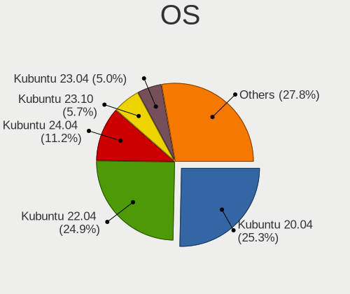

| Name          | Desktops | Percent |
|---------------|----------|---------|
| Kubuntu 20.04 | 587      | 25.33%  |
| Kubuntu 22.04 | 577      | 24.9%   |
| Kubuntu 24.04 | 260      | 11.22%  |
| Kubuntu 23.10 | 132      | 5.7%    |
| Kubuntu 23.04 | 117      | 5.05%   |
| Kubuntu 22.10 | 112      | 4.83%   |
| Kubuntu 18.04 | 95       | 4.1%    |
| Kubuntu 20.10 | 94       | 4.06%   |
| Kubuntu 21.10 | 71       | 3.06%   |
| Kubuntu 21.04 | 69       | 2.98%   |
| Kubuntu 19.10 | 62       | 2.68%   |
| Kubuntu 24.10 | 55       | 2.37%   |
| Kubuntu 11    | 47       | 2.03%   |
| Kubuntu 19.04 | 12       | 0.52%   |
| Kubuntu 16.04 | 9        | 0.39%   |
| Kubuntu       | 5        | 0.22%   |
| Kubuntu 18.10 | 4        | 0.17%   |
| Kubuntu 11.1  | 4        | 0.17%   |
| Kubuntu 2.0   | 2        | 0.09%   |
| Kubuntu 17.10 | 1        | 0.04%   |
| Kubuntu 17.04 | 1        | 0.04%   |
| Kubuntu 12.04 | 1        | 0.04%   |

OS Family
---------

OS without a version

| Name    | Desktops | Percent |
|---------|----------|---------|
| Kubuntu | 2150     | 100%    |

Kernel
------

Version of the Linux kernel

| Version            | Desktops | Percent |
|--------------------|----------|---------|
| 5.4.0-42-generic   | 44       | 1.7%    |
| 6.8.0-31-generic   | 43       | 1.66%   |
| 6.8.0-45-generic   | 42       | 1.62%   |
| 6.5.0-14-generic   | 37       | 1.43%   |
| 6.8.0-35-generic   | 30       | 1.16%   |
| 5.4.0-52-generic   | 28       | 1.08%   |
| 6.8.0-41-generic   | 26       | 1%      |
| 5.19.0-35-generic  | 26       | 1%      |
| 5.15.0-56-generic  | 26       | 1%      |
| 5.15.0-52-generic  | 26       | 1%      |
| 5.19.0-23-generic  | 24       | 0.92%   |
| 6.11.0-9-generic   | 23       | 0.89%   |
| 5.4.0-58-generic   | 23       | 0.89%   |
| 5.4.0-48-generic   | 22       | 0.85%   |
| 5.15.0-46-generic  | 22       | 0.85%   |
| 6.5.0-28-generic   | 21       | 0.81%   |
| 5.15.0-48-generic  | 21       | 0.81%   |
| 6.5.0-15-generic   | 20       | 0.77%   |
| 5.15.0-43-generic  | 20       | 0.77%   |
| 6.8.0-49-generic   | 19       | 0.73%   |
| 5.19.0-38-generic  | 19       | 0.73%   |
| 6.2.0-20-generic   | 18       | 0.69%   |
| 5.4.0-40-generic   | 18       | 0.69%   |
| 5.15.0-91-generic  | 18       | 0.69%   |
| 6.8.0-36-generic   | 17       | 0.66%   |
| 6.5.0-10-generic   | 17       | 0.66%   |
| 6.2.0-26-generic   | 17       | 0.66%   |
| 5.8.0-50-generic   | 17       | 0.66%   |
| 5.4.0-65-generic   | 17       | 0.66%   |
| 5.19.0-31-generic  | 16       | 0.62%   |
| 5.19.0-29-generic  | 16       | 0.62%   |
| 5.15.0-47-generic  | 16       | 0.62%   |
| 5.13.0-39-generic  | 16       | 0.62%   |
| 6.8.0-51-generic   | 15       | 0.58%   |
| 5.8.0-48-generic   | 15       | 0.58%   |
| 5.4.0-54-generic   | 15       | 0.58%   |
| 5.4.0-37-generic   | 15       | 0.58%   |
| 5.15.0-67-generic  | 15       | 0.58%   |
| 5.15.0-41-generic  | 15       | 0.58%   |
| 5.15.0-107-generic | 15       | 0.58%   |

Kernel Family
-------------

Linux kernel without a distro release

| Version | Desktops | Percent |
|---------|----------|---------|
| 5.15.0  | 427      | 18.09%  |
| 5.4.0   | 406      | 17.2%   |
| 6.8.0   | 259      | 10.97%  |
| 6.5.0   | 196      | 8.31%   |
| 5.19.0  | 165      | 6.99%   |
| 6.2.0   | 164      | 6.95%   |
| 5.8.0   | 162      | 6.86%   |
| 5.13.0  | 129      | 5.47%   |
| 5.11.0  | 117      | 4.96%   |
| 5.3.0   | 83       | 3.52%   |
| 6.11.0  | 53       | 2.25%   |
| 4.15.0  | 32       | 1.36%   |
| 5.0.0   | 17       | 0.72%   |
| 5.6.0   | 8        | 0.34%   |
| 4.4.0   | 6        | 0.25%   |
| 5.17.0  | 4        | 0.17%   |
| 5.10.0  | 4        | 0.17%   |
| 4.18.0  | 4        | 0.17%   |
| 6.6.0   | 3        | 0.13%   |
| 5.9.0   | 3        | 0.13%   |
| 5.18.4  | 3        | 0.13%   |
| 6.8.10  | 2        | 0.08%   |
| 6.8.1   | 2        | 0.08%   |
| 6.4.3   | 2        | 0.08%   |
| 6.4.0   | 2        | 0.08%   |
| 6.3.0   | 2        | 0.08%   |
| 6.1.5   | 2        | 0.08%   |
| 6.0.0   | 2        | 0.08%   |
| 5.9.16  | 2        | 0.08%   |
| 5.8.18  | 2        | 0.08%   |
| 5.7.10  | 2        | 0.08%   |
| 5.16.0  | 2        | 0.08%   |
| 4.13.0  | 2        | 0.08%   |
| 6.9.7   | 1        | 0.04%   |
| 6.9.3   | 1        | 0.04%   |
| 6.9.12  | 1        | 0.04%   |
| 6.8.9   | 1        | 0.04%   |
| 6.7.9   | 1        | 0.04%   |
| 6.7.5   | 1        | 0.04%   |
| 6.7.11  | 1        | 0.04%   |

Kernel Major Ver.
-----------------

Linux kernel major version

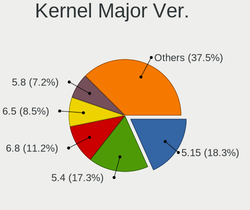

| Version | Desktops | Percent |
|---------|----------|---------|
| 5.15    | 431      | 18.27%  |
| 5.4     | 409      | 17.34%  |
| 6.8     | 264      | 11.19%  |
| 6.5     | 200      | 8.48%   |
| 5.8     | 170      | 7.21%   |
| 5.19    | 167      | 7.08%   |
| 6.2     | 166      | 7.04%   |
| 5.13    | 131      | 5.55%   |
| 5.11    | 118      | 5%      |
| 5.3     | 84       | 3.56%   |
| 6.11    | 54       | 2.29%   |
| 4.15    | 32       | 1.36%   |
| 5.0     | 18       | 0.76%   |
| 5.6     | 11       | 0.47%   |
| 5.10    | 10       | 0.42%   |
| 5.18    | 8        | 0.34%   |
| 6.4     | 7        | 0.3%    |
| 6.1     | 7        | 0.3%    |
| 6.6     | 6        | 0.25%   |
| 6.3     | 6        | 0.25%   |
| 6.0     | 6        | 0.25%   |
| 5.9     | 6        | 0.25%   |
| 5.17    | 6        | 0.25%   |
| 4.4     | 6        | 0.25%   |
| 5.7     | 5        | 0.21%   |
| 4.18    | 5        | 0.21%   |
| 5.12    | 4        | 0.17%   |
| 6.9     | 3        | 0.13%   |
| 6.7     | 3        | 0.13%   |
| 6.10    | 3        | 0.13%   |
| 5.16    | 3        | 0.13%   |
| 5.5     | 2        | 0.08%   |
| 5.14    | 2        | 0.08%   |
| 4.13    | 2        | 0.08%   |
| 6.12    | 1        | 0.04%   |
| 5.1     | 1        | 0.04%   |
| 4.10    | 1        | 0.04%   |
| 3.13    | 1        | 0.04%   |

Arch
----

OS architecture (x86_64, i586, etc.)

| Name    | Desktops | Percent |
|---------|----------|---------|
| x86_64  | 2137     | 99.4%   |
| i686    | 10       | 0.47%   |
| riscv64 | 3        | 0.14%   |

DE
--

Desktop Environment

| Name       | Desktops | Percent |
|------------|----------|---------|
| KDE5       | 1720     | 78.29%  |
| KDE        | 391      | 17.8%   |
| KDE6       | 52       | 2.37%   |
| GNOME      | 13       | 0.59%   |
| Cinnamon   | 6        | 0.27%   |
| Budgie     | 5        | 0.23%   |
| MATE       | 4        | 0.18%   |
| XFCE       | 3        | 0.14%   |
| X-Cinnamon | 1        | 0.05%   |
| Unity      | 1        | 0.05%   |
| KDE4       | 1        | 0.05%   |

Display Server
--------------

X11 or Wayland

| Name    | Desktops | Percent |
|---------|----------|---------|
| X11     | 2022     | 92.84%  |
| Wayland | 122      | 5.6%    |
| Tty     | 33       | 1.52%   |
| Web     | 1        | 0.05%   |

Display Manager
---------------

SDDM, LightDM, etc.

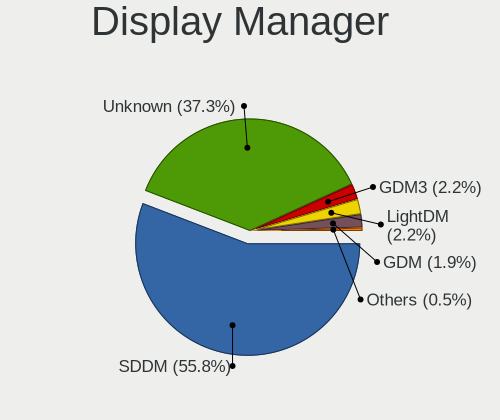

| Name    | Desktops | Percent |
|---------|----------|---------|
| SDDM    | 1226     | 55.83%  |
| Unknown | 820      | 37.34%  |
| GDM3    | 49       | 2.23%   |
| LightDM | 48       | 2.19%   |
| GDM     | 42       | 1.91%   |
| TDM     | 10       | 0.46%   |
| SLiM    | 1        | 0.05%   |

OS Lang
-------

Language

| Lang    | Desktops | Percent |
|---------|----------|---------|
| en_US   | 930      | 42.92%  |
| de_DE   | 196      | 9.04%   |
| fr_FR   | 124      | 5.72%   |
| en_GB   | 124      | 5.72%   |
| ru_RU   | 102      | 4.71%   |
| pt_BR   | 94       | 4.34%   |
| it_IT   | 82       | 3.78%   |
| es_ES   | 47       | 2.17%   |
| en_AU   | 47       | 2.17%   |
| en_CA   | 45       | 2.08%   |
| pl_PL   | 41       | 1.89%   |
| Unknown | 28       | 1.29%   |
| C       | 22       | 1.02%   |
| nl_NL   | 17       | 0.78%   |
| de_AT   | 17       | 0.78%   |
| es_AR   | 16       | 0.74%   |
| hu_HU   | 13       | 0.6%    |
| en_IN   | 13       | 0.6%    |
| cs_CZ   | 12       | 0.55%   |
| el_GR   | 10       | 0.46%   |
| ru_UA   | 9        | 0.42%   |
| es_MX   | 9        | 0.42%   |
| uk_UA   | 8        | 0.37%   |
| en_NZ   | 8        | 0.37%   |
| pt_PT   | 7        | 0.32%   |
| nl_BE   | 7        | 0.32%   |
| es_CL   | 7        | 0.32%   |
| en_ZA   | 7        | 0.32%   |
| de_CH   | 7        | 0.32%   |
| zh_TW   | 6        | 0.28%   |
| zh_CN   | 6        | 0.28%   |
| sv_SE   | 6        | 0.28%   |
| es_CO   | 6        | 0.28%   |
| en_PH   | 6        | 0.28%   |
| en_IL   | 6        | 0.28%   |
| fr_BE   | 5        | 0.23%   |
| fi_FI   | 5        | 0.23%   |
| en_DK   | 5        | 0.23%   |
| sl_SI   | 4        | 0.18%   |
| es_VE   | 4        | 0.18%   |

Boot Mode
---------

EFI or BIOS

| Mode | Desktops | Percent |
|------|----------|---------|
| BIOS | 1282     | 58.57%  |
| EFI  | 907      | 41.43%  |

Filesystem
----------

Type of filesystem

| Type     | Desktops | Percent |
|----------|----------|---------|
| Ext4     | 1777     | 81.51%  |
| Tmpfs    | 198      | 9.08%   |
| Btrfs    | 104      | 4.77%   |
| Overlay  | 42       | 1.93%   |
| Xfs      | 31       | 1.42%   |
| Zfs      | 11       | 0.5%    |
| Unknown  | 5        | 0.23%   |
| Ext3     | 4        | 0.18%   |
| F2fs     | 2        | 0.09%   |
| Ext2     | 2        | 0.09%   |
| XXXX     | 1        | 0.05%   |
| Reiserfs | 1        | 0.05%   |
| Jfs      | 1        | 0.05%   |
| ExX4     | 1        | 0.05%   |

Part. scheme
------------

Scheme of partitioning

| Type    | Desktops | Percent |
|---------|----------|---------|
| GPT     | 1065     | 48.26%  |
| Unknown | 918      | 41.59%  |
| MBR     | 224      | 10.15%  |

Dual Boot with Linux/BSD
------------------------

Hosting more than one Linux/BSD

| Dual boot | Desktops | Percent |
|-----------|----------|---------|
| No        | 1787     | 81.52%  |
| Yes       | 405      | 18.48%  |

Dual Boot (Win)
---------------

Hosting Linux and Windows

| Dual boot | Desktops | Percent |
|-----------|----------|---------|
| No        | 1363     | 62.29%  |
| Yes       | 825      | 37.71%  |

Board
-----

Vendor
------

Motherboard manufacturer

| Name                                 | Desktops | Percent |
|--------------------------------------|----------|---------|
| ASUSTek Computer                     | 612      | 28.47%  |
| Gigabyte Technology                  | 404      | 18.79%  |
| MSI                                  | 313      | 14.56%  |
| ASRock                               | 192      | 8.93%   |
| Dell                                 | 144      | 6.7%    |
| Hewlett-Packard                      | 136      | 6.33%   |
| Lenovo                               | 64       | 2.98%   |
| Intel                                | 37       | 1.72%   |
| Unknown                              | 25       | 1.16%   |
| Acer                                 | 23       | 1.07%   |
| Fujitsu                              | 20       | 0.93%   |
| Pegatron                             | 18       | 0.84%   |
| Biostar                              | 18       | 0.84%   |
| AZW                                  | 15       | 0.7%    |
| Foxconn                              | 13       | 0.6%    |
| ECS                                  | 10       | 0.47%   |
| Supermicro                           | 7        | 0.33%   |
| Huanan                               | 7        | 0.33%   |
| Shuttle                              | 6        | 0.28%   |
| Packard Bell                         | 6        | 0.28%   |
| Medion                               | 6        | 0.28%   |
| Alienware                            | 6        | 0.28%   |
| BESSTAR Tech                         | 5        | 0.23%   |
| Google                               | 4        | 0.19%   |
| GEEKOM                               | 4        | 0.19%   |
| Gateway                              | 4        | 0.19%   |
| Apple                                | 4        | 0.19%   |
| Shenzhen Meigao Electronic Equipment | 3        | 0.14%   |
| Positivo                             | 3        | 0.14%   |
| ZOTAC                                | 2        | 0.09%   |
| XFX                                  | 2        | 0.09%   |
| WeiBu                                | 2        | 0.09%   |
| SYWZ                                 | 2        | 0.09%   |
| Seco                                 | 2        | 0.09%   |
| OEM                                  | 2        | 0.09%   |
| MACHINIST                            | 2        | 0.09%   |
| Fujitsu Siemens                      | 2        | 0.09%   |
| Colorful Technology                  | 2        | 0.09%   |
| ASRockRack                           | 2        | 0.09%   |
| AMI                                  | 2        | 0.09%   |

Model
-----

Motherboard model

| Name                         | Desktops | Percent |
|------------------------------|----------|---------|
| ASUS All Series              | 63       | 2.93%   |
| Unknown                      | 27       | 1.26%   |
| ASUS ROG STRIX B550-F GAMING | 15       | 0.7%    |
| MSI MS-7C37                  | 13       | 0.6%    |
| Dell OptiPlex 7010           | 13       | 0.6%    |
| Gigabyte B450M DS3H          | 12       | 0.56%   |
| MSI MS-7C56                  | 11       | 0.51%   |
| ASUS TUF Gaming X570-PLUS    | 11       | 0.51%   |
| MSI MS-7C91                  | 10       | 0.47%   |
| MSI MS-7B79                  | 10       | 0.47%   |
| MSI MS-7693                  | 10       | 0.47%   |
| Dell OptiPlex 9020           | 10       | 0.47%   |
| ASUS ROG STRIX X570-E GAMING | 10       | 0.47%   |
| Gigabyte X570 AORUS MASTER   | 9        | 0.42%   |
| Gigabyte A320M-S2H           | 9        | 0.42%   |
| Gigabyte 970A-DS3P           | 9        | 0.42%   |
| ASUS PRIME B350-PLUS         | 9        | 0.42%   |
| ASUS PRIME A320M-K           | 9        | 0.42%   |
| MSI MS-7C02                  | 8        | 0.37%   |
| MSI MS-7B86                  | 8        | 0.37%   |
| MSI MS-7817                  | 8        | 0.37%   |
| ASUS TUF Gaming B550-PLUS    | 8        | 0.37%   |
| ASUS PRIME B450M-A           | 8        | 0.37%   |
| MSI MS-7C95                  | 7        | 0.33%   |
| MSI MS-7A34                  | 7        | 0.33%   |
| HP EliteDesk 800 G1 SFF      | 7        | 0.33%   |
| HP Compaq Elite 8300 SFF     | 7        | 0.33%   |
| ASUS PRIME X370-PRO          | 7        | 0.33%   |
| ASRock AB350 Pro4            | 7        | 0.33%   |
| MSI MS-7A38                  | 6        | 0.28%   |
| Dell OptiPlex 780            | 6        | 0.28%   |
| Dell OptiPlex 7040           | 6        | 0.28%   |
| ASUS ROG STRIX Z390-E GAMING | 6        | 0.28%   |
| ASUS PRIME X570-P            | 6        | 0.28%   |
| ASUS PRIME B550-PLUS         | 6        | 0.28%   |
| ASRock A320M-HDV R4.0        | 6        | 0.28%   |
| MSI MS-7E26                  | 5        | 0.23%   |
| MSI MS-7C52                  | 5        | 0.23%   |
| MSI MS-7B51                  | 5        | 0.23%   |
| MSI MS-7A32                  | 5        | 0.23%   |

Model Family
------------

Motherboard model prefix

| Name                   | Desktops | Percent |
|------------------------|----------|---------|
| ASUS PRIME             | 145      | 6.74%   |
| ASUS ROG               | 113      | 5.26%   |
| Dell OptiPlex          | 74       | 3.44%   |
| ASUS All               | 63       | 2.93%   |
| ASUS TUF               | 62       | 2.88%   |
| Lenovo ThinkCentre     | 44       | 2.05%   |
| HP Compaq              | 35       | 1.63%   |
| Dell Precision         | 30       | 1.4%    |
| Unknown                | 27       | 1.26%   |
| Gigabyte X570          | 25       | 1.16%   |
| Gigabyte B450M         | 22       | 1.02%   |
| Gigabyte B550          | 21       | 0.98%   |
| HP EliteDesk           | 17       | 0.79%   |
| Dell Inspiron          | 17       | 0.79%   |
| Acer Aspire            | 17       | 0.79%   |
| Fujitsu ESPRIMO        | 14       | 0.65%   |
| MSI MS-7C37            | 13       | 0.6%    |
| HP ProDesk             | 13       | 0.6%    |
| Gigabyte B550M         | 13       | 0.6%    |
| Gigabyte A320M-S2H     | 13       | 0.6%    |
| Gigabyte B450          | 12       | 0.56%   |
| ASUS M5A78L-M          | 12       | 0.56%   |
| MSI MS-7C56            | 11       | 0.51%   |
| MSI MS-7C91            | 10       | 0.47%   |
| MSI MS-7B79            | 10       | 0.47%   |
| MSI MS-7693            | 10       | 0.47%   |
| Dell XPS               | 10       | 0.47%   |
| ASUS SABERTOOTH        | 10       | 0.47%   |
| Lenovo IdeaCentre      | 9        | 0.42%   |
| HP Pavilion            | 9        | 0.42%   |
| Gigabyte 970A-DS3P     | 9        | 0.42%   |
| ASUS P5Q               | 9        | 0.42%   |
| ASRock B450M           | 9        | 0.42%   |
| ASRock AB350           | 9        | 0.42%   |
| MSI MS-7C02            | 8        | 0.37%   |
| MSI MS-7B86            | 8        | 0.37%   |
| MSI MS-7817            | 8        | 0.37%   |
| Gigabyte GA-78LMT-USB3 | 8        | 0.37%   |
| Dell Vostro            | 8        | 0.37%   |
| ASUS P8H61-M           | 8        | 0.37%   |

MFG Year
--------

Motherboard manufacture year

| Year    | Desktops | Percent |
|---------|----------|---------|
| 2018    | 245      | 11.4%   |
| 2020    | 228      | 10.6%   |
| 2019    | 191      | 8.88%   |
| 2013    | 168      | 7.81%   |
| 2012    | 168      | 7.81%   |
| 2017    | 153      | 7.12%   |
| 2014    | 137      | 6.37%   |
| 2011    | 122      | 5.67%   |
| 2021    | 113      | 5.26%   |
| 2022    | 96       | 4.47%   |
| 2016    | 94       | 4.37%   |
| 2015    | 94       | 4.37%   |
| 2010    | 86       | 4%      |
| 2009    | 78       | 3.63%   |
| 2023    | 71       | 3.3%    |
| 2008    | 52       | 2.42%   |
| 2007    | 28       | 1.3%    |
| 2024    | 13       | 0.6%    |
| 2006    | 8        | 0.37%   |
| 2005    | 3        | 0.14%   |
| 2004    | 1        | 0.05%   |
| Unknown | 1        | 0.05%   |

Form Factor
-----------

Physical design of the computer

| Name    | Desktops | Percent |
|---------|----------|---------|
| Desktop | 2150     | 100%    |

Secure Boot
-----------

Enabled or disabled

| State    | Desktops | Percent |
|----------|----------|---------|
| Disabled | 2090     | 97.03%  |
| Enabled  | 64       | 2.97%   |

Coreboot
--------

Have coreboot on board

| Used | Desktops | Percent |
|------|----------|---------|
| No   | 2144     | 99.72%  |
| Yes  | 6        | 0.28%   |

RAM Size
--------

Total RAM memory

| Size in GB      | Desktops | Percent |
|-----------------|----------|---------|
| 16.01-24.0      | 611      | 27.93%  |
| 32.01-64.0      | 523      | 23.9%   |
| 8.01-16.0       | 343      | 15.68%  |
| 4.01-8.0        | 260      | 11.88%  |
| 64.01-256.0     | 168      | 7.68%   |
| 3.01-4.0        | 146      | 6.67%   |
| 24.01-32.0      | 114      | 5.21%   |
| 2.01-3.0        | 12       | 0.55%   |
| 1.01-2.0        | 7        | 0.32%   |
| More than 256.0 | 4        | 0.18%   |

RAM Used
--------

Used RAM memory

| Used GB    | Desktops | Percent |
|------------|----------|---------|
| 4.01-8.0   | 642      | 26.88%  |
| 2.01-3.0   | 563      | 23.58%  |
| 1.01-2.0   | 433      | 18.13%  |
| 3.01-4.0   | 423      | 17.71%  |
| 8.01-16.0  | 202      | 8.46%   |
| 16.01-24.0 | 50       | 2.09%   |
| 0.51-1.0   | 41       | 1.72%   |
| 24.01-32.0 | 19       | 0.8%    |
| 32.01-64.0 | 9        | 0.38%   |
| 0.01-0.5   | 5        | 0.21%   |
| Unknown    | 1        | 0.04%   |

Total Drives
------------

Number of drives on board

| Drives | Desktops | Percent |
|--------|----------|---------|
| 2      | 635      | 28.16%  |
| 1      | 610      | 27.05%  |
| 3      | 426      | 18.89%  |
| 4      | 290      | 12.86%  |
| 5      | 145      | 6.43%   |
| 6      | 65       | 2.88%   |
| 7      | 44       | 1.95%   |
| 8      | 16       | 0.71%   |
| 9      | 7        | 0.31%   |
| 0      | 6        | 0.27%   |
| 10     | 4        | 0.18%   |
| 11     | 3        | 0.13%   |
| 12     | 2        | 0.09%   |
| 16     | 1        | 0.04%   |
| 13     | 1        | 0.04%   |

Has CD-ROM
----------

Has CD-ROM on board

| Presented | Desktops | Percent |
|-----------|----------|---------|
| No        | 1279     | 58.7%   |
| Yes       | 900      | 41.3%   |

Has Ethernet
------------

Has Ethernet on board

| Presented | Desktops | Percent |
|-----------|----------|---------|
| Yes       | 2132     | 99.16%  |
| No        | 18       | 0.84%   |

Has WiFi
--------

Has WiFi module

| Presented | Desktops | Percent |
|-----------|----------|---------|
| No        | 1152     | 52.87%  |
| Yes       | 1027     | 47.13%  |

Has Bluetooth
-------------

Has Bluetooth module

| Presented | Desktops | Percent |
|-----------|----------|---------|
| No        | 1271     | 58.36%  |
| Yes       | 907      | 41.64%  |

Location
--------

Country
-------

Geographic location (country)

| Country      | Desktops | Percent |
|--------------|----------|---------|
| USA          | 507      | 23.52%  |
| Germany      | 244      | 11.32%  |
| France       | 134      | 6.22%   |
| Russia       | 131      | 6.08%   |
| Brazil       | 125      | 5.8%    |
| UK           | 113      | 5.24%   |
| Italy        | 103      | 4.78%   |
| Spain        | 66       | 3.06%   |
| Canada       | 63       | 2.92%   |
| Poland       | 55       | 2.55%   |
| Netherlands  | 51       | 2.37%   |
| Australia    | 46       | 2.13%   |
| Ukraine      | 27       | 1.25%   |
| Austria      | 26       | 1.21%   |
| Switzerland  | 25       | 1.16%   |
| Argentina    | 24       | 1.11%   |
| Sweden       | 20       | 0.93%   |
| Hungary      | 20       | 0.93%   |
| Belgium      | 20       | 0.93%   |
| Finland      | 18       | 0.83%   |
| Greece       | 17       | 0.79%   |
| India        | 16       | 0.74%   |
| Czechia      | 16       | 0.74%   |
| Mexico       | 15       | 0.7%    |
| Portugal     | 13       | 0.6%    |
| Serbia       | 12       | 0.56%   |
| Norway       | 12       | 0.56%   |
| Denmark      | 12       | 0.56%   |
| Turkey       | 11       | 0.51%   |
| Bulgaria     | 11       | 0.51%   |
| Romania      | 10       | 0.46%   |
| New Zealand  | 10       | 0.46%   |
| Chile        | 10       | 0.46%   |
| China        | 9        | 0.42%   |
| Bangladesh   | 9        | 0.42%   |
| South Africa | 8        | 0.37%   |
| Slovenia     | 7        | 0.32%   |
| Slovakia     | 7        | 0.32%   |
| Israel       | 7        | 0.32%   |
| Indonesia    | 7        | 0.32%   |

City
----

Geographic location (city)

| City              | Desktops | Percent |
|-------------------|----------|---------|
| Moscow            | 27       | 1.19%   |
| Berlin            | 21       | 0.93%   |
| Paris             | 18       | 0.79%   |
| Sao Paulo         | 17       | 0.75%   |
| Rome              | 17       | 0.75%   |
| London            | 16       | 0.71%   |
| Hamburg           | 16       | 0.71%   |
| Sydney            | 14       | 0.62%   |
| Frankfurt am Main | 14       | 0.62%   |
| Warsaw            | 13       | 0.57%   |
| Vienna            | 13       | 0.57%   |
| St Petersburg     | 13       | 0.57%   |
| Munich            | 13       | 0.57%   |
| Rio de Janeiro    | 12       | 0.53%   |
| Melbourne         | 12       | 0.53%   |
| Milan             | 11       | 0.48%   |
| Budapest          | 11       | 0.48%   |
| Amsterdam         | 11       | 0.48%   |
| Kyiv              | 9        | 0.4%    |
| Dallas            | 9        | 0.4%    |
| Zurich            | 8        | 0.35%   |
| Montreal          | 8        | 0.35%   |
| Chicago           | 8        | 0.35%   |
| Belgrade          | 8        | 0.35%   |
| San Francisco     | 7        | 0.31%   |
| Novosibirsk       | 7        | 0.31%   |
| Manchester        | 7        | 0.31%   |
| Krakow            | 7        | 0.31%   |
| Cologne           | 7        | 0.31%   |
| Barcelona         | 7        | 0.31%   |
| Auckland          | 7        | 0.31%   |
| Jacksonville      | 6        | 0.26%   |
| Helsinki          | 6        | 0.26%   |
| Curitiba          | 6        | 0.26%   |
| Wroclaw           | 5        | 0.22%   |
| Sindelfingen      | 5        | 0.22%   |
| Seattle           | 5        | 0.22%   |
| Santiago          | 5        | 0.22%   |
| San Jose          | 5        | 0.22%   |
| Portland          | 5        | 0.22%   |

Drives
------

Drive Vendor
------------

Hard drive vendors

| Vendor                      | Desktops | Drives | Percent |
|-----------------------------|----------|--------|---------|
| WDC                         | 774      | 1425   | 17.07%  |
| Seagate                     | 750      | 1305   | 16.55%  |
| Samsung Electronics         | 733      | 1437   | 16.17%  |
| Kingston                    | 253      | 336    | 5.58%   |
| SanDisk                     | 239      | 333    | 5.27%   |
| Crucial                     | 216      | 288    | 4.77%   |
| Toshiba                     | 204      | 307    | 4.5%    |
| Hitachi                     | 135      | 180    | 2.98%   |
| A-DATA Technology           | 71       | 90     | 1.57%   |
| Intel                       | 70       | 91     | 1.54%   |
| HGST                        | 58       | 86     | 1.28%   |
| Unknown                     | 53       | 88     | 1.17%   |
| Phison                      | 46       | 58     | 1.01%   |
| China                       | 45       | 58     | 0.99%   |
| Phison Electronics          | 40       | 47     | 0.88%   |
| Silicon Motion              | 37       | 52     | 0.82%   |
| PNY                         | 36       | 72     | 0.79%   |
| Patriot                     | 36       | 50     | 0.79%   |
| SPCC                        | 34       | 50     | 0.75%   |
| Micron Technology           | 34       | 43     | 0.75%   |
| Micron/Crucial Technology   | 33       | 52     | 0.73%   |
| Kingston Technology Company | 33       | 47     | 0.73%   |
| OCZ                         | 31       | 38     | 0.68%   |
| Corsair                     | 31       | 48     | 0.68%   |
| Intenso                     | 28       | 34     | 0.62%   |
| Maxtor                      | 27       | 32     | 0.6%    |
| Transcend                   | 24       | 26     | 0.53%   |
| SK hynix                    | 23       | 29     | 0.51%   |
| GOODRAM                     | 18       | 34     | 0.4%    |
| Team                        | 17       | 19     | 0.38%   |
| JMicron Technology          | 16       | 18     | 0.35%   |
| Unknown                     | 15       | 19     | 0.33%   |
| Gigabyte Technology         | 14       | 15     | 0.31%   |
| Hewlett-Packard             | 13       | 18     | 0.29%   |
| ADATA Technology            | 13       | 14     | 0.29%   |
| XPG                         | 12       | 14     | 0.26%   |
| SABRENT                     | 12       | 13     | 0.26%   |
| Realtek Semiconductor       | 12       | 13     | 0.26%   |
| Lexar                       | 11       | 12     | 0.24%   |
| MAXIO Technology (Hangzhou) | 10       | 12     | 0.22%   |

Drive Model
-----------

Hard drive models

| Model                                                | Desktops | Percent |
|------------------------------------------------------|----------|---------|
| Samsung NVMe SSD Controller SM981/PM981/PM983 512GB  | 53       | 0.98%   |
| Samsung SSD 850 EVO 250GB                            | 51       | 0.94%   |
| Samsung SSD 860 EVO 500GB                            | 48       | 0.89%   |
| Samsung SSD 850 EVO 500GB                            | 48       | 0.89%   |
| Kingston SA400S37240G 240GB SSD                      | 47       | 0.87%   |
| Seagate ST2000DM008-2FR102 2TB                       | 45       | 0.83%   |
| Kingston SA400S37480G 480GB SSD                      | 42       | 0.77%   |
| Samsung SSD 860 EVO 1TB                              | 41       | 0.76%   |
| WDC WD10EZEX-08WN4A0 1TB                             | 39       | 0.72%   |
| Seagate ST4000DM004-2CV104 4TB                       | 39       | 0.72%   |
| Seagate ST1000DM010-2EP102 1TB                       | 38       | 0.7%    |
| Crucial CT1000MX500SSD1 1TB                          | 37       | 0.68%   |
| Toshiba DT01ACA100 1TB                               | 35       | 0.65%   |
| Seagate ST1000DM003-1ER162 1TB                       | 33       | 0.61%   |
| Seagate ST500DM002-1BD142 500GB                      | 31       | 0.57%   |
| Samsung NVMe SSD Controller PM9A1/PM9A3/980PRO 512GB | 30       | 0.55%   |
| Toshiba HDWD110 1TB                                  | 28       | 0.52%   |
| Seagate ST2000DM001-1ER164 2TB                       | 26       | 0.48%   |
| Seagate ST1000DM003-1CH162 1TB                       | 26       | 0.48%   |
| Seagate ST31000524AS 1TB                             | 25       | 0.46%   |
| Seagate ST2000DM006-2DM164 2TB                       | 24       | 0.44%   |
| Samsung NVMe SSD Drive 500GB                         | 24       | 0.44%   |
| Toshiba DT01ACA200 2TB                               | 22       | 0.41%   |
| Seagate ST31000528AS 1TB                             | 22       | 0.41%   |
| Samsung SSD 970 EVO Plus 1TB                         | 21       | 0.39%   |
| Samsung SSD 860 EVO 250GB                            | 21       | 0.39%   |
| WDC WD20EARX-00PASB0 2TB                             | 20       | 0.37%   |
| Samsung SSD 980 1TB                                  | 19       | 0.35%   |
| Samsung SSD 970 EVO Plus 500GB                       | 19       | 0.35%   |
| Micron/Crucial P2 NVMe PCIe SSD 500GB                | 19       | 0.35%   |
| Seagate ST2000DM001-1CH164 2TB                       | 18       | 0.33%   |
| Samsung SSD 870 QVO 1TB                              | 18       | 0.33%   |
| WDC WD20EZRZ-00Z5HB0 2TB                             | 17       | 0.31%   |
| WDC WD20EZRX-00D8PB0 2TB                             | 17       | 0.31%   |
| Seagate ST3500418AS 500GB                            | 17       | 0.31%   |
| Crucial CT500MX500SSD1 500GB                         | 17       | 0.31%   |
| Seagate ST3500413AS 500GB                            | 16       | 0.3%    |
| Samsung SSD 840 EVO 250GB                            | 16       | 0.3%    |
| Samsung HD103SJ 1TB                                  | 16       | 0.3%    |
| Kingston SA400S37120G 120GB SSD                      | 16       | 0.3%    |

HDD Vendor
----------

Hard disk drive vendors

| Vendor              | Desktops | Drives | Percent |
|---------------------|----------|--------|---------|
| Seagate             | 728      | 1266   | 36.45%  |
| WDC                 | 679      | 1228   | 34%     |
| Toshiba             | 184      | 276    | 9.21%   |
| Hitachi             | 135      | 180    | 6.76%   |
| Samsung Electronics | 115      | 191    | 5.76%   |
| HGST                | 58       | 86     | 2.9%    |
| Maxtor              | 26       | 31     | 1.3%    |
| Unknown             | 18       | 24     | 0.9%    |
| SABRENT             | 11       | 12     | 0.55%   |
| JMicron Technology  | 9        | 11     | 0.45%   |
| Apple               | 5        | 5      | 0.25%   |
| Fujitsu             | 4        | 4      | 0.2%    |
| ASMT                | 4        | 4      | 0.2%    |
| Hewlett-Packard     | 3        | 5      | 0.15%   |
| USB                 | 2        | 3      | 0.1%    |
| LaCie               | 2        | 2      | 0.1%    |
| External            | 2        | 2      | 0.1%    |
| WD MediaMax         | 1        | 1      | 0.05%   |
| USB3.0              | 1        | 2      | 0.05%   |
| TO Exter            | 1        | 1      | 0.05%   |
| SSI                 | 1        | 1      | 0.05%   |
| Shenzhen            | 1        | 1      | 0.05%   |
| SAGE                | 1        | 1      | 0.05%   |
| MARVELL             | 1        | 1      | 0.05%   |
| Magnetic Data       | 1        | 2      | 0.05%   |
| LIO-ORG             | 1        | 1      | 0.05%   |
| KESU                | 1        | 1      | 0.05%   |
| Inateck             | 1        | 2      | 0.05%   |
| IET                 | 1        | 1      | 0.05%   |

SSD Vendor
----------

Solid state drive vendors

| Vendor              | Desktops | Drives | Percent |
|---------------------|----------|--------|---------|
| Samsung Electronics | 420      | 700    | 25.7%   |
| Kingston            | 203      | 264    | 12.42%  |
| Crucial             | 180      | 243    | 11.02%  |
| SanDisk             | 138      | 185    | 8.45%   |
| WDC                 | 99       | 147    | 6.06%   |
| A-DATA Technology   | 58       | 76     | 3.55%   |
| China               | 45       | 58     | 2.75%   |
| Intel               | 38       | 51     | 2.33%   |
| PNY                 | 34       | 70     | 2.08%   |
| Patriot             | 34       | 48     | 2.08%   |
| OCZ                 | 31       | 38     | 1.9%    |
| SPCC                | 28       | 42     | 1.71%   |
| Intenso             | 23       | 25     | 1.41%   |
| Micron Technology   | 21       | 26     | 1.29%   |
| Transcend           | 18       | 18     | 1.1%    |
| GOODRAM             | 18       | 34     | 1.1%    |
| Corsair             | 16       | 29     | 0.98%   |
| Toshiba             | 15       | 21     | 0.92%   |
| Team                | 15       | 17     | 0.92%   |
| KingSpec            | 10       | 12     | 0.61%   |
| Unknown             | 10       | 14     | 0.61%   |
| Mushkin             | 9        | 11     | 0.55%   |
| Lexar               | 9        | 10     | 0.55%   |
| Hewlett-Packard     | 9        | 11     | 0.55%   |
| Verbatim            | 7        | 8      | 0.43%   |
| SK hynix            | 7        | 8      | 0.43%   |
| Gigabyte Technology | 7        | 7      | 0.43%   |
| Emtec               | 7        | 8      | 0.43%   |
| Seagate             | 6        | 7      | 0.37%   |
| Apacer              | 6        | 11     | 0.37%   |
| Plextor             | 5        | 6      | 0.31%   |
| Netac               | 5        | 8      | 0.31%   |
| LITEON              | 4        | 5      | 0.24%   |
| AMD                 | 4        | 4      | 0.24%   |
| Unknown             | 3        | 3      | 0.18%   |
| Smartbuy            | 3        | 5      | 0.18%   |
| Neo                 | 3        | 3      | 0.18%   |
| LITEONIT            | 3        | 3      | 0.18%   |
| Leven               | 3        | 4      | 0.18%   |
| KIOXIA-EXCERIA      | 3        | 5      | 0.18%   |

Drive Kind
----------

HDD or SSD

| Kind    | Desktops | Drives | Percent |
|---------|----------|--------|---------|
| HDD     | 1460     | 3345   | 39.36%  |
| SSD     | 1301     | 2346   | 35.08%  |
| NVMe    | 842      | 1394   | 22.7%   |
| Unknown | 95       | 154    | 2.56%   |
| MMC     | 11       | 13     | 0.3%    |

Drive Connector
---------------

SATA, SAS, NVMe, etc.

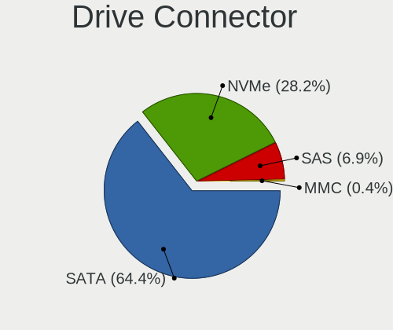

| Type | Desktops | Drives | Percent |
|------|----------|--------|---------|
| SATA | 1912     | 5518   | 64.44%  |
| NVMe | 838      | 1382   | 28.24%  |
| SAS  | 206      | 339    | 6.94%   |
| MMC  | 11       | 13     | 0.37%   |

Drive Size
----------

Size of hard drive

| Size in TB | Desktops | Drives | Percent |
|------------|----------|--------|---------|
| 0.01-0.5   | 1318     | 2471   | 41.58%  |
| 0.51-1.0   | 945      | 1622   | 29.81%  |
| 1.01-2.0   | 459      | 827    | 14.48%  |
| 3.01-4.0   | 203      | 391    | 6.4%    |
| 2.01-3.0   | 109      | 156    | 3.44%   |
| 4.01-10.0  | 108      | 174    | 3.41%   |
| 10.01-20.0 | 28       | 50     | 0.88%   |

Space Total
-----------

Amount of disk space available on the file system

| Size in GB     | Desktops | Percent |
|----------------|----------|---------|
| 501-1000       | 435      | 19.3%   |
| More than 3000 | 393      | 17.44%  |
| 251-500        | 359      | 15.93%  |
| 101-250        | 359      | 15.93%  |
| 1001-2000      | 357      | 15.84%  |
| 2001-3000      | 195      | 8.65%   |
| 51-100         | 63       | 2.8%    |
| 1-20           | 57       | 2.53%   |
| 21-50          | 22       | 0.98%   |
| Unknown        | 14       | 0.62%   |

Space Used
----------

Amount of used disk space

| Used GB        | Desktops | Percent |
|----------------|----------|---------|
| 1-20           | 344      | 14.74%  |
| 101-250        | 336      | 14.4%   |
| 501-1000       | 319      | 13.67%  |
| 21-50          | 295      | 12.64%  |
| 251-500        | 277      | 11.87%  |
| 51-100         | 264      | 11.31%  |
| 1001-2000      | 221      | 9.47%   |
| More than 3000 | 182      | 7.8%    |
| 2001-3000      | 82       | 3.51%   |
| Unknown        | 14       | 0.6%    |

Malfunc. Drives
---------------

Drive models with a malfunction

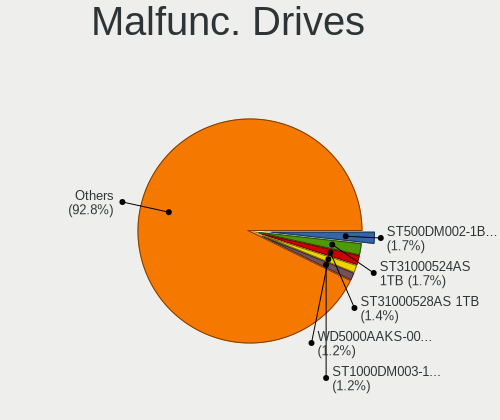

| Model                                   | Desktops | Drives | Percent |
|-----------------------------------------|----------|--------|---------|
| Seagate ST500DM002-1BD142 500GB         | 6        | 6      | 1.74%   |
| Seagate ST31000524AS 1TB                | 6        | 7      | 1.74%   |
| Seagate ST31000528AS 1TB                | 5        | 6      | 1.45%   |
| WDC WD5000AAKS-00V1A0 500GB             | 4        | 5      | 1.16%   |
| Seagate ST1000DM003-1CH162 1TB          | 4        | 12     | 1.16%   |
| Samsung Electronics SSD 870 EVO 500GB   | 4        | 4      | 1.16%   |
| WDC WD30EZRX-00MMMB0 3TB                | 3        | 3      | 0.87%   |
| WDC WD30EFRX-68EUZN0 3TB                | 3        | 3      | 0.87%   |
| WDC WD20EFRX-68EUZN0 2TB                | 3        | 6      | 0.87%   |
| WDC WD20EARX-00PASB0 2TB                | 3        | 3      | 0.87%   |
| WDC WD10EZEX-22MFCA0 1TB                | 3        | 4      | 0.87%   |
| Seagate ST3500418AS 500GB               | 3        | 3      | 0.87%   |
| Neo Forza NFS121SA312-6007000 120GB SSD | 3        | 3      | 0.87%   |
| Crucial CT1050MX300SSD1 1050GB          | 3        | 3      | 0.87%   |
| WDC WD5000AAKX-003CA0 500GB             | 2        | 2      | 0.58%   |
| WDC WD5000AAKS-00A7B0 500GB             | 2        | 2      | 0.58%   |
| WDC WD40EZRZ-00GXCB0 4TB                | 2        | 2      | 0.58%   |
| WDC WD40EFRX-68N32N0 4TB                | 2        | 4      | 0.58%   |
| WDC WD3200JD-22KLB0 320GB               | 2        | 3      | 0.58%   |
| WDC WD3200AAKX-001CA0 320GB             | 2        | 2      | 0.58%   |
| WDC WD15EARS-00Z5B1 1TB                 | 2        | 2      | 0.58%   |
| WDC WD10EZRZ-00HTKB0 1TB                | 2        | 2      | 0.58%   |
| WDC WD10EZEX-08WN4A0 1TB                | 2        | 2      | 0.58%   |
| WDC WD10EZEX-00BN5A0 1TB                | 2        | 2      | 0.58%   |
| WDC WD10EARS-00Y5B1 1TB                 | 2        | 2      | 0.58%   |
| WDC WD10EARS-00MVWB0 1TB                | 2        | 4      | 0.58%   |
| WDC WD10EADS-00L5B1 1TB                 | 2        | 2      | 0.58%   |
| WDC WD1001FALS-40U9B0 1TB               | 2        | 4      | 0.58%   |
| Toshiba HDWD110 1TB                     | 2        | 2      | 0.58%   |
| Seagate ST9500325AS 500GB               | 2        | 7      | 0.58%   |
| Seagate ST9250315AS 250GB               | 2        | 3      | 0.58%   |
| Seagate ST8000DM004-2CX188 8TB          | 2        | 2      | 0.58%   |
| Seagate ST32000542AS 2TB                | 2        | 2      | 0.58%   |
| Seagate ST3160827AS 160GB               | 2        | 3      | 0.58%   |
| Seagate ST2000DM006-2DM164 2TB          | 2        | 3      | 0.58%   |
| Seagate ST1000DM003-9YN162 1TB          | 2        | 2      | 0.58%   |
| Seagate ST1000DM003-1SB102 1TB          | 2        | 2      | 0.58%   |
| SanDisk SSD PLUS 480GB                  | 2        | 3      | 0.58%   |
| SanDisk SSD PLUS 240 GB                 | 2        | 2      | 0.58%   |
| SanDisk SSD PLUS 1000GB                 | 2        | 2      | 0.58%   |

Malfunc. Drive Vendor
---------------------

Vendors of faulty drives

| Vendor              | Desktops | Drives | Percent |
|---------------------|----------|--------|---------|
| WDC                 | 103      | 141    | 31.4%   |
| Seagate             | 79       | 109    | 24.09%  |
| Samsung Electronics | 38       | 64     | 11.59%  |
| Hitachi             | 20       | 22     | 6.1%    |
| Toshiba             | 12       | 14     | 3.66%   |
| Intel               | 12       | 17     | 3.66%   |
| Crucial             | 12       | 15     | 3.66%   |
| SanDisk             | 10       | 11     | 3.05%   |
| Maxtor              | 6        | 8      | 1.83%   |
| OCZ                 | 4        | 4      | 1.22%   |
| Kingston            | 4        | 5      | 1.22%   |
| Neo                 | 3        | 3      | 0.91%   |
| A-DATA Technology   | 3        | 3      | 0.91%   |
| Micron Technology   | 2        | 2      | 0.61%   |
| Intenso             | 2        | 2      | 0.61%   |
| HGST                | 2        | 7      | 0.61%   |
| Fujitsu             | 2        | 2      | 0.61%   |
| China               | 2        | 2      | 0.61%   |
| XPG                 | 1        | 1      | 0.3%    |
| VENO                | 1        | 1      | 0.3%    |
| T-FORCE             | 1        | 1      | 0.3%    |
| SSSTC               | 1        | 1      | 0.3%    |
| SPCC                | 1        | 1      | 0.3%    |
| Phison Electronics  | 1        | 1      | 0.3%    |
| ORTIAL              | 1        | 1      | 0.3%    |
| LITEONIT            | 1        | 1      | 0.3%    |
| LITEON              | 1        | 1      | 0.3%    |
| Corsair             | 1        | 1      | 0.3%    |
| ASMT                | 1        | 1      | 0.3%    |
| Apple               | 1        | 1      | 0.3%    |

Malfunc. HDD Vendor
-------------------

Vendors of faulty HDD drives

| Vendor              | Desktops | Drives | Percent |
|---------------------|----------|--------|---------|
| WDC                 | 102      | 140    | 42.5%   |
| Seagate             | 79       | 109    | 32.92%  |
| Hitachi             | 20       | 22     | 8.33%   |
| Samsung Electronics | 16       | 39     | 6.67%   |
| Toshiba             | 11       | 13     | 4.58%   |
| Maxtor              | 6        | 8      | 2.5%    |
| HGST                | 2        | 7      | 0.83%   |
| Fujitsu             | 2        | 2      | 0.83%   |
| ASMT                | 1        | 1      | 0.42%   |
| Apple               | 1        | 1      | 0.42%   |

Malfunc. Drive Kind
-------------------

Kinds of faulty drives

| Kind | Desktops | Drives | Percent |
|------|----------|--------|---------|
| HDD  | 211      | 342    | 71.28%  |
| SSD  | 73       | 88     | 24.66%  |
| NVMe | 12       | 13     | 4.05%   |

Failed Drives
-------------

Failed drive models

| Model                                 | Desktops | Drives | Percent |
|---------------------------------------|----------|--------|---------|
| Samsung Electronics SSD 960 EVO 250GB | 1        | 2      | 25%     |
| Samsung Electronics HD502IJ 500GB     | 1        | 1      | 25%     |
| OCZ VERTEX460A 480GB SSD              | 1        | 1      | 25%     |
| Hitachi HTS547550A9E384 500GB         | 1        | 1      | 25%     |

Failed Drive Vendor
-------------------

Failed drive vendors

| Vendor              | Desktops | Drives | Percent |
|---------------------|----------|--------|---------|
| Samsung Electronics | 2        | 3      | 50%     |
| OCZ                 | 1        | 1      | 25%     |
| Hitachi             | 1        | 1      | 25%     |

Drive Status
------------

Number of failed and malfunc. drives

| Status   | Desktops | Drives | Percent |
|----------|----------|--------|---------|
| Detected | 1269     | 4102   | 49.98%  |
| Works    | 992      | 2702   | 39.07%  |
| Malfunc  | 275      | 443    | 10.83%  |
| Failed   | 3        | 5      | 0.12%   |

Storage controller
------------------

Storage Vendor
--------------

Storage controller vendors

| Vendor                           | Desktops | Percent |
|----------------------------------|----------|---------|
| Intel                            | 1218     | 36.01%  |
| AMD                              | 880      | 26.02%  |
| Samsung Electronics              | 319      | 9.43%   |
| SanDisk                          | 144      | 4.26%   |
| ASMedia Technology               | 130      | 3.84%   |
| Phison Electronics               | 110      | 3.25%   |
| Kingston Technology Company      | 85       | 2.51%   |
| Micron/Crucial Technology        | 70       | 2.07%   |
| JMicron Technology               | 70       | 2.07%   |
| Marvell Technology Group         | 63       | 1.86%   |
| Silicon Motion                   | 51       | 1.51%   |
| Nvidia                           | 36       | 1.06%   |
| ADATA Technology                 | 29       | 0.86%   |
| Realtek Semiconductor            | 24       | 0.71%   |
| SK hynix                         | 16       | 0.47%   |
| MAXIO Technology (Hangzhou)      | 16       | 0.47%   |
| Broadcom / LSI                   | 14       | 0.41%   |
| Micron Technology                | 13       | 0.38%   |
| Silicon Image                    | 11       | 0.33%   |
| LSI Logic / Symbios Logic        | 11       | 0.33%   |
| Toshiba America Info Systems     | 10       | 0.3%    |
| VIA Technologies                 | 8        | 0.24%   |
| KIOXIA                           | 8        | 0.24%   |
| Seagate Technology               | 6        | 0.18%   |
| Shenzhen Longsys Electronics     | 5        | 0.15%   |
| Lite-On Technology               | 5        | 0.15%   |
| Zhaoxin                          | 3        | 0.09%   |
| Yangtze Memory Technologies      | 3        | 0.09%   |
| INNOGRIT                         | 3        | 0.09%   |
| Solid State Storage Technology   | 2        | 0.06%   |
| Promise Technology               | 2        | 0.06%   |
| Integrated Technology Express    | 2        | 0.06%   |
| Hosin Global Electronics         | 2        | 0.06%   |
| Adaptec                          | 2        | 0.06%   |
| Transcend                        | 1        | 0.03%   |
| Solidigm                         | 1        | 0.03%   |
| Silicon Integrated Systems [SiS] | 1        | 0.03%   |
| Shenzhen Shichuangyi Electronics | 1        | 0.03%   |
| OCZ Technology Group             | 1        | 0.03%   |
| O2 Micro                         | 1        | 0.03%   |

Storage Model
-------------

Storage controller models

| Model                                                                                   | Desktops | Percent |
|-----------------------------------------------------------------------------------------|----------|---------|
| AMD FCH SATA Controller [AHCI mode]                                                     | 464      | 11.29%  |
| AMD 400 Series Chipset SATA Controller                                                  | 177      | 4.31%   |
| Samsung NVMe SSD Controller SM981/PM981/PM983                                           | 172      | 4.18%   |
| Intel 8 Series/C220 Series Chipset Family 6-port SATA Controller 1 [AHCI mode]          | 151      | 3.67%   |
| AMD 500 Series Chipset SATA Controller                                                  | 144      | 3.5%    |
| ASMedia ASM1061/ASM1062 Serial ATA Controller                                           | 121      | 2.94%   |
| Intel 6 Series/C200 Series Chipset Family 6 port Desktop SATA AHCI Controller           | 104      | 2.53%   |
| Intel 200 Series PCH SATA controller [AHCI mode]                                        | 99       | 2.41%   |
| AMD SB7x0/SB8x0/SB9x0 SATA Controller [AHCI mode]                                       | 97       | 2.36%   |
| Intel Q170/Q150/B150/H170/H110/Z170/CM236 Chipset SATA Controller [AHCI Mode]           | 96       | 2.34%   |
| Intel SATA Controller [RAID mode]                                                       | 92       | 2.24%   |
| AMD SB7x0/SB8x0/SB9x0 IDE Controller                                                    | 89       | 2.17%   |
| Intel 7 Series/C210 Series Chipset Family 6-port SATA Controller [AHCI mode]            | 88       | 2.14%   |
| Samsung NVMe SSD Controller PM9A1/PM9A3/980PRO                                          | 71       | 1.73%   |
| Intel Cannon Lake PCH SATA AHCI Controller                                              | 71       | 1.73%   |
| AMD 600 Series Chipset SATA Controller                                                  | 61       | 1.48%   |
| AMD 300 Series Chipset SATA Controller                                                  | 55       | 1.34%   |
| AMD SB7x0/SB8x0/SB9x0 SATA Controller [IDE mode]                                        | 53       | 1.29%   |
| AMD A320 Chipset SATA Controller [AHCI mode]                                            | 49       | 1.19%   |
| Intel 9 Series Chipset Family SATA Controller [AHCI Mode]                               | 43       | 1.05%   |
| Intel 500 Series Chipset Family SATA AHCI Controller                                    | 43       | 1.05%   |
| JMicron JMB363 SATA/IDE Controller                                                      | 40       | 0.97%   |
| Intel Alder Lake-S PCH SATA Controller [AHCI Mode]                                      | 40       | 0.97%   |
| Silicon Motion SM2263EN/SM2263XT (DRAM-less) NVMe SSD Controllers                       | 39       | 0.95%   |
| Samsung NVMe SSD Controller 980 (DRAM-less)                                             | 39       | 0.95%   |
| Phison E12 NVMe Controller                                                              | 39       | 0.95%   |
| Intel 6 Series/C200 Series Chipset Family Desktop SATA Controller (IDE mode, ports 4-5) | 39       | 0.95%   |
| Intel 6 Series/C200 Series Chipset Family Desktop SATA Controller (IDE mode, ports 0-3) | 39       | 0.95%   |
| Intel NM10/ICH7 Family SATA Controller [IDE mode]                                       | 36       | 0.88%   |
| Micron/Crucial P2 [Nick P2] / P3 / P3 Plus NVMe PCIe SSD (DRAM-less)                    | 35       | 0.85%   |
| Kingston Company A2000 NVMe SSD [SM2263EN]                                              | 35       | 0.85%   |
| Intel Raptor Lake SATA AHCI Controller                                                  | 34       | 0.83%   |
| Samsung NVMe SSD Controller SM961/PM961/SM963                                           | 31       | 0.75%   |
| Phison E16 PCIe4 NVMe Controller                                                        | 29       | 0.71%   |
| AMD X370 Series Chipset SATA Controller                                                 | 29       | 0.71%   |
| Intel 82801G (ICH7 Family) IDE Controller                                               | 28       | 0.68%   |
| SanDisk Ultra 3D / WD PC SN530, IX SN530, Blue SN550 NVMe SSD (DRAM-less)               | 25       | 0.61%   |
| Intel C610/X99 series chipset 6-Port SATA Controller [AHCI mode]                        | 25       | 0.61%   |
| Intel 82801JI (ICH10 Family) SATA AHCI Controller                                       | 25       | 0.61%   |
| Intel Volume Management Device NVMe RAID Controller                                     | 24       | 0.58%   |

Storage Kind
------------

Kind of storage controller (IDE, SATA, NVMe, SAS, ...)

| Kind | Desktops | Percent |
|------|----------|---------|
| SATA | 1868     | 57.76%  |
| NVMe | 834      | 25.79%  |
| IDE  | 343      | 10.61%  |
| RAID | 163      | 5.04%   |
| SAS  | 18       | 0.56%   |
| SCSI | 8        | 0.25%   |

Processor
---------

CPU Vendor
----------

Processor vendors

| Vendor        | Desktops | Percent |
|---------------|----------|---------|
| Intel         | 1222     | 56.84%  |
| AMD           | 922      | 42.88%  |
| sifive,u74-mc | 3        | 0.14%   |
| CentaurHauls  | 3        | 0.14%   |

CPU Model
---------

Processor models

| Model                                       | Desktops | Percent |
|---------------------------------------------|----------|---------|
| AMD Ryzen 5 3600 6-Core Processor           | 58       | 2.68%   |
| AMD Ryzen 7 3700X 8-Core Processor          | 53       | 2.45%   |
| AMD Ryzen 5 5600X 6-Core Processor          | 35       | 1.62%   |
| Intel Core i7-3770 CPU @ 3.40GHz            | 33       | 1.53%   |
| AMD Ryzen 9 3900X 12-Core Processor         | 32       | 1.48%   |
| Intel Core i7-4790 CPU @ 3.60GHz            | 30       | 1.39%   |
| AMD Ryzen 5 2600 Six-Core Processor         | 27       | 1.25%   |
| Intel Core i5-3470 CPU @ 3.20GHz            | 25       | 1.16%   |
| Intel Core i7-4790K CPU @ 4.00GHz           | 24       | 1.11%   |
| AMD FX-8350 Eight-Core Processor            | 24       | 1.11%   |
| AMD Ryzen 9 5900X 12-Core Processor         | 23       | 1.06%   |
| AMD Ryzen 7 2700X Eight-Core Processor      | 23       | 1.06%   |
| Intel Core i7-6700K CPU @ 4.00GHz           | 22       | 1.02%   |
| Intel Core i7-4770 CPU @ 3.40GHz            | 22       | 1.02%   |
| Intel Core 2 Duo CPU E8400 @ 3.00GHz        | 21       | 0.97%   |
| AMD Ryzen 5 1600 Six-Core Processor         | 21       | 0.97%   |
| AMD Ryzen 7 5800X 8-Core Processor          | 20       | 0.93%   |
| Intel Core i7-7700K CPU @ 4.20GHz           | 19       | 0.88%   |
| AMD Ryzen 5 5600G with Radeon Graphics      | 19       | 0.88%   |
| AMD Ryzen 5 3400G with Radeon Vega Graphics | 19       | 0.88%   |
| Intel Core i5-2400 CPU @ 3.10GHz            | 18       | 0.83%   |
| AMD Ryzen 9 5950X 16-Core Processor         | 17       | 0.79%   |
| AMD Ryzen 7 5700G with Radeon Graphics      | 17       | 0.79%   |
| AMD Ryzen 5 2600X Six-Core Processor        | 17       | 0.79%   |
| Intel Core i5-4590 CPU @ 3.30GHz            | 15       | 0.69%   |
| Intel Core i5-4460 CPU @ 3.20GHz            | 15       | 0.69%   |
| AMD Ryzen 5 2400G with Radeon Vega Graphics | 15       | 0.69%   |
| Intel Core i7-8700 CPU @ 3.20GHz            | 14       | 0.65%   |
| Intel Core i7-6700 CPU @ 3.40GHz            | 14       | 0.65%   |
| Intel Core i7-2600 CPU @ 3.40GHz            | 14       | 0.65%   |
| Intel Core i5-6500 CPU @ 3.20GHz            | 14       | 0.65%   |
| Intel Core i9-9900K CPU @ 3.60GHz           | 13       | 0.6%    |
| Intel Core i7-8700K CPU @ 3.70GHz           | 13       | 0.6%    |
| Intel Core i5-8400 CPU @ 2.80GHz            | 13       | 0.6%    |
| Intel Core i5-6400 CPU @ 2.70GHz            | 13       | 0.6%    |
| Intel Core i5-4690 CPU @ 3.50GHz            | 13       | 0.6%    |
| Intel Core i3-2120 CPU @ 3.30GHz            | 13       | 0.6%    |
| AMD Ryzen 7 3800X 8-Core Processor          | 13       | 0.6%    |
| Intel Core i7-7700 CPU @ 3.60GHz            | 12       | 0.56%   |
| Intel Core i5-10400F CPU @ 2.90GHz          | 12       | 0.56%   |

CPU Model Family
----------------

Processor model prefix

| Model                   | Desktops | Percent |
|-------------------------|----------|---------|
| Intel Core i5           | 364      | 16.84%  |
| Intel Core i7           | 347      | 16.06%  |
| AMD Ryzen 5             | 273      | 12.63%  |
| AMD Ryzen 7             | 208      | 9.63%   |
| AMD Ryzen 9             | 121      | 5.6%    |
| Other                   | 114      | 5.28%   |
| Intel Xeon              | 99       | 4.58%   |
| Intel Core i3           | 89       | 4.12%   |
| AMD FX                  | 84       | 3.89%   |
| Intel Pentium           | 44       | 2.04%   |
| Intel Core 2 Duo        | 43       | 1.99%   |
| Intel Celeron           | 33       | 1.53%   |
| Intel Core i9           | 32       | 1.48%   |
| AMD Phenom II X4        | 31       | 1.43%   |
| Intel Core 2 Quad       | 29       | 1.34%   |
| AMD Ryzen 3             | 27       | 1.25%   |
| AMD A8                  | 21       | 0.97%   |
| AMD A10                 | 21       | 0.97%   |
| AMD Athlon II X4        | 15       | 0.69%   |
| AMD Ryzen Threadripper  | 14       | 0.65%   |
| Intel Pentium Dual-Core | 13       | 0.6%    |
| AMD Phenom II X6        | 12       | 0.56%   |
| AMD Athlon II X2        | 12       | 0.56%   |
| AMD Athlon 64 X2        | 12       | 0.56%   |
| AMD Ryzen 5 PRO         | 8        | 0.37%   |
| AMD Athlon              | 8        | 0.37%   |
| AMD Ryzen 7 PRO         | 7        | 0.32%   |
| AMD A6                  | 7        | 0.32%   |
| AMD A4                  | 7        | 0.32%   |
| AMD Phenom II X2        | 6        | 0.28%   |
| Intel Pentium Gold      | 5        | 0.23%   |
| Intel Pentium D         | 4        | 0.19%   |
| Intel Pentium 4         | 4        | 0.19%   |
| Intel Atom              | 4        | 0.19%   |
| AMD Sempron             | 4        | 0.19%   |
| AMD Phenom              | 4        | 0.19%   |
| AMD Athlon 64           | 4        | 0.19%   |
| Intel Pentium Dual      | 3        | 0.14%   |
| AMD Opteron             | 3        | 0.14%   |
| Intel Genuine           | 2        | 0.09%   |

CPU Cores
---------

Number of processor cores

| Number  | Desktops | Percent |
|---------|----------|---------|
| 4       | 839      | 38.88%  |
| 6       | 405      | 18.77%  |
| 2       | 331      | 15.34%  |
| 8       | 306      | 14.18%  |
| 12      | 93       | 4.31%   |
| 16      | 75       | 3.48%   |
| 1       | 26       | 1.2%    |
| 10      | 21       | 0.97%   |
| 24      | 16       | 0.74%   |
| 3       | 14       | 0.65%   |
| 20      | 10       | 0.46%   |
| 14      | 10       | 0.46%   |
| 32      | 4        | 0.19%   |
| Unknown | 3        | 0.14%   |
| 18      | 2        | 0.09%   |
| 64      | 1        | 0.05%   |
| 36      | 1        | 0.05%   |
| 28      | 1        | 0.05%   |

CPU Sockets
-----------

Number of sockets

| Number  | Desktops | Percent |
|---------|----------|---------|
| 1       | 2124     | 98.79%  |
| 2       | 23       | 1.07%   |
| Unknown | 3        | 0.14%   |

CPU Threads
-----------

Threads per core (Hyper-Threading)

| Number  | Desktops | Percent |
|---------|----------|---------|
| 2       | 1437     | 66.68%  |
| 1       | 715      | 33.18%  |
| Unknown | 3        | 0.14%   |

CPU Op-Modes
------------

CPU Operation Modes (32-bit, 64-bit)

| Op mode        | Desktops | Percent |
|----------------|----------|---------|
| 32-bit, 64-bit | 2145     | 99.77%  |
| Unknown        | 3        | 0.14%   |
| 32-bit         | 2        | 0.09%   |

CPU Microcode
-------------

Microcode number

| Number     | Desktops | Percent |
|------------|----------|---------|
| Unknown    | 1045     | 46.8%   |
| 0x306c3    | 108      | 4.84%   |
| 0x08701021 | 85       | 3.81%   |
| 0x306a9    | 68       | 3.05%   |
| 0x206a7    | 60       | 2.69%   |
| 0x0800820d | 51       | 2.28%   |
| 0x506e3    | 50       | 2.24%   |
| 0x06000852 | 43       | 1.93%   |
| 0x906e9    | 38       | 1.7%    |
| 0x1067a    | 38       | 1.7%    |
| 0x08701013 | 38       | 1.7%    |
| 0x906ea    | 35       | 1.57%   |
| 0x010000c8 | 29       | 1.3%    |
| 0xa0653    | 20       | 0.9%    |
| 0x08001138 | 20       | 0.9%    |
| 0x0a201016 | 19       | 0.85%   |
| 0x906ed    | 18       | 0.81%   |
| 0x306f2    | 18       | 0.81%   |
| 0x0a601203 | 16       | 0.72%   |
| 0xa0655    | 14       | 0.63%   |
| 0x0a50000c | 14       | 0.63%   |
| 0x08108109 | 14       | 0.63%   |
| 0x08001137 | 14       | 0.63%   |
| 0x06001119 | 14       | 0.63%   |
| 0x6fb      | 13       | 0.58%   |
| 0x106e5    | 13       | 0.58%   |
| 0x0a201009 | 13       | 0.58%   |
| 0x010000db | 13       | 0.58%   |
| 0x106a5    | 12       | 0.54%   |
| 0x10676    | 11       | 0.49%   |
| 0x0a50000d | 11       | 0.49%   |
| 0xa0671    | 10       | 0.45%   |
| 0x306e4    | 10       | 0.45%   |
| 0x08101016 | 10       | 0.45%   |
| 0x06003106 | 10       | 0.45%   |
| 0x90672    | 8        | 0.36%   |
| 0x206d7    | 8        | 0.36%   |
| 0x08701030 | 8        | 0.36%   |
| 0x08600106 | 8        | 0.36%   |
| 0x0600063e | 8        | 0.36%   |

CPU Microarch
-------------

Microarchitecture

| Name             | Desktops | Percent |
|------------------|----------|---------|
| Haswell          | 248      | 11.46%  |
| Zen 2            | 215      | 9.94%   |
| KabyLake         | 202      | 9.33%   |
| Zen 3            | 161      | 7.44%   |
| Unknown          | 155      | 7.16%   |
| IvyBridge        | 147      | 6.79%   |
| Zen+             | 128      | 5.91%   |
| SandyBridge      | 128      | 5.91%   |
| Skylake          | 100      | 4.62%   |
| Piledriver       | 100      | 4.62%   |
| Zen              | 94       | 4.34%   |
| K10              | 82       | 3.79%   |
| Penryn           | 77       | 3.56%   |
| CometLake        | 60       | 2.77%   |
| Nehalem          | 43       | 1.99%   |
| Alderlake Hybrid | 29       | 1.34%   |
| Westmere         | 27       | 1.25%   |
| Core             | 26       | 1.2%    |
| K8 Hammer        | 18       | 0.83%   |
| IceLake          | 18       | 0.83%   |
| Steamroller      | 17       | 0.79%   |
| Excavator        | 13       | 0.6%    |
| Broadwell        | 11       | 0.51%   |
| Bulldozer        | 10       | 0.46%   |
| Goldmont plus    | 9        | 0.42%   |
| NetBurst         | 8        | 0.37%   |
| K10 Llano        | 7        | 0.32%   |
| Goldmont         | 7        | 0.32%   |
| Silvermont       | 6        | 0.28%   |
| Jaguar           | 5        | 0.23%   |
| TigerLake        | 3        | 0.14%   |
| Puma             | 3        | 0.14%   |
| Bobcat           | 3        | 0.14%   |
| Bonnell          | 2        | 0.09%   |
| Tremont          | 1        | 0.05%   |
| K6               | 1        | 0.05%   |

Graphics
--------

GPU Vendor
----------

Vendors of graphics cards

| Vendor                     | Desktops | Percent |
|----------------------------|----------|---------|
| Nvidia                     | 1043     | 44.92%  |
| AMD                        | 749      | 32.26%  |
| Intel                      | 518      | 22.31%  |
| ASPEED Technology          | 5        | 0.22%   |
| Zhaoxin                    | 3        | 0.13%   |
| Matrox Electronics Systems | 3        | 0.13%   |
| ATI Technologies           | 1        | 0.04%   |

GPU Model
---------

Graphics card models

| Model                                                                       | Desktops | Percent |
|-----------------------------------------------------------------------------|----------|---------|
| AMD Ellesmere [Radeon RX 470/480/570/570X/580/580X/590]                     | 112      | 4.65%   |
| Intel Xeon E3-1200 v3/4th Gen Core Processor Integrated Graphics Controller | 104      | 4.32%   |
| Nvidia GP107 [GeForce GTX 1050 Ti]                                          | 70       | 2.9%    |
| Intel 2nd Generation Core Processor Family Integrated Graphics Controller   | 52       | 2.16%   |
| AMD Raphael                                                                 | 51       | 2.12%   |
| Nvidia GK208B [GeForce GT 710]                                              | 49       | 2.03%   |
| Intel CoffeeLake-S GT2 [UHD Graphics 630]                                   | 48       | 1.99%   |
| Intel Xeon E3-1200 v2/3rd Gen Core processor Graphics Controller            | 44       | 1.83%   |
| Nvidia GP108 [GeForce GT 1030]                                              | 36       | 1.49%   |
| Nvidia GP106 [GeForce GTX 1060 6GB]                                         | 36       | 1.49%   |
| Intel HD Graphics 530                                                       | 36       | 1.49%   |
| Nvidia GP104 [GeForce GTX 1070]                                             | 33       | 1.37%   |
| AMD Navi 10 [Radeon RX 5600 OEM/5600 XT / 5700/5700 XT]                     | 32       | 1.33%   |
| AMD Cezanne [Radeon Vega Series / Radeon Vega Mobile Series]                | 32       | 1.33%   |
| AMD Picasso/Raven 2 [Radeon Vega Series / Radeon Vega Mobile Series]        | 31       | 1.29%   |
| Nvidia GM204 [GeForce GTX 970]                                              | 29       | 1.2%    |
| Nvidia GM206 [GeForce GTX 960]                                              | 28       | 1.16%   |
| Nvidia GP104 [GeForce GTX 1080]                                             | 27       | 1.12%   |
| Intel IvyBridge GT2 [HD Graphics 4000]                                      | 27       | 1.12%   |
| Nvidia GK208B [GeForce GT 730]                                              | 26       | 1.08%   |
| AMD Lexa PRO [Radeon 540/540X/550/550X / RX 540X/550/550X]                  | 24       | 1%      |
| AMD Cedar [Radeon HD 5000/6000/7350/8350 Series]                            | 24       | 1%      |
| Intel HD Graphics 630                                                       | 23       | 0.95%   |
| AMD Navi 23 [Radeon RX 6600/6600 XT/6600M]                                  | 23       | 0.95%   |
| Nvidia GT218 [GeForce 210]                                                  | 22       | 0.91%   |
| Nvidia GA106 [GeForce RTX 3060 Lite Hash Rate]                              | 22       | 0.91%   |
| Nvidia TU117 [GeForce GTX 1650]                                             | 21       | 0.87%   |
| Nvidia TU116 [GeForce GTX 1660 SUPER]                                       | 21       | 0.87%   |
| Intel 4 Series Chipset Integrated Graphics Controller                       | 21       | 0.87%   |
| AMD Renoir [Radeon Vega Series / Radeon Vega Mobile Series]                 | 21       | 0.87%   |
| AMD Raven Ridge [Radeon Vega Series / Radeon Vega Mobile Series]            | 21       | 0.87%   |
| AMD Navi 22 [Radeon RX 6700/6700 XT/6750 XT / 6800M/6850M XT]               | 20       | 0.83%   |
| Nvidia TU106 [GeForce RTX 2060 Rev. A]                                      | 19       | 0.79%   |
| Nvidia GP107 [GeForce GTX 1050]                                             | 19       | 0.79%   |
| Nvidia GM107 [GeForce GTX 750 Ti]                                           | 18       | 0.75%   |
| Intel CometLake-S GT2 [UHD Graphics 630]                                    | 18       | 0.75%   |
| Nvidia GP106 [GeForce GTX 1060 3GB]                                         | 16       | 0.66%   |
| Intel 4th Generation Core Processor Family Integrated Graphics Controller   | 16       | 0.66%   |
| Nvidia TU116 [GeForce GTX 1660]                                             | 15       | 0.62%   |
| Nvidia GF119 [GeForce GT 610]                                               | 15       | 0.62%   |

GPU Combo
---------

Combinations of graphics cards

| Name                     | Desktops | Percent |
|--------------------------|----------|---------|
| 1 x Nvidia               | 946      | 43.47%  |
| 1 x AMD                  | 648      | 29.78%  |
| 1 x Intel                | 409      | 18.8%   |
| 2 x AMD                  | 43       | 1.98%   |
| AMD + Nvidia             | 42       | 1.93%   |
| Intel + Nvidia           | 27       | 1.24%   |
| 2 x Nvidia               | 20       | 0.92%   |
| Intel + AMD              | 19       | 0.87%   |
| Other                    | 3        | 0.14%   |
| 3 x Nvidia               | 3        | 0.14%   |
| 1 x Zhaoxin              | 3        | 0.14%   |
| Nvidia + ASPEED          | 3        | 0.14%   |
| Intel + 2 x Nvidia       | 2        | 0.09%   |
| 1 x ASPEED               | 2        | 0.09%   |
| AMD + Matrox             | 2        | 0.09%   |
| 3 x AMD                  | 1        | 0.05%   |
| Nvidia + Matrox          | 1        | 0.05%   |
| Intel + 2 x AMD          | 1        | 0.05%   |
| Intel + AMD + 1 x Nvidia | 1        | 0.05%   |

GPU Driver
----------

Free vs proprietary

| Driver      | Desktops | Percent |
|-------------|----------|---------|
| Free        | 1330     | 60.84%  |
| Proprietary | 774      | 35.41%  |
| Unknown     | 82       | 3.75%   |

GPU Memory
----------

Total video memory

| Size in GB | Desktops | Percent |
|------------|----------|---------|
| Unknown    | 910      | 40.94%  |
| 1.01-2.0   | 256      | 11.52%  |
| 7.01-8.0   | 246      | 11.07%  |
| 3.01-4.0   | 214      | 9.63%   |
| 0.51-1.0   | 191      | 8.59%   |
| 0.01-0.5   | 130      | 5.85%   |
| 8.01-16.0  | 111      | 4.99%   |
| 5.01-6.0   | 108      | 4.86%   |
| 2.01-3.0   | 29       | 1.3%    |
| 16.01-24.0 | 23       | 1.03%   |
| 4.01-5.0   | 4        | 0.18%   |
| 32.01-64.0 | 1        | 0.04%   |

Monitor
-------

Monitor Vendor
--------------

Monitor vendors

| Vendor               | Desktops | Percent |
|----------------------|----------|---------|
| Samsung Electronics  | 428      | 17.06%  |
| Dell                 | 269      | 10.72%  |
| Goldstar             | 258      | 10.28%  |
| Acer                 | 176      | 7.01%   |
| Hewlett-Packard      | 166      | 6.62%   |
| BenQ                 | 127      | 5.06%   |
| AOC                  | 121      | 4.82%   |
| Philips              | 117      | 4.66%   |
| Ancor Communications | 108      | 4.3%    |
| Iiyama               | 76       | 3.03%   |
| ASUSTek Computer     | 63       | 2.51%   |
| ViewSonic            | 53       | 2.11%   |
| LG Electronics       | 33       | 1.32%   |
| Unknown              | 28       | 1.12%   |
| Lenovo               | 28       | 1.12%   |
| Sony                 | 26       | 1.04%   |
| Eizo                 | 23       | 0.92%   |
| Gigabyte Technology  | 18       | 0.72%   |
| Sceptre Tech         | 17       | 0.68%   |
| NEC Computers        | 17       | 0.68%   |
| MSI                  | 14       | 0.56%   |
| HannStar             | 12       | 0.48%   |
| Vizio                | 11       | 0.44%   |
| Panasonic            | 11       | 0.44%   |
| Medion               | 11       | 0.44%   |
| Unknown              | 9        | 0.36%   |
| Idek Iiyama          | 8        | 0.32%   |
| Fujitsu Siemens      | 8        | 0.32%   |
| Vestel Elektronik    | 7        | 0.28%   |
| RTK                  | 7        | 0.28%   |
| Mi                   | 7        | 0.28%   |
| HKC                  | 7        | 0.28%   |
| Unknown (XXX)        | 6        | 0.24%   |
| Toshiba              | 6        | 0.24%   |
| Insignia             | 6        | 0.24%   |
| Hitachi              | 6        | 0.24%   |
| Planar               | 5        | 0.2%    |
| ONN                  | 5        | 0.2%    |
| AUS                  | 5        | 0.2%    |
| Viotek               | 4        | 0.16%   |

Monitor Model
-------------

Monitor models

| Model                                                                 | Desktops | Percent |
|-----------------------------------------------------------------------|----------|---------|
| Goldstar ULTRAWIDE GSM59F1 2560x1080 677x290mm 29.0-inch              | 19       | 0.7%    |
| Dell U2412M DELA07A 1920x1200 518x324mm 24.1-inch                     | 17       | 0.62%   |
| Samsung Electronics C24F390 SAM0D2C 1920x1080 521x293mm 23.5-inch     | 11       | 0.4%    |
| Unknown LCD Monitor FFFF 2288x1287 2550x2550mm 142.0-inch             | 10       | 0.37%   |
| AOC Q27G2WG4 AOC2702 2560x1440 597x336mm 27.0-inch                    | 10       | 0.37%   |
| Goldstar Ultra HD GSM5B09 3840x2160 600x340mm 27.2-inch               | 9        | 0.33%   |
| Goldstar LG TV SSCR2 GSMC0C8 3840x2160                                | 9        | 0.33%   |
| Goldstar IPS FULLHD GSM5AB8 1920x1080 480x270mm 21.7-inch             | 9        | 0.33%   |
| Goldstar FULL HD GSM5B55 1920x1080 480x270mm 21.7-inch                | 9        | 0.33%   |
| Unknown                                                               | 9        | 0.33%   |
| Samsung Electronics C27F390 SAM0D32 1920x1080 600x340mm 27.2-inch     | 8        | 0.29%   |
| Samsung Electronics S24F350 SAM0D20 1920x1080 521x293mm 23.5-inch     | 7        | 0.26%   |
| Samsung Electronics S22F350 SAM0D1A 1920x1080 477x268mm 21.5-inch     | 7        | 0.26%   |
| BenQ GL2460 BNQ78CE 1920x1080 531x299mm 24.0-inch                     | 7        | 0.26%   |
| Vestel Elektronik 49FHD_LCD_TV VES3700 1920x1080 1280x720mm 57.8-inch | 6        | 0.22%   |
| Samsung Electronics U28E590 SAM0C4D 3840x2160 607x345mm 27.5-inch     | 6        | 0.22%   |
| Samsung Electronics SyncMaster SAM0587 1920x1200 518x324mm 24.1-inch  | 6        | 0.22%   |
| Goldstar HDR 4K GSM7707 3840x2160 600x340mm 27.2-inch                 | 6        | 0.22%   |
| Dell U2412M DELA079 1920x1200 518x324mm 24.1-inch                     | 6        | 0.22%   |
| Ancor Communications ASUS VS228 ACI22FD 1920x1080 476x268mm 21.5-inch | 6        | 0.22%   |
| Acer G246HL ACR02FF 1920x1080 531x299mm 24.0-inch                     | 6        | 0.22%   |
| Unknown LCD Monitor SAMSUNG 1920x1080                                 | 5        | 0.18%   |
| Sceptre Tech E248W-1920 SPT099D 1920x1080 443x249mm 20.0-inch         | 5        | 0.18%   |
| Samsung Electronics SyncMaster SAM05CC 1920x1080 530x300mm 24.0-inch  | 5        | 0.18%   |
| Philips PHL 273V7 PHLC156 1920x1080 598x336mm 27.0-inch               | 5        | 0.18%   |
| Mi Monitor XMI3444 3440x1440 800x330mm 34.1-inch                      | 5        | 0.18%   |
| Dell P2314H DEL4099 1920x1080 509x286mm 23.0-inch                     | 5        | 0.18%   |
| Dell P2214H DELA098 1920x1080 477x268mm 21.5-inch                     | 5        | 0.18%   |
| BenQ GL2450H BNQ78A7 1920x1080 530x300mm 24.0-inch                    | 5        | 0.18%   |
| AOC 2470W AOC2470 1920x1080 521x293mm 23.5-inch                       | 5        | 0.18%   |
| Unknown (XXX) Beyond TV XXX2851 3840x2160 1210x680mm 54.6-inch        | 4        | 0.15%   |
| Samsung Electronics U32J59x SAM0F35 3840x2160 697x392mm 31.5-inch     | 4        | 0.15%   |
| Samsung Electronics SyncMaster SAM01E1 1280x1024 376x301mm 19.0-inch  | 4        | 0.15%   |
| Samsung Electronics S24D330 SAM0D92 1920x1080 531x299mm 24.0-inch     | 4        | 0.15%   |
| Samsung Electronics S24D300 SAM0B43 1920x1080 531x299mm 24.0-inch     | 4        | 0.15%   |
| Samsung Electronics LCD Monitor SAM0C39 1920x1080 885x498mm 40.0-inch | 4        | 0.15%   |
| Samsung Electronics LCD Monitor SAM07C0 1920x1080 890x500mm 40.2-inch | 4        | 0.15%   |
| RTK LCD Monitor RTK1D1A 1920x1080 1020x570mm 46.0-inch                | 4        | 0.15%   |
| Philips PHL 242V8 PHLC219 1920x1080 527x296mm 23.8-inch               | 4        | 0.15%   |
| Philips FTV PHL01EA 1920x1080 1440x810mm 65.0-inch                    | 4        | 0.15%   |

Monitor Resolution
------------------

Monitor screen resolution

| Resolution         | Desktops | Percent |
|--------------------|----------|---------|
| 1920x1080 (FHD)    | 1126     | 46.72%  |
| 3840x2160 (4K)     | 260      | 10.79%  |
| 2560x1440 (QHD)    | 209      | 8.67%   |
| 1680x1050 (WSXGA+) | 103      | 4.27%   |
| 1920x1200 (WUXGA)  | 102      | 4.23%   |
| 1280x1024 (SXGA)   | 87       | 3.61%   |
| Unknown            | 77       | 3.2%    |
| 3440x1440          | 65       | 2.7%    |
| 1366x768 (WXGA)    | 56       | 2.32%   |
| 1600x900 (HD+)     | 50       | 2.07%   |
| 1440x900 (WXGA+)   | 47       | 1.95%   |
| 2560x1080          | 46       | 1.91%   |
| 3840x1080          | 32       | 1.33%   |
| 1360x768           | 30       | 1.24%   |
| 1920x540           | 13       | 0.54%   |
| 3840x1200          | 10       | 0.41%   |
| 2288x1287          | 10       | 0.41%   |
| 1600x1200          | 10       | 0.41%   |
| 1024x768 (XGA)     | 8        | 0.33%   |
| 3840x1600          | 7        | 0.29%   |
| 4480x1440          | 6        | 0.25%   |
| 5760x1080          | 4        | 0.17%   |
| 3600x1080          | 4        | 0.17%   |
| 3200x1080          | 4        | 0.17%   |
| 2560x1600          | 4        | 0.17%   |
| 1280x720 (HD)      | 4        | 0.17%   |
| 7680x2160          | 2        | 0.08%   |
| 5760x2160          | 2        | 0.08%   |
| 480x1920           | 2        | 0.08%   |
| 4480x1080          | 2        | 0.08%   |
| 3600x1200          | 2        | 0.08%   |
| 6400x2160          | 1        | 0.04%   |
| 6400x1080          | 1        | 0.04%   |
| 6160x1440          | 1        | 0.04%   |
| 5760x1200          | 1        | 0.04%   |
| 5120x1440          | 1        | 0.04%   |
| 504x315            | 1        | 0.04%   |
| 4800x1080          | 1        | 0.04%   |
| 4480x1600          | 1        | 0.04%   |
| 400x1280           | 1        | 0.04%   |

Monitor Diagonal
----------------

Diagonal size in inches

| Inches  | Desktops | Percent |
|---------|----------|---------|
| 24      | 411      | 16.49%  |
| 27      | 381      | 15.28%  |
| 23      | 322      | 12.92%  |
| Unknown | 237      | 9.51%   |
| 21      | 229      | 9.19%   |
| 31      | 153      | 6.14%   |
| 19      | 98       | 3.93%   |
| 34      | 95       | 3.81%   |
| 22      | 66       | 2.65%   |
| 20      | 58       | 2.33%   |
| 18      | 51       | 2.05%   |
| 17      | 44       | 1.76%   |
| 32      | 38       | 1.52%   |
| 72      | 33       | 1.32%   |
| 84      | 32       | 1.28%   |
| 54      | 29       | 1.16%   |
| 25      | 21       | 0.84%   |
| 40      | 20       | 0.8%    |
| 15      | 20       | 0.8%    |
| 28      | 16       | 0.64%   |
| 46      | 12       | 0.48%   |
| 142     | 10       | 0.4%    |
| 37      | 10       | 0.4%    |
| 26      | 10       | 0.4%    |
| 48      | 9        | 0.36%   |
| 42      | 9        | 0.36%   |
| 65      | 7        | 0.28%   |
| 52      | 7        | 0.28%   |
| 43      | 6        | 0.24%   |
| 39      | 6        | 0.24%   |
| 29      | 6        | 0.24%   |
| 36      | 4        | 0.16%   |
| 33      | 4        | 0.16%   |
| 69      | 3        | 0.12%   |
| 60      | 3        | 0.12%   |
| 55      | 3        | 0.12%   |
| 49      | 3        | 0.12%   |
| 35      | 3        | 0.12%   |
| 30      | 3        | 0.12%   |
| 74      | 2        | 0.08%   |

Monitor Width
-------------

Physical width

| Width in mm    | Desktops | Percent |
|----------------|----------|---------|
| 501-600        | 997      | 42.1%   |
| 401-500        | 439      | 18.54%  |
| Unknown        | 237      | 10.01%  |
| 601-700        | 216      | 9.12%   |
| 701-800        | 140      | 5.91%   |
| 1001-1500      | 80       | 3.38%   |
| 1501-2000      | 70       | 2.96%   |
| 301-350        | 60       | 2.53%   |
| 351-400        | 56       | 2.36%   |
| 801-900        | 40       | 1.69%   |
| 901-1000       | 17       | 0.72%   |
| More than 2000 | 10       | 0.42%   |
| 201-300        | 4        | 0.17%   |
| 101-200        | 1        | 0.04%   |
| 1-100          | 1        | 0.04%   |

Aspect Ratio
------------

Proportional relationship between the width and the height

| Ratio   | Desktops | Percent |
|---------|----------|---------|
| 16/9    | 1474     | 66.91%  |
| 16/10   | 268      | 12.17%  |
| Unknown | 201      | 9.12%   |
| 21/9    | 112      | 5.08%   |
| 5/4     | 80       | 3.63%   |
| 4/3     | 22       | 1%      |
| 32/9    | 15       | 0.68%   |
| 3/2     | 10       | 0.45%   |
| 1.00    | 10       | 0.45%   |
| 6/5     | 5        | 0.23%   |
| 1.96    | 2        | 0.09%   |
| 0.25    | 2        | 0.09%   |
| 3.20    | 1        | 0.05%   |
| 0.31    | 1        | 0.05%   |

Monitor Area
------------

Area in inch

| Area in inch | Desktops | Percent |
|----------------|----------|---------|
| 201-250        | 760      | 31.57%  |
| 301-350        | 389      | 16.16%  |
| 351-500        | 309      | 12.84%  |
| Unknown        | 237      | 9.85%   |
| 151-200        | 221      | 9.18%   |
| 251-300        | 164      | 6.81%   |
| More than 1000 | 138      | 5.73%   |
| 141-150        | 78       | 3.24%   |
| 501-1000       | 77       | 3.2%    |
| 101-110        | 19       | 0.79%   |
| 131-140        | 4        | 0.17%   |
| 81-90          | 2        | 0.08%   |
| 71-80          | 2        | 0.08%   |
| 51-60          | 2        | 0.08%   |
| 1-40           | 2        | 0.08%   |
| 121-130        | 2        | 0.08%   |
| 111-120        | 1        | 0.04%   |

Pixel Density
-------------

Pixels per inch

| Density       | Desktops | Percent |
|---------------|----------|---------|
| 51-100        | 1351     | 59.7%   |
| 101-120       | 412      | 18.21%  |
| Unknown       | 237      | 10.47%  |
| 121-160       | 115      | 5.08%   |
| 1-50          | 112      | 4.95%   |
| 161-240       | 34       | 1.5%    |
| More than 240 | 2        | 0.09%   |

Multiple Monitors
-----------------

Total monitors connected

| Total | Desktops | Percent |
|-------|----------|---------|
| 1     | 1508     | 68.42%  |
| 2     | 551      | 25%     |
| 3     | 68       | 3.09%   |
| 0     | 68       | 3.09%   |
| 4     | 9        | 0.41%   |

Network
-------

Net Controller Vendor
---------------------

Controller vendors

| Vendor                            | Desktops | Percent |
|-----------------------------------|----------|---------|
| Realtek Semiconductor             | 1357     | 43.69%  |
| Intel                             | 938      | 30.2%   |
| Qualcomm Atheros                  | 169      | 5.44%   |
| TP-Link                           | 72       | 2.32%   |
| Broadcom                          | 69       | 2.22%   |
| MediaTek                          | 65       | 2.09%   |
| Ralink Technology                 | 60       | 1.93%   |
| Ralink                            | 32       | 1.03%   |
| Nvidia                            | 28       | 0.9%    |
| Aquantia                          | 27       | 0.87%   |
| Microsoft                         | 23       | 0.74%   |
| Qualcomm Atheros Communications   | 22       | 0.71%   |
| NetGear                           | 20       | 0.64%   |
| Samsung Electronics               | 17       | 0.55%   |
| ASUSTek Computer                  | 14       | 0.45%   |
| ASIX Electronics                  | 13       | 0.42%   |
| D-Link                            | 12       | 0.39%   |
| Xiaomi                            | 11       | 0.35%   |
| Huawei Technologies               | 10       | 0.32%   |
| Edimax Technology                 | 9        | 0.29%   |
| DisplayLink                       | 9        | 0.29%   |
| Broadcom Limited                  | 8        | 0.26%   |
| D-Link System                     | 7        | 0.23%   |
| Linksys                           | 6        | 0.19%   |
| AVM                               | 6        | 0.19%   |
| Marvell Technology Group          | 5        | 0.16%   |
| Belkin Components                 | 5        | 0.16%   |
| VIA Technologies                  | 4        | 0.13%   |
| Qualcomm                          | 4        | 0.13%   |
| QinHeng Electronics               | 4        | 0.13%   |
| Mellanox Technologies             | 4        | 0.13%   |
| Arduino SA                        | 4        | 0.13%   |
| Apple                             | 4        | 0.13%   |
| Wacom                             | 3        | 0.1%    |
| OPPO Electronics                  | 3        | 0.1%    |
| Google                            | 3        | 0.1%    |
| Wilocity                          | 2        | 0.06%   |
| Van Ooijen Technische Informatica | 2        | 0.06%   |
| STMicroelectronics                | 2        | 0.06%   |
| Solarflare Communications         | 2        | 0.06%   |

Net Controller Model
--------------------

Controller models

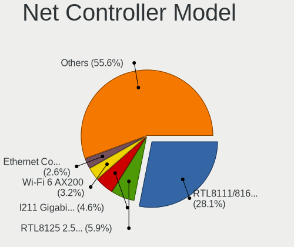

| Model                                                                          | Desktops | Percent |
|--------------------------------------------------------------------------------|----------|---------|
| Realtek RTL8111/8168/8211/8411 PCI Express Gigabit Ethernet Controller         | 1012     | 28.1%   |
| Realtek RTL8125 2.5GbE Controller                                              | 211      | 5.86%   |
| Intel I211 Gigabit Network Connection                                          | 166      | 4.61%   |
| Intel Wi-Fi 6 AX200                                                            | 117      | 3.25%   |
| Intel Ethernet Controller I225-V                                               | 93       | 2.58%   |
| Intel Ethernet Connection (2) I219-V                                           | 91       | 2.53%   |
| Intel 82579LM Gigabit Network Connection (Lewisville)                          | 77       | 2.14%   |
| Intel Ethernet Connection I217-LM                                              | 53       | 1.47%   |
| Intel Ethernet Connection (7) I219-V                                           | 48       | 1.33%   |
| Intel Dual Band Wireless-AC 3168NGW [Stone Peak]                               | 43       | 1.19%   |
| Intel Wi-Fi 6E(802.11ax) AX210/AX1675* 2x2 [Typhoon Peak]                      | 42       | 1.17%   |
| Realtek RTL810xE PCI Express Fast Ethernet controller                          | 35       | 0.97%   |
| Intel Wi-Fi 5(802.11ac) Wireless-AC 9x6x [Thunder Peak]                        | 35       | 0.97%   |
| Intel Ethernet Connection (2) I218-V                                           | 33       | 0.92%   |
| Realtek RTL8188EUS 802.11n Wireless Network Adapter                            | 31       | 0.86%   |
| Realtek RTL8153 Gigabit Ethernet Adapter                                       | 31       | 0.86%   |
| MediaTek MT7922 802.11ax PCI Express Wireless Network Adapter                  | 31       | 0.86%   |
| Intel 82579V Gigabit Network Connection                                        | 31       | 0.86%   |
| Realtek 802.11ac NIC                                                           | 28       | 0.78%   |
| Realtek RTL8821CE 802.11ac PCIe Wireless Network Adapter                       | 24       | 0.67%   |
| Ralink MT7601U Wireless Adapter                                                | 24       | 0.67%   |
| Qualcomm Atheros Killer E220x Gigabit Ethernet Controller                      | 23       | 0.64%   |
| Intel Raptor Lake-S PCH CNVi WiFi                                              | 22       | 0.61%   |
| Intel I210 Gigabit Network Connection                                          | 22       | 0.61%   |
| Intel 82574L Gigabit Network Connection                                        | 22       | 0.61%   |
| Aquantia AQtion AQC107 NBase-T/IEEE 802.3an Ethernet Controller [Atlantic 10G] | 21       | 0.58%   |
| Qualcomm Atheros AR9271 802.11n                                                | 20       | 0.56%   |
| MediaTek MT7921K (RZ608) Wi-Fi 6E 80MHz                                        | 20       | 0.56%   |
| Intel Ethernet Connection I217-V                                               | 20       | 0.56%   |
| Qualcomm Atheros AR9485 Wireless Network Adapter                               | 19       | 0.53%   |
| Broadcom BCM4360 802.11ac Dual Band Wireless Network Adapter                   | 19       | 0.53%   |
| Realtek RTL88x2bu [AC1200 Techkey]                                             | 17       | 0.47%   |
| Intel Wireless 7265                                                            | 17       | 0.47%   |
| Intel Ethernet Connection (2) I219-LM                                          | 16       | 0.44%   |
| Intel Cannon Lake PCH CNVi WiFi                                                | 16       | 0.44%   |
| Intel 82567LM-3 Gigabit Network Connection                                     | 16       | 0.44%   |
| Intel Alder Lake-S PCH CNVi WiFi                                               | 15       | 0.42%   |
| Realtek RTL-8100/8101L/8139 PCI Fast Ethernet Adapter                          | 14       | 0.39%   |
| Nvidia MCP61 Ethernet                                                          | 14       | 0.39%   |
| Microsoft Xbox Wireless Adapter for Windows                                    | 14       | 0.39%   |

Wireless Vendor
---------------

Wireless vendors

| Vendor                                | Desktops | Percent |
|---------------------------------------|----------|---------|
| Intel                                 | 376      | 34%     |
| Realtek Semiconductor                 | 230      | 20.8%   |
| Qualcomm Atheros                      | 96       | 8.68%   |
| TP-Link                               | 70       | 6.33%   |
| Ralink Technology                     | 60       | 5.42%   |
| MediaTek                              | 55       | 4.97%   |
| Broadcom                              | 37       | 3.35%   |
| Ralink                                | 32       | 2.89%   |
| Microsoft                             | 23       | 2.08%   |
| Qualcomm Atheros Communications       | 22       | 1.99%   |
| NetGear                               | 20       | 1.81%   |
| ASUSTek Computer                      | 14       | 1.27%   |
| D-Link                                | 12       | 1.08%   |
| Edimax Technology                     | 9        | 0.81%   |
| AVM                                   | 6        | 0.54%   |
| Linksys                               | 5        | 0.45%   |
| Broadcom Limited                      | 5        | 0.45%   |
| Belkin Components                     | 5        | 0.45%   |
| D-Link System                         | 4        | 0.36%   |
| Wacom                                 | 3        | 0.27%   |
| Wilocity                              | 2        | 0.18%   |
| Mercucys                              | 2        | 0.18%   |
| IMC Networks                          | 2        | 0.18%   |
| 802.11g Adapter [Linksys WUSB54GC v3] | 2        | 0.18%   |
| ZyXEL Communications                  | 1        | 0.09%   |
| ZyDAS                                 | 1        | 0.09%   |
| Tenda                                 | 1        | 0.09%   |
| Sitecom Europe                        | 1        | 0.09%   |
| Senao                                 | 1        | 0.09%   |
| Qualcomm Technologies                 | 1        | 0.09%   |
| Philips (or NXP)                      | 1        | 0.09%   |
| Micro Star International              | 1        | 0.09%   |
| LG Electronics                        | 1        | 0.09%   |
| Guillemot                             | 1        | 0.09%   |
| Gemtek                                | 1        | 0.09%   |
| AirTies Wireless Networks             | 1        | 0.09%   |
| Acer Peripherals (now BenQ)           | 1        | 0.09%   |
| Accton Technology                     | 1        | 0.09%   |

Wireless Model
--------------

Wireless models

| Model                                                         | Desktops | Percent |
|---------------------------------------------------------------|----------|---------|
| Intel Wi-Fi 6 AX200                                           | 117      | 10.41%  |
| Intel Dual Band Wireless-AC 3168NGW [Stone Peak]              | 43       | 3.83%   |
| Intel Wi-Fi 6E(802.11ax) AX210/AX1675* 2x2 [Typhoon Peak]     | 42       | 3.74%   |
| Intel Wi-Fi 5(802.11ac) Wireless-AC 9x6x [Thunder Peak]       | 35       | 3.11%   |
| Realtek RTL8188EUS 802.11n Wireless Network Adapter           | 31       | 2.76%   |
| Realtek 802.11ac NIC                                          | 28       | 2.49%   |
| MediaTek MT7922 802.11ax PCI Express Wireless Network Adapter | 25       | 2.22%   |
| Realtek RTL8821CE 802.11ac PCIe Wireless Network Adapter      | 24       | 2.14%   |
| Ralink MT7601U Wireless Adapter                               | 24       | 2.14%   |
| Intel Raptor Lake-S PCH CNVi WiFi                             | 22       | 1.96%   |
| Qualcomm Atheros AR9271 802.11n                               | 20       | 1.78%   |
| MediaTek MT7921K (RZ608) Wi-Fi 6E 80MHz                       | 20       | 1.78%   |
| Qualcomm Atheros AR9485 Wireless Network Adapter              | 19       | 1.69%   |
| Broadcom BCM4360 802.11ac Dual Band Wireless Network Adapter  | 19       | 1.69%   |
| Realtek RTL88x2bu [AC1200 Techkey]                            | 17       | 1.51%   |
| Intel Wireless 7265                                           | 17       | 1.51%   |
| Intel Cannon Lake PCH CNVi WiFi                               | 16       | 1.42%   |
| Intel Alder Lake-S PCH CNVi WiFi                              | 15       | 1.33%   |
| Microsoft Xbox Wireless Adapter for Windows                   | 14       | 1.25%   |
| Intel Wireless 7260                                           | 14       | 1.25%   |
| Intel Wireless 3165                                           | 14       | 1.25%   |
| Realtek RTL8192EE PCIe Wireless Network Adapter               | 13       | 1.16%   |
| Ralink RT5370 Wireless Adapter                                | 12       | 1.07%   |
| TP-Link 802.11ac WLAN Adapter                                 | 11       | 0.98%   |
| Realtek RTL8822BE 802.11a/b/g/n/ac WiFi adapter               | 11       | 0.98%   |
| Qualcomm Atheros AR9462 Wireless Network Adapter              | 11       | 0.98%   |
| Qualcomm Atheros AR93xx Wireless Network Adapter              | 11       | 0.98%   |
| Realtek RTL8812AE 802.11ac PCIe Wireless Network Adapter      | 10       | 0.89%   |
| Qualcomm Atheros QCA9565 / AR9565 Wireless Network Adapter    | 10       | 0.89%   |
| Qualcomm Atheros QCA6174 802.11ac Wireless Network Adapter    | 10       | 0.89%   |
| Intel Comet Lake PCH CNVi WiFi                                | 10       | 0.89%   |
| TP-Link Archer T2U PLUS [RTL8821AU]                           | 9        | 0.8%    |
| TP-Link 802.11ac NIC                                          | 9        | 0.8%    |
| Realtek RTL8852BE PCIe 802.11ax Wireless Network Controller   | 9        | 0.8%    |
| Realtek RTL8812AU 802.11a/b/g/n/ac 2T2R DB WLAN Adapter       | 9        | 0.8%    |
| Realtek RTL8192EU 802.11b/g/n WLAN Adapter                    | 9        | 0.8%    |
| Realtek RTL8192CE PCIe Wireless Network Adapter               | 9        | 0.8%    |
| Microsoft Xbox 360 Wireless Adapter                           | 9        | 0.8%    |
| TP-Link TL-WN823N v2/v3 [Realtek RTL8192EU]                   | 8        | 0.71%   |
| Realtek RTL8821AE 802.11ac PCIe Wireless Network Adapter      | 8        | 0.71%   |

Ethernet Vendor
---------------

Ethernet vendors

| Vendor                           | Desktops | Percent |
|----------------------------------|----------|---------|
| Realtek Semiconductor            | 1279     | 54.45%  |
| Intel                            | 780      | 33.21%  |
| Qualcomm Atheros                 | 81       | 3.45%   |
| Broadcom                         | 36       | 1.53%   |
| Nvidia                           | 28       | 1.19%   |
| Aquantia                         | 27       | 1.15%   |
| ASIX Electronics                 | 13       | 0.55%   |
| Samsung Electronics              | 12       | 0.51%   |
| Xiaomi                           | 11       | 0.47%   |
| Huawei Technologies              | 10       | 0.43%   |
| MediaTek                         | 9        | 0.38%   |
| DisplayLink                      | 9        | 0.38%   |
| Marvell Technology Group         | 5        | 0.21%   |
| VIA Technologies                 | 4        | 0.17%   |
| Qualcomm                         | 4        | 0.17%   |
| Mellanox Technologies            | 4        | 0.17%   |
| Apple                            | 4        | 0.17%   |
| OPPO Electronics                 | 3        | 0.13%   |
| Google                           | 3        | 0.13%   |
| D-Link System                    | 3        | 0.13%   |
| Broadcom Limited                 | 3        | 0.13%   |
| TP-Link                          | 2        | 0.09%   |
| Solarflare Communications        | 2        | 0.09%   |
| Lenovo                           | 2        | 0.09%   |
| American Megatrends              | 2        | 0.09%   |
| 3Com                             | 2        | 0.09%   |
| ZTE WCDMA Technologies MSM       | 1        | 0.04%   |
| Tehuti Networks                  | 1        | 0.04%   |
| Spreadtrum Communications        | 1        | 0.04%   |
| Silicon Integrated Systems [SiS] | 1        | 0.04%   |
| OnePlus Technology (Shenzhen)    | 1        | 0.04%   |
| Motorola PCS                     | 1        | 0.04%   |
| Motorola BCS                     | 1        | 0.04%   |
| Linksys                          | 1        | 0.04%   |
| Elecom                           | 1        | 0.04%   |
| Davicom Semiconductor            | 1        | 0.04%   |
| Accton Technology                | 1        | 0.04%   |

Ethernet Model
--------------

Ethernet models

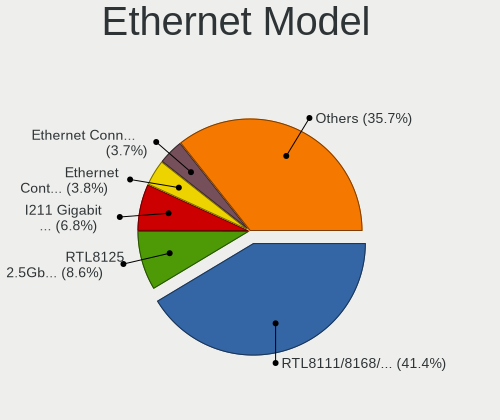

| Model                                                                          | Desktops | Percent |
|--------------------------------------------------------------------------------|----------|---------|
| Realtek RTL8111/8168/8211/8411 PCI Express Gigabit Ethernet Controller         | 1012     | 41.39%  |
| Realtek RTL8125 2.5GbE Controller                                              | 211      | 8.63%   |
| Intel I211 Gigabit Network Connection                                          | 166      | 6.79%   |
| Intel Ethernet Controller I225-V                                               | 93       | 3.8%    |
| Intel Ethernet Connection (2) I219-V                                           | 91       | 3.72%   |
| Intel 82579LM Gigabit Network Connection (Lewisville)                          | 77       | 3.15%   |
| Intel Ethernet Connection I217-LM                                              | 53       | 2.17%   |
| Intel Ethernet Connection (7) I219-V                                           | 48       | 1.96%   |
| Realtek RTL810xE PCI Express Fast Ethernet controller                          | 35       | 1.43%   |
| Intel Ethernet Connection (2) I218-V                                           | 33       | 1.35%   |
| Realtek RTL8153 Gigabit Ethernet Adapter                                       | 31       | 1.27%   |
| Intel 82579V Gigabit Network Connection                                        | 31       | 1.27%   |
| Qualcomm Atheros Killer E220x Gigabit Ethernet Controller                      | 23       | 0.94%   |
| Intel I210 Gigabit Network Connection                                          | 22       | 0.9%    |
| Intel 82574L Gigabit Network Connection                                        | 22       | 0.9%    |
| Aquantia AQtion AQC107 NBase-T/IEEE 802.3an Ethernet Controller [Atlantic 10G] | 21       | 0.86%   |
| Intel Ethernet Connection I217-V                                               | 20       | 0.82%   |
| Intel Ethernet Connection (2) I219-LM                                          | 16       | 0.65%   |
| Intel 82567LM-3 Gigabit Network Connection                                     | 16       | 0.65%   |
| Realtek RTL-8100/8101L/8139 PCI Fast Ethernet Adapter                          | 14       | 0.57%   |
| Nvidia MCP61 Ethernet                                                          | 14       | 0.57%   |
| Intel Ethernet Connection (7) I219-LM                                          | 14       | 0.57%   |
| Qualcomm Atheros AR8121/AR8113/AR8114 Gigabit or Fast Ethernet                 | 13       | 0.53%   |
| Intel Ethernet Connection (14) I219-V                                          | 13       | 0.53%   |
| Samsung Galaxy series, misc. (tethering mode)                                  | 12       | 0.49%   |
| Qualcomm Atheros AR8161 Gigabit Ethernet                                       | 12       | 0.49%   |
| Intel 82578DM Gigabit Network Connection                                       | 11       | 0.45%   |
| ASIX AX88179 Gigabit Ethernet                                                  | 11       | 0.45%   |
| Intel Ethernet Connection (2) I218-LM                                          | 9        | 0.37%   |
| Huawei FOA-LX9                                                                 | 9        | 0.37%   |
| Intel Ethernet Controller I226-V                                               | 8        | 0.33%   |
| Intel Ethernet Connection (17) I219-V                                          | 8        | 0.33%   |
| Xiaomi Mi/Redmi series (RNDIS)                                                 | 7        | 0.29%   |
| Qualcomm Atheros QCA8171 Gigabit Ethernet                                      | 7        | 0.29%   |
| Qualcomm Atheros Killer E2400 Gigabit Ethernet Controller                      | 7        | 0.29%   |
| Qualcomm Atheros AR8151 v2.0 Gigabit Ethernet                                  | 7        | 0.29%   |
| Realtek RTL-8110SC/8169SC Gigabit Ethernet                                     | 6        | 0.25%   |
| Qualcomm Atheros Killer E2500 Gigabit Ethernet Controller                      | 6        | 0.25%   |
| MediaTek MT7922 802.11ax PCI Express Wireless Network Adapter                  | 6        | 0.25%   |
| Intel Ethernet Connection (12) I219-V                                          | 6        | 0.25%   |

Net Controller Kind
-------------------

Ethernet, WiFi or modem

| Kind     | Desktops | Percent |
|----------|----------|---------|
| Ethernet | 2131     | 66.82%  |
| WiFi     | 1028     | 32.24%  |
| Modem    | 29       | 0.91%   |
| Unknown  | 1        | 0.03%   |

Used Controller
---------------

Currently used network controller

| Kind     | Desktops | Percent |
|----------|----------|---------|
| Ethernet | 1714     | 75.08%  |
| WiFi     | 569      | 24.92%  |

NICs
----

Total network controllers on board

| Total | Desktops | Percent |
|-------|----------|---------|
| 1     | 1310     | 60.73%  |
| 2     | 710      | 32.92%  |
| 3     | 104      | 4.82%   |
| 0     | 14       | 0.65%   |
| 4     | 11       | 0.51%   |
| 6     | 5        | 0.23%   |
| 5     | 3        | 0.14%   |

IPv6
----

IPv6 vs IPv4

| Used | Desktops | Percent |
|------|----------|---------|
| No   | 1674     | 76.51%  |
| Yes  | 514      | 23.49%  |

Bluetooth
---------

Bluetooth Vendor
----------------

Controller vendors

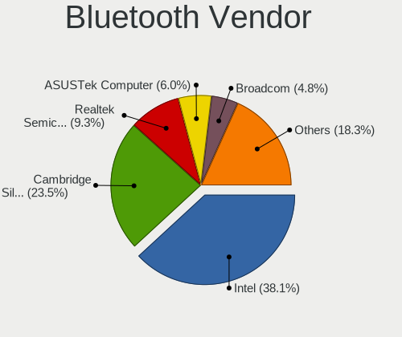

| Vendor                          | Desktops | Percent |
|---------------------------------|----------|---------|
| Intel                           | 358      | 38.13%  |
| Cambridge Silicon Radio         | 221      | 23.54%  |
| Realtek Semiconductor           | 87       | 9.27%   |
| ASUSTek Computer                | 56       | 5.96%   |
| Broadcom                        | 45       | 4.79%   |
| MediaTek                        | 40       | 4.26%   |
| IMC Networks                    | 29       | 3.09%   |
| Qualcomm Atheros Communications | 28       | 2.98%   |
| TP-Link                         | 14       | 1.49%   |
| Foxconn / Hon Hai               | 9        | 0.96%   |
| Realtek                         | 7        | 0.75%   |
| SiW                             | 6        | 0.64%   |
| Dynex                           | 5        | 0.53%   |
| Apple                           | 5        | 0.53%   |
| Lite-On Technology              | 4        | 0.43%   |
| Edimax Technology               | 4        | 0.43%   |
| Unknown                         | 3        | 0.32%   |
| Ralink                          | 2        | 0.21%   |
| Micro Star International        | 2        | 0.21%   |
| Integrated System Solution      | 2        | 0.21%   |
| D-Link                          | 2        | 0.21%   |
| Belkin Components               | 2        | 0.21%   |
| Logitech                        | 1        | 0.11%   |
| Kensington                      | 1        | 0.11%   |
| Dell                            | 1        | 0.11%   |
| Creative Technology             | 1        | 0.11%   |
| Corsair                         | 1        | 0.11%   |
| Conwise Technology              | 1        | 0.11%   |
| Actions                         | 1        | 0.11%   |
| AboCom Systems                  | 1        | 0.11%   |

Bluetooth Model
---------------

Controller models

| Model                                                    | Desktops | Percent |
|----------------------------------------------------------|----------|---------|
| Cambridge Silicon Radio Bluetooth Dongle (HCI mode)      | 221      | 23.44%  |
| Intel AX200 Bluetooth                                    | 112      | 11.88%  |
| Realtek Bluetooth Radio                                  | 71       | 7.53%   |
| Intel Bluetooth wireless interface                       | 54       | 5.73%   |
| Intel Wireless-AC 3168 Bluetooth                         | 41       | 4.35%   |
| MediaTek Wireless_Device                                 | 40       | 4.24%   |
| Intel AX210 Bluetooth                                    | 39       | 4.14%   |
| Intel Wireless-AC 9260 Bluetooth Adapter                 | 34       | 3.61%   |
| Intel AX211 Bluetooth                                    | 30       | 3.18%   |
| Broadcom BCM20702A0 Bluetooth 4.0                        | 26       | 2.76%   |
| Intel Bluetooth 9460/9560 Jefferson Peak (JfP)           | 24       | 2.55%   |
| Intel AX201 Bluetooth                                    | 24       | 2.55%   |
| IMC Networks Bluetooth Radio                             | 17       | 1.8%    |
| ASUS Broadcom BCM20702A0 Bluetooth                       | 17       | 1.8%    |
| ASUS ASUS USB-BT500                                      | 16       | 1.7%    |
| TP-Link TP-Link Bluetooth USB Adapter                    | 14       | 1.48%   |
| Realtek  Bluetooth 4.2 Adapter                           | 11       | 1.17%   |
| Qualcomm Atheros  Bluetooth Device                       | 11       | 1.17%   |
| IMC Networks Wireless_Device                             | 8        | 0.85%   |
| Realtek Bluetooth Radio                                  | 7        | 0.74%   |
| Foxconn / Hon Hai Wireless_Device                        | 7        | 0.74%   |
| SiW SiW                                                  | 6        | 0.64%   |
| Qualcomm Atheros Bluetooth USB Host Controller           | 6        | 0.64%   |
| Qualcomm Atheros AR3011 Bluetooth                        | 6        | 0.64%   |
| ASUS Bluetooth Radio                                     | 6        | 0.64%   |
| Dynex Bluetooth 4.0 Adapter [Broadcom, 1.12, BCM20702A0] | 5        | 0.53%   |
| ASUS Qualcomm Bluetooth 4.1                              | 5        | 0.53%   |
| Qualcomm Atheros AR9462 Bluetooth                        | 4        | 0.42%   |
| Broadcom BCM2045 Bluetooth                               | 4        | 0.42%   |
| ASUS BCM20702A0                                          | 4        | 0.42%   |
| Apple Bluetooth Host Controller                          | 4        | 0.42%   |
| Lite-On Bluetooth Device                                 | 3        | 0.32%   |
| IMC Networks Bluetooth Device                            | 3        | 0.32%   |
| Broadcom Bluetooth 3.0 Device                            | 3        | 0.32%   |
| ASUS Broadcom BCM20702 Single-Chip Bluetooth 4.0 + LE    | 3        | 0.32%   |
| ASUS Bluetooth Device                                    | 3        | 0.32%   |
| Unknown                                                  | 3        | 0.32%   |
| Realtek Bluetooth 5.4 Radio                              | 2        | 0.21%   |
| Realtek Bluetooth 5.3 Radio                              | 2        | 0.21%   |
| Ralink RT3290 Bluetooth                                  | 2        | 0.21%   |

Sound
-----

Sound Vendor
------------

Sound card vendors

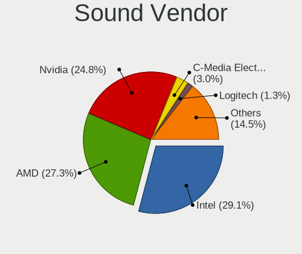

| Vendor                     | Desktops | Percent |
|----------------------------|----------|---------|
| Intel                      | 1179     | 29.1%   |
| AMD                        | 1105     | 27.28%  |
| Nvidia                     | 1006     | 24.83%  |
| C-Media Electronics        | 121      | 2.99%   |
| Logitech                   | 52       | 1.28%   |
| Creative Labs              | 50       | 1.23%   |
| JMTek                      | 36       | 0.89%   |
| ASUSTek Computer           | 36       | 0.89%   |
| Texas Instruments          | 27       | 0.67%   |
| GN Netcom                  | 23       | 0.57%   |
| Generalplus Technology     | 23       | 0.57%   |
| Corsair                    | 22       | 0.54%   |
| SteelSeries ApS            | 20       | 0.49%   |
| Razer USA                  | 20       | 0.49%   |
| Focusrite-Novation         | 20       | 0.49%   |
| Creative Technology        | 16       | 0.39%   |
| Micro Star International   | 15       | 0.37%   |
| Hewlett-Packard            | 14       | 0.35%   |
| Kingston Technology        | 13       | 0.32%   |
| VIA Technologies           | 12       | 0.3%    |
| Realtek Semiconductor      | 10       | 0.25%   |
| Tenx Technology            | 9        | 0.22%   |
| Plantronics                | 9        | 0.22%   |
| Blue Microphones           | 8        | 0.2%    |
| BEHRINGER International    | 8        | 0.2%    |
| Samson Technologies        | 6        | 0.15%   |
| PreSonus Audio Electronics | 6        | 0.15%   |
| DSEA A/S                   | 6        | 0.15%   |
| Dell                       | 6        | 0.15%   |
| Trust                      | 5        | 0.12%   |
| SAVITECH                   | 5        | 0.12%   |
| AKAI Professional M.I.     | 5        | 0.12%   |
| Yamaha                     | 4        | 0.1%    |
| TEAC                       | 4        | 0.1%    |
| RODE Microphones           | 4        | 0.1%    |
| Giga-Byte Technology       | 4        | 0.1%    |
| Cambridge Silicon Radio    | 4        | 0.1%    |
| Zhaoxin                    | 3        | 0.07%   |
| XMOS                       | 3        | 0.07%   |
| Roland                     | 3        | 0.07%   |

Sound Model
-----------

Sound card models

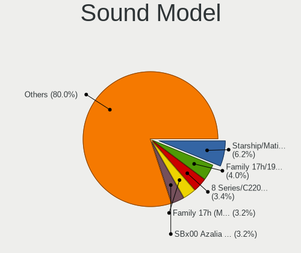

| Model                                                                      | Desktops | Percent |
|----------------------------------------------------------------------------|----------|---------|
| AMD Starship/Matisse HD Audio Controller                                   | 296      | 6.22%   |
| AMD Family 17h/19h/1ah HD Audio Controller                                 | 189      | 3.97%   |
| Intel 8 Series/C220 Series Chipset High Definition Audio Controller        | 162      | 3.4%    |
| AMD Family 17h (Models 00h-0fh) HD Audio Controller                        | 152      | 3.19%   |
| AMD SBx00 Azalia (Intel HDA)                                               | 151      | 3.17%   |
| Intel 6 Series/C200 Series Chipset Family High Definition Audio Controller | 141      | 2.96%   |
| AMD Ellesmere HDMI Audio [Radeon RX 470/480 / 570/580/590]                 | 120      | 2.52%   |
| Intel Xeon E3-1200 v3/4th Gen Core Processor HD Audio Controller           | 112      | 2.35%   |
| Intel 200 Series PCH HD Audio                                              | 105      | 2.21%   |
| Intel 100 Series/C230 Series Chipset Family HD Audio Controller            | 101      | 2.12%   |
| Nvidia GP107GL High Definition Audio Controller                            | 97       | 2.04%   |
| Intel 7 Series/C216 Chipset Family High Definition Audio Controller        | 96       | 2.02%   |
| Nvidia GK208 HDMI/DP Audio Controller                                      | 84       | 1.76%   |
| Intel Cannon Lake PCH cAVS                                                 | 83       | 1.74%   |
| Nvidia GP104 High Definition Audio Controller                              | 74       | 1.55%   |
| AMD Navi 21/23 HDMI/DP Audio Controller                                    | 71       | 1.49%   |
| AMD Renoir Radeon High Definition Audio Controller                         | 70       | 1.47%   |
| AMD Rembrandt Radeon High Definition Audio Controller                      | 61       | 1.28%   |
| AMD Oland/Hainan/Cape Verde/Pitcairn HDMI Audio [Radeon HD 7000 Series]    | 61       | 1.28%   |
| Nvidia TU116 High Definition Audio Controller                              | 58       | 1.22%   |
| Nvidia GP106 High Definition Audio Controller                              | 58       | 1.22%   |
| AMD FCH Azalia Controller                                                  | 56       | 1.18%   |
| AMD Raven/Raven2/Fenghuang HDMI/DP Audio Controller                        | 52       | 1.09%   |
| AMD Baffin HDMI/DP Audio [Radeon RX 550 640SP / RX 560/560X]               | 52       | 1.09%   |
| Intel 9 Series Chipset Family HD Audio Controller                          | 47       | 0.99%   |
| Intel 82801JI (ICH10 Family) HD Audio Controller                           | 47       | 0.99%   |
| AMD Navi 10 HDMI Audio                                                     | 44       | 0.92%   |
| Nvidia GA104 High Definition Audio Controller                              | 43       | 0.9%    |
| Nvidia TU106 High Definition Audio Controller                              | 42       | 0.88%   |
| Nvidia GM107 High Definition Audio Controller [GeForce 940MX]              | 40       | 0.84%   |
| Intel Alder Lake-S HD Audio Controller                                     | 40       | 0.84%   |
| Nvidia GA106 High Definition Audio Controller                              | 38       | 0.8%    |
| Nvidia TU104 HD Audio Controller                                           | 37       | 0.78%   |
| Intel C610/X99 series chipset HD Audio Controller                          | 37       | 0.78%   |
| Nvidia GP108 High Definition Audio Controller                              | 36       | 0.76%   |
| Intel 5 Series/3400 Series Chipset High Definition Audio                   | 36       | 0.76%   |
| Nvidia High Definition Audio Controller                                    | 35       | 0.74%   |
| Nvidia GM206 High Definition Audio Controller                              | 35       | 0.74%   |
| Nvidia GM204 High Definition Audio Controller                              | 35       | 0.74%   |
| Intel NM10/ICH7 Family High Definition Audio Controller                    | 35       | 0.74%   |

Memory
------

Memory Vendor
-------------

Memory module vendors

| Vendor                     | Desktops | Percent |
|----------------------------|----------|---------|
| Kingston                   | 262      | 19.42%  |
| Corsair                    | 219      | 16.23%  |
| G.Skill                    | 173      | 12.82%  |
| Unknown                    | 136      | 10.08%  |
| Crucial                    | 120      | 8.9%    |
| Samsung Electronics        | 98       | 7.26%   |
| SK hynix                   | 89       | 6.6%    |
| Micron Technology          | 46       | 3.41%   |
| Team                       | 32       | 2.37%   |
| A-DATA Technology          | 25       | 1.85%   |
| Patriot                    | 23       | 1.7%    |
| Unknown                    | 14       | 1.04%   |
| Ramaxel Technology         | 12       | 0.89%   |
| Nanya Technology           | 12       | 0.89%   |
| Unknown (ABCD)             | 6        | 0.44%   |
| Transcend                  | 6        | 0.44%   |
| Silicon Power              | 6        | 0.44%   |
| Avant                      | 6        | 0.44%   |
| AMD                        | 6        | 0.44%   |
| Smart                      | 5        | 0.37%   |
| PNY                        | 4        | 0.3%    |
| GOODRAM                    | 4        | 0.3%    |
| Elpida                     | 4        | 0.3%    |
| Unifosa                    | 2        | 0.15%   |
| Patriot Memory             | 2        | 0.15%   |
| Kllisre                    | 2        | 0.15%   |
| Kingmax                    | 2        | 0.15%   |
| KINGBANK                   | 2        | 0.15%   |
| GLOWAY                     | 2        | 0.15%   |
| GeIL                       | 2        | 0.15%   |
| ASint Technology           | 2        | 0.15%   |
| Apacer                     | 2        | 0.15%   |
| Xi'an UniIC Semiconductors | 1        | 0.07%   |
| Wodposit                   | 1        | 0.07%   |
| V-GeN                      | 1        | 0.07%   |
| V-Color                    | 1        | 0.07%   |
| Unknown (82B5)             | 1        | 0.07%   |
| Unknown (0x0C97)           | 1        | 0.07%   |
| Toshiba                    | 1        | 0.07%   |
| Teikon                     | 1        | 0.07%   |

Memory Model
------------

Memory module models

| Model                                                        | Desktops | Percent |
|--------------------------------------------------------------|----------|---------|
| Corsair RAM CMK16GX4M2B3200C16 8GB DIMM DDR4 3600MT/s        | 22       | 1.46%   |
| Unknown                                                      | 14       | 0.93%   |
| Corsair RAM CMK32GX4M2E3200C16 16GB DIMM DDR4 3534MT/s       | 12       | 0.79%   |
| Unknown RAM Module 4GB DIMM 1333MT/s                         | 11       | 0.73%   |
| G.Skill RAM F4-3000C16-8GISB 8GB DIMM DDR4 3200MT/s          | 11       | 0.73%   |
| Unknown RAM Module 4096MB DIMM 1333MT/s                      | 10       | 0.66%   |
| Corsair RAM CMK16GX4M2B3000C15 8GB DIMM DDR4 3600MT/s        | 10       | 0.66%   |
| Kingston RAM KHX3200C16D4/16GX 16GB DIMM DDR4 3600MT/s       | 9        | 0.6%    |
| Kingston RAM KHX1600C9D3/4GX 4GB DIMM DDR3 1800MT/s          | 9        | 0.6%    |
| G.Skill RAM F4-3200C16-8GVKB 8GB DIMM DDR4 4000MT/s          | 9        | 0.6%    |
| Kingston RAM KHX3200C16D4/8GX 8GB DIMM DDR4 3733MT/s         | 8        | 0.53%   |
| Corsair RAM CMK32GX4M2B3200C16 16GB DIMM DDR4 3800MT/s       | 8        | 0.53%   |
| Team RAM TEAMGROUP-UD4-3200 8GB DIMM DDR4 3733MT/s           | 7        | 0.46%   |
| Samsung RAM M378B5173DB0-CK0 4096MB DIMM DDR3 1600MT/s       | 7        | 0.46%   |
| Patriot RAM 3200 C16 Series 4GB DIMM DDR4 3600MT/s           | 7        | 0.46%   |
| G.Skill RAM F4-3200C16-16GVK 16GB DIMM DDR4 3600MT/s         | 7        | 0.46%   |
| G.Skill RAM F4-3200C16-16GIS 16GB DIMM DDR4 3600MT/s         | 7        | 0.46%   |
| Unknown RAM Module 8GB DIMM DDR3 1600MT/s                    | 6        | 0.4%    |
| Unknown RAM Module 2GB DIMM 1333MT/s                         | 6        | 0.4%    |
| Unknown RAM Module 2048MB DIMM DDR2 800MT/s                  | 6        | 0.4%    |
| Unknown (ABCD) RAM 123456789012345678 2GB DIMM DDR3 2400MT/s | 6        | 0.4%    |
| Samsung RAM M378B1G73DB0-CK0 8GB DIMM DDR3 2133MT/s          | 6        | 0.4%    |
| Kingston RAM KHX2666C16/8G 8GB DIMM DDR4 3466MT/s            | 6        | 0.4%    |
| Kingston RAM KHX2133C14D4/8G 8GB DIMM DDR4 3000MT/s          | 6        | 0.4%    |
| Kingston RAM KF3200C16D4/16GX 16GB DIMM DDR4 3200MT/s        | 6        | 0.4%    |
| G.Skill RAM F4-3200C16-8GIS 8GB DIMM DDR4 3200MT/s           | 6        | 0.4%    |
| Unknown RAM Module 2048MB DIMM SDRAM                         | 5        | 0.33%   |
| Unknown RAM Module 2048MB DIMM 1333MT/s                      | 5        | 0.33%   |
| Team RAM TEAMGROUP-UD4-3200 8GB DIMM DDR4 3800MT/s           | 5        | 0.33%   |
| Team RAM TEAMGROUP-UD4-2666 4GB DIMM DDR4                    | 5        | 0.33%   |
| Patriot RAM PSD38G16002 8GB DIMM DDR3 1600MT/s               | 5        | 0.33%   |
| Kingston RAM KHX2400C15D4/4G 4GB DIMM DDR4 3151MT/s          | 5        | 0.33%   |
| Kingston RAM KHX1600C10D3/8G 8GB DIMM DDR3 1600MT/s          | 5        | 0.33%   |
| Kingston RAM KF3200C16D4/8GX 8GB DIMM DDR4 3600MT/s          | 5        | 0.33%   |
| G.Skill RAM F4-3600C16-16GVKC 16GB DIMM DDR4 3866MT/s        | 5        | 0.33%   |
| G.Skill RAM F4-3600C16-16GTZNC 16GB DIMM DDR4 3866MT/s       | 5        | 0.33%   |
| Crucial RAM BLS8G3D1609DS1S00. 8GB DIMM DDR3 1800MT/s        | 5        | 0.33%   |
| Corsair RAM CMK32GX4M2Z3600C18 16GB DIMM DDR4 3800MT/s       | 5        | 0.33%   |
| Corsair RAM CMK32GX4M2D3600C18 16GB DIMM DDR4 3800MT/s       | 5        | 0.33%   |
| Corsair RAM CMK32GX4M2B3000C15 16GB DIMM DDR4 3000MT/s       | 5        | 0.33%   |

Memory Kind
-----------

Memory module kinds

| Kind    | Desktops | Percent |
|---------|----------|---------|
| DDR4    | 648      | 53.73%  |
| DDR3    | 348      | 28.86%  |
| DDR5    | 66       | 5.47%   |
| Unknown | 63       | 5.22%   |
| DDR2    | 33       | 2.74%   |
| SDRAM   | 29       | 2.4%    |
| LPDDR4  | 9        | 0.75%   |
| DDR     | 8        | 0.66%   |
| DRAM    | 2        | 0.17%   |

Memory Form Factor
------------------

Physical design of the memory module

| Name         | Desktops | Percent |
|--------------|----------|---------|
| DIMM         | 1129     | 94.71%  |
| SODIMM       | 54       | 4.53%   |
| Row Of Chips | 3        | 0.25%   |
| RIMM         | 3        | 0.25%   |
| FB-DIMM      | 3        | 0.25%   |

Memory Size
-----------

Memory module size

| Size  | Desktops | Percent |
|-------|----------|---------|
| 8192  | 489      | 36.79%  |
| 16384 | 321      | 24.15%  |
| 4096  | 253      | 19.04%  |
| 2048  | 140      | 10.53%  |
| 32768 | 103      | 7.75%   |
| 1024  | 17       | 1.28%   |
| 49152 | 2        | 0.15%   |
| 24576 | 1        | 0.08%   |
| 12288 | 1        | 0.08%   |
| 512   | 1        | 0.08%   |
| 256   | 1        | 0.08%   |

Memory Speed
------------

Memory module speed

| Speed   | Desktops | Percent |
|---------|----------|---------|
| 1600    | 206      | 15.18%  |
| 3200    | 149      | 10.98%  |
| 1333    | 136      | 10.02%  |
| 3600    | 122      | 8.99%   |
| 2400    | 86       | 6.34%   |
| 2133    | 66       | 4.86%   |
| 2667    | 60       | 4.42%   |
| 3800    | 42       | 3.1%    |
| 2666    | 41       | 3.02%   |
| 3733    | 32       | 2.36%   |
| 800     | 28       | 2.06%   |
| 3000    | 27       | 1.99%   |
| 6000    | 25       | 1.84%   |
| 3400    | 19       | 1.4%    |
| 667     | 19       | 1.4%    |
| 4000    | 18       | 1.33%   |
| 1867    | 18       | 1.33%   |
| 2933    | 17       | 1.25%   |
| 1800    | 16       | 1.18%   |
| 1866    | 15       | 1.11%   |
| 4800    | 14       | 1.03%   |
| 1066    | 13       | 0.96%   |
| 3534    | 12       | 0.88%   |
| 3466    | 12       | 0.88%   |
| 5600    | 11       | 0.81%   |
| 3866    | 10       | 0.74%   |
| 3666    | 10       | 0.74%   |
| 3066    | 10       | 0.74%   |
| Unknown | 10       | 0.74%   |
| 2800    | 9        | 0.66%   |
| 400     | 9        | 0.66%   |
| 3333    | 8        | 0.59%   |
| 2000    | 6        | 0.44%   |
| 1648    | 6        | 0.44%   |
| 1334    | 6        | 0.44%   |
| 6400    | 5        | 0.37%   |
| 3334    | 5        | 0.37%   |
| 3266    | 5        | 0.37%   |
| 3151    | 5        | 0.37%   |
| 5200    | 3        | 0.22%   |

Printers & scanners
-------------------

Printer Vendor
--------------

Printer device vendors

| Vendor                 | Desktops | Percent |
|------------------------|----------|---------|
| Hewlett-Packard        | 49       | 38.58%  |
| Brother Industries     | 27       | 21.26%  |
| Seiko Epson            | 15       | 11.81%  |
| Samsung Electronics    | 10       | 7.87%   |
| Canon                  | 6        | 4.72%   |
| Zebra                  | 3        | 2.36%   |
| Prolific Technology    | 2        | 1.57%   |
| Pantum                 | 2        | 1.57%   |
| Lexmark International  | 2        | 1.57%   |
| Dymo-CoStar            | 2        | 1.57%   |
| Xerox                  | 1        | 0.79%   |
| Ricoh                  | 1        | 0.79%   |
| QinHeng Electronics    | 1        | 0.79%   |
| Panasonic (Matsushita) | 1        | 0.79%   |
| Kyocera                | 1        | 0.79%   |
| iDPRT                  | 1        | 0.79%   |
| ICS Advent             | 1        | 0.79%   |
| Datamax-O'Neil         | 1        | 0.79%   |
| Apple                  | 1        | 0.79%   |

Printer Model
-------------

Printer device models

| Model                                                  | Desktops | Percent |
|--------------------------------------------------------|----------|---------|
| Samsung M2070 Series                                   | 3        | 2.33%   |
| HP OfficeJet Pro 8020 series                           | 3        | 2.33%   |
| Seiko Epson L360 Series                                | 2        | 1.55%   |
| Seiko Epson L3150 Series                               | 2        | 1.55%   |
| Samsung SCX-3400 Series                                | 2        | 1.55%   |
| Prolific PL2305 Parallel Port                          | 2        | 1.55%   |
| HP OfficeJet Pro 7740 series                           | 2        | 1.55%   |
| HP LaserJet P2015 series                               | 2        | 1.55%   |
| HP LaserJet 1018                                       | 2        | 1.55%   |
| HP ENVY 4500 series                                    | 2        | 1.55%   |
| HP DeskJet 2700 series                                 | 2        | 1.55%   |
| HP DeskJet 2620 All-in-One Printer                     | 2        | 1.55%   |
| Brother MFC-L2710DW series                             | 2        | 1.55%   |
| Brother MFC-J460DW                                     | 2        | 1.55%   |
| Brother HL-L2320D series                               | 2        | 1.55%   |
| Brother HL-L2300D series                               | 2        | 1.55%   |
| Zebra ZTC ZM400-200dpi ZPL                             | 1        | 0.78%   |
| Zebra ZTC LP2844-Z-200dpi                              | 1        | 0.78%   |
| Zebra Thrmal 2844                                      | 1        | 0.78%   |
| Xerox Phaser 3140 and 3155                             | 1        | 0.78%   |
| Seiko Epson XP-7100 Series                             | 1        | 0.78%   |
| Seiko Epson XP-3100 Series                             | 1        | 0.78%   |
| Seiko Epson XP-2200 Series                             | 1        | 0.78%   |
| Seiko Epson XP-2150 Series                             | 1        | 0.78%   |
| Seiko Epson XP-2100 Series                             | 1        | 0.78%   |
| Seiko Epson WF-2530 Series                             | 1        | 0.78%   |
| Seiko Epson Printer                                    | 1        | 0.78%   |
| Seiko Epson ME Office 600F/Stylus Office BX300F/TX300F | 1        | 0.78%   |
| Seiko Epson L3110 Series                               | 1        | 0.78%   |
| Seiko Epson L120 Series                                | 1        | 0.78%   |
| Seiko Epson ET-3830 Series                             | 1        | 0.78%   |
| Samsung ML-2250 Series                                 | 1        | 0.78%   |
| Samsung ML-216x Series Laser Printer                   | 1        | 0.78%   |
| Samsung M2020 Series                                   | 1        | 0.78%   |
| Samsung CLX-3180 Series                                | 1        | 0.78%   |
| Samsung CLX-3170 Series                                | 1        | 0.78%   |
| Ricoh SP 213SUw                                        | 1        | 0.78%   |
| QinHeng CH340S                                         | 1        | 0.78%   |
| Pantum P2200W series                                   | 1        | 0.78%   |
| Pantum P2200 series                                    | 1        | 0.78%   |

Scanner Vendor
--------------

Scanner device vendors

| Vendor          | Desktops | Percent |
|-----------------|----------|---------|
| Canon           | 15       | 51.72%  |
| Seiko Epson     | 8        | 27.59%  |
| Mustek Systems  | 3        | 10.34%  |
| Hewlett-Packard | 3        | 10.34%  |

Scanner Model
-------------

Scanner device models

| Model                                                   | Desktops | Percent |
|---------------------------------------------------------|----------|---------|
| Seiko Epson GT-X820 [Perfection V600 Photo]             | 3        | 10.34%  |
| Canon CanoScan LiDE 110                                 | 3        | 10.34%  |
| Canon CanoScan LiDE 50/LiDE 35/LiDE 40                  | 2        | 6.9%    |
| Canon CanoScan LIDE 25                                  | 2        | 6.9%    |
| Canon CanoScan LiDE 220                                 | 2        | 6.9%    |
| Canon CanoScan LiDE 210                                 | 2        | 6.9%    |
| Seiko Epson Perfection 660                              | 1        | 3.45%   |
| Seiko Epson GT-F730 [GT-S630/Perfection V33/V330 Photo] | 1        | 3.45%   |
| Seiko Epson GT-F720 [GT-S620/Perfection V30/V300 Photo] | 1        | 3.45%   |
| Seiko Epson GT-6600U [Perfection 610]                   | 1        | 3.45%   |
| Seiko Epson ES-D200 [GT-S50]                            | 1        | 3.45%   |
| Mustek Systems SNAPSCAN e22                             | 1        | 3.45%   |
| Mustek Systems ScanExpress A3 USB 1200 PRO              | 1        | 3.45%   |
| Mustek Systems BearPaw 1200 CU Plus                     | 1        | 3.45%   |
| HP ScanJet G4010                                        | 1        | 3.45%   |
| HP ScanJet 82x0C                                        | 1        | 3.45%   |
| HP ScanJet 3770                                         | 1        | 3.45%   |
| Canon CanoScan N670U/N676U/LiDE 20                      | 1        | 3.45%   |
| Canon CanoScan N1240U/LiDE 30                           | 1        | 3.45%   |
| Canon CanoScan LiDE 60                                  | 1        | 3.45%   |
| Canon CanoScan LiDE 120                                 | 1        | 3.45%   |

Camera
------

Camera Vendor
-------------

Camera device vendors

| Vendor                        | Desktops | Percent |
|-------------------------------|----------|---------|
| Logitech                      | 225      | 42.06%  |
| Microdia                      | 43       | 8.04%   |
| Microsoft                     | 27       | 5.05%   |
| Samsung Electronics           | 24       | 4.49%   |
| Sunplus Innovation Technology | 20       | 3.74%   |
| Generalplus Technology        | 15       | 2.8%    |
| Chicony Electronics           | 10       | 1.87%   |
| Z-Star Microelectronics       | 9        | 1.68%   |
| Trust                         | 9        | 1.68%   |
| Realtek Semiconductor         | 9        | 1.68%   |
| KYE Systems (Mouse Systems)   | 9        | 1.68%   |
| MacroSilicon                  | 8        | 1.5%    |
| Apple                         | 8        | 1.5%    |
| Razer USA                     | 7        | 1.31%   |
| Cubeternet                    | 7        | 1.31%   |
| Creative Technology           | 7        | 1.31%   |
| ARC International             | 6        | 1.12%   |
| Alcor Micro                   | 6        | 1.12%   |
| Jieli Technology              | 5        | 0.93%   |
| Huawei Technologies           | 5        | 0.93%   |
| Genesys Logic                 | 4        | 0.75%   |
| GEMBIRD                       | 4        | 0.75%   |
| Philips (or NXP)              | 3        | 0.56%   |
| Hewlett-Packard               | 3        | 0.56%   |
| eMeet                         | 3        | 0.56%   |
| A4Tech                        | 3        | 0.56%   |
| 2M UVC CAMERA                 | 3        | 0.56%   |
| Xiongmai                      | 2        | 0.37%   |
| Unknown                       | 2        | 0.37%   |
| Sunplus IT                    | 2        | 0.37%   |
| Sonix Technology              | 2        | 0.37%   |
| Silicon Motion                | 2        | 0.37%   |
| SHENZHEN EMEET TECHNOLOGY     | 2        | 0.37%   |
| Pixart Imaging                | 2        | 0.37%   |
| Novatek Microelectronics      | 2        | 0.37%   |
| LG Electronics                | 2        | 0.37%   |
| Lenovo                        | 2        | 0.37%   |
| IMC Networks                  | 2        | 0.37%   |
| AVerMedia Technologies        | 2        | 0.37%   |
| Arkmicro Technologies         | 2        | 0.37%   |

Camera Model
------------

Camera device models

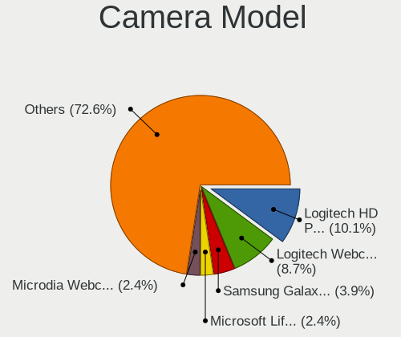

| Model                                    | Desktops | Percent |
|------------------------------------------|----------|---------|
| Logitech HD Pro Webcam C920              | 55       | 10.13%  |
| Logitech Webcam C270                     | 47       | 8.66%   |
| Samsung Galaxy series, misc. (MTP mode)  | 21       | 3.87%   |
| Microsoft LifeCam HD-3000                | 13       | 2.39%   |
| Microdia Webcam Vitade AF                | 13       | 2.39%   |
| Logitech HD Webcam C525                  | 12       | 2.21%   |
| Logitech C922 Pro Stream Webcam          | 11       | 2.03%   |
| Microdia USB 2.0 Camera                  | 10       | 1.84%   |
| Generalplus GENERAL WEBCAM               | 10       | 1.84%   |
| Logitech Webcam C170                     | 9        | 1.66%   |
| Logitech HD Webcam C615                  | 9        | 1.66%   |
| Microsoft LifeCam Cinema                 | 8        | 1.47%   |
| MacroSilicon USB Video                   | 8        | 1.47%   |
| Logitech Webcam C310                     | 8        | 1.47%   |
| Logitech HD Webcam C910                  | 8        | 1.47%   |
| Logitech BRIO Ultra HD Webcam            | 8        | 1.47%   |
| Apple iPhone 5/5C/5S/6/SE/7/8/X/XR       | 7        | 1.29%   |
| Microdia Camera                          | 6        | 1.1%    |
| Logitech Webcam Pro 9000                 | 6        | 1.1%    |
| Logitech B525 HD Webcam                  | 6        | 1.1%    |
| ARC International Camera                 | 6        | 1.1%    |
| Z-Star Venus USB2.0 Camera               | 5        | 0.92%   |
| Microdia Streaming Camera W8GS           | 5        | 0.92%   |
| Microdia Integrated Camera               | 5        | 0.92%   |
| Logitech Webcam C930e                    | 5        | 0.92%   |
| Huawei HiCamera                          | 5        | 0.92%   |
| Generalplus 808 Camera #9 (web-cam mode) | 5        | 0.92%   |
| Sunplus Full HD webcam                   | 4        | 0.74%   |
| Razer USA Gaming Webcam [Kiyo]           | 4        | 0.74%   |
| Logitech Webcam C210                     | 4        | 0.74%   |
| Logitech QuickCam Pro 9000               | 4        | 0.74%   |
| Jieli USB PHY 2.0                        | 4        | 0.74%   |
| Alcor Micro USB 2.0 PC Camera            | 4        | 0.74%   |
| Z-Star Vimicro USB Camera (Altair)       | 3        | 0.55%   |
| Trust Trust USB Camera                   | 3        | 0.55%   |
| Trust Trust Full HD Webcam               | 3        | 0.55%   |
| Trust 17676 Webcam                       | 3        | 0.55%   |
| Sunplus USB Camera                       | 3        | 0.55%   |
| Sunplus DICOTA 4K                        | 3        | 0.55%   |
| Logitech Webcam C300                     | 3        | 0.55%   |

Security
--------

Fingerprint Vendor
------------------

Fingerprint sensor vendors

| Vendor                     | Desktops | Percent |
|----------------------------|----------|---------|
| LighTuning Technology      | 3        | 25%     |
| Synaptics                  | 2        | 16.67%  |
| Shenzhen Goodix Technology | 2        | 16.67%  |
| STMicroelectronics         | 1        | 8.33%   |
| Elan Microelectronics      | 1        | 8.33%   |
| DigitalPersona             | 1        | 8.33%   |
| Dell                       | 1        | 8.33%   |
| AuthenTec                  | 1        | 8.33%   |

Fingerprint Model
-----------------

Fingerprint sensor models

| Model                                          | Desktops | Percent |
|------------------------------------------------|----------|---------|
| LighTuning Fingerprint Sensor                  | 3        | 25%     |
| Synaptics  WBDI Fingerprint Reader - USB 052   | 2        | 16.67%  |
| Shenzhen Goodix  Fingerprint Device            | 2        | 16.67%  |
| STMicroelectronics Fingerprint Reader          | 1        | 8.33%   |
| Elan fingerprint sensor [FeinTech FPS00200]    | 1        | 8.33%   |
| DigitalPersona Fingerprint Reader              | 1        | 8.33%   |
| Dell MS819 Wired Mouse With Fingerprint Reader | 1        | 8.33%   |
| AuthenTec AES1600                              | 1        | 8.33%   |

Chipcard Vendor
---------------

Chipcard module vendors

| Vendor                    | Desktops | Percent |
|---------------------------|----------|---------|
| Alcor Micro               | 7        | 22.58%  |
| Gemalto (was Gemplus)     | 5        | 16.13%  |
| Advanced Card Systems     | 5        | 16.13%  |
| SCM Microsystems          | 3        | 9.68%   |
| OmniKey                   | 3        | 9.68%   |
| Reiner SCT Kartensysteme  | 2        | 6.45%   |
| Yubico.com                | 1        | 3.23%   |
| Fujitsu Siemens Computers | 1        | 3.23%   |
| Bit4id                    | 1        | 3.23%   |
| Aladdin R.D.              | 1        | 3.23%   |
| Aladdin Knowledge Systems | 1        | 3.23%   |
| Aktiv                     | 1        | 3.23%   |

Chipcard Model
--------------

Chipcard module models

| Model                                                                      | Desktops | Percent |
|----------------------------------------------------------------------------|----------|---------|
| Gemalto (was Gemplus) GemPC Twin SmartCard Reader                          | 4        | 12.9%   |
| Alcor Micro AU9540 Smartcard Reader                                        | 4        | 12.9%   |
| Advanced Card Systems ACR38 SmartCard Reader                               | 4        | 12.9%   |
| Alcor Micro Watchdata W 1981                                               | 3        | 9.68%   |
| SCM Microsystems SCR331 SmartCard Reader                                   | 2        | 6.45%   |
| OmniKey CardMan 1021                                                       | 2        | 6.45%   |
| Yubico.com Yubikey 4/5 U2F+CCID                                            | 1        | 3.23%   |
| SCM Microsystems SCR331-LC1 / SCR3310 SmartCard Reader                     | 1        | 3.23%   |
| Reiner SCT Kartensysteme tanJack USB                                       | 1        | 3.23%   |
| Reiner SCT Kartensysteme cyberJack RFID basis contactless smartcard reader | 1        | 3.23%   |
| OmniKey CardMan 3021 / 3121                                                | 1        | 3.23%   |
| Gemalto (was Gemplus) GemPC Key SmartCard Reader                           | 1        | 3.23%   |
| Fujitsu Siemens Computers Smartcard Reader D323                            | 1        | 3.23%   |
| Bit4id miniLector EVO                                                      | 1        | 3.23%   |
| Aladdin R.D. JaCarta                                                       | 1        | 3.23%   |
| Aladdin Knowledge Systems Token JC                                         | 1        | 3.23%   |
| Aktiv Rutoken lite                                                         | 1        | 3.23%   |
| Advanced Card Systems ACR122U                                              | 1        | 3.23%   |

Unsupported
-----------

Unsupported Devices
-------------------

Total unsupported devices on board

| Total | Desktops | Percent |
|-------|----------|---------|
| 0     | 1834     | 83.48%  |
| 1     | 300      | 13.65%  |
| 2     | 48       | 2.18%   |
| 3     | 6        | 0.27%   |
| 4     | 4        | 0.18%   |
| 5     | 3        | 0.14%   |
| 6     | 2        | 0.09%   |

Unsupported Device Types
------------------------

Types of unsupported devices

| Type                     | Desktops | Percent |
|--------------------------|----------|---------|
| Graphics card            | 126      | 30.51%  |
| Net/wireless             | 100      | 24.21%  |
| Unassigned class         | 41       | 9.93%   |
| Sound                    | 27       | 6.54%   |
| Camera                   | 20       | 4.84%   |
| Multimedia controller    | 17       | 4.12%   |
| Chipcard                 | 15       | 3.63%   |
| Communication controller | 14       | 3.39%   |
| Bluetooth                | 12       | 2.91%   |
| Fingerprint reader       | 9        | 2.18%   |
| Network                  | 6        | 1.45%   |
| Storage/ide              | 5        | 1.21%   |
| Card reader              | 5        | 1.21%   |
| Storage/raid             | 4        | 0.97%   |
| Net/ethernet             | 4        | 0.97%   |
| Firewire controller      | 4        | 0.97%   |
| Modem                    | 2        | 0.48%   |
| Storage/nvme             | 1        | 0.24%   |
| Dvb card                 | 1        | 0.24%   |

