Kubuntu - Tested Hardware & Statistics (Notebooks)
--------------------------------------------------

A project to collect tested hardware configurations for Kubuntu.

Anyone can contribute to this report by the [hw-probe](https://github.com/linuxhw/hw-probe) tool:

    sudo -E hw-probe -all -upload

Please contribute! Especially if your hardware is rare.

Contents
--------

* [ Test Cases ](#test-cases)

* [ System ](#system)
  - [ OS                       ](#os)
  - [ OS Family                ](#os-family)
  - [ Kernel                   ](#kernel)
  - [ Kernel Family            ](#kernel-family)
  - [ Kernel Major Ver.        ](#kernel-major-ver)
  - [ Arch                     ](#arch)
  - [ DE                       ](#de)
  - [ Display Server           ](#display-server)
  - [ Display Manager          ](#display-manager)
  - [ OS Lang                  ](#os-lang)
  - [ Boot Mode                ](#boot-mode)
  - [ Filesystem               ](#filesystem)
  - [ Part. scheme             ](#part-scheme)
  - [ Dual Boot with Linux/BSD ](#dual-boot-with-linuxbsd)
  - [ Dual Boot (Win)          ](#dual-boot-win)

* [ Board ](#board)
  - [ Vendor                   ](#vendor)
  - [ Model                    ](#model)
  - [ Model Family             ](#model-family)
  - [ MFG Year                 ](#mfg-year)
  - [ Form Factor              ](#form-factor)
  - [ Secure Boot              ](#secure-boot)
  - [ Coreboot                 ](#coreboot)
  - [ RAM Size                 ](#ram-size)
  - [ RAM Used                 ](#ram-used)
  - [ Total Drives             ](#total-drives)
  - [ Has CD-ROM               ](#has-cd-rom)
  - [ Has Ethernet             ](#has-ethernet)
  - [ Has WiFi                 ](#has-wifi)
  - [ Has Bluetooth            ](#has-bluetooth)

* [ Location ](#location)
  - [ Country                  ](#country)
  - [ City                     ](#city)

* [ Drives ](#drives)
  - [ Drive Vendor             ](#drive-vendor)
  - [ Drive Model              ](#drive-model)
  - [ HDD Vendor               ](#hdd-vendor)
  - [ SSD Vendor               ](#ssd-vendor)
  - [ Drive Kind               ](#drive-kind)
  - [ Drive Connector          ](#drive-connector)
  - [ Drive Size               ](#drive-size)
  - [ Space Total              ](#space-total)
  - [ Space Used               ](#space-used)
  - [ Malfunc. Drives          ](#malfunc-drives)
  - [ Malfunc. Drive Vendor    ](#malfunc-drive-vendor)
  - [ Malfunc. HDD Vendor      ](#malfunc-hdd-vendor)
  - [ Malfunc. Drive Kind      ](#malfunc-drive-kind)
  - [ Failed Drives            ](#failed-drives)
  - [ Failed Drive Vendor      ](#failed-drive-vendor)
  - [ Drive Status             ](#drive-status)

* [ Storage controller ](#storage-controller)
  - [ Storage Vendor           ](#storage-vendor)
  - [ Storage Model            ](#storage-model)
  - [ Storage Kind             ](#storage-kind)

* [ Processor ](#processor)
  - [ CPU Vendor               ](#cpu-vendor)
  - [ CPU Model                ](#cpu-model)
  - [ CPU Model Family         ](#cpu-model-family)
  - [ CPU Cores                ](#cpu-cores)
  - [ CPU Sockets              ](#cpu-sockets)
  - [ CPU Threads              ](#cpu-threads)
  - [ CPU Op-Modes             ](#cpu-op-modes)
  - [ CPU Microcode            ](#cpu-microcode)
  - [ CPU Microarch            ](#cpu-microarch)

* [ Graphics ](#graphics)
  - [ GPU Vendor               ](#gpu-vendor)
  - [ GPU Model                ](#gpu-model)
  - [ GPU Combo                ](#gpu-combo)
  - [ GPU Driver               ](#gpu-driver)
  - [ GPU Memory               ](#gpu-memory)

* [ Monitor ](#monitor)
  - [ Monitor Vendor           ](#monitor-vendor)
  - [ Monitor Model            ](#monitor-model)
  - [ Monitor Resolution       ](#monitor-resolution)
  - [ Monitor Diagonal         ](#monitor-diagonal)
  - [ Monitor Width            ](#monitor-width)
  - [ Aspect Ratio             ](#aspect-ratio)
  - [ Monitor Area             ](#monitor-area)
  - [ Pixel Density            ](#pixel-density)
  - [ Multiple Monitors        ](#multiple-monitors)

* [ Network ](#network)
  - [ Net Controller Vendor    ](#net-controller-vendor)
  - [ Net Controller Model     ](#net-controller-model)
  - [ Wireless Vendor          ](#wireless-vendor)
  - [ Wireless Model           ](#wireless-model)
  - [ Ethernet Vendor          ](#ethernet-vendor)
  - [ Ethernet Model           ](#ethernet-model)
  - [ Net Controller Kind      ](#net-controller-kind)
  - [ Used Controller          ](#used-controller)
  - [ NICs                     ](#nics)
  - [ IPv6                     ](#ipv6)

* [ Bluetooth ](#bluetooth)
  - [ Bluetooth Vendor         ](#bluetooth-vendor)
  - [ Bluetooth Model          ](#bluetooth-model)

* [ Sound ](#sound)
  - [ Sound Vendor             ](#sound-vendor)
  - [ Sound Model              ](#sound-model)

* [ Memory ](#memory)
  - [ Memory Vendor            ](#memory-vendor)
  - [ Memory Model             ](#memory-model)
  - [ Memory Kind              ](#memory-kind)
  - [ Memory Form Factor       ](#memory-form-factor)
  - [ Memory Size              ](#memory-size)
  - [ Memory Speed             ](#memory-speed)

* [ Printers & scanners ](#printers--scanners)
  - [ Printer Vendor           ](#printer-vendor)
  - [ Printer Model            ](#printer-model)
  - [ Scanner Vendor           ](#scanner-vendor)
  - [ Scanner Model            ](#scanner-model)

* [ Camera ](#camera)
  - [ Camera Vendor            ](#camera-vendor)
  - [ Camera Model             ](#camera-model)

* [ Security ](#security)
  - [ Fingerprint Vendor       ](#fingerprint-vendor)
  - [ Fingerprint Model        ](#fingerprint-model)
  - [ Chipcard Vendor          ](#chipcard-vendor)
  - [ Chipcard Model           ](#chipcard-model)

* [ Unsupported ](#unsupported)
  - [ Unsupported Devices      ](#unsupported-devices)
  - [ Unsupported Device Types ](#unsupported-device-types)

Test Cases
----------

Total: 5383

| Vendor        | Model                       | Probe                                                      | Date         |
|---------------|-----------------------------|------------------------------------------------------------|--------------|
| Dell          | XPS 15 7590                 | [45baf5cfda](https://linux-hardware.org/?probe=45baf5cfda) | Jan 03, 2026 |
| ASUSTek       | N552VX                      | [6012f92437](https://linux-hardware.org/?probe=6012f92437) | Jan 02, 2026 |
| Lenovo        | ThinkPad T440p 20AWS2MV0... | [05e235bfba](https://linux-hardware.org/?probe=05e235bfba) | Jan 02, 2026 |
| HP            | EliteBook 840 G7 Noteboo... | [759aba404c](https://linux-hardware.org/?probe=759aba404c) | Jan 02, 2026 |
| Samsung       | R540/SA41/E452              | [46b3f83b4e](https://linux-hardware.org/?probe=46b3f83b4e) | Dec 31, 2025 |
| Acer          | Nitro AN515-54              | [6e9c8bff16](https://linux-hardware.org/?probe=6e9c8bff16) | Dec 31, 2025 |
| ASUSTek       | GL752VW                     | [b879655d60](https://linux-hardware.org/?probe=b879655d60) | Dec 31, 2025 |
| Google        | Rull                        | [ca6535686c](https://linux-hardware.org/?probe=ca6535686c) | Dec 30, 2025 |
| Dell          | Latitude 7490               | [768e27927b](https://linux-hardware.org/?probe=768e27927b) | Dec 30, 2025 |
| Acer          | Nitro AN515-54              | [7a6c43cad0](https://linux-hardware.org/?probe=7a6c43cad0) | Dec 29, 2025 |
| Lenovo        | IdeaPad 1 15ALC7 82R4       | [083dcc34b4](https://linux-hardware.org/?probe=083dcc34b4) | Dec 29, 2025 |
| HP            | Laptop 15-fd0xxx            | [4b316c7e63](https://linux-hardware.org/?probe=4b316c7e63) | Dec 28, 2025 |
| Framework     | Laptop 13 (AMD Ryzen AI ... | [f5758030a0](https://linux-hardware.org/?probe=f5758030a0) | Dec 28, 2025 |
| Lenovo        | ThinkPad T470P 20J7S0000... | [f337debd8c](https://linux-hardware.org/?probe=f337debd8c) | Dec 28, 2025 |
| Acer          | Nitro AN515-54              | [05c98065a3](https://linux-hardware.org/?probe=05c98065a3) | Dec 28, 2025 |
| ASUSTek       | ZenBook UX433FA_UX433FA     | [8c94269655](https://linux-hardware.org/?probe=8c94269655) | Dec 28, 2025 |
| ASUSTek       | G750JH                      | [fcc2a3ed70](https://linux-hardware.org/?probe=fcc2a3ed70) | Dec 27, 2025 |
| Lenovo        | ThinkPad E16 Gen 3 21STS... | [54137893f9](https://linux-hardware.org/?probe=54137893f9) | Dec 27, 2025 |
| Lenovo        | IdeaPad Slim 3 16ABR8 82... | [db7c057beb](https://linux-hardware.org/?probe=db7c057beb) | Dec 27, 2025 |
| Dell          | XPS 13 7390                 | [16b7bf5f76](https://linux-hardware.org/?probe=16b7bf5f76) | Dec 27, 2025 |
| HP            | ZBook 17 G2                 | [eb5b1afe9c](https://linux-hardware.org/?probe=eb5b1afe9c) | Dec 25, 2025 |
| ASUSTek       | G750JH                      | [a3f02354eb](https://linux-hardware.org/?probe=a3f02354eb) | Dec 25, 2025 |
| Lenovo        | ThinkPad X201 3680AV3       | [d0696c7e47](https://linux-hardware.org/?probe=d0696c7e47) | Dec 24, 2025 |
| Lenovo        | ThinkPad T14 Gen 6 21QJS... | [6d6b8783f1](https://linux-hardware.org/?probe=6d6b8783f1) | Dec 23, 2025 |
| HUAWEI        | BOM-WXX9                    | [1ff12fda41](https://linux-hardware.org/?probe=1ff12fda41) | Dec 22, 2025 |
| Acer          | TravelMate P215-53          | [9c84782bcd](https://linux-hardware.org/?probe=9c84782bcd) | Dec 22, 2025 |
| Lenovo        | Legion S7 15IMH5 82BC       | [7ff5062f27](https://linux-hardware.org/?probe=7ff5062f27) | Dec 22, 2025 |
| Dell          | Latitude 5440               | [cdf6f5d75b](https://linux-hardware.org/?probe=cdf6f5d75b) | Dec 20, 2025 |
| Lenovo        | Yoga Slim 7 14ILL10 83JX    | [d32dcab037](https://linux-hardware.org/?probe=d32dcab037) | Dec 20, 2025 |
| Lenovo        | ThinkPad T14p Gen 3 21RU... | [d75ea91b23](https://linux-hardware.org/?probe=d75ea91b23) | Dec 19, 2025 |
| Lenovo        | ThinkPad T14s Gen 4 21F8... | [ecea455699](https://linux-hardware.org/?probe=ecea455699) | Dec 19, 2025 |
| HP            | Pavilion Gaming Laptop 1... | [c414c3fa45](https://linux-hardware.org/?probe=c414c3fa45) | Dec 18, 2025 |
| HP            | Victus by Gaming Laptop ... | [746296a106](https://linux-hardware.org/?probe=746296a106) | Dec 18, 2025 |
| MSI           | GS76 Stealth 11UG           | [176c86cacd](https://linux-hardware.org/?probe=176c86cacd) | Dec 18, 2025 |
| Acer          | Nitro AN17-51               | [8149fbc8cc](https://linux-hardware.org/?probe=8149fbc8cc) | Dec 16, 2025 |
| HP            | EliteBook 8770w             | [a22f4deef0](https://linux-hardware.org/?probe=a22f4deef0) | Dec 15, 2025 |
| HP            | Victus by Gaming Laptop ... | [ee82119419](https://linux-hardware.org/?probe=ee82119419) | Dec 15, 2025 |
| Lenovo        | ThinkPad T16 Gen 2 21K7C... | [4103360ce8](https://linux-hardware.org/?probe=4103360ce8) | Dec 15, 2025 |
| Dell          | Pro 16 Plus PB16250         | [6bec15e533](https://linux-hardware.org/?probe=6bec15e533) | Dec 15, 2025 |
| Samsung       | 960XHA                      | [fb39d4f895](https://linux-hardware.org/?probe=fb39d4f895) | Dec 15, 2025 |
| Dell          | Inspiron M5110              | [3ca66be100](https://linux-hardware.org/?probe=3ca66be100) | Dec 14, 2025 |
| Lenovo        | ThinkPad T480 20L6SC5502    | [9dc1ce5344](https://linux-hardware.org/?probe=9dc1ce5344) | Dec 14, 2025 |
| ASUSTek       | G750JM                      | [7e75974e49](https://linux-hardware.org/?probe=7e75974e49) | Dec 13, 2025 |
| Acer          | Predator PT314-52s          | [b5b7cbc67b](https://linux-hardware.org/?probe=b5b7cbc67b) | Dec 13, 2025 |
| Acer          | Predator PT314-52s          | [34bac21d92](https://linux-hardware.org/?probe=34bac21d92) | Dec 13, 2025 |
| Dell          | Inspiron 3537               | [6193fe62d1](https://linux-hardware.org/?probe=6193fe62d1) | Dec 13, 2025 |
| Lenovo        | ThinkPad X1 Carbon 7th 2... | [470add69c0](https://linux-hardware.org/?probe=470add69c0) | Dec 12, 2025 |
| HP            | Laptop 15-bs0xx             | [975beba4f7](https://linux-hardware.org/?probe=975beba4f7) | Dec 11, 2025 |
| Lenovo        | ThinkPad L14 Gen 2 20X2S... | [c84a304dcc](https://linux-hardware.org/?probe=c84a304dcc) | Dec 10, 2025 |
| HP            | Victus by Gaming Laptop ... | [bee1c3c934](https://linux-hardware.org/?probe=bee1c3c934) | Dec 09, 2025 |
| Apple         | MacBookAir7,2               | [ba99dcb9d1](https://linux-hardware.org/?probe=ba99dcb9d1) | Dec 09, 2025 |
| MSI           | Stealth 14 AI Studio A1V... | [127a50e255](https://linux-hardware.org/?probe=127a50e255) | Dec 09, 2025 |
| Samsung       | RC512                       | [ff28c9963e](https://linux-hardware.org/?probe=ff28c9963e) | Dec 08, 2025 |
| HP            | Pavilion Notebook           | [a652e81603](https://linux-hardware.org/?probe=a652e81603) | Dec 08, 2025 |
| ASUSTek       | ASUS Zenbook S 16 UM5606... | [b0f9340352](https://linux-hardware.org/?probe=b0f9340352) | Dec 07, 2025 |
| HP            | Notebook                    | [b43b11d458](https://linux-hardware.org/?probe=b43b11d458) | Dec 07, 2025 |
| Lenovo        | IdeaPad Slim 5 14IRL8 82... | [fc349433d9](https://linux-hardware.org/?probe=fc349433d9) | Dec 07, 2025 |
| HP            | Notebook                    | [440344f56e](https://linux-hardware.org/?probe=440344f56e) | Dec 07, 2025 |
| Lenovo        | ThinkPad T16 Gen 2 21K7C... | [aacf52ef93](https://linux-hardware.org/?probe=aacf52ef93) | Dec 07, 2025 |
| Lenovo        | ThinkPad P16v Gen 1 21FE... | [85f00fb41b](https://linux-hardware.org/?probe=85f00fb41b) | Dec 06, 2025 |
| Dell          | Inspiron 16 7610            | [0faac2f6e3](https://linux-hardware.org/?probe=0faac2f6e3) | Dec 06, 2025 |
| HP            | Laptop 15s-du3xxx           | [9743cc75be](https://linux-hardware.org/?probe=9743cc75be) | Dec 06, 2025 |
| HP            | ZBook 17 G2                 | [09d3d1baf8](https://linux-hardware.org/?probe=09d3d1baf8) | Dec 06, 2025 |
| Razer         | Blade Stealth 13 (Early ... | [b61da47e2c](https://linux-hardware.org/?probe=b61da47e2c) | Dec 05, 2025 |
| Lenovo        | ThinkPad E14 Gen 4 21E40... | [ee4f9b80bd](https://linux-hardware.org/?probe=ee4f9b80bd) | Dec 04, 2025 |
| Lenovo        | ThinkPad P51 20HH000UUS     | [701f2e9c61](https://linux-hardware.org/?probe=701f2e9c61) | Dec 04, 2025 |
| Dell          | Latitude 7410               | [60ccba5f53](https://linux-hardware.org/?probe=60ccba5f53) | Dec 03, 2025 |
| Lenovo        | IdeaPad Slim 3 15IAN8 82... | [220b40bcde](https://linux-hardware.org/?probe=220b40bcde) | Dec 03, 2025 |
| Carbon Sys... | Iridium 14                  | [0b2241c241](https://linux-hardware.org/?probe=0b2241c241) | Dec 03, 2025 |
| Lenovo        | IdeaPad Gaming 3 15IHU6 ... | [9d1f5b523f](https://linux-hardware.org/?probe=9d1f5b523f) | Dec 03, 2025 |
| HP            | Laptop 15-fd0xxx            | [a382febe8a](https://linux-hardware.org/?probe=a382febe8a) | Dec 02, 2025 |
| Dell          | Latitude 3580               | [bfaee6e9a2](https://linux-hardware.org/?probe=bfaee6e9a2) | Dec 02, 2025 |
| Dell          | Inspiron M5110              | [9d62fd9ee4](https://linux-hardware.org/?probe=9d62fd9ee4) | Dec 01, 2025 |
| HP            | Pavilion Notebook 15-bc5... | [d39ebb22c5](https://linux-hardware.org/?probe=d39ebb22c5) | Dec 01, 2025 |
| ASUSTek       | ASUS Zenbook 14 UX3405CA... | [9d855f8b72](https://linux-hardware.org/?probe=9d855f8b72) | Nov 30, 2025 |
| HP            | OMEN by Gaming Laptop 16... | [3c04c57e59](https://linux-hardware.org/?probe=3c04c57e59) | Nov 29, 2025 |
| ASUSTek       | K55A                        | [f206d1fc26](https://linux-hardware.org/?probe=f206d1fc26) | Nov 29, 2025 |
| HP            | EliteBook 840 14 inch G9... | [ded015733b](https://linux-hardware.org/?probe=ded015733b) | Nov 28, 2025 |
| HP            | Pavilion Gaming Laptop 1... | [34b2266667](https://linux-hardware.org/?probe=34b2266667) | Nov 28, 2025 |
| HP            | Pavilion Laptop 15-eg2xx... | [164b0e037f](https://linux-hardware.org/?probe=164b0e037f) | Nov 27, 2025 |
| Acer          | Nitro AN515-54              | [8c155b20da](https://linux-hardware.org/?probe=8c155b20da) | Nov 26, 2025 |
| Lenovo        | ThinkPad L590 20Q7001HGE    | [756b47cbdb](https://linux-hardware.org/?probe=756b47cbdb) | Nov 26, 2025 |
| Lenovo        | ThinkPad P50 20EQS27Q06     | [1756a7f373](https://linux-hardware.org/?probe=1756a7f373) | Nov 26, 2025 |
| Framework     | Laptop 16 (AMD Ryzen 704... | [c4d3b78c1b](https://linux-hardware.org/?probe=c4d3b78c1b) | Nov 25, 2025 |
| MSI           | Cyborg 14 A13VF             | [c1e58de1e9](https://linux-hardware.org/?probe=c1e58de1e9) | Nov 24, 2025 |
| Dell          | Latitude 5400               | [f9b59b73e9](https://linux-hardware.org/?probe=f9b59b73e9) | Nov 24, 2025 |
| HP            | Laptop 17z-ca000            | [45f6216b3b](https://linux-hardware.org/?probe=45f6216b3b) | Nov 24, 2025 |
| HP            | Laptop 17z-ca000            | [e789d0a633](https://linux-hardware.org/?probe=e789d0a633) | Nov 24, 2025 |
| ASUSTek       | X556URK                     | [75e3bb2217](https://linux-hardware.org/?probe=75e3bb2217) | Nov 23, 2025 |
| Schenker      | XMG CORE 17(M20, RTX 206... | [f84a60e63d](https://linux-hardware.org/?probe=f84a60e63d) | Nov 23, 2025 |
| Lenovo        | V15-IGL 82C3                | [5a6aad97f6](https://linux-hardware.org/?probe=5a6aad97f6) | Nov 23, 2025 |
| HP            | OMEN by Gaming Laptop 16... | [1157c3b6d5](https://linux-hardware.org/?probe=1157c3b6d5) | Nov 23, 2025 |
| HP            | EliteBook 8770w             | [b1743ae37b](https://linux-hardware.org/?probe=b1743ae37b) | Nov 23, 2025 |
| Acer          | Nitro AN515-54              | [4af0ed4845](https://linux-hardware.org/?probe=4af0ed4845) | Nov 23, 2025 |
| HP            | EliteBook 8770w             | [70c518d414](https://linux-hardware.org/?probe=70c518d414) | Nov 21, 2025 |
| Apple         | MacBookAir7,2               | [e5cb9795e9](https://linux-hardware.org/?probe=e5cb9795e9) | Nov 21, 2025 |
| Acer          | Aspire A315-44P             | [bb12868350](https://linux-hardware.org/?probe=bb12868350) | Nov 21, 2025 |
| Acer          | Aspire E5-573               | [eee936e6d6](https://linux-hardware.org/?probe=eee936e6d6) | Nov 20, 2025 |
| ASUSTek       | X542UN                      | [d6e3c54c11](https://linux-hardware.org/?probe=d6e3c54c11) | Nov 20, 2025 |
| MSI           | GT72S 6QE                   | [dff1bb32ea](https://linux-hardware.org/?probe=dff1bb32ea) | Nov 20, 2025 |
| Dell          | XPS 17 9700                 | [548eaf6754](https://linux-hardware.org/?probe=548eaf6754) | Nov 18, 2025 |
| Samsung       | 355V4C/355V4X/355V5C/355... | [b8f58c12e8](https://linux-hardware.org/?probe=b8f58c12e8) | Nov 17, 2025 |
| MSI           | MS-7E62                     | [53eb8afa11](https://linux-hardware.org/?probe=53eb8afa11) | Nov 16, 2025 |
| ASUSTek       | ASUS TUF Gaming A15 FA50... | [b1297246eb](https://linux-hardware.org/?probe=b1297246eb) | Nov 16, 2025 |
| Toshiba       | Satellite A505              | [e5d2371a73](https://linux-hardware.org/?probe=e5d2371a73) | Nov 15, 2025 |
| Dell          | Latitude 5400               | [1f5603aa35](https://linux-hardware.org/?probe=1f5603aa35) | Nov 14, 2025 |
| Lenovo        | 15ARE05 81W4                | [6f6c5de345](https://linux-hardware.org/?probe=6f6c5de345) | Nov 14, 2025 |
| Lenovo        | 15ARE05 81W4                | [bd9d287a8b](https://linux-hardware.org/?probe=bd9d287a8b) | Nov 14, 2025 |
| HP            | EliteBook 840 G3            | [14b517eff7](https://linux-hardware.org/?probe=14b517eff7) | Nov 13, 2025 |
| HP            | EliteBook 840 G3            | [17c6098905](https://linux-hardware.org/?probe=17c6098905) | Nov 13, 2025 |
| Lenovo        | ThinkPad T480 20L6S0PD00    | [0df1d88c31](https://linux-hardware.org/?probe=0df1d88c31) | Nov 13, 2025 |
| ASUSTek       | K55A                        | [e0027d1602](https://linux-hardware.org/?probe=e0027d1602) | Nov 13, 2025 |
| ASUSTek       | X555LD                      | [bf13868650](https://linux-hardware.org/?probe=bf13868650) | Nov 13, 2025 |
| Acer          | Aspire 7750G                | [77d649111f](https://linux-hardware.org/?probe=77d649111f) | Nov 12, 2025 |
| Dell          | XPS 15 9520                 | [c88a1544e1](https://linux-hardware.org/?probe=c88a1544e1) | Nov 12, 2025 |
| Apple         | MacBookAir7,1               | [85fb1921d9](https://linux-hardware.org/?probe=85fb1921d9) | Nov 11, 2025 |
| Dell          | Latitude E7450              | [8b89d824a8](https://linux-hardware.org/?probe=8b89d824a8) | Nov 11, 2025 |
| Lenovo        | IdeaPad 330-15IGM 81FN      | [2ef4bbdaee](https://linux-hardware.org/?probe=2ef4bbdaee) | Nov 11, 2025 |
| Lenovo        | ThinkPad X230 23331D9       | [e109aa78f1](https://linux-hardware.org/?probe=e109aa78f1) | Nov 10, 2025 |
| Samsung       | 950XDB/951XDB/950XDY        | [bde7a4b989](https://linux-hardware.org/?probe=bde7a4b989) | Nov 09, 2025 |
| Dell          | Inspiron 5515               | [183eda914a](https://linux-hardware.org/?probe=183eda914a) | Nov 09, 2025 |
| Samsung       | 670Z5E                      | [3fdf3edac0](https://linux-hardware.org/?probe=3fdf3edac0) | Nov 09, 2025 |
| Samsung       | 670Z5E                      | [6aac219151](https://linux-hardware.org/?probe=6aac219151) | Nov 09, 2025 |
| HP            | Laptop 15-fd0xxx            | [609fa22dfb](https://linux-hardware.org/?probe=609fa22dfb) | Nov 08, 2025 |
| HP            | Pavilion Gaming Laptop 1... | [117bd869d1](https://linux-hardware.org/?probe=117bd869d1) | Nov 07, 2025 |
| Dell          | Precision 5560              | [5577242fc5](https://linux-hardware.org/?probe=5577242fc5) | Nov 07, 2025 |
| ASUSTek       | TUF Gaming FX504GD_FX80G... | [9240200ecd](https://linux-hardware.org/?probe=9240200ecd) | Nov 07, 2025 |
| ASUSTek       | TUF Gaming FX504GD_FX80G... | [c2e7607b2e](https://linux-hardware.org/?probe=c2e7607b2e) | Nov 07, 2025 |
| HP            | Pavilion Gaming Laptop 1... | [2abb2d8e7e](https://linux-hardware.org/?probe=2abb2d8e7e) | Nov 07, 2025 |
| ASUSTek       | ASUS Vivobook S 15 M5506... | [ff59f47950](https://linux-hardware.org/?probe=ff59f47950) | Nov 05, 2025 |
| HP            | Laptop 15-bw0xx             | [976e65aa15](https://linux-hardware.org/?probe=976e65aa15) | Nov 05, 2025 |
| Dell          | Inspiron 15-3552            | [b522946b85](https://linux-hardware.org/?probe=b522946b85) | Nov 05, 2025 |
| TUXEDO        | Aura 15 Gen1                | [943e2acada](https://linux-hardware.org/?probe=943e2acada) | Nov 04, 2025 |
| Packard Be... | EasyNote TE11HC             | [04d5c3b470](https://linux-hardware.org/?probe=04d5c3b470) | Nov 03, 2025 |
| Packard Be... | EasyNote TE11HC             | [ddeb2e04ba](https://linux-hardware.org/?probe=ddeb2e04ba) | Nov 03, 2025 |
| Dell          | Precision 5520              | [51b59c9049](https://linux-hardware.org/?probe=51b59c9049) | Nov 03, 2025 |
| Dell          | Vostro 5590                 | [da7b2a624e](https://linux-hardware.org/?probe=da7b2a624e) | Nov 03, 2025 |
| MSI           | GT72S 6QE                   | [878d4b4c34](https://linux-hardware.org/?probe=878d4b4c34) | Nov 02, 2025 |
| Lenovo        | ThinkPad 25 20K70000MX      | [7ec18d6388](https://linux-hardware.org/?probe=7ec18d6388) | Nov 02, 2025 |
| Lenovo        | Y50-70 20378                | [5f539bd46e](https://linux-hardware.org/?probe=5f539bd46e) | Nov 02, 2025 |
| MSI           | Thin A15 B7VF               | [dc6cfa3d49](https://linux-hardware.org/?probe=dc6cfa3d49) | Nov 01, 2025 |
| Dell          | Latitude 5424 Rugged        | [5406d3f618](https://linux-hardware.org/?probe=5406d3f618) | Nov 01, 2025 |
| Dell          | Latitude 5424 Rugged        | [8c115fa660](https://linux-hardware.org/?probe=8c115fa660) | Nov 01, 2025 |
| HP            | EliteBook 840 G2            | [96877891bc](https://linux-hardware.org/?probe=96877891bc) | Nov 01, 2025 |
| Dell          | Inspiron 5735               | [8a79b3958b](https://linux-hardware.org/?probe=8a79b3958b) | Oct 29, 2025 |
| Dell          | Inspiron 5735               | [007f02a956](https://linux-hardware.org/?probe=007f02a956) | Oct 29, 2025 |
| Acer          | Swift SF314-510G            | [c30b00e2a0](https://linux-hardware.org/?probe=c30b00e2a0) | Oct 29, 2025 |
| MECHREVO      | WUJIE14XA                   | [b5b678819a](https://linux-hardware.org/?probe=b5b678819a) | Oct 29, 2025 |
| ASUSTek       | ASUS TUF Gaming A17 FA70... | [a197ff5323](https://linux-hardware.org/?probe=a197ff5323) | Oct 29, 2025 |
| MSI           | Venture 14 AI A2HMG         | [e59b75da46](https://linux-hardware.org/?probe=e59b75da46) | Oct 28, 2025 |
| Acer          | Aspire V3-772G              | [8101df2358](https://linux-hardware.org/?probe=8101df2358) | Oct 27, 2025 |
| Apple         | MacBookPro6,1               | [bb80d0b34a](https://linux-hardware.org/?probe=bb80d0b34a) | Oct 27, 2025 |
| MECHREVO      | JIGUANG Series              | [d8c25ae1c1](https://linux-hardware.org/?probe=d8c25ae1c1) | Oct 27, 2025 |
| Lenovo        | Yoga Slim 7 Pro 16IAH7 8... | [cb5f77e634](https://linux-hardware.org/?probe=cb5f77e634) | Oct 27, 2025 |
| Razer         | Blade Pro                   | [1e5931b90a](https://linux-hardware.org/?probe=1e5931b90a) | Oct 27, 2025 |
| Dell          | Inspiron 3537               | [23b95661aa](https://linux-hardware.org/?probe=23b95661aa) | Oct 25, 2025 |
| Fujitsu       | LIFEBOOK E752               | [1eee14ff07](https://linux-hardware.org/?probe=1eee14ff07) | Oct 24, 2025 |
| Fujitsu       | LIFEBOOK E752               | [caae287c20](https://linux-hardware.org/?probe=caae287c20) | Oct 24, 2025 |
| Dell          | Vostro 5590                 | [ed8143ebef](https://linux-hardware.org/?probe=ed8143ebef) | Oct 23, 2025 |
| HP            | Laptop 15s-eq1xxx           | [f40735785e](https://linux-hardware.org/?probe=f40735785e) | Oct 23, 2025 |
| ASUSTek       | N53SV                       | [5e13ee1135](https://linux-hardware.org/?probe=5e13ee1135) | Oct 22, 2025 |
| Lenovo        | ThinkPad P16 Gen 3 21RQC... | [1c16472656](https://linux-hardware.org/?probe=1c16472656) | Oct 22, 2025 |
| Apple         | MacBookPro8,1               | [f0c8272a9d](https://linux-hardware.org/?probe=f0c8272a9d) | Oct 22, 2025 |
| ASUSTek       | UX390UAK                    | [31380165de](https://linux-hardware.org/?probe=31380165de) | Oct 22, 2025 |
| Dell          | Latitude XT3                | [553fd03858](https://linux-hardware.org/?probe=553fd03858) | Oct 21, 2025 |
| Lenovo        | LOQ 15ARP9 83JC             | [298dface5a](https://linux-hardware.org/?probe=298dface5a) | Oct 21, 2025 |
| MSI           | GF75 Thin 9SD               | [417c7db627](https://linux-hardware.org/?probe=417c7db627) | Oct 21, 2025 |
| Lenovo        | IdeaPad 5 15IIL05 81YK      | [81714858a9](https://linux-hardware.org/?probe=81714858a9) | Oct 21, 2025 |
| Lenovo        | IdeaPad 320S-15IKB 81BQ     | [a51685ccd1](https://linux-hardware.org/?probe=a51685ccd1) | Oct 21, 2025 |
| Dell          | Inspiron 7437               | [c521b7da3d](https://linux-hardware.org/?probe=c521b7da3d) | Oct 20, 2025 |
| Acer          | Aspire AG15-31P             | [177c7e0c9a](https://linux-hardware.org/?probe=177c7e0c9a) | Oct 20, 2025 |
| Apple         | MacBookAir6,1               | [fc3e779b0e](https://linux-hardware.org/?probe=fc3e779b0e) | Oct 20, 2025 |
| Lenovo        | Yoga Pro 9 16IAH10 83L0     | [e164bf2066](https://linux-hardware.org/?probe=e164bf2066) | Oct 19, 2025 |
| ASUSTek       | X556UF                      | [54cccee894](https://linux-hardware.org/?probe=54cccee894) | Oct 19, 2025 |
| Lenovo        | IdeaPad 320S-15IKB 81BQ     | [ce437c012e](https://linux-hardware.org/?probe=ce437c012e) | Oct 18, 2025 |
| MSI           | MS-7E62                     | [e3ad13db87](https://linux-hardware.org/?probe=e3ad13db87) | Oct 18, 2025 |
| HP            | ENVY m6                     | [c2497eea3a](https://linux-hardware.org/?probe=c2497eea3a) | Oct 18, 2025 |
| ASUSTek       | G550JK                      | [7610da21b0](https://linux-hardware.org/?probe=7610da21b0) | Oct 16, 2025 |
| HP            | ProBook 650 G4              | [f33264a68b](https://linux-hardware.org/?probe=f33264a68b) | Oct 15, 2025 |
| TUXEDO        | InfinityBook Pro Gen8 (M... | [05e2452a7e](https://linux-hardware.org/?probe=05e2452a7e) | Oct 15, 2025 |
| Toshiba       | Satellite C70D-B            | [f04ef742f1](https://linux-hardware.org/?probe=f04ef742f1) | Oct 14, 2025 |
| Lenovo        | IdeaPad Pro 5 14AHP9 83D... | [34f04da0e9](https://linux-hardware.org/?probe=34f04da0e9) | Oct 14, 2025 |
| HONOR         | BMH-WDX9                    | [dc8a6dec2c](https://linux-hardware.org/?probe=dc8a6dec2c) | Oct 14, 2025 |
| TUXEDO        | InfinityBook Pro Gen8 (M... | [1fbebf12a0](https://linux-hardware.org/?probe=1fbebf12a0) | Oct 14, 2025 |
| Dell          | Precision M4800             | [b30faf9878](https://linux-hardware.org/?probe=b30faf9878) | Oct 12, 2025 |
| Apple         | MacBookAir7,2               | [e59ea2d283](https://linux-hardware.org/?probe=e59ea2d283) | Oct 12, 2025 |
| Dell          | XPS 13 9343                 | [5cdb16a990](https://linux-hardware.org/?probe=5cdb16a990) | Oct 11, 2025 |
| HP            | ZBook 17 G2                 | [a75cc19af2](https://linux-hardware.org/?probe=a75cc19af2) | Oct 11, 2025 |
| Lenovo        | ThinkPad T16 Gen 1 21CJS... | [40cda73174](https://linux-hardware.org/?probe=40cda73174) | Oct 11, 2025 |
| Lenovo        | ThinkPad T16 Gen 1 21CJS... | [a57cfa0fa7](https://linux-hardware.org/?probe=a57cfa0fa7) | Oct 11, 2025 |
| HP            | ZBook 17 G2                 | [c1d5855017](https://linux-hardware.org/?probe=c1d5855017) | Oct 11, 2025 |
| Lenovo        | ThinkPad E590 20NB0029IX    | [f44464c35a](https://linux-hardware.org/?probe=f44464c35a) | Oct 10, 2025 |
| Acer          | Aspire A15-41M              | [ad1c5689f3](https://linux-hardware.org/?probe=ad1c5689f3) | Oct 08, 2025 |
| SKIKK         | Sindri 14                   | [8b80adfb7b](https://linux-hardware.org/?probe=8b80adfb7b) | Oct 08, 2025 |
| ASUSTek       | ASUS TUF Gaming F17 FX70... | [09621dc838](https://linux-hardware.org/?probe=09621dc838) | Oct 08, 2025 |
| ASUSTek       | ASUS TUF Gaming F17 FX70... | [02f448b3f6](https://linux-hardware.org/?probe=02f448b3f6) | Oct 08, 2025 |
| Acer          | Aspire E5-573G              | [8c0f56ee17](https://linux-hardware.org/?probe=8c0f56ee17) | Oct 08, 2025 |
| HP            | Pavilion Laptop 15-eg2xx... | [9d2142ff4f](https://linux-hardware.org/?probe=9d2142ff4f) | Oct 06, 2025 |
| ASUSTek       | ROG Zephyrus M16 GU603HE... | [0220a6ff38](https://linux-hardware.org/?probe=0220a6ff38) | Oct 06, 2025 |
| MSI           | GT72S 6QE                   | [a009508dfc](https://linux-hardware.org/?probe=a009508dfc) | Oct 06, 2025 |
| Lenovo        | G50-70 20351                | [75e4f08ef4](https://linux-hardware.org/?probe=75e4f08ef4) | Oct 05, 2025 |
| Dell          | Latitude 5290 2-in-1        | [4ce59f6623](https://linux-hardware.org/?probe=4ce59f6623) | Oct 05, 2025 |
| Razer         | Blade Pro 17 (2019)         | [e867b3a03d](https://linux-hardware.org/?probe=e867b3a03d) | Oct 04, 2025 |
| HUAWEI        | MACHD-WXX9                  | [15e5fecee0](https://linux-hardware.org/?probe=15e5fecee0) | Oct 03, 2025 |
| Acer          | Aspire A515-45              | [aa700999ce](https://linux-hardware.org/?probe=aa700999ce) | Oct 03, 2025 |
| Lenovo        | IdeaPad 5 14ITL05 82FE      | [1cd0eea63a](https://linux-hardware.org/?probe=1cd0eea63a) | Oct 03, 2025 |
| Lenovo        | IdeaPad 1 15AMN7 82VG       | [79ce16beaf](https://linux-hardware.org/?probe=79ce16beaf) | Oct 03, 2025 |
| Lenovo        | G40-30 80FY                 | [2ebcc99f37](https://linux-hardware.org/?probe=2ebcc99f37) | Oct 02, 2025 |
| Lenovo        | ThinkPad X1 Carbon Gen 1... | [34764077ad](https://linux-hardware.org/?probe=34764077ad) | Oct 02, 2025 |
| ASUSTek       | K56CB                       | [c226567150](https://linux-hardware.org/?probe=c226567150) | Oct 01, 2025 |
| HP            | ZBook Firefly 15 G7 Mobi... | [46d4febe01](https://linux-hardware.org/?probe=46d4febe01) | Sep 30, 2025 |
| Lenovo        | ThinkPad T470 W10DG 20JN... | [b37aa34c00](https://linux-hardware.org/?probe=b37aa34c00) | Sep 29, 2025 |
| HP            | EliteBook 840 G6            | [6a93acf5d7](https://linux-hardware.org/?probe=6a93acf5d7) | Sep 28, 2025 |
| Lenovo        | ThinkPad E14 Gen 7 21SX0... | [c7b82f3eed](https://linux-hardware.org/?probe=c7b82f3eed) | Sep 28, 2025 |
| Wortmann      | 1220753_1470312             | [9903e772b5](https://linux-hardware.org/?probe=9903e772b5) | Sep 27, 2025 |
| Lenovo        | ThinkPad X1 Carbon 7th 2... | [8132e467ad](https://linux-hardware.org/?probe=8132e467ad) | Sep 26, 2025 |
| Lenovo        | ThinkPad T450 20BUS0EU0N    | [0538b48579](https://linux-hardware.org/?probe=0538b48579) | Sep 26, 2025 |
| Lenovo        | ThinkPad T450 20BUS0EU0N    | [475e6c61ea](https://linux-hardware.org/?probe=475e6c61ea) | Sep 26, 2025 |
| Lenovo        | ThinkPad P16s Gen 2 21K9... | [163c71f9d5](https://linux-hardware.org/?probe=163c71f9d5) | Sep 26, 2025 |
| HP            | EliteBook 840 G6            | [e42576463a](https://linux-hardware.org/?probe=e42576463a) | Sep 26, 2025 |
| HP            | Pavilion Laptop 15-cc0xx    | [b49eff65a5](https://linux-hardware.org/?probe=b49eff65a5) | Sep 25, 2025 |
| Lenovo        | ThinkPad P52s 20LCS29T00    | [a2ab8a7a39](https://linux-hardware.org/?probe=a2ab8a7a39) | Sep 24, 2025 |
| Lenovo        | IdeaPad 1 14ADA05 82GW      | [1081c0a6f6](https://linux-hardware.org/?probe=1081c0a6f6) | Sep 24, 2025 |
| Lenovo        | ThinkPad E460 20ETA00DCD    | [80ea7ec482](https://linux-hardware.org/?probe=80ea7ec482) | Sep 23, 2025 |
| Acer          | Aspire A515-56G             | [04c5c1b851](https://linux-hardware.org/?probe=04c5c1b851) | Sep 22, 2025 |
| Acer          | Aspire A315-23              | [4c95726e0f](https://linux-hardware.org/?probe=4c95726e0f) | Sep 22, 2025 |
| Lenovo        | ThinkPad T470P 20J7S0000... | [3a9d7ff7d2](https://linux-hardware.org/?probe=3a9d7ff7d2) | Sep 22, 2025 |
| Lenovo        | IdeaPad 3 17ALC6 82KV       | [e04391f10a](https://linux-hardware.org/?probe=e04391f10a) | Sep 21, 2025 |
| ASUSTek       | K56CB                       | [5d4e6f340b](https://linux-hardware.org/?probe=5d4e6f340b) | Sep 20, 2025 |
| Lenovo        | IdeaPad 320-15IKB 80XL      | [1069d5f3ca](https://linux-hardware.org/?probe=1069d5f3ca) | Sep 20, 2025 |
| Acer          | Aspire A314-22              | [897c4e7883](https://linux-hardware.org/?probe=897c4e7883) | Sep 20, 2025 |
| Acer          | Aspire A15-41M              | [02b7426e3c](https://linux-hardware.org/?probe=02b7426e3c) | Sep 18, 2025 |
| HP            | EliteBook 840 14 inch G1... | [c5eea07765](https://linux-hardware.org/?probe=c5eea07765) | Sep 17, 2025 |
| HP            | Pavilion Gaming Laptop 1... | [cdca0c34c7](https://linux-hardware.org/?probe=cdca0c34c7) | Sep 17, 2025 |
| Sony          | SVF13N2Y2ES                 | [412329d59a](https://linux-hardware.org/?probe=412329d59a) | Sep 17, 2025 |
| Intel Clie... | LAPRC710                    | [2c97a0ec31](https://linux-hardware.org/?probe=2c97a0ec31) | Sep 17, 2025 |
| Google        | Yaviks                      | [5fed74b1ee](https://linux-hardware.org/?probe=5fed74b1ee) | Sep 17, 2025 |
| Dell          | Pro 14 Plus PB14250         | [a428508c95](https://linux-hardware.org/?probe=a428508c95) | Sep 17, 2025 |
| Acer          | Aspire A315-35              | [a83625dd78](https://linux-hardware.org/?probe=a83625dd78) | Sep 16, 2025 |
| Lenovo        | IdeaPad Slim 3 15ABR8 82... | [67f6b030fb](https://linux-hardware.org/?probe=67f6b030fb) | Sep 16, 2025 |
| Samsung       | 270E5J/2570EJ               | [a33f6cca99](https://linux-hardware.org/?probe=a33f6cca99) | Sep 16, 2025 |
| Maibenben     | Perfectum Series            | [f4affc4eb2](https://linux-hardware.org/?probe=f4affc4eb2) | Sep 15, 2025 |
| MSI           | Katana 17 B11UCX            | [b014bb6845](https://linux-hardware.org/?probe=b014bb6845) | Sep 15, 2025 |
| HP            | Laptop 14-dk1xxx            | [b5066ba2a8](https://linux-hardware.org/?probe=b5066ba2a8) | Sep 14, 2025 |
| Dell          | G7 7790                     | [58e784e6e7](https://linux-hardware.org/?probe=58e784e6e7) | Sep 14, 2025 |
| HP            | OMEN Gaming Laptop 16-ap... | [3fa803acd8](https://linux-hardware.org/?probe=3fa803acd8) | Sep 14, 2025 |
| HP            | ZBook Studio G7 Mobile W... | [80f7e4bf88](https://linux-hardware.org/?probe=80f7e4bf88) | Sep 13, 2025 |
| Acer          | Aspire 5732Z                | [d5767ffbca](https://linux-hardware.org/?probe=d5767ffbca) | Sep 13, 2025 |
| Sony          | SVF13N2Y2ES                 | [669fb478f4](https://linux-hardware.org/?probe=669fb478f4) | Sep 13, 2025 |
| Sony          | SVF13N2Y2ES                 | [571bac7fce](https://linux-hardware.org/?probe=571bac7fce) | Sep 13, 2025 |
| Lenovo        | ThinkPad T450 20BUS0B000    | [963e73dbdd](https://linux-hardware.org/?probe=963e73dbdd) | Sep 13, 2025 |
| win elemen... | MoreFine S500+              | [f03055b6c7](https://linux-hardware.org/?probe=f03055b6c7) | Sep 12, 2025 |
| HP            | ZBook 15                    | [8885cf5eab](https://linux-hardware.org/?probe=8885cf5eab) | Sep 12, 2025 |
| Dell          | Latitude 5414               | [e260b8efff](https://linux-hardware.org/?probe=e260b8efff) | Sep 11, 2025 |
| Unknown       | Unknown                     | [90f1e8b526](https://linux-hardware.org/?probe=90f1e8b526) | Sep 10, 2025 |
| MSI           | Prestige 13 AI Evo A1MG     | [befbf8174c](https://linux-hardware.org/?probe=befbf8174c) | Sep 10, 2025 |
| ASUSTek       | UX303LAB                    | [c66edbbc54](https://linux-hardware.org/?probe=c66edbbc54) | Sep 10, 2025 |
| HP            | Notebook                    | [f7903f129a](https://linux-hardware.org/?probe=f7903f129a) | Sep 10, 2025 |
| Dell          | Latitude E7440              | [5d5de0cb0a](https://linux-hardware.org/?probe=5d5de0cb0a) | Sep 09, 2025 |
| Lenovo        | IdeaPad 1 14ADA7 82R0       | [9811b58f7d](https://linux-hardware.org/?probe=9811b58f7d) | Sep 09, 2025 |
| Dell          | Latitude E7450              | [3aeca6f165](https://linux-hardware.org/?probe=3aeca6f165) | Sep 09, 2025 |
| Lenovo        | ThinkPad L490 20Q6CTO1WW    | [5b2c155a6e](https://linux-hardware.org/?probe=5b2c155a6e) | Sep 08, 2025 |
| Lenovo        | XiaoXinAir 14+ IAP7 82SH    | [0c5b5c792b](https://linux-hardware.org/?probe=0c5b5c792b) | Sep 08, 2025 |
| Lenovo        | ThinkPad T16 Gen 1 21CJS... | [f1a9e7c054](https://linux-hardware.org/?probe=f1a9e7c054) | Sep 07, 2025 |
| MSI           | Modern 15 B12M              | [77d5031c6c](https://linux-hardware.org/?probe=77d5031c6c) | Sep 07, 2025 |
| PC Special... | Lafite Pro 16 AMD           | [02180bd31f](https://linux-hardware.org/?probe=02180bd31f) | Sep 06, 2025 |
| HUAWEI        | HKD-WXX                     | [3aed874983](https://linux-hardware.org/?probe=3aed874983) | Sep 06, 2025 |
| ASUSTek       | VivoBook_ASUSLaptop X705... | [79da11b093](https://linux-hardware.org/?probe=79da11b093) | Sep 05, 2025 |
| Chuwi         | FreeBook                    | [2f65d756da](https://linux-hardware.org/?probe=2f65d756da) | Sep 04, 2025 |
| Lenovo        | ThinkPad T560 20FHCTO1WW    | [25033eb0f7](https://linux-hardware.org/?probe=25033eb0f7) | Sep 03, 2025 |
| HP            | EliteBook 840 14 inch G1... | [bc4e699515](https://linux-hardware.org/?probe=bc4e699515) | Sep 03, 2025 |
| Lenovo        | IdeaPad C340-14API 81N6     | [76e7f14028](https://linux-hardware.org/?probe=76e7f14028) | Sep 02, 2025 |
| HP            | Pavilion Notebook           | [3b91dd13f3](https://linux-hardware.org/?probe=3b91dd13f3) | Sep 02, 2025 |
| Toshiba       | Satellite L455              | [81532529d5](https://linux-hardware.org/?probe=81532529d5) | Sep 02, 2025 |
| Chuwi         | GemiBook                    | [0031b00ba6](https://linux-hardware.org/?probe=0031b00ba6) | Sep 02, 2025 |
| Lenovo        | IdeaPad P580 20184          | [d7bb5daee3](https://linux-hardware.org/?probe=d7bb5daee3) | Sep 01, 2025 |
| SK hynix      | HyBook Plus                 | [314a439805](https://linux-hardware.org/?probe=314a439805) | Sep 01, 2025 |
| Lenovo        | ThinkPad X1 Carbon Gen 1... | [3a22b7e0ba](https://linux-hardware.org/?probe=3a22b7e0ba) | Aug 31, 2025 |
| Dell          | Latitude 5540               | [955bd1990c](https://linux-hardware.org/?probe=955bd1990c) | Aug 30, 2025 |
| Apple         | MacBookPro8,1               | [0316bf2081](https://linux-hardware.org/?probe=0316bf2081) | Aug 30, 2025 |
| ASUSTek       | ROG Zephyrus G14 GA401QM... | [2f94bcad8a](https://linux-hardware.org/?probe=2f94bcad8a) | Aug 29, 2025 |
| Lenovo        | ThinkPad L470 W10DG 20JV... | [8236ebb2af](https://linux-hardware.org/?probe=8236ebb2af) | Aug 29, 2025 |
| Lenovo        | ThinkPad L14 Gen 1 20U6S... | [ad7e485eb4](https://linux-hardware.org/?probe=ad7e485eb4) | Aug 29, 2025 |
| Dell          | Latitude 5400               | [cf68b66d8c](https://linux-hardware.org/?probe=cf68b66d8c) | Aug 27, 2025 |
| ASUSTek       | UX310UQ                     | [40eda0becd](https://linux-hardware.org/?probe=40eda0becd) | Aug 27, 2025 |
| Dell          | Latitude 5400               | [45cab8a7dd](https://linux-hardware.org/?probe=45cab8a7dd) | Aug 27, 2025 |
| Lenovo        | ThinkPad X1 Carbon Gen 1... | [7e511ccb66](https://linux-hardware.org/?probe=7e511ccb66) | Aug 27, 2025 |
| Lenovo        | ThinkPad T440p 20AN0069U... | [2f896e4bbd](https://linux-hardware.org/?probe=2f896e4bbd) | Aug 27, 2025 |
| MSI           | Prestige 13 AI Evo A1MG     | [54e275157f](https://linux-hardware.org/?probe=54e275157f) | Aug 27, 2025 |
| Dell          | Inspiron 15 3530            | [2676f9da49](https://linux-hardware.org/?probe=2676f9da49) | Aug 26, 2025 |
| Dell          | Precision 5530              | [c140c3d28c](https://linux-hardware.org/?probe=c140c3d28c) | Aug 25, 2025 |
| Lenovo        | Legion 5 15ACH6H 82JU       | [95d8993955](https://linux-hardware.org/?probe=95d8993955) | Aug 25, 2025 |
| Fujitsu Si... | ESPRIMO Mobile V6505        | [0442d00027](https://linux-hardware.org/?probe=0442d00027) | Aug 24, 2025 |
| HP            | OMEN Laptop 15-en1xxx       | [6f05943edf](https://linux-hardware.org/?probe=6f05943edf) | Aug 24, 2025 |
| HP            | Compaq CQ58                 | [54b52fb1e4](https://linux-hardware.org/?probe=54b52fb1e4) | Aug 24, 2025 |
| HP            | ProBook 650 G1              | [53f9cbae46](https://linux-hardware.org/?probe=53f9cbae46) | Aug 23, 2025 |
| Monster       | ABRA A7 V11.4               | [848ac0dde1](https://linux-hardware.org/?probe=848ac0dde1) | Aug 22, 2025 |
| Lenovo        | Legion 5 Pro 16ACH6H 82J... | [61071999a4](https://linux-hardware.org/?probe=61071999a4) | Aug 22, 2025 |
| Lenovo        | ThinkPad T470P 20J7S0000... | [e2d6e9d259](https://linux-hardware.org/?probe=e2d6e9d259) | Aug 20, 2025 |
| HP            | Victus by Gaming Laptop ... | [403c1d5b4c](https://linux-hardware.org/?probe=403c1d5b4c) | Aug 19, 2025 |
| Dell          | XPS 13 9380                 | [4ed6cda2e9](https://linux-hardware.org/?probe=4ed6cda2e9) | Aug 18, 2025 |
| Unknown       | Unknown                     | [237351638e](https://linux-hardware.org/?probe=237351638e) | Aug 18, 2025 |
| Acer          | Aspire V3-771               | [4f9d16ca9d](https://linux-hardware.org/?probe=4f9d16ca9d) | Aug 18, 2025 |
| Acer          | Aspire V3-771               | [8756548dc0](https://linux-hardware.org/?probe=8756548dc0) | Aug 17, 2025 |
| HP            | Pavilion 15                 | [d4b3dad9b2](https://linux-hardware.org/?probe=d4b3dad9b2) | Aug 16, 2025 |
| Micro Elec... | MG-VCP17A-3070              | [20193a2626](https://linux-hardware.org/?probe=20193a2626) | Aug 16, 2025 |
| PC Special... | Lafite Pro 16 AMD           | [ad1cf8d952](https://linux-hardware.org/?probe=ad1cf8d952) | Aug 16, 2025 |
| MECHREVO      | WUJIE16 Pro                 | [6401631b8a](https://linux-hardware.org/?probe=6401631b8a) | Aug 14, 2025 |
| MSI           | Cyborg 15 A13VE             | [649a1b00a6](https://linux-hardware.org/?probe=649a1b00a6) | Aug 13, 2025 |
| HP            | ProBook 645 G1              | [772baaf6da](https://linux-hardware.org/?probe=772baaf6da) | Aug 13, 2025 |
| Unknown       | Unknown                     | [184fc92c67](https://linux-hardware.org/?probe=184fc92c67) | Aug 13, 2025 |
| Lenovo        | LOQ 15APH8 82XT             | [44f87c5b3f](https://linux-hardware.org/?probe=44f87c5b3f) | Aug 13, 2025 |
| Toshiba       | Satellite C855              | [7979af9a4f](https://linux-hardware.org/?probe=7979af9a4f) | Aug 12, 2025 |
| Dell          | XPS 9320                    | [e0d00d14a6](https://linux-hardware.org/?probe=e0d00d14a6) | Aug 12, 2025 |
| Dell          | XPS 9320                    | [498cc6cd71](https://linux-hardware.org/?probe=498cc6cd71) | Aug 11, 2025 |
| ASUSTek       | ROG Flow X13 GV301QC_GV3... | [baef688c2e](https://linux-hardware.org/?probe=baef688c2e) | Aug 11, 2025 |
| Samsung       | RV411/RV511/E3511/S3511/... | [3bd9282cca](https://linux-hardware.org/?probe=3bd9282cca) | Aug 10, 2025 |
| ASUSTek       | X102BA                      | [487a2bc64c](https://linux-hardware.org/?probe=487a2bc64c) | Aug 09, 2025 |
| HP            | ZBook Firefly 15 G7 Mobi... | [046fab607b](https://linux-hardware.org/?probe=046fab607b) | Aug 09, 2025 |
| Lenovo        | IdeaPad S340-14API 81NB     | [2909c9775d](https://linux-hardware.org/?probe=2909c9775d) | Aug 08, 2025 |
| Lenovo        | IdeaPad S340-14API 81NB     | [4560017b39](https://linux-hardware.org/?probe=4560017b39) | Aug 08, 2025 |
| LG Electro... | 16Z90R-A.ADC8U1             | [92549a530f](https://linux-hardware.org/?probe=92549a530f) | Aug 08, 2025 |
| Lenovo        | ThinkPad P16s Gen 4 AMD ... | [831cf53825](https://linux-hardware.org/?probe=831cf53825) | Aug 07, 2025 |
| Samsung       | 960XGK                      | [215fd9d230](https://linux-hardware.org/?probe=215fd9d230) | Aug 06, 2025 |
| Toshiba       | Satellite L50D-B            | [34a92796b6](https://linux-hardware.org/?probe=34a92796b6) | Aug 06, 2025 |
| Fujitsu       | LIFEBOOK E5512              | [1d6eeab3ff](https://linux-hardware.org/?probe=1d6eeab3ff) | Aug 05, 2025 |
| Lenovo        | LOQ 15ARP9 83JC             | [9c745ad675](https://linux-hardware.org/?probe=9c745ad675) | Aug 05, 2025 |
| Acer          | Swift SF314-58G             | [340e42afb2](https://linux-hardware.org/?probe=340e42afb2) | Aug 05, 2025 |
| Lenovo        | IdeaPad 3 15IAU7 82RK       | [bc9f634f50](https://linux-hardware.org/?probe=bc9f634f50) | Aug 05, 2025 |
| LG Electro... | R590-P.BN58P1               | [e8f74146d4](https://linux-hardware.org/?probe=e8f74146d4) | Aug 05, 2025 |
| Acer          | Swift SFG14-64              | [02cfac7de2](https://linux-hardware.org/?probe=02cfac7de2) | Aug 04, 2025 |
| Acer          | Swift SF314-42              | [a9b036354a](https://linux-hardware.org/?probe=a9b036354a) | Aug 04, 2025 |
| Acer          | Swift SF314-42              | [7f8c99656f](https://linux-hardware.org/?probe=7f8c99656f) | Aug 04, 2025 |
| Chuwi         | FreeBook                    | [ce88ed25dd](https://linux-hardware.org/?probe=ce88ed25dd) | Aug 04, 2025 |
| ASUSTek       | VivoBook_ASUSLaptop X705... | [7bd0714d9b](https://linux-hardware.org/?probe=7bd0714d9b) | Aug 02, 2025 |
| Apple         | MacBookPro14,1              | [974d8be88f](https://linux-hardware.org/?probe=974d8be88f) | Aug 02, 2025 |
| MSI           | Bravo 15 C7UDX              | [b752918720](https://linux-hardware.org/?probe=b752918720) | Aug 01, 2025 |
| HP            | Pavilion Gaming Laptop 1... | [a41b0f5637](https://linux-hardware.org/?probe=a41b0f5637) | Aug 01, 2025 |
| Lenovo        | V15 G4 ABP 83CR             | [b3a5b79dae](https://linux-hardware.org/?probe=b3a5b79dae) | Aug 01, 2025 |
| Dell          | Pro 16 Plus PB16250         | [d85f2aa0c8](https://linux-hardware.org/?probe=d85f2aa0c8) | Jul 31, 2025 |
| Apple         | MacBookPro8,1               | [eb324b5933](https://linux-hardware.org/?probe=eb324b5933) | Jul 30, 2025 |
| Lenovo        | Legion S7 15ACH6 82K8       | [8cb6e26818](https://linux-hardware.org/?probe=8cb6e26818) | Jul 28, 2025 |
| HP            | ProBook 650 G1              | [f5972bb167](https://linux-hardware.org/?probe=f5972bb167) | Jul 27, 2025 |
| Lenovo        | IdeaPad 1 15IAU7 82QD       | [beadc51d6e](https://linux-hardware.org/?probe=beadc51d6e) | Jul 26, 2025 |
| Lenovo        | IdeaPad 1 15IAU7 82QD       | [b58400bda8](https://linux-hardware.org/?probe=b58400bda8) | Jul 25, 2025 |
| Lenovo        | IdeaPad 1 15ALC7 82R4       | [a858f9a2dc](https://linux-hardware.org/?probe=a858f9a2dc) | Jul 23, 2025 |
| Lenovo        | ThinkPad E590 20NB001HUS    | [d2eb36ed40](https://linux-hardware.org/?probe=d2eb36ed40) | Jul 23, 2025 |
| Lenovo        | ThinkPad E590 20NB001HUS    | [ed39a867f8](https://linux-hardware.org/?probe=ed39a867f8) | Jul 23, 2025 |
| GPD           | G1622-01                    | [b70701d7f5](https://linux-hardware.org/?probe=b70701d7f5) | Jul 23, 2025 |
| ASUSTek       | VivoBook_ASUSLaptop K660... | [f02ba32214](https://linux-hardware.org/?probe=f02ba32214) | Jul 22, 2025 |
| Dell          | Inspiron 5559               | [54438baeb1](https://linux-hardware.org/?probe=54438baeb1) | Jul 21, 2025 |
| Schenker      | XMG CORE 15(M20, RTX 206... | [466f8d403b](https://linux-hardware.org/?probe=466f8d403b) | Jul 21, 2025 |
| Sony          | VPCSE1C9E                   | [c1ffa60a1d](https://linux-hardware.org/?probe=c1ffa60a1d) | Jul 21, 2025 |
| ASUSTek       | VivoBook_ASUSLaptop X150... | [36bf46c550](https://linux-hardware.org/?probe=36bf46c550) | Jul 21, 2025 |
| XIAOMI        | Redmi G Pro 2024            | [06da7847e3](https://linux-hardware.org/?probe=06da7847e3) | Jul 21, 2025 |
| HUAWEI        | NbDE-WXX9                   | [7bd3eba5d9](https://linux-hardware.org/?probe=7bd3eba5d9) | Jul 20, 2025 |
| Timi          | Redmi Book Pro 15 2022      | [e9675ea639](https://linux-hardware.org/?probe=e9675ea639) | Jul 20, 2025 |
| Dell          | G16 7620                    | [ff464076f4](https://linux-hardware.org/?probe=ff464076f4) | Jul 19, 2025 |
| Dell          | G16 7620                    | [4861c5711b](https://linux-hardware.org/?probe=4861c5711b) | Jul 19, 2025 |
| ASUSTek       | X556UJ                      | [e7e55408d2](https://linux-hardware.org/?probe=e7e55408d2) | Jul 18, 2025 |
| HP            | Pavilion Gaming Laptop 1... | [5909d646e1](https://linux-hardware.org/?probe=5909d646e1) | Jul 18, 2025 |
| Lenovo        | ThinkPad E15 Gen 3 20YG0... | [7eca490b49](https://linux-hardware.org/?probe=7eca490b49) | Jul 17, 2025 |
| GPU Compan... | GWTC116-2                   | [69e4d6d1c5](https://linux-hardware.org/?probe=69e4d6d1c5) | Jul 17, 2025 |
| Notebook      | V15x_V17xRNx                | [bd76ca2186](https://linux-hardware.org/?probe=bd76ca2186) | Jul 17, 2025 |
| Lenovo        | ThinkPad R61/R61i 77321F... | [e40352bb26](https://linux-hardware.org/?probe=e40352bb26) | Jul 17, 2025 |
| ASUSTek       | VivoBook_ASUSLaptop X160... | [04f5fd14e3](https://linux-hardware.org/?probe=04f5fd14e3) | Jul 16, 2025 |
| GPU Compan... | GWTC116-2                   | [c3d66c09f6](https://linux-hardware.org/?probe=c3d66c09f6) | Jul 15, 2025 |
| Lenovo        | ThinkPad T470P 20J7S0000... | [babc026707](https://linux-hardware.org/?probe=babc026707) | Jul 15, 2025 |
| HP            | Notebook                    | [3828e162a0](https://linux-hardware.org/?probe=3828e162a0) | Jul 15, 2025 |
| HP            | Laptop 15-fd0xxx            | [9efc1cb2d0](https://linux-hardware.org/?probe=9efc1cb2d0) | Jul 14, 2025 |
| Unknown       | Unknown                     | [2be79272db](https://linux-hardware.org/?probe=2be79272db) | Jul 14, 2025 |
| OEM           | CedarTrail Platform         | [15b92d76c2](https://linux-hardware.org/?probe=15b92d76c2) | Jul 13, 2025 |
| Lenovo        | ThinkBook 16 G6 IRL 21KH    | [3948c830f2](https://linux-hardware.org/?probe=3948c830f2) | Jul 11, 2025 |
| TECNO Mobi... | MEGABOOK T14DA              | [cf2fcbd846](https://linux-hardware.org/?probe=cf2fcbd846) | Jul 11, 2025 |
| HP            | EliteBook 840 14 inch G1... | [a5b594b23a](https://linux-hardware.org/?probe=a5b594b23a) | Jul 11, 2025 |
| HP            | Notebook                    | [b0a8641d45](https://linux-hardware.org/?probe=b0a8641d45) | Jul 10, 2025 |
| Dell          | Latitude 3510               | [826d66e940](https://linux-hardware.org/?probe=826d66e940) | Jul 09, 2025 |
| Dell          | Latitude 3510               | [10c0aceef6](https://linux-hardware.org/?probe=10c0aceef6) | Jul 09, 2025 |
| ASUSTek       | VivoBook_ASUSLaptop M350... | [41bedc85da](https://linux-hardware.org/?probe=41bedc85da) | Jul 09, 2025 |
| Dell          | Pro 14 Plus PB14250         | [c32e5697de](https://linux-hardware.org/?probe=c32e5697de) | Jul 09, 2025 |
| HP            | Victus by Laptop 16-e0xx... | [f5e52020a0](https://linux-hardware.org/?probe=f5e52020a0) | Jul 09, 2025 |
| PC Special... | Lafite Pro 16 AMD           | [ac05d4e6a0](https://linux-hardware.org/?probe=ac05d4e6a0) | Jul 08, 2025 |
| Framework     | Laptop 16 (AMD Ryzen 704... | [bc87d04d1c](https://linux-hardware.org/?probe=bc87d04d1c) | Jul 07, 2025 |
| Lenovo        | IdeaPad Slim 5 14IRL8 82... | [1cc9959ee2](https://linux-hardware.org/?probe=1cc9959ee2) | Jul 07, 2025 |
| HP            | ZBook Ultra G1a 14 inch ... | [71ac559fe3](https://linux-hardware.org/?probe=71ac559fe3) | Jul 07, 2025 |
| ASUSTek       | VivoBook_ASUSLaptop X509... | [cd2773e7c9](https://linux-hardware.org/?probe=cd2773e7c9) | Jul 07, 2025 |
| HP            | ZBook Ultra G1a 14 inch ... | [e70871c0bb](https://linux-hardware.org/?probe=e70871c0bb) | Jul 07, 2025 |
| Dell          | Latitude 14 Rugged (5404... | [a63967fe95](https://linux-hardware.org/?probe=a63967fe95) | Jul 06, 2025 |
| Lenovo        | IdeaPad Gaming 3 15ACH6 ... | [67a2a1fa10](https://linux-hardware.org/?probe=67a2a1fa10) | Jul 06, 2025 |
| Lenovo        | IdeaPad 5 14ARE05 81YM      | [d39caa2e2c](https://linux-hardware.org/?probe=d39caa2e2c) | Jul 06, 2025 |
| Lenovo        | ThinkBook 16 G7+ IAH 21T... | [e568a33b01](https://linux-hardware.org/?probe=e568a33b01) | Jul 05, 2025 |
| Lenovo        | IdeaPad Flex-14API 81SS     | [76a96dc71e](https://linux-hardware.org/?probe=76a96dc71e) | Jul 05, 2025 |
| HP            | OMEN Transcend Gaming La... | [ddfd911128](https://linux-hardware.org/?probe=ddfd911128) | Jul 05, 2025 |
| HP            | OMEN Transcend Gaming La... | [d10b04d4ea](https://linux-hardware.org/?probe=d10b04d4ea) | Jul 05, 2025 |
| Lenovo        | ThinkPad P15 Gen 2i 20YR... | [c38deb84dd](https://linux-hardware.org/?probe=c38deb84dd) | Jul 04, 2025 |
| Lenovo        | ThinkBook 15 G2 ITL 20VE    | [df3fe6cde6](https://linux-hardware.org/?probe=df3fe6cde6) | Jul 04, 2025 |
| Dell          | Pro Max 14 MC14250          | [407152732d](https://linux-hardware.org/?probe=407152732d) | Jul 04, 2025 |
| ASUSTek       | Zenbook UX425QA_UM425QA     | [914c62ff28](https://linux-hardware.org/?probe=914c62ff28) | Jul 04, 2025 |
| Lenovo        | ThinkPad P1 Gen 3 20TJS4... | [a9b70313a9](https://linux-hardware.org/?probe=a9b70313a9) | Jul 04, 2025 |
| HP            | ZBook 17                    | [25c873aa6a](https://linux-hardware.org/?probe=25c873aa6a) | Jul 03, 2025 |
| ASUSTek       | VivoBook_ASUSLaptop X513... | [317c0de589](https://linux-hardware.org/?probe=317c0de589) | Jul 02, 2025 |
| ASUSTek       | ROG Strix G513QY_G513QY     | [4e09e03ffd](https://linux-hardware.org/?probe=4e09e03ffd) | Jul 02, 2025 |
| Panasonic     | CF-19AHN15PE                | [1896e9b41a](https://linux-hardware.org/?probe=1896e9b41a) | Jul 01, 2025 |
| Lenovo        | ThinkBook 16 G7+ IAH 21T... | [581b9195fd](https://linux-hardware.org/?probe=581b9195fd) | Jul 01, 2025 |
| ASUSTek       | VivoBook_ASUSLaptop E510... | [e0f6831154](https://linux-hardware.org/?probe=e0f6831154) | Jul 01, 2025 |
| Acer          | Nitro AN517-52              | [4afa355192](https://linux-hardware.org/?probe=4afa355192) | Jul 01, 2025 |
| Acer          | Nitro AN517-52              | [b53eec9c96](https://linux-hardware.org/?probe=b53eec9c96) | Jul 01, 2025 |
| HP            | ProBook 650 G4              | [47d9aef20e](https://linux-hardware.org/?probe=47d9aef20e) | Jun 30, 2025 |
| Toshiba       | Satellite C55-A             | [fd6e38280b](https://linux-hardware.org/?probe=fd6e38280b) | Jun 30, 2025 |
| Acer          | Swift SFG16-73              | [35206f614d](https://linux-hardware.org/?probe=35206f614d) | Jun 30, 2025 |
| ASUSTek       | ASUS Vivobook S 16 M5606... | [a3019bf990](https://linux-hardware.org/?probe=a3019bf990) | Jun 29, 2025 |
| Dell          | Inspiron 5537               | [1b11cc6d53](https://linux-hardware.org/?probe=1b11cc6d53) | Jun 29, 2025 |
| Dell          | Inspiron 5537               | [f6ecddf126](https://linux-hardware.org/?probe=f6ecddf126) | Jun 29, 2025 |
| ASUSTek       | VivoBook_ASUSLaptop X512... | [e5c4f3c2f2](https://linux-hardware.org/?probe=e5c4f3c2f2) | Jun 28, 2025 |
| Dell          | Latitude 7390 2-in-1        | [b4509d5768](https://linux-hardware.org/?probe=b4509d5768) | Jun 26, 2025 |
| HP            | Pavilion Sleekbook 14       | [9b1688a7e2](https://linux-hardware.org/?probe=9b1688a7e2) | Jun 26, 2025 |
| Lenovo        | ThinkPad T490s 20NYS4HL0... | [4e36e639a7](https://linux-hardware.org/?probe=4e36e639a7) | Jun 25, 2025 |
| Dell          | Latitude 7420               | [3aca784682](https://linux-hardware.org/?probe=3aca784682) | Jun 25, 2025 |
| Dell          | XPS 13 7390                 | [8031195c27](https://linux-hardware.org/?probe=8031195c27) | Jun 25, 2025 |
| ASUSTek       | VivoBook_ASUSLaptop M370... | [379c2cf9e8](https://linux-hardware.org/?probe=379c2cf9e8) | Jun 25, 2025 |
| ASUSTek       | K55VJ                       | [85f2bbb828](https://linux-hardware.org/?probe=85f2bbb828) | Jun 25, 2025 |
| Lenovo        | ThinkPad T14s Gen 2i 20W... | [730cf1677c](https://linux-hardware.org/?probe=730cf1677c) | Jun 24, 2025 |
| Lenovo        | ThinkPad P53 20QN000DGE     | [53f48d4ad5](https://linux-hardware.org/?probe=53f48d4ad5) | Jun 24, 2025 |
| ASUSTek       | G60J                        | [4b27d370d4](https://linux-hardware.org/?probe=4b27d370d4) | Jun 24, 2025 |
| PC Special... | Recoil 16 AMD               | [8b7589367d](https://linux-hardware.org/?probe=8b7589367d) | Jun 23, 2025 |
| ASUSTek       | UX305CA                     | [b23326363f](https://linux-hardware.org/?probe=b23326363f) | Jun 22, 2025 |
| ASUSTek       | VivoBook_ASUSLaptop M150... | [6f9f811262](https://linux-hardware.org/?probe=6f9f811262) | Jun 22, 2025 |
| ASUSTek       | G60J                        | [55f98f74b1](https://linux-hardware.org/?probe=55f98f74b1) | Jun 22, 2025 |
| MSI           | Bravo 15 B5ED               | [b5bf36039f](https://linux-hardware.org/?probe=b5bf36039f) | Jun 22, 2025 |
| Google        | Phaser360                   | [9eacc3da69](https://linux-hardware.org/?probe=9eacc3da69) | Jun 21, 2025 |
| Google        | Phaser360                   | [c08e9d76c6](https://linux-hardware.org/?probe=c08e9d76c6) | Jun 21, 2025 |
| Lenovo        | G50-70 20351                | [c0c83639a5](https://linux-hardware.org/?probe=c0c83639a5) | Jun 20, 2025 |
| HP            | Pavilion dm4                | [882d2204cf](https://linux-hardware.org/?probe=882d2204cf) | Jun 20, 2025 |
| Lenovo        | IdeaPad 1 15AMN7 82VG       | [66eb653d73](https://linux-hardware.org/?probe=66eb653d73) | Jun 20, 2025 |
| Lenovo        | IdeaPad 1 15AMN7 82VG       | [d7877ae5e2](https://linux-hardware.org/?probe=d7877ae5e2) | Jun 20, 2025 |
| Dell          | Pro 14 Plus PB14250         | [f203db0a41](https://linux-hardware.org/?probe=f203db0a41) | Jun 18, 2025 |
| Dell          | Pro 14 Plus PB14250         | [6caa891147](https://linux-hardware.org/?probe=6caa891147) | Jun 18, 2025 |
| Lenovo        | ThinkPad P73 20QRS00300     | [8d1a9a3be9](https://linux-hardware.org/?probe=8d1a9a3be9) | Jun 16, 2025 |
| Lenovo        | ThinkPad T430 2342A19       | [d576f70089](https://linux-hardware.org/?probe=d576f70089) | Jun 16, 2025 |
| Dell          | Inspiron 1545               | [4a4f5a7d3c](https://linux-hardware.org/?probe=4a4f5a7d3c) | Jun 16, 2025 |
| Dell          | Inspiron 1545               | [8457cc7b14](https://linux-hardware.org/?probe=8457cc7b14) | Jun 16, 2025 |
| Apple         | MacBook8,1                  | [a2c62e0a79](https://linux-hardware.org/?probe=a2c62e0a79) | Jun 16, 2025 |
| HP            | ZBook Power 15.6 inch G9... | [71fb0686e8](https://linux-hardware.org/?probe=71fb0686e8) | Jun 15, 2025 |
| Dell          | 14 Plus DB14255             | [f93ade38d1](https://linux-hardware.org/?probe=f93ade38d1) | Jun 15, 2025 |
| Dell          | Pro 14 Premium PA14250      | [3a23436890](https://linux-hardware.org/?probe=3a23436890) | Jun 15, 2025 |
| HP            | Laptop 15-fd0xxx            | [56fed28409](https://linux-hardware.org/?probe=56fed28409) | Jun 15, 2025 |
| Acer          | Predator G3-571             | [bb896e2c08](https://linux-hardware.org/?probe=bb896e2c08) | Jun 14, 2025 |
| Lenovo        | ThinkPad T470P 20J7S0000... | [58db86f33a](https://linux-hardware.org/?probe=58db86f33a) | Jun 14, 2025 |
| MSI           | GS65 Stealth 9SE            | [37bc86571a](https://linux-hardware.org/?probe=37bc86571a) | Jun 13, 2025 |
| Lenovo        | ThinkPad X1 Carbon Gen 9... | [03d5dff7fa](https://linux-hardware.org/?probe=03d5dff7fa) | Jun 13, 2025 |
| Lenovo        | ThinkPad T430 2342CTO       | [5e1b2a78e3](https://linux-hardware.org/?probe=5e1b2a78e3) | Jun 13, 2025 |
| TECNO         | MEGABOOK T1                 | [0dab7796b4](https://linux-hardware.org/?probe=0dab7796b4) | Jun 13, 2025 |
| Toshiba       | Satellite C70D-B            | [0e51792bb9](https://linux-hardware.org/?probe=0e51792bb9) | Jun 12, 2025 |
| Toshiba       | Satellite C70D-B            | [73826048d9](https://linux-hardware.org/?probe=73826048d9) | Jun 12, 2025 |
| Dell          | Precision 5690              | [9e4bc4e5df](https://linux-hardware.org/?probe=9e4bc4e5df) | Jun 12, 2025 |
| ASUSTek       | VivoBook 15_ASUS Laptop ... | [d534ddae49](https://linux-hardware.org/?probe=d534ddae49) | Jun 12, 2025 |
| HP            | Victus by Gaming Laptop ... | [d6edf0c3b7](https://linux-hardware.org/?probe=d6edf0c3b7) | Jun 11, 2025 |
| Dell          | Inspiron 3780               | [7f991a655a](https://linux-hardware.org/?probe=7f991a655a) | Jun 11, 2025 |
| Lenovo        | Legion Pro 5 16ARX8 82WM    | [b295f562a3](https://linux-hardware.org/?probe=b295f562a3) | Jun 09, 2025 |
| Lenovo        | ThinkPad E460 20ETA00DCD    | [da3505d921](https://linux-hardware.org/?probe=da3505d921) | Jun 09, 2025 |
| HP            | ZBook Fury 16 G9 Mobile ... | [fcff575c7f](https://linux-hardware.org/?probe=fcff575c7f) | Jun 09, 2025 |
| Dell          | Latitude 5420 Rugged        | [57a9ed7d92](https://linux-hardware.org/?probe=57a9ed7d92) | Jun 08, 2025 |
| Dell          | Latitude 5420 Rugged        | [5cfb1f03cc](https://linux-hardware.org/?probe=5cfb1f03cc) | Jun 08, 2025 |
| HP            | Pavilion Laptop 15-eh3xx... | [41a36b9890](https://linux-hardware.org/?probe=41a36b9890) | Jun 08, 2025 |
| Acer          | Aspire V5-591G              | [27678c94de](https://linux-hardware.org/?probe=27678c94de) | Jun 07, 2025 |
| Lenovo        | IdeaPad 330-15IKB 81DE      | [bfe6b5a65f](https://linux-hardware.org/?probe=bfe6b5a65f) | Jun 07, 2025 |
| HP            | ZBook 17                    | [8709a2e908](https://linux-hardware.org/?probe=8709a2e908) | Jun 06, 2025 |
| Notebook      | V15x_V17xRNx                | [f66824254d](https://linux-hardware.org/?probe=f66824254d) | Jun 05, 2025 |
| Lenovo        | Legion 5 15ARH05H 82B1      | [d57ec1093c](https://linux-hardware.org/?probe=d57ec1093c) | Jun 05, 2025 |
| Lenovo        | ThinkPad T14 Gen 2i 20W1... | [bb9e33d9e7](https://linux-hardware.org/?probe=bb9e33d9e7) | Jun 05, 2025 |
| Lenovo        | ThinkPad T14 Gen 1 20UES... | [318bc525ff](https://linux-hardware.org/?probe=318bc525ff) | Jun 04, 2025 |
| Lenovo        | Y50-70 20378                | [9b4dc77781](https://linux-hardware.org/?probe=9b4dc77781) | Jun 04, 2025 |
| HP            | Pavilion Gaming Laptop 1... | [2c6d2c37fd](https://linux-hardware.org/?probe=2c6d2c37fd) | Jun 04, 2025 |
| ASUSTek       | ROG Strix G16 G615LR_G61... | [09ffe6f259](https://linux-hardware.org/?probe=09ffe6f259) | Jun 04, 2025 |
| Toshiba       | Satellite L655              | [247c2e45b2](https://linux-hardware.org/?probe=247c2e45b2) | Jun 03, 2025 |
| Acer          | Aspire A515-57              | [4d4a6b1f64](https://linux-hardware.org/?probe=4d4a6b1f64) | Jun 01, 2025 |
| Lenovo        | ThinkPad T440s 20ARS2320... | [29abf53893](https://linux-hardware.org/?probe=29abf53893) | Jun 01, 2025 |
| Getac         | S510                        | [d947397344](https://linux-hardware.org/?probe=d947397344) | Jun 01, 2025 |
| Lenovo        | ThinkPad P71 20HK001CUS     | [99536908da](https://linux-hardware.org/?probe=99536908da) | May 31, 2025 |
| Lenovo        | ThinkPad T490 20N2005SMX    | [f0a067f7c1](https://linux-hardware.org/?probe=f0a067f7c1) | May 31, 2025 |
| Acer          | Extensa 215-32              | [f666eed12a](https://linux-hardware.org/?probe=f666eed12a) | May 31, 2025 |
| ASUSTek       | ASUS TUF Gaming A17 FA70... | [273af67542](https://linux-hardware.org/?probe=273af67542) | May 30, 2025 |
| ASUSTek       | ASUS TUF Gaming A17 FA70... | [2edd0e4d8f](https://linux-hardware.org/?probe=2edd0e4d8f) | May 30, 2025 |
| ASUSTek       | TUF Gaming FX505GU_FX95G... | [1b12c190ac](https://linux-hardware.org/?probe=1b12c190ac) | May 30, 2025 |
| Lenovo        | V330-15IKB 81AX             | [a4064f96b5](https://linux-hardware.org/?probe=a4064f96b5) | May 29, 2025 |
| Lenovo        | ThinkPad T470p 20J6CT01W... | [8959fe4384](https://linux-hardware.org/?probe=8959fe4384) | May 29, 2025 |
| HASEE Comp... | QNLXS                       | [19cc953409](https://linux-hardware.org/?probe=19cc953409) | May 29, 2025 |
| Toshiba       | Satellite L655              | [9fed83e603](https://linux-hardware.org/?probe=9fed83e603) | May 29, 2025 |
| Dell          | Inspiron 7460               | [864b45e82a](https://linux-hardware.org/?probe=864b45e82a) | May 29, 2025 |
| Dell          | Latitude 5420               | [c48f313fdc](https://linux-hardware.org/?probe=c48f313fdc) | May 28, 2025 |
| HP            | OMEN Laptop 15-en1xxx       | [328f552863](https://linux-hardware.org/?probe=328f552863) | May 28, 2025 |
| Samsung       | 270E5G/270E5U               | [de7afb17fb](https://linux-hardware.org/?probe=de7afb17fb) | May 28, 2025 |
| Lenovo        | ThinkPad W550s 20E2001BU... | [3cac7ffd85](https://linux-hardware.org/?probe=3cac7ffd85) | May 27, 2025 |
| BANGHO        | GM-15Z10 GF1650 i5          | [a690aee249](https://linux-hardware.org/?probe=a690aee249) | May 25, 2025 |
| Lenovo        | Yoga Slim 6 14IRH8 83E0     | [3f8d4fdf12](https://linux-hardware.org/?probe=3f8d4fdf12) | May 25, 2025 |
| Acer          | Nitro ANV15-51              | [4c67b82c02](https://linux-hardware.org/?probe=4c67b82c02) | May 25, 2025 |
| HP            | ProBook 640 G1              | [6fa3f8424c](https://linux-hardware.org/?probe=6fa3f8424c) | May 25, 2025 |
| Lenovo        | ThinkPad W550s 20E2001BU... | [b3f996c409](https://linux-hardware.org/?probe=b3f996c409) | May 24, 2025 |
| ASUSTek       | VivoBook_ASUSLaptop M160... | [a5d9bb83cf](https://linux-hardware.org/?probe=a5d9bb83cf) | May 24, 2025 |
| Lenovo        | ThinkBook 14 G4+ IAP 21C... | [9b80fd08cb](https://linux-hardware.org/?probe=9b80fd08cb) | May 23, 2025 |
| Lenovo        | ThinkBook 14 G4+ IAP 21C... | [9c3dd89e0c](https://linux-hardware.org/?probe=9c3dd89e0c) | May 23, 2025 |
| Lenovo        | IdeaPad 3 14ITL6 82H7       | [3189f37be3](https://linux-hardware.org/?probe=3189f37be3) | May 23, 2025 |
| HP            | ProBook 450 G7              | [27694a2f8a](https://linux-hardware.org/?probe=27694a2f8a) | May 22, 2025 |
| Toshiba       | Satellite L655              | [b6525280d9](https://linux-hardware.org/?probe=b6525280d9) | May 21, 2025 |
| MSI           | GS66 Stealth 10SE           | [945b4c0478](https://linux-hardware.org/?probe=945b4c0478) | May 21, 2025 |
| Lenovo        | ThinkBook 16 G7+ ASP 21Q... | [fd135c8d03](https://linux-hardware.org/?probe=fd135c8d03) | May 20, 2025 |
| Apple         | MacBookPro16,2              | [2629fccdf0](https://linux-hardware.org/?probe=2629fccdf0) | May 20, 2025 |
| Lenovo        | IdeaPad 1 15IJL7 82LX       | [3a9a3490ad](https://linux-hardware.org/?probe=3a9a3490ad) | May 20, 2025 |
| Lenovo        | LOQ 15ARP9 83JC             | [1e252140e5](https://linux-hardware.org/?probe=1e252140e5) | May 19, 2025 |
| Dell          | Inspiron 3543               | [02f9e38370](https://linux-hardware.org/?probe=02f9e38370) | May 19, 2025 |
| Dell          | Latitude E6500              | [5df35dd199](https://linux-hardware.org/?probe=5df35dd199) | May 19, 2025 |
| Lenovo        | ThinkPad T520 424049U       | [467d9be042](https://linux-hardware.org/?probe=467d9be042) | May 19, 2025 |
| Lenovo        | IdeaPad 1 14IGL7 82V6       | [256ea78ba4](https://linux-hardware.org/?probe=256ea78ba4) | May 18, 2025 |
| MSI           | GS66 Stealth 10SE           | [9244e162d4](https://linux-hardware.org/?probe=9244e162d4) | May 18, 2025 |
| Dell          | Latitude 14 Rugged (5404... | [287d13d1bf](https://linux-hardware.org/?probe=287d13d1bf) | May 17, 2025 |
| Medion        | Crawler E25                 | [0a504522e0](https://linux-hardware.org/?probe=0a504522e0) | May 17, 2025 |
| Dell          | Latitude E5450              | [e5feb49f5f](https://linux-hardware.org/?probe=e5feb49f5f) | May 17, 2025 |
| Apple         | MacBookPro11,3              | [e6a267f316](https://linux-hardware.org/?probe=e6a267f316) | May 15, 2025 |
| Lenovo        | IdeaPad Gaming 3 15ARH7 ... | [058a7f283d](https://linux-hardware.org/?probe=058a7f283d) | May 15, 2025 |
| Dell          | Inspiron 7577               | [bdc22737d2](https://linux-hardware.org/?probe=bdc22737d2) | May 15, 2025 |
| HP            | Laptop 15-gw0xxx            | [b478f5f9e9](https://linux-hardware.org/?probe=b478f5f9e9) | May 14, 2025 |
| Dell          | XPS 15 7590                 | [5a0244af74](https://linux-hardware.org/?probe=5a0244af74) | May 14, 2025 |
| ASUSTek       | ASUS TUF Gaming A15 FA50... | [805dd82186](https://linux-hardware.org/?probe=805dd82186) | May 14, 2025 |
| GPU Compan... | GWTN141-10                  | [cf2757f460](https://linux-hardware.org/?probe=cf2757f460) | May 13, 2025 |
| HP            | Notebook                    | [42436e9c8e](https://linux-hardware.org/?probe=42436e9c8e) | May 13, 2025 |
| Apple         | MacBook9,1                  | [9f0e0f5b27](https://linux-hardware.org/?probe=9f0e0f5b27) | May 13, 2025 |
| Dell          | Latitude E7440              | [b1de8d26db](https://linux-hardware.org/?probe=b1de8d26db) | May 12, 2025 |
| ASUSTek       | ROG Strix G713IM_G713IM     | [cf96865dd0](https://linux-hardware.org/?probe=cf96865dd0) | May 12, 2025 |
| Positivo      | R516256AI-15                | [2aac6678df](https://linux-hardware.org/?probe=2aac6678df) | May 12, 2025 |
| Positivo      | R516256AI-15                | [4bcad5227c](https://linux-hardware.org/?probe=4bcad5227c) | May 12, 2025 |
| Lenovo        | ThinkPad T460s 20FAS6V00... | [851a5b0de4](https://linux-hardware.org/?probe=851a5b0de4) | May 11, 2025 |
| Lenovo        | IdeaPad Gaming 3 15ARH7 ... | [8bc7b733dd](https://linux-hardware.org/?probe=8bc7b733dd) | May 10, 2025 |
| ASUSTek       | ROG Strix G713PV_G713PV     | [8b28460f37](https://linux-hardware.org/?probe=8b28460f37) | May 10, 2025 |
| Clevo         | P170HMx                     | [2e788d1eb3](https://linux-hardware.org/?probe=2e788d1eb3) | May 10, 2025 |
| Clevo         | P170HMx                     | [8a8707a8cb](https://linux-hardware.org/?probe=8a8707a8cb) | May 09, 2025 |
| Dell          | Latitude 5290 2-in-1        | [4ccb8d2d4b](https://linux-hardware.org/?probe=4ccb8d2d4b) | May 09, 2025 |
| Dell          | Latitude E5540              | [1b81196a2c](https://linux-hardware.org/?probe=1b81196a2c) | May 08, 2025 |
| ASUSTek       | Vivobook Go E1504FA_E150... | [cd84a0842b](https://linux-hardware.org/?probe=cd84a0842b) | May 08, 2025 |
| HP            | Pavilion Laptop 15-eg2xx... | [1b5c49867e](https://linux-hardware.org/?probe=1b5c49867e) | May 08, 2025 |
| HP            | Pavilion Laptop 15-eg2xx... | [74de33863d](https://linux-hardware.org/?probe=74de33863d) | May 08, 2025 |
| HP            | EliteBook 8460p             | [7f86698485](https://linux-hardware.org/?probe=7f86698485) | May 07, 2025 |
| PC Special... | GK7NP5R                     | [2d584618a7](https://linux-hardware.org/?probe=2d584618a7) | May 07, 2025 |
| MSI           | GP75 Leopard 10SFK          | [7774e8dab4](https://linux-hardware.org/?probe=7774e8dab4) | May 07, 2025 |
| HP            | Laptop 14-dq0xxx            | [4784f89223](https://linux-hardware.org/?probe=4784f89223) | May 07, 2025 |
| Dell          | Latitude 3550               | [542c03c9da](https://linux-hardware.org/?probe=542c03c9da) | May 06, 2025 |
| ASUSTek       | VivoBook_ASUSLaptop M160... | [76ccfdd265](https://linux-hardware.org/?probe=76ccfdd265) | May 06, 2025 |
| Lenovo        | Yoga Pro 7 14ARP8 83AU      | [34094ddb3f](https://linux-hardware.org/?probe=34094ddb3f) | May 05, 2025 |
| Dell          | Latitude 3510               | [05e65b49c7](https://linux-hardware.org/?probe=05e65b49c7) | May 02, 2025 |
| HP            | Unknown                     | [d848ea4d85](https://linux-hardware.org/?probe=d848ea4d85) | May 02, 2025 |
| Notebook      | X56xWNx                     | [2367b2f41b](https://linux-hardware.org/?probe=2367b2f41b) | May 01, 2025 |
| Lenovo        | IdeaPad 1 14ADA7 82R0       | [490e291cc7](https://linux-hardware.org/?probe=490e291cc7) | May 01, 2025 |
| ASUSTek       | VivoBook_ASUSLaptop S540... | [abb6085187](https://linux-hardware.org/?probe=abb6085187) | Apr 30, 2025 |
| ASUSTek       | VivoBook_ASUSLaptop X350... | [b9082939c1](https://linux-hardware.org/?probe=b9082939c1) | Apr 30, 2025 |
| HONOR         | BOD-WXX9                    | [af7b6676e9](https://linux-hardware.org/?probe=af7b6676e9) | Apr 30, 2025 |
| ASUSTek       | ASUS TUF Gaming A15 FA50... | [ab2f33aec3](https://linux-hardware.org/?probe=ab2f33aec3) | Apr 30, 2025 |
| Dell          | Inspiron 14 5445            | [52edd188ad](https://linux-hardware.org/?probe=52edd188ad) | Apr 30, 2025 |
| Lenovo        | B590 20208                  | [b109f082df](https://linux-hardware.org/?probe=b109f082df) | Apr 29, 2025 |
| HP            | EliteBook 830 G5            | [e325080e8c](https://linux-hardware.org/?probe=e325080e8c) | Apr 29, 2025 |
| HP            | EliteBook 830 G5            | [214ee207fb](https://linux-hardware.org/?probe=214ee207fb) | Apr 29, 2025 |
| ASUSTek       | ProArt P16 H7606WI_H7606... | [6c1d38754d](https://linux-hardware.org/?probe=6c1d38754d) | Apr 29, 2025 |
| Gigabyte      | G5 KF5                      | [6b9925d2fa](https://linux-hardware.org/?probe=6b9925d2fa) | Apr 28, 2025 |
| ASUSTek       | VivoBook_ASUSLaptop S540... | [4b9996224a](https://linux-hardware.org/?probe=4b9996224a) | Apr 28, 2025 |
| Dell          | Latitude 7490               | [abe13c1449](https://linux-hardware.org/?probe=abe13c1449) | Apr 27, 2025 |
| Acer          | Aspire 515-54G              | [d09e375085](https://linux-hardware.org/?probe=d09e375085) | Apr 27, 2025 |
| Lenovo        | Yoga Pro 7 14AKP10 83KG     | [a3090cf164](https://linux-hardware.org/?probe=a3090cf164) | Apr 26, 2025 |
| Dell          | Latitude 5490               | [d935cf444c](https://linux-hardware.org/?probe=d935cf444c) | Apr 26, 2025 |
| Dell          | Latitude 5490               | [e4a7c0d09d](https://linux-hardware.org/?probe=e4a7c0d09d) | Apr 26, 2025 |
| MECHREVO      | WUJIE15XA                   | [567d285f72](https://linux-hardware.org/?probe=567d285f72) | Apr 26, 2025 |
| Dell          | Latitude 7490               | [60ce789eb0](https://linux-hardware.org/?probe=60ce789eb0) | Apr 25, 2025 |
| Lenovo        | IdeaPad Slim 5 14IRL8 82... | [546674370b](https://linux-hardware.org/?probe=546674370b) | Apr 24, 2025 |
| HP            | Unknown                     | [4220309a40](https://linux-hardware.org/?probe=4220309a40) | Apr 24, 2025 |
| Notebook      | N9x0TD_TF                   | [fd4e0c03f7](https://linux-hardware.org/?probe=fd4e0c03f7) | Apr 24, 2025 |
| Dell          | Latitude 14 Rugged (5404... | [3e84ba3040](https://linux-hardware.org/?probe=3e84ba3040) | Apr 23, 2025 |
| Maibenben     | Perfectum Series            | [158f3ef538](https://linux-hardware.org/?probe=158f3ef538) | Apr 23, 2025 |
| Lenovo        | ThinkPad T14s Gen 6 21N1... | [fe1694e3e2](https://linux-hardware.org/?probe=fe1694e3e2) | Apr 23, 2025 |
| Apple         | MacBookPro16,2              | [0ee7878102](https://linux-hardware.org/?probe=0ee7878102) | Apr 23, 2025 |
| Apple         | MacBookPro16,2              | [3154d6f792](https://linux-hardware.org/?probe=3154d6f792) | Apr 23, 2025 |
| HP            | Laptop 15-da0xxx            | [6deae0cb34](https://linux-hardware.org/?probe=6deae0cb34) | Apr 22, 2025 |
| HP            | Laptop 15-da0xxx            | [04737e544a](https://linux-hardware.org/?probe=04737e544a) | Apr 22, 2025 |
| Notebook      | N9x0TD_TF                   | [c10fb115aa](https://linux-hardware.org/?probe=c10fb115aa) | Apr 22, 2025 |
| Lenovo        | ThinkPad X1 Carbon Gen 9... | [75de28aeba](https://linux-hardware.org/?probe=75de28aeba) | Apr 22, 2025 |
| Lenovo        | ThinkPad P16 Gen 2 21FAC... | [f61fc014e3](https://linux-hardware.org/?probe=f61fc014e3) | Apr 21, 2025 |
| Lenovo        | ThinkPad E16 Gen 1 21JNS... | [aa7ba44fee](https://linux-hardware.org/?probe=aa7ba44fee) | Apr 21, 2025 |
| HP            | Pavilion Gaming Laptop 1... | [341ace7827](https://linux-hardware.org/?probe=341ace7827) | Apr 21, 2025 |
| Dell          | XPS 15 7590                 | [a67f547837](https://linux-hardware.org/?probe=a67f547837) | Apr 21, 2025 |
| Framework     | Laptop                      | [b13a5330cf](https://linux-hardware.org/?probe=b13a5330cf) | Apr 20, 2025 |
| Framework     | Laptop                      | [ce326c5918](https://linux-hardware.org/?probe=ce326c5918) | Apr 20, 2025 |
| ASUSTek       | ROG Strix G18 G814JIR_G8... | [ab47eb4020](https://linux-hardware.org/?probe=ab47eb4020) | Apr 20, 2025 |
| Dell          | XPS 15 7590                 | [ca2dd82ee3](https://linux-hardware.org/?probe=ca2dd82ee3) | Apr 20, 2025 |
| HP            | EliteBook 850 G3            | [ca656c502c](https://linux-hardware.org/?probe=ca656c502c) | Apr 20, 2025 |
| Notebook      | X58xWNx                     | [e3c6af378f](https://linux-hardware.org/?probe=e3c6af378f) | Apr 19, 2025 |
| HP            | ENVY Notebook               | [5f7569626b](https://linux-hardware.org/?probe=5f7569626b) | Apr 19, 2025 |
| ASUSTek       | VivoBook_ASUSLaptop M150... | [e82e4d327a](https://linux-hardware.org/?probe=e82e4d327a) | Apr 19, 2025 |
| MSI           | Stealth 15M B12UE           | [360de723dd](https://linux-hardware.org/?probe=360de723dd) | Apr 18, 2025 |
| HP            | ProBook 430 G3              | [0366d8618d](https://linux-hardware.org/?probe=0366d8618d) | Apr 18, 2025 |
| HP            | ProBook 430 G3              | [675ebb9c62](https://linux-hardware.org/?probe=675ebb9c62) | Apr 18, 2025 |
| Gigabyte      | AORUS 17G YD                | [20a8ee869f](https://linux-hardware.org/?probe=20a8ee869f) | Apr 17, 2025 |
| Acer          | Nitro AN17-41               | [8688c97083](https://linux-hardware.org/?probe=8688c97083) | Apr 17, 2025 |
| Notebook      | NK50S5_SZ                   | [e2ced9f7a8](https://linux-hardware.org/?probe=e2ced9f7a8) | Apr 16, 2025 |
| Lenovo        | ThinkPad X230 2325DV8       | [26aad0147e](https://linux-hardware.org/?probe=26aad0147e) | Apr 16, 2025 |
| HP            | ZBook Ultra G1a 14 inch ... | [025a994391](https://linux-hardware.org/?probe=025a994391) | Apr 15, 2025 |
| ASUSTek       | ASUS EXPERTBOOK B1502CVA... | [fc3974eb7e](https://linux-hardware.org/?probe=fc3974eb7e) | Apr 15, 2025 |
| Apple         | MacBookPro12,1              | [0fcd568dc6](https://linux-hardware.org/?probe=0fcd568dc6) | Apr 15, 2025 |
| ASUSTek       | VivoBook_ASUSLaptop K660... | [a946310413](https://linux-hardware.org/?probe=a946310413) | Apr 15, 2025 |
| MSI           | Prestige 13 AI+ Evo A2VM... | [71e844b730](https://linux-hardware.org/?probe=71e844b730) | Apr 15, 2025 |
| HP            | EliteBook 8570p             | [cd0c54e5a0](https://linux-hardware.org/?probe=cd0c54e5a0) | Apr 14, 2025 |
| ASUSTek       | ZenBook UX425UG_Q408UG      | [0c977bc3a3](https://linux-hardware.org/?probe=0c977bc3a3) | Apr 14, 2025 |
| Lenovo        | YogaPro 14s IRH8 82Y7       | [4fdeecc8f3](https://linux-hardware.org/?probe=4fdeecc8f3) | Apr 14, 2025 |
| Lenovo        | ThinkPad T520 4243GP5       | [abf36ede44](https://linux-hardware.org/?probe=abf36ede44) | Apr 14, 2025 |
| HP            | Victus by Gaming Laptop ... | [f6497fe826](https://linux-hardware.org/?probe=f6497fe826) | Apr 13, 2025 |
| ASUSTek       | Zenbook 15 UM3504DA_UM35... | [094fd397ef](https://linux-hardware.org/?probe=094fd397ef) | Apr 13, 2025 |
| HP            | Notebook                    | [fa868099f9](https://linux-hardware.org/?probe=fa868099f9) | Apr 13, 2025 |
| HP            | Laptop 14-cm0xxx            | [67d53e9e01](https://linux-hardware.org/?probe=67d53e9e01) | Apr 12, 2025 |
| Lenovo        | ThinkPad X13 Gen 1 20UF0... | [3002f492a4](https://linux-hardware.org/?probe=3002f492a4) | Apr 12, 2025 |
| Lenovo        | IdeaPad Pro 5 16AHP9 83D... | [07dab704a2](https://linux-hardware.org/?probe=07dab704a2) | Apr 10, 2025 |
| LG Electro... | 16Z90SP-K.AD75B             | [6334347486](https://linux-hardware.org/?probe=6334347486) | Apr 10, 2025 |
| Lenovo        | G550 2958                   | [cb709b9f9e](https://linux-hardware.org/?probe=cb709b9f9e) | Apr 10, 2025 |
| HUAWEI        | BOHB-WAX9                   | [f5f0a7dac2](https://linux-hardware.org/?probe=f5f0a7dac2) | Apr 09, 2025 |
| Lenovo        | G550 20023                  | [563ed02379](https://linux-hardware.org/?probe=563ed02379) | Apr 09, 2025 |
| Apple         | MacBookPro9,2               | [0d50e1a91a](https://linux-hardware.org/?probe=0d50e1a91a) | Apr 09, 2025 |
| Lenovo        | ThinkPad X1 Extreme 20MF... | [9369193c60](https://linux-hardware.org/?probe=9369193c60) | Apr 08, 2025 |
| HP            | Pavilion dm3 Notebook PC    | [0c491a9002](https://linux-hardware.org/?probe=0c491a9002) | Apr 08, 2025 |
| PC Special... | Elimina 15 Spark            | [cebc8b95e0](https://linux-hardware.org/?probe=cebc8b95e0) | Apr 08, 2025 |
| Lenovo        | LOQ 15ARP9 83JC             | [020a34f4a7](https://linux-hardware.org/?probe=020a34f4a7) | Apr 07, 2025 |
| Lenovo        | ThinkPad T14s Gen 4 21F6... | [9632a60fb7](https://linux-hardware.org/?probe=9632a60fb7) | Apr 07, 2025 |
| HUAWEI        | FLMH-XX                     | [197993e262](https://linux-hardware.org/?probe=197993e262) | Apr 07, 2025 |
| Acer          | Swift SF314-59              | [668364cb4a](https://linux-hardware.org/?probe=668364cb4a) | Apr 05, 2025 |
| Lenovo        | Yoga S730-13IWL 81J0        | [647e7983ca](https://linux-hardware.org/?probe=647e7983ca) | Apr 05, 2025 |
| Lenovo        | IdeaPad Slim 5 16ABR8 82... | [66a05735f1](https://linux-hardware.org/?probe=66a05735f1) | Apr 05, 2025 |
| ASUSTek       | VivoBook_ASUSLaptop K360... | [ff00abab08](https://linux-hardware.org/?probe=ff00abab08) | Apr 04, 2025 |
| Samsung       | 300E4C/300E5C/300E7C        | [c59272af67](https://linux-hardware.org/?probe=c59272af67) | Apr 04, 2025 |
| Lenovo        | ThinkPad P1 Gen 5 21DDS7... | [36bbd166a4](https://linux-hardware.org/?probe=36bbd166a4) | Apr 04, 2025 |
| Toshiba       | TECRA A11                   | [fae31a3b9f](https://linux-hardware.org/?probe=fae31a3b9f) | Apr 04, 2025 |
| Lenovo        | ThinkPad E590 20NB005MUS    | [acacc21481](https://linux-hardware.org/?probe=acacc21481) | Apr 03, 2025 |
| ASUSTek       | GL753VD                     | [b088ce08c4](https://linux-hardware.org/?probe=b088ce08c4) | Apr 02, 2025 |
| Alienware     | M17x                        | [b1056c4dfe](https://linux-hardware.org/?probe=b1056c4dfe) | Apr 02, 2025 |
| ASUSTek       | ASUS Vivobook S 16 M5606... | [3fdde2a59f](https://linux-hardware.org/?probe=3fdde2a59f) | Apr 01, 2025 |
| MSI           | Titan GT77HX 13VI           | [9c0793e52b](https://linux-hardware.org/?probe=9c0793e52b) | Apr 01, 2025 |
| Lenovo        | IdeaPad 3 15ALC6 82KU       | [5b897ae567](https://linux-hardware.org/?probe=5b897ae567) | Apr 01, 2025 |
| Acer          | Aspire A515-57              | [402014e032](https://linux-hardware.org/?probe=402014e032) | Mar 31, 2025 |
| Lenovo        | ThinkPad P1 Gen 5 21DDS7... | [c3408df532](https://linux-hardware.org/?probe=c3408df532) | Mar 31, 2025 |
| Lenovo        | ThinkPad X1 Carbon 5th 2... | [d875ed029b](https://linux-hardware.org/?probe=d875ed029b) | Mar 31, 2025 |
| Acer          | Nitro AN17-41               | [f61b408f78](https://linux-hardware.org/?probe=f61b408f78) | Mar 31, 2025 |
| ASUSTek       | VivoBook_ASUSLaptop X512... | [77711d729d](https://linux-hardware.org/?probe=77711d729d) | Mar 30, 2025 |
| ASUSTek       | VivoBook_ASUSLaptop K360... | [a45db34434](https://linux-hardware.org/?probe=a45db34434) | Mar 28, 2025 |
| HP            | ProBook 450 G5              | [c33f0b5037](https://linux-hardware.org/?probe=c33f0b5037) | Mar 28, 2025 |
| Panasonic     | CF-195HC5MCE                | [a9c32109b4](https://linux-hardware.org/?probe=a9c32109b4) | Mar 28, 2025 |
| Dell          | Precision 5560              | [cab0f120be](https://linux-hardware.org/?probe=cab0f120be) | Mar 27, 2025 |
| HP            | 250 G7 Notebook PC          | [b6f0a5bf65](https://linux-hardware.org/?probe=b6f0a5bf65) | Mar 27, 2025 |
| ASUSTek       | GL553VW                     | [efbc0a9170](https://linux-hardware.org/?probe=efbc0a9170) | Mar 26, 2025 |
| ASUSTek       | VivoBook_ASUSLaptop X150... | [0f442223ae](https://linux-hardware.org/?probe=0f442223ae) | Mar 25, 2025 |
| Dell          | G3 3579                     | [efbfc3bd76](https://linux-hardware.org/?probe=efbfc3bd76) | Mar 25, 2025 |
| HP            | 250 G7 Notebook PC          | [bbeedec85b](https://linux-hardware.org/?probe=bbeedec85b) | Mar 24, 2025 |
| ASUSTek       | TUF Gaming FX505GU_FX95G... | [97f117a4b4](https://linux-hardware.org/?probe=97f117a4b4) | Mar 24, 2025 |
| HP            | ZBook 17 G3                 | [18a9dae6a5](https://linux-hardware.org/?probe=18a9dae6a5) | Mar 23, 2025 |
| ASUSTek       | ROG Strix G533QS_G533QS     | [ebc2eee23d](https://linux-hardware.org/?probe=ebc2eee23d) | Mar 23, 2025 |
| Lenovo        | IdeaPad S410 20301          | [4ffe1209f7](https://linux-hardware.org/?probe=4ffe1209f7) | Mar 23, 2025 |
| HP            | Pavilion Gaming Laptop 1... | [8899848987](https://linux-hardware.org/?probe=8899848987) | Mar 23, 2025 |
| HP            | Laptop 15-bw0xx             | [2fb1834684](https://linux-hardware.org/?probe=2fb1834684) | Mar 23, 2025 |
| Dell          | Precision 3581              | [8dd2953093](https://linux-hardware.org/?probe=8dd2953093) | Mar 21, 2025 |
| Lenovo        | IdeaPad Gaming 3 15ACH6 ... | [5235f42d23](https://linux-hardware.org/?probe=5235f42d23) | Mar 21, 2025 |
| Lenovo        | ThinkPad T14 Gen 1 20UD0... | [d3b5e9a0a2](https://linux-hardware.org/?probe=d3b5e9a0a2) | Mar 20, 2025 |
| Medion        | P8610                       | [9e0ad46e8d](https://linux-hardware.org/?probe=9e0ad46e8d) | Mar 20, 2025 |
| Medion        | P8610                       | [81e9035265](https://linux-hardware.org/?probe=81e9035265) | Mar 20, 2025 |
| Dell          | Latitude 7450               | [d0edc5779f](https://linux-hardware.org/?probe=d0edc5779f) | Mar 20, 2025 |
| Toshiba       | Satellite L850-1PD          | [5407bbab11](https://linux-hardware.org/?probe=5407bbab11) | Mar 18, 2025 |
| Lenovo        | ThinkPad P14s Gen 5 AMD ... | [e0160ed05c](https://linux-hardware.org/?probe=e0160ed05c) | Mar 18, 2025 |
| ASUSTek       | UX510UX                     | [6dde53b8bb](https://linux-hardware.org/?probe=6dde53b8bb) | Mar 17, 2025 |
| Lenovo        | ThinkPad T470 W10DG 20JM... | [80b36f72a0](https://linux-hardware.org/?probe=80b36f72a0) | Mar 17, 2025 |
| Lenovo        | Legion Y540-15IRH 81SX      | [9e85b664cb](https://linux-hardware.org/?probe=9e85b664cb) | Mar 15, 2025 |
| ASUSTek       | VivoBook_ASUSLaptop K650... | [d662ef38de](https://linux-hardware.org/?probe=d662ef38de) | Mar 15, 2025 |
| Dell          | Precision 7510              | [f11c974acb](https://linux-hardware.org/?probe=f11c974acb) | Mar 15, 2025 |
| Fujitsu       | LIFEBOOK E5512              | [f19ce4cca8](https://linux-hardware.org/?probe=f19ce4cca8) | Mar 15, 2025 |
| Dell          | Inspiron 5570               | [d954fb0cba](https://linux-hardware.org/?probe=d954fb0cba) | Mar 14, 2025 |
| HP            | Pavilion g7                 | [4ae8d0a123](https://linux-hardware.org/?probe=4ae8d0a123) | Mar 14, 2025 |
| Lenovo        | ThinkPad X230 2306CTO       | [a100e82b98](https://linux-hardware.org/?probe=a100e82b98) | Mar 13, 2025 |
| ASUSTek       | ROG Strix G513QY_G513QY     | [0ee63ae562](https://linux-hardware.org/?probe=0ee63ae562) | Mar 12, 2025 |
| Lenovo        | ThinkPad T14 Gen 3 21AH0... | [c699c95bf9](https://linux-hardware.org/?probe=c699c95bf9) | Mar 11, 2025 |
| HP            | ZBook Studio 15.6 inch G... | [1ac1e87d3c](https://linux-hardware.org/?probe=1ac1e87d3c) | Mar 11, 2025 |
| ASUSTek       | TUF Gaming FX505GT_FX505... | [136deaa19a](https://linux-hardware.org/?probe=136deaa19a) | Mar 10, 2025 |
| ASUSTek       | VivoBook_ASUSLaptop M150... | [4b861e8d9f](https://linux-hardware.org/?probe=4b861e8d9f) | Mar 10, 2025 |
| Dell          | Latitude E6420              | [50044bf5cf](https://linux-hardware.org/?probe=50044bf5cf) | Mar 10, 2025 |
| MSI           | GX60 1AC/GX60 3AE           | [3f2c7915df](https://linux-hardware.org/?probe=3f2c7915df) | Mar 10, 2025 |
| Lenovo        | ThinkPad T430 2347G4U       | [619c64c2de](https://linux-hardware.org/?probe=619c64c2de) | Mar 09, 2025 |
| Lenovo        | ThinkPad T430 2347G4U       | [50ac46ba3d](https://linux-hardware.org/?probe=50ac46ba3d) | Mar 08, 2025 |
| Dell          | Latitude E7450              | [a470b36cde](https://linux-hardware.org/?probe=a470b36cde) | Mar 07, 2025 |
| HP            | EliteBook 840 G8 Noteboo... | [fb564a410b](https://linux-hardware.org/?probe=fb564a410b) | Mar 06, 2025 |
| ASUSTek       | VivoBook_ASUSLaptop X150... | [bbbe2c0d57](https://linux-hardware.org/?probe=bbbe2c0d57) | Mar 06, 2025 |
| Google        | Cret                        | [4b309cd9d1](https://linux-hardware.org/?probe=4b309cd9d1) | Mar 05, 2025 |
| Lenovo        | IdeaPad 330-15IKB 81DE      | [a8d45c26d6](https://linux-hardware.org/?probe=a8d45c26d6) | Mar 04, 2025 |
| Lenovo        | IdeaPad Gaming 3 15ACH6 ... | [25f651a0de](https://linux-hardware.org/?probe=25f651a0de) | Mar 04, 2025 |
| HP            | ENVY Laptop 17-da0xxx       | [0d1dfc0f2c](https://linux-hardware.org/?probe=0d1dfc0f2c) | Mar 03, 2025 |
| Dell          | Studio 1558                 | [5d1ed19ae9](https://linux-hardware.org/?probe=5d1ed19ae9) | Mar 03, 2025 |
| Apple         | MacBookPro11,3              | [c9f9a67dfc](https://linux-hardware.org/?probe=c9f9a67dfc) | Mar 03, 2025 |
| PC Special... | Elimina 15 Spark            | [dbb98f9d57](https://linux-hardware.org/?probe=dbb98f9d57) | Mar 03, 2025 |
| Dell          | Inspiron 7400               | [ee931d9d9b](https://linux-hardware.org/?probe=ee931d9d9b) | Mar 02, 2025 |
| Lenovo        | ThinkPad T440s 20ARA1BSP... | [de69601917](https://linux-hardware.org/?probe=de69601917) | Mar 02, 2025 |
| Lenovo        | ThinkPad T440s 20ARA1BSP... | [02cacd6607](https://linux-hardware.org/?probe=02cacd6607) | Mar 02, 2025 |
| Lenovo        | ThinkPad T440s 20ARA1BSP... | [5308417ab5](https://linux-hardware.org/?probe=5308417ab5) | Mar 02, 2025 |
| HP            | ENVY Laptop 17-da0xxx       | [2ddd4ce0e5](https://linux-hardware.org/?probe=2ddd4ce0e5) | Mar 01, 2025 |
| ASUSTek       | VivoBook_ASUSLaptop M140... | [f4f79666f2](https://linux-hardware.org/?probe=f4f79666f2) | Mar 01, 2025 |
| Matsushita... | CF-30FTSAZFM                | [169f8758f3](https://linux-hardware.org/?probe=169f8758f3) | Feb 28, 2025 |
| HP            | EliteBook 8540p             | [6d4feeaf82](https://linux-hardware.org/?probe=6d4feeaf82) | Feb 28, 2025 |
| Matsushita... | CF-30FTSAZFM                | [6698b6f289](https://linux-hardware.org/?probe=6698b6f289) | Feb 28, 2025 |
| Notebook      | PD5x_7xPNP_PNR_PNN_PNT      | [ebf6e413c8](https://linux-hardware.org/?probe=ebf6e413c8) | Feb 27, 2025 |
| Lenovo        | IdeaPad 320-17IKB 80XM      | [68275f627b](https://linux-hardware.org/?probe=68275f627b) | Feb 27, 2025 |
| Lenovo        | ThinkPad L450 20DSS26200    | [bb0bc48ebd](https://linux-hardware.org/?probe=bb0bc48ebd) | Feb 27, 2025 |
| ASUSTek       | GL753VD                     | [8e3bb8f736](https://linux-hardware.org/?probe=8e3bb8f736) | Feb 27, 2025 |
| Lenovo        | LOQ 15IRH8 82XV             | [6a8c833e9f](https://linux-hardware.org/?probe=6a8c833e9f) | Feb 27, 2025 |
| ASUSTek       | VivoBook_ASUSLaptop X150... | [b11e40aee0](https://linux-hardware.org/?probe=b11e40aee0) | Feb 26, 2025 |
| Lenovo        | IdeaPad 1 15AMN7 82X5       | [d0badb6231](https://linux-hardware.org/?probe=d0badb6231) | Feb 25, 2025 |
| Lenovo        | IdeaPad 1 15AMN7 82X5       | [2a2fa33211](https://linux-hardware.org/?probe=2a2fa33211) | Feb 25, 2025 |
| Dell          | Latitude 7400               | [40db957267](https://linux-hardware.org/?probe=40db957267) | Feb 25, 2025 |
| ASUSTek       | VivoBook_ASUSLaptop M760... | [b3f05c7386](https://linux-hardware.org/?probe=b3f05c7386) | Feb 24, 2025 |
| Toshiba       | PORTEGE R830                | [378cf94ac9](https://linux-hardware.org/?probe=378cf94ac9) | Feb 24, 2025 |
| GPU Compan... | GWTN141-10                  | [81cb4c0174](https://linux-hardware.org/?probe=81cb4c0174) | Feb 24, 2025 |
| HUAWEI        | BOHK-WAX9X                  | [eea9e7eabc](https://linux-hardware.org/?probe=eea9e7eabc) | Feb 24, 2025 |
| ASUSTek       | GL753VD                     | [2dff670129](https://linux-hardware.org/?probe=2dff670129) | Feb 24, 2025 |
| Lenovo        | ThinkPad X9-14 Gen 1 21Q... | [268fdc0a89](https://linux-hardware.org/?probe=268fdc0a89) | Feb 23, 2025 |
| HP            | ProBook 650 G1              | [2cfc30ddf8](https://linux-hardware.org/?probe=2cfc30ddf8) | Feb 23, 2025 |
| HP            | EliteBook 830 G6            | [f2c716d20e](https://linux-hardware.org/?probe=f2c716d20e) | Feb 23, 2025 |
| Framework     | Laptop 16 (AMD Ryzen 704... | [c20fe568ca](https://linux-hardware.org/?probe=c20fe568ca) | Feb 22, 2025 |
| Dell          | Latitude E5450              | [25bc7fb940](https://linux-hardware.org/?probe=25bc7fb940) | Feb 22, 2025 |
| Lenovo        | ThinkBook 16 G6 ABP 21KK    | [77d8fe28ab](https://linux-hardware.org/?probe=77d8fe28ab) | Feb 21, 2025 |
| ASUSTek       | N73SV                       | [d4b82177ec](https://linux-hardware.org/?probe=d4b82177ec) | Feb 21, 2025 |
| Monster       | ABRA A5 V15.8               | [a3f9dc7b6c](https://linux-hardware.org/?probe=a3f9dc7b6c) | Feb 21, 2025 |
| Alienware     | m16 R2                      | [edda6fce30](https://linux-hardware.org/?probe=edda6fce30) | Feb 21, 2025 |
| Google        | Treeya                      | [1d1741634b](https://linux-hardware.org/?probe=1d1741634b) | Feb 20, 2025 |
| Acer          | Aspire E5-575               | [f7c2e81a52](https://linux-hardware.org/?probe=f7c2e81a52) | Feb 20, 2025 |
| HP            | Notebook                    | [531007203b](https://linux-hardware.org/?probe=531007203b) | Feb 20, 2025 |
| HP            | Notebook                    | [dbbf1694f0](https://linux-hardware.org/?probe=dbbf1694f0) | Feb 20, 2025 |
| Dell          | Latitude 5420               | [f34f151710](https://linux-hardware.org/?probe=f34f151710) | Feb 20, 2025 |
| Dell          | Latitude 5290 2-in-1        | [bb0ca52bf9](https://linux-hardware.org/?probe=bb0ca52bf9) | Feb 19, 2025 |
| Dell          | Precision M4600             | [d404119ecc](https://linux-hardware.org/?probe=d404119ecc) | Feb 19, 2025 |
| Toshiba       | Satellite L70-B             | [bcd7b9a44f](https://linux-hardware.org/?probe=bcd7b9a44f) | Feb 19, 2025 |
| ICL Techno    | F140a                       | [5dca51a689](https://linux-hardware.org/?probe=5dca51a689) | Feb 18, 2025 |
| Acer          | Predator PHN14-51           | [47e7059d21](https://linux-hardware.org/?probe=47e7059d21) | Feb 18, 2025 |
| Dell          | Inspiron 14 Plus 7440       | [3414850373](https://linux-hardware.org/?probe=3414850373) | Feb 18, 2025 |
| HP            | ProBook 445 G7              | [91d0749d98](https://linux-hardware.org/?probe=91d0749d98) | Feb 17, 2025 |
| Lenovo        | ThinkPad X9-14 Gen 1 21Q... | [c95b869dec](https://linux-hardware.org/?probe=c95b869dec) | Feb 17, 2025 |
| HP            | EliteBook 850 G5            | [9153d0ce8f](https://linux-hardware.org/?probe=9153d0ce8f) | Feb 16, 2025 |
| Lenovo        | LOQ 15IRH8 82XV             | [0a9e5e382c](https://linux-hardware.org/?probe=0a9e5e382c) | Feb 16, 2025 |
| Dell          | Precision M6500             | [eddbfb217a](https://linux-hardware.org/?probe=eddbfb217a) | Feb 16, 2025 |
| Dell          | Inspiron 5559               | [8d4878c565](https://linux-hardware.org/?probe=8d4878c565) | Feb 16, 2025 |
| ASUSTek       | N46VJ                       | [a4358c51c4](https://linux-hardware.org/?probe=a4358c51c4) | Feb 16, 2025 |
| Lenovo        | ThinkPad T480 20L6S03X00    | [03e7b11e16](https://linux-hardware.org/?probe=03e7b11e16) | Feb 15, 2025 |
| Dell          | Latitude E5430 non-vPro     | [5072f6ae3b](https://linux-hardware.org/?probe=5072f6ae3b) | Feb 15, 2025 |
| HUAWEI        | HVY-WXX9                    | [b43d7d02b6](https://linux-hardware.org/?probe=b43d7d02b6) | Feb 14, 2025 |
| Lenovo        | ThinkPad T520 4243GP5       | [104c881e3b](https://linux-hardware.org/?probe=104c881e3b) | Feb 14, 2025 |
| ASUSTek       | GL753VD                     | [5cb924650a](https://linux-hardware.org/?probe=5cb924650a) | Feb 14, 2025 |
| Lenovo        | IdeaPad 3 15IAU7 82RK       | [a85355dc50](https://linux-hardware.org/?probe=a85355dc50) | Feb 14, 2025 |
| Acer          | Aspire A114-32              | [de3397b507](https://linux-hardware.org/?probe=de3397b507) | Feb 13, 2025 |
| Dell          | Latitude E5430 non-vPro     | [cfe97ceb23](https://linux-hardware.org/?probe=cfe97ceb23) | Feb 13, 2025 |
| Lenovo        | ThinkPad T480 20L6S03X00    | [9a8d7cb25c](https://linux-hardware.org/?probe=9a8d7cb25c) | Feb 13, 2025 |
| ASUSTek       | Zenbook UX7602VI_UX7602V... | [3349608c7a](https://linux-hardware.org/?probe=3349608c7a) | Feb 13, 2025 |
| ASUSTek       | X555UJ                      | [785eb273ab](https://linux-hardware.org/?probe=785eb273ab) | Feb 13, 2025 |
| ASUSTek       | X555UJ                      | [b9391782ee](https://linux-hardware.org/?probe=b9391782ee) | Feb 13, 2025 |
| ASUSTek       | ROG Strix G814JV_G814JV     | [e253fc7e30](https://linux-hardware.org/?probe=e253fc7e30) | Feb 12, 2025 |
| Dell          | Precision 5570              | [5c98c91969](https://linux-hardware.org/?probe=5c98c91969) | Feb 12, 2025 |
| Dell          | Precision 5570              | [33f1fd906a](https://linux-hardware.org/?probe=33f1fd906a) | Feb 12, 2025 |
| ASUSTek       | ASUS TUF Gaming A15 FA50... | [c328aee8e4](https://linux-hardware.org/?probe=c328aee8e4) | Feb 12, 2025 |
| Lenovo        | ThinkPad X230 2325V1K       | [07eb3aa489](https://linux-hardware.org/?probe=07eb3aa489) | Feb 11, 2025 |
| HP            | ProBook 455 G8 Notebook ... | [76bb44aa7b](https://linux-hardware.org/?probe=76bb44aa7b) | Feb 11, 2025 |
| Dell          | XPS 13 9380                 | [b1318d0fa7](https://linux-hardware.org/?probe=b1318d0fa7) | Feb 11, 2025 |
| Lenovo        | ThinkPad E580 20KS0007UE    | [744c10e73e](https://linux-hardware.org/?probe=744c10e73e) | Feb 11, 2025 |
| Unknown       | Unknown                     | [359198351c](https://linux-hardware.org/?probe=359198351c) | Feb 10, 2025 |
| Unknown       | Unknown                     | [fd3741719d](https://linux-hardware.org/?probe=fd3741719d) | Feb 10, 2025 |
| Dell          | Latitude E5450              | [0130394639](https://linux-hardware.org/?probe=0130394639) | Feb 09, 2025 |
| ASUSTek       | X411UA                      | [aa17c04026](https://linux-hardware.org/?probe=aa17c04026) | Feb 09, 2025 |
| Lenovo        | V15-IGL 82C3                | [b0aa3a07fc](https://linux-hardware.org/?probe=b0aa3a07fc) | Feb 09, 2025 |
| HP            | EliteBook 850 G5            | [41f56dafb4](https://linux-hardware.org/?probe=41f56dafb4) | Feb 09, 2025 |
| Acer          | Aspire A715-42G             | [d864a42650](https://linux-hardware.org/?probe=d864a42650) | Feb 08, 2025 |
| Lenovo        | V17 G3 IAP 82U1             | [7972e9127d](https://linux-hardware.org/?probe=7972e9127d) | Feb 08, 2025 |
| Lenovo        | G780 2182                   | [104f33b05a](https://linux-hardware.org/?probe=104f33b05a) | Feb 08, 2025 |
| Lenovo        | IdeaPad 5 14ARE05 81YM      | [66d589661b](https://linux-hardware.org/?probe=66d589661b) | Feb 06, 2025 |
| Lenovo        | IdeaPad 5 14ARE05 81YM      | [227f30e626](https://linux-hardware.org/?probe=227f30e626) | Feb 06, 2025 |
| Lenovo        | ThinkPad X240 20AMS1L61K    | [ddc1e602e4](https://linux-hardware.org/?probe=ddc1e602e4) | Feb 06, 2025 |
| Lenovo        | ThinkBook 15 G3 ITL 21A5    | [8f97f0cce3](https://linux-hardware.org/?probe=8f97f0cce3) | Feb 05, 2025 |
| Lenovo        | ThinkPad L430 2465C99       | [4eb97292d5](https://linux-hardware.org/?probe=4eb97292d5) | Feb 05, 2025 |
| Lenovo        | G780 2182                   | [818022692d](https://linux-hardware.org/?probe=818022692d) | Feb 05, 2025 |
| ASUSTek       | UX301LAB                    | [afe09a22cf](https://linux-hardware.org/?probe=afe09a22cf) | Feb 03, 2025 |
| PC Special... | Ionico Iii 17               | [ad25389e4b](https://linux-hardware.org/?probe=ad25389e4b) | Feb 02, 2025 |
| Lenovo        | G50-80 80E5                 | [f684050ea6](https://linux-hardware.org/?probe=f684050ea6) | Feb 02, 2025 |
| Lenovo        | ThinkPad T480 20L50000GE    | [0903f86e47](https://linux-hardware.org/?probe=0903f86e47) | Feb 02, 2025 |
| Lenovo        | ThinkPad T480 20L50000GE    | [bc9bd6802a](https://linux-hardware.org/?probe=bc9bd6802a) | Feb 02, 2025 |
| Lenovo        | IdeaPad Gaming 3 15IAH7 ... | [b13160d609](https://linux-hardware.org/?probe=b13160d609) | Feb 02, 2025 |
| Acer          | Aspire E5-573G              | [96b934e6d5](https://linux-hardware.org/?probe=96b934e6d5) | Feb 01, 2025 |
| HP            | ENVY Notebook               | [20a10fb625](https://linux-hardware.org/?probe=20a10fb625) | Feb 01, 2025 |
| HP            | Pavilion Laptop 15-eh0xx... | [1398522b0f](https://linux-hardware.org/?probe=1398522b0f) | Feb 01, 2025 |
| Acer          | Aspire E5-573G              | [c646fe0c34](https://linux-hardware.org/?probe=c646fe0c34) | Jan 31, 2025 |
| Lenovo        | Legion Pro 5 16ARX8 82WM    | [c9e46d70b2](https://linux-hardware.org/?probe=c9e46d70b2) | Jan 30, 2025 |
| Lenovo        | ThinkPad L14 Gen 2a 20X6... | [4f99463b83](https://linux-hardware.org/?probe=4f99463b83) | Jan 30, 2025 |
| Samsung       | 550XBE/350XBE               | [2ef91d0027](https://linux-hardware.org/?probe=2ef91d0027) | Jan 29, 2025 |
| Samsung       | 550XBE/350XBE               | [774b0597c2](https://linux-hardware.org/?probe=774b0597c2) | Jan 29, 2025 |
| Dell          | Latitude E6220              | [e99681ef92](https://linux-hardware.org/?probe=e99681ef92) | Jan 29, 2025 |
| HP            | Compaq 15                   | [6c6a175a76](https://linux-hardware.org/?probe=6c6a175a76) | Jan 28, 2025 |
| ASUSTek       | K72Jr                       | [d8b3334a61](https://linux-hardware.org/?probe=d8b3334a61) | Jan 28, 2025 |
| Lenovo        | ThinkPad T14s Gen 1 20UH... | [9abe6369f8](https://linux-hardware.org/?probe=9abe6369f8) | Jan 28, 2025 |
| Lenovo        | ThinkPad T14s Gen 1 20UH... | [3ca94bc263](https://linux-hardware.org/?probe=3ca94bc263) | Jan 28, 2025 |
| HP            | Laptop 15-dy2xxx            | [d390a2f81a](https://linux-hardware.org/?probe=d390a2f81a) | Jan 28, 2025 |
| Lenovo        | ThinkPad T540p 20BF002KU... | [60a4015bc4](https://linux-hardware.org/?probe=60a4015bc4) | Jan 28, 2025 |
| HP            | ProBook 450 15.6 inch G9... | [9baeac27c5](https://linux-hardware.org/?probe=9baeac27c5) | Jan 27, 2025 |
| Lenovo        | Legion Slim 5 16APH8 82Y... | [8c0967baf4](https://linux-hardware.org/?probe=8c0967baf4) | Jan 26, 2025 |
| HP            | EliteBook 2560p             | [d98cd0e274](https://linux-hardware.org/?probe=d98cd0e274) | Jan 26, 2025 |
| MSI           | GP62M 7RD                   | [aad340f04b](https://linux-hardware.org/?probe=aad340f04b) | Jan 26, 2025 |
| MSI           | GP62M 7RD                   | [aeea8ee940](https://linux-hardware.org/?probe=aeea8ee940) | Jan 26, 2025 |
| Dell          | Latitude 5490               | [42d1e5350c](https://linux-hardware.org/?probe=42d1e5350c) | Jan 25, 2025 |
| ASUSTek       | X302LA                      | [6d19d0671f](https://linux-hardware.org/?probe=6d19d0671f) | Jan 25, 2025 |
| HP            | Pavilion dm4                | [e620f4287c](https://linux-hardware.org/?probe=e620f4287c) | Jan 25, 2025 |
| Lenovo        | ThinkPad X240 20AMS1L61K    | [d45ec5c297](https://linux-hardware.org/?probe=d45ec5c297) | Jan 25, 2025 |
| Toshiba       | Satellite C75D-B            | [a167040706](https://linux-hardware.org/?probe=a167040706) | Jan 25, 2025 |
| Dell          | XPS 15 9560                 | [d64c1cfe83](https://linux-hardware.org/?probe=d64c1cfe83) | Jan 24, 2025 |
| HP            | ProBook 450 G6              | [4cba0d5a03](https://linux-hardware.org/?probe=4cba0d5a03) | Jan 24, 2025 |
| Lenovo        | ThinkPad P1 Gen 3 20TH00... | [1bdc948039](https://linux-hardware.org/?probe=1bdc948039) | Jan 24, 2025 |
| HP            | ProBook 430 G8 Notebook ... | [77ba6ed316](https://linux-hardware.org/?probe=77ba6ed316) | Jan 23, 2025 |
| Lenovo        | IdeaPad Gaming 3 15IMH05... | [f724c3007a](https://linux-hardware.org/?probe=f724c3007a) | Jan 22, 2025 |
| Dell          | Precision 5470              | [9c8e16a0b5](https://linux-hardware.org/?probe=9c8e16a0b5) | Jan 22, 2025 |
| Lenovo        | IdeaPad Slim 5 16ABR8 82... | [19daadaf0f](https://linux-hardware.org/?probe=19daadaf0f) | Jan 21, 2025 |
| ASUSTek       | VivoBook_ASUSLaptop M760... | [a2c75f2d32](https://linux-hardware.org/?probe=a2c75f2d32) | Jan 21, 2025 |
| ASUSTek       | X450LD                      | [7810f5042b](https://linux-hardware.org/?probe=7810f5042b) | Jan 21, 2025 |
| ASUSTek       | ZenBook UX482EA_UX482EA     | [e41f2212fe](https://linux-hardware.org/?probe=e41f2212fe) | Jan 21, 2025 |
| ASUSTek       | VivoBook_ASUSLaptop X509... | [62f3511618](https://linux-hardware.org/?probe=62f3511618) | Jan 20, 2025 |
| ASUSTek       | VivoBook_ASUSLaptop X509... | [1bf239ccac](https://linux-hardware.org/?probe=1bf239ccac) | Jan 19, 2025 |
| Lenovo        | ThinkPad T470 W10DG 20JN... | [cfb39c34dc](https://linux-hardware.org/?probe=cfb39c34dc) | Jan 19, 2025 |
| Lenovo        | ThinkPad P14s Gen 5 AMD ... | [bf4c0d9f6c](https://linux-hardware.org/?probe=bf4c0d9f6c) | Jan 17, 2025 |
| HP            | Pavilion 13 x360 PC         | [64d34e0546](https://linux-hardware.org/?probe=64d34e0546) | Jan 16, 2025 |
| MSI           | Prestige 15 A12UC           | [24bfc43c91](https://linux-hardware.org/?probe=24bfc43c91) | Jan 16, 2025 |
| Dell          | Latitude 5501               | [c3bd71ef3c](https://linux-hardware.org/?probe=c3bd71ef3c) | Jan 15, 2025 |
| Fujitsu       | LIFEBOOK U7512              | [c20b75a7c0](https://linux-hardware.org/?probe=c20b75a7c0) | Jan 14, 2025 |
| ASUSTek       | ASUS Vivobook S 16 M5606... | [d0fe08663c](https://linux-hardware.org/?probe=d0fe08663c) | Jan 14, 2025 |
| Dell          | XPS 13 9350                 | [6bc86dc488](https://linux-hardware.org/?probe=6bc86dc488) | Jan 14, 2025 |
| Lenovo        | ThinkPad E15 Gen 3 20YG0... | [7958e6ca89](https://linux-hardware.org/?probe=7958e6ca89) | Jan 13, 2025 |
| Lenovo        | ThinkPad E15 Gen 3 20YG0... | [f91658cd89](https://linux-hardware.org/?probe=f91658cd89) | Jan 13, 2025 |
| ASUSTek       | ROG Strix G513RW_G513RW     | [35f3f50f1b](https://linux-hardware.org/?probe=35f3f50f1b) | Jan 12, 2025 |
| Toshiba       | Satellite C75D-B            | [8460cb740e](https://linux-hardware.org/?probe=8460cb740e) | Jan 12, 2025 |
| Juno          | GX4HRXL                     | [22e1f510a2](https://linux-hardware.org/?probe=22e1f510a2) | Jan 12, 2025 |
| KHADAS        | Mind 2                      | [4d515bdd13](https://linux-hardware.org/?probe=4d515bdd13) | Jan 11, 2025 |
| HUAWEI        | CREFG-XX                    | [5f74077648](https://linux-hardware.org/?probe=5f74077648) | Jan 11, 2025 |
| HP            | Pavilion g7                 | [04a4a50b4e](https://linux-hardware.org/?probe=04a4a50b4e) | Jan 11, 2025 |
| Dell          | XPS 13 9350                 | [39c6c7b879](https://linux-hardware.org/?probe=39c6c7b879) | Jan 11, 2025 |
| Lenovo        | ThinkPad E14 Gen 6 21M7C... | [8508d33f70](https://linux-hardware.org/?probe=8508d33f70) | Jan 11, 2025 |
| ASUSTek       | X75A1                       | [e428d4cff3](https://linux-hardware.org/?probe=e428d4cff3) | Jan 11, 2025 |
| Lenovo        | V15 G2 ITL 82ME             | [dafeab2fd6](https://linux-hardware.org/?probe=dafeab2fd6) | Jan 10, 2025 |
| Toshiba       | Satellite L675D             | [856c6fd4c7](https://linux-hardware.org/?probe=856c6fd4c7) | Jan 10, 2025 |
| Toshiba       | Satellite L675D             | [de11ddfc3d](https://linux-hardware.org/?probe=de11ddfc3d) | Jan 10, 2025 |
| Lenovo        | Legion Y540-17IRH 81Q4      | [df0eed22e9](https://linux-hardware.org/?probe=df0eed22e9) | Jan 10, 2025 |
| Dell          | Inspiron 5755               | [12d657c61c](https://linux-hardware.org/?probe=12d657c61c) | Jan 09, 2025 |
| CHIPHD        | NT125D                      | [04d925de4c](https://linux-hardware.org/?probe=04d925de4c) | Jan 09, 2025 |
| HP            | ZBook Studio 15.6 inch G... | [ebfec2cbbf](https://linux-hardware.org/?probe=ebfec2cbbf) | Jan 08, 2025 |
| HP            | ENVY Notebook               | [c959c9867f](https://linux-hardware.org/?probe=c959c9867f) | Jan 08, 2025 |
| Dell          | G15 5530                    | [80175650d8](https://linux-hardware.org/?probe=80175650d8) | Jan 08, 2025 |
| ASUSTek       | ASUS Zenbook S 14 UX5406... | [e98b857758](https://linux-hardware.org/?probe=e98b857758) | Jan 08, 2025 |
| Lenovo        | Flex 2 Pro-15 80K8          | [57bf396b42](https://linux-hardware.org/?probe=57bf396b42) | Jan 08, 2025 |
| Dell          | G15 5530                    | [2e66bc6767](https://linux-hardware.org/?probe=2e66bc6767) | Jan 08, 2025 |
| Maibenben     | Perfectum Series            | [2f12bd90d3](https://linux-hardware.org/?probe=2f12bd90d3) | Jan 08, 2025 |
| HP            | Laptop 15-dy2xxx            | [7cecc50ecf](https://linux-hardware.org/?probe=7cecc50ecf) | Jan 07, 2025 |
| ASUSTek       | VivoBook_ASUSLaptop M160... | [d48ba90fd7](https://linux-hardware.org/?probe=d48ba90fd7) | Jan 07, 2025 |
| ASUSTek       | VivoBook_ASUSLaptop M160... | [84c18c7903](https://linux-hardware.org/?probe=84c18c7903) | Jan 07, 2025 |
| Lenovo        | ThinkPad Edge E440 20C5A... | [bef55a717d](https://linux-hardware.org/?probe=bef55a717d) | Jan 07, 2025 |
| ASUSTek       | VivoBook_ASUSLaptop X512... | [e37b7ab9c3](https://linux-hardware.org/?probe=e37b7ab9c3) | Jan 07, 2025 |
| Lenovo        | ThinkPad X1 Carbon Gen 1... | [fec4ba1f41](https://linux-hardware.org/?probe=fec4ba1f41) | Jan 06, 2025 |
| HP            | ENVY 15                     | [3eaaf0be16](https://linux-hardware.org/?probe=3eaaf0be16) | Jan 06, 2025 |
| Lenovo        | IdeaPad 5 15ALC05 82LN      | [003e6f2514](https://linux-hardware.org/?probe=003e6f2514) | Jan 06, 2025 |
| Google        | Cret                        | [bc8e7edac4](https://linux-hardware.org/?probe=bc8e7edac4) | Jan 05, 2025 |
| ASUSTek       | ASUS Zenbook S 14 UX5406... | [689364573c](https://linux-hardware.org/?probe=689364573c) | Jan 05, 2025 |
| Lenovo        | ThinkPad E520 1143R77       | [3d26d596e3](https://linux-hardware.org/?probe=3d26d596e3) | Jan 05, 2025 |
| Dell          | Inspiron 15-3567            | [96419f9337](https://linux-hardware.org/?probe=96419f9337) | Jan 05, 2025 |
| Dell          | XPS 16 9640                 | [58d3a3677b](https://linux-hardware.org/?probe=58d3a3677b) | Jan 04, 2025 |
| Dell          | XPS 16 9640                 | [8f38090e9d](https://linux-hardware.org/?probe=8f38090e9d) | Jan 04, 2025 |
| Toshiba       | Satellite C75D-B            | [6d15c78d08](https://linux-hardware.org/?probe=6d15c78d08) | Jan 04, 2025 |
| HUAWEI        | CREFG-XX                    | [c781ee9905](https://linux-hardware.org/?probe=c781ee9905) | Jan 03, 2025 |
| ASUSTek       | VivoBook_ASUSLaptop M160... | [51be04fcd7](https://linux-hardware.org/?probe=51be04fcd7) | Jan 03, 2025 |
| Lenovo        | ThinkBook 14 G4+ IAP 21C... | [0d48464f98](https://linux-hardware.org/?probe=0d48464f98) | Jan 03, 2025 |
| HP            | EliteBook 850 G8 Noteboo... | [514cd1a8a0](https://linux-hardware.org/?probe=514cd1a8a0) | Jan 03, 2025 |
| Fujitsu       | LIFEBOOK E751               | [d6240bc771](https://linux-hardware.org/?probe=d6240bc771) | Jan 02, 2025 |
| MSI           | GF65 Thin 9SD               | [ed812824ea](https://linux-hardware.org/?probe=ed812824ea) | Dec 30, 2024 |
| MSI           | GF65 Thin 9SD               | [a53632802a](https://linux-hardware.org/?probe=a53632802a) | Dec 30, 2024 |
| Apple         | MacBookPro11,2              | [238bce296a](https://linux-hardware.org/?probe=238bce296a) | Dec 29, 2024 |
| Chuwi         | GemiBook                    | [28c417a4f8](https://linux-hardware.org/?probe=28c417a4f8) | Dec 29, 2024 |
| Lenovo        | IdeaPad Slim 5 14IRL8 82... | [eb4bdf954b](https://linux-hardware.org/?probe=eb4bdf954b) | Dec 28, 2024 |
| Panasonic     | CF-31SBLEB1M                | [c01282e1c8](https://linux-hardware.org/?probe=c01282e1c8) | Dec 27, 2024 |
| Panasonic     | CF-31SBLEB1M                | [b1be038c76](https://linux-hardware.org/?probe=b1be038c76) | Dec 27, 2024 |
| Dell          | Inspiron 1525               | [89a2a2261a](https://linux-hardware.org/?probe=89a2a2261a) | Dec 27, 2024 |
| Dell          | Latitude 5580               | [61c3987fc9](https://linux-hardware.org/?probe=61c3987fc9) | Dec 27, 2024 |
| Google        | Voxel                       | [32b3903455](https://linux-hardware.org/?probe=32b3903455) | Dec 26, 2024 |
| Lenovo        | ThinkBook 15 G2 ARE 20VG    | [9ca24271a4](https://linux-hardware.org/?probe=9ca24271a4) | Dec 26, 2024 |
| Dell          | XPS 9315                    | [db4876762a](https://linux-hardware.org/?probe=db4876762a) | Dec 26, 2024 |
| ASRock        | Z390 Phantom Gaming 4S      | [d134a178b2](https://linux-hardware.org/?probe=d134a178b2) | Dec 26, 2024 |
| HP            | Pavilion Laptop 15-cc1xx    | [697cdd9200](https://linux-hardware.org/?probe=697cdd9200) | Dec 25, 2024 |
| HP            | EliteBook 820 G3            | [cf6ba1ead2](https://linux-hardware.org/?probe=cf6ba1ead2) | Dec 25, 2024 |
| ASUSTek       | ROG Zephyrus G14 GA401QM... | [b163061b61](https://linux-hardware.org/?probe=b163061b61) | Dec 25, 2024 |
| Acer          | Aspire V5-573G              | [45f86a09ae](https://linux-hardware.org/?probe=45f86a09ae) | Dec 25, 2024 |
| Dell          | Latitude 5430               | [751e3be041](https://linux-hardware.org/?probe=751e3be041) | Dec 24, 2024 |
| Dell          | Latitude 5430               | [b9d91d702c](https://linux-hardware.org/?probe=b9d91d702c) | Dec 24, 2024 |
| ASUSTek       | ASUS EXPERTBOOK B1403CVA    | [b51fc6a4fb](https://linux-hardware.org/?probe=b51fc6a4fb) | Dec 23, 2024 |
| Clevo         | P170HMx                     | [c0ec7e3011](https://linux-hardware.org/?probe=c0ec7e3011) | Dec 22, 2024 |
| Lenovo        | LOQ 15IRX9 83DV             | [edf55e35fa](https://linux-hardware.org/?probe=edf55e35fa) | Dec 22, 2024 |
| Acer          | Nitro AN515-57              | [857b365f00](https://linux-hardware.org/?probe=857b365f00) | Dec 22, 2024 |
| HP            | Pavilion Laptop 15-eh0xx... | [31289d15a2](https://linux-hardware.org/?probe=31289d15a2) | Dec 21, 2024 |
| Fujitsu       | LIFEBOOK U758               | [2c6a5d22c1](https://linux-hardware.org/?probe=2c6a5d22c1) | Dec 20, 2024 |
| HP            | Pavilion Laptop 14-dv0xx... | [210729b8a3](https://linux-hardware.org/?probe=210729b8a3) | Dec 20, 2024 |
| Dell          | Vostro 5625                 | [c081eaa179](https://linux-hardware.org/?probe=c081eaa179) | Dec 20, 2024 |
| ASUSTek       | VivoBook_ASUSLaptop X512... | [7c5e051820](https://linux-hardware.org/?probe=7c5e051820) | Dec 19, 2024 |
| Lenovo        | ThinkPad X1 Carbon Gen 1... | [d2b19da7f2](https://linux-hardware.org/?probe=d2b19da7f2) | Dec 18, 2024 |
| Samsung       | 730U3E/740U3E               | [c5e5057be2](https://linux-hardware.org/?probe=c5e5057be2) | Dec 17, 2024 |
| ASUSTek       | ASUS TUF Gaming A16 FA61... | [efacc3d2bf](https://linux-hardware.org/?probe=efacc3d2bf) | Dec 16, 2024 |
| Fujitsu       | FMVU09001                   | [2be0996b78](https://linux-hardware.org/?probe=2be0996b78) | Dec 16, 2024 |
| HP            | Pavilion Laptop 15-eh0xx... | [b12c429941](https://linux-hardware.org/?probe=b12c429941) | Dec 16, 2024 |
| ASUSTek       | ASUS EXPERTBOOK B1403CVA    | [dc66ca3bfc](https://linux-hardware.org/?probe=dc66ca3bfc) | Dec 16, 2024 |
| HP            | Pavilion Power Laptop 15... | [a785db7994](https://linux-hardware.org/?probe=a785db7994) | Dec 15, 2024 |
| Acer          | Aspire A315-56              | [139641552f](https://linux-hardware.org/?probe=139641552f) | Dec 15, 2024 |
| ASUSTek       | VivoBook_ASUSLaptop K340... | [ed3d05274d](https://linux-hardware.org/?probe=ed3d05274d) | Dec 14, 2024 |
| Samsung       | 950XDB/951XDB/950XDY        | [a53cca0335](https://linux-hardware.org/?probe=a53cca0335) | Dec 14, 2024 |
| MSI           | Creator Z17 A12UGST         | [c6a09edf29](https://linux-hardware.org/?probe=c6a09edf29) | Dec 14, 2024 |
| MSI           | Creator Z17 A12UGST         | [ca137f5639](https://linux-hardware.org/?probe=ca137f5639) | Dec 14, 2024 |
| Lenovo        | ThinkPad E14 Gen 5 21JKC... | [3cfbdc1929](https://linux-hardware.org/?probe=3cfbdc1929) | Dec 14, 2024 |
| Dell          | Inspiron 5405               | [3bbbe8e729](https://linux-hardware.org/?probe=3bbbe8e729) | Dec 13, 2024 |
| Panasonic     | CF-191DCSG1M                | [c607411b91](https://linux-hardware.org/?probe=c607411b91) | Dec 13, 2024 |
| Panasonic     | CF-191DCSG1M                | [471033b960](https://linux-hardware.org/?probe=471033b960) | Dec 13, 2024 |
| Dell          | Inspiron 5559               | [34c0ea4ba1](https://linux-hardware.org/?probe=34c0ea4ba1) | Dec 12, 2024 |
| Lenovo        | ThinkPad E15 Gen 2 20TD0... | [cb9d160c00](https://linux-hardware.org/?probe=cb9d160c00) | Dec 11, 2024 |
| Lenovo        | ThinkPad E15 Gen 2 20TD0... | [25c2515170](https://linux-hardware.org/?probe=25c2515170) | Dec 11, 2024 |
| HP            | Laptop 17-cp0xxx            | [f1344c53ac](https://linux-hardware.org/?probe=f1344c53ac) | Dec 11, 2024 |
| HP            | Laptop 17-cp0xxx            | [8a8e971015](https://linux-hardware.org/?probe=8a8e971015) | Dec 11, 2024 |
| Lenovo        | ThinkPad X13 Gen 1 20UF0... | [0c5a8d044d](https://linux-hardware.org/?probe=0c5a8d044d) | Dec 11, 2024 |
| ASUSTek       | X556URK                     | [7f87e4f208](https://linux-hardware.org/?probe=7f87e4f208) | Dec 11, 2024 |
| ASUSTek       | ROG Strix G513RW_G513RW     | [719c8de776](https://linux-hardware.org/?probe=719c8de776) | Dec 11, 2024 |
| HP            | Laptop 15-dy2xxx            | [0bb2a3a7a8](https://linux-hardware.org/?probe=0bb2a3a7a8) | Dec 10, 2024 |
| Dynabook      | PORTEGE X40-K               | [5f7a69df31](https://linux-hardware.org/?probe=5f7a69df31) | Dec 09, 2024 |
| ASUSTek       | VivoBook_ASUSLaptop M160... | [6b5111843a](https://linux-hardware.org/?probe=6b5111843a) | Dec 09, 2024 |
| Lenovo        | V15 G4 AMN 82YU             | [152aa1b4ca](https://linux-hardware.org/?probe=152aa1b4ca) | Dec 09, 2024 |
| HP            | ZBook 14u G6                | [bca0253524](https://linux-hardware.org/?probe=bca0253524) | Dec 08, 2024 |
| Lenovo        | V15 G4 AMN 82YU             | [5b795c5c2c](https://linux-hardware.org/?probe=5b795c5c2c) | Dec 08, 2024 |
| Dell          | Latitude E6430              | [a80a5df9fd](https://linux-hardware.org/?probe=a80a5df9fd) | Dec 08, 2024 |
| Dell          | Precision M4800             | [66261c03d0](https://linux-hardware.org/?probe=66261c03d0) | Dec 08, 2024 |
| Acer          | Aspire A315-24P             | [68fa0e7660](https://linux-hardware.org/?probe=68fa0e7660) | Dec 08, 2024 |
| ASUSTek       | ASUS TUF Gaming A14 FA40... | [6ba761b666](https://linux-hardware.org/?probe=6ba761b666) | Dec 07, 2024 |
| Dell          | XPS 15 7590                 | [fbc857c378](https://linux-hardware.org/?probe=fbc857c378) | Dec 07, 2024 |
| Dell          | XPS 15 7590                 | [19ee3907ad](https://linux-hardware.org/?probe=19ee3907ad) | Dec 07, 2024 |
| Dell          | Precision 7520              | [3a1f5573bd](https://linux-hardware.org/?probe=3a1f5573bd) | Dec 07, 2024 |
| Unknown       | AX16                        | [786a7ec53a](https://linux-hardware.org/?probe=786a7ec53a) | Dec 06, 2024 |
| ASUSTek       | ASUS TUF Gaming A14 FA40... | [a9c5cf0de0](https://linux-hardware.org/?probe=a9c5cf0de0) | Dec 06, 2024 |
| Lenovo        | Legion 5 15IMH05 82AU       | [79ab3bbc9e](https://linux-hardware.org/?probe=79ab3bbc9e) | Dec 06, 2024 |
| Dell          | Inspiron 5748               | [e5b0755ec1](https://linux-hardware.org/?probe=e5b0755ec1) | Dec 06, 2024 |
| HP            | Laptop 15-dy2xxx            | [f591b54820](https://linux-hardware.org/?probe=f591b54820) | Dec 06, 2024 |
| HP            | Pavilion HDX9000            | [cd2b41f1d1](https://linux-hardware.org/?probe=cd2b41f1d1) | Dec 05, 2024 |
| HP            | Laptop 15-db0xxx            | [3ceb5935c2](https://linux-hardware.org/?probe=3ceb5935c2) | Dec 04, 2024 |
| Dell          | XPS 13 9305                 | [8ff051cc6e](https://linux-hardware.org/?probe=8ff051cc6e) | Dec 04, 2024 |
| HP            | Laptop 15-db0xxx            | [cc89356041](https://linux-hardware.org/?probe=cc89356041) | Dec 04, 2024 |
| Dell          | Latitude 3550               | [fe2494f626](https://linux-hardware.org/?probe=fe2494f626) | Dec 03, 2024 |
| Dell          | Precision 3591              | [65487c2463](https://linux-hardware.org/?probe=65487c2463) | Dec 01, 2024 |
| Lenovo        | IdeaPad Gaming 3 15IHU6 ... | [af48bb81c6](https://linux-hardware.org/?probe=af48bb81c6) | Dec 01, 2024 |
| HUAWEI        | NBLK-WAX9X                  | [2f6d2fe7e2](https://linux-hardware.org/?probe=2f6d2fe7e2) | Dec 01, 2024 |
| Unknown       | AX16PRO                     | [603937e734](https://linux-hardware.org/?probe=603937e734) | Dec 01, 2024 |
| ASUSTek       | G750JX                      | [cde4dbbbc4](https://linux-hardware.org/?probe=cde4dbbbc4) | Dec 01, 2024 |
| Lenovo        | ThinkPad T14 Gen 5 21MCC... | [c293c35272](https://linux-hardware.org/?probe=c293c35272) | Nov 30, 2024 |
| HP            | Pavilion Power Laptop 15... | [48bf512469](https://linux-hardware.org/?probe=48bf512469) | Nov 30, 2024 |
| Lenovo        | IdeaPad Gaming 3 15IHU6 ... | [c56cdb7a5f](https://linux-hardware.org/?probe=c56cdb7a5f) | Nov 30, 2024 |
| Lenovo        | IdeaPad Gaming 3 15IHU6 ... | [eaca726e51](https://linux-hardware.org/?probe=eaca726e51) | Nov 30, 2024 |
| ASUSTek       | X555LN                      | [8fe10d8894](https://linux-hardware.org/?probe=8fe10d8894) | Nov 30, 2024 |
| Lenovo        | ThinkPad X1 Carbon 6th 2... | [4dd33ed790](https://linux-hardware.org/?probe=4dd33ed790) | Nov 30, 2024 |
| Toshiba       | Satellite L500              | [81df2f2b8e](https://linux-hardware.org/?probe=81df2f2b8e) | Nov 29, 2024 |
| Dell          | Latitude 5520               | [f1222f143e](https://linux-hardware.org/?probe=f1222f143e) | Nov 28, 2024 |
| Gateway       | NV75S                       | [c7e9f2b942](https://linux-hardware.org/?probe=c7e9f2b942) | Nov 28, 2024 |
| Notebook      | X370SNx                     | [b3c4edd504](https://linux-hardware.org/?probe=b3c4edd504) | Nov 28, 2024 |
| Dell          | XPS 13 9310                 | [5a464dff99](https://linux-hardware.org/?probe=5a464dff99) | Nov 27, 2024 |
| Lenovo        | ThinkPad X240 20AMS4QL00    | [4cf704813c](https://linux-hardware.org/?probe=4cf704813c) | Nov 27, 2024 |
| Lenovo        | ThinkPad L14 Gen 3 21C50... | [16f61a0dc5](https://linux-hardware.org/?probe=16f61a0dc5) | Nov 27, 2024 |
| Samsung       | 730U3E/740U3E               | [d3202d1f51](https://linux-hardware.org/?probe=d3202d1f51) | Nov 27, 2024 |
| ASUSTek       | ASUS TUF Gaming A16 FA60... | [bbcfd5f2d1](https://linux-hardware.org/?probe=bbcfd5f2d1) | Nov 26, 2024 |
| HP            | ZBook Firefly 15 G7 Mobi... | [8c0ecd4b30](https://linux-hardware.org/?probe=8c0ecd4b30) | Nov 26, 2024 |
| ASUSTek       | ASUS TUF Gaming A16 FA60... | [a6e55209bb](https://linux-hardware.org/?probe=a6e55209bb) | Nov 26, 2024 |
| Lenovo        | ThinkPad P14s Gen 2a 21A... | [33235dec27](https://linux-hardware.org/?probe=33235dec27) | Nov 26, 2024 |
| Samsung       | 300E5K/300E5Q               | [073b6e567f](https://linux-hardware.org/?probe=073b6e567f) | Nov 26, 2024 |
| ASRock        | Z390 Phantom Gaming 4S      | [628f4e5d70](https://linux-hardware.org/?probe=628f4e5d70) | Nov 26, 2024 |
| Apple         | MacBookPro5,3               | [f8e03fed09](https://linux-hardware.org/?probe=f8e03fed09) | Nov 25, 2024 |
| ASUSTek       | VivoBook_ASUSLaptop K650... | [d58ccbdbd5](https://linux-hardware.org/?probe=d58ccbdbd5) | Nov 25, 2024 |
| Lenovo        | ThinkPad P1 Gen 7 21KVCT... | [baf2e1a758](https://linux-hardware.org/?probe=baf2e1a758) | Nov 25, 2024 |
| Dell          | Latitude E6420              | [f1db6546f8](https://linux-hardware.org/?probe=f1db6546f8) | Nov 25, 2024 |
| Lenovo        | Yoga Pro 9 16IMH9 83DN      | [e72190a7d6](https://linux-hardware.org/?probe=e72190a7d6) | Nov 25, 2024 |
| Dell          | Inspiron 15-3567            | [0b52a4dd46](https://linux-hardware.org/?probe=0b52a4dd46) | Nov 25, 2024 |
| Dell          | Inspiron 15-3567            | [83c44e5dcb](https://linux-hardware.org/?probe=83c44e5dcb) | Nov 25, 2024 |
| HP            | EliteBook 2560p             | [54d07de40f](https://linux-hardware.org/?probe=54d07de40f) | Nov 25, 2024 |
| HP            | EliteBook 2560p             | [98af34c213](https://linux-hardware.org/?probe=98af34c213) | Nov 25, 2024 |
| Apple         | MacBookPro12,1              | [1ad2abc16d](https://linux-hardware.org/?probe=1ad2abc16d) | Nov 24, 2024 |
| Lenovo        | IdeaPad Slim 5 16ABR8 82... | [7204b37e87](https://linux-hardware.org/?probe=7204b37e87) | Nov 24, 2024 |
| Lenovo        | V15 G4 ABP 83CR             | [7babc4592f](https://linux-hardware.org/?probe=7babc4592f) | Nov 24, 2024 |
| HP            | ZBook Studio 15.6 inch G... | [57b9a57ac3](https://linux-hardware.org/?probe=57b9a57ac3) | Nov 23, 2024 |
| Acer          | Nitro AN515-53              | [b0da0c19f6](https://linux-hardware.org/?probe=b0da0c19f6) | Nov 23, 2024 |
| HP            | OmniBook Ultra Laptop 14... | [c222e23ead](https://linux-hardware.org/?probe=c222e23ead) | Nov 22, 2024 |
| Dell          | XPS 15 9500                 | [d49fa36928](https://linux-hardware.org/?probe=d49fa36928) | Nov 22, 2024 |
| HUAWEI        | HLYL-WXX9                   | [8f540c9b38](https://linux-hardware.org/?probe=8f540c9b38) | Nov 21, 2024 |
| HP            | ZBook Firefly 15 G7 Mobi... | [99528ec5f3](https://linux-hardware.org/?probe=99528ec5f3) | Nov 20, 2024 |
| HP            | ZBook Firefly 15 G7 Mobi... | [53a79bee6b](https://linux-hardware.org/?probe=53a79bee6b) | Nov 20, 2024 |
| ASUSTek       | VivoBook_ASUSLaptop M160... | [1ed45c318d](https://linux-hardware.org/?probe=1ed45c318d) | Nov 20, 2024 |
| Lenovo        | ThinkPad P1 Gen 2 20QTCT... | [acdced4028](https://linux-hardware.org/?probe=acdced4028) | Nov 20, 2024 |
| ASUSTek       | VivoBook_ASUSLaptop M650... | [a0c89e3089](https://linux-hardware.org/?probe=a0c89e3089) | Nov 20, 2024 |
| Lenovo        | IdeaPad Slim 3 16ABR8 82... | [7134e424f3](https://linux-hardware.org/?probe=7134e424f3) | Nov 20, 2024 |
| ASUSTek       | ASUS EXPERTBOOK B9400CEA... | [b9edf1bd37](https://linux-hardware.org/?probe=b9edf1bd37) | Nov 20, 2024 |
| Lenovo        | ThinkPad P1 Gen 2 20QTCT... | [c412825153](https://linux-hardware.org/?probe=c412825153) | Nov 19, 2024 |
| Dell          | Precision 7710              | [f328fe1be2](https://linux-hardware.org/?probe=f328fe1be2) | Nov 18, 2024 |

...

See full list of test cases in the file [Test_Cases.md](</Dist/Kubuntu/Notebook/Test_Cases.md>).

System
------

OS
--

Installed operating systems

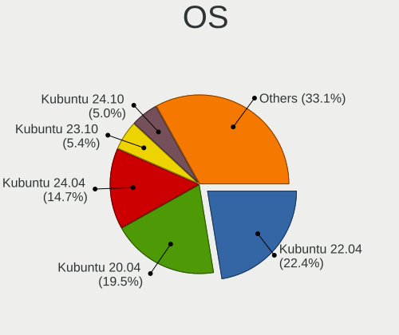

| Name             | Notebooks | Percent |
|------------------|-----------|---------|
| Kubuntu 22.04    | 894       | 22.42%  |
| Kubuntu 20.04    | 776       | 19.46%  |
| Kubuntu 24.04    | 585       | 14.67%  |
| Kubuntu 23.10    | 214       | 5.37%   |
| Kubuntu 24.10    | 200       | 5.02%   |
| Kubuntu 25.04    | 168       | 4.21%   |
| Kubuntu 23.04    | 167       | 4.19%   |
| Kubuntu 22.10    | 157       | 3.94%   |
| Kubuntu 21.10    | 151       | 3.79%   |
| Kubuntu 20.10    | 144       | 3.61%   |
| Kubuntu 21.04    | 126       | 3.16%   |
| Kubuntu 19.10    | 106       | 2.66%   |
| Kubuntu 18.04    | 104       | 2.61%   |
| Kubuntu 25.10    | 86        | 2.16%   |
| Kubuntu 11       | 48        | 1.2%    |
| Kubuntu 11.1     | 18        | 0.45%   |
| Kubuntu 19.04    | 9         | 0.23%   |
| Kubuntu 24.04.2  | 4         | 0.1%    |
| Kubuntu 2.0      | 4         | 0.1%    |
| Kubuntu 16.04    | 4         | 0.1%    |
| Kubuntu 11.25.10 | 4         | 0.1%    |
| Kubuntu 2.1      | 3         | 0.08%   |
| Kubuntu 18.10    | 3         | 0.08%   |
| Kubuntu 14.04    | 3         | 0.08%   |
| Kubuntu          | 2         | 0.05%   |
| Kubuntu 26.04    | 1         | 0.03%   |
| Kubuntu 2025.3   | 1         | 0.03%   |
| Kubuntu 2024.2   | 1         | 0.03%   |
| Kubuntu 2024.1   | 1         | 0.03%   |
| Kubuntu 20.08.3  | 1         | 0.03%   |
| Kubuntu 17.10    | 1         | 0.03%   |
| Kubuntu 17.04    | 1         | 0.03%   |
| Kubuntu 11.25.12 | 1         | 0.03%   |

OS Family
---------

OS without a version

| Name    | Notebooks | Percent |
|---------|-----------|---------|
| Kubuntu | 3790      | 100%    |

Kernel
------

Version of the Linux kernel

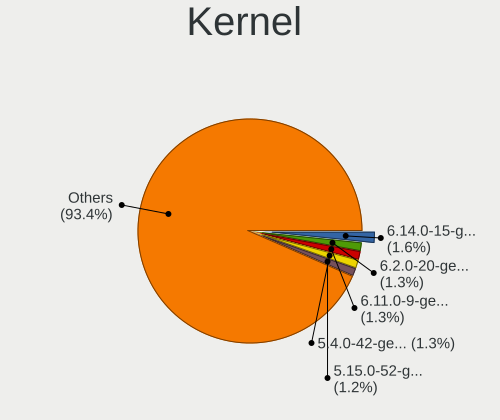

| Version           | Notebooks | Percent |
|-------------------|-----------|---------|
| 6.14.0-15-generic | 71        | 1.62%   |
| 6.2.0-20-generic  | 55        | 1.26%   |
| 6.11.0-9-generic  | 55        | 1.26%   |
| 5.4.0-42-generic  | 55        | 1.26%   |
| 5.15.0-52-generic | 51        | 1.17%   |
| 6.8.0-31-generic  | 48        | 1.1%    |
| 6.5.0-14-generic  | 48        | 1.1%    |
| 5.15.0-56-generic | 45        | 1.03%   |
| 6.8.0-51-generic  | 42        | 0.96%   |
| 6.8.0-41-generic  | 42        | 0.96%   |
| 6.2.0-26-generic  | 41        | 0.94%   |
| 5.19.0-35-generic | 38        | 0.87%   |
| 6.8.0-45-generic  | 36        | 0.82%   |
| 6.11.0-8-generic  | 35        | 0.8%    |
| 5.4.0-52-generic  | 35        | 0.8%    |
| 5.13.0-39-generic | 35        | 0.8%    |
| 6.17.0-6-generic  | 34        | 0.78%   |
| 6.14.0-29-generic | 34        | 0.78%   |
| 5.4.0-48-generic  | 34        | 0.78%   |
| 6.14.0-27-generic | 30        | 0.69%   |
| 5.15.0-48-generic | 30        | 0.69%   |
| 6.2.0-34-generic  | 29        | 0.66%   |
| 6.5.0-26-generic  | 28        | 0.64%   |
| 5.19.0-26-generic | 28        | 0.64%   |
| 5.15.0-58-generic | 28        | 0.64%   |
| 6.8.0-35-generic  | 27        | 0.62%   |
| 5.4.0-58-generic  | 27        | 0.62%   |
| 5.13.0-28-generic | 27        | 0.62%   |
| 6.8.0-48-generic  | 26        | 0.59%   |
| 6.11.0-21-generic | 26        | 0.59%   |
| 5.15.0-46-generic | 26        | 0.59%   |
| 5.13.0-30-generic | 26        | 0.59%   |
| 6.5.0-15-generic  | 25        | 0.57%   |
| 6.11.0-13-generic | 25        | 0.57%   |
| 5.19.0-23-generic | 25        | 0.57%   |
| 6.5.0-9-generic   | 24        | 0.55%   |
| 6.5.0-28-generic  | 24        | 0.55%   |
| 6.5.0-10-generic  | 24        | 0.55%   |
| 5.4.0-40-generic  | 24        | 0.55%   |
| 5.19.0-38-generic | 24        | 0.55%   |

Kernel Family
-------------

Linux kernel without a distro release

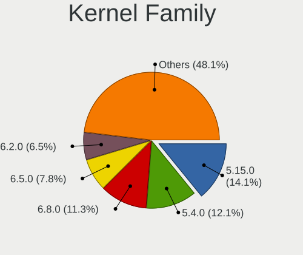

| Version | Notebooks | Percent |
|---------|-----------|---------|
| 5.15.0  | 575       | 14.11%  |
| 5.4.0   | 494       | 12.12%  |
| 6.8.0   | 462       | 11.34%  |
| 6.5.0   | 317       | 7.78%   |
| 6.2.0   | 266       | 6.53%   |
| 6.11.0  | 261       | 6.4%    |
| 5.13.0  | 258       | 6.33%   |
| 5.19.0  | 249       | 6.11%   |
| 6.14.0  | 239       | 5.87%   |
| 5.8.0   | 223       | 5.47%   |
| 5.11.0  | 185       | 4.54%   |
| 5.3.0   | 130       | 3.19%   |
| 6.17.0  | 80        | 1.96%   |
| 4.15.0  | 38        | 0.93%   |
| 5.0.0   | 17        | 0.42%   |
| 5.10.0  | 14        | 0.34%   |
| 5.17.0  | 11        | 0.27%   |
| 5.14.0  | 8         | 0.2%    |
| 6.6.0   | 7         | 0.17%   |
| 6.1.0   | 7         | 0.17%   |
| 5.6.0   | 7         | 0.17%   |
| 6.0.0   | 6         | 0.15%   |
| 6.0.9   | 5         | 0.12%   |
| 6.4.8   | 4         | 0.1%    |
| 6.14.7  | 4         | 0.1%    |
| 5.7.0   | 4         | 0.1%    |
| 4.4.0   | 4         | 0.1%    |
| 4.18.0  | 4         | 0.1%    |
| 6.8.1   | 3         | 0.07%   |
| 6.7.0   | 3         | 0.07%   |
| 6.3.8   | 3         | 0.07%   |
| 5.12.0  | 3         | 0.07%   |
| 6.9.9   | 2         | 0.05%   |
| 6.9.7   | 2         | 0.05%   |
| 6.9.3   | 2         | 0.05%   |
| 6.9.1   | 2         | 0.05%   |
| 6.8.9   | 2         | 0.05%   |
| 6.7.1   | 2         | 0.05%   |
| 6.6.2   | 2         | 0.05%   |
| 6.4.0   | 2         | 0.05%   |

Kernel Major Ver.
-----------------

Linux kernel major version

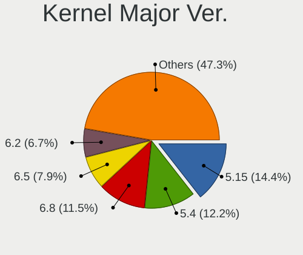

| Version | Notebooks | Percent |
|---------|-----------|---------|
| 5.15    | 586       | 14.42%  |
| 5.4     | 497       | 12.23%  |
| 6.8     | 467       | 11.49%  |
| 6.5     | 320       | 7.87%   |
| 6.2     | 274       | 6.74%   |
| 5.13    | 265       | 6.52%   |
| 6.11    | 263       | 6.47%   |
| 5.19    | 253       | 6.22%   |
| 6.14    | 245       | 6.03%   |
| 5.8     | 231       | 5.68%   |
| 5.11    | 189       | 4.65%   |
| 5.3     | 131       | 3.22%   |
| 6.17    | 83        | 2.04%   |
| 4.15    | 38        | 0.93%   |
| 6.1     | 18        | 0.44%   |
| 5.10    | 18        | 0.44%   |
| 6.6     | 17        | 0.42%   |
| 5.0     | 17        | 0.42%   |
| 5.17    | 14        | 0.34%   |
| 5.14    | 14        | 0.34%   |
| 6.3     | 13        | 0.32%   |
| 6.0     | 13        | 0.32%   |
| 5.12    | 9         | 0.22%   |
| 6.9     | 8         | 0.2%    |
| 6.7     | 8         | 0.2%    |
| 5.6     | 8         | 0.2%    |
| 6.4     | 7         | 0.17%   |
| 5.9     | 7         | 0.17%   |
| 5.7     | 6         | 0.15%   |
| 5.18    | 5         | 0.12%   |
| 5.16    | 5         | 0.12%   |
| 4.18    | 5         | 0.12%   |
| 6.13    | 4         | 0.1%    |
| 6.12    | 4         | 0.1%    |
| 6.10    | 4         | 0.1%    |
| 4.4     | 4         | 0.1%    |
| 5.5     | 3         | 0.07%   |
| 6.18    | 2         | 0.05%   |
| 6.16    | 2         | 0.05%   |
| 6.15    | 2         | 0.05%   |

Arch
----

OS architecture (x86_64, i586, etc.)

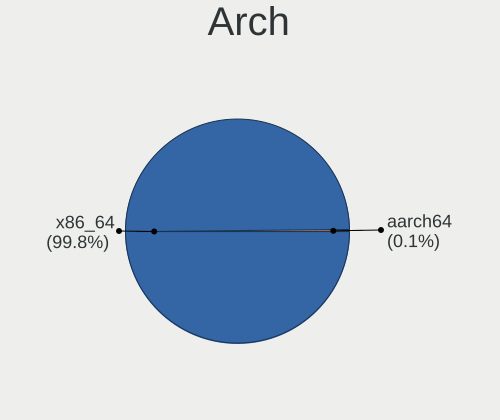

| Name    | Notebooks | Percent |
|---------|-----------|---------|
| x86_64  | 3784      | 99.84%  |
| i686    | 3         | 0.08%   |
| aarch64 | 3         | 0.08%   |

DE
--

Desktop Environment

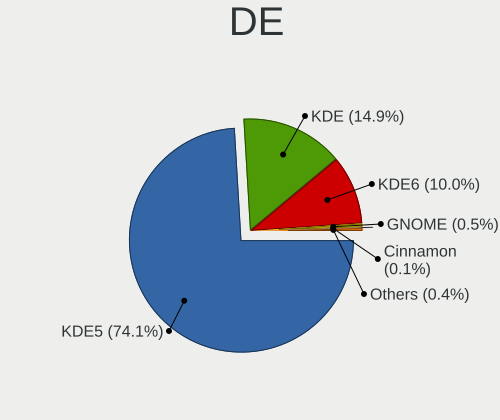

| Name       | Notebooks | Percent |
|------------|-----------|---------|
| KDE5       | 2855      | 74.06%  |
| KDE        | 574       | 14.89%  |
| KDE6       | 384       | 9.96%   |
| GNOME      | 21        | 0.54%   |
| Cinnamon   | 5         | 0.13%   |
| MATE       | 3         | 0.08%   |
| KDE4       | 3         | 0.08%   |
| Budgie     | 3         | 0.08%   |
| XFCE       | 1         | 0.03%   |
| X-Cinnamon | 1         | 0.03%   |
| Unity      | 1         | 0.03%   |
| LXQt       | 1         | 0.03%   |
| i3         | 1         | 0.03%   |
| GNUstep    | 1         | 0.03%   |
| Unknown    | 1         | 0.03%   |

Display Server
--------------

X11 or Wayland

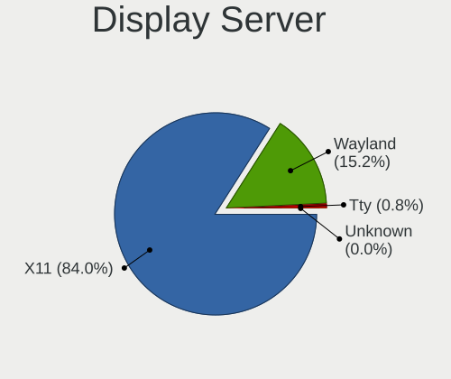

| Name    | Notebooks | Percent |
|---------|-----------|---------|
| X11     | 3232      | 84.04%  |
| Wayland | 584       | 15.18%  |
| Tty     | 29        | 0.75%   |
| Unknown | 1         | 0.03%   |

Display Manager
---------------

SDDM, LightDM, etc.

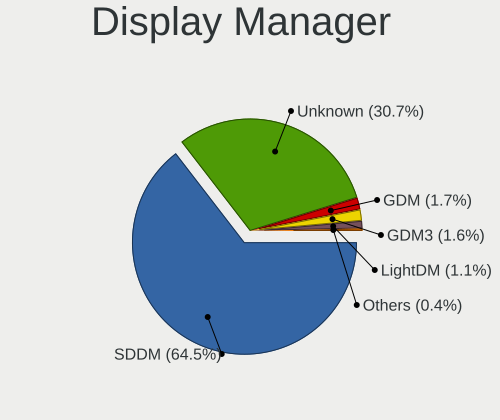

| Name    | Notebooks | Percent |
|---------|-----------|---------|
| SDDM    | 2487      | 64.55%  |
| Unknown | 1181      | 30.65%  |
| GDM     | 66        | 1.71%   |
| GDM3    | 63        | 1.64%   |
| LightDM | 42        | 1.09%   |
| TDM     | 11        | 0.29%   |
| SLiM    | 1         | 0.03%   |
| LXDM    | 1         | 0.03%   |
| KDM     | 1         | 0.03%   |

OS Lang
-------

Language

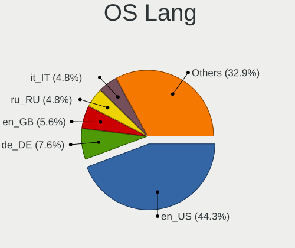

| Lang    | Notebooks | Percent |
|---------|-----------|---------|
| en_US   | 1693      | 44.32%  |
| de_DE   | 291       | 7.62%   |
| en_GB   | 214       | 5.6%    |
| ru_RU   | 184       | 4.82%   |
| it_IT   | 182       | 4.76%   |
| fr_FR   | 145       | 3.8%    |
| pt_BR   | 136       | 3.56%   |
| es_ES   | 91        | 2.38%   |
| en_IN   | 82        | 2.15%   |
| en_CA   | 79        | 2.07%   |
| C       | 63        | 1.65%   |
| pl_PL   | 62        | 1.62%   |
| en_AU   | 54        | 1.41%   |
| Unknown | 43        | 1.13%   |
| cs_CZ   | 31        | 0.81%   |
| es_MX   | 29        | 0.76%   |
| hu_HU   | 24        | 0.63%   |
| zh_CN   | 23        | 0.6%    |
| en_ZA   | 22        | 0.58%   |
| tr_TR   | 18        | 0.47%   |
| nl_NL   | 18        | 0.47%   |
| en_NZ   | 17        | 0.45%   |
| es_CL   | 15        | 0.39%   |
| ru_UA   | 14        | 0.37%   |
| es_AR   | 14        | 0.37%   |
| de_AT   | 13        | 0.34%   |
| pt_PT   | 12        | 0.31%   |
| es_CO   | 12        | 0.31%   |
| en_IE   | 12        | 0.31%   |
| sv_SE   | 11        | 0.29%   |
| fr_BE   | 10        | 0.26%   |
| fi_FI   | 10        | 0.26%   |
| de_CH   | 10        | 0.26%   |
| sk_SK   | 8         | 0.21%   |
| en_PH   | 8         | 0.21%   |
| da_DK   | 8         | 0.21%   |
| fr_CH   | 7         | 0.18%   |
| en_DK   | 7         | 0.18%   |
| nl_BE   | 6         | 0.16%   |
| ja_JP   | 6         | 0.16%   |

Boot Mode
---------

EFI or BIOS

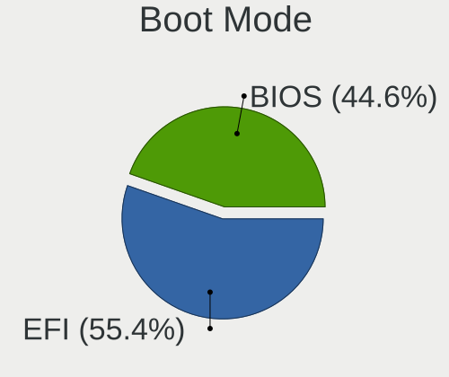

| Mode | Notebooks | Percent |
|------|-----------|---------|
| EFI  | 2133      | 55.36%  |
| BIOS | 1720      | 44.64%  |

Filesystem
----------

Type of filesystem

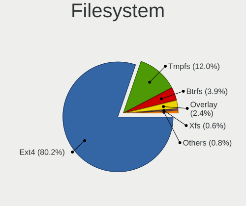

| Type    | Notebooks | Percent |
|---------|-----------|---------|
| Ext4    | 3077      | 80.23%  |
| Tmpfs   | 462       | 12.05%  |
| Btrfs   | 149       | 3.89%   |
| Overlay | 93        | 2.43%   |
| Xfs     | 23        | 0.6%    |
| Zfs     | 18        | 0.47%   |
| Unknown | 6         | 0.16%   |
| Ext2    | 4         | 0.1%    |
| Ext3    | 3         | 0.08%   |

Part. scheme
------------

Scheme of partitioning

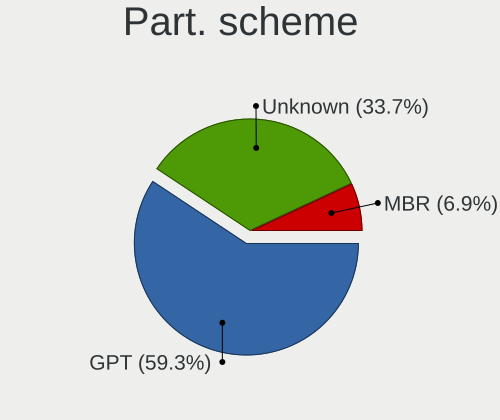

| Type    | Notebooks | Percent |
|---------|-----------|---------|
| GPT     | 2282      | 59.32%  |
| Unknown | 1298      | 33.74%  |
| MBR     | 267       | 6.94%   |

Dual Boot with Linux/BSD
------------------------

Hosting more than one Linux/BSD

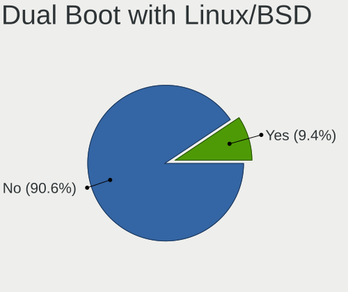

| Dual boot | Notebooks | Percent |
|-----------|-----------|---------|
| No        | 3462      | 90.63%  |
| Yes       | 358       | 9.37%   |

Dual Boot (Win)
---------------

Hosting Linux and Windows

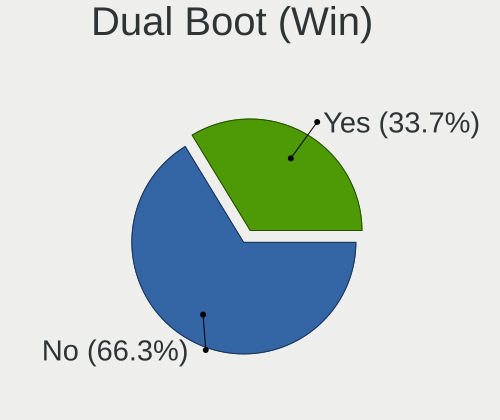

| Dual boot | Notebooks | Percent |
|-----------|-----------|---------|
| No        | 2541      | 66.29%  |
| Yes       | 1292      | 33.71%  |

Board
-----

Vendor
------

Motherboard manufacturer

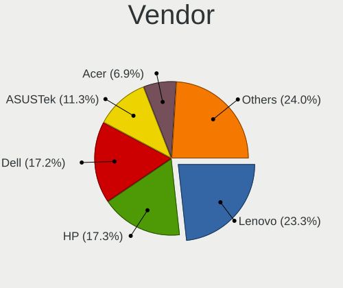

| Name                   | Notebooks | Percent |
|------------------------|-----------|---------|
| Lenovo                 | 882       | 23.27%  |
| Hewlett-Packard        | 654       | 17.26%  |
| Dell                   | 653       | 17.23%  |
| ASUSTek Computer       | 429       | 11.32%  |
| Acer                   | 262       | 6.91%   |
| MSI                    | 106       | 2.8%    |
| Apple                  | 85        | 2.24%   |
| HUAWEI                 | 71        | 1.87%   |
| Samsung Electronics    | 69        | 1.82%   |
| Toshiba                | 51        | 1.35%   |
| Notebook               | 38        | 1%      |
| Google                 | 33        | 0.87%   |
| Sony                   | 30        | 0.79%   |
| Unknown                | 28        | 0.74%   |
| TUXEDO                 | 25        | 0.66%   |
| Fujitsu                | 21        | 0.55%   |
| Alienware              | 20        | 0.53%   |
| Timi                   | 19        | 0.5%    |
| Gigabyte Technology    | 17        | 0.45%   |
| PC Specialist          | 16        | 0.42%   |
| Chuwi                  | 13        | 0.34%   |
| Medion                 | 12        | 0.32%   |
| Framework              | 12        | 0.32%   |
| Positivo               | 11        | 0.29%   |
| GPU Company            | 10        | 0.26%   |
| System76               | 9         | 0.24%   |
| Razer                  | 9         | 0.24%   |
| Panasonic              | 9         | 0.24%   |
| Packard Bell           | 9         | 0.24%   |
| LG Electronics         | 9         | 0.24%   |
| Schenker               | 8         | 0.21%   |
| HONOR                  | 8         | 0.21%   |
| Maibenben              | 6         | 0.16%   |
| Intel                  | 6         | 0.16%   |
| Avell High Performance | 6         | 0.16%   |
| MECHREVO               | 5         | 0.13%   |
| Fujitsu Siemens        | 5         | 0.13%   |
| Clevo                  | 5         | 0.13%   |
| Carbon Systems         | 5         | 0.13%   |
| Wortmann AG            | 4         | 0.11%   |

Model
-----

Motherboard model

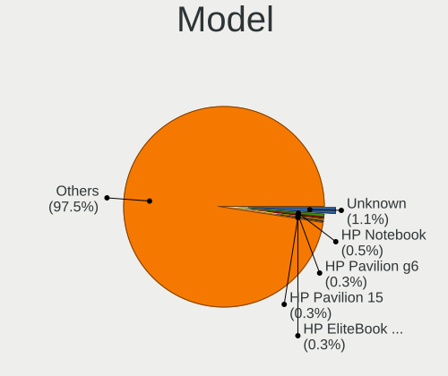

| Name                                | Notebooks | Percent |
|-------------------------------------|-----------|---------|
| Unknown                             | 41        | 1.08%   |
| HP Notebook                         | 20        | 0.53%   |
| HP Pavilion g6                      | 12        | 0.32%   |
| HP Pavilion 15                      | 10        | 0.26%   |
| HP EliteBook 840 G6                 | 10        | 0.26%   |
| HP EliteBook 840 G5                 | 10        | 0.26%   |
| Dell XPS 15 9560                    | 10        | 0.26%   |
| Dell Latitude 7490                  | 10        | 0.26%   |
| HUAWEI NBLK-WAX9X                   | 9         | 0.24%   |
| HP Pavilion Notebook                | 9         | 0.24%   |
| HP Pavilion dv6                     | 9         | 0.24%   |
| Dell XPS 15 7590                    | 9         | 0.24%   |
| HP Pavilion dv7                     | 8         | 0.21%   |
| Dell XPS 15 9570                    | 8         | 0.21%   |
| HUAWEI HVY-WXX9                     | 7         | 0.18%   |
| HP Pavilion Gaming Laptop 15-dk0xxx | 7         | 0.18%   |
| HP Laptop 15-fd0xxx                 | 7         | 0.18%   |
| HP EliteBook 840 G3                 | 7         | 0.18%   |
| HP 250 G7 Notebook PC               | 7         | 0.18%   |
| Dell XPS 15 9500                    | 7         | 0.18%   |
| Dell Latitude E6540                 | 7         | 0.18%   |
| Dell Latitude E6420                 | 7         | 0.18%   |
| Dell Latitude 5480                  | 7         | 0.18%   |
| Dell Latitude 5420                  | 7         | 0.18%   |
| Dell Inspiron 15-3567               | 7         | 0.18%   |
| Dell G3 3579                        | 7         | 0.18%   |
| Apple MacBookPro9,2                 | 7         | 0.18%   |
| Apple MacBookPro8,1                 | 7         | 0.18%   |
| Apple MacBookPro12,1                | 7         | 0.18%   |
| Apple MacBookAir7,2                 | 7         | 0.18%   |
| Lenovo Legion 5 Pro 16ACH6H 82JQ    | 6         | 0.16%   |
| Lenovo Legion 5 15ARH05H 82B1       | 6         | 0.16%   |
| Lenovo IdeaPad 330-15IKB 81DE       | 6         | 0.16%   |
| Lenovo G50-70 20351                 | 6         | 0.16%   |
| HUAWEI BOM-WXX9                     | 6         | 0.16%   |
| HP Pavilion g7                      | 6         | 0.16%   |
| HP Laptop 15-bw0xx                  | 6         | 0.16%   |
| HP 15                               | 6         | 0.16%   |
| GPU Company GWTC116-2               | 6         | 0.16%   |
| Dell XPS 13 9380                    | 6         | 0.16%   |

Model Family
------------

Motherboard model prefix

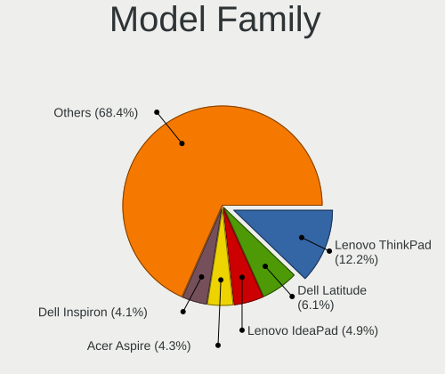

| Name               | Notebooks | Percent |
|--------------------|-----------|---------|
| Lenovo ThinkPad    | 461       | 12.16%  |
| Dell Latitude      | 232       | 6.12%   |
| Lenovo IdeaPad     | 187       | 4.93%   |
| Acer Aspire        | 162       | 4.27%   |
| Dell Inspiron      | 156       | 4.12%   |
| HP Pavilion        | 144       | 3.8%    |
| ASUS VivoBook      | 121       | 3.19%   |
| HP EliteBook       | 109       | 2.88%   |
| Dell XPS           | 103       | 2.72%   |
| HP ProBook         | 100       | 2.64%   |
| HP Laptop          | 97        | 2.56%   |
| Dell Precision     | 72        | 1.9%    |
| Lenovo Legion      | 56        | 1.48%   |
| ASUS ASUS          | 55        | 1.45%   |
| ASUS ROG           | 47        | 1.24%   |
| Toshiba Satellite  | 41        | 1.08%   |
| Acer Nitro         | 41        | 1.08%   |
| Unknown            | 41        | 1.08%   |
| Lenovo ThinkBook   | 38        | 1%      |
| HP ZBook           | 37        | 0.98%   |
| Dell Vostro        | 37        | 0.98%   |
| Acer Swift         | 29        | 0.77%   |
| HP ENVY            | 26        | 0.69%   |
| ASUS Zenbook       | 26        | 0.69%   |
| Lenovo Yoga        | 24        | 0.63%   |
| HP Notebook        | 20        | 0.53%   |
| Fujitsu LIFEBOOK   | 17        | 0.45%   |
| Dell G3            | 16        | 0.42%   |
| HP OMEN            | 15        | 0.4%    |
| HP 250             | 14        | 0.37%   |
| Apple MacBookPro11 | 14        | 0.37%   |
| HP 255             | 13        | 0.34%   |
| ASUS TUF           | 13        | 0.34%   |
| MSI Prestige       | 12        | 0.32%   |
| Framework Laptop   | 12        | 0.32%   |
| Acer Predator      | 12        | 0.32%   |
| HP Compaq          | 11        | 0.29%   |
| HP Victus          | 10        | 0.26%   |
| Apple MacBookPro9  | 10        | 0.26%   |
| Apple MacBookPro8  | 10        | 0.26%   |

MFG Year
--------

Motherboard manufacture year

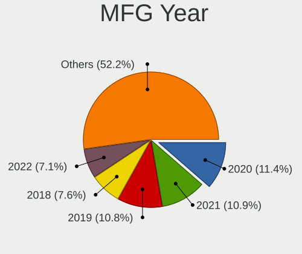

| Year    | Notebooks | Percent |
|---------|-----------|---------|
| 2020    | 432       | 11.4%   |
| 2021    | 413       | 10.9%   |
| 2019    | 409       | 10.79%  |
| 2018    | 289       | 7.63%   |
| 2022    | 268       | 7.07%   |
| 2017    | 244       | 6.44%   |
| 2012    | 227       | 5.99%   |
| 2013    | 224       | 5.91%   |
| 2023    | 201       | 5.3%    |
| 2011    | 199       | 5.25%   |
| 2014    | 196       | 5.17%   |
| 2016    | 166       | 4.38%   |
| 2015    | 142       | 3.75%   |
| 2024    | 95        | 2.51%   |
| 2010    | 95        | 2.51%   |
| 2008    | 81        | 2.14%   |
| 2009    | 44        | 1.16%   |
| 2025    | 31        | 0.82%   |
| 2007    | 24        | 0.63%   |
| 2006    | 7         | 0.18%   |
| Unknown | 3         | 0.08%   |

Form Factor
-----------

Physical design of the computer

| Name     | Notebooks | Percent |
|----------|-----------|---------|
| Notebook | 3790      | 100%    |

Secure Boot
-----------

Enabled or disabled

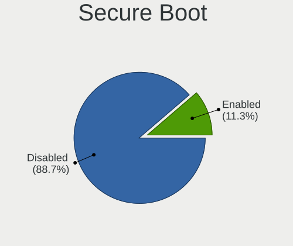

| State    | Notebooks | Percent |
|----------|-----------|---------|
| Disabled | 3392      | 88.7%   |
| Enabled  | 432       | 11.3%   |

Coreboot
--------

Have coreboot on board

| Used | Notebooks | Percent |
|------|-----------|---------|
| No   | 3748      | 98.89%  |
| Yes  | 42        | 1.11%   |

RAM Size
--------

Total RAM memory

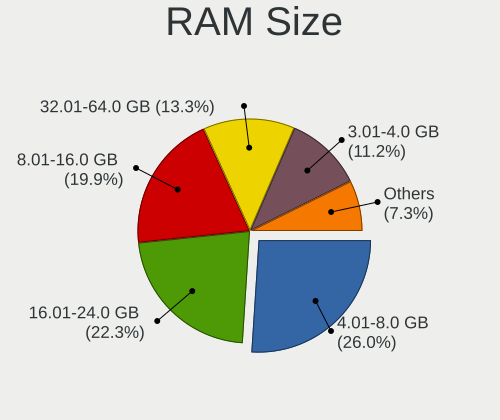

| Size in GB  | Notebooks | Percent |
|-------------|-----------|---------|
| 4.01-8.0    | 995       | 26.03%  |
| 16.01-24.0  | 853       | 22.31%  |
| 8.01-16.0   | 760       | 19.88%  |
| 32.01-64.0  | 507       | 13.26%  |
| 3.01-4.0    | 428       | 11.2%   |
| 24.01-32.0  | 111       | 2.9%    |
| 64.01-256.0 | 95        | 2.48%   |
| 1.01-2.0    | 52        | 1.36%   |
| 2.01-3.0    | 21        | 0.55%   |
| 0.51-1.0    | 1         | 0.03%   |

RAM Used
--------

Used RAM memory

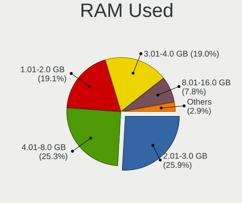

| Used GB    | Notebooks | Percent |
|------------|-----------|---------|
| 2.01-3.0   | 1066      | 25.92%  |
| 4.01-8.0   | 1039      | 25.27%  |
| 1.01-2.0   | 786       | 19.11%  |
| 3.01-4.0   | 783       | 19.04%  |
| 8.01-16.0  | 320       | 7.78%   |
| 0.51-1.0   | 49        | 1.19%   |
| 16.01-24.0 | 47        | 1.14%   |
| 24.01-32.0 | 16        | 0.39%   |
| 32.01-64.0 | 6         | 0.15%   |

Total Drives
------------

Number of drives on board

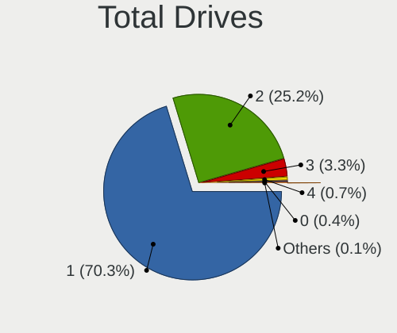

| Drives | Notebooks | Percent |
|--------|-----------|---------|
| 1      | 2713      | 70.3%   |
| 2      | 974       | 25.24%  |
| 3      | 126       | 3.27%   |
| 4      | 26        | 0.67%   |
| 0      | 16        | 0.41%   |
| 5      | 2         | 0.05%   |
| 7      | 1         | 0.03%   |
| 6      | 1         | 0.03%   |

Has CD-ROM
----------

Has CD-ROM on board

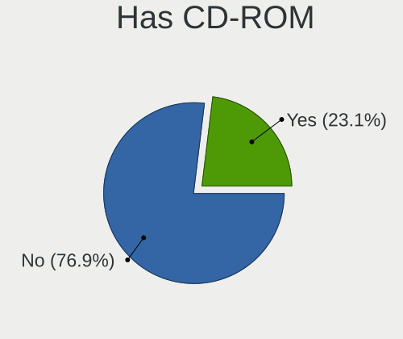

| Presented | Notebooks | Percent |
|-----------|-----------|---------|
| No        | 2924      | 76.93%  |
| Yes       | 877       | 23.07%  |

Has Ethernet
------------

Has Ethernet on board

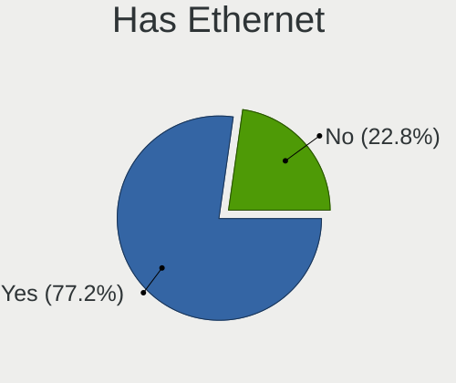

| Presented | Notebooks | Percent |
|-----------|-----------|---------|
| Yes       | 2938      | 77.23%  |
| No        | 866       | 22.77%  |

Has WiFi
--------

Has WiFi module

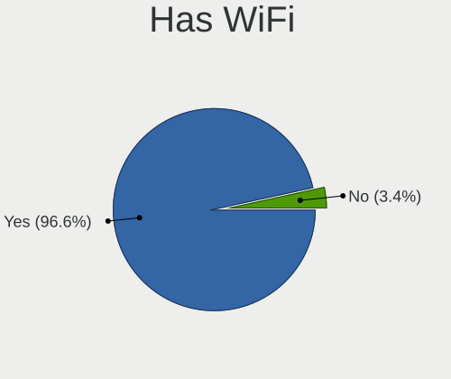

| Presented | Notebooks | Percent |
|-----------|-----------|---------|
| Yes       | 3661      | 96.57%  |
| No        | 130       | 3.43%   |

Has Bluetooth
-------------

Has Bluetooth module

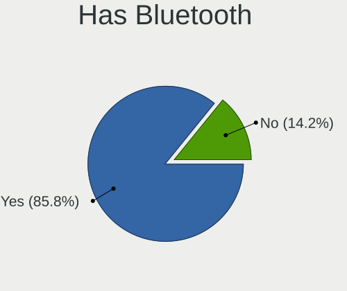

| Presented | Notebooks | Percent |
|-----------|-----------|---------|
| Yes       | 3281      | 85.85%  |
| No        | 541       | 14.15%  |

Location
--------

Country
-------

Geographic location (country)

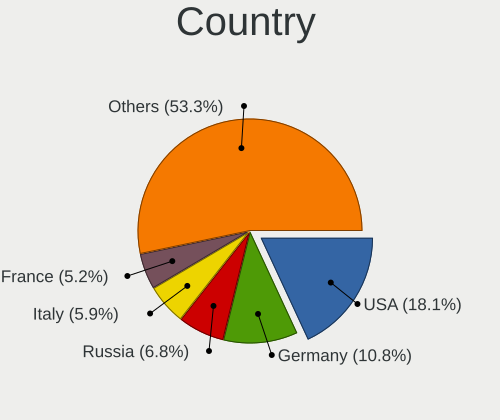

| Country      | Notebooks | Percent |
|--------------|-----------|---------|
| USA          | 688       | 18.09%  |
| Germany      | 409       | 10.75%  |
| Russia       | 257       | 6.76%   |
| Italy        | 225       | 5.91%   |
| France       | 198       | 5.21%   |
| Brazil       | 177       | 4.65%   |
| UK           | 158       | 4.15%   |
| Spain        | 131       | 3.44%   |
| Poland       | 106       | 2.79%   |
| India        | 96        | 2.52%   |
| Canada       | 93        | 2.44%   |
| Netherlands  | 73        | 1.92%   |
| Australia    | 59        | 1.55%   |
| Czechia      | 54        | 1.42%   |
| Mexico       | 51        | 1.34%   |
| Hungary      | 41        | 1.08%   |
| Ukraine      | 38        | 1%      |
| Belgium      | 38        | 1%      |
| Turkey       | 37        | 0.97%   |
| Indonesia    | 34        | 0.89%   |
| Switzerland  | 33        | 0.87%   |
| Sweden       | 32        | 0.84%   |
| China        | 32        | 0.84%   |
| Bulgaria     | 30        | 0.79%   |
| Romania      | 28        | 0.74%   |
| Argentina    | 28        | 0.74%   |
| South Africa | 27        | 0.71%   |
| Finland      | 27        | 0.71%   |
| Colombia     | 26        | 0.68%   |
| Portugal     | 25        | 0.66%   |
| Austria      | 24        | 0.63%   |
| Denmark      | 23        | 0.6%    |
| Chile        | 23        | 0.6%    |
| Greece       | 21        | 0.55%   |
| Slovenia     | 19        | 0.5%    |
| Slovakia     | 19        | 0.5%    |
| Norway       | 17        | 0.45%   |
| Iran         | 17        | 0.45%   |
| Croatia      | 17        | 0.45%   |
| New Zealand  | 16        | 0.42%   |

City
----

Geographic location (city)

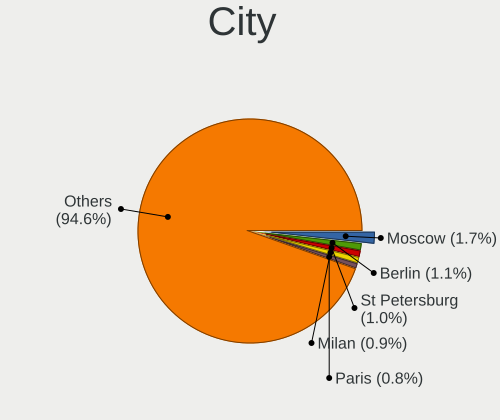

| City              | Notebooks | Percent |
|-------------------|-----------|---------|
| Moscow            | 69        | 1.73%   |
| Berlin            | 42        | 1.05%   |
| St Petersburg     | 38        | 0.95%   |
| Milan             | 37        | 0.93%   |
| Paris             | 30        | 0.75%   |
| Madrid            | 30        | 0.75%   |
| Warsaw            | 28        | 0.7%    |
| Hamburg           | 24        | 0.6%    |
| Sao Paulo         | 21        | 0.53%   |
| Budapest          | 21        | 0.53%   |
| Amsterdam         | 20        | 0.5%    |
| Sydney            | 19        | 0.48%   |
| Rome              | 19        | 0.48%   |
| Sofia             | 18        | 0.45%   |
| Munich            | 18        | 0.45%   |
| Frankfurt am Main | 18        | 0.45%   |
| Cologne           | 18        | 0.45%   |
| Prague            | 16        | 0.4%    |
| Bengaluru         | 16        | 0.4%    |
| Santiago          | 15        | 0.38%   |
| Istanbul          | 14        | 0.35%   |
| Vienna            | 13        | 0.33%   |
| Minsk             | 13        | 0.33%   |
| Dallas            | 13        | 0.33%   |
| Milano            | 12        | 0.3%    |
| Belgrade          | 12        | 0.3%    |
| Zurich            | 11        | 0.28%   |
| Seattle           | 11        | 0.28%   |
| Rio de Janeiro    | 11        | 0.28%   |
| Montreal          | 11        | 0.28%   |
| Melbourne         | 11        | 0.28%   |
| Kyiv              | 11        | 0.28%   |
| Jakarta           | 11        | 0.28%   |
| Helsinki          | 11        | 0.28%   |
| Dublin            | 11        | 0.28%   |
| Chennai           | 11        | 0.28%   |
| Birmingham        | 11        | 0.28%   |
| Phoenix           | 10        | 0.25%   |
| Los Angeles       | 10        | 0.25%   |
| Atlanta           | 10        | 0.25%   |

Drives
------

Drive Vendor
------------

Hard drive vendors

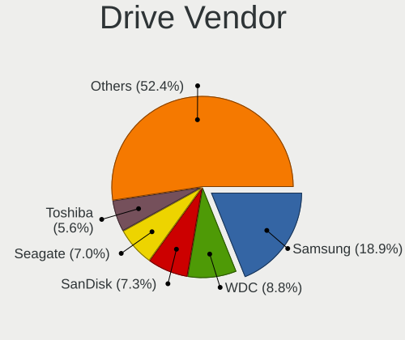

| Vendor                      | Notebooks | Drives | Percent |
|-----------------------------|-----------|--------|---------|
| Samsung Electronics         | 924       | 1204   | 18.92%  |
| WDC                         | 428       | 508    | 8.76%   |
| SanDisk                     | 355       | 435    | 7.27%   |
| Seagate                     | 343       | 435    | 7.02%   |
| Toshiba                     | 276       | 347    | 5.65%   |
| SK hynix                    | 270       | 313    | 5.53%   |
| Kingston                    | 269       | 313    | 5.51%   |
| Unknown                     | 222       | 273    | 4.54%   |
| Micron Technology           | 191       | 236    | 3.91%   |
| Intel                       | 183       | 245    | 3.75%   |
| Crucial                     | 171       | 213    | 3.5%    |
| HGST                        | 113       | 132    | 2.31%   |
| KIOXIA                      | 98        | 119    | 2.01%   |
| Hitachi                     | 68        | 73     | 1.39%   |
| A-DATA Technology           | 59        | 68     | 1.21%   |
| Apple                       | 58        | 75     | 1.19%   |
| China                       | 47        | 60     | 0.96%   |
| Silicon Motion              | 42        | 46     | 0.86%   |
| Kingston Technology Company | 39        | 41     | 0.8%    |
| SPCC                        | 34        | 47     | 0.7%    |
| Phison Electronics          | 33        | 37     | 0.68%   |
| Micron/Crucial Technology   | 30        | 34     | 0.61%   |
| LITEON                      | 30        | 31     | 0.61%   |
| Unknown                     | 29        | 31     | 0.59%   |
| PNY                         | 23        | 27     | 0.47%   |
| Phison                      | 21        | 22     | 0.43%   |
| Intenso                     | 19        | 23     | 0.39%   |
| Patriot                     | 18        | 20     | 0.37%   |
| LITEONIT                    | 18        | 20     | 0.37%   |
| JMicron Technology          | 18        | 19     | 0.37%   |
| Transcend                   | 15        | 17     | 0.31%   |
| Team                        | 15        | 16     | 0.31%   |
| Netac                       | 15        | 17     | 0.31%   |
| SSSTC                       | 14        | 14     | 0.29%   |
| Fujitsu                     | 14        | 17     | 0.29%   |
| Lexar                       | 13        | 13     | 0.27%   |
| KingSpec                    | 13        | 19     | 0.27%   |
| Apacer                      | 12        | 12     | 0.25%   |
| UMIS                        | 11        | 15     | 0.23%   |
| Corsair                     | 11        | 11     | 0.23%   |

Drive Model
-----------

Hard drive models

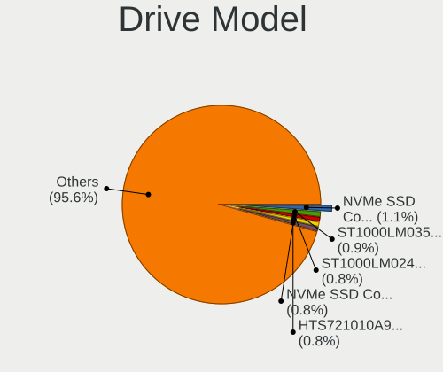

| Model                                              | Notebooks | Percent |
|----------------------------------------------------|-----------|---------|
| Samsung NVMe SSD Controller SM981/PM981/PM983 1TB  | 55        | 1.08%   |
| Seagate ST1000LM035-1RK172 1TB                     | 47        | 0.92%   |
| Seagate ST1000LM024 HN-M101MBB 1TB                 | 40        | 0.78%   |
| Samsung NVMe SSD Controller PM9A1/PM9A3/980PRO 1TB | 40        | 0.78%   |
| HGST HTS721010A9E630 1TB                           | 40        | 0.78%   |
| Unknown MMC Card  32GB                             | 38        | 0.75%   |
| Toshiba MQ01ABD100 1TB                             | 36        | 0.71%   |
| Samsung SSD 860 EVO 500GB                          | 34        | 0.67%   |
| Kingston SA400S37240G 240GB SSD                    | 34        | 0.67%   |
| Toshiba MQ04ABF100 1TB                             | 33        | 0.65%   |
| Kingston SA400S37480G 480GB SSD                    | 32        | 0.63%   |
| Unknown MMC Card  64GB                             | 31        | 0.61%   |
| SanDisk NVMe SSD Drive 1TB                         | 31        | 0.61%   |
| Unknown                                            | 29        | 0.57%   |
| Seagate ST500LT012-1DG142 500GB                    | 24        | 0.47%   |
| SanDisk NVMe SSD Drive 512GB                       | 24        | 0.47%   |
| Samsung SSD 850 EVO 500GB                          | 23        | 0.45%   |
| Samsung NVMe SSD Drive 512GB                       | 21        | 0.41%   |
| SanDisk SSD PLUS 240GB                             | 20        | 0.39%   |
| Samsung SSD 860 EVO 1TB                            | 20        | 0.39%   |
| Intel SSDPEKNU512GZ 512GB                          | 20        | 0.39%   |
| Intel SSD 660P Series 512GB                        | 20        | 0.39%   |
| Unknown MMC Card  128GB                            | 18        | 0.35%   |
| Sandisk WD Black SN750 / PC SN730 NVMe SSD 500GB   | 18        | 0.35%   |
| Samsung SSD 970 EVO Plus 500GB                     | 18        | 0.35%   |
| HGST HTS541010A9E680 1TB                           | 18        | 0.35%   |
| Sandisk WD Blue SN550 NVMe SSD 1024GB              | 17        | 0.33%   |
| Samsung SSD 850 EVO 250GB                          | 17        | 0.33%   |
| Crucial CT500MX500SSD1 500GB                       | 17        | 0.33%   |
| Crucial CT1000BX500SSD1 1TB                        | 17        | 0.33%   |
| Crucial CT1000MX500SSD1 1TB                        | 16        | 0.31%   |
| WDC WD10SPZX-21Z10T0 1TB                           | 15        | 0.29%   |
| Toshiba MQ01ABF050 500GB                           | 15        | 0.29%   |
| Seagate ST2000LM007-1R8174 2TB                     | 15        | 0.29%   |
| SanDisk NVMe SSD Drive 2TB                         | 15        | 0.29%   |
| SanDisk NVMe SSD Drive 256GB                       | 15        | 0.29%   |
| Samsung SSD 980 1TB                                | 15        | 0.29%   |
| Micron/Crucial P2 NVMe PCIe SSD 2TB                | 15        | 0.29%   |
| Intel SSDPEKNW512G8 512GB                          | 15        | 0.29%   |
| Crucial CT480BX500SSD1 480GB                       | 15        | 0.29%   |

HDD Vendor
----------

Hard disk drive vendors

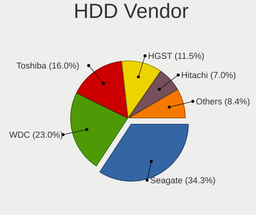

| Vendor              | Notebooks | Drives | Percent |
|---------------------|-----------|--------|---------|
| Seagate             | 335       | 423    | 34.25%  |
| WDC                 | 225       | 256    | 23.01%  |
| Toshiba             | 156       | 191    | 15.95%  |
| HGST                | 112       | 131    | 11.45%  |
| Hitachi             | 68        | 73     | 6.95%   |
| Samsung Electronics | 15        | 18     | 1.53%   |
| Fujitsu             | 14        | 17     | 1.43%   |
| Unknown             | 13        | 15     | 1.33%   |
| JMicron Technology  | 10        | 10     | 1.02%   |
| External            | 6         | 7      | 0.61%   |
| Apple               | 5         | 5      | 0.51%   |
| TO Exter            | 3         | 3      | 0.31%   |
| SSK                 | 2         | 2      | 0.2%    |
| KESU                | 2         | 2      | 0.2%    |
| USB3.0              | 1         | 1      | 0.1%    |
| TDAS                | 1         | 1      | 0.1%    |
| StoreJet            | 1         | 1      | 0.1%    |
| SABRENT             | 1         | 2      | 0.1%    |
| ipTIME              | 1         | 1      | 0.1%    |
| Intenso             | 1         | 1      | 0.1%    |
| IET                 | 1         | 1      | 0.1%    |
| IB-AC703            | 1         | 1      | 0.1%    |
| HGST HTS            | 1         | 1      | 0.1%    |
| ASMT109x            | 1         | 1      | 0.1%    |
| ASMT                | 1         | 1      | 0.1%    |
| Apricorn            | 1         | 1      | 0.1%    |

SSD Vendor
----------

Solid state drive vendors

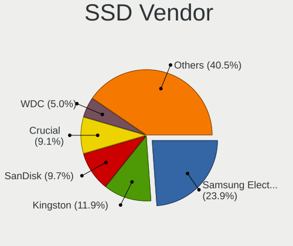

| Vendor              | Notebooks | Drives | Percent |
|---------------------|-----------|--------|---------|
| Samsung Electronics | 353       | 460    | 23.85%  |
| Kingston            | 176       | 203    | 11.89%  |
| SanDisk             | 144       | 173    | 9.73%   |
| Crucial             | 134       | 173    | 9.05%   |
| WDC                 | 74        | 101    | 5%      |
| China               | 46        | 59     | 3.11%   |
| SK hynix            | 35        | 36     | 2.36%   |
| Micron Technology   | 35        | 40     | 2.36%   |
| Intel               | 33        | 47     | 2.23%   |
| Apple               | 33        | 36     | 2.23%   |
| A-DATA Technology   | 32        | 34     | 2.16%   |
| SPCC                | 30        | 39     | 2.03%   |
| Toshiba             | 29        | 43     | 1.96%   |
| LITEON              | 25        | 25     | 1.69%   |
| PNY                 | 20        | 24     | 1.35%   |
| LITEONIT            | 18        | 20     | 1.22%   |
| Patriot             | 17        | 19     | 1.15%   |
| Intenso             | 15        | 19     | 1.01%   |
| Transcend           | 14        | 16     | 0.95%   |
| KingSpec            | 13        | 19     | 0.88%   |
| Team                | 12        | 12     | 0.81%   |
| Apacer              | 12        | 12     | 0.81%   |
| SABRENT             | 9         | 12     | 0.61%   |
| Netac               | 9         | 9      | 0.61%   |
| Lexar               | 8         | 8      | 0.54%   |
| Unknown             | 8         | 9      | 0.54%   |
| Verbatim            | 7         | 8      | 0.47%   |
| Goodram             | 7         | 7      | 0.47%   |
| Emtec               | 6         | 7      | 0.41%   |
| Dogfish             | 6         | 6      | 0.41%   |
| Corsair             | 6         | 6      | 0.41%   |
| OCZ                 | 4         | 4      | 0.27%   |
| Zheino              | 3         | 5      | 0.2%    |
| Seagate             | 3         | 5      | 0.2%    |
| Kimtigo             | 3         | 3      | 0.2%    |
| FORESEE             | 3         | 3      | 0.2%    |
| ASMT                | 3         | 4      | 0.2%    |
| XrayDisk            | 2         | 2      | 0.14%   |
| StoreJet            | 2         | 2      | 0.14%   |
| Smart               | 2         | 2      | 0.14%   |

Drive Kind
----------

HDD or SSD

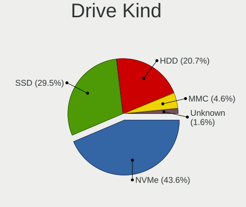

| Kind    | Notebooks | Drives | Percent |
|---------|-----------|--------|---------|
| NVMe    | 2009      | 2644   | 43.63%  |
| SSD     | 1358      | 1826   | 29.49%  |
| HDD     | 951       | 1166   | 20.65%  |
| MMC     | 214       | 261    | 4.65%   |
| Unknown | 73        | 86     | 1.59%   |

Drive Connector
---------------

SATA, SAS, NVMe, etc.

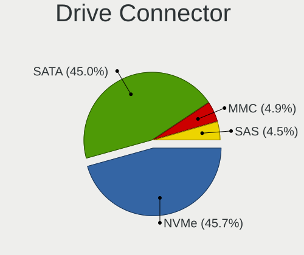

| Type | Notebooks | Drives | Percent |
|------|-----------|--------|---------|
| NVMe | 2009      | 2634   | 45.68%  |
| SATA | 1978      | 2829   | 44.97%  |
| MMC  | 214       | 261    | 4.87%   |
| SAS  | 197       | 259    | 4.48%   |

Drive Size
----------

Size of hard drive

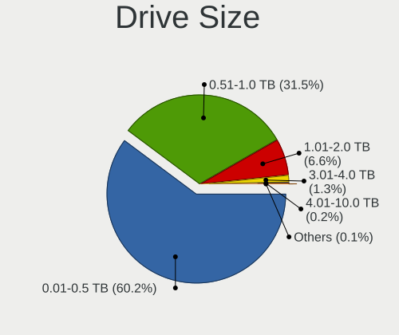

| Size in TB | Notebooks | Drives | Percent |
|------------|-----------|--------|---------|
| 0.01-0.5   | 1381      | 1826   | 60.2%   |
| 0.51-1.0   | 723       | 920    | 31.52%  |
| 1.01-2.0   | 152       | 198    | 6.63%   |
| 3.01-4.0   | 30        | 40     | 1.31%   |
| 4.01-10.0  | 5         | 5      | 0.22%   |
| 2.01-3.0   | 2         | 2      | 0.09%   |
| 10.01-20.0 | 1         | 1      | 0.04%   |

Space Total
-----------

Amount of disk space available on the file system

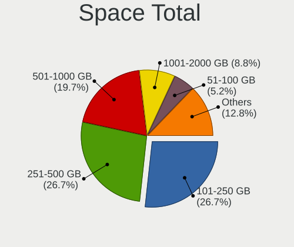

| Size in GB     | Notebooks | Percent |
|----------------|-----------|---------|
| 101-250        | 1049      | 26.72%  |
| 251-500        | 1047      | 26.67%  |
| 501-1000       | 774       | 19.71%  |
| 1001-2000      | 347       | 8.84%   |
| 51-100         | 206       | 5.25%   |
| 1-20           | 186       | 4.74%   |
| 21-50          | 100       | 2.55%   |
| 2001-3000      | 95        | 2.42%   |
| More than 3000 | 93        | 2.37%   |
| Unknown        | 29        | 0.74%   |

Space Used
----------

Amount of used disk space

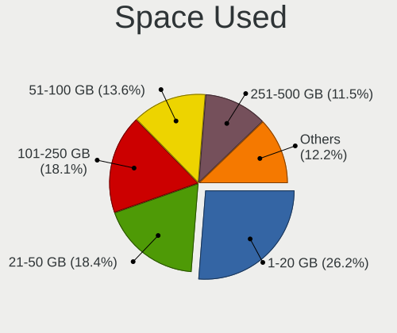

| Used GB        | Notebooks | Percent |
|----------------|-----------|---------|
| 1-20           | 1066      | 26.24%  |
| 21-50          | 747       | 18.39%  |
| 101-250        | 734       | 18.07%  |
| 51-100         | 551       | 13.56%  |
| 251-500        | 469       | 11.55%  |
| 501-1000       | 302       | 7.43%   |
| 1001-2000      | 115       | 2.83%   |
| Unknown        | 29        | 0.71%   |
| More than 3000 | 26        | 0.64%   |
| 2001-3000      | 23        | 0.57%   |

Malfunc. Drives
---------------

Drive models with a malfunction

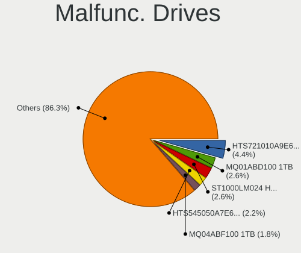

| Model                                 | Notebooks | Drives | Percent |
|---------------------------------------|-----------|--------|---------|
| HGST HTS721010A9E630 1TB              | 10        | 11     | 4.41%   |
| Toshiba MQ01ABD100 1TB                | 6         | 8      | 2.64%   |
| Seagate ST1000LM024 HN-M101MBB 1TB    | 6         | 12     | 2.64%   |
| HGST HTS545050A7E680 500GB            | 5         | 5      | 2.2%    |
| Toshiba MQ04ABF100 1TB                | 4         | 4      | 1.76%   |
| HGST HTS541010A9E680 1TB              | 4         | 4      | 1.76%   |
| Toshiba MQ01ABD075 752GB              | 3         | 5      | 1.32%   |
| SK hynix HFS256G39TND-N210A 256GB SSD | 3         | 3      | 1.32%   |
| Seagate ST500LT012-9WS142 500GB       | 3         | 3      | 1.32%   |
| Seagate ST500LT012-1DG142 500GB       | 3         | 3      | 1.32%   |
| Seagate ST1000LM048-2E7172 1TB        | 3         | 3      | 1.32%   |
| Seagate ST1000LM035-1RK172 1TB        | 3         | 3      | 1.32%   |
| SanDisk SSD PLUS 240GB                | 3         | 3      | 1.32%   |
| Kingston SV300S37A120G 120GB SSD      | 3         | 3      | 1.32%   |
| Hitachi HTS547575A9E384 752GB         | 3         | 3      | 1.32%   |
| Hitachi HTS547564A9E384 640GB         | 3         | 3      | 1.32%   |
| Hitachi HTS545050B9A300 500GB         | 3         | 3      | 1.32%   |
| WDC WD5000LPVX-75V0TT0 500GB          | 2         | 2      | 0.88%   |
| WDC WD10JPVX-60JC3T0 1TB              | 2         | 2      | 0.88%   |
| WDC WD Blue SA510 2.5 500GB           | 2         | 2      | 0.88%   |
| Toshiba THNSNK256GCS8 SATA 256GB SSD  | 2         | 2      | 0.88%   |
| Toshiba MK3259GSXP 320GB              | 2         | 3      | 0.88%   |
| SK hynix SC401 SATA 512GB SSD         | 2         | 2      | 0.88%   |
| SK hynix SC210 mSATA 256GB SSD        | 2         | 2      | 0.88%   |
| SK hynix BC711 HFM512GD3JX013N 512GB  | 2         | 2      | 0.88%   |
| SK hynix BC711 HFM256GD3JX013N 256GB  | 2         | 2      | 0.88%   |
| Seagate ST9500325AS 500GB             | 2         | 2      | 0.88%   |
| Seagate ST500LM012 HN-M500MBB 500GB   | 2         | 2      | 0.88%   |
| Seagate ST500LM000-1EJ162 500GB       | 2         | 2      | 0.88%   |
| Seagate ST2000LM007-1R8174 2TB        | 2         | 2      | 0.88%   |
| Kingston SA400S37480G 480GB SSD       | 2         | 2      | 0.88%   |
| HGST HTS725050A7E630 500GB            | 2         | 2      | 0.88%   |
| HGST HTS545050A7E380 500GB            | 2         | 2      | 0.88%   |
| Crucial CT500P1SSD8 500GB             | 2         | 2      | 0.88%   |
| Zheino CHN mSATA02M 256 256GB SSD     | 1         | 2      | 0.44%   |
| WDC WDS240G2G0B-00EPW0 240GB SSD      | 1         | 1      | 0.44%   |
| WDC WD6400BEVT-22A0RT0 640GB          | 1         | 1      | 0.44%   |
| WDC WD6400BEVT-00A0RT0 640GB          | 1         | 1      | 0.44%   |
| WDC WD5000LPVX-55V0TT0 500GB          | 1         | 1      | 0.44%   |
| WDC WD5000LPVT-24G33T1 500GB          | 1         | 1      | 0.44%   |

Malfunc. Drive Vendor
---------------------

Vendors of faulty drives

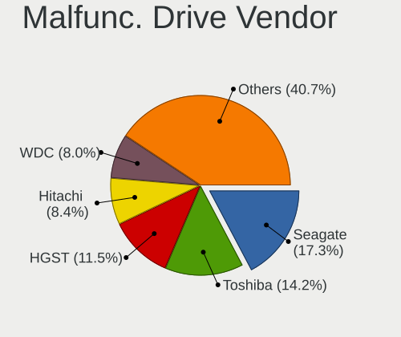

| Vendor                         | Notebooks | Drives | Percent |
|--------------------------------|-----------|--------|---------|
| Seagate                        | 39        | 49     | 17.26%  |
| Toshiba                        | 32        | 38     | 14.16%  |
| HGST                           | 26        | 27     | 11.5%   |
| Hitachi                        | 19        | 19     | 8.41%   |
| WDC                            | 18        | 18     | 7.96%   |
| Samsung Electronics            | 18        | 21     | 7.96%   |
| SK hynix                       | 15        | 15     | 6.64%   |
| Crucial                        | 9         | 10     | 3.98%   |
| SanDisk                        | 8         | 8      | 3.54%   |
| Kingston                       | 8         | 8      | 3.54%   |
| Micron Technology              | 6         | 6      | 2.65%   |
| A-DATA Technology              | 6         | 6      | 2.65%   |
| Team                           | 2         | 2      | 0.88%   |
| Intel                          | 2         | 5      | 0.88%   |
| Zheino                         | 1         | 2      | 0.44%   |
| VISIPRO                        | 1         | 2      | 0.44%   |
| T-FORCE                        | 1         | 1      | 0.44%   |
| SSSTC                          | 1         | 1      | 0.44%   |
| Solid State Storage Technology | 1         | 1      | 0.44%   |
| SABRENT                        | 1         | 1      | 0.44%   |
| R580                           | 1         | 1      | 0.44%   |
| Patriot                        | 1         | 1      | 0.44%   |
| Netac                          | 1         | 1      | 0.44%   |
| Mushkin                        | 1         | 1      | 0.44%   |
| MAXIO Technology (Hangzhou)    | 1         | 1      | 0.44%   |
| LITEONIT                       | 1         | 1      | 0.44%   |
| LITEON                         | 1         | 1      | 0.44%   |
| JMicron Technology             | 1         | 1      | 0.44%   |
| EDILOCA                        | 1         | 1      | 0.44%   |
| Drevo                          | 1         | 1      | 0.44%   |
| BAITITON                       | 1         | 3      | 0.44%   |
| ASENNO                         | 1         | 2      | 0.44%   |

Malfunc. HDD Vendor
-------------------

Vendors of faulty HDD drives

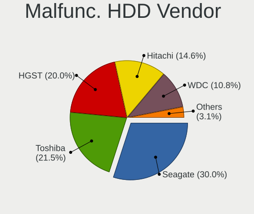

| Vendor              | Notebooks | Drives | Percent |
|---------------------|-----------|--------|---------|
| Seagate             | 39        | 49     | 30%     |
| Toshiba             | 28        | 34     | 21.54%  |
| HGST                | 26        | 27     | 20%     |
| Hitachi             | 19        | 19     | 14.62%  |
| WDC                 | 14        | 14     | 10.77%  |
| Samsung Electronics | 3         | 3      | 2.31%   |
| JMicron Technology  | 1         | 1      | 0.77%   |

Malfunc. Drive Kind
-------------------

Kinds of faulty drives

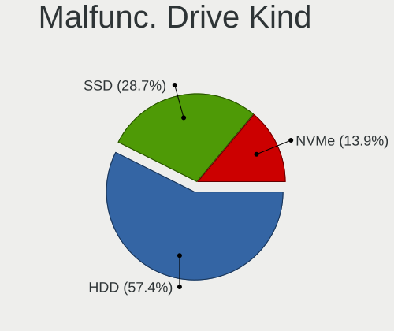

| Kind | Notebooks | Drives | Percent |
|------|-----------|--------|---------|
| HDD  | 128       | 147    | 57.4%   |
| SSD  | 64        | 74     | 28.7%   |
| NVMe | 31        | 34     | 13.9%   |

Failed Drives
-------------

Failed drive models

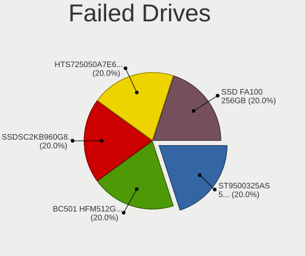

| Model                                   | Notebooks | Drives | Percent |
|-----------------------------------------|-----------|--------|---------|
| SK hynix BC501 HFM512GDJTNG-8310A 512GB | 1         | 1      | 20%     |
| Seagate ST9500325AS 500GB               | 1         | 1      | 20%     |
| Intel SSDSC2KB960G8 960GB               | 1         | 1      | 20%     |
| HGST HTS725050A7E630 500GB              | 1         | 1      | 20%     |
| Acer SSD FA100 256GB                    | 1         | 1      | 20%     |

Failed Drive Vendor
-------------------

Failed drive vendors

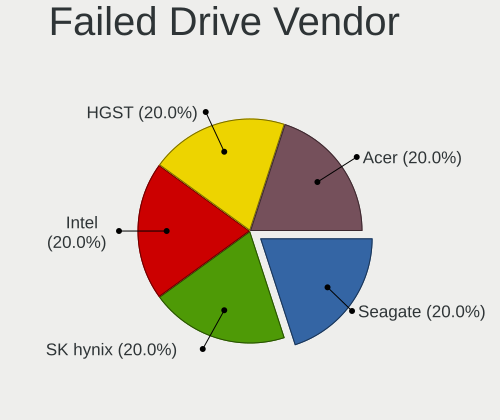

| Vendor   | Notebooks | Drives | Percent |
|----------|-----------|--------|---------|
| SK hynix | 1         | 1      | 20%     |
| Seagate  | 1         | 1      | 20%     |
| Intel    | 1         | 1      | 20%     |
| HGST     | 1         | 1      | 20%     |
| Acer     | 1         | 1      | 20%     |

Drive Status
------------

Number of failed and malfunc. drives

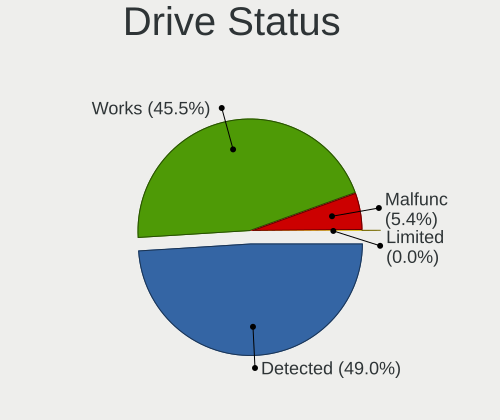

| Status   | Notebooks | Drives | Percent |
|----------|-----------|--------|---------|
| Detected | 2007      | 3199   | 49.01%  |
| Works    | 1862      | 2523   | 45.47%  |
| Malfunc  | 220       | 255    | 5.37%   |
| Failed   | 5         | 5      | 0.12%   |
| Limited  | 1         | 1      | 0.02%   |

Storage controller
------------------

Storage Vendor
--------------

Storage controller vendors

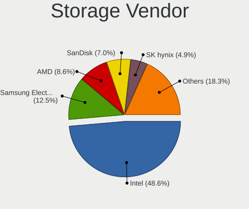

| Vendor                                  | Notebooks | Percent |
|-----------------------------------------|-----------|---------|
| Intel                                   | 2340      | 48.63%  |
| Samsung Electronics                     | 602       | 12.51%  |
| AMD                                     | 416       | 8.65%   |
| SanDisk                                 | 337       | 7%      |
| SK hynix                                | 236       | 4.9%    |
| Micron Technology                       | 159       | 3.3%    |
| Kingston Technology Company             | 133       | 2.76%   |
| Toshiba America Info Systems            | 102       | 2.12%   |
| KIOXIA                                  | 92        | 1.91%   |
| Phison Electronics                      | 67        | 1.39%   |
| Micron/Crucial Technology               | 63        | 1.31%   |
| Silicon Motion                          | 49        | 1.02%   |
| ADATA Technology                        | 36        | 0.75%   |
| Solid State Storage Technology          | 23        | 0.48%   |
| Realtek Semiconductor                   | 19        | 0.39%   |
| Union Memory (Shenzhen)                 | 18        | 0.37%   |
| Apple                                   | 16        | 0.33%   |
| Nvidia                                  | 13        | 0.27%   |
| Shenzhen Longsys Electronics            | 12        | 0.25%   |
| MAXIO Technology (Hangzhou)             | 12        | 0.25%   |
| Solidigm                                | 11        | 0.23%   |
| Lite-On Technology                      | 9         | 0.19%   |
| Yangtze Memory Technologies             | 6         | 0.12%   |
| Netac Technology                        | 6         | 0.12%   |
| Lenovo                                  | 5         | 0.1%    |
| Shenzhen Unionmemory Information System | 4         | 0.08%   |
| Marvell Technology Group                | 4         | 0.08%   |
| INNOGRIT                                | 4         | 0.08%   |
| Biwin Storage Technology                | 4         | 0.08%   |
| Unknown                                 | 3         | 0.06%   |
| JMicron Technology                      | 2         | 0.04%   |
| ASMedia Technology                      | 2         | 0.04%   |
| Zhaoxin                                 | 1         | 0.02%   |
| VIA Technologies                        | 1         | 0.02%   |
| Transcend                               | 1         | 0.02%   |
| Silicon Integrated Systems [SiS]        | 1         | 0.02%   |
| Silicon Image                           | 1         | 0.02%   |
| Shenzhen Techwinsemi Technology         | 1         | 0.02%   |
| Seagate Technology                      | 1         | 0.02%   |

Storage Model
-------------

Storage controller models

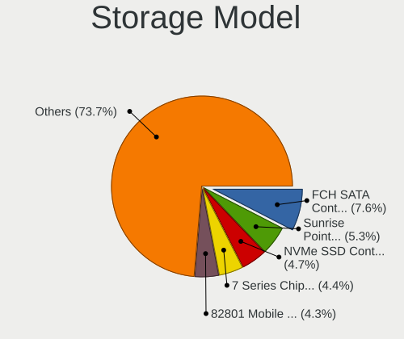

| Model                                                                          | Notebooks | Percent |
|--------------------------------------------------------------------------------|-----------|---------|
| AMD FCH SATA Controller [AHCI mode]                                            | 385       | 7.57%   |
| Intel Sunrise Point-LP SATA Controller [AHCI mode]                             | 269       | 5.29%   |
| Samsung NVMe SSD Controller SM981/PM981/PM983                                  | 240       | 4.72%   |
| Intel 7 Series Chipset Family 6-port SATA Controller [AHCI mode]               | 225       | 4.42%   |
| Intel 82801 Mobile SATA Controller [RAID mode]                                 | 221       | 4.34%   |
| Intel Volume Management Device NVMe RAID Controller                            | 174       | 3.42%   |
| Intel 6 Series/C200 Series Chipset Family 6 port Mobile SATA AHCI Controller   | 139       | 2.73%   |
| Intel Cannon Lake Mobile PCH SATA AHCI Controller                              | 136       | 2.67%   |
| Samsung NVMe SSD Controller 980 (DRAM-less)                                    | 135       | 2.65%   |
| Intel 8 Series/C220 Series Chipset Family 6-port SATA Controller 1 [AHCI mode] | 123       | 2.42%   |
| Samsung NVMe SSD Controller PM9A1/PM9A3/980PRO                                 | 115       | 2.26%   |
| Intel 8 Series SATA Controller 1 [AHCI mode]                                   | 114       | 2.24%   |
| Intel Wildcat Point-LP SATA Controller [AHCI Mode]                             | 92        | 1.81%   |
| Intel HM170/QM170 Chipset SATA Controller [AHCI Mode]                          | 75        | 1.47%   |
| SK hynix Gold P31/BC711/PC711 NVMe Solid State Drive                           | 73        | 1.43%   |
| Intel 82801IBM/IEM (ICH9M/ICH9M-E) 4 port SATA Controller [AHCI mode]          | 72        | 1.41%   |
| SanDisk Extreme Pro / WD Black SN750 / PC SN730 / Red SN700 NVMe SSD           | 69        | 1.36%   |
| Intel Celeron/Pentium Silver Processor SATA Controller                         | 69        | 1.36%   |
| Intel Tiger Lake-LP SATA Controller                                            | 67        | 1.32%   |
| Intel SSD 660P Series                                                          | 65        | 1.28%   |
| Intel Comet Lake SATA AHCI Controller                                          | 57        | 1.12%   |
| KIOXIA NVMe SSD Controller BG4 (DRAM-less)                                     | 55        | 1.08%   |
| Intel Cannon Point-LP SATA Controller [AHCI Mode]                              | 52        | 1.02%   |
| Toshiba America Info Systems XG6 NVMe SSD Controller                           | 47        | 0.92%   |
| SanDisk Ultra 3D / WD PC SN530, IX SN530, Blue SN550 NVMe SSD (DRAM-less)      | 46        | 0.9%    |
| Intel SSD 670p Series [Keystone Harbor]                                        | 45        | 0.88%   |
| Intel 400 Series Chipset Family SATA AHCI Controller                           | 44        | 0.86%   |
| Intel 5 Series/3400 Series Chipset 4 port SATA AHCI Controller                 | 43        | 0.84%   |
| SanDisk WD SN560/SN740/SN770/SN5000 NVMe SSD                                   | 42        | 0.83%   |
| Samsung NVMe SSD Controller SM961/PM961/SM963                                  | 41        | 0.81%   |
| SK hynix Platinum P41/PC801 NVMe Solid State Drive                             | 40        | 0.79%   |
| Micron/Crucial P2 [Nick P2] / P3 / P3 Plus NVMe PCIe SSD (DRAM-less)           | 36        | 0.71%   |
| Intel Ice Lake-LP SATA Controller [AHCI mode]                                  | 36        | 0.71%   |
| SK hynix BC501 NVMe Solid State Drive                                          | 35        | 0.69%   |
| SanDisk WD Blue SN500 / PC SN520 x2 M.2 2280 NVMe SSD                          | 34        | 0.67%   |
| Micron 2450 NVMe SSD [HendrixV] (DRAM-less)                                    | 34        | 0.67%   |
| Intel RST Volume Management Device Controller                                  | 33        | 0.65%   |
| Intel Q170/Q150/B150/H170/H110/Z170/CM236 Chipset SATA Controller [AHCI Mode]  | 33        | 0.65%   |
| Intel Alder Lake-P SATA AHCI Controller                                        | 32        | 0.63%   |
| Micron 2400 NVMe SSD (DRAM-less)                                               | 30        | 0.59%   |

Storage Kind
------------

Kind of storage controller (IDE, SATA, NVMe, SAS, ...)

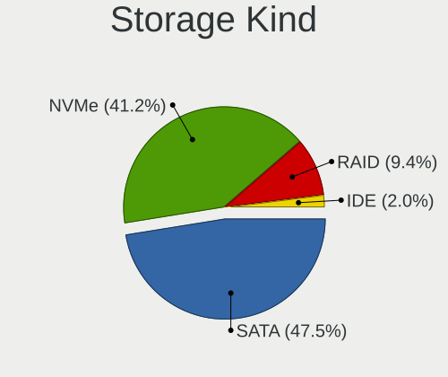

| Kind | Notebooks | Percent |
|------|-----------|---------|
| SATA | 2302      | 47.46%  |
| NVMe | 1998      | 41.2%   |
| RAID | 454       | 9.36%   |
| IDE  | 96        | 1.98%   |

Processor
---------

CPU Vendor
----------

Processor vendors

| Vendor       | Notebooks | Percent |
|--------------|-----------|---------|
| Intel        | 2964      | 78.21%  |
| AMD          | 822       | 21.69%  |
| Qualcomm     | 1         | 0.03%   |
| CentaurHauls | 1         | 0.03%   |
| ARM          | 1         | 0.03%   |
| Unknown      | 1         | 0.03%   |

CPU Model
---------

Processor models

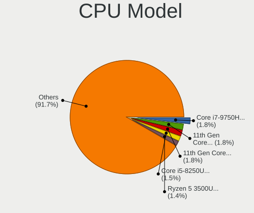

| Model                                         | Notebooks | Percent |
|-----------------------------------------------|-----------|---------|
| Intel Core i7-9750H CPU @ 2.60GHz             | 70        | 1.85%   |
| Intel 11th Gen Core i5-1135G7 @ 2.40GHz       | 69        | 1.82%   |
| Intel 11th Gen Core i7-1165G7 @ 2.80GHz       | 67        | 1.77%   |
| Intel Core i5-8250U CPU @ 1.60GHz             | 57        | 1.5%    |
| AMD Ryzen 5 3500U with Radeon Vega Mobile Gfx | 53        | 1.4%    |
| Intel Core i5-8265U CPU @ 1.60GHz             | 49        | 1.29%   |
| Intel Core i7-7700HQ CPU @ 2.80GHz            | 48        | 1.27%   |
| Intel Core i7-8565U CPU @ 1.80GHz             | 47        | 1.24%   |
| Intel Core i5-7200U CPU @ 2.50GHz             | 47        | 1.24%   |
| Intel Core i7-8750H CPU @ 2.20GHz             | 46        | 1.21%   |
| Intel Core i5-6200U CPU @ 2.30GHz             | 45        | 1.19%   |
| AMD Ryzen 7 5800H with Radeon Graphics        | 45        | 1.19%   |
| Intel Core i7-10750H CPU @ 2.60GHz            | 44        | 1.16%   |
| Intel Core i7-8550U CPU @ 1.80GHz             | 43        | 1.13%   |
| Intel Core i5-3320M CPU @ 2.60GHz             | 43        | 1.13%   |
| Intel Core i7-10510U CPU @ 1.80GHz            | 42        | 1.11%   |
| Intel 12th Gen Core i7-12700H                 | 42        | 1.11%   |
| AMD Ryzen 5 5500U with Radeon Graphics        | 38        | 1%      |
| Intel Core i5-10210U CPU @ 1.60GHz            | 37        | 0.98%   |
| AMD Ryzen 7 4800H with Radeon Graphics        | 37        | 0.98%   |
| Intel Celeron N4020 CPU @ 1.10GHz             | 34        | 0.9%    |
| AMD Ryzen 7 5700U with Radeon Graphics        | 34        | 0.9%    |
| Intel Core i7-7500U CPU @ 2.70GHz             | 32        | 0.84%   |
| Intel Core i7-6700HQ CPU @ 2.60GHz            | 30        | 0.79%   |
| Intel Core i7-1065G7 CPU @ 1.30GHz            | 30        | 0.79%   |
| Intel Core i5-2520M CPU @ 2.50GHz             | 29        | 0.76%   |
| Intel Core i7-5500U CPU @ 2.40GHz             | 27        | 0.71%   |
| Intel 11th Gen Core i7-11800H @ 2.30GHz       | 25        | 0.66%   |
| AMD Ryzen 5 4500U with Radeon Graphics        | 25        | 0.66%   |
| Intel Core i5-1035G1 CPU @ 1.00GHz            | 24        | 0.63%   |
| Intel Core i5-6300U CPU @ 2.40GHz             | 23        | 0.61%   |
| Intel Core i5-5300U CPU @ 2.30GHz             | 23        | 0.61%   |
| Intel Core i5-3210M CPU @ 2.50GHz             | 23        | 0.61%   |
| Intel Core i7-8650U CPU @ 1.90GHz             | 22        | 0.58%   |
| Intel Core i5-4210U CPU @ 1.70GHz             | 22        | 0.58%   |
| Intel Core i5-10300H CPU @ 2.50GHz            | 22        | 0.58%   |
| Intel Core i5-8300H CPU @ 2.30GHz             | 21        | 0.55%   |
| Intel Core i5-4200U CPU @ 1.60GHz             | 21        | 0.55%   |
| Intel 12th Gen Core i7-1260P                  | 21        | 0.55%   |
| Intel Core i5-9300H CPU @ 2.40GHz             | 20        | 0.53%   |

CPU Model Family
----------------

Processor model prefix

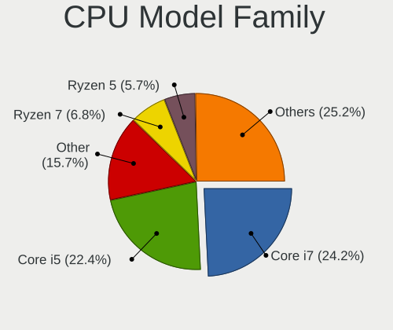

| Model                   | Notebooks | Percent |
|-------------------------|-----------|---------|
| Intel Core i7           | 918       | 24.22%  |
| Intel Core i5           | 849       | 22.4%   |
| Other                   | 594       | 15.67%  |
| AMD Ryzen 7             | 257       | 6.78%   |
| AMD Ryzen 5             | 217       | 5.72%   |
| Intel Core i3           | 191       | 5.04%   |
| Intel Celeron           | 150       | 3.96%   |
| Intel Core 2 Duo        | 79        | 2.08%   |
| Intel Core              | 52        | 1.37%   |
| AMD Ryzen 7 PRO         | 48        | 1.27%   |
| AMD Ryzen 9             | 46        | 1.21%   |
| Intel Pentium           | 45        | 1.19%   |
| AMD Ryzen 3             | 35        | 0.92%   |
| AMD A6                  | 35        | 0.92%   |
| Intel Core i9           | 23        | 0.61%   |
| AMD Ryzen 5 PRO         | 22        | 0.58%   |
| Intel Pentium Dual-Core | 21        | 0.55%   |
| AMD A10                 | 21        | 0.55%   |
| Intel Atom              | 20        | 0.53%   |
| Intel Pentium Silver    | 18        | 0.47%   |
| AMD A8                  | 17        | 0.45%   |
| AMD A4                  | 15        | 0.4%    |
| AMD E1                  | 12        | 0.32%   |
| AMD E                   | 9         | 0.24%   |
| AMD Athlon              | 9         | 0.24%   |
| Intel Xeon              | 8         | 0.21%   |
| Intel Genuine           | 8         | 0.21%   |
| Intel Core m3           | 8         | 0.21%   |
| AMD E2                  | 8         | 0.21%   |
| Intel Celeron Dual-Core | 7         | 0.18%   |
| AMD FX                  | 6         | 0.16%   |
| AMD A12                 | 6         | 0.16%   |
| Intel Pentium Dual      | 5         | 0.13%   |
| AMD Athlon II           | 5         | 0.13%   |
| Intel Pentium Gold      | 3         | 0.08%   |
| Intel Core 2            | 3         | 0.08%   |
| AMD Turion II           | 3         | 0.08%   |
| AMD Athlon II Dual-Core | 3         | 0.08%   |
| Intel Core M            | 2         | 0.05%   |
| AMD PRO A10             | 2         | 0.05%   |

CPU Cores
---------

Number of processor cores

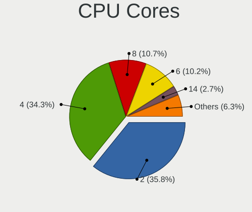

| Number | Notebooks | Percent |
|--------|-----------|---------|
| 2      | 1359      | 35.84%  |
| 4      | 1299      | 34.26%  |
| 8      | 406       | 10.71%  |
| 6      | 387       | 10.21%  |
| 14     | 103       | 2.72%   |
| 10     | 82        | 2.16%   |
| 12     | 70        | 1.85%   |
| 16     | 43        | 1.13%   |
| 24     | 22        | 0.58%   |
| 1      | 19        | 0.5%    |
| 5      | 2         | 0.05%   |

CPU Sockets
-----------

Number of sockets

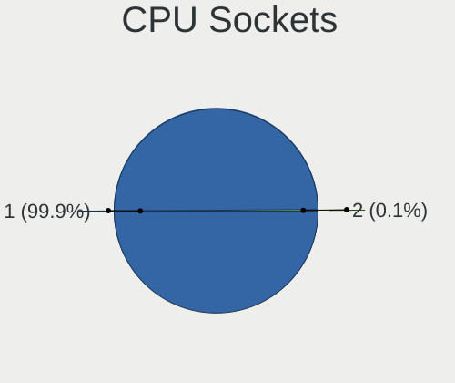

| Number | Notebooks | Percent |
|--------|-----------|---------|
| 1      | 3786      | 99.89%  |
| 2      | 4         | 0.11%   |

CPU Threads
-----------

Threads per core (Hyper-Threading)

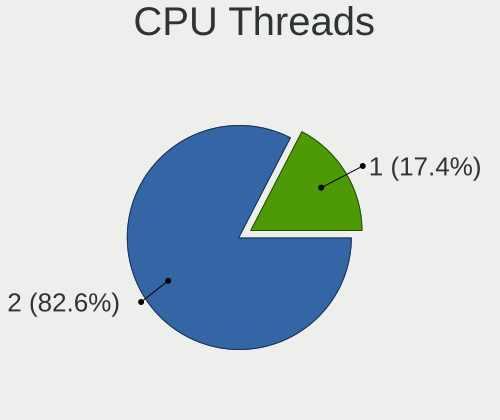

| Number | Notebooks | Percent |
|--------|-----------|---------|
| 2      | 3137      | 82.6%   |
| 1      | 661       | 17.4%   |

CPU Op-Modes
------------

CPU Operation Modes (32-bit, 64-bit)

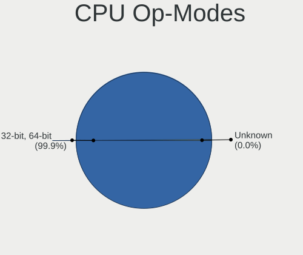

| Op mode        | Notebooks | Percent |
|----------------|-----------|---------|
| 32-bit, 64-bit | 3786      | 99.89%  |
| 64-bit         | 3         | 0.08%   |
| Unknown        | 1         | 0.03%   |

CPU Microcode
-------------

Microcode number

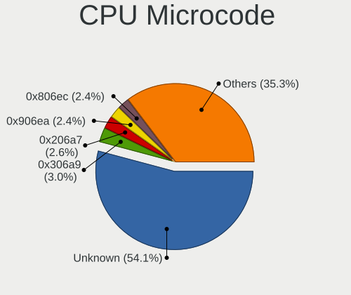

| Number     | Notebooks | Percent |
|------------|-----------|---------|
| Unknown    | 2101      | 54.15%  |
| 0x306a9    | 118       | 3.04%   |
| 0x206a7    | 101       | 2.6%    |
| 0x906ea    | 95        | 2.45%   |
| 0x806ec    | 94        | 2.42%   |
| 0x806c1    | 90        | 2.32%   |
| 0x806ea    | 86        | 2.22%   |
| 0x40651    | 75        | 1.93%   |
| 0x306c3    | 65        | 1.68%   |
| 0x806e9    | 60        | 1.55%   |
| 0x406e3    | 58        | 1.49%   |
| 0x0a50000c | 52        | 1.34%   |
| 0x08108109 | 46        | 1.19%   |
| 0x306d4    | 45        | 1.16%   |
| 0xa0652    | 40        | 1.03%   |
| 0x08600106 | 40        | 1.03%   |
| 0x1067a    | 38        | 0.98%   |
| 0x08108102 | 37        | 0.95%   |
| 0x906e9    | 36        | 0.93%   |
| 0x906a3    | 36        | 0.93%   |
| 0x706e5    | 33        | 0.85%   |
| 0x08608103 | 29        | 0.75%   |
| 0x506e3    | 28        | 0.72%   |
| 0x806eb    | 27        | 0.7%    |
| 0x20655    | 22        | 0.57%   |
| 0x806d1    | 21        | 0.54%   |
| 0x706a8    | 21        | 0.54%   |
| 0x706a1    | 20        | 0.52%   |
| 0x406c4    | 18        | 0.46%   |
| 0x0a404102 | 18        | 0.46%   |
| 0x30678    | 17        | 0.44%   |
| 0x0a50000d | 17        | 0.44%   |
| 0x08600104 | 17        | 0.44%   |
| 0x906ed    | 16        | 0.41%   |
| 0x08600103 | 14        | 0.36%   |
| 0x07030105 | 14        | 0.36%   |
| 0x06006705 | 14        | 0.36%   |
| 0x6fd      | 13        | 0.34%   |
| 0x03000027 | 13        | 0.34%   |
| 0x20652    | 12        | 0.31%   |

CPU Microarch
-------------

Microarchitecture

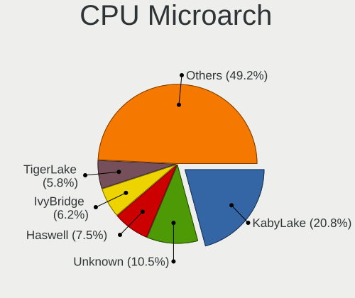

| Name               | Notebooks | Percent |
|--------------------|-----------|---------|
| KabyLake           | 791       | 20.83%  |
| Unknown            | 398       | 10.48%  |
| Haswell            | 283       | 7.45%   |
| IvyBridge          | 235       | 6.19%   |
| TigerLake          | 221       | 5.82%   |
| SandyBridge        | 182       | 4.79%   |
| Alderlake Hybrid   | 180       | 4.74%   |
| Skylake            | 177       | 4.66%   |
| Zen 3              | 152       | 4%      |
| Zen 2              | 135       | 3.55%   |
| Zen+               | 122       | 3.21%   |
| Broadwell          | 116       | 3.05%   |
| IceLake            | 102       | 2.69%   |
| CometLake          | 97        | 2.55%   |
| Penryn             | 92        | 2.42%   |
| Goldmont plus      | 80        | 2.11%   |
| Westmere           | 70        | 1.84%   |
| Silvermont         | 62        | 1.63%   |
| Excavator          | 51        | 1.34%   |
| Core               | 38        | 1%      |
| Puma               | 27        | 0.71%   |
| Zen                | 23        | 0.61%   |
| Goldmont           | 21        | 0.55%   |
| Bobcat             | 19        | 0.5%    |
| K10 Llano          | 17        | 0.45%   |
| Piledriver         | 15        | 0.39%   |
| Meteorlake Hybrid  | 14        | 0.37%   |
| Jaguar             | 13        | 0.34%   |
| K10                | 12        | 0.32%   |
| Nehalem            | 10        | 0.26%   |
| Lunarlake Hybrid   | 10        | 0.26%   |
| Bonnell            | 7         | 0.18%   |
| ArrowLake-H Hybrid | 7         | 0.18%   |
| Tremont            | 6         | 0.16%   |
| Gracemont          | 6         | 0.16%   |
| Steamroller        | 5         | 0.13%   |
| K8 & K10 hybrid    | 2         | 0.05%   |

Graphics
--------

GPU Vendor
----------

Vendors of graphics cards

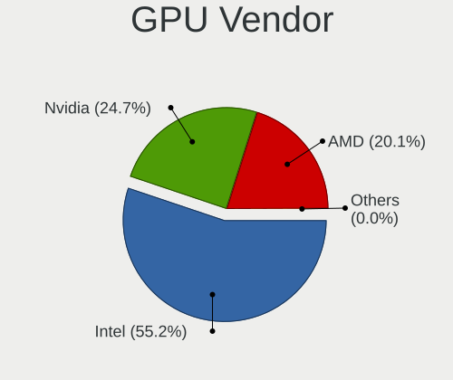

| Vendor                           | Notebooks | Percent |
|----------------------------------|-----------|---------|
| Intel                            | 2781      | 55.17%  |
| Nvidia                           | 1245      | 24.7%   |
| AMD                              | 1012      | 20.08%  |
| Zhaoxin                          | 1         | 0.02%   |
| Silicon Integrated Systems [SiS] | 1         | 0.02%   |
| ATI Technologies                 | 1         | 0.02%   |

GPU Model
---------

Graphics card models

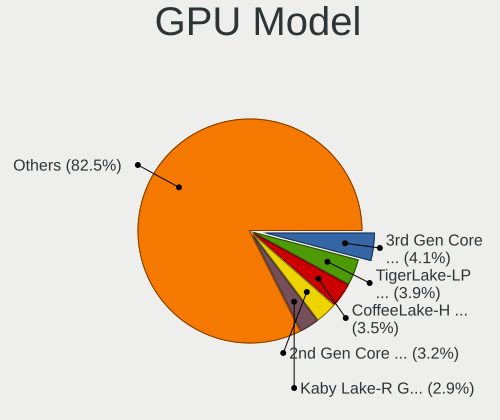

| Model                                                                                    | Notebooks | Percent |
|------------------------------------------------------------------------------------------|-----------|---------|
| Intel 3rd Gen Core processor Graphics Controller                                         | 210       | 4.09%   |
| Intel TigerLake-LP GT2 [Iris Xe Graphics]                                                | 198       | 3.86%   |
| Intel CoffeeLake-H GT2 [UHD Graphics 630]                                                | 180       | 3.5%    |
| Intel 2nd Generation Core Processor Family Integrated Graphics Controller                | 166       | 3.23%   |
| Intel Kaby Lake-R GT2 [UHD Graphics 620]                                                 | 147       | 2.86%   |
| AMD Renoir [Radeon Vega Series / Radeon Vega Mobile Series]                              | 133       | 2.59%   |
| Intel 4th Gen Core Processor Integrated Graphics Controller                              | 131       | 2.55%   |
| Intel Haswell-ULT Integrated Graphics Controller                                         | 129       | 2.51%   |
| AMD Picasso/Raven 2 [Radeon Vega Series / Radeon Vega Mobile Series]                     | 126       | 2.45%   |
| Intel WhiskeyLake-U GT2 [UHD Graphics 620]                                               | 125       | 2.43%   |
| Intel Kaby Lake-U GT2 [HD Graphics 620]                                                  | 121       | 2.36%   |
| Intel Skylake-U GT2 [HD Graphics 520]                                                    | 110       | 2.14%   |
| AMD Cezanne [Radeon Vega Series / Radeon Vega Mobile Series]                             | 108       | 2.1%    |
| Intel Broadwell-U GT2 [HD Graphics 5500]                                                 | 95        | 1.85%   |
| Intel Alder Lake-P GT2 [Iris Xe Graphics]                                                | 95        | 1.85%   |
| Nvidia TU117M [GeForce GTX 1650 Mobile / Max-Q]                                          | 94        | 1.83%   |
| Intel CometLake-U GT2 [UHD Graphics]                                                     | 94        | 1.83%   |
| Intel CometLake-H GT2 [UHD Graphics]                                                     | 85        | 1.65%   |
| AMD Lucienne                                                                             | 78        | 1.52%   |
| Intel Kaby Lake-H GT2 [HD Graphics 630]                                                  | 69        | 1.34%   |
| Intel GeminiLake [UHD Graphics 600]                                                      | 67        | 1.3%    |
| Intel Mobile 4 Series Chipset Integrated Graphics Controller                             | 61        | 1.19%   |
| Intel TigerLake-H GT1 [UHD Graphics]                                                     | 57        | 1.11%   |
| AMD Rembrandt [Radeon 680M]                                                              | 54        | 1.05%   |
| Nvidia GP107M [GeForce GTX 1050 Mobile]                                                  | 53        | 1.03%   |
| Intel Raptor Lake-P [Iris Xe Graphics]                                                   | 53        | 1.03%   |
| Nvidia GA106M [GeForce RTX 3060 Mobile / Max-Q]                                          | 52        | 1.01%   |
| Intel Skylake-H GT2 [HD Graphics 530]                                                    | 50        | 0.97%   |
| Nvidia GA107M [GeForce RTX 3050 Mobile]                                                  | 47        | 0.92%   |
| Intel Core Processor Integrated Graphics Controller                                      | 39        | 0.76%   |
| Nvidia TU116M [GeForce GTX 1660 Ti Mobile]                                               | 37        | 0.72%   |
| Intel Iris Plus Graphics G1 (Ice Lake)                                                   | 37        | 0.72%   |
| Intel Alder Lake-UP3 GT2 [Iris Xe Graphics]                                              | 36        | 0.7%    |
| AMD Barcelo                                                                              | 36        | 0.7%    |
| Intel Atom/Celeron/Pentium Processor x5-E8000/J3xxx/N3xxx Integrated Graphics Controller | 34        | 0.66%   |
| Nvidia AD107M [GeForce RTX 4060 Max-Q / Mobile]                                          | 33        | 0.64%   |
| Nvidia TU106M [GeForce RTX 2060 Mobile]                                                  | 32        | 0.62%   |
| Intel Iris Plus Graphics G7                                                              | 32        | 0.62%   |
| AMD Topaz XT [Radeon R7 M260/M265 / M340/M360 / M440/M445 / 530/535 / 620/625 Mobile]    | 31        | 0.6%    |
| AMD Sun XT [Radeon HD 8670A/8670M/8690M / R5 M330 / M430 / Radeon 520 Mobile]            | 30        | 0.58%   |

GPU Combo
---------

Combinations of graphics cards

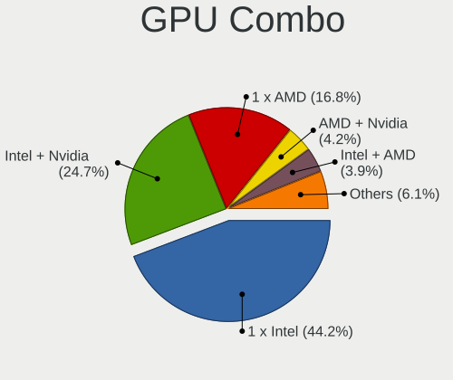

| Name           | Notebooks | Percent |
|----------------|-----------|---------|
| 1 x Intel      | 1680      | 44.22%  |
| Intel + Nvidia | 938       | 24.69%  |
| 1 x AMD        | 640       | 16.85%  |
| AMD + Nvidia   | 160       | 4.21%   |
| Intel + AMD    | 150       | 3.95%   |
| 1 x Nvidia     | 146       | 3.84%   |
| 2 x AMD        | 64        | 1.68%   |
| Other          | 8         | 0.21%   |
| 2 x Intel      | 7         | 0.18%   |
| 2 x Nvidia     | 4         | 0.11%   |
| 1 x Zhaoxin    | 1         | 0.03%   |
| 1 x SiS        | 1         | 0.03%   |

GPU Driver
----------

Free vs proprietary

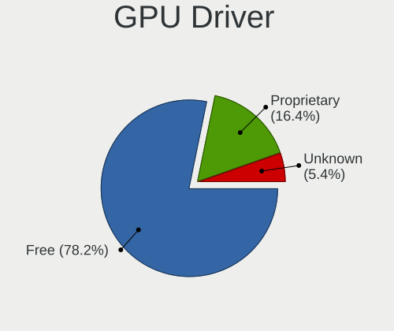

| Driver      | Notebooks | Percent |
|-------------|-----------|---------|
| Free        | 3007      | 78.21%  |
| Proprietary | 632       | 16.44%  |
| Unknown     | 206       | 5.36%   |

GPU Memory
----------

Total video memory

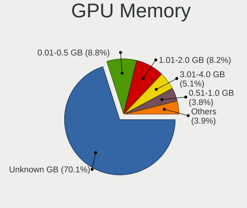

| Size in GB | Notebooks | Percent |
|------------|-----------|---------|
| Unknown    | 2713      | 70.07%  |
| 0.01-0.5   | 340       | 8.78%   |
| 1.01-2.0   | 319       | 8.24%   |
| 3.01-4.0   | 199       | 5.14%   |
| 0.51-1.0   | 149       | 3.85%   |
| 5.01-6.0   | 67        | 1.73%   |
| 7.01-8.0   | 55        | 1.42%   |
| 2.01-3.0   | 15        | 0.39%   |
| 8.01-16.0  | 13        | 0.34%   |
| 24.01-32.0 | 1         | 0.03%   |
| 16.01-24.0 | 1         | 0.03%   |

Monitor
-------

Monitor Vendor
--------------

Monitor vendors

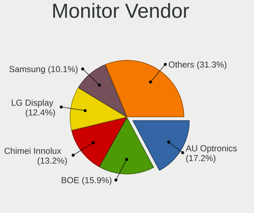

| Vendor                  | Notebooks | Percent |
|-------------------------|-----------|---------|
| AU Optronics            | 792       | 17.2%   |
| BOE                     | 732       | 15.9%   |
| Chimei Innolux          | 606       | 13.16%  |
| LG Display              | 572       | 12.42%  |
| Samsung Electronics     | 463       | 10.05%  |
| Dell                    | 173       | 3.76%   |
| Sharp                   | 145       | 3.15%   |
| Goldstar                | 131       | 2.84%   |
| Lenovo                  | 89        | 1.93%   |
| Apple                   | 87        | 1.89%   |
| PANDA                   | 69        | 1.5%    |
| Hewlett-Packard         | 64        | 1.39%   |
| Chi Mei Optoelectronics | 62        | 1.35%   |
| Acer                    | 54        | 1.17%   |
| Philips                 | 49        | 1.06%   |
| AOC                     | 44        | 0.96%   |
| InfoVision              | 40        | 0.87%   |
| BenQ                    | 35        | 0.76%   |
| CSO                     | 31        | 0.67%   |
| ASUSTek Computer        | 28        | 0.61%   |
| Ancor Communications    | 26        | 0.56%   |
| Iiyama                  | 22        | 0.48%   |
| ViewSonic               | 17        | 0.37%   |
| MSI                     | 12        | 0.26%   |
| LG Philips              | 11        | 0.24%   |
| HKC                     | 11        | 0.24%   |
| CSOT                    | 11        | 0.24%   |
| Sony                    | 10        | 0.22%   |
| Panasonic               | 10        | 0.22%   |
| Toshiba                 | 9         | 0.2%    |
| TMX                     | 9         | 0.2%    |
| HannStar                | 8         | 0.17%   |
| Vizio                   | 7         | 0.15%   |
| Unknown                 | 7         | 0.15%   |
| CSW                     | 7         | 0.15%   |
| CPT                     | 7         | 0.15%   |
| Vestel Elektronik       | 6         | 0.13%   |
| Sceptre Tech            | 6         | 0.13%   |
| NEC Computers           | 6         | 0.13%   |
| Fujitsu Siemens         | 6         | 0.13%   |

Monitor Model
-------------

Monitor models

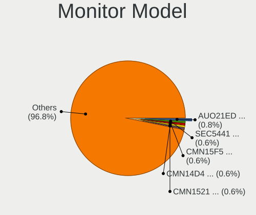

| Model                                                                     | Notebooks | Percent |
|---------------------------------------------------------------------------|-----------|---------|
| AU Optronics LCD Monitor AUO21ED 1920x1080 344x193mm 15.5-inch            | 36        | 0.77%   |
| Samsung Electronics LCD Monitor SEC5441 1280x800 331x207mm 15.4-inch      | 29        | 0.62%   |
| Chimei Innolux LCD Monitor CMN15F5 1920x1080 344x193mm 15.5-inch          | 29        | 0.62%   |
| Chimei Innolux LCD Monitor CMN14D4 1920x1080 309x173mm 13.9-inch          | 29        | 0.62%   |
| Chimei Innolux LCD Monitor CMN1521 1920x1080 344x193mm 15.5-inch          | 26        | 0.56%   |
| AU Optronics LCD Monitor AUO38ED 1920x1080 344x193mm 15.5-inch            | 26        | 0.56%   |
| Chimei Innolux LCD Monitor CMN15E7 1920x1080 344x193mm 15.5-inch          | 25        | 0.53%   |
| Chimei Innolux LCD Monitor CMN15E8 1920x1080 344x193mm 15.5-inch          | 20        | 0.43%   |
| LG Display LCD Monitor LGD02DC 1366x768 344x194mm 15.5-inch               | 17        | 0.36%   |
| Chimei Innolux LCD Monitor CMN15DB 1366x768 344x193mm 15.5-inch           | 17        | 0.36%   |
| BOE LCD Monitor BOE0872 1920x1080 344x194mm 15.5-inch                     | 17        | 0.36%   |
| BOE LCD Monitor BOE0812 1920x1080 344x194mm 15.5-inch                     | 17        | 0.36%   |
| LG Display LCD Monitor LGD0563 1920x1080 344x194mm 15.5-inch              | 15        | 0.32%   |
| LG Display LCD Monitor LGD046F 1920x1080 344x194mm 15.5-inch              | 15        | 0.32%   |
| AU Optronics LCD Monitor AUO403D 1920x1080 309x174mm 14.0-inch            | 15        | 0.32%   |
| AU Optronics LCD Monitor AUO71EC 1366x768 344x193mm 15.5-inch             | 14        | 0.3%    |
| AU Optronics LCD Monitor AUO2E3C 1366x768 309x173mm 13.9-inch             | 14        | 0.3%    |
| PANDA LCD Monitor NCP004D 1920x1080 344x194mm 15.5-inch                   | 13        | 0.28%   |
| Chimei Innolux LCD Monitor CMN15E6 1366x768 344x193mm 15.5-inch           | 13        | 0.28%   |
| Chi Mei Optoelectronics LCD Monitor CMO1720 1920x1080 382x215mm 17.3-inch | 13        | 0.28%   |
| BOE LCD Monitor BOE084E 1920x1080 382x215mm 17.3-inch                     | 13        | 0.28%   |
| BOE LCD Monitor BOE06A4 1366x768 344x194mm 15.5-inch                      | 13        | 0.28%   |
| Sharp LCD Monitor SHP1453 1920x1080 346x194mm 15.6-inch                   | 12        | 0.26%   |
| Chi Mei Optoelectronics LCD Monitor CMO15A7 1366x768 344x193mm 15.5-inch  | 12        | 0.26%   |
| AU Optronics LCD Monitor AUO61ED 1920x1080 344x194mm 15.5-inch            | 12        | 0.26%   |
| Goldstar FULL HD GSM5B55 1920x1080 480x270mm 21.7-inch                    | 11        | 0.24%   |
| Chimei Innolux LCD Monitor CMN15D5 1920x1080 344x193mm 15.5-inch          | 11        | 0.24%   |
| Samsung Electronics LCD Monitor SDC4161 1920x1080 344x194mm 15.5-inch     | 10        | 0.21%   |
| Samsung Electronics LCD Monitor SDC324C 1920x1080 344x194mm 15.5-inch     | 10        | 0.21%   |
| Chimei Innolux LCD Monitor CMN14D5 1920x1080 309x173mm 13.9-inch          | 10        | 0.21%   |
| Chimei Innolux LCD Monitor CMN14C9 1920x1080 309x173mm 13.9-inch          | 10        | 0.21%   |
| AU Optronics LCD Monitor AUO22EC 1366x768 344x193mm 15.5-inch             | 10        | 0.21%   |
| AU Optronics LCD Monitor AUO123D 1920x1080 309x173mm 13.9-inch            | 10        | 0.21%   |
| Apple LCD Monitor APP9CC5 1280x800 286x179mm 13.3-inch                    | 10        | 0.21%   |
| Samsung Electronics LCD Monitor SDCA029 3840x2160 344x194mm 15.5-inch     | 9         | 0.19%   |
| LG Display LCD Monitor LGD05E5 1920x1080 344x194mm 15.5-inch              | 9         | 0.19%   |
| Lenovo LCD Monitor LEN40BA 1920x1080 344x194mm 15.5-inch                  | 9         | 0.19%   |
| Goldstar HDR 4K GSM7706 3840x2160 600x340mm 27.2-inch                     | 9         | 0.19%   |
| Dell U2412M DELA07A 1920x1200 518x324mm 24.1-inch                         | 9         | 0.19%   |
| Chimei Innolux LCD Monitor CMN15D2 1920x1080 344x193mm 15.5-inch          | 9         | 0.19%   |

Monitor Resolution
------------------

Monitor screen resolution

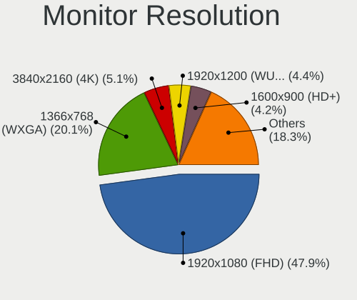

| Resolution         | Notebooks | Percent |
|--------------------|-----------|---------|
| 1920x1080 (FHD)    | 2048      | 47.86%  |
| 1366x768 (WXGA)    | 860       | 20.1%   |
| 3840x2160 (4K)     | 218       | 5.09%   |
| 1920x1200 (WUXGA)  | 190       | 4.44%   |
| 1600x900 (HD+)     | 180       | 4.21%   |
| 2560x1440 (QHD)    | 167       | 3.9%    |
| 2560x1600          | 109       | 2.55%   |
| 2880x1800          | 74        | 1.73%   |
| 1280x800 (WXGA)    | 60        | 1.4%    |
| 3440x1440          | 42        | 0.98%   |
| 1440x900 (WXGA+)   | 39        | 0.91%   |
| 3840x2400          | 33        | 0.77%   |
| 2560x1080          | 27        | 0.63%   |
| 1680x1050 (WSXGA+) | 26        | 0.61%   |
| 2160x1440          | 19        | 0.44%   |
| 1280x1024 (SXGA)   | 17        | 0.4%    |
| 3200x2000          | 15        | 0.35%   |
| 2240x1400          | 13        | 0.3%    |
| 2256x1504          | 12        | 0.28%   |
| 1360x768           | 12        | 0.28%   |
| Unknown            | 11        | 0.26%   |
| 3840x1080          | 10        | 0.23%   |
| 3200x1800 (QHD+)   | 10        | 0.23%   |
| 3072x1920          | 9         | 0.21%   |
| 3456x2160          | 7         | 0.16%   |
| 2520x1680          | 7         | 0.16%   |
| 1920x1280          | 7         | 0.16%   |
| 2880x1620          | 6         | 0.14%   |
| 1920x540           | 5         | 0.12%   |
| 1600x1200          | 5         | 0.12%   |
| 1024x600           | 5         | 0.12%   |
| 3840x1100          | 4         | 0.09%   |
| 3000x2000          | 4         | 0.09%   |
| 1680x945           | 4         | 0.09%   |
| 1024x768 (XGA)     | 4         | 0.09%   |
| 800x1280           | 3         | 0.07%   |
| 2288x1287          | 3         | 0.07%   |
| 2304x1440          | 2         | 0.05%   |
| 1280x720 (HD)      | 2         | 0.05%   |
| 5760x2160          | 1         | 0.02%   |

Monitor Diagonal
----------------

Diagonal size in inches

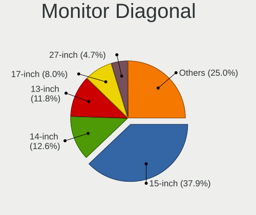

| Inches  | Notebooks | Percent |
|---------|-----------|---------|
| 15      | 1750      | 37.91%  |
| 14      | 582       | 12.61%  |
| 13      | 543       | 11.76%  |
| 17      | 369       | 7.99%   |
| 27      | 216       | 4.68%   |
| 16      | 182       | 3.94%   |
| 24      | 178       | 3.86%   |
| 23      | 128       | 2.77%   |
| 21      | 110       | 2.38%   |
| 31      | 80        | 1.73%   |
| 12      | 75        | 1.62%   |
| 11      | 66        | 1.43%   |
| 34      | 62        | 1.34%   |
| Unknown | 41        | 0.89%   |
| 18      | 30        | 0.65%   |
| 20      | 21        | 0.45%   |
| 19      | 19        | 0.41%   |
| 22      | 15        | 0.32%   |
| 84      | 14        | 0.3%    |
| 54      | 13        | 0.28%   |
| 72      | 12        | 0.26%   |
| 40      | 11        | 0.24%   |
| 32      | 11        | 0.24%   |
| 25      | 10        | 0.22%   |
| 10      | 8         | 0.17%   |
| 63      | 6         | 0.13%   |
| 48      | 6         | 0.13%   |
| 26      | 6         | 0.13%   |
| 42      | 5         | 0.11%   |
| 46      | 4         | 0.09%   |
| 39      | 4         | 0.09%   |
| 65      | 3         | 0.06%   |
| 49      | 3         | 0.06%   |
| 28      | 3         | 0.06%   |
| 7       | 3         | 0.06%   |
| 142     | 2         | 0.04%   |
| 86      | 2         | 0.04%   |
| 74      | 2         | 0.04%   |
| 60      | 2         | 0.04%   |
| 52      | 2         | 0.04%   |

Monitor Width
-------------

Physical width

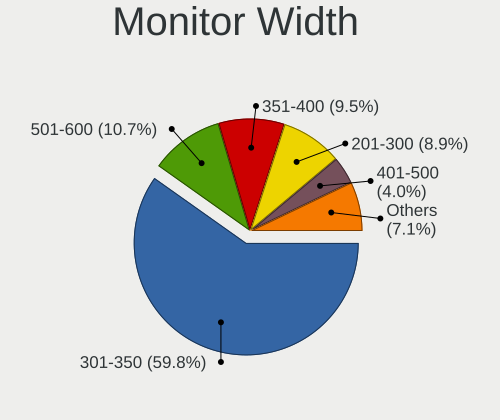

| Width in mm    | Notebooks | Percent |
|----------------|-----------|---------|
| 301-350        | 2722      | 59.81%  |
| 501-600        | 485       | 10.66%  |
| 351-400        | 433       | 9.51%   |
| 201-300        | 406       | 8.92%   |
| 401-500        | 181       | 3.98%   |
| 601-700        | 102       | 2.24%   |
| 701-800        | 73        | 1.6%    |
| 1001-1500      | 44        | 0.97%   |
| Unknown        | 41        | 0.9%    |
| 1501-2000      | 30        | 0.66%   |
| 801-900        | 19        | 0.42%   |
| 901-1000       | 8         | 0.18%   |
| 1-100          | 4         | 0.09%   |
| More than 2000 | 2         | 0.04%   |
| 101-200        | 1         | 0.02%   |

Aspect Ratio
------------

Proportional relationship between the width and the height

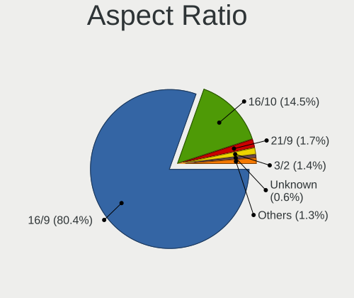

| Ratio   | Notebooks | Percent |
|---------|-----------|---------|
| 16/9    | 3193      | 80.45%  |
| 16/10   | 576       | 14.51%  |
| 21/9    | 69        | 1.74%   |
| 3/2     | 55        | 1.39%   |
| Unknown | 25        | 0.63%   |
| 5/4     | 17        | 0.43%   |
| 32/9    | 10        | 0.25%   |
| 4/3     | 9         | 0.23%   |
| 3.40    | 4         | 0.1%    |
| 0.56    | 3         | 0.08%   |
| 1.00    | 2         | 0.05%   |
| 0.67    | 2         | 0.05%   |
| 0.62    | 2         | 0.05%   |
| 6/5     | 1         | 0.03%   |
| 3.73    | 1         | 0.03%   |

Monitor Area
------------

Area in inch²

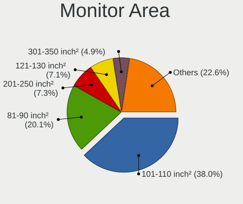

| Area in inch² | Notebooks | Percent |
|----------------|-----------|---------|
| 101-110        | 1747      | 38%     |
| 81-90          | 926       | 20.14%  |
| 201-250        | 335       | 7.29%   |
| 121-130        | 325       | 7.07%   |
| 301-350        | 224       | 4.87%   |
| 71-80          | 189       | 4.11%   |
| 111-120        | 176       | 3.83%   |
| 351-500        | 152       | 3.31%   |
| 51-60          | 71        | 1.54%   |
| 151-200        | 69        | 1.5%    |
| 61-70          | 68        | 1.48%   |
| 251-300        | 67        | 1.46%   |
| More than 1000 | 63        | 1.37%   |
| Unknown        | 41        | 0.89%   |
| 501-1000       | 39        | 0.85%   |
| 131-140        | 38        | 0.83%   |
| 141-150        | 32        | 0.7%    |
| 91-100         | 23        | 0.5%    |
| 41-50          | 7         | 0.15%   |
| 1-40           | 5         | 0.11%   |

Pixel Density
-------------

Pixels per inch

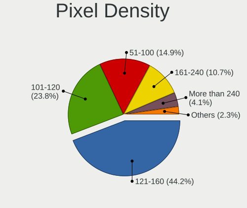

| Density       | Notebooks | Percent |
|---------------|-----------|---------|
| 121-160       | 1991      | 44.19%  |
| 101-120       | 1072      | 23.79%  |
| 51-100        | 671       | 14.89%  |
| 161-240       | 483       | 10.72%  |
| More than 240 | 185       | 4.11%   |
| 1-50          | 63        | 1.4%    |
| Unknown       | 41        | 0.91%   |

Multiple Monitors
-----------------

Total monitors connected

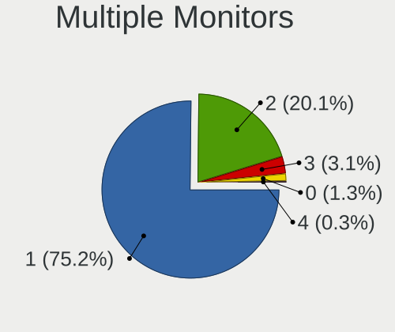

| Total | Notebooks | Percent |
|-------|-----------|---------|
| 1     | 2921      | 75.17%  |
| 2     | 780       | 20.07%  |
| 3     | 121       | 3.11%   |
| 0     | 52        | 1.34%   |
| 4     | 12        | 0.31%   |

Network
-------

Net Controller Vendor
---------------------

Controller vendors

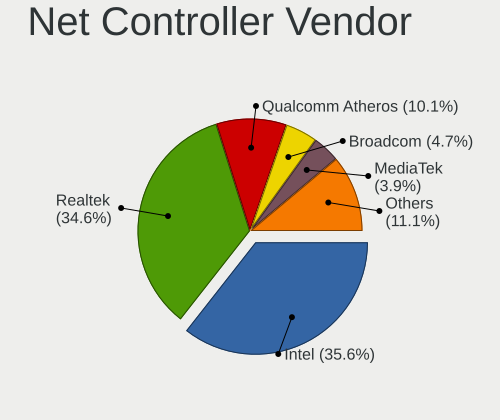

| Vendor                                 | Notebooks | Percent |
|----------------------------------------|-----------|---------|
| Intel                                  | 2163      | 35.59%  |
| Realtek Semiconductor                  | 2101      | 34.57%  |
| Qualcomm Atheros                       | 615       | 10.12%  |
| Broadcom                               | 284       | 4.67%   |
| MediaTek                               | 240       | 3.95%   |
| Broadcom Limited                       | 57        | 0.94%   |
| Shenzhen Goodix Technology             | 52        | 0.86%   |
| ASIX Electronics                       | 49        | 0.81%   |
| TP-Link                                | 43        | 0.71%   |
| Ralink                                 | 42        | 0.69%   |
| Qualcomm                               | 39        | 0.64%   |
| Samsung Electronics                    | 35        | 0.58%   |
| Marvell Technology Group               | 33        | 0.54%   |
| DisplayLink                            | 30        | 0.49%   |
| Sierra Wireless                        | 29        | 0.48%   |
| Lenovo                                 | 24        | 0.39%   |
| Dell                                   | 24        | 0.39%   |
| Ralink Technology                      | 23        | 0.38%   |
| Xiaomi                                 | 16        | 0.26%   |
| Huawei Technologies                    | 15        | 0.25%   |
| Ericsson Business Mobile Networks      | 15        | 0.25%   |
| Hewlett-Packard                        | 12        | 0.2%    |
| Nvidia                                 | 10        | 0.16%   |
| Apple                                  | 10        | 0.16%   |
| JMicron Technology                     | 9         | 0.15%   |
| Google                                 | 9         | 0.15%   |
| D-Link                                 | 6         | 0.1%    |
| OPPO Electronics                       | 5         | 0.08%   |
| Motorola PCS                           | 5         | 0.08%   |
| Microsoft                              | 5         | 0.08%   |
| Fibocom                                | 5         | 0.08%   |
| U-Blox                                 | 4         | 0.07%   |
| Qualcomm Atheros Communications        | 4         | 0.07%   |
| NetGear                                | 4         | 0.07%   |
| ASUSTek Computer                       | 4         | 0.07%   |
| ZTE WCDMA Technologies MSM             | 3         | 0.05%   |
| T & A Mobile Phones                    | 3         | 0.05%   |
| Suzhou Motorcomm Electronic Technology | 3         | 0.05%   |
| Microchip Technology                   | 3         | 0.05%   |
| Linksys                                | 3         | 0.05%   |

Net Controller Model
--------------------

Controller models

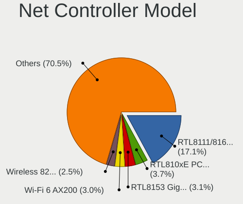

| Model                                                                  | Notebooks | Percent |
|------------------------------------------------------------------------|-----------|---------|
| Realtek RTL8111/8168/8211/8411 PCI Express Gigabit Ethernet Controller | 1237      | 17.09%  |
| Realtek RTL810xE PCI Express Fast Ethernet controller                  | 271       | 3.74%   |
| Realtek RTL8153 Gigabit Ethernet Adapter                               | 228       | 3.15%   |
| Intel Wi-Fi 6 AX200                                                    | 220       | 3.04%   |
| Intel Wireless 8265 / 8275                                             | 182       | 2.51%   |
| Intel Wi-Fi 6 AX201                                                    | 153       | 2.11%   |
| Intel Alder Lake-P PCH CNVi WiFi                                       | 133       | 1.84%   |
| Realtek RTL8821CE 802.11ac PCIe Wireless Network Adapter               | 131       | 1.81%   |
| Qualcomm Atheros QCA9377 802.11ac Wireless Network Adapter             | 130       | 1.8%    |
| Intel 82579LM Gigabit Network Connection (Lewisville)                  | 127       | 1.75%   |
| Intel Wireless 7260                                                    | 126       | 1.74%   |
| MediaTek MT7921 802.11ax PCIe Wireless Network Adapter [Filogic 330]   | 125       | 1.73%   |
| Realtek RTL8822CE 802.11ac PCIe Wireless Network Adapter               | 124       | 1.71%   |
| Intel Wireless 7265                                                    | 112       | 1.55%   |
| Qualcomm Atheros QCA6174 802.11ac Wireless Network Adapter             | 108       | 1.49%   |
| Intel Cannon Lake PCH CNVi WiFi                                        | 100       | 1.38%   |
| Qualcomm Atheros AR9485 Wireless Network Adapter                       | 89        | 1.23%   |
| Qualcomm Atheros QCA9565 / AR9565 Wireless Network Adapter             | 82        | 1.13%   |
| Intel Wireless 8260                                                    | 82        | 1.13%   |
| Intel Comet Lake PCH-LP CNVi WiFi                                      | 81        | 1.12%   |
| Intel Centrino Advanced-N 6205 [Taylor Peak]                           | 80        | 1.1%    |
| Intel Comet Lake PCH CNVi WiFi                                         | 77        | 1.06%   |
| Intel Ethernet Connection (4) I219-LM                                  | 74        | 1.02%   |
| MediaTek MT7922 802.11ax PCI Express Wireless Network Adapter          | 62        | 0.86%   |
| Intel Cannon Point-LP CNVi [Wireless-AC]                               | 62        | 0.86%   |
| Intel Wi-Fi 6E(802.11ax) AX210/AX1675* 2x2 [Typhoon Peak]              | 59        | 0.81%   |
| Realtek RTL8723BE PCIe Wireless Network Adapter                        | 52        | 0.72%   |
| Qualcomm Atheros AR9285 Wireless Network Adapter (PCI-Express)         | 52        | 0.72%   |
| Intel Raptor Lake PCH CNVi WiFi                                        | 52        | 0.72%   |
| Shenzhen Goodix Fingerprint Reader                                     | 51        | 0.7%    |
| Intel Wireless 3165                                                    | 50        | 0.69%   |
| Realtek RTL8852BE PCIe 802.11ax Wireless Network Controller            | 48        | 0.66%   |
| ASIX AX88179 Gigabit Ethernet                                          | 47        | 0.65%   |
| Broadcom BCM43142 802.11b/g/n                                          | 45        | 0.62%   |
| Broadcom BCM4313 802.11bgn Wireless Network Adapter                    | 45        | 0.62%   |
| Intel Ethernet Connection I217-LM                                      | 43        | 0.59%   |
| Realtek RTL8125 2.5GbE Controller                                      | 42        | 0.58%   |
| Intel Tiger Lake PCH CNVi WiFi                                         | 41        | 0.57%   |
| Intel Wireless 3160                                                    | 40        | 0.55%   |
| Intel Wi-Fi 5(802.11ac) Wireless-AC 9x6x [Thunder Peak]                | 39        | 0.54%   |

Wireless Vendor
---------------

Wireless vendors

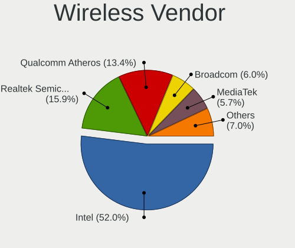

| Vendor                                | Notebooks | Percent |
|---------------------------------------|-----------|---------|
| Intel                                 | 2005      | 51.96%  |
| Realtek Semiconductor                 | 614       | 15.91%  |
| Qualcomm Atheros                      | 516       | 13.37%  |
| Broadcom                              | 233       | 6.04%   |
| MediaTek                              | 221       | 5.73%   |
| Broadcom Limited                      | 46        | 1.19%   |
| Ralink                                | 42        | 1.09%   |
| Qualcomm                              | 35        | 0.91%   |
| TP-Link                               | 30        | 0.78%   |
| Sierra Wireless                       | 29        | 0.75%   |
| Ralink Technology                     | 23        | 0.6%    |
| Dell                                  | 17        | 0.44%   |
| D-Link                                | 6         | 0.16%   |
| Fibocom                               | 5         | 0.13%   |
| Qualcomm Atheros Communications       | 4         | 0.1%    |
| NetGear                               | 4         | 0.1%    |
| Hewlett-Packard                       | 4         | 0.1%    |
| ASUSTek Computer                      | 4         | 0.1%    |
| Microsoft                             | 3         | 0.08%   |
| Edimax Technology                     | 3         | 0.08%   |
| ZyDAS                                 | 2         | 0.05%   |
| D-Link System                         | 2         | 0.05%   |
| 802.11g Adapter [Linksys WUSB54GC v3] | 2         | 0.05%   |
| ZyXEL Communications                  | 1         | 0.03%   |
| Wacom                                 | 1         | 0.03%   |
| Texas Instruments                     | 1         | 0.03%   |
| Senao                                 | 1         | 0.03%   |
| Quectel Wireless Solutions            | 1         | 0.03%   |
| Linksys                               | 1         | 0.03%   |
| Ericsson Business Mobile Networks     | 1         | 0.03%   |
| Belkin Components                     | 1         | 0.03%   |
| AVM                                   | 1         | 0.03%   |

Wireless Model
--------------

Wireless models

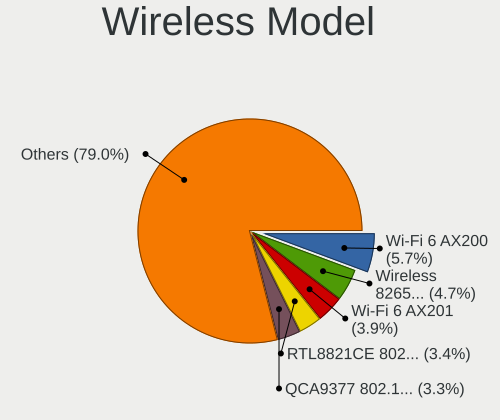

| Model                                                                | Notebooks | Percent |
|----------------------------------------------------------------------|-----------|---------|
| Intel Wi-Fi 6 AX200                                                  | 220       | 5.67%   |
| Intel Wireless 8265 / 8275                                           | 182       | 4.69%   |
| Intel Wi-Fi 6 AX201                                                  | 153       | 3.94%   |
| Realtek RTL8821CE 802.11ac PCIe Wireless Network Adapter             | 131       | 3.37%   |
| Qualcomm Atheros QCA9377 802.11ac Wireless Network Adapter           | 130       | 3.35%   |
| Intel Wireless 7260                                                  | 126       | 3.24%   |
| MediaTek MT7921 802.11ax PCIe Wireless Network Adapter [Filogic 330] | 125       | 3.22%   |
| Realtek RTL8822CE 802.11ac PCIe Wireless Network Adapter             | 124       | 3.19%   |
| Intel Wireless 7265                                                  | 112       | 2.88%   |
| Qualcomm Atheros QCA6174 802.11ac Wireless Network Adapter           | 108       | 2.78%   |
| Intel Cannon Lake PCH CNVi WiFi                                      | 100       | 2.58%   |
| Qualcomm Atheros AR9485 Wireless Network Adapter                     | 89        | 2.29%   |
| Qualcomm Atheros QCA9565 / AR9565 Wireless Network Adapter           | 82        | 2.11%   |
| Intel Wireless 8260                                                  | 82        | 2.11%   |
| Intel Comet Lake PCH-LP CNVi WiFi                                    | 81        | 2.09%   |
| Intel Centrino Advanced-N 6205 [Taylor Peak]                         | 80        | 2.06%   |
| Intel Alder Lake-P PCH CNVi WiFi                                     | 80        | 2.06%   |
| Intel Comet Lake PCH CNVi WiFi                                       | 77        | 1.98%   |
| Intel Cannon Point-LP CNVi [Wireless-AC]                             | 62        | 1.6%    |
| Intel Wi-Fi 6E(802.11ax) AX210/AX1675* 2x2 [Typhoon Peak]            | 59        | 1.52%   |
| Realtek RTL8723BE PCIe Wireless Network Adapter                      | 52        | 1.34%   |
| Qualcomm Atheros AR9285 Wireless Network Adapter (PCI-Express)       | 52        | 1.34%   |
| Intel Raptor Lake PCH CNVi WiFi                                      | 52        | 1.34%   |
| MediaTek MT7922 802.11ax PCI Express Wireless Network Adapter        | 50        | 1.29%   |
| Intel Wireless 3165                                                  | 50        | 1.29%   |
| Realtek RTL8852BE PCIe 802.11ax Wireless Network Controller          | 46        | 1.18%   |
| Broadcom BCM43142 802.11b/g/n                                        | 45        | 1.16%   |
| Broadcom BCM4313 802.11bgn Wireless Network Adapter                  | 45        | 1.16%   |
| Intel Tiger Lake PCH CNVi WiFi                                       | 41        | 1.06%   |
| Intel Wireless 3160                                                  | 40        | 1.03%   |
| Intel Wi-Fi 5(802.11ac) Wireless-AC 9x6x [Thunder Peak]              | 39        | 1%      |
| Realtek RTL8852AE 802.11ax PCIe Wireless Network Adapter             | 35        | 0.9%    |
| Intel Ice Lake-LP PCH CNVi WiFi                                      | 35        | 0.9%    |
| Intel Dual Band Wireless-AC 3165 Plus Bluetooth                      | 34        | 0.88%   |
| Realtek RTL8822BE 802.11a/b/g/n/ac WiFi adapter                      | 31        | 0.8%    |
| Qualcomm QCNFA765 Wireless Network Adapter                           | 29        | 0.75%   |
| Intel Centrino Advanced-N 6235                                       | 28        | 0.72%   |
| Broadcom BCM43228 802.11a/b/g/n                                      | 27        | 0.7%    |
| Qualcomm Atheros AR9462 Wireless Network Adapter                     | 25        | 0.64%   |
| MediaTek MT7902 802.11ax PCIe Wireless Network Adapter [Filogic 310] | 25        | 0.64%   |

Ethernet Vendor
---------------

Ethernet vendors

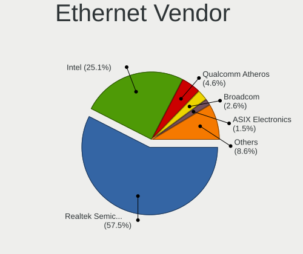

| Vendor                                 | Notebooks | Percent |
|----------------------------------------|-----------|---------|
| Realtek Semiconductor                  | 1819      | 57.51%  |
| Intel                                  | 794       | 25.1%   |
| Qualcomm Atheros                       | 147       | 4.65%   |
| Broadcom                               | 82        | 2.59%   |
| ASIX Electronics                       | 49        | 1.55%   |
| Samsung Electronics                    | 35        | 1.11%   |
| Marvell Technology Group               | 33        | 1.04%   |
| DisplayLink                            | 30        | 0.95%   |
| Lenovo                                 | 24        | 0.76%   |
| MediaTek                               | 19        | 0.6%    |
| Xiaomi                                 | 16        | 0.51%   |
| TP-Link                                | 13        | 0.41%   |
| Broadcom Limited                       | 12        | 0.38%   |
| Huawei Technologies                    | 11        | 0.35%   |
| Nvidia                                 | 10        | 0.32%   |
| Apple                                  | 10        | 0.32%   |
| JMicron Technology                     | 9         | 0.28%   |
| Google                                 | 9         | 0.28%   |
| OPPO Electronics                       | 5         | 0.16%   |
| Motorola PCS                           | 5         | 0.16%   |
| Qualcomm                               | 4         | 0.13%   |
| T & A Mobile Phones                    | 3         | 0.09%   |
| Suzhou Motorcomm Electronic Technology | 3         | 0.09%   |
| Spreadtrum Communications              | 2         | 0.06%   |
| Qualcomm Technologies                  | 2         | 0.06%   |
| Microsoft                              | 2         | 0.06%   |
| Microchip Technology                   | 2         | 0.06%   |
| Linksys                                | 2         | 0.06%   |
| ICS Advent                             | 2         | 0.06%   |
| Hewlett-Packard                        | 2         | 0.06%   |
| Aquantia                               | 2         | 0.06%   |
| ZTE WCDMA Technologies MSM             | 1         | 0.03%   |
| Silicon Integrated Systems [SiS]       | 1         | 0.03%   |
| QinHeng Electronics                    | 1         | 0.03%   |
| Motorcomm Microelectronics.            | 1         | 0.03%   |
| HMD Global                             | 1         | 0.03%   |

Ethernet Model
--------------

Ethernet models

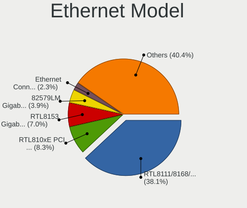

| Model                                                                  | Notebooks | Percent |
|------------------------------------------------------------------------|-----------|---------|
| Realtek RTL8111/8168/8211/8411 PCI Express Gigabit Ethernet Controller | 1237      | 38.07%  |
| Realtek RTL810xE PCI Express Fast Ethernet controller                  | 271       | 8.34%   |
| Realtek RTL8153 Gigabit Ethernet Adapter                               | 228       | 7.02%   |
| Intel 82579LM Gigabit Network Connection (Lewisville)                  | 127       | 3.91%   |
| Intel Ethernet Connection (4) I219-LM                                  | 74        | 2.28%   |
| Intel Alder Lake-P PCH CNVi WiFi                                       | 53        | 1.63%   |
| ASIX AX88179 Gigabit Ethernet                                          | 47        | 1.45%   |
| Intel Ethernet Connection I217-LM                                      | 43        | 1.32%   |
| Realtek RTL8125 2.5GbE Controller                                      | 42        | 1.29%   |
| Intel Ethernet Connection I219-LM                                      | 35        | 1.08%   |
| Intel Ethernet Connection (3) I218-LM                                  | 35        | 1.08%   |
| Intel Ethernet Connection I218-LM                                      | 34        | 1.05%   |
| Intel Ethernet Connection (7) I219-LM                                  | 31        | 0.95%   |
| Intel Ethernet Connection (4) I219-V                                   | 28        | 0.86%   |
| Realtek Killer E2600 GbE Controller                                    | 27        | 0.83%   |
| Samsung Galaxy series, misc. (tethering mode)                          | 25        | 0.77%   |
| Realtek RTL8152 Fast Ethernet Adapter                                  | 23        | 0.71%   |
| Qualcomm Atheros AR8151 v2.0 Gigabit Ethernet                          | 23        | 0.71%   |
| Intel Ethernet Connection (6) I219-V                                   | 21        | 0.65%   |
| Intel 82577LM Gigabit Network Connection                               | 21        | 0.65%   |
| Qualcomm Atheros Killer E2500 Gigabit Ethernet Controller              | 20        | 0.62%   |
| Intel Ethernet Connection (13) I219-V                                  | 20        | 0.62%   |
| Broadcom NetXtreme BCM57765 Gigabit Ethernet PCIe                      | 20        | 0.62%   |
| Qualcomm Atheros QCA8171 Gigabit Ethernet                              | 19        | 0.58%   |
| Intel Ethernet Connection I219-V                                       | 19        | 0.58%   |
| Marvell Group 88E8040 PCI-E Fast Ethernet Controller                   | 18        | 0.55%   |
| Intel Ethernet Connection (6) I219-LM                                  | 18        | 0.55%   |
| Intel Ethernet Connection (2) I219-LM                                  | 18        | 0.55%   |
| Broadcom NetLink BCM57785 Gigabit Ethernet PCIe                        | 18        | 0.55%   |
| Intel Ethernet Connection (10) I219-V                                  | 17        | 0.52%   |
| Intel 82567LM Gigabit Network Connection                               | 16        | 0.49%   |
| Realtek USB 10/100/1G/2.5 LAN                                          | 15        | 0.46%   |
| Intel Ethernet Connection (7) I219-V                                   | 15        | 0.46%   |
| Intel Ethernet Connection (16) I219-LM                                 | 15        | 0.46%   |
| Realtek Killer E3000 2.5GbE Controller                                 | 14        | 0.43%   |
| Intel Ethernet Connection (16) I219-V                                  | 14        | 0.43%   |
| Qualcomm Atheros AR8161 Gigabit Ethernet                               | 13        | 0.4%    |
| Intel Ethernet Connection (5) I219-LM                                  | 13        | 0.4%    |
| Xiaomi Mi/Redmi series (RNDIS)                                         | 12        | 0.37%   |
| TP-Link UE300 10/100/1000 LAN (ethernet mode) [Realtek RTL8153]        | 12        | 0.37%   |

Net Controller Kind
-------------------

Ethernet, WiFi or modem

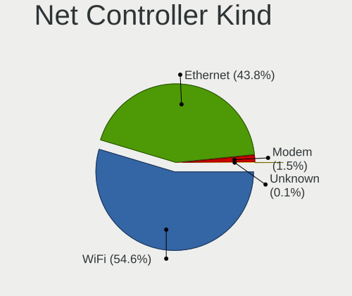

| Kind     | Notebooks | Percent |
|----------|-----------|---------|
| WiFi     | 3661      | 54.62%  |
| Ethernet | 2934      | 43.77%  |
| Modem    | 101       | 1.51%   |
| Unknown  | 7         | 0.1%    |

Used Controller
---------------

Currently used network controller

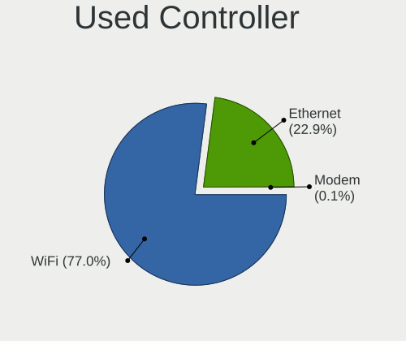

| Kind     | Notebooks | Percent |
|----------|-----------|---------|
| WiFi     | 3098      | 77.05%  |
| Ethernet | 920       | 22.88%  |
| Modem    | 3         | 0.07%   |

NICs
----

Total network controllers on board

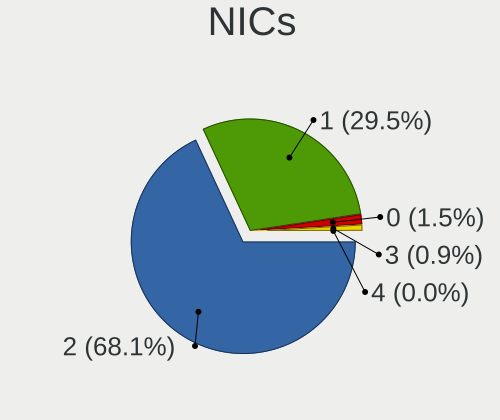

| Total | Notebooks | Percent |
|-------|-----------|---------|
| 2     | 2583      | 68.08%  |
| 1     | 1120      | 29.52%  |
| 0     | 56        | 1.48%   |
| 3     | 34        | 0.9%    |
| 4     | 1         | 0.03%   |

IPv6
----

IPv6 vs IPv4

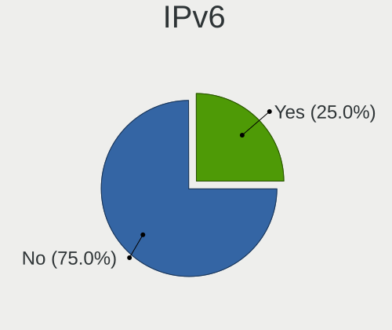

| Used | Notebooks | Percent |
|------|-----------|---------|
| No   | 2880      | 74.98%  |
| Yes  | 961       | 25.02%  |

Bluetooth
---------

Bluetooth Vendor
----------------

Controller vendors

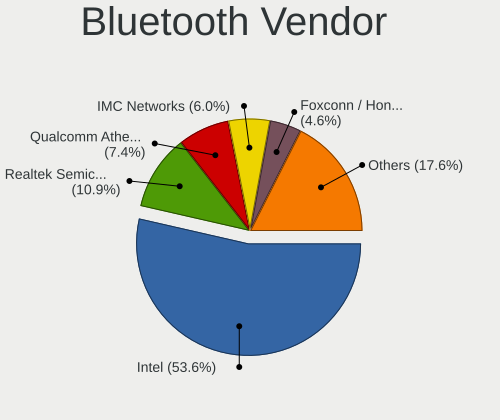

| Vendor                          | Notebooks | Percent |
|---------------------------------|-----------|---------|
| Intel                           | 1776      | 53.57%  |
| Realtek Semiconductor           | 361       | 10.89%  |
| Qualcomm Atheros Communications | 246       | 7.42%   |
| IMC Networks                    | 199       | 6%      |
| Foxconn / Hon Hai               | 151       | 4.56%   |
| Broadcom                        | 144       | 4.34%   |
| Lite-On Technology              | 122       | 3.68%   |
| Apple                           | 66        | 1.99%   |
| Dell                            | 46        | 1.39%   |
| Realtek                         | 35        | 1.06%   |
| Cambridge Silicon Radio         | 27        | 0.81%   |
| MediaTek                        | 23        | 0.69%   |
| Ralink                          | 22        | 0.66%   |
| Hewlett-Packard                 | 20        | 0.6%    |
| Toshiba                         | 17        | 0.51%   |
| USI                             | 15        | 0.45%   |
| Foxconn International           | 10        | 0.3%    |
| Alps Electric                   | 7         | 0.21%   |
| Ralink Technology               | 6         | 0.18%   |
| ASUSTek Computer                | 6         | 0.18%   |
| TP-Link                         | 5         | 0.15%   |
| Taiyo Yuden                     | 2         | 0.06%   |
| Smart Modular Technologies      | 2         | 0.06%   |
| SINO WEALTH                     | 1         | 0.03%   |
| Qcom                            | 1         | 0.03%   |
| Integrated System Solution      | 1         | 0.03%   |
| Fujitsu                         | 1         | 0.03%   |
| Edimax Technology               | 1         | 0.03%   |
| Chicony Electronics             | 1         | 0.03%   |
| Askey Computer                  | 1         | 0.03%   |

Bluetooth Model
---------------

Controller models

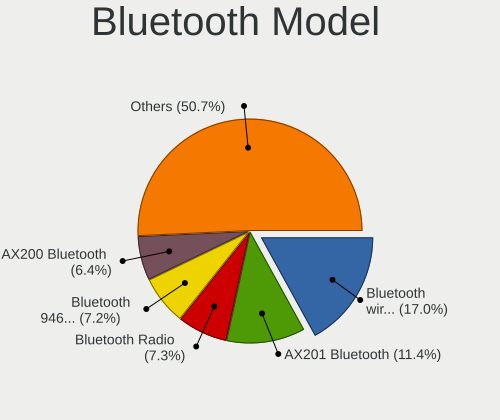

| Model                                               | Notebooks | Percent |
|-----------------------------------------------------|-----------|---------|
| Intel Bluetooth wireless interface                  | 564       | 17%     |
| Intel AX201 Bluetooth                               | 378       | 11.39%  |
| Realtek Bluetooth Radio                             | 242       | 7.29%   |
| Intel Bluetooth 9460/9560 Jefferson Peak (JfP)      | 238       | 7.17%   |
| Intel AX200 Bluetooth                               | 213       | 6.42%   |
| Intel Bluetooth Device                              | 199       | 6%      |
| Qualcomm Atheros  Bluetooth Device                  | 129       | 3.89%   |
| IMC Networks Wireless_Device                        | 89        | 2.68%   |
| Realtek  Bluetooth 4.2 Adapter                      | 87        | 2.62%   |
| Intel AX210 Bluetooth                               | 57        | 1.72%   |
| IMC Networks Bluetooth Radio                        | 55        | 1.66%   |
| Qualcomm Atheros AR3012 Bluetooth 4.0               | 43        | 1.3%    |
| Foxconn / Hon Hai Wireless_Device                   | 43        | 1.3%    |
| Intel Centrino Bluetooth Wireless Transceiver       | 41        | 1.24%   |
| Apple Bluetooth Host Controller                     | 41        | 1.24%   |
| Foxconn / Hon Hai MediaTek Bluetooth Adapter        | 40        | 1.21%   |
| Qualcomm Atheros QCA61x4 Bluetooth 4.0              | 37        | 1.12%   |
| Realtek Bluetooth Radio                             | 35        | 1.05%   |
| Intel Wireless-AC 9260 Bluetooth Adapter            | 35        | 1.05%   |
| Lite-On Qualcomm Atheros QCA9377 Bluetooth          | 33        | 0.99%   |
| Foxconn / Hon Hai Bluetooth Device                  | 33        | 0.99%   |
| Lite-On Bluetooth Device                            | 32        | 0.96%   |
| Lite-On Wireless_Device                             | 30        | 0.9%    |
| Broadcom BCM20702 Bluetooth 4.0 [ThinkPad]          | 30        | 0.9%    |
| Intel Centrino Advanced-N 6230 Bluetooth adapter    | 27        | 0.81%   |
| Cambridge Silicon Radio Bluetooth Dongle (HCI mode) | 27        | 0.81%   |
| MediaTek Wireless_Device                            | 23        | 0.69%   |
| IMC Networks Bluetooth Device                       | 23        | 0.69%   |
| Ralink RT3290 Bluetooth                             | 22        | 0.66%   |
| Broadcom BCM2045B (BDC-2.1)                         | 22        | 0.66%   |
| Intel Wireless-AC 3168 Bluetooth                    | 21        | 0.63%   |
| Apple Bluetooth USB Host Controller                 | 21        | 0.63%   |
| Broadcom HP Portable SoftSailing                    | 19        | 0.57%   |
| USI Bluetooth Device                                | 15        | 0.45%   |
| Qualcomm Atheros AR3011 Bluetooth                   | 15        | 0.45%   |
| Dell BCM20702A0 Bluetooth Module                    | 15        | 0.45%   |
| HP Broadcom 2070 Bluetooth Combo                    | 14        | 0.42%   |
| Dell DW375 Bluetooth Module                         | 14        | 0.42%   |
| Realtek RTL8723B Bluetooth                          | 13        | 0.39%   |
| Qualcomm Atheros AR9462 Bluetooth                   | 13        | 0.39%   |

Sound
-----

Sound Vendor
------------

Sound card vendors

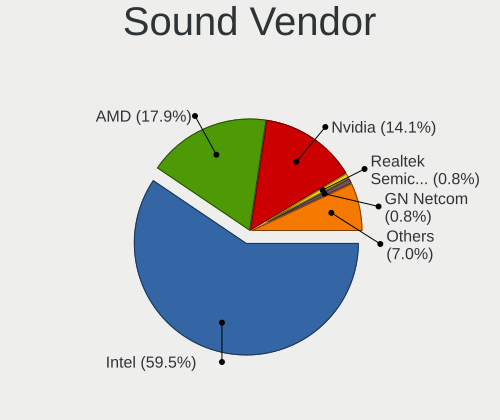

| Vendor                   | Notebooks | Percent |
|--------------------------|-----------|---------|
| Intel                    | 2936      | 59.46%  |
| AMD                      | 883       | 17.88%  |
| Nvidia                   | 695       | 14.07%  |
| Realtek Semiconductor    | 41        | 0.83%   |
| GN Netcom                | 38        | 0.77%   |
| C-Media Electronics      | 38        | 0.77%   |
| Logitech                 | 28        | 0.57%   |
| Hewlett-Packard          | 27        | 0.55%   |
| Lenovo                   | 24        | 0.49%   |
| JMTek                    | 20        | 0.41%   |
| Plantronics              | 13        | 0.26%   |
| Texas Instruments        | 12        | 0.24%   |
| Razer USA                | 12        | 0.24%   |
| Creative Technology      | 11        | 0.22%   |
| Generalplus Technology   | 9         | 0.18%   |
| Dell                     | 9         | 0.18%   |
| Apple                    | 8         | 0.16%   |
| Sony                     | 7         | 0.14%   |
| Kingston Technology      | 5         | 0.1%    |
| Focusrite-Novation       | 5         | 0.1%    |
| Astro Gaming             | 5         | 0.1%    |
| Silicon Motion           | 4         | 0.08%   |
| DSEA A/S                 | 4         | 0.08%   |
| Conexant Systems         | 4         | 0.08%   |
| CMX Systems              | 4         | 0.08%   |
| ASUSTek Computer         | 4         | 0.08%   |
| SteelSeries ApS          | 3         | 0.06%   |
| GYROCOM C&C              | 3         | 0.06%   |
| Arturia                  | 3         | 0.06%   |
| Alesis                   | 3         | 0.06%   |
| ZOOM                     | 2         | 0.04%   |
| Yamaha                   | 2         | 0.04%   |
| TerraTec Electronic      | 2         | 0.04%   |
| Nordic Semiconductor ASA | 2         | 0.04%   |
| Microsoft                | 2         | 0.04%   |
| Micro Star International | 2         | 0.04%   |
| Magic Control Technology | 2         | 0.04%   |
| M-Audio                  | 2         | 0.04%   |
| Jieli Technology         | 2         | 0.04%   |
| Google                   | 2         | 0.04%   |

Sound Model
-----------

Sound card models

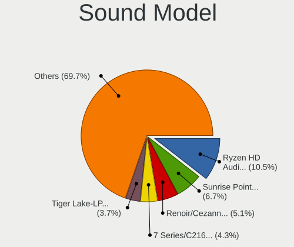

| Model                                                                      | Notebooks | Percent |
|----------------------------------------------------------------------------|-----------|---------|
| AMD Ryzen HD Audio Controller                                              | 637       | 10.53%  |
| Intel Sunrise Point-LP HD Audio                                            | 406       | 6.71%   |
| AMD Renoir/Cezanne HDMI/DP Audio Controller                                | 310       | 5.13%   |
| Intel 7 Series/C216 Chipset Family High Definition Audio Controller        | 258       | 4.27%   |
| Intel Tiger Lake-LP Smart Sound Technology Audio Controller                | 221       | 3.65%   |
| Intel Cannon Lake PCH cAVS                                                 | 200       | 3.31%   |
| Intel Alder Lake PCH-P High Definition Audio Controller                    | 168       | 2.78%   |
| Intel 6 Series/C200 Series Chipset Family High Definition Audio Controller | 159       | 2.63%   |
| Intel 8 Series/C220 Series Chipset High Definition Audio Controller        | 152       | 2.51%   |
| AMD Raven/Raven2/Fenghuang HDMI/DP Audio Controller                        | 138       | 2.28%   |
| Intel Haswell-ULT HD Audio Controller                                      | 130       | 2.15%   |
| Intel Cannon Point-LP High Definition Audio Controller                     | 130       | 2.15%   |
| Intel 8 Series HD Audio Controller                                         | 130       | 2.15%   |
| Intel Xeon E3-1200 v3/4th Gen Core Processor HD Audio Controller           | 127       | 2.1%    |
| AMD Radeon High Definition Audio Controller                                | 124       | 2.05%   |
| Intel Broadwell-U Audio Controller                                         | 116       | 1.92%   |
| Intel Wildcat Point-LP High Definition Audio Controller                    | 115       | 1.9%    |
| Intel Comet Lake PCH-LP cAVS                                               | 101       | 1.67%   |
| Nvidia TU107 GeForce GTX 1650 High Definition Audio Controller             | 98        | 1.62%   |
| Intel Comet Lake PCH cAVS                                                  | 90        | 1.49%   |
| AMD FCH Azalia Controller                                                  | 85        | 1.41%   |
| Intel 82801I (ICH9 Family) HD Audio Controller                             | 81        | 1.34%   |
| Intel 5 Series/3400 Series Chipset High Definition Audio                   | 80        | 1.32%   |
| Intel Celeron/Pentium Silver Processor High Definition Audio               | 79        | 1.31%   |
| Intel CM238 HD Audio Controller                                            | 74        | 1.22%   |
| Intel Raptor Lake-P/U/H cAVS                                               | 71        | 1.17%   |
| Intel Ice Lake-LP Smart Sound Technology Audio Controller                  | 71        | 1.17%   |
| AMD Kabini HDMI/DP Audio                                                   | 64        | 1.06%   |
| Intel 100 Series/C230 Series Chipset Family HD Audio Controller            | 59        | 0.98%   |
| Intel Tiger Lake-H HD Audio Controller                                     | 57        | 0.94%   |
| Nvidia TU106 High Definition Audio Controller                              | 56        | 0.93%   |
| Nvidia GP107GL High Definition Audio Controller                            | 53        | 0.88%   |
| Nvidia GA107 High Definition Audio Controller                              | 51        | 0.84%   |
| Nvidia GA106 High Definition Audio Controller                              | 50        | 0.83%   |
| AMD Family 15h (Models 60h-6fh) Audio Controller                           | 48        | 0.79%   |
| Nvidia AD107 High Definition Audio Controller                              | 47        | 0.78%   |
| Nvidia GA104 High Definition Audio Controller                              | 42        | 0.69%   |
| Realtek Semiconductor USB Audio                                            | 38        | 0.63%   |
| Nvidia TU116 High Definition Audio Controller                              | 38        | 0.63%   |
| Nvidia GF108 High Definition Audio Controller                              | 36        | 0.6%    |

Memory
------

Memory Vendor
-------------

Memory module vendors

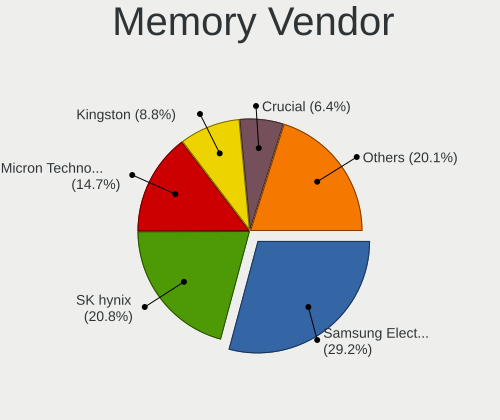

| Vendor              | Notebooks | Percent |
|---------------------|-----------|---------|
| Samsung Electronics | 831       | 29.17%  |
| SK hynix            | 592       | 20.78%  |
| Micron Technology   | 419       | 14.71%  |
| Kingston            | 252       | 8.85%   |
| Crucial             | 181       | 6.35%   |
| Unknown             | 92        | 3.23%   |
| A-DATA Technology   | 66        | 2.32%   |
| Ramaxel Technology  | 58        | 2.04%   |
| Elpida              | 43        | 1.51%   |
| Unknown (ABCD)      | 42        | 1.47%   |
| Unknown             | 37        | 1.3%    |
| Corsair             | 35        | 1.23%   |
| Nanya Technology    | 27        | 0.95%   |
| G.Skill             | 20        | 0.7%    |
| Smart               | 18        | 0.63%   |
| Transcend           | 15        | 0.53%   |
| Apacer              | 10        | 0.35%   |
| Team                | 8         | 0.28%   |
| Goodram             | 7         | 0.25%   |
| Wilk                | 5         | 0.18%   |
| Smart Brazil        | 5         | 0.18%   |
| 4ea5                | 5         | 0.18%   |
| Teikon              | 4         | 0.14%   |
| Silicon Power       | 4         | 0.14%   |
| Patriot             | 4         | 0.14%   |
| ff                  | 4         | 0.14%   |
| Timetec             | 3         | 0.11%   |
| SHARETRONIC         | 3         | 0.11%   |
| Goldkey             | 3         | 0.11%   |
| ASint Technology    | 3         | 0.11%   |
| Wodposit            | 2         | 0.07%   |
| Qimonda             | 2         | 0.07%   |
| Lexar               | 2         | 0.07%   |
| Kllisre             | 2         | 0.07%   |
| CSX                 | 2         | 0.07%   |
| Avant               | 2         | 0.07%   |
| AMD                 | 2         | 0.07%   |
| V-GeN               | 1         | 0.04%   |
| V-Color             | 1         | 0.04%   |
| Unknown (8AD6)      | 1         | 0.04%   |

Memory Model
------------

Memory module models

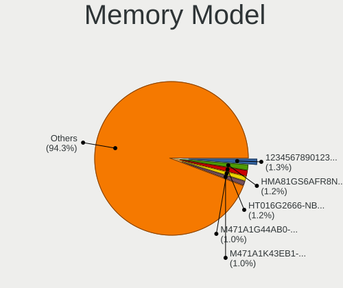

| Model                                                            | Notebooks | Percent |
|------------------------------------------------------------------|-----------|---------|
| Unknown (ABCD) RAM 123456789012345678 2GB SODIMM LPDDR4 2400MT/s | 38        | 1.27%   |
| SK hynix RAM HMA81GS6AFR8N-UH 8GB SODIMM DDR4 2667MT/s           | 37        | 1.23%   |
| Unknown                                                          | 37        | 1.23%   |
| Samsung RAM M471A1G44AB0-CWE 8GiB SODIMM DDR4 3200MT/s           | 31        | 1.03%   |
| Samsung RAM M471A1K43EB1-CWE 8GB SODIMM DDR4 3200MT/s            | 29        | 0.97%   |
| Samsung RAM M471A1K43DB1-CWE 8GB SODIMM DDR4 3200MT/s            | 29        | 0.97%   |
| Samsung RAM M471A1K43CB1-CTD 8GB SODIMM DDR4 3200MT/s            | 28        | 0.93%   |
| Samsung RAM M471A5244CB0-CTD 4GB SODIMM DDR4 3266MT/s            | 27        | 0.9%    |
| Samsung RAM M471A1K43CB1-CRC 8GB SODIMM DDR4 8400MT/s            | 27        | 0.9%    |
| Samsung RAM M471A1K43DB1-CTD 8GB SODIMM DDR4 2667MT/s            | 25        | 0.83%   |
| Micron RAM 4ATF51264HZ-2G6E1 4GB SODIMM DDR4 2667MT/s            | 24        | 0.8%    |
| SK hynix RAM HMAA1GS6CJR6N-XN 8GB SODIMM DDR4 3200MT/s           | 23        | 0.77%   |
| Samsung RAM M471A2K43DB1-CTD 16GB SODIMM DDR4 2667MT/s           | 22        | 0.73%   |
| Samsung RAM M471B5173DB0-YK0 4GB SODIMM DDR3 1600MT/s            | 20        | 0.67%   |
| Samsung RAM M471A1G44BB0-CWE 8GB SODIMM DDR4 3200MT/s            | 20        | 0.67%   |
| SK hynix RAM HMT351S6CFR8C-PB 4GB SODIMM DDR3 1600MT/s           | 19        | 0.63%   |
| SK hynix RAM HMA81GS6DJR8N-XN 8GB SODIMM DDR4 3200MT/s           | 19        | 0.63%   |
| SK hynix RAM HMA81GS6CJR8N-VK 8GB SODIMM DDR4 2667MT/s           | 19        | 0.63%   |
| Samsung RAM M471B5173QH0-YK0 4GB SODIMM DDR3 1600MT/s            | 19        | 0.63%   |
| Samsung RAM M471B1G73DB0-YK0 8GB SODIMM DDR3 1600MT/s            | 19        | 0.63%   |
| Samsung RAM M471A5244CB0-CRC 4GB SODIMM DDR4 2667MT/s            | 19        | 0.63%   |
| Samsung RAM M471A1G44AB0-CWE 8GB Row Of Chips DDR4 3200MT/s      | 19        | 0.63%   |
| SK hynix RAM HMT451S6BFR8A-PB 4GB SODIMM DDR3 1600MT/s           | 18        | 0.6%    |
| SK hynix RAM HMT41GS6BFR8A-PB 8GB SODIMM DDR3 2667MT/s           | 18        | 0.6%    |
| Micron RAM 4ATF1G64HZ-3G2E1 8GB SODIMM DDR4 3200MT/s             | 18        | 0.6%    |
| Micron RAM 4ATF1G64HZ-3G2E1 8GB Row Of Chips DDR4 3200MT/s       | 18        | 0.6%    |
| Samsung RAM M471B5273DH0-CH9 4GB SODIMM DDR3 1600MT/s            | 17        | 0.57%   |
| Micron RAM 4ATF1G64HZ-3G2F1 8GB SODIMM DDR4 3200MT/s             | 17        | 0.57%   |
| SK hynix RAM HMA851S6CJR6N-VK 4GB SODIMM DDR4 2667MT/s           | 16        | 0.53%   |
| Samsung RAM M471A2K43DB1-CWE 16GB SODIMM DDR4 3200MT/s           | 16        | 0.53%   |
| SK hynix RAM HMA81GS6JJR8N-VK 8GB SODIMM DDR4 2667MT/s           | 15        | 0.5%    |
| Samsung RAM M471A5244CB0-CWE 4GB SODIMM DDR4 3200MT/s            | 15        | 0.5%    |
| Samsung RAM M471A2K43CB1-CTD 16GB SODIMM DDR4 8400MT/s           | 15        | 0.5%    |
| SK hynix RAM HMA82GS6JJR8N-VK 16GB SODIMM DDR4 2667MT/s          | 14        | 0.47%   |
| Samsung RAM M471B5173EB0-YK0 4GB SODIMM DDR3 1600MT/s            | 14        | 0.47%   |
| SK hynix RAM HMAA1GS6CJR6N-XN 8GB Row Of Chips DDR4 3200MT/s     | 13        | 0.43%   |
| SK hynix RAM HMA851S6AFR6N-UH 4GB SODIMM DDR4 2667MT/s           | 13        | 0.43%   |
| SK hynix RAM HMA41GS6AFR8N-TF 8GB SODIMM DDR4 2667MT/s           | 13        | 0.43%   |
| Samsung RAM M471B1G73QH0-YK0 8GB SODIMM DDR3 1600MT/s            | 13        | 0.43%   |
| Micron RAM 8ATF1G64HZ-3G2J1 8GB SODIMM DDR4 3200MT/s             | 13        | 0.43%   |

Memory Kind
-----------

Memory module kinds

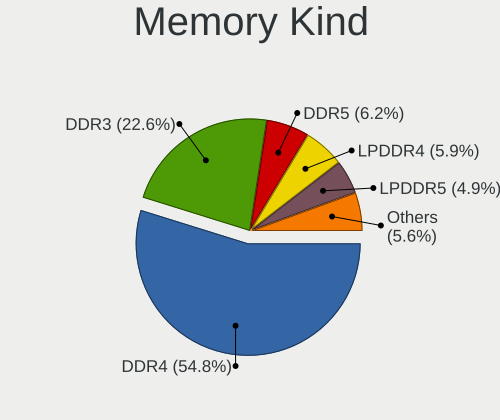

| Kind    | Notebooks | Percent |
|---------|-----------|---------|
| DDR4    | 1311      | 54.81%  |
| DDR3    | 541       | 22.62%  |
| DDR5    | 148       | 6.19%   |
| LPDDR4  | 142       | 5.94%   |
| LPDDR5  | 117       | 4.89%   |
| LPDDR3  | 66        | 2.76%   |
| DDR2    | 29        | 1.21%   |
| SDRAM   | 26        | 1.09%   |
| Unknown | 10        | 0.42%   |
| DDR     | 2         | 0.08%   |

Memory Form Factor
------------------

Physical design of the memory module

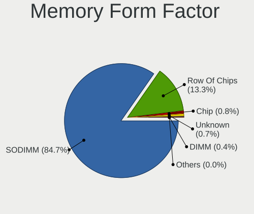

| Name            | Notebooks | Percent |
|-----------------|-----------|---------|
| SODIMM          | 2041      | 84.72%  |
| Row Of Chips    | 321       | 13.33%  |
| Chip            | 19        | 0.79%   |
| Unknown         | 18        | 0.75%   |
| DIMM            | 9         | 0.37%   |
| Proprietary Car | 1         | 0.04%   |

Memory Size
-----------

Memory module size

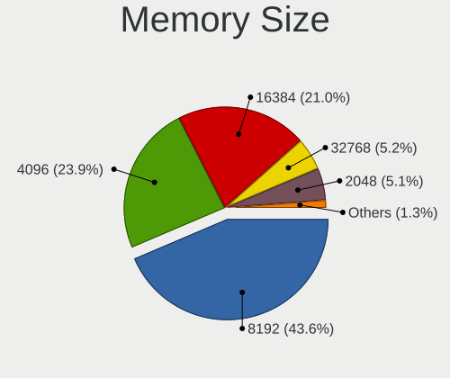

| Size  | Notebooks | Percent |
|-------|-----------|---------|
| 8192  | 1146      | 43.59%  |
| 4096  | 628       | 23.89%  |
| 16384 | 551       | 20.96%  |
| 32768 | 136       | 5.17%   |
| 2048  | 135       | 5.14%   |
| 1024  | 23        | 0.87%   |
| 49152 | 6         | 0.23%   |
| 12288 | 2         | 0.08%   |
| 65536 | 1         | 0.04%   |
| 6144  | 1         | 0.04%   |

Memory Speed
------------

Memory module speed

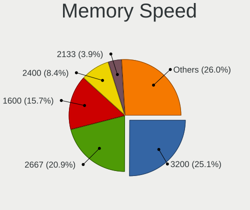

| Speed   | Notebooks | Percent |
|---------|-----------|---------|
| 3200    | 644       | 25.06%  |
| 2667    | 538       | 20.93%  |
| 1600    | 404       | 15.72%  |
| 2400    | 217       | 8.44%   |
| 2133    | 99        | 3.85%   |
| 5600    | 78        | 3.04%   |
| 4800    | 68        | 2.65%   |
| 6400    | 66        | 2.57%   |
| 1333    | 60        | 2.33%   |
| 4267    | 59        | 2.3%    |
| 1334    | 54        | 2.1%    |
| 8400    | 44        | 1.71%   |
| 7500    | 31        | 1.21%   |
| 1867    | 29        | 1.13%   |
| 3266    | 27        | 1.05%   |
| 4199    | 18        | 0.7%    |
| 1067    | 18        | 0.7%    |
| Unknown | 18        | 0.7%    |
| 667     | 17        | 0.66%   |
| 4266    | 13        | 0.51%   |
| 800     | 13        | 0.51%   |
| 8533    | 9         | 0.35%   |
| 2048    | 7         | 0.27%   |
| 7467    | 5         | 0.19%   |
| 2933    | 5         | 0.19%   |
| 1066    | 4         | 0.16%   |
| 3733    | 3         | 0.12%   |
| 975     | 3         | 0.12%   |
| 8000    | 2         | 0.08%   |
| 6000    | 2         | 0.08%   |
| 3000    | 2         | 0.08%   |
| 1866    | 2         | 0.08%   |
| 8600    | 1         | 0.04%   |
| 5500    | 1         | 0.04%   |
| 4000    | 1         | 0.04%   |
| 2666    | 1         | 0.04%   |
| 2000    | 1         | 0.04%   |
| 1776    | 1         | 0.04%   |
| 1639    | 1         | 0.04%   |
| 1200    | 1         | 0.04%   |

Printers & scanners
-------------------

Printer Vendor
--------------

Printer device vendors

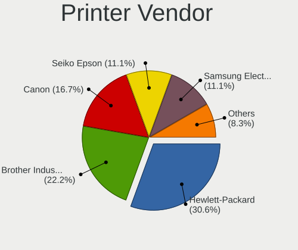

| Vendor              | Notebooks | Percent |
|---------------------|-----------|---------|
| Hewlett-Packard     | 11        | 30.56%  |
| Brother Industries  | 8         | 22.22%  |
| Canon               | 6         | 16.67%  |
| Seiko Epson         | 4         | 11.11%  |
| Samsung Electronics | 4         | 11.11%  |
| Xerox               | 1         | 2.78%   |
| Pantum              | 1         | 2.78%   |
| Dymo-CoStar         | 1         | 2.78%   |

Printer Model
-------------

Printer device models

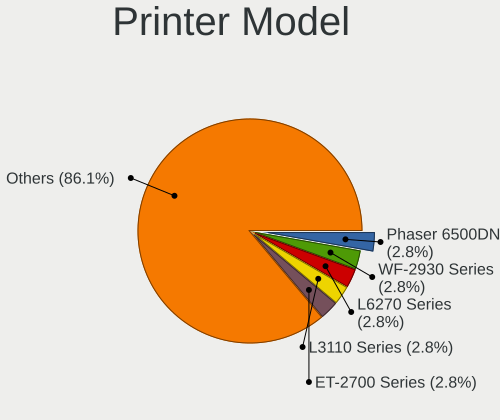

| Model                                           | Notebooks | Percent |
|-------------------------------------------------|-----------|---------|
| Xerox Phaser 6500DN                             | 1         | 2.78%   |
| Seiko Epson WF-2930 Series                      | 1         | 2.78%   |
| Seiko Epson L6270 Series                        | 1         | 2.78%   |
| Seiko Epson L3110 Series                        | 1         | 2.78%   |
| Seiko Epson ET-2700 Series                      | 1         | 2.78%   |
| Samsung Xerox Phaser 3117 Laser Printer         | 1         | 2.78%   |
| Samsung SCX-3200 Series                         | 1         | 2.78%   |
| Samsung ML-3470 Series                          | 1         | 2.78%   |
| Samsung M262x/M282x Xpress Series Laser Printer | 1         | 2.78%   |
| Pantum M6500NW-series                           | 1         | 2.78%   |
| HP Smart Tank 7300 series                       | 1         | 2.78%   |
| HP Officejet J4500 series                       | 1         | 2.78%   |
| HP LaserJet Professional P 1102w                | 1         | 2.78%   |
| HP LaserJet P2015 series                        | 1         | 2.78%   |
| HP Laserjet P1505                               | 1         | 2.78%   |
| HP LaserJet P1102                               | 1         | 2.78%   |
| HP LaserJet P1006                               | 1         | 2.78%   |
| HP LaserJet 1160 series                         | 1         | 2.78%   |
| HP LaserJet 1020                                | 1         | 2.78%   |
| HP DeskJet F300 series                          | 1         | 2.78%   |
| HP DeskJet 2300 series                          | 1         | 2.78%   |
| Dymo-CoStar LabelWriter 400                     | 1         | 2.78%   |
| Canon PIXMA MX490 Series                        | 1         | 2.78%   |
| Canon PIXMA MP250                               | 1         | 2.78%   |
| Canon PIXMA MG2500 Series                       | 1         | 2.78%   |
| Canon MF4800 Series                             | 1         | 2.78%   |
| Canon iP2600 series                             | 1         | 2.78%   |
| Canon CAPT USB Device                           | 1         | 2.78%   |
| Brother MFC-J4340DW                             | 1         | 2.78%   |
| Brother HL-L2390DW                              | 1         | 2.78%   |
| Brother HL-5450DN series                        | 1         | 2.78%   |
| Brother HL-2230 series                          | 1         | 2.78%   |
| Brother DCP-T520W                               | 1         | 2.78%   |
| Brother DCP-L2600D                              | 1         | 2.78%   |
| Brother DCP-L2500D                              | 1         | 2.78%   |
| Brother DCP-J1050DW                             | 1         | 2.78%   |

Scanner Vendor
--------------

Scanner device vendors

| Vendor      | Notebooks | Percent |
|-------------|-----------|---------|
| Seiko Epson | 3         | 75%     |
| Canon       | 1         | 25%     |

Scanner Model
-------------

Scanner device models

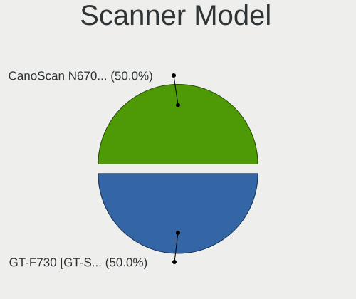

| Model                                                   | Notebooks | Percent |
|---------------------------------------------------------|-----------|---------|
| Seiko Epson GT-X900 [Perfection V700/V750 Photo]        | 1         | 25%     |
| Seiko Epson GT-F730 [GT-S630/Perfection V33/V330 Photo] | 1         | 25%     |
| Seiko Epson GT-F600 [Perfection 4180]                   | 1         | 25%     |
| Canon CanoScan N670U/N676U/LiDE 20                      | 1         | 25%     |

Camera
------

Camera Vendor
-------------

Camera device vendors

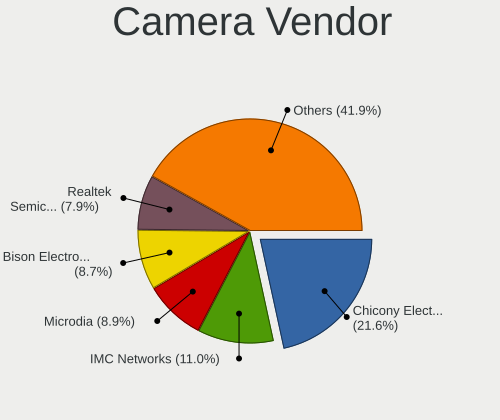

| Vendor                                 | Notebooks | Percent |
|----------------------------------------|-----------|---------|
| Chicony Electronics                    | 769       | 21.6%   |
| IMC Networks                           | 392       | 11.01%  |
| Microdia                               | 316       | 8.87%   |
| Bison Electronics                      | 310       | 8.71%   |
| Realtek Semiconductor                  | 282       | 7.92%   |
| Quanta                                 | 234       | 6.57%   |
| Sunplus Innovation Technology          | 200       | 5.62%   |
| Cheng Uei Precision Industry (Foxlink) | 146       | 4.1%    |
| Luxvisions Innotech Limited            | 106       | 2.98%   |
| Syntek                                 | 88        | 2.47%   |
| Lite-On Technology                     | 73        | 2.05%   |
| Suyin                                  | 70        | 1.97%   |
| Logitech                               | 65        | 1.83%   |
| Apple                                  | 63        | 1.77%   |
| Silicon Motion                         | 56        | 1.57%   |
| Sonix Technology                       | 47        | 1.32%   |
| ShineTech                              | 28        | 0.79%   |
| Alcor Micro                            | 27        | 0.76%   |
| SunplusIT                              | 23        | 0.65%   |
| Samsung Electronics                    | 23        | 0.65%   |
| Ricoh                                  | 19        | 0.53%   |
| Acer                                   | 17        | 0.48%   |
| Lenovo                                 | 13        | 0.37%   |
| icSpring                               | 10        | 0.28%   |
| Microsoft                              | 8         | 0.22%   |
| kingcome                               | 8         | 0.22%   |
| Y Media                                | 7         | 0.2%    |
| Intel                                  | 7         | 0.2%    |
| Z-Star Microelectronics                | 6         | 0.17%   |
| Sunplus Technology                     | 6         | 0.17%   |
| Primax Electronics                     | 6         | 0.17%   |
| Importek                               | 6         | 0.17%   |
| GEMBIRD                                | 6         | 0.17%   |
| Shenzhen Kingcome Optoelectronic       | 5         | 0.14%   |
| Generalplus Technology                 | 5         | 0.14%   |
| DigiTech                               | 5         | 0.14%   |
| USB Camera CS                          | 4         | 0.11%   |
| OmniVision Technologies                | 4         | 0.11%   |
| Motorola PCS                           | 4         | 0.11%   |
| KYE Systems (Mouse Systems)            | 4         | 0.11%   |

Camera Model
------------

Camera device models

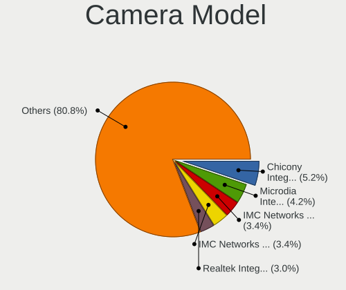

| Model                                               | Notebooks | Percent |
|-----------------------------------------------------|-----------|---------|
| Chicony Integrated Camera                           | 186       | 5.19%   |
| Microdia Integrated_Webcam_HD                       | 149       | 4.16%   |
| IMC Networks USB2.0 HD UVC WebCam                   | 123       | 3.43%   |
| IMC Networks Integrated Camera                      | 121       | 3.38%   |
| Realtek Integrated_Webcam_HD                        | 109       | 3.04%   |
| Bison Integrated Camera                             | 89        | 2.48%   |
| Sunplus Integrated_Webcam_HD                        | 79        | 2.2%    |
| Syntek Integrated Camera                            | 69        | 1.93%   |
| Chicony HD Webcam                                   | 67        | 1.87%   |
| Quanta HD User Facing                               | 46        | 1.28%   |
| Chicony HP HD Camera                                | 41        | 1.14%   |
| Chicony HD User Facing                              | 41        | 1.14%   |
| Quanta HP HD Camera                                 | 37        | 1.03%   |
| Bison HD Webcam                                     | 36        | 1%      |
| Microdia Integrated Webcam                          | 33        | 0.92%   |
| Quanta HP TrueVision HD Camera                      | 30        | 0.84%   |
| Chicony Integrated Camera (1280x720@30)             | 30        | 0.84%   |
| Luxvisions Innotech Limited Integrated Camera       | 29        | 0.81%   |
| Bison Lenovo EasyCamera                             | 29        | 0.81%   |
| Quanta HD Webcam                                    | 28        | 0.78%   |
| Chicony HP TrueVision HD Camera                     | 28        | 0.78%   |
| Bison BisonCam,NB Pro                               | 28        | 0.78%   |
| Sonix USB2.0 HD UVC WebCam                          | 27        | 0.75%   |
| Microdia Integrated_Webcam_FHD                      | 27        | 0.75%   |
| IMC Networks USB2.0 VGA UVC WebCam                  | 26        | 0.73%   |
| Lite-On Integrated Camera                           | 25        | 0.7%    |
| Chicony HP Wide Vision HD Camera                    | 24        | 0.67%   |
| Chicony Chicony USB2.0 Camera                       | 24        | 0.67%   |
| Samsung Galaxy series, misc. (MTP mode)             | 23        | 0.64%   |
| Chicony USB2.0 Camera                               | 22        | 0.61%   |
| IMC Networks HD Camera                              | 21        | 0.59%   |
| Bison Integrated RGB Camera                         | 21        | 0.59%   |
| Chicony HP Truevision HD                            | 20        | 0.56%   |
| Apple FaceTime HD Camera                            | 20        | 0.56%   |
| Luxvisions Innotech Limited HP TrueVision HD Camera | 19        | 0.53%   |
| Chicony USB2.0 HD UVC WebCam                        | 19        | 0.53%   |
| Apple iPhone 5/5C/5S/6/SE/7/8/X                     | 19        | 0.53%   |
| Microdia Laptop_Integrated_Webcam_HD                | 18        | 0.5%    |
| Bison BisonCam, NB Pro                              | 18        | 0.5%    |
| Realtek Integrated Webcam                           | 17        | 0.47%   |

Security
--------

Fingerprint Vendor
------------------

Fingerprint sensor vendors

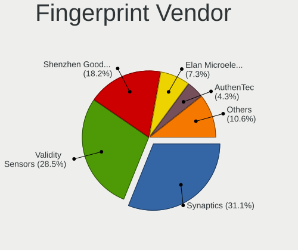

| Vendor                             | Notebooks | Percent |
|------------------------------------|-----------|---------|
| Synaptics                          | 234       | 31.12%  |
| Validity Sensors                   | 214       | 28.46%  |
| Shenzhen Goodix Technology         | 137       | 18.22%  |
| Elan Microelectronics              | 55        | 7.31%   |
| AuthenTec                          | 32        | 4.26%   |
| Upek                               | 28        | 3.72%   |
| LighTuning Technology              | 23        | 3.06%   |
| Realtek USB2.0 Finger Print Bridge | 11        | 1.46%   |
| STMicroelectronics                 | 6         | 0.8%    |
| Focal-systems.Corp                 | 5         | 0.66%   |
| HOLTEK                             | 4         | 0.53%   |
| Samsung Electronics                | 2         | 0.27%   |
| GDMicroelectronics                 | 1         | 0.13%   |

Fingerprint Model
-----------------

Fingerprint sensor models

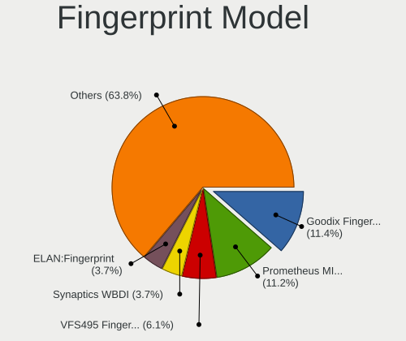

| Model                                                                      | Notebooks | Percent |
|----------------------------------------------------------------------------|-----------|---------|
| Shenzhen Goodix  Fingerprint Device                                        | 86        | 11.44%  |
| Synaptics Prometheus MIS Touch Fingerprint Reader                          | 84        | 11.17%  |
| Validity Sensors VFS495 Fingerprint Reader                                 | 46        | 6.12%   |
| Validity Sensors Synaptics WBDI                                            | 28        | 3.72%   |
| Elan ELAN:Fingerprint                                                      | 28        | 3.72%   |
| Validity Sensors VFS 5011 fingerprint sensor                               | 27        | 3.59%   |
| Upek Biometric Touchchip/Touchstrip Fingerprint Sensor                     | 27        | 3.59%   |
| Shenzhen Goodix Fingerprint Reader                                         | 27        | 3.59%   |
| Elan ELAN:ARM-M4                                                           | 26        | 3.46%   |
| Synaptics Metallica MIS Touch Fingerprint Reader                           | 25        | 3.32%   |
| Shenzhen Goodix FingerPrint                                                | 24        | 3.19%   |
| Validity Sensors VFS5011 Fingerprint Reader                                | 21        | 2.79%   |
| Validity Sensors Swipe Fingerprint Sensor                                  | 20        | 2.66%   |
| Synaptics UWP WBDI Device                                                  | 18        | 2.39%   |
| Synaptics FS7604 Touch Fingerprint Sensor with PurePrint                   | 18        | 2.39%   |
| Validity Sensors Synaptics VFS7552 Touch Fingerprint Sensor with PurePrint | 16        | 2.13%   |
| Synaptics  FS7604 Touch Fingerprint Sensor with PurePrint                  | 15        | 1.99%   |
| Synaptics Fingerprint reader [HP G6]                                       | 15        | 1.99%   |
| Synaptics Prometheus Fingerprint Reader                                    | 14        | 1.86%   |
| LighTuning EgisTec Touch Fingerprint Sensor                                | 14        | 1.86%   |
| Validity Sensors VFS491                                                    | 13        | 1.73%   |
| Synaptics Metallica MOH Touch Fingerprint Reader                           | 12        | 1.6%    |
| Realtek USB2.0 Finger Print Bridge FocalTech Fingerprint Device            | 11        | 1.46%   |
| Synaptics WBDI Fingerprint Reader USB 086                                  | 10        | 1.33%   |
| AuthenTec AES2810                                                          | 10        | 1.33%   |
| Validity Sensors VFS471 Fingerprint Reader                                 | 9         | 1.2%    |
| Validity Sensors VFS7500 Touch Fingerprint Sensor                          | 8         | 1.06%   |
| Validity Sensors VFS451 Fingerprint Reader                                 | 8         | 1.06%   |
| AuthenTec Fingerprint Sensor                                               | 8         | 1.06%   |
| Validity Sensors Fingerprint scanner                                       | 7         | 0.93%   |
| LighTuning ES603 Swipe Fingerprint Sensor                                  | 7         | 0.93%   |
| AuthenTec AES2501 Fingerprint Sensor                                       | 7         | 0.93%   |
| Synaptics TouchPad                                                         | 6         | 0.8%    |
| STMicroelectronics Fingerprint Reader                                      | 6         | 0.8%    |
| Validity Sensors VFS7552 Touch Fingerprint Sensor                          | 5         | 0.66%   |
| Focal-systems.Corp FT9201Fingerprint.                                      | 5         | 0.66%   |
| Unknown                                                                    | 5         | 0.66%   |
| Synaptics WBDI                                                             | 4         | 0.53%   |
| HOLTEK FocalTech Fingerprint Device                                        | 4         | 0.53%   |
| AuthenTec AES1660 Fingerprint Sensor                                       | 4         | 0.53%   |

Chipcard Vendor
---------------

Chipcard module vendors

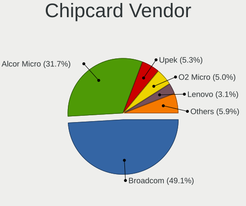

| Vendor                    | Notebooks | Percent |
|---------------------------|-----------|---------|
| Broadcom                  | 158       | 49.07%  |
| Alcor Micro               | 102       | 31.68%  |
| Upek                      | 17        | 5.28%   |
| O2 Micro                  | 16        | 4.97%   |
| Lenovo                    | 10        | 3.11%   |
| Yubico.com                | 2         | 0.62%   |
| Realtek Semiconductor     | 2         | 0.62%   |
| Clay Logic                | 2         | 0.62%   |
| Aladdin R.D.              | 2         | 0.62%   |
| Advanced Card Systems     | 2         | 0.62%   |
| Watchdata                 | 1         | 0.31%   |
| SCM Microsystems          | 1         | 0.31%   |
| Reiner SCT Kartensysteme  | 1         | 0.31%   |
| In Focus Systems          | 1         | 0.31%   |
| Giesecke & Devrient       | 1         | 0.31%   |
| Fujitsu Siemens Computers | 1         | 0.31%   |
| Chicony Electronics       | 1         | 0.31%   |
| Bit4id                    | 1         | 0.31%   |
| Aladdin Knowledge Systems | 1         | 0.31%   |

Chipcard Model
--------------

Chipcard module models

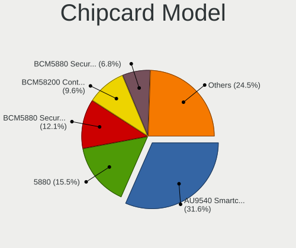

| Model                                                                        | Notebooks | Percent |
|------------------------------------------------------------------------------|-----------|---------|
| Alcor Micro AU9540 Smartcard Reader                                          | 102       | 31.58%  |
| Broadcom 5880                                                                | 50        | 15.48%  |
| Broadcom BCM5880 Secure Applications Processor                               | 39        | 12.07%  |
| Broadcom BCM58200 ControlVault 3 (FingerPrint sensor + Contacted SmartCard)  | 31        | 9.6%    |
| Broadcom BCM5880 Secure Applications Processor with fingerprint swipe sensor | 22        | 6.81%   |
| Upek TouchChip Fingerprint Coprocessor (WBF advanced mode)                   | 17        | 5.26%   |
| O2 Micro OZ776 CCID Smartcard Reader                                         | 16        | 4.95%   |
| Broadcom 58200                                                               | 14        | 4.33%   |
| Lenovo Integrated Smart Card Reader                                          | 10        | 3.1%    |
| Yubico.com Yubikey 4/5 U2F+CCID                                              | 2         | 0.62%   |
| Realtek Semiconductor Smart Card Reader Interface                            | 2         | 0.62%   |
| Clay Logic Nitrokey Pro                                                      | 2         | 0.62%   |
| Broadcom BCM5880 Secure Applications Processor with fingerprint touch sensor | 2         | 0.62%   |
| Aladdin R.D. JaCarta                                                         | 2         | 0.62%   |
| Advanced Card Systems ACR39U                                                 | 2         | 0.62%   |
| Watchdata USB Key                                                            | 1         | 0.31%   |
| SCM Microsystems SCR3340 - ExpressCard54 Smart Card Reader                   | 1         | 0.31%   |
| Reiner SCT Kartensysteme cyberJack RFID basis contactless smartcard reader   | 1         | 0.31%   |
| In Focus Systems EMV Smartcard Reader                                        | 1         | 0.31%   |
| Giesecke & Devrient Chipcard Reader                                          | 1         | 0.31%   |
| Fujitsu Siemens Computers Keyboard KB SCR                                    | 1         | 0.31%   |
| Chicony Electronics HP Skylab USB Smartcard Keyboard                         | 1         | 0.31%   |
| Bit4id miniLector EVO                                                        | 1         | 0.31%   |
| Aladdin Knowledge Systems Token JC                                           | 1         | 0.31%   |
| Advanced Card Systems ACR38 SmartCard Reader                                 | 1         | 0.31%   |

Unsupported
-----------

Unsupported Devices
-------------------

Total unsupported devices on board

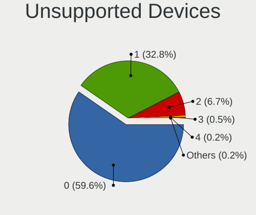

| Total | Notebooks | Percent |
|-------|-----------|---------|
| 0     | 2312      | 59.63%  |
| 1     | 1272      | 32.81%  |
| 2     | 261       | 6.73%   |
| 3     | 20        | 0.52%   |
| 4     | 6         | 0.15%   |
| 7     | 3         | 0.08%   |
| 6     | 2         | 0.05%   |
| 9     | 1         | 0.03%   |

Unsupported Device Types
------------------------

Types of unsupported devices

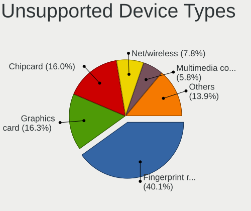

| Type                     | Notebooks | Percent |
|--------------------------|-----------|---------|
| Fingerprint reader       | 741       | 40.1%   |
| Graphics card            | 301       | 16.29%  |
| Chipcard                 | 296       | 16.02%  |
| Net/wireless             | 145       | 7.85%   |
| Multimedia controller    | 108       | 5.84%   |
| Camera                   | 78        | 4.22%   |
| Bluetooth                | 47        | 2.54%   |
| Storage                  | 28        | 1.52%   |
| Sound                    | 28        | 1.52%   |
| Card reader              | 26        | 1.41%   |
| Communication controller | 24        | 1.3%    |
| Net/ethernet             | 11        | 0.6%    |
| Modem                    | 7         | 0.38%   |
| Network                  | 6         | 0.32%   |
| Storage/ide              | 1         | 0.05%   |
| Firewire controller      | 1         | 0.05%   |

