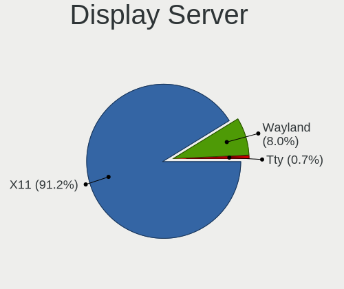
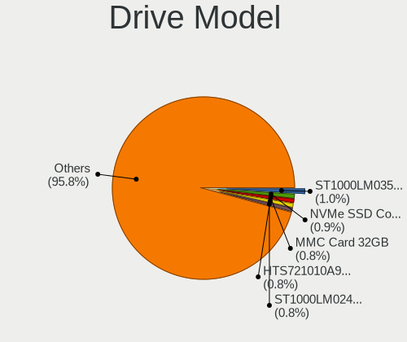
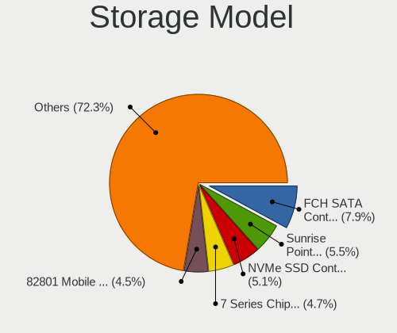
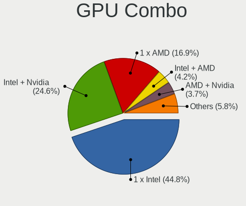
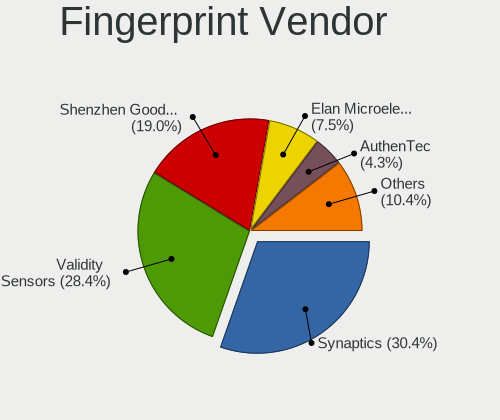
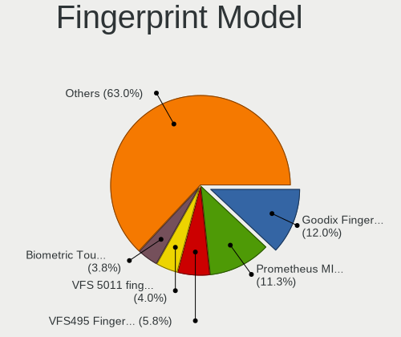
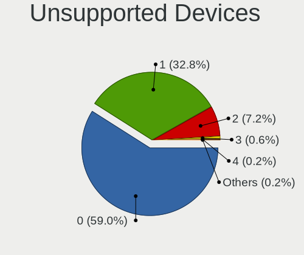

Kubuntu - Tested Hardware & Statistics (Notebooks)
--------------------------------------------------

A project to collect tested hardware configurations for Kubuntu.

Anyone can contribute to this report by the [hw-probe](https://github.com/linuxhw/hw-probe) tool:

    sudo -E hw-probe -all -upload

Please contribute! Especially if your hardware is rare.

Contents
--------

* [ Test Cases ](#test-cases)

* [ System ](#system)
  - [ OS                       ](#os)
  - [ OS Family                ](#os-family)
  - [ Kernel                   ](#kernel)
  - [ Kernel Family            ](#kernel-family)
  - [ Kernel Major Ver.        ](#kernel-major-ver)
  - [ Arch                     ](#arch)
  - [ DE                       ](#de)
  - [ Display Server           ](#display-server)
  - [ Display Manager          ](#display-manager)
  - [ OS Lang                  ](#os-lang)
  - [ Boot Mode                ](#boot-mode)
  - [ Filesystem               ](#filesystem)
  - [ Part. scheme             ](#part-scheme)
  - [ Dual Boot with Linux/BSD ](#dual-boot-with-linuxbsd)
  - [ Dual Boot (Win)          ](#dual-boot-win)

* [ Board ](#board)
  - [ Vendor                   ](#vendor)
  - [ Model                    ](#model)
  - [ Model Family             ](#model-family)
  - [ MFG Year                 ](#mfg-year)
  - [ Form Factor              ](#form-factor)
  - [ Secure Boot              ](#secure-boot)
  - [ Coreboot                 ](#coreboot)
  - [ RAM Size                 ](#ram-size)
  - [ RAM Used                 ](#ram-used)
  - [ Total Drives             ](#total-drives)
  - [ Has CD-ROM               ](#has-cd-rom)
  - [ Has Ethernet             ](#has-ethernet)
  - [ Has WiFi                 ](#has-wifi)
  - [ Has Bluetooth            ](#has-bluetooth)

* [ Location ](#location)
  - [ Country                  ](#country)
  - [ City                     ](#city)

* [ Drives ](#drives)
  - [ Drive Vendor             ](#drive-vendor)
  - [ Drive Model              ](#drive-model)
  - [ HDD Vendor               ](#hdd-vendor)
  - [ SSD Vendor               ](#ssd-vendor)
  - [ Drive Kind               ](#drive-kind)
  - [ Drive Connector          ](#drive-connector)
  - [ Drive Size               ](#drive-size)
  - [ Space Total              ](#space-total)
  - [ Space Used               ](#space-used)
  - [ Malfunc. Drives          ](#malfunc-drives)
  - [ Malfunc. Drive Vendor    ](#malfunc-drive-vendor)
  - [ Malfunc. HDD Vendor      ](#malfunc-hdd-vendor)
  - [ Malfunc. Drive Kind      ](#malfunc-drive-kind)
  - [ Failed Drives            ](#failed-drives)
  - [ Failed Drive Vendor      ](#failed-drive-vendor)
  - [ Drive Status             ](#drive-status)

* [ Storage controller ](#storage-controller)
  - [ Storage Vendor           ](#storage-vendor)
  - [ Storage Model            ](#storage-model)
  - [ Storage Kind             ](#storage-kind)

* [ Processor ](#processor)
  - [ CPU Vendor               ](#cpu-vendor)
  - [ CPU Model                ](#cpu-model)
  - [ CPU Model Family         ](#cpu-model-family)
  - [ CPU Cores                ](#cpu-cores)
  - [ CPU Sockets              ](#cpu-sockets)
  - [ CPU Threads              ](#cpu-threads)
  - [ CPU Op-Modes             ](#cpu-op-modes)
  - [ CPU Microcode            ](#cpu-microcode)
  - [ CPU Microarch            ](#cpu-microarch)

* [ Graphics ](#graphics)
  - [ GPU Vendor               ](#gpu-vendor)
  - [ GPU Model                ](#gpu-model)
  - [ GPU Combo                ](#gpu-combo)
  - [ GPU Driver               ](#gpu-driver)
  - [ GPU Memory               ](#gpu-memory)

* [ Monitor ](#monitor)
  - [ Monitor Vendor           ](#monitor-vendor)
  - [ Monitor Model            ](#monitor-model)
  - [ Monitor Resolution       ](#monitor-resolution)
  - [ Monitor Diagonal         ](#monitor-diagonal)
  - [ Monitor Width            ](#monitor-width)
  - [ Aspect Ratio             ](#aspect-ratio)
  - [ Monitor Area             ](#monitor-area)
  - [ Pixel Density            ](#pixel-density)
  - [ Multiple Monitors        ](#multiple-monitors)

* [ Network ](#network)
  - [ Net Controller Vendor    ](#net-controller-vendor)
  - [ Net Controller Model     ](#net-controller-model)
  - [ Wireless Vendor          ](#wireless-vendor)
  - [ Wireless Model           ](#wireless-model)
  - [ Ethernet Vendor          ](#ethernet-vendor)
  - [ Ethernet Model           ](#ethernet-model)
  - [ Net Controller Kind      ](#net-controller-kind)
  - [ Used Controller          ](#used-controller)
  - [ NICs                     ](#nics)
  - [ IPv6                     ](#ipv6)

* [ Bluetooth ](#bluetooth)
  - [ Bluetooth Vendor         ](#bluetooth-vendor)
  - [ Bluetooth Model          ](#bluetooth-model)

* [ Sound ](#sound)
  - [ Sound Vendor             ](#sound-vendor)
  - [ Sound Model              ](#sound-model)

* [ Memory ](#memory)
  - [ Memory Vendor            ](#memory-vendor)
  - [ Memory Model             ](#memory-model)
  - [ Memory Kind              ](#memory-kind)
  - [ Memory Form Factor       ](#memory-form-factor)
  - [ Memory Size              ](#memory-size)
  - [ Memory Speed             ](#memory-speed)

* [ Printers & scanners ](#printers--scanners)
  - [ Printer Vendor           ](#printer-vendor)
  - [ Printer Model            ](#printer-model)
  - [ Scanner Vendor           ](#scanner-vendor)
  - [ Scanner Model            ](#scanner-model)

* [ Camera ](#camera)
  - [ Camera Vendor            ](#camera-vendor)
  - [ Camera Model             ](#camera-model)

* [ Security ](#security)
  - [ Fingerprint Vendor       ](#fingerprint-vendor)
  - [ Fingerprint Model        ](#fingerprint-model)
  - [ Chipcard Vendor          ](#chipcard-vendor)
  - [ Chipcard Model           ](#chipcard-model)

* [ Unsupported ](#unsupported)
  - [ Unsupported Devices      ](#unsupported-devices)
  - [ Unsupported Device Types ](#unsupported-device-types)

Test Cases
----------

Total: 3596

| Vendor        | Model                       | Probe                                                      | Date         |
|---------------|-----------------------------|------------------------------------------------------------|--------------|
| Unknown       | Unknown                     | [8c03bd946c](https://linux-hardware.org/?probe=8c03bd946c) | Feb 02, 2024 |
| Notebook      | V15x_V17xRNx                | [901e71289e](https://linux-hardware.org/?probe=901e71289e) | Feb 02, 2024 |
| Dell          | Inspiron 5547               | [507fad3c00](https://linux-hardware.org/?probe=507fad3c00) | Feb 02, 2024 |
| Lenovo        | ThinkPad X1 Carbon Gen 1... | [f1b0b8716f](https://linux-hardware.org/?probe=f1b0b8716f) | Feb 01, 2024 |
| Lenovo        | IdeaPad Slim 5 16IRL8 82... | [8f630da527](https://linux-hardware.org/?probe=8f630da527) | Jan 31, 2024 |
| MSI           | Creator M16 A12UC           | [804a70b7f5](https://linux-hardware.org/?probe=804a70b7f5) | Jan 31, 2024 |
| ASUSTek       | ROG Zephyrus G14 GA401QC... | [02d7b129fc](https://linux-hardware.org/?probe=02d7b129fc) | Jan 31, 2024 |
| ASUSTek       | G75VX                       | [5c270f1082](https://linux-hardware.org/?probe=5c270f1082) | Jan 30, 2024 |
| Dell          | Latitude 3300               | [9d76144e60](https://linux-hardware.org/?probe=9d76144e60) | Jan 29, 2024 |
| Toshiba       | Satellite P300              | [14da91750f](https://linux-hardware.org/?probe=14da91750f) | Jan 29, 2024 |
| Acer          | TravelMate P215-41-G2       | [0500733b2d](https://linux-hardware.org/?probe=0500733b2d) | Jan 28, 2024 |
| Mediacom      | WinPad 11,6 FullHD- WPU1... | [ea399c19ca](https://linux-hardware.org/?probe=ea399c19ca) | Jan 28, 2024 |
| Dell          | Latitude 7530               | [ff36f2cfcc](https://linux-hardware.org/?probe=ff36f2cfcc) | Jan 28, 2024 |
| HP            | EliteBook 8470w             | [a92904a970](https://linux-hardware.org/?probe=a92904a970) | Jan 28, 2024 |
| ASUSTek       | VivoBook_ASUSLaptop X509... | [aa19c735f2](https://linux-hardware.org/?probe=aa19c735f2) | Jan 28, 2024 |
| Acer          | Aspire A715-42G             | [6e3e887615](https://linux-hardware.org/?probe=6e3e887615) | Jan 27, 2024 |
| Lenovo        | ThinkPad T14 Gen 3 21AHA... | [f2ed690a39](https://linux-hardware.org/?probe=f2ed690a39) | Jan 27, 2024 |
| Lenovo        | ThinkPad T14 Gen 3 21AHA... | [4644130b45](https://linux-hardware.org/?probe=4644130b45) | Jan 27, 2024 |
| ASUSTek       | VivoBook_ASUSLaptop X512... | [f3243845d3](https://linux-hardware.org/?probe=f3243845d3) | Jan 27, 2024 |
| Dell          | Latitude 7530               | [e1cd3d26e8](https://linux-hardware.org/?probe=e1cd3d26e8) | Jan 26, 2024 |
| HP            | EliteBook 8570p             | [b6507e7469](https://linux-hardware.org/?probe=b6507e7469) | Jan 25, 2024 |
| Lenovo        | ThinkPad Twist 334729G      | [0a17051b66](https://linux-hardware.org/?probe=0a17051b66) | Jan 25, 2024 |
| Google        | Taeko                       | [e52e2ff787](https://linux-hardware.org/?probe=e52e2ff787) | Jan 25, 2024 |
| Medion        | S14409                      | [8e8339905a](https://linux-hardware.org/?probe=8e8339905a) | Jan 25, 2024 |
| Acer          | Aspire A315-56              | [1c3a86b39c](https://linux-hardware.org/?probe=1c3a86b39c) | Jan 25, 2024 |
| ASUSTek       | VivoBook_ASUSLaptop X170... | [f9da9c2d2e](https://linux-hardware.org/?probe=f9da9c2d2e) | Jan 23, 2024 |
| HP            | ProBook 4540s               | [84367073dd](https://linux-hardware.org/?probe=84367073dd) | Jan 22, 2024 |
| HP            | ProBook 4540s               | [f72cd2d1a0](https://linux-hardware.org/?probe=f72cd2d1a0) | Jan 22, 2024 |
| Acer          | Aspire A315-56              | [b619b984b6](https://linux-hardware.org/?probe=b619b984b6) | Jan 22, 2024 |
| HUAWEI        | BoDE-WXX9                   | [1cfa83e1fc](https://linux-hardware.org/?probe=1cfa83e1fc) | Jan 22, 2024 |
| Packard Be... | EasyNote TS11HR             | [31a4f6e57f](https://linux-hardware.org/?probe=31a4f6e57f) | Jan 22, 2024 |
| ASUSTek       | UX410UAK                    | [1155ca8c5c](https://linux-hardware.org/?probe=1155ca8c5c) | Jan 22, 2024 |
| Apple         | MacBookPro10,2              | [db7e0a0c8a](https://linux-hardware.org/?probe=db7e0a0c8a) | Jan 22, 2024 |
| Acer          | Nitro AN515-55              | [428442a3ab](https://linux-hardware.org/?probe=428442a3ab) | Jan 21, 2024 |
| Lenovo        | ThinkPad L14 Gen 2 20X10... | [aaf1d1d0de](https://linux-hardware.org/?probe=aaf1d1d0de) | Jan 21, 2024 |
| HP            | Notebook                    | [71136f647b](https://linux-hardware.org/?probe=71136f647b) | Jan 20, 2024 |
| ASUSTek       | ROG Strix G513QY_G513QY     | [2d9680d782](https://linux-hardware.org/?probe=2d9680d782) | Jan 20, 2024 |
| ASUSTek       | ROG Strix G513QY_G513QY     | [ea63bb1d97](https://linux-hardware.org/?probe=ea63bb1d97) | Jan 20, 2024 |
| Dell          | Vostro 15-3568              | [36e3b9f35a](https://linux-hardware.org/?probe=36e3b9f35a) | Jan 19, 2024 |
| Dell          | Latitude 7330               | [d8b532bbee](https://linux-hardware.org/?probe=d8b532bbee) | Jan 19, 2024 |
| Apple         | MacBookPro14,1              | [bd52f86baa](https://linux-hardware.org/?probe=bd52f86baa) | Jan 18, 2024 |
| HP            | OMEN Laptop 15-ek1xxx       | [5c18e1a4bc](https://linux-hardware.org/?probe=5c18e1a4bc) | Jan 18, 2024 |
| Dell          | Vostro 15-3568              | [c6bd12e53b](https://linux-hardware.org/?probe=c6bd12e53b) | Jan 18, 2024 |
| Dell          | Vostro 15-3568              | [7af8bc4215](https://linux-hardware.org/?probe=7af8bc4215) | Jan 18, 2024 |
| Dell          | Latitude 5530               | [df5d5becd7](https://linux-hardware.org/?probe=df5d5becd7) | Jan 17, 2024 |
| Dell          | Inspiron N311z              | [e4163cacc4](https://linux-hardware.org/?probe=e4163cacc4) | Jan 16, 2024 |
| HP            | Laptop 15-ef2xxx            | [ca627d3c3e](https://linux-hardware.org/?probe=ca627d3c3e) | Jan 15, 2024 |
| MSI           | Summit E16Flip A12UCT       | [efb852e7fb](https://linux-hardware.org/?probe=efb852e7fb) | Jan 15, 2024 |
| ASUSTek       | VivoBook_ASUSLaptop M650... | [3aab9743d9](https://linux-hardware.org/?probe=3aab9743d9) | Jan 14, 2024 |
| Google        | Fleex                       | [46f5b6af86](https://linux-hardware.org/?probe=46f5b6af86) | Jan 14, 2024 |
| VALE          | Notebook Slim S132          | [32021c35d3](https://linux-hardware.org/?probe=32021c35d3) | Jan 14, 2024 |
| VALE          | Notebook Slim S132          | [0d2db2e184](https://linux-hardware.org/?probe=0d2db2e184) | Jan 14, 2024 |
| Samsung       | 300E5M/300E5L               | [9c43a79143](https://linux-hardware.org/?probe=9c43a79143) | Jan 14, 2024 |
| ASUSTek       | VivoBook_ASUSLaptop X712... | [bda32c8468](https://linux-hardware.org/?probe=bda32c8468) | Jan 14, 2024 |
| Lenovo        | ThinkPad X230 2325BA3       | [2663e39ea0](https://linux-hardware.org/?probe=2663e39ea0) | Jan 14, 2024 |
| Lenovo        | Yoga Slim 7 Pro 14ARH7 8... | [be204b17d2](https://linux-hardware.org/?probe=be204b17d2) | Jan 13, 2024 |
| Lenovo        | ThinkPad E14 Gen 4 21ECS... | [587226a745](https://linux-hardware.org/?probe=587226a745) | Jan 13, 2024 |
| HP            | Laptop 15t-dy100            | [38ad1122d1](https://linux-hardware.org/?probe=38ad1122d1) | Jan 13, 2024 |
| Dell          | Inspiron 3521               | [80bd0982b9](https://linux-hardware.org/?probe=80bd0982b9) | Jan 13, 2024 |
| HP            | OMEN Laptop 15-en1xxx       | [3c339a3645](https://linux-hardware.org/?probe=3c339a3645) | Jan 13, 2024 |
| Dell          | Precision 7720              | [adec0c91d9](https://linux-hardware.org/?probe=adec0c91d9) | Jan 13, 2024 |
| Lenovo        | ThinkPad T495 20NJ000XIX    | [700470a7f6](https://linux-hardware.org/?probe=700470a7f6) | Jan 12, 2024 |
| Lenovo        | ThinkPad E450 20DC003WUS    | [817c17d60e](https://linux-hardware.org/?probe=817c17d60e) | Jan 12, 2024 |
| HP            | ProBook 6450b               | [ddae4148a2](https://linux-hardware.org/?probe=ddae4148a2) | Jan 12, 2024 |
| Dell          | Inspiron 3793               | [60ded5e8e7](https://linux-hardware.org/?probe=60ded5e8e7) | Jan 11, 2024 |
| Infinix       | ZERO BOOK 13                | [7101d9332b](https://linux-hardware.org/?probe=7101d9332b) | Jan 10, 2024 |
| Infinix       | ZERO BOOK 13                | [a3c73eb2fd](https://linux-hardware.org/?probe=a3c73eb2fd) | Jan 09, 2024 |
| Sony          | VGN-CS190N                  | [2ac26516a6](https://linux-hardware.org/?probe=2ac26516a6) | Jan 09, 2024 |
| ASUSTek       | Zephyrus S GX502GW_GX502... | [8101d22b4a](https://linux-hardware.org/?probe=8101d22b4a) | Jan 09, 2024 |
| Micro Comp... | Venus series                | [7680fc8cfc](https://linux-hardware.org/?probe=7680fc8cfc) | Jan 09, 2024 |
| Micro Comp... | Venus series                | [4413b07a3b](https://linux-hardware.org/?probe=4413b07a3b) | Jan 09, 2024 |
| HP            | EliteBook 8470p             | [8a0e17b484](https://linux-hardware.org/?probe=8a0e17b484) | Jan 09, 2024 |
| Samsung       | RV420/RV520/RV720/E3530/... | [565c995910](https://linux-hardware.org/?probe=565c995910) | Jan 08, 2024 |
| MSI           | Creator Z17 A12UGST         | [b9357d76fc](https://linux-hardware.org/?probe=b9357d76fc) | Jan 08, 2024 |
| Dell          | Latitude E7450              | [a60667c993](https://linux-hardware.org/?probe=a60667c993) | Jan 08, 2024 |
| MSI           | Creator Z17 A12UGST         | [6027d9f940](https://linux-hardware.org/?probe=6027d9f940) | Jan 08, 2024 |
| Apple         | MacBookAir9,1               | [6af0a29be6](https://linux-hardware.org/?probe=6af0a29be6) | Jan 07, 2024 |
| Acer          | Aspire A315-24P             | [fccab2dc4a](https://linux-hardware.org/?probe=fccab2dc4a) | Jan 07, 2024 |
| HP            | ZBook 14u G5                | [33c5c3bf2c](https://linux-hardware.org/?probe=33c5c3bf2c) | Jan 05, 2024 |
| HP            | ZBook 14u G5                | [7774c1745d](https://linux-hardware.org/?probe=7774c1745d) | Jan 05, 2024 |
| Dell          | Inspiron 3521               | [431379ef73](https://linux-hardware.org/?probe=431379ef73) | Jan 05, 2024 |
| HP            | ENVY m6                     | [d63a06fb89](https://linux-hardware.org/?probe=d63a06fb89) | Jan 04, 2024 |
| Dell          | Latitude E6420              | [c9538d7328](https://linux-hardware.org/?probe=c9538d7328) | Jan 04, 2024 |
| Lenovo        | ThinkPad E15 Gen 4 21E60... | [cf1f935e69](https://linux-hardware.org/?probe=cf1f935e69) | Jan 03, 2024 |
| Dell          | Latitude E6420              | [45dcfa5d2c](https://linux-hardware.org/?probe=45dcfa5d2c) | Jan 03, 2024 |
| Dell          | Latitude 7490               | [80751dfc22](https://linux-hardware.org/?probe=80751dfc22) | Jan 03, 2024 |
| Dell          | Latitude 7490               | [0765d95d82](https://linux-hardware.org/?probe=0765d95d82) | Jan 03, 2024 |
| Acer          | Aspire 8730                 | [69f291e4be](https://linux-hardware.org/?probe=69f291e4be) | Jan 03, 2024 |
| Dell          | Inspiron 5502               | [3486d53d60](https://linux-hardware.org/?probe=3486d53d60) | Jan 03, 2024 |
| HP            | Pavilion 13 x360 PC         | [c1d7df8730](https://linux-hardware.org/?probe=c1d7df8730) | Jan 02, 2024 |
| HUAWEI        | BOM-WXX9                    | [4c7efd21fe](https://linux-hardware.org/?probe=4c7efd21fe) | Jan 02, 2024 |
| Acer          | Aspire 8730                 | [a435ff1bd6](https://linux-hardware.org/?probe=a435ff1bd6) | Jan 02, 2024 |
| Acer          | Aspire 8730                 | [4db4a265b6](https://linux-hardware.org/?probe=4db4a265b6) | Jan 02, 2024 |
| Dell          | Inspiron 5558               | [acc47dae75](https://linux-hardware.org/?probe=acc47dae75) | Jan 02, 2024 |
| Lenovo        | V15 G3 IAP 82TT             | [2ca86aaf30](https://linux-hardware.org/?probe=2ca86aaf30) | Jan 02, 2024 |
| Lenovo        | IdeaPad 5 15ARE05 81YQ      | [fb59929b28](https://linux-hardware.org/?probe=fb59929b28) | Jan 02, 2024 |
| System76      | Pangolin                    | [58876a3573](https://linux-hardware.org/?probe=58876a3573) | Jan 01, 2024 |
| Notebook      | NL5xNU                      | [915031852a](https://linux-hardware.org/?probe=915031852a) | Dec 31, 2023 |
| Apple         | MacBookAir9,1               | [71c755966f](https://linux-hardware.org/?probe=71c755966f) | Dec 31, 2023 |
| Apple         | MacBookAir9,1               | [b13ec8c4fe](https://linux-hardware.org/?probe=b13ec8c4fe) | Dec 31, 2023 |
| ASUSTek       | PRIME B360M-A               | [42b25d8ac5](https://linux-hardware.org/?probe=42b25d8ac5) | Dec 30, 2023 |
| HP            | ENVY m4                     | [6416f24210](https://linux-hardware.org/?probe=6416f24210) | Dec 30, 2023 |
| HP            | ENVY m4                     | [f0cd285399](https://linux-hardware.org/?probe=f0cd285399) | Dec 30, 2023 |
| Lenovo        | ThinkPad T480 20L6SE6900    | [f9e5fe1156](https://linux-hardware.org/?probe=f9e5fe1156) | Dec 29, 2023 |
| Lenovo        | ThinkPad T450 20BUS05V00    | [3334aeb4e1](https://linux-hardware.org/?probe=3334aeb4e1) | Dec 29, 2023 |
| Acer          | Aspire 8730                 | [3110584890](https://linux-hardware.org/?probe=3110584890) | Dec 28, 2023 |
| Acer          | Aspire 8730                 | [3a9461e870](https://linux-hardware.org/?probe=3a9461e870) | Dec 28, 2023 |
| Acer          | Aspire A315-41              | [1042d42263](https://linux-hardware.org/?probe=1042d42263) | Dec 28, 2023 |
| Acer          | Aspire A315-41              | [d68aa800c6](https://linux-hardware.org/?probe=d68aa800c6) | Dec 28, 2023 |
| Dell          | Vostro 3446                 | [ed9d04a3d2](https://linux-hardware.org/?probe=ed9d04a3d2) | Dec 27, 2023 |
| Lenovo        | ThinkPad E590 20NB005MUS    | [7979b3518c](https://linux-hardware.org/?probe=7979b3518c) | Dec 27, 2023 |
| Notebook      | NL5xNU                      | [ad5a093909](https://linux-hardware.org/?probe=ad5a093909) | Dec 26, 2023 |
| Lenovo        | ThinkPad T520 4243ED3       | [6fd4832f12](https://linux-hardware.org/?probe=6fd4832f12) | Dec 26, 2023 |
| Apple         | MacBookAir9,1               | [22b65c12f2](https://linux-hardware.org/?probe=22b65c12f2) | Dec 26, 2023 |
| Dell          | XPS 15 9530                 | [5902199f52](https://linux-hardware.org/?probe=5902199f52) | Dec 26, 2023 |
| Apple         | MacBookPro12,1              | [0714d5920a](https://linux-hardware.org/?probe=0714d5920a) | Dec 26, 2023 |
| Dell          | XPS 15 9530                 | [cf1f0e7284](https://linux-hardware.org/?probe=cf1f0e7284) | Dec 26, 2023 |
| ARDOR GAMI... | V15x_V17xPNKPNJPNH          | [46a795ef16](https://linux-hardware.org/?probe=46a795ef16) | Dec 25, 2023 |
| Timi          | Mi NoteBook Pro             | [5972225791](https://linux-hardware.org/?probe=5972225791) | Dec 25, 2023 |
| PC Special... | 14 Fusion Pro               | [76bf311c34](https://linux-hardware.org/?probe=76bf311c34) | Dec 25, 2023 |
| Lenovo        | ThinkPad X1 Carbon Gen 1... | [1297c97e04](https://linux-hardware.org/?probe=1297c97e04) | Dec 24, 2023 |
| Lenovo        | Legion Pro 5 16ARX8 82WM    | [6d8c495e90](https://linux-hardware.org/?probe=6d8c495e90) | Dec 23, 2023 |
| HP            | 340S G7 Notebook PC         | [097603b65a](https://linux-hardware.org/?probe=097603b65a) | Dec 23, 2023 |
| Lenovo        | ThinkPad T500 20564RG       | [e17f4b51d6](https://linux-hardware.org/?probe=e17f4b51d6) | Dec 22, 2023 |
| Dell          | Latitude 7280               | [5397e7633e](https://linux-hardware.org/?probe=5397e7633e) | Dec 22, 2023 |
| Lenovo        | M30-70 80H8                 | [8ec7db7a8a](https://linux-hardware.org/?probe=8ec7db7a8a) | Dec 22, 2023 |
| Eluktronic... | MECH-17                     | [0a69b2e084](https://linux-hardware.org/?probe=0a69b2e084) | Dec 22, 2023 |
| HP            | Pavilion Laptop 15-eg2xx... | [db6db43604](https://linux-hardware.org/?probe=db6db43604) | Dec 22, 2023 |
| HP            | Notebook                    | [7541fcf0c8](https://linux-hardware.org/?probe=7541fcf0c8) | Dec 22, 2023 |
| HUAWEI        | RLEF-XX                     | [cdcc0b8368](https://linux-hardware.org/?probe=cdcc0b8368) | Dec 22, 2023 |
| Dell          | Precision 5480              | [382626cfb5](https://linux-hardware.org/?probe=382626cfb5) | Dec 21, 2023 |
| HP            | Laptop 15-dw3xxx            | [1b860f6465](https://linux-hardware.org/?probe=1b860f6465) | Dec 21, 2023 |
| Micro Comp... | Venus series                | [e01ac2dc02](https://linux-hardware.org/?probe=e01ac2dc02) | Dec 20, 2023 |
| Google        | Cave                        | [ec9d49335f](https://linux-hardware.org/?probe=ec9d49335f) | Dec 20, 2023 |
| HP            | Pavilion 17                 | [449c36ff1c](https://linux-hardware.org/?probe=449c36ff1c) | Dec 19, 2023 |
| TUXEDO        | Pulse 14 Gen1               | [031f8b45bd](https://linux-hardware.org/?probe=031f8b45bd) | Dec 19, 2023 |
| Lenovo        | ThinkPad T440p 20AWA16R0... | [4f1e1945a7](https://linux-hardware.org/?probe=4f1e1945a7) | Dec 19, 2023 |
| HP            | EliteBook 840 G6            | [42706222be](https://linux-hardware.org/?probe=42706222be) | Dec 19, 2023 |
| Lenovo        | G500 20236                  | [d8f95bfd45](https://linux-hardware.org/?probe=d8f95bfd45) | Dec 18, 2023 |
| Lenovo        | G500 20236                  | [f9a70833ee](https://linux-hardware.org/?probe=f9a70833ee) | Dec 18, 2023 |
| Gateway       | NV54 Series                 | [1bd87c77d2](https://linux-hardware.org/?probe=1bd87c77d2) | Dec 18, 2023 |
| Lenovo        | Yoga Slim 7 13ACN5 82CY     | [8507460974](https://linux-hardware.org/?probe=8507460974) | Dec 18, 2023 |
| MSI           | Prestige 14Evo A11M         | [50ef2b12e3](https://linux-hardware.org/?probe=50ef2b12e3) | Dec 17, 2023 |
| Notebook      | W65_67SR                    | [8f970e8d4c](https://linux-hardware.org/?probe=8f970e8d4c) | Dec 17, 2023 |
| HP            | Notebook                    | [88e0b592ea](https://linux-hardware.org/?probe=88e0b592ea) | Dec 17, 2023 |
| MSI           | GF63 Thin 9RCX              | [fe9179b1fb](https://linux-hardware.org/?probe=fe9179b1fb) | Dec 16, 2023 |
| Acer          | Aspire 7750G                | [32af19e996](https://linux-hardware.org/?probe=32af19e996) | Dec 16, 2023 |
| Acer          | Aspire A315-58              | [15c3d23fc9](https://linux-hardware.org/?probe=15c3d23fc9) | Dec 15, 2023 |
| HP            | G62                         | [fd110d99fd](https://linux-hardware.org/?probe=fd110d99fd) | Dec 15, 2023 |
| Lenovo        | IdeaPad Pro 5 16APH8 83A... | [d438fe20ff](https://linux-hardware.org/?probe=d438fe20ff) | Dec 15, 2023 |
| ASUSTek       | VivoBook_ASUSLaptop X760... | [a7be5e66cd](https://linux-hardware.org/?probe=a7be5e66cd) | Dec 15, 2023 |
| ASUSTek       | Zenbook 15 UM3504DA_UM35... | [cf35bfbdf4](https://linux-hardware.org/?probe=cf35bfbdf4) | Dec 14, 2023 |
| Acer          | Aspire A315-58              | [0b19e954c5](https://linux-hardware.org/?probe=0b19e954c5) | Dec 14, 2023 |
| ASUSTek       | VivoBook_ASUSLaptop X170... | [42b02a9d8e](https://linux-hardware.org/?probe=42b02a9d8e) | Dec 14, 2023 |
| Apple         | MacBookPro11,3              | [c5d4eabc9b](https://linux-hardware.org/?probe=c5d4eabc9b) | Dec 12, 2023 |
| Apple         | MacBookPro11,3              | [87fa57a3af](https://linux-hardware.org/?probe=87fa57a3af) | Dec 12, 2023 |
| Acer          | Predator G3-572             | [7de00d4eab](https://linux-hardware.org/?probe=7de00d4eab) | Dec 12, 2023 |
| HP            | Laptop                      | [8bdb6d048e](https://linux-hardware.org/?probe=8bdb6d048e) | Dec 11, 2023 |
| HP            | Laptop                      | [b5d2cf7074](https://linux-hardware.org/?probe=b5d2cf7074) | Dec 10, 2023 |
| Acer          | Nitro AN517-41              | [6e5abc0ea5](https://linux-hardware.org/?probe=6e5abc0ea5) | Dec 10, 2023 |
| Lenovo        | IdeaPad 5 14ALC05 82LM      | [2a22b3adb4](https://linux-hardware.org/?probe=2a22b3adb4) | Dec 10, 2023 |
| Lenovo        | Legion 5 15ARH05H 82B1      | [215b8bc94a](https://linux-hardware.org/?probe=215b8bc94a) | Dec 09, 2023 |
| Lenovo        | ThinkPad X220 4290B19       | [1515bfc49e](https://linux-hardware.org/?probe=1515bfc49e) | Dec 09, 2023 |
| Notebook      | N24_25JU                    | [170b205714](https://linux-hardware.org/?probe=170b205714) | Dec 09, 2023 |
| Lenovo        | IdeaPad 5 14ALC05 82LM      | [8395e5f595](https://linux-hardware.org/?probe=8395e5f595) | Dec 08, 2023 |
| Lenovo        | ThinkPad L15 Gen 4 21H3C... | [f463c790b4](https://linux-hardware.org/?probe=f463c790b4) | Dec 08, 2023 |
| Dell          | Inspiron 7400               | [0fb56c3b77](https://linux-hardware.org/?probe=0fb56c3b77) | Dec 08, 2023 |
| HUAWEI        | HVY-WXX9                    | [6f35ce12bd](https://linux-hardware.org/?probe=6f35ce12bd) | Dec 07, 2023 |
| Framework     | Laptop 13 (AMD Ryzen 704... | [21847052d3](https://linux-hardware.org/?probe=21847052d3) | Dec 07, 2023 |
| ASUSTek       | K52JB                       | [2edc689735](https://linux-hardware.org/?probe=2edc689735) | Dec 06, 2023 |
| Lenovo        | Legion 5 15ARH05H 82B1      | [7317dc8b5c](https://linux-hardware.org/?probe=7317dc8b5c) | Dec 06, 2023 |
| Lenovo        | IdeaPad L340-15IWL 81LG     | [65530f33de](https://linux-hardware.org/?probe=65530f33de) | Dec 06, 2023 |
| Lenovo        | ThinkPad E595 20NFCTO1WW    | [1f68b6b7c7](https://linux-hardware.org/?probe=1f68b6b7c7) | Dec 06, 2023 |
| Unknown       | Unknown                     | [1bf269cb9e](https://linux-hardware.org/?probe=1bf269cb9e) | Dec 05, 2023 |
| eMachines     | eME732G                     | [d94dd62bf1](https://linux-hardware.org/?probe=d94dd62bf1) | Dec 05, 2023 |
| HP            | ZBook Power 15.6 inch G9... | [0d7f21475d](https://linux-hardware.org/?probe=0d7f21475d) | Dec 05, 2023 |
| Micro Comp... | Venus series                | [fab7ae9a17](https://linux-hardware.org/?probe=fab7ae9a17) | Dec 05, 2023 |
| Acer          | Aspire A314-22              | [daa41db960](https://linux-hardware.org/?probe=daa41db960) | Dec 05, 2023 |
| HUAWEI        | BOD-WXX9                    | [e6e58d5148](https://linux-hardware.org/?probe=e6e58d5148) | Dec 05, 2023 |
| HP            | Laptop 14-em0xxx            | [b3a0f94dfd](https://linux-hardware.org/?probe=b3a0f94dfd) | Dec 04, 2023 |
| Acer          | Swift SFE16-43              | [e31c4454c6](https://linux-hardware.org/?probe=e31c4454c6) | Dec 04, 2023 |
| eMachines     | eME732G                     | [931569e396](https://linux-hardware.org/?probe=931569e396) | Dec 03, 2023 |
| HP            | ZBook Studio 15.6 inch G... | [7a78497797](https://linux-hardware.org/?probe=7a78497797) | Dec 03, 2023 |
| HP            | ProBook 470 G5              | [d12c9b1f20](https://linux-hardware.org/?probe=d12c9b1f20) | Dec 03, 2023 |
| Lenovo        | Legion Pro 7 16IRX8H 82W... | [d923b4bdf8](https://linux-hardware.org/?probe=d923b4bdf8) | Dec 02, 2023 |
| Lenovo        | ThinkPad X13 Gen 2a 20XH... | [26d7ac2396](https://linux-hardware.org/?probe=26d7ac2396) | Dec 02, 2023 |
| ASUSTek       | X555QA                      | [0b156341f6](https://linux-hardware.org/?probe=0b156341f6) | Dec 01, 2023 |
| Lenovo        | IdeaPad L340-15IWL 81LG     | [997c41ef61](https://linux-hardware.org/?probe=997c41ef61) | Dec 01, 2023 |
| Lenovo        | K14 G2 IRU 21G1             | [b52ce46b0d](https://linux-hardware.org/?probe=b52ce46b0d) | Dec 01, 2023 |
| HP            | 355 G2                      | [bb79df3643](https://linux-hardware.org/?probe=bb79df3643) | Nov 28, 2023 |
| Lenovo        | IdeaPad 3 15IIL05 81WE      | [1f830eb37e](https://linux-hardware.org/?probe=1f830eb37e) | Nov 27, 2023 |
| Dell          | Inspiron 5593               | [fc19161855](https://linux-hardware.org/?probe=fc19161855) | Nov 27, 2023 |
| Micro Comp... | Venus series                | [fd9dbf149e](https://linux-hardware.org/?probe=fd9dbf149e) | Nov 27, 2023 |
| HP            | EliteBook 840 G2            | [12e26441e1](https://linux-hardware.org/?probe=12e26441e1) | Nov 27, 2023 |
| Lenovo        | IdeaPad 3 15IIL05 81WE      | [8474959120](https://linux-hardware.org/?probe=8474959120) | Nov 26, 2023 |
| Lenovo        | V17 G3 IAP 82U1             | [12a76ad0cd](https://linux-hardware.org/?probe=12a76ad0cd) | Nov 26, 2023 |
| Dell          | Inspiron 5537               | [7c92224aed](https://linux-hardware.org/?probe=7c92224aed) | Nov 25, 2023 |
| Dell          | Inspiron 5537               | [57a3d9064a](https://linux-hardware.org/?probe=57a3d9064a) | Nov 25, 2023 |
| Dell          | Inspiron 5537               | [a4c63ff9b4](https://linux-hardware.org/?probe=a4c63ff9b4) | Nov 25, 2023 |
| Lenovo        | IdeaPad Pro 5 16APH8 83A... | [2b5e71ca1e](https://linux-hardware.org/?probe=2b5e71ca1e) | Nov 24, 2023 |
| Acer          | Aspire E5-575               | [1ad50e2862](https://linux-hardware.org/?probe=1ad50e2862) | Nov 23, 2023 |
| Acer          | Aspire E1-570               | [8c6fd80245](https://linux-hardware.org/?probe=8c6fd80245) | Nov 22, 2023 |
| HP            | 255 G7 Notebook PC          | [30d6da52fa](https://linux-hardware.org/?probe=30d6da52fa) | Nov 22, 2023 |
| ASUSTek       | ASUS TUF Gaming F17 FX70... | [af566d6f0c](https://linux-hardware.org/?probe=af566d6f0c) | Nov 22, 2023 |
| Apple         | MacBookPro8,1               | [7d8d9279cd](https://linux-hardware.org/?probe=7d8d9279cd) | Nov 21, 2023 |
| CHIPHD        | NT125D                      | [44dab561a1](https://linux-hardware.org/?probe=44dab561a1) | Nov 21, 2023 |
| HP            | ZBook 15 G2                 | [7a6763208d](https://linux-hardware.org/?probe=7a6763208d) | Nov 21, 2023 |
| ASUSTek       | Zenbook Pro Duo UX582ZW_... | [c3fc46a4a5](https://linux-hardware.org/?probe=c3fc46a4a5) | Nov 21, 2023 |
| PC Special... | Lafite Pro II 15            | [b7b85ab8ce](https://linux-hardware.org/?probe=b7b85ab8ce) | Nov 20, 2023 |
| HP            | ProBook 430 G6              | [6175f06df9](https://linux-hardware.org/?probe=6175f06df9) | Nov 20, 2023 |
| Lenovo        | ThinkPad P14s Gen 4 21K5... | [2f5e048964](https://linux-hardware.org/?probe=2f5e048964) | Nov 19, 2023 |
| HP            | Pavilion 17                 | [00c2d45d1d](https://linux-hardware.org/?probe=00c2d45d1d) | Nov 19, 2023 |
| Lenovo        | Legion Y540-15IRH-PG0 81... | [43e84fe856](https://linux-hardware.org/?probe=43e84fe856) | Nov 17, 2023 |
| Lenovo        | Legion 5 15ARH05H 82B1      | [0c9b59ab03](https://linux-hardware.org/?probe=0c9b59ab03) | Nov 17, 2023 |
| HP            | Pavilion Gaming Laptop 1... | [adab9bb3b4](https://linux-hardware.org/?probe=adab9bb3b4) | Nov 15, 2023 |
| Dell          | Latitude 5521               | [2cd2e72764](https://linux-hardware.org/?probe=2cd2e72764) | Nov 15, 2023 |
| Lenovo        | Legion Y540-15IRH-PG0 81... | [1f783e1865](https://linux-hardware.org/?probe=1f783e1865) | Nov 14, 2023 |
| Dell          | Latitude E7450              | [500f23ef78](https://linux-hardware.org/?probe=500f23ef78) | Nov 14, 2023 |
| HP            | ProBook 6570b               | [edf0d74b51](https://linux-hardware.org/?probe=edf0d74b51) | Nov 14, 2023 |
| Lenovo        | G550 2958                   | [b158de590e](https://linux-hardware.org/?probe=b158de590e) | Nov 14, 2023 |
| Lenovo        | G550 2958                   | [25455f055b](https://linux-hardware.org/?probe=25455f055b) | Nov 14, 2023 |
| ASUSTek       | ROG Strix G531GT_G531GT     | [2166a882d2](https://linux-hardware.org/?probe=2166a882d2) | Nov 13, 2023 |
| HP            | Pavilion Gaming Laptop 1... | [6d1d512f69](https://linux-hardware.org/?probe=6d1d512f69) | Nov 12, 2023 |
| HP            | ProBook 450 G2              | [872e6f2ca5](https://linux-hardware.org/?probe=872e6f2ca5) | Nov 12, 2023 |
| Jumper        | EZbook                      | [682c154cdb](https://linux-hardware.org/?probe=682c154cdb) | Nov 12, 2023 |
| ASUSTek       | Q524UQ                      | [0fe339b29a](https://linux-hardware.org/?probe=0fe339b29a) | Nov 11, 2023 |
| ASUSTek       | X541NA                      | [951f01b614](https://linux-hardware.org/?probe=951f01b614) | Nov 11, 2023 |
| HP            | Pavilion g6                 | [1215d8475b](https://linux-hardware.org/?probe=1215d8475b) | Nov 11, 2023 |
| GPU Compan... | GWTN156-2BK                 | [9d1efed149](https://linux-hardware.org/?probe=9d1efed149) | Nov 11, 2023 |
| Acer          | Swift SF314-59              | [9fde81d361](https://linux-hardware.org/?probe=9fde81d361) | Nov 10, 2023 |
| HP            | ProBook 650 G5              | [3442cd2670](https://linux-hardware.org/?probe=3442cd2670) | Nov 10, 2023 |
| Lenovo        | ThinkPad T480s 20L7001MH... | [f5c3846dce](https://linux-hardware.org/?probe=f5c3846dce) | Nov 10, 2023 |
| ASUSTek       | VivoBook_ASUSLaptop X515... | [3f1d1d36ef](https://linux-hardware.org/?probe=3f1d1d36ef) | Nov 10, 2023 |
| ASUSTek       | X555QA                      | [8775266ad7](https://linux-hardware.org/?probe=8775266ad7) | Nov 10, 2023 |
| HP            | EliteBook 840 G8 Noteboo... | [ecb49b0454](https://linux-hardware.org/?probe=ecb49b0454) | Nov 09, 2023 |
| HP            | EliteBook 840 G8 Noteboo... | [5b67ed0642](https://linux-hardware.org/?probe=5b67ed0642) | Nov 09, 2023 |
| HP            | Pavilion Laptop 15-eg0xx... | [faf465319b](https://linux-hardware.org/?probe=faf465319b) | Nov 09, 2023 |
| ASUSTek       | ROG Strix G513RM_G513RM     | [ab1a7393ef](https://linux-hardware.org/?probe=ab1a7393ef) | Nov 08, 2023 |
| Lenovo        | ThinkPad E14 Gen 4 21ECS... | [6badd92c4f](https://linux-hardware.org/?probe=6badd92c4f) | Nov 08, 2023 |
| Acer          | Aspire A515-44              | [dbfe362cd8](https://linux-hardware.org/?probe=dbfe362cd8) | Nov 08, 2023 |
| Lenovo        | ThinkPad E595 20NFCTO1WW    | [34c0a2ec4c](https://linux-hardware.org/?probe=34c0a2ec4c) | Nov 07, 2023 |
| Lenovo        | ThinkPad X1 Carbon Gen 1... | [8ef23bbac8](https://linux-hardware.org/?probe=8ef23bbac8) | Nov 07, 2023 |
| Lenovo        | ThinkPad X1 Carbon Gen 1... | [003be2f197](https://linux-hardware.org/?probe=003be2f197) | Nov 07, 2023 |
| Toshiba       | Satellite L550              | [530b650093](https://linux-hardware.org/?probe=530b650093) | Nov 07, 2023 |
| HP            | Pavilion Laptop 14-bf0xx    | [01884ea8de](https://linux-hardware.org/?probe=01884ea8de) | Nov 07, 2023 |
| Dell          | Precision 3561              | [8fd1f7d515](https://linux-hardware.org/?probe=8fd1f7d515) | Nov 06, 2023 |
| Lenovo        | ThinkPad T14s Gen 3 21CQ... | [6f9ee3fea0](https://linux-hardware.org/?probe=6f9ee3fea0) | Nov 06, 2023 |
| Dell          | Inspiron 15 3511            | [27381bdf35](https://linux-hardware.org/?probe=27381bdf35) | Nov 06, 2023 |
| ASUSTek       | VivoBook 14_ASUS Laptop ... | [b5e4afb8e9](https://linux-hardware.org/?probe=b5e4afb8e9) | Nov 06, 2023 |
| HP            | Pavilion Gaming Laptop 1... | [ac8533d263](https://linux-hardware.org/?probe=ac8533d263) | Nov 06, 2023 |
| Lenovo        | ThinkPad T480 20L6S5VP3U    | [ea70f0e597](https://linux-hardware.org/?probe=ea70f0e597) | Nov 05, 2023 |
| HP            | ProBook 440 G7              | [1d1311204e](https://linux-hardware.org/?probe=1d1311204e) | Nov 05, 2023 |
| HP            | EliteBook 8470p             | [f154c5979f](https://linux-hardware.org/?probe=f154c5979f) | Nov 05, 2023 |
| HP            | Pavilion 15                 | [dd81ed04ea](https://linux-hardware.org/?probe=dd81ed04ea) | Nov 04, 2023 |
| HP            | Notebook                    | [f8cf975d3c](https://linux-hardware.org/?probe=f8cf975d3c) | Nov 04, 2023 |
| DEXP          | Aquilon C14                 | [b91d7803a2](https://linux-hardware.org/?probe=b91d7803a2) | Nov 03, 2023 |
| Dell          | Latitude E7470              | [343fdc858a](https://linux-hardware.org/?probe=343fdc858a) | Nov 03, 2023 |
| Lenovo        | ThinkPad L560 20F2S0DA00    | [3030ad2bc8](https://linux-hardware.org/?probe=3030ad2bc8) | Nov 02, 2023 |
| HUAWEI        | KPL-W0X                     | [9cdd815382](https://linux-hardware.org/?probe=9cdd815382) | Nov 02, 2023 |
| Acer          | Aspire A515-43              | [6aa1f3a294](https://linux-hardware.org/?probe=6aa1f3a294) | Nov 02, 2023 |
| Acer          | Aspire A515-43              | [3e65346dfd](https://linux-hardware.org/?probe=3e65346dfd) | Nov 02, 2023 |
| Wortmann      | 1220777_1400328             | [778b1abc73](https://linux-hardware.org/?probe=778b1abc73) | Nov 02, 2023 |
| Dell          | XPS 15 9570                 | [2efa290a39](https://linux-hardware.org/?probe=2efa290a39) | Nov 02, 2023 |
| Lenovo        | ThinkBook 14p Gen 3 21EJ    | [cde7923bf2](https://linux-hardware.org/?probe=cde7923bf2) | Nov 01, 2023 |
| Samsung       | 730QCJ/730QCR               | [67863a015a](https://linux-hardware.org/?probe=67863a015a) | Nov 01, 2023 |
| Acer          | Aspire A517-52G             | [f65225d50a](https://linux-hardware.org/?probe=f65225d50a) | Nov 01, 2023 |
| Lenovo        | ThinkPad T14 Gen 1 20S00... | [5acc8f68a0](https://linux-hardware.org/?probe=5acc8f68a0) | Nov 01, 2023 |
| Acer          | Aspire A517-52G             | [69f7a5ebed](https://linux-hardware.org/?probe=69f7a5ebed) | Nov 01, 2023 |
| Sony          | VPCSA3J1E                   | [99b0d275ec](https://linux-hardware.org/?probe=99b0d275ec) | Nov 01, 2023 |
| ASUSTek       | VivoBook_ASUSLaptop X415... | [8a2a3561ab](https://linux-hardware.org/?probe=8a2a3561ab) | Nov 01, 2023 |
| Dell          | Latitude 7290               | [b7170343fb](https://linux-hardware.org/?probe=b7170343fb) | Oct 31, 2023 |
| ASUSTek       | ROG Strix G531GT_G531GT     | [98d01105c7](https://linux-hardware.org/?probe=98d01105c7) | Oct 31, 2023 |
| Samsung       | RC420/RC520/RC720           | [1e3f228931](https://linux-hardware.org/?probe=1e3f228931) | Oct 31, 2023 |
| Samsung       | RC420/RC520/RC720           | [10382e8ed6](https://linux-hardware.org/?probe=10382e8ed6) | Oct 31, 2023 |
| Lenovo        | ThinkPad L450 20DSS26200    | [ebcacada49](https://linux-hardware.org/?probe=ebcacada49) | Oct 31, 2023 |
| Lenovo        | ThinkPad L450 20DSS26200    | [d8658ea415](https://linux-hardware.org/?probe=d8658ea415) | Oct 31, 2023 |
| Acer          | Aspire AV15-51              | [84064baf19](https://linux-hardware.org/?probe=84064baf19) | Oct 31, 2023 |
| Timi          | RedmiBook Pro 15            | [2cad75b0fc](https://linux-hardware.org/?probe=2cad75b0fc) | Oct 31, 2023 |
| Dell          | Latitude 5530               | [1731342e23](https://linux-hardware.org/?probe=1731342e23) | Oct 30, 2023 |
| Acer          | Aspire A715-51G             | [7ffe987b92](https://linux-hardware.org/?probe=7ffe987b92) | Oct 30, 2023 |
| Dell          | Precision M6800             | [3645954ce0](https://linux-hardware.org/?probe=3645954ce0) | Oct 28, 2023 |
| HP            | Laptop 17-cp0xxx            | [9b3c09e73a](https://linux-hardware.org/?probe=9b3c09e73a) | Oct 27, 2023 |
| HP            | Laptop 15s-eq3xxx           | [e340ddc535](https://linux-hardware.org/?probe=e340ddc535) | Oct 27, 2023 |
| ASUSTek       | ASUS TUF Gaming A16 FA61... | [3bc6d6cfda](https://linux-hardware.org/?probe=3bc6d6cfda) | Oct 27, 2023 |
| EXTRA Comp... | MS-1758                     | [eced546e79](https://linux-hardware.org/?probe=eced546e79) | Oct 26, 2023 |
| Acer          | Nitro AN515-47              | [8516768801](https://linux-hardware.org/?probe=8516768801) | Oct 26, 2023 |
| HP            | Pavilion 17                 | [9eb519ce8c](https://linux-hardware.org/?probe=9eb519ce8c) | Oct 26, 2023 |
| HP            | Pavilion 17                 | [9b004ab742](https://linux-hardware.org/?probe=9b004ab742) | Oct 26, 2023 |
| HP            | ProBook 450 G7              | [d1c293b080](https://linux-hardware.org/?probe=d1c293b080) | Oct 26, 2023 |
| Acer          | Nitro AN515-58              | [f956ab0313](https://linux-hardware.org/?probe=f956ab0313) | Oct 26, 2023 |
| Shanghai Z... | ZXE CRB                     | [35b07b6e34](https://linux-hardware.org/?probe=35b07b6e34) | Oct 25, 2023 |
| Lenovo        | ThinkPad X1 Carbon 6th 2... | [c64594fac3](https://linux-hardware.org/?probe=c64594fac3) | Oct 25, 2023 |
| WUYING        | NS01-4BGXG                  | [5c999216df](https://linux-hardware.org/?probe=5c999216df) | Oct 25, 2023 |
| HP            | Pavilion g7                 | [3bd963fd9e](https://linux-hardware.org/?probe=3bd963fd9e) | Oct 24, 2023 |
| HP            | 14                          | [5e8b808f2f](https://linux-hardware.org/?probe=5e8b808f2f) | Oct 24, 2023 |
| ASUSTek       | K56CM                       | [a5437fcab8](https://linux-hardware.org/?probe=a5437fcab8) | Oct 24, 2023 |
| Lenovo        | Yoga Slim 6 14IAP8 82WU     | [0f08eb340b](https://linux-hardware.org/?probe=0f08eb340b) | Oct 24, 2023 |
| Dell          | Inspiron 5737               | [06247cab2e](https://linux-hardware.org/?probe=06247cab2e) | Oct 24, 2023 |
| HP            | Pavilion Notebook           | [4f269eeaa7](https://linux-hardware.org/?probe=4f269eeaa7) | Oct 23, 2023 |
| Lenovo        | IdeaPad 3 14ARE05 81W3      | [55c5bbce9f](https://linux-hardware.org/?probe=55c5bbce9f) | Oct 23, 2023 |
| AZW           | SEi                         | [94602bd41b](https://linux-hardware.org/?probe=94602bd41b) | Oct 22, 2023 |
| Dell          | Latitude E6520              | [5d73c1d444](https://linux-hardware.org/?probe=5d73c1d444) | Oct 22, 2023 |
| HP            | ProBook 4340s               | [8746af78f7](https://linux-hardware.org/?probe=8746af78f7) | Oct 22, 2023 |
| HP            | Laptop 15-ef0xxx            | [db0826b2fc](https://linux-hardware.org/?probe=db0826b2fc) | Oct 22, 2023 |
| Acer          | Aspire 7750G                | [5962f780e9](https://linux-hardware.org/?probe=5962f780e9) | Oct 22, 2023 |
| Acer          | Aspire 7750G                | [9990a91f59](https://linux-hardware.org/?probe=9990a91f59) | Oct 21, 2023 |
| ASUSTek       | VivoBook_ASUSLaptop X515... | [130d199934](https://linux-hardware.org/?probe=130d199934) | Oct 21, 2023 |
| Dell          | Latitude E7470              | [4870f90403](https://linux-hardware.org/?probe=4870f90403) | Oct 20, 2023 |
| MACHENIKE     | MACHCREATOR-16              | [91f29a5a63](https://linux-hardware.org/?probe=91f29a5a63) | Oct 20, 2023 |
| Lenovo        | ThinkBook 14p Gen 3 21EJ    | [4bfe18fe76](https://linux-hardware.org/?probe=4bfe18fe76) | Oct 20, 2023 |
| Lenovo        | ThinkBook 14p Gen 3 21EJ    | [e83ad29e5e](https://linux-hardware.org/?probe=e83ad29e5e) | Oct 20, 2023 |
| ASUSTek       | X450LCP                     | [ae3fec47c6](https://linux-hardware.org/?probe=ae3fec47c6) | Oct 19, 2023 |
| Acer          | AOD270                      | [20d5a5477c](https://linux-hardware.org/?probe=20d5a5477c) | Oct 19, 2023 |
| HP            | ZBook Firefly 14 inch G1... | [dd8ebeda53](https://linux-hardware.org/?probe=dd8ebeda53) | Oct 19, 2023 |
| HP            | G60                         | [3c3f75c072](https://linux-hardware.org/?probe=3c3f75c072) | Oct 19, 2023 |
| Lenovo        | IdeaPad Gaming 3 15IMH05... | [495a705c9e](https://linux-hardware.org/?probe=495a705c9e) | Oct 18, 2023 |
| GPU Compan... | GWTN141-10                  | [413edf8cdb](https://linux-hardware.org/?probe=413edf8cdb) | Oct 18, 2023 |
| Dell          | Precision 7520              | [bd78f68578](https://linux-hardware.org/?probe=bd78f68578) | Oct 18, 2023 |
| Dell          | Latitude E5470              | [be8c08b665](https://linux-hardware.org/?probe=be8c08b665) | Oct 18, 2023 |
| Dell          | G7 7790                     | [250d61d6a7](https://linux-hardware.org/?probe=250d61d6a7) | Oct 18, 2023 |
| HP            | ZBook Studio 15.6 inch G... | [05ee51f822](https://linux-hardware.org/?probe=05ee51f822) | Oct 18, 2023 |
| GMKtec        | NucBox5                     | [4b4319490d](https://linux-hardware.org/?probe=4b4319490d) | Oct 17, 2023 |
| Lenovo        | ThinkPad X1 Carbon 5th 2... | [6fe57753a4](https://linux-hardware.org/?probe=6fe57753a4) | Oct 17, 2023 |
| HP            | ProBook 440 G6              | [5860734f3a](https://linux-hardware.org/?probe=5860734f3a) | Oct 16, 2023 |
| Avell High... | C62 MOB                     | [116667b041](https://linux-hardware.org/?probe=116667b041) | Oct 16, 2023 |
| HP            | ZBook 15 G3                 | [02bc0ccf6d](https://linux-hardware.org/?probe=02bc0ccf6d) | Oct 16, 2023 |
| Dell          | Latitude E7470              | [59258fc186](https://linux-hardware.org/?probe=59258fc186) | Oct 15, 2023 |
| HP            | Pavilion Laptop 15-eg2xx... | [88c47cfb66](https://linux-hardware.org/?probe=88c47cfb66) | Oct 15, 2023 |
| Acer          | Aspire A317-32              | [e4bcb7e688](https://linux-hardware.org/?probe=e4bcb7e688) | Oct 15, 2023 |
| HP            | ZBook 17 G3                 | [92049beb26](https://linux-hardware.org/?probe=92049beb26) | Oct 15, 2023 |
| HP            | ZBook 17 G3                 | [3eff97b04d](https://linux-hardware.org/?probe=3eff97b04d) | Oct 15, 2023 |
| Lenovo        | ThinkBook 15-IIL 20SM       | [a03109d57a](https://linux-hardware.org/?probe=a03109d57a) | Oct 14, 2023 |
| ASUSTek       | VivoBook_ASUSLaptop K660... | [7045758f33](https://linux-hardware.org/?probe=7045758f33) | Oct 13, 2023 |
| Lenovo        | ThinkPad E15 Gen 2 20TD0... | [f18ac93db8](https://linux-hardware.org/?probe=f18ac93db8) | Oct 13, 2023 |
| Dell          | Latitude 7490               | [b5e38fe27e](https://linux-hardware.org/?probe=b5e38fe27e) | Oct 13, 2023 |
| Acer          | Aspire 5250                 | [bef1086dfe](https://linux-hardware.org/?probe=bef1086dfe) | Oct 12, 2023 |
| HP            | EliteBook 8770w             | [bf26581f5d](https://linux-hardware.org/?probe=bf26581f5d) | Oct 12, 2023 |
| ASUSTek       | ASUS TUF Gaming A16 FA61... | [e6c5f903ce](https://linux-hardware.org/?probe=e6c5f903ce) | Oct 12, 2023 |
| HP            | Pavilion Laptop 15-eg2xx... | [f48331f12b](https://linux-hardware.org/?probe=f48331f12b) | Oct 12, 2023 |
| HP            | ProBook 4540s               | [c3be7c74a0](https://linux-hardware.org/?probe=c3be7c74a0) | Oct 11, 2023 |
| Dell          | Vostro 5490                 | [616aecbfbd](https://linux-hardware.org/?probe=616aecbfbd) | Oct 11, 2023 |
| Notebook      | W510LU                      | [7b46aa1486](https://linux-hardware.org/?probe=7b46aa1486) | Oct 11, 2023 |
| Alienware     | m16 R1                      | [6ea5ba513f](https://linux-hardware.org/?probe=6ea5ba513f) | Oct 11, 2023 |
| Alienware     | m16 R1                      | [f9c4374e7c](https://linux-hardware.org/?probe=f9c4374e7c) | Oct 11, 2023 |
| Dell          | Inspiron 3520               | [3fe42a607c](https://linux-hardware.org/?probe=3fe42a607c) | Oct 10, 2023 |
| Dell          | Latitude 5511               | [164cc57420](https://linux-hardware.org/?probe=164cc57420) | Oct 10, 2023 |
| Avell High... | C62 MOB                     | [0e1ec62b3b](https://linux-hardware.org/?probe=0e1ec62b3b) | Oct 10, 2023 |
| Dell          | Latitude 5511               | [9827df8ea8](https://linux-hardware.org/?probe=9827df8ea8) | Oct 10, 2023 |
| Dell          | Latitude 5530               | [95ec4384f9](https://linux-hardware.org/?probe=95ec4384f9) | Oct 10, 2023 |
| Dell          | Latitude 5530               | [4d218edfa4](https://linux-hardware.org/?probe=4d218edfa4) | Oct 10, 2023 |
| Lenovo        | Yoga 2 Pro 20266            | [3ba4207fd0](https://linux-hardware.org/?probe=3ba4207fd0) | Oct 09, 2023 |
| Dell          | Inspiron 7400               | [38b7ffd223](https://linux-hardware.org/?probe=38b7ffd223) | Oct 08, 2023 |
| Lenovo        | IdeaPad Slim 5 16IRL8 82... | [1996d5a1ff](https://linux-hardware.org/?probe=1996d5a1ff) | Oct 08, 2023 |
| ASUSTek       | VivoBook 15_ASUS Laptop ... | [7513e708f6](https://linux-hardware.org/?probe=7513e708f6) | Oct 07, 2023 |
| Medion        | E15302                      | [d26c76cedf](https://linux-hardware.org/?probe=d26c76cedf) | Oct 07, 2023 |
| TUXEDO        | Book XP15 / XP17 Gen12      | [5ff0e17804](https://linux-hardware.org/?probe=5ff0e17804) | Oct 07, 2023 |
| Lenovo        | ThinkPad X1 Carbon Gen 1... | [5b84610e15](https://linux-hardware.org/?probe=5b84610e15) | Oct 06, 2023 |
| Lenovo        | Yoga Creator 7 15IMH05 8... | [e796c2f9ba](https://linux-hardware.org/?probe=e796c2f9ba) | Oct 05, 2023 |
| Google        | Woomax                      | [2163941472](https://linux-hardware.org/?probe=2163941472) | Oct 04, 2023 |
| Dell          | Latitude 7490               | [ff1fcbaff6](https://linux-hardware.org/?probe=ff1fcbaff6) | Oct 04, 2023 |
| Dell          | Latitude 7490               | [7eca4901d4](https://linux-hardware.org/?probe=7eca4901d4) | Oct 04, 2023 |
| HP            | EliteBook 840 G2            | [4161bb4b7f](https://linux-hardware.org/?probe=4161bb4b7f) | Oct 04, 2023 |
| Apple         | MacBookPro8,1               | [b34e8b6647](https://linux-hardware.org/?probe=b34e8b6647) | Oct 04, 2023 |
| Lenovo        | IdeaPad S540-13IML 81XA     | [2fdd309c6a](https://linux-hardware.org/?probe=2fdd309c6a) | Oct 04, 2023 |
| HP            | EliteBook 745 G3            | [a9e2c9b64e](https://linux-hardware.org/?probe=a9e2c9b64e) | Oct 03, 2023 |
| Toshiba       | Satellite P850              | [4074b6cda1](https://linux-hardware.org/?probe=4074b6cda1) | Oct 03, 2023 |
| HP            | Laptop 15s-eq2xxx           | [3f7231bda4](https://linux-hardware.org/?probe=3f7231bda4) | Oct 03, 2023 |
| ASUSTek       | ROG Strix G513IM_G513IM     | [f349819e0a](https://linux-hardware.org/?probe=f349819e0a) | Oct 02, 2023 |
| Google        | Blorb                       | [04e37bafe3](https://linux-hardware.org/?probe=04e37bafe3) | Oct 02, 2023 |
| ASUSTek       | ROG Strix G513IM_G513IM     | [122f1d4ca8](https://linux-hardware.org/?probe=122f1d4ca8) | Oct 02, 2023 |
| Schenker      | VIA 15 Pro (M22)            | [1919690674](https://linux-hardware.org/?probe=1919690674) | Oct 01, 2023 |
| HP            | Pavilion 11 x360 PC         | [b3eb082c5e](https://linux-hardware.org/?probe=b3eb082c5e) | Oct 01, 2023 |
| Lenovo        | IdeaPad Slim 5 16IRL8 82... | [ffd2e0d99d](https://linux-hardware.org/?probe=ffd2e0d99d) | Oct 01, 2023 |
| ASUSTek       | VivoBook_ASUSLaptop M150... | [1330485afc](https://linux-hardware.org/?probe=1330485afc) | Oct 01, 2023 |
| HP            | EliteBook 745 G3            | [5cae9ddf98](https://linux-hardware.org/?probe=5cae9ddf98) | Sep 30, 2023 |
| Lenovo        | Legion 5 15ACH6H 82JU       | [48ff113276](https://linux-hardware.org/?probe=48ff113276) | Sep 30, 2023 |
| HP            | ProBook 650 G1              | [c9aca83f04](https://linux-hardware.org/?probe=c9aca83f04) | Sep 30, 2023 |
| Lenovo        | Legion 5 Pro 16ACH6H 82J... | [3421ba07f9](https://linux-hardware.org/?probe=3421ba07f9) | Sep 30, 2023 |
| Lenovo        | Legion 5 Pro 16ACH6H 82J... | [480316a0da](https://linux-hardware.org/?probe=480316a0da) | Sep 30, 2023 |
| Lenovo        | IdeaPad 3 15ALC6 82KU       | [cd9628c344](https://linux-hardware.org/?probe=cd9628c344) | Sep 29, 2023 |
| Alienware     | x15 R1                      | [a34b343fce](https://linux-hardware.org/?probe=a34b343fce) | Sep 29, 2023 |
| ASUSTek       | K72Jr                       | [9167494336](https://linux-hardware.org/?probe=9167494336) | Sep 28, 2023 |
| HP            | EliteBook 8770w             | [3286090099](https://linux-hardware.org/?probe=3286090099) | Sep 27, 2023 |
| ASUSTek       | K72Jr                       | [9f32819945](https://linux-hardware.org/?probe=9f32819945) | Sep 26, 2023 |
| Apple         | MacBookAir7,2               | [d8c3afba9b](https://linux-hardware.org/?probe=d8c3afba9b) | Sep 26, 2023 |
| CHIPHD        | NT125D                      | [7e966b32de](https://linux-hardware.org/?probe=7e966b32de) | Sep 26, 2023 |
| Lenovo        | B480 20140                  | [960fe0be2b](https://linux-hardware.org/?probe=960fe0be2b) | Sep 25, 2023 |
| Dell          | Latitude E5470              | [64c20e3e21](https://linux-hardware.org/?probe=64c20e3e21) | Sep 25, 2023 |
| Apple         | MacBookPro9,2               | [2691aa5f87](https://linux-hardware.org/?probe=2691aa5f87) | Sep 24, 2023 |
| Lenovo        | IdeaPad 3 15ALC6 82KU       | [a834cee874](https://linux-hardware.org/?probe=a834cee874) | Sep 24, 2023 |
| Lenovo        | IdeaPad 700-15ISK 80RU      | [a616b7f5d0](https://linux-hardware.org/?probe=a616b7f5d0) | Sep 23, 2023 |
| Lenovo        | ThinkPad P17 Gen 1 20SQS... | [05bf70d208](https://linux-hardware.org/?probe=05bf70d208) | Sep 22, 2023 |
| ASUSTek       | VivoBook_ASUSLaptop X515... | [ad1f9f63c0](https://linux-hardware.org/?probe=ad1f9f63c0) | Sep 22, 2023 |
| Lenovo        | ThinkPad T14s Gen 1 20UJ... | [28c84c64c1](https://linux-hardware.org/?probe=28c84c64c1) | Sep 21, 2023 |
| Lenovo        | IdeaPad S145-15API 81UT     | [d4060b585a](https://linux-hardware.org/?probe=d4060b585a) | Sep 20, 2023 |
| Lenovo        | ThinkPad T16 Gen 1 21BVC... | [c7142a0d96](https://linux-hardware.org/?probe=c7142a0d96) | Sep 20, 2023 |
| HP            | ENVY TS 15                  | [98aa98d974](https://linux-hardware.org/?probe=98aa98d974) | Sep 20, 2023 |
| Toshiba       | Satellite Pro C70-B         | [a24c6808ba](https://linux-hardware.org/?probe=a24c6808ba) | Sep 20, 2023 |
| Dell          | Precision 7520              | [99e70bdd81](https://linux-hardware.org/?probe=99e70bdd81) | Sep 19, 2023 |
| Dell          | Precision 7520              | [89f1a6a0a5](https://linux-hardware.org/?probe=89f1a6a0a5) | Sep 18, 2023 |
| ASUSTek       | VivoBook_ASUSLaptop X415... | [cbfe8b032d](https://linux-hardware.org/?probe=cbfe8b032d) | Sep 18, 2023 |
| ASUSTek       | VivoBook_ASUSLaptop K660... | [6f676cd559](https://linux-hardware.org/?probe=6f676cd559) | Sep 18, 2023 |
| Apple         | MacBookPro8,1               | [c7b5f9224a](https://linux-hardware.org/?probe=c7b5f9224a) | Sep 17, 2023 |
| Dell          | Inspiron 5520               | [91404ec81d](https://linux-hardware.org/?probe=91404ec81d) | Sep 17, 2023 |
| Lenovo        | ThinkPad X230 2325FG0       | [e60aae9a1b](https://linux-hardware.org/?probe=e60aae9a1b) | Sep 17, 2023 |
| Apple         | MacBookPro11,1              | [82879c821a](https://linux-hardware.org/?probe=82879c821a) | Sep 17, 2023 |
| HP            | Compaq 6820s                | [99a625283d](https://linux-hardware.org/?probe=99a625283d) | Sep 16, 2023 |
| HP            | Compaq 6820s                | [2ae8b9ac9d](https://linux-hardware.org/?probe=2ae8b9ac9d) | Sep 16, 2023 |
| Acer          | Aspire A515-57              | [a73abd96f1](https://linux-hardware.org/?probe=a73abd96f1) | Sep 15, 2023 |
| Lenovo        | ThinkPad X230 23256N6       | [a32457e14d](https://linux-hardware.org/?probe=a32457e14d) | Sep 15, 2023 |
| Notebook      | P65_P67SA                   | [4d11ae0ff7](https://linux-hardware.org/?probe=4d11ae0ff7) | Sep 13, 2023 |
| Lenovo        | IdeaPad 3 15ARE05 81W4      | [8f3c4bff98](https://linux-hardware.org/?probe=8f3c4bff98) | Sep 13, 2023 |
| Lenovo        | ThinkPad X270 W10DG 20K5... | [20ad52b9a4](https://linux-hardware.org/?probe=20ad52b9a4) | Sep 13, 2023 |
| Lenovo        | ThinkPad X1 Carbon Gen 1... | [3831230caa](https://linux-hardware.org/?probe=3831230caa) | Sep 11, 2023 |
| Lenovo        | IdeaPad 3 15ARE05 81W4      | [53139247c9](https://linux-hardware.org/?probe=53139247c9) | Sep 10, 2023 |
| ASUSTek       | VivoBook_ASUSLaptop N760... | [9ea0aa4b28](https://linux-hardware.org/?probe=9ea0aa4b28) | Sep 10, 2023 |
| Valve         | Jupiter                     | [23da68a72c](https://linux-hardware.org/?probe=23da68a72c) | Sep 09, 2023 |
| Lenovo        | ThinkPad X230 23256N6       | [938cec3228](https://linux-hardware.org/?probe=938cec3228) | Sep 09, 2023 |
| MSI           | GE75 Raider 9SE             | [5180b1e51e](https://linux-hardware.org/?probe=5180b1e51e) | Sep 09, 2023 |
| MSI           | GE75 Raider 9SE             | [6f3051262d](https://linux-hardware.org/?probe=6f3051262d) | Sep 09, 2023 |
| ASUSTek       | VivoBook_ASUSLaptop M350... | [4e30077177](https://linux-hardware.org/?probe=4e30077177) | Sep 08, 2023 |
| Notebook      | W65_67SR                    | [7169bc1dbb](https://linux-hardware.org/?probe=7169bc1dbb) | Sep 07, 2023 |
| Google        | Robo360                     | [86308cca01](https://linux-hardware.org/?probe=86308cca01) | Sep 07, 2023 |
| Lenovo        | ThinkPad X1 Carbon Gen 1... | [81a5f77f1c](https://linux-hardware.org/?probe=81a5f77f1c) | Sep 07, 2023 |
| Dell          | Latitude 7420               | [77df1805f6](https://linux-hardware.org/?probe=77df1805f6) | Sep 07, 2023 |
| Lenovo        | ThinkPad X230 23256N6       | [7ce5ebe4bc](https://linux-hardware.org/?probe=7ce5ebe4bc) | Sep 07, 2023 |
| ASUSTek       | G551JM                      | [784e1f216e](https://linux-hardware.org/?probe=784e1f216e) | Sep 06, 2023 |
| MSI           | Modern 15 A5M               | [eb92b04384](https://linux-hardware.org/?probe=eb92b04384) | Sep 06, 2023 |
| ASUSTek       | X580VD                      | [989134a7c5](https://linux-hardware.org/?probe=989134a7c5) | Sep 06, 2023 |
| ASUSTek       | ASUS TUF Gaming F15 FX50... | [cf9c65c6f4](https://linux-hardware.org/?probe=cf9c65c6f4) | Sep 06, 2023 |
| Dell          | Latitude 7490               | [2a945e76de](https://linux-hardware.org/?probe=2a945e76de) | Sep 05, 2023 |
| Dell          | Inspiron 3480               | [3d639d27ba](https://linux-hardware.org/?probe=3d639d27ba) | Sep 05, 2023 |
| Apple         | MacBookPro11,4              | [1cd7fc15b1](https://linux-hardware.org/?probe=1cd7fc15b1) | Sep 05, 2023 |
| ASUSTek       | S400CA                      | [453335f199](https://linux-hardware.org/?probe=453335f199) | Sep 04, 2023 |
| ASUSTek       | K52JB                       | [7944dc4ca2](https://linux-hardware.org/?probe=7944dc4ca2) | Sep 04, 2023 |
| Lenovo        | ThinkPad T495s 20QKS0SD0... | [2dff249b45](https://linux-hardware.org/?probe=2dff249b45) | Sep 04, 2023 |
| Dell          | Latitude E6500              | [6199709334](https://linux-hardware.org/?probe=6199709334) | Sep 04, 2023 |
| Lenovo        | ThinkPad T495s 20QKS0SD0... | [515a81a0d1](https://linux-hardware.org/?probe=515a81a0d1) | Sep 03, 2023 |
| HP            | Notebook                    | [9be8a6b0e7](https://linux-hardware.org/?probe=9be8a6b0e7) | Sep 03, 2023 |
| HP            | Notebook                    | [d038b7106e](https://linux-hardware.org/?probe=d038b7106e) | Sep 03, 2023 |
| Lenovo        | Legion Slim 5 16APH8 82Y... | [cdf37a1590](https://linux-hardware.org/?probe=cdf37a1590) | Sep 03, 2023 |
| Dell          | Latitude E6500              | [308d8d0f19](https://linux-hardware.org/?probe=308d8d0f19) | Sep 03, 2023 |
| Fujitsu Si... | LIFEBOOK E8410              | [31618d06c6](https://linux-hardware.org/?probe=31618d06c6) | Sep 02, 2023 |
| Lenovo        | ThinkPad T14s Gen 4 21F6... | [2fc5b41456](https://linux-hardware.org/?probe=2fc5b41456) | Sep 02, 2023 |
| HP            | EliteBook 845 G8 Noteboo... | [d646fdb00d](https://linux-hardware.org/?probe=d646fdb00d) | Sep 01, 2023 |
| HP            | ProBook 440 G8 Notebook ... | [b132ff749e](https://linux-hardware.org/?probe=b132ff749e) | Sep 01, 2023 |
| Dell          | XPS 9315                    | [5676f0c210](https://linux-hardware.org/?probe=5676f0c210) | Aug 31, 2023 |
| Lenovo        | ThinkPad T14s Gen 4 21F6... | [3384884acc](https://linux-hardware.org/?probe=3384884acc) | Aug 31, 2023 |
| Sony          | VPCEC390X                   | [ddad567e2a](https://linux-hardware.org/?probe=ddad567e2a) | Aug 31, 2023 |
| Avell High... | C62 MOB                     | [04e247a3d3](https://linux-hardware.org/?probe=04e247a3d3) | Aug 30, 2023 |
| ASUSTek       | VivoBook_ASUSLaptop X515... | [2906fc34f6](https://linux-hardware.org/?probe=2906fc34f6) | Aug 30, 2023 |
| Toshiba       | Satellite P850              | [a129c031fa](https://linux-hardware.org/?probe=a129c031fa) | Aug 29, 2023 |
| Fujitsu       | LIFEBOOK U9312              | [891b276812](https://linux-hardware.org/?probe=891b276812) | Aug 28, 2023 |
| Dell          | Vostro 3501                 | [0211379a67](https://linux-hardware.org/?probe=0211379a67) | Aug 27, 2023 |
| Lenovo        | IdeaPad 3 14ALC6 82KT       | [c437fa21b3](https://linux-hardware.org/?probe=c437fa21b3) | Aug 27, 2023 |
| Lenovo        | ThinkPad T495s 20QJCTO1W... | [69a4a078cd](https://linux-hardware.org/?probe=69a4a078cd) | Aug 27, 2023 |
| mPTech        | ARC 11.6 128GB HD           | [4167149587](https://linux-hardware.org/?probe=4167149587) | Aug 26, 2023 |
| Lenovo        | ThinkPad X230 23256N6       | [efa1e38911](https://linux-hardware.org/?probe=efa1e38911) | Aug 26, 2023 |
| ASUSTek       | VivoBook_ASUSLaptop X340... | [d0de544ecd](https://linux-hardware.org/?probe=d0de544ecd) | Aug 25, 2023 |
| HP            | ZBook 14 G2                 | [7fcd619af1](https://linux-hardware.org/?probe=7fcd619af1) | Aug 25, 2023 |
| Lenovo        | IdeaPad Z580                | [b84eb0a6fa](https://linux-hardware.org/?probe=b84eb0a6fa) | Aug 24, 2023 |
| Dell          | Precision 7780              | [a0627634fc](https://linux-hardware.org/?probe=a0627634fc) | Aug 23, 2023 |
| MSI           | GL65 9SE                    | [aa162e5634](https://linux-hardware.org/?probe=aa162e5634) | Aug 22, 2023 |
| Irbis         | NB123                       | [6bfbd824c3](https://linux-hardware.org/?probe=6bfbd824c3) | Aug 22, 2023 |
| HP            | Pavilion Laptop 14-bf0xx    | [aee37b4a93](https://linux-hardware.org/?probe=aee37b4a93) | Aug 21, 2023 |
| Lenovo        | ThinkPad X230 23256N6       | [4d631eed0e](https://linux-hardware.org/?probe=4d631eed0e) | Aug 21, 2023 |
| Lenovo        | Z70-80 80FG                 | [bb5a7dc0d8](https://linux-hardware.org/?probe=bb5a7dc0d8) | Aug 21, 2023 |
| HP            | ElitePad 1000 G2            | [bb21bd2dbc](https://linux-hardware.org/?probe=bb21bd2dbc) | Aug 21, 2023 |
| Dell          | Latitude E6520              | [923d01a34f](https://linux-hardware.org/?probe=923d01a34f) | Aug 21, 2023 |
| HP            | Laptop 17-ca1xxx            | [7463f81c62](https://linux-hardware.org/?probe=7463f81c62) | Aug 20, 2023 |
| Schenker      | XMG PRO (E23)               | [9b1639077c](https://linux-hardware.org/?probe=9b1639077c) | Aug 20, 2023 |
| HP            | ProBook 450 15.6 inch G9... | [df48f3ca66](https://linux-hardware.org/?probe=df48f3ca66) | Aug 19, 2023 |
| Dell          | XPS 15 9550                 | [3b3ae781c6](https://linux-hardware.org/?probe=3b3ae781c6) | Aug 19, 2023 |
| HP            | Pavilion Notebook           | [ed75b0702f](https://linux-hardware.org/?probe=ed75b0702f) | Aug 19, 2023 |
| Toshiba       | Satellite P850              | [8d00e88e1c](https://linux-hardware.org/?probe=8d00e88e1c) | Aug 19, 2023 |
| Dell          | XPS 15 9530                 | [93530d7cb1](https://linux-hardware.org/?probe=93530d7cb1) | Aug 18, 2023 |
| Dell          | XPS 17 9730                 | [e9ddab2ebc](https://linux-hardware.org/?probe=e9ddab2ebc) | Aug 18, 2023 |
| Acer          | Nitro AN517-41              | [a925a31ef1](https://linux-hardware.org/?probe=a925a31ef1) | Aug 17, 2023 |
| Dell          | XPS 15 9530                 | [ace741b68a](https://linux-hardware.org/?probe=ace741b68a) | Aug 17, 2023 |
| Lenovo        | Legion 5 15ARH05H 82B1      | [ef53482168](https://linux-hardware.org/?probe=ef53482168) | Aug 16, 2023 |
| Lenovo        | IdeaPad 300-14ISK 80Q6      | [a94c8dc31f](https://linux-hardware.org/?probe=a94c8dc31f) | Aug 16, 2023 |
| Lenovo        | ThinkPad Edge E540 20C60... | [41b9b0bfc9](https://linux-hardware.org/?probe=41b9b0bfc9) | Aug 14, 2023 |
| ASUSTek       | N53SV                       | [8643d609f2](https://linux-hardware.org/?probe=8643d609f2) | Aug 14, 2023 |
| HUAWEI        | KLVL-WXXW                   | [29aa72820d](https://linux-hardware.org/?probe=29aa72820d) | Aug 14, 2023 |
| LG Electro... | 17Z90N-V.AA72A8             | [28e815418c](https://linux-hardware.org/?probe=28e815418c) | Aug 13, 2023 |
| Lenovo        | IdeaPad 5 14ITL05 82FE      | [7ad086cf8b](https://linux-hardware.org/?probe=7ad086cf8b) | Aug 13, 2023 |
| Acer          | Aspire A515-51              | [7dd490a028](https://linux-hardware.org/?probe=7dd490a028) | Aug 13, 2023 |
| Lenovo        | ThinkPad X1 Carbon 2nd 2... | [307eb30c27](https://linux-hardware.org/?probe=307eb30c27) | Aug 13, 2023 |
| Medion        | P651x series                | [46505da47d](https://linux-hardware.org/?probe=46505da47d) | Aug 11, 2023 |
| HP            | Pavilion Laptop 14-bf0xx    | [ba03034ac5](https://linux-hardware.org/?probe=ba03034ac5) | Aug 10, 2023 |
| HP            | EliteBook 840 G6            | [767792bf33](https://linux-hardware.org/?probe=767792bf33) | Aug 09, 2023 |
| HUAWEI        | BOM-WXX9                    | [d255d00dc8](https://linux-hardware.org/?probe=d255d00dc8) | Aug 09, 2023 |
| ASUSTek       | ROG Strix G713IH_G713IH     | [352fd5fea3](https://linux-hardware.org/?probe=352fd5fea3) | Aug 09, 2023 |
| ASUSTek       | ROG Strix G713IH_G713IH     | [76bbb6695d](https://linux-hardware.org/?probe=76bbb6695d) | Aug 09, 2023 |
| Lenovo        | Legion Pro 5 16IRX8 82WK    | [d97ae334a3](https://linux-hardware.org/?probe=d97ae334a3) | Aug 09, 2023 |
| Lenovo        | ThinkPad X1 Carbon 2nd 2... | [f28e4b71d6](https://linux-hardware.org/?probe=f28e4b71d6) | Aug 09, 2023 |
| Google        | Dragonair                   | [45d7954a65](https://linux-hardware.org/?probe=45d7954a65) | Aug 08, 2023 |
| Google        | Dragonair                   | [d78af70cf3](https://linux-hardware.org/?probe=d78af70cf3) | Aug 08, 2023 |
| Acer          | Nitro AN515-55              | [1d117f6031](https://linux-hardware.org/?probe=1d117f6031) | Aug 07, 2023 |
| Lenovo        | ThinkPad W510 4391EC4       | [5e9baa223d](https://linux-hardware.org/?probe=5e9baa223d) | Aug 07, 2023 |
| GPU Compan... | GWTN141-10                  | [e03fdd9f60](https://linux-hardware.org/?probe=e03fdd9f60) | Aug 07, 2023 |
| HP            | Laptop 14s-dq2xxx           | [6d2ab6eef6](https://linux-hardware.org/?probe=6d2ab6eef6) | Aug 07, 2023 |
| HP            | ZBook 15 G3                 | [068b8c5a6f](https://linux-hardware.org/?probe=068b8c5a6f) | Aug 07, 2023 |
| Packard Be... | EasyNote LS11HR             | [df59aff876](https://linux-hardware.org/?probe=df59aff876) | Aug 07, 2023 |
| Packard Be... | EasyNote LS11HR             | [8c8e1cef1c](https://linux-hardware.org/?probe=8c8e1cef1c) | Aug 06, 2023 |
| Timi          | RedmiBook 14-APCS           | [a0a289f4ee](https://linux-hardware.org/?probe=a0a289f4ee) | Aug 06, 2023 |
| TECNO         | MEGABOOK T1                 | [ced0647d42](https://linux-hardware.org/?probe=ced0647d42) | Aug 06, 2023 |
| Lenovo        | Yoga Slim 7 Pro 16ACH6 8... | [8c56195933](https://linux-hardware.org/?probe=8c56195933) | Aug 05, 2023 |
| Dell          | Inspiron 3520               | [00b2c0458a](https://linux-hardware.org/?probe=00b2c0458a) | Aug 05, 2023 |
| GPD           | G1621-02                    | [7e37b7bbee](https://linux-hardware.org/?probe=7e37b7bbee) | Aug 04, 2023 |
| Lenovo        | ThinkPad T480 20L50000MC    | [341698801e](https://linux-hardware.org/?probe=341698801e) | Aug 04, 2023 |
| ASUSTek       | ROG Strix G713PV_G713PV     | [848ed7bc51](https://linux-hardware.org/?probe=848ed7bc51) | Aug 04, 2023 |
| Dell          | Inspiron 3520               | [6bef2ead01](https://linux-hardware.org/?probe=6bef2ead01) | Aug 04, 2023 |
| Dell          | Precision 7670              | [09797bd60c](https://linux-hardware.org/?probe=09797bd60c) | Aug 04, 2023 |
| Dell          | Latitude E6420              | [178bed5f56](https://linux-hardware.org/?probe=178bed5f56) | Aug 03, 2023 |
| Acer          | Aspire 5736Z                | [de1addc70b](https://linux-hardware.org/?probe=de1addc70b) | Aug 03, 2023 |
| Dell          | Latitude 5530               | [dd85033508](https://linux-hardware.org/?probe=dd85033508) | Aug 03, 2023 |
| System76      | Galago Pro                  | [2677fc9a99](https://linux-hardware.org/?probe=2677fc9a99) | Aug 03, 2023 |
| Alienware     | 14                          | [90512d5e80](https://linux-hardware.org/?probe=90512d5e80) | Aug 02, 2023 |
| HP            | ProBook 440 G5              | [c0de5c7032](https://linux-hardware.org/?probe=c0de5c7032) | Aug 02, 2023 |
| Lenovo        | ThinkPad T16 Gen 1 21BVC... | [be7baf7741](https://linux-hardware.org/?probe=be7baf7741) | Jul 31, 2023 |
| Lenovo        | ThinkPad T16 Gen 1 21BVC... | [3b0862f434](https://linux-hardware.org/?probe=3b0862f434) | Jul 31, 2023 |
| Dell          | Precision 3571              | [83a85ddae5](https://linux-hardware.org/?probe=83a85ddae5) | Jul 31, 2023 |
| Lenovo        | IdeaPad S145-15API 81V7     | [9371aa866b](https://linux-hardware.org/?probe=9371aa866b) | Jul 30, 2023 |
| Dell          | Inspiron 16 7610            | [e7befe5a64](https://linux-hardware.org/?probe=e7befe5a64) | Jul 29, 2023 |
| Lenovo        | V145-15AST 81MT             | [0ed7dfdf32](https://linux-hardware.org/?probe=0ed7dfdf32) | Jul 29, 2023 |
| Lenovo        | IdeaPad 5 Pro 14ACN6 82L... | [6e4e0bebde](https://linux-hardware.org/?probe=6e4e0bebde) | Jul 28, 2023 |
| Lenovo        | IdeaPad 5 Pro 14ACN6 82L... | [63c601695f](https://linux-hardware.org/?probe=63c601695f) | Jul 28, 2023 |
| Acer          | Aspire 5560                 | [86868232f0](https://linux-hardware.org/?probe=86868232f0) | Jul 27, 2023 |
| Lenovo        | ThinkPad E580 20KS003LLM    | [9bc92a8ef2](https://linux-hardware.org/?probe=9bc92a8ef2) | Jul 26, 2023 |
| Dell          | Inspiron 15-3567            | [7b7287762f](https://linux-hardware.org/?probe=7b7287762f) | Jul 26, 2023 |
| HP            | G60                         | [4d64158286](https://linux-hardware.org/?probe=4d64158286) | Jul 26, 2023 |
| Lenovo        | IdeaPad C340-14API 81N6     | [3b05aaff82](https://linux-hardware.org/?probe=3b05aaff82) | Jul 25, 2023 |
| Acer          | Aspire A515-45              | [914560761d](https://linux-hardware.org/?probe=914560761d) | Jul 25, 2023 |
| HP            | EliteBook 8470p             | [834378c125](https://linux-hardware.org/?probe=834378c125) | Jul 25, 2023 |
| Dell          | Latitude 5290 2-in-1        | [26f325a346](https://linux-hardware.org/?probe=26f325a346) | Jul 23, 2023 |
| HP            | G62                         | [003a68db8b](https://linux-hardware.org/?probe=003a68db8b) | Jul 23, 2023 |
| HP            | Presario CQ62               | [b736890f88](https://linux-hardware.org/?probe=b736890f88) | Jul 23, 2023 |
| Acer          | Aspire A517-52              | [25fd4c6993](https://linux-hardware.org/?probe=25fd4c6993) | Jul 22, 2023 |
| Acer          | Aspire A517-52              | [e07c3205da](https://linux-hardware.org/?probe=e07c3205da) | Jul 22, 2023 |
| Acer          | Predator PT516-52s          | [957a1037ee](https://linux-hardware.org/?probe=957a1037ee) | Jul 22, 2023 |
| ASUSTek       | VivoBook_ASUSLaptop M160... | [e948334857](https://linux-hardware.org/?probe=e948334857) | Jul 22, 2023 |
| Lenovo        | Z50-75 80EC                 | [38a01d299e](https://linux-hardware.org/?probe=38a01d299e) | Jul 21, 2023 |
| Acer          | ConceptD CN715-71           | [ae4de8c5b2](https://linux-hardware.org/?probe=ae4de8c5b2) | Jul 21, 2023 |
| HP            | EliteBook 840 G5            | [df9e2bd667](https://linux-hardware.org/?probe=df9e2bd667) | Jul 20, 2023 |
| Acer          | Nitro AN515-55              | [4f438fcc8b](https://linux-hardware.org/?probe=4f438fcc8b) | Jul 20, 2023 |
| HP            | ENVY Notebook               | [0055da01e2](https://linux-hardware.org/?probe=0055da01e2) | Jul 19, 2023 |
| Dell          | Latitude 5511               | [9dcb3c30b2](https://linux-hardware.org/?probe=9dcb3c30b2) | Jul 19, 2023 |
| Apple         | MacBookPro9,2               | [fd59d670e2](https://linux-hardware.org/?probe=fd59d670e2) | Jul 18, 2023 |
| Apple         | MacBookPro9,2               | [6a903d2c2f](https://linux-hardware.org/?probe=6a903d2c2f) | Jul 18, 2023 |
| HP            | EliteBook 845 G8 Noteboo... | [d4a4fec7c0](https://linux-hardware.org/?probe=d4a4fec7c0) | Jul 17, 2023 |
| Lenovo        | Legion Y540-15IRH 81SX      | [15ef7f9ce4](https://linux-hardware.org/?probe=15ef7f9ce4) | Jul 16, 2023 |
| HP            | ZBook 17 G2                 | [bf8b4001a4](https://linux-hardware.org/?probe=bf8b4001a4) | Jul 15, 2023 |
| Lenovo        | IdeaPad 5 Pro 14ACN6 82L... | [8ea38146c1](https://linux-hardware.org/?probe=8ea38146c1) | Jul 14, 2023 |
| HP            | Pavilion 15                 | [81ca680697](https://linux-hardware.org/?probe=81ca680697) | Jul 13, 2023 |
| Lenovo        | ThinkPad T460 20FMS43Q00    | [3f0c520d07](https://linux-hardware.org/?probe=3f0c520d07) | Jul 10, 2023 |
| Dell          | G3 3779                     | [2cdd1427c9](https://linux-hardware.org/?probe=2cdd1427c9) | Jul 10, 2023 |
| ASUSTek       | VivoBook_ASUS Laptop E41... | [975668f4f1](https://linux-hardware.org/?probe=975668f4f1) | Jul 10, 2023 |
| ASUSTek       | VivoBook_ASUS Laptop E41... | [7bc8c956fd](https://linux-hardware.org/?probe=7bc8c956fd) | Jul 10, 2023 |
| Dell          | Latitude E5420              | [6dba8e523b](https://linux-hardware.org/?probe=6dba8e523b) | Jul 09, 2023 |
| Lenovo        | B560 43308UG                | [20ea6219d4](https://linux-hardware.org/?probe=20ea6219d4) | Jul 09, 2023 |
| Unknown       | Unknown                     | [95b195418f](https://linux-hardware.org/?probe=95b195418f) | Jul 09, 2023 |
| HP            | Notebook                    | [40226d935a](https://linux-hardware.org/?probe=40226d935a) | Jul 09, 2023 |
| HP            | ZBook Studio 15.6 inch G... | [9400bf75de](https://linux-hardware.org/?probe=9400bf75de) | Jul 09, 2023 |
| Acer          | Predator G3-572             | [fe7753845c](https://linux-hardware.org/?probe=fe7753845c) | Jul 09, 2023 |
| Dell          | Latitude E5430 non-vPro     | [978a7ef06f](https://linux-hardware.org/?probe=978a7ef06f) | Jul 08, 2023 |
| Dell          | G3 3779                     | [9274552475](https://linux-hardware.org/?probe=9274552475) | Jul 08, 2023 |
| ASUSTek       | ASUS TUF Gaming F15 FX50... | [46132f9b9c](https://linux-hardware.org/?probe=46132f9b9c) | Jul 07, 2023 |
| Toshiba       | Satellite L745              | [cda3474ee7](https://linux-hardware.org/?probe=cda3474ee7) | Jul 07, 2023 |
| HP            | 240 G7 Notebook PC          | [e7d87f5a64](https://linux-hardware.org/?probe=e7d87f5a64) | Jul 07, 2023 |
| HP            | Laptop 14s-dq2xxx           | [e566cda2af](https://linux-hardware.org/?probe=e566cda2af) | Jul 06, 2023 |
| ASUSTek       | ASUS EXPERTBOOK B2502CBA... | [397adc6b70](https://linux-hardware.org/?probe=397adc6b70) | Jul 06, 2023 |
| Dell          | Latitude E6530              | [16581ade55](https://linux-hardware.org/?probe=16581ade55) | Jul 06, 2023 |
| Lenovo        | ThinkPad T550 20CK000GCA    | [889e120cd5](https://linux-hardware.org/?probe=889e120cd5) | Jul 06, 2023 |
| HP            | ENVY TS 15                  | [5800dc6fbf](https://linux-hardware.org/?probe=5800dc6fbf) | Jul 06, 2023 |
| ASUSTek       | VivoBook_ASUSLaptop X515... | [335f69285d](https://linux-hardware.org/?probe=335f69285d) | Jul 05, 2023 |
| Lenovo        | ThinkPad X1 Carbon Gen 1... | [d55667dbf0](https://linux-hardware.org/?probe=d55667dbf0) | Jul 05, 2023 |
| HP            | ProBook 650 G1              | [8805bd2666](https://linux-hardware.org/?probe=8805bd2666) | Jul 03, 2023 |
| Dell          | Latitude 7530               | [0d03a052d8](https://linux-hardware.org/?probe=0d03a052d8) | Jul 03, 2023 |
| Notebook      | PC5x_7xHP_HR_HS             | [e76be78ba9](https://linux-hardware.org/?probe=e76be78ba9) | Jul 02, 2023 |
| Dell          | G3 3779                     | [bcae1c7195](https://linux-hardware.org/?probe=bcae1c7195) | Jul 02, 2023 |
| ASUSTek       | Strix GL704GW_GL704GW       | [cb42a3f59d](https://linux-hardware.org/?probe=cb42a3f59d) | Jul 01, 2023 |
| Fujitsu       | LIFEBOOK U757               | [f7bac40ab1](https://linux-hardware.org/?probe=f7bac40ab1) | Jul 01, 2023 |
| Lenovo        | IdeaPad 5 Pro 14ACN6 82L... | [9beb3b7196](https://linux-hardware.org/?probe=9beb3b7196) | Jul 01, 2023 |
| Dell          | G3 3779                     | [a6c5553133](https://linux-hardware.org/?probe=a6c5553133) | Jun 30, 2023 |
| Dell          | Latitude E5450              | [e0826ab83a](https://linux-hardware.org/?probe=e0826ab83a) | Jun 30, 2023 |
| Schenker      | XMG PRO (E23)               | [c70da63bd9](https://linux-hardware.org/?probe=c70da63bd9) | Jun 30, 2023 |
| Lenovo        | Legion 5 Pro 16ARH7H 82R... | [b52c0ac96a](https://linux-hardware.org/?probe=b52c0ac96a) | Jun 29, 2023 |
| Lenovo        | ThinkPad T14 Gen 2i 20W1... | [bbd13c14eb](https://linux-hardware.org/?probe=bbd13c14eb) | Jun 29, 2023 |
| ASUSTek       | Zenbook Pro Duo UX582ZW_... | [791bfd25bf](https://linux-hardware.org/?probe=791bfd25bf) | Jun 29, 2023 |
| HP            | Laptop 14s-dq2xxx           | [7dd7d8e8ea](https://linux-hardware.org/?probe=7dd7d8e8ea) | Jun 28, 2023 |
| ASUSTek       | VivoBook_ASUSLaptop M540... | [9619e6fb09](https://linux-hardware.org/?probe=9619e6fb09) | Jun 27, 2023 |
| ASUSTek       | VivoBook_ASUSLaptop M760... | [abf9b9909f](https://linux-hardware.org/?probe=abf9b9909f) | Jun 27, 2023 |
| Lenovo        | IdeaPad S340-15API 81NC     | [e5c848cc49](https://linux-hardware.org/?probe=e5c848cc49) | Jun 25, 2023 |
| HP            | Pavilion Laptop 14-bf0xx    | [589dd91af9](https://linux-hardware.org/?probe=589dd91af9) | Jun 25, 2023 |
| Lenovo        | IdeaPad S340-15API 81NC     | [1c4e016f20](https://linux-hardware.org/?probe=1c4e016f20) | Jun 25, 2023 |
| HP            | ZBook Studio 15.6 inch G... | [f043aedf3c](https://linux-hardware.org/?probe=f043aedf3c) | Jun 24, 2023 |
| ASUSTek       | G551JM                      | [04f17cc1d0](https://linux-hardware.org/?probe=04f17cc1d0) | Jun 24, 2023 |
| Google        | Kohaku                      | [f9c3a3efb6](https://linux-hardware.org/?probe=f9c3a3efb6) | Jun 23, 2023 |
| Apple         | MacBookPro9,2               | [852dad5b6a](https://linux-hardware.org/?probe=852dad5b6a) | Jun 23, 2023 |
| Apple         | MacBookPro9,2               | [bf18f8c7dc](https://linux-hardware.org/?probe=bf18f8c7dc) | Jun 23, 2023 |
| Lenovo        | ThinkPad L15 Gen 2a 20X7... | [ed127d8c21](https://linux-hardware.org/?probe=ed127d8c21) | Jun 23, 2023 |
| Lenovo        | ThinkPad L15 Gen 2a 20X7... | [e4f7f39784](https://linux-hardware.org/?probe=e4f7f39784) | Jun 23, 2023 |
| HP            | 255 15.6 inch G9 Noteboo... | [aa50925a16](https://linux-hardware.org/?probe=aa50925a16) | Jun 23, 2023 |
| HP            | Laptop 14s-dq2xxx           | [f224dfda17](https://linux-hardware.org/?probe=f224dfda17) | Jun 22, 2023 |
| HP            | Pavilion Laptop 14-ce2xx... | [419687b31f](https://linux-hardware.org/?probe=419687b31f) | Jun 22, 2023 |
| Dell          | G3 3590                     | [14ab83043b](https://linux-hardware.org/?probe=14ab83043b) | Jun 21, 2023 |
| HUAWEI        | NBLB-WAX9N                  | [014c851c43](https://linux-hardware.org/?probe=014c851c43) | Jun 21, 2023 |
| ASUSTek       | ASUS EXPERTBOOK B9400CBA... | [c5f46a6955](https://linux-hardware.org/?probe=c5f46a6955) | Jun 21, 2023 |
| HP            | Notebook                    | [db641e216c](https://linux-hardware.org/?probe=db641e216c) | Jun 20, 2023 |
| HP            | ENVY Laptop 14-eb0xxx       | [233b6c3412](https://linux-hardware.org/?probe=233b6c3412) | Jun 20, 2023 |
| Dell          | XPS 13 9380                 | [fa33088329](https://linux-hardware.org/?probe=fa33088329) | Jun 20, 2023 |
| Lenovo        | ThinkPad L15 Gen 1 20U30... | [7d00ddf4fc](https://linux-hardware.org/?probe=7d00ddf4fc) | Jun 20, 2023 |
| Framework     | Laptop (12th Gen Intel C... | [bfa769b311](https://linux-hardware.org/?probe=bfa769b311) | Jun 20, 2023 |
| Lenovo        | ThinkPad Z16 Gen 1 21D4C... | [9e06717237](https://linux-hardware.org/?probe=9e06717237) | Jun 19, 2023 |
| Lenovo        | IdeaPad 3 15ABA7 82RN       | [5daecd88f5](https://linux-hardware.org/?probe=5daecd88f5) | Jun 19, 2023 |
| HP            | EliteBook 8760w             | [ac41230354](https://linux-hardware.org/?probe=ac41230354) | Jun 18, 2023 |
| ASUSTek       | ROG Zephyrus G14 GA401IV... | [ce819ae3d3](https://linux-hardware.org/?probe=ce819ae3d3) | Jun 18, 2023 |
| Lenovo        | IdeaPad 1 15ADA7 82R1       | [83d17fd3bd](https://linux-hardware.org/?probe=83d17fd3bd) | Jun 17, 2023 |
| Lenovo        | IdeaPad 1 15ADA7 82R1       | [739c466bf0](https://linux-hardware.org/?probe=739c466bf0) | Jun 17, 2023 |
| Lenovo        | IdeaPad S340-14IIL 81VV     | [945376fe33](https://linux-hardware.org/?probe=945376fe33) | Jun 17, 2023 |
| HUAWEI        | KLVD-WXX9                   | [75eeeb7917](https://linux-hardware.org/?probe=75eeeb7917) | Jun 16, 2023 |
| Lenovo        | ThinkPad E15 Gen 2 20TD0... | [a1c36c44b1](https://linux-hardware.org/?probe=a1c36c44b1) | Jun 15, 2023 |
| Lenovo        | ThinkPad E15 Gen 2 20TD0... | [8d88084588](https://linux-hardware.org/?probe=8d88084588) | Jun 15, 2023 |
| Apple         | MacBookPro12,1              | [b8d24f1cc8](https://linux-hardware.org/?probe=b8d24f1cc8) | Jun 15, 2023 |
| HP            | Notebook                    | [e0a00a71de](https://linux-hardware.org/?probe=e0a00a71de) | Jun 15, 2023 |
| HP            | Notebook                    | [76433ab03f](https://linux-hardware.org/?probe=76433ab03f) | Jun 15, 2023 |
| Dell          | Latitude 3310               | [40aa328d98](https://linux-hardware.org/?probe=40aa328d98) | Jun 15, 2023 |
| Lenovo        | ThinkPad E14 Gen 4 21E30... | [f7049b2256](https://linux-hardware.org/?probe=f7049b2256) | Jun 15, 2023 |
| Proline       | V1165C4                     | [89f6135da3](https://linux-hardware.org/?probe=89f6135da3) | Jun 14, 2023 |
| Dell          | Latitude E6420              | [f05e0e10e5](https://linux-hardware.org/?probe=f05e0e10e5) | Jun 14, 2023 |
| ASUSTek       | VivoBook_ASUSLaptop M760... | [b1eabf98f6](https://linux-hardware.org/?probe=b1eabf98f6) | Jun 14, 2023 |
| Lenovo        | ThinkPad T440p 20AN009CU... | [54fd87b596](https://linux-hardware.org/?probe=54fd87b596) | Jun 14, 2023 |
| Irbis         | NB123                       | [f6dae4c3c4](https://linux-hardware.org/?probe=f6dae4c3c4) | Jun 14, 2023 |
| HUAWEI        | NBLB-WAX9N                  | [f616cb77b5](https://linux-hardware.org/?probe=f616cb77b5) | Jun 13, 2023 |
| Samsung       | 550XCJ/550XCR               | [679fb4f6ab](https://linux-hardware.org/?probe=679fb4f6ab) | Jun 11, 2023 |
| Acer          | Aspire A317-53              | [36f0bbcb6d](https://linux-hardware.org/?probe=36f0bbcb6d) | Jun 11, 2023 |
| Dell          | G3 3779                     | [0190c87b35](https://linux-hardware.org/?probe=0190c87b35) | Jun 10, 2023 |
| Lenovo        | ThinkPad T570 20H9000UUS    | [606989ab70](https://linux-hardware.org/?probe=606989ab70) | Jun 10, 2023 |
| Apple         | MacBookAir5,1               | [53ba4689ae](https://linux-hardware.org/?probe=53ba4689ae) | Jun 10, 2023 |
| Apple         | MacBookAir5,1               | [58f4272bee](https://linux-hardware.org/?probe=58f4272bee) | Jun 10, 2023 |
| Dell          | XPS 13 9333                 | [88020aee75](https://linux-hardware.org/?probe=88020aee75) | Jun 09, 2023 |
| Apple         | MacBookPro8,1               | [cbf7ed91a7](https://linux-hardware.org/?probe=cbf7ed91a7) | Jun 08, 2023 |
| Lenovo        | Slim 7 ProX 14ARH7 82V2     | [e8b6d763e4](https://linux-hardware.org/?probe=e8b6d763e4) | Jun 08, 2023 |
| Lenovo        | ThinkPad P14s Gen 1 20S5... | [0372aa0747](https://linux-hardware.org/?probe=0372aa0747) | Jun 08, 2023 |
| HP            | Notebook                    | [1b099710b7](https://linux-hardware.org/?probe=1b099710b7) | Jun 08, 2023 |
| HP            | Notebook                    | [9bf82397c3](https://linux-hardware.org/?probe=9bf82397c3) | Jun 08, 2023 |
| PC Special... | Initia Ii 15                | [36a16c2890](https://linux-hardware.org/?probe=36a16c2890) | Jun 08, 2023 |
| Acer          | Aspire A317-53              | [62418abec4](https://linux-hardware.org/?probe=62418abec4) | Jun 08, 2023 |
| Lenovo        | Slim 7 ProX 14ARH7 82V2     | [810e331444](https://linux-hardware.org/?probe=810e331444) | Jun 07, 2023 |
| Acer          | Nitro AN515-56              | [f02195de51](https://linux-hardware.org/?probe=f02195de51) | Jun 07, 2023 |
| Acer          | Aspire E1-571               | [f4e4a4b982](https://linux-hardware.org/?probe=f4e4a4b982) | Jun 07, 2023 |
| Acer          | Aspire E1-571               | [7948f267c2](https://linux-hardware.org/?probe=7948f267c2) | Jun 07, 2023 |
| Lenovo        | ThinkPad P15s Gen 2i 20W... | [53341e2d0d](https://linux-hardware.org/?probe=53341e2d0d) | Jun 07, 2023 |
| Acer          | Aspire E1-571               | [1139c69312](https://linux-hardware.org/?probe=1139c69312) | Jun 06, 2023 |
| ASUSTek       | K50IJ                       | [b06a0c9b89](https://linux-hardware.org/?probe=b06a0c9b89) | Jun 06, 2023 |
| Gigabyte      | G5 GE                       | [1b78246ef7](https://linux-hardware.org/?probe=1b78246ef7) | Jun 06, 2023 |
| HP            | ProBook 650 G1              | [776a9fb064](https://linux-hardware.org/?probe=776a9fb064) | Jun 05, 2023 |
| Acer          | Aspire A317-53              | [693fdb51d3](https://linux-hardware.org/?probe=693fdb51d3) | Jun 05, 2023 |
| HP            | Pavilion Laptop 15-eh1xx... | [b9cd465d98](https://linux-hardware.org/?probe=b9cd465d98) | Jun 05, 2023 |
| Lenovo        | Yoga Creator 7 15IMH05 8... | [3bcc239452](https://linux-hardware.org/?probe=3bcc239452) | Jun 04, 2023 |
| Gigabyte      | G5 GE                       | [8ef447b2f3](https://linux-hardware.org/?probe=8ef447b2f3) | Jun 03, 2023 |
| Dell          | Latitude E6500              | [4053ff5676](https://linux-hardware.org/?probe=4053ff5676) | Jun 03, 2023 |
| Lenovo        | IdeaPad 320-15IKB 80YE      | [767241151a](https://linux-hardware.org/?probe=767241151a) | Jun 03, 2023 |
| Lenovo        | ThinkPad T460 20FN004BMN    | [dafbbaeb0f](https://linux-hardware.org/?probe=dafbbaeb0f) | Jun 02, 2023 |
| ASUSTek       | VivoBook_ASUS Laptop X50... | [6ae18b11ab](https://linux-hardware.org/?probe=6ae18b11ab) | Jun 02, 2023 |
| ASUSTek       | VivoBook_ASUSLaptop N760... | [05a99cf128](https://linux-hardware.org/?probe=05a99cf128) | Jun 02, 2023 |
| ASUSTek       | VivoBook_ASUS Laptop X50... | [963b30ca7f](https://linux-hardware.org/?probe=963b30ca7f) | Jun 02, 2023 |
| ASUSTek       | ASUS TUF Gaming F17 FX70... | [23e94c534e](https://linux-hardware.org/?probe=23e94c534e) | Jun 01, 2023 |
| Lenovo        | ThinkPad P14s Gen 2a 21A... | [8720e6163e](https://linux-hardware.org/?probe=8720e6163e) | Jun 01, 2023 |
| MSI           | GF63 Thin 11SC              | [8f8afcc010](https://linux-hardware.org/?probe=8f8afcc010) | Jun 01, 2023 |
| Lenovo        | ThinkPad T15 Gen 2i 20W4... | [2667cb67a3](https://linux-hardware.org/?probe=2667cb67a3) | May 30, 2023 |
| Lenovo        | Legion 5 15IMH05 82AU       | [2ac99b8909](https://linux-hardware.org/?probe=2ac99b8909) | May 30, 2023 |
| Dell          | G15 5525                    | [f7e5d0ae57](https://linux-hardware.org/?probe=f7e5d0ae57) | May 30, 2023 |
| Lenovo        | ThinkPad T15 Gen 2i 20W4... | [0568aa067a](https://linux-hardware.org/?probe=0568aa067a) | May 30, 2023 |
| MSI           | Titan GT77HX 13VH           | [7c3b8ed81d](https://linux-hardware.org/?probe=7c3b8ed81d) | May 29, 2023 |
| Acer          | Aspire A317-53              | [bca463af6d](https://linux-hardware.org/?probe=bca463af6d) | May 28, 2023 |
| Acer          | Aspire E5-575               | [cdc924595c](https://linux-hardware.org/?probe=cdc924595c) | May 28, 2023 |
| Lenovo        | ThinkPad E15 Gen 4 21EDC... | [8fd2003b01](https://linux-hardware.org/?probe=8fd2003b01) | May 28, 2023 |
| Acer          | Aspire A515-45              | [e429db5b0b](https://linux-hardware.org/?probe=e429db5b0b) | May 27, 2023 |
| Dell          | Precision 5530              | [cb116bdfd2](https://linux-hardware.org/?probe=cb116bdfd2) | May 26, 2023 |
| Lenovo        | IdeaPad 3 15ALC6 82MF       | [2b9c4431c2](https://linux-hardware.org/?probe=2b9c4431c2) | May 26, 2023 |
| Lenovo        | IdeaPad 3 15ALC6 82MF       | [f5b571be32](https://linux-hardware.org/?probe=f5b571be32) | May 26, 2023 |
| Lenovo        | ThinkPad T16 Gen 1 21BVC... | [3e1fb6f93b](https://linux-hardware.org/?probe=3e1fb6f93b) | May 25, 2023 |
| Google        | Bluebird                    | [5b41bdf767](https://linux-hardware.org/?probe=5b41bdf767) | May 25, 2023 |
| Acer          | Aspire V3-772               | [2ef3c0b337](https://linux-hardware.org/?probe=2ef3c0b337) | May 24, 2023 |
| Dell          | Inspiron 14 5401            | [16d8b1c945](https://linux-hardware.org/?probe=16d8b1c945) | May 24, 2023 |
| Acer          | Aspire V3-772               | [3eb016e8c7](https://linux-hardware.org/?probe=3eb016e8c7) | May 23, 2023 |
| HP            | Pavilion Gaming Laptop 1... | [3d4cdd163c](https://linux-hardware.org/?probe=3d4cdd163c) | May 23, 2023 |
| HP            | Pavilion Gaming Laptop 1... | [c3251b8c63](https://linux-hardware.org/?probe=c3251b8c63) | May 23, 2023 |
| Apple         | MacBookPro9,1               | [b880d4f8c1](https://linux-hardware.org/?probe=b880d4f8c1) | May 23, 2023 |
| Acer          | Aspire A317-53              | [185b65bf34](https://linux-hardware.org/?probe=185b65bf34) | May 22, 2023 |
| COM1          | NBINF-X5-9G5                | [8d8c13c10c](https://linux-hardware.org/?probe=8d8c13c10c) | May 22, 2023 |
| Fujitsu       | LIFEBOOK U748               | [a8d8e219a2](https://linux-hardware.org/?probe=a8d8e219a2) | May 21, 2023 |
| HP            | 350 G1                      | [7629c78328](https://linux-hardware.org/?probe=7629c78328) | May 20, 2023 |
| Lenovo        | ThinkPad E15 Gen 4 21EES... | [71ac41efb8](https://linux-hardware.org/?probe=71ac41efb8) | May 20, 2023 |
| BOSGAME       | B95                         | [3d1805a2eb](https://linux-hardware.org/?probe=3d1805a2eb) | May 19, 2023 |
| ASUSTek       | ROG Strix G513RW_G513RW     | [26e8deafbf](https://linux-hardware.org/?probe=26e8deafbf) | May 19, 2023 |
| Acer          | Aspire E5-521               | [05227be8bc](https://linux-hardware.org/?probe=05227be8bc) | May 18, 2023 |
| Notebook      | NLx0MU                      | [e0300907f0](https://linux-hardware.org/?probe=e0300907f0) | May 18, 2023 |
| Lenovo        | IdeaPad 700-17ISK 80RV      | [61b0585530](https://linux-hardware.org/?probe=61b0585530) | May 18, 2023 |
| HP            | Laptop 14-fq0xxx            | [7da21ce089](https://linux-hardware.org/?probe=7da21ce089) | May 18, 2023 |
| Dell          | Latitude E5530 non-vPro     | [7c05862259](https://linux-hardware.org/?probe=7c05862259) | May 16, 2023 |
| Lenovo        | ThinkBook 15 G4 IAP 21DJ    | [8cb1f28963](https://linux-hardware.org/?probe=8cb1f28963) | May 16, 2023 |
| Acer          | Swift SFX14-41G             | [0331ab9725](https://linux-hardware.org/?probe=0331ab9725) | May 16, 2023 |
| HP            | EliteBook 865 16 inch G9... | [14edb35e71](https://linux-hardware.org/?probe=14edb35e71) | May 15, 2023 |
| HUAWEI        | BOHB-WAX9                   | [98ebdcd589](https://linux-hardware.org/?probe=98ebdcd589) | May 15, 2023 |
| HP            | ENVY TS 15                  | [f90de81324](https://linux-hardware.org/?probe=f90de81324) | May 15, 2023 |
| Lenovo        | IdeaPad Y700-15ISK 80NV     | [5f508efff4](https://linux-hardware.org/?probe=5f508efff4) | May 14, 2023 |
| Dell          | XPS 15 7590                 | [e81d6a8a69](https://linux-hardware.org/?probe=e81d6a8a69) | May 14, 2023 |
| HP            | Compaq CQ58                 | [0df5818390](https://linux-hardware.org/?probe=0df5818390) | May 14, 2023 |
| Dell          | Latitude E6500              | [b223b17c87](https://linux-hardware.org/?probe=b223b17c87) | May 14, 2023 |
| PC Special... | P65_67RSRP                  | [892b6d56c8](https://linux-hardware.org/?probe=892b6d56c8) | May 13, 2023 |
| Dell          | G3 3590                     | [696d2d38df](https://linux-hardware.org/?probe=696d2d38df) | May 13, 2023 |
| Samsung       | R425/R525                   | [a7719ea5d3](https://linux-hardware.org/?probe=a7719ea5d3) | May 13, 2023 |
| HUAWEI        | HVY-WXX9                    | [9ca71ebd01](https://linux-hardware.org/?probe=9ca71ebd01) | May 12, 2023 |
| Lenovo        | ThinkPad X1 Carbon Gen 1... | [58557ae6a2](https://linux-hardware.org/?probe=58557ae6a2) | May 12, 2023 |
| HUAWEI        | NBD-WXX9                    | [d8c0bd3bff](https://linux-hardware.org/?probe=d8c0bd3bff) | May 12, 2023 |
| Dell          | Latitude 7490               | [a187ae7b7e](https://linux-hardware.org/?probe=a187ae7b7e) | May 12, 2023 |
| Dell          | Latitude E5470              | [59c95182ec](https://linux-hardware.org/?probe=59c95182ec) | May 11, 2023 |
| Dell          | Latitude 5420               | [a3c2a7c9bf](https://linux-hardware.org/?probe=a3c2a7c9bf) | May 11, 2023 |
| Lenovo        | IdeaPad 3 15ADA05 81W1      | [d567c1f954](https://linux-hardware.org/?probe=d567c1f954) | May 10, 2023 |
| HP            | EliteBook 8470p             | [c941da38cd](https://linux-hardware.org/?probe=c941da38cd) | May 08, 2023 |
| Lenovo        | IdeaPad 3 15ADA05 81W1      | [cbafd29abc](https://linux-hardware.org/?probe=cbafd29abc) | May 08, 2023 |
| Lenovo        | ThinkPad E14 Gen 3 20YDS... | [8d1f016621](https://linux-hardware.org/?probe=8d1f016621) | May 08, 2023 |
| HP            | Laptop 15-da2xxx            | [8f08aa189f](https://linux-hardware.org/?probe=8f08aa189f) | May 08, 2023 |
| Dell          | Latitude 3570               | [8209fc06f4](https://linux-hardware.org/?probe=8209fc06f4) | May 08, 2023 |
| HP            | Pavilion Laptop 15-eg0xx... | [c075073dd8](https://linux-hardware.org/?probe=c075073dd8) | May 07, 2023 |
| TerraQue      | W65_W67RB                   | [842f203ec5](https://linux-hardware.org/?probe=842f203ec5) | May 07, 2023 |
| Lenovo        | ThinkPad T460s 20F9CTO1W... | [4229be0afa](https://linux-hardware.org/?probe=4229be0afa) | May 07, 2023 |
| ASUSTek       | Zenbook UM6702RC_RM6702R... | [3cf83f50f0](https://linux-hardware.org/?probe=3cf83f50f0) | May 07, 2023 |
| Dell          | XPS 13 9300                 | [7bbdc5e568](https://linux-hardware.org/?probe=7bbdc5e568) | May 07, 2023 |
| Google        | Lars                        | [db3ba59095](https://linux-hardware.org/?probe=db3ba59095) | May 06, 2023 |
| Razer         | Blade Pro 17 (2019)         | [4b2265c354](https://linux-hardware.org/?probe=4b2265c354) | May 05, 2023 |
| HP            | ProBook 440 G5              | [f6251eeeb1](https://linux-hardware.org/?probe=f6251eeeb1) | May 05, 2023 |
| Medion        | E11201                      | [f0bfd835f8](https://linux-hardware.org/?probe=f0bfd835f8) | May 04, 2023 |
| Lenovo        | ThinkPad E14 Gen 4 21ECS... | [1f2d88bfae](https://linux-hardware.org/?probe=1f2d88bfae) | May 04, 2023 |
| Dell          | Latitude 5480               | [1ab8b910e4](https://linux-hardware.org/?probe=1ab8b910e4) | May 04, 2023 |
| ASUSTek       | X750JB                      | [02a5481254](https://linux-hardware.org/?probe=02a5481254) | May 03, 2023 |
| Lenovo        | IdeaPad 3 15IAU7 82RK       | [861ca2dca3](https://linux-hardware.org/?probe=861ca2dca3) | May 03, 2023 |
| Dell          | Inspiron 3593               | [263099c212](https://linux-hardware.org/?probe=263099c212) | May 02, 2023 |
| ASUSTek       | VivoBook_ASUSLaptop X340... | [e8ce8c11c0](https://linux-hardware.org/?probe=e8ce8c11c0) | May 01, 2023 |
| HP            | ZBook Studio 15.6 inch G... | [1846ea93e7](https://linux-hardware.org/?probe=1846ea93e7) | May 01, 2023 |
| Acer          | Aspire M5-481T              | [d215d36b64](https://linux-hardware.org/?probe=d215d36b64) | Apr 30, 2023 |
| Lenovo        | IdeaPad 5 Pro 16ARH7 82S... | [9a36e5ebaf](https://linux-hardware.org/?probe=9a36e5ebaf) | Apr 28, 2023 |
| Lenovo        | ThinkBook 14 G4 ABA 21DK    | [1ccae7d268](https://linux-hardware.org/?probe=1ccae7d268) | Apr 28, 2023 |
| HP            | ZBook Fury 15 G7 Mobile ... | [a31fa8f985](https://linux-hardware.org/?probe=a31fa8f985) | Apr 28, 2023 |
| ASUSTek       | X51RL                       | [0d18de9922](https://linux-hardware.org/?probe=0d18de9922) | Apr 28, 2023 |
| HP            | EliteBook 2570p             | [dd76e10243](https://linux-hardware.org/?probe=dd76e10243) | Apr 28, 2023 |
| Lenovo        | ThinkPad E14 Gen 4 21ECS... | [442a827555](https://linux-hardware.org/?probe=442a827555) | Apr 27, 2023 |
| Lenovo        | ThinkPad P15 Gen 1 20ST0... | [a6845d78e4](https://linux-hardware.org/?probe=a6845d78e4) | Apr 27, 2023 |
| Samsung       | 950XED                      | [02586ee1ba](https://linux-hardware.org/?probe=02586ee1ba) | Apr 26, 2023 |
| Dell          | Inspiron 3793               | [f9d337a0a1](https://linux-hardware.org/?probe=f9d337a0a1) | Apr 26, 2023 |
| Lenovo        | ThinkPad T430s 23539MU      | [83a1144be6](https://linux-hardware.org/?probe=83a1144be6) | Apr 26, 2023 |
| Lenovo        | ThinkPad P1 Gen 2 20QT00... | [4285b1a3d9](https://linux-hardware.org/?probe=4285b1a3d9) | Apr 25, 2023 |
| HP            | Pavilion Notebook           | [b03c4808b0](https://linux-hardware.org/?probe=b03c4808b0) | Apr 25, 2023 |
| Lenovo        | IdeaPad 5 Pro 16ARH7 82S... | [6d49fc2276](https://linux-hardware.org/?probe=6d49fc2276) | Apr 24, 2023 |
| Lenovo        | Legion 5 Pro 16ACH6H 82J... | [38806ed70c](https://linux-hardware.org/?probe=38806ed70c) | Apr 24, 2023 |
| HP            | EliteBook 2570p             | [2a8a92135b](https://linux-hardware.org/?probe=2a8a92135b) | Apr 24, 2023 |
| HP            | Pavilion Notebook           | [0fde788ea5](https://linux-hardware.org/?probe=0fde788ea5) | Apr 24, 2023 |
| Dell          | Inspiron 5521               | [8de2e801a3](https://linux-hardware.org/?probe=8de2e801a3) | Apr 23, 2023 |
| Dell          | Latitude E5530 non-vPro     | [fa5d5b4733](https://linux-hardware.org/?probe=fa5d5b4733) | Apr 23, 2023 |
| Gigabyte      | G5 KD                       | [d7648edaab](https://linux-hardware.org/?probe=d7648edaab) | Apr 23, 2023 |
| Apple         | MacBookPro5,5               | [bee14868f2](https://linux-hardware.org/?probe=bee14868f2) | Apr 23, 2023 |
| Carbon Sys... | Iridium 14                  | [10cd21aba6](https://linux-hardware.org/?probe=10cd21aba6) | Apr 23, 2023 |
| Dell          | Precision 5520              | [4d1dd8b673](https://linux-hardware.org/?probe=4d1dd8b673) | Apr 23, 2023 |
| Dell          | Precision 7550              | [31830a82c6](https://linux-hardware.org/?probe=31830a82c6) | Apr 22, 2023 |
| Gigabyte      | AORUS 15P XD                | [22925aa0c9](https://linux-hardware.org/?probe=22925aa0c9) | Apr 22, 2023 |
| Dell          | Latitude E5530 non-vPro     | [f7528e9759](https://linux-hardware.org/?probe=f7528e9759) | Apr 22, 2023 |
| HP            | 255 G8 Notebook PC          | [0dcc2eaa50](https://linux-hardware.org/?probe=0dcc2eaa50) | Apr 22, 2023 |
| ASUSTek       | ASUS TUF Gaming F17 FX70... | [918115dc84](https://linux-hardware.org/?probe=918115dc84) | Apr 21, 2023 |
| ASUSTek       | VivoBook_ASUSLaptop M760... | [a02462f614](https://linux-hardware.org/?probe=a02462f614) | Apr 21, 2023 |
| Carbon Sys... | Iridium 14                  | [af5e3d750a](https://linux-hardware.org/?probe=af5e3d750a) | Apr 20, 2023 |
| Lenovo        | ThinkPad X1 Carbon 4th 2... | [cd58803d5c](https://linux-hardware.org/?probe=cd58803d5c) | Apr 19, 2023 |
| Lenovo        | ThinkPad X1 Carbon 4th 2... | [7adb4b2000](https://linux-hardware.org/?probe=7adb4b2000) | Apr 19, 2023 |
| ASUSTek       | X510UAR                     | [d96138627b](https://linux-hardware.org/?probe=d96138627b) | Apr 19, 2023 |
| ASUSTek       | TUF Gaming FX505GE_FX505... | [cccb2ff44c](https://linux-hardware.org/?probe=cccb2ff44c) | Apr 18, 2023 |
| HP            | 630                         | [daeae9f12e](https://linux-hardware.org/?probe=daeae9f12e) | Apr 18, 2023 |
| Apple         | MacBookPro14,2              | [26a430e092](https://linux-hardware.org/?probe=26a430e092) | Apr 18, 2023 |
| Lenovo        | ThinkPad E15 Gen 3 20YG0... | [cc18450a32](https://linux-hardware.org/?probe=cc18450a32) | Apr 17, 2023 |
| HP            | OMEN Laptop 15-en0xxx       | [7ed9078ed9](https://linux-hardware.org/?probe=7ed9078ed9) | Apr 17, 2023 |
| MSI           | Modern 14 B11MOU            | [d76555e7e6](https://linux-hardware.org/?probe=d76555e7e6) | Apr 16, 2023 |
| Lenovo        | ThinkPad T14s Gen 3 21CQ... | [073b59d558](https://linux-hardware.org/?probe=073b59d558) | Apr 16, 2023 |
| AXIOO         | SlimBook 11                 | [b0c639ab77](https://linux-hardware.org/?probe=b0c639ab77) | Apr 15, 2023 |
| HP            | ProBook 650 G3              | [00526690c9](https://linux-hardware.org/?probe=00526690c9) | Apr 15, 2023 |
| Lenovo        | IdeaPad 320S-14IKB 81BN     | [c17cfe4d6d](https://linux-hardware.org/?probe=c17cfe4d6d) | Apr 13, 2023 |
| ASUSTek       | ROG Strix G712LU_G712LU     | [91946b965a](https://linux-hardware.org/?probe=91946b965a) | Apr 13, 2023 |
| Lenovo        | S21e-20 80M4                | [8d235a410a](https://linux-hardware.org/?probe=8d235a410a) | Apr 13, 2023 |
| Acer          | Nitro AN515-58              | [5e772c9376](https://linux-hardware.org/?probe=5e772c9376) | Apr 13, 2023 |
| Casper        | NIRVANA NOTEBOOK            | [624fa75f43](https://linux-hardware.org/?probe=624fa75f43) | Apr 12, 2023 |
| ASUSTek       | ROG Strix G712LU_G712LU     | [674533c5cd](https://linux-hardware.org/?probe=674533c5cd) | Apr 12, 2023 |
| Dell          | Latitude E5450              | [f98cdf4da0](https://linux-hardware.org/?probe=f98cdf4da0) | Apr 11, 2023 |
| Dell          | Latitude E5450              | [7bf04cdb7d](https://linux-hardware.org/?probe=7bf04cdb7d) | Apr 11, 2023 |
| ASUSTek       | X51RL                       | [ca3fb7f6d5](https://linux-hardware.org/?probe=ca3fb7f6d5) | Apr 11, 2023 |
| HUAWEI        | HVY-WXX9                    | [5875837a8d](https://linux-hardware.org/?probe=5875837a8d) | Apr 10, 2023 |
| HUAWEI        | HVY-WXX9                    | [6b6b2a8633](https://linux-hardware.org/?probe=6b6b2a8633) | Apr 09, 2023 |
| HUAWEI        | HVY-WXX9                    | [00489240d2](https://linux-hardware.org/?probe=00489240d2) | Apr 09, 2023 |
| Unknown       | Unknown                     | [0bf91f3219](https://linux-hardware.org/?probe=0bf91f3219) | Apr 06, 2023 |
| Lenovo        | ThinkPad T420 4177RVU       | [994fccf5d0](https://linux-hardware.org/?probe=994fccf5d0) | Apr 06, 2023 |
| Unknown       | Unknown                     | [ec673ad1c1](https://linux-hardware.org/?probe=ec673ad1c1) | Apr 06, 2023 |
| Lenovo        | V15-ADA 82C7                | [917714b1be](https://linux-hardware.org/?probe=917714b1be) | Apr 06, 2023 |
| Lenovo        | V15-ADA 82C7                | [ad148ede52](https://linux-hardware.org/?probe=ad148ede52) | Apr 06, 2023 |
| HP            | EliteBook 6930p             | [b7d43d9e23](https://linux-hardware.org/?probe=b7d43d9e23) | Apr 06, 2023 |
| Lenovo        | IdeaPad 330-15AST 81D6      | [edd397551c](https://linux-hardware.org/?probe=edd397551c) | Apr 05, 2023 |
| Lenovo        | ThinkPad X230 23256N6       | [0779903086](https://linux-hardware.org/?probe=0779903086) | Apr 05, 2023 |
| Notebook      | PD5x_7xSNC_SND_SNE          | [1c9d684eba](https://linux-hardware.org/?probe=1c9d684eba) | Apr 04, 2023 |
| Lenovo        | ThinkPad T14 Gen 3 21CFS... | [0cff652e48](https://linux-hardware.org/?probe=0cff652e48) | Apr 03, 2023 |
| ASUSTek       | ASUS ExpertBook P2451FA_... | [05261a9b98](https://linux-hardware.org/?probe=05261a9b98) | Apr 03, 2023 |
| Thomson       | SPNEOX13-4RD64              | [bf3eb39804](https://linux-hardware.org/?probe=bf3eb39804) | Apr 02, 2023 |
| Lenovo        | IdeaPad 100-15IBY 80MJ      | [e800b0ff2e](https://linux-hardware.org/?probe=e800b0ff2e) | Apr 02, 2023 |
| Lenovo        | IdeaPad 100-15IBY 80MJ      | [a0dddcbb95](https://linux-hardware.org/?probe=a0dddcbb95) | Apr 02, 2023 |
| ASUSTek       | VivoBook_ASUSLaptop X513... | [37beaa5cbb](https://linux-hardware.org/?probe=37beaa5cbb) | Apr 02, 2023 |
| Notebook      | PD5x_7xSNC_SND_SNE          | [4809c76aba](https://linux-hardware.org/?probe=4809c76aba) | Apr 02, 2023 |
| Lenovo        | ThinkPad X280 20KF001UUS    | [49e740bc77](https://linux-hardware.org/?probe=49e740bc77) | Apr 02, 2023 |
| HP            | EliteBook 6930p             | [98f2b162e1](https://linux-hardware.org/?probe=98f2b162e1) | Apr 01, 2023 |
| Acer          | Aspire A515-45              | [93f1374055](https://linux-hardware.org/?probe=93f1374055) | Apr 01, 2023 |
| Acer          | Aspire A515-57              | [4a1b8f3f21](https://linux-hardware.org/?probe=4a1b8f3f21) | Apr 01, 2023 |
| Gigabyte      | A7 K1                       | [e5e7751054](https://linux-hardware.org/?probe=e5e7751054) | Mar 31, 2023 |
| Chuwi         | CoreBook XPro               | [85ad17d246](https://linux-hardware.org/?probe=85ad17d246) | Mar 31, 2023 |
| Intel         | Whiskey Platform            | [36b9d4d898](https://linux-hardware.org/?probe=36b9d4d898) | Mar 31, 2023 |
| Dell          | Vostro 15-3568              | [3636f7f999](https://linux-hardware.org/?probe=3636f7f999) | Mar 30, 2023 |
| Motion Com... | J3600                       | [0980fe0a37](https://linux-hardware.org/?probe=0980fe0a37) | Mar 30, 2023 |
| Intel         | Whiskey Platform            | [a96edb2321](https://linux-hardware.org/?probe=a96edb2321) | Mar 30, 2023 |
| HP            | Laptop 15-ef2xxx            | [278ed0e013](https://linux-hardware.org/?probe=278ed0e013) | Mar 30, 2023 |
| Gigabyte      | AERO 15-X9                  | [49f246c5e7](https://linux-hardware.org/?probe=49f246c5e7) | Mar 29, 2023 |
| Lenovo        | ThinkPad T480 20L6S3H102    | [cf75eeabd5](https://linux-hardware.org/?probe=cf75eeabd5) | Mar 29, 2023 |
| Apple         | MacBookPro8,1               | [b72701d99c](https://linux-hardware.org/?probe=b72701d99c) | Mar 29, 2023 |
| MSI           | Modern 15 A5M               | [84092aca44](https://linux-hardware.org/?probe=84092aca44) | Mar 27, 2023 |
| HP            | EliteBook 8460p             | [ccae23c5a7](https://linux-hardware.org/?probe=ccae23c5a7) | Mar 27, 2023 |
| Lenovo        | ThinkPad SL 2743NSC         | [48d6301eaa](https://linux-hardware.org/?probe=48d6301eaa) | Mar 26, 2023 |
| Dell          | Inspiron 15-3567            | [ffb310e799](https://linux-hardware.org/?probe=ffb310e799) | Mar 26, 2023 |
| HUAWEI        | KLVDZ-WXX9                  | [369363c3a9](https://linux-hardware.org/?probe=369363c3a9) | Mar 26, 2023 |
| HUAWEI        | HN-WX9X                     | [cdc4b03fe2](https://linux-hardware.org/?probe=cdc4b03fe2) | Mar 26, 2023 |
| HP            | Laptop 15-ef2xxx            | [2246abad85](https://linux-hardware.org/?probe=2246abad85) | Mar 25, 2023 |
| Digibras      | NH4CU03                     | [4262f0e159](https://linux-hardware.org/?probe=4262f0e159) | Mar 25, 2023 |
| Intel         | Whiskey Platform            | [e90c029740](https://linux-hardware.org/?probe=e90c029740) | Mar 25, 2023 |
| Dell          | Inspiron 7400               | [a0bba69c40](https://linux-hardware.org/?probe=a0bba69c40) | Mar 25, 2023 |
| Dell          | Inspiron 7400               | [98d0daa764](https://linux-hardware.org/?probe=98d0daa764) | Mar 25, 2023 |
| Dell          | Latitude E6420              | [2613e5a6ef](https://linux-hardware.org/?probe=2613e5a6ef) | Mar 25, 2023 |
| Carbon Sys... | Iridium 14                  | [e7f9195a1d](https://linux-hardware.org/?probe=e7f9195a1d) | Mar 25, 2023 |
| Lenovo        | IdeaPad Gaming 3 15ACH6 ... | [c114580013](https://linux-hardware.org/?probe=c114580013) | Mar 24, 2023 |
| HP            | Pavilion Laptop 15-eh1xx... | [1f256fa102](https://linux-hardware.org/?probe=1f256fa102) | Mar 24, 2023 |
| Lenovo        | ThinkPad X230 23256N6       | [c7ec617422](https://linux-hardware.org/?probe=c7ec617422) | Mar 24, 2023 |
| HONOR         | BBR-WAX9                    | [63fafca0ac](https://linux-hardware.org/?probe=63fafca0ac) | Mar 24, 2023 |
| HONOR         | BBR-WAX9                    | [2d8268e40f](https://linux-hardware.org/?probe=2d8268e40f) | Mar 24, 2023 |
| ASUSTek       | VivoBook_ASUSLaptop M560... | [16b93bfe5d](https://linux-hardware.org/?probe=16b93bfe5d) | Mar 24, 2023 |
| Dell          | Latitude 5420               | [42d5b573c4](https://linux-hardware.org/?probe=42d5b573c4) | Mar 24, 2023 |
| Dell          | Latitude E7470              | [ca8a2d9579](https://linux-hardware.org/?probe=ca8a2d9579) | Mar 24, 2023 |
| HP            | Laptop 15-ef2xxx            | [9b048b064d](https://linux-hardware.org/?probe=9b048b064d) | Mar 24, 2023 |
| Dell          | Vostro 5620                 | [529a2febf7](https://linux-hardware.org/?probe=529a2febf7) | Mar 23, 2023 |
| Notebook      | NV4xPZ                      | [74d70a3568](https://linux-hardware.org/?probe=74d70a3568) | Mar 23, 2023 |
| HP            | ZBook 15 G6                 | [631968d54b](https://linux-hardware.org/?probe=631968d54b) | Mar 23, 2023 |
| HP            | ZBook 15 G6                 | [61dcde6523](https://linux-hardware.org/?probe=61dcde6523) | Mar 22, 2023 |
| Dell          | Latitude E7470              | [9595c39422](https://linux-hardware.org/?probe=9595c39422) | Mar 22, 2023 |
| Sony          | VGN-NW270F                  | [48080babd0](https://linux-hardware.org/?probe=48080babd0) | Mar 22, 2023 |
| MSI           | GE70 2PE                    | [5e68fcc30d](https://linux-hardware.org/?probe=5e68fcc30d) | Mar 22, 2023 |
| Lenovo        | ThinkPad X13 Gen 2a 20XH... | [ae63ffa582](https://linux-hardware.org/?probe=ae63ffa582) | Mar 21, 2023 |
| HUAWEI        | KLVL-WXX9                   | [2da4187f91](https://linux-hardware.org/?probe=2da4187f91) | Mar 21, 2023 |
| HP            | ProBook 640 G4              | [2787c4bf42](https://linux-hardware.org/?probe=2787c4bf42) | Mar 20, 2023 |
| HP            | Laptop 15s-eq3xxx           | [83fbe3a3d6](https://linux-hardware.org/?probe=83fbe3a3d6) | Mar 20, 2023 |
| ASUSTek       | T300CHI                     | [371961ad53](https://linux-hardware.org/?probe=371961ad53) | Mar 19, 2023 |
| Acer          | Nitro AN517-41              | [5e5fd3788e](https://linux-hardware.org/?probe=5e5fd3788e) | Mar 19, 2023 |
| Avell High... | C62 MOB                     | [7eaededaac](https://linux-hardware.org/?probe=7eaededaac) | Mar 18, 2023 |
| Carbon Sys... | Iridium 14                  | [c70e1d7e98](https://linux-hardware.org/?probe=c70e1d7e98) | Mar 18, 2023 |
| HP            | ZBook 15 G6                 | [5a429f93a7](https://linux-hardware.org/?probe=5a429f93a7) | Mar 18, 2023 |
| Clevo         | W340EU                      | [b90ad98b0a](https://linux-hardware.org/?probe=b90ad98b0a) | Mar 18, 2023 |
| Lenovo        | IdeaPad 5 Pro 14ARH7 82S... | [786fded1ce](https://linux-hardware.org/?probe=786fded1ce) | Mar 17, 2023 |
| Clevo         | W340EU                      | [240779648a](https://linux-hardware.org/?probe=240779648a) | Mar 17, 2023 |
| Lenovo        | ThinkPad E15 Gen 4 21E60... | [1ed7ccd033](https://linux-hardware.org/?probe=1ed7ccd033) | Mar 16, 2023 |
| Dell          | Inspiron 13 5310            | [697914b165](https://linux-hardware.org/?probe=697914b165) | Mar 16, 2023 |
| Lenovo        | ThinkPad X390 20Q0000SMX    | [69f39892c4](https://linux-hardware.org/?probe=69f39892c4) | Mar 15, 2023 |
| Dell          | Inspiron 5575               | [0ace5375f4](https://linux-hardware.org/?probe=0ace5375f4) | Mar 15, 2023 |
| ASUSTek       | VivoBook_ASUSLaptop M760... | [fbbcc2d2c5](https://linux-hardware.org/?probe=fbbcc2d2c5) | Mar 15, 2023 |
| Lenovo        | ThinkPad X390 20Q0000SMX    | [8fff8ca97d](https://linux-hardware.org/?probe=8fff8ca97d) | Mar 15, 2023 |
| Lenovo        | ThinkPad E480 20KNA01HIG    | [c8054d1090](https://linux-hardware.org/?probe=c8054d1090) | Mar 15, 2023 |
| Toshiba       | QOSMIO X70-A                | [f85336fbca](https://linux-hardware.org/?probe=f85336fbca) | Mar 15, 2023 |
| HP            | ZBook 15                    | [ebc4b1e01e](https://linux-hardware.org/?probe=ebc4b1e01e) | Mar 14, 2023 |
| HUAWEI        | HVY-WXX9                    | [b5ef4ae548](https://linux-hardware.org/?probe=b5ef4ae548) | Mar 14, 2023 |
| ASUSTek       | ASUS TUF Gaming A17 FA70... | [21fc92246e](https://linux-hardware.org/?probe=21fc92246e) | Mar 13, 2023 |
| ASUSTek       | VivoBook_ASUSLaptop X712... | [3c4e911c6d](https://linux-hardware.org/?probe=3c4e911c6d) | Mar 13, 2023 |
| HUAWEI        | HVY-WXX9                    | [e79cdeaf10](https://linux-hardware.org/?probe=e79cdeaf10) | Mar 13, 2023 |
| Lenovo        | ThinkBook 14 G2 ITL 20VD    | [007f595264](https://linux-hardware.org/?probe=007f595264) | Mar 13, 2023 |
| Acer          | Aspire A715-74G             | [57000f8a86](https://linux-hardware.org/?probe=57000f8a86) | Mar 13, 2023 |
| Dell          | XPS 15 9570                 | [456057e6af](https://linux-hardware.org/?probe=456057e6af) | Mar 13, 2023 |
| Dell          | XPS 15 9570                 | [7ee93079fb](https://linux-hardware.org/?probe=7ee93079fb) | Mar 13, 2023 |
| Toshiba       | Satellite L515              | [11116a9517](https://linux-hardware.org/?probe=11116a9517) | Mar 13, 2023 |
| ASUSTek       | K55VJ                       | [6a0673f946](https://linux-hardware.org/?probe=6a0673f946) | Mar 13, 2023 |
| Dell          | Latitude E6420              | [6fe2914b41](https://linux-hardware.org/?probe=6fe2914b41) | Mar 12, 2023 |
| Acer          | Nitro AN515-55              | [60bc8c1ef5](https://linux-hardware.org/?probe=60bc8c1ef5) | Mar 12, 2023 |
| Lenovo        | IdeaPad 3 15ALC6 82KU       | [4ee87a1213](https://linux-hardware.org/?probe=4ee87a1213) | Mar 12, 2023 |
| ASUSTek       | K55VJ                       | [d550e765ac](https://linux-hardware.org/?probe=d550e765ac) | Mar 12, 2023 |
| Toshiba       | Satellite L515              | [f2ffca7459](https://linux-hardware.org/?probe=f2ffca7459) | Mar 12, 2023 |
| Lenovo        | XiaoXin-15ARE 2020 81YR     | [bcbf6544cd](https://linux-hardware.org/?probe=bcbf6544cd) | Mar 11, 2023 |
| Fujitsu       | LIFEBOOK E734               | [9f02108ada](https://linux-hardware.org/?probe=9f02108ada) | Mar 09, 2023 |
| Fujitsu       | LIFEBOOK E734               | [5a0eb5bfed](https://linux-hardware.org/?probe=5a0eb5bfed) | Mar 09, 2023 |
| ASUSTek       | K55VJ                       | [2750a8a462](https://linux-hardware.org/?probe=2750a8a462) | Mar 09, 2023 |
| ASUSTek       | ASUS TUF Gaming F17 FX70... | [b7fd2dfa30](https://linux-hardware.org/?probe=b7fd2dfa30) | Mar 09, 2023 |
| Dell          | Inspiron 15-3565            | [a71845e346](https://linux-hardware.org/?probe=a71845e346) | Mar 09, 2023 |
| Lenovo        | IdeaPad 5 15ARE05 81YQ      | [2b74ad2ed1](https://linux-hardware.org/?probe=2b74ad2ed1) | Mar 08, 2023 |
| Lenovo        | IdeaPad 5 15ARE05 81YQ      | [e777d1af00](https://linux-hardware.org/?probe=e777d1af00) | Mar 08, 2023 |
| Maibenben     | JinMai6 series              | [ace44d9872](https://linux-hardware.org/?probe=ace44d9872) | Mar 08, 2023 |
| Lenovo        | Legion Y540-15IRH 81SX      | [d3cd7ae3e8](https://linux-hardware.org/?probe=d3cd7ae3e8) | Mar 07, 2023 |
| Lenovo        | Legion Y540-15IRH 81SX      | [b48c76be97](https://linux-hardware.org/?probe=b48c76be97) | Mar 07, 2023 |
| HP            | ENVY TS 17                  | [c915d51f5e](https://linux-hardware.org/?probe=c915d51f5e) | Mar 07, 2023 |
| Datto         | 1000                        | [9df2913c36](https://linux-hardware.org/?probe=9df2913c36) | Mar 07, 2023 |
| Dell          | Inspiron 15-3567            | [2f8d0ff7f5](https://linux-hardware.org/?probe=2f8d0ff7f5) | Mar 06, 2023 |
| ASUSTek       | K52JT                       | [802fe86b5c](https://linux-hardware.org/?probe=802fe86b5c) | Mar 06, 2023 |
| Alienware     | x14                         | [a1665c85ab](https://linux-hardware.org/?probe=a1665c85ab) | Mar 06, 2023 |
| Alienware     | x14                         | [8f12fe3ee5](https://linux-hardware.org/?probe=8f12fe3ee5) | Mar 06, 2023 |
| Lenovo        | Legion 5 17ACH6 82K0        | [6db57d4d9f](https://linux-hardware.org/?probe=6db57d4d9f) | Mar 05, 2023 |
| HUAWEI        | HVY-WXX9                    | [28dbdcfbb7](https://linux-hardware.org/?probe=28dbdcfbb7) | Mar 05, 2023 |
| Dell          | Latitude E6420              | [569d016799](https://linux-hardware.org/?probe=569d016799) | Mar 05, 2023 |
| Lenovo        | ThinkPad T470 W10DG 20JN... | [2311f1da09](https://linux-hardware.org/?probe=2311f1da09) | Mar 05, 2023 |
| HP            | EliteBook 840 G8 Noteboo... | [63e9a399f8](https://linux-hardware.org/?probe=63e9a399f8) | Mar 04, 2023 |
| Dell          | XPS 17 9700                 | [8a4cc5192e](https://linux-hardware.org/?probe=8a4cc5192e) | Mar 04, 2023 |
| HP            | Pavilion 11 x360 PC         | [a7860ee046](https://linux-hardware.org/?probe=a7860ee046) | Mar 04, 2023 |
| Dell          | XPS 13 9310                 | [c654c1809d](https://linux-hardware.org/?probe=c654c1809d) | Mar 04, 2023 |
| Lenovo        | ThinkBook 15 G2 ITL 20VE    | [5a15c4c2b0](https://linux-hardware.org/?probe=5a15c4c2b0) | Mar 03, 2023 |
| Digibras      | NH4CU03                     | [a5939aa47c](https://linux-hardware.org/?probe=a5939aa47c) | Mar 03, 2023 |
| Dell          | Latitude 5420               | [b763e54ded](https://linux-hardware.org/?probe=b763e54ded) | Mar 03, 2023 |
| HP            | Pavilion 11 x360 PC         | [82847b3b1f](https://linux-hardware.org/?probe=82847b3b1f) | Mar 02, 2023 |
| Lenovo        | Legion 5 Pro 16IAH7H 82R... | [cc8c299b5d](https://linux-hardware.org/?probe=cc8c299b5d) | Mar 01, 2023 |
| Dell          | XPS 15 9520                 | [ecfa5f6c27](https://linux-hardware.org/?probe=ecfa5f6c27) | Mar 01, 2023 |
| ASUSTek       | ASUS TUF Gaming F15 FX50... | [41439f6b61](https://linux-hardware.org/?probe=41439f6b61) | Feb 28, 2023 |
| Dell          | Latitude 5530               | [f892221e4c](https://linux-hardware.org/?probe=f892221e4c) | Feb 27, 2023 |
| ASUSTek       | VivoBook_ASUSLaptop M760... | [003aa3d3e9](https://linux-hardware.org/?probe=003aa3d3e9) | Feb 27, 2023 |
| HP            | EliteBook 835 G8 Noteboo... | [aa26becbb1](https://linux-hardware.org/?probe=aa26becbb1) | Feb 27, 2023 |
| ASUSTek       | VivoBook_ASUSLaptop E210... | [ad20f98122](https://linux-hardware.org/?probe=ad20f98122) | Feb 27, 2023 |
| Lenovo        | IdeaPad 5 Pro 14ACN6 82L... | [a2af33e0e3](https://linux-hardware.org/?probe=a2af33e0e3) | Feb 27, 2023 |
| ASUSTek       | TUF Gaming FX705DT_FX705... | [a5f5bdc903](https://linux-hardware.org/?probe=a5f5bdc903) | Feb 26, 2023 |
| A-DATA Tec... | XENIAXe15TI7G11GXELX        | [d6e0c6c0ac](https://linux-hardware.org/?probe=d6e0c6c0ac) | Feb 26, 2023 |
| Digibras      | NH4CU03                     | [8bfe7e434d](https://linux-hardware.org/?probe=8bfe7e434d) | Feb 26, 2023 |
| Lenovo        | ThinkPad L430 24663D1       | [b410d220e6](https://linux-hardware.org/?probe=b410d220e6) | Feb 26, 2023 |
| Lenovo        | IdeaPad 3 15ADA05 81W1      | [67b8b5ad09](https://linux-hardware.org/?probe=67b8b5ad09) | Feb 26, 2023 |
| HP            | G62                         | [871207750c](https://linux-hardware.org/?probe=871207750c) | Feb 25, 2023 |
| HP            | Pavilion Laptop 15-cs3xx... | [0b9491b3a0](https://linux-hardware.org/?probe=0b9491b3a0) | Feb 25, 2023 |
| System76      | Gazelle                     | [64fcb063eb](https://linux-hardware.org/?probe=64fcb063eb) | Feb 25, 2023 |
| Alienware     | m15 R7 AMD                  | [0a44dcc29e](https://linux-hardware.org/?probe=0a44dcc29e) | Feb 24, 2023 |
| Dell          | Latitude 5530               | [8ad26dd8a0](https://linux-hardware.org/?probe=8ad26dd8a0) | Feb 24, 2023 |
| Alienware     | m15 R7 AMD                  | [3ba05d49d8](https://linux-hardware.org/?probe=3ba05d49d8) | Feb 24, 2023 |
| MSI           | GE75 Raider 9SE             | [6d0782da8e](https://linux-hardware.org/?probe=6d0782da8e) | Feb 24, 2023 |
| Dell          | System Inspiron N7110       | [4a3b8e0755](https://linux-hardware.org/?probe=4a3b8e0755) | Feb 22, 2023 |
| Acer          | Nitro AN515-55              | [acb8644ede](https://linux-hardware.org/?probe=acb8644ede) | Feb 21, 2023 |
| Lenovo        | ThinkPad T440p 20AWS3E20... | [012b54b31c](https://linux-hardware.org/?probe=012b54b31c) | Feb 21, 2023 |
| Dell          | Inspiron 7400               | [0d286f12f4](https://linux-hardware.org/?probe=0d286f12f4) | Feb 21, 2023 |
| GPU Compan... | GWTC116-2                   | [5fa20b737f](https://linux-hardware.org/?probe=5fa20b737f) | Feb 21, 2023 |
| Lenovo        | ThinkBook 15 G3 ACL 21A4    | [6033e6cb63](https://linux-hardware.org/?probe=6033e6cb63) | Feb 20, 2023 |
| Framework     | Laptop (12th Gen Intel C... | [63de5bef96](https://linux-hardware.org/?probe=63de5bef96) | Feb 20, 2023 |
| Apple         | MacBookAir3,1               | [1e0de945b7](https://linux-hardware.org/?probe=1e0de945b7) | Feb 20, 2023 |
| ASUSTek       | VivoBook_ASUSLaptop X430... | [7e5327c1ed](https://linux-hardware.org/?probe=7e5327c1ed) | Feb 19, 2023 |
| HP            | ProBook 4730s               | [99232fe32d](https://linux-hardware.org/?probe=99232fe32d) | Feb 19, 2023 |
| Lenovo        | ThinkBook 15 G2 ITL 20VE    | [82db23bd7f](https://linux-hardware.org/?probe=82db23bd7f) | Feb 19, 2023 |
| ASUSTek       | X555LJ                      | [93f3ae1f77](https://linux-hardware.org/?probe=93f3ae1f77) | Feb 19, 2023 |
| HP            | Victus by Laptop 16z-e10... | [a48460122c](https://linux-hardware.org/?probe=a48460122c) | Feb 19, 2023 |
| Acer          | Aspire A515-46              | [46a8b61785](https://linux-hardware.org/?probe=46a8b61785) | Feb 18, 2023 |
| Lenovo        | IdeaPad 5 15ALC05 82LN      | [eb64c99981](https://linux-hardware.org/?probe=eb64c99981) | Feb 18, 2023 |
| Dell          | System Inspiron N7110       | [542553dd55](https://linux-hardware.org/?probe=542553dd55) | Feb 18, 2023 |
| Lenovo        | ThinkPad T14 Gen 1 20S00... | [4baabf8013](https://linux-hardware.org/?probe=4baabf8013) | Feb 18, 2023 |
| Dell          | Precision 7540              | [2a511e3e78](https://linux-hardware.org/?probe=2a511e3e78) | Feb 17, 2023 |
| Alienware     | 17 R2                       | [a70da6118b](https://linux-hardware.org/?probe=a70da6118b) | Feb 16, 2023 |
| Dell          | System Inspiron N7110       | [a59b4a2c12](https://linux-hardware.org/?probe=a59b4a2c12) | Feb 16, 2023 |
| ASUSTek       | X75VD                       | [81c64d5916](https://linux-hardware.org/?probe=81c64d5916) | Feb 16, 2023 |
| Lenovo        | ThinkPad Yoga 11e 20DAS0... | [6f0ca25023](https://linux-hardware.org/?probe=6f0ca25023) | Feb 16, 2023 |
| Lenovo        | ThinkPad L13 20R30006PB     | [aad1f06bb9](https://linux-hardware.org/?probe=aad1f06bb9) | Feb 16, 2023 |
| Acer          | Aspire A717-71G             | [488a80bcda](https://linux-hardware.org/?probe=488a80bcda) | Feb 16, 2023 |
| Lenovo        | ThinkPad L15 Gen 2 20X30... | [a16c82308f](https://linux-hardware.org/?probe=a16c82308f) | Feb 16, 2023 |
| Lenovo        | ThinkPad E14 20RAS1AQ00     | [b534643d92](https://linux-hardware.org/?probe=b534643d92) | Feb 16, 2023 |
| Dell          | G15 5515                    | [17ff15f50e](https://linux-hardware.org/?probe=17ff15f50e) | Feb 16, 2023 |
| ASUSTek       | VivoBook_ASUSLaptop M760... | [043e92c2ee](https://linux-hardware.org/?probe=043e92c2ee) | Feb 15, 2023 |
| HP            | Pavilion 11 x360 PC         | [b2a1267353](https://linux-hardware.org/?probe=b2a1267353) | Feb 15, 2023 |
| Samsung       | 305E4A/305E5A/305E7A        | [832920f31b](https://linux-hardware.org/?probe=832920f31b) | Feb 14, 2023 |
| Samsung       | 305E4A/305E5A/305E7A        | [e6f972234b](https://linux-hardware.org/?probe=e6f972234b) | Feb 14, 2023 |
| HUAWEI        | CREM-WXX9                   | [02ae55d12c](https://linux-hardware.org/?probe=02ae55d12c) | Feb 13, 2023 |
| Dell          | Inspiron 7400               | [4cc741a70a](https://linux-hardware.org/?probe=4cc741a70a) | Feb 13, 2023 |
| Acer          | Swift SF314-512             | [08a9c049a1](https://linux-hardware.org/?probe=08a9c049a1) | Feb 13, 2023 |
| HP            | ProBook 6470b               | [e747086309](https://linux-hardware.org/?probe=e747086309) | Feb 13, 2023 |
| ASUSTek       | TUF Gaming FX705DT_FX705... | [920b8786c6](https://linux-hardware.org/?probe=920b8786c6) | Feb 13, 2023 |
| Lenovo        | IdeaPad S340-15API 81NC     | [23eec2d2bc](https://linux-hardware.org/?probe=23eec2d2bc) | Feb 13, 2023 |
| ASUSTek       | VivoBook_ASUSLaptop X340... | [50163cfc72](https://linux-hardware.org/?probe=50163cfc72) | Feb 12, 2023 |
| HP            | ProBook 440 G5              | [566c6a5316](https://linux-hardware.org/?probe=566c6a5316) | Feb 12, 2023 |
| HP            | ProBook 440 G5              | [a833fa9a0c](https://linux-hardware.org/?probe=a833fa9a0c) | Feb 12, 2023 |
| HP            | 255 G8 Notebook PC          | [3542104e07](https://linux-hardware.org/?probe=3542104e07) | Feb 12, 2023 |
| MSI           | GE62VR 6RF                  | [89c148a5f9](https://linux-hardware.org/?probe=89c148a5f9) | Feb 12, 2023 |
| Lenovo        | ThinkPad T450 20BV0001US    | [d149fd1ed6](https://linux-hardware.org/?probe=d149fd1ed6) | Feb 12, 2023 |
| Google        | Blooguard                   | [b4cdae3965](https://linux-hardware.org/?probe=b4cdae3965) | Feb 11, 2023 |
| Gigabyte      | GB-BKi5(H)A-7200            | [57ff1b0fe3](https://linux-hardware.org/?probe=57ff1b0fe3) | Feb 11, 2023 |
| HP            | Notebook                    | [94c42af775](https://linux-hardware.org/?probe=94c42af775) | Feb 11, 2023 |
| Lenovo        | ZHAOYANG K4e-ITL 82Q1       | [4ab5181634](https://linux-hardware.org/?probe=4ab5181634) | Feb 11, 2023 |
| HP            | Notebook                    | [e19e0407ec](https://linux-hardware.org/?probe=e19e0407ec) | Feb 11, 2023 |
| Lenovo        | IdeaPad 320-15ISK 80XH      | [3af9191e4f](https://linux-hardware.org/?probe=3af9191e4f) | Feb 11, 2023 |
| HP            | Notebook                    | [4daf49165c](https://linux-hardware.org/?probe=4daf49165c) | Feb 10, 2023 |
| HP            | Laptop 15-da2xxx            | [200150e4e3](https://linux-hardware.org/?probe=200150e4e3) | Feb 10, 2023 |
| Lenovo        | ThinkPad E14 Gen 4 21EB0... | [e3ea6ad8da](https://linux-hardware.org/?probe=e3ea6ad8da) | Feb 10, 2023 |
| Lenovo        | IdeaPad S145-15API 81V7     | [5b22c1a20a](https://linux-hardware.org/?probe=5b22c1a20a) | Feb 09, 2023 |
| MSI           | GS73 Stealth 8RF            | [ccbec1376d](https://linux-hardware.org/?probe=ccbec1376d) | Feb 09, 2023 |
| MSI           | GS73 Stealth 8RF            | [0d5a38a089](https://linux-hardware.org/?probe=0d5a38a089) | Feb 09, 2023 |
| ASUSTek       | ASUS EXPERTBOOK P2451FA_... | [b79b2f3f75](https://linux-hardware.org/?probe=b79b2f3f75) | Feb 09, 2023 |
| Dell          | XPS 17 9720                 | [3d1b70c4af](https://linux-hardware.org/?probe=3d1b70c4af) | Feb 08, 2023 |
| Acer          | Swift SF314-512             | [556b064487](https://linux-hardware.org/?probe=556b064487) | Feb 07, 2023 |
| Lenovo        | ThinkPad X230 23256N6       | [c454139724](https://linux-hardware.org/?probe=c454139724) | Feb 06, 2023 |
| Lenovo        | ThinkPad T470 20HES3X300    | [6a77ec4c4f](https://linux-hardware.org/?probe=6a77ec4c4f) | Feb 06, 2023 |

...

See full list of test cases in the file [Test_Cases.md](</Dist/Kubuntu/Notebook/Test_Cases.md>).

System
------

OS
--

Installed operating systems

| Name            | Notebooks | Percent |
|-----------------|-----------|---------|
| Kubuntu 20.04   | 759       | 28.86%  |
| Kubuntu 22.04   | 710       | 27%     |
| Kubuntu 23.04   | 162       | 6.16%   |
| Kubuntu 22.10   | 157       | 5.97%   |
| Kubuntu 21.10   | 151       | 5.74%   |
| Kubuntu 20.10   | 143       | 5.44%   |
| Kubuntu 21.04   | 126       | 4.79%   |
| Kubuntu 23.10   | 115       | 4.37%   |
| Kubuntu 19.10   | 105       | 3.99%   |
| Kubuntu 18.04   | 103       | 3.92%   |
| Kubuntu 11      | 48        | 1.83%   |
| Kubuntu 11.1    | 18        | 0.68%   |
| Kubuntu 19.04   | 9         | 0.34%   |
| Kubuntu 24.04   | 4         | 0.15%   |
| Kubuntu 2.0     | 4         | 0.15%   |
| Kubuntu 16.04   | 4         | 0.15%   |
| Kubuntu 18.10   | 3         | 0.11%   |
| Kubuntu 14.04   | 3         | 0.11%   |
| Kubuntu         | 3         | 0.11%   |
| Kubuntu 20.08.3 | 1         | 0.04%   |
| Kubuntu 17.10   | 1         | 0.04%   |
| Kubuntu 17.04   | 1         | 0.04%   |

OS Family
---------

OS without a version

| Name    | Notebooks | Percent |
|---------|-----------|---------|
| Kubuntu | 2521      | 100%    |

Kernel
------

Version of the Linux kernel

| Version           | Notebooks | Percent |
|-------------------|-----------|---------|
| 6.2.0-20-generic  | 55        | 1.91%   |
| 5.4.0-42-generic  | 55        | 1.91%   |
| 5.15.0-52-generic | 51        | 1.77%   |
| 6.5.0-14-generic  | 48        | 1.67%   |
| 5.15.0-56-generic | 45        | 1.56%   |
| 6.2.0-26-generic  | 38        | 1.32%   |
| 5.19.0-35-generic | 38        | 1.32%   |
| 5.4.0-52-generic  | 35        | 1.22%   |
| 5.13.0-39-generic | 35        | 1.22%   |
| 5.4.0-48-generic  | 34        | 1.18%   |
| 5.15.0-48-generic | 30        | 1.04%   |
| 6.2.0-34-generic  | 28        | 0.97%   |
| 5.19.0-26-generic | 28        | 0.97%   |
| 5.15.0-58-generic | 28        | 0.97%   |
| 5.4.0-58-generic  | 27        | 0.94%   |
| 5.13.0-28-generic | 27        | 0.94%   |
| 5.15.0-46-generic | 26        | 0.9%    |
| 5.13.0-30-generic | 26        | 0.9%    |
| 5.19.0-38-generic | 25        | 0.87%   |
| 5.19.0-23-generic | 25        | 0.87%   |
| 5.11.0-25-generic | 25        | 0.87%   |
| 6.5.0-10-generic  | 24        | 0.83%   |
| 5.4.0-40-generic  | 24        | 0.83%   |
| 5.15.0-53-generic | 24        | 0.83%   |
| 5.15.0-43-generic | 23        | 0.8%    |
| 6.2.0-33-generic  | 22        | 0.76%   |
| 5.3.0-40-generic  | 22        | 0.76%   |
| 5.19.0-31-generic | 22        | 0.76%   |
| 5.15.0-47-generic | 22        | 0.76%   |
| 5.15.0-60-generic | 21        | 0.73%   |
| 5.11.0-37-generic | 21        | 0.73%   |
| 6.5.0-9-generic   | 20        | 0.69%   |
| 5.15.0-41-generic | 20        | 0.69%   |
| 6.2.0-32-generic  | 19        | 0.66%   |
| 5.4.0-47-generic  | 19        | 0.66%   |
| 5.4.0-29-generic  | 19        | 0.66%   |
| 5.15.0-91-generic | 19        | 0.66%   |
| 5.13.0-22-generic | 19        | 0.66%   |
| 5.4.0-37-generic  | 18        | 0.63%   |
| 5.13.0-27-generic | 18        | 0.63%   |

Kernel Family
-------------

Linux kernel without a distro release

| Version | Notebooks | Percent |
|---------|-----------|---------|
| 5.15.0  | 512       | 19.03%  |
| 5.4.0   | 483       | 17.96%  |
| 5.13.0  | 258       | 9.59%   |
| 6.2.0   | 252       | 9.37%   |
| 5.19.0  | 248       | 9.22%   |
| 5.8.0   | 223       | 8.29%   |
| 5.11.0  | 185       | 6.88%   |
| 5.3.0   | 129       | 4.8%    |
| 6.5.0   | 125       | 4.65%   |
| 4.15.0  | 38        | 1.41%   |
| 5.0.0   | 17        | 0.63%   |
| 5.10.0  | 13        | 0.48%   |
| 5.17.0  | 11        | 0.41%   |
| 5.14.0  | 8         | 0.3%    |
| 6.1.0   | 7         | 0.26%   |
| 5.6.0   | 7         | 0.26%   |
| 6.0.0   | 6         | 0.22%   |
| 6.0.9   | 5         | 0.19%   |
| 6.6.0   | 4         | 0.15%   |
| 5.7.0   | 4         | 0.15%   |
| 4.4.0   | 4         | 0.15%   |
| 4.18.0  | 4         | 0.15%   |
| 6.4.8   | 3         | 0.11%   |
| 6.3.8   | 3         | 0.11%   |
| 5.12.0  | 3         | 0.11%   |
| 6.7.1   | 2         | 0.07%   |
| 6.7.0   | 2         | 0.07%   |
| 6.6.2   | 2         | 0.07%   |
| 6.4.0   | 2         | 0.07%   |
| 6.3.7   | 2         | 0.07%   |
| 6.3.4   | 2         | 0.07%   |
| 6.3.0   | 2         | 0.07%   |
| 6.2.2   | 2         | 0.07%   |
| 6.2.16  | 2         | 0.07%   |
| 6.1.8   | 2         | 0.07%   |
| 6.1.12  | 2         | 0.07%   |
| 6.0.7   | 2         | 0.07%   |
| 5.9.10  | 2         | 0.07%   |
| 5.9.0   | 2         | 0.07%   |
| 5.19.5  | 2         | 0.07%   |

Kernel Major Ver.
-----------------

Linux kernel major version

| Version | Notebooks | Percent |
|---------|-----------|---------|
| 5.15    | 523       | 19.48%  |
| 5.4     | 486       | 18.1%   |
| 5.13    | 264       | 9.83%   |
| 6.2     | 259       | 9.65%   |
| 5.19    | 252       | 9.39%   |
| 5.8     | 231       | 8.6%    |
| 5.11    | 189       | 7.04%   |
| 5.3     | 130       | 4.84%   |
| 6.5     | 128       | 4.77%   |
| 4.15    | 38        | 1.42%   |
| 6.1     | 18        | 0.67%   |
| 5.10    | 17        | 0.63%   |
| 5.0     | 17        | 0.63%   |
| 5.17    | 14        | 0.52%   |
| 5.14    | 14        | 0.52%   |
| 6.3     | 13        | 0.48%   |
| 6.0     | 13        | 0.48%   |
| 6.6     | 11        | 0.41%   |
| 5.12    | 9         | 0.34%   |
| 5.6     | 8         | 0.3%    |
| 5.9     | 7         | 0.26%   |
| 6.4     | 6         | 0.22%   |
| 5.7     | 6         | 0.22%   |
| 5.18    | 5         | 0.19%   |
| 5.16    | 5         | 0.19%   |
| 4.18    | 5         | 0.19%   |
| 6.7     | 4         | 0.15%   |
| 4.4     | 4         | 0.15%   |
| 5.5     | 3         | 0.11%   |
| 4.10    | 2         | 0.07%   |
| 5.1     | 1         | 0.04%   |
| 4.17    | 1         | 0.04%   |
| 4.14    | 1         | 0.04%   |
| 4.13    | 1         | 0.04%   |

Arch
----

OS architecture (x86_64, i586, etc.)

| Name   | Notebooks | Percent |
|--------|-----------|---------|
| x86_64 | 2518      | 99.88%  |
| i686   | 3         | 0.12%   |

DE
--

Desktop Environment

| Name       | Notebooks | Percent |
|------------|-----------|---------|
| KDE5       | 2025      | 79.23%  |
| KDE        | 497       | 19.44%  |
| GNOME      | 13        | 0.51%   |
| Cinnamon   | 5         | 0.2%    |
| MATE       | 3         | 0.12%   |
| KDE4       | 3         | 0.12%   |
| Budgie     | 3         | 0.12%   |
| XFCE       | 1         | 0.04%   |
| X-Cinnamon | 1         | 0.04%   |
| Unity      | 1         | 0.04%   |
| LXQt       | 1         | 0.04%   |
| i3         | 1         | 0.04%   |
| GNUstep    | 1         | 0.04%   |
| Unknown    | 1         | 0.04%   |

Display Server
--------------

X11 or Wayland

| Name    | Notebooks | Percent |
|---------|-----------|---------|
| X11     | 2390      | 93.91%  |
| Wayland | 133       | 5.23%   |
| Tty     | 22        | 0.86%   |

Display Manager
---------------

SDDM, LightDM, etc.

| Name    | Notebooks | Percent |
|---------|-----------|---------|
| SDDM    | 1590      | 62.06%  |
| Unknown | 815       | 31.81%  |
| GDM     | 62        | 2.42%   |
| GDM3    | 47        | 1.83%   |
| LightDM | 34        | 1.33%   |
| TDM     | 11        | 0.43%   |
| SLiM    | 1         | 0.04%   |
| LXDM    | 1         | 0.04%   |
| KDM     | 1         | 0.04%   |

OS Lang
-------

Language

| Lang    | Notebooks | Percent |
|---------|-----------|---------|
| en_US   | 1092      | 42.99%  |
| de_DE   | 202       | 7.95%   |
| ru_RU   | 131       | 5.16%   |
| en_GB   | 118       | 4.65%   |
| it_IT   | 111       | 4.37%   |
| fr_FR   | 104       | 4.09%   |
| pt_BR   | 100       | 3.94%   |
| en_IN   | 64        | 2.52%   |
| es_ES   | 60        | 2.36%   |
| en_CA   | 56        | 2.2%    |
| pl_PL   | 44        | 1.73%   |
| Unknown | 43        | 1.69%   |
| en_AU   | 39        | 1.54%   |
| C       | 28        | 1.1%    |
| es_MX   | 20        | 0.79%   |
| hu_HU   | 18        | 0.71%   |
| cs_CZ   | 18        | 0.71%   |
| en_ZA   | 16        | 0.63%   |
| ru_UA   | 14        | 0.55%   |
| tr_TR   | 13        | 0.51%   |
| en_NZ   | 13        | 0.51%   |
| zh_CN   | 11        | 0.43%   |
| nl_NL   | 11        | 0.43%   |
| en_IE   | 10        | 0.39%   |
| es_CO   | 9         | 0.35%   |
| es_AR   | 9         | 0.35%   |
| de_CH   | 9         | 0.35%   |
| sv_SE   | 8         | 0.31%   |
| es_CL   | 8         | 0.31%   |
| pt_PT   | 7         | 0.28%   |
| fr_BE   | 7         | 0.28%   |
| de_AT   | 7         | 0.28%   |
| sk_SK   | 6         | 0.24%   |
| fr_CH   | 6         | 0.24%   |
| fi_FI   | 6         | 0.24%   |
| es_VE   | 6         | 0.24%   |
| en_PH   | 6         | 0.24%   |
| ca_ES   | 6         | 0.24%   |
| nl_BE   | 5         | 0.2%    |
| en_SG   | 5         | 0.2%    |

Boot Mode
---------

EFI or BIOS

| Mode | Notebooks | Percent |
|------|-----------|---------|
| EFI  | 1544      | 60.24%  |
| BIOS | 1019      | 39.76%  |

Filesystem
----------

Type of filesystem

| Type    | Notebooks | Percent |
|---------|-----------|---------|
| Ext4    | 2224      | 87.49%  |
| Tmpfs   | 123       | 4.84%   |
| Btrfs   | 85        | 3.34%   |
| Overlay | 71        | 2.79%   |
| Xfs     | 15        | 0.59%   |
| Zfs     | 12        | 0.47%   |
| Unknown | 7         | 0.28%   |
| Ext2    | 3         | 0.12%   |
| Ext3    | 2         | 0.08%   |

Part. scheme
------------

Scheme of partitioning

| Type    | Notebooks | Percent |
|---------|-----------|---------|
| GPT     | 1434      | 56.15%  |
| Unknown | 933       | 36.53%  |
| MBR     | 187       | 7.32%   |

Dual Boot with Linux/BSD
------------------------

Hosting more than one Linux/BSD

| Dual boot | Notebooks | Percent |
|-----------|-----------|---------|
| No        | 2295      | 90.6%   |
| Yes       | 238       | 9.4%    |

Dual Boot (Win)
---------------

Hosting Linux and Windows

| Dual boot | Notebooks | Percent |
|-----------|-----------|---------|
| No        | 1613      | 63.5%   |
| Yes       | 927       | 36.5%   |

Board
-----

Vendor
------

Motherboard manufacturer

| Name                   | Notebooks | Percent |
|------------------------|-----------|---------|
| Lenovo                 | 584       | 23.17%  |
| Dell                   | 452       | 17.93%  |
| Hewlett-Packard        | 440       | 17.45%  |
| ASUSTek Computer       | 256       | 10.15%  |
| Acer                   | 190       | 7.54%   |
| MSI                    | 66        | 2.62%   |
| HUAWEI                 | 51        | 2.02%   |
| Samsung Electronics    | 45        | 1.79%   |
| Apple                  | 42        | 1.67%   |
| Toshiba                | 30        | 1.19%   |
| Notebook               | 30        | 1.19%   |
| Google                 | 24        | 0.95%   |
| Sony                   | 23        | 0.91%   |
| TUXEDO                 | 21        | 0.83%   |
| Unknown                | 17        | 0.67%   |
| Timi                   | 15        | 0.6%    |
| Alienware              | 14        | 0.56%   |
| Gigabyte Technology    | 13        | 0.52%   |
| Positivo               | 10        | 0.4%    |
| PC Specialist          | 10        | 0.4%    |
| Medion                 | 10        | 0.4%    |
| System76               | 9         | 0.36%   |
| Fujitsu                | 9         | 0.36%   |
| GPU Company            | 8         | 0.32%   |
| Packard Bell           | 7         | 0.28%   |
| Chuwi                  | 7         | 0.28%   |
| Schenker               | 6         | 0.24%   |
| Razer                  | 6         | 0.24%   |
| LG Electronics         | 6         | 0.24%   |
| Intel                  | 6         | 0.24%   |
| Framework              | 6         | 0.24%   |
| Panasonic              | 5         | 0.2%    |
| HONOR                  | 4         | 0.16%   |
| Fujitsu Siemens        | 4         | 0.16%   |
| Avell High Performance | 4         | 0.16%   |
| Irbis                  | 3         | 0.12%   |
| Haier                  | 3         | 0.12%   |
| GPD                    | 3         | 0.12%   |
| Gateway                | 3         | 0.12%   |
| Digma                  | 3         | 0.12%   |

Model
-----

Motherboard model

| Name                             | Notebooks | Percent |
|----------------------------------|-----------|---------|
| Unknown                          | 28        | 1.11%   |
| HP Notebook                      | 12        | 0.48%   |
| HP Pavilion g6                   | 10        | 0.4%    |
| HP Pavilion dv6                  | 9         | 0.36%   |
| Dell XPS 15 9560                 | 9         | 0.36%   |
| HUAWEI NBLK-WAX9X                | 8         | 0.32%   |
| HP Pavilion 15                   | 8         | 0.32%   |
| Dell XPS 15 9570                 | 8         | 0.32%   |
| HP Pavilion dv7                  | 7         | 0.28%   |
| HP EliteBook 840 G6              | 7         | 0.28%   |
| HP EliteBook 840 G5              | 7         | 0.28%   |
| HUAWEI HVY-WXX9                  | 6         | 0.24%   |
| HP Pavilion Notebook             | 6         | 0.24%   |
| HP EliteBook 840 G3              | 6         | 0.24%   |
| Dell XPS 15 7590                 | 6         | 0.24%   |
| Dell Latitude E6420              | 6         | 0.24%   |
| Dell Latitude 7490               | 6         | 0.24%   |
| Dell Latitude 5480               | 6         | 0.24%   |
| Lenovo Legion 5 15ARH05H 82B1    | 5         | 0.2%    |
| Lenovo IdeaPad 5 15ARE05 81YQ    | 5         | 0.2%    |
| HP 255 G8 Notebook PC            | 5         | 0.2%    |
| GPU Company GWTC116-2            | 5         | 0.2%    |
| Dell XPS 13 9310                 | 5         | 0.2%    |
| Dell Latitude E7450              | 5         | 0.2%    |
| Dell Latitude E6540              | 5         | 0.2%    |
| Dell Latitude 5420               | 5         | 0.2%    |
| Dell Inspiron 5570               | 5         | 0.2%    |
| Dell Inspiron 15-3567            | 5         | 0.2%    |
| Acer Aspire A515-45              | 5         | 0.2%    |
| Lenovo Z50-75 80EC               | 4         | 0.16%   |
| Lenovo ThinkBook 15 G2 ITL 20VE  | 4         | 0.16%   |
| Lenovo Legion Y530-15ICH 81FV    | 4         | 0.16%   |
| Lenovo Legion 5 Pro 16ACH6H 82JQ | 4         | 0.16%   |
| Lenovo IdeaPad S145-15API 81V7   | 4         | 0.16%   |
| Lenovo IdeaPad 5 Pro 14ACN6 82L7 | 4         | 0.16%   |
| Lenovo IdeaPad 330-15IKB 81DE    | 4         | 0.16%   |
| Lenovo G50-70 20351              | 4         | 0.16%   |
| HUAWEI KLVL-WXX9                 | 4         | 0.16%   |
| HUAWEI CREM-WXX9                 | 4         | 0.16%   |
| HP ProBook 6570b                 | 4         | 0.16%   |

Model Family
------------

Motherboard model prefix

| Name                  | Notebooks | Percent |
|-----------------------|-----------|---------|
| Lenovo ThinkPad       | 304       | 12.06%  |
| Dell Latitude         | 163       | 6.47%   |
| Lenovo IdeaPad        | 126       | 5%      |
| Acer Aspire           | 119       | 4.72%   |
| Dell Inspiron         | 109       | 4.32%   |
| HP Pavilion           | 98        | 3.89%   |
| HP ProBook            | 74        | 2.94%   |
| Dell XPS              | 73        | 2.9%    |
| HP EliteBook          | 69        | 2.74%   |
| ASUS VivoBook         | 68        | 2.7%    |
| HP Laptop             | 63        | 2.5%    |
| Dell Precision        | 44        | 1.75%   |
| Lenovo Legion         | 35        | 1.39%   |
| Dell Vostro           | 30        | 1.19%   |
| Acer Nitro            | 30        | 1.19%   |
| Unknown               | 28        | 1.11%   |
| Toshiba Satellite     | 26        | 1.03%   |
| ASUS ASUS             | 26        | 1.03%   |
| Lenovo ThinkBook      | 24        | 0.95%   |
| ASUS ROG              | 24        | 0.95%   |
| HP ZBook              | 22        | 0.87%   |
| Acer Swift            | 20        | 0.79%   |
| HP ENVY               | 18        | 0.71%   |
| ASUS Zenbook          | 15        | 0.6%    |
| Lenovo Yoga           | 13        | 0.52%   |
| HP Notebook           | 12        | 0.48%   |
| Dell G3               | 12        | 0.48%   |
| HP 255                | 11        | 0.44%   |
| ASUS TUF              | 10        | 0.4%    |
| HP OMEN               | 9         | 0.36%   |
| MSI Prestige          | 8         | 0.32%   |
| HUAWEI NBLK-WAX9X     | 8         | 0.32%   |
| HP 250                | 8         | 0.32%   |
| Fujitsu LIFEBOOK      | 8         | 0.32%   |
| Apple MacBookPro11    | 8         | 0.32%   |
| Acer Predator         | 8         | 0.32%   |
| MSI Modern            | 7         | 0.28%   |
| HP Compaq             | 7         | 0.28%   |
| Razer Blade           | 6         | 0.24%   |
| Packard Bell EasyNote | 6         | 0.24%   |

MFG Year
--------

Motherboard manufacture year

| Year    | Notebooks | Percent |
|---------|-----------|---------|
| 2020    | 328       | 13.01%  |
| 2019    | 310       | 12.3%   |
| 2021    | 296       | 11.74%  |
| 2018    | 209       | 8.29%   |
| 2012    | 168       | 6.66%   |
| 2017    | 165       | 6.55%   |
| 2014    | 155       | 6.15%   |
| 2013    | 149       | 5.91%   |
| 2011    | 149       | 5.91%   |
| 2022    | 145       | 5.75%   |
| 2016    | 118       | 4.68%   |
| 2015    | 88        | 3.49%   |
| 2008    | 65        | 2.58%   |
| 2010    | 62        | 2.46%   |
| 2023    | 57        | 2.26%   |
| 2009    | 33        | 1.31%   |
| 2007    | 23        | 0.91%   |
| Unknown | 1         | 0.04%   |

Form Factor
-----------

Physical design of the computer

| Name     | Notebooks | Percent |
|----------|-----------|---------|
| Notebook | 2521      | 100%    |

Secure Boot
-----------

Enabled or disabled

| State    | Notebooks | Percent |
|----------|-----------|---------|
| Disabled | 2239      | 87.91%  |
| Enabled  | 308       | 12.09%  |

Coreboot
--------

Have coreboot on board

| Used | Notebooks | Percent |
|------|-----------|---------|
| No   | 2490      | 98.77%  |
| Yes  | 31        | 1.23%   |

RAM Size
--------

Total RAM memory

| Size in GB  | Notebooks | Percent |
|-------------|-----------|---------|
| 4.01-8.0    | 705       | 27.78%  |
| 16.01-24.0  | 579       | 22.81%  |
| 8.01-16.0   | 489       | 19.27%  |
| 3.01-4.0    | 334       | 13.16%  |
| 32.01-64.0  | 273       | 10.76%  |
| 24.01-32.0  | 51        | 2.01%   |
| 1.01-2.0    | 45        | 1.77%   |
| 64.01-256.0 | 43        | 1.69%   |
| 2.01-3.0    | 18        | 0.71%   |
| 0.51-1.0    | 1         | 0.04%   |

RAM Used
--------

Used RAM memory

| Used GB    | Notebooks | Percent |
|------------|-----------|---------|
| 2.01-3.0   | 715       | 26.28%  |
| 4.01-8.0   | 635       | 23.34%  |
| 1.01-2.0   | 618       | 22.71%  |
| 3.01-4.0   | 480       | 17.64%  |
| 8.01-16.0  | 194       | 7.13%   |
| 0.51-1.0   | 48        | 1.76%   |
| 16.01-24.0 | 22        | 0.81%   |
| 24.01-32.0 | 6         | 0.22%   |
| 32.01-64.0 | 3         | 0.11%   |

Total Drives
------------

Number of drives on board

| Drives | Notebooks | Percent |
|--------|-----------|---------|
| 1      | 1779      | 69.41%  |
| 2      | 674       | 26.3%   |
| 3      | 82        | 3.2%    |
| 4      | 16        | 0.62%   |
| 0      | 10        | 0.39%   |
| 6      | 1         | 0.04%   |
| 5      | 1         | 0.04%   |

Has CD-ROM
----------

Has CD-ROM on board

| Presented | Notebooks | Percent |
|-----------|-----------|---------|
| No        | 1897      | 74.98%  |
| Yes       | 633       | 25.02%  |

Has Ethernet
------------

Has Ethernet on board

| Presented | Notebooks | Percent |
|-----------|-----------|---------|
| Yes       | 1953      | 77.22%  |
| No        | 576       | 22.78%  |

Has WiFi
--------

Has WiFi module

| Presented | Notebooks | Percent |
|-----------|-----------|---------|
| Yes       | 2496      | 99.01%  |
| No        | 25        | 0.99%   |

Has Bluetooth
-------------

Has Bluetooth module

| Presented | Notebooks | Percent |
|-----------|-----------|---------|
| Yes       | 2144      | 84.41%  |
| No        | 396       | 15.59%  |

Location
--------

Country
-------

Geographic location (country)

| Country      | Notebooks | Percent |
|--------------|-----------|---------|
| USA          | 414       | 16.38%  |
| Germany      | 282       | 11.16%  |
| Russia       | 177       | 7%      |
| Italy        | 145       | 5.74%   |
| France       | 143       | 5.66%   |
| Brazil       | 135       | 5.34%   |
| UK           | 106       | 4.19%   |
| Spain        | 85        | 3.36%   |
| India        | 68        | 2.69%   |
| Poland       | 67        | 2.65%   |
| Canada       | 63        | 2.49%   |
| Netherlands  | 50        | 1.98%   |
| Mexico       | 39        | 1.54%   |
| Australia    | 39        | 1.54%   |
| Ukraine      | 36        | 1.42%   |
| Hungary      | 34        | 1.34%   |
| Czechia      | 33        | 1.31%   |
| Belgium      | 30        | 1.19%   |
| Turkey       | 27        | 1.07%   |
| Switzerland  | 27        | 1.07%   |
| Indonesia    | 26        | 1.03%   |
| South Africa | 19        | 0.75%   |
| Argentina    | 18        | 0.71%   |
| Sweden       | 17        | 0.67%   |
| Romania      | 17        | 0.67%   |
| Bulgaria     | 17        | 0.67%   |
| Finland      | 16        | 0.63%   |
| Austria      | 16        | 0.63%   |
| Slovenia     | 15        | 0.59%   |
| China        | 15        | 0.59%   |
| Slovakia     | 14        | 0.55%   |
| Portugal     | 14        | 0.55%   |
| Colombia     | 14        | 0.55%   |
| Ireland      | 13        | 0.51%   |
| Iran         | 13        | 0.51%   |
| Greece       | 13        | 0.51%   |
| Denmark      | 13        | 0.51%   |
| Croatia      | 12        | 0.47%   |
| Belarus      | 12        | 0.47%   |
| New Zealand  | 11        | 0.44%   |

City
----

Geographic location (city)

| City              | Notebooks | Percent |
|-------------------|-----------|---------|
| Moscow            | 52        | 1.96%   |
| Berlin            | 31        | 1.17%   |
| Milan             | 25        | 0.94%   |
| St Petersburg     | 23        | 0.87%   |
| Paris             | 22        | 0.83%   |
| Madrid            | 22        | 0.83%   |
| Warsaw            | 20        | 0.75%   |
| Hamburg           | 18        | 0.68%   |
| Cologne           | 17        | 0.64%   |
| Budapest          | 17        | 0.64%   |
| Sao Paulo         | 14        | 0.53%   |
| Rome              | 14        | 0.53%   |
| Prague            | 12        | 0.45%   |
| Frankfurt am Main | 12        | 0.45%   |
| Amsterdam         | 12        | 0.45%   |
| Zurich            | 11        | 0.42%   |
| Sydney            | 11        | 0.42%   |
| Sofia             | 11        | 0.42%   |
| Munich            | 11        | 0.42%   |
| Minsk             | 11        | 0.42%   |
| Vienna            | 10        | 0.38%   |
| Kyiv              | 10        | 0.38%   |
| Jakarta           | 10        | 0.38%   |
| Istanbul          | 10        | 0.38%   |
| Dublin            | 9         | 0.34%   |
| Bengaluru         | 9         | 0.34%   |
| Rio de Janeiro    | 8         | 0.3%    |
| Phoenix           | 8         | 0.3%    |
| Los Angeles       | 8         | 0.3%    |
| Birmingham        | 8         | 0.3%    |
| Zagreb            | 7         | 0.26%   |
| Seattle           | 7         | 0.26%   |
| Montreal          | 7         | 0.26%   |
| Melbourne         | 7         | 0.26%   |
| Leipzig           | 7         | 0.26%   |
| Helsinki          | 7         | 0.26%   |
| Dallas            | 7         | 0.26%   |
| Chennai           | 7         | 0.26%   |
| Bucharest         | 7         | 0.26%   |
| Brussels          | 7         | 0.26%   |

Drives
------

Drive Vendor
------------

Hard drive vendors

| Vendor                      | Notebooks | Drives | Percent |
|-----------------------------|-----------|--------|---------|
| Samsung Electronics         | 622       | 812    | 19.09%  |
| WDC                         | 339       | 413    | 10.41%  |
| Seagate                     | 268       | 335    | 8.23%   |
| Toshiba                     | 208       | 266    | 6.38%   |
| SanDisk                     | 206       | 253    | 6.32%   |
| Kingston                    | 196       | 221    | 6.02%   |
| SK hynix                    | 167       | 197    | 5.13%   |
| Unknown                     | 154       | 189    | 4.73%   |
| Intel                       | 140       | 177    | 4.3%    |
| Crucial                     | 119       | 145    | 3.65%   |
| Micron Technology           | 95        | 109    | 2.92%   |
| HGST                        | 77        | 89     | 2.36%   |
| Hitachi                     | 54        | 58     | 1.66%   |
| KIOXIA                      | 53        | 60     | 1.63%   |
| A-DATA Technology           | 45        | 48     | 1.38%   |
| Apple                       | 29        | 38     | 0.89%   |
| China                       | 27        | 36     | 0.83%   |
| Silicon Motion              | 24        | 27     | 0.74%   |
| LITEON                      | 22        | 23     | 0.68%   |
| SPCC                        | 21        | 24     | 0.64%   |
| Phison Electronics          | 17        | 17     | 0.52%   |
| Unknown                     | 16        | 17     | 0.49%   |
| PNY                         | 14        | 14     | 0.43%   |
| Phison                      | 14        | 14     | 0.43%   |
| Transcend                   | 13        | 13     | 0.4%    |
| JMicron Technology          | 12        | 13     | 0.37%   |
| Intenso                     | 12        | 16     | 0.37%   |
| Patriot                     | 11        | 11     | 0.34%   |
| Micron/Crucial Technology   | 11        | 15     | 0.34%   |
| LITEONIT                    | 11        | 13     | 0.34%   |
| SSSTC                       | 9         | 9      | 0.28%   |
| SABRENT                     | 9         | 13     | 0.28%   |
| Kingston Technology Company | 9         | 9      | 0.28%   |
| UMIS                        | 8         | 12     | 0.25%   |
| Team                        | 8         | 9      | 0.25%   |
| Corsair                     | 8         | 8      | 0.25%   |
| Netac                       | 7         | 7      | 0.21%   |
| KingSpec                    | 7         | 7      | 0.21%   |
| GOODRAM                     | 7         | 7      | 0.21%   |
| Fujitsu                     | 7         | 9      | 0.21%   |

Drive Model
-----------

Hard drive models

| Model                                              | Notebooks | Percent |
|----------------------------------------------------|-----------|---------|
| Seagate ST1000LM035-1RK172 1TB                     | 39        | 1.15%   |
| Unknown MMC Card  32GB                             | 29        | 0.85%   |
| Seagate ST1000LM024 HN-M101MBB 1TB                 | 28        | 0.82%   |
| Toshiba MQ04ABF100 1TB                             | 27        | 0.79%   |
| Toshiba MQ01ABD100 1TB                             | 27        | 0.79%   |
| Samsung SSD 860 EVO 500GB                          | 27        | 0.79%   |
| HGST HTS721010A9E630 1TB                           | 25        | 0.73%   |
| Unknown MMC Card  64GB                             | 24        | 0.71%   |
| Kingston SA400S37240G 240GB SSD                    | 24        | 0.71%   |
| Kingston SA400S37480G 480GB SSD                    | 22        | 0.65%   |
| Samsung NVMe SSD Drive 512GB                       | 21        | 0.62%   |
| Seagate ST500LT012-1DG142 500GB                    | 20        | 0.59%   |
| Samsung NVMe SSD Controller SM981/PM981/PM983 1TB  | 19        | 0.56%   |
| SanDisk NVMe SSD Drive 512GB                       | 17        | 0.5%    |
| Samsung SSD 970 EVO Plus 500GB                     | 17        | 0.5%    |
| Samsung NVMe SSD Controller PM9A1/PM9A3/980PRO 2TB | 17        | 0.5%    |
| Samsung SSD 850 EVO 500GB                          | 16        | 0.47%   |
| Samsung SSD 850 EVO 250GB                          | 16        | 0.47%   |
| Unknown                                            | 16        | 0.47%   |
| Unknown MMC Card  128GB                            | 14        | 0.41%   |
| Seagate ST2000LM007-1R8174 2TB                     | 14        | 0.41%   |
| Samsung NVMe SSD Drive 1TB                         | 14        | 0.41%   |
| Intel SSDPEKNW512G8 512GB                          | 14        | 0.41%   |
| Crucial CT1000MX500SSD1 1TB                        | 14        | 0.41%   |
| SanDisk SSD PLUS 240GB                             | 13        | 0.38%   |
| SanDisk NVMe SSD Drive 256GB                       | 13        | 0.38%   |
| Samsung SSD 860 EVO M.2 500GB                      | 13        | 0.38%   |
| Samsung SSD 860 EVO 1TB                            | 13        | 0.38%   |
| Intel SSD 660P Series 1024GB                       | 13        | 0.38%   |
| WDC WD10SPZX-21Z10T0 1TB                           | 12        | 0.35%   |
| Toshiba MQ01ABF050 500GB                           | 12        | 0.35%   |
| SK hynix NVMe SSD Drive 512GB                      | 12        | 0.35%   |
| SanDisk NVMe SSD Drive 1TB                         | 12        | 0.35%   |
| KIOXIA KBG40ZNS512G NVMe 512GB                     | 12        | 0.35%   |
| Intel SSDPEKNU512GZ 512GB                          | 12        | 0.35%   |
| WDC WD10SPZX-24Z10 1TB                             | 11        | 0.32%   |
| Seagate ST500LM012 HN-M500MBB 500GB                | 11        | 0.32%   |
| Seagate ST1000LM048-2E7172 1TB                     | 11        | 0.32%   |
| Sandisk WD Blue SN550 NVMe SSD 512GB               | 11        | 0.32%   |
| Samsung SSD 970 EVO Plus 1TB                       | 11        | 0.32%   |

HDD Vendor
----------

Hard disk drive vendors

| Vendor              | Notebooks | Drives | Percent |
|---------------------|-----------|--------|---------|
| Seagate             | 262       | 327    | 35.36%  |
| WDC                 | 177       | 206    | 23.89%  |
| Toshiba             | 119       | 152    | 16.06%  |
| HGST                | 76        | 88     | 10.26%  |
| Hitachi             | 54        | 58     | 7.29%   |
| Samsung Electronics | 13        | 16     | 1.75%   |
| Unknown             | 8         | 10     | 1.08%   |
| JMicron Technology  | 8         | 8      | 1.08%   |
| Fujitsu             | 7         | 9      | 0.94%   |
| External            | 4         | 5      | 0.54%   |
| Apple               | 4         | 4      | 0.54%   |
| TO Exter            | 3         | 3      | 0.4%    |
| KESU                | 2         | 2      | 0.27%   |
| StoreJet            | 1         | 1      | 0.13%   |
| SABRENT             | 1         | 2      | 0.13%   |
| ipTIME              | 1         | 1      | 0.13%   |
| HGST HTS            | 1         | 1      | 0.13%   |

SSD Vendor
----------

Solid state drive vendors

| Vendor              | Notebooks | Drives | Percent |
|---------------------|-----------|--------|---------|
| Samsung Electronics | 261       | 342    | 25.19%  |
| Kingston            | 128       | 143    | 12.36%  |
| SanDisk             | 109       | 132    | 10.52%  |
| Crucial             | 98        | 122    | 9.46%   |
| WDC                 | 53        | 77     | 5.12%   |
| A-DATA Technology   | 27        | 27     | 2.61%   |
| Intel               | 26        | 34     | 2.51%   |
| China               | 26        | 35     | 2.51%   |
| Toshiba             | 23        | 34     | 2.22%   |
| Micron Technology   | 23        | 26     | 2.22%   |
| SK hynix            | 22        | 22     | 2.12%   |
| SPCC                | 18        | 20     | 1.74%   |
| LITEON              | 17        | 17     | 1.64%   |
| Apple               | 14        | 14     | 1.35%   |
| Transcend           | 12        | 12     | 1.16%   |
| PNY                 | 12        | 12     | 1.16%   |
| LITEONIT            | 11        | 13     | 1.06%   |
| Patriot             | 10        | 10     | 0.97%   |
| Intenso             | 10        | 14     | 0.97%   |
| SABRENT             | 8         | 11     | 0.77%   |
| Team                | 7         | 7      | 0.68%   |
| KingSpec            | 7         | 7      | 0.68%   |
| GOODRAM             | 7         | 7      | 0.68%   |
| Apacer              | 7         | 7      | 0.68%   |
| Dogfish             | 5         | 5      | 0.48%   |
| Corsair             | 5         | 5      | 0.48%   |
| Netac               | 4         | 4      | 0.39%   |
| Lexar               | 4         | 4      | 0.39%   |
| Emtec               | 4         | 4      | 0.39%   |
| ASMT                | 4         | 5      | 0.39%   |
| Zheino              | 3         | 5      | 0.29%   |
| Verbatim            | 3         | 4      | 0.29%   |
| Unknown             | 3         | 3      | 0.29%   |
| Smart               | 2         | 2      | 0.19%   |
| Seagate             | 2         | 3      | 0.19%   |
| RZX                 | 2         | 3      | 0.19%   |
| Plextor             | 2         | 2      | 0.19%   |
| Mushkin             | 2         | 2      | 0.19%   |
| Kimtigo             | 2         | 2      | 0.19%   |
| GeIL                | 2         | 2      | 0.19%   |

Drive Kind
----------

HDD or SSD

| Kind    | Notebooks | Drives | Percent |
|---------|-----------|--------|---------|
| NVMe    | 1223      | 1578   | 39.63%  |
| SSD     | 948       | 1266   | 30.72%  |
| HDD     | 721       | 893    | 23.36%  |
| MMC     | 154       | 187    | 4.99%   |
| Unknown | 40        | 46     | 1.3%    |

Drive Connector
---------------

SATA, SAS, NVMe, etc.

| Type | Notebooks | Drives | Percent |
|------|-----------|--------|---------|
| SATA | 1435      | 2060   | 49.03%  |
| NVMe | 1223      | 1574   | 41.78%  |
| MMC  | 154       | 187    | 5.26%   |
| SAS  | 115       | 149    | 3.93%   |

Drive Size
----------

Size of hard drive

| Size in TB | Notebooks | Drives | Percent |
|------------|-----------|--------|---------|
| 0.01-0.5   | 1004      | 1329   | 60.96%  |
| 0.51-1.0   | 542       | 696    | 32.91%  |
| 1.01-2.0   | 89        | 117    | 5.4%    |
| 3.01-4.0   | 6         | 7      | 0.36%   |
| 4.01-10.0  | 6         | 10     | 0.36%   |

Space Total
-----------

Amount of disk space available on the file system

| Size in GB     | Notebooks | Percent |
|----------------|-----------|---------|
| 251-500        | 741       | 28.5%   |
| 101-250        | 724       | 27.85%  |
| 501-1000       | 503       | 19.35%  |
| 1001-2000      | 220       | 8.46%   |
| 51-100         | 145       | 5.58%   |
| 1-20           | 82        | 3.15%   |
| 21-50          | 67        | 2.58%   |
| More than 3000 | 54        | 2.08%   |
| 2001-3000      | 53        | 2.04%   |
| Unknown        | 11        | 0.42%   |

Space Used
----------

Amount of used disk space

| Used GB        | Notebooks | Percent |
|----------------|-----------|---------|
| 1-20           | 683       | 25.35%  |
| 101-250        | 526       | 19.52%  |
| 21-50          | 473       | 17.56%  |
| 51-100         | 380       | 14.11%  |
| 251-500        | 327       | 12.14%  |
| 501-1000       | 190       | 7.05%   |
| 1001-2000      | 72        | 2.67%   |
| More than 3000 | 19        | 0.71%   |
| 2001-3000      | 13        | 0.48%   |
| Unknown        | 11        | 0.41%   |

Malfunc. Drives
---------------

Drive models with a malfunction

| Model                                    | Notebooks | Drives | Percent |
|------------------------------------------|-----------|--------|---------|
| Seagate ST1000LM024 HN-M101MBB 1TB       | 5         | 11     | 2.99%   |
| HGST HTS721010A9E630 1TB                 | 5         | 6      | 2.99%   |
| HGST HTS545050A7E680 500GB               | 5         | 5      | 2.99%   |
| Toshiba MQ04ABF100 1TB                   | 4         | 4      | 2.4%    |
| Toshiba MQ01ABD100 1TB                   | 4         | 6      | 2.4%    |
| Seagate ST500LT012-9WS142 500GB          | 3         | 3      | 1.8%    |
| Seagate ST500LT012-1DG142 500GB          | 3         | 3      | 1.8%    |
| Seagate ST1000LM048-2E7172 1TB           | 3         | 3      | 1.8%    |
| Seagate ST1000LM035-1RK172 1TB           | 3         | 3      | 1.8%    |
| SanDisk SSD PLUS 240GB                   | 3         | 3      | 1.8%    |
| Kingston SV300S37A120G 120GB SSD         | 3         | 3      | 1.8%    |
| Hitachi HTS547564A9E384 640GB            | 3         | 3      | 1.8%    |
| Toshiba THNSNK256GCS8 SATA 256GB SSD     | 2         | 2      | 1.2%    |
| Toshiba MQ01ABD075 752GB                 | 2         | 4      | 1.2%    |
| SK hynix SC401 SATA 512GB SSD            | 2         | 2      | 1.2%    |
| SK hynix SC210 mSATA 256GB SSD           | 2         | 2      | 1.2%    |
| SK hynix BC711 HFM512GD3JX013N 512GB     | 2         | 2      | 1.2%    |
| SK hynix BC711 HFM256GD3JX013N 256GB     | 2         | 2      | 1.2%    |
| Seagate ST500LM012 HN-M500MBB 500GB      | 2         | 2      | 1.2%    |
| Seagate ST2000LM007-1R8174 2TB           | 2         | 2      | 1.2%    |
| Hitachi HTS547575A9E384 752GB            | 2         | 2      | 1.2%    |
| Hitachi HTS545050B9A300 500GB            | 2         | 2      | 1.2%    |
| HGST HTS541010A9E680 1TB                 | 2         | 2      | 1.2%    |
| Crucial CT500P1SSD8 500GB                | 2         | 2      | 1.2%    |
| Zheino CHN mSATA02M 256 256GB SSD        | 1         | 2      | 0.6%    |
| WDC WDS240G2G0B-00EPW0 240GB SSD         | 1         | 1      | 0.6%    |
| WDC WD6400BEVT-22A0RT0 640GB             | 1         | 1      | 0.6%    |
| WDC WD6400BEVT-00A0RT0 640GB             | 1         | 1      | 0.6%    |
| WDC WD5000LPVX-75V0TT0 500GB             | 1         | 1      | 0.6%    |
| WDC WD5000LPVX-55V0TT0 500GB             | 1         | 1      | 0.6%    |
| WDC WD5000LPVT-24G33T1 500GB             | 1         | 1      | 0.6%    |
| WDC WD5000LPVT-22G33T0 500GB             | 1         | 1      | 0.6%    |
| WDC WD5000LPLX-00ZNTT0 500GB             | 1         | 1      | 0.6%    |
| WDC WD5000LPCX-24C6HT0 500GB             | 1         | 1      | 0.6%    |
| WDC WD1600BJKT-75F4T0 160GB              | 1         | 1      | 0.6%    |
| WDC WD10JPVX-60JC3T1 1TB                 | 1         | 1      | 0.6%    |
| WDC PC SN520 SDAPMUW-512G-1001 512GB     | 1         | 1      | 0.6%    |
| VISIPRO SSD 256GB                        | 1         | 2      | 0.6%    |
| Toshiba THNSNK256GVN8 M.2 2280 256GB SSD | 1         | 1      | 0.6%    |
| Toshiba MQ01ACF050 500GB                 | 1         | 1      | 0.6%    |

Malfunc. Drive Vendor
---------------------

Vendors of faulty drives

| Vendor              | Notebooks | Drives | Percent |
|---------------------|-----------|--------|---------|
| Seagate             | 34        | 42     | 20.36%  |
| Toshiba             | 25        | 30     | 14.97%  |
| Hitachi             | 14        | 14     | 8.38%   |
| HGST                | 14        | 15     | 8.38%   |
| WDC                 | 12        | 12     | 7.19%   |
| Samsung Electronics | 12        | 13     | 7.19%   |
| SK hynix            | 11        | 11     | 6.59%   |
| Crucial             | 9         | 10     | 5.39%   |
| SanDisk             | 8         | 8      | 4.79%   |
| Kingston            | 7         | 7      | 4.19%   |
| A-DATA Technology   | 5         | 5      | 2.99%   |
| Micron Technology   | 3         | 3      | 1.8%    |
| Intel               | 2         | 2      | 1.2%    |
| Zheino              | 1         | 2      | 0.6%    |
| VISIPRO             | 1         | 2      | 0.6%    |
| Team                | 1         | 1      | 0.6%    |
| SABRENT             | 1         | 1      | 0.6%    |
| R580                | 1         | 1      | 0.6%    |
| Mushkin             | 1         | 1      | 0.6%    |
| LITEONIT            | 1         | 1      | 0.6%    |
| LITEON              | 1         | 1      | 0.6%    |
| Drevo               | 1         | 1      | 0.6%    |
| BAITITON            | 1         | 3      | 0.6%    |
| ASENNO              | 1         | 1      | 0.6%    |

Malfunc. HDD Vendor
-------------------

Vendors of faulty HDD drives

| Vendor              | Notebooks | Drives | Percent |
|---------------------|-----------|--------|---------|
| Seagate             | 34        | 42     | 35.42%  |
| Toshiba             | 21        | 26     | 21.88%  |
| Hitachi             | 14        | 14     | 14.58%  |
| HGST                | 14        | 15     | 14.58%  |
| WDC                 | 10        | 10     | 10.42%  |
| Samsung Electronics | 3         | 3      | 3.13%   |

Malfunc. Drive Kind
-------------------

Kinds of faulty drives

| Kind | Notebooks | Drives | Percent |
|------|-----------|--------|---------|
| HDD  | 94        | 110    | 57.32%  |
| SSD  | 53        | 60     | 32.32%  |
| NVMe | 17        | 17     | 10.37%  |

Failed Drives
-------------

Failed drive models

| Model                     | Notebooks | Drives | Percent |
|---------------------------|-----------|--------|---------|
| Seagate ST9500325AS 500GB | 1         | 1      | 33.33%  |
| Intel SSDSC2KB960G8 960GB | 1         | 1      | 33.33%  |
| Acer SSD FA100 256GB      | 1         | 1      | 33.33%  |

Failed Drive Vendor
-------------------

Failed drive vendors

| Vendor  | Notebooks | Drives | Percent |
|---------|-----------|--------|---------|
| Seagate | 1         | 1      | 33.33%  |
| Intel   | 1         | 1      | 33.33%  |
| Acer    | 1         | 1      | 33.33%  |

Drive Status
------------

Number of failed and malfunc. drives

| Status   | Notebooks | Drives | Percent |
|----------|-----------|--------|---------|
| Works    | 1338      | 1836   | 48.89%  |
| Detected | 1234      | 1944   | 45.09%  |
| Malfunc  | 162       | 187    | 5.92%   |
| Failed   | 3         | 3      | 0.11%   |

Storage controller
------------------

Storage Vendor
--------------

Storage controller vendors

| Vendor                           | Notebooks | Percent |
|----------------------------------|-----------|---------|
| Intel                            | 1667      | 52.21%  |
| Samsung Electronics              | 374       | 11.71%  |
| AMD                              | 309       | 9.68%   |
| SanDisk                          | 209       | 6.55%   |
| SK hynix                         | 145       | 4.54%   |
| Kingston Technology Company      | 77        | 2.41%   |
| Toshiba America Info Systems     | 74        | 2.32%   |
| Micron Technology                | 72        | 2.25%   |
| KIOXIA                           | 49        | 1.53%   |
| Phison Electronics               | 36        | 1.13%   |
| Micron/Crucial Technology        | 32        | 1%      |
| Silicon Motion                   | 30        | 0.94%   |
| ADATA Technology                 | 24        | 0.75%   |
| Union Memory (Shenzhen)          | 17        | 0.53%   |
| Solid State Storage Technology   | 16        | 0.5%    |
| Realtek Semiconductor            | 11        | 0.34%   |
| Apple                            | 9         | 0.28%   |
| Lite-On Technology               | 8         | 0.25%   |
| Nvidia                           | 5         | 0.16%   |
| Lenovo                           | 5         | 0.16%   |
| Shenzhen Longsys Electronics     | 3         | 0.09%   |
| MAXIO Technology (Hangzhou)      | 3         | 0.09%   |
| Marvell Technology Group         | 3         | 0.09%   |
| Solidigm                         | 2         | 0.06%   |
| Netac Technology                 | 2         | 0.06%   |
| Biwin Storage Technology         | 2         | 0.06%   |
| Zhaoxin                          | 1         | 0.03%   |
| Yangtze Memory Technologies      | 1         | 0.03%   |
| VIA Technologies                 | 1         | 0.03%   |
| Silicon Integrated Systems [SiS] | 1         | 0.03%   |
| Seagate Technology               | 1         | 0.03%   |
| JMicron Technology               | 1         | 0.03%   |
| INNOGRIT                         | 1         | 0.03%   |
| ASMedia Technology               | 1         | 0.03%   |
| Unknown                          | 1         | 0.03%   |

Storage Model
-------------

Storage controller models

| Model                                                                          | Notebooks | Percent |
|--------------------------------------------------------------------------------|-----------|---------|
| AMD FCH SATA Controller [AHCI mode]                                            | 288       | 8.49%   |
| Intel Sunrise Point-LP SATA Controller [AHCI mode]                             | 191       | 5.63%   |
| Samsung NVMe SSD Controller SM981/PM981/PM983                                  | 181       | 5.34%   |
| Intel 7 Series Chipset Family 6-port SATA Controller [AHCI mode]               | 175       | 5.16%   |
| Intel 82801 Mobile SATA Controller [RAID mode]                                 | 161       | 4.75%   |
| Intel Volume Management Device NVMe RAID Controller                            | 118       | 3.48%   |
| Intel 6 Series/C200 Series Chipset Family 6 port Mobile SATA AHCI Controller   | 106       | 3.13%   |
| Intel Cannon Lake Mobile PCH SATA AHCI Controller                              | 105       | 3.1%    |
| Intel 8 Series/C220 Series Chipset Family 6-port SATA Controller 1 [AHCI mode] | 88        | 2.59%   |
| Samsung NVMe SSD Controller 980 (DRAM-less)                                    | 86        | 2.54%   |
| Intel 8 Series SATA Controller 1 [AHCI mode]                                   | 86        | 2.54%   |
| Samsung NVMe SSD Controller PM9A1/PM9A3/980PRO                                 | 62        | 1.83%   |
| Intel 82801IBM/IEM (ICH9M/ICH9M-E) 4 port SATA Controller [AHCI mode]          | 61        | 1.8%    |
| Intel Wildcat Point-LP SATA Controller [AHCI Mode]                             | 60        | 1.77%   |
| SanDisk Extreme Pro / WD Black SN750 / PC SN730 / Red SN700 NVMe SSD           | 55        | 1.62%   |
| Intel SSD 660P Series                                                          | 55        | 1.62%   |
| Intel Celeron/Pentium Silver Processor SATA Controller                         | 53        | 1.56%   |
| Intel HM170/QM170 Chipset SATA Controller [AHCI Mode]                          | 50        | 1.47%   |
| SK hynix Gold P31/BC711/PC711 NVMe Solid State Drive                           | 47        | 1.39%   |
| Intel Tiger Lake-LP SATA Controller                                            | 47        | 1.39%   |
| Intel Comet Lake SATA AHCI Controller                                          | 44        | 1.3%    |
| KIOXIA NVMe SSD Controller BG4 (DRAM-less)                                     | 40        | 1.18%   |
| Intel Cannon Point-LP SATA Controller [AHCI Mode]                              | 38        | 1.12%   |
| Toshiba America Info Systems XG6 NVMe SSD Controller                           | 36        | 1.06%   |
| SanDisk Ultra 3D / WD Blue SN550 NVMe SSD                                      | 36        | 1.06%   |
| Samsung NVMe SSD Controller SM961/PM961/SM963                                  | 34        | 1%      |
| Intel 400 Series Chipset Family SATA AHCI Controller                           | 32        | 0.94%   |
| SanDisk WD Blue SN500 / PC SN520 x2 M.2 2280 NVMe SSD                          | 29        | 0.85%   |
| SK hynix BC501 NVMe Solid State Drive                                          | 28        | 0.83%   |
| Intel 5 Series/3400 Series Chipset 4 port SATA AHCI Controller                 | 28        | 0.83%   |
| Intel Ice Lake-LP SATA Controller [AHCI mode]                                  | 27        | 0.8%    |
| Intel SSD 670p Series [Keystone Harbor]                                        | 26        | 0.77%   |
| Intel 82801HM/HEM (ICH8M/ICH8M-E) IDE Controller                               | 23        | 0.68%   |
| Intel 82801HM/HEM (ICH8M/ICH8M-E) SATA Controller [AHCI mode]                  | 22        | 0.65%   |
| SK hynix BC511 NVMe SSD                                                        | 20        | 0.59%   |
| Intel Q170/Q150/B150/H170/H110/Z170/CM236 Chipset SATA Controller [AHCI Mode]  | 20        | 0.59%   |
| Intel Atom Processor E3800 Series SATA AHCI Controller                         | 20        | 0.59%   |
| Intel 5 Series/3400 Series Chipset 6 port SATA AHCI Controller                 | 20        | 0.59%   |
| Micron 2210 NVMe SSD [Cobain]                                                  | 19        | 0.56%   |
| Intel Alder Lake-P SATA AHCI Controller                                        | 19        | 0.56%   |

Storage Kind
------------

Kind of storage controller (IDE, SATA, NVMe, SAS, ...)

| Kind | Notebooks | Percent |
|------|-----------|---------|
| SATA | 1668      | 51.28%  |
| NVMe | 1219      | 37.47%  |
| RAID | 297       | 9.13%   |
| IDE  | 69        | 2.12%   |

Processor
---------

CPU Vendor
----------

Processor vendors

| Vendor       | Notebooks | Percent |
|--------------|-----------|---------|
| Intel        | 2003      | 79.45%  |
| AMD          | 517       | 20.51%  |
| CentaurHauls | 1         | 0.04%   |

CPU Model
---------

Processor models

| Model                                         | Notebooks | Percent |
|-----------------------------------------------|-----------|---------|
| Intel Core i7-9750H CPU @ 2.60GHz             | 56        | 2.22%   |
| Intel 11th Gen Core i5-1135G7 @ 2.40GHz       | 52        | 2.06%   |
| Intel 11th Gen Core i7-1165G7 @ 2.80GHz       | 47        | 1.86%   |
| Intel Core i5-8250U CPU @ 1.60GHz             | 44        | 1.75%   |
| AMD Ryzen 5 3500U with Radeon Vega Mobile Gfx | 44        | 1.75%   |
| Intel Core i7-8750H CPU @ 2.20GHz             | 38        | 1.51%   |
| Intel Core i5-8265U CPU @ 1.60GHz             | 38        | 1.51%   |
| Intel Core i5-7200U CPU @ 2.50GHz             | 35        | 1.39%   |
| Intel Core i5-6200U CPU @ 2.30GHz             | 35        | 1.39%   |
| Intel Core i5-3320M CPU @ 2.60GHz             | 35        | 1.39%   |
| Intel Core i7-10510U CPU @ 1.80GHz            | 34        | 1.35%   |
| Intel Core i7-8565U CPU @ 1.80GHz             | 33        | 1.31%   |
| Intel Core i7-10750H CPU @ 2.60GHz            | 33        | 1.31%   |
| AMD Ryzen 7 5800H with Radeon Graphics        | 33        | 1.31%   |
| Intel Core i7-8550U CPU @ 1.80GHz             | 32        | 1.27%   |
| Intel Core i7-7700HQ CPU @ 2.80GHz            | 31        | 1.23%   |
| Intel Core i5-10210U CPU @ 1.60GHz            | 31        | 1.23%   |
| AMD Ryzen 7 4800H with Radeon Graphics        | 31        | 1.23%   |
| Intel Celeron N4020 CPU @ 1.10GHz             | 27        | 1.07%   |
| Intel Core i7-6700HQ CPU @ 2.60GHz            | 26        | 1.03%   |
| Intel Core i7-1065G7 CPU @ 1.30GHz            | 24        | 0.95%   |
| AMD Ryzen 5 5500U with Radeon Graphics        | 24        | 0.95%   |
| Intel 12th Gen Core i7-12700H                 | 23        | 0.91%   |
| AMD Ryzen 7 5700U with Radeon Graphics        | 21        | 0.83%   |
| Intel Core i7-7500U CPU @ 2.70GHz             | 20        | 0.79%   |
| Intel Core i5-2520M CPU @ 2.50GHz             | 19        | 0.75%   |
| Intel Core i5-1035G1 CPU @ 1.00GHz            | 19        | 0.75%   |
| Intel 11th Gen Core i7-11800H @ 2.30GHz       | 18        | 0.71%   |
| AMD Ryzen 5 4500U with Radeon Graphics        | 18        | 0.71%   |
| Intel Core i7-5500U CPU @ 2.40GHz             | 17        | 0.67%   |
| Intel Core i7-4700MQ CPU @ 2.40GHz            | 17        | 0.67%   |
| Intel Core i5-4210U CPU @ 1.70GHz             | 17        | 0.67%   |
| Intel Core i5-4200U CPU @ 1.60GHz             | 17        | 0.67%   |
| Intel Core i5-5300U CPU @ 2.30GHz             | 16        | 0.63%   |
| Intel Core i5-3210M CPU @ 2.50GHz             | 16        | 0.63%   |
| Intel Core i5-3230M CPU @ 2.60GHz             | 15        | 0.6%    |
| Intel Core i3-3110M CPU @ 2.40GHz             | 15        | 0.6%    |
| AMD Ryzen 7 3700U with Radeon Vega Mobile Gfx | 15        | 0.6%    |
| Intel Core i5-2450M CPU @ 2.50GHz             | 14        | 0.56%   |
| Intel Core i5-2430M CPU @ 2.40GHz             | 14        | 0.56%   |

CPU Model Family
----------------

Processor model prefix

| Model                   | Notebooks | Percent |
|-------------------------|-----------|---------|
| Intel Core i7           | 658       | 26.1%   |
| Intel Core i5           | 607       | 24.08%  |
| Other                   | 314       | 12.46%  |
| AMD Ryzen 7             | 160       | 6.35%   |
| AMD Ryzen 5             | 141       | 5.59%   |
| Intel Core i3           | 134       | 5.32%   |
| Intel Celeron           | 112       | 4.44%   |
| Intel Core 2 Duo        | 57        | 2.26%   |
| Intel Pentium           | 35        | 1.39%   |
| AMD Ryzen 7 PRO         | 27        | 1.07%   |
| AMD Ryzen 3             | 27        | 1.07%   |
| AMD A6                  | 27        | 1.07%   |
| AMD Ryzen 9             | 22        | 0.87%   |
| Intel Pentium Dual-Core | 18        | 0.71%   |
| Intel Atom              | 17        | 0.67%   |
| AMD A10                 | 17        | 0.67%   |
| Intel Core i9           | 16        | 0.63%   |
| AMD A8                  | 13        | 0.52%   |
| Intel Pentium Silver    | 12        | 0.48%   |
| AMD Ryzen 5 PRO         | 12        | 0.48%   |
| AMD E                   | 8         | 0.32%   |
| AMD Athlon              | 8         | 0.32%   |
| AMD A4                  | 8         | 0.32%   |
| Intel Genuine           | 7         | 0.28%   |
| AMD E1                  | 7         | 0.28%   |
| Intel Core m3           | 6         | 0.24%   |
| AMD FX                  | 6         | 0.24%   |
| AMD E2                  | 6         | 0.24%   |
| Intel Pentium Dual      | 5         | 0.2%    |
| Intel Celeron Dual-Core | 5         | 0.2%    |
| AMD Athlon II           | 4         | 0.16%   |
| Intel Xeon              | 3         | 0.12%   |
| Intel Core 2            | 3         | 0.12%   |
| AMD A12                 | 3         | 0.12%   |
| AMD PRO A10             | 2         | 0.08%   |
| AMD C-50                | 2         | 0.08%   |
| AMD Athlon II Dual-Core | 2         | 0.08%   |
| Intel Pentium Gold      | 1         | 0.04%   |
| Intel Core M            | 1         | 0.04%   |
| Intel Core 2 Quad       | 1         | 0.04%   |

CPU Cores
---------

Number of processor cores

| Number | Notebooks | Percent |
|--------|-----------|---------|
| 2      | 987       | 39.14%  |
| 4      | 923       | 36.6%   |
| 6      | 261       | 10.35%  |
| 8      | 224       | 8.88%   |
| 14     | 42        | 1.67%   |
| 10     | 30        | 1.19%   |
| 12     | 27        | 1.07%   |
| 1      | 16        | 0.63%   |
| 24     | 6         | 0.24%   |
| 16     | 5         | 0.2%    |
| 5      | 1         | 0.04%   |

CPU Sockets
-----------

Number of sockets

| Number | Notebooks | Percent |
|--------|-----------|---------|
| 1      | 2521      | 100%    |

CPU Threads
-----------

Threads per core (Hyper-Threading)

| Number | Notebooks | Percent |
|--------|-----------|---------|
| 2      | 2091      | 82.71%  |
| 1      | 437       | 17.29%  |

CPU Op-Modes
------------

CPU Operation Modes (32-bit, 64-bit)

| Op mode        | Notebooks | Percent |
|----------------|-----------|---------|
| 32-bit, 64-bit | 2520      | 99.96%  |
| Unknown        | 1         | 0.04%   |

CPU Microcode
-------------

Microcode number

| Number     | Notebooks | Percent |
|------------|-----------|---------|
| Unknown    | 879       | 33.9%   |
| 0x306a9    | 116       | 4.47%   |
| 0x206a7    | 98        | 3.78%   |
| 0x806ec    | 94        | 3.63%   |
| 0x906ea    | 93        | 3.59%   |
| 0x806c1    | 89        | 3.43%   |
| 0x806ea    | 84        | 3.24%   |
| 0x40651    | 74        | 2.85%   |
| 0x306c3    | 63        | 2.43%   |
| 0x806e9    | 58        | 2.24%   |
| 0x406e3    | 56        | 2.16%   |
| 0x0a50000c | 50        | 1.93%   |
| 0x306d4    | 45        | 1.74%   |
| 0x08108109 | 45        | 1.74%   |
| 0x08600106 | 39        | 1.5%    |
| 0xa0652    | 37        | 1.43%   |
| 0x1067a    | 37        | 1.43%   |
| 0x08108102 | 37        | 1.43%   |
| 0x906e9    | 36        | 1.39%   |
| 0x906a3    | 36        | 1.39%   |
| 0x706e5    | 33        | 1.27%   |
| 0x806eb    | 27        | 1.04%   |
| 0x506e3    | 26        | 1%      |
| 0x08608103 | 26        | 1%      |
| 0x20655    | 21        | 0.81%   |
| 0x806d1    | 20        | 0.77%   |
| 0x706a8    | 20        | 0.77%   |
| 0x706a1    | 20        | 0.77%   |
| 0x406c4    | 18        | 0.69%   |
| 0x906ed    | 16        | 0.62%   |
| 0x30678    | 16        | 0.62%   |
| 0x08600104 | 16        | 0.62%   |
| 0x0a404102 | 15        | 0.58%   |
| 0x08600103 | 14        | 0.54%   |
| 0x6fd      | 13        | 0.5%    |
| 0x07030105 | 13        | 0.5%    |
| 0x03000027 | 13        | 0.5%    |
| 0x0a50000d | 12        | 0.46%   |
| 0x06006705 | 12        | 0.46%   |
| 0x906a4    | 11        | 0.42%   |

CPU Microarch
-------------

Microarchitecture

| Name             | Notebooks | Percent |
|------------------|-----------|---------|
| KabyLake         | 563       | 22.3%   |
| Haswell          | 199       | 7.88%   |
| IvyBridge        | 184       | 7.29%   |
| TigerLake        | 159       | 6.3%    |
| SandyBridge      | 140       | 5.54%   |
| Unknown          | 140       | 5.54%   |
| Skylake          | 123       | 4.87%   |
| Zen+             | 103       | 4.08%   |
| Zen 2            | 99        | 3.92%   |
| Zen 3            | 87        | 3.45%   |
| Alderlake Hybrid | 85        | 3.37%   |
| IceLake          | 77        | 3.05%   |
| Penryn           | 69        | 2.73%   |
| CometLake        | 69        | 2.73%   |
| Broadwell        | 69        | 2.73%   |
| Goldmont plus    | 61        | 2.42%   |
| Silvermont       | 50        | 1.98%   |
| Westmere         | 49        | 1.94%   |
| Excavator        | 36        | 1.43%   |
| Core             | 32        | 1.27%   |
| Puma             | 21        | 0.83%   |
| Zen              | 20        | 0.79%   |
| Goldmont         | 18        | 0.71%   |
| K10 Llano        | 14        | 0.55%   |
| Bobcat           | 13        | 0.51%   |
| Piledriver       | 11        | 0.44%   |
| Jaguar           | 8         | 0.32%   |
| K10              | 7         | 0.28%   |
| Steamroller      | 5         | 0.2%    |
| Nehalem          | 5         | 0.2%    |
| Bonnell          | 5         | 0.2%    |
| Tremont          | 2         | 0.08%   |
| K8 & K10 hybrid  | 2         | 0.08%   |

Graphics
--------

GPU Vendor
----------

Vendors of graphics cards

| Vendor                           | Notebooks | Percent |
|----------------------------------|-----------|---------|
| Intel                            | 1886      | 56.4%   |
| Nvidia                           | 799       | 23.89%  |
| AMD                              | 656       | 19.62%  |
| Zhaoxin                          | 1         | 0.03%   |
| Silicon Integrated Systems [SiS] | 1         | 0.03%   |
| ATI Technologies                 | 1         | 0.03%   |

GPU Model
---------

Graphics card models

| Model                                                                                    | Notebooks | Percent |
|------------------------------------------------------------------------------------------|-----------|---------|
| Intel 3rd Gen Core processor Graphics Controller                                         | 167       | 4.89%   |
| Intel TigerLake-LP GT2 [Iris Xe Graphics]                                                | 144       | 4.22%   |
| Intel CoffeeLake-H GT2 [UHD Graphics 630]                                                | 136       | 3.98%   |
| Intel 2nd Generation Core Processor Family Integrated Graphics Controller                | 129       | 3.78%   |
| AMD Picasso/Raven 2 [Radeon Vega Series / Radeon Vega Mobile Series]                     | 106       | 3.1%    |
| Intel UHD Graphics 620                                                                   | 103       | 3.02%   |
| AMD Renoir [Radeon RX Vega 6 (Ryzen 4000/5000 Mobile Series)]                            | 98        | 2.87%   |
| Intel 4th Gen Core Processor Integrated Graphics Controller                              | 95        | 2.78%   |
| Intel Haswell-ULT Integrated Graphics Controller                                         | 92        | 2.69%   |
| Intel WhiskeyLake-U GT2 [UHD Graphics 620]                                               | 87        | 2.55%   |
| Intel HD Graphics 620                                                                    | 82        | 2.4%    |
| Intel Skylake GT2 [HD Graphics 520]                                                      | 75        | 2.2%    |
| Intel CometLake-U GT2 [UHD Graphics]                                                     | 73        | 2.14%   |
| AMD Cezanne [Radeon Vega Series / Radeon Vega Mobile Series]                             | 71        | 2.08%   |
| Nvidia TU117M [GeForce GTX 1650 Mobile / Max-Q]                                          | 65        | 1.9%    |
| Intel HD Graphics 5500                                                                   | 62        | 1.82%   |
| Intel CometLake-H GT2 [UHD Graphics]                                                     | 62        | 1.82%   |
| Intel Mobile 4 Series Chipset Integrated Graphics Controller                             | 52        | 1.52%   |
| Intel GeminiLake [UHD Graphics 600]                                                      | 51        | 1.49%   |
| Intel Alder Lake-P GT2 [Iris Xe Graphics]                                                | 50        | 1.46%   |
| AMD Lucienne                                                                             | 49        | 1.44%   |
| Intel HD Graphics 630                                                                    | 46        | 1.35%   |
| Intel HD Graphics 530                                                                    | 38        | 1.11%   |
| Nvidia GP107M [GeForce GTX 1050 Mobile]                                                  | 37        | 1.08%   |
| Intel TigerLake-H GT1 [UHD Graphics]                                                     | 34        | 1%      |
| AMD Rembrandt [Radeon 680M]                                                              | 32        | 0.94%   |
| Nvidia GA106M [GeForce RTX 3060 Mobile / Max-Q]                                          | 31        | 0.91%   |
| Nvidia GA107M [GeForce RTX 3050 Mobile]                                                  | 29        | 0.85%   |
| Intel Iris Plus Graphics G1 (Ice Lake)                                                   | 28        | 0.82%   |
| Intel Core Processor Integrated Graphics Controller                                      | 26        | 0.76%   |
| Intel Atom/Celeron/Pentium Processor x5-E8000/J3xxx/N3xxx Integrated Graphics Controller | 26        | 0.76%   |
| Nvidia TU116M [GeForce GTX 1660 Ti Mobile]                                               | 25        | 0.73%   |
| Nvidia TU106M [GeForce RTX 2060 Mobile]                                                  | 24        | 0.7%    |
| Nvidia GP107M [GeForce GTX 1050 Ti Mobile]                                               | 24        | 0.7%    |
| Intel Iris Plus Graphics G7                                                              | 24        | 0.7%    |
| Intel Atom Processor Z36xxx/Z37xxx Series Graphics & Display                             | 24        | 0.7%    |
| AMD Topaz XT [Radeon R7 M260/M265 / M340/M360 / M440/M445 / 530/535 / 620/625 Mobile]    | 24        | 0.7%    |
| Nvidia GF117M [GeForce 610M/710M/810M/820M / GT 620M/625M/630M/720M]                     | 21        | 0.62%   |
| Nvidia GP106M [GeForce GTX 1060 Mobile]                                                  | 19        | 0.56%   |
| AMD Sun XT [Radeon HD 8670A/8670M/8690M / R5 M330 / M430 / Radeon 520 Mobile]            | 19        | 0.56%   |

GPU Combo
---------

Combinations of graphics cards

| Name           | Notebooks | Percent |
|----------------|-----------|---------|
| 1 x Intel      | 1146      | 45.39%  |
| Intel + Nvidia | 630       | 24.95%  |
| 1 x AMD        | 418       | 16.55%  |
| Intel + AMD    | 104       | 4.12%   |
| AMD + Nvidia   | 86        | 3.41%   |
| 1 x Nvidia     | 81        | 3.21%   |
| 2 x AMD        | 49        | 1.94%   |
| Other          | 5         | 0.2%    |
| 2 x Nvidia     | 2         | 0.08%   |
| 2 x Intel      | 2         | 0.08%   |
| 1 x Zhaoxin    | 1         | 0.04%   |
| 1 x SiS        | 1         | 0.04%   |

GPU Driver
----------

Free vs proprietary

| Driver      | Notebooks | Percent |
|-------------|-----------|---------|
| Free        | 1981      | 77.72%  |
| Proprietary | 528       | 20.71%  |
| Unknown     | 40        | 1.57%   |

GPU Memory
----------

Total video memory

| Size in GB | Notebooks | Percent |
|------------|-----------|---------|
| Unknown    | 1701      | 66.01%  |
| 1.01-2.0   | 261       | 10.13%  |
| 0.01-0.5   | 257       | 9.97%   |
| 3.01-4.0   | 149       | 5.78%   |
| 0.51-1.0   | 120       | 4.66%   |
| 5.01-6.0   | 42        | 1.63%   |
| 7.01-8.0   | 32        | 1.24%   |
| 2.01-3.0   | 13        | 0.5%    |
| 8.01-16.0  | 2         | 0.08%   |

Monitor
-------

Monitor Vendor
--------------

Monitor vendors

| Vendor                  | Notebooks | Percent |
|-------------------------|-----------|---------|
| AU Optronics            | 533       | 17.55%  |
| BOE                     | 459       | 15.11%  |
| LG Display              | 420       | 13.83%  |
| Chimei Innolux          | 415       | 13.66%  |
| Samsung Electronics     | 288       | 9.48%   |
| Sharp                   | 107       | 3.52%   |
| Dell                    | 107       | 3.52%   |
| Goldstar                | 88        | 2.9%    |
| PANDA                   | 52        | 1.71%   |
| Lenovo                  | 50        | 1.65%   |
| Chi Mei Optoelectronics | 46        | 1.51%   |
| Apple                   | 45        | 1.48%   |
| Hewlett-Packard         | 42        | 1.38%   |
| Acer                    | 37        | 1.22%   |
| Philips                 | 34        | 1.12%   |
| InfoVision              | 26        | 0.86%   |
| AOC                     | 26        | 0.86%   |
| BenQ                    | 24        | 0.79%   |
| Ancor Communications    | 23        | 0.76%   |
| ASUSTek Computer        | 20        | 0.66%   |
| CSO                     | 19        | 0.63%   |
| ViewSonic               | 14        | 0.46%   |
| Iiyama                  | 12        | 0.4%    |
| LG Philips              | 8         | 0.26%   |
| Panasonic               | 7         | 0.23%   |
| Toshiba                 | 6         | 0.2%    |
| Sony                    | 6         | 0.2%    |
| Sceptre Tech            | 6         | 0.2%    |
| MSI                     | 6         | 0.2%    |
| CPT                     | 5         | 0.16%   |
| Vizio                   | 4         | 0.13%   |
| Seiko/Epson             | 4         | 0.13%   |
| NEC Computers           | 4         | 0.13%   |
| HannStar                | 4         | 0.13%   |
| Vestel Elektronik       | 3         | 0.1%    |
| Unknown                 | 3         | 0.1%    |
| TMX                     | 3         | 0.1%    |
| SLD                     | 3         | 0.1%    |
| Medion                  | 3         | 0.1%    |
| LGD                     | 3         | 0.1%    |

Monitor Model
-------------

Monitor models

| Model                                                                     | Notebooks | Percent |
|---------------------------------------------------------------------------|-----------|---------|
| AU Optronics LCD Monitor AUO21ED 1920x1080 344x193mm 15.5-inch            | 25        | 0.81%   |
| Chimei Innolux LCD Monitor CMN15F5 1920x1080 344x193mm 15.5-inch          | 24        | 0.78%   |
| Samsung Electronics LCD Monitor SEC5441 1366x768 344x194mm 15.5-inch      | 23        | 0.75%   |
| Chimei Innolux LCD Monitor CMN14D4 1920x1080 309x173mm 13.9-inch          | 21        | 0.68%   |
| AU Optronics LCD Monitor AUO38ED 1920x1080 344x193mm 15.5-inch            | 21        | 0.68%   |
| Chimei Innolux LCD Monitor CMN15E7 1920x1080 344x193mm 15.5-inch          | 19        | 0.62%   |
| Chimei Innolux LCD Monitor CMN1521 1920x1080 344x193mm 15.5-inch          | 16        | 0.52%   |
| LG Display LCD Monitor LGD02DC 1366x768 344x194mm 15.5-inch               | 15        | 0.49%   |
| Chimei Innolux LCD Monitor CMN15E8 1920x1080 344x193mm 15.5-inch          | 15        | 0.49%   |
| Chimei Innolux LCD Monitor CMN15DB 1366x768 344x193mm 15.5-inch           | 14        | 0.46%   |
| BOE LCD Monitor BOE0812 1920x1080 344x194mm 15.5-inch                     | 14        | 0.46%   |
| LG Display LCD Monitor LGD0563 1920x1080 344x194mm 15.5-inch              | 12        | 0.39%   |
| AU Optronics LCD Monitor AUO403D 1920x1080 309x174mm 14.0-inch            | 12        | 0.39%   |
| AU Optronics LCD Monitor AUO2E3C 1366x768 309x173mm 13.9-inch             | 12        | 0.39%   |
| Sharp LCD Monitor SHP1453 1920x1080 346x194mm 15.6-inch                   | 10        | 0.33%   |
| LG Display LCD Monitor LGD046F 1920x1080 345x194mm 15.6-inch              | 10        | 0.33%   |
| Chi Mei Optoelectronics LCD Monitor CMO1720 1920x1080 382x215mm 17.3-inch | 10        | 0.33%   |
| BOE LCD Monitor BOE0872 1920x1080 344x194mm 15.5-inch                     | 10        | 0.33%   |
| Goldstar FULL HD GSM5B55 1920x1080 480x270mm 21.7-inch                    | 9         | 0.29%   |
| Chimei Innolux LCD Monitor CMN15E6 1366x768 344x193mm 15.5-inch           | 9         | 0.29%   |
| BOE LCD Monitor BOE084E 1920x1080 382x215mm 17.3-inch                     | 9         | 0.29%   |
| AU Optronics LCD Monitor AUO22EC 1366x768 344x193mm 15.5-inch             | 9         | 0.29%   |
| Samsung Electronics LCD Monitor SDC324C 1920x1080 344x194mm 15.5-inch     | 8         | 0.26%   |
| LG Display LCD Monitor LGD05E5 1920x1080 344x194mm 15.5-inch              | 8         | 0.26%   |
| Lenovo LCD Monitor LEN40BA 1920x1080 344x194mm 15.5-inch                  | 8         | 0.26%   |
| Goldstar HDR 4K GSM7706 3840x2160 600x340mm 27.2-inch                     | 8         | 0.26%   |
| Chimei Innolux LCD Monitor CMN15D5 1920x1080 344x193mm 15.5-inch          | 8         | 0.26%   |
| BOE LCD Monitor BOE0877 1920x1080 309x173mm 13.9-inch                     | 8         | 0.26%   |
| BOE LCD Monitor BOE0700 1920x1080 344x194mm 15.5-inch                     | 8         | 0.26%   |
| BOE LCD Monitor BOE06A4 1366x768 344x194mm 15.5-inch                      | 8         | 0.26%   |
| AU Optronics LCD Monitor AUO573D 1920x1080 309x174mm 14.0-inch            | 8         | 0.26%   |
| AU Optronics LCD Monitor AUO26EC 1366x768 344x193mm 15.5-inch             | 8         | 0.26%   |
| AU Optronics LCD Monitor AUO123D 1920x1080 309x173mm 13.9-inch            | 8         | 0.26%   |
| Samsung Electronics LCD Monitor SEC544B 1600x900 382x214mm 17.2-inch      | 7         | 0.23%   |
| PANDA LCD Monitor NCP004D 1920x1080 344x194mm 15.5-inch                   | 7         | 0.23%   |
| Chimei Innolux LCD Monitor CMN15C3 1920x1080 344x193mm 15.5-inch          | 7         | 0.23%   |
| Chimei Innolux LCD Monitor CMN151E 1920x1080 344x193mm 15.5-inch          | 7         | 0.23%   |
| Chimei Innolux LCD Monitor CMN14D5 1920x1080 309x173mm 13.9-inch          | 7         | 0.23%   |
| Chimei Innolux LCD Monitor CMN14C9 1920x1080 309x173mm 13.9-inch          | 7         | 0.23%   |
| Chi Mei Optoelectronics LCD Monitor CMO15A7 1366x768 344x193mm 15.5-inch  | 7         | 0.23%   |

Monitor Resolution
------------------

Monitor screen resolution

| Resolution         | Notebooks | Percent |
|--------------------|-----------|---------|
| 1920x1080 (FHD)    | 1367      | 48.82%  |
| 1366x768 (WXGA)    | 646       | 23.07%  |
| 1600x900 (HD+)     | 133       | 4.75%   |
| 3840x2160 (4K)     | 132       | 4.71%   |
| 2560x1440 (QHD)    | 112       | 4%      |
| 1920x1200 (WUXGA)  | 67        | 2.39%   |
| 2560x1600          | 49        | 1.75%   |
| 1280x800 (WXGA)    | 40        | 1.43%   |
| 2880x1800          | 32        | 1.14%   |
| 1440x900 (WXGA+)   | 29        | 1.04%   |
| 3840x2400          | 19        | 0.68%   |
| 1680x1050 (WSXGA+) | 19        | 0.68%   |
| 3440x1440          | 18        | 0.64%   |
| 2560x1080          | 16        | 0.57%   |
| 2160x1440          | 16        | 0.57%   |
| 1280x1024 (SXGA)   | 15        | 0.54%   |
| 2240x1400          | 10        | 0.36%   |
| 3200x1800 (QHD+)   | 8         | 0.29%   |
| 1360x768           | 8         | 0.29%   |
| 2256x1504          | 7         | 0.25%   |
| 3840x1080          | 6         | 0.21%   |
| 3200x2000          | 5         | 0.18%   |
| 3456x2160          | 4         | 0.14%   |
| 3072x1920          | 4         | 0.14%   |
| 2520x1680          | 4         | 0.14%   |
| 1920x540           | 4         | 0.14%   |
| 1600x1200          | 4         | 0.14%   |
| Unknown            | 4         | 0.14%   |
| 1920x1280          | 3         | 0.11%   |
| 1024x768 (XGA)     | 3         | 0.11%   |
| 1024x600           | 3         | 0.11%   |
| 1680x945           | 2         | 0.07%   |
| 1280x720 (HD)      | 2         | 0.07%   |
| 800x1280           | 1         | 0.04%   |
| 5760x2160          | 1         | 0.04%   |
| 3840x1100          | 1         | 0.04%   |
| 3000x2000          | 1         | 0.04%   |
| 3000x1920          | 1         | 0.04%   |
| 2560x1700          | 1         | 0.04%   |
| 2288x1287          | 1         | 0.04%   |

Monitor Diagonal
----------------

Diagonal size in inches

| Inches  | Notebooks | Percent |
|---------|-----------|---------|
| 15      | 1203      | 39.59%  |
| 14      | 379       | 12.47%  |
| 13      | 371       | 12.21%  |
| 17      | 263       | 8.65%   |
| 27      | 132       | 4.34%   |
| 24      | 115       | 3.78%   |
| 23      | 96        | 3.16%   |
| 21      | 74        | 2.44%   |
| 16      | 69        | 2.27%   |
| 12      | 51        | 1.68%   |
| 11      | 51        | 1.68%   |
| 34      | 32        | 1.05%   |
| 31      | 31        | 1.02%   |
| Unknown | 26        | 0.86%   |
| 18      | 18        | 0.59%   |
| 20      | 17        | 0.56%   |
| 19      | 15        | 0.49%   |
| 54      | 10        | 0.33%   |
| 22      | 10        | 0.33%   |
| 84      | 8         | 0.26%   |
| 32      | 8         | 0.26%   |
| 72      | 7         | 0.23%   |
| 40      | 7         | 0.23%   |
| 25      | 6         | 0.2%    |
| 10      | 5         | 0.16%   |
| 26      | 4         | 0.13%   |
| 48      | 3         | 0.1%    |
| 42      | 3         | 0.1%    |
| 86      | 2         | 0.07%   |
| 65      | 2         | 0.07%   |
| 49      | 2         | 0.07%   |
| 46      | 2         | 0.07%   |
| 28      | 2         | 0.07%   |
| 78      | 1         | 0.03%   |
| 74      | 1         | 0.03%   |
| 63      | 1         | 0.03%   |
| 61      | 1         | 0.03%   |
| 60      | 1         | 0.03%   |
| 58      | 1         | 0.03%   |
| 52      | 1         | 0.03%   |

Monitor Width
-------------

Physical width

| Width in mm | Notebooks | Percent |
|-------------|-----------|---------|
| 301-350     | 1803      | 60.14%  |
| 501-600     | 317       | 10.57%  |
| 351-400     | 308       | 10.27%  |
| 201-300     | 275       | 9.17%   |
| 401-500     | 125       | 4.17%   |
| 601-700     | 45        | 1.5%    |
| 701-800     | 39        | 1.3%    |
| 1001-1500   | 26        | 0.87%   |
| Unknown     | 26        | 0.87%   |
| 1501-2000   | 17        | 0.57%   |
| 801-900     | 11        | 0.37%   |
| 901-1000    | 3         | 0.1%    |
| 1-100       | 2         | 0.07%   |
| 101-200     | 1         | 0.03%   |

Aspect Ratio
------------

Proportional relationship between the width and the height

| Ratio   | Notebooks | Percent |
|---------|-----------|---------|
| 16/9    | 2188      | 84.51%  |
| 16/10   | 283       | 10.93%  |
| 3/2     | 35        | 1.35%   |
| 21/9    | 34        | 1.31%   |
| Unknown | 16        | 0.62%   |
| 5/4     | 15        | 0.58%   |
| 4/3     | 7         | 0.27%   |
| 32/9    | 4         | 0.15%   |
| 0.56    | 3         | 0.12%   |
| 6/5     | 1         | 0.04%   |
| 3.40    | 1         | 0.04%   |
| 0.67    | 1         | 0.04%   |
| 0.62    | 1         | 0.04%   |

Monitor Area
------------

Area in inch

| Area in inch | Notebooks | Percent |
|----------------|-----------|---------|
| 101-110        | 1203      | 39.78%  |
| 81-90          | 615       | 20.34%  |
| 121-130        | 232       | 7.67%   |
| 201-250        | 231       | 7.64%   |
| 301-350        | 138       | 4.56%   |
| 71-80          | 137       | 4.53%   |
| 351-500        | 69        | 2.28%   |
| 111-120        | 60        | 1.98%   |
| 51-60          | 52        | 1.72%   |
| 151-200        | 52        | 1.72%   |
| 61-70          | 44        | 1.46%   |
| 251-300        | 38        | 1.26%   |
| More than 1000 | 37        | 1.22%   |
| 131-140        | 27        | 0.89%   |
| Unknown        | 26        | 0.86%   |
| 141-150        | 21        | 0.69%   |
| 501-1000       | 20        | 0.66%   |
| 91-100         | 14        | 0.46%   |
| 41-50          | 5         | 0.17%   |
| 1-40           | 3         | 0.1%    |

Pixel Density
-------------

Pixels per inch

| Density       | Notebooks | Percent |
|---------------|-----------|---------|
| 121-160       | 1338      | 45.1%   |
| 101-120       | 743       | 25.04%  |
| 51-100        | 443       | 14.93%  |
| 161-240       | 258       | 8.7%    |
| More than 240 | 121       | 4.08%   |
| 1-50          | 38        | 1.28%   |
| Unknown       | 26        | 0.88%   |

Multiple Monitors
-----------------

Total monitors connected

| Total | Notebooks | Percent |
|-------|-----------|---------|
| 1     | 1951      | 75.71%  |
| 2     | 503       | 19.52%  |
| 3     | 71        | 2.76%   |
| 0     | 41        | 1.59%   |
| 4     | 11        | 0.43%   |

Network
-------

Net Controller Vendor
---------------------

Controller vendors

| Vendor                            | Notebooks | Percent |
|-----------------------------------|-----------|---------|
| Intel                             | 1439      | 35.98%  |
| Realtek Semiconductor             | 1412      | 35.31%  |
| Qualcomm Atheros                  | 468       | 11.7%   |
| Broadcom                          | 195       | 4.88%   |
| MediaTek                          | 113       | 2.83%   |
| Broadcom Limited                  | 36        | 0.9%    |
| Ralink                            | 33        | 0.83%   |
| ASIX Electronics                  | 26        | 0.65%   |
| Marvell Technology Group          | 24        | 0.6%    |
| TP-Link                           | 20        | 0.5%    |
| DisplayLink                       | 20        | 0.5%    |
| Qualcomm                          | 18        | 0.45%   |
| Samsung Electronics               | 17        | 0.43%   |
| Lenovo                            | 17        | 0.43%   |
| Sierra Wireless                   | 15        | 0.38%   |
| Ralink Technology                 | 13        | 0.33%   |
| Dell                              | 13        | 0.33%   |
| Xiaomi                            | 12        | 0.3%    |
| Ericsson Business Mobile Networks | 12        | 0.3%    |
| Hewlett-Packard                   | 11        | 0.28%   |
| Huawei Technologies               | 10        | 0.25%   |
| JMicron Technology                | 8         | 0.2%    |
| Apple                             | 7         | 0.18%   |
| D-Link                            | 5         | 0.13%   |
| Nvidia                            | 4         | 0.1%    |
| Google                            | 4         | 0.1%    |
| ZTE WCDMA Technologies MSM        | 3         | 0.08%   |
| T & A Mobile Phones               | 3         | 0.08%   |
| Qualcomm Atheros Communications   | 3         | 0.08%   |
| NetGear                           | 3         | 0.08%   |
| Motorola PCS                      | 3         | 0.08%   |
| Fibocom                           | 3         | 0.08%   |
| Edimax Technology                 | 3         | 0.08%   |
| ASUSTek Computer                  | 3         | 0.08%   |
| ZyDAS                             | 2         | 0.05%   |
| ZyXEL Communications              | 1         | 0.03%   |
| Wacom                             | 1         | 0.03%   |
| Toshiba                           | 1         | 0.03%   |
| Texas Instruments                 | 1         | 0.03%   |
| Spreadtrum Communications         | 1         | 0.03%   |

Net Controller Model
--------------------

Controller models

| Model                                                                  | Notebooks | Percent |
|------------------------------------------------------------------------|-----------|---------|
| Realtek RTL8111/8168/8211/8411 PCI Express Gigabit Ethernet Controller | 861       | 18.1%   |
| Realtek RTL810xE PCI Express Fast Ethernet controller                  | 191       | 4.02%   |
| Intel Wi-Fi 6 AX200                                                    | 161       | 3.38%   |
| Realtek RTL8153 Gigabit Ethernet Adapter                               | 125       | 2.63%   |
| Intel Wireless 8265 / 8275                                             | 122       | 2.56%   |
| Intel Wi-Fi 6 AX201                                                    | 107       | 2.25%   |
| Realtek RTL8821CE 802.11ac PCIe Wireless Network Adapter               | 98        | 2.06%   |
| Qualcomm Atheros QCA9377 802.11ac Wireless Network Adapter             | 97        | 2.04%   |
| Intel 82579LM Gigabit Network Connection (Lewisville)                  | 97        | 2.04%   |
| Intel Wireless 7260                                                    | 89        | 1.87%   |
| Realtek RTL8822CE 802.11ac PCIe Wireless Network Adapter               | 87        | 1.83%   |
| Qualcomm Atheros QCA6174 802.11ac Wireless Network Adapter             | 86        | 1.81%   |
| Intel Wireless 7265                                                    | 77        | 1.62%   |
| Intel Cannon Lake PCH CNVi WiFi                                        | 76        | 1.6%    |
| MediaTek MT7921 802.11ax PCI Express Wireless Network Adapter          | 75        | 1.58%   |
| Intel Alder Lake-P PCH CNVi WiFi                                       | 69        | 1.45%   |
| Qualcomm Atheros AR9485 Wireless Network Adapter                       | 67        | 1.41%   |
| Intel Centrino Advanced-N 6205 [Taylor Peak]                           | 66        | 1.39%   |
| Intel Comet Lake PCH-LP CNVi WiFi                                      | 64        | 1.35%   |
| Qualcomm Atheros QCA9565 / AR9565 Wireless Network Adapter             | 61        | 1.28%   |
| Intel Wireless 8260                                                    | 57        | 1.2%    |
| Intel Comet Lake PCH CNVi WiFi                                         | 53        | 1.11%   |
| Intel Ethernet Connection (4) I219-LM                                  | 49        | 1.03%   |
| Qualcomm Atheros AR9285 Wireless Network Adapter (PCI-Express)         | 42        | 0.88%   |
| Intel Cannon Point-LP CNVi [Wireless-AC]                               | 41        | 0.86%   |
| Intel Wireless 3165                                                    | 40        | 0.84%   |
| Realtek RTL8723BE PCIe Wireless Network Adapter                        | 39        | 0.82%   |
| Broadcom BCM4313 802.11bgn Wireless Network Adapter                    | 36        | 0.76%   |
| Intel Wi-Fi 6E(802.11ax) AX210/AX1675* 2x2 [Typhoon Peak]              | 28        | 0.59%   |
| Intel Dual Band Wireless-AC 3165 Plus Bluetooth                        | 28        | 0.59%   |
| Intel Wireless 3160                                                    | 27        | 0.57%   |
| Intel Ice Lake-LP PCH CNVi WiFi                                        | 27        | 0.57%   |
| Intel Ethernet Connection I217-LM                                      | 27        | 0.57%   |
| Broadcom BCM43142 802.11b/g/n                                          | 27        | 0.57%   |
| Intel Wi-Fi 5(802.11ac) Wireless-AC 9x6x [Thunder Peak]                | 26        | 0.55%   |
| Realtek RTL8852AE 802.11ax PCIe Wireless Network Adapter               | 25        | 0.53%   |
| Intel Tiger Lake PCH CNVi WiFi                                         | 24        | 0.5%    |
| Intel Ethernet Connection I219-LM                                      | 24        | 0.5%    |
| Intel Ethernet Connection I218-LM                                      | 24        | 0.5%    |
| Intel Ethernet Connection (7) I219-LM                                  | 24        | 0.5%    |

Wireless Vendor
---------------

Wireless vendors

| Vendor                                | Notebooks | Percent |
|---------------------------------------|-----------|---------|
| Intel                                 | 1379      | 52.77%  |
| Realtek Semiconductor                 | 412       | 15.77%  |
| Qualcomm Atheros                      | 396       | 15.15%  |
| Broadcom                              | 149       | 5.7%    |
| MediaTek                              | 110       | 4.21%   |
| Ralink                                | 33        | 1.26%   |
| Broadcom Limited                      | 28        | 1.07%   |
| TP-Link                               | 15        | 0.57%   |
| Sierra Wireless                       | 15        | 0.57%   |
| Qualcomm                              | 14        | 0.54%   |
| Ralink Technology                     | 13        | 0.5%    |
| Dell                                  | 8         | 0.31%   |
| Ericsson Business Mobile Networks     | 5         | 0.19%   |
| D-Link                                | 5         | 0.19%   |
| Hewlett-Packard                       | 4         | 0.15%   |
| Qualcomm Atheros Communications       | 3         | 0.11%   |
| NetGear                               | 3         | 0.11%   |
| Fibocom                               | 3         | 0.11%   |
| Edimax Technology                     | 3         | 0.11%   |
| ASUSTek Computer                      | 3         | 0.11%   |
| ZyDAS                                 | 2         | 0.08%   |
| ZyXEL Communications                  | 1         | 0.04%   |
| Wacom                                 | 1         | 0.04%   |
| Texas Instruments                     | 1         | 0.04%   |
| Quectel Wireless Solutions            | 1         | 0.04%   |
| Microsoft                             | 1         | 0.04%   |
| Linksys                               | 1         | 0.04%   |
| D-Link System                         | 1         | 0.04%   |
| Belkin Components                     | 1         | 0.04%   |
| AVM                                   | 1         | 0.04%   |
| 802.11g Adapter [Linksys WUSB54GC v3] | 1         | 0.04%   |

Wireless Model
--------------

Wireless models

| Model                                                          | Notebooks | Percent |
|----------------------------------------------------------------|-----------|---------|
| Intel Wi-Fi 6 AX200                                            | 161       | 6.12%   |
| Intel Wireless 8265 / 8275                                     | 122       | 4.64%   |
| Intel Wi-Fi 6 AX201                                            | 107       | 4.07%   |
| Realtek RTL8821CE 802.11ac PCIe Wireless Network Adapter       | 98        | 3.72%   |
| Qualcomm Atheros QCA9377 802.11ac Wireless Network Adapter     | 97        | 3.69%   |
| Intel Wireless 7260                                            | 89        | 3.38%   |
| Realtek RTL8822CE 802.11ac PCIe Wireless Network Adapter       | 87        | 3.31%   |
| Qualcomm Atheros QCA6174 802.11ac Wireless Network Adapter     | 86        | 3.27%   |
| Intel Wireless 7265                                            | 77        | 2.93%   |
| Intel Cannon Lake PCH CNVi WiFi                                | 76        | 2.89%   |
| MediaTek MT7921 802.11ax PCI Express Wireless Network Adapter  | 75        | 2.85%   |
| Intel Alder Lake-P PCH CNVi WiFi                               | 69        | 2.62%   |
| Qualcomm Atheros AR9485 Wireless Network Adapter               | 67        | 2.55%   |
| Intel Centrino Advanced-N 6205 [Taylor Peak]                   | 66        | 2.51%   |
| Intel Comet Lake PCH-LP CNVi WiFi                              | 64        | 2.43%   |
| Qualcomm Atheros QCA9565 / AR9565 Wireless Network Adapter     | 61        | 2.32%   |
| Intel Wireless 8260                                            | 57        | 2.17%   |
| Intel Comet Lake PCH CNVi WiFi                                 | 53        | 2.01%   |
| Qualcomm Atheros AR9285 Wireless Network Adapter (PCI-Express) | 42        | 1.6%    |
| Intel Cannon Point-LP CNVi [Wireless-AC]                       | 41        | 1.56%   |
| Intel Wireless 3165                                            | 40        | 1.52%   |
| Realtek RTL8723BE PCIe Wireless Network Adapter                | 39        | 1.48%   |
| Broadcom BCM4313 802.11bgn Wireless Network Adapter            | 36        | 1.37%   |
| Intel Wi-Fi 6E(802.11ax) AX210/AX1675* 2x2 [Typhoon Peak]      | 28        | 1.06%   |
| Intel Dual Band Wireless-AC 3165 Plus Bluetooth                | 28        | 1.06%   |
| Intel Wireless 3160                                            | 27        | 1.03%   |
| Intel Ice Lake-LP PCH CNVi WiFi                                | 27        | 1.03%   |
| Broadcom BCM43142 802.11b/g/n                                  | 27        | 1.03%   |
| Intel Wi-Fi 5(802.11ac) Wireless-AC 9x6x [Thunder Peak]        | 26        | 0.99%   |
| Realtek RTL8852AE 802.11ax PCIe Wireless Network Adapter       | 25        | 0.95%   |
| Intel Tiger Lake PCH CNVi WiFi                                 | 24        | 0.91%   |
| MediaTek MT7922 802.11ax PCI Express Wireless Network Adapter  | 21        | 0.8%    |
| Realtek RTL8822BE 802.11a/b/g/n/ac WiFi adapter                | 20        | 0.76%   |
| Realtek RTL8188EE Wireless Network Adapter                     | 19        | 0.72%   |
| Qualcomm Atheros AR9462 Wireless Network Adapter               | 19        | 0.72%   |
| Intel Centrino Advanced-N 6235                                 | 19        | 0.72%   |
| Ralink RT3290 Wireless 802.11n 1T/1R PCIe                      | 18        | 0.68%   |
| Intel Centrino Ultimate-N 6300                                 | 17        | 0.65%   |
| Broadcom BCM43228 802.11a/b/g/n                                | 17        | 0.65%   |
| Realtek RTL88x2bu [AC1200 Techkey]                             | 16        | 0.61%   |

Ethernet Vendor
---------------

Ethernet vendors

| Vendor                           | Notebooks | Percent |
|----------------------------------|-----------|---------|
| Realtek Semiconductor            | 1222      | 59.44%  |
| Intel                            | 484       | 23.54%  |
| Qualcomm Atheros                 | 106       | 5.16%   |
| Broadcom                         | 63        | 3.06%   |
| ASIX Electronics                 | 26        | 1.26%   |
| Marvell Technology Group         | 24        | 1.17%   |
| DisplayLink                      | 20        | 0.97%   |
| Samsung Electronics              | 17        | 0.83%   |
| Lenovo                           | 17        | 0.83%   |
| Xiaomi                           | 12        | 0.58%   |
| Broadcom Limited                 | 9         | 0.44%   |
| JMicron Technology               | 8         | 0.39%   |
| Huawei Technologies              | 7         | 0.34%   |
| Apple                            | 7         | 0.34%   |
| TP-Link                          | 5         | 0.24%   |
| Qualcomm                         | 4         | 0.19%   |
| Nvidia                           | 4         | 0.19%   |
| Google                           | 4         | 0.19%   |
| ZTE WCDMA Technologies MSM       | 3         | 0.15%   |
| T & A Mobile Phones              | 3         | 0.15%   |
| MediaTek                         | 3         | 0.15%   |
| Motorola PCS                     | 2         | 0.1%    |
| Hewlett-Packard                  | 2         | 0.1%    |
| Spreadtrum Communications        | 1         | 0.05%   |
| Silicon Integrated Systems [SiS] | 1         | 0.05%   |
| ICS Advent                       | 1         | 0.05%   |
| HMD Global                       | 1         | 0.05%   |

Ethernet Model
--------------

Ethernet models

| Model                                                                  | Notebooks | Percent |
|------------------------------------------------------------------------|-----------|---------|
| Realtek RTL8111/8168/8211/8411 PCI Express Gigabit Ethernet Controller | 861       | 41.1%   |
| Realtek RTL810xE PCI Express Fast Ethernet controller                  | 191       | 9.12%   |
| Realtek RTL8153 Gigabit Ethernet Adapter                               | 125       | 5.97%   |
| Intel 82579LM Gigabit Network Connection (Lewisville)                  | 97        | 4.63%   |
| Intel Ethernet Connection (4) I219-LM                                  | 49        | 2.34%   |
| Intel Ethernet Connection I217-LM                                      | 27        | 1.29%   |
| Intel Ethernet Connection I219-LM                                      | 24        | 1.15%   |
| Intel Ethernet Connection I218-LM                                      | 24        | 1.15%   |
| Intel Ethernet Connection (7) I219-LM                                  | 24        | 1.15%   |
| ASIX AX88179 Gigabit Ethernet                                          | 24        | 1.15%   |
| Realtek RTL8125 2.5GbE Controller                                      | 23        | 1.1%    |
| Intel Ethernet Connection (3) I218-LM                                  | 23        | 1.1%    |
| Realtek Killer E2600 GbE Controller                                    | 22        | 1.05%   |
| Qualcomm Atheros AR8151 v2.0 Gigabit Ethernet                          | 17        | 0.81%   |
| Broadcom NetLink BCM57785 Gigabit Ethernet PCIe                        | 17        | 0.81%   |
| Intel Ethernet Connection (10) I219-V                                  | 16        | 0.76%   |
| Qualcomm Atheros Killer E2500 Gigabit Ethernet Controller              | 15        | 0.72%   |
| Intel Ethernet Connection (6) I219-V                                   | 15        | 0.72%   |
| Realtek RTL8152 Fast Ethernet Adapter                                  | 14        | 0.67%   |
| Intel Ethernet Connection (4) I219-V                                   | 14        | 0.67%   |
| Intel 82577LM Gigabit Network Connection                               | 14        | 0.67%   |
| Qualcomm Atheros QCA8171 Gigabit Ethernet                              | 13        | 0.62%   |
| Intel Ethernet Connection I219-V                                       | 13        | 0.62%   |
| Intel Ethernet Connection (13) I219-V                                  | 13        | 0.62%   |
| Intel 82567LM Gigabit Network Connection                               | 13        | 0.62%   |
| Marvell Group 88E8040 PCI-E Fast Ethernet Controller                   | 12        | 0.57%   |
| Samsung Galaxy series, misc. (tethering mode)                          | 10        | 0.48%   |
| Intel Ethernet Connection (2) I219-LM                                  | 10        | 0.48%   |
| Broadcom NetXtreme BCM57765 Gigabit Ethernet PCIe                      | 10        | 0.48%   |
| Qualcomm Atheros QCA8172 Fast Ethernet                                 | 9         | 0.43%   |
| Qualcomm Atheros Killer E220x Gigabit Ethernet Controller              | 9         | 0.43%   |
| Qualcomm Atheros AR8161 Gigabit Ethernet                               | 9         | 0.43%   |
| Intel Ethernet Connection (7) I219-V                                   | 9         | 0.43%   |
| Broadcom NetXtreme BCM5761 Gigabit Ethernet PCIe                       | 9         | 0.43%   |
| Xiaomi Mi/Redmi series (RNDIS)                                         | 8         | 0.38%   |
| Intel Ethernet Connection (16) I219-LM                                 | 8         | 0.38%   |
| Intel 82579V Gigabit Network Connection                                | 8         | 0.38%   |
| Samsung GT-I9070 (network tethering, USB debugging enabled)            | 7         | 0.33%   |
| Realtek Killer E3000 2.5GbE Controller                                 | 7         | 0.33%   |
| Qualcomm Atheros AR8152 v2.0 Fast Ethernet                             | 7         | 0.33%   |

Net Controller Kind
-------------------

Ethernet, WiFi or modem

| Kind     | Notebooks | Percent |
|----------|-----------|---------|
| WiFi     | 2495      | 55.77%  |
| Ethernet | 1949      | 43.56%  |
| Modem    | 24        | 0.54%   |
| Unknown  | 6         | 0.13%   |

Used Controller
---------------

Currently used network controller

| Kind     | Notebooks | Percent |
|----------|-----------|---------|
| WiFi     | 2110      | 78.73%  |
| Ethernet | 569       | 21.23%  |
| Modem    | 1         | 0.04%   |

NICs
----

Total network controllers on board

| Total | Notebooks | Percent |
|-------|-----------|---------|
| 2     | 1775      | 70.41%  |
| 1     | 678       | 26.89%  |
| 0     | 45        | 1.79%   |
| 3     | 22        | 0.87%   |
| 4     | 1         | 0.04%   |

IPv6
----

IPv6 vs IPv4

| Used | Notebooks | Percent |
|------|-----------|---------|
| No   | 2011      | 78.89%  |
| Yes  | 538       | 21.11%  |

Bluetooth
---------

Bluetooth Vendor
----------------

Controller vendors

| Vendor                          | Notebooks | Percent |
|---------------------------------|-----------|---------|
| Intel                           | 1160      | 53.65%  |
| Realtek Semiconductor           | 231       | 10.68%  |
| Qualcomm Atheros Communications | 188       | 8.7%    |
| IMC Networks                    | 115       | 5.32%   |
| Broadcom                        | 102       | 4.72%   |
| Lite-On Technology              | 92        | 4.26%   |
| Foxconn / Hon Hai               | 79        | 3.65%   |
| Dell                            | 34        | 1.57%   |
| Apple                           | 32        | 1.48%   |
| Realtek                         | 28        | 1.3%    |
| Ralink                          | 18        | 0.83%   |
| Cambridge Silicon Radio         | 18        | 0.83%   |
| Hewlett-Packard                 | 13        | 0.6%    |
| Toshiba                         | 12        | 0.56%   |
| Foxconn International           | 9         | 0.42%   |
| Ralink Technology               | 5         | 0.23%   |
| ASUSTek Computer                | 5         | 0.23%   |
| Alps Electric                   | 5         | 0.23%   |
| USI                             | 4         | 0.19%   |
| MediaTek                        | 3         | 0.14%   |
| TP-Link                         | 2         | 0.09%   |
| Taiyo Yuden                     | 2         | 0.09%   |
| Smart Modular Technologies      | 2         | 0.09%   |
| SINO WEALTH                     | 1         | 0.05%   |
| Edimax Technology               | 1         | 0.05%   |
| Chicony Electronics             | 1         | 0.05%   |

Bluetooth Model
---------------

Controller models

| Model                                               | Notebooks | Percent |
|-----------------------------------------------------|-----------|---------|
| Intel Bluetooth wireless interface                  | 399       | 18.44%  |
| Intel AX201 Bluetooth                               | 249       | 11.51%  |
| Intel Bluetooth 9460/9560 Jefferson Peak (JfP)      | 171       | 7.9%    |
| Intel AX200 Bluetooth                               | 157       | 7.26%   |
| Realtek Bluetooth Radio                             | 148       | 6.84%   |
| Qualcomm Atheros  Bluetooth Device                  | 102       | 4.71%   |
| Intel Bluetooth Device                              | 89        | 4.11%   |
| Realtek  Bluetooth 4.2 Adapter                      | 62        | 2.87%   |
| IMC Networks Wireless_Device                        | 41        | 1.89%   |
| IMC Networks Bluetooth Radio                        | 37        | 1.71%   |
| Foxconn / Hon Hai Wireless_Device                   | 33        | 1.52%   |
| Qualcomm Atheros QCA61x4 Bluetooth 4.0              | 30        | 1.39%   |
| Qualcomm Atheros AR3012 Bluetooth 4.0               | 30        | 1.39%   |
| Intel Centrino Bluetooth Wireless Transceiver       | 30        | 1.39%   |
| Realtek Bluetooth Radio                             | 28        | 1.29%   |
| Lite-On Bluetooth Device                            | 28        | 1.29%   |
| Intel AX210 Bluetooth                               | 27        | 1.25%   |
| Intel Wireless-AC 9260 Bluetooth Adapter            | 24        | 1.11%   |
| Lite-On Wireless_Device                             | 23        | 1.06%   |
| Foxconn / Hon Hai Bluetooth Device                  | 23        | 1.06%   |
| Broadcom BCM20702 Bluetooth 4.0 [ThinkPad]          | 22        | 1.02%   |
| Lite-On Qualcomm Atheros QCA9377 Bluetooth          | 20        | 0.92%   |
| Apple Bluetooth Host Controller                     | 19        | 0.88%   |
| Ralink RT3290 Bluetooth                             | 18        | 0.83%   |
| Cambridge Silicon Radio Bluetooth Dongle (HCI mode) | 18        | 0.83%   |
| Broadcom BCM2045B (BDC-2.1)                         | 18        | 0.83%   |
| Broadcom HP Portable SoftSailing                    | 16        | 0.74%   |
| IMC Networks Bluetooth Device                       | 15        | 0.69%   |
| Intel Wireless-AC 3168 Bluetooth                    | 14        | 0.65%   |
| Dell BCM20702A0 Bluetooth Module                    | 12        | 0.55%   |
| Realtek RTL8723B Bluetooth                          | 11        | 0.51%   |
| Qualcomm Atheros AR9462 Bluetooth                   | 10        | 0.46%   |
| Qualcomm Atheros AR3011 Bluetooth                   | 10        | 0.46%   |
| Dell DW375 Bluetooth Module                         | 10        | 0.46%   |
| Apple Bluetooth USB Host Controller                 | 10        | 0.46%   |
| HP Broadcom 2070 Bluetooth Combo                    | 9         | 0.42%   |
| Foxconn International BCM43142A0 Bluetooth module   | 9         | 0.42%   |
| Lite-On Atheros AR3012 Bluetooth                    | 8         | 0.37%   |
| Realtek RTL8822BE Bluetooth 4.2 Adapter             | 7         | 0.32%   |
| IMC Networks Bluetooth USB Host Controller          | 7         | 0.32%   |

Sound
-----

Sound Vendor
------------

Sound card vendors

| Vendor                                       | Notebooks | Percent |
|----------------------------------------------|-----------|---------|
| Intel                                        | 1983      | 61.81%  |
| AMD                                          | 562       | 17.52%  |
| Nvidia                                       | 414       | 12.91%  |
| Realtek Semiconductor                        | 28        | 0.87%   |
| GN Netcom                                    | 26        | 0.81%   |
| C-Media Electronics                          | 23        | 0.72%   |
| Logitech                                     | 16        | 0.5%    |
| Lenovo                                       | 16        | 0.5%    |
| Hewlett-Packard                              | 15        | 0.47%   |
| Plantronics                                  | 9         | 0.28%   |
| JMTek                                        | 9         | 0.28%   |
| Generalplus Technology                       | 8         | 0.25%   |
| Creative Technology                          | 7         | 0.22%   |
| Texas Instruments                            | 6         | 0.19%   |
| Razer USA                                    | 6         | 0.19%   |
| Sony                                         | 5         | 0.16%   |
| Dell                                         | 5         | 0.16%   |
| Apple                                        | 4         | 0.12%   |
| Sennheiser Communications                    | 3         | 0.09%   |
| Focusrite-Novation                           | 3         | 0.09%   |
| Conexant Systems                             | 3         | 0.09%   |
| CMX Systems                                  | 3         | 0.09%   |
| ZOOM                                         | 2         | 0.06%   |
| SteelSeries ApS                              | 2         | 0.06%   |
| Silicon Motion                               | 2         | 0.06%   |
| Nordic Semiconductor ASA                     | 2         | 0.06%   |
| Microsoft                                    | 2         | 0.06%   |
| Kingston Technology                          | 2         | 0.06%   |
| GYROCOM C&C                                  | 2         | 0.06%   |
| Google                                       | 2         | 0.06%   |
| Corsair                                      | 2         | 0.06%   |
| Blue Microphones                             | 2         | 0.06%   |
| ASUSTek Computer                             | 2         | 0.06%   |
| Alesis                                       | 2         | 0.06%   |
| Zoran Co. Personal Media Division (Nogatech) | 1         | 0.03%   |
| Zhaoxin                                      | 1         | 0.03%   |
| YZ Technology                                | 1         | 0.03%   |
| XMOS                                         | 1         | 0.03%   |
| Winbond Electronics                          | 1         | 0.03%   |
| Trust                                        | 1         | 0.03%   |

Sound Model
-----------

Sound card models

| Model                                                                      | Notebooks | Percent |
|----------------------------------------------------------------------------|-----------|---------|
| AMD Family 17h/19h HD Audio Controller                                     | 384       | 9.78%   |
| Intel Sunrise Point-LP HD Audio                                            | 281       | 7.16%   |
| Intel 7 Series/C216 Chipset Family High Definition Audio Controller        | 203       | 5.17%   |
| AMD Renoir Radeon High Definition Audio Controller                         | 197       | 5.02%   |
| Intel Tiger Lake-LP Smart Sound Technology Audio Controller                | 159       | 4.05%   |
| Intel Cannon Lake PCH cAVS                                                 | 149       | 3.79%   |
| Intel 6 Series/C200 Series Chipset Family High Definition Audio Controller | 121       | 3.08%   |
| AMD Raven/Raven2/Fenghuang HDMI/DP Audio Controller                        | 117       | 2.98%   |
| Intel 8 Series/C220 Series Chipset High Definition Audio Controller        | 105       | 2.67%   |
| Intel Haswell-ULT HD Audio Controller                                      | 93        | 2.37%   |
| Intel 8 Series HD Audio Controller                                         | 93        | 2.37%   |
| Intel Xeon E3-1200 v3/4th Gen Core Processor HD Audio Controller           | 92        | 2.34%   |
| Intel Cannon Point-LP High Definition Audio Controller                     | 90        | 2.29%   |
| Intel Alder Lake PCH-P High Definition Audio Controller                    | 82        | 2.09%   |
| Intel Comet Lake PCH-LP cAVS                                               | 78        | 1.99%   |
| Intel Broadwell-U Audio Controller                                         | 69        | 1.76%   |
| Intel Wildcat Point-LP High Definition Audio Controller                    | 68        | 1.73%   |
| Nvidia TU107 GeForce GTX 1650 High Definition Audio Controller             | 67        | 1.71%   |
| Intel 82801I (ICH9 Family) HD Audio Controller                             | 67        | 1.71%   |
| Intel Comet Lake PCH cAVS                                                  | 65        | 1.66%   |
| AMD FCH Azalia Controller                                                  | 62        | 1.58%   |
| Intel Celeron/Pentium Silver Processor High Definition Audio               | 60        | 1.53%   |
| Intel 5 Series/3400 Series Chipset High Definition Audio                   | 54        | 1.38%   |
| Intel Ice Lake-LP Smart Sound Technology Audio Controller                  | 52        | 1.32%   |
| Intel CM238 HD Audio Controller                                            | 47        | 1.2%    |
| AMD Kabini HDMI/DP Audio                                                   | 47        | 1.2%    |
| Nvidia TU106 High Definition Audio Controller                              | 42        | 1.07%   |
| Intel 100 Series/C230 Series Chipset Family HD Audio Controller            | 42        | 1.07%   |
| Nvidia GP107GL High Definition Audio Controller                            | 40        | 1.02%   |
| AMD Family 15h (Models 60h-6fh) Audio Controller                           | 35        | 0.89%   |
| Intel Tiger Lake-H HD Audio Controller                                     | 34        | 0.87%   |
| AMD Rembrandt Radeon High Definition Audio Controller                      | 34        | 0.87%   |
| Nvidia Audio device                                                        | 33        | 0.84%   |
| Nvidia GA106 High Definition Audio Controller                              | 30        | 0.76%   |
| Nvidia GA104 High Definition Audio Controller                              | 30        | 0.76%   |
| Nvidia GF108 High Definition Audio Controller                              | 27        | 0.69%   |
| Realtek Semiconductor USB Audio                                            | 26        | 0.66%   |
| Nvidia TU116 High Definition Audio Controller                              | 25        | 0.64%   |
| Intel 82801H (ICH8 Family) HD Audio Controller                             | 25        | 0.64%   |
| Nvidia GP106 High Definition Audio Controller                              | 22        | 0.56%   |

Memory
------

Memory Vendor
-------------

Memory module vendors

| Vendor              | Notebooks | Percent |
|---------------------|-----------|---------|
| Samsung Electronics | 592       | 29.31%  |
| SK hynix            | 410       | 20.3%   |
| Micron Technology   | 277       | 13.71%  |
| Kingston            | 189       | 9.36%   |
| Crucial             | 120       | 5.94%   |
| Unknown             | 74        | 3.66%   |
| A-DATA Technology   | 51        | 2.52%   |
| Ramaxel Technology  | 46        | 2.28%   |
| Unknown (ABCD)      | 38        | 1.88%   |
| Elpida              | 32        | 1.58%   |
| Nanya Technology    | 25        | 1.24%   |
| Corsair             | 24        | 1.19%   |
| Unknown             | 16        | 0.79%   |
| Smart               | 14        | 0.69%   |
| Transcend           | 12        | 0.59%   |
| G.Skill             | 12        | 0.59%   |
| Apacer              | 6         | 0.3%    |
| Wilk                | 5         | 0.25%   |
| Team                | 5         | 0.25%   |
| Smart Brazil        | 5         | 0.25%   |
| GOODRAM             | 5         | 0.25%   |
| Teikon              | 4         | 0.2%    |
| Silicon Power       | 4         | 0.2%    |
| 4ea5                | 4         | 0.2%    |
| SHARETRONIC         | 3         | 0.15%   |
| Goldkey             | 3         | 0.15%   |
| ff                  | 3         | 0.15%   |
| ASint Technology    | 3         | 0.15%   |
| Lexar               | 2         | 0.1%    |
| CSX                 | 2         | 0.1%    |
| Avant               | 2         | 0.1%    |
| AMD                 | 2         | 0.1%    |
| V-GeN               | 1         | 0.05%   |
| V-Color             | 1         | 0.05%   |
| Unknown (8AD6)      | 1         | 0.05%   |
| Unknown (8A02)      | 1         | 0.05%   |
| Unknown (08C8)      | 1         | 0.05%   |
| Unknown (08AE)      | 1         | 0.05%   |
| Timetec             | 1         | 0.05%   |
| Super Talent        | 1         | 0.05%   |

Memory Model
------------

Memory module models

| Model                                                               | Notebooks | Percent |
|---------------------------------------------------------------------|-----------|---------|
| Unknown (ABCD) RAM 123456789012345678 2048MB SODIMM LPDDR4 2400MT/s | 34        | 1.61%   |
| Samsung RAM M471A1K43CB1-CTD 8GB SODIMM DDR4 2667MT/s               | 27        | 1.28%   |
| Samsung RAM M471A1G44AB0-CWE 8GB SODIMM DDR4 3200MT/s               | 26        | 1.23%   |
| SK hynix RAM HMA81GS6AFR8N-UH 8GB SODIMM DDR4 2667MT/s              | 25        | 1.18%   |
| Samsung RAM M471A1K43DB1-CTD 8GB SODIMM DDR4 2667MT/s               | 23        | 1.09%   |
| Samsung RAM M471A5244CB0-CTD 4096MB SODIMM DDR4 3266MT/s            | 21        | 0.99%   |
| Samsung RAM M471A1K43CB1-CRC 8GB SODIMM DDR4 2667MT/s               | 20        | 0.94%   |
| SK hynix RAM HMT351S6CFR8C-PB 4GB SODIMM DDR3 1600MT/s              | 19        | 0.9%    |
| SK hynix RAM HMAA1GS6CJR6N-XN 8GB SODIMM DDR4 3200MT/s              | 19        | 0.9%    |
| Samsung RAM M471A1K43DB1-CWE 8GB SODIMM DDR4 3200MT/s               | 19        | 0.9%    |
| Micron RAM 4ATF51264HZ-2G6E1 4GB SODIMM DDR4 2667MT/s               | 19        | 0.9%    |
| Samsung RAM M471A2K43DB1-CTD 16GB SODIMM DDR4 2667MT/s              | 18        | 0.85%   |
| SK hynix RAM HMA81GS6DJR8N-XN 8GB SODIMM DDR4 3200MT/s              | 16        | 0.76%   |
| Samsung RAM M471B5273DH0-CH9 4GB SODIMM DDR3 1334MT/s               | 16        | 0.76%   |
| Samsung RAM M471B5173DB0-YK0 4GB SODIMM DDR3 1600MT/s               | 16        | 0.76%   |
| Samsung RAM M471A5244CB0-CRC 4GB SODIMM DDR4 2667MT/s               | 16        | 0.76%   |
| Samsung RAM M471A1G44AB0-CWE 8GB Row Of Chips DDR4 3200MT/s         | 16        | 0.76%   |
| Unknown                                                             | 16        | 0.76%   |
| SK hynix RAM HMT41GS6BFR8A-PB 8GB SODIMM DDR3 1600MT/s              | 15        | 0.71%   |
| SK hynix RAM HMA81GS6CJR8N-VK 8GB SODIMM DDR4 2667MT/s              | 15        | 0.71%   |
| Samsung RAM M471B5173QH0-YK0 4096MB SODIMM DDR3 1600MT/s            | 15        | 0.71%   |
| Micron RAM 4ATF1G64HZ-3G2E1 8GB SODIMM DDR4 3200MT/s                | 15        | 0.71%   |
| SK hynix RAM HMT451S6BFR8A-PB 4GB SODIMM DDR3 1600MT/s              | 14        | 0.66%   |
| Samsung RAM M471A5244CB0-CWE 4GB SODIMM DDR4 3200MT/s               | 14        | 0.66%   |
| Samsung RAM M471A1K43EB1-CWE 8GB SODIMM DDR4 3200MT/s               | 14        | 0.66%   |
| Micron RAM 4ATF1G64HZ-3G2E1 8GB Row Of Chips DDR4 3200MT/s          | 14        | 0.66%   |
| Samsung RAM M471B1G73DB0-YK0 8GB SODIMM DDR3 1600MT/s               | 13        | 0.61%   |
| Samsung RAM M471A2K43DB1-CWE 16GB SODIMM DDR4 3200MT/s              | 13        | 0.61%   |
| SK hynix RAM HMA851S6CJR6N-VK 4GB SODIMM DDR4 2667MT/s              | 12        | 0.57%   |
| Samsung RAM M471A2K43CB1-CTD 16GB SODIMM DDR4 8400MT/s              | 12        | 0.57%   |
| SK hynix RAM HMA81GS6JJR8N-VK 8GB SODIMM DDR4 2667MT/s              | 11        | 0.52%   |
| Samsung RAM M471B5173EB0-YK0 4GB SODIMM DDR3 1600MT/s               | 11        | 0.52%   |
| SK hynix RAM HMA82GS6JJR8N-VK 16GB SODIMM DDR4 2667MT/s             | 10        | 0.47%   |
| SK hynix RAM HMA41GS6AFR8N-TF 8GB SODIMM DDR4 2667MT/s              | 10        | 0.47%   |
| Samsung RAM M471B5273CH0-CH9 4GB SODIMM DDR3 1334MT/s               | 10        | 0.47%   |
| Samsung RAM M471A2G44AM0-CWE 16GB SODIMM DDR4 3200MT/s              | 10        | 0.47%   |
| Samsung RAM M471A1G44BB0-CWE 8GB SODIMM DDR4 3200MT/s               | 10        | 0.47%   |
| Micron RAM 4ATF51264HZ-3G2J1 4GB SODIMM DDR4 3200MT/s               | 10        | 0.47%   |
| Samsung RAM M471B1G73QH0-YK0 8GB SODIMM DDR3 1600MT/s               | 9         | 0.43%   |
| Micron RAM 8ATF1G64HZ-3G2J1 8GB SODIMM DDR4 3200MT/s                | 9         | 0.43%   |

Memory Kind
-----------

Memory module kinds

| Kind    | Notebooks | Percent |
|---------|-----------|---------|
| DDR4    | 974       | 58.32%  |
| DDR3    | 420       | 25.15%  |
| LPDDR4  | 98        | 5.87%   |
| LPDDR3  | 46        | 2.75%   |
| DDR5    | 46        | 2.75%   |
| LPDDR5  | 38        | 2.28%   |
| DDR2    | 22        | 1.32%   |
| SDRAM   | 16        | 0.96%   |
| Unknown | 8         | 0.48%   |
| DDR     | 2         | 0.12%   |

Memory Form Factor
------------------

Physical design of the memory module

| Name         | Notebooks | Percent |
|--------------|-----------|---------|
| SODIMM       | 1464      | 86.58%  |
| Row Of Chips | 192       | 11.35%  |
| Chip         | 14        | 0.83%   |
| Unknown      | 13        | 0.77%   |
| DIMM         | 8         | 0.47%   |

Memory Size
-----------

Memory module size

| Size  | Notebooks | Percent |
|-------|-----------|---------|
| 8192  | 837       | 45.51%  |
| 4096  | 474       | 25.77%  |
| 16384 | 351       | 19.09%  |
| 2048  | 104       | 5.66%   |
| 32768 | 54        | 2.94%   |
| 1024  | 18        | 0.98%   |
| 12288 | 1         | 0.05%   |

Memory Speed
------------

Memory module speed

| Speed   | Notebooks | Percent |
|---------|-----------|---------|
| 2667    | 436       | 24.24%  |
| 3200    | 419       | 23.29%  |
| 1600    | 312       | 17.34%  |
| 2400    | 175       | 9.73%   |
| 2133    | 74        | 4.11%   |
| 1334    | 61        | 3.39%   |
| 1333    | 50        | 2.78%   |
| 4800    | 37        | 2.06%   |
| 4267    | 34        | 1.89%   |
| 6400    | 32        | 1.78%   |
| 1867    | 23        | 1.28%   |
| 3266    | 21        | 1.17%   |
| Unknown | 15        | 0.83%   |
| 8400    | 13        | 0.72%   |
| 667     | 13        | 0.72%   |
| 1067    | 12        | 0.67%   |
| 4199    | 11        | 0.61%   |
| 5600    | 10        | 0.56%   |
| 800     | 10        | 0.56%   |
| 4266    | 9         | 0.5%    |
| 2048    | 5         | 0.28%   |
| 1066    | 4         | 0.22%   |
| 2933    | 3         | 0.17%   |
| 975     | 3         | 0.17%   |
| 7500    | 2         | 0.11%   |
| 7467    | 2         | 0.11%   |
| 3733    | 2         | 0.11%   |
| 3000    | 2         | 0.11%   |
| 1866    | 2         | 0.11%   |
| 4000    | 1         | 0.06%   |
| 2666    | 1         | 0.06%   |
| 2000    | 1         | 0.06%   |
| 1776    | 1         | 0.06%   |
| 1200    | 1         | 0.06%   |
| 666     | 1         | 0.06%   |
| 533     | 1         | 0.06%   |

Printers & scanners
-------------------

Printer Vendor
--------------

Printer device vendors

| Vendor              | Notebooks | Percent |
|---------------------|-----------|---------|
| Hewlett-Packard     | 5         | 22.73%  |
| Canon               | 5         | 22.73%  |
| Brother Industries  | 5         | 22.73%  |
| Samsung Electronics | 3         | 13.64%  |
| Seiko Epson         | 2         | 9.09%   |
| Xerox               | 1         | 4.55%   |
| Dymo-CoStar         | 1         | 4.55%   |

Printer Model
-------------

Printer device models

| Model                                           | Notebooks | Percent |
|-------------------------------------------------|-----------|---------|
| Xerox Phaser 6500N                              | 1         | 4.55%   |
| Seiko Epson L3110 Series                        | 1         | 4.55%   |
| Seiko Epson ET-2700 Series                      | 1         | 4.55%   |
| Samsung Xerox Phaser 3117 Laser Printer         | 1         | 4.55%   |
| Samsung SCX-3200 Series                         | 1         | 4.55%   |
| Samsung M262x/M282x Xpress Series Laser Printer | 1         | 4.55%   |
| HP LaserJet Professional P 1102w                | 1         | 4.55%   |
| HP LaserJet P1006                               | 1         | 4.55%   |
| HP LaserJet 1020                                | 1         | 4.55%   |
| HP DeskJet F300 series                          | 1         | 4.55%   |
| HP DeskJet 2300 series                          | 1         | 4.55%   |
| Dymo-CoStar LabelWriter 400                     | 1         | 4.55%   |
| Canon PIXMA MX490 Series                        | 1         | 4.55%   |
| Canon PIXMA MP250                               | 1         | 4.55%   |
| Canon MF4800 Series                             | 1         | 4.55%   |
| Canon LBP6020                                   | 1         | 4.55%   |
| Canon iP2600 series                             | 1         | 4.55%   |
| Brother MFC-J4340DW                             | 1         | 4.55%   |
| Brother HL-L2390DW                              | 1         | 4.55%   |
| Brother HL-5450DN series                        | 1         | 4.55%   |
| Brother HL-2230 series                          | 1         | 4.55%   |
| Brother DCP-J1050DW                             | 1         | 4.55%   |

Scanner Vendor
--------------

Scanner device vendors

| Vendor      | Notebooks | Percent |
|-------------|-----------|---------|
| Seiko Epson | 1         | 50%     |
| Canon       | 1         | 50%     |

Scanner Model
-------------

Scanner device models

| Model                                                   | Notebooks | Percent |
|---------------------------------------------------------|-----------|---------|
| Seiko Epson GT-F730 [GT-S630/Perfection V33/V330 Photo] | 1         | 50%     |
| Canon CanoScan N670U/N676U/LiDE 20                      | 1         | 50%     |

Camera
------

Camera Vendor
-------------

Camera device vendors

| Vendor                                 | Notebooks | Percent |
|----------------------------------------|-----------|---------|
| Chicony Electronics                    | 514       | 21.64%  |
| IMC Networks                           | 276       | 11.62%  |
| Microdia                               | 225       | 9.47%   |
| Realtek Semiconductor                  | 192       | 8.08%   |
| Quanta                                 | 156       | 6.57%   |
| Bison Electronics                      | 150       | 6.32%   |
| Sunplus Innovation Technology          | 138       | 5.81%   |
| Cheng Uei Precision Industry (Foxlink) | 104       | 4.38%   |
| Acer                                   | 85        | 3.58%   |
| Syntek                                 | 59        | 2.48%   |
| Suyin                                  | 54        | 2.27%   |
| Lite-On Technology                     | 48        | 2.02%   |
| Silicon Motion                         | 42        | 1.77%   |
| Luxvisions Innotech Limited            | 42        | 1.77%   |
| Logitech                               | 42        | 1.77%   |
| Apple                                  | 36        | 1.52%   |
| Alcor Micro                            | 22        | 0.93%   |
| Sonix Technology                       | 18        | 0.76%   |
| Ricoh                                  | 17        | 0.72%   |
| Samsung Electronics                    | 14        | 0.59%   |
| Lenovo                                 | 12        | 0.51%   |
| SunplusIT                              | 9         | 0.38%   |
| Y Media                                | 7         | 0.29%   |
| USB Camera                             | 7         | 0.29%   |
| ShineTech                              | 6         | 0.25%   |
| Primax Electronics                     | 6         | 0.25%   |
| Importek                               | 6         | 0.25%   |
| Sunplus Technology                     | 5         | 0.21%   |
| Generalplus Technology                 | 5         | 0.21%   |
| Z-Star Microelectronics                | 4         | 0.17%   |
| USB Camera CS                          | 4         | 0.17%   |
| Microsoft                              | 4         | 0.17%   |
| LG Electronics                         | 3         | 0.13%   |
| Intel                                  | 3         | 0.13%   |
| Genesys Logic                          | 3         | 0.13%   |
| GEMBIRD                                | 3         | 0.13%   |
| DigiTech                               | 3         | 0.13%   |
| 8SSC21K12273V1SR33X2817                | 3         | 0.13%   |
| Shenzhen Kingcome Optoelectronic       | 2         | 0.08%   |
| OYT Tech                               | 2         | 0.08%   |

Camera Model
------------

Camera device models

| Model                                                                      | Notebooks | Percent |
|----------------------------------------------------------------------------|-----------|---------|
| Chicony Integrated Camera                                                  | 121       | 5.07%   |
| Microdia Integrated_Webcam_HD                                              | 110       | 4.61%   |
| Realtek Integrated_Webcam_HD                                               | 86        | 3.6%    |
| IMC Networks Integrated Camera                                             | 84        | 3.52%   |
| IMC Networks USB2.0 HD UVC WebCam                                          | 82        | 3.44%   |
| Sunplus Integrated_Webcam_HD                                               | 60        | 2.51%   |
| Chicony HD Webcam                                                          | 51        | 2.14%   |
| Bison Integrated Camera                                                    | 51        | 2.14%   |
| Syntek Integrated Camera                                                   | 41        | 1.72%   |
| Quanta HD User Facing                                                      | 34        | 1.42%   |
| Chicony USB2.0 Camera                                                      | 31        | 1.3%    |
| Chicony HD User Facing                                                     | 31        | 1.3%    |
| Chicony HP HD Camera                                                       | 29        | 1.22%   |
| Quanta HP HD Camera                                                        | 23        | 0.96%   |
| Microdia Integrated Webcam                                                 | 23        | 0.96%   |
| Chicony Integrated Camera (1280x720@30)                                    | 22        | 0.92%   |
| Quanta HP TrueVision HD Camera                                             | 21        | 0.88%   |
| Bison Lenovo EasyCamera                                                    | 20        | 0.84%   |
| IMC Networks USB2.0 VGA UVC WebCam                                         | 19        | 0.8%    |
| Bison BisonCam,NB Pro                                                      | 19        | 0.8%    |
| Acer Integrated Camera                                                     | 19        | 0.8%    |
| Lite-On Integrated Camera                                                  | 18        | 0.75%   |
| Chicony HP Truevision HD camera                                            | 17        | 0.71%   |
| Acer HD Webcam                                                             | 17        | 0.71%   |
| Quanta HD Webcam                                                           | 16        | 0.67%   |
| Microdia Integrated_Webcam_FHD                                             | 16        | 0.67%   |
| Chicony USB 2.0 Camera                                                     | 16        | 0.67%   |
| Realtek USB Camera                                                         | 15        | 0.63%   |
| Luxvisions Innotech Limited HP TrueVision HD Camera                        | 15        | 0.63%   |
| Chicony HP Wide Vision HD Camera                                           | 15        | 0.63%   |
| Chicony HP TrueVision HD                                                   | 15        | 0.63%   |
| Samsung Galaxy series, misc. (MTP mode)                                    | 14        | 0.59%   |
| Realtek Integrated Webcam                                                  | 14        | 0.59%   |
| IMC Networks HD Camera                                                     | 14        | 0.59%   |
| Cheng Uei Precision Industry (Foxlink) HP Wide Vision HD Integrated Webcam | 14        | 0.59%   |
| Apple iPhone 5/5C/5S/6/SE/7/8/X/XR                                         | 14        | 0.59%   |
| Cheng Uei Precision Industry (Foxlink) HP Wide Vision HD Camera            | 13        | 0.54%   |
| Sunplus HD WebCam                                                          | 12        | 0.5%    |
| Luxvisions Innotech Limited HP HD Camera                                   | 12        | 0.5%    |
| IMC Networks ov9734_azurewave_camera                                       | 12        | 0.5%    |

Security
--------

Fingerprint Vendor
------------------

Fingerprint sensor vendors

| Vendor                             | Notebooks | Percent |
|------------------------------------|-----------|---------|
| Synaptics                          | 149       | 28.82%  |
| Validity Sensors                   | 145       | 28.05%  |
| Shenzhen Goodix Technology         | 104       | 20.12%  |
| Elan Microelectronics              | 39        | 7.54%   |
| Upek                               | 23        | 4.45%   |
| AuthenTec                          | 23        | 4.45%   |
| LighTuning Technology              | 20        | 3.87%   |
| STMicroelectronics                 | 5         | 0.97%   |
| Realtek USB2.0 Finger Print Bridge | 5         | 0.97%   |
| Focal-systems.Corp                 | 2         | 0.39%   |
| Samsung Electronics                | 1         | 0.19%   |
| FocalTech                          | 1         | 0.19%   |

Fingerprint Model
-----------------

Fingerprint sensor models

| Model                                                                      | Notebooks | Percent |
|----------------------------------------------------------------------------|-----------|---------|
| Shenzhen Goodix  Fingerprint Device                                        | 68        | 13.15%  |
| Synaptics Prometheus MIS Touch Fingerprint Reader                          | 58        | 11.22%  |
| Validity Sensors VFS495 Fingerprint Reader                                 | 31        | 6%      |
| Upek Biometric Touchchip/Touchstrip Fingerprint Sensor                     | 23        | 4.45%   |
| Validity Sensors VFS 5011 fingerprint sensor                               | 22        | 4.26%   |
| Elan ELAN:Fingerprint                                                      | 22        | 4.26%   |
| Shenzhen Goodix Fingerprint Reader                                         | 19        | 3.68%   |
| Synaptics Metallica MIS Touch Fingerprint Reader                           | 17        | 3.29%   |
| Shenzhen Goodix FingerPrint                                                | 17        | 3.29%   |
| Validity Sensors VFS5011 Fingerprint Reader                                | 16        | 3.09%   |
| Elan ELAN:ARM-M4                                                           | 16        | 3.09%   |
| Validity Sensors Synaptics WBDI                                            | 13        | 2.51%   |
| Validity Sensors Swipe Fingerprint Sensor                                  | 12        | 2.32%   |
| Synaptics  FS7604 Touch Fingerprint Sensor with PurePrint                  | 12        | 2.32%   |
| Validity Sensors Synaptics VFS7552 Touch Fingerprint Sensor with PurePrint | 11        | 2.13%   |
| LighTuning EgisTec Touch Fingerprint Sensor                                | 11        | 2.13%   |
| Validity Sensors VFS491                                                    | 10        | 1.93%   |
| Synaptics Metallica MOH Touch Fingerprint Reader                           | 10        | 1.93%   |
| Synaptics Fingerprint reader [HP G6]                                       | 10        | 1.93%   |
| Synaptics FS7604 Touch Fingerprint Sensor with PurePrint                   | 9         | 1.74%   |
| AuthenTec AES2810                                                          | 9         | 1.74%   |
| Synaptics WBDI Fingerprint Reader USB 086                                  | 8         | 1.55%   |
| Validity Sensors Fingerprint scanner                                       | 7         | 1.35%   |
| LighTuning ES603 Swipe Fingerprint Sensor                                  | 7         | 1.35%   |
| Validity Sensors VFS471 Fingerprint Reader                                 | 6         | 1.16%   |
| Synaptics TouchPad                                                         | 6         | 1.16%   |
| Validity Sensors VFS7552 Touch Fingerprint Sensor                          | 5         | 0.97%   |
| STMicroelectronics Fingerprint Reader                                      | 5         | 0.97%   |
| Realtek USB2.0 Finger Print Bridge FocalTech Fingerprint Device            | 5         | 0.97%   |
| AuthenTec AES2501 Fingerprint Sensor                                       | 5         | 0.97%   |
| Unknown                                                                    | 5         | 0.97%   |
| Validity Sensors VFS7500 Touch Fingerprint Sensor                          | 4         | 0.77%   |
| Validity Sensors VFS451 Fingerprint Reader                                 | 4         | 0.77%   |
| Synaptics UWP WBDI Device                                                  | 4         | 0.77%   |
| AuthenTec Fingerprint Sensor                                               | 4         | 0.77%   |
| Synaptics UWP WBDI                                                         | 3         | 0.58%   |
| Synaptics  WBDI                                                            | 3         | 0.58%   |
| AuthenTec AES1660 Fingerprint Sensor                                       | 3         | 0.58%   |
| Synaptics WBDI Device                                                      | 2         | 0.39%   |
| Synaptics WBDI                                                             | 2         | 0.39%   |

Chipcard Vendor
---------------

Chipcard module vendors

| Vendor                    | Notebooks | Percent |
|---------------------------|-----------|---------|
| Broadcom                  | 112       | 48.48%  |
| Alcor Micro               | 71        | 30.74%  |
| Upek                      | 14        | 6.06%   |
| O2 Micro                  | 9         | 3.9%    |
| Lenovo                    | 8         | 3.46%   |
| Yubico.com                | 2         | 0.87%   |
| Realtek Semiconductor     | 2         | 0.87%   |
| Clay Logic                | 2         | 0.87%   |
| Advanced Card Systems     | 2         | 0.87%   |
| Watchdata                 | 1         | 0.43%   |
| SCM Microsystems          | 1         | 0.43%   |
| In Focus Systems          | 1         | 0.43%   |
| Giesecke & Devrient       | 1         | 0.43%   |
| Fujitsu Siemens Computers | 1         | 0.43%   |
| Chicony Electronics       | 1         | 0.43%   |
| Bit4id                    | 1         | 0.43%   |
| Aladdin R.D.              | 1         | 0.43%   |
| Aladdin Knowledge Systems | 1         | 0.43%   |

Chipcard Model
--------------

Chipcard module models

| Model                                                                        | Notebooks | Percent |
|------------------------------------------------------------------------------|-----------|---------|
| Alcor Micro AU9540 Smartcard Reader                                          | 71        | 30.74%  |
| Broadcom 5880                                                                | 33        | 14.29%  |
| Broadcom 58200                                                               | 32        | 13.85%  |
| Broadcom BCM5880 Secure Applications Processor                               | 28        | 12.12%  |
| Broadcom BCM5880 Secure Applications Processor with fingerprint swipe sensor | 17        | 7.36%   |
| Upek TouchChip Fingerprint Coprocessor (WBF advanced mode)                   | 14        | 6.06%   |
| O2 Micro OZ776 CCID Smartcard Reader                                         | 9         | 3.9%    |
| Lenovo Integrated Smart Card Reader                                          | 8         | 3.46%   |
| Yubico.com Yubikey 4/5 U2F+CCID                                              | 2         | 0.87%   |
| Realtek Semiconductor Smart Card Reader Interface                            | 2         | 0.87%   |
| Clay Logic Nitrokey Pro                                                      | 2         | 0.87%   |
| Broadcom BCM5880 Secure Applications Processor with fingerprint touch sensor | 2         | 0.87%   |
| Advanced Card Systems ACR39U                                                 | 2         | 0.87%   |
| Watchdata USB Key                                                            | 1         | 0.43%   |
| SCM Microsystems SCR3340 - ExpressCard54 Smart Card Reader                   | 1         | 0.43%   |
| In Focus Systems EMV Smartcard Reader                                        | 1         | 0.43%   |
| Giesecke & Devrient StarSign CUT                                             | 1         | 0.43%   |
| Fujitsu Siemens Computers Keyboard KB SCR                                    | 1         | 0.43%   |
| Chicony Electronics HP Skylab USB Smartcard Keyboard                         | 1         | 0.43%   |
| Bit4id miniLector EVO                                                        | 1         | 0.43%   |
| Aladdin R.D. JaCarta                                                         | 1         | 0.43%   |
| Aladdin Knowledge Systems Token JC                                           | 1         | 0.43%   |

Unsupported
-----------

Unsupported Devices
-------------------

Total unsupported devices on board

| Total | Notebooks | Percent |
|-------|-----------|---------|
| 0     | 1527      | 59.21%  |
| 1     | 843       | 32.69%  |
| 2     | 181       | 7.02%   |
| 3     | 16        | 0.62%   |
| 4     | 6         | 0.23%   |
| 7     | 3         | 0.12%   |
| 6     | 2         | 0.08%   |
| 9     | 1         | 0.04%   |

Unsupported Device Types
------------------------

Types of unsupported devices

| Type                     | Notebooks | Percent |
|--------------------------|-----------|---------|
| Fingerprint reader       | 508       | 40%     |
| Chipcard                 | 210       | 16.54%  |
| Graphics card            | 183       | 14.41%  |
| Net/wireless             | 110       | 8.66%   |
| Camera                   | 60        | 4.72%   |
| Multimedia controller    | 57        | 4.49%   |
| Bluetooth                | 41        | 3.23%   |
| Sound                    | 24        | 1.89%   |
| Storage                  | 22        | 1.73%   |
| Card reader              | 19        | 1.5%    |
| Communication controller | 15        | 1.18%   |
| Net/ethernet             | 8         | 0.63%   |
| Network                  | 6         | 0.47%   |
| Modem                    | 5         | 0.39%   |
| Storage/ide              | 1         | 0.08%   |
| Firewire controller      | 1         | 0.08%   |

