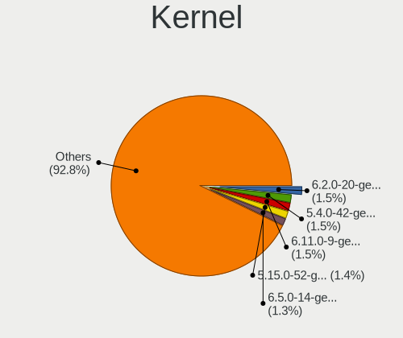
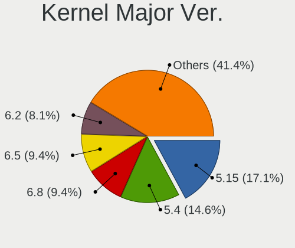
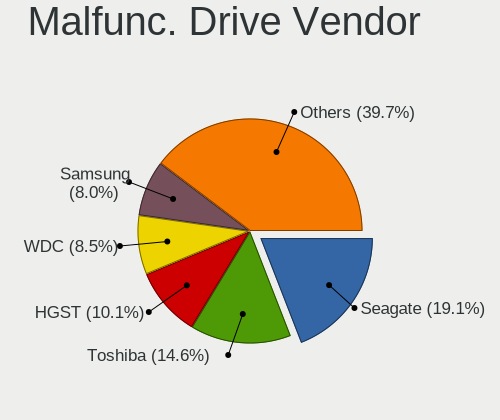
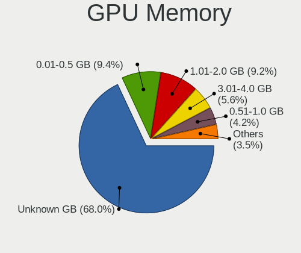
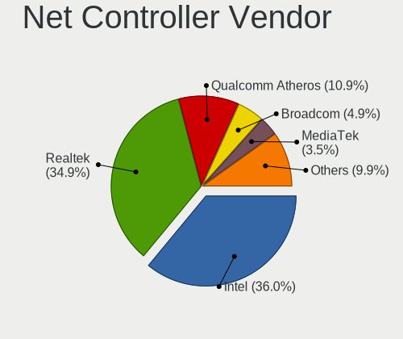
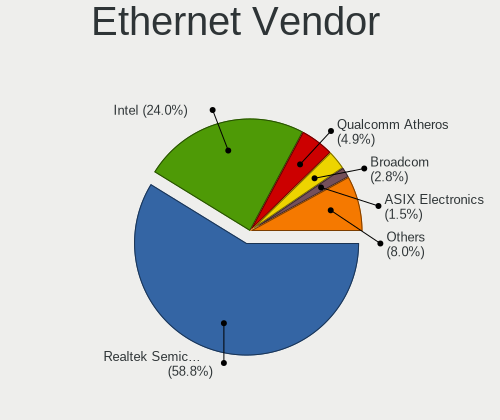
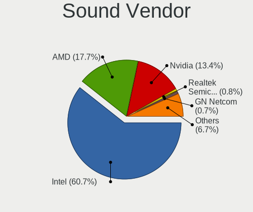

Kubuntu - Tested Hardware & Statistics (Notebooks)
--------------------------------------------------

A project to collect tested hardware configurations for Kubuntu.

Anyone can contribute to this report by the [hw-probe](https://github.com/linuxhw/hw-probe) tool:

    sudo -E hw-probe -all -upload

Please contribute! Especially if your hardware is rare.

Contents
--------

* [ Test Cases ](#test-cases)

* [ System ](#system)
  - [ OS                       ](#os)
  - [ OS Family                ](#os-family)
  - [ Kernel                   ](#kernel)
  - [ Kernel Family            ](#kernel-family)
  - [ Kernel Major Ver.        ](#kernel-major-ver)
  - [ Arch                     ](#arch)
  - [ DE                       ](#de)
  - [ Display Server           ](#display-server)
  - [ Display Manager          ](#display-manager)
  - [ OS Lang                  ](#os-lang)
  - [ Boot Mode                ](#boot-mode)
  - [ Filesystem               ](#filesystem)
  - [ Part. scheme             ](#part-scheme)
  - [ Dual Boot with Linux/BSD ](#dual-boot-with-linuxbsd)
  - [ Dual Boot (Win)          ](#dual-boot-win)

* [ Board ](#board)
  - [ Vendor                   ](#vendor)
  - [ Model                    ](#model)
  - [ Model Family             ](#model-family)
  - [ MFG Year                 ](#mfg-year)
  - [ Form Factor              ](#form-factor)
  - [ Secure Boot              ](#secure-boot)
  - [ Coreboot                 ](#coreboot)
  - [ RAM Size                 ](#ram-size)
  - [ RAM Used                 ](#ram-used)
  - [ Total Drives             ](#total-drives)
  - [ Has CD-ROM               ](#has-cd-rom)
  - [ Has Ethernet             ](#has-ethernet)
  - [ Has WiFi                 ](#has-wifi)
  - [ Has Bluetooth            ](#has-bluetooth)

* [ Location ](#location)
  - [ Country                  ](#country)
  - [ City                     ](#city)

* [ Drives ](#drives)
  - [ Drive Vendor             ](#drive-vendor)
  - [ Drive Model              ](#drive-model)
  - [ HDD Vendor               ](#hdd-vendor)
  - [ SSD Vendor               ](#ssd-vendor)
  - [ Drive Kind               ](#drive-kind)
  - [ Drive Connector          ](#drive-connector)
  - [ Drive Size               ](#drive-size)
  - [ Space Total              ](#space-total)
  - [ Space Used               ](#space-used)
  - [ Malfunc. Drives          ](#malfunc-drives)
  - [ Malfunc. Drive Vendor    ](#malfunc-drive-vendor)
  - [ Malfunc. HDD Vendor      ](#malfunc-hdd-vendor)
  - [ Malfunc. Drive Kind      ](#malfunc-drive-kind)
  - [ Failed Drives            ](#failed-drives)
  - [ Failed Drive Vendor      ](#failed-drive-vendor)
  - [ Drive Status             ](#drive-status)

* [ Storage controller ](#storage-controller)
  - [ Storage Vendor           ](#storage-vendor)
  - [ Storage Model            ](#storage-model)
  - [ Storage Kind             ](#storage-kind)

* [ Processor ](#processor)
  - [ CPU Vendor               ](#cpu-vendor)
  - [ CPU Model                ](#cpu-model)
  - [ CPU Model Family         ](#cpu-model-family)
  - [ CPU Cores                ](#cpu-cores)
  - [ CPU Sockets              ](#cpu-sockets)
  - [ CPU Threads              ](#cpu-threads)
  - [ CPU Op-Modes             ](#cpu-op-modes)
  - [ CPU Microcode            ](#cpu-microcode)
  - [ CPU Microarch            ](#cpu-microarch)

* [ Graphics ](#graphics)
  - [ GPU Vendor               ](#gpu-vendor)
  - [ GPU Model                ](#gpu-model)
  - [ GPU Combo                ](#gpu-combo)
  - [ GPU Driver               ](#gpu-driver)
  - [ GPU Memory               ](#gpu-memory)

* [ Monitor ](#monitor)
  - [ Monitor Vendor           ](#monitor-vendor)
  - [ Monitor Model            ](#monitor-model)
  - [ Monitor Resolution       ](#monitor-resolution)
  - [ Monitor Diagonal         ](#monitor-diagonal)
  - [ Monitor Width            ](#monitor-width)
  - [ Aspect Ratio             ](#aspect-ratio)
  - [ Monitor Area             ](#monitor-area)
  - [ Pixel Density            ](#pixel-density)
  - [ Multiple Monitors        ](#multiple-monitors)

* [ Network ](#network)
  - [ Net Controller Vendor    ](#net-controller-vendor)
  - [ Net Controller Model     ](#net-controller-model)
  - [ Wireless Vendor          ](#wireless-vendor)
  - [ Wireless Model           ](#wireless-model)
  - [ Ethernet Vendor          ](#ethernet-vendor)
  - [ Ethernet Model           ](#ethernet-model)
  - [ Net Controller Kind      ](#net-controller-kind)
  - [ Used Controller          ](#used-controller)
  - [ NICs                     ](#nics)
  - [ IPv6                     ](#ipv6)

* [ Bluetooth ](#bluetooth)
  - [ Bluetooth Vendor         ](#bluetooth-vendor)
  - [ Bluetooth Model          ](#bluetooth-model)

* [ Sound ](#sound)
  - [ Sound Vendor             ](#sound-vendor)
  - [ Sound Model              ](#sound-model)

* [ Memory ](#memory)
  - [ Memory Vendor            ](#memory-vendor)
  - [ Memory Model             ](#memory-model)
  - [ Memory Kind              ](#memory-kind)
  - [ Memory Form Factor       ](#memory-form-factor)
  - [ Memory Size              ](#memory-size)
  - [ Memory Speed             ](#memory-speed)

* [ Printers & scanners ](#printers--scanners)
  - [ Printer Vendor           ](#printer-vendor)
  - [ Printer Model            ](#printer-model)
  - [ Scanner Vendor           ](#scanner-vendor)
  - [ Scanner Model            ](#scanner-model)

* [ Camera ](#camera)
  - [ Camera Vendor            ](#camera-vendor)
  - [ Camera Model             ](#camera-model)

* [ Security ](#security)
  - [ Fingerprint Vendor       ](#fingerprint-vendor)
  - [ Fingerprint Model        ](#fingerprint-model)
  - [ Chipcard Vendor          ](#chipcard-vendor)
  - [ Chipcard Model           ](#chipcard-model)

* [ Unsupported ](#unsupported)
  - [ Unsupported Devices      ](#unsupported-devices)
  - [ Unsupported Device Types ](#unsupported-device-types)

Test Cases
----------

Total: 4521

| Vendor        | Model                       | Probe                                                      | Date         |
|---------------|-----------------------------|------------------------------------------------------------|--------------|
| Google        | Cret                        | [bc8e7edac4](https://linux-hardware.org/?probe=bc8e7edac4) | Jan 05, 2025 |
| ASUSTek       | ASUS Zenbook S 14 UX5406... | [689364573c](https://linux-hardware.org/?probe=689364573c) | Jan 05, 2025 |
| Lenovo        | ThinkPad E520 1143R77       | [3d26d596e3](https://linux-hardware.org/?probe=3d26d596e3) | Jan 05, 2025 |
| Dell          | Inspiron 15-3567            | [96419f9337](https://linux-hardware.org/?probe=96419f9337) | Jan 05, 2025 |
| Dell          | XPS 16 9640                 | [58d3a3677b](https://linux-hardware.org/?probe=58d3a3677b) | Jan 04, 2025 |
| Dell          | XPS 16 9640                 | [8f38090e9d](https://linux-hardware.org/?probe=8f38090e9d) | Jan 04, 2025 |
| Toshiba       | Satellite C75D-B            | [6d15c78d08](https://linux-hardware.org/?probe=6d15c78d08) | Jan 04, 2025 |
| HUAWEI        | CREFG-XX                    | [c781ee9905](https://linux-hardware.org/?probe=c781ee9905) | Jan 03, 2025 |
| ASUSTek       | VivoBook_ASUSLaptop M160... | [51be04fcd7](https://linux-hardware.org/?probe=51be04fcd7) | Jan 03, 2025 |
| Lenovo        | ThinkBook 14 G4+ IAP 21C... | [0d48464f98](https://linux-hardware.org/?probe=0d48464f98) | Jan 03, 2025 |
| HP            | EliteBook 850 G8 Noteboo... | [514cd1a8a0](https://linux-hardware.org/?probe=514cd1a8a0) | Jan 03, 2025 |
| Fujitsu       | LIFEBOOK E751               | [d6240bc771](https://linux-hardware.org/?probe=d6240bc771) | Jan 02, 2025 |
| MSI           | GF65 Thin 9SD               | [ed812824ea](https://linux-hardware.org/?probe=ed812824ea) | Dec 30, 2024 |
| MSI           | GF65 Thin 9SD               | [a53632802a](https://linux-hardware.org/?probe=a53632802a) | Dec 30, 2024 |
| Apple         | MacBookPro11,2              | [238bce296a](https://linux-hardware.org/?probe=238bce296a) | Dec 29, 2024 |
| Chuwi         | GemiBook                    | [28c417a4f8](https://linux-hardware.org/?probe=28c417a4f8) | Dec 29, 2024 |
| Lenovo        | IdeaPad Slim 5 14IRL8 82... | [eb4bdf954b](https://linux-hardware.org/?probe=eb4bdf954b) | Dec 28, 2024 |
| Panasonic     | CF-31SBLEB1M                | [c01282e1c8](https://linux-hardware.org/?probe=c01282e1c8) | Dec 27, 2024 |
| Panasonic     | CF-31SBLEB1M                | [b1be038c76](https://linux-hardware.org/?probe=b1be038c76) | Dec 27, 2024 |
| Dell          | Inspiron 1525               | [89a2a2261a](https://linux-hardware.org/?probe=89a2a2261a) | Dec 27, 2024 |
| Dell          | Latitude 5580               | [61c3987fc9](https://linux-hardware.org/?probe=61c3987fc9) | Dec 27, 2024 |
| Google        | Voxel                       | [32b3903455](https://linux-hardware.org/?probe=32b3903455) | Dec 26, 2024 |
| Lenovo        | ThinkBook 15 G2 ARE 20VG    | [9ca24271a4](https://linux-hardware.org/?probe=9ca24271a4) | Dec 26, 2024 |
| Dell          | XPS 9315                    | [db4876762a](https://linux-hardware.org/?probe=db4876762a) | Dec 26, 2024 |
| ASRock        | Z390 Phantom Gaming 4S      | [d134a178b2](https://linux-hardware.org/?probe=d134a178b2) | Dec 26, 2024 |
| HP            | Pavilion Laptop 15-cc1xx    | [697cdd9200](https://linux-hardware.org/?probe=697cdd9200) | Dec 25, 2024 |
| HP            | EliteBook 820 G3            | [cf6ba1ead2](https://linux-hardware.org/?probe=cf6ba1ead2) | Dec 25, 2024 |
| ASUSTek       | ROG Zephyrus G14 GA401QM... | [b163061b61](https://linux-hardware.org/?probe=b163061b61) | Dec 25, 2024 |
| Acer          | Aspire V5-573G              | [45f86a09ae](https://linux-hardware.org/?probe=45f86a09ae) | Dec 25, 2024 |
| Dell          | Latitude 5430               | [751e3be041](https://linux-hardware.org/?probe=751e3be041) | Dec 24, 2024 |
| Dell          | Latitude 5430               | [b9d91d702c](https://linux-hardware.org/?probe=b9d91d702c) | Dec 24, 2024 |
| ASUSTek       | ASUS EXPERTBOOK B1403CVA    | [b51fc6a4fb](https://linux-hardware.org/?probe=b51fc6a4fb) | Dec 23, 2024 |
| Clevo         | P170HMx                     | [c0ec7e3011](https://linux-hardware.org/?probe=c0ec7e3011) | Dec 22, 2024 |
| Lenovo        | LOQ 15IRX9 83DV             | [edf55e35fa](https://linux-hardware.org/?probe=edf55e35fa) | Dec 22, 2024 |
| Acer          | Nitro AN515-57              | [857b365f00](https://linux-hardware.org/?probe=857b365f00) | Dec 22, 2024 |
| HP            | Pavilion Laptop 15-eh0xx... | [31289d15a2](https://linux-hardware.org/?probe=31289d15a2) | Dec 21, 2024 |
| Fujitsu       | LIFEBOOK U758               | [2c6a5d22c1](https://linux-hardware.org/?probe=2c6a5d22c1) | Dec 20, 2024 |
| HP            | Pavilion Laptop 14-dv0xx... | [210729b8a3](https://linux-hardware.org/?probe=210729b8a3) | Dec 20, 2024 |
| Dell          | Vostro 5625                 | [c081eaa179](https://linux-hardware.org/?probe=c081eaa179) | Dec 20, 2024 |
| ASUSTek       | VivoBook_ASUSLaptop X512... | [7c5e051820](https://linux-hardware.org/?probe=7c5e051820) | Dec 19, 2024 |
| Lenovo        | ThinkPad X1 Carbon Gen 1... | [d2b19da7f2](https://linux-hardware.org/?probe=d2b19da7f2) | Dec 18, 2024 |
| Samsung       | 730U3E/740U3E               | [c5e5057be2](https://linux-hardware.org/?probe=c5e5057be2) | Dec 17, 2024 |
| ASUSTek       | ASUS TUF Gaming A16 FA61... | [efacc3d2bf](https://linux-hardware.org/?probe=efacc3d2bf) | Dec 16, 2024 |
| Fujitsu       | FMVU09001                   | [2be0996b78](https://linux-hardware.org/?probe=2be0996b78) | Dec 16, 2024 |
| HP            | Pavilion Laptop 15-eh0xx... | [b12c429941](https://linux-hardware.org/?probe=b12c429941) | Dec 16, 2024 |
| ASUSTek       | ASUS EXPERTBOOK B1403CVA    | [dc66ca3bfc](https://linux-hardware.org/?probe=dc66ca3bfc) | Dec 16, 2024 |
| HP            | Pavilion Power Laptop 15... | [a785db7994](https://linux-hardware.org/?probe=a785db7994) | Dec 15, 2024 |
| Acer          | Aspire A315-56              | [139641552f](https://linux-hardware.org/?probe=139641552f) | Dec 15, 2024 |
| ASUSTek       | VivoBook_ASUSLaptop K340... | [ed3d05274d](https://linux-hardware.org/?probe=ed3d05274d) | Dec 14, 2024 |
| Samsung       | 950XDB/951XDB/950XDY        | [a53cca0335](https://linux-hardware.org/?probe=a53cca0335) | Dec 14, 2024 |
| MSI           | Creator Z17 A12UGST         | [c6a09edf29](https://linux-hardware.org/?probe=c6a09edf29) | Dec 14, 2024 |
| MSI           | Creator Z17 A12UGST         | [ca137f5639](https://linux-hardware.org/?probe=ca137f5639) | Dec 14, 2024 |
| Lenovo        | ThinkPad E14 Gen 5 21JKC... | [3cfbdc1929](https://linux-hardware.org/?probe=3cfbdc1929) | Dec 14, 2024 |
| Dell          | Inspiron 5405               | [3bbbe8e729](https://linux-hardware.org/?probe=3bbbe8e729) | Dec 13, 2024 |
| Panasonic     | CF-191DCSG1M                | [c607411b91](https://linux-hardware.org/?probe=c607411b91) | Dec 13, 2024 |
| Panasonic     | CF-191DCSG1M                | [471033b960](https://linux-hardware.org/?probe=471033b960) | Dec 13, 2024 |
| Dell          | Inspiron 5559               | [34c0ea4ba1](https://linux-hardware.org/?probe=34c0ea4ba1) | Dec 12, 2024 |
| Lenovo        | ThinkPad E15 Gen 2 20TD0... | [cb9d160c00](https://linux-hardware.org/?probe=cb9d160c00) | Dec 11, 2024 |
| Lenovo        | ThinkPad E15 Gen 2 20TD0... | [25c2515170](https://linux-hardware.org/?probe=25c2515170) | Dec 11, 2024 |
| HP            | Laptop 17-cp0xxx            | [f1344c53ac](https://linux-hardware.org/?probe=f1344c53ac) | Dec 11, 2024 |
| HP            | Laptop 17-cp0xxx            | [8a8e971015](https://linux-hardware.org/?probe=8a8e971015) | Dec 11, 2024 |
| Lenovo        | ThinkPad X13 Gen 1 20UF0... | [0c5a8d044d](https://linux-hardware.org/?probe=0c5a8d044d) | Dec 11, 2024 |
| ASUSTek       | X556URK                     | [7f87e4f208](https://linux-hardware.org/?probe=7f87e4f208) | Dec 11, 2024 |
| ASUSTek       | ROG Strix G513RW_G513RW     | [719c8de776](https://linux-hardware.org/?probe=719c8de776) | Dec 11, 2024 |
| HP            | Laptop 15-dy2xxx            | [0bb2a3a7a8](https://linux-hardware.org/?probe=0bb2a3a7a8) | Dec 10, 2024 |
| Dynabook      | PORTEGE X40-K               | [5f7a69df31](https://linux-hardware.org/?probe=5f7a69df31) | Dec 09, 2024 |
| ASUSTek       | VivoBook_ASUSLaptop M160... | [6b5111843a](https://linux-hardware.org/?probe=6b5111843a) | Dec 09, 2024 |
| Lenovo        | V15 G4 AMN 82YU             | [152aa1b4ca](https://linux-hardware.org/?probe=152aa1b4ca) | Dec 09, 2024 |
| HP            | ZBook 14u G6                | [bca0253524](https://linux-hardware.org/?probe=bca0253524) | Dec 08, 2024 |
| Lenovo        | V15 G4 AMN 82YU             | [5b795c5c2c](https://linux-hardware.org/?probe=5b795c5c2c) | Dec 08, 2024 |
| Dell          | Latitude E6430              | [a80a5df9fd](https://linux-hardware.org/?probe=a80a5df9fd) | Dec 08, 2024 |
| Dell          | Precision M4800             | [66261c03d0](https://linux-hardware.org/?probe=66261c03d0) | Dec 08, 2024 |
| Acer          | Aspire A315-24P             | [68fa0e7660](https://linux-hardware.org/?probe=68fa0e7660) | Dec 08, 2024 |
| ASUSTek       | ASUS TUF Gaming A14 FA40... | [6ba761b666](https://linux-hardware.org/?probe=6ba761b666) | Dec 07, 2024 |
| Dell          | XPS 15 7590                 | [fbc857c378](https://linux-hardware.org/?probe=fbc857c378) | Dec 07, 2024 |
| Dell          | XPS 15 7590                 | [19ee3907ad](https://linux-hardware.org/?probe=19ee3907ad) | Dec 07, 2024 |
| Dell          | Precision 7520              | [3a1f5573bd](https://linux-hardware.org/?probe=3a1f5573bd) | Dec 07, 2024 |
| Unknown       | AX16                        | [786a7ec53a](https://linux-hardware.org/?probe=786a7ec53a) | Dec 06, 2024 |
| ASUSTek       | ASUS TUF Gaming A14 FA40... | [a9c5cf0de0](https://linux-hardware.org/?probe=a9c5cf0de0) | Dec 06, 2024 |
| Lenovo        | Legion 5 15IMH05 82AU       | [79ab3bbc9e](https://linux-hardware.org/?probe=79ab3bbc9e) | Dec 06, 2024 |
| Dell          | Inspiron 5748               | [e5b0755ec1](https://linux-hardware.org/?probe=e5b0755ec1) | Dec 06, 2024 |
| HP            | Laptop 15-dy2xxx            | [f591b54820](https://linux-hardware.org/?probe=f591b54820) | Dec 06, 2024 |
| HP            | Pavilion HDX9000            | [cd2b41f1d1](https://linux-hardware.org/?probe=cd2b41f1d1) | Dec 05, 2024 |
| HP            | Laptop 15-db0xxx            | [3ceb5935c2](https://linux-hardware.org/?probe=3ceb5935c2) | Dec 04, 2024 |
| Dell          | XPS 13 9305                 | [8ff051cc6e](https://linux-hardware.org/?probe=8ff051cc6e) | Dec 04, 2024 |
| HP            | Laptop 15-db0xxx            | [cc89356041](https://linux-hardware.org/?probe=cc89356041) | Dec 04, 2024 |
| Dell          | Latitude 3550               | [fe2494f626](https://linux-hardware.org/?probe=fe2494f626) | Dec 03, 2024 |
| Dell          | Precision 3591              | [65487c2463](https://linux-hardware.org/?probe=65487c2463) | Dec 01, 2024 |
| Lenovo        | IdeaPad Gaming 3 15IHU6 ... | [af48bb81c6](https://linux-hardware.org/?probe=af48bb81c6) | Dec 01, 2024 |
| HUAWEI        | NBLK-WAX9X                  | [2f6d2fe7e2](https://linux-hardware.org/?probe=2f6d2fe7e2) | Dec 01, 2024 |
| Unknown       | AX16PRO                     | [603937e734](https://linux-hardware.org/?probe=603937e734) | Dec 01, 2024 |
| ASUSTek       | G750JX                      | [cde4dbbbc4](https://linux-hardware.org/?probe=cde4dbbbc4) | Dec 01, 2024 |
| Lenovo        | ThinkPad T14 Gen 5 21MCC... | [c293c35272](https://linux-hardware.org/?probe=c293c35272) | Nov 30, 2024 |
| HP            | Pavilion Power Laptop 15... | [48bf512469](https://linux-hardware.org/?probe=48bf512469) | Nov 30, 2024 |
| Lenovo        | IdeaPad Gaming 3 15IHU6 ... | [c56cdb7a5f](https://linux-hardware.org/?probe=c56cdb7a5f) | Nov 30, 2024 |
| Lenovo        | IdeaPad Gaming 3 15IHU6 ... | [eaca726e51](https://linux-hardware.org/?probe=eaca726e51) | Nov 30, 2024 |
| ASUSTek       | X555LN                      | [8fe10d8894](https://linux-hardware.org/?probe=8fe10d8894) | Nov 30, 2024 |
| Lenovo        | ThinkPad X1 Carbon 6th 2... | [4dd33ed790](https://linux-hardware.org/?probe=4dd33ed790) | Nov 30, 2024 |
| Toshiba       | Satellite L500              | [81df2f2b8e](https://linux-hardware.org/?probe=81df2f2b8e) | Nov 29, 2024 |
| Dell          | Latitude 5520               | [f1222f143e](https://linux-hardware.org/?probe=f1222f143e) | Nov 28, 2024 |
| Gateway       | NV75S                       | [c7e9f2b942](https://linux-hardware.org/?probe=c7e9f2b942) | Nov 28, 2024 |
| Notebook      | X370SNx                     | [b3c4edd504](https://linux-hardware.org/?probe=b3c4edd504) | Nov 28, 2024 |
| Dell          | XPS 13 9310                 | [5a464dff99](https://linux-hardware.org/?probe=5a464dff99) | Nov 27, 2024 |
| Lenovo        | ThinkPad X240 20AMS4QL00    | [4cf704813c](https://linux-hardware.org/?probe=4cf704813c) | Nov 27, 2024 |
| Lenovo        | ThinkPad L14 Gen 3 21C50... | [16f61a0dc5](https://linux-hardware.org/?probe=16f61a0dc5) | Nov 27, 2024 |
| Samsung       | 730U3E/740U3E               | [d3202d1f51](https://linux-hardware.org/?probe=d3202d1f51) | Nov 27, 2024 |
| ASUSTek       | ASUS TUF Gaming A16 FA60... | [bbcfd5f2d1](https://linux-hardware.org/?probe=bbcfd5f2d1) | Nov 26, 2024 |
| HP            | ZBook Firefly 15 G7 Mobi... | [8c0ecd4b30](https://linux-hardware.org/?probe=8c0ecd4b30) | Nov 26, 2024 |
| ASUSTek       | ASUS TUF Gaming A16 FA60... | [a6e55209bb](https://linux-hardware.org/?probe=a6e55209bb) | Nov 26, 2024 |
| Lenovo        | ThinkPad P14s Gen 2a 21A... | [33235dec27](https://linux-hardware.org/?probe=33235dec27) | Nov 26, 2024 |
| Samsung       | 300E5K/300E5Q               | [073b6e567f](https://linux-hardware.org/?probe=073b6e567f) | Nov 26, 2024 |
| ASRock        | Z390 Phantom Gaming 4S      | [628f4e5d70](https://linux-hardware.org/?probe=628f4e5d70) | Nov 26, 2024 |
| Apple         | MacBookPro5,3               | [f8e03fed09](https://linux-hardware.org/?probe=f8e03fed09) | Nov 25, 2024 |
| ASUSTek       | VivoBook_ASUSLaptop K650... | [d58ccbdbd5](https://linux-hardware.org/?probe=d58ccbdbd5) | Nov 25, 2024 |
| Lenovo        | ThinkPad P1 Gen 7 21KVCT... | [baf2e1a758](https://linux-hardware.org/?probe=baf2e1a758) | Nov 25, 2024 |
| Dell          | Latitude E6420              | [f1db6546f8](https://linux-hardware.org/?probe=f1db6546f8) | Nov 25, 2024 |
| Lenovo        | Yoga Pro 9 16IMH9 83DN      | [e72190a7d6](https://linux-hardware.org/?probe=e72190a7d6) | Nov 25, 2024 |
| Dell          | Inspiron 15-3567            | [0b52a4dd46](https://linux-hardware.org/?probe=0b52a4dd46) | Nov 25, 2024 |
| Dell          | Inspiron 15-3567            | [83c44e5dcb](https://linux-hardware.org/?probe=83c44e5dcb) | Nov 25, 2024 |
| HP            | EliteBook 2560p             | [54d07de40f](https://linux-hardware.org/?probe=54d07de40f) | Nov 25, 2024 |
| HP            | EliteBook 2560p             | [98af34c213](https://linux-hardware.org/?probe=98af34c213) | Nov 25, 2024 |
| Apple         | MacBookPro12,1              | [1ad2abc16d](https://linux-hardware.org/?probe=1ad2abc16d) | Nov 24, 2024 |
| Lenovo        | IdeaPad Slim 5 16ABR8 82... | [7204b37e87](https://linux-hardware.org/?probe=7204b37e87) | Nov 24, 2024 |
| Lenovo        | V15 G4 ABP 83CR             | [7babc4592f](https://linux-hardware.org/?probe=7babc4592f) | Nov 24, 2024 |
| HP            | ZBook Studio 15.6 inch G... | [57b9a57ac3](https://linux-hardware.org/?probe=57b9a57ac3) | Nov 23, 2024 |
| Acer          | Nitro AN515-53              | [b0da0c19f6](https://linux-hardware.org/?probe=b0da0c19f6) | Nov 23, 2024 |
| HP            | OmniBook Ultra Laptop 14... | [c222e23ead](https://linux-hardware.org/?probe=c222e23ead) | Nov 22, 2024 |
| Dell          | XPS 15 9500                 | [d49fa36928](https://linux-hardware.org/?probe=d49fa36928) | Nov 22, 2024 |
| HUAWEI        | HLYL-WXX9                   | [8f540c9b38](https://linux-hardware.org/?probe=8f540c9b38) | Nov 21, 2024 |
| HP            | ZBook Firefly 15 G7 Mobi... | [99528ec5f3](https://linux-hardware.org/?probe=99528ec5f3) | Nov 20, 2024 |
| HP            | ZBook Firefly 15 G7 Mobi... | [53a79bee6b](https://linux-hardware.org/?probe=53a79bee6b) | Nov 20, 2024 |
| ASUSTek       | VivoBook_ASUSLaptop M160... | [1ed45c318d](https://linux-hardware.org/?probe=1ed45c318d) | Nov 20, 2024 |
| Lenovo        | ThinkPad P1 Gen 2 20QTCT... | [acdced4028](https://linux-hardware.org/?probe=acdced4028) | Nov 20, 2024 |
| ASUSTek       | VivoBook_ASUSLaptop M650... | [a0c89e3089](https://linux-hardware.org/?probe=a0c89e3089) | Nov 20, 2024 |
| Lenovo        | IdeaPad Slim 3 16ABR8 82... | [7134e424f3](https://linux-hardware.org/?probe=7134e424f3) | Nov 20, 2024 |
| ASUSTek       | ASUS EXPERTBOOK B9400CEA... | [b9edf1bd37](https://linux-hardware.org/?probe=b9edf1bd37) | Nov 20, 2024 |
| Lenovo        | ThinkPad P1 Gen 2 20QTCT... | [c412825153](https://linux-hardware.org/?probe=c412825153) | Nov 19, 2024 |
| Dell          | Precision 7710              | [f328fe1be2](https://linux-hardware.org/?probe=f328fe1be2) | Nov 18, 2024 |
| Dell          | Precision 7710              | [658f311eb3](https://linux-hardware.org/?probe=658f311eb3) | Nov 18, 2024 |
| Lenovo        | IdeaPad Slim 5 16ABR8 82... | [da573e5f3a](https://linux-hardware.org/?probe=da573e5f3a) | Nov 17, 2024 |
| Chuwi         | GemiBook Plus               | [10be58e89f](https://linux-hardware.org/?probe=10be58e89f) | Nov 16, 2024 |
| Lenovo        | Yoga 500-15IBD 80N6         | [e157b1804e](https://linux-hardware.org/?probe=e157b1804e) | Nov 16, 2024 |
| HP            | 255 15.6 inch G10           | [9c4d00b6d7](https://linux-hardware.org/?probe=9c4d00b6d7) | Nov 16, 2024 |
| Dell          | Latitude E7250              | [ea43fea4c4](https://linux-hardware.org/?probe=ea43fea4c4) | Nov 15, 2024 |
| Thomson       | NEO17C-8B1TCO               | [b5896a8529](https://linux-hardware.org/?probe=b5896a8529) | Nov 15, 2024 |
| Dell          | Latitude 5530               | [260bfa0ebf](https://linux-hardware.org/?probe=260bfa0ebf) | Nov 15, 2024 |
| Lenovo        | ThinkPad T480 20L5CTO1WW    | [cdda7d4c72](https://linux-hardware.org/?probe=cdda7d4c72) | Nov 15, 2024 |
| Lenovo        | ThinkPad X1 Carbon Gen 1... | [a8f5f86a85](https://linux-hardware.org/?probe=a8f5f86a85) | Nov 14, 2024 |
| GPU Compan... | GWTN156-11                  | [30f3f9fea6](https://linux-hardware.org/?probe=30f3f9fea6) | Nov 14, 2024 |
| ASUSTek       | ROG Zephyrus Duo 16 GX65... | [cd0098486b](https://linux-hardware.org/?probe=cd0098486b) | Nov 14, 2024 |
| Dell          | Inspiron 3521               | [850969e625](https://linux-hardware.org/?probe=850969e625) | Nov 14, 2024 |
| HUAWEI        | FLMH-XX                     | [3472dd9d1b](https://linux-hardware.org/?probe=3472dd9d1b) | Nov 13, 2024 |
| Samsung       | 270E5G/270E5U               | [d4eba09088](https://linux-hardware.org/?probe=d4eba09088) | Nov 13, 2024 |
| Fujitsu       | Unknown                     | [e1f88f1f19](https://linux-hardware.org/?probe=e1f88f1f19) | Nov 12, 2024 |
| ASUSTek       | ASUS TUF Gaming F15 FX50... | [d78f2cd0d5](https://linux-hardware.org/?probe=d78f2cd0d5) | Nov 12, 2024 |
| Dell          | Inspiron 3521               | [6f60e0749d](https://linux-hardware.org/?probe=6f60e0749d) | Nov 12, 2024 |
| Lenovo        | Legion 5 Pro 16ACH6H 82J... | [6ee5a167b1](https://linux-hardware.org/?probe=6ee5a167b1) | Nov 12, 2024 |
| Fujitsu       | LIFEBOOK E780               | [b41da32715](https://linux-hardware.org/?probe=b41da32715) | Nov 11, 2024 |
| Lenovo        | Legion Slim 5 16APH8 82Y... | [5238f646e9](https://linux-hardware.org/?probe=5238f646e9) | Nov 10, 2024 |
| Alurin        | ALU-BAR-R555-000-156        | [946a4bbb98](https://linux-hardware.org/?probe=946a4bbb98) | Nov 10, 2024 |
| Alurin        | ALU-BAR-R555-000-156        | [c528868479](https://linux-hardware.org/?probe=c528868479) | Nov 10, 2024 |
| Acer          | Aspire ES1-531              | [eda5406b2d](https://linux-hardware.org/?probe=eda5406b2d) | Nov 09, 2024 |
| Lenovo        | ThinkPad Edge E440 20C5A... | [1277be0ef5](https://linux-hardware.org/?probe=1277be0ef5) | Nov 09, 2024 |
| Dell          | Latitude 5410               | [be3048dbda](https://linux-hardware.org/?probe=be3048dbda) | Nov 09, 2024 |
| ASUSTek       | E402SA                      | [5e4e4b42cb](https://linux-hardware.org/?probe=5e4e4b42cb) | Nov 08, 2024 |
| HUAWEI        | MDF-XX                      | [a7c6acb850](https://linux-hardware.org/?probe=a7c6acb850) | Nov 08, 2024 |
| Lenovo        | ThinkPad P53 20QQS38314     | [c04225f7b2](https://linux-hardware.org/?probe=c04225f7b2) | Nov 06, 2024 |
| Dell          | Vostro 3401                 | [219518f971](https://linux-hardware.org/?probe=219518f971) | Nov 06, 2024 |
| Timi          | Redmi Book Pro 14 2022      | [317fe89cc5](https://linux-hardware.org/?probe=317fe89cc5) | Nov 05, 2024 |
| MSI           | GF63 Thin 8SC               | [9867ab6e6a](https://linux-hardware.org/?probe=9867ab6e6a) | Nov 05, 2024 |
| Lenovo        | ThinkPad T550 20CK0004GE    | [e7943e539d](https://linux-hardware.org/?probe=e7943e539d) | Nov 05, 2024 |
| TECNO Mobi... | Pocket Go                   | [3e1b35b41c](https://linux-hardware.org/?probe=3e1b35b41c) | Nov 04, 2024 |
| Dell          | Latitude E5450              | [23833c27eb](https://linux-hardware.org/?probe=23833c27eb) | Nov 04, 2024 |
| Apple         | MacBookPro12,1              | [8d8ff8e8b5](https://linux-hardware.org/?probe=8d8ff8e8b5) | Nov 04, 2024 |
| Acer          | Aspire A315-44P             | [c1acd872a4](https://linux-hardware.org/?probe=c1acd872a4) | Nov 04, 2024 |
| TANSHI        | Gaming series               | [2f97c63ff7](https://linux-hardware.org/?probe=2f97c63ff7) | Nov 04, 2024 |
| HP            | EliteBook 8540w             | [72ef3bdc40](https://linux-hardware.org/?probe=72ef3bdc40) | Nov 03, 2024 |
| Lenovo        | ThinkPad P16s Gen 1 21CK... | [6bfe7b8d66](https://linux-hardware.org/?probe=6bfe7b8d66) | Nov 02, 2024 |
| Lenovo        | ThinkPad X395 20NMS0YG00    | [fa349693cc](https://linux-hardware.org/?probe=fa349693cc) | Nov 02, 2024 |
| HP            | 250 G7 Notebook PC          | [b369f42808](https://linux-hardware.org/?probe=b369f42808) | Nov 02, 2024 |
| Apple         | MacBookAir5,2               | [24a70f521a](https://linux-hardware.org/?probe=24a70f521a) | Nov 02, 2024 |
| Lenovo        | ThinkPad T14s Gen 4 21F8... | [59116a075c](https://linux-hardware.org/?probe=59116a075c) | Nov 01, 2024 |
| Lenovo        | ThinkPad X395 20NMS0YG00    | [0d8a4bb988](https://linux-hardware.org/?probe=0d8a4bb988) | Nov 01, 2024 |
| Dell          | XPS 13 9343                 | [02e150f7e1](https://linux-hardware.org/?probe=02e150f7e1) | Nov 01, 2024 |
| Acer          | Aspire A315-56              | [906eadb97b](https://linux-hardware.org/?probe=906eadb97b) | Nov 01, 2024 |
| Acer          | Aspire A315-56              | [1f38b58ff7](https://linux-hardware.org/?probe=1f38b58ff7) | Nov 01, 2024 |
| Dell          | Latitude 3490               | [0beb8b64e1](https://linux-hardware.org/?probe=0beb8b64e1) | Oct 31, 2024 |
| ASUSTek       | VivoBook_ASUSLaptop M650... | [d901f51891](https://linux-hardware.org/?probe=d901f51891) | Oct 30, 2024 |
| Dell          | Latitude 5410               | [a4cdab59be](https://linux-hardware.org/?probe=a4cdab59be) | Oct 30, 2024 |
| HUAWEI        | BoDE-WXX9                   | [2a875e6cb6](https://linux-hardware.org/?probe=2a875e6cb6) | Oct 30, 2024 |
| ASUSTek       | ZenBook Pro Duo UX582ZM_... | [effb8547f0](https://linux-hardware.org/?probe=effb8547f0) | Oct 30, 2024 |
| ASUSTek       | ASUS TUF Gaming F15 FX50... | [f4becfc085](https://linux-hardware.org/?probe=f4becfc085) | Oct 29, 2024 |
| Lenovo        | ThinkPad X220 42902P3       | [5224137903](https://linux-hardware.org/?probe=5224137903) | Oct 29, 2024 |
| ASUSTek       | VivoBook_ASUSLaptop X515... | [a89daa0832](https://linux-hardware.org/?probe=a89daa0832) | Oct 29, 2024 |
| HP            | ProBook 450 15.6 inch G9... | [9552f01581](https://linux-hardware.org/?probe=9552f01581) | Oct 29, 2024 |
| Dell          | Latitude 5290 2-in-1        | [dcbfa3ffe4](https://linux-hardware.org/?probe=dcbfa3ffe4) | Oct 28, 2024 |
| Acer          | Nitro AN517-51              | [41976f5ccb](https://linux-hardware.org/?probe=41976f5ccb) | Oct 28, 2024 |
| HP            | Laptop 15s-eq2xxx           | [a8355c9abf](https://linux-hardware.org/?probe=a8355c9abf) | Oct 28, 2024 |
| Lenovo        | 15ARE05 81W4                | [049414e1fb](https://linux-hardware.org/?probe=049414e1fb) | Oct 27, 2024 |
| Toshiba       | Satellite C850D-119         | [e3773c1a70](https://linux-hardware.org/?probe=e3773c1a70) | Oct 27, 2024 |
| Acer          | Nitro ANV15-51              | [f273e6c830](https://linux-hardware.org/?probe=f273e6c830) | Oct 27, 2024 |
| Acer          | Nitro ANV15-51              | [4d8ce01dce](https://linux-hardware.org/?probe=4d8ce01dce) | Oct 27, 2024 |
| MSI           | GL62 6QD                    | [3c9b967190](https://linux-hardware.org/?probe=3c9b967190) | Oct 27, 2024 |
| Lenovo        | ThinkPad X230 23205LG       | [4b9a855d1b](https://linux-hardware.org/?probe=4b9a855d1b) | Oct 27, 2024 |
| Samsung       | 370E4K                      | [9ad45ccd8d](https://linux-hardware.org/?probe=9ad45ccd8d) | Oct 26, 2024 |
| Dell          | XPS 15 9510                 | [c9c27cec3b](https://linux-hardware.org/?probe=c9c27cec3b) | Oct 26, 2024 |
| HP            | EliteBook 840 G5            | [9c9358857e](https://linux-hardware.org/?probe=9c9358857e) | Oct 26, 2024 |
| Google        | Treeya                      | [59292f60fe](https://linux-hardware.org/?probe=59292f60fe) | Oct 26, 2024 |
| Lenovo        | ThinkPad T480 20L6S03X00    | [51f7a46777](https://linux-hardware.org/?probe=51f7a46777) | Oct 26, 2024 |
| ASUSTek       | G551JM                      | [d6d0bfa34e](https://linux-hardware.org/?probe=d6d0bfa34e) | Oct 26, 2024 |
| ASUSTek       | G551JM                      | [c411632c1c](https://linux-hardware.org/?probe=c411632c1c) | Oct 26, 2024 |
| Dell          | Latitude 5530               | [05ab1c8f51](https://linux-hardware.org/?probe=05ab1c8f51) | Oct 25, 2024 |
| Apple         | MacBookPro14,1              | [442e9ddd1b](https://linux-hardware.org/?probe=442e9ddd1b) | Oct 25, 2024 |
| Dell          | Latitude 5480               | [1959cea403](https://linux-hardware.org/?probe=1959cea403) | Oct 24, 2024 |
| Lenovo        | ThinkPad X230 23205LG       | [204d404540](https://linux-hardware.org/?probe=204d404540) | Oct 24, 2024 |
| Dell          | Latitude E5570              | [6d86bd0c29](https://linux-hardware.org/?probe=6d86bd0c29) | Oct 24, 2024 |
| Lenovo        | ThinkPad T480 20L6S03X00    | [e0e5c654b9](https://linux-hardware.org/?probe=e0e5c654b9) | Oct 23, 2024 |
| Lenovo        | ThinkPad P15v Gen 3 21D9... | [3256d7f820](https://linux-hardware.org/?probe=3256d7f820) | Oct 23, 2024 |
| Lenovo        | ThinkPad P15v Gen 3 21D9... | [37b34d5541](https://linux-hardware.org/?probe=37b34d5541) | Oct 23, 2024 |
| Dell          | Vostro 3550                 | [e9bb2708b0](https://linux-hardware.org/?probe=e9bb2708b0) | Oct 23, 2024 |
| Dell          | Vostro 3550                 | [e8577f4996](https://linux-hardware.org/?probe=e8577f4996) | Oct 23, 2024 |
| HP            | ProBook 4520s               | [352aa6f393](https://linux-hardware.org/?probe=352aa6f393) | Oct 22, 2024 |
| HP            | Laptop 15s-eq2xxx           | [61f2fb57cf](https://linux-hardware.org/?probe=61f2fb57cf) | Oct 22, 2024 |
| Samsung       | N150/N210/N220              | [eef263185a](https://linux-hardware.org/?probe=eef263185a) | Oct 22, 2024 |
| Lenovo        | ThinkPad X1 Carbon 7th 2... | [c9ee96dd2a](https://linux-hardware.org/?probe=c9ee96dd2a) | Oct 22, 2024 |
| Dell          | System Inspiron N4110       | [fe7c181867](https://linux-hardware.org/?probe=fe7c181867) | Oct 22, 2024 |
| HP            | 620                         | [5770270596](https://linux-hardware.org/?probe=5770270596) | Oct 22, 2024 |
| ASUSTek       | ROG STRIX X670E-E GAMING... | [d422e778c0](https://linux-hardware.org/?probe=d422e778c0) | Oct 21, 2024 |
| Acer          | Aspire A315-21              | [7e07d00b6a](https://linux-hardware.org/?probe=7e07d00b6a) | Oct 21, 2024 |
| TUXEDO        | InfinityBook Pro Gen7 (M... | [369e3e4bdd](https://linux-hardware.org/?probe=369e3e4bdd) | Oct 21, 2024 |
| Dell          | Latitude 5430               | [aea23cbc32](https://linux-hardware.org/?probe=aea23cbc32) | Oct 21, 2024 |
| Dell          | Inspiron 15-3567            | [bdae6dbc5e](https://linux-hardware.org/?probe=bdae6dbc5e) | Oct 21, 2024 |
| Acer          | Swift SF514-52TP            | [1114c4713d](https://linux-hardware.org/?probe=1114c4713d) | Oct 20, 2024 |
| Acer          | Swift SF514-52TP            | [90891d2f2a](https://linux-hardware.org/?probe=90891d2f2a) | Oct 20, 2024 |
| Dell          | System Inspiron N4110       | [826dbd78ff](https://linux-hardware.org/?probe=826dbd78ff) | Oct 19, 2024 |
| Lenovo        | ThinkPad X1 Carbon 7th 2... | [e0c1d7b9ce](https://linux-hardware.org/?probe=e0c1d7b9ce) | Oct 18, 2024 |
| Lenovo        | Legion 7 16IAX7 82TD        | [84339c1373](https://linux-hardware.org/?probe=84339c1373) | Oct 18, 2024 |
| Acer          | Predator G3-571             | [de41692048](https://linux-hardware.org/?probe=de41692048) | Oct 17, 2024 |
| HP            | EliteBook 840 G8 Noteboo... | [bd0906dab7](https://linux-hardware.org/?probe=bd0906dab7) | Oct 17, 2024 |
| MSI           | GT63 Titan 8RF              | [f4980bf120](https://linux-hardware.org/?probe=f4980bf120) | Oct 16, 2024 |
| MSI           | GP72MVR 7RFX                | [aa62c4b0dd](https://linux-hardware.org/?probe=aa62c4b0dd) | Oct 16, 2024 |
| MSI           | GP72MVR 7RFX                | [0ce7ce2745](https://linux-hardware.org/?probe=0ce7ce2745) | Oct 16, 2024 |
| HP            | EliteBook 840 G2            | [7bac64408f](https://linux-hardware.org/?probe=7bac64408f) | Oct 16, 2024 |
| Apple         | MacBookPro9,1               | [e4bf67d476](https://linux-hardware.org/?probe=e4bf67d476) | Oct 15, 2024 |
| HP            | EliteBook 6930p             | [1b21be189a](https://linux-hardware.org/?probe=1b21be189a) | Oct 14, 2024 |
| HP            | Laptop 15-bs0xx             | [3144ddfcfc](https://linux-hardware.org/?probe=3144ddfcfc) | Oct 14, 2024 |
| Apple         | MacBook7,1                  | [bbc1331626](https://linux-hardware.org/?probe=bbc1331626) | Oct 14, 2024 |
| Lenovo        | ThinkPad P16s Gen 1 21BU... | [b9707fb8cd](https://linux-hardware.org/?probe=b9707fb8cd) | Oct 14, 2024 |
| Apple         | MacBookPro12,1              | [21665e8dad](https://linux-hardware.org/?probe=21665e8dad) | Oct 14, 2024 |
| HP            | Laptop 15s-fq5xxx           | [960da6f0c1](https://linux-hardware.org/?probe=960da6f0c1) | Oct 14, 2024 |
| Dell          | Inspiron 15-3567            | [be96d4e9b3](https://linux-hardware.org/?probe=be96d4e9b3) | Oct 14, 2024 |
| HP            | Pavilion Gaming Laptop 1... | [106afe3aa3](https://linux-hardware.org/?probe=106afe3aa3) | Oct 13, 2024 |
| ASUSTek       | ROG Strix G713IE_G713IE     | [ab3c9c93ba](https://linux-hardware.org/?probe=ab3c9c93ba) | Oct 13, 2024 |
| Dell          | Precision 5490              | [e8d341bdf0](https://linux-hardware.org/?probe=e8d341bdf0) | Oct 13, 2024 |
| Dell          | Latitude 7480               | [4686c4e7c6](https://linux-hardware.org/?probe=4686c4e7c6) | Oct 13, 2024 |
| Lenovo        | IdeaPad Slim 5 16AHP9 83... | [5d1ecf9a7e](https://linux-hardware.org/?probe=5d1ecf9a7e) | Oct 13, 2024 |
| HP            | Pavilion Laptop 15-eg0xx... | [3913cbf7ae](https://linux-hardware.org/?probe=3913cbf7ae) | Oct 12, 2024 |
| HP            | Pavilion g6                 | [2639353fe7](https://linux-hardware.org/?probe=2639353fe7) | Oct 11, 2024 |
| HP            | ProBook 650 G1              | [1b1df91d0e](https://linux-hardware.org/?probe=1b1df91d0e) | Oct 11, 2024 |
| MSI           | Katana GF76 11SC            | [1a01b23b92](https://linux-hardware.org/?probe=1a01b23b92) | Oct 11, 2024 |
| Juana Mans... | SF20GM7                     | [8038ce30cd](https://linux-hardware.org/?probe=8038ce30cd) | Oct 11, 2024 |
| Apple         | MacBookAir7,2               | [c57cc10b49](https://linux-hardware.org/?probe=c57cc10b49) | Oct 11, 2024 |
| Dell          | Latitude E7450              | [b240417f21](https://linux-hardware.org/?probe=b240417f21) | Oct 10, 2024 |
| Dell          | Latitude 5440               | [71ee76b243](https://linux-hardware.org/?probe=71ee76b243) | Oct 10, 2024 |
| HP            | EliteBook 8740w             | [4721f064f7](https://linux-hardware.org/?probe=4721f064f7) | Oct 10, 2024 |
| Unknown       | Unknown                     | [cc06a0fc67](https://linux-hardware.org/?probe=cc06a0fc67) | Oct 10, 2024 |
| Lenovo        | ThinkBook 15 G2 ITL 20VE    | [11bd71149b](https://linux-hardware.org/?probe=11bd71149b) | Oct 10, 2024 |
| Lenovo        | ThinkBook 15 G2 ITL 20VE    | [b2a2d78933](https://linux-hardware.org/?probe=b2a2d78933) | Oct 10, 2024 |
| Acer          | Aspire A315-44P             | [8131f1506d](https://linux-hardware.org/?probe=8131f1506d) | Oct 09, 2024 |
| Lenovo        | ThinkBook 16 G6 IRL 21KH    | [a010c0db0b](https://linux-hardware.org/?probe=a010c0db0b) | Oct 09, 2024 |
| ASUSTek       | Q400A                       | [71f5a7f27b](https://linux-hardware.org/?probe=71f5a7f27b) | Oct 09, 2024 |
| ASUSTek       | VivoBook_ASUSLaptop X415... | [30e368c030](https://linux-hardware.org/?probe=30e368c030) | Oct 08, 2024 |
| ASUSTek       | VivoBook_ASUSLaptop X415... | [a6c3210fa6](https://linux-hardware.org/?probe=a6c3210fa6) | Oct 08, 2024 |
| Lenovo        | ThinkPad X260 20F5S8AB00    | [5876807d2f](https://linux-hardware.org/?probe=5876807d2f) | Oct 08, 2024 |
| Apple         | MacBookPro12,1              | [effcb6f158](https://linux-hardware.org/?probe=effcb6f158) | Oct 07, 2024 |
| Apple         | MacBookPro12,1              | [e2b9f2ef87](https://linux-hardware.org/?probe=e2b9f2ef87) | Oct 07, 2024 |
| Notebook      | X370SNx1                    | [d9d9096946](https://linux-hardware.org/?probe=d9d9096946) | Oct 07, 2024 |
| HP            | 250 G4                      | [c686ed18ff](https://linux-hardware.org/?probe=c686ed18ff) | Oct 06, 2024 |
| Lenovo        | IdeaPad 320-15AST 80XV      | [18e0b29e22](https://linux-hardware.org/?probe=18e0b29e22) | Oct 05, 2024 |
| Dell          | Latitude 5440               | [15ad67d4bf](https://linux-hardware.org/?probe=15ad67d4bf) | Oct 05, 2024 |
| Dell          | Vostro 3578                 | [5b84db9b4b](https://linux-hardware.org/?probe=5b84db9b4b) | Oct 05, 2024 |
| Dell          | XPS 15 9500                 | [d7d4ff3908](https://linux-hardware.org/?probe=d7d4ff3908) | Oct 05, 2024 |
| HP            | EliteBook 745 G6            | [0344e21246](https://linux-hardware.org/?probe=0344e21246) | Oct 04, 2024 |
| Lenovo        | G555 20045                  | [0a688043df](https://linux-hardware.org/?probe=0a688043df) | Oct 04, 2024 |
| Lenovo        | IdeaPad 5 Pro 14IAP7 82S... | [7613a21a8c](https://linux-hardware.org/?probe=7613a21a8c) | Oct 04, 2024 |
| Lenovo        | ThinkPad T16 Gen 1 21BVC... | [e8ba2e3f09](https://linux-hardware.org/?probe=e8ba2e3f09) | Oct 03, 2024 |
| ASUSTek       | ASUS TUF Gaming A15 FA50... | [eb4d6382f5](https://linux-hardware.org/?probe=eb4d6382f5) | Oct 03, 2024 |
| Dell          | Latitude E6430              | [9a577f1aa5](https://linux-hardware.org/?probe=9a577f1aa5) | Oct 02, 2024 |
| Dell          | Latitude E6430              | [48ba2b306b](https://linux-hardware.org/?probe=48ba2b306b) | Oct 02, 2024 |
| TongFang      | GM6BG5Q                     | [dc8700d443](https://linux-hardware.org/?probe=dc8700d443) | Oct 02, 2024 |
| Dell          | Inspiron 15-3567            | [eea09c3fff](https://linux-hardware.org/?probe=eea09c3fff) | Oct 01, 2024 |
| Dell          | Latitude E6530              | [819b23dd43](https://linux-hardware.org/?probe=819b23dd43) | Oct 01, 2024 |
| Lenovo        | IdeaPad 320-15AST 80XV      | [5098531588](https://linux-hardware.org/?probe=5098531588) | Oct 01, 2024 |
| Dell          | XPS 13 9300                 | [e5e96718fa](https://linux-hardware.org/?probe=e5e96718fa) | Sep 29, 2024 |
| Unknown       | Unknown                     | [8eae452ea2](https://linux-hardware.org/?probe=8eae452ea2) | Sep 28, 2024 |
| Lenovo        | ThinkPad T450 20BUS0B000    | [0b5eb97e2c](https://linux-hardware.org/?probe=0b5eb97e2c) | Sep 28, 2024 |
| Dell          | Precision 5540              | [cf02756049](https://linux-hardware.org/?probe=cf02756049) | Sep 28, 2024 |
| HP            | EliteBook 840 14 inch G1... | [b25c87e79e](https://linux-hardware.org/?probe=b25c87e79e) | Sep 27, 2024 |
| Dell          | System Inspiron N7110       | [d183b0f670](https://linux-hardware.org/?probe=d183b0f670) | Sep 27, 2024 |
| HP            | 15                          | [6c9df8c1e4](https://linux-hardware.org/?probe=6c9df8c1e4) | Sep 27, 2024 |
| Lenovo        | ThinkPad P14s Gen 4 21K5... | [85fb0924d3](https://linux-hardware.org/?probe=85fb0924d3) | Sep 27, 2024 |
| Apple         | MacBook8,1                  | [b6d5064cea](https://linux-hardware.org/?probe=b6d5064cea) | Sep 27, 2024 |
| Lenovo        | ThinkPad T470 20HES18S0A    | [cd6482b31a](https://linux-hardware.org/?probe=cd6482b31a) | Sep 27, 2024 |
| Positivo      | Mobile                      | [6b9044e6ef](https://linux-hardware.org/?probe=6b9044e6ef) | Sep 26, 2024 |
| Lenovo        | ThinkPad L570 20J8S01L00    | [4dc13bc8ce](https://linux-hardware.org/?probe=4dc13bc8ce) | Sep 25, 2024 |
| Google        | Nightfury                   | [aeab74dab3](https://linux-hardware.org/?probe=aeab74dab3) | Sep 25, 2024 |
| HP            | Pavilion Laptop 15-eg2xx... | [77aec090af](https://linux-hardware.org/?probe=77aec090af) | Sep 24, 2024 |
| ASUSTek       | X555LF                      | [0fab3f70ea](https://linux-hardware.org/?probe=0fab3f70ea) | Sep 24, 2024 |
| ASUSTek       | X555LF                      | [7fa5e25191](https://linux-hardware.org/?probe=7fa5e25191) | Sep 24, 2024 |
| HP            | Notebook                    | [671baf0a55](https://linux-hardware.org/?probe=671baf0a55) | Sep 24, 2024 |
| Dell          | Inspiron N311z              | [83a0e6b52d](https://linux-hardware.org/?probe=83a0e6b52d) | Sep 24, 2024 |
| Lenovo        | V15-IIL 82C5                | [7308cf21ba](https://linux-hardware.org/?probe=7308cf21ba) | Sep 24, 2024 |
| ASUSTek       | X555LN                      | [fc48a399c1](https://linux-hardware.org/?probe=fc48a399c1) | Sep 23, 2024 |
| Acer          | Aspire E5-575               | [c29c98e6a0](https://linux-hardware.org/?probe=c29c98e6a0) | Sep 22, 2024 |
| Lenovo        | ThinkPad E16 Gen 2 21MA0... | [b5245f6826](https://linux-hardware.org/?probe=b5245f6826) | Sep 21, 2024 |
| HP            | Pavilion Gaming Laptop 1... | [7f49175066](https://linux-hardware.org/?probe=7f49175066) | Sep 21, 2024 |
| HP            | Pavilion Gaming Laptop 1... | [7dc0c6d7ef](https://linux-hardware.org/?probe=7dc0c6d7ef) | Sep 21, 2024 |
| Lenovo        | ThinkPad T590 20N4S1T200    | [db75b736c8](https://linux-hardware.org/?probe=db75b736c8) | Sep 21, 2024 |
| ASUSTek       | VivoBook_ASUSLaptop X420... | [71da8d4236](https://linux-hardware.org/?probe=71da8d4236) | Sep 21, 2024 |
| Notebook      | NJ50_70CU                   | [9e2e247732](https://linux-hardware.org/?probe=9e2e247732) | Sep 21, 2024 |
| Apple         | MacBookPro7,1               | [78e53f0016](https://linux-hardware.org/?probe=78e53f0016) | Sep 20, 2024 |
| Dell          | Latitude 3301               | [f6a8ab5a34](https://linux-hardware.org/?probe=f6a8ab5a34) | Sep 20, 2024 |
| Dell          | XPS 15 9520                 | [2739bedf2b](https://linux-hardware.org/?probe=2739bedf2b) | Sep 20, 2024 |
| ASUSTek       | VivoBook_ASUSLaptop M650... | [387c75427e](https://linux-hardware.org/?probe=387c75427e) | Sep 20, 2024 |
| ASUSTek       | VivoBook_ASUSLaptop M650... | [7397996420](https://linux-hardware.org/?probe=7397996420) | Sep 20, 2024 |
| ASUSTek       | VivoBook_ASUSLaptop X512... | [801351cbf3](https://linux-hardware.org/?probe=801351cbf3) | Sep 19, 2024 |
| Lenovo        | ThinkPad W530 2463A52       | [c0860a78cd](https://linux-hardware.org/?probe=c0860a78cd) | Sep 18, 2024 |
| Lenovo        | ThinkPad T450 20BUS0B000    | [dd6ef8688e](https://linux-hardware.org/?probe=dd6ef8688e) | Sep 18, 2024 |
| Dell          | XPS 13 9343                 | [2dbfb786d5](https://linux-hardware.org/?probe=2dbfb786d5) | Sep 17, 2024 |
| Lenovo        | ThinkPad P14s Gen 4 21K5... | [eebb42a62c](https://linux-hardware.org/?probe=eebb42a62c) | Sep 17, 2024 |
| Lenovo        | ThinkPad A485 20MVS1AQ00    | [34bfc8c26a](https://linux-hardware.org/?probe=34bfc8c26a) | Sep 16, 2024 |
| ASUSTek       | Strix GL504GS               | [f0c1524131](https://linux-hardware.org/?probe=f0c1524131) | Sep 15, 2024 |
| ASUSTek       | Strix GL504GS               | [c484b885c0](https://linux-hardware.org/?probe=c484b885c0) | Sep 15, 2024 |
| Lenovo        | IdeaPad S540-14API 81NH     | [a1593b5f7c](https://linux-hardware.org/?probe=a1593b5f7c) | Sep 14, 2024 |
| Chuwi         | GemiBook Pro                | [c7426d1005](https://linux-hardware.org/?probe=c7426d1005) | Sep 14, 2024 |
| Acer          | Swift SF314-511             | [d213e0af9a](https://linux-hardware.org/?probe=d213e0af9a) | Sep 14, 2024 |
| Dell          | Precision M4800             | [7c6b03d6b0](https://linux-hardware.org/?probe=7c6b03d6b0) | Sep 13, 2024 |
| ASUSTek       | X555LN                      | [acbf9d7e70](https://linux-hardware.org/?probe=acbf9d7e70) | Sep 12, 2024 |
| Timi          | RedmiBook 15                | [0b5157905f](https://linux-hardware.org/?probe=0b5157905f) | Sep 12, 2024 |
| ASUSTek       | ROG Strix G513RM_G513RM     | [ef8c47b1d9](https://linux-hardware.org/?probe=ef8c47b1d9) | Sep 12, 2024 |
| ASUSTek       | VivoBook_ASUSLaptop K650... | [38fd7b1b76](https://linux-hardware.org/?probe=38fd7b1b76) | Sep 11, 2024 |
| Dell          | Vostro 5625                 | [0ba2c3fbfa](https://linux-hardware.org/?probe=0ba2c3fbfa) | Sep 11, 2024 |
| HP            | ProBook 440 14 inch G9 N... | [6095a51efd](https://linux-hardware.org/?probe=6095a51efd) | Sep 11, 2024 |
| MECHREVO      | Jiaolong15K Series GM5RG... | [335d47bc16](https://linux-hardware.org/?probe=335d47bc16) | Sep 11, 2024 |
| Toshiba       | Satellite L850-1VR          | [60e6341f6e](https://linux-hardware.org/?probe=60e6341f6e) | Sep 11, 2024 |
| Dell          | Precision 5550              | [9842cbcc71](https://linux-hardware.org/?probe=9842cbcc71) | Sep 09, 2024 |
| Dell          | Precision 5680              | [bb7e125b99](https://linux-hardware.org/?probe=bb7e125b99) | Sep 09, 2024 |
| Samsung       | 900X3G                      | [6cd3890aea](https://linux-hardware.org/?probe=6cd3890aea) | Sep 09, 2024 |
| Dell          | Latitude E6440              | [46b9c0db60](https://linux-hardware.org/?probe=46b9c0db60) | Sep 09, 2024 |
| Acer          | Aspire 7250G                | [68d5009bac](https://linux-hardware.org/?probe=68d5009bac) | Sep 09, 2024 |
| Google        | Coral                       | [9a0e0d1a5a](https://linux-hardware.org/?probe=9a0e0d1a5a) | Sep 09, 2024 |
| Gigabyte      | AORUS 16X 9KG               | [098daa2563](https://linux-hardware.org/?probe=098daa2563) | Sep 08, 2024 |
| HP            | EliteBook 830 G6            | [f9944097ac](https://linux-hardware.org/?probe=f9944097ac) | Sep 08, 2024 |
| Dell          | System Inspiron N7110       | [928b66365e](https://linux-hardware.org/?probe=928b66365e) | Sep 07, 2024 |
| Dell          | Vostro 5625                 | [77ba1698f0](https://linux-hardware.org/?probe=77ba1698f0) | Sep 07, 2024 |
| ASUSTek       | ROG Strix G531GT_G531GT     | [eaf9d96fe3](https://linux-hardware.org/?probe=eaf9d96fe3) | Sep 05, 2024 |
| Acer          | Extensa 215-33              | [1b723d9f22](https://linux-hardware.org/?probe=1b723d9f22) | Sep 05, 2024 |
| Lenovo        | IdeaPad Slim 5 14AHP9 83... | [121ee8244a](https://linux-hardware.org/?probe=121ee8244a) | Sep 05, 2024 |
| ASUSTek       | VivoBook_ASUSLaptop K650... | [b1bf11cd0f](https://linux-hardware.org/?probe=b1bf11cd0f) | Sep 04, 2024 |
| Samsung       | 750XED                      | [932ab0c420](https://linux-hardware.org/?probe=932ab0c420) | Sep 03, 2024 |
| Dell          | XPS 9315                    | [39ffc1a843](https://linux-hardware.org/?probe=39ffc1a843) | Sep 02, 2024 |
| Thomson       | NEO17C-8B1TCO               | [b75988800d](https://linux-hardware.org/?probe=b75988800d) | Sep 02, 2024 |
| Lenovo        | ThinkPad T16 Gen 1 21BVC... | [4f637d09be](https://linux-hardware.org/?probe=4f637d09be) | Sep 02, 2024 |
| HP            | Laptop 14s-dq3xxx           | [d05b98ac9f](https://linux-hardware.org/?probe=d05b98ac9f) | Sep 01, 2024 |
| Apple         | MacBookPro8,2               | [2e27642378](https://linux-hardware.org/?probe=2e27642378) | Sep 01, 2024 |
| MSI           | Creator Z16 A11UE           | [146049daab](https://linux-hardware.org/?probe=146049daab) | Sep 01, 2024 |
| HP            | ProBook 450 G6              | [409f1a74c9](https://linux-hardware.org/?probe=409f1a74c9) | Sep 01, 2024 |
| Dell          | Inspiron 1525               | [1d2b7f9d7a](https://linux-hardware.org/?probe=1d2b7f9d7a) | Aug 31, 2024 |
| Lenovo        | ThinkPad T460 20FMS1201F    | [0d47268287](https://linux-hardware.org/?probe=0d47268287) | Aug 31, 2024 |
| Lenovo        | ThinkBook 15 G2 ITL 20VE    | [0bb61612c1](https://linux-hardware.org/?probe=0bb61612c1) | Aug 31, 2024 |
| HP            | EliteBook 840 G1            | [195cc1a6fb](https://linux-hardware.org/?probe=195cc1a6fb) | Aug 30, 2024 |
| Dell          | Latitude E7270              | [7b008f6780](https://linux-hardware.org/?probe=7b008f6780) | Aug 30, 2024 |
| Razer         | Blade 16 - RZ09-0483        | [ceec81d2b3](https://linux-hardware.org/?probe=ceec81d2b3) | Aug 30, 2024 |
| Lenovo        | V15 G4 AMN 82YU             | [a30ad3a61c](https://linux-hardware.org/?probe=a30ad3a61c) | Aug 30, 2024 |
| Lenovo        | ThinkPad X240 20AL009ALM    | [74185c03a6](https://linux-hardware.org/?probe=74185c03a6) | Aug 30, 2024 |
| Dell          | Precision 5520              | [2dbe2ff4f6](https://linux-hardware.org/?probe=2dbe2ff4f6) | Aug 29, 2024 |
| ASUSTek       | ASUS Zenbook 14 UX3405MA... | [82fdd25b0b](https://linux-hardware.org/?probe=82fdd25b0b) | Aug 29, 2024 |
| Lenovo        | ThinkPad T480 20L50000GE    | [3f99efa511](https://linux-hardware.org/?probe=3f99efa511) | Aug 29, 2024 |
| Gigabyte      | B650M AORUS ELITE AX        | [02a803e0ad](https://linux-hardware.org/?probe=02a803e0ad) | Aug 29, 2024 |
| HP            | Pavilion g4                 | [cee1aebcc0](https://linux-hardware.org/?probe=cee1aebcc0) | Aug 28, 2024 |
| Dell          | Inspiron 7460               | [f3b882910e](https://linux-hardware.org/?probe=f3b882910e) | Aug 28, 2024 |
| Framework     | Laptop 13 (AMD Ryzen 704... | [016c00e94b](https://linux-hardware.org/?probe=016c00e94b) | Aug 27, 2024 |
| HP            | ENVY Laptop 15-ep1xxx       | [e2365fcd35](https://linux-hardware.org/?probe=e2365fcd35) | Aug 27, 2024 |
| Dell          | Inspiron 5502               | [8c8a24c745](https://linux-hardware.org/?probe=8c8a24c745) | Aug 27, 2024 |
| HP            | 250 G8 Notebook PC          | [7ac05b5327](https://linux-hardware.org/?probe=7ac05b5327) | Aug 27, 2024 |
| Fujitsu       | LIFEBOOK A555               | [7b4fbc6849](https://linux-hardware.org/?probe=7b4fbc6849) | Aug 26, 2024 |
| ASUSTek       | Q550LF                      | [506eddd317](https://linux-hardware.org/?probe=506eddd317) | Aug 26, 2024 |
| Lenovo        | Legion 5 17ACH6 82K0        | [fa9e63db04](https://linux-hardware.org/?probe=fa9e63db04) | Aug 25, 2024 |
| ASUSTek       | Q550LF                      | [008af5e707](https://linux-hardware.org/?probe=008af5e707) | Aug 24, 2024 |
| Acer          | Aspire A315-54K             | [d73269df6b](https://linux-hardware.org/?probe=d73269df6b) | Aug 23, 2024 |
| ASUSTek       | ROG Strix G531GT_G531GT     | [6f5535115e](https://linux-hardware.org/?probe=6f5535115e) | Aug 22, 2024 |
| Lenovo        | IdeaPad Slim 3 16ABR8 82... | [10a2f62bd9](https://linux-hardware.org/?probe=10a2f62bd9) | Aug 22, 2024 |
| HP            | Pavilion dv7                | [cfad38b872](https://linux-hardware.org/?probe=cfad38b872) | Aug 22, 2024 |
| HP            | Pavilion dv7                | [b9565eeedc](https://linux-hardware.org/?probe=b9565eeedc) | Aug 22, 2024 |
| ASUSTek       | ROG Strix G733PY_G733PY_... | [d3a8fc48e3](https://linux-hardware.org/?probe=d3a8fc48e3) | Aug 22, 2024 |
| HUAWEI        | BOM-WXX9                    | [c1ee416c49](https://linux-hardware.org/?probe=c1ee416c49) | Aug 21, 2024 |
| HP            | Victus by Gaming Laptop ... | [a24709998d](https://linux-hardware.org/?probe=a24709998d) | Aug 21, 2024 |
| HP            | Pavilion g6                 | [7e16cfcd82](https://linux-hardware.org/?probe=7e16cfcd82) | Aug 21, 2024 |
| Apple         | MacBookPro11,5              | [a34e18b69a](https://linux-hardware.org/?probe=a34e18b69a) | Aug 20, 2024 |
| BOSGAME       | B95                         | [b56f847eaf](https://linux-hardware.org/?probe=b56f847eaf) | Aug 19, 2024 |
| Sony          | SVE1712C5E                  | [277bd30aed](https://linux-hardware.org/?probe=277bd30aed) | Aug 18, 2024 |
| HP            | Pavilion Laptop 15-eg2xx... | [b2ad01d5a0](https://linux-hardware.org/?probe=b2ad01d5a0) | Aug 18, 2024 |
| Lenovo        | ThinkPad E580 20KTS0TF00    | [9e5ff813b9](https://linux-hardware.org/?probe=9e5ff813b9) | Aug 18, 2024 |
| Lenovo        | IdeaPad Gaming 3 15IHU6 ... | [affe4b35c6](https://linux-hardware.org/?probe=affe4b35c6) | Aug 18, 2024 |
| Dell          | Latitude E6530              | [2c90332011](https://linux-hardware.org/?probe=2c90332011) | Aug 18, 2024 |
| HUAWEI        | BOM-WXX9                    | [c3c2248719](https://linux-hardware.org/?probe=c3c2248719) | Aug 17, 2024 |
| HUAWEI        | BOM-WXX9                    | [43ecf8613d](https://linux-hardware.org/?probe=43ecf8613d) | Aug 17, 2024 |
| HUAWEI        | FLMH-XX                     | [ec02f6ec42](https://linux-hardware.org/?probe=ec02f6ec42) | Aug 17, 2024 |
| Unknown       | Unknown                     | [dcec7f8dfd](https://linux-hardware.org/?probe=dcec7f8dfd) | Aug 17, 2024 |
| Lenovo        | V145-15AST 81MT             | [7d0072134f](https://linux-hardware.org/?probe=7d0072134f) | Aug 17, 2024 |
| ASUSTek       | ASUS TUF Gaming F15 FX50... | [0bf77b8532](https://linux-hardware.org/?probe=0bf77b8532) | Aug 15, 2024 |
| Toshiba       | dynabook Satellite B654/... | [67a37011ca](https://linux-hardware.org/?probe=67a37011ca) | Aug 15, 2024 |
| Lenovo        | ThinkPad X1 Carbon 6th 2... | [75132eee8a](https://linux-hardware.org/?probe=75132eee8a) | Aug 13, 2024 |
| Lenovo        | ThinkPad T470 20HES18S0A    | [53d639d19e](https://linux-hardware.org/?probe=53d639d19e) | Aug 13, 2024 |
| HP            | ZBook Firefly 14 inch G9... | [ec0030be88](https://linux-hardware.org/?probe=ec0030be88) | Aug 12, 2024 |
| Lenovo        | ThinkPad P50 20EN0017US     | [86d20c2ccc](https://linux-hardware.org/?probe=86d20c2ccc) | Aug 11, 2024 |
| HP            | EliteBook 850 G2            | [f10cc323c5](https://linux-hardware.org/?probe=f10cc323c5) | Aug 10, 2024 |
| Lenovo        | ThinkPad X1 Carbon Gen 1... | [fef6ca7ee4](https://linux-hardware.org/?probe=fef6ca7ee4) | Aug 09, 2024 |
| Dell          | Inspiron 3521               | [f3e3da253b](https://linux-hardware.org/?probe=f3e3da253b) | Aug 09, 2024 |
| ASUSTek       | X540SA                      | [95c076ad48](https://linux-hardware.org/?probe=95c076ad48) | Aug 07, 2024 |
| Dell          | Precision M4800             | [f05468134c](https://linux-hardware.org/?probe=f05468134c) | Aug 07, 2024 |
| Dell          | G5 5500                     | [529bf5c539](https://linux-hardware.org/?probe=529bf5c539) | Aug 07, 2024 |
| Dell          | G5 5500                     | [6b57608b15](https://linux-hardware.org/?probe=6b57608b15) | Aug 07, 2024 |
| Avell High... | A70 MOB                     | [4fdf29dafe](https://linux-hardware.org/?probe=4fdf29dafe) | Aug 07, 2024 |
| ASUSTek       | X555LN                      | [f1bf5f5504](https://linux-hardware.org/?probe=f1bf5f5504) | Aug 06, 2024 |
| Fujitsu       | LIFEBOOK E780               | [bc8134d353](https://linux-hardware.org/?probe=bc8134d353) | Aug 06, 2024 |
| Lenovo        | ThinkBook 15 G2 ARE 20VG    | [011662378d](https://linux-hardware.org/?probe=011662378d) | Aug 05, 2024 |
| HP            | Victus by Laptop 16-e0xx... | [43bd4dfa35](https://linux-hardware.org/?probe=43bd4dfa35) | Aug 05, 2024 |
| Apple         | MacBookPro11,2              | [c8123a73d3](https://linux-hardware.org/?probe=c8123a73d3) | Aug 05, 2024 |
| Dell          | Latitude 3590               | [d3485f7f4e](https://linux-hardware.org/?probe=d3485f7f4e) | Aug 05, 2024 |
| Dell          | Inspiron 5520               | [2b509a59ee](https://linux-hardware.org/?probe=2b509a59ee) | Aug 05, 2024 |
| Dell          | XPS 15 9500                 | [649daab5ff](https://linux-hardware.org/?probe=649daab5ff) | Aug 04, 2024 |
| Dell          | Inspiron 5520               | [f9c0a1fd98](https://linux-hardware.org/?probe=f9c0a1fd98) | Aug 03, 2024 |
| Dell          | Inspiron 5520               | [96341f34a7](https://linux-hardware.org/?probe=96341f34a7) | Aug 03, 2024 |
| Samsung       | 900X3G                      | [6189a14605](https://linux-hardware.org/?probe=6189a14605) | Aug 03, 2024 |
| Samsung       | 900X3G                      | [b449ae23d8](https://linux-hardware.org/?probe=b449ae23d8) | Aug 03, 2024 |
| Toshiba       | Satellite C50-A             | [5134fda652](https://linux-hardware.org/?probe=5134fda652) | Aug 03, 2024 |
| Lenovo        | ThinkPad X270 20HN001MUS    | [1f0bcc3a5a](https://linux-hardware.org/?probe=1f0bcc3a5a) | Aug 03, 2024 |
| HP            | OMEN by Laptop 15z-en100    | [8fb4f017ef](https://linux-hardware.org/?probe=8fb4f017ef) | Aug 02, 2024 |
| Lenovo        | ThinkPad X1 Carbon 7th 2... | [133a365ced](https://linux-hardware.org/?probe=133a365ced) | Aug 02, 2024 |
| Dell          | G3 3579                     | [7251ad1d36](https://linux-hardware.org/?probe=7251ad1d36) | Aug 01, 2024 |
| Dell          | Latitude 5591               | [6523ef40aa](https://linux-hardware.org/?probe=6523ef40aa) | Aug 01, 2024 |
| Lenovo        | ThinkBook 14 G6 ABP 21KJ    | [8a8aa40902](https://linux-hardware.org/?probe=8a8aa40902) | Jul 30, 2024 |
| ASUSTek       | ASUS TUF Gaming F15 FX50... | [e14eaf6508](https://linux-hardware.org/?probe=e14eaf6508) | Jul 30, 2024 |
| Lenovo        | ThinkPad T14 Gen 3 21AH0... | [f8bdefd56a](https://linux-hardware.org/?probe=f8bdefd56a) | Jul 30, 2024 |
| Timi          | A30                         | [03b882d33f](https://linux-hardware.org/?probe=03b882d33f) | Jul 29, 2024 |
| ASUSTek       | VivoBook_ASUSLaptop M160... | [f621a647f0](https://linux-hardware.org/?probe=f621a647f0) | Jul 29, 2024 |
| ASUSTek       | Vivobook Go E1504FA_E150... | [1972507830](https://linux-hardware.org/?probe=1972507830) | Jul 28, 2024 |
| Lenovo        | ThinkPad P16 Gen 1 21D60... | [418eae0422](https://linux-hardware.org/?probe=418eae0422) | Jul 28, 2024 |
| Lenovo        | ThinkPad T15 Gen 1 20S60... | [9eed8ad5c8](https://linux-hardware.org/?probe=9eed8ad5c8) | Jul 27, 2024 |
| HP            | ZBook Firefly 14 inch G8... | [4fadaa8ae9](https://linux-hardware.org/?probe=4fadaa8ae9) | Jul 26, 2024 |
| ASUSTek       | K43SJ                       | [ec195657ef](https://linux-hardware.org/?probe=ec195657ef) | Jul 26, 2024 |
| Valve         | Galileo                     | [47fb0d922a](https://linux-hardware.org/?probe=47fb0d922a) | Jul 26, 2024 |
| ASUSTek       | ASUS TUF Gaming F15 FX50... | [c56ab22f06](https://linux-hardware.org/?probe=c56ab22f06) | Jul 26, 2024 |
| Getac         | F110G3                      | [11c3019515](https://linux-hardware.org/?probe=11c3019515) | Jul 26, 2024 |
| Dell          | G3 3579                     | [e26c347f45](https://linux-hardware.org/?probe=e26c347f45) | Jul 25, 2024 |
| Timi          | A30                         | [4e266b69a0](https://linux-hardware.org/?probe=4e266b69a0) | Jul 25, 2024 |
| HP            | Compaq 6730s                | [545beb9156](https://linux-hardware.org/?probe=545beb9156) | Jul 24, 2024 |
| Dell          | Latitude 7490               | [b5a207dd53](https://linux-hardware.org/?probe=b5a207dd53) | Jul 24, 2024 |
| Dell          | Precision 7710              | [5832b6851e](https://linux-hardware.org/?probe=5832b6851e) | Jul 23, 2024 |
| Lenovo        | ThinkPad E520 1143R77       | [8b56684ec6](https://linux-hardware.org/?probe=8b56684ec6) | Jul 22, 2024 |
| Lenovo        | ThinkPad T440p 20AW0006U... | [0b258a89a1](https://linux-hardware.org/?probe=0b258a89a1) | Jul 22, 2024 |
| ASUSTek       | VivoBook_ASUSLaptop M650... | [9b16a4eef5](https://linux-hardware.org/?probe=9b16a4eef5) | Jul 22, 2024 |
| BOSGAME       | B95                         | [c58cc291ee](https://linux-hardware.org/?probe=c58cc291ee) | Jul 22, 2024 |
| HP            | Pavilion Power Laptop 15... | [7c6e268b79](https://linux-hardware.org/?probe=7c6e268b79) | Jul 21, 2024 |
| ASUSTek       | VivoBook_ASUSLaptop M160... | [98a9cbc497](https://linux-hardware.org/?probe=98a9cbc497) | Jul 21, 2024 |
| Lenovo        | IdeaPad Gaming 3 15ACH6 ... | [f6fdbc3c45](https://linux-hardware.org/?probe=f6fdbc3c45) | Jul 21, 2024 |
| Thomson       | NEO17C-8B1TCO               | [57196a3352](https://linux-hardware.org/?probe=57196a3352) | Jul 20, 2024 |
| Lenovo        | IdeaPad Slim 5 14IAH8 83... | [1fd609b5ad](https://linux-hardware.org/?probe=1fd609b5ad) | Jul 20, 2024 |
| Lenovo        | IdeaPad Slim 5 14IAH8 83... | [07b0621ce0](https://linux-hardware.org/?probe=07b0621ce0) | Jul 20, 2024 |
| Dell          | Latitude 5480               | [793652c84d](https://linux-hardware.org/?probe=793652c84d) | Jul 20, 2024 |
| Fujitsu       | LIFEBOOK E756               | [67aaac08fb](https://linux-hardware.org/?probe=67aaac08fb) | Jul 19, 2024 |
| UMAX          | VisionBook 12WRx            | [4f3f84eb25](https://linux-hardware.org/?probe=4f3f84eb25) | Jul 19, 2024 |
| HUAWEI        | RLEF-XX                     | [6ac82c0b42](https://linux-hardware.org/?probe=6ac82c0b42) | Jul 19, 2024 |
| Lenovo        | ThinkPad T14 Gen 1 20S00... | [8261fcaf88](https://linux-hardware.org/?probe=8261fcaf88) | Jul 18, 2024 |
| Apple         | MacBookPro15,1              | [dd99fc758a](https://linux-hardware.org/?probe=dd99fc758a) | Jul 18, 2024 |
| Apple         | MacBookPro15,1              | [cd60fc080f](https://linux-hardware.org/?probe=cd60fc080f) | Jul 18, 2024 |
| Lenovo        | Yoga Slim 7 Pro 16ARH7 8... | [e8d8da1e41](https://linux-hardware.org/?probe=e8d8da1e41) | Jul 18, 2024 |
| Alienware     | Area-51m R2 A00             | [b81380e2f7](https://linux-hardware.org/?probe=b81380e2f7) | Jul 17, 2024 |
| Thomson       | NEO17C-8B1TCO               | [1f664168bd](https://linux-hardware.org/?probe=1f664168bd) | Jul 16, 2024 |
| Dell          | Precision 5760              | [cc6dca65f2](https://linux-hardware.org/?probe=cc6dca65f2) | Jul 16, 2024 |
| HP            | ProBook 450 G2              | [ae2d83c3bb](https://linux-hardware.org/?probe=ae2d83c3bb) | Jul 16, 2024 |
| Lenovo        | ThinkPad T14 Gen 5 21MCC... | [e5ebc41054](https://linux-hardware.org/?probe=e5ebc41054) | Jul 15, 2024 |
| ASUSTek       | VivoBook_ASUSLaptop X515... | [51f5235f40](https://linux-hardware.org/?probe=51f5235f40) | Jul 15, 2024 |
| ASUSTek       | ASUS TUF Gaming A16 FA61... | [d7b2736c42](https://linux-hardware.org/?probe=d7b2736c42) | Jul 15, 2024 |
| Lenovo        | E50-80 80J2                 | [d8878401b4](https://linux-hardware.org/?probe=d8878401b4) | Jul 15, 2024 |
| HP            | ProBook 440 G8 Notebook ... | [855f740c87](https://linux-hardware.org/?probe=855f740c87) | Jul 15, 2024 |
| Lenovo        | ThinkPad X1 Carbon Gen 1... | [a3e43daae8](https://linux-hardware.org/?probe=a3e43daae8) | Jul 15, 2024 |
| Acer          | Aspire E5-475G              | [18965ce4ea](https://linux-hardware.org/?probe=18965ce4ea) | Jul 15, 2024 |
| Dell          | Precision 7510              | [d6b4d36eb1](https://linux-hardware.org/?probe=d6b4d36eb1) | Jul 14, 2024 |
| ASUSTek       | X555LN                      | [c97fa10f61](https://linux-hardware.org/?probe=c97fa10f61) | Jul 14, 2024 |
| HP            | ProBook 450 G5              | [c5209bc45c](https://linux-hardware.org/?probe=c5209bc45c) | Jul 12, 2024 |
| Acer          | Aspire One 721              | [1561681cfd](https://linux-hardware.org/?probe=1561681cfd) | Jul 12, 2024 |
| Lenovo        | IdeaPad Slim 3 16ABR8 82... | [881926475d](https://linux-hardware.org/?probe=881926475d) | Jul 11, 2024 |
| HP            | EliteBook 845 G7 Noteboo... | [987518b5c2](https://linux-hardware.org/?probe=987518b5c2) | Jul 11, 2024 |
| Lenovo        | ThinkPad T14s Gen 3 21CR... | [ca845576e9](https://linux-hardware.org/?probe=ca845576e9) | Jul 11, 2024 |
| Maibenben     | Perfectum Series            | [f291f48021](https://linux-hardware.org/?probe=f291f48021) | Jul 10, 2024 |
| ASUSTek       | G751JT                      | [f0963299c0](https://linux-hardware.org/?probe=f0963299c0) | Jul 10, 2024 |
| ASUSTek       | G751JT                      | [c808a1b57e](https://linux-hardware.org/?probe=c808a1b57e) | Jul 10, 2024 |
| HUAWEI        | BOM-WXX9                    | [1e8758609a](https://linux-hardware.org/?probe=1e8758609a) | Jul 09, 2024 |
| Lenovo        | IdeaPad Slim 5 16ABR8 82... | [4f3b511f6d](https://linux-hardware.org/?probe=4f3b511f6d) | Jul 09, 2024 |
| HP            | 245 G7 Notebook PC          | [9ac235fa31](https://linux-hardware.org/?probe=9ac235fa31) | Jul 08, 2024 |
| ASUSTek       | X540SA                      | [d8c47f398e](https://linux-hardware.org/?probe=d8c47f398e) | Jul 08, 2024 |
| Lenovo        | IdeaPad Slim 3 16ABR8 82... | [26ff1867e8](https://linux-hardware.org/?probe=26ff1867e8) | Jul 08, 2024 |
| ASUSTek       | ASUS EXPERTBOOK B1502CVA... | [64e3eee4c8](https://linux-hardware.org/?probe=64e3eee4c8) | Jul 07, 2024 |
| HP            | Pavilion Gaming Laptop 1... | [a0e8d69d0e](https://linux-hardware.org/?probe=a0e8d69d0e) | Jul 07, 2024 |
| Acer          | Aspire A315-44P             | [c9eda63152](https://linux-hardware.org/?probe=c9eda63152) | Jul 06, 2024 |
| HONOR         | HYM-WXX                     | [b7ffd5fdda](https://linux-hardware.org/?probe=b7ffd5fdda) | Jul 05, 2024 |
| Apple         | MacBookPro8,1               | [b749879a8b](https://linux-hardware.org/?probe=b749879a8b) | Jul 04, 2024 |
| ASUSTek       | ASUS TUF Gaming A16 FA61... | [861b9a2229](https://linux-hardware.org/?probe=861b9a2229) | Jul 04, 2024 |
| ASUSTek       | VivoBook_ASUSLaptop M150... | [1dba93f632](https://linux-hardware.org/?probe=1dba93f632) | Jul 04, 2024 |
| Apple         | MacBookPro7,1               | [9be18c393b](https://linux-hardware.org/?probe=9be18c393b) | Jul 02, 2024 |
| Lenovo        | IdeaPad Gaming 3 15IMH05... | [d028dd2318](https://linux-hardware.org/?probe=d028dd2318) | Jul 02, 2024 |
| Dell          | Inspiron 16 Plus 7620       | [3a1f46cd5d](https://linux-hardware.org/?probe=3a1f46cd5d) | Jul 02, 2024 |
| Lenovo        | ThinkPad T14 Gen 3 21AH0... | [20dff7c07e](https://linux-hardware.org/?probe=20dff7c07e) | Jul 02, 2024 |
| MSI           | Creator M16 A12UC           | [4b9de6f7b6](https://linux-hardware.org/?probe=4b9de6f7b6) | Jun 30, 2024 |
| Lenovo        | ThinkPad P1 Gen 2 20QTCT... | [63548c5b34](https://linux-hardware.org/?probe=63548c5b34) | Jun 30, 2024 |
| HP            | Pavilion Laptop 15-eg0xx... | [0bc90fbfe6](https://linux-hardware.org/?probe=0bc90fbfe6) | Jun 29, 2024 |
| HP            | Pavilion 17                 | [fefa287764](https://linux-hardware.org/?probe=fefa287764) | Jun 29, 2024 |
| Lenovo        | ThinkPad T530 2394E33       | [7396652ad3](https://linux-hardware.org/?probe=7396652ad3) | Jun 29, 2024 |
| Dell          | Precision 7780              | [8aa268d381](https://linux-hardware.org/?probe=8aa268d381) | Jun 28, 2024 |
| Acer          | Predator PT315-52           | [abaf6fae75](https://linux-hardware.org/?probe=abaf6fae75) | Jun 28, 2024 |
| Acer          | Aspire E5-575               | [0a6f9cc236](https://linux-hardware.org/?probe=0a6f9cc236) | Jun 28, 2024 |
| American M... | X133JR610                   | [5d89edbc74](https://linux-hardware.org/?probe=5d89edbc74) | Jun 27, 2024 |
| Dell          | Latitude 7490               | [78ebc66523](https://linux-hardware.org/?probe=78ebc66523) | Jun 27, 2024 |
| Dell          | Latitude 7490               | [4d995c1044](https://linux-hardware.org/?probe=4d995c1044) | Jun 27, 2024 |
| Dell          | Precision 7510              | [c7c199619e](https://linux-hardware.org/?probe=c7c199619e) | Jun 27, 2024 |
| Lenovo        | ThinkPad T440p 20AW004LU... | [7eb64f54d1](https://linux-hardware.org/?probe=7eb64f54d1) | Jun 27, 2024 |
| Apple         | MacBook7,1                  | [ea7955c183](https://linux-hardware.org/?probe=ea7955c183) | Jun 27, 2024 |
| HP            | Laptop 17-by2xxx            | [40f443e60a](https://linux-hardware.org/?probe=40f443e60a) | Jun 27, 2024 |
| MSI           | Raider 18 HX A14VGG         | [f052ea706e](https://linux-hardware.org/?probe=f052ea706e) | Jun 26, 2024 |
| HP            | ENVY m7 Notebook            | [524bb391a4](https://linux-hardware.org/?probe=524bb391a4) | Jun 26, 2024 |
| Dell          | Precision 5570              | [46d5773924](https://linux-hardware.org/?probe=46d5773924) | Jun 26, 2024 |
| Toshiba       | Satellite C55Dt-A           | [b552a323b9](https://linux-hardware.org/?probe=b552a323b9) | Jun 25, 2024 |
| Dell          | Latitude E6420              | [b39cf47b19](https://linux-hardware.org/?probe=b39cf47b19) | Jun 25, 2024 |
| Dell          | Inspiron 7537               | [deca24cbf8](https://linux-hardware.org/?probe=deca24cbf8) | Jun 25, 2024 |
| ASUSTek       | VivoBook_ASUSLaptop X515... | [d676f996d2](https://linux-hardware.org/?probe=d676f996d2) | Jun 24, 2024 |
| ASUSTek       | ROG Strix G513QY_G513QY     | [9d0d7a3c6a](https://linux-hardware.org/?probe=9d0d7a3c6a) | Jun 23, 2024 |
| Lenovo        | ThinkPad X1 Carbon 5th 2... | [1e684fe0b9](https://linux-hardware.org/?probe=1e684fe0b9) | Jun 23, 2024 |
| Lenovo        | ThinkPad X1 Carbon 5th 2... | [4ac5244e84](https://linux-hardware.org/?probe=4ac5244e84) | Jun 23, 2024 |
| Dell          | Inspiron 5537               | [7d00738186](https://linux-hardware.org/?probe=7d00738186) | Jun 23, 2024 |
| HP            | Victus by Laptop 16-e0xx... | [8e9f4c066b](https://linux-hardware.org/?probe=8e9f4c066b) | Jun 23, 2024 |
| ASUSTek       | GL753VD                     | [abcc4d8ff5](https://linux-hardware.org/?probe=abcc4d8ff5) | Jun 22, 2024 |
| Acer          | Aspire E5-576               | [7f2bca7d01](https://linux-hardware.org/?probe=7f2bca7d01) | Jun 22, 2024 |
| Lenovo        | Legion S7 16IAH7 82TF       | [ea4f4934d9](https://linux-hardware.org/?probe=ea4f4934d9) | Jun 22, 2024 |
| HP            | Pavilion Power Laptop 15... | [20cc4ab586](https://linux-hardware.org/?probe=20cc4ab586) | Jun 21, 2024 |
| Dell          | Latitude E6530              | [db464f3999](https://linux-hardware.org/?probe=db464f3999) | Jun 21, 2024 |
| MSI           | GE70 2PE                    | [39e6a1cca8](https://linux-hardware.org/?probe=39e6a1cca8) | Jun 20, 2024 |
| Aierben       | NOTEBOOK                    | [89e7d8e0ee](https://linux-hardware.org/?probe=89e7d8e0ee) | Jun 19, 2024 |
| Lenovo        | IdeaPad 5 14ARE05 81YM      | [dfdddb640d](https://linux-hardware.org/?probe=dfdddb640d) | Jun 19, 2024 |
| Dell          | Latitude 5280               | [d29cf84a44](https://linux-hardware.org/?probe=d29cf84a44) | Jun 19, 2024 |
| Lenovo        | ThinkPad X1 Carbon Gen 1... | [f28969678d](https://linux-hardware.org/?probe=f28969678d) | Jun 19, 2024 |
| Lenovo        | ThinkPad X390 20Q1S62G00    | [38d996320e](https://linux-hardware.org/?probe=38d996320e) | Jun 19, 2024 |
| Apple         | MacBookPro8,3               | [e0e1efca92](https://linux-hardware.org/?probe=e0e1efca92) | Jun 18, 2024 |
| Lenovo        | IdeaPad Slim 5 16AHP9 83... | [dbb3d92cc6](https://linux-hardware.org/?probe=dbb3d92cc6) | Jun 17, 2024 |
| HP            | Laptop 15-fd0xxx            | [2a9b456b7b](https://linux-hardware.org/?probe=2a9b456b7b) | Jun 17, 2024 |
| Dell          | Inspiron 14 5425            | [3fb17595e8](https://linux-hardware.org/?probe=3fb17595e8) | Jun 16, 2024 |
| ASUSTek       | ROG Strix G513IM_G513IM     | [4cab65cc10](https://linux-hardware.org/?probe=4cab65cc10) | Jun 15, 2024 |
| HP            | Laptop 17-by0xxx            | [820f521480](https://linux-hardware.org/?probe=820f521480) | Jun 15, 2024 |
| HP            | Victus by Laptop 16-e0xx... | [a68cea8750](https://linux-hardware.org/?probe=a68cea8750) | Jun 15, 2024 |
| Dell          | Inspiron 7520               | [a97f587c37](https://linux-hardware.org/?probe=a97f587c37) | Jun 15, 2024 |
| Dell          | XPS 15 9520                 | [bd3cfc43c4](https://linux-hardware.org/?probe=bd3cfc43c4) | Jun 15, 2024 |
| Lenovo        | ThinkPad T470s W10DG 20J... | [9b30ebc629](https://linux-hardware.org/?probe=9b30ebc629) | Jun 15, 2024 |
| Lenovo        | ThinkPad P16s Gen 1 21CK... | [c9a4221ee5](https://linux-hardware.org/?probe=c9a4221ee5) | Jun 14, 2024 |
| Apple         | MacBook7,1                  | [dcc7c75595](https://linux-hardware.org/?probe=dcc7c75595) | Jun 14, 2024 |
| ASUSTek       | ROG Zephyrus G14 GA401IH... | [d72c7b70ee](https://linux-hardware.org/?probe=d72c7b70ee) | Jun 13, 2024 |
| ASUSTek       | VivoBook_ASUSLaptop X412... | [6d71054af1](https://linux-hardware.org/?probe=6d71054af1) | Jun 13, 2024 |
| Zebronics     | ZEB-NBC 4S                  | [d7adbe838f](https://linux-hardware.org/?probe=d7adbe838f) | Jun 12, 2024 |
| Apple         | MacBookPro12,1              | [62324bdfab](https://linux-hardware.org/?probe=62324bdfab) | Jun 12, 2024 |
| Dell          | XPS 9320                    | [5621b848e7](https://linux-hardware.org/?probe=5621b848e7) | Jun 10, 2024 |
| ASUSTek       | X756UXK                     | [830aa4d3fb](https://linux-hardware.org/?probe=830aa4d3fb) | Jun 10, 2024 |
| MSI           | Modern 14 B4MW              | [ed6e21156a](https://linux-hardware.org/?probe=ed6e21156a) | Jun 10, 2024 |
| Lenovo        | IdeaPad Gaming 3 15IMH05... | [cc4d989cf2](https://linux-hardware.org/?probe=cc4d989cf2) | Jun 10, 2024 |
| BOSGAME       | B95                         | [82dce687be](https://linux-hardware.org/?probe=82dce687be) | Jun 09, 2024 |
| HP            | Laptop 15-bs1xx             | [37c90fc56c](https://linux-hardware.org/?probe=37c90fc56c) | Jun 09, 2024 |
| ASUSTek       | ROG Zephyrus G14 GA401IV... | [b1804cbed6](https://linux-hardware.org/?probe=b1804cbed6) | Jun 08, 2024 |
| HP            | Laptop 14s-cf3xxx           | [fd48784b0f](https://linux-hardware.org/?probe=fd48784b0f) | Jun 08, 2024 |
| HP            | G62                         | [aaf9be135b](https://linux-hardware.org/?probe=aaf9be135b) | Jun 08, 2024 |
| BOSGAME       | B95                         | [b8a0cc58a0](https://linux-hardware.org/?probe=b8a0cc58a0) | Jun 07, 2024 |
| Dell          | Latitude 5440               | [d0542958a0](https://linux-hardware.org/?probe=d0542958a0) | Jun 07, 2024 |
| ASUSTek       | VivoBook_ASUSLaptop K350... | [bdc127504a](https://linux-hardware.org/?probe=bdc127504a) | Jun 07, 2024 |
| Dell          | Inspiron 3521               | [901a6ac1e9](https://linux-hardware.org/?probe=901a6ac1e9) | Jun 07, 2024 |
| Dell          | Inspiron 16 Plus 7620       | [49de8de74e](https://linux-hardware.org/?probe=49de8de74e) | Jun 06, 2024 |
| ASUSTek       | Zenbook UX3404VA_Q420VA     | [bef8b068d9](https://linux-hardware.org/?probe=bef8b068d9) | Jun 06, 2024 |
| Lenovo        | ThinkPad T14 Gen 1 20UD0... | [21f5e30fab](https://linux-hardware.org/?probe=21f5e30fab) | Jun 06, 2024 |
| Acer          | TravelMate B118-M           | [8aceab2507](https://linux-hardware.org/?probe=8aceab2507) | Jun 05, 2024 |
| ASUSTek       | X551MA                      | [000ab0454c](https://linux-hardware.org/?probe=000ab0454c) | Jun 05, 2024 |
| Dell          | XPS 15 9550                 | [e7e4d7eafd](https://linux-hardware.org/?probe=e7e4d7eafd) | Jun 04, 2024 |
| Samsung       | 300E5EV/300E4EV/270E5EV/... | [01d633a55b](https://linux-hardware.org/?probe=01d633a55b) | Jun 04, 2024 |
| Carbon Sys... | Iridium 16                  | [e788077f54](https://linux-hardware.org/?probe=e788077f54) | Jun 04, 2024 |
| Apple         | MacBookPro12,1              | [3b964a535f](https://linux-hardware.org/?probe=3b964a535f) | Jun 04, 2024 |
| MSI           | N6105                       | [aa94b1de9f](https://linux-hardware.org/?probe=aa94b1de9f) | Jun 03, 2024 |
| ASUSTek       | VivoBook_ASUSLaptop X515... | [278c01dc3a](https://linux-hardware.org/?probe=278c01dc3a) | Jun 03, 2024 |
| HP            | ZBook Fury 17.3 inch G8 ... | [2dfed2a45a](https://linux-hardware.org/?probe=2dfed2a45a) | Jun 03, 2024 |
| ASUSTek       | ROG Zephyrus G14 GA402RJ... | [47bf95565e](https://linux-hardware.org/?probe=47bf95565e) | Jun 03, 2024 |
| Acer          | TravelMate B118-M           | [085026de02](https://linux-hardware.org/?probe=085026de02) | Jun 03, 2024 |
| Chuwi         | GemiBook XPro               | [b0db1a684b](https://linux-hardware.org/?probe=b0db1a684b) | Jun 02, 2024 |
| Valve         | Jupiter                     | [2eb09b5eb5](https://linux-hardware.org/?probe=2eb09b5eb5) | Jun 02, 2024 |
| Zebronics     | ZEB-NBC 4S                  | [1e35e1eaa5](https://linux-hardware.org/?probe=1e35e1eaa5) | Jun 02, 2024 |
| Lenovo        | ThinkPad Edge E440 20C50... | [c63054b2fb](https://linux-hardware.org/?probe=c63054b2fb) | Jun 02, 2024 |
| Lenovo        | Legion 5 15ACH6H 82JU       | [534bcec5bf](https://linux-hardware.org/?probe=534bcec5bf) | May 31, 2024 |
| Acer          | Aspire A515-43              | [2f21ea4790](https://linux-hardware.org/?probe=2f21ea4790) | May 30, 2024 |
| ASUSTek       | GL753VE                     | [d7c00401bb](https://linux-hardware.org/?probe=d7c00401bb) | May 30, 2024 |
| THUNDEROBO... | 911S                        | [bcc5c0d77c](https://linux-hardware.org/?probe=bcc5c0d77c) | May 29, 2024 |
| Alienware     | m16 R2                      | [c04f2740ce](https://linux-hardware.org/?probe=c04f2740ce) | May 29, 2024 |
| ASUSTek       | VivoBook_ASUSLaptop M360... | [409f8fc16d](https://linux-hardware.org/?probe=409f8fc16d) | May 28, 2024 |
| HP            | ProBook 430 G4              | [6e67f048dd](https://linux-hardware.org/?probe=6e67f048dd) | May 27, 2024 |
| Avell High... | A70 MOB                     | [379461e822](https://linux-hardware.org/?probe=379461e822) | May 27, 2024 |
| Lenovo        | Legion Y9000P IAH7H 82RF    | [2b78b64bb5](https://linux-hardware.org/?probe=2b78b64bb5) | May 27, 2024 |
| Lenovo        | ThinkPad P16s Gen 2 21K9... | [c77802dfff](https://linux-hardware.org/?probe=c77802dfff) | May 26, 2024 |
| Sony          | SVS1511F4R                  | [84b3fc4c20](https://linux-hardware.org/?probe=84b3fc4c20) | May 26, 2024 |
| Lenovo        | ThinkPad X390 20Q1S62G00    | [711fccb70e](https://linux-hardware.org/?probe=711fccb70e) | May 25, 2024 |
| Dell          | Latitude E6540              | [b74e867eb2](https://linux-hardware.org/?probe=b74e867eb2) | May 25, 2024 |
| TUXEDO        | InfinityBook Pro Gen7 (M... | [840992d512](https://linux-hardware.org/?probe=840992d512) | May 24, 2024 |
| Alienware     | 15                          | [530b9ef951](https://linux-hardware.org/?probe=530b9ef951) | May 24, 2024 |
| HP            | 830 G5                      | [1524cbd604](https://linux-hardware.org/?probe=1524cbd604) | May 24, 2024 |
| Lenovo        | ThinkPad L15 Gen 2a 20X8... | [b3a468a604](https://linux-hardware.org/?probe=b3a468a604) | May 24, 2024 |
| ASUSTek       | Zenbook 15 UM3504DA_UM35... | [59fba14180](https://linux-hardware.org/?probe=59fba14180) | May 23, 2024 |
| ASUSTek       | ASUS TUF Gaming A15 FA50... | [f673ffdb75](https://linux-hardware.org/?probe=f673ffdb75) | May 23, 2024 |
| HP            | ZBook Power 15.6 inch G9... | [a9ab03f34e](https://linux-hardware.org/?probe=a9ab03f34e) | May 22, 2024 |
| HP            | Laptop 15-bs0xx             | [750c40c84c](https://linux-hardware.org/?probe=750c40c84c) | May 22, 2024 |
| Lenovo        | ThinkPad T14 Gen 3 21AH0... | [71de3759dc](https://linux-hardware.org/?probe=71de3759dc) | May 21, 2024 |
| ASUSTek       | VivoBook_ASUSLaptop M160... | [a563b40acb](https://linux-hardware.org/?probe=a563b40acb) | May 21, 2024 |
| Lenovo        | Legion Slim 5 16APH8 82Y... | [17f1be5f27](https://linux-hardware.org/?probe=17f1be5f27) | May 20, 2024 |
| Aierben       | NOTEBOOK                    | [aec50590b5](https://linux-hardware.org/?probe=aec50590b5) | May 20, 2024 |
| ASUSTek       | X756UXK                     | [fb3bec80ee](https://linux-hardware.org/?probe=fb3bec80ee) | May 20, 2024 |
| GPU Compan... | GWTN141-10                  | [fc4dcc7f3a](https://linux-hardware.org/?probe=fc4dcc7f3a) | May 20, 2024 |
| Packard Be... | EasyNote TK85               | [57b60144b0](https://linux-hardware.org/?probe=57b60144b0) | May 20, 2024 |
| HP            | Laptop 15-ef2xxx            | [66f796afa2](https://linux-hardware.org/?probe=66f796afa2) | May 20, 2024 |
| Dell          | Vostro 7590                 | [950dda308c](https://linux-hardware.org/?probe=950dda308c) | May 19, 2024 |
| Dell          | Precision M4800             | [bdc2cd278c](https://linux-hardware.org/?probe=bdc2cd278c) | May 19, 2024 |
| Lenovo        | Legion Y9000P IAH7H 82RF    | [c9c13f9aca](https://linux-hardware.org/?probe=c9c13f9aca) | May 18, 2024 |
| Lenovo        | Legion Y9000P IAH7H 82RF    | [c3cac230e5](https://linux-hardware.org/?probe=c3cac230e5) | May 18, 2024 |
| Lenovo        | ThinkPad T480 20L6S03X00    | [bda9402f6c](https://linux-hardware.org/?probe=bda9402f6c) | May 18, 2024 |
| HP            | Laptop 15-bw0xx             | [db046ca073](https://linux-hardware.org/?probe=db046ca073) | May 18, 2024 |
| HP            | Pavilion Notebook           | [1565bb1237](https://linux-hardware.org/?probe=1565bb1237) | May 18, 2024 |
| Dell          | XPS 9315                    | [82dd215dea](https://linux-hardware.org/?probe=82dd215dea) | May 17, 2024 |
| HP            | EliteBook 8740w             | [87a15cb71a](https://linux-hardware.org/?probe=87a15cb71a) | May 17, 2024 |
| Lenovo        | ThinkPad T470 W10DG 20JN... | [eaec029171](https://linux-hardware.org/?probe=eaec029171) | May 17, 2024 |
| Lenovo        | Legion 5 16IRX9 83DG        | [a91c534d35](https://linux-hardware.org/?probe=a91c534d35) | May 15, 2024 |
| Lenovo        | ThinkPad X1 Carbon 4th 2... | [892baa3bab](https://linux-hardware.org/?probe=892baa3bab) | May 14, 2024 |
| Toshiba       | QOSMIO X875                 | [0d5cc8e6ec](https://linux-hardware.org/?probe=0d5cc8e6ec) | May 14, 2024 |
| HP            | Victus by Laptop 16-e0xx... | [500325942f](https://linux-hardware.org/?probe=500325942f) | May 14, 2024 |
| HP            | Laptop 15-ef2xxx            | [e8b2e46267](https://linux-hardware.org/?probe=e8b2e46267) | May 14, 2024 |
| Lenovo        | ThinkPad T470 W10DG 20JN... | [90d13f4a3d](https://linux-hardware.org/?probe=90d13f4a3d) | May 14, 2024 |
| HP            | Bloog                       | [3f95276b96](https://linux-hardware.org/?probe=3f95276b96) | May 14, 2024 |
| Dell          | Inspiron 3521               | [f1c0c44268](https://linux-hardware.org/?probe=f1c0c44268) | May 13, 2024 |
| HP            | EliteBook 840 G2            | [3e4da376ce](https://linux-hardware.org/?probe=3e4da376ce) | May 12, 2024 |
| Lenovo        | ThinkPad T490s 20NYS4HL1... | [bb5b1c44d8](https://linux-hardware.org/?probe=bb5b1c44d8) | May 12, 2024 |
| MSI           | CR61 3M                     | [5db576edfd](https://linux-hardware.org/?probe=5db576edfd) | May 12, 2024 |
| Sony          | VPCEH2Q1E                   | [d71a4cb887](https://linux-hardware.org/?probe=d71a4cb887) | May 12, 2024 |
| HP            | Pavilion g6                 | [78e40e3df0](https://linux-hardware.org/?probe=78e40e3df0) | May 11, 2024 |
| Apple         | MacBookPro8,1               | [ac1a840bb3](https://linux-hardware.org/?probe=ac1a840bb3) | May 10, 2024 |
| Acer          | TravelMate P215-53          | [1dafa74bdd](https://linux-hardware.org/?probe=1dafa74bdd) | May 09, 2024 |
| ASUSTek       | ROG Strix G513QY_G513QY     | [373ee85f5c](https://linux-hardware.org/?probe=373ee85f5c) | May 09, 2024 |
| HP            | Dev One Notebook PC         | [095bc08ae2](https://linux-hardware.org/?probe=095bc08ae2) | May 09, 2024 |
| ASUSTek       | N61Vn                       | [07f83fc6c0](https://linux-hardware.org/?probe=07f83fc6c0) | May 08, 2024 |
| HP            | Laptop 15-bs0xx             | [f0bc418296](https://linux-hardware.org/?probe=f0bc418296) | May 08, 2024 |
| Dell          | Vostro 15 3510              | [9236e5d92d](https://linux-hardware.org/?probe=9236e5d92d) | May 07, 2024 |
| Toshiba       | TECRA R850                  | [a4fae83513](https://linux-hardware.org/?probe=a4fae83513) | May 07, 2024 |
| ASUSTek       | VivoBook_ASUSLaptop X712... | [d7c1c96567](https://linux-hardware.org/?probe=d7c1c96567) | May 07, 2024 |
| Dell          | Latitude E6540              | [634735e1da](https://linux-hardware.org/?probe=634735e1da) | May 06, 2024 |
| Dell          | Vostro 15 3510              | [cd07d15de0](https://linux-hardware.org/?probe=cd07d15de0) | May 06, 2024 |
| Lenovo        | ThinkPad E580 20KTS0TF00    | [ca15c39fa7](https://linux-hardware.org/?probe=ca15c39fa7) | May 05, 2024 |
| HP            | OMEN Laptop 15-en0xxx       | [9c6cf56bbb](https://linux-hardware.org/?probe=9c6cf56bbb) | May 05, 2024 |
| ASUSTek       | N61Vn                       | [5aaf9f4609](https://linux-hardware.org/?probe=5aaf9f4609) | May 05, 2024 |
| ASUSTek       | X555LB                      | [31db777b68](https://linux-hardware.org/?probe=31db777b68) | May 04, 2024 |
| Acer          | Aspire A315-24P             | [3fbbffc4e8](https://linux-hardware.org/?probe=3fbbffc4e8) | May 04, 2024 |
| MSI           | GF75 Thin 10SCSXR           | [588a1bf985](https://linux-hardware.org/?probe=588a1bf985) | May 04, 2024 |
| ASUSTek       | VivoBook_ASUSLaptop K650... | [40f4c2e910](https://linux-hardware.org/?probe=40f4c2e910) | May 03, 2024 |
| Acer          | Swift SF314-41              | [7c627dfe92](https://linux-hardware.org/?probe=7c627dfe92) | May 02, 2024 |
| Acer          | Swift SF314-41              | [c6c8d9ef33](https://linux-hardware.org/?probe=c6c8d9ef33) | May 02, 2024 |
| ASUSTek       | VivoBook_ASUSLaptop X712... | [750eaa16c3](https://linux-hardware.org/?probe=750eaa16c3) | May 02, 2024 |
| Dell          | Latitude E7250              | [e674f5e264](https://linux-hardware.org/?probe=e674f5e264) | May 01, 2024 |
| HP            | EliteBook 840 G5            | [ea3b78a648](https://linux-hardware.org/?probe=ea3b78a648) | May 01, 2024 |
| Dell          | Inspiron 3543               | [13549c3c7b](https://linux-hardware.org/?probe=13549c3c7b) | May 01, 2024 |
| Lenovo        | ThinkPad T570 20H9CTO1WW    | [433a701205](https://linux-hardware.org/?probe=433a701205) | Apr 30, 2024 |
| HP            | G42                         | [6c3591bf85](https://linux-hardware.org/?probe=6c3591bf85) | Apr 30, 2024 |
| HP            | G42                         | [577968802f](https://linux-hardware.org/?probe=577968802f) | Apr 30, 2024 |
| HP            | ProBook x360 11 G1 EE       | [85b180a3db](https://linux-hardware.org/?probe=85b180a3db) | Apr 30, 2024 |
| Lenovo        | Z70-80 80FG                 | [4a07e72bf5](https://linux-hardware.org/?probe=4a07e72bf5) | Apr 30, 2024 |
| Dell          | Latitude 5510               | [1dcf4bdf1f](https://linux-hardware.org/?probe=1dcf4bdf1f) | Apr 30, 2024 |
| MSI           | MS-7D46                     | [135fa9337a](https://linux-hardware.org/?probe=135fa9337a) | Apr 28, 2024 |
| Apple         | MacBookPro8,1               | [f6c6a3c2cb](https://linux-hardware.org/?probe=f6c6a3c2cb) | Apr 28, 2024 |
| HP            | Stream Laptop 14-ax0XX      | [f9c0aa7676](https://linux-hardware.org/?probe=f9c0aa7676) | Apr 28, 2024 |
| HP            | Stream Laptop 14-ax0XX      | [3a742038ec](https://linux-hardware.org/?probe=3a742038ec) | Apr 28, 2024 |
| Acer          | Aspire ES1-523              | [8459f9ea9a](https://linux-hardware.org/?probe=8459f9ea9a) | Apr 28, 2024 |
| Timi          | RedmiBook Pro 14S           | [a330c6b15e](https://linux-hardware.org/?probe=a330c6b15e) | Apr 28, 2024 |
| ASUSTek       | K55VJ                       | [dee27f64b0](https://linux-hardware.org/?probe=dee27f64b0) | Apr 28, 2024 |
| ASUSTek       | K55VJ                       | [ade9763073](https://linux-hardware.org/?probe=ade9763073) | Apr 28, 2024 |
| Acer          | Aspire A515-57              | [99f1c965f4](https://linux-hardware.org/?probe=99f1c965f4) | Apr 27, 2024 |
| Acer          | Nitro AN715-51              | [0056e3f773](https://linux-hardware.org/?probe=0056e3f773) | Apr 27, 2024 |
| Alienware     | 17 R5                       | [519ea8e910](https://linux-hardware.org/?probe=519ea8e910) | Apr 27, 2024 |
| HP            | Compaq 8710w (GT649PA#AB... | [aa6e9b5ba6](https://linux-hardware.org/?probe=aa6e9b5ba6) | Apr 26, 2024 |
| ASUSTek       | ASUS TUF Gaming F15 FX50... | [86089f64dc](https://linux-hardware.org/?probe=86089f64dc) | Apr 26, 2024 |
| Dell          | Inspiron 1525               | [c609a3560c](https://linux-hardware.org/?probe=c609a3560c) | Apr 26, 2024 |
| HP            | EliteBook 8730w             | [da4db94e97](https://linux-hardware.org/?probe=da4db94e97) | Apr 26, 2024 |
| Gigabyte      | G5 MD                       | [09c723ce43](https://linux-hardware.org/?probe=09c723ce43) | Apr 25, 2024 |
| Gigabyte      | G5 MD                       | [4529b157ae](https://linux-hardware.org/?probe=4529b157ae) | Apr 25, 2024 |
| Intel Clie... | LAPBC710                    | [8a2e6ee6ff](https://linux-hardware.org/?probe=8a2e6ee6ff) | Apr 24, 2024 |
| Intel Clie... | LAPBC710                    | [1853edd88a](https://linux-hardware.org/?probe=1853edd88a) | Apr 24, 2024 |
| Carbon Sys... | Iridium 16 Pro              | [b35260710f](https://linux-hardware.org/?probe=b35260710f) | Apr 24, 2024 |
| Dell          | G15 5511                    | [82f96ae6f0](https://linux-hardware.org/?probe=82f96ae6f0) | Apr 23, 2024 |
| Lenovo        | Legion Slim 5 16APH8 82Y... | [aa99325f06](https://linux-hardware.org/?probe=aa99325f06) | Apr 23, 2024 |
| Samsung       | 950XED                      | [20c945fb12](https://linux-hardware.org/?probe=20c945fb12) | Apr 22, 2024 |
| HP            | Pavilion g7                 | [b700499e3c](https://linux-hardware.org/?probe=b700499e3c) | Apr 21, 2024 |
| Lenovo        | ThinkPad T14 Gen 3 21AH0... | [96c7946b39](https://linux-hardware.org/?probe=96c7946b39) | Apr 20, 2024 |
| ASUSTek       | ROG Zephyrus G14 GA401IV    | [4f61acab6e](https://linux-hardware.org/?probe=4f61acab6e) | Apr 19, 2024 |
| Lenovo        | ThinkBook 16 G4+ IAP 21C... | [06f11dee2c](https://linux-hardware.org/?probe=06f11dee2c) | Apr 19, 2024 |
| HP            | Laptop 15s-fq5xxx           | [c55294e976](https://linux-hardware.org/?probe=c55294e976) | Apr 19, 2024 |
| Framework     | Laptop 16 (AMD Ryzen 704... | [88f29dbdc6](https://linux-hardware.org/?probe=88f29dbdc6) | Apr 19, 2024 |
| ASUSTek       | X756UXK                     | [c529e5199d](https://linux-hardware.org/?probe=c529e5199d) | Apr 18, 2024 |
| Clevo         | P170EM                      | [62fe8276aa](https://linux-hardware.org/?probe=62fe8276aa) | Apr 18, 2024 |
| Clevo         | P170EM                      | [46daa154fe](https://linux-hardware.org/?probe=46daa154fe) | Apr 18, 2024 |
| Apple         | MacBookPro11,5              | [52efce758f](https://linux-hardware.org/?probe=52efce758f) | Apr 18, 2024 |
| Lenovo        | ThinkPad X13s Gen 1 21BY... | [f56632a8e0](https://linux-hardware.org/?probe=f56632a8e0) | Apr 16, 2024 |
| Lenovo        | G480 20149                  | [4acc655121](https://linux-hardware.org/?probe=4acc655121) | Apr 16, 2024 |
| Lenovo        | ThinkPad E590 20NB005MUS    | [2f76e25729](https://linux-hardware.org/?probe=2f76e25729) | Apr 16, 2024 |
| Maibenben     | MaiBook M                   | [9bf28eb5b5](https://linux-hardware.org/?probe=9bf28eb5b5) | Apr 15, 2024 |
| Lenovo        | ThinkPad W540 20BHS0KY08    | [2628bdee23](https://linux-hardware.org/?probe=2628bdee23) | Apr 15, 2024 |
| HP            | Laptop 15-bs1xx             | [f51e425901](https://linux-hardware.org/?probe=f51e425901) | Apr 15, 2024 |
| HP            | Laptop 15-fd0xxx            | [7674249513](https://linux-hardware.org/?probe=7674249513) | Apr 15, 2024 |
| Lenovo        | ThinkBook 15 G2 ITL 20VE    | [b202e3f78e](https://linux-hardware.org/?probe=b202e3f78e) | Apr 14, 2024 |
| Lenovo        | Legion Slim 5 16APH8 82Y... | [aa7ac835c0](https://linux-hardware.org/?probe=aa7ac835c0) | Apr 14, 2024 |
| Lenovo        | IdeaPad 3 15ABA7 82RN       | [2d02eae5ec](https://linux-hardware.org/?probe=2d02eae5ec) | Apr 13, 2024 |
| Toshiba       | TECRA R850                  | [8e11067c28](https://linux-hardware.org/?probe=8e11067c28) | Apr 13, 2024 |
| Lenovo        | IdeaPad 330S-15IKB 81F5     | [22b0bf7e14](https://linux-hardware.org/?probe=22b0bf7e14) | Apr 13, 2024 |
| HP            | Pavilion Laptop 15-eh0xx... | [416a662c16](https://linux-hardware.org/?probe=416a662c16) | Apr 13, 2024 |
| ASUSTek       | ROG Zephyrus G14 GA401IV    | [21882b12a8](https://linux-hardware.org/?probe=21882b12a8) | Apr 12, 2024 |
| ASUSTek       | VivoBook_ASUSLaptop K350... | [f239d3dcb1](https://linux-hardware.org/?probe=f239d3dcb1) | Apr 12, 2024 |
| Samsung       | 550XDA                      | [2679015030](https://linux-hardware.org/?probe=2679015030) | Apr 12, 2024 |
| Samsung       | 550XDA                      | [ac02b37e1d](https://linux-hardware.org/?probe=ac02b37e1d) | Apr 12, 2024 |
| Acer          | Nitro AN515-43              | [36bf325205](https://linux-hardware.org/?probe=36bf325205) | Apr 12, 2024 |
| Dell          | XPS 9320                    | [bcd7c6346c](https://linux-hardware.org/?probe=bcd7c6346c) | Apr 11, 2024 |
| TECNO         | MEGABOOK T1                 | [d19f36b422](https://linux-hardware.org/?probe=d19f36b422) | Apr 10, 2024 |
| Dell          | Inspiron 15-3567            | [3fcaa3cf98](https://linux-hardware.org/?probe=3fcaa3cf98) | Apr 10, 2024 |
| Dell          | Inspiron 14 5425            | [65702761a8](https://linux-hardware.org/?probe=65702761a8) | Apr 10, 2024 |
| HP            | Laptop 15-dy2xxx            | [87501e63cd](https://linux-hardware.org/?probe=87501e63cd) | Apr 10, 2024 |
| Apple         | MacBookPro13,3              | [1bf9c1a3a1](https://linux-hardware.org/?probe=1bf9c1a3a1) | Apr 10, 2024 |
| Apple         | MacBookPro13,3              | [9b826b95dc](https://linux-hardware.org/?probe=9b826b95dc) | Apr 10, 2024 |
| Acer          | Aspire A515-45              | [d62d670bd4](https://linux-hardware.org/?probe=d62d670bd4) | Apr 09, 2024 |
| HP            | ProBook 4520s               | [b29f0bab6b](https://linux-hardware.org/?probe=b29f0bab6b) | Apr 09, 2024 |
| HUAWEI        | RLEFG-XX                    | [2bc54fcf85](https://linux-hardware.org/?probe=2bc54fcf85) | Apr 09, 2024 |
| HUAWEI        | RLEFG-XX                    | [268dc837cb](https://linux-hardware.org/?probe=268dc837cb) | Apr 09, 2024 |
| HP            | Pavilion Power Laptop 15... | [6e23ce4681](https://linux-hardware.org/?probe=6e23ce4681) | Apr 09, 2024 |
| Fujitsu       | FARQ01024                   | [11340c8636](https://linux-hardware.org/?probe=11340c8636) | Apr 09, 2024 |
| Lenovo        | ThinkPad E590 20NB005MUS    | [465cbec10e](https://linux-hardware.org/?probe=465cbec10e) | Apr 09, 2024 |
| MSI           | Katana GF76 11SC            | [937a23fec5](https://linux-hardware.org/?probe=937a23fec5) | Apr 08, 2024 |
| HP            | 15                          | [8e4dc27da3](https://linux-hardware.org/?probe=8e4dc27da3) | Apr 08, 2024 |
| Lenovo        | ThinkPad T530 2359CTO       | [3fb9602631](https://linux-hardware.org/?probe=3fb9602631) | Apr 08, 2024 |
| Lenovo        | V310-14ISK 80SX             | [74499eab00](https://linux-hardware.org/?probe=74499eab00) | Apr 07, 2024 |
| ASUSTek       | ROG Zephyrus G14 GA401QH... | [daeb8bc353](https://linux-hardware.org/?probe=daeb8bc353) | Apr 07, 2024 |
| Dell          | Inspiron N5110              | [e6d6bf8f56](https://linux-hardware.org/?probe=e6d6bf8f56) | Apr 06, 2024 |
| ASUSTek       | N551JX                      | [e7f0a7b86d](https://linux-hardware.org/?probe=e7f0a7b86d) | Apr 06, 2024 |
| Acer          | Aspire A315-59              | [f436469297](https://linux-hardware.org/?probe=f436469297) | Apr 06, 2024 |
| Avell High... | B.ON                        | [9070104d8b](https://linux-hardware.org/?probe=9070104d8b) | Apr 05, 2024 |
| MSI           | Prestige 14Evo A11M         | [62fb7b6781](https://linux-hardware.org/?probe=62fb7b6781) | Apr 05, 2024 |
| Acer          | Nitro AN715-51              | [8f37d9426f](https://linux-hardware.org/?probe=8f37d9426f) | Apr 05, 2024 |
| HP            | Laptop 15q-ds0xxx           | [64e20f99d6](https://linux-hardware.org/?probe=64e20f99d6) | Apr 05, 2024 |
| Lenovo        | ThinkPad T450 20BUS0B000    | [35844b49db](https://linux-hardware.org/?probe=35844b49db) | Apr 04, 2024 |
| EXTRA Comp... | MS-1758                     | [2035bb619e](https://linux-hardware.org/?probe=2035bb619e) | Apr 03, 2024 |
| EXTRA Comp... | MS-1758                     | [eb223535ec](https://linux-hardware.org/?probe=eb223535ec) | Apr 03, 2024 |
| ASUSTek       | ROG Strix G513QY_G513QY     | [54060d2e31](https://linux-hardware.org/?probe=54060d2e31) | Apr 02, 2024 |
| Lenovo        | ThinkPad E520 1143R77       | [5aa9f4eb4b](https://linux-hardware.org/?probe=5aa9f4eb4b) | Apr 01, 2024 |
| HP            | Pavilion Gaming Laptop 1... | [8b7a171522](https://linux-hardware.org/?probe=8b7a171522) | Mar 31, 2024 |
| Wortmann      | 1220571_1470066             | [702441f1cb](https://linux-hardware.org/?probe=702441f1cb) | Mar 30, 2024 |
| Avell High... | B.ON                        | [577f3c12bf](https://linux-hardware.org/?probe=577f3c12bf) | Mar 30, 2024 |
| Dell          | G3 3590                     | [5d1da882a1](https://linux-hardware.org/?probe=5d1da882a1) | Mar 30, 2024 |
| Apple         | MacBookPro8,1               | [ab1cbc61a9](https://linux-hardware.org/?probe=ab1cbc61a9) | Mar 30, 2024 |
| Dell          | Latitude 5580               | [db427c180d](https://linux-hardware.org/?probe=db427c180d) | Mar 28, 2024 |
| Lenovo        | ThinkBook 14 G3 ACL 21A2    | [75c0051304](https://linux-hardware.org/?probe=75c0051304) | Mar 28, 2024 |
| HUAWEI        | YTF-XXX                     | [fe3bb27b46](https://linux-hardware.org/?probe=fe3bb27b46) | Mar 28, 2024 |
| HP            | Laptop 15-fd0xxx            | [ff78c23f0b](https://linux-hardware.org/?probe=ff78c23f0b) | Mar 28, 2024 |
| Apple         | MacBookPro11,3              | [b36db98ee9](https://linux-hardware.org/?probe=b36db98ee9) | Mar 27, 2024 |
| Dell          | Inspiron 3543               | [d73ccce6fc](https://linux-hardware.org/?probe=d73ccce6fc) | Mar 27, 2024 |
| Lenovo        | IdeaPad 5 15ALC05 82LN      | [80ad3b2985](https://linux-hardware.org/?probe=80ad3b2985) | Mar 27, 2024 |
| Dell          | XPS 15 7590                 | [44a28c885e](https://linux-hardware.org/?probe=44a28c885e) | Mar 27, 2024 |
| HP            | Notebook                    | [1b9763e964](https://linux-hardware.org/?probe=1b9763e964) | Mar 26, 2024 |
| ASUSTek       | VivoBook_ASUSLaptop M160... | [96680ae64f](https://linux-hardware.org/?probe=96680ae64f) | Mar 26, 2024 |
| Dell          | Inspiron 3543               | [f4df9e06b2](https://linux-hardware.org/?probe=f4df9e06b2) | Mar 26, 2024 |
| Lenovo        | ThinkPad T430 2342A19       | [d71f48c168](https://linux-hardware.org/?probe=d71f48c168) | Mar 25, 2024 |
| Lenovo        | ThinkPad X1 Carbon Gen 1... | [21cb087ae2](https://linux-hardware.org/?probe=21cb087ae2) | Mar 25, 2024 |
| ASUSTek       | VivoBook_ASUSLaptop X150... | [97a323caf9](https://linux-hardware.org/?probe=97a323caf9) | Mar 25, 2024 |
| Lenovo        | ThinkPad E590 20NB005MUS    | [fdc15386b1](https://linux-hardware.org/?probe=fdc15386b1) | Mar 24, 2024 |
| Lenovo        | IdeaPad 5 14ITL05 82FE      | [401ed2252e](https://linux-hardware.org/?probe=401ed2252e) | Mar 24, 2024 |
| MSI           | CR70 2M/CX70 2OC/CX70 2O... | [2709ea9b5c](https://linux-hardware.org/?probe=2709ea9b5c) | Mar 24, 2024 |
| Lenovo        | IdeaPad 5 14ITL05 82FE      | [9afa8e9c42](https://linux-hardware.org/?probe=9afa8e9c42) | Mar 24, 2024 |
| Star Labs     | StarBook                    | [93976aeded](https://linux-hardware.org/?probe=93976aeded) | Mar 24, 2024 |
| Framework     | Laptop 16 (AMD Ryzen 704... | [2cea54d4d5](https://linux-hardware.org/?probe=2cea54d4d5) | Mar 24, 2024 |
| Dell          | Inspiron 7580               | [8175d8b6de](https://linux-hardware.org/?probe=8175d8b6de) | Mar 24, 2024 |
| Lenovo        | ThinkBook 14s-IWL 20RM      | [a94b3b4bd4](https://linux-hardware.org/?probe=a94b3b4bd4) | Mar 23, 2024 |
| Unknown       | Cherry Trail CR             | [efb2513f33](https://linux-hardware.org/?probe=efb2513f33) | Mar 22, 2024 |
| HP            | ENVY 17 Notebook PC         | [7add9d6d29](https://linux-hardware.org/?probe=7add9d6d29) | Mar 22, 2024 |
| Lenovo        | B590 20208                  | [22c0d1ef85](https://linux-hardware.org/?probe=22c0d1ef85) | Mar 22, 2024 |
| HONOR         | HYM-WXX                     | [2d11f15773](https://linux-hardware.org/?probe=2d11f15773) | Mar 22, 2024 |
| Timi          | Redmi Book Pro 14 2022      | [5efc983ef2](https://linux-hardware.org/?probe=5efc983ef2) | Mar 21, 2024 |
| Acer          | Aspire E5-575G              | [cfac3d0451](https://linux-hardware.org/?probe=cfac3d0451) | Mar 21, 2024 |
| Apple         | MacBookAir7,2               | [928d1b1d84](https://linux-hardware.org/?probe=928d1b1d84) | Mar 20, 2024 |
| HP            | Pavilion 15                 | [6901a5764b](https://linux-hardware.org/?probe=6901a5764b) | Mar 20, 2024 |
| HP            | Pavilion Laptop 15-cs3xx... | [c2a845d2ed](https://linux-hardware.org/?probe=c2a845d2ed) | Mar 19, 2024 |
| Lenovo        | ThinkPad P1 Gen 2 20QUS2... | [87bd273b48](https://linux-hardware.org/?probe=87bd273b48) | Mar 19, 2024 |
| Acer          | Aspire A515-55              | [42252ad0cc](https://linux-hardware.org/?probe=42252ad0cc) | Mar 19, 2024 |
| HP            | EliteBook 8570p             | [04c8384abd](https://linux-hardware.org/?probe=04c8384abd) | Mar 19, 2024 |
| HP            | EliteBook 8570p             | [3dd98d315b](https://linux-hardware.org/?probe=3dd98d315b) | Mar 19, 2024 |
| Lenovo        | ThinkPad L14 Gen 3 21C11... | [043dcda6e9](https://linux-hardware.org/?probe=043dcda6e9) | Mar 18, 2024 |
| Acer          | Predator PT516-52s          | [86614957f2](https://linux-hardware.org/?probe=86614957f2) | Mar 17, 2024 |
| ASUSTek       | ASUS TUF Gaming A17 FA70... | [a98bd8065a](https://linux-hardware.org/?probe=a98bd8065a) | Mar 16, 2024 |
| ASUSTek       | ASUS TUF Gaming A17 FA70... | [dff6166e47](https://linux-hardware.org/?probe=dff6166e47) | Mar 16, 2024 |
| Apple         | MacBookPro11,3              | [6130454352](https://linux-hardware.org/?probe=6130454352) | Mar 16, 2024 |
| Lenovo        | Legion 5 15ACH6H 82JU       | [494ed5303a](https://linux-hardware.org/?probe=494ed5303a) | Mar 16, 2024 |
| HP            | EliteBook 820 G1            | [0f3b430878](https://linux-hardware.org/?probe=0f3b430878) | Mar 15, 2024 |
| GPU Compan... | GWTN141-10                  | [a9ab30227d](https://linux-hardware.org/?probe=a9ab30227d) | Mar 15, 2024 |
| Lenovo        | IdeaPad 3 14IIL05 81WD      | [c63d09f5fa](https://linux-hardware.org/?probe=c63d09f5fa) | Mar 15, 2024 |
| Lenovo        | IdeaPad 3 14IIL05 81WD      | [3f7ac15be0](https://linux-hardware.org/?probe=3f7ac15be0) | Mar 15, 2024 |
| HP            | Laptop 17-ca1xxx            | [8a576ef6a9](https://linux-hardware.org/?probe=8a576ef6a9) | Mar 15, 2024 |
| Dell          | Unidentified System         | [bab85b187d](https://linux-hardware.org/?probe=bab85b187d) | Mar 14, 2024 |
| HP            | EliteBook 820 G1            | [5bd971f4fe](https://linux-hardware.org/?probe=5bd971f4fe) | Mar 12, 2024 |
| Lenovo        | Legion Slim 5 16APH8 82Y... | [7cefc8c569](https://linux-hardware.org/?probe=7cefc8c569) | Mar 12, 2024 |
| HP            | ProBook 440 14 inch G9 N... | [fed8a21f01](https://linux-hardware.org/?probe=fed8a21f01) | Mar 12, 2024 |
| Dell          | Inspiron 3505               | [f3a4539b51](https://linux-hardware.org/?probe=f3a4539b51) | Mar 12, 2024 |
| Sony          | SVF1521Q1EW                 | [a8c6dba463](https://linux-hardware.org/?probe=a8c6dba463) | Mar 12, 2024 |
| HP            | Laptop 15-ef2xxx            | [ea8dd3c585](https://linux-hardware.org/?probe=ea8dd3c585) | Mar 11, 2024 |
| ASUSTek       | Vivobook Go E1504FA_E150... | [0c55a3dc95](https://linux-hardware.org/?probe=0c55a3dc95) | Mar 10, 2024 |
| Lenovo        | ThinkPad E480 20KN007XAD    | [44866c275d](https://linux-hardware.org/?probe=44866c275d) | Mar 10, 2024 |
| ASUSTek       | ROG Strix G513RC_G513RC     | [4832f2d4f3](https://linux-hardware.org/?probe=4832f2d4f3) | Mar 09, 2024 |
| Lenovo        | Legion Y540-15IRH 81SX      | [afa0de9aa3](https://linux-hardware.org/?probe=afa0de9aa3) | Mar 09, 2024 |
| Dell          | Latitude 7280               | [1149975fb9](https://linux-hardware.org/?probe=1149975fb9) | Mar 08, 2024 |
| ASUSTek       | ROG Strix G513RC_G513RC     | [3908a94356](https://linux-hardware.org/?probe=3908a94356) | Mar 08, 2024 |
| Google        | Voxel                       | [9990aee89e](https://linux-hardware.org/?probe=9990aee89e) | Mar 08, 2024 |
| Dell          | XPS 15 9550                 | [6e8fa415b9](https://linux-hardware.org/?probe=6e8fa415b9) | Mar 08, 2024 |
| Dell          | Inspiron 7537               | [197adab8a5](https://linux-hardware.org/?probe=197adab8a5) | Mar 07, 2024 |
| HP            | ProBook 450 G5              | [7e89a95523](https://linux-hardware.org/?probe=7e89a95523) | Mar 06, 2024 |
| ASUSTek       | VivoBook_ASUSLaptop K660... | [299b810e81](https://linux-hardware.org/?probe=299b810e81) | Mar 06, 2024 |
| HP            | 250 G7 Notebook PC          | [5602abb8e5](https://linux-hardware.org/?probe=5602abb8e5) | Mar 05, 2024 |
| Lenovo        | ThinkBook 15 G3 ACL 21A4    | [e3503e808b](https://linux-hardware.org/?probe=e3503e808b) | Mar 05, 2024 |
| Lenovo        | ThinkPad T14s Gen 3 21CQ... | [f46cf35368](https://linux-hardware.org/?probe=f46cf35368) | Mar 05, 2024 |
| HP            | EliteBook 845 14 inch G1... | [7165f80198](https://linux-hardware.org/?probe=7165f80198) | Mar 04, 2024 |
| Lenovo        | ThinkPad T470 20HD000EHV    | [b2d96be2dd](https://linux-hardware.org/?probe=b2d96be2dd) | Mar 04, 2024 |
| ASUSTek       | VivoBook_ASUSLaptop X515... | [1d8f8e4d0f](https://linux-hardware.org/?probe=1d8f8e4d0f) | Mar 04, 2024 |
| Dell          | Inspiron 5567               | [0304104a60](https://linux-hardware.org/?probe=0304104a60) | Mar 03, 2024 |
| Maibenben     | MaiBook M                   | [e8f7a7959b](https://linux-hardware.org/?probe=e8f7a7959b) | Mar 02, 2024 |
| Apple         | MacBookPro9,2               | [336cabac77](https://linux-hardware.org/?probe=336cabac77) | Mar 02, 2024 |
| HP            | EliteBook 845 14 inch G1... | [49325a9c62](https://linux-hardware.org/?probe=49325a9c62) | Mar 01, 2024 |
| Dell          | XPS 17 9700                 | [b4e8c94b56](https://linux-hardware.org/?probe=b4e8c94b56) | Feb 29, 2024 |
| HP            | Pavilion Gaming Notebook    | [e0277e4684](https://linux-hardware.org/?probe=e0277e4684) | Feb 29, 2024 |
| Fujitsu       | LIFEBOOK T725               | [4f3102fa7d](https://linux-hardware.org/?probe=4f3102fa7d) | Feb 29, 2024 |
| ASUSTek       | K53SV                       | [1043b72dee](https://linux-hardware.org/?probe=1043b72dee) | Feb 29, 2024 |
| Maibenben     | MaiBook M                   | [15c3307e88](https://linux-hardware.org/?probe=15c3307e88) | Feb 28, 2024 |
| ASUSTek       | ROG Strix G513QY_G513QY     | [62b6009aaa](https://linux-hardware.org/?probe=62b6009aaa) | Feb 28, 2024 |
| Acer          | Swift SF114-34              | [75d2193098](https://linux-hardware.org/?probe=75d2193098) | Feb 28, 2024 |
| MSI           | Pulse GL66 12UEK            | [49640f04ca](https://linux-hardware.org/?probe=49640f04ca) | Feb 28, 2024 |
| Lenovo        | ThinkBook 16p Gen 4 21J8    | [e947cc88f8](https://linux-hardware.org/?probe=e947cc88f8) | Feb 28, 2024 |
| ASUSTek       | VivoBook_ASUSLaptop K370... | [4635af4aa0](https://linux-hardware.org/?probe=4635af4aa0) | Feb 26, 2024 |
| ASUSTek       | VivoBook_ASUSLaptop K370... | [ead35b6d5c](https://linux-hardware.org/?probe=ead35b6d5c) | Feb 26, 2024 |
| HP            | EliteBook 840 G5            | [2c00c513d3](https://linux-hardware.org/?probe=2c00c513d3) | Feb 26, 2024 |
| HP            | EliteBook 840 G5            | [60b6b91372](https://linux-hardware.org/?probe=60b6b91372) | Feb 26, 2024 |
| MSI           | GF63 8RD                    | [b933a88005](https://linux-hardware.org/?probe=b933a88005) | Feb 26, 2024 |
| Lenovo        | ThinkPad X1 Extreme 2nd ... | [98eac26d47](https://linux-hardware.org/?probe=98eac26d47) | Feb 26, 2024 |
| ASUSTek       | ASUS TUF Gaming F15 FX50... | [e4c07576f6](https://linux-hardware.org/?probe=e4c07576f6) | Feb 26, 2024 |
| Acer          | Aspire A315-56              | [039a83b180](https://linux-hardware.org/?probe=039a83b180) | Feb 25, 2024 |
| Samsung       | 930XCJ/931XCJ/930XCR        | [73250b5f33](https://linux-hardware.org/?probe=73250b5f33) | Feb 24, 2024 |
| Apple         | MacBookPro9,2               | [b8f9baa1db](https://linux-hardware.org/?probe=b8f9baa1db) | Feb 24, 2024 |
| ASUSTek       | Zenbook 15 UM3504DA_UM35... | [8173a2268e](https://linux-hardware.org/?probe=8173a2268e) | Feb 24, 2024 |
| Dell          | Inspiron 3521               | [9e7c47300c](https://linux-hardware.org/?probe=9e7c47300c) | Feb 24, 2024 |
| Apple         | MacBookPro16,3              | [4921eebd7d](https://linux-hardware.org/?probe=4921eebd7d) | Feb 23, 2024 |
| HP            | 255 G1                      | [ff401d3204](https://linux-hardware.org/?probe=ff401d3204) | Feb 23, 2024 |
| Lenovo        | ThinkPad X250 20CLS21F00    | [63323ac7cf](https://linux-hardware.org/?probe=63323ac7cf) | Feb 23, 2024 |
| HP            | ProBook 440 14 inch G9 N... | [55a9d1f030](https://linux-hardware.org/?probe=55a9d1f030) | Feb 22, 2024 |
| Apple         | MacBookPro8,1               | [682708c8fc](https://linux-hardware.org/?probe=682708c8fc) | Feb 22, 2024 |
| Apple         | MacBookPro8,1               | [7b6aebf503](https://linux-hardware.org/?probe=7b6aebf503) | Feb 22, 2024 |
| ASUSTek       | ZenBook UX425JA_UX425JA     | [bc6b844872](https://linux-hardware.org/?probe=bc6b844872) | Feb 22, 2024 |
| ASUSTek       | GL753VD                     | [5f363c641f](https://linux-hardware.org/?probe=5f363c641f) | Feb 22, 2024 |
| HP            | Pavilion 11 x360 PC         | [f317a83d41](https://linux-hardware.org/?probe=f317a83d41) | Feb 22, 2024 |
| ASUSTek       | ASUS TUF Gaming F15 FX50... | [dbfe2d4d52](https://linux-hardware.org/?probe=dbfe2d4d52) | Feb 22, 2024 |
| HP            | ProBook 450 G1              | [857257c8f8](https://linux-hardware.org/?probe=857257c8f8) | Feb 21, 2024 |
| Lenovo        | Legion Pro 7 16IRX8H 82W... | [1e64feccdb](https://linux-hardware.org/?probe=1e64feccdb) | Feb 21, 2024 |
| HP            | EliteBook 840 G6            | [eacc26c850](https://linux-hardware.org/?probe=eacc26c850) | Feb 20, 2024 |
| Apple         | MacBookPro5,5               | [76b5749b02](https://linux-hardware.org/?probe=76b5749b02) | Feb 20, 2024 |
| Apple         | MacBookPro5,5               | [844cae8943](https://linux-hardware.org/?probe=844cae8943) | Feb 20, 2024 |
| Lenovo        | ThinkPad E595 20NFCTO1WW    | [034c817132](https://linux-hardware.org/?probe=034c817132) | Feb 20, 2024 |
| Dell          | Latitude E6530              | [cd8cb1807f](https://linux-hardware.org/?probe=cd8cb1807f) | Feb 19, 2024 |
| HP            | ZBook 17 G2                 | [7ce601e458](https://linux-hardware.org/?probe=7ce601e458) | Feb 19, 2024 |
| ASUSTek       | ASUS TUF Gaming F15 FX50... | [129f9eb367](https://linux-hardware.org/?probe=129f9eb367) | Feb 17, 2024 |
| ASUSTek       | ASUS TUF Gaming F15 FX50... | [81acc04317](https://linux-hardware.org/?probe=81acc04317) | Feb 17, 2024 |
| Acer          | Nitro AN515-52              | [ecfbf20c60](https://linux-hardware.org/?probe=ecfbf20c60) | Feb 16, 2024 |
| Sony          | VPCEE37FL                   | [611371a88b](https://linux-hardware.org/?probe=611371a88b) | Feb 16, 2024 |
| ASUSTek       | X550EA                      | [9e0a3e5b40](https://linux-hardware.org/?probe=9e0a3e5b40) | Feb 16, 2024 |
| ASUSTek       | G75VX                       | [96a731aa8d](https://linux-hardware.org/?probe=96a731aa8d) | Feb 15, 2024 |
| ASUSTek       | X550EA                      | [2b9bdf9093](https://linux-hardware.org/?probe=2b9bdf9093) | Feb 15, 2024 |
| Lenovo        | IdeaPad 310-15ABR 80ST      | [5f6e7affee](https://linux-hardware.org/?probe=5f6e7affee) | Feb 14, 2024 |
| Lenovo        | G470 20078                  | [03e084a881](https://linux-hardware.org/?probe=03e084a881) | Feb 14, 2024 |
| ASUSTek       | ASUS TUF Gaming F17 FX70... | [385a58367a](https://linux-hardware.org/?probe=385a58367a) | Feb 14, 2024 |
| HP            | EliteBook 650 15.6 inch ... | [c82778e496](https://linux-hardware.org/?probe=c82778e496) | Feb 13, 2024 |
| Unknown       | Apple MacBook Pro (13-in... | [7d0d42af14](https://linux-hardware.org/?probe=7d0d42af14) | Feb 13, 2024 |
| Acer          | Predator PT516-52s          | [d271f4b0ca](https://linux-hardware.org/?probe=d271f4b0ca) | Feb 12, 2024 |
| Dell          | Latitude E5420              | [e5f8d8fab7](https://linux-hardware.org/?probe=e5f8d8fab7) | Feb 12, 2024 |
| HP            | G62                         | [b6daa4e6b1](https://linux-hardware.org/?probe=b6daa4e6b1) | Feb 12, 2024 |
| Lenovo        | ThinkPad X230 23256N6       | [6f6d39cf77](https://linux-hardware.org/?probe=6f6d39cf77) | Feb 12, 2024 |
| Lenovo        | ThinkPad P51 20HJS3Q700     | [2de6ff345e](https://linux-hardware.org/?probe=2de6ff345e) | Feb 12, 2024 |
| HP            | Laptop 15-dw1xxx            | [27505f5d96](https://linux-hardware.org/?probe=27505f5d96) | Feb 11, 2024 |
| Lenovo        | ThinkPad Edge E545 20B20... | [4ee3aae45e](https://linux-hardware.org/?probe=4ee3aae45e) | Feb 11, 2024 |
| Acer          | Aspire E5-476G              | [dbdd6adbd1](https://linux-hardware.org/?probe=dbdd6adbd1) | Feb 11, 2024 |
| Lenovo        | IdeaPad 5 14ITL05 82FE      | [fd93dfb574](https://linux-hardware.org/?probe=fd93dfb574) | Feb 10, 2024 |
| ASUSTek       | ZenBook Pro Duo UX581GV_... | [918a5487fe](https://linux-hardware.org/?probe=918a5487fe) | Feb 10, 2024 |
| Apple         | MacBookPro11,1              | [bc1e6e90c1](https://linux-hardware.org/?probe=bc1e6e90c1) | Feb 10, 2024 |
| Lenovo        | IdeaPad Slim 3 15ABR8 82... | [166c275408](https://linux-hardware.org/?probe=166c275408) | Feb 10, 2024 |
| Apple         | MacBookPro11,1              | [0c1b63b275](https://linux-hardware.org/?probe=0c1b63b275) | Feb 10, 2024 |
| HP            | ENVY 17 Leap Motion SE N... | [9fee66c070](https://linux-hardware.org/?probe=9fee66c070) | Feb 10, 2024 |
| Acer          | Aspire A515-57              | [5e72988c18](https://linux-hardware.org/?probe=5e72988c18) | Feb 08, 2024 |
| HP            | ProBook x360 11 G1 EE       | [b38610da22](https://linux-hardware.org/?probe=b38610da22) | Feb 07, 2024 |
| Dell          | Inspiron 5593               | [2a2f735595](https://linux-hardware.org/?probe=2a2f735595) | Feb 07, 2024 |
| ASUSTek       | ROG Zephyrus G14 GA401IV    | [bb080b509b](https://linux-hardware.org/?probe=bb080b509b) | Feb 07, 2024 |
| ASUSTek       | ASUS TUF Gaming F15 FX50... | [2bdeaafbb9](https://linux-hardware.org/?probe=2bdeaafbb9) | Feb 06, 2024 |
| HP            | EliteBook 845 G8 Noteboo... | [751b66639b](https://linux-hardware.org/?probe=751b66639b) | Feb 05, 2024 |
| HP            | Laptop 15-bw0xx             | [7373f73199](https://linux-hardware.org/?probe=7373f73199) | Feb 05, 2024 |
| Toshiba       | QOSMIO X505                 | [109be22d5f](https://linux-hardware.org/?probe=109be22d5f) | Feb 05, 2024 |
| HP            | Pavilion 15                 | [066b0cf774](https://linux-hardware.org/?probe=066b0cf774) | Feb 05, 2024 |
| HP            | Pavilion Laptop 15-eh1xx... | [d731c8db9a](https://linux-hardware.org/?probe=d731c8db9a) | Feb 04, 2024 |
| Lenovo        | IdeaPad Y560                | [24bf3674dc](https://linux-hardware.org/?probe=24bf3674dc) | Feb 04, 2024 |
| Lenovo        | IdeaPad Y560                | [7d98e0f393](https://linux-hardware.org/?probe=7d98e0f393) | Feb 04, 2024 |
| Lenovo        | ThinkPad E520 1143R77       | [b36ea31ed6](https://linux-hardware.org/?probe=b36ea31ed6) | Feb 04, 2024 |
| Dell          | Inspiron 5593               | [99994880b0](https://linux-hardware.org/?probe=99994880b0) | Feb 03, 2024 |
| Dell          | Latitude 5591               | [4d40381f13](https://linux-hardware.org/?probe=4d40381f13) | Feb 03, 2024 |
| Dell          | Latitude 5591               | [cd7d3e9257](https://linux-hardware.org/?probe=cd7d3e9257) | Feb 03, 2024 |
| Unknown       | Unknown                     | [8c03bd946c](https://linux-hardware.org/?probe=8c03bd946c) | Feb 02, 2024 |
| Notebook      | V15x_V17xRNx                | [901e71289e](https://linux-hardware.org/?probe=901e71289e) | Feb 02, 2024 |
| Dell          | Inspiron 5547               | [507fad3c00](https://linux-hardware.org/?probe=507fad3c00) | Feb 02, 2024 |
| Lenovo        | ThinkPad X1 Carbon Gen 1... | [f1b0b8716f](https://linux-hardware.org/?probe=f1b0b8716f) | Feb 01, 2024 |
| Lenovo        | IdeaPad Slim 5 16IRL8 82... | [8f630da527](https://linux-hardware.org/?probe=8f630da527) | Jan 31, 2024 |
| MSI           | Creator M16 A12UC           | [804a70b7f5](https://linux-hardware.org/?probe=804a70b7f5) | Jan 31, 2024 |
| ASUSTek       | ROG Zephyrus G14 GA401QC... | [02d7b129fc](https://linux-hardware.org/?probe=02d7b129fc) | Jan 31, 2024 |
| ASUSTek       | G75VX                       | [5c270f1082](https://linux-hardware.org/?probe=5c270f1082) | Jan 30, 2024 |
| Dell          | Latitude 3300               | [9d76144e60](https://linux-hardware.org/?probe=9d76144e60) | Jan 29, 2024 |
| Toshiba       | Satellite P300              | [14da91750f](https://linux-hardware.org/?probe=14da91750f) | Jan 29, 2024 |
| Acer          | TravelMate P215-41-G2       | [0500733b2d](https://linux-hardware.org/?probe=0500733b2d) | Jan 28, 2024 |
| Mediacom      | WinPad 11,6 FullHD- WPU1... | [ea399c19ca](https://linux-hardware.org/?probe=ea399c19ca) | Jan 28, 2024 |
| Dell          | Latitude 7530               | [ff36f2cfcc](https://linux-hardware.org/?probe=ff36f2cfcc) | Jan 28, 2024 |
| HP            | EliteBook 8470w             | [a92904a970](https://linux-hardware.org/?probe=a92904a970) | Jan 28, 2024 |
| ASUSTek       | VivoBook_ASUSLaptop X509... | [aa19c735f2](https://linux-hardware.org/?probe=aa19c735f2) | Jan 28, 2024 |
| Acer          | Aspire A715-42G             | [6e3e887615](https://linux-hardware.org/?probe=6e3e887615) | Jan 27, 2024 |
| Lenovo        | ThinkPad T14 Gen 3 21AHA... | [f2ed690a39](https://linux-hardware.org/?probe=f2ed690a39) | Jan 27, 2024 |
| Lenovo        | ThinkPad T14 Gen 3 21AHA... | [4644130b45](https://linux-hardware.org/?probe=4644130b45) | Jan 27, 2024 |
| ASUSTek       | VivoBook_ASUSLaptop X512... | [f3243845d3](https://linux-hardware.org/?probe=f3243845d3) | Jan 27, 2024 |
| Dell          | Latitude 7530               | [e1cd3d26e8](https://linux-hardware.org/?probe=e1cd3d26e8) | Jan 26, 2024 |
| HP            | EliteBook 8570p             | [b6507e7469](https://linux-hardware.org/?probe=b6507e7469) | Jan 25, 2024 |
| Lenovo        | ThinkPad Twist 334729G      | [0a17051b66](https://linux-hardware.org/?probe=0a17051b66) | Jan 25, 2024 |
| Google        | Taeko                       | [e52e2ff787](https://linux-hardware.org/?probe=e52e2ff787) | Jan 25, 2024 |
| Medion        | S14409                      | [8e8339905a](https://linux-hardware.org/?probe=8e8339905a) | Jan 25, 2024 |
| Acer          | Aspire A315-56              | [1c3a86b39c](https://linux-hardware.org/?probe=1c3a86b39c) | Jan 25, 2024 |
| ASUSTek       | VivoBook_ASUSLaptop X170... | [f9da9c2d2e](https://linux-hardware.org/?probe=f9da9c2d2e) | Jan 23, 2024 |
| HP            | ProBook 4540s               | [84367073dd](https://linux-hardware.org/?probe=84367073dd) | Jan 22, 2024 |
| HP            | ProBook 4540s               | [f72cd2d1a0](https://linux-hardware.org/?probe=f72cd2d1a0) | Jan 22, 2024 |
| Acer          | Aspire A315-56              | [b619b984b6](https://linux-hardware.org/?probe=b619b984b6) | Jan 22, 2024 |
| HUAWEI        | BoDE-WXX9                   | [1cfa83e1fc](https://linux-hardware.org/?probe=1cfa83e1fc) | Jan 22, 2024 |
| Packard Be... | EasyNote TS11HR             | [31a4f6e57f](https://linux-hardware.org/?probe=31a4f6e57f) | Jan 22, 2024 |
| ASUSTek       | UX410UAK                    | [1155ca8c5c](https://linux-hardware.org/?probe=1155ca8c5c) | Jan 22, 2024 |
| Apple         | MacBookPro10,2              | [db7e0a0c8a](https://linux-hardware.org/?probe=db7e0a0c8a) | Jan 22, 2024 |
| Acer          | Nitro AN515-55              | [428442a3ab](https://linux-hardware.org/?probe=428442a3ab) | Jan 21, 2024 |
| Lenovo        | ThinkPad L14 Gen 2 20X10... | [aaf1d1d0de](https://linux-hardware.org/?probe=aaf1d1d0de) | Jan 21, 2024 |
| HP            | Notebook                    | [71136f647b](https://linux-hardware.org/?probe=71136f647b) | Jan 20, 2024 |
| ASUSTek       | ROG Strix G513QY_G513QY     | [2d9680d782](https://linux-hardware.org/?probe=2d9680d782) | Jan 20, 2024 |
| ASUSTek       | ROG Strix G513QY_G513QY     | [ea63bb1d97](https://linux-hardware.org/?probe=ea63bb1d97) | Jan 20, 2024 |
| Dell          | Vostro 15-3568              | [36e3b9f35a](https://linux-hardware.org/?probe=36e3b9f35a) | Jan 19, 2024 |
| Dell          | Latitude 7330               | [d8b532bbee](https://linux-hardware.org/?probe=d8b532bbee) | Jan 19, 2024 |
| Apple         | MacBookPro14,1              | [bd52f86baa](https://linux-hardware.org/?probe=bd52f86baa) | Jan 18, 2024 |
| HP            | OMEN Laptop 15-ek1xxx       | [5c18e1a4bc](https://linux-hardware.org/?probe=5c18e1a4bc) | Jan 18, 2024 |
| Dell          | Vostro 15-3568              | [c6bd12e53b](https://linux-hardware.org/?probe=c6bd12e53b) | Jan 18, 2024 |
| Dell          | Vostro 15-3568              | [7af8bc4215](https://linux-hardware.org/?probe=7af8bc4215) | Jan 18, 2024 |
| Dell          | Latitude 5530               | [df5d5becd7](https://linux-hardware.org/?probe=df5d5becd7) | Jan 17, 2024 |
| Dell          | Inspiron N311z              | [e4163cacc4](https://linux-hardware.org/?probe=e4163cacc4) | Jan 16, 2024 |
| HP            | Laptop 15-ef2xxx            | [ca627d3c3e](https://linux-hardware.org/?probe=ca627d3c3e) | Jan 15, 2024 |
| MSI           | Summit E16Flip A12UCT       | [efb852e7fb](https://linux-hardware.org/?probe=efb852e7fb) | Jan 15, 2024 |
| ASUSTek       | VivoBook_ASUSLaptop M650... | [3aab9743d9](https://linux-hardware.org/?probe=3aab9743d9) | Jan 14, 2024 |
| Google        | Fleex                       | [46f5b6af86](https://linux-hardware.org/?probe=46f5b6af86) | Jan 14, 2024 |
| VALE          | Notebook Slim S132          | [32021c35d3](https://linux-hardware.org/?probe=32021c35d3) | Jan 14, 2024 |
| VALE          | Notebook Slim S132          | [0d2db2e184](https://linux-hardware.org/?probe=0d2db2e184) | Jan 14, 2024 |
| Samsung       | 300E5M/300E5L               | [9c43a79143](https://linux-hardware.org/?probe=9c43a79143) | Jan 14, 2024 |
| ASUSTek       | VivoBook_ASUSLaptop X712... | [bda32c8468](https://linux-hardware.org/?probe=bda32c8468) | Jan 14, 2024 |
| Lenovo        | ThinkPad X230 2325BA3       | [2663e39ea0](https://linux-hardware.org/?probe=2663e39ea0) | Jan 14, 2024 |
| Lenovo        | Yoga Slim 7 Pro 14ARH7 8... | [be204b17d2](https://linux-hardware.org/?probe=be204b17d2) | Jan 13, 2024 |
| Lenovo        | ThinkPad E14 Gen 4 21ECS... | [587226a745](https://linux-hardware.org/?probe=587226a745) | Jan 13, 2024 |
| HP            | Laptop 15t-dy100            | [38ad1122d1](https://linux-hardware.org/?probe=38ad1122d1) | Jan 13, 2024 |
| Dell          | Inspiron 3521               | [80bd0982b9](https://linux-hardware.org/?probe=80bd0982b9) | Jan 13, 2024 |
| HP            | OMEN Laptop 15-en1xxx       | [3c339a3645](https://linux-hardware.org/?probe=3c339a3645) | Jan 13, 2024 |
| Dell          | Precision 7720              | [adec0c91d9](https://linux-hardware.org/?probe=adec0c91d9) | Jan 13, 2024 |
| Lenovo        | ThinkPad T495 20NJ000XIX    | [700470a7f6](https://linux-hardware.org/?probe=700470a7f6) | Jan 12, 2024 |
| Lenovo        | ThinkPad E450 20DC003WUS    | [817c17d60e](https://linux-hardware.org/?probe=817c17d60e) | Jan 12, 2024 |
| HP            | ProBook 6450b               | [ddae4148a2](https://linux-hardware.org/?probe=ddae4148a2) | Jan 12, 2024 |
| Dell          | Inspiron 3793               | [60ded5e8e7](https://linux-hardware.org/?probe=60ded5e8e7) | Jan 11, 2024 |
| Infinix       | ZERO BOOK 13                | [7101d9332b](https://linux-hardware.org/?probe=7101d9332b) | Jan 10, 2024 |
| Infinix       | ZERO BOOK 13                | [a3c73eb2fd](https://linux-hardware.org/?probe=a3c73eb2fd) | Jan 09, 2024 |
| Sony          | VGN-CS190N                  | [2ac26516a6](https://linux-hardware.org/?probe=2ac26516a6) | Jan 09, 2024 |
| ASUSTek       | Zephyrus S GX502GW_GX502... | [8101d22b4a](https://linux-hardware.org/?probe=8101d22b4a) | Jan 09, 2024 |
| Micro Comp... | Venus series                | [7680fc8cfc](https://linux-hardware.org/?probe=7680fc8cfc) | Jan 09, 2024 |
| Micro Comp... | Venus series                | [4413b07a3b](https://linux-hardware.org/?probe=4413b07a3b) | Jan 09, 2024 |
| HP            | EliteBook 8470p             | [8a0e17b484](https://linux-hardware.org/?probe=8a0e17b484) | Jan 09, 2024 |
| Samsung       | RV420/RV520/RV720/E3530/... | [565c995910](https://linux-hardware.org/?probe=565c995910) | Jan 08, 2024 |
| MSI           | Creator Z17 A12UGST         | [b9357d76fc](https://linux-hardware.org/?probe=b9357d76fc) | Jan 08, 2024 |
| Dell          | Latitude E7450              | [a60667c993](https://linux-hardware.org/?probe=a60667c993) | Jan 08, 2024 |
| MSI           | Creator Z17 A12UGST         | [6027d9f940](https://linux-hardware.org/?probe=6027d9f940) | Jan 08, 2024 |
| Apple         | MacBookAir9,1               | [6af0a29be6](https://linux-hardware.org/?probe=6af0a29be6) | Jan 07, 2024 |

...

See full list of test cases in the file [Test_Cases.md](</Dist/Kubuntu/Notebook/Test_Cases.md>).

System
------

OS
--

Installed operating systems

| Name            | Notebooks | Percent |
|-----------------|-----------|---------|
| Kubuntu 22.04   | 871       | 26.22%  |
| Kubuntu 20.04   | 772       | 23.24%  |
| Kubuntu 24.04   | 318       | 9.57%   |
| Kubuntu 23.10   | 214       | 6.44%   |
| Kubuntu 23.04   | 167       | 5.03%   |
| Kubuntu 22.10   | 157       | 4.73%   |
| Kubuntu 21.10   | 151       | 4.55%   |
| Kubuntu 20.10   | 143       | 4.3%    |
| Kubuntu 21.04   | 126       | 3.79%   |
| Kubuntu 19.10   | 106       | 3.19%   |
| Kubuntu 18.04   | 104       | 3.13%   |
| Kubuntu 24.10   | 94        | 2.83%   |
| Kubuntu 11      | 48        | 1.44%   |
| Kubuntu 11.1    | 18        | 0.54%   |
| Kubuntu 19.04   | 9         | 0.27%   |
| Kubuntu 2.0     | 4         | 0.12%   |
| Kubuntu 16.04   | 4         | 0.12%   |
| Kubuntu 2.1     | 3         | 0.09%   |
| Kubuntu 18.10   | 3         | 0.09%   |
| Kubuntu 14.04   | 3         | 0.09%   |
| Kubuntu         | 2         | 0.06%   |
| Kubuntu 2024.2  | 1         | 0.03%   |
| Kubuntu 2024.1  | 1         | 0.03%   |
| Kubuntu 20.08.3 | 1         | 0.03%   |
| Kubuntu 17.10   | 1         | 0.03%   |
| Kubuntu 17.04   | 1         | 0.03%   |

OS Family
---------

OS without a version

| Name    | Notebooks | Percent |
|---------|-----------|---------|
| Kubuntu | 3165      | 100%    |

Kernel
------

Version of the Linux kernel

| Version           | Notebooks | Percent |
|-------------------|-----------|---------|
| 6.2.0-20-generic  | 55        | 1.51%   |
| 5.4.0-42-generic  | 55        | 1.51%   |
| 6.11.0-9-generic  | 54        | 1.48%   |
| 5.15.0-52-generic | 51        | 1.4%    |
| 6.5.0-14-generic  | 48        | 1.32%   |
| 6.8.0-31-generic  | 47        | 1.29%   |
| 5.15.0-56-generic | 45        | 1.23%   |
| 6.2.0-26-generic  | 40        | 1.1%    |
| 5.19.0-35-generic | 38        | 1.04%   |
| 6.8.0-41-generic  | 37        | 1.01%   |
| 6.8.0-45-generic  | 35        | 0.96%   |
| 5.4.0-52-generic  | 35        | 0.96%   |
| 5.13.0-39-generic | 35        | 0.96%   |
| 5.4.0-48-generic  | 34        | 0.93%   |
| 5.15.0-48-generic | 30        | 0.82%   |
| 6.5.0-26-generic  | 29        | 0.8%    |
| 6.2.0-34-generic  | 29        | 0.8%    |
| 5.19.0-26-generic | 28        | 0.77%   |
| 5.15.0-58-generic | 28        | 0.77%   |
| 6.8.0-35-generic  | 27        | 0.74%   |
| 5.4.0-58-generic  | 27        | 0.74%   |
| 5.13.0-28-generic | 27        | 0.74%   |
| 6.8.0-48-generic  | 26        | 0.71%   |
| 5.15.0-46-generic | 26        | 0.71%   |
| 5.13.0-30-generic | 26        | 0.71%   |
| 6.5.0-15-generic  | 25        | 0.69%   |
| 5.19.0-23-generic | 25        | 0.69%   |
| 6.5.0-9-generic   | 24        | 0.66%   |
| 6.5.0-10-generic  | 24        | 0.66%   |
| 5.4.0-40-generic  | 24        | 0.66%   |
| 5.19.0-38-generic | 24        | 0.66%   |
| 5.15.0-53-generic | 24        | 0.66%   |
| 5.11.0-25-generic | 24        | 0.66%   |
| 6.8.0-40-generic  | 23        | 0.63%   |
| 6.5.0-28-generic  | 23        | 0.63%   |
| 6.5.0-27-generic  | 23        | 0.63%   |
| 6.2.0-39-generic  | 23        | 0.63%   |
| 5.15.0-43-generic | 23        | 0.63%   |
| 6.8.0-38-generic  | 22        | 0.6%    |
| 6.2.0-33-generic  | 22        | 0.6%    |

Kernel Family
-------------

Linux kernel without a distro release

| Version | Notebooks | Percent |
|---------|-----------|---------|
| 5.15.0  | 569       | 16.74%  |
| 5.4.0   | 491       | 14.44%  |
| 6.5.0   | 317       | 9.32%   |
| 6.8.0   | 314       | 9.24%   |
| 6.2.0   | 265       | 7.79%   |
| 5.13.0  | 258       | 7.59%   |
| 5.19.0  | 249       | 7.32%   |
| 5.8.0   | 223       | 6.56%   |
| 5.11.0  | 184       | 5.41%   |
| 5.3.0   | 130       | 3.82%   |
| 6.11.0  | 89        | 2.62%   |
| 4.15.0  | 38        | 1.12%   |
| 5.0.0   | 17        | 0.5%    |
| 5.10.0  | 14        | 0.41%   |
| 5.17.0  | 11        | 0.32%   |
| 5.14.0  | 8         | 0.24%   |
| 6.1.0   | 7         | 0.21%   |
| 5.6.0   | 7         | 0.21%   |
| 6.6.0   | 6         | 0.18%   |
| 6.0.0   | 6         | 0.18%   |
| 6.0.9   | 5         | 0.15%   |
| 6.4.8   | 4         | 0.12%   |
| 5.7.0   | 4         | 0.12%   |
| 4.4.0   | 4         | 0.12%   |
| 4.18.0  | 4         | 0.12%   |
| 6.8.1   | 3         | 0.09%   |
| 6.7.0   | 3         | 0.09%   |
| 6.3.8   | 3         | 0.09%   |
| 5.12.0  | 3         | 0.09%   |
| 6.9.9   | 2         | 0.06%   |
| 6.9.7   | 2         | 0.06%   |
| 6.9.3   | 2         | 0.06%   |
| 6.9.1   | 2         | 0.06%   |
| 6.8.9   | 2         | 0.06%   |
| 6.8.8   | 2         | 0.06%   |
| 6.7.1   | 2         | 0.06%   |
| 6.6.2   | 2         | 0.06%   |
| 6.4.0   | 2         | 0.06%   |
| 6.3.7   | 2         | 0.06%   |
| 6.3.4   | 2         | 0.06%   |

Kernel Major Ver.
-----------------

Linux kernel major version

| Version | Notebooks | Percent |
|---------|-----------|---------|
| 5.15    | 580       | 17.1%   |
| 5.4     | 494       | 14.57%  |
| 6.8     | 320       | 9.44%   |
| 6.5     | 320       | 9.44%   |
| 6.2     | 273       | 8.05%   |
| 5.13    | 265       | 7.81%   |
| 5.19    | 253       | 7.46%   |
| 5.8     | 231       | 6.81%   |
| 5.11    | 188       | 5.54%   |
| 5.3     | 131       | 3.86%   |
| 6.11    | 90        | 2.65%   |
| 4.15    | 38        | 1.12%   |
| 6.1     | 18        | 0.53%   |
| 5.10    | 18        | 0.53%   |
| 5.0     | 17        | 0.5%    |
| 6.6     | 16        | 0.47%   |
| 5.17    | 14        | 0.41%   |
| 5.14    | 14        | 0.41%   |
| 6.3     | 13        | 0.38%   |
| 6.0     | 13        | 0.38%   |
| 5.12    | 9         | 0.27%   |
| 6.9     | 8         | 0.24%   |
| 6.7     | 8         | 0.24%   |
| 5.6     | 8         | 0.24%   |
| 6.4     | 7         | 0.21%   |
| 5.9     | 7         | 0.21%   |
| 5.7     | 6         | 0.18%   |
| 5.18    | 5         | 0.15%   |
| 5.16    | 5         | 0.15%   |
| 4.18    | 5         | 0.15%   |
| 4.4     | 4         | 0.12%   |
| 6.10    | 3         | 0.09%   |
| 5.5     | 3         | 0.09%   |
| 4.10    | 2         | 0.06%   |
| 6.12    | 1         | 0.03%   |
| 5.1     | 1         | 0.03%   |
| 4.17    | 1         | 0.03%   |
| 4.14    | 1         | 0.03%   |
| 4.13    | 1         | 0.03%   |

Arch
----

OS architecture (x86_64, i586, etc.)

| Name    | Notebooks | Percent |
|---------|-----------|---------|
| x86_64  | 3160      | 99.84%  |
| i686    | 3         | 0.09%   |
| aarch64 | 2         | 0.06%   |

DE
--

Desktop Environment

| Name       | Notebooks | Percent |
|------------|-----------|---------|
| KDE5       | 2572      | 80.15%  |
| KDE        | 513       | 15.99%  |
| KDE6       | 85        | 2.65%   |
| GNOME      | 18        | 0.56%   |
| Cinnamon   | 5         | 0.16%   |
| MATE       | 3         | 0.09%   |
| KDE4       | 3         | 0.09%   |
| Budgie     | 3         | 0.09%   |
| XFCE       | 1         | 0.03%   |
| X-Cinnamon | 1         | 0.03%   |
| Unity      | 1         | 0.03%   |
| LXQt       | 1         | 0.03%   |
| i3         | 1         | 0.03%   |
| GNUstep    | 1         | 0.03%   |
| Unknown    | 1         | 0.03%   |

Display Server
--------------

X11 or Wayland

| Name    | Notebooks | Percent |
|---------|-----------|---------|
| X11     | 2922      | 91.23%  |
| Wayland | 257       | 8.02%   |
| Tty     | 24        | 0.75%   |

Display Manager
---------------

SDDM, LightDM, etc.

| Name    | Notebooks | Percent |
|---------|-----------|---------|
| SDDM    | 2038      | 63.33%  |
| Unknown | 1004      | 31.2%   |
| GDM     | 66        | 2.05%   |
| GDM3    | 56        | 1.74%   |
| LightDM | 40        | 1.24%   |
| TDM     | 11        | 0.34%   |
| SLiM    | 1         | 0.03%   |
| LXDM    | 1         | 0.03%   |
| KDM     | 1         | 0.03%   |

OS Lang
-------

Language

| Lang    | Notebooks | Percent |
|---------|-----------|---------|
| en_US   | 1403      | 43.99%  |
| de_DE   | 243       | 7.62%   |
| en_GB   | 167       | 5.24%   |
| ru_RU   | 159       | 4.99%   |
| it_IT   | 148       | 4.64%   |
| pt_BR   | 121       | 3.79%   |
| fr_FR   | 117       | 3.67%   |
| en_IN   | 78        | 2.45%   |
| es_ES   | 75        | 2.35%   |
| en_CA   | 73        | 2.29%   |
| pl_PL   | 50        | 1.57%   |
| en_AU   | 47        | 1.47%   |
| Unknown | 43        | 1.35%   |
| C       | 40        | 1.25%   |
| es_MX   | 25        | 0.78%   |
| cs_CZ   | 24        | 0.75%   |
| hu_HU   | 20        | 0.63%   |
| en_ZA   | 20        | 0.63%   |
| tr_TR   | 16        | 0.5%    |
| zh_CN   | 15        | 0.47%   |
| nl_NL   | 15        | 0.47%   |
| en_NZ   | 15        | 0.47%   |
| ru_UA   | 14        | 0.44%   |
| es_CL   | 12        | 0.38%   |
| en_IE   | 12        | 0.38%   |
| pt_PT   | 11        | 0.34%   |
| es_AR   | 11        | 0.34%   |
| sv_SE   | 10        | 0.31%   |
| es_CO   | 10        | 0.31%   |
| de_CH   | 10        | 0.31%   |
| de_AT   | 10        | 0.31%   |
| fr_BE   | 9         | 0.28%   |
| fi_FI   | 9         | 0.28%   |
| en_PH   | 7         | 0.22%   |
| sk_SK   | 6         | 0.19%   |
| nl_BE   | 6         | 0.19%   |
| ja_JP   | 6         | 0.19%   |
| fr_CH   | 6         | 0.19%   |
| es_VE   | 6         | 0.19%   |
| Default | 6         | 0.19%   |

Boot Mode
---------

EFI or BIOS

| Mode | Notebooks | Percent |
|------|-----------|---------|
| EFI  | 1856      | 57.69%  |
| BIOS | 1361      | 42.31%  |

Filesystem
----------

Type of filesystem

| Type    | Notebooks | Percent |
|---------|-----------|---------|
| Ext4    | 2678      | 83.71%  |
| Tmpfs   | 283       | 8.85%   |
| Btrfs   | 110       | 3.44%   |
| Overlay | 80        | 2.5%    |
| Xfs     | 21        | 0.66%   |
| Zfs     | 15        | 0.47%   |
| Unknown | 6         | 0.19%   |
| Ext3    | 3         | 0.09%   |
| Ext2    | 3         | 0.09%   |

Part. scheme
------------

Scheme of partitioning

| Type    | Notebooks | Percent |
|---------|-----------|---------|
| GPT     | 1857      | 57.83%  |
| Unknown | 1122      | 34.94%  |
| MBR     | 232       | 7.23%   |

Dual Boot with Linux/BSD
------------------------

Hosting more than one Linux/BSD

| Dual boot | Notebooks | Percent |
|-----------|-----------|---------|
| No        | 2891      | 90.77%  |
| Yes       | 294       | 9.23%   |

Dual Boot (Win)
---------------

Hosting Linux and Windows

| Dual boot | Notebooks | Percent |
|-----------|-----------|---------|
| No        | 2076      | 64.92%  |
| Yes       | 1122      | 35.08%  |

Board
-----

Vendor
------

Motherboard manufacturer

| Name                   | Notebooks | Percent |
|------------------------|-----------|---------|
| Lenovo                 | 721       | 22.78%  |
| Dell                   | 565       | 17.85%  |
| Hewlett-Packard        | 551       | 17.41%  |
| ASUSTek Computer       | 338       | 10.68%  |
| Acer                   | 227       | 7.17%   |
| MSI                    | 84        | 2.65%   |
| Apple                  | 69        | 2.18%   |
| HUAWEI                 | 63        | 1.99%   |
| Samsung Electronics    | 57        | 1.8%    |
| Toshiba                | 40        | 1.26%   |
| Notebook               | 33        | 1.04%   |
| Google                 | 30        | 0.95%   |
| Sony                   | 28        | 0.88%   |
| TUXEDO                 | 23        | 0.73%   |
| Unknown                | 23        | 0.73%   |
| Timi                   | 19        | 0.6%    |
| Fujitsu                | 18        | 0.57%   |
| Alienware              | 18        | 0.57%   |
| Gigabyte Technology    | 16        | 0.51%   |
| Chuwi                  | 11        | 0.35%   |
| Positivo               | 10        | 0.32%   |
| PC Specialist          | 10        | 0.32%   |
| Medion                 | 10        | 0.32%   |
| System76               | 9         | 0.28%   |
| GPU Company            | 9         | 0.28%   |
| Packard Bell           | 8         | 0.25%   |
| Framework              | 8         | 0.25%   |
| Razer                  | 7         | 0.22%   |
| Panasonic              | 7         | 0.22%   |
| Schenker               | 6         | 0.19%   |
| LG Electronics         | 6         | 0.19%   |
| Intel                  | 6         | 0.19%   |
| HONOR                  | 6         | 0.19%   |
| Avell High Performance | 6         | 0.19%   |
| Clevo                  | 5         | 0.16%   |
| Maibenben              | 4         | 0.13%   |
| Gateway                | 4         | 0.13%   |
| Fujitsu Siemens        | 4         | 0.13%   |
| Carbon Systems         | 4         | 0.13%   |
| Wortmann AG            | 3         | 0.09%   |

Model
-----

Motherboard model

| Name                                | Notebooks | Percent |
|-------------------------------------|-----------|---------|
| Unknown                             | 35        | 1.11%   |
| HP Notebook                         | 14        | 0.44%   |
| HP Pavilion g6                      | 12        | 0.38%   |
| HP EliteBook 840 G5                 | 10        | 0.32%   |
| HUAWEI NBLK-WAX9X                   | 9         | 0.28%   |
| HP Pavilion dv6                     | 9         | 0.28%   |
| HP Pavilion 15                      | 9         | 0.28%   |
| Dell XPS 15 9560                    | 9         | 0.28%   |
| HP Pavilion dv7                     | 8         | 0.25%   |
| HP EliteBook 840 G6                 | 8         | 0.25%   |
| Dell XPS 15 9570                    | 8         | 0.25%   |
| Dell XPS 15 7590                    | 8         | 0.25%   |
| Dell Latitude 7490                  | 8         | 0.25%   |
| HP Pavilion Notebook                | 7         | 0.22%   |
| Dell XPS 15 9500                    | 7         | 0.22%   |
| Dell Latitude E6540                 | 7         | 0.22%   |
| Dell Latitude E6420                 | 7         | 0.22%   |
| Dell Latitude 5480                  | 7         | 0.22%   |
| Dell Inspiron 15-3567               | 7         | 0.22%   |
| HUAWEI HVY-WXX9                     | 6         | 0.19%   |
| HP EliteBook 840 G3                 | 6         | 0.19%   |
| HP 15                               | 6         | 0.19%   |
| Dell XPS 13 9310                    | 6         | 0.19%   |
| Dell Latitude E6530                 | 6         | 0.19%   |
| Dell Latitude 5580                  | 6         | 0.19%   |
| Dell Inspiron 5593                  | 6         | 0.19%   |
| Dell Inspiron 3521                  | 6         | 0.19%   |
| Dell G3 3579                        | 6         | 0.19%   |
| Apple MacBookPro9,2                 | 6         | 0.19%   |
| Apple MacBookPro12,1                | 6         | 0.19%   |
| Acer Aspire A515-45                 | 6         | 0.19%   |
| Lenovo Legion 5 Pro 16ACH6H 82JQ    | 5         | 0.16%   |
| Lenovo Legion 5 15ARH05H 82B1       | 5         | 0.16%   |
| Lenovo IdeaPad 5 15ARE05 81YQ       | 5         | 0.16%   |
| HUAWEI BOM-WXX9                     | 5         | 0.16%   |
| HP Pavilion Power Laptop 15-cb0xx   | 5         | 0.16%   |
| HP Pavilion Gaming Laptop 15-dk0xxx | 5         | 0.16%   |
| HP G62                              | 5         | 0.16%   |
| HP EliteBook 845 G7 Notebook PC     | 5         | 0.16%   |
| HP 255 G8 Notebook PC               | 5         | 0.16%   |

Model Family
------------

Motherboard model prefix

| Name               | Notebooks | Percent |
|--------------------|-----------|---------|
| Lenovo ThinkPad    | 380       | 12.01%  |
| Dell Latitude      | 199       | 6.29%   |
| Lenovo IdeaPad     | 152       | 4.8%    |
| Acer Aspire        | 142       | 4.49%   |
| Dell Inspiron      | 136       | 4.3%    |
| HP Pavilion        | 123       | 3.89%   |
| ASUS VivoBook      | 94        | 2.97%   |
| Dell XPS           | 93        | 2.94%   |
| HP EliteBook       | 91        | 2.88%   |
| HP ProBook         | 86        | 2.72%   |
| HP Laptop          | 81        | 2.56%   |
| Dell Precision     | 61        | 1.93%   |
| Lenovo Legion      | 47        | 1.48%   |
| ASUS ASUS          | 42        | 1.33%   |
| ASUS ROG           | 36        | 1.14%   |
| Acer Nitro         | 36        | 1.14%   |
| Dell Vostro        | 35        | 1.11%   |
| Unknown            | 35        | 1.11%   |
| Lenovo ThinkBook   | 33        | 1.04%   |
| Toshiba Satellite  | 32        | 1.01%   |
| HP ZBook           | 27        | 0.85%   |
| Acer Swift         | 24        | 0.76%   |
| HP ENVY            | 22        | 0.7%    |
| ASUS Zenbook       | 21        | 0.66%   |
| Lenovo Yoga        | 16        | 0.51%   |
| Dell G3            | 15        | 0.47%   |
| HP Notebook        | 14        | 0.44%   |
| Fujitsu LIFEBOOK   | 14        | 0.44%   |
| HP 255             | 13        | 0.41%   |
| HP 250             | 12        | 0.38%   |
| Apple MacBookPro11 | 12        | 0.38%   |
| HP OMEN            | 11        | 0.35%   |
| ASUS TUF           | 10        | 0.32%   |
| MSI Prestige       | 9         | 0.28%   |
| HUAWEI NBLK-WAX9X  | 9         | 0.28%   |
| HP Compaq          | 9         | 0.28%   |
| Apple MacBookPro9  | 9         | 0.28%   |
| Acer Predator      | 9         | 0.28%   |
| MSI Modern         | 8         | 0.25%   |
| MSI GF63           | 8         | 0.25%   |

MFG Year
--------

Motherboard manufacture year

| Year    | Notebooks | Percent |
|---------|-----------|---------|
| 2020    | 384       | 12.13%  |
| 2019    | 364       | 11.5%   |
| 2021    | 358       | 11.31%  |
| 2018    | 246       | 7.77%   |
| 2022    | 215       | 6.79%   |
| 2017    | 212       | 6.7%    |
| 2012    | 203       | 6.41%   |
| 2013    | 191       | 6.03%   |
| 2011    | 174       | 5.5%    |
| 2014    | 170       | 5.37%   |
| 2016    | 144       | 4.55%   |
| 2023    | 129       | 4.08%   |
| 2015    | 113       | 3.57%   |
| 2010    | 82        | 2.59%   |
| 2008    | 73        | 2.31%   |
| 2024    | 41        | 1.3%    |
| 2009    | 37        | 1.17%   |
| 2007    | 27        | 0.85%   |
| Unknown | 2         | 0.06%   |

Form Factor
-----------

Physical design of the computer

| Name     | Notebooks | Percent |
|----------|-----------|---------|
| Notebook | 3165      | 100%    |

Secure Boot
-----------

Enabled or disabled

| State    | Notebooks | Percent |
|----------|-----------|---------|
| Disabled | 2815      | 88.11%  |
| Enabled  | 380       | 11.89%  |

Coreboot
--------

Have coreboot on board

| Used | Notebooks | Percent |
|------|-----------|---------|
| No   | 3126      | 98.77%  |
| Yes  | 39        | 1.23%   |

RAM Size
--------

Total RAM memory

| Size in GB  | Notebooks | Percent |
|-------------|-----------|---------|
| 4.01-8.0    | 849       | 26.61%  |
| 16.01-24.0  | 724       | 22.7%   |
| 8.01-16.0   | 636       | 19.94%  |
| 3.01-4.0    | 392       | 12.29%  |
| 32.01-64.0  | 379       | 11.88%  |
| 24.01-32.0  | 78        | 2.45%   |
| 64.01-256.0 | 62        | 1.94%   |
| 1.01-2.0    | 48        | 1.5%    |
| 2.01-3.0    | 21        | 0.66%   |
| 0.51-1.0    | 1         | 0.03%   |

RAM Used
--------

Used RAM memory

| Used GB    | Notebooks | Percent |
|------------|-----------|---------|
| 2.01-3.0   | 914       | 26.59%  |
| 4.01-8.0   | 821       | 23.89%  |
| 1.01-2.0   | 716       | 20.83%  |
| 3.01-4.0   | 637       | 18.53%  |
| 8.01-16.0  | 255       | 7.42%   |
| 0.51-1.0   | 48        | 1.4%    |
| 16.01-24.0 | 33        | 0.96%   |
| 24.01-32.0 | 10        | 0.29%   |
| 32.01-64.0 | 3         | 0.09%   |

Total Drives
------------

Number of drives on board

| Drives | Notebooks | Percent |
|--------|-----------|---------|
| 1      | 2258      | 70.15%  |
| 2      | 824       | 25.6%   |
| 3      | 99        | 3.08%   |
| 4      | 24        | 0.75%   |
| 0      | 11        | 0.34%   |
| 7      | 1         | 0.03%   |
| 6      | 1         | 0.03%   |
| 5      | 1         | 0.03%   |

Has CD-ROM
----------

Has CD-ROM on board

| Presented | Notebooks | Percent |
|-----------|-----------|---------|
| No        | 2404      | 75.72%  |
| Yes       | 771       | 24.28%  |

Has Ethernet
------------

Has Ethernet on board

| Presented | Notebooks | Percent |
|-----------|-----------|---------|
| Yes       | 2454      | 77.27%  |
| No        | 722       | 22.73%  |

Has WiFi
--------

Has WiFi module

| Presented | Notebooks | Percent |
|-----------|-----------|---------|
| Yes       | 3101      | 97.95%  |
| No        | 65        | 2.05%   |

Has Bluetooth
-------------

Has Bluetooth module

| Presented | Notebooks | Percent |
|-----------|-----------|---------|
| Yes       | 2727      | 85.38%  |
| No        | 467       | 14.62%  |

Location
--------

Country
-------

Geographic location (country)

| Country      | Notebooks | Percent |
|--------------|-----------|---------|
| USA          | 545       | 17.18%  |
| Germany      | 341       | 10.75%  |
| Russia       | 226       | 7.12%   |
| Italy        | 186       | 5.86%   |
| France       | 166       | 5.23%   |
| Brazil       | 159       | 5.01%   |
| UK           | 132       | 4.16%   |
| Spain        | 115       | 3.62%   |
| India        | 87        | 2.74%   |
| Poland       | 83        | 2.62%   |
| Canada       | 80        | 2.52%   |
| Netherlands  | 63        | 1.99%   |
| Australia    | 47        | 1.48%   |
| Mexico       | 46        | 1.45%   |
| Czechia      | 44        | 1.39%   |
| Ukraine      | 37        | 1.17%   |
| Hungary      | 37        | 1.17%   |
| Belgium      | 36        | 1.13%   |
| Turkey       | 32        | 1.01%   |
| Indonesia    | 31        | 0.98%   |
| Switzerland  | 30        | 0.95%   |
| South Africa | 25        | 0.79%   |
| Romania      | 25        | 0.79%   |
| Bulgaria     | 24        | 0.76%   |
| Sweden       | 23        | 0.72%   |
| Finland      | 22        | 0.69%   |
| China        | 22        | 0.69%   |
| Austria      | 22        | 0.69%   |
| Argentina    | 22        | 0.69%   |
| Portugal     | 19        | 0.6%    |
| Colombia     | 19        | 0.6%    |
| Slovenia     | 18        | 0.57%   |
| Greece       | 17        | 0.54%   |
| Denmark      | 17        | 0.54%   |
| Slovakia     | 16        | 0.5%    |
| Ireland      | 16        | 0.5%    |
| Chile        | 16        | 0.5%    |
| Iran         | 14        | 0.44%   |
| New Zealand  | 13        | 0.41%   |
| Croatia      | 13        | 0.41%   |

City
----

Geographic location (city)

| City              | Notebooks | Percent |
|-------------------|-----------|---------|
| Moscow            | 61        | 1.83%   |
| Berlin            | 35        | 1.05%   |
| Milan             | 32        | 0.96%   |
| St Petersburg     | 31        | 0.93%   |
| Paris             | 29        | 0.87%   |
| Madrid            | 27        | 0.81%   |
| Warsaw            | 23        | 0.69%   |
| Hamburg           | 21        | 0.63%   |
| Budapest          | 20        | 0.6%    |
| Sao Paulo         | 18        | 0.54%   |
| Cologne           | 18        | 0.54%   |
| Sofia             | 16        | 0.48%   |
| Rome              | 16        | 0.48%   |
| Frankfurt am Main | 16        | 0.48%   |
| Amsterdam         | 16        | 0.48%   |
| Sydney            | 14        | 0.42%   |
| Prague            | 14        | 0.42%   |
| Munich            | 14        | 0.42%   |
| Vienna            | 13        | 0.39%   |
| Dallas            | 12        | 0.36%   |
| Zurich            | 11        | 0.33%   |
| Minsk             | 11        | 0.33%   |
| Jakarta           | 11        | 0.33%   |
| Istanbul          | 11        | 0.33%   |
| Dublin            | 11        | 0.33%   |
| Bengaluru         | 11        | 0.33%   |
| Rio de Janeiro    | 10        | 0.3%    |
| Kyiv              | 10        | 0.3%    |
| Chennai           | 10        | 0.3%    |
| Belgrade          | 10        | 0.3%    |
| Phoenix           | 9         | 0.27%   |
| Montreal          | 9         | 0.27%   |
| Mexico City       | 9         | 0.27%   |
| Melbourne         | 9         | 0.27%   |
| Los Angeles       | 9         | 0.27%   |
| Krakow            | 9         | 0.27%   |
| Birmingham        | 9         | 0.27%   |
| Barcelona         | 9         | 0.27%   |
| Zagreb            | 8         | 0.24%   |
| Seattle           | 8         | 0.24%   |

Drives
------

Drive Vendor
------------

Hard drive vendors

| Vendor                      | Notebooks | Drives | Percent |
|-----------------------------|-----------|--------|---------|
| Samsung Electronics         | 793       | 1028   | 19.4%   |
| WDC                         | 379       | 458    | 9.27%   |
| Seagate                     | 310       | 391    | 7.59%   |
| SanDisk                     | 271       | 331    | 6.63%   |
| Toshiba                     | 242       | 303    | 5.92%   |
| Kingston                    | 233       | 265    | 5.7%    |
| SK hynix                    | 213       | 250    | 5.21%   |
| Unknown                     | 184       | 223    | 4.5%    |
| Intel                       | 172       | 230    | 4.21%   |
| Crucial                     | 145       | 179    | 3.55%   |
| Micron Technology           | 140       | 168    | 3.43%   |
| HGST                        | 99        | 117    | 2.42%   |
| KIOXIA                      | 78        | 92     | 1.91%   |
| Hitachi                     | 59        | 63     | 1.44%   |
| A-DATA Technology           | 56        | 64     | 1.37%   |
| Apple                       | 46        | 61     | 1.13%   |
| Silicon Motion              | 35        | 39     | 0.86%   |
| China                       | 35        | 46     | 0.86%   |
| SPCC                        | 29        | 42     | 0.71%   |
| Unknown                     | 28        | 30     | 0.69%   |
| LITEON                      | 25        | 26     | 0.61%   |
| Phison Electronics          | 23        | 24     | 0.56%   |
| Micron/Crucial Technology   | 21        | 25     | 0.51%   |
| Kingston Technology Company | 21        | 23     | 0.51%   |
| PNY                         | 18        | 21     | 0.44%   |
| Phison                      | 18        | 20     | 0.44%   |
| JMicron Technology          | 16        | 17     | 0.39%   |
| Intenso                     | 15        | 19     | 0.37%   |
| Transcend                   | 14        | 16     | 0.34%   |
| Patriot                     | 14        | 16     | 0.34%   |
| LITEONIT                    | 14        | 16     | 0.34%   |
| Team                        | 11        | 12     | 0.27%   |
| SSSTC                       | 11        | 11     | 0.27%   |
| Netac                       | 11        | 11     | 0.27%   |
| Lexar                       | 11        | 11     | 0.27%   |
| Fujitsu                     | 11        | 13     | 0.27%   |
| Corsair                     | 11        | 11     | 0.27%   |
| Apacer                      | 10        | 10     | 0.24%   |
| UMIS                        | 9         | 13     | 0.22%   |
| SABRENT                     | 9         | 13     | 0.22%   |

Drive Model
-----------

Hard drive models

| Model                                                | Notebooks | Percent |
|------------------------------------------------------|-----------|---------|
| Seagate ST1000LM035-1RK172 1TB                       | 42        | 0.98%   |
| Samsung NVMe SSD Controller SM981/PM981/PM983 512GB  | 37        | 0.87%   |
| Unknown MMC Card  32GB                               | 34        | 0.8%    |
| HGST HTS721010A9E630 1TB                             | 34        | 0.8%    |
| Seagate ST1000LM024 HN-M101MBB 1TB                   | 32        | 0.75%   |
| Kingston SA400S37240G 240GB SSD                      | 32        | 0.75%   |
| Toshiba MQ04ABF100 1TB                               | 31        | 0.73%   |
| Toshiba MQ01ABD100 1TB                               | 31        | 0.73%   |
| Samsung SSD 860 EVO 500GB                            | 31        | 0.73%   |
| Samsung NVMe SSD Controller PM9A1/PM9A3/980PRO 512GB | 30        | 0.7%    |
| Unknown                                              | 28        | 0.66%   |
| Kingston SA400S37480G 480GB SSD                      | 27        | 0.63%   |
| Unknown MMC Card  64GB                               | 26        | 0.61%   |
| Samsung NVMe SSD Drive 512GB                         | 21        | 0.49%   |
| Seagate ST500LT012-1DG142 500GB                      | 20        | 0.47%   |
| SanDisk NVMe SSD Drive 512GB                         | 20        | 0.47%   |
| Samsung SSD 850 EVO 500GB                            | 20        | 0.47%   |
| Intel SSD 660P Series 1024GB                         | 19        | 0.45%   |
| SanDisk NVMe SSD Drive 1TB                           | 18        | 0.42%   |
| SanDisk SSD PLUS 240GB                               | 17        | 0.4%    |
| Samsung SSD 970 EVO Plus 500GB                       | 17        | 0.4%    |
| Samsung SSD 850 EVO 250GB                            | 17        | 0.4%    |
| HGST HTS541010A9E680 1TB                             | 17        | 0.4%    |
| Unknown MMC Card  128GB                              | 16        | 0.38%   |
| Samsung SSD 860 EVO 1TB                              | 16        | 0.38%   |
| Intel SSDPEKNU512GZ 512GB                            | 16        | 0.38%   |
| Crucial CT1000MX500SSD1 1TB                          | 16        | 0.38%   |
| WDC WD10SPZX-21Z10T0 1TB                             | 15        | 0.35%   |
| Intel SSDPEKNW512G8 512GB                            | 15        | 0.35%   |
| Crucial CT500MX500SSD1 500GB                         | 15        | 0.35%   |
| Toshiba MQ01ABF050 500GB                             | 14        | 0.33%   |
| Seagate ST2000LM007-1R8174 2TB                       | 14        | 0.33%   |
| Sandisk WD Blue SN550 NVMe SSD 256GB                 | 14        | 0.33%   |
| SanDisk NVMe SSD Drive 256GB                         | 14        | 0.33%   |
| Samsung NVMe SSD Drive 1TB                           | 14        | 0.33%   |
| Seagate ST500LM012 HN-M500MBB 500GB                  | 13        | 0.3%    |
| Sandisk WD Black SN750 / PC SN730 NVMe SSD 512GB     | 13        | 0.3%    |
| Samsung SSD 860 EVO M.2 500GB                        | 13        | 0.3%    |
| Crucial CT480BX500SSD1 480GB                         | 13        | 0.3%    |
| SK hynix NVMe SSD Drive 512GB                        | 12        | 0.28%   |

HDD Vendor
----------

Hard disk drive vendors

| Vendor              | Notebooks | Drives | Percent |
|---------------------|-----------|--------|---------|
| Seagate             | 303       | 381    | 34.59%  |
| WDC                 | 204       | 235    | 23.29%  |
| Toshiba             | 138       | 172    | 15.75%  |
| HGST                | 98        | 116    | 11.19%  |
| Hitachi             | 59        | 63     | 6.74%   |
| Samsung Electronics | 15        | 18     | 1.71%   |
| Fujitsu             | 11        | 13     | 1.26%   |
| SABRENT             | 9         | 13     | 1.03%   |
| JMicron Technology  | 9         | 9      | 1.03%   |
| Unknown             | 8         | 10     | 0.91%   |
| External            | 5         | 6      | 0.57%   |
| ASMT                | 4         | 5      | 0.46%   |
| Apple               | 4         | 4      | 0.46%   |
| TO Exter            | 3         | 3      | 0.34%   |
| KESU                | 2         | 2      | 0.23%   |
| StoreJet            | 1         | 1      | 0.11%   |
| ipTIME              | 1         | 1      | 0.11%   |
| IET                 | 1         | 1      | 0.11%   |
| HGST HTS            | 1         | 1      | 0.11%   |

SSD Vendor
----------

Solid state drive vendors

| Vendor              | Notebooks | Drives | Percent |
|---------------------|-----------|--------|---------|
| Samsung Electronics | 312       | 403    | 24.66%  |
| Kingston            | 153       | 171    | 12.09%  |
| SanDisk             | 125       | 151    | 9.88%   |
| Crucial             | 117       | 149    | 9.25%   |
| WDC                 | 64        | 90     | 5.06%   |
| China               | 34        | 45     | 2.69%   |
| Micron Technology   | 32        | 36     | 2.53%   |
| Intel               | 32        | 45     | 2.53%   |
| A-DATA Technology   | 31        | 33     | 2.45%   |
| SK hynix            | 29        | 30     | 2.29%   |
| SPCC                | 25        | 34     | 1.98%   |
| Apple               | 25        | 28     | 1.98%   |
| Toshiba             | 24        | 35     | 1.9%    |
| LITEON              | 20        | 20     | 1.58%   |
| PNY                 | 15        | 18     | 1.19%   |
| LITEONIT            | 14        | 16     | 1.11%   |
| Transcend           | 13        | 15     | 1.03%   |
| Patriot             | 13        | 15     | 1.03%   |
| Intenso             | 12        | 16     | 0.95%   |
| Apacer              | 10        | 10     | 0.79%   |
| Team                | 8         | 8      | 0.63%   |
| Netac               | 8         | 8      | 0.63%   |
| Lexar               | 8         | 8      | 0.63%   |
| Unknown             | 8         | 9      | 0.63%   |
| KingSpec            | 7         | 8      | 0.55%   |
| Goodram             | 7         | 7      | 0.55%   |
| Verbatim            | 6         | 7      | 0.47%   |
| Dogfish             | 6         | 6      | 0.47%   |
| Corsair             | 6         | 6      | 0.47%   |
| Emtec               | 5         | 5      | 0.4%    |
| Zheino              | 3         | 5      | 0.24%   |
| Seagate             | 3         | 4      | 0.24%   |
| Kimtigo             | 3         | 3      | 0.24%   |
| FORESEE             | 3         | 3      | 0.24%   |
| StoreJet            | 2         | 2      | 0.16%   |
| Smart               | 2         | 2      | 0.16%   |
| ShiJi               | 2         | 3      | 0.16%   |
| SATA SSD            | 2         | 2      | 0.16%   |
| RZX                 | 2         | 3      | 0.16%   |
| Plextor             | 2         | 2      | 0.16%   |

Drive Kind
----------

HDD or SSD

| Kind    | Notebooks | Drives | Percent |
|---------|-----------|--------|---------|
| NVMe    | 1612      | 2108   | 41.63%  |
| SSD     | 1171      | 1552   | 30.24%  |
| HDD     | 849       | 1054   | 21.93%  |
| MMC     | 182       | 218    | 4.7%    |
| Unknown | 58        | 67     | 1.5%    |

Drive Connector
---------------

SATA, SAS, NVMe, etc.

| Type | Notebooks | Drives | Percent |
|------|-----------|--------|---------|
| SATA | 1731      | 2477   | 47.05%  |
| NVMe | 1612      | 2102   | 43.82%  |
| MMC  | 182       | 218    | 4.95%   |
| SAS  | 154       | 202    | 4.19%   |

Drive Size
----------

Size of hard drive

| Size in TB | Notebooks | Drives | Percent |
|------------|-----------|--------|---------|
| 0.01-0.5   | 1210      | 1592   | 60.44%  |
| 0.51-1.0   | 650       | 832    | 32.47%  |
| 1.01-2.0   | 123       | 158    | 6.14%   |
| 3.01-4.0   | 9         | 14     | 0.45%   |
| 4.01-10.0  | 7         | 7      | 0.35%   |
| 10.01-20.0 | 2         | 2      | 0.1%    |
| 2.01-3.0   | 1         | 1      | 0.05%   |

Space Total
-----------

Amount of disk space available on the file system

| Size in GB     | Notebooks | Percent |
|----------------|-----------|---------|
| 251-500        | 909       | 27.79%  |
| 101-250        | 896       | 27.39%  |
| 501-1000       | 634       | 19.38%  |
| 1001-2000      | 288       | 8.8%    |
| 51-100         | 179       | 5.47%   |
| 1-20           | 120       | 3.67%   |
| 21-50          | 86        | 2.63%   |
| 2001-3000      | 72        | 2.2%    |
| More than 3000 | 68        | 2.08%   |
| Unknown        | 19        | 0.58%   |

Space Used
----------

Amount of used disk space

| Used GB        | Notebooks | Percent |
|----------------|-----------|---------|
| 1-20           | 874       | 25.78%  |
| 101-250        | 639       | 18.85%  |
| 21-50          | 611       | 18.02%  |
| 51-100         | 465       | 13.72%  |
| 251-500        | 399       | 11.77%  |
| 501-1000       | 252       | 7.43%   |
| 1001-2000      | 92        | 2.71%   |
| More than 3000 | 21        | 0.62%   |
| Unknown        | 19        | 0.56%   |
| 2001-3000      | 18        | 0.53%   |

Malfunc. Drives
---------------

Drive models with a malfunction

| Model                                 | Notebooks | Drives | Percent |
|---------------------------------------|-----------|--------|---------|
| HGST HTS721010A9E630 1TB              | 8         | 9      | 4.02%   |
| Toshiba MQ01ABD100 1TB                | 5         | 7      | 2.51%   |
| Seagate ST1000LM024 HN-M101MBB 1TB    | 5         | 11     | 2.51%   |
| HGST HTS545050A7E680 500GB            | 5         | 5      | 2.51%   |
| Toshiba MQ04ABF100 1TB                | 4         | 4      | 2.01%   |
| Seagate ST500LT012-9WS142 500GB       | 3         | 3      | 1.51%   |
| Seagate ST500LT012-1DG142 500GB       | 3         | 3      | 1.51%   |
| Seagate ST1000LM048-2E7172 1TB        | 3         | 3      | 1.51%   |
| Seagate ST1000LM035-1RK172 1TB        | 3         | 3      | 1.51%   |
| SanDisk SSD PLUS 240GB                | 3         | 3      | 1.51%   |
| Kingston SV300S37A120G 120GB SSD      | 3         | 3      | 1.51%   |
| Hitachi HTS547564A9E384 640GB         | 3         | 3      | 1.51%   |
| HGST HTS541010A9E680 1TB              | 3         | 3      | 1.51%   |
| WDC WD10JPVX-60JC3T0 1TB              | 2         | 2      | 1.01%   |
| WDC WD Blue SA510 2.5 500GB           | 2         | 2      | 1.01%   |
| Toshiba THNSNK256GCS8 SATA 256GB SSD  | 2         | 2      | 1.01%   |
| Toshiba MQ01ABD075 752GB              | 2         | 4      | 1.01%   |
| SK hynix SC401 SATA 512GB SSD         | 2         | 2      | 1.01%   |
| SK hynix SC210 mSATA 256GB SSD        | 2         | 2      | 1.01%   |
| SK hynix HFS256G39TND-N210A 256GB SSD | 2         | 2      | 1.01%   |
| SK hynix BC711 HFM512GD3JX013N 512GB  | 2         | 2      | 1.01%   |
| SK hynix BC711 HFM256GD3JX013N 256GB  | 2         | 2      | 1.01%   |
| Seagate ST9500325AS 500GB             | 2         | 2      | 1.01%   |
| Seagate ST500LM012 HN-M500MBB 500GB   | 2         | 2      | 1.01%   |
| Seagate ST500LM000-1EJ162 500GB       | 2         | 2      | 1.01%   |
| Seagate ST2000LM007-1R8174 2TB        | 2         | 2      | 1.01%   |
| Kingston SA400S37480G 480GB SSD       | 2         | 2      | 1.01%   |
| Hitachi HTS547575A9E384 752GB         | 2         | 2      | 1.01%   |
| Hitachi HTS545050B9A300 500GB         | 2         | 2      | 1.01%   |
| HGST HTS545050A7E380 500GB            | 2         | 2      | 1.01%   |
| Crucial CT500P1SSD8 500GB             | 2         | 2      | 1.01%   |
| Zheino CHN mSATA02M 256 256GB SSD     | 1         | 2      | 0.5%    |
| WDC WDS240G2G0B-00EPW0 240GB SSD      | 1         | 1      | 0.5%    |
| WDC WD6400BEVT-22A0RT0 640GB          | 1         | 1      | 0.5%    |
| WDC WD6400BEVT-00A0RT0 640GB          | 1         | 1      | 0.5%    |
| WDC WD5000LPVX-75V0TT0 500GB          | 1         | 1      | 0.5%    |
| WDC WD5000LPVX-55V0TT0 500GB          | 1         | 1      | 0.5%    |
| WDC WD5000LPVT-24G33T1 500GB          | 1         | 1      | 0.5%    |
| WDC WD5000LPVT-22G33T0 500GB          | 1         | 1      | 0.5%    |
| WDC WD5000LPLX-00ZNTT0 500GB          | 1         | 1      | 0.5%    |

Malfunc. Drive Vendor
---------------------

Vendors of faulty drives

| Vendor              | Notebooks | Drives | Percent |
|---------------------|-----------|--------|---------|
| Seagate             | 38        | 47     | 19.1%   |
| Toshiba             | 29        | 34     | 14.57%  |
| HGST                | 20        | 21     | 10.05%  |
| WDC                 | 17        | 17     | 8.54%   |
| Samsung Electronics | 16        | 19     | 8.04%   |
| Hitachi             | 14        | 14     | 7.04%   |
| SK hynix            | 13        | 13     | 6.53%   |
| Crucial             | 9         | 10     | 4.52%   |
| SanDisk             | 8         | 8      | 4.02%   |
| Kingston            | 8         | 8      | 4.02%   |
| Micron Technology   | 5         | 5      | 2.51%   |
| A-DATA Technology   | 5         | 5      | 2.51%   |
| Team                | 2         | 2      | 1.01%   |
| Intel               | 2         | 3      | 1.01%   |
| Zheino              | 1         | 2      | 0.5%    |
| VISIPRO             | 1         | 2      | 0.5%    |
| T-FORCE             | 1         | 1      | 0.5%    |
| SSSTC               | 1         | 1      | 0.5%    |
| SABRENT             | 1         | 1      | 0.5%    |
| R580                | 1         | 1      | 0.5%    |
| Mushkin             | 1         | 1      | 0.5%    |
| LITEONIT            | 1         | 1      | 0.5%    |
| LITEON              | 1         | 1      | 0.5%    |
| JMicron Technology  | 1         | 1      | 0.5%    |
| Drevo               | 1         | 1      | 0.5%    |
| BAITITON            | 1         | 3      | 0.5%    |
| ASENNO              | 1         | 2      | 0.5%    |

Malfunc. HDD Vendor
-------------------

Vendors of faulty HDD drives

| Vendor              | Notebooks | Drives | Percent |
|---------------------|-----------|--------|---------|
| Seagate             | 38        | 47     | 33.04%  |
| Toshiba             | 25        | 30     | 21.74%  |
| HGST                | 20        | 21     | 17.39%  |
| Hitachi             | 14        | 14     | 12.17%  |
| WDC                 | 13        | 13     | 11.3%   |
| Samsung Electronics | 3         | 3      | 2.61%   |
| SABRENT             | 1         | 1      | 0.87%   |
| JMicron Technology  | 1         | 1      | 0.87%   |

Malfunc. Drive Kind
-------------------

Kinds of faulty drives

| Kind | Notebooks | Drives | Percent |
|------|-----------|--------|---------|
| HDD  | 112       | 130    | 57.44%  |
| SSD  | 59        | 68     | 30.26%  |
| NVMe | 24        | 26     | 12.31%  |

Failed Drives
-------------

Failed drive models

| Model                      | Notebooks | Drives | Percent |
|----------------------------|-----------|--------|---------|
| Seagate ST9500325AS 500GB  | 1         | 1      | 25%     |
| Intel SSDSC2KB960G8 960GB  | 1         | 1      | 25%     |
| HGST HTS725050A7E630 500GB | 1         | 1      | 25%     |
| Acer SSD FA100 256GB       | 1         | 1      | 25%     |

Failed Drive Vendor
-------------------

Failed drive vendors

| Vendor  | Notebooks | Drives | Percent |
|---------|-----------|--------|---------|
| Seagate | 1         | 1      | 25%     |
| Intel   | 1         | 1      | 25%     |
| HGST    | 1         | 1      | 25%     |
| Acer    | 1         | 1      | 25%     |

Drive Status
------------

Number of failed and malfunc. drives

| Status   | Notebooks | Drives | Percent |
|----------|-----------|--------|---------|
| Detected | 1616      | 2568   | 47.11%  |
| Works    | 1616      | 2202   | 47.11%  |
| Malfunc  | 193       | 224    | 5.63%   |
| Failed   | 4         | 4      | 0.12%   |
| Limited  | 1         | 1      | 0.03%   |

Storage controller
------------------

Storage Vendor
--------------

Storage controller vendors

| Vendor                                  | Notebooks | Percent |
|-----------------------------------------|-----------|---------|
| Intel                                   | 2031      | 50.53%  |
| Samsung Electronics                     | 501       | 12.47%  |
| AMD                                     | 366       | 9.11%   |
| SanDisk                                 | 260       | 6.47%   |
| SK hynix                                | 185       | 4.6%    |
| Micron Technology                       | 109       | 2.71%   |
| Kingston Technology Company             | 102       | 2.54%   |
| Toshiba America Info Systems            | 90        | 2.24%   |
| KIOXIA                                  | 72        | 1.79%   |
| Phison Electronics                      | 51        | 1.27%   |
| Micron/Crucial Technology               | 46        | 1.14%   |
| Silicon Motion                          | 42        | 1.05%   |
| ADATA Technology                        | 33        | 0.82%   |
| Solid State Storage Technology          | 19        | 0.47%   |
| Union Memory (Shenzhen)                 | 17        | 0.42%   |
| Realtek Semiconductor                   | 16        | 0.4%    |
| Apple                                   | 13        | 0.32%   |
| Nvidia                                  | 11        | 0.27%   |
| Lite-On Technology                      | 8         | 0.2%    |
| Shenzhen Longsys Electronics            | 7         | 0.17%   |
| MAXIO Technology (Hangzhou)             | 6         | 0.15%   |
| Lenovo                                  | 5         | 0.12%   |
| Solidigm                                | 4         | 0.1%    |
| Marvell Technology Group                | 4         | 0.1%    |
| INNOGRIT                                | 3         | 0.07%   |
| Biwin Storage Technology                | 3         | 0.07%   |
| Yangtze Memory Technologies             | 2         | 0.05%   |
| Netac Technology                        | 2         | 0.05%   |
| Unknown                                 | 2         | 0.05%   |
| Zhaoxin                                 | 1         | 0.02%   |
| VIA Technologies                        | 1         | 0.02%   |
| Transcend                               | 1         | 0.02%   |
| Silicon Integrated Systems [SiS]        | 1         | 0.02%   |
| Silicon Image                           | 1         | 0.02%   |
| Shenzhen Unionmemory Information System | 1         | 0.02%   |
| Seagate Technology                      | 1         | 0.02%   |
| JMicron Technology                      | 1         | 0.02%   |
| ASMedia Technology                      | 1         | 0.02%   |

Storage Model
-------------

Storage controller models

| Model                                                                          | Notebooks | Percent |
|--------------------------------------------------------------------------------|-----------|---------|
| AMD FCH SATA Controller [AHCI mode]                                            | 338       | 7.92%   |
| Intel Sunrise Point-LP SATA Controller [AHCI mode]                             | 233       | 5.46%   |
| Samsung NVMe SSD Controller SM981/PM981/PM983                                  | 218       | 5.11%   |
| Intel 7 Series Chipset Family 6-port SATA Controller [AHCI mode]               | 201       | 4.71%   |
| Intel 82801 Mobile SATA Controller [RAID mode]                                 | 190       | 4.45%   |
| Intel Volume Management Device NVMe RAID Controller                            | 153       | 3.59%   |
| Intel 6 Series/C200 Series Chipset Family 6 port Mobile SATA AHCI Controller   | 126       | 2.95%   |
| Intel Cannon Lake Mobile PCH SATA AHCI Controller                              | 123       | 2.88%   |
| Samsung NVMe SSD Controller 980 (DRAM-less)                                    | 114       | 2.67%   |
| Intel 8 Series/C220 Series Chipset Family 6-port SATA Controller 1 [AHCI mode] | 103       | 2.41%   |
| Intel 8 Series SATA Controller 1 [AHCI mode]                                   | 98        | 2.3%    |
| Samsung NVMe SSD Controller PM9A1/PM9A3/980PRO                                 | 94        | 2.2%    |
| Intel Wildcat Point-LP SATA Controller [AHCI Mode]                             | 81        | 1.9%    |
| Intel 82801IBM/IEM (ICH9M/ICH9M-E) 4 port SATA Controller [AHCI mode]          | 67        | 1.57%   |
| Intel SSD 660P Series                                                          | 64        | 1.5%    |
| SK hynix Gold P31/BC711/PC711 NVMe Solid State Drive                           | 62        | 1.45%   |
| Intel HM170/QM170 Chipset SATA Controller [AHCI Mode]                          | 62        | 1.45%   |
| SanDisk Extreme Pro / WD Black SN750 / PC SN730 / Red SN700 NVMe SSD           | 61        | 1.43%   |
| Intel Celeron/Pentium Silver Processor SATA Controller                         | 61        | 1.43%   |
| Intel Tiger Lake-LP SATA Controller                                            | 57        | 1.34%   |
| Intel Comet Lake SATA AHCI Controller                                          | 50        | 1.17%   |
| KIOXIA NVMe SSD Controller BG4 (DRAM-less)                                     | 48        | 1.13%   |
| Toshiba America Info Systems XG6 NVMe SSD Controller                           | 42        | 0.98%   |
| Intel Cannon Point-LP SATA Controller [AHCI Mode]                              | 41        | 0.96%   |
| Samsung NVMe SSD Controller SM961/PM961/SM963                                  | 40        | 0.94%   |
| Intel 400 Series Chipset Family SATA AHCI Controller                           | 40        | 0.94%   |
| SanDisk Ultra 3D / WD PC SN530, IX SN530, Blue SN550 NVMe SSD (DRAM-less)      | 39        | 0.91%   |
| Intel SSD 670p Series [Keystone Harbor]                                        | 38        | 0.89%   |
| Intel Ice Lake-LP SATA Controller [AHCI mode]                                  | 35        | 0.82%   |
| Intel 5 Series/3400 Series Chipset 4 port SATA AHCI Controller                 | 35        | 0.82%   |
| SK hynix BC501 NVMe Solid State Drive                                          | 31        | 0.73%   |
| SanDisk WD Blue SN500 / PC SN520 x2 M.2 2280 NVMe SSD                          | 31        | 0.73%   |
| SK hynix Platinum P41/PC801 NVMe Solid State Drive                             | 29        | 0.68%   |
| Intel Q170/Q150/B150/H170/H110/Z170/CM236 Chipset SATA Controller [AHCI Mode]  | 29        | 0.68%   |
| Intel 82801HM/HEM (ICH8M/ICH8M-E) IDE Controller                               | 28        | 0.66%   |
| Intel 82801HM/HEM (ICH8M/ICH8M-E) SATA Controller [AHCI mode]                  | 27        | 0.63%   |
| Micron 2450 NVMe SSD [HendrixV] (DRAM-less)                                    | 26        | 0.61%   |
| Micron/Crucial P2 [Nick P2] / P3 / P3 Plus NVMe PCIe SSD (DRAM-less)           | 25        | 0.59%   |
| Intel Alder Lake-P SATA AHCI Controller                                        | 25        | 0.59%   |
| Toshiba America Info Systems BG3 x2 NVMe SSD Controller (DRAM-less)            | 24        | 0.56%   |

Storage Kind
------------

Kind of storage controller (IDE, SATA, NVMe, SAS, ...)

| Kind | Notebooks | Percent |
|------|-----------|---------|
| SATA | 2011      | 49.29%  |
| NVMe | 1603      | 39.29%  |
| RAID | 379       | 9.29%   |
| IDE  | 87        | 2.13%   |

Processor
---------

CPU Vendor
----------

Processor vendors

| Vendor       | Notebooks | Percent |
|--------------|-----------|---------|
| Intel        | 2499      | 78.96%  |
| AMD          | 663       | 20.95%  |
| CentaurHauls | 1         | 0.03%   |
| ARM          | 1         | 0.03%   |
| Unknown      | 1         | 0.03%   |

CPU Model
---------

Processor models

| Model                                         | Notebooks | Percent |
|-----------------------------------------------|-----------|---------|
| Intel Core i7-9750H CPU @ 2.60GHz             | 64        | 2.02%   |
| Intel 11th Gen Core i7-1165G7 @ 2.80GHz       | 61        | 1.93%   |
| Intel 11th Gen Core i5-1135G7 @ 2.40GHz       | 59        | 1.86%   |
| Intel Core i5-8250U CPU @ 1.60GHz             | 51        | 1.61%   |
| AMD Ryzen 5 3500U with Radeon Vega Mobile Gfx | 49        | 1.55%   |
| Intel Core i7-8750H CPU @ 2.20GHz             | 44        | 1.39%   |
| Intel Core i5-7200U CPU @ 2.50GHz             | 44        | 1.39%   |
| Intel Core i5-8265U CPU @ 1.60GHz             | 42        | 1.33%   |
| Intel Core i7-8550U CPU @ 1.80GHz             | 40        | 1.26%   |
| Intel Core i7-10750H CPU @ 2.60GHz            | 40        | 1.26%   |
| Intel Core i7-8565U CPU @ 1.80GHz             | 39        | 1.23%   |
| Intel Core i7-7700HQ CPU @ 2.80GHz            | 39        | 1.23%   |
| Intel Core i5-3320M CPU @ 2.60GHz             | 38        | 1.2%    |
| Intel Core i7-10510U CPU @ 1.80GHz            | 37        | 1.17%   |
| AMD Ryzen 7 5800H with Radeon Graphics        | 37        | 1.17%   |
| Intel Core i5-6200U CPU @ 2.30GHz             | 36        | 1.14%   |
| AMD Ryzen 7 4800H with Radeon Graphics        | 34        | 1.07%   |
| Intel Core i5-10210U CPU @ 1.60GHz            | 33        | 1.04%   |
| Intel 12th Gen Core i7-12700H                 | 32        | 1.01%   |
| Intel Celeron N4020 CPU @ 1.10GHz             | 31        | 0.98%   |
| AMD Ryzen 5 5500U with Radeon Graphics        | 31        | 0.98%   |
| Intel Core i7-6700HQ CPU @ 2.60GHz            | 29        | 0.92%   |
| Intel Core i7-1065G7 CPU @ 1.30GHz            | 29        | 0.92%   |
| Intel Core i7-7500U CPU @ 2.70GHz             | 27        | 0.85%   |
| AMD Ryzen 7 5700U with Radeon Graphics        | 27        | 0.85%   |
| Intel Core i5-1035G1 CPU @ 1.00GHz            | 24        | 0.76%   |
| Intel Core i5-2520M CPU @ 2.50GHz             | 23        | 0.73%   |
| AMD Ryzen 5 4500U with Radeon Graphics        | 23        | 0.73%   |
| Intel 11th Gen Core i7-11800H @ 2.30GHz       | 22        | 0.7%    |
| Intel Core i7-5500U CPU @ 2.40GHz             | 20        | 0.63%   |
| Intel Core i5-5300U CPU @ 2.30GHz             | 20        | 0.63%   |
| Intel Core i5-6300U CPU @ 2.40GHz             | 19        | 0.6%    |
| Intel Core i5-5200U CPU @ 2.20GHz             | 19        | 0.6%    |
| Intel Core i5-4210U CPU @ 1.70GHz             | 19        | 0.6%    |
| Intel Core i5-4200U CPU @ 1.60GHz             | 19        | 0.6%    |
| Intel Core i5-3210M CPU @ 2.50GHz             | 19        | 0.6%    |
| Intel Core i5-10300H CPU @ 2.50GHz            | 19        | 0.6%    |
| Intel Core i3-3110M CPU @ 2.40GHz             | 18        | 0.57%   |
| Intel Core i7-4700MQ CPU @ 2.40GHz            | 17        | 0.54%   |
| Intel Core i5-8300H CPU @ 2.30GHz             | 17        | 0.54%   |

CPU Model Family
----------------

Processor model prefix

| Model                   | Notebooks | Percent |
|-------------------------|-----------|---------|
| Intel Core i7           | 794       | 25.09%  |
| Intel Core i5           | 733       | 23.16%  |
| Other                   | 454       | 14.34%  |
| AMD Ryzen 7             | 202       | 6.38%   |
| AMD Ryzen 5             | 181       | 5.72%   |
| Intel Core i3           | 166       | 5.24%   |
| Intel Celeron           | 132       | 4.17%   |
| Intel Core 2 Duo        | 73        | 2.31%   |
| Intel Pentium           | 41        | 1.3%    |
| AMD Ryzen 7 PRO         | 41        | 1.3%    |
| AMD Ryzen 9             | 34        | 1.07%   |
| AMD Ryzen 3             | 33        | 1.04%   |
| AMD A6                  | 32        | 1.01%   |
| Intel Core i9           | 21        | 0.66%   |
| Intel Pentium Dual-Core | 19        | 0.6%    |
| Intel Atom              | 19        | 0.6%    |
| AMD Ryzen 5 PRO         | 19        | 0.6%    |
| AMD A10                 | 18        | 0.57%   |
| Intel Pentium Silver    | 15        | 0.47%   |
| AMD A8                  | 15        | 0.47%   |
| Intel Core              | 12        | 0.38%   |
| AMD A4                  | 11        | 0.35%   |
| AMD E1                  | 9         | 0.28%   |
| AMD E                   | 9         | 0.28%   |
| Intel Genuine           | 8         | 0.25%   |
| AMD Athlon              | 8         | 0.25%   |
| Intel Core m3           | 6         | 0.19%   |
| AMD FX                  | 6         | 0.19%   |
| AMD E2                  | 6         | 0.19%   |
| Intel Xeon              | 5         | 0.16%   |
| Intel Pentium Dual      | 5         | 0.16%   |
| Intel Celeron Dual-Core | 5         | 0.16%   |
| AMD Athlon II           | 5         | 0.16%   |
| AMD A12                 | 4         | 0.13%   |
| Intel Core 2            | 3         | 0.09%   |
| AMD Athlon II Dual-Core | 3         | 0.09%   |
| Intel Pentium Gold      | 2         | 0.06%   |
| Intel Core M            | 2         | 0.06%   |
| AMD Turion II           | 2         | 0.06%   |
| AMD PRO A10             | 2         | 0.06%   |

CPU Cores
---------

Number of processor cores

| Number | Notebooks | Percent |
|--------|-----------|---------|
| 2      | 1189      | 37.56%  |
| 4      | 1118      | 35.31%  |
| 6      | 334       | 10.55%  |
| 8      | 305       | 9.63%   |
| 14     | 70        | 2.21%   |
| 10     | 51        | 1.61%   |
| 12     | 49        | 1.55%   |
| 16     | 19        | 0.6%    |
| 1      | 18        | 0.57%   |
| 24     | 12        | 0.38%   |
| 5      | 1         | 0.03%   |

CPU Sockets
-----------

Number of sockets

| Number | Notebooks | Percent |
|--------|-----------|---------|
| 1      | 3165      | 100%    |

CPU Threads
-----------

Threads per core (Hyper-Threading)

| Number | Notebooks | Percent |
|--------|-----------|---------|
| 2      | 2624      | 82.7%   |
| 1      | 549       | 17.3%   |

CPU Op-Modes
------------

CPU Operation Modes (32-bit, 64-bit)

| Op mode        | Notebooks | Percent |
|----------------|-----------|---------|
| 32-bit, 64-bit | 3162      | 99.91%  |
| 64-bit         | 2         | 0.06%   |
| Unknown        | 1         | 0.03%   |

CPU Microcode
-------------

Microcode number

| Number     | Notebooks | Percent |
|------------|-----------|---------|
| Unknown    | 1480      | 45.52%  |
| 0x306a9    | 118       | 3.63%   |
| 0x206a7    | 101       | 3.11%   |
| 0x906ea    | 95        | 2.92%   |
| 0x806ec    | 94        | 2.89%   |
| 0x806c1    | 90        | 2.77%   |
| 0x806ea    | 86        | 2.65%   |
| 0x40651    | 75        | 2.31%   |
| 0x306c3    | 65        | 2%      |
| 0x806e9    | 59        | 1.81%   |
| 0x406e3    | 57        | 1.75%   |
| 0x0a50000c | 52        | 1.6%    |
| 0x08108109 | 46        | 1.41%   |
| 0x306d4    | 45        | 1.38%   |
| 0x08600106 | 40        | 1.23%   |
| 0xa0652    | 39        | 1.2%    |
| 0x1067a    | 37        | 1.14%   |
| 0x08108102 | 37        | 1.14%   |
| 0x906e9    | 36        | 1.11%   |
| 0x906a3    | 36        | 1.11%   |
| 0x706e5    | 33        | 1.02%   |
| 0x08608103 | 29        | 0.89%   |
| 0x506e3    | 28        | 0.86%   |
| 0x806eb    | 27        | 0.83%   |
| 0x806d1    | 21        | 0.65%   |
| 0x706a8    | 21        | 0.65%   |
| 0x20655    | 21        | 0.65%   |
| 0x706a1    | 20        | 0.62%   |
| 0x406c4    | 18        | 0.55%   |
| 0x0a404102 | 18        | 0.55%   |
| 0x30678    | 17        | 0.52%   |
| 0x0a50000d | 17        | 0.52%   |
| 0x08600104 | 17        | 0.52%   |
| 0x906ed    | 16        | 0.49%   |
| 0x08600103 | 14        | 0.43%   |
| 0x07030105 | 14        | 0.43%   |
| 0x06006705 | 14        | 0.43%   |
| 0x6fd      | 13        | 0.4%    |
| 0x03000027 | 13        | 0.4%    |
| 0x906a4    | 11        | 0.34%   |

CPU Microarch
-------------

Microarchitecture

| Name              | Notebooks | Percent |
|-------------------|-----------|---------|
| KabyLake          | 684       | 21.56%  |
| Unknown           | 260       | 8.2%    |
| Haswell           | 238       | 7.5%    |
| IvyBridge         | 213       | 6.72%   |
| TigerLake         | 193       | 6.08%   |
| SandyBridge       | 162       | 5.11%   |
| Skylake           | 147       | 4.63%   |
| Alderlake Hybrid  | 132       | 4.16%   |
| Zen 3             | 120       | 3.78%   |
| Zen 2             | 118       | 3.72%   |
| Zen+              | 114       | 3.59%   |
| Broadwell         | 97        | 3.06%   |
| IceLake           | 95        | 2.99%   |
| CometLake         | 86        | 2.71%   |
| Penryn            | 82        | 2.59%   |
| Goldmont plus     | 70        | 2.21%   |
| Westmere          | 59        | 1.86%   |
| Silvermont        | 59        | 1.86%   |
| Excavator         | 43        | 1.36%   |
| Core              | 36        | 1.13%   |
| Puma              | 23        | 0.73%   |
| Zen               | 22        | 0.69%   |
| Goldmont          | 20        | 0.63%   |
| Bobcat            | 16        | 0.5%    |
| K10 Llano         | 15        | 0.47%   |
| Piledriver        | 12        | 0.38%   |
| K10               | 11        | 0.35%   |
| Jaguar            | 11        | 0.35%   |
| Nehalem           | 7         | 0.22%   |
| Meteorlake Hybrid | 6         | 0.19%   |
| Bonnell           | 6         | 0.19%   |
| Steamroller       | 5         | 0.16%   |
| Tremont           | 4         | 0.13%   |
| Gracemont         | 3         | 0.09%   |
| K8 & K10 hybrid   | 2         | 0.06%   |
| Lunarlake Hybrid  | 1         | 0.03%   |

Graphics
--------

GPU Vendor
----------

Vendors of graphics cards

| Vendor                           | Notebooks | Percent |
|----------------------------------|-----------|---------|
| Intel                            | 2344      | 55.82%  |
| Nvidia                           | 1013      | 24.12%  |
| AMD                              | 839       | 19.98%  |
| Zhaoxin                          | 1         | 0.02%   |
| Silicon Integrated Systems [SiS] | 1         | 0.02%   |
| ATI Technologies                 | 1         | 0.02%   |

GPU Model
---------

Graphics card models

| Model                                                                                    | Notebooks | Percent |
|------------------------------------------------------------------------------------------|-----------|---------|
| Intel 3rd Gen Core processor Graphics Controller                                         | 192       | 4.49%   |
| Intel TigerLake-LP GT2 [Iris Xe Graphics]                                                | 172       | 4.02%   |
| Intel CoffeeLake-H GT2 [UHD Graphics 630]                                                | 161       | 3.76%   |
| Intel 2nd Generation Core Processor Family Integrated Graphics Controller                | 147       | 3.43%   |
| Intel UHD Graphics 620                                                                   | 124       | 2.9%    |
| AMD Renoir [Radeon Vega Series / Radeon Vega Mobile Series]                              | 117       | 2.73%   |
| AMD Picasso/Raven 2 [Radeon Vega Series / Radeon Vega Mobile Series]                     | 117       | 2.73%   |
| Intel HD Graphics 620                                                                    | 112       | 2.62%   |
| Intel 4th Gen Core Processor Integrated Graphics Controller                              | 112       | 2.62%   |
| Intel Haswell-ULT Integrated Graphics Controller                                         | 107       | 2.5%    |
| Intel WhiskeyLake-U GT2 [UHD Graphics 620]                                               | 102       | 2.38%   |
| Intel Skylake GT2 [HD Graphics 520]                                                      | 89        | 2.08%   |
| AMD Cezanne [Radeon Vega Series / Radeon Vega Mobile Series]                             | 86        | 2.01%   |
| Nvidia TU117M [GeForce GTX 1650 Mobile / Max-Q]                                          | 83        | 1.94%   |
| Intel HD Graphics 5500                                                                   | 82        | 1.92%   |
| Intel CometLake-U GT2 [UHD Graphics]                                                     | 81        | 1.89%   |
| Intel CometLake-H GT2 [UHD Graphics]                                                     | 76        | 1.78%   |
| Intel Alder Lake-P GT2 [Iris Xe Graphics]                                                | 72        | 1.68%   |
| AMD Lucienne                                                                             | 64        | 1.5%    |
| Intel HD Graphics 630                                                                    | 59        | 1.38%   |
| Intel GeminiLake [UHD Graphics 600]                                                      | 58        | 1.36%   |
| Intel Mobile 4 Series Chipset Integrated Graphics Controller                             | 54        | 1.26%   |
| Intel TigerLake-H GT1 [UHD Graphics]                                                     | 49        | 1.14%   |
| Nvidia GP107M [GeForce GTX 1050 Mobile]                                                  | 47        | 1.1%    |
| Intel HD Graphics 530                                                                    | 46        | 1.07%   |
| AMD Rembrandt [Radeon 680M]                                                              | 46        | 1.07%   |
| Nvidia GA106M [GeForce RTX 3060 Mobile / Max-Q]                                          | 41        | 0.96%   |
| Nvidia GA107M [GeForce RTX 3050 Mobile]                                                  | 39        | 0.91%   |
| Intel Iris Plus Graphics G1 (Ice Lake)                                                   | 36        | 0.84%   |
| Intel Raptor Lake-P [Iris Xe Graphics]                                                   | 34        | 0.79%   |
| Nvidia TU116M [GeForce GTX 1660 Ti Mobile]                                               | 32        | 0.75%   |
| Intel Core Processor Integrated Graphics Controller                                      | 32        | 0.75%   |
| Intel Atom/Celeron/Pentium Processor x5-E8000/J3xxx/N3xxx Integrated Graphics Controller | 32        | 0.75%   |
| Intel Iris Plus Graphics G7                                                              | 29        | 0.68%   |
| AMD Barcelo                                                                              | 29        | 0.68%   |
| Intel Alder Lake-UP3 GT2 [Iris Xe Graphics]                                              | 28        | 0.65%   |
| AMD Topaz XT [Radeon R7 M260/M265 / M340/M360 / M440/M445 / 530/535 / 620/625 Mobile]    | 28        | 0.65%   |
| Intel Atom Processor Z36xxx/Z37xxx Series Graphics & Display                             | 27        | 0.63%   |
| Nvidia TU106M [GeForce RTX 2060 Mobile]                                                  | 26        | 0.61%   |
| Nvidia GP107M [GeForce GTX 1050 Ti Mobile]                                               | 26        | 0.61%   |

GPU Combo
---------

Combinations of graphics cards

| Name           | Notebooks | Percent |
|----------------|-----------|---------|
| 1 x Intel      | 1421      | 44.81%  |
| Intel + Nvidia | 781       | 24.63%  |
| 1 x AMD        | 536       | 16.9%   |
| Intel + AMD    | 132       | 4.16%   |
| AMD + Nvidia   | 117       | 3.69%   |
| 1 x Nvidia     | 112       | 3.53%   |
| 2 x AMD        | 56        | 1.77%   |
| Other          | 7         | 0.22%   |
| 2 x Intel      | 4         | 0.13%   |
| 2 x Nvidia     | 3         | 0.09%   |
| 1 x Zhaoxin    | 1         | 0.03%   |
| 1 x SiS        | 1         | 0.03%   |

GPU Driver
----------

Free vs proprietary

| Driver      | Notebooks | Percent |
|-------------|-----------|---------|
| Free        | 2462      | 76.7%   |
| Proprietary | 644       | 20.06%  |
| Unknown     | 104       | 3.24%   |

GPU Memory
----------

Total video memory

| Size in GB | Notebooks | Percent |
|------------|-----------|---------|
| Unknown    | 2201      | 68.04%  |
| 0.01-0.5   | 305       | 9.43%   |
| 1.01-2.0   | 298       | 9.21%   |
| 3.01-4.0   | 182       | 5.63%   |
| 0.51-1.0   | 135       | 4.17%   |
| 5.01-6.0   | 52        | 1.61%   |
| 7.01-8.0   | 39        | 1.21%   |
| 2.01-3.0   | 15        | 0.46%   |
| 8.01-16.0  | 7         | 0.22%   |
| 16.01-24.0 | 1         | 0.03%   |

Monitor
-------

Monitor Vendor
--------------

Monitor vendors

| Vendor                  | Notebooks | Percent |
|-------------------------|-----------|---------|
| AU Optronics            | 652       | 17.12%  |
| BOE                     | 600       | 15.76%  |
| Chimei Innolux          | 514       | 13.5%   |
| LG Display              | 503       | 13.21%  |
| Samsung Electronics     | 364       | 9.56%   |
| Dell                    | 135       | 3.55%   |
| Sharp                   | 130       | 3.41%   |
| Goldstar                | 110       | 2.89%   |
| Apple                   | 71        | 1.86%   |
| PANDA                   | 66        | 1.73%   |
| Lenovo                  | 59        | 1.55%   |
| Chi Mei Optoelectronics | 57        | 1.5%    |
| Hewlett-Packard         | 52        | 1.37%   |
| Acer                    | 43        | 1.13%   |
| Philips                 | 41        | 1.08%   |
| AOC                     | 38        | 1%      |
| InfoVision              | 37        | 0.97%   |
| CSO                     | 31        | 0.81%   |
| BenQ                    | 30        | 0.79%   |
| ASUSTek Computer        | 26        | 0.68%   |
| Ancor Communications    | 23        | 0.6%    |
| ViewSonic               | 15        | 0.39%   |
| Iiyama                  | 13        | 0.34%   |
| LG Philips              | 11        | 0.29%   |
| Sony                    | 9         | 0.24%   |
| Toshiba                 | 8         | 0.21%   |
| Panasonic               | 8         | 0.21%   |
| MSI                     | 8         | 0.21%   |
| HKC                     | 8         | 0.21%   |
| Vizio                   | 6         | 0.16%   |
| Sceptre Tech            | 6         | 0.16%   |
| HannStar                | 6         | 0.16%   |
| CPT                     | 6         | 0.16%   |
| Vestel Elektronik       | 5         | 0.13%   |
| Unknown                 | 5         | 0.13%   |
| HUAWEI                  | 5         | 0.13%   |
| Seiko/Epson             | 4         | 0.11%   |
| NEC Computers           | 4         | 0.11%   |
| Gigabyte Technology     | 4         | 0.11%   |
| Valve                   | 3         | 0.08%   |

Monitor Model
-------------

Monitor models

| Model                                                                     | Notebooks | Percent |
|---------------------------------------------------------------------------|-----------|---------|
| AU Optronics LCD Monitor AUO21ED 1920x1080 344x193mm 15.5-inch            | 31        | 0.8%    |
| Chimei Innolux LCD Monitor CMN15F5 1920x1080 344x193mm 15.5-inch          | 27        | 0.7%    |
| Samsung Electronics LCD Monitor SEC5441 1280x800 286x179mm 13.3-inch      | 26        | 0.67%   |
| AU Optronics LCD Monitor AUO38ED 1920x1080 344x193mm 15.5-inch            | 24        | 0.62%   |
| Chimei Innolux LCD Monitor CMN15E7 1920x1080 344x193mm 15.5-inch          | 23        | 0.6%    |
| Chimei Innolux LCD Monitor CMN14D4 1920x1080 309x173mm 13.9-inch          | 23        | 0.6%    |
| Chimei Innolux LCD Monitor CMN1521 1920x1080 344x193mm 15.5-inch          | 22        | 0.57%   |
| Chimei Innolux LCD Monitor CMN15E8 1920x1080 344x193mm 15.5-inch          | 17        | 0.44%   |
| BOE LCD Monitor BOE0812 1920x1080 344x194mm 15.5-inch                     | 17        | 0.44%   |
| LG Display LCD Monitor LGD02DC 1366x768 344x194mm 15.5-inch               | 16        | 0.41%   |
| Chimei Innolux LCD Monitor CMN15DB 1366x768 344x193mm 15.5-inch           | 16        | 0.41%   |
| LG Display LCD Monitor LGD0563 1920x1080 344x194mm 15.5-inch              | 15        | 0.39%   |
| AU Optronics LCD Monitor AUO403D 1920x1080 309x174mm 14.0-inch            | 15        | 0.39%   |
| BOE LCD Monitor BOE0872 1920x1080 344x194mm 15.5-inch                     | 14        | 0.36%   |
| LG Display LCD Monitor LGD046F 1920x1080 344x194mm 15.5-inch              | 13        | 0.34%   |
| PANDA LCD Monitor NCP004D 1920x1080 344x194mm 15.5-inch                   | 12        | 0.31%   |
| Chi Mei Optoelectronics LCD Monitor CMO1720 1920x1080 382x215mm 17.3-inch | 12        | 0.31%   |
| AU Optronics LCD Monitor AUO2E3C 1366x768 309x173mm 13.9-inch             | 12        | 0.31%   |
| Sharp LCD Monitor SHP1453 1920x1080 346x194mm 15.6-inch                   | 11        | 0.28%   |
| Goldstar FULL HD GSM5B55 1920x1080 480x270mm 21.7-inch                    | 11        | 0.28%   |
| Chimei Innolux LCD Monitor CMN15E6 1366x768 344x193mm 15.5-inch           | 11        | 0.28%   |
| Chimei Innolux LCD Monitor CMN15D5 1920x1080 344x193mm 15.5-inch          | 11        | 0.28%   |
| BOE LCD Monitor BOE084E 1920x1080 382x215mm 17.3-inch                     | 11        | 0.28%   |
| Chi Mei Optoelectronics LCD Monitor CMO15A7 1366x768 344x193mm 15.5-inch  | 10        | 0.26%   |
| BOE LCD Monitor BOE06A4 1366x768 344x194mm 15.5-inch                      | 10        | 0.26%   |
| AU Optronics LCD Monitor AUO22EC 1366x768 344x193mm 15.5-inch             | 10        | 0.26%   |
| Samsung Electronics LCD Monitor SDC324C 1920x1080 344x194mm 15.5-inch     | 9         | 0.23%   |
| Goldstar HDR 4K GSM7706 3840x2160 600x340mm 27.2-inch                     | 9         | 0.23%   |
| BOE LCD Monitor BOE0877 1920x1080 309x173mm 13.9-inch                     | 9         | 0.23%   |
| BOE LCD Monitor BOE0747 1920x1080 344x194mm 15.5-inch                     | 9         | 0.23%   |
| AU Optronics LCD Monitor AUOAF90 1920x1080 344x193mm 15.5-inch            | 9         | 0.23%   |
| AU Optronics LCD Monitor AUO123D 1920x1080 309x173mm 13.9-inch            | 9         | 0.23%   |
| Samsung Electronics Color LCD SDCA029 2160x1440 252x168mm 11.9-inch       | 8         | 0.21%   |
| LG Display LCD Monitor LGD05E5 1920x1080 344x194mm 15.5-inch              | 8         | 0.21%   |
| LG Display LCD Monitor LGD033A 1366x768 340x190mm 15.3-inch               | 8         | 0.21%   |
| Lenovo LCD Monitor LEN40BA 1920x1080 344x194mm 15.5-inch                  | 8         | 0.21%   |
| Chimei Innolux LCD Monitor CMN14D5 1920x1080 309x173mm 13.9-inch          | 8         | 0.21%   |
| Chimei Innolux LCD Monitor CMN14C9 1920x1080 309x173mm 13.9-inch          | 8         | 0.21%   |
| BOE LCD Monitor BOE08E8 1920x1080 344x194mm 15.5-inch                     | 8         | 0.21%   |
| BOE LCD Monitor BOE08D7 1920x1080 309x174mm 14.0-inch                     | 8         | 0.21%   |

Monitor Resolution
------------------

Monitor screen resolution

| Resolution         | Notebooks | Percent |
|--------------------|-----------|---------|
| 1920x1080 (FHD)    | 1710      | 48.4%   |
| 1366x768 (WXGA)    | 756       | 21.4%   |
| 3840x2160 (4K)     | 175       | 4.95%   |
| 1600x900 (HD+)     | 153       | 4.33%   |
| 2560x1440 (QHD)    | 141       | 3.99%   |
| 1920x1200 (WUXGA)  | 129       | 3.65%   |
| 2560x1600          | 81        | 2.29%   |
| 1280x800 (WXGA)    | 52        | 1.47%   |
| 2880x1800          | 46        | 1.3%    |
| 1440x900 (WXGA+)   | 33        | 0.93%   |
| 3440x1440          | 28        | 0.79%   |
| 3840x2400          | 27        | 0.76%   |
| 1680x1050 (WSXGA+) | 25        | 0.71%   |
| 2560x1080          | 21        | 0.59%   |
| 2160x1440          | 18        | 0.51%   |
| 1280x1024 (SXGA)   | 16        | 0.45%   |
| 2240x1400          | 11        | 0.31%   |
| 2256x1504          | 10        | 0.28%   |
| 1360x768           | 9         | 0.25%   |
| 3200x1800 (QHD+)   | 8         | 0.23%   |
| Unknown            | 7         | 0.2%    |
| 3840x1080          | 6         | 0.17%   |
| 3456x2160          | 6         | 0.17%   |
| 3200x2000          | 6         | 0.17%   |
| 3072x1920          | 5         | 0.14%   |
| 2520x1680          | 5         | 0.14%   |
| 1920x1280          | 5         | 0.14%   |
| 1024x600           | 5         | 0.14%   |
| 3840x1100          | 4         | 0.11%   |
| 2880x1620          | 4         | 0.11%   |
| 1920x540           | 4         | 0.11%   |
| 1600x1200          | 4         | 0.11%   |
| 800x1280           | 3         | 0.08%   |
| 2288x1287          | 3         | 0.08%   |
| 1680x945           | 3         | 0.08%   |
| 1024x768 (XGA)     | 3         | 0.08%   |
| 1280x720 (HD)      | 2         | 0.06%   |
| 5760x2160          | 1         | 0.03%   |
| 3840x1600          | 1         | 0.03%   |
| 3000x2000          | 1         | 0.03%   |

Monitor Diagonal
----------------

Diagonal size in inches

| Inches  | Notebooks | Percent |
|---------|-----------|---------|
| 15      | 1490      | 39.06%  |
| 14      | 476       | 12.48%  |
| 13      | 458       | 12.01%  |
| 17      | 311       | 8.15%   |
| 27      | 166       | 4.35%   |
| 24      | 142       | 3.72%   |
| 16      | 121       | 3.17%   |
| 23      | 115       | 3.01%   |
| 21      | 84        | 2.2%    |
| 12      | 67        | 1.76%   |
| 31      | 60        | 1.57%   |
| 11      | 60        | 1.57%   |
| 34      | 49        | 1.28%   |
| Unknown | 29        | 0.76%   |
| 18      | 22        | 0.58%   |
| 20      | 18        | 0.47%   |
| 19      | 17        | 0.45%   |
| 22      | 14        | 0.37%   |
| 54      | 11        | 0.29%   |
| 84      | 10        | 0.26%   |
| 72      | 10        | 0.26%   |
| 32      | 10        | 0.26%   |
| 40      | 9         | 0.24%   |
| 25      | 7         | 0.18%   |
| 10      | 6         | 0.16%   |
| 26      | 5         | 0.13%   |
| 42      | 4         | 0.1%    |
| 52      | 3         | 0.08%   |
| 49      | 3         | 0.08%   |
| 48      | 3         | 0.08%   |
| 46      | 3         | 0.08%   |
| 39      | 3         | 0.08%   |
| 28      | 3         | 0.08%   |
| 7       | 3         | 0.08%   |
| 142     | 2         | 0.05%   |
| 86      | 2         | 0.05%   |
| 65      | 2         | 0.05%   |
| 37      | 2         | 0.05%   |
| 78      | 1         | 0.03%   |
| 74      | 1         | 0.03%   |

Monitor Width
-------------

Physical width

| Width in mm    | Notebooks | Percent |
|----------------|-----------|---------|
| 301-350        | 2267      | 60.24%  |
| 501-600        | 391       | 10.39%  |
| 351-400        | 363       | 9.65%   |
| 201-300        | 347       | 9.22%   |
| 401-500        | 146       | 3.88%   |
| 601-700        | 78        | 2.07%   |
| 701-800        | 59        | 1.57%   |
| 1001-1500      | 33        | 0.88%   |
| Unknown        | 29        | 0.77%   |
| 1501-2000      | 22        | 0.58%   |
| 801-900        | 15        | 0.4%    |
| 901-1000       | 6         | 0.16%   |
| 1-100          | 4         | 0.11%   |
| More than 2000 | 2         | 0.05%   |
| 101-200        | 1         | 0.03%   |

Aspect Ratio
------------

Proportional relationship between the width and the height

| Ratio   | Notebooks | Percent |
|---------|-----------|---------|
| 16/9    | 2698      | 82.16%  |
| 16/10   | 428       | 13.03%  |
| 21/9    | 54        | 1.64%   |
| 3/2     | 43        | 1.31%   |
| Unknown | 19        | 0.58%   |
| 5/4     | 16        | 0.49%   |
| 4/3     | 7         | 0.21%   |
| 32/9    | 5         | 0.15%   |
| 3.40    | 4         | 0.12%   |
| 0.56    | 3         | 0.09%   |
| 1.00    | 2         | 0.06%   |
| 0.67    | 2         | 0.06%   |
| 0.62    | 2         | 0.06%   |
| 6/5     | 1         | 0.03%   |

Monitor Area
------------

Area in inch

| Area in inch | Notebooks | Percent |
|----------------|-----------|---------|
| 101-110        | 1490      | 39.23%  |
| 81-90          | 768       | 20.22%  |
| 201-250        | 279       | 7.35%   |
| 121-130        | 272       | 7.16%   |
| 301-350        | 173       | 4.56%   |
| 71-80          | 164       | 4.32%   |
| 351-500        | 118       | 3.11%   |
| 111-120        | 112       | 2.95%   |
| 51-60          | 64        | 1.69%   |
| 61-70          | 60        | 1.58%   |
| 151-200        | 57        | 1.5%    |
| 251-300        | 49        | 1.29%   |
| More than 1000 | 48        | 1.26%   |
| 131-140        | 34        | 0.9%    |
| 501-1000       | 29        | 0.76%   |
| Unknown        | 29        | 0.76%   |
| 141-150        | 26        | 0.68%   |
| 91-100         | 15        | 0.39%   |
| 41-50          | 6         | 0.16%   |
| 1-40           | 5         | 0.13%   |

Pixel Density
-------------

Pixels per inch

| Density       | Notebooks | Percent |
|---------------|-----------|---------|
| 121-160       | 1679      | 45.1%   |
| 101-120       | 894       | 24.01%  |
| 51-100        | 554       | 14.88%  |
| 161-240       | 374       | 10.05%  |
| More than 240 | 142       | 3.81%   |
| 1-50          | 51        | 1.37%   |
| Unknown       | 29        | 0.78%   |

Multiple Monitors
-----------------

Total monitors connected

| Total | Notebooks | Percent |
|-------|-----------|---------|
| 1     | 2463      | 76.07%  |
| 2     | 623       | 19.24%  |
| 3     | 92        | 2.84%   |
| 0     | 49        | 1.51%   |
| 4     | 11        | 0.34%   |

Network
-------

Net Controller Vendor
---------------------

Controller vendors

| Vendor                            | Notebooks | Percent |
|-----------------------------------|-----------|---------|
| Intel                             | 1809      | 36.01%  |
| Realtek Semiconductor             | 1753      | 34.9%   |
| Qualcomm Atheros                  | 545       | 10.85%  |
| Broadcom                          | 245       | 4.88%   |
| MediaTek                          | 174       | 3.46%   |
| Broadcom Limited                  | 47        | 0.94%   |
| Ralink                            | 40        | 0.8%    |
| ASIX Electronics                  | 39        | 0.78%   |
| Qualcomm                          | 31        | 0.62%   |
| Marvell Technology Group          | 30        | 0.6%    |
| TP-Link                           | 29        | 0.58%   |
| Samsung Electronics               | 26        | 0.52%   |
| Sierra Wireless                   | 23        | 0.46%   |
| DisplayLink                       | 22        | 0.44%   |
| Dell                              | 21        | 0.42%   |
| Lenovo                            | 20        | 0.4%    |
| Ralink Technology                 | 19        | 0.38%   |
| Xiaomi                            | 14        | 0.28%   |
| Ericsson Business Mobile Networks | 13        | 0.26%   |
| Huawei Technologies               | 12        | 0.24%   |
| Hewlett-Packard                   | 11        | 0.22%   |
| JMicron Technology                | 9         | 0.18%   |
| Nvidia                            | 8         | 0.16%   |
| Apple                             | 8         | 0.16%   |
| Google                            | 7         | 0.14%   |
| D-Link                            | 5         | 0.1%    |
| Qualcomm Atheros Communications   | 4         | 0.08%   |
| OPPO Electronics                  | 4         | 0.08%   |
| NetGear                           | 4         | 0.08%   |
| Fibocom                           | 4         | 0.08%   |
| ZTE WCDMA Technologies MSM        | 3         | 0.06%   |
| T & A Mobile Phones               | 3         | 0.06%   |
| Motorola PCS                      | 3         | 0.06%   |
| Microsoft                         | 3         | 0.06%   |
| Linksys                           | 3         | 0.06%   |
| Edimax Technology                 | 3         | 0.06%   |
| ASUSTek Computer                  | 3         | 0.06%   |
| ZyDAS                             | 2         | 0.04%   |
| D-Link System                     | 2         | 0.04%   |
| ZyXEL Communications              | 1         | 0.02%   |

Net Controller Model
--------------------

Controller models

| Model                                                                  | Notebooks | Percent |
|------------------------------------------------------------------------|-----------|---------|
| Realtek RTL8111/8168/8211/8411 PCI Express Gigabit Ethernet Controller | 1052      | 17.57%  |
| Realtek RTL810xE PCI Express Fast Ethernet controller                  | 236       | 3.94%   |
| Intel Wi-Fi 6 AX200                                                    | 191       | 3.19%   |
| Realtek RTL8153 Gigabit Ethernet Adapter                               | 179       | 2.99%   |
| Intel Wireless 8265 / 8275                                             | 158       | 2.64%   |
| Intel Wi-Fi 6 AX201                                                    | 132       | 2.2%    |
| Qualcomm Atheros QCA9377 802.11ac Wireless Network Adapter             | 118       | 1.97%   |
| Realtek RTL8821CE 802.11ac PCIe Wireless Network Adapter               | 114       | 1.9%    |
| Intel 82579LM Gigabit Network Connection (Lewisville)                  | 110       | 1.84%   |
| Intel Wireless 7260                                                    | 109       | 1.82%   |
| Realtek RTL8822CE 802.11ac PCIe Wireless Network Adapter               | 106       | 1.77%   |
| MediaTek MT7921 802.11ax PCI Express Wireless Network Adapter          | 103       | 1.72%   |
| Intel Wireless 7265                                                    | 103       | 1.72%   |
| Intel Alder Lake-P PCH CNVi WiFi                                       | 103       | 1.72%   |
| Qualcomm Atheros QCA6174 802.11ac Wireless Network Adapter             | 97        | 1.62%   |
| Intel Cannon Lake PCH CNVi WiFi                                        | 89        | 1.49%   |
| Qualcomm Atheros AR9485 Wireless Network Adapter                       | 75        | 1.25%   |
| Intel Comet Lake PCH-LP CNVi WiFi                                      | 72        | 1.2%    |
| Qualcomm Atheros QCA9565 / AR9565 Wireless Network Adapter             | 71        | 1.19%   |
| Intel Wireless 8260                                                    | 71        | 1.19%   |
| Intel Centrino Advanced-N 6205 [Taylor Peak]                           | 69        | 1.15%   |
| Intel Comet Lake PCH CNVi WiFi                                         | 67        | 1.12%   |
| Intel Ethernet Connection (4) I219-LM                                  | 64        | 1.07%   |
| Qualcomm Atheros AR9285 Wireless Network Adapter (PCI-Express)         | 51        | 0.85%   |
| Intel Cannon Point-LP CNVi [Wireless-AC]                               | 51        | 0.85%   |
| Intel Wireless 3165                                                    | 47        | 0.78%   |
| Realtek RTL8723BE PCIe Wireless Network Adapter                        | 44        | 0.73%   |
| Broadcom BCM4313 802.11bgn Wireless Network Adapter                    | 40        | 0.67%   |
| MediaTek MT7922 802.11ax PCI Express Wireless Network Adapter          | 38        | 0.63%   |
| Intel Wi-Fi 6E(802.11ax) AX210/AX1675* 2x2 [Typhoon Peak]              | 38        | 0.63%   |
| Broadcom BCM43142 802.11b/g/n                                          | 37        | 0.62%   |
| ASIX AX88179 Gigabit Ethernet                                          | 37        | 0.62%   |
| Intel Tiger Lake PCH CNVi WiFi                                         | 36        | 0.6%    |
| Intel Ethernet Connection I217-LM                                      | 36        | 0.6%    |
| Intel Raptor Lake PCH CNVi WiFi                                        | 34        | 0.57%   |
| Intel Ice Lake-LP PCH CNVi WiFi                                        | 33        | 0.55%   |
| Realtek RTL8125 2.5GbE Controller                                      | 31        | 0.52%   |
| Intel Wireless 3160                                                    | 31        | 0.52%   |
| Intel Wi-Fi 5(802.11ac) Wireless-AC 9x6x [Thunder Peak]                | 31        | 0.52%   |
| Intel Ethernet Connection I219-LM                                      | 31        | 0.52%   |

Wireless Vendor
---------------

Wireless vendors

| Vendor                                | Notebooks | Percent |
|---------------------------------------|-----------|---------|
| Intel                                 | 1729      | 53.12%  |
| Realtek Semiconductor                 | 494       | 15.18%  |
| Qualcomm Atheros                      | 458       | 14.07%  |
| Broadcom                              | 196       | 6.02%   |
| MediaTek                              | 153       | 4.7%    |
| Ralink                                | 40        | 1.23%   |
| Broadcom Limited                      | 37        | 1.14%   |
| Qualcomm                              | 27        | 0.83%   |
| Sierra Wireless                       | 23        | 0.71%   |
| TP-Link                               | 22        | 0.68%   |
| Ralink Technology                     | 19        | 0.58%   |
| Dell                                  | 15        | 0.46%   |
| D-Link                                | 5         | 0.15%   |
| Qualcomm Atheros Communications       | 4         | 0.12%   |
| NetGear                               | 4         | 0.12%   |
| Hewlett-Packard                       | 4         | 0.12%   |
| Fibocom                               | 4         | 0.12%   |
| Microsoft                             | 3         | 0.09%   |
| Edimax Technology                     | 3         | 0.09%   |
| ASUSTek Computer                      | 3         | 0.09%   |
| ZyDAS                                 | 2         | 0.06%   |
| D-Link System                         | 2         | 0.06%   |
| ZyXEL Communications                  | 1         | 0.03%   |
| Wacom                                 | 1         | 0.03%   |
| Texas Instruments                     | 1         | 0.03%   |
| Quectel Wireless Solutions            | 1         | 0.03%   |
| Linksys                               | 1         | 0.03%   |
| Belkin Components                     | 1         | 0.03%   |
| AVM                                   | 1         | 0.03%   |
| 802.11g Adapter [Linksys WUSB54GC v3] | 1         | 0.03%   |

Wireless Model
--------------

Wireless models

| Model                                                          | Notebooks | Percent |
|----------------------------------------------------------------|-----------|---------|
| Intel Wi-Fi 6 AX200                                            | 191       | 5.82%   |
| Intel Wireless 8265 / 8275                                     | 158       | 4.82%   |
| Intel Wi-Fi 6 AX201                                            | 132       | 4.02%   |
| Qualcomm Atheros QCA9377 802.11ac Wireless Network Adapter     | 118       | 3.6%    |
| Realtek RTL8821CE 802.11ac PCIe Wireless Network Adapter       | 114       | 3.48%   |
| Intel Wireless 7260                                            | 109       | 3.32%   |
| Realtek RTL8822CE 802.11ac PCIe Wireless Network Adapter       | 106       | 3.23%   |
| MediaTek MT7921 802.11ax PCI Express Wireless Network Adapter  | 103       | 3.14%   |
| Intel Wireless 7265                                            | 103       | 3.14%   |
| Intel Alder Lake-P PCH CNVi WiFi                               | 103       | 3.14%   |
| Qualcomm Atheros QCA6174 802.11ac Wireless Network Adapter     | 97        | 2.96%   |
| Intel Cannon Lake PCH CNVi WiFi                                | 89        | 2.71%   |
| Qualcomm Atheros AR9485 Wireless Network Adapter               | 75        | 2.29%   |
| Intel Comet Lake PCH-LP CNVi WiFi                              | 72        | 2.2%    |
| Qualcomm Atheros QCA9565 / AR9565 Wireless Network Adapter     | 71        | 2.16%   |
| Intel Wireless 8260                                            | 71        | 2.16%   |
| Intel Centrino Advanced-N 6205 [Taylor Peak]                   | 69        | 2.1%    |
| Intel Comet Lake PCH CNVi WiFi                                 | 67        | 2.04%   |
| Qualcomm Atheros AR9285 Wireless Network Adapter (PCI-Express) | 51        | 1.55%   |
| Intel Cannon Point-LP CNVi [Wireless-AC]                       | 51        | 1.55%   |
| Intel Wireless 3165                                            | 47        | 1.43%   |
| Realtek RTL8723BE PCIe Wireless Network Adapter                | 44        | 1.34%   |
| Broadcom BCM4313 802.11bgn Wireless Network Adapter            | 40        | 1.22%   |
| Intel Wi-Fi 6E(802.11ax) AX210/AX1675* 2x2 [Typhoon Peak]      | 38        | 1.16%   |
| Broadcom BCM43142 802.11b/g/n                                  | 37        | 1.13%   |
| Intel Tiger Lake PCH CNVi WiFi                                 | 36        | 1.1%    |
| Intel Raptor Lake PCH CNVi WiFi                                | 34        | 1.04%   |
| Intel Ice Lake-LP PCH CNVi WiFi                                | 33        | 1.01%   |
| Intel Wireless 3160                                            | 31        | 0.95%   |
| Intel Wi-Fi 5(802.11ac) Wireless-AC 9x6x [Thunder Peak]        | 31        | 0.95%   |
| Intel Dual Band Wireless-AC 3165 Plus Bluetooth                | 30        | 0.91%   |
| Realtek RTL8852AE 802.11ax PCIe Wireless Network Adapter       | 28        | 0.85%   |
| Realtek RTL8822BE 802.11a/b/g/n/ac WiFi adapter                | 26        | 0.79%   |
| Intel Centrino Advanced-N 6235                                 | 25        | 0.76%   |
| Qualcomm QCNFA765 Wireless Network Adapter                     | 21        | 0.64%   |
| Intel Centrino Ultimate-N 6300                                 | 21        | 0.64%   |
| Realtek RTL8188EE Wireless Network Adapter                     | 20        | 0.61%   |
| Ralink RT3290 Wireless 802.11n 1T/1R PCIe                      | 20        | 0.61%   |
| Qualcomm Atheros AR9462 Wireless Network Adapter               | 20        | 0.61%   |
| MediaTek MT7922 802.11ax PCI Express Wireless Network Adapter  | 20        | 0.61%   |

Ethernet Vendor
---------------

Ethernet vendors

| Vendor                           | Notebooks | Percent |
|----------------------------------|-----------|---------|
| Realtek Semiconductor            | 1529      | 58.79%  |
| Intel                            | 625       | 24.03%  |
| Qualcomm Atheros                 | 127       | 4.88%   |
| Broadcom                         | 73        | 2.81%   |
| ASIX Electronics                 | 39        | 1.5%    |
| Marvell Technology Group         | 30        | 1.15%   |
| DisplayLink                      | 22        | 0.85%   |
| MediaTek                         | 21        | 0.81%   |
| Lenovo                           | 20        | 0.77%   |
| Samsung Electronics              | 17        | 0.65%   |
| Xiaomi                           | 14        | 0.54%   |
| Broadcom Limited                 | 11        | 0.42%   |
| JMicron Technology               | 9         | 0.35%   |
| Huawei Technologies              | 9         | 0.35%   |
| Nvidia                           | 8         | 0.31%   |
| Apple                            | 8         | 0.31%   |
| TP-Link                          | 7         | 0.27%   |
| Google                           | 7         | 0.27%   |
| Qualcomm                         | 4         | 0.15%   |
| OPPO Electronics                 | 4         | 0.15%   |
| T & A Mobile Phones              | 3         | 0.12%   |
| Motorola PCS                     | 3         | 0.12%   |
| Linksys                          | 2         | 0.08%   |
| Hewlett-Packard                  | 2         | 0.08%   |
| ZTE WCDMA Technologies MSM       | 1         | 0.04%   |
| Spreadtrum Communications        | 1         | 0.04%   |
| Silicon Integrated Systems [SiS] | 1         | 0.04%   |
| QinHeng Electronics              | 1         | 0.04%   |
| ICS Advent                       | 1         | 0.04%   |
| HMD Global                       | 1         | 0.04%   |
| Aquantia                         | 1         | 0.04%   |

Ethernet Model
--------------

Ethernet models

| Model                                                                  | Notebooks | Percent |
|------------------------------------------------------------------------|-----------|---------|
| Realtek RTL8111/8168/8211/8411 PCI Express Gigabit Ethernet Controller | 1052      | 39.58%  |
| Realtek RTL810xE PCI Express Fast Ethernet controller                  | 236       | 8.88%   |
| Realtek RTL8153 Gigabit Ethernet Adapter                               | 179       | 6.73%   |
| Intel 82579LM Gigabit Network Connection (Lewisville)                  | 110       | 4.14%   |
| Intel Ethernet Connection (4) I219-LM                                  | 64        | 2.41%   |
| ASIX AX88179 Gigabit Ethernet                                          | 37        | 1.39%   |
| Intel Ethernet Connection I217-LM                                      | 36        | 1.35%   |
| Realtek RTL8125 2.5GbE Controller                                      | 31        | 1.17%   |
| Intel Ethernet Connection I219-LM                                      | 31        | 1.17%   |
| Intel Ethernet Connection (3) I218-LM                                  | 31        | 1.17%   |
| Intel Ethernet Connection (7) I219-LM                                  | 28        | 1.05%   |
| Intel Ethernet Connection I218-LM                                      | 27        | 1.02%   |
| Realtek Killer E2600 GbE Controller                                    | 24        | 0.9%    |
| Intel Ethernet Connection (4) I219-V                                   | 24        | 0.9%    |
| Realtek RTL8152 Fast Ethernet Adapter                                  | 23        | 0.87%   |
| Qualcomm Atheros AR8151 v2.0 Gigabit Ethernet                          | 20        | 0.75%   |
| MediaTek MT7922 802.11ax PCI Express Wireless Network Adapter          | 18        | 0.68%   |
| Intel Ethernet Connection (6) I219-V                                   | 18        | 0.68%   |
| Samsung Galaxy series, misc. (tethering mode)                          | 17        | 0.64%   |
| Qualcomm Atheros Killer E2500 Gigabit Ethernet Controller              | 17        | 0.64%   |
| Intel Ethernet Connection (10) I219-V                                  | 17        | 0.64%   |
| Intel 82577LM Gigabit Network Connection                               | 17        | 0.64%   |
| Broadcom NetLink BCM57785 Gigabit Ethernet PCIe                        | 17        | 0.64%   |
| Qualcomm Atheros QCA8171 Gigabit Ethernet                              | 16        | 0.6%    |
| Marvell Group 88E8040 PCI-E Fast Ethernet Controller                   | 16        | 0.6%    |
| Intel Ethernet Connection (2) I219-LM                                  | 16        | 0.6%    |
| Intel Ethernet Connection (13) I219-V                                  | 16        | 0.6%    |
| Broadcom NetXtreme BCM57765 Gigabit Ethernet PCIe                      | 16        | 0.6%    |
| Intel 82567LM Gigabit Network Connection                               | 15        | 0.56%   |
| Intel Ethernet Connection I219-V                                       | 14        | 0.53%   |
| Intel Ethernet Connection (7) I219-V                                   | 13        | 0.49%   |
| Intel Ethernet Connection (16) I219-LM                                 | 13        | 0.49%   |
| Qualcomm Atheros Killer E220x Gigabit Ethernet Controller              | 11        | 0.41%   |
| Qualcomm Atheros AR8161 Gigabit Ethernet                               | 11        | 0.41%   |
| Intel Ethernet Connection (6) I219-LM                                  | 11        | 0.41%   |
| Intel Ethernet Connection (5) I219-LM                                  | 11        | 0.41%   |
| Intel Ethernet Connection (16) I219-V                                  | 11        | 0.41%   |
| Xiaomi Mi/Redmi series (RNDIS)                                         | 10        | 0.38%   |
| Realtek Killer E3000 2.5GbE Controller                                 | 10        | 0.38%   |
| Qualcomm Atheros QCA8172 Fast Ethernet                                 | 9         | 0.34%   |

Net Controller Kind
-------------------

Ethernet, WiFi or modem

| Kind     | Notebooks | Percent |
|----------|-----------|---------|
| WiFi     | 3100      | 55.36%  |
| Ethernet | 2449      | 43.73%  |
| Modem    | 44        | 0.79%   |
| Unknown  | 7         | 0.13%   |

Used Controller
---------------

Currently used network controller

| Kind     | Notebooks | Percent |
|----------|-----------|---------|
| WiFi     | 2627      | 78.07%  |
| Ethernet | 735       | 21.84%  |
| Modem    | 3         | 0.09%   |

NICs
----

Total network controllers on board

| Total | Notebooks | Percent |
|-------|-----------|---------|
| 2     | 2191      | 69.18%  |
| 1     | 899       | 28.39%  |
| 0     | 50        | 1.58%   |
| 3     | 26        | 0.82%   |
| 4     | 1         | 0.03%   |

IPv6
----

IPv6 vs IPv4

| Used | Notebooks | Percent |
|------|-----------|---------|
| No   | 2458      | 76.72%  |
| Yes  | 746       | 23.28%  |

Bluetooth
---------

Bluetooth Vendor
----------------

Controller vendors

| Vendor                          | Notebooks | Percent |
|---------------------------------|-----------|---------|
| Intel                           | 1483      | 53.79%  |
| Realtek Semiconductor           | 287       | 10.41%  |
| Qualcomm Atheros Communications | 220       | 7.98%   |
| IMC Networks                    | 158       | 5.73%   |
| Broadcom                        | 122       | 4.43%   |
| Foxconn / Hon Hai               | 115       | 4.17%   |
| Lite-On Technology              | 112       | 4.06%   |
| Apple                           | 54        | 1.96%   |
| Dell                            | 41        | 1.49%   |
| Realtek                         | 32        | 1.16%   |
| Cambridge Silicon Radio         | 24        | 0.87%   |
| Ralink                          | 20        | 0.73%   |
| Hewlett-Packard                 | 18        | 0.65%   |
| Toshiba                         | 14        | 0.51%   |
| USI                             | 11        | 0.4%    |
| MediaTek                        | 9         | 0.33%   |
| Foxconn International           | 9         | 0.33%   |
| Ralink Technology               | 6         | 0.22%   |
| ASUSTek Computer                | 5         | 0.18%   |
| Alps Electric                   | 5         | 0.18%   |
| TP-Link                         | 3         | 0.11%   |
| Taiyo Yuden                     | 2         | 0.07%   |
| Smart Modular Technologies      | 2         | 0.07%   |
| SINO WEALTH                     | 1         | 0.04%   |
| Integrated System Solution      | 1         | 0.04%   |
| Edimax Technology               | 1         | 0.04%   |
| Chicony Electronics             | 1         | 0.04%   |
| Askey Computer                  | 1         | 0.04%   |

Bluetooth Model
---------------

Controller models

| Model                                               | Notebooks | Percent |
|-----------------------------------------------------|-----------|---------|
| Intel Bluetooth wireless interface                  | 499       | 18.08%  |
| Intel AX201 Bluetooth                               | 323       | 11.7%   |
| Intel Bluetooth 9460/9560 Jefferson Peak (JfP)      | 206       | 7.46%   |
| Intel AX200 Bluetooth                               | 186       | 6.74%   |
| Realtek Bluetooth Radio                             | 161       | 5.83%   |
| Intel AX211 Bluetooth                               | 118       | 4.28%   |
| Qualcomm Atheros  Bluetooth Device                  | 115       | 4.17%   |
| Realtek  Bluetooth 4.2 Adapter                      | 74        | 2.68%   |
| IMC Networks Wireless_Device                        | 64        | 2.32%   |
| IMC Networks Bluetooth Radio                        | 46        | 1.67%   |
| Intel Centrino Bluetooth Wireless Transceiver       | 38        | 1.38%   |
| Qualcomm Atheros AR3012 Bluetooth 4.0               | 37        | 1.34%   |
| Intel AX210 Bluetooth                               | 37        | 1.34%   |
| Apple Bluetooth Host Controller                     | 35        | 1.27%   |
| Qualcomm Atheros QCA61x4 Bluetooth 4.0              | 34        | 1.23%   |
| Realtek Bluetooth Radio                             | 32        | 1.16%   |
| Foxconn / Hon Hai MediaTek Bluetooth Adapter        | 32        | 1.16%   |
| Lite-On Bluetooth Device                            | 30        | 1.09%   |
| Lite-On Qualcomm Atheros QCA9377 Bluetooth          | 29        | 1.05%   |
| Intel Wireless-AC 9260 Bluetooth Adapter            | 29        | 1.05%   |
| Lite-On Wireless_Device                             | 28        | 1.01%   |
| Foxconn / Hon Hai Bluetooth Device                  | 27        | 0.98%   |
| Realtek 802.11ac WLAN Adapter                       | 26        | 0.94%   |
| Foxconn / Hon Hai Wireless_Device                   | 26        | 0.94%   |
| Broadcom BCM20702 Bluetooth 4.0 [ThinkPad]          | 26        | 0.94%   |
| Intel Centrino Advanced-N 6230 Bluetooth adapter    | 24        | 0.87%   |
| Cambridge Silicon Radio Bluetooth Dongle (HCI mode) | 24        | 0.87%   |
| Ralink RT3290 Bluetooth                             | 20        | 0.72%   |
| IMC Networks Bluetooth Device                       | 20        | 0.72%   |
| Broadcom BCM2045B (BDC-2.1)                         | 20        | 0.72%   |
| Intel Wireless-AC 3168 Bluetooth                    | 17        | 0.62%   |
| Broadcom HP Portable SoftSailing                    | 17        | 0.62%   |
| Qualcomm Atheros AR3011 Bluetooth                   | 15        | 0.54%   |
| Dell BCM20702A0 Bluetooth Module                    | 15        | 0.54%   |
| Apple Bluetooth USB Host Controller                 | 15        | 0.54%   |
| HP Broadcom 2070 Bluetooth Combo                    | 12        | 0.43%   |
| USI Bluetooth Device                                | 11        | 0.4%    |
| Realtek RTL8723B Bluetooth                          | 11        | 0.4%    |
| Dell DW375 Bluetooth Module                         | 11        | 0.4%    |
| Qualcomm Atheros AR9462 Bluetooth                   | 10        | 0.36%   |

Sound
-----

Sound Vendor
------------

Sound card vendors

| Vendor                   | Notebooks | Percent |
|--------------------------|-----------|---------|
| Intel                    | 2472      | 60.66%  |
| AMD                      | 720       | 17.67%  |
| Nvidia                   | 548       | 13.45%  |
| Realtek Semiconductor    | 34        | 0.83%   |
| GN Netcom                | 28        | 0.69%   |
| C-Media Electronics      | 28        | 0.69%   |
| Logitech                 | 26        | 0.64%   |
| Hewlett-Packard          | 22        | 0.54%   |
| Lenovo                   | 19        | 0.47%   |
| JMTek                    | 16        | 0.39%   |
| Plantronics              | 11        | 0.27%   |
| Texas Instruments        | 8         | 0.2%    |
| Generalplus Technology   | 8         | 0.2%    |
| Sony                     | 7         | 0.17%   |
| Razer USA                | 7         | 0.17%   |
| Creative Technology      | 7         | 0.17%   |
| Dell                     | 6         | 0.15%   |
| Apple                    | 6         | 0.15%   |
| Kingston Technology      | 4         | 0.1%    |
| Focusrite-Novation       | 4         | 0.1%    |
| Conexant Systems         | 4         | 0.1%    |
| CMX Systems              | 4         | 0.1%    |
| ASUSTek Computer         | 4         | 0.1%    |
| SteelSeries ApS          | 3         | 0.07%   |
| Silicon Motion           | 3         | 0.07%   |
| GYROCOM C&C              | 3         | 0.07%   |
| DSEA A/S                 | 3         | 0.07%   |
| Arturia                  | 3         | 0.07%   |
| Alesis                   | 3         | 0.07%   |
| ZOOM                     | 2         | 0.05%   |
| Yamaha                   | 2         | 0.05%   |
| TerraTec Electronic      | 2         | 0.05%   |
| Nordic Semiconductor ASA | 2         | 0.05%   |
| Microsoft                | 2         | 0.05%   |
| Magic Control Technology | 2         | 0.05%   |
| M-Audio                  | 2         | 0.05%   |
| Google                   | 2         | 0.05%   |
| Corsair                  | 2         | 0.05%   |
| Cambridge Silicon Radio  | 2         | 0.05%   |
| BTD 600                  | 2         | 0.05%   |

Sound Model
-----------

Sound card models

| Model                                                                      | Notebooks | Percent |
|----------------------------------------------------------------------------|-----------|---------|
| AMD Family 17h/19h/1ah HD Audio Controller                                 | 503       | 10.09%  |
| Intel Sunrise Point-LP HD Audio                                            | 348       | 6.98%   |
| AMD Renoir Radeon High Definition Audio Controller                         | 259       | 5.19%   |
| Intel 7 Series/C216 Chipset Family High Definition Audio Controller        | 233       | 4.67%   |
| Intel Tiger Lake-LP Smart Sound Technology Audio Controller                | 193       | 3.87%   |
| Intel Cannon Lake PCH cAVS                                                 | 178       | 3.57%   |
| Intel 6 Series/C200 Series Chipset Family High Definition Audio Controller | 142       | 2.85%   |
| Intel 8 Series/C220 Series Chipset High Definition Audio Controller        | 129       | 2.59%   |
| AMD Raven/Raven2/Fenghuang HDMI/DP Audio Controller                        | 129       | 2.59%   |
| Intel Alder Lake PCH-P High Definition Audio Controller                    | 126       | 2.53%   |
| Intel Xeon E3-1200 v3/4th Gen Core Processor HD Audio Controller           | 110       | 2.21%   |
| Intel Haswell-ULT HD Audio Controller                                      | 108       | 2.17%   |
| Intel 8 Series HD Audio Controller                                         | 108       | 2.17%   |
| Intel Cannon Point-LP High Definition Audio Controller                     | 106       | 2.13%   |
| Intel Broadwell-U Audio Controller                                         | 97        | 1.95%   |
| Intel Wildcat Point-LP High Definition Audio Controller                    | 96        | 1.93%   |
| Intel Comet Lake PCH-LP cAVS                                               | 88        | 1.76%   |
| Nvidia TU107 GeForce GTX 1650 High Definition Audio Controller             | 82        | 1.64%   |
| Intel Comet Lake PCH cAVS                                                  | 80        | 1.6%    |
| Intel 82801I (ICH9 Family) HD Audio Controller                             | 73        | 1.46%   |
| AMD FCH Azalia Controller                                                  | 71        | 1.42%   |
| AMD Rembrandt Radeon High Definition Audio Controller                      | 70        | 1.4%    |
| Intel Celeron/Pentium Silver Processor High Definition Audio               | 69        | 1.38%   |
| Intel Ice Lake-LP Smart Sound Technology Audio Controller                  | 67        | 1.34%   |
| Intel 5 Series/3400 Series Chipset High Definition Audio                   | 66        | 1.32%   |
| Intel CM238 HD Audio Controller                                            | 61        | 1.22%   |
| AMD Kabini HDMI/DP Audio                                                   | 54        | 1.08%   |
| Intel 100 Series/C230 Series Chipset Family HD Audio Controller            | 52        | 1.04%   |
| Nvidia GP107GL High Definition Audio Controller                            | 49        | 0.98%   |
| Intel Tiger Lake-H HD Audio Controller                                     | 49        | 0.98%   |
| Nvidia TU106 High Definition Audio Controller                              | 48        | 0.96%   |
| Intel Raptor Lake-P/U/H cAVS                                               | 42        | 0.84%   |
| AMD Family 15h (Models 60h-6fh) Audio Controller                           | 41        | 0.82%   |
| Nvidia GA107 High Definition Audio Controller                              | 39        | 0.78%   |
| Nvidia GA106 High Definition Audio Controller                              | 39        | 0.78%   |
| Nvidia GA104 High Definition Audio Controller                              | 36        | 0.72%   |
| Nvidia TU116 High Definition Audio Controller                              | 33        | 0.66%   |
| Realtek Semiconductor USB Audio                                            | 32        | 0.64%   |
| Nvidia GF108 High Definition Audio Controller                              | 31        | 0.62%   |
| Intel 82801H (ICH8 Family) HD Audio Controller                             | 30        | 0.6%    |

Memory
------

Memory Vendor
-------------

Memory module vendors

| Vendor              | Notebooks | Percent |
|---------------------|-----------|---------|
| Samsung Electronics | 708       | 28.93%  |
| SK hynix            | 512       | 20.92%  |
| Micron Technology   | 344       | 14.06%  |
| Kingston            | 224       | 9.15%   |
| Crucial             | 155       | 6.33%   |
| Unknown             | 84        | 3.43%   |
| A-DATA Technology   | 57        | 2.33%   |
| Ramaxel Technology  | 51        | 2.08%   |
| Unknown (ABCD)      | 41        | 1.68%   |
| Elpida              | 37        | 1.51%   |
| Corsair             | 30        | 1.23%   |
| Unknown             | 29        | 1.19%   |
| Nanya Technology    | 26        | 1.06%   |
| Smart               | 16        | 0.65%   |
| G.Skill             | 15        | 0.61%   |
| Transcend           | 14        | 0.57%   |
| Apacer              | 8         | 0.33%   |
| GOODRAM             | 7         | 0.29%   |
| Team                | 6         | 0.25%   |
| Wilk                | 5         | 0.2%    |
| Smart Brazil        | 5         | 0.2%    |
| Teikon              | 4         | 0.16%   |
| Silicon Power       | 4         | 0.16%   |
| 4ea5                | 4         | 0.16%   |
| SHARETRONIC         | 3         | 0.12%   |
| Patriot             | 3         | 0.12%   |
| Goldkey             | 3         | 0.12%   |
| ff                  | 3         | 0.12%   |
| ASint Technology    | 3         | 0.12%   |
| Qimonda             | 2         | 0.08%   |
| Lexar               | 2         | 0.08%   |
| Kllisre             | 2         | 0.08%   |
| CSX                 | 2         | 0.08%   |
| Avant               | 2         | 0.08%   |
| AMD                 | 2         | 0.08%   |
| V-GeN               | 1         | 0.04%   |
| V-Color             | 1         | 0.04%   |
| Unknown (8AD6)      | 1         | 0.04%   |
| Unknown (8A02)      | 1         | 0.04%   |
| Unknown (08C8)      | 1         | 0.04%   |

Memory Model
------------

Memory module models

| Model                                                            | Notebooks | Percent |
|------------------------------------------------------------------|-----------|---------|
| Unknown (ABCD) RAM 123456789012345678 2GB SODIMM LPDDR3 2400MT/s | 37        | 1.44%   |
| SK hynix RAM HMA81GS6AFR8N-UH 8GB SODIMM DDR4 2667MT/s           | 32        | 1.25%   |
| Unknown                                                          | 29        | 1.13%   |
| Samsung RAM M471A1K43CB1-CTD 8GB SODIMM DDR4 2667MT/s            | 28        | 1.09%   |
| Samsung RAM M471A1G44AB0-CWE 8GB SODIMM DDR4 3200MT/s            | 28        | 1.09%   |
| Samsung RAM M471A1K43DB1-CWE 8GB SODIMM DDR4 3200MT/s            | 25        | 0.98%   |
| Samsung RAM M471A1K43CB1-CRC 8GB SODIMM DDR4 2667MT/s            | 25        | 0.98%   |
| Samsung RAM M471A5244CB0-CTD 4GB SODIMM DDR4 3266MT/s            | 24        | 0.94%   |
| Samsung RAM M471A1K43DB1-CTD 8GB SODIMM DDR4 2667MT/s            | 24        | 0.94%   |
| SK hynix RAM HMAA1GS6CJR6N-XN 8GB SODIMM DDR4 3200MT/s           | 22        | 0.86%   |
| Samsung RAM M471A2K43DB1-CTD 16GB SODIMM DDR4 2667MT/s           | 20        | 0.78%   |
| Samsung RAM M471A1K43EB1-CWE 8GB SODIMM DDR4 3200MT/s            | 20        | 0.78%   |
| Micron RAM 4ATF51264HZ-2G6E1 4GB SODIMM DDR4 2667MT/s            | 20        | 0.78%   |
| SK hynix RAM HMT351S6CFR8C-PB 4GB SODIMM DDR3 1600MT/s           | 19        | 0.74%   |
| SK hynix RAM HMA81GS6DJR8N-XN 8GB SODIMM DDR4 3200MT/s           | 19        | 0.74%   |
| SK hynix RAM HMT41GS6BFR8A-PB 8GB SODIMM DDR3 1600MT/s           | 18        | 0.7%    |
| Samsung RAM M471B5173DB0-YK0 4GB SODIMM DDR3 1600MT/s            | 18        | 0.7%    |
| Samsung RAM M471A5244CB0-CRC 4GB SODIMM DDR4 2667MT/s            | 18        | 0.7%    |
| Samsung RAM M471A1G44AB0-CWE 8GB Row Of Chips DDR4 3200MT/s      | 18        | 0.7%    |
| SK hynix RAM HMA81GS6CJR8N-VK 8GB SODIMM DDR4 2667MT/s           | 17        | 0.66%   |
| Micron RAM 4ATF1G64HZ-3G2E1 8GB SODIMM DDR4 3200MT/s             | 17        | 0.66%   |
| Samsung RAM M471B5273DH0-CH9 4GB SODIMM DDR3 1334MT/s            | 16        | 0.62%   |
| Samsung RAM M471B1G73DB0-YK0 8GB SODIMM DDR3 1600MT/s            | 16        | 0.62%   |
| Micron RAM 4ATF1G64HZ-3G2E1 8GB Row Of Chips DDR4 3200MT/s       | 16        | 0.62%   |
| Samsung RAM M471B5173QH0-YK0 4GB SODIMM DDR3 1600MT/s            | 15        | 0.59%   |
| Samsung RAM M471A5244CB0-CWE 4096MB SODIMM DDR4 3200MT/s         | 15        | 0.59%   |
| Samsung RAM M471A1G44BB0-CWE 8GB SODIMM DDR4 3200MT/s            | 15        | 0.59%   |
| SK hynix RAM HMA851S6CJR6N-VK 4GB SODIMM DDR4 2667MT/s           | 14        | 0.55%   |
| SK hynix RAM HMA82GS6JJR8N-VK 16GB SODIMM DDR4 2667MT/s          | 14        | 0.55%   |
| Samsung RAM M471A2K43DB1-CWE 16GB SODIMM DDR4 3200MT/s           | 14        | 0.55%   |
| SK hynix RAM HMA81GS6JJR8N-VK 8GB SODIMM DDR4 2667MT/s           | 13        | 0.51%   |
| Samsung RAM M471B5173EB0-YK0 4GB SODIMM DDR3 1600MT/s            | 13        | 0.51%   |
| Samsung RAM M471A2K43CB1-CTD 16GB SODIMM DDR4 8400MT/s           | 13        | 0.51%   |
| SK hynix RAM HMA851S6AFR6N-UH 4GB SODIMM DDR4 2667MT/s           | 12        | 0.47%   |
| SK hynix RAM HMA41GS6AFR8N-TF 8GB SODIMM DDR4 2667MT/s           | 12        | 0.47%   |
| Micron RAM 4ATF1G64HZ-3G2F1 8GB SODIMM DDR4 3200MT/s             | 12        | 0.47%   |
| SK hynix RAM HMT451S6BFR8A-PB 4096MB SODIMM DDR3 1600MT/s        | 11        | 0.43%   |
| SK hynix RAM HMAA2GS6CJR8N-XN 16GB SODIMM DDR4 3200MT/s          | 11        | 0.43%   |
| Samsung RAM M471B5273CH0-CH9 4GB SODIMM DDR3 1334MT/s            | 11        | 0.43%   |
| Samsung RAM M471A2G44AM0-CWE 16GB SODIMM DDR4 3200MT/s           | 11        | 0.43%   |

Memory Kind
-----------

Memory module kinds

| Kind    | Notebooks | Percent |
|---------|-----------|---------|
| DDR4    | 1157      | 56.58%  |
| DDR3    | 485       | 23.72%  |
| LPDDR4  | 123       | 6.01%   |
| DDR5    | 88        | 4.3%    |
| LPDDR5  | 78        | 3.81%   |
| LPDDR3  | 58        | 2.84%   |
| DDR2    | 26        | 1.27%   |
| SDRAM   | 20        | 0.98%   |
| Unknown | 8         | 0.39%   |
| DDR     | 2         | 0.1%    |

Memory Form Factor
------------------

Physical design of the memory module

| Name         | Notebooks | Percent |
|--------------|-----------|---------|
| SODIMM       | 1758      | 85.46%  |
| Row Of Chips | 260       | 12.64%  |
| Chip         | 15        | 0.73%   |
| Unknown      | 15        | 0.73%   |
| DIMM         | 9         | 0.44%   |

Memory Size
-----------

Memory module size

| Size  | Notebooks | Percent |
|-------|-----------|---------|
| 8192  | 989       | 44.07%  |
| 4096  | 552       | 24.6%   |
| 16384 | 483       | 21.52%  |
| 2048  | 123       | 5.48%   |
| 32768 | 73        | 3.25%   |
| 1024  | 22        | 0.98%   |
| 49152 | 1         | 0.04%   |
| 12288 | 1         | 0.04%   |

Memory Speed
------------

Memory module speed

| Speed   | Notebooks | Percent |
|---------|-----------|---------|
| 3200    | 515       | 23.53%  |
| 2667    | 508       | 23.21%  |
| 1600    | 354       | 16.17%  |
| 2400    | 208       | 9.5%    |
| 2133    | 88        | 4.02%   |
| 1334    | 69        | 3.15%   |
| 4800    | 57        | 2.6%    |
| 1333    | 57        | 2.6%    |
| 6400    | 52        | 2.38%   |
| 4267    | 47        | 2.15%   |
| 5600    | 31        | 1.42%   |
| 1867    | 27        | 1.23%   |
| 3266    | 24        | 1.1%    |
| Unknown | 17        | 0.78%   |
| 7500    | 15        | 0.69%   |
| 1067    | 15        | 0.69%   |
| 667     | 15        | 0.69%   |
| 8400    | 14        | 0.64%   |
| 4199    | 13        | 0.59%   |
| 800     | 12        | 0.55%   |
| 4266    | 10        | 0.46%   |
| 2048    | 7         | 0.32%   |
| 7467    | 6         | 0.27%   |
| 2933    | 4         | 0.18%   |
| 1066    | 4         | 0.18%   |
| 975     | 3         | 0.14%   |
| 3733    | 2         | 0.09%   |
| 3000    | 2         | 0.09%   |
| 1866    | 2         | 0.09%   |
| 8533    | 1         | 0.05%   |
| 6000    | 1         | 0.05%   |
| 5500    | 1         | 0.05%   |
| 4000    | 1         | 0.05%   |
| 2666    | 1         | 0.05%   |
| 2000    | 1         | 0.05%   |
| 1776    | 1         | 0.05%   |
| 1200    | 1         | 0.05%   |
| 933     | 1         | 0.05%   |
| 666     | 1         | 0.05%   |
| 533     | 1         | 0.05%   |

Printers & scanners
-------------------

Printer Vendor
--------------

Printer device vendors

| Vendor              | Notebooks | Percent |
|---------------------|-----------|---------|
| Hewlett-Packard     | 6         | 24%     |
| Brother Industries  | 6         | 24%     |
| Canon               | 5         | 20%     |
| Samsung Electronics | 3         | 12%     |
| Seiko Epson         | 2         | 8%      |
| Xerox               | 1         | 4%      |
| Pantum              | 1         | 4%      |
| Dymo-CoStar         | 1         | 4%      |

Printer Model
-------------

Printer device models

| Model                                           | Notebooks | Percent |
|-------------------------------------------------|-----------|---------|
| Xerox Phaser 6500N                              | 1         | 4%      |
| Seiko Epson L3110 Series                        | 1         | 4%      |
| Seiko Epson ET-2700 Series                      | 1         | 4%      |
| Samsung Xerox Phaser 3117 Laser Printer         | 1         | 4%      |
| Samsung SCX-3200 Series                         | 1         | 4%      |
| Samsung M262x/M282x Xpress Series Laser Printer | 1         | 4%      |
| Pantum M6500NW-series                           | 1         | 4%      |
| HP LaserJet Professional P 1102w                | 1         | 4%      |
| HP LaserJet P1006                               | 1         | 4%      |
| HP LaserJet 1160 series                         | 1         | 4%      |
| HP LaserJet 1020                                | 1         | 4%      |
| HP DeskJet F300 series                          | 1         | 4%      |
| HP DeskJet 2300 series                          | 1         | 4%      |
| Dymo-CoStar LabelWriter 400                     | 1         | 4%      |
| Canon PIXMA MX490 Series                        | 1         | 4%      |
| Canon PIXMA MP250                               | 1         | 4%      |
| Canon MF4800 Series                             | 1         | 4%      |
| Canon iP2600 series                             | 1         | 4%      |
| Canon CAPT USB Device                           | 1         | 4%      |
| Brother MFC-J4340DW                             | 1         | 4%      |
| Brother HL-L2390DW                              | 1         | 4%      |
| Brother HL-5450DN series                        | 1         | 4%      |
| Brother HL-2230 series                          | 1         | 4%      |
| Brother DCP-L2500D                              | 1         | 4%      |
| Brother DCP-J1050DW                             | 1         | 4%      |

Scanner Vendor
--------------

Scanner device vendors

| Vendor      | Notebooks | Percent |
|-------------|-----------|---------|
| Seiko Epson | 3         | 75%     |
| Canon       | 1         | 25%     |

Scanner Model
-------------

Scanner device models

| Model                                                   | Notebooks | Percent |
|---------------------------------------------------------|-----------|---------|
| Seiko Epson GT-X900 [Perfection V700/V750 Photo]        | 1         | 25%     |
| Seiko Epson GT-F730 [GT-S630/Perfection V33/V330 Photo] | 1         | 25%     |
| Seiko Epson GT-F600 [Perfection 4180]                   | 1         | 25%     |
| Canon CanoScan N670U/N676U/LiDE 20                      | 1         | 25%     |

Camera
------

Camera Vendor
-------------

Camera device vendors

| Vendor                                 | Notebooks | Percent |
|----------------------------------------|-----------|---------|
| Chicony Electronics                    | 634       | 21.3%   |
| IMC Networks                           | 331       | 11.12%  |
| Microdia                               | 273       | 9.17%   |
| Realtek Semiconductor                  | 240       | 8.06%   |
| Bison Electronics                      | 203       | 6.82%   |
| Quanta                                 | 200       | 6.72%   |
| Sunplus Innovation Technology          | 173       | 5.81%   |
| Cheng Uei Precision Industry (Foxlink) | 127       | 4.27%   |
| Luxvisions Innotech Limited            | 78        | 2.62%   |
| Syntek                                 | 71        | 2.39%   |
| Acer                                   | 70        | 2.35%   |
| Suyin                                  | 63        | 2.12%   |
| Lite-On Technology                     | 58        | 1.95%   |
| Logitech                               | 57        | 1.92%   |
| Apple                                  | 54        | 1.81%   |
| Silicon Motion                         | 50        | 1.68%   |
| Sonix Technology                       | 37        | 1.24%   |
| Alcor Micro                            | 27        | 0.91%   |
| SunplusIT                              | 19        | 0.64%   |
| Samsung Electronics                    | 18        | 0.6%    |
| ShineTech                              | 17        | 0.57%   |
| Ricoh                                  | 17        | 0.57%   |
| Lenovo                                 | 12        | 0.4%    |
| icSpring                               | 8         | 0.27%   |
| Y Media                                | 7         | 0.24%   |
| Microsoft                              | 7         | 0.24%   |
| Z-Star Microelectronics                | 6         | 0.2%    |
| Primax Electronics                     | 6         | 0.2%    |
| Importek                               | 6         | 0.2%    |
| GEMBIRD                                | 6         | 0.2%    |
| Sunplus Technology                     | 5         | 0.17%   |
| Intel                                  | 5         | 0.17%   |
| Generalplus Technology                 | 5         | 0.17%   |
| USB Camera CS                          | 4         | 0.13%   |
| Shenzhen Kingcome Optoelectronic       | 4         | 0.13%   |
| OmniVision Technologies                | 4         | 0.13%   |
| kingcome                               | 4         | 0.13%   |
| ShineOptics                            | 3         | 0.1%    |
| LG Electronics                         | 3         | 0.1%    |
| Genesys Logic                          | 3         | 0.1%    |

Camera Model
------------

Camera device models

| Model                                                                      | Notebooks | Percent |
|----------------------------------------------------------------------------|-----------|---------|
| Chicony Integrated Camera                                                  | 154       | 5.14%   |
| Microdia Integrated_Webcam_HD                                              | 132       | 4.41%   |
| IMC Networks USB2.0 HD UVC WebCam                                          | 103       | 3.44%   |
| IMC Networks Integrated Camera                                             | 100       | 3.34%   |
| Realtek Integrated_Webcam_HD                                               | 97        | 3.24%   |
| Sunplus Integrated_Webcam_HD                                               | 74        | 2.47%   |
| Bison Integrated Camera                                                    | 67        | 2.24%   |
| Chicony HD WebCam                                                          | 53        | 1.77%   |
| Syntek Integrated Camera                                                   | 52        | 1.74%   |
| Quanta HD User Facing                                                      | 40        | 1.34%   |
| Chicony HD User Facing                                                     | 38        | 1.27%   |
| Quanta HP HD Camera                                                        | 34        | 1.14%   |
| Chicony HP HD Camera                                                       | 33        | 1.1%    |
| Chicony USB2.0 Camera                                                      | 30        | 1%      |
| Bison HD Webcam                                                            | 30        | 1%      |
| Microdia Integrated Webcam                                                 | 28        | 0.93%   |
| Quanta HP TrueVision HD Camera                                             | 25        | 0.83%   |
| Chicony Integrated Camera (1280x720@30)                                    | 25        | 0.83%   |
| Chicony HP TrueVision HD Camera                                            | 25        | 0.83%   |
| IMC Networks HD Camera                                                     | 23        | 0.77%   |
| Microdia Integrated_Webcam_FHD                                             | 22        | 0.73%   |
| Lite-On Integrated Camera                                                  | 22        | 0.73%   |
| Sonix USB2.0 HD UVC WebCam                                                 | 21        | 0.7%    |
| IMC Networks USB2.0 VGA UVC WebCam                                         | 21        | 0.7%    |
| Luxvisions Innotech Limited Integrated Camera                              | 20        | 0.67%   |
| Acer Integrated Camera                                                     | 20        | 0.67%   |
| Chicony HP Wide Vision HD Camera                                           | 19        | 0.63%   |
| Acer BisonCam,NB Pro                                                       | 19        | 0.63%   |
| Samsung Galaxy series, misc. (MTP mode)                                    | 18        | 0.6%    |
| Quanta HD Webcam                                                           | 18        | 0.6%    |
| Bison Lenovo EasyCamera                                                    | 18        | 0.6%    |
| Luxvisions Innotech Limited HP TrueVision HD Camera                        | 17        | 0.57%   |
| Logitech HD Pro Webcam C920                                                | 17        | 0.57%   |
| Apple iPhone 5/5C/5S/6/SE/7/8/X/XR                                         | 17        | 0.57%   |
| Realtek Integrated Webcam                                                  | 16        | 0.53%   |
| Microdia Laptop_Integrated_Webcam_HD                                       | 16        | 0.53%   |
| Chicony HP TrueVision HD                                                   | 16        | 0.53%   |
| Cheng Uei Precision Industry (Foxlink) HP Wide Vision HD Integrated Webcam | 16        | 0.53%   |
| Apple FaceTime HD Camera                                                   | 16        | 0.53%   |
| Quanta ACER HD User Facing                                                 | 15        | 0.5%    |

Security
--------

Fingerprint Vendor
------------------

Fingerprint sensor vendors

| Vendor                             | Notebooks | Percent |
|------------------------------------|-----------|---------|
| Synaptics                          | 198       | 30.37%  |
| Validity Sensors                   | 185       | 28.37%  |
| Shenzhen Goodix Technology         | 124       | 19.02%  |
| Elan Microelectronics              | 49        | 7.52%   |
| AuthenTec                          | 28        | 4.29%   |
| Upek                               | 26        | 3.99%   |
| LighTuning Technology              | 22        | 3.37%   |
| Realtek USB2.0 Finger Print Bridge | 9         | 1.38%   |
| STMicroelectronics                 | 5         | 0.77%   |
| Focal-systems.Corp                 | 3         | 0.46%   |
| Samsung Electronics                | 2         | 0.31%   |
| FocalTech                          | 1         | 0.15%   |

Fingerprint Model
-----------------

Fingerprint sensor models

| Model                                                                      | Notebooks | Percent |
|----------------------------------------------------------------------------|-----------|---------|
| Shenzhen Goodix  Fingerprint Device                                        | 78        | 11.96%  |
| Synaptics Prometheus MIS Touch Fingerprint Reader                          | 74        | 11.35%  |
| Validity Sensors VFS495 Fingerprint Reader                                 | 38        | 5.83%   |
| Validity Sensors VFS 5011 fingerprint sensor                               | 26        | 3.99%   |
| Upek Biometric Touchchip/Touchstrip Fingerprint Sensor                     | 25        | 3.83%   |
| Shenzhen Goodix FingerPrint                                                | 24        | 3.68%   |
| Elan ELAN:ARM-M4                                                           | 24        | 3.68%   |
| Shenzhen Goodix Fingerprint Reader                                         | 22        | 3.37%   |
| Synaptics Metallica MIS Touch Fingerprint Reader                           | 21        | 3.22%   |
| Validity Sensors VFS5011 Fingerprint Reader                                | 20        | 3.07%   |
| Validity Sensors Synaptics WBDI                                            | 20        | 3.07%   |
| Validity Sensors Swipe Fingerprint Sensor                                  | 19        | 2.91%   |
| Elan ELAN:Fingerprint                                                      | 17        | 2.61%   |
| Synaptics FS7604 Touch Fingerprint Sensor with PurePrint                   | 15        | 2.3%    |
| Validity Sensors Synaptics VFS7552 Touch Fingerprint Sensor with PurePrint | 14        | 2.15%   |
| Synaptics  FS7604 Touch Fingerprint Sensor with PurePrint                  | 14        | 2.15%   |
| LighTuning EgisTec Touch Fingerprint Sensor                                | 13        | 1.99%   |
| Synaptics Fingerprint reader [HP G6]                                       | 12        | 1.84%   |
| Validity Sensors VFS491                                                    | 11        | 1.69%   |
| Synaptics Prometheus Fingerprint Reader                                    | 11        | 1.69%   |
| Synaptics Metallica MOH Touch Fingerprint Reader                           | 11        | 1.69%   |
| Synaptics UWP WBDI Device                                                  | 10        | 1.53%   |
| AuthenTec AES2810                                                          | 10        | 1.53%   |
| Synaptics WBDI Fingerprint Reader USB 086                                  | 9         | 1.38%   |
| Realtek USB2.0 Finger Print Bridge FocalTech Fingerprint Device            | 9         | 1.38%   |
| Validity Sensors VFS471 Fingerprint Reader                                 | 7         | 1.07%   |
| Validity Sensors VFS451 Fingerprint Reader                                 | 7         | 1.07%   |
| Validity Sensors Fingerprint scanner                                       | 7         | 1.07%   |
| LighTuning ES603 Swipe Fingerprint Sensor                                  | 7         | 1.07%   |
| Elan WBF Fingerprint Sensor                                                | 7         | 1.07%   |
| AuthenTec AES2501 Fingerprint Sensor                                       | 7         | 1.07%   |
| Validity Sensors VFS7500 Touch Fingerprint Sensor                          | 6         | 0.92%   |
| Synaptics TouchPad                                                         | 6         | 0.92%   |
| Validity Sensors VFS7552 Touch Fingerprint Sensor                          | 5         | 0.77%   |
| STMicroelectronics Fingerprint Reader                                      | 5         | 0.77%   |
| AuthenTec Fingerprint Sensor                                               | 5         | 0.77%   |
| Unknown                                                                    | 5         | 0.77%   |
| Synaptics UWP WBDI                                                         | 3         | 0.46%   |
| Synaptics  WBDI                                                            | 3         | 0.46%   |
| Focal-systems.Corp FT9201Fingerprint.                                  | 3         | 0.46%   |

Chipcard Vendor
---------------

Chipcard module vendors

| Vendor                    | Notebooks | Percent |
|---------------------------|-----------|---------|
| Broadcom                  | 137       | 49.1%   |
| Alcor Micro               | 89        | 31.9%   |
| Upek                      | 15        | 5.38%   |
| O2 Micro                  | 12        | 4.3%    |
| Lenovo                    | 9         | 3.23%   |
| Yubico.com                | 2         | 0.72%   |
| Realtek Semiconductor     | 2         | 0.72%   |
| Clay Logic                | 2         | 0.72%   |
| Advanced Card Systems     | 2         | 0.72%   |
| Watchdata                 | 1         | 0.36%   |
| SCM Microsystems          | 1         | 0.36%   |
| In Focus Systems          | 1         | 0.36%   |
| Giesecke & Devrient       | 1         | 0.36%   |
| Fujitsu Siemens Computers | 1         | 0.36%   |
| Chicony Electronics       | 1         | 0.36%   |
| Bit4id                    | 1         | 0.36%   |
| Aladdin R.D.              | 1         | 0.36%   |
| Aladdin Knowledge Systems | 1         | 0.36%   |

Chipcard Model
--------------

Chipcard module models

| Model                                                                        | Notebooks | Percent |
|------------------------------------------------------------------------------|-----------|---------|
| Alcor Micro AU9540 Smartcard Reader                                          | 89        | 31.9%   |
| Broadcom 5880                                                                | 47        | 16.85%  |
| Broadcom 58200                                                               | 37        | 13.26%  |
| Broadcom BCM5880 Secure Applications Processor                               | 33        | 11.83%  |
| Broadcom BCM5880 Secure Applications Processor with fingerprint swipe sensor | 18        | 6.45%   |
| Upek TouchChip Fingerprint Coprocessor (WBF advanced mode)                   | 15        | 5.38%   |
| O2 Micro OZ776 CCID Smartcard Reader                                         | 12        | 4.3%    |
| Lenovo Integrated Smart Card Reader                                          | 9         | 3.23%   |
| Yubico.com Yubikey 4/5 U2F+CCID                                              | 2         | 0.72%   |
| Realtek Semiconductor Smart Card Reader Interface                            | 2         | 0.72%   |
| Clay Logic Nitrokey Pro                                                      | 2         | 0.72%   |
| Broadcom BCM5880 Secure Applications Processor with fingerprint touch sensor | 2         | 0.72%   |
| Advanced Card Systems ACR39U                                                 | 2         | 0.72%   |
| Watchdata USB Key                                                            | 1         | 0.36%   |
| SCM Microsystems SCR3340 - ExpressCard54 Smart Card Reader                   | 1         | 0.36%   |
| In Focus Systems EMV Smartcard Reader                                        | 1         | 0.36%   |
| Giesecke & Devrient StarSign CUT                                             | 1         | 0.36%   |
| Fujitsu Siemens Computers Keyboard KB SCR                                    | 1         | 0.36%   |
| Chicony Electronics HP Skylab USB Smartcard Keyboard                         | 1         | 0.36%   |
| Bit4id miniLector EVO                                                        | 1         | 0.36%   |
| Aladdin R.D. JaCarta                                                         | 1         | 0.36%   |
| Aladdin Knowledge Systems Token JC                                           | 1         | 0.36%   |

Unsupported
-----------

Unsupported Devices
-------------------

Total unsupported devices on board

| Total | Notebooks | Percent |
|-------|-----------|---------|
| 0     | 1912      | 59.01%  |
| 1     | 1063      | 32.81%  |
| 2     | 233       | 7.19%   |
| 3     | 20        | 0.62%   |
| 4     | 6         | 0.19%   |
| 7     | 3         | 0.09%   |
| 6     | 2         | 0.06%   |
| 9     | 1         | 0.03%   |

Unsupported Device Types
------------------------

Types of unsupported devices

| Type                     | Notebooks | Percent |
|--------------------------|-----------|---------|
| Fingerprint reader       | 641       | 40.29%  |
| Chipcard                 | 258       | 16.22%  |
| Graphics card            | 246       | 15.46%  |
| Net/wireless             | 130       | 8.17%   |
| Multimedia controller    | 88        | 5.53%   |
| Camera                   | 70        | 4.4%    |
| Bluetooth                | 45        | 2.83%   |
| Sound                    | 27        | 1.7%    |
| Storage                  | 26        | 1.63%   |
| Card reader              | 22        | 1.38%   |
| Communication controller | 17        | 1.07%   |
| Net/ethernet             | 8         | 0.5%    |
| Network                  | 6         | 0.38%   |
| Modem                    | 5         | 0.31%   |
| Storage/ide              | 1         | 0.06%   |
| Firewire controller      | 1         | 0.06%   |

