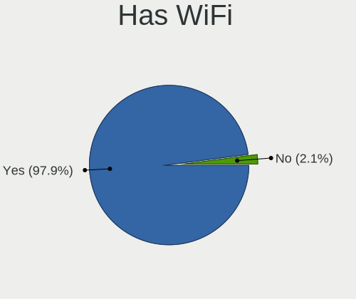
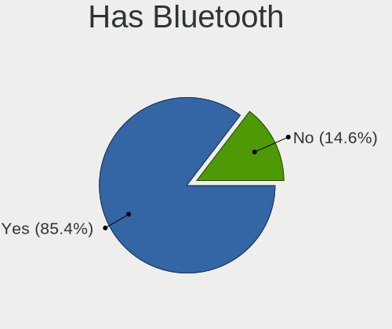
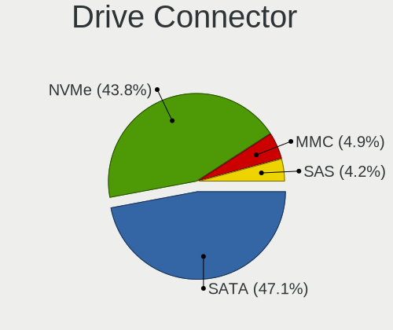
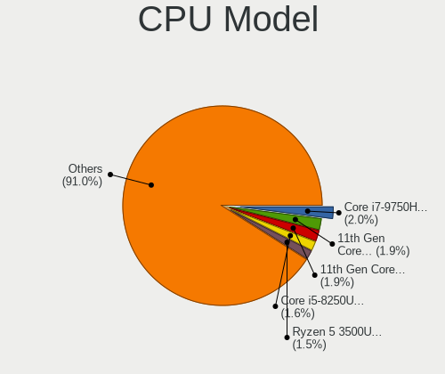
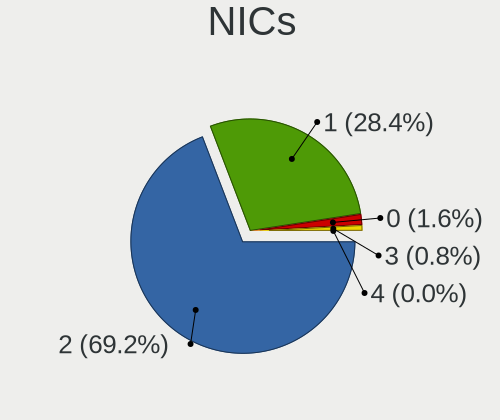

Kubuntu - Tested Hardware & Statistics (Notebooks)
--------------------------------------------------

A project to collect tested hardware configurations for Kubuntu.

Anyone can contribute to this report by the [hw-probe](https://github.com/linuxhw/hw-probe) tool:

    sudo -E hw-probe -all -upload

Please contribute! Especially if your hardware is rare.

Contents
--------

* [ Test Cases ](#test-cases)

* [ System ](#system)
  - [ OS                       ](#os)
  - [ OS Family                ](#os-family)
  - [ Kernel                   ](#kernel)
  - [ Kernel Family            ](#kernel-family)
  - [ Kernel Major Ver.        ](#kernel-major-ver)
  - [ Arch                     ](#arch)
  - [ DE                       ](#de)
  - [ Display Server           ](#display-server)
  - [ Display Manager          ](#display-manager)
  - [ OS Lang                  ](#os-lang)
  - [ Boot Mode                ](#boot-mode)
  - [ Filesystem               ](#filesystem)
  - [ Part. scheme             ](#part-scheme)
  - [ Dual Boot with Linux/BSD ](#dual-boot-with-linuxbsd)
  - [ Dual Boot (Win)          ](#dual-boot-win)

* [ Board ](#board)
  - [ Vendor                   ](#vendor)
  - [ Model                    ](#model)
  - [ Model Family             ](#model-family)
  - [ MFG Year                 ](#mfg-year)
  - [ Form Factor              ](#form-factor)
  - [ Secure Boot              ](#secure-boot)
  - [ Coreboot                 ](#coreboot)
  - [ RAM Size                 ](#ram-size)
  - [ RAM Used                 ](#ram-used)
  - [ Total Drives             ](#total-drives)
  - [ Has CD-ROM               ](#has-cd-rom)
  - [ Has Ethernet             ](#has-ethernet)
  - [ Has WiFi                 ](#has-wifi)
  - [ Has Bluetooth            ](#has-bluetooth)

* [ Location ](#location)
  - [ Country                  ](#country)
  - [ City                     ](#city)

* [ Drives ](#drives)
  - [ Drive Vendor             ](#drive-vendor)
  - [ Drive Model              ](#drive-model)
  - [ HDD Vendor               ](#hdd-vendor)
  - [ SSD Vendor               ](#ssd-vendor)
  - [ Drive Kind               ](#drive-kind)
  - [ Drive Connector          ](#drive-connector)
  - [ Drive Size               ](#drive-size)
  - [ Space Total              ](#space-total)
  - [ Space Used               ](#space-used)
  - [ Malfunc. Drives          ](#malfunc-drives)
  - [ Malfunc. Drive Vendor    ](#malfunc-drive-vendor)
  - [ Malfunc. HDD Vendor      ](#malfunc-hdd-vendor)
  - [ Malfunc. Drive Kind      ](#malfunc-drive-kind)
  - [ Failed Drives            ](#failed-drives)
  - [ Failed Drive Vendor      ](#failed-drive-vendor)
  - [ Drive Status             ](#drive-status)

* [ Storage controller ](#storage-controller)
  - [ Storage Vendor           ](#storage-vendor)
  - [ Storage Model            ](#storage-model)
  - [ Storage Kind             ](#storage-kind)

* [ Processor ](#processor)
  - [ CPU Vendor               ](#cpu-vendor)
  - [ CPU Model                ](#cpu-model)
  - [ CPU Model Family         ](#cpu-model-family)
  - [ CPU Cores                ](#cpu-cores)
  - [ CPU Sockets              ](#cpu-sockets)
  - [ CPU Threads              ](#cpu-threads)
  - [ CPU Op-Modes             ](#cpu-op-modes)
  - [ CPU Microcode            ](#cpu-microcode)
  - [ CPU Microarch            ](#cpu-microarch)

* [ Graphics ](#graphics)
  - [ GPU Vendor               ](#gpu-vendor)
  - [ GPU Model                ](#gpu-model)
  - [ GPU Combo                ](#gpu-combo)
  - [ GPU Driver               ](#gpu-driver)
  - [ GPU Memory               ](#gpu-memory)

* [ Monitor ](#monitor)
  - [ Monitor Vendor           ](#monitor-vendor)
  - [ Monitor Model            ](#monitor-model)
  - [ Monitor Resolution       ](#monitor-resolution)
  - [ Monitor Diagonal         ](#monitor-diagonal)
  - [ Monitor Width            ](#monitor-width)
  - [ Aspect Ratio             ](#aspect-ratio)
  - [ Monitor Area             ](#monitor-area)
  - [ Pixel Density            ](#pixel-density)
  - [ Multiple Monitors        ](#multiple-monitors)

* [ Network ](#network)
  - [ Net Controller Vendor    ](#net-controller-vendor)
  - [ Net Controller Model     ](#net-controller-model)
  - [ Wireless Vendor          ](#wireless-vendor)
  - [ Wireless Model           ](#wireless-model)
  - [ Ethernet Vendor          ](#ethernet-vendor)
  - [ Ethernet Model           ](#ethernet-model)
  - [ Net Controller Kind      ](#net-controller-kind)
  - [ Used Controller          ](#used-controller)
  - [ NICs                     ](#nics)
  - [ IPv6                     ](#ipv6)

* [ Bluetooth ](#bluetooth)
  - [ Bluetooth Vendor         ](#bluetooth-vendor)
  - [ Bluetooth Model          ](#bluetooth-model)

* [ Sound ](#sound)
  - [ Sound Vendor             ](#sound-vendor)
  - [ Sound Model              ](#sound-model)

* [ Memory ](#memory)
  - [ Memory Vendor            ](#memory-vendor)
  - [ Memory Model             ](#memory-model)
  - [ Memory Kind              ](#memory-kind)
  - [ Memory Form Factor       ](#memory-form-factor)
  - [ Memory Size              ](#memory-size)
  - [ Memory Speed             ](#memory-speed)

* [ Printers & scanners ](#printers--scanners)
  - [ Printer Vendor           ](#printer-vendor)
  - [ Printer Model            ](#printer-model)
  - [ Scanner Vendor           ](#scanner-vendor)
  - [ Scanner Model            ](#scanner-model)

* [ Camera ](#camera)
  - [ Camera Vendor            ](#camera-vendor)
  - [ Camera Model             ](#camera-model)

* [ Security ](#security)
  - [ Fingerprint Vendor       ](#fingerprint-vendor)
  - [ Fingerprint Model        ](#fingerprint-model)
  - [ Chipcard Vendor          ](#chipcard-vendor)
  - [ Chipcard Model           ](#chipcard-model)

* [ Unsupported ](#unsupported)
  - [ Unsupported Devices      ](#unsupported-devices)
  - [ Unsupported Device Types ](#unsupported-device-types)

Test Cases
----------

Total: 3012

| Vendor        | Model                       | Probe                                                      | Date         |
|---------------|-----------------------------|------------------------------------------------------------|--------------|
| Dell          | G3 3779                     | [a6c5553133](https://linux-hardware.org/?probe=a6c5553133) | Jun 30, 2023 |
| Dell          | Latitude E5450              | [e0826ab83a](https://linux-hardware.org/?probe=e0826ab83a) | Jun 30, 2023 |
| Schenker      | XMG PRO (E23)               | [c70da63bd9](https://linux-hardware.org/?probe=c70da63bd9) | Jun 30, 2023 |
| Lenovo        | Legion 5 Pro 16ARH7H 82R... | [b52c0ac96a](https://linux-hardware.org/?probe=b52c0ac96a) | Jun 29, 2023 |
| Lenovo        | ThinkPad T14 Gen 2i 20W1... | [bbd13c14eb](https://linux-hardware.org/?probe=bbd13c14eb) | Jun 29, 2023 |
| ASUSTek       | Zenbook Pro Duo UX582ZW_... | [791bfd25bf](https://linux-hardware.org/?probe=791bfd25bf) | Jun 29, 2023 |
| HP            | Laptop 14s-dq2xxx           | [7dd7d8e8ea](https://linux-hardware.org/?probe=7dd7d8e8ea) | Jun 28, 2023 |
| ASUSTek       | VivoBook_ASUSLaptop M540... | [9619e6fb09](https://linux-hardware.org/?probe=9619e6fb09) | Jun 27, 2023 |
| ASUSTek       | VivoBook_ASUSLaptop M760... | [abf9b9909f](https://linux-hardware.org/?probe=abf9b9909f) | Jun 27, 2023 |
| Lenovo        | IdeaPad S340-15API 81NC     | [e5c848cc49](https://linux-hardware.org/?probe=e5c848cc49) | Jun 25, 2023 |
| HP            | Pavilion Laptop 14-bf0xx    | [589dd91af9](https://linux-hardware.org/?probe=589dd91af9) | Jun 25, 2023 |
| Lenovo        | IdeaPad S340-15API 81NC     | [1c4e016f20](https://linux-hardware.org/?probe=1c4e016f20) | Jun 25, 2023 |
| HP            | ZBook Studio 15.6 inch G... | [f043aedf3c](https://linux-hardware.org/?probe=f043aedf3c) | Jun 24, 2023 |
| ASUSTek       | G551JM                      | [04f17cc1d0](https://linux-hardware.org/?probe=04f17cc1d0) | Jun 24, 2023 |
| Google        | Kohaku                      | [f9c3a3efb6](https://linux-hardware.org/?probe=f9c3a3efb6) | Jun 23, 2023 |
| Apple         | MacBookPro9,2               | [852dad5b6a](https://linux-hardware.org/?probe=852dad5b6a) | Jun 23, 2023 |
| Apple         | MacBookPro9,2               | [bf18f8c7dc](https://linux-hardware.org/?probe=bf18f8c7dc) | Jun 23, 2023 |
| Lenovo        | ThinkPad L15 Gen 2a 20X7... | [ed127d8c21](https://linux-hardware.org/?probe=ed127d8c21) | Jun 23, 2023 |
| Lenovo        | ThinkPad L15 Gen 2a 20X7... | [e4f7f39784](https://linux-hardware.org/?probe=e4f7f39784) | Jun 23, 2023 |
| HP            | 255 15.6 inch G9 Noteboo... | [aa50925a16](https://linux-hardware.org/?probe=aa50925a16) | Jun 23, 2023 |
| HP            | Laptop 14s-dq2xxx           | [f224dfda17](https://linux-hardware.org/?probe=f224dfda17) | Jun 22, 2023 |
| HP            | Pavilion Laptop 14-ce2xx... | [419687b31f](https://linux-hardware.org/?probe=419687b31f) | Jun 22, 2023 |
| Dell          | G3 3590                     | [14ab83043b](https://linux-hardware.org/?probe=14ab83043b) | Jun 21, 2023 |
| HUAWEI        | NBLB-WAX9N                  | [014c851c43](https://linux-hardware.org/?probe=014c851c43) | Jun 21, 2023 |
| ASUSTek       | ASUS EXPERTBOOK B9400CBA... | [c5f46a6955](https://linux-hardware.org/?probe=c5f46a6955) | Jun 21, 2023 |
| HP            | Notebook                    | [db641e216c](https://linux-hardware.org/?probe=db641e216c) | Jun 20, 2023 |
| HP            | ENVY Laptop 14-eb0xxx       | [233b6c3412](https://linux-hardware.org/?probe=233b6c3412) | Jun 20, 2023 |
| Dell          | XPS 13 9380                 | [fa33088329](https://linux-hardware.org/?probe=fa33088329) | Jun 20, 2023 |
| Lenovo        | ThinkPad L15 Gen 1 20U30... | [7d00ddf4fc](https://linux-hardware.org/?probe=7d00ddf4fc) | Jun 20, 2023 |
| Framework     | Laptop (12th Gen Intel C... | [bfa769b311](https://linux-hardware.org/?probe=bfa769b311) | Jun 20, 2023 |
| Lenovo        | ThinkPad Z16 Gen 1 21D4C... | [9e06717237](https://linux-hardware.org/?probe=9e06717237) | Jun 19, 2023 |
| Lenovo        | IdeaPad 3 15ABA7 82RN       | [5daecd88f5](https://linux-hardware.org/?probe=5daecd88f5) | Jun 19, 2023 |
| HP            | EliteBook 8760w             | [ac41230354](https://linux-hardware.org/?probe=ac41230354) | Jun 18, 2023 |
| ASUSTek       | ROG Zephyrus G14 GA401IV... | [ce819ae3d3](https://linux-hardware.org/?probe=ce819ae3d3) | Jun 18, 2023 |
| Lenovo        | IdeaPad 1 15ADA7 82R1       | [83d17fd3bd](https://linux-hardware.org/?probe=83d17fd3bd) | Jun 17, 2023 |
| Lenovo        | IdeaPad 1 15ADA7 82R1       | [739c466bf0](https://linux-hardware.org/?probe=739c466bf0) | Jun 17, 2023 |
| Lenovo        | IdeaPad S340-14IIL 81VV     | [945376fe33](https://linux-hardware.org/?probe=945376fe33) | Jun 17, 2023 |
| HUAWEI        | KLVD-WXX9                   | [75eeeb7917](https://linux-hardware.org/?probe=75eeeb7917) | Jun 16, 2023 |
| Lenovo        | ThinkPad E15 Gen 2 20TD0... | [a1c36c44b1](https://linux-hardware.org/?probe=a1c36c44b1) | Jun 15, 2023 |
| Lenovo        | ThinkPad E15 Gen 2 20TD0... | [8d88084588](https://linux-hardware.org/?probe=8d88084588) | Jun 15, 2023 |
| Apple         | MacBookPro12,1              | [b8d24f1cc8](https://linux-hardware.org/?probe=b8d24f1cc8) | Jun 15, 2023 |
| HP            | Notebook                    | [e0a00a71de](https://linux-hardware.org/?probe=e0a00a71de) | Jun 15, 2023 |
| HP            | Notebook                    | [76433ab03f](https://linux-hardware.org/?probe=76433ab03f) | Jun 15, 2023 |
| Dell          | Latitude 3310               | [40aa328d98](https://linux-hardware.org/?probe=40aa328d98) | Jun 15, 2023 |
| Lenovo        | ThinkPad E14 Gen 4 21E30... | [f7049b2256](https://linux-hardware.org/?probe=f7049b2256) | Jun 15, 2023 |
| Proline       | V1165C4                     | [89f6135da3](https://linux-hardware.org/?probe=89f6135da3) | Jun 14, 2023 |
| Dell          | Latitude E6420              | [f05e0e10e5](https://linux-hardware.org/?probe=f05e0e10e5) | Jun 14, 2023 |
| ASUSTek       | VivoBook_ASUSLaptop M760... | [b1eabf98f6](https://linux-hardware.org/?probe=b1eabf98f6) | Jun 14, 2023 |
| Lenovo        | ThinkPad T440p 20AN009CU... | [54fd87b596](https://linux-hardware.org/?probe=54fd87b596) | Jun 14, 2023 |
| Irbis         | NB123                       | [f6dae4c3c4](https://linux-hardware.org/?probe=f6dae4c3c4) | Jun 14, 2023 |
| HUAWEI        | NBLB-WAX9N                  | [f616cb77b5](https://linux-hardware.org/?probe=f616cb77b5) | Jun 13, 2023 |
| Samsung       | 550XCJ/550XCR               | [679fb4f6ab](https://linux-hardware.org/?probe=679fb4f6ab) | Jun 11, 2023 |
| Acer          | Aspire A317-53              | [36f0bbcb6d](https://linux-hardware.org/?probe=36f0bbcb6d) | Jun 11, 2023 |
| Dell          | G3 3779                     | [0190c87b35](https://linux-hardware.org/?probe=0190c87b35) | Jun 10, 2023 |
| Lenovo        | ThinkPad T570 20H9000UUS    | [606989ab70](https://linux-hardware.org/?probe=606989ab70) | Jun 10, 2023 |
| Apple         | MacBookAir5,1               | [53ba4689ae](https://linux-hardware.org/?probe=53ba4689ae) | Jun 10, 2023 |
| Apple         | MacBookAir5,1               | [58f4272bee](https://linux-hardware.org/?probe=58f4272bee) | Jun 10, 2023 |
| Dell          | XPS 13 9333                 | [88020aee75](https://linux-hardware.org/?probe=88020aee75) | Jun 09, 2023 |
| Apple         | MacBookPro8,1               | [cbf7ed91a7](https://linux-hardware.org/?probe=cbf7ed91a7) | Jun 08, 2023 |
| Lenovo        | Slim 7 ProX 14ARH7 82V2     | [e8b6d763e4](https://linux-hardware.org/?probe=e8b6d763e4) | Jun 08, 2023 |
| Lenovo        | ThinkPad P14s Gen 1 20S5... | [0372aa0747](https://linux-hardware.org/?probe=0372aa0747) | Jun 08, 2023 |
| HP            | Notebook                    | [1b099710b7](https://linux-hardware.org/?probe=1b099710b7) | Jun 08, 2023 |
| HP            | Notebook                    | [9bf82397c3](https://linux-hardware.org/?probe=9bf82397c3) | Jun 08, 2023 |
| PC Special... | Initia Ii 15                | [36a16c2890](https://linux-hardware.org/?probe=36a16c2890) | Jun 08, 2023 |
| Acer          | Aspire A317-53              | [62418abec4](https://linux-hardware.org/?probe=62418abec4) | Jun 08, 2023 |
| Lenovo        | Slim 7 ProX 14ARH7 82V2     | [810e331444](https://linux-hardware.org/?probe=810e331444) | Jun 07, 2023 |
| Acer          | Nitro AN515-56              | [f02195de51](https://linux-hardware.org/?probe=f02195de51) | Jun 07, 2023 |
| Acer          | Aspire E1-571               | [f4e4a4b982](https://linux-hardware.org/?probe=f4e4a4b982) | Jun 07, 2023 |
| Acer          | Aspire E1-571               | [7948f267c2](https://linux-hardware.org/?probe=7948f267c2) | Jun 07, 2023 |
| Lenovo        | ThinkPad P15s Gen 2i 20W... | [53341e2d0d](https://linux-hardware.org/?probe=53341e2d0d) | Jun 07, 2023 |
| Acer          | Aspire E1-571               | [1139c69312](https://linux-hardware.org/?probe=1139c69312) | Jun 06, 2023 |
| ASUSTek       | K50IJ                       | [b06a0c9b89](https://linux-hardware.org/?probe=b06a0c9b89) | Jun 06, 2023 |
| Gigabyte      | G5 GE                       | [1b78246ef7](https://linux-hardware.org/?probe=1b78246ef7) | Jun 06, 2023 |
| HP            | ProBook 650 G1              | [776a9fb064](https://linux-hardware.org/?probe=776a9fb064) | Jun 05, 2023 |
| Acer          | Aspire A317-53              | [693fdb51d3](https://linux-hardware.org/?probe=693fdb51d3) | Jun 05, 2023 |
| HP            | Pavilion Laptop 15-eh1xx... | [b9cd465d98](https://linux-hardware.org/?probe=b9cd465d98) | Jun 05, 2023 |
| Lenovo        | Yoga Creator 7 15IMH05 8... | [3bcc239452](https://linux-hardware.org/?probe=3bcc239452) | Jun 04, 2023 |
| Gigabyte      | G5 GE                       | [8ef447b2f3](https://linux-hardware.org/?probe=8ef447b2f3) | Jun 03, 2023 |
| Dell          | Latitude E6500              | [4053ff5676](https://linux-hardware.org/?probe=4053ff5676) | Jun 03, 2023 |
| Lenovo        | IdeaPad 320-15IKB 80YE      | [767241151a](https://linux-hardware.org/?probe=767241151a) | Jun 03, 2023 |
| Lenovo        | ThinkPad T460 20FN004BMN    | [dafbbaeb0f](https://linux-hardware.org/?probe=dafbbaeb0f) | Jun 02, 2023 |
| ASUSTek       | VivoBook_ASUS Laptop X50... | [6ae18b11ab](https://linux-hardware.org/?probe=6ae18b11ab) | Jun 02, 2023 |
| ASUSTek       | VivoBook_ASUSLaptop N760... | [05a99cf128](https://linux-hardware.org/?probe=05a99cf128) | Jun 02, 2023 |
| ASUSTek       | VivoBook_ASUS Laptop X50... | [963b30ca7f](https://linux-hardware.org/?probe=963b30ca7f) | Jun 02, 2023 |
| ASUSTek       | ASUS TUF Gaming F17 FX70... | [23e94c534e](https://linux-hardware.org/?probe=23e94c534e) | Jun 01, 2023 |
| Lenovo        | ThinkPad P14s Gen 2a 21A... | [8720e6163e](https://linux-hardware.org/?probe=8720e6163e) | Jun 01, 2023 |
| MSI           | GF63 Thin 11SC              | [8f8afcc010](https://linux-hardware.org/?probe=8f8afcc010) | Jun 01, 2023 |
| Lenovo        | ThinkPad T15 Gen 2i 20W4... | [2667cb67a3](https://linux-hardware.org/?probe=2667cb67a3) | May 30, 2023 |
| Lenovo        | Legion 5 15IMH05 82AU       | [2ac99b8909](https://linux-hardware.org/?probe=2ac99b8909) | May 30, 2023 |
| Dell          | G15 5525                    | [f7e5d0ae57](https://linux-hardware.org/?probe=f7e5d0ae57) | May 30, 2023 |
| Lenovo        | ThinkPad T15 Gen 2i 20W4... | [0568aa067a](https://linux-hardware.org/?probe=0568aa067a) | May 30, 2023 |
| MSI           | Titan GT77HX 13VH           | [7c3b8ed81d](https://linux-hardware.org/?probe=7c3b8ed81d) | May 29, 2023 |
| Acer          | Aspire A317-53              | [bca463af6d](https://linux-hardware.org/?probe=bca463af6d) | May 28, 2023 |
| Acer          | Aspire E5-575               | [cdc924595c](https://linux-hardware.org/?probe=cdc924595c) | May 28, 2023 |
| Lenovo        | ThinkPad E15 Gen 4 21EDC... | [8fd2003b01](https://linux-hardware.org/?probe=8fd2003b01) | May 28, 2023 |
| Acer          | Aspire A515-45              | [e429db5b0b](https://linux-hardware.org/?probe=e429db5b0b) | May 27, 2023 |
| Dell          | Precision 5530              | [cb116bdfd2](https://linux-hardware.org/?probe=cb116bdfd2) | May 26, 2023 |
| Lenovo        | IdeaPad 3 15ALC6 82MF       | [2b9c4431c2](https://linux-hardware.org/?probe=2b9c4431c2) | May 26, 2023 |
| Lenovo        | IdeaPad 3 15ALC6 82MF       | [f5b571be32](https://linux-hardware.org/?probe=f5b571be32) | May 26, 2023 |
| Lenovo        | ThinkPad T16 Gen 1 21BVC... | [3e1fb6f93b](https://linux-hardware.org/?probe=3e1fb6f93b) | May 25, 2023 |
| Google        | Bluebird                    | [5b41bdf767](https://linux-hardware.org/?probe=5b41bdf767) | May 25, 2023 |
| Acer          | Aspire V3-772               | [2ef3c0b337](https://linux-hardware.org/?probe=2ef3c0b337) | May 24, 2023 |
| Dell          | Inspiron 14 5401            | [16d8b1c945](https://linux-hardware.org/?probe=16d8b1c945) | May 24, 2023 |
| Acer          | Aspire V3-772               | [3eb016e8c7](https://linux-hardware.org/?probe=3eb016e8c7) | May 23, 2023 |
| HP            | Pavilion Gaming Laptop 1... | [3d4cdd163c](https://linux-hardware.org/?probe=3d4cdd163c) | May 23, 2023 |
| HP            | Pavilion Gaming Laptop 1... | [c3251b8c63](https://linux-hardware.org/?probe=c3251b8c63) | May 23, 2023 |
| Apple         | MacBookPro9,1               | [b880d4f8c1](https://linux-hardware.org/?probe=b880d4f8c1) | May 23, 2023 |
| Acer          | Aspire A317-53              | [185b65bf34](https://linux-hardware.org/?probe=185b65bf34) | May 22, 2023 |
| COM1          | NBINF-X5-9G5                | [8d8c13c10c](https://linux-hardware.org/?probe=8d8c13c10c) | May 22, 2023 |
| Fujitsu       | LIFEBOOK U748               | [a8d8e219a2](https://linux-hardware.org/?probe=a8d8e219a2) | May 21, 2023 |
| HP            | 350 G1                      | [7629c78328](https://linux-hardware.org/?probe=7629c78328) | May 20, 2023 |
| Lenovo        | ThinkPad E15 Gen 4 21EES... | [71ac41efb8](https://linux-hardware.org/?probe=71ac41efb8) | May 20, 2023 |
| BOSGAME       | B95                         | [3d1805a2eb](https://linux-hardware.org/?probe=3d1805a2eb) | May 19, 2023 |
| ASUSTek       | ROG Strix G513RW_G513RW     | [26e8deafbf](https://linux-hardware.org/?probe=26e8deafbf) | May 19, 2023 |
| Acer          | Aspire E5-521               | [05227be8bc](https://linux-hardware.org/?probe=05227be8bc) | May 18, 2023 |
| Notebook      | NLx0MU                      | [e0300907f0](https://linux-hardware.org/?probe=e0300907f0) | May 18, 2023 |
| Lenovo        | IdeaPad 700-17ISK 80RV      | [61b0585530](https://linux-hardware.org/?probe=61b0585530) | May 18, 2023 |
| HP            | Laptop 14-fq0xxx            | [7da21ce089](https://linux-hardware.org/?probe=7da21ce089) | May 18, 2023 |
| Dell          | Latitude E5530 non-vPro     | [7c05862259](https://linux-hardware.org/?probe=7c05862259) | May 16, 2023 |
| Lenovo        | ThinkBook 15 G4 IAP 21DJ    | [8cb1f28963](https://linux-hardware.org/?probe=8cb1f28963) | May 16, 2023 |
| Acer          | Swift SFX14-41G             | [0331ab9725](https://linux-hardware.org/?probe=0331ab9725) | May 16, 2023 |
| HP            | EliteBook 865 16 inch G9... | [14edb35e71](https://linux-hardware.org/?probe=14edb35e71) | May 15, 2023 |
| HUAWEI        | BOHB-WAX9                   | [98ebdcd589](https://linux-hardware.org/?probe=98ebdcd589) | May 15, 2023 |
| HP            | ENVY TS 15                  | [f90de81324](https://linux-hardware.org/?probe=f90de81324) | May 15, 2023 |
| Lenovo        | IdeaPad Y700-15ISK 80NV     | [5f508efff4](https://linux-hardware.org/?probe=5f508efff4) | May 14, 2023 |
| Dell          | XPS 15 7590                 | [e81d6a8a69](https://linux-hardware.org/?probe=e81d6a8a69) | May 14, 2023 |
| HP            | Compaq CQ58                 | [0df5818390](https://linux-hardware.org/?probe=0df5818390) | May 14, 2023 |
| Dell          | Latitude E6500              | [b223b17c87](https://linux-hardware.org/?probe=b223b17c87) | May 14, 2023 |
| PC Special... | P65_67RSRP                  | [892b6d56c8](https://linux-hardware.org/?probe=892b6d56c8) | May 13, 2023 |
| Dell          | G3 3590                     | [696d2d38df](https://linux-hardware.org/?probe=696d2d38df) | May 13, 2023 |
| Samsung       | R425/R525                   | [a7719ea5d3](https://linux-hardware.org/?probe=a7719ea5d3) | May 13, 2023 |
| HUAWEI        | HVY-WXX9                    | [9ca71ebd01](https://linux-hardware.org/?probe=9ca71ebd01) | May 12, 2023 |
| Lenovo        | ThinkPad X1 Carbon Gen 1... | [58557ae6a2](https://linux-hardware.org/?probe=58557ae6a2) | May 12, 2023 |
| HUAWEI        | NBD-WXX9                    | [d8c0bd3bff](https://linux-hardware.org/?probe=d8c0bd3bff) | May 12, 2023 |
| Dell          | Latitude 7490               | [a187ae7b7e](https://linux-hardware.org/?probe=a187ae7b7e) | May 12, 2023 |
| Dell          | Latitude E5470              | [59c95182ec](https://linux-hardware.org/?probe=59c95182ec) | May 11, 2023 |
| Dell          | Latitude 5420               | [a3c2a7c9bf](https://linux-hardware.org/?probe=a3c2a7c9bf) | May 11, 2023 |
| Lenovo        | IdeaPad 3 15ADA05 81W1      | [d567c1f954](https://linux-hardware.org/?probe=d567c1f954) | May 10, 2023 |
| HP            | EliteBook 8470p             | [c941da38cd](https://linux-hardware.org/?probe=c941da38cd) | May 08, 2023 |
| Lenovo        | IdeaPad 3 15ADA05 81W1      | [cbafd29abc](https://linux-hardware.org/?probe=cbafd29abc) | May 08, 2023 |
| Lenovo        | ThinkPad E14 Gen 3 20YDS... | [8d1f016621](https://linux-hardware.org/?probe=8d1f016621) | May 08, 2023 |
| HP            | Laptop 15-da2xxx            | [8f08aa189f](https://linux-hardware.org/?probe=8f08aa189f) | May 08, 2023 |
| Dell          | Latitude 3570               | [8209fc06f4](https://linux-hardware.org/?probe=8209fc06f4) | May 08, 2023 |
| HP            | Pavilion Laptop 15-eg0xx... | [c075073dd8](https://linux-hardware.org/?probe=c075073dd8) | May 07, 2023 |
| TerraQue      | W65_W67RB                   | [842f203ec5](https://linux-hardware.org/?probe=842f203ec5) | May 07, 2023 |
| Lenovo        | ThinkPad T460s 20F9CTO1W... | [4229be0afa](https://linux-hardware.org/?probe=4229be0afa) | May 07, 2023 |
| ASUSTek       | Zenbook UM6702RC_RM6702R... | [3cf83f50f0](https://linux-hardware.org/?probe=3cf83f50f0) | May 07, 2023 |
| Dell          | XPS 13 9300                 | [7bbdc5e568](https://linux-hardware.org/?probe=7bbdc5e568) | May 07, 2023 |
| Google        | Lars                        | [db3ba59095](https://linux-hardware.org/?probe=db3ba59095) | May 06, 2023 |
| Razer         | Blade Pro 17 (2019)         | [4b2265c354](https://linux-hardware.org/?probe=4b2265c354) | May 05, 2023 |
| HP            | ProBook 440 G5              | [f6251eeeb1](https://linux-hardware.org/?probe=f6251eeeb1) | May 05, 2023 |
| Medion        | E11201                      | [f0bfd835f8](https://linux-hardware.org/?probe=f0bfd835f8) | May 04, 2023 |
| Lenovo        | ThinkPad E14 Gen 4 21ECS... | [1f2d88bfae](https://linux-hardware.org/?probe=1f2d88bfae) | May 04, 2023 |
| Dell          | Latitude 5480               | [1ab8b910e4](https://linux-hardware.org/?probe=1ab8b910e4) | May 04, 2023 |
| ASUSTek       | X750JB                      | [02a5481254](https://linux-hardware.org/?probe=02a5481254) | May 03, 2023 |
| Lenovo        | IdeaPad 3 15IAU7 82RK       | [861ca2dca3](https://linux-hardware.org/?probe=861ca2dca3) | May 03, 2023 |
| Dell          | Inspiron 3593               | [263099c212](https://linux-hardware.org/?probe=263099c212) | May 02, 2023 |
| ASUSTek       | VivoBook_ASUSLaptop X340... | [e8ce8c11c0](https://linux-hardware.org/?probe=e8ce8c11c0) | May 01, 2023 |
| HP            | ZBook Studio 15.6 inch G... | [1846ea93e7](https://linux-hardware.org/?probe=1846ea93e7) | May 01, 2023 |
| Acer          | Aspire M5-481T              | [d215d36b64](https://linux-hardware.org/?probe=d215d36b64) | Apr 30, 2023 |
| Lenovo        | IdeaPad 5 Pro 16ARH7 82S... | [9a36e5ebaf](https://linux-hardware.org/?probe=9a36e5ebaf) | Apr 28, 2023 |
| Lenovo        | ThinkBook 14 G4 ABA 21DK    | [1ccae7d268](https://linux-hardware.org/?probe=1ccae7d268) | Apr 28, 2023 |
| HP            | ZBook Fury 15 G7 Mobile ... | [a31fa8f985](https://linux-hardware.org/?probe=a31fa8f985) | Apr 28, 2023 |
| ASUSTek       | X51RL                       | [0d18de9922](https://linux-hardware.org/?probe=0d18de9922) | Apr 28, 2023 |
| HP            | EliteBook 2570p             | [dd76e10243](https://linux-hardware.org/?probe=dd76e10243) | Apr 28, 2023 |
| Lenovo        | ThinkPad E14 Gen 4 21ECS... | [442a827555](https://linux-hardware.org/?probe=442a827555) | Apr 27, 2023 |
| Lenovo        | ThinkPad P15 Gen 1 20ST0... | [a6845d78e4](https://linux-hardware.org/?probe=a6845d78e4) | Apr 27, 2023 |
| Samsung       | 950XED                      | [02586ee1ba](https://linux-hardware.org/?probe=02586ee1ba) | Apr 26, 2023 |
| Dell          | Inspiron 3793               | [f9d337a0a1](https://linux-hardware.org/?probe=f9d337a0a1) | Apr 26, 2023 |
| Lenovo        | ThinkPad T430s 23539MU      | [83a1144be6](https://linux-hardware.org/?probe=83a1144be6) | Apr 26, 2023 |
| Lenovo        | ThinkPad P1 Gen 2 20QT00... | [4285b1a3d9](https://linux-hardware.org/?probe=4285b1a3d9) | Apr 25, 2023 |
| HP            | Pavilion Notebook           | [b03c4808b0](https://linux-hardware.org/?probe=b03c4808b0) | Apr 25, 2023 |
| Lenovo        | IdeaPad 5 Pro 16ARH7 82S... | [6d49fc2276](https://linux-hardware.org/?probe=6d49fc2276) | Apr 24, 2023 |
| Lenovo        | Legion 5 Pro 16ACH6H 82J... | [38806ed70c](https://linux-hardware.org/?probe=38806ed70c) | Apr 24, 2023 |
| HP            | EliteBook 2570p             | [2a8a92135b](https://linux-hardware.org/?probe=2a8a92135b) | Apr 24, 2023 |
| HP            | Pavilion Notebook           | [0fde788ea5](https://linux-hardware.org/?probe=0fde788ea5) | Apr 24, 2023 |
| Dell          | Inspiron 5521               | [8de2e801a3](https://linux-hardware.org/?probe=8de2e801a3) | Apr 23, 2023 |
| Dell          | Latitude E5530 non-vPro     | [fa5d5b4733](https://linux-hardware.org/?probe=fa5d5b4733) | Apr 23, 2023 |
| Gigabyte      | G5 KD                       | [d7648edaab](https://linux-hardware.org/?probe=d7648edaab) | Apr 23, 2023 |
| Apple         | MacBookPro5,5               | [bee14868f2](https://linux-hardware.org/?probe=bee14868f2) | Apr 23, 2023 |
| Carbon Sys... | Iridium 14                  | [10cd21aba6](https://linux-hardware.org/?probe=10cd21aba6) | Apr 23, 2023 |
| Dell          | Precision 5520              | [4d1dd8b673](https://linux-hardware.org/?probe=4d1dd8b673) | Apr 23, 2023 |
| Dell          | Precision 7550              | [31830a82c6](https://linux-hardware.org/?probe=31830a82c6) | Apr 22, 2023 |
| Gigabyte      | AORUS 15P XD                | [22925aa0c9](https://linux-hardware.org/?probe=22925aa0c9) | Apr 22, 2023 |
| Dell          | Latitude E5530 non-vPro     | [f7528e9759](https://linux-hardware.org/?probe=f7528e9759) | Apr 22, 2023 |
| HP            | 255 G8 Notebook PC          | [0dcc2eaa50](https://linux-hardware.org/?probe=0dcc2eaa50) | Apr 22, 2023 |
| ASUSTek       | ASUS TUF Gaming F17 FX70... | [918115dc84](https://linux-hardware.org/?probe=918115dc84) | Apr 21, 2023 |
| ASUSTek       | VivoBook_ASUSLaptop M760... | [a02462f614](https://linux-hardware.org/?probe=a02462f614) | Apr 21, 2023 |
| Carbon Sys... | Iridium 14                  | [af5e3d750a](https://linux-hardware.org/?probe=af5e3d750a) | Apr 20, 2023 |
| Lenovo        | ThinkPad X1 Carbon 4th 2... | [cd58803d5c](https://linux-hardware.org/?probe=cd58803d5c) | Apr 19, 2023 |
| Lenovo        | ThinkPad X1 Carbon 4th 2... | [7adb4b2000](https://linux-hardware.org/?probe=7adb4b2000) | Apr 19, 2023 |
| ASUSTek       | X510UAR                     | [d96138627b](https://linux-hardware.org/?probe=d96138627b) | Apr 19, 2023 |
| ASUSTek       | TUF Gaming FX505GE_FX505... | [cccb2ff44c](https://linux-hardware.org/?probe=cccb2ff44c) | Apr 18, 2023 |
| HP            | 630                         | [daeae9f12e](https://linux-hardware.org/?probe=daeae9f12e) | Apr 18, 2023 |
| Apple         | MacBookPro14,2              | [26a430e092](https://linux-hardware.org/?probe=26a430e092) | Apr 18, 2023 |
| Lenovo        | ThinkPad E15 Gen 3 20YG0... | [cc18450a32](https://linux-hardware.org/?probe=cc18450a32) | Apr 17, 2023 |
| HP            | OMEN Laptop 15-en0xxx       | [7ed9078ed9](https://linux-hardware.org/?probe=7ed9078ed9) | Apr 17, 2023 |
| MSI           | Modern 14 B11MOU            | [d76555e7e6](https://linux-hardware.org/?probe=d76555e7e6) | Apr 16, 2023 |
| Lenovo        | ThinkPad T14s Gen 3 21CQ... | [073b59d558](https://linux-hardware.org/?probe=073b59d558) | Apr 16, 2023 |
| AXIOO         | SlimBook 11                 | [b0c639ab77](https://linux-hardware.org/?probe=b0c639ab77) | Apr 15, 2023 |
| HP            | ProBook 650 G3              | [00526690c9](https://linux-hardware.org/?probe=00526690c9) | Apr 15, 2023 |
| Lenovo        | IdeaPad 320S-14IKB 81BN     | [c17cfe4d6d](https://linux-hardware.org/?probe=c17cfe4d6d) | Apr 13, 2023 |
| ASUSTek       | ROG Strix G712LU_G712LU     | [91946b965a](https://linux-hardware.org/?probe=91946b965a) | Apr 13, 2023 |
| Lenovo        | S21e-20 80M4                | [8d235a410a](https://linux-hardware.org/?probe=8d235a410a) | Apr 13, 2023 |
| Acer          | Nitro AN515-58              | [5e772c9376](https://linux-hardware.org/?probe=5e772c9376) | Apr 13, 2023 |
| Casper        | NIRVANA NOTEBOOK            | [624fa75f43](https://linux-hardware.org/?probe=624fa75f43) | Apr 12, 2023 |
| ASUSTek       | ROG Strix G712LU_G712LU     | [674533c5cd](https://linux-hardware.org/?probe=674533c5cd) | Apr 12, 2023 |
| Dell          | Latitude E5450              | [f98cdf4da0](https://linux-hardware.org/?probe=f98cdf4da0) | Apr 11, 2023 |
| Dell          | Latitude E5450              | [7bf04cdb7d](https://linux-hardware.org/?probe=7bf04cdb7d) | Apr 11, 2023 |
| ASUSTek       | X51RL                       | [ca3fb7f6d5](https://linux-hardware.org/?probe=ca3fb7f6d5) | Apr 11, 2023 |
| HUAWEI        | HVY-WXX9                    | [5875837a8d](https://linux-hardware.org/?probe=5875837a8d) | Apr 10, 2023 |
| HUAWEI        | HVY-WXX9                    | [6b6b2a8633](https://linux-hardware.org/?probe=6b6b2a8633) | Apr 09, 2023 |
| HUAWEI        | HVY-WXX9                    | [00489240d2](https://linux-hardware.org/?probe=00489240d2) | Apr 09, 2023 |
| Unknown       | Unknown                     | [0bf91f3219](https://linux-hardware.org/?probe=0bf91f3219) | Apr 06, 2023 |
| Lenovo        | ThinkPad T420 4177RVU       | [994fccf5d0](https://linux-hardware.org/?probe=994fccf5d0) | Apr 06, 2023 |
| Unknown       | Unknown                     | [ec673ad1c1](https://linux-hardware.org/?probe=ec673ad1c1) | Apr 06, 2023 |
| Lenovo        | V15-ADA 82C7                | [917714b1be](https://linux-hardware.org/?probe=917714b1be) | Apr 06, 2023 |
| Lenovo        | V15-ADA 82C7                | [ad148ede52](https://linux-hardware.org/?probe=ad148ede52) | Apr 06, 2023 |
| HP            | EliteBook 6930p             | [b7d43d9e23](https://linux-hardware.org/?probe=b7d43d9e23) | Apr 06, 2023 |
| Lenovo        | IdeaPad 330-15AST 81D6      | [edd397551c](https://linux-hardware.org/?probe=edd397551c) | Apr 05, 2023 |
| Lenovo        | ThinkPad X230 23256N6       | [0779903086](https://linux-hardware.org/?probe=0779903086) | Apr 05, 2023 |
| Notebook      | PD5x_7xSNC_SND_SNE          | [1c9d684eba](https://linux-hardware.org/?probe=1c9d684eba) | Apr 04, 2023 |
| Lenovo        | ThinkPad T14 Gen 3 21CFS... | [0cff652e48](https://linux-hardware.org/?probe=0cff652e48) | Apr 03, 2023 |
| ASUSTek       | ASUS ExpertBook P2451FA_... | [05261a9b98](https://linux-hardware.org/?probe=05261a9b98) | Apr 03, 2023 |
| Thomson       | SPNEOX13-4RD64              | [bf3eb39804](https://linux-hardware.org/?probe=bf3eb39804) | Apr 02, 2023 |
| Lenovo        | IdeaPad 100-15IBY 80MJ      | [e800b0ff2e](https://linux-hardware.org/?probe=e800b0ff2e) | Apr 02, 2023 |
| Lenovo        | IdeaPad 100-15IBY 80MJ      | [a0dddcbb95](https://linux-hardware.org/?probe=a0dddcbb95) | Apr 02, 2023 |
| ASUSTek       | VivoBook_ASUSLaptop X513... | [37beaa5cbb](https://linux-hardware.org/?probe=37beaa5cbb) | Apr 02, 2023 |
| Notebook      | PD5x_7xSNC_SND_SNE          | [4809c76aba](https://linux-hardware.org/?probe=4809c76aba) | Apr 02, 2023 |
| Lenovo        | ThinkPad X280 20KF001UUS    | [49e740bc77](https://linux-hardware.org/?probe=49e740bc77) | Apr 02, 2023 |
| HP            | EliteBook 6930p             | [98f2b162e1](https://linux-hardware.org/?probe=98f2b162e1) | Apr 01, 2023 |
| Acer          | Aspire A515-45              | [93f1374055](https://linux-hardware.org/?probe=93f1374055) | Apr 01, 2023 |
| Acer          | Aspire A515-57              | [4a1b8f3f21](https://linux-hardware.org/?probe=4a1b8f3f21) | Apr 01, 2023 |
| Gigabyte      | A7 K1                       | [e5e7751054](https://linux-hardware.org/?probe=e5e7751054) | Mar 31, 2023 |
| Chuwi         | CoreBook XPro               | [85ad17d246](https://linux-hardware.org/?probe=85ad17d246) | Mar 31, 2023 |
| Intel         | Whiskey Platform            | [36b9d4d898](https://linux-hardware.org/?probe=36b9d4d898) | Mar 31, 2023 |
| Dell          | Vostro 15-3568              | [3636f7f999](https://linux-hardware.org/?probe=3636f7f999) | Mar 30, 2023 |
| Motion Com... | J3600                       | [0980fe0a37](https://linux-hardware.org/?probe=0980fe0a37) | Mar 30, 2023 |
| Intel         | Whiskey Platform            | [a96edb2321](https://linux-hardware.org/?probe=a96edb2321) | Mar 30, 2023 |
| HP            | Laptop 15-ef2xxx            | [278ed0e013](https://linux-hardware.org/?probe=278ed0e013) | Mar 30, 2023 |
| Gigabyte      | AERO 15-X9                  | [49f246c5e7](https://linux-hardware.org/?probe=49f246c5e7) | Mar 29, 2023 |
| Lenovo        | ThinkPad T480 20L6S3H102    | [cf75eeabd5](https://linux-hardware.org/?probe=cf75eeabd5) | Mar 29, 2023 |
| Apple         | MacBookPro8,1               | [b72701d99c](https://linux-hardware.org/?probe=b72701d99c) | Mar 29, 2023 |
| MSI           | Modern 15 A5M               | [84092aca44](https://linux-hardware.org/?probe=84092aca44) | Mar 27, 2023 |
| HP            | EliteBook 8460p             | [ccae23c5a7](https://linux-hardware.org/?probe=ccae23c5a7) | Mar 27, 2023 |
| Lenovo        | ThinkPad SL 2743NSC         | [48d6301eaa](https://linux-hardware.org/?probe=48d6301eaa) | Mar 26, 2023 |
| Dell          | Inspiron 15-3567            | [ffb310e799](https://linux-hardware.org/?probe=ffb310e799) | Mar 26, 2023 |
| HUAWEI        | KLVDZ-WXX9                  | [369363c3a9](https://linux-hardware.org/?probe=369363c3a9) | Mar 26, 2023 |
| HUAWEI        | HN-WX9X                     | [cdc4b03fe2](https://linux-hardware.org/?probe=cdc4b03fe2) | Mar 26, 2023 |
| HP            | Laptop 15-ef2xxx            | [2246abad85](https://linux-hardware.org/?probe=2246abad85) | Mar 25, 2023 |
| Digibras      | NH4CU03                     | [4262f0e159](https://linux-hardware.org/?probe=4262f0e159) | Mar 25, 2023 |
| Intel         | Whiskey Platform            | [e90c029740](https://linux-hardware.org/?probe=e90c029740) | Mar 25, 2023 |
| Dell          | Inspiron 7400               | [a0bba69c40](https://linux-hardware.org/?probe=a0bba69c40) | Mar 25, 2023 |
| Dell          | Inspiron 7400               | [98d0daa764](https://linux-hardware.org/?probe=98d0daa764) | Mar 25, 2023 |
| Dell          | Latitude E6420              | [2613e5a6ef](https://linux-hardware.org/?probe=2613e5a6ef) | Mar 25, 2023 |
| Carbon Sys... | Iridium 14                  | [e7f9195a1d](https://linux-hardware.org/?probe=e7f9195a1d) | Mar 25, 2023 |
| Lenovo        | IdeaPad Gaming 3 15ACH6 ... | [c114580013](https://linux-hardware.org/?probe=c114580013) | Mar 24, 2023 |
| HP            | Pavilion Laptop 15-eh1xx... | [1f256fa102](https://linux-hardware.org/?probe=1f256fa102) | Mar 24, 2023 |
| Lenovo        | ThinkPad X230 23256N6       | [c7ec617422](https://linux-hardware.org/?probe=c7ec617422) | Mar 24, 2023 |
| HONOR         | BBR-WAX9                    | [63fafca0ac](https://linux-hardware.org/?probe=63fafca0ac) | Mar 24, 2023 |
| HONOR         | BBR-WAX9                    | [2d8268e40f](https://linux-hardware.org/?probe=2d8268e40f) | Mar 24, 2023 |
| ASUSTek       | VivoBook_ASUSLaptop M560... | [16b93bfe5d](https://linux-hardware.org/?probe=16b93bfe5d) | Mar 24, 2023 |
| Dell          | Latitude 5420               | [42d5b573c4](https://linux-hardware.org/?probe=42d5b573c4) | Mar 24, 2023 |
| Dell          | Latitude E7470              | [ca8a2d9579](https://linux-hardware.org/?probe=ca8a2d9579) | Mar 24, 2023 |
| HP            | Laptop 15-ef2xxx            | [9b048b064d](https://linux-hardware.org/?probe=9b048b064d) | Mar 24, 2023 |
| Dell          | Vostro 5620                 | [529a2febf7](https://linux-hardware.org/?probe=529a2febf7) | Mar 23, 2023 |
| Notebook      | NV4xPZ                      | [74d70a3568](https://linux-hardware.org/?probe=74d70a3568) | Mar 23, 2023 |
| HP            | ZBook 15 G6                 | [631968d54b](https://linux-hardware.org/?probe=631968d54b) | Mar 23, 2023 |
| HP            | ZBook 15 G6                 | [61dcde6523](https://linux-hardware.org/?probe=61dcde6523) | Mar 22, 2023 |
| Dell          | Latitude E7470              | [9595c39422](https://linux-hardware.org/?probe=9595c39422) | Mar 22, 2023 |
| Sony          | VGN-NW270F                  | [48080babd0](https://linux-hardware.org/?probe=48080babd0) | Mar 22, 2023 |
| MSI           | GE70 2PE                    | [5e68fcc30d](https://linux-hardware.org/?probe=5e68fcc30d) | Mar 22, 2023 |
| Lenovo        | ThinkPad X13 Gen 2a 20XH... | [ae63ffa582](https://linux-hardware.org/?probe=ae63ffa582) | Mar 21, 2023 |
| HUAWEI        | KLVL-WXX9                   | [2da4187f91](https://linux-hardware.org/?probe=2da4187f91) | Mar 21, 2023 |
| HP            | ProBook 640 G4              | [2787c4bf42](https://linux-hardware.org/?probe=2787c4bf42) | Mar 20, 2023 |
| HP            | Laptop 15s-eq3xxx           | [83fbe3a3d6](https://linux-hardware.org/?probe=83fbe3a3d6) | Mar 20, 2023 |
| ASUSTek       | T300CHI                     | [371961ad53](https://linux-hardware.org/?probe=371961ad53) | Mar 19, 2023 |
| Acer          | Nitro AN517-41              | [5e5fd3788e](https://linux-hardware.org/?probe=5e5fd3788e) | Mar 19, 2023 |
| Avell High... | C62 MOB                     | [7eaededaac](https://linux-hardware.org/?probe=7eaededaac) | Mar 18, 2023 |
| Carbon Sys... | Iridium 14                  | [c70e1d7e98](https://linux-hardware.org/?probe=c70e1d7e98) | Mar 18, 2023 |
| HP            | ZBook 15 G6                 | [5a429f93a7](https://linux-hardware.org/?probe=5a429f93a7) | Mar 18, 2023 |
| Clevo         | W340EU                      | [b90ad98b0a](https://linux-hardware.org/?probe=b90ad98b0a) | Mar 18, 2023 |
| Lenovo        | IdeaPad 5 Pro 14ARH7 82S... | [786fded1ce](https://linux-hardware.org/?probe=786fded1ce) | Mar 17, 2023 |
| Clevo         | W340EU                      | [240779648a](https://linux-hardware.org/?probe=240779648a) | Mar 17, 2023 |
| Lenovo        | ThinkPad E15 Gen 4 21E60... | [1ed7ccd033](https://linux-hardware.org/?probe=1ed7ccd033) | Mar 16, 2023 |
| Dell          | Inspiron 13 5310            | [697914b165](https://linux-hardware.org/?probe=697914b165) | Mar 16, 2023 |
| Lenovo        | ThinkPad X390 20Q0000SMX    | [69f39892c4](https://linux-hardware.org/?probe=69f39892c4) | Mar 15, 2023 |
| Dell          | Inspiron 5575               | [0ace5375f4](https://linux-hardware.org/?probe=0ace5375f4) | Mar 15, 2023 |
| ASUSTek       | VivoBook_ASUSLaptop M760... | [fbbcc2d2c5](https://linux-hardware.org/?probe=fbbcc2d2c5) | Mar 15, 2023 |
| Lenovo        | ThinkPad X390 20Q0000SMX    | [8fff8ca97d](https://linux-hardware.org/?probe=8fff8ca97d) | Mar 15, 2023 |
| Lenovo        | ThinkPad E480 20KNA01HIG    | [c8054d1090](https://linux-hardware.org/?probe=c8054d1090) | Mar 15, 2023 |
| Toshiba       | QOSMIO X70-A                | [f85336fbca](https://linux-hardware.org/?probe=f85336fbca) | Mar 15, 2023 |
| HP            | ZBook 15                    | [ebc4b1e01e](https://linux-hardware.org/?probe=ebc4b1e01e) | Mar 14, 2023 |
| HUAWEI        | HVY-WXX9                    | [b5ef4ae548](https://linux-hardware.org/?probe=b5ef4ae548) | Mar 14, 2023 |
| ASUSTek       | ASUS TUF Gaming A17 FA70... | [21fc92246e](https://linux-hardware.org/?probe=21fc92246e) | Mar 13, 2023 |
| ASUSTek       | VivoBook_ASUSLaptop X712... | [3c4e911c6d](https://linux-hardware.org/?probe=3c4e911c6d) | Mar 13, 2023 |
| HUAWEI        | HVY-WXX9                    | [e79cdeaf10](https://linux-hardware.org/?probe=e79cdeaf10) | Mar 13, 2023 |
| Lenovo        | ThinkBook 14 G2 ITL 20VD    | [007f595264](https://linux-hardware.org/?probe=007f595264) | Mar 13, 2023 |
| Acer          | Aspire A715-74G             | [57000f8a86](https://linux-hardware.org/?probe=57000f8a86) | Mar 13, 2023 |
| Dell          | XPS 15 9570                 | [456057e6af](https://linux-hardware.org/?probe=456057e6af) | Mar 13, 2023 |
| Dell          | XPS 15 9570                 | [7ee93079fb](https://linux-hardware.org/?probe=7ee93079fb) | Mar 13, 2023 |
| Toshiba       | Satellite L515              | [11116a9517](https://linux-hardware.org/?probe=11116a9517) | Mar 13, 2023 |
| ASUSTek       | K55VJ                       | [6a0673f946](https://linux-hardware.org/?probe=6a0673f946) | Mar 13, 2023 |
| Dell          | Latitude E6420              | [6fe2914b41](https://linux-hardware.org/?probe=6fe2914b41) | Mar 12, 2023 |
| Acer          | Nitro AN515-55              | [60bc8c1ef5](https://linux-hardware.org/?probe=60bc8c1ef5) | Mar 12, 2023 |
| Lenovo        | IdeaPad 3 15ALC6 82KU       | [4ee87a1213](https://linux-hardware.org/?probe=4ee87a1213) | Mar 12, 2023 |
| ASUSTek       | K55VJ                       | [d550e765ac](https://linux-hardware.org/?probe=d550e765ac) | Mar 12, 2023 |
| Toshiba       | Satellite L515              | [f2ffca7459](https://linux-hardware.org/?probe=f2ffca7459) | Mar 12, 2023 |
| Lenovo        | XiaoXin-15ARE 2020 81YR     | [bcbf6544cd](https://linux-hardware.org/?probe=bcbf6544cd) | Mar 11, 2023 |
| Fujitsu       | LIFEBOOK E734               | [9f02108ada](https://linux-hardware.org/?probe=9f02108ada) | Mar 09, 2023 |
| Fujitsu       | LIFEBOOK E734               | [5a0eb5bfed](https://linux-hardware.org/?probe=5a0eb5bfed) | Mar 09, 2023 |
| ASUSTek       | K55VJ                       | [2750a8a462](https://linux-hardware.org/?probe=2750a8a462) | Mar 09, 2023 |
| ASUSTek       | ASUS TUF Gaming F17 FX70... | [b7fd2dfa30](https://linux-hardware.org/?probe=b7fd2dfa30) | Mar 09, 2023 |
| Dell          | Inspiron 15-3565            | [a71845e346](https://linux-hardware.org/?probe=a71845e346) | Mar 09, 2023 |
| Lenovo        | IdeaPad 5 15ARE05 81YQ      | [2b74ad2ed1](https://linux-hardware.org/?probe=2b74ad2ed1) | Mar 08, 2023 |
| Lenovo        | IdeaPad 5 15ARE05 81YQ      | [e777d1af00](https://linux-hardware.org/?probe=e777d1af00) | Mar 08, 2023 |
| Maibenben     | JinMai6 series              | [ace44d9872](https://linux-hardware.org/?probe=ace44d9872) | Mar 08, 2023 |
| Lenovo        | Legion Y540-15IRH 81SX      | [d3cd7ae3e8](https://linux-hardware.org/?probe=d3cd7ae3e8) | Mar 07, 2023 |
| Lenovo        | Legion Y540-15IRH 81SX      | [b48c76be97](https://linux-hardware.org/?probe=b48c76be97) | Mar 07, 2023 |
| HP            | ENVY TS 17                  | [c915d51f5e](https://linux-hardware.org/?probe=c915d51f5e) | Mar 07, 2023 |
| Datto         | 1000                        | [9df2913c36](https://linux-hardware.org/?probe=9df2913c36) | Mar 07, 2023 |
| Dell          | Inspiron 15-3567            | [2f8d0ff7f5](https://linux-hardware.org/?probe=2f8d0ff7f5) | Mar 06, 2023 |
| ASUSTek       | K52JT                       | [802fe86b5c](https://linux-hardware.org/?probe=802fe86b5c) | Mar 06, 2023 |
| Alienware     | x14                         | [a1665c85ab](https://linux-hardware.org/?probe=a1665c85ab) | Mar 06, 2023 |
| Alienware     | x14                         | [8f12fe3ee5](https://linux-hardware.org/?probe=8f12fe3ee5) | Mar 06, 2023 |
| Lenovo        | Legion 5 17ACH6 82K0        | [6db57d4d9f](https://linux-hardware.org/?probe=6db57d4d9f) | Mar 05, 2023 |
| HUAWEI        | HVY-WXX9                    | [28dbdcfbb7](https://linux-hardware.org/?probe=28dbdcfbb7) | Mar 05, 2023 |
| Dell          | Latitude E6420              | [569d016799](https://linux-hardware.org/?probe=569d016799) | Mar 05, 2023 |
| Lenovo        | ThinkPad T470 W10DG 20JN... | [2311f1da09](https://linux-hardware.org/?probe=2311f1da09) | Mar 05, 2023 |
| HP            | EliteBook 840 G8 Noteboo... | [63e9a399f8](https://linux-hardware.org/?probe=63e9a399f8) | Mar 04, 2023 |
| Dell          | XPS 17 9700                 | [8a4cc5192e](https://linux-hardware.org/?probe=8a4cc5192e) | Mar 04, 2023 |
| HP            | Pavilion 11 x360 PC         | [a7860ee046](https://linux-hardware.org/?probe=a7860ee046) | Mar 04, 2023 |
| Dell          | XPS 13 9310                 | [c654c1809d](https://linux-hardware.org/?probe=c654c1809d) | Mar 04, 2023 |
| Lenovo        | ThinkBook 15 G2 ITL 20VE    | [5a15c4c2b0](https://linux-hardware.org/?probe=5a15c4c2b0) | Mar 03, 2023 |
| Digibras      | NH4CU03                     | [a5939aa47c](https://linux-hardware.org/?probe=a5939aa47c) | Mar 03, 2023 |
| Dell          | Latitude 5420               | [b763e54ded](https://linux-hardware.org/?probe=b763e54ded) | Mar 03, 2023 |
| HP            | Pavilion 11 x360 PC         | [82847b3b1f](https://linux-hardware.org/?probe=82847b3b1f) | Mar 02, 2023 |
| Lenovo        | Legion 5 Pro 16IAH7H 82R... | [cc8c299b5d](https://linux-hardware.org/?probe=cc8c299b5d) | Mar 01, 2023 |
| Dell          | XPS 15 9520                 | [ecfa5f6c27](https://linux-hardware.org/?probe=ecfa5f6c27) | Mar 01, 2023 |
| ASUSTek       | ASUS TUF Gaming F15 FX50... | [41439f6b61](https://linux-hardware.org/?probe=41439f6b61) | Feb 28, 2023 |
| Dell          | Latitude 5530               | [f892221e4c](https://linux-hardware.org/?probe=f892221e4c) | Feb 27, 2023 |
| ASUSTek       | VivoBook_ASUSLaptop M760... | [003aa3d3e9](https://linux-hardware.org/?probe=003aa3d3e9) | Feb 27, 2023 |
| HP            | EliteBook 835 G8 Noteboo... | [aa26becbb1](https://linux-hardware.org/?probe=aa26becbb1) | Feb 27, 2023 |
| ASUSTek       | VivoBook_ASUSLaptop E210... | [ad20f98122](https://linux-hardware.org/?probe=ad20f98122) | Feb 27, 2023 |
| Lenovo        | IdeaPad 5 Pro 14ACN6 82L... | [a2af33e0e3](https://linux-hardware.org/?probe=a2af33e0e3) | Feb 27, 2023 |
| ASUSTek       | TUF Gaming FX705DT_FX705... | [a5f5bdc903](https://linux-hardware.org/?probe=a5f5bdc903) | Feb 26, 2023 |
| A-DATA Tec... | XENIAXe15TI7G11GXELX        | [d6e0c6c0ac](https://linux-hardware.org/?probe=d6e0c6c0ac) | Feb 26, 2023 |
| Digibras      | NH4CU03                     | [8bfe7e434d](https://linux-hardware.org/?probe=8bfe7e434d) | Feb 26, 2023 |
| Lenovo        | ThinkPad L430 24663D1       | [b410d220e6](https://linux-hardware.org/?probe=b410d220e6) | Feb 26, 2023 |
| Lenovo        | IdeaPad 3 15ADA05 81W1      | [67b8b5ad09](https://linux-hardware.org/?probe=67b8b5ad09) | Feb 26, 2023 |
| HP            | G62                         | [871207750c](https://linux-hardware.org/?probe=871207750c) | Feb 25, 2023 |
| HP            | Pavilion Laptop 15-cs3xx... | [0b9491b3a0](https://linux-hardware.org/?probe=0b9491b3a0) | Feb 25, 2023 |
| System76      | Gazelle                     | [64fcb063eb](https://linux-hardware.org/?probe=64fcb063eb) | Feb 25, 2023 |
| Alienware     | m15 R7 AMD                  | [0a44dcc29e](https://linux-hardware.org/?probe=0a44dcc29e) | Feb 24, 2023 |
| Dell          | Latitude 5530               | [8ad26dd8a0](https://linux-hardware.org/?probe=8ad26dd8a0) | Feb 24, 2023 |
| Alienware     | m15 R7 AMD                  | [3ba05d49d8](https://linux-hardware.org/?probe=3ba05d49d8) | Feb 24, 2023 |
| MSI           | GE75 Raider 9SE             | [6d0782da8e](https://linux-hardware.org/?probe=6d0782da8e) | Feb 24, 2023 |
| Dell          | System Inspiron N7110       | [4a3b8e0755](https://linux-hardware.org/?probe=4a3b8e0755) | Feb 22, 2023 |
| Acer          | Nitro AN515-55              | [acb8644ede](https://linux-hardware.org/?probe=acb8644ede) | Feb 21, 2023 |
| Lenovo        | ThinkPad T440p 20AWS3E20... | [012b54b31c](https://linux-hardware.org/?probe=012b54b31c) | Feb 21, 2023 |
| Dell          | Inspiron 7400               | [0d286f12f4](https://linux-hardware.org/?probe=0d286f12f4) | Feb 21, 2023 |
| GPU Compan... | GWTC116-2                   | [5fa20b737f](https://linux-hardware.org/?probe=5fa20b737f) | Feb 21, 2023 |
| Lenovo        | ThinkBook 15 G3 ACL 21A4    | [6033e6cb63](https://linux-hardware.org/?probe=6033e6cb63) | Feb 20, 2023 |
| Framework     | Laptop (12th Gen Intel C... | [63de5bef96](https://linux-hardware.org/?probe=63de5bef96) | Feb 20, 2023 |
| Apple         | MacBookAir3,1               | [1e0de945b7](https://linux-hardware.org/?probe=1e0de945b7) | Feb 20, 2023 |
| ASUSTek       | VivoBook_ASUSLaptop X430... | [7e5327c1ed](https://linux-hardware.org/?probe=7e5327c1ed) | Feb 19, 2023 |
| HP            | ProBook 4730s               | [99232fe32d](https://linux-hardware.org/?probe=99232fe32d) | Feb 19, 2023 |
| Lenovo        | ThinkBook 15 G2 ITL 20VE    | [82db23bd7f](https://linux-hardware.org/?probe=82db23bd7f) | Feb 19, 2023 |
| ASUSTek       | X555LJ                      | [93f3ae1f77](https://linux-hardware.org/?probe=93f3ae1f77) | Feb 19, 2023 |
| HP            | Victus by Laptop 16z-e10... | [a48460122c](https://linux-hardware.org/?probe=a48460122c) | Feb 19, 2023 |
| Acer          | Aspire A515-46              | [46a8b61785](https://linux-hardware.org/?probe=46a8b61785) | Feb 18, 2023 |
| Lenovo        | IdeaPad 5 15ALC05 82LN      | [eb64c99981](https://linux-hardware.org/?probe=eb64c99981) | Feb 18, 2023 |
| Dell          | System Inspiron N7110       | [542553dd55](https://linux-hardware.org/?probe=542553dd55) | Feb 18, 2023 |
| Lenovo        | ThinkPad T14 Gen 1 20S00... | [4baabf8013](https://linux-hardware.org/?probe=4baabf8013) | Feb 18, 2023 |
| Dell          | Precision 7540              | [2a511e3e78](https://linux-hardware.org/?probe=2a511e3e78) | Feb 17, 2023 |
| Alienware     | 17 R2                       | [a70da6118b](https://linux-hardware.org/?probe=a70da6118b) | Feb 16, 2023 |
| Dell          | System Inspiron N7110       | [a59b4a2c12](https://linux-hardware.org/?probe=a59b4a2c12) | Feb 16, 2023 |
| ASUSTek       | X75VD                       | [81c64d5916](https://linux-hardware.org/?probe=81c64d5916) | Feb 16, 2023 |
| Lenovo        | ThinkPad Yoga 11e 20DAS0... | [6f0ca25023](https://linux-hardware.org/?probe=6f0ca25023) | Feb 16, 2023 |
| Lenovo        | ThinkPad L13 20R30006PB     | [aad1f06bb9](https://linux-hardware.org/?probe=aad1f06bb9) | Feb 16, 2023 |
| Acer          | Aspire A717-71G             | [488a80bcda](https://linux-hardware.org/?probe=488a80bcda) | Feb 16, 2023 |
| Lenovo        | ThinkPad L15 Gen 2 20X30... | [a16c82308f](https://linux-hardware.org/?probe=a16c82308f) | Feb 16, 2023 |
| Lenovo        | ThinkPad E14 20RAS1AQ00     | [b534643d92](https://linux-hardware.org/?probe=b534643d92) | Feb 16, 2023 |
| Dell          | G15 5515                    | [17ff15f50e](https://linux-hardware.org/?probe=17ff15f50e) | Feb 16, 2023 |
| ASUSTek       | VivoBook_ASUSLaptop M760... | [043e92c2ee](https://linux-hardware.org/?probe=043e92c2ee) | Feb 15, 2023 |
| HP            | Pavilion 11 x360 PC         | [b2a1267353](https://linux-hardware.org/?probe=b2a1267353) | Feb 15, 2023 |
| Samsung       | 305E4A/305E5A/305E7A        | [832920f31b](https://linux-hardware.org/?probe=832920f31b) | Feb 14, 2023 |
| Samsung       | 305E4A/305E5A/305E7A        | [e6f972234b](https://linux-hardware.org/?probe=e6f972234b) | Feb 14, 2023 |
| HUAWEI        | CREM-WXX9                   | [02ae55d12c](https://linux-hardware.org/?probe=02ae55d12c) | Feb 13, 2023 |
| Dell          | Inspiron 7400               | [4cc741a70a](https://linux-hardware.org/?probe=4cc741a70a) | Feb 13, 2023 |
| Acer          | Swift SF314-512             | [08a9c049a1](https://linux-hardware.org/?probe=08a9c049a1) | Feb 13, 2023 |
| HP            | ProBook 6470b               | [e747086309](https://linux-hardware.org/?probe=e747086309) | Feb 13, 2023 |
| ASUSTek       | TUF Gaming FX705DT_FX705... | [920b8786c6](https://linux-hardware.org/?probe=920b8786c6) | Feb 13, 2023 |
| Lenovo        | IdeaPad S340-15API 81NC     | [23eec2d2bc](https://linux-hardware.org/?probe=23eec2d2bc) | Feb 13, 2023 |
| ASUSTek       | VivoBook_ASUSLaptop X340... | [50163cfc72](https://linux-hardware.org/?probe=50163cfc72) | Feb 12, 2023 |
| HP            | ProBook 440 G5              | [566c6a5316](https://linux-hardware.org/?probe=566c6a5316) | Feb 12, 2023 |
| HP            | ProBook 440 G5              | [a833fa9a0c](https://linux-hardware.org/?probe=a833fa9a0c) | Feb 12, 2023 |
| HP            | 255 G8 Notebook PC          | [3542104e07](https://linux-hardware.org/?probe=3542104e07) | Feb 12, 2023 |
| MSI           | GE62VR 6RF                  | [89c148a5f9](https://linux-hardware.org/?probe=89c148a5f9) | Feb 12, 2023 |
| Lenovo        | ThinkPad T450 20BV0001US    | [d149fd1ed6](https://linux-hardware.org/?probe=d149fd1ed6) | Feb 12, 2023 |
| Google        | Blooguard                   | [b4cdae3965](https://linux-hardware.org/?probe=b4cdae3965) | Feb 11, 2023 |
| Gigabyte      | GB-BKi5(H)A-7200            | [57ff1b0fe3](https://linux-hardware.org/?probe=57ff1b0fe3) | Feb 11, 2023 |
| HP            | Notebook                    | [94c42af775](https://linux-hardware.org/?probe=94c42af775) | Feb 11, 2023 |
| Lenovo        | ZHAOYANG K4e-ITL 82Q1       | [4ab5181634](https://linux-hardware.org/?probe=4ab5181634) | Feb 11, 2023 |
| HP            | Notebook                    | [e19e0407ec](https://linux-hardware.org/?probe=e19e0407ec) | Feb 11, 2023 |
| Lenovo        | IdeaPad 320-15ISK 80XH      | [3af9191e4f](https://linux-hardware.org/?probe=3af9191e4f) | Feb 11, 2023 |
| HP            | Notebook                    | [4daf49165c](https://linux-hardware.org/?probe=4daf49165c) | Feb 10, 2023 |
| HP            | Laptop 15-da2xxx            | [200150e4e3](https://linux-hardware.org/?probe=200150e4e3) | Feb 10, 2023 |
| Lenovo        | ThinkPad E14 Gen 4 21EB0... | [e3ea6ad8da](https://linux-hardware.org/?probe=e3ea6ad8da) | Feb 10, 2023 |
| Lenovo        | IdeaPad S145-15API 81V7     | [5b22c1a20a](https://linux-hardware.org/?probe=5b22c1a20a) | Feb 09, 2023 |
| MSI           | GS73 Stealth 8RF            | [ccbec1376d](https://linux-hardware.org/?probe=ccbec1376d) | Feb 09, 2023 |
| MSI           | GS73 Stealth 8RF            | [0d5a38a089](https://linux-hardware.org/?probe=0d5a38a089) | Feb 09, 2023 |
| ASUSTek       | ASUS EXPERTBOOK P2451FA_... | [b79b2f3f75](https://linux-hardware.org/?probe=b79b2f3f75) | Feb 09, 2023 |
| Dell          | XPS 17 9720                 | [3d1b70c4af](https://linux-hardware.org/?probe=3d1b70c4af) | Feb 08, 2023 |
| Acer          | Swift SF314-512             | [556b064487](https://linux-hardware.org/?probe=556b064487) | Feb 07, 2023 |
| Lenovo        | ThinkPad X230 23256N6       | [c454139724](https://linux-hardware.org/?probe=c454139724) | Feb 06, 2023 |
| Lenovo        | ThinkPad T470 20HES3X300    | [6a77ec4c4f](https://linux-hardware.org/?probe=6a77ec4c4f) | Feb 06, 2023 |
| Acer          | Nitro AN515-45              | [bb420e8f71](https://linux-hardware.org/?probe=bb420e8f71) | Feb 05, 2023 |
| HP            | Pavilion Aero Laptop 13-... | [ce7bdb0a98](https://linux-hardware.org/?probe=ce7bdb0a98) | Feb 05, 2023 |
| Acer          | Swift SFX14-41G             | [5f59acbf0d](https://linux-hardware.org/?probe=5f59acbf0d) | Feb 05, 2023 |
| HP            | G60                         | [518195af9f](https://linux-hardware.org/?probe=518195af9f) | Feb 04, 2023 |
| Lenovo        | IdeaPad U310 Touch          | [6fd17687a4](https://linux-hardware.org/?probe=6fd17687a4) | Feb 04, 2023 |
| Acer          | Nitro AN515-55              | [27d852788e](https://linux-hardware.org/?probe=27d852788e) | Feb 03, 2023 |
| Acer          | Nitro AN515-55              | [2ed6b9969d](https://linux-hardware.org/?probe=2ed6b9969d) | Feb 03, 2023 |
| ASUSTek       | X550JK                      | [c42e4eb249](https://linux-hardware.org/?probe=c42e4eb249) | Feb 03, 2023 |
| Chuwi         | Hi10 Go                     | [a1b6911dc1](https://linux-hardware.org/?probe=a1b6911dc1) | Feb 02, 2023 |
| ASUSTek       | ROG Zephyrus G15 GA503QR... | [a84d546f50](https://linux-hardware.org/?probe=a84d546f50) | Feb 02, 2023 |
| Lenovo        | ThinkPad T460 20FMS66R00    | [293690383a](https://linux-hardware.org/?probe=293690383a) | Feb 02, 2023 |
| Dell          | Vostro 15-3568              | [caf63a9d0f](https://linux-hardware.org/?probe=caf63a9d0f) | Feb 02, 2023 |
| HP            | Pavilion Laptop 15-cw1xx... | [690d45db9f](https://linux-hardware.org/?probe=690d45db9f) | Feb 02, 2023 |
| Lenovo        | ThinkPad W530 2463A49       | [374c21a672](https://linux-hardware.org/?probe=374c21a672) | Feb 02, 2023 |
| Dell          | Inspiron 5570               | [d186290a3f](https://linux-hardware.org/?probe=d186290a3f) | Feb 01, 2023 |
| Dell          | Precision 7540              | [1d0d197808](https://linux-hardware.org/?probe=1d0d197808) | Feb 01, 2023 |
| Lenovo        | IdeaPad S145-15API 81V7     | [7e78833b8b](https://linux-hardware.org/?probe=7e78833b8b) | Feb 01, 2023 |
| Medion        | E15410                      | [24135c324e](https://linux-hardware.org/?probe=24135c324e) | Jan 31, 2023 |
| Lenovo        | IdeaPad S145-15API 81V7     | [ebbe861495](https://linux-hardware.org/?probe=ebbe861495) | Jan 31, 2023 |
| HP            | Notebook                    | [f352309997](https://linux-hardware.org/?probe=f352309997) | Jan 31, 2023 |
| Google        | Lillipup                    | [45f9b8c3cf](https://linux-hardware.org/?probe=45f9b8c3cf) | Jan 31, 2023 |
| Acer          | Aspire AV14-51              | [fa801eea4b](https://linux-hardware.org/?probe=fa801eea4b) | Jan 31, 2023 |
| Lenovo        | IdeaPad S145-15API 81V7     | [949ea399fb](https://linux-hardware.org/?probe=949ea399fb) | Jan 31, 2023 |
| Framework     | Laptop (12th Gen Intel C... | [96671141f9](https://linux-hardware.org/?probe=96671141f9) | Jan 30, 2023 |
| MSI           | GS66 Stealth 10SE           | [bf112866e3](https://linux-hardware.org/?probe=bf112866e3) | Jan 30, 2023 |
| MSI           | Bravo 15 B5DD               | [b3c357b53b](https://linux-hardware.org/?probe=b3c357b53b) | Jan 30, 2023 |
| ASUSTek       | ROG Strix G513RW_G513RW     | [942c001b11](https://linux-hardware.org/?probe=942c001b11) | Jan 30, 2023 |
| Acer          | Swift SF114-31              | [9d7f73242e](https://linux-hardware.org/?probe=9d7f73242e) | Jan 30, 2023 |
| ASUSTek       | ROG Strix G513RW_G513RW     | [2f0ffeb3be](https://linux-hardware.org/?probe=2f0ffeb3be) | Jan 29, 2023 |
| Lenovo        | ThinkPad T580 20LA0025MX    | [c5e4274143](https://linux-hardware.org/?probe=c5e4274143) | Jan 29, 2023 |
| Lenovo        | IdeaPad 720S-14IKB 81BD     | [50eb066d41](https://linux-hardware.org/?probe=50eb066d41) | Jan 29, 2023 |
| Acer          | Nitro AN517-41              | [ecb7c49d2e](https://linux-hardware.org/?probe=ecb7c49d2e) | Jan 29, 2023 |
| Lenovo        | Legion 5 15ACH6 82JW        | [175211d52c](https://linux-hardware.org/?probe=175211d52c) | Jan 29, 2023 |
| Lenovo        | IdeaPad 3 15ADA05 81W1      | [a011ba3b9e](https://linux-hardware.org/?probe=a011ba3b9e) | Jan 28, 2023 |
| Dell          | Precision 7730              | [058f16ac84](https://linux-hardware.org/?probe=058f16ac84) | Jan 28, 2023 |
| Dell          | Inspiron 5593               | [36db3e5d78](https://linux-hardware.org/?probe=36db3e5d78) | Jan 27, 2023 |
| ASUSTek       | TUF Gaming FX705DT_FX705... | [b265f91d10](https://linux-hardware.org/?probe=b265f91d10) | Jan 27, 2023 |
| HP            | Laptop 15-da0xxx            | [32a666b611](https://linux-hardware.org/?probe=32a666b611) | Jan 27, 2023 |
| ASUSTek       | GL503VD                     | [f4095c61ff](https://linux-hardware.org/?probe=f4095c61ff) | Jan 26, 2023 |
| Acer          | Nitro AN517-55              | [7273b8320c](https://linux-hardware.org/?probe=7273b8320c) | Jan 26, 2023 |
| Acer          | Nitro AN517-55              | [2de4e60fef](https://linux-hardware.org/?probe=2de4e60fef) | Jan 26, 2023 |
| Medion        | E15410                      | [5ba9ffd6a8](https://linux-hardware.org/?probe=5ba9ffd6a8) | Jan 26, 2023 |
| Lenovo        | IdeaPad 3 15ADA05 81W1      | [7403ca2f73](https://linux-hardware.org/?probe=7403ca2f73) | Jan 25, 2023 |
| Lenovo        | ThinkPad L380 20M6S2YE00    | [e6c626133e](https://linux-hardware.org/?probe=e6c626133e) | Jan 25, 2023 |
| TrekStor      | Surfbook A13B               | [4306d9ba1c](https://linux-hardware.org/?probe=4306d9ba1c) | Jan 25, 2023 |
| HP            | EliteBook 855 G7 Noteboo... | [34882391f3](https://linux-hardware.org/?probe=34882391f3) | Jan 25, 2023 |
| Lenovo        | IdeaPad 3 15ADA05 81W1      | [18d42efe40](https://linux-hardware.org/?probe=18d42efe40) | Jan 24, 2023 |
| Dell          | Latitude 5491               | [37746d7f71](https://linux-hardware.org/?probe=37746d7f71) | Jan 24, 2023 |
| Medion        | E15410                      | [f7e27f2ba9](https://linux-hardware.org/?probe=f7e27f2ba9) | Jan 23, 2023 |
| Lenovo        | ThinkPad X260 20F5S28R00    | [4f83721cab](https://linux-hardware.org/?probe=4f83721cab) | Jan 23, 2023 |
| Lenovo        | ThinkPad X260 20F5S28R00    | [9e12a145fd](https://linux-hardware.org/?probe=9e12a145fd) | Jan 23, 2023 |
| HP            | ProBook 6470b               | [3319221b9c](https://linux-hardware.org/?probe=3319221b9c) | Jan 23, 2023 |
| MACHENIKE     | MACHCREATOR-16              | [df35617170](https://linux-hardware.org/?probe=df35617170) | Jan 22, 2023 |
| Acer          | Aspire E1-571               | [8d5c313d43](https://linux-hardware.org/?probe=8d5c313d43) | Jan 22, 2023 |
| HP            | ProBook 6570b               | [3bc0488b6d](https://linux-hardware.org/?probe=3bc0488b6d) | Jan 22, 2023 |
| Dell          | Latitude E6430s             | [8f9185a327](https://linux-hardware.org/?probe=8f9185a327) | Jan 22, 2023 |
| Carbon Sys... | Iridium 14                  | [7fcc79f37c](https://linux-hardware.org/?probe=7fcc79f37c) | Jan 22, 2023 |
| Dell          | Vostro 1014                 | [f7ff3312f2](https://linux-hardware.org/?probe=f7ff3312f2) | Jan 21, 2023 |
| Acer          | TravelMate B118-M           | [029850a46e](https://linux-hardware.org/?probe=029850a46e) | Jan 21, 2023 |
| Dell          | Vostro 1014                 | [724939f0cf](https://linux-hardware.org/?probe=724939f0cf) | Jan 21, 2023 |
| MSI           | Prestige 15 A12SC           | [b368e80a36](https://linux-hardware.org/?probe=b368e80a36) | Jan 21, 2023 |
| HP            | Laptop 15-ef2xxx            | [732a1b992a](https://linux-hardware.org/?probe=732a1b992a) | Jan 20, 2023 |
| Apple         | MacBookPro11,3              | [28b4d041ad](https://linux-hardware.org/?probe=28b4d041ad) | Jan 20, 2023 |
| Dell          | Latitude 5320               | [aaf625ee63](https://linux-hardware.org/?probe=aaf625ee63) | Jan 20, 2023 |
| Sony          | SVE1513B4E                  | [cbd9f98f30](https://linux-hardware.org/?probe=cbd9f98f30) | Jan 20, 2023 |
| Dell          | G3 3779                     | [c4c13ca86b](https://linux-hardware.org/?probe=c4c13ca86b) | Jan 19, 2023 |
| HP            | Laptop 15-ef2xxx            | [d9e9f47ad4](https://linux-hardware.org/?probe=d9e9f47ad4) | Jan 19, 2023 |
| HP            | Notebook                    | [1c935be3b1](https://linux-hardware.org/?probe=1c935be3b1) | Jan 18, 2023 |
| ASUSTek       | Zenbook UM6702RC_RM6702R... | [21ed6bd75d](https://linux-hardware.org/?probe=21ed6bd75d) | Jan 17, 2023 |
| HP            | Laptop 17-by3xxx            | [542c3d1ef4](https://linux-hardware.org/?probe=542c3d1ef4) | Jan 16, 2023 |
| Acer          | Aspire A515-56              | [3f24b17bd8](https://linux-hardware.org/?probe=3f24b17bd8) | Jan 16, 2023 |
| Acer          | Aspire V3-571G              | [3715650f46](https://linux-hardware.org/?probe=3715650f46) | Jan 16, 2023 |
| Acer          | Swift SF113-31              | [de76cee99a](https://linux-hardware.org/?probe=de76cee99a) | Jan 16, 2023 |
| Dynabook      | Satellite Pro C50-J         | [ba8e771128](https://linux-hardware.org/?probe=ba8e771128) | Jan 15, 2023 |
| Notebook      | W35xSS_370SS                | [2337667e0f](https://linux-hardware.org/?probe=2337667e0f) | Jan 15, 2023 |
| Acer          | Nitro AN515-43              | [4621c0d31b](https://linux-hardware.org/?probe=4621c0d31b) | Jan 15, 2023 |
| HUAWEI        | KLVL-WXX9                   | [2687f89612](https://linux-hardware.org/?probe=2687f89612) | Jan 14, 2023 |
| Lenovo        | Legion S7 15ACH6 82K8       | [3a97589bc9](https://linux-hardware.org/?probe=3a97589bc9) | Jan 12, 2023 |
| HP            | 255 G8 Notebook PC          | [1b1fee733e](https://linux-hardware.org/?probe=1b1fee733e) | Jan 12, 2023 |
| Dell          | Latitude 3420               | [53b3f46e20](https://linux-hardware.org/?probe=53b3f46e20) | Jan 12, 2023 |
| ASUSTek       | VivoBook_ASUSLaptop E210... | [ed648f1f72](https://linux-hardware.org/?probe=ed648f1f72) | Jan 12, 2023 |
| Lenovo        | ThinkPad L430 24663D1       | [1987221c12](https://linux-hardware.org/?probe=1987221c12) | Jan 12, 2023 |
| MSI           | Bravo 17 A4DDK              | [ca27b9dd46](https://linux-hardware.org/?probe=ca27b9dd46) | Jan 10, 2023 |
| Lenovo        | IdeaPad 5 15ARE05 81YQ      | [c5e0e8163f](https://linux-hardware.org/?probe=c5e0e8163f) | Jan 10, 2023 |
| Google        | Rammus                      | [489d09eaa7](https://linux-hardware.org/?probe=489d09eaa7) | Jan 10, 2023 |
| Dell          | XPS 15 9560                 | [b9df733a47](https://linux-hardware.org/?probe=b9df733a47) | Jan 10, 2023 |
| Dell          | XPS 15 9560                 | [75209e7521](https://linux-hardware.org/?probe=75209e7521) | Jan 10, 2023 |
| HP            | ProBook 6570b               | [e5c0ea26d1](https://linux-hardware.org/?probe=e5c0ea26d1) | Jan 09, 2023 |
| Lenovo        | Legion 5 Pro 16ACH6H 82J... | [5d3f8e9948](https://linux-hardware.org/?probe=5d3f8e9948) | Jan 09, 2023 |
| Dell          | Inspiron 5575               | [5bc41d3659](https://linux-hardware.org/?probe=5bc41d3659) | Jan 09, 2023 |
| Dell          | Inspiron 5570               | [4ebc1e97c5](https://linux-hardware.org/?probe=4ebc1e97c5) | Jan 07, 2023 |
| Dell          | Inspiron 5570               | [86b0308f38](https://linux-hardware.org/?probe=86b0308f38) | Jan 07, 2023 |
| Acer          | Aspire A515-56              | [fc7a1958c4](https://linux-hardware.org/?probe=fc7a1958c4) | Jan 07, 2023 |
| HP            | EliteBook 845 14 inch G9... | [929ff5acbb](https://linux-hardware.org/?probe=929ff5acbb) | Jan 07, 2023 |
| ASUSTek       | ZenBook UX425IA_UM425IA     | [aae608e132](https://linux-hardware.org/?probe=aae608e132) | Jan 06, 2023 |
| Lenovo        | Legion 5 17ACH6 82K0        | [9a108faf93](https://linux-hardware.org/?probe=9a108faf93) | Jan 06, 2023 |
| Lenovo        | V15 G2 ITL 82KB             | [c19db82125](https://linux-hardware.org/?probe=c19db82125) | Jan 05, 2023 |
| Lenovo        | V15 G2 ITL 82KB             | [697abed1c0](https://linux-hardware.org/?probe=697abed1c0) | Jan 05, 2023 |
| Acer          | Swift SF314-71              | [21ebb26df9](https://linux-hardware.org/?probe=21ebb26df9) | Jan 05, 2023 |
| HP            | 250 G4 Notebook PC          | [a6d6683371](https://linux-hardware.org/?probe=a6d6683371) | Jan 04, 2023 |
| HP            | 250 G4 Notebook PC          | [08526a890a](https://linux-hardware.org/?probe=08526a890a) | Jan 04, 2023 |
| Notebook      | NP5x_NP6x_NP7xPNK_PNH_PN... | [ace1cd7d4d](https://linux-hardware.org/?probe=ace1cd7d4d) | Jan 04, 2023 |
| Acer          | Aspire M5-583P              | [1182d7305d](https://linux-hardware.org/?probe=1182d7305d) | Jan 04, 2023 |
| Lenovo        | ThinkPad X1 Extreme Gen ... | [e24802533e](https://linux-hardware.org/?probe=e24802533e) | Jan 03, 2023 |
| Unknown       | Unknown                     | [7a85f424f5](https://linux-hardware.org/?probe=7a85f424f5) | Jan 03, 2023 |
| HUAWEI        | NBLL-WXX9                   | [7e5acbf050](https://linux-hardware.org/?probe=7e5acbf050) | Jan 03, 2023 |
| Lenovo        | ThinkPad X1 Carbon 5th 2... | [059e72c9a0](https://linux-hardware.org/?probe=059e72c9a0) | Jan 03, 2023 |
| MSI           | Raider GE76 12UGS           | [8552e25872](https://linux-hardware.org/?probe=8552e25872) | Jan 03, 2023 |
| Acer          | Aspire M5-481T              | [2e2e7afb8a](https://linux-hardware.org/?probe=2e2e7afb8a) | Jan 03, 2023 |
| ASUSTek       | G56JR                       | [d8d521b964](https://linux-hardware.org/?probe=d8d521b964) | Jan 03, 2023 |
| Acer          | Aspire M5-481T              | [54bd1d5aae](https://linux-hardware.org/?probe=54bd1d5aae) | Jan 03, 2023 |
| Dell          | Inspiron 5515               | [27a4df28b2](https://linux-hardware.org/?probe=27a4df28b2) | Jan 03, 2023 |
| MSI           | Alpha 17 B5EEK              | [a5881c627c](https://linux-hardware.org/?probe=a5881c627c) | Jan 03, 2023 |
| ASUSTek       | G56JR                       | [ccebb5dd27](https://linux-hardware.org/?probe=ccebb5dd27) | Jan 02, 2023 |
| HP            | ENVY TS 15                  | [3140fe0512](https://linux-hardware.org/?probe=3140fe0512) | Jan 02, 2023 |
| MSI           | Prestige 14 A10RAS          | [fc119df9bc](https://linux-hardware.org/?probe=fc119df9bc) | Jan 02, 2023 |
| Lenovo        | IdeaPad 5 15IIL05 81YK      | [0fb41a5066](https://linux-hardware.org/?probe=0fb41a5066) | Jan 02, 2023 |
| MSI           | Raider GE67HX 12UGS         | [be85c7b42a](https://linux-hardware.org/?probe=be85c7b42a) | Jan 01, 2023 |
| HP            | Laptop 15-da2xxx            | [a96e5b892b](https://linux-hardware.org/?probe=a96e5b892b) | Jan 01, 2023 |
| Lenovo        | ThinkPad L430 24663D1       | [8eada9744e](https://linux-hardware.org/?probe=8eada9744e) | Jan 01, 2023 |
| Lenovo        | ThinkPad X230 23256N6       | [09d6510700](https://linux-hardware.org/?probe=09d6510700) | Jan 01, 2023 |
| HP            | Notebook                    | [d25df9daf4](https://linux-hardware.org/?probe=d25df9daf4) | Dec 31, 2022 |
| Lenovo        | Legion 5 Pro 16ACH6H 82J... | [d326e34afc](https://linux-hardware.org/?probe=d326e34afc) | Dec 31, 2022 |
| Acer          | Aspire A315-41              | [9cddb65ac1](https://linux-hardware.org/?probe=9cddb65ac1) | Dec 30, 2022 |
| Notebook      | P17SM                       | [18605208b6](https://linux-hardware.org/?probe=18605208b6) | Dec 30, 2022 |
| Lenovo        | ThinkPad T470s 20HGS1JN0... | [049bc54496](https://linux-hardware.org/?probe=049bc54496) | Dec 30, 2022 |
| ASUSTek       | UX31E                       | [5e6dc18098](https://linux-hardware.org/?probe=5e6dc18098) | Dec 30, 2022 |
| Apple         | MacBookPro14,3              | [fdd6af96b3](https://linux-hardware.org/?probe=fdd6af96b3) | Dec 30, 2022 |
| Lenovo        | Legion 5 Pro 16ACH6H 82J... | [816ab16fd0](https://linux-hardware.org/?probe=816ab16fd0) | Dec 30, 2022 |
| Lenovo        | Legion 5 Pro 16ACH6H 82J... | [43e6103cd0](https://linux-hardware.org/?probe=43e6103cd0) | Dec 29, 2022 |
| HP            | Victus by Laptop 16-e1xx... | [25183d70e2](https://linux-hardware.org/?probe=25183d70e2) | Dec 29, 2022 |
| Carbon Sys... | Iridium 14                  | [d2275f6785](https://linux-hardware.org/?probe=d2275f6785) | Dec 29, 2022 |
| Acer          | Aspire 5742G                | [f58bb411b8](https://linux-hardware.org/?probe=f58bb411b8) | Dec 28, 2022 |
| HP            | EliteBook 745 G3            | [1ca2f43148](https://linux-hardware.org/?probe=1ca2f43148) | Dec 27, 2022 |
| Acer          | Swift SF314-43              | [3d9a51ce6e](https://linux-hardware.org/?probe=3d9a51ce6e) | Dec 27, 2022 |
| MSI           | GP62 7QF                    | [3db82bd91e](https://linux-hardware.org/?probe=3db82bd91e) | Dec 27, 2022 |
| ASUSTek       | X550VXK                     | [301db79821](https://linux-hardware.org/?probe=301db79821) | Dec 27, 2022 |
| HP            | Beats 15                    | [d000f23d61](https://linux-hardware.org/?probe=d000f23d61) | Dec 27, 2022 |
| Dell          | Inspiron 5775               | [cfb1c3fcd6](https://linux-hardware.org/?probe=cfb1c3fcd6) | Dec 26, 2022 |
| Notebook      | NP5x_NP6x_NP7xPNK_PNH_PN... | [792a203576](https://linux-hardware.org/?probe=792a203576) | Dec 26, 2022 |
| Acer          | Aspire A517-53              | [e440a77fa7](https://linux-hardware.org/?probe=e440a77fa7) | Dec 25, 2022 |
| ASUSTek       | VivoBook_ASUSLaptop X513... | [0413176ecc](https://linux-hardware.org/?probe=0413176ecc) | Dec 25, 2022 |
| HP            | EliteBook Folio 1040 G3     | [7b8e9fe353](https://linux-hardware.org/?probe=7b8e9fe353) | Dec 24, 2022 |
| Dell          | Latitude 5590               | [f7011844b5](https://linux-hardware.org/?probe=f7011844b5) | Dec 24, 2022 |
| Dell          | Latitude 5590               | [3f1acac04f](https://linux-hardware.org/?probe=3f1acac04f) | Dec 24, 2022 |
| Lenovo        | ThinkPad R61 8918DMG        | [d40595761e](https://linux-hardware.org/?probe=d40595761e) | Dec 24, 2022 |
| Dell          | Latitude 5590               | [e439eb94d4](https://linux-hardware.org/?probe=e439eb94d4) | Dec 24, 2022 |
| Dell          | Latitude 5590               | [816056e28e](https://linux-hardware.org/?probe=816056e28e) | Dec 24, 2022 |
| Lenovo        | ThinkPad T510 4313CTO       | [a3db191efa](https://linux-hardware.org/?probe=a3db191efa) | Dec 24, 2022 |
| Samsung       | 550P5C/550P7C               | [780cc47e7f](https://linux-hardware.org/?probe=780cc47e7f) | Dec 23, 2022 |
| Lenovo        | ThinkPad X230 23256N6       | [6b09c2afcf](https://linux-hardware.org/?probe=6b09c2afcf) | Dec 23, 2022 |
| Lenovo        | ThinkPad X230 23256N6       | [efc1b154fb](https://linux-hardware.org/?probe=efc1b154fb) | Dec 23, 2022 |
| HP            | EliteBook 845 G7 Noteboo... | [f2197bb9ec](https://linux-hardware.org/?probe=f2197bb9ec) | Dec 23, 2022 |
| Lenovo        | IdeaPad 700-17ISK 80RV      | [59bf9e85bf](https://linux-hardware.org/?probe=59bf9e85bf) | Dec 22, 2022 |
| HP            | Pavilion dv7                | [5e5eb2c983](https://linux-hardware.org/?probe=5e5eb2c983) | Dec 22, 2022 |
| SGIN          | laptop                      | [33b93cc75b](https://linux-hardware.org/?probe=33b93cc75b) | Dec 22, 2022 |
| Acer          | Nitro AN515-58              | [041cd6f9bd](https://linux-hardware.org/?probe=041cd6f9bd) | Dec 22, 2022 |
| Acer          | Aspire A515-47              | [0ec462e927](https://linux-hardware.org/?probe=0ec462e927) | Dec 21, 2022 |
| Notebook      | NL5xRU                      | [c32538c73b](https://linux-hardware.org/?probe=c32538c73b) | Dec 21, 2022 |
| HP            | Sona                        | [85c88dea70](https://linux-hardware.org/?probe=85c88dea70) | Dec 20, 2022 |
| Timi          | TM1701                      | [49f0865503](https://linux-hardware.org/?probe=49f0865503) | Dec 20, 2022 |
| HP            | Laptop 17-by3xxx            | [5bce63e8cb](https://linux-hardware.org/?probe=5bce63e8cb) | Dec 19, 2022 |
| ASUSTek       | ROG Zephyrus G14 GA401QM... | [60a56500f1](https://linux-hardware.org/?probe=60a56500f1) | Dec 18, 2022 |
| Dell          | Precision 5540              | [0e2ce6eb28](https://linux-hardware.org/?probe=0e2ce6eb28) | Dec 17, 2022 |
| Lenovo        | ThinkBook 15 G2 ITL 20VE    | [fc473cc90f](https://linux-hardware.org/?probe=fc473cc90f) | Dec 17, 2022 |
| Lenovo        | G50-70 20351                | [4d39c63e0a](https://linux-hardware.org/?probe=4d39c63e0a) | Dec 17, 2022 |
| Lenovo        | ThinkPad E15 20RD0011MZ     | [86627d739c](https://linux-hardware.org/?probe=86627d739c) | Dec 16, 2022 |
| Lenovo        | ThinkPad E15 20RD0011MZ     | [ee758acf19](https://linux-hardware.org/?probe=ee758acf19) | Dec 16, 2022 |
| HUAWEI        | BOM-WXX9                    | [a1a11b56d0](https://linux-hardware.org/?probe=a1a11b56d0) | Dec 15, 2022 |
| Lenovo        | ThinkPad T530 24295XU       | [0ebd945403](https://linux-hardware.org/?probe=0ebd945403) | Dec 15, 2022 |
| Lenovo        | ThinkPad X1 Carbon 5th 2... | [89166d1da4](https://linux-hardware.org/?probe=89166d1da4) | Dec 15, 2022 |
| ASUSTek       | VivoBook_ASUS Laptop E40... | [76c76bdd82](https://linux-hardware.org/?probe=76c76bdd82) | Dec 14, 2022 |
| ASUSTek       | VivoBook_ASUS Laptop E40... | [1db7d2fa59](https://linux-hardware.org/?probe=1db7d2fa59) | Dec 14, 2022 |
| Lenovo        | ThinkBook 15-IML 20RW       | [d8d72f23e6](https://linux-hardware.org/?probe=d8d72f23e6) | Dec 14, 2022 |
| Apple         | MacBookPro14,2              | [702a622854](https://linux-hardware.org/?probe=702a622854) | Dec 14, 2022 |
| Lenovo        | ThinkPad T61 7665VJM        | [f1ff113e65](https://linux-hardware.org/?probe=f1ff113e65) | Dec 14, 2022 |
| Fujitsu       | LIFEBOOK E734               | [5ac5b0aaa8](https://linux-hardware.org/?probe=5ac5b0aaa8) | Dec 14, 2022 |
| HP            | ProBook 450 G8 Notebook ... | [c18a20ec35](https://linux-hardware.org/?probe=c18a20ec35) | Dec 13, 2022 |
| Acer          | Nitro AN517-54              | [3896296ad1](https://linux-hardware.org/?probe=3896296ad1) | Dec 12, 2022 |
| Dell          | Precision 5510              | [77b7f6dd95](https://linux-hardware.org/?probe=77b7f6dd95) | Dec 12, 2022 |
| Framework     | Laptop (12th Gen Intel C... | [dfa4685ecc](https://linux-hardware.org/?probe=dfa4685ecc) | Dec 12, 2022 |
| Acer          | Aspire A515-44              | [965817e5f0](https://linux-hardware.org/?probe=965817e5f0) | Dec 11, 2022 |
| ASUSTek       | ROG Strix G713RM_G713RM     | [48e21506f4](https://linux-hardware.org/?probe=48e21506f4) | Dec 11, 2022 |
| HP            | Pavilion g7                 | [94cc8be22c](https://linux-hardware.org/?probe=94cc8be22c) | Dec 11, 2022 |
| Acer          | Predator PH317-52           | [e3236b49d3](https://linux-hardware.org/?probe=e3236b49d3) | Dec 10, 2022 |
| Lenovo        | IdeaPad 3 15ADA05 81W1      | [d28d2da00b](https://linux-hardware.org/?probe=d28d2da00b) | Dec 09, 2022 |
| TUXEDO        | InfinityBook Pro Gen7 (M... | [474cde3412](https://linux-hardware.org/?probe=474cde3412) | Dec 08, 2022 |
| Lenovo        | ThinkPad P1 Gen 3 20THCT... | [c66f0c0c8d](https://linux-hardware.org/?probe=c66f0c0c8d) | Dec 08, 2022 |
| Lenovo        | ThinkPad T420 4236PZ0       | [603c3b47a9](https://linux-hardware.org/?probe=603c3b47a9) | Dec 08, 2022 |
| ASUSTek       | ASUS TUF Gaming F17 FX70... | [3a9774bdac](https://linux-hardware.org/?probe=3a9774bdac) | Dec 07, 2022 |
| Monster       | TULPAR T7 V21.6             | [1fb4eaf6d4](https://linux-hardware.org/?probe=1fb4eaf6d4) | Dec 06, 2022 |
| HP            | Beats 15                    | [5a09b2cb1d](https://linux-hardware.org/?probe=5a09b2cb1d) | Dec 06, 2022 |
| HP            | 550                         | [1090513329](https://linux-hardware.org/?probe=1090513329) | Dec 06, 2022 |
| Lenovo        | G700 20251                  | [8d5d04f931](https://linux-hardware.org/?probe=8d5d04f931) | Dec 05, 2022 |
| Lenovo        | G700 20251                  | [4e8f04ce8f](https://linux-hardware.org/?probe=4e8f04ce8f) | Dec 05, 2022 |
| Dell          | Inspiron 7577               | [cb376e265d](https://linux-hardware.org/?probe=cb376e265d) | Dec 05, 2022 |
| HUAWEI        | CREM-WXX9                   | [535444f416](https://linux-hardware.org/?probe=535444f416) | Dec 05, 2022 |
| Monster       | TULPAR T7 V21.6             | [8c2ed08d33](https://linux-hardware.org/?probe=8c2ed08d33) | Dec 04, 2022 |
| Dell          | Vostro 5471                 | [0bad01b327](https://linux-hardware.org/?probe=0bad01b327) | Dec 04, 2022 |
| Acer          | Aspire VN7-572G             | [2147d11bad](https://linux-hardware.org/?probe=2147d11bad) | Dec 04, 2022 |
| Acer          | Aspire VN7-572G             | [5a456d1825](https://linux-hardware.org/?probe=5a456d1825) | Dec 04, 2022 |
| HP            | ProBook 430 G2              | [a66be8f003](https://linux-hardware.org/?probe=a66be8f003) | Dec 03, 2022 |
| Schenker      | XMG APEX (Mid 2021)         | [41824c584f](https://linux-hardware.org/?probe=41824c584f) | Dec 03, 2022 |
| Dell          | Vostro 5481                 | [6c58c07e64](https://linux-hardware.org/?probe=6c58c07e64) | Dec 03, 2022 |
| Dell          | Latitude E6220              | [8c99ad2bde](https://linux-hardware.org/?probe=8c99ad2bde) | Dec 02, 2022 |
| MSI           | Prestige 14 A12UC           | [7d88c55edb](https://linux-hardware.org/?probe=7d88c55edb) | Dec 02, 2022 |
| Google        | Kled                        | [06c52b65d2](https://linux-hardware.org/?probe=06c52b65d2) | Dec 02, 2022 |
| Dell          | XPS 15 9570                 | [867e3d70f0](https://linux-hardware.org/?probe=867e3d70f0) | Dec 02, 2022 |
| HP            | ProBook 450 G2              | [552ac907a0](https://linux-hardware.org/?probe=552ac907a0) | Dec 01, 2022 |
| Haier         | A1420EM                     | [6f18b3c1ce](https://linux-hardware.org/?probe=6f18b3c1ce) | Nov 30, 2022 |
| HUAWEI        | BOD-WXX9                    | [a2b8deb4e3](https://linux-hardware.org/?probe=a2b8deb4e3) | Nov 29, 2022 |
| Dell          | Inspiron 3521               | [2ecbfd5e39](https://linux-hardware.org/?probe=2ecbfd5e39) | Nov 29, 2022 |
| Razer         | Blade Stealth               | [e182c3c739](https://linux-hardware.org/?probe=e182c3c739) | Nov 29, 2022 |
| Acer          | Nitro AN517-51              | [c20385f7bd](https://linux-hardware.org/?probe=c20385f7bd) | Nov 29, 2022 |
| HUAWEI        | NBLK-WAX9X                  | [8f17b6a915](https://linux-hardware.org/?probe=8f17b6a915) | Nov 29, 2022 |
| Dell          | G3 3779                     | [3e85396dae](https://linux-hardware.org/?probe=3e85396dae) | Nov 28, 2022 |
| MSI           | Prestige 15 A12SC           | [af2a404105](https://linux-hardware.org/?probe=af2a404105) | Nov 28, 2022 |
| Gigabyte      | RC14UD                      | [37c4b79c24](https://linux-hardware.org/?probe=37c4b79c24) | Nov 27, 2022 |
| Dell          | G3 3779                     | [2def46f37c](https://linux-hardware.org/?probe=2def46f37c) | Nov 27, 2022 |
| Lenovo        | ThinkPad T430 2349DS5       | [f52677ec2e](https://linux-hardware.org/?probe=f52677ec2e) | Nov 27, 2022 |
| Monster       | TULPAR T7                   | [6634421091](https://linux-hardware.org/?probe=6634421091) | Nov 26, 2022 |
| Dell          | Vostro 5471                 | [7a6ec88b73](https://linux-hardware.org/?probe=7a6ec88b73) | Nov 26, 2022 |
| Dell          | Vostro 5471                 | [b9bbfd7551](https://linux-hardware.org/?probe=b9bbfd7551) | Nov 26, 2022 |
| Toshiba       | Satellite C670D-126         | [6c2fc84bf2](https://linux-hardware.org/?probe=6c2fc84bf2) | Nov 26, 2022 |
| GPU Compan... | GWNR71517                   | [15173435f0](https://linux-hardware.org/?probe=15173435f0) | Nov 26, 2022 |
| Lenovo        | IdeaPad 320-15IKB 80YE      | [fa21163ace](https://linux-hardware.org/?probe=fa21163ace) | Nov 26, 2022 |
| GPD           | G1621-02                    | [d6b679024c](https://linux-hardware.org/?probe=d6b679024c) | Nov 26, 2022 |
| Dell          | Latitude E6440              | [348f786878](https://linux-hardware.org/?probe=348f786878) | Nov 26, 2022 |
| Lenovo        | ThinkPad X230 23256N6       | [a462983d82](https://linux-hardware.org/?probe=a462983d82) | Nov 25, 2022 |
| Acer          | Nitro AN515-45              | [10186425ec](https://linux-hardware.org/?probe=10186425ec) | Nov 25, 2022 |
| Acer          | Nitro AN515-45              | [5a7b57dae6](https://linux-hardware.org/?probe=5a7b57dae6) | Nov 25, 2022 |
| Lenovo        | IdeaPad 5 Pro 14ACN6 82L... | [57c8d65b2e](https://linux-hardware.org/?probe=57c8d65b2e) | Nov 25, 2022 |
| ASUSTek       | X510UQ                      | [5972ededc2](https://linux-hardware.org/?probe=5972ededc2) | Nov 24, 2022 |
| Lenovo        | ThinkPad E14 Gen 2 20TA0... | [a4512e8a71](https://linux-hardware.org/?probe=a4512e8a71) | Nov 24, 2022 |
| Dell          | XPS 15 9510                 | [26fb968043](https://linux-hardware.org/?probe=26fb968043) | Nov 23, 2022 |
| Lenovo        | G40-45 80E1                 | [c50111eb6d](https://linux-hardware.org/?probe=c50111eb6d) | Nov 22, 2022 |
| Dell          | Latitude 5410               | [7fd0b3fca7](https://linux-hardware.org/?probe=7fd0b3fca7) | Nov 21, 2022 |
| Lenovo        | ThinkPad T440s 20AQ007SM... | [326b5bad4c](https://linux-hardware.org/?probe=326b5bad4c) | Nov 21, 2022 |
| HP            | Unknown                     | [4530507592](https://linux-hardware.org/?probe=4530507592) | Nov 20, 2022 |
| Acer          | Aspire ES1-711G             | [8852f94b38](https://linux-hardware.org/?probe=8852f94b38) | Nov 20, 2022 |
| Apple         | MacBookPro8,1               | [8a52f497b0](https://linux-hardware.org/?probe=8a52f497b0) | Nov 19, 2022 |
| Acer          | Nitro AN517-51              | [de8506cc0b](https://linux-hardware.org/?probe=de8506cc0b) | Nov 19, 2022 |
| MSI           | Vector GP66 12UGS           | [9aab7e297a](https://linux-hardware.org/?probe=9aab7e297a) | Nov 19, 2022 |
| MSI           | Vector GP66 12UGS           | [e10c2abc9b](https://linux-hardware.org/?probe=e10c2abc9b) | Nov 19, 2022 |
| HP            | Laptop 17-cp0xxx            | [a3fde1deaa](https://linux-hardware.org/?probe=a3fde1deaa) | Nov 19, 2022 |
| Lenovo        | IdeaPad 3 15ADA05 81W1      | [36bc4b545f](https://linux-hardware.org/?probe=36bc4b545f) | Nov 19, 2022 |
| Toshiba       | Satellite C670D-126         | [17e464f802](https://linux-hardware.org/?probe=17e464f802) | Nov 19, 2022 |
| Lenovo        | Legion 5 15IMH05H 81Y6      | [53a2707274](https://linux-hardware.org/?probe=53a2707274) | Nov 18, 2022 |
| Dell          | Inspiron 7348               | [6a46a84480](https://linux-hardware.org/?probe=6a46a84480) | Nov 18, 2022 |
| HP            | Laptop 17-cp0xxx            | [f4c6260289](https://linux-hardware.org/?probe=f4c6260289) | Nov 18, 2022 |
| ASUSTek       | VivoBook_ASUSLaptop X580... | [6e0f255eeb](https://linux-hardware.org/?probe=6e0f255eeb) | Nov 18, 2022 |
| Dell          | Inspiron 5759               | [8cdba26964](https://linux-hardware.org/?probe=8cdba26964) | Nov 18, 2022 |
| Digma         | EVE 15 C423 ES5069EW        | [57cd27008a](https://linux-hardware.org/?probe=57cd27008a) | Nov 18, 2022 |
| Dell          | Inspiron 1545               | [dc9ddea189](https://linux-hardware.org/?probe=dc9ddea189) | Nov 17, 2022 |
| ASUSTek       | Zenbook Pro Duo UX582ZW_... | [cc20cc9828](https://linux-hardware.org/?probe=cc20cc9828) | Nov 16, 2022 |
| Dell          | Inspiron 1545               | [8b63918780](https://linux-hardware.org/?probe=8b63918780) | Nov 16, 2022 |
| HP            | Pavilion 15                 | [fbef42d1dc](https://linux-hardware.org/?probe=fbef42d1dc) | Nov 16, 2022 |
| Lenovo        | ThinkPad X230 23256N6       | [facd5aa317](https://linux-hardware.org/?probe=facd5aa317) | Nov 16, 2022 |
| HP            | EliteBook 840 G8 Noteboo... | [e7152e6cb3](https://linux-hardware.org/?probe=e7152e6cb3) | Nov 16, 2022 |
| HP            | EliteBook 840 G8 Noteboo... | [a30ec58d99](https://linux-hardware.org/?probe=a30ec58d99) | Nov 16, 2022 |
| Dell          | Latitude E7250              | [907a7245b4](https://linux-hardware.org/?probe=907a7245b4) | Nov 15, 2022 |
| Acer          | TravelMate P633-M           | [2277ff1866](https://linux-hardware.org/?probe=2277ff1866) | Nov 15, 2022 |
| Acer          | Aspire V3-571G              | [ea0093a1f6](https://linux-hardware.org/?probe=ea0093a1f6) | Nov 15, 2022 |
| Dell          | Inspiron 3480               | [699e532a38](https://linux-hardware.org/?probe=699e532a38) | Nov 14, 2022 |
| Dell          | Inspiron 3480               | [3fca000783](https://linux-hardware.org/?probe=3fca000783) | Nov 14, 2022 |
| Dell          | Precision 7510              | [111903e578](https://linux-hardware.org/?probe=111903e578) | Nov 14, 2022 |
| HP            | Laptop 17-cp0xxx            | [fa8dcc3eed](https://linux-hardware.org/?probe=fa8dcc3eed) | Nov 13, 2022 |
| ASUSTek       | K53Z                        | [7eb8b08a75](https://linux-hardware.org/?probe=7eb8b08a75) | Nov 13, 2022 |
| Lenovo        | ThinkPad T430 2349P25       | [ba76ce6af6](https://linux-hardware.org/?probe=ba76ce6af6) | Nov 13, 2022 |
| Lenovo        | ThinkPad X260 20F5S28R00    | [ac107ff6e8](https://linux-hardware.org/?probe=ac107ff6e8) | Nov 12, 2022 |
| Google        | Celes                       | [4b15e527d5](https://linux-hardware.org/?probe=4b15e527d5) | Nov 12, 2022 |
| Google        | Celes                       | [68323b0e01](https://linux-hardware.org/?probe=68323b0e01) | Nov 12, 2022 |
| Lenovo        | V14-IIL 82C4                | [ca336329c8](https://linux-hardware.org/?probe=ca336329c8) | Nov 12, 2022 |
| HP            | EliteBook 855 G7 Noteboo... | [311c90573c](https://linux-hardware.org/?probe=311c90573c) | Nov 12, 2022 |
| HP            | EliteBook 855 G7 Noteboo... | [1198a061e1](https://linux-hardware.org/?probe=1198a061e1) | Nov 12, 2022 |
| Timi          | TM1703                      | [b59fbfd729](https://linux-hardware.org/?probe=b59fbfd729) | Nov 11, 2022 |
| Lenovo        | IdeaPad Z510 20287          | [d020fa04fe](https://linux-hardware.org/?probe=d020fa04fe) | Nov 11, 2022 |
| Dell          | Latitude 12 Rugged Extre... | [d5b955a7b3](https://linux-hardware.org/?probe=d5b955a7b3) | Nov 11, 2022 |
| Lenovo        | ThinkPad P15v Gen 1 20TQ... | [d8adeb01a9](https://linux-hardware.org/?probe=d8adeb01a9) | Nov 10, 2022 |
| HP            | EliteBook 8470p             | [45f26463b7](https://linux-hardware.org/?probe=45f26463b7) | Nov 10, 2022 |
| Acer          | Predator PT516-52s          | [b8ebbe76e8](https://linux-hardware.org/?probe=b8ebbe76e8) | Nov 10, 2022 |
| HP            | Pavilion g6                 | [e2a0a47587](https://linux-hardware.org/?probe=e2a0a47587) | Nov 10, 2022 |
| MSI           | GS75 Stealth 10SE           | [a13f6196b6](https://linux-hardware.org/?probe=a13f6196b6) | Nov 10, 2022 |
| ASUSTek       | ROG Zephyrus G14 GA402RJ... | [ffa33ab238](https://linux-hardware.org/?probe=ffa33ab238) | Nov 10, 2022 |
| VALE          | Notebook Slim S132          | [fc8cf254ad](https://linux-hardware.org/?probe=fc8cf254ad) | Nov 10, 2022 |
| VALE          | Notebook Slim S132          | [720ddf5d0f](https://linux-hardware.org/?probe=720ddf5d0f) | Nov 10, 2022 |
| MSI           | GS75 Stealth 10SE           | [eaed1093a4](https://linux-hardware.org/?probe=eaed1093a4) | Nov 10, 2022 |
| Dell          | XPS 15 9560                 | [d7a20bdac6](https://linux-hardware.org/?probe=d7a20bdac6) | Nov 09, 2022 |
| Timi          | TM1701                      | [917ec43bd1](https://linux-hardware.org/?probe=917ec43bd1) | Nov 09, 2022 |
| HP            | EliteBook 855 G7 Noteboo... | [de85ac10f6](https://linux-hardware.org/?probe=de85ac10f6) | Nov 09, 2022 |
| HP            | Laptop 17-cp0xxx            | [1c51983a67](https://linux-hardware.org/?probe=1c51983a67) | Nov 09, 2022 |
| HP            | Laptop 17-ca2xxx            | [a31e9f30cc](https://linux-hardware.org/?probe=a31e9f30cc) | Nov 09, 2022 |
| Lenovo        | ThinkPad X1 Carbon 5th 2... | [a72c604f03](https://linux-hardware.org/?probe=a72c604f03) | Nov 09, 2022 |
| Lenovo        | ThinkBook 14 G4 ABA 21DK    | [5d479ec43f](https://linux-hardware.org/?probe=5d479ec43f) | Nov 08, 2022 |
| MSI           | Unknown                     | [76090d77bf](https://linux-hardware.org/?probe=76090d77bf) | Nov 08, 2022 |
| HP            | Laptop 17-cp0xxx            | [91355e2bd7](https://linux-hardware.org/?probe=91355e2bd7) | Nov 08, 2022 |
| HP            | OMEN by Laptop 16-c0xxx     | [5584c6e2d1](https://linux-hardware.org/?probe=5584c6e2d1) | Nov 08, 2022 |
| HP            | OMEN by Laptop 16-c0xxx     | [8ba7f1aa17](https://linux-hardware.org/?probe=8ba7f1aa17) | Nov 08, 2022 |
| Lenovo        | ThinkPad L15 Gen 1 20U8S... | [1a4822b860](https://linux-hardware.org/?probe=1a4822b860) | Nov 08, 2022 |
| Lenovo        | B590 20206                  | [d454a9a1e7](https://linux-hardware.org/?probe=d454a9a1e7) | Nov 07, 2022 |
| HP            | ProBook 5330m               | [7ddff41cb6](https://linux-hardware.org/?probe=7ddff41cb6) | Nov 07, 2022 |
| Lenovo        | G500 20236                  | [76d6e74fad](https://linux-hardware.org/?probe=76d6e74fad) | Nov 07, 2022 |
| Acer          | Aspire 5750                 | [83a24172bd](https://linux-hardware.org/?probe=83a24172bd) | Nov 06, 2022 |
| HP            | 250 G7 Notebook PC          | [d29197ed66](https://linux-hardware.org/?probe=d29197ed66) | Nov 06, 2022 |
| Lenovo        | IdeaPad 3 15ADA6 82KR       | [8090894691](https://linux-hardware.org/?probe=8090894691) | Nov 06, 2022 |
| Sony          | VGN-FW21E                   | [8be58df3e0](https://linux-hardware.org/?probe=8be58df3e0) | Nov 06, 2022 |
| HP            | Laptop 15-dw0xxx            | [46c9baf82c](https://linux-hardware.org/?probe=46c9baf82c) | Nov 05, 2022 |
| HP            | Laptop 15-dw0xxx            | [5783283bd4](https://linux-hardware.org/?probe=5783283bd4) | Nov 05, 2022 |
| HP            | ZBook 15u G6                | [58025a9d04](https://linux-hardware.org/?probe=58025a9d04) | Nov 05, 2022 |
| HP            | 250 G7 Notebook PC          | [e5684c9b19](https://linux-hardware.org/?probe=e5684c9b19) | Nov 05, 2022 |
| HP            | ZBook 15u G6                | [bd1a9c6659](https://linux-hardware.org/?probe=bd1a9c6659) | Nov 05, 2022 |
| HP            | Pavilion 17                 | [9dd715b48e](https://linux-hardware.org/?probe=9dd715b48e) | Nov 05, 2022 |
| Dell          | Latitude 3420               | [f30c035ae6](https://linux-hardware.org/?probe=f30c035ae6) | Nov 05, 2022 |
| PC Special... | PB50_70RF,RD,RC             | [c2e0841c46](https://linux-hardware.org/?probe=c2e0841c46) | Nov 05, 2022 |
| Lenovo        | IdeaPad 3 15ALC6 82MF       | [118a1f505b](https://linux-hardware.org/?probe=118a1f505b) | Nov 04, 2022 |
| AXIOO         | SlimBook 11                 | [ffc6980bf3](https://linux-hardware.org/?probe=ffc6980bf3) | Nov 03, 2022 |
| AXIOO         | SlimBook 11                 | [a16eac12d2](https://linux-hardware.org/?probe=a16eac12d2) | Nov 03, 2022 |
| Dell          | Latitude E6320              | [b66269072e](https://linux-hardware.org/?probe=b66269072e) | Nov 02, 2022 |
| Lenovo        | ThinkPad T440p 20AW000GU... | [b4ff1758e9](https://linux-hardware.org/?probe=b4ff1758e9) | Nov 02, 2022 |
| Panasonic     | CF-31WBLEHLM                | [623af75bb3](https://linux-hardware.org/?probe=623af75bb3) | Nov 02, 2022 |
| Panasonic     | CF-31WBLEHLM                | [52e7c62bae](https://linux-hardware.org/?probe=52e7c62bae) | Nov 02, 2022 |
| Notebook      | P65_P67SE                   | [9b99df1e15](https://linux-hardware.org/?probe=9b99df1e15) | Nov 02, 2022 |
| Lenovo        | IdeaPad 720S-13ARR 81BR     | [fefe8e5d04](https://linux-hardware.org/?probe=fefe8e5d04) | Nov 01, 2022 |
| Lenovo        | IdeaPad 720S-13ARR 81BR     | [df949b6e10](https://linux-hardware.org/?probe=df949b6e10) | Nov 01, 2022 |
| HUAWEI        | KPL-W0X                     | [6d6a8caf61](https://linux-hardware.org/?probe=6d6a8caf61) | Nov 01, 2022 |
| HP            | Laptop 15-da2xxx            | [ea7591794a](https://linux-hardware.org/?probe=ea7591794a) | Nov 01, 2022 |
| Lenovo        | IdeaPad 3 15IGL05 81WQ      | [80f6da5216](https://linux-hardware.org/?probe=80f6da5216) | Oct 31, 2022 |
| Acer          | Aspire 5732Z                | [df73e0ca67](https://linux-hardware.org/?probe=df73e0ca67) | Oct 30, 2022 |
| Lenovo        | ThinkPad L15 Gen 1 20U8S... | [4b778e52ee](https://linux-hardware.org/?probe=4b778e52ee) | Oct 30, 2022 |
| ASUSTek       | Zephyrus S GX502GW_GX502... | [c3f344809a](https://linux-hardware.org/?probe=c3f344809a) | Oct 30, 2022 |
| Lenovo        | ThinkPad L15 Gen 2 20X30... | [418b143f46](https://linux-hardware.org/?probe=418b143f46) | Oct 30, 2022 |
| ASUSTek       | ASUS TUF Gaming F15 FX50... | [293877c614](https://linux-hardware.org/?probe=293877c614) | Oct 29, 2022 |
| Lenovo        | V15 G2 ALC 82KD             | [aea626acae](https://linux-hardware.org/?probe=aea626acae) | Oct 29, 2022 |
| Lenovo        | V15-IGL 82C3                | [5bd4292187](https://linux-hardware.org/?probe=5bd4292187) | Oct 29, 2022 |
| Dell          | Inspiron 7520               | [91f0c87afa](https://linux-hardware.org/?probe=91f0c87afa) | Oct 29, 2022 |
| ASUSTek       | ASUS TUF Gaming F15 FX50... | [d7491bf8e7](https://linux-hardware.org/?probe=d7491bf8e7) | Oct 29, 2022 |
| ASUSTek       | ASUS TUF Gaming F15 FX50... | [6bdf703faf](https://linux-hardware.org/?probe=6bdf703faf) | Oct 29, 2022 |
| Lenovo        | ThinkPad X1 Carbon 4th 2... | [cfa027a9e2](https://linux-hardware.org/?probe=cfa027a9e2) | Oct 28, 2022 |
| Dell          | Latitude 5521               | [460057b367](https://linux-hardware.org/?probe=460057b367) | Oct 28, 2022 |
| Lenovo        | ThinkPad X230 23256N6       | [a2d71fd3ca](https://linux-hardware.org/?probe=a2d71fd3ca) | Oct 28, 2022 |
| HP            | Laptop 15-da2xxx            | [071938b19a](https://linux-hardware.org/?probe=071938b19a) | Oct 28, 2022 |
| HP            | 255 G8 Notebook PC          | [ba5aec702a](https://linux-hardware.org/?probe=ba5aec702a) | Oct 27, 2022 |
| Acer          | Predator PT516-52s          | [c0cebe4cfe](https://linux-hardware.org/?probe=c0cebe4cfe) | Oct 27, 2022 |
| Dell          | Latitude E5530 non-vPro     | [a5c5f0ec1e](https://linux-hardware.org/?probe=a5c5f0ec1e) | Oct 27, 2022 |
| HP            | Pavilion dv6                | [ed392a140d](https://linux-hardware.org/?probe=ed392a140d) | Oct 27, 2022 |
| HP            | G62                         | [c9ba156401](https://linux-hardware.org/?probe=c9ba156401) | Oct 27, 2022 |
| Dell          | Inspiron 5515               | [74ad4c8c59](https://linux-hardware.org/?probe=74ad4c8c59) | Oct 27, 2022 |
| Lenovo        | IdeaPad 3 15ADA05 81W1      | [a308f68bce](https://linux-hardware.org/?probe=a308f68bce) | Oct 27, 2022 |
| TUXEDO        | Stellaris AMD Gen3 (CZN)    | [0763832411](https://linux-hardware.org/?probe=0763832411) | Oct 27, 2022 |
| Notebook      | PD5x_7xPNP_PNR_PNN_PNT      | [93229f0fab](https://linux-hardware.org/?probe=93229f0fab) | Oct 26, 2022 |
| Acer          | Aspire E5-571               | [2920658e38](https://linux-hardware.org/?probe=2920658e38) | Oct 25, 2022 |
| Samsung       | 767XCL                      | [17bd1b4506](https://linux-hardware.org/?probe=17bd1b4506) | Oct 25, 2022 |
| HP            | Pavilion g6                 | [448d52b32f](https://linux-hardware.org/?probe=448d52b32f) | Oct 25, 2022 |
| ASUSTek       | N751JK                      | [f6f0ff5048](https://linux-hardware.org/?probe=f6f0ff5048) | Oct 25, 2022 |
| Lenovo        | ThinkBook 14-IIL 20SL       | [94fa6196b8](https://linux-hardware.org/?probe=94fa6196b8) | Oct 25, 2022 |
| Acer          | Aspire 5750                 | [20df7ad008](https://linux-hardware.org/?probe=20df7ad008) | Oct 25, 2022 |
| Dell          | Vostro 15 5501              | [3338297022](https://linux-hardware.org/?probe=3338297022) | Oct 25, 2022 |
| HP            | ProBook 640 G1              | [cfb2e32cea](https://linux-hardware.org/?probe=cfb2e32cea) | Oct 25, 2022 |
| HUAWEI        | BOHB-WAX9                   | [fe222419ec](https://linux-hardware.org/?probe=fe222419ec) | Oct 25, 2022 |
| HP            | 470 G8 Notebook PC          | [1cae6fb5ac](https://linux-hardware.org/?probe=1cae6fb5ac) | Oct 24, 2022 |
| HP            | 470 G8 Notebook PC          | [4c3e8196af](https://linux-hardware.org/?probe=4c3e8196af) | Oct 24, 2022 |
| Acer          | Nitro AN517-51              | [7fed0ea2a9](https://linux-hardware.org/?probe=7fed0ea2a9) | Oct 24, 2022 |
| Dell          | XPS 15 9560                 | [37fc32cacd](https://linux-hardware.org/?probe=37fc32cacd) | Oct 24, 2022 |
| Lenovo        | ThinkPad P73 20QRS00100     | [532b112928](https://linux-hardware.org/?probe=532b112928) | Oct 24, 2022 |
| HP            | EliteBook 8470p             | [918b0ef1ab](https://linux-hardware.org/?probe=918b0ef1ab) | Oct 24, 2022 |
| HP            | Laptop 17-by0xxx            | [faedd5a008](https://linux-hardware.org/?probe=faedd5a008) | Oct 24, 2022 |
| Lenovo        | IdeaPad Gaming 3 15ACH6 ... | [13c917aa38](https://linux-hardware.org/?probe=13c917aa38) | Oct 23, 2022 |
| Dell          | Latitude 7390               | [71f8a9e59b](https://linux-hardware.org/?probe=71f8a9e59b) | Oct 22, 2022 |
| Acer          | Predator PT516-52s          | [ec8dac6fd3](https://linux-hardware.org/?probe=ec8dac6fd3) | Oct 22, 2022 |
| Dell          | Vostro 3560                 | [b438a2ba8f](https://linux-hardware.org/?probe=b438a2ba8f) | Oct 22, 2022 |
| Lenovo        | ThinkBook 15 G3 ACL 21A4    | [a8c892608e](https://linux-hardware.org/?probe=a8c892608e) | Oct 21, 2022 |
| Dell          | Latitude E5530 non-vPro     | [20f991643f](https://linux-hardware.org/?probe=20f991643f) | Oct 21, 2022 |
| HP            | Laptop 17-by4xxx            | [6090ec7241](https://linux-hardware.org/?probe=6090ec7241) | Oct 21, 2022 |
| HP            | EliteBook 845 G7 Noteboo... | [0cf70c348b](https://linux-hardware.org/?probe=0cf70c348b) | Oct 21, 2022 |
| HP            | Laptop 15-da2xxx            | [a9de489f26](https://linux-hardware.org/?probe=a9de489f26) | Oct 21, 2022 |
| Lenovo        | IdeaPad 320-15IKB 80XL      | [c8e47b28fe](https://linux-hardware.org/?probe=c8e47b28fe) | Oct 20, 2022 |
| Lenovo        | ThinkBook 14 G4 ABA 21DK    | [46cb50f2f6](https://linux-hardware.org/?probe=46cb50f2f6) | Oct 19, 2022 |
| Haier         | A1420EM                     | [62ce3535b2](https://linux-hardware.org/?probe=62ce3535b2) | Oct 19, 2022 |
| Haier         | A1420EM                     | [a50bc27e31](https://linux-hardware.org/?probe=a50bc27e31) | Oct 19, 2022 |
| Tactus        | GeoBook 140                 | [6d01f5c57b](https://linux-hardware.org/?probe=6d01f5c57b) | Oct 19, 2022 |
| Dell          | XPS 9320                    | [8dd41b53b6](https://linux-hardware.org/?probe=8dd41b53b6) | Oct 19, 2022 |
| Samsung       | R430/P430/R480              | [a2db8aeade](https://linux-hardware.org/?probe=a2db8aeade) | Oct 19, 2022 |
| Samsung       | R430/P430/R480              | [92957e0afc](https://linux-hardware.org/?probe=92957e0afc) | Oct 19, 2022 |
| Lenovo        | Legion 5 17ACH6 82K0        | [431a84fc31](https://linux-hardware.org/?probe=431a84fc31) | Oct 18, 2022 |
| Dell          | Precision 3570              | [90711415f5](https://linux-hardware.org/?probe=90711415f5) | Oct 18, 2022 |
| HP            | ProBook 450 G5              | [a7ebb4b3c4](https://linux-hardware.org/?probe=a7ebb4b3c4) | Oct 16, 2022 |
| Lenovo        | Yoga 2 13 20344             | [f779ba08c9](https://linux-hardware.org/?probe=f779ba08c9) | Oct 16, 2022 |
| ASUSTek       | ROG Strix G512LV_G512LV     | [53a9eb1420](https://linux-hardware.org/?probe=53a9eb1420) | Oct 16, 2022 |
| HP            | OMEN Laptop 15-en0xxx       | [dad786ca06](https://linux-hardware.org/?probe=dad786ca06) | Oct 15, 2022 |
| ASUSTek       | X455LD                      | [ae520872e3](https://linux-hardware.org/?probe=ae520872e3) | Oct 14, 2022 |
| Lenovo        | ThinkPad T430 2342A19       | [7c6c3783e6](https://linux-hardware.org/?probe=7c6c3783e6) | Oct 14, 2022 |
| Dell          | Latitude E6420              | [f39e0305c5](https://linux-hardware.org/?probe=f39e0305c5) | Oct 13, 2022 |
| Dell          | Precision M6700             | [e198a003b6](https://linux-hardware.org/?probe=e198a003b6) | Oct 13, 2022 |
| Lenovo        | ThinkBook 14 G4 ABA 21DK    | [1258429041](https://linux-hardware.org/?probe=1258429041) | Oct 13, 2022 |
| HP            | Laptop 15-da2xxx            | [2813d441b5](https://linux-hardware.org/?probe=2813d441b5) | Oct 13, 2022 |
| HP            | Laptop 15-da2xxx            | [4039ed6d6f](https://linux-hardware.org/?probe=4039ed6d6f) | Oct 13, 2022 |
| GPU Compan... | GWTC116-2                   | [93ee54a067](https://linux-hardware.org/?probe=93ee54a067) | Oct 11, 2022 |
| HP            | ProBook 440 G8 Notebook ... | [125ad4881a](https://linux-hardware.org/?probe=125ad4881a) | Oct 11, 2022 |
| Lenovo        | ThinkPad E590 20NB005MUS    | [7a11da121e](https://linux-hardware.org/?probe=7a11da121e) | Oct 11, 2022 |
| Lenovo        | Legion 5 15ACH6H 82JU       | [d67f89127f](https://linux-hardware.org/?probe=d67f89127f) | Oct 11, 2022 |
| HP            | EliteBook 845 G7 Noteboo... | [5268977f64](https://linux-hardware.org/?probe=5268977f64) | Oct 09, 2022 |
| Gigabyte      | AERO 15-X9                  | [aad99b4421](https://linux-hardware.org/?probe=aad99b4421) | Oct 09, 2022 |
| ASUSTek       | X555UA                      | [9cf559ac01](https://linux-hardware.org/?probe=9cf559ac01) | Oct 08, 2022 |
| Gigabyte      | AERO 15-X9                  | [1f634e5071](https://linux-hardware.org/?probe=1f634e5071) | Oct 08, 2022 |
| ASUSTek       | VivoBook_ASUSLaptop M740... | [1b90e3cfa5](https://linux-hardware.org/?probe=1b90e3cfa5) | Oct 08, 2022 |
| Lenovo        | IdeaPad Y510P 20217         | [fddd82ba56](https://linux-hardware.org/?probe=fddd82ba56) | Oct 08, 2022 |
| Lenovo        | IdeaPad Y510P 20217         | [9a16ca15b3](https://linux-hardware.org/?probe=9a16ca15b3) | Oct 08, 2022 |
| ASUSTek       | VivoBook_ASUSLaptop M740... | [9bb8f8e33b](https://linux-hardware.org/?probe=9bb8f8e33b) | Oct 07, 2022 |
| Lenovo        | ThinkPad X230 23256N6       | [e59c8f50b4](https://linux-hardware.org/?probe=e59c8f50b4) | Oct 07, 2022 |
| Apple         | MacBookPro16,1              | [865d1f0e6f](https://linux-hardware.org/?probe=865d1f0e6f) | Oct 07, 2022 |
| Lenovo        | ZHAOYANG E53-80 81CM        | [985ca1961c](https://linux-hardware.org/?probe=985ca1961c) | Oct 06, 2022 |
| Toshiba       | Satellite NB10t-A-102       | [0bf17a1e92](https://linux-hardware.org/?probe=0bf17a1e92) | Oct 06, 2022 |
| HP            | Pavilion Laptop 15-eh1xx... | [3b023a0363](https://linux-hardware.org/?probe=3b023a0363) | Oct 06, 2022 |
| HP            | Compaq 15                   | [bba22531ad](https://linux-hardware.org/?probe=bba22531ad) | Oct 05, 2022 |
| Lenovo        | IdeaPad 320-15IKB 80XL      | [e4df51e64f](https://linux-hardware.org/?probe=e4df51e64f) | Oct 05, 2022 |
| HUAWEI        | NBD-WXX9                    | [2513dfd51e](https://linux-hardware.org/?probe=2513dfd51e) | Oct 05, 2022 |
| HP            | Compaq 15                   | [0f48335990](https://linux-hardware.org/?probe=0f48335990) | Oct 05, 2022 |
| Intel         | W7645                       | [4f76b8b5ad](https://linux-hardware.org/?probe=4f76b8b5ad) | Oct 04, 2022 |
| Lenovo        | ThinkPad X230 23256N6       | [082814c248](https://linux-hardware.org/?probe=082814c248) | Oct 04, 2022 |
| Apple         | MacBookPro10,1              | [3bc5547f39](https://linux-hardware.org/?probe=3bc5547f39) | Oct 04, 2022 |
| Lenovo        | ThinkPad E590 20NB005MUS    | [76709f5d09](https://linux-hardware.org/?probe=76709f5d09) | Oct 04, 2022 |
| HP            | ProBook 640 G2              | [2dc13504cf](https://linux-hardware.org/?probe=2dc13504cf) | Oct 03, 2022 |
| Acer          | Aspire A315-58              | [2969d635b3](https://linux-hardware.org/?probe=2969d635b3) | Oct 03, 2022 |
| Acer          | Aspire A315-58              | [28b873114a](https://linux-hardware.org/?probe=28b873114a) | Oct 03, 2022 |
| Acer          | Aspire E5-575G              | [330f866cf3](https://linux-hardware.org/?probe=330f866cf3) | Oct 03, 2022 |
| Lenovo        | IdeaPad 1 14IGL05 81VU      | [c555fbbf75](https://linux-hardware.org/?probe=c555fbbf75) | Oct 01, 2022 |
| Lenovo        | ThinkPad X230 23256N6       | [ec44263cbd](https://linux-hardware.org/?probe=ec44263cbd) | Oct 01, 2022 |
| Apple         | MacBookPro9,1               | [08db9e8d75](https://linux-hardware.org/?probe=08db9e8d75) | Oct 01, 2022 |
| HP            | EliteBook 840 G3            | [24a248630f](https://linux-hardware.org/?probe=24a248630f) | Sep 30, 2022 |
| ASUSTek       | N56VZ                       | [2b78a7c7f1](https://linux-hardware.org/?probe=2b78a7c7f1) | Sep 29, 2022 |
| Lenovo        | ThinkPad E590 20NB005MUS    | [4b198e87aa](https://linux-hardware.org/?probe=4b198e87aa) | Sep 28, 2022 |
| Samsung       | RV411/RV511/E3511/S3511/... | [ec59847e5b](https://linux-hardware.org/?probe=ec59847e5b) | Sep 27, 2022 |
| HP            | ZBook 15 G6                 | [476623a6a1](https://linux-hardware.org/?probe=476623a6a1) | Sep 26, 2022 |
| ASUSTek       | K93SV                       | [541a21ceb8](https://linux-hardware.org/?probe=541a21ceb8) | Sep 26, 2022 |
| Gigabyte      | AORUS 7 SB                  | [3e8222ad7c](https://linux-hardware.org/?probe=3e8222ad7c) | Sep 26, 2022 |
| Lenovo        | ThinkPad E15 Gen 3 20YG0... | [923985941d](https://linux-hardware.org/?probe=923985941d) | Sep 25, 2022 |
| HONOR         | BMH-WCX9                    | [867da0c4b8](https://linux-hardware.org/?probe=867da0c4b8) | Sep 25, 2022 |
| Lenovo        | ThinkPad X230 23256N6       | [f061f902ff](https://linux-hardware.org/?probe=f061f902ff) | Sep 25, 2022 |
| Lenovo        | ThinkPad T430 2349NZ8       | [8f61a903c5](https://linux-hardware.org/?probe=8f61a903c5) | Sep 25, 2022 |
| Acer          | Aspire R3-131T              | [0d44032bc0](https://linux-hardware.org/?probe=0d44032bc0) | Sep 25, 2022 |
| Dell          | Latitude E5400              | [09be905a45](https://linux-hardware.org/?probe=09be905a45) | Sep 24, 2022 |
| HUAWEI        | BOHB-WAX9                   | [18a4d2bb72](https://linux-hardware.org/?probe=18a4d2bb72) | Sep 23, 2022 |
| Lenovo        | ThinkPad L14 Gen 2 20X1S... | [6e943a4d35](https://linux-hardware.org/?probe=6e943a4d35) | Sep 23, 2022 |
| HP            | Pavilion 14                 | [277d97cc71](https://linux-hardware.org/?probe=277d97cc71) | Sep 23, 2022 |
| Lenovo        | G50-45 80E3                 | [3b1de255e3](https://linux-hardware.org/?probe=3b1de255e3) | Sep 22, 2022 |
| HP            | 255 G8 Notebook PC          | [20691b389b](https://linux-hardware.org/?probe=20691b389b) | Sep 21, 2022 |
| Dell          | Latitude E5530 non-vPro     | [6352f6fb82](https://linux-hardware.org/?probe=6352f6fb82) | Sep 21, 2022 |
| Dell          | Inspiron 7559               | [4abbaf3df9](https://linux-hardware.org/?probe=4abbaf3df9) | Sep 19, 2022 |
| Acer          | Aspire A515-45              | [41b1b790fd](https://linux-hardware.org/?probe=41b1b790fd) | Sep 19, 2022 |
| HP            | EliteBook 8560p             | [4a9e29fab2](https://linux-hardware.org/?probe=4a9e29fab2) | Sep 18, 2022 |
| Google        | Blooglet                    | [971a174a56](https://linux-hardware.org/?probe=971a174a56) | Sep 18, 2022 |
| Acer          | Aspire S3-391               | [5aadfd37c5](https://linux-hardware.org/?probe=5aadfd37c5) | Sep 17, 2022 |
| Acer          | Aspire S3-391               | [82a1f45915](https://linux-hardware.org/?probe=82a1f45915) | Sep 17, 2022 |
| MSI           | Delta 15 A5EFK              | [382e0f70a3](https://linux-hardware.org/?probe=382e0f70a3) | Sep 17, 2022 |
| Dell          | XPS 15 9560                 | [4a903b438f](https://linux-hardware.org/?probe=4a903b438f) | Sep 17, 2022 |
| Lenovo        | IdeaPad 3 15ARE05 81W4      | [4ee2b37edf](https://linux-hardware.org/?probe=4ee2b37edf) | Sep 16, 2022 |
| ASUSTek       | G501VW                      | [cf04ceb420](https://linux-hardware.org/?probe=cf04ceb420) | Sep 15, 2022 |
| Dell          | Latitude 7430               | [4fdf1a303c](https://linux-hardware.org/?probe=4fdf1a303c) | Sep 15, 2022 |
| Google        | Treeya                      | [a2723e9afa](https://linux-hardware.org/?probe=a2723e9afa) | Sep 15, 2022 |
| Dell          | Inspiron 5567               | [3af5d11f3f](https://linux-hardware.org/?probe=3af5d11f3f) | Sep 14, 2022 |
| Dell          | Inspiron 5567               | [22e62266a2](https://linux-hardware.org/?probe=22e62266a2) | Sep 13, 2022 |
| Lenovo        | ThinkPad T14 Gen 1 20S1S... | [d4fb6aa0ae](https://linux-hardware.org/?probe=d4fb6aa0ae) | Sep 13, 2022 |
| Lenovo        | B40-70 80F30005BR           | [b899f1b7da](https://linux-hardware.org/?probe=b899f1b7da) | Sep 13, 2022 |
| Lenovo        | B40-70 80F30005BR           | [99be4451df](https://linux-hardware.org/?probe=99be4451df) | Sep 13, 2022 |
| Lenovo        | ThinkPad T430 2347AT2       | [703c55185d](https://linux-hardware.org/?probe=703c55185d) | Sep 12, 2022 |
| Sony          | SVE1512J6EW                 | [69e2400606](https://linux-hardware.org/?probe=69e2400606) | Sep 11, 2022 |
| HP            | EliteBook 8470p             | [52f6655891](https://linux-hardware.org/?probe=52f6655891) | Sep 11, 2022 |
| Dell          | G15 5511                    | [b971c27fae](https://linux-hardware.org/?probe=b971c27fae) | Sep 10, 2022 |
| Lenovo        | ThinkPad T430 2347AT2       | [50f39d7738](https://linux-hardware.org/?probe=50f39d7738) | Sep 09, 2022 |
| Dell          | Latitude 7430               | [b1cdbef6b2](https://linux-hardware.org/?probe=b1cdbef6b2) | Sep 09, 2022 |
| Acer          | Predator G3-571             | [553cf2f33f](https://linux-hardware.org/?probe=553cf2f33f) | Sep 08, 2022 |
| Dell          | Vostro 3700                 | [40e150eb3b](https://linux-hardware.org/?probe=40e150eb3b) | Sep 08, 2022 |
| Notebook      | NV4XMB,ME,MZ                | [0efc3cb183](https://linux-hardware.org/?probe=0efc3cb183) | Sep 07, 2022 |
| Dell          | Precision M4800             | [280ca4dce2](https://linux-hardware.org/?probe=280ca4dce2) | Sep 07, 2022 |
| Dell          | Precision M4800             | [9d494c5486](https://linux-hardware.org/?probe=9d494c5486) | Sep 07, 2022 |
| HP            | 255 G8 Notebook PC          | [5c53e30fe6](https://linux-hardware.org/?probe=5c53e30fe6) | Sep 06, 2022 |
| Samsung       | 270E5G/270E5U               | [0300dd1a2d](https://linux-hardware.org/?probe=0300dd1a2d) | Sep 05, 2022 |
| Lenovo        | ThinkPad T470 W10DG 20JM... | [d496e01f0e](https://linux-hardware.org/?probe=d496e01f0e) | Sep 05, 2022 |
| Lenovo        | Legion 5 Pro 16ITH6H 82J... | [85798fb011](https://linux-hardware.org/?probe=85798fb011) | Sep 05, 2022 |
| ASUSTek       | UX51VZA                     | [46aa1dbafa](https://linux-hardware.org/?probe=46aa1dbafa) | Sep 04, 2022 |
| HP            | Pavilion Gaming Laptop 1... | [8eec266b41](https://linux-hardware.org/?probe=8eec266b41) | Sep 03, 2022 |
| HP            | Laptop 15-da0xxx            | [5c11f5477e](https://linux-hardware.org/?probe=5c11f5477e) | Sep 03, 2022 |
| HP            | Notebook                    | [a3b180cbb5](https://linux-hardware.org/?probe=a3b180cbb5) | Sep 03, 2022 |
| Lenovo        | G780 20138                  | [4a452f0874](https://linux-hardware.org/?probe=4a452f0874) | Sep 03, 2022 |
| Lenovo        | ThinkPad E14 20RBS25S00     | [a4290c0678](https://linux-hardware.org/?probe=a4290c0678) | Sep 03, 2022 |
| ASUSTek       | UX51VZA                     | [e93c1732ec](https://linux-hardware.org/?probe=e93c1732ec) | Sep 02, 2022 |
| Lenovo        | ThinkBook 14 G2 ITL 20VD    | [a15c233224](https://linux-hardware.org/?probe=a15c233224) | Sep 02, 2022 |
| Lenovo        | IdeaPad 1 14IGL05 81VU      | [e8b9bc90f3](https://linux-hardware.org/?probe=e8b9bc90f3) | Sep 02, 2022 |
| Lenovo        | ThinkPad X1 Extreme Gen ... | [d34c9cb705](https://linux-hardware.org/?probe=d34c9cb705) | Sep 01, 2022 |
| Lenovo        | ThinkPad T460 20FMS08U00    | [d7457fd32a](https://linux-hardware.org/?probe=d7457fd32a) | Sep 01, 2022 |
| HP            | Pavilion Gaming Laptop      | [8382b4123e](https://linux-hardware.org/?probe=8382b4123e) | Aug 31, 2022 |
| Samsung       | 870Z5E/880Z5E/680Z5E        | [0166c06969](https://linux-hardware.org/?probe=0166c06969) | Aug 30, 2022 |
| Dell          | Latitude 9420               | [0b8d883170](https://linux-hardware.org/?probe=0b8d883170) | Aug 29, 2022 |
| Toshiba       | Satellite L850              | [fe1480794c](https://linux-hardware.org/?probe=fe1480794c) | Aug 29, 2022 |
| Google        | Eldrid                      | [ae53120bac](https://linux-hardware.org/?probe=ae53120bac) | Aug 28, 2022 |
| HP            | Pavilion dv6700             | [8fae050683](https://linux-hardware.org/?probe=8fae050683) | Aug 28, 2022 |
| HP            | Pavilion Gaming Laptop 1... | [20bea980d2](https://linux-hardware.org/?probe=20bea980d2) | Aug 28, 2022 |
| HP            | Pavilion dv6700             | [1912258e10](https://linux-hardware.org/?probe=1912258e10) | Aug 27, 2022 |
| Lenovo        | ThinkPad E15 Gen 3 20YG0... | [208be390fa](https://linux-hardware.org/?probe=208be390fa) | Aug 26, 2022 |
| Dell          | Latitude E6400              | [8517e82248](https://linux-hardware.org/?probe=8517e82248) | Aug 26, 2022 |
| Sony          | VGN-NR11Z_T                 | [54c1e7c198](https://linux-hardware.org/?probe=54c1e7c198) | Aug 26, 2022 |
| HP            | ProBook 4540s               | [f082a7566a](https://linux-hardware.org/?probe=f082a7566a) | Aug 24, 2022 |
| HP            | ProBook 4540s               | [de08e9b296](https://linux-hardware.org/?probe=de08e9b296) | Aug 24, 2022 |
| Apple         | MacBookPro11,1              | [5097845796](https://linux-hardware.org/?probe=5097845796) | Aug 24, 2022 |
| HP            | ENVY Laptop 17-ce1xxx       | [4c201d43d0](https://linux-hardware.org/?probe=4c201d43d0) | Aug 22, 2022 |
| Lenovo        | ThinkPad T500 2082BRG       | [29d7ac6ea6](https://linux-hardware.org/?probe=29d7ac6ea6) | Aug 21, 2022 |
| Lenovo        | ThinkPad T500 2082BRG       | [c8f76780a1](https://linux-hardware.org/?probe=c8f76780a1) | Aug 21, 2022 |
| Toshiba       | Satellite P70-B             | [4e04d56e06](https://linux-hardware.org/?probe=4e04d56e06) | Aug 21, 2022 |
| Toshiba       | Satellite P70-B             | [402017a7ea](https://linux-hardware.org/?probe=402017a7ea) | Aug 21, 2022 |
| Dell          | G3 3500                     | [1e8edd3350](https://linux-hardware.org/?probe=1e8edd3350) | Aug 21, 2022 |
| Acer          | Nitro AN515-57              | [bdc4179004](https://linux-hardware.org/?probe=bdc4179004) | Aug 21, 2022 |
| HP            | ProBook 6570b               | [eba0cd02ec](https://linux-hardware.org/?probe=eba0cd02ec) | Aug 21, 2022 |
| Dell          | Inspiron 15-5578            | [a0ff8934e5](https://linux-hardware.org/?probe=a0ff8934e5) | Aug 21, 2022 |
| HP            | Pavilion g6                 | [8d5375bd39](https://linux-hardware.org/?probe=8d5375bd39) | Aug 20, 2022 |
| ASUSTek       | VivoBook_ASUSLaptop X340... | [45bac2f9d1](https://linux-hardware.org/?probe=45bac2f9d1) | Aug 20, 2022 |
| Dell          | G3 3779                     | [a2b721ca15](https://linux-hardware.org/?probe=a2b721ca15) | Aug 19, 2022 |
| MSI           | GF75 Thin 10SCXR            | [b75c38c8a5](https://linux-hardware.org/?probe=b75c38c8a5) | Aug 19, 2022 |
| Dell          | Latitude 7280               | [63e00d0c9d](https://linux-hardware.org/?probe=63e00d0c9d) | Aug 18, 2022 |
| Acer          | Nitro AN517-41              | [73649d898c](https://linux-hardware.org/?probe=73649d898c) | Aug 18, 2022 |
| Lenovo        | ThinkPad T440p 20AWS1AY0... | [fcda79b03d](https://linux-hardware.org/?probe=fcda79b03d) | Aug 17, 2022 |
| Apple         | MacBookPro11,1              | [4d6f6d6a23](https://linux-hardware.org/?probe=4d6f6d6a23) | Aug 15, 2022 |
| HP            | ProBook 6570b               | [b490a791c0](https://linux-hardware.org/?probe=b490a791c0) | Aug 15, 2022 |
| Dell          | Precision 3571              | [48c3133a7f](https://linux-hardware.org/?probe=48c3133a7f) | Aug 15, 2022 |
| Lenovo        | IdeaPad Gaming 3 15ACH6 ... | [30820abfa2](https://linux-hardware.org/?probe=30820abfa2) | Aug 14, 2022 |
| HP            | ZBook 15 G4                 | [92cacb2a11](https://linux-hardware.org/?probe=92cacb2a11) | Aug 12, 2022 |
| Lenovo        | IdeaPad 330-15IKB 81DC      | [ca96da9d08](https://linux-hardware.org/?probe=ca96da9d08) | Aug 12, 2022 |
| Panasonic     | CF-53JSWZGFF                | [88c83a7e28](https://linux-hardware.org/?probe=88c83a7e28) | Aug 11, 2022 |
| Dell          | Latitude 5590               | [a00272df56](https://linux-hardware.org/?probe=a00272df56) | Aug 11, 2022 |
| Timi          | TM1709                      | [26b592f734](https://linux-hardware.org/?probe=26b592f734) | Aug 11, 2022 |
| Lenovo        | Yoga Slim 7 15ITL05 82AC    | [477ce53969](https://linux-hardware.org/?probe=477ce53969) | Aug 10, 2022 |
| HP            | ProBook 6570b               | [0acbdaf806](https://linux-hardware.org/?probe=0acbdaf806) | Aug 10, 2022 |
| Shanghai Z... | ZXE CRB                     | [9ac3c0b157](https://linux-hardware.org/?probe=9ac3c0b157) | Aug 09, 2022 |
| HP            | EliteBook 8470p             | [14aebc0034](https://linux-hardware.org/?probe=14aebc0034) | Aug 09, 2022 |
| HP            | G62                         | [430fe133db](https://linux-hardware.org/?probe=430fe133db) | Aug 09, 2022 |
| Lenovo        | ThinkPad T430 2347AT2       | [4b74670050](https://linux-hardware.org/?probe=4b74670050) | Aug 08, 2022 |
| Lenovo        | V15-ADA 82C7                | [5b7d298ca6](https://linux-hardware.org/?probe=5b7d298ca6) | Aug 08, 2022 |
| Dell          | Latitude 5420               | [824404ee24](https://linux-hardware.org/?probe=824404ee24) | Aug 08, 2022 |
| HP            | ProBook 455 G7              | [b2e805c687](https://linux-hardware.org/?probe=b2e805c687) | Aug 07, 2022 |
| Dell          | XPS 15 9520                 | [7311161548](https://linux-hardware.org/?probe=7311161548) | Aug 07, 2022 |
| HP            | ProBook 440 G8 Notebook ... | [9c77d1a0d5](https://linux-hardware.org/?probe=9c77d1a0d5) | Aug 06, 2022 |
| HP            | ProBook 440 G8 Notebook ... | [ea189dab70](https://linux-hardware.org/?probe=ea189dab70) | Aug 06, 2022 |
| HP            | EliteBook 8470p             | [22e9ee373f](https://linux-hardware.org/?probe=22e9ee373f) | Aug 06, 2022 |
| Dell          | Precision 7530              | [40854a027f](https://linux-hardware.org/?probe=40854a027f) | Aug 05, 2022 |
| HP            | EliteBook 8470p             | [df685682b3](https://linux-hardware.org/?probe=df685682b3) | Aug 05, 2022 |
| Dell          | Latitude 5590               | [52f059849a](https://linux-hardware.org/?probe=52f059849a) | Aug 04, 2022 |
| Dell          | Latitude 5590               | [47292ecf57](https://linux-hardware.org/?probe=47292ecf57) | Aug 04, 2022 |
| VIT           | P2402                       | [895454e84f](https://linux-hardware.org/?probe=895454e84f) | Aug 03, 2022 |
| Fujitsu       | LIFEBOOK U758               | [3a73f1ffdd](https://linux-hardware.org/?probe=3a73f1ffdd) | Aug 03, 2022 |
| ASUSTek       | VivoBook_ASUSLaptop X509... | [f79a1d3402](https://linux-hardware.org/?probe=f79a1d3402) | Aug 03, 2022 |
| ASUSTek       | VivoBook_ASUSLaptop X509... | [b2e4380743](https://linux-hardware.org/?probe=b2e4380743) | Aug 03, 2022 |
| Apple         | MacBookPro11,1              | [9814fa3bca](https://linux-hardware.org/?probe=9814fa3bca) | Aug 03, 2022 |
| ASUSTek       | X540SA                      | [6adb003f2e](https://linux-hardware.org/?probe=6adb003f2e) | Aug 01, 2022 |
| ASUSTek       | X540SA                      | [4dbed1e983](https://linux-hardware.org/?probe=4dbed1e983) | Aug 01, 2022 |
| VIT           | P2402                       | [fd1ab8ad90](https://linux-hardware.org/?probe=fd1ab8ad90) | Aug 01, 2022 |
| Intel         | Unknown                     | [9fce3597b9](https://linux-hardware.org/?probe=9fce3597b9) | Aug 01, 2022 |
| HP            | ProBook 6570b               | [b99b5ef83f](https://linux-hardware.org/?probe=b99b5ef83f) | Aug 01, 2022 |
| HP            | ProBook 6570b               | [3898ce2b5f](https://linux-hardware.org/?probe=3898ce2b5f) | Aug 01, 2022 |
| ASUSTek       | ROG Flow X13 GV301QH_GV3... | [09c15c1ed8](https://linux-hardware.org/?probe=09c15c1ed8) | Jul 31, 2022 |
| HP            | EliteBook 840 G6            | [1a2713a2b0](https://linux-hardware.org/?probe=1a2713a2b0) | Jul 31, 2022 |
| Lenovo        | Legion Y540-17IRH 81Q4      | [5dcf2bfdbd](https://linux-hardware.org/?probe=5dcf2bfdbd) | Jul 30, 2022 |
| Dell          | Latitude 5590               | [7fa93449bd](https://linux-hardware.org/?probe=7fa93449bd) | Jul 28, 2022 |
| Lenovo        | ThinkPad T450 20BV0001US    | [9c0b784d1d](https://linux-hardware.org/?probe=9c0b784d1d) | Jul 27, 2022 |
| Lenovo        | ThinkPad E14 Gen 2 20TA0... | [5ed19c54a9](https://linux-hardware.org/?probe=5ed19c54a9) | Jul 27, 2022 |
| Dell          | Inspiron 15-3567            | [3e40b1abe6](https://linux-hardware.org/?probe=3e40b1abe6) | Jul 27, 2022 |
| Dell          | G5 5590                     | [20f75f2334](https://linux-hardware.org/?probe=20f75f2334) | Jul 27, 2022 |
| Unknown       | Unknown                     | [03fa847263](https://linux-hardware.org/?probe=03fa847263) | Jul 26, 2022 |
| Lenovo        | G570 20079                  | [50bab54f21](https://linux-hardware.org/?probe=50bab54f21) | Jul 26, 2022 |
| HP            | Laptop 15-da0xxx            | [6967eac391](https://linux-hardware.org/?probe=6967eac391) | Jul 26, 2022 |
| Lenovo        | G50-45 80E3                 | [df38a7a1ff](https://linux-hardware.org/?probe=df38a7a1ff) | Jul 25, 2022 |
| Lenovo        | IdeaPad 5 15ALC05 82LN      | [2c515ee09a](https://linux-hardware.org/?probe=2c515ee09a) | Jul 24, 2022 |
| Lenovo        | IdeaPad 5 15ALC05 82LN      | [e24e72037a](https://linux-hardware.org/?probe=e24e72037a) | Jul 24, 2022 |
| Acer          | Aspire E5-575G              | [d404840b57](https://linux-hardware.org/?probe=d404840b57) | Jul 24, 2022 |
| HP            | EliteBook 8470p             | [ec23b6375e](https://linux-hardware.org/?probe=ec23b6375e) | Jul 24, 2022 |
| Lenovo        | Legion 5 Pro 16ACH6H 82J... | [e71169659f](https://linux-hardware.org/?probe=e71169659f) | Jul 22, 2022 |
| HP            | G62                         | [418c1c572e](https://linux-hardware.org/?probe=418c1c572e) | Jul 21, 2022 |
| Lenovo        | ThinkBook 16p Gen 2 20YM    | [447161e791](https://linux-hardware.org/?probe=447161e791) | Jul 21, 2022 |
| Lenovo        | ThinkPad E570 20H5006TFR    | [1a1220dc79](https://linux-hardware.org/?probe=1a1220dc79) | Jul 21, 2022 |
| ASUSTek       | ROG Zephyrus G14 GA402RK... | [23f16d1cac](https://linux-hardware.org/?probe=23f16d1cac) | Jul 18, 2022 |
| ASUSTek       | ROG Zephyrus G14 GA402RK... | [d83a4d5121](https://linux-hardware.org/?probe=d83a4d5121) | Jul 18, 2022 |
| HONOR         | HYM-WXX                     | [654a2a5950](https://linux-hardware.org/?probe=654a2a5950) | Jul 17, 2022 |
| ASUSTek       | K53U                        | [20120e258a](https://linux-hardware.org/?probe=20120e258a) | Jul 16, 2022 |
| Standard      | Unknown                     | [3b4805163d](https://linux-hardware.org/?probe=3b4805163d) | Jul 15, 2022 |
| HP            | Laptop 15s-eq1xxx           | [57ef4db755](https://linux-hardware.org/?probe=57ef4db755) | Jul 14, 2022 |
| HP            | Laptop 17-cn0xxx            | [02a5205d57](https://linux-hardware.org/?probe=02a5205d57) | Jul 14, 2022 |

...

See full list of test cases in the file [Test_Cases.md](</Dist/Kubuntu/Notebook/Test_Cases.md>).

System
------

OS
--

Installed operating systems

| Name            | Notebooks | Percent |
|-----------------|-----------|---------|
| Kubuntu 20.04   | 750       | 34.11%  |
| Kubuntu 22.04   | 501       | 22.78%  |
| Kubuntu 22.10   | 156       | 7.09%   |
| Kubuntu 21.10   | 151       | 6.87%   |
| Kubuntu 20.10   | 141       | 6.41%   |
| Kubuntu 21.04   | 126       | 5.73%   |
| Kubuntu 19.10   | 105       | 4.77%   |
| Kubuntu 18.04   | 102       | 4.64%   |
| Kubuntu 23.04   | 76        | 3.46%   |
| Kubuntu 11      | 45        | 2.05%   |
| Kubuntu 11.1    | 18        | 0.82%   |
| Kubuntu 19.04   | 9         | 0.41%   |
| Kubuntu 2.0     | 4         | 0.18%   |
| Kubuntu 16.04   | 4         | 0.18%   |
| Kubuntu 18.10   | 3         | 0.14%   |
| Kubuntu         | 3         | 0.14%   |
| Kubuntu 14.04   | 2         | 0.09%   |
| Kubuntu 20.08.3 | 1         | 0.05%   |
| Kubuntu 17.10   | 1         | 0.05%   |
| Kubuntu 17.04   | 1         | 0.05%   |

OS Family
---------

OS without a version

| Name    | Notebooks | Percent |
|---------|-----------|---------|
| Kubuntu | 2113      | 100%    |

Kernel
------

Version of the Linux kernel

| Version           | Notebooks | Percent |
|-------------------|-----------|---------|
| 5.4.0-42-generic  | 55        | 2.3%    |
| 5.15.0-52-generic | 51        | 2.13%   |
| 6.2.0-20-generic  | 49        | 2.05%   |
| 5.15.0-56-generic | 43        | 1.8%    |
| 5.19.0-35-generic | 38        | 1.59%   |
| 5.4.0-52-generic  | 35        | 1.46%   |
| 5.13.0-39-generic | 35        | 1.46%   |
| 5.4.0-48-generic  | 34        | 1.42%   |
| 5.15.0-48-generic | 30        | 1.25%   |
| 5.19.0-26-generic | 28        | 1.17%   |
| 5.15.0-58-generic | 28        | 1.17%   |
| 5.4.0-58-generic  | 27        | 1.13%   |
| 5.13.0-28-generic | 27        | 1.13%   |
| 5.15.0-46-generic | 26        | 1.09%   |
| 5.13.0-30-generic | 26        | 1.09%   |
| 5.19.0-23-generic | 25        | 1.04%   |
| 5.11.0-25-generic | 25        | 1.04%   |
| 5.4.0-40-generic  | 24        | 1%      |
| 5.19.0-38-generic | 24        | 1%      |
| 5.15.0-53-generic | 24        | 1%      |
| 5.3.0-40-generic  | 22        | 0.92%   |
| 5.19.0-31-generic | 22        | 0.92%   |
| 5.15.0-60-generic | 21        | 0.88%   |
| 5.15.0-47-generic | 21        | 0.88%   |
| 5.15.0-43-generic | 21        | 0.88%   |
| 5.11.0-37-generic | 21        | 0.88%   |
| 5.15.0-41-generic | 20        | 0.84%   |
| 5.4.0-47-generic  | 19        | 0.79%   |
| 5.4.0-29-generic  | 19        | 0.79%   |
| 5.13.0-22-generic | 19        | 0.79%   |
| 5.4.0-37-generic  | 18        | 0.75%   |
| 5.13.0-27-generic | 18        | 0.75%   |
| 5.4.0-65-generic  | 17        | 0.71%   |
| 5.3.0-42-generic  | 17        | 0.71%   |
| 5.13.0-40-generic | 17        | 0.71%   |
| 5.11.0-38-generic | 17        | 0.71%   |
| 5.8.0-63-generic  | 16        | 0.67%   |
| 5.8.0-48-generic  | 16        | 0.67%   |
| 5.8.0-44-generic  | 16        | 0.67%   |
| 5.15.0-50-generic | 16        | 0.67%   |

Kernel Family
-------------

Linux kernel without a distro release

| Version | Notebooks | Percent |
|---------|-----------|---------|
| 5.4.0   | 481       | 21.45%  |
| 5.15.0  | 446       | 19.89%  |
| 5.13.0  | 258       | 11.51%  |
| 5.19.0  | 221       | 9.86%   |
| 5.8.0   | 220       | 9.81%   |
| 5.11.0  | 185       | 8.25%   |
| 5.3.0   | 129       | 5.75%   |
| 6.2.0   | 64        | 2.85%   |
| 4.15.0  | 38        | 1.69%   |
| 5.0.0   | 17        | 0.76%   |
| 5.10.0  | 13        | 0.58%   |
| 5.17.0  | 11        | 0.49%   |
| 5.6.0   | 7         | 0.31%   |
| 5.14.0  | 7         | 0.31%   |
| 6.0.0   | 6         | 0.27%   |
| 6.1.0   | 5         | 0.22%   |
| 6.0.9   | 4         | 0.18%   |
| 5.7.0   | 4         | 0.18%   |
| 4.4.0   | 4         | 0.18%   |
| 4.18.0  | 4         | 0.18%   |
| 6.3.8   | 3         | 0.13%   |
| 5.12.0  | 3         | 0.13%   |
| 6.3.4   | 2         | 0.09%   |
| 6.2.2   | 2         | 0.09%   |
| 6.1.8   | 2         | 0.09%   |
| 6.1.12  | 2         | 0.09%   |
| 6.0.7   | 2         | 0.09%   |
| 5.9.10  | 2         | 0.09%   |
| 5.9.0   | 2         | 0.09%   |
| 5.19.5  | 2         | 0.09%   |
| 5.18.10 | 2         | 0.09%   |
| 5.15.5  | 2         | 0.09%   |
| 5.15.34 | 2         | 0.09%   |
| 5.13.1  | 2         | 0.09%   |
| 5.12.8  | 2         | 0.09%   |
| 4.10.0  | 2         | 0.09%   |
| 6.3.7   | 1         | 0.04%   |
| 6.3.6   | 1         | 0.04%   |
| 6.3.3   | 1         | 0.04%   |
| 6.3.1   | 1         | 0.04%   |

Kernel Major Ver.
-----------------

Linux kernel major version

| Version | Notebooks | Percent |
|---------|-----------|---------|
| 5.4     | 484       | 21.63%  |
| 5.15    | 456       | 20.38%  |
| 5.13    | 264       | 11.8%   |
| 5.8     | 228       | 10.19%  |
| 5.19    | 225       | 10.05%  |
| 5.11    | 189       | 8.45%   |
| 5.3     | 130       | 5.81%   |
| 6.2     | 69        | 3.08%   |
| 4.15    | 38        | 1.7%    |
| 5.10    | 17        | 0.76%   |
| 5.0     | 17        | 0.76%   |
| 6.1     | 14        | 0.63%   |
| 5.17    | 14        | 0.63%   |
| 6.0     | 13        | 0.58%   |
| 5.14    | 13        | 0.58%   |
| 6.3     | 10        | 0.45%   |
| 5.12    | 9         | 0.4%    |
| 5.6     | 8         | 0.36%   |
| 5.9     | 7         | 0.31%   |
| 5.7     | 6         | 0.27%   |
| 5.18    | 5         | 0.22%   |
| 5.16    | 5         | 0.22%   |
| 4.18    | 5         | 0.22%   |
| 4.4     | 4         | 0.18%   |
| 5.5     | 3         | 0.13%   |
| 4.10    | 2         | 0.09%   |
| 5.1     | 1         | 0.04%   |
| 4.17    | 1         | 0.04%   |
| 4.13    | 1         | 0.04%   |

Arch
----

OS architecture (x86_64, i586, etc.)

| Name   | Notebooks | Percent |
|--------|-----------|---------|
| x86_64 | 2110      | 99.86%  |
| i686   | 3         | 0.14%   |

DE
--

Desktop Environment

| Name       | Notebooks | Percent |
|------------|-----------|---------|
| KDE5       | 1627      | 75.78%  |
| KDE        | 490       | 22.82%  |
| GNOME      | 11        | 0.51%   |
| Cinnamon   | 5         | 0.23%   |
| MATE       | 3         | 0.14%   |
| Budgie     | 3         | 0.14%   |
| KDE4       | 2         | 0.09%   |
| XFCE       | 1         | 0.05%   |
| X-Cinnamon | 1         | 0.05%   |
| LXQt       | 1         | 0.05%   |
| i3         | 1         | 0.05%   |
| GNUstep    | 1         | 0.05%   |
| Unknown    | 1         | 0.05%   |

Display Server
--------------

X11 or Wayland

| Name    | Notebooks | Percent |
|---------|-----------|---------|
| X11     | 2021      | 94.88%  |
| Wayland | 92        | 4.32%   |
| Tty     | 17        | 0.8%    |

Display Manager
---------------

SDDM, LightDM, etc.

| Name    | Notebooks | Percent |
|---------|-----------|---------|
| SDDM    | 1293      | 60.25%  |
| Unknown | 713       | 33.22%  |
| GDM     | 61        | 2.84%   |
| GDM3    | 36        | 1.68%   |
| LightDM | 30        | 1.4%    |
| TDM     | 11        | 0.51%   |
| SLiM    | 1         | 0.05%   |
| LXDM    | 1         | 0.05%   |

OS Lang
-------

Language

| Lang    | Notebooks | Percent |
|---------|-----------|---------|
| en_US   | 911       | 42.77%  |
| de_DE   | 158       | 7.42%   |
| ru_RU   | 114       | 5.35%   |
| pt_BR   | 96        | 4.51%   |
| it_IT   | 92        | 4.32%   |
| fr_FR   | 89        | 4.18%   |
| en_GB   | 89        | 4.18%   |
| en_IN   | 56        | 2.63%   |
| es_ES   | 47        | 2.21%   |
| en_CA   | 46        | 2.16%   |
| Unknown | 43        | 2.02%   |
| pl_PL   | 39        | 1.83%   |
| en_AU   | 32        | 1.5%    |
| C       | 20        | 0.94%   |
| hu_HU   | 16        | 0.75%   |
| es_MX   | 16        | 0.75%   |
| cs_CZ   | 14        | 0.66%   |
| tr_TR   | 13        | 0.61%   |
| ru_UA   | 13        | 0.61%   |
| en_ZA   | 13        | 0.61%   |
| nl_NL   | 11        | 0.52%   |
| en_NZ   | 11        | 0.52%   |
| zh_CN   | 9         | 0.42%   |
| en_IE   | 9         | 0.42%   |
| sv_SE   | 7         | 0.33%   |
| pt_PT   | 7         | 0.33%   |
| es_CO   | 7         | 0.33%   |
| es_CL   | 7         | 0.33%   |
| es_AR   | 7         | 0.33%   |
| de_CH   | 7         | 0.33%   |
| fr_BE   | 6         | 0.28%   |
| es_VE   | 6         | 0.28%   |
| de_AT   | 6         | 0.28%   |
| ca_ES   | 6         | 0.28%   |
| sk_SK   | 5         | 0.23%   |
| nl_BE   | 5         | 0.23%   |
| fr_CH   | 5         | 0.23%   |
| en_SG   | 5         | 0.23%   |
| ro_RO   | 4         | 0.19%   |
| fi_FI   | 4         | 0.19%   |

Boot Mode
---------

EFI or BIOS

| Mode | Notebooks | Percent |
|------|-----------|---------|
| EFI  | 1316      | 61.29%  |
| BIOS | 831       | 38.71%  |

Filesystem
----------

Type of filesystem

| Type    | Notebooks | Percent |
|---------|-----------|---------|
| Ext4    | 1928      | 90.69%  |
| Btrfs   | 80        | 3.76%   |
| Overlay | 59        | 2.78%   |
| Tmpfs   | 23        | 1.08%   |
| Xfs     | 14        | 0.66%   |
| Zfs     | 11        | 0.52%   |
| Unknown | 6         | 0.28%   |
| Ext2    | 3         | 0.14%   |
| Ext3    | 2         | 0.09%   |

Part. scheme
------------

Scheme of partitioning

| Type    | Notebooks | Percent |
|---------|-----------|---------|
| GPT     | 1147      | 53.6%   |
| Unknown | 831       | 38.83%  |
| MBR     | 162       | 7.57%   |

Dual Boot with Linux/BSD
------------------------

Hosting more than one Linux/BSD

| Dual boot | Notebooks | Percent |
|-----------|-----------|---------|
| No        | 1921      | 90.49%  |
| Yes       | 202       | 9.51%   |

Dual Boot (Win)
---------------

Hosting Linux and Windows

| Dual boot | Notebooks | Percent |
|-----------|-----------|---------|
| No        | 1322      | 62.15%  |
| Yes       | 805       | 37.85%  |

Board
-----

Vendor
------

Motherboard manufacturer

| Name                   | Notebooks | Percent |
|------------------------|-----------|---------|
| Lenovo                 | 492       | 23.28%  |
| Dell                   | 389       | 18.41%  |
| Hewlett-Packard        | 365       | 17.27%  |
| ASUSTek Computer       | 210       | 9.94%   |
| Acer                   | 157       | 7.43%   |
| MSI                    | 59        | 2.79%   |
| HUAWEI                 | 44        | 2.08%   |
| Samsung Electronics    | 41        | 1.94%   |
| Apple                  | 31        | 1.47%   |
| Toshiba                | 25        | 1.18%   |
| Notebook               | 24        | 1.14%   |
| Sony                   | 20        | 0.95%   |
| TUXEDO                 | 19        | 0.9%    |
| Google                 | 17        | 0.8%    |
| Unknown                | 14        | 0.66%   |
| Timi                   | 13        | 0.62%   |
| Gigabyte Technology    | 13        | 0.62%   |
| Alienware              | 11        | 0.52%   |
| Positivo               | 10        | 0.47%   |
| PC Specialist          | 8         | 0.38%   |
| System76               | 7         | 0.33%   |
| Medion                 | 7         | 0.33%   |
| Fujitsu                | 7         | 0.33%   |
| Chuwi                  | 7         | 0.33%   |
| Razer                  | 6         | 0.28%   |
| Intel                  | 6         | 0.28%   |
| GPU Company            | 6         | 0.28%   |
| Schenker               | 5         | 0.24%   |
| Panasonic              | 5         | 0.24%   |
| Packard Bell           | 5         | 0.24%   |
| LG Electronics         | 5         | 0.24%   |
| Framework              | 5         | 0.24%   |
| HONOR                  | 4         | 0.19%   |
| Avell High Performance | 4         | 0.19%   |
| Haier                  | 3         | 0.14%   |
| Fujitsu Siemens        | 3         | 0.14%   |
| Digma                  | 3         | 0.14%   |
| Clevo                  | 3         | 0.14%   |
| Thomson                | 2         | 0.09%   |
| Standard               | 2         | 0.09%   |

Model
-----

Motherboard model

| Name                                   | Notebooks | Percent |
|----------------------------------------|-----------|---------|
| Unknown                                | 25        | 1.18%   |
| HP Notebook                            | 10        | 0.47%   |
| HP Pavilion g6                         | 9         | 0.43%   |
| HP Pavilion dv6                        | 9         | 0.43%   |
| Dell XPS 15 9560                       | 9         | 0.43%   |
| HUAWEI NBLK-WAX9X                      | 8         | 0.38%   |
| HP Pavilion dv7                        | 7         | 0.33%   |
| Dell XPS 15 9570                       | 7         | 0.33%   |
| HUAWEI HVY-WXX9                        | 6         | 0.28%   |
| HP Pavilion 15                         | 6         | 0.28%   |
| HP EliteBook 840 G5                    | 6         | 0.28%   |
| HP EliteBook 840 G3                    | 6         | 0.28%   |
| Dell XPS 15 7590                       | 6         | 0.28%   |
| Dell Latitude 5480                     | 6         | 0.28%   |
| HP EliteBook 840 G6                    | 5         | 0.24%   |
| HP 255 G8 Notebook PC                  | 5         | 0.24%   |
| GPU Company GWTC116-2                  | 5         | 0.24%   |
| Dell XPS 13 9310                       | 5         | 0.24%   |
| Dell Latitude E6540                    | 5         | 0.24%   |
| Dell Latitude E6420                    | 5         | 0.24%   |
| Dell Latitude 5420                     | 5         | 0.24%   |
| Dell Inspiron 5570                     | 5         | 0.24%   |
| Dell Inspiron 15-3567                  | 5         | 0.24%   |
| Lenovo ThinkBook 15 G2 ITL 20VE        | 4         | 0.19%   |
| Lenovo Legion Y530-15ICH 81FV          | 4         | 0.19%   |
| Lenovo IdeaPad S145-15API 81V7         | 4         | 0.19%   |
| Lenovo IdeaPad 5 15ARE05 81YQ          | 4         | 0.19%   |
| Lenovo IdeaPad 330-15IKB 81DE          | 4         | 0.19%   |
| Lenovo G50-70 20351                    | 4         | 0.19%   |
| HUAWEI KLVL-WXX9                       | 4         | 0.19%   |
| HUAWEI CREM-WXX9                       | 4         | 0.19%   |
| HP ProBook 6470b                       | 4         | 0.19%   |
| HP Pavilion Notebook                   | 4         | 0.19%   |
| HP Laptop 15s-eq0xxx                   | 4         | 0.19%   |
| HP Laptop 15-da0xxx                    | 4         | 0.19%   |
| HP EliteBook 845 G7 Notebook PC        | 4         | 0.19%   |
| HP EliteBook 2570p                     | 4         | 0.19%   |
| HP 2000                                | 4         | 0.19%   |
| HP 15                                  | 4         | 0.19%   |
| Framework Laptop (12th Gen Intel Core) | 4         | 0.19%   |

Model Family
------------

Motherboard model prefix

| Name              | Notebooks | Percent |
|-------------------|-----------|---------|
| Lenovo ThinkPad   | 262       | 12.4%   |
| Dell Latitude     | 135       | 6.39%   |
| Lenovo IdeaPad    | 104       | 4.92%   |
| Acer Aspire       | 98        | 4.64%   |
| Dell Inspiron     | 96        | 4.54%   |
| HP Pavilion       | 85        | 4.02%   |
| Dell XPS          | 66        | 3.12%   |
| HP ProBook        | 60        | 2.84%   |
| HP EliteBook      | 56        | 2.65%   |
| HP Laptop         | 54        | 2.56%   |
| ASUS VivoBook     | 48        | 2.27%   |
| Dell Precision    | 35        | 1.66%   |
| Dell Vostro       | 26        | 1.23%   |
| Lenovo Legion     | 25        | 1.18%   |
| Acer Nitro        | 25        | 1.18%   |
| Unknown           | 25        | 1.18%   |
| Lenovo ThinkBook  | 22        | 1.04%   |
| Toshiba Satellite | 21        | 0.99%   |
| ASUS ASUS         | 21        | 0.99%   |
| Acer Swift        | 18        | 0.85%   |
| ASUS ROG          | 16        | 0.76%   |
| HP ENVY           | 15        | 0.71%   |
| ASUS Zenbook      | 14        | 0.66%   |
| HP ZBook          | 13        | 0.62%   |
| Dell G3           | 11        | 0.52%   |
| ASUS TUF          | 11        | 0.52%   |
| HP Notebook       | 10        | 0.47%   |
| HP 255            | 10        | 0.47%   |
| Lenovo Yoga       | 8         | 0.38%   |
| HUAWEI NBLK-WAX9X | 8         | 0.38%   |
| HP 250            | 8         | 0.38%   |
| MSI Prestige      | 7         | 0.33%   |
| HP OMEN           | 7         | 0.33%   |
| Razer Blade       | 6         | 0.28%   |
| MSI Modern        | 6         | 0.28%   |
| HUAWEI HVY-WXX9   | 6         | 0.28%   |
| HP Compaq         | 6         | 0.28%   |
| HP 15             | 6         | 0.28%   |
| Fujitsu LIFEBOOK  | 6         | 0.28%   |
| Dell System       | 6         | 0.28%   |

MFG Year
--------

Motherboard manufacture year

| Year | Notebooks | Percent |
|------|-----------|---------|
| 2020 | 286       | 13.54%  |
| 2019 | 284       | 13.44%  |
| 2021 | 240       | 11.36%  |
| 2018 | 189       | 8.94%   |
| 2017 | 142       | 6.72%   |
| 2012 | 141       | 6.67%   |
| 2011 | 130       | 6.15%   |
| 2014 | 129       | 6.11%   |
| 2013 | 126       | 5.96%   |
| 2022 | 105       | 4.97%   |
| 2016 | 105       | 4.97%   |
| 2015 | 75        | 3.55%   |
| 2008 | 55        | 2.6%    |
| 2010 | 50        | 2.37%   |
| 2009 | 29        | 1.37%   |
| 2007 | 17        | 0.8%    |
| 2023 | 10        | 0.47%   |

Form Factor
-----------

Physical design of the computer

| Name     | Notebooks | Percent |
|----------|-----------|---------|
| Notebook | 2113      | 100%    |

Secure Boot
-----------

Enabled or disabled

| State    | Notebooks | Percent |
|----------|-----------|---------|
| Disabled | 1867      | 87.49%  |
| Enabled  | 267       | 12.51%  |

Coreboot
--------

Have coreboot on board

| Used | Notebooks | Percent |
|------|-----------|---------|
| No   | 2090      | 98.91%  |
| Yes  | 23        | 1.09%   |

RAM Size
--------

Total RAM memory

| Size in GB  | Notebooks | Percent |
|-------------|-----------|---------|
| 4.01-8.0    | 603       | 28.39%  |
| 16.01-24.0  | 493       | 23.21%  |
| 8.01-16.0   | 403       | 18.97%  |
| 3.01-4.0    | 291       | 13.7%   |
| 32.01-64.0  | 207       | 9.75%   |
| 1.01-2.0    | 41        | 1.93%   |
| 64.01-256.0 | 37        | 1.74%   |
| 24.01-32.0  | 34        | 1.6%    |
| 2.01-3.0    | 15        | 0.71%   |

RAM Used
--------

Used RAM memory

| Used GB    | Notebooks | Percent |
|------------|-----------|---------|
| 2.01-3.0   | 611       | 26.9%   |
| 1.01-2.0   | 534       | 23.51%  |
| 4.01-8.0   | 507       | 22.32%  |
| 3.01-4.0   | 394       | 17.35%  |
| 8.01-16.0  | 158       | 6.96%   |
| 0.51-1.0   | 44        | 1.94%   |
| 16.01-24.0 | 16        | 0.7%    |
| 24.01-32.0 | 4         | 0.18%   |
| 32.01-64.0 | 3         | 0.13%   |

Total Drives
------------

Number of drives on board

| Drives | Notebooks | Percent |
|--------|-----------|---------|
| 1      | 1494      | 69.72%  |
| 2      | 555       | 25.9%   |
| 3      | 67        | 3.13%   |
| 4      | 16        | 0.75%   |
| 0      | 9         | 0.42%   |
| 6      | 1         | 0.05%   |
| 5      | 1         | 0.05%   |

Has CD-ROM
----------

Has CD-ROM on board

| Presented | Notebooks | Percent |
|-----------|-----------|---------|
| No        | 1565      | 73.79%  |
| Yes       | 556       | 26.21%  |

Has Ethernet
------------

Has Ethernet on board

| Presented | Notebooks | Percent |
|-----------|-----------|---------|
| Yes       | 1646      | 77.75%  |
| No        | 471       | 22.25%  |

Has WiFi
--------

Has WiFi module

| Presented | Notebooks | Percent |
|-----------|-----------|---------|
| Yes       | 2095      | 99.15%  |
| No        | 18        | 0.85%   |

Has Bluetooth
-------------

Has Bluetooth module

| Presented | Notebooks | Percent |
|-----------|-----------|---------|
| Yes       | 1786      | 83.93%  |
| No        | 342       | 16.07%  |

Location
--------

Country
-------

Geographic location (country)

| Country      | Notebooks | Percent |
|--------------|-----------|---------|
| USA          | 349       | 16.48%  |
| Germany      | 221       | 10.43%  |
| Russia       | 154       | 7.27%   |
| France       | 126       | 5.95%   |
| Brazil       | 125       | 5.9%    |
| Italy        | 120       | 5.67%   |
| UK           | 83        | 3.92%   |
| Spain        | 70        | 3.31%   |
| India        | 57        | 2.69%   |
| Poland       | 55        | 2.6%    |
| Canada       | 51        | 2.41%   |
| Netherlands  | 45        | 2.12%   |
| Ukraine      | 35        | 1.65%   |
| Mexico       | 33        | 1.56%   |
| Australia    | 31        | 1.46%   |
| Belgium      | 27        | 1.27%   |
| Hungary      | 26        | 1.23%   |
| Czechia      | 24        | 1.13%   |
| Turkey       | 23        | 1.09%   |
| Switzerland  | 23        | 1.09%   |
| Indonesia    | 23        | 1.09%   |
| Bulgaria     | 16        | 0.76%   |
| Sweden       | 15        | 0.71%   |
| South Africa | 15        | 0.71%   |
| Romania      | 15        | 0.71%   |
| Slovenia     | 14        | 0.66%   |
| Portugal     | 14        | 0.66%   |
| Greece       | 13        | 0.61%   |
| Denmark      | 13        | 0.61%   |
| China        | 13        | 0.61%   |
| Austria      | 13        | 0.61%   |
| Slovakia     | 12        | 0.57%   |
| Ireland      | 12        | 0.57%   |
| Colombia     | 12        | 0.57%   |
| Belarus      | 12        | 0.57%   |
| Argentina    | 12        | 0.57%   |
| Finland      | 11        | 0.52%   |
| Croatia      | 11        | 0.52%   |
| New Zealand  | 10        | 0.47%   |
| Iran         | 9         | 0.42%   |

City
----

Geographic location (city)

| City              | Notebooks | Percent |
|-------------------|-----------|---------|
| Moscow            | 48        | 2.17%   |
| Berlin            | 25        | 1.13%   |
| Milan             | 21        | 0.95%   |
| St Petersburg     | 20        | 0.9%    |
| Paris             | 20        | 0.9%    |
| Madrid            | 18        | 0.81%   |
| Warsaw            | 17        | 0.77%   |
| Hamburg           | 13        | 0.59%   |
| Cologne           | 13        | 0.59%   |
| Sao Paulo         | 12        | 0.54%   |
| Rome              | 12        | 0.54%   |
| Budapest          | 12        | 0.54%   |
| Zurich            | 11        | 0.5%    |
| Sofia             | 11        | 0.5%    |
| Minsk             | 11        | 0.5%    |
| Jakarta           | 10        | 0.45%   |
| Amsterdam         | 10        | 0.45%   |
| Vienna            | 9         | 0.41%   |
| Prague            | 9         | 0.41%   |
| Kyiv              | 9         | 0.41%   |
| Frankfurt am Main | 9         | 0.41%   |
| Sydney            | 8         | 0.36%   |
| Rio de Janeiro    | 8         | 0.36%   |
| Phoenix           | 8         | 0.36%   |
| Munich            | 8         | 0.36%   |
| Dublin            | 8         | 0.36%   |
| Bengaluru         | 8         | 0.36%   |
| Zagreb            | 7         | 0.32%   |
| Melbourne         | 7         | 0.32%   |
| Los Angeles       | 7         | 0.32%   |
| Istanbul          | 7         | 0.32%   |
| Birmingham        | 7         | 0.32%   |
| Athens            | 7         | 0.32%   |
| Wroclaw           | 6         | 0.27%   |
| Washington        | 6         | 0.27%   |
| Singapore         | 6         | 0.27%   |
| Seattle           | 6         | 0.27%   |
| Montreal          | 6         | 0.27%   |
| Marseille         | 6         | 0.27%   |
| Dallas            | 6         | 0.27%   |

Drives
------

Drive Vendor
------------

Hard drive vendors

| Vendor                         | Notebooks | Drives | Percent |
|--------------------------------|-----------|--------|---------|
| Samsung Electronics            | 529       | 694    | 19.43%  |
| WDC                            | 297       | 360    | 10.91%  |
| Seagate                        | 237       | 290    | 8.71%   |
| Toshiba                        | 188       | 234    | 6.91%   |
| SanDisk                        | 167       | 203    | 6.14%   |
| Kingston                       | 163       | 183    | 5.99%   |
| Unknown                        | 133       | 163    | 4.89%   |
| SK hynix                       | 124       | 149    | 4.56%   |
| Intel                          | 115       | 146    | 4.22%   |
| Crucial                        | 102       | 121    | 3.75%   |
| Micron Technology              | 77        | 84     | 2.83%   |
| HGST                           | 69        | 79     | 2.53%   |
| Hitachi                        | 45        | 48     | 1.65%   |
| A-DATA Technology              | 41        | 42     | 1.51%   |
| KIOXIA                         | 39        | 44     | 1.43%   |
| Apple                          | 21        | 27     | 0.77%   |
| LITEON                         | 20        | 21     | 0.73%   |
| China                          | 19        | 26     | 0.7%    |
| SPCC                           | 16        | 17     | 0.59%   |
| Silicon Motion                 | 16        | 19     | 0.59%   |
| Phison Electronics             | 13        | 13     | 0.48%   |
| Phison                         | 13        | 13     | 0.48%   |
| Unknown                        | 13        | 14     | 0.48%   |
| PNY                            | 12        | 12     | 0.44%   |
| Transcend                      | 10        | 10     | 0.37%   |
| LITEONIT                       | 10        | 12     | 0.37%   |
| Intenso                        | 9         | 10     | 0.33%   |
| SSSTC                          | 8         | 8      | 0.29%   |
| Micron/Crucial Technology      | 8         | 11     | 0.29%   |
| JMicron Technology             | 8         | 9      | 0.29%   |
| UMIS                           | 7         | 8      | 0.26%   |
| GOODRAM                        | 7         | 7      | 0.26%   |
| Apacer                         | 7         | 7      | 0.26%   |
| Patriot                        | 6         | 6      | 0.22%   |
| Netac                          | 6         | 6      | 0.22%   |
| Corsair                        | 6         | 6      | 0.22%   |
| Union Memory                   | 5         | 5      | 0.18%   |
| Solid State Storage Technology | 5         | 9      | 0.18%   |
| SABRENT                        | 5         | 8      | 0.18%   |
| Lenovo                         | 5         | 5      | 0.18%   |

Drive Model
-----------

Hard drive models

| Model                               | Notebooks | Percent |
|-------------------------------------|-----------|---------|
| Seagate ST1000LM035-1RK172 1TB      | 36        | 1.27%   |
| Unknown MMC Card  32GB              | 26        | 0.92%   |
| Toshiba MQ04ABF100 1TB              | 26        | 0.92%   |
| Seagate ST1000LM024 HN-M101MBB 1TB  | 25        | 0.88%   |
| Samsung SSD 860 EVO 500GB           | 25        | 0.88%   |
| HGST HTS721010A9E630 1TB            | 25        | 0.88%   |
| Toshiba MQ01ABD100 1TB              | 23        | 0.81%   |
| Unknown MMC Card  64GB              | 21        | 0.74%   |
| Samsung NVMe SSD Drive 512GB        | 21        | 0.74%   |
| Kingston SA400S37240G 240GB SSD     | 20        | 0.7%    |
| Seagate ST500LT012-1DG142 500GB     | 17        | 0.6%    |
| Samsung SSD 970 EVO Plus 500GB      | 16        | 0.56%   |
| Kingston SA400S37480G 480GB SSD     | 16        | 0.56%   |
| SanDisk NVMe SSD Drive 512GB        | 15        | 0.53%   |
| Samsung SSD 850 EVO 500GB           | 15        | 0.53%   |
| Samsung SSD 850 EVO 250GB           | 15        | 0.53%   |
| Samsung NVMe SSD Drive 1TB          | 14        | 0.49%   |
| Seagate ST2000LM007-1R8174 2TB      | 13        | 0.46%   |
| SanDisk NVMe SSD Drive 256GB        | 13        | 0.46%   |
| Samsung SSD 860 EVO M.2 500GB       | 13        | 0.46%   |
| Crucial CT1000MX500SSD1 1TB         | 13        | 0.46%   |
| Unknown                             | 13        | 0.46%   |
| WDC WD10SPZX-21Z10T0 1TB            | 12        | 0.42%   |
| Unknown MMC Card  128GB             | 12        | 0.42%   |
| SK hynix NVMe SSD Drive 512GB       | 12        | 0.42%   |
| SanDisk SSD PLUS 240GB              | 12        | 0.42%   |
| Intel SSDPEKNW512G8 512GB           | 12        | 0.42%   |
| Toshiba MQ01ABF050 500GB            | 11        | 0.39%   |
| Samsung SSD 970 EVO Plus 1TB        | 11        | 0.39%   |
| Samsung SSD 860 EVO 1TB             | 11        | 0.39%   |
| KIOXIA KBG40ZNS512G NVMe 512GB      | 11        | 0.39%   |
| Crucial CT500MX500SSD1 500GB        | 11        | 0.39%   |
| WDC WDS240G2G0A-00JH30 240GB SSD    | 10        | 0.35%   |
| WDC WD10SPZX-24Z10 1TB              | 10        | 0.35%   |
| Seagate ST500LM012 HN-M500MBB 500GB | 10        | 0.35%   |
| Seagate ST1000LM048-2E7172 1TB      | 10        | 0.35%   |
| Kingston SV300S37A120G 120GB SSD    | 10        | 0.35%   |
| Intel SSD 660P Series 512GB         | 10        | 0.35%   |
| HGST HTS541010A9E680 1TB            | 10        | 0.35%   |
| SanDisk NVMe SSD Drive 1TB          | 9         | 0.32%   |

HDD Vendor
----------

Hard disk drive vendors

| Vendor              | Notebooks | Drives | Percent |
|---------------------|-----------|--------|---------|
| Seagate             | 234       | 286    | 36.39%  |
| WDC                 | 158       | 186    | 24.57%  |
| Toshiba             | 106       | 132    | 16.49%  |
| HGST                | 68        | 78     | 10.58%  |
| Hitachi             | 45        | 48     | 7%      |
| Samsung Electronics | 12        | 15     | 1.87%   |
| Unknown             | 5         | 7      | 0.78%   |
| Fujitsu             | 5         | 7      | 0.78%   |
| Apple               | 4         | 4      | 0.62%   |
| USB3.0              | 1         | 1      | 0.16%   |
| KESU                | 1         | 1      | 0.16%   |
| JMicron Technology  | 1         | 1      | 0.16%   |
| ipTIME              | 1         | 1      | 0.16%   |
| HGST HTS            | 1         | 1      | 0.16%   |
| ASMT                | 1         | 1      | 0.16%   |

SSD Vendor
----------

Solid state drive vendors

| Vendor              | Notebooks | Drives | Percent |
|---------------------|-----------|--------|---------|
| Samsung Electronics | 237       | 314    | 26.99%  |
| Kingston            | 106       | 119    | 12.07%  |
| SanDisk             | 95        | 115    | 10.82%  |
| Crucial             | 87        | 106    | 9.91%   |
| WDC                 | 43        | 61     | 4.9%    |
| A-DATA Technology   | 23        | 23     | 2.62%   |
| Toshiba             | 22        | 32     | 2.51%   |
| Intel               | 22        | 27     | 2.51%   |
| Micron Technology   | 19        | 20     | 2.16%   |
| SK hynix            | 18        | 18     | 2.05%   |
| China               | 18        | 25     | 2.05%   |
| LITEON              | 15        | 15     | 1.71%   |
| SPCC                | 13        | 14     | 1.48%   |
| PNY                 | 10        | 10     | 1.14%   |
| LITEONIT            | 10        | 12     | 1.14%   |
| Transcend           | 9         | 9      | 1.03%   |
| Apple               | 9         | 9      | 1.03%   |
| Intenso             | 7         | 8      | 0.8%    |
| Goodram             | 7         | 7      | 0.8%    |
| Apacer              | 7         | 7      | 0.8%    |
| Patriot             | 6         | 6      | 0.68%   |
| KingSpec            | 5         | 5      | 0.57%   |
| Dogfish             | 5         | 5      | 0.57%   |
| Netac               | 4         | 4      | 0.46%   |
| Emtec               | 4         | 4      | 0.46%   |
| Corsair             | 4         | 4      | 0.46%   |
| Zheino              | 3         | 5      | 0.34%   |
| TO Exter            | 3         | 3      | 0.34%   |
| Team                | 3         | 3      | 0.34%   |
| External            | 3         | 4      | 0.34%   |
| ASMT                | 3         | 4      | 0.34%   |
| Unknown             | 3         | 3      | 0.34%   |
| Verbatim            | 2         | 3      | 0.23%   |
| Smart               | 2         | 2      | 0.23%   |
| RZX                 | 2         | 3      | 0.23%   |
| Plextor             | 2         | 2      | 0.23%   |
| Mushkin             | 2         | 2      | 0.23%   |
| Lexar               | 2         | 2      | 0.23%   |
| FORESEE             | 2         | 2      | 0.23%   |
| Drevo               | 2         | 2      | 0.23%   |

Drive Kind
----------

HDD or SSD

| Kind    | Notebooks | Drives | Percent |
|---------|-----------|--------|---------|
| NVMe    | 994       | 1260   | 38.36%  |
| SSD     | 803       | 1066   | 30.99%  |
| HDD     | 629       | 769    | 24.28%  |
| MMC     | 136       | 164    | 5.25%   |
| Unknown | 29        | 34     | 1.12%   |

Drive Connector
---------------

SATA, SAS, NVMe, etc.

| Type | Notebooks | Drives | Percent |
|------|-----------|--------|---------|
| SATA | 1239      | 1771   | 50.67%  |
| NVMe | 985       | 1247   | 40.29%  |
| MMC  | 136       | 164    | 5.56%   |
| SAS  | 85        | 111    | 3.48%   |

Drive Size
----------

Size of hard drive

| Size in TB | Notebooks | Drives | Percent |
|------------|-----------|--------|---------|
| 0.01-0.5   | 863       | 1126   | 60.99%  |
| 0.51-1.0   | 472       | 603    | 33.36%  |
| 1.01-2.0   | 71        | 93     | 5.02%   |
| 4.01-10.0  | 6         | 10     | 0.42%   |
| 3.01-4.0   | 3         | 3      | 0.21%   |

Space Total
-----------

Amount of disk space available on the file system

| Size in GB     | Notebooks | Percent |
|----------------|-----------|---------|
| 101-250        | 629       | 28.91%  |
| 251-500        | 616       | 28.31%  |
| 501-1000       | 407       | 18.7%   |
| 1001-2000      | 179       | 8.23%   |
| 51-100         | 126       | 5.79%   |
| 1-20           | 63        | 2.9%    |
| 21-50          | 60        | 2.76%   |
| 2001-3000      | 45        | 2.07%   |
| More than 3000 | 41        | 1.88%   |
| Unknown        | 10        | 0.46%   |

Space Used
----------

Amount of used disk space

| Used GB        | Notebooks | Percent |
|----------------|-----------|---------|
| 1-20           | 578       | 25.62%  |
| 101-250        | 439       | 19.46%  |
| 21-50          | 395       | 17.51%  |
| 51-100         | 321       | 14.23%  |
| 251-500        | 276       | 12.23%  |
| 501-1000       | 150       | 6.65%   |
| 1001-2000      | 61        | 2.7%    |
| More than 3000 | 16        | 0.71%   |
| 2001-3000      | 10        | 0.44%   |
| Unknown        | 10        | 0.44%   |

Malfunc. Drives
---------------

Drive models with a malfunction

| Model                                    | Notebooks | Drives | Percent |
|------------------------------------------|-----------|--------|---------|
| Seagate ST1000LM024 HN-M101MBB 1TB       | 5         | 11     | 3.36%   |
| HGST HTS721010A9E630 1TB                 | 5         | 6      | 3.36%   |
| Toshiba MQ04ABF100 1TB                   | 4         | 4      | 2.68%   |
| Toshiba MQ01ABD100 1TB                   | 3         | 5      | 2.01%   |
| Seagate ST500LT012-9WS142 500GB          | 3         | 3      | 2.01%   |
| Seagate ST1000LM048-2E7172 1TB           | 3         | 3      | 2.01%   |
| Seagate ST1000LM035-1RK172 1TB           | 3         | 3      | 2.01%   |
| Kingston SV300S37A120G 120GB SSD         | 3         | 3      | 2.01%   |
| Hitachi HTS547564A9E384 640GB            | 3         | 3      | 2.01%   |
| HGST HTS545050A7E680 500GB               | 3         | 3      | 2.01%   |
| Toshiba THNSNK256GCS8 SATA 256GB SSD     | 2         | 2      | 1.34%   |
| Toshiba MQ01ABD075 752GB                 | 2         | 3      | 1.34%   |
| SK hynix SC401 SATA 512GB SSD            | 2         | 2      | 1.34%   |
| SK hynix BC711 HFM512GD3JX013N 512GB     | 2         | 2      | 1.34%   |
| SK hynix BC711 HFM256GD3JX013N 256GB     | 2         | 2      | 1.34%   |
| Seagate ST500LT012-1DG142 500GB          | 2         | 2      | 1.34%   |
| Seagate ST500LM012 HN-M500MBB 500GB      | 2         | 2      | 1.34%   |
| Seagate ST2000LM007-1R8174 2TB           | 2         | 2      | 1.34%   |
| SanDisk SSD PLUS 240GB                   | 2         | 2      | 1.34%   |
| Hitachi HTS547575A9E384 752GB            | 2         | 2      | 1.34%   |
| Hitachi HTS545050B9A300 500GB            | 2         | 2      | 1.34%   |
| HGST HTS541010A9E680 1TB                 | 2         | 2      | 1.34%   |
| Crucial CT500P1SSD8 500GB                | 2         | 2      | 1.34%   |
| Zheino CHN mSATA02M 256 256GB SSD        | 1         | 2      | 0.67%   |
| WDC WDS240G2G0B-00EPW0 240GB SSD         | 1         | 1      | 0.67%   |
| WDC WD6400BEVT-22A0RT0 640GB             | 1         | 1      | 0.67%   |
| WDC WD6400BEVT-00A0RT0 640GB             | 1         | 1      | 0.67%   |
| WDC WD5000LPVX-75V0TT0 500GB             | 1         | 1      | 0.67%   |
| WDC WD5000LPVX-55V0TT0 500GB             | 1         | 1      | 0.67%   |
| WDC WD5000LPVT-24G33T1 500GB             | 1         | 1      | 0.67%   |
| WDC WD5000LPVT-22G33T0 500GB             | 1         | 1      | 0.67%   |
| WDC WD5000LPLX-00ZNTT0 500GB             | 1         | 1      | 0.67%   |
| WDC WD1600BJKT-75F4T0 160GB              | 1         | 1      | 0.67%   |
| WDC WD10JPVX-60JC3T1 1TB                 | 1         | 1      | 0.67%   |
| WDC PC SN520 SDAPMUW-512G-1001 512GB     | 1         | 1      | 0.67%   |
| VISIPRO SSD 256GB                        | 1         | 2      | 0.67%   |
| Toshiba THNSNK256GVN8 M.2 2280 256GB SSD | 1         | 1      | 0.67%   |
| Toshiba MQ01ACF050 500GB                 | 1         | 1      | 0.67%   |
| Toshiba MK7575GSX 752GB                  | 1         | 1      | 0.67%   |
| Toshiba MK7559GSXP 752GB                 | 1         | 2      | 0.67%   |

Malfunc. Drive Vendor
---------------------

Vendors of faulty drives

| Vendor              | Notebooks | Drives | Percent |
|---------------------|-----------|--------|---------|
| Seagate             | 32        | 40     | 21.48%  |
| Toshiba             | 23        | 27     | 15.44%  |
| Hitachi             | 13        | 13     | 8.72%   |
| HGST                | 12        | 13     | 8.05%   |
| WDC                 | 11        | 11     | 7.38%   |
| Samsung Electronics | 11        | 12     | 7.38%   |
| SK hynix            | 10        | 10     | 6.71%   |
| Crucial             | 9         | 10     | 6.04%   |
| SanDisk             | 6         | 6      | 4.03%   |
| Kingston            | 6         | 6      | 4.03%   |
| A-DATA Technology   | 5         | 5      | 3.36%   |
| Micron Technology   | 3         | 3      | 2.01%   |
| Zheino              | 1         | 2      | 0.67%   |
| VISIPRO             | 1         | 2      | 0.67%   |
| R580                | 1         | 1      | 0.67%   |
| Mushkin             | 1         | 1      | 0.67%   |
| LITEONIT            | 1         | 1      | 0.67%   |
| Drevo               | 1         | 1      | 0.67%   |
| BAITITON            | 1         | 3      | 0.67%   |
| ASENNO              | 1         | 1      | 0.67%   |

Malfunc. HDD Vendor
-------------------

Vendors of faulty HDD drives

| Vendor              | Notebooks | Drives | Percent |
|---------------------|-----------|--------|---------|
| Seagate             | 32        | 40     | 36.78%  |
| Toshiba             | 19        | 23     | 21.84%  |
| Hitachi             | 13        | 13     | 14.94%  |
| HGST                | 12        | 13     | 13.79%  |
| WDC                 | 9         | 9      | 10.34%  |
| Samsung Electronics | 2         | 2      | 2.3%    |

Malfunc. Drive Kind
-------------------

Kinds of faulty drives

| Kind | Notebooks | Drives | Percent |
|------|-----------|--------|---------|
| HDD  | 86        | 100    | 58.5%   |
| SSD  | 45        | 52     | 30.61%  |
| NVMe | 16        | 16     | 10.88%  |

Failed Drives
-------------

Failed drive models

| Model                     | Notebooks | Drives | Percent |
|---------------------------|-----------|--------|---------|
| Seagate ST9500325AS 500GB | 1         | 1      | 33.33%  |
| Intel SSDSC2KB960G8 960GB | 1         | 1      | 33.33%  |
| Acer SSD FA100 256GB      | 1         | 1      | 33.33%  |

Failed Drive Vendor
-------------------

Failed drive vendors

| Vendor  | Notebooks | Drives | Percent |
|---------|-----------|--------|---------|
| Seagate | 1         | 1      | 33.33%  |
| Intel   | 1         | 1      | 33.33%  |
| Acer    | 1         | 1      | 33.33%  |

Drive Status
------------

Number of failed and malfunc. drives

| Status   | Notebooks | Drives | Percent |
|----------|-----------|--------|---------|
| Works    | 1133      | 1548   | 49.33%  |
| Detected | 1015      | 1574   | 44.19%  |
| Malfunc  | 146       | 168    | 6.36%   |
| Failed   | 3         | 3      | 0.13%   |

Storage controller
------------------

Storage Vendor
--------------

Storage controller vendors

| Vendor                           | Notebooks | Percent |
|----------------------------------|-----------|---------|
| Intel                            | 1424      | 53.53%  |
| Samsung Electronics              | 301       | 11.32%  |
| AMD                              | 260       | 9.77%   |
| SanDisk                          | 173       | 6.5%    |
| SK hynix                         | 106       | 3.98%   |
| Toshiba America Info Systems     | 67        | 2.52%   |
| Kingston Technology Company      | 60        | 2.26%   |
| Micron Technology                | 58        | 2.18%   |
| KIOXIA                           | 36        | 1.35%   |
| Phison Electronics               | 30        | 1.13%   |
| Micron/Crucial Technology        | 23        | 0.86%   |
| ADATA Technology                 | 22        | 0.83%   |
| Silicon Motion                   | 21        | 0.79%   |
| Union Memory (Shenzhen)          | 15        | 0.56%   |
| Solid State Storage Technology   | 15        | 0.56%   |
| Realtek Semiconductor            | 11        | 0.41%   |
| Lite-On Technology               | 8         | 0.3%    |
| Apple                            | 6         | 0.23%   |
| Nvidia                           | 5         | 0.19%   |
| Lenovo                           | 4         | 0.15%   |
| Marvell Technology Group         | 3         | 0.11%   |
| Netac Technology                 | 2         | 0.08%   |
| Zhaoxin                          | 1         | 0.04%   |
| Yangtze Memory Technologies      | 1         | 0.04%   |
| VIA Technologies                 | 1         | 0.04%   |
| Silicon Integrated Systems [SiS] | 1         | 0.04%   |
| Shenzhen Longsys Electronics     | 1         | 0.04%   |
| Seagate Technology               | 1         | 0.04%   |
| INNOGRIT                         | 1         | 0.04%   |
| Biwin Storage Technology         | 1         | 0.04%   |
| ASMedia Technology               | 1         | 0.04%   |
| Unknown                          | 1         | 0.04%   |

Storage Model
-------------

Storage controller models

| Model                                                                          | Notebooks | Percent |
|--------------------------------------------------------------------------------|-----------|---------|
| AMD FCH SATA Controller [AHCI mode]                                            | 242       | 8.57%   |
| Intel Sunrise Point-LP SATA Controller [AHCI mode]                             | 172       | 6.09%   |
| Samsung NVMe SSD Controller SM981/PM981/PM983                                  | 158       | 5.59%   |
| Intel 7 Series Chipset Family 6-port SATA Controller [AHCI mode]               | 148       | 5.24%   |
| Intel 82801 Mobile SATA Controller [RAID mode]                                 | 140       | 4.96%   |
| Intel Cannon Lake Mobile PCH SATA AHCI Controller                              | 96        | 3.4%    |
| Intel 6 Series/C200 Series Chipset Family 6 port Mobile SATA AHCI Controller   | 94        | 3.33%   |
| Intel Volume Management Device NVMe RAID Controller                            | 92        | 3.26%   |
| Intel 8 Series/C220 Series Chipset Family 6-port SATA Controller 1 [AHCI mode] | 80        | 2.83%   |
| Intel 8 Series SATA Controller 1 [AHCI mode]                                   | 75        | 2.66%   |
| Samsung NVMe SSD Controller 980                                                | 72        | 2.55%   |
| Intel 82801IBM/IEM (ICH9M/ICH9M-E) 4 port SATA Controller [AHCI mode]          | 53        | 1.88%   |
| SanDisk WD Black SN750 / PC SN730 NVMe SSD                                     | 51        | 1.81%   |
| Intel SSD 660P Series                                                          | 49        | 1.74%   |
| Intel Wildcat Point-LP SATA Controller [AHCI Mode]                             | 48        | 1.7%    |
| Intel Celeron/Pentium Silver Processor SATA Controller                         | 47        | 1.66%   |
| Intel HM170/QM170 Chipset SATA Controller [AHCI Mode]                          | 46        | 1.63%   |
| Intel Comet Lake SATA AHCI Controller                                          | 40        | 1.42%   |
| SK hynix Gold P31/BC711/PC711 NVMe Solid State Drive                           | 39        | 1.38%   |
| Micron NVMe Storage Controller                                                 | 37        | 1.31%   |
| Samsung NVMe SSD Controller PM9A1/PM9A3/980PRO                                 | 36        | 1.27%   |
| Intel Tiger Lake-LP SATA Controller                                            | 35        | 1.24%   |
| Intel Cannon Point-LP SATA Controller [AHCI Mode]                              | 34        | 1.2%    |
| Toshiba America Info Systems XG6 NVMe SSD Controller                           | 33        | 1.17%   |
| KIOXIA NVMe SSD Controller BG4                                                 | 31        | 1.1%    |
| Samsung NVMe SSD Controller SM961/PM961/SM963                                  | 30        | 1.06%   |
| SanDisk WD Blue SN550 NVMe SSD                                                 | 28        | 0.99%   |
| SanDisk WD Blue SN500 / PC SN520 NVMe SSD                                      | 27        | 0.96%   |
| Intel 400 Series Chipset Family SATA AHCI Controller                           | 25        | 0.89%   |
| Intel 5 Series/3400 Series Chipset 4 port SATA AHCI Controller                 | 22        | 0.78%   |
| SK hynix BC501 NVMe Solid State Drive                                          | 21        | 0.74%   |
| Intel Ice Lake-LP SATA Controller [AHCI mode]                                  | 21        | 0.74%   |
| Intel 82801HM/HEM (ICH8M/ICH8M-E) IDE Controller                               | 21        | 0.74%   |
| Intel 82801HM/HEM (ICH8M/ICH8M-E) SATA Controller [AHCI mode]                  | 20        | 0.71%   |
| Intel Atom Processor E3800 Series SATA AHCI Controller                         | 19        | 0.67%   |
| Intel 5 Series/3400 Series Chipset 6 port SATA AHCI Controller                 | 18        | 0.64%   |
| Intel SSD Pro 7600p/760p/E 6100p Series                                        | 16        | 0.57%   |
| ADATA XPG SX8200 Pro PCIe Gen3x4 M.2 2280 Solid State Drive                    | 16        | 0.57%   |
| Toshiba America Info Systems BG3 NVMe SSD Controller                           | 15        | 0.53%   |
| SK hynix BC511 NVMe SSD                                                        | 15        | 0.53%   |

Storage Kind
------------

Kind of storage controller (IDE, SATA, NVMe, SAS, ...)

| Kind | Notebooks | Percent |
|------|-----------|---------|
| SATA | 1430      | 52.71%  |
| NVMe | 983       | 36.23%  |
| RAID | 238       | 8.77%   |
| IDE  | 62        | 2.29%   |

Processor
---------

CPU Vendor
----------

Processor vendors

| Vendor       | Notebooks | Percent |
|--------------|-----------|---------|
| Intel        | 1689      | 79.93%  |
| AMD          | 423       | 20.02%  |
| CentaurHauls | 1         | 0.05%   |

CPU Model
---------

Processor models

| Model                                         | Notebooks | Percent |
|-----------------------------------------------|-----------|---------|
| Intel Core i7-9750H CPU @ 2.60GHz             | 49        | 2.32%   |
| Intel 11th Gen Core i7-1165G7 @ 2.80GHz       | 43        | 2.04%   |
| Intel Core i5-8250U CPU @ 1.60GHz             | 40        | 1.89%   |
| Intel 11th Gen Core i5-1135G7 @ 2.40GHz       | 39        | 1.85%   |
| AMD Ryzen 5 3500U with Radeon Vega Mobile Gfx | 38        | 1.8%    |
| Intel Core i7-8750H CPU @ 2.20GHz             | 37        | 1.75%   |
| Intel Core i5-8265U CPU @ 1.60GHz             | 35        | 1.66%   |
| Intel Core i7-8565U CPU @ 1.80GHz             | 33        | 1.56%   |
| Intel Core i5-7200U CPU @ 2.50GHz             | 33        | 1.56%   |
| Intel Core i5-3320M CPU @ 2.60GHz             | 33        | 1.56%   |
| Intel Core i7-10510U CPU @ 1.80GHz            | 31        | 1.47%   |
| Intel Core i7-8550U CPU @ 1.80GHz             | 30        | 1.42%   |
| Intel Core i7-10750H CPU @ 2.60GHz            | 30        | 1.42%   |
| Intel Core i5-6200U CPU @ 2.30GHz             | 30        | 1.42%   |
| AMD Ryzen 7 5800H with Radeon Graphics        | 29        | 1.37%   |
| Intel Core i7-7700HQ CPU @ 2.80GHz            | 28        | 1.33%   |
| Intel Core i5-10210U CPU @ 1.60GHz            | 28        | 1.33%   |
| AMD Ryzen 7 4800H with Radeon Graphics        | 25        | 1.18%   |
| Intel Core i7-6700HQ CPU @ 2.60GHz            | 23        | 1.09%   |
| Intel Celeron N4020 CPU @ 1.10GHz             | 22        | 1.04%   |
| Intel Core i7-1065G7 CPU @ 1.30GHz            | 19        | 0.9%    |
| AMD Ryzen 5 5500U with Radeon Graphics        | 19        | 0.9%    |
| Intel Core i7-7500U CPU @ 2.70GHz             | 18        | 0.85%   |
| Intel 12th Gen Core i7-12700H                 | 18        | 0.85%   |
| Intel Core i5-4200U CPU @ 1.60GHz             | 16        | 0.76%   |
| Intel 11th Gen Core i7-11800H @ 2.30GHz       | 16        | 0.76%   |
| AMD Ryzen 7 5700U with Radeon Graphics        | 16        | 0.76%   |
| AMD Ryzen 5 4500U with Radeon Graphics        | 16        | 0.76%   |
| Intel Core i5-2520M CPU @ 2.50GHz             | 15        | 0.71%   |
| Intel Core i5-1035G1 CPU @ 1.00GHz            | 15        | 0.71%   |
| Intel Core i7-4700MQ CPU @ 2.40GHz            | 14        | 0.66%   |
| Intel Core i5-3230M CPU @ 2.60GHz             | 14        | 0.66%   |
| AMD Ryzen 7 3700U with Radeon Vega Mobile Gfx | 14        | 0.66%   |
| Intel Core i7-5500U CPU @ 2.40GHz             | 13        | 0.62%   |
| Intel Core i5-4210U CPU @ 1.70GHz             | 13        | 0.62%   |
| Intel Core i5-2450M CPU @ 2.50GHz             | 13        | 0.62%   |
| Intel Core i5-8300H CPU @ 2.30GHz             | 12        | 0.57%   |
| Intel Core i5-5300U CPU @ 2.30GHz             | 12        | 0.57%   |
| Intel Core i5-2430M CPU @ 2.40GHz             | 12        | 0.57%   |
| AMD Ryzen 7 PRO 4750U with Radeon Graphics    | 12        | 0.57%   |

CPU Model Family
----------------

Processor model prefix

| Model                   | Notebooks | Percent |
|-------------------------|-----------|---------|
| Intel Core i7           | 583       | 27.59%  |
| Intel Core i5           | 518       | 24.51%  |
| Other                   | 224       | 10.6%   |
| AMD Ryzen 7             | 127       | 6.01%   |
| AMD Ryzen 5             | 117       | 5.54%   |
| Intel Core i3           | 112       | 5.3%    |
| Intel Celeron           | 94        | 4.45%   |
| Intel Core 2 Duo        | 50        | 2.37%   |
| Intel Pentium           | 31        | 1.47%   |
| AMD A6                  | 23        | 1.09%   |
| AMD Ryzen 3             | 22        | 1.04%   |
| AMD Ryzen 7 PRO         | 21        | 0.99%   |
| AMD Ryzen 9             | 17        | 0.8%    |
| Intel Pentium Dual-Core | 15        | 0.71%   |
| Intel Core i9           | 15        | 0.71%   |
| AMD A10                 | 14        | 0.66%   |
| Intel Atom              | 13        | 0.62%   |
| Intel Pentium Silver    | 11        | 0.52%   |
| AMD Ryzen 5 PRO         | 10        | 0.47%   |
| AMD A8                  | 10        | 0.47%   |
| Intel Genuine           | 7         | 0.33%   |
| AMD E1                  | 7         | 0.33%   |
| AMD E                   | 7         | 0.33%   |
| AMD A4                  | 7         | 0.33%   |
| AMD E2                  | 6         | 0.28%   |
| AMD Athlon              | 6         | 0.28%   |
| Intel Pentium Dual      | 5         | 0.24%   |
| Intel Core m3           | 5         | 0.24%   |
| Intel Celeron Dual-Core | 5         | 0.24%   |
| AMD FX                  | 5         | 0.24%   |
| Intel Xeon              | 3         | 0.14%   |
| Intel Core 2            | 3         | 0.14%   |
| AMD A12                 | 3         | 0.14%   |
| AMD C-50                | 2         | 0.09%   |
| AMD Athlon II Dual-Core | 2         | 0.09%   |
| AMD Athlon II           | 2         | 0.09%   |
| Intel Pentium Gold      | 1         | 0.05%   |
| Intel Core M            | 1         | 0.05%   |
| Intel Core 2 Quad       | 1         | 0.05%   |
| AMD Z                   | 1         | 0.05%   |

CPU Cores
---------

Number of processor cores

| Number | Notebooks | Percent |
|--------|-----------|---------|
| 2      | 848       | 40.11%  |
| 4      | 791       | 37.42%  |
| 6      | 230       | 10.88%  |
| 8      | 175       | 8.28%   |
| 14     | 25        | 1.18%   |
| 10     | 15        | 0.71%   |
| 1      | 13        | 0.61%   |
| 12     | 12        | 0.57%   |
| 24     | 3         | 0.14%   |
| 16     | 1         | 0.05%   |
| 5      | 1         | 0.05%   |

CPU Sockets
-----------

Number of sockets

| Number | Notebooks | Percent |
|--------|-----------|---------|
| 1      | 2113      | 100%    |

CPU Threads
-----------

Threads per core (Hyper-Threading)

| Number | Notebooks | Percent |
|--------|-----------|---------|
| 2      | 1747      | 82.52%  |
| 1      | 370       | 17.48%  |

CPU Op-Modes
------------

CPU Operation Modes (32-bit, 64-bit)

| Op mode        | Notebooks | Percent |
|----------------|-----------|---------|
| 32-bit, 64-bit | 2113      | 100%    |

CPU Microcode
-------------

Microcode number

| Number     | Notebooks | Percent |
|------------|-----------|---------|
| Unknown    | 563       | 25.94%  |
| 0x306a9    | 110       | 5.07%   |
| 0x206a7    | 95        | 4.38%   |
| 0x806ec    | 92        | 4.24%   |
| 0x906ea    | 91        | 4.19%   |
| 0x806c1    | 87        | 4.01%   |
| 0x806ea    | 79        | 3.64%   |
| 0x40651    | 73        | 3.36%   |
| 0x306c3    | 60        | 2.76%   |
| 0x806e9    | 58        | 2.67%   |
| 0x406e3    | 55        | 2.53%   |
| 0x306d4    | 43        | 1.98%   |
| 0x08108109 | 41        | 1.89%   |
| 0x0a50000c | 40        | 1.84%   |
| 0x08600106 | 38        | 1.75%   |
| 0xa0652    | 36        | 1.66%   |
| 0x1067a    | 36        | 1.66%   |
| 0x906e9    | 35        | 1.61%   |
| 0x08108102 | 34        | 1.57%   |
| 0x706e5    | 32        | 1.47%   |
| 0x906a3    | 31        | 1.43%   |
| 0x806eb    | 26        | 1.2%    |
| 0x506e3    | 25        | 1.15%   |
| 0x08608103 | 21        | 0.97%   |
| 0x706a1    | 20        | 0.92%   |
| 0x806d1    | 19        | 0.88%   |
| 0x706a8    | 19        | 0.88%   |
| 0x20655    | 19        | 0.88%   |
| 0x406c4    | 18        | 0.83%   |
| 0x30678    | 16        | 0.74%   |
| 0x906ed    | 15        | 0.69%   |
| 0x08600104 | 15        | 0.69%   |
| 0x08600103 | 13        | 0.6%    |
| 0x07030105 | 13        | 0.6%    |
| 0x6fd      | 12        | 0.55%   |
| 0x03000027 | 12        | 0.55%   |
| 0x20652    | 11        | 0.51%   |
| 0x06006705 | 11        | 0.51%   |
| 0x906a4    | 9         | 0.41%   |
| 0x506c9    | 9         | 0.41%   |

CPU Microarch
-------------

Microarchitecture

| Name             | Notebooks | Percent |
|------------------|-----------|---------|
| KabyLake         | 507       | 23.98%  |
| Haswell          | 175       | 8.28%   |
| IvyBridge        | 155       | 7.33%   |
| TigerLake        | 130       | 6.15%   |
| SandyBridge      | 122       | 5.77%   |
| Skylake          | 104       | 4.92%   |
| Zen+             | 88        | 4.16%   |
| Zen 2            | 88        | 4.16%   |
| Unknown          | 86        | 4.07%   |
| Zen 3            | 68        | 3.22%   |
| Penryn           | 61        | 2.89%   |
| IceLake          | 60        | 2.84%   |
| CometLake        | 60        | 2.84%   |
| Broadwell        | 54        | 2.55%   |
| Goldmont plus    | 53        | 2.51%   |
| Silvermont       | 46        | 2.18%   |
| Alderlake Hybrid | 46        | 2.18%   |
| Westmere         | 42        | 1.99%   |
| Excavator        | 31        | 1.47%   |
| Core             | 29        | 1.37%   |
| Zen              | 18        | 0.85%   |
| Puma             | 18        | 0.85%   |
| K10 Llano        | 13        | 0.61%   |
| Goldmont         | 13        | 0.61%   |
| Bobcat           | 12        | 0.57%   |
| Piledriver       | 8         | 0.38%   |
| Jaguar           | 8         | 0.38%   |
| K10              | 5         | 0.24%   |
| Steamroller      | 4         | 0.19%   |
| Nehalem          | 4         | 0.19%   |
| Bonnell          | 3         | 0.14%   |
| K8 & K10 hybrid  | 2         | 0.09%   |
| Tremont          | 1         | 0.05%   |

Graphics
--------

GPU Vendor
----------

Vendors of graphics cards

| Vendor                           | Notebooks | Percent |
|----------------------------------|-----------|---------|
| Intel                            | 1587      | 56.38%  |
| Nvidia                           | 687       | 24.4%   |
| AMD                              | 538       | 19.11%  |
| Zhaoxin                          | 1         | 0.04%   |
| Silicon Integrated Systems [SiS] | 1         | 0.04%   |
| ATI Technologies                 | 1         | 0.04%   |

GPU Model
---------

Graphics card models

| Model                                                                                    | Notebooks | Percent |
|------------------------------------------------------------------------------------------|-----------|---------|
| Intel 3rd Gen Core processor Graphics Controller                                         | 142       | 4.94%   |
| Intel CoffeeLake-H GT2 [UHD Graphics 630]                                                | 124       | 4.31%   |
| Intel TigerLake-LP GT2 [Iris Xe Graphics]                                                | 117       | 4.07%   |
| Intel 2nd Generation Core Processor Family Integrated Graphics Controller                | 113       | 3.93%   |
| AMD Picasso/Raven 2 [Radeon Vega Series / Radeon Vega Mobile Series]                     | 91        | 3.16%   |
| Intel UHD Graphics 620                                                                   | 89        | 3.09%   |
| AMD Renoir                                                                               | 87        | 3.02%   |
| Intel 4th Gen Core Processor Integrated Graphics Controller                              | 85        | 2.95%   |
| Intel WhiskeyLake-U GT2 [UHD Graphics 620]                                               | 80        | 2.78%   |
| Intel Haswell-ULT Integrated Graphics Controller                                         | 80        | 2.78%   |
| Intel HD Graphics 620                                                                    | 74        | 2.57%   |
| Intel CometLake-U GT2 [UHD Graphics]                                                     | 66        | 2.29%   |
| Intel Skylake GT2 [HD Graphics 520]                                                      | 64        | 2.22%   |
| AMD Cezanne [Radeon Vega Series / Radeon Vega Mobile Series]                             | 55        | 1.91%   |
| Intel CometLake-H GT2 [UHD Graphics]                                                     | 53        | 1.84%   |
| Intel HD Graphics 5500                                                                   | 50        | 1.74%   |
| Intel Mobile 4 Series Chipset Integrated Graphics Controller                             | 46        | 1.6%    |
| Intel GeminiLake [UHD Graphics 600]                                                      | 43        | 1.49%   |
| Intel HD Graphics 630                                                                    | 41        | 1.43%   |
| Nvidia TU117M [GeForce GTX 1650 Mobile / Max-Q]                                          | 40        | 1.39%   |
| AMD Lucienne                                                                             | 37        | 1.29%   |
| Nvidia GP107M [GeForce GTX 1050 Mobile]                                                  | 36        | 1.25%   |
| Intel Alder Lake-P Integrated Graphics Controller                                        | 34        | 1.18%   |
| Intel HD Graphics 530                                                                    | 31        | 1.08%   |
| Intel TigerLake-H GT1 [UHD Graphics]                                                     | 29        | 1.01%   |
| Nvidia GA106M [GeForce RTX 3060 Mobile / Max-Q]                                          | 24        | 0.83%   |
| Intel Atom/Celeron/Pentium Processor x5-E8000/J3xxx/N3xxx Integrated Graphics Controller | 24        | 0.83%   |
| Nvidia TU116M [GeForce GTX 1660 Ti Mobile]                                               | 23        | 0.8%    |
| AMD Topaz XT [Radeon R7 M260/M265 / M340/M360 / M440/M445 / 530/535 / 620/625 Mobile]    | 23        | 0.8%    |
| AMD Rembrandt [Radeon 680M]                                                              | 23        | 0.8%    |
| Nvidia GP107M [GeForce GTX 1050 Ti Mobile]                                               | 22        | 0.76%   |
| Intel Iris Plus Graphics G1 (Ice Lake)                                                   | 22        | 0.76%   |
| Intel Atom Processor Z36xxx/Z37xxx Series Graphics & Display                             | 22        | 0.76%   |
| Nvidia TU106M [GeForce RTX 2060 Mobile]                                                  | 21        | 0.73%   |
| Intel Core Processor Integrated Graphics Controller                                      | 21        | 0.73%   |
| Nvidia GF117M [GeForce 610M/710M/810M/820M / GT 620M/625M/630M/720M]                     | 20        | 0.7%    |
| Nvidia GA107M [GeForce RTX 3050 Mobile]                                                  | 20        | 0.7%    |
| Intel Iris Plus Graphics G7                                                              | 19        | 0.66%   |
| Nvidia TU117M [GeForce GTX 1650 Ti Mobile]                                               | 18        | 0.63%   |
| Nvidia GP106M [GeForce GTX 1060 Mobile]                                                  | 17        | 0.59%   |

GPU Combo
---------

Combinations of graphics cards

| Name           | Notebooks | Percent |
|----------------|-----------|---------|
| 1 x Intel      | 952       | 44.97%  |
| Intel + Nvidia | 543       | 25.65%  |
| 1 x AMD        | 339       | 16.01%  |
| Intel + AMD    | 89        | 4.2%    |
| 1 x Nvidia     | 75        | 3.54%   |
| AMD + Nvidia   | 67        | 3.16%   |
| 2 x AMD        | 44        | 2.08%   |
| Other          | 3         | 0.14%   |
| 2 x Nvidia     | 2         | 0.09%   |
| 2 x Intel      | 1         | 0.05%   |
| 1 x Zhaoxin    | 1         | 0.05%   |
| 1 x SiS        | 1         | 0.05%   |

GPU Driver
----------

Free vs proprietary

| Driver      | Notebooks | Percent |
|-------------|-----------|---------|
| Free        | 1649      | 77.09%  |
| Proprietary | 456       | 21.32%  |
| Unknown     | 34        | 1.59%   |

GPU Memory
----------

Total video memory

| Size in GB | Notebooks | Percent |
|------------|-----------|---------|
| Unknown    | 1383      | 63.97%  |
| 1.01-2.0   | 241       | 11.15%  |
| 0.01-0.5   | 216       | 9.99%   |
| 3.01-4.0   | 134       | 6.2%    |
| 0.51-1.0   | 108       | 5%      |
| 5.01-6.0   | 39        | 1.8%    |
| 7.01-8.0   | 27        | 1.25%   |
| 2.01-3.0   | 12        | 0.56%   |
| 8.01-16.0  | 2         | 0.09%   |

Monitor
-------

Monitor Vendor
--------------

Monitor vendors

| Vendor                  | Notebooks | Percent |
|-------------------------|-----------|---------|
| AU Optronics            | 447       | 17.65%  |
| BOE                     | 374       | 14.77%  |
| LG Display              | 354       | 13.98%  |
| Chimei Innolux          | 347       | 13.7%   |
| Samsung Electronics     | 242       | 9.56%   |
| Sharp                   | 100       | 3.95%   |
| Dell                    | 85        | 3.36%   |
| Goldstar                | 71        | 2.8%    |
| Lenovo                  | 45        | 1.78%   |
| PANDA                   | 44        | 1.74%   |
| Chi Mei Optoelectronics | 39        | 1.54%   |
| Hewlett-Packard         | 37        | 1.46%   |
| Apple                   | 34        | 1.34%   |
| Acer                    | 31        | 1.22%   |
| Philips                 | 27        | 1.07%   |
| BenQ                    | 22        | 0.87%   |
| InfoVision              | 21        | 0.83%   |
| Ancor Communications    | 20        | 0.79%   |
| AOC                     | 18        | 0.71%   |
| CSO                     | 13        | 0.51%   |
| ASUSTek Computer        | 13        | 0.51%   |
| ViewSonic               | 12        | 0.47%   |
| Iiyama                  | 9         | 0.36%   |
| Panasonic               | 7         | 0.28%   |
| LG Philips              | 7         | 0.28%   |
| Toshiba                 | 6         | 0.24%   |
| Sony                    | 5         | 0.2%    |
| Sceptre Tech            | 5         | 0.2%    |
| CPT                     | 5         | 0.2%    |
| Seiko/Epson             | 4         | 0.16%   |
| NEC Computers           | 4         | 0.16%   |
| MSI                     | 4         | 0.16%   |
| HannStar                | 4         | 0.16%   |
| Vizio                   | 3         | 0.12%   |
| Vestel Elektronik       | 3         | 0.12%   |
| Unknown                 | 3         | 0.12%   |
| SLD                     | 3         | 0.12%   |
| Medion                  | 3         | 0.12%   |
| LGD                     | 3         | 0.12%   |
| KDC                     | 3         | 0.12%   |

Monitor Model
-------------

Monitor models

| Model                                                                 | Notebooks | Percent |
|-----------------------------------------------------------------------|-----------|---------|
| AU Optronics LCD Monitor AUO21ED 1920x1080 344x194mm 15.5-inch        | 21        | 0.82%   |
| Chimei Innolux LCD Monitor CMN15F5 1920x1080 344x193mm 15.5-inch      | 20        | 0.78%   |
| Samsung Electronics LCD Monitor SEC5441 1366x768 293x165mm 13.2-inch  | 19        | 0.74%   |
| AU Optronics LCD Monitor AUO38ED 1920x1080 344x193mm 15.5-inch        | 18        | 0.7%    |
| Chimei Innolux LCD Monitor CMN15E7 1920x1080 344x193mm 15.5-inch      | 16        | 0.62%   |
| Chimei Innolux LCD Monitor CMN14D4 1920x1080 309x173mm 13.9-inch      | 16        | 0.62%   |
| LG Display LCD Monitor LGD02DC 1366x768 344x194mm 15.5-inch           | 14        | 0.55%   |
| Chimei Innolux LCD Monitor CMN15E8 1920x1080 344x193mm 15.5-inch      | 14        | 0.55%   |
| Chimei Innolux LCD Monitor CMN15DB 1366x768 344x193mm 15.5-inch       | 12        | 0.47%   |
| BOE LCD Monitor BOE0812 1920x1080 344x194mm 15.5-inch                 | 12        | 0.47%   |
| Chimei Innolux LCD Monitor CMN1521 1920x1080 344x193mm 15.5-inch      | 11        | 0.43%   |
| AU Optronics LCD Monitor AUO2E3C 1366x768 309x173mm 13.9-inch         | 11        | 0.43%   |
| AU Optronics LCD Monitor AUO403D 1920x1080 309x174mm 14.0-inch        | 10        | 0.39%   |
| Sharp LCD Monitor SHP1453 1920x1080 346x194mm 15.6-inch               | 9         | 0.35%   |
| LG Display LCD Monitor LGD0563 1920x1080 344x194mm 15.5-inch          | 9         | 0.35%   |
| Samsung Electronics LCD Monitor SDC324C 1920x1080 344x194mm 15.5-inch | 8         | 0.31%   |
| LG Display LCD Monitor LGD046F 1920x1080 350x190mm 15.7-inch          | 8         | 0.31%   |
| Lenovo LCD Monitor LEN40BA 1920x1080 344x194mm 15.5-inch              | 8         | 0.31%   |
| Chimei Innolux LCD Monitor CMN15E6 1366x768 344x193mm 15.5-inch       | 8         | 0.31%   |
| BOE LCD Monitor BOE0877 1920x1080 309x173mm 13.9-inch                 | 8         | 0.31%   |
| AU Optronics LCD Monitor AUO573D 1920x1080 309x174mm 14.0-inch        | 8         | 0.31%   |
| AU Optronics LCD Monitor AUO123D 1920x1080 309x173mm 13.9-inch        | 8         | 0.31%   |
| PANDA LCD Monitor NCP004D 1920x1080 344x194mm 15.5-inch               | 7         | 0.27%   |
| Chimei Innolux LCD Monitor CMN15D5 1920x1080 344x193mm 15.5-inch      | 7         | 0.27%   |
| Chimei Innolux LCD Monitor CMN14C9 1920x1080 309x173mm 13.9-inch      | 7         | 0.27%   |
| BOE LCD Monitor BOE0872 1920x1080 344x194mm 15.5-inch                 | 7         | 0.27%   |
| BOE LCD Monitor BOE0747 1920x1080 344x194mm 15.5-inch                 | 7         | 0.27%   |
| BOE LCD Monitor BOE0700 1920x1080 344x194mm 15.5-inch                 | 7         | 0.27%   |
| Sharp LQ156M1JW01 SHP14C3 1920x1080 344x194mm 15.5-inch               | 6         | 0.23%   |
| Sharp LCD Monitor SHP148D 3840x2160 344x194mm 15.5-inch               | 6         | 0.23%   |
| Samsung Electronics Color LCD SDCA029 2160x1440 252x168mm 11.9-inch   | 6         | 0.23%   |
| LG Display LCD Monitor LGD065A 1920x1080 344x194mm 15.5-inch          | 6         | 0.23%   |
| LG Display LCD Monitor LGD05E5 1920x1080 344x194mm 15.5-inch          | 6         | 0.23%   |
| LG Display LCD Monitor LGD0468 1366x768 344x194mm 15.5-inch           | 6         | 0.23%   |
| LG Display LCD Monitor LGD0456 1366x768 344x194mm 15.5-inch           | 6         | 0.23%   |
| LG Display LCD Monitor LGD02F2 1366x768 344x194mm 15.5-inch           | 6         | 0.23%   |
| Chimei Innolux LCD Monitor CMN15C3 1920x1080 344x193mm 15.5-inch      | 6         | 0.23%   |
| Chimei Innolux LCD Monitor CMN151E 1920x1080 344x193mm 15.5-inch      | 6         | 0.23%   |
| Chimei Innolux LCD Monitor CMN150C 1920x1080 344x193mm 15.5-inch      | 6         | 0.23%   |
| Chimei Innolux LCD Monitor CMN14D5 1920x1080 309x173mm 13.9-inch      | 6         | 0.23%   |

Monitor Resolution
------------------

Monitor screen resolution

| Resolution         | Notebooks | Percent |
|--------------------|-----------|---------|
| 1920x1080 (FHD)    | 1155      | 49.36%  |
| 1366x768 (WXGA)    | 551       | 23.55%  |
| 1600x900 (HD+)     | 115       | 4.91%   |
| 3840x2160 (4K)     | 113       | 4.83%   |
| 2560x1440 (QHD)    | 88        | 3.76%   |
| 1920x1200 (WUXGA)  | 50        | 2.14%   |
| 1280x800 (WXGA)    | 38        | 1.62%   |
| 2560x1600          | 24        | 1.03%   |
| 1440x900 (WXGA+)   | 23        | 0.98%   |
| 2880x1800          | 22        | 0.94%   |
| 3840x2400          | 18        | 0.77%   |
| 1680x1050 (WSXGA+) | 17        | 0.73%   |
| 2560x1080          | 15        | 0.64%   |
| 2160x1440          | 15        | 0.64%   |
| 3440x1440          | 14        | 0.6%    |
| 1280x1024 (SXGA)   | 14        | 0.6%    |
| 1360x768           | 8         | 0.34%   |
| 3200x1800 (QHD+)   | 7         | 0.3%    |
| 2256x1504          | 6         | 0.26%   |
| 3840x1080          | 5         | 0.21%   |
| 2520x1680          | 4         | 0.17%   |
| 2240x1400          | 4         | 0.17%   |
| Unknown            | 4         | 0.17%   |
| 3456x2160          | 3         | 0.13%   |
| 3072x1920          | 3         | 0.13%   |
| 1920x540           | 3         | 0.13%   |
| 1600x1200          | 3         | 0.13%   |
| 1024x768 (XGA)     | 3         | 0.13%   |
| 1920x1280          | 2         | 0.09%   |
| 1280x720 (HD)      | 2         | 0.09%   |
| 1024x600           | 2         | 0.09%   |
| 5760x2160          | 1         | 0.04%   |
| 3840x1100          | 1         | 0.04%   |
| 3000x2000          | 1         | 0.04%   |
| 3000x1920          | 1         | 0.04%   |
| 2560x1700          | 1         | 0.04%   |
| 2288x1287          | 1         | 0.04%   |
| 2160x1350          | 1         | 0.04%   |
| 1680x945           | 1         | 0.04%   |
| 1080x1920          | 1         | 0.04%   |

Monitor Diagonal
----------------

Diagonal size in inches

| Inches  | Notebooks | Percent |
|---------|-----------|---------|
| 15      | 1027      | 40.46%  |
| 13      | 318       | 12.53%  |
| 14      | 310       | 12.21%  |
| 17      | 216       | 8.51%   |
| 27      | 107       | 4.22%   |
| 24      | 93        | 3.66%   |
| 23      | 78        | 3.07%   |
| 21      | 62        | 2.44%   |
| 16      | 45        | 1.77%   |
| 11      | 45        | 1.77%   |
| 12      | 40        | 1.58%   |
| 34      | 27        | 1.06%   |
| Unknown | 25        | 0.99%   |
| 31      | 23        | 0.91%   |
| 18      | 16        | 0.63%   |
| 20      | 13        | 0.51%   |
| 19      | 11        | 0.43%   |
| 22      | 10        | 0.39%   |
| 84      | 8         | 0.32%   |
| 72      | 7         | 0.28%   |
| 32      | 7         | 0.28%   |
| 40      | 6         | 0.24%   |
| 25      | 6         | 0.24%   |
| 54      | 4         | 0.16%   |
| 47      | 4         | 0.16%   |
| 42      | 3         | 0.12%   |
| 26      | 3         | 0.12%   |
| 10      | 3         | 0.12%   |
| 49      | 2         | 0.08%   |
| 48      | 2         | 0.08%   |
| 46      | 2         | 0.08%   |
| 78      | 1         | 0.04%   |
| 74      | 1         | 0.04%   |
| 65      | 1         | 0.04%   |
| 63      | 1         | 0.04%   |
| 61      | 1         | 0.04%   |
| 60      | 1         | 0.04%   |
| 58      | 1         | 0.04%   |
| 52      | 1         | 0.04%   |
| 39      | 1         | 0.04%   |

Monitor Width
-------------

Physical width

| Width in mm | Notebooks | Percent |
|-------------|-----------|---------|
| 301-350     | 1510      | 60.23%  |
| 501-600     | 257       | 10.25%  |
| 351-400     | 255       | 10.17%  |
| 201-300     | 234       | 9.33%   |
| 401-500     | 107       | 4.27%   |
| 601-700     | 35        | 1.4%    |
| 701-800     | 34        | 1.36%   |
| Unknown     | 25        | 1%      |
| 1001-1500   | 20        | 0.8%    |
| 1501-2000   | 17        | 0.68%   |
| 801-900     | 8         | 0.32%   |
| 901-1000    | 3         | 0.12%   |
| 101-200     | 1         | 0.04%   |
| 1-100       | 1         | 0.04%   |

Aspect Ratio
------------

Proportional relationship between the width and the height

| Ratio   | Notebooks | Percent |
|---------|-----------|---------|
| 16/9    | 1857      | 85.97%  |
| 16/10   | 201       | 9.31%   |
| 3/2     | 32        | 1.48%   |
| 21/9    | 29        | 1.34%   |
| Unknown | 16        | 0.74%   |
| 5/4     | 12        | 0.56%   |
| 4/3     | 7         | 0.32%   |
| 32/9    | 3         | 0.14%   |
| 3.40    | 1         | 0.05%   |
| 0.62    | 1         | 0.05%   |
| 0.56    | 1         | 0.05%   |

Monitor Area
------------

Area in inch

| Area in inch | Notebooks | Percent |
|----------------|-----------|---------|
| 101-110        | 1028      | 40.73%  |
| 81-90          | 506       | 20.05%  |
| 201-250        | 193       | 7.65%   |
| 121-130        | 185       | 7.33%   |
| 71-80          | 122       | 4.83%   |
| 301-350        | 111       | 4.4%    |
| 351-500        | 55        | 2.18%   |
| 51-60          | 46        | 1.82%   |
| 151-200        | 42        | 1.66%   |
| 111-120        | 37        | 1.47%   |
| 61-70          | 36        | 1.43%   |
| 251-300        | 30        | 1.19%   |
| More than 1000 | 28        | 1.11%   |
| Unknown        | 25        | 0.99%   |
| 131-140        | 24        | 0.95%   |
| 501-1000       | 21        | 0.83%   |
| 141-150        | 19        | 0.75%   |
| 91-100         | 11        | 0.44%   |
| 41-50          | 3         | 0.12%   |
| 1-40           | 2         | 0.08%   |

Pixel Density
-------------

Pixels per inch

| Density       | Notebooks | Percent |
|---------------|-----------|---------|
| 121-160       | 1127      | 45.5%   |
| 101-120       | 626       | 25.27%  |
| 51-100        | 371       | 14.98%  |
| 161-240       | 190       | 7.67%   |
| More than 240 | 106       | 4.28%   |
| 1-50          | 32        | 1.29%   |
| Unknown       | 25        | 1.01%   |

Multiple Monitors
-----------------

Total monitors connected

| Total | Notebooks | Percent |
|-------|-----------|---------|
| 1     | 1641      | 76.01%  |
| 2     | 414       | 19.18%  |
| 3     | 61        | 2.83%   |
| 0     | 36        | 1.67%   |
| 4     | 7         | 0.32%   |

Network
-------

Net Controller Vendor
---------------------

Controller vendors

| Vendor                            | Notebooks | Percent |
|-----------------------------------|-----------|---------|
| Intel                             | 1202      | 35.97%  |
| Realtek Semiconductor             | 1195      | 35.76%  |
| Qualcomm Atheros                  | 418       | 12.51%  |
| Broadcom                          | 158       | 4.73%   |
| MediaTek                          | 79        | 2.36%   |
| Broadcom Limited                  | 27        | 0.81%   |
| Ralink                            | 26        | 0.78%   |
| Marvell Technology Group          | 21        | 0.63%   |
| ASIX Electronics                  | 17        | 0.51%   |
| Lenovo                            | 15        | 0.45%   |
| TP-Link                           | 14        | 0.42%   |
| Qualcomm                          | 14        | 0.42%   |
| Sierra Wireless                   | 13        | 0.39%   |
| Samsung Electronics               | 12        | 0.36%   |
| Ralink Technology                 | 12        | 0.36%   |
| DisplayLink                       | 12        | 0.36%   |
| Ericsson Business Mobile Networks | 10        | 0.3%    |
| Dell                              | 10        | 0.3%    |
| Huawei Technologies               | 9         | 0.27%   |
| Xiaomi                            | 8         | 0.24%   |
| JMicron Technology                | 7         | 0.21%   |
| Hewlett-Packard                   | 7         | 0.21%   |
| D-Link                            | 5         | 0.15%   |
| Apple                             | 5         | 0.15%   |
| Nvidia                            | 4         | 0.12%   |
| Google                            | 4         | 0.12%   |
| T & A Mobile Phones               | 3         | 0.09%   |
| Qualcomm Atheros Communications   | 3         | 0.09%   |
| NetGear                           | 3         | 0.09%   |
| Motorola PCS                      | 3         | 0.09%   |
| Fibocom                           | 3         | 0.09%   |
| ZyDAS                             | 2         | 0.06%   |
| ZTE WCDMA Technologies MSM        | 2         | 0.06%   |
| ASUSTek Computer                  | 2         | 0.06%   |
| Wacom                             | 1         | 0.03%   |
| Toshiba                           | 1         | 0.03%   |
| Texas Instruments                 | 1         | 0.03%   |
| Silicon Integrated Systems [SiS]  | 1         | 0.03%   |
| Shenzhen Goodix Technology        | 1         | 0.03%   |
| SEGGER                            | 1         | 0.03%   |

Net Controller Model
--------------------

Controller models

| Model                                                             | Notebooks | Percent |
|-------------------------------------------------------------------|-----------|---------|
| Realtek RTL8111/8168/8411 PCI Express Gigabit Ethernet Controller | 743       | 18.62%  |
| Realtek RTL810xE PCI Express Fast Ethernet controller             | 160       | 4.01%   |
| Intel Wi-Fi 6 AX200                                               | 141       | 3.53%   |
| Realtek RTL8153 Gigabit Ethernet Adapter                          | 103       | 2.58%   |
| Intel Wireless 8265 / 8275                                        | 101       | 2.53%   |
| Qualcomm Atheros QCA9377 802.11ac Wireless Network Adapter        | 88        | 2.21%   |
| Intel Wi-Fi 6 AX201                                               | 87        | 2.18%   |
| Realtek RTL8821CE 802.11ac PCIe Wireless Network Adapter          | 85        | 2.13%   |
| Intel 82579LM Gigabit Network Connection (Lewisville)             | 85        | 2.13%   |
| Qualcomm Atheros QCA6174 802.11ac Wireless Network Adapter        | 79        | 1.98%   |
| Intel Wireless 7260                                               | 79        | 1.98%   |
| Realtek RTL8822CE 802.11ac PCIe Wireless Network Adapter          | 74        | 1.85%   |
| Intel Cannon Lake PCH CNVi WiFi                                   | 66        | 1.65%   |
| Intel Wireless 7265                                               | 61        | 1.53%   |
| Qualcomm Atheros AR9485 Wireless Network Adapter                  | 59        | 1.48%   |
| Intel Centrino Advanced-N 6205 [Taylor Peak]                      | 59        | 1.48%   |
| MediaTek MT7921 802.11ax PCI Express Wireless Network Adapter     | 58        | 1.45%   |
| Intel Comet Lake PCH-LP CNVi WiFi                                 | 57        | 1.43%   |
| Qualcomm Atheros QCA9565 / AR9565 Wireless Network Adapter        | 52        | 1.3%    |
| Intel Comet Lake PCH CNVi WiFi                                    | 47        | 1.18%   |
| Intel Wireless 8260                                               | 45        | 1.13%   |
| Intel Alder Lake-P PCH CNVi WiFi                                  | 42        | 1.05%   |
| Intel Cannon Point-LP CNVi [Wireless-AC]                          | 41        | 1.03%   |
| Qualcomm Atheros AR9285 Wireless Network Adapter (PCI-Express)    | 37        | 0.93%   |
| Intel Wireless 3165                                               | 37        | 0.93%   |
| Intel Ethernet Connection (4) I219-LM                             | 37        | 0.93%   |
| Realtek RTL8723BE PCIe Wireless Network Adapter                   | 33        | 0.83%   |
| Broadcom BCM4313 802.11bgn Wireless Network Adapter               | 30        | 0.75%   |
| Intel Dual Band Wireless-AC 3165 Plus Bluetooth                   | 26        | 0.65%   |
| Intel Ethernet Connection (7) I219-LM                             | 24        | 0.6%    |
| Intel Wireless 3160                                               | 23        | 0.58%   |
| Intel Ethernet Connection I218-LM                                 | 23        | 0.58%   |
| Intel Ethernet Connection I217-LM                                 | 23        | 0.58%   |
| Realtek RTL8852AE 802.11ax PCIe Wireless Network Adapter          | 22        | 0.55%   |
| Intel Wireless-AC 9260                                            | 22        | 0.55%   |
| Broadcom BCM43142 802.11b/g/n                                     | 22        | 0.55%   |
| Intel Tiger Lake PCH CNVi WiFi                                    | 21        | 0.53%   |
| Realtek RTL8125 2.5GbE Controller                                 | 20        | 0.5%    |
| Intel Wi-Fi 6 AX210/AX211/AX411 160MHz                            | 20        | 0.5%    |
| Intel Ice Lake-LP PCH CNVi WiFi                                   | 20        | 0.5%    |

Wireless Vendor
---------------

Wireless vendors

| Vendor                                | Notebooks | Percent |
|---------------------------------------|-----------|---------|
| Intel                                 | 1151      | 52.73%  |
| Realtek Semiconductor                 | 354       | 16.22%  |
| Qualcomm Atheros                      | 353       | 16.17%  |
| Broadcom                              | 119       | 5.45%   |
| MediaTek                              | 77        | 3.53%   |
| Ralink                                | 26        | 1.19%   |
| Broadcom Limited                      | 23        | 1.05%   |
| Sierra Wireless                       | 13        | 0.6%    |
| Ralink Technology                     | 12        | 0.55%   |
| TP-Link                               | 11        | 0.5%    |
| Qualcomm                              | 11        | 0.5%    |
| Dell                                  | 5         | 0.23%   |
| D-Link                                | 5         | 0.23%   |
| Qualcomm Atheros Communications       | 3         | 0.14%   |
| NetGear                               | 3         | 0.14%   |
| Fibocom                               | 3         | 0.14%   |
| ZyDAS                                 | 2         | 0.09%   |
| Hewlett-Packard                       | 2         | 0.09%   |
| ASUSTek Computer                      | 2         | 0.09%   |
| Wacom                                 | 1         | 0.05%   |
| Texas Instruments                     | 1         | 0.05%   |
| Linksys                               | 1         | 0.05%   |
| Edimax Technology                     | 1         | 0.05%   |
| D-Link System                         | 1         | 0.05%   |
| Belkin Components                     | 1         | 0.05%   |
| AVM                                   | 1         | 0.05%   |
| 802.11g Adapter [Linksys WUSB54GC v3] | 1         | 0.05%   |

Wireless Model
--------------

Wireless models

| Model                                                          | Notebooks | Percent |
|----------------------------------------------------------------|-----------|---------|
| Intel Wi-Fi 6 AX200                                            | 141       | 6.41%   |
| Intel Wireless 8265 / 8275                                     | 101       | 4.59%   |
| Qualcomm Atheros QCA9377 802.11ac Wireless Network Adapter     | 88        | 4%      |
| Intel Wi-Fi 6 AX201                                            | 87        | 3.96%   |
| Realtek RTL8821CE 802.11ac PCIe Wireless Network Adapter       | 85        | 3.87%   |
| Qualcomm Atheros QCA6174 802.11ac Wireless Network Adapter     | 79        | 3.59%   |
| Intel Wireless 7260                                            | 79        | 3.59%   |
| Realtek RTL8822CE 802.11ac PCIe Wireless Network Adapter       | 74        | 3.37%   |
| Intel Cannon Lake PCH CNVi WiFi                                | 66        | 3%      |
| Intel Wireless 7265                                            | 61        | 2.77%   |
| Qualcomm Atheros AR9485 Wireless Network Adapter               | 59        | 2.68%   |
| Intel Centrino Advanced-N 6205 [Taylor Peak]                   | 59        | 2.68%   |
| MediaTek MT7921 802.11ax PCI Express Wireless Network Adapter  | 58        | 2.64%   |
| Intel Comet Lake PCH-LP CNVi WiFi                              | 57        | 2.59%   |
| Qualcomm Atheros QCA9565 / AR9565 Wireless Network Adapter     | 52        | 2.36%   |
| Intel Comet Lake PCH CNVi WiFi                                 | 47        | 2.14%   |
| Intel Wireless 8260                                            | 45        | 2.05%   |
| Intel Alder Lake-P PCH CNVi WiFi                               | 42        | 1.91%   |
| Intel Cannon Point-LP CNVi [Wireless-AC]                       | 41        | 1.86%   |
| Qualcomm Atheros AR9285 Wireless Network Adapter (PCI-Express) | 37        | 1.68%   |
| Intel Wireless 3165                                            | 37        | 1.68%   |
| Realtek RTL8723BE PCIe Wireless Network Adapter                | 33        | 1.5%    |
| Broadcom BCM4313 802.11bgn Wireless Network Adapter            | 30        | 1.36%   |
| Intel Dual Band Wireless-AC 3165 Plus Bluetooth                | 26        | 1.18%   |
| Intel Wireless 3160                                            | 23        | 1.05%   |
| Realtek RTL8852AE 802.11ax PCIe Wireless Network Adapter       | 22        | 1%      |
| Intel Wireless-AC 9260                                         | 22        | 1%      |
| Broadcom BCM43142 802.11b/g/n                                  | 22        | 1%      |
| Intel Tiger Lake PCH CNVi WiFi                                 | 21        | 0.95%   |
| Intel Wi-Fi 6 AX210/AX211/AX411 160MHz                         | 20        | 0.91%   |
| Intel Ice Lake-LP PCH CNVi WiFi                                | 20        | 0.91%   |
| Realtek RTL8188EE Wireless Network Adapter                     | 19        | 0.86%   |
| Intel Centrino Advanced-N 6235                                 | 18        | 0.82%   |
| Realtek RTL8822BE 802.11a/b/g/n/ac WiFi adapter                | 17        | 0.77%   |
| Qualcomm Atheros AR9462 Wireless Network Adapter               | 17        | 0.77%   |
| Realtek RTL8188CE 802.11b/g/n WiFi Adapter                     | 16        | 0.73%   |
| Realtek 802.11n WLAN Adapter                                   | 14        | 0.64%   |
| Realtek RTL88x2bu [AC1200 Techkey]                             | 13        | 0.59%   |
| Intel Gemini Lake PCH CNVi WiFi                                | 13        | 0.59%   |
| Intel Dual Band Wireless-AC 3168NGW [Stone Peak]               | 13        | 0.59%   |

Ethernet Vendor
---------------

Ethernet vendors

| Vendor                           | Notebooks | Percent |
|----------------------------------|-----------|---------|
| Realtek Semiconductor            | 1042      | 60.55%  |
| Intel                            | 405       | 23.53%  |
| Qualcomm Atheros                 | 95        | 5.52%   |
| Broadcom                         | 52        | 3.02%   |
| Marvell Technology Group         | 21        | 1.22%   |
| ASIX Electronics                 | 17        | 0.99%   |
| Lenovo                           | 15        | 0.87%   |
| DisplayLink                      | 12        | 0.7%    |
| Xiaomi                           | 8         | 0.46%   |
| JMicron Technology               | 7         | 0.41%   |
| Samsung Electronics              | 6         | 0.35%   |
| Huawei Technologies              | 6         | 0.35%   |
| Broadcom Limited                 | 5         | 0.29%   |
| Apple                            | 5         | 0.29%   |
| Nvidia                           | 4         | 0.23%   |
| Google                           | 4         | 0.23%   |
| TP-Link                          | 3         | 0.17%   |
| T & A Mobile Phones              | 3         | 0.17%   |
| Qualcomm                         | 3         | 0.17%   |
| Motorola PCS                     | 2         | 0.12%   |
| MediaTek                         | 2         | 0.12%   |
| ZTE WCDMA Technologies MSM       | 1         | 0.06%   |
| Silicon Integrated Systems [SiS] | 1         | 0.06%   |
| HMD Global                       | 1         | 0.06%   |
| Hewlett-Packard                  | 1         | 0.06%   |

Ethernet Model
--------------

Ethernet models

| Model                                                             | Notebooks | Percent |
|-------------------------------------------------------------------|-----------|---------|
| Realtek RTL8111/8168/8411 PCI Express Gigabit Ethernet Controller | 743       | 42.36%  |
| Realtek RTL810xE PCI Express Fast Ethernet controller             | 160       | 9.12%   |
| Realtek RTL8153 Gigabit Ethernet Adapter                          | 103       | 5.87%   |
| Intel 82579LM Gigabit Network Connection (Lewisville)             | 85        | 4.85%   |
| Intel Ethernet Connection (4) I219-LM                             | 37        | 2.11%   |
| Intel Ethernet Connection (7) I219-LM                             | 24        | 1.37%   |
| Intel Ethernet Connection I218-LM                                 | 23        | 1.31%   |
| Intel Ethernet Connection I217-LM                                 | 23        | 1.31%   |
| Realtek RTL8125 2.5GbE Controller                                 | 20        | 1.14%   |
| Intel Ethernet Connection I219-LM                                 | 19        | 1.08%   |
| Realtek Killer E2600 Gigabit Ethernet Controller                  | 17        | 0.97%   |
| Intel Ethernet Connection (3) I218-LM                             | 17        | 0.97%   |
| ASIX AX88179 Gigabit Ethernet                                     | 17        | 0.97%   |
| Broadcom NetLink BCM57785 Gigabit Ethernet PCIe                   | 16        | 0.91%   |
| Qualcomm Atheros Killer E2500 Gigabit Ethernet Controller         | 15        | 0.86%   |
| Intel Ethernet Connection (10) I219-V                             | 15        | 0.86%   |
| Qualcomm Atheros AR8151 v2.0 Gigabit Ethernet                     | 14        | 0.8%    |
| Intel Ethernet Connection (6) I219-V                              | 14        | 0.8%    |
| Realtek RTL8152 Fast Ethernet Adapter                             | 13        | 0.74%   |
| Intel Ethernet Connection (13) I219-V                             | 13        | 0.74%   |
| Intel 82577LM Gigabit Network Connection                          | 13        | 0.74%   |
| Qualcomm Atheros QCA8171 Gigabit Ethernet                         | 12        | 0.68%   |
| Intel Ethernet Connection I219-V                                  | 12        | 0.68%   |
| Intel Ethernet Connection (4) I219-V                              | 12        | 0.68%   |
| Marvell Group 88E8040 PCI-E Fast Ethernet Controller              | 11        | 0.63%   |
| Intel 82567LM Gigabit Network Connection                          | 11        | 0.63%   |
| Intel Ethernet Connection (7) I219-V                              | 9         | 0.51%   |
| Qualcomm Atheros QCA8172 Fast Ethernet                            | 8         | 0.46%   |
| Qualcomm Atheros Killer E220x Gigabit Ethernet Controller         | 8         | 0.46%   |
| Intel 82579V Gigabit Network Connection                           | 8         | 0.46%   |
| Broadcom NetXtreme BCM57765 Gigabit Ethernet PCIe                 | 8         | 0.46%   |
| Broadcom NetXtreme BCM5761 Gigabit Ethernet PCIe                  | 8         | 0.46%   |
| Qualcomm Atheros AR8161 Gigabit Ethernet                          | 7         | 0.4%    |
| Samsung Galaxy series, misc. (tethering mode)                     | 6         | 0.34%   |
| Qualcomm Atheros Killer E2400 Gigabit Ethernet Controller         | 6         | 0.34%   |
| Marvell Group 88E8055 PCI-E Gigabit Ethernet Controller           | 6         | 0.34%   |
| Intel Ethernet Connection (2) I219-LM                             | 6         | 0.34%   |
| Broadcom NetLink BCM57780 Gigabit Ethernet PCIe                   | 6         | 0.34%   |
| Xiaomi Mi/Redmi series (RNDIS)                                    | 5         | 0.29%   |
| Realtek Killer E3000 2.5GbE Controller                            | 5         | 0.29%   |

Net Controller Kind
-------------------

Ethernet, WiFi or modem

| Kind     | Notebooks | Percent |
|----------|-----------|---------|
| WiFi     | 2094      | 55.47%  |
| Ethernet | 1644      | 43.55%  |
| Modem    | 33        | 0.87%   |
| Unknown  | 4         | 0.11%   |

Used Controller
---------------

Currently used network controller

| Kind     | Notebooks | Percent |
|----------|-----------|---------|
| WiFi     | 1766      | 78.59%  |
| Ethernet | 479       | 21.32%  |
| Modem    | 2         | 0.09%   |

NICs
----

Total network controllers on board

| Total | Notebooks | Percent |
|-------|-----------|---------|
| 2     | 1516      | 71.75%  |
| 1     | 543       | 25.7%   |
| 0     | 38        | 1.8%    |
| 3     | 16        | 0.76%   |

IPv6
----

IPv6 vs IPv4

| Used | Notebooks | Percent |
|------|-----------|---------|
| No   | 1731      | 81.08%  |
| Yes  | 404       | 18.92%  |

Bluetooth
---------

Bluetooth Vendor
----------------

Controller vendors

| Vendor                          | Notebooks | Percent |
|---------------------------------|-----------|---------|
| Intel                           | 956       | 53.05%  |
| Realtek Semiconductor           | 198       | 10.99%  |
| Qualcomm Atheros Communications | 168       | 9.32%   |
| IMC Networks                    | 88        | 4.88%   |
| Broadcom                        | 84        | 4.66%   |
| Lite-On Technology              | 78        | 4.33%   |
| Foxconn / Hon Hai               | 67        | 3.72%   |
| Dell                            | 33        | 1.83%   |
| Realtek                         | 25        | 1.39%   |
| Apple                           | 24        | 1.33%   |
| Hewlett-Packard                 | 13        | 0.72%   |
| Ralink                          | 12        | 0.67%   |
| Cambridge Silicon Radio         | 12        | 0.67%   |
| Toshiba                         | 11        | 0.61%   |
| Foxconn International           | 8         | 0.44%   |
| Ralink Technology               | 5         | 0.28%   |
| ASUSTek Computer                | 4         | 0.22%   |
| Alps Electric                   | 4         | 0.22%   |
| USI                             | 2         | 0.11%   |
| TP-Link                         | 2         | 0.11%   |
| Taiyo Yuden                     | 2         | 0.11%   |
| Smart Modular Technologies      | 2         | 0.11%   |
| SINO WEALTH                     | 1         | 0.06%   |
| MediaTek                        | 1         | 0.06%   |
| Edimax Technology               | 1         | 0.06%   |
| Chicony Electronics             | 1         | 0.06%   |

Bluetooth Model
---------------

Controller models

| Model                                               | Notebooks | Percent |
|-----------------------------------------------------|-----------|---------|
| Intel Bluetooth wireless interface                  | 334       | 18.51%  |
| Intel AX201 Bluetooth                               | 210       | 11.64%  |
| Intel Bluetooth 9460/9560 Jefferson Peak (JfP)      | 149       | 8.26%   |
| Intel AX200 Bluetooth                               | 137       | 7.59%   |
| Realtek Bluetooth Radio                             | 120       | 6.65%   |
| Qualcomm Atheros  Bluetooth Device                  | 94        | 5.21%   |
| Realtek  Bluetooth 4.2 Adapter                      | 57        | 3.16%   |
| Intel Bluetooth Device                              | 30        | 1.66%   |
| Qualcomm Atheros AR3012 Bluetooth 4.0               | 27        | 1.5%    |
| IMC Networks Bluetooth Radio                        | 27        | 1.5%    |
| Qualcomm Atheros QCA61x4 Bluetooth 4.0              | 26        | 1.44%   |
| Lite-On Bluetooth Device                            | 26        | 1.44%   |
| Intel Centrino Bluetooth Wireless Transceiver       | 26        | 1.44%   |
| IMC Networks Wireless_Device                        | 26        | 1.44%   |
| Realtek Bluetooth Radio                             | 25        | 1.39%   |
| Foxconn / Hon Hai Bluetooth Device                  | 22        | 1.22%   |
| Intel Wireless-AC 9260 Bluetooth Adapter            | 20        | 1.11%   |
| Broadcom BCM20702 Bluetooth 4.0 [ThinkPad]          | 20        | 1.11%   |
| Intel AX210 Bluetooth                               | 19        | 1.05%   |
| Lite-On Wireless_Device                             | 18        | 1%      |
| Intel Centrino Advanced-N 6230 Bluetooth adapter    | 18        | 1%      |
| Foxconn / Hon Hai MediaTek Bluetooth Adapter        | 17        | 0.94%   |
| Broadcom BCM2045B (BDC-2.1)                         | 16        | 0.89%   |
| Lite-On Qualcomm Atheros QCA9377 Bluetooth          | 15        | 0.83%   |
| IMC Networks Bluetooth Device                       | 15        | 0.83%   |
| Intel Wireless-AC 3168 Bluetooth                    | 13        | 0.72%   |
| Apple Bluetooth Host Controller                     | 13        | 0.72%   |
| Ralink RT3290 Bluetooth                             | 12        | 0.67%   |
| Dell BCM20702A0 Bluetooth Module                    | 12        | 0.67%   |
| Cambridge Silicon Radio Bluetooth Dongle (HCI mode) | 12        | 0.67%   |
| Realtek RTL8723B Bluetooth                          | 11        | 0.61%   |
| Broadcom HP Portable SoftSailing                    | 11        | 0.61%   |
| HP Broadcom 2070 Bluetooth Combo                    | 9         | 0.5%    |
| Dell DW375 Bluetooth Module                         | 9         | 0.5%    |
| Qualcomm Atheros AR9462 Bluetooth                   | 8         | 0.44%   |
| Qualcomm Atheros AR3011 Bluetooth                   | 8         | 0.44%   |
| Foxconn International BCM43142A0 Bluetooth module   | 8         | 0.44%   |
| Apple Bluetooth USB Host Controller                 | 8         | 0.44%   |
| Lite-On Atheros AR3012 Bluetooth                    | 7         | 0.39%   |
| IMC Networks Bluetooth USB Host Controller          | 7         | 0.39%   |

Sound
-----

Sound Vendor
------------

Sound card vendors

| Vendor                           | Notebooks | Percent |
|----------------------------------|-----------|---------|
| Intel                            | 1673      | 62.4%   |
| AMD                              | 460       | 17.16%  |
| Nvidia                           | 347       | 12.94%  |
| Realtek Semiconductor            | 24        | 0.9%    |
| GN Netcom                        | 19        | 0.71%   |
| C-Media Electronics              | 18        | 0.67%   |
| Logitech                         | 15        | 0.56%   |
| Lenovo                           | 14        | 0.52%   |
| Hewlett-Packard                  | 11        | 0.41%   |
| Plantronics                      | 9         | 0.34%   |
| JMTek                            | 7         | 0.26%   |
| Texas Instruments                | 6         | 0.22%   |
| Razer USA                        | 6         | 0.22%   |
| Generalplus Technology           | 6         | 0.22%   |
| Creative Technology              | 5         | 0.19%   |
| Sony                             | 4         | 0.15%   |
| Dell                             | 4         | 0.15%   |
| CMX Systems                      | 3         | 0.11%   |
| ZOOM                             | 2         | 0.07%   |
| Sennheiser Communications        | 2         | 0.07%   |
| Nordic Semiconductor ASA         | 2         | 0.07%   |
| Microsoft                        | 2         | 0.07%   |
| Kingston Technology              | 2         | 0.07%   |
| GYROCOM C&C                      | 2         | 0.07%   |
| Google                           | 2         | 0.07%   |
| Focusrite-Novation               | 2         | 0.07%   |
| Corsair                          | 2         | 0.07%   |
| Conexant Systems                 | 2         | 0.07%   |
| Blue Microphones                 | 2         | 0.07%   |
| Apple                            | 2         | 0.07%   |
| Zhaoxin                          | 1         | 0.04%   |
| YZ Technology                    | 1         | 0.04%   |
| Winbond Electronics              | 1         | 0.04%   |
| Trust                            | 1         | 0.04%   |
| TerraTec Electronic              | 1         | 0.04%   |
| SteelSeries ApS                  | 1         | 0.04%   |
| Silicon Motion                   | 1         | 0.04%   |
| Silicon Integrated Systems [SiS] | 1         | 0.04%   |
| Scarlett                         | 1         | 0.04%   |
| RODE Microphones                 | 1         | 0.04%   |

Sound Model
-----------

Sound card models

| Model                                                                      | Notebooks | Percent |
|----------------------------------------------------------------------------|-----------|---------|
| AMD Family 17h/19h HD Audio Controller                                     | 311       | 9.47%   |
| Intel Sunrise Point-LP HD Audio                                            | 246       | 7.49%   |
| Intel 7 Series/C216 Chipset Family High Definition Audio Controller        | 172       | 5.24%   |
| AMD Renoir Radeon High Definition Audio Controller                         | 162       | 4.93%   |
| Intel Cannon Lake PCH cAVS                                                 | 136       | 4.14%   |
| Intel Tiger Lake-LP Smart Sound Technology Audio Controller                | 130       | 3.96%   |
| Intel 6 Series/C200 Series Chipset Family High Definition Audio Controller | 105       | 3.2%    |
| AMD Raven/Raven2/Fenghuang HDMI/DP Audio Controller                        | 100       | 3.04%   |
| Intel 8 Series/C220 Series Chipset High Definition Audio Controller        | 93        | 2.83%   |
| Intel Xeon E3-1200 v3/4th Gen Core Processor HD Audio Controller           | 84        | 2.56%   |
| Intel Cannon Point-LP High Definition Audio Controller                     | 82        | 2.5%    |
| Intel Haswell-ULT HD Audio Controller                                      | 81        | 2.47%   |
| Intel 8 Series HD Audio Controller                                         | 81        | 2.47%   |
| Intel Comet Lake PCH-LP cAVS                                               | 71        | 2.16%   |
| Intel 82801I (ICH9 Family) HD Audio Controller                             | 58        | 1.77%   |
| Nvidia TU107 GeForce GTX 1650 High Definition Audio Controller             | 57        | 1.74%   |
| Intel Comet Lake PCH cAVS                                                  | 56        | 1.7%    |
| Intel Broadwell-U Audio Controller                                         | 54        | 1.64%   |
| AMD FCH Azalia Controller                                                  | 54        | 1.64%   |
| Intel Wildcat Point-LP High Definition Audio Controller                    | 53        | 1.61%   |
| Intel Celeron/Pentium Silver Processor High Definition Audio               | 53        | 1.61%   |
| Intel Alder Lake PCH-P High Definition Audio Controller                    | 52        | 1.58%   |
| Intel 5 Series/3400 Series Chipset High Definition Audio                   | 46        | 1.4%    |
| Intel Ice Lake-LP Smart Sound Technology Audio Controller                  | 41        | 1.25%   |
| Intel CM238 HD Audio Controller                                            | 41        | 1.25%   |
| AMD Kabini HDMI/DP Audio                                                   | 41        | 1.25%   |
| Nvidia GP107GL High Definition Audio Controller                            | 39        | 1.19%   |
| Nvidia TU106 High Definition Audio Controller                              | 36        | 1.1%    |
| Intel 100 Series/C230 Series Chipset Family HD Audio Controller            | 36        | 1.1%    |
| AMD Family 15h (Models 60h-6fh) Audio Controller                           | 30        | 0.91%   |
| Intel Tiger Lake-H HD Audio Controller                                     | 29        | 0.88%   |
| Nvidia GA104 High Definition Audio Controller                              | 24        | 0.73%   |
| Realtek Semiconductor USB Audio                                            | 23        | 0.7%    |
| Nvidia TU116 High Definition Audio Controller                              | 23        | 0.7%    |
| Nvidia GF108 High Definition Audio Controller                              | 23        | 0.7%    |
| Intel 82801H (ICH8 Family) HD Audio Controller                             | 23        | 0.7%    |
| Nvidia GA106 High Definition Audio Controller                              | 22        | 0.67%   |
| Nvidia Audio device                                                        | 21        | 0.64%   |
| Intel Atom Processor Z36xxx/Z37xxx Series High Definition Audio Controller | 21        | 0.64%   |
| Nvidia GP106 High Definition Audio Controller                              | 20        | 0.61%   |

Memory
------

Memory Vendor
-------------

Memory module vendors

| Vendor              | Notebooks | Percent |
|---------------------|-----------|---------|
| Samsung Electronics | 498       | 29.28%  |
| SK hynix            | 346       | 20.34%  |
| Micron Technology   | 229       | 13.46%  |
| Kingston            | 165       | 9.7%    |
| Crucial             | 108       | 6.35%   |
| Unknown             | 64        | 3.76%   |
| Ramaxel Technology  | 42        | 2.47%   |
| A-DATA Technology   | 38        | 2.23%   |
| Unknown (ABCD)      | 31        | 1.82%   |
| Elpida              | 28        | 1.65%   |
| Nanya Technology    | 21        | 1.23%   |
| Corsair             | 20        | 1.18%   |
| Smart               | 11        | 0.65%   |
| Unknown             | 11        | 0.65%   |
| Transcend           | 10        | 0.59%   |
| G.Skill             | 8         | 0.47%   |
| Wilk                | 5         | 0.29%   |
| Smart Brazil        | 5         | 0.29%   |
| Apacer              | 5         | 0.29%   |
| Teikon              | 4         | 0.24%   |
| Team                | 4         | 0.24%   |
| Silicon Power       | 4         | 0.24%   |
| GOODRAM             | 4         | 0.24%   |
| SHARETRONIC         | 3         | 0.18%   |
| Goldkey             | 3         | 0.18%   |
| ASint Technology    | 3         | 0.18%   |
| CSX                 | 2         | 0.12%   |
| AMD                 | 2         | 0.12%   |
| 4ea5                | 2         | 0.12%   |
| V-GeN               | 1         | 0.06%   |
| V-Color             | 1         | 0.06%   |
| Unknown (8AD6)      | 1         | 0.06%   |
| Unknown (8A02)      | 1         | 0.06%   |
| Unknown (08AE)      | 1         | 0.06%   |
| Super Talent        | 1         | 0.06%   |
| Shenzhen Zhongteng  | 1         | 0.06%   |
| Shenzhen WODPOSIT   | 1         | 0.06%   |
| Reboto              | 1         | 0.06%   |
| Qimonda             | 1         | 0.06%   |
| PUSKILL             | 1         | 0.06%   |

Memory Model
------------

Memory module models

| Model                                                            | Notebooks | Percent |
|------------------------------------------------------------------|-----------|---------|
| Unknown (ABCD) RAM 123456789012345678 3GB SODIMM LPDDR4 2400MT/s | 28        | 1.57%   |
| Samsung RAM M471A1K43CB1-CTD 8GB SODIMM DDR4 2667MT/s            | 25        | 1.4%    |
| SK hynix RAM HMA81GS6AFR8N-UH 8GB SODIMM DDR4 2667MT/s           | 23        | 1.29%   |
| Samsung RAM M471A1K43DB1-CTD 8GB SODIMM DDR4 2667MT/s            | 23        | 1.29%   |
| Samsung RAM M471A1G44AB0-CWE 8GB SODIMM DDR4 3200MT/s            | 23        | 1.29%   |
| Samsung RAM M471A1K43CB1-CRC 8GB SODIMM DDR4 2667MT/s            | 19        | 1.06%   |
| Samsung RAM M471A5244CB0-CTD 4GB SODIMM DDR4 3266MT/s            | 18        | 1.01%   |
| Micron RAM 4ATF51264HZ-2G6E1 4GB SODIMM DDR4 2667MT/s            | 17        | 0.95%   |
| SK hynix RAM HMAA1GS6CJR6N-XN 8GB SODIMM DDR4 3200MT/s           | 16        | 0.9%    |
| Samsung RAM M471A1K43DB1-CWE 8GB SODIMM DDR4 3200MT/s            | 16        | 0.9%    |
| Samsung RAM M471B5273DH0-CH9 4GB SODIMM DDR3 1334MT/s            | 15        | 0.84%   |
| Samsung RAM M471B5173DB0-YK0 4GB SODIMM DDR3 1600MT/s            | 14        | 0.78%   |
| Samsung RAM M471A5244CB0-CRC 4GB SODIMM DDR4 2667MT/s            | 14        | 0.78%   |
| Samsung RAM M471A1G44AB0-CWE 8GB Row Of Chips DDR4 3200MT/s      | 14        | 0.78%   |
| SK hynix RAM HMT451S6BFR8A-PB 4GB SODIMM DDR3 1600MT/s           | 13        | 0.73%   |
| SK hynix RAM HMT351S6CFR8C-PB 4GB SODIMM DDR3 1600MT/s           | 13        | 0.73%   |
| SK hynix RAM HMA81GS6DJR8N-XN 8GB SODIMM DDR4 3200MT/s           | 13        | 0.73%   |
| Samsung RAM M471A2K43DB1-CTD 16GB SODIMM DDR4 2667MT/s           | 13        | 0.73%   |
| SK hynix RAM HMA81GS6CJR8N-VK 8192MB SODIMM DDR4 2667MT/s        | 12        | 0.67%   |
| Samsung RAM M471A2K43DB1-CWE 16GB SODIMM DDR4 3200MT/s           | 12        | 0.67%   |
| Samsung RAM M471A2K43CB1-CTD 16GB SODIMM DDR4 8400MT/s           | 12        | 0.67%   |
| Micron RAM 4ATF1G64HZ-3G2E1 8GB SODIMM DDR4 3200MT/s             | 12        | 0.67%   |
| Micron RAM 4ATF1G64HZ-3G2E1 8GB Row Of Chips DDR4 3200MT/s       | 12        | 0.67%   |
| SK hynix RAM HMT41GS6BFR8A-PB 8GB SODIMM DDR3 1600MT/s           | 11        | 0.62%   |
| SK hynix RAM HMA81GS6JJR8N-VK 8GB SODIMM DDR4 2667MT/s           | 11        | 0.62%   |
| Samsung RAM M471B5173QH0-YK0 4GB SODIMM DDR3 1600MT/s            | 11        | 0.62%   |
| Samsung RAM M471B1G73DB0-YK0 8GB SODIMM DDR3 1600MT/s            | 11        | 0.62%   |
| Samsung RAM M471A5244CB0-CWE 4GB SODIMM DDR4 3200MT/s            | 11        | 0.62%   |
| Unknown                                                          | 11        | 0.62%   |
| SK hynix RAM HMA82GS6JJR8N-VK 16GB SODIMM DDR4 2667MT/s          | 10        | 0.56%   |
| SK hynix RAM HMA41GS6AFR8N-TF 8GB SODIMM DDR4 2667MT/s           | 10        | 0.56%   |
| Samsung RAM M471B5173EB0-YK0 4096MB SODIMM DDR3 1600MT/s         | 10        | 0.56%   |
| Samsung RAM M471A2G44AM0-CWE 16GB SODIMM DDR4 3200MT/s           | 10        | 0.56%   |
| Micron RAM 4ATF51264HZ-3G2J1 4GB SODIMM DDR4 3200MT/s            | 10        | 0.56%   |
| SK hynix RAM HMT351S6EFR8A-PB 4GB SODIMM DDR3 1600MT/s           | 9         | 0.5%    |
| Samsung RAM M471B5273CH0-CH9 4GB SODIMM DDR3 1334MT/s            | 9         | 0.5%    |
| Samsung RAM M471A1K43EB1-CWE 8GB SODIMM DDR4 3200MT/s            | 9         | 0.5%    |
| SK hynix RAM HMT451S6AFR8A-PB 4GB SODIMM DDR3 1600MT/s           | 8         | 0.45%   |
| SK hynix RAM HMA851S6CJR6N-VK 8GB SODIMM DDR4 2667MT/s           | 8         | 0.45%   |
| SK hynix RAM HMA851S6AFR6N-UH 4GB SODIMM DDR4 2667MT/s           | 8         | 0.45%   |

Memory Kind
-----------

Memory module kinds

| Kind    | Notebooks | Percent |
|---------|-----------|---------|
| DDR4    | 843       | 59.96%  |
| DDR3    | 363       | 25.82%  |
| LPDDR4  | 76        | 5.41%   |
| LPDDR3  | 42        | 2.99%   |
| DDR5    | 25        | 1.78%   |
| DDR2    | 19        | 1.35%   |
| LPDDR5  | 17        | 1.21%   |
| SDRAM   | 14        | 1%      |
| Unknown | 5         | 0.36%   |
| DDR     | 2         | 0.14%   |

Memory Form Factor
------------------

Physical design of the memory module

| Name         | Notebooks | Percent |
|--------------|-----------|---------|
| SODIMM       | 1252      | 87.8%   |
| Row Of Chips | 146       | 10.24%  |
| Chip         | 13        | 0.91%   |
| Unknown      | 9         | 0.63%   |
| DIMM         | 6         | 0.42%   |

Memory Size
-----------

Memory module size

| Size  | Notebooks | Percent |
|-------|-----------|---------|
| 8192  | 701       | 45.55%  |
| 4096  | 410       | 26.64%  |
| 16384 | 284       | 18.45%  |
| 2048  | 88        | 5.72%   |
| 32768 | 42        | 2.73%   |
| 1024  | 14        | 0.91%   |

Memory Speed
------------

Memory module speed

| Speed   | Notebooks | Percent |
|---------|-----------|---------|
| 2667    | 395       | 26.09%  |
| 3200    | 335       | 22.13%  |
| 1600    | 270       | 17.83%  |
| 2400    | 148       | 9.78%   |
| 2133    | 67        | 4.43%   |
| 1334    | 56        | 3.7%    |
| 1333    | 42        | 2.77%   |
| 4267    | 27        | 1.78%   |
| 4800    | 25        | 1.65%   |
| 1867    | 20        | 1.32%   |
| 3266    | 18        | 1.19%   |
| 6400    | 17        | 1.12%   |
| 8400    | 13        | 0.86%   |
| 1067    | 11        | 0.73%   |
| 667     | 11        | 0.73%   |
| Unknown | 11        | 0.73%   |
| 4199    | 10        | 0.66%   |
| 800     | 9         | 0.59%   |
| 4266    | 7         | 0.46%   |
| 2048    | 4         | 0.26%   |
| 1066    | 3         | 0.2%    |
| 975     | 3         | 0.2%    |
| 3000    | 2         | 0.13%   |
| 2933    | 2         | 0.13%   |
| 1866    | 2         | 0.13%   |
| 2666    | 1         | 0.07%   |
| 2000    | 1         | 0.07%   |
| 1776    | 1         | 0.07%   |
| 1200    | 1         | 0.07%   |
| 666     | 1         | 0.07%   |
| 533     | 1         | 0.07%   |

Printers & scanners
-------------------

Printer Vendor
--------------

Printer device vendors

| Vendor              | Notebooks | Percent |
|---------------------|-----------|---------|
| Hewlett-Packard     | 4         | 22.22%  |
| Canon               | 4         | 22.22%  |
| Brother Industries  | 4         | 22.22%  |
| Samsung Electronics | 3         | 16.67%  |
| Seiko Epson         | 2         | 11.11%  |
| Xerox               | 1         | 5.56%   |

Printer Model
-------------

Printer device models

| Model                                           | Notebooks | Percent |
|-------------------------------------------------|-----------|---------|
| Xerox Phaser 6500DN                             | 1         | 5.56%   |
| Seiko Epson L3110 Series                        | 1         | 5.56%   |
| Seiko Epson ET-2700 Series                      | 1         | 5.56%   |
| Samsung Xerox Phaser 3117 Laser Printer         | 1         | 5.56%   |
| Samsung SCX-3200 Series                         | 1         | 5.56%   |
| Samsung M262x/M282x Xpress Series Laser Printer | 1         | 5.56%   |
| HP LaserJet Professional P 1102w                | 1         | 5.56%   |
| HP LaserJet 1020                                | 1         | 5.56%   |
| HP DeskJet F300 series                          | 1         | 5.56%   |
| HP DeskJet 2300 series                          | 1         | 5.56%   |
| Canon PIXMA MX490 Series                        | 1         | 5.56%   |
| Canon PIXMA MP250                               | 1         | 5.56%   |
| Canon MF4800 Series                             | 1         | 5.56%   |
| Canon iP2600 series                             | 1         | 5.56%   |
| Brother MFC-J4340DW                             | 1         | 5.56%   |
| Brother HL-L2390DW                              | 1         | 5.56%   |
| Brother HL-5450DN series                        | 1         | 5.56%   |
| Brother HL-2230 series                          | 1         | 5.56%   |

Scanner Vendor
--------------

Scanner device vendors

| Vendor      | Notebooks | Percent |
|-------------|-----------|---------|
| Seiko Epson | 1         | 50%     |
| Canon       | 1         | 50%     |

Scanner Model
-------------

Scanner device models

| Model                                                   | Notebooks | Percent |
|---------------------------------------------------------|-----------|---------|
| Seiko Epson GT-F730 [GT-S630/Perfection V33/V330 Photo] | 1         | 50%     |
| Canon CanoScan N670U/N676U/LiDE 20                      | 1         | 50%     |

Camera
------

Camera Vendor
-------------

Camera device vendors

| Vendor                                 | Notebooks | Percent |
|----------------------------------------|-----------|---------|
| Chicony Electronics                    | 429       | 21.32%  |
| IMC Networks                           | 238       | 11.83%  |
| Microdia                               | 191       | 9.49%   |
| Realtek Semiconductor                  | 169       | 8.4%    |
| Quanta                                 | 131       | 6.51%   |
| Sunplus Innovation Technology          | 114       | 5.67%   |
| Acer                                   | 105       | 5.22%   |
| Bison Electronics                      | 100       | 4.97%   |
| Cheng Uei Precision Industry (Foxlink) | 92        | 4.57%   |
| Syntek                                 | 49        | 2.44%   |
| Suyin                                  | 45        | 2.24%   |
| Silicon Motion                         | 39        | 1.94%   |
| Lite-On Technology                     | 39        | 1.94%   |
| Logitech                               | 36        | 1.79%   |
| Luxvisions Innotech Limited            | 34        | 1.69%   |
| Apple                                  | 29        | 1.44%   |
| Alcor Micro                            | 19        | 0.94%   |
| Ricoh                                  | 15        | 0.75%   |
| Samsung Electronics                    | 14        | 0.7%    |
| Sonix Technology                       | 11        | 0.55%   |
| Lenovo                                 | 11        | 0.55%   |
| SunplusIT                              | 7         | 0.35%   |
| Y Media                                | 6         | 0.3%    |
| USB Camera                             | 5         | 0.25%   |
| Sunplus Technology                     | 5         | 0.25%   |
| Importek                               | 5         | 0.25%   |
| Generalplus Technology                 | 5         | 0.25%   |
| Z-Star Microelectronics                | 4         | 0.2%    |
| Microsoft                              | 4         | 0.2%    |
| USB Camera CS                          | 3         | 0.15%   |
| ShineTech                              | 3         | 0.15%   |
| Primax Electronics                     | 3         | 0.15%   |
| Intel                                  | 3         | 0.15%   |
| Genesys Logic                          | 3         | 0.15%   |
| GEMBIRD                                | 3         | 0.15%   |
| OYT Tech                               | 2         | 0.1%    |
| Novatek Microelectronics               | 2         | 0.1%    |
| MacroSilicon                           | 2         | 0.1%    |
| LG Electronics                         | 2         | 0.1%    |
| Google                                 | 2         | 0.1%    |

Camera Model
------------

Camera device models

| Model                                                                      | Notebooks | Percent |
|----------------------------------------------------------------------------|-----------|---------|
| Chicony Integrated Camera                                                  | 100       | 4.95%   |
| Microdia Integrated_Webcam_HD                                              | 94        | 4.65%   |
| IMC Networks Integrated Camera                                             | 74        | 3.66%   |
| IMC Networks USB2.0 HD UVC WebCam                                          | 71        | 3.51%   |
| Realtek Integrated_Webcam_HD                                               | 69        | 3.41%   |
| Sunplus Integrated_Webcam_HD                                               | 55        | 2.72%   |
| Chicony HD WebCam                                                          | 45        | 2.23%   |
| Syntek Integrated Camera                                                   | 33        | 1.63%   |
| Bison Integrated Camera                                                    | 32        | 1.58%   |
| Chicony USB2.0 Camera                                                      | 31        | 1.53%   |
| Acer Integrated Camera                                                     | 31        | 1.53%   |
| Quanta HD User Facing                                                      | 27        | 1.34%   |
| Chicony HD User Facing                                                     | 25        | 1.24%   |
| Chicony HP HD Camera                                                       | 24        | 1.19%   |
| Acer HD Webcam                                                             | 23        | 1.14%   |
| Microdia Integrated Webcam                                                 | 22        | 1.09%   |
| Quanta HP TrueVision HD Camera                                             | 19        | 0.94%   |
| Quanta HP HD Camera                                                        | 18        | 0.89%   |
| Chicony Integrated Camera (1280x720@30)                                    | 17        | 0.84%   |
| Acer Lenovo EasyCamera                                                     | 17        | 0.84%   |
| Lite-On Integrated Camera                                                  | 16        | 0.79%   |
| Chicony HP Wide Vision HD Camera                                           | 15        | 0.74%   |
| Samsung Galaxy A5 (MTP)                                                    | 14        | 0.69%   |
| IMC Networks USB2.0 VGA UVC WebCam                                         | 14        | 0.69%   |
| Realtek Integrated Webcam                                                  | 13        | 0.64%   |
| Chicony HP TrueVision HD Camera                                            | 13        | 0.64%   |
| Chicony HP Truevision HD                                                   | 13        | 0.64%   |
| Sunplus HD WebCam                                                          | 12        | 0.59%   |
| Realtek Integrated Webcam HD                                               | 12        | 0.59%   |
| Quanta HD Webcam                                                           | 12        | 0.59%   |
| Luxvisions Innotech Limited HP TrueVision HD Camera                        | 12        | 0.59%   |
| IMC Networks ov9734_azurewave_camera                                       | 12        | 0.59%   |
| IMC Networks HD Camera                                                     | 12        | 0.59%   |
| Cheng Uei Precision Industry (Foxlink) HP Wide Vision HD Integrated Webcam | 12        | 0.59%   |
| Cheng Uei Precision Industry (Foxlink) HP Wide Vision HD Camera            | 12        | 0.59%   |
| Apple iPhone 5/5C/5S/6/SE/7/8/X                                            | 12        | 0.59%   |
| Microdia Webcam Vitade AF                                                  | 11        | 0.54%   |
| Chicony USB 2.0 Camera                                                     | 11        | 0.54%   |
| Bison BisonCam,NB Pro                                                      | 11        | 0.54%   |
| Realtek USB Camera                                                         | 10        | 0.49%   |

Security
--------

Fingerprint Vendor
------------------

Fingerprint sensor vendors

| Vendor                             | Notebooks | Percent |
|------------------------------------|-----------|---------|
| Synaptics                          | 130       | 29.02%  |
| Validity Sensors                   | 120       | 26.79%  |
| Shenzhen Goodix Technology         | 95        | 21.21%  |
| Elan Microelectronics              | 35        | 7.81%   |
| Upek                               | 21        | 4.69%   |
| AuthenTec                          | 19        | 4.24%   |
| LighTuning Technology              | 18        | 4.02%   |
| STMicroelectronics                 | 5         | 1.12%   |
| Realtek USB2.0 Finger Print Bridge | 3         | 0.67%   |
| Focal-systems.Corp                 | 2         | 0.45%   |

Fingerprint Model
-----------------

Fingerprint sensor models

| Model                                                                      | Notebooks | Percent |
|----------------------------------------------------------------------------|-----------|---------|
| Shenzhen Goodix  Fingerprint Device                                        | 59        | 13.17%  |
| Synaptics Prometheus MIS Touch Fingerprint Reader                          | 52        | 11.61%  |
| Upek Biometric Touchchip/Touchstrip Fingerprint Sensor                     | 21        | 4.69%   |
| Elan ELAN:Fingerprint                                                      | 21        | 4.69%   |
| Validity Sensors VFS495 Fingerprint Reader                                 | 20        | 4.46%   |
| Validity Sensors VFS 5011 fingerprint sensor                               | 20        | 4.46%   |
| Shenzhen Goodix Fingerprint Reader                                         | 19        | 4.24%   |
| Shenzhen Goodix FingerPrint                                                | 17        | 3.79%   |
| Validity Sensors VFS5011 Fingerprint Reader                                | 13        | 2.9%    |
| Elan ELAN:ARM-M4                                                           | 13        | 2.9%    |
| Validity Sensors Synaptics WBDI                                            | 12        | 2.68%   |
| Synaptics Metallica MIS Touch Fingerprint Reader                           | 12        | 2.68%   |
| LighTuning EgisTec Touch Fingerprint Sensor                                | 11        | 2.46%   |
| Validity Sensors Swipe Fingerprint Sensor                                  | 10        | 2.23%   |
| Synaptics  FS7604 Touch Fingerprint Sensor with PurePrint                  | 10        | 2.23%   |
| Validity Sensors Synaptics VFS7552 Touch Fingerprint Sensor with PurePrint | 9         | 2.01%   |
| Synaptics  VFS7552 Touch Fingerprint Sensor with PurePrint                 | 9         | 2.01%   |
| Synaptics Metallica MOH Touch Fingerprint Reader                           | 9         | 2.01%   |
| Synaptics FS7604 Touch Fingerprint Sensor with PurePrint                   | 8         | 1.79%   |
| Validity Sensors Fingerprint scanner                                       | 7         | 1.56%   |
| Synaptics WBDI Fingerprint Reader USB 086                                  | 7         | 1.56%   |
| Synaptics UWP WBDI                                                         | 7         | 1.56%   |
| AuthenTec AES2810                                                          | 7         | 1.56%   |
| Validity Sensors VFS491                                                    | 6         | 1.34%   |
| Validity Sensors VFS471 Fingerprint Reader                                 | 6         | 1.34%   |
| LighTuning ES603 Swipe Fingerprint Sensor                                  | 6         | 1.34%   |
| Validity Sensors VFS7552 Touch Fingerprint Sensor                          | 5         | 1.12%   |
| STMicroelectronics Fingerprint Reader                                      | 5         | 1.12%   |
| AuthenTec AES2501 Fingerprint Sensor                                       | 5         | 1.12%   |
| Unknown                                                                    | 5         | 1.12%   |
| Validity Sensors VFS7500 Touch Fingerprint Sensor                          | 4         | 0.89%   |
| Validity Sensors VFS451 Fingerprint Reader                                 | 4         | 0.89%   |
| Synaptics UWP WBDI Device                                                  | 4         | 0.89%   |
| Synaptics  WBDI                                                            | 3         | 0.67%   |
| Realtek USB2.0 Finger Print Bridge FocalTech Fingerprint Device            | 3         | 0.67%   |
| AuthenTec Fingerprint Sensor                                               | 3         | 0.67%   |
| Synaptics WBDI Device                                                      | 2         | 0.45%   |
| Synaptics WBDI                                                             | 2         | 0.45%   |
| Focal-systems.Corp FT9201Fingerprint.                                      | 2         | 0.45%   |
| AuthenTec AES1660 Fingerprint Sensor                                       | 2         | 0.45%   |

Chipcard Vendor
---------------

Chipcard module vendors

| Vendor                    | Notebooks | Percent |
|---------------------------|-----------|---------|
| Broadcom                  | 91        | 46.19%  |
| Alcor Micro               | 60        | 30.46%  |
| Upek                      | 14        | 7.11%   |
| O2 Micro                  | 9         | 4.57%   |
| Lenovo                    | 7         | 3.55%   |
| Yubico.com                | 2         | 1.02%   |
| Realtek Semiconductor     | 2         | 1.02%   |
| Clay Logic                | 2         | 1.02%   |
| Advanced Card Systems     | 2         | 1.02%   |
| Watchdata                 | 1         | 0.51%   |
| SCM Microsystems          | 1         | 0.51%   |
| In Focus Systems          | 1         | 0.51%   |
| Giesecke & Devrient       | 1         | 0.51%   |
| Fujitsu Siemens Computers | 1         | 0.51%   |
| Chicony Electronics       | 1         | 0.51%   |
| BIT4ID                    | 1         | 0.51%   |
| Aladdin Knowledge Systems | 1         | 0.51%   |

Chipcard Model
--------------

Chipcard module models

| Model                                                                        | Notebooks | Percent |
|------------------------------------------------------------------------------|-----------|---------|
| Alcor Micro AU9540 Smartcard Reader                                          | 60        | 30.46%  |
| Broadcom 5880                                                                | 26        | 13.2%   |
| Broadcom BCM5880 Secure Applications Processor                               | 24        | 12.18%  |
| Broadcom 58200                                                               | 24        | 12.18%  |
| Broadcom BCM5880 Secure Applications Processor with fingerprint swipe sensor | 15        | 7.61%   |
| Upek TouchChip Fingerprint Coprocessor (WBF advanced mode)                   | 14        | 7.11%   |
| O2 Micro OZ776 CCID Smartcard Reader                                         | 9         | 4.57%   |
| Lenovo Integrated Smart Card Reader                                          | 7         | 3.55%   |
| Yubico.com Yubikey 4/5 U2F+CCID                                              | 2         | 1.02%   |
| Realtek Semiconductor Smart Card Reader Interface                            | 2         | 1.02%   |
| Clay Logic Nitrokey Pro                                                      | 2         | 1.02%   |
| Broadcom BCM5880 Secure Applications Processor with fingerprint touch sensor | 2         | 1.02%   |
| Advanced Card Systems ACR39U                                                 | 2         | 1.02%   |
| Watchdata USB Key                                                            | 1         | 0.51%   |
| SCM Microsystems SCR3340 - ExpressCard54 Smart Card Reader                   | 1         | 0.51%   |
| In Focus Systems EMV Smartcard Reader                                        | 1         | 0.51%   |
| Giesecke & Devrient StarSign CUT                                             | 1         | 0.51%   |
| Fujitsu Siemens Computers Keyboard KB SCR                                    | 1         | 0.51%   |
| Chicony Electronics HP Skylab USB Smartcard Keyboard                         | 1         | 0.51%   |
| BIT4ID miniLector EVO                                                        | 1         | 0.51%   |
| Aladdin Knowledge Systems Token JC                                           | 1         | 0.51%   |

Unsupported
-----------

Unsupported Devices
-------------------

Total unsupported devices on board

| Total | Notebooks | Percent |
|-------|-----------|---------|
| 0     | 1275      | 59%     |
| 1     | 706       | 32.67%  |
| 2     | 156       | 7.22%   |
| 3     | 13        | 0.6%    |
| 4     | 5         | 0.23%   |
| 7     | 3         | 0.14%   |
| 6     | 2         | 0.09%   |
| 9     | 1         | 0.05%   |

Unsupported Device Types
------------------------

Types of unsupported devices

| Type                     | Notebooks | Percent |
|--------------------------|-----------|---------|
| Fingerprint reader       | 440       | 40.74%  |
| Chipcard                 | 179       | 16.57%  |
| Graphics card            | 165       | 15.28%  |
| Net/wireless             | 95        | 8.8%    |
| Camera                   | 51        | 4.72%   |
| Multimedia controller    | 38        | 3.52%   |
| Bluetooth                | 29        | 2.69%   |
| Sound                    | 18        | 1.67%   |
| Card reader              | 18        | 1.67%   |
| Storage                  | 16        | 1.48%   |
| Communication controller | 14        | 1.3%    |
| Net/ethernet             | 7         | 0.65%   |
| Network                  | 5         | 0.46%   |
| Modem                    | 4         | 0.37%   |
| Firewire controller      | 1         | 0.09%   |

