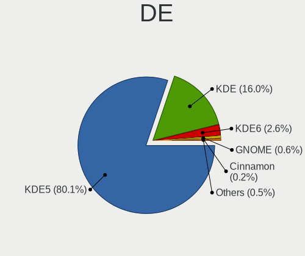
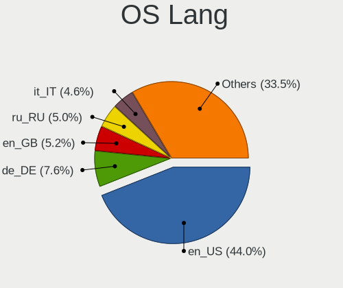
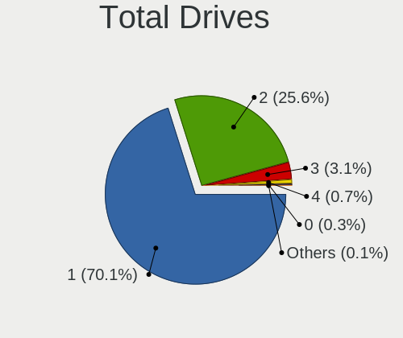
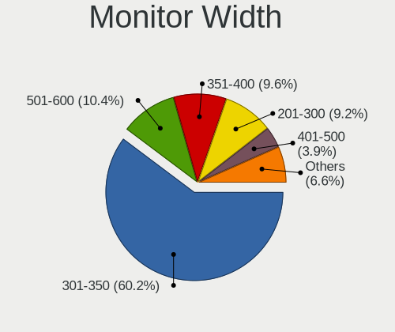
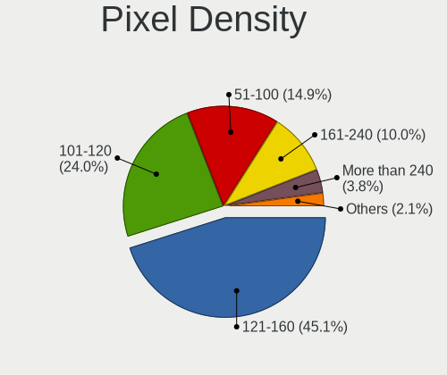
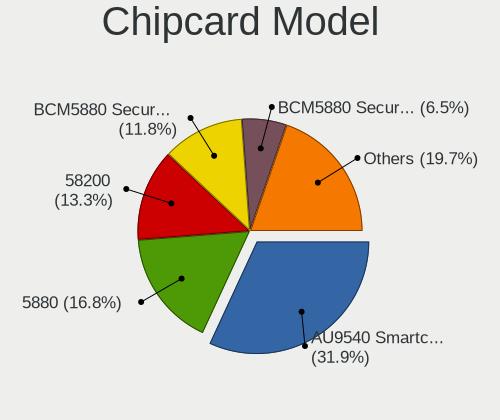

Kubuntu - Tested Hardware & Statistics (Notebooks)
--------------------------------------------------

A project to collect tested hardware configurations for Kubuntu.

Anyone can contribute to this report by the [hw-probe](https://github.com/linuxhw/hw-probe) tool:

    sudo -E hw-probe -all -upload

Please contribute! Especially if your hardware is rare.

Contents
--------

* [ Test Cases ](#test-cases)

* [ System ](#system)
  - [ OS                       ](#os)
  - [ OS Family                ](#os-family)
  - [ Kernel                   ](#kernel)
  - [ Kernel Family            ](#kernel-family)
  - [ Kernel Major Ver.        ](#kernel-major-ver)
  - [ Arch                     ](#arch)
  - [ DE                       ](#de)
  - [ Display Server           ](#display-server)
  - [ Display Manager          ](#display-manager)
  - [ OS Lang                  ](#os-lang)
  - [ Boot Mode                ](#boot-mode)
  - [ Filesystem               ](#filesystem)
  - [ Part. scheme             ](#part-scheme)
  - [ Dual Boot with Linux/BSD ](#dual-boot-with-linuxbsd)
  - [ Dual Boot (Win)          ](#dual-boot-win)

* [ Board ](#board)
  - [ Vendor                   ](#vendor)
  - [ Model                    ](#model)
  - [ Model Family             ](#model-family)
  - [ MFG Year                 ](#mfg-year)
  - [ Form Factor              ](#form-factor)
  - [ Secure Boot              ](#secure-boot)
  - [ Coreboot                 ](#coreboot)
  - [ RAM Size                 ](#ram-size)
  - [ RAM Used                 ](#ram-used)
  - [ Total Drives             ](#total-drives)
  - [ Has CD-ROM               ](#has-cd-rom)
  - [ Has Ethernet             ](#has-ethernet)
  - [ Has WiFi                 ](#has-wifi)
  - [ Has Bluetooth            ](#has-bluetooth)

* [ Location ](#location)
  - [ Country                  ](#country)
  - [ City                     ](#city)

* [ Drives ](#drives)
  - [ Drive Vendor             ](#drive-vendor)
  - [ Drive Model              ](#drive-model)
  - [ HDD Vendor               ](#hdd-vendor)
  - [ SSD Vendor               ](#ssd-vendor)
  - [ Drive Kind               ](#drive-kind)
  - [ Drive Connector          ](#drive-connector)
  - [ Drive Size               ](#drive-size)
  - [ Space Total              ](#space-total)
  - [ Space Used               ](#space-used)
  - [ Malfunc. Drives          ](#malfunc-drives)
  - [ Malfunc. Drive Vendor    ](#malfunc-drive-vendor)
  - [ Malfunc. HDD Vendor      ](#malfunc-hdd-vendor)
  - [ Malfunc. Drive Kind      ](#malfunc-drive-kind)
  - [ Failed Drives            ](#failed-drives)
  - [ Failed Drive Vendor      ](#failed-drive-vendor)
  - [ Drive Status             ](#drive-status)

* [ Storage controller ](#storage-controller)
  - [ Storage Vendor           ](#storage-vendor)
  - [ Storage Model            ](#storage-model)
  - [ Storage Kind             ](#storage-kind)

* [ Processor ](#processor)
  - [ CPU Vendor               ](#cpu-vendor)
  - [ CPU Model                ](#cpu-model)
  - [ CPU Model Family         ](#cpu-model-family)
  - [ CPU Cores                ](#cpu-cores)
  - [ CPU Sockets              ](#cpu-sockets)
  - [ CPU Threads              ](#cpu-threads)
  - [ CPU Op-Modes             ](#cpu-op-modes)
  - [ CPU Microcode            ](#cpu-microcode)
  - [ CPU Microarch            ](#cpu-microarch)

* [ Graphics ](#graphics)
  - [ GPU Vendor               ](#gpu-vendor)
  - [ GPU Model                ](#gpu-model)
  - [ GPU Combo                ](#gpu-combo)
  - [ GPU Driver               ](#gpu-driver)
  - [ GPU Memory               ](#gpu-memory)

* [ Monitor ](#monitor)
  - [ Monitor Vendor           ](#monitor-vendor)
  - [ Monitor Model            ](#monitor-model)
  - [ Monitor Resolution       ](#monitor-resolution)
  - [ Monitor Diagonal         ](#monitor-diagonal)
  - [ Monitor Width            ](#monitor-width)
  - [ Aspect Ratio             ](#aspect-ratio)
  - [ Monitor Area             ](#monitor-area)
  - [ Pixel Density            ](#pixel-density)
  - [ Multiple Monitors        ](#multiple-monitors)

* [ Network ](#network)
  - [ Net Controller Vendor    ](#net-controller-vendor)
  - [ Net Controller Model     ](#net-controller-model)
  - [ Wireless Vendor          ](#wireless-vendor)
  - [ Wireless Model           ](#wireless-model)
  - [ Ethernet Vendor          ](#ethernet-vendor)
  - [ Ethernet Model           ](#ethernet-model)
  - [ Net Controller Kind      ](#net-controller-kind)
  - [ Used Controller          ](#used-controller)
  - [ NICs                     ](#nics)
  - [ IPv6                     ](#ipv6)

* [ Bluetooth ](#bluetooth)
  - [ Bluetooth Vendor         ](#bluetooth-vendor)
  - [ Bluetooth Model          ](#bluetooth-model)

* [ Sound ](#sound)
  - [ Sound Vendor             ](#sound-vendor)
  - [ Sound Model              ](#sound-model)

* [ Memory ](#memory)
  - [ Memory Vendor            ](#memory-vendor)
  - [ Memory Model             ](#memory-model)
  - [ Memory Kind              ](#memory-kind)
  - [ Memory Form Factor       ](#memory-form-factor)
  - [ Memory Size              ](#memory-size)
  - [ Memory Speed             ](#memory-speed)

* [ Printers & scanners ](#printers--scanners)
  - [ Printer Vendor           ](#printer-vendor)
  - [ Printer Model            ](#printer-model)
  - [ Scanner Vendor           ](#scanner-vendor)
  - [ Scanner Model            ](#scanner-model)

* [ Camera ](#camera)
  - [ Camera Vendor            ](#camera-vendor)
  - [ Camera Model             ](#camera-model)

* [ Security ](#security)
  - [ Fingerprint Vendor       ](#fingerprint-vendor)
  - [ Fingerprint Model        ](#fingerprint-model)
  - [ Chipcard Vendor          ](#chipcard-vendor)
  - [ Chipcard Model           ](#chipcard-model)

* [ Unsupported ](#unsupported)
  - [ Unsupported Devices      ](#unsupported-devices)
  - [ Unsupported Device Types ](#unsupported-device-types)

Test Cases
----------

Total: 1996

| Vendor        | Model                       | Probe                                                      | Date         |
|---------------|-----------------------------|------------------------------------------------------------|--------------|
| Lenovo        | ThinkPad T530 2394CTO       | [73ee1262a6](https://linux-hardware.org/?probe=73ee1262a6) | Apr 30, 2022 |
| Dell          | XPS 15 9510                 | [52609c3695](https://linux-hardware.org/?probe=52609c3695) | Apr 29, 2022 |
| Lenovo        | Z50-75 80EC                 | [f301c52b41](https://linux-hardware.org/?probe=f301c52b41) | Apr 29, 2022 |
| ASUSTek       | ZenBook UX450FDX_UX480FD    | [9f7923bcd2](https://linux-hardware.org/?probe=9f7923bcd2) | Apr 29, 2022 |
| Lenovo        | ThinkPad X1 Extreme 2nd ... | [12a0105da3](https://linux-hardware.org/?probe=12a0105da3) | Apr 29, 2022 |
| Lenovo        | IdeaPad 5 15ARE05 81YQ      | [57271a5f8b](https://linux-hardware.org/?probe=57271a5f8b) | Apr 28, 2022 |
| ASUSTek       | VivoBook_ASUSLaptop M340... | [382d77c2b0](https://linux-hardware.org/?probe=382d77c2b0) | Apr 28, 2022 |
| Acer          | Nitro AN515-57              | [3206e0f075](https://linux-hardware.org/?probe=3206e0f075) | Apr 27, 2022 |
| Unknown       | Unknown                     | [e77a313003](https://linux-hardware.org/?probe=e77a313003) | Apr 27, 2022 |
| HP            | 250 G5 Notebook PC          | [e4ecdec958](https://linux-hardware.org/?probe=e4ecdec958) | Apr 27, 2022 |
| Acer          | Aspire A515-55              | [fa33f58948](https://linux-hardware.org/?probe=fa33f58948) | Apr 27, 2022 |
| Lenovo        | ThinkPad T530 2394CTO       | [9fffc0babc](https://linux-hardware.org/?probe=9fffc0babc) | Apr 26, 2022 |
| Lenovo        | ThinkPad T530 2394CTO       | [b5f175a650](https://linux-hardware.org/?probe=b5f175a650) | Apr 26, 2022 |
| HP            | ENVY 17                     | [c33b35becc](https://linux-hardware.org/?probe=c33b35becc) | Apr 26, 2022 |
| ASUSTek       | G750JS                      | [24dab87910](https://linux-hardware.org/?probe=24dab87910) | Apr 26, 2022 |
| Lenovo        | ThinkPad X1 Extreme 2nd ... | [98251fced6](https://linux-hardware.org/?probe=98251fced6) | Apr 26, 2022 |
| Lenovo        | ThinkPad X1 Extreme 2nd ... | [e466d79804](https://linux-hardware.org/?probe=e466d79804) | Apr 26, 2022 |
| Lenovo        | ThinkPad E14 20RBS25S00     | [89debf3e0e](https://linux-hardware.org/?probe=89debf3e0e) | Apr 25, 2022 |
| Lenovo        | ThinkPad X201 Tablet 083... | [8e7b2c79a0](https://linux-hardware.org/?probe=8e7b2c79a0) | Apr 25, 2022 |
| Dell          | Studio 1558                 | [b31435ef0c](https://linux-hardware.org/?probe=b31435ef0c) | Apr 24, 2022 |
| Lenovo        | IdeaPad 5 Pro 14ITL6 82L... | [a260bf9ce6](https://linux-hardware.org/?probe=a260bf9ce6) | Apr 24, 2022 |
| Lenovo        | IdeaPad 330S-15IKB 81F5     | [9877ddeaf6](https://linux-hardware.org/?probe=9877ddeaf6) | Apr 24, 2022 |
| Lenovo        | ThinkBook 15 G2 ARE 20VG    | [99e25e855e](https://linux-hardware.org/?probe=99e25e855e) | Apr 23, 2022 |
| Acer          | Swift SF314-43              | [9ba9e35d88](https://linux-hardware.org/?probe=9ba9e35d88) | Apr 23, 2022 |
| Acer          | Nitro AN515-57              | [848b9d8f5c](https://linux-hardware.org/?probe=848b9d8f5c) | Apr 22, 2022 |
| Acer          | Nitro AN515-57              | [da630d58cf](https://linux-hardware.org/?probe=da630d58cf) | Apr 22, 2022 |
| TUXEDO        | Aura 15 Gen1                | [8ee6cabf43](https://linux-hardware.org/?probe=8ee6cabf43) | Apr 22, 2022 |
| Lenovo        | ThinkBook 15-IML 20RW       | [28690580aa](https://linux-hardware.org/?probe=28690580aa) | Apr 22, 2022 |
| Dynabook      | PORTEGE X30L-J              | [5894fd3a34](https://linux-hardware.org/?probe=5894fd3a34) | Apr 21, 2022 |
| ASUSTek       | G550JK                      | [566770a325](https://linux-hardware.org/?probe=566770a325) | Apr 21, 2022 |
| Positivo      | W940TU                      | [4d03effd28](https://linux-hardware.org/?probe=4d03effd28) | Apr 20, 2022 |
| Positivo      | W940TU                      | [971493b883](https://linux-hardware.org/?probe=971493b883) | Apr 20, 2022 |
| Dell          | Latitude XT3                | [6db9585e20](https://linux-hardware.org/?probe=6db9585e20) | Apr 20, 2022 |
| Lenovo        | ThinkPad T560 20FJS0NT04    | [19ebdf705a](https://linux-hardware.org/?probe=19ebdf705a) | Apr 20, 2022 |
| Dell          | XPS 15 7590                 | [ee7354dd8d](https://linux-hardware.org/?probe=ee7354dd8d) | Apr 19, 2022 |
| Dell          | Inspiron 15-3567            | [f8e7d70919](https://linux-hardware.org/?probe=f8e7d70919) | Apr 18, 2022 |
| Lenovo        | ThinkPad T420 4180DV2       | [4ed718df3e](https://linux-hardware.org/?probe=4ed718df3e) | Apr 18, 2022 |
| Lenovo        | ThinkPad T420 4180DV2       | [402c31b107](https://linux-hardware.org/?probe=402c31b107) | Apr 18, 2022 |
| ASUSTek       | S551LB                      | [bb1d6d3623](https://linux-hardware.org/?probe=bb1d6d3623) | Apr 17, 2022 |
| Shanghai Z... | ZXE CRB                     | [fe284f4173](https://linux-hardware.org/?probe=fe284f4173) | Apr 17, 2022 |
| Dell          | Latitude XT3                | [c4d7d751b7](https://linux-hardware.org/?probe=c4d7d751b7) | Apr 17, 2022 |
| Dell          | Latitude 7410               | [da82f8bba8](https://linux-hardware.org/?probe=da82f8bba8) | Apr 15, 2022 |
| Lenovo        | G40-45 80E1                 | [840ffde0c4](https://linux-hardware.org/?probe=840ffde0c4) | Apr 15, 2022 |
| Dell          | Latitude XT3                | [ce6c2e43a0](https://linux-hardware.org/?probe=ce6c2e43a0) | Apr 15, 2022 |
| Dell          | Latitude E6540              | [2ee68b5f38](https://linux-hardware.org/?probe=2ee68b5f38) | Apr 14, 2022 |
| Framework     | Laptop                      | [6846ee88e0](https://linux-hardware.org/?probe=6846ee88e0) | Apr 14, 2022 |
| Lenovo        | ThinkPad Edge E540 20C60... | [45b8eba74c](https://linux-hardware.org/?probe=45b8eba74c) | Apr 14, 2022 |
| HP            | Pavilion Laptop 15-cs3xx... | [3e09de906e](https://linux-hardware.org/?probe=3e09de906e) | Apr 14, 2022 |
| Lenovo        | ThinkPad T420 41786UU       | [2211278055](https://linux-hardware.org/?probe=2211278055) | Apr 14, 2022 |
| Lenovo        | ThinkPad E14 Gen 3 20Y7C... | [4434290159](https://linux-hardware.org/?probe=4434290159) | Apr 14, 2022 |
| Lenovo        | ThinkPad P51 20HH000AUS     | [b7365a4abd](https://linux-hardware.org/?probe=b7365a4abd) | Apr 14, 2022 |
| Samsung       | R425D/R525D                 | [bd5a2f5943](https://linux-hardware.org/?probe=bd5a2f5943) | Apr 14, 2022 |
| Dell          | XPS 13 9300                 | [a21bd26d1e](https://linux-hardware.org/?probe=a21bd26d1e) | Apr 14, 2022 |
| HUAWEI        | KLVL-WXXW                   | [8888d86504](https://linux-hardware.org/?probe=8888d86504) | Apr 13, 2022 |
| Lenovo        | IdeaPad 710S Plus Touch-... | [f4578ea652](https://linux-hardware.org/?probe=f4578ea652) | Apr 13, 2022 |
| Lenovo        | ThinkPad X1 Extreme 2nd ... | [744144c472](https://linux-hardware.org/?probe=744144c472) | Apr 13, 2022 |
| Lenovo        | ThinkPad X1 Extreme 2nd ... | [479b8d48fc](https://linux-hardware.org/?probe=479b8d48fc) | Apr 13, 2022 |
| Lenovo        | ThinkPad T530 24296HG       | [74191e7ffb](https://linux-hardware.org/?probe=74191e7ffb) | Apr 13, 2022 |
| Toshiba       | Satellite P70-B             | [6c01bb2cc3](https://linux-hardware.org/?probe=6c01bb2cc3) | Apr 13, 2022 |
| HP            | OMEN Laptop 15-en0xxx       | [de2cf28654](https://linux-hardware.org/?probe=de2cf28654) | Apr 13, 2022 |
| Dell          | Latitude 5591               | [3f3f097a1a](https://linux-hardware.org/?probe=3f3f097a1a) | Apr 13, 2022 |
| Dell          | Latitude 7400               | [2c32d69a57](https://linux-hardware.org/?probe=2c32d69a57) | Apr 13, 2022 |
| HP            | Pavilion g6                 | [44035cfa83](https://linux-hardware.org/?probe=44035cfa83) | Apr 13, 2022 |
| Dell          | Precision 5520              | [eb5bfc87ed](https://linux-hardware.org/?probe=eb5bfc87ed) | Apr 12, 2022 |
| Lenovo        | ThinkPad T430 2349T2A       | [344710cc3a](https://linux-hardware.org/?probe=344710cc3a) | Apr 12, 2022 |
| Dell          | Precision 5520              | [0c7ae3171f](https://linux-hardware.org/?probe=0c7ae3171f) | Apr 12, 2022 |
| HONOR         | NBD-WXX9                    | [090560f0c5](https://linux-hardware.org/?probe=090560f0c5) | Apr 12, 2022 |
| Lenovo        | IdeaPad Z585                | [5f84c70657](https://linux-hardware.org/?probe=5f84c70657) | Apr 10, 2022 |
| Notebook      | NS50_70MU                   | [cf76bb9e39](https://linux-hardware.org/?probe=cf76bb9e39) | Apr 10, 2022 |
| Dell          | G7 7790                     | [6cdb296d8e](https://linux-hardware.org/?probe=6cdb296d8e) | Apr 10, 2022 |
| Dell          | Vostro 15 3515              | [848a486145](https://linux-hardware.org/?probe=848a486145) | Apr 10, 2022 |
| eMachines     | G525                        | [6ba45c519c](https://linux-hardware.org/?probe=6ba45c519c) | Apr 09, 2022 |
| HP            | Laptop 14s-fq0xxx           | [18045cb759](https://linux-hardware.org/?probe=18045cb759) | Apr 09, 2022 |
| Positivo      | N1250                       | [c64a47d6fc](https://linux-hardware.org/?probe=c64a47d6fc) | Apr 09, 2022 |
| Sony          | VPCF236FM                   | [ea109b146b](https://linux-hardware.org/?probe=ea109b146b) | Apr 08, 2022 |
| Sony          | VPCF236FM                   | [aa210dfd36](https://linux-hardware.org/?probe=aa210dfd36) | Apr 08, 2022 |
| Sony          | SVE1511W1ESI                | [403773664b](https://linux-hardware.org/?probe=403773664b) | Apr 08, 2022 |
| Dell          | Latitude 5480               | [6891954221](https://linux-hardware.org/?probe=6891954221) | Apr 08, 2022 |
| HP            | ENVY 15                     | [cdd8aea3c3](https://linux-hardware.org/?probe=cdd8aea3c3) | Apr 07, 2022 |
| Lenovo        | ThinkPad L15 Gen 1 20U8S... | [dea231bf61](https://linux-hardware.org/?probe=dea231bf61) | Apr 07, 2022 |
| Lenovo        | ThinkPad L15 Gen 1 20U8S... | [b02ac7d8ce](https://linux-hardware.org/?probe=b02ac7d8ce) | Apr 07, 2022 |
| Dell          | XPS 13 9310                 | [64c2c15492](https://linux-hardware.org/?probe=64c2c15492) | Apr 05, 2022 |
| Wortmann      | TERRA_MOBILE_1749           | [ee8ada5124](https://linux-hardware.org/?probe=ee8ada5124) | Apr 05, 2022 |
| Lenovo        | ThinkPad T450 20BV0001US    | [f72149904c](https://linux-hardware.org/?probe=f72149904c) | Apr 05, 2022 |
| Lenovo        | ThinkPad X260 20F5S0W22B    | [765eaec64d](https://linux-hardware.org/?probe=765eaec64d) | Apr 04, 2022 |
| Dell          | Latitude E6530              | [a63f363043](https://linux-hardware.org/?probe=a63f363043) | Apr 04, 2022 |
| Lenovo        | IdeaPadFlex 14 20308        | [9ecbc31fc2](https://linux-hardware.org/?probe=9ecbc31fc2) | Apr 04, 2022 |
| Dell          | Latitude E6540              | [e087a37f5f](https://linux-hardware.org/?probe=e087a37f5f) | Apr 02, 2022 |
| Lenovo        | ThinkPad T540p 20BEA00FR... | [c9323a9c40](https://linux-hardware.org/?probe=c9323a9c40) | Mar 31, 2022 |
| Dell          | XPS 13 9305                 | [946628cb20](https://linux-hardware.org/?probe=946628cb20) | Mar 30, 2022 |
| Dell          | Vostro 15 3515              | [b61b3e31e7](https://linux-hardware.org/?probe=b61b3e31e7) | Mar 30, 2022 |
| HUAWEI        | BOHB-WAX9                   | [f398041b40](https://linux-hardware.org/?probe=f398041b40) | Mar 29, 2022 |
| Lenovo        | ThinkPad X230 23202DG       | [323ca65327](https://linux-hardware.org/?probe=323ca65327) | Mar 28, 2022 |
| HP            | Pavilion 14                 | [1b15a2e740](https://linux-hardware.org/?probe=1b15a2e740) | Mar 28, 2022 |
| Lenovo        | IdeaPad S145-15IIL 82DJ     | [f457ad3a65](https://linux-hardware.org/?probe=f457ad3a65) | Mar 27, 2022 |
| HP            | Stream Notebook PC 14       | [9fc309dcaf](https://linux-hardware.org/?probe=9fc309dcaf) | Mar 27, 2022 |
| HP            | Stream Notebook PC 14       | [bcf7252530](https://linux-hardware.org/?probe=bcf7252530) | Mar 27, 2022 |
| Positivo      | Q232A                       | [fe29ba6b10](https://linux-hardware.org/?probe=fe29ba6b10) | Mar 27, 2022 |
| Lenovo        | IdeaPad S530-13IWL 81J7     | [a9a4291601](https://linux-hardware.org/?probe=a9a4291601) | Mar 26, 2022 |
| Dell          | Latitude 5290 2-in-1        | [f0a08eb35b](https://linux-hardware.org/?probe=f0a08eb35b) | Mar 25, 2022 |
| Dell          | Inspiron 5379               | [85c7a99f91](https://linux-hardware.org/?probe=85c7a99f91) | Mar 25, 2022 |
| Avell High... | B.ON                        | [19b689aa12](https://linux-hardware.org/?probe=19b689aa12) | Mar 25, 2022 |
| Apple         | MacBookPro14,1              | [a2db3c2cab](https://linux-hardware.org/?probe=a2db3c2cab) | Mar 24, 2022 |
| Razer         | Blade 15 Advanced Model ... | [cb089466a3](https://linux-hardware.org/?probe=cb089466a3) | Mar 24, 2022 |
| ASUSTek       | VivoBook_ASUSLaptop M340... | [c136393c4b](https://linux-hardware.org/?probe=c136393c4b) | Mar 23, 2022 |
| ASUSTek       | VivoBook_ASUSLaptop X760... | [713ff9dcb8](https://linux-hardware.org/?probe=713ff9dcb8) | Mar 23, 2022 |
| Dell          | XPS 15 7590                 | [96244433f0](https://linux-hardware.org/?probe=96244433f0) | Mar 23, 2022 |
| Acer          | Swift SF314-54G             | [615009b8ee](https://linux-hardware.org/?probe=615009b8ee) | Mar 23, 2022 |
| ASUSTek       | N550LF                      | [5e5462ce64](https://linux-hardware.org/?probe=5e5462ce64) | Mar 23, 2022 |
| Lenovo        | ThinkPad X230 23202DG       | [5b74db2557](https://linux-hardware.org/?probe=5b74db2557) | Mar 22, 2022 |
| MSI           | GP76 Leopard 11UH           | [d398e3284e](https://linux-hardware.org/?probe=d398e3284e) | Mar 22, 2022 |
| Dell          | XPS 13 9310                 | [c90c0f1819](https://linux-hardware.org/?probe=c90c0f1819) | Mar 22, 2022 |
| ASUSTek       | X555LNB                     | [ae49172b0f](https://linux-hardware.org/?probe=ae49172b0f) | Mar 21, 2022 |
| ASUSTek       | X555LNB                     | [33e081f100](https://linux-hardware.org/?probe=33e081f100) | Mar 21, 2022 |
| Dell          | System Inspiron N7110       | [d3b1757cf5](https://linux-hardware.org/?probe=d3b1757cf5) | Mar 21, 2022 |
| ASUSTek       | K73E                        | [75069bd642](https://linux-hardware.org/?probe=75069bd642) | Mar 20, 2022 |
| Apple         | MacBookPro12,1              | [0e4992c717](https://linux-hardware.org/?probe=0e4992c717) | Mar 20, 2022 |
| ASUSTek       | VivoBook_ASUSLaptop M340... | [3607969e9d](https://linux-hardware.org/?probe=3607969e9d) | Mar 20, 2022 |
| Panasonic     | FZ-M1CC-51BE                | [94e014ee40](https://linux-hardware.org/?probe=94e014ee40) | Mar 18, 2022 |
| ASUSTek       | K52Jr                       | [b05ec1dbda](https://linux-hardware.org/?probe=b05ec1dbda) | Mar 18, 2022 |
| Dell          | Precision M6300             | [aac71b9e66](https://linux-hardware.org/?probe=aac71b9e66) | Mar 17, 2022 |
| ASUSTek       | K52Jr                       | [77c6485b0f](https://linux-hardware.org/?probe=77c6485b0f) | Mar 17, 2022 |
| HP            | EliteBook 850 G5            | [6d8c8748e2](https://linux-hardware.org/?probe=6d8c8748e2) | Mar 17, 2022 |
| ASUSTek       | VivoBook_ASUSLaptop X521... | [8713806c38](https://linux-hardware.org/?probe=8713806c38) | Mar 17, 2022 |
| HP            | ProBook 430 G2              | [e2ad81141c](https://linux-hardware.org/?probe=e2ad81141c) | Mar 16, 2022 |
| HP            | Pavilion Aero Laptop 13-... | [8e9c955b47](https://linux-hardware.org/?probe=8e9c955b47) | Mar 15, 2022 |
| Lenovo        | ThinkPad T430 2347AT2       | [bf80f02a40](https://linux-hardware.org/?probe=bf80f02a40) | Mar 15, 2022 |
| Samsung       | 300E4Z/300E5Z/300E7Z        | [95c6b15672](https://linux-hardware.org/?probe=95c6b15672) | Mar 14, 2022 |
| ASUSTek       | VivoBook_ASUSLaptop X513... | [96b413780f](https://linux-hardware.org/?probe=96b413780f) | Mar 13, 2022 |
| Lenovo        | IdeaPad 520-15IKB 81BF      | [8ab5133b14](https://linux-hardware.org/?probe=8ab5133b14) | Mar 13, 2022 |
| Lenovo        | B580 20144                  | [9918c132f0](https://linux-hardware.org/?probe=9918c132f0) | Mar 13, 2022 |
| Lenovo        | B580 20144                  | [fd9ec44205](https://linux-hardware.org/?probe=fd9ec44205) | Mar 13, 2022 |
| Dell          | Latitude E6430              | [bc21cb0e8b](https://linux-hardware.org/?probe=bc21cb0e8b) | Mar 13, 2022 |
| Lenovo        | ThinkPad X1 Extreme 20MF... | [4998fff0f9](https://linux-hardware.org/?probe=4998fff0f9) | Mar 12, 2022 |
| HP            | Pavilion Aero Laptop 13-... | [e39d0d9111](https://linux-hardware.org/?probe=e39d0d9111) | Mar 11, 2022 |
| Acer          | Nitro AN515-56              | [39cdee5411](https://linux-hardware.org/?probe=39cdee5411) | Mar 11, 2022 |
| Acer          | Aspire 5750G                | [066fecf595](https://linux-hardware.org/?probe=066fecf595) | Mar 10, 2022 |
| Dell          | XPS 13 9310                 | [e7a3d16cc0](https://linux-hardware.org/?probe=e7a3d16cc0) | Mar 09, 2022 |
| Lenovo        | ThinkPad X220 4290EC5       | [508a68f09e](https://linux-hardware.org/?probe=508a68f09e) | Mar 09, 2022 |
| ASUSTek       | ZenBook UX435EG_UX435EG     | [8dbe399133](https://linux-hardware.org/?probe=8dbe399133) | Mar 08, 2022 |
| Lenovo        | IdeaPad S145-15IIL 82DJ     | [c7025ac75e](https://linux-hardware.org/?probe=c7025ac75e) | Mar 08, 2022 |
| ASUSTek       | UX331UN                     | [f1cf640532](https://linux-hardware.org/?probe=f1cf640532) | Mar 06, 2022 |
| ASUSTek       | ASUS EXPERTBOOK B1400CEA... | [052e483cb5](https://linux-hardware.org/?probe=052e483cb5) | Mar 06, 2022 |
| MSI           | Katana GF76 11UC            | [949d0886a1](https://linux-hardware.org/?probe=949d0886a1) | Mar 06, 2022 |
| MSI           | Katana GF76 11UC            | [f5241bc829](https://linux-hardware.org/?probe=f5241bc829) | Mar 05, 2022 |
| ASUSTek       | ASUS EXPERTBOOK B1400CEA... | [7a52c91d68](https://linux-hardware.org/?probe=7a52c91d68) | Mar 05, 2022 |
| Unknown       | KN12A                       | [3ba6165509](https://linux-hardware.org/?probe=3ba6165509) | Mar 05, 2022 |
| Lenovo        | ThinkPad P1 Gen 3 20TH00... | [1c879cd60e](https://linux-hardware.org/?probe=1c879cd60e) | Mar 04, 2022 |
| Dell          | Vostro 5470                 | [fda73ff759](https://linux-hardware.org/?probe=fda73ff759) | Mar 02, 2022 |
| Dell          | Latitude E6530              | [f13c84346e](https://linux-hardware.org/?probe=f13c84346e) | Mar 02, 2022 |
| ASUSTek       | UX331UN                     | [463899cdb7](https://linux-hardware.org/?probe=463899cdb7) | Mar 02, 2022 |
| ASUSTek       | K55N                        | [6143b27a96](https://linux-hardware.org/?probe=6143b27a96) | Mar 02, 2022 |
| MSI           | Katana GF76 11UC            | [880490eb1e](https://linux-hardware.org/?probe=880490eb1e) | Mar 01, 2022 |
| Schenker      | VIA 15                      | [c84aacc342](https://linux-hardware.org/?probe=c84aacc342) | Feb 28, 2022 |
| Acer          | Aspire A515-45              | [f2e18241da](https://linux-hardware.org/?probe=f2e18241da) | Feb 28, 2022 |
| MSI           | Katana GF76 11UC            | [79cc0b97a4](https://linux-hardware.org/?probe=79cc0b97a4) | Feb 28, 2022 |
| MSI           | Katana GF76 11UC            | [74bc866ab2](https://linux-hardware.org/?probe=74bc866ab2) | Feb 27, 2022 |
| ASUSTek       | ASUS TUF Gaming F15 FX50... | [c7db8c9806](https://linux-hardware.org/?probe=c7db8c9806) | Feb 27, 2022 |
| HP            | Notebook                    | [bcc74ebe77](https://linux-hardware.org/?probe=bcc74ebe77) | Feb 27, 2022 |
| Lenovo        | ThinkPad L14 Gen 1 20U5S... | [f86d99b8a1](https://linux-hardware.org/?probe=f86d99b8a1) | Feb 27, 2022 |
| Dell          | Inspiron 3583               | [83dec4f285](https://linux-hardware.org/?probe=83dec4f285) | Feb 26, 2022 |
| Acer          | Aspire E5-553G              | [17586d38de](https://linux-hardware.org/?probe=17586d38de) | Feb 26, 2022 |
| HUAWEI        | HVY-WXX9                    | [fb4c469104](https://linux-hardware.org/?probe=fb4c469104) | Feb 26, 2022 |
| HUAWEI        | HVY-WXX9                    | [9013eb37ee](https://linux-hardware.org/?probe=9013eb37ee) | Feb 25, 2022 |
| Dell          | XPS 15 9560                 | [4c72ebcb41](https://linux-hardware.org/?probe=4c72ebcb41) | Feb 25, 2022 |
| Timi          | Mi Laptop Air 12.5          | [7aa852e941](https://linux-hardware.org/?probe=7aa852e941) | Feb 25, 2022 |
| Timi          | Mi Laptop Air 12.5          | [67297aad2c](https://linux-hardware.org/?probe=67297aad2c) | Feb 25, 2022 |
| HP            | EliteBook 745 G3            | [eed2589bd2](https://linux-hardware.org/?probe=eed2589bd2) | Feb 25, 2022 |
| ASUSTek       | ZenBook UX434IQ_UM433IQ     | [013e049a4d](https://linux-hardware.org/?probe=013e049a4d) | Feb 24, 2022 |
| ASUSTek       | ZenBook UX434IQ_UM433IQ     | [885239a137](https://linux-hardware.org/?probe=885239a137) | Feb 24, 2022 |
| Dell          | Inspiron 1525               | [904717059e](https://linux-hardware.org/?probe=904717059e) | Feb 24, 2022 |
| Toshiba       | IS 1412                     | [3621d1064d](https://linux-hardware.org/?probe=3621d1064d) | Feb 24, 2022 |
| ASUSTek       | X550JX                      | [ec93ded12b](https://linux-hardware.org/?probe=ec93ded12b) | Feb 23, 2022 |
| Lenovo        | ThinkPad T430 23495P8       | [03266eea0a](https://linux-hardware.org/?probe=03266eea0a) | Feb 23, 2022 |
| HP            | Notebook                    | [93a85593c3](https://linux-hardware.org/?probe=93a85593c3) | Feb 23, 2022 |
| Dell          | Latitude E5570              | [f132300275](https://linux-hardware.org/?probe=f132300275) | Feb 23, 2022 |
| ASUSTek       | GL753VD                     | [e1e83bde9c](https://linux-hardware.org/?probe=e1e83bde9c) | Feb 22, 2022 |
| HP            | EliteBook 8760w             | [cc9d99be2a](https://linux-hardware.org/?probe=cc9d99be2a) | Feb 22, 2022 |
| ASUSTek       | G75VW                       | [d31201b74c](https://linux-hardware.org/?probe=d31201b74c) | Feb 22, 2022 |
| Lenovo        | ThinkPad T460s 20F9S1G20... | [6a6c0b0b39](https://linux-hardware.org/?probe=6a6c0b0b39) | Feb 21, 2022 |
| ASUSTek       | X550JX                      | [0ee9dcd568](https://linux-hardware.org/?probe=0ee9dcd568) | Feb 20, 2022 |
| Acer          | Aspire 3820                 | [e12ba75c05](https://linux-hardware.org/?probe=e12ba75c05) | Feb 19, 2022 |
| ASUSTek       | X550JX                      | [5ee5668ab1](https://linux-hardware.org/?probe=5ee5668ab1) | Feb 19, 2022 |
| Digma         | CITI E401 ET4007EW          | [a4a57f2b26](https://linux-hardware.org/?probe=a4a57f2b26) | Feb 19, 2022 |
| Lenovo        | ThinkPad L430 2468CTO       | [9244a0f8f9](https://linux-hardware.org/?probe=9244a0f8f9) | Feb 18, 2022 |
| HP            | Pavilion Laptop 14-ce0xx... | [ffb9eb537e](https://linux-hardware.org/?probe=ffb9eb537e) | Feb 17, 2022 |
| Samsung       | 300E4A/300E5A/300E7A/343... | [7f55b1fa12](https://linux-hardware.org/?probe=7f55b1fa12) | Feb 17, 2022 |
| Samsung       | 300E4A/300E5A/300E7A/343... | [f7cce89284](https://linux-hardware.org/?probe=f7cce89284) | Feb 17, 2022 |
| ASUSTek       | Vivobook_ASUSLaptop X350... | [5d2de5cd73](https://linux-hardware.org/?probe=5d2de5cd73) | Feb 17, 2022 |
| Timi          | RedmiBook 14 II             | [9fdad76c68](https://linux-hardware.org/?probe=9fdad76c68) | Feb 16, 2022 |
| Dell          | Latitude E6320              | [ae7b660be1](https://linux-hardware.org/?probe=ae7b660be1) | Feb 16, 2022 |
| Lenovo        | G40-45 80E1                 | [88c9f0db96](https://linux-hardware.org/?probe=88c9f0db96) | Feb 16, 2022 |
| Jumper        | EZbook                      | [f27f93bafe](https://linux-hardware.org/?probe=f27f93bafe) | Feb 16, 2022 |
| Lenovo        | G500 20236                  | [725807db6f](https://linux-hardware.org/?probe=725807db6f) | Feb 15, 2022 |
| Lenovo        | ThinkPad T14s Gen 1 20UH... | [3db88acec8](https://linux-hardware.org/?probe=3db88acec8) | Feb 15, 2022 |
| Apple         | MacBookPro8,1               | [b99a5f9b59](https://linux-hardware.org/?probe=b99a5f9b59) | Feb 14, 2022 |
| Fujitsu Si... | LIFEBOOK S6420              | [d42d70a45a](https://linux-hardware.org/?probe=d42d70a45a) | Feb 14, 2022 |
| ASUSTek       | ASUS BR1100CKA BR1100CKA... | [5768ab0770](https://linux-hardware.org/?probe=5768ab0770) | Feb 13, 2022 |
| Dell          | Inspiron 3793               | [9df9f66476](https://linux-hardware.org/?probe=9df9f66476) | Feb 13, 2022 |
| MSI           | GE62 6QD                    | [fc4efd1eff](https://linux-hardware.org/?probe=fc4efd1eff) | Feb 13, 2022 |
| Lenovo        | Legion 5 17ACH6 82K0        | [c756082899](https://linux-hardware.org/?probe=c756082899) | Feb 13, 2022 |
| Lenovo        | Legion 5 17ACH6 82K0        | [f7d1fc012c](https://linux-hardware.org/?probe=f7d1fc012c) | Feb 13, 2022 |
| Lenovo        | G50-70 20351                | [5795d9b341](https://linux-hardware.org/?probe=5795d9b341) | Feb 12, 2022 |
| ASUSTek       | X540NA                      | [a9271fbd9f](https://linux-hardware.org/?probe=a9271fbd9f) | Feb 12, 2022 |
| Dell          | Latitude 5580               | [77466f0d8f](https://linux-hardware.org/?probe=77466f0d8f) | Feb 11, 2022 |
| Dell          | Latitude 5580               | [8d65e0f7c7](https://linux-hardware.org/?probe=8d65e0f7c7) | Feb 11, 2022 |
| HP            | Compaq Presario CQ71        | [5061491140](https://linux-hardware.org/?probe=5061491140) | Feb 11, 2022 |
| HP            | Compaq Presario CQ71        | [cd89130dcd](https://linux-hardware.org/?probe=cd89130dcd) | Feb 11, 2022 |
| Acer          | Aspire 5750G                | [0f7da36e7e](https://linux-hardware.org/?probe=0f7da36e7e) | Feb 11, 2022 |
| Acer          | Aspire 5750G                | [11d24586e8](https://linux-hardware.org/?probe=11d24586e8) | Feb 11, 2022 |
| Lenovo        | IdeaPad S145-15API 81UT     | [aba110f180](https://linux-hardware.org/?probe=aba110f180) | Feb 10, 2022 |
| MSI           | Prestige 14 A10RB           | [7195cacd54](https://linux-hardware.org/?probe=7195cacd54) | Feb 10, 2022 |
| HP            | EliteBook 8570w             | [df5a829402](https://linux-hardware.org/?probe=df5a829402) | Feb 09, 2022 |
| Lenovo        | V14 G2 ITL 82NM             | [b53861af9b](https://linux-hardware.org/?probe=b53861af9b) | Feb 09, 2022 |
| Lenovo        | V14-IIL 82C4                | [bca05a8467](https://linux-hardware.org/?probe=bca05a8467) | Feb 09, 2022 |
| Dell          | Latitude E5440              | [8ddea24991](https://linux-hardware.org/?probe=8ddea24991) | Feb 08, 2022 |
| Dell          | Vostro 5490                 | [011e0963bd](https://linux-hardware.org/?probe=011e0963bd) | Feb 07, 2022 |
| HP            | Victus by Laptop 16-e0xx... | [9c3722a690](https://linux-hardware.org/?probe=9c3722a690) | Feb 07, 2022 |
| Lenovo        | ThinkPad L14 Gen 2 20X1S... | [4f80537faf](https://linux-hardware.org/?probe=4f80537faf) | Feb 06, 2022 |
| Sony          | VPCF236FM                   | [784b1b0c3b](https://linux-hardware.org/?probe=784b1b0c3b) | Feb 06, 2022 |
| Dell          | System XPS L502X            | [c2a3b5d930](https://linux-hardware.org/?probe=c2a3b5d930) | Feb 05, 2022 |
| Medion        | E4241 MD60996               | [d89f5e4089](https://linux-hardware.org/?probe=d89f5e4089) | Feb 05, 2022 |
| Lenovo        | G710 20252                  | [ffc1b2ca5a](https://linux-hardware.org/?probe=ffc1b2ca5a) | Feb 04, 2022 |
| Lenovo        | ThinkPad E14 20RBS25S00     | [1f4e97ac28](https://linux-hardware.org/?probe=1f4e97ac28) | Feb 04, 2022 |
| Lenovo        | V580c 20160                 | [8b9e72e0ed](https://linux-hardware.org/?probe=8b9e72e0ed) | Feb 03, 2022 |
| HP            | Laptop 15g-br1xx            | [092ea39c7e](https://linux-hardware.org/?probe=092ea39c7e) | Feb 03, 2022 |
| LG Electro... | 16Z90P-G.AA78C              | [30ddfbc611](https://linux-hardware.org/?probe=30ddfbc611) | Feb 03, 2022 |
| Toshiba       | Satellite S55-C             | [ba1cbdf586](https://linux-hardware.org/?probe=ba1cbdf586) | Feb 03, 2022 |
| Lenovo        | IdeaPad 3 15ARE05 81W4      | [3df622872c](https://linux-hardware.org/?probe=3df622872c) | Feb 03, 2022 |
| HP            | Pavilion dv6                | [63c8ab5447](https://linux-hardware.org/?probe=63c8ab5447) | Feb 03, 2022 |
| LG Electro... | 16Z90P-G.AA78C              | [992ee00a94](https://linux-hardware.org/?probe=992ee00a94) | Feb 02, 2022 |
| ASUSTek       | Vivobook_ASUSLaptop X350... | [1e330f1e0e](https://linux-hardware.org/?probe=1e330f1e0e) | Feb 02, 2022 |
| Dell          | Latitude 7410               | [5f60c8df83](https://linux-hardware.org/?probe=5f60c8df83) | Jan 31, 2022 |
| MSI           | GF63 Thin 10SC              | [be02f0bd97](https://linux-hardware.org/?probe=be02f0bd97) | Jan 31, 2022 |
| Lenovo        | ThinkPad T14s Gen 1 20UH... | [16f2c58e8a](https://linux-hardware.org/?probe=16f2c58e8a) | Jan 30, 2022 |
| Lenovo        | ThinkPad T14s Gen 1 20UH... | [9d24496181](https://linux-hardware.org/?probe=9d24496181) | Jan 30, 2022 |
| Lenovo        | Y520-15IKBN 80WK            | [e618d0e8f6](https://linux-hardware.org/?probe=e618d0e8f6) | Jan 30, 2022 |
| MSI           | GF63 Thin 10SCXR            | [c4a65986af](https://linux-hardware.org/?probe=c4a65986af) | Jan 29, 2022 |
| HP            | 250 G5 Notebook PC          | [b864987207](https://linux-hardware.org/?probe=b864987207) | Jan 29, 2022 |
| Lenovo        | ThinkBook 15 G2 ITL 20VE    | [cd876e95b9](https://linux-hardware.org/?probe=cd876e95b9) | Jan 29, 2022 |
| System76      | Serval WS                   | [a6e447aa98](https://linux-hardware.org/?probe=a6e447aa98) | Jan 28, 2022 |
| System76      | Serval WS                   | [371fbc5a98](https://linux-hardware.org/?probe=371fbc5a98) | Jan 28, 2022 |
| Dell          | G5 5500                     | [4917524046](https://linux-hardware.org/?probe=4917524046) | Jan 28, 2022 |
| Sony          | VPCSB1B9E                   | [2b1ede014c](https://linux-hardware.org/?probe=2b1ede014c) | Jan 28, 2022 |
| Lenovo        | G500 20236                  | [c346ce1a75](https://linux-hardware.org/?probe=c346ce1a75) | Jan 27, 2022 |
| Fujitsu Si... | AMILO Xi 1526               | [5acf0f5805](https://linux-hardware.org/?probe=5acf0f5805) | Jan 27, 2022 |
| HP            | Compaq Presario CQ40        | [2e8ff0310b](https://linux-hardware.org/?probe=2e8ff0310b) | Jan 27, 2022 |
| Dell          | XPS 13 9310                 | [311e85f0cb](https://linux-hardware.org/?probe=311e85f0cb) | Jan 27, 2022 |
| Fujitsu Si... | AMILO Xi 1526               | [0b4735d586](https://linux-hardware.org/?probe=0b4735d586) | Jan 27, 2022 |
| Lenovo        | IdeaPad S145-15API 81V7     | [3e03426280](https://linux-hardware.org/?probe=3e03426280) | Jan 26, 2022 |
| Lenovo        | IdeaPad S145-15API 81V7     | [4283316d8a](https://linux-hardware.org/?probe=4283316d8a) | Jan 26, 2022 |
| Lenovo        | IdeaPad 5 15ARE05 81YQ      | [4d5edb2eb3](https://linux-hardware.org/?probe=4d5edb2eb3) | Jan 25, 2022 |
| ASUSTek       | VivoBook_ASUSLaptop X532... | [bc4d814298](https://linux-hardware.org/?probe=bc4d814298) | Jan 24, 2022 |
| Dell          | Precision 5520              | [315d733003](https://linux-hardware.org/?probe=315d733003) | Jan 24, 2022 |
| Samsung       | 300E4A/300E5A/300E7A/343... | [5310be8910](https://linux-hardware.org/?probe=5310be8910) | Jan 23, 2022 |
| ASUSTek       | ASUS TUF Gaming A15 FA50... | [12d652c14a](https://linux-hardware.org/?probe=12d652c14a) | Jan 23, 2022 |
| ASUSTek       | ASUS TUF Gaming A15 FA50... | [986d94fa44](https://linux-hardware.org/?probe=986d94fa44) | Jan 23, 2022 |
| HP            | ZBook Power G7 Mobile Wo... | [b8b6a312b1](https://linux-hardware.org/?probe=b8b6a312b1) | Jan 21, 2022 |
| Acer          | Aspire A515-44              | [f348809f89](https://linux-hardware.org/?probe=f348809f89) | Jan 21, 2022 |
| HP            | Pavilion Laptop 14-ce0xx... | [bdf7199e93](https://linux-hardware.org/?probe=bdf7199e93) | Jan 21, 2022 |
| Sony          | SVD13213SGW                 | [ee9e63ab7c](https://linux-hardware.org/?probe=ee9e63ab7c) | Jan 21, 2022 |
| HP            | EliteBook 8570w             | [81e03a6b48](https://linux-hardware.org/?probe=81e03a6b48) | Jan 21, 2022 |
| Acer          | Aspire F5-771G              | [dd9a69f04d](https://linux-hardware.org/?probe=dd9a69f04d) | Jan 20, 2022 |
| HP            | Laptop 15s-eq0xxx           | [ffedf62905](https://linux-hardware.org/?probe=ffedf62905) | Jan 20, 2022 |
| Lenovo        | ThinkPad T14 Gen 1 20UES... | [24c10d9f2d](https://linux-hardware.org/?probe=24c10d9f2d) | Jan 20, 2022 |
| Fujitsu       | LIFEBOOK E753               | [d44da01e91](https://linux-hardware.org/?probe=d44da01e91) | Jan 20, 2022 |
| Toshiba       | Satellite S55-C             | [cc43e1a269](https://linux-hardware.org/?probe=cc43e1a269) | Jan 20, 2022 |
| Dell          | Latitude E5430 vPro         | [279789817e](https://linux-hardware.org/?probe=279789817e) | Jan 20, 2022 |
| Toshiba       | Satellite S55-C             | [8821f2145e](https://linux-hardware.org/?probe=8821f2145e) | Jan 20, 2022 |
| Lenovo        | ThinkPad L440 20AT002YGE    | [303ee02c20](https://linux-hardware.org/?probe=303ee02c20) | Jan 18, 2022 |
| Lenovo        | ThinkPad X1 Carbon 5th 2... | [5ba89b6e26](https://linux-hardware.org/?probe=5ba89b6e26) | Jan 18, 2022 |
| Dell          | Latitude 7490               | [66984a4e2b](https://linux-hardware.org/?probe=66984a4e2b) | Jan 18, 2022 |
| Dell          | Inspiron 3421               | [1f699a9a4d](https://linux-hardware.org/?probe=1f699a9a4d) | Jan 17, 2022 |
| HP            | G60                         | [0c45a490c6](https://linux-hardware.org/?probe=0c45a490c6) | Jan 17, 2022 |
| HUAWEI        | WRTD-WXX9                   | [8f9db79811](https://linux-hardware.org/?probe=8f9db79811) | Jan 16, 2022 |
| Dell          | Vostro 14 5410              | [e3486517d4](https://linux-hardware.org/?probe=e3486517d4) | Jan 16, 2022 |
| Lenovo        | B590 20208                  | [44e656894a](https://linux-hardware.org/?probe=44e656894a) | Jan 16, 2022 |
| Lenovo        | B590 20208                  | [649e14be7d](https://linux-hardware.org/?probe=649e14be7d) | Jan 16, 2022 |
| ASUSTek       | S400CA                      | [3d2d24d90e](https://linux-hardware.org/?probe=3d2d24d90e) | Jan 15, 2022 |
| Dell          | Latitude D830               | [3824b91be9](https://linux-hardware.org/?probe=3824b91be9) | Jan 15, 2022 |
| HP            | Victus by Laptop 16-e0xx... | [d19a03f3b4](https://linux-hardware.org/?probe=d19a03f3b4) | Jan 14, 2022 |
| HP            | Victus by Laptop 16-e0xx... | [31cd8dd167](https://linux-hardware.org/?probe=31cd8dd167) | Jan 14, 2022 |
| HP            | ZBook 17 G2                 | [232d1f1cb4](https://linux-hardware.org/?probe=232d1f1cb4) | Jan 12, 2022 |
| HP            | 250 G5 Notebook PC          | [a4054331dc](https://linux-hardware.org/?probe=a4054331dc) | Jan 12, 2022 |
| Lenovo        | ThinkPad E595 20NF0000GE    | [c78518f0ac](https://linux-hardware.org/?probe=c78518f0ac) | Jan 10, 2022 |
| Acer          | Aspire E1-571               | [c4d40f6344](https://linux-hardware.org/?probe=c4d40f6344) | Jan 08, 2022 |
| Lenovo        | ThinkBook 15 G2 ITL 20VE    | [13c6bafd04](https://linux-hardware.org/?probe=13c6bafd04) | Jan 08, 2022 |
| Lenovo        | ThinkBook 15 G2 ITL 20VE    | [e50bae67a6](https://linux-hardware.org/?probe=e50bae67a6) | Jan 08, 2022 |
| Notebook      | NH5x_NH7x_HHx_HJx_HKx       | [2aefd7833a](https://linux-hardware.org/?probe=2aefd7833a) | Jan 07, 2022 |
| Dell          | Precision 5510              | [98a122eac7](https://linux-hardware.org/?probe=98a122eac7) | Jan 07, 2022 |
| Lenovo        | Legion 5 17ACH6 82K0        | [a9bef5b272](https://linux-hardware.org/?probe=a9bef5b272) | Jan 07, 2022 |
| Lenovo        | IdeaPad S145-15AST 81N3     | [738a38c219](https://linux-hardware.org/?probe=738a38c219) | Jan 07, 2022 |
| Lenovo        | Legion 5 17ACH6 82K0        | [346c27c2c3](https://linux-hardware.org/?probe=346c27c2c3) | Jan 07, 2022 |
| Lenovo        | Legion 5 17ACH6 82K0        | [960db118f1](https://linux-hardware.org/?probe=960db118f1) | Jan 07, 2022 |
| Packard Be... | EasyNote TK85               | [5cd2548a30](https://linux-hardware.org/?probe=5cd2548a30) | Jan 07, 2022 |
| Packard Be... | EasyNote TK85               | [5e77633e52](https://linux-hardware.org/?probe=5e77633e52) | Jan 07, 2022 |
| MSI           | GE62 2QD                    | [5f35b0b1ab](https://linux-hardware.org/?probe=5f35b0b1ab) | Jan 07, 2022 |
| Dell          | XPS 17 9710                 | [eb38386cfe](https://linux-hardware.org/?probe=eb38386cfe) | Jan 06, 2022 |
| HP            | Victus by Laptop 16-e0xx... | [bab91e3b63](https://linux-hardware.org/?probe=bab91e3b63) | Jan 06, 2022 |
| HP            | 250 G5 Notebook PC          | [46ac9baf07](https://linux-hardware.org/?probe=46ac9baf07) | Jan 05, 2022 |
| Samsung       | R538/R578/R778              | [617d9d3835](https://linux-hardware.org/?probe=617d9d3835) | Jan 03, 2022 |
| Dell          | Latitude 5411               | [2064d78411](https://linux-hardware.org/?probe=2064d78411) | Jan 03, 2022 |
| Sony          | VPCCA35FA                   | [85f4fcc0b6](https://linux-hardware.org/?probe=85f4fcc0b6) | Jan 03, 2022 |
| Sony          | VPCCA35FA                   | [f69299cbfb](https://linux-hardware.org/?probe=f69299cbfb) | Jan 03, 2022 |
| Lenovo        | ThinkPad P51 20HHCTO1WW     | [0d987db3d0](https://linux-hardware.org/?probe=0d987db3d0) | Jan 02, 2022 |
| HP            | Pavilion dv7                | [c8e2178f07](https://linux-hardware.org/?probe=c8e2178f07) | Jan 02, 2022 |
| Irbis         | NB120                       | [82fdabd91d](https://linux-hardware.org/?probe=82fdabd91d) | Jan 01, 2022 |
| Lenovo        | ThinkPad T590 20N5S0MR00    | [29040ecce5](https://linux-hardware.org/?probe=29040ecce5) | Jan 01, 2022 |
| ASUSTek       | G771JMC                     | [8a937cb99d](https://linux-hardware.org/?probe=8a937cb99d) | Jan 01, 2022 |
| HP            | Laptop 15z-ef1xxx           | [65ddec042b](https://linux-hardware.org/?probe=65ddec042b) | Jan 01, 2022 |
| Dell          | Latitude 3420               | [a248c25326](https://linux-hardware.org/?probe=a248c25326) | Dec 31, 2021 |
| Lenovo        | V580c 20160                 | [c35aa8eb06](https://linux-hardware.org/?probe=c35aa8eb06) | Dec 30, 2021 |
| Mediacom      | M-SB151                     | [ebfc37b77e](https://linux-hardware.org/?probe=ebfc37b77e) | Dec 30, 2021 |
| Lenovo        | V580c 20160                 | [9f9fe096db](https://linux-hardware.org/?probe=9f9fe096db) | Dec 30, 2021 |
| HP            | ZBook 15 G4                 | [45c3b9ac54](https://linux-hardware.org/?probe=45c3b9ac54) | Dec 30, 2021 |
| HP            | ZBook 15 G4                 | [18501c3084](https://linux-hardware.org/?probe=18501c3084) | Dec 30, 2021 |
| Lenovo        | ThinkPad L15 Gen 2 20X30... | [b93b965f55](https://linux-hardware.org/?probe=b93b965f55) | Dec 30, 2021 |
| Lenovo        | ThinkBook 14 G3 ACL 21A2    | [1d3389845e](https://linux-hardware.org/?probe=1d3389845e) | Dec 30, 2021 |
| HP            | Pavilion dv6                | [d39214a966](https://linux-hardware.org/?probe=d39214a966) | Dec 29, 2021 |
| Dell          | Inspiron 5570               | [d0059fcd5a](https://linux-hardware.org/?probe=d0059fcd5a) | Dec 27, 2021 |
| Unknown       | Unknown                     | [d88cb8b5ae](https://linux-hardware.org/?probe=d88cb8b5ae) | Dec 27, 2021 |
| Lenovo        | G710 20252                  | [961341534c](https://linux-hardware.org/?probe=961341534c) | Dec 26, 2021 |
| ASUSTek       | ROG Strix G712LU_G712LU     | [4e4cc2bfb3](https://linux-hardware.org/?probe=4e4cc2bfb3) | Dec 26, 2021 |
| Dell          | XPS 15 9550                 | [fc814dc489](https://linux-hardware.org/?probe=fc814dc489) | Dec 25, 2021 |
| HP            | ProBook 640 G4              | [f1fa3d65b1](https://linux-hardware.org/?probe=f1fa3d65b1) | Dec 25, 2021 |
| HP            | 250 G5 Notebook PC          | [286b87e3ee](https://linux-hardware.org/?probe=286b87e3ee) | Dec 23, 2021 |
| Lenovo        | Legion 5 15ARH05H 82B1      | [dcbbdb5fc5](https://linux-hardware.org/?probe=dcbbdb5fc5) | Dec 23, 2021 |
| MSI           | Delta 15 A5EFK              | [68010a3af5](https://linux-hardware.org/?probe=68010a3af5) | Dec 23, 2021 |
| MSI           | Delta 15 A5EFK              | [2d4a0a1823](https://linux-hardware.org/?probe=2d4a0a1823) | Dec 23, 2021 |
| ASUSTek       | ROG Zephyrus M16 GU603HE... | [a53f185048](https://linux-hardware.org/?probe=a53f185048) | Dec 22, 2021 |
| Dell          | XPS 13 7390                 | [08a0d84e0a](https://linux-hardware.org/?probe=08a0d84e0a) | Dec 22, 2021 |
| Timi          | Mi Gaming Laptop 15.6       | [0001a4fb5e](https://linux-hardware.org/?probe=0001a4fb5e) | Dec 22, 2021 |
| ASUSTek       | VivoBook_ASUSLaptop X712... | [36431daa99](https://linux-hardware.org/?probe=36431daa99) | Dec 22, 2021 |
| HP            | Laptop 15-ef0xxx            | [c72566a702](https://linux-hardware.org/?probe=c72566a702) | Dec 21, 2021 |
| ASUSTek       | VivoBook_ASUSLaptop X571... | [fe1f7f03e2](https://linux-hardware.org/?probe=fe1f7f03e2) | Dec 21, 2021 |
| HP            | ENVY Laptop 13-aq1xxx       | [88a4b38685](https://linux-hardware.org/?probe=88a4b38685) | Dec 21, 2021 |
| Lenovo        | ThinkPad E480 20KN001QRT    | [85fbd45c1f](https://linux-hardware.org/?probe=85fbd45c1f) | Dec 21, 2021 |
| Dell          | Latitude D830               | [e3d7d2ff2c](https://linux-hardware.org/?probe=e3d7d2ff2c) | Dec 21, 2021 |
| Lenovo        | ThinkPad E15 Gen 2 20TD0... | [6748ebc68a](https://linux-hardware.org/?probe=6748ebc68a) | Dec 20, 2021 |
| ASUSTek       | ASUS EXPERTBOOK P2451FA_... | [5c05fe22a6](https://linux-hardware.org/?probe=5c05fe22a6) | Dec 20, 2021 |
| Lenovo        | G505 20240                  | [e29df1e2a0](https://linux-hardware.org/?probe=e29df1e2a0) | Dec 19, 2021 |
| Lenovo        | G500 20236                  | [9b42a0346b](https://linux-hardware.org/?probe=9b42a0346b) | Dec 18, 2021 |
| Dell          | Latitude E5530 non-vPro     | [f68d8e194a](https://linux-hardware.org/?probe=f68d8e194a) | Dec 18, 2021 |
| MSI           | GE75 Raider 10SE            | [8cd363d60f](https://linux-hardware.org/?probe=8cd363d60f) | Dec 17, 2021 |
| Lenovo        | Z50-70 20354                | [0bc101f563](https://linux-hardware.org/?probe=0bc101f563) | Dec 17, 2021 |
| Unknown       | Unknown                     | [1892cdff8d](https://linux-hardware.org/?probe=1892cdff8d) | Dec 17, 2021 |
| Dell          | Latitude 5590               | [db16174d3a](https://linux-hardware.org/?probe=db16174d3a) | Dec 16, 2021 |
| Dell          | XPS 15 9500                 | [717b9f1dd0](https://linux-hardware.org/?probe=717b9f1dd0) | Dec 16, 2021 |
| ASUSTek       | ZenBook UX435EG_UX435EG     | [571b3e92fc](https://linux-hardware.org/?probe=571b3e92fc) | Dec 16, 2021 |
| ASUSTek       | ZenBook UX435EG_UX435EG     | [0cee48a6a7](https://linux-hardware.org/?probe=0cee48a6a7) | Dec 16, 2021 |
| ASUSTek       | ROG Zephyrus M16 GU603HE... | [21ea8cfa3b](https://linux-hardware.org/?probe=21ea8cfa3b) | Dec 16, 2021 |
| Chuwi         | GemiBook                    | [9ed21194f5](https://linux-hardware.org/?probe=9ed21194f5) | Dec 15, 2021 |
| HUAWEI        | NBLK-WAX9X                  | [a0a907bbb9](https://linux-hardware.org/?probe=a0a907bbb9) | Dec 13, 2021 |
| HP            | Pavilion g6                 | [a39e3fe72e](https://linux-hardware.org/?probe=a39e3fe72e) | Dec 13, 2021 |
| Dell          | Precision 5520              | [2b1ae8f2cc](https://linux-hardware.org/?probe=2b1ae8f2cc) | Dec 12, 2021 |
| Dell          | Precision 5510              | [787e9271a8](https://linux-hardware.org/?probe=787e9271a8) | Dec 12, 2021 |
| Dell          | XPS 15 7590                 | [bf66a9a6b8](https://linux-hardware.org/?probe=bf66a9a6b8) | Dec 12, 2021 |
| MSI           | Pulse GL76 11UEK            | [e9ea02a9ca](https://linux-hardware.org/?probe=e9ea02a9ca) | Dec 10, 2021 |
| ASUSTek       | VivoBook_ASUSLaptop X515... | [3cb01a3418](https://linux-hardware.org/?probe=3cb01a3418) | Dec 09, 2021 |
| Dell          | Latitude E5530 non-vPro     | [6ad7a31369](https://linux-hardware.org/?probe=6ad7a31369) | Dec 08, 2021 |
| ASUSTek       | X580VD                      | [8473dd1cc0](https://linux-hardware.org/?probe=8473dd1cc0) | Dec 08, 2021 |
| Dell          | Latitude 5590               | [91d343a4d2](https://linux-hardware.org/?probe=91d343a4d2) | Dec 08, 2021 |
| ASUSTek       | ZenBook UX425EA_UX425EA     | [d0e3422cba](https://linux-hardware.org/?probe=d0e3422cba) | Dec 08, 2021 |
| Apple         | MacBookPro11,5              | [4fa997809c](https://linux-hardware.org/?probe=4fa997809c) | Dec 08, 2021 |
| Lenovo        | ThinkBook 13s G2 ITL 20V... | [53a5915a78](https://linux-hardware.org/?probe=53a5915a78) | Dec 08, 2021 |
| HP            | Presario CQ57               | [38f630bbc9](https://linux-hardware.org/?probe=38f630bbc9) | Dec 06, 2021 |
| ASUSTek       | ROG Zephyrus M16 GU603HE... | [cd47b9ae21](https://linux-hardware.org/?probe=cd47b9ae21) | Dec 05, 2021 |
| MSI           | GE62 2QD                    | [f37c114570](https://linux-hardware.org/?probe=f37c114570) | Dec 05, 2021 |
| ASUSTek       | K72Jr                       | [10bd6955bd](https://linux-hardware.org/?probe=10bd6955bd) | Dec 04, 2021 |
| Lenovo        | Legion Y530-15ICH 81FV      | [dac924cd16](https://linux-hardware.org/?probe=dac924cd16) | Dec 04, 2021 |
| Lenovo        | G500 20236                  | [8aadcee8ff](https://linux-hardware.org/?probe=8aadcee8ff) | Dec 04, 2021 |
| Chuwi         | GemiBook                    | [1e8e0ca774](https://linux-hardware.org/?probe=1e8e0ca774) | Dec 03, 2021 |
| HP            | ENVY Laptop 17-ce1xxx       | [dfc664e15c](https://linux-hardware.org/?probe=dfc664e15c) | Dec 03, 2021 |
| ASUSTek       | ROG Zephyrus M16 GU603HE... | [bebf658c63](https://linux-hardware.org/?probe=bebf658c63) | Dec 03, 2021 |
| Lenovo        | ThinkPad E15 Gen 3 20YGS... | [0faa779766](https://linux-hardware.org/?probe=0faa779766) | Dec 03, 2021 |
| Dell          | Inspiron N4050              | [46f1d21cbc](https://linux-hardware.org/?probe=46f1d21cbc) | Dec 02, 2021 |
| Acer          | Aspire VN7-572TG            | [b930282529](https://linux-hardware.org/?probe=b930282529) | Dec 02, 2021 |
| MSI           | GE75 Raider 10SE            | [ad71232894](https://linux-hardware.org/?probe=ad71232894) | Dec 02, 2021 |
| MSI           | GE75 Raider 10SE            | [a60a276dff](https://linux-hardware.org/?probe=a60a276dff) | Dec 02, 2021 |
| HP            | Laptop 15-db0xxx            | [4993feea8f](https://linux-hardware.org/?probe=4993feea8f) | Dec 02, 2021 |
| Apple         | MacBookPro9,2               | [4b1e061cf3](https://linux-hardware.org/?probe=4b1e061cf3) | Nov 30, 2021 |
| HP            | ProBook 640 G4              | [e58b0e7945](https://linux-hardware.org/?probe=e58b0e7945) | Nov 29, 2021 |
| ASUSTek       | P552LJ                      | [6dbe422798](https://linux-hardware.org/?probe=6dbe422798) | Nov 29, 2021 |
| Lenovo        | ThinkPad X1 Extreme 20MF... | [6d9c31a411](https://linux-hardware.org/?probe=6d9c31a411) | Nov 28, 2021 |
| Lenovo        | ThinkPad X1 Extreme 20MF... | [e005ddb405](https://linux-hardware.org/?probe=e005ddb405) | Nov 28, 2021 |
| Lenovo        | ThinkBook 14p Gen 2 20YN    | [8b5b1397b4](https://linux-hardware.org/?probe=8b5b1397b4) | Nov 28, 2021 |
| HP            | Pavilion Notebook 15-bc5... | [dc1f8255a1](https://linux-hardware.org/?probe=dc1f8255a1) | Nov 27, 2021 |
| Lenovo        | ThinkBook 15p Gen 2 21B1    | [109d14527f](https://linux-hardware.org/?probe=109d14527f) | Nov 27, 2021 |
| Dell          | Precision 5530              | [6095ea15d2](https://linux-hardware.org/?probe=6095ea15d2) | Nov 26, 2021 |
| Lenovo        | IdeaPad 320-17IKB 80XM      | [d63786632f](https://linux-hardware.org/?probe=d63786632f) | Nov 26, 2021 |
| Lenovo        | ThinkPad T14 Gen 1 20S00... | [432a7b645a](https://linux-hardware.org/?probe=432a7b645a) | Nov 25, 2021 |
| Dell          | XPS 15 9500                 | [10455f4980](https://linux-hardware.org/?probe=10455f4980) | Nov 23, 2021 |
| TUXEDO        | Pulse 15 Gen1               | [8c5bc064e9](https://linux-hardware.org/?probe=8c5bc064e9) | Nov 21, 2021 |
| Acer          | Aspire A315-51              | [d49eff3d64](https://linux-hardware.org/?probe=d49eff3d64) | Nov 21, 2021 |
| Fujitsu       | LIFEBOOK T904               | [d2c07efc8b](https://linux-hardware.org/?probe=d2c07efc8b) | Nov 21, 2021 |
| Fujitsu       | LIFEBOOK T904               | [5c46d85473](https://linux-hardware.org/?probe=5c46d85473) | Nov 20, 2021 |
| Lenovo        | V155-15API 81V5             | [2fa6ddfb10](https://linux-hardware.org/?probe=2fa6ddfb10) | Nov 20, 2021 |
| MSI           | GE66 Raider 11UG            | [fe677aa4e9](https://linux-hardware.org/?probe=fe677aa4e9) | Nov 20, 2021 |
| HUAWEI        | NBLK-WAX9X                  | [e4a9f9a630](https://linux-hardware.org/?probe=e4a9f9a630) | Nov 17, 2021 |
| ASUSTek       | VivoBook_ASUSLaptop X515... | [e85f83dd93](https://linux-hardware.org/?probe=e85f83dd93) | Nov 17, 2021 |
| Sony          | VPCF236FM                   | [70cffc5595](https://linux-hardware.org/?probe=70cffc5595) | Nov 16, 2021 |
| ASUSTek       | Strix GL703GS_GL703GS       | [6eb0749ee8](https://linux-hardware.org/?probe=6eb0749ee8) | Nov 15, 2021 |
| ASUSTek       | ROG Zephyrus M16 GU603HE... | [6d92264040](https://linux-hardware.org/?probe=6d92264040) | Nov 14, 2021 |
| MSI           | GE75 Raider 10SF            | [140e781aa9](https://linux-hardware.org/?probe=140e781aa9) | Nov 14, 2021 |
| HP            | Laptop 15s-eq2xxx           | [b7cdb93074](https://linux-hardware.org/?probe=b7cdb93074) | Nov 14, 2021 |
| Lenovo        | IdeaPad S145-15IWL 81S9     | [ed343e426b](https://linux-hardware.org/?probe=ed343e426b) | Nov 13, 2021 |
| ASUSTek       | ROG Zephyrus M16 GU603HE... | [b3836e81d2](https://linux-hardware.org/?probe=b3836e81d2) | Nov 13, 2021 |
| Dell          | Inspiron 15 5510            | [8394f01b73](https://linux-hardware.org/?probe=8394f01b73) | Nov 13, 2021 |
| Dell          | XPS 13 9380                 | [da9478b174](https://linux-hardware.org/?probe=da9478b174) | Nov 12, 2021 |
| Lenovo        | ThinkPad E15 20RD004FMH     | [898d6c5381](https://linux-hardware.org/?probe=898d6c5381) | Nov 12, 2021 |
| ASUSTek       | S451LB                      | [996eef15cb](https://linux-hardware.org/?probe=996eef15cb) | Nov 11, 2021 |
| Lenovo        | G710 20252                  | [752b6b8c82](https://linux-hardware.org/?probe=752b6b8c82) | Nov 11, 2021 |
| Lenovo        | ThinkPad L15 Gen 2 20X4S... | [eb66540889](https://linux-hardware.org/?probe=eb66540889) | Nov 10, 2021 |
| Dell          | Latitude E7250              | [5c22b9ed65](https://linux-hardware.org/?probe=5c22b9ed65) | Nov 10, 2021 |
| Google        | Banjo                       | [0fb0b07bf3](https://linux-hardware.org/?probe=0fb0b07bf3) | Nov 09, 2021 |
| HP            | ProBook 440 G7              | [de7daa7785](https://linux-hardware.org/?probe=de7daa7785) | Nov 09, 2021 |
| Lenovo        | ThinkPad E14 20RBS25S00     | [ac46929783](https://linux-hardware.org/?probe=ac46929783) | Nov 09, 2021 |
| ASUSTek       | UX430UNR                    | [292992ce5a](https://linux-hardware.org/?probe=292992ce5a) | Nov 07, 2021 |
| Sony          | VPCF236FM                   | [dda9f712f8](https://linux-hardware.org/?probe=dda9f712f8) | Nov 07, 2021 |
| Acer          | Aspire 1810TZ               | [b7e445953f](https://linux-hardware.org/?probe=b7e445953f) | Nov 06, 2021 |
| Dell          | Latitude E5530 non-vPro     | [e05f9fb40e](https://linux-hardware.org/?probe=e05f9fb40e) | Nov 06, 2021 |
| Dell          | Studio 1735                 | [6a444456ef](https://linux-hardware.org/?probe=6a444456ef) | Nov 06, 2021 |
| Lenovo        | ThinkPad L440 20ASS0QS00    | [056c5c6007](https://linux-hardware.org/?probe=056c5c6007) | Nov 06, 2021 |
| Lenovo        | IdeaPad 110-17IKB 80VK      | [d6be5f45ee](https://linux-hardware.org/?probe=d6be5f45ee) | Nov 04, 2021 |
| Lenovo        | ThinkPad X230 23252UU       | [8e8f78281b](https://linux-hardware.org/?probe=8e8f78281b) | Nov 04, 2021 |
| HP            | ProBook 440 G7              | [9949b4d2b4](https://linux-hardware.org/?probe=9949b4d2b4) | Nov 03, 2021 |
| Dell          | Latitude E5430 non-vPro     | [c2e407becb](https://linux-hardware.org/?probe=c2e407becb) | Nov 03, 2021 |
| Lenovo        | ThinkPad E15 20RDCTO1WW     | [d7c67d8ce7](https://linux-hardware.org/?probe=d7c67d8ce7) | Nov 02, 2021 |
| HP            | EliteBook 840 G3            | [6376d7464b](https://linux-hardware.org/?probe=6376d7464b) | Nov 02, 2021 |
| Dell          | G3 3579                     | [a616f7e8bb](https://linux-hardware.org/?probe=a616f7e8bb) | Nov 02, 2021 |
| ASUSTek       | K50IJ                       | [905e53768d](https://linux-hardware.org/?probe=905e53768d) | Nov 02, 2021 |
| Acer          | Aspire F5-771G              | [d245e85553](https://linux-hardware.org/?probe=d245e85553) | Nov 02, 2021 |
| HP            | Pavilion Aero Laptop 13-... | [3a0bd3fa08](https://linux-hardware.org/?probe=3a0bd3fa08) | Nov 01, 2021 |
| Dell          | Inspiron 14 5410            | [6a3d844d87](https://linux-hardware.org/?probe=6a3d844d87) | Oct 30, 2021 |
| Dell          | Inspiron 14 5410            | [2a7532fb18](https://linux-hardware.org/?probe=2a7532fb18) | Oct 30, 2021 |
| Lenovo        | ThinkPad X230 2325L19       | [a120083d3c](https://linux-hardware.org/?probe=a120083d3c) | Oct 30, 2021 |
| Lenovo        | Z70-80 80FG                 | [1db80a4db5](https://linux-hardware.org/?probe=1db80a4db5) | Oct 30, 2021 |
| Lenovo        | ThinkPad E14 Gen 3 20Y7C... | [73f2c9ee59](https://linux-hardware.org/?probe=73f2c9ee59) | Oct 30, 2021 |
| Lenovo        | Z70-80 80FG                 | [545eb61311](https://linux-hardware.org/?probe=545eb61311) | Oct 30, 2021 |
| ASUSTek       | X550LD                      | [50b1b1a6c5](https://linux-hardware.org/?probe=50b1b1a6c5) | Oct 29, 2021 |
| Lenovo        | ThinkPad T490 20N2CTO1WW    | [a01e524a66](https://linux-hardware.org/?probe=a01e524a66) | Oct 29, 2021 |
| Dell          | Precision 3551              | [f4b1efa60f](https://linux-hardware.org/?probe=f4b1efa60f) | Oct 29, 2021 |
| HP            | ZBook Studio G3             | [b91315ee52](https://linux-hardware.org/?probe=b91315ee52) | Oct 28, 2021 |
| MSI           | Prestige 15 A11SCX          | [c3581d7f8f](https://linux-hardware.org/?probe=c3581d7f8f) | Oct 28, 2021 |
| HP            | 245 G8 Notebook PC          | [a94d17f64b](https://linux-hardware.org/?probe=a94d17f64b) | Oct 28, 2021 |
| Dell          | Inspiron 3502               | [2f836bc22f](https://linux-hardware.org/?probe=2f836bc22f) | Oct 27, 2021 |
| Dell          | Inspiron 3502               | [252d07f9f5](https://linux-hardware.org/?probe=252d07f9f5) | Oct 27, 2021 |
| Lenovo        | ThinkPad X220 Tablet 429... | [e07abb010e](https://linux-hardware.org/?probe=e07abb010e) | Oct 27, 2021 |
| Dell          | Latitude E5430 non-vPro     | [e6d67ebc2e](https://linux-hardware.org/?probe=e6d67ebc2e) | Oct 27, 2021 |
| HP            | Laptop 15s-eq0xxx           | [5bb4e443f9](https://linux-hardware.org/?probe=5bb4e443f9) | Oct 26, 2021 |
| Toshiba       | PORTEGE R830                | [0ad7e689f1](https://linux-hardware.org/?probe=0ad7e689f1) | Oct 26, 2021 |
| Dell          | Latitude 7390               | [92dcb677f7](https://linux-hardware.org/?probe=92dcb677f7) | Oct 26, 2021 |
| HP            | Pavilion Laptop 15-eg0xx... | [984d3d9933](https://linux-hardware.org/?probe=984d3d9933) | Oct 25, 2021 |
| ASUSTek       | VivoBook_ASUSLaptop X509... | [111b26a250](https://linux-hardware.org/?probe=111b26a250) | Oct 25, 2021 |
| Toshiba       | PORTEGE R830                | [7105829e72](https://linux-hardware.org/?probe=7105829e72) | Oct 25, 2021 |
| HP            | ENVY Laptop 17-ce1xxx       | [101ca7800d](https://linux-hardware.org/?probe=101ca7800d) | Oct 24, 2021 |
| Lenovo        | G50-45 80MQ                 | [0d0aa3b82b](https://linux-hardware.org/?probe=0d0aa3b82b) | Oct 24, 2021 |
| Lenovo        | ThinkPad L14 Gen 2 20X1S... | [cb8bcc4d2d](https://linux-hardware.org/?probe=cb8bcc4d2d) | Oct 22, 2021 |
| Dell          | XPS 15 7590                 | [51162ce3fb](https://linux-hardware.org/?probe=51162ce3fb) | Oct 22, 2021 |
| HP            | ProBook 5320m               | [c3f92d48e5](https://linux-hardware.org/?probe=c3f92d48e5) | Oct 21, 2021 |
| SLIMBOOK      | PROX15-AMD                  | [2d60265f85](https://linux-hardware.org/?probe=2d60265f85) | Oct 21, 2021 |
| Notebook      | NS50MU                      | [ad8b0e22a7](https://linux-hardware.org/?probe=ad8b0e22a7) | Oct 21, 2021 |
| HP            | ZBook Firefly 15 inch G8... | [25c0517a63](https://linux-hardware.org/?probe=25c0517a63) | Oct 20, 2021 |
| Lenovo        | ThinkPad P14s Gen 1 20Y1... | [273a5ff27d](https://linux-hardware.org/?probe=273a5ff27d) | Oct 20, 2021 |
| Lenovo        | ThinkPad P14s Gen 1 20S4... | [6214c9eb86](https://linux-hardware.org/?probe=6214c9eb86) | Oct 20, 2021 |
| Gateway       | NV55S                       | [0781065494](https://linux-hardware.org/?probe=0781065494) | Oct 20, 2021 |
| Gateway       | NV55S                       | [562bd81383](https://linux-hardware.org/?probe=562bd81383) | Oct 20, 2021 |
| Notebook      | PB50_70RF,RD,RC             | [ec41eeb7c0](https://linux-hardware.org/?probe=ec41eeb7c0) | Oct 20, 2021 |
| Acer          | Aspire V5-571PG             | [7302dc6be1](https://linux-hardware.org/?probe=7302dc6be1) | Oct 19, 2021 |
| Apple         | MacBookPro8,1               | [bfadd59ae5](https://linux-hardware.org/?probe=bfadd59ae5) | Oct 18, 2021 |
| HP            | Laptop 15-bw0xx             | [57ee9bd872](https://linux-hardware.org/?probe=57ee9bd872) | Oct 18, 2021 |
| ASUSTek       | ASUS TUF Dash F15 FX516P... | [696a85e281](https://linux-hardware.org/?probe=696a85e281) | Oct 18, 2021 |
| HP            | ENVY Laptop 17-ce1xxx       | [4c643fc684](https://linux-hardware.org/?probe=4c643fc684) | Oct 17, 2021 |
| Timi          | A35                         | [318b31ee5d](https://linux-hardware.org/?probe=318b31ee5d) | Oct 17, 2021 |
| Timi          | A34                         | [e2fbec93e6](https://linux-hardware.org/?probe=e2fbec93e6) | Oct 17, 2021 |
| Lenovo        | ThinkPad P14s Gen 2a 21A... | [8c2ed0d838](https://linux-hardware.org/?probe=8c2ed0d838) | Oct 15, 2021 |
| Notebook      | P775DM3(-G)                 | [9403539acc](https://linux-hardware.org/?probe=9403539acc) | Oct 15, 2021 |
| Dell          | Vostro 5490                 | [0a8aa1439f](https://linux-hardware.org/?probe=0a8aa1439f) | Oct 15, 2021 |
| MSI           | GF65 Thin 10SDR             | [0a048a009d](https://linux-hardware.org/?probe=0a048a009d) | Oct 15, 2021 |
| Dell          | Inspiron 3521               | [831fff897a](https://linux-hardware.org/?probe=831fff897a) | Oct 15, 2021 |
| Lenovo        | IdeaPad L340-15IRH Gamin... | [fb676e6e3f](https://linux-hardware.org/?probe=fb676e6e3f) | Oct 14, 2021 |
| Lenovo        | IdeaPad S145-15AST 81N3     | [e9abe9397f](https://linux-hardware.org/?probe=e9abe9397f) | Oct 14, 2021 |
| Lenovo        | IdeaPad Gaming 3 15ARH05... | [f0a9d13afb](https://linux-hardware.org/?probe=f0a9d13afb) | Oct 14, 2021 |
| Lenovo        | IdeaPad 3 15IIL05 81WE      | [e5391d41e0](https://linux-hardware.org/?probe=e5391d41e0) | Oct 14, 2021 |
| Lenovo        | IdeaPad 3 15IIL05 81WE      | [3f6e406107](https://linux-hardware.org/?probe=3f6e406107) | Oct 14, 2021 |
| ASUSTek       | VivoBook_ASUSLaptop X515... | [6559ae09ed](https://linux-hardware.org/?probe=6559ae09ed) | Oct 13, 2021 |
| Acer          | Aspire A515-55              | [cc3e4f0eb1](https://linux-hardware.org/?probe=cc3e4f0eb1) | Oct 13, 2021 |
| ASUSTek       | ASUS TUF Gaming A15 FA50... | [da1bab4a9c](https://linux-hardware.org/?probe=da1bab4a9c) | Oct 13, 2021 |
| Dell          | Latitude E6320              | [4bea60d049](https://linux-hardware.org/?probe=4bea60d049) | Oct 12, 2021 |
| Lenovo        | IdeaPad S145-15API 81V7     | [edd8f01f22](https://linux-hardware.org/?probe=edd8f01f22) | Oct 12, 2021 |
| SHENZHEN X... | ST106                       | [5ca1710273](https://linux-hardware.org/?probe=5ca1710273) | Oct 11, 2021 |
| Chuwi         | GemiBook Pro                | [f4cbdf70ef](https://linux-hardware.org/?probe=f4cbdf70ef) | Oct 11, 2021 |
| ASUSTek       | X58L                        | [41130a006f](https://linux-hardware.org/?probe=41130a006f) | Oct 11, 2021 |
| ASUSTek       | X58L                        | [d2a76fcd0f](https://linux-hardware.org/?probe=d2a76fcd0f) | Oct 11, 2021 |
| HP            | EliteBook 2760p             | [0b1f6a34ce](https://linux-hardware.org/?probe=0b1f6a34ce) | Oct 10, 2021 |
| Dell          | Latitude 7490               | [8462c89ad6](https://linux-hardware.org/?probe=8462c89ad6) | Oct 10, 2021 |
| Google        | Kohaku                      | [7237ede542](https://linux-hardware.org/?probe=7237ede542) | Oct 10, 2021 |
| Dell          | Precision 5530              | [7f78c88ea8](https://linux-hardware.org/?probe=7f78c88ea8) | Oct 10, 2021 |
| HP            | Laptop 15-da0xxx            | [dd465bf3e8](https://linux-hardware.org/?probe=dd465bf3e8) | Oct 10, 2021 |
| Lenovo        | ThinkBook 14-IIL 20SL       | [b00a9b9ff3](https://linux-hardware.org/?probe=b00a9b9ff3) | Oct 09, 2021 |
| HP            | Notebook                    | [8051753f57](https://linux-hardware.org/?probe=8051753f57) | Oct 09, 2021 |
| HP            | ProBook 4530s               | [1e0b067117](https://linux-hardware.org/?probe=1e0b067117) | Oct 07, 2021 |
| Acer          | Swift SF314-54              | [26501031e8](https://linux-hardware.org/?probe=26501031e8) | Oct 07, 2021 |
| Dell          | Precision M6800             | [24e7a40a7a](https://linux-hardware.org/?probe=24e7a40a7a) | Oct 06, 2021 |
| GPU Compan... | GWTC116-2                   | [f6025d3bd2](https://linux-hardware.org/?probe=f6025d3bd2) | Oct 05, 2021 |
| GPU Compan... | GWTC116-2                   | [76ffc45c2b](https://linux-hardware.org/?probe=76ffc45c2b) | Oct 05, 2021 |
| TUXEDO        | Pulse 15 Gen1               | [03ba78f145](https://linux-hardware.org/?probe=03ba78f145) | Oct 04, 2021 |
| HP            | ProBook 450 G8 Notebook ... | [29322bf1de](https://linux-hardware.org/?probe=29322bf1de) | Oct 04, 2021 |
| CyberPower... | TRACER V                    | [3f47af726f](https://linux-hardware.org/?probe=3f47af726f) | Oct 04, 2021 |
| MSI           | Traveller 1591              | [46430a6e00](https://linux-hardware.org/?probe=46430a6e00) | Oct 04, 2021 |
| Lenovo        | G500 20236                  | [e3d2756797](https://linux-hardware.org/?probe=e3d2756797) | Oct 03, 2021 |
| ASUSTek       | ASUS TUF Gaming F15 FX50... | [bea39ba8be](https://linux-hardware.org/?probe=bea39ba8be) | Oct 03, 2021 |
| Lenovo        | ThinkPad X230 Tablet 343... | [ddcd85bbe5](https://linux-hardware.org/?probe=ddcd85bbe5) | Oct 02, 2021 |
| HP            | Laptop 14s-dq0xxx           | [9aafd5b0ae](https://linux-hardware.org/?probe=9aafd5b0ae) | Sep 30, 2021 |
| Positivo      | Mobile                      | [fb85092913](https://linux-hardware.org/?probe=fb85092913) | Sep 30, 2021 |
| Positivo      | Mobile                      | [e45a4b5186](https://linux-hardware.org/?probe=e45a4b5186) | Sep 30, 2021 |
| Lenovo        | G500 20236                  | [2e1b563aa1](https://linux-hardware.org/?probe=2e1b563aa1) | Sep 29, 2021 |
| Samsung       | 950XDB/951XDB/950XDY        | [fbc7a613a6](https://linux-hardware.org/?probe=fbc7a613a6) | Sep 29, 2021 |
| Lenovo        | B50-70 20384                | [8641901755](https://linux-hardware.org/?probe=8641901755) | Sep 27, 2021 |
| Dell          | System XPS L502X            | [1bb2d0be95](https://linux-hardware.org/?probe=1bb2d0be95) | Sep 26, 2021 |
| ASUSTek       | UX330UA                     | [175fc7f169](https://linux-hardware.org/?probe=175fc7f169) | Sep 25, 2021 |
| Lenovo        | ThinkPad X61s 7667DE3       | [9d3daab4b3](https://linux-hardware.org/?probe=9d3daab4b3) | Sep 25, 2021 |
| Lenovo        | IdeaPad Gaming 3 15ARH05... | [fe24c7bac1](https://linux-hardware.org/?probe=fe24c7bac1) | Sep 25, 2021 |
| Lenovo        | IdeaPad Gaming 3 15ARH05... | [24edfcf0ef](https://linux-hardware.org/?probe=24edfcf0ef) | Sep 25, 2021 |
| MSI           | GS60 2PE Ghost Pro          | [edb53f3a06](https://linux-hardware.org/?probe=edb53f3a06) | Sep 24, 2021 |
| ASUSTek       | VivoBook_ASUSLaptop X515... | [e4c16022ab](https://linux-hardware.org/?probe=e4c16022ab) | Sep 24, 2021 |
| Positivo      | CHT12CP                     | [0a2987d902](https://linux-hardware.org/?probe=0a2987d902) | Sep 24, 2021 |
| Positivo      | Smash3                      | [9789e38ff6](https://linux-hardware.org/?probe=9789e38ff6) | Sep 23, 2021 |
| Lenovo        | ThinkPad T580 20L90026RT    | [227465cf98](https://linux-hardware.org/?probe=227465cf98) | Sep 23, 2021 |
| Dell          | Inspiron 3531               | [43e74b0bbb](https://linux-hardware.org/?probe=43e74b0bbb) | Sep 23, 2021 |
| Acer          | Nitro AN515-54              | [abdedf857f](https://linux-hardware.org/?probe=abdedf857f) | Sep 23, 2021 |
| Positivo      | CHT12CP                     | [1473ddbea8](https://linux-hardware.org/?probe=1473ddbea8) | Sep 22, 2021 |
| Lenovo        | ThinkPad T520 42406AG       | [ca498dc06d](https://linux-hardware.org/?probe=ca498dc06d) | Sep 22, 2021 |
| Lenovo        | ThinkPad E555 20DHA01MCD    | [0a99b9ac87](https://linux-hardware.org/?probe=0a99b9ac87) | Sep 22, 2021 |
| Lenovo        | ThinkPad E555 20DHA01MCD    | [ea86578390](https://linux-hardware.org/?probe=ea86578390) | Sep 22, 2021 |
| Lenovo        | IdeaPad S340-14IWL 81N7     | [1b82bac47b](https://linux-hardware.org/?probe=1b82bac47b) | Sep 21, 2021 |
| MSI           | Modern 14 B4MW              | [c1b1b6661d](https://linux-hardware.org/?probe=c1b1b6661d) | Sep 20, 2021 |
| Lenovo        | ThinkBook 14s-IML 20RS      | [f93df3c890](https://linux-hardware.org/?probe=f93df3c890) | Sep 19, 2021 |
| ASUSTek       | K73SJ                       | [ac01f64caa](https://linux-hardware.org/?probe=ac01f64caa) | Sep 19, 2021 |
| Dell          | Inspiron 16 7610            | [1a8706e831](https://linux-hardware.org/?probe=1a8706e831) | Sep 18, 2021 |
| Acer          | Aspire F5-573G              | [fb99d0767d](https://linux-hardware.org/?probe=fb99d0767d) | Sep 17, 2021 |
| ASUSTek       | TP500LN                     | [5e377590c7](https://linux-hardware.org/?probe=5e377590c7) | Sep 16, 2021 |
| Unknown       | Unknown                     | [d7b86e803f](https://linux-hardware.org/?probe=d7b86e803f) | Sep 16, 2021 |
| Apple         | MacBookPro5,4               | [0f8479d13d](https://linux-hardware.org/?probe=0f8479d13d) | Sep 15, 2021 |
| HP            | Pavilion Aero Laptop 13-... | [e84546c757](https://linux-hardware.org/?probe=e84546c757) | Sep 14, 2021 |
| ASUSTek       | TUF Gaming FA506IV_TUF56... | [9cdec29684](https://linux-hardware.org/?probe=9cdec29684) | Sep 12, 2021 |
| Sony          | VPCCW25FL                   | [5dcd7a6c93](https://linux-hardware.org/?probe=5dcd7a6c93) | Sep 12, 2021 |
| Lenovo        | ThinkPad T550 20CJS03300    | [2b53cd0d2d](https://linux-hardware.org/?probe=2b53cd0d2d) | Sep 11, 2021 |
| Google        | Kohaku                      | [787dfdb77f](https://linux-hardware.org/?probe=787dfdb77f) | Sep 09, 2021 |
| Google        | Kohaku                      | [548837aac5](https://linux-hardware.org/?probe=548837aac5) | Sep 09, 2021 |
| HP            | ENVY Notebook               | [5dbf3a9523](https://linux-hardware.org/?probe=5dbf3a9523) | Sep 08, 2021 |
| HP            | ENVY Notebook               | [3f338ee0d6](https://linux-hardware.org/?probe=3f338ee0d6) | Sep 08, 2021 |
| ASUSTek       | VivoBook_ASUSLaptop X515... | [99898b4c58](https://linux-hardware.org/?probe=99898b4c58) | Sep 07, 2021 |
| ASUSTek       | VivoBook_ASUSLaptop X512... | [aad125e760](https://linux-hardware.org/?probe=aad125e760) | Sep 07, 2021 |
| TUXEDO        | Pulse 15 Gen1               | [0ab8136443](https://linux-hardware.org/?probe=0ab8136443) | Sep 07, 2021 |
| Acer          | Aspire A315-41              | [48a05b1697](https://linux-hardware.org/?probe=48a05b1697) | Sep 07, 2021 |
| Dell          | Latitude 7490               | [5a238ecfcc](https://linux-hardware.org/?probe=5a238ecfcc) | Sep 06, 2021 |
| Lenovo        | ThinkPad P15s Gen 2i 20W... | [b34b284f99](https://linux-hardware.org/?probe=b34b284f99) | Sep 06, 2021 |
| Lenovo        | G500 20236                  | [6da34b890e](https://linux-hardware.org/?probe=6da34b890e) | Sep 06, 2021 |
| LG Electro... | A410-K.BE43P1               | [889fd56c8b](https://linux-hardware.org/?probe=889fd56c8b) | Sep 05, 2021 |
| Dell          | XPS 15 7590                 | [2e4363f1bc](https://linux-hardware.org/?probe=2e4363f1bc) | Sep 05, 2021 |
| ASUSTek       | ASUS TUF Gaming A15 FA50... | [fe1d6870db](https://linux-hardware.org/?probe=fe1d6870db) | Sep 05, 2021 |
| ASUSTek       | TUF Gaming FA506IV_TUF56... | [7366162a3e](https://linux-hardware.org/?probe=7366162a3e) | Sep 05, 2021 |
| MSI           | GS63 7RE                    | [db1e9a9bd4](https://linux-hardware.org/?probe=db1e9a9bd4) | Sep 04, 2021 |
| Lenovo        | ThinkPad T540p 20BE0084B... | [45914d6e06](https://linux-hardware.org/?probe=45914d6e06) | Sep 04, 2021 |
| Panasonic     | CFSX4-1                     | [d474bc1b91](https://linux-hardware.org/?probe=d474bc1b91) | Sep 03, 2021 |
| Panasonic     | CFSX4-1                     | [bee71431a0](https://linux-hardware.org/?probe=bee71431a0) | Sep 03, 2021 |
| FUJITSU CL... | LIFEBOOK U9310              | [48113d6636](https://linux-hardware.org/?probe=48113d6636) | Sep 02, 2021 |
| Lenovo        | Legion 5 15IMH05H 81Y6      | [a9c5f44138](https://linux-hardware.org/?probe=a9c5f44138) | Sep 02, 2021 |
| Lenovo        | ThinkPad E14 20RA004YUS     | [2eed4a9229](https://linux-hardware.org/?probe=2eed4a9229) | Sep 01, 2021 |
| Acer          | Aspire 7741                 | [67f170c148](https://linux-hardware.org/?probe=67f170c148) | Sep 01, 2021 |
| Acer          | Aspire A315-41              | [0a38ee6028](https://linux-hardware.org/?probe=0a38ee6028) | Sep 01, 2021 |
| Acer          | Aspire ES1-512              | [9a8b3b3880](https://linux-hardware.org/?probe=9a8b3b3880) | Sep 01, 2021 |
| HP            | Pavilion Laptop 15-cw0xx... | [b409334e94](https://linux-hardware.org/?probe=b409334e94) | Aug 30, 2021 |
| TUXEDO        | InfinityBook Pro 15 v5      | [e0a78bb2e5](https://linux-hardware.org/?probe=e0a78bb2e5) | Aug 30, 2021 |
| Dell          | Latitude 5420               | [335717eb52](https://linux-hardware.org/?probe=335717eb52) | Aug 30, 2021 |
| HP            | Pavilion Gaming Laptop 1... | [7097749e7d](https://linux-hardware.org/?probe=7097749e7d) | Aug 30, 2021 |
| ASUSTek       | VivoBook_ASUS Laptop E21... | [f15a7392b9](https://linux-hardware.org/?probe=f15a7392b9) | Aug 27, 2021 |
| Lenovo        | G500 20236                  | [63cfcbea30](https://linux-hardware.org/?probe=63cfcbea30) | Aug 27, 2021 |
| HP            | Pavilion g7                 | [bd69b29a21](https://linux-hardware.org/?probe=bd69b29a21) | Aug 24, 2021 |
| Google        | Cyan                        | [b8b9ee3f4b](https://linux-hardware.org/?probe=b8b9ee3f4b) | Aug 24, 2021 |
| Acer          | Aspire 7741                 | [2cd4785aec](https://linux-hardware.org/?probe=2cd4785aec) | Aug 23, 2021 |
| Dell          | Latitude E6510              | [79b48c22ef](https://linux-hardware.org/?probe=79b48c22ef) | Aug 23, 2021 |
| HP            | 250 G6 Notebook PC          | [d0d5aa4d58](https://linux-hardware.org/?probe=d0d5aa4d58) | Aug 23, 2021 |
| Lenovo        | IdeaPad U530 Touch 20289    | [21f27a86e7](https://linux-hardware.org/?probe=21f27a86e7) | Aug 23, 2021 |
| HP            | ProBook 650 G1              | [b1923f2545](https://linux-hardware.org/?probe=b1923f2545) | Aug 22, 2021 |
| Dell          | Latitude E6400              | [89bdf7b44a](https://linux-hardware.org/?probe=89bdf7b44a) | Aug 21, 2021 |
| ASUSTek       | ROG Strix G513QR_G513QR     | [d9a6f9c739](https://linux-hardware.org/?probe=d9a6f9c739) | Aug 21, 2021 |
| Dell          | XPS 15 9570                 | [1114f42cd0](https://linux-hardware.org/?probe=1114f42cd0) | Aug 21, 2021 |
| Dell          | XPS 15 9570                 | [44188d0e94](https://linux-hardware.org/?probe=44188d0e94) | Aug 21, 2021 |
| Dell          | Latitude E4200              | [db5bad5ade](https://linux-hardware.org/?probe=db5bad5ade) | Aug 20, 2021 |
| Dell          | Inspiron 3442               | [b708963e17](https://linux-hardware.org/?probe=b708963e17) | Aug 20, 2021 |
| Dell          | Inspiron 7577               | [82ff6985ce](https://linux-hardware.org/?probe=82ff6985ce) | Aug 18, 2021 |
| TUXEDO        | InfinityBook S 14 Gen6      | [4f0fc1bae7](https://linux-hardware.org/?probe=4f0fc1bae7) | Aug 18, 2021 |
| Lenovo        | ThinkPad E580 20KS0039GE    | [cbef0f044d](https://linux-hardware.org/?probe=cbef0f044d) | Aug 17, 2021 |
| PC Special... | N130BU                      | [5fee63c283](https://linux-hardware.org/?probe=5fee63c283) | Aug 17, 2021 |
| Lenovo        | ThinkPad X230 2325V1K       | [7d414b5aee](https://linux-hardware.org/?probe=7d414b5aee) | Aug 17, 2021 |
| Lenovo        | ThinkPad E15 Gen 2 20T80... | [05e4a8bcb2](https://linux-hardware.org/?probe=05e4a8bcb2) | Aug 16, 2021 |
| Dell          | XPS 17 9710                 | [c872a17921](https://linux-hardware.org/?probe=c872a17921) | Aug 16, 2021 |
| HP            | Pavilion g7                 | [1767745263](https://linux-hardware.org/?probe=1767745263) | Aug 15, 2021 |
| Dell          | Inspiron 16 7610            | [de8b0ced34](https://linux-hardware.org/?probe=de8b0ced34) | Aug 15, 2021 |
| Dell          | Inspiron 16 7610            | [39c2edeacd](https://linux-hardware.org/?probe=39c2edeacd) | Aug 15, 2021 |
| Dell          | Vostro 14 5401              | [af21a56956](https://linux-hardware.org/?probe=af21a56956) | Aug 14, 2021 |
| HP            | EliteBook 840 G5            | [cf6e706210](https://linux-hardware.org/?probe=cf6e706210) | Aug 14, 2021 |
| HP            | Notebook                    | [53235618da](https://linux-hardware.org/?probe=53235618da) | Aug 13, 2021 |
| HP            | Pavilion dv7                | [bfb43959b7](https://linux-hardware.org/?probe=bfb43959b7) | Aug 13, 2021 |
| ASUSTek       | UX21E                       | [d334eaddee](https://linux-hardware.org/?probe=d334eaddee) | Aug 13, 2021 |
| Unknown       | Unknown                     | [a9baf23c04](https://linux-hardware.org/?probe=a9baf23c04) | Aug 10, 2021 |
| Unknown       | Unknown                     | [76ef4ade5e](https://linux-hardware.org/?probe=76ef4ade5e) | Aug 10, 2021 |
| Lenovo        | IdeaPad 330-15IKB 81DE      | [f2c3f335f8](https://linux-hardware.org/?probe=f2c3f335f8) | Aug 09, 2021 |
| Lenovo        | ThinkPad E15 20RD003JRT     | [761bc4f353](https://linux-hardware.org/?probe=761bc4f353) | Aug 09, 2021 |
| ASUSTek       | K72Jr                       | [3a25064fc2](https://linux-hardware.org/?probe=3a25064fc2) | Aug 08, 2021 |
| ASUSTek       | K72Jr                       | [02bdf9e250](https://linux-hardware.org/?probe=02bdf9e250) | Aug 08, 2021 |
| MSI           | GE620/GE620DX/FX620DX/FX... | [31891cbc13](https://linux-hardware.org/?probe=31891cbc13) | Aug 08, 2021 |
| ASUSTek       | ROG Zephyrus G15 GA503QR... | [e5a87d0b14](https://linux-hardware.org/?probe=e5a87d0b14) | Aug 08, 2021 |
| ASUSTek       | FX503VD                     | [7c2b153867](https://linux-hardware.org/?probe=7c2b153867) | Aug 08, 2021 |
| Dell          | Latitude E5440              | [cf175f4a5d](https://linux-hardware.org/?probe=cf175f4a5d) | Aug 08, 2021 |
| Samsung       | 700Z3A/700Z4A/700Z5A/700... | [c98a94e99c](https://linux-hardware.org/?probe=c98a94e99c) | Aug 06, 2021 |
| HP            | EliteBook 850 G8 Noteboo... | [a319e4cbd9](https://linux-hardware.org/?probe=a319e4cbd9) | Aug 06, 2021 |
| HP            | ENVY TS m7                  | [3edfb9b561](https://linux-hardware.org/?probe=3edfb9b561) | Aug 06, 2021 |
| Dell          | Inspiron 3185               | [8fdb3563d5](https://linux-hardware.org/?probe=8fdb3563d5) | Aug 05, 2021 |
| Unknown       | Unknown                     | [608425d791](https://linux-hardware.org/?probe=608425d791) | Aug 05, 2021 |
| HP            | Pavilion Laptop 17-ar0xx    | [aa28a89c93](https://linux-hardware.org/?probe=aa28a89c93) | Aug 05, 2021 |
| HP            | Laptop 15-ef1xxx            | [73e2aa30a9](https://linux-hardware.org/?probe=73e2aa30a9) | Aug 04, 2021 |
| Acer          | Nitro AN515-52              | [75944f340e](https://linux-hardware.org/?probe=75944f340e) | Aug 04, 2021 |
| Toshiba       | QOSMIO X70-A                | [4c65635b12](https://linux-hardware.org/?probe=4c65635b12) | Aug 04, 2021 |
| HP            | Laptop 15-ef1xxx            | [4f09def22f](https://linux-hardware.org/?probe=4f09def22f) | Aug 04, 2021 |
| ASUSTek       | G55VW                       | [9e7dc8e8cf](https://linux-hardware.org/?probe=9e7dc8e8cf) | Aug 03, 2021 |
| HP            | ENVY TS m7                  | [8418d1a788](https://linux-hardware.org/?probe=8418d1a788) | Aug 03, 2021 |
| Lenovo        | ThinkPad T460 20FN002VUS    | [7e1580d21a](https://linux-hardware.org/?probe=7e1580d21a) | Aug 03, 2021 |
| ASUSTek       | ZenBook UX434DA_UM433DA     | [ffa6b89ed0](https://linux-hardware.org/?probe=ffa6b89ed0) | Aug 02, 2021 |
| ASUSTek       | ASUS TUF Gaming F15 FX50... | [0d83a1132d](https://linux-hardware.org/?probe=0d83a1132d) | Aug 02, 2021 |
| Lenovo        | ThinkPad T470 W10DG 20JM... | [b1d019f3cd](https://linux-hardware.org/?probe=b1d019f3cd) | Aug 01, 2021 |
| HUAWEI        | HLYL-WXX9                   | [35e6393ea4](https://linux-hardware.org/?probe=35e6393ea4) | Aug 01, 2021 |
| Lenovo        | Legion 5 15ARH05H 82B1      | [f1cd4939b9](https://linux-hardware.org/?probe=f1cd4939b9) | Aug 01, 2021 |
| Dell          | Latitude E5430 vPro         | [8c45da134f](https://linux-hardware.org/?probe=8c45da134f) | Aug 01, 2021 |
| Lenovo        | ThinkPad W540 20BG001SGE    | [501513f8db](https://linux-hardware.org/?probe=501513f8db) | Jul 31, 2021 |
| Lenovo        | G400s VILG1                 | [48553f1ff1](https://linux-hardware.org/?probe=48553f1ff1) | Jul 30, 2021 |
| Alienware     | 17 R2                       | [897bcbbe33](https://linux-hardware.org/?probe=897bcbbe33) | Jul 30, 2021 |
| Chuwi         | GemiBook                    | [5fc4fcd616](https://linux-hardware.org/?probe=5fc4fcd616) | Jul 30, 2021 |
| HP            | Notebook                    | [79da18091b](https://linux-hardware.org/?probe=79da18091b) | Jul 30, 2021 |
| Dell          | Inspiron 3185               | [7fa1f6acee](https://linux-hardware.org/?probe=7fa1f6acee) | Jul 30, 2021 |
| Lenovo        | Legion 5 15ARH05H 82B1      | [f6d0f79499](https://linux-hardware.org/?probe=f6d0f79499) | Jul 29, 2021 |
| Dell          | Latitude E5430 vPro         | [2bd47e953e](https://linux-hardware.org/?probe=2bd47e953e) | Jul 29, 2021 |
| Timi          | A35S                        | [934e38533a](https://linux-hardware.org/?probe=934e38533a) | Jul 28, 2021 |
| MSI           | GE620/GE620DX/FX620DX/FX... | [4b49f7026f](https://linux-hardware.org/?probe=4b49f7026f) | Jul 27, 2021 |
| MSI           | GE620/GE620DX/FX620DX/FX... | [2bd8f0dd2e](https://linux-hardware.org/?probe=2bd8f0dd2e) | Jul 27, 2021 |
| Samsung       | 350U2A/350U2B/300U1A/351... | [f32f0b6219](https://linux-hardware.org/?probe=f32f0b6219) | Jul 27, 2021 |
| HP            | Pavilion 15                 | [8958e486f3](https://linux-hardware.org/?probe=8958e486f3) | Jul 27, 2021 |
| HP            | EliteBook 845 G7 Noteboo... | [0ccf971558](https://linux-hardware.org/?probe=0ccf971558) | Jul 26, 2021 |
| Lenovo        | Z50-75 80EC                 | [5d118fd4cc](https://linux-hardware.org/?probe=5d118fd4cc) | Jul 26, 2021 |
| HP            | ProBook 445 G7              | [54207766a6](https://linux-hardware.org/?probe=54207766a6) | Jul 26, 2021 |
| ASUSTek       | ZenBook UX425IA_UM425IA     | [2ce8f90f70](https://linux-hardware.org/?probe=2ce8f90f70) | Jul 26, 2021 |
| Lenovo        | Yoga 2 Pro 20266            | [d07052119d](https://linux-hardware.org/?probe=d07052119d) | Jul 26, 2021 |
| HP            | Pavilion g6                 | [41b431df89](https://linux-hardware.org/?probe=41b431df89) | Jul 25, 2021 |
| Google        | Cyan                        | [46266a438c](https://linux-hardware.org/?probe=46266a438c) | Jul 24, 2021 |
| Fujitsu       | FMVS03004                   | [0182178989](https://linux-hardware.org/?probe=0182178989) | Jul 24, 2021 |
| Dell          | Precision 7530              | [ae6bf75479](https://linux-hardware.org/?probe=ae6bf75479) | Jul 23, 2021 |
| Dell          | Inspiron N5110              | [c1463a2843](https://linux-hardware.org/?probe=c1463a2843) | Jul 23, 2021 |
| Dell          | Inspiron N5110              | [b40b338aac](https://linux-hardware.org/?probe=b40b338aac) | Jul 23, 2021 |
| Dell          | XPS 15 9510                 | [e05ed6b947](https://linux-hardware.org/?probe=e05ed6b947) | Jul 23, 2021 |
| Lenovo        | V14 G2 ITL 82KA             | [5d8057c74b](https://linux-hardware.org/?probe=5d8057c74b) | Jul 22, 2021 |
| Lenovo        | V130-14IGM 81HM             | [97e870f1da](https://linux-hardware.org/?probe=97e870f1da) | Jul 22, 2021 |
| HP            | Pavilion dv6                | [426f611521](https://linux-hardware.org/?probe=426f611521) | Jul 22, 2021 |
| HP            | EliteBook 840 G6            | [d3941eaea3](https://linux-hardware.org/?probe=d3941eaea3) | Jul 21, 2021 |
| HP            | Pavilion dv6                | [0814f9bb87](https://linux-hardware.org/?probe=0814f9bb87) | Jul 21, 2021 |
| Lenovo        | ThinkPad X240 20AMS4P300    | [704fb2e1d1](https://linux-hardware.org/?probe=704fb2e1d1) | Jul 21, 2021 |
| Dell          | XPS 17 9700                 | [3a8e9b23c0](https://linux-hardware.org/?probe=3a8e9b23c0) | Jul 21, 2021 |
| Dell          | Inspiron 15 5510            | [49660ef55a](https://linux-hardware.org/?probe=49660ef55a) | Jul 21, 2021 |
| Lenovo        | ThinkPad X1 Carbon 6th 2... | [9d8c462df3](https://linux-hardware.org/?probe=9d8c462df3) | Jul 20, 2021 |
| Lenovo        | Legion 5 15ARH05H 82B1      | [1a3712c974](https://linux-hardware.org/?probe=1a3712c974) | Jul 19, 2021 |
| Lenovo        | ThinkBook 14 G2 ITL 20VD    | [98bf3c76c1](https://linux-hardware.org/?probe=98bf3c76c1) | Jul 19, 2021 |
| Dell          | Vostro 3560                 | [68d21d8f50](https://linux-hardware.org/?probe=68d21d8f50) | Jul 18, 2021 |
| HP            | Pavilion Notebook           | [40d1ea391b](https://linux-hardware.org/?probe=40d1ea391b) | Jul 17, 2021 |
| Lenovo        | Legion Y540-15IRH-PG0 81... | [fc0d0dfa77](https://linux-hardware.org/?probe=fc0d0dfa77) | Jul 16, 2021 |
| Lenovo        | ThinkPad L390 20NR001EGE    | [b808df1ed1](https://linux-hardware.org/?probe=b808df1ed1) | Jul 16, 2021 |
| MSI           | Modern 14 B4MW              | [9ca490ae55](https://linux-hardware.org/?probe=9ca490ae55) | Jul 16, 2021 |
| Dell          | G3 3579                     | [04e1e60c32](https://linux-hardware.org/?probe=04e1e60c32) | Jul 16, 2021 |
| Lenovo        | ThinkBook 14 G2 ITL 20VD    | [a6d2fe96d0](https://linux-hardware.org/?probe=a6d2fe96d0) | Jul 16, 2021 |
| Lenovo        | ThinkBook 14 G2 ITL 20VD    | [900e6f03ed](https://linux-hardware.org/?probe=900e6f03ed) | Jul 14, 2021 |
| HP            | ZBook Power G7 Mobile Wo... | [14b9ddda83](https://linux-hardware.org/?probe=14b9ddda83) | Jul 14, 2021 |
| Notebook      | P65_P67RGRERA               | [447e30ec88](https://linux-hardware.org/?probe=447e30ec88) | Jul 12, 2021 |
| Dell          | Latitude 3400               | [3591aab2e5](https://linux-hardware.org/?probe=3591aab2e5) | Jul 12, 2021 |
| ASUSTek       | VivoBook_ASUSLaptop X512... | [81a878aea5](https://linux-hardware.org/?probe=81a878aea5) | Jul 12, 2021 |
| Purism        | Librem 15 v3                | [1f97243626](https://linux-hardware.org/?probe=1f97243626) | Jul 11, 2021 |
| Dell          | Latitude E6430              | [089735a3b4](https://linux-hardware.org/?probe=089735a3b4) | Jul 11, 2021 |
| Samsung       | 300E5K/300E5Q               | [1c4febdfb6](https://linux-hardware.org/?probe=1c4febdfb6) | Jul 11, 2021 |
| Lenovo        | ThinkPad X1 Titanium Gen... | [6279f113cf](https://linux-hardware.org/?probe=6279f113cf) | Jul 10, 2021 |
| Lenovo        | ThinkPad X1 Titanium Gen... | [577f7a44f7](https://linux-hardware.org/?probe=577f7a44f7) | Jul 10, 2021 |
| Dell          | G3 3579                     | [d5f51334ef](https://linux-hardware.org/?probe=d5f51334ef) | Jul 09, 2021 |
| Dell          | G3 3579                     | [8a7d8d5919](https://linux-hardware.org/?probe=8a7d8d5919) | Jul 09, 2021 |
| Samsung       | 300E4C/300E5C/300E7C        | [f485424ae4](https://linux-hardware.org/?probe=f485424ae4) | Jul 07, 2021 |
| Dell          | XPS 15 9500                 | [7e2f0e6a10](https://linux-hardware.org/?probe=7e2f0e6a10) | Jul 06, 2021 |
| Lenovo        | ThinkPad T410 2537VTZ       | [303bbd18b2](https://linux-hardware.org/?probe=303bbd18b2) | Jul 06, 2021 |
| Entroware     | Apollo                      | [e707e4f502](https://linux-hardware.org/?probe=e707e4f502) | Jul 06, 2021 |
| Dell          | Latitude 5320               | [460e8274ff](https://linux-hardware.org/?probe=460e8274ff) | Jul 05, 2021 |
| Lenovo        | ThinkPad P15v Gen 1 20TQ... | [abf5e04bd3](https://linux-hardware.org/?probe=abf5e04bd3) | Jul 05, 2021 |
| PC Special... | N550RN                      | [dc21c20be8](https://linux-hardware.org/?probe=dc21c20be8) | Jul 04, 2021 |
| ASUSTek       | N550JK                      | [648f48c253](https://linux-hardware.org/?probe=648f48c253) | Jul 03, 2021 |
| Acer          | Predator G3-571             | [c812432d06](https://linux-hardware.org/?probe=c812432d06) | Jul 02, 2021 |
| Unknown       | Unknown                     | [5f8aa07d0a](https://linux-hardware.org/?probe=5f8aa07d0a) | Jul 02, 2021 |
| Unknown       | Unknown                     | [730eb45ad2](https://linux-hardware.org/?probe=730eb45ad2) | Jul 02, 2021 |
| Lenovo        | Legion 5 Pro 16ACH6H 82J... | [d1fef5f2de](https://linux-hardware.org/?probe=d1fef5f2de) | Jul 02, 2021 |
| Lenovo        | Legion 5 Pro 16ACH6H 82J... | [f23be94d69](https://linux-hardware.org/?probe=f23be94d69) | Jul 02, 2021 |
| HP            | Pavilion dv6                | [d4fedbdd8f](https://linux-hardware.org/?probe=d4fedbdd8f) | Jul 02, 2021 |
| HP            | Pavilion dv6                | [6fd95d88a4](https://linux-hardware.org/?probe=6fd95d88a4) | Jul 02, 2021 |
| Acer          | Aspire E5-771G              | [75dbf43fd0](https://linux-hardware.org/?probe=75dbf43fd0) | Jul 02, 2021 |
| HP            | EliteBook 850 G3            | [ab9083ed9e](https://linux-hardware.org/?probe=ab9083ed9e) | Jul 02, 2021 |
| Lenovo        | ThinkPad T460 20FN002VUS    | [13ca6385ce](https://linux-hardware.org/?probe=13ca6385ce) | Jul 01, 2021 |
| Lenovo        | ThinkPad T460 20FN002VUS    | [fbb0cc180c](https://linux-hardware.org/?probe=fbb0cc180c) | Jul 01, 2021 |
| HP            | Pavilion Gaming Laptop 1... | [e42003e8ce](https://linux-hardware.org/?probe=e42003e8ce) | Jul 01, 2021 |
| HP            | Pavilion 15                 | [1164b570da](https://linux-hardware.org/?probe=1164b570da) | Jul 01, 2021 |
| Toshiba       | QOSMIO X70-A                | [e214ce4b74](https://linux-hardware.org/?probe=e214ce4b74) | Jun 30, 2021 |
| System76      | Oryx Pro                    | [fd3cc0ad52](https://linux-hardware.org/?probe=fd3cc0ad52) | Jun 30, 2021 |
| Lenovo        | ThinkPad T470p 20J60042M... | [6ce76d671e](https://linux-hardware.org/?probe=6ce76d671e) | Jun 29, 2021 |
| Dell          | G3 3590                     | [9a7cfa92a8](https://linux-hardware.org/?probe=9a7cfa92a8) | Jun 28, 2021 |
| Acer          | Extensa 2540                | [25d9dc3339](https://linux-hardware.org/?probe=25d9dc3339) | Jun 26, 2021 |
| Lenovo        | Yoga 14sACH 2021 82MS       | [0278ab88e1](https://linux-hardware.org/?probe=0278ab88e1) | Jun 26, 2021 |
| Dell          | Latitude 5580               | [da9c2daba5](https://linux-hardware.org/?probe=da9c2daba5) | Jun 26, 2021 |
| Dell          | Latitude 5580               | [0464095111](https://linux-hardware.org/?probe=0464095111) | Jun 25, 2021 |
| Lenovo        | IdeaPad 330-15IKB 81FE      | [7b98c8285d](https://linux-hardware.org/?probe=7b98c8285d) | Jun 24, 2021 |
| Fujitsu       | LIFEBOOK T901               | [fac68d6d96](https://linux-hardware.org/?probe=fac68d6d96) | Jun 23, 2021 |
| Dell          | Latitude 5501               | [93207f51d2](https://linux-hardware.org/?probe=93207f51d2) | Jun 22, 2021 |
| Dell          | Latitude 5501               | [40a42a978d](https://linux-hardware.org/?probe=40a42a978d) | Jun 22, 2021 |
| Unknown       | Unknown                     | [02161cf811](https://linux-hardware.org/?probe=02161cf811) | Jun 21, 2021 |
| Dell          | XPS 13 7390                 | [ffd6111ce0](https://linux-hardware.org/?probe=ffd6111ce0) | Jun 21, 2021 |
| ASUSTek       | VivoBook_ASUSLaptop X412... | [b845fbd6b0](https://linux-hardware.org/?probe=b845fbd6b0) | Jun 20, 2021 |
| Lenovo        | IdeaPad Gaming 3 15IMH05... | [64c8a86c5b](https://linux-hardware.org/?probe=64c8a86c5b) | Jun 19, 2021 |
| Acer          | Aspire E5-771G              | [6514c21190](https://linux-hardware.org/?probe=6514c21190) | Jun 19, 2021 |
| Apple         | MacBookPro14,1              | [a69ed7dfd9](https://linux-hardware.org/?probe=a69ed7dfd9) | Jun 18, 2021 |
| System76      | Kudu Professional           | [3efac330f0](https://linux-hardware.org/?probe=3efac330f0) | Jun 18, 2021 |
| Dell          | Latitude E6520              | [718e90b724](https://linux-hardware.org/?probe=718e90b724) | Jun 17, 2021 |
| Dell          | Latitude E5570              | [6134f58e73](https://linux-hardware.org/?probe=6134f58e73) | Jun 17, 2021 |
| HP            | ProBook 450 G7              | [dac3d6b5f5](https://linux-hardware.org/?probe=dac3d6b5f5) | Jun 17, 2021 |
| Dell          | Latitude 3400               | [32064bd8b8](https://linux-hardware.org/?probe=32064bd8b8) | Jun 17, 2021 |
| Acer          | Aspire E5-572G              | [073ee459eb](https://linux-hardware.org/?probe=073ee459eb) | Jun 16, 2021 |
| Lenovo        | IdeaPad 320-15ABR 80XS      | [3eb01e93e5](https://linux-hardware.org/?probe=3eb01e93e5) | Jun 16, 2021 |
| Intel         | ChiefRiver                  | [72aa2e75fc](https://linux-hardware.org/?probe=72aa2e75fc) | Jun 15, 2021 |
| HP            | EliteBook 850 G1            | [75e4118519](https://linux-hardware.org/?probe=75e4118519) | Jun 15, 2021 |
| Dell          | Latitude 5590               | [ddf8c05b96](https://linux-hardware.org/?probe=ddf8c05b96) | Jun 15, 2021 |
| Acer          | Extensa 2540                | [505cc98c20](https://linux-hardware.org/?probe=505cc98c20) | Jun 14, 2021 |
| HUAWEI        | HLYL-WXX9                   | [b90af008d3](https://linux-hardware.org/?probe=b90af008d3) | Jun 14, 2021 |
| Lenovo        | IdeaPad S145-15API 81V7     | [ba473cd8fd](https://linux-hardware.org/?probe=ba473cd8fd) | Jun 13, 2021 |
| Lenovo        | ThinkPad X230 2325AT6       | [f0a5e0cbb6](https://linux-hardware.org/?probe=f0a5e0cbb6) | Jun 13, 2021 |
| HUAWEI        | NBLK-WAX9X                  | [f70719c970](https://linux-hardware.org/?probe=f70719c970) | Jun 12, 2021 |
| ASUSTek       | VivoBook_ASUS Laptop E21... | [676f8cfa11](https://linux-hardware.org/?probe=676f8cfa11) | Jun 12, 2021 |
| Lenovo        | Yoga 3 14 80JH              | [32e7e7d668](https://linux-hardware.org/?probe=32e7e7d668) | Jun 11, 2021 |
| Unknown       | Unknown                     | [16d75c0003](https://linux-hardware.org/?probe=16d75c0003) | Jun 11, 2021 |
| HP            | ProBook 455 G7              | [174ef2fee6](https://linux-hardware.org/?probe=174ef2fee6) | Jun 11, 2021 |
| HP            | ProBook 455 G7              | [955f2768da](https://linux-hardware.org/?probe=955f2768da) | Jun 11, 2021 |
| ASUSTek       | ZenBook UX425IA_UM425IA     | [bd7d3a3b09](https://linux-hardware.org/?probe=bd7d3a3b09) | Jun 11, 2021 |
| Dell          | Latitude E5430 non-vPro     | [3515fe7908](https://linux-hardware.org/?probe=3515fe7908) | Jun 10, 2021 |
| Acer          | Aspire V5-572G              | [d1a38eaf28](https://linux-hardware.org/?probe=d1a38eaf28) | Jun 09, 2021 |
| Acer          | Aspire E5-771G              | [292f75ec92](https://linux-hardware.org/?probe=292f75ec92) | Jun 08, 2021 |
| HP            | EliteBook 850 G1            | [4c0ae26777](https://linux-hardware.org/?probe=4c0ae26777) | Jun 08, 2021 |
| Lenovo        | G510 20238                  | [11016c6ad2](https://linux-hardware.org/?probe=11016c6ad2) | Jun 08, 2021 |
| Acer          | Aspire A515-44              | [60b4c707ad](https://linux-hardware.org/?probe=60b4c707ad) | Jun 07, 2021 |
| Lenovo        | ThinkPad L14 Gen 1 20U6S... | [8cbe8c75f8](https://linux-hardware.org/?probe=8cbe8c75f8) | Jun 04, 2021 |
| Dell          | Latitude E6330              | [eaef8796a5](https://linux-hardware.org/?probe=eaef8796a5) | Jun 04, 2021 |
| HUAWEI        | HLYL-WXX9                   | [0d2cfdc2d8](https://linux-hardware.org/?probe=0d2cfdc2d8) | Jun 04, 2021 |
| Dell          | Latitude E6330              | [4a51b670ac](https://linux-hardware.org/?probe=4a51b670ac) | Jun 03, 2021 |
| HP            | Laptop 15-ef1xxx            | [d2185ebe9f](https://linux-hardware.org/?probe=d2185ebe9f) | Jun 03, 2021 |
| Dell          | Latitude E6410              | [dd2824f257](https://linux-hardware.org/?probe=dd2824f257) | Jun 03, 2021 |
| HP            | Pavilion Gaming Laptop 1... | [d3a001e377](https://linux-hardware.org/?probe=d3a001e377) | Jun 01, 2021 |
| HP            | Pavilion Gaming Laptop 1... | [a4d00095a1](https://linux-hardware.org/?probe=a4d00095a1) | Jun 01, 2021 |
| Purism        | Librem 15 v3                | [1ab69568a5](https://linux-hardware.org/?probe=1ab69568a5) | Jun 01, 2021 |
| HP            | ENVY TS 14 Sleekbook        | [f52091e51e](https://linux-hardware.org/?probe=f52091e51e) | May 31, 2021 |
| Lenovo        | Z40-70 20366                | [b1b8196f26](https://linux-hardware.org/?probe=b1b8196f26) | May 31, 2021 |
| HP            | ENVY TS 15                  | [8369c42ce2](https://linux-hardware.org/?probe=8369c42ce2) | May 31, 2021 |
| Acer          | AO722                       | [8a6d18ebad](https://linux-hardware.org/?probe=8a6d18ebad) | May 30, 2021 |
| Acer          | AO722                       | [bc3de3323b](https://linux-hardware.org/?probe=bc3de3323b) | May 30, 2021 |
| LG Electro... | A410-K.BE43P1               | [61b0c0fce0](https://linux-hardware.org/?probe=61b0c0fce0) | May 29, 2021 |
| Purism        | Librem 15 v3                | [c867c6dd96](https://linux-hardware.org/?probe=c867c6dd96) | May 29, 2021 |
| Positivo      | Serie AT300                 | [38a0173a4a](https://linux-hardware.org/?probe=38a0173a4a) | May 28, 2021 |
| Unknown       | Unknown                     | [f36322ada4](https://linux-hardware.org/?probe=f36322ada4) | May 27, 2021 |
| Lenovo        | IdeaPad Z400 VIWZ1          | [635eb2015b](https://linux-hardware.org/?probe=635eb2015b) | May 27, 2021 |
| TUXEDO        | Unknown                     | [849be7da3e](https://linux-hardware.org/?probe=849be7da3e) | May 26, 2021 |
| Lenovo        | ThinkPad X220 Tablet 429... | [3ff174d668](https://linux-hardware.org/?probe=3ff174d668) | May 26, 2021 |
| Dell          | XPS 17 9700                 | [98f9559b42](https://linux-hardware.org/?probe=98f9559b42) | May 25, 2021 |
| Dell          | Inspiron 5584               | [8b41a0da23](https://linux-hardware.org/?probe=8b41a0da23) | May 25, 2021 |
| Acer          | Swift SF314-41              | [da566f34dd](https://linux-hardware.org/?probe=da566f34dd) | May 24, 2021 |
| Positivo      | Serie AT300                 | [a021ecf0dd](https://linux-hardware.org/?probe=a021ecf0dd) | May 24, 2021 |
| HP            | OMEN Laptop 15-en0xxx       | [3ae2f83c9f](https://linux-hardware.org/?probe=3ae2f83c9f) | May 23, 2021 |
| Unknown       | Unknown                     | [de75ca92a2](https://linux-hardware.org/?probe=de75ca92a2) | May 23, 2021 |
| Unknown       | Unknown                     | [292fe218cd](https://linux-hardware.org/?probe=292fe218cd) | May 23, 2021 |
| Dell          | Vostro 14-3468              | [1742ee5823](https://linux-hardware.org/?probe=1742ee5823) | May 21, 2021 |
| GPU Compan... | GWTC116-2                   | [bb53a458d4](https://linux-hardware.org/?probe=bb53a458d4) | May 21, 2021 |
| Dell          | XPS 13 9343                 | [fc4a208720](https://linux-hardware.org/?probe=fc4a208720) | May 20, 2021 |
| Samsung       | 530U3C/530U4C               | [a7aa09da10](https://linux-hardware.org/?probe=a7aa09da10) | May 20, 2021 |
| HP            | EliteBook 840 G3            | [bc4cdd85ce](https://linux-hardware.org/?probe=bc4cdd85ce) | May 20, 2021 |
| Sony          | VGN-FW510F                  | [1a9761824e](https://linux-hardware.org/?probe=1a9761824e) | May 20, 2021 |
| Acer          | Aspire E5-571G              | [d4b2f66b68](https://linux-hardware.org/?probe=d4b2f66b68) | May 19, 2021 |
| Dell          | Latitude 5480               | [1c717313bc](https://linux-hardware.org/?probe=1c717313bc) | May 17, 2021 |
| Toshiba       | Satellite L850-1C9          | [1c040e75dd](https://linux-hardware.org/?probe=1c040e75dd) | May 16, 2021 |
| Lenovo        | ThinkPad E550 20DF00CPFR    | [0afb5fd49d](https://linux-hardware.org/?probe=0afb5fd49d) | May 14, 2021 |
| Lenovo        | ThinkPad E550 20DF00CPFR    | [af28d9b401](https://linux-hardware.org/?probe=af28d9b401) | May 14, 2021 |
| Acer          | Swift SF314-41              | [609b25a62b](https://linux-hardware.org/?probe=609b25a62b) | May 13, 2021 |
| Dell          | Latitude 5590               | [9b726ce28d](https://linux-hardware.org/?probe=9b726ce28d) | May 13, 2021 |
| Dell          | Latitude 5590               | [8ee7e45cd4](https://linux-hardware.org/?probe=8ee7e45cd4) | May 13, 2021 |
| HP            | EliteBook 830 G6            | [8fcf99f057](https://linux-hardware.org/?probe=8fcf99f057) | May 12, 2021 |
| Unknown       | Unknown                     | [0f0153e2db](https://linux-hardware.org/?probe=0f0153e2db) | May 12, 2021 |
| HP            | Pavilion dm4                | [12873cce8e](https://linux-hardware.org/?probe=12873cce8e) | May 12, 2021 |
| Dell          | XPS 13 9310                 | [057df01811](https://linux-hardware.org/?probe=057df01811) | May 11, 2021 |
| Acer          | Aspire E5-571G              | [501fef8ecf](https://linux-hardware.org/?probe=501fef8ecf) | May 10, 2021 |
| Unknown       | Unknown                     | [3e034cbfe1](https://linux-hardware.org/?probe=3e034cbfe1) | May 10, 2021 |
| ASUSTek       | GL752VW                     | [6ca916356b](https://linux-hardware.org/?probe=6ca916356b) | May 09, 2021 |
| Lenovo        | XiaoXin Air 12 80UN         | [210f81171b](https://linux-hardware.org/?probe=210f81171b) | May 08, 2021 |
| TUXEDO        | Unknown                     | [6300246c13](https://linux-hardware.org/?probe=6300246c13) | May 07, 2021 |
| HP            | Laptop 15s-eq0xxx           | [d4cf6a320b](https://linux-hardware.org/?probe=d4cf6a320b) | May 07, 2021 |
| Acer          | Aspire E5-571G              | [640f11cd69](https://linux-hardware.org/?probe=640f11cd69) | May 07, 2021 |
| Lenovo        | IdeaPad S540-14IML 81NF     | [6367a7db0a](https://linux-hardware.org/?probe=6367a7db0a) | May 06, 2021 |
| Dell          | XPS 15 9550                 | [5f5bb678ea](https://linux-hardware.org/?probe=5f5bb678ea) | May 06, 2021 |
| HP            | Pavilion Gaming Laptop 1... | [6654328a0f](https://linux-hardware.org/?probe=6654328a0f) | May 05, 2021 |
| HP            | Laptop 15s-eq1xxx           | [c686837768](https://linux-hardware.org/?probe=c686837768) | May 05, 2021 |
| HP            | Pavilion Gaming Laptop 1... | [8721931b25](https://linux-hardware.org/?probe=8721931b25) | May 05, 2021 |
| Dell          | Latitude E6410              | [5c29371d72](https://linux-hardware.org/?probe=5c29371d72) | May 05, 2021 |
| Standard      | Unknown                     | [713ab93267](https://linux-hardware.org/?probe=713ab93267) | May 04, 2021 |
| HP            | ProBook 430 G1              | [818bb34eae](https://linux-hardware.org/?probe=818bb34eae) | May 04, 2021 |
| Unknown       | Unknown                     | [0a82b79706](https://linux-hardware.org/?probe=0a82b79706) | May 04, 2021 |
| Lenovo        | ThinkPad T14s Gen 1 20UH... | [4c91d3d2b0](https://linux-hardware.org/?probe=4c91d3d2b0) | May 04, 2021 |
| Lenovo        | ThinkPad T14s Gen 1 20UH... | [735f58d176](https://linux-hardware.org/?probe=735f58d176) | May 04, 2021 |
| HP            | Laptop 15s-eq1xxx           | [d0f897fbd4](https://linux-hardware.org/?probe=d0f897fbd4) | May 04, 2021 |
| Fujitsu       | LIFEBOOK UH572              | [47eae809a0](https://linux-hardware.org/?probe=47eae809a0) | May 03, 2021 |
| Dell          | G7 7700                     | [b9bdfabacd](https://linux-hardware.org/?probe=b9bdfabacd) | May 02, 2021 |
| HP            | Pavilion 15                 | [882223f1be](https://linux-hardware.org/?probe=882223f1be) | May 01, 2021 |
| HP            | Pavilion Gaming Laptop 1... | [3d1ea8cdcf](https://linux-hardware.org/?probe=3d1ea8cdcf) | May 01, 2021 |
| Dell          | Precision M4700             | [908638c5f1](https://linux-hardware.org/?probe=908638c5f1) | May 01, 2021 |
| Dell          | Precision M4700             | [ab9d973854](https://linux-hardware.org/?probe=ab9d973854) | May 01, 2021 |
| Notebook      | W54_55SU1,SUW               | [18aac22ace](https://linux-hardware.org/?probe=18aac22ace) | May 01, 2021 |
| Gigabyte      | AORUS 5 SB                  | [ace32de58d](https://linux-hardware.org/?probe=ace32de58d) | Apr 29, 2021 |
| LG Electro... | A410-K.BE43P1               | [59c2086399](https://linux-hardware.org/?probe=59c2086399) | Apr 26, 2021 |
| Lenovo        | ThinkPad E14 20RBS25S00     | [303f687cb8](https://linux-hardware.org/?probe=303f687cb8) | Apr 26, 2021 |
| Lenovo        | G510 20238                  | [747f7a1fc0](https://linux-hardware.org/?probe=747f7a1fc0) | Apr 26, 2021 |
| HUAWEI        | NBLK-WAX9X                  | [be76a90df9](https://linux-hardware.org/?probe=be76a90df9) | Apr 26, 2021 |
| Gigabyte      | AORUS 5 SB                  | [186fd87862](https://linux-hardware.org/?probe=186fd87862) | Apr 26, 2021 |
| LG Electro... | A410-K.BE43P1               | [e909bbda9e](https://linux-hardware.org/?probe=e909bbda9e) | Apr 26, 2021 |
| ASUSTek       | X555YI                      | [66780ed1f3](https://linux-hardware.org/?probe=66780ed1f3) | Apr 25, 2021 |
| HP            | ENVY 17                     | [d1edd93e74](https://linux-hardware.org/?probe=d1edd93e74) | Apr 25, 2021 |
| ASUSTek       | X510UAR                     | [706b7d707b](https://linux-hardware.org/?probe=706b7d707b) | Apr 24, 2021 |
| Lenovo        | ThinkPad T440s 20ARS45U0... | [4316a83fc7](https://linux-hardware.org/?probe=4316a83fc7) | Apr 24, 2021 |
| ASUSTek       | K53E                        | [54fb711c08](https://linux-hardware.org/?probe=54fb711c08) | Apr 23, 2021 |
| HP            | Pavilion dv7                | [b8ddcf6f1e](https://linux-hardware.org/?probe=b8ddcf6f1e) | Apr 23, 2021 |
| Lenovo        | ThinkPad X250 20CLS1G70A    | [101cc9e3ae](https://linux-hardware.org/?probe=101cc9e3ae) | Apr 23, 2021 |
| Lenovo        | Legion Y7000P 81LD          | [e3b22a36fb](https://linux-hardware.org/?probe=e3b22a36fb) | Apr 22, 2021 |
| Lenovo        | Legion Y7000P 81LD          | [f5715022b7](https://linux-hardware.org/?probe=f5715022b7) | Apr 22, 2021 |
| Alienware     | 17 R2                       | [494e22b607](https://linux-hardware.org/?probe=494e22b607) | Apr 22, 2021 |
| ASUSTek       | X401U                       | [c2a6402a22](https://linux-hardware.org/?probe=c2a6402a22) | Apr 22, 2021 |
| Dell          | Latitude 5590               | [ae217762e2](https://linux-hardware.org/?probe=ae217762e2) | Apr 21, 2021 |
| Dell          | Latitude 5590               | [30a547c92d](https://linux-hardware.org/?probe=30a547c92d) | Apr 21, 2021 |
| Lenovo        | ThinkPad T420s 4170CTO      | [ae9bb97851](https://linux-hardware.org/?probe=ae9bb97851) | Apr 21, 2021 |
| Dell          | Latitude 5480               | [5c55627582](https://linux-hardware.org/?probe=5c55627582) | Apr 21, 2021 |
| HUAWEI        | NBLK-WAX9X                  | [ce5e3cecc1](https://linux-hardware.org/?probe=ce5e3cecc1) | Apr 20, 2021 |
| Entroware     | Proteus                     | [2704b270f4](https://linux-hardware.org/?probe=2704b270f4) | Apr 20, 2021 |
| Acer          | Swift SF314-52              | [763cd9b744](https://linux-hardware.org/?probe=763cd9b744) | Apr 20, 2021 |
| Acer          | Aspire E5-575G              | [ddf7e5250e](https://linux-hardware.org/?probe=ddf7e5250e) | Apr 19, 2021 |
| HP            | ProBook 455 G7              | [6558dfd5fd](https://linux-hardware.org/?probe=6558dfd5fd) | Apr 19, 2021 |
| HP            | ProBook 455 G7              | [745a4b18f5](https://linux-hardware.org/?probe=745a4b18f5) | Apr 19, 2021 |
| HP            | Pavilion Laptop 17-ar0xx    | [9bb274bf17](https://linux-hardware.org/?probe=9bb274bf17) | Apr 19, 2021 |
| HP            | Pavilion g6                 | [ee6b00c1a9](https://linux-hardware.org/?probe=ee6b00c1a9) | Apr 18, 2021 |
| Dell          | Latitude E6410              | [4c36275b5f](https://linux-hardware.org/?probe=4c36275b5f) | Apr 18, 2021 |
| Acer          | Aspire A514-53              | [2a5c4baa8f](https://linux-hardware.org/?probe=2a5c4baa8f) | Apr 18, 2021 |
| Lenovo        | IdeaPad 500-15ISK 80NT      | [93f314efa4](https://linux-hardware.org/?probe=93f314efa4) | Apr 18, 2021 |
| Lenovo        | ThinkPad X1 Extreme 2nd ... | [aea69bc610](https://linux-hardware.org/?probe=aea69bc610) | Apr 17, 2021 |
| Lenovo        | ThinkPad X1 Extreme 2nd ... | [55c74fc3ae](https://linux-hardware.org/?probe=55c74fc3ae) | Apr 17, 2021 |
| Acer          | Aspire E5-575G              | [28c95d7c77](https://linux-hardware.org/?probe=28c95d7c77) | Apr 17, 2021 |
| Dell          | XPS 13 9300                 | [f77abb46a7](https://linux-hardware.org/?probe=f77abb46a7) | Apr 16, 2021 |
| Dell          | Inspiron 5565               | [8f75eda1de](https://linux-hardware.org/?probe=8f75eda1de) | Apr 16, 2021 |
| Lenovo        | Legion 7 15IMH05 81YT       | [d01dac7a8f](https://linux-hardware.org/?probe=d01dac7a8f) | Apr 16, 2021 |
| Dell          | Inspiron 3593               | [43a70e3901](https://linux-hardware.org/?probe=43a70e3901) | Apr 14, 2021 |
| MSI           | GX60 3CC                    | [0725dd67d5](https://linux-hardware.org/?probe=0725dd67d5) | Apr 14, 2021 |
| HP            | 255 G1                      | [0244337bdd](https://linux-hardware.org/?probe=0244337bdd) | Apr 12, 2021 |
| HP            | 255 G1                      | [df0d528c9c](https://linux-hardware.org/?probe=df0d528c9c) | Apr 12, 2021 |
| HP            | EliteBook 845 G7 Noteboo... | [163f6d6042](https://linux-hardware.org/?probe=163f6d6042) | Apr 12, 2021 |
| Acer          | Aspire A514-53              | [f56ecc6299](https://linux-hardware.org/?probe=f56ecc6299) | Apr 12, 2021 |
| Dell          | XPS 15 9500                 | [bf5944a98e](https://linux-hardware.org/?probe=bf5944a98e) | Apr 12, 2021 |
| HP            | ENVY 17                     | [d548035b69](https://linux-hardware.org/?probe=d548035b69) | Apr 11, 2021 |
| HP            | ENVY 17                     | [a4ee48d831](https://linux-hardware.org/?probe=a4ee48d831) | Apr 11, 2021 |
| Toshiba       | Satellite C850-BLK          | [9c4c8a260c](https://linux-hardware.org/?probe=9c4c8a260c) | Apr 11, 2021 |
| Dell          | XPS 15 7590                 | [b7de9b1f0c](https://linux-hardware.org/?probe=b7de9b1f0c) | Apr 11, 2021 |
| Dell          | XPS 15 9500                 | [850e9ad783](https://linux-hardware.org/?probe=850e9ad783) | Apr 10, 2021 |
| Dell          | Inspiron 3501               | [cc2dcd8258](https://linux-hardware.org/?probe=cc2dcd8258) | Apr 10, 2021 |
| HP            | 15                          | [27bcfc6f15](https://linux-hardware.org/?probe=27bcfc6f15) | Apr 10, 2021 |
| HP            | 15                          | [aebfb75282](https://linux-hardware.org/?probe=aebfb75282) | Apr 10, 2021 |
| HP            | Laptop 15-bs0xx             | [9a9c3c8d26](https://linux-hardware.org/?probe=9a9c3c8d26) | Apr 09, 2021 |
| Lenovo        | ThinkPad E14 20RBS25S00     | [e7997ebffd](https://linux-hardware.org/?probe=e7997ebffd) | Apr 09, 2021 |
| Acer          | Aspire A515-54              | [a1f4d1a0e6](https://linux-hardware.org/?probe=a1f4d1a0e6) | Apr 09, 2021 |
| Dell          | Latitude E7450              | [3a553eafc9](https://linux-hardware.org/?probe=3a553eafc9) | Apr 08, 2021 |
| Lenovo        | ThinkPad T470 20HES18S03    | [8b6474986c](https://linux-hardware.org/?probe=8b6474986c) | Apr 08, 2021 |
| Dell          | Latitude E6410              | [eeecd5d68a](https://linux-hardware.org/?probe=eeecd5d68a) | Apr 08, 2021 |
| HP            | Laptop 15-bs0xx             | [60168d5b6d](https://linux-hardware.org/?probe=60168d5b6d) | Apr 07, 2021 |
| Lenovo        | XiaoXin Air 12 80UN         | [decdc93f63](https://linux-hardware.org/?probe=decdc93f63) | Apr 07, 2021 |
| Lenovo        | ThinkPad X1 Carbon 7th 2... | [8de936a2ca](https://linux-hardware.org/?probe=8de936a2ca) | Apr 07, 2021 |
| Acer          | Nitro AN515-43              | [8a34a292e5](https://linux-hardware.org/?probe=8a34a292e5) | Apr 07, 2021 |
| HUAWEI        | NBLK-WAX9X                  | [969b2e9724](https://linux-hardware.org/?probe=969b2e9724) | Apr 07, 2021 |
| Lenovo        | IdeaPad Slim 1-14AST-05 ... | [472e239d8d](https://linux-hardware.org/?probe=472e239d8d) | Apr 07, 2021 |
| Hampoo        | Cherry Trail CR V200        | [fcbaa285ef](https://linux-hardware.org/?probe=fcbaa285ef) | Apr 07, 2021 |
| Dell          | Latitude E7450              | [6bbbb32ae9](https://linux-hardware.org/?probe=6bbbb32ae9) | Apr 06, 2021 |
| Lenovo        | ThinkPad T590 20N4CTO1WW    | [c55d72e928](https://linux-hardware.org/?probe=c55d72e928) | Apr 06, 2021 |
| Acer          | Aspire A715-75G             | [f7a69f2819](https://linux-hardware.org/?probe=f7a69f2819) | Apr 04, 2021 |
| Acer          | Aspire E1-571               | [bc92089206](https://linux-hardware.org/?probe=bc92089206) | Apr 04, 2021 |
| Dell          | Latitude E6410              | [a8a00914e7](https://linux-hardware.org/?probe=a8a00914e7) | Apr 04, 2021 |
| Toshiba       | Satellite E45-B             | [e8c59a070a](https://linux-hardware.org/?probe=e8c59a070a) | Apr 04, 2021 |
| HP            | 250 G6 Notebook PC          | [2ca16685f0](https://linux-hardware.org/?probe=2ca16685f0) | Apr 03, 2021 |
| Dell          | Studio 1747                 | [31c1b6a828](https://linux-hardware.org/?probe=31c1b6a828) | Apr 01, 2021 |
| Dell          | XPS 15 9570                 | [f74fdee693](https://linux-hardware.org/?probe=f74fdee693) | Apr 01, 2021 |
| ASUSTek       | VivoBook_ASUSLaptop X512... | [07ad242a41](https://linux-hardware.org/?probe=07ad242a41) | Mar 30, 2021 |
| Dell          | Precision 5550              | [76fb436ef0](https://linux-hardware.org/?probe=76fb436ef0) | Mar 29, 2021 |
| HP            | Laptop 15s-fq2xxx           | [b64ef3b76d](https://linux-hardware.org/?probe=b64ef3b76d) | Mar 29, 2021 |
| HP            | Pavilion g6                 | [4bbe96d0c3](https://linux-hardware.org/?probe=4bbe96d0c3) | Mar 29, 2021 |
| HP            | Pavilion g6                 | [509c863d2e](https://linux-hardware.org/?probe=509c863d2e) | Mar 29, 2021 |
| TUXEDO        | InfinityBook S 14 Gen6      | [4d05114173](https://linux-hardware.org/?probe=4d05114173) | Mar 28, 2021 |
| TUXEDO        | InfinityBook S 14 Gen6      | [39d2fcc25c](https://linux-hardware.org/?probe=39d2fcc25c) | Mar 28, 2021 |
| Dell          | XPS 13 9370                 | [8253b82c52](https://linux-hardware.org/?probe=8253b82c52) | Mar 28, 2021 |
| Lenovo        | ThinkPad E15 Gen 2 20TD0... | [151e709efd](https://linux-hardware.org/?probe=151e709efd) | Mar 25, 2021 |
| Dell          | Latitude 5590               | [68c7d0b5f9](https://linux-hardware.org/?probe=68c7d0b5f9) | Mar 25, 2021 |
| Dell          | Latitude E4310              | [9e4e10b6ac](https://linux-hardware.org/?probe=9e4e10b6ac) | Mar 25, 2021 |
| MSI           | GL75 Leopard 10SCSR         | [056f4dde93](https://linux-hardware.org/?probe=056f4dde93) | Mar 25, 2021 |
| Notebook      | W65_67SF                    | [18494a4239](https://linux-hardware.org/?probe=18494a4239) | Mar 25, 2021 |
| Samsung       | RV415/RV515                 | [1e7bd01136](https://linux-hardware.org/?probe=1e7bd01136) | Mar 23, 2021 |
| Dell          | Latitude 5590               | [65a8093ecc](https://linux-hardware.org/?probe=65a8093ecc) | Mar 23, 2021 |
| Acer          | Aspire A515-44G             | [cee95b2125](https://linux-hardware.org/?probe=cee95b2125) | Mar 23, 2021 |
| Sony          | VPCCW25FL                   | [b0f9776d13](https://linux-hardware.org/?probe=b0f9776d13) | Mar 21, 2021 |
| Positivo      | C14CR01                     | [80a20c54ab](https://linux-hardware.org/?probe=80a20c54ab) | Mar 21, 2021 |
| Sony          | VPCCW25FL                   | [6ac0416576](https://linux-hardware.org/?probe=6ac0416576) | Mar 21, 2021 |
| HP            | Laptop 15s-eq1xxx           | [af1f2a3c0d](https://linux-hardware.org/?probe=af1f2a3c0d) | Mar 20, 2021 |
| Dell          | XPS 15 9500                 | [cac842cdbb](https://linux-hardware.org/?probe=cac842cdbb) | Mar 20, 2021 |
| Acer          | Nitro AN515-43              | [ac215043f1](https://linux-hardware.org/?probe=ac215043f1) | Mar 19, 2021 |
| Intel         | Tiger Lake Client Platfo... | [da214bbadb](https://linux-hardware.org/?probe=da214bbadb) | Mar 18, 2021 |
| Lenovo        | IdeaPad S340-14API 81NB     | [b39a7d0921](https://linux-hardware.org/?probe=b39a7d0921) | Mar 17, 2021 |
| Dell          | XPS 13 9370                 | [23762cf400](https://linux-hardware.org/?probe=23762cf400) | Mar 17, 2021 |
| HP            | EliteBook 840 G5            | [39fe1b14e2](https://linux-hardware.org/?probe=39fe1b14e2) | Mar 17, 2021 |
| Dell          | Latitude 5501               | [ec0cbf54dd](https://linux-hardware.org/?probe=ec0cbf54dd) | Mar 17, 2021 |
| HP            | ProBook 4730s               | [5809a45a9a](https://linux-hardware.org/?probe=5809a45a9a) | Mar 17, 2021 |
| ASUSTek       | N551JM                      | [7faf90e652](https://linux-hardware.org/?probe=7faf90e652) | Mar 17, 2021 |
| Lenovo        | ThinkPad T14 Gen 1 20S00... | [8d658bd869](https://linux-hardware.org/?probe=8d658bd869) | Mar 17, 2021 |
| Timi          | TM1607                      | [d2c709792b](https://linux-hardware.org/?probe=d2c709792b) | Mar 16, 2021 |
| Acer          | Nitro AN515-51              | [ac92ab9404](https://linux-hardware.org/?probe=ac92ab9404) | Mar 15, 2021 |
| Dell          | XPS L701X                   | [a5c9be727c](https://linux-hardware.org/?probe=a5c9be727c) | Mar 15, 2021 |
| Google        | Coral                       | [6cd9280b52](https://linux-hardware.org/?probe=6cd9280b52) | Mar 15, 2021 |
| ASUSTek       | X541NA                      | [db3ab2a133](https://linux-hardware.org/?probe=db3ab2a133) | Mar 15, 2021 |
| Dell          | Inspiron N7110              | [fe4bf0f1bb](https://linux-hardware.org/?probe=fe4bf0f1bb) | Mar 15, 2021 |
| HP            | EliteBook 2570p             | [3bf2664982](https://linux-hardware.org/?probe=3bf2664982) | Mar 14, 2021 |
| ASUSTek       | ASUS TUF Gaming A15 FA50... | [08501b7f5a](https://linux-hardware.org/?probe=08501b7f5a) | Mar 13, 2021 |
| Lenovo        | ThinkPad T440 20B7S2SM00    | [f784781973](https://linux-hardware.org/?probe=f784781973) | Mar 13, 2021 |
| HUAWEI        | MACHR-WX9                   | [32ddd24929](https://linux-hardware.org/?probe=32ddd24929) | Mar 13, 2021 |
| ASUSTek       | VivoBook_ASUSLaptop X421... | [640a0a3857](https://linux-hardware.org/?probe=640a0a3857) | Mar 13, 2021 |
| HP            | ProBook 455 G7              | [8e8f1a2dee](https://linux-hardware.org/?probe=8e8f1a2dee) | Mar 12, 2021 |
| HP            | ProBook 455 G7              | [8027a5eab2](https://linux-hardware.org/?probe=8027a5eab2) | Mar 12, 2021 |
| MSI           | Modern 15 A10M              | [d0b9267af6](https://linux-hardware.org/?probe=d0b9267af6) | Mar 12, 2021 |
| Acer          | Nitro AN515-43              | [5a3ce75489](https://linux-hardware.org/?probe=5a3ce75489) | Mar 12, 2021 |
| Acer          | Aspire 5742                 | [61d8c3bf71](https://linux-hardware.org/?probe=61d8c3bf71) | Mar 11, 2021 |
| ASUSTek       | VivoBook_ASUSLaptop X421... | [66de852009](https://linux-hardware.org/?probe=66de852009) | Mar 11, 2021 |
| Dell          | Latitude 5590               | [85ab1b4349](https://linux-hardware.org/?probe=85ab1b4349) | Mar 11, 2021 |
| Dell          | Latitude 5590               | [d2b562137b](https://linux-hardware.org/?probe=d2b562137b) | Mar 11, 2021 |
| Notebook      | W54_55_94_95_97AU,AUQ       | [1a4c02ee0c](https://linux-hardware.org/?probe=1a4c02ee0c) | Mar 08, 2021 |
| HP            | Stream Notebook PC 14       | [72a34a3dd4](https://linux-hardware.org/?probe=72a34a3dd4) | Mar 05, 2021 |
| ASUSTek       | VivoBook_ASUSLaptop X512... | [ad1380deaa](https://linux-hardware.org/?probe=ad1380deaa) | Mar 05, 2021 |
| Samsung       | 370E4K                      | [5f1f92fd09](https://linux-hardware.org/?probe=5f1f92fd09) | Mar 04, 2021 |
| Lenovo        | ThinkPad X1 Carbon 7th 2... | [28a8889148](https://linux-hardware.org/?probe=28a8889148) | Mar 04, 2021 |
| Acer          | Nitro AN515-43              | [67054a2b55](https://linux-hardware.org/?probe=67054a2b55) | Mar 04, 2021 |
| Dell          | XPS M1530                   | [9f9d1a39f5](https://linux-hardware.org/?probe=9f9d1a39f5) | Mar 03, 2021 |
| HP            | ProBook 6470b               | [81a0b5f406](https://linux-hardware.org/?probe=81a0b5f406) | Mar 03, 2021 |
| HP            | ProBook 6470b               | [169cf86ae0](https://linux-hardware.org/?probe=169cf86ae0) | Mar 03, 2021 |
| Dell          | XPS 13 9310                 | [97a0014c21](https://linux-hardware.org/?probe=97a0014c21) | Mar 02, 2021 |
| HP            | Pavilion 15                 | [7899110cfa](https://linux-hardware.org/?probe=7899110cfa) | Mar 01, 2021 |
| HP            | 2000                        | [48946efc8f](https://linux-hardware.org/?probe=48946efc8f) | Mar 01, 2021 |
| HP            | 15                          | [3d3d11173c](https://linux-hardware.org/?probe=3d3d11173c) | Feb 27, 2021 |
| Acer          | Aspire A515-52G             | [b36a5467df](https://linux-hardware.org/?probe=b36a5467df) | Feb 27, 2021 |
| ASUSTek       | VivoBook_ASUS Laptop X50... | [12ac027d4a](https://linux-hardware.org/?probe=12ac027d4a) | Feb 26, 2021 |
| Dell          | Inspiron 5559               | [eca76d9f64](https://linux-hardware.org/?probe=eca76d9f64) | Feb 25, 2021 |
| Dell          | G5 5500                     | [786bdf5cec](https://linux-hardware.org/?probe=786bdf5cec) | Feb 25, 2021 |
| ASUSTek       | GL502VY                     | [8dddc7e74c](https://linux-hardware.org/?probe=8dddc7e74c) | Feb 24, 2021 |
| Lenovo        | ThinkPad E15 20RD003JRT     | [7c9fd9dde4](https://linux-hardware.org/?probe=7c9fd9dde4) | Feb 24, 2021 |
| MSI           | Bravo 15 A4DDR              | [9bec1814a1](https://linux-hardware.org/?probe=9bec1814a1) | Feb 24, 2021 |
| Lenovo        | ThinkPad E15 20RD003JRT     | [933bd46a35](https://linux-hardware.org/?probe=933bd46a35) | Feb 24, 2021 |
| Dell          | Inspiron 5559               | [08723d28a4](https://linux-hardware.org/?probe=08723d28a4) | Feb 24, 2021 |
| Dell          | Latitude E6430s             | [cb9032f7b7](https://linux-hardware.org/?probe=cb9032f7b7) | Feb 24, 2021 |
| HP            | EliteBook 2570p             | [f3e1294a65](https://linux-hardware.org/?probe=f3e1294a65) | Feb 23, 2021 |
| Sony          | VGN-TZ150N                  | [213e5e739e](https://linux-hardware.org/?probe=213e5e739e) | Feb 22, 2021 |
| Acer          | Aspire E5-575               | [9493316900](https://linux-hardware.org/?probe=9493316900) | Feb 22, 2021 |
| HP            | Pavilion 15                 | [5ae0982f1c](https://linux-hardware.org/?probe=5ae0982f1c) | Feb 20, 2021 |
| Lenovo        | ThinkPad X1 Extreme 20MF... | [80bebb61bc](https://linux-hardware.org/?probe=80bebb61bc) | Feb 20, 2021 |
| Samsung       | 550P5C/550P7C               | [0abecd63a7](https://linux-hardware.org/?probe=0abecd63a7) | Feb 19, 2021 |
| Dell          | Inspiron 5559               | [cc6c16c095](https://linux-hardware.org/?probe=cc6c16c095) | Feb 19, 2021 |
| ASUSTek       | ASUS TUF Gaming A15 FA50... | [91775ad60e](https://linux-hardware.org/?probe=91775ad60e) | Feb 19, 2021 |
| Unknown       | Unknown                     | [b5c80cfa67](https://linux-hardware.org/?probe=b5c80cfa67) | Feb 19, 2021 |
| HP            | EliteBook 2570p             | [3554afd877](https://linux-hardware.org/?probe=3554afd877) | Feb 19, 2021 |
| TUXEDO        | Unknown                     | [4275f330af](https://linux-hardware.org/?probe=4275f330af) | Feb 18, 2021 |
| Acer          | Nitro AN515-43              | [31612033c1](https://linux-hardware.org/?probe=31612033c1) | Feb 18, 2021 |
| Notebook      | W65_67SJ                    | [27f2a581af](https://linux-hardware.org/?probe=27f2a581af) | Feb 17, 2021 |
| Notebook      | W65_67SJ                    | [d9841ed6c0](https://linux-hardware.org/?probe=d9841ed6c0) | Feb 17, 2021 |
| Acer          | Aspire V3-571G              | [c35cacb0a2](https://linux-hardware.org/?probe=c35cacb0a2) | Feb 15, 2021 |
| Acer          | Aspire V3-571G              | [ef1ee4c17d](https://linux-hardware.org/?probe=ef1ee4c17d) | Feb 15, 2021 |
| Lenovo        | ThinkPad E15 Gen 2 20TD0... | [0954aa8af0](https://linux-hardware.org/?probe=0954aa8af0) | Feb 15, 2021 |
| Dell          | Inspiron 3593               | [823717302d](https://linux-hardware.org/?probe=823717302d) | Feb 15, 2021 |
| Lenovo        | ThinkPad T430s 2356A89      | [22f56fdeda](https://linux-hardware.org/?probe=22f56fdeda) | Feb 14, 2021 |
| Acer          | Aspire 5732Z                | [7ad83acc43](https://linux-hardware.org/?probe=7ad83acc43) | Feb 13, 2021 |
| Acer          | Aspire A515-44              | [c7f9230c06](https://linux-hardware.org/?probe=c7f9230c06) | Feb 13, 2021 |
| MSI           | Modern 14 B4MW              | [5c51e139e0](https://linux-hardware.org/?probe=5c51e139e0) | Feb 12, 2021 |
| MSI           | Modern 14 B4MW              | [67abd4509a](https://linux-hardware.org/?probe=67abd4509a) | Feb 12, 2021 |
| Lenovo        | Y50-70 20378                | [0b9e39df3d](https://linux-hardware.org/?probe=0b9e39df3d) | Feb 12, 2021 |
| ASUSTek       | TUF Gaming FX705DT_FX705... | [13d6b7a012](https://linux-hardware.org/?probe=13d6b7a012) | Feb 12, 2021 |
| Lenovo        | ThinkPad P53 20QQ000WBR     | [b9e89297b4](https://linux-hardware.org/?probe=b9e89297b4) | Feb 11, 2021 |
| Dell          | Vostro 5490                 | [b0adc07739](https://linux-hardware.org/?probe=b0adc07739) | Feb 11, 2021 |
| HP            | Pavilion dv5                | [a1d8a0b99b](https://linux-hardware.org/?probe=a1d8a0b99b) | Feb 10, 2021 |
| HP            | Pavilion dv5                | [fe4b5ef832](https://linux-hardware.org/?probe=fe4b5ef832) | Feb 10, 2021 |
| Dell          | Precision M4700             | [fb357e9f90](https://linux-hardware.org/?probe=fb357e9f90) | Feb 10, 2021 |
| Dell          | Inspiron 5559               | [4f0639f7c9](https://linux-hardware.org/?probe=4f0639f7c9) | Feb 10, 2021 |
| Dell          | Inspiron 5559               | [e3d953f88d](https://linux-hardware.org/?probe=e3d953f88d) | Feb 10, 2021 |
| DBM           | W54_W94_W955TU,-T,-C        | [2c4b40e7db](https://linux-hardware.org/?probe=2c4b40e7db) | Feb 10, 2021 |
| Dell          | Latitude 7480               | [fdcec0b826](https://linux-hardware.org/?probe=fdcec0b826) | Feb 10, 2021 |
| Lenovo        | ThinkPad T14 Gen 1 20S1S... | [f9cd3234a8](https://linux-hardware.org/?probe=f9cd3234a8) | Feb 10, 2021 |
| Lenovo        | ThinkPad T14 Gen 1 20S1S... | [55f9a9c65d](https://linux-hardware.org/?probe=55f9a9c65d) | Feb 10, 2021 |
| MSI           | GE66 Raider 10SF            | [a9bc0b88b6](https://linux-hardware.org/?probe=a9bc0b88b6) | Feb 10, 2021 |
| Dell          | Precision M4700             | [f674f91052](https://linux-hardware.org/?probe=f674f91052) | Feb 08, 2021 |
| Dell          | Inspiron 17-7779            | [f579f7a11c](https://linux-hardware.org/?probe=f579f7a11c) | Feb 06, 2021 |
| HP            | 2000                        | [cd28e0c1a6](https://linux-hardware.org/?probe=cd28e0c1a6) | Feb 06, 2021 |
| Dell          | Inspiron 17-7779            | [e146e67342](https://linux-hardware.org/?probe=e146e67342) | Feb 05, 2021 |
| Lenovo        | IdeaPad S145-15API 81V7     | [42eea1df17](https://linux-hardware.org/?probe=42eea1df17) | Feb 04, 2021 |
| Dell          | Latitude 5480               | [d4927a9f76](https://linux-hardware.org/?probe=d4927a9f76) | Feb 02, 2021 |
| Sony          | SVE15126CXS                 | [8a27b129a3](https://linux-hardware.org/?probe=8a27b129a3) | Feb 02, 2021 |
| HP            | Laptop 17-ca0xxx            | [d0cfe35dee](https://linux-hardware.org/?probe=d0cfe35dee) | Jan 31, 2021 |
| MSI           | Modern 15 A11M              | [9b8f5ee4b1](https://linux-hardware.org/?probe=9b8f5ee4b1) | Jan 31, 2021 |
| Dell          | Inspiron 3793               | [bc856a8f93](https://linux-hardware.org/?probe=bc856a8f93) | Jan 31, 2021 |
| ASUSTek       | N56JN                       | [02008fdd48](https://linux-hardware.org/?probe=02008fdd48) | Jan 31, 2021 |
| Schenker      | SCHENKER VIA 15 Pro         | [4f091c50f8](https://linux-hardware.org/?probe=4f091c50f8) | Jan 30, 2021 |
| HP            | Laptop 15-da0xxx            | [b9b9477857](https://linux-hardware.org/?probe=b9b9477857) | Jan 30, 2021 |
| Dell          | XPS 13 7390                 | [203f2abb14](https://linux-hardware.org/?probe=203f2abb14) | Jan 30, 2021 |
| TUXEDO        | Aura 15 Gen1                | [9415eb01f4](https://linux-hardware.org/?probe=9415eb01f4) | Jan 29, 2021 |
| Dell          | Latitude E7240              | [27236969c7](https://linux-hardware.org/?probe=27236969c7) | Jan 29, 2021 |
| Lenovo        | ThinkPad L430 2466EC5       | [8f5111df1d](https://linux-hardware.org/?probe=8f5111df1d) | Jan 28, 2021 |
| Acer          | Extensa 5230                | [7a92f28b53](https://linux-hardware.org/?probe=7a92f28b53) | Jan 28, 2021 |
| ASUSTek       | UX331UA                     | [6360711ded](https://linux-hardware.org/?probe=6360711ded) | Jan 28, 2021 |
| HP            | 250 G3                      | [19a1d2d008](https://linux-hardware.org/?probe=19a1d2d008) | Jan 28, 2021 |
| Acer          | Aspire E5-571G              | [77c2137bbd](https://linux-hardware.org/?probe=77c2137bbd) | Jan 28, 2021 |
| Acer          | Aspire E5-575G              | [eac34165b9](https://linux-hardware.org/?probe=eac34165b9) | Jan 27, 2021 |
| HP            | Laptop 17-ca0xxx            | [1a3802ce22](https://linux-hardware.org/?probe=1a3802ce22) | Jan 26, 2021 |
| HP            | Laptop 17-ca0xxx            | [78e47079a6](https://linux-hardware.org/?probe=78e47079a6) | Jan 26, 2021 |
| Lenovo        | ThinkPad T430s 2356A89      | [e576c1b644](https://linux-hardware.org/?probe=e576c1b644) | Jan 26, 2021 |
| Dell          | Inspiron 5570               | [3ae7d1367d](https://linux-hardware.org/?probe=3ae7d1367d) | Jan 25, 2021 |
| Dell          | Inspiron 5570               | [14e98bee82](https://linux-hardware.org/?probe=14e98bee82) | Jan 25, 2021 |
| Intel         | HuronRiver Platform         | [1ace53e871](https://linux-hardware.org/?probe=1ace53e871) | Jan 25, 2021 |
| ASUSTek       | VivoBook_ASUSLaptop X412... | [4cacca5cdf](https://linux-hardware.org/?probe=4cacca5cdf) | Jan 25, 2021 |
| Sony          | SVE1711V1RB                 | [47cc12535d](https://linux-hardware.org/?probe=47cc12535d) | Jan 24, 2021 |
| Dell          | Latitude E6430              | [f5bb578cc8](https://linux-hardware.org/?probe=f5bb578cc8) | Jan 24, 2021 |
| UNOWHY        | Y13G010S4EI                 | [c102ffe8b4](https://linux-hardware.org/?probe=c102ffe8b4) | Jan 24, 2021 |
| HP            | 255 G7 Notebook PC          | [54bfedf54f](https://linux-hardware.org/?probe=54bfedf54f) | Jan 24, 2021 |
| Pegatron      | A15                         | [6b61b060a2](https://linux-hardware.org/?probe=6b61b060a2) | Jan 23, 2021 |
| Dell          | Latitude E6540              | [a68f5a5125](https://linux-hardware.org/?probe=a68f5a5125) | Jan 23, 2021 |
| ASUSTek       | ZenBook UX431DA_UM431DA     | [c1c71784f0](https://linux-hardware.org/?probe=c1c71784f0) | Jan 22, 2021 |
| HP            | ProBook 445R G6             | [e5137128ac](https://linux-hardware.org/?probe=e5137128ac) | Jan 21, 2021 |
| HP            | Laptop 15s-eq0xxx           | [785ae57d8b](https://linux-hardware.org/?probe=785ae57d8b) | Jan 21, 2021 |
| HP            | ProBook 450 G2              | [c9e8f99464](https://linux-hardware.org/?probe=c9e8f99464) | Jan 21, 2021 |
| HP            | ProBook 450 G3              | [c5e2124079](https://linux-hardware.org/?probe=c5e2124079) | Jan 21, 2021 |
| Lenovo        | ThinkPad X1 Carbon 3rd 2... | [62e4ff5be8](https://linux-hardware.org/?probe=62e4ff5be8) | Jan 20, 2021 |
| HP            | ProBook 470 G5              | [27383e3edf](https://linux-hardware.org/?probe=27383e3edf) | Jan 20, 2021 |
| HP            | EliteBook 840 G5            | [c4e5a119a6](https://linux-hardware.org/?probe=c4e5a119a6) | Jan 19, 2021 |
| Lenovo        | IdeaPad 330-15IGM 81D1      | [41ccaa294c](https://linux-hardware.org/?probe=41ccaa294c) | Jan 19, 2021 |
| HP            | Laptop 15-dw0xxx            | [a69f5fa59f](https://linux-hardware.org/?probe=a69f5fa59f) | Jan 17, 2021 |
| HP            | 250 G7 Notebook PC          | [a2d9b3dfda](https://linux-hardware.org/?probe=a2d9b3dfda) | Jan 17, 2021 |
| HP            | EliteBook 1040 G4           | [b7ba6238f6](https://linux-hardware.org/?probe=b7ba6238f6) | Jan 17, 2021 |
| Lenovo        | ThinkPad X395 20NL000TCD    | [08990229db](https://linux-hardware.org/?probe=08990229db) | Jan 17, 2021 |
| Lenovo        | ThinkPad L14 Gen 1 20U50... | [3e6aa74bb1](https://linux-hardware.org/?probe=3e6aa74bb1) | Jan 17, 2021 |
| Dell          | XPS 17 9700                 | [3b0c45f89b](https://linux-hardware.org/?probe=3b0c45f89b) | Jan 16, 2021 |
| ASUSTek       | UL50VT                      | [ca605a1715](https://linux-hardware.org/?probe=ca605a1715) | Jan 16, 2021 |
| Dell          | Latitude 5580               | [eba5e925b8](https://linux-hardware.org/?probe=eba5e925b8) | Jan 14, 2021 |
| HP            | Laptop 15-da0xxx            | [07a2135984](https://linux-hardware.org/?probe=07a2135984) | Jan 14, 2021 |
| HP            | EliteBook 840 G5            | [dbfdc51ac7](https://linux-hardware.org/?probe=dbfdc51ac7) | Jan 14, 2021 |
| HP            | Laptop 15-da0xxx            | [5aa7b5f881](https://linux-hardware.org/?probe=5aa7b5f881) | Jan 14, 2021 |
| Sony          | VPCEE4J1E                   | [d919affcfd](https://linux-hardware.org/?probe=d919affcfd) | Jan 14, 2021 |
| HP            | Laptop 15-da0xxx            | [c413917ed5](https://linux-hardware.org/?probe=c413917ed5) | Jan 13, 2021 |
| MSI           | Prestige 15 A11SCX          | [ba007a35a6](https://linux-hardware.org/?probe=ba007a35a6) | Jan 12, 2021 |
| HUAWEI        | KLVL-WXX9                   | [49e7904b04](https://linux-hardware.org/?probe=49e7904b04) | Jan 11, 2021 |
| Lenovo        | ThinkPad T430 2347AG4       | [01c5b6209d](https://linux-hardware.org/?probe=01c5b6209d) | Jan 11, 2021 |
| HP            | 620                         | [23ef7f9a59](https://linux-hardware.org/?probe=23ef7f9a59) | Jan 11, 2021 |
| HP            | 620                         | [0a3e3591a1](https://linux-hardware.org/?probe=0a3e3591a1) | Jan 11, 2021 |
| HP            | EliteBook 2570p             | [731a3aef2a](https://linux-hardware.org/?probe=731a3aef2a) | Jan 10, 2021 |
| HP            | EliteBook 2570p             | [5e935457bc](https://linux-hardware.org/?probe=5e935457bc) | Jan 10, 2021 |
| HP            | Presario CQ57               | [f87fc12d71](https://linux-hardware.org/?probe=f87fc12d71) | Jan 10, 2021 |
| Lenovo        | Z70-80 80FG                 | [a0041407c9](https://linux-hardware.org/?probe=a0041407c9) | Jan 09, 2021 |
| HP            | EliteBook 2570p             | [e4e57a4d65](https://linux-hardware.org/?probe=e4e57a4d65) | Jan 09, 2021 |
| HP            | EliteBook 2570p             | [68910248cd](https://linux-hardware.org/?probe=68910248cd) | Jan 09, 2021 |
| Lenovo        | ThinkPad E14 Gen 2 20TA0... | [e1b42ecbe7](https://linux-hardware.org/?probe=e1b42ecbe7) | Jan 08, 2021 |
| Dell          | Vostro 5471                 | [28aad77d5f](https://linux-hardware.org/?probe=28aad77d5f) | Jan 08, 2021 |
| Acer          | Aspire V3-571G              | [0d9ac8d9d9](https://linux-hardware.org/?probe=0d9ac8d9d9) | Jan 08, 2021 |
| Lenovo        | ThinkPad T495 20NJCTO1WW    | [cccd6e2d9f](https://linux-hardware.org/?probe=cccd6e2d9f) | Jan 07, 2021 |
| HP            | 250 G3                      | [edc02e19eb](https://linux-hardware.org/?probe=edc02e19eb) | Jan 07, 2021 |
| Lenovo        | G560e 20107                 | [aa92d6896e](https://linux-hardware.org/?probe=aa92d6896e) | Jan 07, 2021 |
| HP            | EliteBook 840 G3            | [37610922c3](https://linux-hardware.org/?probe=37610922c3) | Jan 06, 2021 |
| Digma         | ES6021EW                    | [27c6d34c4f](https://linux-hardware.org/?probe=27c6d34c4f) | Jan 05, 2021 |
| Lenovo        | ThinkPad X1 Carbon Gen 8... | [7fa2f92090](https://linux-hardware.org/?probe=7fa2f92090) | Jan 05, 2021 |
| Acer          | Aspire V3-571G              | [7933d453a8](https://linux-hardware.org/?probe=7933d453a8) | Jan 05, 2021 |
| Dell          | Inspiron 3793               | [8b9b10b481](https://linux-hardware.org/?probe=8b9b10b481) | Jan 04, 2021 |
| Dell          | Inspiron 3793               | [800f790c23](https://linux-hardware.org/?probe=800f790c23) | Jan 04, 2021 |
| Dell          | Inspiron 14-3467            | [fe678ae6f5](https://linux-hardware.org/?probe=fe678ae6f5) | Jan 04, 2021 |
| HP            | EliteBook 840 G3            | [e6886a3a33](https://linux-hardware.org/?probe=e6886a3a33) | Jan 04, 2021 |
| HUAWEI        | KLVL-WXX9                   | [1394b7fb3a](https://linux-hardware.org/?probe=1394b7fb3a) | Jan 04, 2021 |
| ASUSTek       | U56E                        | [eba46128ee](https://linux-hardware.org/?probe=eba46128ee) | Jan 04, 2021 |
| Lenovo        | ThinkPad E480 20KN005CRT    | [7334ac7f2d](https://linux-hardware.org/?probe=7334ac7f2d) | Jan 03, 2021 |
| Acer          | Aspire E5-571G              | [aab465bdfd](https://linux-hardware.org/?probe=aab465bdfd) | Jan 03, 2021 |
| HP            | ProBook 430 G6              | [e50e81e73a](https://linux-hardware.org/?probe=e50e81e73a) | Jan 03, 2021 |
| Alienware     | M11x                        | [a71a5056f6](https://linux-hardware.org/?probe=a71a5056f6) | Jan 03, 2021 |
| Samsung       | 3570R/370R/470R/450R/510... | [1d22a8d70a](https://linux-hardware.org/?probe=1d22a8d70a) | Jan 03, 2021 |
| HP            | Spectre XT Ultrabook PC     | [df1b5ae83a](https://linux-hardware.org/?probe=df1b5ae83a) | Jan 02, 2021 |
| PEAQ          | PMM C1010-I01NL MD99337     | [33f6e6e450](https://linux-hardware.org/?probe=33f6e6e450) | Jan 02, 2021 |
| ASUSTek       | X555QG                      | [801defb54c](https://linux-hardware.org/?probe=801defb54c) | Jan 02, 2021 |
| HUAWEI        | MRC-WX0                     | [f650998a3d](https://linux-hardware.org/?probe=f650998a3d) | Jan 02, 2021 |
| Lenovo        | ThinkPad T430 2347AT2       | [b2b1e214c2](https://linux-hardware.org/?probe=b2b1e214c2) | Jan 01, 2021 |
| HP            | Notebook                    | [f35ecfc673](https://linux-hardware.org/?probe=f35ecfc673) | Dec 31, 2020 |
| Lenovo        | ThinkPad T14 Gen 1 20UDC... | [0a0be890cf](https://linux-hardware.org/?probe=0a0be890cf) | Dec 30, 2020 |
| HUAWEI        | KLVL-WXX9                   | [ee31e00fab](https://linux-hardware.org/?probe=ee31e00fab) | Dec 30, 2020 |
| Dell          | Inspiron 1525               | [f479bc037f](https://linux-hardware.org/?probe=f479bc037f) | Dec 29, 2020 |
| Dell          | Latitude 5285               | [21853e6ddd](https://linux-hardware.org/?probe=21853e6ddd) | Dec 28, 2020 |
| TUXEDO        | Pulse 15 Gen1               | [84c045204c](https://linux-hardware.org/?probe=84c045204c) | Dec 28, 2020 |
| Lenovo        | ThinkPad T495s 20QJCTO1W... | [cb411462ef](https://linux-hardware.org/?probe=cb411462ef) | Dec 28, 2020 |
| Lenovo        | ThinkPad T450s 20BWS0130... | [1967b969bb](https://linux-hardware.org/?probe=1967b969bb) | Dec 28, 2020 |
| ASUSTek       | Q504UA                      | [149ef6f418](https://linux-hardware.org/?probe=149ef6f418) | Dec 27, 2020 |
| Acer          | Swift SF315-41              | [3f21e7f5a0](https://linux-hardware.org/?probe=3f21e7f5a0) | Dec 26, 2020 |
| Acer          | Swift SF315-41              | [95a82f9f4b](https://linux-hardware.org/?probe=95a82f9f4b) | Dec 26, 2020 |
| Unknown       | Unknown                     | [62790cbdae](https://linux-hardware.org/?probe=62790cbdae) | Dec 26, 2020 |
| Unknown       | Unknown                     | [8454591bac](https://linux-hardware.org/?probe=8454591bac) | Dec 26, 2020 |
| ASUSTek       | K72Jr                       | [f04420d116](https://linux-hardware.org/?probe=f04420d116) | Dec 26, 2020 |
| Lenovo        | XiaoXin Air 12 80UN         | [7339b28f1b](https://linux-hardware.org/?probe=7339b28f1b) | Dec 26, 2020 |
| Lenovo        | XiaoXin Air 12 80UN         | [06c54d29ce](https://linux-hardware.org/?probe=06c54d29ce) | Dec 26, 2020 |
| HP            | 250 G3                      | [8b4416f1ed](https://linux-hardware.org/?probe=8b4416f1ed) | Dec 26, 2020 |
| HUAWEI        | KLVL-WXX9                   | [ffeaeb9e4b](https://linux-hardware.org/?probe=ffeaeb9e4b) | Dec 26, 2020 |
| Lenovo        | ThinkPad P1 Gen 3 20TJS1... | [c5acd280dc](https://linux-hardware.org/?probe=c5acd280dc) | Dec 25, 2020 |
| HP            | Laptop 17-ca0xxx            | [ffc5a4faa0](https://linux-hardware.org/?probe=ffc5a4faa0) | Dec 25, 2020 |
| Notebook      | NH50_70RH                   | [17b9e17199](https://linux-hardware.org/?probe=17b9e17199) | Dec 25, 2020 |
| Lenovo        | ThinkPad P1 Gen 3 20TJS1... | [f85418ac43](https://linux-hardware.org/?probe=f85418ac43) | Dec 25, 2020 |
| Dell          | XPS 15 9500                 | [6b93ac772c](https://linux-hardware.org/?probe=6b93ac772c) | Dec 24, 2020 |
| Dell          | XPS 15 9570                 | [699368b0e6](https://linux-hardware.org/?probe=699368b0e6) | Dec 24, 2020 |
| Dell          | XPS 15 9570                 | [76064c0c88](https://linux-hardware.org/?probe=76064c0c88) | Dec 24, 2020 |
| Apple         | MacBookAir7,2               | [b3735eac0f](https://linux-hardware.org/?probe=b3735eac0f) | Dec 24, 2020 |
| Apple         | MacBookAir7,2               | [16fe529b66](https://linux-hardware.org/?probe=16fe529b66) | Dec 24, 2020 |
| Lenovo        | Legion Y540-15IRH-PG0 81... | [80a796809e](https://linux-hardware.org/?probe=80a796809e) | Dec 24, 2020 |
| TUXEDO        | Unknown                     | [1035c22955](https://linux-hardware.org/?probe=1035c22955) | Dec 23, 2020 |
| TUXEDO        | Unknown                     | [1869efd485](https://linux-hardware.org/?probe=1869efd485) | Dec 23, 2020 |
| Dell          | G3 3590                     | [8e2ea96507](https://linux-hardware.org/?probe=8e2ea96507) | Dec 23, 2020 |
| HP            | Pavilion Laptop 15-cs3xx... | [a97071fcf0](https://linux-hardware.org/?probe=a97071fcf0) | Dec 22, 2020 |
| HP            | Laptop 15-db0xxx            | [87ecbeb3f9](https://linux-hardware.org/?probe=87ecbeb3f9) | Dec 22, 2020 |
| Lenovo        | ThinkPad E14 20RA004YUS     | [2f37bf84f5](https://linux-hardware.org/?probe=2f37bf84f5) | Dec 22, 2020 |
| Dell          | Latitude E6430              | [ff1b9b54b8](https://linux-hardware.org/?probe=ff1b9b54b8) | Dec 21, 2020 |
| HP            | EliteBook 840 G6            | [da7a49d389](https://linux-hardware.org/?probe=da7a49d389) | Dec 21, 2020 |
| Lenovo        | ThinkPad P1 Gen 3 20TJS1... | [991d88e936](https://linux-hardware.org/?probe=991d88e936) | Dec 21, 2020 |
| Lenovo        | ThinkPad P1 Gen 3 20TJS1... | [f5320272b1](https://linux-hardware.org/?probe=f5320272b1) | Dec 21, 2020 |
| Acer          | Aspire A515-44G             | [eb2ec87de1](https://linux-hardware.org/?probe=eb2ec87de1) | Dec 20, 2020 |
| HP            | EliteBook 840 G3            | [f5e5aaee76](https://linux-hardware.org/?probe=f5e5aaee76) | Dec 20, 2020 |
| Dell          | Latitude E4310              | [117c76c2f6](https://linux-hardware.org/?probe=117c76c2f6) | Dec 20, 2020 |
| HP            | 2000                        | [ee3b1aef4e](https://linux-hardware.org/?probe=ee3b1aef4e) | Dec 20, 2020 |
| Notebook      | W51XTU V1.0                 | [ea92a34511](https://linux-hardware.org/?probe=ea92a34511) | Dec 19, 2020 |
| ASUSTek       | X555QG                      | [263df4fa91](https://linux-hardware.org/?probe=263df4fa91) | Dec 19, 2020 |
| Dell          | G3 3590                     | [28827b7522](https://linux-hardware.org/?probe=28827b7522) | Dec 19, 2020 |
| Dell          | G3 3590                     | [c61531cd2c](https://linux-hardware.org/?probe=c61531cd2c) | Dec 18, 2020 |
| Dell          | Latitude 3400               | [9e4d883b87](https://linux-hardware.org/?probe=9e4d883b87) | Dec 17, 2020 |
| Apple         | MacBookAir4,2               | [eca1e345b0](https://linux-hardware.org/?probe=eca1e345b0) | Dec 17, 2020 |
| Dell          | Latitude 7390               | [0d5f4826a2](https://linux-hardware.org/?probe=0d5f4826a2) | Dec 16, 2020 |
| HP            | ProBook 4540s               | [7f0de14d6d](https://linux-hardware.org/?probe=7f0de14d6d) | Dec 16, 2020 |
| Dell          | Latitude 7300               | [07ee4ec79c](https://linux-hardware.org/?probe=07ee4ec79c) | Dec 16, 2020 |
| Dell          | Inspiron 5458               | [ba9b8c33be](https://linux-hardware.org/?probe=ba9b8c33be) | Dec 16, 2020 |
| Acer          | Gateway NE46Rs              | [b04f216a38](https://linux-hardware.org/?probe=b04f216a38) | Dec 15, 2020 |
| Lenovo        | IdeaPad S540-14IML 81NF     | [0caaf0f2b5](https://linux-hardware.org/?probe=0caaf0f2b5) | Dec 15, 2020 |
| Lenovo        | ThinkPad T440s 20ARS1NS0... | [ad4a04d064](https://linux-hardware.org/?probe=ad4a04d064) | Dec 14, 2020 |
| HUAWEI        | NBLK-WAX9X                  | [40db30ed00](https://linux-hardware.org/?probe=40db30ed00) | Dec 14, 2020 |
| Dell          | Inspiron 5557               | [5a98d5a754](https://linux-hardware.org/?probe=5a98d5a754) | Dec 14, 2020 |
| Samsung       | R540/R580/R780/SA41/E452... | [3046fb7580](https://linux-hardware.org/?probe=3046fb7580) | Dec 13, 2020 |
| Lenovo        | IdeaPad 1 11ADA05 82GV      | [5885335d44](https://linux-hardware.org/?probe=5885335d44) | Dec 12, 2020 |
| Lenovo        | ThinkPad T470 W10DG 20JN... | [7aea4d859f](https://linux-hardware.org/?probe=7aea4d859f) | Dec 12, 2020 |
| Lenovo        | ThinkPad E480 20KNS0JU00    | [f3cb796c84](https://linux-hardware.org/?probe=f3cb796c84) | Dec 12, 2020 |
| MSI           | Bravo 15 A4DDR              | [bab2a69242](https://linux-hardware.org/?probe=bab2a69242) | Dec 12, 2020 |
| MSI           | Bravo 15 A4DDR              | [9f69acb29e](https://linux-hardware.org/?probe=9f69acb29e) | Dec 12, 2020 |
| Lenovo        | IdeaPad S540-14IML 81NF     | [b8d0c8158d](https://linux-hardware.org/?probe=b8d0c8158d) | Dec 12, 2020 |
| Lenovo        | ThinkPad T14s Gen 1 20UH... | [348e295ea8](https://linux-hardware.org/?probe=348e295ea8) | Dec 11, 2020 |
| Lenovo        | IdeaPad S540-14IML 81NF     | [880408fa1c](https://linux-hardware.org/?probe=880408fa1c) | Dec 11, 2020 |
| Lenovo        | ThinkPad T14s Gen 1 20UH... | [8eaef1ee87](https://linux-hardware.org/?probe=8eaef1ee87) | Dec 11, 2020 |
| MSI           | GV62 8RE                    | [0f99c76a1f](https://linux-hardware.org/?probe=0f99c76a1f) | Dec 11, 2020 |
| Lenovo        | ThinkPad T400 2768CJ6       | [1d878eeb02](https://linux-hardware.org/?probe=1d878eeb02) | Dec 10, 2020 |
| Dell          | Latitude E6530              | [edc4b418f1](https://linux-hardware.org/?probe=edc4b418f1) | Dec 09, 2020 |
| Avell High... | Avell A52 LIV               | [1da7f21a54](https://linux-hardware.org/?probe=1da7f21a54) | Dec 09, 2020 |
| Acer          | Aspire A515-44              | [5c5750eef2](https://linux-hardware.org/?probe=5c5750eef2) | Dec 09, 2020 |
| Dell          | Latitude 5401               | [2f4ca16020](https://linux-hardware.org/?probe=2f4ca16020) | Dec 08, 2020 |
| Lenovo        | ThinkPad 11e 20DAS15V00     | [8a32a0ec2e](https://linux-hardware.org/?probe=8a32a0ec2e) | Dec 08, 2020 |
| Lenovo        | ThinkPad 11e 20DAS15V00     | [318416a95a](https://linux-hardware.org/?probe=318416a95a) | Dec 08, 2020 |
| Razer         | Blade                       | [8bb9b715f6](https://linux-hardware.org/?probe=8bb9b715f6) | Dec 08, 2020 |
| Lenovo        | Z50-70 20354                | [7aca37de47](https://linux-hardware.org/?probe=7aca37de47) | Dec 08, 2020 |
| Dell          | Latitude E6220              | [c3b3bae0fb](https://linux-hardware.org/?probe=c3b3bae0fb) | Dec 07, 2020 |
| HP            | Laptop 17-ca0xxx            | [2e367ad7ca](https://linux-hardware.org/?probe=2e367ad7ca) | Dec 07, 2020 |
| HUAWEI        | KLVL-WXX9                   | [0db5b997da](https://linux-hardware.org/?probe=0db5b997da) | Dec 06, 2020 |
| HUAWEI        | KLVL-WXX9                   | [89fcced62a](https://linux-hardware.org/?probe=89fcced62a) | Dec 06, 2020 |
| Lenovo        | ThinkPad E14 20RAS0SE00     | [6f4a845bea](https://linux-hardware.org/?probe=6f4a845bea) | Dec 06, 2020 |
| HP            | Laptop 15-dw1xxx            | [bfb2f3e541](https://linux-hardware.org/?probe=bfb2f3e541) | Dec 06, 2020 |
| PC Special... | GK5NR0O                     | [1dfbed1284](https://linux-hardware.org/?probe=1dfbed1284) | Dec 05, 2020 |
| Lenovo        | IdeaPad Gaming 3 15ARH05... | [ab33f2f647](https://linux-hardware.org/?probe=ab33f2f647) | Dec 05, 2020 |
| MSI           | GF63 8RC                    | [807db9dea0](https://linux-hardware.org/?probe=807db9dea0) | Dec 05, 2020 |
| MSI           | GF63 8RC                    | [89656eef14](https://linux-hardware.org/?probe=89656eef14) | Dec 05, 2020 |
| Dell          | Latitude E6440              | [c5f71093b2](https://linux-hardware.org/?probe=c5f71093b2) | Dec 05, 2020 |
| HP            | EliteBook Folio 1040 G3     | [a9d4fd08fb](https://linux-hardware.org/?probe=a9d4fd08fb) | Dec 04, 2020 |
| HP            | EliteBook Folio 1040 G3     | [1698815ca8](https://linux-hardware.org/?probe=1698815ca8) | Dec 04, 2020 |
| Dell          | Inspiron 3437               | [a1663301b9](https://linux-hardware.org/?probe=a1663301b9) | Dec 04, 2020 |
| Dell          | Inspiron 5557               | [baed8eba69](https://linux-hardware.org/?probe=baed8eba69) | Dec 04, 2020 |
| Dell          | XPS 13 9380                 | [12eca6d5e6](https://linux-hardware.org/?probe=12eca6d5e6) | Dec 03, 2020 |
| Dell          | XPS 13 9380                 | [3966da77f8](https://linux-hardware.org/?probe=3966da77f8) | Dec 03, 2020 |
| Lenovo        | ThinkPad W540 20BHS04K00    | [c429b95a44](https://linux-hardware.org/?probe=c429b95a44) | Dec 03, 2020 |
| BANGHO        | MOV                         | [237e3b0449](https://linux-hardware.org/?probe=237e3b0449) | Dec 03, 2020 |
| ASUSTek       | X555QG                      | [841208193d](https://linux-hardware.org/?probe=841208193d) | Dec 03, 2020 |
| HP            | ProBook 440 G7              | [3f285304e0](https://linux-hardware.org/?probe=3f285304e0) | Dec 03, 2020 |
| Dell          | Inspiron 3443               | [da0bddcec5](https://linux-hardware.org/?probe=da0bddcec5) | Dec 03, 2020 |
| Dell          | Inspiron 3443               | [2d72aed349](https://linux-hardware.org/?probe=2d72aed349) | Dec 03, 2020 |
| Acer          | Extensa 5620                | [f2087b24cf](https://linux-hardware.org/?probe=f2087b24cf) | Dec 02, 2020 |
| Dell          | Latitude 5591               | [43f7f0c137](https://linux-hardware.org/?probe=43f7f0c137) | Dec 02, 2020 |
| HP            | Pavilion Notebook           | [62a9325cf5](https://linux-hardware.org/?probe=62a9325cf5) | Dec 02, 2020 |
| HP            | EliteBook 840 G6            | [ebdf15c19c](https://linux-hardware.org/?probe=ebdf15c19c) | Dec 01, 2020 |
| Apple         | MacBookPro9,2               | [ffd7043bc8](https://linux-hardware.org/?probe=ffd7043bc8) | Dec 01, 2020 |
| ASUSTek       | X555QG                      | [533142a9d1](https://linux-hardware.org/?probe=533142a9d1) | Nov 30, 2020 |
| ASUSTek       | X555QG                      | [e90cdb39ef](https://linux-hardware.org/?probe=e90cdb39ef) | Nov 30, 2020 |
| Lenovo        | ThinkPad T440 20B7004KUS    | [1f8016d112](https://linux-hardware.org/?probe=1f8016d112) | Nov 30, 2020 |
| Dell          | Inspiron 3543               | [1b1044cc21](https://linux-hardware.org/?probe=1b1044cc21) | Nov 28, 2020 |
| Dell          | XPS 15 9560                 | [5858e130c3](https://linux-hardware.org/?probe=5858e130c3) | Nov 27, 2020 |
| Lenovo        | ThinkPad T14 Gen 1 20UD0... | [8b31225bd7](https://linux-hardware.org/?probe=8b31225bd7) | Nov 27, 2020 |
| Lenovo        | ThinkPad E15 20RD003JRT     | [698e9f1d85](https://linux-hardware.org/?probe=698e9f1d85) | Nov 25, 2020 |
| ASUSTek       | N56JN                       | [e14774acd5](https://linux-hardware.org/?probe=e14774acd5) | Nov 25, 2020 |
| Lenovo        | ThinkPad E15 20RD003JRT     | [4a16873b8c](https://linux-hardware.org/?probe=4a16873b8c) | Nov 25, 2020 |
| TUXEDO        | Unknown                     | [bd5ed920b4](https://linux-hardware.org/?probe=bd5ed920b4) | Nov 24, 2020 |
| ASUSTek       | X751LD                      | [5621028ebe](https://linux-hardware.org/?probe=5621028ebe) | Nov 24, 2020 |
| Acer          | Swift SF315-41              | [f5235ca11f](https://linux-hardware.org/?probe=f5235ca11f) | Nov 24, 2020 |
| Dell          | Latitude E7270              | [bd99a0a889](https://linux-hardware.org/?probe=bd99a0a889) | Nov 23, 2020 |
| Dell          | Latitude E7270              | [8352753e5c](https://linux-hardware.org/?probe=8352753e5c) | Nov 23, 2020 |
| HUAWEI        | NBLK-WAX9X                  | [44e261602f](https://linux-hardware.org/?probe=44e261602f) | Nov 22, 2020 |
| HP            | ProBook 470 G5              | [dbf4f96761](https://linux-hardware.org/?probe=dbf4f96761) | Nov 22, 2020 |
| Dell          | XPS 15 9570                 | [5b7b91dcd9](https://linux-hardware.org/?probe=5b7b91dcd9) | Nov 21, 2020 |
| ASUSTek       | X550LC                      | [e52b728376](https://linux-hardware.org/?probe=e52b728376) | Nov 21, 2020 |
| BANGHO        | MOV                         | [466365322d](https://linux-hardware.org/?probe=466365322d) | Nov 20, 2020 |
| Lenovo        | ThinkPad X1 Carbon Gen 8... | [baae1bd1ef](https://linux-hardware.org/?probe=baae1bd1ef) | Nov 20, 2020 |
| HP            | EliteBook 840 G6            | [b03cd88c60](https://linux-hardware.org/?probe=b03cd88c60) | Nov 20, 2020 |
| Acer          | NG-VX5-591G-52AT            | [304a828df3](https://linux-hardware.org/?probe=304a828df3) | Nov 20, 2020 |
| MSI           | GF65 Thin 10SDR             | [7459ea254f](https://linux-hardware.org/?probe=7459ea254f) | Nov 20, 2020 |
| MSI           | GF65 Thin 10SDR             | [ccd5e2e9b7](https://linux-hardware.org/?probe=ccd5e2e9b7) | Nov 20, 2020 |
| Acer          | Aspire 5742G                | [f352d26452](https://linux-hardware.org/?probe=f352d26452) | Nov 20, 2020 |
| HP            | ProBook 455R G6             | [6768a1ee64](https://linux-hardware.org/?probe=6768a1ee64) | Nov 20, 2020 |
| Dell          | Inspiron 3443               | [d4740015ec](https://linux-hardware.org/?probe=d4740015ec) | Nov 19, 2020 |
| Lenovo        | B560 43308JG                | [a3bc47eb68](https://linux-hardware.org/?probe=a3bc47eb68) | Nov 18, 2020 |
| Dell          | Inspiron 5577               | [efb6f602ba](https://linux-hardware.org/?probe=efb6f602ba) | Nov 18, 2020 |
| Dell          | Latitude E6530              | [efeaeed22a](https://linux-hardware.org/?probe=efeaeed22a) | Nov 18, 2020 |
| ASUSTek       | TUF Gaming FX505DY_TUF50... | [feeec7a1c6](https://linux-hardware.org/?probe=feeec7a1c6) | Nov 18, 2020 |
| Lenovo        | ThinkPad E580 20KS001JPB    | [4eebd2d296](https://linux-hardware.org/?probe=4eebd2d296) | Nov 17, 2020 |
| Lenovo        | ThinkPad E580 20KS001JPB    | [081d245fc7](https://linux-hardware.org/?probe=081d245fc7) | Nov 17, 2020 |
| ASUSTek       | TUF Gaming FX505DY_TUF50... | [7264b1c132](https://linux-hardware.org/?probe=7264b1c132) | Nov 17, 2020 |
| HP            | ProBook 450 G7              | [2a743b7c68](https://linux-hardware.org/?probe=2a743b7c68) | Nov 17, 2020 |
| HP            | ProBook 450 G7              | [907aebb56a](https://linux-hardware.org/?probe=907aebb56a) | Nov 16, 2020 |
| ASUSTek       | ZenBook UX431DA_UM431DA     | [3d65def3ce](https://linux-hardware.org/?probe=3d65def3ce) | Nov 16, 2020 |
| Dell          | Latitude E6430              | [4cbfa4d98e](https://linux-hardware.org/?probe=4cbfa4d98e) | Nov 16, 2020 |
| HUAWEI        | WRT-WX9                     | [2787eac1ff](https://linux-hardware.org/?probe=2787eac1ff) | Nov 15, 2020 |
| Toshiba       | Satellite Pro L830          | [97a68dd7c5](https://linux-hardware.org/?probe=97a68dd7c5) | Nov 14, 2020 |
| Lenovo        | G50-45 80E3                 | [ff4800db40](https://linux-hardware.org/?probe=ff4800db40) | Nov 12, 2020 |
| Lenovo        | G50-45 80E3                 | [95552a49fe](https://linux-hardware.org/?probe=95552a49fe) | Nov 12, 2020 |
| Lenovo        | ThinkPad E590 20NCS02G00    | [75eb8d58f3](https://linux-hardware.org/?probe=75eb8d58f3) | Nov 12, 2020 |
| Acer          | Swift SF315-41              | [43d05784be](https://linux-hardware.org/?probe=43d05784be) | Nov 12, 2020 |
| Lenovo        | ThinkPad E590 20NCS02G00    | [11b7c15e41](https://linux-hardware.org/?probe=11b7c15e41) | Nov 11, 2020 |
| HP            | Pavilion Gaming Laptop 1... | [415a886136](https://linux-hardware.org/?probe=415a886136) | Nov 10, 2020 |
| ASUSTek       | N752VX                      | [0f1745c7fe](https://linux-hardware.org/?probe=0f1745c7fe) | Nov 10, 2020 |
| Acer          | Swift SF314-56              | [0a2c9a74a4](https://linux-hardware.org/?probe=0a2c9a74a4) | Nov 10, 2020 |
| HP            | ProBook 455 G7              | [2430581ede](https://linux-hardware.org/?probe=2430581ede) | Nov 09, 2020 |
| Lenovo        | E41-25 81FS                 | [981f77fdb0](https://linux-hardware.org/?probe=981f77fdb0) | Nov 09, 2020 |
| Lenovo        | ThinkPad T430 2342A19       | [579f942204](https://linux-hardware.org/?probe=579f942204) | Nov 09, 2020 |
| HP            | Falco                       | [8a99b7cddd](https://linux-hardware.org/?probe=8a99b7cddd) | Nov 09, 2020 |
| Dell          | Inspiron 5423               | [b3d994d481](https://linux-hardware.org/?probe=b3d994d481) | Nov 08, 2020 |
| Dell          | Latitude 3150               | [8b0a72e6c2](https://linux-hardware.org/?probe=8b0a72e6c2) | Nov 08, 2020 |
| ASUSTek       | TP300LA                     | [e111d34571](https://linux-hardware.org/?probe=e111d34571) | Nov 07, 2020 |
| ASUSTek       | X550IU                      | [543559dfac](https://linux-hardware.org/?probe=543559dfac) | Nov 07, 2020 |
| ASUSTek       | X550IU                      | [c7b7b29a68](https://linux-hardware.org/?probe=c7b7b29a68) | Nov 07, 2020 |
| Dell          | Latitude 3150               | [6b70080d16](https://linux-hardware.org/?probe=6b70080d16) | Nov 06, 2020 |
| Dell          | Inspiron N5110              | [ee5fa15c46](https://linux-hardware.org/?probe=ee5fa15c46) | Nov 06, 2020 |
| HP            | EliteBook 840 G6            | [5e61107d5a](https://linux-hardware.org/?probe=5e61107d5a) | Nov 06, 2020 |
| ASUSTek       | VivoBook_ASUSLaptop X512... | [883e1baba6](https://linux-hardware.org/?probe=883e1baba6) | Nov 06, 2020 |
| ASUSTek       | VivoBook_ASUSLaptop X571... | [517f296618](https://linux-hardware.org/?probe=517f296618) | Nov 05, 2020 |
| Acer          | Swift SF514-54T             | [55729d8e4c](https://linux-hardware.org/?probe=55729d8e4c) | Nov 05, 2020 |
| Dell          | Latitude E6540              | [90caadb7ca](https://linux-hardware.org/?probe=90caadb7ca) | Nov 05, 2020 |
| Acer          | Aspire E1-731               | [b01d6005b4](https://linux-hardware.org/?probe=b01d6005b4) | Nov 05, 2020 |
| HP            | Laptop 17-ca1xxx            | [2d2aeee1c2](https://linux-hardware.org/?probe=2d2aeee1c2) | Nov 05, 2020 |
| Dell          | Precision 7740              | [887976cf88](https://linux-hardware.org/?probe=887976cf88) | Nov 05, 2020 |
| HP            | ProBook 6560b               | [1e12011c45](https://linux-hardware.org/?probe=1e12011c45) | Nov 05, 2020 |
| Lenovo        | ThinkPad T14 Gen 1 20UDC... | [aa9c0e0e54](https://linux-hardware.org/?probe=aa9c0e0e54) | Nov 04, 2020 |
| HP            | Laptop 15-rb0xx             | [24a0812127](https://linux-hardware.org/?probe=24a0812127) | Nov 04, 2020 |
| System76      | Galago Pro                  | [79822a5348](https://linux-hardware.org/?probe=79822a5348) | Nov 04, 2020 |
| ASUSTek       | X541NA                      | [fa42a090b5](https://linux-hardware.org/?probe=fa42a090b5) | Nov 03, 2020 |
| Lenovo        | ThinkPad T14 Gen 1 20UDS... | [d65f8070e0](https://linux-hardware.org/?probe=d65f8070e0) | Nov 03, 2020 |
| Acer          | Aspire E1-522               | [105d49fff8](https://linux-hardware.org/?probe=105d49fff8) | Nov 03, 2020 |
| Acer          | Aspire E1-522               | [565e92bb38](https://linux-hardware.org/?probe=565e92bb38) | Nov 03, 2020 |
| Dell          | Latitude E6520              | [7585dcdbb1](https://linux-hardware.org/?probe=7585dcdbb1) | Nov 03, 2020 |
| HP            | 250 G3                      | [8f9843ca68](https://linux-hardware.org/?probe=8f9843ca68) | Nov 02, 2020 |
| Lenovo        | IdeaPad 530S-14IKB 81EU     | [c0b2f5236d](https://linux-hardware.org/?probe=c0b2f5236d) | Nov 02, 2020 |
| Dell          | Inspiron 5557               | [a1fd3a40e7](https://linux-hardware.org/?probe=a1fd3a40e7) | Nov 01, 2020 |
| Lenovo        | G40-30 80FY                 | [7bc709a3cd](https://linux-hardware.org/?probe=7bc709a3cd) | Nov 01, 2020 |
| Lenovo        | IdeaPad S145-15IWL 81MV     | [3375f7b42a](https://linux-hardware.org/?probe=3375f7b42a) | Nov 01, 2020 |
| Schenker      | SCHENKER SLIM15 SSL15L19    | [fa9a4ec7af](https://linux-hardware.org/?probe=fa9a4ec7af) | Oct 31, 2020 |
| Notebook      | Titanium B155 MAX           | [9e5524a702](https://linux-hardware.org/?probe=9e5524a702) | Oct 31, 2020 |
| HUAWEI        | MRC-WX0                     | [57608acdc4](https://linux-hardware.org/?probe=57608acdc4) | Oct 31, 2020 |
| HP            | Compaq Presario CQ60        | [81d71d0c66](https://linux-hardware.org/?probe=81d71d0c66) | Oct 30, 2020 |
| ASUSTek       | N551JM                      | [272cf23c9b](https://linux-hardware.org/?probe=272cf23c9b) | Oct 30, 2020 |
| ASUSTek       | N551JM                      | [f6c7f8b1e2](https://linux-hardware.org/?probe=f6c7f8b1e2) | Oct 30, 2020 |
| Dell          | Precision 5540              | [5b3140e7e8](https://linux-hardware.org/?probe=5b3140e7e8) | Oct 29, 2020 |
| Lenovo        | ThinkPad X240 20AMS1D10C    | [ca9137f2cc](https://linux-hardware.org/?probe=ca9137f2cc) | Oct 29, 2020 |
| Samsung       | 940Z5L                      | [6f6b5fc7b0](https://linux-hardware.org/?probe=6f6b5fc7b0) | Oct 29, 2020 |
| Packard Be... | EasyNote ML65               | [7817bf7259](https://linux-hardware.org/?probe=7817bf7259) | Oct 29, 2020 |
| Avell High... | 1513                        | [e096bbb333](https://linux-hardware.org/?probe=e096bbb333) | Oct 29, 2020 |
| Acer          | Extensa 5620                | [e7fab7440e](https://linux-hardware.org/?probe=e7fab7440e) | Oct 29, 2020 |
| Teclast       | F6 Pro                      | [968c4a4b44](https://linux-hardware.org/?probe=968c4a4b44) | Oct 28, 2020 |
| Unknown       | Unknown                     | [bc4aa886d3](https://linux-hardware.org/?probe=bc4aa886d3) | Oct 28, 2020 |
| Lenovo        | Yoga S730-13IWL 81J0        | [2c380693bb](https://linux-hardware.org/?probe=2c380693bb) | Oct 28, 2020 |
| Acer          | Aspire V3-571G              | [1b94400f00](https://linux-hardware.org/?probe=1b94400f00) | Oct 28, 2020 |
| Lenovo        | ThinkPad X230 Tablet 343... | [e318eef11b](https://linux-hardware.org/?probe=e318eef11b) | Oct 28, 2020 |
| Dell          | Vostro 3558                 | [eda9a94c60](https://linux-hardware.org/?probe=eda9a94c60) | Oct 28, 2020 |
| Samsung       | RV411/RV511/E3511/S3511/... | [fa214e5217](https://linux-hardware.org/?probe=fa214e5217) | Oct 28, 2020 |
| Dell          | Latitude E6430              | [fa72b037f5](https://linux-hardware.org/?probe=fa72b037f5) | Oct 25, 2020 |
| ASUSTek       | K53SJ                       | [9b2c191205](https://linux-hardware.org/?probe=9b2c191205) | Oct 25, 2020 |
| Acer          | Aspire E5-553G              | [57853d6509](https://linux-hardware.org/?probe=57853d6509) | Oct 25, 2020 |
| Lenovo        | G780 20138                  | [5dd91534ec](https://linux-hardware.org/?probe=5dd91534ec) | Oct 25, 2020 |
| Dell          | Latitude E6400              | [7716757d6d](https://linux-hardware.org/?probe=7716757d6d) | Oct 24, 2020 |
| Acer          | Aspire F5-771G              | [13fb7214a9](https://linux-hardware.org/?probe=13fb7214a9) | Oct 23, 2020 |
| Dell          | Vostro 3558                 | [e22529c904](https://linux-hardware.org/?probe=e22529c904) | Oct 23, 2020 |
| Samsung       | 300V3A/300V4A/300V5A/200... | [47cb21f832](https://linux-hardware.org/?probe=47cb21f832) | Oct 23, 2020 |
| HP            | 630                         | [f5e6e95546](https://linux-hardware.org/?probe=f5e6e95546) | Oct 22, 2020 |
| HP            | ZHAN 66 Pro 15 G2           | [adb6a00cd2](https://linux-hardware.org/?probe=adb6a00cd2) | Oct 22, 2020 |
| Dell          | Inspiron 7559               | [9baf706433](https://linux-hardware.org/?probe=9baf706433) | Oct 21, 2020 |
| Dell          | Inspiron 5521               | [4379ee4d7a](https://linux-hardware.org/?probe=4379ee4d7a) | Oct 21, 2020 |
| Lenovo        | Legion 5 15IMH05H 81Y6      | [2defe4758c](https://linux-hardware.org/?probe=2defe4758c) | Oct 18, 2020 |
| Acer          | Aspire F5-771G              | [2078fc1092](https://linux-hardware.org/?probe=2078fc1092) | Oct 18, 2020 |
| HP            | Laptop 15-rb0xx             | [78b81d2179](https://linux-hardware.org/?probe=78b81d2179) | Oct 16, 2020 |
| Sony          | SVF15318SNB                 | [600b06bc21](https://linux-hardware.org/?probe=600b06bc21) | Oct 15, 2020 |
| Sony          | SVF15318SNB                 | [cd7bfa655a](https://linux-hardware.org/?probe=cd7bfa655a) | Oct 15, 2020 |
| Lenovo        | ThinkPad T440s 20ARS1NS0... | [7480d0534c](https://linux-hardware.org/?probe=7480d0534c) | Oct 15, 2020 |
| ASUSTek       | U50A                        | [1910c8ff4a](https://linux-hardware.org/?probe=1910c8ff4a) | Oct 14, 2020 |
| HP            | Pavilion Gaming Laptop 1... | [c51e5d8d0c](https://linux-hardware.org/?probe=c51e5d8d0c) | Oct 14, 2020 |
| Lenovo        | IdeaPad 700-17ISK 80RV      | [248f174931](https://linux-hardware.org/?probe=248f174931) | Oct 14, 2020 |
| Lenovo        | ThinkPad T400 7417CTO       | [41f5d8bbb1](https://linux-hardware.org/?probe=41f5d8bbb1) | Oct 12, 2020 |
| Google        | Samus                       | [003074f1f5](https://linux-hardware.org/?probe=003074f1f5) | Oct 12, 2020 |
| Dell          | Inspiron 5547               | [81ee9f01b2](https://linux-hardware.org/?probe=81ee9f01b2) | Oct 11, 2020 |
| HP            | Laptop 15-rb0xx             | [e503816bd1](https://linux-hardware.org/?probe=e503816bd1) | Oct 11, 2020 |
| Dell          | Latitude E6430              | [3f82283451](https://linux-hardware.org/?probe=3f82283451) | Oct 10, 2020 |
| Dell          | Precision M6600             | [5eab77ccc6](https://linux-hardware.org/?probe=5eab77ccc6) | Oct 10, 2020 |
| Dell          | Precision M6600             | [8d87679ebf](https://linux-hardware.org/?probe=8d87679ebf) | Oct 10, 2020 |
| Unknown       | Unknown                     | [787abc9835](https://linux-hardware.org/?probe=787abc9835) | Oct 10, 2020 |
| Lenovo        | ThinkPad E15 20RD0011MC     | [726bdf3762](https://linux-hardware.org/?probe=726bdf3762) | Oct 08, 2020 |
| Lenovo        | ThinkPad E15 Gen 2 20T80... | [83ae97a2cc](https://linux-hardware.org/?probe=83ae97a2cc) | Oct 08, 2020 |
| Acer          | Aspire 5750                 | [fd6f0a34c8](https://linux-hardware.org/?probe=fd6f0a34c8) | Oct 08, 2020 |
| Dell          | Latitude E7240              | [f0eed491f0](https://linux-hardware.org/?probe=f0eed491f0) | Oct 07, 2020 |
| Dell          | Inspiron 7460               | [8c83b04a18](https://linux-hardware.org/?probe=8c83b04a18) | Oct 07, 2020 |
| HUAWEI        | BOHK-WAX9X                  | [8b24c24267](https://linux-hardware.org/?probe=8b24c24267) | Oct 07, 2020 |
| HP            | 15                          | [d9177855f2](https://linux-hardware.org/?probe=d9177855f2) | Oct 06, 2020 |
| HP            | ENVY m7 Notebook            | [2087443349](https://linux-hardware.org/?probe=2087443349) | Oct 06, 2020 |
| HP            | EliteBook 840 G5            | [39dbff3b4e](https://linux-hardware.org/?probe=39dbff3b4e) | Oct 06, 2020 |
| HP            | EliteBook 840 G5            | [911a69ad62](https://linux-hardware.org/?probe=911a69ad62) | Oct 06, 2020 |
| Lenovo        | IdeaPad Z460 0913           | [f31c3b6a1e](https://linux-hardware.org/?probe=f31c3b6a1e) | Oct 06, 2020 |
| Samsung       | N145P/N250P/N260P           | [167ad77b77](https://linux-hardware.org/?probe=167ad77b77) | Oct 05, 2020 |
| Lenovo        | ThinkBook 15-IML 20RW       | [4c45779def](https://linux-hardware.org/?probe=4c45779def) | Oct 05, 2020 |
| Lenovo        | ThinkPad L440 20ASS2JL00    | [f94c3aa8fd](https://linux-hardware.org/?probe=f94c3aa8fd) | Oct 05, 2020 |
| LG Electro... | 17Z90N-V.AA85D              | [4cfc3f24ed](https://linux-hardware.org/?probe=4cfc3f24ed) | Oct 05, 2020 |
| HP            | ProBook 450 G4              | [cf0e73081e](https://linux-hardware.org/?probe=cf0e73081e) | Oct 05, 2020 |
| Lenovo        | ThinkPad X230 2325AT6       | [fb75c1edd7](https://linux-hardware.org/?probe=fb75c1edd7) | Oct 05, 2020 |
| Dell          | Latitude E5530 non-vPro     | [fd73b699f6](https://linux-hardware.org/?probe=fd73b699f6) | Oct 05, 2020 |
| HP            | Pavilion dv5                | [9bbeef69a8](https://linux-hardware.org/?probe=9bbeef69a8) | Oct 04, 2020 |
| Toshiba       | Satellite A200              | [d72bfa9a4e](https://linux-hardware.org/?probe=d72bfa9a4e) | Oct 04, 2020 |
| Apple         | MacBookPro5,1               | [6e37cbe673](https://linux-hardware.org/?probe=6e37cbe673) | Oct 04, 2020 |
| Lenovo        | ThinkPad T410 2522DS2       | [6ad4cf1872](https://linux-hardware.org/?probe=6ad4cf1872) | Oct 04, 2020 |
| HP            | 255 G7 Notebook PC          | [4544ce6b1d](https://linux-hardware.org/?probe=4544ce6b1d) | Oct 04, 2020 |
| Samsung       | 700Z3A/700Z4A/700Z5A/700... | [02b8f545e7](https://linux-hardware.org/?probe=02b8f545e7) | Oct 03, 2020 |
| Lenovo        | ThinkPad X1 Carbon 6th 2... | [f7cdc16947](https://linux-hardware.org/?probe=f7cdc16947) | Oct 03, 2020 |
| HP            | ProBook 650 G2              | [50d00d9ac8](https://linux-hardware.org/?probe=50d00d9ac8) | Oct 02, 2020 |
| Multilaser    | PC150                       | [b67243c0e6](https://linux-hardware.org/?probe=b67243c0e6) | Oct 01, 2020 |
| Dell          | Latitude 5501               | [ef5248a72c](https://linux-hardware.org/?probe=ef5248a72c) | Oct 01, 2020 |
| Medion        | P861X                       | [b088ab1281](https://linux-hardware.org/?probe=b088ab1281) | Oct 01, 2020 |
| Lenovo        | ThinkPad E520 1143ADU       | [124d606ddd](https://linux-hardware.org/?probe=124d606ddd) | Sep 30, 2020 |
| TUXEDO        | N13xWU                      | [4d7b7108a7](https://linux-hardware.org/?probe=4d7b7108a7) | Sep 30, 2020 |
| Samsung       | 305E4A/305E5A/305E7A        | [dc773c8027](https://linux-hardware.org/?probe=dc773c8027) | Sep 30, 2020 |
| Samsung       | 305E4A/305E5A/305E7A        | [875ed73389](https://linux-hardware.org/?probe=875ed73389) | Sep 30, 2020 |
| Samsung       | 300E5EV/300E4EV/270E5EV/... | [6f21834dc9](https://linux-hardware.org/?probe=6f21834dc9) | Sep 30, 2020 |
| Lenovo        | B560 43308JG                | [4b3226d9aa](https://linux-hardware.org/?probe=4b3226d9aa) | Sep 29, 2020 |
| Apple         | MacBookPro14,1              | [b509e38dad](https://linux-hardware.org/?probe=b509e38dad) | Sep 29, 2020 |
| Dell          | XPS 15 9560                 | [44178be6cc](https://linux-hardware.org/?probe=44178be6cc) | Sep 29, 2020 |
| ASUSTek       | K75DE                       | [b4cb493794](https://linux-hardware.org/?probe=b4cb493794) | Sep 28, 2020 |
| Lenovo        | ThinkPad P53 20QN000DGE     | [3a0bc546cc](https://linux-hardware.org/?probe=3a0bc546cc) | Sep 28, 2020 |
| Dell          | Precision 3530              | [2e65c3e59b](https://linux-hardware.org/?probe=2e65c3e59b) | Sep 28, 2020 |
| Dell          | Latitude E6430              | [108cf1b876](https://linux-hardware.org/?probe=108cf1b876) | Sep 27, 2020 |
| HP            | Pavilion Gaming Laptop 1... | [9e81c4a654](https://linux-hardware.org/?probe=9e81c4a654) | Sep 27, 2020 |
| LG Electro... | 17Z90N-V.AA85D              | [cfa1561aff](https://linux-hardware.org/?probe=cfa1561aff) | Sep 27, 2020 |
| ASUSTek       | K72Jr                       | [8acb8baa23](https://linux-hardware.org/?probe=8acb8baa23) | Sep 26, 2020 |
| HP            | Pavilion Gaming Laptop 1... | [8727650187](https://linux-hardware.org/?probe=8727650187) | Sep 24, 2020 |
| Lenovo        | ThinkPad L380 20M6S24V00    | [5ed75210ae](https://linux-hardware.org/?probe=5ed75210ae) | Sep 24, 2020 |
| Dell          | Latitude 3450               | [72d34c3efc](https://linux-hardware.org/?probe=72d34c3efc) | Sep 23, 2020 |
| Lenovo        | Z50-75 80EC                 | [7b7a357d96](https://linux-hardware.org/?probe=7b7a357d96) | Sep 23, 2020 |
| HP            | Pavilion Gaming Laptop 1... | [e1a432f778](https://linux-hardware.org/?probe=e1a432f778) | Sep 23, 2020 |
| Samsung       | 300V3A/300V4A/300V5A/200... | [4b03ee65ce](https://linux-hardware.org/?probe=4b03ee65ce) | Sep 23, 2020 |
| Dell          | Latitude E7440              | [7e013a08e4](https://linux-hardware.org/?probe=7e013a08e4) | Sep 22, 2020 |
| Dell          | Latitude 3450               | [876bad7f61](https://linux-hardware.org/?probe=876bad7f61) | Sep 22, 2020 |
| Acer          | Aspire ES1-111M             | [b5a412b4ae](https://linux-hardware.org/?probe=b5a412b4ae) | Sep 22, 2020 |
| Dell          | Latitude E6430              | [ea0ad060bb](https://linux-hardware.org/?probe=ea0ad060bb) | Sep 21, 2020 |
| HP            | Laptop 15-db1xxx            | [0c58f48e72](https://linux-hardware.org/?probe=0c58f48e72) | Sep 21, 2020 |
| Samsung       | 300V3A/300V4A/300V5A/200... | [7a07706a75](https://linux-hardware.org/?probe=7a07706a75) | Sep 21, 2020 |
| Dell          | Latitude E7440              | [71d9192dff](https://linux-hardware.org/?probe=71d9192dff) | Sep 21, 2020 |
| Dell          | Latitude E7440              | [868beceb46](https://linux-hardware.org/?probe=868beceb46) | Sep 21, 2020 |
| HP            | Notebook                    | [07eb4784fa](https://linux-hardware.org/?probe=07eb4784fa) | Sep 20, 2020 |
| Lenovo        | V15-IIL 82C5                | [69c7b645f0](https://linux-hardware.org/?probe=69c7b645f0) | Sep 20, 2020 |
| Dell          | Inspiron 7559               | [0665343246](https://linux-hardware.org/?probe=0665343246) | Sep 20, 2020 |
| Lenovo        | V15-IIL 82C5                | [da6e444e64](https://linux-hardware.org/?probe=da6e444e64) | Sep 20, 2020 |
| HUAWEI        | BOHK-WAX9X                  | [6ec343f930](https://linux-hardware.org/?probe=6ec343f930) | Sep 16, 2020 |
| Lenovo        | G50-45 80E3                 | [29e9c90535](https://linux-hardware.org/?probe=29e9c90535) | Sep 16, 2020 |
| Lenovo        | ThinkPad T490 20N2S13700    | [1818c8c46e](https://linux-hardware.org/?probe=1818c8c46e) | Sep 16, 2020 |
| HP            | 250 G4                      | [6518dd62f0](https://linux-hardware.org/?probe=6518dd62f0) | Sep 16, 2020 |
| Dell          | XPS M1530                   | [fee4b0a261](https://linux-hardware.org/?probe=fee4b0a261) | Sep 15, 2020 |
| Clevo         | M1110M                      | [c545781337](https://linux-hardware.org/?probe=c545781337) | Sep 15, 2020 |
| HP            | 245 G5 Notebook PC          | [d2e8cd8f97](https://linux-hardware.org/?probe=d2e8cd8f97) | Sep 15, 2020 |
| Lenovo        | U41-70                      | [fdb99e4db2](https://linux-hardware.org/?probe=fdb99e4db2) | Sep 15, 2020 |
| HP            | 245 G5 Notebook PC          | [da0f03edfc](https://linux-hardware.org/?probe=da0f03edfc) | Sep 14, 2020 |
| Toshiba       | Satellite C645              | [c20aac3a01](https://linux-hardware.org/?probe=c20aac3a01) | Sep 14, 2020 |
| Lenovo        | G550 2958                   | [6c33f8ea14](https://linux-hardware.org/?probe=6c33f8ea14) | Sep 13, 2020 |
| ASUSTek       | G750JW                      | [7d9956c2b8](https://linux-hardware.org/?probe=7d9956c2b8) | Sep 13, 2020 |
| MSI           | Prestige 15 A10SC           | [cf7a5991ac](https://linux-hardware.org/?probe=cf7a5991ac) | Sep 13, 2020 |
| ASUSTek       | TUF Gaming FX505DY          | [9149c8b59c](https://linux-hardware.org/?probe=9149c8b59c) | Sep 11, 2020 |
| ASUSTek       | TUF Gaming FX505DY          | [d549f8665d](https://linux-hardware.org/?probe=d549f8665d) | Sep 11, 2020 |
| Acer          | Aspire A715-75G             | [5f5f26f02c](https://linux-hardware.org/?probe=5f5f26f02c) | Sep 11, 2020 |
| HP            | 245 G5 Notebook PC          | [2ef10aa9df](https://linux-hardware.org/?probe=2ef10aa9df) | Sep 10, 2020 |
| Lenovo        | IdeaPad S340-15API 81NC     | [3280a78a79](https://linux-hardware.org/?probe=3280a78a79) | Sep 09, 2020 |
| Dell          | Precision 5510              | [f4f4ec51bf](https://linux-hardware.org/?probe=f4f4ec51bf) | Sep 09, 2020 |
| Dell          | Inspiron 5557               | [47f8b2d362](https://linux-hardware.org/?probe=47f8b2d362) | Sep 09, 2020 |
| Dell          | Latitude E6430s             | [bd8ab4dd1c](https://linux-hardware.org/?probe=bd8ab4dd1c) | Sep 08, 2020 |
| HP            | Notebook                    | [06a50afc04](https://linux-hardware.org/?probe=06a50afc04) | Sep 08, 2020 |
| LG Electro... | 14Z990-V.AR52A2             | [c2bd6779ff](https://linux-hardware.org/?probe=c2bd6779ff) | Sep 08, 2020 |
| Dell          | Inspiron 5557               | [7359e2dd84](https://linux-hardware.org/?probe=7359e2dd84) | Sep 07, 2020 |
| Toshiba       | Satellite C70D-B            | [8be17e95f8](https://linux-hardware.org/?probe=8be17e95f8) | Sep 07, 2020 |
| HP            | Laptop 15-dy1xxx            | [9f5fedde56](https://linux-hardware.org/?probe=9f5fedde56) | Sep 06, 2020 |
| Dell          | Inspiron 13-7378            | [b5f30e080b](https://linux-hardware.org/?probe=b5f30e080b) | Sep 06, 2020 |
| ASUSTek       | TUF Gaming FA706II_FA706... | [010c1cd9e2](https://linux-hardware.org/?probe=010c1cd9e2) | Sep 05, 2020 |
| Lenovo        | G50-70 20351                | [f93061fe2b](https://linux-hardware.org/?probe=f93061fe2b) | Sep 05, 2020 |
| Notebook      | NH50_70RA                   | [e196e35eef](https://linux-hardware.org/?probe=e196e35eef) | Sep 05, 2020 |
| Lenovo        | ThinkPad T430 2349S1P       | [fe7927ec17](https://linux-hardware.org/?probe=fe7927ec17) | Sep 05, 2020 |
| Lenovo        | IdeaPad 330-15IKB 81DE      | [d6346fbb4b](https://linux-hardware.org/?probe=d6346fbb4b) | Sep 05, 2020 |
| ASUSTek       | TUF Gaming FA706II_FA706... | [37d0b9b508](https://linux-hardware.org/?probe=37d0b9b508) | Sep 05, 2020 |
| Lenovo        | ThinkPad L470 20J4000NIX    | [a9bf3bb043](https://linux-hardware.org/?probe=a9bf3bb043) | Sep 04, 2020 |
| Dell          | Inspiron 5557               | [a6f77b3cc6](https://linux-hardware.org/?probe=a6f77b3cc6) | Sep 04, 2020 |
| Dell          | Inspiron 5557               | [59601aa4e7](https://linux-hardware.org/?probe=59601aa4e7) | Sep 04, 2020 |
| Sony          | SVF14A15CBB                 | [ad06e8af25](https://linux-hardware.org/?probe=ad06e8af25) | Sep 04, 2020 |
| Standard      | Unknown                     | [2a141c33ce](https://linux-hardware.org/?probe=2a141c33ce) | Sep 03, 2020 |
| MSI           | GF63 Thin 8RCS              | [ec4eac1cb7](https://linux-hardware.org/?probe=ec4eac1cb7) | Sep 03, 2020 |
| HP            | OMEN by HP Laptop 15-ce0... | [8cd545336f](https://linux-hardware.org/?probe=8cd545336f) | Sep 03, 2020 |
| Dell          | Inspiron 7559               | [7fe7f3fa13](https://linux-hardware.org/?probe=7fe7f3fa13) | Sep 03, 2020 |
| Acer          | Aspire 5750                 | [6c84136b17](https://linux-hardware.org/?probe=6c84136b17) | Sep 03, 2020 |
| HP            | 255 G6 Notebook PC          | [1fbe32dcdc](https://linux-hardware.org/?probe=1fbe32dcdc) | Sep 03, 2020 |
| Acer          | Aspire VN7-592G             | [2eeaf6bdda](https://linux-hardware.org/?probe=2eeaf6bdda) | Sep 02, 2020 |
| Lenovo        | IdeaPad 330-15IKB 81FE      | [8771bcd693](https://linux-hardware.org/?probe=8771bcd693) | Sep 02, 2020 |
| Acer          | Aspire A515-51              | [3f826318c0](https://linux-hardware.org/?probe=3f826318c0) | Sep 02, 2020 |
| TUXEDO        | N650DU                      | [9ae3f57dbb](https://linux-hardware.org/?probe=9ae3f57dbb) | Sep 01, 2020 |
| HP            | EliteBook 2570p             | [fd7fc1ce8d](https://linux-hardware.org/?probe=fd7fc1ce8d) | Aug 31, 2020 |
| Dell          | Inspiron 5557               | [43ab5a6f50](https://linux-hardware.org/?probe=43ab5a6f50) | Aug 31, 2020 |
| Dell          | Inspiron 5557               | [8e66b19fac](https://linux-hardware.org/?probe=8e66b19fac) | Aug 31, 2020 |
| HP            | Laptop 15-rb0xx             | [46be2eb505](https://linux-hardware.org/?probe=46be2eb505) | Aug 29, 2020 |
| ASUSTek       | X202E                       | [31ae5ac511](https://linux-hardware.org/?probe=31ae5ac511) | Aug 29, 2020 |
| ASUSTek       | X202E                       | [74ccf153c8](https://linux-hardware.org/?probe=74ccf153c8) | Aug 29, 2020 |
| HUAWEI        | BOHK-WAX9X                  | [58c99091e7](https://linux-hardware.org/?probe=58c99091e7) | Aug 29, 2020 |
| Lenovo        | ThinkPad T430s 23539MU      | [46e52c99b2](https://linux-hardware.org/?probe=46e52c99b2) | Aug 29, 2020 |
| Lenovo        | ThinkPad T430s 23539MU      | [675c58e89c](https://linux-hardware.org/?probe=675c58e89c) | Aug 29, 2020 |
| ASUSTek       | Zephyrus G GU502DU_GA502... | [8906eb8e2a](https://linux-hardware.org/?probe=8906eb8e2a) | Aug 28, 2020 |
| ASUSTek       | Zephyrus G GU502DU_GA502... | [c94109d2e0](https://linux-hardware.org/?probe=c94109d2e0) | Aug 28, 2020 |
| Positivo      | C14CR21                     | [3ae459b25d](https://linux-hardware.org/?probe=3ae459b25d) | Aug 28, 2020 |
| Toshiba       | Satellite T135D             | [e59691cfe7](https://linux-hardware.org/?probe=e59691cfe7) | Aug 28, 2020 |
| Dell          | Inspiron 5557               | [09095e1ecf](https://linux-hardware.org/?probe=09095e1ecf) | Aug 27, 2020 |
| Dell          | Precision 7540              | [8e97d27134](https://linux-hardware.org/?probe=8e97d27134) | Aug 27, 2020 |
| Dell          | Inspiron 7460               | [ac517bf42a](https://linux-hardware.org/?probe=ac517bf42a) | Aug 26, 2020 |
| Lenovo        | ThinkPad S5 Yoga 15 20DQ... | [0ee88118f8](https://linux-hardware.org/?probe=0ee88118f8) | Aug 26, 2020 |
| ASUSTek       | Zephyrus G GU502DU_GA502... | [3f34506c1d](https://linux-hardware.org/?probe=3f34506c1d) | Aug 26, 2020 |
| Lenovo        | ThinkPad T490 20N3S02L00    | [9cb7bccca3](https://linux-hardware.org/?probe=9cb7bccca3) | Aug 25, 2020 |
| Lenovo        | V370 HuronRiver Platform    | [ef3597f6f2](https://linux-hardware.org/?probe=ef3597f6f2) | Aug 24, 2020 |
| Lenovo        | ThinkPad X200 7458M3U       | [676494e561](https://linux-hardware.org/?probe=676494e561) | Aug 24, 2020 |
| Lenovo        | U41-70                      | [d35278ec3d](https://linux-hardware.org/?probe=d35278ec3d) | Aug 24, 2020 |
| LG Electro... | 15Z990-V.AA78B              | [f99a7bd86f](https://linux-hardware.org/?probe=f99a7bd86f) | Aug 24, 2020 |
| TUXEDO        | N650DU                      | [74b4a706ca](https://linux-hardware.org/?probe=74b4a706ca) | Aug 21, 2020 |
| Samsung       | 530U3C/530U4C/532U3C        | [a032eb097e](https://linux-hardware.org/?probe=a032eb097e) | Aug 21, 2020 |
| Dell          | Precision M4800             | [4765bc9ec2](https://linux-hardware.org/?probe=4765bc9ec2) | Aug 19, 2020 |
| Dell          | Precision M4800             | [eee5b97967](https://linux-hardware.org/?probe=eee5b97967) | Aug 19, 2020 |
| Samsung       | 800G5M/800G5W               | [0d6c9159da](https://linux-hardware.org/?probe=0d6c9159da) | Aug 19, 2020 |
| Google        | Cyan                        | [9cf6dad6b6](https://linux-hardware.org/?probe=9cf6dad6b6) | Aug 19, 2020 |
| Google        | Cyan                        | [93a0058cec](https://linux-hardware.org/?probe=93a0058cec) | Aug 19, 2020 |
| HP            | EliteBook 840 G1            | [eb53034724](https://linux-hardware.org/?probe=eb53034724) | Aug 18, 2020 |
| HP            | EliteBook 840 G1            | [e340100f45](https://linux-hardware.org/?probe=e340100f45) | Aug 18, 2020 |
| Acer          | Aspire A515-44G             | [ad50c2f263](https://linux-hardware.org/?probe=ad50c2f263) | Aug 17, 2020 |
| Acer          | Aspire A515-44G             | [97a874306a](https://linux-hardware.org/?probe=97a874306a) | Aug 17, 2020 |
| Unknown       | KN12A                       | [56648f0d99](https://linux-hardware.org/?probe=56648f0d99) | Aug 16, 2020 |
| Sony          | VPCEH35FM                   | [f96be03ce2](https://linux-hardware.org/?probe=f96be03ce2) | Aug 16, 2020 |
| Sony          | VPCEH35FM                   | [7c93afc948](https://linux-hardware.org/?probe=7c93afc948) | Aug 16, 2020 |
| Acer          | Nitro AN515-43              | [65cf550e5a](https://linux-hardware.org/?probe=65cf550e5a) | Aug 16, 2020 |
| ASUSTek       | X541SA                      | [2d6beed0c6](https://linux-hardware.org/?probe=2d6beed0c6) | Aug 13, 2020 |
| Lenovo        | ThinkPad T520 42405GG       | [b56a1ac043](https://linux-hardware.org/?probe=b56a1ac043) | Aug 13, 2020 |
| Dell          | Latitude E6410              | [09350e680d](https://linux-hardware.org/?probe=09350e680d) | Aug 12, 2020 |
| Dell          | XPS L502X                   | [9621996153](https://linux-hardware.org/?probe=9621996153) | Aug 11, 2020 |
| Dell          | Latitude E6530              | [e257f7fabb](https://linux-hardware.org/?probe=e257f7fabb) | Aug 11, 2020 |
| HP            | Notebook                    | [1b80bb7f7e](https://linux-hardware.org/?probe=1b80bb7f7e) | Aug 11, 2020 |
| MSI           | Prestige 15 A10SC           | [6c6091dbad](https://linux-hardware.org/?probe=6c6091dbad) | Aug 10, 2020 |
| Dell          | Inspiron 5759               | [6484055ab4](https://linux-hardware.org/?probe=6484055ab4) | Aug 10, 2020 |
| Dell          | Inspiron 3793               | [3db004f298](https://linux-hardware.org/?probe=3db004f298) | Aug 09, 2020 |
| Dell          | Inspiron 3542               | [e4a1d6db53](https://linux-hardware.org/?probe=e4a1d6db53) | Aug 08, 2020 |
| Dell          | Inspiron 5570               | [e7bbf8e988](https://linux-hardware.org/?probe=e7bbf8e988) | Aug 08, 2020 |
| BANGHO        | MAX G5                      | [f38efc30b3](https://linux-hardware.org/?probe=f38efc30b3) | Aug 07, 2020 |
| HP            | EliteBook 840 G1            | [08654c69dd](https://linux-hardware.org/?probe=08654c69dd) | Aug 07, 2020 |
| ASUSTek       | K72Jr                       | [b34ac67f89](https://linux-hardware.org/?probe=b34ac67f89) | Aug 06, 2020 |
| HP            | EliteBook 840 G1            | [4d69d17277](https://linux-hardware.org/?probe=4d69d17277) | Aug 05, 2020 |
| Gigabyte      | AERO 15-SA                  | [6f661c14fd](https://linux-hardware.org/?probe=6f661c14fd) | Aug 04, 2020 |
| Razer         | Blade                       | [d75a02f0df](https://linux-hardware.org/?probe=d75a02f0df) | Aug 04, 2020 |
| Gigabyte      | AERO 15-SA                  | [d73c101b9a](https://linux-hardware.org/?probe=d73c101b9a) | Aug 04, 2020 |
| ASUSTek       | FX503VD                     | [26ce95f067](https://linux-hardware.org/?probe=26ce95f067) | Aug 03, 2020 |
| Dell          | Latitude E7450              | [5986404aa5](https://linux-hardware.org/?probe=5986404aa5) | Aug 02, 2020 |
| Lenovo        | ThinkPad T450 20BUS09905    | [1b8b139eab](https://linux-hardware.org/?probe=1b8b139eab) | Aug 02, 2020 |
| Lenovo        | ThinkPad T450 20BUS09905    | [e183ee6daa](https://linux-hardware.org/?probe=e183ee6daa) | Aug 01, 2020 |
| Dell          | Latitude E7440              | [9f2adcf4cc](https://linux-hardware.org/?probe=9f2adcf4cc) | Jul 31, 2020 |
| Dell          | Latitude 5580               | [f2260d4787](https://linux-hardware.org/?probe=f2260d4787) | Jul 30, 2020 |
| Dell          | Latitude 5490               | [3e498b1c43](https://linux-hardware.org/?probe=3e498b1c43) | Jul 30, 2020 |
| Lenovo        | ThinkPad W550s 20E2000CM... | [fae2775795](https://linux-hardware.org/?probe=fae2775795) | Jul 30, 2020 |
| Dell          | Vostro 5590                 | [8232cfcfe5](https://linux-hardware.org/?probe=8232cfcfe5) | Jul 28, 2020 |
| Lenovo        | ThinkPad T490s 20NX000DR... | [8326d433b9](https://linux-hardware.org/?probe=8326d433b9) | Jul 27, 2020 |
| Lenovo        | ThinkPad T490s 20NX000DR... | [95b87e4baf](https://linux-hardware.org/?probe=95b87e4baf) | Jul 27, 2020 |
| Dell          | Vostro 5481                 | [e87aff2d7f](https://linux-hardware.org/?probe=e87aff2d7f) | Jul 27, 2020 |
| ASUSTek       | VivoBook_ASUSLaptop X512... | [f5c932c351](https://linux-hardware.org/?probe=f5c932c351) | Jul 27, 2020 |
| Samsung       | 300E5EV/300E4EV/270E5EV/... | [0aa3ff02cb](https://linux-hardware.org/?probe=0aa3ff02cb) | Jul 26, 2020 |
| Samsung       | 300E5EV/300E4EV/270E5EV/... | [b49d7f155b](https://linux-hardware.org/?probe=b49d7f155b) | Jul 26, 2020 |
| Lenovo        | Legion Y540-15IRH 81SX      | [68ef74226e](https://linux-hardware.org/?probe=68ef74226e) | Jul 26, 2020 |
| Samsung       | 550XBE/350XBE               | [ad20c88ebd](https://linux-hardware.org/?probe=ad20c88ebd) | Jul 25, 2020 |
| HP            | ProBook 440 G4              | [2c9f3809f5](https://linux-hardware.org/?probe=2c9f3809f5) | Jul 25, 2020 |
| Acer          | Extensa 5620                | [9cd383a169](https://linux-hardware.org/?probe=9cd383a169) | Jul 24, 2020 |
| Lenovo        | ThinkPad E480 20KQ000EBR    | [8a9f7186fb](https://linux-hardware.org/?probe=8a9f7186fb) | Jul 24, 2020 |
| Lenovo        | B330-15IKBR 81M1            | [a31b1a2785](https://linux-hardware.org/?probe=a31b1a2785) | Jul 24, 2020 |
| Samsung       | 300E5M/300E5L               | [1342a6e4c6](https://linux-hardware.org/?probe=1342a6e4c6) | Jul 24, 2020 |
| Dell          | Latitude 5480               | [e9eebe91ff](https://linux-hardware.org/?probe=e9eebe91ff) | Jul 24, 2020 |
| Dell          | Latitude 5480               | [27e8086cb0](https://linux-hardware.org/?probe=27e8086cb0) | Jul 24, 2020 |
| Samsung       | 300E5M/300E5L               | [1f38eb4b9f](https://linux-hardware.org/?probe=1f38eb4b9f) | Jul 24, 2020 |
| Samsung       | 550XBE/350XBE               | [e6daff2785](https://linux-hardware.org/?probe=e6daff2785) | Jul 24, 2020 |
| Acer          | Predator PH315-52           | [27e53576c5](https://linux-hardware.org/?probe=27e53576c5) | Jul 24, 2020 |
| Dell          | Inspiron N4050              | [e7b12d791d](https://linux-hardware.org/?probe=e7b12d791d) | Jul 24, 2020 |
| Lenovo        | IdeaPad S145-15IWL 81S9     | [8d28e2ad83](https://linux-hardware.org/?probe=8d28e2ad83) | Jul 24, 2020 |
| Lenovo        | IdeaPad 330-15IGM 81FN      | [badc539e85](https://linux-hardware.org/?probe=badc539e85) | Jul 24, 2020 |
| Dell          | Inspiron N5110              | [c88ef41ab5](https://linux-hardware.org/?probe=c88ef41ab5) | Jul 24, 2020 |
| Dell          | Inspiron N5110              | [b0815fe9a9](https://linux-hardware.org/?probe=b0815fe9a9) | Jul 24, 2020 |
| Acer          | Aspire A515-51              | [b7bda74f72](https://linux-hardware.org/?probe=b7bda74f72) | Jul 24, 2020 |
| Gateway       | NV59                        | [072f41bee2](https://linux-hardware.org/?probe=072f41bee2) | Jul 23, 2020 |
| Lenovo        | ThinkPad W550s 20E2CTO1W... | [edf7f9bd8c](https://linux-hardware.org/?probe=edf7f9bd8c) | Jul 23, 2020 |
| PC Special... | UltraNoteIV 14              | [52e8c39bcd](https://linux-hardware.org/?probe=52e8c39bcd) | Jul 23, 2020 |
| PC Special... | UltraNoteIV 14              | [405d3a990b](https://linux-hardware.org/?probe=405d3a990b) | Jul 23, 2020 |
| Lenovo        | ThinkPad E470 20H20008BR    | [b4a20d1c82](https://linux-hardware.org/?probe=b4a20d1c82) | Jul 23, 2020 |
| Lenovo        | ThinkBook 15-IML 20RW       | [452ca6ffa5](https://linux-hardware.org/?probe=452ca6ffa5) | Jul 23, 2020 |
| SIRAGON       | Series 5100/7100/9100       | [c24a54538a](https://linux-hardware.org/?probe=c24a54538a) | Jul 22, 2020 |
| HP            | Pavilion Gaming Laptop 1... | [180d7fadbc](https://linux-hardware.org/?probe=180d7fadbc) | Jul 22, 2020 |
| Dell          | Latitude 7480               | [7fa880215f](https://linux-hardware.org/?probe=7fa880215f) | Jul 21, 2020 |
| ASUSTek       | K72Jr                       | [34628b0cae](https://linux-hardware.org/?probe=34628b0cae) | Jul 21, 2020 |
| Dell          | Vostro 3560                 | [349fafab4b](https://linux-hardware.org/?probe=349fafab4b) | Jul 20, 2020 |
| Lenovo        | G50-70 20351                | [b920c346ed](https://linux-hardware.org/?probe=b920c346ed) | Jul 19, 2020 |
| Lenovo        | G50-70 20351                | [0d034528d4](https://linux-hardware.org/?probe=0d034528d4) | Jul 19, 2020 |
| Lenovo        | ThinkPad W550s 20E2000CM... | [2db5fa6bb3](https://linux-hardware.org/?probe=2db5fa6bb3) | Jul 19, 2020 |
| HP            | EliteBook 850 G3            | [6bdfab8f44](https://linux-hardware.org/?probe=6bdfab8f44) | Jul 19, 2020 |
| HP            | G71                         | [f950e81d78](https://linux-hardware.org/?probe=f950e81d78) | Jul 19, 2020 |
| Dell          | Latitude 7480               | [4d9b292d01](https://linux-hardware.org/?probe=4d9b292d01) | Jul 18, 2020 |
| Dell          | XPS 15 9560                 | [987d62f6ed](https://linux-hardware.org/?probe=987d62f6ed) | Jul 17, 2020 |
| Dell          | Latitude 5401               | [d5cde026f3](https://linux-hardware.org/?probe=d5cde026f3) | Jul 14, 2020 |
| Dell          | G3 3590                     | [7af64cd3fa](https://linux-hardware.org/?probe=7af64cd3fa) | Jul 14, 2020 |
| Dell          | Latitude E7440              | [324ee4f4c5](https://linux-hardware.org/?probe=324ee4f4c5) | Jul 13, 2020 |
| Dell          | Latitude 5580               | [554f51cf25](https://linux-hardware.org/?probe=554f51cf25) | Jul 13, 2020 |
| HP            | Laptop 15-da1xxx            | [2bafa31949](https://linux-hardware.org/?probe=2bafa31949) | Jul 11, 2020 |
| Dell          | Latitude 7480               | [c265940ec9](https://linux-hardware.org/?probe=c265940ec9) | Jul 11, 2020 |
| Dell          | Latitude E5440              | [99905ddc2d](https://linux-hardware.org/?probe=99905ddc2d) | Jul 11, 2020 |
| Lenovo        | ThinkPad X1 Extreme 2nd ... | [7982b39946](https://linux-hardware.org/?probe=7982b39946) | Jul 10, 2020 |
| Lenovo        | ThinkPad X1 Extreme 2nd ... | [92fbcdfaca](https://linux-hardware.org/?probe=92fbcdfaca) | Jul 10, 2020 |
| Dell          | Latitude E4310              | [b1580e01cb](https://linux-hardware.org/?probe=b1580e01cb) | Jul 10, 2020 |
| Positivo      | N1240                       | [f2e8c91060](https://linux-hardware.org/?probe=f2e8c91060) | Jul 09, 2020 |
| ASUSTek       | VivoBook_ASUSLaptop X409... | [ebd7d22162](https://linux-hardware.org/?probe=ebd7d22162) | Jul 08, 2020 |
| Acer          | Nitro AN517-51              | [c796207530](https://linux-hardware.org/?probe=c796207530) | Jul 08, 2020 |
| PC Special... | N150CU                      | [98055ea3a5](https://linux-hardware.org/?probe=98055ea3a5) | Jul 06, 2020 |
| Lenovo        | IdeaPad 330-15IKB 81DE      | [da708c50fe](https://linux-hardware.org/?probe=da708c50fe) | Jul 04, 2020 |
| Lenovo        | ThinkPad T590 20N5S2BP00    | [16f6fb2756](https://linux-hardware.org/?probe=16f6fb2756) | Jul 02, 2020 |
| Acer          | Aspire A314-32              | [3f0e239f7f](https://linux-hardware.org/?probe=3f0e239f7f) | Jul 01, 2020 |
| Acer          | Aspire A314-32              | [ae7263c689](https://linux-hardware.org/?probe=ae7263c689) | Jun 30, 2020 |
| Timi          | TM1701                      | [1c736e7fe5](https://linux-hardware.org/?probe=1c736e7fe5) | Jun 30, 2020 |
| Dell          | Latitude E7450              | [6e9a34515b](https://linux-hardware.org/?probe=6e9a34515b) | Jun 30, 2020 |
| ASUSTek       | X550CA                      | [7f2bf35eb8](https://linux-hardware.org/?probe=7f2bf35eb8) | Jun 30, 2020 |
| Toshiba       | Satellite C70D-B            | [f82340c4a1](https://linux-hardware.org/?probe=f82340c4a1) | Jun 29, 2020 |
| HP            | ProBook 430 G6              | [f8f987b32b](https://linux-hardware.org/?probe=f8f987b32b) | Jun 29, 2020 |
| Toshiba       | Satellite C70D-B            | [6f5aa7f428](https://linux-hardware.org/?probe=6f5aa7f428) | Jun 29, 2020 |
| Lenovo        | ThinkPad X1 Extreme 2nd ... | [f1e82d3eec](https://linux-hardware.org/?probe=f1e82d3eec) | Jun 29, 2020 |
| HP            | ProBook 430 G6              | [9041f841eb](https://linux-hardware.org/?probe=9041f841eb) | Jun 29, 2020 |
| HP            | Pavilion Laptop 15-cw0xx... | [0999108dfb](https://linux-hardware.org/?probe=0999108dfb) | Jun 29, 2020 |
| Dell          | XPS 15 9570                 | [e7c67bab21](https://linux-hardware.org/?probe=e7c67bab21) | Jun 28, 2020 |
| Dell          | Latitude E6540              | [62974c655c](https://linux-hardware.org/?probe=62974c655c) | Jun 28, 2020 |
| Dell          | Precision 3530              | [00c86145f3](https://linux-hardware.org/?probe=00c86145f3) | Jun 27, 2020 |
| Acer          | Aspire 5750G                | [37a63f46e7](https://linux-hardware.org/?probe=37a63f46e7) | Jun 27, 2020 |
| Dell          | Inspiron 7572               | [698e020246](https://linux-hardware.org/?probe=698e020246) | Jun 27, 2020 |
| Acer          | Peppy                       | [c858e37129](https://linux-hardware.org/?probe=c858e37129) | Jun 26, 2020 |
| HP            | ProBook 450 G3              | [ee74bc0db4](https://linux-hardware.org/?probe=ee74bc0db4) | Jun 25, 2020 |
| Acer          | Peppy                       | [773efcf87c](https://linux-hardware.org/?probe=773efcf87c) | Jun 25, 2020 |
| Gigabyte      | AERO 15-SA                  | [2d2a8c27c3](https://linux-hardware.org/?probe=2d2a8c27c3) | Jun 25, 2020 |
| Dell          | Precision 7520              | [d83e2536d6](https://linux-hardware.org/?probe=d83e2536d6) | Jun 24, 2020 |
| HP            | EliteBook 840 G6            | [a7583112c2](https://linux-hardware.org/?probe=a7583112c2) | Jun 24, 2020 |
| Timi          | TM1701                      | [9e4aed377b](https://linux-hardware.org/?probe=9e4aed377b) | Jun 24, 2020 |
| Alienware     | 15 R4                       | [7a2bc4090c](https://linux-hardware.org/?probe=7a2bc4090c) | Jun 23, 2020 |
| HP            | Stream Laptop 14-ax0XX      | [27f1606ad6](https://linux-hardware.org/?probe=27f1606ad6) | Jun 23, 2020 |
| Samsung       | 300E4C/300E5C/300E7C        | [7e8026e797](https://linux-hardware.org/?probe=7e8026e797) | Jun 22, 2020 |
| PC Special... | N150CU                      | [82eaf1bef8](https://linux-hardware.org/?probe=82eaf1bef8) | Jun 21, 2020 |
| HP            | Pavilion 15                 | [0474368da5](https://linux-hardware.org/?probe=0474368da5) | Jun 21, 2020 |
| HP            | Pavilion 15                 | [c22fec3bed](https://linux-hardware.org/?probe=c22fec3bed) | Jun 21, 2020 |
| HP            | 250 G3                      | [c493969b5b](https://linux-hardware.org/?probe=c493969b5b) | Jun 19, 2020 |
| Toshiba       | Satellite S55-A             | [43678072c3](https://linux-hardware.org/?probe=43678072c3) | Jun 19, 2020 |
| Toshiba       | Satellite S55-A             | [00d68303ee](https://linux-hardware.org/?probe=00d68303ee) | Jun 18, 2020 |
| HP            | Pavilion dv6                | [665d630864](https://linux-hardware.org/?probe=665d630864) | Jun 18, 2020 |
| MSI           | MS-N0E1 Ver                 | [ee8124530e](https://linux-hardware.org/?probe=ee8124530e) | Jun 18, 2020 |
| ASUSTek       | X550CA                      | [fe533b45dd](https://linux-hardware.org/?probe=fe533b45dd) | Jun 17, 2020 |
| ASUSTek       | X550CA                      | [e07d0dce49](https://linux-hardware.org/?probe=e07d0dce49) | Jun 17, 2020 |
| HP            | Pavilion Notebook           | [8d0c93ef24](https://linux-hardware.org/?probe=8d0c93ef24) | Jun 17, 2020 |
| HP            | Stream Laptop 14-ax0XX      | [c1cc141eb0](https://linux-hardware.org/?probe=c1cc141eb0) | Jun 17, 2020 |
| Lenovo        | ThinkPad T480s 20L7001VR... | [040cd52140](https://linux-hardware.org/?probe=040cd52140) | Jun 17, 2020 |
| Lenovo        | ThinkBook 15-IIL 20SM       | [2c0dcbae5e](https://linux-hardware.org/?probe=2c0dcbae5e) | Jun 16, 2020 |
| Lenovo        | ThinkPad T400 2768G17       | [0115de0c40](https://linux-hardware.org/?probe=0115de0c40) | Jun 16, 2020 |
| Toshiba       | Satellite C70D-B            | [752af85323](https://linux-hardware.org/?probe=752af85323) | Jun 16, 2020 |
| HP            | ProBook 450 G3              | [518b5029c3](https://linux-hardware.org/?probe=518b5029c3) | Jun 16, 2020 |
| Timi          | TM1703                      | [68fcdf9007](https://linux-hardware.org/?probe=68fcdf9007) | Jun 15, 2020 |
| Dell          | Latitude 5400               | [4f2a6d90c2](https://linux-hardware.org/?probe=4f2a6d90c2) | Jun 15, 2020 |
| Dell          | Latitude 5400               | [4a13749c62](https://linux-hardware.org/?probe=4a13749c62) | Jun 15, 2020 |
| Lenovo        | ThinkPad T400 2768G17       | [7843cf0e20](https://linux-hardware.org/?probe=7843cf0e20) | Jun 14, 2020 |
| Dell          | XPS 15 9560                 | [867ca870fd](https://linux-hardware.org/?probe=867ca870fd) | Jun 14, 2020 |
| Dell          | XPS 13 9360                 | [b4a0a6b489](https://linux-hardware.org/?probe=b4a0a6b489) | Jun 14, 2020 |
| HP            | 250 G4                      | [97a52338bf](https://linux-hardware.org/?probe=97a52338bf) | Jun 13, 2020 |
| Acer          | Aspire A314-32              | [5f0185f644](https://linux-hardware.org/?probe=5f0185f644) | Jun 13, 2020 |
| Dell          | Inspiron 5547               | [4af3b6870a](https://linux-hardware.org/?probe=4af3b6870a) | Jun 12, 2020 |
| Google        | Cyan                        | [e3a542625e](https://linux-hardware.org/?probe=e3a542625e) | Jun 11, 2020 |
| Google        | Cyan                        | [a0e5f8c7b8](https://linux-hardware.org/?probe=a0e5f8c7b8) | Jun 11, 2020 |
| Lenovo        | ThinkPad X1 Carbon 7th 2... | [87aedec9f6](https://linux-hardware.org/?probe=87aedec9f6) | Jun 10, 2020 |
| Lenovo        | ThinkPad X230 2325AT6       | [b7b58ba2d6](https://linux-hardware.org/?probe=b7b58ba2d6) | Jun 10, 2020 |
| Dell          | Vostro 5568                 | [c19e1a711c](https://linux-hardware.org/?probe=c19e1a711c) | Jun 09, 2020 |
| Dell          | Inspiron 5775               | [513bbee3bb](https://linux-hardware.org/?probe=513bbee3bb) | Jun 09, 2020 |
| Dell          | Inspiron 5775               | [6191f46c34](https://linux-hardware.org/?probe=6191f46c34) | Jun 09, 2020 |
| ASUSTek       | K53SC                       | [fa0211d8cb](https://linux-hardware.org/?probe=fa0211d8cb) | Jun 09, 2020 |
| Avell High... | Avell G1555 MUV / A62 MU... | [9151561b18](https://linux-hardware.org/?probe=9151561b18) | Jun 08, 2020 |
| Lenovo        | ThinkPad W520 4284Y19       | [ac2ade7339](https://linux-hardware.org/?probe=ac2ade7339) | Jun 07, 2020 |
| HP            | Stream Laptop 14-ax0XX      | [a62f6cf3ca](https://linux-hardware.org/?probe=a62f6cf3ca) | Jun 06, 2020 |
| Dell          | Latitude E7450              | [d048aca889](https://linux-hardware.org/?probe=d048aca889) | Jun 06, 2020 |
| Acer          | Nitro AN515-43              | [65f523b6f2](https://linux-hardware.org/?probe=65f523b6f2) | Jun 06, 2020 |
| Acer          | Nitro AN515-43              | [c8ddcb0ec8](https://linux-hardware.org/?probe=c8ddcb0ec8) | Jun 06, 2020 |
| HP            | Pavilion Gaming Laptop 1... | [bbf7b189e8](https://linux-hardware.org/?probe=bbf7b189e8) | Jun 04, 2020 |
| Lenovo        | ThinkPad T440s 20ARS2V90... | [8efa9667d9](https://linux-hardware.org/?probe=8efa9667d9) | Jun 03, 2020 |
| HP            | Pavilion Gaming Laptop 1... | [ed25ab13cd](https://linux-hardware.org/?probe=ed25ab13cd) | Jun 03, 2020 |
| Lenovo        | V155-15API 81V5             | [000e693ccd](https://linux-hardware.org/?probe=000e693ccd) | Jun 03, 2020 |
| Lenovo        | V570 1066A9U                | [7d5fbbf8ba](https://linux-hardware.org/?probe=7d5fbbf8ba) | Jun 03, 2020 |
| Lenovo        | V570 1066A9U                | [15eb059b20](https://linux-hardware.org/?probe=15eb059b20) | Jun 03, 2020 |
| Lenovo        | V570 1066A9U                | [14d8fe9d0e](https://linux-hardware.org/?probe=14d8fe9d0e) | Jun 02, 2020 |
| HP            | EliteBook Folio 1040 G1     | [c7abaff76b](https://linux-hardware.org/?probe=c7abaff76b) | Jun 02, 2020 |
| Lenovo        | IdeaPad Slim 1-14AST-05 ... | [53876756f4](https://linux-hardware.org/?probe=53876756f4) | Jun 01, 2020 |
| Lenovo        | ThinkBook 15-IML 20RW       | [628431f2dd](https://linux-hardware.org/?probe=628431f2dd) | Jun 01, 2020 |
| Lenovo        | IdeaPad 5 14ARE05 81YM      | [02bdc14e88](https://linux-hardware.org/?probe=02bdc14e88) | Jun 01, 2020 |
| ASUSTek       | VivoBook 15_ASUS Laptop ... | [93a181e326](https://linux-hardware.org/?probe=93a181e326) | Jun 01, 2020 |
| Lenovo        | IdeaPad Slim 1-14AST-05 ... | [ddd7a2bd45](https://linux-hardware.org/?probe=ddd7a2bd45) | Jun 01, 2020 |
| Lenovo        | IdeaPad Slim 1-14AST-05 ... | [d6d9a9f9bf](https://linux-hardware.org/?probe=d6d9a9f9bf) | Jun 01, 2020 |
| Lenovo        | IdeaPad Slim 1-14AST-05 ... | [fefc9ab091](https://linux-hardware.org/?probe=fefc9ab091) | Jun 01, 2020 |
| GPD           | MicroPC                     | [22d2a2db24](https://linux-hardware.org/?probe=22d2a2db24) | May 31, 2020 |
| Dell          | Inspiron 5559               | [3eee5b1f3d](https://linux-hardware.org/?probe=3eee5b1f3d) | May 31, 2020 |
| HP            | EliteBook 8540w             | [a8e5567ca8](https://linux-hardware.org/?probe=a8e5567ca8) | May 30, 2020 |
| Dell          | Inspiron 13-5378            | [8bff7d0406](https://linux-hardware.org/?probe=8bff7d0406) | May 30, 2020 |
| Toshiba       | Satellite C70D-B            | [f008c54283](https://linux-hardware.org/?probe=f008c54283) | May 29, 2020 |
| HP            | Pavilion Gaming Laptop 1... | [6c69546de7](https://linux-hardware.org/?probe=6c69546de7) | May 29, 2020 |
| HP            | Pavilion Gaming Laptop 1... | [4aff0b33d1](https://linux-hardware.org/?probe=4aff0b33d1) | May 29, 2020 |
| HP            | ENVY m6                     | [b2acc7d66b](https://linux-hardware.org/?probe=b2acc7d66b) | May 28, 2020 |
| HP            | Pavilion Gaming Laptop 1... | [00f65112c3](https://linux-hardware.org/?probe=00f65112c3) | May 28, 2020 |
| Medion        | P7624                       | [4cee99f69e](https://linux-hardware.org/?probe=4cee99f69e) | May 27, 2020 |
| HP            | Pavilion Gaming Laptop 1... | [5240a97feb](https://linux-hardware.org/?probe=5240a97feb) | May 26, 2020 |
| ASUSTek       | TUF Gaming FX505DT_FX505... | [dd2b530ebb](https://linux-hardware.org/?probe=dd2b530ebb) | May 26, 2020 |
| ASUSTek       | X541SA                      | [739d6f2fad](https://linux-hardware.org/?probe=739d6f2fad) | May 25, 2020 |
| Dell          | Inspiron 3541               | [0ef4ba1df6](https://linux-hardware.org/?probe=0ef4ba1df6) | May 24, 2020 |
| ASUSTek       | ZenBook UX533FD_UX533FD     | [37c69ea279](https://linux-hardware.org/?probe=37c69ea279) | May 24, 2020 |
| Dell          | Inspiron 13-5378            | [8ef0229b2f](https://linux-hardware.org/?probe=8ef0229b2f) | May 24, 2020 |
| HP            | 15 TS                       | [ee105b9a90](https://linux-hardware.org/?probe=ee105b9a90) | May 23, 2020 |
| Dell          | Vostro 5481                 | [c711c1baf9](https://linux-hardware.org/?probe=c711c1baf9) | May 23, 2020 |
| Unknown       | Unknown                     | [e8a608f296](https://linux-hardware.org/?probe=e8a608f296) | May 23, 2020 |
| Dell          | Inspiron 7577               | [fa25786589](https://linux-hardware.org/?probe=fa25786589) | May 22, 2020 |
| Dell          | Latitude E6440              | [6b424e35a0](https://linux-hardware.org/?probe=6b424e35a0) | May 22, 2020 |
| Lenovo        | G50-45 80E3                 | [2782223cd0](https://linux-hardware.org/?probe=2782223cd0) | May 21, 2020 |
| Acer          | Aspire 5750G                | [6ccdda0719](https://linux-hardware.org/?probe=6ccdda0719) | May 21, 2020 |
| Acer          | Aspire 5750G                | [af22566839](https://linux-hardware.org/?probe=af22566839) | May 21, 2020 |
| Dell          | Latitude E6430s             | [891fd84ed1](https://linux-hardware.org/?probe=891fd84ed1) | May 21, 2020 |
| Dell          | Latitude E6430s             | [b2f67f2744](https://linux-hardware.org/?probe=b2f67f2744) | May 20, 2020 |
| Lenovo        | ThinkPad Edge E540 20C60... | [7e4e3c078f](https://linux-hardware.org/?probe=7e4e3c078f) | May 20, 2020 |
| Chuwi         | LapBook SE                  | [493b0a1194](https://linux-hardware.org/?probe=493b0a1194) | May 19, 2020 |
| Samsung       | RV418/RV518/RV718           | [ff8f525d6b](https://linux-hardware.org/?probe=ff8f525d6b) | May 18, 2020 |
| Dell          | G3 3579                     | [bb019ad2ce](https://linux-hardware.org/?probe=bb019ad2ce) | May 18, 2020 |
| ASUSTek       | N60Dp                       | [bd1c12f61d](https://linux-hardware.org/?probe=bd1c12f61d) | May 17, 2020 |
| Lenovo        | G780 20138                  | [25a45bee86](https://linux-hardware.org/?probe=25a45bee86) | May 16, 2020 |
| Dell          | Inspiron 3593               | [48e0acf7e4](https://linux-hardware.org/?probe=48e0acf7e4) | May 16, 2020 |
| Dell          | Inspiron 3593               | [72d4975c9e](https://linux-hardware.org/?probe=72d4975c9e) | May 16, 2020 |
| Lenovo        | ThinkPad X230 2325AT6       | [f3c754042c](https://linux-hardware.org/?probe=f3c754042c) | May 16, 2020 |
| Lenovo        | ThinkPad X230 2325AT6       | [33c9a53840](https://linux-hardware.org/?probe=33c9a53840) | May 16, 2020 |
| Lenovo        | ThinkPad X230 2325AT6       | [952d1e7072](https://linux-hardware.org/?probe=952d1e7072) | May 15, 2020 |
| Dell          | Inspiron 3558               | [e1f352ee7e](https://linux-hardware.org/?probe=e1f352ee7e) | May 15, 2020 |
| Acer          | Aspire A515-43              | [48fef84850](https://linux-hardware.org/?probe=48fef84850) | May 14, 2020 |
| System76      | Galago Pro                  | [3ae6d02922](https://linux-hardware.org/?probe=3ae6d02922) | May 14, 2020 |
| HP            | ProBook 450 G0              | [88fc8f3bc8](https://linux-hardware.org/?probe=88fc8f3bc8) | May 13, 2020 |
| Sony          | VPCCB25FX                   | [b323a8e4f4](https://linux-hardware.org/?probe=b323a8e4f4) | May 13, 2020 |
| Dell          | Latitude E5440              | [fcbadf8429](https://linux-hardware.org/?probe=fcbadf8429) | May 13, 2020 |
| HUAWEI        | WRT-WX9                     | [2a7d1f49c8](https://linux-hardware.org/?probe=2a7d1f49c8) | May 11, 2020 |
| ASUSTek       | K53SC                       | [e4ed1e3fc0](https://linux-hardware.org/?probe=e4ed1e3fc0) | May 11, 2020 |
| Google        | Cyan                        | [0d526567aa](https://linux-hardware.org/?probe=0d526567aa) | May 10, 2020 |
| Google        | Cyan                        | [ad4cfbb41a](https://linux-hardware.org/?probe=ad4cfbb41a) | May 10, 2020 |
| HUAWEI        | MateBook D                  | [a2d2b013bb](https://linux-hardware.org/?probe=a2d2b013bb) | May 10, 2020 |
| HUAWEI        | MateBook D                  | [98b63df7d9](https://linux-hardware.org/?probe=98b63df7d9) | May 10, 2020 |
| HUAWEI        | MateBook D                  | [9a1ec332c5](https://linux-hardware.org/?probe=9a1ec332c5) | May 10, 2020 |
| Lenovo        | ThinkPad T420 4236M73       | [82ef7951d1](https://linux-hardware.org/?probe=82ef7951d1) | May 10, 2020 |
| HUAWEI        | MateBook D                  | [17a450bdc2](https://linux-hardware.org/?probe=17a450bdc2) | May 10, 2020 |
| ASUSTek       | Strix GL504GM_GL504GM       | [877b1afb6f](https://linux-hardware.org/?probe=877b1afb6f) | May 10, 2020 |
| Lenovo        | ThinkPad T450 20BUS09905    | [f02591ab7a](https://linux-hardware.org/?probe=f02591ab7a) | May 10, 2020 |
| Dell          | Inspiron 5580               | [daf389f21b](https://linux-hardware.org/?probe=daf389f21b) | May 09, 2020 |
| Dell          | Inspiron 5547               | [983d5fd7ae](https://linux-hardware.org/?probe=983d5fd7ae) | May 09, 2020 |
| ASUSTek       | N750JV                      | [c68eace641](https://linux-hardware.org/?probe=c68eace641) | May 08, 2020 |
| ASUSTek       | X556URK                     | [63c6b5a357](https://linux-hardware.org/?probe=63c6b5a357) | May 08, 2020 |
| Lenovo        | IdeaPad L340-15IWL 81LG     | [14de3b8b52](https://linux-hardware.org/?probe=14de3b8b52) | May 08, 2020 |
| Dell          | Inspiron 5547               | [45d065ed0f](https://linux-hardware.org/?probe=45d065ed0f) | May 08, 2020 |
| Lenovo        | ThinkPad T495s 20QJCTO1W... | [3fd4bc3339](https://linux-hardware.org/?probe=3fd4bc3339) | May 07, 2020 |
| HP            | Pavilion Laptop 14-bf1xx    | [515b303eb1](https://linux-hardware.org/?probe=515b303eb1) | May 07, 2020 |
| HP            | Pavilion Laptop 14-bf1xx    | [43e0d2e237](https://linux-hardware.org/?probe=43e0d2e237) | May 07, 2020 |
| HP            | ProBook 450 G6              | [ff446033f4](https://linux-hardware.org/?probe=ff446033f4) | May 07, 2020 |
| Acer          | TravelMate B117-M           | [67c401ce2f](https://linux-hardware.org/?probe=67c401ce2f) | May 07, 2020 |
| Lenovo        | ThinkPad W540 20BGCTO1WW    | [164d276e7e](https://linux-hardware.org/?probe=164d276e7e) | May 07, 2020 |
| Dell          | Latitude E5440              | [738e4f4d94](https://linux-hardware.org/?probe=738e4f4d94) | May 06, 2020 |
| Lenovo        | G50-45 80E3                 | [f48a07ae19](https://linux-hardware.org/?probe=f48a07ae19) | May 06, 2020 |
| Lenovo        | ThinkPad X1 Carbon 5th 2... | [11ea4aeb04](https://linux-hardware.org/?probe=11ea4aeb04) | May 06, 2020 |
| Dell          | XPS 15 9570                 | [3bbd048f28](https://linux-hardware.org/?probe=3bbd048f28) | May 05, 2020 |
| Acer          | Nitro AN515-43              | [3d2cb9c44e](https://linux-hardware.org/?probe=3d2cb9c44e) | May 05, 2020 |
| HP            | Pavilion dv6500             | [03979cb13f](https://linux-hardware.org/?probe=03979cb13f) | May 05, 2020 |
| ASUSTek       | S400CA                      | [f56b7603ba](https://linux-hardware.org/?probe=f56b7603ba) | May 04, 2020 |
| ASUSTek       | S400CA                      | [7802e0f5db](https://linux-hardware.org/?probe=7802e0f5db) | May 04, 2020 |
| ASUSTek       | S400CA                      | [17c96dfa59](https://linux-hardware.org/?probe=17c96dfa59) | May 04, 2020 |
| ASUSTek       | S400CA                      | [d6134f1455](https://linux-hardware.org/?probe=d6134f1455) | May 04, 2020 |
| ASUSTek       | S400CA                      | [98627f5c6d](https://linux-hardware.org/?probe=98627f5c6d) | May 04, 2020 |
| Lenovo        | ThinkPad X230 2325AT6       | [cfa1314238](https://linux-hardware.org/?probe=cfa1314238) | May 04, 2020 |
| Apple         | MacBookPro8,1               | [b2b19968b0](https://linux-hardware.org/?probe=b2b19968b0) | May 03, 2020 |
| Dell          | Inspiron 7577               | [02c7c61130](https://linux-hardware.org/?probe=02c7c61130) | May 03, 2020 |
| Dell          | Inspiron 7577               | [d987f6c242](https://linux-hardware.org/?probe=d987f6c242) | May 03, 2020 |
| Alienware     | M17xR4                      | [111df09dcd](https://linux-hardware.org/?probe=111df09dcd) | May 03, 2020 |
| HP            | Pavilion g6                 | [c2f0ff23ad](https://linux-hardware.org/?probe=c2f0ff23ad) | May 02, 2020 |
| ASUSTek       | TUF Gaming FX505DT_FX505... | [74e2f5dd42](https://linux-hardware.org/?probe=74e2f5dd42) | May 02, 2020 |
| HP            | Presario CQ56               | [fd2b506a3c](https://linux-hardware.org/?probe=fd2b506a3c) | May 01, 2020 |
| Acer          | Swift SF114-32              | [172a00d950](https://linux-hardware.org/?probe=172a00d950) | May 01, 2020 |
| HP            | Pavilion dv6                | [87a8d48c1f](https://linux-hardware.org/?probe=87a8d48c1f) | May 01, 2020 |
| Samsung       | 700Z7C                      | [7565658824](https://linux-hardware.org/?probe=7565658824) | Apr 30, 2020 |
| Acer          | Aspire E3-112M              | [48bb5c33ea](https://linux-hardware.org/?probe=48bb5c33ea) | Apr 30, 2020 |
| Samsung       | 900X3C/900X3D/900X4C/900... | [35b95432ac](https://linux-hardware.org/?probe=35b95432ac) | Apr 30, 2020 |
| Dell          | Vostro 3546                 | [842b35a6cd](https://linux-hardware.org/?probe=842b35a6cd) | Apr 29, 2020 |
| Dell          | Inspiron 5547               | [11d567fe28](https://linux-hardware.org/?probe=11d567fe28) | Apr 29, 2020 |
| Lenovo        | IdeaPad L340-15IWL 81LG     | [b6b6abc86c](https://linux-hardware.org/?probe=b6b6abc86c) | Apr 29, 2020 |
| TUXEDO        | N350DW                      | [ee7c08fe44](https://linux-hardware.org/?probe=ee7c08fe44) | Apr 28, 2020 |
| Razer         | Blade                       | [e8524cf311](https://linux-hardware.org/?probe=e8524cf311) | Apr 28, 2020 |
| HUAWEI        | MateBook D                  | [3d9721fb5d](https://linux-hardware.org/?probe=3d9721fb5d) | Apr 28, 2020 |
| HP            | Pavilion g6                 | [5e15b524e0](https://linux-hardware.org/?probe=5e15b524e0) | Apr 28, 2020 |
| Lenovo        | ThinkPad X260 20F5S13K00    | [e6010acabe](https://linux-hardware.org/?probe=e6010acabe) | Apr 28, 2020 |
| Lenovo        | G400 20235                  | [f57a501d35](https://linux-hardware.org/?probe=f57a501d35) | Apr 28, 2020 |
| Razer         | Blade                       | [d6f3c5342e](https://linux-hardware.org/?probe=d6f3c5342e) | Apr 27, 2020 |
| Razer         | Blade                       | [d5fc9c2d3c](https://linux-hardware.org/?probe=d5fc9c2d3c) | Apr 27, 2020 |
| Razer         | Blade                       | [fa76c108b4](https://linux-hardware.org/?probe=fa76c108b4) | Apr 26, 2020 |
| ASUSTek       | ZenBook UX333FA_UX333FA     | [7c4e126e3b](https://linux-hardware.org/?probe=7c4e126e3b) | Apr 26, 2020 |
| ASUSTek       | 1015PE                      | [1f061a6378](https://linux-hardware.org/?probe=1f061a6378) | Apr 26, 2020 |
| Razer         | Blade                       | [918221e7e1](https://linux-hardware.org/?probe=918221e7e1) | Apr 25, 2020 |
| Dell          | G3 3579                     | [f6c47104d8](https://linux-hardware.org/?probe=f6c47104d8) | Apr 25, 2020 |
| Dell          | Vostro 3750                 | [829be11cda](https://linux-hardware.org/?probe=829be11cda) | Apr 25, 2020 |
| Razer         | Blade                       | [1153345bda](https://linux-hardware.org/?probe=1153345bda) | Apr 25, 2020 |
| Razer         | Blade                       | [f28903b8cf](https://linux-hardware.org/?probe=f28903b8cf) | Apr 24, 2020 |
| Dell          | Inspiron 3793               | [a98c61fbba](https://linux-hardware.org/?probe=a98c61fbba) | Apr 24, 2020 |
| Alienware     | m17                         | [c15b8ac8ca](https://linux-hardware.org/?probe=c15b8ac8ca) | Apr 23, 2020 |
| Dell          | Inspiron 3793               | [01f76e62b7](https://linux-hardware.org/?probe=01f76e62b7) | Apr 22, 2020 |
| HP            | Pavilion g6                 | [cf84fd8428](https://linux-hardware.org/?probe=cf84fd8428) | Apr 22, 2020 |
| Dell          | Inspiron 3421               | [c034a695fc](https://linux-hardware.org/?probe=c034a695fc) | Apr 21, 2020 |
| Dell          | Inspiron 5593               | [11076c443f](https://linux-hardware.org/?probe=11076c443f) | Apr 21, 2020 |
| Acer          | Nitro AN515-43              | [414761b269](https://linux-hardware.org/?probe=414761b269) | Apr 20, 2020 |
| Dell          | Inspiron 3793               | [187e195c78](https://linux-hardware.org/?probe=187e195c78) | Apr 20, 2020 |
| Lenovo        | IdeaPad S540-14API 81NH     | [de3a5da83e](https://linux-hardware.org/?probe=de3a5da83e) | Apr 17, 2020 |
| HP            | OMEN X by HP Laptop 15-d... | [9477c868dd](https://linux-hardware.org/?probe=9477c868dd) | Apr 16, 2020 |
| Gigabyte      | AERO 15WV8                  | [fb3a45d76c](https://linux-hardware.org/?probe=fb3a45d76c) | Apr 16, 2020 |
| Lenovo        | ThinkPad T430 2349G4G       | [e9b2348697](https://linux-hardware.org/?probe=e9b2348697) | Apr 16, 2020 |
| Panasonic     | CF-F8EWEZZ2M                | [faecc8e043](https://linux-hardware.org/?probe=faecc8e043) | Apr 16, 2020 |
| Panasonic     | CF-F8EWEZZ2M                | [f81030e3b1](https://linux-hardware.org/?probe=f81030e3b1) | Apr 16, 2020 |
| HP            | EliteBook 840 G3            | [70a9dbba8d](https://linux-hardware.org/?probe=70a9dbba8d) | Apr 15, 2020 |
| Dell          | Latitude D830               | [ab8e2f538c](https://linux-hardware.org/?probe=ab8e2f538c) | Apr 13, 2020 |
| Lenovo        | Yoga 2 Pro 20266            | [86c3e31acc](https://linux-hardware.org/?probe=86c3e31acc) | Apr 13, 2020 |
| Dell          | Inspiron 7559               | [74f2809bb1](https://linux-hardware.org/?probe=74f2809bb1) | Apr 12, 2020 |
| MSI           | GP62 7RD                    | [69764e7885](https://linux-hardware.org/?probe=69764e7885) | Apr 12, 2020 |
| HP            | Pavilion dv5                | [b69f9abf10](https://linux-hardware.org/?probe=b69f9abf10) | Apr 10, 2020 |
| Lenovo        | ThinkPad T590 20N5S0YN00    | [0efab1d69f](https://linux-hardware.org/?probe=0efab1d69f) | Apr 08, 2020 |
| ASUSTek       | G750JH                      | [45a70fa311](https://linux-hardware.org/?probe=45a70fa311) | Apr 08, 2020 |
| ASUSTek       | Strix 17 GL703GE            | [2f87bcd627](https://linux-hardware.org/?probe=2f87bcd627) | Apr 07, 2020 |
| ASUSTek       | Strix 17 GL703GE            | [16ff51d343](https://linux-hardware.org/?probe=16ff51d343) | Apr 07, 2020 |
| Lenovo        | IdeaPad FLEX-14API 81SS     | [e6e13ef9b2](https://linux-hardware.org/?probe=e6e13ef9b2) | Apr 07, 2020 |
| HP            | Laptop 14z-cm000            | [3b9b42cd81](https://linux-hardware.org/?probe=3b9b42cd81) | Apr 06, 2020 |
| Dell          | Inspiron 3793               | [7a906446b6](https://linux-hardware.org/?probe=7a906446b6) | Apr 05, 2020 |
| Acer          | Nitro AN515-43              | [6b0efa548b](https://linux-hardware.org/?probe=6b0efa548b) | Apr 04, 2020 |
| HP            | Laptop 17-bs0xx             | [7ed301984e](https://linux-hardware.org/?probe=7ed301984e) | Apr 03, 2020 |
| Lenovo        | Legion Y530-15ICH 81FV      | [4e6f812b52](https://linux-hardware.org/?probe=4e6f812b52) | Apr 03, 2020 |
| Toshiba       | Satellite S55-C             | [485a2bd974](https://linux-hardware.org/?probe=485a2bd974) | Apr 03, 2020 |
| Lenovo        | ThinkPad T410 2522K4U       | [cbaf83b9a8](https://linux-hardware.org/?probe=cbaf83b9a8) | Apr 03, 2020 |
| Dell          | XPS 13 9380                 | [59bd34b692](https://linux-hardware.org/?probe=59bd34b692) | Apr 03, 2020 |
| Thomson       | NEO14A-4SL64                | [29f5507201](https://linux-hardware.org/?probe=29f5507201) | Apr 02, 2020 |
| HP            | Pavilion dv6                | [9eecd0f5cc](https://linux-hardware.org/?probe=9eecd0f5cc) | Apr 01, 2020 |
| Lenovo        | IdeaPad L340-17API 81LY     | [926e1d64a1](https://linux-hardware.org/?probe=926e1d64a1) | Mar 31, 2020 |
| Lenovo        | IdeaPad 320-15ABR 80XS      | [209889a679](https://linux-hardware.org/?probe=209889a679) | Mar 31, 2020 |
| Apple         | MacBook3,1                  | [879f0cc633](https://linux-hardware.org/?probe=879f0cc633) | Mar 30, 2020 |
| HP            | EliteBook 840 G5            | [2aab729aee](https://linux-hardware.org/?probe=2aab729aee) | Mar 30, 2020 |
| Apple         | MacBook3,1                  | [d6edc9fc7a](https://linux-hardware.org/?probe=d6edc9fc7a) | Mar 30, 2020 |
| Fujitsu       | LIFEBOOK E554               | [bb918daf7b](https://linux-hardware.org/?probe=bb918daf7b) | Mar 29, 2020 |
| Packard Be... | EasyNote TS11HR             | [92294ce8b7](https://linux-hardware.org/?probe=92294ce8b7) | Mar 29, 2020 |
| Lenovo        | G570 20079                  | [bd41b3464a](https://linux-hardware.org/?probe=bd41b3464a) | Mar 29, 2020 |
| Acer          | Aspire ES1-711              | [98516bb15d](https://linux-hardware.org/?probe=98516bb15d) | Mar 28, 2020 |
| Lenovo        | IdeaPad 520S-14IKB 81BL     | [ce375de168](https://linux-hardware.org/?probe=ce375de168) | Mar 28, 2020 |
| Lenovo        | IdeaPad 520S-14IKB 81BL     | [e9679156ff](https://linux-hardware.org/?probe=e9679156ff) | Mar 28, 2020 |
| Lenovo        | IdeaPad 520S-14IKB 81BL     | [3a5c19946e](https://linux-hardware.org/?probe=3a5c19946e) | Mar 28, 2020 |
| HP            | ProBook 4320s               | [b78e8287b3](https://linux-hardware.org/?probe=b78e8287b3) | Mar 27, 2020 |
| MSI           | WS65 8SK                    | [cacfc456fe](https://linux-hardware.org/?probe=cacfc456fe) | Mar 27, 2020 |
| ASUSTek       | TUF Gaming FX505GM_FX505... | [edf4388f6a](https://linux-hardware.org/?probe=edf4388f6a) | Mar 26, 2020 |
| Lenovo        | G710 20252                  | [1a2c3269a9](https://linux-hardware.org/?probe=1a2c3269a9) | Mar 25, 2020 |
| ASUSTek       | X541SA                      | [e4000ace9f](https://linux-hardware.org/?probe=e4000ace9f) | Mar 24, 2020 |
| Lenovo        | ThinkPad L470 20J5S3PE00    | [1983537e70](https://linux-hardware.org/?probe=1983537e70) | Mar 24, 2020 |
| HP            | Pavilion dv6                | [cdbd8dbcd3](https://linux-hardware.org/?probe=cdbd8dbcd3) | Mar 23, 2020 |
| Fujitsu Si... | LIFEBOOK S6420              | [6966c8d690](https://linux-hardware.org/?probe=6966c8d690) | Mar 23, 2020 |
| HP            | Pavilion dv6                | [581ac8c4b2](https://linux-hardware.org/?probe=581ac8c4b2) | Mar 22, 2020 |
| HP            | Pavilion dv5                | [fb7abd9d18](https://linux-hardware.org/?probe=fb7abd9d18) | Mar 22, 2020 |
| Lenovo        | V330-14IKB 81B0             | [7ad6b7b58b](https://linux-hardware.org/?probe=7ad6b7b58b) | Mar 22, 2020 |
| Unknown       | Unknown                     | [6442d6df8e](https://linux-hardware.org/?probe=6442d6df8e) | Mar 21, 2020 |
| ASUSTek       | N56VZ                       | [74a1bb21f2](https://linux-hardware.org/?probe=74a1bb21f2) | Mar 21, 2020 |
| HP            | Pavilion Laptop 14-ce0xx... | [e3e1789744](https://linux-hardware.org/?probe=e3e1789744) | Mar 20, 2020 |
| Lenovo        | V130-15IKB 81HN             | [cd9428efcf](https://linux-hardware.org/?probe=cd9428efcf) | Mar 19, 2020 |
| Acer          | Aspire A515-54              | [7efe998fb7](https://linux-hardware.org/?probe=7efe998fb7) | Mar 19, 2020 |
| HP            | 250 G7 Notebook PC          | [1f1fc2bd96](https://linux-hardware.org/?probe=1f1fc2bd96) | Mar 18, 2020 |
| HP            | Laptop 15-bw0xx             | [2ecaae78c0](https://linux-hardware.org/?probe=2ecaae78c0) | Mar 17, 2020 |
| Apple         | MacBookPro8,3               | [1279383fb8](https://linux-hardware.org/?probe=1279383fb8) | Mar 17, 2020 |
| HP            | 250 G7 Notebook PC          | [d431cacca8](https://linux-hardware.org/?probe=d431cacca8) | Mar 16, 2020 |
| ASUSTek       | VivoBook_ASUSLaptop X509... | [04bbfa638b](https://linux-hardware.org/?probe=04bbfa638b) | Mar 15, 2020 |
| ASUSTek       | VivoBook_ASUSLaptop X509... | [62150721f8](https://linux-hardware.org/?probe=62150721f8) | Mar 15, 2020 |
| Dell          | Latitude 5400               | [9cebff5ee2](https://linux-hardware.org/?probe=9cebff5ee2) | Mar 15, 2020 |
| Lenovo        | IdeaPad S540-15IWL GTX 8... | [f3a4714bc3](https://linux-hardware.org/?probe=f3a4714bc3) | Mar 15, 2020 |
| HP            | ZBook Studio G5             | [cc07c62bf0](https://linux-hardware.org/?probe=cc07c62bf0) | Mar 11, 2020 |
| Acer          | Aspire 5750                 | [5e3a95d553](https://linux-hardware.org/?probe=5e3a95d553) | Mar 11, 2020 |
| ASUSTek       | TUF Gaming FX505DY_NEO_B... | [4f2f703e17](https://linux-hardware.org/?probe=4f2f703e17) | Mar 10, 2020 |
| Lenovo        | IdeaPad S540-14API 81NH     | [8e74730a87](https://linux-hardware.org/?probe=8e74730a87) | Mar 09, 2020 |
| Dell          | Latitude 5400               | [8ef89ec972](https://linux-hardware.org/?probe=8ef89ec972) | Mar 09, 2020 |
| HP            | ProBook 6360b               | [0f1094af6f](https://linux-hardware.org/?probe=0f1094af6f) | Mar 08, 2020 |
| HP            | ProBook 450 G6              | [49a4f394d2](https://linux-hardware.org/?probe=49a4f394d2) | Mar 08, 2020 |
| HP            | Pavilion Notebook 15-dp0... | [f052ced25a](https://linux-hardware.org/?probe=f052ced25a) | Mar 08, 2020 |
| HP            | Compaq 8710p                | [26d30efb40](https://linux-hardware.org/?probe=26d30efb40) | Mar 07, 2020 |
| Lenovo        | IdeaPad S540-15IWL GTX 8... | [f5e0105672](https://linux-hardware.org/?probe=f5e0105672) | Mar 06, 2020 |
| Lenovo        | ThinkPad P52 20MAS5XN00     | [48cd703e5b](https://linux-hardware.org/?probe=48cd703e5b) | Mar 05, 2020 |
| Lenovo        | ThinkPad P52 20MAS5XN00     | [7611fc876c](https://linux-hardware.org/?probe=7611fc876c) | Mar 05, 2020 |
| Lenovo        | ThinkPad P52 20MAS5XN00     | [b70725bbba](https://linux-hardware.org/?probe=b70725bbba) | Mar 04, 2020 |
| Lenovo        | ThinkPad P52 20MAS5XN00     | [0f56d64097](https://linux-hardware.org/?probe=0f56d64097) | Mar 04, 2020 |
| Lenovo        | ThinkPad P52 20MAS5XN00     | [e6a4ad2c61](https://linux-hardware.org/?probe=e6a4ad2c61) | Mar 04, 2020 |
| Acer          | Nitro AN515-43              | [aad6b354ee](https://linux-hardware.org/?probe=aad6b354ee) | Mar 03, 2020 |
| Lenovo        | ThinkPad X1 Extreme 2nd ... | [079d66013d](https://linux-hardware.org/?probe=079d66013d) | Mar 02, 2020 |
| Dell          | Latitude E6420              | [75149dcca5](https://linux-hardware.org/?probe=75149dcca5) | Feb 29, 2020 |
| Dell          | Latitude E6420              | [f098a01046](https://linux-hardware.org/?probe=f098a01046) | Feb 29, 2020 |
| Lenovo        | ThinkBook 15-IML 20RW       | [030aab2d6a](https://linux-hardware.org/?probe=030aab2d6a) | Feb 28, 2020 |
| Alienware     | M17xR3                      | [43c8ada604](https://linux-hardware.org/?probe=43c8ada604) | Feb 28, 2020 |
| HP            | Laptop 15-bs0xx             | [c3d873a7ef](https://linux-hardware.org/?probe=c3d873a7ef) | Feb 28, 2020 |
| Dell          | XPS 13 9350                 | [79eea84e0f](https://linux-hardware.org/?probe=79eea84e0f) | Feb 27, 2020 |
| Toshiba       | Satellite C660              | [7839511884](https://linux-hardware.org/?probe=7839511884) | Feb 26, 2020 |
| Acer          | Aspire F5-573G              | [4c1e04d705](https://linux-hardware.org/?probe=4c1e04d705) | Feb 25, 2020 |
| Lenovo        | IdeaPad 300-15ISK 80RS      | [188d5c65d6](https://linux-hardware.org/?probe=188d5c65d6) | Feb 25, 2020 |
| Lenovo        | IdeaPad 330-15IKB 81DE      | [bda2f29230](https://linux-hardware.org/?probe=bda2f29230) | Feb 24, 2020 |
| ASUSTek       | VivoBook S14 X411UF         | [d286bfd402](https://linux-hardware.org/?probe=d286bfd402) | Feb 23, 2020 |
| Lenovo        | ThinkPad Edge E540 20C60... | [8aa55f8c0d](https://linux-hardware.org/?probe=8aa55f8c0d) | Feb 22, 2020 |
| Lenovo        | ThinkPad P53 20QQS2K20F     | [179e3d00b2](https://linux-hardware.org/?probe=179e3d00b2) | Feb 19, 2020 |
| HP            | 245 G5 Notebook PC          | [ecbab8f357](https://linux-hardware.org/?probe=ecbab8f357) | Feb 19, 2020 |
| Acer          | Aspire A515-52              | [6be8368707](https://linux-hardware.org/?probe=6be8368707) | Feb 19, 2020 |
| Acer          | Nitro AN515-52              | [519677a414](https://linux-hardware.org/?probe=519677a414) | Feb 17, 2020 |
| Acer          | Aspire E1-531               | [f60964c555](https://linux-hardware.org/?probe=f60964c555) | Feb 17, 2020 |
| Lenovo        | ThinkPad T410 2518AHU       | [c431efb48b](https://linux-hardware.org/?probe=c431efb48b) | Feb 15, 2020 |
| Lenovo        | ThinkPad T410 2518AHU       | [3b1c409419](https://linux-hardware.org/?probe=3b1c409419) | Feb 14, 2020 |
| Lenovo        | ThinkPad T410 2518AHU       | [07a010e707](https://linux-hardware.org/?probe=07a010e707) | Feb 14, 2020 |
| Lenovo        | ThinkPad T410 2518AHU       | [65a28050e5](https://linux-hardware.org/?probe=65a28050e5) | Feb 14, 2020 |
| Compaq        | Presario CQ-21              | [903f46825f](https://linux-hardware.org/?probe=903f46825f) | Feb 12, 2020 |
| Lenovo        | V580c 20160                 | [7e02c8c738](https://linux-hardware.org/?probe=7e02c8c738) | Feb 11, 2020 |
| MSI           | GL72 6QF                    | [2abb1fa74d](https://linux-hardware.org/?probe=2abb1fa74d) | Feb 11, 2020 |
| Timi          | RedmiBook 14                | [40351a9b57](https://linux-hardware.org/?probe=40351a9b57) | Feb 09, 2020 |
| Timi          | RedmiBook 14                | [f9b3701754](https://linux-hardware.org/?probe=f9b3701754) | Feb 09, 2020 |
| Timi          | RedmiBook 14                | [4fa0dc260c](https://linux-hardware.org/?probe=4fa0dc260c) | Feb 09, 2020 |
| Timi          | RedmiBook 14                | [02c00d0586](https://linux-hardware.org/?probe=02c00d0586) | Feb 09, 2020 |
| Lenovo        | ThinkPad P73 20QRCTO1WW     | [b74393bb44](https://linux-hardware.org/?probe=b74393bb44) | Feb 07, 2020 |
| Acer          | Nitro AN515-53              | [5ff773ecf5](https://linux-hardware.org/?probe=5ff773ecf5) | Feb 06, 2020 |
| Dell          | Inspiron 5547               | [2153cf4bab](https://linux-hardware.org/?probe=2153cf4bab) | Feb 05, 2020 |
| Samsung       | 700Z7C                      | [4e3ffff8dd](https://linux-hardware.org/?probe=4e3ffff8dd) | Feb 05, 2020 |
| Acer          | Nitro AN515-52              | [077d639c2d](https://linux-hardware.org/?probe=077d639c2d) | Feb 05, 2020 |
| Dell          | Studio 1747                 | [5eb6e1074a](https://linux-hardware.org/?probe=5eb6e1074a) | Feb 05, 2020 |
| ASUSTek       | G750JM                      | [8c3119ff6f](https://linux-hardware.org/?probe=8c3119ff6f) | Feb 05, 2020 |
| Acer          | Aspire VX5-591G             | [4dbdbd2d2a](https://linux-hardware.org/?probe=4dbdbd2d2a) | Jan 31, 2020 |
| Acer          | Aspire VX5-591G             | [65ca6f829f](https://linux-hardware.org/?probe=65ca6f829f) | Jan 31, 2020 |
| HP            | Pavilion dv7                | [3ef1ff10c2](https://linux-hardware.org/?probe=3ef1ff10c2) | Jan 28, 2020 |
| Lenovo        | IdeaPad Y500 9541           | [1435e47012](https://linux-hardware.org/?probe=1435e47012) | Jan 27, 2020 |
| Samsung       | 300E4C/300E5C/300E7C        | [d1324fe53f](https://linux-hardware.org/?probe=d1324fe53f) | Jan 27, 2020 |
| Lenovo        | ThinkPad T430 2347GA4       | [5272e00442](https://linux-hardware.org/?probe=5272e00442) | Jan 27, 2020 |
| Clevo         | P15xEMx                     | [93f424b7a8](https://linux-hardware.org/?probe=93f424b7a8) | Jan 27, 2020 |
| VERO          | K147                        | [9f10ca8308](https://linux-hardware.org/?probe=9f10ca8308) | Jan 26, 2020 |
| Medion        | P7624                       | [8984287732](https://linux-hardware.org/?probe=8984287732) | Jan 24, 2020 |
| Medion        | P7624                       | [306c4e975b](https://linux-hardware.org/?probe=306c4e975b) | Jan 24, 2020 |
| ASUSTek       | P553UJ                      | [94d2c67b3f](https://linux-hardware.org/?probe=94d2c67b3f) | Jan 24, 2020 |
| HP            | EliteBook 755 G5            | [3e799fb3ac](https://linux-hardware.org/?probe=3e799fb3ac) | Jan 23, 2020 |
| Medion        | P7624                       | [4c8fc0a778](https://linux-hardware.org/?probe=4c8fc0a778) | Jan 23, 2020 |
| HP            | Laptop 17-ca1xxx            | [84079ca078](https://linux-hardware.org/?probe=84079ca078) | Jan 23, 2020 |
| Lenovo        | Legion Y540-15IRH-PG0 81... | [94ec6198d1](https://linux-hardware.org/?probe=94ec6198d1) | Jan 21, 2020 |
| Lenovo        | IdeaPad 510-15ISK 80SR      | [1ac3b100ec](https://linux-hardware.org/?probe=1ac3b100ec) | Jan 20, 2020 |
| HP            | Laptop 17-ca1xxx            | [240251c3ec](https://linux-hardware.org/?probe=240251c3ec) | Jan 19, 2020 |
| HP            | Laptop 17-ca1xxx            | [e44fc8f9ca](https://linux-hardware.org/?probe=e44fc8f9ca) | Jan 19, 2020 |
| Lenovo        | ThinkPad T450s 20BWS1A10... | [f2eb35a039](https://linux-hardware.org/?probe=f2eb35a039) | Jan 18, 2020 |
| ASUSTek       | X540LJ                      | [e5d9b4abe9](https://linux-hardware.org/?probe=e5d9b4abe9) | Jan 18, 2020 |
| Lenovo        | ThinkPad T430 2349NY1       | [63ac92dff4](https://linux-hardware.org/?probe=63ac92dff4) | Jan 18, 2020 |
| Dell          | Inspiron 1545               | [ea50c831a3](https://linux-hardware.org/?probe=ea50c831a3) | Jan 17, 2020 |
| HP            | Pavilion dv6                | [d871864fe5](https://linux-hardware.org/?probe=d871864fe5) | Jan 15, 2020 |
| Hampoo        | Unknown                     | [9bf7ab0eff](https://linux-hardware.org/?probe=9bf7ab0eff) | Jan 12, 2020 |
| Lenovo        | ThinkPad T450s 20BWS1A10... | [49ce343612](https://linux-hardware.org/?probe=49ce343612) | Jan 12, 2020 |
| HP            | 15 TS                       | [4110f63b15](https://linux-hardware.org/?probe=4110f63b15) | Jan 11, 2020 |
| HP            | 15 TS                       | [2579ef4fa1](https://linux-hardware.org/?probe=2579ef4fa1) | Jan 11, 2020 |
| HP            | Pavilion Laptop 14-bf1xx    | [3786dddffc](https://linux-hardware.org/?probe=3786dddffc) | Jan 09, 2020 |
| HP            | Laptop 15-dw0xxx            | [bf9dd3fa79](https://linux-hardware.org/?probe=bf9dd3fa79) | Jan 06, 2020 |
| Acer          | Aspire 5733Z                | [ebca80c932](https://linux-hardware.org/?probe=ebca80c932) | Jan 04, 2020 |
| Dell          | Inspiron 5547               | [7bc77cd188](https://linux-hardware.org/?probe=7bc77cd188) | Jan 03, 2020 |
| Acer          | Aspire 5733Z                | [05ef4a2f12](https://linux-hardware.org/?probe=05ef4a2f12) | Jan 02, 2020 |
| Acer          | Aspire 5733Z                | [b1af19a6ad](https://linux-hardware.org/?probe=b1af19a6ad) | Jan 02, 2020 |
| Acer          | Aspire F5-771G              | [55c282b450](https://linux-hardware.org/?probe=55c282b450) | Jan 01, 2020 |
| Dell          | Inspiron 3421               | [17f334232d](https://linux-hardware.org/?probe=17f334232d) | Jan 01, 2020 |
| Acer          | Aspire A315-55G             | [ce7a727f59](https://linux-hardware.org/?probe=ce7a727f59) | Dec 29, 2019 |
| Dell          | Studio 1535                 | [67d4b75167](https://linux-hardware.org/?probe=67d4b75167) | Dec 29, 2019 |
| Acer          | Aspire F5-771G              | [c6b6b8e617](https://linux-hardware.org/?probe=c6b6b8e617) | Dec 28, 2019 |
| ASUSTek       | ROG Strix G531GT_G531GT     | [686232836e](https://linux-hardware.org/?probe=686232836e) | Dec 26, 2019 |
| Packard Be... | EasyNote TS44HR             | [832f6ef100](https://linux-hardware.org/?probe=832f6ef100) | Dec 25, 2019 |
| Lenovo        | ThinkPad X220 Tablet 429... | [b6bd03fb53](https://linux-hardware.org/?probe=b6bd03fb53) | Dec 24, 2019 |
| Dell          | G7 7588                     | [588f6ab038](https://linux-hardware.org/?probe=588f6ab038) | Dec 23, 2019 |
| Dell          | Latitude E6320              | [2b5fd914fa](https://linux-hardware.org/?probe=2b5fd914fa) | Dec 20, 2019 |
| Acer          | Aspire 4330                 | [2bb48284f6](https://linux-hardware.org/?probe=2bb48284f6) | Dec 20, 2019 |
| Acer          | Aspire 4330                 | [9a19c392f0](https://linux-hardware.org/?probe=9a19c392f0) | Dec 20, 2019 |
| Acer          | Aspire A315-55G             | [de19deddb6](https://linux-hardware.org/?probe=de19deddb6) | Dec 19, 2019 |
| Acer          | Aspire A315-55G             | [28b05cb4ae](https://linux-hardware.org/?probe=28b05cb4ae) | Dec 19, 2019 |
| Acer          | Nitro AN515-42              | [c1844b22bb](https://linux-hardware.org/?probe=c1844b22bb) | Dec 18, 2019 |
| Lenovo        | ThinkPad T440s 20ARS02M0... | [ce53f07ed9](https://linux-hardware.org/?probe=ce53f07ed9) | Dec 12, 2019 |
| ASUSTek       | X553MA                      | [adacebae45](https://linux-hardware.org/?probe=adacebae45) | Dec 11, 2019 |
| HP            | Pavilion Laptop 14-bf1xx    | [5f7dd9fa0c](https://linux-hardware.org/?probe=5f7dd9fa0c) | Dec 03, 2019 |
| HP            | Pavilion Laptop 14-bf1xx    | [56386a9cd0](https://linux-hardware.org/?probe=56386a9cd0) | Dec 03, 2019 |
| Lenovo        | Legion Y530-15ICH 81FV      | [da4df48ae5](https://linux-hardware.org/?probe=da4df48ae5) | Dec 02, 2019 |
| HP            | ProBook 11 G2               | [77809649cf](https://linux-hardware.org/?probe=77809649cf) | Dec 02, 2019 |
| HP            | 245 G5 Notebook PC          | [8c201c4443](https://linux-hardware.org/?probe=8c201c4443) | Nov 30, 2019 |
| Dell          | Inspiron N5110              | [a01dfe9271](https://linux-hardware.org/?probe=a01dfe9271) | Nov 29, 2019 |
| ASUSTek       | FX503VD                     | [f5dc0694e1](https://linux-hardware.org/?probe=f5dc0694e1) | Nov 28, 2019 |
| Acer          | Aspire ES1-511              | [9195b9bde3](https://linux-hardware.org/?probe=9195b9bde3) | Nov 27, 2019 |
| ASUSTek       | FX503VD                     | [5f33fb689d](https://linux-hardware.org/?probe=5f33fb689d) | Nov 24, 2019 |
| ASUSTek       | FX503VD                     | [e4c827972e](https://linux-hardware.org/?probe=e4c827972e) | Nov 22, 2019 |
| ASUSTek       | FX503VD                     | [a5ad247bdc](https://linux-hardware.org/?probe=a5ad247bdc) | Nov 21, 2019 |
| Lenovo        | Legion Y530-15ICH 81FV      | [13c1ed0d12](https://linux-hardware.org/?probe=13c1ed0d12) | Nov 17, 2019 |
| Samsung       | R610                        | [bbfe6ff83f](https://linux-hardware.org/?probe=bbfe6ff83f) | Nov 16, 2019 |
| Samsung       | R610                        | [32f85d6a4f](https://linux-hardware.org/?probe=32f85d6a4f) | Nov 16, 2019 |
| Samsung       | R610                        | [e8c6948348](https://linux-hardware.org/?probe=e8c6948348) | Nov 16, 2019 |
| ASUSTek       | X553MA                      | [ac6401cd2f](https://linux-hardware.org/?probe=ac6401cd2f) | Nov 15, 2019 |
| ASUSTek       | X553MA                      | [e52d0f472d](https://linux-hardware.org/?probe=e52d0f472d) | Nov 15, 2019 |
| Packard Be... | EasyNote TS11HR             | [f0cccbff22](https://linux-hardware.org/?probe=f0cccbff22) | Nov 14, 2019 |
| Lenovo        | ThinkPad E595 20NF0000GE    | [aa39ec1f8f](https://linux-hardware.org/?probe=aa39ec1f8f) | Nov 14, 2019 |
| Samsung       | R610                        | [1cb2a086d1](https://linux-hardware.org/?probe=1cb2a086d1) | Nov 13, 2019 |
| Dell          | Inspiron 5547               | [08b3438df5](https://linux-hardware.org/?probe=08b3438df5) | Nov 13, 2019 |
| Lenovo        | ThinkPad T450s 20BWS0S90... | [92f96aa421](https://linux-hardware.org/?probe=92f96aa421) | Nov 12, 2019 |
| Lenovo        | IdeaPad S400 VIUS3          | [bc9a17b28c](https://linux-hardware.org/?probe=bc9a17b28c) | Nov 11, 2019 |
| HP            | 250 G7 Notebook PC          | [f3b5e4c4a0](https://linux-hardware.org/?probe=f3b5e4c4a0) | Nov 11, 2019 |
| HP            | 250 G7 Notebook PC          | [9d8eb44f28](https://linux-hardware.org/?probe=9d8eb44f28) | Nov 11, 2019 |
| HP            | 250 G7 Notebook PC          | [05ebce3b2e](https://linux-hardware.org/?probe=05ebce3b2e) | Nov 11, 2019 |
| Lenovo        | ThinkPad Edge E320 12983... | [104196740e](https://linux-hardware.org/?probe=104196740e) | Nov 11, 2019 |
| Lenovo        | ThinkPad S5-S540 20B3005... | [e84f3912be](https://linux-hardware.org/?probe=e84f3912be) | Nov 10, 2019 |
| HP            | Laptop 15-bs0xx             | [21d467a0d0](https://linux-hardware.org/?probe=21d467a0d0) | Nov 05, 2019 |
| HP            | EliteBook 840 G6            | [f6a8a19103](https://linux-hardware.org/?probe=f6a8a19103) | Nov 04, 2019 |
| Dell          | Inspiron 3537               | [2e1ed25b78](https://linux-hardware.org/?probe=2e1ed25b78) | Oct 30, 2019 |
| Alienware     | 17 R4                       | [57b11ce1bc](https://linux-hardware.org/?probe=57b11ce1bc) | Oct 21, 2019 |
| Lenovo        | ThinkPad T440p 20ANCTO1W... | [5d65146cd0](https://linux-hardware.org/?probe=5d65146cd0) | Oct 21, 2019 |
| HP            | ProBook 4720s               | [418918d53f](https://linux-hardware.org/?probe=418918d53f) | Oct 20, 2019 |
| HP            | Laptop 15-da0xxx            | [1f39e22057](https://linux-hardware.org/?probe=1f39e22057) | Oct 20, 2019 |
| ASUSTek       | UX310UAK                    | [6e1e8080d0](https://linux-hardware.org/?probe=6e1e8080d0) | Oct 14, 2019 |
| Dell          | Latitude 7390 2-in-1        | [83979bc27c](https://linux-hardware.org/?probe=83979bc27c) | Oct 13, 2019 |
| Lenovo        | ThinkPad L390 20NRCTO1WW    | [80231cec32](https://linux-hardware.org/?probe=80231cec32) | Oct 02, 2019 |
| Acer          | Aspire A315-41              | [2223712ea1](https://linux-hardware.org/?probe=2223712ea1) | Aug 28, 2019 |
| Dell          | Precision 7530              | [608dc395f3](https://linux-hardware.org/?probe=608dc395f3) | Aug 12, 2019 |
| ASUSTek       | Zephyrus M GM501GS          | [578f1342d9](https://linux-hardware.org/?probe=578f1342d9) | Jun 17, 2019 |
| Lenovo        | ThinkPad X201 3626WBA       | [ebad608f94](https://linux-hardware.org/?probe=ebad608f94) | Jun 16, 2019 |
| Dell          | Latitude E7450              | [6c5f8e4975](https://linux-hardware.org/?probe=6c5f8e4975) | May 07, 2019 |
| ASUSTek       | Strix GL504GM_GL504GM       | [b1a967e21d](https://linux-hardware.org/?probe=b1a967e21d) | Apr 09, 2019 |
| Lenovo        | Y50-70 20378                | [516858cd8f](https://linux-hardware.org/?probe=516858cd8f) | Mar 19, 2019 |
| Acer          | Aspire V3-571G              | [888b11cec8](https://linux-hardware.org/?probe=888b11cec8) | Jan 04, 2019 |
| Acer          | Aspire V3-571G              | [af02b23960](https://linux-hardware.org/?probe=af02b23960) | Jan 04, 2019 |
| Lenovo        | ThinkPad W520 42763JU       | [2e85262392](https://linux-hardware.org/?probe=2e85262392) | Dec 12, 2018 |
| Acer          | Aspire A715-71G             | [b01e1626a7](https://linux-hardware.org/?probe=b01e1626a7) | Oct 31, 2018 |
| Lenovo        | ThinkPad X250 20CLS2A100    | [bfdbd441a4](https://linux-hardware.org/?probe=bfdbd441a4) | Sep 26, 2018 |
| HP            | EliteBook Revolve 810 G2    | [3ba8196322](https://linux-hardware.org/?probe=3ba8196322) | Aug 30, 2018 |
| ASUSTek       | X200MA                      | [bf9f4eb80b](https://linux-hardware.org/?probe=bf9f4eb80b) | Aug 24, 2018 |
| ASUSTek       | X200MA                      | [4b45847a62](https://linux-hardware.org/?probe=4b45847a62) | Aug 24, 2018 |
| Sony          | VPCEH3J1R                   | [4cccc31feb](https://linux-hardware.org/?probe=4cccc31feb) | Aug 07, 2018 |
| Lenovo        | G700 20251                  | [f801a95c8b](https://linux-hardware.org/?probe=f801a95c8b) | Jun 19, 2018 |
| Lenovo        | ThinkPad SL510 2847D2U      | [50ca916983](https://linux-hardware.org/?probe=50ca916983) | Feb 18, 2018 |
| Acer          | TravelMate P277-MG          | [4b3b9a06f5](https://linux-hardware.org/?probe=4b3b9a06f5) | Jan 23, 2018 |
| Timi          | TM1701                      | [bcc8b288e4](https://linux-hardware.org/?probe=bcc8b288e4) | Dec 28, 2017 |
| MouseCompu... | W230SD                      | [3d69d3d306](https://linux-hardware.org/?probe=3d69d3d306) | Nov 01, 2017 |

...

See full list of test cases in the file [Test_Cases.md](</Dist/Kubuntu/Notebook/Test_Cases.md>).

System
------

OS
--

Installed operating systems

| Name            | Notebooks | Percent |
|-----------------|-----------|---------|
| Kubuntu 20.04   | 695       | 50.22%  |
| Kubuntu 20.10   | 143       | 10.33%  |
| Kubuntu 21.10   | 137       | 9.9%    |
| Kubuntu 21.04   | 126       | 9.1%    |
| Kubuntu 18.04   | 112       | 8.09%   |
| Kubuntu 19.10   | 107       | 7.73%   |
| Kubuntu 11      | 21        | 1.52%   |
| Kubuntu 22.04   | 18        | 1.3%    |
| Kubuntu 19.04   | 9         | 0.65%   |
| Kubuntu 18.10   | 3         | 0.22%   |
| Kubuntu 16.04   | 3         | 0.22%   |
| Kubuntu         | 3         | 0.22%   |
| Kubuntu 2.0     | 2         | 0.14%   |
| Kubuntu 14.04   | 2         | 0.14%   |
| Kubuntu 20.08.3 | 1         | 0.07%   |
| Kubuntu 17.10   | 1         | 0.07%   |
| Kubuntu 17.04   | 1         | 0.07%   |

OS Family
---------

OS without a version

| Name    | Notebooks | Percent |
|---------|-----------|---------|
| Kubuntu | 1337      | 100%    |

Kernel
------

Version of the Linux kernel

| Version           | Notebooks | Percent |
|-------------------|-----------|---------|
| 5.4.0-42-generic  | 57        | 3.75%   |
| 5.4.0-52-generic  | 38        | 2.5%    |
| 5.4.0-48-generic  | 36        | 2.37%   |
| 5.13.0-39-generic | 34        | 2.24%   |
| 5.4.0-58-generic  | 30        | 1.98%   |
| 5.13.0-30-generic | 27        | 1.78%   |
| 5.13.0-28-generic | 27        | 1.78%   |
| 5.11.0-25-generic | 25        | 1.65%   |
| 5.4.0-40-generic  | 24        | 1.58%   |
| 5.11.0-37-generic | 24        | 1.58%   |
| 5.3.0-40-generic  | 22        | 1.45%   |
| 5.13.0-22-generic | 21        | 1.38%   |
| 5.4.0-47-generic  | 20        | 1.32%   |
| 5.4.0-29-generic  | 19        | 1.25%   |
| 5.4.0-37-generic  | 18        | 1.19%   |
| 5.3.0-42-generic  | 18        | 1.19%   |
| 5.13.0-27-generic | 18        | 1.19%   |
| 5.8.0-48-generic  | 17        | 1.12%   |
| 5.11.0-38-generic | 17        | 1.12%   |
| 5.8.0-63-generic  | 16        | 1.05%   |
| 5.8.0-44-generic  | 16        | 1.05%   |
| 5.4.0-65-generic  | 16        | 1.05%   |
| 5.4.0-33-generic  | 16        | 1.05%   |
| 5.13.0-35-generic | 16        | 1.05%   |
| 5.4.0-56-generic  | 15        | 0.99%   |
| 5.4.0-45-generic  | 15        | 0.99%   |
| 5.4.0-26-generic  | 15        | 0.99%   |
| 5.3.0-26-generic  | 15        | 0.99%   |
| 5.13.0-19-generic | 15        | 0.99%   |
| 5.11.0-22-generic | 15        | 0.99%   |
| 5.8.0-50-generic  | 14        | 0.92%   |
| 5.11.0-27-generic | 14        | 0.92%   |
| 5.8.0-55-generic  | 13        | 0.86%   |
| 5.8.0-43-generic  | 13        | 0.86%   |
| 5.8.0-41-generic  | 13        | 0.86%   |
| 5.8.0-59-generic  | 12        | 0.79%   |
| 5.8.0-33-generic  | 12        | 0.79%   |
| 5.4.0-54-generic  | 12        | 0.79%   |
| 5.3.0-51-generic  | 12        | 0.79%   |
| 5.13.0-21-generic | 12        | 0.79%   |
| 5.13.0-20-generic | 12        | 0.79%   |
| 5.11.0-41-generic | 12        | 0.79%   |
| 5.11.0-40-generic | 12        | 0.79%   |
| 5.8.0-26-generic  | 11        | 0.72%   |
| 5.4.0-72-generic  | 11        | 0.72%   |
| 5.3.0-46-generic  | 11        | 0.72%   |
| 5.3.0-29-generic  | 11        | 0.72%   |
| 5.3.0-24-generic  | 11        | 0.72%   |
| 5.13.0-40-generic | 11        | 0.72%   |
| 5.11.0-16-generic | 11        | 0.72%   |
| 5.8.0-29-generic  | 10        | 0.66%   |
| 5.4.0-73-generic  | 10        | 0.66%   |
| 5.4.0-66-generic  | 10        | 0.66%   |
| 5.4.0-31-generic  | 10        | 0.66%   |
| 5.11.0-31-generic | 10        | 0.66%   |
| 5.8.0-25-generic  | 9         | 0.59%   |
| 5.3.0-23-generic  | 9         | 0.59%   |
| 5.13.0-37-generic | 9         | 0.59%   |
| 5.8.0-53-generic  | 8         | 0.53%   |
| 5.8.0-45-generic  | 8         | 0.53%   |

Kernel Family
-------------

Linux kernel without a distro release

| Version | Notebooks | Percent |
|---------|-----------|---------|
| 5.4.0   | 462       | 32.81%  |
| 5.8.0   | 228       | 16.19%  |
| 5.13.0  | 213       | 15.13%  |
| 5.11.0  | 186       | 13.21%  |
| 5.3.0   | 136       | 9.66%   |
| 4.15.0  | 36        | 2.56%   |
| 5.0.0   | 19        | 1.35%   |
| 5.15.0  | 15        | 1.07%   |
| 5.10.0  | 12        | 0.85%   |
| 5.6.0   | 7         | 0.5%    |
| 5.7.0   | 4         | 0.28%   |
| 5.17.0  | 4         | 0.28%   |
| 5.14.0  | 4         | 0.28%   |
| 4.18.0  | 4         | 0.28%   |
| 5.12.0  | 3         | 0.21%   |
| 4.4.0   | 3         | 0.21%   |
| 4.10.0  | 3         | 0.21%   |
| 5.9.10  | 2         | 0.14%   |
| 5.9.0   | 2         | 0.14%   |
| 5.15.5  | 2         | 0.14%   |
| 5.15.34 | 2         | 0.14%   |
| 5.13.1  | 2         | 0.14%   |
| 5.12.8  | 2         | 0.14%   |
| 5.9.8   | 1         | 0.07%   |
| 5.9.12  | 1         | 0.07%   |
| 5.9.1   | 1         | 0.07%   |
| 5.8.5   | 1         | 0.07%   |
| 5.8.2   | 1         | 0.07%   |
| 5.8.18  | 1         | 0.07%   |
| 5.8.14  | 1         | 0.07%   |
| 5.8.13  | 1         | 0.07%   |
| 5.8.12  | 1         | 0.07%   |
| 5.8.11  | 1         | 0.07%   |
| 5.8.1   | 1         | 0.07%   |
| 5.7.19  | 1         | 0.07%   |
| 5.7.1   | 1         | 0.07%   |
| 5.6.1   | 1         | 0.07%   |
| 5.5.5   | 1         | 0.07%   |
| 5.5.13  | 1         | 0.07%   |
| 5.5.0   | 1         | 0.07%   |
| 5.4.63  | 1         | 0.07%   |
| 5.4.61  | 1         | 0.07%   |
| 5.4.24  | 1         | 0.07%   |
| 5.3.8   | 1         | 0.07%   |
| 5.17.2  | 1         | 0.07%   |
| 5.16.8  | 1         | 0.07%   |
| 5.16.5  | 1         | 0.07%   |
| 5.16.10 | 1         | 0.07%   |
| 5.15.7  | 1         | 0.07%   |
| 5.15.6  | 1         | 0.07%   |
| 5.15.2  | 1         | 0.07%   |
| 5.15.15 | 1         | 0.07%   |
| 5.15.10 | 1         | 0.07%   |
| 5.14.9  | 1         | 0.07%   |
| 5.14.7  | 1         | 0.07%   |
| 5.14.3  | 1         | 0.07%   |
| 5.14.2  | 1         | 0.07%   |
| 5.14.17 | 1         | 0.07%   |
| 5.14.12 | 1         | 0.07%   |
| 5.13.7  | 1         | 0.07%   |

Kernel Major Ver.
-----------------

Linux kernel major version

| Version | Notebooks | Percent |
|---------|-----------|---------|
| 5.4     | 465       | 33.05%  |
| 5.8     | 236       | 16.77%  |
| 5.13    | 219       | 15.57%  |
| 5.11    | 190       | 13.5%   |
| 5.3     | 137       | 9.74%   |
| 4.15    | 36        | 2.56%   |
| 5.15    | 24        | 1.71%   |
| 5.0     | 19        | 1.35%   |
| 5.10    | 16        | 1.14%   |
| 5.14    | 10        | 0.71%   |
| 5.12    | 9         | 0.64%   |
| 5.6     | 8         | 0.57%   |
| 5.9     | 7         | 0.5%    |
| 5.7     | 6         | 0.43%   |
| 5.17    | 5         | 0.36%   |
| 4.18    | 5         | 0.36%   |
| 5.5     | 3         | 0.21%   |
| 5.16    | 3         | 0.21%   |
| 4.4     | 3         | 0.21%   |
| 4.10    | 3         | 0.21%   |
| 5.1     | 1         | 0.07%   |
| 4.17    | 1         | 0.07%   |
| 4.13    | 1         | 0.07%   |

Arch
----

OS architecture (x86_64, i586, etc.)

| Name   | Notebooks | Percent |
|--------|-----------|---------|
| x86_64 | 1334      | 99.78%  |
| i686   | 3         | 0.22%   |

DE
--

Desktop Environment

| Name     | Notebooks | Percent |
|----------|-----------|---------|
| KDE5     | 847       | 62.42%  |
| KDE      | 494       | 36.4%   |
| GNOME    | 4         | 0.29%   |
| Cinnamon | 4         | 0.29%   |
| Budgie   | 3         | 0.22%   |
| KDE4     | 2         | 0.15%   |
| MATE     | 1         | 0.07%   |
| LXQt     | 1         | 0.07%   |
| Unknown  | 1         | 0.07%   |

Display Server
--------------

X11 or Wayland

| Name    | Notebooks | Percent |
|---------|-----------|---------|
| X11     | 1303      | 96.88%  |
| Wayland | 34        | 2.53%   |
| Tty     | 8         | 0.59%   |

Display Manager
---------------

SDDM, LightDM, etc.

| Name    | Notebooks | Percent |
|---------|-----------|---------|
| SDDM    | 731       | 53.95%  |
| Unknown | 532       | 39.26%  |
| GDM     | 56        | 4.13%   |
| LightDM | 15        | 1.11%   |
| TDM     | 12        | 0.89%   |
| GDM3    | 9         | 0.66%   |

OS Lang
-------

Language

| Lang    | Notebooks | Percent |
|---------|-----------|---------|
| en_US   | 522       | 38.58%  |
| de_DE   | 100       | 7.39%   |
| ru_RU   | 79        | 5.84%   |
| pt_BR   | 76        | 5.62%   |
| en_GB   | 64        | 4.73%   |
| fr_FR   | 54        | 3.99%   |
| it_IT   | 48        | 3.55%   |
| Unknown | 44        | 3.25%   |
| en_IN   | 38        | 2.81%   |
| en_CA   | 35        | 2.59%   |
| es_ES   | 30        | 2.22%   |
| pl_PL   | 22        | 1.63%   |
| C       | 17        | 1.26%   |
| en_AU   | 16        | 1.18%   |
| ru_UA   | 14        | 1.03%   |
| es_MX   | 11        | 0.81%   |
| en_ZA   | 10        | 0.74%   |
| de_CH   | 10        | 0.74%   |
| cs_CZ   | 10        | 0.74%   |
| hu_HU   | 8         | 0.59%   |
| nl_NL   | 7         | 0.52%   |
| en_IE   | 7         | 0.52%   |
| es_CO   | 6         | 0.44%   |
| es_AR   | 6         | 0.44%   |
| tr_TR   | 5         | 0.37%   |
| sv_SE   | 5         | 0.37%   |
| sk_SK   | 5         | 0.37%   |
| en_NZ   | 5         | 0.37%   |
| ca_ES   | 5         | 0.37%   |
| zh_CN   | 4         | 0.3%    |
| ro_RO   | 4         | 0.3%    |
| pt_PT   | 4         | 0.3%    |
| fi_FI   | 4         | 0.3%    |
| es_VE   | 4         | 0.3%    |
| es_CL   | 4         | 0.3%    |
| de_AT   | 4         | 0.3%    |
| sl_SI   | 3         | 0.22%   |
| nl_BE   | 3         | 0.22%   |
| fr_CH   | 3         | 0.22%   |
| fr_CA   | 3         | 0.22%   |
| fr_BE   | 3         | 0.22%   |
| es_UY   | 3         | 0.22%   |
| en_NG   | 3         | 0.22%   |
| en_DK   | 3         | 0.22%   |
| da_DK   | 3         | 0.22%   |
| ja_JP   | 2         | 0.15%   |
| id_ID   | 2         | 0.15%   |
| es_SV   | 2         | 0.15%   |
| es_PE   | 2         | 0.15%   |
| en_SG   | 2         | 0.15%   |
| en_NL   | 2         | 0.15%   |
| en_FI   | 2         | 0.15%   |
| el_GR   | 2         | 0.15%   |
| be_BY   | 2         | 0.15%   |
| uk_UA   | 1         | 0.07%   |
| tt_RU   | 1         | 0.07%   |
| nb_NO   | 1         | 0.07%   |
| mn_CN   | 1         | 0.07%   |
| ko_KR   | 1         | 0.07%   |
| hr_HR   | 1         | 0.07%   |

Boot Mode
---------

EFI or BIOS

| Mode | Notebooks | Percent |
|------|-----------|---------|
| EFI  | 872       | 64.21%  |
| BIOS | 486       | 35.79%  |

Filesystem
----------

Type of filesystem

| Type    | Notebooks | Percent |
|---------|-----------|---------|
| Ext4    | 1243      | 92.49%  |
| Btrfs   | 46        | 3.42%   |
| Overlay | 31        | 2.31%   |
| Xfs     | 10        | 0.74%   |
| Unknown | 7         | 0.52%   |
| Zfs     | 6         | 0.45%   |
| Ext2    | 1         | 0.07%   |

Part. scheme
------------

Scheme of partitioning

| Type    | Notebooks | Percent |
|---------|-----------|---------|
| Unknown | 615       | 45.66%  |
| GPT     | 614       | 45.58%  |
| MBR     | 118       | 8.76%   |

Dual Boot with Linux/BSD
------------------------

Hosting more than one Linux/BSD

| Dual boot | Notebooks | Percent |
|-----------|-----------|---------|
| No        | 1210      | 90.1%   |
| Yes       | 133       | 9.9%    |

Dual Boot (Win)
---------------

Hosting Linux and Windows

| Dual boot | Notebooks | Percent |
|-----------|-----------|---------|
| No        | 829       | 61.59%  |
| Yes       | 517       | 38.41%  |

Board
-----

Vendor
------

Motherboard manufacturer

| Name                             | Notebooks | Percent |
|----------------------------------|-----------|---------|
| Lenovo                           | 314       | 23.49%  |
| Dell                             | 262       | 19.6%   |
| Hewlett-Packard                  | 229       | 17.13%  |
| ASUSTek Computer                 | 139       | 10.4%   |
| Acer                             | 92        | 6.88%   |
| MSI                              | 37        | 2.77%   |
| Samsung Electronics              | 31        | 2.32%   |
| HUAWEI                           | 22        | 1.65%   |
| Sony                             | 16        | 1.2%    |
| TUXEDO                           | 15        | 1.12%   |
| Toshiba                          | 15        | 1.12%   |
| Notebook                         | 14        | 1.05%   |
| Apple                            | 13        | 0.97%   |
| Unknown                          | 13        | 0.97%   |
| Timi                             | 10        | 0.75%   |
| Positivo                         | 9         | 0.67%   |
| Alienware                        | 7         | 0.52%   |
| Google                           | 6         | 0.45%   |
| PC Specialist                    | 5         | 0.37%   |
| LG Electronics                   | 5         | 0.37%   |
| Fujitsu                          | 5         | 0.37%   |
| System76                         | 4         | 0.3%    |
| Packard Bell                     | 4         | 0.3%    |
| Medion                           | 4         | 0.3%    |
| Chuwi                            | 4         | 0.3%    |
| Schenker                         | 3         | 0.22%   |
| Razer                            | 3         | 0.22%   |
| Panasonic                        | 3         | 0.22%   |
| Intel                            | 3         | 0.22%   |
| Gigabyte Technology              | 3         | 0.22%   |
| Fujitsu Siemens                  | 3         | 0.22%   |
| Avell High Performance           | 3         | 0.22%   |
| Purism                           | 2         | 0.15%   |
| Hampoo                           | 2         | 0.15%   |
| GPU Company                      | 2         | 0.15%   |
| Gateway                          | 2         | 0.15%   |
| Entroware                        | 2         | 0.15%   |
| Digma                            | 2         | 0.15%   |
| Clevo                            | 2         | 0.15%   |
| BANGHO                           | 2         | 0.15%   |
| Wortmann AG                      | 1         | 0.07%   |
| VERO                             | 1         | 0.07%   |
| UNOWHY                           | 1         | 0.07%   |
| Thomson                          | 1         | 0.07%   |
| Teclast                          | 1         | 0.07%   |
| Standard                         | 1         | 0.07%   |
| SLIMBOOK                         | 1         | 0.07%   |
| SIRAGON                          | 1         | 0.07%   |
| Shanghai Zhaoxin Semiconductor   | 1         | 0.07%   |
| Semp Toshiba                     | 1         | 0.07%   |
| Pegatron                         | 1         | 0.07%   |
| PEAQ                             | 1         | 0.07%   |
| Multilaser                       | 1         | 0.07%   |
| MouseComputer                    | 1         | 0.07%   |
| Mediacom                         | 1         | 0.07%   |
| Irbis                            | 1         | 0.07%   |
| HONOR                            | 1         | 0.07%   |
| GPD                              | 1         | 0.07%   |
| FUJITSU CLIENT COMPUTING LIMITED | 1         | 0.07%   |
| Framework                        | 1         | 0.07%   |

Model
-----

Motherboard model

| Name                                      | Notebooks | Percent |
|-------------------------------------------|-----------|---------|
| Unknown                                   | 19        | 1.42%   |
| HUAWEI NBLK-WAX9X                         | 7         | 0.52%   |
| HP Pavilion dv6                           | 7         | 0.52%   |
| HP Notebook                               | 7         | 0.52%   |
| HP Pavilion g6                            | 6         | 0.45%   |
| HP Pavilion 15                            | 5         | 0.37%   |
| HP EliteBook 840 G5                       | 5         | 0.37%   |
| HP EliteBook 840 G3                       | 5         | 0.37%   |
| Dell XPS 15 9570                          | 5         | 0.37%   |
| Dell XPS 15 9560                          | 5         | 0.37%   |
| Dell XPS 15 7590                          | 5         | 0.37%   |
| Dell XPS 13 9310                          | 5         | 0.37%   |
| Dell Latitude 5480                        | 5         | 0.37%   |
| Lenovo Legion Y530-15ICH 81FV             | 4         | 0.3%    |
| Lenovo IdeaPad 330-15IKB 81DE             | 4         | 0.3%    |
| HP Pavilion dv7                           | 4         | 0.3%    |
| HP Laptop 15s-eq0xxx                      | 4         | 0.3%    |
| HP EliteBook 840 G6                       | 4         | 0.3%    |
| Dell XPS 15 9500                          | 4         | 0.3%    |
| Dell Latitude E6540                       | 4         | 0.3%    |
| Dell Latitude 7480                        | 4         | 0.3%    |
| Dell Latitude 5580                        | 4         | 0.3%    |
| Dell Inspiron 7559                        | 4         | 0.3%    |
| Dell G3 3579                              | 4         | 0.3%    |
| TUXEDO Pulse 15 Gen1                      | 3         | 0.22%   |
| Samsung 300E4C/300E5C/300E7C              | 3         | 0.22%   |
| Lenovo Z50-75 80EC                        | 3         | 0.22%   |
| Lenovo ThinkPad X1 Extreme 2nd 20QVS0FP00 | 3         | 0.22%   |
| Lenovo Legion 5 15ARH05H 82B1             | 3         | 0.22%   |
| Lenovo IdeaPad S145-15API 81V7            | 3         | 0.22%   |
| Lenovo G710 20252                         | 3         | 0.22%   |
| Lenovo G50-70 20351                       | 3         | 0.22%   |
| HP ProBook 450 G7                         | 3         | 0.22%   |
| HP ProBook 450 G3                         | 3         | 0.22%   |
| HP Pavilion Notebook                      | 3         | 0.22%   |
| HP Pavilion Laptop 14-ce0xxx              | 3         | 0.22%   |
| HP Pavilion Gaming Laptop 15-cx0xxx       | 3         | 0.22%   |
| HP Laptop 17-ca0xxx                       | 3         | 0.22%   |
| HP 2000                                   | 3         | 0.22%   |
| HP 15                                     | 3         | 0.22%   |
| Google Cyan                               | 3         | 0.22%   |
| Dell XPS 17 9700                          | 3         | 0.22%   |
| Dell XPS 13 9380                          | 3         | 0.22%   |
| Dell XPS 13 7390                          | 3         | 0.22%   |
| Dell Latitude E7450                       | 3         | 0.22%   |
| Dell Latitude E7440                       | 3         | 0.22%   |
| Dell Latitude E6530                       | 3         | 0.22%   |
| Dell Latitude E6430                       | 3         | 0.22%   |
| Dell Latitude E6410                       | 3         | 0.22%   |
| Dell Latitude E5530 non-vPro              | 3         | 0.22%   |
| Dell Latitude E5430 non-vPro              | 3         | 0.22%   |
| Dell Latitude 5501                        | 3         | 0.22%   |
| Dell Inspiron N5110                       | 3         | 0.22%   |
| Dell Inspiron 7577                        | 3         | 0.22%   |
| Dell Inspiron 5570                        | 3         | 0.22%   |
| Dell Inspiron 5547                        | 3         | 0.22%   |
| Dell Inspiron 3421                        | 3         | 0.22%   |
| Apple MacBookPro14,1                      | 3         | 0.22%   |
| TUXEDO InfinityBook S 14 Gen6             | 2         | 0.15%   |
| TUXEDO Aura 15 Gen1                       | 2         | 0.15%   |

Model Family
------------

Motherboard model prefix

| Name                  | Notebooks | Percent |
|-----------------------|-----------|---------|
| Lenovo ThinkPad       | 173       | 12.94%  |
| Dell Latitude         | 94        | 7.03%   |
| Dell Inspiron         | 66        | 4.94%   |
| Acer Aspire           | 61        | 4.56%   |
| Lenovo IdeaPad        | 58        | 4.34%   |
| HP Pavilion           | 54        | 4.04%   |
| Dell XPS              | 49        | 3.66%   |
| HP ProBook            | 37        | 2.77%   |
| HP Laptop             | 36        | 2.69%   |
| HP EliteBook          | 35        | 2.62%   |
| ASUS VivoBook         | 29        | 2.17%   |
| Dell Precision        | 20        | 1.5%    |
| Unknown               | 19        | 1.42%   |
| Dell Vostro           | 16        | 1.2%    |
| Lenovo Legion         | 14        | 1.05%   |
| Toshiba Satellite     | 13        | 0.97%   |
| Lenovo ThinkBook      | 11        | 0.82%   |
| HP ENVY               | 11        | 0.82%   |
| ASUS ASUS             | 11        | 0.82%   |
| ASUS ZenBook          | 10        | 0.75%   |
| Acer Swift            | 10        | 0.75%   |
| Acer Nitro            | 10        | 0.75%   |
| ASUS TUF              | 8         | 0.6%    |
| HUAWEI NBLK-WAX9X     | 7         | 0.52%   |
| HP ZBook              | 7         | 0.52%   |
| HP Notebook           | 7         | 0.52%   |
| HP 250                | 6         | 0.45%   |
| Dell G3               | 6         | 0.45%   |
| ASUS ROG              | 6         | 0.45%   |
| MSI Prestige          | 5         | 0.37%   |
| Lenovo Yoga           | 5         | 0.37%   |
| HP 15                 | 5         | 0.37%   |
| Dell Studio           | 5         | 0.37%   |
| Packard Bell EasyNote | 4         | 0.3%    |
| MSI Modern            | 4         | 0.3%    |
| MSI GF63              | 4         | 0.3%    |
| HP OMEN               | 4         | 0.3%    |
| HP Compaq             | 4         | 0.3%    |
| HP 255                | 4         | 0.3%    |
| Fujitsu LIFEBOOK      | 4         | 0.3%    |
| TUXEDO Pulse          | 3         | 0.22%   |
| TUXEDO InfinityBook   | 3         | 0.22%   |
| Samsung 300E4C        | 3         | 0.22%   |
| Razer Blade           | 3         | 0.22%   |
| Lenovo Z50-75         | 3         | 0.22%   |
| Lenovo G710           | 3         | 0.22%   |
| Lenovo G50-70         | 3         | 0.22%   |
| Lenovo G50-45         | 3         | 0.22%   |
| HP Presario           | 3         | 0.22%   |
| HP 245                | 3         | 0.22%   |
| HP 2000               | 3         | 0.22%   |
| Google Cyan           | 3         | 0.22%   |
| Dell G7               | 3         | 0.22%   |
| Chuwi GemiBook        | 3         | 0.22%   |
| ASUS Strix            | 3         | 0.22%   |
| Apple MacBookPro8     | 3         | 0.22%   |
| Apple MacBookPro14    | 3         | 0.22%   |
| Acer Extensa          | 3         | 0.22%   |
| TUXEDO Aura           | 2         | 0.15%   |
| Timi TM1701           | 2         | 0.15%   |

MFG Year
--------

Motherboard manufacture year

| Year | Notebooks | Percent |
|------|-----------|---------|
| 2019 | 216       | 16.16%  |
| 2020 | 172       | 12.86%  |
| 2018 | 150       | 11.22%  |
| 2017 | 110       | 8.23%   |
| 2011 | 100       | 7.48%   |
| 2014 | 95        | 7.11%   |
| 2012 | 93        | 6.96%   |
| 2021 | 90        | 6.73%   |
| 2013 | 81        | 6.06%   |
| 2016 | 72        | 5.39%   |
| 2015 | 54        | 4.04%   |
| 2008 | 38        | 2.84%   |
| 2010 | 34        | 2.54%   |
| 2009 | 21        | 1.57%   |
| 2007 | 10        | 0.75%   |
| 2022 | 1         | 0.07%   |

Form Factor
-----------

Physical design of the computer

| Name     | Notebooks | Percent |
|----------|-----------|---------|
| Notebook | 1337      | 100%    |

Secure Boot
-----------

Enabled or disabled

| State    | Notebooks | Percent |
|----------|-----------|---------|
| Disabled | 1194      | 88.51%  |
| Enabled  | 155       | 11.49%  |

Coreboot
--------

Have coreboot on board

| Used | Notebooks | Percent |
|------|-----------|---------|
| No   | 1326      | 99.18%  |
| Yes  | 11        | 0.82%   |

RAM Size
--------

Total RAM memory

| Size in GB  | Notebooks | Percent |
|-------------|-----------|---------|
| 4.01-8.0    | 389       | 28.97%  |
| 16.01-24.0  | 312       | 23.23%  |
| 8.01-16.0   | 251       | 18.69%  |
| 3.01-4.0    | 201       | 14.97%  |
| 32.01-64.0  | 117       | 8.71%   |
| 1.01-2.0    | 35        | 2.61%   |
| 24.01-32.0  | 17        | 1.27%   |
| 64.01-256.0 | 13        | 0.97%   |
| 2.01-3.0    | 8         | 0.6%    |

RAM Used
--------

Used RAM memory

| Used GB    | Notebooks | Percent |
|------------|-----------|---------|
| 2.01-3.0   | 397       | 27.53%  |
| 1.01-2.0   | 372       | 25.8%   |
| 4.01-8.0   | 312       | 21.64%  |
| 3.01-4.0   | 200       | 13.87%  |
| 8.01-16.0  | 107       | 7.42%   |
| 0.51-1.0   | 38        | 2.64%   |
| 16.01-24.0 | 11        | 0.76%   |
| 24.01-32.0 | 3         | 0.21%   |
| 32.01-64.0 | 2         | 0.14%   |

Total Drives
------------

Number of drives on board

| Drives | Notebooks | Percent |
|--------|-----------|---------|
| 1      | 949       | 70.09%  |
| 2      | 348       | 25.7%   |
| 3      | 41        | 3.03%   |
| 4      | 8         | 0.59%   |
| 0      | 6         | 0.44%   |
| 6      | 1         | 0.07%   |
| 5      | 1         | 0.07%   |

Has CD-ROM
----------

Has CD-ROM on board

| Presented | Notebooks | Percent |
|-----------|-----------|---------|
| No        | 957       | 71.36%  |
| Yes       | 384       | 28.64%  |

Has Ethernet
------------

Has Ethernet on board

| Presented | Notebooks | Percent |
|-----------|-----------|---------|
| Yes       | 1079      | 80.46%  |
| No        | 262       | 19.54%  |

Has WiFi
--------

Has WiFi module

| Presented | Notebooks | Percent |
|-----------|-----------|---------|
| Yes       | 1321      | 98.8%   |
| No        | 16        | 1.2%    |

Has Bluetooth
-------------

Has Bluetooth module

| Presented | Notebooks | Percent |
|-----------|-----------|---------|
| Yes       | 1113      | 82.69%  |
| No        | 233       | 17.31%  |

Location
--------

Country
-------

Geographic location (country)

| Country      | Notebooks | Percent |
|--------------|-----------|---------|
| USA          | 193       | 14.44%  |
| Germany      | 140       | 10.47%  |
| Russia       | 111       | 8.3%    |
| Brazil       | 99        | 7.4%    |
| France       | 74        | 5.53%   |
| UK           | 57        | 4.26%   |
| Italy        | 57        | 4.26%   |
| Spain        | 45        | 3.37%   |
| India        | 38        | 2.84%   |
| Canada       | 37        | 2.77%   |
| Ukraine      | 35        | 2.62%   |
| Poland       | 32        | 2.39%   |
| Netherlands  | 31        | 2.32%   |
| Mexico       | 23        | 1.72%   |
| Switzerland  | 18        | 1.35%   |
| Czechia      | 17        | 1.27%   |
| Belgium      | 16        | 1.2%    |
| Indonesia    | 15        | 1.12%   |
| Australia    | 15        | 1.12%   |
| Hungary      | 14        | 1.05%   |
| South Africa | 12        | 0.9%    |
| Turkey       | 11        | 0.82%   |
| Romania      | 11        | 0.82%   |
| Bulgaria     | 11        | 0.82%   |
| Greece       | 10        | 0.75%   |
| Slovenia     | 9         | 0.67%   |
| Ireland      | 9         | 0.67%   |
| Iran         | 9         | 0.67%   |
| Finland      | 9         | 0.67%   |
| Colombia     | 9         | 0.67%   |
| China        | 9         | 0.67%   |
| Belarus      | 9         | 0.67%   |
| Austria      | 9         | 0.67%   |
| Argentina    | 8         | 0.6%    |
| Sweden       | 7         | 0.52%   |
| Denmark      | 7         | 0.52%   |
| Slovakia     | 6         | 0.45%   |
| Croatia      | 6         | 0.45%   |
| Serbia       | 5         | 0.37%   |
| Portugal     | 5         | 0.37%   |
| Vietnam      | 4         | 0.3%    |
| Venezuela    | 4         | 0.3%    |
| Uruguay      | 4         | 0.3%    |
| Thailand     | 4         | 0.3%    |
| Nigeria      | 4         | 0.3%    |
| New Zealand  | 4         | 0.3%    |
| Chile        | 4         | 0.3%    |
| Singapore    | 3         | 0.22%   |
| Norway       | 3         | 0.22%   |
| Japan        | 3         | 0.22%   |
| Estonia      | 3         | 0.22%   |
| Egypt        | 3         | 0.22%   |
| Bangladesh   | 3         | 0.22%   |
| Vatican      | 2         | 0.15%   |
| Taiwan       | 2         | 0.15%   |
| South Korea  | 2         | 0.15%   |
| Saudi Arabia | 2         | 0.15%   |
| Peru         | 2         | 0.15%   |
| Paraguay     | 2         | 0.15%   |
| Pakistan     | 2         | 0.15%   |

City
----

Geographic location (city)

| City              | Notebooks | Percent |
|-------------------|-----------|---------|
| Moscow            | 38        | 2.71%   |
| Berlin            | 16        | 1.14%   |
| St Petersburg     | 12        | 0.85%   |
| Hamburg           | 12        | 0.85%   |
| Madrid            | 11        | 0.78%   |
| Paris             | 10        | 0.71%   |
| Sao Paulo         | 9         | 0.64%   |
| Rome              | 9         | 0.64%   |
| Kyiv              | 9         | 0.64%   |
| Budapest          | 9         | 0.64%   |
| Zurich            | 8         | 0.57%   |
| Sofia             | 8         | 0.57%   |
| Minsk             | 8         | 0.57%   |
| London            | 7         | 0.5%    |
| Jakarta           | 7         | 0.5%    |
| Warsaw            | 6         | 0.43%   |
| Vienna            | 6         | 0.43%   |
| Rio de Janeiro    | 6         | 0.43%   |
| Prague            | 6         | 0.43%   |
| Phoenix           | 6         | 0.43%   |
| Istanbul          | 6         | 0.43%   |
| Dublin            | 6         | 0.43%   |
| Cologne           | 6         | 0.43%   |
| Cape Town         | 6         | 0.43%   |
| Amsterdam         | 6         | 0.43%   |
| Yekaterinburg     | 5         | 0.36%   |
| Valencia          | 5         | 0.36%   |
| Sydney            | 5         | 0.36%   |
| Montreal          | 5         | 0.36%   |
| Los Angeles       | 5         | 0.36%   |
| Frankfurt am Main | 5         | 0.36%   |
| Bucharest         | 5         | 0.36%   |
| Bogot         | 5         | 0.36%   |
| Athens            | 5         | 0.36%   |
| Zagreb            | 4         | 0.28%   |
| Wroclaw           | 4         | 0.28%   |
| Toulouse          | 4         | 0.28%   |
| Toronto           | 4         | 0.28%   |
| Pune              | 4         | 0.28%   |
| Novosibirsk       | 4         | 0.28%   |
| Milan             | 4         | 0.28%   |
| Lagos             | 4         | 0.28%   |
| Krasnodar         | 4         | 0.28%   |
| Helsinki          | 4         | 0.28%   |
| Guadalajara       | 4         | 0.28%   |
| Dallas            | 4         | 0.28%   |
| Curitiba          | 4         | 0.28%   |
| Chennai           | 4         | 0.28%   |
| Bengaluru         | 4         | 0.28%   |
| Belgrade          | 4         | 0.28%   |
| Tehran            | 3         | 0.21%   |
| St. Gallen        | 3         | 0.21%   |
| Seville           | 3         | 0.21%   |
| San Jose          | 3         | 0.21%   |
| San Francisco     | 3         | 0.21%   |
| Roubaix           | 3         | 0.21%   |
| Rho               | 3         | 0.21%   |
| Portland          | 3         | 0.21%   |
| Odessa            | 3         | 0.21%   |
| Munich            | 3         | 0.21%   |

Drives
------

Drive Vendor
------------

Hard drive vendors

| Vendor                         | Notebooks | Drives | Percent |
|--------------------------------|-----------|--------|---------|
| Samsung Electronics            | 347       | 452    | 20.23%  |
| WDC                            | 204       | 250    | 11.9%   |
| Seagate                        | 167       | 199    | 9.74%   |
| Toshiba                        | 133       | 156    | 7.76%   |
| Kingston                       | 107       | 121    | 6.24%   |
| SanDisk                        | 96        | 111    | 5.6%    |
| Unknown                        | 82        | 102    | 4.78%   |
| SK Hynix                       | 72        | 86     | 4.2%    |
| Intel                          | 66        | 88     | 3.85%   |
| Crucial                        | 63        | 76     | 3.67%   |
| HGST                           | 49        | 58     | 2.86%   |
| Micron Technology              | 32        | 34     | 1.87%   |
| Hitachi                        | 31        | 36     | 1.81%   |
| A-DATA Technology              | 30        | 31     | 1.75%   |
| KIOXIA                         | 22        | 25     | 1.28%   |
| LITEON                         | 15        | 16     | 0.87%   |
| China                          | 12        | 13     | 0.7%    |
| Silicon Motion                 | 11        | 14     | 0.64%   |
| Apple                          | 11        | 13     | 0.64%   |
| Transcend                      | 10        | 10     | 0.58%   |
| SPCC                           | 9         | 10     | 0.52%   |
| PNY                            | 8         | 8      | 0.47%   |
| Phison                         | 7         | 7      | 0.41%   |
| LITEONIT                       | 7         | 9      | 0.41%   |
| KingSpec                       | 6         | 6      | 0.35%   |
| Intenso                        | 6         | 6      | 0.35%   |
| Unknown                        | 6         | 6      | 0.35%   |
| Fujitsu                        | 5         | 8      | 0.29%   |
| Apacer                         | 5         | 5      | 0.29%   |
| Union Memory                   | 4         | 4      | 0.23%   |
| Lenovo                         | 4         | 4      | 0.23%   |
| JMicron                        | 4         | 5      | 0.23%   |
| GOODRAM                        | 4         | 4      | 0.23%   |
| Corsair                        | 4         | 4      | 0.23%   |
| Zheino                         | 3         | 5      | 0.17%   |
| XPG                            | 3         | 3      | 0.17%   |
| TO Exter                       | 3         | 3      | 0.17%   |
| Team                           | 3         | 4      | 0.17%   |
| Solid State Storage Technology | 3         | 5      | 0.17%   |
| OCZ                            | 3         | 3      | 0.17%   |
| Mushkin                        | 3         | 3      | 0.17%   |
| ASMT                           | 3         | 4      | 0.17%   |
| Verbatim                       | 2         | 2      | 0.12%   |
| SSSTC                          | 2         | 2      | 0.12%   |
| SMI                            | 2         | 2      | 0.12%   |
| SABRENT                        | 2         | 3      | 0.12%   |
| Realtek Semiconductor          | 2         | 2      | 0.12%   |
| PLEXTOR                        | 2         | 2      | 0.12%   |
| Patriot                        | 2         | 2      | 0.12%   |
| Micron/Crucial Technology      | 2         | 3      | 0.12%   |
| Lite-On                        | 2         | 2      | 0.12%   |
| Lexar                          | 2         | 2      | 0.12%   |
| Emtec                          | 2         | 2      | 0.12%   |
| BHT                            | 2         | 3      | 0.12%   |
| Vaseky                         | 1         | 1      | 0.06%   |
| Varro                          | 1         | 1      | 0.06%   |
| Teclast                        | 1         | 1      | 0.06%   |
| TCSUNBOW                       | 1         | 3      | 0.06%   |
| Solid State Storage            | 1         | 1      | 0.06%   |
| sobetter                       | 1         | 1      | 0.06%   |

Drive Model
-----------

Hard drive models

| Model                                | Notebooks | Percent |
|--------------------------------------|-----------|---------|
| Seagate ST1000LM035-1RK172 1TB       | 23        | 1.29%   |
| Seagate ST1000LM024 HN-M101MBB 1TB   | 21        | 1.18%   |
| Samsung SSD 860 EVO 500GB            | 19        | 1.07%   |
| Unknown MMC Card  32GB               | 18        | 1.01%   |
| Toshiba MQ04ABF100 1TB               | 18        | 1.01%   |
| Samsung NVMe SSD Drive 512GB         | 18        | 1.01%   |
| Toshiba MQ01ABD100 1TB               | 16        | 0.9%    |
| HGST HTS721010A9E630 1TB             | 16        | 0.9%    |
| Seagate ST500LT012-1DG142 500GB      | 13        | 0.73%   |
| Samsung NVMe SSD Drive 1TB           | 13        | 0.73%   |
| Kingston SA400S37240G 240GB SSD      | 13        | 0.73%   |
| Sandisk NVMe SSD Drive 256GB         | 12        | 0.67%   |
| Toshiba MQ01ABF050 500GB             | 11        | 0.62%   |
| SanDisk SSD PLUS 240GB               | 11        | 0.62%   |
| Samsung SSD 860 EVO M.2 500GB        | 11        | 0.62%   |
| Samsung SSD 850 EVO 500GB            | 11        | 0.62%   |
| Unknown MMC Card  64GB               | 10        | 0.56%   |
| Sandisk NVMe SSD Drive 512GB         | 10        | 0.56%   |
| Samsung SSD 860 EVO 1TB              | 10        | 0.56%   |
| Intel SSDPEKNW512G8 512GB            | 10        | 0.56%   |
| HGST HTS541010A9E680 1TB             | 10        | 0.56%   |
| WDC WD10SPZX-21Z10T0 1TB             | 9         | 0.51%   |
| Samsung SSD 850 EVO 250GB            | 9         | 0.51%   |
| Kingston SV300S37A120G 120GB SSD     | 9         | 0.51%   |
| WDC WD10SPZX-24Z10 1TB               | 8         | 0.45%   |
| Unknown MMC Card  128GB              | 8         | 0.45%   |
| Seagate ST2000LM007-1R8174 2TB       | 8         | 0.45%   |
| Samsung MZVLB512HBJQ-000L7 512GB     | 8         | 0.45%   |
| Intel NVMe SSD Drive 512GB           | 8         | 0.45%   |
| WDC WDS240G2G0A-00JH30 240GB SSD     | 7         | 0.39%   |
| WDC WD10SPZX-60Z10T0 1TB             | 7         | 0.39%   |
| SK Hynix NVMe SSD Drive 512GB        | 7         | 0.39%   |
| Seagate ST9500325AS 500GB            | 7         | 0.39%   |
| Seagate ST500LM012 HN-M500MBB 500GB  | 7         | 0.39%   |
| Seagate ST1000LX015-1U7172 1TB       | 7         | 0.39%   |
| Samsung SSD 970 EVO Plus 500GB       | 7         | 0.39%   |
| Samsung SSD 860 EVO 250GB            | 7         | 0.39%   |
| Samsung NVMe SSD Drive 1024GB        | 7         | 0.39%   |
| Samsung MZVLB1T0HBLR-000L7 1TB       | 7         | 0.39%   |
| Kingston SA400S37480G 480GB SSD      | 7         | 0.39%   |
| Hitachi HTS547575A9E384 752GB        | 7         | 0.39%   |
| Crucial CT500MX500SSD1 500GB         | 7         | 0.39%   |
| Crucial CT1000MX500SSD1 1TB          | 7         | 0.39%   |
| Toshiba KBG30ZMS128G 128GB NVMe SSD  | 6         | 0.34%   |
| SK Hynix NVMe SSD Drive 256GB        | 6         | 0.34%   |
| Seagate ST500LT012-9WS142 500GB      | 6         | 0.34%   |
| Seagate ST1000LM048-2E7172 1TB       | 6         | 0.34%   |
| Seagate Expansion+ 2TB               | 6         | 0.34%   |
| Samsung SSD 860 QVO 1TB              | 6         | 0.34%   |
| Samsung NVMe SSD Drive 500GB         | 6         | 0.34%   |
| Samsung MZVLB512HAJQ-000H1 512GB     | 6         | 0.34%   |
| KIOXIA KBG40ZNS512G NVMe 512GB       | 6         | 0.34%   |
| Kingston SA400S37120G 120GB SSD      | 6         | 0.34%   |
| Unknown                              | 6         | 0.34%   |
| WDC PC SN520 SDAPNUW-512G-1006 512GB | 5         | 0.28%   |
| Seagate ST750LM022 HN-M750MBB 752GB  | 5         | 0.28%   |
| Seagate ST1000LM049-2GH172 1TB       | 5         | 0.28%   |
| Samsung SSD 970 EVO Plus 1TB         | 5         | 0.28%   |
| Samsung SSD 870 EVO 250GB            | 5         | 0.28%   |
| Samsung NVMe SSD Drive 256GB         | 5         | 0.28%   |

HDD Vendor
----------

Hard disk drive vendors

| Vendor              | Notebooks | Drives | Percent |
|---------------------|-----------|--------|---------|
| Seagate             | 165       | 196    | 35.26%  |
| WDC                 | 117       | 142    | 25%     |
| Toshiba             | 79        | 91     | 16.88%  |
| HGST                | 48        | 57     | 10.26%  |
| Hitachi             | 31        | 36     | 6.62%   |
| Samsung Electronics | 10        | 13     | 2.14%   |
| Fujitsu             | 5         | 8      | 1.07%   |
| Unknown             | 4         | 6      | 0.85%   |
| Apple               | 3         | 3      | 0.64%   |
| SABRENT             | 2         | 3      | 0.43%   |
| ASMT                | 2         | 3      | 0.43%   |
| JMicron             | 1         | 1      | 0.21%   |
| ipTIME              | 1         | 1      | 0.21%   |

SSD Vendor
----------

Solid state drive vendors

| Vendor              | Notebooks | Drives | Percent |
|---------------------|-----------|--------|---------|
| Samsung Electronics | 176       | 230    | 29%     |
| Kingston            | 74        | 85     | 12.19%  |
| SanDisk             | 66        | 77     | 10.87%  |
| Crucial             | 57        | 70     | 9.39%   |
| WDC                 | 27        | 38     | 4.45%   |
| A-DATA Technology   | 18        | 18     | 2.97%   |
| Toshiba             | 17        | 22     | 2.8%    |
| SK Hynix            | 14        | 14     | 2.31%   |
| Micron Technology   | 13        | 14     | 2.14%   |
| Intel               | 13        | 15     | 2.14%   |
| China               | 12        | 13     | 1.98%   |
| LITEON              | 10        | 10     | 1.65%   |
| Transcend           | 9         | 9      | 1.48%   |
| SPCC                | 8         | 9      | 1.32%   |
| PNY                 | 8         | 8      | 1.32%   |
| LITEONIT            | 7         | 9      | 1.15%   |
| KingSpec            | 6         | 6      | 0.99%   |
| Intenso             | 5         | 5      | 0.82%   |
| Apple               | 5         | 5      | 0.82%   |
| Apacer              | 5         | 5      | 0.82%   |
| GOODRAM             | 4         | 4      | 0.66%   |
| Zheino              | 3         | 5      | 0.49%   |
| TO Exter            | 3         | 3      | 0.49%   |
| OCZ                 | 3         | 3      | 0.49%   |
| JMicron             | 3         | 3      | 0.49%   |
| Verbatim            | 2         | 2      | 0.33%   |
| Team                | 2         | 2      | 0.33%   |
| Patriot             | 2         | 2      | 0.33%   |
| Mushkin             | 2         | 2      | 0.33%   |
| Lexar               | 2         | 2      | 0.33%   |
| EMTEC               | 2         | 2      | 0.33%   |
| Corsair             | 2         | 2      | 0.33%   |
| BHT                 | 2         | 3      | 0.33%   |
| Unknown             | 2         | 2      | 0.33%   |
| Vaseky              | 1         | 1      | 0.16%   |
| Varro               | 1         | 1      | 0.16%   |
| Unknown             | 1         | 2      | 0.16%   |
| Teclast             | 1         | 1      | 0.16%   |
| TCSUNBOW            | 1         | 3      | 0.16%   |
| SMI                 | 1         | 1      | 0.16%   |
| ShanDianZhe         | 1         | 2      | 0.16%   |
| Seagate             | 1         | 1      | 0.16%   |
| S3                  | 1         | 1      | 0.16%   |
| RZX                 | 1         | 1      | 0.16%   |
| PLEXTOR             | 1         | 1      | 0.16%   |
| Netac               | 1         | 1      | 0.16%   |
| KingFast            | 1         | 1      | 0.16%   |
| KingDian            | 1         | 1      | 0.16%   |
| INDMEM              | 1         | 1      | 0.16%   |
| GeIL                | 1         | 1      | 0.16%   |
| FORESEE             | 1         | 1      | 0.16%   |
| External            | 1         | 2      | 0.16%   |
| Drevo               | 1         | 1      | 0.16%   |
| Dogfish             | 1         | 1      | 0.16%   |
| BIWIN               | 1         | 1      | 0.16%   |
| ASMT                | 1         | 1      | 0.16%   |
| ASENNO              | 1         | 1      | 0.16%   |

Drive Kind
----------

HDD or SSD

| Kind    | Notebooks | Drives | Percent |
|---------|-----------|--------|---------|
| SSD     | 554       | 727    | 33.64%  |
| NVMe    | 542       | 669    | 32.91%  |
| HDD     | 459       | 560    | 27.87%  |
| MMC     | 79        | 96     | 4.8%    |
| Unknown | 13        | 13     | 0.79%   |

Drive Connector
---------------

SATA, SAS, NVMe, etc.

| Type | Notebooks | Drives | Percent |
|------|-----------|--------|---------|
| SATA | 876       | 1242   | 56.66%  |
| NVMe | 542       | 669    | 35.06%  |
| MMC  | 79        | 96     | 5.11%   |
| SAS  | 49        | 58     | 3.17%   |

Drive Size
----------

Size of hard drive

| Size in TB | Notebooks | Drives | Percent |
|------------|-----------|--------|---------|
| 0.01-0.5   | 624       | 809    | 62.21%  |
| 0.51-1.0   | 334       | 421    | 33.3%   |
| 1.01-2.0   | 41        | 53     | 4.09%   |
| 3.01-4.0   | 4         | 4      | 0.4%    |

Space Total
-----------

Amount of disk space available on the file system

| Size in GB     | Notebooks | Percent |
|----------------|-----------|---------|
| 101-250        | 425       | 31.04%  |
| 251-500        | 405       | 29.58%  |
| 501-1000       | 246       | 17.97%  |
| 1001-2000      | 93        | 6.79%   |
| 51-100         | 78        | 5.7%    |
| 21-50          | 47        | 3.43%   |
| 1-20           | 33        | 2.41%   |
| 2001-3000      | 21        | 1.53%   |
| More than 3000 | 18        | 1.31%   |
| Unknown        | 3         | 0.22%   |

Space Used
----------

Amount of used disk space

| Used GB        | Notebooks | Percent |
|----------------|-----------|---------|
| 1-20           | 384       | 27.02%  |
| 101-250        | 281       | 19.77%  |
| 21-50          | 247       | 17.38%  |
| 51-100         | 203       | 14.29%  |
| 251-500        | 171       | 12.03%  |
| 501-1000       | 93        | 6.54%   |
| 1001-2000      | 28        | 1.97%   |
| More than 3000 | 8         | 0.56%   |
| 2001-3000      | 3         | 0.21%   |
| Unknown        | 3         | 0.21%   |

Malfunc. Drives
---------------

Drive models with a malfunction

| Model                                            | Notebooks | Drives | Percent |
|--------------------------------------------------|-----------|--------|---------|
| Seagate ST1000LM024 HN-M101MBB 1TB               | 4         | 10     | 3.85%   |
| Toshiba MQ01ABD100 1TB                           | 3         | 4      | 2.88%   |
| Seagate ST500LT012-9WS142 500GB                  | 3         | 3      | 2.88%   |
| Seagate ST1000LM048-2E7172 1TB                   | 3         | 3      | 2.88%   |
| Kingston SV300S37A120G 120GB SSD                 | 3         | 3      | 2.88%   |
| Hitachi HTS547564A9E384 640GB                    | 3         | 3      | 2.88%   |
| HGST HTS721010A9E630 1TB                         | 3         | 4      | 2.88%   |
| WDC WD5000LPVX-75V0TT0 500GB                     | 2         | 2      | 1.92%   |
| Toshiba MQ04ABF100 1TB                           | 2         | 2      | 1.92%   |
| SK Hynix SC401 SATA 512GB SSD                    | 2         | 2      | 1.92%   |
| Seagate ST500LM012 HN-M500MBB 500GB              | 2         | 2      | 1.92%   |
| Seagate ST1000LM035-1RK172 1TB                   | 2         | 2      | 1.92%   |
| Hitachi HTS547575A9E384 752GB                    | 2         | 2      | 1.92%   |
| HGST HTS545050A7E680 500GB                       | 2         | 2      | 1.92%   |
| HGST HTS541010A9E680 1TB                         | 2         | 2      | 1.92%   |
| Crucial CT500P1SSD8 500GB                        | 2         | 2      | 1.92%   |
| Zheino CHN mSATA02M 256 256GB SSD                | 1         | 2      | 0.96%   |
| WDC WD6400BEVT-00A0RT0 640GB                     | 1         | 1      | 0.96%   |
| WDC WD5000LPVX-55V0TT0 500GB                     | 1         | 1      | 0.96%   |
| WDC WD5000LPVT-24G33T1 500GB                     | 1         | 1      | 0.96%   |
| WDC WD5000LPVT-22G33T0 500GB                     | 1         | 1      | 0.96%   |
| WDC WD5000LPLX-00ZNTT0 500GB                     | 1         | 1      | 0.96%   |
| WDC WD1600BJKT-75F4T0 160GB                      | 1         | 1      | 0.96%   |
| WDC WD10JPVX-60JC3T1 1TB                         | 1         | 1      | 0.96%   |
| WDC PC SN520 SDAPMUW-512G-1001 512GB             | 1         | 1      | 0.96%   |
| Toshiba THNSNK256GVN8 M.2 2280 256GB SSD         | 1         | 1      | 0.96%   |
| Toshiba THNSNK256GCS8 SATA 256GB SSD             | 1         | 1      | 0.96%   |
| Toshiba MK7575GSX 752GB                          | 1         | 1      | 0.96%   |
| Toshiba MK7559GSXP 752GB                         | 1         | 2      | 0.96%   |
| Toshiba MK6476GSX 640GB                          | 1         | 1      | 0.96%   |
| Toshiba MK5076GSX 500GB                          | 1         | 1      | 0.96%   |
| Toshiba MK3259GSXP 320GB                         | 1         | 1      | 0.96%   |
| Toshiba MK2555GSX 250GB                          | 1         | 1      | 0.96%   |
| Toshiba MK1652GSX 160GB                          | 1         | 1      | 0.96%   |
| Toshiba MK1011GAH 100GB                          | 1         | 1      | 0.96%   |
| Toshiba KSG60ZMV256G M.2 2280 256GB SSD          | 1         | 1      | 0.96%   |
| Toshiba HDWJ110 1TB                              | 1         | 1      | 0.96%   |
| SK Hynix SC210 mSATA 256GB SSD                   | 1         | 1      | 0.96%   |
| SK Hynix PC401 NVMe 512GB                        | 1         | 1      | 0.96%   |
| SK Hynix BC501 HFM512GDJTNG-8310A 512GB          | 1         | 1      | 0.96%   |
| Seagate ST9750422AS 752GB                        | 1         | 2      | 0.96%   |
| Seagate ST9500325AS 500GB                        | 1         | 1      | 0.96%   |
| Seagate ST9320423AS 320GB                        | 1         | 1      | 0.96%   |
| Seagate ST500LX025-1U717D 500GB                  | 1         | 1      | 0.96%   |
| Seagate ST500LT012-1DG142 500GB                  | 1         | 1      | 0.96%   |
| Seagate ST500LM000-1EJ162 500GB                  | 1         | 1      | 0.96%   |
| Seagate ST320LT020-9YG142 320GB                  | 1         | 1      | 0.96%   |
| Seagate ST320LT007-9ZV142 320GB                  | 1         | 1      | 0.96%   |
| Seagate ST2000LM003 HN-M201RAD 2TB               | 1         | 1      | 0.96%   |
| Seagate ST1000LM014-SSHD-8GB                     | 1         | 1      | 0.96%   |
| SanDisk SSD PLUS 480GB                           | 1         | 1      | 0.96%   |
| SanDisk SSD PLUS 240GB                           | 1         | 1      | 0.96%   |
| SanDisk SD9SN8W-256G-1006 256GB SSD              | 1         | 1      | 0.96%   |
| SanDisk SD9SN8W-128G-1006 128GB SSD              | 1         | 1      | 0.96%   |
| Samsung Electronics SSD 960 EVO 1TB              | 1         | 1      | 0.96%   |
| Samsung Electronics SSD 860 EVO M.2 1TB          | 1         | 1      | 0.96%   |
| Samsung Electronics SSD 850 EVO 500GB            | 1         | 1      | 0.96%   |
| Samsung Electronics SSD 840 EVO 500GB            | 1         | 2      | 0.96%   |
| Samsung Electronics MZVLB1T0HALR-000L2 1TB       | 1         | 1      | 0.96%   |
| Samsung Electronics MZNLH128HBHQ-000H1 128GB SSD | 1         | 1      | 0.96%   |

Malfunc. Drive Vendor
---------------------

Vendors of faulty drives

| Vendor              | Notebooks | Drives | Percent |
|---------------------|-----------|--------|---------|
| Seagate             | 24        | 31     | 23.08%  |
| Toshiba             | 17        | 19     | 16.35%  |
| WDC                 | 10        | 10     | 9.62%   |
| Hitachi             | 9         | 9      | 8.65%   |
| HGST                | 9         | 10     | 8.65%   |
| Samsung Electronics | 7         | 8      | 6.73%   |
| Crucial             | 6         | 6      | 5.77%   |
| SK Hynix            | 5         | 5      | 4.81%   |
| Kingston            | 5         | 5      | 4.81%   |
| SanDisk             | 4         | 4      | 3.85%   |
| Micron Technology   | 2         | 2      | 1.92%   |
| Zheino              | 1         | 2      | 0.96%   |
| Mushkin             | 1         | 1      | 0.96%   |
| LITEONIT            | 1         | 1      | 0.96%   |
| Drevo               | 1         | 1      | 0.96%   |
| ASENNO              | 1         | 1      | 0.96%   |
| A-DATA Technology   | 1         | 1      | 0.96%   |

Malfunc. HDD Vendor
-------------------

Vendors of faulty HDD drives

| Vendor              | Notebooks | Drives | Percent |
|---------------------|-----------|--------|---------|
| Seagate             | 24        | 31     | 36.36%  |
| Toshiba             | 14        | 16     | 21.21%  |
| WDC                 | 9         | 9      | 13.64%  |
| Hitachi             | 9         | 9      | 13.64%  |
| HGST                | 9         | 10     | 13.64%  |
| Samsung Electronics | 1         | 1      | 1.52%   |

Malfunc. Drive Kind
-------------------

Kinds of faulty drives

| Kind | Notebooks | Drives | Percent |
|------|-----------|--------|---------|
| HDD  | 65        | 76     | 63.11%  |
| SSD  | 30        | 32     | 29.13%  |
| NVMe | 8         | 8      | 7.77%   |

Failed Drives
-------------

Failed drive models

| Model                     | Notebooks | Drives | Percent |
|---------------------------|-----------|--------|---------|
| Seagate ST9500325AS 500GB | 1         | 1      | 50%     |
| Intel SSDSC2KB960G8 960GB | 1         | 1      | 50%     |

Failed Drive Vendor
-------------------

Failed drive vendors

| Vendor  | Notebooks | Drives | Percent |
|---------|-----------|--------|---------|
| Seagate | 1         | 1      | 50%     |
| Intel   | 1         | 1      | 50%     |

Drive Status
------------

Number of failed and malfunc. drives

| Status   | Notebooks | Drives | Percent |
|----------|-----------|--------|---------|
| Works    | 700       | 950    | 48.14%  |
| Detected | 650       | 997    | 44.7%   |
| Malfunc  | 102       | 116    | 7.02%   |
| Failed   | 2         | 2      | 0.14%   |

Storage controller
------------------

Storage Vendor
--------------

Storage controller vendors

| Vendor                           | Notebooks | Percent |
|----------------------------------|-----------|---------|
| Intel                            | 950       | 57.75%  |
| Samsung Electronics              | 176       | 10.7%   |
| AMD                              | 168       | 10.21%  |
| Sandisk                          | 94        | 5.71%   |
| SK Hynix                         | 58        | 3.53%   |
| Toshiba America Info Systems     | 41        | 2.49%   |
| Kingston Technology Company      | 33        | 2.01%   |
| KIOXIA                           | 20        | 1.22%   |
| Micron Technology                | 19        | 1.16%   |
| Silicon Motion                   | 14        | 0.85%   |
| ADATA Technology                 | 14        | 0.85%   |
| Phison Electronics               | 10        | 0.61%   |
| Micron/Crucial Technology        | 8         | 0.49%   |
| Lite-On Technology               | 8         | 0.49%   |
| Union Memory (Shenzhen)          | 7         | 0.43%   |
| Realtek Semiconductor            | 6         | 0.36%   |
| Solid State Storage Technology   | 5         | 0.3%    |
| Lenovo                           | 4         | 0.24%   |
| Nvidia                           | 2         | 0.12%   |
| Marvell Technology Group         | 2         | 0.12%   |
| Apple                            | 2         | 0.12%   |
| Zhaoxin                          | 1         | 0.06%   |
| VIA Technologies                 | 1         | 0.06%   |
| Silicon Integrated Systems [SiS] | 1         | 0.06%   |
| ASMedia Technology               | 1         | 0.06%   |

Storage Model
-------------

Storage controller models

| Model                                                                            | Notebooks | Percent |
|----------------------------------------------------------------------------------|-----------|---------|
| AMD FCH SATA Controller [AHCI mode]                                              | 154       | 8.92%   |
| Intel Sunrise Point-LP SATA Controller [AHCI mode]                               | 123       | 7.12%   |
| Samsung NVMe SSD Controller SM981/PM981/PM983                                    | 110       | 6.37%   |
| Intel 82801 Mobile SATA Controller [RAID mode]                                   | 101       | 5.85%   |
| Intel 7 Series Chipset Family 6-port SATA Controller [AHCI mode]                 | 92        | 5.33%   |
| Intel 6 Series/C200 Series Chipset Family 6 port Mobile SATA AHCI Controller     | 76        | 4.4%    |
| Intel Cannon Lake Mobile PCH SATA AHCI Controller                                | 64        | 3.71%   |
| Intel 8 Series SATA Controller 1 [AHCI mode]                                     | 60        | 3.47%   |
| Intel 8 Series/C220 Series Chipset Family 6-port SATA Controller 1 [AHCI mode]   | 51        | 2.95%   |
| Intel Wildcat Point-LP SATA Controller [AHCI Mode]                               | 40        | 2.32%   |
| Sandisk WD Black SN750 / PC SN730 NVMe SSD                                       | 35        | 2.03%   |
| Intel 82801IBM/IEM (ICH9M/ICH9M-E) 4 port SATA Controller [AHCI mode]            | 34        | 1.97%   |
| Intel Volume Management Device NVMe RAID Controller                              | 33        | 1.91%   |
| Intel HM170/QM170 Chipset SATA Controller [AHCI Mode]                            | 32        | 1.85%   |
| Samsung NVMe SSD Controller 980                                                  | 30        | 1.74%   |
| Intel Cannon Point-LP SATA Controller [AHCI Mode]                                | 29        | 1.68%   |
| Intel SSD 660P Series                                                            | 28        | 1.62%   |
| Intel Celeron/Pentium Silver Processor SATA Controller                           | 28        | 1.62%   |
| Sandisk WD Blue SN500 / PC SN520 NVMe SSD                                        | 25        | 1.45%   |
| Intel Comet Lake SATA AHCI Controller                                            | 25        | 1.45%   |
| Samsung NVMe SSD Controller SM961/PM961/SM963                                    | 21        | 1.22%   |
| KIOXIA Non-Volatile memory controller                                            | 20        | 1.16%   |
| Micron Non-Volatile memory controller                                            | 19        | 1.1%    |
| Toshiba America Info Systems XG6 NVMe SSD Controller                             | 18        | 1.04%   |
| SK Hynix BC501 NVMe Solid State Drive                                            | 17        | 0.98%   |
| Intel 5 Series/3400 Series Chipset 4 port SATA AHCI Controller                   | 16        | 0.93%   |
| SK Hynix Gold P31 SSD                                                            | 14        | 0.81%   |
| Kingston Company Company Non-Volatile memory controller                          | 14        | 0.81%   |
| Intel Atom Processor E3800 Series SATA AHCI Controller                           | 14        | 0.81%   |
| Intel 82801HM/HEM (ICH8M/ICH8M-E) IDE Controller                                 | 14        | 0.81%   |
| Intel 400 Series Chipset Family SATA AHCI Controller                             | 14        | 0.81%   |
| Intel SSD Pro 7600p/760p/E 6100p Series                                          | 13        | 0.75%   |
| Intel Ice Lake-LP SATA Controller [AHCI mode]                                    | 13        | 0.75%   |
| Intel 82801HM/HEM (ICH8M/ICH8M-E) SATA Controller [AHCI mode]                    | 13        | 0.75%   |
| Intel 5 Series/3400 Series Chipset 6 port SATA AHCI Controller                   | 13        | 0.75%   |
| AMD SB7x0/SB8x0/SB9x0 SATA Controller [AHCI mode]                                | 13        | 0.75%   |
| SK Hynix Non-Volatile memory controller                                          | 12        | 0.69%   |
| Toshiba America Info Systems BG3 NVMe SSD Controller                             | 11        | 0.64%   |
| SK Hynix BC511                                                                   | 11        | 0.64%   |
| Silicon Motion SM2263EN/SM2263XT SSD Controller                                  | 11        | 0.64%   |
| Sandisk WD Blue SN550 NVMe SSD                                                   | 11        | 0.64%   |
| Intel Tiger Lake-LP SATA Controller [AHCI mode]                                  | 11        | 0.64%   |
| Intel Q170/Q150/B150/H170/H110/Z170/CM236 Chipset SATA Controller [AHCI Mode]    | 11        | 0.64%   |
| ADATA XPG SX8200 Pro PCIe Gen3x4 M.2 2280 Solid State Drive                      | 11        | 0.64%   |
| Sandisk WD Black 2018/SN750 / PC SN720 NVMe SSD                                  | 9         | 0.52%   |
| Sandisk PC SN520 NVMe SSD                                                        | 9         | 0.52%   |
| Samsung NVMe SSD Controller PM9A1/PM9A3/980PRO                                   | 9         | 0.52%   |
| Intel 7 Series Chipset Family 4-port SATA Controller [IDE mode]                  | 9         | 0.52%   |
| Intel 7 Series Chipset Family 2-port SATA Controller [IDE mode]                  | 9         | 0.52%   |
| Kingston Company U-SNS8154P3 NVMe SSD                                            | 8         | 0.46%   |
| Union Memory (Shenzhen) Non-Volatile memory controller                           | 7         | 0.41%   |
| Kingston Company A2000 NVMe SSD                                                  | 7         | 0.41%   |
| Toshiba America Info Systems Toshiba America Info Non-Volatile memory controller | 6         | 0.35%   |
| Lite-On Non-Volatile memory controller                                           | 6         | 0.35%   |
| Intel Non-Volatile memory controller                                             | 6         | 0.35%   |
| Intel Atom/Celeron/Pentium Processor x5-E8000/J3xxx/N3xxx Series SATA Controller | 6         | 0.35%   |
| Intel 500 Series Chipset Family SATA AHCI Controller                             | 6         | 0.35%   |
| AMD FCH IDE Controller                                                           | 6         | 0.35%   |
| Solid State Storage Non-Volatile memory controller                               | 5         | 0.29%   |
| Phison E12 NVMe Controller                                                       | 5         | 0.29%   |

Storage Kind
------------

Kind of storage controller (IDE, SATA, NVMe, SAS, ...)

| Kind | Notebooks | Percent |
|------|-----------|---------|
| SATA | 954       | 56.96%  |
| NVMe | 542       | 32.36%  |
| RAID | 136       | 8.12%   |
| IDE  | 43        | 2.57%   |

Processor
---------

CPU Vendor
----------

Processor vendors

| Vendor       | Notebooks | Percent |
|--------------|-----------|---------|
| Intel        | 1094      | 81.82%  |
| AMD          | 242       | 18.1%   |
| CentaurHauls | 1         | 0.07%   |

CPU Model
---------

Processor models

| Model                                         | Notebooks | Percent |
|-----------------------------------------------|-----------|---------|
| AMD Ryzen 5 3500U with Radeon Vega Mobile Gfx | 33        | 2.47%   |
| Intel Core i7-9750H CPU @ 2.60GHz             | 29        | 2.17%   |
| Intel Core i7-8565U CPU @ 1.80GHz             | 29        | 2.17%   |
| Intel Core i5-8250U CPU @ 1.60GHz             | 29        | 2.17%   |
| Intel Core i7-8750H CPU @ 2.20GHz             | 27        | 2.02%   |
| Intel Core i5-8265U CPU @ 1.60GHz             | 26        | 1.94%   |
| Intel 11th Gen Core i7-1165G7 @ 2.80GHz       | 25        | 1.87%   |
| Intel Core i7-8550U CPU @ 1.80GHz             | 23        | 1.72%   |
| Intel Core i5-3320M CPU @ 2.60GHz             | 23        | 1.72%   |
| Intel Core i7-10510U CPU @ 1.80GHz            | 22        | 1.65%   |
| Intel Core i5-7200U CPU @ 2.50GHz             | 22        | 1.65%   |
| Intel Core i5-6200U CPU @ 2.30GHz             | 21        | 1.57%   |
| Intel Core i7-7700HQ CPU @ 2.80GHz            | 20        | 1.5%    |
| AMD Ryzen 7 4800H with Radeon Graphics        | 20        | 1.5%    |
| Intel Core i7-10750H CPU @ 2.60GHz            | 18        | 1.35%   |
| Intel Core i7-6700HQ CPU @ 2.60GHz            | 17        | 1.27%   |
| Intel Core i5-10210U CPU @ 1.60GHz            | 16        | 1.2%    |
| Intel Core i5-4200U CPU @ 1.60GHz             | 14        | 1.05%   |
| Intel 11th Gen Core i7-11800H @ 2.30GHz       | 14        | 1.05%   |
| Intel 11th Gen Core i5-1135G7 @ 2.40GHz       | 14        | 1.05%   |
| Intel Core i7-7500U CPU @ 2.70GHz             | 12        | 0.9%    |
| Intel Core i7-5500U CPU @ 2.40GHz             | 12        | 0.9%    |
| Intel Core i5-8300H CPU @ 2.30GHz             | 12        | 0.9%    |
| Intel Core i5-2450M CPU @ 2.50GHz             | 12        | 0.9%    |
| Intel Core i7-1065G7 CPU @ 1.30GHz            | 11        | 0.82%   |
| Intel Core i5-1035G1 CPU @ 1.00GHz            | 11        | 0.82%   |
| AMD Ryzen 7 PRO 4750U with Radeon Graphics    | 11        | 0.82%   |
| AMD Ryzen 5 4500U with Radeon Graphics        | 11        | 0.82%   |
| Intel Core i5-5300U CPU @ 2.30GHz             | 10        | 0.75%   |
| Intel Core i5-4300U CPU @ 1.90GHz             | 10        | 0.75%   |
| Intel Core i5-4210U CPU @ 1.70GHz             | 10        | 0.75%   |
| Intel Core i5-2520M CPU @ 2.50GHz             | 10        | 0.75%   |
| AMD Ryzen 7 4700U with Radeon Graphics        | 10        | 0.75%   |
| Intel Core i5-6300U CPU @ 2.40GHz             | 9         | 0.67%   |
| Intel Core i5-5200U CPU @ 2.20GHz             | 9         | 0.67%   |
| Intel Core i5-3230M CPU @ 2.60GHz             | 9         | 0.67%   |
| Intel Core i5-2410M CPU @ 2.30GHz             | 9         | 0.67%   |
| AMD Ryzen 7 3700U with Radeon Vega Mobile Gfx | 9         | 0.67%   |
| Intel Core i5-9300H CPU @ 2.40GHz             | 8         | 0.6%    |
| Intel Core i5-2430M CPU @ 2.40GHz             | 8         | 0.6%    |
| Intel Core i3-3110M CPU @ 2.40GHz             | 8         | 0.6%    |
| Intel Celeron N4020 CPU @ 1.10GHz             | 8         | 0.6%    |
| Intel Core i7-8850H CPU @ 2.60GHz             | 7         | 0.52%   |
| Intel Core i7-6500U CPU @ 2.50GHz             | 7         | 0.52%   |
| Intel Core i7-4700MQ CPU @ 2.40GHz            | 7         | 0.52%   |
| Intel Core i7-2670QM CPU @ 2.20GHz            | 7         | 0.52%   |
| Intel Core i5-4200M CPU @ 2.50GHz             | 7         | 0.52%   |
| Intel Core i3-5005U CPU @ 2.00GHz             | 7         | 0.52%   |
| Intel Core i3-3217U CPU @ 1.80GHz             | 7         | 0.52%   |
| Intel Atom x5-Z8350 CPU @ 1.44GHz             | 7         | 0.52%   |
| AMD Ryzen 7 5800H with Radeon Graphics        | 7         | 0.52%   |
| Intel Core i7-9850H CPU @ 2.60GHz             | 6         | 0.45%   |
| Intel Core i7-8650U CPU @ 1.90GHz             | 6         | 0.45%   |
| Intel Core i7-7600U CPU @ 2.80GHz             | 6         | 0.45%   |
| Intel Core i7-6600U CPU @ 2.60GHz             | 6         | 0.45%   |
| Intel Core i7-4710HQ CPU @ 2.50GHz            | 6         | 0.45%   |
| Intel Core i7-4700HQ CPU @ 2.40GHz            | 6         | 0.45%   |
| Intel Core i7-4600U CPU @ 2.10GHz             | 6         | 0.45%   |
| Intel Core i7-4510U CPU @ 2.00GHz             | 6         | 0.45%   |
| Intel Core i5-7300HQ CPU @ 2.50GHz            | 6         | 0.45%   |

CPU Model Family
----------------

Processor model prefix

| Model                   | Notebooks | Percent |
|-------------------------|-----------|---------|
| Intel Core i7           | 401       | 29.99%  |
| Intel Core i5           | 371       | 27.75%  |
| Other                   | 83        | 6.21%   |
| Intel Core i3           | 78        | 5.83%   |
| AMD Ryzen 5             | 65        | 4.86%   |
| Intel Celeron           | 55        | 4.11%   |
| AMD Ryzen 7             | 55        | 4.11%   |
| Intel Core 2 Duo        | 29        | 2.17%   |
| Intel Pentium           | 23        | 1.72%   |
| AMD A6                  | 16        | 1.2%    |
| AMD Ryzen 7 PRO         | 14        | 1.05%   |
| AMD Ryzen 3             | 14        | 1.05%   |
| Intel Atom              | 12        | 0.9%    |
| AMD A10                 | 12        | 0.9%    |
| Intel Core i9           | 10        | 0.75%   |
| Intel Pentium Dual-Core | 8         | 0.6%    |
| Intel Genuine           | 7         | 0.52%   |
| AMD A8                  | 7         | 0.52%   |
| Intel Pentium Silver    | 6         | 0.45%   |
| AMD Ryzen 5 PRO         | 6         | 0.45%   |
| AMD E2                  | 6         | 0.45%   |
| Intel Core m3           | 5         | 0.37%   |
| Intel Celeron Dual-Core | 5         | 0.37%   |
| AMD FX                  | 5         | 0.37%   |
| AMD E1                  | 5         | 0.37%   |
| AMD A4                  | 5         | 0.37%   |
| Intel Pentium Dual      | 4         | 0.3%    |
| AMD E                   | 4         | 0.3%    |
| AMD Ryzen 9             | 3         | 0.22%   |
| AMD Athlon II           | 3         | 0.22%   |
| AMD Athlon              | 3         | 0.22%   |
| AMD A12                 | 3         | 0.22%   |
| Intel Core 2            | 2         | 0.15%   |
| AMD C-50                | 2         | 0.15%   |
| AMD Athlon X2           | 2         | 0.15%   |
| Intel Xeon              | 1         | 0.07%   |
| Intel Pentium Gold      | 1         | 0.07%   |
| AMD Z                   | 1         | 0.07%   |
| AMD Turion Neo X2       | 1         | 0.07%   |
| AMD Turion II           | 1         | 0.07%   |
| AMD QC                  | 1         | 0.07%   |
| AMD C-60                | 1         | 0.07%   |
| AMD Athlon II Dual-Core | 1         | 0.07%   |

CPU Cores
---------

Number of processor cores

| Number | Notebooks | Percent |
|--------|-----------|---------|
| 2      | 593       | 44.32%  |
| 4      | 530       | 39.61%  |
| 6      | 126       | 9.42%   |
| 8      | 78        | 5.83%   |
| 1      | 10        | 0.75%   |
| 12     | 1         | 0.07%   |

CPU Sockets
-----------

Number of sockets

| Number | Notebooks | Percent |
|--------|-----------|---------|
| 1      | 1337      | 100%    |

CPU Threads
-----------

Threads per core (Hyper-Threading)

| Number | Notebooks | Percent |
|--------|-----------|---------|
| 2      | 1094      | 81.7%   |
| 1      | 245       | 18.3%   |

CPU Op-Modes
------------

CPU Operation Modes (32-bit, 64-bit)

| Op mode        | Notebooks | Percent |
|----------------|-----------|---------|
| 32-bit, 64-bit | 1337      | 100%    |

CPU Microcode
-------------

Microcode number

| Number     | Notebooks | Percent |
|------------|-----------|---------|
| Unknown    | 240       | 17.47%  |
| 0x206a7    | 87        | 6.33%   |
| 0x306a9    | 84        | 6.11%   |
| 0x806ec    | 70        | 5.09%   |
| 0x906ea    | 68        | 4.95%   |
| 0x40651    | 61        | 4.44%   |
| 0x806ea    | 58        | 4.22%   |
| 0x806e9    | 47        | 3.42%   |
| 0x306c3    | 45        | 3.28%   |
| 0x806c1    | 44        | 3.2%    |
| 0x406e3    | 41        | 2.98%   |
| 0x306d4    | 39        | 2.84%   |
| 0x08108102 | 30        | 2.18%   |
| 0xa0652    | 29        | 2.11%   |
| 0x906e9    | 29        | 2.11%   |
| 0x08108109 | 29        | 2.11%   |
| 0x08600106 | 25        | 1.82%   |
| 0x1067a    | 24        | 1.75%   |
| 0x806eb    | 22        | 1.6%    |
| 0x706e5    | 22        | 1.6%    |
| 0x506e3    | 18        | 1.31%   |
| 0x20655    | 16        | 1.16%   |
| 0x806d1    | 15        | 1.09%   |
| 0x406c4    | 15        | 1.09%   |
| 0x706a1    | 14        | 1.02%   |
| 0x30678    | 14        | 1.02%   |
| 0x08600104 | 14        | 1.02%   |
| 0x906ed    | 12        | 0.87%   |
| 0x07030105 | 11        | 0.8%    |
| 0x706a8    | 10        | 0.73%   |
| 0x6fd      | 9         | 0.66%   |
| 0x0a50000c | 9         | 0.66%   |
| 0x08600103 | 9         | 0.66%   |
| 0x06006705 | 9         | 0.66%   |
| 0x20652    | 8         | 0.58%   |
| 0x03000027 | 8         | 0.58%   |
| 0x0600611a | 7         | 0.51%   |
| 0x10676    | 6         | 0.44%   |
| 0x06001119 | 6         | 0.44%   |
| 0x506c9    | 5         | 0.36%   |
| 0x0810100b | 5         | 0.36%   |
| 0x06006118 | 5         | 0.36%   |
| 0x05000119 | 5         | 0.36%   |
| 0x08608103 | 4         | 0.29%   |
| 0x0700010f | 4         | 0.29%   |
| 0x106ca    | 3         | 0.22%   |
| 0x08600102 | 3         | 0.22%   |
| 0x05000029 | 3         | 0.22%   |
| 0x010000c8 | 3         | 0.22%   |
| 0xa0660    | 2         | 0.15%   |
| 0x6fb      | 2         | 0.15%   |
| 0x406c3    | 2         | 0.15%   |
| 0x106e5    | 2         | 0.15%   |
| 0x08608102 | 2         | 0.15%   |
| 0x08200103 | 2         | 0.15%   |
| 0x08101016 | 2         | 0.15%   |
| 0x06006704 | 2         | 0.15%   |
| 0x06003106 | 2         | 0.15%   |
| 0x906c0    | 1         | 0.07%   |
| 0x6fa      | 1         | 0.07%   |

CPU Microarch
-------------

Microarchitecture

| Name            | Notebooks | Percent |
|-----------------|-----------|---------|
| KabyLake        | 360       | 26.93%  |
| Haswell         | 122       | 9.12%   |
| IvyBridge       | 99        | 7.4%    |
| SandyBridge     | 96        | 7.18%   |
| Skylake         | 70        | 5.24%   |
| Zen+            | 64        | 4.79%   |
| Zen 2           | 63        | 4.71%   |
| TigerLake       | 60        | 4.49%   |
| Broadwell       | 45        | 3.37%   |
| Icelake         | 41        | 3.07%   |
| Penryn          | 38        | 2.84%   |
| CometLake       | 37        | 2.77%   |
| Silvermont      | 34        | 2.54%   |
| Westmere        | 31        | 2.32%   |
| Goldmont plus   | 28        | 2.09%   |
| Excavator       | 27        | 2.02%   |
| Core            | 19        | 1.42%   |
| Zen 3           | 14        | 1.05%   |
| Zen             | 13        | 0.97%   |
| Puma            | 13        | 0.97%   |
| Unknown         | 10        | 0.75%   |
| K10 Llano       | 9         | 0.67%   |
| Bobcat          | 9         | 0.67%   |
| Piledriver      | 6         | 0.45%   |
| K10             | 5         | 0.37%   |
| Jaguar          | 5         | 0.37%   |
| Goldmont        | 5         | 0.37%   |
| Steamroller     | 4         | 0.3%    |
| Nehalem         | 3         | 0.22%   |
| Bonnell         | 3         | 0.22%   |
| K8 & K10 hybrid | 2         | 0.15%   |
| Tremont         | 1         | 0.07%   |
| K8 Hammer       | 1         | 0.07%   |

Graphics
--------

GPU Vendor
----------

Vendors of graphics cards

| Vendor                           | Notebooks | Percent |
|----------------------------------|-----------|---------|
| Intel                            | 1031      | 58.08%  |
| Nvidia                           | 425       | 23.94%  |
| AMD                              | 316       | 17.8%   |
| Zhaoxin                          | 1         | 0.06%   |
| Silicon Integrated Systems [SiS] | 1         | 0.06%   |
| ATI Technologies                 | 1         | 0.06%   |

GPU Model
---------

Graphics card models

| Model                                                                                    | Notebooks | Percent |
|------------------------------------------------------------------------------------------|-----------|---------|
| Intel CoffeeLake-H GT2 [UHD Graphics 630]                                                | 90        | 4.95%   |
| Intel 2nd Generation Core Processor Family Integrated Graphics Controller                | 90        | 4.95%   |
| Intel 3rd Gen Core processor Graphics Controller                                         | 89        | 4.89%   |
| AMD Picasso/Raven 2 [Radeon Vega Series / Radeon Vega Mobile Series]                     | 66        | 3.63%   |
| Intel WhiskeyLake-U GT2 [UHD Graphics 620]                                               | 65        | 3.57%   |
| Intel UHD Graphics 620                                                                   | 65        | 3.57%   |
| Intel Haswell-ULT Integrated Graphics Controller                                         | 63        | 3.46%   |
| AMD Renoir                                                                               | 62        | 3.41%   |
| Intel TigerLake-LP GT2 [Iris Xe Graphics]                                                | 57        | 3.13%   |
| Intel 4th Gen Core Processor Integrated Graphics Controller                              | 54        | 2.97%   |
| Intel HD Graphics 620                                                                    | 48        | 2.64%   |
| Intel Skylake GT2 [HD Graphics 520]                                                      | 44        | 2.42%   |
| Intel HD Graphics 5500                                                                   | 43        | 2.36%   |
| Intel CometLake-U GT2 [UHD Graphics]                                                     | 43        | 2.36%   |
| Intel CometLake-H GT2 [UHD Graphics]                                                     | 32        | 1.76%   |
| Intel HD Graphics 630                                                                    | 31        | 1.7%    |
| Nvidia GP107M [GeForce GTX 1050 Mobile]                                                  | 30        | 1.65%   |
| Intel Mobile 4 Series Chipset Integrated Graphics Controller                             | 30        | 1.65%   |
| Nvidia TU117M [GeForce GTX 1650 Mobile / Max-Q]                                          | 27        | 1.48%   |
| Intel GeminiLake [UHD Graphics 600]                                                      | 23        | 1.26%   |
| Intel HD Graphics 530                                                                    | 20        | 1.1%    |
| Intel Atom/Celeron/Pentium Processor x5-E8000/J3xxx/N3xxx Integrated Graphics Controller | 18        | 0.99%   |
| Nvidia GF117M [GeForce 610M/710M/810M/820M / GT 620M/625M/630M/720M]                     | 17        | 0.93%   |
| Intel TigerLake-H GT1 [UHD Graphics]                                                     | 17        | 0.93%   |
| Intel Core Processor Integrated Graphics Controller                                      | 17        | 0.93%   |
| Nvidia GP107M [GeForce GTX 1050 Ti Mobile]                                               | 16        | 0.88%   |
| Intel Atom Processor Z36xxx/Z37xxx Series Graphics & Display                             | 16        | 0.88%   |
| Nvidia TU116M [GeForce GTX 1660 Ti Mobile]                                               | 15        | 0.82%   |
| Intel Iris Plus Graphics G1 (Ice Lake)                                                   | 15        | 0.82%   |
| AMD Topaz XT [Radeon R7 M260/M265 / M340/M360 / M440/M445 / 530/535 / 620/625 Mobile]    | 15        | 0.82%   |
| AMD Stoney [Radeon R2/R3/R4/R5 Graphics]                                                 | 14        | 0.77%   |
| Nvidia GP106M [GeForce GTX 1060 Mobile]                                                  | 13        | 0.71%   |
| AMD Wani [Radeon R5/R6/R7 Graphics]                                                      | 13        | 0.71%   |
| AMD Cezanne                                                                              | 13        | 0.71%   |
| Nvidia TU117M [GeForce GTX 1650 Ti Mobile]                                               | 12        | 0.66%   |
| Nvidia GP108M [GeForce MX150]                                                            | 12        | 0.66%   |
| Nvidia GM107M [GeForce GTX 960M]                                                         | 12        | 0.66%   |
| Nvidia GM108M [GeForce 840M]                                                             | 11        | 0.6%    |
| Intel Mobile GM965/GL960 Integrated Graphics Controller (secondary)                      | 11        | 0.6%    |
| Intel Mobile GM965/GL960 Integrated Graphics Controller (primary)                        | 11        | 0.6%    |
| Intel Iris Plus Graphics G7                                                              | 11        | 0.6%    |
| AMD Raven Ridge [Radeon Vega Series / Radeon Vega Mobile Series]                         | 11        | 0.6%    |
| Nvidia TU106M [GeForce RTX 2060 Mobile]                                                  | 10        | 0.55%   |
| Nvidia GP108M [GeForce MX250]                                                            | 10        | 0.55%   |
| AMD Sun XT [Radeon HD 8670A/8670M/8690M / R5 M330 / M430 / Radeon 520 Mobile]            | 10        | 0.55%   |
| Nvidia GM108M [GeForce 940MX]                                                            | 9         | 0.49%   |
| Nvidia GK208M [GeForce GT 740M]                                                          | 9         | 0.49%   |
| Nvidia TU117M                                                                            | 8         | 0.44%   |
| Nvidia GM108M [GeForce MX130]                                                            | 8         | 0.44%   |
| AMD Mullins [Radeon R4/R5 Graphics]                                                      | 8         | 0.44%   |
| Nvidia GM107M [GeForce GTX 950M]                                                         | 7         | 0.38%   |
| AMD Lucienne                                                                             | 7         | 0.38%   |
| AMD Baffin [Radeon RX 460/560D / Pro 450/455/460/555/555X/560/560X]                      | 7         | 0.38%   |
| Nvidia TU117GLM [Quadro T2000 Mobile / Max-Q]                                            | 6         | 0.33%   |
| Nvidia GM107M [GeForce GTX 860M]                                                         | 6         | 0.33%   |
| Nvidia GF108GLM [NVS 5200M]                                                              | 6         | 0.33%   |
| Nvidia GA106M [GeForce RTX 3060 Mobile / Max-Q]                                          | 6         | 0.33%   |
| AMD Park [Mobility Radeon HD 5430/5450/5470]                                             | 6         | 0.33%   |
| Nvidia TU117M [GeForce MX450]                                                            | 5         | 0.27%   |
| Nvidia GM108M [GeForce 930MX]                                                            | 5         | 0.27%   |

GPU Combo
---------

Combinations of graphics cards

| Name           | Notebooks | Percent |
|----------------|-----------|---------|
| 1 x Intel      | 619       | 46.19%  |
| Intel + Nvidia | 357       | 26.64%  |
| 1 x AMD        | 207       | 15.45%  |
| Intel + AMD    | 56        | 4.18%   |
| 1 x Nvidia     | 44        | 3.28%   |
| 2 x AMD        | 31        | 2.31%   |
| AMD + Nvidia   | 23        | 1.72%   |
| 2 x Nvidia     | 1         | 0.07%   |
| 1 x Zhaoxin    | 1         | 0.07%   |
| 1 x SiS        | 1         | 0.07%   |

GPU Driver
----------

Free vs proprietary

| Driver      | Notebooks | Percent |
|-------------|-----------|---------|
| Free        | 1057      | 78.12%  |
| Proprietary | 269       | 19.88%  |
| Unknown     | 27        | 2%      |

GPU Memory
----------

Total video memory

| Size in GB | Notebooks | Percent |
|------------|-----------|---------|
| Unknown    | 826       | 60.34%  |
| 1.01-2.0   | 184       | 13.44%  |
| 0.01-0.5   | 130       | 9.5%    |
| 3.01-4.0   | 101       | 7.38%   |
| 0.51-1.0   | 77        | 5.62%   |
| 5.01-6.0   | 30        | 2.19%   |
| 7.01-8.0   | 12        | 0.88%   |
| 2.01-3.0   | 9         | 0.66%   |

Monitor
-------

Monitor Vendor
--------------

Monitor vendors

| Vendor                  | Notebooks | Percent |
|-------------------------|-----------|---------|
| AU Optronics            | 295       | 18.4%   |
| LG Display              | 240       | 14.97%  |
| BOE                     | 213       | 13.29%  |
| Chimei Innolux          | 205       | 12.79%  |
| Samsung Electronics     | 150       | 9.36%   |
| Sharp                   | 68        | 4.24%   |
| Dell                    | 62        | 3.87%   |
| Goldstar                | 43        | 2.68%   |
| PANDA                   | 35        | 2.18%   |
| Lenovo                  | 31        | 1.93%   |
| Chi Mei Optoelectronics | 28        | 1.75%   |
| Acer                    | 23        | 1.43%   |
| Philips                 | 20        | 1.25%   |
| Hewlett-Packard         | 20        | 1.25%   |
| AOC                     | 16        | 1%      |
| Apple                   | 15        | 0.94%   |
| Ancor Communications    | 14        | 0.87%   |
| InfoVision              | 13        | 0.81%   |
| BenQ                    | 13        | 0.81%   |
| ViewSonic               | 8         | 0.5%    |
| Iiyama                  | 8         | 0.5%    |
| Toshiba                 | 6         | 0.37%   |
| Panasonic               | 6         | 0.37%   |
| Sony                    | 5         | 0.31%   |
| Seiko/Epson             | 4         | 0.25%   |
| LG Philips              | 4         | 0.25%   |
| HannStar                | 4         | 0.25%   |
| ASUSTek Computer        | 4         | 0.25%   |
| Vestel Elektronik       | 3         | 0.19%   |
| MSI                     | 3         | 0.19%   |
| LGD                     | 3         | 0.19%   |
| CPT                     | 3         | 0.19%   |
| Unknown                 | 2         | 0.12%   |
| NEC Computers           | 2         | 0.12%   |
| Medion                  | 2         | 0.12%   |
| KTC                     | 2         | 0.12%   |
| JCH                     | 2         | 0.12%   |
| CSO                     | 2         | 0.12%   |
| Xiaomi                  | 1         | 0.06%   |
| Vizio                   | 1         | 0.06%   |
| UTV                     | 1         | 0.06%   |
| Unknown (AAA)           | 1         | 0.06%   |
| STD                     | 1         | 0.06%   |
| STA                     | 1         | 0.06%   |
| Sceptre Tech            | 1         | 0.06%   |
| Sanyo                   | 1         | 0.06%   |
| PCT                     | 1         | 0.06%   |
| OVR                     | 1         | 0.06%   |
| OEM                     | 1         | 0.06%   |
| MTD                     | 1         | 0.06%   |
| MiTAC                   | 1         | 0.06%   |
| KDC                     | 1         | 0.06%   |
| JYC                     | 1         | 0.06%   |
| JDI                     | 1         | 0.06%   |
| ITE                     | 1         | 0.06%   |
| InnoLux Display         | 1         | 0.06%   |
| HKC                     | 1         | 0.06%   |
| Haier                   | 1         | 0.06%   |
| Gateway                 | 1         | 0.06%   |
| eMachines               | 1         | 0.06%   |

Monitor Model
-------------

Monitor models

| Model                                                                 | Notebooks | Percent |
|-----------------------------------------------------------------------|-----------|---------|
| AU Optronics LCD Monitor AUO21ED 1920x1080 344x194mm 15.5-inch        | 17        | 1.04%   |
| AU Optronics LCD Monitor AUO38ED 1920x1080 344x193mm 15.5-inch        | 14        | 0.86%   |
| LG Display LCD Monitor LGD02DC 1366x768 344x194mm 15.5-inch           | 13        | 0.8%    |
| Samsung Electronics LCD Monitor SEC5441 1366x768 309x174mm 14.0-inch  | 12        | 0.74%   |
| Chimei Innolux LCD Monitor CMN15F5 1920x1080 344x193mm 15.5-inch      | 11        | 0.68%   |
| Chimei Innolux LCD Monitor CMN15E8 1920x1080 344x193mm 15.5-inch      | 11        | 0.68%   |
| BOE LCD Monitor BOE0812 1920x1080 344x194mm 15.5-inch                 | 9         | 0.55%   |
| Chimei Innolux LCD Monitor CMN15E7 1920x1080 344x193mm 15.5-inch      | 8         | 0.49%   |
| LG Display LCD Monitor LGD0563 1920x1080 344x194mm 15.5-inch          | 7         | 0.43%   |
| Lenovo LCD Monitor LEN40BA 1920x1080 344x194mm 15.5-inch              | 7         | 0.43%   |
| Chimei Innolux LCD Monitor CMN15DB 1366x768 344x193mm 15.5-inch       | 7         | 0.43%   |
| AU Optronics LCD Monitor AUO61ED 1920x1080 344x194mm 15.5-inch        | 7         | 0.43%   |
| AU Optronics LCD Monitor AUO573D 1920x1080 309x174mm 14.0-inch        | 7         | 0.43%   |
| AU Optronics LCD Monitor AUO2E3C 1366x768 309x173mm 13.9-inch         | 7         | 0.43%   |
| LG Display LCD Monitor LGD046F 1920x1080 344x194mm 15.5-inch          | 6         | 0.37%   |
| Chimei Innolux LCD Monitor CMN150C 1920x1080 344x193mm 15.5-inch      | 6         | 0.37%   |
| Chimei Innolux LCD Monitor CMN14D4 1920x1080 309x173mm 13.9-inch      | 6         | 0.37%   |
| BOE LCD Monitor BOE06CB 1920x1080 344x194mm 15.5-inch                 | 6         | 0.37%   |
| AU Optronics LCD Monitor AUO403D 1920x1080 309x174mm 14.0-inch        | 6         | 0.37%   |
| Sharp LQ156M1JW01 SHP14C3 1920x1080 344x194mm 15.5-inch               | 5         | 0.31%   |
| Sharp LCD Monitor SHP148D 3840x2160 344x194mm 15.5-inch               | 5         | 0.31%   |
| Sharp LCD Monitor SHP1453 1920x1080 346x194mm 15.6-inch               | 5         | 0.31%   |
| Samsung Electronics LCD Monitor SDCA029 3840x2160 344x194mm 15.5-inch | 5         | 0.31%   |
| Samsung Electronics LCD Monitor SDC324C 1920x1080 344x194mm 15.5-inch | 5         | 0.31%   |
| PANDA LCD Monitor NCP004D 1920x1080 344x194mm 15.5-inch               | 5         | 0.31%   |
| PANDA LCD Monitor NCP0036 1920x1080 344x194mm 15.5-inch               | 5         | 0.31%   |
| Panasonic LCD Monitor MEI96A2 2560x1440 309x173mm 13.9-inch           | 5         | 0.31%   |
| LG Display LCD Monitor LGD065A 1920x1080 340x190mm 15.3-inch          | 5         | 0.31%   |
| LG Display LCD Monitor LGD033E 1366x768 309x174mm 14.0-inch           | 5         | 0.31%   |
| LG Display LCD Monitor LGD032C 1920x1080 344x194mm 15.5-inch          | 5         | 0.31%   |
| LG Display LCD Monitor LGD02D8 1366x768 277x156mm 12.5-inch           | 5         | 0.31%   |
| Chimei Innolux P130ZFA-BA1 CMN8201 2160x1440 275x183mm 13.0-inch      | 5         | 0.31%   |
| Chimei Innolux LCD Monitor CMN15E6 1366x768 344x193mm 15.5-inch       | 5         | 0.31%   |
| Chimei Innolux LCD Monitor CMN15D5 1920x1080 344x193mm 15.5-inch      | 5         | 0.31%   |
| Chimei Innolux LCD Monitor CMN15C3 1920x1080 344x193mm 15.5-inch      | 5         | 0.31%   |
| Chimei Innolux LCD Monitor CMN14D6 1366x768 309x173mm 13.9-inch       | 5         | 0.31%   |
| Chimei Innolux LCD Monitor CMN14C9 1920x1080 309x173mm 13.9-inch      | 5         | 0.31%   |
| Chimei Innolux LCD Monitor CMN1132 1366x768 256x144mm 11.6-inch       | 5         | 0.31%   |
| BOE LCD Monitor BOE0747 1920x1080 344x194mm 15.5-inch                 | 5         | 0.31%   |
| BOE LCD Monitor BOE0700 1920x1080 344x194mm 15.5-inch                 | 5         | 0.31%   |
| BOE LCD Monitor BOE06FB 1920x1080 344x194mm 15.5-inch                 | 5         | 0.31%   |
| BOE LCD Monitor BOE06A5 1366x768 344x194mm 15.5-inch                  | 5         | 0.31%   |
| AU Optronics LCD Monitor AUO81EC 1366x768 344x193mm 15.5-inch         | 5         | 0.31%   |
| AU Optronics LCD Monitor AUO26EC 1366x768 344x193mm 15.5-inch         | 5         | 0.31%   |
| AU Optronics LCD Monitor AUO123D 1920x1080 309x173mm 13.9-inch        | 5         | 0.31%   |
| AU Optronics LCD Monitor AUO10EC 1366x768 344x193mm 15.5-inch         | 5         | 0.31%   |
| Sharp LCD Monitor SHP14D1 1920x1200 336x210mm 15.6-inch               | 4         | 0.25%   |
| Samsung Electronics LCD Monitor SEC544B 1600x900 382x214mm 17.2-inch  | 4         | 0.25%   |
| Samsung Electronics LCD Monitor SEC4251 1366x768 344x194mm 15.5-inch  | 4         | 0.25%   |
| Samsung Electronics LCD Monitor SEC324C 1600x900 310x174mm 14.0-inch  | 4         | 0.25%   |
| LG Display LCD Monitor LGD0468 1366x768 344x194mm 15.5-inch           | 4         | 0.25%   |
| LG Display LCD Monitor LGD0456 1366x768 344x194mm 15.5-inch           | 4         | 0.25%   |
| LG Display LCD Monitor LGD02F2 1366x768 344x194mm 15.5-inch           | 4         | 0.25%   |
| Lenovo LCD Monitor LEN40B2 1920x1080 344x193mm 15.5-inch              | 4         | 0.25%   |
| InfoVision LCD Monitor IVO057F 1920x1080 309x174mm 14.0-inch          | 4         | 0.25%   |
| Goldstar ULTRAWIDE GSM59F1 2560x1080 677x290mm 29.0-inch              | 4         | 0.25%   |
| Goldstar FULL HD GSM5B55 1920x1080 480x270mm 21.7-inch                | 4         | 0.25%   |
| Chimei Innolux LCD Monitor CMN1728 1600x900 382x215mm 17.3-inch       | 4         | 0.25%   |
| Chimei Innolux LCD Monitor CMN15DC 1366x768 344x193mm 15.5-inch       | 4         | 0.25%   |
| Chimei Innolux LCD Monitor CMN14F2 1920x1080 309x173mm 13.9-inch      | 4         | 0.25%   |

Monitor Resolution
------------------

Monitor screen resolution

| Resolution         | Notebooks | Percent |
|--------------------|-----------|---------|
| 1920x1080 (FHD)    | 718       | 48.29%  |
| 1366x768 (WXGA)    | 387       | 26.03%  |
| 3840x2160 (4K)     | 78        | 5.25%   |
| 1600x900 (HD+)     | 77        | 5.18%   |
| 2560x1440 (QHD)    | 46        | 3.09%   |
| 1920x1200 (WUXGA)  | 27        | 1.82%   |
| 1280x800 (WXGA)    | 27        | 1.82%   |
| 1440x900 (WXGA+)   | 14        | 0.94%   |
| 3840x2400          | 11        | 0.74%   |
| 1680x1050 (WSXGA+) | 11        | 0.74%   |
| 1280x1024 (SXGA)   | 10        | 0.67%   |
| 2160x1440          | 9         | 0.61%   |
| 2560x1080          | 8         | 0.54%   |
| 3440x1440          | 7         | 0.47%   |
| 3200x1800 (QHD+)   | 7         | 0.47%   |
| 2560x1600          | 7         | 0.47%   |
| 1360x768           | 7         | 0.47%   |
| 2880x1800          | 6         | 0.4%    |
| Unknown            | 4         | 0.27%   |
| 3840x1080          | 3         | 0.2%    |
| 3456x2160          | 3         | 0.2%    |
| 1600x1200          | 3         | 0.2%    |
| 2240x1400          | 2         | 0.13%   |
| 1920x1280          | 2         | 0.13%   |
| 1024x600           | 2         | 0.13%   |
| 5760x2160          | 1         | 0.07%   |
| 3072x1920          | 1         | 0.07%   |
| 3000x2000          | 1         | 0.07%   |
| 3000x1920          | 1         | 0.07%   |
| 2560x1700          | 1         | 0.07%   |
| 2288x1287          | 1         | 0.07%   |
| 2256x1504          | 1         | 0.07%   |
| 1920x540           | 1         | 0.07%   |
| 1680x945           | 1         | 0.07%   |
| 1080x1920          | 1         | 0.07%   |
| 1024x768 (XGA)     | 1         | 0.07%   |

Monitor Diagonal
----------------

Diagonal size in inches

| Inches  | Notebooks | Percent |
|---------|-----------|---------|
| 15      | 677       | 42.1%   |
| 13      | 213       | 13.25%  |
| 14      | 186       | 11.57%  |
| 17      | 124       | 7.71%   |
| 27      | 63        | 3.92%   |
| 24      | 58        | 3.61%   |
| 23      | 55        | 3.42%   |
| 21      | 44        | 2.74%   |
| 12      | 28        | 1.74%   |
| 11      | 25        | 1.55%   |
| Unknown | 19        | 1.18%   |
| 31      | 16        | 1%      |
| 34      | 15        | 0.93%   |
| 18      | 12        | 0.75%   |
| 16      | 11        | 0.68%   |
| 20      | 10        | 0.62%   |
| 19      | 8         | 0.5%    |
| 22      | 7         | 0.44%   |
| 84      | 5         | 0.31%   |
| 32      | 4         | 0.25%   |
| 25      | 4         | 0.25%   |
| 47      | 3         | 0.19%   |
| 10      | 3         | 0.19%   |
| 72      | 2         | 0.12%   |
| 42      | 2         | 0.12%   |
| 40      | 2         | 0.12%   |
| 26      | 2         | 0.12%   |
| 65      | 1         | 0.06%   |
| 61      | 1         | 0.06%   |
| 52      | 1         | 0.06%   |
| 48      | 1         | 0.06%   |
| 46      | 1         | 0.06%   |
| 39      | 1         | 0.06%   |
| 36      | 1         | 0.06%   |
| 29      | 1         | 0.06%   |
| 8       | 1         | 0.06%   |
| 5       | 1         | 0.06%   |

Monitor Width
-------------

Physical width

| Width in mm | Notebooks | Percent |
|-------------|-----------|---------|
| 301-350     | 966       | 60.91%  |
| 501-600     | 163       | 10.28%  |
| 201-300     | 153       | 9.65%   |
| 351-400     | 144       | 9.08%   |
| 401-500     | 77        | 4.85%   |
| 601-700     | 22        | 1.39%   |
| 701-800     | 20        | 1.26%   |
| Unknown     | 19        | 1.2%    |
| 1001-1500   | 8         | 0.5%    |
| 1501-2000   | 7         | 0.44%   |
| 801-900     | 3         | 0.19%   |
| 901-1000    | 2         | 0.13%   |
| 101-200     | 1         | 0.06%   |
| 1-100       | 1         | 0.06%   |

Aspect Ratio
------------

Proportional relationship between the width and the height

| Ratio   | Notebooks | Percent |
|---------|-----------|---------|
| 16/9    | 1195      | 87.61%  |
| 16/10   | 109       | 7.99%   |
| 3/2     | 15        | 1.1%    |
| 21/9    | 15        | 1.1%    |
| Unknown | 13        | 0.95%   |
| 5/4     | 9         | 0.66%   |
| 4/3     | 5         | 0.37%   |
| 32/9    | 1         | 0.07%   |
| 0.62    | 1         | 0.07%   |
| 0.56    | 1         | 0.07%   |

Monitor Area
------------

Area in inch

| Area in inch | Notebooks | Percent |
|----------------|-----------|---------|
| 101-110        | 675       | 42.21%  |
| 81-90          | 315       | 19.7%   |
| 201-250        | 125       | 7.82%   |
| 121-130        | 106       | 6.63%   |
| 71-80          | 88        | 5.5%    |
| 301-350        | 66        | 4.13%   |
| 351-500        | 34        | 2.13%   |
| 151-200        | 33        | 2.06%   |
| 51-60          | 25        | 1.56%   |
| 61-70          | 24        | 1.5%    |
| 251-300        | 23        | 1.44%   |
| Unknown        | 19        | 1.19%   |
| 141-150        | 14        | 0.88%   |
| 131-140        | 12        | 0.75%   |
| 501-1000       | 12        | 0.75%   |
| More than 1000 | 10        | 0.63%   |
| 91-100         | 7         | 0.44%   |
| 111-120        | 6         | 0.38%   |
| 41-50          | 3         | 0.19%   |
| 1-40           | 2         | 0.13%   |

Pixel Density
-------------

Pixels per inch

| Density       | Notebooks | Percent |
|---------------|-----------|---------|
| 121-160       | 693       | 44.2%   |
| 101-120       | 424       | 27.04%  |
| 51-100        | 246       | 15.69%  |
| 161-240       | 93        | 5.93%   |
| More than 240 | 75        | 4.78%   |
| Unknown       | 19        | 1.21%   |
| 1-50          | 18        | 1.15%   |

Multiple Monitors
-----------------

Total monitors connected

| Total | Notebooks | Percent |
|-------|-----------|---------|
| 1     | 1034      | 75.7%   |
| 2     | 265       | 19.4%   |
| 3     | 37        | 2.71%   |
| 0     | 27        | 1.98%   |
| 4     | 3         | 0.22%   |

Network
-------

Net Controller Vendor
---------------------

Controller vendors

| Vendor                                | Notebooks | Percent |
|---------------------------------------|-----------|---------|
| Intel                                 | 770       | 36.37%  |
| Realtek Semiconductor                 | 762       | 35.99%  |
| Qualcomm Atheros                      | 295       | 13.93%  |
| Broadcom                              | 105       | 4.96%   |
| Ralink                                | 20        | 0.94%   |
| Broadcom Limited                      | 16        | 0.76%   |
| MEDIATEK                              | 15        | 0.71%   |
| Marvell Technology Group              | 14        | 0.66%   |
| Qualcomm                              | 10        | 0.47%   |
| TP-Link                               | 9         | 0.43%   |
| Ralink Technology                     | 9         | 0.43%   |
| Sierra Wireless                       | 7         | 0.33%   |
| Huawei Technologies                   | 7         | 0.33%   |
| Ericsson Business Mobile Networks     | 7         | 0.33%   |
| Xiaomi                                | 6         | 0.28%   |
| Lenovo                                | 6         | 0.28%   |
| JMicron Technology                    | 6         | 0.28%   |
| DisplayLink                           | 6         | 0.28%   |
| Dell                                  | 6         | 0.28%   |
| ASIX Electronics                      | 6         | 0.28%   |
| D-Link                                | 4         | 0.19%   |
| T & A Mobile Phones                   | 3         | 0.14%   |
| Samsung Electronics                   | 3         | 0.14%   |
| Qualcomm Atheros Communications       | 3         | 0.14%   |
| NetGear                               | 2         | 0.09%   |
| Hewlett-Packard                       | 2         | 0.09%   |
| Fibocom                               | 2         | 0.09%   |
| Apple                                 | 2         | 0.09%   |
| ZyDAS                                 | 1         | 0.05%   |
| ZTE WCDMA Technologies MSM            | 1         | 0.05%   |
| Toshiba                               | 1         | 0.05%   |
| Silicon Integrated Systems [SiS]      | 1         | 0.05%   |
| SEGGER                                | 1         | 0.05%   |
| Nvidia                                | 1         | 0.05%   |
| Motorola PCS                          | 1         | 0.05%   |
| Linksys                               | 1         | 0.05%   |
| HMD Global                            | 1         | 0.05%   |
| Google                                | 1         | 0.05%   |
| Fitbit                                | 1         | 0.05%   |
| Edimax Technology                     | 1         | 0.05%   |
| ASUSTek Computer                      | 1         | 0.05%   |
| 802.11g Adapter [Linksys WUSB54GC v3] | 1         | 0.05%   |

Net Controller Model
--------------------

Controller models

| Model                                                             | Notebooks | Percent |
|-------------------------------------------------------------------|-----------|---------|
| Realtek RTL8111/8168/8411 PCI Express Gigabit Ethernet Controller | 504       | 19.79%  |
| Realtek RTL810xE PCI Express Fast Ethernet controller             | 114       | 4.48%   |
| Intel Wi-Fi 6 AX200                                               | 95        | 3.73%   |
| Intel Wireless 8265 / 8275                                        | 79        | 3.1%    |
| Realtek RTL8153 Gigabit Ethernet Adapter                          | 65        | 2.55%   |
| Qualcomm Atheros QCA9377 802.11ac Wireless Network Adapter        | 62        | 2.43%   |
| Intel Wireless 7260                                               | 56        | 2.2%    |
| Intel 82579LM Gigabit Network Connection (Lewisville)             | 56        | 2.2%    |
| Qualcomm Atheros QCA6174 802.11ac Wireless Network Adapter        | 55        | 2.16%   |
| Realtek RTL8821CE 802.11ac PCIe Wireless Network Adapter          | 51        | 2%      |
| Qualcomm Atheros AR9485 Wireless Network Adapter                  | 45        | 1.77%   |
| Intel Cannon Lake PCH CNVi WiFi                                   | 45        | 1.77%   |
| Intel Wireless 7265                                               | 43        | 1.69%   |
| Intel Wi-Fi 6 AX201                                               | 40        | 1.57%   |
| Qualcomm Atheros QCA9565 / AR9565 Wireless Network Adapter        | 38        | 1.49%   |
| Intel Centrino Advanced-N 6205 [Taylor Peak]                      | 36        | 1.41%   |
| Intel Comet Lake PCH-LP CNVi WiFi                                 | 35        | 1.37%   |
| Realtek RTL8822CE 802.11ac PCIe Wireless Network Adapter          | 34        | 1.33%   |
| Intel Cannon Point-LP CNVi [Wireless-AC]                          | 34        | 1.33%   |
| Intel Comet Lake PCH CNVi WiFi                                    | 29        | 1.14%   |
| Qualcomm Atheros AR9285 Wireless Network Adapter (PCI-Express)    | 28        | 1.1%    |
| Intel Wireless 8260                                               | 26        | 1.02%   |
| Intel Wireless 3165                                               | 26        | 1.02%   |
| Intel Ethernet Connection (4) I219-LM                             | 26        | 1.02%   |
| Realtek RTL8723BE PCIe Wireless Network Adapter                   | 25        | 0.98%   |
| Broadcom BCM4313 802.11bgn Wireless Network Adapter               | 22        | 0.86%   |
| Intel Dual Band Wireless-AC 3165 Plus Bluetooth                   | 20        | 0.79%   |
| Broadcom BCM43142 802.11b/g/n                                     | 20        | 0.79%   |
| Intel Ethernet Connection I218-LM                                 | 19        | 0.75%   |
| Intel Wireless-AC 9260                                            | 18        | 0.71%   |
| Intel Wireless 3160                                               | 18        | 0.71%   |
| Intel Ethernet Connection (7) I219-LM                             | 18        | 0.71%   |
| Realtek RTL8822BE 802.11a/b/g/n/ac WiFi adapter                   | 17        | 0.67%   |
| Realtek RTL8188EE Wireless Network Adapter                        | 14        | 0.55%   |
| Qualcomm Atheros AR8151 v2.0 Gigabit Ethernet                     | 14        | 0.55%   |
| Intel Ice Lake-LP PCH CNVi WiFi                                   | 14        | 0.55%   |
| Intel Ethernet Connection I217-LM                                 | 14        | 0.55%   |
| Intel Ethernet Connection (3) I218-LM                             | 14        | 0.55%   |
| Intel Ethernet Connection (6) I219-V                              | 13        | 0.51%   |
| Intel Ethernet Connection I219-LM                                 | 12        | 0.47%   |
| Realtek RTL8188CE 802.11b/g/n WiFi Adapter                        | 11        | 0.43%   |
| MEDIATEK MT7921 802.11ax PCI Express Wireless Network Adapter     | 11        | 0.43%   |
| Intel Tiger Lake PCH CNVi WiFi                                    | 11        | 0.43%   |
| Intel Centrino Wireless-N 1000 [Condor Peak]                      | 11        | 0.43%   |
| Broadcom NetLink BCM57785 Gigabit Ethernet PCIe                   | 11        | 0.43%   |
| Realtek RTL8723DE Wireless Network Adapter                        | 10        | 0.39%   |
| Qualcomm Atheros QCA8171 Gigabit Ethernet                         | 10        | 0.39%   |
| Intel Centrino Advanced-N 6235                                    | 10        | 0.39%   |
| Intel 82577LM Gigabit Network Connection                          | 10        | 0.39%   |
| Realtek RTL8852AE 802.11ax PCIe Wireless Network Adapter          | 9         | 0.35%   |
| Qualcomm Atheros AR9462 Wireless Network Adapter                  | 9         | 0.35%   |
| Intel Dual Band Wireless-AC 3168NGW [Stone Peak]                  | 9         | 0.35%   |
| Intel Centrino Wireless-N 1030 [Rainbow Peak]                     | 9         | 0.35%   |
| Intel Centrino Ultimate-N 6300                                    | 9         | 0.35%   |
| Realtek RTL8723BU 802.11b/g/n WLAN Adapter                        | 8         | 0.31%   |
| Ralink RT3290 Wireless 802.11n 1T/1R PCIe                         | 8         | 0.31%   |
| Qualcomm Atheros Killer E2500 Gigabit Ethernet Controller         | 8         | 0.31%   |
| Marvell Group 88E8040 PCI-E Fast Ethernet Controller              | 8         | 0.31%   |
| Intel PRO/Wireless 4965 AG or AGN [Kedron] Network Connection     | 8         | 0.31%   |
| Intel Ethernet Connection (4) I219-V                              | 8         | 0.31%   |

Wireless Vendor
---------------

Wireless vendors

| Vendor                                | Notebooks | Percent |
|---------------------------------------|-----------|---------|
| Intel                                 | 741       | 53.73%  |
| Qualcomm Atheros                      | 252       | 18.27%  |
| Realtek Semiconductor                 | 211       | 15.3%   |
| Broadcom                              | 80        | 5.8%    |
| Ralink                                | 20        | 1.45%   |
| Broadcom Limited                      | 13        | 0.94%   |
| MEDIATEK                              | 12        | 0.87%   |
| TP-Link                               | 9         | 0.65%   |
| Ralink Technology                     | 9         | 0.65%   |
| Sierra Wireless                       | 7         | 0.51%   |
| Qualcomm                              | 6         | 0.44%   |
| D-Link                                | 4         | 0.29%   |
| Qualcomm Atheros Communications       | 3         | 0.22%   |
| Dell                                  | 3         | 0.22%   |
| NetGear                               | 2         | 0.15%   |
| Fibocom                               | 2         | 0.15%   |
| ZyDAS                                 | 1         | 0.07%   |
| Linksys                               | 1         | 0.07%   |
| Edimax Technology                     | 1         | 0.07%   |
| ASUSTek Computer                      | 1         | 0.07%   |
| 802.11g Adapter [Linksys WUSB54GC v3] | 1         | 0.07%   |

Wireless Model
--------------

Wireless models

| Model                                                          | Notebooks | Percent |
|----------------------------------------------------------------|-----------|---------|
| Intel Wi-Fi 6 AX200                                            | 95        | 6.85%   |
| Intel Wireless 8265 / 8275                                     | 79        | 5.7%    |
| Qualcomm Atheros QCA9377 802.11ac Wireless Network Adapter     | 62        | 4.47%   |
| Intel Wireless 7260                                            | 56        | 4.04%   |
| Qualcomm Atheros QCA6174 802.11ac Wireless Network Adapter     | 55        | 3.97%   |
| Realtek RTL8821CE 802.11ac PCIe Wireless Network Adapter       | 51        | 3.68%   |
| Qualcomm Atheros AR9485 Wireless Network Adapter               | 45        | 3.24%   |
| Intel Cannon Lake PCH CNVi WiFi                                | 45        | 3.24%   |
| Intel Wireless 7265                                            | 43        | 3.1%    |
| Intel Wi-Fi 6 AX201                                            | 40        | 2.88%   |
| Qualcomm Atheros QCA9565 / AR9565 Wireless Network Adapter     | 38        | 2.74%   |
| Intel Centrino Advanced-N 6205 [Taylor Peak]                   | 36        | 2.6%    |
| Intel Comet Lake PCH-LP CNVi WiFi                              | 35        | 2.52%   |
| Realtek RTL8822CE 802.11ac PCIe Wireless Network Adapter       | 34        | 2.45%   |
| Intel Cannon Point-LP CNVi [Wireless-AC]                       | 34        | 2.45%   |
| Intel Comet Lake PCH CNVi WiFi                                 | 29        | 2.09%   |
| Qualcomm Atheros AR9285 Wireless Network Adapter (PCI-Express) | 28        | 2.02%   |
| Intel Wireless 8260                                            | 26        | 1.87%   |
| Intel Wireless 3165                                            | 26        | 1.87%   |
| Realtek RTL8723BE PCIe Wireless Network Adapter                | 25        | 1.8%    |
| Broadcom BCM4313 802.11bgn Wireless Network Adapter            | 22        | 1.59%   |
| Intel Dual Band Wireless-AC 3165 Plus Bluetooth                | 20        | 1.44%   |
| Broadcom BCM43142 802.11b/g/n                                  | 20        | 1.44%   |
| Intel Wireless-AC 9260                                         | 18        | 1.3%    |
| Intel Wireless 3160                                            | 18        | 1.3%    |
| Realtek RTL8822BE 802.11a/b/g/n/ac WiFi adapter                | 17        | 1.23%   |
| Realtek RTL8188EE Wireless Network Adapter                     | 14        | 1.01%   |
| Intel Ice Lake-LP PCH CNVi WiFi                                | 14        | 1.01%   |
| Realtek RTL8188CE 802.11b/g/n WiFi Adapter                     | 11        | 0.79%   |
| MEDIATEK MT7921 802.11ax PCI Express Wireless Network Adapter  | 11        | 0.79%   |
| Intel Tiger Lake PCH CNVi WiFi                                 | 11        | 0.79%   |
| Intel Centrino Wireless-N 1000 [Condor Peak]                   | 11        | 0.79%   |
| Realtek RTL8723DE Wireless Network Adapter                     | 10        | 0.72%   |
| Intel Centrino Advanced-N 6235                                 | 10        | 0.72%   |
| Realtek RTL8852AE 802.11ax PCIe Wireless Network Adapter       | 9         | 0.65%   |
| Qualcomm Atheros AR9462 Wireless Network Adapter               | 9         | 0.65%   |
| Intel Dual Band Wireless-AC 3168NGW [Stone Peak]               | 9         | 0.65%   |
| Intel Centrino Wireless-N 1030 [Rainbow Peak]                  | 9         | 0.65%   |
| Intel Centrino Ultimate-N 6300                                 | 9         | 0.65%   |
| Realtek RTL8723BU 802.11b/g/n WLAN Adapter                     | 8         | 0.58%   |
| Ralink RT3290 Wireless 802.11n 1T/1R PCIe                      | 8         | 0.58%   |
| Intel PRO/Wireless 4965 AG or AGN [Kedron] Network Connection  | 8         | 0.58%   |
| Realtek RTL88x2bu [AC1200 Techkey]                             | 7         | 0.5%    |
| Intel Wi-Fi 6 AX210/AX211/AX411 160MHz                         | 7         | 0.5%    |
| Intel Centrino Wireless-N 2230                                 | 7         | 0.5%    |
| Realtek RTL8191SEvB Wireless LAN Controller                    | 6         | 0.43%   |
| Qualcomm QCA6390 Wireless Network Adapter                      | 6         | 0.43%   |
| Intel WiFi Link 5100                                           | 6         | 0.43%   |
| Intel Gemini Lake PCH CNVi WiFi                                | 6         | 0.43%   |
| Broadcom BCM43228 802.11a/b/g/n                                | 6         | 0.43%   |
| Realtek RTL8188EUS 802.11n Wireless Network Adapter            | 5         | 0.36%   |
| Ralink MT7601U Wireless Adapter                                | 5         | 0.36%   |
| Ralink RT3090 Wireless 802.11n 1T/1R PCIe                      | 5         | 0.36%   |
| Qualcomm Atheros AR928X Wireless Network Adapter (PCI-Express) | 5         | 0.36%   |
| Qualcomm Atheros AR9287 Wireless Network Adapter (PCI-Express) | 5         | 0.36%   |
| Broadcom BCM4331 802.11a/b/g/n                                 | 5         | 0.36%   |
| Broadcom BCM43224 802.11a/b/g/n                                | 5         | 0.36%   |
| Broadcom BCM4312 802.11b/g LP-PHY                              | 5         | 0.36%   |
| Sierra Wireless EM7345 4G LTE                                  | 4         | 0.29%   |
| Realtek RTL8821AE 802.11ac PCIe Wireless Network Adapter       | 4         | 0.29%   |

Ethernet Vendor
---------------

Ethernet vendors

| Vendor                           | Notebooks | Percent |
|----------------------------------|-----------|---------|
| Realtek Semiconductor            | 687       | 61.12%  |
| Intel                            | 260       | 23.13%  |
| Qualcomm Atheros                 | 70        | 6.23%   |
| Broadcom                         | 33        | 2.94%   |
| Marvell Technology Group         | 14        | 1.25%   |
| Xiaomi                           | 6         | 0.53%   |
| Lenovo                           | 6         | 0.53%   |
| JMicron Technology               | 6         | 0.53%   |
| DisplayLink                      | 6         | 0.53%   |
| ASIX Electronics                 | 6         | 0.53%   |
| Qualcomm                         | 4         | 0.36%   |
| Huawei Technologies              | 4         | 0.36%   |
| Broadcom Limited                 | 4         | 0.36%   |
| T & A Mobile Phones              | 3         | 0.27%   |
| Samsung Electronics              | 3         | 0.27%   |
| MediaTek                         | 3         | 0.27%   |
| Apple                            | 2         | 0.18%   |
| ZTE WCDMA Technologies MSM       | 1         | 0.09%   |
| Silicon Integrated Systems [SiS] | 1         | 0.09%   |
| Nvidia                           | 1         | 0.09%   |
| Motorola PCS                     | 1         | 0.09%   |
| HMD Global                       | 1         | 0.09%   |
| Hewlett-Packard                  | 1         | 0.09%   |
| Google                           | 1         | 0.09%   |

Ethernet Model
--------------

Ethernet models

| Model                                                             | Notebooks | Percent |
|-------------------------------------------------------------------|-----------|---------|
| Realtek RTL8111/8168/8411 PCI Express Gigabit Ethernet Controller | 504       | 44.09%  |
| Realtek RTL810xE PCI Express Fast Ethernet controller             | 114       | 9.97%   |
| Realtek RTL8153 Gigabit Ethernet Adapter                          | 65        | 5.69%   |
| Intel 82579LM Gigabit Network Connection (Lewisville)             | 56        | 4.9%    |
| Intel Ethernet Connection (4) I219-LM                             | 26        | 2.27%   |
| Intel Ethernet Connection I218-LM                                 | 19        | 1.66%   |
| Intel Ethernet Connection (7) I219-LM                             | 18        | 1.57%   |
| Qualcomm Atheros AR8151 v2.0 Gigabit Ethernet                     | 14        | 1.22%   |
| Intel Ethernet Connection I217-LM                                 | 14        | 1.22%   |
| Intel Ethernet Connection (3) I218-LM                             | 14        | 1.22%   |
| Intel Ethernet Connection (6) I219-V                              | 13        | 1.14%   |
| Intel Ethernet Connection I219-LM                                 | 12        | 1.05%   |
| Broadcom NetLink BCM57785 Gigabit Ethernet PCIe                   | 11        | 0.96%   |
| Qualcomm Atheros QCA8171 Gigabit Ethernet                         | 10        | 0.87%   |
| Intel 82577LM Gigabit Network Connection                          | 10        | 0.87%   |
| Qualcomm Atheros Killer E2500 Gigabit Ethernet Controller         | 8         | 0.7%    |
| Marvell Group 88E8040 PCI-E Fast Ethernet Controller              | 8         | 0.7%    |
| Intel Ethernet Connection (4) I219-V                              | 8         | 0.7%    |
| Realtek RTL8152 Fast Ethernet Adapter                             | 7         | 0.61%   |
| Intel Ethernet Connection I219-V                                  | 7         | 0.61%   |
| Intel Ethernet Connection (10) I219-V                             | 7         | 0.61%   |
| Intel 82567LM Gigabit Network Connection                          | 7         | 0.61%   |
| Qualcomm Atheros QCA8172 Fast Ethernet                            | 6         | 0.52%   |
| Intel Ethernet Connection (7) I219-V                              | 6         | 0.52%   |
| Intel Ethernet Connection (13) I219-V                             | 6         | 0.52%   |
| Broadcom NetXtreme BCM5761 Gigabit Ethernet PCIe                  | 6         | 0.52%   |
| ASIX AX88179 Gigabit Ethernet                                     | 6         | 0.52%   |
| Qualcomm Atheros AR8161 Gigabit Ethernet                          | 5         | 0.44%   |
| Qualcomm Atheros AR8131 Gigabit Ethernet                          | 5         | 0.44%   |
| Broadcom NetXtreme BCM57765 Gigabit Ethernet PCIe                 | 5         | 0.44%   |
| Xiaomi Mi/Redmi series (RNDIS)                                    | 4         | 0.35%   |
| Qualcomm Atheros Killer E2400 Gigabit Ethernet Controller         | 4         | 0.35%   |
| Qualcomm Atheros Killer E220x Gigabit Ethernet Controller         | 4         | 0.35%   |
| Qualcomm Atheros AR8162 Fast Ethernet                             | 4         | 0.35%   |
| Qualcomm Atheros AR8132 Fast Ethernet                             | 4         | 0.35%   |
| Marvell Group 88E8055 PCI-E Gigabit Ethernet Controller           | 4         | 0.35%   |
| JMicron JMC250 PCI Express Gigabit Ethernet Controller            | 4         | 0.35%   |
| Intel Ethernet Connection (5) I219-LM                             | 4         | 0.35%   |
| Huawei E353/E3131                                                 | 4         | 0.35%   |
| Broadcom NetLink BCM57780 Gigabit Ethernet PCIe                   | 4         | 0.35%   |
| Samsung GT-I9070 (network tethering, USB debugging enabled)       | 3         | 0.26%   |
| Realtek Killer E2600 Gigabit Ethernet Controller                  | 3         | 0.26%   |
| Realtek Killer E2500 Gigabit Ethernet Controller                  | 3         | 0.26%   |
| Qualcomm Atheros AR8152 v2.0 Fast Ethernet                        | 3         | 0.26%   |
| Intel Ethernet Connection (6) I219-LM                             | 3         | 0.26%   |
| Intel Ethernet Connection (5) I219-V                              | 3         | 0.26%   |
| Intel Ethernet Connection (3) I218-V                              | 3         | 0.26%   |
| Intel Ethernet Connection (10) I219-LM                            | 3         | 0.26%   |
| Intel 82579V Gigabit Network Connection                           | 3         | 0.26%   |
| DisplayLink Dell Universal Dock D6000                             | 3         | 0.26%   |
| Xiaomi Mi/Redmi series (RNDIS + ADB)                              | 2         | 0.17%   |
| Realtek RTL8125 2.5GbE Controller                                 | 2         | 0.17%   |
| Realtek Realtek Ethernet controller                               | 2         | 0.17%   |
| Qualcomm Mobile Router                                            | 2         | 0.17%   |
| Qualcomm Mi A1                                                    | 2         | 0.17%   |
| MediaTek NOA N2                                                   | 2         | 0.17%   |
| Lenovo USB-C Dock Ethernet                                        | 2         | 0.17%   |
| Lenovo ThinkPad Lan                                               | 2         | 0.17%   |
| JMicron JMC260 PCI Express Fast Ethernet Controller               | 2         | 0.17%   |
| Intel WiMAX Connection 2400m                                      | 2         | 0.17%   |

Net Controller Kind
-------------------

Ethernet, WiFi or modem

| Kind     | Notebooks | Percent |
|----------|-----------|---------|
| WiFi     | 1321      | 54.7%   |
| Ethernet | 1077      | 44.6%   |
| Modem    | 17        | 0.7%    |

Used Controller
---------------

Currently used network controller

| Kind     | Notebooks | Percent |
|----------|-----------|---------|
| WiFi     | 1176      | 64.72%  |
| Ethernet | 639       | 35.17%  |
| Modem    | 2         | 0.11%   |

NICs
----

Total network controllers on board

| Total | Notebooks | Percent |
|-------|-----------|---------|
| 2     | 998       | 74.64%  |
| 1     | 309       | 23.11%  |
| 0     | 19        | 1.42%   |
| 3     | 11        | 0.82%   |

IPv6
----

IPv6 vs IPv4

| Used | Notebooks | Percent |
|------|-----------|---------|
| No   | 1176      | 87.24%  |
| Yes  | 172       | 12.76%  |

Bluetooth
---------

Bluetooth Vendor
----------------

Controller vendors

| Vendor                          | Notebooks | Percent |
|---------------------------------|-----------|---------|
| Intel                           | 610       | 54.22%  |
| Qualcomm Atheros Communications | 117       | 10.4%   |
| Realtek Semiconductor           | 112       | 9.96%   |
| Broadcom                        | 57        | 5.07%   |
| IMC Networks                    | 49        | 4.36%   |
| Lite-On Technology              | 47        | 4.18%   |
| Foxconn / Hon Hai               | 30        | 2.67%   |
| Dell                            | 25        | 2.22%   |
| Realtek                         | 17        | 1.51%   |
| Apple                           | 11        | 0.98%   |
| Cambridge Silicon Radio         | 10        | 0.89%   |
| Ralink                          | 8         | 0.71%   |
| Hewlett-Packard                 | 8         | 0.71%   |
| Foxconn International           | 6         | 0.53%   |
| Toshiba                         | 5         | 0.44%   |
| Ralink Technology               | 4         | 0.36%   |
| Unknown                         | 2         | 0.18%   |
| Taiyo Yuden                     | 2         | 0.18%   |
| ASUSTek Computer                | 2         | 0.18%   |
| Alps Electric                   | 2         | 0.18%   |
| TP-Link                         | 1         | 0.09%   |

Bluetooth Model
---------------

Controller models

| Model                                                                               | Notebooks | Percent |
|-------------------------------------------------------------------------------------|-----------|---------|
| Intel Bluetooth wireless interface                                                  | 243       | 21.56%  |
| Intel Bluetooth Device                                                              | 112       | 9.94%   |
| Intel Bluetooth 9460/9560 Jefferson Peak (JfP)                                      | 97        | 8.61%   |
| Intel AX200 Bluetooth                                                               | 94        | 8.34%   |
| Qualcomm Atheros  Bluetooth Device                                                  | 66        | 5.86%   |
| Realtek Bluetooth Radio                                                             | 51        | 4.53%   |
| Realtek  Bluetooth 4.2 Adapter                                                      | 44        | 3.9%    |
| Lite-On Bluetooth Device                                                            | 32        | 2.84%   |
| Qualcomm Atheros AR3012 Bluetooth 4.0                                               | 22        | 1.95%   |
| IMC Networks Bluetooth Radio                                                        | 18        | 1.6%    |
| Realtek Bluetooth Radio                                                             | 17        | 1.51%   |
| Intel Wireless-AC 9260 Bluetooth Adapter                                            | 16        | 1.42%   |
| Intel Centrino Bluetooth Wireless Transceiver                                       | 16        | 1.42%   |
| Intel Centrino Advanced-N 6230 Bluetooth adapter                                    | 16        | 1.42%   |
| Broadcom BCM20702 Bluetooth 4.0 [ThinkPad]                                          | 16        | 1.42%   |
| Qualcomm Atheros QCA61x4 Bluetooth 4.0                                              | 15        | 1.33%   |
| Foxconn / Hon Hai Bluetooth Device                                                  | 12        | 1.06%   |
| Broadcom BCM2045B (BDC-2.1)                                                         | 12        | 1.06%   |
| Dell BCM20702A0 Bluetooth Module                                                    | 11        | 0.98%   |
| IMC Networks Bluetooth Device                                                       | 10        | 0.89%   |
| Cambridge Silicon Radio Bluetooth Dongle (HCI mode)                                 | 10        | 0.89%   |
| Realtek RTL8723B Bluetooth                                                          | 9         | 0.8%    |
| Intel Wireless-AC 3168 Bluetooth                                                    | 9         | 0.8%    |
| Ralink RT3290 Bluetooth                                                             | 8         | 0.71%   |
| Qualcomm Atheros AR3011 Bluetooth                                                   | 7         | 0.62%   |
| Intel AX210 Bluetooth                                                               | 7         | 0.62%   |
| IMC Networks Bluetooth USB Host Controller                                          | 7         | 0.62%   |
| Realtek RTL8822BE Bluetooth 4.2 Adapter                                             | 6         | 0.53%   |
| Qualcomm Atheros AR9462 Bluetooth                                                   | 6         | 0.53%   |
| Lite-On Atheros AR3012 Bluetooth                                                    | 6         | 0.53%   |
| IMC Networks Wireless_Device                                                        | 6         | 0.53%   |
| HP Broadcom 2070 Bluetooth Combo                                                    | 6         | 0.53%   |
| Foxconn International BCM43142A0 Bluetooth module                                   | 6         | 0.53%   |
| Dell DW375 Bluetooth Module                                                         | 6         | 0.53%   |
| Lite-On Bluetooth Radio                                                             | 5         | 0.44%   |
| Apple Bluetooth Host Controller                                                     | 5         | 0.44%   |
| IMC Networks Atheros AR3012 Bluetooth 4.0 Adapter                                   | 4         | 0.35%   |
| Foxconn / Hon Hai Wireless_Device                                                   | 4         | 0.35%   |
| Foxconn / Hon Hai Foxconn T77H114 BCM2070 [Single-Chip Bluetooth 2.1 + EDR Adapter] | 4         | 0.35%   |
| Broadcom BCM43142 Bluetooth 4.0                                                     | 4         | 0.35%   |
| Apple Bluetooth USB Host Controller                                                 | 4         | 0.35%   |
| IMC Networks BCM20702A0                                                             | 3         | 0.27%   |
| Foxconn / Hon Hai Broadcom Bluetooth 2.1 Device                                     | 3         | 0.27%   |
| Foxconn / Hon Hai Bluetooth USB Host Controller                                     | 3         | 0.27%   |
| Broadcom HP Portable SoftSailing                                                    | 3         | 0.27%   |
| Broadcom BCM43142A0 Bluetooth 4.0                                                   | 3         | 0.27%   |
| Broadcom BCM20702A0 Bluetooth 4.0                                                   | 3         | 0.27%   |
| Broadcom BCM2070 Bluetooth Device                                                   | 3         | 0.27%   |
| Broadcom BCM2070 Bluetooth 2.1 + EDR                                                | 3         | 0.27%   |
| Unknown Bluetooth Device                                                            | 2         | 0.18%   |
| Toshiba Bluetooth USB Host Controller                                               | 2         | 0.18%   |
| Taiyo Yuden Bluetooth Device (V2.1+EDR)                                             | 2         | 0.18%   |
| Ralink Motorola BC4 Bluetooth 3.0+HS Adapter                                        | 2         | 0.18%   |
| Ralink CSR BS8510                                                                   | 2         | 0.18%   |
| Lite-On Broadcom BCM43142A0 Bluetooth Device                                        | 2         | 0.18%   |
| HP Bluetooth 2.0 Interface [Broadcom BCM2045]                                       | 2         | 0.18%   |
| Foxconn / Hon Hai BCM43142A0                                                        | 2         | 0.18%   |
| Dell Wireless 370 Bluetooth Mini-card                                               | 2         | 0.18%   |
| Dell Wireless 365 Bluetooth                                                         | 2         | 0.18%   |
| Dell Wireless 360 Bluetooth                                                         | 2         | 0.18%   |

Sound
-----

Sound Vendor
------------

Sound card vendors

| Vendor                                          | Notebooks | Percent |
|-------------------------------------------------|-----------|---------|
| Intel                                           | 1084      | 64.99%  |
| AMD                                             | 266       | 15.95%  |
| Nvidia                                          | 196       | 11.75%  |
| Realtek Semiconductor                           | 18        | 1.08%   |
| GN Netcom                                       | 14        | 0.84%   |
| Logitech                                        | 13        | 0.78%   |
| Plantronics                                     | 8         | 0.48%   |
| C-Media Electronics                             | 7         | 0.42%   |
| Generalplus Technology                          | 6         | 0.36%   |
| Lenovo                                          | 5         | 0.3%    |
| Texas Instruments                               | 4         | 0.24%   |
| Hewlett-Packard                                 | 4         | 0.24%   |
| Creative Technology                             | 4         | 0.24%   |
| Dell                                            | 3         | 0.18%   |
| CMX Systems                                     | 3         | 0.18%   |
| Sony                                            | 2         | 0.12%   |
| Razer USA                                       | 2         | 0.12%   |
| Microsoft                                       | 2         | 0.12%   |
| Kingston Technology                             | 2         | 0.12%   |
| JMTek                                           | 2         | 0.12%   |
| GYROCOM C&C                                     | 2         | 0.12%   |
| Google                                          | 2         | 0.12%   |
| Conexant Systems                                | 2         | 0.12%   |
| ZOOM                                            | 1         | 0.06%   |
| Zhaoxin                                         | 1         | 0.06%   |
| Winbond Electronics                             | 1         | 0.06%   |
| SteelSeries ApS                                 | 1         | 0.06%   |
| Silicon Integrated Systems [SiS]                | 1         | 0.06%   |
| Sennheiser Communications                       | 1         | 0.06%   |
| RODE Microphones                                | 1         | 0.06%   |
| QinHeng Electronics                             | 1         | 0.06%   |
| Nordic Semiconductor ASA                        | 1         | 0.06%   |
| NanosIC                                         | 1         | 0.06%   |
| Magic Control Technology                        | 1         | 0.06%   |
| Licensed by Sony Computer Entertainment America | 1         | 0.06%   |
| Focusrite-Novation                              | 1         | 0.06%   |
| Casio                                           | 1         | 0.06%   |
| Blue Microphones                                | 1         | 0.06%   |
| AUDIOLAB                                        | 1         | 0.06%   |
| Alesis                                          | 1         | 0.06%   |

Sound Model
-----------

Sound card models

| Model                                                                                             | Notebooks | Percent |
|---------------------------------------------------------------------------------------------------|-----------|---------|
| Intel Sunrise Point-LP HD Audio                                                                   | 170       | 8.26%   |
| AMD Family 17h/19h HD Audio Controller                                                            | 158       | 7.68%   |
| Intel 7 Series/C216 Chipset Family High Definition Audio Controller                               | 112       | 5.44%   |
| Intel Cannon Lake PCH cAVS                                                                        | 96        | 4.67%   |
| Intel 6 Series/C200 Series Chipset Family High Definition Audio Controller                        | 83        | 4.04%   |
| AMD Raven/Raven2/Fenghuang HDMI/DP Audio Controller                                               | 75        | 3.65%   |
| AMD Renoir Radeon High Definition Audio Controller                                                | 70        | 3.4%    |
| Intel Cannon Point-LP High Definition Audio Controller                                            | 65        | 3.16%   |
| Intel Haswell-ULT HD Audio Controller                                                             | 64        | 3.11%   |
| Intel 8 Series HD Audio Controller                                                                | 64        | 3.11%   |
| Intel Tiger Lake-LP Smart Sound Technology Audio Controller                                       | 60        | 2.92%   |
| Intel 8 Series/C220 Series Chipset High Definition Audio Controller                               | 57        | 2.77%   |
| Intel Xeon E3-1200 v3/4th Gen Core Processor HD Audio Controller                                  | 54        | 2.63%   |
| Intel Comet Lake PCH-LP cAVS                                                                      | 47        | 2.28%   |
| Intel Broadwell-U Audio Controller                                                                | 45        | 2.19%   |
| Intel Wildcat Point-LP High Definition Audio Controller                                           | 44        | 2.14%   |
| AMD FCH Azalia Controller                                                                         | 40        | 1.94%   |
| Intel 82801I (ICH9 Family) HD Audio Controller                                                    | 37        | 1.8%    |
| Nvidia TU107 GeForce GTX 1650 High Definition Audio Controller                                    | 35        | 1.7%    |
| Intel 5 Series/3400 Series Chipset High Definition Audio                                          | 34        | 1.65%   |
| Intel Comet Lake PCH cAVS                                                                         | 33        | 1.6%    |
| Intel CM238 HD Audio Controller                                                                   | 31        | 1.51%   |
| AMD Kabini HDMI/DP Audio                                                                          | 31        | 1.51%   |
| Nvidia GP107GL High Definition Audio Controller                                                   | 29        | 1.41%   |
| Intel Celeron/Pentium Silver Processor High Definition Audio                                      | 28        | 1.36%   |
| AMD Family 15h (Models 60h-6fh) Audio Controller                                                  | 27        | 1.31%   |
| Intel Ice Lake-LP Smart Sound Technology Audio Controller                                         | 26        | 1.26%   |
| Intel 100 Series/C230 Series Chipset Family HD Audio Controller                                   | 24        | 1.17%   |
| Nvidia GF108 High Definition Audio Controller                                                     | 18        | 0.88%   |
| Realtek Semiconductor USB Audio                                                                   | 17        | 0.83%   |
| Nvidia TU106 High Definition Audio Controller                                                     | 17        | 0.83%   |
| Intel Tiger Lake-H HD Audio Controller                                                            | 17        | 0.83%   |
| Intel 82801H (ICH8 Family) HD Audio Controller                                                    | 16        | 0.78%   |
| Nvidia TU116 High Definition Audio Controller                                                     | 15        | 0.73%   |
| Nvidia GP106 High Definition Audio Controller                                                     | 15        | 0.73%   |
| Intel Atom Processor Z36xxx/Z37xxx Series High Definition Audio Controller                        | 15        | 0.73%   |
| AMD High Definition Audio Controller                                                              | 14        | 0.68%   |
| AMD SBx00 Azalia (Intel HDA)                                                                      | 13        | 0.63%   |
| Intel Atom/Celeron/Pentium Processor x5-E8000/J3xxx/N3xxx Series High Definition Audio Controller | 11        | 0.53%   |
| Nvidia Audio device                                                                               | 10        | 0.49%   |
| AMD BeaverCreek HDMI Audio [Radeon HD 6500D and 6400G-6600G series]                               | 9         | 0.44%   |
| AMD RV710/730 HDMI Audio [Radeon HD 4000 series]                                                  | 8         | 0.39%   |
| Nvidia High Definition Audio Controller                                                           | 7         | 0.34%   |
| Nvidia GM107 High Definition Audio Controller [GeForce 940MX]                                     | 7         | 0.34%   |
| Nvidia GK107 HDMI Audio Controller                                                                | 7         | 0.34%   |
| Nvidia GF119 HDMI Audio Controller                                                                | 6         | 0.29%   |
| Nvidia GA104 High Definition Audio Controller                                                     | 6         | 0.29%   |
| Generalplus Technology USB Audio Device                                                           | 6         | 0.29%   |
| AMD Wrestler HDMI Audio                                                                           | 6         | 0.29%   |
| AMD Trinity HDMI Audio Controller                                                                 | 6         | 0.29%   |
| Intel NM10/ICH7 Family High Definition Audio Controller                                           | 5         | 0.24%   |
| Intel Celeron N3350/Pentium N4200/Atom E3900 Series Audio Cluster                                 | 5         | 0.24%   |
| AMD Turks HDMI Audio [Radeon HD 6500/6600 / 6700M Series]                                         | 5         | 0.24%   |
| AMD Cedar HDMI Audio [Radeon HD 5400/6300/7300 Series]                                            | 5         | 0.24%   |
| Texas Instruments PCM2902 Audio Codec                                                             | 4         | 0.19%   |
| Nvidia GK208 HDMI/DP Audio Controller                                                             | 4         | 0.19%   |
| Nvidia GK106 HDMI Audio Controller                                                                | 4         | 0.19%   |
| AMD Redwood HDMI Audio [Radeon HD 5000 Series]                                                    | 4         | 0.19%   |
| AMD Kaveri HDMI/DP Audio Controller                                                               | 4         | 0.19%   |
| Plantronics BT600                                                                                 | 3         | 0.15%   |

Memory
------

Memory Vendor
-------------

Memory module vendors

| Vendor              | Notebooks | Percent |
|---------------------|-----------|---------|
| Samsung Electronics | 314       | 29.35%  |
| SK Hynix            | 216       | 20.19%  |
| Micron Technology   | 141       | 13.18%  |
| Kingston            | 116       | 10.84%  |
| Crucial             | 55        | 5.14%   |
| Unknown             | 46        | 4.3%    |
| Ramaxel Technology  | 26        | 2.43%   |
| A-DATA Technology   | 26        | 2.43%   |
| Elpida              | 21        | 1.96%   |
| Nanya Technology    | 17        | 1.59%   |
| Corsair             | 14        | 1.31%   |
| Unknown (ABCD)      | 13        | 1.21%   |
| Smart               | 8         | 0.75%   |
| Transcend           | 7         | 0.65%   |
| G.Skill             | 6         | 0.56%   |
| SMART Brazil        | 5         | 0.47%   |
| Apacer              | 4         | 0.37%   |
| Teikon              | 3         | 0.28%   |
| Team                | 3         | 0.28%   |
| GOODRAM             | 3         | 0.28%   |
| Wilk                | 2         | 0.19%   |
| Silicon Power       | 2         | 0.19%   |
| SHARETRONIC         | 2         | 0.19%   |
| ASint Technology    | 2         | 0.19%   |
| Unknown             | 2         | 0.19%   |
| V-GeN               | 1         | 0.09%   |
| V-Color             | 1         | 0.09%   |
| Unknown (08AE)      | 1         | 0.09%   |
| Shenzhen WODPOSIT   | 1         | 0.09%   |
| Reboto              | 1         | 0.09%   |
| PUSKILL             | 1         | 0.09%   |
| Magnum Tech         | 1         | 0.09%   |
| Kllisre             | 1         | 0.09%   |
| KingFast            | 1         | 0.09%   |
| Goldkey             | 1         | 0.09%   |
| GeIL                | 1         | 0.09%   |
| CSX                 | 1         | 0.09%   |
| Axiom               | 1         | 0.09%   |
| Avant               | 1         | 0.09%   |
| AMD                 | 1         | 0.09%   |
| 48spaces            | 1         | 0.09%   |

Memory Model
------------

Memory module models

| Model                                                            | Notebooks | Percent |
|------------------------------------------------------------------|-----------|---------|
| Samsung RAM M471A1K43DB1-CTD 8GB SODIMM DDR4 2667MT/s            | 19        | 1.67%   |
| Samsung RAM M471A1K43CB1-CTD 8192MB SODIMM DDR4 2667MT/s         | 18        | 1.59%   |
| SK Hynix RAM HMA81GS6AFR8N-UH 8GB SODIMM DDR4 2667MT/s           | 16        | 1.41%   |
| Unknown (ABCD) RAM 123456789012345678 3GB SODIMM LPDDR4 2400MT/s | 13        | 1.15%   |
| Samsung RAM M471A5244CB0-CTD 4096MB SODIMM DDR4 3266MT/s         | 13        | 1.15%   |
| Samsung RAM M471A1K43CB1-CRC 8GB SODIMM DDR4 2667MT/s            | 13        | 1.15%   |
| Samsung RAM M471B5273DH0-CH9 4096MB SODIMM DDR3 1334MT/s         | 12        | 1.06%   |
| Samsung RAM M471A2K43DB1-CTD 16GB SODIMM DDR4 2667MT/s           | 12        | 1.06%   |
| SK Hynix RAM HMT451S6BFR8A-PB 4096MB SODIMM DDR3 1600MT/s        | 11        | 0.97%   |
| SK Hynix RAM HMA851S6CJR6N-VK 4GB SODIMM DDR4 2667MT/s           | 11        | 0.97%   |
| SK Hynix RAM HMA81GS6CJR8N-VK 8192MB SODIMM DDR4 2667MT/s        | 11        | 0.97%   |
| Samsung RAM M471B5173DB0-YK0 4096MB SODIMM DDR3 1600MT/s         | 11        | 0.97%   |
| Samsung RAM M471A2K43DB1-CWE 16GB SODIMM DDR4 3200MT/s           | 11        | 0.97%   |
| Samsung RAM M471A1K43DB1-CWE 8192MB SODIMM DDR4 3200MT/s         | 11        | 0.97%   |
| Samsung RAM M471A1G44AB0-CWE 8192MB SODIMM DDR4 3200MT/s         | 11        | 0.97%   |
| Micron RAM 4ATF51264HZ-2G6E1 4GB SODIMM DDR4 2667MT/s            | 11        | 0.97%   |
| Samsung RAM M471A2K43CB1-CTD 16GB SODIMM DDR4 2667MT/s           | 10        | 0.88%   |
| SK Hynix RAM HMT41GS6BFR8A-PB 8192MB SODIMM DDR3 1600MT/s        | 9         | 0.79%   |
| Samsung RAM M471A5244CB0-CRC 4GB SODIMM DDR4 2667MT/s            | 9         | 0.79%   |
| Micron RAM 4ATF1G64HZ-3G2E1 8GB SODIMM DDR4 3200MT/s             | 9         | 0.79%   |
| SK Hynix RAM HMA82GS6JJR8N-VK 16GB SODIMM DDR4 2667MT/s          | 8         | 0.7%    |
| Samsung RAM M471B5173QH0-YK0 4GB SODIMM DDR3 1600MT/s            | 8         | 0.7%    |
| Samsung RAM M471B1G73QH0-YK0 8GB SODIMM DDR3 1600MT/s            | 8         | 0.7%    |
| SK Hynix RAM HMT351S6CFR8C-PB 4GB SODIMM DDR3 1600MT/s           | 7         | 0.62%   |
| SK Hynix RAM HMA81GS6JJR8N-VK 8GB SODIMM DDR4 2667MT/s           | 7         | 0.62%   |
| SK Hynix RAM HMA81GS6DJR8N-XN 8GB SODIMM DDR4 3200MT/s           | 7         | 0.62%   |
| Samsung RAM M471B5173EB0-YK0 4GB SODIMM DDR3 1600MT/s            | 7         | 0.62%   |
| Samsung RAM M471A2G44AM0-CWE 16GB SODIMM DDR4 3200MT/s           | 7         | 0.62%   |
| Micron RAM 4ATF51264HZ-3G2J1 4GB SODIMM DDR4 3200MT/s            | 7         | 0.62%   |
| SK Hynix RAM HMA851S6AFR6N-UH 4096MB SODIMM DDR4 2667MT/s        | 6         | 0.53%   |
| SK Hynix RAM HMA41GS6AFR8N-TF 8GB SODIMM DDR4 2667MT/s           | 6         | 0.53%   |
| Samsung RAM M471B5773DH0-CH9 2GB SODIMM DDR3 1600MT/s            | 6         | 0.53%   |
| Samsung RAM M471B1G73EB0-YK0 8192MB SODIMM DDR3 1600MT/s         | 6         | 0.53%   |
| Samsung RAM M471A1G44AB0-CWE 8GB Row Of Chips DDR4 3200MT/s      | 6         | 0.53%   |
| Micron RAM 8ATF1G64HZ-3G2J1 8192MB SODIMM DDR4 3200MT/s          | 6         | 0.53%   |
| Kingston RAM KHX2666C15S4/16G 16GB SODIMM DDR4 2667MT/s          | 6         | 0.53%   |
| Kingston RAM KHX2400C14S4/16G 16GB SODIMM DDR4 2667MT/s          | 6         | 0.53%   |
| SMART Brazil RAM SMS4TDC3C0K0446SCG 4GB SODIMM DDR4 2667MT/s     | 5         | 0.44%   |
| SK Hynix RAM HMT41GS6AFR8A-PB 8GB SODIMM DDR3 1600MT/s           | 5         | 0.44%   |
| SK Hynix RAM HMAA1GS6CMR6N-VK 8GB SODIMM DDR4 2667MT/s           | 5         | 0.44%   |
| SK Hynix RAM HMA851S6CJR6N-VK 4GB Row Of Chips DDR4 2667MT/s     | 5         | 0.44%   |
| Samsung RAM Module 8192MB SODIMM DDR4 2133MT/s                   | 5         | 0.44%   |
| Samsung RAM M471B5273DH0-CK0 4GB SODIMM DDR3 1600MT/s            | 5         | 0.44%   |
| Samsung RAM M471A5244CB0-CWE 4GB SODIMM DDR4 3200MT/s            | 5         | 0.44%   |
| Samsung RAM M471A1K43BB1-CTD 8192MB SODIMM DDR4 2667MT/s         | 5         | 0.44%   |
| Nanya RAM NT2GC64B88B0NS-CG 2GB SODIMM DDR3 1334MT/s             | 5         | 0.44%   |
| Micron RAM MT52L1G32D4PG-093 8GB Row Of Chips LPDDR3 2133MT/s    | 5         | 0.44%   |
| Micron RAM 4ATS2G64HZ-3G2B1 16GB SODIMM DDR4 3200MT/s            | 5         | 0.44%   |
| Micron RAM 4ATF1G64HZ-3G2E2 8GB SODIMM DDR4 3200MT/s             | 5         | 0.44%   |
| Micron RAM 16JSF51264HZ-1G4D1 4GB SODIMM DDR3 1334MT/s           | 5         | 0.44%   |
| Micron RAM 16ATF2G64HZ-2G6E1 16GB SODIMM DDR4 2667MT/s           | 5         | 0.44%   |
| SK Hynix RAM HMT451S6AFR8A-PB 4GB SODIMM DDR3 1600MT/s           | 4         | 0.35%   |
| SK Hynix RAM HMT351S6EFR8A-PB 4GB SODIMM DDR3 1600MT/s           | 4         | 0.35%   |
| SK Hynix RAM HMA851S6JJR6N-VK 4GB SODIMM DDR4 2667MT/s           | 4         | 0.35%   |
| SK Hynix RAM HMA82GS6DJR8N-VK 16384MB SODIMM DDR4 2667MT/s       | 4         | 0.35%   |
| Samsung RAM M471B5773CHS-CH9 2GB SODIMM DDR3 4199MT/s            | 4         | 0.35%   |
| Samsung RAM M471B5273CH0-CH9 4GB SODIMM DDR3 1334MT/s            | 4         | 0.35%   |
| Samsung RAM M471B5173BH0-YK0 4GB SODIMM DDR3 1600MT/s            | 4         | 0.35%   |
| Samsung RAM M471B1G73DB0-YK0 8GB SODIMM DDR3 1600MT/s            | 4         | 0.35%   |
| Samsung RAM M471A5244CB0-CTD 4GB Row Of Chips DDR4 2667MT/s      | 4         | 0.35%   |

Memory Kind
-----------

Memory module kinds

| Kind    | Notebooks | Percent |
|---------|-----------|---------|
| DDR4    | 526       | 59.17%  |
| DDR3    | 263       | 29.58%  |
| LPDDR4  | 37        | 4.16%   |
| LPDDR3  | 36        | 4.05%   |
| DDR2    | 13        | 1.46%   |
| SDRAM   | 9         | 1.01%   |
| Unknown | 4         | 0.45%   |
| DDR     | 1         | 0.11%   |

Memory Form Factor
------------------

Physical design of the memory module

| Name         | Notebooks | Percent |
|--------------|-----------|---------|
| SODIMM       | 804       | 90.34%  |
| Row Of Chips | 71        | 7.98%   |
| Chip         | 8         | 0.9%    |
| Unknown      | 4         | 0.45%   |
| DIMM         | 3         | 0.34%   |

Memory Size
-----------

Memory module size

| Size  | Notebooks | Percent |
|-------|-----------|---------|
| 8192  | 417       | 42.99%  |
| 4096  | 301       | 31.03%  |
| 16384 | 157       | 16.19%  |
| 2048  | 69        | 7.11%   |
| 32768 | 17        | 1.75%   |
| 1024  | 9         | 0.93%   |

Memory Speed
------------

Memory module speed

| Speed   | Notebooks | Percent |
|---------|-----------|---------|
| 2667    | 295       | 30.51%  |
| 1600    | 197       | 20.37%  |
| 3200    | 150       | 15.51%  |
| 2400    | 101       | 10.44%  |
| 2133    | 55        | 5.69%   |
| 1334    | 42        | 4.34%   |
| 1333    | 27        | 2.79%   |
| 4267    | 14        | 1.45%   |
| 1867    | 14        | 1.45%   |
| 3266    | 13        | 1.34%   |
| 1067    | 8         | 0.83%   |
| 4199    | 7         | 0.72%   |
| 800     | 7         | 0.72%   |
| 667     | 7         | 0.72%   |
| Unknown | 7         | 0.72%   |
| 4266    | 3         | 0.31%   |
| 1066    | 3         | 0.31%   |
| 975     | 3         | 0.31%   |
| 3000    | 2         | 0.21%   |
| 2048    | 2         | 0.21%   |
| 1866    | 2         | 0.21%   |
| 8400    | 1         | 0.1%    |
| 2933    | 1         | 0.1%    |
| 2666    | 1         | 0.1%    |
| 2000    | 1         | 0.1%    |
| 1776    | 1         | 0.1%    |
| 1200    | 1         | 0.1%    |
| 666     | 1         | 0.1%    |
| 533     | 1         | 0.1%    |

Printers & scanners
-------------------

Printer Vendor
--------------

Printer device vendors

| Vendor              | Notebooks | Percent |
|---------------------|-----------|---------|
| Samsung Electronics | 3         | 30%     |
| Hewlett-Packard     | 3         | 30%     |
| Canon               | 2         | 20%     |
| Xerox               | 1         | 10%     |
| Brother Industries  | 1         | 10%     |

Printer Model
-------------

Printer device models

| Model                                           | Notebooks | Percent |
|-------------------------------------------------|-----------|---------|
| Xerox Phaser 6500DN                             | 1         | 10%     |
| Samsung Xerox Phaser 3117 Laser Printer         | 1         | 10%     |
| Samsung SCX-3200 Series                         | 1         | 10%     |
| Samsung M262x/M282x Xpress Series Laser Printer | 1         | 10%     |
| HP LaserJet 1020                                | 1         | 10%     |
| HP Laser 107a                                   | 1         | 10%     |
| HP DeskJet F300 series                          | 1         | 10%     |
| Canon PIXMA MP250                               | 1         | 10%     |
| Canon MF4800 Series                             | 1         | 10%     |
| Brother HL-5450DN series                        | 1         | 10%     |

Scanner Vendor
--------------

Scanner device vendors

| Vendor      | Notebooks | Percent |
|-------------|-----------|---------|
| Seiko Epson | 1         | 50%     |
| Canon       | 1         | 50%     |

Scanner Model
-------------

Scanner device models

| Model                                                   | Notebooks | Percent |
|---------------------------------------------------------|-----------|---------|
| Seiko Epson GT-F730 [GT-S630/Perfection V33/V330 Photo] | 1         | 50%     |
| Canon CanoScan N670U/N676U/LiDE 20                      | 1         | 50%     |

Camera
------

Camera Vendor
-------------

Camera device vendors

| Vendor                                 | Notebooks | Percent |
|----------------------------------------|-----------|---------|
| Chicony Electronics                    | 286       | 22.47%  |
| IMC Networks                           | 157       | 12.33%  |
| Acer                                   | 124       | 9.74%   |
| Microdia                               | 123       | 9.66%   |
| Realtek Semiconductor                  | 117       | 9.19%   |
| Sunplus Innovation Technology          | 73        | 5.73%   |
| Quanta                                 | 62        | 4.87%   |
| Cheng Uei Precision Industry (Foxlink) | 60        | 4.71%   |
| Suyin                                  | 34        | 2.67%   |
| Silicon Motion                         | 32        | 2.51%   |
| Syntek                                 | 28        | 2.2%    |
| Lite-On Technology                     | 26        | 2.04%   |
| Logitech                               | 20        | 1.57%   |
| Luxvisions Innotech Limited            | 19        | 1.49%   |
| Apple                                  | 15        | 1.18%   |
| Alcor Micro                            | 14        | 1.1%    |
| Ricoh                                  | 13        | 1.02%   |
| Lenovo                                 | 6         | 0.47%   |
| Samsung Electronics                    | 5         | 0.39%   |
| Sunplus Technology                     | 4         | 0.31%   |
| Sonix Technology                       | 4         | 0.31%   |
| Microsoft                              | 4         | 0.31%   |
| Importek                               | 4         | 0.31%   |
| Intel                                  | 3         | 0.24%   |
| Genesys Logic                          | 3         | 0.24%   |
| Z-Star Microelectronics                | 2         | 0.16%   |
| MacroSilicon                           | 2         | 0.16%   |
| LG Electronics                         | 2         | 0.16%   |
| Google                                 | 2         | 0.16%   |
| Generalplus Technology                 | 2         | 0.16%   |
| GEMBIRD                                | 2         | 0.16%   |
| DigiTech                               | 2         | 0.16%   |
| CQG-5693-201019                        | 2         | 0.16%   |
| ALi                                    | 2         | 0.16%   |
| WCM_USB                                | 1         | 0.08%   |
| USB Camera CS                          | 1         | 0.08%   |
| USB Camera                             | 1         | 0.08%   |
| Unknown                                | 1         | 0.08%   |
| SunplusIT                              | 1         | 0.08%   |
| Sony                                   | 1         | 0.08%   |
| Razer USA                              | 1         | 0.08%   |
| Primax Electronics                     | 1         | 0.08%   |
| Pixart Imaging                         | 1         | 0.08%   |
| OmniVision Technologies                | 1         | 0.08%   |
| Oculus VR                              | 1         | 0.08%   |
| Novatek Microelectronics               | 1         | 0.08%   |
| Nokia Mobile Phones                    | 1         | 0.08%   |
| Nikon                                  | 1         | 0.08%   |
| KYE Systems (Mouse Systems)            | 1         | 0.08%   |
| kingcome                               | 1         | 0.08%   |
| Image Processor                        | 1         | 0.08%   |
| Guillemot                              | 1         | 0.08%   |
| Elecom                                 | 1         | 0.08%   |

Camera Model
------------

Camera device models

| Model                                               | Notebooks | Percent |
|-----------------------------------------------------|-----------|---------|
| Chicony Integrated Camera                           | 63        | 4.91%   |
| Microdia Integrated_Webcam_HD                       | 57        | 4.44%   |
| Realtek Integrated_Webcam_HD                        | 50        | 3.9%    |
| IMC Networks USB2.0 HD UVC WebCam                   | 49        | 3.82%   |
| IMC Networks Integrated Camera                      | 43        | 3.35%   |
| Sunplus Integrated_Webcam_HD                        | 38        | 2.96%   |
| Acer Integrated Camera                              | 36        | 2.81%   |
| Chicony HD Webcam                                   | 32        | 2.49%   |
| Chicony USB2.0 Camera                               | 22        | 1.71%   |
| Acer Lenovo EasyCamera                              | 21        | 1.64%   |
| Chicony HP HD Camera                                | 19        | 1.48%   |
| Syntek Integrated Camera                            | 18        | 1.4%    |
| Microdia Integrated Webcam                          | 18        | 1.4%    |
| Acer HD Webcam                                      | 16        | 1.25%   |
| IMC Networks USB2.0 VGA UVC WebCam                  | 14        | 1.09%   |
| Lite-On Integrated Camera                           | 13        | 1.01%   |
| Chicony HD User Facing                              | 13        | 1.01%   |
| Quanta HP HD Camera                                 | 12        | 0.94%   |
| Chicony Integrated Camera (1280x720@30)             | 12        | 0.94%   |
| Quanta HD User Facing                               | 11        | 0.86%   |
| Acer BisonCam, NB Pro                               | 11        | 0.86%   |
| Realtek Integrated Webcam HD                        | 10        | 0.78%   |
| Chicony USB 2.0 Camera                              | 10        | 0.78%   |
| Chicony HP Wide Vision HD Camera                    | 10        | 0.78%   |
| Cheng Uei Precision Industry (Foxlink) HP HD Camera | 10        | 0.78%   |
| Quanta HD WebCam                                    | 9         | 0.7%    |
| Microdia Webcam Vitade AF                           | 9         | 0.7%    |
| Acer SunplusIT Integrated Camera                    | 9         | 0.7%    |
| Realtek USB Camera                                  | 8         | 0.62%   |
| Quanta HP Webcam                                    | 8         | 0.62%   |
| Luxvisions Innotech Limited HP TrueVision HD Camera | 8         | 0.62%   |
| Logitech HD Pro Webcam C920                         | 8         | 0.62%   |
| IMC Networks USB2.0 UVC HD Webcam                   | 8         | 0.62%   |
| IMC Networks ov9734_azurewave_camera                | 8         | 0.62%   |
| IMC Networks HD Camera                              | 8         | 0.62%   |
| Chicony HP Truevision HD                            | 8         | 0.62%   |
| Cheng Uei Precision Industry (Foxlink) HP Webcam    | 8         | 0.62%   |
| Apple iPhone 5/5C/5S/6/SE                           | 8         | 0.62%   |
| Sunplus HD WebCam                                   | 7         | 0.55%   |
| Realtek Integrated Webcam                           | 7         | 0.55%   |
| Realtek HD WebCam                                   | 7         | 0.55%   |
| Quanta HP TrueVision HD Camera                      | 7         | 0.55%   |
| Luxvisions Innotech Limited HP HD Camera            | 7         | 0.55%   |
| Acer Lenovo Integrated Webcam                       | 7         | 0.55%   |
| Acer BisonCam,NB Pro                                | 7         | 0.55%   |
| Syntek EasyCamera                                   | 6         | 0.47%   |
| Suyin HP Truevision HD                              | 6         | 0.47%   |
| Silicon Motion Web Camera                           | 6         | 0.47%   |
| Ricoh USB2.0 Camera                                 | 6         | 0.47%   |
| Microdia Laptop_Integrated_Webcam_HD                | 6         | 0.47%   |
| IMC Networks USB2.0 HD IR UVC WebCam                | 6         | 0.47%   |
| Chicony TOSHIBA Web Camera - HD                     | 6         | 0.47%   |
| Chicony Lenovo Integrated Camera (0.3MP)            | 6         | 0.47%   |
| Chicony EasyCamera                                  | 6         | 0.47%   |
| Cheng Uei Precision Industry (Foxlink) Webcam       | 6         | 0.47%   |
| Sunplus ASUS Webcam                                 | 5         | 0.39%   |
| Samsung Galaxy A5 (MTP)                             | 5         | 0.39%   |
| Realtek Integrated Webcam_HD                        | 5         | 0.39%   |
| Realtek EasyCamera                                  | 5         | 0.39%   |
| Microdia Dell Integrated HD Webcam                  | 5         | 0.39%   |

Security
--------

Fingerprint Vendor
------------------

Fingerprint sensor vendors

| Vendor                     | Notebooks | Percent |
|----------------------------|-----------|---------|
| Synaptics                  | 91        | 30.64%  |
| Validity Sensors           | 83        | 27.95%  |
| Shenzhen Goodix Technology | 54        | 18.18%  |
| Elan Microelectronics      | 23        | 7.74%   |
| Upek                       | 15        | 5.05%   |
| LighTuning Technology      | 14        | 4.71%   |
| AuthenTec                  | 12        | 4.04%   |
| STMicroelectronics         | 4         | 1.35%   |
| Focal-systems.Corp         | 1         | 0.34%   |

Fingerprint Model
-----------------

Fingerprint sensor models

| Model                                                                      | Notebooks | Percent |
|----------------------------------------------------------------------------|-----------|---------|
| Synaptics Prometheus MIS Touch Fingerprint Reader                          | 40        | 13.47%  |
| Shenzhen Goodix  FingerPrint Device                                        | 24        | 8.08%   |
| Unknown                                                                    | 19        | 6.4%    |
| Elan ELAN:Fingerprint                                                      | 18        | 6.06%   |
| Validity Sensors VFS 5011 fingerprint sensor                               | 15        | 5.05%   |
| Upek Biometric Touchchip/Touchstrip Fingerprint Sensor                     | 15        | 5.05%   |
| Shenzhen Goodix Fingerprint Reader                                         | 15        | 5.05%   |
| Shenzhen Goodix FingerPrint                                                | 15        | 5.05%   |
| Validity Sensors VFS495 Fingerprint Reader                                 | 13        | 4.38%   |
| Validity Sensors VFS5011 Fingerprint Reader                                | 11        | 3.7%    |
| LighTuning EgisTec Touch Fingerprint Sensor                                | 9         | 3.03%   |
| Validity Sensors Synaptics WBDI                                            | 8         | 2.69%   |
| Validity Sensors Synaptics VFS7552 Touch Fingerprint Sensor with PurePrint | 8         | 2.69%   |
| Validity Sensors Swipe Fingerprint Sensor                                  | 8         | 2.69%   |
| Synaptics Metallica MOH Touch Fingerprint Reader                           | 8         | 2.69%   |
| Synaptics Metallica MIS Touch Fingerprint Reader                           | 8         | 2.69%   |
| Synaptics  VFS7552 Touch Fingerprint Sensor with PurePrint                 | 7         | 2.36%   |
| Synaptics  FS7604 Touch Fingerprint Sensor with PurePrint                  | 6         | 2.02%   |
| Validity Sensors Fingerprint scanner                                       | 5         | 1.68%   |
| Elan ELAN:ARM-M4                                                           | 5         | 1.68%   |
| AuthenTec AES2810                                                          | 5         | 1.68%   |
| STMicroelectronics Fingerprint Reader                                      | 4         | 1.35%   |
| LighTuning ES603 Swipe Fingerprint Sensor                                  | 4         | 1.35%   |
| Validity Sensors VFS471 Fingerprint Reader                                 | 3         | 1.01%   |
| Validity Sensors VFS451 Fingerprint Reader                                 | 3         | 1.01%   |
| AuthenTec AES2501 Fingerprint Sensor                                       | 3         | 1.01%   |
| Validity Sensors VFS7552 Touch Fingerprint Sensor                          | 2         | 0.67%   |
| Validity Sensors VFS491                                                    | 2         | 0.67%   |
| Validity Sensors VFS Fingerprint sensor                                    | 2         | 0.67%   |
| Synaptics  WBDI                                                            | 2         | 0.67%   |
| AuthenTec Fingerprint Sensor                                               | 2         | 0.67%   |
| Validity Sensors VFS7500 Touch Fingerprint Sensor                          | 1         | 0.34%   |
| Validity Sensors VFS301 Fingerprint Reader                                 | 1         | 0.34%   |
| Validity Sensors Synaptics VFS7552 Touch Fingerprint Sensor                | 1         | 0.34%   |
| Synaptics WBDI Device                                                      | 1         | 0.34%   |
| LighTuning Fingerprint Reader                                              | 1         | 0.34%   |
| Focal-systems.Corp FT9201Fingerprint.                                      | 1         | 0.34%   |
| AuthenTec AES3500 TruePrint Sensor                                         | 1         | 0.34%   |
| AuthenTec AES1660 Fingerprint Sensor                                       | 1         | 0.34%   |

Chipcard Vendor
---------------

Chipcard module vendors

| Vendor                    | Notebooks | Percent |
|---------------------------|-----------|---------|
| Broadcom                  | 60        | 44.12%  |
| Alcor Micro               | 39        | 28.68%  |
| Upek                      | 11        | 8.09%   |
| O2 Micro                  | 8         | 5.88%   |
| Lenovo                    | 5         | 3.68%   |
| Yubico.com                | 2         | 1.47%   |
| Realtek Semiconductor     | 2         | 1.47%   |
| Watchdata                 | 1         | 0.74%   |
| SCM Microsystems          | 1         | 0.74%   |
| OmniKey                   | 1         | 0.74%   |
| In Focus Systems          | 1         | 0.74%   |
| Giesecke & Devrient       | 1         | 0.74%   |
| Fujitsu Siemens Computers | 1         | 0.74%   |
| Clay Logic                | 1         | 0.74%   |
| Chicony Electronics       | 1         | 0.74%   |
| Aladdin Knowledge Systems | 1         | 0.74%   |

Chipcard Model
--------------

Chipcard module models

| Model                                                                        | Notebooks | Percent |
|------------------------------------------------------------------------------|-----------|---------|
| Alcor Micro AU9540 Smartcard Reader                                          | 39        | 28.68%  |
| Broadcom 5880                                                                | 18        | 13.24%  |
| Broadcom BCM5880 Secure Applications Processor                               | 15        | 11.03%  |
| Broadcom 58200                                                               | 13        | 9.56%   |
| Broadcom BCM5880 Secure Applications Processor with fingerprint swipe sensor | 12        | 8.82%   |
| Upek TouchChip Fingerprint Coprocessor (WBF advanced mode)                   | 11        | 8.09%   |
| O2 Micro OZ776 CCID Smartcard Reader                                         | 8         | 5.88%   |
| Lenovo Integrated Smart Card Reader                                          | 5         | 3.68%   |
| Yubico.com Yubikey 4/5 U2F+CCID                                              | 2         | 1.47%   |
| Realtek Semiconductor Smart Card Reader Interface                            | 2         | 1.47%   |
| Broadcom BCM5880 Secure Applications Processor with fingerprint touch sensor | 2         | 1.47%   |
| Watchdata USB Key                                                            | 1         | 0.74%   |
| SCM Microsystems SCR3340 - ExpressCard54 Smart Card Reader                   | 1         | 0.74%   |
| OmniKey CardMan 4321                                                         | 1         | 0.74%   |
| In Focus Systems EMV Smartcard Reader                                        | 1         | 0.74%   |
| Giesecke & Devrient StarSign CUT                                             | 1         | 0.74%   |
| Fujitsu Siemens Computers Keyboard KB SCR                                    | 1         | 0.74%   |
| Clay Logic Nitrokey Pro                                                      | 1         | 0.74%   |
| Chicony Electronics HP Skylab USB Smartcard Keyboard                         | 1         | 0.74%   |
| Aladdin Knowledge Systems Token JC                                           | 1         | 0.74%   |

Unsupported
-----------

Unsupported Devices
-------------------

Total unsupported devices on board

| Total | Notebooks | Percent |
|-------|-----------|---------|
| 0     | 787       | 57.7%   |
| 1     | 466       | 34.16%  |
| 2     | 93        | 6.82%   |
| 3     | 10        | 0.73%   |
| 7     | 3         | 0.22%   |
| 4     | 3         | 0.22%   |
| 6     | 2         | 0.15%   |

Unsupported Device Types
------------------------

Types of unsupported devices

| Type                     | Notebooks | Percent |
|--------------------------|-----------|---------|
| Fingerprint reader       | 292       | 41.36%  |
| Chipcard                 | 123       | 17.42%  |
| Graphics card            | 113       | 16.01%  |
| Net/wireless             | 71        | 10.06%  |
| Bluetooth                | 20        | 2.83%   |
| Camera                   | 18        | 2.55%   |
| Multimedia controller    | 16        | 2.27%   |
| Card reader              | 13        | 1.84%   |
| Sound                    | 12        | 1.7%    |
| Communication controller | 11        | 1.56%   |
| Storage                  | 9         | 1.27%   |
| Net/ethernet             | 4         | 0.57%   |
| Modem                    | 2         | 0.28%   |
| Network                  | 1         | 0.14%   |
| Firewire controller      | 1         | 0.14%   |

