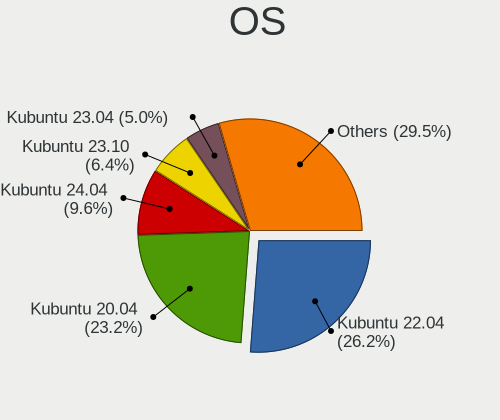
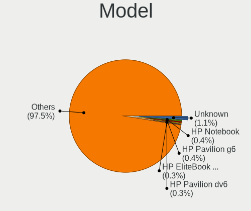
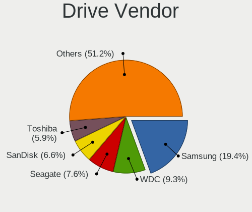
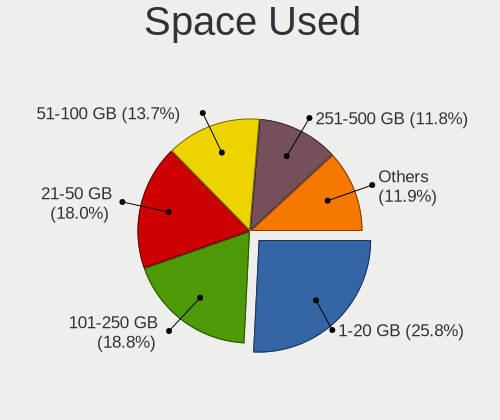
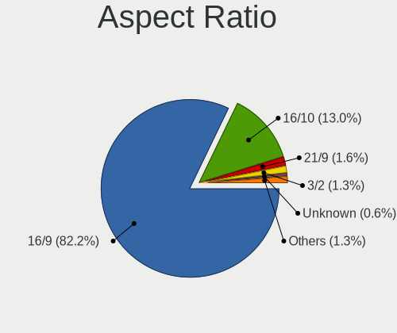
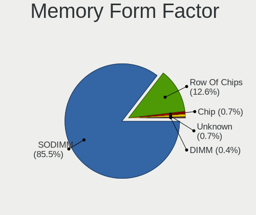
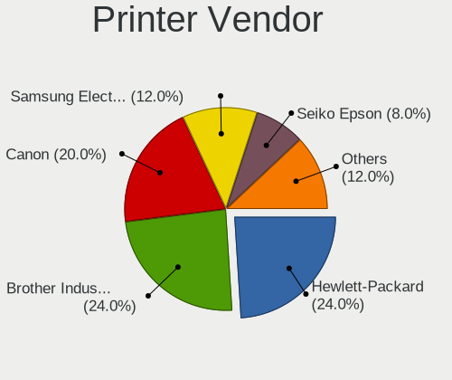

Kubuntu - Tested Hardware & Statistics (Notebooks)
--------------------------------------------------

A project to collect tested hardware configurations for Kubuntu.

Anyone can contribute to this report by the [hw-probe](https://github.com/linuxhw/hw-probe) tool:

    sudo -E hw-probe -all -upload

Please contribute! Especially if your hardware is rare.

Contents
--------

* [ Test Cases ](#test-cases)

* [ System ](#system)
  - [ OS                       ](#os)
  - [ OS Family                ](#os-family)
  - [ Kernel                   ](#kernel)
  - [ Kernel Family            ](#kernel-family)
  - [ Kernel Major Ver.        ](#kernel-major-ver)
  - [ Arch                     ](#arch)
  - [ DE                       ](#de)
  - [ Display Server           ](#display-server)
  - [ Display Manager          ](#display-manager)
  - [ OS Lang                  ](#os-lang)
  - [ Boot Mode                ](#boot-mode)
  - [ Filesystem               ](#filesystem)
  - [ Part. scheme             ](#part-scheme)
  - [ Dual Boot with Linux/BSD ](#dual-boot-with-linuxbsd)
  - [ Dual Boot (Win)          ](#dual-boot-win)

* [ Board ](#board)
  - [ Vendor                   ](#vendor)
  - [ Model                    ](#model)
  - [ Model Family             ](#model-family)
  - [ MFG Year                 ](#mfg-year)
  - [ Form Factor              ](#form-factor)
  - [ Secure Boot              ](#secure-boot)
  - [ Coreboot                 ](#coreboot)
  - [ RAM Size                 ](#ram-size)
  - [ RAM Used                 ](#ram-used)
  - [ Total Drives             ](#total-drives)
  - [ Has CD-ROM               ](#has-cd-rom)
  - [ Has Ethernet             ](#has-ethernet)
  - [ Has WiFi                 ](#has-wifi)
  - [ Has Bluetooth            ](#has-bluetooth)

* [ Location ](#location)
  - [ Country                  ](#country)
  - [ City                     ](#city)

* [ Drives ](#drives)
  - [ Drive Vendor             ](#drive-vendor)
  - [ Drive Model              ](#drive-model)
  - [ HDD Vendor               ](#hdd-vendor)
  - [ SSD Vendor               ](#ssd-vendor)
  - [ Drive Kind               ](#drive-kind)
  - [ Drive Connector          ](#drive-connector)
  - [ Drive Size               ](#drive-size)
  - [ Space Total              ](#space-total)
  - [ Space Used               ](#space-used)
  - [ Malfunc. Drives          ](#malfunc-drives)
  - [ Malfunc. Drive Vendor    ](#malfunc-drive-vendor)
  - [ Malfunc. HDD Vendor      ](#malfunc-hdd-vendor)
  - [ Malfunc. Drive Kind      ](#malfunc-drive-kind)
  - [ Failed Drives            ](#failed-drives)
  - [ Failed Drive Vendor      ](#failed-drive-vendor)
  - [ Drive Status             ](#drive-status)

* [ Storage controller ](#storage-controller)
  - [ Storage Vendor           ](#storage-vendor)
  - [ Storage Model            ](#storage-model)
  - [ Storage Kind             ](#storage-kind)

* [ Processor ](#processor)
  - [ CPU Vendor               ](#cpu-vendor)
  - [ CPU Model                ](#cpu-model)
  - [ CPU Model Family         ](#cpu-model-family)
  - [ CPU Cores                ](#cpu-cores)
  - [ CPU Sockets              ](#cpu-sockets)
  - [ CPU Threads              ](#cpu-threads)
  - [ CPU Op-Modes             ](#cpu-op-modes)
  - [ CPU Microcode            ](#cpu-microcode)
  - [ CPU Microarch            ](#cpu-microarch)

* [ Graphics ](#graphics)
  - [ GPU Vendor               ](#gpu-vendor)
  - [ GPU Model                ](#gpu-model)
  - [ GPU Combo                ](#gpu-combo)
  - [ GPU Driver               ](#gpu-driver)
  - [ GPU Memory               ](#gpu-memory)

* [ Monitor ](#monitor)
  - [ Monitor Vendor           ](#monitor-vendor)
  - [ Monitor Model            ](#monitor-model)
  - [ Monitor Resolution       ](#monitor-resolution)
  - [ Monitor Diagonal         ](#monitor-diagonal)
  - [ Monitor Width            ](#monitor-width)
  - [ Aspect Ratio             ](#aspect-ratio)
  - [ Monitor Area             ](#monitor-area)
  - [ Pixel Density            ](#pixel-density)
  - [ Multiple Monitors        ](#multiple-monitors)

* [ Network ](#network)
  - [ Net Controller Vendor    ](#net-controller-vendor)
  - [ Net Controller Model     ](#net-controller-model)
  - [ Wireless Vendor          ](#wireless-vendor)
  - [ Wireless Model           ](#wireless-model)
  - [ Ethernet Vendor          ](#ethernet-vendor)
  - [ Ethernet Model           ](#ethernet-model)
  - [ Net Controller Kind      ](#net-controller-kind)
  - [ Used Controller          ](#used-controller)
  - [ NICs                     ](#nics)
  - [ IPv6                     ](#ipv6)

* [ Bluetooth ](#bluetooth)
  - [ Bluetooth Vendor         ](#bluetooth-vendor)
  - [ Bluetooth Model          ](#bluetooth-model)

* [ Sound ](#sound)
  - [ Sound Vendor             ](#sound-vendor)
  - [ Sound Model              ](#sound-model)

* [ Memory ](#memory)
  - [ Memory Vendor            ](#memory-vendor)
  - [ Memory Model             ](#memory-model)
  - [ Memory Kind              ](#memory-kind)
  - [ Memory Form Factor       ](#memory-form-factor)
  - [ Memory Size              ](#memory-size)
  - [ Memory Speed             ](#memory-speed)

* [ Printers & scanners ](#printers--scanners)
  - [ Printer Vendor           ](#printer-vendor)
  - [ Printer Model            ](#printer-model)
  - [ Scanner Vendor           ](#scanner-vendor)
  - [ Scanner Model            ](#scanner-model)

* [ Camera ](#camera)
  - [ Camera Vendor            ](#camera-vendor)
  - [ Camera Model             ](#camera-model)

* [ Security ](#security)
  - [ Fingerprint Vendor       ](#fingerprint-vendor)
  - [ Fingerprint Model        ](#fingerprint-model)
  - [ Chipcard Vendor          ](#chipcard-vendor)
  - [ Chipcard Model           ](#chipcard-model)

* [ Unsupported ](#unsupported)
  - [ Unsupported Devices      ](#unsupported-devices)
  - [ Unsupported Device Types ](#unsupported-device-types)

Test Cases
----------

Total: 2278

| Vendor        | Model                       | Probe                                                      | Date         |
|---------------|-----------------------------|------------------------------------------------------------|--------------|
| Lenovo        | ThinkPad T440p 20AW000GU... | [b4ff1758e9](https://linux-hardware.org/?probe=b4ff1758e9) | Nov 02, 2022 |
| Panasonic     | CF-31WBLEHLM                | [623af75bb3](https://linux-hardware.org/?probe=623af75bb3) | Nov 02, 2022 |
| Panasonic     | CF-31WBLEHLM                | [52e7c62bae](https://linux-hardware.org/?probe=52e7c62bae) | Nov 02, 2022 |
| Notebook      | P65_P67SE                   | [9b99df1e15](https://linux-hardware.org/?probe=9b99df1e15) | Nov 02, 2022 |
| Lenovo        | IdeaPad 720S-13ARR 81BR     | [fefe8e5d04](https://linux-hardware.org/?probe=fefe8e5d04) | Nov 01, 2022 |
| Lenovo        | IdeaPad 720S-13ARR 81BR     | [df949b6e10](https://linux-hardware.org/?probe=df949b6e10) | Nov 01, 2022 |
| HUAWEI        | KPL-W0X                     | [6d6a8caf61](https://linux-hardware.org/?probe=6d6a8caf61) | Nov 01, 2022 |
| HP            | Laptop 15-da2xxx            | [ea7591794a](https://linux-hardware.org/?probe=ea7591794a) | Nov 01, 2022 |
| Lenovo        | IdeaPad 3 15IGL05 81WQ      | [80f6da5216](https://linux-hardware.org/?probe=80f6da5216) | Oct 31, 2022 |
| Acer          | Aspire 5732Z                | [df73e0ca67](https://linux-hardware.org/?probe=df73e0ca67) | Oct 30, 2022 |
| Lenovo        | ThinkPad L15 Gen 1 20U8S... | [4b778e52ee](https://linux-hardware.org/?probe=4b778e52ee) | Oct 30, 2022 |
| ASUSTek       | Zephyrus S GX502GW_GX502... | [c3f344809a](https://linux-hardware.org/?probe=c3f344809a) | Oct 30, 2022 |
| Lenovo        | ThinkPad L15 Gen 2 20X30... | [418b143f46](https://linux-hardware.org/?probe=418b143f46) | Oct 30, 2022 |
| ASUSTek       | ASUS TUF Gaming F15 FX50... | [293877c614](https://linux-hardware.org/?probe=293877c614) | Oct 29, 2022 |
| Lenovo        | V15 G2 ALC 82KD             | [aea626acae](https://linux-hardware.org/?probe=aea626acae) | Oct 29, 2022 |
| Lenovo        | V15-IGL 82C3                | [5bd4292187](https://linux-hardware.org/?probe=5bd4292187) | Oct 29, 2022 |
| Dell          | Inspiron 7520               | [91f0c87afa](https://linux-hardware.org/?probe=91f0c87afa) | Oct 29, 2022 |
| ASUSTek       | ASUS TUF Gaming F15 FX50... | [d7491bf8e7](https://linux-hardware.org/?probe=d7491bf8e7) | Oct 29, 2022 |
| ASUSTek       | ASUS TUF Gaming F15 FX50... | [6bdf703faf](https://linux-hardware.org/?probe=6bdf703faf) | Oct 29, 2022 |
| Lenovo        | ThinkPad X1 Carbon 4th 2... | [cfa027a9e2](https://linux-hardware.org/?probe=cfa027a9e2) | Oct 28, 2022 |
| Dell          | Latitude 5521               | [460057b367](https://linux-hardware.org/?probe=460057b367) | Oct 28, 2022 |
| Lenovo        | ThinkPad X230 23256N6       | [a2d71fd3ca](https://linux-hardware.org/?probe=a2d71fd3ca) | Oct 28, 2022 |
| HP            | Laptop 15-da2xxx            | [071938b19a](https://linux-hardware.org/?probe=071938b19a) | Oct 28, 2022 |
| HP            | 255 G8 Notebook PC          | [ba5aec702a](https://linux-hardware.org/?probe=ba5aec702a) | Oct 27, 2022 |
| Acer          | Predator PT516-52s          | [c0cebe4cfe](https://linux-hardware.org/?probe=c0cebe4cfe) | Oct 27, 2022 |
| Dell          | Latitude E5530 non-vPro     | [a5c5f0ec1e](https://linux-hardware.org/?probe=a5c5f0ec1e) | Oct 27, 2022 |
| HP            | Pavilion dv6                | [ed392a140d](https://linux-hardware.org/?probe=ed392a140d) | Oct 27, 2022 |
| HP            | G62                         | [c9ba156401](https://linux-hardware.org/?probe=c9ba156401) | Oct 27, 2022 |
| Dell          | Inspiron 5515               | [74ad4c8c59](https://linux-hardware.org/?probe=74ad4c8c59) | Oct 27, 2022 |
| Lenovo        | IdeaPad 3 15ADA05 81W1      | [a308f68bce](https://linux-hardware.org/?probe=a308f68bce) | Oct 27, 2022 |
| TUXEDO        | Stellaris AMD Gen3 (CZN)    | [0763832411](https://linux-hardware.org/?probe=0763832411) | Oct 27, 2022 |
| Notebook      | PD5x_7xPNP_PNR_PNN_PNT      | [93229f0fab](https://linux-hardware.org/?probe=93229f0fab) | Oct 26, 2022 |
| Acer          | Aspire E5-571               | [2920658e38](https://linux-hardware.org/?probe=2920658e38) | Oct 25, 2022 |
| Samsung       | 767XCL                      | [17bd1b4506](https://linux-hardware.org/?probe=17bd1b4506) | Oct 25, 2022 |
| HP            | Pavilion g6                 | [448d52b32f](https://linux-hardware.org/?probe=448d52b32f) | Oct 25, 2022 |
| ASUSTek       | N751JK                      | [f6f0ff5048](https://linux-hardware.org/?probe=f6f0ff5048) | Oct 25, 2022 |
| Lenovo        | ThinkBook 14-IIL 20SL       | [94fa6196b8](https://linux-hardware.org/?probe=94fa6196b8) | Oct 25, 2022 |
| Acer          | Aspire 5750                 | [20df7ad008](https://linux-hardware.org/?probe=20df7ad008) | Oct 25, 2022 |
| Dell          | Vostro 15 5501              | [3338297022](https://linux-hardware.org/?probe=3338297022) | Oct 25, 2022 |
| HP            | ProBook 640 G1              | [cfb2e32cea](https://linux-hardware.org/?probe=cfb2e32cea) | Oct 25, 2022 |
| HUAWEI        | BOHB-WAX9                   | [fe222419ec](https://linux-hardware.org/?probe=fe222419ec) | Oct 25, 2022 |
| HP            | 470 G8 Notebook PC          | [1cae6fb5ac](https://linux-hardware.org/?probe=1cae6fb5ac) | Oct 24, 2022 |
| HP            | 470 G8 Notebook PC          | [4c3e8196af](https://linux-hardware.org/?probe=4c3e8196af) | Oct 24, 2022 |
| Acer          | Nitro AN517-51              | [7fed0ea2a9](https://linux-hardware.org/?probe=7fed0ea2a9) | Oct 24, 2022 |
| Dell          | XPS 15 9560                 | [37fc32cacd](https://linux-hardware.org/?probe=37fc32cacd) | Oct 24, 2022 |
| Lenovo        | ThinkPad P73 20QRS00100     | [532b112928](https://linux-hardware.org/?probe=532b112928) | Oct 24, 2022 |
| HP            | EliteBook 8470p             | [918b0ef1ab](https://linux-hardware.org/?probe=918b0ef1ab) | Oct 24, 2022 |
| HP            | Laptop 17-by0xxx            | [faedd5a008](https://linux-hardware.org/?probe=faedd5a008) | Oct 24, 2022 |
| Lenovo        | IdeaPad Gaming 3 15ACH6 ... | [13c917aa38](https://linux-hardware.org/?probe=13c917aa38) | Oct 23, 2022 |
| Dell          | Latitude 7390               | [71f8a9e59b](https://linux-hardware.org/?probe=71f8a9e59b) | Oct 22, 2022 |
| Acer          | Predator PT516-52s          | [ec8dac6fd3](https://linux-hardware.org/?probe=ec8dac6fd3) | Oct 22, 2022 |
| Dell          | Vostro 3560                 | [b438a2ba8f](https://linux-hardware.org/?probe=b438a2ba8f) | Oct 22, 2022 |
| Lenovo        | ThinkBook 15 G3 ACL 21A4    | [a8c892608e](https://linux-hardware.org/?probe=a8c892608e) | Oct 21, 2022 |
| Dell          | Latitude E5530 non-vPro     | [20f991643f](https://linux-hardware.org/?probe=20f991643f) | Oct 21, 2022 |
| HP            | Laptop 17-by4xxx            | [6090ec7241](https://linux-hardware.org/?probe=6090ec7241) | Oct 21, 2022 |
| HP            | EliteBook 845 G7 Noteboo... | [0cf70c348b](https://linux-hardware.org/?probe=0cf70c348b) | Oct 21, 2022 |
| HP            | Laptop 15-da2xxx            | [a9de489f26](https://linux-hardware.org/?probe=a9de489f26) | Oct 21, 2022 |
| Lenovo        | IdeaPad 320-15IKB 80XL      | [c8e47b28fe](https://linux-hardware.org/?probe=c8e47b28fe) | Oct 20, 2022 |
| Lenovo        | ThinkBook 14 G4 ABA 21DK    | [46cb50f2f6](https://linux-hardware.org/?probe=46cb50f2f6) | Oct 19, 2022 |
| Haier         | A1420EM                     | [62ce3535b2](https://linux-hardware.org/?probe=62ce3535b2) | Oct 19, 2022 |
| Haier         | A1420EM                     | [a50bc27e31](https://linux-hardware.org/?probe=a50bc27e31) | Oct 19, 2022 |
| Tactus        | GeoBook 140                 | [6d01f5c57b](https://linux-hardware.org/?probe=6d01f5c57b) | Oct 19, 2022 |
| Dell          | XPS 9320                    | [8dd41b53b6](https://linux-hardware.org/?probe=8dd41b53b6) | Oct 19, 2022 |
| Samsung       | R430/P430/R480              | [a2db8aeade](https://linux-hardware.org/?probe=a2db8aeade) | Oct 19, 2022 |
| Samsung       | R430/P430/R480              | [92957e0afc](https://linux-hardware.org/?probe=92957e0afc) | Oct 19, 2022 |
| Lenovo        | Legion 5 17ACH6 82K0        | [431a84fc31](https://linux-hardware.org/?probe=431a84fc31) | Oct 18, 2022 |
| Dell          | Precision 3570              | [90711415f5](https://linux-hardware.org/?probe=90711415f5) | Oct 18, 2022 |
| HP            | ProBook 450 G5              | [a7ebb4b3c4](https://linux-hardware.org/?probe=a7ebb4b3c4) | Oct 16, 2022 |
| Lenovo        | Yoga 2 13 20344             | [f779ba08c9](https://linux-hardware.org/?probe=f779ba08c9) | Oct 16, 2022 |
| ASUSTek       | ROG Strix G512LV_G512LV     | [53a9eb1420](https://linux-hardware.org/?probe=53a9eb1420) | Oct 16, 2022 |
| HP            | OMEN Laptop 15-en0xxx       | [dad786ca06](https://linux-hardware.org/?probe=dad786ca06) | Oct 15, 2022 |
| ASUSTek       | X455LD                      | [ae520872e3](https://linux-hardware.org/?probe=ae520872e3) | Oct 14, 2022 |
| Lenovo        | ThinkPad T430 2342A19       | [7c6c3783e6](https://linux-hardware.org/?probe=7c6c3783e6) | Oct 14, 2022 |
| Dell          | Latitude E6420              | [f39e0305c5](https://linux-hardware.org/?probe=f39e0305c5) | Oct 13, 2022 |
| Dell          | Precision M6700             | [e198a003b6](https://linux-hardware.org/?probe=e198a003b6) | Oct 13, 2022 |
| Lenovo        | ThinkBook 14 G4 ABA 21DK    | [1258429041](https://linux-hardware.org/?probe=1258429041) | Oct 13, 2022 |
| HP            | Laptop 15-da2xxx            | [2813d441b5](https://linux-hardware.org/?probe=2813d441b5) | Oct 13, 2022 |
| HP            | Laptop 15-da2xxx            | [4039ed6d6f](https://linux-hardware.org/?probe=4039ed6d6f) | Oct 13, 2022 |
| GPU Compan... | GWTC116-2                   | [93ee54a067](https://linux-hardware.org/?probe=93ee54a067) | Oct 11, 2022 |
| HP            | ProBook 440 G8 Notebook ... | [125ad4881a](https://linux-hardware.org/?probe=125ad4881a) | Oct 11, 2022 |
| Lenovo        | ThinkPad E590 20NB005MUS    | [7a11da121e](https://linux-hardware.org/?probe=7a11da121e) | Oct 11, 2022 |
| Lenovo        | Legion 5 15ACH6H 82JU       | [d67f89127f](https://linux-hardware.org/?probe=d67f89127f) | Oct 11, 2022 |
| HP            | EliteBook 845 G7 Noteboo... | [5268977f64](https://linux-hardware.org/?probe=5268977f64) | Oct 09, 2022 |
| Gigabyte      | AERO 15-X9                  | [aad99b4421](https://linux-hardware.org/?probe=aad99b4421) | Oct 09, 2022 |
| ASUSTek       | X555UA                      | [9cf559ac01](https://linux-hardware.org/?probe=9cf559ac01) | Oct 08, 2022 |
| Gigabyte      | AERO 15-X9                  | [1f634e5071](https://linux-hardware.org/?probe=1f634e5071) | Oct 08, 2022 |
| ASUSTek       | VivoBook_ASUSLaptop M740... | [1b90e3cfa5](https://linux-hardware.org/?probe=1b90e3cfa5) | Oct 08, 2022 |
| Lenovo        | IdeaPad Y510P 20217         | [fddd82ba56](https://linux-hardware.org/?probe=fddd82ba56) | Oct 08, 2022 |
| Lenovo        | IdeaPad Y510P 20217         | [9a16ca15b3](https://linux-hardware.org/?probe=9a16ca15b3) | Oct 08, 2022 |
| ASUSTek       | VivoBook_ASUSLaptop M740... | [9bb8f8e33b](https://linux-hardware.org/?probe=9bb8f8e33b) | Oct 07, 2022 |
| Lenovo        | ThinkPad X230 23256N6       | [e59c8f50b4](https://linux-hardware.org/?probe=e59c8f50b4) | Oct 07, 2022 |
| Apple         | MacBookPro16,1              | [865d1f0e6f](https://linux-hardware.org/?probe=865d1f0e6f) | Oct 07, 2022 |
| Lenovo        | ZHAOYANG E53-80 81CM        | [985ca1961c](https://linux-hardware.org/?probe=985ca1961c) | Oct 06, 2022 |
| Toshiba       | Satellite NB10t-A-102       | [0bf17a1e92](https://linux-hardware.org/?probe=0bf17a1e92) | Oct 06, 2022 |
| HP            | Pavilion Laptop 15-eh1xx... | [3b023a0363](https://linux-hardware.org/?probe=3b023a0363) | Oct 06, 2022 |
| HP            | Compaq 15                   | [bba22531ad](https://linux-hardware.org/?probe=bba22531ad) | Oct 05, 2022 |
| Lenovo        | IdeaPad 320-15IKB 80XL      | [e4df51e64f](https://linux-hardware.org/?probe=e4df51e64f) | Oct 05, 2022 |
| HUAWEI        | NBD-WXX9                    | [2513dfd51e](https://linux-hardware.org/?probe=2513dfd51e) | Oct 05, 2022 |
| HP            | Compaq 15                   | [0f48335990](https://linux-hardware.org/?probe=0f48335990) | Oct 05, 2022 |
| Intel         | W7645                       | [4f76b8b5ad](https://linux-hardware.org/?probe=4f76b8b5ad) | Oct 04, 2022 |
| Lenovo        | ThinkPad X230 23256N6       | [082814c248](https://linux-hardware.org/?probe=082814c248) | Oct 04, 2022 |
| Apple         | MacBookPro10,1              | [3bc5547f39](https://linux-hardware.org/?probe=3bc5547f39) | Oct 04, 2022 |
| Lenovo        | ThinkPad E590 20NB005MUS    | [76709f5d09](https://linux-hardware.org/?probe=76709f5d09) | Oct 04, 2022 |
| HP            | ProBook 640 G2              | [2dc13504cf](https://linux-hardware.org/?probe=2dc13504cf) | Oct 03, 2022 |
| Acer          | Aspire A315-58              | [2969d635b3](https://linux-hardware.org/?probe=2969d635b3) | Oct 03, 2022 |
| Acer          | Aspire A315-58              | [28b873114a](https://linux-hardware.org/?probe=28b873114a) | Oct 03, 2022 |
| Acer          | Aspire E5-575G              | [330f866cf3](https://linux-hardware.org/?probe=330f866cf3) | Oct 03, 2022 |
| Lenovo        | IdeaPad 1 14IGL05 81VU      | [c555fbbf75](https://linux-hardware.org/?probe=c555fbbf75) | Oct 01, 2022 |
| Lenovo        | ThinkPad X230 23256N6       | [ec44263cbd](https://linux-hardware.org/?probe=ec44263cbd) | Oct 01, 2022 |
| Apple         | MacBookPro9,1               | [08db9e8d75](https://linux-hardware.org/?probe=08db9e8d75) | Oct 01, 2022 |
| HP            | EliteBook 840 G3            | [24a248630f](https://linux-hardware.org/?probe=24a248630f) | Sep 30, 2022 |
| ASUSTek       | N56VZ                       | [2b78a7c7f1](https://linux-hardware.org/?probe=2b78a7c7f1) | Sep 29, 2022 |
| Lenovo        | ThinkPad E590 20NB005MUS    | [4b198e87aa](https://linux-hardware.org/?probe=4b198e87aa) | Sep 28, 2022 |
| Samsung       | RV411/RV511/E3511/S3511/... | [ec59847e5b](https://linux-hardware.org/?probe=ec59847e5b) | Sep 27, 2022 |
| HP            | ZBook 15 G6                 | [476623a6a1](https://linux-hardware.org/?probe=476623a6a1) | Sep 26, 2022 |
| ASUSTek       | K93SV                       | [541a21ceb8](https://linux-hardware.org/?probe=541a21ceb8) | Sep 26, 2022 |
| Gigabyte      | AORUS 7 SB                  | [3e8222ad7c](https://linux-hardware.org/?probe=3e8222ad7c) | Sep 26, 2022 |
| Lenovo        | ThinkPad E15 Gen 3 20YG0... | [923985941d](https://linux-hardware.org/?probe=923985941d) | Sep 25, 2022 |
| HONOR         | BMH-WCX9                    | [867da0c4b8](https://linux-hardware.org/?probe=867da0c4b8) | Sep 25, 2022 |
| Lenovo        | ThinkPad X230 23256N6       | [f061f902ff](https://linux-hardware.org/?probe=f061f902ff) | Sep 25, 2022 |
| Lenovo        | ThinkPad T430 2349NZ8       | [8f61a903c5](https://linux-hardware.org/?probe=8f61a903c5) | Sep 25, 2022 |
| Acer          | Aspire R3-131T              | [0d44032bc0](https://linux-hardware.org/?probe=0d44032bc0) | Sep 25, 2022 |
| Dell          | Latitude E5400              | [09be905a45](https://linux-hardware.org/?probe=09be905a45) | Sep 24, 2022 |
| HUAWEI        | BOHB-WAX9                   | [18a4d2bb72](https://linux-hardware.org/?probe=18a4d2bb72) | Sep 23, 2022 |
| Lenovo        | ThinkPad L14 Gen 2 20X1S... | [6e943a4d35](https://linux-hardware.org/?probe=6e943a4d35) | Sep 23, 2022 |
| HP            | Pavilion 14                 | [277d97cc71](https://linux-hardware.org/?probe=277d97cc71) | Sep 23, 2022 |
| Lenovo        | G50-45 80E3                 | [3b1de255e3](https://linux-hardware.org/?probe=3b1de255e3) | Sep 22, 2022 |
| HP            | 255 G8 Notebook PC          | [20691b389b](https://linux-hardware.org/?probe=20691b389b) | Sep 21, 2022 |
| Dell          | Latitude E5530 non-vPro     | [6352f6fb82](https://linux-hardware.org/?probe=6352f6fb82) | Sep 21, 2022 |
| Dell          | Inspiron 7559               | [4abbaf3df9](https://linux-hardware.org/?probe=4abbaf3df9) | Sep 19, 2022 |
| Acer          | Aspire A515-45              | [41b1b790fd](https://linux-hardware.org/?probe=41b1b790fd) | Sep 19, 2022 |
| HP            | EliteBook 8560p             | [4a9e29fab2](https://linux-hardware.org/?probe=4a9e29fab2) | Sep 18, 2022 |
| Google        | Blooglet                    | [971a174a56](https://linux-hardware.org/?probe=971a174a56) | Sep 18, 2022 |
| Acer          | Aspire S3-391               | [5aadfd37c5](https://linux-hardware.org/?probe=5aadfd37c5) | Sep 17, 2022 |
| Acer          | Aspire S3-391               | [82a1f45915](https://linux-hardware.org/?probe=82a1f45915) | Sep 17, 2022 |
| MSI           | Delta 15 A5EFK              | [382e0f70a3](https://linux-hardware.org/?probe=382e0f70a3) | Sep 17, 2022 |
| Dell          | XPS 15 9560                 | [4a903b438f](https://linux-hardware.org/?probe=4a903b438f) | Sep 17, 2022 |
| Lenovo        | IdeaPad 3 15ARE05 81W4      | [4ee2b37edf](https://linux-hardware.org/?probe=4ee2b37edf) | Sep 16, 2022 |
| ASUSTek       | G501VW                      | [cf04ceb420](https://linux-hardware.org/?probe=cf04ceb420) | Sep 15, 2022 |
| Dell          | Latitude 7430               | [4fdf1a303c](https://linux-hardware.org/?probe=4fdf1a303c) | Sep 15, 2022 |
| Google        | Treeya                      | [a2723e9afa](https://linux-hardware.org/?probe=a2723e9afa) | Sep 15, 2022 |
| Dell          | Inspiron 5567               | [3af5d11f3f](https://linux-hardware.org/?probe=3af5d11f3f) | Sep 14, 2022 |
| Dell          | Inspiron 5567               | [22e62266a2](https://linux-hardware.org/?probe=22e62266a2) | Sep 13, 2022 |
| Lenovo        | ThinkPad T14 Gen 1 20S1S... | [d4fb6aa0ae](https://linux-hardware.org/?probe=d4fb6aa0ae) | Sep 13, 2022 |
| Lenovo        | B40-70 80F30005BR           | [b899f1b7da](https://linux-hardware.org/?probe=b899f1b7da) | Sep 13, 2022 |
| Lenovo        | B40-70 80F30005BR           | [99be4451df](https://linux-hardware.org/?probe=99be4451df) | Sep 13, 2022 |
| Lenovo        | ThinkPad T430 2347AT2       | [703c55185d](https://linux-hardware.org/?probe=703c55185d) | Sep 12, 2022 |
| Sony          | SVE1512J6EW                 | [69e2400606](https://linux-hardware.org/?probe=69e2400606) | Sep 11, 2022 |
| HP            | EliteBook 8470p             | [52f6655891](https://linux-hardware.org/?probe=52f6655891) | Sep 11, 2022 |
| Dell          | G15 5511                    | [b971c27fae](https://linux-hardware.org/?probe=b971c27fae) | Sep 10, 2022 |
| Lenovo        | ThinkPad T430 2347AT2       | [50f39d7738](https://linux-hardware.org/?probe=50f39d7738) | Sep 09, 2022 |
| Dell          | Latitude 7430               | [b1cdbef6b2](https://linux-hardware.org/?probe=b1cdbef6b2) | Sep 09, 2022 |
| Acer          | Predator G3-571             | [553cf2f33f](https://linux-hardware.org/?probe=553cf2f33f) | Sep 08, 2022 |
| Dell          | Vostro 3700                 | [40e150eb3b](https://linux-hardware.org/?probe=40e150eb3b) | Sep 08, 2022 |
| Notebook      | NV4XMB,ME,MZ                | [0efc3cb183](https://linux-hardware.org/?probe=0efc3cb183) | Sep 07, 2022 |
| Dell          | Precision M4800             | [280ca4dce2](https://linux-hardware.org/?probe=280ca4dce2) | Sep 07, 2022 |
| Dell          | Precision M4800             | [9d494c5486](https://linux-hardware.org/?probe=9d494c5486) | Sep 07, 2022 |
| HP            | 255 G8 Notebook PC          | [5c53e30fe6](https://linux-hardware.org/?probe=5c53e30fe6) | Sep 06, 2022 |
| Samsung       | 270E5G/270E5U               | [0300dd1a2d](https://linux-hardware.org/?probe=0300dd1a2d) | Sep 05, 2022 |
| Lenovo        | ThinkPad T470 W10DG 20JM... | [d496e01f0e](https://linux-hardware.org/?probe=d496e01f0e) | Sep 05, 2022 |
| Lenovo        | Legion 5 Pro 16ITH6H 82J... | [85798fb011](https://linux-hardware.org/?probe=85798fb011) | Sep 05, 2022 |
| ASUSTek       | UX51VZA                     | [46aa1dbafa](https://linux-hardware.org/?probe=46aa1dbafa) | Sep 04, 2022 |
| HP            | Pavilion Gaming Laptop 1... | [8eec266b41](https://linux-hardware.org/?probe=8eec266b41) | Sep 03, 2022 |
| HP            | Laptop 15-da0xxx            | [5c11f5477e](https://linux-hardware.org/?probe=5c11f5477e) | Sep 03, 2022 |
| HP            | Notebook                    | [a3b180cbb5](https://linux-hardware.org/?probe=a3b180cbb5) | Sep 03, 2022 |
| Lenovo        | G780 20138                  | [4a452f0874](https://linux-hardware.org/?probe=4a452f0874) | Sep 03, 2022 |
| Lenovo        | ThinkPad E14 20RBS25S00     | [a4290c0678](https://linux-hardware.org/?probe=a4290c0678) | Sep 03, 2022 |
| ASUSTek       | UX51VZA                     | [e93c1732ec](https://linux-hardware.org/?probe=e93c1732ec) | Sep 02, 2022 |
| Lenovo        | ThinkBook 14 G2 ITL 20VD    | [a15c233224](https://linux-hardware.org/?probe=a15c233224) | Sep 02, 2022 |
| Lenovo        | IdeaPad 1 14IGL05 81VU      | [e8b9bc90f3](https://linux-hardware.org/?probe=e8b9bc90f3) | Sep 02, 2022 |
| Lenovo        | ThinkPad X1 Extreme Gen ... | [d34c9cb705](https://linux-hardware.org/?probe=d34c9cb705) | Sep 01, 2022 |
| Lenovo        | ThinkPad T460 20FMS08U00    | [d7457fd32a](https://linux-hardware.org/?probe=d7457fd32a) | Sep 01, 2022 |
| HP            | Pavilion Gaming Laptop      | [8382b4123e](https://linux-hardware.org/?probe=8382b4123e) | Aug 31, 2022 |
| Samsung       | 870Z5E/880Z5E/680Z5E        | [0166c06969](https://linux-hardware.org/?probe=0166c06969) | Aug 30, 2022 |
| Dell          | Latitude 9420               | [0b8d883170](https://linux-hardware.org/?probe=0b8d883170) | Aug 29, 2022 |
| Toshiba       | Satellite L850              | [fe1480794c](https://linux-hardware.org/?probe=fe1480794c) | Aug 29, 2022 |
| Google        | Eldrid                      | [ae53120bac](https://linux-hardware.org/?probe=ae53120bac) | Aug 28, 2022 |
| HP            | Pavilion dv6700             | [8fae050683](https://linux-hardware.org/?probe=8fae050683) | Aug 28, 2022 |
| HP            | Pavilion Gaming Laptop 1... | [20bea980d2](https://linux-hardware.org/?probe=20bea980d2) | Aug 28, 2022 |
| HP            | Pavilion dv6700             | [1912258e10](https://linux-hardware.org/?probe=1912258e10) | Aug 27, 2022 |
| Lenovo        | ThinkPad E15 Gen 3 20YG0... | [208be390fa](https://linux-hardware.org/?probe=208be390fa) | Aug 26, 2022 |
| Dell          | Latitude E6400              | [8517e82248](https://linux-hardware.org/?probe=8517e82248) | Aug 26, 2022 |
| Sony          | VGN-NR11Z_T                 | [54c1e7c198](https://linux-hardware.org/?probe=54c1e7c198) | Aug 26, 2022 |
| HP            | ProBook 4540s               | [f082a7566a](https://linux-hardware.org/?probe=f082a7566a) | Aug 24, 2022 |
| HP            | ProBook 4540s               | [de08e9b296](https://linux-hardware.org/?probe=de08e9b296) | Aug 24, 2022 |
| Apple         | MacBookPro11,1              | [5097845796](https://linux-hardware.org/?probe=5097845796) | Aug 24, 2022 |
| HP            | ENVY Laptop 17-ce1xxx       | [4c201d43d0](https://linux-hardware.org/?probe=4c201d43d0) | Aug 22, 2022 |
| Lenovo        | ThinkPad T500 2082BRG       | [29d7ac6ea6](https://linux-hardware.org/?probe=29d7ac6ea6) | Aug 21, 2022 |
| Lenovo        | ThinkPad T500 2082BRG       | [c8f76780a1](https://linux-hardware.org/?probe=c8f76780a1) | Aug 21, 2022 |
| Toshiba       | Satellite P70-B             | [4e04d56e06](https://linux-hardware.org/?probe=4e04d56e06) | Aug 21, 2022 |
| Toshiba       | Satellite P70-B             | [402017a7ea](https://linux-hardware.org/?probe=402017a7ea) | Aug 21, 2022 |
| Dell          | G3 3500                     | [1e8edd3350](https://linux-hardware.org/?probe=1e8edd3350) | Aug 21, 2022 |
| Acer          | Nitro AN515-57              | [bdc4179004](https://linux-hardware.org/?probe=bdc4179004) | Aug 21, 2022 |
| HP            | ProBook 6570b               | [eba0cd02ec](https://linux-hardware.org/?probe=eba0cd02ec) | Aug 21, 2022 |
| Dell          | Inspiron 15-5578            | [a0ff8934e5](https://linux-hardware.org/?probe=a0ff8934e5) | Aug 21, 2022 |
| HP            | Pavilion g6                 | [8d5375bd39](https://linux-hardware.org/?probe=8d5375bd39) | Aug 20, 2022 |
| ASUSTek       | VivoBook_ASUSLaptop X340... | [45bac2f9d1](https://linux-hardware.org/?probe=45bac2f9d1) | Aug 20, 2022 |
| Dell          | G3 3779                     | [a2b721ca15](https://linux-hardware.org/?probe=a2b721ca15) | Aug 19, 2022 |
| MSI           | GF75 Thin 10SCXR            | [b75c38c8a5](https://linux-hardware.org/?probe=b75c38c8a5) | Aug 19, 2022 |
| Dell          | Latitude 7280               | [63e00d0c9d](https://linux-hardware.org/?probe=63e00d0c9d) | Aug 18, 2022 |
| Acer          | Nitro AN517-41              | [73649d898c](https://linux-hardware.org/?probe=73649d898c) | Aug 18, 2022 |
| Lenovo        | ThinkPad T440p 20AWS1AY0... | [fcda79b03d](https://linux-hardware.org/?probe=fcda79b03d) | Aug 17, 2022 |
| Apple         | MacBookPro11,1              | [4d6f6d6a23](https://linux-hardware.org/?probe=4d6f6d6a23) | Aug 15, 2022 |
| HP            | ProBook 6570b               | [b490a791c0](https://linux-hardware.org/?probe=b490a791c0) | Aug 15, 2022 |
| Dell          | Precision 3571              | [48c3133a7f](https://linux-hardware.org/?probe=48c3133a7f) | Aug 15, 2022 |
| Lenovo        | IdeaPad Gaming 3 15ACH6 ... | [30820abfa2](https://linux-hardware.org/?probe=30820abfa2) | Aug 14, 2022 |
| HP            | ZBook 15 G4                 | [92cacb2a11](https://linux-hardware.org/?probe=92cacb2a11) | Aug 12, 2022 |
| Lenovo        | IdeaPad 330-15IKB 81DC      | [ca96da9d08](https://linux-hardware.org/?probe=ca96da9d08) | Aug 12, 2022 |
| Panasonic     | CF-53JSWZGFF                | [88c83a7e28](https://linux-hardware.org/?probe=88c83a7e28) | Aug 11, 2022 |
| Dell          | Latitude 5590               | [a00272df56](https://linux-hardware.org/?probe=a00272df56) | Aug 11, 2022 |
| Timi          | TM1709                      | [26b592f734](https://linux-hardware.org/?probe=26b592f734) | Aug 11, 2022 |
| Lenovo        | Yoga Slim 7 15ITL05 82AC    | [477ce53969](https://linux-hardware.org/?probe=477ce53969) | Aug 10, 2022 |
| HP            | ProBook 6570b               | [0acbdaf806](https://linux-hardware.org/?probe=0acbdaf806) | Aug 10, 2022 |
| Shanghai Z... | ZXE CRB                     | [9ac3c0b157](https://linux-hardware.org/?probe=9ac3c0b157) | Aug 09, 2022 |
| HP            | EliteBook 8470p             | [14aebc0034](https://linux-hardware.org/?probe=14aebc0034) | Aug 09, 2022 |
| HP            | G62                         | [430fe133db](https://linux-hardware.org/?probe=430fe133db) | Aug 09, 2022 |
| Lenovo        | ThinkPad T430 2347AT2       | [4b74670050](https://linux-hardware.org/?probe=4b74670050) | Aug 08, 2022 |
| Lenovo        | V15-ADA 82C7                | [5b7d298ca6](https://linux-hardware.org/?probe=5b7d298ca6) | Aug 08, 2022 |
| Dell          | Latitude 5420               | [824404ee24](https://linux-hardware.org/?probe=824404ee24) | Aug 08, 2022 |
| HP            | ProBook 455 G7              | [b2e805c687](https://linux-hardware.org/?probe=b2e805c687) | Aug 07, 2022 |
| Dell          | XPS 15 9520                 | [7311161548](https://linux-hardware.org/?probe=7311161548) | Aug 07, 2022 |
| HP            | ProBook 440 G8 Notebook ... | [9c77d1a0d5](https://linux-hardware.org/?probe=9c77d1a0d5) | Aug 06, 2022 |
| HP            | ProBook 440 G8 Notebook ... | [ea189dab70](https://linux-hardware.org/?probe=ea189dab70) | Aug 06, 2022 |
| HP            | EliteBook 8470p             | [22e9ee373f](https://linux-hardware.org/?probe=22e9ee373f) | Aug 06, 2022 |
| Dell          | Precision 7530              | [40854a027f](https://linux-hardware.org/?probe=40854a027f) | Aug 05, 2022 |
| HP            | EliteBook 8470p             | [df685682b3](https://linux-hardware.org/?probe=df685682b3) | Aug 05, 2022 |
| Dell          | Latitude 5590               | [52f059849a](https://linux-hardware.org/?probe=52f059849a) | Aug 04, 2022 |
| Dell          | Latitude 5590               | [47292ecf57](https://linux-hardware.org/?probe=47292ecf57) | Aug 04, 2022 |
| VIT           | P2402                       | [895454e84f](https://linux-hardware.org/?probe=895454e84f) | Aug 03, 2022 |
| Fujitsu       | LIFEBOOK U758               | [3a73f1ffdd](https://linux-hardware.org/?probe=3a73f1ffdd) | Aug 03, 2022 |
| ASUSTek       | VivoBook_ASUSLaptop X509... | [f79a1d3402](https://linux-hardware.org/?probe=f79a1d3402) | Aug 03, 2022 |
| ASUSTek       | VivoBook_ASUSLaptop X509... | [b2e4380743](https://linux-hardware.org/?probe=b2e4380743) | Aug 03, 2022 |
| Apple         | MacBookPro11,1              | [9814fa3bca](https://linux-hardware.org/?probe=9814fa3bca) | Aug 03, 2022 |
| ASUSTek       | X540SA                      | [6adb003f2e](https://linux-hardware.org/?probe=6adb003f2e) | Aug 01, 2022 |
| ASUSTek       | X540SA                      | [4dbed1e983](https://linux-hardware.org/?probe=4dbed1e983) | Aug 01, 2022 |
| VIT           | P2402                       | [fd1ab8ad90](https://linux-hardware.org/?probe=fd1ab8ad90) | Aug 01, 2022 |
| Intel         | Unknown                     | [9fce3597b9](https://linux-hardware.org/?probe=9fce3597b9) | Aug 01, 2022 |
| HP            | ProBook 6570b               | [b99b5ef83f](https://linux-hardware.org/?probe=b99b5ef83f) | Aug 01, 2022 |
| HP            | ProBook 6570b               | [3898ce2b5f](https://linux-hardware.org/?probe=3898ce2b5f) | Aug 01, 2022 |
| ASUSTek       | ROG Flow X13 GV301QH_GV3... | [09c15c1ed8](https://linux-hardware.org/?probe=09c15c1ed8) | Jul 31, 2022 |
| HP            | EliteBook 840 G6            | [1a2713a2b0](https://linux-hardware.org/?probe=1a2713a2b0) | Jul 31, 2022 |
| Lenovo        | Legion Y540-17IRH 81Q4      | [5dcf2bfdbd](https://linux-hardware.org/?probe=5dcf2bfdbd) | Jul 30, 2022 |
| Dell          | Latitude 5590               | [7fa93449bd](https://linux-hardware.org/?probe=7fa93449bd) | Jul 28, 2022 |
| Lenovo        | ThinkPad T450 20BV0001US    | [9c0b784d1d](https://linux-hardware.org/?probe=9c0b784d1d) | Jul 27, 2022 |
| Lenovo        | ThinkPad E14 Gen 2 20TA0... | [5ed19c54a9](https://linux-hardware.org/?probe=5ed19c54a9) | Jul 27, 2022 |
| Dell          | Inspiron 15-3567            | [3e40b1abe6](https://linux-hardware.org/?probe=3e40b1abe6) | Jul 27, 2022 |
| Dell          | G5 5590                     | [20f75f2334](https://linux-hardware.org/?probe=20f75f2334) | Jul 27, 2022 |
| Unknown       | Unknown                     | [03fa847263](https://linux-hardware.org/?probe=03fa847263) | Jul 26, 2022 |
| Lenovo        | G570 20079                  | [50bab54f21](https://linux-hardware.org/?probe=50bab54f21) | Jul 26, 2022 |
| HP            | Laptop 15-da0xxx            | [6967eac391](https://linux-hardware.org/?probe=6967eac391) | Jul 26, 2022 |
| Lenovo        | G50-45 80E3                 | [df38a7a1ff](https://linux-hardware.org/?probe=df38a7a1ff) | Jul 25, 2022 |
| Lenovo        | IdeaPad 5 15ALC05 82LN      | [2c515ee09a](https://linux-hardware.org/?probe=2c515ee09a) | Jul 24, 2022 |
| Lenovo        | IdeaPad 5 15ALC05 82LN      | [e24e72037a](https://linux-hardware.org/?probe=e24e72037a) | Jul 24, 2022 |
| Acer          | Aspire E5-575G              | [d404840b57](https://linux-hardware.org/?probe=d404840b57) | Jul 24, 2022 |
| HP            | EliteBook 8470p             | [ec23b6375e](https://linux-hardware.org/?probe=ec23b6375e) | Jul 24, 2022 |
| Lenovo        | Legion 5 Pro 16ACH6H 82J... | [e71169659f](https://linux-hardware.org/?probe=e71169659f) | Jul 22, 2022 |
| HP            | G62                         | [418c1c572e](https://linux-hardware.org/?probe=418c1c572e) | Jul 21, 2022 |
| Lenovo        | ThinkBook 16p Gen 2 20YM    | [447161e791](https://linux-hardware.org/?probe=447161e791) | Jul 21, 2022 |
| Lenovo        | ThinkPad E570 20H5006TFR    | [1a1220dc79](https://linux-hardware.org/?probe=1a1220dc79) | Jul 21, 2022 |
| ASUSTek       | ROG Zephyrus G14 GA402RK... | [23f16d1cac](https://linux-hardware.org/?probe=23f16d1cac) | Jul 18, 2022 |
| ASUSTek       | ROG Zephyrus G14 GA402RK... | [d83a4d5121](https://linux-hardware.org/?probe=d83a4d5121) | Jul 18, 2022 |
| HONOR         | HYM-WXX                     | [654a2a5950](https://linux-hardware.org/?probe=654a2a5950) | Jul 17, 2022 |
| ASUSTek       | K53U                        | [20120e258a](https://linux-hardware.org/?probe=20120e258a) | Jul 16, 2022 |
| Standard      | Unknown                     | [3b4805163d](https://linux-hardware.org/?probe=3b4805163d) | Jul 15, 2022 |
| HP            | Laptop 15s-eq1xxx           | [57ef4db755](https://linux-hardware.org/?probe=57ef4db755) | Jul 14, 2022 |
| HP            | Laptop 17-cn0xxx            | [02a5205d57](https://linux-hardware.org/?probe=02a5205d57) | Jul 14, 2022 |
| Schenker      | XMG APEX (Mid 2021)         | [41136553b2](https://linux-hardware.org/?probe=41136553b2) | Jul 13, 2022 |
| TUXEDO        | Stellaris AMD Gen3 (CZN)    | [33bea96de9](https://linux-hardware.org/?probe=33bea96de9) | Jul 12, 2022 |
| Lenovo        | ThinkPad X1 Nano Gen 1 2... | [21ef2a8d9a](https://linux-hardware.org/?probe=21ef2a8d9a) | Jul 12, 2022 |
| Lenovo        | ThinkPad E14 Gen 3 20Y70... | [1bbf224b5c](https://linux-hardware.org/?probe=1bbf224b5c) | Jul 11, 2022 |
| Dell          | Latitude E5520              | [e04cdad7b7](https://linux-hardware.org/?probe=e04cdad7b7) | Jul 11, 2022 |
| HP            | EliteBook 840 G5            | [392310b916](https://linux-hardware.org/?probe=392310b916) | Jul 11, 2022 |
| System76      | Lemur Ultra                 | [10e8deaf3b](https://linux-hardware.org/?probe=10e8deaf3b) | Jul 11, 2022 |
| Lenovo        | IdeaPad Y430 2781           | [b8960364cb](https://linux-hardware.org/?probe=b8960364cb) | Jul 10, 2022 |
| Toshiba       | TECRA S11                   | [c33fa181ba](https://linux-hardware.org/?probe=c33fa181ba) | Jul 08, 2022 |
| Lenovo        | ThinkPad X200 7458FDG       | [435e7998bd](https://linux-hardware.org/?probe=435e7998bd) | Jul 08, 2022 |
| Lenovo        | IdeaPad 5 15ARE05 81YQ      | [6b007e333a](https://linux-hardware.org/?probe=6b007e333a) | Jul 06, 2022 |
| Lenovo        | IdeaPad 5 15ARE05 81YQ      | [f09a1deecc](https://linux-hardware.org/?probe=f09a1deecc) | Jul 06, 2022 |
| HP            | EliteBook 850 G8 Noteboo... | [445bedc2c9](https://linux-hardware.org/?probe=445bedc2c9) | Jul 06, 2022 |
| HP            | G42                         | [4a57fd54c6](https://linux-hardware.org/?probe=4a57fd54c6) | Jul 06, 2022 |
| HUAWEI        | CREM-WXX9                   | [e7e175955d](https://linux-hardware.org/?probe=e7e175955d) | Jul 05, 2022 |
| Chuwi         | CoreBook X                  | [a23d0fe53d](https://linux-hardware.org/?probe=a23d0fe53d) | Jul 04, 2022 |
| Sony          | VPCSA3M9E                   | [b36435a1fd](https://linux-hardware.org/?probe=b36435a1fd) | Jul 03, 2022 |
| Chuwi         | CoreBook X                  | [a8d8dfc814](https://linux-hardware.org/?probe=a8d8dfc814) | Jul 03, 2022 |
| Lenovo        | G50-45 80E3                 | [0dfbfe1182](https://linux-hardware.org/?probe=0dfbfe1182) | Jul 03, 2022 |
| HP            | 620                         | [cc970fdd77](https://linux-hardware.org/?probe=cc970fdd77) | Jul 02, 2022 |
| Lenovo        | ThinkPad T420 4180M8P       | [8a94c5bc15](https://linux-hardware.org/?probe=8a94c5bc15) | Jul 02, 2022 |
| Dell          | Latitude 7530               | [a66aca8921](https://linux-hardware.org/?probe=a66aca8921) | Jul 01, 2022 |
| HP            | EliteBook 840 G1            | [b691598870](https://linux-hardware.org/?probe=b691598870) | Jul 01, 2022 |
| HONOR         | BOHK-WAX9X                  | [1647402099](https://linux-hardware.org/?probe=1647402099) | Jun 30, 2022 |
| Lenovo        | ThinkPad P15 Gen 1 20SUS... | [4b04ded505](https://linux-hardware.org/?probe=4b04ded505) | Jun 30, 2022 |
| Jumper        | EZpad                       | [5d5f3980e1](https://linux-hardware.org/?probe=5d5f3980e1) | Jun 30, 2022 |
| Dell          | Latitude 3420               | [5fef19c107](https://linux-hardware.org/?probe=5fef19c107) | Jun 29, 2022 |
| HP            | Pavilion Gaming Laptop 1... | [6dc02ab574](https://linux-hardware.org/?probe=6dc02ab574) | Jun 29, 2022 |
| HP            | EliteBook 840 G6            | [faaa7b9c81](https://linux-hardware.org/?probe=faaa7b9c81) | Jun 29, 2022 |
| HP            | Stream Laptop 11-ak0xxx     | [d2f3d5aefd](https://linux-hardware.org/?probe=d2f3d5aefd) | Jun 28, 2022 |
| ASUSTek       | ROG Zephyrus G14 GA402RK... | [0c1cbe6fd7](https://linux-hardware.org/?probe=0c1cbe6fd7) | Jun 28, 2022 |
| Haier         | A1420EM                     | [3690a94424](https://linux-hardware.org/?probe=3690a94424) | Jun 28, 2022 |
| GPU Compan... | GWTC116-2                   | [183f3e59fb](https://linux-hardware.org/?probe=183f3e59fb) | Jun 28, 2022 |
| HP            | Stream Laptop 11-ak0xxx     | [f39c4bd8a0](https://linux-hardware.org/?probe=f39c4bd8a0) | Jun 27, 2022 |
| HP            | 15                          | [3d3ad576a2](https://linux-hardware.org/?probe=3d3ad576a2) | Jun 26, 2022 |
| ASUSTek       | K46CB                       | [3af9df185f](https://linux-hardware.org/?probe=3af9df185f) | Jun 26, 2022 |
| Lenovo        | ThinkBook 14-IML 20RV       | [6afa74e5b6](https://linux-hardware.org/?probe=6afa74e5b6) | Jun 25, 2022 |
| Acer          | Nitro AN515-57              | [10d0c2a6ea](https://linux-hardware.org/?probe=10d0c2a6ea) | Jun 24, 2022 |
| Dell          | Latitude XT3                | [87377f03e2](https://linux-hardware.org/?probe=87377f03e2) | Jun 24, 2022 |
| ASUSTek       | ZenBook UX325EA_UX325EA     | [0647ff3774](https://linux-hardware.org/?probe=0647ff3774) | Jun 24, 2022 |
| HP            | EliteBook 820 G1            | [ff4b7698ed](https://linux-hardware.org/?probe=ff4b7698ed) | Jun 23, 2022 |
| Dell          | Latitude 5590               | [aa45d97e0b](https://linux-hardware.org/?probe=aa45d97e0b) | Jun 23, 2022 |
| Dell          | Latitude 5590               | [3745dfcae3](https://linux-hardware.org/?probe=3745dfcae3) | Jun 23, 2022 |
| Clevo         | Modified by dsanke          | [b88e7a22fe](https://linux-hardware.org/?probe=b88e7a22fe) | Jun 22, 2022 |
| Lenovo        | V130-15IGM 81HL             | [62f47da7d2](https://linux-hardware.org/?probe=62f47da7d2) | Jun 22, 2022 |
| Dell          | Precision 5540              | [d4a5611433](https://linux-hardware.org/?probe=d4a5611433) | Jun 22, 2022 |
| ASUSTek       | GR8                         | [90afe7bdd7](https://linux-hardware.org/?probe=90afe7bdd7) | Jun 20, 2022 |
| Apple         | MacBookPro15,2              | [c931d0e7bf](https://linux-hardware.org/?probe=c931d0e7bf) | Jun 20, 2022 |
| Dell          | XPS 17 9720                 | [2a36b8d90d](https://linux-hardware.org/?probe=2a36b8d90d) | Jun 20, 2022 |
| Toshiba       | Satellite L655              | [2e67542246](https://linux-hardware.org/?probe=2e67542246) | Jun 19, 2022 |
| Packard Be... | H17HV                       | [daa945363e](https://linux-hardware.org/?probe=daa945363e) | Jun 19, 2022 |
| ASUSTek       | X550JF                      | [be77e811e2](https://linux-hardware.org/?probe=be77e811e2) | Jun 18, 2022 |
| TUXEDO        | InfinityBook S 15 Gen6      | [1dbf6320bc](https://linux-hardware.org/?probe=1dbf6320bc) | Jun 18, 2022 |
| SLIMBOOK      | PROX15-AMD                  | [e281d05a2a](https://linux-hardware.org/?probe=e281d05a2a) | Jun 18, 2022 |
| Apple         | MacBookPro5,3               | [aace637cfc](https://linux-hardware.org/?probe=aace637cfc) | Jun 17, 2022 |
| Samsung       | RV411/RV511/E3511/S3511/... | [bf18000c3c](https://linux-hardware.org/?probe=bf18000c3c) | Jun 17, 2022 |
| MSI           | Raider GE66 12UGS           | [d69dc59622](https://linux-hardware.org/?probe=d69dc59622) | Jun 16, 2022 |
| Apple         | MacBookPro5,3               | [06bef31587](https://linux-hardware.org/?probe=06bef31587) | Jun 16, 2022 |
| Acer          | Aspire E1-570G              | [060b0319ff](https://linux-hardware.org/?probe=060b0319ff) | Jun 15, 2022 |
| Dell          | XPS 15 9560                 | [8faa0f9e6a](https://linux-hardware.org/?probe=8faa0f9e6a) | Jun 14, 2022 |
| ASUSTek       | UX51VZ                      | [d58122ba72](https://linux-hardware.org/?probe=d58122ba72) | Jun 13, 2022 |
| HP            | 620                         | [fe1a420f17](https://linux-hardware.org/?probe=fe1a420f17) | Jun 13, 2022 |
| HP            | EliteBook 2570p             | [8b6f8e8952](https://linux-hardware.org/?probe=8b6f8e8952) | Jun 13, 2022 |
| Jumper        | EZpad                       | [3a5e6bc998](https://linux-hardware.org/?probe=3a5e6bc998) | Jun 13, 2022 |
| Dell          | Inspiron 1428               | [e47c98983f](https://linux-hardware.org/?probe=e47c98983f) | Jun 13, 2022 |
| HP            | EliteBook 8460p             | [e65bd18434](https://linux-hardware.org/?probe=e65bd18434) | Jun 12, 2022 |
| Dell          | Inspiron 3521               | [13a04a66d8](https://linux-hardware.org/?probe=13a04a66d8) | Jun 12, 2022 |
| Dell          | Inspiron 15-3567            | [013de61252](https://linux-hardware.org/?probe=013de61252) | Jun 12, 2022 |
| HP            | Pavilion dv7                | [7f7678265b](https://linux-hardware.org/?probe=7f7678265b) | Jun 11, 2022 |
| HP            | Pavilion dv7                | [c8d1e1be32](https://linux-hardware.org/?probe=c8d1e1be32) | Jun 10, 2022 |
| TUXEDO        | Pulse 15 Gen1               | [2c789d1a84](https://linux-hardware.org/?probe=2c789d1a84) | Jun 10, 2022 |
| HP            | ZBook Firefly 14 G7 Mobi... | [011acdab42](https://linux-hardware.org/?probe=011acdab42) | Jun 09, 2022 |
| HP            | ZBook Firefly 14 G7 Mobi... | [c751dcffff](https://linux-hardware.org/?probe=c751dcffff) | Jun 09, 2022 |
| HP            | Pavilion dv6                | [88a92966a3](https://linux-hardware.org/?probe=88a92966a3) | Jun 09, 2022 |
| Dell          | Latitude 5590               | [befc14c3db](https://linux-hardware.org/?probe=befc14c3db) | Jun 09, 2022 |
| Dell          | Latitude 5590               | [0c8e1f9f23](https://linux-hardware.org/?probe=0c8e1f9f23) | Jun 09, 2022 |
| MSI           | GP76 Leopard 11UH           | [8a3c021b8a](https://linux-hardware.org/?probe=8a3c021b8a) | Jun 08, 2022 |
| System76      | Kudu Professional           | [4ffc6fc358](https://linux-hardware.org/?probe=4ffc6fc358) | Jun 08, 2022 |
| System76      | Kudu Professional           | [0c0e2ed5b2](https://linux-hardware.org/?probe=0c0e2ed5b2) | Jun 08, 2022 |
| Lenovo        | ThinkPad P15s Gen 1 20T4... | [54a2c4fa94](https://linux-hardware.org/?probe=54a2c4fa94) | Jun 08, 2022 |
| HP            | 620                         | [1adcb99573](https://linux-hardware.org/?probe=1adcb99573) | Jun 07, 2022 |
| Lenovo        | ThinkPad X1 Extreme 20MG... | [f4c82e1fb6](https://linux-hardware.org/?probe=f4c82e1fb6) | Jun 07, 2022 |
| HP            | OMEN by Laptop 17-cb0xxx    | [1dea88e6b2](https://linux-hardware.org/?probe=1dea88e6b2) | Jun 07, 2022 |
| Lenovo        | ThinkPad P1 Gen 3 20TH00... | [42aaad44bc](https://linux-hardware.org/?probe=42aaad44bc) | Jun 06, 2022 |
| Lenovo        | ThinkPad X61 Tablet 7762... | [9ccaec00d8](https://linux-hardware.org/?probe=9ccaec00d8) | Jun 06, 2022 |
| Toshiba       | Satellite C75D-A            | [a5aee20b56](https://linux-hardware.org/?probe=a5aee20b56) | Jun 06, 2022 |
| Positivo      | Q464C                       | [e00b91e529](https://linux-hardware.org/?probe=e00b91e529) | Jun 06, 2022 |
| Dell          | Latitude 5590               | [be30c04869](https://linux-hardware.org/?probe=be30c04869) | Jun 05, 2022 |
| Lenovo        | IdeaPad 5 15ARE05 81YQ      | [065dee2160](https://linux-hardware.org/?probe=065dee2160) | Jun 04, 2022 |
| HP            | EliteBook 845 G7 Noteboo... | [de4976b9dd](https://linux-hardware.org/?probe=de4976b9dd) | Jun 04, 2022 |
| Dell          | Latitude 5590               | [cc94c06259](https://linux-hardware.org/?probe=cc94c06259) | Jun 04, 2022 |
| Lenovo        | ThinkBook 15 G2 ITL 20VE    | [5e57fb2871](https://linux-hardware.org/?probe=5e57fb2871) | Jun 04, 2022 |
| HP            | Pavilion Laptop 15-eh1xx... | [11ec221a7e](https://linux-hardware.org/?probe=11ec221a7e) | Jun 04, 2022 |
| HP            | ProBook 650 G2              | [a580e923a7](https://linux-hardware.org/?probe=a580e923a7) | Jun 03, 2022 |
| Dell          | Latitude E5470              | [e858488f6f](https://linux-hardware.org/?probe=e858488f6f) | Jun 03, 2022 |
| MSI           | CX61 2PC                    | [d3decdad4c](https://linux-hardware.org/?probe=d3decdad4c) | Jun 03, 2022 |
| HP            | ProBook 650 G2              | [27063b3b3a](https://linux-hardware.org/?probe=27063b3b3a) | Jun 03, 2022 |
| Dell          | Latitude 7420               | [b2ba370a59](https://linux-hardware.org/?probe=b2ba370a59) | Jun 02, 2022 |
| Samsung       | 300E4C/300E5C/300E7C        | [66e01e7706](https://linux-hardware.org/?probe=66e01e7706) | Jun 02, 2022 |
| SK hynix      | Onnyx III                   | [a04d3f7fd9](https://linux-hardware.org/?probe=a04d3f7fd9) | Jun 01, 2022 |
| ASUSTek       | TX201LA                     | [ba677dadab](https://linux-hardware.org/?probe=ba677dadab) | Jun 01, 2022 |
| Toshiba       | Satellite L50-A-1D6         | [0436371728](https://linux-hardware.org/?probe=0436371728) | Jun 01, 2022 |
| Toshiba       | Satellite L50-A-1D6         | [20d1a7e37b](https://linux-hardware.org/?probe=20d1a7e37b) | Jun 01, 2022 |
| Dell          | Inspiron 7537               | [2861999420](https://linux-hardware.org/?probe=2861999420) | Jun 01, 2022 |
| Dell          | Inspiron 7537               | [103bb197fa](https://linux-hardware.org/?probe=103bb197fa) | Jun 01, 2022 |
| Dell          | G7 7588                     | [3e41b876c2](https://linux-hardware.org/?probe=3e41b876c2) | May 31, 2022 |
| Dell          | Vostro 5481                 | [5fd6fe3593](https://linux-hardware.org/?probe=5fd6fe3593) | May 31, 2022 |
| Lenovo        | IdeaPad Gaming 3 15IHU6 ... | [6378f52a92](https://linux-hardware.org/?probe=6378f52a92) | May 31, 2022 |
| Acer          | Aspire AV15-51              | [a9183103ee](https://linux-hardware.org/?probe=a9183103ee) | May 31, 2022 |
| Google        | Coral                       | [c517ad03c1](https://linux-hardware.org/?probe=c517ad03c1) | May 30, 2022 |
| Dell          | Precision 7710              | [f24e29d104](https://linux-hardware.org/?probe=f24e29d104) | May 30, 2022 |
| Dell          | Precision 7710              | [1bae5a0bf0](https://linux-hardware.org/?probe=1bae5a0bf0) | May 30, 2022 |
| ASUSTek       | X540LA                      | [57e0b15d17](https://linux-hardware.org/?probe=57e0b15d17) | May 30, 2022 |
| HP            | Pavilion g4                 | [39cdebfff4](https://linux-hardware.org/?probe=39cdebfff4) | May 29, 2022 |
| Medion        | S6445 MD61489               | [a933286b06](https://linux-hardware.org/?probe=a933286b06) | May 29, 2022 |
| ASUSTek       | VivoBook_ASUSLaptop X421... | [177e92d46b](https://linux-hardware.org/?probe=177e92d46b) | May 28, 2022 |
| TUXEDO        | Polaris 15 AMD Gen1         | [f592de92c2](https://linux-hardware.org/?probe=f592de92c2) | May 27, 2022 |
| ASUSTek       | ROG Strix G513QY_G513QY     | [5718bd4854](https://linux-hardware.org/?probe=5718bd4854) | May 27, 2022 |
| Gigabyte      | AORUS 15 XE4                | [f56ba4f49d](https://linux-hardware.org/?probe=f56ba4f49d) | May 27, 2022 |
| HUAWEI        | CREM-WXX9                   | [5410acf8ab](https://linux-hardware.org/?probe=5410acf8ab) | May 25, 2022 |
| Dell          | Vostro 5625                 | [2ae97190b6](https://linux-hardware.org/?probe=2ae97190b6) | May 24, 2022 |
| Dell          | Inspiron 15 7000 Gaming     | [887985e68a](https://linux-hardware.org/?probe=887985e68a) | May 24, 2022 |
| Acer          | Aspire M5-581TG             | [c6ffc6271c](https://linux-hardware.org/?probe=c6ffc6271c) | May 23, 2022 |
| HP            | 15                          | [a61f6dd1eb](https://linux-hardware.org/?probe=a61f6dd1eb) | May 23, 2022 |
| Acer          | Aspire A515-55              | [52dce4d0c3](https://linux-hardware.org/?probe=52dce4d0c3) | May 23, 2022 |
| Acer          | Swift SFX14-41G             | [da40fdda29](https://linux-hardware.org/?probe=da40fdda29) | May 22, 2022 |
| Lenovo        | ThinkPad T400 6474AL9       | [06ec4e94a2](https://linux-hardware.org/?probe=06ec4e94a2) | May 22, 2022 |
| Acer          | Aspire E5-573               | [dce8b618f8](https://linux-hardware.org/?probe=dce8b618f8) | May 22, 2022 |
| Toshiba       | PORTEGE Z10t-A              | [8266843e53](https://linux-hardware.org/?probe=8266843e53) | May 19, 2022 |
| Dell          | Inspiron 7572               | [b7747e3ea4](https://linux-hardware.org/?probe=b7747e3ea4) | May 19, 2022 |
| Dell          | Inspiron 5593               | [e08308603a](https://linux-hardware.org/?probe=e08308603a) | May 18, 2022 |
| Razer         | Blade 15 Mid 2019-Base      | [0d4945774e](https://linux-hardware.org/?probe=0d4945774e) | May 18, 2022 |
| Razer         | Blade 15 Mid 2019-Base      | [e771dc589b](https://linux-hardware.org/?probe=e771dc589b) | May 18, 2022 |
| Acer          | Aspire A515-55              | [c01f14c77f](https://linux-hardware.org/?probe=c01f14c77f) | May 18, 2022 |
| Lenovo        | IdeaPad L340-15IRH Gamin... | [0571b7cb83](https://linux-hardware.org/?probe=0571b7cb83) | May 18, 2022 |
| Acer          | Predator PH315-53           | [eb5d08e402](https://linux-hardware.org/?probe=eb5d08e402) | May 18, 2022 |
| Lenovo        | G780 20138                  | [ee6e90c751](https://linux-hardware.org/?probe=ee6e90c751) | May 17, 2022 |
| HP            | ProBook 6470b               | [0581bb1005](https://linux-hardware.org/?probe=0581bb1005) | May 17, 2022 |
| HP            | Unknown                     | [796c00a0cd](https://linux-hardware.org/?probe=796c00a0cd) | May 15, 2022 |
| HP            | ProBook 6570b               | [e8c38d4e97](https://linux-hardware.org/?probe=e8c38d4e97) | May 15, 2022 |
| Apple         | MacBookPro13,2              | [68e687c794](https://linux-hardware.org/?probe=68e687c794) | May 14, 2022 |
| Lenovo        | ThinkPad E14 20RBS25S00     | [beaf18770e](https://linux-hardware.org/?probe=beaf18770e) | May 12, 2022 |
| HUAWEI        | CREM-WXX9                   | [dba988f81d](https://linux-hardware.org/?probe=dba988f81d) | May 10, 2022 |
| Lenovo        | ThinkPad T430 2347AT2       | [2ba7ecdb55](https://linux-hardware.org/?probe=2ba7ecdb55) | May 10, 2022 |
| Dell          | Latitude E6540              | [a5bb9f2b58](https://linux-hardware.org/?probe=a5bb9f2b58) | May 10, 2022 |
| HP            | ProBook 470 G1              | [cb4ef48c3d](https://linux-hardware.org/?probe=cb4ef48c3d) | May 10, 2022 |
| Dell          | XPS 13 9370                 | [f90e5f669e](https://linux-hardware.org/?probe=f90e5f669e) | May 09, 2022 |
| Toshiba       | Satellite C650D             | [8aefcd7551](https://linux-hardware.org/?probe=8aefcd7551) | May 08, 2022 |
| HP            | ProBook 470 G1              | [a20a5df1ad](https://linux-hardware.org/?probe=a20a5df1ad) | May 06, 2022 |
| HP            | ProBook 6470b               | [7849fd57dc](https://linux-hardware.org/?probe=7849fd57dc) | May 06, 2022 |
| HUAWEI        | HVY-WXX9                    | [8eb673ec29](https://linux-hardware.org/?probe=8eb673ec29) | May 06, 2022 |
| HP            | Pavilion Laptop 15-cw1xx... | [ef836a5eca](https://linux-hardware.org/?probe=ef836a5eca) | May 06, 2022 |
| Acer          | Nitro AN515-45              | [aefe7a52e0](https://linux-hardware.org/?probe=aefe7a52e0) | May 06, 2022 |
| Apple         | MacBookPro11,2              | [0af35aa835](https://linux-hardware.org/?probe=0af35aa835) | May 06, 2022 |
| ASUSTek       | X550JX                      | [b420f9214c](https://linux-hardware.org/?probe=b420f9214c) | May 06, 2022 |
| HP            | 2000                        | [1616d82d8e](https://linux-hardware.org/?probe=1616d82d8e) | May 05, 2022 |
| HP            | 2000                        | [f6f20fd25e](https://linux-hardware.org/?probe=f6f20fd25e) | May 05, 2022 |
| Lenovo        | IdeaPad 3 15ITL6 82H8       | [df622f284f](https://linux-hardware.org/?probe=df622f284f) | May 05, 2022 |
| Lenovo        | IdeaPad 3 15ARE05 81W4      | [d861de9453](https://linux-hardware.org/?probe=d861de9453) | May 04, 2022 |
| HP            | ProBook 6450b               | [0c23a5cbc2](https://linux-hardware.org/?probe=0c23a5cbc2) | May 04, 2022 |
| HP            | Pavilion dv7                | [978f98cef3](https://linux-hardware.org/?probe=978f98cef3) | May 04, 2022 |
| Alienware     | 17                          | [1a4cd056f8](https://linux-hardware.org/?probe=1a4cd056f8) | May 04, 2022 |
| Toshiba       | Satellite C650D             | [ce16326df2](https://linux-hardware.org/?probe=ce16326df2) | May 03, 2022 |
| HP            | Pavilion Gaming Laptop 1... | [e126640b3b](https://linux-hardware.org/?probe=e126640b3b) | May 03, 2022 |
| Lenovo        | ThinkPad T400 6474AL9       | [b303038c87](https://linux-hardware.org/?probe=b303038c87) | May 01, 2022 |
| Lenovo        | ThinkPad X201 3680AC2       | [5c4515d51e](https://linux-hardware.org/?probe=5c4515d51e) | May 01, 2022 |
| Lenovo        | IdeaPad 500-15ISK 80NT      | [d5b6bc1a67](https://linux-hardware.org/?probe=d5b6bc1a67) | May 01, 2022 |
| HP            | Pavilion Laptop 13-bb0xx... | [ae7d5dbb0c](https://linux-hardware.org/?probe=ae7d5dbb0c) | May 01, 2022 |
| Lenovo        | ThinkPad T530 2394CTO       | [73ee1262a6](https://linux-hardware.org/?probe=73ee1262a6) | Apr 30, 2022 |
| Dell          | XPS 15 9510                 | [52609c3695](https://linux-hardware.org/?probe=52609c3695) | Apr 29, 2022 |
| Lenovo        | Z50-75 80EC                 | [f301c52b41](https://linux-hardware.org/?probe=f301c52b41) | Apr 29, 2022 |
| ASUSTek       | ZenBook UX450FDX_UX480FD    | [9f7923bcd2](https://linux-hardware.org/?probe=9f7923bcd2) | Apr 29, 2022 |
| Lenovo        | ThinkPad X1 Extreme 2nd ... | [12a0105da3](https://linux-hardware.org/?probe=12a0105da3) | Apr 29, 2022 |
| Lenovo        | IdeaPad 5 15ARE05 81YQ      | [57271a5f8b](https://linux-hardware.org/?probe=57271a5f8b) | Apr 28, 2022 |
| ASUSTek       | VivoBook_ASUSLaptop M340... | [382d77c2b0](https://linux-hardware.org/?probe=382d77c2b0) | Apr 28, 2022 |
| Acer          | Nitro AN515-57              | [3206e0f075](https://linux-hardware.org/?probe=3206e0f075) | Apr 27, 2022 |
| Unknown       | Unknown                     | [e77a313003](https://linux-hardware.org/?probe=e77a313003) | Apr 27, 2022 |
| HP            | 250 G5 Notebook PC          | [e4ecdec958](https://linux-hardware.org/?probe=e4ecdec958) | Apr 27, 2022 |
| Acer          | Aspire A515-55              | [fa33f58948](https://linux-hardware.org/?probe=fa33f58948) | Apr 27, 2022 |
| Lenovo        | ThinkPad T530 2394CTO       | [9fffc0babc](https://linux-hardware.org/?probe=9fffc0babc) | Apr 26, 2022 |
| Lenovo        | ThinkPad T530 2394CTO       | [b5f175a650](https://linux-hardware.org/?probe=b5f175a650) | Apr 26, 2022 |
| HP            | ENVY 17                     | [c33b35becc](https://linux-hardware.org/?probe=c33b35becc) | Apr 26, 2022 |
| ASUSTek       | G750JS                      | [24dab87910](https://linux-hardware.org/?probe=24dab87910) | Apr 26, 2022 |
| Lenovo        | ThinkPad X1 Extreme 2nd ... | [e466d79804](https://linux-hardware.org/?probe=e466d79804) | Apr 26, 2022 |
| Lenovo        | ThinkPad E14 20RBS25S00     | [89debf3e0e](https://linux-hardware.org/?probe=89debf3e0e) | Apr 25, 2022 |
| Lenovo        | ThinkPad X201 Tablet 083... | [8e7b2c79a0](https://linux-hardware.org/?probe=8e7b2c79a0) | Apr 25, 2022 |
| Dell          | Studio 1558                 | [b31435ef0c](https://linux-hardware.org/?probe=b31435ef0c) | Apr 24, 2022 |
| Lenovo        | IdeaPad 5 Pro 14ITL6 82L... | [a260bf9ce6](https://linux-hardware.org/?probe=a260bf9ce6) | Apr 24, 2022 |
| Lenovo        | IdeaPad 330S-15IKB 81F5     | [9877ddeaf6](https://linux-hardware.org/?probe=9877ddeaf6) | Apr 24, 2022 |
| Lenovo        | ThinkBook 15 G2 ARE 20VG    | [99e25e855e](https://linux-hardware.org/?probe=99e25e855e) | Apr 23, 2022 |
| Acer          | Swift SF314-43              | [9ba9e35d88](https://linux-hardware.org/?probe=9ba9e35d88) | Apr 23, 2022 |
| Acer          | Nitro AN515-57              | [848b9d8f5c](https://linux-hardware.org/?probe=848b9d8f5c) | Apr 22, 2022 |
| Acer          | Nitro AN515-57              | [da630d58cf](https://linux-hardware.org/?probe=da630d58cf) | Apr 22, 2022 |
| TUXEDO        | Aura 15 Gen1                | [8ee6cabf43](https://linux-hardware.org/?probe=8ee6cabf43) | Apr 22, 2022 |
| Lenovo        | ThinkBook 15-IML 20RW       | [28690580aa](https://linux-hardware.org/?probe=28690580aa) | Apr 22, 2022 |
| Dynabook      | PORTEGE X30L-J              | [5894fd3a34](https://linux-hardware.org/?probe=5894fd3a34) | Apr 21, 2022 |
| ASUSTek       | G550JK                      | [566770a325](https://linux-hardware.org/?probe=566770a325) | Apr 21, 2022 |
| Positivo      | W940TU                      | [4d03effd28](https://linux-hardware.org/?probe=4d03effd28) | Apr 20, 2022 |
| Positivo      | W940TU                      | [971493b883](https://linux-hardware.org/?probe=971493b883) | Apr 20, 2022 |
| Dell          | Latitude XT3                | [6db9585e20](https://linux-hardware.org/?probe=6db9585e20) | Apr 20, 2022 |
| Lenovo        | ThinkPad T560 20FJS0NT04    | [19ebdf705a](https://linux-hardware.org/?probe=19ebdf705a) | Apr 20, 2022 |
| Dell          | XPS 15 7590                 | [ee7354dd8d](https://linux-hardware.org/?probe=ee7354dd8d) | Apr 19, 2022 |
| Dell          | Inspiron 15-3567            | [f8e7d70919](https://linux-hardware.org/?probe=f8e7d70919) | Apr 18, 2022 |
| Lenovo        | ThinkPad T420 4180DV2       | [4ed718df3e](https://linux-hardware.org/?probe=4ed718df3e) | Apr 18, 2022 |
| Lenovo        | ThinkPad T420 4180DV2       | [402c31b107](https://linux-hardware.org/?probe=402c31b107) | Apr 18, 2022 |
| ASUSTek       | S551LB                      | [bb1d6d3623](https://linux-hardware.org/?probe=bb1d6d3623) | Apr 17, 2022 |
| Shanghai Z... | ZXE CRB                     | [fe284f4173](https://linux-hardware.org/?probe=fe284f4173) | Apr 17, 2022 |
| Dell          | Latitude XT3                | [c4d7d751b7](https://linux-hardware.org/?probe=c4d7d751b7) | Apr 17, 2022 |
| Dell          | Latitude 7410               | [da82f8bba8](https://linux-hardware.org/?probe=da82f8bba8) | Apr 15, 2022 |
| Lenovo        | G40-45 80E1                 | [840ffde0c4](https://linux-hardware.org/?probe=840ffde0c4) | Apr 15, 2022 |
| Dell          | Latitude XT3                | [ce6c2e43a0](https://linux-hardware.org/?probe=ce6c2e43a0) | Apr 15, 2022 |
| Dell          | Latitude E6540              | [2ee68b5f38](https://linux-hardware.org/?probe=2ee68b5f38) | Apr 14, 2022 |
| Framework     | Laptop                      | [6846ee88e0](https://linux-hardware.org/?probe=6846ee88e0) | Apr 14, 2022 |
| Lenovo        | ThinkPad Edge E540 20C60... | [45b8eba74c](https://linux-hardware.org/?probe=45b8eba74c) | Apr 14, 2022 |
| HP            | Pavilion Laptop 15-cs3xx... | [3e09de906e](https://linux-hardware.org/?probe=3e09de906e) | Apr 14, 2022 |
| Lenovo        | ThinkPad T420 41786UU       | [2211278055](https://linux-hardware.org/?probe=2211278055) | Apr 14, 2022 |
| Lenovo        | ThinkPad E14 Gen 3 20Y7C... | [4434290159](https://linux-hardware.org/?probe=4434290159) | Apr 14, 2022 |
| Lenovo        | ThinkPad P51 20HH000AUS     | [b7365a4abd](https://linux-hardware.org/?probe=b7365a4abd) | Apr 14, 2022 |
| Samsung       | R425D/R525D                 | [bd5a2f5943](https://linux-hardware.org/?probe=bd5a2f5943) | Apr 14, 2022 |
| Dell          | XPS 13 9300                 | [a21bd26d1e](https://linux-hardware.org/?probe=a21bd26d1e) | Apr 14, 2022 |
| HUAWEI        | KLVL-WXXW                   | [8888d86504](https://linux-hardware.org/?probe=8888d86504) | Apr 13, 2022 |
| Lenovo        | IdeaPad 710S Plus Touch-... | [f4578ea652](https://linux-hardware.org/?probe=f4578ea652) | Apr 13, 2022 |
| Lenovo        | ThinkPad X1 Extreme 2nd ... | [744144c472](https://linux-hardware.org/?probe=744144c472) | Apr 13, 2022 |
| Lenovo        | ThinkPad X1 Extreme 2nd ... | [479b8d48fc](https://linux-hardware.org/?probe=479b8d48fc) | Apr 13, 2022 |
| Lenovo        | ThinkPad T530 24296HG       | [74191e7ffb](https://linux-hardware.org/?probe=74191e7ffb) | Apr 13, 2022 |
| Toshiba       | Satellite P70-B             | [6c01bb2cc3](https://linux-hardware.org/?probe=6c01bb2cc3) | Apr 13, 2022 |
| HP            | OMEN Laptop 15-en0xxx       | [de2cf28654](https://linux-hardware.org/?probe=de2cf28654) | Apr 13, 2022 |
| Dell          | Latitude 5591               | [3f3f097a1a](https://linux-hardware.org/?probe=3f3f097a1a) | Apr 13, 2022 |
| Dell          | Latitude 7400               | [2c32d69a57](https://linux-hardware.org/?probe=2c32d69a57) | Apr 13, 2022 |
| HP            | Pavilion g6                 | [44035cfa83](https://linux-hardware.org/?probe=44035cfa83) | Apr 13, 2022 |
| Dell          | Precision 5520              | [eb5bfc87ed](https://linux-hardware.org/?probe=eb5bfc87ed) | Apr 12, 2022 |
| Lenovo        | ThinkPad T430 2349T2A       | [344710cc3a](https://linux-hardware.org/?probe=344710cc3a) | Apr 12, 2022 |
| HONOR         | NBD-WXX9                    | [090560f0c5](https://linux-hardware.org/?probe=090560f0c5) | Apr 12, 2022 |
| Lenovo        | IdeaPad Z585                | [5f84c70657](https://linux-hardware.org/?probe=5f84c70657) | Apr 10, 2022 |
| Notebook      | NS50_70MU                   | [cf76bb9e39](https://linux-hardware.org/?probe=cf76bb9e39) | Apr 10, 2022 |
| Dell          | G7 7790                     | [6cdb296d8e](https://linux-hardware.org/?probe=6cdb296d8e) | Apr 10, 2022 |
| Dell          | Vostro 15 3515              | [848a486145](https://linux-hardware.org/?probe=848a486145) | Apr 10, 2022 |
| eMachines     | G525                        | [6ba45c519c](https://linux-hardware.org/?probe=6ba45c519c) | Apr 09, 2022 |
| HP            | Laptop 14s-fq0xxx           | [18045cb759](https://linux-hardware.org/?probe=18045cb759) | Apr 09, 2022 |
| Positivo      | N1250                       | [c64a47d6fc](https://linux-hardware.org/?probe=c64a47d6fc) | Apr 09, 2022 |
| Sony          | VPCF236FM                   | [ea109b146b](https://linux-hardware.org/?probe=ea109b146b) | Apr 08, 2022 |
| Sony          | SVE1511W1ESI                | [403773664b](https://linux-hardware.org/?probe=403773664b) | Apr 08, 2022 |
| Dell          | Latitude 5480               | [6891954221](https://linux-hardware.org/?probe=6891954221) | Apr 08, 2022 |
| HP            | ENVY 15                     | [cdd8aea3c3](https://linux-hardware.org/?probe=cdd8aea3c3) | Apr 07, 2022 |
| Lenovo        | ThinkPad L15 Gen 1 20U8S... | [dea231bf61](https://linux-hardware.org/?probe=dea231bf61) | Apr 07, 2022 |
| Lenovo        | ThinkPad L15 Gen 1 20U8S... | [b02ac7d8ce](https://linux-hardware.org/?probe=b02ac7d8ce) | Apr 07, 2022 |
| Dell          | XPS 13 9310                 | [64c2c15492](https://linux-hardware.org/?probe=64c2c15492) | Apr 05, 2022 |
| Wortmann      | TERRA_MOBILE_1749           | [ee8ada5124](https://linux-hardware.org/?probe=ee8ada5124) | Apr 05, 2022 |
| Lenovo        | ThinkPad T450 20BV0001US    | [f72149904c](https://linux-hardware.org/?probe=f72149904c) | Apr 05, 2022 |
| Lenovo        | ThinkPad X260 20F5S0W22B    | [765eaec64d](https://linux-hardware.org/?probe=765eaec64d) | Apr 04, 2022 |
| Dell          | Latitude E6530              | [a63f363043](https://linux-hardware.org/?probe=a63f363043) | Apr 04, 2022 |
| Lenovo        | IdeaPadFlex 14 20308        | [9ecbc31fc2](https://linux-hardware.org/?probe=9ecbc31fc2) | Apr 04, 2022 |
| Dell          | Latitude E6540              | [e087a37f5f](https://linux-hardware.org/?probe=e087a37f5f) | Apr 02, 2022 |
| Lenovo        | ThinkPad T540p 20BEA00FR... | [c9323a9c40](https://linux-hardware.org/?probe=c9323a9c40) | Mar 31, 2022 |
| Dell          | XPS 13 9305                 | [946628cb20](https://linux-hardware.org/?probe=946628cb20) | Mar 30, 2022 |
| Dell          | Vostro 15 3515              | [b61b3e31e7](https://linux-hardware.org/?probe=b61b3e31e7) | Mar 30, 2022 |
| HUAWEI        | BOHB-WAX9                   | [f398041b40](https://linux-hardware.org/?probe=f398041b40) | Mar 29, 2022 |
| Lenovo        | ThinkPad X230 23202DG       | [323ca65327](https://linux-hardware.org/?probe=323ca65327) | Mar 28, 2022 |
| HP            | Pavilion 14                 | [1b15a2e740](https://linux-hardware.org/?probe=1b15a2e740) | Mar 28, 2022 |
| Lenovo        | IdeaPad S145-15IIL 82DJ     | [f457ad3a65](https://linux-hardware.org/?probe=f457ad3a65) | Mar 27, 2022 |
| HP            | Stream Notebook PC 14       | [9fc309dcaf](https://linux-hardware.org/?probe=9fc309dcaf) | Mar 27, 2022 |
| Positivo      | Q232A                       | [fe29ba6b10](https://linux-hardware.org/?probe=fe29ba6b10) | Mar 27, 2022 |
| Lenovo        | IdeaPad S530-13IWL 81J7     | [a9a4291601](https://linux-hardware.org/?probe=a9a4291601) | Mar 26, 2022 |
| Dell          | Latitude 5290 2-in-1        | [f0a08eb35b](https://linux-hardware.org/?probe=f0a08eb35b) | Mar 25, 2022 |
| Dell          | Inspiron 5379               | [85c7a99f91](https://linux-hardware.org/?probe=85c7a99f91) | Mar 25, 2022 |
| Avell High... | B.ON                        | [19b689aa12](https://linux-hardware.org/?probe=19b689aa12) | Mar 25, 2022 |
| Apple         | MacBookPro14,1              | [a2db3c2cab](https://linux-hardware.org/?probe=a2db3c2cab) | Mar 24, 2022 |
| Razer         | Blade 15 Advanced Model ... | [cb089466a3](https://linux-hardware.org/?probe=cb089466a3) | Mar 24, 2022 |
| ASUSTek       | VivoBook_ASUSLaptop M340... | [c136393c4b](https://linux-hardware.org/?probe=c136393c4b) | Mar 23, 2022 |
| ASUSTek       | VivoBook_ASUSLaptop X760... | [713ff9dcb8](https://linux-hardware.org/?probe=713ff9dcb8) | Mar 23, 2022 |
| Dell          | XPS 15 7590                 | [96244433f0](https://linux-hardware.org/?probe=96244433f0) | Mar 23, 2022 |
| Acer          | Swift SF314-54G             | [615009b8ee](https://linux-hardware.org/?probe=615009b8ee) | Mar 23, 2022 |
| ASUSTek       | N550LF                      | [5e5462ce64](https://linux-hardware.org/?probe=5e5462ce64) | Mar 23, 2022 |
| Lenovo        | ThinkPad X230 23202DG       | [5b74db2557](https://linux-hardware.org/?probe=5b74db2557) | Mar 22, 2022 |
| MSI           | GP76 Leopard 11UH           | [d398e3284e](https://linux-hardware.org/?probe=d398e3284e) | Mar 22, 2022 |
| Dell          | XPS 13 9310                 | [c90c0f1819](https://linux-hardware.org/?probe=c90c0f1819) | Mar 22, 2022 |
| ASUSTek       | X555LNB                     | [ae49172b0f](https://linux-hardware.org/?probe=ae49172b0f) | Mar 21, 2022 |
| ASUSTek       | X555LNB                     | [33e081f100](https://linux-hardware.org/?probe=33e081f100) | Mar 21, 2022 |
| Dell          | System Inspiron N7110       | [d3b1757cf5](https://linux-hardware.org/?probe=d3b1757cf5) | Mar 21, 2022 |
| ASUSTek       | K73E                        | [75069bd642](https://linux-hardware.org/?probe=75069bd642) | Mar 20, 2022 |
| Apple         | MacBookPro12,1              | [0e4992c717](https://linux-hardware.org/?probe=0e4992c717) | Mar 20, 2022 |
| ASUSTek       | VivoBook_ASUSLaptop M340... | [3607969e9d](https://linux-hardware.org/?probe=3607969e9d) | Mar 20, 2022 |
| Panasonic     | FZ-M1CC-51BE                | [94e014ee40](https://linux-hardware.org/?probe=94e014ee40) | Mar 18, 2022 |
| ASUSTek       | K52Jr                       | [b05ec1dbda](https://linux-hardware.org/?probe=b05ec1dbda) | Mar 18, 2022 |
| Dell          | Precision M6300             | [aac71b9e66](https://linux-hardware.org/?probe=aac71b9e66) | Mar 17, 2022 |
| ASUSTek       | K52Jr                       | [77c6485b0f](https://linux-hardware.org/?probe=77c6485b0f) | Mar 17, 2022 |
| HP            | EliteBook 850 G5            | [6d8c8748e2](https://linux-hardware.org/?probe=6d8c8748e2) | Mar 17, 2022 |
| ASUSTek       | VivoBook_ASUSLaptop X521... | [8713806c38](https://linux-hardware.org/?probe=8713806c38) | Mar 17, 2022 |
| HP            | ProBook 430 G2              | [e2ad81141c](https://linux-hardware.org/?probe=e2ad81141c) | Mar 16, 2022 |
| HP            | Pavilion Aero Laptop 13-... | [8e9c955b47](https://linux-hardware.org/?probe=8e9c955b47) | Mar 15, 2022 |
| Lenovo        | ThinkPad T430 2347AT2       | [bf80f02a40](https://linux-hardware.org/?probe=bf80f02a40) | Mar 15, 2022 |
| Samsung       | 300E4Z/300E5Z/300E7Z        | [95c6b15672](https://linux-hardware.org/?probe=95c6b15672) | Mar 14, 2022 |
| ASUSTek       | VivoBook_ASUSLaptop X513... | [96b413780f](https://linux-hardware.org/?probe=96b413780f) | Mar 13, 2022 |
| Lenovo        | IdeaPad 520-15IKB 81BF      | [8ab5133b14](https://linux-hardware.org/?probe=8ab5133b14) | Mar 13, 2022 |
| Lenovo        | B580 20144                  | [9918c132f0](https://linux-hardware.org/?probe=9918c132f0) | Mar 13, 2022 |
| Lenovo        | B580 20144                  | [fd9ec44205](https://linux-hardware.org/?probe=fd9ec44205) | Mar 13, 2022 |
| Dell          | Latitude E6430              | [bc21cb0e8b](https://linux-hardware.org/?probe=bc21cb0e8b) | Mar 13, 2022 |
| Lenovo        | ThinkPad X1 Extreme 20MF... | [4998fff0f9](https://linux-hardware.org/?probe=4998fff0f9) | Mar 12, 2022 |
| HP            | Pavilion Aero Laptop 13-... | [e39d0d9111](https://linux-hardware.org/?probe=e39d0d9111) | Mar 11, 2022 |
| Acer          | Nitro AN515-56              | [39cdee5411](https://linux-hardware.org/?probe=39cdee5411) | Mar 11, 2022 |
| Acer          | Aspire 5750G                | [066fecf595](https://linux-hardware.org/?probe=066fecf595) | Mar 10, 2022 |
| Dell          | XPS 13 9310                 | [e7a3d16cc0](https://linux-hardware.org/?probe=e7a3d16cc0) | Mar 09, 2022 |
| Lenovo        | ThinkPad X220 4290EC5       | [508a68f09e](https://linux-hardware.org/?probe=508a68f09e) | Mar 09, 2022 |
| ASUSTek       | ZenBook UX435EG_UX435EG     | [8dbe399133](https://linux-hardware.org/?probe=8dbe399133) | Mar 08, 2022 |
| Lenovo        | IdeaPad S145-15IIL 82DJ     | [c7025ac75e](https://linux-hardware.org/?probe=c7025ac75e) | Mar 08, 2022 |
| ASUSTek       | UX331UN                     | [f1cf640532](https://linux-hardware.org/?probe=f1cf640532) | Mar 06, 2022 |
| ASUSTek       | ASUS EXPERTBOOK B1400CEA... | [052e483cb5](https://linux-hardware.org/?probe=052e483cb5) | Mar 06, 2022 |
| MSI           | Katana GF76 11UC            | [949d0886a1](https://linux-hardware.org/?probe=949d0886a1) | Mar 06, 2022 |
| MSI           | Katana GF76 11UC            | [f5241bc829](https://linux-hardware.org/?probe=f5241bc829) | Mar 05, 2022 |
| ASUSTek       | ASUS EXPERTBOOK B1400CEA... | [7a52c91d68](https://linux-hardware.org/?probe=7a52c91d68) | Mar 05, 2022 |
| Unknown       | KN12A                       | [3ba6165509](https://linux-hardware.org/?probe=3ba6165509) | Mar 05, 2022 |
| Lenovo        | ThinkPad P1 Gen 3 20TH00... | [1c879cd60e](https://linux-hardware.org/?probe=1c879cd60e) | Mar 04, 2022 |
| Dell          | Vostro 5470                 | [fda73ff759](https://linux-hardware.org/?probe=fda73ff759) | Mar 02, 2022 |
| Dell          | Latitude E6530              | [f13c84346e](https://linux-hardware.org/?probe=f13c84346e) | Mar 02, 2022 |
| ASUSTek       | UX331UN                     | [463899cdb7](https://linux-hardware.org/?probe=463899cdb7) | Mar 02, 2022 |
| ASUSTek       | K55N                        | [6143b27a96](https://linux-hardware.org/?probe=6143b27a96) | Mar 02, 2022 |
| MSI           | Katana GF76 11UC            | [880490eb1e](https://linux-hardware.org/?probe=880490eb1e) | Mar 01, 2022 |
| Schenker      | VIA 15                      | [c84aacc342](https://linux-hardware.org/?probe=c84aacc342) | Feb 28, 2022 |
| Acer          | Aspire A515-45              | [f2e18241da](https://linux-hardware.org/?probe=f2e18241da) | Feb 28, 2022 |
| MSI           | Katana GF76 11UC            | [79cc0b97a4](https://linux-hardware.org/?probe=79cc0b97a4) | Feb 28, 2022 |
| MSI           | Katana GF76 11UC            | [74bc866ab2](https://linux-hardware.org/?probe=74bc866ab2) | Feb 27, 2022 |
| ASUSTek       | ASUS TUF Gaming F15 FX50... | [c7db8c9806](https://linux-hardware.org/?probe=c7db8c9806) | Feb 27, 2022 |
| HP            | Notebook                    | [bcc74ebe77](https://linux-hardware.org/?probe=bcc74ebe77) | Feb 27, 2022 |
| Lenovo        | ThinkPad L14 Gen 1 20U5S... | [f86d99b8a1](https://linux-hardware.org/?probe=f86d99b8a1) | Feb 27, 2022 |
| Dell          | Inspiron 3583               | [83dec4f285](https://linux-hardware.org/?probe=83dec4f285) | Feb 26, 2022 |
| Acer          | Aspire E5-553G              | [17586d38de](https://linux-hardware.org/?probe=17586d38de) | Feb 26, 2022 |
| HUAWEI        | HVY-WXX9                    | [fb4c469104](https://linux-hardware.org/?probe=fb4c469104) | Feb 26, 2022 |
| HUAWEI        | HVY-WXX9                    | [9013eb37ee](https://linux-hardware.org/?probe=9013eb37ee) | Feb 25, 2022 |
| Dell          | XPS 15 9560                 | [4c72ebcb41](https://linux-hardware.org/?probe=4c72ebcb41) | Feb 25, 2022 |
| Timi          | Mi Laptop Air 12.5          | [7aa852e941](https://linux-hardware.org/?probe=7aa852e941) | Feb 25, 2022 |
| Timi          | Mi Laptop Air 12.5          | [67297aad2c](https://linux-hardware.org/?probe=67297aad2c) | Feb 25, 2022 |
| HP            | EliteBook 745 G3            | [eed2589bd2](https://linux-hardware.org/?probe=eed2589bd2) | Feb 25, 2022 |
| ASUSTek       | ZenBook UX434IQ_UM433IQ     | [013e049a4d](https://linux-hardware.org/?probe=013e049a4d) | Feb 24, 2022 |
| ASUSTek       | ZenBook UX434IQ_UM433IQ     | [885239a137](https://linux-hardware.org/?probe=885239a137) | Feb 24, 2022 |
| Dell          | Inspiron 1525               | [904717059e](https://linux-hardware.org/?probe=904717059e) | Feb 24, 2022 |
| Toshiba       | IS 1412                     | [3621d1064d](https://linux-hardware.org/?probe=3621d1064d) | Feb 24, 2022 |
| ASUSTek       | X550JX                      | [ec93ded12b](https://linux-hardware.org/?probe=ec93ded12b) | Feb 23, 2022 |
| Lenovo        | ThinkPad T430 23495P8       | [03266eea0a](https://linux-hardware.org/?probe=03266eea0a) | Feb 23, 2022 |
| HP            | Notebook                    | [93a85593c3](https://linux-hardware.org/?probe=93a85593c3) | Feb 23, 2022 |
| ASUSTek       | GL753VD                     | [e1e83bde9c](https://linux-hardware.org/?probe=e1e83bde9c) | Feb 22, 2022 |
| HP            | EliteBook 8760w             | [cc9d99be2a](https://linux-hardware.org/?probe=cc9d99be2a) | Feb 22, 2022 |
| ASUSTek       | G75VW                       | [d31201b74c](https://linux-hardware.org/?probe=d31201b74c) | Feb 22, 2022 |
| Lenovo        | ThinkPad T460s 20F9S1G20... | [6a6c0b0b39](https://linux-hardware.org/?probe=6a6c0b0b39) | Feb 21, 2022 |
| ASUSTek       | X550JX                      | [0ee9dcd568](https://linux-hardware.org/?probe=0ee9dcd568) | Feb 20, 2022 |
| Acer          | Aspire 3820                 | [e12ba75c05](https://linux-hardware.org/?probe=e12ba75c05) | Feb 19, 2022 |
| ASUSTek       | X550JX                      | [5ee5668ab1](https://linux-hardware.org/?probe=5ee5668ab1) | Feb 19, 2022 |
| Digma         | CITI E401 ET4007EW          | [a4a57f2b26](https://linux-hardware.org/?probe=a4a57f2b26) | Feb 19, 2022 |
| Lenovo        | ThinkPad L430 2468CTO       | [9244a0f8f9](https://linux-hardware.org/?probe=9244a0f8f9) | Feb 18, 2022 |
| HP            | Pavilion Laptop 14-ce0xx... | [ffb9eb537e](https://linux-hardware.org/?probe=ffb9eb537e) | Feb 17, 2022 |
| Samsung       | 300E4A/300E5A/300E7A/343... | [7f55b1fa12](https://linux-hardware.org/?probe=7f55b1fa12) | Feb 17, 2022 |
| ASUSTek       | VivoBook_ASUSLaptop X350... | [5d2de5cd73](https://linux-hardware.org/?probe=5d2de5cd73) | Feb 17, 2022 |
| Timi          | RedmiBook 14 II             | [9fdad76c68](https://linux-hardware.org/?probe=9fdad76c68) | Feb 16, 2022 |
| Dell          | Latitude E6320              | [ae7b660be1](https://linux-hardware.org/?probe=ae7b660be1) | Feb 16, 2022 |
| Lenovo        | G40-45 80E1                 | [88c9f0db96](https://linux-hardware.org/?probe=88c9f0db96) | Feb 16, 2022 |
| Jumper        | EZbook                      | [f27f93bafe](https://linux-hardware.org/?probe=f27f93bafe) | Feb 16, 2022 |
| Lenovo        | G500 20236                  | [725807db6f](https://linux-hardware.org/?probe=725807db6f) | Feb 15, 2022 |
| Lenovo        | ThinkPad T14s Gen 1 20UH... | [3db88acec8](https://linux-hardware.org/?probe=3db88acec8) | Feb 15, 2022 |
| Apple         | MacBookPro8,1               | [b99a5f9b59](https://linux-hardware.org/?probe=b99a5f9b59) | Feb 14, 2022 |
| Fujitsu Si... | LIFEBOOK S6420              | [d42d70a45a](https://linux-hardware.org/?probe=d42d70a45a) | Feb 14, 2022 |
| ASUSTek       | ASUS BR1100CKA BR1100CKA... | [5768ab0770](https://linux-hardware.org/?probe=5768ab0770) | Feb 13, 2022 |
| Dell          | Inspiron 3793               | [9df9f66476](https://linux-hardware.org/?probe=9df9f66476) | Feb 13, 2022 |
| MSI           | GE62 6QD                    | [fc4efd1eff](https://linux-hardware.org/?probe=fc4efd1eff) | Feb 13, 2022 |
| Lenovo        | Legion 5 17ACH6 82K0        | [c756082899](https://linux-hardware.org/?probe=c756082899) | Feb 13, 2022 |
| Lenovo        | G50-70 20351                | [5795d9b341](https://linux-hardware.org/?probe=5795d9b341) | Feb 12, 2022 |
| ASUSTek       | X540NA                      | [a9271fbd9f](https://linux-hardware.org/?probe=a9271fbd9f) | Feb 12, 2022 |
| Dell          | Latitude 5580               | [77466f0d8f](https://linux-hardware.org/?probe=77466f0d8f) | Feb 11, 2022 |
| Dell          | Latitude 5580               | [8d65e0f7c7](https://linux-hardware.org/?probe=8d65e0f7c7) | Feb 11, 2022 |
| HP            | Compaq Presario CQ71        | [5061491140](https://linux-hardware.org/?probe=5061491140) | Feb 11, 2022 |
| HP            | Compaq Presario CQ71        | [cd89130dcd](https://linux-hardware.org/?probe=cd89130dcd) | Feb 11, 2022 |
| Acer          | Aspire 5750G                | [11d24586e8](https://linux-hardware.org/?probe=11d24586e8) | Feb 11, 2022 |
| Lenovo        | IdeaPad S145-15API 81UT     | [aba110f180](https://linux-hardware.org/?probe=aba110f180) | Feb 10, 2022 |
| MSI           | Prestige 14 A10RB           | [7195cacd54](https://linux-hardware.org/?probe=7195cacd54) | Feb 10, 2022 |
| HP            | EliteBook 8570w             | [df5a829402](https://linux-hardware.org/?probe=df5a829402) | Feb 09, 2022 |
| Lenovo        | V14 G2 ITL 82NM             | [b53861af9b](https://linux-hardware.org/?probe=b53861af9b) | Feb 09, 2022 |
| Lenovo        | V14-IIL 82C4                | [bca05a8467](https://linux-hardware.org/?probe=bca05a8467) | Feb 09, 2022 |
| Dell          | Latitude E5440              | [8ddea24991](https://linux-hardware.org/?probe=8ddea24991) | Feb 08, 2022 |
| Dell          | Vostro 5490                 | [011e0963bd](https://linux-hardware.org/?probe=011e0963bd) | Feb 07, 2022 |
| HP            | Victus by Laptop 16-e0xx... | [9c3722a690](https://linux-hardware.org/?probe=9c3722a690) | Feb 07, 2022 |
| Lenovo        | ThinkPad L14 Gen 2 20X1S... | [4f80537faf](https://linux-hardware.org/?probe=4f80537faf) | Feb 06, 2022 |
| Sony          | VPCF236FM                   | [784b1b0c3b](https://linux-hardware.org/?probe=784b1b0c3b) | Feb 06, 2022 |
| Dell          | System XPS L502X            | [c2a3b5d930](https://linux-hardware.org/?probe=c2a3b5d930) | Feb 05, 2022 |
| Medion        | E4241 MD60996               | [d89f5e4089](https://linux-hardware.org/?probe=d89f5e4089) | Feb 05, 2022 |
| Lenovo        | G710 20252                  | [ffc1b2ca5a](https://linux-hardware.org/?probe=ffc1b2ca5a) | Feb 04, 2022 |
| Lenovo        | ThinkPad E14 20RBS25S00     | [1f4e97ac28](https://linux-hardware.org/?probe=1f4e97ac28) | Feb 04, 2022 |
| Lenovo        | V580c 20160                 | [8b9e72e0ed](https://linux-hardware.org/?probe=8b9e72e0ed) | Feb 03, 2022 |
| HP            | Laptop 15g-br1xx            | [092ea39c7e](https://linux-hardware.org/?probe=092ea39c7e) | Feb 03, 2022 |
| LG Electro... | 16Z90P-G.AA78C              | [30ddfbc611](https://linux-hardware.org/?probe=30ddfbc611) | Feb 03, 2022 |
| Toshiba       | Satellite S55-C             | [ba1cbdf586](https://linux-hardware.org/?probe=ba1cbdf586) | Feb 03, 2022 |
| Lenovo        | IdeaPad 3 15ARE05 81W4      | [3df622872c](https://linux-hardware.org/?probe=3df622872c) | Feb 03, 2022 |
| HP            | Pavilion dv6                | [63c8ab5447](https://linux-hardware.org/?probe=63c8ab5447) | Feb 03, 2022 |
| LG Electro... | 16Z90P-G.AA78C              | [992ee00a94](https://linux-hardware.org/?probe=992ee00a94) | Feb 02, 2022 |
| ASUSTek       | VivoBook_ASUSLaptop X350... | [1e330f1e0e](https://linux-hardware.org/?probe=1e330f1e0e) | Feb 02, 2022 |
| Dell          | Latitude 7410               | [5f60c8df83](https://linux-hardware.org/?probe=5f60c8df83) | Jan 31, 2022 |
| MSI           | GF63 Thin 10SC              | [be02f0bd97](https://linux-hardware.org/?probe=be02f0bd97) | Jan 31, 2022 |
| Lenovo        | ThinkPad T14s Gen 1 20UH... | [16f2c58e8a](https://linux-hardware.org/?probe=16f2c58e8a) | Jan 30, 2022 |
| Lenovo        | ThinkPad T14s Gen 1 20UH... | [9d24496181](https://linux-hardware.org/?probe=9d24496181) | Jan 30, 2022 |
| Lenovo        | Y520-15IKBN 80WK            | [e618d0e8f6](https://linux-hardware.org/?probe=e618d0e8f6) | Jan 30, 2022 |
| MSI           | GF63 Thin 10SCXR            | [c4a65986af](https://linux-hardware.org/?probe=c4a65986af) | Jan 29, 2022 |
| HP            | 250 G5 Notebook PC          | [b864987207](https://linux-hardware.org/?probe=b864987207) | Jan 29, 2022 |
| Lenovo        | ThinkBook 15 G2 ITL 20VE    | [cd876e95b9](https://linux-hardware.org/?probe=cd876e95b9) | Jan 29, 2022 |
| System76      | Serval WS                   | [a6e447aa98](https://linux-hardware.org/?probe=a6e447aa98) | Jan 28, 2022 |
| System76      | Serval WS                   | [371fbc5a98](https://linux-hardware.org/?probe=371fbc5a98) | Jan 28, 2022 |
| Dell          | G5 5500                     | [4917524046](https://linux-hardware.org/?probe=4917524046) | Jan 28, 2022 |
| Sony          | VPCSB1B9E                   | [2b1ede014c](https://linux-hardware.org/?probe=2b1ede014c) | Jan 28, 2022 |
| Lenovo        | G500 20236                  | [c346ce1a75](https://linux-hardware.org/?probe=c346ce1a75) | Jan 27, 2022 |
| Fujitsu Si... | AMILO Xi 1526               | [5acf0f5805](https://linux-hardware.org/?probe=5acf0f5805) | Jan 27, 2022 |
| HP            | Compaq Presario CQ40        | [2e8ff0310b](https://linux-hardware.org/?probe=2e8ff0310b) | Jan 27, 2022 |
| Dell          | XPS 13 9310                 | [311e85f0cb](https://linux-hardware.org/?probe=311e85f0cb) | Jan 27, 2022 |
| Fujitsu Si... | AMILO Xi 1526               | [0b4735d586](https://linux-hardware.org/?probe=0b4735d586) | Jan 27, 2022 |
| Lenovo        | IdeaPad S145-15API 81V7     | [3e03426280](https://linux-hardware.org/?probe=3e03426280) | Jan 26, 2022 |
| Lenovo        | IdeaPad S145-15API 81V7     | [4283316d8a](https://linux-hardware.org/?probe=4283316d8a) | Jan 26, 2022 |
| Lenovo        | IdeaPad 5 15ARE05 81YQ      | [4d5edb2eb3](https://linux-hardware.org/?probe=4d5edb2eb3) | Jan 25, 2022 |
| ASUSTek       | VivoBook_ASUSLaptop X532... | [bc4d814298](https://linux-hardware.org/?probe=bc4d814298) | Jan 24, 2022 |
| Dell          | Precision 5520              | [315d733003](https://linux-hardware.org/?probe=315d733003) | Jan 24, 2022 |
| Samsung       | 300E4A/300E5A/300E7A/343... | [5310be8910](https://linux-hardware.org/?probe=5310be8910) | Jan 23, 2022 |
| ASUSTek       | ASUS TUF Gaming A15 FA50... | [12d652c14a](https://linux-hardware.org/?probe=12d652c14a) | Jan 23, 2022 |
| HP            | ZBook Power G7 Mobile Wo... | [b8b6a312b1](https://linux-hardware.org/?probe=b8b6a312b1) | Jan 21, 2022 |
| Acer          | Aspire A515-44              | [f348809f89](https://linux-hardware.org/?probe=f348809f89) | Jan 21, 2022 |
| HP            | Pavilion Laptop 14-ce0xx... | [bdf7199e93](https://linux-hardware.org/?probe=bdf7199e93) | Jan 21, 2022 |
| Sony          | SVD13213SGW                 | [ee9e63ab7c](https://linux-hardware.org/?probe=ee9e63ab7c) | Jan 21, 2022 |
| HP            | EliteBook 8570w             | [81e03a6b48](https://linux-hardware.org/?probe=81e03a6b48) | Jan 21, 2022 |
| Acer          | Aspire F5-771G              | [dd9a69f04d](https://linux-hardware.org/?probe=dd9a69f04d) | Jan 20, 2022 |
| HP            | Laptop 15s-eq0xxx           | [ffedf62905](https://linux-hardware.org/?probe=ffedf62905) | Jan 20, 2022 |
| Lenovo        | ThinkPad T14 Gen 1 20UES... | [24c10d9f2d](https://linux-hardware.org/?probe=24c10d9f2d) | Jan 20, 2022 |
| Fujitsu       | LIFEBOOK E753               | [d44da01e91](https://linux-hardware.org/?probe=d44da01e91) | Jan 20, 2022 |
| Dell          | Latitude E5430 vPro         | [279789817e](https://linux-hardware.org/?probe=279789817e) | Jan 20, 2022 |
| Toshiba       | Satellite S55-C             | [8821f2145e](https://linux-hardware.org/?probe=8821f2145e) | Jan 20, 2022 |
| Lenovo        | ThinkPad L440 20AT002YGE    | [303ee02c20](https://linux-hardware.org/?probe=303ee02c20) | Jan 18, 2022 |
| Lenovo        | ThinkPad X1 Carbon 5th 2... | [5ba89b6e26](https://linux-hardware.org/?probe=5ba89b6e26) | Jan 18, 2022 |
| Dell          | Latitude 7490               | [66984a4e2b](https://linux-hardware.org/?probe=66984a4e2b) | Jan 18, 2022 |
| Dell          | Inspiron 3421               | [1f699a9a4d](https://linux-hardware.org/?probe=1f699a9a4d) | Jan 17, 2022 |
| HP            | G60                         | [0c45a490c6](https://linux-hardware.org/?probe=0c45a490c6) | Jan 17, 2022 |
| HUAWEI        | WRTD-WXX9                   | [8f9db79811](https://linux-hardware.org/?probe=8f9db79811) | Jan 16, 2022 |
| Dell          | Vostro 14 5410              | [e3486517d4](https://linux-hardware.org/?probe=e3486517d4) | Jan 16, 2022 |
| Lenovo        | B590 20208                  | [44e656894a](https://linux-hardware.org/?probe=44e656894a) | Jan 16, 2022 |
| Lenovo        | B590 20208                  | [649e14be7d](https://linux-hardware.org/?probe=649e14be7d) | Jan 16, 2022 |
| Dell          | Latitude D830               | [3824b91be9](https://linux-hardware.org/?probe=3824b91be9) | Jan 15, 2022 |
| HP            | Victus by Laptop 16-e0xx... | [d19a03f3b4](https://linux-hardware.org/?probe=d19a03f3b4) | Jan 14, 2022 |
| HP            | Victus by Laptop 16-e0xx... | [31cd8dd167](https://linux-hardware.org/?probe=31cd8dd167) | Jan 14, 2022 |
| HP            | ZBook 17 G2                 | [232d1f1cb4](https://linux-hardware.org/?probe=232d1f1cb4) | Jan 12, 2022 |
| Lenovo        | ThinkPad E595 20NF0000GE    | [c78518f0ac](https://linux-hardware.org/?probe=c78518f0ac) | Jan 10, 2022 |
| Acer          | Aspire E1-571               | [c4d40f6344](https://linux-hardware.org/?probe=c4d40f6344) | Jan 08, 2022 |
| Lenovo        | ThinkBook 15 G2 ITL 20VE    | [13c6bafd04](https://linux-hardware.org/?probe=13c6bafd04) | Jan 08, 2022 |
| Lenovo        | ThinkBook 15 G2 ITL 20VE    | [e50bae67a6](https://linux-hardware.org/?probe=e50bae67a6) | Jan 08, 2022 |
| Notebook      | NH5x_NH7x_HHx_HJx_HKx       | [2aefd7833a](https://linux-hardware.org/?probe=2aefd7833a) | Jan 07, 2022 |
| Dell          | Precision 5510              | [98a122eac7](https://linux-hardware.org/?probe=98a122eac7) | Jan 07, 2022 |
| Lenovo        | Legion 5 17ACH6 82K0        | [a9bef5b272](https://linux-hardware.org/?probe=a9bef5b272) | Jan 07, 2022 |
| Lenovo        | IdeaPad S145-15AST 81N3     | [738a38c219](https://linux-hardware.org/?probe=738a38c219) | Jan 07, 2022 |
| Lenovo        | Legion 5 17ACH6 82K0        | [346c27c2c3](https://linux-hardware.org/?probe=346c27c2c3) | Jan 07, 2022 |
| Lenovo        | Legion 5 17ACH6 82K0        | [960db118f1](https://linux-hardware.org/?probe=960db118f1) | Jan 07, 2022 |
| Packard Be... | EasyNote TK85               | [5cd2548a30](https://linux-hardware.org/?probe=5cd2548a30) | Jan 07, 2022 |
| Packard Be... | EasyNote TK85               | [5e77633e52](https://linux-hardware.org/?probe=5e77633e52) | Jan 07, 2022 |
| MSI           | GE62 2QD                    | [5f35b0b1ab](https://linux-hardware.org/?probe=5f35b0b1ab) | Jan 07, 2022 |
| Dell          | XPS 17 9710                 | [eb38386cfe](https://linux-hardware.org/?probe=eb38386cfe) | Jan 06, 2022 |
| HP            | Victus by Laptop 16-e0xx... | [bab91e3b63](https://linux-hardware.org/?probe=bab91e3b63) | Jan 06, 2022 |
| Samsung       | R538/R578/R778              | [617d9d3835](https://linux-hardware.org/?probe=617d9d3835) | Jan 03, 2022 |
| Dell          | Latitude 5411               | [2064d78411](https://linux-hardware.org/?probe=2064d78411) | Jan 03, 2022 |
| Sony          | VPCCA35FA                   | [85f4fcc0b6](https://linux-hardware.org/?probe=85f4fcc0b6) | Jan 03, 2022 |
| Sony          | VPCCA35FA                   | [f69299cbfb](https://linux-hardware.org/?probe=f69299cbfb) | Jan 03, 2022 |
| Lenovo        | ThinkPad P51 20HHCTO1WW     | [0d987db3d0](https://linux-hardware.org/?probe=0d987db3d0) | Jan 02, 2022 |
| HP            | Pavilion dv7                | [c8e2178f07](https://linux-hardware.org/?probe=c8e2178f07) | Jan 02, 2022 |
| Irbis         | NB120                       | [82fdabd91d](https://linux-hardware.org/?probe=82fdabd91d) | Jan 01, 2022 |
| Lenovo        | ThinkPad T590 20N5S0MR00    | [29040ecce5](https://linux-hardware.org/?probe=29040ecce5) | Jan 01, 2022 |
| ASUSTek       | G771JMC                     | [8a937cb99d](https://linux-hardware.org/?probe=8a937cb99d) | Jan 01, 2022 |
| HP            | Laptop 15z-ef1xxx           | [65ddec042b](https://linux-hardware.org/?probe=65ddec042b) | Jan 01, 2022 |
| Dell          | Latitude 3420               | [a248c25326](https://linux-hardware.org/?probe=a248c25326) | Dec 31, 2021 |
| Mediacom      | M-SB151                     | [ebfc37b77e](https://linux-hardware.org/?probe=ebfc37b77e) | Dec 30, 2021 |
| Lenovo        | V580c 20160                 | [9f9fe096db](https://linux-hardware.org/?probe=9f9fe096db) | Dec 30, 2021 |
| HP            | ZBook 15 G4                 | [45c3b9ac54](https://linux-hardware.org/?probe=45c3b9ac54) | Dec 30, 2021 |
| HP            | ZBook 15 G4                 | [18501c3084](https://linux-hardware.org/?probe=18501c3084) | Dec 30, 2021 |
| Lenovo        | ThinkPad L15 Gen 2 20X30... | [b93b965f55](https://linux-hardware.org/?probe=b93b965f55) | Dec 30, 2021 |
| Lenovo        | ThinkBook 14 G3 ACL 21A2    | [1d3389845e](https://linux-hardware.org/?probe=1d3389845e) | Dec 30, 2021 |
| HP            | Pavilion dv6                | [d39214a966](https://linux-hardware.org/?probe=d39214a966) | Dec 29, 2021 |
| Dell          | Inspiron 5570               | [d0059fcd5a](https://linux-hardware.org/?probe=d0059fcd5a) | Dec 27, 2021 |
| Unknown       | Unknown                     | [d88cb8b5ae](https://linux-hardware.org/?probe=d88cb8b5ae) | Dec 27, 2021 |
| Lenovo        | G710 20252                  | [961341534c](https://linux-hardware.org/?probe=961341534c) | Dec 26, 2021 |
| ASUSTek       | ROG Strix G712LU_G712LU     | [4e4cc2bfb3](https://linux-hardware.org/?probe=4e4cc2bfb3) | Dec 26, 2021 |
| Dell          | XPS 15 9550                 | [fc814dc489](https://linux-hardware.org/?probe=fc814dc489) | Dec 25, 2021 |
| HP            | ProBook 640 G4              | [f1fa3d65b1](https://linux-hardware.org/?probe=f1fa3d65b1) | Dec 25, 2021 |
| HP            | 250 G5 Notebook PC          | [286b87e3ee](https://linux-hardware.org/?probe=286b87e3ee) | Dec 23, 2021 |
| Lenovo        | Legion 5 15ARH05H 82B1      | [dcbbdb5fc5](https://linux-hardware.org/?probe=dcbbdb5fc5) | Dec 23, 2021 |
| MSI           | Delta 15 A5EFK              | [68010a3af5](https://linux-hardware.org/?probe=68010a3af5) | Dec 23, 2021 |
| MSI           | Delta 15 A5EFK              | [2d4a0a1823](https://linux-hardware.org/?probe=2d4a0a1823) | Dec 23, 2021 |
| Dell          | XPS 13 7390                 | [08a0d84e0a](https://linux-hardware.org/?probe=08a0d84e0a) | Dec 22, 2021 |
| Timi          | Mi Gaming Laptop 15.6       | [0001a4fb5e](https://linux-hardware.org/?probe=0001a4fb5e) | Dec 22, 2021 |
| ASUSTek       | VivoBook_ASUSLaptop X712... | [36431daa99](https://linux-hardware.org/?probe=36431daa99) | Dec 22, 2021 |
| HP            | Laptop 15-ef0xxx            | [c72566a702](https://linux-hardware.org/?probe=c72566a702) | Dec 21, 2021 |
| ASUSTek       | VivoBook_ASUSLaptop X571... | [fe1f7f03e2](https://linux-hardware.org/?probe=fe1f7f03e2) | Dec 21, 2021 |
| HP            | ENVY Laptop 13-aq1xxx       | [88a4b38685](https://linux-hardware.org/?probe=88a4b38685) | Dec 21, 2021 |
| Lenovo        | ThinkPad E480 20KN001QRT    | [85fbd45c1f](https://linux-hardware.org/?probe=85fbd45c1f) | Dec 21, 2021 |
| Dell          | Latitude D830               | [e3d7d2ff2c](https://linux-hardware.org/?probe=e3d7d2ff2c) | Dec 21, 2021 |
| Lenovo        | ThinkPad E15 Gen 2 20TD0... | [6748ebc68a](https://linux-hardware.org/?probe=6748ebc68a) | Dec 20, 2021 |
| ASUSTek       | ASUS EXPERTBOOK P2451FA_... | [5c05fe22a6](https://linux-hardware.org/?probe=5c05fe22a6) | Dec 20, 2021 |
| Lenovo        | G505 20240                  | [e29df1e2a0](https://linux-hardware.org/?probe=e29df1e2a0) | Dec 19, 2021 |
| Dell          | Latitude E5530 non-vPro     | [f68d8e194a](https://linux-hardware.org/?probe=f68d8e194a) | Dec 18, 2021 |
| MSI           | GE75 Raider 10SE            | [8cd363d60f](https://linux-hardware.org/?probe=8cd363d60f) | Dec 17, 2021 |
| Lenovo        | Z50-70 20354                | [0bc101f563](https://linux-hardware.org/?probe=0bc101f563) | Dec 17, 2021 |
| Unknown       | Unknown                     | [1892cdff8d](https://linux-hardware.org/?probe=1892cdff8d) | Dec 17, 2021 |
| Dell          | Latitude 5590               | [db16174d3a](https://linux-hardware.org/?probe=db16174d3a) | Dec 16, 2021 |
| Dell          | XPS 15 9500                 | [717b9f1dd0](https://linux-hardware.org/?probe=717b9f1dd0) | Dec 16, 2021 |
| ASUSTek       | ZenBook UX435EG_UX435EG     | [571b3e92fc](https://linux-hardware.org/?probe=571b3e92fc) | Dec 16, 2021 |
| ASUSTek       | ZenBook UX435EG_UX435EG     | [0cee48a6a7](https://linux-hardware.org/?probe=0cee48a6a7) | Dec 16, 2021 |
| Chuwi         | GemiBook                    | [9ed21194f5](https://linux-hardware.org/?probe=9ed21194f5) | Dec 15, 2021 |
| HUAWEI        | NBLK-WAX9X                  | [a0a907bbb9](https://linux-hardware.org/?probe=a0a907bbb9) | Dec 13, 2021 |
| HP            | Pavilion g6                 | [a39e3fe72e](https://linux-hardware.org/?probe=a39e3fe72e) | Dec 13, 2021 |
| Dell          | Precision 5520              | [2b1ae8f2cc](https://linux-hardware.org/?probe=2b1ae8f2cc) | Dec 12, 2021 |
| Dell          | Precision 5510              | [787e9271a8](https://linux-hardware.org/?probe=787e9271a8) | Dec 12, 2021 |
| Dell          | XPS 15 7590                 | [bf66a9a6b8](https://linux-hardware.org/?probe=bf66a9a6b8) | Dec 12, 2021 |
| MSI           | Pulse GL76 11UEK            | [e9ea02a9ca](https://linux-hardware.org/?probe=e9ea02a9ca) | Dec 10, 2021 |
| ASUSTek       | VivoBook_ASUSLaptop X515... | [3cb01a3418](https://linux-hardware.org/?probe=3cb01a3418) | Dec 09, 2021 |
| Dell          | Latitude E5530 non-vPro     | [6ad7a31369](https://linux-hardware.org/?probe=6ad7a31369) | Dec 08, 2021 |
| ASUSTek       | X580VD                      | [8473dd1cc0](https://linux-hardware.org/?probe=8473dd1cc0) | Dec 08, 2021 |
| ASUSTek       | ZenBook UX425EA_UX425EA     | [d0e3422cba](https://linux-hardware.org/?probe=d0e3422cba) | Dec 08, 2021 |
| Apple         | MacBookPro11,5              | [4fa997809c](https://linux-hardware.org/?probe=4fa997809c) | Dec 08, 2021 |
| Lenovo        | ThinkBook 13s G2 ITL 20V... | [53a5915a78](https://linux-hardware.org/?probe=53a5915a78) | Dec 08, 2021 |
| HP            | Presario CQ57               | [38f630bbc9](https://linux-hardware.org/?probe=38f630bbc9) | Dec 06, 2021 |
| MSI           | GE62 2QD                    | [f37c114570](https://linux-hardware.org/?probe=f37c114570) | Dec 05, 2021 |
| ASUSTek       | K72Jr                       | [10bd6955bd](https://linux-hardware.org/?probe=10bd6955bd) | Dec 04, 2021 |
| Lenovo        | Legion Y530-15ICH 81FV      | [dac924cd16](https://linux-hardware.org/?probe=dac924cd16) | Dec 04, 2021 |
| Lenovo        | G500 20236                  | [8aadcee8ff](https://linux-hardware.org/?probe=8aadcee8ff) | Dec 04, 2021 |
| Chuwi         | GemiBook                    | [1e8e0ca774](https://linux-hardware.org/?probe=1e8e0ca774) | Dec 03, 2021 |
| HP            | ENVY Laptop 17-ce1xxx       | [dfc664e15c](https://linux-hardware.org/?probe=dfc664e15c) | Dec 03, 2021 |
| Lenovo        | ThinkPad E15 Gen 3 20YGS... | [0faa779766](https://linux-hardware.org/?probe=0faa779766) | Dec 03, 2021 |
| Dell          | Inspiron N4050              | [46f1d21cbc](https://linux-hardware.org/?probe=46f1d21cbc) | Dec 02, 2021 |
| Acer          | Aspire VN7-572TG            | [b930282529](https://linux-hardware.org/?probe=b930282529) | Dec 02, 2021 |
| MSI           | GE75 Raider 10SE            | [ad71232894](https://linux-hardware.org/?probe=ad71232894) | Dec 02, 2021 |
| MSI           | GE75 Raider 10SE            | [a60a276dff](https://linux-hardware.org/?probe=a60a276dff) | Dec 02, 2021 |
| HP            | Laptop 15-db0xxx            | [4993feea8f](https://linux-hardware.org/?probe=4993feea8f) | Dec 02, 2021 |
| Apple         | MacBookPro9,2               | [4b1e061cf3](https://linux-hardware.org/?probe=4b1e061cf3) | Nov 30, 2021 |
| HP            | ProBook 640 G4              | [e58b0e7945](https://linux-hardware.org/?probe=e58b0e7945) | Nov 29, 2021 |
| Lenovo        | ThinkPad X1 Extreme 20MF... | [6d9c31a411](https://linux-hardware.org/?probe=6d9c31a411) | Nov 28, 2021 |
| Lenovo        | ThinkPad X1 Extreme 20MF... | [e005ddb405](https://linux-hardware.org/?probe=e005ddb405) | Nov 28, 2021 |
| Lenovo        | ThinkBook 14p Gen 2 20YN    | [8b5b1397b4](https://linux-hardware.org/?probe=8b5b1397b4) | Nov 28, 2021 |
| HP            | Pavilion Notebook 15-bc5... | [dc1f8255a1](https://linux-hardware.org/?probe=dc1f8255a1) | Nov 27, 2021 |
| Lenovo        | ThinkBook 15p Gen 2 21B1    | [109d14527f](https://linux-hardware.org/?probe=109d14527f) | Nov 27, 2021 |
| Dell          | Precision 5530              | [6095ea15d2](https://linux-hardware.org/?probe=6095ea15d2) | Nov 26, 2021 |
| Lenovo        | IdeaPad 320-17IKB 80XM      | [d63786632f](https://linux-hardware.org/?probe=d63786632f) | Nov 26, 2021 |
| Lenovo        | ThinkPad T14 Gen 1 20S00... | [432a7b645a](https://linux-hardware.org/?probe=432a7b645a) | Nov 25, 2021 |
| Dell          | XPS 15 9500                 | [10455f4980](https://linux-hardware.org/?probe=10455f4980) | Nov 23, 2021 |
| TUXEDO        | Pulse 15 Gen1               | [8c5bc064e9](https://linux-hardware.org/?probe=8c5bc064e9) | Nov 21, 2021 |
| Acer          | Aspire A315-51              | [d49eff3d64](https://linux-hardware.org/?probe=d49eff3d64) | Nov 21, 2021 |
| Fujitsu       | LIFEBOOK T904               | [d2c07efc8b](https://linux-hardware.org/?probe=d2c07efc8b) | Nov 21, 2021 |
| Fujitsu       | LIFEBOOK T904               | [5c46d85473](https://linux-hardware.org/?probe=5c46d85473) | Nov 20, 2021 |
| Lenovo        | V155-15API 81V5             | [2fa6ddfb10](https://linux-hardware.org/?probe=2fa6ddfb10) | Nov 20, 2021 |
| HUAWEI        | NBLK-WAX9X                  | [e4a9f9a630](https://linux-hardware.org/?probe=e4a9f9a630) | Nov 17, 2021 |
| ASUSTek       | VivoBook_ASUSLaptop X515... | [e85f83dd93](https://linux-hardware.org/?probe=e85f83dd93) | Nov 17, 2021 |
| Sony          | VPCF236FM                   | [70cffc5595](https://linux-hardware.org/?probe=70cffc5595) | Nov 16, 2021 |
| ASUSTek       | Strix GL703GS_GL703GS       | [6eb0749ee8](https://linux-hardware.org/?probe=6eb0749ee8) | Nov 15, 2021 |
| MSI           | GE75 Raider 10SF            | [140e781aa9](https://linux-hardware.org/?probe=140e781aa9) | Nov 14, 2021 |
| HP            | Laptop 15s-eq2xxx           | [b7cdb93074](https://linux-hardware.org/?probe=b7cdb93074) | Nov 14, 2021 |
| Lenovo        | IdeaPad S145-15IWL 81S9     | [ed343e426b](https://linux-hardware.org/?probe=ed343e426b) | Nov 13, 2021 |
| Dell          | Inspiron 15 5510            | [8394f01b73](https://linux-hardware.org/?probe=8394f01b73) | Nov 13, 2021 |
| Dell          | XPS 13 9380                 | [da9478b174](https://linux-hardware.org/?probe=da9478b174) | Nov 12, 2021 |
| Lenovo        | ThinkPad E15 20RD004FMH     | [898d6c5381](https://linux-hardware.org/?probe=898d6c5381) | Nov 12, 2021 |
| ASUSTek       | S451LB                      | [996eef15cb](https://linux-hardware.org/?probe=996eef15cb) | Nov 11, 2021 |
| Lenovo        | G710 20252                  | [752b6b8c82](https://linux-hardware.org/?probe=752b6b8c82) | Nov 11, 2021 |
| Lenovo        | ThinkPad L15 Gen 2 20X4S... | [eb66540889](https://linux-hardware.org/?probe=eb66540889) | Nov 10, 2021 |
| Dell          | Latitude E7250              | [5c22b9ed65](https://linux-hardware.org/?probe=5c22b9ed65) | Nov 10, 2021 |
| HP            | ProBook 440 G7              | [de7daa7785](https://linux-hardware.org/?probe=de7daa7785) | Nov 09, 2021 |
| Lenovo        | ThinkPad E14 20RBS25S00     | [ac46929783](https://linux-hardware.org/?probe=ac46929783) | Nov 09, 2021 |
| ASUSTek       | UX430UNR                    | [292992ce5a](https://linux-hardware.org/?probe=292992ce5a) | Nov 07, 2021 |
| Sony          | VPCF236FM                   | [dda9f712f8](https://linux-hardware.org/?probe=dda9f712f8) | Nov 07, 2021 |
| Acer          | Aspire 1810TZ               | [b7e445953f](https://linux-hardware.org/?probe=b7e445953f) | Nov 06, 2021 |
| Dell          | Latitude E5530 non-vPro     | [e05f9fb40e](https://linux-hardware.org/?probe=e05f9fb40e) | Nov 06, 2021 |
| Dell          | Studio 1735                 | [6a444456ef](https://linux-hardware.org/?probe=6a444456ef) | Nov 06, 2021 |
| Lenovo        | ThinkPad L440 20ASS0QS00    | [056c5c6007](https://linux-hardware.org/?probe=056c5c6007) | Nov 06, 2021 |
| Lenovo        | IdeaPad 110-17IKB 80VK      | [d6be5f45ee](https://linux-hardware.org/?probe=d6be5f45ee) | Nov 04, 2021 |
| Lenovo        | ThinkPad X230 23252UU       | [8e8f78281b](https://linux-hardware.org/?probe=8e8f78281b) | Nov 04, 2021 |
| HP            | ProBook 440 G7              | [9949b4d2b4](https://linux-hardware.org/?probe=9949b4d2b4) | Nov 03, 2021 |
| Dell          | Latitude E5430 non-vPro     | [c2e407becb](https://linux-hardware.org/?probe=c2e407becb) | Nov 03, 2021 |
| Lenovo        | ThinkPad E15 20RDCTO1WW     | [d7c67d8ce7](https://linux-hardware.org/?probe=d7c67d8ce7) | Nov 02, 2021 |
| HP            | EliteBook 840 G3            | [6376d7464b](https://linux-hardware.org/?probe=6376d7464b) | Nov 02, 2021 |
| Dell          | G3 3579                     | [a616f7e8bb](https://linux-hardware.org/?probe=a616f7e8bb) | Nov 02, 2021 |
| ASUSTek       | K50IJ                       | [905e53768d](https://linux-hardware.org/?probe=905e53768d) | Nov 02, 2021 |
| Acer          | Aspire F5-771G              | [d245e85553](https://linux-hardware.org/?probe=d245e85553) | Nov 02, 2021 |
| HP            | Pavilion Aero Laptop 13-... | [3a0bd3fa08](https://linux-hardware.org/?probe=3a0bd3fa08) | Nov 01, 2021 |
| Dell          | Inspiron 14 5410            | [6a3d844d87](https://linux-hardware.org/?probe=6a3d844d87) | Oct 30, 2021 |
| Dell          | Inspiron 14 5410            | [2a7532fb18](https://linux-hardware.org/?probe=2a7532fb18) | Oct 30, 2021 |
| Lenovo        | ThinkPad X230 2325L19       | [a120083d3c](https://linux-hardware.org/?probe=a120083d3c) | Oct 30, 2021 |
| Lenovo        | Z70-80 80FG                 | [1db80a4db5](https://linux-hardware.org/?probe=1db80a4db5) | Oct 30, 2021 |
| Lenovo        | ThinkPad E14 Gen 3 20Y7C... | [73f2c9ee59](https://linux-hardware.org/?probe=73f2c9ee59) | Oct 30, 2021 |
| Lenovo        | Z70-80 80FG                 | [545eb61311](https://linux-hardware.org/?probe=545eb61311) | Oct 30, 2021 |
| ASUSTek       | X550LD                      | [50b1b1a6c5](https://linux-hardware.org/?probe=50b1b1a6c5) | Oct 29, 2021 |
| Lenovo        | ThinkPad T490 20N2CTO1WW    | [a01e524a66](https://linux-hardware.org/?probe=a01e524a66) | Oct 29, 2021 |
| Dell          | Precision 3551              | [f4b1efa60f](https://linux-hardware.org/?probe=f4b1efa60f) | Oct 29, 2021 |
| HP            | ZBook Studio G3             | [b91315ee52](https://linux-hardware.org/?probe=b91315ee52) | Oct 28, 2021 |
| MSI           | Prestige 15 A11SCX          | [c3581d7f8f](https://linux-hardware.org/?probe=c3581d7f8f) | Oct 28, 2021 |
| HP            | 245 G8 Notebook PC          | [a94d17f64b](https://linux-hardware.org/?probe=a94d17f64b) | Oct 28, 2021 |
| Dell          | Inspiron 3502               | [2f836bc22f](https://linux-hardware.org/?probe=2f836bc22f) | Oct 27, 2021 |
| Dell          | Inspiron 3502               | [252d07f9f5](https://linux-hardware.org/?probe=252d07f9f5) | Oct 27, 2021 |
| Lenovo        | ThinkPad X220 Tablet 429... | [e07abb010e](https://linux-hardware.org/?probe=e07abb010e) | Oct 27, 2021 |
| Dell          | Latitude E5430 non-vPro     | [e6d67ebc2e](https://linux-hardware.org/?probe=e6d67ebc2e) | Oct 27, 2021 |
| HP            | Laptop 15s-eq0xxx           | [5bb4e443f9](https://linux-hardware.org/?probe=5bb4e443f9) | Oct 26, 2021 |
| Toshiba       | PORTEGE R830                | [0ad7e689f1](https://linux-hardware.org/?probe=0ad7e689f1) | Oct 26, 2021 |
| Dell          | Latitude 7390               | [92dcb677f7](https://linux-hardware.org/?probe=92dcb677f7) | Oct 26, 2021 |
| HP            | Pavilion Laptop 15-eg0xx... | [984d3d9933](https://linux-hardware.org/?probe=984d3d9933) | Oct 25, 2021 |
| ASUSTek       | VivoBook_ASUSLaptop X509... | [111b26a250](https://linux-hardware.org/?probe=111b26a250) | Oct 25, 2021 |
| Toshiba       | PORTEGE R830                | [7105829e72](https://linux-hardware.org/?probe=7105829e72) | Oct 25, 2021 |
| Lenovo        | G50-45 80MQ                 | [0d0aa3b82b](https://linux-hardware.org/?probe=0d0aa3b82b) | Oct 24, 2021 |
| Lenovo        | ThinkPad L14 Gen 2 20X1S... | [cb8bcc4d2d](https://linux-hardware.org/?probe=cb8bcc4d2d) | Oct 22, 2021 |
| Dell          | XPS 15 7590                 | [51162ce3fb](https://linux-hardware.org/?probe=51162ce3fb) | Oct 22, 2021 |
| HP            | ProBook 5320m               | [c3f92d48e5](https://linux-hardware.org/?probe=c3f92d48e5) | Oct 21, 2021 |
| SLIMBOOK      | PROX15-AMD                  | [2d60265f85](https://linux-hardware.org/?probe=2d60265f85) | Oct 21, 2021 |
| Notebook      | NS50MU                      | [ad8b0e22a7](https://linux-hardware.org/?probe=ad8b0e22a7) | Oct 21, 2021 |
| HP            | ZBook Firefly 15 inch G8... | [25c0517a63](https://linux-hardware.org/?probe=25c0517a63) | Oct 20, 2021 |
| Lenovo        | ThinkPad P14s Gen 1 20Y1... | [273a5ff27d](https://linux-hardware.org/?probe=273a5ff27d) | Oct 20, 2021 |
| Lenovo        | ThinkPad P14s Gen 1 20S4... | [6214c9eb86](https://linux-hardware.org/?probe=6214c9eb86) | Oct 20, 2021 |
| Gateway       | NV55S                       | [0781065494](https://linux-hardware.org/?probe=0781065494) | Oct 20, 2021 |
| Gateway       | NV55S                       | [562bd81383](https://linux-hardware.org/?probe=562bd81383) | Oct 20, 2021 |
| Notebook      | PB50_70RF,RD,RC             | [ec41eeb7c0](https://linux-hardware.org/?probe=ec41eeb7c0) | Oct 20, 2021 |
| Acer          | Aspire V5-571PG             | [7302dc6be1](https://linux-hardware.org/?probe=7302dc6be1) | Oct 19, 2021 |
| Apple         | MacBookPro8,1               | [bfadd59ae5](https://linux-hardware.org/?probe=bfadd59ae5) | Oct 18, 2021 |
| HP            | Laptop 15-bw0xx             | [57ee9bd872](https://linux-hardware.org/?probe=57ee9bd872) | Oct 18, 2021 |
| ASUSTek       | ASUS TUF Dash F15 FX516P... | [696a85e281](https://linux-hardware.org/?probe=696a85e281) | Oct 18, 2021 |
| HP            | ENVY Laptop 17-ce1xxx       | [4c643fc684](https://linux-hardware.org/?probe=4c643fc684) | Oct 17, 2021 |
| Timi          | A35                         | [318b31ee5d](https://linux-hardware.org/?probe=318b31ee5d) | Oct 17, 2021 |
| Timi          | A34                         | [e2fbec93e6](https://linux-hardware.org/?probe=e2fbec93e6) | Oct 17, 2021 |
| Lenovo        | ThinkPad P14s Gen 2a 21A... | [8c2ed0d838](https://linux-hardware.org/?probe=8c2ed0d838) | Oct 15, 2021 |
| Notebook      | P775DM3(-G)                 | [9403539acc](https://linux-hardware.org/?probe=9403539acc) | Oct 15, 2021 |
| Dell          | Vostro 5490                 | [0a8aa1439f](https://linux-hardware.org/?probe=0a8aa1439f) | Oct 15, 2021 |
| MSI           | GF65 Thin 10SDR             | [0a048a009d](https://linux-hardware.org/?probe=0a048a009d) | Oct 15, 2021 |
| Dell          | Inspiron 3521               | [831fff897a](https://linux-hardware.org/?probe=831fff897a) | Oct 15, 2021 |
| Lenovo        | IdeaPad L340-15IRH Gamin... | [fb676e6e3f](https://linux-hardware.org/?probe=fb676e6e3f) | Oct 14, 2021 |
| Lenovo        | IdeaPad S145-15AST 81N3     | [e9abe9397f](https://linux-hardware.org/?probe=e9abe9397f) | Oct 14, 2021 |
| Lenovo        | IdeaPad 3 15IIL05 81WE      | [e5391d41e0](https://linux-hardware.org/?probe=e5391d41e0) | Oct 14, 2021 |
| Lenovo        | IdeaPad 3 15IIL05 81WE      | [3f6e406107](https://linux-hardware.org/?probe=3f6e406107) | Oct 14, 2021 |
| ASUSTek       | VivoBook_ASUSLaptop X515... | [6559ae09ed](https://linux-hardware.org/?probe=6559ae09ed) | Oct 13, 2021 |
| Acer          | Aspire A515-55              | [cc3e4f0eb1](https://linux-hardware.org/?probe=cc3e4f0eb1) | Oct 13, 2021 |
| ASUSTek       | ASUS TUF Gaming A15 FA50... | [da1bab4a9c](https://linux-hardware.org/?probe=da1bab4a9c) | Oct 13, 2021 |
| Dell          | Latitude E6320              | [4bea60d049](https://linux-hardware.org/?probe=4bea60d049) | Oct 12, 2021 |
| Lenovo        | IdeaPad S145-15API 81V7     | [edd8f01f22](https://linux-hardware.org/?probe=edd8f01f22) | Oct 12, 2021 |
| SHENZHEN X... | ST106                       | [5ca1710273](https://linux-hardware.org/?probe=5ca1710273) | Oct 11, 2021 |
| Chuwi         | GemiBook Pro                | [f4cbdf70ef](https://linux-hardware.org/?probe=f4cbdf70ef) | Oct 11, 2021 |
| ASUSTek       | X58L                        | [41130a006f](https://linux-hardware.org/?probe=41130a006f) | Oct 11, 2021 |
| ASUSTek       | X58L                        | [d2a76fcd0f](https://linux-hardware.org/?probe=d2a76fcd0f) | Oct 11, 2021 |
| HP            | EliteBook 2760p             | [0b1f6a34ce](https://linux-hardware.org/?probe=0b1f6a34ce) | Oct 10, 2021 |
| Dell          | Latitude 7490               | [8462c89ad6](https://linux-hardware.org/?probe=8462c89ad6) | Oct 10, 2021 |
| Google        | Kohaku                      | [7237ede542](https://linux-hardware.org/?probe=7237ede542) | Oct 10, 2021 |
| Dell          | Precision 5530              | [7f78c88ea8](https://linux-hardware.org/?probe=7f78c88ea8) | Oct 10, 2021 |
| HP            | Laptop 15-da0xxx            | [dd465bf3e8](https://linux-hardware.org/?probe=dd465bf3e8) | Oct 10, 2021 |
| Lenovo        | ThinkBook 14-IIL 20SL       | [b00a9b9ff3](https://linux-hardware.org/?probe=b00a9b9ff3) | Oct 09, 2021 |
| HP            | Notebook                    | [8051753f57](https://linux-hardware.org/?probe=8051753f57) | Oct 09, 2021 |
| HP            | ProBook 4530s               | [1e0b067117](https://linux-hardware.org/?probe=1e0b067117) | Oct 07, 2021 |
| Acer          | Swift SF314-54              | [26501031e8](https://linux-hardware.org/?probe=26501031e8) | Oct 07, 2021 |
| Dell          | Precision M6800             | [24e7a40a7a](https://linux-hardware.org/?probe=24e7a40a7a) | Oct 06, 2021 |
| GPU Compan... | GWTC116-2                   | [f6025d3bd2](https://linux-hardware.org/?probe=f6025d3bd2) | Oct 05, 2021 |
| GPU Compan... | GWTC116-2                   | [76ffc45c2b](https://linux-hardware.org/?probe=76ffc45c2b) | Oct 05, 2021 |
| TUXEDO        | Pulse 15 Gen1               | [03ba78f145](https://linux-hardware.org/?probe=03ba78f145) | Oct 04, 2021 |
| HP            | ProBook 450 G8 Notebook ... | [29322bf1de](https://linux-hardware.org/?probe=29322bf1de) | Oct 04, 2021 |
| CyberPower... | Tracer V                    | [3f47af726f](https://linux-hardware.org/?probe=3f47af726f) | Oct 04, 2021 |
| Lenovo        | G500 20236                  | [e3d2756797](https://linux-hardware.org/?probe=e3d2756797) | Oct 03, 2021 |
| ASUSTek       | ASUS TUF Gaming F15 FX50... | [bea39ba8be](https://linux-hardware.org/?probe=bea39ba8be) | Oct 03, 2021 |
| Lenovo        | ThinkPad X230 Tablet 343... | [ddcd85bbe5](https://linux-hardware.org/?probe=ddcd85bbe5) | Oct 02, 2021 |
| HP            | Laptop 14s-dq0xxx           | [9aafd5b0ae](https://linux-hardware.org/?probe=9aafd5b0ae) | Sep 30, 2021 |
| Positivo      | Mobile                      | [fb85092913](https://linux-hardware.org/?probe=fb85092913) | Sep 30, 2021 |
| Positivo      | Mobile                      | [e45a4b5186](https://linux-hardware.org/?probe=e45a4b5186) | Sep 30, 2021 |
| Lenovo        | G500 20236                  | [2e1b563aa1](https://linux-hardware.org/?probe=2e1b563aa1) | Sep 29, 2021 |
| Samsung       | 950XDB/951XDB/950XDY        | [fbc7a613a6](https://linux-hardware.org/?probe=fbc7a613a6) | Sep 29, 2021 |
| Lenovo        | B50-70 20384                | [8641901755](https://linux-hardware.org/?probe=8641901755) | Sep 27, 2021 |
| Dell          | System XPS L502X            | [1bb2d0be95](https://linux-hardware.org/?probe=1bb2d0be95) | Sep 26, 2021 |
| ASUSTek       | UX330UA                     | [175fc7f169](https://linux-hardware.org/?probe=175fc7f169) | Sep 25, 2021 |
| Lenovo        | ThinkPad X61s 7667DE3       | [9d3daab4b3](https://linux-hardware.org/?probe=9d3daab4b3) | Sep 25, 2021 |
| Lenovo        | IdeaPad Gaming 3 15ARH05... | [fe24c7bac1](https://linux-hardware.org/?probe=fe24c7bac1) | Sep 25, 2021 |
| Lenovo        | IdeaPad Gaming 3 15ARH05... | [24edfcf0ef](https://linux-hardware.org/?probe=24edfcf0ef) | Sep 25, 2021 |
| MSI           | GS60 2PE                    | [edb53f3a06](https://linux-hardware.org/?probe=edb53f3a06) | Sep 24, 2021 |
| ASUSTek       | VivoBook_ASUSLaptop X515... | [e4c16022ab](https://linux-hardware.org/?probe=e4c16022ab) | Sep 24, 2021 |
| Positivo      | CHT12CP                     | [0a2987d902](https://linux-hardware.org/?probe=0a2987d902) | Sep 24, 2021 |
| Positivo      | Smash3                      | [9789e38ff6](https://linux-hardware.org/?probe=9789e38ff6) | Sep 23, 2021 |
| Lenovo        | ThinkPad T580 20L90026RT    | [227465cf98](https://linux-hardware.org/?probe=227465cf98) | Sep 23, 2021 |
| Dell          | Inspiron 3531               | [43e74b0bbb](https://linux-hardware.org/?probe=43e74b0bbb) | Sep 23, 2021 |
| Acer          | Nitro AN515-54              | [abdedf857f](https://linux-hardware.org/?probe=abdedf857f) | Sep 23, 2021 |
| Positivo      | CHT12CP                     | [1473ddbea8](https://linux-hardware.org/?probe=1473ddbea8) | Sep 22, 2021 |
| Lenovo        | ThinkPad T520 42406AG       | [ca498dc06d](https://linux-hardware.org/?probe=ca498dc06d) | Sep 22, 2021 |
| Lenovo        | ThinkPad E555 20DHA01MCD    | [0a99b9ac87](https://linux-hardware.org/?probe=0a99b9ac87) | Sep 22, 2021 |
| Lenovo        | ThinkPad E555 20DHA01MCD    | [ea86578390](https://linux-hardware.org/?probe=ea86578390) | Sep 22, 2021 |
| Lenovo        | IdeaPad S340-14IWL 81N7     | [1b82bac47b](https://linux-hardware.org/?probe=1b82bac47b) | Sep 21, 2021 |
| MSI           | Modern 14 B4MW              | [c1b1b6661d](https://linux-hardware.org/?probe=c1b1b6661d) | Sep 20, 2021 |
| Lenovo        | ThinkBook 14s-IML 20RS      | [f93df3c890](https://linux-hardware.org/?probe=f93df3c890) | Sep 19, 2021 |
| ASUSTek       | K73SJ                       | [ac01f64caa](https://linux-hardware.org/?probe=ac01f64caa) | Sep 19, 2021 |
| Dell          | Inspiron 16 7610            | [1a8706e831](https://linux-hardware.org/?probe=1a8706e831) | Sep 18, 2021 |
| Acer          | Aspire F5-573G              | [fb99d0767d](https://linux-hardware.org/?probe=fb99d0767d) | Sep 17, 2021 |
| ASUSTek       | TP500LN                     | [5e377590c7](https://linux-hardware.org/?probe=5e377590c7) | Sep 16, 2021 |
| Unknown       | Unknown                     | [d7b86e803f](https://linux-hardware.org/?probe=d7b86e803f) | Sep 16, 2021 |
| Apple         | MacBookPro5,4               | [0f8479d13d](https://linux-hardware.org/?probe=0f8479d13d) | Sep 15, 2021 |
| HP            | Pavilion Aero Laptop 13-... | [e84546c757](https://linux-hardware.org/?probe=e84546c757) | Sep 14, 2021 |
| ASUSTek       | TUF Gaming FA506IV_TUF56... | [9cdec29684](https://linux-hardware.org/?probe=9cdec29684) | Sep 12, 2021 |
| Sony          | VPCCW25FL                   | [5dcd7a6c93](https://linux-hardware.org/?probe=5dcd7a6c93) | Sep 12, 2021 |
| Lenovo        | ThinkPad T550 20CJS03300    | [2b53cd0d2d](https://linux-hardware.org/?probe=2b53cd0d2d) | Sep 11, 2021 |
| Google        | Kohaku                      | [787dfdb77f](https://linux-hardware.org/?probe=787dfdb77f) | Sep 09, 2021 |
| Google        | Kohaku                      | [548837aac5](https://linux-hardware.org/?probe=548837aac5) | Sep 09, 2021 |
| HP            | ENVY Notebook               | [5dbf3a9523](https://linux-hardware.org/?probe=5dbf3a9523) | Sep 08, 2021 |
| HP            | ENVY Notebook               | [3f338ee0d6](https://linux-hardware.org/?probe=3f338ee0d6) | Sep 08, 2021 |
| ASUSTek       | VivoBook_ASUSLaptop X515... | [99898b4c58](https://linux-hardware.org/?probe=99898b4c58) | Sep 07, 2021 |
| ASUSTek       | VivoBook_ASUSLaptop X512... | [aad125e760](https://linux-hardware.org/?probe=aad125e760) | Sep 07, 2021 |
| TUXEDO        | Pulse 15 Gen1               | [0ab8136443](https://linux-hardware.org/?probe=0ab8136443) | Sep 07, 2021 |
| Acer          | Aspire A315-41              | [48a05b1697](https://linux-hardware.org/?probe=48a05b1697) | Sep 07, 2021 |
| Dell          | Latitude 7490               | [5a238ecfcc](https://linux-hardware.org/?probe=5a238ecfcc) | Sep 06, 2021 |
| Lenovo        | ThinkPad P15s Gen 2i 20W... | [b34b284f99](https://linux-hardware.org/?probe=b34b284f99) | Sep 06, 2021 |
| Lenovo        | G500 20236                  | [6da34b890e](https://linux-hardware.org/?probe=6da34b890e) | Sep 06, 2021 |
| LG Electro... | A410-K.BE43P1               | [889fd56c8b](https://linux-hardware.org/?probe=889fd56c8b) | Sep 05, 2021 |
| Dell          | XPS 15 7590                 | [2e4363f1bc](https://linux-hardware.org/?probe=2e4363f1bc) | Sep 05, 2021 |
| ASUSTek       | ASUS TUF Gaming A15 FA50... | [fe1d6870db](https://linux-hardware.org/?probe=fe1d6870db) | Sep 05, 2021 |
| ASUSTek       | TUF Gaming FA506IV_TUF56... | [7366162a3e](https://linux-hardware.org/?probe=7366162a3e) | Sep 05, 2021 |
| MSI           | GS63 7RE                    | [db1e9a9bd4](https://linux-hardware.org/?probe=db1e9a9bd4) | Sep 04, 2021 |
| Lenovo        | ThinkPad T540p 20BE0084B... | [45914d6e06](https://linux-hardware.org/?probe=45914d6e06) | Sep 04, 2021 |
| Panasonic     | CFSX4-1                     | [d474bc1b91](https://linux-hardware.org/?probe=d474bc1b91) | Sep 03, 2021 |
| Panasonic     | CFSX4-1                     | [bee71431a0](https://linux-hardware.org/?probe=bee71431a0) | Sep 03, 2021 |
| Fujitsu       | LIFEBOOK U9310              | [48113d6636](https://linux-hardware.org/?probe=48113d6636) | Sep 02, 2021 |
| Lenovo        | Legion 5 15IMH05H 81Y6      | [a9c5f44138](https://linux-hardware.org/?probe=a9c5f44138) | Sep 02, 2021 |
| Lenovo        | ThinkPad E14 20RA004YUS     | [2eed4a9229](https://linux-hardware.org/?probe=2eed4a9229) | Sep 01, 2021 |
| Acer          | Aspire 7741                 | [67f170c148](https://linux-hardware.org/?probe=67f170c148) | Sep 01, 2021 |
| Acer          | Aspire A315-41              | [0a38ee6028](https://linux-hardware.org/?probe=0a38ee6028) | Sep 01, 2021 |
| Acer          | Aspire ES1-512              | [9a8b3b3880](https://linux-hardware.org/?probe=9a8b3b3880) | Sep 01, 2021 |
| HP            | Pavilion Laptop 15-cw0xx... | [b409334e94](https://linux-hardware.org/?probe=b409334e94) | Aug 30, 2021 |
| TUXEDO        | InfinityBook Pro 15 v5      | [e0a78bb2e5](https://linux-hardware.org/?probe=e0a78bb2e5) | Aug 30, 2021 |
| Dell          | Latitude 5420               | [335717eb52](https://linux-hardware.org/?probe=335717eb52) | Aug 30, 2021 |
| HP            | Pavilion Gaming Laptop 1... | [7097749e7d](https://linux-hardware.org/?probe=7097749e7d) | Aug 30, 2021 |
| ASUSTek       | VivoBook_ASUS Laptop E21... | [f15a7392b9](https://linux-hardware.org/?probe=f15a7392b9) | Aug 27, 2021 |
| Lenovo        | G500 20236                  | [63cfcbea30](https://linux-hardware.org/?probe=63cfcbea30) | Aug 27, 2021 |
| HP            | Pavilion g7                 | [bd69b29a21](https://linux-hardware.org/?probe=bd69b29a21) | Aug 24, 2021 |
| Google        | Cyan                        | [b8b9ee3f4b](https://linux-hardware.org/?probe=b8b9ee3f4b) | Aug 24, 2021 |
| Acer          | Aspire 7741                 | [2cd4785aec](https://linux-hardware.org/?probe=2cd4785aec) | Aug 23, 2021 |
| Dell          | Latitude E6510              | [79b48c22ef](https://linux-hardware.org/?probe=79b48c22ef) | Aug 23, 2021 |
| HP            | 250 G6 Notebook PC          | [d0d5aa4d58](https://linux-hardware.org/?probe=d0d5aa4d58) | Aug 23, 2021 |
| Lenovo        | IdeaPad U530 Touch 20289    | [21f27a86e7](https://linux-hardware.org/?probe=21f27a86e7) | Aug 23, 2021 |
| HP            | ProBook 650 G1              | [b1923f2545](https://linux-hardware.org/?probe=b1923f2545) | Aug 22, 2021 |
| Dell          | Latitude E6400              | [89bdf7b44a](https://linux-hardware.org/?probe=89bdf7b44a) | Aug 21, 2021 |
| ASUSTek       | ROG Strix G513QR_G513QR     | [d9a6f9c739](https://linux-hardware.org/?probe=d9a6f9c739) | Aug 21, 2021 |
| Dell          | XPS 15 9570                 | [1114f42cd0](https://linux-hardware.org/?probe=1114f42cd0) | Aug 21, 2021 |
| Dell          | XPS 15 9570                 | [44188d0e94](https://linux-hardware.org/?probe=44188d0e94) | Aug 21, 2021 |
| Dell          | Latitude E4200              | [db5bad5ade](https://linux-hardware.org/?probe=db5bad5ade) | Aug 20, 2021 |
| Dell          | Inspiron 3442               | [b708963e17](https://linux-hardware.org/?probe=b708963e17) | Aug 20, 2021 |
| Dell          | Inspiron 7577               | [82ff6985ce](https://linux-hardware.org/?probe=82ff6985ce) | Aug 18, 2021 |
| TUXEDO        | InfinityBook S 14 Gen6      | [4f0fc1bae7](https://linux-hardware.org/?probe=4f0fc1bae7) | Aug 18, 2021 |
| Lenovo        | ThinkPad E580 20KS0039GE    | [cbef0f044d](https://linux-hardware.org/?probe=cbef0f044d) | Aug 17, 2021 |

...

See full list of test cases in the file [Test_Cases.md](</Dist/Kubuntu/Notebook/Test_Cases.md>).

System
------

OS
--

Installed operating systems

| Name            | Notebooks | Percent |
|-----------------|-----------|---------|
| Kubuntu 20.04   | 721       | 43.2%   |
| Kubuntu 22.04   | 232       | 13.9%   |
| Kubuntu 21.10   | 150       | 8.99%   |
| Kubuntu 20.10   | 140       | 8.39%   |
| Kubuntu 21.04   | 126       | 7.55%   |
| Kubuntu 19.10   | 105       | 6.29%   |
| Kubuntu 18.04   | 101       | 6.05%   |
| Kubuntu 11      | 39        | 2.34%   |
| Kubuntu 11.1    | 18        | 1.08%   |
| Kubuntu 22.10   | 10        | 0.6%    |
| Kubuntu 19.04   | 9         | 0.54%   |
| Kubuntu 2.0     | 4         | 0.24%   |
| Kubuntu 18.10   | 3         | 0.18%   |
| Kubuntu 16.04   | 3         | 0.18%   |
| Kubuntu         | 3         | 0.18%   |
| Kubuntu 14.04   | 2         | 0.12%   |
| Kubuntu 20.08.3 | 1         | 0.06%   |
| Kubuntu 17.10   | 1         | 0.06%   |
| Kubuntu 17.04   | 1         | 0.06%   |

OS Family
---------

OS without a version

| Name    | Notebooks | Percent |
|---------|-----------|---------|
| Kubuntu | 1606      | 100%    |

Kernel
------

Version of the Linux kernel

| Version           | Notebooks | Percent |
|-------------------|-----------|---------|
| 5.4.0-42-generic  | 55        | 3.03%   |
| 5.4.0-52-generic  | 35        | 1.93%   |
| 5.4.0-48-generic  | 34        | 1.87%   |
| 5.13.0-39-generic | 34        | 1.87%   |
| 5.15.0-48-generic | 30        | 1.65%   |
| 5.4.0-58-generic  | 27        | 1.49%   |
| 5.13.0-28-generic | 27        | 1.49%   |
| 5.15.0-46-generic | 26        | 1.43%   |
| 5.13.0-30-generic | 26        | 1.43%   |
| 5.11.0-25-generic | 25        | 1.38%   |
| 5.4.0-40-generic  | 24        | 1.32%   |
| 5.15.0-52-generic | 23        | 1.27%   |
| 5.3.0-40-generic  | 22        | 1.21%   |
| 5.15.0-47-generic | 21        | 1.16%   |
| 5.11.0-37-generic | 21        | 1.16%   |
| 5.15.0-41-generic | 20        | 1.1%    |
| 5.4.0-47-generic  | 19        | 1.05%   |
| 5.4.0-29-generic  | 19        | 1.05%   |
| 5.13.0-22-generic | 19        | 1.05%   |
| 5.4.0-37-generic  | 18        | 0.99%   |
| 5.13.0-27-generic | 18        | 0.99%   |
| 5.4.0-65-generic  | 17        | 0.94%   |
| 5.3.0-42-generic  | 17        | 0.94%   |
| 5.13.0-40-generic | 17        | 0.94%   |
| 5.11.0-38-generic | 17        | 0.94%   |
| 5.8.0-63-generic  | 16        | 0.88%   |
| 5.8.0-48-generic  | 16        | 0.88%   |
| 5.8.0-44-generic  | 16        | 0.88%   |
| 5.15.0-50-generic | 16        | 0.88%   |
| 5.13.0-44-generic | 16        | 0.88%   |
| 5.13.0-35-generic | 16        | 0.88%   |
| 5.4.0-56-generic  | 15        | 0.83%   |
| 5.4.0-45-generic  | 15        | 0.83%   |
| 5.4.0-33-generic  | 15        | 0.83%   |
| 5.4.0-26-generic  | 15        | 0.83%   |
| 5.3.0-26-generic  | 15        | 0.83%   |
| 5.15.0-43-generic | 15        | 0.83%   |
| 5.15.0-40-generic | 15        | 0.83%   |
| 5.13.0-19-generic | 15        | 0.83%   |
| 5.11.0-27-generic | 15        | 0.83%   |

Kernel Family
-------------

Linux kernel without a distro release

| Version | Notebooks | Percent |
|---------|-----------|---------|
| 5.4.0   | 469       | 27.65%  |
| 5.13.0  | 257       | 15.15%  |
| 5.15.0  | 243       | 14.33%  |
| 5.8.0   | 219       | 12.91%  |
| 5.11.0  | 184       | 10.85%  |
| 5.3.0   | 129       | 7.61%   |
| 4.15.0  | 38        | 2.24%   |
| 5.0.0   | 17        | 1%      |
| 5.10.0  | 12        | 0.71%   |
| 5.6.0   | 7         | 0.41%   |
| 5.19.0  | 7         | 0.41%   |
| 5.17.0  | 7         | 0.41%   |
| 5.14.0  | 6         | 0.35%   |
| 5.7.0   | 4         | 0.24%   |
| 4.18.0  | 4         | 0.24%   |
| 5.12.0  | 3         | 0.18%   |
| 4.4.0   | 3         | 0.18%   |
| 6.0.0   | 2         | 0.12%   |
| 5.9.10  | 2         | 0.12%   |
| 5.9.0   | 2         | 0.12%   |
| 5.19.5  | 2         | 0.12%   |
| 5.15.5  | 2         | 0.12%   |
| 5.15.34 | 2         | 0.12%   |
| 5.13.1  | 2         | 0.12%   |
| 5.12.8  | 2         | 0.12%   |
| 4.10.0  | 2         | 0.12%   |
| 6.0.1   | 1         | 0.06%   |
| 5.9.8   | 1         | 0.06%   |
| 5.9.12  | 1         | 0.06%   |
| 5.9.1   | 1         | 0.06%   |
| 5.8.5   | 1         | 0.06%   |
| 5.8.2   | 1         | 0.06%   |
| 5.8.18  | 1         | 0.06%   |
| 5.8.14  | 1         | 0.06%   |
| 5.8.13  | 1         | 0.06%   |
| 5.8.12  | 1         | 0.06%   |
| 5.8.11  | 1         | 0.06%   |
| 5.8.1   | 1         | 0.06%   |
| 5.7.19  | 1         | 0.06%   |
| 5.7.1   | 1         | 0.06%   |

Kernel Major Ver.
-----------------

Linux kernel major version

| Version | Notebooks | Percent |
|---------|-----------|---------|
| 5.4     | 472       | 27.86%  |
| 5.13    | 263       | 15.53%  |
| 5.15    | 252       | 14.88%  |
| 5.8     | 227       | 13.4%   |
| 5.11    | 188       | 11.1%   |
| 5.3     | 130       | 7.67%   |
| 4.15    | 38        | 2.24%   |
| 5.0     | 17        | 1%      |
| 5.10    | 16        | 0.94%   |
| 5.14    | 12        | 0.71%   |
| 5.19    | 11        | 0.65%   |
| 5.17    | 10        | 0.59%   |
| 5.12    | 9         | 0.53%   |
| 5.6     | 8         | 0.47%   |
| 5.9     | 7         | 0.41%   |
| 5.7     | 6         | 0.35%   |
| 5.16    | 5         | 0.3%    |
| 4.18    | 5         | 0.3%    |
| 5.18    | 4         | 0.24%   |
| 6.0     | 3         | 0.18%   |
| 5.5     | 3         | 0.18%   |
| 4.4     | 3         | 0.18%   |
| 4.10    | 2         | 0.12%   |
| 5.1     | 1         | 0.06%   |
| 4.17    | 1         | 0.06%   |
| 4.13    | 1         | 0.06%   |

Arch
----

OS architecture (x86_64, i586, etc.)

| Name   | Notebooks | Percent |
|--------|-----------|---------|
| x86_64 | 1603      | 99.81%  |
| i686   | 3         | 0.19%   |

DE
--

Desktop Environment

| Name       | Notebooks | Percent |
|------------|-----------|---------|
| KDE5       | 1136      | 69.48%  |
| KDE        | 476       | 29.11%  |
| GNOME      | 7         | 0.43%   |
| Cinnamon   | 4         | 0.24%   |
| Budgie     | 3         | 0.18%   |
| MATE       | 2         | 0.12%   |
| KDE4       | 2         | 0.12%   |
| X-Cinnamon | 1         | 0.06%   |
| LXQt       | 1         | 0.06%   |
| i3         | 1         | 0.06%   |
| GNUstep    | 1         | 0.06%   |
| Unknown    | 1         | 0.06%   |

Display Server
--------------

X11 or Wayland

| Name    | Notebooks | Percent |
|---------|-----------|---------|
| X11     | 1557      | 96.17%  |
| Wayland | 51        | 3.15%   |
| Tty     | 11        | 0.68%   |

Display Manager
---------------

SDDM, LightDM, etc.

| Name    | Notebooks | Percent |
|---------|-----------|---------|
| SDDM    | 934       | 57.27%  |
| Unknown | 593       | 36.36%  |
| GDM     | 56        | 3.43%   |
| GDM3    | 20        | 1.23%   |
| LightDM | 15        | 0.92%   |
| TDM     | 11        | 0.67%   |
| SLiM    | 1         | 0.06%   |
| LXDM    | 1         | 0.06%   |

OS Lang
-------

Language

| Lang    | Notebooks | Percent |
|---------|-----------|---------|
| en_US   | 659       | 40.63%  |
| de_DE   | 117       | 7.21%   |
| ru_RU   | 88        | 5.43%   |
| pt_BR   | 85        | 5.24%   |
| it_IT   | 69        | 4.25%   |
| fr_FR   | 67        | 4.13%   |
| en_GB   | 67        | 4.13%   |
| Unknown | 43        | 2.65%   |
| en_IN   | 41        | 2.53%   |
| en_CA   | 40        | 2.47%   |
| es_ES   | 37        | 2.28%   |
| pl_PL   | 29        | 1.79%   |
| en_AU   | 24        | 1.48%   |
| C       | 16        | 0.99%   |
| ru_UA   | 14        | 0.86%   |
| es_MX   | 14        | 0.86%   |
| hu_HU   | 12        | 0.74%   |
| en_ZA   | 12        | 0.74%   |
| cs_CZ   | 12        | 0.74%   |
| nl_NL   | 9         | 0.55%   |
| en_NZ   | 8         | 0.49%   |
| en_IE   | 7         | 0.43%   |
| de_CH   | 7         | 0.43%   |
| tr_TR   | 6         | 0.37%   |
| es_CO   | 6         | 0.37%   |
| es_AR   | 6         | 0.37%   |
| sv_SE   | 5         | 0.31%   |
| sk_SK   | 5         | 0.31%   |
| pt_PT   | 5         | 0.31%   |
| es_VE   | 5         | 0.31%   |
| es_CL   | 5         | 0.31%   |
| ca_ES   | 5         | 0.31%   |
| zh_CN   | 4         | 0.25%   |
| ro_RO   | 4         | 0.25%   |
| nl_BE   | 4         | 0.25%   |
| fr_BE   | 4         | 0.25%   |
| en_SG   | 4         | 0.25%   |
| en_PH   | 4         | 0.25%   |
| sl_SI   | 3         | 0.18%   |
| ja_JP   | 3         | 0.18%   |

Boot Mode
---------

EFI or BIOS

| Mode | Notebooks | Percent |
|------|-----------|---------|
| EFI  | 1007      | 61.67%  |
| BIOS | 626       | 38.33%  |

Filesystem
----------

Type of filesystem

| Type    | Notebooks | Percent |
|---------|-----------|---------|
| Ext4    | 1489      | 92.31%  |
| Btrfs   | 54        | 3.35%   |
| Overlay | 41        | 2.54%   |
| Xfs     | 12        | 0.74%   |
| Zfs     | 7         | 0.43%   |
| Unknown | 6         | 0.37%   |
| Ext3    | 2         | 0.12%   |
| Ext2    | 2         | 0.12%   |

Part. scheme
------------

Scheme of partitioning

| Type    | Notebooks | Percent |
|---------|-----------|---------|
| GPT     | 775       | 47.72%  |
| Unknown | 713       | 43.9%   |
| MBR     | 136       | 8.37%   |

Dual Boot with Linux/BSD
------------------------

Hosting more than one Linux/BSD

| Dual boot | Notebooks | Percent |
|-----------|-----------|---------|
| No        | 1454      | 90.09%  |
| Yes       | 160       | 9.91%   |

Dual Boot (Win)
---------------

Hosting Linux and Windows

| Dual boot | Notebooks | Percent |
|-----------|-----------|---------|
| No        | 996       | 61.6%   |
| Yes       | 621       | 38.4%   |

Board
-----

Vendor
------

Motherboard manufacturer

| Name                   | Notebooks | Percent |
|------------------------|-----------|---------|
| Lenovo                 | 373       | 23.23%  |
| Dell                   | 309       | 19.24%  |
| Hewlett-Packard        | 290       | 18.06%  |
| ASUSTek Computer       | 155       | 9.65%   |
| Acer                   | 112       | 6.97%   |
| MSI                    | 39        | 2.43%   |
| Samsung Electronics    | 36        | 2.24%   |
| HUAWEI                 | 26        | 1.62%   |
| Toshiba                | 23        | 1.43%   |
| Apple                  | 21        | 1.31%   |
| TUXEDO                 | 18        | 1.12%   |
| Sony                   | 17        | 1.06%   |
| Notebook               | 17        | 1.06%   |
| Unknown                | 13        | 0.81%   |
| Timi                   | 10        | 0.62%   |
| Positivo               | 10        | 0.62%   |
| Google                 | 10        | 0.62%   |
| Alienware              | 8         | 0.5%    |
| System76               | 6         | 0.37%   |
| Gigabyte Technology    | 6         | 0.37%   |
| PC Specialist          | 5         | 0.31%   |
| Panasonic              | 5         | 0.31%   |
| Packard Bell           | 5         | 0.31%   |
| Medion                 | 5         | 0.31%   |
| LG Electronics         | 5         | 0.31%   |
| Intel                  | 5         | 0.31%   |
| Fujitsu                | 5         | 0.31%   |
| Chuwi                  | 5         | 0.31%   |
| Schenker               | 4         | 0.25%   |
| Razer                  | 4         | 0.25%   |
| GPU Company            | 4         | 0.25%   |
| HONOR                  | 3         | 0.19%   |
| Fujitsu Siemens        | 3         | 0.19%   |
| Clevo                  | 3         | 0.19%   |
| Avell High Performance | 3         | 0.19%   |
| Standard               | 2         | 0.12%   |
| SLIMBOOK               | 2         | 0.12%   |
| Purism                 | 2         | 0.12%   |
| Hampoo                 | 2         | 0.12%   |
| Haier                  | 2         | 0.12%   |

Model
-----

Motherboard model

| Name                           | Notebooks | Percent |
|--------------------------------|-----------|---------|
| Unknown                        | 22        | 1.37%   |
| HP Pavilion dv6                | 9         | 0.56%   |
| HP Pavilion g6                 | 8         | 0.5%    |
| HP Notebook                    | 8         | 0.5%    |
| HUAWEI NBLK-WAX9X              | 7         | 0.44%   |
| Dell XPS 15 9560               | 7         | 0.44%   |
| HP Pavilion dv7                | 6         | 0.37%   |
| HP EliteBook 840 G5            | 6         | 0.37%   |
| HP EliteBook 840 G3            | 6         | 0.37%   |
| HP Pavilion 15                 | 5         | 0.31%   |
| HP EliteBook 840 G6            | 5         | 0.31%   |
| Dell XPS 15 9570               | 5         | 0.31%   |
| Dell XPS 15 7590               | 5         | 0.31%   |
| Dell XPS 13 9310               | 5         | 0.31%   |
| Dell Latitude E6540            | 5         | 0.31%   |
| Dell Latitude 5480             | 5         | 0.31%   |
| Lenovo Legion Y530-15ICH 81FV  | 4         | 0.25%   |
| Lenovo IdeaPad 330-15IKB 81DE  | 4         | 0.25%   |
| HP Laptop 15s-eq0xxx           | 4         | 0.25%   |
| HP 2000                        | 4         | 0.25%   |
| HP 15                          | 4         | 0.25%   |
| GPU Company GWTC116-2          | 4         | 0.25%   |
| Dell XPS 15 9500               | 4         | 0.25%   |
| Dell Latitude 7480             | 4         | 0.25%   |
| Dell Latitude 5580             | 4         | 0.25%   |
| Dell Inspiron 7559             | 4         | 0.25%   |
| Dell G3 3579                   | 4         | 0.25%   |
| Acer Aspire E5-575G            | 4         | 0.25%   |
| TUXEDO Pulse 15 Gen1           | 3         | 0.19%   |
| Samsung 300E4C/300E5C/300E7C   | 3         | 0.19%   |
| Lenovo Z50-75 80EC             | 3         | 0.19%   |
| Lenovo Legion 5 15ARH05H 82B1  | 3         | 0.19%   |
| Lenovo IdeaPad S145-15API 81V7 | 3         | 0.19%   |
| Lenovo IdeaPad 5 15ARE05 81YQ  | 3         | 0.19%   |
| Lenovo G710 20252              | 3         | 0.19%   |
| Lenovo G50-70 20351            | 3         | 0.19%   |
| Lenovo G50-45 80E3             | 3         | 0.19%   |
| HP ProBook 6470b               | 3         | 0.19%   |
| HP ProBook 450 G7              | 3         | 0.19%   |
| HP ProBook 450 G3              | 3         | 0.19%   |

Model Family
------------

Motherboard model prefix

| Name                | Notebooks | Percent |
|---------------------|-----------|---------|
| Lenovo ThinkPad     | 197       | 12.27%  |
| Dell Latitude       | 109       | 6.79%   |
| Lenovo IdeaPad      | 75        | 4.67%   |
| Dell Inspiron       | 75        | 4.67%   |
| Acer Aspire         | 73        | 4.55%   |
| HP Pavilion         | 71        | 4.42%   |
| Dell XPS            | 54        | 3.36%   |
| HP ProBook          | 49        | 3.05%   |
| HP EliteBook        | 44        | 2.74%   |
| HP Laptop           | 42        | 2.62%   |
| ASUS VivoBook       | 32        | 1.99%   |
| Dell Precision      | 26        | 1.62%   |
| Unknown             | 22        | 1.37%   |
| Dell Vostro         | 20        | 1.25%   |
| Toshiba Satellite   | 19        | 1.18%   |
| Lenovo ThinkBook    | 18        | 1.12%   |
| Lenovo Legion       | 17        | 1.06%   |
| Acer Nitro          | 15        | 0.93%   |
| HP ENVY             | 12        | 0.75%   |
| ASUS ASUS           | 12        | 0.75%   |
| ASUS ZenBook        | 11        | 0.68%   |
| Acer Swift          | 11        | 0.68%   |
| HP ZBook            | 9         | 0.56%   |
| HP Notebook         | 8         | 0.5%    |
| Dell G3             | 8         | 0.5%    |
| ASUS TUF            | 8         | 0.5%    |
| ASUS ROG            | 8         | 0.5%    |
| Lenovo Yoga         | 7         | 0.44%   |
| HUAWEI NBLK-WAX9X   | 7         | 0.44%   |
| HP 255              | 7         | 0.44%   |
| HP 250              | 6         | 0.37%   |
| HP 15               | 6         | 0.37%   |
| MSI Prestige        | 5         | 0.31%   |
| HP OMEN             | 5         | 0.31%   |
| HP Compaq           | 5         | 0.31%   |
| Dell System         | 5         | 0.31%   |
| Dell Studio         | 5         | 0.31%   |
| Acer Predator       | 5         | 0.31%   |
| TUXEDO InfinityBook | 4         | 0.25%   |
| Razer Blade         | 4         | 0.25%   |

MFG Year
--------

Motherboard manufacture year

| Year | Notebooks | Percent |
|------|-----------|---------|
| 2019 | 234       | 14.57%  |
| 2020 | 222       | 13.82%  |
| 2018 | 163       | 10.15%  |
| 2021 | 143       | 8.9%    |
| 2017 | 114       | 7.1%    |
| 2012 | 111       | 6.91%   |
| 2011 | 110       | 6.85%   |
| 2013 | 105       | 6.54%   |
| 2014 | 104       | 6.48%   |
| 2016 | 83        | 5.17%   |
| 2015 | 65        | 4.05%   |
| 2008 | 49        | 3.05%   |
| 2010 | 46        | 2.86%   |
| 2009 | 23        | 1.43%   |
| 2022 | 21        | 1.31%   |
| 2007 | 13        | 0.81%   |

Form Factor
-----------

Physical design of the computer

| Name     | Notebooks | Percent |
|----------|-----------|---------|
| Notebook | 1606      | 100%    |

Secure Boot
-----------

Enabled or disabled

| State    | Notebooks | Percent |
|----------|-----------|---------|
| Disabled | 1436      | 88.59%  |
| Enabled  | 185       | 11.41%  |

Coreboot
--------

Have coreboot on board

| Used | Notebooks | Percent |
|------|-----------|---------|
| No   | 1591      | 99.07%  |
| Yes  | 15        | 0.93%   |

RAM Size
--------

Total RAM memory

| Size in GB  | Notebooks | Percent |
|-------------|-----------|---------|
| 4.01-8.0    | 460       | 28.5%   |
| 16.01-24.0  | 378       | 23.42%  |
| 8.01-16.0   | 309       | 19.14%  |
| 3.01-4.0    | 242       | 14.99%  |
| 32.01-64.0  | 133       | 8.24%   |
| 1.01-2.0    | 37        | 2.29%   |
| 24.01-32.0  | 22        | 1.36%   |
| 64.01-256.0 | 21        | 1.3%    |
| 2.01-3.0    | 12        | 0.74%   |

RAM Used
--------

Used RAM memory

| Used GB    | Notebooks | Percent |
|------------|-----------|---------|
| 2.01-3.0   | 478       | 27.6%   |
| 1.01-2.0   | 435       | 25.12%  |
| 4.01-8.0   | 374       | 21.59%  |
| 3.01-4.0   | 266       | 15.36%  |
| 8.01-16.0  | 124       | 7.16%   |
| 0.51-1.0   | 38        | 2.19%   |
| 16.01-24.0 | 12        | 0.69%   |
| 24.01-32.0 | 3         | 0.17%   |
| 32.01-64.0 | 2         | 0.12%   |

Total Drives
------------

Number of drives on board

| Drives | Notebooks | Percent |
|--------|-----------|---------|
| 1      | 1134      | 69.66%  |
| 2      | 424       | 26.04%  |
| 3      | 48        | 2.95%   |
| 4      | 13        | 0.8%    |
| 0      | 7         | 0.43%   |
| 6      | 1         | 0.06%   |
| 5      | 1         | 0.06%   |

Has CD-ROM
----------

Has CD-ROM on board

| Presented | Notebooks | Percent |
|-----------|-----------|---------|
| No        | 1158      | 71.84%  |
| Yes       | 454       | 28.16%  |

Has Ethernet
------------

Has Ethernet on board

| Presented | Notebooks | Percent |
|-----------|-----------|---------|
| Yes       | 1290      | 80.12%  |
| No        | 320       | 19.88%  |

Has WiFi
--------

Has WiFi module

| Presented | Notebooks | Percent |
|-----------|-----------|---------|
| Yes       | 1588      | 98.88%  |
| No        | 18        | 1.12%   |

Has Bluetooth
-------------

Has Bluetooth module

| Presented | Notebooks | Percent |
|-----------|-----------|---------|
| Yes       | 1342      | 82.99%  |
| No        | 275       | 17.01%  |

Location
--------

Country
-------

Geographic location (country)

| Country      | Notebooks | Percent |
|--------------|-----------|---------|
| USA          | 241       | 14.99%  |
| Germany      | 161       | 10.01%  |
| Russia       | 128       | 7.96%   |
| Brazil       | 111       | 6.9%    |
| France       | 92        | 5.72%   |
| Italy        | 89        | 5.53%   |
| UK           | 62        | 3.86%   |
| Spain        | 56        | 3.48%   |
| Canada       | 42        | 2.61%   |
| India        | 41        | 2.55%   |
| Poland       | 39        | 2.43%   |
| Netherlands  | 37        | 2.3%    |
| Ukraine      | 35        | 2.18%   |
| Mexico       | 30        | 1.87%   |
| Australia    | 23        | 1.43%   |
| Czechia      | 21        | 1.31%   |
| Indonesia    | 20        | 1.24%   |
| Hungary      | 20        | 1.24%   |
| Belgium      | 19        | 1.18%   |
| Switzerland  | 18        | 1.12%   |
| South Africa | 14        | 0.87%   |
| Bulgaria     | 13        | 0.81%   |
| Slovenia     | 12        | 0.75%   |
| Romania      | 12        | 0.75%   |
| Turkey       | 11        | 0.68%   |
| Ireland      | 11        | 0.68%   |
| Greece       | 11        | 0.68%   |
| China        | 10        | 0.62%   |
| Belarus      | 10        | 0.62%   |
| Austria      | 10        | 0.62%   |
| Sweden       | 9         | 0.56%   |
| Iran         | 9         | 0.56%   |
| Denmark      | 9         | 0.56%   |
| Colombia     | 9         | 0.56%   |
| Argentina    | 9         | 0.56%   |
| Portugal     | 8         | 0.5%    |
| Croatia      | 8         | 0.5%    |
| New Zealand  | 7         | 0.44%   |
| Finland      | 7         | 0.44%   |
| Slovakia     | 6         | 0.37%   |

City
----

Geographic location (city)

| City              | Notebooks | Percent |
|-------------------|-----------|---------|
| Moscow            | 38        | 2.27%   |
| Berlin            | 17        | 1.01%   |
| St Petersburg     | 16        | 0.95%   |
| Milan             | 16        | 0.95%   |
| Madrid            | 14        | 0.84%   |
| Sao Paulo         | 12        | 0.72%   |
| Hamburg           | 12        | 0.72%   |
| Budapest          | 12        | 0.72%   |
| Warsaw            | 10        | 0.6%    |
| Rome              | 10        | 0.6%    |
| Paris             | 10        | 0.6%    |
| Minsk             | 10        | 0.6%    |
| Cologne           | 10        | 0.6%    |
| Zurich            | 9         | 0.54%   |
| Sofia             | 9         | 0.54%   |
| Kyiv              | 9         | 0.54%   |
| Jakarta           | 9         | 0.54%   |
| Rio de Janeiro    | 8         | 0.48%   |
| Prague            | 8         | 0.48%   |
| Amsterdam         | 8         | 0.48%   |
| Sydney            | 7         | 0.42%   |
| Frankfurt am Main | 7         | 0.42%   |
| Dublin            | 7         | 0.42%   |
| Wroclaw           | 6         | 0.36%   |
| Vienna            | 6         | 0.36%   |
| Phoenix           | 6         | 0.36%   |
| Marseille         | 6         | 0.36%   |
| Dallas            | 6         | 0.36%   |
| Cape Town         | 6         | 0.36%   |
| Athens            | 6         | 0.36%   |
| Yekaterinburg     | 5         | 0.3%    |
| Tallinn           | 5         | 0.3%    |
| Singapore         | 5         | 0.3%    |
| Seville           | 5         | 0.3%    |
| Seattle           | 5         | 0.3%    |
| Novosibirsk       | 5         | 0.3%    |
| Munich            | 5         | 0.3%    |
| Montreal          | 5         | 0.3%    |
| Los Angeles       | 5         | 0.3%    |
| Curitiba          | 5         | 0.3%    |

Drives
------

Drive Vendor
------------

Hard drive vendors

| Vendor                         | Notebooks | Drives | Percent |
|--------------------------------|-----------|--------|---------|
| Samsung Electronics            | 407       | 524    | 19.67%  |
| WDC                            | 238       | 289    | 11.5%   |
| Seagate                        | 195       | 237    | 9.42%   |
| Toshiba                        | 158       | 191    | 7.64%   |
| Kingston                       | 125       | 140    | 6.04%   |
| SanDisk                        | 119       | 135    | 5.75%   |
| Unknown                        | 101       | 125    | 4.88%   |
| SK hynix                       | 93        | 110    | 4.49%   |
| Crucial                        | 80        | 98     | 3.87%   |
| Intel                          | 79        | 104    | 3.82%   |
| HGST                           | 56        | 65     | 2.71%   |
| Micron Technology              | 42        | 44     | 2.03%   |
| Hitachi                        | 37        | 40     | 1.79%   |
| A-DATA Technology              | 35        | 36     | 1.69%   |
| KIOXIA                         | 29        | 32     | 1.4%    |
| Apple                          | 19        | 22     | 0.92%   |
| LITEON                         | 17        | 18     | 0.82%   |
| China                          | 13        | 15     | 0.63%   |
| Silicon Motion                 | 12        | 15     | 0.58%   |
| PNY                            | 11        | 11     | 0.53%   |
| Transcend                      | 10        | 10     | 0.48%   |
| SPCC                           | 9         | 10     | 0.43%   |
| LITEONIT                       | 9         | 11     | 0.43%   |
| Unknown                        | 9         | 9      | 0.43%   |
| Phison                         | 8         | 8      | 0.39%   |
| Intenso                        | 8         | 9      | 0.39%   |
| KingSpec                       | 6         | 6      | 0.29%   |
| SSSTC                          | 5         | 5      | 0.24%   |
| Patriot                        | 5         | 5      | 0.24%   |
| JMicron Technology             | 5         | 6      | 0.24%   |
| Goodram                        | 5         | 5      | 0.24%   |
| Fujitsu                        | 5         | 7      | 0.24%   |
| Corsair                        | 5         | 5      | 0.24%   |
| Apacer                         | 5         | 5      | 0.24%   |
| XPG                            | 4         | 4      | 0.19%   |
| Team                           | 4         | 5      | 0.19%   |
| Solid State Storage Technology | 4         | 8      | 0.19%   |
| Micron/Crucial Technology      | 4         | 6      | 0.19%   |
| Lenovo                         | 4         | 4      | 0.19%   |
| Emtec                          | 4         | 4      | 0.19%   |

Drive Model
-----------

Hard drive models

| Model                               | Notebooks | Percent |
|-------------------------------------|-----------|---------|
| Seagate ST1000LM035-1RK172 1TB      | 29        | 1.35%   |
| Samsung SSD 860 EVO 500GB           | 23        | 1.07%   |
| Seagate ST1000LM024 HN-M101MBB 1TB  | 22        | 1.02%   |
| Toshiba MQ04ABF100 1TB              | 21        | 0.98%   |
| Samsung NVMe SSD Drive 512GB        | 21        | 0.98%   |
| Toshiba MQ01ABD100 1TB              | 20        | 0.93%   |
| Unknown MMC Card  32GB              | 19        | 0.88%   |
| HGST HTS721010A9E630 1TB            | 19        | 0.88%   |
| Kingston SA400S37240G 240GB SSD     | 16        | 0.74%   |
| Unknown MMC Card  64GB              | 15        | 0.7%    |
| Seagate ST500LT012-1DG142 500GB     | 15        | 0.7%    |
| Samsung SSD 850 EVO 500GB           | 14        | 0.65%   |
| Samsung NVMe SSD Drive 1TB          | 14        | 0.65%   |
| SanDisk NVMe SSD Drive 256GB        | 13        | 0.6%    |
| Samsung SSD 860 EVO M.2 500GB       | 13        | 0.6%    |
| Samsung SSD 850 EVO 250GB           | 13        | 0.6%    |
| SK hynix NVMe SSD Drive 512GB       | 12        | 0.56%   |
| Intel SSDPEKNW512G8 512GB           | 12        | 0.56%   |
| Toshiba MQ01ABF050 500GB            | 11        | 0.51%   |
| SanDisk SSD PLUS 240GB              | 11        | 0.51%   |
| SanDisk NVMe SSD Drive 512GB        | 11        | 0.51%   |
| Samsung SSD 860 EVO 1TB             | 11        | 0.51%   |
| Seagate ST2000LM007-1R8174 2TB      | 10        | 0.46%   |
| HGST HTS541010A9E680 1TB            | 10        | 0.46%   |
| Crucial CT500MX500SSD1 500GB        | 10        | 0.46%   |
| WDC WD10SPZX-24Z10 1TB              | 9         | 0.42%   |
| WDC WD10SPZX-21Z10T0 1TB            | 9         | 0.42%   |
| Samsung SSD 970 EVO Plus 500GB      | 9         | 0.42%   |
| Kingston SV300S37A120G 120GB SSD    | 9         | 0.42%   |
| Crucial CT1000MX500SSD1 1TB         | 9         | 0.42%   |
| Unknown                             | 9         | 0.42%   |
| WDC WDS240G2G0A-00JH30 240GB SSD    | 8         | 0.37%   |
| Unknown MMC Card  128GB             | 8         | 0.37%   |
| Seagate ST500LM012 HN-M500MBB 500GB | 8         | 0.37%   |
| Seagate ST1000LX015-1U7172 1TB      | 8         | 0.37%   |
| Samsung MZVLB512HBJQ-000L7 512GB    | 8         | 0.37%   |
| KIOXIA KBG40ZNS512G NVMe 512GB      | 8         | 0.37%   |
| Kingston SA400S37480G 480GB SSD     | 8         | 0.37%   |
| WDC WD10SPZX-60Z10T0 1TB            | 7         | 0.33%   |
| Toshiba NVMe SSD Drive 256GB        | 7         | 0.33%   |

HDD Vendor
----------

Hard disk drive vendors

| Vendor              | Notebooks | Drives | Percent |
|---------------------|-----------|--------|---------|
| Seagate             | 192       | 233    | 35.49%  |
| WDC                 | 131       | 156    | 24.21%  |
| Toshiba             | 93        | 110    | 17.19%  |
| HGST                | 55        | 64     | 10.17%  |
| Hitachi             | 37        | 40     | 6.84%   |
| Samsung Electronics | 11        | 14     | 2.03%   |
| Unknown             | 5         | 7      | 0.92%   |
| Fujitsu             | 5         | 7      | 0.92%   |
| Apple               | 4         | 4      | 0.74%   |
| SABRENT             | 3         | 6      | 0.55%   |
| USB3.0              | 1         | 1      | 0.18%   |
| KESU                | 1         | 1      | 0.18%   |
| JMicron Technology  | 1         | 1      | 0.18%   |
| ipTIME              | 1         | 1      | 0.18%   |
| HGST HTS            | 1         | 1      | 0.18%   |

SSD Vendor
----------

Solid state drive vendors

| Vendor              | Notebooks | Drives | Percent |
|---------------------|-----------|--------|---------|
| Samsung Electronics | 207       | 269    | 29.15%  |
| Kingston            | 82        | 93     | 11.55%  |
| SanDisk             | 78        | 89     | 10.99%  |
| Crucial             | 70        | 88     | 9.86%   |
| WDC                 | 31        | 45     | 4.37%   |
| A-DATA Technology   | 21        | 21     | 2.96%   |
| Toshiba             | 19        | 27     | 2.68%   |
| SK hynix            | 16        | 16     | 2.25%   |
| Intel               | 15        | 17     | 2.11%   |
| Micron Technology   | 14        | 15     | 1.97%   |
| LITEON              | 12        | 12     | 1.69%   |
| China               | 12        | 14     | 1.69%   |
| Transcend           | 9         | 9      | 1.27%   |
| PNY                 | 9         | 9      | 1.27%   |
| LITEONIT            | 9         | 11     | 1.27%   |
| Apple               | 9         | 9      | 1.27%   |
| SPCC                | 8         | 9      | 1.13%   |
| KingSpec            | 6         | 6      | 0.85%   |
| Intenso             | 6         | 7      | 0.85%   |
| Patriot             | 5         | 5      | 0.7%    |
| GOODRAM             | 5         | 5      | 0.7%    |
| Apacer              | 5         | 5      | 0.7%    |
| Emtec               | 4         | 4      | 0.56%   |
| Zheino              | 3         | 5      | 0.42%   |
| TO Exter            | 3         | 3      | 0.42%   |
| Team                | 3         | 3      | 0.42%   |
| Netac               | 3         | 3      | 0.42%   |
| Dogfish             | 3         | 3      | 0.42%   |
| Corsair             | 3         | 3      | 0.42%   |
| ASMT                | 3         | 4      | 0.42%   |
| Unknown             | 3         | 3      | 0.42%   |
| Verbatim            | 2         | 2      | 0.28%   |
| Smart               | 2         | 2      | 0.28%   |
| RZX                 | 2         | 3      | 0.28%   |
| Plextor             | 2         | 2      | 0.28%   |
| Mushkin             | 2         | 2      | 0.28%   |
| Lexar               | 2         | 2      | 0.28%   |
| BHT                 | 2         | 3      | 0.28%   |
| Vaseky              | 1         | 1      | 0.14%   |
| Varro               | 1         | 1      | 0.14%   |

Drive Kind
----------

HDD or SSD

| Kind    | Notebooks | Drives | Percent |
|---------|-----------|--------|---------|
| NVMe    | 674       | 841    | 34.23%  |
| SSD     | 646       | 851    | 32.81%  |
| HDD     | 529       | 646    | 26.87%  |
| MMC     | 101       | 122    | 5.13%   |
| Unknown | 19        | 20     | 0.96%   |

Drive Connector
---------------

SATA, SAS, NVMe, etc.

| Type | Notebooks | Drives | Percent |
|------|-----------|--------|---------|
| SATA | 1023      | 1446   | 55.15%  |
| NVMe | 669       | 834    | 36.06%  |
| MMC  | 101       | 122    | 5.44%   |
| SAS  | 62        | 78     | 3.34%   |

Drive Size
----------

Size of hard drive

| Size in TB | Notebooks | Drives | Percent |
|------------|-----------|--------|---------|
| 0.01-0.5   | 724       | 925    | 61.88%  |
| 0.51-1.0   | 385       | 488    | 32.91%  |
| 1.01-2.0   | 55        | 75     | 4.7%    |
| 3.01-4.0   | 3         | 6      | 0.26%   |
| 4.01-10.0  | 3         | 3      | 0.26%   |

Space Total
-----------

Amount of disk space available on the file system

| Size in GB     | Notebooks | Percent |
|----------------|-----------|---------|
| 101-250        | 493       | 29.92%  |
| 251-500        | 479       | 29.07%  |
| 501-1000       | 299       | 18.14%  |
| 1001-2000      | 120       | 7.28%   |
| 51-100         | 103       | 6.25%   |
| 21-50          | 49        | 2.97%   |
| 1-20           | 47        | 2.85%   |
| 2001-3000      | 26        | 1.58%   |
| More than 3000 | 25        | 1.52%   |
| Unknown        | 7         | 0.42%   |

Space Used
----------

Amount of used disk space

| Used GB        | Notebooks | Percent |
|----------------|-----------|---------|
| 1-20           | 460       | 26.92%  |
| 101-250        | 327       | 19.13%  |
| 21-50          | 301       | 17.61%  |
| 51-100         | 237       | 13.87%  |
| 251-500        | 210       | 12.29%  |
| 501-1000       | 115       | 6.73%   |
| 1001-2000      | 36        | 2.11%   |
| More than 3000 | 11        | 0.64%   |
| Unknown        | 7         | 0.41%   |
| 2001-3000      | 5         | 0.29%   |

Malfunc. Drives
---------------

Drive models with a malfunction

| Model                                    | Notebooks | Drives | Percent |
|------------------------------------------|-----------|--------|---------|
| HGST HTS721010A9E630 1TB                 | 5         | 6      | 3.94%   |
| Seagate ST1000LM024 HN-M101MBB 1TB       | 4         | 10     | 3.15%   |
| Toshiba MQ04ABF100 1TB                   | 3         | 3      | 2.36%   |
| Toshiba MQ01ABD100 1TB                   | 3         | 5      | 2.36%   |
| Seagate ST500LT012-9WS142 500GB          | 3         | 3      | 2.36%   |
| Seagate ST1000LM048-2E7172 1TB           | 3         | 3      | 2.36%   |
| Kingston SV300S37A120G 120GB SSD         | 3         | 3      | 2.36%   |
| Hitachi HTS547564A9E384 640GB            | 3         | 3      | 2.36%   |
| HGST HTS545050A7E680 500GB               | 3         | 3      | 2.36%   |
| SK hynix SC401 SATA 512GB SSD            | 2         | 2      | 1.57%   |
| Seagate ST500LT012-1DG142 500GB          | 2         | 2      | 1.57%   |
| Seagate ST500LM012 HN-M500MBB 500GB      | 2         | 2      | 1.57%   |
| Seagate ST1000LM035-1RK172 1TB           | 2         | 2      | 1.57%   |
| SanDisk SSD PLUS 240GB                   | 2         | 2      | 1.57%   |
| Hitachi HTS547575A9E384 752GB            | 2         | 2      | 1.57%   |
| Hitachi HTS545050B9A300 500GB            | 2         | 2      | 1.57%   |
| HGST HTS541010A9E680 1TB                 | 2         | 2      | 1.57%   |
| Crucial CT500P1SSD8 500GB                | 2         | 2      | 1.57%   |
| Zheino CHN mSATA02M 256 256GB SSD        | 1         | 2      | 0.79%   |
| WDC WDS240G2G0B-00EPW0 240GB SSD         | 1         | 1      | 0.79%   |
| WDC WD6400BEVT-00A0RT0 640GB             | 1         | 1      | 0.79%   |
| WDC WD5000LPVX-75V0TT0 500GB             | 1         | 1      | 0.79%   |
| WDC WD5000LPVX-55V0TT0 500GB             | 1         | 1      | 0.79%   |
| WDC WD5000LPVT-24G33T1 500GB             | 1         | 1      | 0.79%   |
| WDC WD5000LPVT-22G33T0 500GB             | 1         | 1      | 0.79%   |
| WDC WD5000LPLX-00ZNTT0 500GB             | 1         | 1      | 0.79%   |
| WDC WD1600BJKT-75F4T0 160GB              | 1         | 1      | 0.79%   |
| WDC WD10JPVX-60JC3T1 1TB                 | 1         | 1      | 0.79%   |
| WDC PC SN520 SDAPMUW-512G-1001 512GB     | 1         | 1      | 0.79%   |
| Toshiba THNSNK256GVN8 M.2 2280 256GB SSD | 1         | 1      | 0.79%   |
| Toshiba THNSNK256GCS8 SATA 256GB SSD     | 1         | 1      | 0.79%   |
| Toshiba MQ01ACF050 500GB                 | 1         | 1      | 0.79%   |
| Toshiba MQ01ABD075 752GB                 | 1         | 2      | 0.79%   |
| Toshiba MK7575GSX 752GB                  | 1         | 1      | 0.79%   |
| Toshiba MK7559GSXP 752GB                 | 1         | 2      | 0.79%   |
| Toshiba MK6476GSX 640GB                  | 1         | 1      | 0.79%   |
| Toshiba MK5076GSX 500GB                  | 1         | 1      | 0.79%   |
| Toshiba MK3259GSXP 320GB                 | 1         | 1      | 0.79%   |
| Toshiba MK2555GSX 250GB                  | 1         | 1      | 0.79%   |
| Toshiba MK1652GSX 160GB                  | 1         | 1      | 0.79%   |

Malfunc. Drive Vendor
---------------------

Vendors of faulty drives

| Vendor              | Notebooks | Drives | Percent |
|---------------------|-----------|--------|---------|
| Seagate             | 28        | 36     | 22.05%  |
| Toshiba             | 20        | 24     | 15.75%  |
| HGST                | 12        | 13     | 9.45%   |
| Hitachi             | 11        | 11     | 8.66%   |
| WDC                 | 10        | 10     | 7.87%   |
| Samsung Electronics | 9         | 10     | 7.09%   |
| SK hynix            | 7         | 7      | 5.51%   |
| Crucial             | 7         | 8      | 5.51%   |
| SanDisk             | 5         | 5      | 3.94%   |
| Kingston            | 5         | 5      | 3.94%   |
| A-DATA Technology   | 4         | 4      | 3.15%   |
| Micron Technology   | 3         | 3      | 2.36%   |
| Zheino              | 1         | 2      | 0.79%   |
| Mushkin             | 1         | 1      | 0.79%   |
| LITEONIT            | 1         | 1      | 0.79%   |
| Drevo               | 1         | 1      | 0.79%   |
| BAITITON            | 1         | 1      | 0.79%   |
| ASENNO              | 1         | 1      | 0.79%   |

Malfunc. HDD Vendor
-------------------

Vendors of faulty HDD drives

| Vendor              | Notebooks | Drives | Percent |
|---------------------|-----------|--------|---------|
| Seagate             | 28        | 36     | 35.9%   |
| Toshiba             | 17        | 21     | 21.79%  |
| HGST                | 12        | 13     | 15.38%  |
| Hitachi             | 11        | 11     | 14.1%   |
| WDC                 | 8         | 8      | 10.26%  |
| Samsung Electronics | 2         | 2      | 2.56%   |

Malfunc. Drive Kind
-------------------

Kinds of faulty drives

| Kind | Notebooks | Drives | Percent |
|------|-----------|--------|---------|
| HDD  | 77        | 91     | 61.6%   |
| SSD  | 37        | 41     | 29.6%   |
| NVMe | 11        | 11     | 8.8%    |

Failed Drives
-------------

Failed drive models

| Model                     | Notebooks | Drives | Percent |
|---------------------------|-----------|--------|---------|
| Seagate ST9500325AS 500GB | 1         | 1      | 50%     |
| Intel SSDSC2KB960G8 960GB | 1         | 1      | 50%     |

Failed Drive Vendor
-------------------

Failed drive vendors

| Vendor  | Notebooks | Drives | Percent |
|---------|-----------|--------|---------|
| Seagate | 1         | 1      | 50%     |
| Intel   | 1         | 1      | 50%     |

Drive Status
------------

Number of failed and malfunc. drives

| Status   | Notebooks | Drives | Percent |
|----------|-----------|--------|---------|
| Works    | 847       | 1148   | 48.48%  |
| Detected | 774       | 1187   | 44.3%   |
| Malfunc  | 124       | 143    | 7.1%    |
| Failed   | 2         | 2      | 0.11%   |

Storage controller
------------------

Storage Vendor
--------------

Storage controller vendors

| Vendor                           | Notebooks | Percent |
|----------------------------------|-----------|---------|
| Intel                            | 1124      | 56.54%  |
| Samsung Electronics              | 205       | 10.31%  |
| AMD                              | 203       | 10.21%  |
| SanDisk                          | 121       | 6.09%   |
| SK hynix                         | 77        | 3.87%   |
| Toshiba America Info Systems     | 53        | 2.67%   |
| Kingston Technology Company      | 43        | 2.16%   |
| Micron Technology                | 28        | 1.41%   |
| KIOXIA                           | 25        | 1.26%   |
| ADATA Technology                 | 17        | 0.86%   |
| Silicon Motion                   | 15        | 0.75%   |
| Phison Electronics               | 15        | 0.75%   |
| Micron/Crucial Technology        | 14        | 0.7%    |
| Solid State Storage Technology   | 9         | 0.45%   |
| Lite-On Technology               | 8         | 0.4%    |
| Union Memory (Shenzhen)          | 6         | 0.3%    |
| Realtek Semiconductor            | 6         | 0.3%    |
| Apple                            | 5         | 0.25%   |
| Lenovo                           | 4         | 0.2%    |
| Marvell Technology Group         | 3         | 0.15%   |
| Nvidia                           | 2         | 0.1%    |
| Zhaoxin                          | 1         | 0.05%   |
| VIA Technologies                 | 1         | 0.05%   |
| Silicon Integrated Systems [SiS] | 1         | 0.05%   |
| Shenzhen Longsys Electronics     | 1         | 0.05%   |
| ASMedia Technology               | 1         | 0.05%   |

Storage Model
-------------

Storage controller models

| Model                                                                          | Notebooks | Percent |
|--------------------------------------------------------------------------------|-----------|---------|
| AMD FCH SATA Controller [AHCI mode]                                            | 188       | 8.95%   |
| Intel Sunrise Point-LP SATA Controller [AHCI mode]                             | 142       | 6.76%   |
| Samsung NVMe SSD Controller SM981/PM981/PM983                                  | 118       | 5.62%   |
| Intel 82801 Mobile SATA Controller [RAID mode]                                 | 117       | 5.57%   |
| Intel 7 Series Chipset Family 6-port SATA Controller [AHCI mode]               | 116       | 5.52%   |
| Intel 6 Series/C200 Series Chipset Family 6 port Mobile SATA AHCI Controller   | 82        | 3.9%    |
| Intel Cannon Lake Mobile PCH SATA AHCI Controller                              | 72        | 3.43%   |
| Intel 8 Series SATA Controller 1 [AHCI mode]                                   | 68        | 3.24%   |
| Intel 8 Series/C220 Series Chipset Family 6-port SATA Controller 1 [AHCI mode] | 62        | 2.95%   |
| Intel Volume Management Device NVMe RAID Controller                            | 51        | 2.43%   |
| Intel 82801IBM/IEM (ICH9M/ICH9M-E) 4 port SATA Controller [AHCI mode]          | 45        | 2.14%   |
| Samsung NVMe SSD Controller 980                                                | 44        | 2.1%    |
| SanDisk WD Black SN750 / PC SN730 NVMe SSD                                     | 43        | 2.05%   |
| Intel Wildcat Point-LP SATA Controller [AHCI Mode]                             | 41        | 1.95%   |
| Intel SSD 660P Series                                                          | 38        | 1.81%   |
| Intel HM170/QM170 Chipset SATA Controller [AHCI Mode]                          | 36        | 1.71%   |
| Intel Celeron/Pentium Silver Processor SATA Controller                         | 34        | 1.62%   |
| Intel Cannon Point-LP SATA Controller [AHCI Mode]                              | 31        | 1.48%   |
| Micron Non-Volatile memory controller                                          | 28        | 1.33%   |
| Intel Comet Lake SATA AHCI Controller                                          | 28        | 1.33%   |
| SanDisk WD Blue SN500 / PC SN520 NVMe SSD                                      | 26        | 1.24%   |
| Toshiba America Info Systems XG6 NVMe SSD Controller                           | 24        | 1.14%   |
| SK hynix Gold P31 SSD                                                          | 24        | 1.14%   |
| KIOXIA NVMe SSD Controller BG4                                                 | 22        | 1.05%   |
| Intel Tiger Lake-LP SATA Controller                                            | 22        | 1.05%   |
| Samsung NVMe SSD Controller SM961/PM961/SM963                                  | 20        | 0.95%   |
| SanDisk WD Blue SN550 NVMe SSD                                                 | 19        | 0.9%    |
| Intel 5 Series/3400 Series Chipset 4 port SATA AHCI Controller                 | 19        | 0.9%    |
| SK hynix BC501 NVMe Solid State Drive                                          | 18        | 0.86%   |
| Intel 82801HM/HEM (ICH8M/ICH8M-E) IDE Controller                               | 18        | 0.86%   |
| Intel 400 Series Chipset Family SATA AHCI Controller                           | 18        | 0.86%   |
| SK hynix Non-Volatile memory controller                                        | 17        | 0.81%   |
| Intel 82801HM/HEM (ICH8M/ICH8M-E) SATA Controller [AHCI mode]                  | 17        | 0.81%   |
| Intel 5 Series/3400 Series Chipset 6 port SATA AHCI Controller                 | 17        | 0.81%   |
| Samsung NVMe SSD Controller PM9A1/PM9A3/980PRO                                 | 15        | 0.71%   |
| Kingston Company Company Non-Volatile memory controller                        | 15        | 0.71%   |
| Intel Ice Lake-LP SATA Controller [AHCI mode]                                  | 15        | 0.71%   |
| Intel Atom Processor E3800 Series SATA AHCI Controller                         | 15        | 0.71%   |
| Intel SSD Pro 7600p/760p/E 6100p Series                                        | 14        | 0.67%   |
| Toshiba America Info Systems BG3 NVMe SSD Controller                           | 13        | 0.62%   |

Storage Kind
------------

Kind of storage controller (IDE, SATA, NVMe, SAS, ...)

| Kind | Notebooks | Percent |
|------|-----------|---------|
| SATA | 1136      | 56.04%  |
| NVMe | 669       | 33%     |
| RAID | 170       | 8.39%   |
| IDE  | 52        | 2.57%   |

Processor
---------

CPU Vendor
----------

Processor vendors

| Vendor       | Notebooks | Percent |
|--------------|-----------|---------|
| Intel        | 1310      | 81.57%  |
| AMD          | 295       | 18.37%  |
| CentaurHauls | 1         | 0.06%   |

CPU Model
---------

Processor models

| Model                                         | Notebooks | Percent |
|-----------------------------------------------|-----------|---------|
| Intel Core i7-9750H CPU @ 2.60GHz             | 38        | 2.37%   |
| Intel 11th Gen Core i7-1165G7 @ 2.80GHz       | 33        | 2.05%   |
| AMD Ryzen 5 3500U with Radeon Vega Mobile Gfx | 33        | 2.05%   |
| Intel Core i5-8250U CPU @ 1.60GHz             | 32        | 1.99%   |
| Intel Core i7-8750H CPU @ 2.20GHz             | 31        | 1.93%   |
| Intel Core i7-8565U CPU @ 1.80GHz             | 30        | 1.87%   |
| Intel Core i5-8265U CPU @ 1.60GHz             | 28        | 1.74%   |
| Intel Core i5-7200U CPU @ 2.50GHz             | 28        | 1.74%   |
| Intel Core i5-3320M CPU @ 2.60GHz             | 27        | 1.68%   |
| Intel Core i7-8550U CPU @ 1.80GHz             | 26        | 1.62%   |
| Intel Core i7-10510U CPU @ 1.80GHz            | 26        | 1.62%   |
| Intel Core i7-7700HQ CPU @ 2.80GHz            | 24        | 1.49%   |
| Intel Core i5-6200U CPU @ 2.30GHz             | 24        | 1.49%   |
| Intel 11th Gen Core i5-1135G7 @ 2.40GHz       | 24        | 1.49%   |
| Intel Core i7-10750H CPU @ 2.60GHz            | 21        | 1.31%   |
| AMD Ryzen 7 4800H with Radeon Graphics        | 21        | 1.31%   |
| Intel Core i7-6700HQ CPU @ 2.60GHz            | 18        | 1.12%   |
| Intel Core i5-10210U CPU @ 1.60GHz            | 18        | 1.12%   |
| Intel Core i5-4200U CPU @ 1.60GHz             | 16        | 1%      |
| Intel Core i7-1065G7 CPU @ 1.30GHz            | 15        | 0.93%   |
| Intel Celeron N4020 CPU @ 1.10GHz             | 15        | 0.93%   |
| AMD Ryzen 7 5800H with Radeon Graphics        | 15        | 0.93%   |
| Intel Core i7-7500U CPU @ 2.70GHz             | 14        | 0.87%   |
| Intel 11th Gen Core i7-11800H @ 2.30GHz       | 13        | 0.81%   |
| AMD Ryzen 5 4500U with Radeon Graphics        | 13        | 0.81%   |
| Intel Core i5-4210U CPU @ 1.70GHz             | 12        | 0.75%   |
| Intel Core i7-5500U CPU @ 2.40GHz             | 11        | 0.68%   |
| Intel Core i7-4700MQ CPU @ 2.40GHz            | 11        | 0.68%   |
| Intel Core i5-8300H CPU @ 2.30GHz             | 11        | 0.68%   |
| Intel Core i5-5300U CPU @ 2.30GHz             | 11        | 0.68%   |
| Intel Core i5-2450M CPU @ 2.50GHz             | 11        | 0.68%   |
| Intel Core i5-1035G1 CPU @ 1.00GHz            | 11        | 0.68%   |
| AMD Ryzen 7 PRO 4750U with Radeon Graphics    | 11        | 0.68%   |
| AMD Ryzen 7 3700U with Radeon Vega Mobile Gfx | 11        | 0.68%   |
| Intel Core i7-2670QM CPU @ 2.20GHz            | 10        | 0.62%   |
| Intel Core i5-3230M CPU @ 2.60GHz             | 10        | 0.62%   |
| Intel Core i5-2520M CPU @ 2.50GHz             | 10        | 0.62%   |
| Intel Core i3-3110M CPU @ 2.40GHz             | 10        | 0.62%   |
| AMD Ryzen 7 5700U with Radeon Graphics        | 10        | 0.62%   |
| AMD Ryzen 7 4700U with Radeon Graphics        | 10        | 0.62%   |

CPU Model Family
----------------

Processor model prefix

| Model                   | Notebooks | Percent |
|-------------------------|-----------|---------|
| Intel Core i7           | 477       | 29.7%   |
| Intel Core i5           | 417       | 25.97%  |
| Other                   | 126       | 7.85%   |
| Intel Core i3           | 93        | 5.79%   |
| AMD Ryzen 5             | 82        | 5.11%   |
| AMD Ryzen 7             | 76        | 4.73%   |
| Intel Celeron           | 68        | 4.23%   |
| Intel Core 2 Duo        | 40        | 2.49%   |
| Intel Pentium           | 24        | 1.49%   |
| AMD A6                  | 19        | 1.18%   |
| AMD Ryzen 3             | 16        | 1%      |
| AMD Ryzen 7 PRO         | 14        | 0.87%   |
| Intel Atom              | 13        | 0.81%   |
| AMD A10                 | 13        | 0.81%   |
| Intel Pentium Dual-Core | 12        | 0.75%   |
| Intel Core i9           | 11        | 0.68%   |
| AMD Ryzen 9             | 9         | 0.56%   |
| Intel Pentium Silver    | 8         | 0.5%    |
| Intel Genuine           | 7         | 0.44%   |
| AMD Ryzen 5 PRO         | 7         | 0.44%   |
| AMD E1                  | 7         | 0.44%   |
| AMD A8                  | 7         | 0.44%   |
| AMD E2                  | 6         | 0.37%   |
| AMD E                   | 6         | 0.37%   |
| AMD A4                  | 6         | 0.37%   |
| Intel Pentium Dual      | 5         | 0.31%   |
| Intel Celeron Dual-Core | 5         | 0.31%   |
| AMD FX                  | 5         | 0.31%   |
| Intel Core m3           | 4         | 0.25%   |
| Intel Core 2            | 3         | 0.19%   |
| AMD Athlon              | 3         | 0.19%   |
| AMD A12                 | 3         | 0.19%   |
| Intel Xeon              | 2         | 0.12%   |
| AMD C-50                | 2         | 0.12%   |
| AMD Athlon II           | 2         | 0.12%   |
| Intel Pentium Gold      | 1         | 0.06%   |
| Intel Core 2 Quad       | 1         | 0.06%   |
| AMD Z                   | 1         | 0.06%   |
| AMD Turion II           | 1         | 0.06%   |
| AMD QC                  | 1         | 0.06%   |

CPU Cores
---------

Number of processor cores

| Number | Notebooks | Percent |
|--------|-----------|---------|
| 2      | 686       | 42.69%  |
| 4      | 627       | 39.02%  |
| 6      | 164       | 10.21%  |
| 8      | 104       | 6.47%   |
| 1      | 11        | 0.68%   |
| 14     | 8         | 0.5%    |
| 12     | 3         | 0.19%   |
| 10     | 3         | 0.19%   |
| 5      | 1         | 0.06%   |

CPU Sockets
-----------

Number of sockets

| Number | Notebooks | Percent |
|--------|-----------|---------|
| 1      | 1606      | 100%    |

CPU Threads
-----------

Threads per core (Hyper-Threading)

| Number | Notebooks | Percent |
|--------|-----------|---------|
| 2      | 1320      | 82.04%  |
| 1      | 289       | 17.96%  |

CPU Op-Modes
------------

CPU Operation Modes (32-bit, 64-bit)

| Op mode        | Notebooks | Percent |
|----------------|-----------|---------|
| 32-bit, 64-bit | 1606      | 100%    |

CPU Microcode
-------------

Microcode number

| Number     | Notebooks | Percent |
|------------|-----------|---------|
| Unknown    | 347       | 21.07%  |
| 0x306a9    | 99        | 6.01%   |
| 0x206a7    | 88        | 5.34%   |
| 0x906ea    | 79        | 4.8%    |
| 0x806ec    | 78        | 4.74%   |
| 0x40651    | 68        | 4.13%   |
| 0x806ea    | 62        | 3.76%   |
| 0x806c1    | 61        | 3.7%    |
| 0x306c3    | 54        | 3.28%   |
| 0x806e9    | 52        | 3.16%   |
| 0x406e3    | 45        | 2.73%   |
| 0x306d4    | 39        | 2.37%   |
| 0x1067a    | 33        | 2%      |
| 0xa0652    | 31        | 1.88%   |
| 0x08108102 | 31        | 1.88%   |
| 0x08600106 | 30        | 1.82%   |
| 0x08108109 | 30        | 1.82%   |
| 0x906e9    | 29        | 1.76%   |
| 0x806eb    | 25        | 1.52%   |
| 0x706e5    | 25        | 1.52%   |
| 0x0a50000c | 22        | 1.34%   |
| 0x506e3    | 20        | 1.21%   |
| 0x20655    | 17        | 1.03%   |
| 0x406c4    | 16        | 0.97%   |
| 0x806d1    | 14        | 0.85%   |
| 0x706a1    | 14        | 0.85%   |
| 0x30678    | 14        | 0.85%   |
| 0x08600104 | 13        | 0.79%   |
| 0x906ed    | 12        | 0.73%   |
| 0x706a8    | 12        | 0.73%   |
| 0x08608103 | 12        | 0.73%   |
| 0x07030105 | 12        | 0.73%   |
| 0x6fd      | 11        | 0.67%   |
| 0x08600103 | 11        | 0.67%   |
| 0x20652    | 10        | 0.61%   |
| 0x03000027 | 10        | 0.61%   |
| 0x06006705 | 9         | 0.55%   |
| 0x906a3    | 7         | 0.43%   |
| 0x10676    | 7         | 0.43%   |
| 0x0600611a | 7         | 0.43%   |

CPU Microarch
-------------

Microarchitecture

| Name             | Notebooks | Percent |
|------------------|-----------|---------|
| KabyLake         | 409       | 25.47%  |
| Haswell          | 147       | 9.15%   |
| IvyBridge        | 123       | 7.66%   |
| SandyBridge      | 104       | 6.48%   |
| TigerLake        | 88        | 5.48%   |
| Skylake          | 80        | 4.98%   |
| Zen 2            | 71        | 4.42%   |
| Zen+             | 68        | 4.23%   |
| Penryn           | 51        | 3.18%   |
| Broadwell        | 46        | 2.86%   |
| CometLake        | 45        | 2.8%    |
| IceLake          | 44        | 2.74%   |
| Westmere         | 38        | 2.37%   |
| Silvermont       | 38        | 2.37%   |
| Goldmont plus    | 38        | 2.37%   |
| Zen 3            | 34        | 2.12%   |
| Unknown          | 30        | 1.87%   |
| Excavator        | 27        | 1.68%   |
| Core             | 25        | 1.56%   |
| Zen              | 16        | 1%      |
| Puma             | 14        | 0.87%   |
| K10 Llano        | 11        | 0.68%   |
| Bobcat           | 11        | 0.68%   |
| Alderlake Hybrid | 10        | 0.62%   |
| Piledriver       | 7         | 0.44%   |
| Jaguar           | 7         | 0.44%   |
| Goldmont         | 7         | 0.44%   |
| Steamroller      | 4         | 0.25%   |
| Nehalem          | 4         | 0.25%   |
| K10              | 4         | 0.25%   |
| Bonnell          | 3         | 0.19%   |
| Tremont          | 1         | 0.06%   |
| K8 & K10 hybrid  | 1         | 0.06%   |

Graphics
--------

GPU Vendor
----------

Vendors of graphics cards

| Vendor                           | Notebooks | Percent |
|----------------------------------|-----------|---------|
| Intel                            | 1227      | 57.47%  |
| Nvidia                           | 515       | 24.12%  |
| AMD                              | 390       | 18.27%  |
| Zhaoxin                          | 1         | 0.05%   |
| Silicon Integrated Systems [SiS] | 1         | 0.05%   |
| ATI Technologies                 | 1         | 0.05%   |

GPU Model
---------

Graphics card models

| Model                                                                                    | Notebooks | Percent |
|------------------------------------------------------------------------------------------|-----------|---------|
| Intel 3rd Gen Core processor Graphics Controller                                         | 111       | 5.07%   |
| Intel CoffeeLake-H GT2 [UHD Graphics 630]                                                | 101       | 4.62%   |
| Intel 2nd Generation Core Processor Family Integrated Graphics Controller                | 96        | 4.39%   |
| Intel TigerLake-LP GT2 [Iris Xe Graphics]                                                | 81        | 3.7%    |
| Intel Haswell-ULT Integrated Graphics Controller                                         | 73        | 3.34%   |
| Intel UHD Graphics 620                                                                   | 72        | 3.29%   |
| AMD Picasso/Raven 2 [Radeon Vega Series / Radeon Vega Mobile Series]                     | 71        | 3.24%   |
| AMD Renoir                                                                               | 70        | 3.2%    |
| Intel WhiskeyLake-U GT2 [UHD Graphics 620]                                               | 69        | 3.15%   |
| Intel 4th Gen Core Processor Integrated Graphics Controller                              | 67        | 3.06%   |
| Intel HD Graphics 620                                                                    | 58        | 2.65%   |
| Intel Skylake GT2 [HD Graphics 520]                                                      | 51        | 2.33%   |
| Intel CometLake-U GT2 [UHD Graphics]                                                     | 49        | 2.24%   |
| Intel HD Graphics 5500                                                                   | 44        | 2.01%   |
| Intel Mobile 4 Series Chipset Integrated Graphics Controller                             | 40        | 1.83%   |
| Intel CometLake-H GT2 [UHD Graphics]                                                     | 39        | 1.78%   |
| Intel HD Graphics 630                                                                    | 34        | 1.55%   |
| Nvidia GP107M [GeForce GTX 1050 Mobile]                                                  | 31        | 1.42%   |
| Intel GeminiLake [UHD Graphics 600]                                                      | 31        | 1.42%   |
| Nvidia TU117M [GeForce GTX 1650 Mobile / Max-Q]                                          | 30        | 1.37%   |
| AMD Cezanne                                                                              | 29        | 1.33%   |
| Intel HD Graphics 530                                                                    | 23        | 1.05%   |
| Intel Atom/Celeron/Pentium Processor x5-E8000/J3xxx/N3xxx Integrated Graphics Controller | 21        | 0.96%   |
| Intel Core Processor Integrated Graphics Controller                                      | 20        | 0.91%   |
| Nvidia GF117M [GeForce 610M/710M/810M/820M / GT 620M/625M/630M/720M]                     | 19        | 0.87%   |
| Intel TigerLake-H GT1 [UHD Graphics]                                                     | 19        | 0.87%   |
| AMD Lucienne                                                                             | 19        | 0.87%   |
| Nvidia TU116M [GeForce GTX 1660 Ti Mobile]                                               | 18        | 0.82%   |
| Nvidia GP107M [GeForce GTX 1050 Ti Mobile]                                               | 18        | 0.82%   |
| AMD Topaz XT [Radeon R7 M260/M265 / M340/M360 / M440/M445 / 530/535 / 620/625 Mobile]    | 18        | 0.82%   |
| Intel Atom Processor Z36xxx/Z37xxx Series Graphics & Display                             | 17        | 0.78%   |
| Nvidia TU106M [GeForce RTX 2060 Mobile]                                                  | 16        | 0.73%   |
| Nvidia GP106M [GeForce GTX 1060 Mobile]                                                  | 15        | 0.69%   |
| Intel Iris Plus Graphics G7                                                              | 15        | 0.69%   |
| Intel Iris Plus Graphics G1 (Ice Lake)                                                   | 15        | 0.69%   |
| Nvidia TU117M [GeForce GTX 1650 Ti Mobile]                                               | 14        | 0.64%   |
| Intel Mobile GM965/GL960 Integrated Graphics Controller (secondary)                      | 14        | 0.64%   |
| Intel Mobile GM965/GL960 Integrated Graphics Controller (primary)                        | 14        | 0.64%   |
| AMD Stoney [Radeon R2/R3/R4/R5 Graphics]                                                 | 14        | 0.64%   |
| Nvidia GM107M [GeForce GTX 960M]                                                         | 13        | 0.59%   |

GPU Combo
---------

Combinations of graphics cards

| Name           | Notebooks | Percent |
|----------------|-----------|---------|
| 1 x Intel      | 736       | 45.74%  |
| Intel + Nvidia | 417       | 25.92%  |
| 1 x AMD        | 246       | 15.29%  |
| Intel + AMD    | 73        | 4.54%   |
| 1 x Nvidia     | 59        | 3.67%   |
| AMD + Nvidia   | 37        | 2.3%    |
| 2 x AMD        | 35        | 2.18%   |
| 2 x Nvidia     | 2         | 0.12%   |
| Other          | 1         | 0.06%   |
| 2 x Intel      | 1         | 0.06%   |
| 1 x Zhaoxin    | 1         | 0.06%   |
| 1 x SiS        | 1         | 0.06%   |

GPU Driver
----------

Free vs proprietary

| Driver      | Notebooks | Percent |
|-------------|-----------|---------|
| Free        | 1261      | 77.65%  |
| Proprietary | 332       | 20.44%  |
| Unknown     | 31        | 1.91%   |

GPU Memory
----------

Total video memory

| Size in GB | Notebooks | Percent |
|------------|-----------|---------|
| Unknown    | 1021      | 62.22%  |
| 1.01-2.0   | 210       | 12.8%   |
| 0.01-0.5   | 157       | 9.57%   |
| 3.01-4.0   | 105       | 6.4%    |
| 0.51-1.0   | 88        | 5.36%   |
| 5.01-6.0   | 33        | 2.01%   |
| 7.01-8.0   | 15        | 0.91%   |
| 2.01-3.0   | 11        | 0.67%   |
| 8.01-16.0  | 1         | 0.06%   |

Monitor
-------

Monitor Vendor
--------------

Monitor vendors

| Vendor                  | Notebooks | Percent |
|-------------------------|-----------|---------|
| AU Optronics            | 353       | 18.34%  |
| LG Display              | 284       | 14.75%  |
| Chimei Innolux          | 263       | 13.66%  |
| BOE                     | 250       | 12.99%  |
| Samsung Electronics     | 178       | 9.25%   |
| Sharp                   | 79        | 4.1%    |
| Dell                    | 70        | 3.64%   |
| Goldstar                | 54        | 2.81%   |
| PANDA                   | 38        | 1.97%   |
| Lenovo                  | 38        | 1.97%   |
| Chi Mei Optoelectronics | 33        | 1.71%   |
| Hewlett-Packard         | 28        | 1.45%   |
| Acer                    | 27        | 1.4%    |
| Apple                   | 23        | 1.19%   |
| Philips                 | 21        | 1.09%   |
| BenQ                    | 18        | 0.94%   |
| AOC                     | 17        | 0.88%   |
| InfoVision              | 15        | 0.78%   |
| Ancor Communications    | 14        | 0.73%   |
| ViewSonic               | 8         | 0.42%   |
| Iiyama                  | 8         | 0.42%   |
| ASUSTek Computer        | 8         | 0.42%   |
| CSO                     | 7         | 0.36%   |
| Panasonic               | 6         | 0.31%   |
| Toshiba                 | 5         | 0.26%   |
| LG Philips              | 5         | 0.26%   |
| Sony                    | 4         | 0.21%   |
| Seiko/Epson             | 4         | 0.21%   |
| MSI                     | 4         | 0.21%   |
| HannStar                | 4         | 0.21%   |
| CPT                     | 4         | 0.21%   |
| Vizio                   | 3         | 0.16%   |
| Vestel Elektronik       | 3         | 0.16%   |
| Unknown                 | 3         | 0.16%   |
| LGD                     | 3         | 0.16%   |
| SLD                     | 2         | 0.1%    |
| NEC Computers           | 2         | 0.1%    |
| Medion                  | 2         | 0.1%    |
| KTC                     | 2         | 0.1%    |
| JCH                     | 2         | 0.1%    |

Monitor Model
-------------

Monitor models

| Model                                                                 | Notebooks | Percent |
|-----------------------------------------------------------------------|-----------|---------|
| AU Optronics LCD Monitor AUO21ED 1920x1080 344x193mm 15.5-inch        | 20        | 1.02%   |
| AU Optronics LCD Monitor AUO38ED 1920x1080 344x193mm 15.5-inch        | 17        | 0.87%   |
| Samsung Electronics LCD Monitor SEC5441 1366x768 344x194mm 15.5-inch  | 16        | 0.82%   |
| Chimei Innolux LCD Monitor CMN15F5 1920x1080 344x193mm 15.5-inch      | 16        | 0.82%   |
| LG Display LCD Monitor LGD02DC 1366x768 344x194mm 15.5-inch           | 13        | 0.66%   |
| Chimei Innolux LCD Monitor CMN15E8 1920x1080 344x193mm 15.5-inch      | 13        | 0.66%   |
| AU Optronics LCD Monitor AUO2E3C 1366x768 309x173mm 13.9-inch         | 10        | 0.51%   |
| BOE LCD Monitor BOE0812 1920x1080 344x194mm 15.5-inch                 | 9         | 0.46%   |
| Chimei Innolux LCD Monitor CMN15DB 1366x768 344x193mm 15.5-inch       | 8         | 0.41%   |
| Chimei Innolux LCD Monitor CMN14D4 1920x1080 309x173mm 13.9-inch      | 8         | 0.41%   |
| AU Optronics LCD Monitor AUO61ED 1920x1080 344x194mm 15.5-inch        | 8         | 0.41%   |
| AU Optronics LCD Monitor AUO403D 1920x1080 309x173mm 13.9-inch        | 8         | 0.41%   |
| Sharp LCD Monitor SHP1453 1920x1080 346x194mm 15.6-inch               | 7         | 0.36%   |
| LG Display LCD Monitor LGD0563 1920x1080 344x194mm 15.5-inch          | 7         | 0.36%   |
| Lenovo LCD Monitor LEN40BA 1920x1080 344x194mm 15.5-inch              | 7         | 0.36%   |
| Chimei Innolux LCD Monitor CMN15E7 1920x1080 344x193mm 15.5-inch      | 7         | 0.36%   |
| Chimei Innolux LCD Monitor CMN15E6 1366x768 344x193mm 15.5-inch       | 7         | 0.36%   |
| Chimei Innolux LCD Monitor CMN1521 1920x1080 344x193mm 15.5-inch      | 7         | 0.36%   |
| AU Optronics LCD Monitor AUO573D 1920x1080 309x174mm 14.0-inch        | 7         | 0.36%   |
| AU Optronics LCD Monitor AUO123D 1920x1080 309x173mm 13.9-inch        | 7         | 0.36%   |
| Sharp LQ156M1JW01 SHP14C3 1920x1080 344x194mm 15.5-inch               | 6         | 0.31%   |
| Samsung Electronics LCD Monitor SDC324C 1920x1080 344x194mm 15.5-inch | 6         | 0.31%   |
| PANDA LCD Monitor NCP004D 1920x1080 344x194mm 15.5-inch               | 6         | 0.31%   |
| LG Display LCD Monitor LGD046F 1920x1080 345x194mm 15.6-inch          | 6         | 0.31%   |
| LG Display LCD Monitor LGD02F2 1366x768 344x194mm 15.5-inch           | 6         | 0.31%   |
| Chimei Innolux LCD Monitor CMN15D5 1920x1080 344x193mm 15.5-inch      | 6         | 0.31%   |
| Chimei Innolux LCD Monitor CMN15C3 1920x1080 344x193mm 15.5-inch      | 6         | 0.31%   |
| Chimei Innolux LCD Monitor CMN150C 1920x1080 344x193mm 15.5-inch      | 6         | 0.31%   |
| BOE LCD Monitor BOE0700 1920x1080 344x194mm 15.5-inch                 | 6         | 0.31%   |
| BOE LCD Monitor BOE06CB 1920x1080 344x194mm 15.5-inch                 | 6         | 0.31%   |
| AU Optronics LCD Monitor AUO81EC 1366x768 344x193mm 15.5-inch         | 6         | 0.31%   |
| AU Optronics LCD Monitor AUO71EC 1366x768 344x193mm 15.5-inch         | 6         | 0.31%   |
| AU Optronics LCD Monitor AUO45EC 1366x768 344x193mm 15.5-inch         | 6         | 0.31%   |
| AU Optronics LCD Monitor AUO26EC 1366x768 344x193mm 15.5-inch         | 6         | 0.31%   |
| Sharp LCD Monitor SHP148D 3840x2160 344x194mm 15.5-inch               | 5         | 0.26%   |
| Samsung Electronics LCD Monitor SDCA029 3840x2160 344x194mm 15.5-inch | 5         | 0.26%   |
| PANDA LCD Monitor NCP0036 1920x1080 344x194mm 15.5-inch               | 5         | 0.26%   |
| Panasonic VVX14P048M00 MEI96A2 3000x2000 285x190mm 13.5-inch          | 5         | 0.26%   |
| LG Display LCD Monitor LGD065A 1920x1080 344x194mm 15.5-inch          | 5         | 0.26%   |
| LG Display LCD Monitor LGD062E 1920x1080 344x194mm 15.5-inch          | 5         | 0.26%   |

Monitor Resolution
------------------

Monitor screen resolution

| Resolution         | Notebooks | Percent |
|--------------------|-----------|---------|
| 1920x1080 (FHD)    | 870       | 48.74%  |
| 1366x768 (WXGA)    | 448       | 25.1%   |
| 3840x2160 (4K)     | 90        | 5.04%   |
| 1600x900 (HD+)     | 90        | 5.04%   |
| 2560x1440 (QHD)    | 59        | 3.31%   |
| 1920x1200 (WUXGA)  | 33        | 1.85%   |
| 1280x800 (WXGA)    | 33        | 1.85%   |
| 1440x900 (WXGA+)   | 19        | 1.06%   |
| 2560x1600          | 14        | 0.78%   |
| 1280x1024 (SXGA)   | 13        | 0.73%   |
| 2880x1800          | 12        | 0.67%   |
| 2560x1080          | 12        | 0.67%   |
| 3840x2400          | 11        | 0.62%   |
| 1680x1050 (WSXGA+) | 11        | 0.62%   |
| 2160x1440          | 10        | 0.56%   |
| 3440x1440          | 8         | 0.45%   |
| 1360x768           | 8         | 0.45%   |
| 3200x1800 (QHD+)   | 7         | 0.39%   |
| Unknown            | 4         | 0.22%   |
| 3840x1080          | 3         | 0.17%   |
| 3456x2160          | 3         | 0.17%   |
| 1600x1200          | 3         | 0.17%   |
| 1024x768 (XGA)     | 3         | 0.17%   |
| 3072x1920          | 2         | 0.11%   |
| 2520x1680          | 2         | 0.11%   |
| 2240x1400          | 2         | 0.11%   |
| 1920x540           | 2         | 0.11%   |
| 1920x1280          | 2         | 0.11%   |
| 1024x600           | 2         | 0.11%   |
| 5760x2160          | 1         | 0.06%   |
| 3000x2000          | 1         | 0.06%   |
| 3000x1920          | 1         | 0.06%   |
| 2560x1700          | 1         | 0.06%   |
| 2288x1287          | 1         | 0.06%   |
| 2256x1504          | 1         | 0.06%   |
| 2160x1350          | 1         | 0.06%   |
| 1680x945           | 1         | 0.06%   |
| 1080x1920          | 1         | 0.06%   |

Monitor Diagonal
----------------

Diagonal size in inches

| Inches  | Notebooks | Percent |
|---------|-----------|---------|
| 15      | 814       | 42.15%  |
| 13      | 247       | 12.79%  |
| 14      | 224       | 11.6%   |
| 17      | 152       | 7.87%   |
| 27      | 80        | 4.14%   |
| 24      | 68        | 3.52%   |
| 23      | 64        | 3.31%   |
| 21      | 52        | 2.69%   |
| 12      | 34        | 1.76%   |
| 11      | 31        | 1.61%   |
| 16      | 20        | 1.04%   |
| Unknown | 20        | 1.04%   |
| 34      | 19        | 0.98%   |
| 31      | 18        | 0.93%   |
| 18      | 15        | 0.78%   |
| 20      | 10        | 0.52%   |
| 19      | 9         | 0.47%   |
| 84      | 7         | 0.36%   |
| 22      | 6         | 0.31%   |
| 32      | 5         | 0.26%   |
| 25      | 4         | 0.21%   |
| 72      | 3         | 0.16%   |
| 47      | 3         | 0.16%   |
| 42      | 3         | 0.16%   |
| 40      | 3         | 0.16%   |
| 10      | 3         | 0.16%   |
| 54      | 2         | 0.1%    |
| 26      | 2         | 0.1%    |
| 78      | 1         | 0.05%   |
| 65      | 1         | 0.05%   |
| 61      | 1         | 0.05%   |
| 60      | 1         | 0.05%   |
| 52      | 1         | 0.05%   |
| 48      | 1         | 0.05%   |
| 46      | 1         | 0.05%   |
| 39      | 1         | 0.05%   |
| 36      | 1         | 0.05%   |
| 29      | 1         | 0.05%   |
| 28      | 1         | 0.05%   |
| 8       | 1         | 0.05%   |

Monitor Width
-------------

Physical width

| Width in mm | Notebooks | Percent |
|-------------|-----------|---------|
| 301-350     | 1165      | 61.19%  |
| 501-600     | 194       | 10.19%  |
| 351-400     | 178       | 9.35%   |
| 201-300     | 178       | 9.35%   |
| 401-500     | 87        | 4.57%   |
| 601-700     | 26        | 1.37%   |
| 701-800     | 25        | 1.31%   |
| Unknown     | 20        | 1.05%   |
| 1501-2000   | 11        | 0.58%   |
| 1001-1500   | 11        | 0.58%   |
| 801-900     | 4         | 0.21%   |
| 901-1000    | 3         | 0.16%   |
| 101-200     | 1         | 0.05%   |
| 1-100       | 1         | 0.05%   |

Aspect Ratio
------------

Proportional relationship between the width and the height

| Ratio   | Notebooks | Percent |
|---------|-----------|---------|
| 16/9    | 1424      | 86.99%  |
| 16/10   | 139       | 8.49%   |
| 3/2     | 20        | 1.22%   |
| 21/9    | 20        | 1.22%   |
| Unknown | 13        | 0.79%   |
| 5/4     | 11        | 0.67%   |
| 4/3     | 7         | 0.43%   |
| 32/9    | 1         | 0.06%   |
| 0.62    | 1         | 0.06%   |
| 0.56    | 1         | 0.06%   |

Monitor Area
------------

Area in inch

| Area in inch | Notebooks | Percent |
|----------------|-----------|---------|
| 101-110        | 813       | 42.32%  |
| 81-90          | 375       | 19.52%  |
| 201-250        | 145       | 7.55%   |
| 121-130        | 130       | 6.77%   |
| 71-80          | 100       | 5.21%   |
| 301-350        | 83        | 4.32%   |
| 351-500        | 41        | 2.13%   |
| 151-200        | 36        | 1.87%   |
| 51-60          | 31        | 1.61%   |
| 61-70          | 30        | 1.56%   |
| 251-300        | 27        | 1.41%   |
| Unknown        | 20        | 1.04%   |
| 141-150        | 18        | 0.94%   |
| More than 1000 | 17        | 0.88%   |
| 131-140        | 15        | 0.78%   |
| 111-120        | 14        | 0.73%   |
| 501-1000       | 14        | 0.73%   |
| 91-100         | 7         | 0.36%   |
| 41-50          | 3         | 0.16%   |
| 1-40           | 2         | 0.1%    |

Pixel Density
-------------

Pixels per inch

| Density       | Notebooks | Percent |
|---------------|-----------|---------|
| 121-160       | 842       | 44.74%  |
| 101-120       | 503       | 26.73%  |
| 51-100        | 291       | 15.46%  |
| 161-240       | 122       | 6.48%   |
| More than 240 | 82        | 4.36%   |
| 1-50          | 22        | 1.17%   |
| Unknown       | 20        | 1.06%   |

Multiple Monitors
-----------------

Total monitors connected

| Total | Notebooks | Percent |
|-------|-----------|---------|
| 1     | 1249      | 75.97%  |
| 2     | 313       | 19.04%  |
| 3     | 45        | 2.74%   |
| 0     | 33        | 2.01%   |
| 4     | 4         | 0.24%   |

Network
-------

Net Controller Vendor
---------------------

Controller vendors

| Vendor                            | Notebooks | Percent |
|-----------------------------------|-----------|---------|
| Intel                             | 922       | 36.03%  |
| Realtek Semiconductor             | 921       | 35.99%  |
| Qualcomm Atheros                  | 340       | 13.29%  |
| Broadcom                          | 130       | 5.08%   |
| MediaTek                          | 30        | 1.17%   |
| Broadcom Limited                  | 23        | 0.9%    |
| Ralink                            | 21        | 0.82%   |
| Marvell Technology Group          | 17        | 0.66%   |
| TP-Link                           | 11        | 0.43%   |
| Samsung Electronics               | 10        | 0.39%   |
| Ralink Technology                 | 10        | 0.39%   |
| Qualcomm                          | 10        | 0.39%   |
| ASIX Electronics                  | 10        | 0.39%   |
| Sierra Wireless                   | 9         | 0.35%   |
| Ericsson Business Mobile Networks | 9         | 0.35%   |
| Dell                              | 9         | 0.35%   |
| Lenovo                            | 8         | 0.31%   |
| Huawei Technologies               | 8         | 0.31%   |
| DisplayLink                       | 8         | 0.31%   |
| Xiaomi                            | 6         | 0.23%   |
| JMicron Technology                | 6         | 0.23%   |
| D-Link                            | 5         | 0.2%    |
| Apple                             | 4         | 0.16%   |
| T & A Mobile Phones               | 3         | 0.12%   |
| Qualcomm Atheros Communications   | 3         | 0.12%   |
| Nvidia                            | 2         | 0.08%   |
| NetGear                           | 2         | 0.08%   |
| Motorola PCS                      | 2         | 0.08%   |
| Linksys                           | 2         | 0.08%   |
| Hewlett-Packard                   | 2         | 0.08%   |
| Google                            | 2         | 0.08%   |
| FIBOCOM                           | 2         | 0.08%   |
| ZyDAS                             | 1         | 0.04%   |
| ZTE WCDMA Technologies MSM        | 1         | 0.04%   |
| Toshiba                           | 1         | 0.04%   |
| Silicon Integrated Systems [SiS]  | 1         | 0.04%   |
| SEGGER                            | 1         | 0.04%   |
| HMD Global                        | 1         | 0.04%   |
| Fitbit                            | 1         | 0.04%   |
| Edimax Technology                 | 1         | 0.04%   |

Net Controller Model
--------------------

Controller models

| Model                                                             | Notebooks | Percent |
|-------------------------------------------------------------------|-----------|---------|
| Realtek RTL8111/8168/8411 PCI Express Gigabit Ethernet Controller | 599       | 19.59%  |
| Realtek RTL810xE PCI Express Fast Ethernet controller             | 130       | 4.25%   |
| Intel Wi-Fi 6 AX200                                               | 114       | 3.73%   |
| Realtek RTL8153 Gigabit Ethernet Adapter                          | 81        | 2.65%   |
| Intel Wireless 8265 / 8275                                        | 80        | 2.62%   |
| Qualcomm Atheros QCA9377 802.11ac Wireless Network Adapter        | 69        | 2.26%   |
| Intel 82579LM Gigabit Network Connection (Lewisville)             | 67        | 2.19%   |
| Intel Wireless 7260                                               | 65        | 2.13%   |
| Realtek RTL8821CE 802.11ac PCIe Wireless Network Adapter          | 62        | 2.03%   |
| Qualcomm Atheros QCA6174 802.11ac Wireless Network Adapter        | 62        | 2.03%   |
| Intel Wi-Fi 6 AX201                                               | 59        | 1.93%   |
| Intel Cannon Lake PCH CNVi WiFi                                   | 55        | 1.8%    |
| Realtek RTL8822CE 802.11ac PCIe Wireless Network Adapter          | 50        | 1.64%   |
| Qualcomm Atheros AR9485 Wireless Network Adapter                  | 50        | 1.64%   |
| Qualcomm Atheros QCA9565 / AR9565 Wireless Network Adapter        | 48        | 1.57%   |
| Intel Wireless 7265                                               | 47        | 1.54%   |
| Intel Centrino Advanced-N 6205 [Taylor Peak]                      | 45        | 1.47%   |
| Intel Comet Lake PCH-LP CNVi WiFi                                 | 41        | 1.34%   |
| Intel Cannon Point-LP CNVi [Wireless-AC]                          | 36        | 1.18%   |
| Intel Comet Lake PCH CNVi WiFi                                    | 34        | 1.11%   |
| Intel Wireless 8260                                               | 32        | 1.05%   |
| Qualcomm Atheros AR9285 Wireless Network Adapter (PCI-Express)    | 29        | 0.95%   |
| Intel Wireless 3165                                               | 29        | 0.95%   |
| Intel Ethernet Connection (4) I219-LM                             | 28        | 0.92%   |
| Broadcom BCM4313 802.11bgn Wireless Network Adapter               | 28        | 0.92%   |
| Realtek RTL8723BE PCIe Wireless Network Adapter                   | 26        | 0.85%   |
| MediaTek MT7921 802.11ax PCI Express Wireless Network Adapter     | 24        | 0.78%   |
| Intel Dual Band Wireless-AC 3165 Plus Bluetooth                   | 22        | 0.72%   |
| Intel Wireless-AC 9260                                            | 21        | 0.69%   |
| Intel Ethernet Connection I218-LM                                 | 20        | 0.65%   |
| Intel Wireless 3160                                               | 19        | 0.62%   |
| Intel Ethernet Connection (7) I219-LM                             | 19        | 0.62%   |
| Broadcom BCM43142 802.11b/g/n                                     | 19        | 0.62%   |
| Intel Ethernet Connection I217-LM                                 | 18        | 0.59%   |
| Realtek RTL8188EE Wireless Network Adapter                        | 17        | 0.56%   |
| Realtek RTL8822BE 802.11a/b/g/n/ac WiFi adapter                   | 16        | 0.52%   |
| Intel Ice Lake-LP PCH CNVi WiFi                                   | 16        | 0.52%   |
| Realtek RTL8852AE 802.11ax PCIe Wireless Network Adapter          | 15        | 0.49%   |
| Intel Tiger Lake PCH CNVi WiFi                                    | 15        | 0.49%   |
| Intel Ethernet Connection (3) I218-LM                             | 15        | 0.49%   |

Wireless Vendor
---------------

Wireless vendors

| Vendor                          | Notebooks | Percent |
|---------------------------------|-----------|---------|
| Intel                           | 881       | 53.33%  |
| Qualcomm Atheros                | 287       | 17.37%  |
| Realtek Semiconductor           | 258       | 15.62%  |
| Broadcom                        | 99        | 5.99%   |
| MediaTek                        | 28        | 1.69%   |
| Ralink                          | 21        | 1.27%   |
| Broadcom Limited                | 20        | 1.21%   |
| Ralink Technology               | 10        | 0.61%   |
| TP-Link                         | 9         | 0.54%   |
| Sierra Wireless                 | 9         | 0.54%   |
| Qualcomm                        | 7         | 0.42%   |
| D-Link                          | 5         | 0.3%    |
| Dell                            | 4         | 0.24%   |
| Qualcomm Atheros Communications | 3         | 0.18%   |
| NetGear                         | 2         | 0.12%   |
| Linksys                         | 2         | 0.12%   |
| FIBOCOM                         | 2         | 0.12%   |
| ZyDAS                           | 1         | 0.06%   |
| Edimax Technology               | 1         | 0.06%   |
| D-Link System                   | 1         | 0.06%   |
| Belkin Components               | 1         | 0.06%   |
| ASUSTek Computer                | 1         | 0.06%   |

Wireless Model
--------------

Wireless models

| Model                                                          | Notebooks | Percent |
|----------------------------------------------------------------|-----------|---------|
| Intel Wi-Fi 6 AX200                                            | 114       | 6.86%   |
| Intel Wireless 8265 / 8275                                     | 80        | 4.81%   |
| Qualcomm Atheros QCA9377 802.11ac Wireless Network Adapter     | 69        | 4.15%   |
| Intel Wireless 7260                                            | 65        | 3.91%   |
| Realtek RTL8821CE 802.11ac PCIe Wireless Network Adapter       | 62        | 3.73%   |
| Qualcomm Atheros QCA6174 802.11ac Wireless Network Adapter     | 62        | 3.73%   |
| Intel Wi-Fi 6 AX201                                            | 59        | 3.55%   |
| Intel Cannon Lake PCH CNVi WiFi                                | 55        | 3.31%   |
| Realtek RTL8822CE 802.11ac PCIe Wireless Network Adapter       | 50        | 3.01%   |
| Qualcomm Atheros AR9485 Wireless Network Adapter               | 50        | 3.01%   |
| Qualcomm Atheros QCA9565 / AR9565 Wireless Network Adapter     | 48        | 2.89%   |
| Intel Wireless 7265                                            | 47        | 2.83%   |
| Intel Centrino Advanced-N 6205 [Taylor Peak]                   | 45        | 2.71%   |
| Intel Comet Lake PCH-LP CNVi WiFi                              | 41        | 2.47%   |
| Intel Cannon Point-LP CNVi [Wireless-AC]                       | 36        | 2.16%   |
| Intel Comet Lake PCH CNVi WiFi                                 | 34        | 2.04%   |
| Intel Wireless 8260                                            | 32        | 1.92%   |
| Qualcomm Atheros AR9285 Wireless Network Adapter (PCI-Express) | 29        | 1.74%   |
| Intel Wireless 3165                                            | 29        | 1.74%   |
| Broadcom BCM4313 802.11bgn Wireless Network Adapter            | 28        | 1.68%   |
| Realtek RTL8723BE PCIe Wireless Network Adapter                | 26        | 1.56%   |
| MediaTek MT7921 802.11ax PCI Express Wireless Network Adapter  | 24        | 1.44%   |
| Intel Dual Band Wireless-AC 3165 Plus Bluetooth                | 22        | 1.32%   |
| Intel Wireless-AC 9260                                         | 21        | 1.26%   |
| Intel Wireless 3160                                            | 19        | 1.14%   |
| Broadcom BCM43142 802.11b/g/n                                  | 19        | 1.14%   |
| Realtek RTL8188EE Wireless Network Adapter                     | 17        | 1.02%   |
| Realtek RTL8822BE 802.11a/b/g/n/ac WiFi adapter                | 16        | 0.96%   |
| Intel Ice Lake-LP PCH CNVi WiFi                                | 16        | 0.96%   |
| Realtek RTL8852AE 802.11ax PCIe Wireless Network Adapter       | 15        | 0.9%    |
| Intel Tiger Lake PCH CNVi WiFi                                 | 15        | 0.9%    |
| Intel Centrino Advanced-N 6235                                 | 15        | 0.9%    |
| Realtek RTL8188CE 802.11b/g/n WiFi Adapter                     | 13        | 0.78%   |
| Qualcomm Atheros AR9462 Wireless Network Adapter               | 13        | 0.78%   |
| Intel Centrino Wireless-N 1000 [Condor Peak]                   | 12        | 0.72%   |
| Intel Alder Lake-P PCH CNVi WiFi                               | 12        | 0.72%   |
| Realtek RTL8723DE Wireless Network Adapter                     | 10        | 0.6%    |
| Intel Wi-Fi 6 AX210/AX211/AX411 160MHz                         | 10        | 0.6%    |
| Intel Centrino Ultimate-N 6300                                 | 10        | 0.6%    |
| Realtek RTL88x2bu [AC1200 Techkey]                             | 9         | 0.54%   |

Ethernet Vendor
---------------

Ethernet vendors

| Vendor                           | Notebooks | Percent |
|----------------------------------|-----------|---------|
| Realtek Semiconductor            | 821       | 60.91%  |
| Intel                            | 310       | 23%     |
| Qualcomm Atheros                 | 81        | 6.01%   |
| Broadcom                         | 39        | 2.89%   |
| Marvell Technology Group         | 17        | 1.26%   |
| Samsung Electronics              | 10        | 0.74%   |
| ASIX Electronics                 | 10        | 0.74%   |
| Lenovo                           | 8         | 0.59%   |
| DisplayLink                      | 8         | 0.59%   |
| Xiaomi                           | 6         | 0.45%   |
| JMicron Technology               | 6         | 0.45%   |
| Huawei Technologies              | 5         | 0.37%   |
| Broadcom Limited                 | 4         | 0.3%    |
| Apple                            | 4         | 0.3%    |
| T & A Mobile Phones              | 3         | 0.22%   |
| Qualcomm                         | 3         | 0.22%   |
| TP-Link                          | 2         | 0.15%   |
| Nvidia                           | 2         | 0.15%   |
| MediaTek                         | 2         | 0.15%   |
| Google                           | 2         | 0.15%   |
| ZTE WCDMA Technologies MSM       | 1         | 0.07%   |
| Silicon Integrated Systems [SiS] | 1         | 0.07%   |
| Motorola PCS                     | 1         | 0.07%   |
| HMD Global                       | 1         | 0.07%   |
| Hewlett-Packard                  | 1         | 0.07%   |

Ethernet Model
--------------

Ethernet models

| Model                                                             | Notebooks | Percent |
|-------------------------------------------------------------------|-----------|---------|
| Realtek RTL8111/8168/8411 PCI Express Gigabit Ethernet Controller | 599       | 43.66%  |
| Realtek RTL810xE PCI Express Fast Ethernet controller             | 130       | 9.48%   |
| Realtek RTL8153 Gigabit Ethernet Adapter                          | 81        | 5.9%    |
| Intel 82579LM Gigabit Network Connection (Lewisville)             | 67        | 4.88%   |
| Intel Ethernet Connection (4) I219-LM                             | 28        | 2.04%   |
| Intel Ethernet Connection I218-LM                                 | 20        | 1.46%   |
| Intel Ethernet Connection (7) I219-LM                             | 19        | 1.38%   |
| Intel Ethernet Connection I217-LM                                 | 18        | 1.31%   |
| Intel Ethernet Connection (3) I218-LM                             | 15        | 1.09%   |
| Qualcomm Atheros AR8151 v2.0 Gigabit Ethernet                     | 14        | 1.02%   |
| Intel Ethernet Connection I219-LM                                 | 13        | 0.95%   |
| Intel Ethernet Connection (6) I219-V                              | 13        | 0.95%   |
| Qualcomm Atheros QCA8171 Gigabit Ethernet                         | 12        | 0.87%   |
| Intel 82577LM Gigabit Network Connection                          | 12        | 0.87%   |
| Broadcom NetLink BCM57785 Gigabit Ethernet PCIe                   | 12        | 0.87%   |
| Realtek RTL8152 Fast Ethernet Adapter                             | 10        | 0.73%   |
| Qualcomm Atheros Killer E2500 Gigabit Ethernet Controller         | 10        | 0.73%   |
| Intel Ethernet Connection I219-V                                  | 10        | 0.73%   |
| Intel 82567LM Gigabit Network Connection                          | 10        | 0.73%   |
| ASIX AX88179 Gigabit Ethernet                                     | 10        | 0.73%   |
| Realtek Killer E2600 Gigabit Ethernet Controller                  | 9         | 0.66%   |
| Marvell Group 88E8040 PCI-E Fast Ethernet Controller              | 9         | 0.66%   |
| Intel Ethernet Connection (13) I219-V                             | 9         | 0.66%   |
| Intel Ethernet Connection (10) I219-V                             | 9         | 0.66%   |
| Intel Ethernet Connection (7) I219-V                              | 8         | 0.58%   |
| Intel Ethernet Connection (4) I219-V                              | 8         | 0.58%   |
| Broadcom NetXtreme BCM5761 Gigabit Ethernet PCIe                  | 7         | 0.51%   |
| Samsung GT-I9070 (network tethering, USB debugging enabled)       | 6         | 0.44%   |
| Qualcomm Atheros QCA8172 Fast Ethernet                            | 6         | 0.44%   |
| Qualcomm Atheros AR8161 Gigabit Ethernet                          | 6         | 0.44%   |
| Intel 82579V Gigabit Network Connection                           | 6         | 0.44%   |
| Realtek RTL8125 2.5GbE Controller                                 | 5         | 0.36%   |
| Qualcomm Atheros Killer E2400 Gigabit Ethernet Controller         | 5         | 0.36%   |
| Qualcomm Atheros Killer E220x Gigabit Ethernet Controller         | 5         | 0.36%   |
| Qualcomm Atheros AR8162 Fast Ethernet                             | 5         | 0.36%   |
| Qualcomm Atheros AR8152 v2.0 Fast Ethernet                        | 5         | 0.36%   |
| Qualcomm Atheros AR8132 Fast Ethernet                             | 5         | 0.36%   |
| Qualcomm Atheros AR8131 Gigabit Ethernet                          | 5         | 0.36%   |
| Marvell Group 88E8055 PCI-E Gigabit Ethernet Controller           | 5         | 0.36%   |
| Broadcom NetXtreme BCM57765 Gigabit Ethernet PCIe                 | 5         | 0.36%   |

Net Controller Kind
-------------------

Ethernet, WiFi or modem

| Kind     | Notebooks | Percent |
|----------|-----------|---------|
| WiFi     | 1588      | 54.78%  |
| Ethernet | 1288      | 44.43%  |
| Modem    | 21        | 0.72%   |
| Unknown  | 2         | 0.07%   |

Used Controller
---------------

Currently used network controller

| Kind     | Notebooks | Percent |
|----------|-----------|---------|
| WiFi     | 1329      | 77.4%   |
| Ethernet | 387       | 22.54%  |
| Modem    | 1         | 0.06%   |

NICs
----

Total network controllers on board

| Total | Notebooks | Percent |
|-------|-----------|---------|
| 2     | 1188      | 73.97%  |
| 1     | 380       | 23.66%  |
| 0     | 27        | 1.68%   |
| 3     | 11        | 0.68%   |

IPv6
----

IPv6 vs IPv4

| Used | Notebooks | Percent |
|------|-----------|---------|
| No   | 1368      | 84.39%  |
| Yes  | 253       | 15.61%  |

Bluetooth
---------

Bluetooth Vendor
----------------

Controller vendors

| Vendor                          | Notebooks | Percent |
|---------------------------------|-----------|---------|
| Intel                           | 722       | 53.28%  |
| Realtek Semiconductor           | 143       | 10.55%  |
| Qualcomm Atheros Communications | 134       | 9.89%   |
| Broadcom                        | 69        | 5.09%   |
| Lite-On Technology              | 60        | 4.43%   |
| IMC Networks                    | 60        | 4.43%   |
| Foxconn / Hon Hai               | 42        | 3.1%    |
| Dell                            | 28        | 2.07%   |
| Realtek                         | 17        | 1.25%   |
| Apple                           | 16        | 1.18%   |
| Hewlett-Packard                 | 11        | 0.81%   |
| Cambridge Silicon Radio         | 11        | 0.81%   |
| Toshiba                         | 10        | 0.74%   |
| Ralink                          | 9         | 0.66%   |
| Foxconn International           | 6         | 0.44%   |
| Ralink Technology               | 5         | 0.37%   |
| ASUSTek Computer                | 3         | 0.22%   |
| Alps Electric                   | 3         | 0.22%   |
| Unknown                         | 2         | 0.15%   |
| Taiyo Yuden                     | 2         | 0.15%   |
| TP-Link                         | 1         | 0.07%   |
| Edimax Technology               | 1         | 0.07%   |

Bluetooth Model
---------------

Controller models

| Model                                               | Notebooks | Percent |
|-----------------------------------------------------|-----------|---------|
| Intel Bluetooth wireless interface                  | 264       | 19.45%  |
| Intel AX201 Bluetooth                               | 143       | 10.54%  |
| Intel Bluetooth 9460/9560 Jefferson Peak (JfP)      | 118       | 8.7%    |
| Intel AX200 Bluetooth                               | 112       | 8.25%   |
| Realtek Bluetooth Radio                             | 78        | 5.75%   |
| Qualcomm Atheros  Bluetooth Device                  | 73        | 5.38%   |
| Realtek  Bluetooth 4.2 Adapter                      | 48        | 3.54%   |
| Qualcomm Atheros AR3012 Bluetooth 4.0               | 24        | 1.77%   |
| Lite-On Bluetooth Device                            | 23        | 1.69%   |
| Intel Centrino Bluetooth Wireless Transceiver       | 21        | 1.55%   |
| IMC Networks Bluetooth Radio                        | 20        | 1.47%   |
| Qualcomm Atheros QCA61x4 Bluetooth 4.0              | 19        | 1.4%    |
| Intel Wireless-AC 9260 Bluetooth Adapter            | 19        | 1.4%    |
| Realtek Bluetooth Radio                             | 17        | 1.25%   |
| Intel Centrino Advanced-N 6230 Bluetooth adapter    | 17        | 1.25%   |
| Foxconn / Hon Hai Bluetooth Device                  | 16        | 1.18%   |
| Broadcom BCM20702 Bluetooth 4.0 [ThinkPad]          | 16        | 1.18%   |
| Lite-On Qualcomm Atheros QCA9377 Bluetooth          | 13        | 0.96%   |
| IMC Networks Bluetooth Device                       | 13        | 0.96%   |
| Broadcom BCM2045B (BDC-2.1)                         | 13        | 0.96%   |
| Foxconn / Hon Hai Wireless_Device                   | 11        | 0.81%   |
| Dell BCM20702A0 Bluetooth Module                    | 11        | 0.81%   |
| Cambridge Silicon Radio Bluetooth Dongle (HCI mode) | 11        | 0.81%   |
| Realtek RTL8723B Bluetooth                          | 10        | 0.74%   |
| Intel Bluetooth Device                              | 10        | 0.74%   |
| Ralink RT3290 Bluetooth                             | 9         | 0.66%   |
| Intel Wireless-AC 3168 Bluetooth                    | 9         | 0.66%   |
| Intel AX210 Bluetooth                               | 9         | 0.66%   |
| IMC Networks Wireless_Device                        | 9         | 0.66%   |
| Apple Bluetooth Host Controller                     | 9         | 0.66%   |
| Broadcom HP Portable SoftSailing                    | 8         | 0.59%   |
| Qualcomm Atheros AR9462 Bluetooth                   | 7         | 0.52%   |
| Qualcomm Atheros AR3011 Bluetooth                   | 7         | 0.52%   |
| Lite-On Atheros AR3012 Bluetooth                    | 7         | 0.52%   |
| IMC Networks Bluetooth USB Host Controller          | 7         | 0.52%   |
| HP Broadcom 2070 Bluetooth Combo                    | 7         | 0.52%   |
| Lite-On Wireless_Device                             | 6         | 0.44%   |
| Foxconn International BCM43142A0 Bluetooth module   | 6         | 0.44%   |
| Dell DW375 Bluetooth Module                         | 6         | 0.44%   |
| Realtek RTL8822BE Bluetooth 4.2 Adapter             | 5         | 0.37%   |

Sound
-----

Sound Vendor
------------

Sound card vendors

| Vendor                                          | Notebooks | Percent |
|-------------------------------------------------|-----------|---------|
| Intel                                           | 1297      | 64.18%  |
| AMD                                             | 327       | 16.18%  |
| Nvidia                                          | 251       | 12.42%  |
| Realtek Semiconductor                           | 19        | 0.94%   |
| GN Netcom                                       | 16        | 0.79%   |
| Logitech                                        | 14        | 0.69%   |
| C-Media Electronics                             | 10        | 0.49%   |
| Plantronics                                     | 8         | 0.4%    |
| Lenovo                                          | 7         | 0.35%   |
| Generalplus Technology                          | 6         | 0.3%    |
| Hewlett-Packard                                 | 5         | 0.25%   |
| Creative Technology                             | 5         | 0.25%   |
| Texas Instruments                               | 3         | 0.15%   |
| Sony                                            | 3         | 0.15%   |
| Razer USA                                       | 3         | 0.15%   |
| JMTek                                           | 3         | 0.15%   |
| Dell                                            | 3         | 0.15%   |
| CMX Systems                                     | 3         | 0.15%   |
| ZOOM                                            | 2         | 0.1%    |
| Microsoft                                       | 2         | 0.1%    |
| Kingston Technology                             | 2         | 0.1%    |
| GYROCOM C&C                                     | 2         | 0.1%    |
| Google                                          | 2         | 0.1%    |
| Focusrite-Novation                              | 2         | 0.1%    |
| Conexant Systems                                | 2         | 0.1%    |
| Apple                                           | 2         | 0.1%    |
| Zhaoxin                                         | 1         | 0.05%   |
| YZ Technology                                   | 1         | 0.05%   |
| Winbond Electronics                             | 1         | 0.05%   |
| TerraTec Electronic                             | 1         | 0.05%   |
| SteelSeries ApS                                 | 1         | 0.05%   |
| Silicon Integrated Systems [SiS]                | 1         | 0.05%   |
| Sennheiser Communications                       | 1         | 0.05%   |
| RODE Microphones                                | 1         | 0.05%   |
| QinHeng Electronics                             | 1         | 0.05%   |
| Nordic Semiconductor ASA                        | 1         | 0.05%   |
| NanosIC                                         | 1         | 0.05%   |
| Magic Control Technology                        | 1         | 0.05%   |
| M-Audio                                         | 1         | 0.05%   |
| Licensed by Sony Computer Entertainment America | 1         | 0.05%   |

Sound Model
-----------

Sound card models

| Model                                                                                             | Notebooks | Percent |
|---------------------------------------------------------------------------------------------------|-----------|---------|
| AMD Family 17h/19h HD Audio Controller                                                            | 205       | 8.27%   |
| Intel Sunrise Point-LP HD Audio                                                                   | 194       | 7.82%   |
| Intel 7 Series/C216 Chipset Family High Definition Audio Controller                               | 137       | 5.52%   |
| Intel Cannon Lake PCH cAVS                                                                        | 110       | 4.44%   |
| AMD Renoir Radeon High Definition Audio Controller                                                | 101       | 4.07%   |
| Intel 6 Series/C200 Series Chipset Family High Definition Audio Controller                        | 90        | 3.63%   |
| Intel Tiger Lake-LP Smart Sound Technology Audio Controller                                       | 88        | 3.55%   |
| AMD Raven/Raven2/Fenghuang HDMI/DP Audio Controller                                               | 81        | 3.27%   |
| Intel Haswell-ULT HD Audio Controller                                                             | 74        | 2.98%   |
| Intel 8 Series HD Audio Controller                                                                | 74        | 2.98%   |
| Intel 8 Series/C220 Series Chipset High Definition Audio Controller                               | 72        | 2.9%    |
| Intel Cannon Point-LP High Definition Audio Controller                                            | 71        | 2.86%   |
| Intel Xeon E3-1200 v3/4th Gen Core Processor HD Audio Controller                                  | 67        | 2.7%    |
| Intel Comet Lake PCH-LP cAVS                                                                      | 54        | 2.18%   |
| Intel 82801I (ICH9 Family) HD Audio Controller                                                    | 50        | 2.02%   |
| Intel Broadwell-U Audio Controller                                                                | 46        | 1.85%   |
| AMD FCH Azalia Controller                                                                         | 46        | 1.85%   |
| Intel Wildcat Point-LP High Definition Audio Controller                                           | 45        | 1.81%   |
| Nvidia TU107 GeForce GTX 1650 High Definition Audio Controller                                    | 43        | 1.73%   |
| Intel 5 Series/3400 Series Chipset High Definition Audio                                          | 42        | 1.69%   |
| Intel Comet Lake PCH cAVS                                                                         | 41        | 1.65%   |
| Intel Celeron/Pentium Silver Processor High Definition Audio                                      | 38        | 1.53%   |
| Nvidia GP107GL High Definition Audio Controller                                                   | 34        | 1.37%   |
| Intel CM238 HD Audio Controller                                                                   | 34        | 1.37%   |
| AMD Kabini HDMI/DP Audio                                                                          | 34        | 1.37%   |
| Intel Ice Lake-LP Smart Sound Technology Audio Controller                                         | 30        | 1.21%   |
| Intel 100 Series/C230 Series Chipset Family HD Audio Controller                                   | 27        | 1.09%   |
| Nvidia TU106 High Definition Audio Controller                                                     | 26        | 1.05%   |
| AMD Family 15h (Models 60h-6fh) Audio Controller                                                  | 26        | 1.05%   |
| Intel 82801H (ICH8 Family) HD Audio Controller                                                    | 20        | 0.81%   |
| Nvidia GF108 High Definition Audio Controller                                                     | 19        | 0.77%   |
| Intel Tiger Lake-H HD Audio Controller                                                            | 19        | 0.77%   |
| Realtek Semiconductor USB Audio                                                                   | 18        | 0.73%   |
| Nvidia TU116 High Definition Audio Controller                                                     | 18        | 0.73%   |
| Nvidia GP106 High Definition Audio Controller                                                     | 17        | 0.69%   |
| Intel Atom Processor Z36xxx/Z37xxx Series High Definition Audio Controller                        | 16        | 0.65%   |
| AMD High Definition Audio Controller                                                              | 14        | 0.56%   |
| Nvidia GK107 HDMI Audio Controller                                                                | 13        | 0.52%   |
| Intel Atom/Celeron/Pentium Processor x5-E8000/J3xxx/N3xxx Series High Definition Audio Controller | 13        | 0.52%   |
| Intel Alder Lake PCH-P High Definition Audio Controller                                           | 13        | 0.52%   |

Memory
------

Memory Vendor
-------------

Memory module vendors

| Vendor              | Notebooks | Percent |
|---------------------|-----------|---------|
| Samsung Electronics | 381       | 29.88%  |
| SK hynix            | 267       | 20.94%  |
| Micron Technology   | 161       | 12.63%  |
| Kingston            | 134       | 10.51%  |
| Crucial             | 67        | 5.25%   |
| Unknown             | 52        | 4.08%   |
| A-DATA Technology   | 32        | 2.51%   |
| Ramaxel Technology  | 27        | 2.12%   |
| Elpida              | 25        | 1.96%   |
| Nanya Technology    | 19        | 1.49%   |
| Unknown (ABCD)      | 17        | 1.33%   |
| Corsair             | 14        | 1.1%    |
| Smart               | 9         | 0.71%   |
| Transcend           | 7         | 0.55%   |
| G.Skill             | 6         | 0.47%   |
| Unknown             | 6         | 0.47%   |
| Smart Brazil        | 5         | 0.39%   |
| Teikon              | 4         | 0.31%   |
| Apacer              | 4         | 0.31%   |
| Wilk                | 3         | 0.24%   |
| Team                | 3         | 0.24%   |
| Silicon Power       | 3         | 0.24%   |
| GOODRAM             | 3         | 0.24%   |
| SHARETRONIC         | 2         | 0.16%   |
| ASint Technology    | 2         | 0.16%   |
| AMD                 | 2         | 0.16%   |
| V-GeN               | 1         | 0.08%   |
| V-Color             | 1         | 0.08%   |
| Unknown (8A02)      | 1         | 0.08%   |
| Unknown (08AE)      | 1         | 0.08%   |
| Shenzhen Zhongteng  | 1         | 0.08%   |
| Shenzhen WODPOSIT   | 1         | 0.08%   |
| Reboto              | 1         | 0.08%   |
| Qimonda             | 1         | 0.08%   |
| PUSKILL             | 1         | 0.08%   |
| Patriot             | 1         | 0.08%   |
| Magnum Tech         | 1         | 0.08%   |
| Kllisre             | 1         | 0.08%   |
| KingFast            | 1         | 0.08%   |
| Goldkey             | 1         | 0.08%   |

Memory Model
------------

Memory module models

| Model                                                            | Notebooks | Percent |
|------------------------------------------------------------------|-----------|---------|
| Samsung RAM M471A1K43DB1-CTD 8GB SODIMM DDR4 2667MT/s            | 21        | 1.55%   |
| Samsung RAM M471A1K43CB1-CTD 8GB SODIMM DDR4 2667MT/s            | 21        | 1.55%   |
| SK hynix RAM HMA81GS6AFR8N-UH 8GB SODIMM DDR4 2667MT/s           | 20        | 1.48%   |
| Unknown (ABCD) RAM 123456789012345678 2GB SODIMM LPDDR4 2400MT/s | 16        | 1.18%   |
| Samsung RAM M471A1K43CB1-CRC 8GB SODIMM DDR4 2667MT/s            | 15        | 1.11%   |
| Samsung RAM M471A5244CB0-CTD 4GB SODIMM DDR4 3266MT/s            | 14        | 1.03%   |
| Samsung RAM M471A1K43DB1-CWE 8GB SODIMM DDR4 3200MT/s            | 14        | 1.03%   |
| Samsung RAM M471A1G44AB0-CWE 8GB SODIMM DDR4 3200MT/s            | 14        | 1.03%   |
| Samsung RAM M471B5273DH0-CH9 4GB SODIMM DDR3 1334MT/s            | 13        | 0.96%   |
| Samsung RAM M471B5173DB0-YK0 4GB SODIMM DDR3 1600MT/s            | 13        | 0.96%   |
| Samsung RAM M471A2K43DB1-CTD 16GB SODIMM DDR4 2667MT/s           | 13        | 0.96%   |
| SK hynix RAM HMT351S6CFR8C-PB 4GB SODIMM DDR3 1600MT/s           | 12        | 0.89%   |
| SK hynix RAM HMA81GS6CJR8N-VK 8GB SODIMM DDR4 2667MT/s           | 12        | 0.89%   |
| Micron RAM 4ATF51264HZ-2G6E1 4GB SODIMM DDR4 2667MT/s            | 12        | 0.89%   |
| SK hynix RAM HMA851S6CJR6N-VK 4GB SODIMM DDR4 2667MT/s           | 11        | 0.81%   |
| Samsung RAM M471A2K43DB1-CWE 16GB SODIMM DDR4 3200MT/s           | 11        | 0.81%   |
| Samsung RAM M471A2K43CB1-CTD 16GB SODIMM DDR4 8400MT/s           | 11        | 0.81%   |
| SK hynix RAM HMT41GS6BFR8A-PB 8GB SODIMM DDR3 1600MT/s           | 10        | 0.74%   |
| Samsung RAM M471A5244CB0-CWE 4GB SODIMM DDR4 3200MT/s            | 10        | 0.74%   |
| Samsung RAM M471A1G44AB0-CWE 8GB Row Of Chips DDR4 3200MT/s      | 10        | 0.74%   |
| SK hynix RAM HMT451S6BFR8A-PB 4GB SODIMM DDR3 1600MT/s           | 9         | 0.67%   |
| SK hynix RAM HMA81GS6JJR8N-VK 8GB SODIMM DDR4 2667MT/s           | 9         | 0.67%   |
| SK hynix RAM HMA81GS6DJR8N-XN 8GB SODIMM DDR4 3200MT/s           | 9         | 0.67%   |
| Samsung RAM M471B5173QH0-YK0 4GB SODIMM DDR3 1600MT/s            | 9         | 0.67%   |
| Samsung RAM M471B1G73DB0-YK0 8GB SODIMM DDR3 1600MT/s            | 9         | 0.67%   |
| Samsung RAM M471A5244CB0-CRC 4GB SODIMM DDR4 2667MT/s            | 9         | 0.67%   |
| Micron RAM 4ATF1G64HZ-3G2E1 8GB SODIMM DDR4 3200MT/s             | 9         | 0.67%   |
| SK hynix RAM HMA82GS6JJR8N-VK 16GB SODIMM DDR4 2667MT/s          | 8         | 0.59%   |
| SK hynix RAM HMA41GS6AFR8N-TF 8192MB SODIMM DDR4 2667MT/s        | 8         | 0.59%   |
| Samsung RAM M471B5173EB0-YK0 4GB SODIMM DDR3 1600MT/s            | 8         | 0.59%   |
| Samsung RAM M471B1G73QH0-YK0 8GB SODIMM DDR3 1600MT/s            | 8         | 0.59%   |
| Samsung RAM M471A2G44AM0-CWE 16384MB SODIMM DDR4 3200MT/s        | 8         | 0.59%   |
| SK hynix RAM HMT41GS6AFR8A-PB 8GB SODIMM DDR3 1600MT/s           | 7         | 0.52%   |
| SK hynix RAM HMT351S6EFR8A-PB 4GB SODIMM DDR3 1600MT/s           | 7         | 0.52%   |
| SK hynix RAM HMA851S6AFR6N-UH 4GB SODIMM DDR4 2667MT/s           | 7         | 0.52%   |
| Samsung RAM M471B5273CH0-CH9 4GB SODIMM DDR3 1334MT/s            | 7         | 0.52%   |
| Samsung RAM M471B1G73EB0-YK0 8GB SODIMM DDR3 1600MT/s            | 7         | 0.52%   |
| Micron RAM 4ATF51264HZ-3G2J1 4GB SODIMM DDR4 3200MT/s            | 7         | 0.52%   |
| Kingston RAM KHX2666C15S4/16G 16GB SODIMM DDR4 2667MT/s          | 7         | 0.52%   |
| SK hynix RAM HMT451S6AFR8A-PB 4GB SODIMM DDR3 1600MT/s           | 6         | 0.44%   |

Memory Kind
-----------

Memory module kinds

| Kind    | Notebooks | Percent |
|---------|-----------|---------|
| DDR4    | 626       | 59.17%  |
| DDR3    | 307       | 29.02%  |
| LPDDR4  | 48        | 4.54%   |
| LPDDR3  | 36        | 3.4%    |
| DDR2    | 16        | 1.51%   |
| SDRAM   | 11        | 1.04%   |
| Unknown | 6         | 0.57%   |
| DDR5    | 4         | 0.38%   |
| LPDDR5  | 3         | 0.28%   |
| DDR     | 1         | 0.09%   |

Memory Form Factor
------------------

Physical design of the memory module

| Name         | Notebooks | Percent |
|--------------|-----------|---------|
| SODIMM       | 950       | 89.12%  |
| Row Of Chips | 97        | 9.1%    |
| Chip         | 10        | 0.94%   |
| Unknown      | 5         | 0.47%   |
| DIMM         | 4         | 0.38%   |

Memory Size
-----------

Memory module size

| Size  | Notebooks | Percent |
|-------|-----------|---------|
| 8192  | 504       | 43.6%   |
| 4096  | 352       | 30.45%  |
| 16384 | 187       | 16.18%  |
| 2048  | 76        | 6.57%   |
| 32768 | 25        | 2.16%   |
| 1024  | 12        | 1.04%   |

Memory Speed
------------

Memory module speed

| Speed   | Notebooks | Percent |
|---------|-----------|---------|
| 2667    | 318       | 27.68%  |
| 1600    | 229       | 19.93%  |
| 3200    | 209       | 18.19%  |
| 2400    | 114       | 9.92%   |
| 2133    | 59        | 5.13%   |
| 1334    | 49        | 4.26%   |
| 1333    | 33        | 2.87%   |
| 4267    | 19        | 1.65%   |
| 1867    | 16        | 1.39%   |
| 3266    | 14        | 1.22%   |
| 8400    | 12        | 1.04%   |
| 1067    | 10        | 0.87%   |
| 800     | 9         | 0.78%   |
| 667     | 9         | 0.78%   |
| Unknown | 9         | 0.78%   |
| 4199    | 7         | 0.61%   |
| 4800    | 5         | 0.44%   |
| 4266    | 4         | 0.35%   |
| 2048    | 4         | 0.35%   |
| 6400    | 3         | 0.26%   |
| 1066    | 3         | 0.26%   |
| 975     | 3         | 0.26%   |
| 3000    | 2         | 0.17%   |
| 1866    | 2         | 0.17%   |
| 2933    | 1         | 0.09%   |
| 2666    | 1         | 0.09%   |
| 2000    | 1         | 0.09%   |
| 1776    | 1         | 0.09%   |
| 1200    | 1         | 0.09%   |
| 666     | 1         | 0.09%   |
| 533     | 1         | 0.09%   |

Printers & scanners
-------------------

Printer Vendor
--------------

Printer device vendors

| Vendor              | Notebooks | Percent |
|---------------------|-----------|---------|
| Samsung Electronics | 3         | 21.43%  |
| Hewlett-Packard     | 3         | 21.43%  |
| Canon               | 3         | 21.43%  |
| Brother Industries  | 3         | 21.43%  |
| Xerox               | 1         | 7.14%   |
| Seiko Epson         | 1         | 7.14%   |

Printer Model
-------------

Printer device models

| Model                                           | Notebooks | Percent |
|-------------------------------------------------|-----------|---------|
| Xerox Phaser 6500DN                             | 1         | 7.14%   |
| Seiko Epson L3110 Series                        | 1         | 7.14%   |
| Samsung Xerox Phaser 3117 Laser Printer         | 1         | 7.14%   |
| Samsung SCX-3200 Series                         | 1         | 7.14%   |
| Samsung M262x/M282x Xpress Series Laser Printer | 1         | 7.14%   |
| HP LaserJet 1020                                | 1         | 7.14%   |
| HP DeskJet F300 series                          | 1         | 7.14%   |
| HP DeskJet 2300 series                          | 1         | 7.14%   |
| Canon PIXMA MP250                               | 1         | 7.14%   |
| Canon MF4800 Series                             | 1         | 7.14%   |
| Canon iP2600 series                             | 1         | 7.14%   |
| Brother MFC-J4340DW                             | 1         | 7.14%   |
| Brother HL-5450DN series                        | 1         | 7.14%   |
| Brother HL-2230 series                          | 1         | 7.14%   |

Scanner Vendor
--------------

Scanner device vendors

| Vendor      | Notebooks | Percent |
|-------------|-----------|---------|
| Seiko Epson | 1         | 50%     |
| Canon       | 1         | 50%     |

Scanner Model
-------------

Scanner device models

| Model                                                   | Notebooks | Percent |
|---------------------------------------------------------|-----------|---------|
| Seiko Epson GT-F730 [GT-S630/Perfection V33/V330 Photo] | 1         | 50%     |
| Canon CanoScan N670U/N676U/LiDE 20                      | 1         | 50%     |

Camera
------

Camera Vendor
-------------

Camera device vendors

| Vendor                                 | Notebooks | Percent |
|----------------------------------------|-----------|---------|
| Chicony Electronics                    | 348       | 22.85%  |
| IMC Networks                           | 175       | 11.49%  |
| Microdia                               | 153       | 10.05%  |
| Acer                                   | 144       | 9.46%   |
| Realtek Semiconductor                  | 133       | 8.73%   |
| Sunplus Innovation Technology          | 82        | 5.38%   |
| Quanta                                 | 82        | 5.38%   |
| Cheng Uei Precision Industry (Foxlink) | 71        | 4.66%   |
| Suyin                                  | 37        | 2.43%   |
| Silicon Motion                         | 35        | 2.3%    |
| Lite-On Technology                     | 33        | 2.17%   |
| Syntek                                 | 32        | 2.1%    |
| Luxvisions Innotech Limited            | 27        | 1.77%   |
| Logitech                               | 27        | 1.77%   |
| Apple                                  | 19        | 1.25%   |
| Alcor Micro                            | 17        | 1.12%   |
| Ricoh                                  | 14        | 0.92%   |
| Samsung Electronics                    | 10        | 0.66%   |
| Lenovo                                 | 9         | 0.59%   |
| SunplusIT                              | 6         | 0.39%   |
| Sunplus Technology                     | 5         | 0.33%   |
| Importek                               | 5         | 0.33%   |
| Sonix Technology                       | 4         | 0.26%   |
| Microsoft                              | 4         | 0.26%   |
| Generalplus Technology                 | 4         | 0.26%   |
| Z-Star Microelectronics                | 3         | 0.2%    |
| Y Media                                | 3         | 0.2%    |
| Intel                                  | 3         | 0.2%    |
| Genesys Logic                          | 3         | 0.2%    |
| Novatek Microelectronics               | 2         | 0.13%   |
| MacroSilicon                           | 2         | 0.13%   |
| LG Electronics                         | 2         | 0.13%   |
| icSpring                               | 2         | 0.13%   |
| Google                                 | 2         | 0.13%   |
| DigiTech                               | 2         | 0.13%   |
| ALi                                    | 2         | 0.13%   |
| Xiaomi                                 | 1         | 0.07%   |
| WCM_USB                                | 1         | 0.07%   |
| USB Camera CS                          | 1         | 0.07%   |
| Unknown                                | 1         | 0.07%   |

Camera Model
------------

Camera device models

| Model                                                           | Notebooks | Percent |
|-----------------------------------------------------------------|-----------|---------|
| Chicony Integrated Camera                                       | 74        | 4.82%   |
| Microdia Integrated_Webcam_HD                                   | 69        | 4.5%    |
| Realtek Integrated_Webcam_HD                                    | 56        | 3.65%   |
| IMC Networks USB2.0 HD UVC WebCam                               | 53        | 3.46%   |
| IMC Networks Integrated Camera                                  | 52        | 3.39%   |
| Acer Integrated Camera                                          | 44        | 2.87%   |
| Sunplus Integrated_Webcam_HD                                    | 40        | 2.61%   |
| Chicony HD WebCam                                               | 38        | 2.48%   |
| Chicony USB2.0 Camera                                           | 27        | 1.76%   |
| Chicony HP HD Camera                                            | 23        | 1.5%    |
| Acer Lenovo EasyCamera                                          | 22        | 1.43%   |
| Syntek Integrated Camera                                        | 21        | 1.37%   |
| Microdia Integrated Webcam                                      | 21        | 1.37%   |
| Chicony HD User Facing                                          | 18        | 1.17%   |
| Quanta HD User Facing                                           | 17        | 1.11%   |
| Acer HD Webcam                                                  | 16        | 1.04%   |
| Lite-On Integrated Camera                                       | 15        | 0.98%   |
| Quanta HP HD Camera                                             | 13        | 0.85%   |
| IMC Networks USB2.0 VGA UVC WebCam                              | 13        | 0.85%   |
| Chicony Integrated Camera (1280x720@30)                         | 13        | 0.85%   |
| Acer BisonCam, NB Pro                                           | 13        | 0.85%   |
| Chicony USB 2.0 Camera                                          | 12        | 0.78%   |
| Cheng Uei Precision Industry (Foxlink) HP Wide Vision HD Camera | 12        | 0.78%   |
| Realtek Integrated Webcam HD                                    | 11        | 0.72%   |
| Quanta HP TrueVision HD Camera                                  | 11        | 0.72%   |
| Samsung Galaxy series, misc. (MTP mode)                         | 10        | 0.65%   |
| Quanta HD Webcam                                                | 10        | 0.65%   |
| Luxvisions Innotech Limited HP TrueVision HD Camera             | 10        | 0.65%   |
| IMC Networks HD Camera                                          | 10        | 0.65%   |
| Chicony HP Wide Vision HD Camera                                | 10        | 0.65%   |
| Chicony HP TrueVision HD Camera                                 | 10        | 0.65%   |
| Chicony HP TrueVision HD                                        | 10        | 0.65%   |
| Realtek Integrated Webcam                                       | 9         | 0.59%   |
| Quanta HP Webcam                                                | 9         | 0.59%   |
| Microdia Webcam Vitade AF                                       | 9         | 0.59%   |
| Luxvisions Innotech Limited HP HD Camera                        | 9         | 0.59%   |
| Chicony TOSHIBA Web Camera - HD                                 | 9         | 0.59%   |
| Acer SunplusIT Integrated Camera                                | 9         | 0.59%   |
| Realtek USB Camera                                              | 8         | 0.52%   |
| Logitech HD Pro Webcam C920                                     | 8         | 0.52%   |

Security
--------

Fingerprint Vendor
------------------

Fingerprint sensor vendors

| Vendor                     | Notebooks | Percent |
|----------------------------|-----------|---------|
| Synaptics                  | 102       | 29.14%  |
| Validity Sensors           | 97        | 27.71%  |
| Shenzhen Goodix Technology | 69        | 19.71%  |
| Elan Microelectronics      | 27        | 7.71%   |
| AuthenTec                  | 18        | 5.14%   |
| Upek                       | 16        | 4.57%   |
| LighTuning Technology      | 15        | 4.29%   |
| STMicroelectronics         | 5         | 1.43%   |
| Focal-systems.Corp         | 1         | 0.29%   |

Fingerprint Model
-----------------

Fingerprint sensor models

| Model                                                                      | Notebooks | Percent |
|----------------------------------------------------------------------------|-----------|---------|
| Synaptics Prometheus MIS Touch Fingerprint Reader                          | 44        | 12.57%  |
| Shenzhen Goodix  FingerPrint Device                                        | 39        | 11.14%  |
| Unknown                                                                    | 20        | 5.71%   |
| Validity Sensors VFS 5011 fingerprint sensor                               | 17        | 4.86%   |
| Elan ELAN:Fingerprint                                                      | 17        | 4.86%   |
| Validity Sensors VFS495 Fingerprint Reader                                 | 16        | 4.57%   |
| Upek Biometric Touchchip/Touchstrip Fingerprint Sensor                     | 16        | 4.57%   |
| Shenzhen Goodix Fingerprint Reader                                         | 15        | 4.29%   |
| Shenzhen Goodix FingerPrint                                                | 15        | 4.29%   |
| Validity Sensors VFS5011 Fingerprint Reader                                | 13        | 3.71%   |
| Validity Sensors Synaptics VFS7552 Touch Fingerprint Sensor with PurePrint | 9         | 2.57%   |
| Synaptics Metallica MIS Touch Fingerprint Reader                           | 9         | 2.57%   |
| LighTuning EgisTec Touch Fingerprint Sensor                                | 9         | 2.57%   |
| Elan ELAN:ARM-M4                                                           | 9         | 2.57%   |
| Validity Sensors Synaptics WBDI                                            | 8         | 2.29%   |
| Synaptics  VFS7552 Touch Fingerprint Sensor with PurePrint                 | 8         | 2.29%   |
| Synaptics  FS7604 Touch Fingerprint Sensor with PurePrint                  | 8         | 2.29%   |
| Synaptics Metallica MOH Touch Fingerprint Reader                           | 8         | 2.29%   |
| Validity Sensors Swipe Fingerprint Sensor                                  | 7         | 2%      |
| AuthenTec AES2810                                                          | 7         | 2%      |
| Validity Sensors Fingerprint scanner                                       | 6         | 1.71%   |
| STMicroelectronics Fingerprint Reader                                      | 5         | 1.43%   |
| LighTuning EgisTec_ES603                                                   | 5         | 1.43%   |
| AuthenTec AES2501 Fingerprint Sensor                                       | 5         | 1.43%   |
| Validity Sensors VFS491                                                    | 4         | 1.14%   |
| Validity Sensors VFS471 Fingerprint Reader                                 | 4         | 1.14%   |
| Validity Sensors VFS451 Fingerprint Reader                                 | 4         | 1.14%   |
| Validity Sensors VFS7552 Touch Fingerprint Sensor                          | 3         | 0.86%   |
| Synaptics  WBDI                                                            | 3         | 0.86%   |
| AuthenTec Fingerprint Sensor                                               | 3         | 0.86%   |
| Validity Sensors VFS7500 Touch Fingerprint Sensor                          | 2         | 0.57%   |
| Synaptics WBDI Device                                                      | 2         | 0.57%   |
| AuthenTec AES1660 Fingerprint Sensor                                       | 2         | 0.57%   |
| Validity Sensors VFS301 Fingerprint Reader                                 | 1         | 0.29%   |
| Validity Sensors VFS300 Fingerprint Reader                                 | 1         | 0.29%   |
| Validity Sensors VFS Fingerprint sensor                                    | 1         | 0.29%   |
| Validity Sensors Synaptics VFS7552 Touch Fingerprint Sensor                | 1         | 0.29%   |
| LighTuning Fingerprint Reader                                              | 1         | 0.29%   |
| Focal-systems.Corp FT9201Fingerprint.                                      | 1         | 0.29%   |
| Elan fingerprint sensor [FeinTech FPS00200]                                | 1         | 0.29%   |

Chipcard Vendor
---------------

Chipcard module vendors

| Vendor                    | Notebooks | Percent |
|---------------------------|-----------|---------|
| Broadcom                  | 71        | 46.71%  |
| Alcor Micro               | 43        | 28.29%  |
| Upek                      | 11        | 7.24%   |
| O2 Micro                  | 8         | 5.26%   |
| Lenovo                    | 6         | 3.95%   |
| Yubico.com                | 2         | 1.32%   |
| Realtek Semiconductor     | 2         | 1.32%   |
| Watchdata                 | 1         | 0.66%   |
| SCM Microsystems          | 1         | 0.66%   |
| In Focus Systems          | 1         | 0.66%   |
| Giesecke & Devrient       | 1         | 0.66%   |
| Fujitsu Siemens Computers | 1         | 0.66%   |
| Clay Logic                | 1         | 0.66%   |
| Chicony Electronics       | 1         | 0.66%   |
| BIT4ID                    | 1         | 0.66%   |
| Aladdin Knowledge Systems | 1         | 0.66%   |

Chipcard Model
--------------

Chipcard module models

| Model                                                                        | Notebooks | Percent |
|------------------------------------------------------------------------------|-----------|---------|
| Alcor Micro AU9540 Smartcard Reader                                          | 43        | 28.29%  |
| Broadcom 5880                                                                | 21        | 13.82%  |
| Broadcom BCM5880 Secure Applications Processor                               | 19        | 12.5%   |
| Broadcom 58200                                                               | 17        | 11.18%  |
| Broadcom BCM5880 Secure Applications Processor with fingerprint swipe sensor | 12        | 7.89%   |
| Upek TouchChip Fingerprint Coprocessor (WBF advanced mode)                   | 11        | 7.24%   |
| O2 Micro OZ776 CCID Smartcard Reader                                         | 8         | 5.26%   |
| Lenovo Integrated Smart Card Reader                                          | 6         | 3.95%   |
| Yubico.com Yubikey 4/5 U2F+CCID                                              | 2         | 1.32%   |
| Realtek Semiconductor Smart Card Reader Interface                            | 2         | 1.32%   |
| Broadcom BCM5880 Secure Applications Processor with fingerprint touch sensor | 2         | 1.32%   |
| Watchdata USB Key                                                            | 1         | 0.66%   |
| SCM Microsystems SCR3340 - ExpressCard54 Smart Card Reader                   | 1         | 0.66%   |
| In Focus Systems EMV Smartcard Reader                                        | 1         | 0.66%   |
| Giesecke & Devrient StarSign CUT                                             | 1         | 0.66%   |
| Fujitsu Siemens Computers Keyboard KB SCR                                    | 1         | 0.66%   |
| Clay Logic Nitrokey Pro                                                      | 1         | 0.66%   |
| Chicony Electronics HP Skylab USB Smartcard Keyboard                         | 1         | 0.66%   |
| BIT4ID miniLector EVO                                                        | 1         | 0.66%   |
| Aladdin Knowledge Systems Token JC                                           | 1         | 0.66%   |

Unsupported
-----------

Unsupported Devices
-------------------

Total unsupported devices on board

| Total | Notebooks | Percent |
|-------|-----------|---------|
| 0     | 960       | 58.54%  |
| 1     | 545       | 33.23%  |
| 2     | 115       | 7.01%   |
| 3     | 10        | 0.61%   |
| 4     | 4         | 0.24%   |
| 7     | 3         | 0.18%   |
| 6     | 2         | 0.12%   |
| 9     | 1         | 0.06%   |

Unsupported Device Types
------------------------

Types of unsupported devices

| Type                     | Notebooks | Percent |
|--------------------------|-----------|---------|
| Fingerprint reader       | 345       | 41.57%  |
| Chipcard                 | 137       | 16.51%  |
| Graphics card            | 132       | 15.9%   |
| Net/wireless             | 73        | 8.8%    |
| Camera                   | 29        | 3.49%   |
| Multimedia controller    | 24        | 2.89%   |
| Bluetooth                | 24        | 2.89%   |
| Sound                    | 15        | 1.81%   |
| Communication controller | 14        | 1.69%   |
| Card reader              | 14        | 1.69%   |
| Storage                  | 13        | 1.57%   |
| Net/ethernet             | 4         | 0.48%   |
| Network                  | 3         | 0.36%   |
| Modem                    | 2         | 0.24%   |
| Firewire controller      | 1         | 0.12%   |

