Kubuntu - Tested Hardware & Statistics
--------------------------------------

A project to collect tested hardware configurations for Kubuntu.

Anyone can contribute to this report by the [hw-probe](https://github.com/linuxhw/hw-probe) tool:

    sudo -E hw-probe -all -upload

Please contribute! Especially if your hardware is rare.

This is a report for all computer types. See also reports for [desktops](/Dist/Kubuntu/Desktop/README.md) and [notebooks](/Dist/Kubuntu/Notebook/README.md).

Contents
--------

* [ Test Cases ](#test-cases)

* [ System ](#system)
  - [ OS                       ](#os)
  - [ OS Family                ](#os-family)
  - [ Kernel                   ](#kernel)
  - [ Kernel Family            ](#kernel-family)
  - [ Kernel Major Ver.        ](#kernel-major-ver)
  - [ Arch                     ](#arch)
  - [ DE                       ](#de)
  - [ Display Server           ](#display-server)
  - [ Display Manager          ](#display-manager)
  - [ OS Lang                  ](#os-lang)
  - [ Boot Mode                ](#boot-mode)
  - [ Filesystem               ](#filesystem)
  - [ Part. scheme             ](#part-scheme)
  - [ Dual Boot with Linux/BSD ](#dual-boot-with-linuxbsd)
  - [ Dual Boot (Win)          ](#dual-boot-win)

* [ Board ](#board)
  - [ Vendor                   ](#vendor)
  - [ Model                    ](#model)
  - [ Model Family             ](#model-family)
  - [ MFG Year                 ](#mfg-year)
  - [ Form Factor              ](#form-factor)
  - [ Secure Boot              ](#secure-boot)
  - [ Coreboot                 ](#coreboot)
  - [ RAM Size                 ](#ram-size)
  - [ RAM Used                 ](#ram-used)
  - [ Total Drives             ](#total-drives)
  - [ Has CD-ROM               ](#has-cd-rom)
  - [ Has Ethernet             ](#has-ethernet)
  - [ Has WiFi                 ](#has-wifi)
  - [ Has Bluetooth            ](#has-bluetooth)

* [ Location ](#location)
  - [ Country                  ](#country)
  - [ City                     ](#city)

* [ Drives ](#drives)
  - [ Drive Vendor             ](#drive-vendor)
  - [ Drive Model              ](#drive-model)
  - [ HDD Vendor               ](#hdd-vendor)
  - [ SSD Vendor               ](#ssd-vendor)
  - [ Drive Kind               ](#drive-kind)
  - [ Drive Connector          ](#drive-connector)
  - [ Drive Size               ](#drive-size)
  - [ Space Total              ](#space-total)
  - [ Space Used               ](#space-used)
  - [ Malfunc. Drives          ](#malfunc-drives)
  - [ Malfunc. Drive Vendor    ](#malfunc-drive-vendor)
  - [ Malfunc. HDD Vendor      ](#malfunc-hdd-vendor)
  - [ Malfunc. Drive Kind      ](#malfunc-drive-kind)
  - [ Failed Drives            ](#failed-drives)
  - [ Failed Drive Vendor      ](#failed-drive-vendor)
  - [ Drive Status             ](#drive-status)

* [ Storage controller ](#storage-controller)
  - [ Storage Vendor           ](#storage-vendor)
  - [ Storage Model            ](#storage-model)
  - [ Storage Kind             ](#storage-kind)

* [ Processor ](#processor)
  - [ CPU Vendor               ](#cpu-vendor)
  - [ CPU Model                ](#cpu-model)
  - [ CPU Model Family         ](#cpu-model-family)
  - [ CPU Cores                ](#cpu-cores)
  - [ CPU Sockets              ](#cpu-sockets)
  - [ CPU Threads              ](#cpu-threads)
  - [ CPU Op-Modes             ](#cpu-op-modes)
  - [ CPU Microcode            ](#cpu-microcode)
  - [ CPU Microarch            ](#cpu-microarch)

* [ Graphics ](#graphics)
  - [ GPU Vendor               ](#gpu-vendor)
  - [ GPU Model                ](#gpu-model)
  - [ GPU Combo                ](#gpu-combo)
  - [ GPU Driver               ](#gpu-driver)
  - [ GPU Memory               ](#gpu-memory)

* [ Monitor ](#monitor)
  - [ Monitor Vendor           ](#monitor-vendor)
  - [ Monitor Model            ](#monitor-model)
  - [ Monitor Resolution       ](#monitor-resolution)
  - [ Monitor Diagonal         ](#monitor-diagonal)
  - [ Monitor Width            ](#monitor-width)
  - [ Aspect Ratio             ](#aspect-ratio)
  - [ Monitor Area             ](#monitor-area)
  - [ Pixel Density            ](#pixel-density)
  - [ Multiple Monitors        ](#multiple-monitors)

* [ Network ](#network)
  - [ Net Controller Vendor    ](#net-controller-vendor)
  - [ Net Controller Model     ](#net-controller-model)
  - [ Wireless Vendor          ](#wireless-vendor)
  - [ Wireless Model           ](#wireless-model)
  - [ Ethernet Vendor          ](#ethernet-vendor)
  - [ Ethernet Model           ](#ethernet-model)
  - [ Net Controller Kind      ](#net-controller-kind)
  - [ Used Controller          ](#used-controller)
  - [ NICs                     ](#nics)
  - [ IPv6                     ](#ipv6)

* [ Bluetooth ](#bluetooth)
  - [ Bluetooth Vendor         ](#bluetooth-vendor)
  - [ Bluetooth Model          ](#bluetooth-model)

* [ Sound ](#sound)
  - [ Sound Vendor             ](#sound-vendor)
  - [ Sound Model              ](#sound-model)

* [ Memory ](#memory)
  - [ Memory Vendor            ](#memory-vendor)
  - [ Memory Model             ](#memory-model)
  - [ Memory Kind              ](#memory-kind)
  - [ Memory Form Factor       ](#memory-form-factor)
  - [ Memory Size              ](#memory-size)
  - [ Memory Speed             ](#memory-speed)

* [ Printers & scanners ](#printers--scanners)
  - [ Printer Vendor           ](#printer-vendor)
  - [ Printer Model            ](#printer-model)
  - [ Scanner Vendor           ](#scanner-vendor)
  - [ Scanner Model            ](#scanner-model)

* [ Camera ](#camera)
  - [ Camera Vendor            ](#camera-vendor)
  - [ Camera Model             ](#camera-model)

* [ Security ](#security)
  - [ Fingerprint Vendor       ](#fingerprint-vendor)
  - [ Fingerprint Model        ](#fingerprint-model)
  - [ Chipcard Vendor          ](#chipcard-vendor)
  - [ Chipcard Model           ](#chipcard-model)

* [ Unsupported ](#unsupported)
  - [ Unsupported Devices      ](#unsupported-devices)
  - [ Unsupported Device Types ](#unsupported-device-types)

Test Cases
----------

Total: 10303

| Vendor        | Model                       | Form-Factor | Probe                                                      | Date         |
|---------------|-----------------------------|-------------|------------------------------------------------------------|--------------|
| Dell          | 0R230R A00                  | Desktop     | [608b6c552c](https://linux-hardware.org/?probe=608b6c552c) | Jan 03, 2026 |
| Dell          | XPS 15 7590                 | Notebook    | [45baf5cfda](https://linux-hardware.org/?probe=45baf5cfda) | Jan 03, 2026 |
| Dell          | 0R230R A00                  | Desktop     | [b78a6a2aaf](https://linux-hardware.org/?probe=b78a6a2aaf) | Jan 03, 2026 |
| MSI           | B450 TOMAHAWK MAX II        | Desktop     | [0a534903b3](https://linux-hardware.org/?probe=0a534903b3) | Jan 03, 2026 |
| ASUSTek       | N552VX                      | Notebook    | [6012f92437](https://linux-hardware.org/?probe=6012f92437) | Jan 02, 2026 |
| Lenovo        | ThinkPad T440p 20AWS2MV0... | Notebook    | [05e235bfba](https://linux-hardware.org/?probe=05e235bfba) | Jan 02, 2026 |
| HP            | EliteBook 840 G7 Noteboo... | Notebook    | [759aba404c](https://linux-hardware.org/?probe=759aba404c) | Jan 02, 2026 |
| MSI           | MAG B850 TOMAHAWK MAX WI... | Desktop     | [d607f051b6](https://linux-hardware.org/?probe=d607f051b6) | Jan 02, 2026 |
| ASRock        | 960GM-VGS3 FX               | Desktop     | [2b5f2cec37](https://linux-hardware.org/?probe=2b5f2cec37) | Jan 01, 2026 |
| ASUSTek       | P8H61-I                     | Desktop     | [aaf46102ca](https://linux-hardware.org/?probe=aaf46102ca) | Jan 01, 2026 |
| MSI           | X470 GAMING PRO CARBON      | Desktop     | [0a215bad0e](https://linux-hardware.org/?probe=0a215bad0e) | Jan 01, 2026 |
| Samsung       | R540/SA41/E452              | Notebook    | [46b3f83b4e](https://linux-hardware.org/?probe=46b3f83b4e) | Dec 31, 2025 |
| Acer          | Nitro AN515-54              | Notebook    | [6e9c8bff16](https://linux-hardware.org/?probe=6e9c8bff16) | Dec 31, 2025 |
| Gigabyte      | B250M-DS3H-CF               | Desktop     | [0377551a1d](https://linux-hardware.org/?probe=0377551a1d) | Dec 31, 2025 |
| ASUSTek       | GL752VW                     | Notebook    | [b879655d60](https://linux-hardware.org/?probe=b879655d60) | Dec 31, 2025 |
| ASRock        | 960GM-VGS3 FX               | Desktop     | [dd90af4941](https://linux-hardware.org/?probe=dd90af4941) | Dec 31, 2025 |
| Dell          | 0R790T A00                  | Desktop     | [34f76aa611](https://linux-hardware.org/?probe=34f76aa611) | Dec 30, 2025 |
| Google        | Rull                        | Notebook    | [ca6535686c](https://linux-hardware.org/?probe=ca6535686c) | Dec 30, 2025 |
| ASUSTek       | M4A87TD                     | Desktop     | [ab90b74abd](https://linux-hardware.org/?probe=ab90b74abd) | Dec 30, 2025 |
| Dell          | Latitude 7490               | Notebook    | [768e27927b](https://linux-hardware.org/?probe=768e27927b) | Dec 30, 2025 |
| Samsung       | 750QFG                      | Convertible | [8e759860b6](https://linux-hardware.org/?probe=8e759860b6) | Dec 30, 2025 |
| Acer          | Nitro AN515-54              | Notebook    | [7a6c43cad0](https://linux-hardware.org/?probe=7a6c43cad0) | Dec 29, 2025 |
| Lenovo        | IdeaPad 1 15ALC7 82R4       | Notebook    | [083dcc34b4](https://linux-hardware.org/?probe=083dcc34b4) | Dec 29, 2025 |
| ASUSTek       | TUF Gaming B650-PLUS WIF... | Desktop     | [9f6dc397e2](https://linux-hardware.org/?probe=9f6dc397e2) | Dec 29, 2025 |
| HP            | Laptop 15-fd0xxx            | Notebook    | [4b316c7e63](https://linux-hardware.org/?probe=4b316c7e63) | Dec 28, 2025 |
| Framework     | Laptop 13 (AMD Ryzen AI ... | Notebook    | [f5758030a0](https://linux-hardware.org/?probe=f5758030a0) | Dec 28, 2025 |
| Gigabyte      | B550M DS3H                  | Desktop     | [58bb579875](https://linux-hardware.org/?probe=58bb579875) | Dec 28, 2025 |
| Lenovo        | ThinkPad T470P 20J7S0000... | Notebook    | [f337debd8c](https://linux-hardware.org/?probe=f337debd8c) | Dec 28, 2025 |
| Acer          | Nitro AN515-54              | Notebook    | [05c98065a3](https://linux-hardware.org/?probe=05c98065a3) | Dec 28, 2025 |
| ASUSTek       | ZenBook UX433FA_UX433FA     | Notebook    | [8c94269655](https://linux-hardware.org/?probe=8c94269655) | Dec 28, 2025 |
| Gigabyte      | Z370 AORUS Ultra Gaming-... | Desktop     | [b22aaf7082](https://linux-hardware.org/?probe=b22aaf7082) | Dec 27, 2025 |
| ASUSTek       | G750JH                      | Notebook    | [fcc2a3ed70](https://linux-hardware.org/?probe=fcc2a3ed70) | Dec 27, 2025 |
| HP            | 83E9                        | Desktop     | [daed51befb](https://linux-hardware.org/?probe=daed51befb) | Dec 27, 2025 |
| Lenovo        | ThinkPad E16 Gen 3 21STS... | Notebook    | [54137893f9](https://linux-hardware.org/?probe=54137893f9) | Dec 27, 2025 |
| Lenovo        | IdeaPad Slim 3 16ABR8 82... | Notebook    | [db7c057beb](https://linux-hardware.org/?probe=db7c057beb) | Dec 27, 2025 |
| Dell          | XPS 13 7390                 | Notebook    | [16b7bf5f76](https://linux-hardware.org/?probe=16b7bf5f76) | Dec 27, 2025 |
| Gigabyte      | Z390 UD                     | Desktop     | [3f58a2f673](https://linux-hardware.org/?probe=3f58a2f673) | Dec 26, 2025 |
| Gigabyte      | Z390 UD                     | Desktop     | [a39d636d40](https://linux-hardware.org/?probe=a39d636d40) | Dec 26, 2025 |
| Apple         | Mac-031B6874CF7F642A iMa... | All in one  | [0bb9f9f25c](https://linux-hardware.org/?probe=0bb9f9f25c) | Dec 25, 2025 |
| HP            | ZBook 17 G2                 | Notebook    | [eb5b1afe9c](https://linux-hardware.org/?probe=eb5b1afe9c) | Dec 25, 2025 |
| ASUSTek       | G750JH                      | Notebook    | [a3f02354eb](https://linux-hardware.org/?probe=a3f02354eb) | Dec 25, 2025 |
| Lenovo        | ThinkPad X201 3680AV3       | Notebook    | [d0696c7e47](https://linux-hardware.org/?probe=d0696c7e47) | Dec 24, 2025 |
| ASUSTek       | ROG CROSSHAIR X670E GENE    | Desktop     | [272ddba6f7](https://linux-hardware.org/?probe=272ddba6f7) | Dec 24, 2025 |
| ASUSTek       | ROG CROSSHAIR X670E GENE    | Desktop     | [c1349647db](https://linux-hardware.org/?probe=c1349647db) | Dec 24, 2025 |
| ASUSTek       | H81M-K                      | Desktop     | [12d3387460](https://linux-hardware.org/?probe=12d3387460) | Dec 23, 2025 |
| Lenovo        | ThinkPad T14 Gen 6 21QJS... | Notebook    | [6d6b8783f1](https://linux-hardware.org/?probe=6d6b8783f1) | Dec 23, 2025 |
| HUAWEI        | BOM-WXX9                    | Notebook    | [1ff12fda41](https://linux-hardware.org/?probe=1ff12fda41) | Dec 22, 2025 |
| Acer          | TravelMate P215-53          | Notebook    | [9c84782bcd](https://linux-hardware.org/?probe=9c84782bcd) | Dec 22, 2025 |
| Lenovo        | Legion S7 15IMH5 82BC       | Notebook    | [7ff5062f27](https://linux-hardware.org/?probe=7ff5062f27) | Dec 22, 2025 |
| ASUSTek       | PRIME A320M-K/BR            | Desktop     | [4c9cbbd6fa](https://linux-hardware.org/?probe=4c9cbbd6fa) | Dec 22, 2025 |
| ASUSTek       | Maximus VII RANGER          | Desktop     | [ff20b7add1](https://linux-hardware.org/?probe=ff20b7add1) | Dec 21, 2025 |
| Pegatron      | Maureen                     | Desktop     | [6687db4ed0](https://linux-hardware.org/?probe=6687db4ed0) | Dec 21, 2025 |
| Fujitsu Si... | D2598-A1 S26361-D2598-A1    | Desktop     | [7154f5e1d1](https://linux-hardware.org/?probe=7154f5e1d1) | Dec 21, 2025 |
| Gigabyte      | Z790 EAGLE                  | Desktop     | [42e6ee2716](https://linux-hardware.org/?probe=42e6ee2716) | Dec 21, 2025 |
| Apple         | Mac-FC02E91DDD3FA6A4 iMa... | All in one  | [5b377f55a9](https://linux-hardware.org/?probe=5b377f55a9) | Dec 21, 2025 |
| Pegatron      | Eureka3                     | Desktop     | [cf097cd08b](https://linux-hardware.org/?probe=cf097cd08b) | Dec 21, 2025 |
| Lenovo        | ThinkPad X1 Yoga 2nd 20J... | Convertible | [a704920dc1](https://linux-hardware.org/?probe=a704920dc1) | Dec 20, 2025 |
| Dell          | Latitude 5440               | Notebook    | [cdf6f5d75b](https://linux-hardware.org/?probe=cdf6f5d75b) | Dec 20, 2025 |
| Lenovo        | Yoga Slim 7 14ILL10 83JX    | Notebook    | [d32dcab037](https://linux-hardware.org/?probe=d32dcab037) | Dec 20, 2025 |
| Gigabyte      | Z890 AORUS ELITE WIFI7      | Desktop     | [4b7526574f](https://linux-hardware.org/?probe=4b7526574f) | Dec 19, 2025 |
| Gigabyte      | X670 AORUS ELITE AX         | Desktop     | [b38150588f](https://linux-hardware.org/?probe=b38150588f) | Dec 19, 2025 |
| Lenovo        | ThinkPad T14p Gen 3 21RU... | Notebook    | [d75ea91b23](https://linux-hardware.org/?probe=d75ea91b23) | Dec 19, 2025 |
| Lenovo        | ThinkPad T14s Gen 4 21F8... | Notebook    | [ecea455699](https://linux-hardware.org/?probe=ecea455699) | Dec 19, 2025 |
| HP            | Pavilion Gaming Laptop 1... | Notebook    | [c414c3fa45](https://linux-hardware.org/?probe=c414c3fa45) | Dec 18, 2025 |
| HP            | Victus by Gaming Laptop ... | Notebook    | [746296a106](https://linux-hardware.org/?probe=746296a106) | Dec 18, 2025 |
| MSI           | X470 GAMING PRO CARBON      | Desktop     | [8031e195fc](https://linux-hardware.org/?probe=8031e195fc) | Dec 18, 2025 |
| ASUSTek       | SABERTOOTH 990FX R2.0       | Desktop     | [c1f999dbb6](https://linux-hardware.org/?probe=c1f999dbb6) | Dec 18, 2025 |
| ASRock        | Z77 Extreme4                | Desktop     | [4076802605](https://linux-hardware.org/?probe=4076802605) | Dec 18, 2025 |
| MSI           | GS76 Stealth 11UG           | Notebook    | [176c86cacd](https://linux-hardware.org/?probe=176c86cacd) | Dec 18, 2025 |
| Dell          | 0MF24N A03                  | Desktop     | [6f264b6775](https://linux-hardware.org/?probe=6f264b6775) | Dec 17, 2025 |
| Unknown       | Unknown                     | Desktop     | [638e38b67f](https://linux-hardware.org/?probe=638e38b67f) | Dec 17, 2025 |
| Acer          | Nitro AN17-51               | Notebook    | [8149fbc8cc](https://linux-hardware.org/?probe=8149fbc8cc) | Dec 16, 2025 |
| ASRock        | Z77 Extreme4                | Desktop     | [921365caba](https://linux-hardware.org/?probe=921365caba) | Dec 16, 2025 |
| HP            | EliteBook 8770w             | Notebook    | [a22f4deef0](https://linux-hardware.org/?probe=a22f4deef0) | Dec 15, 2025 |
| ASUSTek       | B150M-C/BR                  | Desktop     | [f95ce6abb9](https://linux-hardware.org/?probe=f95ce6abb9) | Dec 15, 2025 |
| HP            | Victus by Gaming Laptop ... | Notebook    | [ee82119419](https://linux-hardware.org/?probe=ee82119419) | Dec 15, 2025 |
| Lenovo        | ThinkPad T16 Gen 2 21K7C... | Notebook    | [4103360ce8](https://linux-hardware.org/?probe=4103360ce8) | Dec 15, 2025 |
| Dell          | Pro 16 Plus PB16250         | Notebook    | [6bec15e533](https://linux-hardware.org/?probe=6bec15e533) | Dec 15, 2025 |
| Samsung       | 960XHA                      | Notebook    | [fb39d4f895](https://linux-hardware.org/?probe=fb39d4f895) | Dec 15, 2025 |
| ASRock        | 960GM-VGS3 FX               | Desktop     | [5d2d95c2ad](https://linux-hardware.org/?probe=5d2d95c2ad) | Dec 15, 2025 |
| HP            | 828A                        | Desktop     | [632a634adf](https://linux-hardware.org/?probe=632a634adf) | Dec 15, 2025 |
| Dell          | Inspiron M5110              | Notebook    | [3ca66be100](https://linux-hardware.org/?probe=3ca66be100) | Dec 14, 2025 |
| Lenovo        | ThinkPad T480 20L6SC5502    | Notebook    | [9dc1ce5344](https://linux-hardware.org/?probe=9dc1ce5344) | Dec 14, 2025 |
| ASUSTek       | PRIME A320M-K               | Desktop     | [3f7983fc28](https://linux-hardware.org/?probe=3f7983fc28) | Dec 14, 2025 |
| ASUSTek       | PRIME A320M-K               | Desktop     | [cd5040e9d2](https://linux-hardware.org/?probe=cd5040e9d2) | Dec 14, 2025 |
| ASUSTek       | G750JM                      | Notebook    | [7e75974e49](https://linux-hardware.org/?probe=7e75974e49) | Dec 13, 2025 |
| MSI           | MPG Z490M GAMING EDGE WI... | Desktop     | [af91683df0](https://linux-hardware.org/?probe=af91683df0) | Dec 13, 2025 |
| Samsung       | 750QFG                      | Convertible | [8d458ef214](https://linux-hardware.org/?probe=8d458ef214) | Dec 13, 2025 |
| Acer          | Predator PT314-52s          | Notebook    | [b5b7cbc67b](https://linux-hardware.org/?probe=b5b7cbc67b) | Dec 13, 2025 |
| Acer          | Predator PT314-52s          | Notebook    | [34bac21d92](https://linux-hardware.org/?probe=34bac21d92) | Dec 13, 2025 |
| ASRock        | A300M-STX                   | Desktop     | [d1a2560740](https://linux-hardware.org/?probe=d1a2560740) | Dec 13, 2025 |
| Dell          | Inspiron 3537               | Notebook    | [6193fe62d1](https://linux-hardware.org/?probe=6193fe62d1) | Dec 13, 2025 |
| ASUSTek       | M5A78L-M/USB3               | Desktop     | [008646f27e](https://linux-hardware.org/?probe=008646f27e) | Dec 12, 2025 |
| Lenovo        | ThinkPad X1 Carbon 7th 2... | Notebook    | [470add69c0](https://linux-hardware.org/?probe=470add69c0) | Dec 12, 2025 |
| MSI           | MAG X670E TOMAHAWK WIFI     | Desktop     | [348fdca794](https://linux-hardware.org/?probe=348fdca794) | Dec 12, 2025 |
| Gigabyte      | B760I AORUS PRO             | Desktop     | [9154692dfd](https://linux-hardware.org/?probe=9154692dfd) | Dec 12, 2025 |
| ASRock        | FM2A85X Extreme6            | Desktop     | [b7e796973f](https://linux-hardware.org/?probe=b7e796973f) | Dec 11, 2025 |
| MACHINIST     | E5-V2.82H V1.1              | Desktop     | [b256500f89](https://linux-hardware.org/?probe=b256500f89) | Dec 11, 2025 |
| MSI           | MPG B650I EDGE WIFI         | Desktop     | [c6c68f5d47](https://linux-hardware.org/?probe=c6c68f5d47) | Dec 11, 2025 |
| HP            | Laptop 15-bs0xx             | Notebook    | [975beba4f7](https://linux-hardware.org/?probe=975beba4f7) | Dec 11, 2025 |
| Lenovo        | H415                        | Desktop     | [13941a5acc](https://linux-hardware.org/?probe=13941a5acc) | Dec 11, 2025 |
| Lenovo        | ThinkPad L14 Gen 2 20X2S... | Notebook    | [c84a304dcc](https://linux-hardware.org/?probe=c84a304dcc) | Dec 10, 2025 |
| HP            | Victus by Gaming Laptop ... | Notebook    | [bee1c3c934](https://linux-hardware.org/?probe=bee1c3c934) | Dec 09, 2025 |
| MSI           | PRO Z790-A MAX WIFI         | Desktop     | [e72f9e0312](https://linux-hardware.org/?probe=e72f9e0312) | Dec 09, 2025 |
| ASUSTek       | ROG STRIX B550-F GAMING ... | Desktop     | [ce7079d8d0](https://linux-hardware.org/?probe=ce7079d8d0) | Dec 09, 2025 |
| MSI           | B450M GAMING PLUS           | Desktop     | [f4ccd345aa](https://linux-hardware.org/?probe=f4ccd345aa) | Dec 09, 2025 |
| Acer          | PRO565AM4-M9                | Desktop     | [0823655d51](https://linux-hardware.org/?probe=0823655d51) | Dec 09, 2025 |
| Intel         | SHARKBAY                    | Desktop     | [4ccf806250](https://linux-hardware.org/?probe=4ccf806250) | Dec 09, 2025 |
| Intel         | SHARKBAY                    | Desktop     | [e601c6e475](https://linux-hardware.org/?probe=e601c6e475) | Dec 09, 2025 |
| Gigabyte      | P55-UD3                     | Desktop     | [f89fa17517](https://linux-hardware.org/?probe=f89fa17517) | Dec 09, 2025 |
| Apple         | MacBookAir7,2               | Notebook    | [ba99dcb9d1](https://linux-hardware.org/?probe=ba99dcb9d1) | Dec 09, 2025 |
| MSI           | Stealth 14 AI Studio A1V... | Notebook    | [127a50e255](https://linux-hardware.org/?probe=127a50e255) | Dec 09, 2025 |
| ASUSTek       | P5KPL-CM                    | Desktop     | [d6aad8e5bc](https://linux-hardware.org/?probe=d6aad8e5bc) | Dec 09, 2025 |
| MSI           | MPG B550 GAMING PLUS        | Desktop     | [85c9295bd5](https://linux-hardware.org/?probe=85c9295bd5) | Dec 08, 2025 |
| Gigabyte      | Z890 AORUS ELITE WIFI7      | Desktop     | [791dd48baf](https://linux-hardware.org/?probe=791dd48baf) | Dec 08, 2025 |
| Samsung       | RC512                       | Notebook    | [ff28c9963e](https://linux-hardware.org/?probe=ff28c9963e) | Dec 08, 2025 |
| HP            | Pavilion Notebook           | Notebook    | [a652e81603](https://linux-hardware.org/?probe=a652e81603) | Dec 08, 2025 |
| ASRock        | B550M Pro4                  | Desktop     | [81551c54bd](https://linux-hardware.org/?probe=81551c54bd) | Dec 08, 2025 |
| Gigabyte      | X570 AORUS ELITE            | Desktop     | [b6383325a1](https://linux-hardware.org/?probe=b6383325a1) | Dec 08, 2025 |
| MSI           | Z590-A PRO                  | Desktop     | [3933af73b6](https://linux-hardware.org/?probe=3933af73b6) | Dec 07, 2025 |
| ASUSTek       | ASUS Zenbook S 16 UM5606... | Notebook    | [b0f9340352](https://linux-hardware.org/?probe=b0f9340352) | Dec 07, 2025 |
| MARIUS        | 2016 Mainframe 4000MHz 1... | Desktop     | [680d12614b](https://linux-hardware.org/?probe=680d12614b) | Dec 07, 2025 |
| HP            | Notebook                    | Notebook    | [b43b11d458](https://linux-hardware.org/?probe=b43b11d458) | Dec 07, 2025 |
| Gigabyte      | Z97-HD3                     | Desktop     | [519718abad](https://linux-hardware.org/?probe=519718abad) | Dec 07, 2025 |
| Lenovo        | IdeaPad Slim 5 14IRL8 82... | Notebook    | [fc349433d9](https://linux-hardware.org/?probe=fc349433d9) | Dec 07, 2025 |
| HP            | Notebook                    | Notebook    | [440344f56e](https://linux-hardware.org/?probe=440344f56e) | Dec 07, 2025 |
| Gigabyte      | X570 AORUS ULTRA            | Desktop     | [94b26b818c](https://linux-hardware.org/?probe=94b26b818c) | Dec 07, 2025 |
| Lenovo        | ThinkPad T16 Gen 2 21K7C... | Notebook    | [aacf52ef93](https://linux-hardware.org/?probe=aacf52ef93) | Dec 07, 2025 |
| MSI           | PRO Z690-A                  | Desktop     | [0e6d4364d4](https://linux-hardware.org/?probe=0e6d4364d4) | Dec 07, 2025 |
| Lenovo        | ThinkPad P16v Gen 1 21FE... | Notebook    | [85f00fb41b](https://linux-hardware.org/?probe=85f00fb41b) | Dec 06, 2025 |
| HP            | 1589                        | Desktop     | [95c12ab32a](https://linux-hardware.org/?probe=95c12ab32a) | Dec 06, 2025 |
| ASRock        | Z690 Pro RS                 | Desktop     | [392ab2a2c8](https://linux-hardware.org/?probe=392ab2a2c8) | Dec 06, 2025 |
| MSI           | B250M PRO-VDH               | Desktop     | [1ae1dc130c](https://linux-hardware.org/?probe=1ae1dc130c) | Dec 06, 2025 |
| Dell          | Inspiron 16 7610            | Notebook    | [0faac2f6e3](https://linux-hardware.org/?probe=0faac2f6e3) | Dec 06, 2025 |
| MSI           | MAG Z690 TOMAHAWK WIFI D... | Desktop     | [dde963d589](https://linux-hardware.org/?probe=dde963d589) | Dec 06, 2025 |
| MSI           | B450M MORTAR                | Desktop     | [5ed09d9584](https://linux-hardware.org/?probe=5ed09d9584) | Dec 06, 2025 |
| Gigabyte      | Z370P D3-CF                 | Desktop     | [14b8be4995](https://linux-hardware.org/?probe=14b8be4995) | Dec 06, 2025 |
| Apple         | Mac-031AEE4D24BFF0B1 Mac... | Mini pc     | [c7adaedacd](https://linux-hardware.org/?probe=c7adaedacd) | Dec 06, 2025 |
| HP            | Laptop 15s-du3xxx           | Notebook    | [9743cc75be](https://linux-hardware.org/?probe=9743cc75be) | Dec 06, 2025 |
| ASUSTek       | G10AJ                       | Desktop     | [679f5f24a8](https://linux-hardware.org/?probe=679f5f24a8) | Dec 06, 2025 |
| HP            | ZBook 17 G2                 | Notebook    | [09d3d1baf8](https://linux-hardware.org/?probe=09d3d1baf8) | Dec 06, 2025 |
| Unknown       | Unknown                     | Desktop     | [84e6b0d4a4](https://linux-hardware.org/?probe=84e6b0d4a4) | Dec 05, 2025 |
| ASUSTek       | M4A87TD                     | Desktop     | [2122ce3933](https://linux-hardware.org/?probe=2122ce3933) | Dec 05, 2025 |
| Lenovo        | Yoga 7 2-in-1 16AKP10 83... | Convertible | [1be66d1041](https://linux-hardware.org/?probe=1be66d1041) | Dec 05, 2025 |
| ASUSTek       | ProArt X870E-CREATOR WIF... | Desktop     | [dadbd84dd4](https://linux-hardware.org/?probe=dadbd84dd4) | Dec 05, 2025 |
| ASUSTek       | ProArt X870E-CREATOR WIF... | Desktop     | [115b11e85d](https://linux-hardware.org/?probe=115b11e85d) | Dec 05, 2025 |
| Lenovo        | Unknown                     | Tablet      | [907cb4be5b](https://linux-hardware.org/?probe=907cb4be5b) | Dec 05, 2025 |
| Razer         | Blade Stealth 13 (Early ... | Notebook    | [b61da47e2c](https://linux-hardware.org/?probe=b61da47e2c) | Dec 05, 2025 |
| Lenovo        | ThinkPad E14 Gen 4 21E40... | Notebook    | [ee4f9b80bd](https://linux-hardware.org/?probe=ee4f9b80bd) | Dec 04, 2025 |
| Lenovo        | ThinkPad P51 20HH000UUS     | Notebook    | [701f2e9c61](https://linux-hardware.org/?probe=701f2e9c61) | Dec 04, 2025 |
| MSI           | PRO Z790-P WIFI             | Desktop     | [dc409233b1](https://linux-hardware.org/?probe=dc409233b1) | Dec 04, 2025 |
| Dell          | Latitude 7410               | Notebook    | [60ccba5f53](https://linux-hardware.org/?probe=60ccba5f53) | Dec 03, 2025 |
| Lenovo        | IdeaPad Slim 3 15IAN8 82... | Notebook    | [220b40bcde](https://linux-hardware.org/?probe=220b40bcde) | Dec 03, 2025 |
| MSI           | PRO Z790-P WIFI             | Desktop     | [1ba88a97b1](https://linux-hardware.org/?probe=1ba88a97b1) | Dec 03, 2025 |
| ASUSTek       | NUC15CRBU5 60AS00K0-MBJA... | Mini pc     | [0613fcf1aa](https://linux-hardware.org/?probe=0613fcf1aa) | Dec 03, 2025 |
| MSI           | B450 TOMAHAWK MAX           | Desktop     | [caf2b001b5](https://linux-hardware.org/?probe=caf2b001b5) | Dec 03, 2025 |
| MSI           | B450 TOMAHAWK MAX           | Desktop     | [3931c4ca92](https://linux-hardware.org/?probe=3931c4ca92) | Dec 03, 2025 |
| MSI           | B360M BAZOOKA               | Desktop     | [d6e69003aa](https://linux-hardware.org/?probe=d6e69003aa) | Dec 03, 2025 |
| Carbon Sys... | Iridium 14                  | Notebook    | [0b2241c241](https://linux-hardware.org/?probe=0b2241c241) | Dec 03, 2025 |
| Lenovo        | IdeaPad Gaming 3 15IHU6 ... | Notebook    | [9d1f5b523f](https://linux-hardware.org/?probe=9d1f5b523f) | Dec 03, 2025 |
| HP            | 3396                        | Desktop     | [77dd14d836](https://linux-hardware.org/?probe=77dd14d836) | Dec 03, 2025 |
| MSI           | MAG B650M MORTAR WIFI       | Desktop     | [8eb078269f](https://linux-hardware.org/?probe=8eb078269f) | Dec 02, 2025 |
| MSI           | MAG B650M MORTAR WIFI       | Desktop     | [0476f462a4](https://linux-hardware.org/?probe=0476f462a4) | Dec 02, 2025 |
| Gigabyte      | Z270MX-Gaming5              | Desktop     | [bb29b1c445](https://linux-hardware.org/?probe=bb29b1c445) | Dec 02, 2025 |
| Gigabyte      | Z270MX-Gaming5              | Desktop     | [82da4d6d61](https://linux-hardware.org/?probe=82da4d6d61) | Dec 02, 2025 |
| Dell          | 0YNVJG A02                  | Desktop     | [cb1f80a2c8](https://linux-hardware.org/?probe=cb1f80a2c8) | Dec 02, 2025 |
| MSI           | H87-G43                     | Desktop     | [e4b4433675](https://linux-hardware.org/?probe=e4b4433675) | Dec 02, 2025 |
| HP            | Laptop 15-fd0xxx            | Notebook    | [a382febe8a](https://linux-hardware.org/?probe=a382febe8a) | Dec 02, 2025 |
| Gigabyte      | B760I AORUS PRO             | Desktop     | [1d3e73bfba](https://linux-hardware.org/?probe=1d3e73bfba) | Dec 02, 2025 |
| Dell          | Latitude 3580               | Notebook    | [bfaee6e9a2](https://linux-hardware.org/?probe=bfaee6e9a2) | Dec 02, 2025 |
| MSI           | B360M BAZOOKA               | Desktop     | [d6fec32a09](https://linux-hardware.org/?probe=d6fec32a09) | Dec 01, 2025 |
| ASUSTek       | TUF Gaming Z690-PLUS WIF... | Desktop     | [1adfa71132](https://linux-hardware.org/?probe=1adfa71132) | Dec 01, 2025 |
| Dell          | Inspiron M5110              | Notebook    | [9d62fd9ee4](https://linux-hardware.org/?probe=9d62fd9ee4) | Dec 01, 2025 |
| MSI           | X470 GAMING PRO CARBON      | Desktop     | [76242f0f5c](https://linux-hardware.org/?probe=76242f0f5c) | Dec 01, 2025 |
| HP            | Pavilion Notebook 15-bc5... | Notebook    | [d39ebb22c5](https://linux-hardware.org/?probe=d39ebb22c5) | Dec 01, 2025 |
| ASUSTek       | Maximus VII HERO            | Desktop     | [b4cc2d8ce7](https://linux-hardware.org/?probe=b4cc2d8ce7) | Nov 30, 2025 |
| ASUSTek       | PRIME X570-PRO              | Desktop     | [62c41f0449](https://linux-hardware.org/?probe=62c41f0449) | Nov 30, 2025 |
| ASUSTek       | ASUS Zenbook 14 UX3405CA... | Notebook    | [9d855f8b72](https://linux-hardware.org/?probe=9d855f8b72) | Nov 30, 2025 |
| HP            | OMEN by Gaming Laptop 16... | Notebook    | [3c04c57e59](https://linux-hardware.org/?probe=3c04c57e59) | Nov 29, 2025 |
| MSI           | MPG Z490 GAMING CARBON W... | Desktop     | [dba8dfde6d](https://linux-hardware.org/?probe=dba8dfde6d) | Nov 29, 2025 |
| Gigabyte      | P67A-UD3-B3                 | Desktop     | [8b40f96128](https://linux-hardware.org/?probe=8b40f96128) | Nov 29, 2025 |
| ASUSTek       | K55A                        | Notebook    | [f206d1fc26](https://linux-hardware.org/?probe=f206d1fc26) | Nov 29, 2025 |
| MSI           | B450M-A PRO MAX II          | Desktop     | [606c0cbe87](https://linux-hardware.org/?probe=606c0cbe87) | Nov 29, 2025 |
| MSI           | B450M-A PRO MAX II          | Desktop     | [c1d7fc7713](https://linux-hardware.org/?probe=c1d7fc7713) | Nov 29, 2025 |
| MSI           | B650 GAMING PLUS WIFI       | Desktop     | [973287c182](https://linux-hardware.org/?probe=973287c182) | Nov 28, 2025 |
| MSI           | X470 GAMING PRO CARBON      | Desktop     | [538e57b770](https://linux-hardware.org/?probe=538e57b770) | Nov 28, 2025 |
| Dell          | 0PC5VG A00                  | All in one  | [019030c481](https://linux-hardware.org/?probe=019030c481) | Nov 28, 2025 |
| HP            | EliteBook 840 14 inch G9... | Notebook    | [ded015733b](https://linux-hardware.org/?probe=ded015733b) | Nov 28, 2025 |
| ASUSTek       | Z97-A                       | Desktop     | [fa18321411](https://linux-hardware.org/?probe=fa18321411) | Nov 28, 2025 |
| Intel         | DX79SI AAG28808-600         | Desktop     | [3a531a1592](https://linux-hardware.org/?probe=3a531a1592) | Nov 28, 2025 |
| HP            | Pavilion Gaming Laptop 1... | Notebook    | [34b2266667](https://linux-hardware.org/?probe=34b2266667) | Nov 28, 2025 |
| HP            | Pavilion Laptop 15-eg2xx... | Notebook    | [164b0e037f](https://linux-hardware.org/?probe=164b0e037f) | Nov 27, 2025 |
| Gigabyte      | B460M DS3H                  | Desktop     | [6365f441b3](https://linux-hardware.org/?probe=6365f441b3) | Nov 26, 2025 |
| Acer          | Nitro AN515-54              | Notebook    | [8c155b20da](https://linux-hardware.org/?probe=8c155b20da) | Nov 26, 2025 |
| ASRock        | X570S PG Riptide            | Desktop     | [dbda02e3a8](https://linux-hardware.org/?probe=dbda02e3a8) | Nov 26, 2025 |
| Lenovo        | ThinkPad L590 20Q7001HGE    | Notebook    | [756b47cbdb](https://linux-hardware.org/?probe=756b47cbdb) | Nov 26, 2025 |
| ASRock        | B850M Pro-A WiFi            | Desktop     | [5a1ffc8bc4](https://linux-hardware.org/?probe=5a1ffc8bc4) | Nov 26, 2025 |
| Lenovo        | ThinkPad P50 20EQS27Q06     | Notebook    | [1756a7f373](https://linux-hardware.org/?probe=1756a7f373) | Nov 26, 2025 |
| MSI           | B560M PRO-VDH               | Desktop     | [1ba7902c43](https://linux-hardware.org/?probe=1ba7902c43) | Nov 25, 2025 |
| Framework     | Laptop 16 (AMD Ryzen 704... | Notebook    | [c4d3b78c1b](https://linux-hardware.org/?probe=c4d3b78c1b) | Nov 25, 2025 |
| Unknown       | Unknown                     | Desktop     | [49057c278a](https://linux-hardware.org/?probe=49057c278a) | Nov 24, 2025 |
| MSI           | Cyborg 14 A13VF             | Notebook    | [c1e58de1e9](https://linux-hardware.org/?probe=c1e58de1e9) | Nov 24, 2025 |
| Dell          | Latitude 5400               | Notebook    | [f9b59b73e9](https://linux-hardware.org/?probe=f9b59b73e9) | Nov 24, 2025 |
| Gigabyte      | GA-970A-DS3                 | Desktop     | [9b73d35fd7](https://linux-hardware.org/?probe=9b73d35fd7) | Nov 24, 2025 |
| MSI           | PRO Z890-P WIFI             | Desktop     | [d3148d8b04](https://linux-hardware.org/?probe=d3148d8b04) | Nov 24, 2025 |
| HP            | Laptop 17z-ca000            | Notebook    | [45f6216b3b](https://linux-hardware.org/?probe=45f6216b3b) | Nov 24, 2025 |
| HP            | Laptop 17z-ca000            | Notebook    | [e789d0a633](https://linux-hardware.org/?probe=e789d0a633) | Nov 24, 2025 |
| ASUSTek       | PRIME X870-P                | Desktop     | [0712343478](https://linux-hardware.org/?probe=0712343478) | Nov 24, 2025 |
| ASUSTek       | ROG STRIX B760-I GAMING ... | Desktop     | [2284902152](https://linux-hardware.org/?probe=2284902152) | Nov 23, 2025 |
| ASUSTek       | X556URK                     | Notebook    | [75e3bb2217](https://linux-hardware.org/?probe=75e3bb2217) | Nov 23, 2025 |
| Schenker      | XMG CORE 17(M20, RTX 206... | Notebook    | [f84a60e63d](https://linux-hardware.org/?probe=f84a60e63d) | Nov 23, 2025 |
| Unknown       | Unknown                     | Desktop     | [f1de22c5d5](https://linux-hardware.org/?probe=f1de22c5d5) | Nov 23, 2025 |
| Lenovo        | V15-IGL 82C3                | Notebook    | [5a6aad97f6](https://linux-hardware.org/?probe=5a6aad97f6) | Nov 23, 2025 |
| HP            | OMEN by Gaming Laptop 16... | Notebook    | [1157c3b6d5](https://linux-hardware.org/?probe=1157c3b6d5) | Nov 23, 2025 |
| HP            | EliteBook 8770w             | Notebook    | [b1743ae37b](https://linux-hardware.org/?probe=b1743ae37b) | Nov 23, 2025 |
| Acer          | Nitro AN515-54              | Notebook    | [4af0ed4845](https://linux-hardware.org/?probe=4af0ed4845) | Nov 23, 2025 |
| ASRock        | Z490 Phantom Gaming 4/ax    | Desktop     | [24c94bf428](https://linux-hardware.org/?probe=24c94bf428) | Nov 23, 2025 |
| ASUSTek       | ROG STRIX B550-A GAMING     | Desktop     | [0b16a43847](https://linux-hardware.org/?probe=0b16a43847) | Nov 23, 2025 |
| ASUSTek       | PRIME H610M-E D4            | Desktop     | [00b89f59ad](https://linux-hardware.org/?probe=00b89f59ad) | Nov 23, 2025 |
| ASRock        | 960GM-VGS3 FX               | Desktop     | [968e3e448a](https://linux-hardware.org/?probe=968e3e448a) | Nov 22, 2025 |
| ASUSTek       | Rampage V EDITION 10        | Desktop     | [e0df66fb15](https://linux-hardware.org/?probe=e0df66fb15) | Nov 21, 2025 |
| HP            | EliteBook 8770w             | Notebook    | [70c518d414](https://linux-hardware.org/?probe=70c518d414) | Nov 21, 2025 |
| Intel         | X79 V1.x                    | Desktop     | [eeef4fe12f](https://linux-hardware.org/?probe=eeef4fe12f) | Nov 21, 2025 |
| Intel         | X79 V1.x                    | Desktop     | [f89a14ad2e](https://linux-hardware.org/?probe=f89a14ad2e) | Nov 21, 2025 |
| Dell          | 088DT1 A01                  | Desktop     | [44d64f5b68](https://linux-hardware.org/?probe=44d64f5b68) | Nov 21, 2025 |
| Apple         | MacBookAir7,2               | Notebook    | [e5cb9795e9](https://linux-hardware.org/?probe=e5cb9795e9) | Nov 21, 2025 |
| Acer          | Aspire A315-44P             | Notebook    | [bb12868350](https://linux-hardware.org/?probe=bb12868350) | Nov 21, 2025 |
| Acer          | Aspire E5-573               | Notebook    | [eee936e6d6](https://linux-hardware.org/?probe=eee936e6d6) | Nov 20, 2025 |
| ASUSTek       | TUF Gaming Z790-PRO WIFI    | Desktop     | [a9377fb2c0](https://linux-hardware.org/?probe=a9377fb2c0) | Nov 20, 2025 |
| ASUSTek       | TUF Gaming Z790-PRO WIFI    | Desktop     | [64d351156c](https://linux-hardware.org/?probe=64d351156c) | Nov 20, 2025 |
| ASUSTek       | X542UN                      | Notebook    | [d6e3c54c11](https://linux-hardware.org/?probe=d6e3c54c11) | Nov 20, 2025 |
| MSI           | GT72S 6QE                   | Notebook    | [dff1bb32ea](https://linux-hardware.org/?probe=dff1bb32ea) | Nov 20, 2025 |
| Dell          | 0F5C5X A00                  | Desktop     | [cfadf3fffd](https://linux-hardware.org/?probe=cfadf3fffd) | Nov 19, 2025 |
| Apple         | Mac-7BA5B2794B2CDB12 Mac... | Mini pc     | [7d9d345a7d](https://linux-hardware.org/?probe=7d9d345a7d) | Nov 19, 2025 |
| Dell          | 0PTTT9 A00                  | Desktop     | [3a7d455a64](https://linux-hardware.org/?probe=3a7d455a64) | Nov 18, 2025 |
| Dell          | XPS 17 9700                 | Notebook    | [548eaf6754](https://linux-hardware.org/?probe=548eaf6754) | Nov 18, 2025 |
| ASUSTek       | ROG STRIX B550-A GAMING     | Desktop     | [2745643ea4](https://linux-hardware.org/?probe=2745643ea4) | Nov 18, 2025 |
| Dell          | 0WR7PY A02                  | Desktop     | [1ee8f00fe4](https://linux-hardware.org/?probe=1ee8f00fe4) | Nov 17, 2025 |
| Samsung       | 355V4C/355V4X/355V5C/355... | Notebook    | [b8f58c12e8](https://linux-hardware.org/?probe=b8f58c12e8) | Nov 17, 2025 |
| GMKtec        | NucBox K10                  | Mini pc     | [17f8240a06](https://linux-hardware.org/?probe=17f8240a06) | Nov 17, 2025 |
| Intel         | VALLEYVIEW C0 PLATFORM      | Tablet      | [944f8b506d](https://linux-hardware.org/?probe=944f8b506d) | Nov 16, 2025 |
| MSI           | MS-7E62                     | Notebook    | [53eb8afa11](https://linux-hardware.org/?probe=53eb8afa11) | Nov 16, 2025 |
| ASUSTek       | ASUS TUF Gaming A15 FA50... | Notebook    | [b1297246eb](https://linux-hardware.org/?probe=b1297246eb) | Nov 16, 2025 |
| Dell          | 0HD5W2 A01                  | Desktop     | [8443a86a90](https://linux-hardware.org/?probe=8443a86a90) | Nov 15, 2025 |
| Supermicro    | X10DAI                      | Desktop     | [eec8eff902](https://linux-hardware.org/?probe=eec8eff902) | Nov 15, 2025 |
| Intel         | NUC7i5BNB J31144-309        | Mini pc     | [e0a727ceda](https://linux-hardware.org/?probe=e0a727ceda) | Nov 15, 2025 |
| Toshiba       | Satellite A505              | Notebook    | [e5d2371a73](https://linux-hardware.org/?probe=e5d2371a73) | Nov 15, 2025 |
| MSI           | X470 GAMING PRO CARBON      | Desktop     | [81831d47ca](https://linux-hardware.org/?probe=81831d47ca) | Nov 14, 2025 |
| Gigabyte      | A520M K V2                  | Desktop     | [9761251850](https://linux-hardware.org/?probe=9761251850) | Nov 14, 2025 |
| ASUSTek       | TUF Gaming B450M-PRO II     | Desktop     | [f5916b5ac1](https://linux-hardware.org/?probe=f5916b5ac1) | Nov 14, 2025 |
| Dell          | Latitude 5400               | Notebook    | [1f5603aa35](https://linux-hardware.org/?probe=1f5603aa35) | Nov 14, 2025 |
| Lenovo        | 15ARE05 81W4                | Notebook    | [6f6c5de345](https://linux-hardware.org/?probe=6f6c5de345) | Nov 14, 2025 |
| Lenovo        | 15ARE05 81W4                | Notebook    | [bd9d287a8b](https://linux-hardware.org/?probe=bd9d287a8b) | Nov 14, 2025 |
| HP            | EliteBook 840 G3            | Notebook    | [14b517eff7](https://linux-hardware.org/?probe=14b517eff7) | Nov 13, 2025 |
| HP            | EliteBook 840 G3            | Notebook    | [17c6098905](https://linux-hardware.org/?probe=17c6098905) | Nov 13, 2025 |
| Lenovo        | ThinkPad T480 20L6S0PD00    | Notebook    | [0df1d88c31](https://linux-hardware.org/?probe=0df1d88c31) | Nov 13, 2025 |
| ASUSTek       | K55A                        | Notebook    | [e0027d1602](https://linux-hardware.org/?probe=e0027d1602) | Nov 13, 2025 |
| ASUSTek       | X555LD                      | Notebook    | [bf13868650](https://linux-hardware.org/?probe=bf13868650) | Nov 13, 2025 |
| Acer          | Aspire 7750G                | Notebook    | [77d649111f](https://linux-hardware.org/?probe=77d649111f) | Nov 12, 2025 |
| Dell          | XPS 15 9520                 | Notebook    | [c88a1544e1](https://linux-hardware.org/?probe=c88a1544e1) | Nov 12, 2025 |
| MSI           | A320M-A PRO MAX             | Desktop     | [69dd30a433](https://linux-hardware.org/?probe=69dd30a433) | Nov 11, 2025 |
| BESSTAR Te... | GN41                        | All in one  | [d4e9cb5d3f](https://linux-hardware.org/?probe=d4e9cb5d3f) | Nov 11, 2025 |
| ASUSTek       | A68HM-PLUS                  | Desktop     | [f3918f7154](https://linux-hardware.org/?probe=f3918f7154) | Nov 11, 2025 |
| MSI           | Z370 PC PRO                 | Desktop     | [7cdba62051](https://linux-hardware.org/?probe=7cdba62051) | Nov 11, 2025 |
| AZW           | SER V1                      | Desktop     | [18909b730c](https://linux-hardware.org/?probe=18909b730c) | Nov 11, 2025 |
| Apple         | MacBookAir7,1               | Notebook    | [85fb1921d9](https://linux-hardware.org/?probe=85fb1921d9) | Nov 11, 2025 |
| ASUSTek       | G10AJ                       | Desktop     | [792688da40](https://linux-hardware.org/?probe=792688da40) | Nov 11, 2025 |
| Gigabyte      | Z790 GAMING X AX            | Desktop     | [d5a7037387](https://linux-hardware.org/?probe=d5a7037387) | Nov 11, 2025 |
| ASRock        | B850 Steel Legend WiFi      | Desktop     | [e9ce97b79d](https://linux-hardware.org/?probe=e9ce97b79d) | Nov 11, 2025 |
| Dell          | Latitude E7450              | Notebook    | [8b89d824a8](https://linux-hardware.org/?probe=8b89d824a8) | Nov 11, 2025 |
| Lenovo        | IdeaPad 330-15IGM 81FN      | Notebook    | [2ef4bbdaee](https://linux-hardware.org/?probe=2ef4bbdaee) | Nov 11, 2025 |
| BESSTAR Te... | GN41                        | All in one  | [53a919ccab](https://linux-hardware.org/?probe=53a919ccab) | Nov 10, 2025 |
| ASUSTek       | PRIME X870-P WIFI           | Desktop     | [fa5f0d246e](https://linux-hardware.org/?probe=fa5f0d246e) | Nov 10, 2025 |
| Lenovo        | ThinkPad X230 23331D9       | Notebook    | [e109aa78f1](https://linux-hardware.org/?probe=e109aa78f1) | Nov 10, 2025 |
| Samsung       | 950XDB/951XDB/950XDY        | Notebook    | [bde7a4b989](https://linux-hardware.org/?probe=bde7a4b989) | Nov 09, 2025 |
| Dell          | Inspiron 5515               | Notebook    | [183eda914a](https://linux-hardware.org/?probe=183eda914a) | Nov 09, 2025 |
| Acer          | Switch SA5-271              | Tablet      | [9dfe1f534a](https://linux-hardware.org/?probe=9dfe1f534a) | Nov 09, 2025 |
| Samsung       | 670Z5E                      | Notebook    | [3fdf3edac0](https://linux-hardware.org/?probe=3fdf3edac0) | Nov 09, 2025 |
| Samsung       | 670Z5E                      | Notebook    | [6aac219151](https://linux-hardware.org/?probe=6aac219151) | Nov 09, 2025 |
| MSI           | A320M-A PRO MAX             | Desktop     | [571d98b135](https://linux-hardware.org/?probe=571d98b135) | Nov 09, 2025 |
| Gigabyte      | Z390 AORUS MASTER-CF        | Desktop     | [3d38f70c02](https://linux-hardware.org/?probe=3d38f70c02) | Nov 08, 2025 |
| HP            | Laptop 15-fd0xxx            | Notebook    | [609fa22dfb](https://linux-hardware.org/?probe=609fa22dfb) | Nov 08, 2025 |
| ASUSTek       | PRIME Z390-A                | Desktop     | [9186615268](https://linux-hardware.org/?probe=9186615268) | Nov 08, 2025 |
| ASUSTek       | PRIME Z490-A                | Desktop     | [be8398bed8](https://linux-hardware.org/?probe=be8398bed8) | Nov 08, 2025 |
| HP            | Pavilion Gaming Laptop 1... | Notebook    | [117bd869d1](https://linux-hardware.org/?probe=117bd869d1) | Nov 07, 2025 |
| Dell          | Precision 5560              | Notebook    | [5577242fc5](https://linux-hardware.org/?probe=5577242fc5) | Nov 07, 2025 |
| ASUSTek       | TUF Gaming FX504GD_FX80G... | Notebook    | [9240200ecd](https://linux-hardware.org/?probe=9240200ecd) | Nov 07, 2025 |
| ASUSTek       | Z87-A                       | Desktop     | [6445f7036a](https://linux-hardware.org/?probe=6445f7036a) | Nov 07, 2025 |
| ASUSTek       | TUF Gaming FX504GD_FX80G... | Notebook    | [c2e7607b2e](https://linux-hardware.org/?probe=c2e7607b2e) | Nov 07, 2025 |
| Lenovo        | ThinkPad X1 Yoga Gen 8 2... | Convertible | [bb34d2400c](https://linux-hardware.org/?probe=bb34d2400c) | Nov 07, 2025 |
| HP            | Pavilion Gaming Laptop 1... | Notebook    | [2abb2d8e7e](https://linux-hardware.org/?probe=2abb2d8e7e) | Nov 07, 2025 |
| Lenovo        | 3098 NOK                    | Desktop     | [e5599695aa](https://linux-hardware.org/?probe=e5599695aa) | Nov 07, 2025 |
| Lenovo        | ThinkPad X1 Yoga Gen 8 2... | Convertible | [a9100dc6e8](https://linux-hardware.org/?probe=a9100dc6e8) | Nov 06, 2025 |
| MSI           | 970A-G43                    | Desktop     | [ca40d798a7](https://linux-hardware.org/?probe=ca40d798a7) | Nov 06, 2025 |
| ASUSTek       | ASUS Vivobook S 15 M5506... | Notebook    | [ff59f47950](https://linux-hardware.org/?probe=ff59f47950) | Nov 05, 2025 |
| ASRock        | 960GM-VGS3 FX               | Desktop     | [0de7b0e501](https://linux-hardware.org/?probe=0de7b0e501) | Nov 05, 2025 |
| HP            | Laptop 15-bw0xx             | Notebook    | [976e65aa15](https://linux-hardware.org/?probe=976e65aa15) | Nov 05, 2025 |
| Dell          | Inspiron 15-3552            | Notebook    | [b522946b85](https://linux-hardware.org/?probe=b522946b85) | Nov 05, 2025 |
| Lenovo        | Legion Go 8APU1 83E1        | Tablet      | [8bf38fe2f5](https://linux-hardware.org/?probe=8bf38fe2f5) | Nov 04, 2025 |
| ASUSTek       | TUF Gaming B850-PLUS WIF... | Desktop     | [aa8d6ae3b6](https://linux-hardware.org/?probe=aa8d6ae3b6) | Nov 04, 2025 |
| ASUSTek       | TUF Gaming B850-PLUS WIF... | Desktop     | [b362b137e4](https://linux-hardware.org/?probe=b362b137e4) | Nov 04, 2025 |
| HP            | ProLiant ML30 Gen9          | Desktop     | [143fb4dee3](https://linux-hardware.org/?probe=143fb4dee3) | Nov 04, 2025 |
| HP            | ProLiant ML30 Gen9          | Desktop     | [87e7c0294a](https://linux-hardware.org/?probe=87e7c0294a) | Nov 04, 2025 |
| SZQFTX        | Unknown                     | Desktop     | [29a7664a9b](https://linux-hardware.org/?probe=29a7664a9b) | Nov 04, 2025 |
| TUXEDO        | Aura 15 Gen1                | Notebook    | [943e2acada](https://linux-hardware.org/?probe=943e2acada) | Nov 04, 2025 |
| ASUSTek       | A68HM-PLUS                  | Desktop     | [e171d5cd38](https://linux-hardware.org/?probe=e171d5cd38) | Nov 03, 2025 |
| ASUSTek       | ROG STRIX Z490-G GAMING     | Desktop     | [fc6472b3bd](https://linux-hardware.org/?probe=fc6472b3bd) | Nov 03, 2025 |
| Gigabyte      | B550 GAMING X V2            | Desktop     | [1fd7171659](https://linux-hardware.org/?probe=1fd7171659) | Nov 03, 2025 |
| MSI           | A520M-A PRO                 | Desktop     | [b6e8caa135](https://linux-hardware.org/?probe=b6e8caa135) | Nov 03, 2025 |
| Lenovo        | Yoga 7 14ITL5 82BH          | Convertible | [01912dc41f](https://linux-hardware.org/?probe=01912dc41f) | Nov 03, 2025 |
| Packard Be... | EasyNote TE11HC             | Notebook    | [04d5c3b470](https://linux-hardware.org/?probe=04d5c3b470) | Nov 03, 2025 |
| Packard Be... | EasyNote TE11HC             | Notebook    | [ddeb2e04ba](https://linux-hardware.org/?probe=ddeb2e04ba) | Nov 03, 2025 |
| Dell          | Precision 5520              | Notebook    | [51b59c9049](https://linux-hardware.org/?probe=51b59c9049) | Nov 03, 2025 |
| Dell          | Vostro 5590                 | Notebook    | [da7b2a624e](https://linux-hardware.org/?probe=da7b2a624e) | Nov 03, 2025 |
| MSI           | B560M PRO                   | Desktop     | [b6380fa73c](https://linux-hardware.org/?probe=b6380fa73c) | Nov 02, 2025 |
| ASUSTek       | P7P55D-E LX                 | Desktop     | [d436d4e7df](https://linux-hardware.org/?probe=d436d4e7df) | Nov 02, 2025 |
| MSI           | GT72S 6QE                   | Notebook    | [878d4b4c34](https://linux-hardware.org/?probe=878d4b4c34) | Nov 02, 2025 |
| Lenovo        | ThinkPad 25 20K70000MX      | Notebook    | [7ec18d6388](https://linux-hardware.org/?probe=7ec18d6388) | Nov 02, 2025 |
| Lenovo        | Y50-70 20378                | Notebook    | [5f539bd46e](https://linux-hardware.org/?probe=5f539bd46e) | Nov 02, 2025 |
| ASUSTek       | A68HM-PLUS                  | Desktop     | [81693053cb](https://linux-hardware.org/?probe=81693053cb) | Nov 02, 2025 |
| ASUSTek       | PRIME H310M-K R2.0          | Desktop     | [64fc3bbe8d](https://linux-hardware.org/?probe=64fc3bbe8d) | Nov 02, 2025 |
| Gigabyte      | B550M DS3H                  | Desktop     | [f55fcdfed7](https://linux-hardware.org/?probe=f55fcdfed7) | Nov 01, 2025 |
| GMKtec        | M3                          | Desktop     | [06eced0721](https://linux-hardware.org/?probe=06eced0721) | Nov 01, 2025 |
| MSI           | Thin A15 B7VF               | Notebook    | [dc6cfa3d49](https://linux-hardware.org/?probe=dc6cfa3d49) | Nov 01, 2025 |
| HP            | ProBook x360 11 G5 EE       | Convertible | [38507f9117](https://linux-hardware.org/?probe=38507f9117) | Nov 01, 2025 |
| Unknown       | V00                         | Mini pc     | [a7207675ea](https://linux-hardware.org/?probe=a7207675ea) | Nov 01, 2025 |
| Dell          | Latitude 5424 Rugged        | Notebook    | [5406d3f618](https://linux-hardware.org/?probe=5406d3f618) | Nov 01, 2025 |
| Dell          | Latitude 5424 Rugged        | Notebook    | [8c115fa660](https://linux-hardware.org/?probe=8c115fa660) | Nov 01, 2025 |
| MSI           | X470 GAMING PRO CARBON      | Desktop     | [f40f893a78](https://linux-hardware.org/?probe=f40f893a78) | Nov 01, 2025 |
| HP            | EliteBook 840 G2            | Notebook    | [96877891bc](https://linux-hardware.org/?probe=96877891bc) | Nov 01, 2025 |
| ASUSTek       | ROG STRIX Z390-F GAMING     | Desktop     | [b30f51e730](https://linux-hardware.org/?probe=b30f51e730) | Oct 31, 2025 |
| ASUSTek       | ROG STRIX X870-A GAMING ... | Desktop     | [c5ca4fb6a2](https://linux-hardware.org/?probe=c5ca4fb6a2) | Oct 31, 2025 |
| ASRock        | B450 Gaming-ITX/ac          | Desktop     | [abc6320472](https://linux-hardware.org/?probe=abc6320472) | Oct 31, 2025 |
| Shenzhen M... | F7BSC                       | Mini pc     | [3c94619c10](https://linux-hardware.org/?probe=3c94619c10) | Oct 30, 2025 |
| Gigabyte      | Z390 D                      | Desktop     | [7dbe2e1ba0](https://linux-hardware.org/?probe=7dbe2e1ba0) | Oct 30, 2025 |
| HP            | ZBook Studio x360 G5        | Convertible | [85aed9bdf2](https://linux-hardware.org/?probe=85aed9bdf2) | Oct 30, 2025 |
| Dell          | Inspiron 5735               | Notebook    | [8a79b3958b](https://linux-hardware.org/?probe=8a79b3958b) | Oct 29, 2025 |
| Dell          | Inspiron 5735               | Notebook    | [007f02a956](https://linux-hardware.org/?probe=007f02a956) | Oct 29, 2025 |
| MSI           | MAG X670E TOMAHAWK WIFI     | Desktop     | [e245761597](https://linux-hardware.org/?probe=e245761597) | Oct 29, 2025 |
| Acer          | Swift SF314-510G            | Notebook    | [c30b00e2a0](https://linux-hardware.org/?probe=c30b00e2a0) | Oct 29, 2025 |
| BESSTAR Te... | HM90                        | Desktop     | [5fbd1dc46b](https://linux-hardware.org/?probe=5fbd1dc46b) | Oct 29, 2025 |
| MECHREVO      | WUJIE14XA                   | Notebook    | [b5b678819a](https://linux-hardware.org/?probe=b5b678819a) | Oct 29, 2025 |
| Raspberry ... | Raspberry Pi 4 Model B R... | Soc         | [cec268db47](https://linux-hardware.org/?probe=cec268db47) | Oct 29, 2025 |
| Gigabyte      | F2A88XM-HD3P                | Desktop     | [fb34657e1a](https://linux-hardware.org/?probe=fb34657e1a) | Oct 29, 2025 |
| ASUSTek       | ASUS TUF Gaming A17 FA70... | Notebook    | [a197ff5323](https://linux-hardware.org/?probe=a197ff5323) | Oct 29, 2025 |
| Lenovo        | IdeaPad Duet 3 10IGL5-LT... | Tablet      | [8233104335](https://linux-hardware.org/?probe=8233104335) | Oct 28, 2025 |
| MSI           | Venture 14 AI A2HMG         | Notebook    | [e59b75da46](https://linux-hardware.org/?probe=e59b75da46) | Oct 28, 2025 |
| Lenovo        | MAHOBAY 0C48431 PRO         | Desktop     | [aee14419c9](https://linux-hardware.org/?probe=aee14419c9) | Oct 28, 2025 |
| Intel         | X79 V1.x                    | Desktop     | [b5cb021383](https://linux-hardware.org/?probe=b5cb021383) | Oct 28, 2025 |
| ASUSTek       | PRIME H310M-K R2.0          | Desktop     | [f0df9775ba](https://linux-hardware.org/?probe=f0df9775ba) | Oct 28, 2025 |
| HP            | ProBook x360 11 G5 EE       | Convertible | [914389ef53](https://linux-hardware.org/?probe=914389ef53) | Oct 28, 2025 |
| Acer          | Aspire V3-772G              | Notebook    | [8101df2358](https://linux-hardware.org/?probe=8101df2358) | Oct 27, 2025 |
| Apple         | MacBookPro6,1               | Notebook    | [bb80d0b34a](https://linux-hardware.org/?probe=bb80d0b34a) | Oct 27, 2025 |
| MECHREVO      | JIGUANG Series              | Notebook    | [d8c25ae1c1](https://linux-hardware.org/?probe=d8c25ae1c1) | Oct 27, 2025 |
| Microsoft     | Surface Pro 4               | Tablet      | [f8ad6a1ebb](https://linux-hardware.org/?probe=f8ad6a1ebb) | Oct 27, 2025 |
| Lenovo        | ThinkPad Yoga 370 20JJS0... | Convertible | [a1befd04e4](https://linux-hardware.org/?probe=a1befd04e4) | Oct 27, 2025 |
| Lenovo        | Yoga Slim 7 Pro 16IAH7 8... | Notebook    | [cb5f77e634](https://linux-hardware.org/?probe=cb5f77e634) | Oct 27, 2025 |
| Razer         | Blade Pro                   | Notebook    | [1e5931b90a](https://linux-hardware.org/?probe=1e5931b90a) | Oct 27, 2025 |
| ASUSTek       | PRIME Z490-P                | Desktop     | [9a5921cc32](https://linux-hardware.org/?probe=9a5921cc32) | Oct 26, 2025 |
| Fujitsu       | D3220-A1 S26361-D3220-A1    | Desktop     | [cffee45c29](https://linux-hardware.org/?probe=cffee45c29) | Oct 26, 2025 |
| MSI           | 2AE0                        | Desktop     | [e56c3bd1b2](https://linux-hardware.org/?probe=e56c3bd1b2) | Oct 26, 2025 |
| Microsoft     | Surface Laptop 2            | Tablet      | [8b35cf8fab](https://linux-hardware.org/?probe=8b35cf8fab) | Oct 25, 2025 |
| MSI           | PRO Z690-A WIFI             | Desktop     | [8e606652b7](https://linux-hardware.org/?probe=8e606652b7) | Oct 25, 2025 |
| Dell          | Inspiron 3537               | Notebook    | [23b95661aa](https://linux-hardware.org/?probe=23b95661aa) | Oct 25, 2025 |
| Supermicro    | X10DAI                      | Desktop     | [83653412ae](https://linux-hardware.org/?probe=83653412ae) | Oct 25, 2025 |
| Supermicro    | X10DAI                      | Desktop     | [e3c9e9d19f](https://linux-hardware.org/?probe=e3c9e9d19f) | Oct 25, 2025 |
| ASUSTek       | ROG STRIX Z390-F GAMING     | Desktop     | [4bf0e78081](https://linux-hardware.org/?probe=4bf0e78081) | Oct 25, 2025 |
| Apple         | Mac-35C5E08120C7EEAF Mac... | Mini pc     | [9528279fb9](https://linux-hardware.org/?probe=9528279fb9) | Oct 25, 2025 |
| Fujitsu       | LIFEBOOK E752               | Notebook    | [1eee14ff07](https://linux-hardware.org/?probe=1eee14ff07) | Oct 24, 2025 |
| ASUSTek       | G16CHR                      | Desktop     | [8db7d60555](https://linux-hardware.org/?probe=8db7d60555) | Oct 24, 2025 |
| Fujitsu       | LIFEBOOK E752               | Notebook    | [caae287c20](https://linux-hardware.org/?probe=caae287c20) | Oct 24, 2025 |
| HP            | 83E1                        | Desktop     | [e14ffb539f](https://linux-hardware.org/?probe=e14ffb539f) | Oct 23, 2025 |
| Dell          | Vostro 5590                 | Notebook    | [ed8143ebef](https://linux-hardware.org/?probe=ed8143ebef) | Oct 23, 2025 |
| HP            | Laptop 15s-eq1xxx           | Notebook    | [f40735785e](https://linux-hardware.org/?probe=f40735785e) | Oct 23, 2025 |
| ASUSTek       | G10AJ                       | Desktop     | [7a980f7e43](https://linux-hardware.org/?probe=7a980f7e43) | Oct 22, 2025 |
| ASUSTek       | N53SV                       | Notebook    | [5e13ee1135](https://linux-hardware.org/?probe=5e13ee1135) | Oct 22, 2025 |
| Lenovo        | ThinkPad P16 Gen 3 21RQC... | Notebook    | [1c16472656](https://linux-hardware.org/?probe=1c16472656) | Oct 22, 2025 |
| Apple         | MacBookPro8,1               | Notebook    | [f0c8272a9d](https://linux-hardware.org/?probe=f0c8272a9d) | Oct 22, 2025 |
| ASUSTek       | UX390UAK                    | Notebook    | [31380165de](https://linux-hardware.org/?probe=31380165de) | Oct 22, 2025 |
| HP            | Elite x2 1013 G3            | Tablet      | [78e20e4d78](https://linux-hardware.org/?probe=78e20e4d78) | Oct 22, 2025 |
| Dell          | Latitude XT3                | Notebook    | [553fd03858](https://linux-hardware.org/?probe=553fd03858) | Oct 21, 2025 |
| Lenovo        | LOQ 15ARP9 83JC             | Notebook    | [298dface5a](https://linux-hardware.org/?probe=298dface5a) | Oct 21, 2025 |
| MSI           | GF75 Thin 9SD               | Notebook    | [417c7db627](https://linux-hardware.org/?probe=417c7db627) | Oct 21, 2025 |
| Lenovo        | IdeaPad 5 15IIL05 81YK      | Notebook    | [81714858a9](https://linux-hardware.org/?probe=81714858a9) | Oct 21, 2025 |
| ASUSTek       | P8H61-M LX2                 | Desktop     | [92964ae537](https://linux-hardware.org/?probe=92964ae537) | Oct 21, 2025 |
| ASUSTek       | P8H61-M LX2                 | Desktop     | [a4048df014](https://linux-hardware.org/?probe=a4048df014) | Oct 21, 2025 |
| Acer          | Veriton S2660G              | Desktop     | [bbfa110a0a](https://linux-hardware.org/?probe=bbfa110a0a) | Oct 21, 2025 |
| Apple         | Mac-35C5E08120C7EEAF Mac... | Mini pc     | [a005b2ea9c](https://linux-hardware.org/?probe=a005b2ea9c) | Oct 21, 2025 |
| Lenovo        | IdeaPad 320S-15IKB 81BQ     | Notebook    | [a51685ccd1](https://linux-hardware.org/?probe=a51685ccd1) | Oct 21, 2025 |
| MSI           | MAG B550 TOMAHAWK           | Desktop     | [414cf1cae9](https://linux-hardware.org/?probe=414cf1cae9) | Oct 21, 2025 |
| Dell          | Inspiron 7437               | Notebook    | [c521b7da3d](https://linux-hardware.org/?probe=c521b7da3d) | Oct 20, 2025 |
| Dell          | 0WR7PY A02                  | Desktop     | [47d5db1368](https://linux-hardware.org/?probe=47d5db1368) | Oct 20, 2025 |
| Acer          | Aspire AG15-31P             | Notebook    | [177c7e0c9a](https://linux-hardware.org/?probe=177c7e0c9a) | Oct 20, 2025 |
| Apple         | MacBookAir6,1               | Notebook    | [fc3e779b0e](https://linux-hardware.org/?probe=fc3e779b0e) | Oct 20, 2025 |
| Lenovo        | ThinkPad X1 Yoga 3rd 20L... | Convertible | [816214c547](https://linux-hardware.org/?probe=816214c547) | Oct 19, 2025 |
| Lenovo        | ThinkPad X1 Yoga 3rd 20L... | Convertible | [4bdeb8cc0c](https://linux-hardware.org/?probe=4bdeb8cc0c) | Oct 19, 2025 |
| ASUSTek       | PRIME A520M-A II            | Desktop     | [2c4ed7fdf0](https://linux-hardware.org/?probe=2c4ed7fdf0) | Oct 19, 2025 |
| ASUSTek       | PRIME A520M-A II            | Desktop     | [b5703ffd09](https://linux-hardware.org/?probe=b5703ffd09) | Oct 19, 2025 |
| Intel         | NUC6i5SYB H81131-503        | Mini pc     | [10adcc9c04](https://linux-hardware.org/?probe=10adcc9c04) | Oct 19, 2025 |
| Lenovo        | Yoga Pro 9 16IAH10 83L0     | Notebook    | [e164bf2066](https://linux-hardware.org/?probe=e164bf2066) | Oct 19, 2025 |
| ASUSTek       | X556UF                      | Notebook    | [54cccee894](https://linux-hardware.org/?probe=54cccee894) | Oct 19, 2025 |
| Radxa         | ROCK 4C+                    | Soc         | [8d491b7646](https://linux-hardware.org/?probe=8d491b7646) | Oct 19, 2025 |
| ASUSTek       | P5E-VM HDMI                 | Desktop     | [495660ee37](https://linux-hardware.org/?probe=495660ee37) | Oct 18, 2025 |
| Lenovo        | IdeaPad 320S-15IKB 81BQ     | Notebook    | [ce437c012e](https://linux-hardware.org/?probe=ce437c012e) | Oct 18, 2025 |
| ASUSTek       | P5E-VM HDMI                 | Desktop     | [6eb2a5b53a](https://linux-hardware.org/?probe=6eb2a5b53a) | Oct 18, 2025 |
| HP            | 8055                        | Desktop     | [9545076669](https://linux-hardware.org/?probe=9545076669) | Oct 18, 2025 |
| MSI           | PRO B650-S WIFI             | Desktop     | [65e65eebfb](https://linux-hardware.org/?probe=65e65eebfb) | Oct 18, 2025 |
| MSI           | PRO B650-S WIFI             | Desktop     | [75f8f1d0ae](https://linux-hardware.org/?probe=75f8f1d0ae) | Oct 18, 2025 |
| MSI           | MS-7E62                     | Notebook    | [e3ad13db87](https://linux-hardware.org/?probe=e3ad13db87) | Oct 18, 2025 |
| Gigabyte      | B550 GAMING X V2            | Desktop     | [2a205694b8](https://linux-hardware.org/?probe=2a205694b8) | Oct 18, 2025 |
| HP            | ENVY m6                     | Notebook    | [c2497eea3a](https://linux-hardware.org/?probe=c2497eea3a) | Oct 18, 2025 |
| Kllisre       | X99-F4 V2.0                 | Desktop     | [6737f1b15c](https://linux-hardware.org/?probe=6737f1b15c) | Oct 17, 2025 |
| HP            | EliteBook x360 1030 G8 N... | Convertible | [c34f3e491e](https://linux-hardware.org/?probe=c34f3e491e) | Oct 17, 2025 |
| HP            | EliteBook x360 1030 G8 N... | Convertible | [e5fb19aa6a](https://linux-hardware.org/?probe=e5fb19aa6a) | Oct 17, 2025 |
| MSI           | Z390-A PRO                  | Desktop     | [51713153b1](https://linux-hardware.org/?probe=51713153b1) | Oct 17, 2025 |
| Dell          | 0DT029 A00                  | Desktop     | [c72172ff47](https://linux-hardware.org/?probe=c72172ff47) | Oct 16, 2025 |
| ASUSTek       | G550JK                      | Notebook    | [7610da21b0](https://linux-hardware.org/?probe=7610da21b0) | Oct 16, 2025 |
| MSI           | X470 GAMING PRO CARBON      | Desktop     | [936e85f1c1](https://linux-hardware.org/?probe=936e85f1c1) | Oct 15, 2025 |
| HP            | ProBook 650 G4              | Notebook    | [f33264a68b](https://linux-hardware.org/?probe=f33264a68b) | Oct 15, 2025 |
| TUXEDO        | InfinityBook Pro Gen8 (M... | Notebook    | [05e2452a7e](https://linux-hardware.org/?probe=05e2452a7e) | Oct 15, 2025 |
| Unknown       | Unknown                     | Soc         | [b278396b49](https://linux-hardware.org/?probe=b278396b49) | Oct 14, 2025 |
| Toshiba       | Satellite C70D-B            | Notebook    | [f04ef742f1](https://linux-hardware.org/?probe=f04ef742f1) | Oct 14, 2025 |
| Lenovo        | IdeaPad Pro 5 14AHP9 83D... | Notebook    | [34f04da0e9](https://linux-hardware.org/?probe=34f04da0e9) | Oct 14, 2025 |
| HONOR         | BMH-WDX9                    | Notebook    | [dc8a6dec2c](https://linux-hardware.org/?probe=dc8a6dec2c) | Oct 14, 2025 |
| TUXEDO        | InfinityBook Pro Gen8 (M... | Notebook    | [1fbebf12a0](https://linux-hardware.org/?probe=1fbebf12a0) | Oct 14, 2025 |
| ASUSTek       | Z890 MAX GAMING WIFI7       | Desktop     | [afdc4c9509](https://linux-hardware.org/?probe=afdc4c9509) | Oct 13, 2025 |
| Chuwi         | LarkBox X                   | Mini pc     | [c512836670](https://linux-hardware.org/?probe=c512836670) | Oct 13, 2025 |
| Gigabyte      | X570 AORUS XTREME           | Desktop     | [e8a45007d8](https://linux-hardware.org/?probe=e8a45007d8) | Oct 12, 2025 |
| Gigabyte      | X570 AORUS XTREME           | Desktop     | [0d8d85b5cd](https://linux-hardware.org/?probe=0d8d85b5cd) | Oct 12, 2025 |
| Chuwi         | LarkBox X                   | Mini pc     | [0e6cb27c8f](https://linux-hardware.org/?probe=0e6cb27c8f) | Oct 12, 2025 |
| ASUSTek       | PRIME X470-PRO              | Desktop     | [5f21bf372e](https://linux-hardware.org/?probe=5f21bf372e) | Oct 12, 2025 |
| Dell          | Precision M4800             | Notebook    | [b30faf9878](https://linux-hardware.org/?probe=b30faf9878) | Oct 12, 2025 |
| Lenovo        | Yoga 7 2-in-1 16IML9 83D... | Convertible | [4137ca1fe9](https://linux-hardware.org/?probe=4137ca1fe9) | Oct 12, 2025 |
| Apple         | MacBookAir7,2               | Notebook    | [e59ea2d283](https://linux-hardware.org/?probe=e59ea2d283) | Oct 12, 2025 |
| Microsoft     | Surface Pro 7               | Tablet      | [57daa6f1c3](https://linux-hardware.org/?probe=57daa6f1c3) | Oct 12, 2025 |
| Microsoft     | Surface Pro 7               | Tablet      | [cecb3d08e6](https://linux-hardware.org/?probe=cecb3d08e6) | Oct 12, 2025 |
| Dell          | XPS 13 9343                 | Notebook    | [5cdb16a990](https://linux-hardware.org/?probe=5cdb16a990) | Oct 11, 2025 |
| HP            | ZBook 17 G2                 | Notebook    | [a75cc19af2](https://linux-hardware.org/?probe=a75cc19af2) | Oct 11, 2025 |
| ASUSTek       | ROG CROSSHAIR X870E EXTR... | Desktop     | [784bb4532b](https://linux-hardware.org/?probe=784bb4532b) | Oct 11, 2025 |
| Lenovo        | ThinkPad T16 Gen 1 21CJS... | Notebook    | [40cda73174](https://linux-hardware.org/?probe=40cda73174) | Oct 11, 2025 |
| Lenovo        | ThinkPad T16 Gen 1 21CJS... | Notebook    | [a57cfa0fa7](https://linux-hardware.org/?probe=a57cfa0fa7) | Oct 11, 2025 |
| HP            | ZBook 17 G2                 | Notebook    | [c1d5855017](https://linux-hardware.org/?probe=c1d5855017) | Oct 11, 2025 |
| Dell          | 0FDY5C A00                  | Desktop     | [f388385ce4](https://linux-hardware.org/?probe=f388385ce4) | Oct 11, 2025 |
| Lenovo        | ThinkPad E590 20NB0029IX    | Notebook    | [f44464c35a](https://linux-hardware.org/?probe=f44464c35a) | Oct 10, 2025 |
| MSI           | B550-A PRO                  | Desktop     | [8bd0fd5d49](https://linux-hardware.org/?probe=8bd0fd5d49) | Oct 10, 2025 |
| MSI           | B250 PC MATE                | Desktop     | [940142d593](https://linux-hardware.org/?probe=940142d593) | Oct 10, 2025 |
| Lenovo        | IdeaPadFlex 5 14ARE05 81... | Convertible | [f42eb5489f](https://linux-hardware.org/?probe=f42eb5489f) | Oct 09, 2025 |
| Acer          | Aspire A15-41M              | Notebook    | [ad1c5689f3](https://linux-hardware.org/?probe=ad1c5689f3) | Oct 08, 2025 |
| SKIKK         | Sindri 14                   | Notebook    | [8b80adfb7b](https://linux-hardware.org/?probe=8b80adfb7b) | Oct 08, 2025 |
| ASUSTek       | ASUS TUF Gaming F17 FX70... | Notebook    | [09621dc838](https://linux-hardware.org/?probe=09621dc838) | Oct 08, 2025 |
| ASUSTek       | A68HM-PLUS                  | Desktop     | [c5659bfe23](https://linux-hardware.org/?probe=c5659bfe23) | Oct 08, 2025 |
| ASUSTek       | ASUS TUF Gaming F17 FX70... | Notebook    | [02f448b3f6](https://linux-hardware.org/?probe=02f448b3f6) | Oct 08, 2025 |
| Acer          | Aspire E5-573G              | Notebook    | [8c0f56ee17](https://linux-hardware.org/?probe=8c0f56ee17) | Oct 08, 2025 |
| HP            | 2B36                        | Desktop     | [419ff8cf8b](https://linux-hardware.org/?probe=419ff8cf8b) | Oct 07, 2025 |
| Gigabyte      | B75M-D2V                    | Desktop     | [b3c7164cc5](https://linux-hardware.org/?probe=b3c7164cc5) | Oct 07, 2025 |
| ASUSTek       | A68HM-PLUS                  | Desktop     | [803f9bf0f0](https://linux-hardware.org/?probe=803f9bf0f0) | Oct 07, 2025 |
| HP            | Pavilion Laptop 15-eg2xx... | Notebook    | [9d2142ff4f](https://linux-hardware.org/?probe=9d2142ff4f) | Oct 06, 2025 |
| ASUSTek       | ROG Zephyrus M16 GU603HE... | Notebook    | [0220a6ff38](https://linux-hardware.org/?probe=0220a6ff38) | Oct 06, 2025 |
| MSI           | GT72S 6QE                   | Notebook    | [a009508dfc](https://linux-hardware.org/?probe=a009508dfc) | Oct 06, 2025 |
| ASRock        | A520M-HVS                   | Desktop     | [dfafb8474a](https://linux-hardware.org/?probe=dfafb8474a) | Oct 05, 2025 |
| ASUSTek       | P7P55D-E                    | Desktop     | [90ecf6f39f](https://linux-hardware.org/?probe=90ecf6f39f) | Oct 05, 2025 |
| Lenovo        | G50-70 20351                | Notebook    | [75e4f08ef4](https://linux-hardware.org/?probe=75e4f08ef4) | Oct 05, 2025 |
| Dell          | Latitude 5290 2-in-1        | Notebook    | [4ce59f6623](https://linux-hardware.org/?probe=4ce59f6623) | Oct 05, 2025 |
| ASUSTek       | PRIME X670E-PRO WIFI        | Desktop     | [b103fa399b](https://linux-hardware.org/?probe=b103fa399b) | Oct 05, 2025 |
| ASUSTek       | A68HM-PLUS                  | Desktop     | [09402aefdc](https://linux-hardware.org/?probe=09402aefdc) | Oct 05, 2025 |
| MSI           | X470 GAMING PRO CARBON      | Desktop     | [674a11c951](https://linux-hardware.org/?probe=674a11c951) | Oct 04, 2025 |
| Apple         | Mac-65CE76090165799A iMa... | All in one  | [379b22955c](https://linux-hardware.org/?probe=379b22955c) | Oct 04, 2025 |
| Apple         | Mac-65CE76090165799A iMa... | All in one  | [0e08dc1d58](https://linux-hardware.org/?probe=0e08dc1d58) | Oct 04, 2025 |
| HP            | 8CF2                        | Desktop     | [125979ed5b](https://linux-hardware.org/?probe=125979ed5b) | Oct 04, 2025 |
| Razer         | Blade Pro 17 (2019)         | Notebook    | [e867b3a03d](https://linux-hardware.org/?probe=e867b3a03d) | Oct 04, 2025 |
| HUAWEI        | MACHD-WXX9                  | Notebook    | [15e5fecee0](https://linux-hardware.org/?probe=15e5fecee0) | Oct 03, 2025 |
| Acer          | Aspire A515-45              | Notebook    | [aa700999ce](https://linux-hardware.org/?probe=aa700999ce) | Oct 03, 2025 |
| Google        | Cave                        | Convertible | [d6db97bd5a](https://linux-hardware.org/?probe=d6db97bd5a) | Oct 03, 2025 |
| Lenovo        | IdeaPad 5 14ITL05 82FE      | Notebook    | [1cd0eea63a](https://linux-hardware.org/?probe=1cd0eea63a) | Oct 03, 2025 |
| Lenovo        | IdeaPad 1 15AMN7 82VG       | Notebook    | [79ce16beaf](https://linux-hardware.org/?probe=79ce16beaf) | Oct 03, 2025 |
| Chuwi         | UBook X                     | Tablet      | [e23c664b28](https://linux-hardware.org/?probe=e23c664b28) | Oct 03, 2025 |
| Fujitsu Si... | D2598-A1 S26361-D2598-A1    | Desktop     | [66f8885375](https://linux-hardware.org/?probe=66f8885375) | Oct 02, 2025 |
| Lenovo        | G40-30 80FY                 | Notebook    | [2ebcc99f37](https://linux-hardware.org/?probe=2ebcc99f37) | Oct 02, 2025 |
| MSI           | Z170A GAMING M5             | Desktop     | [7b9baeb73b](https://linux-hardware.org/?probe=7b9baeb73b) | Oct 02, 2025 |
| Lenovo        | ThinkPad X1 Carbon Gen 1... | Notebook    | [34764077ad](https://linux-hardware.org/?probe=34764077ad) | Oct 02, 2025 |
| Gigabyte      | AX370-Gaming K7             | Desktop     | [af1b1ea629](https://linux-hardware.org/?probe=af1b1ea629) | Oct 01, 2025 |
| ASUSTek       | K56CB                       | Notebook    | [c226567150](https://linux-hardware.org/?probe=c226567150) | Oct 01, 2025 |
| MSI           | X470 GAMING PRO CARBON      | Desktop     | [0db9ef8eee](https://linux-hardware.org/?probe=0db9ef8eee) | Oct 01, 2025 |
| HP            | ZBook Firefly 15 G7 Mobi... | Notebook    | [46d4febe01](https://linux-hardware.org/?probe=46d4febe01) | Sep 30, 2025 |
| Gigabyte      | B650M DS3H                  | Desktop     | [418aee2f91](https://linux-hardware.org/?probe=418aee2f91) | Sep 30, 2025 |
| Gigabyte      | B650M GAMING PLUS WIFI      | Desktop     | [a56d32ec81](https://linux-hardware.org/?probe=a56d32ec81) | Sep 30, 2025 |
| Lenovo        | ThinkPad T470 W10DG 20JN... | Notebook    | [b37aa34c00](https://linux-hardware.org/?probe=b37aa34c00) | Sep 29, 2025 |
| Gigabyte      | B850 AORUS ELITE WIFI7 I... | Desktop     | [6ef18f732c](https://linux-hardware.org/?probe=6ef18f732c) | Sep 28, 2025 |
| Gigabyte      | Z390 I AORUS PRO WIFI-CF    | Desktop     | [9aced12e2b](https://linux-hardware.org/?probe=9aced12e2b) | Sep 28, 2025 |
| Dell          | 0JP3NX A01                  | Desktop     | [9f8942b4b0](https://linux-hardware.org/?probe=9f8942b4b0) | Sep 28, 2025 |
| Gigabyte      | B550 GAMING X V2            | Desktop     | [9a90992d53](https://linux-hardware.org/?probe=9a90992d53) | Sep 28, 2025 |
| HP            | EliteBook 840 G6            | Notebook    | [6a93acf5d7](https://linux-hardware.org/?probe=6a93acf5d7) | Sep 28, 2025 |
| Lenovo        | ThinkPad E14 Gen 7 21SX0... | Notebook    | [c7b82f3eed](https://linux-hardware.org/?probe=c7b82f3eed) | Sep 28, 2025 |
| Wortmann      | 1220753_1470312             | Notebook    | [9903e772b5](https://linux-hardware.org/?probe=9903e772b5) | Sep 27, 2025 |
| Gigabyte      | Z170-HD3P-CF                | Desktop     | [d3740e4d28](https://linux-hardware.org/?probe=d3740e4d28) | Sep 27, 2025 |
| Lenovo        | ThinkPad X1 Carbon 7th 2... | Notebook    | [8132e467ad](https://linux-hardware.org/?probe=8132e467ad) | Sep 26, 2025 |
| Lenovo        | ThinkPad T450 20BUS0EU0N    | Notebook    | [0538b48579](https://linux-hardware.org/?probe=0538b48579) | Sep 26, 2025 |
| Lenovo        | ThinkPad T450 20BUS0EU0N    | Notebook    | [475e6c61ea](https://linux-hardware.org/?probe=475e6c61ea) | Sep 26, 2025 |
| Lenovo        | ThinkPad P16s Gen 2 21K9... | Notebook    | [163c71f9d5](https://linux-hardware.org/?probe=163c71f9d5) | Sep 26, 2025 |
| HP            | EliteBook 840 G6            | Notebook    | [e42576463a](https://linux-hardware.org/?probe=e42576463a) | Sep 26, 2025 |
| HP            | Pavilion Laptop 15-cc0xx    | Notebook    | [b49eff65a5](https://linux-hardware.org/?probe=b49eff65a5) | Sep 25, 2025 |
| Lenovo        | ThinkPad P52s 20LCS29T00    | Notebook    | [a2ab8a7a39](https://linux-hardware.org/?probe=a2ab8a7a39) | Sep 24, 2025 |
| Huanan        | X99-QD4 V0.1 693H           | Desktop     | [ec53896ca8](https://linux-hardware.org/?probe=ec53896ca8) | Sep 24, 2025 |
| Lenovo        | IdeaPad 1 14ADA05 82GW      | Notebook    | [1081c0a6f6](https://linux-hardware.org/?probe=1081c0a6f6) | Sep 24, 2025 |
| HP            | 2B36                        | Desktop     | [eefe170d67](https://linux-hardware.org/?probe=eefe170d67) | Sep 23, 2025 |
| HP            | 2B36                        | Desktop     | [0798a0789b](https://linux-hardware.org/?probe=0798a0789b) | Sep 23, 2025 |
| HC            | HCAR357-MI V1.0             | Desktop     | [8a99bc16b3](https://linux-hardware.org/?probe=8a99bc16b3) | Sep 23, 2025 |
| Lenovo        | ThinkPad E460 20ETA00DCD    | Notebook    | [80ea7ec482](https://linux-hardware.org/?probe=80ea7ec482) | Sep 23, 2025 |
| Acer          | Aspire A515-56G             | Notebook    | [04c5c1b851](https://linux-hardware.org/?probe=04c5c1b851) | Sep 22, 2025 |
| Acer          | Aspire A315-23              | Notebook    | [4c95726e0f](https://linux-hardware.org/?probe=4c95726e0f) | Sep 22, 2025 |
| Lenovo        | ThinkPad T470P 20J7S0000... | Notebook    | [3a9d7ff7d2](https://linux-hardware.org/?probe=3a9d7ff7d2) | Sep 22, 2025 |
| Lenovo        | IdeaPad 3 17ALC6 82KV       | Notebook    | [e04391f10a](https://linux-hardware.org/?probe=e04391f10a) | Sep 21, 2025 |
| HP            | 8751                        | Desktop     | [7684c9e1e5](https://linux-hardware.org/?probe=7684c9e1e5) | Sep 21, 2025 |
| MSI           | B85M-P33                    | Desktop     | [b1ce14d0e2](https://linux-hardware.org/?probe=b1ce14d0e2) | Sep 21, 2025 |
| MSI           | MAG X670E TOMAHAWK WIFI     | Desktop     | [f5a66dc25f](https://linux-hardware.org/?probe=f5a66dc25f) | Sep 20, 2025 |
| ASUSTek       | K56CB                       | Notebook    | [5d4e6f340b](https://linux-hardware.org/?probe=5d4e6f340b) | Sep 20, 2025 |
| Lenovo        | IdeaPad 320-15IKB 80XL      | Notebook    | [1069d5f3ca](https://linux-hardware.org/?probe=1069d5f3ca) | Sep 20, 2025 |
| ASRock        | B550 Phantom Gaming 4/ac    | Desktop     | [a8c83b4e6f](https://linux-hardware.org/?probe=a8c83b4e6f) | Sep 20, 2025 |
| Acer          | Aspire A314-22              | Notebook    | [897c4e7883](https://linux-hardware.org/?probe=897c4e7883) | Sep 20, 2025 |
| MSI           | B550 GAMING GEN3            | Desktop     | [ea35fe4f22](https://linux-hardware.org/?probe=ea35fe4f22) | Sep 20, 2025 |
| Gigabyte      | B850 EAGLE WIFI6E           | Desktop     | [067bd084d4](https://linux-hardware.org/?probe=067bd084d4) | Sep 19, 2025 |
| HP            | 21D0                        | Desktop     | [fbfe3348df](https://linux-hardware.org/?probe=fbfe3348df) | Sep 19, 2025 |
| ASRock        | X870E Taichi                | Desktop     | [a389e6e3d4](https://linux-hardware.org/?probe=a389e6e3d4) | Sep 18, 2025 |
| Apple         | Mac-CFF7D910A743CAAF iMa... | All in one  | [8ed8926fc9](https://linux-hardware.org/?probe=8ed8926fc9) | Sep 18, 2025 |
| Acer          | Aspire A15-41M              | Notebook    | [02b7426e3c](https://linux-hardware.org/?probe=02b7426e3c) | Sep 18, 2025 |
| Dell          | Inspiron 16 7620 2-in-1     | Convertible | [12f3f90956](https://linux-hardware.org/?probe=12f3f90956) | Sep 18, 2025 |
| Lenovo        | Yoga 7 2-in-1 14AHP9 83D... | Convertible | [32784c2a15](https://linux-hardware.org/?probe=32784c2a15) | Sep 18, 2025 |
| Unknown       | Unknown                     | Soc         | [2ed0dcab8b](https://linux-hardware.org/?probe=2ed0dcab8b) | Sep 17, 2025 |
| HP            | EliteBook 840 14 inch G1... | Notebook    | [c5eea07765](https://linux-hardware.org/?probe=c5eea07765) | Sep 17, 2025 |
| HP            | Pavilion Gaming Laptop 1... | Notebook    | [cdca0c34c7](https://linux-hardware.org/?probe=cdca0c34c7) | Sep 17, 2025 |
| Sony          | SVF13N2Y2ES                 | Notebook    | [412329d59a](https://linux-hardware.org/?probe=412329d59a) | Sep 17, 2025 |
| Intel Clie... | LAPRC710                    | Notebook    | [2c97a0ec31](https://linux-hardware.org/?probe=2c97a0ec31) | Sep 17, 2025 |
| Google        | Yaviks                      | Notebook    | [5fed74b1ee](https://linux-hardware.org/?probe=5fed74b1ee) | Sep 17, 2025 |
| Dell          | Pro 14 Plus PB14250         | Notebook    | [a428508c95](https://linux-hardware.org/?probe=a428508c95) | Sep 17, 2025 |
| Acer          | Aspire A315-35              | Notebook    | [a83625dd78](https://linux-hardware.org/?probe=a83625dd78) | Sep 16, 2025 |
| ASUSTek       | PRIME H670-PLUS D4          | Desktop     | [c24d4ef3c0](https://linux-hardware.org/?probe=c24d4ef3c0) | Sep 16, 2025 |
| Lenovo        | IdeaPad Slim 3 15ABR8 82... | Notebook    | [67f6b030fb](https://linux-hardware.org/?probe=67f6b030fb) | Sep 16, 2025 |
| Samsung       | 270E5J/2570EJ               | Notebook    | [a33f6cca99](https://linux-hardware.org/?probe=a33f6cca99) | Sep 16, 2025 |
| Chuwi         | UBook X                     | Tablet      | [51369df858](https://linux-hardware.org/?probe=51369df858) | Sep 16, 2025 |
| ASUSTek       | ProArt X570-CREATOR WIFI    | Desktop     | [fecfafe38d](https://linux-hardware.org/?probe=fecfafe38d) | Sep 16, 2025 |
| Maibenben     | Perfectum Series            | Notebook    | [f4affc4eb2](https://linux-hardware.org/?probe=f4affc4eb2) | Sep 15, 2025 |
| MSI           | Katana 17 B11UCX            | Notebook    | [b014bb6845](https://linux-hardware.org/?probe=b014bb6845) | Sep 15, 2025 |
| HP            | Laptop 14-dk1xxx            | Notebook    | [b5066ba2a8](https://linux-hardware.org/?probe=b5066ba2a8) | Sep 14, 2025 |
| HP            | 2AF8                        | Desktop     | [8f0ba098b1](https://linux-hardware.org/?probe=8f0ba098b1) | Sep 14, 2025 |
| HP            | 2AF8                        | Desktop     | [177f2ed854](https://linux-hardware.org/?probe=177f2ed854) | Sep 14, 2025 |
| Dell          | G7 7790                     | Notebook    | [58e784e6e7](https://linux-hardware.org/?probe=58e784e6e7) | Sep 14, 2025 |
| Lenovo        | Yoga C940-15IRH 81TE        | Convertible | [a40a673e7e](https://linux-hardware.org/?probe=a40a673e7e) | Sep 14, 2025 |
| HP            | OMEN Gaming Laptop 16-ap... | Notebook    | [3fa803acd8](https://linux-hardware.org/?probe=3fa803acd8) | Sep 14, 2025 |
| HP            | ZBook Studio G7 Mobile W... | Notebook    | [80f7e4bf88](https://linux-hardware.org/?probe=80f7e4bf88) | Sep 13, 2025 |
| MSI           | PRO Z790-P WIFI             | Desktop     | [848aea98f9](https://linux-hardware.org/?probe=848aea98f9) | Sep 13, 2025 |
| Acer          | Aspire 5732Z                | Notebook    | [d5767ffbca](https://linux-hardware.org/?probe=d5767ffbca) | Sep 13, 2025 |
| MSI           | PRO H610M-G DDR4            | Desktop     | [e2d2a0dea0](https://linux-hardware.org/?probe=e2d2a0dea0) | Sep 13, 2025 |
| Gigabyte      | B560M DS3H V2               | Desktop     | [59b896982a](https://linux-hardware.org/?probe=59b896982a) | Sep 13, 2025 |
| Gigabyte      | B560M DS3H V2               | Desktop     | [26714bfaa3](https://linux-hardware.org/?probe=26714bfaa3) | Sep 13, 2025 |
| Sony          | SVF13N2Y2ES                 | Notebook    | [669fb478f4](https://linux-hardware.org/?probe=669fb478f4) | Sep 13, 2025 |
| HP            | ENVY x360 2-in-1 Laptop ... | Convertible | [67447ae93f](https://linux-hardware.org/?probe=67447ae93f) | Sep 13, 2025 |
| Sony          | SVF13N2Y2ES                 | Notebook    | [571bac7fce](https://linux-hardware.org/?probe=571bac7fce) | Sep 13, 2025 |
| Lenovo        | ThinkPad T450 20BUS0B000    | Notebook    | [963e73dbdd](https://linux-hardware.org/?probe=963e73dbdd) | Sep 13, 2025 |
| ASUSTek       | ProArt PX13 HN7306WV_HN7... | Convertible | [cd1dcbea16](https://linux-hardware.org/?probe=cd1dcbea16) | Sep 12, 2025 |
| ASRock        | Z790 PG-ITX/TB4             | Desktop     | [096bb2cfbb](https://linux-hardware.org/?probe=096bb2cfbb) | Sep 12, 2025 |
| win elemen... | MoreFine S500+              | Notebook    | [f03055b6c7](https://linux-hardware.org/?probe=f03055b6c7) | Sep 12, 2025 |
| HP            | ZBook 15                    | Notebook    | [8885cf5eab](https://linux-hardware.org/?probe=8885cf5eab) | Sep 12, 2025 |
| Positivo      | POS-EIQ87CY POSITIVO        | Desktop     | [057db96690](https://linux-hardware.org/?probe=057db96690) | Sep 12, 2025 |
| Unknown       | Unknown                     | Mini pc     | [3b6a207514](https://linux-hardware.org/?probe=3b6a207514) | Sep 11, 2025 |
| Dell          | Latitude 5414               | Notebook    | [e260b8efff](https://linux-hardware.org/?probe=e260b8efff) | Sep 11, 2025 |
| ASUSTek       | PRIME B450M-A               | Desktop     | [d6c063fcaa](https://linux-hardware.org/?probe=d6c063fcaa) | Sep 11, 2025 |
| Unknown       | Unknown                     | Notebook    | [90f1e8b526](https://linux-hardware.org/?probe=90f1e8b526) | Sep 10, 2025 |
| MSI           | Prestige 13 AI Evo A1MG     | Notebook    | [befbf8174c](https://linux-hardware.org/?probe=befbf8174c) | Sep 10, 2025 |
| Shenzhen M... | F7BSC                       | Mini pc     | [34545c218b](https://linux-hardware.org/?probe=34545c218b) | Sep 10, 2025 |
| ASUSTek       | UX303LAB                    | Notebook    | [c66edbbc54](https://linux-hardware.org/?probe=c66edbbc54) | Sep 10, 2025 |
| HP            | Notebook                    | Notebook    | [f7903f129a](https://linux-hardware.org/?probe=f7903f129a) | Sep 10, 2025 |
| Dell          | Latitude E7440              | Notebook    | [5d5de0cb0a](https://linux-hardware.org/?probe=5d5de0cb0a) | Sep 09, 2025 |
| Lenovo        | IdeaPad 1 14ADA7 82R0       | Notebook    | [9811b58f7d](https://linux-hardware.org/?probe=9811b58f7d) | Sep 09, 2025 |
| Dell          | Latitude E7450              | Notebook    | [3aeca6f165](https://linux-hardware.org/?probe=3aeca6f165) | Sep 09, 2025 |
| ASUSTek       | CROSSBLADE RANGER           | Desktop     | [5fce52b1a1](https://linux-hardware.org/?probe=5fce52b1a1) | Sep 09, 2025 |
| Lenovo        | ThinkPad L490 20Q6CTO1WW    | Notebook    | [5b2c155a6e](https://linux-hardware.org/?probe=5b2c155a6e) | Sep 08, 2025 |
| ASRock        | B450M-HDV R4.0              | All in one  | [3a5976019a](https://linux-hardware.org/?probe=3a5976019a) | Sep 08, 2025 |
| Lenovo        | XiaoXinAir 14+ IAP7 82SH    | Notebook    | [0c5b5c792b](https://linux-hardware.org/?probe=0c5b5c792b) | Sep 08, 2025 |
| Shenzhen M... | F8BAC                       | Mini pc     | [bc84250854](https://linux-hardware.org/?probe=bc84250854) | Sep 07, 2025 |
| Lenovo        | ThinkPad T16 Gen 1 21CJS... | Notebook    | [f1a9e7c054](https://linux-hardware.org/?probe=f1a9e7c054) | Sep 07, 2025 |
| HP            | 158B                        | Desktop     | [ca916ef5b2](https://linux-hardware.org/?probe=ca916ef5b2) | Sep 07, 2025 |
| MSI           | Modern 15 B12M              | Notebook    | [77d5031c6c](https://linux-hardware.org/?probe=77d5031c6c) | Sep 07, 2025 |
| ASUSTek       | ROG STRIX X399-E GAMING     | Desktop     | [f670387a03](https://linux-hardware.org/?probe=f670387a03) | Sep 06, 2025 |
| ASUSTek       | ROG STRIX X399-E GAMING     | Desktop     | [38283089e6](https://linux-hardware.org/?probe=38283089e6) | Sep 06, 2025 |
| MSI           | MPG X570 GAMING EDGE WIF... | Desktop     | [b916233b75](https://linux-hardware.org/?probe=b916233b75) | Sep 06, 2025 |
| PC Special... | Lafite Pro 16 AMD           | Notebook    | [02180bd31f](https://linux-hardware.org/?probe=02180bd31f) | Sep 06, 2025 |
| HUAWEI        | HKD-WXX                     | Notebook    | [3aed874983](https://linux-hardware.org/?probe=3aed874983) | Sep 06, 2025 |
| SZQFTX        | Unknown                     | Desktop     | [facc329a5a](https://linux-hardware.org/?probe=facc329a5a) | Sep 06, 2025 |
| ASUSTek       | VivoBook_ASUSLaptop X705... | Notebook    | [79da11b093](https://linux-hardware.org/?probe=79da11b093) | Sep 05, 2025 |
| MSI           | PRO B760-P WIFI DDR4        | Desktop     | [3ec30f8c33](https://linux-hardware.org/?probe=3ec30f8c33) | Sep 05, 2025 |
| Apple         | Mac-F2268DAE                | All in one  | [346e400bf0](https://linux-hardware.org/?probe=346e400bf0) | Sep 05, 2025 |
| Lenovo        | IdeaPadFlex 5 14ARE05 81... | Convertible | [62a9ed828e](https://linux-hardware.org/?probe=62a9ed828e) | Sep 04, 2025 |
| ASRock        | 960GM-VGS3 FX               | Desktop     | [45863c210d](https://linux-hardware.org/?probe=45863c210d) | Sep 04, 2025 |
| MSI           | PRO B760-P WIFI DDR4        | Desktop     | [2e9a373a67](https://linux-hardware.org/?probe=2e9a373a67) | Sep 04, 2025 |
| Chuwi         | FreeBook                    | Notebook    | [2f65d756da](https://linux-hardware.org/?probe=2f65d756da) | Sep 04, 2025 |
| Lenovo        | ThinkPad T560 20FHCTO1WW    | Notebook    | [25033eb0f7](https://linux-hardware.org/?probe=25033eb0f7) | Sep 03, 2025 |
| MSI           | Z370 GAMING PLUS            | Desktop     | [50a15b8930](https://linux-hardware.org/?probe=50a15b8930) | Sep 03, 2025 |
| Gigabyte      | P43T-ES3G                   | Desktop     | [f1db8ceb48](https://linux-hardware.org/?probe=f1db8ceb48) | Sep 03, 2025 |
| HP            | EliteBook 840 14 inch G1... | Notebook    | [bc4e699515](https://linux-hardware.org/?probe=bc4e699515) | Sep 03, 2025 |
| ASUSTek       | ROG STRIX B650E-F GAMING... | Desktop     | [f69a8160e7](https://linux-hardware.org/?probe=f69a8160e7) | Sep 03, 2025 |
| Lenovo        | IdeaPad C340-14API 81N6     | Notebook    | [76e7f14028](https://linux-hardware.org/?probe=76e7f14028) | Sep 02, 2025 |
| ASUSTek       | ROG STRIX X399-E GAMING     | Desktop     | [36cbb05495](https://linux-hardware.org/?probe=36cbb05495) | Sep 02, 2025 |
| HP            | Pavilion Notebook           | Notebook    | [3b91dd13f3](https://linux-hardware.org/?probe=3b91dd13f3) | Sep 02, 2025 |
| Toshiba       | Satellite L455              | Notebook    | [81532529d5](https://linux-hardware.org/?probe=81532529d5) | Sep 02, 2025 |
| ASUSTek       | TUF Gaming A620M-PLUS WI... | Desktop     | [42d9217191](https://linux-hardware.org/?probe=42d9217191) | Sep 02, 2025 |
| Chuwi         | GemiBook                    | Notebook    | [0031b00ba6](https://linux-hardware.org/?probe=0031b00ba6) | Sep 02, 2025 |
| Lenovo        | IdeaPadFlex 5 14ARE05 81... | Convertible | [ccf0ce1d5c](https://linux-hardware.org/?probe=ccf0ce1d5c) | Sep 01, 2025 |
| Gigabyte      | AX370-Gaming K7             | Desktop     | [9daa61d505](https://linux-hardware.org/?probe=9daa61d505) | Sep 01, 2025 |
| Lenovo        | IdeaPad P580 20184          | Notebook    | [d7bb5daee3](https://linux-hardware.org/?probe=d7bb5daee3) | Sep 01, 2025 |
| SK hynix      | HyBook Plus                 | Notebook    | [314a439805](https://linux-hardware.org/?probe=314a439805) | Sep 01, 2025 |
| Unknown       | Unknown                     | Desktop     | [51f3dcd050](https://linux-hardware.org/?probe=51f3dcd050) | Sep 01, 2025 |
| MSI           | X470 GAMING PRO CARBON      | Desktop     | [1b00862ab4](https://linux-hardware.org/?probe=1b00862ab4) | Sep 01, 2025 |
| MSI           | MAG X670E TOMAHAWK WIFI     | Desktop     | [e9ffa0a2ce](https://linux-hardware.org/?probe=e9ffa0a2ce) | Aug 31, 2025 |
| Acer          | Aspire XC-603G              | Desktop     | [4fdaa310ef](https://linux-hardware.org/?probe=4fdaa310ef) | Aug 31, 2025 |
| Lenovo        | ThinkPad X1 Carbon Gen 1... | Notebook    | [3a22b7e0ba](https://linux-hardware.org/?probe=3a22b7e0ba) | Aug 31, 2025 |
| MSI           | MPG X570 GAMING EDGE WIF... | Desktop     | [4db581ac87](https://linux-hardware.org/?probe=4db581ac87) | Aug 31, 2025 |
| MSI           | H87-G43 GAMING              | Desktop     | [d0647089f9](https://linux-hardware.org/?probe=d0647089f9) | Aug 31, 2025 |
| Dell          | Latitude 5540               | Notebook    | [955bd1990c](https://linux-hardware.org/?probe=955bd1990c) | Aug 30, 2025 |
| ASUSTek       | ROG STRIX B550-F GAMING     | Desktop     | [cdb250e567](https://linux-hardware.org/?probe=cdb250e567) | Aug 30, 2025 |
| Apple         | MacBookPro8,1               | Notebook    | [0316bf2081](https://linux-hardware.org/?probe=0316bf2081) | Aug 30, 2025 |
| ASUSTek       | ROG Zephyrus G14 GA401QM... | Notebook    | [2f94bcad8a](https://linux-hardware.org/?probe=2f94bcad8a) | Aug 29, 2025 |
| Lenovo        | ThinkPad L470 W10DG 20JV... | Notebook    | [8236ebb2af](https://linux-hardware.org/?probe=8236ebb2af) | Aug 29, 2025 |
| Lenovo        | ThinkPad L14 Gen 1 20U6S... | Notebook    | [ad7e485eb4](https://linux-hardware.org/?probe=ad7e485eb4) | Aug 29, 2025 |
| Unknown       | Unknown                     | Soc         | [7c0d47116f](https://linux-hardware.org/?probe=7c0d47116f) | Aug 29, 2025 |
| Trigkey       | S6 V1.0                     | Desktop     | [e425f1f348](https://linux-hardware.org/?probe=e425f1f348) | Aug 28, 2025 |
| Dell          | Latitude 5400               | Notebook    | [cf68b66d8c](https://linux-hardware.org/?probe=cf68b66d8c) | Aug 27, 2025 |
| ASUSTek       | UX310UQ                     | Notebook    | [40eda0becd](https://linux-hardware.org/?probe=40eda0becd) | Aug 27, 2025 |
| Dell          | Latitude 5400               | Notebook    | [45cab8a7dd](https://linux-hardware.org/?probe=45cab8a7dd) | Aug 27, 2025 |
| Lenovo        | ThinkPad X1 Carbon Gen 1... | Notebook    | [7e511ccb66](https://linux-hardware.org/?probe=7e511ccb66) | Aug 27, 2025 |
| Lenovo        | ThinkPad T440p 20AN0069U... | Notebook    | [2f896e4bbd](https://linux-hardware.org/?probe=2f896e4bbd) | Aug 27, 2025 |
| MSI           | Prestige 13 AI Evo A1MG     | Notebook    | [54e275157f](https://linux-hardware.org/?probe=54e275157f) | Aug 27, 2025 |
| Dell          | Inspiron 15 3530            | Notebook    | [2676f9da49](https://linux-hardware.org/?probe=2676f9da49) | Aug 26, 2025 |
| ASUSTek       | NUC15CRBU7 60AS00K0-MBKA... | Mini pc     | [8e5702e093](https://linux-hardware.org/?probe=8e5702e093) | Aug 26, 2025 |
| Gigabyte      | B450M DS3H V2               | Desktop     | [99f7c9f3e8](https://linux-hardware.org/?probe=99f7c9f3e8) | Aug 26, 2025 |
| Dell          | Precision 5530              | Notebook    | [c140c3d28c](https://linux-hardware.org/?probe=c140c3d28c) | Aug 25, 2025 |
| Lenovo        | Legion 5 15ACH6H 82JU       | Notebook    | [95d8993955](https://linux-hardware.org/?probe=95d8993955) | Aug 25, 2025 |
| Gigabyte      | Z890 AORUS ELITE WIFI7      | Desktop     | [5fedf840b5](https://linux-hardware.org/?probe=5fedf840b5) | Aug 25, 2025 |
| Fujitsu Si... | ESPRIMO Mobile V6505        | Notebook    | [0442d00027](https://linux-hardware.org/?probe=0442d00027) | Aug 24, 2025 |
| HP            | OMEN Laptop 15-en1xxx       | Notebook    | [6f05943edf](https://linux-hardware.org/?probe=6f05943edf) | Aug 24, 2025 |
| MSI           | X370 GAMING PRO CARBON      | Desktop     | [84412a90c0](https://linux-hardware.org/?probe=84412a90c0) | Aug 24, 2025 |
| HP            | ENVY x360 Convertible 15... | Convertible | [3b5554a3f9](https://linux-hardware.org/?probe=3b5554a3f9) | Aug 24, 2025 |
| HP            | Compaq CQ58                 | Notebook    | [54b52fb1e4](https://linux-hardware.org/?probe=54b52fb1e4) | Aug 24, 2025 |
| Dell          | 0JMK61 A00                  | Server      | [a413700338](https://linux-hardware.org/?probe=a413700338) | Aug 24, 2025 |
| Getac         | K120                        | Tablet      | [f131a5e037](https://linux-hardware.org/?probe=f131a5e037) | Aug 24, 2025 |
| HP            | ProBook 650 G1              | Notebook    | [53f9cbae46](https://linux-hardware.org/?probe=53f9cbae46) | Aug 23, 2025 |
| Monster       | ABRA A7 V11.4               | Notebook    | [848ac0dde1](https://linux-hardware.org/?probe=848ac0dde1) | Aug 22, 2025 |
| Lenovo        | Legion 5 Pro 16ACH6H 82J... | Notebook    | [61071999a4](https://linux-hardware.org/?probe=61071999a4) | Aug 22, 2025 |
| ASRock        | 960GM-VGS3 FX               | Desktop     | [74124869f1](https://linux-hardware.org/?probe=74124869f1) | Aug 22, 2025 |
| NZXT          | N7 B650E                    | Desktop     | [af713004c5](https://linux-hardware.org/?probe=af713004c5) | Aug 22, 2025 |
| Lenovo        | Yoga 9 2-in-1 14ILL10 83... | Convertible | [657bce9fb5](https://linux-hardware.org/?probe=657bce9fb5) | Aug 22, 2025 |
| MSI           | B550M PRO-VDH WIFI          | Desktop     | [63a96234be](https://linux-hardware.org/?probe=63a96234be) | Aug 22, 2025 |
| ASUSTek       | TUF Gaming A620M-PLUS WI... | Desktop     | [0a148ef26e](https://linux-hardware.org/?probe=0a148ef26e) | Aug 21, 2025 |
| HP            | 158B                        | Desktop     | [b330c07f12](https://linux-hardware.org/?probe=b330c07f12) | Aug 21, 2025 |
| Lenovo        | ThinkPad T470P 20J7S0000... | Notebook    | [e2d6e9d259](https://linux-hardware.org/?probe=e2d6e9d259) | Aug 20, 2025 |
| ASUSTek       | M5A78L-M/USB3               | Desktop     | [60d38178e2](https://linux-hardware.org/?probe=60d38178e2) | Aug 20, 2025 |
| ASUSTek       | PRIME X299-A II             | Desktop     | [6ee22a97df](https://linux-hardware.org/?probe=6ee22a97df) | Aug 20, 2025 |
| MSI           | Z170A GAMING M7             | Desktop     | [c20f69403a](https://linux-hardware.org/?probe=c20f69403a) | Aug 20, 2025 |
| MSI           | Z370 GAMING PRO CARBON A... | Desktop     | [afeab59ada](https://linux-hardware.org/?probe=afeab59ada) | Aug 19, 2025 |
| HP            | Victus by Gaming Laptop ... | Notebook    | [403c1d5b4c](https://linux-hardware.org/?probe=403c1d5b4c) | Aug 19, 2025 |
| Dell          | XPS 13 9380                 | Notebook    | [4ed6cda2e9](https://linux-hardware.org/?probe=4ed6cda2e9) | Aug 18, 2025 |
| Unknown       | Unknown                     | Notebook    | [237351638e](https://linux-hardware.org/?probe=237351638e) | Aug 18, 2025 |
| Acer          | Aspire V3-771               | Notebook    | [4f9d16ca9d](https://linux-hardware.org/?probe=4f9d16ca9d) | Aug 18, 2025 |
| MSI           | B450 TOMAHAWK MAX           | Desktop     | [b96e679977](https://linux-hardware.org/?probe=b96e679977) | Aug 18, 2025 |
| Shuttle       | FS35V4                      | Desktop     | [13c482e07a](https://linux-hardware.org/?probe=13c482e07a) | Aug 17, 2025 |
| ASRock        | X399 Taichi                 | Desktop     | [c29a0d36ae](https://linux-hardware.org/?probe=c29a0d36ae) | Aug 17, 2025 |
| Acer          | Aspire V3-771               | Notebook    | [8756548dc0](https://linux-hardware.org/?probe=8756548dc0) | Aug 17, 2025 |
| MSI           | MPG Z490 GAMING PLUS        | Desktop     | [25c52e6182](https://linux-hardware.org/?probe=25c52e6182) | Aug 17, 2025 |
| Biostar       | B650MS2                     | Desktop     | [c3141194f1](https://linux-hardware.org/?probe=c3141194f1) | Aug 17, 2025 |
| ASRock        | B450 Gaming-ITX/ac          | Desktop     | [ed3f29c985](https://linux-hardware.org/?probe=ed3f29c985) | Aug 17, 2025 |
| HP            | Pavilion 15                 | Notebook    | [d4b3dad9b2](https://linux-hardware.org/?probe=d4b3dad9b2) | Aug 16, 2025 |
| Micro Elec... | MG-VCP17A-3070              | Notebook    | [20193a2626](https://linux-hardware.org/?probe=20193a2626) | Aug 16, 2025 |
| PC Special... | Lafite Pro 16 AMD           | Notebook    | [ad1cf8d952](https://linux-hardware.org/?probe=ad1cf8d952) | Aug 16, 2025 |
| Lenovo        | IdeaPad 5 2-in-1 16AKP10... | Convertible | [17e8b4ca91](https://linux-hardware.org/?probe=17e8b4ca91) | Aug 15, 2025 |
| HP            | 1998                        | Desktop     | [13577f923d](https://linux-hardware.org/?probe=13577f923d) | Aug 15, 2025 |
| MSI           | MPG B650I EDGE WIFI         | Desktop     | [87a900bc69](https://linux-hardware.org/?probe=87a900bc69) | Aug 15, 2025 |
| ASUSTek       | Zenbook UN5401QAB_UN5401... | Convertible | [a4ce79bf38](https://linux-hardware.org/?probe=a4ce79bf38) | Aug 15, 2025 |
| ASUSTek       | TUF Gaming B550M-PLUS WI... | Desktop     | [844d5ef776](https://linux-hardware.org/?probe=844d5ef776) | Aug 14, 2025 |
| BESSTAR Te... | GN41                        | All in one  | [531f0e00e2](https://linux-hardware.org/?probe=531f0e00e2) | Aug 14, 2025 |
| MECHREVO      | WUJIE16 Pro                 | Notebook    | [6401631b8a](https://linux-hardware.org/?probe=6401631b8a) | Aug 14, 2025 |
| MSI           | Cyborg 15 A13VE             | Notebook    | [649a1b00a6](https://linux-hardware.org/?probe=649a1b00a6) | Aug 13, 2025 |
| ASUSTek       | WS C246 DC                  | Desktop     | [3e74550a47](https://linux-hardware.org/?probe=3e74550a47) | Aug 13, 2025 |
| HP            | ProBook 645 G1              | Notebook    | [772baaf6da](https://linux-hardware.org/?probe=772baaf6da) | Aug 13, 2025 |
| ASUSTek       | ROG STRIX B450-F GAMING     | Desktop     | [04cfd47f7e](https://linux-hardware.org/?probe=04cfd47f7e) | Aug 13, 2025 |
| Unknown       | Unknown                     | Notebook    | [184fc92c67](https://linux-hardware.org/?probe=184fc92c67) | Aug 13, 2025 |
| Micro Comp... | V3 SE                       | Tablet      | [e93001a71d](https://linux-hardware.org/?probe=e93001a71d) | Aug 13, 2025 |
| Micro Comp... | V3 SE                       | Tablet      | [b0e6ffe512](https://linux-hardware.org/?probe=b0e6ffe512) | Aug 13, 2025 |
| Lenovo        | LOQ 15APH8 82XT             | Notebook    | [44f87c5b3f](https://linux-hardware.org/?probe=44f87c5b3f) | Aug 13, 2025 |
| Apple         | Mac-35C5E08120C7EEAF Mac... | Mini pc     | [e6c968cff3](https://linux-hardware.org/?probe=e6c968cff3) | Aug 13, 2025 |
| HP            | ENVY x360 Convertible 13... | Convertible | [fe4475da09](https://linux-hardware.org/?probe=fe4475da09) | Aug 12, 2025 |
| Toshiba       | Satellite C855              | Notebook    | [7979af9a4f](https://linux-hardware.org/?probe=7979af9a4f) | Aug 12, 2025 |
| Dell          | XPS 9320                    | Notebook    | [e0d00d14a6](https://linux-hardware.org/?probe=e0d00d14a6) | Aug 12, 2025 |
| HP            | ENVY x360 2-in-1 Laptop ... | Convertible | [f2cbde6129](https://linux-hardware.org/?probe=f2cbde6129) | Aug 12, 2025 |
| Unknown       | Unknown                     | Soc         | [d4faa39f46](https://linux-hardware.org/?probe=d4faa39f46) | Aug 12, 2025 |
| Dell          | XPS 9320                    | Notebook    | [498cc6cd71](https://linux-hardware.org/?probe=498cc6cd71) | Aug 11, 2025 |
| ASUSTek       | ROG Flow X13 GV301QC_GV3... | Notebook    | [baef688c2e](https://linux-hardware.org/?probe=baef688c2e) | Aug 11, 2025 |
| ASRock        | B650E Taichi Lite           | Desktop     | [0070e8b82d](https://linux-hardware.org/?probe=0070e8b82d) | Aug 11, 2025 |
| ASRock        | B450M-HDV R4.0              | Desktop     | [e6c72c868d](https://linux-hardware.org/?probe=e6c72c868d) | Aug 10, 2025 |
| Gigabyte      | B85M-D3H                    | Desktop     | [7d3dbe3fd0](https://linux-hardware.org/?probe=7d3dbe3fd0) | Aug 10, 2025 |
| Samsung       | RV411/RV511/E3511/S3511/... | Notebook    | [3bd9282cca](https://linux-hardware.org/?probe=3bd9282cca) | Aug 10, 2025 |
| ASUSTek       | X102BA                      | Notebook    | [487a2bc64c](https://linux-hardware.org/?probe=487a2bc64c) | Aug 09, 2025 |
| HP            | ZBook Firefly 15 G7 Mobi... | Notebook    | [046fab607b](https://linux-hardware.org/?probe=046fab607b) | Aug 09, 2025 |
| ASUSTek       | M5A97 PRO                   | Desktop     | [bc5b7f97c4](https://linux-hardware.org/?probe=bc5b7f97c4) | Aug 08, 2025 |
| Lenovo        | IdeaPad S340-14API 81NB     | Notebook    | [2909c9775d](https://linux-hardware.org/?probe=2909c9775d) | Aug 08, 2025 |
| Lenovo        | IdeaPad S340-14API 81NB     | Notebook    | [4560017b39](https://linux-hardware.org/?probe=4560017b39) | Aug 08, 2025 |
| BESSTAR Te... | GN41                        | All in one  | [bd7ab66d5e](https://linux-hardware.org/?probe=bd7ab66d5e) | Aug 08, 2025 |
| MSI           | MEG Z790 GODLIKE MAX        | Desktop     | [1185d71c47](https://linux-hardware.org/?probe=1185d71c47) | Aug 08, 2025 |
| LG Electro... | 16Z90R-A.ADC8U1             | Notebook    | [92549a530f](https://linux-hardware.org/?probe=92549a530f) | Aug 08, 2025 |
| MSI           | A520M PRO                   | Desktop     | [c09fc9fb9d](https://linux-hardware.org/?probe=c09fc9fb9d) | Aug 07, 2025 |
| MSI           | A520M PRO                   | Desktop     | [dd517889c5](https://linux-hardware.org/?probe=dd517889c5) | Aug 07, 2025 |
| MSI           | A320M-A PRO MAX             | Desktop     | [dca6c625eb](https://linux-hardware.org/?probe=dca6c625eb) | Aug 07, 2025 |
| ASUSTek       | PRIME Z390-P                | Desktop     | [a1301eed78](https://linux-hardware.org/?probe=a1301eed78) | Aug 07, 2025 |
| Lenovo        | ThinkPad P16s Gen 4 AMD ... | Notebook    | [831cf53825](https://linux-hardware.org/?probe=831cf53825) | Aug 07, 2025 |
| Gigabyte      | B650M H                     | Desktop     | [85e1cf083e](https://linux-hardware.org/?probe=85e1cf083e) | Aug 07, 2025 |
| Samsung       | 960XGK                      | Notebook    | [215fd9d230](https://linux-hardware.org/?probe=215fd9d230) | Aug 06, 2025 |
| Gigabyte      | B85M-D3H                    | Desktop     | [04cedabb4b](https://linux-hardware.org/?probe=04cedabb4b) | Aug 06, 2025 |
| Toshiba       | Satellite L50D-B            | Notebook    | [34a92796b6](https://linux-hardware.org/?probe=34a92796b6) | Aug 06, 2025 |
| Gigabyte      | X870 AORUS ELITE WIFI7 I... | Desktop     | [336204dbc7](https://linux-hardware.org/?probe=336204dbc7) | Aug 06, 2025 |
| Fujitsu       | LIFEBOOK E5512              | Notebook    | [1d6eeab3ff](https://linux-hardware.org/?probe=1d6eeab3ff) | Aug 05, 2025 |
| Lenovo        | LOQ 15ARP9 83JC             | Notebook    | [9c745ad675](https://linux-hardware.org/?probe=9c745ad675) | Aug 05, 2025 |
| Acer          | Swift SF314-58G             | Notebook    | [340e42afb2](https://linux-hardware.org/?probe=340e42afb2) | Aug 05, 2025 |
| Acer          | EG43M                       | Desktop     | [79f396e4c3](https://linux-hardware.org/?probe=79f396e4c3) | Aug 05, 2025 |
| Lenovo        | IdeaPad 3 15IAU7 82RK       | Notebook    | [bc9f634f50](https://linux-hardware.org/?probe=bc9f634f50) | Aug 05, 2025 |
| LG Electro... | R590-P.BN58P1               | Notebook    | [e8f74146d4](https://linux-hardware.org/?probe=e8f74146d4) | Aug 05, 2025 |
| Samsung       | 960QHA                      | Convertible | [9f3a035b78](https://linux-hardware.org/?probe=9f3a035b78) | Aug 04, 2025 |
| Shenzhen M... | HPBSD                       | Mini pc     | [473fdd809a](https://linux-hardware.org/?probe=473fdd809a) | Aug 04, 2025 |
| Intel         | NUC10i7FNB K61360-304       | Mini pc     | [2a0c9aece1](https://linux-hardware.org/?probe=2a0c9aece1) | Aug 04, 2025 |
| Acer          | Swift SFG14-64              | Notebook    | [02cfac7de2](https://linux-hardware.org/?probe=02cfac7de2) | Aug 04, 2025 |
| Acer          | Swift SF314-42              | Notebook    | [a9b036354a](https://linux-hardware.org/?probe=a9b036354a) | Aug 04, 2025 |
| Acer          | Swift SF314-42              | Notebook    | [7f8c99656f](https://linux-hardware.org/?probe=7f8c99656f) | Aug 04, 2025 |
| Chuwi         | FreeBook                    | Notebook    | [ce88ed25dd](https://linux-hardware.org/?probe=ce88ed25dd) | Aug 04, 2025 |
| Lenovo        | Yoga 7 16IRL8 82YN          | Convertible | [d6973ad3f3](https://linux-hardware.org/?probe=d6973ad3f3) | Aug 03, 2025 |
| ASUSTek       | M5A97 LE R2.0               | Desktop     | [9aa141e50e](https://linux-hardware.org/?probe=9aa141e50e) | Aug 03, 2025 |
| HP            | 1825                        | Desktop     | [a144637e61](https://linux-hardware.org/?probe=a144637e61) | Aug 02, 2025 |
| ASUSTek       | VivoBook_ASUSLaptop X705... | Notebook    | [7bd0714d9b](https://linux-hardware.org/?probe=7bd0714d9b) | Aug 02, 2025 |
| ASRock        | A620M Pro RS WiFi           | Desktop     | [4a922dd1db](https://linux-hardware.org/?probe=4a922dd1db) | Aug 02, 2025 |
| ASRock        | A620M Pro RS WiFi           | Desktop     | [8a2b96f587](https://linux-hardware.org/?probe=8a2b96f587) | Aug 02, 2025 |
| ASRock        | A620M Pro RS WiFi           | Desktop     | [e4c7e7cf2f](https://linux-hardware.org/?probe=e4c7e7cf2f) | Aug 02, 2025 |
| MSI           | MAG B550 TOMAHAWK           | Desktop     | [c6b3419665](https://linux-hardware.org/?probe=c6b3419665) | Aug 02, 2025 |
| AZW           | GK55                        | Desktop     | [f01ba6fff6](https://linux-hardware.org/?probe=f01ba6fff6) | Aug 02, 2025 |
| Apple         | MacBookPro14,1              | Notebook    | [974d8be88f](https://linux-hardware.org/?probe=974d8be88f) | Aug 02, 2025 |
| Gigabyte      | AX370-Gaming K7             | Desktop     | [d44288b73b](https://linux-hardware.org/?probe=d44288b73b) | Aug 01, 2025 |
| MSI           | Bravo 15 C7UDX              | Notebook    | [b752918720](https://linux-hardware.org/?probe=b752918720) | Aug 01, 2025 |
| HP            | Pavilion Gaming Laptop 1... | Notebook    | [a41b0f5637](https://linux-hardware.org/?probe=a41b0f5637) | Aug 01, 2025 |
| Shenzhen M... | F7BSC                       | Mini pc     | [d5d9165f85](https://linux-hardware.org/?probe=d5d9165f85) | Aug 01, 2025 |
| Lenovo        | V15 G4 ABP 83CR             | Notebook    | [b3a5b79dae](https://linux-hardware.org/?probe=b3a5b79dae) | Aug 01, 2025 |
| MSI           | A520M-A PRO                 | Desktop     | [daae88979a](https://linux-hardware.org/?probe=daae88979a) | Jul 31, 2025 |
| Gigabyte      | B650 EAGLE AX               | Desktop     | [53703278e8](https://linux-hardware.org/?probe=53703278e8) | Jul 31, 2025 |
| ECS           | G41T-M7                     | Desktop     | [aa7e60b87e](https://linux-hardware.org/?probe=aa7e60b87e) | Jul 31, 2025 |
| Dell          | Pro 16 Plus PB16250         | Notebook    | [d85f2aa0c8](https://linux-hardware.org/?probe=d85f2aa0c8) | Jul 31, 2025 |
| Apple         | MacBookPro8,1               | Notebook    | [eb324b5933](https://linux-hardware.org/?probe=eb324b5933) | Jul 30, 2025 |
| Lenovo        | Yoga 920-13IKB 80Y7         | Convertible | [523c363e20](https://linux-hardware.org/?probe=523c363e20) | Jul 30, 2025 |
| Lenovo        | IdeaPadFlex 5 14ARE05 81... | Convertible | [b1cabb7370](https://linux-hardware.org/?probe=b1cabb7370) | Jul 30, 2025 |
| Shenzhen M... | F8BAC                       | Mini pc     | [560ec8b343](https://linux-hardware.org/?probe=560ec8b343) | Jul 29, 2025 |
| ASUSTek       | TUF Gaming X870-PLUS WIF... | Desktop     | [15e9016524](https://linux-hardware.org/?probe=15e9016524) | Jul 29, 2025 |
| Lenovo        | Legion S7 15ACH6 82K8       | Notebook    | [8cb6e26818](https://linux-hardware.org/?probe=8cb6e26818) | Jul 28, 2025 |
| MSI           | MPG B550 GAMING PLUS        | Desktop     | [3ff141ccc1](https://linux-hardware.org/?probe=3ff141ccc1) | Jul 28, 2025 |
| ASUSTek       | TUF Gaming B650M-E WIFI     | Desktop     | [eba6ea6186](https://linux-hardware.org/?probe=eba6ea6186) | Jul 28, 2025 |
| Gigabyte      | 970A-UD3P                   | Desktop     | [be2d615ca7](https://linux-hardware.org/?probe=be2d615ca7) | Jul 28, 2025 |
| Gigabyte      | 970A-UD3P                   | Desktop     | [6c02504132](https://linux-hardware.org/?probe=6c02504132) | Jul 28, 2025 |
| Unknown       | Unknown                     | Soc         | [50937c501d](https://linux-hardware.org/?probe=50937c501d) | Jul 28, 2025 |
| HP            | ProBook 650 G1              | Notebook    | [f5972bb167](https://linux-hardware.org/?probe=f5972bb167) | Jul 27, 2025 |
| ZOTAC         | ZBOX-ID88/ID89/ID90         | Mini pc     | [ae3ad8d401](https://linux-hardware.org/?probe=ae3ad8d401) | Jul 27, 2025 |
| MSI           | B150M PRO-VDH               | Desktop     | [25dccd337f](https://linux-hardware.org/?probe=25dccd337f) | Jul 26, 2025 |
| Lenovo        | IdeaPad 1 15IAU7 82QD       | Notebook    | [beadc51d6e](https://linux-hardware.org/?probe=beadc51d6e) | Jul 26, 2025 |
| System76      | Thelio thelio-r1            | Desktop     | [268ca62b8b](https://linux-hardware.org/?probe=268ca62b8b) | Jul 25, 2025 |
| Lenovo        | IdeaPad 1 15IAU7 82QD       | Notebook    | [b58400bda8](https://linux-hardware.org/?probe=b58400bda8) | Jul 25, 2025 |
| Raspberry ... | Raspberry Pi 5 Model B R... | Soc         | [5ef35ecd72](https://linux-hardware.org/?probe=5ef35ecd72) | Jul 24, 2025 |
| HP            | ProBook x360 435 G7         | Convertible | [d76646a994](https://linux-hardware.org/?probe=d76646a994) | Jul 24, 2025 |
| Cisco Syst... | UCSC-C240-M4S 74-12420-0... | Server      | [015505b050](https://linux-hardware.org/?probe=015505b050) | Jul 24, 2025 |
| Lenovo        | IdeaPad 1 15ALC7 82R4       | Notebook    | [a858f9a2dc](https://linux-hardware.org/?probe=a858f9a2dc) | Jul 23, 2025 |
| Lenovo        | ThinkPad E590 20NB001HUS    | Notebook    | [d2eb36ed40](https://linux-hardware.org/?probe=d2eb36ed40) | Jul 23, 2025 |
| Lenovo        | ThinkPad E590 20NB001HUS    | Notebook    | [ed39a867f8](https://linux-hardware.org/?probe=ed39a867f8) | Jul 23, 2025 |
| FriendlyEl... | CM3588                      | Soc         | [1b603d2b1f](https://linux-hardware.org/?probe=1b603d2b1f) | Jul 23, 2025 |
| GPD           | G1622-01                    | Notebook    | [b70701d7f5](https://linux-hardware.org/?probe=b70701d7f5) | Jul 23, 2025 |
| ECS           | G41T-M7                     | Desktop     | [4de4593509](https://linux-hardware.org/?probe=4de4593509) | Jul 22, 2025 |
| HP            | 3048h                       | Desktop     | [d8203b8843](https://linux-hardware.org/?probe=d8203b8843) | Jul 22, 2025 |
| ASUSTek       | VivoBook_ASUSLaptop K660... | Notebook    | [f02ba32214](https://linux-hardware.org/?probe=f02ba32214) | Jul 22, 2025 |
| Unknown       | Unknown                     | Desktop     | [2d8ef16a26](https://linux-hardware.org/?probe=2d8ef16a26) | Jul 22, 2025 |
| Dell          | Inspiron 5559               | Notebook    | [54438baeb1](https://linux-hardware.org/?probe=54438baeb1) | Jul 21, 2025 |
| Schenker      | XMG CORE 15(M20, RTX 206... | Notebook    | [466f8d403b](https://linux-hardware.org/?probe=466f8d403b) | Jul 21, 2025 |
| Sony          | VPCSE1C9E                   | Notebook    | [c1ffa60a1d](https://linux-hardware.org/?probe=c1ffa60a1d) | Jul 21, 2025 |
| ASUSTek       | VivoBook_ASUSLaptop X150... | Notebook    | [36bf46c550](https://linux-hardware.org/?probe=36bf46c550) | Jul 21, 2025 |
| XIAOMI        | Redmi G Pro 2024            | Notebook    | [06da7847e3](https://linux-hardware.org/?probe=06da7847e3) | Jul 21, 2025 |
| ASUSTek       | TUF Gaming A520M-PLUS WI... | Desktop     | [b4c5120197](https://linux-hardware.org/?probe=b4c5120197) | Jul 20, 2025 |
| Dell          | 0MGK50 A02                  | Desktop     | [340a07e63d](https://linux-hardware.org/?probe=340a07e63d) | Jul 20, 2025 |
| Lenovo        | Yoga C740-14IML 81TC        | Convertible | [272be39597](https://linux-hardware.org/?probe=272be39597) | Jul 20, 2025 |
| HUAWEI        | NbDE-WXX9                   | Notebook    | [7bd3eba5d9](https://linux-hardware.org/?probe=7bd3eba5d9) | Jul 20, 2025 |
| Timi          | Redmi Book Pro 15 2022      | Notebook    | [e9675ea639](https://linux-hardware.org/?probe=e9675ea639) | Jul 20, 2025 |
| Gigabyte      | X670 AORUS ELITE AX         | Desktop     | [2f49e332a4](https://linux-hardware.org/?probe=2f49e332a4) | Jul 20, 2025 |
| HP            | ENVY x360 2-in-1 Laptop ... | Convertible | [c07d2084b2](https://linux-hardware.org/?probe=c07d2084b2) | Jul 19, 2025 |
| Gigabyte      | X670 AORUS ELITE AX         | Desktop     | [2504d4ec58](https://linux-hardware.org/?probe=2504d4ec58) | Jul 19, 2025 |
| Dell          | G16 7620                    | Notebook    | [ff464076f4](https://linux-hardware.org/?probe=ff464076f4) | Jul 19, 2025 |
| MSI           | X470 GAMING PRO CARBON      | Desktop     | [619a3a2150](https://linux-hardware.org/?probe=619a3a2150) | Jul 19, 2025 |
| Gigabyte      | Z790 AORUS ELITE AX         | Desktop     | [6f07b8e313](https://linux-hardware.org/?probe=6f07b8e313) | Jul 19, 2025 |
| Dell          | G16 7620                    | Notebook    | [4861c5711b](https://linux-hardware.org/?probe=4861c5711b) | Jul 19, 2025 |
| ASUSTek       | X556UJ                      | Notebook    | [e7e55408d2](https://linux-hardware.org/?probe=e7e55408d2) | Jul 18, 2025 |
| HP            | Pavilion Gaming Laptop 1... | Notebook    | [5909d646e1](https://linux-hardware.org/?probe=5909d646e1) | Jul 18, 2025 |
| Gigabyte      | F2A68HM-H                   | Desktop     | [c94d167cce](https://linux-hardware.org/?probe=c94d167cce) | Jul 18, 2025 |
| ASUSTek       | PRIME B450M-GAMING/BR       | Desktop     | [0c9a610fc4](https://linux-hardware.org/?probe=0c9a610fc4) | Jul 18, 2025 |
| ASUSTek       | TUF Gaming B650M-E WIFI     | Desktop     | [826266c454](https://linux-hardware.org/?probe=826266c454) | Jul 17, 2025 |
| Lenovo        | ThinkPad E15 Gen 3 20YG0... | Notebook    | [7eca490b49](https://linux-hardware.org/?probe=7eca490b49) | Jul 17, 2025 |
| ASUSTek       | TUF Gaming B650-PLUS WIF... | Desktop     | [f0635d70e2](https://linux-hardware.org/?probe=f0635d70e2) | Jul 17, 2025 |
| Shenzhen M... | F7BSI                       | Mini pc     | [5bc7c09390](https://linux-hardware.org/?probe=5bc7c09390) | Jul 17, 2025 |
| ASUSTek       | TUF Gaming Z590-PLUS WIF... | Desktop     | [eb22b4d61f](https://linux-hardware.org/?probe=eb22b4d61f) | Jul 17, 2025 |
| GPU Compan... | GWTC116-2                   | Notebook    | [69e4d6d1c5](https://linux-hardware.org/?probe=69e4d6d1c5) | Jul 17, 2025 |
| Dell          | 0FDY5C A00                  | Desktop     | [932b1448fe](https://linux-hardware.org/?probe=932b1448fe) | Jul 17, 2025 |
| Notebook      | V15x_V17xRNx                | Notebook    | [bd76ca2186](https://linux-hardware.org/?probe=bd76ca2186) | Jul 17, 2025 |
| AZW           | MINI S                      | Desktop     | [949cfdc3bd](https://linux-hardware.org/?probe=949cfdc3bd) | Jul 17, 2025 |
| Lenovo        | ThinkPad R61/R61i 77321F... | Notebook    | [e40352bb26](https://linux-hardware.org/?probe=e40352bb26) | Jul 17, 2025 |
| Shenzhen M... | F7BSI                       | Mini pc     | [ed88a6d558](https://linux-hardware.org/?probe=ed88a6d558) | Jul 17, 2025 |
| ASUSTek       | VivoBook_ASUSLaptop X160... | Notebook    | [04f5fd14e3](https://linux-hardware.org/?probe=04f5fd14e3) | Jul 16, 2025 |
| ASRock        | B650E Taichi Lite           | Desktop     | [2f9f22288b](https://linux-hardware.org/?probe=2f9f22288b) | Jul 16, 2025 |
| GPU Compan... | GWTC116-2                   | Notebook    | [c3d66c09f6](https://linux-hardware.org/?probe=c3d66c09f6) | Jul 15, 2025 |
| ASUSTek       | TUF Gaming Z590-PLUS WIF... | Desktop     | [ea9a246f84](https://linux-hardware.org/?probe=ea9a246f84) | Jul 15, 2025 |
| MSI           | Z170A GAMING M5             | Desktop     | [e3d8af69df](https://linux-hardware.org/?probe=e3d8af69df) | Jul 15, 2025 |
| Lenovo        | ThinkPad T470P 20J7S0000... | Notebook    | [babc026707](https://linux-hardware.org/?probe=babc026707) | Jul 15, 2025 |
| HP            | Notebook                    | Notebook    | [3828e162a0](https://linux-hardware.org/?probe=3828e162a0) | Jul 15, 2025 |
| MSI           | B460M PRO-VDH WIFI          | Desktop     | [3bea065b63](https://linux-hardware.org/?probe=3bea065b63) | Jul 14, 2025 |
| HP            | Laptop 15-fd0xxx            | Notebook    | [9efc1cb2d0](https://linux-hardware.org/?probe=9efc1cb2d0) | Jul 14, 2025 |
| Unknown       | Unknown                     | Notebook    | [2be79272db](https://linux-hardware.org/?probe=2be79272db) | Jul 14, 2025 |
| OEM           | CedarTrail Platform         | Notebook    | [15b92d76c2](https://linux-hardware.org/?probe=15b92d76c2) | Jul 13, 2025 |
| Samsung       | 960QHA                      | Convertible | [df16950bf8](https://linux-hardware.org/?probe=df16950bf8) | Jul 13, 2025 |
| ASUSTek       | ROG STRIX Z690-G GAMING ... | Desktop     | [d0f2fa4a9e](https://linux-hardware.org/?probe=d0f2fa4a9e) | Jul 12, 2025 |
| Gigabyte      | GA-970A-DS3                 | Desktop     | [c0856ca4fa](https://linux-hardware.org/?probe=c0856ca4fa) | Jul 12, 2025 |
| Samsung       | 960QHA                      | Convertible | [1ddcd758bb](https://linux-hardware.org/?probe=1ddcd758bb) | Jul 12, 2025 |
| ASUSTek       | ROG STRIX X870E-E GAMING... | Desktop     | [94242775c1](https://linux-hardware.org/?probe=94242775c1) | Jul 12, 2025 |
| Lenovo        | ThinkBook 16 G6 IRL 21KH    | Notebook    | [3948c830f2](https://linux-hardware.org/?probe=3948c830f2) | Jul 11, 2025 |
| TECNO Mobi... | MEGABOOK T14DA              | Notebook    | [cf2fcbd846](https://linux-hardware.org/?probe=cf2fcbd846) | Jul 11, 2025 |
| HP            | EliteBook 840 14 inch G1... | Notebook    | [a5b594b23a](https://linux-hardware.org/?probe=a5b594b23a) | Jul 11, 2025 |
| HP            | 8299                        | Desktop     | [96ccfd51ec](https://linux-hardware.org/?probe=96ccfd51ec) | Jul 11, 2025 |
| MSI           | X470 GAMING PRO CARBON      | Desktop     | [182938a4b6](https://linux-hardware.org/?probe=182938a4b6) | Jul 10, 2025 |
| HP            | Notebook                    | Notebook    | [b0a8641d45](https://linux-hardware.org/?probe=b0a8641d45) | Jul 10, 2025 |
| ASUSTek       | TUF X470-PLUS GAMING        | Desktop     | [e119a3ae24](https://linux-hardware.org/?probe=e119a3ae24) | Jul 10, 2025 |
| Colorful T... | C.H61U PRO V29              | Desktop     | [dd1793ed60](https://linux-hardware.org/?probe=dd1793ed60) | Jul 10, 2025 |
| Dell          | Latitude 3510               | Notebook    | [826d66e940](https://linux-hardware.org/?probe=826d66e940) | Jul 09, 2025 |
| Dell          | Latitude 3510               | Notebook    | [10c0aceef6](https://linux-hardware.org/?probe=10c0aceef6) | Jul 09, 2025 |
| Shenzhen M... | F7BSC                       | Mini pc     | [d84a29b472](https://linux-hardware.org/?probe=d84a29b472) | Jul 09, 2025 |
| ASUSTek       | VivoBook_ASUSLaptop M350... | Notebook    | [41bedc85da](https://linux-hardware.org/?probe=41bedc85da) | Jul 09, 2025 |
| Dell          | Pro 14 Plus PB14250         | Notebook    | [c32e5697de](https://linux-hardware.org/?probe=c32e5697de) | Jul 09, 2025 |
| HP            | Victus by Laptop 16-e0xx... | Notebook    | [f5e52020a0](https://linux-hardware.org/?probe=f5e52020a0) | Jul 09, 2025 |
| HP            | 1998                        | Desktop     | [80b3ae5a5f](https://linux-hardware.org/?probe=80b3ae5a5f) | Jul 08, 2025 |
| PC Special... | Lafite Pro 16 AMD           | Notebook    | [ac05d4e6a0](https://linux-hardware.org/?probe=ac05d4e6a0) | Jul 08, 2025 |
| ASRock        | X670E Steel Legend          | Desktop     | [6ae8ed6c86](https://linux-hardware.org/?probe=6ae8ed6c86) | Jul 08, 2025 |
| Framework     | Laptop 16 (AMD Ryzen 704... | Notebook    | [bc87d04d1c](https://linux-hardware.org/?probe=bc87d04d1c) | Jul 07, 2025 |
| MSI           | MAG X670E TOMAHAWK WIFI     | Desktop     | [ff895ccfbe](https://linux-hardware.org/?probe=ff895ccfbe) | Jul 07, 2025 |
| Lenovo        | IdeaPad Slim 5 14IRL8 82... | Notebook    | [1cc9959ee2](https://linux-hardware.org/?probe=1cc9959ee2) | Jul 07, 2025 |
| ASUSTek       | Z97-C                       | Desktop     | [e926a6f2da](https://linux-hardware.org/?probe=e926a6f2da) | Jul 07, 2025 |
| HP            | ZBook Ultra G1a 14 inch ... | Notebook    | [71ac559fe3](https://linux-hardware.org/?probe=71ac559fe3) | Jul 07, 2025 |
| ASUSTek       | VivoBook_ASUSLaptop X509... | Notebook    | [cd2773e7c9](https://linux-hardware.org/?probe=cd2773e7c9) | Jul 07, 2025 |
| HP            | ZBook Ultra G1a 14 inch ... | Notebook    | [e70871c0bb](https://linux-hardware.org/?probe=e70871c0bb) | Jul 07, 2025 |
| ASUSTek       | ROG STRIX Z690-E GAMING ... | Desktop     | [75dd7c18b2](https://linux-hardware.org/?probe=75dd7c18b2) | Jul 07, 2025 |
| HP            | 158B                        | Desktop     | [b4e5b45e85](https://linux-hardware.org/?probe=b4e5b45e85) | Jul 07, 2025 |
| Gigabyte      | X150M-PLUS WS-CF            | Desktop     | [ce33bc5660](https://linux-hardware.org/?probe=ce33bc5660) | Jul 07, 2025 |
| Dell          | Latitude 14 Rugged (5404... | Notebook    | [a63967fe95](https://linux-hardware.org/?probe=a63967fe95) | Jul 06, 2025 |
| ASUSTek       | P8H77-V LE                  | Desktop     | [ab5e9e1f3f](https://linux-hardware.org/?probe=ab5e9e1f3f) | Jul 06, 2025 |
| Gigabyte      | F2A78M-HD2                  | Desktop     | [2624b12a33](https://linux-hardware.org/?probe=2624b12a33) | Jul 06, 2025 |
| ASUSTek       | P8H77-V LE                  | Desktop     | [0bbff37a8f](https://linux-hardware.org/?probe=0bbff37a8f) | Jul 06, 2025 |
| Dell          | 0FDY5C A00                  | Desktop     | [d0260dff30](https://linux-hardware.org/?probe=d0260dff30) | Jul 06, 2025 |
| Lenovo        | IdeaPad Gaming 3 15ACH6 ... | Notebook    | [67a2a1fa10](https://linux-hardware.org/?probe=67a2a1fa10) | Jul 06, 2025 |
| Shenzhen M... | DRFXL                       | Desktop     | [29c3690b8a](https://linux-hardware.org/?probe=29c3690b8a) | Jul 06, 2025 |
| Lenovo        | IdeaPad 5 14ARE05 81YM      | Notebook    | [d39caa2e2c](https://linux-hardware.org/?probe=d39caa2e2c) | Jul 06, 2025 |
| Cisco Syst... | UCSC-C240-M4S 74-12420-0... | Server      | [18218e5a41](https://linux-hardware.org/?probe=18218e5a41) | Jul 05, 2025 |
| Lenovo        | ThinkBook 16 G7+ IAH 21T... | Notebook    | [e568a33b01](https://linux-hardware.org/?probe=e568a33b01) | Jul 05, 2025 |
| Acer          | Bytom215i_3                 | All in one  | [dbec2801a9](https://linux-hardware.org/?probe=dbec2801a9) | Jul 05, 2025 |
| Lenovo        | IdeaPad Flex-14API 81SS     | Notebook    | [76a96dc71e](https://linux-hardware.org/?probe=76a96dc71e) | Jul 05, 2025 |
| HP            | OMEN Transcend Gaming La... | Notebook    | [ddfd911128](https://linux-hardware.org/?probe=ddfd911128) | Jul 05, 2025 |
| HP            | OMEN Transcend Gaming La... | Notebook    | [d10b04d4ea](https://linux-hardware.org/?probe=d10b04d4ea) | Jul 05, 2025 |
| Lenovo        | ThinkPad P15 Gen 2i 20YR... | Notebook    | [c38deb84dd](https://linux-hardware.org/?probe=c38deb84dd) | Jul 04, 2025 |
| Lenovo        | ThinkBook 15 G2 ITL 20VE    | Notebook    | [df3fe6cde6](https://linux-hardware.org/?probe=df3fe6cde6) | Jul 04, 2025 |
| Dell          | Pro Max 14 MC14250          | Notebook    | [407152732d](https://linux-hardware.org/?probe=407152732d) | Jul 04, 2025 |
| ASUSTek       | Zenbook UX425QA_UM425QA     | Notebook    | [914c62ff28](https://linux-hardware.org/?probe=914c62ff28) | Jul 04, 2025 |
| MSI           | MAG B550M BAZOOKA           | Desktop     | [5f5229d429](https://linux-hardware.org/?probe=5f5229d429) | Jul 04, 2025 |
| ASUSTek       | ROG CROSSHAIR VIII DARK ... | Desktop     | [a9d373af6d](https://linux-hardware.org/?probe=a9d373af6d) | Jul 04, 2025 |
| Lenovo        | ThinkPad P1 Gen 3 20TJS4... | Notebook    | [a9b70313a9](https://linux-hardware.org/?probe=a9b70313a9) | Jul 04, 2025 |
| HP            | 2AF7                        | Desktop     | [42b67b0da1](https://linux-hardware.org/?probe=42b67b0da1) | Jul 04, 2025 |
| ASRock        | AB350 Pro4                  | Desktop     | [d818bc25d0](https://linux-hardware.org/?probe=d818bc25d0) | Jul 03, 2025 |
| HP            | ZBook 17                    | Notebook    | [25c873aa6a](https://linux-hardware.org/?probe=25c873aa6a) | Jul 03, 2025 |
| HP            | 802E                        | Desktop     | [7584369a11](https://linux-hardware.org/?probe=7584369a11) | Jul 02, 2025 |
| ASUSTek       | VivoBook_ASUSLaptop X513... | Notebook    | [317c0de589](https://linux-hardware.org/?probe=317c0de589) | Jul 02, 2025 |
| ASUSTek       | ROG Strix G513QY_G513QY     | Notebook    | [4e09e03ffd](https://linux-hardware.org/?probe=4e09e03ffd) | Jul 02, 2025 |
| ASUSTek       | Z97-C                       | Desktop     | [b9cd4c3775](https://linux-hardware.org/?probe=b9cd4c3775) | Jul 02, 2025 |
| Gigabyte      | AX370-Gaming K7             | Desktop     | [944c87a6a6](https://linux-hardware.org/?probe=944c87a6a6) | Jul 01, 2025 |
| ASUSTek       | ROG STRIX B650E-F GAMING... | Desktop     | [5bd6b6b75a](https://linux-hardware.org/?probe=5bd6b6b75a) | Jul 01, 2025 |
| Panasonic     | CF-19AHN15PE                | Notebook    | [1896e9b41a](https://linux-hardware.org/?probe=1896e9b41a) | Jul 01, 2025 |
| Lenovo        | ThinkBook 16 G7+ IAH 21T... | Notebook    | [581b9195fd](https://linux-hardware.org/?probe=581b9195fd) | Jul 01, 2025 |
| ASUSTek       | VivoBook_ASUSLaptop E510... | Notebook    | [e0f6831154](https://linux-hardware.org/?probe=e0f6831154) | Jul 01, 2025 |
| Dell          | 0HD5W2 A01                  | Desktop     | [c868f28b57](https://linux-hardware.org/?probe=c868f28b57) | Jul 01, 2025 |
| Dell          | 0HD5W2 A01                  | Desktop     | [3c15261113](https://linux-hardware.org/?probe=3c15261113) | Jul 01, 2025 |
| Acer          | Nitro AN517-52              | Notebook    | [4afa355192](https://linux-hardware.org/?probe=4afa355192) | Jul 01, 2025 |
| Acer          | Nitro AN517-52              | Notebook    | [b53eec9c96](https://linux-hardware.org/?probe=b53eec9c96) | Jul 01, 2025 |
| HP            | ProBook 650 G4              | Notebook    | [47d9aef20e](https://linux-hardware.org/?probe=47d9aef20e) | Jun 30, 2025 |
| Gigabyte      | F2A88XM-D3H                 | Desktop     | [8a7812bcbf](https://linux-hardware.org/?probe=8a7812bcbf) | Jun 30, 2025 |
| Dell          | 0JP3NX A01                  | Desktop     | [0658925f43](https://linux-hardware.org/?probe=0658925f43) | Jun 30, 2025 |
| Toshiba       | Satellite C55-A             | Notebook    | [fd6e38280b](https://linux-hardware.org/?probe=fd6e38280b) | Jun 30, 2025 |
| ASRock        | 960GM-VGS3 FX               | Desktop     | [ef3fe786c1](https://linux-hardware.org/?probe=ef3fe786c1) | Jun 30, 2025 |
| Acer          | Swift SFG16-73              | Notebook    | [35206f614d](https://linux-hardware.org/?probe=35206f614d) | Jun 30, 2025 |
| ASUSTek       | ASUS Vivobook S 16 M5606... | Notebook    | [a3019bf990](https://linux-hardware.org/?probe=a3019bf990) | Jun 29, 2025 |
| GEEKOM        | Mini IT12                   | Server      | [d83df4fe4e](https://linux-hardware.org/?probe=d83df4fe4e) | Jun 29, 2025 |
| ASUSTek       | ROG STRIX B650E-E GAMING... | Desktop     | [0b4981f723](https://linux-hardware.org/?probe=0b4981f723) | Jun 29, 2025 |
| Fujitsu       | FARQ1801LZ                  | Tablet      | [5f8788219c](https://linux-hardware.org/?probe=5f8788219c) | Jun 29, 2025 |
| Dell          | Inspiron 5537               | Notebook    | [1b11cc6d53](https://linux-hardware.org/?probe=1b11cc6d53) | Jun 29, 2025 |
| Dell          | Inspiron 5537               | Notebook    | [f6ecddf126](https://linux-hardware.org/?probe=f6ecddf126) | Jun 29, 2025 |
| ASUSTek       | VivoBook_ASUSLaptop X512... | Notebook    | [e5c4f3c2f2](https://linux-hardware.org/?probe=e5c4f3c2f2) | Jun 28, 2025 |
| HP            | ENVY x360 2-in-1 Laptop ... | Convertible | [56991a72df](https://linux-hardware.org/?probe=56991a72df) | Jun 28, 2025 |
| Gigabyte      | GA-78LMT-USB3 R2 sex        | Desktop     | [c4f330cc0f](https://linux-hardware.org/?probe=c4f330cc0f) | Jun 28, 2025 |
| HP            | EliteBook x360 1030 G4      | Convertible | [5863d20df4](https://linux-hardware.org/?probe=5863d20df4) | Jun 28, 2025 |
| Unknown       | Unknown                     | Desktop     | [bb9720d175](https://linux-hardware.org/?probe=bb9720d175) | Jun 28, 2025 |
| Gigabyte      | X870 AORUS ELITE WIFI7 I... | Desktop     | [6cfa6e3a9d](https://linux-hardware.org/?probe=6cfa6e3a9d) | Jun 28, 2025 |
| ASUSTek       | TUF Gaming X870-PLUS WIF... | Desktop     | [94856153b5](https://linux-hardware.org/?probe=94856153b5) | Jun 28, 2025 |
| Dell          | Latitude 7390 2-in-1        | Notebook    | [b4509d5768](https://linux-hardware.org/?probe=b4509d5768) | Jun 26, 2025 |
| MSI           | B550M PRO-VDH WIFI          | Desktop     | [2759a357c3](https://linux-hardware.org/?probe=2759a357c3) | Jun 26, 2025 |
| Shenzhen D... | MP100                       | Desktop     | [d4a8d8236e](https://linux-hardware.org/?probe=d4a8d8236e) | Jun 26, 2025 |
| HP            | Pavilion Sleekbook 14       | Notebook    | [9b1688a7e2](https://linux-hardware.org/?probe=9b1688a7e2) | Jun 26, 2025 |
| Gigabyte      | Z97P-D3                     | Desktop     | [b884d10e15](https://linux-hardware.org/?probe=b884d10e15) | Jun 25, 2025 |
| Fujitsu       | D3430-U1 S26361-D3430-U1    | Desktop     | [c6c01dcbee](https://linux-hardware.org/?probe=c6c01dcbee) | Jun 25, 2025 |
| Lenovo        | ThinkPad T490s 20NYS4HL0... | Notebook    | [4e36e639a7](https://linux-hardware.org/?probe=4e36e639a7) | Jun 25, 2025 |
| Dell          | Latitude 7420               | Notebook    | [3aca784682](https://linux-hardware.org/?probe=3aca784682) | Jun 25, 2025 |
| Dell          | XPS 13 7390                 | Notebook    | [8031195c27](https://linux-hardware.org/?probe=8031195c27) | Jun 25, 2025 |
| ASUSTek       | VivoBook_ASUSLaptop M370... | Notebook    | [379c2cf9e8](https://linux-hardware.org/?probe=379c2cf9e8) | Jun 25, 2025 |
| ASUSTek       | K55VJ                       | Notebook    | [85f2bbb828](https://linux-hardware.org/?probe=85f2bbb828) | Jun 25, 2025 |
| Shenzhen M... | AHBNB OEM                   | Desktop     | [c3a53b3365](https://linux-hardware.org/?probe=c3a53b3365) | Jun 25, 2025 |
| Lenovo        | ThinkPad T14s Gen 2i 20W... | Notebook    | [730cf1677c](https://linux-hardware.org/?probe=730cf1677c) | Jun 24, 2025 |
| Lenovo        | ThinkPad P53 20QN000DGE     | Notebook    | [53f48d4ad5](https://linux-hardware.org/?probe=53f48d4ad5) | Jun 24, 2025 |
| Shenzhen M... | AHBNB OEM                   | Desktop     | [7dacdc2bcb](https://linux-hardware.org/?probe=7dacdc2bcb) | Jun 24, 2025 |
| ASUSTek       | G60J                        | Notebook    | [4b27d370d4](https://linux-hardware.org/?probe=4b27d370d4) | Jun 24, 2025 |
| Gigabyte      | X470 AORUS GAMING 7 WIFI... | Desktop     | [aa1ccb05fa](https://linux-hardware.org/?probe=aa1ccb05fa) | Jun 24, 2025 |
| PC Special... | Recoil 16 AMD               | Notebook    | [8b7589367d](https://linux-hardware.org/?probe=8b7589367d) | Jun 23, 2025 |
| ASUSTek       | UX305CA                     | Notebook    | [b23326363f](https://linux-hardware.org/?probe=b23326363f) | Jun 22, 2025 |
| ASUSTek       | ROG STRIX Z690-G GAMING ... | Desktop     | [cb6309bd7f](https://linux-hardware.org/?probe=cb6309bd7f) | Jun 22, 2025 |
| Gigabyte      | B760M AORUS ELITE AX        | Desktop     | [5d818f8619](https://linux-hardware.org/?probe=5d818f8619) | Jun 22, 2025 |
| HP            | 805D                        | Desktop     | [bf4f36f4a3](https://linux-hardware.org/?probe=bf4f36f4a3) | Jun 22, 2025 |
| ASUSTek       | VivoBook_ASUSLaptop M150... | Notebook    | [6f9f811262](https://linux-hardware.org/?probe=6f9f811262) | Jun 22, 2025 |
| ASUSTek       | G60J                        | Notebook    | [55f98f74b1](https://linux-hardware.org/?probe=55f98f74b1) | Jun 22, 2025 |
| Dell          | 096JG8 A01                  | Desktop     | [924150dc28](https://linux-hardware.org/?probe=924150dc28) | Jun 22, 2025 |
| Unknown       | Unknown                     | Soc         | [f5274fb29b](https://linux-hardware.org/?probe=f5274fb29b) | Jun 22, 2025 |
| MSI           | Bravo 15 B5ED               | Notebook    | [b5bf36039f](https://linux-hardware.org/?probe=b5bf36039f) | Jun 22, 2025 |
| ASUSTek       | PRIME B450-PLUS             | Desktop     | [c102d28ae9](https://linux-hardware.org/?probe=c102d28ae9) | Jun 21, 2025 |
| Google        | Phaser360                   | Notebook    | [9eacc3da69](https://linux-hardware.org/?probe=9eacc3da69) | Jun 21, 2025 |
| Google        | Phaser360                   | Notebook    | [c08e9d76c6](https://linux-hardware.org/?probe=c08e9d76c6) | Jun 21, 2025 |
| MSI           | Z490-A PRO                  | Desktop     | [7d2ca55e70](https://linux-hardware.org/?probe=7d2ca55e70) | Jun 21, 2025 |
| ASRock        | Z97 Extreme4                | Desktop     | [f2e1d51aab](https://linux-hardware.org/?probe=f2e1d51aab) | Jun 21, 2025 |
| ASRock        | Z97 Extreme4                | Desktop     | [37f88156f2](https://linux-hardware.org/?probe=37f88156f2) | Jun 21, 2025 |
| MSI           | MAG X670E TOMAHAWK WIFI     | Desktop     | [361dba5f93](https://linux-hardware.org/?probe=361dba5f93) | Jun 21, 2025 |
| ASRock        | X870 Steel Legend WiFi      | Desktop     | [51a1f7c56a](https://linux-hardware.org/?probe=51a1f7c56a) | Jun 20, 2025 |
| Mini PC       | Rev ADLN5 DDR4              | Mini pc     | [230d183c25](https://linux-hardware.org/?probe=230d183c25) | Jun 20, 2025 |
| Lenovo        | G50-70 20351                | Notebook    | [c0c83639a5](https://linux-hardware.org/?probe=c0c83639a5) | Jun 20, 2025 |
| HP            | 2215                        | Desktop     | [5efb489e32](https://linux-hardware.org/?probe=5efb489e32) | Jun 20, 2025 |
| ASUSTek       | PRIME B560-PLUS             | Desktop     | [75adfbb68a](https://linux-hardware.org/?probe=75adfbb68a) | Jun 20, 2025 |
| ASRock        | B450 Pro4 R2.0              | Desktop     | [9a7b62ea75](https://linux-hardware.org/?probe=9a7b62ea75) | Jun 20, 2025 |
| HP            | Pavilion dm4                | Notebook    | [882d2204cf](https://linux-hardware.org/?probe=882d2204cf) | Jun 20, 2025 |
| Lenovo        | 102F SBB0J05441 WIN 3305... | Desktop     | [0f5f237bfa](https://linux-hardware.org/?probe=0f5f237bfa) | Jun 20, 2025 |
| Lenovo        | IdeaPad 1 15AMN7 82VG       | Notebook    | [66eb653d73](https://linux-hardware.org/?probe=66eb653d73) | Jun 20, 2025 |
| Lenovo        | IdeaPad 1 15AMN7 82VG       | Notebook    | [d7877ae5e2](https://linux-hardware.org/?probe=d7877ae5e2) | Jun 20, 2025 |
| HP            | 802E                        | Desktop     | [e73c1e3e93](https://linux-hardware.org/?probe=e73c1e3e93) | Jun 19, 2025 |
| Intel         | NUC11PABi5 K90634-305       | Mini pc     | [6404fe4e3d](https://linux-hardware.org/?probe=6404fe4e3d) | Jun 19, 2025 |
| Dell          | Pro 14 Plus PB14250         | Notebook    | [f203db0a41](https://linux-hardware.org/?probe=f203db0a41) | Jun 18, 2025 |
| Dell          | Pro 14 Plus PB14250         | Notebook    | [6caa891147](https://linux-hardware.org/?probe=6caa891147) | Jun 18, 2025 |
| Gigabyte      | B550 GAMING X V2            | Desktop     | [0404d0924a](https://linux-hardware.org/?probe=0404d0924a) | Jun 18, 2025 |
| Dell          | 05WXFV A01                  | Desktop     | [4186645f5e](https://linux-hardware.org/?probe=4186645f5e) | Jun 18, 2025 |
| Lenovo        | ThinkPad X12 Detachable ... | Tablet      | [28966c422b](https://linux-hardware.org/?probe=28966c422b) | Jun 17, 2025 |
| Dell          | 05WXFV A01                  | Desktop     | [5713b22ebc](https://linux-hardware.org/?probe=5713b22ebc) | Jun 17, 2025 |
| Lenovo        | ThinkPad P73 20QRS00300     | Notebook    | [8d1a9a3be9](https://linux-hardware.org/?probe=8d1a9a3be9) | Jun 16, 2025 |
| Cisco Syst... | UCSC-C240-M4S 74-12420-0... | Server      | [5656be7011](https://linux-hardware.org/?probe=5656be7011) | Jun 16, 2025 |
| Lenovo        | ThinkPad T430 2342A19       | Notebook    | [d576f70089](https://linux-hardware.org/?probe=d576f70089) | Jun 16, 2025 |
| ASRock        | B150M-HDS                   | Desktop     | [2ae36f25a8](https://linux-hardware.org/?probe=2ae36f25a8) | Jun 16, 2025 |
| Dell          | Inspiron 1545               | Notebook    | [4a4f5a7d3c](https://linux-hardware.org/?probe=4a4f5a7d3c) | Jun 16, 2025 |
| Dell          | Inspiron 1545               | Notebook    | [8457cc7b14](https://linux-hardware.org/?probe=8457cc7b14) | Jun 16, 2025 |
| Apple         | MacBook8,1                  | Notebook    | [a2c62e0a79](https://linux-hardware.org/?probe=a2c62e0a79) | Jun 16, 2025 |
| HP            | ZBook Power 15.6 inch G9... | Notebook    | [71fb0686e8](https://linux-hardware.org/?probe=71fb0686e8) | Jun 15, 2025 |
| Dell          | 14 Plus DB14255             | Notebook    | [f93ade38d1](https://linux-hardware.org/?probe=f93ade38d1) | Jun 15, 2025 |
| Unknown       | ROUTER                      | Desktop     | [fcd55b143d](https://linux-hardware.org/?probe=fcd55b143d) | Jun 15, 2025 |
| Dell          | Pro 14 Premium PA14250      | Notebook    | [3a23436890](https://linux-hardware.org/?probe=3a23436890) | Jun 15, 2025 |
| ASRock        | Z690M-ITX/ax                | Desktop     | [562f056fe8](https://linux-hardware.org/?probe=562f056fe8) | Jun 15, 2025 |
| ASUSTek       | P8B75-M                     | Desktop     | [9ce256defd](https://linux-hardware.org/?probe=9ce256defd) | Jun 15, 2025 |
| HP            | Laptop 15-fd0xxx            | Notebook    | [56fed28409](https://linux-hardware.org/?probe=56fed28409) | Jun 15, 2025 |
| MSI           | B550-A PRO                  | Desktop     | [f6d3b152cd](https://linux-hardware.org/?probe=f6d3b152cd) | Jun 15, 2025 |
| Unknown       | Unknown                     | Desktop     | [38a51c2049](https://linux-hardware.org/?probe=38a51c2049) | Jun 14, 2025 |
| Acer          | Predator G3-571             | Notebook    | [bb896e2c08](https://linux-hardware.org/?probe=bb896e2c08) | Jun 14, 2025 |
| Lenovo        | ThinkPad T470P 20J7S0000... | Notebook    | [58db86f33a](https://linux-hardware.org/?probe=58db86f33a) | Jun 14, 2025 |
| Gigabyte      | B250M-D3H-CF                | Desktop     | [1a5b2ca19f](https://linux-hardware.org/?probe=1a5b2ca19f) | Jun 13, 2025 |
| ASUSTek       | TUF Gaming B650-PLUS WIF... | Desktop     | [1a412a2df6](https://linux-hardware.org/?probe=1a412a2df6) | Jun 13, 2025 |
| MSI           | GS65 Stealth 9SE            | Notebook    | [37bc86571a](https://linux-hardware.org/?probe=37bc86571a) | Jun 13, 2025 |
| Lenovo        | ThinkPad X1 Carbon Gen 9... | Notebook    | [03d5dff7fa](https://linux-hardware.org/?probe=03d5dff7fa) | Jun 13, 2025 |
| Lenovo        | ThinkPad T430 2342CTO       | Notebook    | [5e1b2a78e3](https://linux-hardware.org/?probe=5e1b2a78e3) | Jun 13, 2025 |
| AZW           | SER V1                      | Desktop     | [f2ca5fda54](https://linux-hardware.org/?probe=f2ca5fda54) | Jun 13, 2025 |
| TECNO         | MEGABOOK T1                 | Notebook    | [0dab7796b4](https://linux-hardware.org/?probe=0dab7796b4) | Jun 13, 2025 |
| Dell          | 0C27VV A01                  | Desktop     | [9f54a023a4](https://linux-hardware.org/?probe=9f54a023a4) | Jun 13, 2025 |
| ASUSTek       | TUF Gaming B550-PLUS WIF... | Desktop     | [d57bf6853f](https://linux-hardware.org/?probe=d57bf6853f) | Jun 12, 2025 |
| Toshiba       | Satellite C70D-B            | Notebook    | [0e51792bb9](https://linux-hardware.org/?probe=0e51792bb9) | Jun 12, 2025 |
| Toshiba       | Satellite C70D-B            | Notebook    | [73826048d9](https://linux-hardware.org/?probe=73826048d9) | Jun 12, 2025 |
| ASUSTek       | PRIME B450M-A               | Desktop     | [9242b5a051](https://linux-hardware.org/?probe=9242b5a051) | Jun 12, 2025 |
| Dell          | Precision 5690              | Notebook    | [9e4bc4e5df](https://linux-hardware.org/?probe=9e4bc4e5df) | Jun 12, 2025 |
| Shenzhen M... | F6BFC                       | Desktop     | [7e64dfa19b](https://linux-hardware.org/?probe=7e64dfa19b) | Jun 12, 2025 |
| Dell          | 0FDY5C A00                  | Desktop     | [c7b1fe7f3c](https://linux-hardware.org/?probe=c7b1fe7f3c) | Jun 12, 2025 |
| ASUSTek       | VivoBook 15_ASUS Laptop ... | Notebook    | [d534ddae49](https://linux-hardware.org/?probe=d534ddae49) | Jun 12, 2025 |
| MSI           | X470 GAMING PRO CARBON      | Desktop     | [96d75296bd](https://linux-hardware.org/?probe=96d75296bd) | Jun 11, 2025 |
| GEEKOM        | Mini IT12                   | Server      | [4f93c57916](https://linux-hardware.org/?probe=4f93c57916) | Jun 11, 2025 |
| Lenovo        | 3098 0B98401 PRO            | Desktop     | [d4cece8ea2](https://linux-hardware.org/?probe=d4cece8ea2) | Jun 11, 2025 |
| HP            | Victus by Gaming Laptop ... | Notebook    | [d6edf0c3b7](https://linux-hardware.org/?probe=d6edf0c3b7) | Jun 11, 2025 |
| Dell          | Inspiron 3780               | Notebook    | [7f991a655a](https://linux-hardware.org/?probe=7f991a655a) | Jun 11, 2025 |
| Shenzhen D... | MP100                       | Desktop     | [bb96955626](https://linux-hardware.org/?probe=bb96955626) | Jun 11, 2025 |

...

See full list of test cases in the file [Test_Cases.md](</Dist/Kubuntu/All/Test_Cases.md>).

System
------

OS
--

Installed operating systems

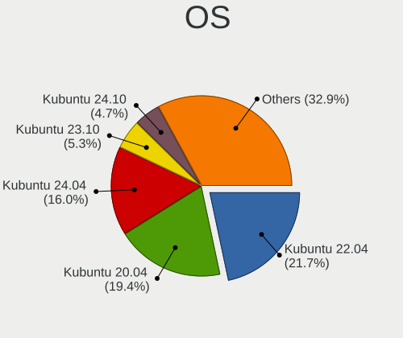

| Name             | Computers | Percent |
|------------------|-----------|---------|
| Kubuntu 22.04    | 1620      | 21.67%  |
| Kubuntu 20.04    | 1453      | 19.43%  |
| Kubuntu 24.04    | 1193      | 15.96%  |
| Kubuntu 23.10    | 396       | 5.3%    |
| Kubuntu 24.10    | 352       | 4.71%   |
| Kubuntu 25.04    | 343       | 4.59%   |
| Kubuntu 23.04    | 322       | 4.31%   |
| Kubuntu 22.10    | 298       | 3.99%   |
| Kubuntu 20.10    | 259       | 3.46%   |
| Kubuntu 21.10    | 243       | 3.25%   |
| Kubuntu 21.04    | 214       | 2.86%   |
| Kubuntu 18.04    | 208       | 2.78%   |
| Kubuntu 25.10    | 179       | 2.39%   |
| Kubuntu 19.10    | 179       | 2.39%   |
| Kubuntu 11       | 97        | 1.3%    |
| Kubuntu 11.1     | 26        | 0.35%   |
| Kubuntu 19.04    | 22        | 0.29%   |
| Kubuntu 16.04    | 13        | 0.17%   |
| Kubuntu          | 8         | 0.11%   |
| Kubuntu 18.10    | 7         | 0.09%   |
| Kubuntu 24.04.2  | 6         | 0.08%   |
| Kubuntu 2.0      | 6         | 0.08%   |
| Kubuntu 11.25.10 | 5         | 0.07%   |
| Kubuntu 26.04    | 4         | 0.05%   |
| Kubuntu 2.1      | 4         | 0.05%   |
| Kubuntu 17.10    | 3         | 0.04%   |
| Kubuntu 14.04    | 3         | 0.04%   |
| Kubuntu 11.25.12 | 3         | 0.04%   |
| Kubuntu 2025.3   | 2         | 0.03%   |
| Kubuntu 17.04    | 2         | 0.03%   |
| Kubuntu 24.0     | 1         | 0.01%   |
| Kubuntu 2024.2   | 1         | 0.01%   |
| Kubuntu 2024.1   | 1         | 0.01%   |
| Kubuntu 20.08.3  | 1         | 0.01%   |
| Kubuntu 12.04    | 1         | 0.01%   |
| Kubuntu 11.25.11 | 1         | 0.01%   |
| Kubuntu 11.25.09 | 1         | 0.01%   |

OS Family
---------

OS without a version

| Name    | Computers | Percent |
|---------|-----------|---------|
| Kubuntu | 7042      | 100%    |

Kernel
------

Version of the Linux kernel

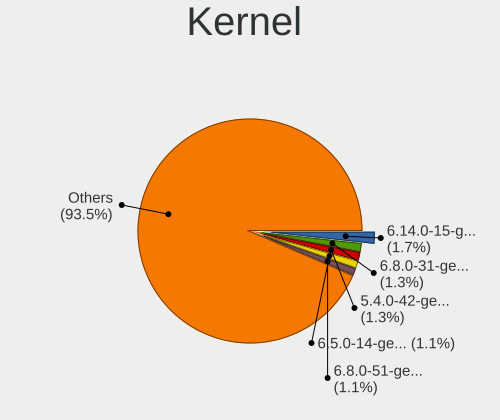

| Version           | Computers | Percent |
|-------------------|-----------|---------|
| 6.14.0-15-generic | 143       | 1.73%   |
| 6.8.0-31-generic  | 107       | 1.29%   |
| 5.4.0-42-generic  | 104       | 1.26%   |
| 6.5.0-14-generic  | 93        | 1.12%   |
| 6.8.0-51-generic  | 88        | 1.06%   |
| 6.8.0-45-generic  | 86        | 1.04%   |
| 6.11.0-9-generic  | 86        | 1.04%   |
| 5.15.0-52-generic | 84        | 1.02%   |
| 6.2.0-20-generic  | 82        | 0.99%   |
| 5.15.0-56-generic | 80        | 0.97%   |
| 6.8.0-41-generic  | 75        | 0.91%   |
| 5.19.0-35-generic | 70        | 0.85%   |
| 5.4.0-52-generic  | 68        | 0.82%   |
| 6.17.0-6-generic  | 64        | 0.77%   |
| 6.14.0-29-generic | 64        | 0.77%   |
| 6.2.0-26-generic  | 63        | 0.76%   |
| 6.8.0-35-generic  | 61        | 0.74%   |
| 5.4.0-58-generic  | 59        | 0.71%   |
| 5.4.0-48-generic  | 59        | 0.71%   |
| 6.14.0-27-generic | 58        | 0.7%    |
| 6.11.0-13-generic | 58        | 0.7%    |
| 5.15.0-48-generic | 58        | 0.7%    |
| 6.11.0-21-generic | 53        | 0.64%   |
| 5.15.0-46-generic | 53        | 0.64%   |
| 5.13.0-39-generic | 53        | 0.64%   |
| 5.19.0-23-generic | 52        | 0.63%   |
| 6.5.0-28-generic  | 50        | 0.6%    |
| 6.11.0-8-generic  | 50        | 0.6%    |
| 6.5.0-15-generic  | 48        | 0.58%   |
| 6.5.0-10-generic  | 48        | 0.58%   |
| 6.2.0-34-generic  | 48        | 0.58%   |
| 6.5.0-26-generic  | 47        | 0.57%   |
| 5.4.0-40-generic  | 47        | 0.57%   |
| 5.19.0-38-generic | 47        | 0.57%   |
| 6.8.0-49-generic  | 45        | 0.54%   |
| 5.15.0-43-generic | 44        | 0.53%   |
| 5.13.0-28-generic | 44        | 0.53%   |
| 6.8.0-48-generic  | 43        | 0.52%   |
| 6.11.0-26-generic | 43        | 0.52%   |
| 5.19.0-31-generic | 43        | 0.52%   |

Kernel Family
-------------

Linux kernel without a distro release

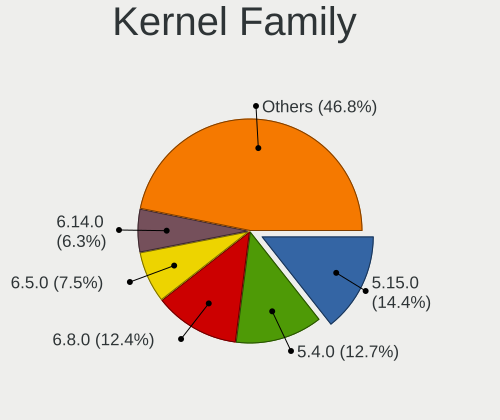

| Version | Computers | Percent |
|---------|-----------|---------|
| 5.15.0  | 1097      | 14.38%  |
| 5.4.0   | 965       | 12.65%  |
| 6.8.0   | 947       | 12.41%  |
| 6.5.0   | 571       | 7.49%   |
| 6.14.0  | 477       | 6.25%   |
| 6.2.0   | 475       | 6.23%   |
| 6.11.0  | 472       | 6.19%   |
| 5.19.0  | 453       | 5.94%   |
| 5.13.0  | 410       | 5.37%   |
| 5.8.0   | 409       | 5.36%   |
| 5.11.0  | 326       | 4.27%   |
| 5.3.0   | 226       | 2.96%   |
| 6.17.0  | 169       | 2.22%   |
| 4.15.0  | 72        | 0.94%   |
| 5.0.0   | 36        | 0.47%   |
| 5.17.0  | 21        | 0.28%   |
| 5.10.0  | 19        | 0.25%   |
| 5.6.0   | 15        | 0.2%    |
| 6.6.0   | 10        | 0.13%   |
| 6.1.0   | 10        | 0.13%   |
| 4.9.140 | 10        | 0.13%   |
| 4.4.0   | 10        | 0.13%   |
| 6.0.0   | 9         | 0.12%   |
| 5.14.0  | 9         | 0.12%   |
| 4.18.0  | 8         | 0.1%    |
| 6.0.9   | 6         | 0.08%   |
| 6.8.1   | 5         | 0.07%   |
| 6.3.0   | 5         | 0.07%   |
| 6.16.0  | 5         | 0.07%   |
| 5.9.0   | 5         | 0.07%   |
| 6.9.3   | 4         | 0.05%   |
| 6.8.9   | 4         | 0.05%   |
| 6.7.0   | 4         | 0.05%   |
| 6.4.8   | 4         | 0.05%   |
| 6.4.0   | 4         | 0.05%   |
| 6.3.8   | 4         | 0.05%   |
| 6.14.7  | 4         | 0.05%   |
| 5.7.0   | 4         | 0.05%   |
| 6.9.7   | 3         | 0.04%   |
| 6.7.4   | 3         | 0.04%   |

Kernel Major Ver.
-----------------

Linux kernel major version

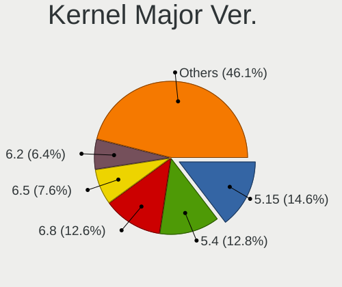

| Version | Computers | Percent |
|---------|-----------|---------|
| 5.15    | 1113      | 14.62%  |
| 5.4     | 972       | 12.76%  |
| 6.8     | 958       | 12.58%  |
| 6.5     | 579       | 7.6%    |
| 6.2     | 486       | 6.38%   |
| 6.14    | 485       | 6.37%   |
| 6.11    | 475       | 6.24%   |
| 5.19    | 460       | 6.04%   |
| 5.8     | 425       | 5.58%   |
| 5.13    | 421       | 5.53%   |
| 5.11    | 332       | 4.36%   |
| 5.3     | 229       | 3.01%   |
| 6.17    | 175       | 2.3%    |
| 4.15    | 73        | 0.96%   |
| 5.0     | 37        | 0.49%   |
| 6.1     | 34        | 0.45%   |
| 5.10    | 33        | 0.43%   |
| 5.17    | 28        | 0.37%   |
| 6.6     | 24        | 0.32%   |
| 6.3     | 23        | 0.3%    |
| 6.0     | 21        | 0.28%   |
| 5.6     | 20        | 0.26%   |
| 5.14    | 18        | 0.24%   |
| 6.4     | 16        | 0.21%   |
| 6.9     | 14        | 0.18%   |
| 6.7     | 14        | 0.18%   |
| 5.9     | 13        | 0.17%   |
| 5.18    | 13        | 0.17%   |
| 5.12    | 13        | 0.17%   |
| 5.7     | 11        | 0.14%   |
| 6.12    | 10        | 0.13%   |
| 5.16    | 10        | 0.13%   |
| 4.9     | 10        | 0.13%   |
| 4.4     | 10        | 0.13%   |
| 4.18    | 10        | 0.13%   |
| 6.15    | 8         | 0.11%   |
| 6.10    | 8         | 0.11%   |
| 6.16    | 6         | 0.08%   |
| 6.13    | 6         | 0.08%   |
| 6.18    | 5         | 0.07%   |

Arch
----

OS architecture (x86_64, i586, etc.)

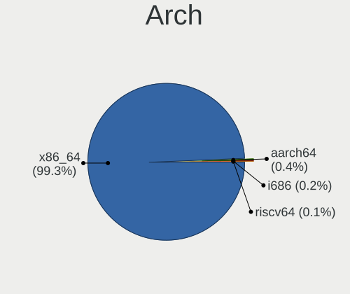

| Name    | Computers | Percent |
|---------|-----------|---------|
| x86_64  | 6996      | 99.35%  |
| aarch64 | 29        | 0.41%   |
| i686    | 13        | 0.18%   |
| riscv64 | 4         | 0.06%   |

DE
--

Desktop Environment

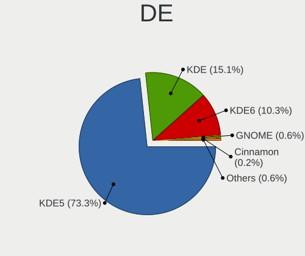

| Name                     | Computers | Percent |
|--------------------------|-----------|---------|
| KDE5                     | 5270      | 73.31%  |
| KDE                      | 1084      | 15.08%  |
| KDE6                     | 740       | 10.29%  |
| GNOME                    | 41        | 0.57%   |
| Cinnamon                 | 11        | 0.15%   |
| Budgie                   | 9         | 0.13%   |
| MATE                     | 8         | 0.11%   |
| XFCE                     | 5         | 0.07%   |
| LXQt                     | 4         | 0.06%   |
| KDE4                     | 4         | 0.06%   |
| Unknown                  | 3         | 0.04%   |
| X-Cinnamon               | 2         | 0.03%   |
| Unity                    | 2         | 0.03%   |
| i3                       | 2         | 0.03%   |
| Deepin                   | 2         | 0.03%   |
| kubuntu-live-environment | 1         | 0.01%   |
| GNUstep                  | 1         | 0.01%   |

Display Server
--------------

X11 or Wayland

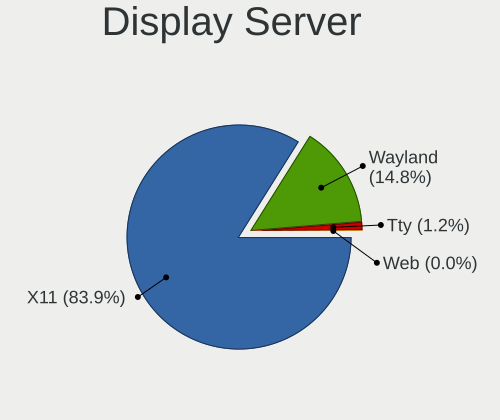

| Name    | Computers | Percent |
|---------|-----------|---------|
| X11     | 6006      | 83.92%  |
| Wayland | 1057      | 14.77%  |
| Tty     | 88        | 1.23%   |
| Unknown | 5         | 0.07%   |
| Web     | 1         | 0.01%   |

Display Manager
---------------

SDDM, LightDM, etc.

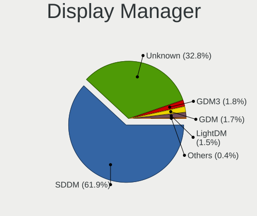

| Name    | Computers | Percent |
|---------|-----------|---------|
| SDDM    | 4435      | 61.9%   |
| Unknown | 2353      | 32.84%  |
| GDM3    | 126       | 1.76%   |
| GDM     | 121       | 1.69%   |
| LightDM | 104       | 1.45%   |
| TDM     | 21        | 0.29%   |
| SLiM    | 3         | 0.04%   |
| LXDM    | 1         | 0.01%   |
| KDM     | 1         | 0.01%   |

OS Lang
-------

Language

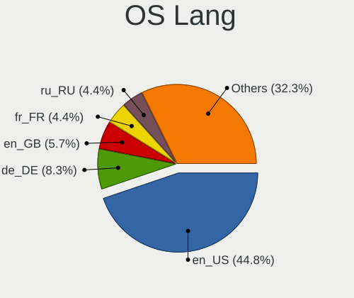

| Lang    | Computers | Percent |
|---------|-----------|---------|
| en_US   | 3181      | 44.82%  |
| de_DE   | 586       | 8.26%   |
| en_GB   | 408       | 5.75%   |
| fr_FR   | 315       | 4.44%   |
| ru_RU   | 314       | 4.42%   |
| it_IT   | 304       | 4.28%   |
| pt_BR   | 248       | 3.49%   |
| es_ES   | 167       | 2.35%   |
| en_CA   | 150       | 2.11%   |
| en_AU   | 121       | 1.7%    |
| pl_PL   | 114       | 1.61%   |
| C       | 111       | 1.56%   |
| en_IN   | 106       | 1.49%   |
| Unknown | 77        | 1.08%   |
| es_MX   | 51        | 0.72%   |
| cs_CZ   | 50        | 0.7%    |
| hu_HU   | 41        | 0.58%   |
| nl_NL   | 37        | 0.52%   |
| de_AT   | 37        | 0.52%   |
| zh_CN   | 35        | 0.49%   |
| es_AR   | 35        | 0.49%   |
| en_ZA   | 33        | 0.46%   |
| en_NZ   | 29        | 0.41%   |
| ru_UA   | 24        | 0.34%   |
| es_CL   | 24        | 0.34%   |
| tr_TR   | 23        | 0.32%   |
| sv_SE   | 23        | 0.32%   |
| de_CH   | 23        | 0.32%   |
| pt_PT   | 22        | 0.31%   |
| es_CO   | 20        | 0.28%   |
| fi_FI   | 19        | 0.27%   |
| fr_BE   | 17        | 0.24%   |
| el_GR   | 16        | 0.23%   |
| en_IE   | 15        | 0.21%   |
| nl_BE   | 14        | 0.2%    |
| en_PH   | 14        | 0.2%    |
| en_IL   | 13        | 0.18%   |
| en_DK   | 13        | 0.18%   |
| da_DK   | 13        | 0.18%   |
| zh_TW   | 12        | 0.17%   |

Boot Mode
---------

EFI or BIOS

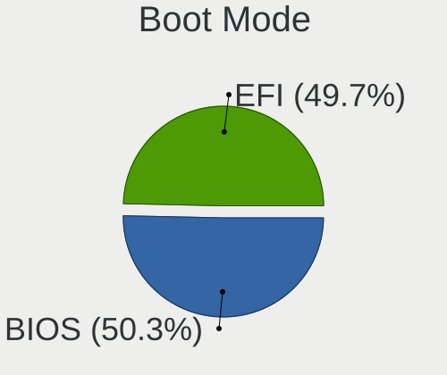

| Mode | Computers | Percent |
|------|-----------|---------|
| BIOS | 3604      | 50.34%  |
| EFI  | 3556      | 49.66%  |

Filesystem
----------

Type of filesystem

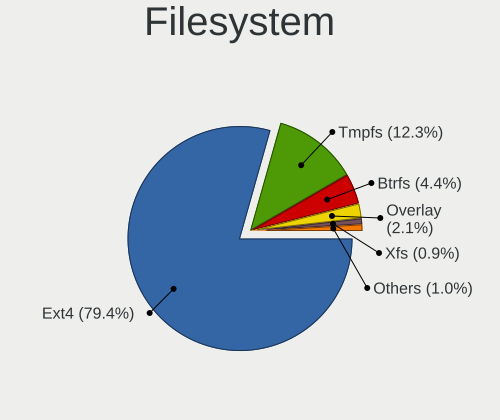

| Type     | Computers | Percent |
|----------|-----------|---------|
| Ext4     | 5664      | 79.37%  |
| Tmpfs    | 877       | 12.29%  |
| Btrfs    | 313       | 4.39%   |
| Overlay  | 153       | 2.14%   |
| Xfs      | 61        | 0.85%   |
| Zfs      | 36        | 0.5%    |
| Unknown  | 12        | 0.17%   |
| Ext3     | 7         | 0.1%    |
| Ext2     | 6         | 0.08%   |
| F2fs     | 3         | 0.04%   |
| XXXX     | 1         | 0.01%   |
| Reiserfs | 1         | 0.01%   |
| Jfs      | 1         | 0.01%   |
| ExX4     | 1         | 0.01%   |

Part. scheme
------------

Scheme of partitioning

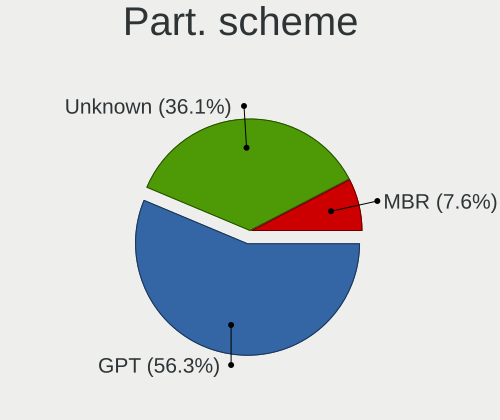

| Type    | Computers | Percent |
|---------|-----------|---------|
| GPT     | 4038      | 56.32%  |
| Unknown | 2585      | 36.05%  |
| MBR     | 547       | 7.63%   |

Dual Boot with Linux/BSD
------------------------

Hosting more than one Linux/BSD

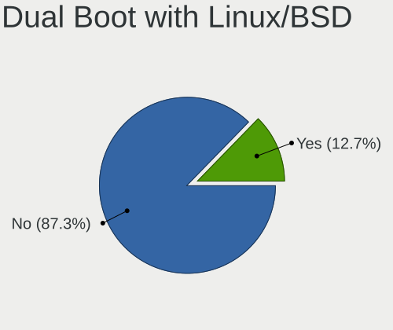

| Dual boot | Computers | Percent |
|-----------|-----------|---------|
| No        | 6227      | 87.29%  |
| Yes       | 907       | 12.71%  |

Dual Boot (Win)
---------------

Hosting Linux and Windows

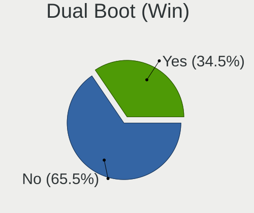

| Dual boot | Computers | Percent |
|-----------|-----------|---------|
| No        | 4681      | 65.51%  |
| Yes       | 2464      | 34.49%  |

Board
-----

Vendor
------

Motherboard manufacturer

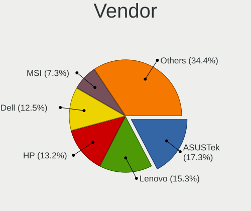

| Name                                 | Computers | Percent |
|--------------------------------------|-----------|---------|
| ASUSTek Computer                     | 1217      | 17.28%  |
| Lenovo                               | 1077      | 15.29%  |
| Hewlett-Packard                      | 933       | 13.25%  |
| Dell                                 | 880       | 12.5%   |
| MSI                                  | 514       | 7.3%    |
| Gigabyte Technology                  | 513       | 7.28%   |
| Acer                                 | 301       | 4.27%   |
| ASRock                               | 234       | 3.32%   |
| Apple                                | 148       | 2.1%    |
| Intel                                | 88        | 1.25%   |
| Samsung Electronics                  | 85        | 1.21%   |
| Unknown                              | 81        | 1.15%   |
| HUAWEI                               | 73        | 1.04%   |
| Toshiba                              | 51        | 0.72%   |
| Fujitsu                              | 49        | 0.7%    |
| Google                               | 41        | 0.58%   |
| AZW                                  | 40        | 0.57%   |
| Notebook                             | 38        | 0.54%   |
| Sony                                 | 31        | 0.44%   |
| Alienware                            | 27        | 0.38%   |
| TUXEDO                               | 25        | 0.36%   |
| Pegatron                             | 23        | 0.33%   |
| Microsoft                            | 22        | 0.31%   |
| Medion                               | 22        | 0.31%   |
| Biostar                              | 20        | 0.28%   |
| Timi                                 | 19        | 0.27%   |
| Shenzhen Meigao Electronic Equipment | 17        | 0.24%   |
| Positivo                             | 16        | 0.23%   |
| PC Specialist                        | 16        | 0.23%   |
| Chuwi                                | 16        | 0.23%   |
| Packard Bell                         | 15        | 0.21%   |
| Foxconn                              | 14        | 0.2%    |
| Framework                            | 12        | 0.17%   |
| ECS                                  | 11        | 0.16%   |
| ZOTAC                                | 10        | 0.14%   |
| System76                             | 10        | 0.14%   |
| Supermicro                           | 10        | 0.14%   |
| LG Electronics                       | 10        | 0.14%   |
| GPU Company                          | 10        | 0.14%   |
| BESSTAR Tech                         | 10        | 0.14%   |

Model
-----

Motherboard model

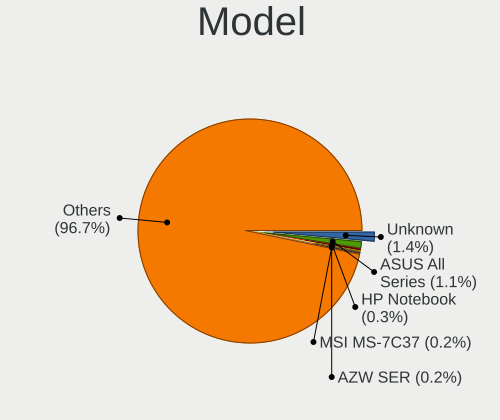

| Name                         | Computers | Percent |
|------------------------------|-----------|---------|
| Unknown                      | 102       | 1.45%   |
| ASUS All Series              | 75        | 1.07%   |
| HP Notebook                  | 20        | 0.28%   |
| MSI MS-7C37                  | 17        | 0.24%   |
| AZW SER                      | 17        | 0.24%   |
| ASUS ROG STRIX B550-F GAMING | 17        | 0.24%   |
| MSI MS-7C56                  | 16        | 0.23%   |
| MSI MS-7C91                  | 15        | 0.21%   |
| Gigabyte B450M DS3H          | 15        | 0.21%   |
| Dell OptiPlex 7010           | 13        | 0.18%   |
| HP Pavilion g6               | 12        | 0.17%   |
| Dell OptiPlex 9020           | 12        | 0.17%   |
| ASUS TUF Gaming X570-PLUS    | 12        | 0.17%   |
| MSI MS-7C02                  | 11        | 0.16%   |
| MSI MS-7693                  | 11        | 0.16%   |
| ASUS PRIME B450M-A           | 11        | 0.16%   |
| MSI MS-7C95                  | 10        | 0.14%   |
| MSI MS-7B86                  | 10        | 0.14%   |
| MSI MS-7B79                  | 10        | 0.14%   |
| HP Pavilion 15               | 10        | 0.14%   |
| HP EliteBook 840 G6          | 10        | 0.14%   |
| HP EliteBook 840 G5          | 10        | 0.14%   |
| Gigabyte A320M-S2H           | 10        | 0.14%   |
| Dell XPS 15 9560             | 10        | 0.14%   |
| Dell Latitude 7490           | 10        | 0.14%   |
| ASUS ROG STRIX X570-E GAMING | 10        | 0.14%   |
| ASUS PRIME B350-PLUS         | 10        | 0.14%   |
| ASUS PRIME A320M-K           | 10        | 0.14%   |
| MSI MS-7C52                  | 9         | 0.13%   |
| MSI MS-7817                  | 9         | 0.13%   |
| HUAWEI NBLK-WAX9X            | 9         | 0.13%   |
| HP Pavilion Notebook         | 9         | 0.13%   |
| HP Pavilion dv6              | 9         | 0.13%   |
| HP EliteDesk 800 G1 SFF      | 9         | 0.13%   |
| Gigabyte X570 AORUS MASTER   | 9         | 0.13%   |
| Gigabyte 970A-DS3P           | 9         | 0.13%   |
| Dell XPS 15 7590             | 9         | 0.13%   |
| ASUS TUF Gaming B550-PLUS    | 9         | 0.13%   |
| MSI MS-7E12                  | 8         | 0.11%   |
| HP Pavilion dv7              | 8         | 0.11%   |

Model Family
------------

Motherboard model prefix

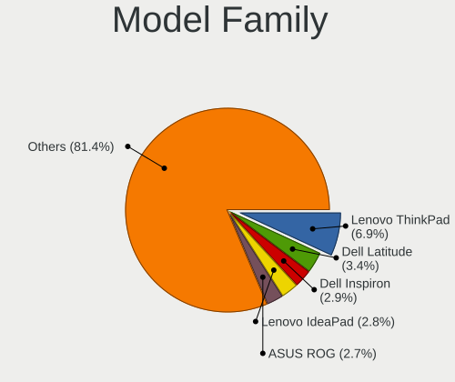

| Name               | Computers | Percent |
|--------------------|-----------|---------|
| Lenovo ThinkPad    | 486       | 6.9%    |
| Dell Latitude      | 238       | 3.38%   |
| Dell Inspiron      | 202       | 2.87%   |
| Lenovo IdeaPad     | 197       | 2.8%    |
| ASUS ROG           | 189       | 2.68%   |
| Acer Aspire        | 187       | 2.66%   |
| ASUS PRIME         | 178       | 2.53%   |
| HP Pavilion        | 169       | 2.4%    |
| ASUS VivoBook      | 128       | 1.82%   |
| HP EliteBook       | 121       | 1.72%   |
| Dell XPS           | 119       | 1.69%   |
| Dell Precision     | 108       | 1.53%   |
| HP ProBook         | 105       | 1.49%   |
| Unknown            | 102       | 1.45%   |
| Dell OptiPlex      | 101       | 1.43%   |
| HP Laptop          | 97        | 1.38%   |
| ASUS TUF           | 96        | 1.36%   |
| ASUS All           | 75        | 1.07%   |
| Lenovo Yoga        | 68        | 0.97%   |
| HP ENVY            | 63        | 0.89%   |
| ASUS ASUS          | 60        | 0.85%   |
| Lenovo ThinkCentre | 58        | 0.82%   |
| Lenovo Legion      | 58        | 0.82%   |
| HP Compaq          | 48        | 0.68%   |
| Dell Vostro        | 45        | 0.64%   |
| Toshiba Satellite  | 41        | 0.58%   |
| Acer Nitro         | 41        | 0.58%   |
| Lenovo ThinkBook   | 39        | 0.55%   |
| HP ZBook           | 38        | 0.54%   |
| ASUS ZenBook       | 35        | 0.5%    |
| Gigabyte X570      | 30        | 0.43%   |
| HP EliteDesk       | 29        | 0.41%   |
| Acer Swift         | 29        | 0.41%   |
| Gigabyte B450M     | 27        | 0.38%   |
| Gigabyte B550      | 25        | 0.36%   |
| HP OMEN            | 23        | 0.33%   |
| Microsoft Surface  | 22        | 0.31%   |
| Lenovo IdeaPadFlex | 21        | 0.3%    |
| HP Spectre         | 20        | 0.28%   |
| HP Notebook        | 20        | 0.28%   |

MFG Year
--------

Motherboard manufacture year

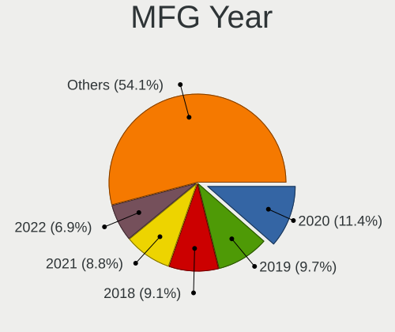

| Year    | Computers | Percent |
|---------|-----------|---------|
| 2020    | 805       | 11.43%  |
| 2019    | 683       | 9.7%    |
| 2018    | 643       | 9.13%   |
| 2021    | 619       | 8.79%   |
| 2022    | 483       | 6.86%   |
| 2017    | 472       | 6.7%    |
| 2012    | 437       | 6.21%   |
| 2013    | 425       | 6.04%   |
| 2014    | 375       | 5.33%   |
| 2011    | 346       | 4.91%   |
| 2023    | 335       | 4.76%   |
| 2016    | 300       | 4.26%   |
| 2015    | 297       | 4.22%   |
| 2010    | 199       | 2.83%   |
| 2024    | 177       | 2.51%   |
| 2008    | 144       | 2.04%   |
| 2009    | 142       | 2.02%   |
| 2007    | 55        | 0.78%   |
| 2025    | 54        | 0.77%   |
| Unknown | 30        | 0.43%   |
| 2006    | 16        | 0.23%   |
| 2005    | 4         | 0.06%   |
| 2004    | 1         | 0.01%   |

Form Factor
-----------

Physical design of the computer

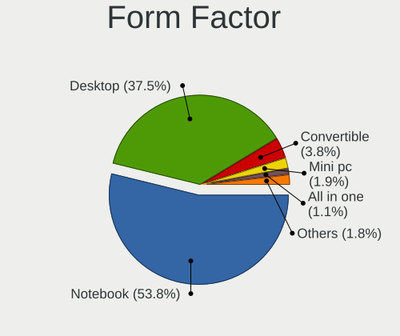

| Name           | Computers | Percent |
|----------------|-----------|---------|
| Notebook       | 3790      | 53.82%  |
| Desktop        | 2643      | 37.53%  |
| Convertible    | 265       | 3.76%   |
| Mini pc        | 136       | 1.93%   |
| All in one     | 78        | 1.11%   |
| Tablet         | 69        | 0.98%   |
| Server         | 33        | 0.47%   |
| System on chip | 26        | 0.37%   |
| Other          | 1         | 0.01%   |
| Stick pc       | 1         | 0.01%   |

Secure Boot
-----------

Enabled or disabled

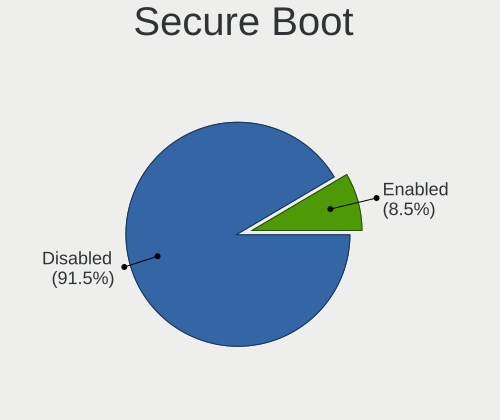

| State    | Computers | Percent |
|----------|-----------|---------|
| Disabled | 6484      | 91.52%  |
| Enabled  | 601       | 8.48%   |

Coreboot
--------

Have coreboot on board

| Used | Computers | Percent |
|------|-----------|---------|
| No   | 6991      | 99.28%  |
| Yes  | 51        | 0.72%   |

RAM Size
--------

Total RAM memory

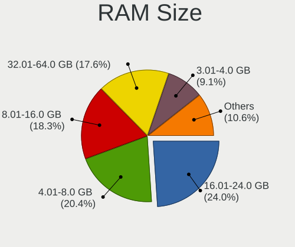

| Size in GB      | Computers | Percent |
|-----------------|-----------|---------|
| 16.01-24.0      | 1706      | 23.95%  |
| 4.01-8.0        | 1452      | 20.39%  |
| 8.01-16.0       | 1304      | 18.31%  |
| 32.01-64.0      | 1252      | 17.58%  |
| 3.01-4.0        | 650       | 9.13%   |
| 64.01-256.0     | 359       | 5.04%   |
| 24.01-32.0      | 284       | 3.99%   |
| 1.01-2.0        | 68        | 0.95%   |
| 2.01-3.0        | 35        | 0.49%   |
| More than 256.0 | 11        | 0.15%   |
| 0.51-1.0        | 1         | 0.01%   |

RAM Used
--------

Used RAM memory

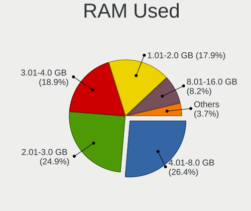

| Used GB     | Computers | Percent |
|-------------|-----------|---------|
| 4.01-8.0    | 2031      | 26.37%  |
| 2.01-3.0    | 1918      | 24.9%   |
| 3.01-4.0    | 1455      | 18.89%  |
| 1.01-2.0    | 1378      | 17.89%  |
| 8.01-16.0   | 633       | 8.22%   |
| 16.01-24.0  | 114       | 1.48%   |
| 0.51-1.0    | 100       | 1.3%    |
| 24.01-32.0  | 42        | 0.55%   |
| 32.01-64.0  | 20        | 0.26%   |
| 0.01-0.5    | 7         | 0.09%   |
| 64.01-256.0 | 4         | 0.05%   |
| Unknown     | 1         | 0.01%   |

Total Drives
------------

Number of drives on board

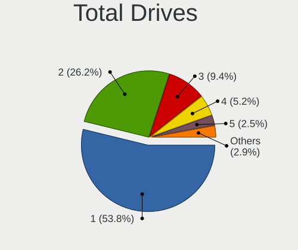

| Drives | Computers | Percent |
|--------|-----------|---------|
| 1      | 3900      | 53.81%  |
| 2      | 1896      | 26.16%  |
| 3      | 683       | 9.42%   |
| 4      | 375       | 5.17%   |
| 5      | 183       | 2.52%   |
| 6      | 83        | 1.15%   |
| 7      | 58        | 0.8%    |
| 0      | 26        | 0.36%   |
| 8      | 20        | 0.28%   |
| 9      | 10        | 0.14%   |
| 12     | 4         | 0.06%   |
| 11     | 4         | 0.06%   |
| 10     | 4         | 0.06%   |
| 16     | 1         | 0.01%   |
| 13     | 1         | 0.01%   |

Has CD-ROM
----------

Has CD-ROM on board

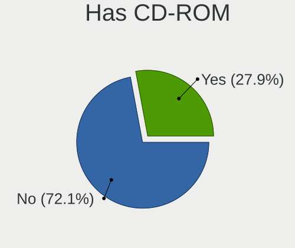

| Presented | Computers | Percent |
|-----------|-----------|---------|
| No        | 5111      | 72.08%  |
| Yes       | 1980      | 27.92%  |

Has Ethernet
------------

Has Ethernet on board

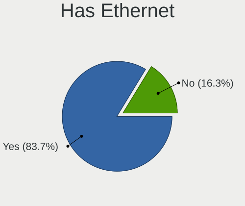

| Presented | Computers | Percent |
|-----------|-----------|---------|
| Yes       | 5914      | 83.73%  |
| No        | 1149      | 16.27%  |

Has WiFi
--------

Has WiFi module

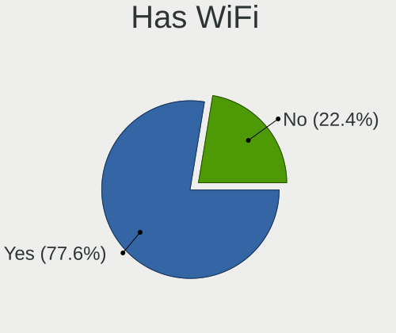

| Presented | Computers | Percent |
|-----------|-----------|---------|
| Yes       | 5492      | 77.59%  |
| No        | 1586      | 22.41%  |

Has Bluetooth
-------------

Has Bluetooth module

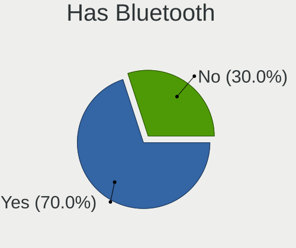

| Presented | Computers | Percent |
|-----------|-----------|---------|
| Yes       | 4979      | 70.01%  |
| No        | 2133      | 29.99%  |

Location
--------

Country
-------

Geographic location (country)

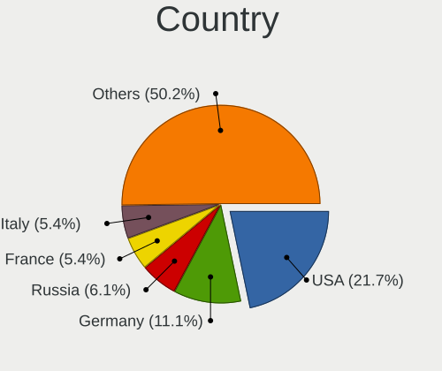

| Country      | Computers | Percent |
|--------------|-----------|---------|
| USA          | 1536      | 21.74%  |
| Germany      | 782       | 11.07%  |
| Russia       | 434       | 6.14%   |
| France       | 384       | 5.43%   |
| Italy        | 382       | 5.41%   |
| Brazil       | 330       | 4.67%   |
| UK           | 319       | 4.51%   |
| Spain        | 228       | 3.23%   |
| Canada       | 191       | 2.7%    |
| Poland       | 179       | 2.53%   |
| Netherlands  | 140       | 1.98%   |
| Australia    | 136       | 1.92%   |
| India        | 125       | 1.77%   |
| Czechia      | 85        | 1.2%    |
| Mexico       | 84        | 1.19%   |
| Switzerland  | 75        | 1.06%   |
| Hungary      | 69        | 0.98%   |
| Ukraine      | 68        | 0.96%   |
| Belgium      | 66        | 0.93%   |
| Sweden       | 61        | 0.86%   |
| Argentina    | 61        | 0.86%   |
| Austria      | 60        | 0.85%   |
| Turkey       | 57        | 0.81%   |
| Finland      | 53        | 0.75%   |
| China        | 46        | 0.65%   |
| Bulgaria     | 46        | 0.65%   |
| Portugal     | 45        | 0.64%   |
| Indonesia    | 45        | 0.64%   |
| South Africa | 43        | 0.61%   |
| Greece       | 42        | 0.59%   |
| Romania      | 41        | 0.58%   |
| Chile        | 41        | 0.58%   |
| Denmark      | 40        | 0.57%   |
| Norway       | 39        | 0.55%   |
| Colombia     | 39        | 0.55%   |
| New Zealand  | 32        | 0.45%   |
| Slovakia     | 28        | 0.4%    |
| Serbia       | 28        | 0.4%    |
| Slovenia     | 27        | 0.38%   |
| Ireland      | 24        | 0.34%   |

City
----

Geographic location (city)

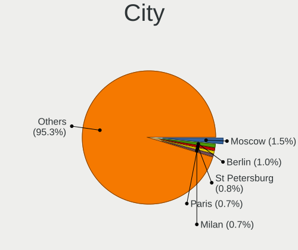

| City              | Computers | Percent |
|-------------------|-----------|---------|
| Moscow            | 112       | 1.51%   |
| Berlin            | 73        | 0.98%   |
| St Petersburg     | 56        | 0.75%   |
| Paris             | 55        | 0.74%   |
| Milan             | 55        | 0.74%   |
| Warsaw            | 47        | 0.63%   |
| Rome              | 45        | 0.6%    |
| Hamburg           | 45        | 0.6%    |
| Sydney            | 42        | 0.56%   |
| Sao Paulo         | 41        | 0.55%   |
| Madrid            | 37        | 0.5%    |
| Frankfurt am Main | 37        | 0.5%    |
| Budapest          | 37        | 0.5%    |
| Amsterdam         | 37        | 0.5%    |
| Vienna            | 34        | 0.46%   |
| Munich            | 34        | 0.46%   |
| Melbourne         | 27        | 0.36%   |
| London            | 27        | 0.36%   |
| Rio de Janeiro    | 26        | 0.35%   |
| Dallas            | 26        | 0.35%   |
| Cologne           | 26        | 0.35%   |
| Santiago          | 25        | 0.34%   |
| Montreal          | 25        | 0.34%   |
| Sofia             | 24        | 0.32%   |
| Prague            | 24        | 0.32%   |
| Zurich            | 22        | 0.3%    |
| Los Angeles       | 22        | 0.3%    |
| Kyiv              | 21        | 0.28%   |
| Istanbul          | 21        | 0.28%   |
| Bengaluru         | 21        | 0.28%   |
| Seattle           | 20        | 0.27%   |
| Helsinki          | 20        | 0.27%   |
| Belgrade          | 20        | 0.27%   |
| Toronto           | 19        | 0.26%   |
| Krakow            | 19        | 0.26%   |
| Brisbane          | 19        | 0.26%   |
| Auckland          | 19        | 0.26%   |
| Barcelona         | 18        | 0.24%   |
| Athens            | 18        | 0.24%   |
| Phoenix           | 17        | 0.23%   |

Drives
------

Drive Vendor
------------

Hard drive vendors

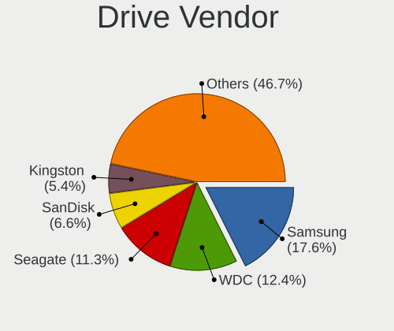

| Vendor                      | Computers | Drives | Percent |
|-----------------------------|-----------|--------|---------|
| Samsung Electronics         | 1980      | 3165   | 17.58%  |
| WDC                         | 1397      | 2226   | 12.4%   |
| Seagate                     | 1278      | 2054   | 11.34%  |
| SanDisk                     | 748       | 969    | 6.64%   |
| Kingston                    | 604       | 767    | 5.36%   |
| Toshiba                     | 548       | 750    | 4.86%   |
| Crucial                     | 468       | 614    | 4.15%   |
| Unknown                     | 356       | 474    | 3.16%   |
| SK hynix                    | 342       | 401    | 3.04%   |
| Intel                       | 301       | 411    | 2.67%   |
| Micron Technology           | 260       | 319    | 2.31%   |
| Hitachi                     | 222       | 285    | 1.97%   |
| HGST                        | 181       | 238    | 1.61%   |
| A-DATA Technology           | 151       | 188    | 1.34%   |
| KIOXIA                      | 130       | 156    | 1.15%   |
| Kingston Technology Company | 107       | 132    | 0.95%   |
| China                       | 99        | 128    | 0.88%   |
| Phison Electronics          | 98        | 117    | 0.87%   |
| Silicon Motion              | 92        | 114    | 0.82%   |
| Micron/Crucial Technology   | 91        | 126    | 0.81%   |
| Apple                       | 87        | 106    | 0.77%   |
| SPCC                        | 85        | 124    | 0.75%   |
| Phison                      | 78        | 97     | 0.69%   |
| PNY                         | 73        | 127    | 0.65%   |
| Patriot                     | 62        | 82     | 0.55%   |
| Intenso                     | 57        | 69     | 0.51%   |
| Unknown                     | 55        | 65     | 0.49%   |
| Corsair                     | 53        | 74     | 0.47%   |
| Transcend                   | 44        | 50     | 0.39%   |
| Team                        | 42        | 47     | 0.37%   |
| OCZ                         | 41        | 52     | 0.36%   |
| LITEON                      | 41        | 44     | 0.36%   |
| JMicron Technology          | 41        | 44     | 0.36%   |
| Lexar                       | 36        | 40     | 0.32%   |
| ADATA Technology            | 33        | 38     | 0.29%   |
| Realtek Semiconductor       | 31        | 35     | 0.28%   |
| KingSpec                    | 31        | 39     | 0.28%   |
| Maxtor                      | 30        | 38     | 0.27%   |
| SABRENT                     | 29        | 36     | 0.26%   |
| MAXIO Technology (Hangzhou) | 29        | 39     | 0.26%   |

Drive Model
-----------

Hard drive models

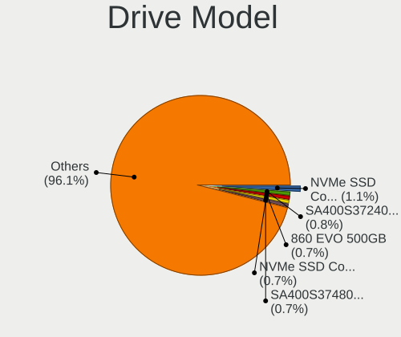

| Model                                                 | Computers | Percent |
|-------------------------------------------------------|-----------|---------|
| Samsung NVMe SSD Controller SM981/PM981/PM983 1TB     | 138       | 1.09%   |
| Kingston SA400S37240G 240GB SSD                       | 95        | 0.75%   |
| Samsung SSD 860 EVO 500GB                             | 93        | 0.74%   |
| Samsung NVMe SSD Controller PM9A1/PM9A3/980PRO 1TB    | 86        | 0.68%   |
| Kingston SA400S37480G 480GB SSD                       | 85        | 0.67%   |
| Samsung SSD 850 EVO 500GB                             | 81        | 0.64%   |
| Samsung SSD 860 EVO 1TB                               | 76        | 0.6%    |
| Samsung SSD 850 EVO 250GB                             | 73        | 0.58%   |
| Crucial CT1000MX500SSD1 1TB                           | 68        | 0.54%   |
| Seagate ST2000DM008-2FR102 2TB                        | 61        | 0.48%   |
| Seagate ST1000LM035-1RK172 1TB                        | 58        | 0.46%   |
| SanDisk NVMe SSD Drive 1TB                            | 57        | 0.45%   |
| Seagate ST1000LM024 HN-M101MBB 1TB                    | 56        | 0.44%   |
| Unknown                                               | 55        | 0.44%   |
| Seagate ST1000DM010-2EP102 1TB                        | 52        | 0.41%   |
| Unknown MMC Card  32GB                                | 49        | 0.39%   |
| HGST HTS721010A9E630 1TB                              | 48        | 0.38%   |
| Unknown MMC Card  64GB                                | 47        | 0.37%   |
| Toshiba MQ01ABD100 1TB                                | 47        | 0.37%   |
| Seagate ST4000DM004-2CV104 4TB                        | 47        | 0.37%   |
| WDC WD10EZEX-08WN4A0 1TB                              | 46        | 0.36%   |
| Micron/Crucial P2 NVMe PCIe SSD 2TB                   | 44        | 0.35%   |
| Crucial CT500MX500SSD1 500GB                          | 42        | 0.33%   |
| Seagate ST500DM002-1BD142 500GB                       | 40        | 0.32%   |
| Samsung SSD 970 EVO Plus 1TB                          | 40        | 0.32%   |
| Toshiba MQ04ABF100 1TB                                | 39        | 0.31%   |
| Toshiba DT01ACA100 1TB                                | 39        | 0.31%   |
| Samsung SSD 970 EVO Plus 500GB                        | 39        | 0.31%   |
| Samsung SSD 860 EVO 250GB                             | 39        | 0.31%   |
| Samsung SSD 980 1TB                                   | 38        | 0.3%    |
| Crucial CT240BX500SSD1 240GB                          | 37        | 0.29%   |
| SanDisk SSD PLUS 240GB                                | 36        | 0.29%   |
| Kingston Company SNV2S1000G 1TB                       | 36        | 0.29%   |
| Crucial CT1000BX500SSD1 1TB                           | 36        | 0.29%   |
| Seagate ST1000DM003-1ER162 1TB                        | 35        | 0.28%   |
| Unknown SD/MMC/MS PRO 2GB                             | 34        | 0.27%   |
| Silicon Motion SM2263EN/SM2263XT SSD Controller 512GB | 34        | 0.27%   |
| Samsung SSD 870 EVO 1TB                               | 34        | 0.27%   |
| SanDisk NVMe SSD Drive 2TB                            | 33        | 0.26%   |
| Samsung SSD 980 PRO 1TB                               | 33        | 0.26%   |

HDD Vendor
----------

Hard disk drive vendors

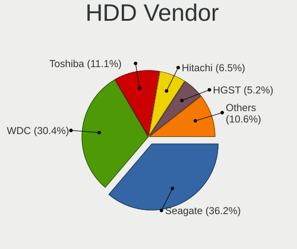

| Vendor              | Computers | Drives | Percent |
|---------------------|-----------|--------|---------|
| Seagate             | 1242      | 1986   | 36.2%   |
| WDC                 | 1043      | 1691   | 30.4%   |
| Toshiba             | 381       | 528    | 11.1%   |
| Hitachi             | 222       | 285    | 6.47%   |
| HGST                | 180       | 237    | 5.25%   |
| Samsung Electronics | 151       | 237    | 4.4%    |
| Unknown             | 41        | 52     | 1.19%   |
| Maxtor              | 29        | 37     | 0.85%   |
| Apple               | 24        | 24     | 0.7%    |
| JMicron Technology  | 19        | 20     | 0.55%   |
| Fujitsu             | 19        | 23     | 0.55%   |
| External            | 11        | 17     | 0.32%   |
| Hewlett-Packard     | 7         | 9      | 0.2%    |
| TO Exter            | 6         | 6      | 0.17%   |
| ASMT                | 4         | 5      | 0.12%   |
| USB3.0              | 3         | 5      | 0.09%   |
| T-FORCE             | 3         | 4      | 0.09%   |
| SSK                 | 3         | 4      | 0.09%   |
| SAGE                | 3         | 3      | 0.09%   |
| SABRENT             | 3         | 6      | 0.09%   |
| LaCie               | 3         | 4      | 0.09%   |
| KESU                | 3         | 3      | 0.09%   |
| Intenso             | 3         | 5      | 0.09%   |
| WD MediaMax         | 2         | 2      | 0.06%   |
| USB                 | 2         | 3      | 0.06%   |
| Inateck             | 2         | 3      | 0.06%   |
| IET                 | 2         | 2      | 0.06%   |
| ASMedia             | 2         | 3      | 0.06%   |
| TDAS                | 1         | 1      | 0.03%   |
| StoreJet            | 1         | 1      | 0.03%   |
| SSI                 | 1         | 1      | 0.03%   |
| Space ke            | 1         | 1      | 0.03%   |
| Shenzhen            | 1         | 1      | 0.03%   |
| Min Yi U            | 1         | 1      | 0.03%   |
| Maxone              | 1         | 1      | 0.03%   |
| MARVELL             | 1         | 1      | 0.03%   |
| Magnetic Data       | 1         | 2      | 0.03%   |
| LIO-ORG             | 1         | 1      | 0.03%   |
| ipTIME              | 1         | 1      | 0.03%   |
| IB-AC703            | 1         | 1      | 0.03%   |

SSD Vendor
----------

Solid state drive vendors

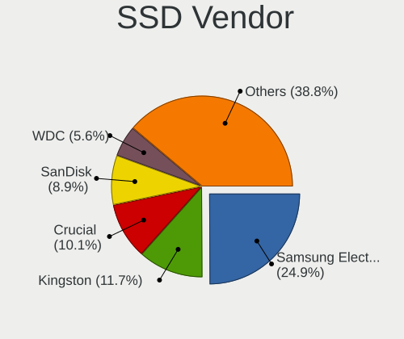

| Vendor              | Computers | Drives | Percent |
|---------------------|-----------|--------|---------|
| Samsung Electronics | 917       | 1380   | 24.93%  |
| Kingston            | 430       | 540    | 11.69%  |
| Crucial             | 372       | 494    | 10.11%  |
| SanDisk             | 326       | 417    | 8.86%   |
| WDC                 | 205       | 301    | 5.57%   |
| A-DATA Technology   | 104       | 129    | 2.83%   |
| China               | 97        | 126    | 2.64%   |
| Intel               | 85        | 116    | 2.31%   |
| SPCC                | 72        | 101    | 1.96%   |
| PNY                 | 68        | 122    | 1.85%   |
| Micron Technology   | 63        | 76     | 1.71%   |
| Patriot             | 58        | 77     | 1.58%   |
| SK hynix            | 52        | 58     | 1.41%   |
| Toshiba             | 50        | 71     | 1.36%   |
| Intenso             | 46        | 52     | 1.25%   |
| OCZ                 | 41        | 52     | 1.11%   |
| Apple               | 39        | 42     | 1.06%   |
| Transcend           | 37        | 41     | 1.01%   |
| LITEON              | 35        | 37     | 0.95%   |
| Team                | 33        | 36     | 0.9%    |
| KingSpec            | 27        | 35     | 0.73%   |
| GOODRAM             | 27        | 43     | 0.73%   |
| SABRENT             | 25        | 29     | 0.68%   |
| Corsair             | 25        | 42     | 0.68%   |
| LITEONIT            | 24        | 28     | 0.65%   |
| Lexar               | 22        | 25     | 0.6%    |
| Apacer              | 20        | 25     | 0.54%   |
| Unknown             | 20        | 25     | 0.54%   |
| Netac               | 18        | 23     | 0.49%   |
| Verbatim            | 16        | 19     | 0.43%   |
| Hewlett-Packard     | 14        | 17     | 0.38%   |
| Emtec               | 14        | 16     | 0.38%   |
| Seagate             | 12        | 20     | 0.33%   |
| Mushkin             | 12        | 15     | 0.33%   |
| Gigabyte Technology | 12        | 14     | 0.33%   |
| Plextor             | 8         | 9      | 0.22%   |
| Dogfish             | 8         | 8      | 0.22%   |
| ASMT                | 8         | 9      | 0.22%   |
| Fanxiang            | 7         | 11     | 0.19%   |
| KIOXIA-EXCERIA      | 6         | 8      | 0.16%   |

Drive Kind
----------

HDD or SSD

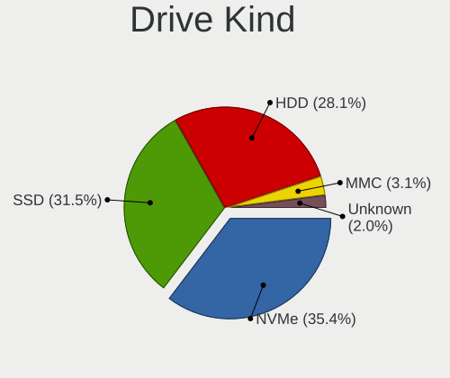

| Kind    | Computers | Drives | Percent |
|---------|-----------|--------|---------|
| NVMe    | 3504      | 5048   | 35.35%  |
| SSD     | 3118      | 4986   | 31.46%  |
| HDD     | 2783      | 5228   | 28.08%  |
| MMC     | 305       | 377    | 3.08%   |
| Unknown | 201       | 295    | 2.03%   |

Drive Connector
---------------

SATA, SAS, NVMe, etc.

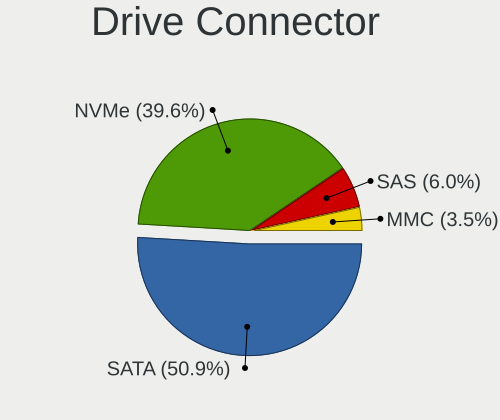

| Type | Computers | Drives | Percent |
|------|-----------|--------|---------|
| SATA | 4491      | 9751   | 50.93%  |
| NVMe | 3493      | 5003   | 39.61%  |
| SAS  | 529       | 803    | 6%      |
| MMC  | 305       | 377    | 3.46%   |

Drive Size
----------

Size of hard drive

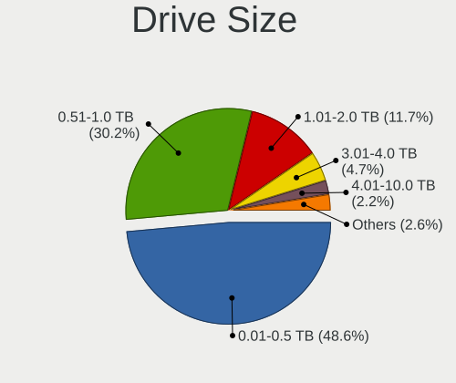

| Size in TB | Computers | Drives | Percent |
|------------|-----------|--------|---------|
| 0.01-0.5   | 3103      | 5007   | 48.57%  |
| 0.51-1.0   | 1931      | 2900   | 30.22%  |
| 1.01-2.0   | 747       | 1272   | 11.69%  |
| 3.01-4.0   | 302       | 560    | 4.73%   |
| 4.01-10.0  | 141       | 229    | 2.21%   |
| 2.01-3.0   | 127       | 176    | 1.99%   |
| 10.01-20.0 | 38        | 70     | 0.59%   |

Space Total
-----------

Amount of disk space available on the file system

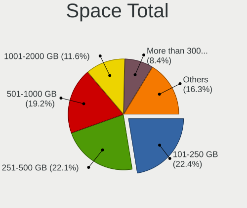

| Size in GB     | Computers | Percent |
|----------------|-----------|---------|
| 101-250        | 1646      | 22.43%  |
| 251-500        | 1624      | 22.13%  |
| 501-1000       | 1411      | 19.22%  |
| 1001-2000      | 851       | 11.59%  |
| More than 3000 | 614       | 8.37%   |
| 2001-3000      | 351       | 4.78%   |
| 51-100         | 336       | 4.58%   |
| 1-20           | 295       | 4.02%   |
| 21-50          | 159       | 2.17%   |
| Unknown        | 53        | 0.72%   |

Space Used
----------

Amount of used disk space

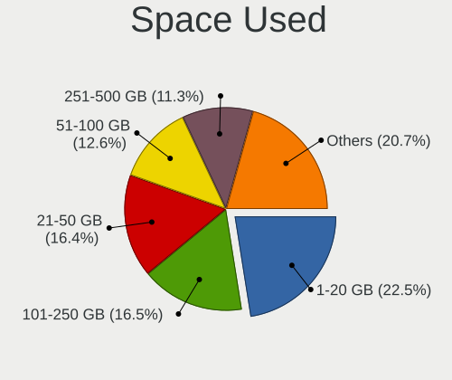

| Used GB        | Computers | Percent |
|----------------|-----------|---------|
| 1-20           | 1706      | 22.49%  |
| 101-250        | 1253      | 16.52%  |
| 21-50          | 1245      | 16.42%  |
| 51-100         | 952       | 12.55%  |
| 251-500        | 859       | 11.33%  |
| 501-1000       | 718       | 9.47%   |
| 1001-2000      | 415       | 5.47%   |
| More than 3000 | 256       | 3.38%   |
| 2001-3000      | 127       | 1.67%   |
| Unknown        | 53        | 0.7%    |

Malfunc. Drives
---------------

Drive models with a malfunction

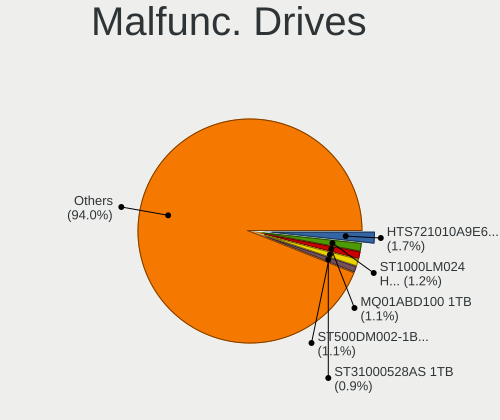

| Model                                        | Computers | Drives | Percent |
|----------------------------------------------|-----------|--------|---------|
| HGST HTS721010A9E630 1TB                     | 11        | 12     | 1.7%    |
| Seagate ST1000LM024 HN-M101MBB 1TB           | 8         | 14     | 1.24%   |
| Toshiba MQ01ABD100 1TB                       | 7         | 9      | 1.08%   |
| Seagate ST500DM002-1BD142 500GB              | 7         | 7      | 1.08%   |
| Seagate ST31000528AS 1TB                     | 6         | 7      | 0.93%   |
| Seagate ST31000524AS 1TB                     | 6         | 7      | 0.93%   |
| Toshiba MQ04ABF100 1TB                       | 5         | 5      | 0.77%   |
| Seagate ST3500418AS 500GB                    | 5         | 5      | 0.77%   |
| Seagate ST1000LM035-1RK172 1TB               | 5         | 5      | 0.77%   |
| HGST HTS545050A7E680 500GB                   | 5         | 5      | 0.77%   |
| HGST HTS541010A9E680 1TB                     | 5         | 10     | 0.77%   |
| WDC WD5000AAKS-00V1A0 500GB                  | 4         | 5      | 0.62%   |
| WDC WD20EFRX-68EUZN0 2TB                     | 4         | 7      | 0.62%   |
| Seagate ST9500325AS 500GB                    | 4         | 9      | 0.62%   |
| Seagate ST500LT012-9WS142 500GB              | 4         | 4      | 0.62%   |
| Seagate ST500LT012-1DG142 500GB              | 4         | 4      | 0.62%   |
| Seagate ST2000LM007-1R8174 2TB               | 4         | 4      | 0.62%   |
| Seagate ST1000DM003-1CH162 1TB               | 4         | 12     | 0.62%   |
| Samsung Electronics SSD 870 EVO 500GB        | 4         | 5      | 0.62%   |
| Crucial CT1050MX300SSD1 1050GB               | 4         | 4      | 0.62%   |
| WDC WD30EZRX-00MMMB0 3TB                     | 3         | 3      | 0.46%   |
| WDC WD30EFRX-68EUZN0 3TB                     | 3         | 3      | 0.46%   |
| WDC WD20EARX-00PASB0 2TB                     | 3         | 3      | 0.46%   |
| WDC WD15EARS-00Z5B1 1TB                      | 3         | 3      | 0.46%   |
| WDC WD10EZEX-22MFCA0 1TB                     | 3         | 5      | 0.46%   |
| Toshiba MQ01ABD075 752GB                     | 3         | 5      | 0.46%   |
| SK hynix HFS256G39TND-N210A 256GB SSD        | 3         | 3      | 0.46%   |
| Seagate ST8000DM004-2CX188 8TB               | 3         | 3      | 0.46%   |
| Seagate ST500LM012 HN-M500MBB 500GB          | 3         | 3      | 0.46%   |
| Seagate ST500LM000-1EJ162 500GB              | 3         | 3      | 0.46%   |
| Seagate ST2000DM006-2DM164 2TB               | 3         | 4      | 0.46%   |
| Seagate ST1000LM048-2E7172 1TB               | 3         | 3      | 0.46%   |
| SanDisk SSD PLUS 480GB                       | 3         | 5      | 0.46%   |
| SanDisk SSD PLUS 240GB                       | 3         | 3      | 0.46%   |
| Samsung Electronics SSD 870 EVO 1TB          | 3         | 3      | 0.46%   |
| Samsung Electronics SSD 840 PRO Series 256GB | 3         | 6      | 0.46%   |
| Neo Forza NFS121SA312-6007000 120GB SSD      | 3         | 4      | 0.46%   |
| Kingston SV300S37A120G 120GB SSD             | 3         | 3      | 0.46%   |
| Kingston SA400S37480G 480GB SSD              | 3         | 3      | 0.46%   |
| Hitachi HTS725050A7E630 500GB                | 3         | 3      | 0.46%   |

Malfunc. Drive Vendor
---------------------

Vendors of faulty drives

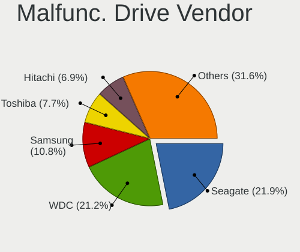

| Vendor                         | Computers | Drives | Percent |
|--------------------------------|-----------|--------|---------|
| Seagate                        | 137       | 181    | 21.85%  |
| WDC                            | 133       | 174    | 21.21%  |
| Samsung Electronics            | 68        | 98     | 10.85%  |
| Toshiba                        | 48        | 56     | 7.66%   |
| Hitachi                        | 43        | 50     | 6.86%   |
| HGST                           | 29        | 35     | 4.63%   |
| Crucial                        | 22        | 28     | 3.51%   |
| SanDisk                        | 19        | 21     | 3.03%   |
| Intel                          | 18        | 26     | 2.87%   |
| SK hynix                       | 16        | 16     | 2.55%   |
| Kingston                       | 14        | 15     | 2.23%   |
| Micron Technology              | 9         | 10     | 1.44%   |
| A-DATA Technology              | 9         | 9      | 1.44%   |
| Maxtor                         | 7         | 9      | 1.12%   |
| Apple                          | 6         | 6      | 0.96%   |
| OCZ                            | 4         | 4      | 0.64%   |
| Neo                            | 3         | 4      | 0.48%   |
| XPG                            | 2         | 2      | 0.32%   |
| Team                           | 2         | 2      | 0.32%   |
| T-FORCE                        | 2         | 2      | 0.32%   |
| SSSTC                          | 2         | 2      | 0.32%   |
| SPCC                           | 2         | 2      | 0.32%   |
| Mushkin                        | 2         | 2      | 0.32%   |
| LITEONIT                       | 2         | 2      | 0.32%   |
| LITEON                         | 2         | 2      | 0.32%   |
| Intenso                        | 2         | 2      | 0.32%   |
| Fujitsu                        | 2         | 2      | 0.32%   |
| China                          | 2         | 2      | 0.32%   |
| Zheino                         | 1         | 2      | 0.16%   |
| VISIPRO                        | 1         | 2      | 0.16%   |
| VENO                           | 1         | 1      | 0.16%   |
| tecmiyo                        | 1         | 3      | 0.16%   |
| Solid State Storage Technology | 1         | 1      | 0.16%   |
| SABRENT                        | 1         | 1      | 0.16%   |
| R580                           | 1         | 1      | 0.16%   |
| Phison Electronics             | 1         | 1      | 0.16%   |
| Patriot                        | 1         | 1      | 0.16%   |
| ORTIAL                         | 1         | 1      | 0.16%   |
| Netac                          | 1         | 1      | 0.16%   |
| MAXIO Technology (Hangzhou)    | 1         | 1      | 0.16%   |

Malfunc. HDD Vendor
-------------------

Vendors of faulty HDD drives

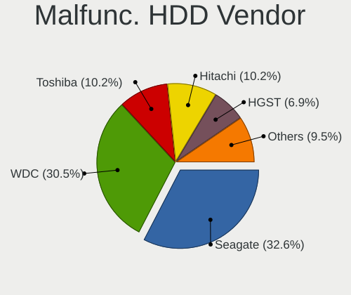

| Vendor              | Computers | Drives | Percent |
|---------------------|-----------|--------|---------|
| Seagate             | 137       | 181    | 32.62%  |
| WDC                 | 128       | 169    | 30.48%  |
| Toshiba             | 43        | 51     | 10.24%  |
| Hitachi             | 43        | 50     | 10.24%  |
| HGST                | 29        | 35     | 6.9%    |
| Samsung Electronics | 23        | 46     | 5.48%   |
| Maxtor              | 7         | 9      | 1.67%   |
| Apple               | 6         | 6      | 1.43%   |
| Fujitsu             | 2         | 2      | 0.48%   |
| JMicron Technology  | 1         | 1      | 0.24%   |
| ASMT                | 1         | 1      | 0.24%   |

Malfunc. Drive Kind
-------------------

Kinds of faulty drives

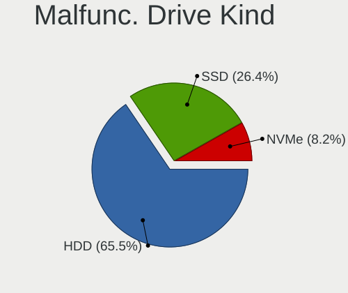

| Kind | Computers | Drives | Percent |
|------|-----------|--------|---------|
| HDD  | 385       | 551    | 65.48%  |
| SSD  | 155       | 186    | 26.36%  |
| NVMe | 48        | 54     | 8.16%   |

Failed Drives
-------------

Failed drive models

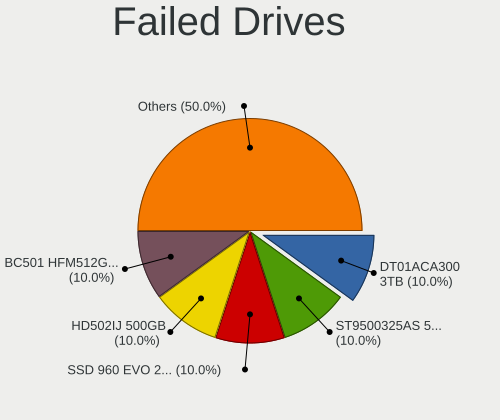

| Model                                   | Computers | Drives | Percent |
|-----------------------------------------|-----------|--------|---------|
| Toshiba DT01ACA300 3TB                  | 1         | 1      | 10%     |
| SK hynix BC501 HFM512GDJTNG-8310A 512GB | 1         | 1      | 10%     |
| Seagate ST9500325AS 500GB               | 1         | 1      | 10%     |
| Samsung Electronics SSD 960 EVO 250GB   | 1         | 2      | 10%     |
| Samsung Electronics HD502IJ 500GB       | 1         | 1      | 10%     |
| OCZ VERTEX460A 480GB SSD                | 1         | 1      | 10%     |
| Intel SSDSC2KB960G8 960GB               | 1         | 1      | 10%     |
| Hitachi HTS547550A9E384 500GB           | 1         | 1      | 10%     |
| HGST HTS725050A7E630 500GB              | 1         | 1      | 10%     |
| Acer SSD FA100 256GB                    | 1         | 1      | 10%     |

Failed Drive Vendor
-------------------

Failed drive vendors

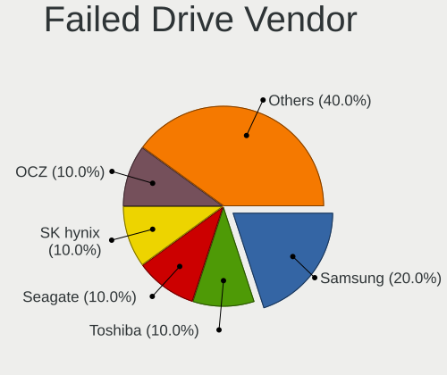

| Vendor              | Computers | Drives | Percent |
|---------------------|-----------|--------|---------|
| Samsung Electronics | 2         | 3      | 20%     |
| Toshiba             | 1         | 1      | 10%     |
| SK hynix            | 1         | 1      | 10%     |
| Seagate             | 1         | 1      | 10%     |
| OCZ                 | 1         | 1      | 10%     |
| Intel               | 1         | 1      | 10%     |
| Hitachi             | 1         | 1      | 10%     |
| HGST                | 1         | 1      | 10%     |
| Acer                | 1         | 1      | 10%     |

Drive Status
------------

Number of failed and malfunc. drives

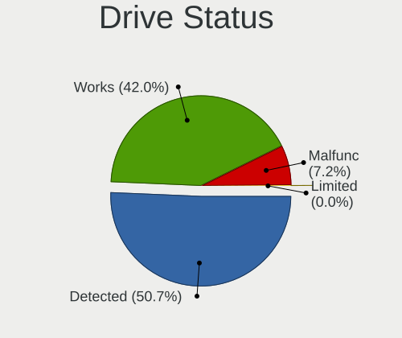

| Status   | Computers | Drives | Percent |
|----------|-----------|--------|---------|
| Detected | 3978      | 8972   | 50.67%  |
| Works    | 3301      | 6159   | 42.05%  |
| Malfunc  | 562       | 791    | 7.16%   |
| Failed   | 9         | 11     | 0.11%   |
| Limited  | 1         | 1      | 0.01%   |

Storage controller
------------------

Storage Vendor
--------------

Storage controller vendors

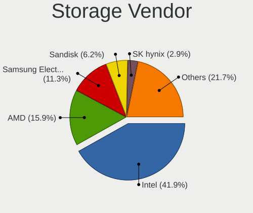

| Vendor                                  | Computers | Percent |
|-----------------------------------------|-----------|---------|
| Intel                                   | 4124      | 41.89%  |
| AMD                                     | 1567      | 15.92%  |
| Samsung Electronics                     | 1113      | 11.3%   |
| Sandisk                                 | 614       | 6.24%   |
| SK hynix                                | 289       | 2.94%   |
| Kingston Technology Company             | 284       | 2.88%   |
| Phison Electronics                      | 225       | 2.29%   |
| Micron Technology                       | 203       | 2.06%   |
| Micron/Crucial Technology               | 184       | 1.87%   |
| ASMedia Technology                      | 175       | 1.78%   |
| Toshiba America Info Systems            | 134       | 1.36%   |
| KIOXIA                                  | 124       | 1.26%   |
| Silicon Motion                          | 117       | 1.19%   |
| JMicron Technology                      | 83        | 0.84%   |
| ADATA Technology                        | 82        | 0.83%   |
| Marvell Technology Group                | 79        | 0.8%    |
| Realtek Semiconductor                   | 58        | 0.59%   |
| Nvidia                                  | 58        | 0.59%   |
| MAXIO Technology (Hangzhou)             | 51        | 0.52%   |
| Solid State Storage Technology          | 29        | 0.29%   |
| Shenzhen Longsys Electronics            | 27        | 0.27%   |
| Broadcom / LSI                          | 25        | 0.25%   |
| Apple                                   | 22        | 0.22%   |
| Union Memory (Shenzhen)                 | 21        | 0.21%   |
| LSI Logic / Symbios Logic               | 17        | 0.17%   |
| Solidigm                                | 14        | 0.14%   |
| Silicon Image                           | 14        | 0.14%   |
| Lite-On Technology                      | 14        | 0.14%   |
| INNOGRIT                                | 13        | 0.13%   |
| Seagate Technology                      | 10        | 0.1%    |
| Yangtze Memory Technologies             | 9         | 0.09%   |
| VIA Technologies                        | 9         | 0.09%   |
| Netac Technology                        | 8         | 0.08%   |
| Biwin Storage Technology                | 6         | 0.06%   |
| Lenovo                                  | 5         | 0.05%   |
| Zhaoxin                                 | 4         | 0.04%   |
| Shenzhen Unionmemory Information System | 4         | 0.04%   |
| Hosin Global Electronics                | 4         | 0.04%   |
| Hewlett-Packard                         | 4         | 0.04%   |
| Unknown                                 | 4         | 0.04%   |

Storage Model
-------------

Storage controller models

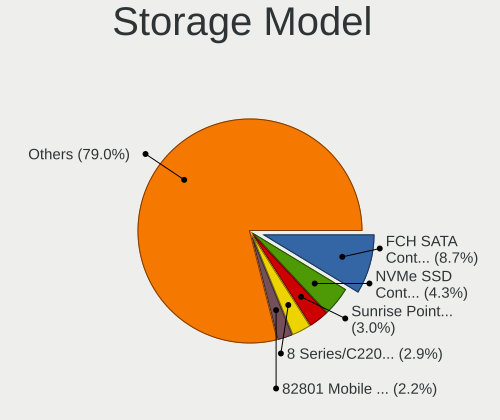

| Model                                                                          | Computers | Percent |
|--------------------------------------------------------------------------------|-----------|---------|
| AMD FCH SATA Controller [AHCI mode]                                            | 956       | 8.69%   |
| Samsung NVMe SSD Controller SM981/PM981/PM983                                  | 476       | 4.32%   |
| Intel Sunrise Point-LP SATA Controller [AHCI mode]                             | 326       | 2.96%   |
| Intel 8 Series/C220 Series Chipset Family 6-port SATA Controller 1 [AHCI mode] | 314       | 2.85%   |
| Intel 82801 Mobile SATA Controller [RAID mode]                                 | 243       | 2.21%   |
| Intel Volume Management Device NVMe RAID Controller                            | 240       | 2.18%   |
| Intel 7 Series Chipset Family 6-port SATA Controller [AHCI mode]               | 232       | 2.11%   |
| Samsung NVMe SSD Controller PM9A1/PM9A3/980PRO                                 | 222       | 2.02%   |
| AMD 400 Series Chipset SATA Controller                                         | 213       | 1.94%   |
| Samsung NVMe SSD Controller 980 (DRAM-less)                                    | 202       | 1.84%   |
| AMD 500 Series Chipset SATA Controller                                         | 189       | 1.72%   |
| Intel Q170/Q150/B150/H170/H110/Z170/CM236 Chipset SATA Controller [AHCI Mode]  | 165       | 1.5%    |
| ASMedia ASM1061/ASM1062 Serial ATA Controller                                  | 155       | 1.41%   |
| Intel 6 Series/C200 Series Chipset Family 6 port Mobile SATA AHCI Controller   | 143       | 1.3%    |
| Intel Cannon Lake Mobile PCH SATA AHCI Controller                              | 140       | 1.27%   |
| AMD SB7x0/SB8x0/SB9x0 SATA Controller [AHCI mode]                              | 138       | 1.25%   |
| Intel 200 Series PCH SATA controller [AHCI mode]                               | 135       | 1.23%   |
| AMD 600 Series Chipset SATA Controller                                         | 133       | 1.21%   |
| Intel 8 Series SATA Controller 1 [AHCI mode]                                   | 132       | 1.2%    |
| Intel 6 Series/C200 Series Chipset Family 6 port Desktop SATA AHCI Controller  | 126       | 1.14%   |
| Intel SATA Controller [RAID mode]                                              | 121       | 1.1%    |
| AMD SB7x0/SB8x0/SB9x0 IDE Controller                                           | 110       | 1%      |
| SanDisk Extreme Pro / WD Black SN750 / PC SN730 / Red SN700 NVMe SSD           | 104       | 0.94%   |
| Intel SSD 660P Series                                                          | 104       | 0.94%   |
| Intel Wildcat Point-LP SATA Controller [AHCI Mode]                             | 97        | 0.88%   |
| Intel Celeron/Pentium Silver Processor SATA Controller                         | 97        | 0.88%   |
| Intel 7 Series/C210 Series Chipset Family 6-port SATA Controller [AHCI mode]   | 96        | 0.87%   |
| Intel Comet Lake SATA AHCI Controller                                          | 94        | 0.85%   |
| Intel Cannon Lake PCH SATA AHCI Controller                                     | 93        | 0.84%   |
| SanDisk Ultra 3D / WD PC SN530, IX SN530, Blue SN550 NVMe SSD (DRAM-less)      | 91        | 0.83%   |
| Samsung NVMe SSD Controller SM961/PM961/SM963                                  | 91        | 0.83%   |
| SK hynix Gold P31/BC711/PC711 NVMe Solid State Drive                           | 90        | 0.82%   |
| Micron/Crucial P2 [Nick P2] / P3 / P3 Plus NVMe PCIe SSD (DRAM-less)           | 90        | 0.82%   |
| SanDisk WD SN560/SN740/SN770/SN5000 NVMe SSD                                   | 86        | 0.78%   |
| Silicon Motion SM2263EN/SM2263XT (DRAM-less) NVMe SSD Controllers              | 80        | 0.73%   |
| Phison E12 NVMe Controller                                                     | 76        | 0.69%   |
| Intel HM170/QM170 Chipset SATA Controller [AHCI Mode]                          | 76        | 0.69%   |
| KIOXIA NVMe SSD Controller BG4 (DRAM-less)                                     | 73        | 0.66%   |
| Intel Tiger Lake-LP SATA Controller                                            | 73        | 0.66%   |
| Intel 82801IBM/IEM (ICH9M/ICH9M-E) 4 port SATA Controller [AHCI mode]          | 73        | 0.66%   |

Storage Kind
------------

Kind of storage controller (IDE, SATA, NVMe, SAS, ...)

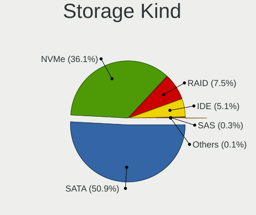

| Kind | Computers | Percent |
|------|-----------|---------|
| SATA | 4902      | 50.85%  |
| NVMe | 3478      | 36.08%  |
| RAID | 727       | 7.54%   |
| IDE  | 495       | 5.13%   |
| SAS  | 28        | 0.29%   |
| SCSI | 10        | 0.1%    |

Processor
---------

CPU Vendor
----------

Processor vendors

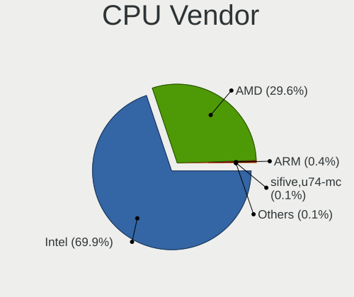

| Vendor        | Computers | Percent |
|---------------|-----------|---------|
| Intel         | 4922      | 69.88%  |
| AMD           | 2084      | 29.59%  |
| ARM           | 25        | 0.35%   |
| sifive,u74-mc | 4         | 0.06%   |
| CentaurHauls  | 4         | 0.06%   |
| QUALCOMM      | 2         | 0.03%   |
| Phytium       | 1         | 0.01%   |
| Unknown       | 1         | 0.01%   |

CPU Model
---------

Processor models

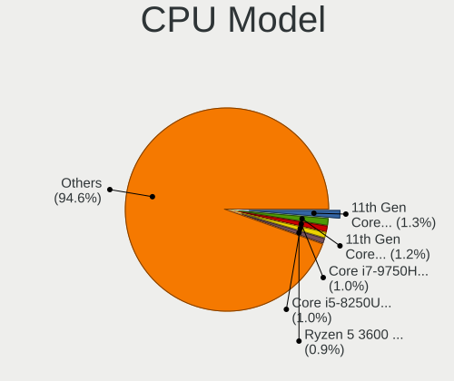

| Model                                         | Computers | Percent |
|-----------------------------------------------|-----------|---------|
| Intel 11th Gen Core i7-1165G7 @ 2.80GHz       | 95        | 1.35%   |
| Intel 11th Gen Core i5-1135G7 @ 2.40GHz       | 85        | 1.2%    |
| Intel Core i7-9750H CPU @ 2.60GHz             | 72        | 1.02%   |
| Intel Core i5-8250U CPU @ 1.60GHz             | 69        | 0.98%   |
| AMD Ryzen 5 3600 6-Core Processor             | 63        | 0.89%   |
| AMD Ryzen 7 3700X 8-Core Processor            | 61        | 0.86%   |
| Intel Core i5-8265U CPU @ 1.60GHz             | 59        | 0.84%   |
| Intel Core i5-7200U CPU @ 2.50GHz             | 59        | 0.84%   |
| Intel Core i7-8550U CPU @ 1.80GHz             | 55        | 0.78%   |
| Intel Core i7-8565U CPU @ 1.80GHz             | 54        | 0.76%   |
| Intel Core i7-10510U CPU @ 1.80GHz            | 54        | 0.76%   |
| AMD Ryzen 5 3500U with Radeon Vega Mobile Gfx | 54        | 0.76%   |
| AMD Ryzen 7 5800H with Radeon Graphics        | 53        | 0.75%   |
| Intel Core i7-7700HQ CPU @ 2.80GHz            | 49        | 0.69%   |
| AMD Ryzen 5 5500U with Radeon Graphics        | 48        | 0.68%   |
| Intel Core i7-8750H CPU @ 2.20GHz             | 47        | 0.67%   |
| AMD Ryzen 5 5600X 6-Core Processor            | 47        | 0.67%   |
| Intel Core i7-10750H CPU @ 2.60GHz            | 46        | 0.65%   |
| Intel Core i5-6200U CPU @ 2.30GHz             | 46        | 0.65%   |
| Intel Core i5-10210U CPU @ 1.60GHz            | 46        | 0.65%   |
| Intel 12th Gen Core i7-12700H                 | 44        | 0.62%   |
| Intel Core i5-3320M CPU @ 2.60GHz             | 43        | 0.61%   |
| Intel Core i7-1065G7 CPU @ 1.30GHz            | 42        | 0.59%   |
| AMD Ryzen 7 5700U with Radeon Graphics        | 42        | 0.59%   |
| AMD Ryzen 7 4800H with Radeon Graphics        | 39        | 0.55%   |
| Intel Core i7-7500U CPU @ 2.70GHz             | 38        | 0.54%   |
| AMD Ryzen 5 4500U with Radeon Graphics        | 37        | 0.52%   |
| Intel Celeron N4020 CPU @ 1.10GHz             | 36        | 0.51%   |
| Intel Core i7-4790 CPU @ 3.60GHz              | 35        | 0.5%    |
| AMD Ryzen 9 3900X 12-Core Processor           | 35        | 0.5%    |
| Intel Core i7-3770 CPU @ 3.40GHz              | 34        | 0.48%   |
| Intel Core i7-4790K CPU @ 4.00GHz             | 32        | 0.45%   |
| Intel Core i5-3470 CPU @ 3.20GHz              | 31        | 0.44%   |
| Intel Core i7-6700HQ CPU @ 2.60GHz            | 30        | 0.42%   |
| Intel Core i5-2520M CPU @ 2.50GHz             | 30        | 0.42%   |
| Intel 12th Gen Core i7-1260P                  | 30        | 0.42%   |
| Intel Core i5-1035G1 CPU @ 1.00GHz            | 29        | 0.41%   |
| AMD Ryzen 5 2600 Six-Core Processor           | 29        | 0.41%   |
| Intel Core i7-6700K CPU @ 4.00GHz             | 28        | 0.4%    |
| Intel Core i5-6300U CPU @ 2.40GHz             | 28        | 0.4%    |

CPU Model Family
----------------

Processor model prefix

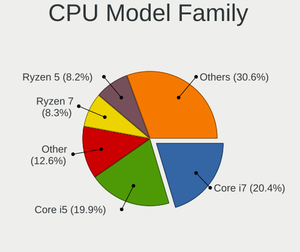

| Model                   | Computers | Percent |
|-------------------------|-----------|---------|
| Intel Core i7           | 1439      | 20.39%  |
| Intel Core i5           | 1407      | 19.93%  |
| Other                   | 890       | 12.61%  |
| AMD Ryzen 7             | 583       | 8.26%   |
| AMD Ryzen 5             | 580       | 8.22%   |
| Intel Core i3           | 323       | 4.58%   |
| Intel Celeron           | 221       | 3.13%   |
| AMD Ryzen 9             | 218       | 3.09%   |
| Intel Xeon              | 159       | 2.25%   |
| Intel Core 2 Duo        | 136       | 1.93%   |
| AMD FX                  | 105       | 1.49%   |
| Intel Pentium           | 98        | 1.39%   |
| AMD Ryzen 3             | 76        | 1.08%   |
| Intel Core              | 67        | 0.95%   |
| Intel Core i9           | 66        | 0.93%   |
| AMD Ryzen 7 PRO         | 59        | 0.84%   |
| AMD A6                  | 47        | 0.67%   |
| AMD A10                 | 47        | 0.67%   |
| Intel Atom              | 43        | 0.61%   |
| AMD A8                  | 40        | 0.57%   |
| Intel Core 2 Quad       | 38        | 0.54%   |
| AMD Ryzen 5 PRO         | 36        | 0.51%   |
| Intel Pentium Dual-Core | 34        | 0.48%   |
| AMD Phenom II X4        | 32        | 0.45%   |
| Intel Pentium Silver    | 26        | 0.37%   |
| AMD A4                  | 25        | 0.35%   |
| AMD Athlon              | 19        | 0.27%   |
| AMD Athlon II X4        | 17        | 0.24%   |
| AMD Ryzen Threadripper  | 16        | 0.23%   |
| AMD Phenom II X6        | 14        | 0.2%    |
| AMD E1                  | 14        | 0.2%    |
| AMD Athlon II X2        | 14        | 0.2%    |
| AMD Athlon 64 X2        | 12        | 0.17%   |
| Intel Core m3           | 11        | 0.16%   |
| Intel Genuine           | 10        | 0.14%   |
| AMD E                   | 10        | 0.14%   |
| AMD E2                  | 9         | 0.13%   |
| Intel Pentium Gold      | 8         | 0.11%   |
| Intel Pentium Dual      | 8         | 0.11%   |
| Intel Celeron Dual-Core | 7         | 0.1%    |

CPU Cores
---------

Number of processor cores

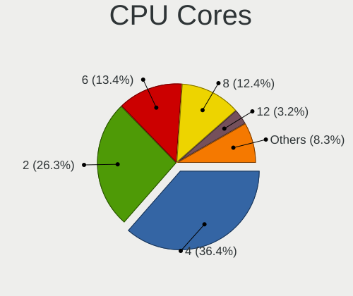

| Number  | Computers | Percent |
|---------|-----------|---------|
| 4       | 2572      | 36.44%  |
| 2       | 1857      | 26.31%  |
| 6       | 943       | 13.36%  |
| 8       | 876       | 12.41%  |
| 12      | 226       | 3.2%    |
| 16      | 154       | 2.18%   |
| 14      | 132       | 1.87%   |
| 10      | 127       | 1.8%    |
| 24      | 50        | 0.71%   |
| 1       | 46        | 0.65%   |
| Unknown | 20        | 0.28%   |
| 20      | 17        | 0.24%   |
| 3       | 16        | 0.23%   |
| 32      | 10        | 0.14%   |
| 18      | 3         | 0.04%   |
| 64      | 2         | 0.03%   |
| 44      | 2         | 0.03%   |
| 28      | 2         | 0.03%   |
| 5       | 2         | 0.03%   |
| 48      | 1         | 0.01%   |
| 36      | 1         | 0.01%   |

CPU Sockets
-----------

Number of sockets

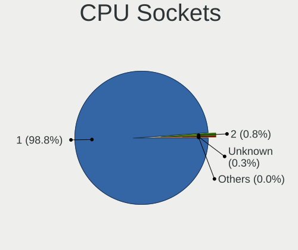

| Number  | Computers | Percent |
|---------|-----------|---------|
| 1       | 6962      | 98.85%  |
| 2       | 56        | 0.8%    |
| Unknown | 20        | 0.28%   |
| 4       | 3         | 0.04%   |
| 24      | 1         | 0.01%   |
| 3       | 1         | 0.01%   |

CPU Threads
-----------

Threads per core (Hyper-Threading)

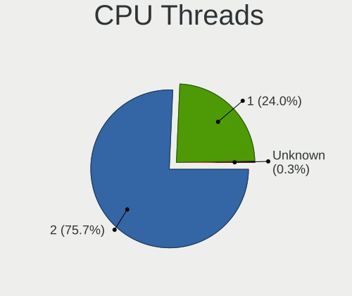

| Number  | Computers | Percent |
|---------|-----------|---------|
| 2       | 5345      | 75.71%  |
| 1       | 1695      | 24.01%  |
| Unknown | 20        | 0.28%   |

CPU Op-Modes
------------

CPU Operation Modes (32-bit, 64-bit)

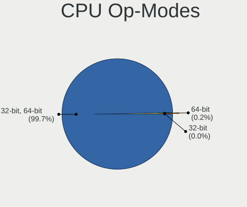

| Op mode        | Computers | Percent |
|----------------|-----------|---------|
| 32-bit, 64-bit | 7018      | 99.66%  |
| 64-bit         | 16        | 0.23%   |
| Unknown        | 6         | 0.09%   |
| 32-bit         | 2         | 0.03%   |

CPU Microcode
-------------

Microcode number

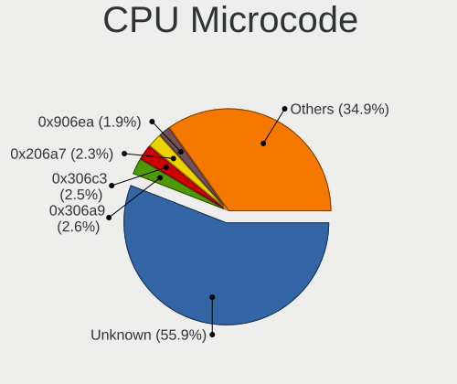

| Number     | Computers | Percent |
|------------|-----------|---------|
| Unknown    | 4047      | 55.93%  |
| 0x306a9    | 188       | 2.6%    |
| 0x306c3    | 179       | 2.47%   |
| 0x206a7    | 166       | 2.29%   |
| 0x906ea    | 134       | 1.85%   |
| 0x806ec    | 113       | 1.56%   |
| 0x806c1    | 110       | 1.52%   |
| 0x806ea    | 105       | 1.45%   |
| 0x08701021 | 86        | 1.19%   |
| 0x40651    | 84        | 1.16%   |
| 0x906e9    | 82        | 1.13%   |
| 0x1067a    | 82        | 1.13%   |
| 0x506e3    | 81        | 1.12%   |
| 0x806e9    | 77        | 1.06%   |
| 0x0a50000c | 70        | 0.97%   |
| 0x406e3    | 65        | 0.9%    |
| 0x08108109 | 60        | 0.83%   |
| 0x08600106 | 53        | 0.73%   |
| 0x0800820d | 51        | 0.7%    |
| 0x306d4    | 47        | 0.65%   |
| 0x906a3    | 44        | 0.61%   |
| 0x06000852 | 44        | 0.61%   |
| 0xa0652    | 40        | 0.55%   |
| 0x706e5    | 40        | 0.55%   |
| 0x08108102 | 40        | 0.55%   |
| 0x08701013 | 39        | 0.54%   |
| 0x08608103 | 38        | 0.53%   |
| 0x906ed    | 35        | 0.48%   |
| 0x806eb    | 33        | 0.46%   |
| 0x0a50000d | 33        | 0.46%   |
| 0x010000c8 | 32        | 0.44%   |
| 0x20655    | 30        | 0.41%   |
| 0x706a1    | 28        | 0.39%   |
| 0x706a8    | 26        | 0.36%   |
| 0x08600104 | 25        | 0.35%   |
| 0x406c4    | 23        | 0.32%   |
| 0x30678    | 22        | 0.3%    |
| 0x06001119 | 22        | 0.3%    |
| 0x806d1    | 21        | 0.29%   |
| 0xa0653    | 20        | 0.28%   |

CPU Microarch
-------------

Microarchitecture

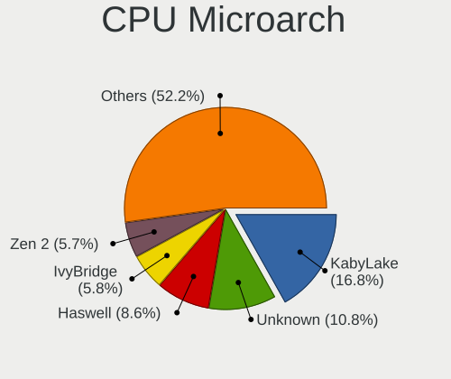

| Name               | Computers | Percent |
|--------------------|-----------|---------|
| KabyLake           | 1191      | 16.85%  |
| Unknown            | 766       | 10.84%  |
| Haswell            | 610       | 8.63%   |
| IvyBridge          | 410       | 5.8%    |
| Zen 2              | 401       | 5.67%   |
| Zen 3              | 396       | 5.6%    |
| SandyBridge        | 344       | 4.87%   |
| Skylake            | 336       | 4.75%   |
| Zen+               | 278       | 3.93%   |
| TigerLake          | 278       | 3.93%   |
| Alderlake Hybrid   | 248       | 3.51%   |
| Penryn             | 191       | 2.7%    |
| CometLake          | 183       | 2.59%   |
| IceLake            | 146       | 2.07%   |
| Broadwell          | 138       | 1.95%   |
| Piledriver         | 136       | 1.92%   |
| Zen                | 135       | 1.91%   |
| Goldmont plus      | 113       | 1.6%    |
| Westmere           | 106       | 1.5%    |
| K10                | 103       | 1.46%   |
| Silvermont         | 91        | 1.29%   |
| Core               | 67        | 0.95%   |
| Excavator          | 66        | 0.93%   |
| Nehalem            | 62        | 0.88%   |
| Goldmont           | 38        | 0.54%   |
| Puma               | 30        | 0.42%   |
| Steamroller        | 26        | 0.37%   |
| K10 Llano          | 26        | 0.37%   |
| Bobcat             | 23        | 0.33%   |
| Jaguar             | 20        | 0.28%   |
| K8 Hammer          | 19        | 0.27%   |
| Meteorlake Hybrid  | 16        | 0.23%   |
| Lunarlake Hybrid   | 13        | 0.18%   |
| Bulldozer          | 13        | 0.18%   |
| Gracemont          | 11        | 0.16%   |
| Tremont            | 10        | 0.14%   |
| NetBurst           | 9         | 0.13%   |
| Bonnell            | 9         | 0.13%   |
| ArrowLake-H Hybrid | 8         | 0.11%   |
| K8 & K10 hybrid    | 2         | 0.03%   |

Graphics
--------

GPU Vendor
----------

Vendors of graphics cards

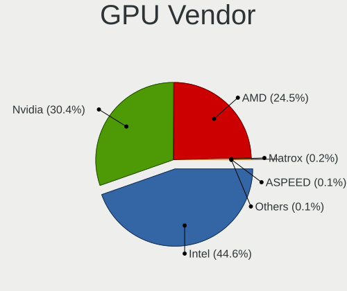

| Vendor                           | Computers | Percent |
|----------------------------------|-----------|---------|
| Intel                            | 3818      | 44.63%  |
| Nvidia                           | 2604      | 30.44%  |
| AMD                              | 2100      | 24.55%  |
| Matrox Electronics Systems       | 16        | 0.19%   |
| ASPEED Technology                | 9         | 0.11%   |
| Zhaoxin                          | 4         | 0.05%   |
| ATI Technologies                 | 2         | 0.02%   |
| Silicon Integrated Systems [SiS] | 1         | 0.01%   |
| Qualcomm Atheros                 | 1         | 0.01%   |

GPU Model
---------

Graphics card models

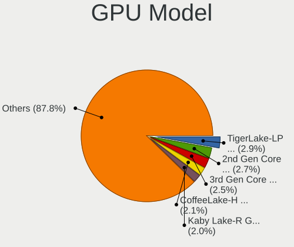

| Model                                                                                    | Computers | Percent |
|------------------------------------------------------------------------------------------|-----------|---------|
| Intel TigerLake-LP GT2 [Iris Xe Graphics]                                                | 251       | 2.86%   |
| Intel 2nd Generation Core Processor Family Integrated Graphics Controller                | 238       | 2.71%   |
| Intel 3rd Gen Core processor Graphics Controller                                         | 217       | 2.47%   |
| Intel CoffeeLake-H GT2 [UHD Graphics 630]                                                | 188       | 2.14%   |
| Intel Kaby Lake-R GT2 [UHD Graphics 620]                                                 | 180       | 2.05%   |
| AMD Renoir [Radeon Vega Series / Radeon Vega Mobile Series]                              | 179       | 2.04%   |
| AMD Picasso/Raven 2 [Radeon Vega Series / Radeon Vega Mobile Series]                     | 177       | 2.02%   |
| AMD Cezanne [Radeon Vega Series / Radeon Vega Mobile Series]                             | 165       | 1.88%   |
| Intel Kaby Lake-U GT2 [HD Graphics 620]                                                  | 156       | 1.78%   |
| Intel Haswell-ULT Integrated Graphics Controller                                         | 147       | 1.67%   |
| Intel WhiskeyLake-U GT2 [UHD Graphics 620]                                               | 146       | 1.66%   |
| AMD Ellesmere [Radeon RX 470/480/570/570X/580/580X/590]                                  | 133       | 1.51%   |
| Intel 4th Gen Core Processor Integrated Graphics Controller                              | 131       | 1.49%   |
| Intel Xeon E3-1200 v3/4th Gen Core Processor Integrated Graphics Controller              | 128       | 1.46%   |
| Intel Skylake-U GT2 [HD Graphics 520]                                                    | 123       | 1.4%    |
| Intel CometLake-U GT2 [UHD Graphics]                                                     | 117       | 1.33%   |
| Intel Alder Lake-P GT2 [Iris Xe Graphics]                                                | 112       | 1.28%   |
| Intel Broadwell-U GT2 [HD Graphics 5500]                                                 | 97        | 1.1%    |
| Nvidia TU117M [GeForce GTX 1650 Mobile / Max-Q]                                          | 96        | 1.09%   |
| AMD Lucienne                                                                             | 96        | 1.09%   |
| Intel GeminiLake [UHD Graphics 600]                                                      | 92        | 1.05%   |
| Nvidia GP107 [GeForce GTX 1050 Ti]                                                       | 87        | 0.99%   |
| Intel CometLake-H GT2 [UHD Graphics]                                                     | 87        | 0.99%   |
| AMD Raphael                                                                              | 86        | 0.98%   |
| Intel Kaby Lake-H GT2 [HD Graphics 630]                                                  | 72        | 0.82%   |
| AMD Rembrandt [Radeon 680M]                                                              | 69        | 0.79%   |
| Intel Raptor Lake-P [Iris Xe Graphics]                                                   | 65        | 0.74%   |
| Intel CoffeeLake-S GT2 [UHD Graphics 630]                                                | 64        | 0.73%   |
| Intel Mobile 4 Series Chipset Integrated Graphics Controller                             | 62        | 0.71%   |
| Nvidia GP107M [GeForce GTX 1050 Mobile]                                                  | 57        | 0.65%   |
| Intel TigerLake-H GT1 [UHD Graphics]                                                     | 57        | 0.65%   |
| Nvidia GK208B [GeForce GT 710]                                                           | 56        | 0.64%   |
| Intel Skylake-S GT2 [HD Graphics 530]                                                    | 55        | 0.63%   |
| Nvidia GA106M [GeForce RTX 3060 Mobile / Max-Q]                                          | 52        | 0.59%   |
| Intel Atom/Celeron/Pentium Processor x5-E8000/J3xxx/N3xxx Integrated Graphics Controller | 51        | 0.58%   |
| AMD Raven Ridge [Radeon Vega Series / Radeon Vega Mobile Series]                         | 51        | 0.58%   |
| Intel Skylake-H GT2 [HD Graphics 530]                                                    | 50        | 0.57%   |
| Intel Core Processor Integrated Graphics Controller                                      | 49        | 0.56%   |
| Nvidia GA107M [GeForce RTX 3050 Mobile]                                                  | 48        | 0.55%   |
| Intel Xeon E3-1200 v2/3rd Gen Core processor Graphics Controller                         | 48        | 0.55%   |

GPU Combo
---------

Combinations of graphics cards

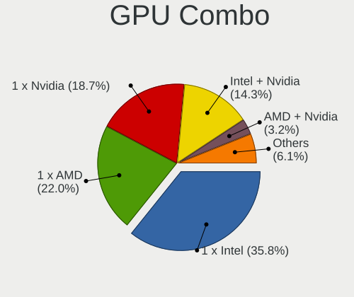

| Name                     | Computers | Percent |
|--------------------------|-----------|---------|
| 1 x Intel                | 2534      | 35.76%  |
| 1 x AMD                  | 1558      | 21.99%  |
| 1 x Nvidia               | 1328      | 18.74%  |
| Intel + Nvidia           | 1010      | 14.25%  |
| AMD + Nvidia             | 226       | 3.19%   |
| Intel + AMD              | 181       | 2.55%   |
| 2 x AMD                  | 137       | 1.93%   |
| Other                    | 37        | 0.52%   |
| 2 x Nvidia               | 26        | 0.37%   |
| 2 x Intel                | 8         | 0.11%   |
| Nvidia + Matrox          | 7         | 0.1%    |
| 1 x Matrox               | 6         | 0.08%   |
| 1 x ASPEED               | 5         | 0.07%   |
| 3 x Nvidia               | 4         | 0.06%   |
| 1 x Zhaoxin              | 4         | 0.06%   |
| Nvidia + ASPEED          | 4         | 0.06%   |
| Intel + 2 x Nvidia       | 2         | 0.03%   |
| AMD + 2 x Nvidia         | 2         | 0.03%   |
| AMD + Matrox             | 2         | 0.03%   |
| 3 x AMD                  | 1         | 0.01%   |
| 2 x AMD + 1 x Matrox     | 1         | 0.01%   |
| 1 x SiS                  | 1         | 0.01%   |
| Intel + 2 x AMD          | 1         | 0.01%   |
| Intel + AMD + 1 x Nvidia | 1         | 0.01%   |

GPU Driver
----------

Free vs proprietary

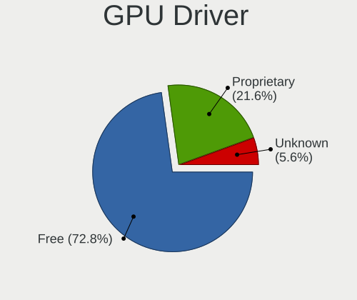

| Driver      | Computers | Percent |
|-------------|-----------|---------|
| Free        | 5209      | 72.82%  |
| Proprietary | 1547      | 21.63%  |
| Unknown     | 397       | 5.55%   |

GPU Memory
----------

Total video memory

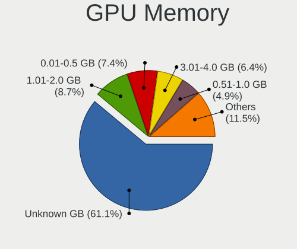

| Size in GB | Computers | Percent |
|------------|-----------|---------|
| Unknown    | 4410      | 61.08%  |
| 1.01-2.0   | 630       | 8.73%   |
| 0.01-0.5   | 533       | 7.38%   |
| 3.01-4.0   | 463       | 6.41%   |
| 0.51-1.0   | 356       | 4.93%   |
| 7.01-8.0   | 355       | 4.92%   |
| 5.01-6.0   | 196       | 2.71%   |
| 8.01-16.0  | 182       | 2.52%   |
| 2.01-3.0   | 50        | 0.69%   |
| 16.01-24.0 | 37        | 0.51%   |
| 4.01-5.0   | 4         | 0.06%   |
| 24.01-32.0 | 3         | 0.04%   |
| 32.01-64.0 | 1         | 0.01%   |

Monitor
-------

Monitor Vendor
--------------

Monitor vendors

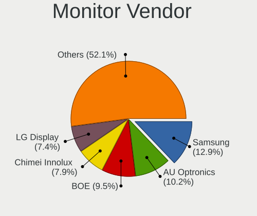

| Vendor                  | Computers | Percent |
|-------------------------|-----------|---------|
| Samsung Electronics     | 1075      | 12.88%  |
| AU Optronics            | 849       | 10.17%  |
| BOE                     | 794       | 9.51%   |
| Chimei Innolux          | 659       | 7.9%    |
| LG Display              | 619       | 7.42%   |
| Dell                    | 558       | 6.69%   |
| Goldstar                | 471       | 5.64%   |
| Acer                    | 302       | 3.62%   |
| Hewlett-Packard         | 286       | 3.43%   |
| AOC                     | 205       | 2.46%   |
| Philips                 | 196       | 2.35%   |
| BenQ                    | 193       | 2.31%   |
| Ancor Communications    | 171       | 2.05%   |
| Sharp                   | 160       | 1.92%   |
| Lenovo                  | 135       | 1.62%   |
| ASUSTek Computer        | 122       | 1.46%   |
| Apple                   | 122       | 1.46%   |
| Iiyama                  | 117       | 1.4%    |
| ViewSonic               | 85        | 1.02%   |
| PANDA                   | 74        | 0.89%   |
| Chi Mei Optoelectronics | 66        | 0.79%   |
| InfoVision              | 63        | 0.75%   |
| Unknown                 | 47        | 0.56%   |
| Sony                    | 41        | 0.49%   |
| MSI                     | 41        | 0.49%   |
| Gigabyte Technology     | 36        | 0.43%   |
| Sceptre Tech            | 34        | 0.41%   |
| LG Electronics          | 33        | 0.4%    |
| CSO                     | 33        | 0.4%    |
| Panasonic               | 32        | 0.38%   |
| NEC Computers           | 29        | 0.35%   |
| Eizo                    | 27        | 0.32%   |
| Vizio                   | 24        | 0.29%   |
| HKC                     | 22        | 0.26%   |
| HannStar                | 22        | 0.26%   |
| Fujitsu Siemens         | 20        | 0.24%   |
| Mi                      | 19        | 0.23%   |
| Vestel Elektronik       | 17        | 0.2%    |
| Toshiba                 | 17        | 0.2%    |
| Medion                  | 17        | 0.2%    |

Monitor Model
-------------

Monitor models

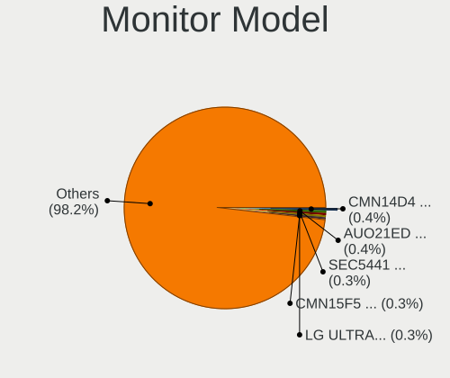

| Model                                                                     | Computers | Percent |
|---------------------------------------------------------------------------|-----------|---------|
| Chimei Innolux LCD Monitor CMN14D4 1920x1080 309x173mm 13.9-inch          | 36        | 0.41%   |
| AU Optronics LCD Monitor AUO21ED 1920x1080 344x193mm 15.5-inch            | 36        | 0.41%   |
| Samsung Electronics LCD Monitor SEC5441 1280x800 331x207mm 15.4-inch      | 29        | 0.33%   |
| Chimei Innolux LCD Monitor CMN15F5 1920x1080 344x193mm 15.5-inch          | 29        | 0.33%   |
| Goldstar LG ULTRAWIDE GSM59F1 2560x1080 670x280mm 28.6-inch               | 28        | 0.32%   |
| Dell U2412M DELA07A 1920x1200 518x324mm 24.1-inch                         | 28        | 0.32%   |
| Goldstar FULL HD GSM5B55 1920x1080 480x270mm 21.7-inch                    | 26        | 0.3%    |
| Chimei Innolux LCD Monitor CMN1521 1920x1080 344x193mm 15.5-inch          | 26        | 0.3%    |
| AU Optronics LCD Monitor AUO38ED 1920x1080 344x193mm 15.5-inch            | 26        | 0.3%    |
| Chimei Innolux LCD Monitor CMN15E7 1920x1080 344x193mm 15.5-inch          | 25        | 0.29%   |
| Samsung Electronics C24F390 SAM0D2C 1920x1080 521x293mm 23.5-inch         | 24        | 0.28%   |
| Chimei Innolux LCD Monitor CMN15E8 1920x1080 344x193mm 15.5-inch          | 24        | 0.28%   |
| Unknown LCD Monitor FFFF 2288x1287 2550x2550mm 142.0-inch                 | 23        | 0.26%   |
| AOC 27G2G4 AOC2702 1920x1080 598x336mm 27.0-inch                          | 22        | 0.25%   |
| Samsung Electronics C27F390 SAM0D32 1920x1080 598x336mm 27.0-inch         | 19        | 0.22%   |
| Goldstar LG IPS FULLHD GSM5AB8 1920x1080 480x270mm 21.7-inch              | 18        | 0.21%   |
| Chimei Innolux LCD Monitor CMN15DB 1366x768 344x193mm 15.5-inch           | 18        | 0.21%   |
| AU Optronics LCD Monitor AUO403D 1920x1080 309x174mm 14.0-inch            | 18        | 0.21%   |
| LG Display LCD Monitor LGD02DC 1366x768 344x194mm 15.5-inch               | 17        | 0.2%    |
| BOE LCD Monitor BOE0872 1920x1080 344x194mm 15.5-inch                     | 17        | 0.2%    |
| BOE LCD Monitor BOE0812 1920x1080 344x194mm 15.5-inch                     | 17        | 0.2%    |
| Vestel Elektronik 40UHD_LCD_TV VES3700 3840x2160 880x500mm 39.8-inch      | 16        | 0.18%   |
| LG Display LCD Monitor LGD046F 1920x1080 344x194mm 15.5-inch              | 16        | 0.18%   |
| LG Display LCD Monitor LGD0563 1920x1080 344x194mm 15.5-inch              | 15        | 0.17%   |
| Goldstar Ultra HD GSM5B09 3840x2160 600x340mm 27.2-inch                   | 15        | 0.17%   |
| AU Optronics LCD Monitor AUO2E3C 1366x768 309x173mm 13.9-inch             | 15        | 0.17%   |
| Samsung Electronics S24F350 SAM0D20 1920x1080 521x293mm 23.5-inch         | 14        | 0.16%   |
| Goldstar HDR 4K GSM7706 3840x2160 600x340mm 27.2-inch                     | 14        | 0.16%   |
| Chimei Innolux LCD Monitor CMN15E6 1366x768 344x193mm 15.5-inch           | 14        | 0.16%   |
| AU Optronics LCD Monitor AUO71EC 1366x768 344x193mm 15.5-inch             | 14        | 0.16%   |
| Unknown                                                                   | 14        | 0.16%   |
| PANDA LCD Monitor NCP004D 1920x1080 344x194mm 15.5-inch                   | 13        | 0.15%   |
| Chi Mei Optoelectronics LCD Monitor CMO1720 1920x1080 382x215mm 17.3-inch | 13        | 0.15%   |
| BOE LCD Monitor BOE084E 1920x1080 382x215mm 17.3-inch                     | 13        | 0.15%   |
| BOE LCD Monitor BOE06A4 1366x768 344x194mm 15.5-inch                      | 13        | 0.15%   |
| Sharp LCD Monitor SHP1453 1920x1080 346x194mm 15.6-inch                   | 12        | 0.14%   |
| Samsung Electronics LCD Monitor SDC4159 1920x1080 344x194mm 15.5-inch     | 12        | 0.14%   |
| Panasonic VVX11F009G00 MEI96A2 1920x1080 344x193mm 15.5-inch              | 12        | 0.14%   |
| Goldstar Ultra HD GSM5B08 3840x2160 600x340mm 27.2-inch                   | 12        | 0.14%   |
| Goldstar LG TV SSCR2 GSMC0C8 3840x2160                                    | 12        | 0.14%   |

Monitor Resolution
------------------

Monitor screen resolution

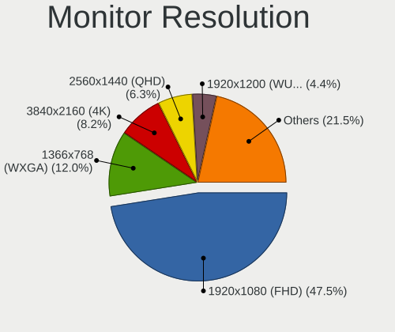

| Resolution         | Computers | Percent |
|--------------------|-----------|---------|
| 1920x1080 (FHD)    | 3727      | 47.51%  |
| 1366x768 (WXGA)    | 941       | 11.99%  |
| 3840x2160 (4K)     | 645       | 8.22%   |
| 2560x1440 (QHD)    | 496       | 6.32%   |
| 1920x1200 (WUXGA)  | 347       | 4.42%   |
| 1600x900 (HD+)     | 241       | 3.07%   |
| 1680x1050 (WSXGA+) | 152       | 1.94%   |
| 3440x1440          | 132       | 1.68%   |
| 2560x1600          | 120       | 1.53%   |
| 1280x1024 (SXGA)   | 119       | 1.52%   |
| 1440x900 (WXGA+)   | 100       | 1.27%   |
| Unknown            | 99        | 1.26%   |
| 2880x1800          | 87        | 1.11%   |
| 2560x1080          | 83        | 1.06%   |
| 1280x800 (WXGA)    | 63        | 0.8%    |
| 3840x1080          | 60        | 0.76%   |
| 1360x768           | 51        | 0.65%   |
| 3840x2400          | 38        | 0.48%   |
| 2160x1440          | 29        | 0.37%   |
| 2288x1287          | 24        | 0.31%   |
| 1920x540           | 22        | 0.28%   |
| 1920x1280          | 17        | 0.22%   |
| 1024x768 (XGA)     | 17        | 0.22%   |
| 3200x2000          | 15        | 0.19%   |
| 2240x1400          | 15        | 0.19%   |
| 1600x1200          | 15        | 0.19%   |
| 2256x1504          | 14        | 0.18%   |
| 3840x1200          | 10        | 0.13%   |
| 3200x1800 (QHD+)   | 10        | 0.13%   |
| 3840x1600          | 9         | 0.11%   |
| 3072x1920          | 9         | 0.11%   |
| 3000x2000          | 8         | 0.1%    |
| 2880x1920          | 8         | 0.1%    |
| 4480x1440          | 7         | 0.09%   |
| 3456x2160          | 7         | 0.09%   |
| 2520x1680          | 7         | 0.09%   |
| 1280x720 (HD)      | 7         | 0.09%   |
| 2880x1620          | 6         | 0.08%   |
| 1024x600           | 6         | 0.08%   |
| 2736x1824          | 5         | 0.06%   |

Monitor Diagonal
----------------

Diagonal size in inches

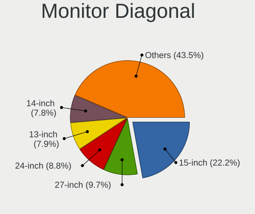

| Inches  | Computers | Percent |
|---------|-----------|---------|
| 15      | 1848      | 22.17%  |
| 27      | 810       | 9.72%   |
| 24      | 737       | 8.84%   |
| 13      | 658       | 7.89%   |
| 14      | 653       | 7.83%   |
| 23      | 555       | 6.66%   |
| 17      | 425       | 5.1%    |
| 21      | 410       | 4.92%   |
| Unknown | 310       | 3.72%   |
| 31      | 309       | 3.71%   |
| 16      | 198       | 2.38%   |
| 34      | 186       | 2.23%   |
| 19      | 137       | 1.64%   |
| 22      | 102       | 1.22%   |
| 12      | 100       | 1.2%    |
| 20      | 94        | 1.13%   |
| 18      | 92        | 1.1%    |
| 11      | 81        | 0.97%   |
| 32      | 66        | 0.79%   |
| 84      | 65        | 0.78%   |
| 72      | 48        | 0.58%   |
| 40      | 45        | 0.54%   |
| 54      | 41        | 0.49%   |
| 25      | 37        | 0.44%   |
| 48      | 28        | 0.34%   |
| 28      | 25        | 0.3%    |
| 142     | 23        | 0.28%   |
| 63      | 22        | 0.26%   |
| 26      | 22        | 0.26%   |
| 46      | 21        | 0.25%   |
| 42      | 15        | 0.18%   |
| 39      | 13        | 0.16%   |
| 52      | 12        | 0.14%   |
| 37      | 12        | 0.14%   |
| 65      | 11        | 0.13%   |
| 49      | 11        | 0.13%   |
| 29      | 11        | 0.13%   |
| 10      | 11        | 0.13%   |
| 43      | 9         | 0.11%   |
| 36      | 9         | 0.11%   |

Monitor Width
-------------

Physical width

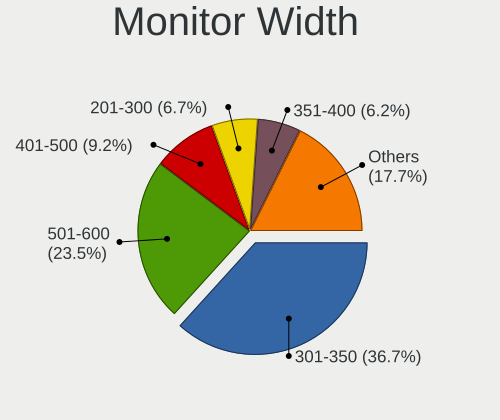

| Width in mm    | Computers | Percent |
|----------------|-----------|---------|
| 301-350        | 2975      | 36.73%  |
| 501-600        | 1906      | 23.53%  |
| 401-500        | 745       | 9.2%    |
| 201-300        | 539       | 6.66%   |
| 351-400        | 504       | 6.22%   |
| 601-700        | 415       | 5.12%   |
| Unknown        | 310       | 3.83%   |
| 701-800        | 265       | 3.27%   |
| 1001-1500      | 177       | 2.19%   |
| 1501-2000      | 125       | 1.54%   |
| 801-900        | 78        | 0.96%   |
| 901-1000       | 28        | 0.35%   |
| More than 2000 | 23        | 0.28%   |
| 1-100          | 5         | 0.06%   |
| 101-200        | 4         | 0.05%   |

Aspect Ratio
------------

Proportional relationship between the width and the height

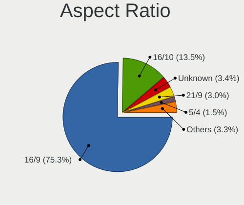

| Ratio   | Computers | Percent |
|---------|-----------|---------|
| 16/9    | 5471      | 75.26%  |
| 16/10   | 982       | 13.51%  |
| Unknown | 248       | 3.41%   |
| 21/9    | 217       | 2.99%   |
| 5/4     | 110       | 1.51%   |
| 3/2     | 105       | 1.44%   |
| 32/9    | 44        | 0.61%   |
| 4/3     | 42        | 0.58%   |
| 1.00    | 24        | 0.33%   |
| 6/5     | 7         | 0.1%    |
| 3.40    | 4         | 0.06%   |
| 0.56    | 4         | 0.06%   |
| 1.96    | 2         | 0.03%   |
| 0.67    | 2         | 0.03%   |
| 0.62    | 2         | 0.03%   |
| 0.25    | 2         | 0.03%   |
| 3.73    | 1         | 0.01%   |
| 3.20    | 1         | 0.01%   |
| 0.63    | 1         | 0.01%   |

Monitor Area
------------

Area in inch²

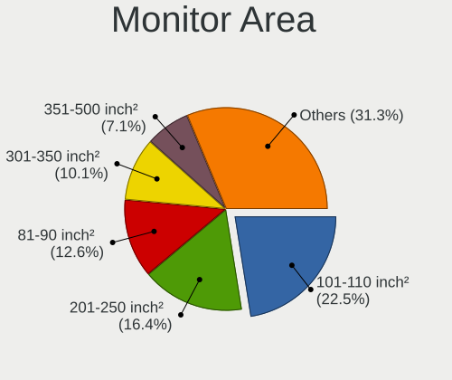

| Area in inch² | Computers | Percent |
|----------------|-----------|---------|
| 101-110        | 1846      | 22.49%  |
| 201-250        | 1348      | 16.42%  |
| 81-90          | 1032      | 12.57%  |
| 301-350        | 829       | 10.1%   |
| 351-500        | 586       | 7.14%   |
| 151-200        | 342       | 4.17%   |
| 121-130        | 333       | 4.06%   |
| Unknown        | 310       | 3.78%   |
| 251-300        | 305       | 3.72%   |
| 71-80          | 272       | 3.31%   |
| More than 1000 | 263       | 3.2%    |
| 111-120        | 193       | 2.35%   |
| 501-1000       | 168       | 2.05%   |
| 141-150        | 123       | 1.5%    |
| 61-70          | 87        | 1.06%   |
| 51-60          | 86        | 1.05%   |
| 131-140        | 43        | 0.52%   |
| 91-100         | 23        | 0.28%   |
| 41-50          | 10        | 0.12%   |
| 1-40           | 9         | 0.11%   |

Pixel Density
-------------

Pixels per inch

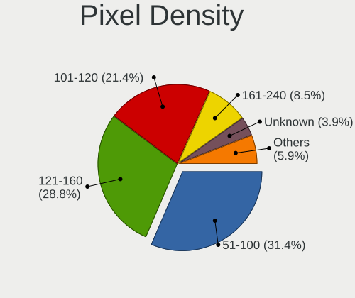

| Density       | Computers | Percent |
|---------------|-----------|---------|
| 51-100        | 2491      | 31.45%  |
| 121-160       | 2284      | 28.83%  |
| 101-120       | 1692      | 21.36%  |
| 161-240       | 677       | 8.55%   |
| Unknown       | 310       | 3.91%   |
| More than 240 | 236       | 2.98%   |
| 1-50          | 231       | 2.92%   |

Multiple Monitors
-----------------

Total monitors connected

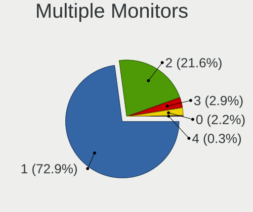

| Total | Computers | Percent |
|-------|-----------|---------|
| 1     | 5259      | 72.88%  |
| 2     | 1562      | 21.65%  |
| 3     | 211       | 2.92%   |
| 0     | 160       | 2.22%   |
| 4     | 24        | 0.33%   |

Network
-------

Net Controller Vendor
---------------------

Controller vendors

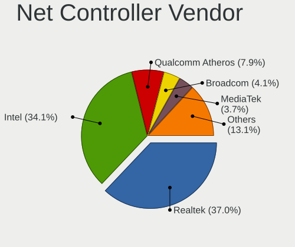

| Vendor                            | Computers | Percent |
|-----------------------------------|-----------|---------|
| Realtek Semiconductor             | 3994      | 37.04%  |
| Intel                             | 3677      | 34.1%   |
| Qualcomm Atheros                  | 849       | 7.87%   |
| Broadcom                          | 442       | 4.1%    |
| MediaTek                          | 403       | 3.74%   |
| TP-Link                           | 139       | 1.29%   |
| Ralink Technology                 | 97        | 0.9%    |
| ASIX Electronics                  | 86        | 0.8%    |
| Ralink                            | 83        | 0.77%   |
| Broadcom Limited                  | 78        | 0.72%   |
| Samsung Electronics               | 62        | 0.58%   |
| Marvell Technology Group          | 53        | 0.49%   |
| Shenzhen Goodix Technology        | 52        | 0.48%   |
| Nvidia                            | 47        | 0.44%   |
| DisplayLink                       | 45        | 0.42%   |
| Qualcomm                          | 44        | 0.41%   |
| Aquantia                          | 40        | 0.37%   |
| Microsoft                         | 36        | 0.33%   |
| Xiaomi                            | 35        | 0.32%   |
| Sierra Wireless                   | 33        | 0.31%   |
| NetGear                           | 32        | 0.3%    |
| Qualcomm Atheros Communications   | 29        | 0.27%   |
| Lenovo                            | 29        | 0.27%   |
| Dell                              | 27        | 0.25%   |
| Huawei Technologies               | 26        | 0.24%   |
| ASUSTek Computer                  | 23        | 0.21%   |
| D-Link                            | 20        | 0.19%   |
| Hewlett-Packard                   | 15        | 0.14%   |
| Ericsson Business Mobile Networks | 15        | 0.14%   |
| Google                            | 14        | 0.13%   |
| Apple                             | 14        | 0.13%   |
| Edimax Technology                 | 13        | 0.12%   |
| OPPO Electronics                  | 12        | 0.11%   |
| D-Link System                     | 12        | 0.11%   |
| Linksys                           | 11        | 0.1%    |
| JMicron Technology                | 9         | 0.08%   |
| Belkin Components                 | 9         | 0.08%   |
| AVM                               | 8         | 0.07%   |
| U-Blox                            | 7         | 0.06%   |
| Qualcomm Technologies             | 7         | 0.06%   |

Net Controller Model
--------------------

Controller models

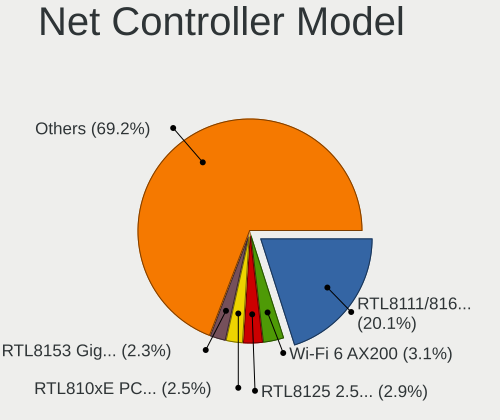

| Model                                                                  | Computers | Percent |
|------------------------------------------------------------------------|-----------|---------|
| Realtek RTL8111/8168/8211/8411 PCI Express Gigabit Ethernet Controller | 2550      | 20.09%  |
| Intel Wi-Fi 6 AX200                                                    | 389       | 3.06%   |
| Realtek RTL8125 2.5GbE Controller                                      | 362       | 2.85%   |
| Realtek RTL810xE PCI Express Fast Ethernet controller                  | 315       | 2.48%   |
| Realtek RTL8153 Gigabit Ethernet Adapter                               | 297       | 2.34%   |
| Intel Wireless 8265 / 8275                                             | 228       | 1.8%    |
| Intel 82579LM Gigabit Network Connection (Lewisville)                  | 212       | 1.67%   |
| Intel Wi-Fi 6 AX201                                                    | 198       | 1.56%   |
| Intel I211 Gigabit Network Connection                                  | 191       | 1.5%    |
| Realtek RTL8821CE 802.11ac PCIe Wireless Network Adapter               | 173       | 1.36%   |
| Intel Alder Lake-P PCH CNVi WiFi                                       | 159       | 1.25%   |
| Intel Wireless 7265                                                    | 156       | 1.23%   |
| Realtek RTL8822CE 802.11ac PCIe Wireless Network Adapter               | 149       | 1.17%   |
| Qualcomm Atheros QCA9377 802.11ac Wireless Network Adapter             | 146       | 1.15%   |
| MediaTek MT7921 802.11ax PCIe Wireless Network Adapter [Filogic 330]   | 144       | 1.13%   |
| Intel Wireless 7260                                                    | 144       | 1.13%   |
| MediaTek MT7922 802.11ax PCI Express Wireless Network Adapter          | 138       | 1.09%   |
| Intel Ethernet Controller I225-V                                       | 137       | 1.08%   |
| Intel Wi-Fi 6E(802.11ax) AX210/AX1675* 2x2 [Typhoon Peak]              | 133       | 1.05%   |
| Qualcomm Atheros QCA6174 802.11ac Wireless Network Adapter             | 126       | 0.99%   |
| Intel Cannon Lake PCH CNVi WiFi                                        | 124       | 0.98%   |
| Qualcomm Atheros AR9485 Wireless Network Adapter                       | 110       | 0.87%   |
| Intel Ethernet Connection I217-LM                                      | 106       | 0.83%   |
| Intel Ethernet Connection (2) I219-V                                   | 106       | 0.83%   |
| Intel Comet Lake PCH-LP CNVi WiFi                                      | 106       | 0.83%   |
| Intel Wireless 8260                                                    | 99        | 0.78%   |
| Qualcomm Atheros QCA9565 / AR9565 Wireless Network Adapter             | 97        | 0.76%   |
| Intel Comet Lake PCH CNVi WiFi                                         | 93        | 0.73%   |
| Intel Dual Band Wireless-AC 3168NGW [Stone Peak]                       | 86        | 0.68%   |
| Intel Wi-Fi 5(802.11ac) Wireless-AC 9x6x [Thunder Peak]                | 85        | 0.67%   |
| Intel Wireless 3165                                                    | 83        | 0.65%   |
| Intel Centrino Advanced-N 6205 [Taylor Peak]                           | 83        | 0.65%   |
| Intel Ethernet Connection (4) I219-LM                                  | 82        | 0.65%   |
| ASIX AX88179 Gigabit Ethernet                                          | 82        | 0.65%   |
| Intel Cannon Point-LP CNVi [Wireless-AC]                               | 79        | 0.62%   |
| Realtek RTL8852BE PCIe 802.11ax Wireless Network Controller            | 77        | 0.61%   |
| Intel Ethernet Connection (7) I219-V                                   | 73        | 0.58%   |
| Intel Raptor Lake PCH CNVi WiFi                                        | 64        | 0.5%    |
| Qualcomm Atheros AR9285 Wireless Network Adapter (PCI-Express)         | 57        | 0.45%   |
| Realtek RTL8723BE PCIe Wireless Network Adapter                        | 56        | 0.44%   |

Wireless Vendor
---------------

Wireless vendors

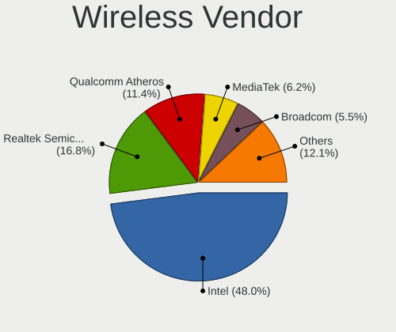

| Vendor                                | Computers | Percent |
|---------------------------------------|-----------|---------|
| Intel                                 | 2788      | 47.98%  |
| Realtek Semiconductor                 | 979       | 16.85%  |
| Qualcomm Atheros                      | 663       | 11.41%  |
| MediaTek                              | 361       | 6.21%   |
| Broadcom                              | 319       | 5.49%   |
| TP-Link                               | 121       | 2.08%   |
| Ralink Technology                     | 97        | 1.67%   |
| Ralink                                | 83        | 1.43%   |
| Broadcom Limited                      | 64        | 1.1%    |
| Qualcomm                              | 35        | 0.6%    |
| Sierra Wireless                       | 33        | 0.57%   |
| NetGear                               | 32        | 0.55%   |
| Microsoft                             | 30        | 0.52%   |
| Qualcomm Atheros Communications       | 29        | 0.5%    |
| ASUSTek Computer                      | 23        | 0.4%    |
| D-Link                                | 20        | 0.34%   |
| Dell                                  | 18        | 0.31%   |
| Marvell Technology Group              | 15        | 0.26%   |
| Edimax Technology                     | 13        | 0.22%   |
| D-Link System                         | 9         | 0.15%   |
| Belkin Components                     | 9         | 0.15%   |
| Linksys                               | 8         | 0.14%   |
| AVM                                   | 8         | 0.14%   |
| Fibocom                               | 7         | 0.12%   |
| Wacom                                 | 4         | 0.07%   |
| Hewlett-Packard                       | 4         | 0.07%   |
| 802.11g Adapter [Linksys WUSB54GC v3] | 4         | 0.07%   |
| ZyXEL Communications                  | 3         | 0.05%   |
| ZyDAS                                 | 3         | 0.05%   |
| Realtek                               | 3         | 0.05%   |
| Mercucys                              | 3         | 0.05%   |
| Wilocity                              | 2         | 0.03%   |
| Sitecom Europe                        | 2         | 0.03%   |
| Senao                                 | 2         | 0.03%   |
| IMC Networks                          | 2         | 0.03%   |
| Accton Technology                     | 2         | 0.03%   |
| ZTopInc                               | 1         | 0.02%   |
| Texas Instruments                     | 1         | 0.02%   |
| Tenda                                 | 1         | 0.02%   |
| Quectel Wireless Solutions            | 1         | 0.02%   |

Wireless Model
--------------

Wireless models

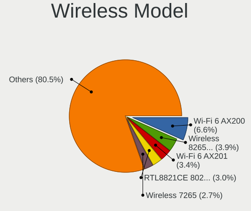

| Model                                                                | Computers | Percent |
|----------------------------------------------------------------------|-----------|---------|
| Intel Wi-Fi 6 AX200                                                  | 389       | 6.64%   |
| Intel Wireless 8265 / 8275                                           | 228       | 3.89%   |
| Intel Wi-Fi 6 AX201                                                  | 198       | 3.38%   |
| Realtek RTL8821CE 802.11ac PCIe Wireless Network Adapter             | 173       | 2.95%   |
| Intel Wireless 7265                                                  | 156       | 2.66%   |
| Realtek RTL8822CE 802.11ac PCIe Wireless Network Adapter             | 149       | 2.54%   |
| Qualcomm Atheros QCA9377 802.11ac Wireless Network Adapter           | 146       | 2.49%   |
| MediaTek MT7921 802.11ax PCIe Wireless Network Adapter [Filogic 330] | 144       | 2.46%   |
| Intel Wireless 7260                                                  | 144       | 2.46%   |
| Intel Wi-Fi 6E(802.11ax) AX210/AX1675* 2x2 [Typhoon Peak]            | 133       | 2.27%   |
| Qualcomm Atheros QCA6174 802.11ac Wireless Network Adapter           | 126       | 2.15%   |
| Intel Cannon Lake PCH CNVi WiFi                                      | 124       | 2.12%   |
| MediaTek MT7922 802.11ax PCI Express Wireless Network Adapter        | 116       | 1.98%   |
| Qualcomm Atheros AR9485 Wireless Network Adapter                     | 110       | 1.88%   |
| Intel Comet Lake PCH-LP CNVi WiFi                                    | 106       | 1.81%   |
| Intel Alder Lake-P PCH CNVi WiFi                                     | 100       | 1.71%   |
| Intel Wireless 8260                                                  | 99        | 1.69%   |
| Qualcomm Atheros QCA9565 / AR9565 Wireless Network Adapter           | 97        | 1.66%   |
| Intel Comet Lake PCH CNVi WiFi                                       | 93        | 1.59%   |
| Intel Dual Band Wireless-AC 3168NGW [Stone Peak]                     | 86        | 1.47%   |
| Intel Wi-Fi 5(802.11ac) Wireless-AC 9x6x [Thunder Peak]              | 85        | 1.45%   |
| Intel Wireless 3165                                                  | 83        | 1.42%   |
| Intel Centrino Advanced-N 6205 [Taylor Peak]                         | 83        | 1.42%   |
| Intel Cannon Point-LP CNVi [Wireless-AC]                             | 79        | 1.35%   |
| Realtek RTL8852BE PCIe 802.11ax Wireless Network Controller          | 66        | 1.13%   |
| Intel Raptor Lake PCH CNVi WiFi                                      | 64        | 1.09%   |
| Qualcomm Atheros AR9285 Wireless Network Adapter (PCI-Express)       | 57        | 0.97%   |
| Realtek RTL8723BE PCIe Wireless Network Adapter                      | 56        | 0.96%   |
| Realtek 802.11ac NIC                                                 | 56        | 0.96%   |
| Intel 700 Series Chipset CNVi WiFi                                   | 55        | 0.94%   |
| Intel Ice Lake-LP PCH CNVi WiFi                                      | 54        | 0.92%   |
| Realtek RTL8188EUS 802.11n Wireless Network Adapter                  | 52        | 0.89%   |
| Realtek RTL8822BE 802.11a/b/g/n/ac WiFi adapter                      | 51        | 0.87%   |
| Intel Tiger Lake PCH CNVi WiFi                                       | 51        | 0.87%   |
| Realtek RTL88x2bu [AC1200 Techkey]                                   | 49        | 0.84%   |
| Broadcom BCM4313 802.11bgn Wireless Network Adapter                  | 49        | 0.84%   |
| Intel Wireless 3160                                                  | 46        | 0.79%   |
| Broadcom BCM43142 802.11b/g/n                                        | 46        | 0.79%   |
| Realtek RTL8852AE 802.11ax PCIe Wireless Network Adapter             | 40        | 0.68%   |
| Ralink MT7601U Wireless Adapter                                      | 40        | 0.68%   |

Ethernet Vendor
---------------

Ethernet vendors

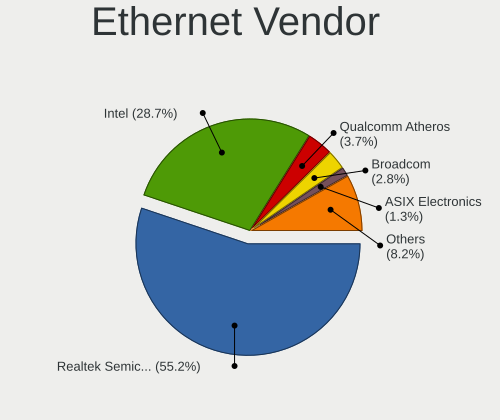

| Vendor                                 | Computers | Percent |
|----------------------------------------|-----------|---------|
| Realtek Semiconductor                  | 3560      | 55.15%  |
| Intel                                  | 1855      | 28.74%  |
| Qualcomm Atheros                       | 241       | 3.73%   |
| Broadcom                               | 183       | 2.84%   |
| ASIX Electronics                       | 86        | 1.33%   |
| Samsung Electronics                    | 62        | 0.96%   |
| Nvidia                                 | 47        | 0.73%   |
| DisplayLink                            | 45        | 0.7%    |
| MediaTek                               | 40        | 0.62%   |
| Aquantia                               | 40        | 0.62%   |
| Marvell Technology Group               | 38        | 0.59%   |
| Xiaomi                                 | 35        | 0.54%   |
| Lenovo                                 | 29        | 0.45%   |
| Huawei Technologies                    | 22        | 0.34%   |
| TP-Link                                | 18        | 0.28%   |
| Broadcom Limited                       | 15        | 0.23%   |
| Google                                 | 14        | 0.22%   |
| Apple                                  | 14        | 0.22%   |
| OPPO Electronics                       | 12        | 0.19%   |
| Qualcomm                               | 9         | 0.14%   |
| JMicron Technology                     | 9         | 0.14%   |
| Motorola PCS                           | 7         | 0.11%   |
| VIA Technologies                       | 6         | 0.09%   |
| Qualcomm Technologies                  | 6         | 0.09%   |
| Microsoft                              | 5         | 0.08%   |
| Mellanox Technologies                  | 5         | 0.08%   |
| Hewlett-Packard                        | 5         | 0.08%   |
| T & A Mobile Phones                    | 3         | 0.05%   |
| Suzhou Motorcomm Electronic Technology | 3         | 0.05%   |
| Spreadtrum Communications              | 3         | 0.05%   |
| Raspberry Pi                           | 3         | 0.05%   |
| Linksys                                | 3         | 0.05%   |
| ICS Advent                             | 3         | 0.05%   |
| D-Link System                          | 3         | 0.05%   |
| ZTE WCDMA Technologies MSM             | 2         | 0.03%   |
| Solarflare Communications              | 2         | 0.03%   |
| Silicon Integrated Systems [SiS]       | 2         | 0.03%   |
| Microchip Technology                   | 2         | 0.03%   |
| IBM                                    | 2         | 0.03%   |
| Dell                                   | 2         | 0.03%   |

Ethernet Model
--------------

Ethernet models

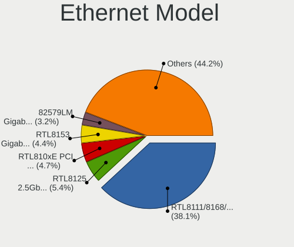

| Model                                                                          | Computers | Percent |
|--------------------------------------------------------------------------------|-----------|---------|
| Realtek RTL8111/8168/8211/8411 PCI Express Gigabit Ethernet Controller         | 2550      | 38.11%  |
| Realtek RTL8125 2.5GbE Controller                                              | 362       | 5.41%   |
| Realtek RTL810xE PCI Express Fast Ethernet controller                          | 315       | 4.71%   |
| Realtek RTL8153 Gigabit Ethernet Adapter                                       | 297       | 4.44%   |
| Intel 82579LM Gigabit Network Connection (Lewisville)                          | 212       | 3.17%   |
| Intel I211 Gigabit Network Connection                                          | 191       | 2.85%   |
| Intel Ethernet Controller I225-V                                               | 137       | 2.05%   |
| Intel Ethernet Connection I217-LM                                              | 106       | 1.58%   |
| Intel Ethernet Connection (2) I219-V                                           | 106       | 1.58%   |
| Intel Ethernet Connection (4) I219-LM                                          | 82        | 1.23%   |
| ASIX AX88179 Gigabit Ethernet                                                  | 82        | 1.23%   |
| Intel Ethernet Connection (7) I219-V                                           | 73        | 1.09%   |
| Intel Alder Lake-P PCH CNVi WiFi                                               | 59        | 0.88%   |
| Intel Ethernet Connection (7) I219-LM                                          | 55        | 0.82%   |
| Intel Ethernet Connection (2) I219-LM                                          | 46        | 0.69%   |
| Samsung Galaxy series, misc. (tethering mode)                                  | 45        | 0.67%   |
| Intel 82579V Gigabit Network Connection                                        | 44        | 0.66%   |
| Intel Ethernet Connection I219-LM                                              | 42        | 0.63%   |
| Intel Ethernet Connection (2) I218-V                                           | 41        | 0.61%   |
| Qualcomm Atheros Killer E220x Gigabit Ethernet Controller                      | 38        | 0.57%   |
| Intel I210 Gigabit Network Connection                                          | 37        | 0.55%   |
| Intel Ethernet Controller I226-V                                               | 35        | 0.52%   |
| Intel Ethernet Connection I218-LM                                              | 35        | 0.52%   |
| Intel Ethernet Connection I217-V                                               | 35        | 0.52%   |
| Intel Ethernet Connection (4) I219-V                                           | 35        | 0.52%   |
| Intel Ethernet Connection (3) I218-LM                                          | 35        | 0.52%   |
| Broadcom NetXtreme BCM57765 Gigabit Ethernet PCIe                              | 33        | 0.49%   |
| Qualcomm Atheros AR8151 v2.0 Gigabit Ethernet                                  | 31        | 0.46%   |
| Realtek Killer E2600 GbE Controller                                            | 30        | 0.45%   |
| Broadcom NetXtreme BCM57766 Gigabit Ethernet PCIe                              | 30        | 0.45%   |
| Intel Ethernet Connection (6) I219-V                                           | 29        | 0.43%   |
| Realtek RTL8152 Fast Ethernet Adapter                                          | 27        | 0.4%    |
| Qualcomm Atheros QCA8171 Gigabit Ethernet                                      | 27        | 0.4%    |
| Qualcomm Atheros Killer E2500 Gigabit Ethernet Controller                      | 27        | 0.4%    |
| Intel 82574L Gigabit Network Connection                                        | 27        | 0.4%    |
| Xiaomi Mi/Redmi series (RNDIS)                                                 | 26        | 0.39%   |
| Qualcomm Atheros AR8161 Gigabit Ethernet                                       | 25        | 0.37%   |
| Intel Ethernet Connection (5) I219-LM                                          | 24        | 0.36%   |
| Aquantia AQtion AQC107 NBase-T/IEEE 802.3an Ethernet Controller [Atlantic 10G] | 24        | 0.36%   |
| Intel Ethernet Connection (13) I219-V                                          | 23        | 0.34%   |

Net Controller Kind
-------------------

Ethernet, WiFi or modem

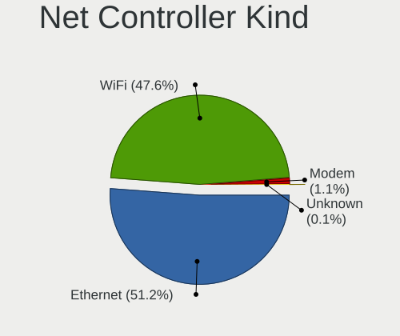

| Kind     | Computers | Percent |
|----------|-----------|---------|
| Ethernet | 5905      | 51.18%  |
| WiFi     | 5486      | 47.55%  |
| Modem    | 132       | 1.14%   |
| Unknown  | 14        | 0.12%   |

Used Controller
---------------

Currently used network controller

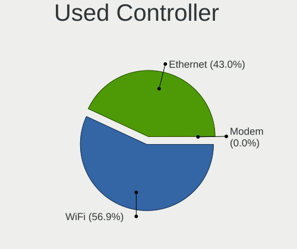

| Kind     | Computers | Percent |
|----------|-----------|---------|
| WiFi     | 4230      | 56.92%  |
| Ethernet | 3199      | 43.04%  |
| Modem    | 3         | 0.04%   |

NICs
----

Total network controllers on board

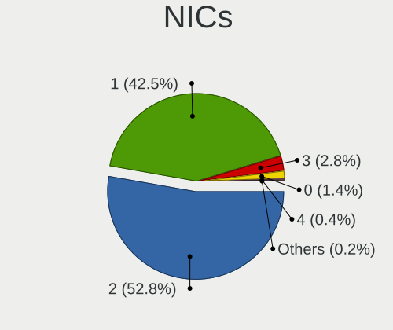

| Total | Computers | Percent |
|-------|-----------|---------|
| 2     | 3726      | 52.78%  |
| 1     | 3000      | 42.5%   |
| 3     | 195       | 2.76%   |
| 0     | 100       | 1.42%   |
| 4     | 27        | 0.38%   |
| 6     | 5         | 0.07%   |
| 5     | 5         | 0.07%   |
| 8     | 1         | 0.01%   |

IPv6
----

IPv6 vs IPv4

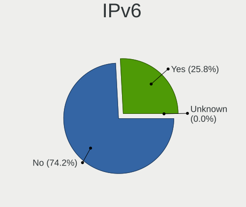

| Used    | Computers | Percent |
|---------|-----------|---------|
| No      | 5304      | 74.15%  |
| Yes     | 1848      | 25.84%  |
| Unknown | 1         | 0.01%   |

Bluetooth
---------

Bluetooth Vendor
----------------

Controller vendors

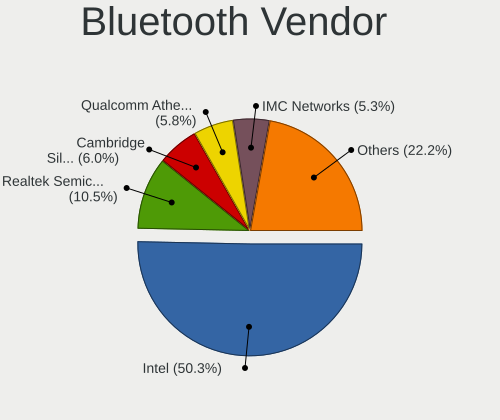

| Vendor                          | Computers | Percent |
|---------------------------------|-----------|---------|
| Intel                           | 2548      | 50.33%  |
| Realtek Semiconductor           | 530       | 10.47%  |
| Cambridge Silicon Radio         | 303       | 5.98%   |
| Qualcomm Atheros Communications | 293       | 5.79%   |
| IMC Networks                    | 266       | 5.25%   |
| Foxconn / Hon Hai               | 195       | 3.85%   |
| Broadcom                        | 195       | 3.85%   |
| Lite-On Technology              | 130       | 2.57%   |
| Apple                           | 124       | 2.45%   |
| MediaTek                        | 105       | 2.07%   |
| ASUSTek Computer                | 75        | 1.48%   |
| Dell                            | 47        | 0.93%   |
| Realtek                         | 43        | 0.85%   |
| TP-Link                         | 31        | 0.61%   |
| Ralink                          | 25        | 0.49%   |
| Hewlett-Packard                 | 21        | 0.41%   |
| Toshiba                         | 17        | 0.34%   |
| Marvell Semiconductor           | 16        | 0.32%   |
| USI                             | 15        | 0.3%    |
| Foxconn International           | 10        | 0.2%    |
| Unknown                         | 9         | 0.18%   |
| Dynex                           | 7         | 0.14%   |
| Alps Electric                   | 7         | 0.14%   |
| SiW                             | 6         | 0.12%   |
| Ralink Technology               | 6         | 0.12%   |
| Edimax Technology               | 6         | 0.12%   |
| Integrated System Solution      | 3         | 0.06%   |
| Actions                         | 3         | 0.06%   |
| Taiyo Yuden                     | 2         | 0.04%   |
| Smart Modular Technologies      | 2         | 0.04%   |
| Quectel Wireless Solutions      | 2         | 0.04%   |
| Micro Star International        | 2         | 0.04%   |
| D-Link                          | 2         | 0.04%   |
| Conwise Technology              | 2         | 0.04%   |
| Belkin Components               | 2         | 0.04%   |
| SINO WEALTH                     | 1         | 0.02%   |
| Qcom                            | 1         | 0.02%   |
| Logitech                        | 1         | 0.02%   |
| Kensington                      | 1         | 0.02%   |
| HTC (High Tech Computer)        | 1         | 0.02%   |

Bluetooth Model
---------------

Controller models

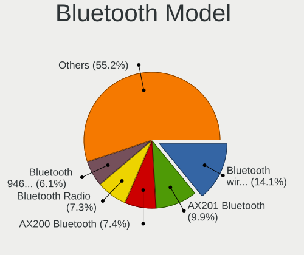

| Model                                               | Computers | Percent |
|-----------------------------------------------------|-----------|---------|
| Intel Bluetooth wireless interface                  | 716       | 14.11%  |
| Intel AX201 Bluetooth                               | 504       | 9.93%   |
| Intel AX200 Bluetooth                               | 377       | 7.43%   |
| Realtek Bluetooth Radio                             | 371       | 7.31%   |
| Intel Bluetooth 9460/9560 Jefferson Peak (JfP)      | 307       | 6.05%   |
| Cambridge Silicon Radio Bluetooth Dongle (HCI mode) | 303       | 5.97%   |
| Intel Bluetooth Device                              | 288       | 5.68%   |
| Qualcomm Atheros  Bluetooth Device                  | 149       | 2.94%   |
| Intel AX210 Bluetooth                               | 125       | 2.46%   |
| IMC Networks Wireless_Device                        | 120       | 2.37%   |
| Realtek  Bluetooth 4.2 Adapter                      | 112       | 2.21%   |
| MediaTek Wireless_Device                            | 105       | 2.07%   |
| IMC Networks Bluetooth Radio                        | 84        | 1.66%   |
| Intel Wireless-AC 3168 Bluetooth                    | 81        | 1.6%    |
| Intel Wireless-AC 9260 Bluetooth Adapter            | 80        | 1.58%   |
| Foxconn / Hon Hai Wireless_Device                   | 69        | 1.36%   |
| Apple Bluetooth Host Controller                     | 63        | 1.24%   |
| Foxconn / Hon Hai MediaTek Bluetooth Adapter        | 47        | 0.93%   |
| Qualcomm Atheros AR3012 Bluetooth 4.0               | 46        | 0.91%   |
| Intel Centrino Bluetooth Wireless Transceiver       | 44        | 0.87%   |
| Realtek Bluetooth Radio                             | 43        | 0.85%   |
| Qualcomm Atheros QCA61x4 Bluetooth 4.0              | 43        | 0.85%   |
| Foxconn / Hon Hai Bluetooth Device                  | 42        | 0.83%   |
| Broadcom BCM20702A0 Bluetooth 4.0                   | 36        | 0.71%   |
| Apple Bluetooth USB Host Controller                 | 36        | 0.71%   |
| Lite-On Qualcomm Atheros QCA9377 Bluetooth          | 35        | 0.69%   |
| Lite-On Bluetooth Device                            | 35        | 0.69%   |
| TP-Link TP-T@- UB500 Adapter                        | 31        | 0.61%   |
| Lite-On Wireless_Device                             | 30        | 0.59%   |
| Broadcom BCM20702 Bluetooth 4.0 [ThinkPad]          | 30        | 0.59%   |
| IMC Networks Bluetooth Device                       | 29        | 0.57%   |
| Intel Centrino Advanced-N 6230 Bluetooth adapter    | 27        | 0.53%   |
| ASUS ASUS USB-BT500                                 | 26        | 0.51%   |
| Ralink RT3290 Bluetooth                             | 25        | 0.49%   |
| Apple Built-in Bluetooth 2.0+EDR HCI                | 24        | 0.47%   |
| Broadcom BCM2045B (BDC-2.1)                         | 22        | 0.43%   |
| Qualcomm Atheros AR3011 Bluetooth                   | 21        | 0.41%   |
| ASUS Broadcom BCM20702A0 Bluetooth                  | 20        | 0.39%   |
| Qualcomm Atheros AR9462 Bluetooth                   | 19        | 0.37%   |
| Broadcom HP Portable SoftSailing                    | 19        | 0.37%   |

Sound
-----

Sound Vendor
------------

Sound card vendors

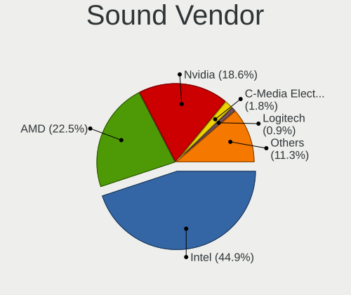

| Vendor                                       | Computers | Percent |
|----------------------------------------------|-----------|---------|
| Intel                                        | 4795      | 44.93%  |
| AMD                                          | 2398      | 22.47%  |
| Nvidia                                       | 1984      | 18.59%  |
| C-Media Electronics                          | 191       | 1.79%   |
| Logitech                                     | 96        | 0.9%    |
| JMTek                                        | 69        | 0.65%   |
| GN Netcom                                    | 67        | 0.63%   |
| Creative Labs                                | 60        | 0.56%   |
| Realtek Semiconductor                        | 54        | 0.51%   |
| ASUSTek Computer                             | 53        | 0.5%    |
| Texas Instruments                            | 50        | 0.47%   |
| Hewlett-Packard                              | 50        | 0.47%   |
| Creative Technology                          | 42        | 0.39%   |
| Generalplus Technology                       | 41        | 0.38%   |
| Razer USA                                    | 37        | 0.35%   |
| Focusrite-Novation                           | 31        | 0.29%   |
| SteelSeries ApS                              | 30        | 0.28%   |
| Micro Star International                     | 30        | 0.28%   |
| Lenovo                                       | 30        | 0.28%   |
| Corsair                                      | 30        | 0.28%   |
| Plantronics                                  | 26        | 0.24%   |
| Kingston Technology                          | 20        | 0.19%   |
| Apple                                        | 17        | 0.16%   |
| Dell                                         | 16        | 0.15%   |
| VIA Technologies                             | 15        | 0.14%   |
| DSEA A/S                                     | 14        | 0.13%   |
| Sony                                         | 13        | 0.12%   |
| Blue Microphones                             | 12        | 0.11%   |
| BEHRINGER International                      | 12        | 0.11%   |
| Tenx Technology                              | 11        | 0.1%    |
| Samson Technologies                          | 10        | 0.09%   |
| Astro Gaming                                 | 9         | 0.08%   |
| ASRock                                       | 9         | 0.08%   |
| Zoran Co. Personal Media Division (Nogatech) | 8         | 0.07%   |
| Trust                                        | 8         | 0.07%   |
| RODE Microphones                             | 8         | 0.07%   |
| PreSonus Audio Electronics                   | 8         | 0.07%   |
| Microsoft                                    | 8         | 0.07%   |
| Yamaha                                       | 7         | 0.07%   |
| M-Audio                                      | 7         | 0.07%   |

Sound Model
-----------

Sound card models

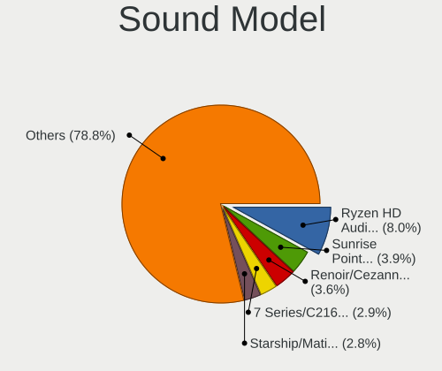

| Model                                                                      | Computers | Percent |
|----------------------------------------------------------------------------|-----------|---------|
| AMD Ryzen HD Audio Controller                                              | 1029      | 8.02%   |
| Intel Sunrise Point-LP HD Audio                                            | 502       | 3.91%   |
| AMD Renoir/Cezanne HDMI/DP Audio Controller                                | 463       | 3.61%   |
| Intel 7 Series/C216 Chipset Family High Definition Audio Controller        | 370       | 2.88%   |
| AMD Starship/Matisse HD Audio Controller                                   | 359       | 2.8%    |
| Intel 8 Series/C220 Series Chipset High Definition Audio Controller        | 353       | 2.75%   |
| Intel 6 Series/C200 Series Chipset Family High Definition Audio Controller | 328       | 2.56%   |
| Intel Cannon Lake PCH cAVS                                                 | 316       | 2.46%   |
| Intel Tiger Lake-LP Smart Sound Technology Audio Controller                | 278       | 2.17%   |
| Intel Xeon E3-1200 v3/4th Gen Core Processor HD Audio Controller           | 267       | 2.08%   |
| AMD Radeon High Definition Audio Controller                                | 266       | 2.07%   |
| AMD Raven/Raven2/Fenghuang HDMI/DP Audio Controller                        | 221       | 1.72%   |
| Intel Alder Lake PCH-P High Definition Audio Controller                    | 200       | 1.56%   |
| AMD SBx00 Azalia (Intel HDA)                                               | 200       | 1.56%   |
| Intel 100 Series/C230 Series Chipset Family HD Audio Controller            | 196       | 1.53%   |
| Nvidia GP107GL High Definition Audio Controller                            | 173       | 1.35%   |
| AMD Family 17h (Models 00h-0fh) HD Audio Controller                        | 165       | 1.29%   |
| Intel Cannon Point-LP High Definition Audio Controller                     | 156       | 1.22%   |
| AMD FCH Azalia Controller                                                  | 156       | 1.22%   |
| Intel Haswell-ULT HD Audio Controller                                      | 149       | 1.16%   |
| Intel 8 Series HD Audio Controller                                         | 148       | 1.15%   |
| Intel 200 Series PCH HD Audio                                              | 144       | 1.12%   |
| AMD Ellesmere HDMI Audio [Radeon RX 470/480 / 570/580/590]                 | 143       | 1.11%   |
| Nvidia TU107 GeForce GTX 1650 High Definition Audio Controller             | 132       | 1.03%   |
| Intel Comet Lake PCH-LP cAVS                                               | 129       | 1.01%   |
| Intel Comet Lake PCH cAVS                                                  | 127       | 0.99%   |
| Intel 5 Series/3400 Series Chipset High Definition Audio                   | 127       | 0.99%   |
| Intel Broadwell-U Audio Controller                                         | 121       | 0.94%   |
| Intel Wildcat Point-LP High Definition Audio Controller                    | 120       | 0.94%   |
| AMD Navi 21/23 HDMI/DP Audio Controller                                    | 116       | 0.9%    |
| Intel Celeron/Pentium Silver Processor High Definition Audio               | 112       | 0.87%   |
| Nvidia TU106 High Definition Audio Controller                              | 110       | 0.86%   |
| Nvidia TU116 High Definition Audio Controller                              | 108       | 0.84%   |
| Nvidia GK208 HDMI/DP Audio Controller                                      | 105       | 0.82%   |
| Nvidia GA106 High Definition Audio Controller                              | 103       | 0.8%    |
| Nvidia GP104 High Definition Audio Controller                              | 101       | 0.79%   |
| Intel 82801I (ICH9 Family) HD Audio Controller                             | 101       | 0.79%   |
| Nvidia GA104 High Definition Audio Controller                              | 99        | 0.77%   |
| Nvidia GP106 High Definition Audio Controller                              | 92        | 0.72%   |
| Intel Ice Lake-LP Smart Sound Technology Audio Controller                  | 92        | 0.72%   |

Memory
------

Memory Vendor
-------------

Memory module vendors

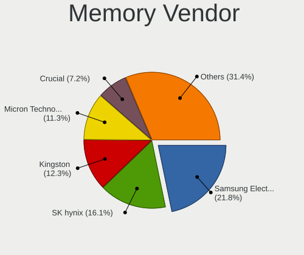

| Vendor              | Computers | Percent |
|---------------------|-----------|---------|
| Samsung Electronics | 1055      | 21.77%  |
| SK hynix            | 778       | 16.05%  |
| Kingston            | 596       | 12.3%   |
| Micron Technology   | 548       | 11.31%  |
| Crucial             | 349       | 7.2%    |
| Corsair             | 307       | 6.34%   |
| Unknown             | 258       | 5.32%   |
| G.Skill             | 224       | 4.62%   |
| A-DATA Technology   | 101       | 2.08%   |
| Unknown             | 73        | 1.51%   |
| Ramaxel Technology  | 70        | 1.44%   |
| Unknown (ABCD)      | 57        | 1.18%   |
| Team                | 55        | 1.13%   |
| Elpida              | 49        | 1.01%   |
| Nanya Technology    | 43        | 0.89%   |
| Patriot             | 31        | 0.64%   |
| Smart               | 23        | 0.47%   |
| Transcend           | 21        | 0.43%   |
| Apacer              | 13        | 0.27%   |
| Silicon Power       | 11        | 0.23%   |
| GOODRAM             | 11        | 0.23%   |
| Avant               | 8         | 0.17%   |
| AMD                 | 8         | 0.17%   |
| Timetec             | 6         | 0.12%   |
| PNY                 | 6         | 0.12%   |
| ASint Technology    | 6         | 0.12%   |
| Wodposit            | 5         | 0.1%    |
| Wilk                | 5         | 0.1%    |
| Teikon              | 5         | 0.1%    |
| Smart Brazil        | 5         | 0.1%    |
| Lexar               | 5         | 0.1%    |
| 4ea5                | 5         | 0.1%    |
| Kllisre             | 4         | 0.08%   |
| ff                  | 4         | 0.08%   |
| SHARETRONIC         | 3         | 0.06%   |
| KINGBANK            | 3         | 0.06%   |
| Goldkey             | 3         | 0.06%   |
| GeIL                | 3         | 0.06%   |
| CSX                 | 3         | 0.06%   |
| Atermiter           | 3         | 0.06%   |

Memory Model
------------

Memory module models

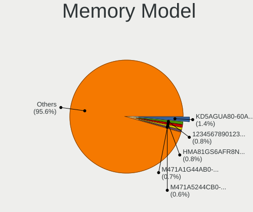

| Model                                                            | Computers | Percent |
|------------------------------------------------------------------|-----------|---------|
| Unknown                                                          | 73        | 1.41%   |
| Unknown (ABCD) RAM 123456789012345678 2GB SODIMM LPDDR4 2400MT/s | 44        | 0.85%   |
| SK hynix RAM HMA81GS6AFR8N-UH 8GB SODIMM DDR4 2667MT/s           | 44        | 0.85%   |
| Samsung RAM M471A1G44AB0-CWE 8GiB SODIMM DDR4 3200MT/s           | 35        | 0.67%   |
| Samsung RAM M471A5244CB0-CTD 4GB SODIMM DDR4 3266MT/s            | 33        | 0.64%   |
| Samsung RAM M471A1K43CB1-CTD 8GB SODIMM DDR4 3200MT/s            | 33        | 0.64%   |
| Samsung RAM M471A1K43CB1-CRC 8GB SODIMM DDR4 8400MT/s            | 31        | 0.6%    |
| Samsung RAM M471A1K43EB1-CWE 8GB SODIMM DDR4 3200MT/s            | 30        | 0.58%   |
| Samsung RAM M471A1K43DB1-CWE 8GB SODIMM DDR4 3200MT/s            | 30        | 0.58%   |
| Micron RAM 4ATF51264HZ-2G6E1 4GB SODIMM DDR4 2667MT/s            | 27        | 0.52%   |
| SK hynix RAM HMAA1GS6CJR6N-XN 8GB SODIMM DDR4 3200MT/s           | 26        | 0.5%    |
| Samsung RAM M471A1K43DB1-CTD 8GB SODIMM DDR4 2667MT/s            | 26        | 0.5%    |
| SK hynix RAM HMA81GS6DJR8N-XN 8GB SODIMM DDR4 3200MT/s           | 25        | 0.48%   |
| Corsair RAM CMK16GX4M2B3200C16 8GB DIMM DDR4 3600MT/s            | 25        | 0.48%   |
| Samsung RAM M471A1G44AB0-CWE 8GB Row Of Chips DDR4 3200MT/s      | 24        | 0.46%   |
| SK hynix RAM HMT451S6BFR8A-PB 4GB SODIMM DDR3 1600MT/s           | 23        | 0.44%   |
| Samsung RAM M471A2K43DB1-CTD 16GB SODIMM DDR4 2667MT/s           | 22        | 0.42%   |
| SK hynix RAM HMA81GS6CJR8N-VK 8GB SODIMM DDR4 2667MT/s           | 21        | 0.4%    |
| Samsung RAM M471B5173QH0-YK0 4GB SODIMM DDR3 1600MT/s            | 21        | 0.4%    |
| Samsung RAM M471B5173DB0-YK0 4GB SODIMM DDR3 1600MT/s            | 21        | 0.4%    |
| Samsung RAM M471A5244CB0-CRC 4GB SODIMM DDR4 2667MT/s            | 21        | 0.4%    |
| Samsung RAM M471A1G44BB0-CWE 8GB SODIMM DDR4 3200MT/s            | 21        | 0.4%    |
| SK hynix RAM HMT351S6CFR8C-PB 4GB SODIMM DDR3 1600MT/s           | 20        | 0.39%   |
| Micron RAM 4ATF1G64HZ-3G2E1 8GB Row Of Chips DDR4 3200MT/s       | 20        | 0.39%   |
| Samsung RAM M471B1G73DB0-YK0 8GB SODIMM DDR3 1600MT/s            | 19        | 0.37%   |
| SK hynix RAM HMT41GS6BFR8A-PB 8GB SODIMM DDR3 2667MT/s           | 18        | 0.35%   |
| SK hynix RAM HMA851S6CJR6N-VK 4GB SODIMM DDR4 2667MT/s           | 18        | 0.35%   |
| Samsung RAM M471A5244CB0-CWE 4GB SODIMM DDR4 3200MT/s            | 18        | 0.35%   |
| Micron RAM 4ATF1G64HZ-3G2F1 8GB SODIMM DDR4 3200MT/s             | 18        | 0.35%   |
| Micron RAM 4ATF1G64HZ-3G2E1 8GB SODIMM DDR4 3200MT/s             | 18        | 0.35%   |
| Samsung RAM M471B5273DH0-CH9 4GB SODIMM DDR3 1600MT/s            | 17        | 0.33%   |
| Samsung RAM M471B5173EB0-YK0 4GB SODIMM DDR3 1600MT/s            | 17        | 0.33%   |
| Samsung RAM M471A2K43DB1-CWE 16GB SODIMM DDR4 3200MT/s           | 16        | 0.31%   |
| Samsung RAM M471A2K43CB1-CTD 16GB SODIMM DDR4 8400MT/s           | 16        | 0.31%   |
| SK hynix RAM HMA82GS6JJR8N-VK 16GB SODIMM DDR4 2667MT/s          | 15        | 0.29%   |
| SK hynix RAM HMA81GS6JJR8N-VK 8GB SODIMM DDR4 2667MT/s           | 15        | 0.29%   |
| SK hynix RAM HMA41GS6AFR8N-TF 8GB SODIMM DDR4 2667MT/s           | 14        | 0.27%   |
| Samsung RAM UBE3D4AA-MGCR 2GB Row Of Chips LPDDR4 4267MT/s       | 14        | 0.27%   |
| Micron RAM 8ATF1G64HZ-3G2J1 8GB SODIMM DDR4 3200MT/s             | 14        | 0.27%   |
| Micron RAM 4ATF51264HZ-3G2J1 4GB SODIMM DDR4 3200MT/s            | 14        | 0.27%   |

Memory Kind
-----------

Memory module kinds

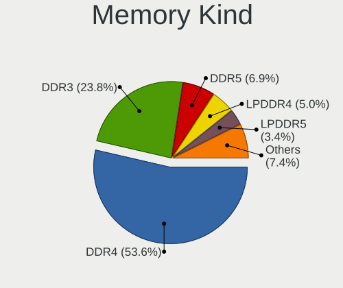

| Kind    | Computers | Percent |
|---------|-----------|---------|
| DDR4    | 2244      | 53.61%  |
| DDR3    | 996       | 23.79%  |
| DDR5    | 287       | 6.86%   |
| LPDDR4  | 210       | 5.02%   |
| LPDDR5  | 141       | 3.37%   |
| LPDDR3  | 91        | 2.17%   |
| Unknown | 76        | 1.82%   |
| DDR2    | 65        | 1.55%   |
| SDRAM   | 61        | 1.46%   |
| DDR     | 12        | 0.29%   |
| DRAM    | 3         | 0.07%   |

Memory Form Factor
------------------

Physical design of the memory module

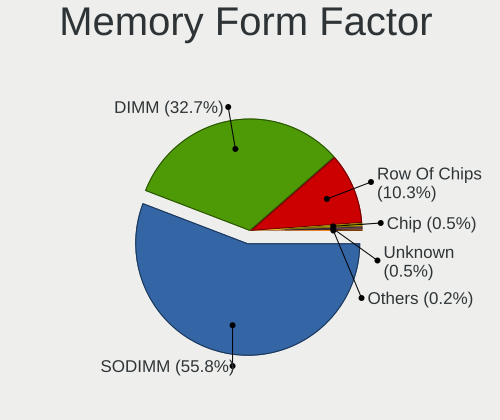

| Name            | Computers | Percent |
|-----------------|-----------|---------|
| SODIMM          | 2339      | 55.82%  |
| DIMM            | 1372      | 32.74%  |
| Row Of Chips    | 431       | 10.29%  |
| Chip            | 21        | 0.5%    |
| Unknown         | 19        | 0.45%   |
| RIMM            | 3         | 0.07%   |
| FB-DIMM         | 3         | 0.07%   |
| Proprietary Car | 1         | 0.02%   |
| DIP             | 1         | 0.02%   |

Memory Size
-----------

Memory module size

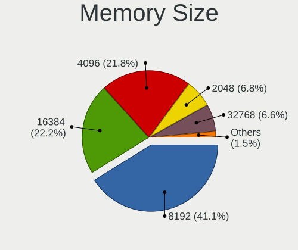

| Size  | Computers | Percent |
|-------|-----------|---------|
| 8192  | 1889      | 41.15%  |
| 16384 | 1017      | 22.15%  |
| 4096  | 1003      | 21.85%  |
| 2048  | 311       | 6.77%   |
| 32768 | 301       | 6.56%   |
| 1024  | 42        | 0.91%   |
| 49152 | 15        | 0.33%   |
| 12288 | 4         | 0.09%   |
| 65536 | 2         | 0.04%   |
| 24576 | 2         | 0.04%   |
| 6144  | 1         | 0.02%   |
| 3072  | 1         | 0.02%   |
| 512   | 1         | 0.02%   |
| 256   | 1         | 0.02%   |
| 128   | 1         | 0.02%   |

Memory Speed
------------

Memory module speed

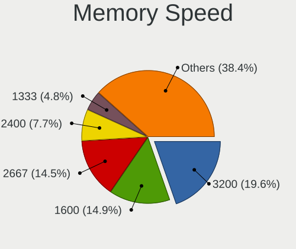

| Speed   | Computers | Percent |
|---------|-----------|---------|
| 3200    | 893       | 19.64%  |
| 1600    | 679       | 14.93%  |
| 2667    | 658       | 14.47%  |
| 2400    | 352       | 7.74%   |
| 1333    | 219       | 4.82%   |
| 2133    | 198       | 4.35%   |
| 3600    | 164       | 3.61%   |
| 5600    | 106       | 2.33%   |
| 4267    | 99        | 2.18%   |
| 4800    | 91        | 2%      |
| 6400    | 86        | 1.89%   |
| 1867    | 61        | 1.34%   |
| 1334    | 61        | 1.34%   |
| 3733    | 53        | 1.17%   |
| 6000    | 52        | 1.14%   |
| 3800    | 51        | 1.12%   |
| 8400    | 49        | 1.08%   |
| 2666    | 46        | 1.01%   |
| 800     | 45        | 0.99%   |
| 3266    | 38        | 0.84%   |
| 667     | 38        | 0.84%   |
| 7500    | 36        | 0.79%   |
| 3000    | 34        | 0.75%   |
| Unknown | 31        | 0.68%   |
| 1866    | 27        | 0.59%   |
| 4000    | 26        | 0.57%   |
| 3400    | 25        | 0.55%   |
| 1067    | 25        | 0.55%   |
| 1066    | 22        | 0.48%   |
| 2933    | 21        | 0.46%   |
| 4199    | 18        | 0.4%    |
| 4266    | 17        | 0.37%   |
| 1800    | 14        | 0.31%   |
| 3466    | 13        | 0.29%   |
| 8533    | 11        | 0.24%   |
| 6200    | 11        | 0.24%   |
| 3866    | 11        | 0.24%   |
| 3066    | 10        | 0.22%   |
| 2800    | 10        | 0.22%   |
| 3333    | 9         | 0.2%    |

Printers & scanners
-------------------

Printer Vendor
--------------

Printer device vendors

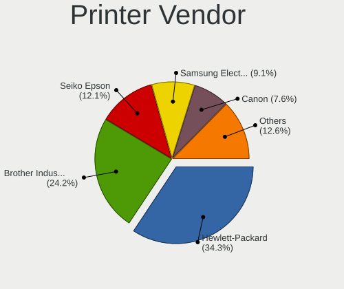

| Vendor                 | Computers | Percent |
|------------------------|-----------|---------|
| Hewlett-Packard        | 68        | 34.34%  |
| Brother Industries     | 48        | 24.24%  |
| Seiko Epson            | 24        | 12.12%  |
| Samsung Electronics    | 18        | 9.09%   |
| Canon                  | 15        | 7.58%   |
| Zebra                  | 3         | 1.52%   |
| Pantum                 | 3         | 1.52%   |
| Dymo-CoStar            | 3         | 1.52%   |
| Xerox                  | 2         | 1.01%   |
| Prolific Technology    | 2         | 1.01%   |
| Lexmark International  | 2         | 1.01%   |
| Zebra Technologies     | 1         | 0.51%   |
| Ricoh                  | 1         | 0.51%   |
| QinHeng Electronics    | 1         | 0.51%   |
| Panasonic (Matsushita) | 1         | 0.51%   |
| Kyocera                | 1         | 0.51%   |
| iDPRT                  | 1         | 0.51%   |
| ICS Advent             | 1         | 0.51%   |
| Datamax-O'Neil         | 1         | 0.51%   |
| Apple                  | 1         | 0.51%   |
| Analog Devices         | 1         | 0.51%   |

Printer Model
-------------

Printer device models

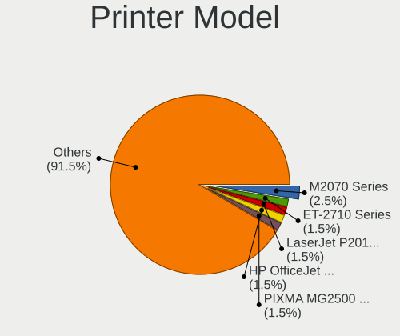

| Model                                    | Computers | Percent |
|------------------------------------------|-----------|---------|
| Samsung M2070 Series                     | 5         | 2.49%   |
| Seiko Epson ET-2710 Series               | 3         | 1.49%   |
| HP LaserJet P2015 series                 | 3         | 1.49%   |
| HP HP OfficeJet Pro 8020 series          | 3         | 1.49%   |
| Canon PIXMA MG2500 Series                | 3         | 1.49%   |
| Seiko Epson L3110 Series                 | 2         | 1%      |
| Seiko Epson EPSON L220 Series            | 2         | 1%      |
| Samsung SCX-3400 Series                  | 2         | 1%      |
| Prolific PL2305 Parallel Port            | 2         | 1%      |
| HP OfficeJet Pro 7740 series             | 2         | 1%      |
| HP OfficeJet 4650 series                 | 2         | 1%      |
| HP OfficeJet 3830 series                 | 2         | 1%      |
| HP LaserJet P1102                        | 2         | 1%      |
| HP LaserJet 1020                         | 2         | 1%      |
| HP LaserJet 1018                         | 2         | 1%      |
| HP LaserJet 1010                         | 2         | 1%      |
| HP ENVY 4500 series                      | 2         | 1%      |
| HP DeskJet 3630 series                   | 2         | 1%      |
| HP DeskJet 2700 series                   | 2         | 1%      |
| HP DeskJet 2600 series                   | 2         | 1%      |
| Brother MFC-L2710DW series               | 2         | 1%      |
| Brother MFC-J460DW                       | 2         | 1%      |
| Brother MFC-J1010DW                      | 2         | 1%      |
| Brother HL-L2320D series                 | 2         | 1%      |
| Brother HL-L2300D series                 | 2         | 1%      |
| Brother HL-2230 series                   | 2         | 1%      |
| Brother DCP-9020CDW                      | 2         | 1%      |
| Zebra ZTC ZM400-200dpi ZPL               | 1         | 0.5%    |
| Zebra ZTC LP2844-Z-200dpi                | 1         | 0.5%    |
| Zebra Thrmal 2844                        | 1         | 0.5%    |
| Zebra ZD410 Direct Thermal Label Printer | 1         | 0.5%    |
| Xerox Phaser 6500DN                      | 1         | 0.5%    |
| Xerox Phaser 3140 and 3155               | 1         | 0.5%    |
| Seiko Epson XP-7100 Series               | 1         | 0.5%    |
| Seiko Epson XP-3100 Series               | 1         | 0.5%    |
| Seiko Epson XP-2200 Series               | 1         | 0.5%    |
| Seiko Epson XP-2150 Series               | 1         | 0.5%    |
| Seiko Epson XP-2100 Series               | 1         | 0.5%    |
| Seiko Epson WF-2930 Series               | 1         | 0.5%    |
| Seiko Epson WF-2530 Series               | 1         | 0.5%    |

Scanner Vendor
--------------

Scanner device vendors

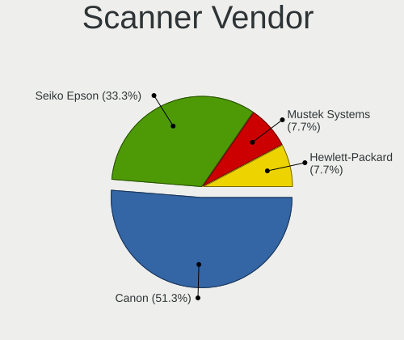

| Vendor          | Computers | Percent |
|-----------------|-----------|---------|
| Canon           | 20        | 51.28%  |
| Seiko Epson     | 13        | 33.33%  |
| Mustek Systems  | 3         | 7.69%   |
| Hewlett-Packard | 3         | 7.69%   |

Scanner Model
-------------

Scanner device models

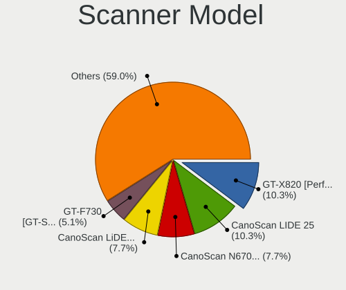

| Model                                                   | Computers | Percent |
|---------------------------------------------------------|-----------|---------|
| Seiko Epson GT-X820 [Perfection V600 Photo]             | 4         | 10.26%  |
| Canon CanoScan LIDE 25                                  | 4         | 10.26%  |
| Canon CanoScan N670U/N676U/LiDE 20                      | 3         | 7.69%   |
| Canon CanoScan LiDE 110                                 | 3         | 7.69%   |
| Seiko Epson GT-F730 [GT-S630/Perfection V33/V330 Photo] | 2         | 5.13%   |
| Canon CanoScan LiDE 50/LiDE 35/LiDE 40                  | 2         | 5.13%   |
| Canon CanoScan LiDE 220                                 | 2         | 5.13%   |
| Canon CanoScan LiDE 210                                 | 2         | 5.13%   |
| Seiko Epson Perfection 660                              | 1         | 2.56%   |
| Seiko Epson GT-X900 [Perfection V700/V750 Photo]        | 1         | 2.56%   |
| Seiko Epson GT-X770 [Perfection V500]                   | 1         | 2.56%   |
| Seiko Epson GT-F720 [GT-S620/Perfection V30/V300 Photo] | 1         | 2.56%   |
| Seiko Epson GT-F600 [Perfection 4180]                   | 1         | 2.56%   |
| Seiko Epson GT-6600U [Perfection 610]                   | 1         | 2.56%   |
| Seiko Epson ES-D200 [GT-S50]                            | 1         | 2.56%   |
| Mustek Systems SNAPSCAN e22                             | 1         | 2.56%   |
| Mustek Systems ScanExpress A3 USB 1200 PRO              | 1         | 2.56%   |
| Mustek Systems BearPaw 1200 CU Plus                     | 1         | 2.56%   |
| HP ScanJet G4010                                        | 1         | 2.56%   |
| HP ScanJet 82x0C                                        | 1         | 2.56%   |
| HP ScanJet 3770                                         | 1         | 2.56%   |
| Canon CanoScan N1240U/LiDE 30                           | 1         | 2.56%   |
| Canon CanoScan LiDE 60                                  | 1         | 2.56%   |
| Canon CanoScan LiDE 500F                                | 1         | 2.56%   |
| Canon CanoScan LiDE 120                                 | 1         | 2.56%   |

Camera
------

Camera Vendor
-------------

Camera device vendors

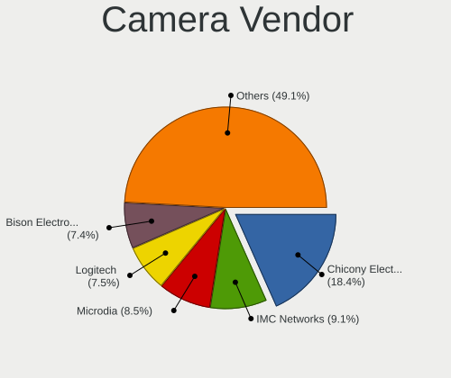

| Vendor                                 | Computers | Percent |
|----------------------------------------|-----------|---------|
| Chicony Electronics                    | 850       | 18.35%  |
| IMC Networks                           | 422       | 9.11%   |
| Microdia                               | 393       | 8.48%   |
| Logitech                               | 349       | 7.53%   |
| Bison Electronics                      | 342       | 7.38%   |
| Realtek Semiconductor                  | 326       | 7.04%   |
| Quanta                                 | 255       | 5.51%   |
| Sunplus Innovation Technology          | 247       | 5.33%   |
| Cheng Uei Precision Industry (Foxlink) | 165       | 3.56%   |
| Luxvisions Innotech Limited            | 125       | 2.7%    |
| Apple                                  | 113       | 2.44%   |
| Syntek                                 | 106       | 2.29%   |
| Lite-On Technology                     | 77        | 1.66%   |
| Suyin                                  | 72        | 1.55%   |
| Silicon Motion                         | 61        | 1.32%   |
| Microsoft                              | 53        | 1.14%   |
| Sonix Technology                       | 52        | 1.12%   |
| Samsung Electronics                    | 51        | 1.1%    |
| Alcor Micro                            | 39        | 0.84%   |
| ShineTech                              | 29        | 0.63%   |
| SunplusIT                              | 28        | 0.6%    |
| Generalplus Technology                 | 26        | 0.56%   |
| Z-Star Microelectronics                | 20        | 0.43%   |
| Ricoh                                  | 20        | 0.43%   |
| MacroSilicon                           | 18        | 0.39%   |
| Acer                                   | 17        | 0.37%   |
| Lenovo                                 | 15        | 0.32%   |
| KYE Systems (Mouse Systems)            | 14        | 0.3%    |
| icSpring                               | 13        | 0.28%   |
| ARC International                      | 13        | 0.28%   |
| Trust                                  | 12        | 0.26%   |
| GEMBIRD                                | 11        | 0.24%   |
| Shenzhen Kingcome Optoelectronic       | 10        | 0.22%   |
| Huawei Technologies                    | 10        | 0.22%   |
| Creative Technology                    | 10        | 0.22%   |
| Razer USA                              | 9         | 0.19%   |
| kingcome                               | 9         | 0.19%   |
| Jieli Technology                       | 9         | 0.19%   |
| Intel                                  | 9         | 0.19%   |
| Cubeternet                             | 9         | 0.19%   |

Camera Model
------------

Camera device models

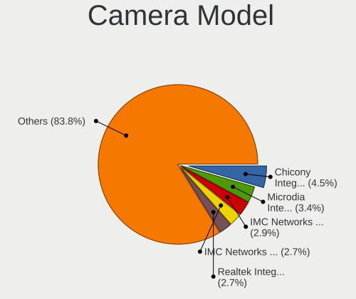

| Model                                         | Computers | Percent |
|-----------------------------------------------|-----------|---------|
| Chicony Integrated Camera                     | 210       | 4.49%   |
| Microdia Integrated_Webcam_HD                 | 157       | 3.35%   |
| IMC Networks USB2.0 HD UVC WebCam             | 138       | 2.95%   |
| IMC Networks Integrated Camera                | 127       | 2.71%   |
| Realtek Integrated_Webcam_HD                  | 125       | 2.67%   |
| Bison Integrated Camera                       | 110       | 2.35%   |
| Syntek Integrated Camera                      | 84        | 1.79%   |
| Sunplus Integrated_Webcam_HD                  | 83        | 1.77%   |
| Logitech Webcam C270                          | 73        | 1.56%   |
| Chicony HD Webcam                             | 71        | 1.52%   |
| Logitech HD Pro Webcam C920                   | 67        | 1.43%   |
| Samsung Galaxy series, misc. (MTP mode)       | 48        | 1.03%   |
| Chicony HP HD Camera                          | 47        | 1%      |
| Quanta HD User Facing                         | 46        | 0.98%   |
| Chicony HD User Facing                        | 42        | 0.9%    |
| Quanta HP HD Camera                           | 39        | 0.83%   |
| Microdia Webcam Vitade AF                     | 36        | 0.77%   |
| Luxvisions Innotech Limited Integrated Camera | 36        | 0.77%   |
| Bison HD Webcam                               | 36        | 0.77%   |
| Apple FaceTime HD Camera (Built-in)           | 34        | 0.73%   |
| Microdia Integrated Webcam                    | 33        | 0.71%   |
| Microdia Integrated_Webcam_FHD                | 32        | 0.68%   |
| Apple iPhone 5/5C/5S/6/SE/7/8/X               | 32        | 0.68%   |
| Quanta HP TrueVision HD Camera                | 31        | 0.66%   |
| Chicony Integrated Camera (1280x720@30)       | 31        | 0.66%   |
| Chicony HP Wide Vision HD Camera              | 30        | 0.64%   |
| Bison Lenovo EasyCamera                       | 29        | 0.62%   |
| Quanta HD Webcam                              | 28        | 0.6%    |
| Chicony HP TrueVision HD Camera               | 28        | 0.6%    |
| Bison BisonCam,NB Pro                         | 28        | 0.6%    |
| Sonix USB2.0 HD UVC WebCam                    | 27        | 0.58%   |
| IMC Networks USB2.0 VGA UVC WebCam            | 26        | 0.56%   |
| Lite-On Integrated Camera                     | 25        | 0.53%   |
| Chicony Chicony USB2.0 Camera                 | 24        | 0.51%   |
| Microdia USB 2.0 Camera                       | 23        | 0.49%   |
| Chicony USB2.0 Camera                         | 23        | 0.49%   |
| Chicony HP Truevision HD                      | 23        | 0.49%   |
| Quanta HP Wide Vision HD Camera               | 22        | 0.47%   |
| Logitech C922 Pro Stream Webcam               | 22        | 0.47%   |
| Bison Integrated RGB Camera                   | 22        | 0.47%   |

Security
--------

Fingerprint Vendor
------------------

Fingerprint sensor vendors

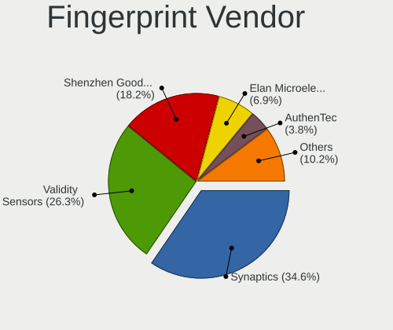

| Vendor                             | Computers | Percent |
|------------------------------------|-----------|---------|
| Synaptics                          | 311       | 34.56%  |
| Validity Sensors                   | 237       | 26.33%  |
| Shenzhen Goodix Technology         | 164       | 18.22%  |
| Elan Microelectronics              | 62        | 6.89%   |
| AuthenTec                          | 34        | 3.78%   |
| Upek                               | 28        | 3.11%   |
| LighTuning Technology              | 27        | 3%      |
| Realtek USB2.0 Finger Print Bridge | 13        | 1.44%   |
| STMicroelectronics                 | 8         | 0.89%   |
| Focal-systems.Corp                 | 5         | 0.56%   |
| HOLTEK                             | 4         | 0.44%   |
| Samsung Electronics                | 3         | 0.33%   |
| DigitalPersona                     | 2         | 0.22%   |
| GDMicroelectronics                 | 1         | 0.11%   |
| Dell                               | 1         | 0.11%   |

Fingerprint Model
-----------------

Fingerprint sensor models

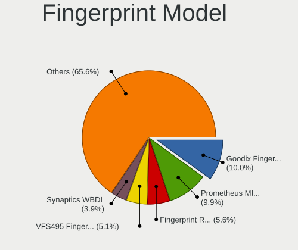

| Model                                                                      | Computers | Percent |
|----------------------------------------------------------------------------|-----------|---------|
| Shenzhen Goodix  Fingerprint Device                                        | 90        | 10%     |
| Synaptics Prometheus MIS Touch Fingerprint Reader                          | 89        | 9.89%   |
| Shenzhen Goodix Fingerprint Reader                                         | 50        | 5.56%   |
| Validity Sensors VFS495 Fingerprint Reader                                 | 46        | 5.11%   |
| Validity Sensors Synaptics WBDI                                            | 35        | 3.89%   |
| Elan ELAN:Fingerprint                                                      | 32        | 3.56%   |
| Elan ELAN:ARM-M4                                                           | 28        | 3.11%   |
| Validity Sensors VFS 5011 fingerprint sensor                               | 27        | 3%      |
| Upek Biometric Touchchip/Touchstrip Fingerprint Sensor                     | 27        | 3%      |
| Synaptics Metallica MIS Touch Fingerprint Reader                           | 26        | 2.89%   |
| Synaptics WBDI                                                             | 24        | 2.67%   |
| Shenzhen Goodix FingerPrint                                                | 24        | 2.67%   |
| Validity Sensors VFS5011 Fingerprint Reader                                | 23        | 2.56%   |
| Synaptics UWP WBDI                                                         | 22        | 2.44%   |
| Validity Sensors Synaptics VFS7552 Touch Fingerprint Sensor with PurePrint | 20        | 2.22%   |
| Validity Sensors Swipe Fingerprint Sensor                                  | 20        | 2.22%   |
| Synaptics  FS7604 Touch Fingerprint Sensor with PurePrint                  | 20        | 2.22%   |
| Synaptics UWP WBDI Device                                                  | 19        | 2.11%   |
| Synaptics FS7604 Touch Fingerprint Sensor with PurePrint                   | 19        | 2.11%   |
| Synaptics Prometheus Fingerprint Reader                                    | 18        | 2%      |
| Synaptics Fingerprint reader [HP G6]                                       | 16        | 1.78%   |
| Synaptics  WBDI                                                            | 15        | 1.67%   |
| LighTuning EgisTec Touch Fingerprint Sensor                                | 15        | 1.67%   |
| Synaptics Metallica MOH Touch Fingerprint Reader                           | 14        | 1.56%   |
| Validity Sensors VFS491                                                    | 13        | 1.44%   |
| Realtek USB2.0 Finger Print Bridge FocalTech Fingerprint Device            | 13        | 1.44%   |
| Validity Sensors VFS7500 Touch Fingerprint Sensor                          | 11        | 1.22%   |
| Synaptics WBDI Fingerprint Reader USB 086                                  | 10        | 1.11%   |
| AuthenTec AES2810                                                          | 10        | 1.11%   |
| Validity Sensors VFS471 Fingerprint Reader                                 | 9         | 1%      |
| AuthenTec Fingerprint Sensor                                               | 9         | 1%      |
| Validity Sensors VFS451 Fingerprint Reader                                 | 8         | 0.89%   |
| Validity Sensors Synaptics VFS7552 Touch Fingerprint Sensor                | 8         | 0.89%   |
| STMicroelectronics Fingerprint Reader                                      | 8         | 0.89%   |
| Validity Sensors Fingerprint scanner                                       | 7         | 0.78%   |
| LighTuning ES603 Swipe Fingerprint Sensor                                  | 7         | 0.78%   |
| AuthenTec AES2501 Fingerprint Sensor                                       | 7         | 0.78%   |
| Validity Sensors VFS7552 Touch Fingerprint Sensor                          | 6         | 0.67%   |
| Synaptics TouchPad                                                         | 6         | 0.67%   |
| Focal-systems.Corp FT9201Fingerprint.                                      | 5         | 0.56%   |

Chipcard Vendor
---------------

Chipcard module vendors

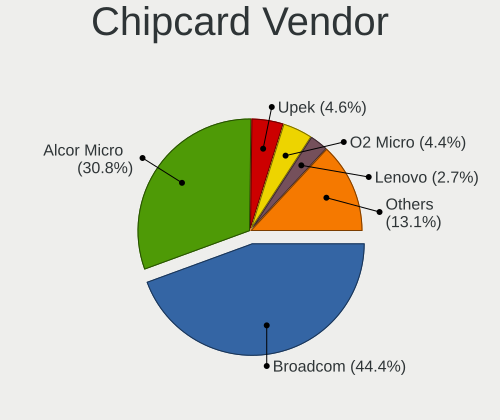

| Vendor                    | Computers | Percent |
|---------------------------|-----------|---------|
| Broadcom                  | 163       | 44.41%  |
| Alcor Micro               | 113       | 30.79%  |
| Upek                      | 17        | 4.63%   |
| O2 Micro                  | 16        | 4.36%   |
| Lenovo                    | 10        | 2.72%   |
| Advanced Card Systems     | 8         | 2.18%   |
| SCM Microsystems          | 6         | 1.63%   |
| Gemalto (was Gemplus)     | 5         | 1.36%   |
| Yubico.com                | 4         | 1.09%   |
| Reiner SCT Kartensysteme  | 3         | 0.82%   |
| OmniKey                   | 3         | 0.82%   |
| Aladdin R.D.              | 3         | 0.82%   |
| Realtek Semiconductor     | 2         | 0.54%   |
| Fujitsu Siemens Computers | 2         | 0.54%   |
| Clay Logic                | 2         | 0.54%   |
| Bit4id                    | 2         | 0.54%   |
| Aladdin Knowledge Systems | 2         | 0.54%   |
| Watchdata                 | 1         | 0.27%   |
| Thetis                    | 1         | 0.27%   |
| In Focus Systems          | 1         | 0.27%   |
| Giesecke & Devrient       | 1         | 0.27%   |
| Chicony Electronics       | 1         | 0.27%   |
| Aktiv                     | 1         | 0.27%   |

Chipcard Model
--------------

Chipcard module models

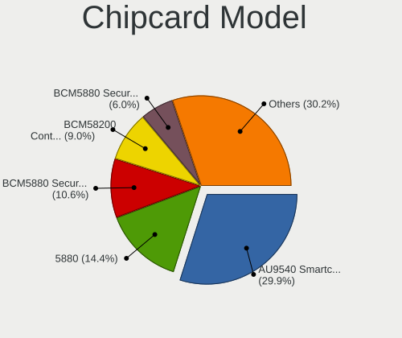

| Model                                                                        | Computers | Percent |
|------------------------------------------------------------------------------|-----------|---------|
| Alcor Micro AU9540 Smartcard Reader                                          | 110       | 29.89%  |
| Broadcom 5880                                                                | 53        | 14.4%   |
| Broadcom BCM5880 Secure Applications Processor                               | 39        | 10.6%   |
| Broadcom BCM58200 ControlVault 3 (FingerPrint sensor + Contacted SmartCard)  | 33        | 8.97%   |
| Broadcom BCM5880 Secure Applications Processor with fingerprint swipe sensor | 22        | 5.98%   |
| Upek TouchChip Fingerprint Coprocessor (WBF advanced mode)                   | 17        | 4.62%   |
| O2 Micro OZ776 CCID Smartcard Reader                                         | 16        | 4.35%   |
| Broadcom 58200                                                               | 14        | 3.8%    |
| Lenovo Integrated Smart Card Reader                                          | 10        | 2.72%   |
| Advanced Card Systems ACR38 SmartCard Reader                                 | 5         | 1.36%   |
| Yubico.com Yubikey 4/5 U2F+CCID                                              | 4         | 1.09%   |
| Gemalto (was Gemplus) GemPC Twin SmartCard Reader                            | 4         | 1.09%   |
| Alcor Micro Watchdata W 1981                                                 | 3         | 0.82%   |
| Aladdin R.D. JaCarta                                                         | 3         | 0.82%   |
| SCM Microsystems SCR331-LC1 / SCR3310 SmartCard Reader                       | 2         | 0.54%   |
| SCM Microsystems SCR331 SmartCard Reader                                     | 2         | 0.54%   |
| Reiner SCT Kartensysteme cyberJack RFID basis contactless smartcard reader   | 2         | 0.54%   |
| Realtek Semiconductor Smart Card Reader Interface                            | 2         | 0.54%   |
| OmniKey CardMan 1021                                                         | 2         | 0.54%   |
| Clay Logic Nitrokey Pro                                                      | 2         | 0.54%   |
| Broadcom BCM5880 Secure Applications Processor with fingerprint touch sensor | 2         | 0.54%   |
| Bit4id miniLector EVO                                                        | 2         | 0.54%   |
| Aladdin Knowledge Systems Token JC                                           | 2         | 0.54%   |
| Advanced Card Systems ACR39U                                                 | 2         | 0.54%   |
| Watchdata USB Key                                                            | 1         | 0.27%   |
| Thetis Security Key(F825)                                                    | 1         | 0.27%   |
| SCM Microsystems uTrust FIDO2 Security Key                                   | 1         | 0.27%   |
| SCM Microsystems SCR3340 - ExpressCard54 Smart Card Reader                   | 1         | 0.27%   |
| Reiner SCT Kartensysteme tanJack USB                                         | 1         | 0.27%   |
| OmniKey CardMan 3021 / 3121                                                  | 1         | 0.27%   |
| In Focus Systems EMV Smartcard Reader                                        | 1         | 0.27%   |
| Giesecke & Devrient Chipcard Reader                                          | 1         | 0.27%   |
| Gemalto (was Gemplus) GemPC Key SmartCard Reader                             | 1         | 0.27%   |
| Fujitsu Siemens Computers Smartcard Reader D323                              | 1         | 0.27%   |
| Fujitsu Siemens Computers Keyboard KB SCR                                    | 1         | 0.27%   |
| Chicony Electronics HP Skylab USB Smartcard Keyboard                         | 1         | 0.27%   |
| Aktiv Rutoken lite                                                           | 1         | 0.27%   |
| Advanced Card Systems ACR1252 CL Reader PICC                                 | 1         | 0.27%   |
| Advanced Card Systems ACR122U                                                | 1         | 0.27%   |

Unsupported
-----------

Unsupported Devices
-------------------

Total unsupported devices on board

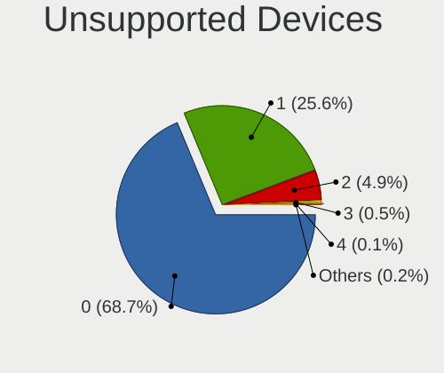

| Total | Computers | Percent |
|-------|-----------|---------|
| 0     | 4943      | 68.72%  |
| 1     | 1838      | 25.55%  |
| 2     | 353       | 4.91%   |
| 3     | 36        | 0.5%    |
| 4     | 10        | 0.14%   |
| 6     | 5         | 0.07%   |
| 7     | 4         | 0.06%   |
| 5     | 3         | 0.04%   |
| 9     | 1         | 0.01%   |

Unsupported Device Types
------------------------

Types of unsupported devices

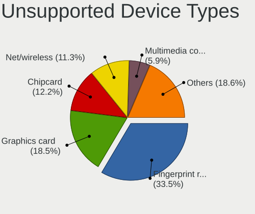

| Type                     | Computers | Percent |
|--------------------------|-----------|---------|
| Fingerprint reader       | 882       | 33.52%  |
| Graphics card            | 487       | 18.51%  |
| Chipcard                 | 320       | 12.16%  |
| Net/wireless             | 297       | 11.29%  |
| Multimedia controller    | 156       | 5.93%   |
| Camera                   | 107       | 4.07%   |
| Sound                    | 69        | 2.62%   |
| Unassigned class         | 61        | 2.32%   |
| Bluetooth                | 61        | 2.32%   |
| Communication controller | 59        | 2.24%   |
| Card reader              | 32        | 1.22%   |
| Storage                  | 28        | 1.06%   |
| Network                  | 18        | 0.68%   |
| Net/ethernet             | 18        | 0.68%   |
| Modem                    | 10        | 0.38%   |
| Storage/ide              | 9         | 0.34%   |
| Dvb card                 | 6         | 0.23%   |
| Storage/raid             | 5         | 0.19%   |
| Firewire controller      | 5         | 0.19%   |
| Storage/nvme             | 1         | 0.04%   |

