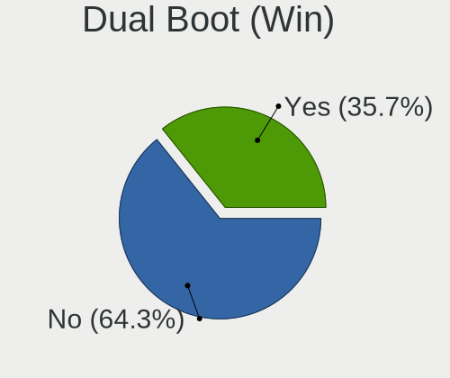
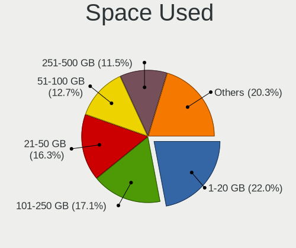
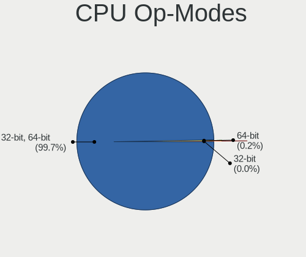
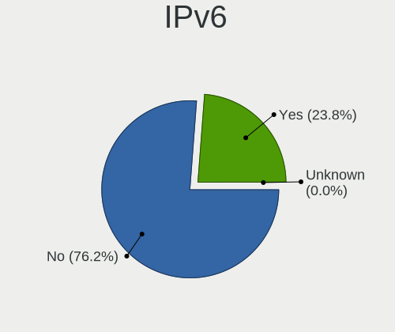
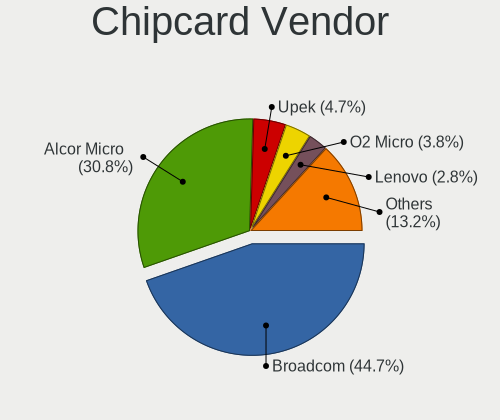

Kubuntu - Tested Hardware & Statistics
--------------------------------------

A project to collect tested hardware configurations for Kubuntu.

Anyone can contribute to this report by the [hw-probe](https://github.com/linuxhw/hw-probe) tool:

    sudo -E hw-probe -all -upload

Please contribute! Especially if your hardware is rare.

This is a report for all computer types. See also reports for [desktops](/Dist/Kubuntu/Desktop/README.md) and [notebooks](/Dist/Kubuntu/Notebook/README.md).

Contents
--------

* [ Test Cases ](#test-cases)

* [ System ](#system)
  - [ OS                       ](#os)
  - [ OS Family                ](#os-family)
  - [ Kernel                   ](#kernel)
  - [ Kernel Family            ](#kernel-family)
  - [ Kernel Major Ver.        ](#kernel-major-ver)
  - [ Arch                     ](#arch)
  - [ DE                       ](#de)
  - [ Display Server           ](#display-server)
  - [ Display Manager          ](#display-manager)
  - [ OS Lang                  ](#os-lang)
  - [ Boot Mode                ](#boot-mode)
  - [ Filesystem               ](#filesystem)
  - [ Part. scheme             ](#part-scheme)
  - [ Dual Boot with Linux/BSD ](#dual-boot-with-linuxbsd)
  - [ Dual Boot (Win)          ](#dual-boot-win)

* [ Board ](#board)
  - [ Vendor                   ](#vendor)
  - [ Model                    ](#model)
  - [ Model Family             ](#model-family)
  - [ MFG Year                 ](#mfg-year)
  - [ Form Factor              ](#form-factor)
  - [ Secure Boot              ](#secure-boot)
  - [ Coreboot                 ](#coreboot)
  - [ RAM Size                 ](#ram-size)
  - [ RAM Used                 ](#ram-used)
  - [ Total Drives             ](#total-drives)
  - [ Has CD-ROM               ](#has-cd-rom)
  - [ Has Ethernet             ](#has-ethernet)
  - [ Has WiFi                 ](#has-wifi)
  - [ Has Bluetooth            ](#has-bluetooth)

* [ Location ](#location)
  - [ Country                  ](#country)
  - [ City                     ](#city)

* [ Drives ](#drives)
  - [ Drive Vendor             ](#drive-vendor)
  - [ Drive Model              ](#drive-model)
  - [ HDD Vendor               ](#hdd-vendor)
  - [ SSD Vendor               ](#ssd-vendor)
  - [ Drive Kind               ](#drive-kind)
  - [ Drive Connector          ](#drive-connector)
  - [ Drive Size               ](#drive-size)
  - [ Space Total              ](#space-total)
  - [ Space Used               ](#space-used)
  - [ Malfunc. Drives          ](#malfunc-drives)
  - [ Malfunc. Drive Vendor    ](#malfunc-drive-vendor)
  - [ Malfunc. HDD Vendor      ](#malfunc-hdd-vendor)
  - [ Malfunc. Drive Kind      ](#malfunc-drive-kind)
  - [ Failed Drives            ](#failed-drives)
  - [ Failed Drive Vendor      ](#failed-drive-vendor)
  - [ Drive Status             ](#drive-status)

* [ Storage controller ](#storage-controller)
  - [ Storage Vendor           ](#storage-vendor)
  - [ Storage Model            ](#storage-model)
  - [ Storage Kind             ](#storage-kind)

* [ Processor ](#processor)
  - [ CPU Vendor               ](#cpu-vendor)
  - [ CPU Model                ](#cpu-model)
  - [ CPU Model Family         ](#cpu-model-family)
  - [ CPU Cores                ](#cpu-cores)
  - [ CPU Sockets              ](#cpu-sockets)
  - [ CPU Threads              ](#cpu-threads)
  - [ CPU Op-Modes             ](#cpu-op-modes)
  - [ CPU Microcode            ](#cpu-microcode)
  - [ CPU Microarch            ](#cpu-microarch)

* [ Graphics ](#graphics)
  - [ GPU Vendor               ](#gpu-vendor)
  - [ GPU Model                ](#gpu-model)
  - [ GPU Combo                ](#gpu-combo)
  - [ GPU Driver               ](#gpu-driver)
  - [ GPU Memory               ](#gpu-memory)

* [ Monitor ](#monitor)
  - [ Monitor Vendor           ](#monitor-vendor)
  - [ Monitor Model            ](#monitor-model)
  - [ Monitor Resolution       ](#monitor-resolution)
  - [ Monitor Diagonal         ](#monitor-diagonal)
  - [ Monitor Width            ](#monitor-width)
  - [ Aspect Ratio             ](#aspect-ratio)
  - [ Monitor Area             ](#monitor-area)
  - [ Pixel Density            ](#pixel-density)
  - [ Multiple Monitors        ](#multiple-monitors)

* [ Network ](#network)
  - [ Net Controller Vendor    ](#net-controller-vendor)
  - [ Net Controller Model     ](#net-controller-model)
  - [ Wireless Vendor          ](#wireless-vendor)
  - [ Wireless Model           ](#wireless-model)
  - [ Ethernet Vendor          ](#ethernet-vendor)
  - [ Ethernet Model           ](#ethernet-model)
  - [ Net Controller Kind      ](#net-controller-kind)
  - [ Used Controller          ](#used-controller)
  - [ NICs                     ](#nics)
  - [ IPv6                     ](#ipv6)

* [ Bluetooth ](#bluetooth)
  - [ Bluetooth Vendor         ](#bluetooth-vendor)
  - [ Bluetooth Model          ](#bluetooth-model)

* [ Sound ](#sound)
  - [ Sound Vendor             ](#sound-vendor)
  - [ Sound Model              ](#sound-model)

* [ Memory ](#memory)
  - [ Memory Vendor            ](#memory-vendor)
  - [ Memory Model             ](#memory-model)
  - [ Memory Kind              ](#memory-kind)
  - [ Memory Form Factor       ](#memory-form-factor)
  - [ Memory Size              ](#memory-size)
  - [ Memory Speed             ](#memory-speed)

* [ Printers & scanners ](#printers--scanners)
  - [ Printer Vendor           ](#printer-vendor)
  - [ Printer Model            ](#printer-model)
  - [ Scanner Vendor           ](#scanner-vendor)
  - [ Scanner Model            ](#scanner-model)

* [ Camera ](#camera)
  - [ Camera Vendor            ](#camera-vendor)
  - [ Camera Model             ](#camera-model)

* [ Security ](#security)
  - [ Fingerprint Vendor       ](#fingerprint-vendor)
  - [ Fingerprint Model        ](#fingerprint-model)
  - [ Chipcard Vendor          ](#chipcard-vendor)
  - [ Chipcard Model           ](#chipcard-model)

* [ Unsupported ](#unsupported)
  - [ Unsupported Devices      ](#unsupported-devices)
  - [ Unsupported Device Types ](#unsupported-device-types)

Test Cases
----------

Total: 4920

| Vendor        | Model                       | Form-Factor | Probe                                                      | Date         |
|---------------|-----------------------------|-------------|------------------------------------------------------------|--------------|
| Dell          | XPS 15 9520                 | Notebook    | [ecfa5f6c27](https://linux-hardware.org/?probe=ecfa5f6c27) | Mar 01, 2023 |
| ASRock        | B550M Steel Legend          | Desktop     | [8fd450db03](https://linux-hardware.org/?probe=8fd450db03) | Feb 28, 2023 |
| ASUSTek       | ASUS TUF Gaming F15 FX50... | Notebook    | [41439f6b61](https://linux-hardware.org/?probe=41439f6b61) | Feb 28, 2023 |
| Dell          | Latitude 5530               | Notebook    | [f892221e4c](https://linux-hardware.org/?probe=f892221e4c) | Feb 27, 2023 |
| ASRock        | Z790 PG Lightning           | Desktop     | [86c7144757](https://linux-hardware.org/?probe=86c7144757) | Feb 27, 2023 |
| ASUSTek       | VivoBook_ASUSLaptop M760... | Notebook    | [003aa3d3e9](https://linux-hardware.org/?probe=003aa3d3e9) | Feb 27, 2023 |
| HP            | EliteBook 835 G8 Noteboo... | Notebook    | [aa26becbb1](https://linux-hardware.org/?probe=aa26becbb1) | Feb 27, 2023 |
| ASUSTek       | VivoBook_ASUSLaptop E210... | Notebook    | [ad20f98122](https://linux-hardware.org/?probe=ad20f98122) | Feb 27, 2023 |
| Lenovo        | IdeaPad 5 Pro 14ACN6 82L... | Notebook    | [a2af33e0e3](https://linux-hardware.org/?probe=a2af33e0e3) | Feb 27, 2023 |
| ASUSTek       | TUF Gaming FX705DT_FX705... | Notebook    | [a5f5bdc903](https://linux-hardware.org/?probe=a5f5bdc903) | Feb 26, 2023 |
| Gigabyte      | B360M HD3                   | Desktop     | [d3821bdbab](https://linux-hardware.org/?probe=d3821bdbab) | Feb 26, 2023 |
| A-DATA Tec... | XENIAXe15TI7G11GXELX        | Notebook    | [d6e0c6c0ac](https://linux-hardware.org/?probe=d6e0c6c0ac) | Feb 26, 2023 |
| ASRock        | G41C-GS                     | Desktop     | [6a698dda57](https://linux-hardware.org/?probe=6a698dda57) | Feb 26, 2023 |
| ASUSTek       | PRIME B450M-K               | Desktop     | [575e6a8c55](https://linux-hardware.org/?probe=575e6a8c55) | Feb 26, 2023 |
| Digibras      | NH4CU03                     | Notebook    | [8bfe7e434d](https://linux-hardware.org/?probe=8bfe7e434d) | Feb 26, 2023 |
| Lenovo        | ThinkPad L430 24663D1       | Notebook    | [b410d220e6](https://linux-hardware.org/?probe=b410d220e6) | Feb 26, 2023 |
| Lenovo        | IdeaPad 3 15ADA05 81W1      | Notebook    | [67b8b5ad09](https://linux-hardware.org/?probe=67b8b5ad09) | Feb 26, 2023 |
| Gigabyte      | B450M DS3H WIFI-CF          | Desktop     | [c872892cfd](https://linux-hardware.org/?probe=c872892cfd) | Feb 26, 2023 |
| Apple         | Mac-8ED6AF5B48C039E1 Mac... | Mini pc     | [c6ca9e8499](https://linux-hardware.org/?probe=c6ca9e8499) | Feb 26, 2023 |
| MSI           | A320M PRO-VD PLUS           | Desktop     | [bd6c07d84d](https://linux-hardware.org/?probe=bd6c07d84d) | Feb 26, 2023 |
| HP            | G62                         | Notebook    | [871207750c](https://linux-hardware.org/?probe=871207750c) | Feb 25, 2023 |
| MSI           | MAG B550 TOMAHAWK           | Desktop     | [2943aa6cd7](https://linux-hardware.org/?probe=2943aa6cd7) | Feb 25, 2023 |
| HP            | Pavilion Laptop 15-cs3xx... | Notebook    | [0b9491b3a0](https://linux-hardware.org/?probe=0b9491b3a0) | Feb 25, 2023 |
| ASRock        | H97 Pro4                    | Desktop     | [f703af2e6b](https://linux-hardware.org/?probe=f703af2e6b) | Feb 25, 2023 |
| HP            | Pavilion x360 Convertibl... | Convertible | [844de888cd](https://linux-hardware.org/?probe=844de888cd) | Feb 25, 2023 |
| System76      | Gazelle                     | Notebook    | [64fcb063eb](https://linux-hardware.org/?probe=64fcb063eb) | Feb 25, 2023 |
| Gigabyte      | B450 AORUS ELITE            | Desktop     | [e7bf168729](https://linux-hardware.org/?probe=e7bf168729) | Feb 25, 2023 |
| Alienware     | m15 R7 AMD                  | Notebook    | [0a44dcc29e](https://linux-hardware.org/?probe=0a44dcc29e) | Feb 24, 2023 |
| Dell          | Latitude 5530               | Notebook    | [8ad26dd8a0](https://linux-hardware.org/?probe=8ad26dd8a0) | Feb 24, 2023 |
| Alienware     | m15 R7 AMD                  | Notebook    | [3ba05d49d8](https://linux-hardware.org/?probe=3ba05d49d8) | Feb 24, 2023 |
| ASRock        | M3A770DE                    | Desktop     | [b025c7a092](https://linux-hardware.org/?probe=b025c7a092) | Feb 24, 2023 |
| Gigabyte      | B365M DS3H                  | Desktop     | [463265c999](https://linux-hardware.org/?probe=463265c999) | Feb 24, 2023 |
| Gigabyte      | B365M DS3H                  | Desktop     | [4aec81f692](https://linux-hardware.org/?probe=4aec81f692) | Feb 24, 2023 |
| MSI           | GE75 Raider 9SE             | Notebook    | [6d0782da8e](https://linux-hardware.org/?probe=6d0782da8e) | Feb 24, 2023 |
| ASUSTek       | ROG STRIX Z790-E GAMING ... | Desktop     | [471b84b6d4](https://linux-hardware.org/?probe=471b84b6d4) | Feb 23, 2023 |
| Gigabyte      | H510M H                     | Desktop     | [2f9c2ec647](https://linux-hardware.org/?probe=2f9c2ec647) | Feb 23, 2023 |
| Samsung       | 950QDB                      | Convertible | [2545626207](https://linux-hardware.org/?probe=2545626207) | Feb 23, 2023 |
| Dell          | 0PC5F7 A03                  | Desktop     | [27f07447f7](https://linux-hardware.org/?probe=27f07447f7) | Feb 23, 2023 |
| Shuttle       | FL10J                       | Desktop     | [943316a9c5](https://linux-hardware.org/?probe=943316a9c5) | Feb 22, 2023 |
| Lenovo        | ThinkPad X1 Yoga 4th 20Q... | Convertible | [c81213c25e](https://linux-hardware.org/?probe=c81213c25e) | Feb 22, 2023 |
| Dell          | System Inspiron N7110       | Notebook    | [4a3b8e0755](https://linux-hardware.org/?probe=4a3b8e0755) | Feb 22, 2023 |
| Acer          | Nitro AN515-55              | Notebook    | [acb8644ede](https://linux-hardware.org/?probe=acb8644ede) | Feb 21, 2023 |
| Apple         | Mac-942B59F58194171B iMa... | All in one  | [d6ec8781f4](https://linux-hardware.org/?probe=d6ec8781f4) | Feb 21, 2023 |
| MSI           | B85-G43                     | Desktop     | [62273631b2](https://linux-hardware.org/?probe=62273631b2) | Feb 21, 2023 |
| Dell          | 01TN68 A02                  | Desktop     | [ce7bdb1ddf](https://linux-hardware.org/?probe=ce7bdb1ddf) | Feb 21, 2023 |
| Lenovo        | ThinkPad T440p 20AWS3E20... | Notebook    | [012b54b31c](https://linux-hardware.org/?probe=012b54b31c) | Feb 21, 2023 |
| Dell          | Inspiron 7400               | Notebook    | [0d286f12f4](https://linux-hardware.org/?probe=0d286f12f4) | Feb 21, 2023 |
| GPU Compan... | GWTC116-2                   | Notebook    | [5fa20b737f](https://linux-hardware.org/?probe=5fa20b737f) | Feb 21, 2023 |
| ASRock        | 960GC-GS FX                 | Desktop     | [39718b8983](https://linux-hardware.org/?probe=39718b8983) | Feb 20, 2023 |
| Lenovo        | ThinkBook 15 G3 ACL 21A4    | Notebook    | [6033e6cb63](https://linux-hardware.org/?probe=6033e6cb63) | Feb 20, 2023 |
| Framework     | Laptop (12th Gen Intel C... | Notebook    | [63de5bef96](https://linux-hardware.org/?probe=63de5bef96) | Feb 20, 2023 |
| Apple         | MacBookAir3,1               | Notebook    | [1e0de945b7](https://linux-hardware.org/?probe=1e0de945b7) | Feb 20, 2023 |
| Gigabyte      | X99-Ultra Gaming-CF         | Desktop     | [031c13ea35](https://linux-hardware.org/?probe=031c13ea35) | Feb 19, 2023 |
| ASUSTek       | H97-PLUS                    | Desktop     | [6824ee9944](https://linux-hardware.org/?probe=6824ee9944) | Feb 19, 2023 |
| ASUSTek       | VivoBook_ASUSLaptop X430... | Notebook    | [7e5327c1ed](https://linux-hardware.org/?probe=7e5327c1ed) | Feb 19, 2023 |
| HP            | ProBook 4730s               | Notebook    | [99232fe32d](https://linux-hardware.org/?probe=99232fe32d) | Feb 19, 2023 |
| Lenovo        | ThinkBook 15 G2 ITL 20VE    | Notebook    | [82db23bd7f](https://linux-hardware.org/?probe=82db23bd7f) | Feb 19, 2023 |
| ASUSTek       | X555LJ                      | Notebook    | [93f3ae1f77](https://linux-hardware.org/?probe=93f3ae1f77) | Feb 19, 2023 |
| HP            | Victus by Laptop 16z-e10... | Notebook    | [a48460122c](https://linux-hardware.org/?probe=a48460122c) | Feb 19, 2023 |
| Gigabyte      | X670 AORUS ELITE AX         | Desktop     | [25c9923614](https://linux-hardware.org/?probe=25c9923614) | Feb 18, 2023 |
| ASRock        | B550M Steel Legend          | Desktop     | [b3c5c043ea](https://linux-hardware.org/?probe=b3c5c043ea) | Feb 18, 2023 |
| Acer          | Aspire A515-46              | Notebook    | [46a8b61785](https://linux-hardware.org/?probe=46a8b61785) | Feb 18, 2023 |
| ASRock        | B550M Steel Legend          | Desktop     | [1c1470c8a2](https://linux-hardware.org/?probe=1c1470c8a2) | Feb 18, 2023 |
| Intel         | DP965LT AAD41694-206        | Desktop     | [2744ec3c4a](https://linux-hardware.org/?probe=2744ec3c4a) | Feb 18, 2023 |
| Dell          | Inspiron 14 7420 2-in-1     | Convertible | [7daf230ef2](https://linux-hardware.org/?probe=7daf230ef2) | Feb 18, 2023 |
| Lenovo        | IdeaPad 5 15ALC05 82LN      | Notebook    | [eb64c99981](https://linux-hardware.org/?probe=eb64c99981) | Feb 18, 2023 |
| Dell          | System Inspiron N7110       | Notebook    | [542553dd55](https://linux-hardware.org/?probe=542553dd55) | Feb 18, 2023 |
| Lenovo        | ThinkPad T14 Gen 1 20S00... | Notebook    | [4baabf8013](https://linux-hardware.org/?probe=4baabf8013) | Feb 18, 2023 |
| Dell          | Precision 7540              | Notebook    | [2a511e3e78](https://linux-hardware.org/?probe=2a511e3e78) | Feb 17, 2023 |
| MSI           | MAG B560 TOMAHAWK WIFI      | Desktop     | [6538791548](https://linux-hardware.org/?probe=6538791548) | Feb 17, 2023 |
| MSI           | MAG B560 TOMAHAWK WIFI      | Desktop     | [2da59271fe](https://linux-hardware.org/?probe=2da59271fe) | Feb 17, 2023 |
| Dell          | 0DF42J A00                  | Desktop     | [e192547cd3](https://linux-hardware.org/?probe=e192547cd3) | Feb 17, 2023 |
| Alienware     | 17 R2                       | Notebook    | [a70da6118b](https://linux-hardware.org/?probe=a70da6118b) | Feb 16, 2023 |
| Dell          | System Inspiron N7110       | Notebook    | [a59b4a2c12](https://linux-hardware.org/?probe=a59b4a2c12) | Feb 16, 2023 |
| ASUSTek       | X75VD                       | Notebook    | [81c64d5916](https://linux-hardware.org/?probe=81c64d5916) | Feb 16, 2023 |
| Lenovo        | ThinkPad Yoga 11e 20DAS0... | Notebook    | [6f0ca25023](https://linux-hardware.org/?probe=6f0ca25023) | Feb 16, 2023 |
| Lenovo        | ThinkPad L13 20R30006PB     | Notebook    | [aad1f06bb9](https://linux-hardware.org/?probe=aad1f06bb9) | Feb 16, 2023 |
| Acer          | Aspire A717-71G             | Notebook    | [488a80bcda](https://linux-hardware.org/?probe=488a80bcda) | Feb 16, 2023 |
| Lenovo        | ThinkPad L15 Gen 2 20X30... | Notebook    | [a16c82308f](https://linux-hardware.org/?probe=a16c82308f) | Feb 16, 2023 |
| Dell          | 0XPDFK A01                  | Desktop     | [146c38cbdf](https://linux-hardware.org/?probe=146c38cbdf) | Feb 16, 2023 |
| Lenovo        | ThinkPad E14 20RAS1AQ00     | Notebook    | [b534643d92](https://linux-hardware.org/?probe=b534643d92) | Feb 16, 2023 |
| Dell          | G15 5515                    | Notebook    | [17ff15f50e](https://linux-hardware.org/?probe=17ff15f50e) | Feb 16, 2023 |
| ASUSTek       | PRIME B550M-A               | Desktop     | [361eb28148](https://linux-hardware.org/?probe=361eb28148) | Feb 16, 2023 |
| Pegatron      | SM3330B 0500B               | Desktop     | [701fdae932](https://linux-hardware.org/?probe=701fdae932) | Feb 16, 2023 |
| Gigabyte      | B760I AORUS PRO DDR4        | Desktop     | [62a320f515](https://linux-hardware.org/?probe=62a320f515) | Feb 16, 2023 |
| ASUSTek       | VivoBook_ASUSLaptop M760... | Notebook    | [043e92c2ee](https://linux-hardware.org/?probe=043e92c2ee) | Feb 15, 2023 |
| HP            | Pavilion 11 x360 PC         | Notebook    | [b2a1267353](https://linux-hardware.org/?probe=b2a1267353) | Feb 15, 2023 |
| ASUSTek       | TUF Gaming B550-PLUS        | Desktop     | [5d2153f4f2](https://linux-hardware.org/?probe=5d2153f4f2) | Feb 14, 2023 |
| Intel         | NUC12WSBi7 M46422-302       | Mini pc     | [05bc165699](https://linux-hardware.org/?probe=05bc165699) | Feb 14, 2023 |
| Samsung       | 305E4A/305E5A/305E7A        | Notebook    | [832920f31b](https://linux-hardware.org/?probe=832920f31b) | Feb 14, 2023 |
| Samsung       | 305E4A/305E5A/305E7A        | Notebook    | [e6f972234b](https://linux-hardware.org/?probe=e6f972234b) | Feb 14, 2023 |
| Gigabyte      | Z390 AORUS PRO WIFI-CF      | Desktop     | [695abe8c65](https://linux-hardware.org/?probe=695abe8c65) | Feb 14, 2023 |
| HUAWEI        | CREM-WXX9                   | Notebook    | [02ae55d12c](https://linux-hardware.org/?probe=02ae55d12c) | Feb 13, 2023 |
| Dell          | Inspiron 7400               | Notebook    | [4cc741a70a](https://linux-hardware.org/?probe=4cc741a70a) | Feb 13, 2023 |
| Acer          | Swift SF314-512             | Notebook    | [08a9c049a1](https://linux-hardware.org/?probe=08a9c049a1) | Feb 13, 2023 |
| MSI           | B450M MORTAR                | Desktop     | [5b93510482](https://linux-hardware.org/?probe=5b93510482) | Feb 13, 2023 |
| ASUSTek       | Z10PE-D16 WS                | Desktop     | [d517411fc5](https://linux-hardware.org/?probe=d517411fc5) | Feb 13, 2023 |
| HP            | ProBook 6470b               | Notebook    | [e747086309](https://linux-hardware.org/?probe=e747086309) | Feb 13, 2023 |
| ASUSTek       | TUF Gaming FX705DT_FX705... | Notebook    | [920b8786c6](https://linux-hardware.org/?probe=920b8786c6) | Feb 13, 2023 |
| Lenovo        | IdeaPad S340-15API 81NC     | Notebook    | [23eec2d2bc](https://linux-hardware.org/?probe=23eec2d2bc) | Feb 13, 2023 |
| Gigabyte      | B560 HD3                    | Desktop     | [067646f7f8](https://linux-hardware.org/?probe=067646f7f8) | Feb 12, 2023 |
| ASUSTek       | VivoBook_ASUSLaptop X340... | Notebook    | [50163cfc72](https://linux-hardware.org/?probe=50163cfc72) | Feb 12, 2023 |
| HP            | ProBook 440 G5              | Notebook    | [566c6a5316](https://linux-hardware.org/?probe=566c6a5316) | Feb 12, 2023 |
| HP            | ProBook 440 G5              | Notebook    | [a833fa9a0c](https://linux-hardware.org/?probe=a833fa9a0c) | Feb 12, 2023 |
| HP            | 255 G8 Notebook PC          | Notebook    | [3542104e07](https://linux-hardware.org/?probe=3542104e07) | Feb 12, 2023 |
| MSI           | B450 GAMING PRO CARBON A... | Desktop     | [874ccdcf1a](https://linux-hardware.org/?probe=874ccdcf1a) | Feb 12, 2023 |
| MSI           | GE62VR 6RF                  | Notebook    | [89c148a5f9](https://linux-hardware.org/?probe=89c148a5f9) | Feb 12, 2023 |
| Lenovo        | ThinkPad T450 20BV0001US    | Notebook    | [d149fd1ed6](https://linux-hardware.org/?probe=d149fd1ed6) | Feb 12, 2023 |
| HP            | 3397                        | Desktop     | [cc5cdaf09b](https://linux-hardware.org/?probe=cc5cdaf09b) | Feb 12, 2023 |
| Google        | Blooguard                   | Notebook    | [b4cdae3965](https://linux-hardware.org/?probe=b4cdae3965) | Feb 11, 2023 |
| Intel         | NUC12WSBi5 M46425-303       | Mini pc     | [dec32b9b60](https://linux-hardware.org/?probe=dec32b9b60) | Feb 11, 2023 |
| Gigabyte      | GB-BKi5(H)A-7200            | Notebook    | [57ff1b0fe3](https://linux-hardware.org/?probe=57ff1b0fe3) | Feb 11, 2023 |
| HP            | Notebook                    | Notebook    | [94c42af775](https://linux-hardware.org/?probe=94c42af775) | Feb 11, 2023 |
| Lenovo        | ZHAOYANG K4e-ITL 82Q1       | Notebook    | [4ab5181634](https://linux-hardware.org/?probe=4ab5181634) | Feb 11, 2023 |
| HP            | Notebook                    | Notebook    | [e19e0407ec](https://linux-hardware.org/?probe=e19e0407ec) | Feb 11, 2023 |
| Lenovo        | IdeaPad 320-15ISK 80XH      | Notebook    | [3af9191e4f](https://linux-hardware.org/?probe=3af9191e4f) | Feb 11, 2023 |
| ASUSTek       | ET2400IN-1G                 | All in one  | [c65e5f04d0](https://linux-hardware.org/?probe=c65e5f04d0) | Feb 11, 2023 |
| ASUSTek       | Z10PE-D16 WS                | Desktop     | [b2c120d8d7](https://linux-hardware.org/?probe=b2c120d8d7) | Feb 11, 2023 |
| Intel         | NUC12WSBi7 M46422-303       | Mini pc     | [1942c9f528](https://linux-hardware.org/?probe=1942c9f528) | Feb 11, 2023 |
| HP            | Notebook                    | Notebook    | [4daf49165c](https://linux-hardware.org/?probe=4daf49165c) | Feb 10, 2023 |
| Gigabyte      | B660M GAMING X DDR4         | Desktop     | [845d2e4d52](https://linux-hardware.org/?probe=845d2e4d52) | Feb 10, 2023 |
| ASUSTek       | Z10PE-D16 WS                | Desktop     | [a19717f948](https://linux-hardware.org/?probe=a19717f948) | Feb 10, 2023 |
| HP            | Laptop 15-da2xxx            | Notebook    | [200150e4e3](https://linux-hardware.org/?probe=200150e4e3) | Feb 10, 2023 |
| ASUSTek       | ROG STRIX B650-A GAMING ... | Desktop     | [f493bc6d9d](https://linux-hardware.org/?probe=f493bc6d9d) | Feb 10, 2023 |
| HP            | 86F0 11000                  | All in one  | [2fab63e976](https://linux-hardware.org/?probe=2fab63e976) | Feb 10, 2023 |
| Lenovo        | ThinkPad E14 Gen 4 21EB0... | Notebook    | [e3ea6ad8da](https://linux-hardware.org/?probe=e3ea6ad8da) | Feb 10, 2023 |
| Lenovo        | IdeaPad S145-15API 81V7     | Notebook    | [5b22c1a20a](https://linux-hardware.org/?probe=5b22c1a20a) | Feb 09, 2023 |
| MSI           | GS73 Stealth 8RF            | Notebook    | [ccbec1376d](https://linux-hardware.org/?probe=ccbec1376d) | Feb 09, 2023 |
| MSI           | GS73 Stealth 8RF            | Notebook    | [0d5a38a089](https://linux-hardware.org/?probe=0d5a38a089) | Feb 09, 2023 |
| Gigabyte      | B560 HD3                    | Desktop     | [b4fa86401f](https://linux-hardware.org/?probe=b4fa86401f) | Feb 09, 2023 |
| MSI           | 970 GAMING                  | Desktop     | [552d730c6d](https://linux-hardware.org/?probe=552d730c6d) | Feb 09, 2023 |
| ASUSTek       | ASUS EXPERTBOOK P2451FA_... | Notebook    | [b79b2f3f75](https://linux-hardware.org/?probe=b79b2f3f75) | Feb 09, 2023 |
| Dell          | XPS 17 9720                 | Notebook    | [3d1b70c4af](https://linux-hardware.org/?probe=3d1b70c4af) | Feb 08, 2023 |
| MSI           | MAG B650 TOMAHAWK WIFI      | Desktop     | [ee5a11ee81](https://linux-hardware.org/?probe=ee5a11ee81) | Feb 08, 2023 |
| MSI           | MAG B650 TOMAHAWK WIFI      | Desktop     | [5df3b5ad7e](https://linux-hardware.org/?probe=5df3b5ad7e) | Feb 08, 2023 |
| ASUSTek       | ROG STRIX X670E-A GAMING... | Desktop     | [518a58b5ca](https://linux-hardware.org/?probe=518a58b5ca) | Feb 08, 2023 |
| Acer          | Swift SF314-512             | Notebook    | [556b064487](https://linux-hardware.org/?probe=556b064487) | Feb 07, 2023 |
| ASUSTek       | PRIME Z490-P                | Desktop     | [be25e0c930](https://linux-hardware.org/?probe=be25e0c930) | Feb 07, 2023 |
| ASUSTek       | PRIME Z490-P                | Desktop     | [d139473252](https://linux-hardware.org/?probe=d139473252) | Feb 07, 2023 |
| Dell          | 0WR7PY A02                  | Desktop     | [7dcb345b45](https://linux-hardware.org/?probe=7dcb345b45) | Feb 06, 2023 |
| Dell          | 0WR7PY A02                  | Desktop     | [8c3dd4055e](https://linux-hardware.org/?probe=8c3dd4055e) | Feb 06, 2023 |
| Lenovo        | ThinkPad X230 23256N6       | Notebook    | [c454139724](https://linux-hardware.org/?probe=c454139724) | Feb 06, 2023 |
| Gigabyte      | H170-D3HP-CF                | Desktop     | [223378c538](https://linux-hardware.org/?probe=223378c538) | Feb 06, 2023 |
| Lenovo        | ThinkPad T470 20HES3X300    | Notebook    | [6a77ec4c4f](https://linux-hardware.org/?probe=6a77ec4c4f) | Feb 06, 2023 |
| Fujitsu       | D3221-A1 S26361-D3221-A1    | Desktop     | [00006691a6](https://linux-hardware.org/?probe=00006691a6) | Feb 05, 2023 |
| Acer          | Nitro AN515-45              | Notebook    | [bb420e8f71](https://linux-hardware.org/?probe=bb420e8f71) | Feb 05, 2023 |
| HP            | Pavilion Aero Laptop 13-... | Notebook    | [ce7bdb0a98](https://linux-hardware.org/?probe=ce7bdb0a98) | Feb 05, 2023 |
| ECS           | H81H3-MV                    | Desktop     | [e60810d8e6](https://linux-hardware.org/?probe=e60810d8e6) | Feb 05, 2023 |
| Acer          | Swift SFX14-41G             | Notebook    | [5f59acbf0d](https://linux-hardware.org/?probe=5f59acbf0d) | Feb 05, 2023 |
| ONN           | 100002435                   | Tablet      | [35d8a4ce58](https://linux-hardware.org/?probe=35d8a4ce58) | Feb 05, 2023 |
| ASRock        | X300M-STX                   | Desktop     | [c614e44344](https://linux-hardware.org/?probe=c614e44344) | Feb 05, 2023 |
| ASRock        | X300M-STX                   | Desktop     | [ad59fdb4e4](https://linux-hardware.org/?probe=ad59fdb4e4) | Feb 05, 2023 |
| HP            | G60                         | Notebook    | [518195af9f](https://linux-hardware.org/?probe=518195af9f) | Feb 04, 2023 |
| Lenovo        | IdeaPad U310 Touch          | Notebook    | [6fd17687a4](https://linux-hardware.org/?probe=6fd17687a4) | Feb 04, 2023 |
| HP            | 0AACh                       | Desktop     | [86d994993f](https://linux-hardware.org/?probe=86d994993f) | Feb 03, 2023 |
| Acer          | Nitro AN515-55              | Notebook    | [27d852788e](https://linux-hardware.org/?probe=27d852788e) | Feb 03, 2023 |
| Acer          | Nitro AN515-55              | Notebook    | [2ed6b9969d](https://linux-hardware.org/?probe=2ed6b9969d) | Feb 03, 2023 |
| ASUSTek       | X550JK                      | Notebook    | [c42e4eb249](https://linux-hardware.org/?probe=c42e4eb249) | Feb 03, 2023 |
| Gigabyte      | M68MT-S2P                   | Desktop     | [2aa4452578](https://linux-hardware.org/?probe=2aa4452578) | Feb 02, 2023 |
| Chuwi         | Hi10 Go                     | Notebook    | [a1b6911dc1](https://linux-hardware.org/?probe=a1b6911dc1) | Feb 02, 2023 |
| ASUSTek       | ROG Zephyrus G15 GA503QR... | Notebook    | [a84d546f50](https://linux-hardware.org/?probe=a84d546f50) | Feb 02, 2023 |
| ASUSTek       | PRIME B450-PLUS             | Desktop     | [c91d5b265b](https://linux-hardware.org/?probe=c91d5b265b) | Feb 02, 2023 |
| Lenovo        | ThinkPad T460 20FMS66R00    | Notebook    | [293690383a](https://linux-hardware.org/?probe=293690383a) | Feb 02, 2023 |
| Dell          | Vostro 15-3568              | Notebook    | [caf63a9d0f](https://linux-hardware.org/?probe=caf63a9d0f) | Feb 02, 2023 |
| HP            | Pavilion Laptop 15-cw1xx... | Notebook    | [690d45db9f](https://linux-hardware.org/?probe=690d45db9f) | Feb 02, 2023 |
| ASUSTek       | PRIME B550M-A               | Desktop     | [ef1817a829](https://linux-hardware.org/?probe=ef1817a829) | Feb 02, 2023 |
| Lenovo        | ThinkPad W530 2463A49       | Notebook    | [374c21a672](https://linux-hardware.org/?probe=374c21a672) | Feb 02, 2023 |
| Apple         | Mac-F2238BAE iMac11,3       | All in one  | [4b6904f9b1](https://linux-hardware.org/?probe=4b6904f9b1) | Feb 01, 2023 |
| Dell          | Inspiron 5570               | Notebook    | [d186290a3f](https://linux-hardware.org/?probe=d186290a3f) | Feb 01, 2023 |
| Dell          | Precision 7540              | Notebook    | [1d0d197808](https://linux-hardware.org/?probe=1d0d197808) | Feb 01, 2023 |
| HP            | ENVY x360 Convertible 15... | Convertible | [ab92a33bdf](https://linux-hardware.org/?probe=ab92a33bdf) | Feb 01, 2023 |
| HP            | 0AACh                       | Desktop     | [f41abcf7f9](https://linux-hardware.org/?probe=f41abcf7f9) | Feb 01, 2023 |
| Lenovo        | IdeaPad S145-15API 81V7     | Notebook    | [7e78833b8b](https://linux-hardware.org/?probe=7e78833b8b) | Feb 01, 2023 |
| Medion        | E15410                      | Notebook    | [24135c324e](https://linux-hardware.org/?probe=24135c324e) | Jan 31, 2023 |
| Lenovo        | IdeaPad S145-15API 81V7     | Notebook    | [ebbe861495](https://linux-hardware.org/?probe=ebbe861495) | Jan 31, 2023 |
| HP            | Notebook                    | Notebook    | [f352309997](https://linux-hardware.org/?probe=f352309997) | Jan 31, 2023 |
| HP            | 0AACh                       | Desktop     | [32961ffb11](https://linux-hardware.org/?probe=32961ffb11) | Jan 31, 2023 |
| Google        | Lillipup                    | Notebook    | [45f9b8c3cf](https://linux-hardware.org/?probe=45f9b8c3cf) | Jan 31, 2023 |
| Acer          | Aspire AV14-51              | Notebook    | [fa801eea4b](https://linux-hardware.org/?probe=fa801eea4b) | Jan 31, 2023 |
| HP            | 0AACh                       | Desktop     | [94baf3c57c](https://linux-hardware.org/?probe=94baf3c57c) | Jan 31, 2023 |
| Lenovo        | IdeaPad S145-15API 81V7     | Notebook    | [949ea399fb](https://linux-hardware.org/?probe=949ea399fb) | Jan 31, 2023 |
| HP            | 829A                        | Mini pc     | [a6925c200b](https://linux-hardware.org/?probe=a6925c200b) | Jan 31, 2023 |
| Framework     | Laptop (12th Gen Intel C... | Notebook    | [96671141f9](https://linux-hardware.org/?probe=96671141f9) | Jan 30, 2023 |
| MSI           | GS66 Stealth 10SE           | Notebook    | [bf112866e3](https://linux-hardware.org/?probe=bf112866e3) | Jan 30, 2023 |
| MSI           | Bravo 15 B5DD               | Notebook    | [b3c357b53b](https://linux-hardware.org/?probe=b3c357b53b) | Jan 30, 2023 |
| ASUSTek       | ROG Strix G513RW_G513RW     | Notebook    | [942c001b11](https://linux-hardware.org/?probe=942c001b11) | Jan 30, 2023 |
| ASUSTek       | P8P67 DELUXE                | Desktop     | [8f3278e68a](https://linux-hardware.org/?probe=8f3278e68a) | Jan 30, 2023 |
| Acer          | Swift SF114-31              | Notebook    | [9d7f73242e](https://linux-hardware.org/?probe=9d7f73242e) | Jan 30, 2023 |
| ASUSTek       | ROG Strix G513RW_G513RW     | Notebook    | [2f0ffeb3be](https://linux-hardware.org/?probe=2f0ffeb3be) | Jan 29, 2023 |
| Lenovo        | ThinkPad T580 20LA0025MX    | Notebook    | [c5e4274143](https://linux-hardware.org/?probe=c5e4274143) | Jan 29, 2023 |
| Lenovo        | IdeaPad 720S-14IKB 81BD     | Notebook    | [50eb066d41](https://linux-hardware.org/?probe=50eb066d41) | Jan 29, 2023 |
| Acer          | Nitro AN517-41              | Notebook    | [ecb7c49d2e](https://linux-hardware.org/?probe=ecb7c49d2e) | Jan 29, 2023 |
| Lenovo        | Legion 5 15ACH6 82JW        | Notebook    | [175211d52c](https://linux-hardware.org/?probe=175211d52c) | Jan 29, 2023 |
| Lenovo        | NO DPK                      | Desktop     | [0abc762f30](https://linux-hardware.org/?probe=0abc762f30) | Jan 28, 2023 |
| Lenovo        | IdeaPad 3 15ADA05 81W1      | Notebook    | [a011ba3b9e](https://linux-hardware.org/?probe=a011ba3b9e) | Jan 28, 2023 |
| Gigabyte      | GA-78LMT-USB3 SEx           | Desktop     | [1a9e67408e](https://linux-hardware.org/?probe=1a9e67408e) | Jan 28, 2023 |
| ASRock        | A320M-HDV R4.0              | Desktop     | [f447127e74](https://linux-hardware.org/?probe=f447127e74) | Jan 28, 2023 |
| AZW           | GTR V02                     | Desktop     | [b1b34f10a2](https://linux-hardware.org/?probe=b1b34f10a2) | Jan 28, 2023 |
| MSI           | B560M PRO-VDH               | Desktop     | [cd55d1ec5d](https://linux-hardware.org/?probe=cd55d1ec5d) | Jan 28, 2023 |
| Dell          | Precision 7730              | Notebook    | [058f16ac84](https://linux-hardware.org/?probe=058f16ac84) | Jan 28, 2023 |
| ASUSTek       | PRIME H510M-E               | Desktop     | [fa464af5fb](https://linux-hardware.org/?probe=fa464af5fb) | Jan 27, 2023 |
| Dell          | Inspiron 5593               | Notebook    | [36db3e5d78](https://linux-hardware.org/?probe=36db3e5d78) | Jan 27, 2023 |
| ASUSTek       | TUF Gaming FX705DT_FX705... | Notebook    | [b265f91d10](https://linux-hardware.org/?probe=b265f91d10) | Jan 27, 2023 |
| Dell          | 0XPDFK A01                  | Desktop     | [4611591cc9](https://linux-hardware.org/?probe=4611591cc9) | Jan 27, 2023 |
| HP            | 3397                        | Desktop     | [764f737fcf](https://linux-hardware.org/?probe=764f737fcf) | Jan 27, 2023 |
| HP            | Laptop 15-da0xxx            | Notebook    | [32a666b611](https://linux-hardware.org/?probe=32a666b611) | Jan 27, 2023 |
| ASUSTek       | GL503VD                     | Notebook    | [f4095c61ff](https://linux-hardware.org/?probe=f4095c61ff) | Jan 26, 2023 |
| Acer          | Nitro AN517-55              | Notebook    | [7273b8320c](https://linux-hardware.org/?probe=7273b8320c) | Jan 26, 2023 |
| HP            | 3397                        | Desktop     | [10b6614763](https://linux-hardware.org/?probe=10b6614763) | Jan 26, 2023 |
| Acer          | Nitro AN517-55              | Notebook    | [2de4e60fef](https://linux-hardware.org/?probe=2de4e60fef) | Jan 26, 2023 |
| Medion        | E15410                      | Notebook    | [5ba9ffd6a8](https://linux-hardware.org/?probe=5ba9ffd6a8) | Jan 26, 2023 |
| Lenovo        | IdeaPad 3 15ADA05 81W1      | Notebook    | [7403ca2f73](https://linux-hardware.org/?probe=7403ca2f73) | Jan 25, 2023 |
| Lenovo        | ThinkPad L380 20M6S2YE00    | Notebook    | [e6c626133e](https://linux-hardware.org/?probe=e6c626133e) | Jan 25, 2023 |
| TrekStor      | Surfbook A13B               | Notebook    | [4306d9ba1c](https://linux-hardware.org/?probe=4306d9ba1c) | Jan 25, 2023 |
| Lenovo        | 36F7 SDK0J40700 WIN 3258... | Desktop     | [b7dea81a92](https://linux-hardware.org/?probe=b7dea81a92) | Jan 25, 2023 |
| HP            | EliteBook 855 G7 Noteboo... | Notebook    | [34882391f3](https://linux-hardware.org/?probe=34882391f3) | Jan 25, 2023 |
| ASRock        | B450M Pro4                  | Desktop     | [6462d71b74](https://linux-hardware.org/?probe=6462d71b74) | Jan 25, 2023 |
| Lenovo        | IdeaPad 3 15ADA05 81W1      | Notebook    | [18d42efe40](https://linux-hardware.org/?probe=18d42efe40) | Jan 24, 2023 |
| Dell          | 0Y2K8N A00                  | Desktop     | [7f135346af](https://linux-hardware.org/?probe=7f135346af) | Jan 24, 2023 |
| Acer          | Predator G3-571             | Notebook    | [549910b197](https://linux-hardware.org/?probe=549910b197) | Jan 24, 2023 |
| MSI           | MS-B1831                    | Desktop     | [64348a9180](https://linux-hardware.org/?probe=64348a9180) | Jan 24, 2023 |
| Dell          | Latitude 5491               | Notebook    | [37746d7f71](https://linux-hardware.org/?probe=37746d7f71) | Jan 24, 2023 |
| Medion        | E15410                      | Notebook    | [f7e27f2ba9](https://linux-hardware.org/?probe=f7e27f2ba9) | Jan 23, 2023 |
| ASUSTek       | PRIME A320M-K               | Desktop     | [b20da22e41](https://linux-hardware.org/?probe=b20da22e41) | Jan 23, 2023 |
| Lenovo        | ThinkPad X260 20F5S28R00    | Notebook    | [4f83721cab](https://linux-hardware.org/?probe=4f83721cab) | Jan 23, 2023 |
| Lenovo        | ThinkPad X260 20F5S28R00    | Notebook    | [9e12a145fd](https://linux-hardware.org/?probe=9e12a145fd) | Jan 23, 2023 |
| HP            | ProBook 6470b               | Notebook    | [3319221b9c](https://linux-hardware.org/?probe=3319221b9c) | Jan 23, 2023 |
| HP            | Spectre x360 Convertible... | Convertible | [3951ddfe72](https://linux-hardware.org/?probe=3951ddfe72) | Jan 23, 2023 |
| MSI           | MS-AEC21                    | All in one  | [e541cd3043](https://linux-hardware.org/?probe=e541cd3043) | Jan 23, 2023 |
| MACHENIKE     | MACHCREATOR-16              | Notebook    | [df35617170](https://linux-hardware.org/?probe=df35617170) | Jan 22, 2023 |
| Acer          | Aspire E1-571               | Notebook    | [8d5c313d43](https://linux-hardware.org/?probe=8d5c313d43) | Jan 22, 2023 |
| HP            | ProBook 6570b               | Notebook    | [3bc0488b6d](https://linux-hardware.org/?probe=3bc0488b6d) | Jan 22, 2023 |
| Dell          | Latitude E6430s             | Notebook    | [8f9185a327](https://linux-hardware.org/?probe=8f9185a327) | Jan 22, 2023 |
| Carbon Sys... | Iridium 14                  | Notebook    | [7fcc79f37c](https://linux-hardware.org/?probe=7fcc79f37c) | Jan 22, 2023 |
| Apple         | Mac-F65AE981FFA204ED Mac... | Mini pc     | [d2b797f3de](https://linux-hardware.org/?probe=d2b797f3de) | Jan 21, 2023 |
| Dell          | Vostro 1014                 | Notebook    | [f7ff3312f2](https://linux-hardware.org/?probe=f7ff3312f2) | Jan 21, 2023 |
| Acer          | TravelMate B118-M           | Notebook    | [029850a46e](https://linux-hardware.org/?probe=029850a46e) | Jan 21, 2023 |
| Dell          | Vostro 1014                 | Notebook    | [724939f0cf](https://linux-hardware.org/?probe=724939f0cf) | Jan 21, 2023 |
| HP            | ENVY x360 Convertible 15... | Convertible | [bfaffed5d2](https://linux-hardware.org/?probe=bfaffed5d2) | Jan 21, 2023 |
| Gigabyte      | X570S AORUS MASTER          | Desktop     | [a6f80e64b2](https://linux-hardware.org/?probe=a6f80e64b2) | Jan 21, 2023 |
| Lenovo        | 3148 SDK0L22692 WIN 3792... | Desktop     | [f66c33020e](https://linux-hardware.org/?probe=f66c33020e) | Jan 21, 2023 |
| MSI           | Prestige 15 A12SC           | Notebook    | [b368e80a36](https://linux-hardware.org/?probe=b368e80a36) | Jan 21, 2023 |
| Gigabyte      | B365M DS3H                  | Desktop     | [29d770594e](https://linux-hardware.org/?probe=29d770594e) | Jan 21, 2023 |
| Dell          | 0WR7PY A02                  | Desktop     | [0072a47bce](https://linux-hardware.org/?probe=0072a47bce) | Jan 20, 2023 |
| HP            | Laptop 15-ef2xxx            | Notebook    | [732a1b992a](https://linux-hardware.org/?probe=732a1b992a) | Jan 20, 2023 |
| ASUSTek       | P8Z68-V LX                  | Desktop     | [49f0bb23ea](https://linux-hardware.org/?probe=49f0bb23ea) | Jan 20, 2023 |
| Apple         | MacBookPro11,3              | Notebook    | [28b4d041ad](https://linux-hardware.org/?probe=28b4d041ad) | Jan 20, 2023 |
| Dell          | Latitude 5320               | Notebook    | [aaf625ee63](https://linux-hardware.org/?probe=aaf625ee63) | Jan 20, 2023 |
| Sony          | SVE1513B4E                  | Notebook    | [cbd9f98f30](https://linux-hardware.org/?probe=cbd9f98f30) | Jan 20, 2023 |
| ASUSTek       | ROG STRIX Z370-F GAMING     | Desktop     | [2b7ce5b726](https://linux-hardware.org/?probe=2b7ce5b726) | Jan 20, 2023 |
| Dell          | 03NVJ6 A03                  | Desktop     | [4269f0e624](https://linux-hardware.org/?probe=4269f0e624) | Jan 20, 2023 |
| Dell          | G3 3779                     | Notebook    | [c4c13ca86b](https://linux-hardware.org/?probe=c4c13ca86b) | Jan 19, 2023 |
| HP            | Laptop 15-ef2xxx            | Notebook    | [d9e9f47ad4](https://linux-hardware.org/?probe=d9e9f47ad4) | Jan 19, 2023 |
| Lenovo        | ThinkPad X1 Yoga 2nd 20J... | Convertible | [a9d66d6af6](https://linux-hardware.org/?probe=a9d66d6af6) | Jan 18, 2023 |
| HP            | Spectre x360 Convertible... | Convertible | [0bc976587f](https://linux-hardware.org/?probe=0bc976587f) | Jan 18, 2023 |
| HP            | Notebook                    | Notebook    | [1c935be3b1](https://linux-hardware.org/?probe=1c935be3b1) | Jan 18, 2023 |
| MSI           | B550M PRO-VDH WIFI          | Desktop     | [3dfd98d007](https://linux-hardware.org/?probe=3dfd98d007) | Jan 17, 2023 |
| ASRock        | Z370 Killer SLI/ac          | Desktop     | [8f20499728](https://linux-hardware.org/?probe=8f20499728) | Jan 17, 2023 |
| Dell          | 0D881F A05                  | Desktop     | [0426ee9130](https://linux-hardware.org/?probe=0426ee9130) | Jan 17, 2023 |
| ASUSTek       | H110M-K                     | Desktop     | [dcbf101b59](https://linux-hardware.org/?probe=dcbf101b59) | Jan 17, 2023 |
| ASUSTek       | H110M-K                     | Desktop     | [3964c82d71](https://linux-hardware.org/?probe=3964c82d71) | Jan 17, 2023 |
| ASUSTek       | Zenbook UM6702RC_RM6702R... | Notebook    | [21ed6bd75d](https://linux-hardware.org/?probe=21ed6bd75d) | Jan 17, 2023 |
| HP            | Laptop 17-by3xxx            | Notebook    | [542c3d1ef4](https://linux-hardware.org/?probe=542c3d1ef4) | Jan 16, 2023 |
| Gigabyte      | B650M DS3H                  | Desktop     | [8493fa353c](https://linux-hardware.org/?probe=8493fa353c) | Jan 16, 2023 |
| Acer          | Aspire A515-56              | Notebook    | [3f24b17bd8](https://linux-hardware.org/?probe=3f24b17bd8) | Jan 16, 2023 |
| Acer          | Aspire V3-571G              | Notebook    | [3715650f46](https://linux-hardware.org/?probe=3715650f46) | Jan 16, 2023 |
| ASUSTek       | P5K/EPU                     | Desktop     | [c159b4d65b](https://linux-hardware.org/?probe=c159b4d65b) | Jan 16, 2023 |
| Acer          | Swift SF113-31              | Notebook    | [de76cee99a](https://linux-hardware.org/?probe=de76cee99a) | Jan 16, 2023 |
| Dell          | 06D7TR A00                  | Desktop     | [bf8115e391](https://linux-hardware.org/?probe=bf8115e391) | Jan 15, 2023 |
| Dynabook      | Satellite Pro C50-J         | Notebook    | [ba8e771128](https://linux-hardware.org/?probe=ba8e771128) | Jan 15, 2023 |
| Notebook      | W35xSS_370SS                | Notebook    | [2337667e0f](https://linux-hardware.org/?probe=2337667e0f) | Jan 15, 2023 |
| Acer          | Nitro AN515-43              | Notebook    | [4621c0d31b](https://linux-hardware.org/?probe=4621c0d31b) | Jan 15, 2023 |
| ASUSTek       | ROG STRIX B550-F GAMING     | Desktop     | [86039b3063](https://linux-hardware.org/?probe=86039b3063) | Jan 15, 2023 |
| ASUSTek       | Pro WS WRX80E-SAGE SE WI... | Desktop     | [7d0bdd8606](https://linux-hardware.org/?probe=7d0bdd8606) | Jan 15, 2023 |
| ASUSTek       | Pro WS WRX80E-SAGE SE WI... | Desktop     | [614c167f82](https://linux-hardware.org/?probe=614c167f82) | Jan 15, 2023 |
| HUAWEI        | KLVL-WXX9                   | Notebook    | [2687f89612](https://linux-hardware.org/?probe=2687f89612) | Jan 14, 2023 |
| ASRock        | A320M-HDV R4.0              | Desktop     | [aa35c556bc](https://linux-hardware.org/?probe=aa35c556bc) | Jan 13, 2023 |
| ASUSTek       | Z97-P                       | Desktop     | [709045636c](https://linux-hardware.org/?probe=709045636c) | Jan 13, 2023 |
| MSI           | B350 PC MATE                | Desktop     | [77a4e207cd](https://linux-hardware.org/?probe=77a4e207cd) | Jan 13, 2023 |
| ASUSTek       | G10AJ                       | Desktop     | [e300c19806](https://linux-hardware.org/?probe=e300c19806) | Jan 13, 2023 |
| ASUSTek       | TUF Gaming B550-PLUS        | Desktop     | [c3a30838c3](https://linux-hardware.org/?probe=c3a30838c3) | Jan 13, 2023 |
| Lenovo        | Legion S7 15ACH6 82K8       | Notebook    | [3a97589bc9](https://linux-hardware.org/?probe=3a97589bc9) | Jan 12, 2023 |
| Dell          | 0GXM1W A01                  | Desktop     | [dc468fd3a8](https://linux-hardware.org/?probe=dc468fd3a8) | Jan 12, 2023 |
| HP            | 255 G8 Notebook PC          | Notebook    | [1b1fee733e](https://linux-hardware.org/?probe=1b1fee733e) | Jan 12, 2023 |
| Dell          | Latitude 3420               | Notebook    | [53b3f46e20](https://linux-hardware.org/?probe=53b3f46e20) | Jan 12, 2023 |
| Alienware     | 0H869M A00                  | Desktop     | [6dc1967760](https://linux-hardware.org/?probe=6dc1967760) | Jan 12, 2023 |
| ASUSTek       | VivoBook_ASUSLaptop E210... | Notebook    | [ed648f1f72](https://linux-hardware.org/?probe=ed648f1f72) | Jan 12, 2023 |
| Lenovo        | ThinkPad L430 24663D1       | Notebook    | [1987221c12](https://linux-hardware.org/?probe=1987221c12) | Jan 12, 2023 |
| HP            | x2 Detachable 10-p0XX       | Tablet      | [6286dbdb0b](https://linux-hardware.org/?probe=6286dbdb0b) | Jan 11, 2023 |
| ASUSTek       | P5K/EPU                     | Desktop     | [c6ffd59fb2](https://linux-hardware.org/?probe=c6ffd59fb2) | Jan 11, 2023 |
| MSI           | Bravo 17 A4DDK              | Notebook    | [ca27b9dd46](https://linux-hardware.org/?probe=ca27b9dd46) | Jan 10, 2023 |
| Lenovo        | IdeaPad 5 15ARE05 81YQ      | Notebook    | [c5e0e8163f](https://linux-hardware.org/?probe=c5e0e8163f) | Jan 10, 2023 |
| Google        | Rammus                      | Notebook    | [489d09eaa7](https://linux-hardware.org/?probe=489d09eaa7) | Jan 10, 2023 |
| Gigabyte      | F2A88XM-HD3P                | Desktop     | [8434b565c3](https://linux-hardware.org/?probe=8434b565c3) | Jan 10, 2023 |
| ASUSTek       | STRIX Z270H GAMING          | Desktop     | [1a619ff898](https://linux-hardware.org/?probe=1a619ff898) | Jan 10, 2023 |
| Dell          | XPS 15 9560                 | Notebook    | [b9df733a47](https://linux-hardware.org/?probe=b9df733a47) | Jan 10, 2023 |
| Dell          | XPS 15 9560                 | Notebook    | [75209e7521](https://linux-hardware.org/?probe=75209e7521) | Jan 10, 2023 |
| HP            | ProBook 6570b               | Notebook    | [e5c0ea26d1](https://linux-hardware.org/?probe=e5c0ea26d1) | Jan 09, 2023 |
| Lenovo        | Legion 5 Pro 16ACH6H 82J... | Notebook    | [5d3f8e9948](https://linux-hardware.org/?probe=5d3f8e9948) | Jan 09, 2023 |
| ASUSTek       | Zenbook UN5401RA UN5401R... | Convertible | [a43ad3cbf7](https://linux-hardware.org/?probe=a43ad3cbf7) | Jan 09, 2023 |
| HP            | Spectre x360 Convertible... | Convertible | [774322328a](https://linux-hardware.org/?probe=774322328a) | Jan 09, 2023 |
| Dell          | Inspiron 5575               | Notebook    | [5bc41d3659](https://linux-hardware.org/?probe=5bc41d3659) | Jan 09, 2023 |
| HP            | Spectre x360 Convertible... | Convertible | [d94fa63122](https://linux-hardware.org/?probe=d94fa63122) | Jan 08, 2023 |
| Gigabyte      | AX370-Gaming K7             | Desktop     | [3b3f695b94](https://linux-hardware.org/?probe=3b3f695b94) | Jan 08, 2023 |
| ASUSTek       | Z170-A                      | Desktop     | [eb562a1e24](https://linux-hardware.org/?probe=eb562a1e24) | Jan 08, 2023 |
| Dell          | Inspiron 5570               | Notebook    | [4ebc1e97c5](https://linux-hardware.org/?probe=4ebc1e97c5) | Jan 07, 2023 |
| Dell          | Inspiron 5570               | Notebook    | [86b0308f38](https://linux-hardware.org/?probe=86b0308f38) | Jan 07, 2023 |
| Acer          | Aspire A515-56              | Notebook    | [fc7a1958c4](https://linux-hardware.org/?probe=fc7a1958c4) | Jan 07, 2023 |
| HP            | EliteBook 845 14 inch G9... | Notebook    | [929ff5acbb](https://linux-hardware.org/?probe=929ff5acbb) | Jan 07, 2023 |
| ASUSTek       | ROG STRIX X570-I GAMING     | Desktop     | [1ff445305d](https://linux-hardware.org/?probe=1ff445305d) | Jan 06, 2023 |
| ASUSTek       | PRIME B450M-A II            | Desktop     | [c7a6fdbf55](https://linux-hardware.org/?probe=c7a6fdbf55) | Jan 06, 2023 |
| MSI           | MEG Z490 UNIFY              | Desktop     | [cb25b352e0](https://linux-hardware.org/?probe=cb25b352e0) | Jan 06, 2023 |
| ASUSTek       | ZenBook UX425IA_UM425IA     | Notebook    | [aae608e132](https://linux-hardware.org/?probe=aae608e132) | Jan 06, 2023 |
| Gigabyte      | Z490 AORUS ELITE AC         | Desktop     | [e4f0b0506b](https://linux-hardware.org/?probe=e4f0b0506b) | Jan 06, 2023 |
| Microsoft     | Surface Laptop              | Tablet      | [391d13c7ba](https://linux-hardware.org/?probe=391d13c7ba) | Jan 06, 2023 |
| Lenovo        | Legion 5 17ACH6 82K0        | Notebook    | [9a108faf93](https://linux-hardware.org/?probe=9a108faf93) | Jan 06, 2023 |
| ASRock        | A320M-HDV R4.0              | Desktop     | [78ab02a131](https://linux-hardware.org/?probe=78ab02a131) | Jan 05, 2023 |
| ASUSTek       | PRIME B350-PLUS             | Desktop     | [ce4648337e](https://linux-hardware.org/?probe=ce4648337e) | Jan 05, 2023 |
| Dell          | 0WPMFG A00                  | Desktop     | [02a8ab8bdc](https://linux-hardware.org/?probe=02a8ab8bdc) | Jan 05, 2023 |
| Lenovo        | V15 G2 ITL 82KB             | Notebook    | [c19db82125](https://linux-hardware.org/?probe=c19db82125) | Jan 05, 2023 |
| Lenovo        | V15 G2 ITL 82KB             | Notebook    | [697abed1c0](https://linux-hardware.org/?probe=697abed1c0) | Jan 05, 2023 |
| Gigabyte      | Z490 AORUS ELITE AC         | Desktop     | [efb1372825](https://linux-hardware.org/?probe=efb1372825) | Jan 05, 2023 |
| Dell          | 096JG8 A01                  | Desktop     | [1c58ea8841](https://linux-hardware.org/?probe=1c58ea8841) | Jan 05, 2023 |
| Acer          | Swift SF314-71              | Notebook    | [21ebb26df9](https://linux-hardware.org/?probe=21ebb26df9) | Jan 05, 2023 |
| Dell          | 096JG8 A01                  | Desktop     | [90cbbe6b1d](https://linux-hardware.org/?probe=90cbbe6b1d) | Jan 04, 2023 |
| HP            | 250 G4 Notebook PC          | Notebook    | [a6d6683371](https://linux-hardware.org/?probe=a6d6683371) | Jan 04, 2023 |
| HP            | 250 G4 Notebook PC          | Notebook    | [08526a890a](https://linux-hardware.org/?probe=08526a890a) | Jan 04, 2023 |
| Dell          | Inspiron 5406 2n1           | Convertible | [e780ec3e2a](https://linux-hardware.org/?probe=e780ec3e2a) | Jan 04, 2023 |
| Notebook      | NP5x_NP6x_NP7xPNK_PNH_PN... | Notebook    | [ace1cd7d4d](https://linux-hardware.org/?probe=ace1cd7d4d) | Jan 04, 2023 |
| Acer          | Aspire M5-583P              | Notebook    | [1182d7305d](https://linux-hardware.org/?probe=1182d7305d) | Jan 04, 2023 |
| Dell          | 096JG8 A01                  | Desktop     | [2e047c3ad5](https://linux-hardware.org/?probe=2e047c3ad5) | Jan 04, 2023 |
| Lenovo        | ThinkPad X1 Extreme Gen ... | Notebook    | [e24802533e](https://linux-hardware.org/?probe=e24802533e) | Jan 03, 2023 |
| Unknown       | Unknown                     | Notebook    | [7a85f424f5](https://linux-hardware.org/?probe=7a85f424f5) | Jan 03, 2023 |
| HUAWEI        | NBLL-WXX9                   | Notebook    | [7e5acbf050](https://linux-hardware.org/?probe=7e5acbf050) | Jan 03, 2023 |
| Lenovo        | ThinkPad X1 Carbon 5th 2... | Notebook    | [059e72c9a0](https://linux-hardware.org/?probe=059e72c9a0) | Jan 03, 2023 |
| MSI           | Raider GE76 12UGS           | Notebook    | [8552e25872](https://linux-hardware.org/?probe=8552e25872) | Jan 03, 2023 |
| Acer          | Aspire M5-481T              | Notebook    | [2e2e7afb8a](https://linux-hardware.org/?probe=2e2e7afb8a) | Jan 03, 2023 |
| ASUSTek       | G56JR                       | Notebook    | [d8d521b964](https://linux-hardware.org/?probe=d8d521b964) | Jan 03, 2023 |
| Acer          | Aspire M5-481T              | Notebook    | [54bd1d5aae](https://linux-hardware.org/?probe=54bd1d5aae) | Jan 03, 2023 |
| Dell          | Inspiron 5515               | Notebook    | [27a4df28b2](https://linux-hardware.org/?probe=27a4df28b2) | Jan 03, 2023 |
| MSI           | Alpha 17 B5EEK              | Notebook    | [a5881c627c](https://linux-hardware.org/?probe=a5881c627c) | Jan 03, 2023 |
| ASUSTek       | G56JR                       | Notebook    | [ccebb5dd27](https://linux-hardware.org/?probe=ccebb5dd27) | Jan 02, 2023 |
| MSI           | X370 GAMING PRO CARBON      | Desktop     | [54403a8bbf](https://linux-hardware.org/?probe=54403a8bbf) | Jan 02, 2023 |
| ASUSTek       | TUF Gaming B550-PLUS        | Desktop     | [a35156e0c3](https://linux-hardware.org/?probe=a35156e0c3) | Jan 02, 2023 |
| HP            | ENVY TS 15                  | Notebook    | [3140fe0512](https://linux-hardware.org/?probe=3140fe0512) | Jan 02, 2023 |
| MSI           | Prestige 14 A10RAS          | Notebook    | [fc119df9bc](https://linux-hardware.org/?probe=fc119df9bc) | Jan 02, 2023 |
| MSI           | B350 PC MATE                | Desktop     | [20c4d1a764](https://linux-hardware.org/?probe=20c4d1a764) | Jan 02, 2023 |
| ASUSTek       | G10DK                       | Desktop     | [e75694d9a6](https://linux-hardware.org/?probe=e75694d9a6) | Jan 02, 2023 |
| Lenovo        | IdeaPad 5 15IIL05 81YK      | Notebook    | [0fb41a5066](https://linux-hardware.org/?probe=0fb41a5066) | Jan 02, 2023 |
| Gigabyte      | Z590 UD AC                  | Desktop     | [9346b2e1bc](https://linux-hardware.org/?probe=9346b2e1bc) | Jan 01, 2023 |
| MSI           | Raider GE67HX 12UGS         | Notebook    | [be85c7b42a](https://linux-hardware.org/?probe=be85c7b42a) | Jan 01, 2023 |
| HP            | Laptop 15-da2xxx            | Notebook    | [a96e5b892b](https://linux-hardware.org/?probe=a96e5b892b) | Jan 01, 2023 |
| HP            | ENVY x360 Convertible 13... | Convertible | [a5b2453630](https://linux-hardware.org/?probe=a5b2453630) | Jan 01, 2023 |
| Lenovo        | ThinkPad L430 24663D1       | Notebook    | [8eada9744e](https://linux-hardware.org/?probe=8eada9744e) | Jan 01, 2023 |
| Lenovo        | ThinkPad X230 23256N6       | Notebook    | [09d6510700](https://linux-hardware.org/?probe=09d6510700) | Jan 01, 2023 |
| ASUSTek       | G15CF                       | Desktop     | [93e783c74a](https://linux-hardware.org/?probe=93e783c74a) | Jan 01, 2023 |
| ASUSTek       | TUF Gaming B550M-PLUS       | Desktop     | [2c31fd54e4](https://linux-hardware.org/?probe=2c31fd54e4) | Jan 01, 2023 |
| Acer          | Spin SP513-54N              | Convertible | [0cb6dfa7ce](https://linux-hardware.org/?probe=0cb6dfa7ce) | Dec 31, 2022 |
| Dell          | 0PTTT9 A00                  | Desktop     | [7f2851fcf5](https://linux-hardware.org/?probe=7f2851fcf5) | Dec 31, 2022 |
| ASUSTek       | PRIME B350-PLUS             | Desktop     | [c4eccac7c7](https://linux-hardware.org/?probe=c4eccac7c7) | Dec 31, 2022 |
| MSI           | B360M BAZOOKA               | Desktop     | [ad26afeb83](https://linux-hardware.org/?probe=ad26afeb83) | Dec 31, 2022 |
| HP            | Notebook                    | Notebook    | [d25df9daf4](https://linux-hardware.org/?probe=d25df9daf4) | Dec 31, 2022 |
| Lenovo        | Legion 5 Pro 16ACH6H 82J... | Notebook    | [d326e34afc](https://linux-hardware.org/?probe=d326e34afc) | Dec 31, 2022 |
| Acer          | Aspire A315-41              | Notebook    | [9cddb65ac1](https://linux-hardware.org/?probe=9cddb65ac1) | Dec 30, 2022 |
| Radxa         | ROCK 5B                     | Soc         | [d864d2a31b](https://linux-hardware.org/?probe=d864d2a31b) | Dec 30, 2022 |
| Notebook      | P17SM                       | Notebook    | [18605208b6](https://linux-hardware.org/?probe=18605208b6) | Dec 30, 2022 |
| Lenovo        | ThinkPad T470s 20HGS1JN0... | Notebook    | [049bc54496](https://linux-hardware.org/?probe=049bc54496) | Dec 30, 2022 |
| ASUSTek       | UX31E                       | Notebook    | [5e6dc18098](https://linux-hardware.org/?probe=5e6dc18098) | Dec 30, 2022 |
| Apple         | MacBookPro14,3              | Notebook    | [fdd6af96b3](https://linux-hardware.org/?probe=fdd6af96b3) | Dec 30, 2022 |
| Gigabyte      | AB350M-DS3H V2-CF           | Desktop     | [1c7a329282](https://linux-hardware.org/?probe=1c7a329282) | Dec 30, 2022 |
| Lenovo        | Legion 5 Pro 16ACH6H 82J... | Notebook    | [816ab16fd0](https://linux-hardware.org/?probe=816ab16fd0) | Dec 30, 2022 |
| Lenovo        | Legion 5 Pro 16ACH6H 82J... | Notebook    | [43e6103cd0](https://linux-hardware.org/?probe=43e6103cd0) | Dec 29, 2022 |
| BESSTAR Te... | HM80                        | Desktop     | [9af0f05e7e](https://linux-hardware.org/?probe=9af0f05e7e) | Dec 29, 2022 |
| ASUSTek       | Z170 PRO GAMING/AURA        | Desktop     | [87e8ae1350](https://linux-hardware.org/?probe=87e8ae1350) | Dec 29, 2022 |
| HP            | Victus by Laptop 16-e1xx... | Notebook    | [25183d70e2](https://linux-hardware.org/?probe=25183d70e2) | Dec 29, 2022 |
| Carbon Sys... | Iridium 14                  | Notebook    | [d2275f6785](https://linux-hardware.org/?probe=d2275f6785) | Dec 29, 2022 |
| HP            | 8399                        | Desktop     | [204c8c0a3f](https://linux-hardware.org/?probe=204c8c0a3f) | Dec 29, 2022 |
| Acer          | Aspire X3960                | Desktop     | [f045d61192](https://linux-hardware.org/?probe=f045d61192) | Dec 29, 2022 |
| Acer          | Aspire X3960                | Desktop     | [75e053c90f](https://linux-hardware.org/?probe=75e053c90f) | Dec 29, 2022 |
| Lenovo        | 3130 SDK0J40697 WIN 3305... | Mini pc     | [52b38cee5c](https://linux-hardware.org/?probe=52b38cee5c) | Dec 28, 2022 |
| Pegatron      | 2AB6                        | Desktop     | [742c9ebcca](https://linux-hardware.org/?probe=742c9ebcca) | Dec 28, 2022 |
| Pegatron      | 2AB6                        | Desktop     | [9e95c7e7c7](https://linux-hardware.org/?probe=9e95c7e7c7) | Dec 28, 2022 |
| Acer          | Aspire 5742G                | Notebook    | [f58bb411b8](https://linux-hardware.org/?probe=f58bb411b8) | Dec 28, 2022 |
| MSI           | MEG X570 UNIFY              | Desktop     | [2c2bf7f512](https://linux-hardware.org/?probe=2c2bf7f512) | Dec 28, 2022 |
| MSI           | MEG X570 UNIFY              | Desktop     | [19f962298b](https://linux-hardware.org/?probe=19f962298b) | Dec 28, 2022 |
| HP            | EliteBook 745 G3            | Notebook    | [1ca2f43148](https://linux-hardware.org/?probe=1ca2f43148) | Dec 27, 2022 |
| Acer          | Swift SF314-43              | Notebook    | [3d9a51ce6e](https://linux-hardware.org/?probe=3d9a51ce6e) | Dec 27, 2022 |
| Dell          | 0KWVT8 A03                  | Desktop     | [9d2542cf36](https://linux-hardware.org/?probe=9d2542cf36) | Dec 27, 2022 |
| Dell          | 0PV9DG A01                  | Server      | [7f408923fa](https://linux-hardware.org/?probe=7f408923fa) | Dec 27, 2022 |
| MSI           | GP62 7QF                    | Notebook    | [3db82bd91e](https://linux-hardware.org/?probe=3db82bd91e) | Dec 27, 2022 |
| ASUSTek       | X550VXK                     | Notebook    | [301db79821](https://linux-hardware.org/?probe=301db79821) | Dec 27, 2022 |
| Dell          | 0KWVT8 A03                  | Desktop     | [f2998cdede](https://linux-hardware.org/?probe=f2998cdede) | Dec 27, 2022 |
| Gigabyte      | 970-GAMING                  | Desktop     | [4a2d0b56d6](https://linux-hardware.org/?probe=4a2d0b56d6) | Dec 27, 2022 |
| HP            | Beats 15                    | Notebook    | [d000f23d61](https://linux-hardware.org/?probe=d000f23d61) | Dec 27, 2022 |
| Dell          | Inspiron 5775               | Notebook    | [cfb1c3fcd6](https://linux-hardware.org/?probe=cfb1c3fcd6) | Dec 26, 2022 |
| Notebook      | NP5x_NP6x_NP7xPNK_PNH_PN... | Notebook    | [792a203576](https://linux-hardware.org/?probe=792a203576) | Dec 26, 2022 |
| Lenovo        | IdeaPadFlex 5 14ALC7 82R... | Convertible | [227a5cc570](https://linux-hardware.org/?probe=227a5cc570) | Dec 26, 2022 |
| Gigabyte      | 970-GAMING                  | Desktop     | [9df04c213d](https://linux-hardware.org/?probe=9df04c213d) | Dec 26, 2022 |
| Gigabyte      | X570 I AORUS PRO WIFI       | Desktop     | [8d9b11c617](https://linux-hardware.org/?probe=8d9b11c617) | Dec 25, 2022 |
| Gigabyte      | B450 AORUS ELITE            | Desktop     | [d66772a936](https://linux-hardware.org/?probe=d66772a936) | Dec 25, 2022 |
| Acer          | Aspire A517-53              | Notebook    | [e440a77fa7](https://linux-hardware.org/?probe=e440a77fa7) | Dec 25, 2022 |
| Gigabyte      | 970-GAMING                  | Desktop     | [ef0c06d132](https://linux-hardware.org/?probe=ef0c06d132) | Dec 25, 2022 |
| Gigabyte      | 970-GAMING                  | Desktop     | [9de3d146ff](https://linux-hardware.org/?probe=9de3d146ff) | Dec 25, 2022 |
| ASUSTek       | X99-DELUXE                  | Desktop     | [3d538213fc](https://linux-hardware.org/?probe=3d538213fc) | Dec 25, 2022 |
| Dell          | Inspiron 7706 2n1           | Convertible | [7bf95eb194](https://linux-hardware.org/?probe=7bf95eb194) | Dec 25, 2022 |
| ASUSTek       | VivoBook_ASUSLaptop X513... | Notebook    | [0413176ecc](https://linux-hardware.org/?probe=0413176ecc) | Dec 25, 2022 |
| BESSTAR Te... | HM90                        | Desktop     | [3672c73d5a](https://linux-hardware.org/?probe=3672c73d5a) | Dec 24, 2022 |
| HP            | EliteBook Folio 1040 G3     | Notebook    | [7b8e9fe353](https://linux-hardware.org/?probe=7b8e9fe353) | Dec 24, 2022 |
| Dell          | Latitude 5590               | Notebook    | [f7011844b5](https://linux-hardware.org/?probe=f7011844b5) | Dec 24, 2022 |
| Dell          | Latitude 5590               | Notebook    | [3f1acac04f](https://linux-hardware.org/?probe=3f1acac04f) | Dec 24, 2022 |
| Lenovo        | ThinkPad R61 8918DMG        | Notebook    | [d40595761e](https://linux-hardware.org/?probe=d40595761e) | Dec 24, 2022 |
| Dell          | Latitude 5590               | Notebook    | [e439eb94d4](https://linux-hardware.org/?probe=e439eb94d4) | Dec 24, 2022 |
| Dell          | Latitude 5590               | Notebook    | [816056e28e](https://linux-hardware.org/?probe=816056e28e) | Dec 24, 2022 |
| Lenovo        | ThinkPad T510 4313CTO       | Notebook    | [a3db191efa](https://linux-hardware.org/?probe=a3db191efa) | Dec 24, 2022 |
| ASRock        | X570 Steel Legend           | Desktop     | [7b79249b18](https://linux-hardware.org/?probe=7b79249b18) | Dec 23, 2022 |
| Samsung       | 550P5C/550P7C               | Notebook    | [780cc47e7f](https://linux-hardware.org/?probe=780cc47e7f) | Dec 23, 2022 |
| Lenovo        | ThinkPad X230 23256N6       | Notebook    | [6b09c2afcf](https://linux-hardware.org/?probe=6b09c2afcf) | Dec 23, 2022 |
| Lenovo        | ThinkPad X230 23256N6       | Notebook    | [efc1b154fb](https://linux-hardware.org/?probe=efc1b154fb) | Dec 23, 2022 |
| HP            | EliteBook 845 G7 Noteboo... | Notebook    | [f2197bb9ec](https://linux-hardware.org/?probe=f2197bb9ec) | Dec 23, 2022 |
| MSI           | MPG Z390 GAMING PRO CARB... | Desktop     | [841b610817](https://linux-hardware.org/?probe=841b610817) | Dec 23, 2022 |
| ASUSTek       | Q504UAK                     | Convertible | [af0433651a](https://linux-hardware.org/?probe=af0433651a) | Dec 22, 2022 |
| Lenovo        | IdeaPad 700-17ISK 80RV      | Notebook    | [59bf9e85bf](https://linux-hardware.org/?probe=59bf9e85bf) | Dec 22, 2022 |
| HP            | Pavilion dv7                | Notebook    | [5e5eb2c983](https://linux-hardware.org/?probe=5e5eb2c983) | Dec 22, 2022 |
| SGIN          | laptop                      | Notebook    | [33b93cc75b](https://linux-hardware.org/?probe=33b93cc75b) | Dec 22, 2022 |
| Acer          | Nitro AN515-58              | Notebook    | [041cd6f9bd](https://linux-hardware.org/?probe=041cd6f9bd) | Dec 22, 2022 |
| Acer          | Aspire A515-47              | Notebook    | [0ec462e927](https://linux-hardware.org/?probe=0ec462e927) | Dec 21, 2022 |
| Gigabyte      | Z97M-DS3H                   | Desktop     | [dca79c9d6d](https://linux-hardware.org/?probe=dca79c9d6d) | Dec 21, 2022 |
| Notebook      | NL5xRU                      | Notebook    | [c32538c73b](https://linux-hardware.org/?probe=c32538c73b) | Dec 21, 2022 |
| HP            | Sona                        | Notebook    | [85c88dea70](https://linux-hardware.org/?probe=85c88dea70) | Dec 20, 2022 |
| Timi          | TM1701                      | Notebook    | [49f0865503](https://linux-hardware.org/?probe=49f0865503) | Dec 20, 2022 |
| Lenovo        | IdeaPadFlex 5 14ALC7 82R... | Convertible | [3d563943d4](https://linux-hardware.org/?probe=3d563943d4) | Dec 20, 2022 |
| MSI           | X470 GAMING PLUS            | Desktop     | [44cdfa03bf](https://linux-hardware.org/?probe=44cdfa03bf) | Dec 19, 2022 |
| MSI           | B450M PRO-VDH MAX           | Desktop     | [d5d8eaf2b9](https://linux-hardware.org/?probe=d5d8eaf2b9) | Dec 19, 2022 |
| HP            | Laptop 17-by3xxx            | Notebook    | [5bce63e8cb](https://linux-hardware.org/?probe=5bce63e8cb) | Dec 19, 2022 |
| Lenovo        | IdeaPadFlex 5 15ITL05 82... | Convertible | [a683e4f3c9](https://linux-hardware.org/?probe=a683e4f3c9) | Dec 18, 2022 |
| ASUSTek       | ROG Zephyrus G14 GA401QM... | Notebook    | [60a56500f1](https://linux-hardware.org/?probe=60a56500f1) | Dec 18, 2022 |
| Dell          | Precision 5540              | Notebook    | [0e2ce6eb28](https://linux-hardware.org/?probe=0e2ce6eb28) | Dec 17, 2022 |
| HP            | Spectre x360 Convertible... | Convertible | [1cbc80c6fb](https://linux-hardware.org/?probe=1cbc80c6fb) | Dec 17, 2022 |
| ASUSTek       | P8H61-M LX2                 | Desktop     | [db147cf534](https://linux-hardware.org/?probe=db147cf534) | Dec 17, 2022 |
| ASUSTek       | P8H61-M LX2                 | Desktop     | [fa2cc2d975](https://linux-hardware.org/?probe=fa2cc2d975) | Dec 17, 2022 |
| ASUSTek       | Crosshair IV Formula        | Desktop     | [c2eff145f7](https://linux-hardware.org/?probe=c2eff145f7) | Dec 17, 2022 |
| Lenovo        | ThinkBook 15 G2 ITL 20VE    | Notebook    | [fc473cc90f](https://linux-hardware.org/?probe=fc473cc90f) | Dec 17, 2022 |
| Lenovo        | G50-70 20351                | Notebook    | [4d39c63e0a](https://linux-hardware.org/?probe=4d39c63e0a) | Dec 17, 2022 |
| Gigabyte      | X670 AORUS ELITE AX         | Desktop     | [9b51850f9d](https://linux-hardware.org/?probe=9b51850f9d) | Dec 17, 2022 |
| ASUSTek       | Crosshair IV Formula        | Desktop     | [7739bbf37e](https://linux-hardware.org/?probe=7739bbf37e) | Dec 16, 2022 |
| ASUSTek       | Crosshair IV Formula        | Desktop     | [645efe8dd2](https://linux-hardware.org/?probe=645efe8dd2) | Dec 16, 2022 |
| Lenovo        | ThinkPad E15 20RD0011MZ     | Notebook    | [86627d739c](https://linux-hardware.org/?probe=86627d739c) | Dec 16, 2022 |
| Lenovo        | ThinkPad E15 20RD0011MZ     | Notebook    | [ee758acf19](https://linux-hardware.org/?probe=ee758acf19) | Dec 16, 2022 |
| Dell          | 084J0R A00                  | Desktop     | [dabf78159d](https://linux-hardware.org/?probe=dabf78159d) | Dec 15, 2022 |
| HUAWEI        | BOM-WXX9                    | Notebook    | [a1a11b56d0](https://linux-hardware.org/?probe=a1a11b56d0) | Dec 15, 2022 |
| Lenovo        | ThinkPad T530 24295XU       | Notebook    | [0ebd945403](https://linux-hardware.org/?probe=0ebd945403) | Dec 15, 2022 |
| Lenovo        | ThinkPad X1 Carbon 5th 2... | Notebook    | [89166d1da4](https://linux-hardware.org/?probe=89166d1da4) | Dec 15, 2022 |
| Lenovo        | NOK                         | Desktop     | [01d1b7fdb7](https://linux-hardware.org/?probe=01d1b7fdb7) | Dec 15, 2022 |
| MSI           | A320M PRO-VD/S              | Desktop     | [9e9573c0c5](https://linux-hardware.org/?probe=9e9573c0c5) | Dec 14, 2022 |
| ASUSTek       | VivoBook_ASUS Laptop E40... | Notebook    | [76c76bdd82](https://linux-hardware.org/?probe=76c76bdd82) | Dec 14, 2022 |
| ASUSTek       | VivoBook_ASUS Laptop E40... | Notebook    | [1db7d2fa59](https://linux-hardware.org/?probe=1db7d2fa59) | Dec 14, 2022 |
| Lenovo        | ThinkCentre A70 7844H9G     | Desktop     | [aad5a91184](https://linux-hardware.org/?probe=aad5a91184) | Dec 14, 2022 |
| MSI           | A320M PRO-VD/S              | Desktop     | [c428800285](https://linux-hardware.org/?probe=c428800285) | Dec 14, 2022 |
| Lenovo        | ThinkBook 15-IML 20RW       | Notebook    | [d8d72f23e6](https://linux-hardware.org/?probe=d8d72f23e6) | Dec 14, 2022 |
| Apple         | MacBookPro14,2              | Notebook    | [702a622854](https://linux-hardware.org/?probe=702a622854) | Dec 14, 2022 |
| Lenovo        | ThinkPad T61 7665VJM        | Notebook    | [f1ff113e65](https://linux-hardware.org/?probe=f1ff113e65) | Dec 14, 2022 |
| Fujitsu       | LIFEBOOK E734               | Notebook    | [5ac5b0aaa8](https://linux-hardware.org/?probe=5ac5b0aaa8) | Dec 14, 2022 |
| Gigabyte      | Z590 UD AC                  | Desktop     | [895bd1b0b2](https://linux-hardware.org/?probe=895bd1b0b2) | Dec 13, 2022 |
| HP            | ProBook 450 G8 Notebook ... | Notebook    | [c18a20ec35](https://linux-hardware.org/?probe=c18a20ec35) | Dec 13, 2022 |
| Acer          | Nitro AN517-54              | Notebook    | [3896296ad1](https://linux-hardware.org/?probe=3896296ad1) | Dec 12, 2022 |
| Dell          | Precision 5510              | Notebook    | [77b7f6dd95](https://linux-hardware.org/?probe=77b7f6dd95) | Dec 12, 2022 |
| ASUSTek       | H170-PRO                    | Desktop     | [0a28fbd557](https://linux-hardware.org/?probe=0a28fbd557) | Dec 12, 2022 |
| Framework     | Laptop (12th Gen Intel C... | Notebook    | [dfa4685ecc](https://linux-hardware.org/?probe=dfa4685ecc) | Dec 12, 2022 |
| Acer          | Aspire A515-44              | Notebook    | [965817e5f0](https://linux-hardware.org/?probe=965817e5f0) | Dec 11, 2022 |
| Gigabyte      | B450M S2H                   | Desktop     | [c5220a0b87](https://linux-hardware.org/?probe=c5220a0b87) | Dec 11, 2022 |
| ASUSTek       | ROG Strix G713RM_G713RM     | Notebook    | [48e21506f4](https://linux-hardware.org/?probe=48e21506f4) | Dec 11, 2022 |
| ASRock        | H570 Steel Legend           | Desktop     | [ef9d66faf0](https://linux-hardware.org/?probe=ef9d66faf0) | Dec 11, 2022 |
| HP            | Pavilion g7                 | Notebook    | [94cc8be22c](https://linux-hardware.org/?probe=94cc8be22c) | Dec 11, 2022 |
| Gigabyte      | B550M DS3H                  | Desktop     | [13434876df](https://linux-hardware.org/?probe=13434876df) | Dec 11, 2022 |
| Acer          | Predator PH317-52           | Notebook    | [e3236b49d3](https://linux-hardware.org/?probe=e3236b49d3) | Dec 10, 2022 |
| Dell          | 02YYK5 A00                  | Desktop     | [1168ac14f5](https://linux-hardware.org/?probe=1168ac14f5) | Dec 09, 2022 |
| Lenovo        | IdeaPad 3 15ADA05 81W1      | Notebook    | [d28d2da00b](https://linux-hardware.org/?probe=d28d2da00b) | Dec 09, 2022 |
| TUXEDO        | InfinityBook Pro Gen7 (M... | Notebook    | [474cde3412](https://linux-hardware.org/?probe=474cde3412) | Dec 08, 2022 |
| ASUSTek       | SABERTOOTH Z77              | Desktop     | [3892b54ac4](https://linux-hardware.org/?probe=3892b54ac4) | Dec 08, 2022 |
| Microsoft     | Surface Laptop              | Tablet      | [8745419f51](https://linux-hardware.org/?probe=8745419f51) | Dec 08, 2022 |
| Lenovo        | ThinkPad P1 Gen 3 20THCT... | Notebook    | [c66f0c0c8d](https://linux-hardware.org/?probe=c66f0c0c8d) | Dec 08, 2022 |
| Lenovo        | ThinkPad T420 4236PZ0       | Notebook    | [603c3b47a9](https://linux-hardware.org/?probe=603c3b47a9) | Dec 08, 2022 |
| Lenovo        | ThinkSystem SR358FV2 Res... | Server      | [3702b80721](https://linux-hardware.org/?probe=3702b80721) | Dec 07, 2022 |
| AZW           | S3                          | Mini pc     | [3f05394ddc](https://linux-hardware.org/?probe=3f05394ddc) | Dec 07, 2022 |
| ASUSTek       | ASUS TUF Gaming F17 FX70... | Notebook    | [3a9774bdac](https://linux-hardware.org/?probe=3a9774bdac) | Dec 07, 2022 |
| Monster       | TULPAR T7 V21.6             | Notebook    | [1fb4eaf6d4](https://linux-hardware.org/?probe=1fb4eaf6d4) | Dec 06, 2022 |
| Apple         | Mac-031B6874CF7F642A iMa... | All in one  | [55e56516e5](https://linux-hardware.org/?probe=55e56516e5) | Dec 06, 2022 |
| HP            | Beats 15                    | Notebook    | [5a09b2cb1d](https://linux-hardware.org/?probe=5a09b2cb1d) | Dec 06, 2022 |
| HP            | 550                         | Notebook    | [1090513329](https://linux-hardware.org/?probe=1090513329) | Dec 06, 2022 |
| ASRock        | B660M Pro RS                | Desktop     | [0a1500b793](https://linux-hardware.org/?probe=0a1500b793) | Dec 05, 2022 |
| ASUSTek       | SABERTOOTH Z77              | Desktop     | [eced972f80](https://linux-hardware.org/?probe=eced972f80) | Dec 05, 2022 |
| ASUSTek       | SABERTOOTH Z77              | Desktop     | [d37c93af89](https://linux-hardware.org/?probe=d37c93af89) | Dec 05, 2022 |
| Lenovo        | G700 20251                  | Notebook    | [8d5d04f931](https://linux-hardware.org/?probe=8d5d04f931) | Dec 05, 2022 |
| Lenovo        | G700 20251                  | Notebook    | [4e8f04ce8f](https://linux-hardware.org/?probe=4e8f04ce8f) | Dec 05, 2022 |
| Dell          | Inspiron 7577               | Notebook    | [cb376e265d](https://linux-hardware.org/?probe=cb376e265d) | Dec 05, 2022 |
| Lenovo        | IdeaPadFlex 5 14ALC7 82R... | Convertible | [fb233e5dc1](https://linux-hardware.org/?probe=fb233e5dc1) | Dec 05, 2022 |
| Lenovo        | Tilapia CRB                 | Desktop     | [a32aaf0f8c](https://linux-hardware.org/?probe=a32aaf0f8c) | Dec 05, 2022 |
| HP            | EliteBook x360 1040 G5      | Convertible | [02c80899f7](https://linux-hardware.org/?probe=02c80899f7) | Dec 05, 2022 |
| HUAWEI        | CREM-WXX9                   | Notebook    | [535444f416](https://linux-hardware.org/?probe=535444f416) | Dec 05, 2022 |
| Monster       | TULPAR T7 V21.6             | Notebook    | [8c2ed08d33](https://linux-hardware.org/?probe=8c2ed08d33) | Dec 04, 2022 |
| Dell          | Vostro 5471                 | Notebook    | [0bad01b327](https://linux-hardware.org/?probe=0bad01b327) | Dec 04, 2022 |
| Acer          | Aspire VN7-572G             | Notebook    | [2147d11bad](https://linux-hardware.org/?probe=2147d11bad) | Dec 04, 2022 |
| Acer          | Aspire VN7-572G             | Notebook    | [5a456d1825](https://linux-hardware.org/?probe=5a456d1825) | Dec 04, 2022 |
| ASRock        | B450M Pro4                  | Desktop     | [36ef5b0deb](https://linux-hardware.org/?probe=36ef5b0deb) | Dec 04, 2022 |
| Gigabyte      | X470 AORUS ULTRA GAMING-... | Desktop     | [23f903a61d](https://linux-hardware.org/?probe=23f903a61d) | Dec 03, 2022 |
| HP            | ProBook 430 G2              | Notebook    | [a66be8f003](https://linux-hardware.org/?probe=a66be8f003) | Dec 03, 2022 |
| ASRock        | B75 Pro3-M                  | Desktop     | [db7e5686f3](https://linux-hardware.org/?probe=db7e5686f3) | Dec 03, 2022 |
| Schenker      | XMG APEX (Mid 2021)         | Notebook    | [41824c584f](https://linux-hardware.org/?probe=41824c584f) | Dec 03, 2022 |
| ASUSTek       | PN51-S1                     | Mini pc     | [5b17c3205f](https://linux-hardware.org/?probe=5b17c3205f) | Dec 03, 2022 |
| ASUSTek       | TUF Z390-PLUS GAMING        | Desktop     | [dc233f857f](https://linux-hardware.org/?probe=dc233f857f) | Dec 03, 2022 |
| Dell          | Vostro 5481                 | Notebook    | [6c58c07e64](https://linux-hardware.org/?probe=6c58c07e64) | Dec 03, 2022 |
| Dell          | Latitude E6220              | Notebook    | [8c99ad2bde](https://linux-hardware.org/?probe=8c99ad2bde) | Dec 02, 2022 |
| MSI           | Prestige 14 A12UC           | Notebook    | [7d88c55edb](https://linux-hardware.org/?probe=7d88c55edb) | Dec 02, 2022 |
| Google        | Kled                        | Notebook    | [06c52b65d2](https://linux-hardware.org/?probe=06c52b65d2) | Dec 02, 2022 |
| Dell          | XPS 15 9570                 | Notebook    | [867e3d70f0](https://linux-hardware.org/?probe=867e3d70f0) | Dec 02, 2022 |
| ASUSTek       | ROG STRIX X570-F GAMING     | Desktop     | [1b361e2f17](https://linux-hardware.org/?probe=1b361e2f17) | Dec 02, 2022 |
| Dell          | 084J0R A00                  | Desktop     | [57b5a73c5d](https://linux-hardware.org/?probe=57b5a73c5d) | Dec 01, 2022 |
| Gigabyte      | B450 I AORUS PRO WIFI-CF    | Desktop     | [9866b7f07f](https://linux-hardware.org/?probe=9866b7f07f) | Dec 01, 2022 |
| ASUSTek       | P7P55D                      | Desktop     | [0a012accfd](https://linux-hardware.org/?probe=0a012accfd) | Dec 01, 2022 |
| HP            | ProBook 450 G2              | Notebook    | [552ac907a0](https://linux-hardware.org/?probe=552ac907a0) | Dec 01, 2022 |
| System76      | Thelio thelio-r1            | Desktop     | [76343aa234](https://linux-hardware.org/?probe=76343aa234) | Dec 01, 2022 |
| ASRock        | B75M-DGS                    | Desktop     | [ca277bb16c](https://linux-hardware.org/?probe=ca277bb16c) | Nov 30, 2022 |
| Lenovo        | IdeaPadFlex 5 14ALC7 82R... | Convertible | [1c30aa7bcd](https://linux-hardware.org/?probe=1c30aa7bcd) | Nov 30, 2022 |
| Haier         | A1420EM                     | Notebook    | [6f18b3c1ce](https://linux-hardware.org/?probe=6f18b3c1ce) | Nov 30, 2022 |
| MSI           | Z370 GAMING PLUS            | Desktop     | [bd1c91dba9](https://linux-hardware.org/?probe=bd1c91dba9) | Nov 30, 2022 |
| HP            | Spectre x360 Convertible... | Convertible | [d233ee2114](https://linux-hardware.org/?probe=d233ee2114) | Nov 30, 2022 |
| ASRock        | A320M-HDV R4.0              | Desktop     | [3a64631617](https://linux-hardware.org/?probe=3a64631617) | Nov 30, 2022 |
| HP            | ENVY x360 Convertible 15... | Convertible | [fc681f2f42](https://linux-hardware.org/?probe=fc681f2f42) | Nov 30, 2022 |
| MSI           | B560M-A PRO                 | Desktop     | [a92a0830e9](https://linux-hardware.org/?probe=a92a0830e9) | Nov 30, 2022 |
| ASRock        | A320M-HDV R4.0              | Desktop     | [12492cb99a](https://linux-hardware.org/?probe=12492cb99a) | Nov 29, 2022 |
| HUAWEI        | BOD-WXX9                    | Notebook    | [a2b8deb4e3](https://linux-hardware.org/?probe=a2b8deb4e3) | Nov 29, 2022 |
| Dell          | Inspiron 3521               | Notebook    | [2ecbfd5e39](https://linux-hardware.org/?probe=2ecbfd5e39) | Nov 29, 2022 |
| Dell          | Inspiron 5406 2n1           | Convertible | [92afc95831](https://linux-hardware.org/?probe=92afc95831) | Nov 29, 2022 |
| Razer         | Blade Stealth               | Notebook    | [e182c3c739](https://linux-hardware.org/?probe=e182c3c739) | Nov 29, 2022 |
| Acer          | Nitro AN517-51              | Notebook    | [c20385f7bd](https://linux-hardware.org/?probe=c20385f7bd) | Nov 29, 2022 |
| HUAWEI        | NBLK-WAX9X                  | Notebook    | [8f17b6a915](https://linux-hardware.org/?probe=8f17b6a915) | Nov 29, 2022 |
| Gigabyte      | X570 AORUS MASTER           | Desktop     | [f2c8b52293](https://linux-hardware.org/?probe=f2c8b52293) | Nov 28, 2022 |
| Dell          | G3 3779                     | Notebook    | [3e85396dae](https://linux-hardware.org/?probe=3e85396dae) | Nov 28, 2022 |
| MSI           | Prestige 15 A12SC           | Notebook    | [af2a404105](https://linux-hardware.org/?probe=af2a404105) | Nov 28, 2022 |
| Medion        | TJ4125                      | Desktop     | [a1c7ac96d3](https://linux-hardware.org/?probe=a1c7ac96d3) | Nov 27, 2022 |
| Gigabyte      | RC14UD                      | Notebook    | [37c4b79c24](https://linux-hardware.org/?probe=37c4b79c24) | Nov 27, 2022 |
| Dell          | G3 3779                     | Notebook    | [2def46f37c](https://linux-hardware.org/?probe=2def46f37c) | Nov 27, 2022 |
| Lenovo        | ThinkPad T430 2349DS5       | Notebook    | [f52677ec2e](https://linux-hardware.org/?probe=f52677ec2e) | Nov 27, 2022 |
| ASUSTek       | ASUS EXPERTBOOK B3402FEA... | Convertible | [e3c2051d8f](https://linux-hardware.org/?probe=e3c2051d8f) | Nov 26, 2022 |
| Monster       | TULPAR T7                   | Notebook    | [6634421091](https://linux-hardware.org/?probe=6634421091) | Nov 26, 2022 |
| Dell          | Vostro 5471                 | Notebook    | [7a6ec88b73](https://linux-hardware.org/?probe=7a6ec88b73) | Nov 26, 2022 |
| Dell          | Vostro 5471                 | Notebook    | [b9bbfd7551](https://linux-hardware.org/?probe=b9bbfd7551) | Nov 26, 2022 |
| Toshiba       | Satellite C670D-126         | Notebook    | [6c2fc84bf2](https://linux-hardware.org/?probe=6c2fc84bf2) | Nov 26, 2022 |
| GPU Compan... | GWNR71517                   | Notebook    | [15173435f0](https://linux-hardware.org/?probe=15173435f0) | Nov 26, 2022 |
| Lenovo        | IdeaPad 320-15IKB 80YE      | Notebook    | [fa21163ace](https://linux-hardware.org/?probe=fa21163ace) | Nov 26, 2022 |
| GPD           | G1621-02                    | Notebook    | [d6b679024c](https://linux-hardware.org/?probe=d6b679024c) | Nov 26, 2022 |
| Dell          | Latitude E6440              | Notebook    | [348f786878](https://linux-hardware.org/?probe=348f786878) | Nov 26, 2022 |
| Lenovo        | ThinkPad X230 23256N6       | Notebook    | [a462983d82](https://linux-hardware.org/?probe=a462983d82) | Nov 25, 2022 |
| Acer          | Nitro AN515-45              | Notebook    | [10186425ec](https://linux-hardware.org/?probe=10186425ec) | Nov 25, 2022 |
| Acer          | Nitro AN515-45              | Notebook    | [5a7b57dae6](https://linux-hardware.org/?probe=5a7b57dae6) | Nov 25, 2022 |
| Lenovo        | IdeaPad 5 Pro 14ACN6 82L... | Notebook    | [57c8d65b2e](https://linux-hardware.org/?probe=57c8d65b2e) | Nov 25, 2022 |
| ASUSTek       | X510UQ                      | Notebook    | [5972ededc2](https://linux-hardware.org/?probe=5972ededc2) | Nov 24, 2022 |
| Lenovo        | ThinkPad E14 Gen 2 20TA0... | Notebook    | [a4512e8a71](https://linux-hardware.org/?probe=a4512e8a71) | Nov 24, 2022 |
| Unknown       | HX90                        | Desktop     | [e1bd045aaa](https://linux-hardware.org/?probe=e1bd045aaa) | Nov 24, 2022 |
| Gigabyte      | H97-HD3                     | Desktop     | [7c2db201dc](https://linux-hardware.org/?probe=7c2db201dc) | Nov 24, 2022 |
| MSI           | B350 PC MATE                | Desktop     | [601fd47da1](https://linux-hardware.org/?probe=601fd47da1) | Nov 24, 2022 |
| Lenovo        | IdeaPadFlex 5 14ALC7 82R... | Convertible | [e47ce764e1](https://linux-hardware.org/?probe=e47ce764e1) | Nov 24, 2022 |
| Gigabyte      | Z270-HD3P-CF                | Desktop     | [6d3657ecde](https://linux-hardware.org/?probe=6d3657ecde) | Nov 23, 2022 |
| Dell          | XPS 15 9510                 | Notebook    | [26fb968043](https://linux-hardware.org/?probe=26fb968043) | Nov 23, 2022 |
| Lenovo        | IdeaPadFlex 5 14ALC05 82... | Convertible | [f396cc27ff](https://linux-hardware.org/?probe=f396cc27ff) | Nov 23, 2022 |
| AZW           | SEi                         | Desktop     | [deace4a3d6](https://linux-hardware.org/?probe=deace4a3d6) | Nov 23, 2022 |
| Lenovo        | Yoga C640-13IML 81UE        | Convertible | [1bed000f1a](https://linux-hardware.org/?probe=1bed000f1a) | Nov 23, 2022 |
| Lenovo        | G40-45 80E1                 | Notebook    | [c50111eb6d](https://linux-hardware.org/?probe=c50111eb6d) | Nov 22, 2022 |
| Intel         | NUC12WSBi7 M46422-302       | Mini pc     | [d876db7f78](https://linux-hardware.org/?probe=d876db7f78) | Nov 22, 2022 |
| Dell          | Latitude 5410               | Notebook    | [7fd0b3fca7](https://linux-hardware.org/?probe=7fd0b3fca7) | Nov 21, 2022 |
| Gigabyte      | GA-990FX-GAMING             | Desktop     | [498c078586](https://linux-hardware.org/?probe=498c078586) | Nov 21, 2022 |
| Gigabyte      | GA-990FX-GAMING             | Desktop     | [abda5b4aaf](https://linux-hardware.org/?probe=abda5b4aaf) | Nov 21, 2022 |
| Lenovo        | ThinkPad T440s 20AQ007SM... | Notebook    | [326b5bad4c](https://linux-hardware.org/?probe=326b5bad4c) | Nov 21, 2022 |
| Dell          | 0XPDFK A01                  | Desktop     | [1332a048d4](https://linux-hardware.org/?probe=1332a048d4) | Nov 21, 2022 |
| HP            | Unknown                     | Notebook    | [4530507592](https://linux-hardware.org/?probe=4530507592) | Nov 20, 2022 |
| HP            | 845A                        | Desktop     | [330b46ea11](https://linux-hardware.org/?probe=330b46ea11) | Nov 20, 2022 |
| ASUSTek       | M4A88TD-M EVO               | Desktop     | [e4514feafe](https://linux-hardware.org/?probe=e4514feafe) | Nov 20, 2022 |
| Acer          | Aspire ES1-711G             | Notebook    | [8852f94b38](https://linux-hardware.org/?probe=8852f94b38) | Nov 20, 2022 |
| ASUSTek       | K30AD_M31AD_M51AD_M32AD     | Desktop     | [7a30c89c58](https://linux-hardware.org/?probe=7a30c89c58) | Nov 20, 2022 |
| Gigabyte      | H110M-S2H-CF                | Desktop     | [87c95f019e](https://linux-hardware.org/?probe=87c95f019e) | Nov 20, 2022 |
| Apple         | MacBookPro8,1               | Notebook    | [8a52f497b0](https://linux-hardware.org/?probe=8a52f497b0) | Nov 19, 2022 |
| Acer          | Nitro AN517-51              | Notebook    | [de8506cc0b](https://linux-hardware.org/?probe=de8506cc0b) | Nov 19, 2022 |
| MSI           | Vector GP66 12UGS           | Notebook    | [9aab7e297a](https://linux-hardware.org/?probe=9aab7e297a) | Nov 19, 2022 |
| MSI           | Vector GP66 12UGS           | Notebook    | [e10c2abc9b](https://linux-hardware.org/?probe=e10c2abc9b) | Nov 19, 2022 |
| HP            | Laptop 17-cp0xxx            | Notebook    | [a3fde1deaa](https://linux-hardware.org/?probe=a3fde1deaa) | Nov 19, 2022 |
| Lenovo        | IdeaPad 3 15ADA05 81W1      | Notebook    | [36bc4b545f](https://linux-hardware.org/?probe=36bc4b545f) | Nov 19, 2022 |
| Toshiba       | Satellite C670D-126         | Notebook    | [17e464f802](https://linux-hardware.org/?probe=17e464f802) | Nov 19, 2022 |
| AMI           | Aptio CRB                   | Mini pc     | [0734f58b03](https://linux-hardware.org/?probe=0734f58b03) | Nov 18, 2022 |
| Lenovo        | Legion 5 15IMH05H 81Y6      | Notebook    | [53a2707274](https://linux-hardware.org/?probe=53a2707274) | Nov 18, 2022 |
| Dell          | Inspiron 7348               | Notebook    | [6a46a84480](https://linux-hardware.org/?probe=6a46a84480) | Nov 18, 2022 |
| Dell          | 0KWVT8 A02                  | Desktop     | [e1b586a15a](https://linux-hardware.org/?probe=e1b586a15a) | Nov 18, 2022 |
| HP            | Laptop 17-cp0xxx            | Notebook    | [f4c6260289](https://linux-hardware.org/?probe=f4c6260289) | Nov 18, 2022 |
| Unknown       | Unknown                     | Desktop     | [554da2ef73](https://linux-hardware.org/?probe=554da2ef73) | Nov 18, 2022 |
| ASUSTek       | VivoBook_ASUSLaptop X580... | Notebook    | [6e0f255eeb](https://linux-hardware.org/?probe=6e0f255eeb) | Nov 18, 2022 |
| Dell          | Inspiron 5759               | Notebook    | [8cdba26964](https://linux-hardware.org/?probe=8cdba26964) | Nov 18, 2022 |
| Digma         | EVE 15 C423 ES5069EW        | Notebook    | [57cd27008a](https://linux-hardware.org/?probe=57cd27008a) | Nov 18, 2022 |
| Lenovo        | ThinkPad X1 Yoga 2nd 20J... | Convertible | [dbbfcd826c](https://linux-hardware.org/?probe=dbbfcd826c) | Nov 18, 2022 |
| ASUSTek       | PRIME H510M-D               | Desktop     | [3491c5eef1](https://linux-hardware.org/?probe=3491c5eef1) | Nov 17, 2022 |
| Lenovo        | IdeaPadFlex 5 14ALC7 82R... | Convertible | [86026bcc45](https://linux-hardware.org/?probe=86026bcc45) | Nov 17, 2022 |
| ASUSTek       | K30AD_M31AD_M51AD_M32AD     | Desktop     | [aa5d7dc8a0](https://linux-hardware.org/?probe=aa5d7dc8a0) | Nov 17, 2022 |
| ASRock        | B560M-ITX/ac                | Desktop     | [c8f725f9cd](https://linux-hardware.org/?probe=c8f725f9cd) | Nov 17, 2022 |
| ASUSTek       | TUF Z270 MARK 1             | Desktop     | [dc1aa01b01](https://linux-hardware.org/?probe=dc1aa01b01) | Nov 17, 2022 |
| Gigabyte      | X570 AORUS MASTER           | Desktop     | [df66428cab](https://linux-hardware.org/?probe=df66428cab) | Nov 17, 2022 |
| Dell          | Inspiron 1545               | Notebook    | [dc9ddea189](https://linux-hardware.org/?probe=dc9ddea189) | Nov 17, 2022 |
| ASUSTek       | Zenbook Pro Duo UX582ZW_... | Notebook    | [cc20cc9828](https://linux-hardware.org/?probe=cc20cc9828) | Nov 16, 2022 |
| Dell          | Inspiron 1545               | Notebook    | [8b63918780](https://linux-hardware.org/?probe=8b63918780) | Nov 16, 2022 |
| HP            | Pavilion 15                 | Notebook    | [fbef42d1dc](https://linux-hardware.org/?probe=fbef42d1dc) | Nov 16, 2022 |
| Lenovo        | ThinkPad X230 23256N6       | Notebook    | [facd5aa317](https://linux-hardware.org/?probe=facd5aa317) | Nov 16, 2022 |
| HP            | EliteBook 840 G8 Noteboo... | Notebook    | [e7152e6cb3](https://linux-hardware.org/?probe=e7152e6cb3) | Nov 16, 2022 |
| HP            | EliteBook 840 G8 Noteboo... | Notebook    | [a30ec58d99](https://linux-hardware.org/?probe=a30ec58d99) | Nov 16, 2022 |
| Lenovo        | ThinkPad X1 Yoga 2nd 20J... | Convertible | [5e42accb39](https://linux-hardware.org/?probe=5e42accb39) | Nov 16, 2022 |
| ASUSTek       | STRIX Z270E GAMING          | Desktop     | [8e4ab9c969](https://linux-hardware.org/?probe=8e4ab9c969) | Nov 16, 2022 |
| ASUSTek       | K30AD_M31AD_M51AD_M32AD     | Desktop     | [2ff36bc758](https://linux-hardware.org/?probe=2ff36bc758) | Nov 16, 2022 |
| Dell          | Latitude E7250              | Notebook    | [907a7245b4](https://linux-hardware.org/?probe=907a7245b4) | Nov 15, 2022 |
| HP            | Spectre x360 Convertible... | Convertible | [12fe5843d1](https://linux-hardware.org/?probe=12fe5843d1) | Nov 15, 2022 |
| Intel         | NUC5i7RYB H73774-102        | Mini pc     | [6f1cef8a17](https://linux-hardware.org/?probe=6f1cef8a17) | Nov 15, 2022 |
| ASUSTek       | K30AD_M31AD_M51AD_M32AD     | Desktop     | [04a6897f33](https://linux-hardware.org/?probe=04a6897f33) | Nov 15, 2022 |
| HP            | Spectre x360 Convertible... | Convertible | [22b0ad0cb0](https://linux-hardware.org/?probe=22b0ad0cb0) | Nov 15, 2022 |
| Acer          | TravelMate P633-M           | Notebook    | [2277ff1866](https://linux-hardware.org/?probe=2277ff1866) | Nov 15, 2022 |
| Acer          | Aspire V3-571G              | Notebook    | [ea0093a1f6](https://linux-hardware.org/?probe=ea0093a1f6) | Nov 15, 2022 |
| Gigabyte      | H97-HD3                     | Desktop     | [b99ae215e4](https://linux-hardware.org/?probe=b99ae215e4) | Nov 14, 2022 |
| Gigabyte      | BOLD E3032                  | Desktop     | [9d013ae9aa](https://linux-hardware.org/?probe=9d013ae9aa) | Nov 14, 2022 |
| Dell          | Inspiron 3480               | Notebook    | [699e532a38](https://linux-hardware.org/?probe=699e532a38) | Nov 14, 2022 |
| Dell          | Inspiron 3480               | Notebook    | [3fca000783](https://linux-hardware.org/?probe=3fca000783) | Nov 14, 2022 |
| Dell          | Precision 7510              | Notebook    | [111903e578](https://linux-hardware.org/?probe=111903e578) | Nov 14, 2022 |
| Gigabyte      | B660M GAMING DDR4           | Desktop     | [d22c86a486](https://linux-hardware.org/?probe=d22c86a486) | Nov 14, 2022 |
| HP            | 1495                        | Desktop     | [f588871a3a](https://linux-hardware.org/?probe=f588871a3a) | Nov 14, 2022 |
| HP            | 1495                        | Desktop     | [5086b0aa3e](https://linux-hardware.org/?probe=5086b0aa3e) | Nov 14, 2022 |
| Gigabyte      | GA-MA790FX-DS5              | Desktop     | [63bba2efec](https://linux-hardware.org/?probe=63bba2efec) | Nov 14, 2022 |
| HP            | Laptop 17-cp0xxx            | Notebook    | [fa8dcc3eed](https://linux-hardware.org/?probe=fa8dcc3eed) | Nov 13, 2022 |
| ASUSTek       | K53Z                        | Notebook    | [7eb8b08a75](https://linux-hardware.org/?probe=7eb8b08a75) | Nov 13, 2022 |
| Gigabyte      | Z77X-UP7                    | Desktop     | [e0edc946f9](https://linux-hardware.org/?probe=e0edc946f9) | Nov 13, 2022 |
| Supermicro    | X9DAL                       | Desktop     | [56d4bd9f26](https://linux-hardware.org/?probe=56d4bd9f26) | Nov 13, 2022 |
| Lenovo        | ThinkPad T430 2349P25       | Notebook    | [ba76ce6af6](https://linux-hardware.org/?probe=ba76ce6af6) | Nov 13, 2022 |
| Foxconn       | 2ADA                        | Desktop     | [4ddae3c3a0](https://linux-hardware.org/?probe=4ddae3c3a0) | Nov 13, 2022 |
| ASUSTek       | ROG STRIX X570-E GAMING     | Desktop     | [733739e049](https://linux-hardware.org/?probe=733739e049) | Nov 12, 2022 |
| Lenovo        | ThinkPad X260 20F5S28R00    | Notebook    | [ac107ff6e8](https://linux-hardware.org/?probe=ac107ff6e8) | Nov 12, 2022 |
| Google        | Celes                       | Notebook    | [4b15e527d5](https://linux-hardware.org/?probe=4b15e527d5) | Nov 12, 2022 |
| Google        | Celes                       | Notebook    | [68323b0e01](https://linux-hardware.org/?probe=68323b0e01) | Nov 12, 2022 |
| Lenovo        | V14-IIL 82C4                | Notebook    | [ca336329c8](https://linux-hardware.org/?probe=ca336329c8) | Nov 12, 2022 |
| HP            | EliteBook 855 G7 Noteboo... | Notebook    | [311c90573c](https://linux-hardware.org/?probe=311c90573c) | Nov 12, 2022 |
| HP            | EliteBook 855 G7 Noteboo... | Notebook    | [1198a061e1](https://linux-hardware.org/?probe=1198a061e1) | Nov 12, 2022 |
| Dell          | 0HY9JP A00                  | Desktop     | [fed46e3161](https://linux-hardware.org/?probe=fed46e3161) | Nov 12, 2022 |
| ASRock        | B75M                        | Desktop     | [7da4910326](https://linux-hardware.org/?probe=7da4910326) | Nov 12, 2022 |
| ASUSTek       | TUF Gaming X570-PLUS        | Desktop     | [a8145bf5ce](https://linux-hardware.org/?probe=a8145bf5ce) | Nov 12, 2022 |
| ASUSTek       | PRIME A320I-K               | Desktop     | [c22a4715da](https://linux-hardware.org/?probe=c22a4715da) | Nov 12, 2022 |
| Timi          | TM1703                      | Notebook    | [b59fbfd729](https://linux-hardware.org/?probe=b59fbfd729) | Nov 11, 2022 |
| MSI           | B550M PRO-VDH WIFI          | Desktop     | [518979e264](https://linux-hardware.org/?probe=518979e264) | Nov 11, 2022 |
| Lenovo        | IdeaPad Z510 20287          | Notebook    | [d020fa04fe](https://linux-hardware.org/?probe=d020fa04fe) | Nov 11, 2022 |
| Intel         | DP965LT AAD41694-206        | Desktop     | [72773d35e0](https://linux-hardware.org/?probe=72773d35e0) | Nov 11, 2022 |
| ASUSTek       | SABERTOOTH 990FX R2.0       | Desktop     | [a9a0e77be4](https://linux-hardware.org/?probe=a9a0e77be4) | Nov 11, 2022 |
| ASRock        | X99 Extreme4                | Desktop     | [00da120cde](https://linux-hardware.org/?probe=00da120cde) | Nov 11, 2022 |
| Dell          | Latitude 12 Rugged Extre... | Notebook    | [d5b955a7b3](https://linux-hardware.org/?probe=d5b955a7b3) | Nov 11, 2022 |
| Lenovo        | ThinkPad P15v Gen 1 20TQ... | Notebook    | [d8adeb01a9](https://linux-hardware.org/?probe=d8adeb01a9) | Nov 10, 2022 |
| Dell          | 0773VG A00                  | Desktop     | [2ffe6c18f7](https://linux-hardware.org/?probe=2ffe6c18f7) | Nov 10, 2022 |
| HP            | EliteBook 8470p             | Notebook    | [45f26463b7](https://linux-hardware.org/?probe=45f26463b7) | Nov 10, 2022 |
| Acer          | Predator PT516-52s          | Notebook    | [b8ebbe76e8](https://linux-hardware.org/?probe=b8ebbe76e8) | Nov 10, 2022 |
| HP            | Pavilion g6                 | Notebook    | [e2a0a47587](https://linux-hardware.org/?probe=e2a0a47587) | Nov 10, 2022 |
| MSI           | GS75 Stealth 10SE           | Notebook    | [a13f6196b6](https://linux-hardware.org/?probe=a13f6196b6) | Nov 10, 2022 |
| ASUSTek       | ROG Zephyrus G14 GA402RJ... | Notebook    | [ffa33ab238](https://linux-hardware.org/?probe=ffa33ab238) | Nov 10, 2022 |
| Samsung       | 950QED                      | Convertible | [c68fd01b4c](https://linux-hardware.org/?probe=c68fd01b4c) | Nov 10, 2022 |
| Gigabyte      | B550M DS3H                  | Desktop     | [6531f0596d](https://linux-hardware.org/?probe=6531f0596d) | Nov 10, 2022 |
| VALE          | Notebook Slim S132          | Notebook    | [fc8cf254ad](https://linux-hardware.org/?probe=fc8cf254ad) | Nov 10, 2022 |
| VALE          | Notebook Slim S132          | Notebook    | [720ddf5d0f](https://linux-hardware.org/?probe=720ddf5d0f) | Nov 10, 2022 |
| MSI           | GS75 Stealth 10SE           | Notebook    | [eaed1093a4](https://linux-hardware.org/?probe=eaed1093a4) | Nov 10, 2022 |
| Dell          | XPS 15 9560                 | Notebook    | [d7a20bdac6](https://linux-hardware.org/?probe=d7a20bdac6) | Nov 09, 2022 |
| Timi          | TM1701                      | Notebook    | [917ec43bd1](https://linux-hardware.org/?probe=917ec43bd1) | Nov 09, 2022 |
| HP            | EliteBook 855 G7 Noteboo... | Notebook    | [de85ac10f6](https://linux-hardware.org/?probe=de85ac10f6) | Nov 09, 2022 |
| HP            | Laptop 17-cp0xxx            | Notebook    | [1c51983a67](https://linux-hardware.org/?probe=1c51983a67) | Nov 09, 2022 |
| HP            | Laptop 17-ca2xxx            | Notebook    | [a31e9f30cc](https://linux-hardware.org/?probe=a31e9f30cc) | Nov 09, 2022 |
| Lenovo        | ThinkPad X1 Carbon 5th 2... | Notebook    | [a72c604f03](https://linux-hardware.org/?probe=a72c604f03) | Nov 09, 2022 |
| Dell          | 0PGKWF A02                  | Desktop     | [d123f535c1](https://linux-hardware.org/?probe=d123f535c1) | Nov 09, 2022 |
| Lenovo        | ThinkBook 14 G4 ABA 21DK    | Notebook    | [5d479ec43f](https://linux-hardware.org/?probe=5d479ec43f) | Nov 08, 2022 |
| MSI           | Unknown                     | Notebook    | [76090d77bf](https://linux-hardware.org/?probe=76090d77bf) | Nov 08, 2022 |
| HP            | Laptop 17-cp0xxx            | Notebook    | [91355e2bd7](https://linux-hardware.org/?probe=91355e2bd7) | Nov 08, 2022 |
| HP            | OMEN by Laptop 16-c0xxx     | Notebook    | [5584c6e2d1](https://linux-hardware.org/?probe=5584c6e2d1) | Nov 08, 2022 |
| HP            | OMEN by Laptop 16-c0xxx     | Notebook    | [8ba7f1aa17](https://linux-hardware.org/?probe=8ba7f1aa17) | Nov 08, 2022 |
| Lenovo        | ThinkPad L15 Gen 1 20U8S... | Notebook    | [1a4822b860](https://linux-hardware.org/?probe=1a4822b860) | Nov 08, 2022 |
| Gigabyte      | B550 VISION D-P             | Desktop     | [c08b835f58](https://linux-hardware.org/?probe=c08b835f58) | Nov 07, 2022 |
| Lenovo        | B590 20206                  | Notebook    | [d454a9a1e7](https://linux-hardware.org/?probe=d454a9a1e7) | Nov 07, 2022 |
| HP            | ProBook 5330m               | Notebook    | [7ddff41cb6](https://linux-hardware.org/?probe=7ddff41cb6) | Nov 07, 2022 |
| Lenovo        | Yoga 7 14ITL5 82BH          | Convertible | [16b7880c43](https://linux-hardware.org/?probe=16b7880c43) | Nov 07, 2022 |
| Lenovo        | G500 20236                  | Notebook    | [76d6e74fad](https://linux-hardware.org/?probe=76d6e74fad) | Nov 07, 2022 |
| Dell          | Inspiron 5406 2n1           | Convertible | [a734aa34bf](https://linux-hardware.org/?probe=a734aa34bf) | Nov 07, 2022 |
| Gigabyte      | B660M D3H DDR4              | Desktop     | [64aed4564c](https://linux-hardware.org/?probe=64aed4564c) | Nov 07, 2022 |
| ASUSTek       | ROG STRIX X570-I GAMING     | Desktop     | [8ef47e1adb](https://linux-hardware.org/?probe=8ef47e1adb) | Nov 06, 2022 |
| Acer          | Aspire 5750                 | Notebook    | [83a24172bd](https://linux-hardware.org/?probe=83a24172bd) | Nov 06, 2022 |
| HP            | 250 G7 Notebook PC          | Notebook    | [d29197ed66](https://linux-hardware.org/?probe=d29197ed66) | Nov 06, 2022 |
| HP            | Pavilion x360 Convertibl... | Convertible | [317efeba98](https://linux-hardware.org/?probe=317efeba98) | Nov 06, 2022 |
| Lenovo        | IdeaPad 3 15ADA6 82KR       | Notebook    | [8090894691](https://linux-hardware.org/?probe=8090894691) | Nov 06, 2022 |
| Sony          | VGN-FW21E                   | Notebook    | [8be58df3e0](https://linux-hardware.org/?probe=8be58df3e0) | Nov 06, 2022 |
| HP            | Laptop 15-dw0xxx            | Notebook    | [46c9baf82c](https://linux-hardware.org/?probe=46c9baf82c) | Nov 05, 2022 |
| HP            | Laptop 15-dw0xxx            | Notebook    | [5783283bd4](https://linux-hardware.org/?probe=5783283bd4) | Nov 05, 2022 |
| HP            | ZBook 15u G6                | Notebook    | [58025a9d04](https://linux-hardware.org/?probe=58025a9d04) | Nov 05, 2022 |
| HP            | 250 G7 Notebook PC          | Notebook    | [e5684c9b19](https://linux-hardware.org/?probe=e5684c9b19) | Nov 05, 2022 |
| HP            | ZBook 15u G6                | Notebook    | [bd1a9c6659](https://linux-hardware.org/?probe=bd1a9c6659) | Nov 05, 2022 |
| HP            | Pavilion 17                 | Notebook    | [9dd715b48e](https://linux-hardware.org/?probe=9dd715b48e) | Nov 05, 2022 |
| Dell          | Latitude 3420               | Notebook    | [f30c035ae6](https://linux-hardware.org/?probe=f30c035ae6) | Nov 05, 2022 |
| PC Special... | PB50_70RF,RD,RC             | Notebook    | [c2e0841c46](https://linux-hardware.org/?probe=c2e0841c46) | Nov 05, 2022 |
| Lenovo        | IdeaPad 3 15ALC6 82MF       | Notebook    | [118a1f505b](https://linux-hardware.org/?probe=118a1f505b) | Nov 04, 2022 |
| Dell          | 0HV8FN A01                  | Desktop     | [e77651313c](https://linux-hardware.org/?probe=e77651313c) | Nov 04, 2022 |
| Dell          | 0HV8FN A01                  | Desktop     | [7a28d76fe6](https://linux-hardware.org/?probe=7a28d76fe6) | Nov 04, 2022 |
| ASUSTek       | M5A78L LE                   | Desktop     | [95729b1578](https://linux-hardware.org/?probe=95729b1578) | Nov 04, 2022 |
| MSI           | B450 TOMAHAWK               | Desktop     | [c4b2b4072b](https://linux-hardware.org/?probe=c4b2b4072b) | Nov 04, 2022 |
| AXIOO         | SlimBook 11                 | Notebook    | [ffc6980bf3](https://linux-hardware.org/?probe=ffc6980bf3) | Nov 03, 2022 |
| AXIOO         | SlimBook 11                 | Notebook    | [a16eac12d2](https://linux-hardware.org/?probe=a16eac12d2) | Nov 03, 2022 |
| ASUSTek       | ROG STRIX B550-F GAMING     | Desktop     | [40a3de202d](https://linux-hardware.org/?probe=40a3de202d) | Nov 03, 2022 |
| MSI           | X470 GAMING PLUS MAX        | Desktop     | [db852ba394](https://linux-hardware.org/?probe=db852ba394) | Nov 03, 2022 |
| Dell          | Latitude E6320              | Notebook    | [b66269072e](https://linux-hardware.org/?probe=b66269072e) | Nov 02, 2022 |
| Gigabyte      | AB350M-DS3H V2-CF           | Desktop     | [df76e744d7](https://linux-hardware.org/?probe=df76e744d7) | Nov 02, 2022 |
| Dell          | 0GY6Y8 A02                  | Desktop     | [760c526784](https://linux-hardware.org/?probe=760c526784) | Nov 02, 2022 |
| Dell          | 040DDP A00                  | Desktop     | [fba864b37c](https://linux-hardware.org/?probe=fba864b37c) | Nov 02, 2022 |
| Lenovo        | ThinkPad T440p 20AW000GU... | Notebook    | [b4ff1758e9](https://linux-hardware.org/?probe=b4ff1758e9) | Nov 02, 2022 |
| Gigabyte      | B450 AORUS M                | Desktop     | [e4dfd41fa4](https://linux-hardware.org/?probe=e4dfd41fa4) | Nov 02, 2022 |
| Panasonic     | CF-31WBLEHLM                | Notebook    | [623af75bb3](https://linux-hardware.org/?probe=623af75bb3) | Nov 02, 2022 |
| Panasonic     | CF-31WBLEHLM                | Notebook    | [52e7c62bae](https://linux-hardware.org/?probe=52e7c62bae) | Nov 02, 2022 |
| MSI           | MAG Z390 TOMAHAWK           | Desktop     | [4f1e0d9702](https://linux-hardware.org/?probe=4f1e0d9702) | Nov 02, 2022 |
| MSI           | MAG Z390 TOMAHAWK           | Desktop     | [842320d7b3](https://linux-hardware.org/?probe=842320d7b3) | Nov 02, 2022 |
| Gigabyte      | Z270-HD3P-CF                | Desktop     | [8b8ec08876](https://linux-hardware.org/?probe=8b8ec08876) | Nov 02, 2022 |
| Gigabyte      | AB350M-DS3H V2-CF           | Desktop     | [7b42bc51be](https://linux-hardware.org/?probe=7b42bc51be) | Nov 02, 2022 |
| Notebook      | P65_P67SE                   | Notebook    | [9b99df1e15](https://linux-hardware.org/?probe=9b99df1e15) | Nov 02, 2022 |
| Gigabyte      | H81M-DS2V                   | Desktop     | [caffb9ebd7](https://linux-hardware.org/?probe=caffb9ebd7) | Nov 01, 2022 |
| ASUSTek       | M5A78L-M LX V2              | Desktop     | [50bd7a7436](https://linux-hardware.org/?probe=50bd7a7436) | Nov 01, 2022 |
| Dell          | 0GY6Y8 A02                  | Desktop     | [50d2f412f0](https://linux-hardware.org/?probe=50d2f412f0) | Nov 01, 2022 |
| Lenovo        | IdeaPad 720S-13ARR 81BR     | Notebook    | [fefe8e5d04](https://linux-hardware.org/?probe=fefe8e5d04) | Nov 01, 2022 |
| Lenovo        | IdeaPad 720S-13ARR 81BR     | Notebook    | [df949b6e10](https://linux-hardware.org/?probe=df949b6e10) | Nov 01, 2022 |
| HUAWEI        | KPL-W0X                     | Notebook    | [6d6a8caf61](https://linux-hardware.org/?probe=6d6a8caf61) | Nov 01, 2022 |
| Lenovo        | SHARKBAY NOK                | Desktop     | [722ae37952](https://linux-hardware.org/?probe=722ae37952) | Nov 01, 2022 |
| ASUSTek       | ROG STRIX X670E-I GAMING... | Desktop     | [77ccdee0fe](https://linux-hardware.org/?probe=77ccdee0fe) | Nov 01, 2022 |
| HP            | Laptop 15-da2xxx            | Notebook    | [ea7591794a](https://linux-hardware.org/?probe=ea7591794a) | Nov 01, 2022 |
| Gigabyte      | AB350M-DS3H V2-CF           | Desktop     | [27b07caa39](https://linux-hardware.org/?probe=27b07caa39) | Oct 31, 2022 |
| ASRock        | B560M Pro4                  | Desktop     | [865aef7529](https://linux-hardware.org/?probe=865aef7529) | Oct 31, 2022 |
| Lenovo        | IdeaPad 3 15IGL05 81WQ      | Notebook    | [80f6da5216](https://linux-hardware.org/?probe=80f6da5216) | Oct 31, 2022 |
| ASUSTek       | P7P55D-E PRO                | Desktop     | [1e0daee604](https://linux-hardware.org/?probe=1e0daee604) | Oct 30, 2022 |
| Acer          | Aspire 5732Z                | Notebook    | [df73e0ca67](https://linux-hardware.org/?probe=df73e0ca67) | Oct 30, 2022 |
| Shuttle       | FH61R                       | Desktop     | [26f86947ef](https://linux-hardware.org/?probe=26f86947ef) | Oct 30, 2022 |
| Lenovo        | ThinkPad L15 Gen 1 20U8S... | Notebook    | [4b778e52ee](https://linux-hardware.org/?probe=4b778e52ee) | Oct 30, 2022 |
| ASUSTek       | Zephyrus S GX502GW_GX502... | Notebook    | [c3f344809a](https://linux-hardware.org/?probe=c3f344809a) | Oct 30, 2022 |
| EVGA          | 122-CK-NF68 2               | Desktop     | [91b3144c5c](https://linux-hardware.org/?probe=91b3144c5c) | Oct 30, 2022 |
| Lenovo        | ThinkPad L15 Gen 2 20X30... | Notebook    | [418b143f46](https://linux-hardware.org/?probe=418b143f46) | Oct 30, 2022 |
| ASUSTek       | ROG STRIX Z690-F GAMING ... | Desktop     | [7047610fd9](https://linux-hardware.org/?probe=7047610fd9) | Oct 30, 2022 |
| ASUSTek       | ASUS TUF Gaming F15 FX50... | Notebook    | [293877c614](https://linux-hardware.org/?probe=293877c614) | Oct 29, 2022 |
| Lenovo        | V15 G2 ALC 82KD             | Notebook    | [aea626acae](https://linux-hardware.org/?probe=aea626acae) | Oct 29, 2022 |
| Lenovo        | V15-IGL 82C3                | Notebook    | [5bd4292187](https://linux-hardware.org/?probe=5bd4292187) | Oct 29, 2022 |
| Dell          | Inspiron 7520               | Notebook    | [91f0c87afa](https://linux-hardware.org/?probe=91f0c87afa) | Oct 29, 2022 |
| ASUSTek       | ASUS TUF Gaming F15 FX50... | Notebook    | [d7491bf8e7](https://linux-hardware.org/?probe=d7491bf8e7) | Oct 29, 2022 |
| Dell          | 0478VN A00                  | Desktop     | [883100c74f](https://linux-hardware.org/?probe=883100c74f) | Oct 29, 2022 |
| Google        | Kench                       | Desktop     | [faf24fddcd](https://linux-hardware.org/?probe=faf24fddcd) | Oct 29, 2022 |
| ASUSTek       | ASUS TUF Gaming F15 FX50... | Notebook    | [6bdf703faf](https://linux-hardware.org/?probe=6bdf703faf) | Oct 29, 2022 |
| Dell          | 0478VN A00                  | Desktop     | [629858e96c](https://linux-hardware.org/?probe=629858e96c) | Oct 29, 2022 |
| Lenovo        | ThinkPad X1 Carbon 4th 2... | Notebook    | [cfa027a9e2](https://linux-hardware.org/?probe=cfa027a9e2) | Oct 28, 2022 |
| ASRock        | H61M-VS                     | Desktop     | [9a48b2a679](https://linux-hardware.org/?probe=9a48b2a679) | Oct 28, 2022 |
| Dell          | Latitude 5521               | Notebook    | [460057b367](https://linux-hardware.org/?probe=460057b367) | Oct 28, 2022 |
| Dell          | 0KRC95 A02                  | Desktop     | [8afc3da46d](https://linux-hardware.org/?probe=8afc3da46d) | Oct 28, 2022 |
| Lenovo        | ThinkPad X230 23256N6       | Notebook    | [a2d71fd3ca](https://linux-hardware.org/?probe=a2d71fd3ca) | Oct 28, 2022 |
| HP            | Laptop 15-da2xxx            | Notebook    | [071938b19a](https://linux-hardware.org/?probe=071938b19a) | Oct 28, 2022 |
| ASUSTek       | ROG CROSSHAIR VII HERO      | Desktop     | [ac3b0eaf36](https://linux-hardware.org/?probe=ac3b0eaf36) | Oct 28, 2022 |
| HP            | 255 G8 Notebook PC          | Notebook    | [ba5aec702a](https://linux-hardware.org/?probe=ba5aec702a) | Oct 27, 2022 |
| Gigabyte      | Z77X-UP7                    | Desktop     | [c33d6de923](https://linux-hardware.org/?probe=c33d6de923) | Oct 27, 2022 |
| Acer          | Predator PT516-52s          | Notebook    | [c0cebe4cfe](https://linux-hardware.org/?probe=c0cebe4cfe) | Oct 27, 2022 |
| Dell          | Latitude E5530 non-vPro     | Notebook    | [a5c5f0ec1e](https://linux-hardware.org/?probe=a5c5f0ec1e) | Oct 27, 2022 |
| HP            | Pavilion dv6                | Notebook    | [ed392a140d](https://linux-hardware.org/?probe=ed392a140d) | Oct 27, 2022 |
| HP            | G62                         | Notebook    | [c9ba156401](https://linux-hardware.org/?probe=c9ba156401) | Oct 27, 2022 |
| Dell          | Inspiron 5515               | Notebook    | [74ad4c8c59](https://linux-hardware.org/?probe=74ad4c8c59) | Oct 27, 2022 |
| HP            | 844C                        | Desktop     | [7e994c50c9](https://linux-hardware.org/?probe=7e994c50c9) | Oct 27, 2022 |
| Gigabyte      | AX370M-Gaming 3-CF          | Desktop     | [abe170cf19](https://linux-hardware.org/?probe=abe170cf19) | Oct 27, 2022 |
| Lenovo        | IdeaPad 3 15ADA05 81W1      | Notebook    | [a308f68bce](https://linux-hardware.org/?probe=a308f68bce) | Oct 27, 2022 |
| TUXEDO        | Stellaris AMD Gen3 (CZN)    | Notebook    | [0763832411](https://linux-hardware.org/?probe=0763832411) | Oct 27, 2022 |
| ASUSTek       | M5A78L-M LE                 | Desktop     | [6954f669c5](https://linux-hardware.org/?probe=6954f669c5) | Oct 27, 2022 |
| ASUSTek       | ROG STRIX Z690-F GAMING ... | Desktop     | [3acf0ca326](https://linux-hardware.org/?probe=3acf0ca326) | Oct 26, 2022 |
| Notebook      | PD5x_7xPNP_PNR_PNN_PNT      | Notebook    | [93229f0fab](https://linux-hardware.org/?probe=93229f0fab) | Oct 26, 2022 |
| ASUSTek       | PRIME X570-P                | Desktop     | [7910e04e13](https://linux-hardware.org/?probe=7910e04e13) | Oct 25, 2022 |
| Acer          | Aspire E5-571               | Notebook    | [2920658e38](https://linux-hardware.org/?probe=2920658e38) | Oct 25, 2022 |
| Samsung       | 767XCL                      | Notebook    | [17bd1b4506](https://linux-hardware.org/?probe=17bd1b4506) | Oct 25, 2022 |
| HP            | Pavilion g6                 | Notebook    | [448d52b32f](https://linux-hardware.org/?probe=448d52b32f) | Oct 25, 2022 |
| ASUSTek       | N751JK                      | Notebook    | [f6f0ff5048](https://linux-hardware.org/?probe=f6f0ff5048) | Oct 25, 2022 |
| Lenovo        | ThinkBook 14-IIL 20SL       | Notebook    | [94fa6196b8](https://linux-hardware.org/?probe=94fa6196b8) | Oct 25, 2022 |
| Acer          | Aspire 5750                 | Notebook    | [20df7ad008](https://linux-hardware.org/?probe=20df7ad008) | Oct 25, 2022 |
| Lenovo        | SHARKBAY 31900058 STD       | Desktop     | [bd3a8063b3](https://linux-hardware.org/?probe=bd3a8063b3) | Oct 25, 2022 |
| Sony          | VAIO                        | All in one  | [27e76b1c76](https://linux-hardware.org/?probe=27e76b1c76) | Oct 25, 2022 |
| ASUSTek       | M5A78L-M/USB3               | Desktop     | [6a9d81591f](https://linux-hardware.org/?probe=6a9d81591f) | Oct 25, 2022 |
| Dell          | Vostro 15 5501              | Notebook    | [3338297022](https://linux-hardware.org/?probe=3338297022) | Oct 25, 2022 |
| ASUSTek       | P8H61-M LX3 PLUS R2.0       | Desktop     | [285e8cd1a5](https://linux-hardware.org/?probe=285e8cd1a5) | Oct 25, 2022 |
| HP            | ProBook 640 G1              | Notebook    | [cfb2e32cea](https://linux-hardware.org/?probe=cfb2e32cea) | Oct 25, 2022 |
| ASUSTek       | PRIME H610M-A D4            | Desktop     | [daa76e4b78](https://linux-hardware.org/?probe=daa76e4b78) | Oct 25, 2022 |
| HUAWEI        | BOHB-WAX9                   | Notebook    | [fe222419ec](https://linux-hardware.org/?probe=fe222419ec) | Oct 25, 2022 |
| ASUSTek       | PRIME B350-PLUS             | Desktop     | [65c39a9702](https://linux-hardware.org/?probe=65c39a9702) | Oct 24, 2022 |
| HP            | 470 G8 Notebook PC          | Notebook    | [1cae6fb5ac](https://linux-hardware.org/?probe=1cae6fb5ac) | Oct 24, 2022 |
| HP            | 470 G8 Notebook PC          | Notebook    | [4c3e8196af](https://linux-hardware.org/?probe=4c3e8196af) | Oct 24, 2022 |
| Acer          | Nitro AN517-51              | Notebook    | [7fed0ea2a9](https://linux-hardware.org/?probe=7fed0ea2a9) | Oct 24, 2022 |
| Dell          | XPS 15 9560                 | Notebook    | [37fc32cacd](https://linux-hardware.org/?probe=37fc32cacd) | Oct 24, 2022 |
| Gigabyte      | B365M D2V                   | Desktop     | [c852b8f3f7](https://linux-hardware.org/?probe=c852b8f3f7) | Oct 24, 2022 |
| ASUSTek       | ROG STRIX Z390-E GAMING     | Desktop     | [f42213926f](https://linux-hardware.org/?probe=f42213926f) | Oct 24, 2022 |
| ASUSTek       | H97-PLUS                    | Desktop     | [aaf3b72437](https://linux-hardware.org/?probe=aaf3b72437) | Oct 24, 2022 |
| ASUSTek       | ROG STRIX B550-I GAMING     | Desktop     | [638c72b105](https://linux-hardware.org/?probe=638c72b105) | Oct 24, 2022 |
| Dell          | 0RW199                      | Desktop     | [dc99b64e62](https://linux-hardware.org/?probe=dc99b64e62) | Oct 24, 2022 |
| Lenovo        | ThinkPad P73 20QRS00100     | Notebook    | [532b112928](https://linux-hardware.org/?probe=532b112928) | Oct 24, 2022 |
| HP            | EliteBook 8470p             | Notebook    | [918b0ef1ab](https://linux-hardware.org/?probe=918b0ef1ab) | Oct 24, 2022 |
| HP            | Laptop 17-by0xxx            | Notebook    | [faedd5a008](https://linux-hardware.org/?probe=faedd5a008) | Oct 24, 2022 |
| MSI           | 760GM-P23                   | Desktop     | [21db3e8ee8](https://linux-hardware.org/?probe=21db3e8ee8) | Oct 23, 2022 |
| Lenovo        | IdeaPad Gaming 3 15ACH6 ... | Notebook    | [13c917aa38](https://linux-hardware.org/?probe=13c917aa38) | Oct 23, 2022 |
| ASUSTek       | STRIX Z270E GAMING          | Desktop     | [ca0e86eb6b](https://linux-hardware.org/?probe=ca0e86eb6b) | Oct 22, 2022 |
| Dell          | Latitude 7390               | Notebook    | [71f8a9e59b](https://linux-hardware.org/?probe=71f8a9e59b) | Oct 22, 2022 |
| Acer          | Predator PT516-52s          | Notebook    | [ec8dac6fd3](https://linux-hardware.org/?probe=ec8dac6fd3) | Oct 22, 2022 |
| Dell          | Vostro 3560                 | Notebook    | [b438a2ba8f](https://linux-hardware.org/?probe=b438a2ba8f) | Oct 22, 2022 |
| ASUSTek       | SABERTOOTH 990FX R2.0       | Desktop     | [ddc08ffe48](https://linux-hardware.org/?probe=ddc08ffe48) | Oct 22, 2022 |
| Lenovo        | ThinkBook 15 G3 ACL 21A4    | Notebook    | [a8c892608e](https://linux-hardware.org/?probe=a8c892608e) | Oct 21, 2022 |
| Dell          | Latitude E5530 non-vPro     | Notebook    | [20f991643f](https://linux-hardware.org/?probe=20f991643f) | Oct 21, 2022 |
| HP            | Laptop 17-by4xxx            | Notebook    | [6090ec7241](https://linux-hardware.org/?probe=6090ec7241) | Oct 21, 2022 |
| HP            | EliteBook 845 G7 Noteboo... | Notebook    | [0cf70c348b](https://linux-hardware.org/?probe=0cf70c348b) | Oct 21, 2022 |
| HP            | Laptop 15-da2xxx            | Notebook    | [a9de489f26](https://linux-hardware.org/?probe=a9de489f26) | Oct 21, 2022 |
| Lenovo        | IdeaPad 320-15IKB 80XL      | Notebook    | [c8e47b28fe](https://linux-hardware.org/?probe=c8e47b28fe) | Oct 20, 2022 |
| MSI           | A320M PRO-M2 V2             | Desktop     | [7524f39579](https://linux-hardware.org/?probe=7524f39579) | Oct 19, 2022 |
| Lenovo        | ThinkBook 14 G4 ABA 21DK    | Notebook    | [46cb50f2f6](https://linux-hardware.org/?probe=46cb50f2f6) | Oct 19, 2022 |
| Haier         | A1420EM                     | Notebook    | [62ce3535b2](https://linux-hardware.org/?probe=62ce3535b2) | Oct 19, 2022 |
| Haier         | A1420EM                     | Notebook    | [a50bc27e31](https://linux-hardware.org/?probe=a50bc27e31) | Oct 19, 2022 |
| Tactus        | GeoBook 140                 | Notebook    | [6d01f5c57b](https://linux-hardware.org/?probe=6d01f5c57b) | Oct 19, 2022 |
| Dell          | XPS 9320                    | Notebook    | [8dd41b53b6](https://linux-hardware.org/?probe=8dd41b53b6) | Oct 19, 2022 |
| Samsung       | R430/P430/R480              | Notebook    | [a2db8aeade](https://linux-hardware.org/?probe=a2db8aeade) | Oct 19, 2022 |
| Samsung       | R430/P430/R480              | Notebook    | [92957e0afc](https://linux-hardware.org/?probe=92957e0afc) | Oct 19, 2022 |
| Lenovo        | MIIX 510-12IKB 80XE         | Tablet      | [1066d54fec](https://linux-hardware.org/?probe=1066d54fec) | Oct 18, 2022 |
| Gigabyte      | MX33-BS0-00 00010001        | Server      | [abfee9c5f7](https://linux-hardware.org/?probe=abfee9c5f7) | Oct 18, 2022 |
| Lenovo        | Legion 5 17ACH6 82K0        | Notebook    | [431a84fc31](https://linux-hardware.org/?probe=431a84fc31) | Oct 18, 2022 |
| AZW           | SER V01                     | Mini pc     | [b106ebaef6](https://linux-hardware.org/?probe=b106ebaef6) | Oct 18, 2022 |
| MSI           | H110M PRO-D                 | Desktop     | [d0580b46f2](https://linux-hardware.org/?probe=d0580b46f2) | Oct 18, 2022 |
| Lenovo        | ThinkCentre A70 7844H9G     | Desktop     | [1b0e52eddb](https://linux-hardware.org/?probe=1b0e52eddb) | Oct 18, 2022 |
| Dell          | Precision 3570              | Notebook    | [90711415f5](https://linux-hardware.org/?probe=90711415f5) | Oct 18, 2022 |
| Lenovo        | IdeaPadFlex 5 14ALC7 82R... | Convertible | [159150cc56](https://linux-hardware.org/?probe=159150cc56) | Oct 17, 2022 |
| HP            | ProBook 450 G5              | Notebook    | [a7ebb4b3c4](https://linux-hardware.org/?probe=a7ebb4b3c4) | Oct 16, 2022 |
| Lenovo        | Yoga 2 13 20344             | Notebook    | [f779ba08c9](https://linux-hardware.org/?probe=f779ba08c9) | Oct 16, 2022 |
| JWIPC         | A320I S1                    | Desktop     | [44689a88d8](https://linux-hardware.org/?probe=44689a88d8) | Oct 16, 2022 |
| ASUSTek       | ROG Strix G512LV_G512LV     | Notebook    | [53a9eb1420](https://linux-hardware.org/?probe=53a9eb1420) | Oct 16, 2022 |
| Gigabyte      | B450 AORUS ELITE            | Desktop     | [c22c1df016](https://linux-hardware.org/?probe=c22c1df016) | Oct 15, 2022 |
| ASUSTek       | PN41                        | Mini pc     | [3498692f6e](https://linux-hardware.org/?probe=3498692f6e) | Oct 15, 2022 |
| HP            | OMEN Laptop 15-en0xxx       | Notebook    | [dad786ca06](https://linux-hardware.org/?probe=dad786ca06) | Oct 15, 2022 |
| ASUSTek       | X455LD                      | Notebook    | [ae520872e3](https://linux-hardware.org/?probe=ae520872e3) | Oct 14, 2022 |
| Lenovo        | ThinkPad T430 2342A19       | Notebook    | [7c6c3783e6](https://linux-hardware.org/?probe=7c6c3783e6) | Oct 14, 2022 |
| Dell          | Latitude E6420              | Notebook    | [f39e0305c5](https://linux-hardware.org/?probe=f39e0305c5) | Oct 13, 2022 |
| Dell          | Precision M6700             | Notebook    | [e198a003b6](https://linux-hardware.org/?probe=e198a003b6) | Oct 13, 2022 |
| Gigabyte      | Z68XP-UD3                   | Desktop     | [b36220c65b](https://linux-hardware.org/?probe=b36220c65b) | Oct 13, 2022 |
| Lenovo        | ThinkBook 14 G4 ABA 21DK    | Notebook    | [1258429041](https://linux-hardware.org/?probe=1258429041) | Oct 13, 2022 |
| HP            | Laptop 15-da2xxx            | Notebook    | [2813d441b5](https://linux-hardware.org/?probe=2813d441b5) | Oct 13, 2022 |
| HP            | Laptop 15-da2xxx            | Notebook    | [4039ed6d6f](https://linux-hardware.org/?probe=4039ed6d6f) | Oct 13, 2022 |
| ASRock        | A320M-HDV R4.0              | Desktop     | [20eebb7b05](https://linux-hardware.org/?probe=20eebb7b05) | Oct 12, 2022 |
| GPU Compan... | GWTC116-2                   | Notebook    | [93ee54a067](https://linux-hardware.org/?probe=93ee54a067) | Oct 11, 2022 |
| Gigabyte      | P55-US3L                    | Desktop     | [59843156e8](https://linux-hardware.org/?probe=59843156e8) | Oct 11, 2022 |
| HP            | ProBook 440 G8 Notebook ... | Notebook    | [125ad4881a](https://linux-hardware.org/?probe=125ad4881a) | Oct 11, 2022 |
| AMI           | Aptio CRB                   | Mini pc     | [77d21da9a2](https://linux-hardware.org/?probe=77d21da9a2) | Oct 11, 2022 |
| Dell          | Inspiron 5406 2n1           | Convertible | [7c58857f43](https://linux-hardware.org/?probe=7c58857f43) | Oct 11, 2022 |
| Lenovo        | ThinkPad E590 20NB005MUS    | Notebook    | [7a11da121e](https://linux-hardware.org/?probe=7a11da121e) | Oct 11, 2022 |
| Lenovo        | Legion 5 15ACH6H 82JU       | Notebook    | [d67f89127f](https://linux-hardware.org/?probe=d67f89127f) | Oct 11, 2022 |
| ASRock        | Z170 Extreme4               | Desktop     | [b88e8a8b49](https://linux-hardware.org/?probe=b88e8a8b49) | Oct 11, 2022 |
| Gigabyte      | Z370P D3-CF                 | Desktop     | [71c916389e](https://linux-hardware.org/?probe=71c916389e) | Oct 09, 2022 |
| HP            | EliteBook 845 G7 Noteboo... | Notebook    | [5268977f64](https://linux-hardware.org/?probe=5268977f64) | Oct 09, 2022 |
| Acer          | Aspire G7750                | Desktop     | [bd21d9c12b](https://linux-hardware.org/?probe=bd21d9c12b) | Oct 09, 2022 |
| Medion        | H110H4-EM2                  | Desktop     | [7bd38709d3](https://linux-hardware.org/?probe=7bd38709d3) | Oct 09, 2022 |
| Gigabyte      | AERO 15-X9                  | Notebook    | [aad99b4421](https://linux-hardware.org/?probe=aad99b4421) | Oct 09, 2022 |
| LG Electro... | 16T90P-K.ADB9U1             | Convertible | [7242c5df58](https://linux-hardware.org/?probe=7242c5df58) | Oct 09, 2022 |
| ASUSTek       | TUF X470-PLUS GAMING        | Desktop     | [691aa10e89](https://linux-hardware.org/?probe=691aa10e89) | Oct 09, 2022 |
| ASUSTek       | X555UA                      | Notebook    | [9cf559ac01](https://linux-hardware.org/?probe=9cf559ac01) | Oct 08, 2022 |
| ASRock        | A75M                        | Desktop     | [b3df324d02](https://linux-hardware.org/?probe=b3df324d02) | Oct 08, 2022 |
| Gigabyte      | AERO 15-X9                  | Notebook    | [1f634e5071](https://linux-hardware.org/?probe=1f634e5071) | Oct 08, 2022 |
| ASUSTek       | VivoBook_ASUSLaptop M740... | Notebook    | [1b90e3cfa5](https://linux-hardware.org/?probe=1b90e3cfa5) | Oct 08, 2022 |
| Lenovo        | IdeaPad Y510P 20217         | Notebook    | [fddd82ba56](https://linux-hardware.org/?probe=fddd82ba56) | Oct 08, 2022 |
| Lenovo        | IdeaPad Y510P 20217         | Notebook    | [9a16ca15b3](https://linux-hardware.org/?probe=9a16ca15b3) | Oct 08, 2022 |
| ASUSTek       | VivoBook_ASUSLaptop M740... | Notebook    | [9bb8f8e33b](https://linux-hardware.org/?probe=9bb8f8e33b) | Oct 07, 2022 |
| HP            | x2 Detachable 10-p0XX       | Tablet      | [c621294169](https://linux-hardware.org/?probe=c621294169) | Oct 07, 2022 |
| Lenovo        | ThinkPad X230 23256N6       | Notebook    | [e59c8f50b4](https://linux-hardware.org/?probe=e59c8f50b4) | Oct 07, 2022 |
| Apple         | Mac-F221BEC8                | Desktop     | [51442982cd](https://linux-hardware.org/?probe=51442982cd) | Oct 07, 2022 |
| MSI           | B150 PC MATE                | Desktop     | [d4a4eaeb7d](https://linux-hardware.org/?probe=d4a4eaeb7d) | Oct 07, 2022 |
| Apple         | MacBookPro16,1              | Notebook    | [865d1f0e6f](https://linux-hardware.org/?probe=865d1f0e6f) | Oct 07, 2022 |
| Lenovo        | ZHAOYANG E53-80 81CM        | Notebook    | [985ca1961c](https://linux-hardware.org/?probe=985ca1961c) | Oct 06, 2022 |
| ASUSTek       | PRIME B250M-PLUS            | Desktop     | [8a89e7f4da](https://linux-hardware.org/?probe=8a89e7f4da) | Oct 06, 2022 |
| Toshiba       | Satellite NB10t-A-102       | Notebook    | [0bf17a1e92](https://linux-hardware.org/?probe=0bf17a1e92) | Oct 06, 2022 |
| Dell          | 0C27VV A00                  | Desktop     | [0866f99d43](https://linux-hardware.org/?probe=0866f99d43) | Oct 06, 2022 |
| HP            | Pavilion Laptop 15-eh1xx... | Notebook    | [3b023a0363](https://linux-hardware.org/?probe=3b023a0363) | Oct 06, 2022 |
| MSI           | 760GM-P23                   | Desktop     | [236a43a0ce](https://linux-hardware.org/?probe=236a43a0ce) | Oct 06, 2022 |
| ASUSTek       | PRIME B450M-K II            | Desktop     | [1bf20fe68c](https://linux-hardware.org/?probe=1bf20fe68c) | Oct 05, 2022 |
| ASUSTek       | TUF Gaming B550-PLUS        | Desktop     | [99ed468a82](https://linux-hardware.org/?probe=99ed468a82) | Oct 05, 2022 |
| ASUSTek       | TUF Gaming B550-PLUS        | Desktop     | [e8b8141f03](https://linux-hardware.org/?probe=e8b8141f03) | Oct 05, 2022 |
| Dell          | Inspiron 5406 2n1           | Convertible | [84ba2e1db1](https://linux-hardware.org/?probe=84ba2e1db1) | Oct 05, 2022 |
| HP            | Compaq 15                   | Notebook    | [bba22531ad](https://linux-hardware.org/?probe=bba22531ad) | Oct 05, 2022 |
| Lenovo        | IdeaPad 320-15IKB 80XL      | Notebook    | [e4df51e64f](https://linux-hardware.org/?probe=e4df51e64f) | Oct 05, 2022 |
| HUAWEI        | NBD-WXX9                    | Notebook    | [2513dfd51e](https://linux-hardware.org/?probe=2513dfd51e) | Oct 05, 2022 |
| HP            | Compaq 15                   | Notebook    | [0f48335990](https://linux-hardware.org/?probe=0f48335990) | Oct 05, 2022 |
| Intel         | W7645                       | Notebook    | [4f76b8b5ad](https://linux-hardware.org/?probe=4f76b8b5ad) | Oct 04, 2022 |
| Lenovo        | Yoga C930-13IKB 81C4        | Convertible | [bc05c332e6](https://linux-hardware.org/?probe=bc05c332e6) | Oct 04, 2022 |
| Dell          | 042P49 A02                  | Desktop     | [1ba8422c66](https://linux-hardware.org/?probe=1ba8422c66) | Oct 04, 2022 |
| Lenovo        | ThinkPad X230 23256N6       | Notebook    | [082814c248](https://linux-hardware.org/?probe=082814c248) | Oct 04, 2022 |
| Apple         | MacBookPro10,1              | Notebook    | [3bc5547f39](https://linux-hardware.org/?probe=3bc5547f39) | Oct 04, 2022 |
| LG Electro... | 16T90P-K.ADB9U1             | Convertible | [d5bbcb7c9b](https://linux-hardware.org/?probe=d5bbcb7c9b) | Oct 04, 2022 |
| Lenovo        | ThinkPad E590 20NB005MUS    | Notebook    | [76709f5d09](https://linux-hardware.org/?probe=76709f5d09) | Oct 04, 2022 |
| HP            | ProLiant DL360 Gen9         | Server      | [eb5e8725ae](https://linux-hardware.org/?probe=eb5e8725ae) | Oct 04, 2022 |
| MSI           | B450I GAMING PLUS AC        | Desktop     | [e857a28ed2](https://linux-hardware.org/?probe=e857a28ed2) | Oct 04, 2022 |
| ASUSTek       | ROG STRIX B550-F GAMING     | Desktop     | [bc03e42377](https://linux-hardware.org/?probe=bc03e42377) | Oct 03, 2022 |
| HP            | ProBook 640 G2              | Notebook    | [2dc13504cf](https://linux-hardware.org/?probe=2dc13504cf) | Oct 03, 2022 |
| Lenovo        | ThinkCentre M90p 5498A2U    | Desktop     | [61d1e2102b](https://linux-hardware.org/?probe=61d1e2102b) | Oct 03, 2022 |
| ASUSTek       | M4A88TD-M EVO               | Desktop     | [6e0ea7e989](https://linux-hardware.org/?probe=6e0ea7e989) | Oct 03, 2022 |
| Acer          | Aspire A315-58              | Notebook    | [2969d635b3](https://linux-hardware.org/?probe=2969d635b3) | Oct 03, 2022 |
| Acer          | Aspire A315-58              | Notebook    | [28b873114a](https://linux-hardware.org/?probe=28b873114a) | Oct 03, 2022 |
| Acer          | Aspire E5-575G              | Notebook    | [330f866cf3](https://linux-hardware.org/?probe=330f866cf3) | Oct 03, 2022 |
| Gateway       | DX4850                      | Desktop     | [419e3338fb](https://linux-hardware.org/?probe=419e3338fb) | Oct 02, 2022 |
| ASUSTek       | ZenBook UX562FD_UX562FD     | Convertible | [b9f2861719](https://linux-hardware.org/?probe=b9f2861719) | Oct 02, 2022 |
| Lenovo        | IdeaPad 1 14IGL05 81VU      | Notebook    | [c555fbbf75](https://linux-hardware.org/?probe=c555fbbf75) | Oct 01, 2022 |
| Lenovo        | ThinkPad X230 23256N6       | Notebook    | [ec44263cbd](https://linux-hardware.org/?probe=ec44263cbd) | Oct 01, 2022 |
| MSI           | MAG Z490 TOMAHAWK           | Desktop     | [7221bbf8e7](https://linux-hardware.org/?probe=7221bbf8e7) | Oct 01, 2022 |
| Apple         | MacBookPro9,1               | Notebook    | [08db9e8d75](https://linux-hardware.org/?probe=08db9e8d75) | Oct 01, 2022 |
| Lenovo        | ThinkCentre M90p 5498A2U    | Desktop     | [f05b832b90](https://linux-hardware.org/?probe=f05b832b90) | Oct 01, 2022 |
| Shuttle       | FS35V4                      | Desktop     | [e38fd71e40](https://linux-hardware.org/?probe=e38fd71e40) | Oct 01, 2022 |
| Lenovo        | ThinkCentre M90p 5498A2U    | Desktop     | [d638b38369](https://linux-hardware.org/?probe=d638b38369) | Sep 30, 2022 |
| HP            | EliteBook 840 G3            | Notebook    | [24a248630f](https://linux-hardware.org/?probe=24a248630f) | Sep 30, 2022 |
| ASUSTek       | N56VZ                       | Notebook    | [2b78a7c7f1](https://linux-hardware.org/?probe=2b78a7c7f1) | Sep 29, 2022 |
| Lenovo        | ThinkPad E590 20NB005MUS    | Notebook    | [4b198e87aa](https://linux-hardware.org/?probe=4b198e87aa) | Sep 28, 2022 |
| Dell          | 0GY6Y8 A02                  | Desktop     | [dad71b5547](https://linux-hardware.org/?probe=dad71b5547) | Sep 28, 2022 |
| Samsung       | RV411/RV511/E3511/S3511/... | Notebook    | [ec59847e5b](https://linux-hardware.org/?probe=ec59847e5b) | Sep 27, 2022 |
| Gigabyte      | B450 I AORUS PRO WIFI-CF    | Desktop     | [19fe9ebfb6](https://linux-hardware.org/?probe=19fe9ebfb6) | Sep 27, 2022 |
| ASRock        | 990FX Extreme9              | Desktop     | [c7522b70ba](https://linux-hardware.org/?probe=c7522b70ba) | Sep 27, 2022 |
| ASUSTek       | ROG ZENITH EXTREME          | Desktop     | [3e14df6c26](https://linux-hardware.org/?probe=3e14df6c26) | Sep 27, 2022 |
| HP            | ZBook 15 G6                 | Notebook    | [476623a6a1](https://linux-hardware.org/?probe=476623a6a1) | Sep 26, 2022 |
| ASUSTek       | K93SV                       | Notebook    | [541a21ceb8](https://linux-hardware.org/?probe=541a21ceb8) | Sep 26, 2022 |
| Gigabyte      | AORUS 7 SB                  | Notebook    | [3e8222ad7c](https://linux-hardware.org/?probe=3e8222ad7c) | Sep 26, 2022 |
| Gigabyte      | X399 AORUS XTREME-CF        | Desktop     | [762ad6e460](https://linux-hardware.org/?probe=762ad6e460) | Sep 26, 2022 |
| MSI           | Z590-A PRO                  | Desktop     | [72bd6750e5](https://linux-hardware.org/?probe=72bd6750e5) | Sep 25, 2022 |
| Lenovo        | ThinkPad E15 Gen 3 20YG0... | Notebook    | [923985941d](https://linux-hardware.org/?probe=923985941d) | Sep 25, 2022 |
| HONOR         | BMH-WCX9                    | Notebook    | [867da0c4b8](https://linux-hardware.org/?probe=867da0c4b8) | Sep 25, 2022 |
| Lenovo        | ThinkPad X230 23256N6       | Notebook    | [f061f902ff](https://linux-hardware.org/?probe=f061f902ff) | Sep 25, 2022 |
| Lenovo        | ThinkPad T430 2349NZ8       | Notebook    | [8f61a903c5](https://linux-hardware.org/?probe=8f61a903c5) | Sep 25, 2022 |
| Acer          | Aspire R3-131T              | Notebook    | [0d44032bc0](https://linux-hardware.org/?probe=0d44032bc0) | Sep 25, 2022 |
| Dell          | Latitude E5400              | Notebook    | [09be905a45](https://linux-hardware.org/?probe=09be905a45) | Sep 24, 2022 |
| ASUSTek       | ROG ZENITH EXTREME          | Desktop     | [60635ca9bc](https://linux-hardware.org/?probe=60635ca9bc) | Sep 24, 2022 |
| ASUSTek       | PRIME B450M-GAMING/BR       | Desktop     | [2a7c09d404](https://linux-hardware.org/?probe=2a7c09d404) | Sep 24, 2022 |
| Gigabyte      | X570 GAMING X               | Desktop     | [07f9a5063e](https://linux-hardware.org/?probe=07f9a5063e) | Sep 23, 2022 |
| HUAWEI        | BOHB-WAX9                   | Notebook    | [18a4d2bb72](https://linux-hardware.org/?probe=18a4d2bb72) | Sep 23, 2022 |
| Biostar       | TA75MH2                     | Desktop     | [e76fb13311](https://linux-hardware.org/?probe=e76fb13311) | Sep 23, 2022 |
| Lenovo        | ThinkPad L14 Gen 2 20X1S... | Notebook    | [6e943a4d35](https://linux-hardware.org/?probe=6e943a4d35) | Sep 23, 2022 |
| HP            | Pavilion 14                 | Notebook    | [277d97cc71](https://linux-hardware.org/?probe=277d97cc71) | Sep 23, 2022 |
| ASUSTek       | ROG ZENITH EXTREME          | Desktop     | [384ab44e0a](https://linux-hardware.org/?probe=384ab44e0a) | Sep 23, 2022 |
| ASUSTek       | ROG ZENITH EXTREME          | Desktop     | [24c7d626c8](https://linux-hardware.org/?probe=24c7d626c8) | Sep 23, 2022 |
| Lenovo        | G50-45 80E3                 | Notebook    | [3b1de255e3](https://linux-hardware.org/?probe=3b1de255e3) | Sep 22, 2022 |
| ASUSTek       | Z97-PRO GAMER               | Desktop     | [f6e7ad269e](https://linux-hardware.org/?probe=f6e7ad269e) | Sep 22, 2022 |
| HP            | 255 G8 Notebook PC          | Notebook    | [20691b389b](https://linux-hardware.org/?probe=20691b389b) | Sep 21, 2022 |
| AZW           | SER                         | Mini pc     | [9e9ee5be74](https://linux-hardware.org/?probe=9e9ee5be74) | Sep 21, 2022 |
| Dell          | Latitude E5530 non-vPro     | Notebook    | [6352f6fb82](https://linux-hardware.org/?probe=6352f6fb82) | Sep 21, 2022 |
| HP            | Spectre x360 Convertible... | Convertible | [2a27e3cb58](https://linux-hardware.org/?probe=2a27e3cb58) | Sep 21, 2022 |
| ASUSTek       | ROG STRIX B550-F GAMING     | Desktop     | [256ff04106](https://linux-hardware.org/?probe=256ff04106) | Sep 20, 2022 |
| MSI           | Z390-A PRO                  | Desktop     | [9b0dd73d61](https://linux-hardware.org/?probe=9b0dd73d61) | Sep 20, 2022 |
| Supermicro    | SKAGIT09                    | Desktop     | [b7dcf8a06c](https://linux-hardware.org/?probe=b7dcf8a06c) | Sep 20, 2022 |
| Dell          | OptiPlex 9020 AIO           | All in one  | [f52114ac39](https://linux-hardware.org/?probe=f52114ac39) | Sep 19, 2022 |
| Dell          | Inspiron 7559               | Notebook    | [4abbaf3df9](https://linux-hardware.org/?probe=4abbaf3df9) | Sep 19, 2022 |
| Acer          | Aspire A515-45              | Notebook    | [41b1b790fd](https://linux-hardware.org/?probe=41b1b790fd) | Sep 19, 2022 |
| HP            | EliteBook 8560p             | Notebook    | [4a9e29fab2](https://linux-hardware.org/?probe=4a9e29fab2) | Sep 18, 2022 |
| Acer          | Aspire G7750                | Desktop     | [c54e28dc84](https://linux-hardware.org/?probe=c54e28dc84) | Sep 18, 2022 |
| Google        | Blooglet                    | Notebook    | [971a174a56](https://linux-hardware.org/?probe=971a174a56) | Sep 18, 2022 |
| Gigabyte      | B560M D3H                   | Desktop     | [515d75e6b7](https://linux-hardware.org/?probe=515d75e6b7) | Sep 17, 2022 |
| Acer          | Aspire S3-391               | Notebook    | [5aadfd37c5](https://linux-hardware.org/?probe=5aadfd37c5) | Sep 17, 2022 |
| Acer          | Aspire S3-391               | Notebook    | [82a1f45915](https://linux-hardware.org/?probe=82a1f45915) | Sep 17, 2022 |
| MSI           | Delta 15 A5EFK              | Notebook    | [382e0f70a3](https://linux-hardware.org/?probe=382e0f70a3) | Sep 17, 2022 |
| Dell          | XPS 15 9560                 | Notebook    | [4a903b438f](https://linux-hardware.org/?probe=4a903b438f) | Sep 17, 2022 |
| Intel         | NUC7i3BNB J22859-313        | Mini pc     | [97b748d5d3](https://linux-hardware.org/?probe=97b748d5d3) | Sep 16, 2022 |
| Lenovo        | IdeaPad 3 15ARE05 81W4      | Notebook    | [4ee2b37edf](https://linux-hardware.org/?probe=4ee2b37edf) | Sep 16, 2022 |
| ASUSTek       | Z97-K                       | Desktop     | [3f362093da](https://linux-hardware.org/?probe=3f362093da) | Sep 16, 2022 |
| ASUSTek       | G501VW                      | Notebook    | [cf04ceb420](https://linux-hardware.org/?probe=cf04ceb420) | Sep 15, 2022 |
| Dell          | Latitude 7430               | Notebook    | [4fdf1a303c](https://linux-hardware.org/?probe=4fdf1a303c) | Sep 15, 2022 |
| Gigabyte      | B450M DS3H-CF               | Desktop     | [ea2264656c](https://linux-hardware.org/?probe=ea2264656c) | Sep 15, 2022 |
| Google        | Treeya                      | Notebook    | [a2723e9afa](https://linux-hardware.org/?probe=a2723e9afa) | Sep 15, 2022 |
| Gigabyte      | P35C-DS3R                   | Desktop     | [eb49db3a8c](https://linux-hardware.org/?probe=eb49db3a8c) | Sep 14, 2022 |
| Dell          | Inspiron 5567               | Notebook    | [3af5d11f3f](https://linux-hardware.org/?probe=3af5d11f3f) | Sep 14, 2022 |
| Lenovo        | Yoga C640-13IML 81UE        | Convertible | [356956ad10](https://linux-hardware.org/?probe=356956ad10) | Sep 14, 2022 |
| Dell          | Inspiron 5567               | Notebook    | [22e62266a2](https://linux-hardware.org/?probe=22e62266a2) | Sep 13, 2022 |
| Lenovo        | ThinkPad T14 Gen 1 20S1S... | Notebook    | [d4fb6aa0ae](https://linux-hardware.org/?probe=d4fb6aa0ae) | Sep 13, 2022 |
| Lenovo        | B40-70 80F30005BR           | Notebook    | [b899f1b7da](https://linux-hardware.org/?probe=b899f1b7da) | Sep 13, 2022 |
| Lenovo        | B40-70 80F30005BR           | Notebook    | [99be4451df](https://linux-hardware.org/?probe=99be4451df) | Sep 13, 2022 |
| Microsoft     | Surface Pro 4               | Tablet      | [8aac6d779b](https://linux-hardware.org/?probe=8aac6d779b) | Sep 13, 2022 |
| Unknown       | Unknown                     | Soc         | [1e94b50834](https://linux-hardware.org/?probe=1e94b50834) | Sep 12, 2022 |
| Lenovo        | ThinkPad T430 2347AT2       | Notebook    | [703c55185d](https://linux-hardware.org/?probe=703c55185d) | Sep 12, 2022 |
| Sony          | SVE1512J6EW                 | Notebook    | [69e2400606](https://linux-hardware.org/?probe=69e2400606) | Sep 11, 2022 |
| HP            | EliteBook 8470p             | Notebook    | [52f6655891](https://linux-hardware.org/?probe=52f6655891) | Sep 11, 2022 |
| Gigabyte      | Z77X-UP7                    | Desktop     | [1634db2e78](https://linux-hardware.org/?probe=1634db2e78) | Sep 11, 2022 |
| ASUSTek       | TUF Gaming B550M-PLUS       | Desktop     | [d79d03b7ef](https://linux-hardware.org/?probe=d79d03b7ef) | Sep 11, 2022 |
| Dell          | G15 5511                    | Notebook    | [b971c27fae](https://linux-hardware.org/?probe=b971c27fae) | Sep 10, 2022 |
| ASUSTek       | H81M-P PLUS                 | Desktop     | [1ede09cb8a](https://linux-hardware.org/?probe=1ede09cb8a) | Sep 10, 2022 |
| Lenovo        | ThinkPad T430 2347AT2       | Notebook    | [50f39d7738](https://linux-hardware.org/?probe=50f39d7738) | Sep 09, 2022 |
| ASRock        | H470M-HVS                   | Desktop     | [17e4855f90](https://linux-hardware.org/?probe=17e4855f90) | Sep 09, 2022 |
| Dell          | Latitude 7430               | Notebook    | [b1cdbef6b2](https://linux-hardware.org/?probe=b1cdbef6b2) | Sep 09, 2022 |
| Lenovo        | Yoga C640-13IML 81UE        | Convertible | [b50a1bc29b](https://linux-hardware.org/?probe=b50a1bc29b) | Sep 09, 2022 |
| Supermicro    | SKAGIT09                    | Desktop     | [d3f42d0c24](https://linux-hardware.org/?probe=d3f42d0c24) | Sep 08, 2022 |
| Acer          | Predator G3-571             | Notebook    | [553cf2f33f](https://linux-hardware.org/?probe=553cf2f33f) | Sep 08, 2022 |
| Dell          | Vostro 3700                 | Notebook    | [40e150eb3b](https://linux-hardware.org/?probe=40e150eb3b) | Sep 08, 2022 |
| Notebook      | NV4XMB,ME,MZ                | Notebook    | [0efc3cb183](https://linux-hardware.org/?probe=0efc3cb183) | Sep 07, 2022 |
| Dell          | Precision M4800             | Notebook    | [280ca4dce2](https://linux-hardware.org/?probe=280ca4dce2) | Sep 07, 2022 |
| Gigabyte      | B450M DS3H-CF               | Desktop     | [557860ffbd](https://linux-hardware.org/?probe=557860ffbd) | Sep 07, 2022 |
| Dell          | Precision M4800             | Notebook    | [9d494c5486](https://linux-hardware.org/?probe=9d494c5486) | Sep 07, 2022 |
| MSI           | B350 PC MATE                | Desktop     | [1f4f30c013](https://linux-hardware.org/?probe=1f4f30c013) | Sep 06, 2022 |
| MSI           | Z97-G43                     | Desktop     | [eeea153bb2](https://linux-hardware.org/?probe=eeea153bb2) | Sep 06, 2022 |
| ASUSTek       | P8H77-V LE                  | Desktop     | [8a1c5532d6](https://linux-hardware.org/?probe=8a1c5532d6) | Sep 06, 2022 |
| HP            | 255 G8 Notebook PC          | Notebook    | [5c53e30fe6](https://linux-hardware.org/?probe=5c53e30fe6) | Sep 06, 2022 |
| HP            | 2B3E                        | All in one  | [4ccdce6df9](https://linux-hardware.org/?probe=4ccdce6df9) | Sep 06, 2022 |
| Samsung       | 270E5G/270E5U               | Notebook    | [0300dd1a2d](https://linux-hardware.org/?probe=0300dd1a2d) | Sep 05, 2022 |
| Lenovo        | ThinkPad T470 W10DG 20JM... | Notebook    | [d496e01f0e](https://linux-hardware.org/?probe=d496e01f0e) | Sep 05, 2022 |
| Lenovo        | Legion 5 Pro 16ITH6H 82J... | Notebook    | [85798fb011](https://linux-hardware.org/?probe=85798fb011) | Sep 05, 2022 |
| ASUSTek       | UX51VZA                     | Notebook    | [46aa1dbafa](https://linux-hardware.org/?probe=46aa1dbafa) | Sep 04, 2022 |

...

See full list of test cases in the file [Test_Cases.md](</Dist/Kubuntu/All/Test_Cases.md>).

System
------

OS
--

Installed operating systems

| Name            | Computers | Percent |
|-----------------|-----------|---------|
| Kubuntu 20.04   | 1391      | 39.15%  |
| Kubuntu 22.04   | 674       | 18.97%  |
| Kubuntu 20.10   | 256       | 7.21%   |
| Kubuntu 21.10   | 242       | 6.81%   |
| Kubuntu 22.10   | 216       | 6.08%   |
| Kubuntu 21.04   | 214       | 6.02%   |
| Kubuntu 18.04   | 201       | 5.66%   |
| Kubuntu 19.10   | 178       | 5.01%   |
| Kubuntu 11      | 82        | 2.31%   |
| Kubuntu 11.1    | 26        | 0.73%   |
| Kubuntu 19.04   | 22        | 0.62%   |
| Kubuntu 16.04   | 13        | 0.37%   |
| Kubuntu 23.04   | 8         | 0.23%   |
| Kubuntu         | 8         | 0.23%   |
| Kubuntu 18.10   | 7         | 0.2%    |
| Kubuntu 2.0     | 6         | 0.17%   |
| Kubuntu 17.10   | 3         | 0.08%   |
| Kubuntu 17.04   | 2         | 0.06%   |
| Kubuntu 14.04   | 2         | 0.06%   |
| Kubuntu 20.08.3 | 1         | 0.03%   |
| Kubuntu 12.04   | 1         | 0.03%   |

OS Family
---------

OS without a version

| Name    | Computers | Percent |
|---------|-----------|---------|
| Kubuntu | 3400      | 100%    |

Kernel
------

Version of the Linux kernel

| Version           | Computers | Percent |
|-------------------|-----------|---------|
| 5.4.0-42-generic  | 103       | 2.65%   |
| 5.15.0-52-generic | 84        | 2.16%   |
| 5.15.0-56-generic | 79        | 2.03%   |
| 5.4.0-52-generic  | 68        | 1.75%   |
| 5.4.0-58-generic  | 59        | 1.52%   |
| 5.4.0-48-generic  | 59        | 1.52%   |
| 5.15.0-48-generic | 58        | 1.49%   |
| 5.15.0-46-generic | 53        | 1.36%   |
| 5.13.0-39-generic | 53        | 1.36%   |
| 5.19.0-23-generic | 52        | 1.34%   |
| 5.4.0-40-generic  | 47        | 1.21%   |
| 5.13.0-28-generic | 44        | 1.13%   |
| 5.19.0-31-generic | 41        | 1.05%   |
| 5.19.0-26-generic | 41        | 1.05%   |
| 5.15.0-58-generic | 41        | 1.05%   |
| 5.15.0-43-generic | 41        | 1.05%   |
| 5.15.0-41-generic | 39        | 1%      |
| 5.15.0-47-generic | 38        | 0.98%   |
| 5.11.0-37-generic | 38        | 0.98%   |
| 5.11.0-25-generic | 38        | 0.98%   |
| 5.13.0-30-generic | 37        | 0.95%   |
| 5.4.0-47-generic  | 36        | 0.93%   |
| 5.15.0-53-generic | 36        | 0.93%   |
| 5.4.0-65-generic  | 35        | 0.9%    |
| 5.8.0-48-generic  | 34        | 0.87%   |
| 5.3.0-40-generic  | 34        | 0.87%   |
| 5.4.0-37-generic  | 33        | 0.85%   |
| 5.4.0-29-generic  | 33        | 0.85%   |
| 5.19.0-29-generic | 32        | 0.82%   |
| 5.13.0-22-generic | 32        | 0.82%   |
| 5.15.0-60-generic | 31        | 0.8%    |
| 5.4.0-45-generic  | 30        | 0.77%   |
| 5.8.0-50-generic  | 29        | 0.75%   |
| 5.13.0-35-generic | 29        | 0.75%   |
| 5.8.0-63-generic  | 28        | 0.72%   |
| 5.4.0-54-generic  | 28        | 0.72%   |
| 5.3.0-26-generic  | 28        | 0.72%   |
| 5.13.0-40-generic | 28        | 0.72%   |
| 5.8.0-44-generic  | 27        | 0.69%   |
| 5.8.0-43-generic  | 27        | 0.69%   |

Kernel Family
-------------

Linux kernel without a distro release

| Version | Computers | Percent |
|---------|-----------|---------|
| 5.4.0   | 937       | 25.96%  |
| 5.15.0  | 703       | 19.48%  |
| 5.13.0  | 409       | 11.33%  |
| 5.8.0   | 406       | 11.25%  |
| 5.11.0  | 326       | 9.03%   |
| 5.3.0   | 224       | 6.21%   |
| 5.19.0  | 202       | 5.6%    |
| 4.15.0  | 69        | 1.91%   |
| 5.0.0   | 36        | 1%      |
| 5.17.0  | 19        | 0.53%   |
| 5.10.0  | 18        | 0.5%    |
| 5.6.0   | 15        | 0.42%   |
| 4.4.0   | 10        | 0.28%   |
| 6.0.0   | 9         | 0.25%   |
| 4.18.0  | 8         | 0.22%   |
| 5.14.0  | 7         | 0.19%   |
| 6.1.0   | 5         | 0.14%   |
| 6.0.9   | 5         | 0.14%   |
| 5.9.0   | 5         | 0.14%   |
| 5.7.0   | 4         | 0.11%   |
| 6.1.5   | 3         | 0.08%   |
| 5.8.18  | 3         | 0.08%   |
| 5.18.4  | 3         | 0.08%   |
| 5.18.10 | 3         | 0.08%   |
| 5.16.0  | 3         | 0.08%   |
| 5.12.8  | 3         | 0.08%   |
| 5.12.0  | 3         | 0.08%   |
| 4.13.0  | 3         | 0.08%   |
| 4.10.0  | 3         | 0.08%   |
| 6.1.9   | 2         | 0.06%   |
| 6.1.8   | 2         | 0.06%   |
| 6.1.12  | 2         | 0.06%   |
| 6.1.11  | 2         | 0.06%   |
| 6.0.7   | 2         | 0.06%   |
| 6.0.6   | 2         | 0.06%   |
| 6.0.1   | 2         | 0.06%   |
| 5.9.16  | 2         | 0.06%   |
| 5.9.10  | 2         | 0.06%   |
| 5.8.5   | 2         | 0.06%   |
| 5.8.2   | 2         | 0.06%   |

Kernel Major Ver.
-----------------

Linux kernel major version

| Version | Computers | Percent |
|---------|-----------|---------|
| 5.4     | 944       | 26.19%  |
| 5.15    | 717       | 19.89%  |
| 5.8     | 422       | 11.71%  |
| 5.13    | 419       | 11.63%  |
| 5.11    | 332       | 9.21%   |
| 5.3     | 227       | 6.3%    |
| 5.19    | 208       | 5.77%   |
| 4.15    | 70        | 1.94%   |
| 5.0     | 37        | 1.03%   |
| 5.10    | 30        | 0.83%   |
| 5.17    | 26        | 0.72%   |
| 6.0     | 21        | 0.58%   |
| 5.6     | 20        | 0.55%   |
| 6.1     | 19        | 0.53%   |
| 5.14    | 16        | 0.44%   |
| 5.9     | 13        | 0.36%   |
| 5.12    | 13        | 0.36%   |
| 5.18    | 12        | 0.33%   |
| 5.7     | 11        | 0.31%   |
| 5.16    | 10        | 0.28%   |
| 4.4     | 10        | 0.28%   |
| 4.18    | 10        | 0.28%   |
| 5.5     | 5         | 0.14%   |
| 4.13    | 3         | 0.08%   |
| 4.10    | 3         | 0.08%   |
| 5.1     | 2         | 0.06%   |
| 6.2     | 1         | 0.03%   |
| 4.17    | 1         | 0.03%   |
| 4.12    | 1         | 0.03%   |
| 3.13    | 1         | 0.03%   |

Arch
----

OS architecture (x86_64, i586, etc.)

| Name    | Computers | Percent |
|---------|-----------|---------|
| x86_64  | 3382      | 99.47%  |
| i686    | 12        | 0.35%   |
| aarch64 | 5         | 0.15%   |
| riscv64 | 1         | 0.03%   |

DE
--

Desktop Environment

| Name       | Computers | Percent |
|------------|-----------|---------|
| KDE5       | 2503      | 72.32%  |
| KDE        | 903       | 26.09%  |
| GNOME      | 19        | 0.55%   |
| Cinnamon   | 9         | 0.26%   |
| Budgie     | 8         | 0.23%   |
| MATE       | 6         | 0.17%   |
| LXQt       | 3         | 0.09%   |
| KDE4       | 3         | 0.09%   |
| XFCE       | 2         | 0.06%   |
| X-Cinnamon | 1         | 0.03%   |
| Unity      | 1         | 0.03%   |
| i3         | 1         | 0.03%   |
| GNUstep    | 1         | 0.03%   |
| Unknown    | 1         | 0.03%   |

Display Server
--------------

X11 or Wayland

| Name    | Computers | Percent |
|---------|-----------|---------|
| X11     | 3272      | 95.62%  |
| Wayland | 113       | 3.3%    |
| Tty     | 36        | 1.05%   |
| Web     | 1         | 0.03%   |

Display Manager
---------------

SDDM, LightDM, etc.

| Name    | Computers | Percent |
|---------|-----------|---------|
| SDDM    | 1998      | 57.66%  |
| Unknown | 1224      | 35.32%  |
| GDM     | 108       | 3.12%   |
| GDM3    | 60        | 1.73%   |
| LightDM | 51        | 1.47%   |
| TDM     | 21        | 0.61%   |
| SLiM    | 2         | 0.06%   |
| LXDM    | 1         | 0.03%   |

OS Lang
-------

Language

| Lang    | Computers | Percent |
|---------|-----------|---------|
| en_US   | 1444      | 42.04%  |
| de_DE   | 277       | 8.06%   |
| ru_RU   | 178       | 5.18%   |
| fr_FR   | 158       | 4.6%    |
| pt_BR   | 155       | 4.51%   |
| en_GB   | 155       | 4.51%   |
| it_IT   | 148       | 4.31%   |
| Unknown | 77        | 2.24%   |
| en_CA   | 73        | 2.13%   |
| es_ES   | 71        | 2.07%   |
| en_AU   | 67        | 1.95%   |
| pl_PL   | 65        | 1.89%   |
| en_IN   | 59        | 1.72%   |
| C       | 35        | 1.02%   |
| hu_HU   | 28        | 0.82%   |
| es_MX   | 25        | 0.73%   |
| ru_UA   | 23        | 0.67%   |
| es_AR   | 21        | 0.61%   |
| en_ZA   | 20        | 0.58%   |
| cs_CZ   | 20        | 0.58%   |
| nl_NL   | 18        | 0.52%   |
| de_AT   | 18        | 0.52%   |
| en_NZ   | 17        | 0.49%   |
| de_CH   | 13        | 0.38%   |
| tr_TR   | 12        | 0.35%   |
| el_GR   | 11        | 0.32%   |
| sv_SE   | 10        | 0.29%   |
| pt_PT   | 10        | 0.29%   |
| es_CO   | 9         | 0.26%   |
| en_PH   | 9         | 0.26%   |
| en_IL   | 9         | 0.26%   |
| en_IE   | 9         | 0.26%   |
| zh_CN   | 8         | 0.23%   |
| uk_UA   | 8         | 0.23%   |
| es_CL   | 8         | 0.23%   |
| sl_SI   | 7         | 0.2%    |
| nl_BE   | 7         | 0.2%    |
| fr_BE   | 7         | 0.2%    |
| fi_FI   | 7         | 0.2%    |
| es_VE   | 7         | 0.2%    |

Boot Mode
---------

EFI or BIOS

| Mode | Computers | Percent |
|------|-----------|---------|
| EFI  | 1911      | 55.34%  |
| BIOS | 1542      | 44.66%  |

Filesystem
----------

Type of filesystem

| Type     | Computers | Percent |
|----------|-----------|---------|
| Ext4     | 3122      | 91.18%  |
| Btrfs    | 133       | 3.88%   |
| Overlay  | 89        | 2.6%    |
| Xfs      | 35        | 1.02%   |
| Zfs      | 20        | 0.58%   |
| Unknown  | 12        | 0.35%   |
| Ext3     | 5         | 0.15%   |
| Ext2     | 4         | 0.12%   |
| XXXX     | 1         | 0.03%   |
| Reiserfs | 1         | 0.03%   |
| Jfs      | 1         | 0.03%   |
| ExX4     | 1         | 0.03%   |

Part. scheme
------------

Scheme of partitioning

| Type    | Computers | Percent |
|---------|-----------|---------|
| GPT     | 1664      | 48.15%  |
| Unknown | 1466      | 42.42%  |
| MBR     | 326       | 9.43%   |

Dual Boot with Linux/BSD
------------------------

Hosting more than one Linux/BSD

| Dual boot | Computers | Percent |
|-----------|-----------|---------|
| No        | 2972      | 86.45%  |
| Yes       | 466       | 13.55%  |

Dual Boot (Win)
---------------

Hosting Linux and Windows

| Dual boot | Computers | Percent |
|-----------|-----------|---------|
| No        | 2095      | 60.88%  |
| Yes       | 1346      | 39.12%  |

Board
-----

Vendor
------

Motherboard manufacturer

| Name                | Computers | Percent |
|---------------------|-----------|---------|
| ASUSTek Computer    | 550       | 16.18%  |
| Lenovo              | 507       | 14.91%  |
| Dell                | 480       | 14.12%  |
| Hewlett-Packard     | 460       | 13.53%  |
| Gigabyte Technology | 273       | 8.03%   |
| MSI                 | 232       | 6.82%   |
| Acer                | 164       | 4.82%   |
| ASRock              | 130       | 3.82%   |
| Apple               | 47        | 1.38%   |
| Samsung Electronics | 42        | 1.24%   |
| Intel               | 37        | 1.09%   |
| HUAWEI              | 33        | 0.97%   |
| Unknown             | 27        | 0.79%   |
| Toshiba             | 24        | 0.71%   |
| Notebook            | 21        | 0.62%   |
| Sony                | 20        | 0.59%   |
| Google              | 20        | 0.59%   |
| TUXEDO              | 19        | 0.56%   |
| Fujitsu             | 18        | 0.53%   |
| Pegatron            | 14        | 0.41%   |
| Timi                | 13        | 0.38%   |
| Positivo            | 12        | 0.35%   |
| Medion              | 12        | 0.35%   |
| Alienware           | 12        | 0.35%   |
| Biostar             | 10        | 0.29%   |
| Foxconn             | 9         | 0.26%   |
| ZOTAC               | 8         | 0.24%   |
| Packard Bell        | 8         | 0.24%   |
| Microsoft           | 8         | 0.24%   |
| ECS                 | 8         | 0.24%   |
| System76            | 7         | 0.21%   |
| Supermicro          | 7         | 0.21%   |
| Chuwi               | 7         | 0.21%   |
| AZW                 | 7         | 0.21%   |
| Shuttle             | 6         | 0.18%   |
| PC Specialist       | 6         | 0.18%   |
| LG Electronics      | 6         | 0.18%   |
| GPU Company         | 6         | 0.18%   |
| Razer               | 5         | 0.15%   |
| Panasonic           | 5         | 0.15%   |

Model
-----

Motherboard model

| Name                               | Computers | Percent |
|------------------------------------|-----------|---------|
| ASUS All Series                    | 41        | 1.21%   |
| Unknown                            | 40        | 1.18%   |
| Gigabyte B450M DS3H                | 11        | 0.32%   |
| ASUS ROG STRIX B550-F GAMING       | 11        | 0.32%   |
| HP Notebook                        | 10        | 0.29%   |
| MSI MS-7C37                        | 9         | 0.26%   |
| MSI MS-7B79                        | 9         | 0.26%   |
| HP Pavilion g6                     | 9         | 0.26%   |
| HP Pavilion dv6                    | 9         | 0.26%   |
| Dell XPS 15 9560                   | 9         | 0.26%   |
| Dell OptiPlex 9020                 | 9         | 0.26%   |
| Dell OptiPlex 7010                 | 9         | 0.26%   |
| HUAWEI NBLK-WAX9X                  | 8         | 0.24%   |
| ASUS ROG STRIX X570-E GAMING       | 8         | 0.24%   |
| ASUS PRIME B350-PLUS               | 8         | 0.24%   |
| HP Pavilion dv7                    | 7         | 0.21%   |
| Gigabyte X570 AORUS MASTER         | 7         | 0.21%   |
| Gigabyte 970A-DS3P                 | 7         | 0.21%   |
| ASUS PRIME B450M-A                 | 7         | 0.21%   |
| MSI MS-7A34                        | 6         | 0.18%   |
| MSI MS-7817                        | 6         | 0.18%   |
| HP Pavilion 15                     | 6         | 0.18%   |
| HP EliteBook 840 G5                | 6         | 0.18%   |
| HP EliteBook 840 G3                | 6         | 0.18%   |
| Gigabyte A320M-S2H                 | 6         | 0.18%   |
| Dell XPS 15 9570                   | 6         | 0.18%   |
| MSI MS-7C02                        | 5         | 0.15%   |
| MSI MS-7693                        | 5         | 0.15%   |
| HP ENVY x360 Convertible 13-ay0xxx | 5         | 0.15%   |
| HP EliteBook 840 G6                | 5         | 0.15%   |
| GPU Company GWTC116-2              | 5         | 0.15%   |
| Dell XPS 8700                      | 5         | 0.15%   |
| Dell XPS 15 7590                   | 5         | 0.15%   |
| Dell XPS 13 9310                   | 5         | 0.15%   |
| Dell Latitude E6540                | 5         | 0.15%   |
| Dell Latitude 5480                 | 5         | 0.15%   |
| Dell Inspiron 5570                 | 5         | 0.15%   |
| ASUS TUF Gaming B550-PLUS          | 5         | 0.15%   |
| ASUS PRIME X570-P                  | 5         | 0.15%   |
| ASUS PRIME A320M-K                 | 5         | 0.15%   |

Model Family
------------

Motherboard model prefix

| Name               | Computers | Percent |
|--------------------|-----------|---------|
| Lenovo ThinkPad    | 234       | 6.88%   |
| Dell Latitude      | 123       | 3.62%   |
| Dell Inspiron      | 119       | 3.5%    |
| Acer Aspire        | 102       | 3%      |
| HP Pavilion        | 96        | 2.82%   |
| Lenovo IdeaPad     | 93        | 2.74%   |
| ASUS ROG           | 77        | 2.26%   |
| ASUS PRIME         | 72        | 2.12%   |
| Dell XPS           | 70        | 2.06%   |
| HP ProBook         | 59        | 1.74%   |
| HP EliteBook       | 55        | 1.62%   |
| Dell Precision     | 52        | 1.53%   |
| Dell OptiPlex      | 51        | 1.5%    |
| HP Laptop          | 49        | 1.44%   |
| ASUS VivoBook      | 42        | 1.24%   |
| ASUS All           | 41        | 1.21%   |
| Unknown            | 40        | 1.18%   |
| ASUS TUF           | 38        | 1.12%   |
| Lenovo ThinkCentre | 30        | 0.88%   |
| HP Compaq          | 29        | 0.85%   |
| Dell Vostro        | 29        | 0.85%   |
| HP ENVY            | 28        | 0.82%   |
| Lenovo Yoga        | 24        | 0.71%   |
| Acer Nitro         | 23        | 0.68%   |
| Lenovo Legion      | 21        | 0.62%   |
| Toshiba Satellite  | 20        | 0.59%   |
| Lenovo ThinkBook   | 19        | 0.56%   |
| Gigabyte B450M     | 19        | 0.56%   |
| ASUS ZenBook       | 19        | 0.56%   |
| Gigabyte X570      | 17        | 0.5%    |
| Acer Swift         | 17        | 0.5%    |
| ASUS ASUS          | 16        | 0.47%   |
| HP Spectre         | 11        | 0.32%   |
| HP Notebook        | 10        | 0.29%   |
| HP EliteDesk       | 10        | 0.29%   |
| Gigabyte A320M-S2H | 10        | 0.29%   |
| MSI MS-7C37        | 9         | 0.26%   |
| MSI MS-7B79        | 9         | 0.26%   |
| HP ZBook           | 9         | 0.26%   |
| Gigabyte B550      | 9         | 0.26%   |

MFG Year
--------

Motherboard manufacture year

| Year    | Computers | Percent |
|---------|-----------|---------|
| 2020    | 417       | 12.26%  |
| 2019    | 417       | 12.26%  |
| 2018    | 389       | 11.44%  |
| 2021    | 271       | 7.97%   |
| 2017    | 261       | 7.68%   |
| 2012    | 238       | 7%      |
| 2013    | 237       | 6.97%   |
| 2014    | 205       | 6.03%   |
| 2011    | 203       | 5.97%   |
| 2016    | 168       | 4.94%   |
| 2015    | 155       | 4.56%   |
| 2010    | 115       | 3.38%   |
| 2022    | 93        | 2.74%   |
| 2008    | 89        | 2.62%   |
| 2009    | 84        | 2.47%   |
| 2007    | 35        | 1.03%   |
| 2006    | 9         | 0.26%   |
| Unknown | 7         | 0.21%   |
| 2023    | 3         | 0.09%   |
| 2005    | 3         | 0.09%   |
| 2004    | 1         | 0.03%   |

Form Factor
-----------

Physical design of the computer

| Name           | Computers | Percent |
|----------------|-----------|---------|
| Notebook       | 1885      | 55.44%  |
| Desktop        | 1277      | 37.56%  |
| Convertible    | 115       | 3.38%   |
| Mini pc        | 49        | 1.44%   |
| All in one     | 33        | 0.97%   |
| Tablet         | 23        | 0.68%   |
| Server         | 13        | 0.38%   |
| System on chip | 5         | 0.15%   |

Secure Boot
-----------

Enabled or disabled

| State    | Computers | Percent |
|----------|-----------|---------|
| Disabled | 3130      | 91.49%  |
| Enabled  | 291       | 8.51%   |

Coreboot
--------

Have coreboot on board

| Used | Computers | Percent |
|------|-----------|---------|
| No   | 3374      | 99.24%  |
| Yes  | 26        | 0.76%   |

RAM Size
--------

Total RAM memory

| Size in GB      | Computers | Percent |
|-----------------|-----------|---------|
| 16.01-24.0      | 889       | 25.93%  |
| 4.01-8.0        | 764       | 22.29%  |
| 8.01-16.0       | 633       | 18.47%  |
| 32.01-64.0      | 458       | 13.36%  |
| 3.01-4.0        | 411       | 11.99%  |
| 64.01-256.0     | 111       | 3.24%   |
| 24.01-32.0      | 88        | 2.57%   |
| 1.01-2.0        | 51        | 1.49%   |
| 2.01-3.0        | 22        | 0.64%   |
| More than 256.0 | 1         | 0.03%   |

RAM Used
--------

Used RAM memory

| Used GB     | Computers | Percent |
|-------------|-----------|---------|
| 2.01-3.0    | 960       | 26.11%  |
| 4.01-8.0    | 850       | 23.12%  |
| 1.01-2.0    | 837       | 22.76%  |
| 3.01-4.0    | 615       | 16.73%  |
| 8.01-16.0   | 265       | 7.21%   |
| 0.51-1.0    | 86        | 2.34%   |
| 16.01-24.0  | 39        | 1.06%   |
| 24.01-32.0  | 11        | 0.3%    |
| 32.01-64.0  | 7         | 0.19%   |
| 0.01-0.5    | 5         | 0.14%   |
| 64.01-256.0 | 1         | 0.03%   |
| Unknown     | 1         | 0.03%   |

Total Drives
------------

Number of drives on board

| Drives | Computers | Percent |
|--------|-----------|---------|
| 1      | 1853      | 53.08%  |
| 2      | 951       | 27.24%  |
| 3      | 322       | 9.22%   |
| 4      | 180       | 5.16%   |
| 5      | 89        | 2.55%   |
| 6      | 41        | 1.17%   |
| 7      | 24        | 0.69%   |
| 0      | 12        | 0.34%   |
| 8      | 6         | 0.17%   |
| 9      | 5         | 0.14%   |
| 10     | 3         | 0.09%   |
| 12     | 2         | 0.06%   |
| 11     | 2         | 0.06%   |
| 13     | 1         | 0.03%   |

Has CD-ROM
----------

Has CD-ROM on board

| Presented | Computers | Percent |
|-----------|-----------|---------|
| No        | 2298      | 67.06%  |
| Yes       | 1129      | 32.94%  |

Has Ethernet
------------

Has Ethernet on board

| Presented | Computers | Percent |
|-----------|-----------|---------|
| Yes       | 2881      | 84.64%  |
| No        | 523       | 15.36%  |

Has WiFi
--------

Has WiFi module

| Presented | Computers | Percent |
|-----------|-----------|---------|
| Yes       | 2625      | 76.87%  |
| No        | 790       | 23.13%  |

Has Bluetooth
-------------

Has Bluetooth module

| Presented | Computers | Percent |
|-----------|-----------|---------|
| Yes       | 2262      | 65.93%  |
| No        | 1169      | 34.07%  |

Location
--------

Country
-------

Geographic location (country)

| Country      | Computers | Percent |
|--------------|-----------|---------|
| USA          | 653       | 19.17%  |
| Germany      | 370       | 10.86%  |
| Russia       | 243       | 7.13%   |
| Brazil       | 201       | 5.9%    |
| France       | 198       | 5.81%   |
| Italy        | 189       | 5.55%   |
| UK           | 144       | 4.23%   |
| Spain        | 102       | 2.99%   |
| Poland       | 89        | 2.61%   |
| Canada       | 85        | 2.49%   |
| Netherlands  | 78        | 2.29%   |
| Australia    | 65        | 1.91%   |
| Ukraine      | 63        | 1.85%   |
| India        | 61        | 1.79%   |
| Mexico       | 45        | 1.32%   |
| Hungary      | 44        | 1.29%   |
| Switzerland  | 43        | 1.26%   |
| Czechia      | 35        | 1.03%   |
| Argentina    | 33        | 0.97%   |
| Belgium      | 32        | 0.94%   |
| Austria      | 30        | 0.88%   |
| Indonesia    | 26        | 0.76%   |
| Greece       | 24        | 0.7%    |
| Turkey       | 23        | 0.68%   |
| South Africa | 22        | 0.65%   |
| Bulgaria     | 22        | 0.65%   |
| Sweden       | 21        | 0.62%   |
| Romania      | 20        | 0.59%   |
| Finland      | 20        | 0.59%   |
| Denmark      | 19        | 0.56%   |
| Slovenia     | 18        | 0.53%   |
| Portugal     | 17        | 0.5%    |
| New Zealand  | 17        | 0.5%    |
| Belarus      | 16        | 0.47%   |
| Slovakia     | 15        | 0.44%   |
| Serbia       | 15        | 0.44%   |
| Colombia     | 14        | 0.41%   |
| China        | 14        | 0.41%   |
| Israel       | 13        | 0.38%   |
| Ireland      | 13        | 0.38%   |

City
----

Geographic location (city)

| City              | Computers | Percent |
|-------------------|-----------|---------|
| Moscow            | 67        | 1.88%   |
| Berlin            | 39        | 1.1%    |
| Paris             | 32        | 0.9%    |
| Milan             | 29        | 0.81%   |
| St Petersburg     | 28        | 0.79%   |
| Warsaw            | 24        | 0.67%   |
| Rome              | 24        | 0.67%   |
| Hamburg           | 24        | 0.67%   |
| Sao Paulo         | 22        | 0.62%   |
| Budapest          | 21        | 0.59%   |
| Madrid            | 19        | 0.53%   |
| Sydney            | 18        | 0.51%   |
| Rio de Janeiro    | 18        | 0.51%   |
| Kyiv              | 18        | 0.51%   |
| Amsterdam         | 18        | 0.51%   |
| Zurich            | 17        | 0.48%   |
| Cologne           | 17        | 0.48%   |
| Munich            | 16        | 0.45%   |
| Vienna            | 15        | 0.42%   |
| Sofia             | 15        | 0.42%   |
| Melbourne         | 14        | 0.39%   |
| Minsk             | 13        | 0.37%   |
| London            | 13        | 0.37%   |
| Frankfurt am Main | 13        | 0.37%   |
| Prague            | 12        | 0.34%   |
| Novosibirsk       | 12        | 0.34%   |
| Jakarta           | 12        | 0.34%   |
| Dallas            | 12        | 0.34%   |
| Seattle           | 11        | 0.31%   |
| Los Angeles       | 11        | 0.31%   |
| Belgrade          | 11        | 0.31%   |
| Athens            | 11        | 0.31%   |
| Wroclaw           | 10        | 0.28%   |
| Montreal          | 10        | 0.28%   |
| Auckland          | 10        | 0.28%   |
| Phoenix           | 9         | 0.25%   |
| Miami             | 9         | 0.25%   |
| Krakow            | 9         | 0.25%   |
| Dublin            | 9         | 0.25%   |
| Singapore         | 8         | 0.22%   |

Drives
------

Drive Vendor
------------

Hard drive vendors

| Vendor                    | Computers | Drives | Percent |
|---------------------------|-----------|--------|---------|
| Samsung Electronics       | 971       | 1453   | 18.03%  |
| WDC                       | 805       | 1282   | 14.95%  |
| Seagate                   | 712       | 1066   | 13.22%  |
| Toshiba                   | 324       | 434    | 6.02%   |
| Kingston                  | 320       | 381    | 5.94%   |
| SanDisk                   | 280       | 343    | 5.2%    |
| Crucial                   | 216       | 267    | 4.01%   |
| Unknown                   | 181       | 226    | 3.36%   |
| Intel                     | 159       | 214    | 2.95%   |
| SK hynix                  | 139       | 168    | 2.58%   |
| Hitachi                   | 139       | 167    | 2.58%   |
| HGST                      | 103       | 131    | 1.91%   |
| Micron Technology         | 90        | 100    | 1.67%   |
| A-DATA Technology         | 72        | 78     | 1.34%   |
| Phison                    | 47        | 62     | 0.87%   |
| KIOXIA                    | 47        | 52     | 0.87%   |
| China                     | 38        | 52     | 0.71%   |
| Silicon Motion            | 33        | 37     | 0.61%   |
| Apple                     | 30        | 34     | 0.56%   |
| PNY                       | 29        | 35     | 0.54%   |
| Intenso                   | 29        | 33     | 0.54%   |
| Transcend                 | 28        | 30     | 0.52%   |
| SPCC                      | 28        | 33     | 0.52%   |
| Patriot                   | 26        | 34     | 0.48%   |
| OCZ                       | 24        | 31     | 0.45%   |
| LITEON                    | 23        | 25     | 0.43%   |
| Maxtor                    | 21        | 23     | 0.39%   |
| Corsair                   | 21        | 33     | 0.39%   |
| JMicron Technology        | 18        | 20     | 0.33%   |
| GOODRAM                   | 18        | 33     | 0.33%   |
| Unknown                   | 16        | 16     | 0.3%    |
| Micron/Crucial Technology | 15        | 19     | 0.28%   |
| XPG                       | 14        | 15     | 0.26%   |
| SABRENT                   | 14        | 17     | 0.26%   |
| Phison Electronics        | 14        | 14     | 0.26%   |
| Team                      | 13        | 14     | 0.24%   |
| KingSpec                  | 13        | 15     | 0.24%   |
| LITEONIT                  | 12        | 14     | 0.22%   |
| Gigabyte Technology       | 11        | 12     | 0.2%    |
| Fujitsu                   | 11        | 14     | 0.2%    |

Drive Model
-----------

Hard drive models

| Model                                               | Computers | Percent |
|-----------------------------------------------------|-----------|---------|
| Samsung SSD 860 EVO 500GB                           | 57        | 0.94%   |
| Kingston SA400S37240G 240GB SSD                     | 53        | 0.88%   |
| Samsung SSD 850 EVO 500GB                           | 47        | 0.78%   |
| Samsung SSD 850 EVO 250GB                           | 45        | 0.75%   |
| Seagate ST1000LM035-1RK172 1TB                      | 39        | 0.65%   |
| Samsung SSD 860 EVO 1TB                             | 38        | 0.63%   |
| Kingston SA400S37480G 480GB SSD                     | 38        | 0.63%   |
| Seagate ST1000LM024 HN-M101MBB 1TB                  | 34        | 0.56%   |
| Samsung NVMe SSD Drive 500GB                        | 33        | 0.55%   |
| Toshiba MQ01ABD100 1TB                              | 31        | 0.51%   |
| Samsung NVMe SSD Drive 1TB                          | 30        | 0.5%    |
| Crucial CT1000MX500SSD1 1TB                         | 30        | 0.5%    |
| Unknown MMC Card  32GB                              | 29        | 0.48%   |
| HGST HTS721010A9E630 1TB                            | 29        | 0.48%   |
| Unknown MMC Card  64GB                              | 28        | 0.46%   |
| Samsung SSD 970 EVO Plus 1TB                        | 28        | 0.46%   |
| Samsung NVMe SSD Drive 512GB                        | 28        | 0.46%   |
| Toshiba MQ04ABF100 1TB                              | 27        | 0.45%   |
| WDC WD10EZEX-08WN4A0 1TB                            | 24        | 0.4%    |
| Seagate ST4000DM004-2CV104 4TB                      | 24        | 0.4%    |
| Samsung SSD 970 EVO Plus 500GB                      | 24        | 0.4%    |
| Seagate ST1000DM010-2EP102 1TB                      | 23        | 0.38%   |
| Samsung SSD 860 EVO 250GB                           | 22        | 0.36%   |
| Samsung NVMe SSD Controller SM981/PM981/PM983 250GB | 22        | 0.36%   |
| Toshiba HDWD110 1TB                                 | 21        | 0.35%   |
| Seagate ST500DM002-1BD142 500GB                     | 21        | 0.35%   |
| Seagate ST1000DM003-1CH162 1TB                      | 21        | 0.35%   |
| Crucial CT500MX500SSD1 500GB                        | 21        | 0.35%   |
| Toshiba DT01ACA100 1TB                              | 20        | 0.33%   |
| Seagate ST1000DM003-1ER162 1TB                      | 20        | 0.33%   |
| Seagate ST2000DM008-2FR102 2TB                      | 19        | 0.31%   |
| Seagate Expansion 1TB                               | 19        | 0.31%   |
| Kingston SA400S37120G 120GB SSD                     | 19        | 0.31%   |
| WDC WDS240G2G0A-00JH30 240GB SSD                    | 18        | 0.3%    |
| Seagate ST500LT012-1DG142 500GB                     | 18        | 0.3%    |
| Seagate ST2000DM001-1ER164 2TB                      | 18        | 0.3%    |
| SanDisk SSD PLUS 240GB                              | 18        | 0.3%    |
| SanDisk NVMe SSD Drive 512GB                        | 18        | 0.3%    |
| Kingston SUV400S37240G 240GB SSD                    | 18        | 0.3%    |
| Kingston SV300S37A120G 120GB SSD                    | 17        | 0.28%   |

HDD Vendor
----------

Hard disk drive vendors

| Vendor              | Computers | Drives | Percent |
|---------------------|-----------|--------|---------|
| Seagate             | 694       | 1030   | 35.14%  |
| WDC                 | 612       | 1010   | 30.99%  |
| Toshiba             | 224       | 304    | 11.34%  |
| Hitachi             | 139       | 167    | 7.04%   |
| HGST                | 102       | 130    | 5.16%   |
| Samsung Electronics | 100       | 151    | 5.06%   |
| Unknown             | 20        | 23     | 1.01%   |
| Maxtor              | 20        | 22     | 1.01%   |
| SABRENT             | 14        | 17     | 0.71%   |
| Apple               | 11        | 11     | 0.56%   |
| JMicron Technology  | 10        | 11     | 0.51%   |
| Fujitsu             | 10        | 13     | 0.51%   |
| Hewlett-Packard     | 3         | 5      | 0.15%   |
| USB3.0              | 2         | 2      | 0.1%    |
| SAGE                | 2         | 2      | 0.1%    |
| WD MediaMax         | 1         | 1      | 0.05%   |
| USB                 | 1         | 1      | 0.05%   |
| Magnetic Data       | 1         | 2      | 0.05%   |
| LIO-ORG             | 1         | 1      | 0.05%   |
| LaCie               | 1         | 1      | 0.05%   |
| KESU                | 1         | 1      | 0.05%   |
| ipTIME              | 1         | 1      | 0.05%   |
| IET                 | 1         | 1      | 0.05%   |
| HPE                 | 1         | 6      | 0.05%   |
| HGST HTS            | 1         | 1      | 0.05%   |
| ASMT                | 1         | 1      | 0.05%   |
| ASMedia             | 1         | 1      | 0.05%   |

SSD Vendor
----------

Solid state drive vendors

| Vendor              | Computers | Drives | Percent |
|---------------------|-----------|--------|---------|
| Samsung Electronics | 502       | 693    | 27.36%  |
| Kingston            | 239       | 283    | 13.02%  |
| Crucial             | 181       | 229    | 9.86%   |
| SanDisk             | 178       | 213    | 9.7%    |
| WDC                 | 96        | 122    | 5.23%   |
| Intel               | 53        | 65     | 2.89%   |
| A-DATA Technology   | 50        | 55     | 2.72%   |
| China               | 37        | 51     | 2.02%   |
| Toshiba             | 33        | 47     | 1.8%    |
| Micron Technology   | 32        | 35     | 1.74%   |
| Patriot             | 26        | 34     | 1.42%   |
| PNY                 | 25        | 31     | 1.36%   |
| Intenso             | 25        | 28     | 1.36%   |
| SK hynix            | 24        | 26     | 1.31%   |
| OCZ                 | 24        | 31     | 1.31%   |
| SPCC                | 23        | 27     | 1.25%   |
| Transcend           | 22        | 22     | 1.2%    |
| LITEON              | 18        | 19     | 0.98%   |
| GOODRAM             | 18        | 33     | 0.98%   |
| KingSpec            | 13        | 15     | 0.71%   |
| Team                | 12        | 12     | 0.65%   |
| LITEONIT            | 12        | 14     | 0.65%   |
| Corsair             | 11        | 21     | 0.6%    |
| Apple               | 11        | 11     | 0.6%    |
| Apacer              | 11        | 16     | 0.6%    |
| Mushkin             | 8         | 9      | 0.44%   |
| Verbatim            | 6         | 7      | 0.33%   |
| Plextor             | 6         | 7      | 0.33%   |
| Lexar               | 6         | 7      | 0.33%   |
| Emtec               | 6         | 6      | 0.33%   |
| ASMT                | 6         | 7      | 0.33%   |
| Seagate             | 5         | 10     | 0.27%   |
| Dogfish             | 5         | 5      | 0.27%   |
| Unknown             | 4         | 4      | 0.22%   |
| Netac               | 4         | 5      | 0.22%   |
| KingDian            | 4         | 5      | 0.22%   |
| Gigabyte Technology | 4         | 4      | 0.22%   |
| Drevo               | 4         | 5      | 0.22%   |
| Unknown             | 4         | 4      | 0.22%   |
| Zheino              | 3         | 5      | 0.16%   |

Drive Kind
----------

HDD or SSD

| Kind    | Computers | Drives | Percent |
|---------|-----------|--------|---------|
| HDD     | 1586      | 2916   | 33.35%  |
| SSD     | 1572      | 2325   | 33.06%  |
| NVMe    | 1357      | 1822   | 28.54%  |
| MMC     | 162       | 199    | 3.41%   |
| Unknown | 78        | 110    | 1.64%   |

Drive Connector
---------------

SATA, SAS, NVMe, etc.

| Type | Computers | Drives | Percent |
|------|-----------|--------|---------|
| SATA | 2425      | 5052   | 58.42%  |
| NVMe | 1355      | 1814   | 32.64%  |
| SAS  | 209       | 307    | 5.03%   |
| MMC  | 162       | 199    | 3.9%    |

Drive Size
----------

Size of hard drive

| Size in TB | Computers | Drives | Percent |
|------------|-----------|--------|---------|
| 0.01-0.5   | 1718      | 2693   | 50.84%  |
| 0.51-1.0   | 1046      | 1567   | 30.96%  |
| 1.01-2.0   | 341       | 516    | 10.09%  |
| 3.01-4.0   | 115       | 208    | 3.4%    |
| 2.01-3.0   | 78        | 112    | 2.31%   |
| 4.01-10.0  | 72        | 129    | 2.13%   |
| 10.01-20.0 | 9         | 16     | 0.27%   |

Space Total
-----------

Amount of disk space available on the file system

| Size in GB     | Computers | Percent |
|----------------|-----------|---------|
| 101-250        | 858       | 24.34%  |
| 251-500        | 851       | 24.14%  |
| 501-1000       | 643       | 18.24%  |
| 1001-2000      | 365       | 10.35%  |
| More than 3000 | 270       | 7.66%   |
| 51-100         | 182       | 5.16%   |
| 2001-3000      | 158       | 4.48%   |
| 1-20           | 99        | 2.81%   |
| 21-50          | 84        | 2.38%   |
| Unknown        | 15        | 0.43%   |

Space Used
----------

Amount of used disk space

| Used GB        | Computers | Percent |
|----------------|-----------|---------|
| 1-20           | 833       | 22.97%  |
| 101-250        | 624       | 17.2%   |
| 21-50          | 565       | 15.58%  |
| 51-100         | 477       | 13.15%  |
| 251-500        | 425       | 11.72%  |
| 501-1000       | 313       | 8.63%   |
| 1001-2000      | 184       | 5.07%   |
| More than 3000 | 129       | 3.56%   |
| 2001-3000      | 62        | 1.71%   |
| Unknown        | 15        | 0.41%   |

Malfunc. Drives
---------------

Drive models with a malfunction

| Model                                | Computers | Drives | Percent |
|--------------------------------------|-----------|--------|---------|
| HGST HTS721010A9E630 1TB             | 6         | 7      | 1.55%   |
| Seagate ST500DM002-1BD142 500GB      | 5         | 5      | 1.3%    |
| Seagate ST31000524AS 1TB             | 5         | 6      | 1.3%    |
| Seagate ST1000LM035-1RK172 1TB       | 5         | 5      | 1.3%    |
| Seagate ST1000LM024 HN-M101MBB 1TB   | 5         | 11     | 1.3%    |
| Seagate ST500LT012-9WS142 500GB      | 4         | 4      | 1.04%   |
| Seagate ST1000DM003-1CH162 1TB       | 4         | 9      | 1.04%   |
| Crucial CT525MX300SSD1 528GB         | 4         | 4      | 1.04%   |
| WDC WD5000AAKS-00V1A0 500GB          | 3         | 4      | 0.78%   |
| Toshiba MQ04ABF100 1TB               | 3         | 3      | 0.78%   |
| Toshiba MQ01ABD100 1TB               | 3         | 5      | 0.78%   |
| Seagate ST500LM012 HN-M500MBB 500GB  | 3         | 3      | 0.78%   |
| Seagate ST31000528AS 1TB             | 3         | 3      | 0.78%   |
| Seagate ST1000LM048-2E7172 1TB       | 3         | 3      | 0.78%   |
| Kingston SV300S37A120G 120GB SSD     | 3         | 3      | 0.78%   |
| Hitachi HTS547564A9E384 640GB        | 3         | 3      | 0.78%   |
| HGST HTS545050A7E680 500GB           | 3         | 3      | 0.78%   |
| Crucial CT1050MX300SSD1 1050GB       | 3         | 3      | 0.78%   |
| WDC WD5000AAKS-00A7B0 500GB          | 2         | 2      | 0.52%   |
| WDC WD3200JD-22KLB0 320GB            | 2         | 2      | 0.52%   |
| WDC WD30EZRX-00MMMB0 3TB             | 2         | 2      | 0.52%   |
| WDC WD20EFRX-68EUZN0 2TB             | 2         | 4      | 0.52%   |
| WDC WD20EARX-00PASB0 2TB             | 2         | 2      | 0.52%   |
| WDC WD15EARS-00Z5B1 1TB              | 2         | 2      | 0.52%   |
| WDC WD10EZEX-08WN4A0 1TB             | 2         | 2      | 0.52%   |
| WDC WD10EARS-00MVWB0 1TB             | 2         | 4      | 0.52%   |
| WDC WD10EADS-00L5B1 1TB              | 2         | 2      | 0.52%   |
| WDC WD1001FALS-40U9B0 1TB            | 2         | 2      | 0.52%   |
| Toshiba MK1652GSX 160GB              | 2         | 2      | 0.52%   |
| Toshiba HDWD110 1TB                  | 2         | 2      | 0.52%   |
| SK hynix SC401 SATA 512GB SSD        | 2         | 2      | 0.52%   |
| SK hynix BC711 HFM512GD3JX013N 512GB | 2         | 2      | 0.52%   |
| Seagate ST9500325AS 500GB            | 2         | 2      | 0.52%   |
| Seagate ST9250315AS 250GB            | 2         | 3      | 0.52%   |
| Seagate ST500LT012-1DG142 500GB      | 2         | 2      | 0.52%   |
| Seagate ST500LM000-1EJ162 500GB      | 2         | 2      | 0.52%   |
| Seagate ST3500418AS 500GB            | 2         | 2      | 0.52%   |
| Seagate ST32000542AS 2TB             | 2         | 2      | 0.52%   |
| Seagate ST3160827AS 160GB            | 2         | 3      | 0.52%   |
| Seagate ST2000LM007-1R8174 2TB       | 2         | 2      | 0.52%   |

Malfunc. Drive Vendor
---------------------

Vendors of faulty drives

| Vendor              | Computers | Drives | Percent |
|---------------------|-----------|--------|---------|
| Seagate             | 85        | 109    | 22.85%  |
| WDC                 | 81        | 103    | 21.77%  |
| Samsung Electronics | 36        | 43     | 9.68%   |
| Toshiba             | 30        | 35     | 8.06%   |
| Hitachi             | 25        | 25     | 6.72%   |
| Crucial             | 18        | 22     | 4.84%   |
| HGST                | 14        | 15     | 3.76%   |
| SanDisk             | 13        | 13     | 3.49%   |
| Intel               | 12        | 15     | 3.23%   |
| Kingston            | 10        | 10     | 2.69%   |
| SK hynix            | 9         | 9      | 2.42%   |
| Micron Technology   | 5         | 5      | 1.34%   |
| A-DATA Technology   | 5         | 5      | 1.34%   |
| Maxtor              | 4         | 5      | 1.08%   |
| OCZ                 | 3         | 3      | 0.81%   |
| Apple               | 3         | 3      | 0.81%   |
| LITEONIT            | 2         | 2      | 0.54%   |
| Fujitsu             | 2         | 2      | 0.54%   |
| Zheino              | 1         | 2      | 0.27%   |
| XPG                 | 1         | 1      | 0.27%   |
| VISIPRO             | 1         | 1      | 0.27%   |
| VENO                | 1         | 1      | 0.27%   |
| tecmiyo             | 1         | 3      | 0.27%   |
| T-FORCE             | 1         | 1      | 0.27%   |
| SPCC                | 1         | 1      | 0.27%   |
| R580                | 1         | 1      | 0.27%   |
| Neo                 | 1         | 1      | 0.27%   |
| Mushkin             | 1         | 1      | 0.27%   |
| Intenso             | 1         | 1      | 0.27%   |
| Drevo               | 1         | 1      | 0.27%   |
| BAITITON            | 1         | 3      | 0.27%   |
| ASMT                | 1         | 1      | 0.27%   |
| ASENNO              | 1         | 1      | 0.27%   |

Malfunc. HDD Vendor
-------------------

Vendors of faulty HDD drives

| Vendor              | Computers | Drives | Percent |
|---------------------|-----------|--------|---------|
| Seagate             | 85        | 109    | 33.2%   |
| WDC                 | 79        | 101    | 30.86%  |
| Toshiba             | 26        | 31     | 10.16%  |
| Hitachi             | 25        | 25     | 9.77%   |
| Samsung Electronics | 17        | 23     | 6.64%   |
| HGST                | 14        | 15     | 5.47%   |
| Maxtor              | 4         | 5      | 1.56%   |
| Apple               | 3         | 3      | 1.17%   |
| Fujitsu             | 2         | 2      | 0.78%   |
| ASMT                | 1         | 1      | 0.39%   |

Malfunc. Drive Kind
-------------------

Kinds of faulty drives

| Kind | Computers | Drives | Percent |
|------|-----------|--------|---------|
| HDD  | 233       | 315    | 67.15%  |
| SSD  | 95        | 110    | 27.38%  |
| NVMe | 19        | 19     | 5.48%   |

Failed Drives
-------------

Failed drive models

| Model                             | Computers | Drives | Percent |
|-----------------------------------|-----------|--------|---------|
| Seagate ST9500325AS 500GB         | 1         | 1      | 20%     |
| Samsung Electronics HD502IJ 500GB | 1         | 1      | 20%     |
| OCZ VERTEX460A 480GB SSD          | 1         | 1      | 20%     |
| Intel SSDSC2KB960G8 960GB         | 1         | 1      | 20%     |
| Hitachi HTS547550A9E384 500GB     | 1         | 1      | 20%     |

Failed Drive Vendor
-------------------

Failed drive vendors

| Vendor              | Computers | Drives | Percent |
|---------------------|-----------|--------|---------|
| Seagate             | 1         | 1      | 20%     |
| Samsung Electronics | 1         | 1      | 20%     |
| OCZ                 | 1         | 1      | 20%     |
| Intel               | 1         | 1      | 20%     |
| Hitachi             | 1         | 1      | 20%     |

Drive Status
------------

Number of failed and malfunc. drives

| Status   | Computers | Drives | Percent |
|----------|-----------|--------|---------|
| Works    | 1751      | 3086   | 45.78%  |
| Detected | 1732      | 3837   | 45.28%  |
| Malfunc  | 338       | 444    | 8.84%   |
| Failed   | 4         | 5      | 0.1%    |

Storage controller
------------------

Storage Vendor
--------------

Storage controller vendors

| Vendor                           | Computers | Percent |
|----------------------------------|-----------|---------|
| Intel                            | 2168      | 47.8%   |
| AMD                              | 777       | 17.13%  |
| Samsung Electronics              | 454       | 10.01%  |
| SanDisk                          | 226       | 4.98%   |
| SK hynix                         | 114       | 2.51%   |
| Kingston Technology Company      | 89        | 1.96%   |
| Phison Electronics               | 80        | 1.76%   |
| Toshiba America Info Systems     | 77        | 1.7%    |
| ASMedia Technology               | 77        | 1.7%    |
| Micron Technology                | 58        | 1.28%   |
| Micron/Crucial Technology        | 50        | 1.1%    |
| Silicon Motion                   | 47        | 1.04%   |
| JMicron Technology               | 45        | 0.99%   |
| KIOXIA                           | 44        | 0.97%   |
| Marvell Technology Group         | 39        | 0.86%   |
| ADATA Technology                 | 36        | 0.79%   |
| Nvidia                           | 35        | 0.77%   |
| Realtek Semiconductor            | 19        | 0.42%   |
| Solid State Storage Technology   | 14        | 0.31%   |
| Broadcom / LSI                   | 12        | 0.26%   |
| Union Memory (Shenzhen)          | 11        | 0.24%   |
| Lite-On Technology               | 10        | 0.22%   |
| Silicon Image                    | 8         | 0.18%   |
| LSI Logic / Symbios Logic        | 8         | 0.18%   |
| VIA Technologies                 | 7         | 0.15%   |
| Apple                            | 6         | 0.13%   |
| Seagate Technology               | 4         | 0.09%   |
| Lenovo                           | 4         | 0.09%   |
| Silicon Integrated Systems [SiS] | 2         | 0.04%   |
| Integrated Technology Express    | 2         | 0.04%   |
| INNOGRIT                         | 2         | 0.04%   |
| Adaptec                          | 2         | 0.04%   |
| Zhaoxin                          | 1         | 0.02%   |
| Yangtze Memory Technologies      | 1         | 0.02%   |
| Shenzhen Longsys Electronics     | 1         | 0.02%   |
| Promise Technology               | 1         | 0.02%   |
| OCZ Technology Group             | 1         | 0.02%   |
| O2 Micro                         | 1         | 0.02%   |
| Hewlett-Packard                  | 1         | 0.02%   |
| Biwin Storage Technology         | 1         | 0.02%   |

Storage Model
-------------

Storage controller models

| Model                                                                          | Computers | Percent |
|--------------------------------------------------------------------------------|-----------|---------|
| AMD FCH SATA Controller [AHCI mode]                                            | 548       | 10.63%  |
| Samsung NVMe SSD Controller SM981/PM981/PM983                                  | 268       | 5.2%    |
| Intel Sunrise Point-LP SATA Controller [AHCI mode]                             | 184       | 3.57%   |
| Intel 8 Series/C220 Series Chipset Family 6-port SATA Controller 1 [AHCI mode] | 167       | 3.24%   |
| Intel 82801 Mobile SATA Controller [RAID mode]                                 | 148       | 2.87%   |
| Intel 7 Series Chipset Family 6-port SATA Controller [AHCI mode]               | 141       | 2.74%   |
| AMD 400 Series Chipset SATA Controller                                         | 115       | 2.23%   |
| Intel Volume Management Device NVMe RAID Controller                            | 93        | 1.8%    |
| Intel 6 Series/C200 Series Chipset Family 6 port Mobile SATA AHCI Controller   | 93        | 1.8%    |
| Intel Cannon Lake Mobile PCH SATA AHCI Controller                              | 85        | 1.65%   |
| Intel Q170/Q150/B150/H170/H110/Z170/CM236 Chipset SATA Controller [AHCI Mode]  | 84        | 1.63%   |
| Intel 8 Series SATA Controller 1 [AHCI mode]                                   | 82        | 1.59%   |
| Samsung NVMe SSD Controller 980                                                | 78        | 1.51%   |
| AMD SB7x0/SB8x0/SB9x0 SATA Controller [AHCI mode]                              | 78        | 1.51%   |
| AMD SB7x0/SB8x0/SB9x0 IDE Controller                                           | 73        | 1.42%   |
| ASMedia ASM1062 Serial ATA Controller                                          | 70        | 1.36%   |
| SanDisk WD Black SN750 / PC SN730 NVMe SSD                                     | 67        | 1.3%    |
| Intel 6 Series/C200 Series Chipset Family 6 port Desktop SATA AHCI Controller  | 66        | 1.28%   |
| AMD 500 Series Chipset SATA Controller                                         | 65        | 1.26%   |
| Intel 200 Series PCH SATA controller [AHCI mode]                               | 62        | 1.2%    |
| Intel Celeron/Pentium Silver Processor SATA Controller                         | 59        | 1.14%   |
| Micron Non-Volatile memory controller                                          | 58        | 1.13%   |
| Intel SSD 660P Series                                                          | 58        | 1.13%   |
| Intel SATA Controller [RAID mode]                                              | 55        | 1.07%   |
| Samsung NVMe SSD Controller SM961/PM961/SM963                                  | 54        | 1.05%   |
| Intel 7 Series/C210 Series Chipset Family 6-port SATA Controller [AHCI mode]   | 54        | 1.05%   |
| Intel Comet Lake SATA AHCI Controller                                          | 53        | 1.03%   |
| Intel Wildcat Point-LP SATA Controller [AHCI Mode]                             | 48        | 0.93%   |
| Intel 82801IBM/IEM (ICH9M/ICH9M-E) 4 port SATA Controller [AHCI mode]          | 48        | 0.93%   |
| Samsung NVMe SSD Controller PM9A1/PM9A3/980PRO                                 | 45        | 0.87%   |
| SanDisk WD Blue SN550 NVMe SSD                                                 | 43        | 0.83%   |
| Intel HM170/QM170 Chipset SATA Controller [AHCI Mode]                          | 43        | 0.83%   |
| Intel Cannon Point-LP SATA Controller [AHCI Mode]                              | 42        | 0.81%   |
| Intel 5 Series/3400 Series Chipset 6 port SATA AHCI Controller                 | 41        | 0.8%    |
| Intel Cannon Lake PCH SATA AHCI Controller                                     | 39        | 0.76%   |
| AMD SB7x0/SB8x0/SB9x0 SATA Controller [IDE mode]                               | 39        | 0.76%   |
| AMD 300 Series Chipset SATA Controller                                         | 39        | 0.76%   |
| SK hynix Gold P31/PC711 NVMe Solid State Drive                                 | 37        | 0.72%   |
| Phison E12 NVMe Controller                                                     | 37        | 0.72%   |
| KIOXIA NVMe SSD Controller BG4                                                 | 37        | 0.72%   |

Storage Kind
------------

Kind of storage controller (IDE, SATA, NVMe, SAS, ...)

| Kind | Computers | Percent |
|------|-----------|---------|
| SATA | 2518      | 55.43%  |
| NVMe | 1352      | 29.76%  |
| RAID | 341       | 7.51%   |
| IDE  | 314       | 6.91%   |
| SAS  | 11        | 0.24%   |
| SCSI | 7         | 0.15%   |

Processor
---------

CPU Vendor
----------

Processor vendors

| Vendor        | Computers | Percent |
|---------------|-----------|---------|
| Intel         | 2449      | 72.03%  |
| AMD           | 944       | 27.76%  |
| ARM           | 3         | 0.09%   |
| sifive,u74-mc | 1         | 0.03%   |
| QUALCOMM      | 1         | 0.03%   |
| Phytium       | 1         | 0.03%   |
| CentaurHauls  | 1         | 0.03%   |

CPU Model
---------

Processor models

| Model                                         | Computers | Percent |
|-----------------------------------------------|-----------|---------|
| Intel 11th Gen Core i7-1165G7 @ 2.80GHz       | 55        | 1.61%   |
| Intel Core i7-9750H CPU @ 2.60GHz             | 45        | 1.32%   |
| Intel Core i5-8250U CPU @ 1.60GHz             | 44        | 1.29%   |
| Intel Core i7-8550U CPU @ 1.80GHz             | 37        | 1.09%   |
| Intel Core i5-8265U CPU @ 1.60GHz             | 37        | 1.09%   |
| AMD Ryzen 5 3500U with Radeon Vega Mobile Gfx | 37        | 1.09%   |
| Intel Core i7-8565U CPU @ 1.80GHz             | 36        | 1.06%   |
| Intel Core i7-10510U CPU @ 1.80GHz            | 36        | 1.06%   |
| Intel Core i5-7200U CPU @ 2.50GHz             | 36        | 1.06%   |
| Intel 11th Gen Core i5-1135G7 @ 2.40GHz       | 36        | 1.06%   |
| AMD Ryzen 5 3600 6-Core Processor             | 36        | 1.06%   |
| Intel Core i7-8750H CPU @ 2.20GHz             | 35        | 1.03%   |
| AMD Ryzen 7 3700X 8-Core Processor            | 33        | 0.97%   |
| Intel Core i5-3320M CPU @ 2.60GHz             | 31        | 0.91%   |
| Intel Core i7-7700HQ CPU @ 2.80GHz            | 29        | 0.85%   |
| Intel Core i5-10210U CPU @ 1.60GHz            | 29        | 0.85%   |
| AMD Ryzen 9 3900X 12-Core Processor           | 27        | 0.79%   |
| AMD Ryzen 7 5800H with Radeon Graphics        | 27        | 0.79%   |
| Intel Core i5-6200U CPU @ 2.30GHz             | 26        | 0.76%   |
| Intel Core i7-10750H CPU @ 2.60GHz            | 25        | 0.73%   |
| AMD Ryzen 7 4800H with Radeon Graphics        | 24        | 0.7%    |
| Intel Core i7-1065G7 CPU @ 1.30GHz            | 23        | 0.68%   |
| AMD Ryzen 5 4500U with Radeon Graphics        | 22        | 0.65%   |
| Intel Celeron N4020 CPU @ 1.10GHz             | 21        | 0.62%   |
| Intel Core i7-7500U CPU @ 2.70GHz             | 20        | 0.59%   |
| AMD Ryzen 5 5600X 6-Core Processor            | 20        | 0.59%   |
| Intel Core i7-6700HQ CPU @ 2.60GHz            | 19        | 0.56%   |
| Intel Core i7-4790 CPU @ 3.60GHz              | 19        | 0.56%   |
| AMD FX-8350 Eight-Core Processor              | 18        | 0.53%   |
| Intel Core i7-6700K CPU @ 4.00GHz             | 17        | 0.5%    |
| AMD Ryzen 7 4700U with Radeon Graphics        | 17        | 0.5%    |
| Intel Core i7-4770 CPU @ 3.40GHz              | 16        | 0.47%   |
| Intel Core i5-4200U CPU @ 1.60GHz             | 16        | 0.47%   |
| Intel 12th Gen Core i7-12700H                 | 16        | 0.47%   |
| AMD Ryzen 7 5700U with Radeon Graphics        | 16        | 0.47%   |
| AMD Ryzen 5 3400G with Radeon Vega Graphics   | 16        | 0.47%   |
| AMD Ryzen 5 2600 Six-Core Processor           | 16        | 0.47%   |
| AMD Ryzen 5 1600 Six-Core Processor           | 16        | 0.47%   |
| Intel Core i7-3770 CPU @ 3.40GHz              | 15        | 0.44%   |
| Intel Core i5-3470 CPU @ 3.20GHz              | 15        | 0.44%   |

CPU Model Family
----------------

Processor model prefix

| Model                   | Computers | Percent |
|-------------------------|-----------|---------|
| Intel Core i7           | 803       | 23.57%  |
| Intel Core i5           | 742       | 21.78%  |
| AMD Ryzen 5             | 269       | 7.9%    |
| Other                   | 242       | 7.1%    |
| AMD Ryzen 7             | 221       | 6.49%   |
| Intel Core i3           | 185       | 5.43%   |
| Intel Celeron           | 118       | 3.46%   |
| Intel Core 2 Duo        | 81        | 2.38%   |
| AMD Ryzen 9             | 78        | 2.29%   |
| Intel Xeon              | 77        | 2.26%   |
| Intel Pentium           | 63        | 1.85%   |
| AMD FX                  | 60        | 1.76%   |
| AMD Ryzen 3             | 41        | 1.2%    |
| Intel Core i9           | 31        | 0.91%   |
| AMD A10                 | 29        | 0.85%   |
| AMD A6                  | 27        | 0.79%   |
| Intel Atom              | 26        | 0.76%   |
| AMD A8                  | 25        | 0.73%   |
| Intel Pentium Dual-Core | 23        | 0.68%   |
| AMD Ryzen 7 PRO         | 22        | 0.65%   |
| AMD Phenom II X4        | 21        | 0.62%   |
| Intel Core 2 Quad       | 20        | 0.59%   |
| Intel Pentium Silver    | 15        | 0.44%   |
| AMD Athlon II X4        | 14        | 0.41%   |
| AMD Ryzen 5 PRO         | 13        | 0.38%   |
| AMD A4                  | 13        | 0.38%   |
| AMD Ryzen Threadripper  | 9         | 0.26%   |
| AMD Athlon              | 9         | 0.26%   |
| Intel Genuine           | 8         | 0.23%   |
| AMD E1                  | 8         | 0.23%   |
| AMD E                   | 8         | 0.23%   |
| AMD Athlon II X2        | 8         | 0.23%   |
| Intel Pentium Dual      | 7         | 0.21%   |
| AMD Athlon 64 X2        | 7         | 0.21%   |
| Intel Core m3           | 6         | 0.18%   |
| AMD Phenom II X6        | 6         | 0.18%   |
| AMD E2                  | 6         | 0.18%   |
| Intel Core 2            | 5         | 0.15%   |
| Intel Celeron Dual-Core | 5         | 0.15%   |
| AMD Sempron             | 5         | 0.15%   |

CPU Cores
---------

Number of processor cores

| Number  | Computers | Percent |
|---------|-----------|---------|
| 4       | 1378      | 40.46%  |
| 2       | 1078      | 31.65%  |
| 6       | 442       | 12.98%  |
| 8       | 317       | 9.31%   |
| 12      | 64        | 1.88%   |
| 1       | 35        | 1.03%   |
| 16      | 34        | 1%      |
| 14      | 21        | 0.62%   |
| 10      | 14        | 0.41%   |
| 3       | 6         | 0.18%   |
| 24      | 4         | 0.12%   |
| 32      | 3         | 0.09%   |
| 20      | 3         | 0.09%   |
| 18      | 2         | 0.06%   |
| Unknown | 2         | 0.06%   |
| 64      | 1         | 0.03%   |
| 36      | 1         | 0.03%   |
| 5       | 1         | 0.03%   |

CPU Sockets
-----------

Number of sockets

| Number  | Computers | Percent |
|---------|-----------|---------|
| 1       | 3373      | 99.21%  |
| 2       | 23        | 0.68%   |
| Unknown | 2         | 0.06%   |
| 4       | 1         | 0.03%   |
| 3       | 1         | 0.03%   |

CPU Threads
-----------

Threads per core (Hyper-Threading)

| Number  | Computers | Percent |
|---------|-----------|---------|
| 2       | 2553      | 74.93%  |
| 1       | 852       | 25.01%  |
| Unknown | 2         | 0.06%   |

CPU Op-Modes
------------

CPU Operation Modes (32-bit, 64-bit)

| Op mode        | Computers | Percent |
|----------------|-----------|---------|
| 32-bit, 64-bit | 3395      | 99.85%  |
| 32-bit         | 2         | 0.06%   |
| Unknown        | 2         | 0.06%   |
| 64-bit         | 1         | 0.03%   |

CPU Microcode
-------------

Microcode number

| Number     | Computers | Percent |
|------------|-----------|---------|
| Unknown    | 859       | 24.56%  |
| 0x306a9    | 170       | 4.86%   |
| 0x306c3    | 155       | 4.43%   |
| 0x206a7    | 153       | 4.38%   |
| 0x906ea    | 118       | 3.37%   |
| 0x806ec    | 102       | 2.92%   |
| 0x806c1    | 94        | 2.69%   |
| 0x806ea    | 91        | 2.6%    |
| 0x40651    | 79        | 2.26%   |
| 0x906e9    | 74        | 2.12%   |
| 0x806e9    | 74        | 2.12%   |
| 0x1067a    | 73        | 2.09%   |
| 0x08701021 | 71        | 2.03%   |
| 0x506e3    | 67        | 1.92%   |
| 0x406e3    | 55        | 1.57%   |
| 0x08108109 | 49        | 1.4%    |
| 0x0a50000c | 46        | 1.32%   |
| 0x0800820d | 45        | 1.29%   |
| 0x306d4    | 43        | 1.23%   |
| 0x08600106 | 41        | 1.17%   |
| 0x08701013 | 38        | 1.09%   |
| 0x06000852 | 38        | 1.09%   |
| 0x08108102 | 36        | 1.03%   |
| 0xa0652    | 34        | 0.97%   |
| 0x706e5    | 34        | 0.97%   |
| 0x806eb    | 32        | 0.92%   |
| 0x906a3    | 29        | 0.83%   |
| 0x906ed    | 28        | 0.8%    |
| 0x010000c8 | 27        | 0.77%   |
| 0x20655    | 26        | 0.74%   |
| 0x706a1    | 25        | 0.71%   |
| 0x706a8    | 22        | 0.63%   |
| 0x406c4    | 22        | 0.63%   |
| 0x08608103 | 21        | 0.6%    |
| 0x10676    | 19        | 0.54%   |
| 0x08600104 | 19        | 0.54%   |
| 0xa0653    | 18        | 0.51%   |
| 0x30678    | 18        | 0.51%   |
| 0x06001119 | 18        | 0.51%   |
| 0x806d1    | 17        | 0.49%   |

CPU Microarch
-------------

Microarchitecture

| Name             | Computers | Percent |
|------------------|-----------|---------|
| KabyLake         | 666       | 19.54%  |
| Haswell          | 333       | 9.77%   |
| IvyBridge        | 237       | 6.95%   |
| Zen 2            | 229       | 6.72%   |
| SandyBridge      | 203       | 5.95%   |
| Zen+             | 173       | 5.07%   |
| Skylake          | 166       | 4.87%   |
| TigerLake        | 134       | 3.93%   |
| Zen 3            | 127       | 3.73%   |
| Penryn           | 113       | 3.31%   |
| Unknown          | 94        | 2.76%   |
| CometLake        | 88        | 2.58%   |
| Zen              | 84        | 2.46%   |
| Piledriver       | 77        | 2.26%   |
| IceLake          | 70        | 2.05%   |
| Goldmont plus    | 66        | 1.94%   |
| K10              | 64        | 1.88%   |
| Westmere         | 63        | 1.85%   |
| Broadwell        | 60        | 1.76%   |
| Silvermont       | 57        | 1.67%   |
| Core             | 50        | 1.47%   |
| Alderlake Hybrid | 41        | 1.2%    |
| Nehalem          | 39        | 1.14%   |
| Excavator        | 38        | 1.11%   |
| Goldmont         | 21        | 0.62%   |
| Puma             | 18        | 0.53%   |
| Steamroller      | 17        | 0.5%    |
| K10 Llano        | 17        | 0.5%    |
| K8 Hammer        | 14        | 0.41%   |
| Bobcat           | 14        | 0.41%   |
| Jaguar           | 13        | 0.38%   |
| NetBurst         | 7         | 0.21%   |
| Bulldozer        | 7         | 0.21%   |
| Bonnell          | 5         | 0.15%   |
| K8 & K10 hybrid  | 2         | 0.06%   |
| Tremont          | 1         | 0.03%   |
| K6               | 1         | 0.03%   |

Graphics
--------

GPU Vendor
----------

Vendors of graphics cards

| Vendor                           | Computers | Percent |
|----------------------------------|-----------|---------|
| Intel                            | 1885      | 45.73%  |
| Nvidia                           | 1253      | 30.4%   |
| AMD                              | 968       | 23.48%  |
| ASPEED Technology                | 8         | 0.19%   |
| Matrox Electronics Systems       | 5         | 0.12%   |
| Zhaoxin                          | 1         | 0.02%   |
| Silicon Integrated Systems [SiS] | 1         | 0.02%   |
| ATI Technologies                 | 1         | 0.02%   |

GPU Model
---------

Graphics card models

| Model                                                                                    | Computers | Percent |
|------------------------------------------------------------------------------------------|-----------|---------|
| Intel 2nd Generation Core Processor Family Integrated Graphics Controller                | 138       | 3.27%   |
| Intel 3rd Gen Core processor Graphics Controller                                         | 134       | 3.18%   |
| Intel TigerLake-LP GT2 [Iris Xe Graphics]                                                | 124       | 2.94%   |
| Intel CoffeeLake-H GT2 [UHD Graphics 630]                                                | 115       | 2.73%   |
| AMD Picasso/Raven 2 [Radeon Vega Series / Radeon Vega Mobile Series]                     | 109       | 2.58%   |
| Intel UHD Graphics 620                                                                   | 100       | 2.37%   |
| AMD Renoir                                                                               | 100       | 2.37%   |
| Intel WhiskeyLake-U GT2 [UHD Graphics 620]                                               | 87        | 2.06%   |
| Intel Haswell-ULT Integrated Graphics Controller                                         | 87        | 2.06%   |
| Intel HD Graphics 620                                                                    | 86        | 2.04%   |
| Intel 4th Gen Core Processor Integrated Graphics Controller                              | 78        | 1.85%   |
| AMD Ellesmere [Radeon RX 470/480/570/570X/580/580X/590]                                  | 73        | 1.73%   |
| Intel CometLake-U GT2 [UHD Graphics]                                                     | 71        | 1.68%   |
| Intel Xeon E3-1200 v3/4th Gen Core Processor Integrated Graphics Controller              | 64        | 1.52%   |
| Intel Skylake GT2 [HD Graphics 520]                                                      | 64        | 1.52%   |
| AMD Cezanne [Radeon Vega Series / Radeon Vega Mobile Series]                             | 64        | 1.52%   |
| Intel HD Graphics 630                                                                    | 58        | 1.37%   |
| Intel HD Graphics 530                                                                    | 52        | 1.23%   |
| Intel GeminiLake [UHD Graphics 600]                                                      | 52        | 1.23%   |
| Nvidia GP107 [GeForce GTX 1050 Ti]                                                       | 49        | 1.16%   |
| Intel HD Graphics 5500                                                                   | 48        | 1.14%   |
| Intel CometLake-H GT2 [UHD Graphics]                                                     | 45        | 1.07%   |
| Intel Mobile 4 Series Chipset Integrated Graphics Controller                             | 42        | 1%      |
| Nvidia GP107M [GeForce GTX 1050 Mobile]                                                  | 39        | 0.92%   |
| Nvidia TU117M [GeForce GTX 1650 Mobile / Max-Q]                                          | 36        | 0.85%   |
| Intel Atom/Celeron/Pentium Processor x5-E8000/J3xxx/N3xxx Integrated Graphics Controller | 33        | 0.78%   |
| Intel Alder Lake-P Integrated Graphics Controller                                        | 32        | 0.76%   |
| AMD Lucienne                                                                             | 32        | 0.76%   |
| Nvidia GK208B [GeForce GT 710]                                                           | 31        | 0.73%   |
| Intel CoffeeLake-S GT2 [UHD Graphics 630]                                                | 30        | 0.71%   |
| Intel Xeon E3-1200 v2/3rd Gen Core processor Graphics Controller                         | 29        | 0.69%   |
| AMD Raven Ridge [Radeon Vega Series / Radeon Vega Mobile Series]                         | 29        | 0.69%   |
| Intel Core Processor Integrated Graphics Controller                                      | 27        | 0.64%   |
| Intel Atom Processor Z36xxx/Z37xxx Series Graphics & Display                             | 24        | 0.57%   |
| Nvidia GP108 [GeForce GT 1030]                                                           | 23        | 0.55%   |
| Intel TigerLake-H GT1 [UHD Graphics]                                                     | 23        | 0.55%   |
| Intel Iris Plus Graphics G7                                                              | 23        | 0.55%   |
| AMD Topaz XT [Radeon R7 M260/M265 / M340/M360 / M440/M445 / 530/535 / 620/625 Mobile]    | 23        | 0.55%   |
| Nvidia GP106 [GeForce GTX 1060 6GB]                                                      | 22        | 0.52%   |
| Intel Iris Plus Graphics G1 (Ice Lake)                                                   | 22        | 0.52%   |

GPU Combo
---------

Combinations of graphics cards

| Name                     | Computers | Percent |
|--------------------------|-----------|---------|
| 1 x Intel                | 1239      | 36.3%   |
| 1 x AMD                  | 748       | 21.92%  |
| 1 x Nvidia               | 649       | 19.02%  |
| Intel + Nvidia           | 516       | 15.12%  |
| Intel + AMD              | 97        | 2.84%   |
| AMD + Nvidia             | 66        | 1.93%   |
| 2 x AMD                  | 58        | 1.7%    |
| 2 x Nvidia               | 14        | 0.41%   |
| Other                    | 7         | 0.21%   |
| Nvidia + ASPEED          | 4         | 0.12%   |
| 1 x ASPEED               | 4         | 0.12%   |
| 3 x Nvidia               | 2         | 0.06%   |
| Nvidia + Matrox          | 2         | 0.06%   |
| 1 x Matrox               | 2         | 0.06%   |
| 2 x Intel                | 1         | 0.03%   |
| 1 x Zhaoxin              | 1         | 0.03%   |
| 1 x SiS                  | 1         | 0.03%   |
| Intel + AMD + 1 x Nvidia | 1         | 0.03%   |
| AMD + Matrox             | 1         | 0.03%   |

GPU Driver
----------

Free vs proprietary

| Driver      | Computers | Percent |
|-------------|-----------|---------|
| Free        | 2475      | 71.95%  |
| Proprietary | 897       | 26.08%  |
| Unknown     | 68        | 1.98%   |

GPU Memory
----------

Total video memory

| Size in GB | Computers | Percent |
|------------|-----------|---------|
| Unknown    | 1856      | 53.29%  |
| 1.01-2.0   | 412       | 11.83%  |
| 0.01-0.5   | 311       | 8.93%   |
| 3.01-4.0   | 273       | 7.84%   |
| 0.51-1.0   | 259       | 7.44%   |
| 7.01-8.0   | 181       | 5.2%    |
| 5.01-6.0   | 104       | 2.99%   |
| 8.01-16.0  | 44        | 1.26%   |
| 2.01-3.0   | 33        | 0.95%   |
| 16.01-24.0 | 6         | 0.17%   |
| 4.01-5.0   | 3         | 0.09%   |
| 32.01-64.0 | 1         | 0.03%   |

Monitor
-------

Monitor Vendor
--------------

Monitor vendors

| Vendor                  | Computers | Percent |
|-------------------------|-----------|---------|
| Samsung Electronics     | 504       | 12.55%  |
| AU Optronics            | 439       | 10.93%  |
| LG Display              | 348       | 8.66%   |
| BOE                     | 344       | 8.56%   |
| Chimei Innolux          | 326       | 8.12%   |
| Dell                    | 271       | 6.75%   |
| Goldstar                | 223       | 5.55%   |
| Acer                    | 148       | 3.68%   |
| Hewlett-Packard         | 134       | 3.34%   |
| BenQ                    | 107       | 2.66%   |
| Ancor Communications    | 106       | 2.64%   |
| AOC                     | 97        | 2.41%   |
| Sharp                   | 96        | 2.39%   |
| Philips                 | 94        | 2.34%   |
| Lenovo                  | 57        | 1.42%   |
| ViewSonic               | 52        | 1.29%   |
| Iiyama                  | 45        | 1.12%   |
| ASUSTek Computer        | 44        | 1.1%    |
| Chi Mei Optoelectronics | 42        | 1.05%   |
| PANDA                   | 41        | 1.02%   |
| Apple                   | 39        | 0.97%   |
| LG Electronics          | 30        | 0.75%   |
| InfoVision              | 30        | 0.75%   |
| Unknown                 | 22        | 0.55%   |
| Sony                    | 22        | 0.55%   |
| NEC Computers           | 20        | 0.5%    |
| Panasonic               | 18        | 0.45%   |
| HannStar                | 12        | 0.3%    |
| Sceptre Tech            | 11        | 0.27%   |
| MSI                     | 11        | 0.27%   |
| Eizo                    | 11        | 0.27%   |
| CSO                     | 11        | 0.27%   |
| Vizio                   | 9         | 0.22%   |
| Toshiba                 | 9         | 0.22%   |
| Medion                  | 9         | 0.22%   |
| Idek Iiyama             | 8         | 0.2%    |
| Vestel Elektronik       | 7         | 0.17%   |
| LG Philips              | 6         | 0.15%   |
| HKC                     | 5         | 0.12%   |
| Gigabyte Technology     | 5         | 0.12%   |

Monitor Model
-------------

Monitor models

| Model                                                                 | Computers | Percent |
|-----------------------------------------------------------------------|-----------|---------|
| AU Optronics LCD Monitor AUO21ED 1920x1080 344x193mm 15.5-inch        | 20        | 0.48%   |
| Samsung Electronics LCD Monitor SEC5441 1366x768 293x165mm 13.2-inch  | 18        | 0.43%   |
| Chimei Innolux LCD Monitor CMN15F5 1920x1080 344x193mm 15.5-inch      | 18        | 0.43%   |
| AU Optronics LCD Monitor AUO38ED 1920x1080 344x193mm 15.5-inch        | 18        | 0.43%   |
| Chimei Innolux LCD Monitor CMN14D4 1920x1080 309x173mm 13.9-inch      | 17        | 0.4%    |
| Goldstar ULTRAWIDE GSM59F1 2560x1080 798x334mm 34.1-inch              | 16        | 0.38%   |
| Chimei Innolux LCD Monitor CMN15E8 1920x1080 344x193mm 15.5-inch      | 16        | 0.38%   |
| LG Display LCD Monitor LGD02DC 1366x768 344x194mm 15.5-inch           | 14        | 0.33%   |
| Dell U2412M DELA07A 1920x1200 518x324mm 24.1-inch                     | 14        | 0.33%   |
| Goldstar IPS FULLHD GSM5AB8 1920x1080 480x270mm 21.7-inch             | 11        | 0.26%   |
| Chimei Innolux LCD Monitor CMN15E7 1920x1080 344x193mm 15.5-inch      | 11        | 0.26%   |
| BOE LCD Monitor BOE0812 1920x1080 344x194mm 15.5-inch                 | 11        | 0.26%   |
| AU Optronics LCD Monitor AUO2E3C 1366x768 309x173mm 13.9-inch         | 11        | 0.26%   |
| Chimei Innolux LCD Monitor CMN15DB 1366x768 344x193mm 15.5-inch       | 10        | 0.24%   |
| Chimei Innolux LCD Monitor CMN1521 1920x1080 344x193mm 15.5-inch      | 10        | 0.24%   |
| AU Optronics LCD Monitor AUO403D 1920x1080 309x173mm 13.9-inch        | 10        | 0.24%   |
| Samsung Electronics S24F350 SAM0D20 1920x1080 521x293mm 23.5-inch     | 9         | 0.21%   |
| Samsung Electronics C24F390 SAM0D2C 1920x1080 521x293mm 23.5-inch     | 9         | 0.21%   |
| LG Display LCD Monitor LGD046F 1920x1080 344x194mm 15.5-inch          | 9         | 0.21%   |
| Goldstar FULL HD GSM5B55 1920x1080 480x270mm 21.7-inch                | 9         | 0.21%   |
| Sharp LCD Monitor SHP1453 1920x1080 346x194mm 15.6-inch               | 8         | 0.19%   |
| Samsung Electronics C27F390 SAM0D32 1920x1080 598x336mm 27.0-inch     | 8         | 0.19%   |
| Lenovo LCD Monitor LEN40BA 1920x1080 344x194mm 15.5-inch              | 8         | 0.19%   |
| Goldstar Ultra HD GSM5B09 3840x2160 600x340mm 27.2-inch               | 8         | 0.19%   |
| Chimei Innolux LCD Monitor CMN15E6 1366x768 344x193mm 15.5-inch       | 8         | 0.19%   |
| AU Optronics LCD Monitor AUO61ED 1920x1080 344x193mm 15.5-inch        | 8         | 0.19%   |
| AU Optronics LCD Monitor AUO573D 1920x1080 309x174mm 14.0-inch        | 8         | 0.19%   |
| AU Optronics LCD Monitor AUO123D 1920x1080 309x173mm 13.9-inch        | 8         | 0.19%   |
| Vestel Elektronik 42 FHD_LCD-TV VES3700 1920x540                      | 7         | 0.17%   |
| Samsung Electronics LCD Monitor SDC324C 1920x1080 344x194mm 15.5-inch | 7         | 0.17%   |
| Panasonic VVX14P048M00 MEI96A2 3000x2000 285x190mm 13.5-inch          | 7         | 0.17%   |
| LG Display LCD Monitor LGD0563 1920x1080 344x194mm 15.5-inch          | 7         | 0.17%   |
| InfoVision LCD Monitor IVO057F 1920x1080 309x174mm 14.0-inch          | 7         | 0.17%   |
| Goldstar HDR 4K GSM7707 3840x2160 600x340mm 27.2-inch                 | 7         | 0.17%   |
| Goldstar HDR 4K GSM7706 3840x2160 600x340mm 27.2-inch                 | 7         | 0.17%   |
| Chimei Innolux LCD Monitor CMN15D5 1920x1080 344x193mm 15.5-inch      | 7         | 0.17%   |
| Chimei Innolux LCD Monitor CMN14C9 1920x1080 309x173mm 13.9-inch      | 7         | 0.17%   |
| BOE LCD Monitor BOE0747 1920x1080 344x194mm 15.5-inch                 | 7         | 0.17%   |
| Sharp LQ156M1JW01 SHP14C3 1920x1080 344x194mm 15.5-inch               | 6         | 0.14%   |
| Sharp LCD Monitor SHP148D 3840x2160 344x194mm 15.5-inch               | 6         | 0.14%   |

Monitor Resolution
------------------

Monitor screen resolution

| Resolution         | Computers | Percent |
|--------------------|-----------|---------|
| 1920x1080 (FHD)    | 1829      | 48.23%  |
| 1366x768 (WXGA)    | 548       | 14.45%  |
| 3840x2160 (4K)     | 272       | 7.17%   |
| 2560x1440 (QHD)    | 200       | 5.27%   |
| 1600x900 (HD+)     | 137       | 3.61%   |
| 1920x1200 (WUXGA)  | 118       | 3.11%   |
| 1680x1050 (WSXGA+) | 91        | 2.4%    |
| 1280x1024 (SXGA)   | 80        | 2.11%   |
| Unknown            | 72        | 1.9%    |
| 1440x900 (WXGA+)   | 48        | 1.27%   |
| 3440x1440          | 45        | 1.19%   |
| 2560x1080          | 42        | 1.11%   |
| 1280x800 (WXGA)    | 37        | 0.98%   |
| 3840x1080          | 31        | 0.82%   |
| 1360x768           | 27        | 0.71%   |
| 2560x1600          | 26        | 0.69%   |
| 2880x1800          | 22        | 0.58%   |
| 3840x2400          | 15        | 0.4%    |
| 2160x1440          | 15        | 0.4%    |
| 1024x768 (XGA)     | 11        | 0.29%   |
| 1920x540           | 10        | 0.26%   |
| 1600x1200          | 10        | 0.26%   |
| 3840x1200          | 9         | 0.24%   |
| 3200x1800 (QHD+)   | 7         | 0.18%   |
| 4480x1440          | 6         | 0.16%   |
| 2256x1504          | 6         | 0.16%   |
| 3840x1600          | 5         | 0.13%   |
| 2240x1400          | 5         | 0.13%   |
| 1920x1280          | 5         | 0.13%   |
| 5760x1080          | 4         | 0.11%   |
| 2520x1680          | 4         | 0.11%   |
| 3600x1080          | 3         | 0.08%   |
| 3456x2160          | 3         | 0.08%   |
| 3200x1080          | 3         | 0.08%   |
| 2736x1824          | 3         | 0.08%   |
| 2288x1287          | 3         | 0.08%   |
| 1280x720 (HD)      | 3         | 0.08%   |
| 7680x2160          | 2         | 0.05%   |
| 5760x2160          | 2         | 0.05%   |
| 4480x1080          | 2         | 0.05%   |

Monitor Diagonal
----------------

Diagonal size in inches

| Inches  | Computers | Percent |
|---------|-----------|---------|
| 15      | 977       | 24.38%  |
| 27      | 345       | 8.61%   |
| 13      | 332       | 8.29%   |
| 24      | 331       | 8.26%   |
| 14      | 304       | 7.59%   |
| 23      | 287       | 7.16%   |
| 17      | 237       | 5.91%   |
| Unknown | 222       | 5.54%   |
| 21      | 217       | 5.42%   |
| 31      | 91        | 2.27%   |
| 34      | 77        | 1.92%   |
| 19      | 72        | 1.8%    |
| 22      | 60        | 1.5%    |
| 20      | 54        | 1.35%   |
| 12      | 48        | 1.2%    |
| 18      | 45        | 1.12%   |
| 11      | 44        | 1.1%    |
| 16      | 32        | 0.8%    |
| 84      | 24        | 0.6%    |
| 32      | 24        | 0.6%    |
| 25      | 24        | 0.6%    |
| 54      | 19        | 0.47%   |
| 72      | 18        | 0.45%   |
| 40      | 16        | 0.4%    |
| 26      | 11        | 0.27%   |
| 46      | 7         | 0.17%   |
| 28      | 7         | 0.17%   |
| 48      | 6         | 0.15%   |
| 47      | 6         | 0.15%   |
| 42      | 6         | 0.15%   |
| 37      | 6         | 0.15%   |
| 10      | 5         | 0.12%   |
| 60      | 4         | 0.1%    |
| 52      | 4         | 0.1%    |
| 49      | 4         | 0.1%    |
| 39      | 4         | 0.1%    |
| 74      | 3         | 0.07%   |
| 69      | 3         | 0.07%   |
| 65      | 3         | 0.07%   |
| 43      | 3         | 0.07%   |

Monitor Width
-------------

Physical width

| Width in mm    | Computers | Percent |
|----------------|-----------|---------|
| 301-350        | 1473      | 37.81%  |
| 501-600        | 872       | 22.38%  |
| 401-500        | 396       | 10.16%  |
| 351-400        | 275       | 7.06%   |
| 201-300        | 261       | 6.7%    |
| Unknown        | 222       | 5.7%    |
| 601-700        | 141       | 3.62%   |
| 701-800        | 105       | 2.7%    |
| 1001-1500      | 59        | 1.51%   |
| 1501-2000      | 49        | 1.26%   |
| 801-900        | 29        | 0.74%   |
| 901-1000       | 9         | 0.23%   |
| More than 2000 | 2         | 0.05%   |
| 1-100          | 2         | 0.05%   |
| 101-200        | 1         | 0.03%   |

Aspect Ratio
------------

Proportional relationship between the width and the height

| Ratio   | Computers | Percent |
|---------|-----------|---------|
| 16/9    | 2677      | 76.55%  |
| 16/10   | 374       | 10.69%  |
| Unknown | 196       | 5.6%    |
| 21/9    | 87        | 2.49%   |
| 5/4     | 76        | 2.17%   |
| 3/2     | 41        | 1.17%   |
| 4/3     | 26        | 0.74%   |
| 32/9    | 11        | 0.31%   |
| 6/5     | 2         | 0.06%   |
| 1.96    | 2         | 0.06%   |
| 1.00    | 2         | 0.06%   |
| 3.40    | 1         | 0.03%   |
| 0.62    | 1         | 0.03%   |
| 0.56    | 1         | 0.03%   |

Monitor Area
------------

Area in inch

| Area in inch | Computers | Percent |
|----------------|-----------|---------|
| 101-110        | 978       | 24.86%  |
| 201-250        | 675       | 17.16%  |
| 81-90          | 493       | 12.53%  |
| 301-350        | 353       | 8.97%   |
| Unknown        | 222       | 5.64%   |
| 351-500        | 198       | 5.03%   |
| 151-200        | 184       | 4.68%   |
| 121-130        | 176       | 4.47%   |
| 71-80          | 149       | 3.79%   |
| 251-300        | 135       | 3.43%   |
| More than 1000 | 88        | 2.24%   |
| 141-150        | 75        | 1.91%   |
| 501-1000       | 60        | 1.53%   |
| 51-60          | 45        | 1.14%   |
| 61-70          | 40        | 1.02%   |
| 111-120        | 24        | 0.61%   |
| 131-140        | 22        | 0.56%   |
| 91-100         | 9         | 0.23%   |
| 41-50          | 5         | 0.13%   |
| 1-40           | 3         | 0.08%   |

Pixel Density
-------------

Pixels per inch

| Density       | Computers | Percent |
|---------------|-----------|---------|
| 51-100        | 1195      | 31.32%  |
| 121-160       | 1114      | 29.19%  |
| 101-120       | 839       | 21.99%  |
| 161-240       | 241       | 6.32%   |
| Unknown       | 222       | 5.82%   |
| More than 240 | 118       | 3.09%   |
| 1-50          | 87        | 2.28%   |

Multiple Monitors
-----------------

Total monitors connected

| Total | Computers | Percent |
|-------|-----------|---------|
| 1     | 2578      | 74.34%  |
| 2     | 717       | 20.67%  |
| 3     | 88        | 2.54%   |
| 0     | 75        | 2.16%   |
| 4     | 10        | 0.29%   |

Network
-------

Net Controller Vendor
---------------------

Controller vendors

| Vendor                            | Computers | Percent |
|-----------------------------------|-----------|---------|
| Realtek Semiconductor             | 1945      | 37.97%  |
| Intel                             | 1747      | 34.1%   |
| Qualcomm Atheros                  | 526       | 10.27%  |
| Broadcom                          | 220       | 4.29%   |
| MediaTek                          | 80        | 1.56%   |
| TP-Link                           | 61        | 1.19%   |
| Ralink Technology                 | 60        | 1.17%   |
| Ralink                            | 45        | 0.88%   |
| Broadcom Limited                  | 37        | 0.72%   |
| Marvell Technology Group          | 29        | 0.57%   |
| Nvidia                            | 28        | 0.55%   |
| Samsung Electronics               | 23        | 0.45%   |
| ASIX Electronics                  | 19        | 0.37%   |
| Qualcomm Atheros Communications   | 18        | 0.35%   |
| Aquantia                          | 18        | 0.35%   |
| NetGear                           | 17        | 0.33%   |
| DisplayLink                       | 17        | 0.33%   |
| Microsoft                         | 16        | 0.31%   |
| Xiaomi                            | 14        | 0.27%   |
| Huawei Technologies               | 14        | 0.27%   |
| Qualcomm                          | 13        | 0.25%   |
| Lenovo                            | 13        | 0.25%   |
| D-Link                            | 13        | 0.25%   |
| Sierra Wireless                   | 12        | 0.23%   |
| Ericsson Business Mobile Networks | 10        | 0.2%    |
| Dell                              | 10        | 0.2%    |
| Edimax Technology                 | 8         | 0.16%   |
| ASUSTek Computer                  | 7         | 0.14%   |
| Linksys                           | 6         | 0.12%   |
| JMicron Technology                | 6         | 0.12%   |
| D-Link System                     | 6         | 0.12%   |
| Apple                             | 6         | 0.12%   |
| Hewlett-Packard                   | 4         | 0.08%   |
| Google                            | 4         | 0.08%   |
| FIBOCOM                           | 4         | 0.08%   |
| Belkin Components                 | 4         | 0.08%   |
| AVM                               | 4         | 0.08%   |
| VIA Technologies                  | 3         | 0.06%   |
| T & A Mobile Phones               | 3         | 0.06%   |
| ZyDAS                             | 2         | 0.04%   |

Net Controller Model
--------------------

Controller models

| Model                                                             | Computers | Percent |
|-------------------------------------------------------------------|-----------|---------|
| Realtek RTL8111/8168/8411 PCI Express Gigabit Ethernet Controller | 1353      | 22.59%  |
| Intel Wi-Fi 6 AX200                                               | 205       | 3.42%   |
| Realtek RTL810xE PCI Express Fast Ethernet controller             | 175       | 2.92%   |
| Intel 82579LM Gigabit Network Connection (Lewisville)             | 121       | 2.02%   |
| Realtek RTL8153 Gigabit Ethernet Adapter                          | 115       | 1.92%   |
| Intel Wireless 8265 / 8275                                        | 109       | 1.82%   |
| Intel I211 Gigabit Network Connection                             | 108       | 1.8%    |
| Realtek RTL8125 2.5GbE Controller                                 | 96        | 1.6%    |
| Intel Wi-Fi 6 AX201                                               | 94        | 1.57%   |
| Realtek RTL8821CE 802.11ac PCIe Wireless Network Adapter          | 89        | 1.49%   |
| Qualcomm Atheros QCA9377 802.11ac Wireless Network Adapter        | 88        | 1.47%   |
| Qualcomm Atheros QCA6174 802.11ac Wireless Network Adapter        | 86        | 1.44%   |
| Intel Wireless 7260                                               | 84        | 1.4%    |
| Intel Cannon Lake PCH CNVi WiFi                                   | 76        | 1.27%   |
| Realtek RTL8822CE 802.11ac PCIe Wireless Network Adapter          | 73        | 1.22%   |
| Intel Wireless 7265                                               | 73        | 1.22%   |
| Qualcomm Atheros AR9485 Wireless Network Adapter                  | 69        | 1.15%   |
| Intel Comet Lake PCH-LP CNVi WiFi                                 | 63        | 1.05%   |
| Intel Ethernet Connection (2) I219-V                              | 61        | 1.02%   |
| Qualcomm Atheros QCA9565 / AR9565 Wireless Network Adapter        | 60        | 1%      |
| Intel Wireless 3165                                               | 57        | 0.95%   |
| Intel Centrino Advanced-N 6205 [Taylor Peak]                      | 55        | 0.92%   |
| Intel Ethernet Connection I217-LM                                 | 49        | 0.82%   |
| MediaTek MT7921 802.11ax PCI Express Wireless Network Adapter     | 48        | 0.8%    |
| Intel Cannon Point-LP CNVi [Wireless-AC]                          | 48        | 0.8%    |
| Intel Wireless-AC 9260                                            | 47        | 0.78%   |
| Intel Wireless 8260                                               | 45        | 0.75%   |
| Intel Comet Lake PCH CNVi WiFi                                    | 45        | 0.75%   |
| Intel Ethernet Controller I225-V                                  | 42        | 0.7%    |
| Intel Dual Band Wireless-AC 3168NGW [Stone Peak]                  | 42        | 0.7%    |
| Qualcomm Atheros AR9285 Wireless Network Adapter (PCI-Express)    | 35        | 0.58%   |
| Intel Ethernet Connection (7) I219-V                              | 35        | 0.58%   |
| Intel Alder Lake-P PCH CNVi WiFi                                  | 35        | 0.58%   |
| Realtek RTL8723BE PCIe Wireless Network Adapter                   | 34        | 0.57%   |
| Intel Ethernet Connection (7) I219-LM                             | 34        | 0.57%   |
| Broadcom BCM4313 802.11bgn Wireless Network Adapter               | 33        | 0.55%   |
| Intel Ethernet Connection (4) I219-LM                             | 32        | 0.53%   |
| Realtek RTL8822BE 802.11a/b/g/n/ac WiFi adapter                   | 30        | 0.5%    |
| Ralink MT7601U Wireless Adapter                                   | 28        | 0.47%   |
| Intel Ice Lake-LP PCH CNVi WiFi                                   | 28        | 0.47%   |

Wireless Vendor
---------------

Wireless vendors

| Vendor                                | Computers | Percent |
|---------------------------------------|-----------|---------|
| Intel                                 | 1341      | 48.57%  |
| Realtek Semiconductor                 | 455       | 16.48%  |
| Qualcomm Atheros                      | 411       | 14.89%  |
| Broadcom                              | 147       | 5.32%   |
| Ralink Technology                     | 60        | 2.17%   |
| MediaTek                              | 60        | 2.17%   |
| TP-Link                               | 55        | 1.99%   |
| Ralink                                | 45        | 1.63%   |
| Broadcom Limited                      | 31        | 1.12%   |
| Qualcomm Atheros Communications       | 18        | 0.65%   |
| NetGear                               | 17        | 0.62%   |
| Microsoft                             | 15        | 0.54%   |
| D-Link                                | 13        | 0.47%   |
| Sierra Wireless                       | 12        | 0.43%   |
| Qualcomm                              | 8         | 0.29%   |
| Edimax Technology                     | 8         | 0.29%   |
| ASUSTek Computer                      | 7         | 0.25%   |
| Marvell Technology Group              | 6         | 0.22%   |
| Linksys                               | 5         | 0.18%   |
| Dell                                  | 5         | 0.18%   |
| FIBOCOM                               | 4         | 0.14%   |
| Ericsson Business Mobile Networks     | 4         | 0.14%   |
| D-Link System                         | 4         | 0.14%   |
| Belkin Components                     | 4         | 0.14%   |
| AVM                                   | 4         | 0.14%   |
| ZyDAS                                 | 2         | 0.07%   |
| Wacom                                 | 2         | 0.07%   |
| Mercucys                              | 2         | 0.07%   |
| 802.11g Adapter [Linksys WUSB54GC v3] | 2         | 0.07%   |
| ZyXEL Communications                  | 1         | 0.04%   |
| Wilocity                              | 1         | 0.04%   |
| Texas Instruments                     | 1         | 0.04%   |
| Tenda                                 | 1         | 0.04%   |
| Sitecom Europe                        | 1         | 0.04%   |
| Philips (or NXP)                      | 1         | 0.04%   |
| Micro Star International              | 1         | 0.04%   |
| LG Electronics                        | 1         | 0.04%   |
| IMC Networks                          | 1         | 0.04%   |
| Hewlett-Packard                       | 1         | 0.04%   |
| Guillemot                             | 1         | 0.04%   |

Wireless Model
--------------

Wireless models

| Model                                                          | Computers | Percent |
|----------------------------------------------------------------|-----------|---------|
| Intel Wi-Fi 6 AX200                                            | 205       | 7.37%   |
| Intel Wireless 8265 / 8275                                     | 109       | 3.92%   |
| Intel Wi-Fi 6 AX201                                            | 94        | 3.38%   |
| Realtek RTL8821CE 802.11ac PCIe Wireless Network Adapter       | 89        | 3.2%    |
| Qualcomm Atheros QCA9377 802.11ac Wireless Network Adapter     | 88        | 3.16%   |
| Qualcomm Atheros QCA6174 802.11ac Wireless Network Adapter     | 86        | 3.09%   |
| Intel Wireless 7260                                            | 84        | 3.02%   |
| Intel Cannon Lake PCH CNVi WiFi                                | 76        | 2.73%   |
| Realtek RTL8822CE 802.11ac PCIe Wireless Network Adapter       | 73        | 2.62%   |
| Intel Wireless 7265                                            | 73        | 2.62%   |
| Qualcomm Atheros AR9485 Wireless Network Adapter               | 69        | 2.48%   |
| Intel Comet Lake PCH-LP CNVi WiFi                              | 63        | 2.27%   |
| Qualcomm Atheros QCA9565 / AR9565 Wireless Network Adapter     | 60        | 2.16%   |
| Intel Wireless 3165                                            | 57        | 2.05%   |
| Intel Centrino Advanced-N 6205 [Taylor Peak]                   | 55        | 1.98%   |
| Intel Cannon Point-LP CNVi [Wireless-AC]                       | 48        | 1.73%   |
| Intel Wireless-AC 9260                                         | 47        | 1.69%   |
| Intel Wireless 8260                                            | 45        | 1.62%   |
| Intel Comet Lake PCH CNVi WiFi                                 | 45        | 1.62%   |
| Intel Dual Band Wireless-AC 3168NGW [Stone Peak]               | 42        | 1.51%   |
| Qualcomm Atheros AR9285 Wireless Network Adapter (PCI-Express) | 35        | 1.26%   |
| Intel Alder Lake-P PCH CNVi WiFi                               | 35        | 1.26%   |
| Realtek RTL8723BE PCIe Wireless Network Adapter                | 34        | 1.22%   |
| Broadcom BCM4313 802.11bgn Wireless Network Adapter            | 33        | 1.19%   |
| MediaTek MT7921 802.11ax PCI Express Wireless Network Adapter  | 32        | 1.15%   |
| Realtek RTL8822BE 802.11a/b/g/n/ac WiFi adapter                | 30        | 1.08%   |
| Ralink MT7601U Wireless Adapter                                | 28        | 1.01%   |
| Intel Ice Lake-LP PCH CNVi WiFi                                | 28        | 1.01%   |
| Intel Wi-Fi 6 AX210/AX211/AX411 160MHz                         | 27        | 0.97%   |
| Qualcomm Atheros AR9462 Wireless Network Adapter               | 25        | 0.9%    |
| Realtek RTL8188EUS 802.11n Wireless Network Adapter            | 24        | 0.86%   |
| Realtek RTL8188EE Wireless Network Adapter                     | 24        | 0.86%   |
| Intel Dual Band Wireless-AC 3165 Plus Bluetooth                | 24        | 0.86%   |
| Intel Wireless 3160                                            | 23        | 0.83%   |
| Realtek 802.11ac NIC                                           | 22        | 0.79%   |
| Broadcom BCM43142 802.11b/g/n                                  | 22        | 0.79%   |
| Intel Tiger Lake PCH CNVi WiFi                                 | 21        | 0.76%   |
| Realtek RTL88x2bu [AC1200 Techkey]                             | 19        | 0.68%   |
| Realtek RTL8852AE 802.11ax PCIe Wireless Network Adapter       | 19        | 0.68%   |
| Broadcom BCM4360 802.11ac Wireless Network Adapter             | 18        | 0.65%   |

Ethernet Vendor
---------------

Ethernet vendors

| Vendor                           | Computers | Percent |
|----------------------------------|-----------|---------|
| Realtek Semiconductor            | 1750      | 56.63%  |
| Intel                            | 852       | 27.57%  |
| Qualcomm Atheros                 | 150       | 4.85%   |
| Broadcom                         | 92        | 2.98%   |
| Nvidia                           | 28        | 0.91%   |
| Samsung Electronics              | 23        | 0.74%   |
| Marvell Technology Group         | 23        | 0.74%   |
| MediaTek                         | 20        | 0.65%   |
| ASIX Electronics                 | 19        | 0.61%   |
| Aquantia                         | 18        | 0.58%   |
| DisplayLink                      | 17        | 0.55%   |
| Xiaomi                           | 14        | 0.45%   |
| Lenovo                           | 13        | 0.42%   |
| Huawei Technologies              | 11        | 0.36%   |
| Broadcom Limited                 | 7         | 0.23%   |
| TP-Link                          | 6         | 0.19%   |
| JMicron Technology               | 6         | 0.19%   |
| Apple                            | 6         | 0.19%   |
| Qualcomm                         | 5         | 0.16%   |
| Google                           | 4         | 0.13%   |
| VIA Technologies                 | 3         | 0.1%    |
| T & A Mobile Phones              | 3         | 0.1%    |
| ZTE WCDMA Technologies MSM       | 2         | 0.06%   |
| Silicon Integrated Systems [SiS] | 2         | 0.06%   |
| D-Link System                    | 2         | 0.06%   |
| 3Com                             | 2         | 0.06%   |
| QNAP System                      | 1         | 0.03%   |
| OnePlus Technology (Shenzhen)    | 1         | 0.03%   |
| Motorola PCS                     | 1         | 0.03%   |
| Motorola BCS                     | 1         | 0.03%   |
| Microsoft                        | 1         | 0.03%   |
| Mellanox Technologies            | 1         | 0.03%   |
| Linksys                          | 1         | 0.03%   |
| ICS Advent                       | 1         | 0.03%   |
| HMD Global                       | 1         | 0.03%   |
| Hewlett-Packard                  | 1         | 0.03%   |
| Elecom                           | 1         | 0.03%   |
| Davicom Semiconductor            | 1         | 0.03%   |

Ethernet Model
--------------

Ethernet models

| Model                                                             | Computers | Percent |
|-------------------------------------------------------------------|-----------|---------|
| Realtek RTL8111/8168/8411 PCI Express Gigabit Ethernet Controller | 1353      | 42.61%  |
| Realtek RTL810xE PCI Express Fast Ethernet controller             | 175       | 5.51%   |
| Intel 82579LM Gigabit Network Connection (Lewisville)             | 121       | 3.81%   |
| Realtek RTL8153 Gigabit Ethernet Adapter                          | 115       | 3.62%   |
| Intel I211 Gigabit Network Connection                             | 108       | 3.4%    |
| Realtek RTL8125 2.5GbE Controller                                 | 96        | 3.02%   |
| Intel Ethernet Connection (2) I219-V                              | 61        | 1.92%   |
| Intel Ethernet Connection I217-LM                                 | 49        | 1.54%   |
| Intel Ethernet Controller I225-V                                  | 42        | 1.32%   |
| Intel Ethernet Connection (7) I219-V                              | 35        | 1.1%    |
| Intel Ethernet Connection (7) I219-LM                             | 34        | 1.07%   |
| Intel Ethernet Connection (4) I219-LM                             | 32        | 1.01%   |
| Intel 82579V Gigabit Network Connection                           | 26        | 0.82%   |
| Intel Ethernet Connection I218-LM                                 | 23        | 0.72%   |
| Qualcomm Atheros Killer E220x Gigabit Ethernet Controller         | 22        | 0.69%   |
| Intel Ethernet Connection (2) I218-V                              | 22        | 0.69%   |
| Qualcomm Atheros Killer E2500 Gigabit Ethernet Controller         | 19        | 0.6%    |
| Qualcomm Atheros AR8151 v2.0 Gigabit Ethernet                     | 19        | 0.6%    |
| Intel I210 Gigabit Network Connection                             | 19        | 0.6%    |
| Intel Ethernet Connection I219-LM                                 | 19        | 0.6%    |
| Intel Ethernet Connection I217-V                                  | 19        | 0.6%    |
| Qualcomm Atheros QCA8171 Gigabit Ethernet                         | 18        | 0.57%   |
| Intel Ethernet Connection (6) I219-V                              | 18        | 0.57%   |
| ASIX AX88179 Gigabit Ethernet                                     | 18        | 0.57%   |
| Realtek Killer E2600 Gigabit Ethernet Controller                  | 17        | 0.54%   |
| Intel Ethernet Connection (2) I219-LM                             | 17        | 0.54%   |
| Intel 82574L Gigabit Network Connection                           | 17        | 0.54%   |
| Qualcomm Atheros AR8161 Gigabit Ethernet                          | 16        | 0.5%    |
| MediaTek MT7921 802.11ax PCI Express Wireless Network Adapter     | 16        | 0.5%    |
| Intel Ethernet Connection (4) I219-V                              | 16        | 0.5%    |
| Intel Ethernet Connection (3) I218-LM                             | 16        | 0.5%    |
| Samsung Galaxy series, misc. (tethering mode)                     | 15        | 0.47%   |
| Broadcom NetLink BCM57785 Gigabit Ethernet PCIe                   | 15        | 0.47%   |
| Aquantia AQC107 NBase-T/IEEE 802.3bz Ethernet Controller [AQtion] | 15        | 0.47%   |
| Realtek RTL8152 Fast Ethernet Adapter                             | 14        | 0.44%   |
| Realtek RTL-8100/8101L/8139 PCI Fast Ethernet Adapter             | 13        | 0.41%   |
| Intel Ethernet Connection (10) I219-V                             | 13        | 0.41%   |
| Intel 82577LM Gigabit Network Connection                          | 13        | 0.41%   |
| Broadcom NetXtreme BCM5761 Gigabit Ethernet PCIe                  | 13        | 0.41%   |
| Qualcomm Atheros Killer E2400 Gigabit Ethernet Controller         | 12        | 0.38%   |

Net Controller Kind
-------------------

Ethernet, WiFi or modem

| Kind     | Computers | Percent |
|----------|-----------|---------|
| Ethernet | 2877      | 51.98%  |
| WiFi     | 2625      | 47.43%  |
| Modem    | 31        | 0.56%   |
| Unknown  | 2         | 0.04%   |

Used Controller
---------------

Currently used network controller

| Kind     | Computers | Percent |
|----------|-----------|---------|
| WiFi     | 2056      | 57.11%  |
| Ethernet | 1543      | 42.86%  |
| Modem    | 1         | 0.03%   |

NICs
----

Total network controllers on board

| Total | Computers | Percent |
|-------|-----------|---------|
| 2     | 1831      | 53.81%  |
| 1     | 1428      | 41.96%  |
| 3     | 76        | 2.23%   |
| 0     | 53        | 1.56%   |
| 4     | 12        | 0.35%   |
| 6     | 3         | 0.09%   |

IPv6
----

IPv6 vs IPv4

| Used    | Computers | Percent |
|---------|-----------|---------|
| No      | 2823      | 81.94%  |
| Yes     | 621       | 18.03%  |
| Unknown | 1         | 0.03%   |

Bluetooth
---------

Bluetooth Vendor
----------------

Controller vendors

| Vendor                          | Computers | Percent |
|---------------------------------|-----------|---------|
| Intel                           | 1145      | 49.89%  |
| Realtek Semiconductor           | 229       | 9.98%   |
| Qualcomm Atheros Communications | 182       | 7.93%   |
| Cambridge Silicon Radio         | 165       | 7.19%   |
| Broadcom                        | 117       | 5.1%    |
| IMC Networks                    | 92        | 4.01%   |
| Lite-On Technology              | 76        | 3.31%   |
| Foxconn / Hon Hai               | 65        | 2.83%   |
| Apple                           | 40        | 1.74%   |
| ASUSTek Computer                | 37        | 1.61%   |
| Dell                            | 30        | 1.31%   |
| Realtek                         | 25        | 1.09%   |
| Hewlett-Packard                 | 12        | 0.52%   |
| Ralink                          | 11        | 0.48%   |
| Toshiba                         | 10        | 0.44%   |
| MediaTek                        | 8         | 0.35%   |
| Marvell Semiconductor           | 7         | 0.31%   |
| Foxconn International           | 7         | 0.31%   |
| Ralink Technology               | 5         | 0.22%   |
| TP-Link                         | 4         | 0.17%   |
| Edimax Technology               | 4         | 0.17%   |
| Dynex                           | 4         | 0.17%   |
| Alps Electric                   | 4         | 0.17%   |
| Unknown                         | 2         | 0.09%   |
| Taiyo Yuden                     | 2         | 0.09%   |
| Micro Star International        | 2         | 0.09%   |
| Integrated System Solution      | 2         | 0.09%   |
| Belkin Components               | 2         | 0.09%   |
| Kensington                      | 1         | 0.04%   |
| D-Link                          | 1         | 0.04%   |
| Creative Technology             | 1         | 0.04%   |
| Corsair                         | 1         | 0.04%   |
| Conwise Technology              | 1         | 0.04%   |
| AboCom Systems                  | 1         | 0.04%   |

Bluetooth Model
---------------

Controller models

| Model                                               | Computers | Percent |
|-----------------------------------------------------|-----------|---------|
| Intel Bluetooth wireless interface                  | 377       | 16.41%  |
| Intel AX201 Bluetooth                               | 218       | 9.49%   |
| Intel AX200 Bluetooth                               | 198       | 8.62%   |
| Intel Bluetooth 9460/9560 Jefferson Peak (JfP)      | 172       | 7.48%   |
| Cambridge Silicon Radio Bluetooth Dongle (HCI mode) | 165       | 7.18%   |
| Realtek Bluetooth Radio                             | 132       | 5.74%   |
| Qualcomm Atheros  Bluetooth Device                  | 95        | 4.13%   |
| Realtek  Bluetooth 4.2 Adapter                      | 71        | 3.09%   |
| Intel Wireless-AC 9260 Bluetooth Adapter            | 44        | 1.91%   |
| Intel Wireless-AC 3168 Bluetooth                    | 40        | 1.74%   |
| IMC Networks Bluetooth Radio                        | 32        | 1.39%   |
| Qualcomm Atheros AR3012 Bluetooth 4.0               | 29        | 1.26%   |
| Lite-On Bluetooth Device                            | 29        | 1.26%   |
| Intel Bluetooth Device                              | 29        | 1.26%   |
| Qualcomm Atheros QCA61x4 Bluetooth 4.0              | 27        | 1.17%   |
| Intel AX210 Bluetooth                               | 26        | 1.13%   |
| Foxconn / Hon Hai Wireless_Device                   | 26        | 1.13%   |
| Broadcom BCM20702A0 Bluetooth 4.0                   | 25        | 1.09%   |
| Intel Centrino Bluetooth Wireless Transceiver       | 24        | 1.04%   |
| IMC Networks Wireless_Device                        | 22        | 0.96%   |
| Foxconn / Hon Hai Bluetooth Device                  | 20        | 0.87%   |
| Broadcom BCM20702 Bluetooth 4.0 [ThinkPad]          | 20        | 0.87%   |
| Realtek 802.11ac WLAN Adapter                       | 19        | 0.83%   |
| IMC Networks Bluetooth Device                       | 19        | 0.83%   |
| Intel Centrino Advanced-N 6230 Bluetooth adapter    | 18        | 0.78%   |
| Apple Bluetooth USB Host Controller                 | 16        | 0.7%    |
| Lite-On Qualcomm Atheros QCA9377 Bluetooth          | 15        | 0.65%   |
| Broadcom BCM2045B (BDC-2.1)                         | 15        | 0.65%   |
| Apple Bluetooth Host Controller                     | 15        | 0.65%   |
| Qualcomm Atheros AR9462 Bluetooth                   | 13        | 0.57%   |
| Lite-On Wireless_Device                             | 13        | 0.57%   |
| Realtek RTL8723B Bluetooth                          | 12        | 0.52%   |
| Ralink RT3290 Bluetooth                             | 11        | 0.48%   |
| Dell BCM20702A0 Bluetooth Module                    | 11        | 0.48%   |
| ASUS Broadcom BCM20702A0 Bluetooth                  | 11        | 0.48%   |
| ASUS ASUS USB-BT500                                 | 11        | 0.48%   |
| Qualcomm Atheros AR3011 Bluetooth                   | 9         | 0.39%   |
| Broadcom HP Portable SoftSailing                    | 9         | 0.39%   |
| MediaTek Wireless_Device                            | 8         | 0.35%   |
| Lite-On Atheros AR3012 Bluetooth                    | 8         | 0.35%   |

Sound
-----

Sound Vendor
------------

Sound card vendors

| Vendor                  | Computers | Percent |
|-------------------------|-----------|---------|
| Intel                   | 2383      | 47.71%  |
| AMD                     | 1108      | 22.18%  |
| Nvidia                  | 905       | 18.12%  |
| C-Media Electronics     | 94        | 1.88%   |
| Logitech                | 37        | 0.74%   |
| Creative Labs           | 35        | 0.7%    |
| GN Netcom               | 31        | 0.62%   |
| Realtek Semiconductor   | 27        | 0.54%   |
| JMTek                   | 25        | 0.5%    |
| Texas Instruments       | 20        | 0.4%    |
| ASUSTek Computer        | 18        | 0.36%   |
| Generalplus Technology  | 16        | 0.32%   |
| Creative Technology     | 15        | 0.3%    |
| Razer USA               | 14        | 0.28%   |
| Plantronics             | 14        | 0.28%   |
| Corsair                 | 14        | 0.28%   |
| SteelSeries ApS         | 12        | 0.24%   |
| Lenovo                  | 11        | 0.22%   |
| Kingston Technology     | 10        | 0.2%    |
| Focusrite-Novation      | 10        | 0.2%    |
| Hewlett-Packard         | 9         | 0.18%   |
| Blue Microphones        | 9         | 0.18%   |
| Tenx Technology         | 8         | 0.16%   |
| VIA Technologies        | 7         | 0.14%   |
| Sony                    | 7         | 0.14%   |
| Dell                    | 6         | 0.12%   |
| SAVITECH                | 5         | 0.1%    |
| Yamaha                  | 4         | 0.08%   |
| GYROCOM C&C             | 4         | 0.08%   |
| DSEA A/S                | 4         | 0.08%   |
| BEHRINGER International | 4         | 0.08%   |
| ZOOM                    | 3         | 0.06%   |
| Unknown                 | 3         | 0.06%   |
| Trust                   | 3         | 0.06%   |
| TerraTec Electronic     | 3         | 0.06%   |
| TEAC                    | 3         | 0.06%   |
| Samson Technologies     | 3         | 0.06%   |
| Roland                  | 3         | 0.06%   |
| RODE Microphones        | 3         | 0.06%   |
| QinHeng Electronics     | 3         | 0.06%   |

Sound Model
-----------

Sound card models

| Model                                                                      | Computers | Percent |
|----------------------------------------------------------------------------|-----------|---------|
| AMD Family 17h/19h HD Audio Controller                                     | 370       | 6.2%    |
| Intel Sunrise Point-LP HD Audio                                            | 270       | 4.52%   |
| Intel 7 Series/C216 Chipset Family High Definition Audio Controller        | 220       | 3.69%   |
| Intel 6 Series/C200 Series Chipset Family High Definition Audio Controller | 191       | 3.2%    |
| Intel 8 Series/C220 Series Chipset High Definition Audio Controller        | 188       | 3.15%   |
| AMD Renoir Radeon High Definition Audio Controller                         | 181       | 3.03%   |
| Intel Cannon Lake PCH cAVS                                                 | 173       | 2.9%    |
| AMD Starship/Matisse HD Audio Controller                                   | 173       | 2.9%    |
| Intel Xeon E3-1200 v3/4th Gen Core Processor HD Audio Controller           | 149       | 2.5%    |
| Intel Tiger Lake-LP Smart Sound Technology Audio Controller                | 134       | 2.25%   |
| AMD Raven/Raven2/Fenghuang HDMI/DP Audio Controller                        | 133       | 2.23%   |
| AMD SBx00 Azalia (Intel HDA)                                               | 117       | 1.96%   |
| Intel 100 Series/C230 Series Chipset Family HD Audio Controller            | 108       | 1.81%   |
| AMD Family 17h (Models 00h-0fh) HD Audio Controller                        | 105       | 1.76%   |
| Nvidia GP107GL High Definition Audio Controller                            | 102       | 1.71%   |
| AMD FCH Azalia Controller                                                  | 94        | 1.58%   |
| Intel Cannon Point-LP High Definition Audio Controller                     | 93        | 1.56%   |
| Intel Haswell-ULT HD Audio Controller                                      | 89        | 1.49%   |
| Intel 8 Series HD Audio Controller                                         | 88        | 1.47%   |
| Intel Comet Lake PCH-LP cAVS                                               | 78        | 1.31%   |
| AMD Ellesmere HDMI Audio [Radeon RX 470/480 / 570/580/590]                 | 75        | 1.26%   |
| Intel 5 Series/3400 Series Chipset High Definition Audio                   | 74        | 1.24%   |
| Intel Celeron/Pentium Silver Processor High Definition Audio               | 66        | 1.11%   |
| Intel 82801I (ICH9 Family) HD Audio Controller                             | 65        | 1.09%   |
| Intel 200 Series PCH HD Audio                                              | 65        | 1.09%   |
| Nvidia TU116 High Definition Audio Controller                              | 62        | 1.04%   |
| Intel Comet Lake PCH cAVS                                                  | 62        | 1.04%   |
| Nvidia TU107 GeForce GTX 1650 High Definition Audio Controller             | 59        | 0.99%   |
| Nvidia GP106 High Definition Audio Controller                              | 56        | 0.94%   |
| Nvidia TU106 High Definition Audio Controller                              | 55        | 0.92%   |
| Nvidia GK208 HDMI/DP Audio Controller                                      | 55        | 0.92%   |
| Intel Broadwell-U Audio Controller                                         | 53        | 0.89%   |
| Intel Wildcat Point-LP High Definition Audio Controller                    | 52        | 0.87%   |
| AMD Oland/Hainan/Cape Verde/Pitcairn HDMI Audio [Radeon HD 7000 Series]    | 52        | 0.87%   |
| AMD Kabini HDMI/DP Audio                                                   | 46        | 0.77%   |
| Nvidia GP104 High Definition Audio Controller                              | 45        | 0.75%   |
| Intel Ice Lake-LP Smart Sound Technology Audio Controller                  | 45        | 0.75%   |
| Nvidia GF108 High Definition Audio Controller                              | 44        | 0.74%   |
| Intel CM238 HD Audio Controller                                            | 42        | 0.7%    |
| AMD Baffin HDMI/DP Audio [Radeon RX 550 640SP / RX 560/560X]               | 42        | 0.7%    |

Memory
------

Memory Vendor
-------------

Memory module vendors

| Vendor              | Computers | Percent |
|---------------------|-----------|---------|
| Samsung Electronics | 559       | 22.02%  |
| SK hynix            | 412       | 16.23%  |
| Kingston            | 328       | 12.92%  |
| Micron Technology   | 244       | 9.61%   |
| Crucial             | 186       | 7.33%   |
| Unknown             | 173       | 6.81%   |
| Corsair             | 156       | 6.14%   |
| G.Skill             | 116       | 4.57%   |
| A-DATA Technology   | 49        | 1.93%   |
| Ramaxel Technology  | 39        | 1.54%   |
| Elpida              | 31        | 1.22%   |
| Unknown (ABCD)      | 30        | 1.18%   |
| Nanya Technology    | 28        | 1.1%    |
| Team                | 21        | 0.83%   |
| Unknown             | 19        | 0.75%   |
| Patriot             | 16        | 0.63%   |
| Transcend           | 14        | 0.55%   |
| Smart               | 13        | 0.51%   |
| GOODRAM             | 8         | 0.32%   |
| AMD                 | 8         | 0.32%   |
| Silicon Power       | 6         | 0.24%   |
| Wilk                | 5         | 0.2%    |
| Smart Brazil        | 5         | 0.2%    |
| Apacer              | 5         | 0.2%    |
| Teikon              | 4         | 0.16%   |
| SHARETRONIC         | 3         | 0.12%   |
| PNY                 | 3         | 0.12%   |
| Goldkey             | 3         | 0.12%   |
| CSX                 | 3         | 0.12%   |
| Avant               | 3         | 0.12%   |
| ASint Technology    | 3         | 0.12%   |
| V-GeN               | 2         | 0.08%   |
| Unifosa             | 2         | 0.08%   |
| Reboto              | 2         | 0.08%   |
| Kllisre             | 2         | 0.08%   |
| Kingmax             | 2         | 0.08%   |
| Imation             | 2         | 0.08%   |
| Hewlett-Packard     | 2         | 0.08%   |
| GLOWAY              | 2         | 0.08%   |
| GeIL                | 2         | 0.08%   |

Memory Model
------------

Memory module models

| Model                                                            | Computers | Percent |
|------------------------------------------------------------------|-----------|---------|
| Samsung RAM M471A1K43CB1-CTD 8GB SODIMM DDR4 2667MT/s            | 27        | 0.99%   |
| SK hynix RAM HMA81GS6AFR8N-UH 8GB SODIMM DDR4 2667MT/s           | 26        | 0.95%   |
| Unknown (ABCD) RAM 123456789012345678 2GB SODIMM LPDDR4 2400MT/s | 25        | 0.92%   |
| Samsung RAM M471A1G44AB0-CWE 8GB SODIMM DDR4 3200MT/s            | 23        | 0.84%   |
| Samsung RAM M471A1K43DB1-CTD 8GB SODIMM DDR4 2667MT/s            | 22        | 0.81%   |
| Samsung RAM M471A5244CB0-CTD 4GB SODIMM DDR4 3266MT/s            | 20        | 0.73%   |
| Samsung RAM M471A1K43CB1-CRC 8GB SODIMM DDR4 2667MT/s            | 20        | 0.73%   |
| Unknown                                                          | 19        | 0.7%    |
| Samsung RAM M471A1K43DB1-CWE 8GB SODIMM DDR4 3200MT/s            | 17        | 0.62%   |
| Micron RAM 4ATF51264HZ-2G6E1 4GB SODIMM DDR4 2667MT/s            | 16        | 0.59%   |
| Corsair RAM CMK16GX4M2B3200C16 8GB DIMM DDR4 3600MT/s            | 16        | 0.59%   |
| SK hynix RAM HMT451S6BFR8A-PB 4GB SODIMM DDR3 1600MT/s           | 15        | 0.55%   |
| SK hynix RAM HMA81GS6CJR8N-VK 8GB SODIMM DDR4 2667MT/s           | 15        | 0.55%   |
| Samsung RAM M471B5173DB0-YK0 4GB SODIMM DDR3 1600MT/s            | 15        | 0.55%   |
| Samsung RAM M471A5244CB0-CRC 4GB SODIMM DDR4 2667MT/s            | 15        | 0.55%   |
| Samsung RAM M471A1G44AB0-CWE 8GB Row Of Chips DDR4 3200MT/s      | 15        | 0.55%   |
| SK hynix RAM HMT351S6CFR8C-PB 4GB SODIMM DDR3 1600MT/s           | 14        | 0.51%   |
| Samsung RAM M471B5273DH0-CH9 4GB SODIMM DDR3 1334MT/s            | 14        | 0.51%   |
| SK hynix RAM HMA81GS6DJR8N-XN 8GB SODIMM DDR4 3200MT/s           | 13        | 0.48%   |
| Samsung RAM M471B5173EB0-YK0 4GB SODIMM DDR3 1600MT/s            | 13        | 0.48%   |
| Samsung RAM M471A2K43DB1-CTD 16GB SODIMM DDR4 2667MT/s           | 13        | 0.48%   |
| SK hynix RAM HMA851S6CJR6N-VK 4GB SODIMM DDR4 2667MT/s           | 12        | 0.44%   |
| Samsung RAM M471B5173QH0-YK0 4GB SODIMM DDR3 1600MT/s            | 12        | 0.44%   |
| Samsung RAM M471A2K43DB1-CWE 16GB SODIMM DDR4 3200MT/s           | 12        | 0.44%   |
| Samsung RAM M471A5244CB0-CWE 4GB SODIMM DDR4 3200MT/s            | 11        | 0.4%    |
| Samsung RAM M471A2K43CB1-CTD 16GB SODIMM DDR4 8400MT/s           | 11        | 0.4%    |
| Micron RAM 4ATF1G64HZ-3G2E1 8GB SODIMM DDR4 3200MT/s             | 11        | 0.4%    |
| Unknown RAM Module 4096MB DIMM 1333MT/s                          | 10        | 0.37%   |
| SK hynix RAM HMT41GS6BFR8A-PB 8GB SODIMM DDR3 1600MT/s           | 10        | 0.37%   |
| SK hynix RAM HMA82GS6JJR8N-VK 16GB SODIMM DDR4 2667MT/s          | 10        | 0.37%   |
| SK hynix RAM HMA81GS6JJR8N-VK 8GB SODIMM DDR4 2667MT/s           | 10        | 0.37%   |
| Samsung RAM M471B1G73DB0-YK0 8192MB SODIMM DDR3 1600MT/s         | 10        | 0.37%   |
| Micron RAM 4ATF51264HZ-3G2J1 4GB SODIMM DDR4 3200MT/s            | 10        | 0.37%   |
| SK hynix RAM HMA41GS6AFR8N-TF 8GB SODIMM DDR4 2667MT/s           | 9         | 0.33%   |
| Kingston RAM KHX2666C15S4/16G 16GB SODIMM DDR4 2667MT/s          | 9         | 0.33%   |
| SK hynix RAM HMT451S6AFR8A-PB 4GB SODIMM DDR3 1600MT/s           | 8         | 0.29%   |
| SK hynix RAM HMT351S6EFR8A-PB 4GB SODIMM DDR3 1600MT/s           | 8         | 0.29%   |
| SK hynix RAM HMAA1GS6CJR6N-XN 8192MB SODIMM DDR4 3200MT/s        | 8         | 0.29%   |
| SK hynix RAM HMA851S6AFR6N-UH 4GB SODIMM DDR4 2667MT/s           | 8         | 0.29%   |
| Samsung RAM M471B5273CH0-CH9 4GB SODIMM DDR3 1334MT/s            | 8         | 0.29%   |

Memory Kind
-----------

Memory module kinds

| Kind    | Computers | Percent |
|---------|-----------|---------|
| DDR4    | 1254      | 57.39%  |
| DDR3    | 615       | 28.15%  |
| LPDDR4  | 89        | 4.07%   |
| LPDDR3  | 52        | 2.38%   |
| Unknown | 52        | 2.38%   |
| DDR2    | 47        | 2.15%   |
| SDRAM   | 32        | 1.46%   |
| DDR5    | 26        | 1.19%   |
| LPDDR5  | 9         | 0.41%   |
| DDR     | 8         | 0.37%   |
| DRAM    | 1         | 0.05%   |

Memory Form Factor
------------------

Physical design of the memory module

| Name         | Computers | Percent |
|--------------|-----------|---------|
| SODIMM       | 1266      | 57.76%  |
| DIMM         | 748       | 34.12%  |
| Row Of Chips | 154       | 7.03%   |
| Chip         | 12        | 0.55%   |
| Unknown      | 7         | 0.32%   |
| FB-DIMM      | 3         | 0.14%   |
| RIMM         | 2         | 0.09%   |

Memory Size
-----------

Memory module size

| Size  | Computers | Percent |
|-------|-----------|---------|
| 8192  | 1031      | 43.28%  |
| 4096  | 606       | 25.44%  |
| 16384 | 432       | 18.14%  |
| 2048  | 203       | 8.52%   |
| 32768 | 79        | 3.32%   |
| 1024  | 28        | 1.18%   |
| 512   | 1         | 0.04%   |
| 256   | 1         | 0.04%   |
| 128   | 1         | 0.04%   |

Memory Speed
------------

Memory module speed

| Speed   | Computers | Percent |
|---------|-----------|---------|
| 2667    | 439       | 18.54%  |
| 1600    | 427       | 18.03%  |
| 3200    | 388       | 16.39%  |
| 2400    | 208       | 8.78%   |
| 1333    | 140       | 5.91%   |
| 2133    | 125       | 5.28%   |
| 3600    | 77        | 3.25%   |
| 1334    | 56        | 2.36%   |
| 4267    | 39        | 1.65%   |
| 1867    | 34        | 1.44%   |
| 800     | 32        | 1.35%   |
| 667     | 27        | 1.14%   |
| 3266    | 26        | 1.1%    |
| 2666    | 24        | 1.01%   |
| 3000    | 21        | 0.89%   |
| 4800    | 20        | 0.84%   |
| 3400    | 20        | 0.84%   |
| Unknown | 20        | 0.84%   |
| 3800    | 18        | 0.76%   |
| 3733    | 16        | 0.68%   |
| 2933    | 16        | 0.68%   |
| 1066    | 15        | 0.63%   |
| 1067    | 14        | 0.59%   |
| 8400    | 12        | 0.51%   |
| 3866    | 11        | 0.46%   |
| 3466    | 11        | 0.46%   |
| 1866    | 11        | 0.46%   |
| 6400    | 9         | 0.38%   |
| 4199    | 9         | 0.38%   |
| 2800    | 8         | 0.34%   |
| 4266    | 7         | 0.3%    |
| 3333    | 7         | 0.3%    |
| 400     | 6         | 0.25%   |
| 3151    | 5         | 0.21%   |
| 3066    | 5         | 0.21%   |
| 2048    | 5         | 0.21%   |
| 1800    | 5         | 0.21%   |
| 3666    | 4         | 0.17%   |
| 3534    | 4         | 0.17%   |
| 2000    | 4         | 0.17%   |

Printers & scanners
-------------------

Printer Vendor
--------------

Printer device vendors

| Vendor                 | Computers | Percent |
|------------------------|-----------|---------|
| Hewlett-Packard        | 47        | 40.87%  |
| Brother Industries     | 24        | 20.87%  |
| Seiko Epson            | 11        | 9.57%   |
| Samsung Electronics    | 11        | 9.57%   |
| Canon                  | 8         | 6.96%   |
| Xerox                  | 2         | 1.74%   |
| Dymo-CoStar            | 2         | 1.74%   |
| Zebra                  | 1         | 0.87%   |
| QinHeng Electronics    | 1         | 0.87%   |
| Prolific Technology    | 1         | 0.87%   |
| Pantum                 | 1         | 0.87%   |
| Panasonic (Matsushita) | 1         | 0.87%   |
| Kyocera                | 1         | 0.87%   |
| ICS Advent             | 1         | 0.87%   |
| Datamax-O'Neil         | 1         | 0.87%   |
| BESTEASY               | 1         | 0.87%   |
| Apple                  | 1         | 0.87%   |

Printer Model
-------------

Printer device models

| Model                                                  | Computers | Percent |
|--------------------------------------------------------|-----------|---------|
| HP OfficeJet Pro 8020 series                           | 3         | 2.56%   |
| Seiko Epson L3110 Series                               | 2         | 1.71%   |
| Samsung M2070 Series                                   | 2         | 1.71%   |
| HP OfficeJet Pro 7740 series                           | 2         | 1.71%   |
| HP LaserJet P2015 series                               | 2         | 1.71%   |
| HP LaserJet 1020                                       | 2         | 1.71%   |
| HP LaserJet 1018                                       | 2         | 1.71%   |
| HP ENVY 4500 series                                    | 2         | 1.71%   |
| HP DeskJet 2700 series                                 | 2         | 1.71%   |
| HP DeskJet 2620 All-in-One Printer                     | 2         | 1.71%   |
| Brother HL-L2320D series                               | 2         | 1.71%   |
| Brother HL-2230 series                                 | 2         | 1.71%   |
| Zebra ZTC LP2844-Z-200dpi                              | 1         | 0.85%   |
| Xerox Phaser 6500DN                                    | 1         | 0.85%   |
| Xerox Phaser 3140 and 3155                             | 1         | 0.85%   |
| Seiko Epson XP-3100 Series                             | 1         | 0.85%   |
| Seiko Epson XP-2100 Series                             | 1         | 0.85%   |
| Seiko Epson WF-2530 Series                             | 1         | 0.85%   |
| Seiko Epson Printer                                    | 1         | 0.85%   |
| Seiko Epson ME Office 600F/Stylus Office BX300F/TX300F | 1         | 0.85%   |
| Seiko Epson L220 Series                                | 1         | 0.85%   |
| Seiko Epson L120 Series                                | 1         | 0.85%   |
| Seiko Epson ET-2710 Series                             | 1         | 0.85%   |
| Seiko Epson ET-2700 Series                             | 1         | 0.85%   |
| Samsung Xerox Phaser 3117 Laser Printer                | 1         | 0.85%   |
| Samsung SCX-3200 Series                                | 1         | 0.85%   |
| Samsung ML-2250 Series                                 | 1         | 0.85%   |
| Samsung ML-216x Series Laser Printer                   | 1         | 0.85%   |
| Samsung M262x/M282x Xpress Series Laser Printer        | 1         | 0.85%   |
| Samsung M2020 Series                                   | 1         | 0.85%   |
| Samsung CLX-3180 Series                                | 1         | 0.85%   |
| Samsung CLX-3170 Series                                | 1         | 0.85%   |
| Samsung CLP-360 Series                                 | 1         | 0.85%   |
| QinHeng CH340S                                         | 1         | 0.85%   |
| Prolific PL2305 Parallel Port                          | 1         | 0.85%   |
| Pantum P2200 series                                    | 1         | 0.85%   |
| Panasonic (Matsushita) KX-MB1500RU                     | 1         | 0.85%   |
| Kyocera Mita FS-820                                    | 1         | 0.85%   |
| ICS Advent Parallel Adapter                            | 1         | 0.85%   |
| HP OfficeJet Pro 9010 series                           | 1         | 0.85%   |

Scanner Vendor
--------------

Scanner device vendors

| Vendor          | Computers | Percent |
|-----------------|-----------|---------|
| Canon           | 13        | 50%     |
| Seiko Epson     | 7         | 26.92%  |
| Mustek Systems  | 3         | 11.54%  |
| Hewlett-Packard | 3         | 11.54%  |

Scanner Model
-------------

Scanner device models

| Model                                                   | Computers | Percent |
|---------------------------------------------------------|-----------|---------|
| Seiko Epson GT-X820 [Perfection V600 Photo]             | 3         | 11.54%  |
| Seiko Epson GT-F730 [GT-S630/Perfection V33/V330 Photo] | 2         | 7.69%   |
| Canon CanoScan N670U/N676U/LiDE 20                      | 2         | 7.69%   |
| Canon CanoScan LiDE 50/LiDE 35/LiDE 40                  | 2         | 7.69%   |
| Canon CanoScan LiDE 220                                 | 2         | 7.69%   |
| Canon CanoScan LiDE 210                                 | 2         | 7.69%   |
| Canon CanoScan LiDE 110                                 | 2         | 7.69%   |
| Seiko Epson GT-X770 [Perfection V500]                   | 1         | 3.85%   |
| Seiko Epson ES-D200 [GT-S50]                            | 1         | 3.85%   |
| Mustek Systems SNAPSCAN e22                             | 1         | 3.85%   |
| Mustek Systems ScanExpress A3 USB 1200 PRO              | 1         | 3.85%   |
| Mustek Systems BearPaw 1200 CU Plus                     | 1         | 3.85%   |
| HP ScanJet G4010                                        | 1         | 3.85%   |
| HP ScanJet 82x0C                                        | 1         | 3.85%   |
| HP ScanJet 3770                                         | 1         | 3.85%   |
| Canon CanoScan LiDE 60                                  | 1         | 3.85%   |
| Canon CanoScan LIDE 25                                  | 1         | 3.85%   |
| Canon CanoScan LiDE 120                                 | 1         | 3.85%   |

Camera
------

Camera Vendor
-------------

Camera device vendors

| Vendor                                 | Computers | Percent |
|----------------------------------------|-----------|---------|
| Chicony Electronics                    | 432       | 19%     |
| IMC Networks                           | 217       | 9.54%   |
| Microdia                               | 205       | 9.01%   |
| Acer                                   | 182       | 8%      |
| Logitech                               | 175       | 7.7%    |
| Realtek Semiconductor                  | 172       | 7.56%   |
| Quanta                                 | 124       | 5.45%   |
| Sunplus Innovation Technology          | 117       | 5.15%   |
| Cheng Uei Precision Industry (Foxlink) | 92        | 4.05%   |
| Suyin                                  | 46        | 2.02%   |
| Syntek                                 | 44        | 1.93%   |
| Silicon Motion                         | 42        | 1.85%   |
| Apple                                  | 39        | 1.72%   |
| Lite-On Technology                     | 38        | 1.67%   |
| Microsoft                              | 33        | 1.45%   |
| Luxvisions Innotech Limited            | 30        | 1.32%   |
| Alcor Micro                            | 28        | 1.23%   |
| Samsung Electronics                    | 25        | 1.1%    |
| Ricoh                                  | 16        | 0.7%    |
| Generalplus Technology                 | 13        | 0.57%   |
| Z-Star Microelectronics                | 12        | 0.53%   |
| Lenovo                                 | 12        | 0.53%   |
| KYE Systems (Mouse Systems)            | 8         | 0.35%   |
| Genesys Logic                          | 8         | 0.35%   |
| ARC International                      | 8         | 0.35%   |
| Y Media                                | 7         | 0.31%   |
| Unknown                                | 7         | 0.31%   |
| Sonix Technology                       | 7         | 0.31%   |
| Huawei Technologies                    | 7         | 0.31%   |
| SunplusIT                              | 6         | 0.26%   |
| Sunplus Technology                     | 6         | 0.26%   |
| MacroSilicon                           | 6         | 0.26%   |
| Cubeternet                             | 6         | 0.26%   |
| Importek                               | 5         | 0.22%   |
| DLEQNA19IFK6G2                         | 5         | 0.22%   |
| Creative Technology                    | 5         | 0.22%   |
| Bison Electronics                      | 5         | 0.22%   |
| Razer USA                              | 4         | 0.18%   |
| Intel                                  | 4         | 0.18%   |
| icSpring                               | 4         | 0.18%   |

Camera Model
------------

Camera device models

| Model                                                                      | Computers | Percent |
|----------------------------------------------------------------------------|-----------|---------|
| Chicony Integrated Camera                                                  | 97        | 4.22%   |
| Microdia Integrated_Webcam_HD                                              | 88        | 3.83%   |
| Realtek Integrated_Webcam_HD                                               | 72        | 3.13%   |
| IMC Networks USB2.0 HD UVC WebCam                                          | 68        | 2.96%   |
| IMC Networks Integrated Camera                                             | 63        | 2.74%   |
| Acer Integrated Camera                                                     | 58        | 2.52%   |
| Sunplus Integrated_Webcam_HD                                               | 51        | 2.22%   |
| Chicony HD Webcam                                                          | 48        | 2.09%   |
| Logitech HD Pro Webcam C920                                                | 37        | 1.61%   |
| Logitech Webcam C270                                                       | 36        | 1.57%   |
| Syntek Integrated Camera                                                   | 31        | 1.35%   |
| Chicony USB2.0 Camera                                                      | 29        | 1.26%   |
| Chicony HP HD Camera                                                       | 26        | 1.13%   |
| Quanta HD User Facing                                                      | 25        | 1.09%   |
| Samsung Galaxy A5 (MTP)                                                    | 24        | 1.04%   |
| Acer Lenovo EasyCamera                                                     | 24        | 1.04%   |
| Chicony HD User Facing                                                     | 22        | 0.96%   |
| Microdia Integrated Webcam                                                 | 21        | 0.91%   |
| Acer HD Webcam                                                             | 21        | 0.91%   |
| Microdia Webcam Vitade AF                                                  | 18        | 0.78%   |
| Chicony HP Wide Vision HD Camera                                           | 17        | 0.74%   |
| Quanta HP TrueVision HD Camera                                             | 16        | 0.7%    |
| Chicony Integrated Camera (1280x720@30)                                    | 16        | 0.7%    |
| Acer BisonCam, NB Pro                                                      | 16        | 0.7%    |
| Quanta HP HD Camera                                                        | 15        | 0.65%   |
| Lite-On Integrated Camera                                                  | 15        | 0.65%   |
| Chicony HP TrueVision HD                                                   | 15        | 0.65%   |
| Apple iPhone 5/5C/5S/6/SE                                                  | 15        | 0.65%   |
| Quanta HD Webcam                                                           | 14        | 0.61%   |
| Microsoft LifeCam HD-3000                                                  | 14        | 0.61%   |
| IMC Networks USB2.0 VGA UVC WebCam                                         | 13        | 0.57%   |
| Cheng Uei Precision Industry (Foxlink) HP Wide Vision HD Integrated Webcam | 13        | 0.57%   |
| Realtek Integrated Webcam HD                                               | 12        | 0.52%   |
| Cheng Uei Precision Industry (Foxlink) HP Wide Vision HD Camera            | 12        | 0.52%   |
| Realtek Integrated Webcam                                                  | 11        | 0.48%   |
| Quanta HP Wide Vision HD Camera                                            | 11        | 0.48%   |
| Luxvisions Innotech Limited HP HD Camera                                   | 11        | 0.48%   |
| Logitech HD Webcam C615                                                    | 11        | 0.48%   |
| Logitech C922 Pro Stream Webcam                                            | 11        | 0.48%   |
| IMC Networks ov9734_azurewave_camera                                       | 11        | 0.48%   |

Security
--------

Fingerprint Vendor
------------------

Fingerprint sensor vendors

| Vendor                             | Computers | Percent |
|------------------------------------|-----------|---------|
| Synaptics                          | 149       | 32.11%  |
| Validity Sensors                   | 121       | 26.08%  |
| Shenzhen Goodix Technology         | 90        | 19.4%   |
| Elan Microelectronics              | 36        | 7.76%   |
| Upek                               | 21        | 4.53%   |
| AuthenTec                          | 20        | 4.31%   |
| LighTuning Technology              | 17        | 3.66%   |
| STMicroelectronics                 | 6         | 1.29%   |
| Focal-systems.Corp                 | 2         | 0.43%   |
| Realtek USB2.0 Finger Print Bridge | 1         | 0.22%   |
| DigitalPersona                     | 1         | 0.22%   |

Fingerprint Model
-----------------

Fingerprint sensor models

| Model                                                                      | Computers | Percent |
|----------------------------------------------------------------------------|-----------|---------|
| Synaptics Prometheus MIS Touch Fingerprint Reader                          | 49        | 10.56%  |
| Shenzhen Goodix  Fingerprint Device                                        | 49        | 10.56%  |
| Unknown                                                                    | 48        | 10.34%  |
| Shenzhen Goodix Fingerprint Reader                                         | 26        | 5.6%    |
| Elan ELAN:Fingerprint                                                      | 22        | 4.74%   |
| Upek Biometric Touchchip/Touchstrip Fingerprint Sensor                     | 21        | 4.53%   |
| Validity Sensors VFS495 Fingerprint Reader                                 | 19        | 4.09%   |
| Validity Sensors VFS 5011 fingerprint sensor                               | 19        | 4.09%   |
| Shenzhen Goodix FingerPrint                                                | 15        | 3.23%   |
| Validity Sensors Synaptics WBDI                                            | 14        | 3.02%   |
| Validity Sensors VFS5011 Fingerprint Reader                                | 13        | 2.8%    |
| Elan ELAN:ARM-M4                                                           | 12        | 2.59%   |
| Validity Sensors Synaptics VFS7552 Touch Fingerprint Sensor with PurePrint | 11        | 2.37%   |
| Synaptics  WBDI                                                            | 11        | 2.37%   |
| Synaptics  FS7604 Touch Fingerprint Sensor with PurePrint                  | 11        | 2.37%   |
| Synaptics Metallica MIS Touch Fingerprint Reader                           | 10        | 2.16%   |
| LighTuning EgisTec Touch Fingerprint Sensor                                | 10        | 2.16%   |
| Validity Sensors Swipe Fingerprint Sensor                                  | 9         | 1.94%   |
| Synaptics  VFS7552 Touch Fingerprint Sensor with PurePrint                 | 8         | 1.72%   |
| Synaptics Metallica MOH Touch Fingerprint Reader                           | 8         | 1.72%   |
| Validity Sensors Fingerprint scanner                                       | 7         | 1.51%   |
| AuthenTec AES2810                                                          | 7         | 1.51%   |
| Validity Sensors VFS7552 Touch Fingerprint Sensor                          | 6         | 1.29%   |
| STMicroelectronics Fingerprint Reader                                      | 6         | 1.29%   |
| Validity Sensors VFS471 Fingerprint Reader                                 | 5         | 1.08%   |
| LighTuning ES603 Swipe Fingerprint Sensor                                  | 5         | 1.08%   |
| AuthenTec AES2501 Fingerprint Sensor                                       | 5         | 1.08%   |
| Validity Sensors VFS7500 Touch Fingerprint Sensor                          | 4         | 0.86%   |
| Validity Sensors VFS491                                                    | 4         | 0.86%   |
| Validity Sensors VFS451 Fingerprint Reader                                 | 4         | 0.86%   |
| AuthenTec Fingerprint Sensor                                               | 4         | 0.86%   |
| Validity Sensors Synaptics VFS7552 Touch Fingerprint Sensor                | 3         | 0.65%   |
| Synaptics WBDI Device                                                      | 2         | 0.43%   |
| Synaptics  WBDI Fingerprint Reader - USB 052                               | 2         | 0.43%   |
| Focal-systems.Corp FT9201Fingerprint.                                      | 2         | 0.43%   |
| Elan fingerprint sensor [FeinTech FPS00200]                                | 2         | 0.43%   |
| AuthenTec AES1660 Fingerprint Sensor                                       | 2         | 0.43%   |
| Validity Sensors VFS301 Fingerprint Reader                                 | 1         | 0.22%   |
| Validity Sensors VFS300 Fingerprint Reader                                 | 1         | 0.22%   |
| Validity Sensors VFS Fingerprint sensor                                    | 1         | 0.22%   |

Chipcard Vendor
---------------

Chipcard module vendors

| Vendor                    | Computers | Percent |
|---------------------------|-----------|---------|
| Broadcom                  | 81        | 41.12%  |
| Alcor Micro               | 54        | 27.41%  |
| Upek                      | 13        | 6.6%    |
| O2 Micro                  | 8         | 4.06%   |
| Lenovo                    | 7         | 3.55%   |
| Advanced Card Systems     | 5         | 2.54%   |
| SCM Microsystems          | 4         | 2.03%   |
| Yubico.com                | 3         | 1.52%   |
| OmniKey                   | 3         | 1.52%   |
| Gemalto (was Gemplus)     | 3         | 1.52%   |
| Reiner SCT Kartensysteme  | 2         | 1.02%   |
| Realtek Semiconductor     | 2         | 1.02%   |
| Fujitsu Siemens Computers | 2         | 1.02%   |
| BIT4ID                    | 2         | 1.02%   |
| Watchdata                 | 1         | 0.51%   |
| In Focus Systems          | 1         | 0.51%   |
| Giesecke & Devrient       | 1         | 0.51%   |
| Clay Logic                | 1         | 0.51%   |
| Chicony Electronics       | 1         | 0.51%   |
| Aladdin R.D.              | 1         | 0.51%   |
| Aladdin Knowledge Systems | 1         | 0.51%   |
| Aktiv                     | 1         | 0.51%   |

Chipcard Model
--------------

Chipcard module models

| Model                                                                        | Computers | Percent |
|------------------------------------------------------------------------------|-----------|---------|
| Alcor Micro AU9540 Smartcard Reader                                          | 52        | 26.4%   |
| Broadcom 5880                                                                | 23        | 11.68%  |
| Broadcom 58200                                                               | 22        | 11.17%  |
| Broadcom BCM5880 Secure Applications Processor                               | 20        | 10.15%  |
| Broadcom BCM5880 Secure Applications Processor with fingerprint swipe sensor | 14        | 7.11%   |
| Upek TouchChip Fingerprint Coprocessor (WBF advanced mode)                   | 13        | 6.6%    |
| O2 Micro OZ776 CCID Smartcard Reader                                         | 8         | 4.06%   |
| Lenovo Integrated Smart Card Reader                                          | 7         | 3.55%   |
| Advanced Card Systems ACR38 SmartCard Reader                                 | 4         | 2.03%   |
| Yubico.com Yubikey 4 U2F+CCID                                                | 3         | 1.52%   |
| Gemalto (was Gemplus) GemPC Twin SmartCard Reader                            | 3         | 1.52%   |
| SCM Microsystems SCR331 SmartCard Reader                                     | 2         | 1.02%   |
| Realtek Semiconductor Smart Card Reader Interface                            | 2         | 1.02%   |
| OmniKey CardMan 1021                                                         | 2         | 1.02%   |
| Broadcom BCM5880 Secure Applications Processor with fingerprint touch sensor | 2         | 1.02%   |
| BIT4ID miniLector EVO                                                        | 2         | 1.02%   |
| Alcor Micro Watchdata W 1981                                                 | 2         | 1.02%   |
| Watchdata USB Key                                                            | 1         | 0.51%   |
| SCM Microsystems SCR3340 - ExpressCard54 Smart Card Reader                   | 1         | 0.51%   |
| SCM Microsystems SCR331-LC1 / SCR3310 SmartCard Reader                       | 1         | 0.51%   |
| Reiner SCT Kartensysteme tanJack USB                                         | 1         | 0.51%   |
| Reiner SCT Kartensysteme cyberJack RFID basis contactless smartcard reader   | 1         | 0.51%   |
| OmniKey CardMan 3021 / 3121                                                  | 1         | 0.51%   |
| In Focus Systems EMV Smartcard Reader                                        | 1         | 0.51%   |
| Giesecke & Devrient StarSign CUT                                             | 1         | 0.51%   |
| Fujitsu Siemens Computers Smartcard Reader D323                              | 1         | 0.51%   |
| Fujitsu Siemens Computers Keyboard KB SCR                                    | 1         | 0.51%   |
| Clay Logic Nitrokey Pro                                                      | 1         | 0.51%   |
| Chicony Electronics HP Skylab USB Smartcard Keyboard                         | 1         | 0.51%   |
| Aladdin R.D. JaCarta                                                         | 1         | 0.51%   |
| Aladdin Knowledge Systems Token JC                                           | 1         | 0.51%   |
| Aktiv Rutoken lite                                                           | 1         | 0.51%   |
| Advanced Card Systems ACR39U                                                 | 1         | 0.51%   |

Unsupported
-----------

Unsupported Devices
-------------------

Total unsupported devices on board

| Total | Computers | Percent |
|-------|-----------|---------|
| 0     | 2380      | 68.81%  |
| 1     | 872       | 25.21%  |
| 2     | 171       | 4.94%   |
| 3     | 16        | 0.46%   |
| 4     | 9         | 0.26%   |
| 6     | 4         | 0.12%   |
| 7     | 3         | 0.09%   |
| 5     | 3         | 0.09%   |
| 9     | 1         | 0.03%   |

Unsupported Device Types
------------------------

Types of unsupported devices

| Type                     | Computers | Percent |
|--------------------------|-----------|---------|
| Fingerprint reader       | 456       | 35.02%  |
| Graphics card            | 219       | 16.82%  |
| Chipcard                 | 169       | 12.98%  |
| Net/wireless             | 151       | 11.6%   |
| Multimedia controller    | 53        | 4.07%   |
| Camera                   | 53        | 4.07%   |
| Sound                    | 38        | 2.92%   |
| Bluetooth                | 36        | 2.76%   |
| Communication controller | 33        | 2.53%   |
| Unassigned class         | 31        | 2.38%   |
| Card reader              | 18        | 1.38%   |
| Storage                  | 13        | 1%      |
| Net/ethernet             | 9         | 0.69%   |
| Network                  | 7         | 0.54%   |
| Modem                    | 5         | 0.38%   |
| Storage/ide              | 4         | 0.31%   |
| Firewire controller      | 4         | 0.31%   |
| Dvb card                 | 3         | 0.23%   |

