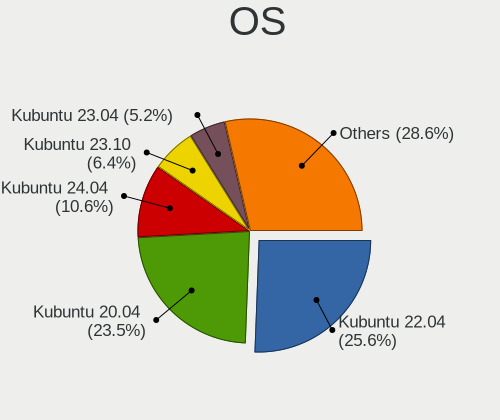
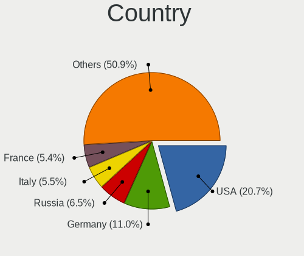
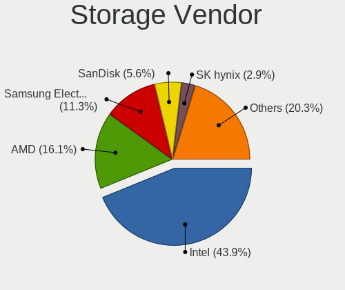
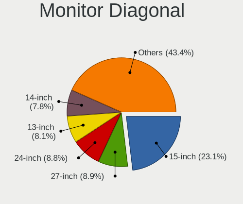
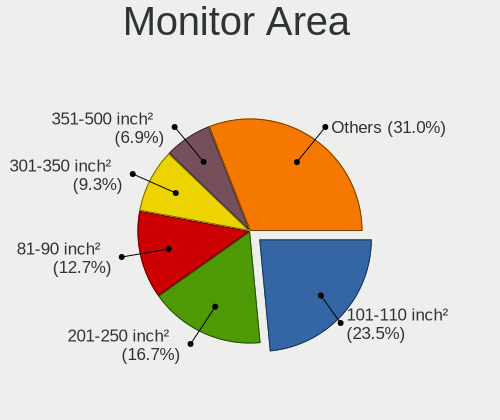
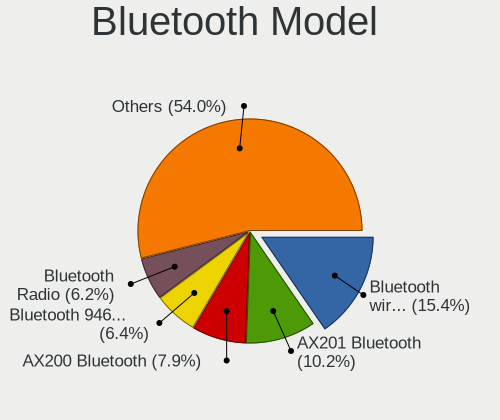

Kubuntu - Tested Hardware & Statistics
--------------------------------------

A project to collect tested hardware configurations for Kubuntu.

Anyone can contribute to this report by the [hw-probe](https://github.com/linuxhw/hw-probe) tool:

    sudo -E hw-probe -all -upload

Please contribute! Especially if your hardware is rare.

This is a report for all computer types. See also reports for [desktops](/Dist/Kubuntu/Desktop/README.md) and [notebooks](/Dist/Kubuntu/Notebook/README.md).

Contents
--------

* [ Test Cases ](#test-cases)

* [ System ](#system)
  - [ OS                       ](#os)
  - [ OS Family                ](#os-family)
  - [ Kernel                   ](#kernel)
  - [ Kernel Family            ](#kernel-family)
  - [ Kernel Major Ver.        ](#kernel-major-ver)
  - [ Arch                     ](#arch)
  - [ DE                       ](#de)
  - [ Display Server           ](#display-server)
  - [ Display Manager          ](#display-manager)
  - [ OS Lang                  ](#os-lang)
  - [ Boot Mode                ](#boot-mode)
  - [ Filesystem               ](#filesystem)
  - [ Part. scheme             ](#part-scheme)
  - [ Dual Boot with Linux/BSD ](#dual-boot-with-linuxbsd)
  - [ Dual Boot (Win)          ](#dual-boot-win)

* [ Board ](#board)
  - [ Vendor                   ](#vendor)
  - [ Model                    ](#model)
  - [ Model Family             ](#model-family)
  - [ MFG Year                 ](#mfg-year)
  - [ Form Factor              ](#form-factor)
  - [ Secure Boot              ](#secure-boot)
  - [ Coreboot                 ](#coreboot)
  - [ RAM Size                 ](#ram-size)
  - [ RAM Used                 ](#ram-used)
  - [ Total Drives             ](#total-drives)
  - [ Has CD-ROM               ](#has-cd-rom)
  - [ Has Ethernet             ](#has-ethernet)
  - [ Has WiFi                 ](#has-wifi)
  - [ Has Bluetooth            ](#has-bluetooth)

* [ Location ](#location)
  - [ Country                  ](#country)
  - [ City                     ](#city)

* [ Drives ](#drives)
  - [ Drive Vendor             ](#drive-vendor)
  - [ Drive Model              ](#drive-model)
  - [ HDD Vendor               ](#hdd-vendor)
  - [ SSD Vendor               ](#ssd-vendor)
  - [ Drive Kind               ](#drive-kind)
  - [ Drive Connector          ](#drive-connector)
  - [ Drive Size               ](#drive-size)
  - [ Space Total              ](#space-total)
  - [ Space Used               ](#space-used)
  - [ Malfunc. Drives          ](#malfunc-drives)
  - [ Malfunc. Drive Vendor    ](#malfunc-drive-vendor)
  - [ Malfunc. HDD Vendor      ](#malfunc-hdd-vendor)
  - [ Malfunc. Drive Kind      ](#malfunc-drive-kind)
  - [ Failed Drives            ](#failed-drives)
  - [ Failed Drive Vendor      ](#failed-drive-vendor)
  - [ Drive Status             ](#drive-status)

* [ Storage controller ](#storage-controller)
  - [ Storage Vendor           ](#storage-vendor)
  - [ Storage Model            ](#storage-model)
  - [ Storage Kind             ](#storage-kind)

* [ Processor ](#processor)
  - [ CPU Vendor               ](#cpu-vendor)
  - [ CPU Model                ](#cpu-model)
  - [ CPU Model Family         ](#cpu-model-family)
  - [ CPU Cores                ](#cpu-cores)
  - [ CPU Sockets              ](#cpu-sockets)
  - [ CPU Threads              ](#cpu-threads)
  - [ CPU Op-Modes             ](#cpu-op-modes)
  - [ CPU Microcode            ](#cpu-microcode)
  - [ CPU Microarch            ](#cpu-microarch)

* [ Graphics ](#graphics)
  - [ GPU Vendor               ](#gpu-vendor)
  - [ GPU Model                ](#gpu-model)
  - [ GPU Combo                ](#gpu-combo)
  - [ GPU Driver               ](#gpu-driver)
  - [ GPU Memory               ](#gpu-memory)

* [ Monitor ](#monitor)
  - [ Monitor Vendor           ](#monitor-vendor)
  - [ Monitor Model            ](#monitor-model)
  - [ Monitor Resolution       ](#monitor-resolution)
  - [ Monitor Diagonal         ](#monitor-diagonal)
  - [ Monitor Width            ](#monitor-width)
  - [ Aspect Ratio             ](#aspect-ratio)
  - [ Monitor Area             ](#monitor-area)
  - [ Pixel Density            ](#pixel-density)
  - [ Multiple Monitors        ](#multiple-monitors)

* [ Network ](#network)
  - [ Net Controller Vendor    ](#net-controller-vendor)
  - [ Net Controller Model     ](#net-controller-model)
  - [ Wireless Vendor          ](#wireless-vendor)
  - [ Wireless Model           ](#wireless-model)
  - [ Ethernet Vendor          ](#ethernet-vendor)
  - [ Ethernet Model           ](#ethernet-model)
  - [ Net Controller Kind      ](#net-controller-kind)
  - [ Used Controller          ](#used-controller)
  - [ NICs                     ](#nics)
  - [ IPv6                     ](#ipv6)

* [ Bluetooth ](#bluetooth)
  - [ Bluetooth Vendor         ](#bluetooth-vendor)
  - [ Bluetooth Model          ](#bluetooth-model)

* [ Sound ](#sound)
  - [ Sound Vendor             ](#sound-vendor)
  - [ Sound Model              ](#sound-model)

* [ Memory ](#memory)
  - [ Memory Vendor            ](#memory-vendor)
  - [ Memory Model             ](#memory-model)
  - [ Memory Kind              ](#memory-kind)
  - [ Memory Form Factor       ](#memory-form-factor)
  - [ Memory Size              ](#memory-size)
  - [ Memory Speed             ](#memory-speed)

* [ Printers & scanners ](#printers--scanners)
  - [ Printer Vendor           ](#printer-vendor)
  - [ Printer Model            ](#printer-model)
  - [ Scanner Vendor           ](#scanner-vendor)
  - [ Scanner Model            ](#scanner-model)

* [ Camera ](#camera)
  - [ Camera Vendor            ](#camera-vendor)
  - [ Camera Model             ](#camera-model)

* [ Security ](#security)
  - [ Fingerprint Vendor       ](#fingerprint-vendor)
  - [ Fingerprint Model        ](#fingerprint-model)
  - [ Chipcard Vendor          ](#chipcard-vendor)
  - [ Chipcard Model           ](#chipcard-model)

* [ Unsupported ](#unsupported)
  - [ Unsupported Devices      ](#unsupported-devices)
  - [ Unsupported Device Types ](#unsupported-device-types)

Test Cases
----------

Total: 4750

| Vendor        | Model                       | Form-Factor | Probe                                                      | Date         |
|---------------|-----------------------------|-------------|------------------------------------------------------------|--------------|
| HP            | ENVY x360 Convertible 15... | Convertible | [ab92a33bdf](https://linux-hardware.org/?probe=ab92a33bdf) | Feb 01, 2023 |
| HP            | 0AACh                       | Desktop     | [f41abcf7f9](https://linux-hardware.org/?probe=f41abcf7f9) | Feb 01, 2023 |
| Lenovo        | IdeaPad S145-15API 81V7     | Notebook    | [7e78833b8b](https://linux-hardware.org/?probe=7e78833b8b) | Feb 01, 2023 |
| Medion        | E15410                      | Notebook    | [24135c324e](https://linux-hardware.org/?probe=24135c324e) | Jan 31, 2023 |
| Lenovo        | IdeaPad S145-15API 81V7     | Notebook    | [ebbe861495](https://linux-hardware.org/?probe=ebbe861495) | Jan 31, 2023 |
| HP            | Notebook                    | Notebook    | [f352309997](https://linux-hardware.org/?probe=f352309997) | Jan 31, 2023 |
| HP            | 0AACh                       | Desktop     | [32961ffb11](https://linux-hardware.org/?probe=32961ffb11) | Jan 31, 2023 |
| Google        | Lillipup                    | Notebook    | [45f9b8c3cf](https://linux-hardware.org/?probe=45f9b8c3cf) | Jan 31, 2023 |
| Acer          | Aspire AV14-51              | Notebook    | [fa801eea4b](https://linux-hardware.org/?probe=fa801eea4b) | Jan 31, 2023 |
| HP            | 0AACh                       | Desktop     | [94baf3c57c](https://linux-hardware.org/?probe=94baf3c57c) | Jan 31, 2023 |
| Lenovo        | IdeaPad S145-15API 81V7     | Notebook    | [949ea399fb](https://linux-hardware.org/?probe=949ea399fb) | Jan 31, 2023 |
| HP            | 829A                        | Mini pc     | [a6925c200b](https://linux-hardware.org/?probe=a6925c200b) | Jan 31, 2023 |
| Framework     | Laptop (12th Gen Intel C... | Notebook    | [96671141f9](https://linux-hardware.org/?probe=96671141f9) | Jan 30, 2023 |
| MSI           | GS66 Stealth 10SE           | Notebook    | [bf112866e3](https://linux-hardware.org/?probe=bf112866e3) | Jan 30, 2023 |
| MSI           | Bravo 15 B5DD               | Notebook    | [b3c357b53b](https://linux-hardware.org/?probe=b3c357b53b) | Jan 30, 2023 |
| ASUSTek       | ROG Strix G513RW_G513RW     | Notebook    | [942c001b11](https://linux-hardware.org/?probe=942c001b11) | Jan 30, 2023 |
| ASUSTek       | P8P67 DELUXE                | Desktop     | [8f3278e68a](https://linux-hardware.org/?probe=8f3278e68a) | Jan 30, 2023 |
| Acer          | Swift SF114-31              | Notebook    | [9d7f73242e](https://linux-hardware.org/?probe=9d7f73242e) | Jan 30, 2023 |
| ASUSTek       | ROG Strix G513RW_G513RW     | Notebook    | [2f0ffeb3be](https://linux-hardware.org/?probe=2f0ffeb3be) | Jan 29, 2023 |
| Lenovo        | ThinkPad T580 20LA0025MX    | Notebook    | [c5e4274143](https://linux-hardware.org/?probe=c5e4274143) | Jan 29, 2023 |
| Lenovo        | IdeaPad 720S-14IKB 81BD     | Notebook    | [50eb066d41](https://linux-hardware.org/?probe=50eb066d41) | Jan 29, 2023 |
| Acer          | Nitro AN517-41              | Notebook    | [ecb7c49d2e](https://linux-hardware.org/?probe=ecb7c49d2e) | Jan 29, 2023 |
| Lenovo        | Legion 5 15ACH6 82JW        | Notebook    | [175211d52c](https://linux-hardware.org/?probe=175211d52c) | Jan 29, 2023 |
| Lenovo        | NO DPK                      | Desktop     | [0abc762f30](https://linux-hardware.org/?probe=0abc762f30) | Jan 28, 2023 |
| Lenovo        | IdeaPad 3 15ADA05 81W1      | Notebook    | [a011ba3b9e](https://linux-hardware.org/?probe=a011ba3b9e) | Jan 28, 2023 |
| Gigabyte      | GA-78LMT-USB3 SEx           | Desktop     | [1a9e67408e](https://linux-hardware.org/?probe=1a9e67408e) | Jan 28, 2023 |
| ASRock        | A320M-HDV R4.0              | Desktop     | [f447127e74](https://linux-hardware.org/?probe=f447127e74) | Jan 28, 2023 |
| AZW           | GTR V02                     | Desktop     | [b1b34f10a2](https://linux-hardware.org/?probe=b1b34f10a2) | Jan 28, 2023 |
| MSI           | B560M PRO-VDH               | Desktop     | [cd55d1ec5d](https://linux-hardware.org/?probe=cd55d1ec5d) | Jan 28, 2023 |
| Dell          | Precision 7730              | Notebook    | [058f16ac84](https://linux-hardware.org/?probe=058f16ac84) | Jan 28, 2023 |
| ASUSTek       | PRIME H510M-E               | Desktop     | [fa464af5fb](https://linux-hardware.org/?probe=fa464af5fb) | Jan 27, 2023 |
| Dell          | Inspiron 5593               | Notebook    | [36db3e5d78](https://linux-hardware.org/?probe=36db3e5d78) | Jan 27, 2023 |
| ASUSTek       | TUF Gaming FX705DT_FX705... | Notebook    | [b265f91d10](https://linux-hardware.org/?probe=b265f91d10) | Jan 27, 2023 |
| Dell          | 0XPDFK A01                  | Desktop     | [4611591cc9](https://linux-hardware.org/?probe=4611591cc9) | Jan 27, 2023 |
| HP            | 3397                        | Desktop     | [764f737fcf](https://linux-hardware.org/?probe=764f737fcf) | Jan 27, 2023 |
| HP            | Laptop 15-da0xxx            | Notebook    | [32a666b611](https://linux-hardware.org/?probe=32a666b611) | Jan 27, 2023 |
| ASUSTek       | GL503VD                     | Notebook    | [f4095c61ff](https://linux-hardware.org/?probe=f4095c61ff) | Jan 26, 2023 |
| Acer          | Nitro AN517-55              | Notebook    | [7273b8320c](https://linux-hardware.org/?probe=7273b8320c) | Jan 26, 2023 |
| HP            | 3397                        | Desktop     | [10b6614763](https://linux-hardware.org/?probe=10b6614763) | Jan 26, 2023 |
| Acer          | Nitro AN517-55              | Notebook    | [2de4e60fef](https://linux-hardware.org/?probe=2de4e60fef) | Jan 26, 2023 |
| Medion        | E15410                      | Notebook    | [5ba9ffd6a8](https://linux-hardware.org/?probe=5ba9ffd6a8) | Jan 26, 2023 |
| Lenovo        | IdeaPad 3 15ADA05 81W1      | Notebook    | [7403ca2f73](https://linux-hardware.org/?probe=7403ca2f73) | Jan 25, 2023 |
| Lenovo        | ThinkPad L380 20M6S2YE00    | Notebook    | [e6c626133e](https://linux-hardware.org/?probe=e6c626133e) | Jan 25, 2023 |
| TrekStor      | Surfbook A13B               | Notebook    | [4306d9ba1c](https://linux-hardware.org/?probe=4306d9ba1c) | Jan 25, 2023 |
| Lenovo        | 36F7 SDK0J40700 WIN 3258... | Desktop     | [b7dea81a92](https://linux-hardware.org/?probe=b7dea81a92) | Jan 25, 2023 |
| HP            | EliteBook 855 G7 Noteboo... | Notebook    | [34882391f3](https://linux-hardware.org/?probe=34882391f3) | Jan 25, 2023 |
| ASRock        | B450M Pro4                  | Desktop     | [6462d71b74](https://linux-hardware.org/?probe=6462d71b74) | Jan 25, 2023 |
| Lenovo        | IdeaPad 3 15ADA05 81W1      | Notebook    | [18d42efe40](https://linux-hardware.org/?probe=18d42efe40) | Jan 24, 2023 |
| Dell          | 0Y2K8N A00                  | Desktop     | [7f135346af](https://linux-hardware.org/?probe=7f135346af) | Jan 24, 2023 |
| Acer          | Predator G3-571             | Notebook    | [549910b197](https://linux-hardware.org/?probe=549910b197) | Jan 24, 2023 |
| MSI           | MS-B1831                    | Desktop     | [64348a9180](https://linux-hardware.org/?probe=64348a9180) | Jan 24, 2023 |
| Dell          | Latitude 5491               | Notebook    | [37746d7f71](https://linux-hardware.org/?probe=37746d7f71) | Jan 24, 2023 |
| Medion        | E15410                      | Notebook    | [f7e27f2ba9](https://linux-hardware.org/?probe=f7e27f2ba9) | Jan 23, 2023 |
| ASUSTek       | PRIME A320M-K               | Desktop     | [b20da22e41](https://linux-hardware.org/?probe=b20da22e41) | Jan 23, 2023 |
| Lenovo        | ThinkPad X260 20F5S28R00    | Notebook    | [4f83721cab](https://linux-hardware.org/?probe=4f83721cab) | Jan 23, 2023 |
| Lenovo        | ThinkPad X260 20F5S28R00    | Notebook    | [9e12a145fd](https://linux-hardware.org/?probe=9e12a145fd) | Jan 23, 2023 |
| HP            | ProBook 6470b               | Notebook    | [3319221b9c](https://linux-hardware.org/?probe=3319221b9c) | Jan 23, 2023 |
| HP            | Spectre x360 Convertible... | Convertible | [3951ddfe72](https://linux-hardware.org/?probe=3951ddfe72) | Jan 23, 2023 |
| MSI           | MS-AEC21                    | All in one  | [e541cd3043](https://linux-hardware.org/?probe=e541cd3043) | Jan 23, 2023 |
| MACHENIKE     | MACHCREATOR-16              | Notebook    | [df35617170](https://linux-hardware.org/?probe=df35617170) | Jan 22, 2023 |
| Acer          | Aspire E1-571               | Notebook    | [8d5c313d43](https://linux-hardware.org/?probe=8d5c313d43) | Jan 22, 2023 |
| HP            | ProBook 6570b               | Notebook    | [3bc0488b6d](https://linux-hardware.org/?probe=3bc0488b6d) | Jan 22, 2023 |
| Dell          | Latitude E6430s             | Notebook    | [8f9185a327](https://linux-hardware.org/?probe=8f9185a327) | Jan 22, 2023 |
| Carbon Sys... | Iridium 14                  | Notebook    | [7fcc79f37c](https://linux-hardware.org/?probe=7fcc79f37c) | Jan 22, 2023 |
| Apple         | Mac-F65AE981FFA204ED Mac... | Mini pc     | [d2b797f3de](https://linux-hardware.org/?probe=d2b797f3de) | Jan 21, 2023 |
| Dell          | Vostro 1014                 | Notebook    | [f7ff3312f2](https://linux-hardware.org/?probe=f7ff3312f2) | Jan 21, 2023 |
| Acer          | TravelMate B118-M           | Notebook    | [029850a46e](https://linux-hardware.org/?probe=029850a46e) | Jan 21, 2023 |
| Dell          | Vostro 1014                 | Notebook    | [724939f0cf](https://linux-hardware.org/?probe=724939f0cf) | Jan 21, 2023 |
| HP            | ENVY x360 Convertible 15... | Convertible | [bfaffed5d2](https://linux-hardware.org/?probe=bfaffed5d2) | Jan 21, 2023 |
| Gigabyte      | X570S AORUS MASTER          | Desktop     | [a6f80e64b2](https://linux-hardware.org/?probe=a6f80e64b2) | Jan 21, 2023 |
| Lenovo        | 3148 SDK0L22692 WIN 3792... | Desktop     | [f66c33020e](https://linux-hardware.org/?probe=f66c33020e) | Jan 21, 2023 |
| MSI           | Prestige 15 A12SC           | Notebook    | [b368e80a36](https://linux-hardware.org/?probe=b368e80a36) | Jan 21, 2023 |
| Gigabyte      | B365M DS3H                  | Desktop     | [29d770594e](https://linux-hardware.org/?probe=29d770594e) | Jan 21, 2023 |
| Dell          | 0WR7PY A02                  | Desktop     | [0072a47bce](https://linux-hardware.org/?probe=0072a47bce) | Jan 20, 2023 |
| HP            | Laptop 15-ef2xxx            | Notebook    | [732a1b992a](https://linux-hardware.org/?probe=732a1b992a) | Jan 20, 2023 |
| ASUSTek       | P8Z68-V LX                  | Desktop     | [49f0bb23ea](https://linux-hardware.org/?probe=49f0bb23ea) | Jan 20, 2023 |
| Apple         | MacBookPro11,3              | Notebook    | [28b4d041ad](https://linux-hardware.org/?probe=28b4d041ad) | Jan 20, 2023 |
| Dell          | Latitude 5320               | Notebook    | [aaf625ee63](https://linux-hardware.org/?probe=aaf625ee63) | Jan 20, 2023 |
| Sony          | SVE1513B4E                  | Notebook    | [cbd9f98f30](https://linux-hardware.org/?probe=cbd9f98f30) | Jan 20, 2023 |
| ASUSTek       | ROG STRIX Z370-F GAMING     | Desktop     | [2b7ce5b726](https://linux-hardware.org/?probe=2b7ce5b726) | Jan 20, 2023 |
| Dell          | 03NVJ6 A03                  | Desktop     | [4269f0e624](https://linux-hardware.org/?probe=4269f0e624) | Jan 20, 2023 |
| Dell          | G3 3779                     | Notebook    | [c4c13ca86b](https://linux-hardware.org/?probe=c4c13ca86b) | Jan 19, 2023 |
| HP            | Laptop 15-ef2xxx            | Notebook    | [d9e9f47ad4](https://linux-hardware.org/?probe=d9e9f47ad4) | Jan 19, 2023 |
| Lenovo        | ThinkPad X1 Yoga 2nd 20J... | Convertible | [a9d66d6af6](https://linux-hardware.org/?probe=a9d66d6af6) | Jan 18, 2023 |
| HP            | Spectre x360 Convertible... | Convertible | [0bc976587f](https://linux-hardware.org/?probe=0bc976587f) | Jan 18, 2023 |
| HP            | Notebook                    | Notebook    | [1c935be3b1](https://linux-hardware.org/?probe=1c935be3b1) | Jan 18, 2023 |
| MSI           | B550M PRO-VDH WIFI          | Desktop     | [3dfd98d007](https://linux-hardware.org/?probe=3dfd98d007) | Jan 17, 2023 |
| ASRock        | Z370 Killer SLI/ac          | Desktop     | [8f20499728](https://linux-hardware.org/?probe=8f20499728) | Jan 17, 2023 |
| Dell          | 0D881F A05                  | Desktop     | [0426ee9130](https://linux-hardware.org/?probe=0426ee9130) | Jan 17, 2023 |
| ASUSTek       | H110M-K                     | Desktop     | [dcbf101b59](https://linux-hardware.org/?probe=dcbf101b59) | Jan 17, 2023 |
| ASUSTek       | H110M-K                     | Desktop     | [3964c82d71](https://linux-hardware.org/?probe=3964c82d71) | Jan 17, 2023 |
| ASUSTek       | Zenbook UM6702RC_RM6702R... | Notebook    | [21ed6bd75d](https://linux-hardware.org/?probe=21ed6bd75d) | Jan 17, 2023 |
| HP            | Laptop 17-by3xxx            | Notebook    | [542c3d1ef4](https://linux-hardware.org/?probe=542c3d1ef4) | Jan 16, 2023 |
| Gigabyte      | B650M DS3H                  | Desktop     | [8493fa353c](https://linux-hardware.org/?probe=8493fa353c) | Jan 16, 2023 |
| Acer          | Aspire A515-56              | Notebook    | [3f24b17bd8](https://linux-hardware.org/?probe=3f24b17bd8) | Jan 16, 2023 |
| Acer          | Aspire V3-571G              | Notebook    | [3715650f46](https://linux-hardware.org/?probe=3715650f46) | Jan 16, 2023 |
| ASUSTek       | P5K/EPU                     | Desktop     | [c159b4d65b](https://linux-hardware.org/?probe=c159b4d65b) | Jan 16, 2023 |
| Acer          | Swift SF113-31              | Notebook    | [de76cee99a](https://linux-hardware.org/?probe=de76cee99a) | Jan 16, 2023 |
| Dell          | 06D7TR A00                  | Desktop     | [bf8115e391](https://linux-hardware.org/?probe=bf8115e391) | Jan 15, 2023 |
| Dynabook      | Satellite Pro C50-J         | Notebook    | [ba8e771128](https://linux-hardware.org/?probe=ba8e771128) | Jan 15, 2023 |
| Notebook      | W35xSS_370SS                | Notebook    | [2337667e0f](https://linux-hardware.org/?probe=2337667e0f) | Jan 15, 2023 |
| Acer          | Nitro AN515-43              | Notebook    | [4621c0d31b](https://linux-hardware.org/?probe=4621c0d31b) | Jan 15, 2023 |
| ASUSTek       | ROG STRIX B550-F GAMING     | Desktop     | [86039b3063](https://linux-hardware.org/?probe=86039b3063) | Jan 15, 2023 |
| ASUSTek       | Pro WS WRX80E-SAGE SE WI... | Desktop     | [7d0bdd8606](https://linux-hardware.org/?probe=7d0bdd8606) | Jan 15, 2023 |
| ASUSTek       | Pro WS WRX80E-SAGE SE WI... | Desktop     | [614c167f82](https://linux-hardware.org/?probe=614c167f82) | Jan 15, 2023 |
| HUAWEI        | KLVL-WXX9                   | Notebook    | [2687f89612](https://linux-hardware.org/?probe=2687f89612) | Jan 14, 2023 |
| ASRock        | A320M-HDV R4.0              | Desktop     | [aa35c556bc](https://linux-hardware.org/?probe=aa35c556bc) | Jan 13, 2023 |
| ASUSTek       | Z97-P                       | Desktop     | [709045636c](https://linux-hardware.org/?probe=709045636c) | Jan 13, 2023 |
| MSI           | B350 PC MATE                | Desktop     | [77a4e207cd](https://linux-hardware.org/?probe=77a4e207cd) | Jan 13, 2023 |
| ASUSTek       | G10AJ                       | Desktop     | [e300c19806](https://linux-hardware.org/?probe=e300c19806) | Jan 13, 2023 |
| ASUSTek       | TUF Gaming B550-PLUS        | Desktop     | [c3a30838c3](https://linux-hardware.org/?probe=c3a30838c3) | Jan 13, 2023 |
| Lenovo        | Legion S7 15ACH6 82K8       | Notebook    | [3a97589bc9](https://linux-hardware.org/?probe=3a97589bc9) | Jan 12, 2023 |
| Dell          | 0GXM1W A01                  | Desktop     | [dc468fd3a8](https://linux-hardware.org/?probe=dc468fd3a8) | Jan 12, 2023 |
| HP            | 255 G8 Notebook PC          | Notebook    | [1b1fee733e](https://linux-hardware.org/?probe=1b1fee733e) | Jan 12, 2023 |
| Dell          | Latitude 3420               | Notebook    | [53b3f46e20](https://linux-hardware.org/?probe=53b3f46e20) | Jan 12, 2023 |
| Alienware     | 0H869M A00                  | Desktop     | [6dc1967760](https://linux-hardware.org/?probe=6dc1967760) | Jan 12, 2023 |
| ASUSTek       | VivoBook_ASUSLaptop E210... | Notebook    | [ed648f1f72](https://linux-hardware.org/?probe=ed648f1f72) | Jan 12, 2023 |
| Lenovo        | ThinkPad L430 24663D1       | Notebook    | [1987221c12](https://linux-hardware.org/?probe=1987221c12) | Jan 12, 2023 |
| HP            | x2 Detachable 10-p0XX       | Tablet      | [6286dbdb0b](https://linux-hardware.org/?probe=6286dbdb0b) | Jan 11, 2023 |
| ASUSTek       | P5K/EPU                     | Desktop     | [c6ffd59fb2](https://linux-hardware.org/?probe=c6ffd59fb2) | Jan 11, 2023 |
| MSI           | Bravo 17 A4DDK              | Notebook    | [ca27b9dd46](https://linux-hardware.org/?probe=ca27b9dd46) | Jan 10, 2023 |
| Lenovo        | IdeaPad 5 15ARE05 81YQ      | Notebook    | [c5e0e8163f](https://linux-hardware.org/?probe=c5e0e8163f) | Jan 10, 2023 |
| Google        | Rammus                      | Notebook    | [489d09eaa7](https://linux-hardware.org/?probe=489d09eaa7) | Jan 10, 2023 |
| Gigabyte      | F2A88XM-HD3P                | Desktop     | [8434b565c3](https://linux-hardware.org/?probe=8434b565c3) | Jan 10, 2023 |
| ASUSTek       | STRIX Z270H GAMING          | Desktop     | [1a619ff898](https://linux-hardware.org/?probe=1a619ff898) | Jan 10, 2023 |
| Dell          | XPS 15 9560                 | Notebook    | [b9df733a47](https://linux-hardware.org/?probe=b9df733a47) | Jan 10, 2023 |
| Dell          | XPS 15 9560                 | Notebook    | [75209e7521](https://linux-hardware.org/?probe=75209e7521) | Jan 10, 2023 |
| HP            | ProBook 6570b               | Notebook    | [e5c0ea26d1](https://linux-hardware.org/?probe=e5c0ea26d1) | Jan 09, 2023 |
| Lenovo        | Legion 5 Pro 16ACH6H 82J... | Notebook    | [5d3f8e9948](https://linux-hardware.org/?probe=5d3f8e9948) | Jan 09, 2023 |
| ASUSTek       | Zenbook UN5401RA UN5401R... | Convertible | [a43ad3cbf7](https://linux-hardware.org/?probe=a43ad3cbf7) | Jan 09, 2023 |
| HP            | Spectre x360 Convertible... | Convertible | [774322328a](https://linux-hardware.org/?probe=774322328a) | Jan 09, 2023 |
| Dell          | Inspiron 5575               | Notebook    | [5bc41d3659](https://linux-hardware.org/?probe=5bc41d3659) | Jan 09, 2023 |
| HP            | Spectre x360 Convertible... | Convertible | [d94fa63122](https://linux-hardware.org/?probe=d94fa63122) | Jan 08, 2023 |
| Gigabyte      | AX370-Gaming K7             | Desktop     | [3b3f695b94](https://linux-hardware.org/?probe=3b3f695b94) | Jan 08, 2023 |
| ASUSTek       | Z170-A                      | Desktop     | [eb562a1e24](https://linux-hardware.org/?probe=eb562a1e24) | Jan 08, 2023 |
| Dell          | Inspiron 5570               | Notebook    | [4ebc1e97c5](https://linux-hardware.org/?probe=4ebc1e97c5) | Jan 07, 2023 |
| Dell          | Inspiron 5570               | Notebook    | [86b0308f38](https://linux-hardware.org/?probe=86b0308f38) | Jan 07, 2023 |
| Acer          | Aspire A515-56              | Notebook    | [fc7a1958c4](https://linux-hardware.org/?probe=fc7a1958c4) | Jan 07, 2023 |
| HP            | EliteBook 845 14 inch G9... | Notebook    | [929ff5acbb](https://linux-hardware.org/?probe=929ff5acbb) | Jan 07, 2023 |
| ASUSTek       | ROG STRIX X570-I GAMING     | Desktop     | [1ff445305d](https://linux-hardware.org/?probe=1ff445305d) | Jan 06, 2023 |
| ASUSTek       | PRIME B450M-A II            | Desktop     | [c7a6fdbf55](https://linux-hardware.org/?probe=c7a6fdbf55) | Jan 06, 2023 |
| MSI           | MEG Z490 UNIFY              | Desktop     | [cb25b352e0](https://linux-hardware.org/?probe=cb25b352e0) | Jan 06, 2023 |
| ASUSTek       | ZenBook UX425IA_UM425IA     | Notebook    | [aae608e132](https://linux-hardware.org/?probe=aae608e132) | Jan 06, 2023 |
| Gigabyte      | Z490 AORUS ELITE AC         | Desktop     | [e4f0b0506b](https://linux-hardware.org/?probe=e4f0b0506b) | Jan 06, 2023 |
| Microsoft     | Surface Laptop              | Tablet      | [391d13c7ba](https://linux-hardware.org/?probe=391d13c7ba) | Jan 06, 2023 |
| Lenovo        | Legion 5 17ACH6 82K0        | Notebook    | [9a108faf93](https://linux-hardware.org/?probe=9a108faf93) | Jan 06, 2023 |
| ASRock        | A320M-HDV R4.0              | Desktop     | [78ab02a131](https://linux-hardware.org/?probe=78ab02a131) | Jan 05, 2023 |
| ASUSTek       | PRIME B350-PLUS             | Desktop     | [ce4648337e](https://linux-hardware.org/?probe=ce4648337e) | Jan 05, 2023 |
| Dell          | 0WPMFG A00                  | Desktop     | [02a8ab8bdc](https://linux-hardware.org/?probe=02a8ab8bdc) | Jan 05, 2023 |
| Lenovo        | V15 G2 ITL 82KB             | Notebook    | [c19db82125](https://linux-hardware.org/?probe=c19db82125) | Jan 05, 2023 |
| Lenovo        | V15 G2 ITL 82KB             | Notebook    | [697abed1c0](https://linux-hardware.org/?probe=697abed1c0) | Jan 05, 2023 |
| Gigabyte      | Z490 AORUS ELITE AC         | Desktop     | [efb1372825](https://linux-hardware.org/?probe=efb1372825) | Jan 05, 2023 |
| Dell          | 096JG8 A01                  | Desktop     | [1c58ea8841](https://linux-hardware.org/?probe=1c58ea8841) | Jan 05, 2023 |
| Acer          | Swift SF314-71              | Notebook    | [21ebb26df9](https://linux-hardware.org/?probe=21ebb26df9) | Jan 05, 2023 |
| Dell          | 096JG8 A01                  | Desktop     | [90cbbe6b1d](https://linux-hardware.org/?probe=90cbbe6b1d) | Jan 04, 2023 |
| HP            | 250 G4 Notebook PC          | Notebook    | [a6d6683371](https://linux-hardware.org/?probe=a6d6683371) | Jan 04, 2023 |
| HP            | 250 G4 Notebook PC          | Notebook    | [08526a890a](https://linux-hardware.org/?probe=08526a890a) | Jan 04, 2023 |
| Dell          | Inspiron 5406 2n1           | Convertible | [e780ec3e2a](https://linux-hardware.org/?probe=e780ec3e2a) | Jan 04, 2023 |
| Notebook      | NP5x_NP6x_NP7xPNK_PNH_PN... | Notebook    | [ace1cd7d4d](https://linux-hardware.org/?probe=ace1cd7d4d) | Jan 04, 2023 |
| Acer          | Aspire M5-583P              | Notebook    | [1182d7305d](https://linux-hardware.org/?probe=1182d7305d) | Jan 04, 2023 |
| Dell          | 096JG8 A01                  | Desktop     | [2e047c3ad5](https://linux-hardware.org/?probe=2e047c3ad5) | Jan 04, 2023 |
| Lenovo        | ThinkPad X1 Extreme Gen ... | Notebook    | [e24802533e](https://linux-hardware.org/?probe=e24802533e) | Jan 03, 2023 |
| Unknown       | Unknown                     | Notebook    | [7a85f424f5](https://linux-hardware.org/?probe=7a85f424f5) | Jan 03, 2023 |
| HUAWEI        | NBLL-WXX9                   | Notebook    | [7e5acbf050](https://linux-hardware.org/?probe=7e5acbf050) | Jan 03, 2023 |
| Lenovo        | ThinkPad X1 Carbon 5th 2... | Notebook    | [059e72c9a0](https://linux-hardware.org/?probe=059e72c9a0) | Jan 03, 2023 |
| MSI           | Raider GE76 12UGS           | Notebook    | [8552e25872](https://linux-hardware.org/?probe=8552e25872) | Jan 03, 2023 |
| Acer          | Aspire M5-481T              | Notebook    | [2e2e7afb8a](https://linux-hardware.org/?probe=2e2e7afb8a) | Jan 03, 2023 |
| ASUSTek       | G56JR                       | Notebook    | [d8d521b964](https://linux-hardware.org/?probe=d8d521b964) | Jan 03, 2023 |
| Acer          | Aspire M5-481T              | Notebook    | [54bd1d5aae](https://linux-hardware.org/?probe=54bd1d5aae) | Jan 03, 2023 |
| Dell          | Inspiron 5515               | Notebook    | [27a4df28b2](https://linux-hardware.org/?probe=27a4df28b2) | Jan 03, 2023 |
| MSI           | Alpha 17 B5EEK              | Notebook    | [a5881c627c](https://linux-hardware.org/?probe=a5881c627c) | Jan 03, 2023 |
| ASUSTek       | G56JR                       | Notebook    | [ccebb5dd27](https://linux-hardware.org/?probe=ccebb5dd27) | Jan 02, 2023 |
| MSI           | X370 GAMING PRO CARBON      | Desktop     | [54403a8bbf](https://linux-hardware.org/?probe=54403a8bbf) | Jan 02, 2023 |
| ASUSTek       | TUF Gaming B550-PLUS        | Desktop     | [a35156e0c3](https://linux-hardware.org/?probe=a35156e0c3) | Jan 02, 2023 |
| HP            | ENVY TS 15                  | Notebook    | [3140fe0512](https://linux-hardware.org/?probe=3140fe0512) | Jan 02, 2023 |
| MSI           | Prestige 14 A10RAS          | Notebook    | [fc119df9bc](https://linux-hardware.org/?probe=fc119df9bc) | Jan 02, 2023 |
| MSI           | B350 PC MATE                | Desktop     | [20c4d1a764](https://linux-hardware.org/?probe=20c4d1a764) | Jan 02, 2023 |
| ASUSTek       | G10DK                       | Desktop     | [e75694d9a6](https://linux-hardware.org/?probe=e75694d9a6) | Jan 02, 2023 |
| Lenovo        | IdeaPad 5 15IIL05 81YK      | Notebook    | [0fb41a5066](https://linux-hardware.org/?probe=0fb41a5066) | Jan 02, 2023 |
| Gigabyte      | Z590 UD AC                  | Desktop     | [9346b2e1bc](https://linux-hardware.org/?probe=9346b2e1bc) | Jan 01, 2023 |
| MSI           | Raider GE67HX 12UGS         | Notebook    | [be85c7b42a](https://linux-hardware.org/?probe=be85c7b42a) | Jan 01, 2023 |
| HP            | Laptop 15-da2xxx            | Notebook    | [a96e5b892b](https://linux-hardware.org/?probe=a96e5b892b) | Jan 01, 2023 |
| HP            | ENVY x360 Convertible 13... | Convertible | [a5b2453630](https://linux-hardware.org/?probe=a5b2453630) | Jan 01, 2023 |
| Lenovo        | ThinkPad L430 24663D1       | Notebook    | [8eada9744e](https://linux-hardware.org/?probe=8eada9744e) | Jan 01, 2023 |
| Lenovo        | ThinkPad X230 23256N6       | Notebook    | [09d6510700](https://linux-hardware.org/?probe=09d6510700) | Jan 01, 2023 |
| ASUSTek       | G15CF                       | Desktop     | [93e783c74a](https://linux-hardware.org/?probe=93e783c74a) | Jan 01, 2023 |
| ASUSTek       | TUF Gaming B550M-PLUS       | Desktop     | [2c31fd54e4](https://linux-hardware.org/?probe=2c31fd54e4) | Jan 01, 2023 |
| Acer          | Spin SP513-54N              | Convertible | [0cb6dfa7ce](https://linux-hardware.org/?probe=0cb6dfa7ce) | Dec 31, 2022 |
| Dell          | 0PTTT9 A00                  | Desktop     | [7f2851fcf5](https://linux-hardware.org/?probe=7f2851fcf5) | Dec 31, 2022 |
| ASUSTek       | PRIME B350-PLUS             | Desktop     | [c4eccac7c7](https://linux-hardware.org/?probe=c4eccac7c7) | Dec 31, 2022 |
| MSI           | B360M BAZOOKA               | Desktop     | [ad26afeb83](https://linux-hardware.org/?probe=ad26afeb83) | Dec 31, 2022 |
| HP            | Notebook                    | Notebook    | [d25df9daf4](https://linux-hardware.org/?probe=d25df9daf4) | Dec 31, 2022 |
| Lenovo        | Legion 5 Pro 16ACH6H 82J... | Notebook    | [d326e34afc](https://linux-hardware.org/?probe=d326e34afc) | Dec 31, 2022 |
| Acer          | Aspire A315-41              | Notebook    | [9cddb65ac1](https://linux-hardware.org/?probe=9cddb65ac1) | Dec 30, 2022 |
| Radxa         | ROCK 5B                     | Soc         | [d864d2a31b](https://linux-hardware.org/?probe=d864d2a31b) | Dec 30, 2022 |
| Notebook      | P17SM                       | Notebook    | [18605208b6](https://linux-hardware.org/?probe=18605208b6) | Dec 30, 2022 |
| Lenovo        | ThinkPad T470s 20HGS1JN0... | Notebook    | [049bc54496](https://linux-hardware.org/?probe=049bc54496) | Dec 30, 2022 |
| ASUSTek       | UX31E                       | Notebook    | [5e6dc18098](https://linux-hardware.org/?probe=5e6dc18098) | Dec 30, 2022 |
| Apple         | MacBookPro14,3              | Notebook    | [fdd6af96b3](https://linux-hardware.org/?probe=fdd6af96b3) | Dec 30, 2022 |
| Gigabyte      | AB350M-DS3H V2-CF           | Desktop     | [1c7a329282](https://linux-hardware.org/?probe=1c7a329282) | Dec 30, 2022 |
| Lenovo        | Legion 5 Pro 16ACH6H 82J... | Notebook    | [816ab16fd0](https://linux-hardware.org/?probe=816ab16fd0) | Dec 30, 2022 |
| Lenovo        | Legion 5 Pro 16ACH6H 82J... | Notebook    | [43e6103cd0](https://linux-hardware.org/?probe=43e6103cd0) | Dec 29, 2022 |
| BESSTAR Te... | HM80                        | Desktop     | [9af0f05e7e](https://linux-hardware.org/?probe=9af0f05e7e) | Dec 29, 2022 |
| ASUSTek       | Z170 PRO GAMING/AURA        | Desktop     | [87e8ae1350](https://linux-hardware.org/?probe=87e8ae1350) | Dec 29, 2022 |
| HP            | Victus by Laptop 16-e1xx... | Notebook    | [25183d70e2](https://linux-hardware.org/?probe=25183d70e2) | Dec 29, 2022 |
| Carbon Sys... | Iridium 14                  | Notebook    | [d2275f6785](https://linux-hardware.org/?probe=d2275f6785) | Dec 29, 2022 |
| HP            | 8399                        | Desktop     | [204c8c0a3f](https://linux-hardware.org/?probe=204c8c0a3f) | Dec 29, 2022 |
| Acer          | Aspire X3960                | Desktop     | [f045d61192](https://linux-hardware.org/?probe=f045d61192) | Dec 29, 2022 |
| Acer          | Aspire X3960                | Desktop     | [75e053c90f](https://linux-hardware.org/?probe=75e053c90f) | Dec 29, 2022 |
| Lenovo        | 3130 SDK0J40697 WIN 3305... | Mini pc     | [52b38cee5c](https://linux-hardware.org/?probe=52b38cee5c) | Dec 28, 2022 |
| Pegatron      | 2AB6                        | Desktop     | [742c9ebcca](https://linux-hardware.org/?probe=742c9ebcca) | Dec 28, 2022 |
| Pegatron      | 2AB6                        | Desktop     | [9e95c7e7c7](https://linux-hardware.org/?probe=9e95c7e7c7) | Dec 28, 2022 |
| Acer          | Aspire 5742G                | Notebook    | [f58bb411b8](https://linux-hardware.org/?probe=f58bb411b8) | Dec 28, 2022 |
| MSI           | MEG X570 UNIFY              | Desktop     | [2c2bf7f512](https://linux-hardware.org/?probe=2c2bf7f512) | Dec 28, 2022 |
| MSI           | MEG X570 UNIFY              | Desktop     | [19f962298b](https://linux-hardware.org/?probe=19f962298b) | Dec 28, 2022 |
| HP            | EliteBook 745 G3            | Notebook    | [1ca2f43148](https://linux-hardware.org/?probe=1ca2f43148) | Dec 27, 2022 |
| Acer          | Swift SF314-43              | Notebook    | [3d9a51ce6e](https://linux-hardware.org/?probe=3d9a51ce6e) | Dec 27, 2022 |
| Dell          | 0KWVT8 A03                  | Desktop     | [9d2542cf36](https://linux-hardware.org/?probe=9d2542cf36) | Dec 27, 2022 |
| Dell          | 0PV9DG A01                  | Server      | [7f408923fa](https://linux-hardware.org/?probe=7f408923fa) | Dec 27, 2022 |
| MSI           | GP62 7QF                    | Notebook    | [3db82bd91e](https://linux-hardware.org/?probe=3db82bd91e) | Dec 27, 2022 |
| ASUSTek       | X550VXK                     | Notebook    | [301db79821](https://linux-hardware.org/?probe=301db79821) | Dec 27, 2022 |
| Dell          | 0KWVT8 A03                  | Desktop     | [f2998cdede](https://linux-hardware.org/?probe=f2998cdede) | Dec 27, 2022 |
| Gigabyte      | 970-GAMING                  | Desktop     | [4a2d0b56d6](https://linux-hardware.org/?probe=4a2d0b56d6) | Dec 27, 2022 |
| HP            | Beats 15                    | Notebook    | [d000f23d61](https://linux-hardware.org/?probe=d000f23d61) | Dec 27, 2022 |
| Dell          | Inspiron 5775               | Notebook    | [cfb1c3fcd6](https://linux-hardware.org/?probe=cfb1c3fcd6) | Dec 26, 2022 |
| Notebook      | NP5x_NP6x_NP7xPNK_PNH_PN... | Notebook    | [792a203576](https://linux-hardware.org/?probe=792a203576) | Dec 26, 2022 |
| Lenovo        | IdeaPadFlex 5 14ALC7 82R... | Convertible | [227a5cc570](https://linux-hardware.org/?probe=227a5cc570) | Dec 26, 2022 |
| Gigabyte      | 970-GAMING                  | Desktop     | [9df04c213d](https://linux-hardware.org/?probe=9df04c213d) | Dec 26, 2022 |
| Gigabyte      | X570 I AORUS PRO WIFI       | Desktop     | [8d9b11c617](https://linux-hardware.org/?probe=8d9b11c617) | Dec 25, 2022 |
| Gigabyte      | B450 AORUS ELITE            | Desktop     | [d66772a936](https://linux-hardware.org/?probe=d66772a936) | Dec 25, 2022 |
| Acer          | Aspire A517-53              | Notebook    | [e440a77fa7](https://linux-hardware.org/?probe=e440a77fa7) | Dec 25, 2022 |
| Gigabyte      | 970-GAMING                  | Desktop     | [ef0c06d132](https://linux-hardware.org/?probe=ef0c06d132) | Dec 25, 2022 |
| Gigabyte      | 970-GAMING                  | Desktop     | [9de3d146ff](https://linux-hardware.org/?probe=9de3d146ff) | Dec 25, 2022 |
| ASUSTek       | X99-DELUXE                  | Desktop     | [3d538213fc](https://linux-hardware.org/?probe=3d538213fc) | Dec 25, 2022 |
| Dell          | Inspiron 7706 2n1           | Convertible | [7bf95eb194](https://linux-hardware.org/?probe=7bf95eb194) | Dec 25, 2022 |
| ASUSTek       | VivoBook_ASUSLaptop X513... | Notebook    | [0413176ecc](https://linux-hardware.org/?probe=0413176ecc) | Dec 25, 2022 |
| BESSTAR Te... | HM90                        | Desktop     | [3672c73d5a](https://linux-hardware.org/?probe=3672c73d5a) | Dec 24, 2022 |
| HP            | EliteBook Folio 1040 G3     | Notebook    | [7b8e9fe353](https://linux-hardware.org/?probe=7b8e9fe353) | Dec 24, 2022 |
| Dell          | Latitude 5590               | Notebook    | [f7011844b5](https://linux-hardware.org/?probe=f7011844b5) | Dec 24, 2022 |
| Dell          | Latitude 5590               | Notebook    | [3f1acac04f](https://linux-hardware.org/?probe=3f1acac04f) | Dec 24, 2022 |
| Lenovo        | ThinkPad R61 8918DMG        | Notebook    | [d40595761e](https://linux-hardware.org/?probe=d40595761e) | Dec 24, 2022 |
| Dell          | Latitude 5590               | Notebook    | [e439eb94d4](https://linux-hardware.org/?probe=e439eb94d4) | Dec 24, 2022 |
| Dell          | Latitude 5590               | Notebook    | [816056e28e](https://linux-hardware.org/?probe=816056e28e) | Dec 24, 2022 |
| Lenovo        | ThinkPad T510 4313CTO       | Notebook    | [a3db191efa](https://linux-hardware.org/?probe=a3db191efa) | Dec 24, 2022 |
| ASRock        | X570 Steel Legend           | Desktop     | [7b79249b18](https://linux-hardware.org/?probe=7b79249b18) | Dec 23, 2022 |
| Samsung       | 550P5C/550P7C               | Notebook    | [780cc47e7f](https://linux-hardware.org/?probe=780cc47e7f) | Dec 23, 2022 |
| Lenovo        | ThinkPad X230 23256N6       | Notebook    | [6b09c2afcf](https://linux-hardware.org/?probe=6b09c2afcf) | Dec 23, 2022 |
| Lenovo        | ThinkPad X230 23256N6       | Notebook    | [efc1b154fb](https://linux-hardware.org/?probe=efc1b154fb) | Dec 23, 2022 |
| HP            | EliteBook 845 G7 Noteboo... | Notebook    | [f2197bb9ec](https://linux-hardware.org/?probe=f2197bb9ec) | Dec 23, 2022 |
| MSI           | MPG Z390 GAMING PRO CARB... | Desktop     | [841b610817](https://linux-hardware.org/?probe=841b610817) | Dec 23, 2022 |
| ASUSTek       | Q504UAK                     | Convertible | [af0433651a](https://linux-hardware.org/?probe=af0433651a) | Dec 22, 2022 |
| Lenovo        | IdeaPad 700-17ISK 80RV      | Notebook    | [59bf9e85bf](https://linux-hardware.org/?probe=59bf9e85bf) | Dec 22, 2022 |
| HP            | Pavilion dv7                | Notebook    | [5e5eb2c983](https://linux-hardware.org/?probe=5e5eb2c983) | Dec 22, 2022 |
| SGIN          | laptop                      | Notebook    | [33b93cc75b](https://linux-hardware.org/?probe=33b93cc75b) | Dec 22, 2022 |
| Acer          | Nitro AN515-58              | Notebook    | [041cd6f9bd](https://linux-hardware.org/?probe=041cd6f9bd) | Dec 22, 2022 |
| Acer          | Aspire A515-47              | Notebook    | [0ec462e927](https://linux-hardware.org/?probe=0ec462e927) | Dec 21, 2022 |
| Gigabyte      | Z97M-DS3H                   | Desktop     | [dca79c9d6d](https://linux-hardware.org/?probe=dca79c9d6d) | Dec 21, 2022 |
| Notebook      | NL5xRU                      | Notebook    | [c32538c73b](https://linux-hardware.org/?probe=c32538c73b) | Dec 21, 2022 |
| HP            | Sona                        | Notebook    | [85c88dea70](https://linux-hardware.org/?probe=85c88dea70) | Dec 20, 2022 |
| Timi          | TM1701                      | Notebook    | [49f0865503](https://linux-hardware.org/?probe=49f0865503) | Dec 20, 2022 |
| Lenovo        | IdeaPadFlex 5 14ALC7 82R... | Convertible | [3d563943d4](https://linux-hardware.org/?probe=3d563943d4) | Dec 20, 2022 |
| MSI           | X470 GAMING PLUS            | Desktop     | [44cdfa03bf](https://linux-hardware.org/?probe=44cdfa03bf) | Dec 19, 2022 |
| MSI           | B450M PRO-VDH MAX           | Desktop     | [d5d8eaf2b9](https://linux-hardware.org/?probe=d5d8eaf2b9) | Dec 19, 2022 |
| HP            | Laptop 17-by3xxx            | Notebook    | [5bce63e8cb](https://linux-hardware.org/?probe=5bce63e8cb) | Dec 19, 2022 |
| Lenovo        | IdeaPadFlex 5 15ITL05 82... | Convertible | [a683e4f3c9](https://linux-hardware.org/?probe=a683e4f3c9) | Dec 18, 2022 |
| ASUSTek       | ROG Zephyrus G14 GA401QM... | Notebook    | [60a56500f1](https://linux-hardware.org/?probe=60a56500f1) | Dec 18, 2022 |
| Dell          | Precision 5540              | Notebook    | [0e2ce6eb28](https://linux-hardware.org/?probe=0e2ce6eb28) | Dec 17, 2022 |
| HP            | Spectre x360 Convertible... | Convertible | [1cbc80c6fb](https://linux-hardware.org/?probe=1cbc80c6fb) | Dec 17, 2022 |
| ASUSTek       | P8H61-M LX2                 | Desktop     | [db147cf534](https://linux-hardware.org/?probe=db147cf534) | Dec 17, 2022 |
| ASUSTek       | P8H61-M LX2                 | Desktop     | [fa2cc2d975](https://linux-hardware.org/?probe=fa2cc2d975) | Dec 17, 2022 |
| ASUSTek       | Crosshair IV Formula        | Desktop     | [c2eff145f7](https://linux-hardware.org/?probe=c2eff145f7) | Dec 17, 2022 |
| Lenovo        | ThinkBook 15 G2 ITL 20VE    | Notebook    | [fc473cc90f](https://linux-hardware.org/?probe=fc473cc90f) | Dec 17, 2022 |
| Lenovo        | G50-70 20351                | Notebook    | [4d39c63e0a](https://linux-hardware.org/?probe=4d39c63e0a) | Dec 17, 2022 |
| Gigabyte      | X670 AORUS ELITE AX         | Desktop     | [9b51850f9d](https://linux-hardware.org/?probe=9b51850f9d) | Dec 17, 2022 |
| ASUSTek       | Crosshair IV Formula        | Desktop     | [7739bbf37e](https://linux-hardware.org/?probe=7739bbf37e) | Dec 16, 2022 |
| ASUSTek       | Crosshair IV Formula        | Desktop     | [645efe8dd2](https://linux-hardware.org/?probe=645efe8dd2) | Dec 16, 2022 |
| Lenovo        | ThinkPad E15 20RD0011MZ     | Notebook    | [86627d739c](https://linux-hardware.org/?probe=86627d739c) | Dec 16, 2022 |
| Lenovo        | ThinkPad E15 20RD0011MZ     | Notebook    | [ee758acf19](https://linux-hardware.org/?probe=ee758acf19) | Dec 16, 2022 |
| Dell          | 084J0R A00                  | Desktop     | [dabf78159d](https://linux-hardware.org/?probe=dabf78159d) | Dec 15, 2022 |
| HUAWEI        | BOM-WXX9                    | Notebook    | [a1a11b56d0](https://linux-hardware.org/?probe=a1a11b56d0) | Dec 15, 2022 |
| Lenovo        | ThinkPad T530 24295XU       | Notebook    | [0ebd945403](https://linux-hardware.org/?probe=0ebd945403) | Dec 15, 2022 |
| Lenovo        | ThinkPad X1 Carbon 5th 2... | Notebook    | [89166d1da4](https://linux-hardware.org/?probe=89166d1da4) | Dec 15, 2022 |
| Lenovo        | NOK                         | Desktop     | [01d1b7fdb7](https://linux-hardware.org/?probe=01d1b7fdb7) | Dec 15, 2022 |
| MSI           | A320M PRO-VD/S              | Desktop     | [9e9573c0c5](https://linux-hardware.org/?probe=9e9573c0c5) | Dec 14, 2022 |
| ASUSTek       | VivoBook_ASUS Laptop E40... | Notebook    | [76c76bdd82](https://linux-hardware.org/?probe=76c76bdd82) | Dec 14, 2022 |
| ASUSTek       | VivoBook_ASUS Laptop E40... | Notebook    | [1db7d2fa59](https://linux-hardware.org/?probe=1db7d2fa59) | Dec 14, 2022 |
| Lenovo        | ThinkCentre A70 7844H9G     | Desktop     | [aad5a91184](https://linux-hardware.org/?probe=aad5a91184) | Dec 14, 2022 |
| MSI           | A320M PRO-VD/S              | Desktop     | [c428800285](https://linux-hardware.org/?probe=c428800285) | Dec 14, 2022 |
| Lenovo        | ThinkBook 15-IML 20RW       | Notebook    | [d8d72f23e6](https://linux-hardware.org/?probe=d8d72f23e6) | Dec 14, 2022 |
| Apple         | MacBookPro14,2              | Notebook    | [702a622854](https://linux-hardware.org/?probe=702a622854) | Dec 14, 2022 |
| Lenovo        | ThinkPad T61 7665VJM        | Notebook    | [f1ff113e65](https://linux-hardware.org/?probe=f1ff113e65) | Dec 14, 2022 |
| Fujitsu       | LIFEBOOK E734               | Notebook    | [5ac5b0aaa8](https://linux-hardware.org/?probe=5ac5b0aaa8) | Dec 14, 2022 |
| Gigabyte      | Z590 UD AC                  | Desktop     | [895bd1b0b2](https://linux-hardware.org/?probe=895bd1b0b2) | Dec 13, 2022 |
| HP            | ProBook 450 G8 Notebook ... | Notebook    | [c18a20ec35](https://linux-hardware.org/?probe=c18a20ec35) | Dec 13, 2022 |
| Acer          | Nitro AN517-54              | Notebook    | [3896296ad1](https://linux-hardware.org/?probe=3896296ad1) | Dec 12, 2022 |
| Dell          | Precision 5510              | Notebook    | [77b7f6dd95](https://linux-hardware.org/?probe=77b7f6dd95) | Dec 12, 2022 |
| ASUSTek       | H170-PRO                    | Desktop     | [0a28fbd557](https://linux-hardware.org/?probe=0a28fbd557) | Dec 12, 2022 |
| Framework     | Laptop (12th Gen Intel C... | Notebook    | [dfa4685ecc](https://linux-hardware.org/?probe=dfa4685ecc) | Dec 12, 2022 |
| Acer          | Aspire A515-44              | Notebook    | [965817e5f0](https://linux-hardware.org/?probe=965817e5f0) | Dec 11, 2022 |
| Gigabyte      | B450M S2H                   | Desktop     | [c5220a0b87](https://linux-hardware.org/?probe=c5220a0b87) | Dec 11, 2022 |
| ASUSTek       | ROG Strix G713RM_G713RM     | Notebook    | [48e21506f4](https://linux-hardware.org/?probe=48e21506f4) | Dec 11, 2022 |
| ASRock        | H570 Steel Legend           | Desktop     | [ef9d66faf0](https://linux-hardware.org/?probe=ef9d66faf0) | Dec 11, 2022 |
| HP            | Pavilion g7                 | Notebook    | [94cc8be22c](https://linux-hardware.org/?probe=94cc8be22c) | Dec 11, 2022 |
| Gigabyte      | B550M DS3H                  | Desktop     | [13434876df](https://linux-hardware.org/?probe=13434876df) | Dec 11, 2022 |
| Acer          | Predator PH317-52           | Notebook    | [e3236b49d3](https://linux-hardware.org/?probe=e3236b49d3) | Dec 10, 2022 |
| Dell          | 02YYK5 A00                  | Desktop     | [1168ac14f5](https://linux-hardware.org/?probe=1168ac14f5) | Dec 09, 2022 |
| Lenovo        | IdeaPad 3 15ADA05 81W1      | Notebook    | [d28d2da00b](https://linux-hardware.org/?probe=d28d2da00b) | Dec 09, 2022 |
| TUXEDO        | InfinityBook Pro Gen7 (M... | Notebook    | [474cde3412](https://linux-hardware.org/?probe=474cde3412) | Dec 08, 2022 |
| ASUSTek       | SABERTOOTH Z77              | Desktop     | [3892b54ac4](https://linux-hardware.org/?probe=3892b54ac4) | Dec 08, 2022 |
| Microsoft     | Surface Laptop              | Tablet      | [8745419f51](https://linux-hardware.org/?probe=8745419f51) | Dec 08, 2022 |
| Lenovo        | ThinkPad P1 Gen 3 20THCT... | Notebook    | [c66f0c0c8d](https://linux-hardware.org/?probe=c66f0c0c8d) | Dec 08, 2022 |
| Lenovo        | ThinkPad T420 4236PZ0       | Notebook    | [603c3b47a9](https://linux-hardware.org/?probe=603c3b47a9) | Dec 08, 2022 |
| Lenovo        | ThinkSystem SR358FV2 Res... | Server      | [3702b80721](https://linux-hardware.org/?probe=3702b80721) | Dec 07, 2022 |
| AZW           | S3                          | Mini pc     | [3f05394ddc](https://linux-hardware.org/?probe=3f05394ddc) | Dec 07, 2022 |
| ASUSTek       | ASUS TUF Gaming F17 FX70... | Notebook    | [3a9774bdac](https://linux-hardware.org/?probe=3a9774bdac) | Dec 07, 2022 |
| Monster       | TULPAR T7 V21.6             | Notebook    | [1fb4eaf6d4](https://linux-hardware.org/?probe=1fb4eaf6d4) | Dec 06, 2022 |
| Apple         | Mac-031B6874CF7F642A iMa... | All in one  | [55e56516e5](https://linux-hardware.org/?probe=55e56516e5) | Dec 06, 2022 |
| HP            | Beats 15                    | Notebook    | [5a09b2cb1d](https://linux-hardware.org/?probe=5a09b2cb1d) | Dec 06, 2022 |
| HP            | 550                         | Notebook    | [1090513329](https://linux-hardware.org/?probe=1090513329) | Dec 06, 2022 |
| ASRock        | B660M Pro RS                | Desktop     | [0a1500b793](https://linux-hardware.org/?probe=0a1500b793) | Dec 05, 2022 |
| ASUSTek       | SABERTOOTH Z77              | Desktop     | [eced972f80](https://linux-hardware.org/?probe=eced972f80) | Dec 05, 2022 |
| ASUSTek       | SABERTOOTH Z77              | Desktop     | [d37c93af89](https://linux-hardware.org/?probe=d37c93af89) | Dec 05, 2022 |
| Lenovo        | G700 20251                  | Notebook    | [8d5d04f931](https://linux-hardware.org/?probe=8d5d04f931) | Dec 05, 2022 |
| Lenovo        | G700 20251                  | Notebook    | [4e8f04ce8f](https://linux-hardware.org/?probe=4e8f04ce8f) | Dec 05, 2022 |
| Dell          | Inspiron 7577               | Notebook    | [cb376e265d](https://linux-hardware.org/?probe=cb376e265d) | Dec 05, 2022 |
| Lenovo        | IdeaPadFlex 5 14ALC7 82R... | Convertible | [fb233e5dc1](https://linux-hardware.org/?probe=fb233e5dc1) | Dec 05, 2022 |
| Lenovo        | Tilapia CRB                 | Desktop     | [a32aaf0f8c](https://linux-hardware.org/?probe=a32aaf0f8c) | Dec 05, 2022 |
| HP            | EliteBook x360 1040 G5      | Convertible | [02c80899f7](https://linux-hardware.org/?probe=02c80899f7) | Dec 05, 2022 |
| HUAWEI        | CREM-WXX9                   | Notebook    | [535444f416](https://linux-hardware.org/?probe=535444f416) | Dec 05, 2022 |
| Monster       | TULPAR T7 V21.6             | Notebook    | [8c2ed08d33](https://linux-hardware.org/?probe=8c2ed08d33) | Dec 04, 2022 |
| Dell          | Vostro 5471                 | Notebook    | [0bad01b327](https://linux-hardware.org/?probe=0bad01b327) | Dec 04, 2022 |
| Acer          | Aspire VN7-572G             | Notebook    | [2147d11bad](https://linux-hardware.org/?probe=2147d11bad) | Dec 04, 2022 |
| Acer          | Aspire VN7-572G             | Notebook    | [5a456d1825](https://linux-hardware.org/?probe=5a456d1825) | Dec 04, 2022 |
| ASRock        | B450M Pro4                  | Desktop     | [36ef5b0deb](https://linux-hardware.org/?probe=36ef5b0deb) | Dec 04, 2022 |
| Gigabyte      | X470 AORUS ULTRA GAMING-... | Desktop     | [23f903a61d](https://linux-hardware.org/?probe=23f903a61d) | Dec 03, 2022 |
| HP            | ProBook 430 G2              | Notebook    | [a66be8f003](https://linux-hardware.org/?probe=a66be8f003) | Dec 03, 2022 |
| ASRock        | B75 Pro3-M                  | Desktop     | [db7e5686f3](https://linux-hardware.org/?probe=db7e5686f3) | Dec 03, 2022 |
| Schenker      | XMG APEX (Mid 2021)         | Notebook    | [41824c584f](https://linux-hardware.org/?probe=41824c584f) | Dec 03, 2022 |
| ASUSTek       | PN51-S1                     | Mini pc     | [5b17c3205f](https://linux-hardware.org/?probe=5b17c3205f) | Dec 03, 2022 |
| ASUSTek       | TUF Z390-PLUS GAMING        | Desktop     | [dc233f857f](https://linux-hardware.org/?probe=dc233f857f) | Dec 03, 2022 |
| Dell          | Vostro 5481                 | Notebook    | [6c58c07e64](https://linux-hardware.org/?probe=6c58c07e64) | Dec 03, 2022 |
| Dell          | Latitude E6220              | Notebook    | [8c99ad2bde](https://linux-hardware.org/?probe=8c99ad2bde) | Dec 02, 2022 |
| MSI           | Prestige 14 A12UC           | Notebook    | [7d88c55edb](https://linux-hardware.org/?probe=7d88c55edb) | Dec 02, 2022 |
| Google        | Kled                        | Notebook    | [06c52b65d2](https://linux-hardware.org/?probe=06c52b65d2) | Dec 02, 2022 |
| Dell          | XPS 15 9570                 | Notebook    | [867e3d70f0](https://linux-hardware.org/?probe=867e3d70f0) | Dec 02, 2022 |
| ASUSTek       | ROG STRIX X570-F GAMING     | Desktop     | [1b361e2f17](https://linux-hardware.org/?probe=1b361e2f17) | Dec 02, 2022 |
| Dell          | 084J0R A00                  | Desktop     | [57b5a73c5d](https://linux-hardware.org/?probe=57b5a73c5d) | Dec 01, 2022 |
| Gigabyte      | B450 I AORUS PRO WIFI-CF    | Desktop     | [9866b7f07f](https://linux-hardware.org/?probe=9866b7f07f) | Dec 01, 2022 |
| ASUSTek       | P7P55D                      | Desktop     | [0a012accfd](https://linux-hardware.org/?probe=0a012accfd) | Dec 01, 2022 |
| HP            | ProBook 450 G2              | Notebook    | [552ac907a0](https://linux-hardware.org/?probe=552ac907a0) | Dec 01, 2022 |
| System76      | Thelio thelio-r1            | Desktop     | [76343aa234](https://linux-hardware.org/?probe=76343aa234) | Dec 01, 2022 |
| ASRock        | B75M-DGS                    | Desktop     | [ca277bb16c](https://linux-hardware.org/?probe=ca277bb16c) | Nov 30, 2022 |
| Lenovo        | IdeaPadFlex 5 14ALC7 82R... | Convertible | [1c30aa7bcd](https://linux-hardware.org/?probe=1c30aa7bcd) | Nov 30, 2022 |
| Haier         | A1420EM                     | Notebook    | [6f18b3c1ce](https://linux-hardware.org/?probe=6f18b3c1ce) | Nov 30, 2022 |
| MSI           | Z370 GAMING PLUS            | Desktop     | [bd1c91dba9](https://linux-hardware.org/?probe=bd1c91dba9) | Nov 30, 2022 |
| HP            | Spectre x360 Convertible... | Convertible | [d233ee2114](https://linux-hardware.org/?probe=d233ee2114) | Nov 30, 2022 |
| ASRock        | A320M-HDV R4.0              | Desktop     | [3a64631617](https://linux-hardware.org/?probe=3a64631617) | Nov 30, 2022 |
| HP            | ENVY x360 Convertible 15... | Convertible | [fc681f2f42](https://linux-hardware.org/?probe=fc681f2f42) | Nov 30, 2022 |
| MSI           | B560M-A PRO                 | Desktop     | [a92a0830e9](https://linux-hardware.org/?probe=a92a0830e9) | Nov 30, 2022 |
| ASRock        | A320M-HDV R4.0              | Desktop     | [12492cb99a](https://linux-hardware.org/?probe=12492cb99a) | Nov 29, 2022 |
| HUAWEI        | BOD-WXX9                    | Notebook    | [a2b8deb4e3](https://linux-hardware.org/?probe=a2b8deb4e3) | Nov 29, 2022 |
| Dell          | Inspiron 3521               | Notebook    | [2ecbfd5e39](https://linux-hardware.org/?probe=2ecbfd5e39) | Nov 29, 2022 |
| Dell          | Inspiron 5406 2n1           | Convertible | [92afc95831](https://linux-hardware.org/?probe=92afc95831) | Nov 29, 2022 |
| Razer         | Blade Stealth               | Notebook    | [e182c3c739](https://linux-hardware.org/?probe=e182c3c739) | Nov 29, 2022 |
| Acer          | Nitro AN517-51              | Notebook    | [c20385f7bd](https://linux-hardware.org/?probe=c20385f7bd) | Nov 29, 2022 |
| HUAWEI        | NBLK-WAX9X                  | Notebook    | [8f17b6a915](https://linux-hardware.org/?probe=8f17b6a915) | Nov 29, 2022 |
| Gigabyte      | X570 AORUS MASTER           | Desktop     | [f2c8b52293](https://linux-hardware.org/?probe=f2c8b52293) | Nov 28, 2022 |
| Dell          | G3 3779                     | Notebook    | [3e85396dae](https://linux-hardware.org/?probe=3e85396dae) | Nov 28, 2022 |
| MSI           | Prestige 15 A12SC           | Notebook    | [af2a404105](https://linux-hardware.org/?probe=af2a404105) | Nov 28, 2022 |
| Medion        | TJ4125                      | Desktop     | [a1c7ac96d3](https://linux-hardware.org/?probe=a1c7ac96d3) | Nov 27, 2022 |
| Gigabyte      | RC14UD                      | Notebook    | [37c4b79c24](https://linux-hardware.org/?probe=37c4b79c24) | Nov 27, 2022 |
| Dell          | G3 3779                     | Notebook    | [2def46f37c](https://linux-hardware.org/?probe=2def46f37c) | Nov 27, 2022 |
| Lenovo        | ThinkPad T430 2349DS5       | Notebook    | [f52677ec2e](https://linux-hardware.org/?probe=f52677ec2e) | Nov 27, 2022 |
| ASUSTek       | ASUS EXPERTBOOK B3402FEA... | Convertible | [e3c2051d8f](https://linux-hardware.org/?probe=e3c2051d8f) | Nov 26, 2022 |
| Monster       | TULPAR T7                   | Notebook    | [6634421091](https://linux-hardware.org/?probe=6634421091) | Nov 26, 2022 |
| Dell          | Vostro 5471                 | Notebook    | [7a6ec88b73](https://linux-hardware.org/?probe=7a6ec88b73) | Nov 26, 2022 |
| Dell          | Vostro 5471                 | Notebook    | [b9bbfd7551](https://linux-hardware.org/?probe=b9bbfd7551) | Nov 26, 2022 |
| Toshiba       | Satellite C670D-126         | Notebook    | [6c2fc84bf2](https://linux-hardware.org/?probe=6c2fc84bf2) | Nov 26, 2022 |
| GPU Compan... | GWNR71517                   | Notebook    | [15173435f0](https://linux-hardware.org/?probe=15173435f0) | Nov 26, 2022 |
| Lenovo        | IdeaPad 320-15IKB 80YE      | Notebook    | [fa21163ace](https://linux-hardware.org/?probe=fa21163ace) | Nov 26, 2022 |
| GPD           | G1621-02                    | Notebook    | [d6b679024c](https://linux-hardware.org/?probe=d6b679024c) | Nov 26, 2022 |
| Dell          | Latitude E6440              | Notebook    | [348f786878](https://linux-hardware.org/?probe=348f786878) | Nov 26, 2022 |
| Lenovo        | ThinkPad X230 23256N6       | Notebook    | [a462983d82](https://linux-hardware.org/?probe=a462983d82) | Nov 25, 2022 |
| Acer          | Nitro AN515-45              | Notebook    | [10186425ec](https://linux-hardware.org/?probe=10186425ec) | Nov 25, 2022 |
| Acer          | Nitro AN515-45              | Notebook    | [5a7b57dae6](https://linux-hardware.org/?probe=5a7b57dae6) | Nov 25, 2022 |
| Lenovo        | IdeaPad 5 Pro 14ACN6 82L... | Notebook    | [57c8d65b2e](https://linux-hardware.org/?probe=57c8d65b2e) | Nov 25, 2022 |
| ASUSTek       | X510UQ                      | Notebook    | [5972ededc2](https://linux-hardware.org/?probe=5972ededc2) | Nov 24, 2022 |
| Lenovo        | ThinkPad E14 Gen 2 20TA0... | Notebook    | [a4512e8a71](https://linux-hardware.org/?probe=a4512e8a71) | Nov 24, 2022 |
| Unknown       | HX90                        | Desktop     | [e1bd045aaa](https://linux-hardware.org/?probe=e1bd045aaa) | Nov 24, 2022 |
| Gigabyte      | H97-HD3                     | Desktop     | [7c2db201dc](https://linux-hardware.org/?probe=7c2db201dc) | Nov 24, 2022 |
| MSI           | B350 PC MATE                | Desktop     | [601fd47da1](https://linux-hardware.org/?probe=601fd47da1) | Nov 24, 2022 |
| Lenovo        | IdeaPadFlex 5 14ALC7 82R... | Convertible | [e47ce764e1](https://linux-hardware.org/?probe=e47ce764e1) | Nov 24, 2022 |
| Gigabyte      | Z270-HD3P-CF                | Desktop     | [6d3657ecde](https://linux-hardware.org/?probe=6d3657ecde) | Nov 23, 2022 |
| Dell          | XPS 15 9510                 | Notebook    | [26fb968043](https://linux-hardware.org/?probe=26fb968043) | Nov 23, 2022 |
| Lenovo        | IdeaPadFlex 5 14ALC05 82... | Convertible | [f396cc27ff](https://linux-hardware.org/?probe=f396cc27ff) | Nov 23, 2022 |
| AZW           | SEi                         | Desktop     | [deace4a3d6](https://linux-hardware.org/?probe=deace4a3d6) | Nov 23, 2022 |
| Lenovo        | Yoga C640-13IML 81UE        | Convertible | [1bed000f1a](https://linux-hardware.org/?probe=1bed000f1a) | Nov 23, 2022 |
| Lenovo        | G40-45 80E1                 | Notebook    | [c50111eb6d](https://linux-hardware.org/?probe=c50111eb6d) | Nov 22, 2022 |
| Intel         | NUC12WSBi7 M46422-302       | Mini pc     | [d876db7f78](https://linux-hardware.org/?probe=d876db7f78) | Nov 22, 2022 |
| Dell          | Latitude 5410               | Notebook    | [7fd0b3fca7](https://linux-hardware.org/?probe=7fd0b3fca7) | Nov 21, 2022 |
| Gigabyte      | GA-990FX-GAMING             | Desktop     | [498c078586](https://linux-hardware.org/?probe=498c078586) | Nov 21, 2022 |
| Gigabyte      | GA-990FX-GAMING             | Desktop     | [abda5b4aaf](https://linux-hardware.org/?probe=abda5b4aaf) | Nov 21, 2022 |
| Lenovo        | ThinkPad T440s 20AQ007SM... | Notebook    | [326b5bad4c](https://linux-hardware.org/?probe=326b5bad4c) | Nov 21, 2022 |
| Dell          | 0XPDFK A01                  | Desktop     | [1332a048d4](https://linux-hardware.org/?probe=1332a048d4) | Nov 21, 2022 |
| HP            | Unknown                     | Notebook    | [4530507592](https://linux-hardware.org/?probe=4530507592) | Nov 20, 2022 |
| HP            | 845A                        | Desktop     | [330b46ea11](https://linux-hardware.org/?probe=330b46ea11) | Nov 20, 2022 |
| ASUSTek       | M4A88TD-M EVO               | Desktop     | [e4514feafe](https://linux-hardware.org/?probe=e4514feafe) | Nov 20, 2022 |
| Acer          | Aspire ES1-711G             | Notebook    | [8852f94b38](https://linux-hardware.org/?probe=8852f94b38) | Nov 20, 2022 |
| ASUSTek       | K30AD_M31AD_M51AD_M32AD     | Desktop     | [7a30c89c58](https://linux-hardware.org/?probe=7a30c89c58) | Nov 20, 2022 |
| Gigabyte      | H110M-S2H-CF                | Desktop     | [87c95f019e](https://linux-hardware.org/?probe=87c95f019e) | Nov 20, 2022 |
| Apple         | MacBookPro8,1               | Notebook    | [8a52f497b0](https://linux-hardware.org/?probe=8a52f497b0) | Nov 19, 2022 |
| Acer          | Nitro AN517-51              | Notebook    | [de8506cc0b](https://linux-hardware.org/?probe=de8506cc0b) | Nov 19, 2022 |
| MSI           | Vector GP66 12UGS           | Notebook    | [9aab7e297a](https://linux-hardware.org/?probe=9aab7e297a) | Nov 19, 2022 |
| MSI           | Vector GP66 12UGS           | Notebook    | [e10c2abc9b](https://linux-hardware.org/?probe=e10c2abc9b) | Nov 19, 2022 |
| HP            | Laptop 17-cp0xxx            | Notebook    | [a3fde1deaa](https://linux-hardware.org/?probe=a3fde1deaa) | Nov 19, 2022 |
| Lenovo        | IdeaPad 3 15ADA05 81W1      | Notebook    | [36bc4b545f](https://linux-hardware.org/?probe=36bc4b545f) | Nov 19, 2022 |
| Toshiba       | Satellite C670D-126         | Notebook    | [17e464f802](https://linux-hardware.org/?probe=17e464f802) | Nov 19, 2022 |
| AMI           | Aptio CRB                   | Mini pc     | [0734f58b03](https://linux-hardware.org/?probe=0734f58b03) | Nov 18, 2022 |
| Lenovo        | Legion 5 15IMH05H 81Y6      | Notebook    | [53a2707274](https://linux-hardware.org/?probe=53a2707274) | Nov 18, 2022 |
| Dell          | Inspiron 7348               | Notebook    | [6a46a84480](https://linux-hardware.org/?probe=6a46a84480) | Nov 18, 2022 |
| Dell          | 0KWVT8 A02                  | Desktop     | [e1b586a15a](https://linux-hardware.org/?probe=e1b586a15a) | Nov 18, 2022 |
| HP            | Laptop 17-cp0xxx            | Notebook    | [f4c6260289](https://linux-hardware.org/?probe=f4c6260289) | Nov 18, 2022 |
| Unknown       | Unknown                     | Desktop     | [554da2ef73](https://linux-hardware.org/?probe=554da2ef73) | Nov 18, 2022 |
| ASUSTek       | VivoBook_ASUSLaptop X580... | Notebook    | [6e0f255eeb](https://linux-hardware.org/?probe=6e0f255eeb) | Nov 18, 2022 |
| Dell          | Inspiron 5759               | Notebook    | [8cdba26964](https://linux-hardware.org/?probe=8cdba26964) | Nov 18, 2022 |
| Digma         | EVE 15 C423 ES5069EW        | Notebook    | [57cd27008a](https://linux-hardware.org/?probe=57cd27008a) | Nov 18, 2022 |
| Lenovo        | ThinkPad X1 Yoga 2nd 20J... | Convertible | [dbbfcd826c](https://linux-hardware.org/?probe=dbbfcd826c) | Nov 18, 2022 |
| ASUSTek       | PRIME H510M-D               | Desktop     | [3491c5eef1](https://linux-hardware.org/?probe=3491c5eef1) | Nov 17, 2022 |
| Lenovo        | IdeaPadFlex 5 14ALC7 82R... | Convertible | [86026bcc45](https://linux-hardware.org/?probe=86026bcc45) | Nov 17, 2022 |
| ASUSTek       | K30AD_M31AD_M51AD_M32AD     | Desktop     | [aa5d7dc8a0](https://linux-hardware.org/?probe=aa5d7dc8a0) | Nov 17, 2022 |
| ASRock        | B560M-ITX/ac                | Desktop     | [c8f725f9cd](https://linux-hardware.org/?probe=c8f725f9cd) | Nov 17, 2022 |
| ASUSTek       | TUF Z270 MARK 1             | Desktop     | [dc1aa01b01](https://linux-hardware.org/?probe=dc1aa01b01) | Nov 17, 2022 |
| Gigabyte      | X570 AORUS MASTER           | Desktop     | [df66428cab](https://linux-hardware.org/?probe=df66428cab) | Nov 17, 2022 |
| Dell          | Inspiron 1545               | Notebook    | [dc9ddea189](https://linux-hardware.org/?probe=dc9ddea189) | Nov 17, 2022 |
| ASUSTek       | Zenbook Pro Duo UX582ZW_... | Notebook    | [cc20cc9828](https://linux-hardware.org/?probe=cc20cc9828) | Nov 16, 2022 |
| Dell          | Inspiron 1545               | Notebook    | [8b63918780](https://linux-hardware.org/?probe=8b63918780) | Nov 16, 2022 |
| HP            | Pavilion 15                 | Notebook    | [fbef42d1dc](https://linux-hardware.org/?probe=fbef42d1dc) | Nov 16, 2022 |
| Lenovo        | ThinkPad X230 23256N6       | Notebook    | [facd5aa317](https://linux-hardware.org/?probe=facd5aa317) | Nov 16, 2022 |
| HP            | EliteBook 840 G8 Noteboo... | Notebook    | [e7152e6cb3](https://linux-hardware.org/?probe=e7152e6cb3) | Nov 16, 2022 |
| HP            | EliteBook 840 G8 Noteboo... | Notebook    | [a30ec58d99](https://linux-hardware.org/?probe=a30ec58d99) | Nov 16, 2022 |
| Lenovo        | ThinkPad X1 Yoga 2nd 20J... | Convertible | [5e42accb39](https://linux-hardware.org/?probe=5e42accb39) | Nov 16, 2022 |
| ASUSTek       | STRIX Z270E GAMING          | Desktop     | [8e4ab9c969](https://linux-hardware.org/?probe=8e4ab9c969) | Nov 16, 2022 |
| ASUSTek       | K30AD_M31AD_M51AD_M32AD     | Desktop     | [2ff36bc758](https://linux-hardware.org/?probe=2ff36bc758) | Nov 16, 2022 |
| Dell          | Latitude E7250              | Notebook    | [907a7245b4](https://linux-hardware.org/?probe=907a7245b4) | Nov 15, 2022 |
| HP            | Spectre x360 Convertible... | Convertible | [12fe5843d1](https://linux-hardware.org/?probe=12fe5843d1) | Nov 15, 2022 |
| Intel         | NUC5i7RYB H73774-102        | Mini pc     | [6f1cef8a17](https://linux-hardware.org/?probe=6f1cef8a17) | Nov 15, 2022 |
| ASUSTek       | K30AD_M31AD_M51AD_M32AD     | Desktop     | [04a6897f33](https://linux-hardware.org/?probe=04a6897f33) | Nov 15, 2022 |
| HP            | Spectre x360 Convertible... | Convertible | [22b0ad0cb0](https://linux-hardware.org/?probe=22b0ad0cb0) | Nov 15, 2022 |
| Acer          | TravelMate P633-M           | Notebook    | [2277ff1866](https://linux-hardware.org/?probe=2277ff1866) | Nov 15, 2022 |
| Acer          | Aspire V3-571G              | Notebook    | [ea0093a1f6](https://linux-hardware.org/?probe=ea0093a1f6) | Nov 15, 2022 |
| Gigabyte      | H97-HD3                     | Desktop     | [b99ae215e4](https://linux-hardware.org/?probe=b99ae215e4) | Nov 14, 2022 |
| Gigabyte      | BOLD E3032                  | Desktop     | [9d013ae9aa](https://linux-hardware.org/?probe=9d013ae9aa) | Nov 14, 2022 |
| Dell          | Inspiron 3480               | Notebook    | [699e532a38](https://linux-hardware.org/?probe=699e532a38) | Nov 14, 2022 |
| Dell          | Inspiron 3480               | Notebook    | [3fca000783](https://linux-hardware.org/?probe=3fca000783) | Nov 14, 2022 |
| Dell          | Precision 7510              | Notebook    | [111903e578](https://linux-hardware.org/?probe=111903e578) | Nov 14, 2022 |
| Gigabyte      | B660M GAMING DDR4           | Desktop     | [d22c86a486](https://linux-hardware.org/?probe=d22c86a486) | Nov 14, 2022 |
| HP            | 1495                        | Desktop     | [f588871a3a](https://linux-hardware.org/?probe=f588871a3a) | Nov 14, 2022 |
| HP            | 1495                        | Desktop     | [5086b0aa3e](https://linux-hardware.org/?probe=5086b0aa3e) | Nov 14, 2022 |
| Gigabyte      | GA-MA790FX-DS5              | Desktop     | [63bba2efec](https://linux-hardware.org/?probe=63bba2efec) | Nov 14, 2022 |
| HP            | Laptop 17-cp0xxx            | Notebook    | [fa8dcc3eed](https://linux-hardware.org/?probe=fa8dcc3eed) | Nov 13, 2022 |
| ASUSTek       | K53Z                        | Notebook    | [7eb8b08a75](https://linux-hardware.org/?probe=7eb8b08a75) | Nov 13, 2022 |
| Gigabyte      | Z77X-UP7                    | Desktop     | [e0edc946f9](https://linux-hardware.org/?probe=e0edc946f9) | Nov 13, 2022 |
| Supermicro    | X9DAL                       | Desktop     | [56d4bd9f26](https://linux-hardware.org/?probe=56d4bd9f26) | Nov 13, 2022 |
| Lenovo        | ThinkPad T430 2349P25       | Notebook    | [ba76ce6af6](https://linux-hardware.org/?probe=ba76ce6af6) | Nov 13, 2022 |
| Foxconn       | 2ADA                        | Desktop     | [4ddae3c3a0](https://linux-hardware.org/?probe=4ddae3c3a0) | Nov 13, 2022 |
| ASUSTek       | ROG STRIX X570-E GAMING     | Desktop     | [733739e049](https://linux-hardware.org/?probe=733739e049) | Nov 12, 2022 |
| Lenovo        | ThinkPad X260 20F5S28R00    | Notebook    | [ac107ff6e8](https://linux-hardware.org/?probe=ac107ff6e8) | Nov 12, 2022 |
| Google        | Celes                       | Notebook    | [4b15e527d5](https://linux-hardware.org/?probe=4b15e527d5) | Nov 12, 2022 |
| Google        | Celes                       | Notebook    | [68323b0e01](https://linux-hardware.org/?probe=68323b0e01) | Nov 12, 2022 |
| Lenovo        | V14-IIL 82C4                | Notebook    | [ca336329c8](https://linux-hardware.org/?probe=ca336329c8) | Nov 12, 2022 |
| HP            | EliteBook 855 G7 Noteboo... | Notebook    | [311c90573c](https://linux-hardware.org/?probe=311c90573c) | Nov 12, 2022 |
| HP            | EliteBook 855 G7 Noteboo... | Notebook    | [1198a061e1](https://linux-hardware.org/?probe=1198a061e1) | Nov 12, 2022 |
| Dell          | 0HY9JP A00                  | Desktop     | [fed46e3161](https://linux-hardware.org/?probe=fed46e3161) | Nov 12, 2022 |
| ASRock        | B75M                        | Desktop     | [7da4910326](https://linux-hardware.org/?probe=7da4910326) | Nov 12, 2022 |
| ASUSTek       | TUF Gaming X570-PLUS        | Desktop     | [a8145bf5ce](https://linux-hardware.org/?probe=a8145bf5ce) | Nov 12, 2022 |
| ASUSTek       | PRIME A320I-K               | Desktop     | [c22a4715da](https://linux-hardware.org/?probe=c22a4715da) | Nov 12, 2022 |
| Timi          | TM1703                      | Notebook    | [b59fbfd729](https://linux-hardware.org/?probe=b59fbfd729) | Nov 11, 2022 |
| MSI           | B550M PRO-VDH WIFI          | Desktop     | [518979e264](https://linux-hardware.org/?probe=518979e264) | Nov 11, 2022 |
| Lenovo        | IdeaPad Z510 20287          | Notebook    | [d020fa04fe](https://linux-hardware.org/?probe=d020fa04fe) | Nov 11, 2022 |
| Intel         | DP965LT AAD41694-206        | Desktop     | [72773d35e0](https://linux-hardware.org/?probe=72773d35e0) | Nov 11, 2022 |
| ASUSTek       | SABERTOOTH 990FX R2.0       | Desktop     | [a9a0e77be4](https://linux-hardware.org/?probe=a9a0e77be4) | Nov 11, 2022 |
| ASRock        | X99 Extreme4                | Desktop     | [00da120cde](https://linux-hardware.org/?probe=00da120cde) | Nov 11, 2022 |
| Dell          | Latitude 12 Rugged Extre... | Notebook    | [d5b955a7b3](https://linux-hardware.org/?probe=d5b955a7b3) | Nov 11, 2022 |
| Lenovo        | ThinkPad P15v Gen 1 20TQ... | Notebook    | [d8adeb01a9](https://linux-hardware.org/?probe=d8adeb01a9) | Nov 10, 2022 |
| Dell          | 0773VG A00                  | Desktop     | [2ffe6c18f7](https://linux-hardware.org/?probe=2ffe6c18f7) | Nov 10, 2022 |
| HP            | EliteBook 8470p             | Notebook    | [45f26463b7](https://linux-hardware.org/?probe=45f26463b7) | Nov 10, 2022 |
| Acer          | Predator PT516-52s          | Notebook    | [b8ebbe76e8](https://linux-hardware.org/?probe=b8ebbe76e8) | Nov 10, 2022 |
| HP            | Pavilion g6                 | Notebook    | [e2a0a47587](https://linux-hardware.org/?probe=e2a0a47587) | Nov 10, 2022 |
| MSI           | GS75 Stealth 10SE           | Notebook    | [a13f6196b6](https://linux-hardware.org/?probe=a13f6196b6) | Nov 10, 2022 |
| ASUSTek       | ROG Zephyrus G14 GA402RJ... | Notebook    | [ffa33ab238](https://linux-hardware.org/?probe=ffa33ab238) | Nov 10, 2022 |
| Samsung       | 950QED                      | Convertible | [c68fd01b4c](https://linux-hardware.org/?probe=c68fd01b4c) | Nov 10, 2022 |
| Gigabyte      | B550M DS3H                  | Desktop     | [6531f0596d](https://linux-hardware.org/?probe=6531f0596d) | Nov 10, 2022 |
| VALE          | Notebook Slim S132          | Notebook    | [fc8cf254ad](https://linux-hardware.org/?probe=fc8cf254ad) | Nov 10, 2022 |
| VALE          | Notebook Slim S132          | Notebook    | [720ddf5d0f](https://linux-hardware.org/?probe=720ddf5d0f) | Nov 10, 2022 |
| MSI           | GS75 Stealth 10SE           | Notebook    | [eaed1093a4](https://linux-hardware.org/?probe=eaed1093a4) | Nov 10, 2022 |
| Dell          | XPS 15 9560                 | Notebook    | [d7a20bdac6](https://linux-hardware.org/?probe=d7a20bdac6) | Nov 09, 2022 |
| Timi          | TM1701                      | Notebook    | [917ec43bd1](https://linux-hardware.org/?probe=917ec43bd1) | Nov 09, 2022 |
| HP            | EliteBook 855 G7 Noteboo... | Notebook    | [de85ac10f6](https://linux-hardware.org/?probe=de85ac10f6) | Nov 09, 2022 |
| HP            | Laptop 17-cp0xxx            | Notebook    | [1c51983a67](https://linux-hardware.org/?probe=1c51983a67) | Nov 09, 2022 |
| HP            | Laptop 17-ca2xxx            | Notebook    | [a31e9f30cc](https://linux-hardware.org/?probe=a31e9f30cc) | Nov 09, 2022 |
| Lenovo        | ThinkPad X1 Carbon 5th 2... | Notebook    | [a72c604f03](https://linux-hardware.org/?probe=a72c604f03) | Nov 09, 2022 |
| Dell          | 0PGKWF A02                  | Desktop     | [d123f535c1](https://linux-hardware.org/?probe=d123f535c1) | Nov 09, 2022 |
| Lenovo        | ThinkBook 14 G4 ABA 21DK    | Notebook    | [5d479ec43f](https://linux-hardware.org/?probe=5d479ec43f) | Nov 08, 2022 |
| MSI           | Unknown                     | Notebook    | [76090d77bf](https://linux-hardware.org/?probe=76090d77bf) | Nov 08, 2022 |
| HP            | Laptop 17-cp0xxx            | Notebook    | [91355e2bd7](https://linux-hardware.org/?probe=91355e2bd7) | Nov 08, 2022 |
| HP            | OMEN by Laptop 16-c0xxx     | Notebook    | [5584c6e2d1](https://linux-hardware.org/?probe=5584c6e2d1) | Nov 08, 2022 |
| HP            | OMEN by Laptop 16-c0xxx     | Notebook    | [8ba7f1aa17](https://linux-hardware.org/?probe=8ba7f1aa17) | Nov 08, 2022 |
| Lenovo        | ThinkPad L15 Gen 1 20U8S... | Notebook    | [1a4822b860](https://linux-hardware.org/?probe=1a4822b860) | Nov 08, 2022 |
| Gigabyte      | B550 VISION D-P             | Desktop     | [c08b835f58](https://linux-hardware.org/?probe=c08b835f58) | Nov 07, 2022 |
| Lenovo        | B590 20206                  | Notebook    | [d454a9a1e7](https://linux-hardware.org/?probe=d454a9a1e7) | Nov 07, 2022 |
| HP            | ProBook 5330m               | Notebook    | [7ddff41cb6](https://linux-hardware.org/?probe=7ddff41cb6) | Nov 07, 2022 |
| Lenovo        | Yoga 7 14ITL5 82BH          | Convertible | [16b7880c43](https://linux-hardware.org/?probe=16b7880c43) | Nov 07, 2022 |
| Lenovo        | G500 20236                  | Notebook    | [76d6e74fad](https://linux-hardware.org/?probe=76d6e74fad) | Nov 07, 2022 |
| Dell          | Inspiron 5406 2n1           | Convertible | [a734aa34bf](https://linux-hardware.org/?probe=a734aa34bf) | Nov 07, 2022 |
| Gigabyte      | B660M D3H DDR4              | Desktop     | [64aed4564c](https://linux-hardware.org/?probe=64aed4564c) | Nov 07, 2022 |
| ASUSTek       | ROG STRIX X570-I GAMING     | Desktop     | [8ef47e1adb](https://linux-hardware.org/?probe=8ef47e1adb) | Nov 06, 2022 |
| Acer          | Aspire 5750                 | Notebook    | [83a24172bd](https://linux-hardware.org/?probe=83a24172bd) | Nov 06, 2022 |
| HP            | 250 G7 Notebook PC          | Notebook    | [d29197ed66](https://linux-hardware.org/?probe=d29197ed66) | Nov 06, 2022 |
| HP            | Pavilion x360 Convertibl... | Convertible | [317efeba98](https://linux-hardware.org/?probe=317efeba98) | Nov 06, 2022 |
| Lenovo        | IdeaPad 3 15ADA6 82KR       | Notebook    | [8090894691](https://linux-hardware.org/?probe=8090894691) | Nov 06, 2022 |
| Sony          | VGN-FW21E                   | Notebook    | [8be58df3e0](https://linux-hardware.org/?probe=8be58df3e0) | Nov 06, 2022 |
| HP            | Laptop 15-dw0xxx            | Notebook    | [46c9baf82c](https://linux-hardware.org/?probe=46c9baf82c) | Nov 05, 2022 |
| HP            | Laptop 15-dw0xxx            | Notebook    | [5783283bd4](https://linux-hardware.org/?probe=5783283bd4) | Nov 05, 2022 |
| HP            | ZBook 15u G6                | Notebook    | [58025a9d04](https://linux-hardware.org/?probe=58025a9d04) | Nov 05, 2022 |
| HP            | 250 G7 Notebook PC          | Notebook    | [e5684c9b19](https://linux-hardware.org/?probe=e5684c9b19) | Nov 05, 2022 |
| HP            | ZBook 15u G6                | Notebook    | [bd1a9c6659](https://linux-hardware.org/?probe=bd1a9c6659) | Nov 05, 2022 |
| HP            | Pavilion 17                 | Notebook    | [9dd715b48e](https://linux-hardware.org/?probe=9dd715b48e) | Nov 05, 2022 |
| Dell          | Latitude 3420               | Notebook    | [f30c035ae6](https://linux-hardware.org/?probe=f30c035ae6) | Nov 05, 2022 |
| PC Special... | PB50_70RF,RD,RC             | Notebook    | [c2e0841c46](https://linux-hardware.org/?probe=c2e0841c46) | Nov 05, 2022 |
| Lenovo        | IdeaPad 3 15ALC6 82MF       | Notebook    | [118a1f505b](https://linux-hardware.org/?probe=118a1f505b) | Nov 04, 2022 |
| Dell          | 0HV8FN A01                  | Desktop     | [e77651313c](https://linux-hardware.org/?probe=e77651313c) | Nov 04, 2022 |
| Dell          | 0HV8FN A01                  | Desktop     | [7a28d76fe6](https://linux-hardware.org/?probe=7a28d76fe6) | Nov 04, 2022 |
| ASUSTek       | M5A78L LE                   | Desktop     | [95729b1578](https://linux-hardware.org/?probe=95729b1578) | Nov 04, 2022 |
| MSI           | B450 TOMAHAWK               | Desktop     | [c4b2b4072b](https://linux-hardware.org/?probe=c4b2b4072b) | Nov 04, 2022 |
| AXIOO         | SlimBook 11                 | Notebook    | [ffc6980bf3](https://linux-hardware.org/?probe=ffc6980bf3) | Nov 03, 2022 |
| AXIOO         | SlimBook 11                 | Notebook    | [a16eac12d2](https://linux-hardware.org/?probe=a16eac12d2) | Nov 03, 2022 |
| ASUSTek       | ROG STRIX B550-F GAMING     | Desktop     | [40a3de202d](https://linux-hardware.org/?probe=40a3de202d) | Nov 03, 2022 |
| MSI           | X470 GAMING PLUS MAX        | Desktop     | [db852ba394](https://linux-hardware.org/?probe=db852ba394) | Nov 03, 2022 |
| Dell          | Latitude E6320              | Notebook    | [b66269072e](https://linux-hardware.org/?probe=b66269072e) | Nov 02, 2022 |
| Gigabyte      | AB350M-DS3H V2-CF           | Desktop     | [df76e744d7](https://linux-hardware.org/?probe=df76e744d7) | Nov 02, 2022 |
| Dell          | 0GY6Y8 A02                  | Desktop     | [760c526784](https://linux-hardware.org/?probe=760c526784) | Nov 02, 2022 |
| Dell          | 040DDP A00                  | Desktop     | [fba864b37c](https://linux-hardware.org/?probe=fba864b37c) | Nov 02, 2022 |
| Lenovo        | ThinkPad T440p 20AW000GU... | Notebook    | [b4ff1758e9](https://linux-hardware.org/?probe=b4ff1758e9) | Nov 02, 2022 |
| Gigabyte      | B450 AORUS M                | Desktop     | [e4dfd41fa4](https://linux-hardware.org/?probe=e4dfd41fa4) | Nov 02, 2022 |
| Panasonic     | CF-31WBLEHLM                | Notebook    | [623af75bb3](https://linux-hardware.org/?probe=623af75bb3) | Nov 02, 2022 |
| Panasonic     | CF-31WBLEHLM                | Notebook    | [52e7c62bae](https://linux-hardware.org/?probe=52e7c62bae) | Nov 02, 2022 |
| MSI           | MAG Z390 TOMAHAWK           | Desktop     | [4f1e0d9702](https://linux-hardware.org/?probe=4f1e0d9702) | Nov 02, 2022 |
| MSI           | MAG Z390 TOMAHAWK           | Desktop     | [842320d7b3](https://linux-hardware.org/?probe=842320d7b3) | Nov 02, 2022 |
| Gigabyte      | Z270-HD3P-CF                | Desktop     | [8b8ec08876](https://linux-hardware.org/?probe=8b8ec08876) | Nov 02, 2022 |
| Gigabyte      | AB350M-DS3H V2-CF           | Desktop     | [7b42bc51be](https://linux-hardware.org/?probe=7b42bc51be) | Nov 02, 2022 |
| Notebook      | P65_P67SE                   | Notebook    | [9b99df1e15](https://linux-hardware.org/?probe=9b99df1e15) | Nov 02, 2022 |
| Gigabyte      | H81M-DS2V                   | Desktop     | [caffb9ebd7](https://linux-hardware.org/?probe=caffb9ebd7) | Nov 01, 2022 |
| ASUSTek       | M5A78L-M LX V2              | Desktop     | [50bd7a7436](https://linux-hardware.org/?probe=50bd7a7436) | Nov 01, 2022 |
| Dell          | 0GY6Y8 A02                  | Desktop     | [50d2f412f0](https://linux-hardware.org/?probe=50d2f412f0) | Nov 01, 2022 |
| Lenovo        | IdeaPad 720S-13ARR 81BR     | Notebook    | [fefe8e5d04](https://linux-hardware.org/?probe=fefe8e5d04) | Nov 01, 2022 |
| Lenovo        | IdeaPad 720S-13ARR 81BR     | Notebook    | [df949b6e10](https://linux-hardware.org/?probe=df949b6e10) | Nov 01, 2022 |
| HUAWEI        | KPL-W0X                     | Notebook    | [6d6a8caf61](https://linux-hardware.org/?probe=6d6a8caf61) | Nov 01, 2022 |
| Lenovo        | SHARKBAY NOK                | Desktop     | [722ae37952](https://linux-hardware.org/?probe=722ae37952) | Nov 01, 2022 |
| ASUSTek       | ROG STRIX X670E-I GAMING... | Desktop     | [77ccdee0fe](https://linux-hardware.org/?probe=77ccdee0fe) | Nov 01, 2022 |
| HP            | Laptop 15-da2xxx            | Notebook    | [ea7591794a](https://linux-hardware.org/?probe=ea7591794a) | Nov 01, 2022 |
| Gigabyte      | AB350M-DS3H V2-CF           | Desktop     | [27b07caa39](https://linux-hardware.org/?probe=27b07caa39) | Oct 31, 2022 |
| ASRock        | B560M Pro4                  | Desktop     | [865aef7529](https://linux-hardware.org/?probe=865aef7529) | Oct 31, 2022 |
| Lenovo        | IdeaPad 3 15IGL05 81WQ      | Notebook    | [80f6da5216](https://linux-hardware.org/?probe=80f6da5216) | Oct 31, 2022 |
| ASUSTek       | P7P55D-E PRO                | Desktop     | [1e0daee604](https://linux-hardware.org/?probe=1e0daee604) | Oct 30, 2022 |
| Acer          | Aspire 5732Z                | Notebook    | [df73e0ca67](https://linux-hardware.org/?probe=df73e0ca67) | Oct 30, 2022 |
| Shuttle       | FH61R                       | Desktop     | [26f86947ef](https://linux-hardware.org/?probe=26f86947ef) | Oct 30, 2022 |
| Lenovo        | ThinkPad L15 Gen 1 20U8S... | Notebook    | [4b778e52ee](https://linux-hardware.org/?probe=4b778e52ee) | Oct 30, 2022 |
| ASUSTek       | Zephyrus S GX502GW_GX502... | Notebook    | [c3f344809a](https://linux-hardware.org/?probe=c3f344809a) | Oct 30, 2022 |
| EVGA          | 122-CK-NF68 2               | Desktop     | [91b3144c5c](https://linux-hardware.org/?probe=91b3144c5c) | Oct 30, 2022 |
| Lenovo        | ThinkPad L15 Gen 2 20X30... | Notebook    | [418b143f46](https://linux-hardware.org/?probe=418b143f46) | Oct 30, 2022 |
| ASUSTek       | ROG STRIX Z690-F GAMING ... | Desktop     | [7047610fd9](https://linux-hardware.org/?probe=7047610fd9) | Oct 30, 2022 |
| ASUSTek       | ASUS TUF Gaming F15 FX50... | Notebook    | [293877c614](https://linux-hardware.org/?probe=293877c614) | Oct 29, 2022 |
| Lenovo        | V15 G2 ALC 82KD             | Notebook    | [aea626acae](https://linux-hardware.org/?probe=aea626acae) | Oct 29, 2022 |
| Lenovo        | V15-IGL 82C3                | Notebook    | [5bd4292187](https://linux-hardware.org/?probe=5bd4292187) | Oct 29, 2022 |
| Dell          | Inspiron 7520               | Notebook    | [91f0c87afa](https://linux-hardware.org/?probe=91f0c87afa) | Oct 29, 2022 |
| ASUSTek       | ASUS TUF Gaming F15 FX50... | Notebook    | [d7491bf8e7](https://linux-hardware.org/?probe=d7491bf8e7) | Oct 29, 2022 |
| Dell          | 0478VN A00                  | Desktop     | [883100c74f](https://linux-hardware.org/?probe=883100c74f) | Oct 29, 2022 |
| Google        | Kench                       | Desktop     | [faf24fddcd](https://linux-hardware.org/?probe=faf24fddcd) | Oct 29, 2022 |
| ASUSTek       | ASUS TUF Gaming F15 FX50... | Notebook    | [6bdf703faf](https://linux-hardware.org/?probe=6bdf703faf) | Oct 29, 2022 |
| Dell          | 0478VN A00                  | Desktop     | [629858e96c](https://linux-hardware.org/?probe=629858e96c) | Oct 29, 2022 |
| Lenovo        | ThinkPad X1 Carbon 4th 2... | Notebook    | [cfa027a9e2](https://linux-hardware.org/?probe=cfa027a9e2) | Oct 28, 2022 |
| ASRock        | H61M-VS                     | Desktop     | [9a48b2a679](https://linux-hardware.org/?probe=9a48b2a679) | Oct 28, 2022 |
| Dell          | Latitude 5521               | Notebook    | [460057b367](https://linux-hardware.org/?probe=460057b367) | Oct 28, 2022 |
| Dell          | 0KRC95 A02                  | Desktop     | [8afc3da46d](https://linux-hardware.org/?probe=8afc3da46d) | Oct 28, 2022 |
| Lenovo        | ThinkPad X230 23256N6       | Notebook    | [a2d71fd3ca](https://linux-hardware.org/?probe=a2d71fd3ca) | Oct 28, 2022 |
| HP            | Laptop 15-da2xxx            | Notebook    | [071938b19a](https://linux-hardware.org/?probe=071938b19a) | Oct 28, 2022 |
| ASUSTek       | ROG CROSSHAIR VII HERO      | Desktop     | [ac3b0eaf36](https://linux-hardware.org/?probe=ac3b0eaf36) | Oct 28, 2022 |
| HP            | 255 G8 Notebook PC          | Notebook    | [ba5aec702a](https://linux-hardware.org/?probe=ba5aec702a) | Oct 27, 2022 |
| Gigabyte      | Z77X-UP7                    | Desktop     | [c33d6de923](https://linux-hardware.org/?probe=c33d6de923) | Oct 27, 2022 |
| Acer          | Predator PT516-52s          | Notebook    | [c0cebe4cfe](https://linux-hardware.org/?probe=c0cebe4cfe) | Oct 27, 2022 |
| Dell          | Latitude E5530 non-vPro     | Notebook    | [a5c5f0ec1e](https://linux-hardware.org/?probe=a5c5f0ec1e) | Oct 27, 2022 |
| HP            | Pavilion dv6                | Notebook    | [ed392a140d](https://linux-hardware.org/?probe=ed392a140d) | Oct 27, 2022 |
| HP            | G62                         | Notebook    | [c9ba156401](https://linux-hardware.org/?probe=c9ba156401) | Oct 27, 2022 |
| Dell          | Inspiron 5515               | Notebook    | [74ad4c8c59](https://linux-hardware.org/?probe=74ad4c8c59) | Oct 27, 2022 |
| HP            | 844C                        | Desktop     | [7e994c50c9](https://linux-hardware.org/?probe=7e994c50c9) | Oct 27, 2022 |
| Gigabyte      | AX370M-Gaming 3-CF          | Desktop     | [abe170cf19](https://linux-hardware.org/?probe=abe170cf19) | Oct 27, 2022 |
| Lenovo        | IdeaPad 3 15ADA05 81W1      | Notebook    | [a308f68bce](https://linux-hardware.org/?probe=a308f68bce) | Oct 27, 2022 |
| TUXEDO        | Stellaris AMD Gen3 (CZN)    | Notebook    | [0763832411](https://linux-hardware.org/?probe=0763832411) | Oct 27, 2022 |
| ASUSTek       | M5A78L-M LE                 | Desktop     | [6954f669c5](https://linux-hardware.org/?probe=6954f669c5) | Oct 27, 2022 |
| ASUSTek       | ROG STRIX Z690-F GAMING ... | Desktop     | [3acf0ca326](https://linux-hardware.org/?probe=3acf0ca326) | Oct 26, 2022 |
| Notebook      | PD5x_7xPNP_PNR_PNN_PNT      | Notebook    | [93229f0fab](https://linux-hardware.org/?probe=93229f0fab) | Oct 26, 2022 |
| ASUSTek       | PRIME X570-P                | Desktop     | [7910e04e13](https://linux-hardware.org/?probe=7910e04e13) | Oct 25, 2022 |
| Acer          | Aspire E5-571               | Notebook    | [2920658e38](https://linux-hardware.org/?probe=2920658e38) | Oct 25, 2022 |
| Samsung       | 767XCL                      | Notebook    | [17bd1b4506](https://linux-hardware.org/?probe=17bd1b4506) | Oct 25, 2022 |
| HP            | Pavilion g6                 | Notebook    | [448d52b32f](https://linux-hardware.org/?probe=448d52b32f) | Oct 25, 2022 |
| ASUSTek       | N751JK                      | Notebook    | [f6f0ff5048](https://linux-hardware.org/?probe=f6f0ff5048) | Oct 25, 2022 |
| Lenovo        | ThinkBook 14-IIL 20SL       | Notebook    | [94fa6196b8](https://linux-hardware.org/?probe=94fa6196b8) | Oct 25, 2022 |
| Acer          | Aspire 5750                 | Notebook    | [20df7ad008](https://linux-hardware.org/?probe=20df7ad008) | Oct 25, 2022 |
| Lenovo        | SHARKBAY 31900058 STD       | Desktop     | [bd3a8063b3](https://linux-hardware.org/?probe=bd3a8063b3) | Oct 25, 2022 |
| Sony          | VAIO                        | All in one  | [27e76b1c76](https://linux-hardware.org/?probe=27e76b1c76) | Oct 25, 2022 |
| ASUSTek       | M5A78L-M/USB3               | Desktop     | [6a9d81591f](https://linux-hardware.org/?probe=6a9d81591f) | Oct 25, 2022 |
| Dell          | Vostro 15 5501              | Notebook    | [3338297022](https://linux-hardware.org/?probe=3338297022) | Oct 25, 2022 |
| ASUSTek       | P8H61-M LX3 PLUS R2.0       | Desktop     | [285e8cd1a5](https://linux-hardware.org/?probe=285e8cd1a5) | Oct 25, 2022 |
| HP            | ProBook 640 G1              | Notebook    | [cfb2e32cea](https://linux-hardware.org/?probe=cfb2e32cea) | Oct 25, 2022 |
| ASUSTek       | PRIME H610M-A D4            | Desktop     | [daa76e4b78](https://linux-hardware.org/?probe=daa76e4b78) | Oct 25, 2022 |
| HUAWEI        | BOHB-WAX9                   | Notebook    | [fe222419ec](https://linux-hardware.org/?probe=fe222419ec) | Oct 25, 2022 |
| ASUSTek       | PRIME B350-PLUS             | Desktop     | [65c39a9702](https://linux-hardware.org/?probe=65c39a9702) | Oct 24, 2022 |
| HP            | 470 G8 Notebook PC          | Notebook    | [1cae6fb5ac](https://linux-hardware.org/?probe=1cae6fb5ac) | Oct 24, 2022 |
| HP            | 470 G8 Notebook PC          | Notebook    | [4c3e8196af](https://linux-hardware.org/?probe=4c3e8196af) | Oct 24, 2022 |
| Acer          | Nitro AN517-51              | Notebook    | [7fed0ea2a9](https://linux-hardware.org/?probe=7fed0ea2a9) | Oct 24, 2022 |
| Dell          | XPS 15 9560                 | Notebook    | [37fc32cacd](https://linux-hardware.org/?probe=37fc32cacd) | Oct 24, 2022 |
| Gigabyte      | B365M D2V                   | Desktop     | [c852b8f3f7](https://linux-hardware.org/?probe=c852b8f3f7) | Oct 24, 2022 |
| ASUSTek       | ROG STRIX Z390-E GAMING     | Desktop     | [f42213926f](https://linux-hardware.org/?probe=f42213926f) | Oct 24, 2022 |
| ASUSTek       | H97-PLUS                    | Desktop     | [aaf3b72437](https://linux-hardware.org/?probe=aaf3b72437) | Oct 24, 2022 |
| ASUSTek       | ROG STRIX B550-I GAMING     | Desktop     | [638c72b105](https://linux-hardware.org/?probe=638c72b105) | Oct 24, 2022 |
| Dell          | 0RW199                      | Desktop     | [dc99b64e62](https://linux-hardware.org/?probe=dc99b64e62) | Oct 24, 2022 |
| Lenovo        | ThinkPad P73 20QRS00100     | Notebook    | [532b112928](https://linux-hardware.org/?probe=532b112928) | Oct 24, 2022 |
| HP            | EliteBook 8470p             | Notebook    | [918b0ef1ab](https://linux-hardware.org/?probe=918b0ef1ab) | Oct 24, 2022 |
| HP            | Laptop 17-by0xxx            | Notebook    | [faedd5a008](https://linux-hardware.org/?probe=faedd5a008) | Oct 24, 2022 |
| MSI           | 760GM-P23                   | Desktop     | [21db3e8ee8](https://linux-hardware.org/?probe=21db3e8ee8) | Oct 23, 2022 |
| Lenovo        | IdeaPad Gaming 3 15ACH6 ... | Notebook    | [13c917aa38](https://linux-hardware.org/?probe=13c917aa38) | Oct 23, 2022 |
| ASUSTek       | STRIX Z270E GAMING          | Desktop     | [ca0e86eb6b](https://linux-hardware.org/?probe=ca0e86eb6b) | Oct 22, 2022 |
| Dell          | Latitude 7390               | Notebook    | [71f8a9e59b](https://linux-hardware.org/?probe=71f8a9e59b) | Oct 22, 2022 |
| Acer          | Predator PT516-52s          | Notebook    | [ec8dac6fd3](https://linux-hardware.org/?probe=ec8dac6fd3) | Oct 22, 2022 |
| Dell          | Vostro 3560                 | Notebook    | [b438a2ba8f](https://linux-hardware.org/?probe=b438a2ba8f) | Oct 22, 2022 |
| ASUSTek       | SABERTOOTH 990FX R2.0       | Desktop     | [ddc08ffe48](https://linux-hardware.org/?probe=ddc08ffe48) | Oct 22, 2022 |
| Lenovo        | ThinkBook 15 G3 ACL 21A4    | Notebook    | [a8c892608e](https://linux-hardware.org/?probe=a8c892608e) | Oct 21, 2022 |
| Dell          | Latitude E5530 non-vPro     | Notebook    | [20f991643f](https://linux-hardware.org/?probe=20f991643f) | Oct 21, 2022 |
| HP            | Laptop 17-by4xxx            | Notebook    | [6090ec7241](https://linux-hardware.org/?probe=6090ec7241) | Oct 21, 2022 |
| HP            | EliteBook 845 G7 Noteboo... | Notebook    | [0cf70c348b](https://linux-hardware.org/?probe=0cf70c348b) | Oct 21, 2022 |
| HP            | Laptop 15-da2xxx            | Notebook    | [a9de489f26](https://linux-hardware.org/?probe=a9de489f26) | Oct 21, 2022 |
| Lenovo        | IdeaPad 320-15IKB 80XL      | Notebook    | [c8e47b28fe](https://linux-hardware.org/?probe=c8e47b28fe) | Oct 20, 2022 |
| MSI           | A320M PRO-M2 V2             | Desktop     | [7524f39579](https://linux-hardware.org/?probe=7524f39579) | Oct 19, 2022 |
| Lenovo        | ThinkBook 14 G4 ABA 21DK    | Notebook    | [46cb50f2f6](https://linux-hardware.org/?probe=46cb50f2f6) | Oct 19, 2022 |
| Haier         | A1420EM                     | Notebook    | [62ce3535b2](https://linux-hardware.org/?probe=62ce3535b2) | Oct 19, 2022 |
| Haier         | A1420EM                     | Notebook    | [a50bc27e31](https://linux-hardware.org/?probe=a50bc27e31) | Oct 19, 2022 |
| Tactus        | GeoBook 140                 | Notebook    | [6d01f5c57b](https://linux-hardware.org/?probe=6d01f5c57b) | Oct 19, 2022 |
| Dell          | XPS 9320                    | Notebook    | [8dd41b53b6](https://linux-hardware.org/?probe=8dd41b53b6) | Oct 19, 2022 |
| Samsung       | R430/P430/R480              | Notebook    | [a2db8aeade](https://linux-hardware.org/?probe=a2db8aeade) | Oct 19, 2022 |
| Samsung       | R430/P430/R480              | Notebook    | [92957e0afc](https://linux-hardware.org/?probe=92957e0afc) | Oct 19, 2022 |
| Lenovo        | MIIX 510-12IKB 80XE         | Tablet      | [1066d54fec](https://linux-hardware.org/?probe=1066d54fec) | Oct 18, 2022 |
| Gigabyte      | MX33-BS0-00 00010001        | Server      | [abfee9c5f7](https://linux-hardware.org/?probe=abfee9c5f7) | Oct 18, 2022 |
| Lenovo        | Legion 5 17ACH6 82K0        | Notebook    | [431a84fc31](https://linux-hardware.org/?probe=431a84fc31) | Oct 18, 2022 |
| AZW           | SER V01                     | Mini pc     | [b106ebaef6](https://linux-hardware.org/?probe=b106ebaef6) | Oct 18, 2022 |
| MSI           | H110M PRO-D                 | Desktop     | [d0580b46f2](https://linux-hardware.org/?probe=d0580b46f2) | Oct 18, 2022 |
| Lenovo        | ThinkCentre A70 7844H9G     | Desktop     | [1b0e52eddb](https://linux-hardware.org/?probe=1b0e52eddb) | Oct 18, 2022 |
| Dell          | Precision 3570              | Notebook    | [90711415f5](https://linux-hardware.org/?probe=90711415f5) | Oct 18, 2022 |
| Lenovo        | IdeaPadFlex 5 14ALC7 82R... | Convertible | [159150cc56](https://linux-hardware.org/?probe=159150cc56) | Oct 17, 2022 |
| HP            | ProBook 450 G5              | Notebook    | [a7ebb4b3c4](https://linux-hardware.org/?probe=a7ebb4b3c4) | Oct 16, 2022 |
| Lenovo        | Yoga 2 13 20344             | Notebook    | [f779ba08c9](https://linux-hardware.org/?probe=f779ba08c9) | Oct 16, 2022 |
| JWIPC         | A320I S1                    | Desktop     | [44689a88d8](https://linux-hardware.org/?probe=44689a88d8) | Oct 16, 2022 |
| ASUSTek       | ROG Strix G512LV_G512LV     | Notebook    | [53a9eb1420](https://linux-hardware.org/?probe=53a9eb1420) | Oct 16, 2022 |
| Gigabyte      | B450 AORUS ELITE            | Desktop     | [c22c1df016](https://linux-hardware.org/?probe=c22c1df016) | Oct 15, 2022 |
| ASUSTek       | PN41                        | Mini pc     | [3498692f6e](https://linux-hardware.org/?probe=3498692f6e) | Oct 15, 2022 |
| HP            | OMEN Laptop 15-en0xxx       | Notebook    | [dad786ca06](https://linux-hardware.org/?probe=dad786ca06) | Oct 15, 2022 |
| ASUSTek       | X455LD                      | Notebook    | [ae520872e3](https://linux-hardware.org/?probe=ae520872e3) | Oct 14, 2022 |
| Lenovo        | ThinkPad T430 2342A19       | Notebook    | [7c6c3783e6](https://linux-hardware.org/?probe=7c6c3783e6) | Oct 14, 2022 |
| Dell          | Latitude E6420              | Notebook    | [f39e0305c5](https://linux-hardware.org/?probe=f39e0305c5) | Oct 13, 2022 |
| Dell          | Precision M6700             | Notebook    | [e198a003b6](https://linux-hardware.org/?probe=e198a003b6) | Oct 13, 2022 |
| Gigabyte      | Z68XP-UD3                   | Desktop     | [b36220c65b](https://linux-hardware.org/?probe=b36220c65b) | Oct 13, 2022 |
| Lenovo        | ThinkBook 14 G4 ABA 21DK    | Notebook    | [1258429041](https://linux-hardware.org/?probe=1258429041) | Oct 13, 2022 |
| HP            | Laptop 15-da2xxx            | Notebook    | [2813d441b5](https://linux-hardware.org/?probe=2813d441b5) | Oct 13, 2022 |
| HP            | Laptop 15-da2xxx            | Notebook    | [4039ed6d6f](https://linux-hardware.org/?probe=4039ed6d6f) | Oct 13, 2022 |
| ASRock        | A320M-HDV R4.0              | Desktop     | [20eebb7b05](https://linux-hardware.org/?probe=20eebb7b05) | Oct 12, 2022 |
| GPU Compan... | GWTC116-2                   | Notebook    | [93ee54a067](https://linux-hardware.org/?probe=93ee54a067) | Oct 11, 2022 |
| Gigabyte      | P55-US3L                    | Desktop     | [59843156e8](https://linux-hardware.org/?probe=59843156e8) | Oct 11, 2022 |
| HP            | ProBook 440 G8 Notebook ... | Notebook    | [125ad4881a](https://linux-hardware.org/?probe=125ad4881a) | Oct 11, 2022 |
| AMI           | Aptio CRB                   | Mini pc     | [77d21da9a2](https://linux-hardware.org/?probe=77d21da9a2) | Oct 11, 2022 |
| Dell          | Inspiron 5406 2n1           | Convertible | [7c58857f43](https://linux-hardware.org/?probe=7c58857f43) | Oct 11, 2022 |
| Lenovo        | ThinkPad E590 20NB005MUS    | Notebook    | [7a11da121e](https://linux-hardware.org/?probe=7a11da121e) | Oct 11, 2022 |
| Lenovo        | Legion 5 15ACH6H 82JU       | Notebook    | [d67f89127f](https://linux-hardware.org/?probe=d67f89127f) | Oct 11, 2022 |
| ASRock        | Z170 Extreme4               | Desktop     | [b88e8a8b49](https://linux-hardware.org/?probe=b88e8a8b49) | Oct 11, 2022 |
| Gigabyte      | Z370P D3-CF                 | Desktop     | [71c916389e](https://linux-hardware.org/?probe=71c916389e) | Oct 09, 2022 |
| HP            | EliteBook 845 G7 Noteboo... | Notebook    | [5268977f64](https://linux-hardware.org/?probe=5268977f64) | Oct 09, 2022 |
| Acer          | Aspire G7750                | Desktop     | [bd21d9c12b](https://linux-hardware.org/?probe=bd21d9c12b) | Oct 09, 2022 |
| Medion        | H110H4-EM2                  | Desktop     | [7bd38709d3](https://linux-hardware.org/?probe=7bd38709d3) | Oct 09, 2022 |
| Gigabyte      | AERO 15-X9                  | Notebook    | [aad99b4421](https://linux-hardware.org/?probe=aad99b4421) | Oct 09, 2022 |
| LG Electro... | 16T90P-K.ADB9U1             | Convertible | [7242c5df58](https://linux-hardware.org/?probe=7242c5df58) | Oct 09, 2022 |
| ASUSTek       | TUF X470-PLUS GAMING        | Desktop     | [691aa10e89](https://linux-hardware.org/?probe=691aa10e89) | Oct 09, 2022 |
| ASUSTek       | X555UA                      | Notebook    | [9cf559ac01](https://linux-hardware.org/?probe=9cf559ac01) | Oct 08, 2022 |
| ASRock        | A75M                        | Desktop     | [b3df324d02](https://linux-hardware.org/?probe=b3df324d02) | Oct 08, 2022 |
| Gigabyte      | AERO 15-X9                  | Notebook    | [1f634e5071](https://linux-hardware.org/?probe=1f634e5071) | Oct 08, 2022 |
| ASUSTek       | VivoBook_ASUSLaptop M740... | Notebook    | [1b90e3cfa5](https://linux-hardware.org/?probe=1b90e3cfa5) | Oct 08, 2022 |
| Lenovo        | IdeaPad Y510P 20217         | Notebook    | [fddd82ba56](https://linux-hardware.org/?probe=fddd82ba56) | Oct 08, 2022 |
| Lenovo        | IdeaPad Y510P 20217         | Notebook    | [9a16ca15b3](https://linux-hardware.org/?probe=9a16ca15b3) | Oct 08, 2022 |
| ASUSTek       | VivoBook_ASUSLaptop M740... | Notebook    | [9bb8f8e33b](https://linux-hardware.org/?probe=9bb8f8e33b) | Oct 07, 2022 |
| HP            | x2 Detachable 10-p0XX       | Tablet      | [c621294169](https://linux-hardware.org/?probe=c621294169) | Oct 07, 2022 |
| Lenovo        | ThinkPad X230 23256N6       | Notebook    | [e59c8f50b4](https://linux-hardware.org/?probe=e59c8f50b4) | Oct 07, 2022 |
| Apple         | Mac-F221BEC8                | Desktop     | [51442982cd](https://linux-hardware.org/?probe=51442982cd) | Oct 07, 2022 |
| MSI           | B150 PC MATE                | Desktop     | [d4a4eaeb7d](https://linux-hardware.org/?probe=d4a4eaeb7d) | Oct 07, 2022 |
| Apple         | MacBookPro16,1              | Notebook    | [865d1f0e6f](https://linux-hardware.org/?probe=865d1f0e6f) | Oct 07, 2022 |
| Lenovo        | ZHAOYANG E53-80 81CM        | Notebook    | [985ca1961c](https://linux-hardware.org/?probe=985ca1961c) | Oct 06, 2022 |
| ASUSTek       | PRIME B250M-PLUS            | Desktop     | [8a89e7f4da](https://linux-hardware.org/?probe=8a89e7f4da) | Oct 06, 2022 |
| Toshiba       | Satellite NB10t-A-102       | Notebook    | [0bf17a1e92](https://linux-hardware.org/?probe=0bf17a1e92) | Oct 06, 2022 |
| Dell          | 0C27VV A00                  | Desktop     | [0866f99d43](https://linux-hardware.org/?probe=0866f99d43) | Oct 06, 2022 |
| HP            | Pavilion Laptop 15-eh1xx... | Notebook    | [3b023a0363](https://linux-hardware.org/?probe=3b023a0363) | Oct 06, 2022 |
| MSI           | 760GM-P23                   | Desktop     | [236a43a0ce](https://linux-hardware.org/?probe=236a43a0ce) | Oct 06, 2022 |
| ASUSTek       | PRIME B450M-K II            | Desktop     | [1bf20fe68c](https://linux-hardware.org/?probe=1bf20fe68c) | Oct 05, 2022 |
| ASUSTek       | TUF Gaming B550-PLUS        | Desktop     | [99ed468a82](https://linux-hardware.org/?probe=99ed468a82) | Oct 05, 2022 |
| ASUSTek       | TUF Gaming B550-PLUS        | Desktop     | [e8b8141f03](https://linux-hardware.org/?probe=e8b8141f03) | Oct 05, 2022 |
| Dell          | Inspiron 5406 2n1           | Convertible | [84ba2e1db1](https://linux-hardware.org/?probe=84ba2e1db1) | Oct 05, 2022 |
| HP            | Compaq 15                   | Notebook    | [bba22531ad](https://linux-hardware.org/?probe=bba22531ad) | Oct 05, 2022 |
| Lenovo        | IdeaPad 320-15IKB 80XL      | Notebook    | [e4df51e64f](https://linux-hardware.org/?probe=e4df51e64f) | Oct 05, 2022 |
| HUAWEI        | NBD-WXX9                    | Notebook    | [2513dfd51e](https://linux-hardware.org/?probe=2513dfd51e) | Oct 05, 2022 |
| HP            | Compaq 15                   | Notebook    | [0f48335990](https://linux-hardware.org/?probe=0f48335990) | Oct 05, 2022 |
| Intel         | W7645                       | Notebook    | [4f76b8b5ad](https://linux-hardware.org/?probe=4f76b8b5ad) | Oct 04, 2022 |
| Lenovo        | Yoga C930-13IKB 81C4        | Convertible | [bc05c332e6](https://linux-hardware.org/?probe=bc05c332e6) | Oct 04, 2022 |
| Dell          | 042P49 A02                  | Desktop     | [1ba8422c66](https://linux-hardware.org/?probe=1ba8422c66) | Oct 04, 2022 |
| Lenovo        | ThinkPad X230 23256N6       | Notebook    | [082814c248](https://linux-hardware.org/?probe=082814c248) | Oct 04, 2022 |
| Apple         | MacBookPro10,1              | Notebook    | [3bc5547f39](https://linux-hardware.org/?probe=3bc5547f39) | Oct 04, 2022 |
| LG Electro... | 16T90P-K.ADB9U1             | Convertible | [d5bbcb7c9b](https://linux-hardware.org/?probe=d5bbcb7c9b) | Oct 04, 2022 |
| Lenovo        | ThinkPad E590 20NB005MUS    | Notebook    | [76709f5d09](https://linux-hardware.org/?probe=76709f5d09) | Oct 04, 2022 |
| HP            | ProLiant DL360 Gen9         | Server      | [eb5e8725ae](https://linux-hardware.org/?probe=eb5e8725ae) | Oct 04, 2022 |
| MSI           | B450I GAMING PLUS AC        | Desktop     | [e857a28ed2](https://linux-hardware.org/?probe=e857a28ed2) | Oct 04, 2022 |
| ASUSTek       | ROG STRIX B550-F GAMING     | Desktop     | [bc03e42377](https://linux-hardware.org/?probe=bc03e42377) | Oct 03, 2022 |
| HP            | ProBook 640 G2              | Notebook    | [2dc13504cf](https://linux-hardware.org/?probe=2dc13504cf) | Oct 03, 2022 |
| Lenovo        | ThinkCentre M90p 5498A2U    | Desktop     | [61d1e2102b](https://linux-hardware.org/?probe=61d1e2102b) | Oct 03, 2022 |
| ASUSTek       | M4A88TD-M EVO               | Desktop     | [6e0ea7e989](https://linux-hardware.org/?probe=6e0ea7e989) | Oct 03, 2022 |
| Acer          | Aspire A315-58              | Notebook    | [2969d635b3](https://linux-hardware.org/?probe=2969d635b3) | Oct 03, 2022 |
| Acer          | Aspire A315-58              | Notebook    | [28b873114a](https://linux-hardware.org/?probe=28b873114a) | Oct 03, 2022 |
| Acer          | Aspire E5-575G              | Notebook    | [330f866cf3](https://linux-hardware.org/?probe=330f866cf3) | Oct 03, 2022 |
| Gateway       | DX4850                      | Desktop     | [419e3338fb](https://linux-hardware.org/?probe=419e3338fb) | Oct 02, 2022 |
| ASUSTek       | ZenBook UX562FD_UX562FD     | Convertible | [b9f2861719](https://linux-hardware.org/?probe=b9f2861719) | Oct 02, 2022 |
| Lenovo        | IdeaPad 1 14IGL05 81VU      | Notebook    | [c555fbbf75](https://linux-hardware.org/?probe=c555fbbf75) | Oct 01, 2022 |
| Lenovo        | ThinkPad X230 23256N6       | Notebook    | [ec44263cbd](https://linux-hardware.org/?probe=ec44263cbd) | Oct 01, 2022 |
| MSI           | MAG Z490 TOMAHAWK           | Desktop     | [7221bbf8e7](https://linux-hardware.org/?probe=7221bbf8e7) | Oct 01, 2022 |
| Apple         | MacBookPro9,1               | Notebook    | [08db9e8d75](https://linux-hardware.org/?probe=08db9e8d75) | Oct 01, 2022 |
| Lenovo        | ThinkCentre M90p 5498A2U    | Desktop     | [f05b832b90](https://linux-hardware.org/?probe=f05b832b90) | Oct 01, 2022 |
| Shuttle       | FS35V4                      | Desktop     | [e38fd71e40](https://linux-hardware.org/?probe=e38fd71e40) | Oct 01, 2022 |
| Lenovo        | ThinkCentre M90p 5498A2U    | Desktop     | [d638b38369](https://linux-hardware.org/?probe=d638b38369) | Sep 30, 2022 |
| HP            | EliteBook 840 G3            | Notebook    | [24a248630f](https://linux-hardware.org/?probe=24a248630f) | Sep 30, 2022 |
| ASUSTek       | N56VZ                       | Notebook    | [2b78a7c7f1](https://linux-hardware.org/?probe=2b78a7c7f1) | Sep 29, 2022 |
| Lenovo        | ThinkPad E590 20NB005MUS    | Notebook    | [4b198e87aa](https://linux-hardware.org/?probe=4b198e87aa) | Sep 28, 2022 |
| Dell          | 0GY6Y8 A02                  | Desktop     | [dad71b5547](https://linux-hardware.org/?probe=dad71b5547) | Sep 28, 2022 |
| Samsung       | RV411/RV511/E3511/S3511/... | Notebook    | [ec59847e5b](https://linux-hardware.org/?probe=ec59847e5b) | Sep 27, 2022 |
| Gigabyte      | B450 I AORUS PRO WIFI-CF    | Desktop     | [19fe9ebfb6](https://linux-hardware.org/?probe=19fe9ebfb6) | Sep 27, 2022 |
| ASRock        | 990FX Extreme9              | Desktop     | [c7522b70ba](https://linux-hardware.org/?probe=c7522b70ba) | Sep 27, 2022 |
| ASUSTek       | ROG ZENITH EXTREME          | Desktop     | [3e14df6c26](https://linux-hardware.org/?probe=3e14df6c26) | Sep 27, 2022 |
| HP            | ZBook 15 G6                 | Notebook    | [476623a6a1](https://linux-hardware.org/?probe=476623a6a1) | Sep 26, 2022 |
| ASUSTek       | K93SV                       | Notebook    | [541a21ceb8](https://linux-hardware.org/?probe=541a21ceb8) | Sep 26, 2022 |
| Gigabyte      | AORUS 7 SB                  | Notebook    | [3e8222ad7c](https://linux-hardware.org/?probe=3e8222ad7c) | Sep 26, 2022 |
| Gigabyte      | X399 AORUS XTREME-CF        | Desktop     | [762ad6e460](https://linux-hardware.org/?probe=762ad6e460) | Sep 26, 2022 |
| MSI           | Z590-A PRO                  | Desktop     | [72bd6750e5](https://linux-hardware.org/?probe=72bd6750e5) | Sep 25, 2022 |
| Lenovo        | ThinkPad E15 Gen 3 20YG0... | Notebook    | [923985941d](https://linux-hardware.org/?probe=923985941d) | Sep 25, 2022 |
| HONOR         | BMH-WCX9                    | Notebook    | [867da0c4b8](https://linux-hardware.org/?probe=867da0c4b8) | Sep 25, 2022 |
| Lenovo        | ThinkPad X230 23256N6       | Notebook    | [f061f902ff](https://linux-hardware.org/?probe=f061f902ff) | Sep 25, 2022 |
| Lenovo        | ThinkPad T430 2349NZ8       | Notebook    | [8f61a903c5](https://linux-hardware.org/?probe=8f61a903c5) | Sep 25, 2022 |
| Acer          | Aspire R3-131T              | Notebook    | [0d44032bc0](https://linux-hardware.org/?probe=0d44032bc0) | Sep 25, 2022 |
| Dell          | Latitude E5400              | Notebook    | [09be905a45](https://linux-hardware.org/?probe=09be905a45) | Sep 24, 2022 |
| ASUSTek       | ROG ZENITH EXTREME          | Desktop     | [60635ca9bc](https://linux-hardware.org/?probe=60635ca9bc) | Sep 24, 2022 |
| ASUSTek       | PRIME B450M-GAMING/BR       | Desktop     | [2a7c09d404](https://linux-hardware.org/?probe=2a7c09d404) | Sep 24, 2022 |
| Gigabyte      | X570 GAMING X               | Desktop     | [07f9a5063e](https://linux-hardware.org/?probe=07f9a5063e) | Sep 23, 2022 |
| HUAWEI        | BOHB-WAX9                   | Notebook    | [18a4d2bb72](https://linux-hardware.org/?probe=18a4d2bb72) | Sep 23, 2022 |
| Biostar       | TA75MH2                     | Desktop     | [e76fb13311](https://linux-hardware.org/?probe=e76fb13311) | Sep 23, 2022 |
| Lenovo        | ThinkPad L14 Gen 2 20X1S... | Notebook    | [6e943a4d35](https://linux-hardware.org/?probe=6e943a4d35) | Sep 23, 2022 |
| HP            | Pavilion 14                 | Notebook    | [277d97cc71](https://linux-hardware.org/?probe=277d97cc71) | Sep 23, 2022 |
| ASUSTek       | ROG ZENITH EXTREME          | Desktop     | [384ab44e0a](https://linux-hardware.org/?probe=384ab44e0a) | Sep 23, 2022 |
| ASUSTek       | ROG ZENITH EXTREME          | Desktop     | [24c7d626c8](https://linux-hardware.org/?probe=24c7d626c8) | Sep 23, 2022 |
| Lenovo        | G50-45 80E3                 | Notebook    | [3b1de255e3](https://linux-hardware.org/?probe=3b1de255e3) | Sep 22, 2022 |
| ASUSTek       | Z97-PRO GAMER               | Desktop     | [f6e7ad269e](https://linux-hardware.org/?probe=f6e7ad269e) | Sep 22, 2022 |
| HP            | 255 G8 Notebook PC          | Notebook    | [20691b389b](https://linux-hardware.org/?probe=20691b389b) | Sep 21, 2022 |
| AZW           | SER                         | Mini pc     | [9e9ee5be74](https://linux-hardware.org/?probe=9e9ee5be74) | Sep 21, 2022 |
| Dell          | Latitude E5530 non-vPro     | Notebook    | [6352f6fb82](https://linux-hardware.org/?probe=6352f6fb82) | Sep 21, 2022 |
| HP            | Spectre x360 Convertible... | Convertible | [2a27e3cb58](https://linux-hardware.org/?probe=2a27e3cb58) | Sep 21, 2022 |
| ASUSTek       | ROG STRIX B550-F GAMING     | Desktop     | [256ff04106](https://linux-hardware.org/?probe=256ff04106) | Sep 20, 2022 |
| MSI           | Z390-A PRO                  | Desktop     | [9b0dd73d61](https://linux-hardware.org/?probe=9b0dd73d61) | Sep 20, 2022 |
| Supermicro    | SKAGIT09                    | Desktop     | [b7dcf8a06c](https://linux-hardware.org/?probe=b7dcf8a06c) | Sep 20, 2022 |
| Dell          | OptiPlex 9020 AIO           | All in one  | [f52114ac39](https://linux-hardware.org/?probe=f52114ac39) | Sep 19, 2022 |
| Dell          | Inspiron 7559               | Notebook    | [4abbaf3df9](https://linux-hardware.org/?probe=4abbaf3df9) | Sep 19, 2022 |
| Acer          | Aspire A515-45              | Notebook    | [41b1b790fd](https://linux-hardware.org/?probe=41b1b790fd) | Sep 19, 2022 |
| HP            | EliteBook 8560p             | Notebook    | [4a9e29fab2](https://linux-hardware.org/?probe=4a9e29fab2) | Sep 18, 2022 |
| Acer          | Aspire G7750                | Desktop     | [c54e28dc84](https://linux-hardware.org/?probe=c54e28dc84) | Sep 18, 2022 |
| Google        | Blooglet                    | Notebook    | [971a174a56](https://linux-hardware.org/?probe=971a174a56) | Sep 18, 2022 |
| Gigabyte      | B560M D3H                   | Desktop     | [515d75e6b7](https://linux-hardware.org/?probe=515d75e6b7) | Sep 17, 2022 |
| Acer          | Aspire S3-391               | Notebook    | [5aadfd37c5](https://linux-hardware.org/?probe=5aadfd37c5) | Sep 17, 2022 |
| Acer          | Aspire S3-391               | Notebook    | [82a1f45915](https://linux-hardware.org/?probe=82a1f45915) | Sep 17, 2022 |
| MSI           | Delta 15 A5EFK              | Notebook    | [382e0f70a3](https://linux-hardware.org/?probe=382e0f70a3) | Sep 17, 2022 |
| Dell          | XPS 15 9560                 | Notebook    | [4a903b438f](https://linux-hardware.org/?probe=4a903b438f) | Sep 17, 2022 |
| Intel         | NUC7i3BNB J22859-313        | Mini pc     | [97b748d5d3](https://linux-hardware.org/?probe=97b748d5d3) | Sep 16, 2022 |
| Lenovo        | IdeaPad 3 15ARE05 81W4      | Notebook    | [4ee2b37edf](https://linux-hardware.org/?probe=4ee2b37edf) | Sep 16, 2022 |
| ASUSTek       | Z97-K                       | Desktop     | [3f362093da](https://linux-hardware.org/?probe=3f362093da) | Sep 16, 2022 |
| ASUSTek       | G501VW                      | Notebook    | [cf04ceb420](https://linux-hardware.org/?probe=cf04ceb420) | Sep 15, 2022 |
| Dell          | Latitude 7430               | Notebook    | [4fdf1a303c](https://linux-hardware.org/?probe=4fdf1a303c) | Sep 15, 2022 |
| Gigabyte      | B450M DS3H-CF               | Desktop     | [ea2264656c](https://linux-hardware.org/?probe=ea2264656c) | Sep 15, 2022 |
| Google        | Treeya                      | Notebook    | [a2723e9afa](https://linux-hardware.org/?probe=a2723e9afa) | Sep 15, 2022 |
| Gigabyte      | P35C-DS3R                   | Desktop     | [eb49db3a8c](https://linux-hardware.org/?probe=eb49db3a8c) | Sep 14, 2022 |
| Dell          | Inspiron 5567               | Notebook    | [3af5d11f3f](https://linux-hardware.org/?probe=3af5d11f3f) | Sep 14, 2022 |
| Lenovo        | Yoga C640-13IML 81UE        | Convertible | [356956ad10](https://linux-hardware.org/?probe=356956ad10) | Sep 14, 2022 |
| Dell          | Inspiron 5567               | Notebook    | [22e62266a2](https://linux-hardware.org/?probe=22e62266a2) | Sep 13, 2022 |
| Lenovo        | ThinkPad T14 Gen 1 20S1S... | Notebook    | [d4fb6aa0ae](https://linux-hardware.org/?probe=d4fb6aa0ae) | Sep 13, 2022 |
| Lenovo        | B40-70 80F30005BR           | Notebook    | [b899f1b7da](https://linux-hardware.org/?probe=b899f1b7da) | Sep 13, 2022 |
| Lenovo        | B40-70 80F30005BR           | Notebook    | [99be4451df](https://linux-hardware.org/?probe=99be4451df) | Sep 13, 2022 |
| Microsoft     | Surface Pro 4               | Tablet      | [8aac6d779b](https://linux-hardware.org/?probe=8aac6d779b) | Sep 13, 2022 |
| Unknown       | Unknown                     | Other       | [1e94b50834](https://linux-hardware.org/?probe=1e94b50834) | Sep 12, 2022 |
| Lenovo        | ThinkPad T430 2347AT2       | Notebook    | [703c55185d](https://linux-hardware.org/?probe=703c55185d) | Sep 12, 2022 |
| Sony          | SVE1512J6EW                 | Notebook    | [69e2400606](https://linux-hardware.org/?probe=69e2400606) | Sep 11, 2022 |
| HP            | EliteBook 8470p             | Notebook    | [52f6655891](https://linux-hardware.org/?probe=52f6655891) | Sep 11, 2022 |
| Gigabyte      | Z77X-UP7                    | Desktop     | [1634db2e78](https://linux-hardware.org/?probe=1634db2e78) | Sep 11, 2022 |
| ASUSTek       | TUF Gaming B550M-PLUS       | Desktop     | [d79d03b7ef](https://linux-hardware.org/?probe=d79d03b7ef) | Sep 11, 2022 |
| Dell          | G15 5511                    | Notebook    | [b971c27fae](https://linux-hardware.org/?probe=b971c27fae) | Sep 10, 2022 |
| ASUSTek       | H81M-P PLUS                 | Desktop     | [1ede09cb8a](https://linux-hardware.org/?probe=1ede09cb8a) | Sep 10, 2022 |
| Lenovo        | ThinkPad T430 2347AT2       | Notebook    | [50f39d7738](https://linux-hardware.org/?probe=50f39d7738) | Sep 09, 2022 |
| ASRock        | H470M-HVS                   | Desktop     | [17e4855f90](https://linux-hardware.org/?probe=17e4855f90) | Sep 09, 2022 |
| Dell          | Latitude 7430               | Notebook    | [b1cdbef6b2](https://linux-hardware.org/?probe=b1cdbef6b2) | Sep 09, 2022 |
| Lenovo        | Yoga C640-13IML 81UE        | Convertible | [b50a1bc29b](https://linux-hardware.org/?probe=b50a1bc29b) | Sep 09, 2022 |
| Supermicro    | SKAGIT09                    | Desktop     | [d3f42d0c24](https://linux-hardware.org/?probe=d3f42d0c24) | Sep 08, 2022 |
| Acer          | Predator G3-571             | Notebook    | [553cf2f33f](https://linux-hardware.org/?probe=553cf2f33f) | Sep 08, 2022 |
| Dell          | Vostro 3700                 | Notebook    | [40e150eb3b](https://linux-hardware.org/?probe=40e150eb3b) | Sep 08, 2022 |
| Notebook      | NV4XMB,ME,MZ                | Notebook    | [0efc3cb183](https://linux-hardware.org/?probe=0efc3cb183) | Sep 07, 2022 |
| Dell          | Precision M4800             | Notebook    | [280ca4dce2](https://linux-hardware.org/?probe=280ca4dce2) | Sep 07, 2022 |
| Gigabyte      | B450M DS3H-CF               | Desktop     | [557860ffbd](https://linux-hardware.org/?probe=557860ffbd) | Sep 07, 2022 |
| Dell          | Precision M4800             | Notebook    | [9d494c5486](https://linux-hardware.org/?probe=9d494c5486) | Sep 07, 2022 |
| MSI           | B350 PC MATE                | Desktop     | [1f4f30c013](https://linux-hardware.org/?probe=1f4f30c013) | Sep 06, 2022 |
| MSI           | Z97-G43                     | Desktop     | [eeea153bb2](https://linux-hardware.org/?probe=eeea153bb2) | Sep 06, 2022 |
| ASUSTek       | P8H77-V LE                  | Desktop     | [8a1c5532d6](https://linux-hardware.org/?probe=8a1c5532d6) | Sep 06, 2022 |
| HP            | 255 G8 Notebook PC          | Notebook    | [5c53e30fe6](https://linux-hardware.org/?probe=5c53e30fe6) | Sep 06, 2022 |
| HP            | 2B3E                        | All in one  | [4ccdce6df9](https://linux-hardware.org/?probe=4ccdce6df9) | Sep 06, 2022 |
| Samsung       | 270E5G/270E5U               | Notebook    | [0300dd1a2d](https://linux-hardware.org/?probe=0300dd1a2d) | Sep 05, 2022 |
| Lenovo        | ThinkPad T470 W10DG 20JM... | Notebook    | [d496e01f0e](https://linux-hardware.org/?probe=d496e01f0e) | Sep 05, 2022 |
| Lenovo        | Legion 5 Pro 16ITH6H 82J... | Notebook    | [85798fb011](https://linux-hardware.org/?probe=85798fb011) | Sep 05, 2022 |
| ASUSTek       | UX51VZA                     | Notebook    | [46aa1dbafa](https://linux-hardware.org/?probe=46aa1dbafa) | Sep 04, 2022 |
| MSI           | B450-A PRO MAX              | Desktop     | [0c89daf254](https://linux-hardware.org/?probe=0c89daf254) | Sep 03, 2022 |
| HP            | Pavilion Gaming Laptop 1... | Notebook    | [8eec266b41](https://linux-hardware.org/?probe=8eec266b41) | Sep 03, 2022 |
| HP            | Laptop 15-da0xxx            | Notebook    | [5c11f5477e](https://linux-hardware.org/?probe=5c11f5477e) | Sep 03, 2022 |
| ASRock        | A320M-HDV                   | Desktop     | [5a9342d8e9](https://linux-hardware.org/?probe=5a9342d8e9) | Sep 03, 2022 |
| Dell          | 02YYK5 A00                  | Desktop     | [742579c33d](https://linux-hardware.org/?probe=742579c33d) | Sep 03, 2022 |
| HP            | Notebook                    | Notebook    | [a3b180cbb5](https://linux-hardware.org/?probe=a3b180cbb5) | Sep 03, 2022 |
| Dell          | 0F6X5P A00                  | Desktop     | [71ff7749aa](https://linux-hardware.org/?probe=71ff7749aa) | Sep 03, 2022 |
| OEM           | G41 775 ICH7 8712           | Desktop     | [4c9041cf15](https://linux-hardware.org/?probe=4c9041cf15) | Sep 03, 2022 |
| Lenovo        | G780 20138                  | Notebook    | [4a452f0874](https://linux-hardware.org/?probe=4a452f0874) | Sep 03, 2022 |
| Lenovo        | ThinkPad E14 20RBS25S00     | Notebook    | [a4290c0678](https://linux-hardware.org/?probe=a4290c0678) | Sep 03, 2022 |
| MSI           | 970 GAMING                  | Desktop     | [296c04b276](https://linux-hardware.org/?probe=296c04b276) | Sep 02, 2022 |
| Gigabyte      | B450M DS3H-CF               | Desktop     | [0789b27bdb](https://linux-hardware.org/?probe=0789b27bdb) | Sep 02, 2022 |
| Acer          | Spin SP313-51N              | Convertible | [33784347f5](https://linux-hardware.org/?probe=33784347f5) | Sep 02, 2022 |
| ASUSTek       | UX51VZA                     | Notebook    | [e93c1732ec](https://linux-hardware.org/?probe=e93c1732ec) | Sep 02, 2022 |
| ASUSTek       | P8H77-V LE                  | Desktop     | [f77ecfe3bc](https://linux-hardware.org/?probe=f77ecfe3bc) | Sep 02, 2022 |
| Gigabyte      | GA-870A-UD3                 | Desktop     | [27840cf8d2](https://linux-hardware.org/?probe=27840cf8d2) | Sep 02, 2022 |
| MSI           | MAG B550M BAZOOKA           | Desktop     | [a1b5555512](https://linux-hardware.org/?probe=a1b5555512) | Sep 02, 2022 |
| Lenovo        | ThinkBook 14 G2 ITL 20VD    | Notebook    | [a15c233224](https://linux-hardware.org/?probe=a15c233224) | Sep 02, 2022 |
| Lenovo        | IdeaPad 1 14IGL05 81VU      | Notebook    | [e8b9bc90f3](https://linux-hardware.org/?probe=e8b9bc90f3) | Sep 02, 2022 |
| Lenovo        | ThinkPad X1 Extreme Gen ... | Notebook    | [d34c9cb705](https://linux-hardware.org/?probe=d34c9cb705) | Sep 01, 2022 |
| Lenovo        | ThinkPad T460 20FMS08U00    | Notebook    | [d7457fd32a](https://linux-hardware.org/?probe=d7457fd32a) | Sep 01, 2022 |
| Lenovo        | IdeaPadFlex 3 11ADA05 82... | Convertible | [b99f4a264b](https://linux-hardware.org/?probe=b99f4a264b) | Sep 01, 2022 |
| ASUSTek       | P5K/EPU                     | Desktop     | [196d56922a](https://linux-hardware.org/?probe=196d56922a) | Aug 31, 2022 |
| HP            | Pavilion Gaming Laptop      | Notebook    | [8382b4123e](https://linux-hardware.org/?probe=8382b4123e) | Aug 31, 2022 |
| Samsung       | 870Z5E/880Z5E/680Z5E        | Notebook    | [0166c06969](https://linux-hardware.org/?probe=0166c06969) | Aug 30, 2022 |
| Gigabyte      | H81M-DS2                    | Desktop     | [373a11a297](https://linux-hardware.org/?probe=373a11a297) | Aug 29, 2022 |
| AMI           | Aptio CRB                   | Mini pc     | [505eb9a97c](https://linux-hardware.org/?probe=505eb9a97c) | Aug 29, 2022 |
| Lenovo        | 32E4 SDK0J40697 WIN 3305... | Mini pc     | [3825d0ce9c](https://linux-hardware.org/?probe=3825d0ce9c) | Aug 29, 2022 |
| Gigabyte      | B85M-HD3                    | Desktop     | [dcb5e7a20c](https://linux-hardware.org/?probe=dcb5e7a20c) | Aug 29, 2022 |
| Dell          | Latitude 9420               | Notebook    | [0b8d883170](https://linux-hardware.org/?probe=0b8d883170) | Aug 29, 2022 |
| Supermicro    | SKAGIT09                    | Desktop     | [3f4c6a4d48](https://linux-hardware.org/?probe=3f4c6a4d48) | Aug 29, 2022 |
| Toshiba       | Satellite L850              | Notebook    | [fe1480794c](https://linux-hardware.org/?probe=fe1480794c) | Aug 29, 2022 |
| Google        | Eldrid                      | Notebook    | [ae53120bac](https://linux-hardware.org/?probe=ae53120bac) | Aug 28, 2022 |
| HP            | Pavilion dv6700             | Notebook    | [8fae050683](https://linux-hardware.org/?probe=8fae050683) | Aug 28, 2022 |
| Gigabyte      | GA-MA770T-UD3               | Desktop     | [f6c6b627f7](https://linux-hardware.org/?probe=f6c6b627f7) | Aug 28, 2022 |
| HP            | Pavilion Gaming Laptop 1... | Notebook    | [20bea980d2](https://linux-hardware.org/?probe=20bea980d2) | Aug 28, 2022 |
| Pegatron      | 2AB6                        | Desktop     | [93af020634](https://linux-hardware.org/?probe=93af020634) | Aug 27, 2022 |
| AMI           | Aptio CRB                   | Mini pc     | [11cd220cfd](https://linux-hardware.org/?probe=11cd220cfd) | Aug 27, 2022 |
| HP            | Pavilion dv6700             | Notebook    | [1912258e10](https://linux-hardware.org/?probe=1912258e10) | Aug 27, 2022 |
| Lenovo        | ThinkPad E15 Gen 3 20YG0... | Notebook    | [208be390fa](https://linux-hardware.org/?probe=208be390fa) | Aug 26, 2022 |
| ASRock        | B450M/ac R2.0               | Desktop     | [ede2f61f08](https://linux-hardware.org/?probe=ede2f61f08) | Aug 26, 2022 |
| Dell          | Latitude E6400              | Notebook    | [8517e82248](https://linux-hardware.org/?probe=8517e82248) | Aug 26, 2022 |
| Sony          | VGN-NR11Z_T                 | Notebook    | [54c1e7c198](https://linux-hardware.org/?probe=54c1e7c198) | Aug 26, 2022 |
| MSI           | A320M PRO-VD/S              | Desktop     | [676e223d96](https://linux-hardware.org/?probe=676e223d96) | Aug 25, 2022 |
| HP            | ProBook 4540s               | Notebook    | [f082a7566a](https://linux-hardware.org/?probe=f082a7566a) | Aug 24, 2022 |
| HP            | ProBook 4540s               | Notebook    | [de08e9b296](https://linux-hardware.org/?probe=de08e9b296) | Aug 24, 2022 |
| MSI           | B450-A PRO                  | Desktop     | [36f10ad555](https://linux-hardware.org/?probe=36f10ad555) | Aug 24, 2022 |
| Apple         | MacBookPro11,1              | Notebook    | [5097845796](https://linux-hardware.org/?probe=5097845796) | Aug 24, 2022 |
| ASUSTek       | B85-PLUS                    | Desktop     | [1eba4b558d](https://linux-hardware.org/?probe=1eba4b558d) | Aug 23, 2022 |
| Intel         | NUC8i7HVB J68196-504        | Mini pc     | [348dc86c64](https://linux-hardware.org/?probe=348dc86c64) | Aug 23, 2022 |
| Intel         | NUC8i7HVB J68196-504        | Mini pc     | [83e175bed9](https://linux-hardware.org/?probe=83e175bed9) | Aug 23, 2022 |
| Gigabyte      | BOLD E3032                  | Desktop     | [4b70fe47a2](https://linux-hardware.org/?probe=4b70fe47a2) | Aug 23, 2022 |
| ASRock        | FM2A88M-HD+ R3.0            | Desktop     | [10973eca34](https://linux-hardware.org/?probe=10973eca34) | Aug 22, 2022 |
| Gigabyte      | H410M S2 V2                 | Desktop     | [cb43b7a4cf](https://linux-hardware.org/?probe=cb43b7a4cf) | Aug 22, 2022 |
| Gigabyte      | H97-Gaming 3                | Desktop     | [c084ff3123](https://linux-hardware.org/?probe=c084ff3123) | Aug 22, 2022 |
| HP            | ENVY Laptop 17-ce1xxx       | Notebook    | [4c201d43d0](https://linux-hardware.org/?probe=4c201d43d0) | Aug 22, 2022 |
| Supermicro    | SKAGIT09                    | Desktop     | [1ae2767db3](https://linux-hardware.org/?probe=1ae2767db3) | Aug 22, 2022 |
| Lenovo        | ThinkPad T500 2082BRG       | Notebook    | [29d7ac6ea6](https://linux-hardware.org/?probe=29d7ac6ea6) | Aug 21, 2022 |
| Lenovo        | ThinkPad T500 2082BRG       | Notebook    | [c8f76780a1](https://linux-hardware.org/?probe=c8f76780a1) | Aug 21, 2022 |
| Toshiba       | Satellite P70-B             | Notebook    | [4e04d56e06](https://linux-hardware.org/?probe=4e04d56e06) | Aug 21, 2022 |
| Toshiba       | Satellite P70-B             | Notebook    | [402017a7ea](https://linux-hardware.org/?probe=402017a7ea) | Aug 21, 2022 |
| Dell          | G3 3500                     | Notebook    | [1e8edd3350](https://linux-hardware.org/?probe=1e8edd3350) | Aug 21, 2022 |
| Acer          | Nitro AN515-57              | Notebook    | [bdc4179004](https://linux-hardware.org/?probe=bdc4179004) | Aug 21, 2022 |
| HP            | ProBook 6570b               | Notebook    | [eba0cd02ec](https://linux-hardware.org/?probe=eba0cd02ec) | Aug 21, 2022 |
| Dell          | Inspiron 15-5578            | Notebook    | [a0ff8934e5](https://linux-hardware.org/?probe=a0ff8934e5) | Aug 21, 2022 |
| HP            | Pavilion g6                 | Notebook    | [8d5375bd39](https://linux-hardware.org/?probe=8d5375bd39) | Aug 20, 2022 |
| Gigabyte      | Z490 AORUS ELITE AC         | Desktop     | [b12d6e7967](https://linux-hardware.org/?probe=b12d6e7967) | Aug 20, 2022 |
| ASUSTek       | VivoBook_ASUSLaptop X340... | Notebook    | [45bac2f9d1](https://linux-hardware.org/?probe=45bac2f9d1) | Aug 20, 2022 |
| Dell          | G3 3779                     | Notebook    | [a2b721ca15](https://linux-hardware.org/?probe=a2b721ca15) | Aug 19, 2022 |
| MSI           | B350 PC MATE                | Desktop     | [e058dec94d](https://linux-hardware.org/?probe=e058dec94d) | Aug 19, 2022 |
| MSI           | GF75 Thin 10SCXR            | Notebook    | [b75c38c8a5](https://linux-hardware.org/?probe=b75c38c8a5) | Aug 19, 2022 |
| Dell          | Latitude 7280               | Notebook    | [63e00d0c9d](https://linux-hardware.org/?probe=63e00d0c9d) | Aug 18, 2022 |
| Samsung       | 950QDB                      | Convertible | [d4fc73ce00](https://linux-hardware.org/?probe=d4fc73ce00) | Aug 18, 2022 |
| Acer          | Nitro AN517-41              | Notebook    | [73649d898c](https://linux-hardware.org/?probe=73649d898c) | Aug 18, 2022 |
| ASUSTek       | Z10PC-D8 Series             | Desktop     | [1cb7c569c1](https://linux-hardware.org/?probe=1cb7c569c1) | Aug 17, 2022 |
| Lenovo        | ThinkPad T440p 20AWS1AY0... | Notebook    | [fcda79b03d](https://linux-hardware.org/?probe=fcda79b03d) | Aug 17, 2022 |
| ASUSTek       | TUF Gaming B450-PLUS II     | Desktop     | [dd98185972](https://linux-hardware.org/?probe=dd98185972) | Aug 16, 2022 |
| ASUSTek       | H170M-PLUS/BR               | Desktop     | [feb4e50ec5](https://linux-hardware.org/?probe=feb4e50ec5) | Aug 16, 2022 |
| Lenovo        | Bantry CRB SDK0J40700 WI... | Desktop     | [792eb4143f](https://linux-hardware.org/?probe=792eb4143f) | Aug 16, 2022 |
| Apple         | MacBookPro11,1              | Notebook    | [4d6f6d6a23](https://linux-hardware.org/?probe=4d6f6d6a23) | Aug 15, 2022 |
| ZOTAC         | ZBOXNANO-CI520NANO/CI540... | Mini pc     | [96b090be6a](https://linux-hardware.org/?probe=96b090be6a) | Aug 15, 2022 |
| HP            | ProBook 6570b               | Notebook    | [b490a791c0](https://linux-hardware.org/?probe=b490a791c0) | Aug 15, 2022 |
| Dell          | Precision 3571              | Notebook    | [48c3133a7f](https://linux-hardware.org/?probe=48c3133a7f) | Aug 15, 2022 |
| MSI           | B350 PC MATE                | Desktop     | [646d091037](https://linux-hardware.org/?probe=646d091037) | Aug 15, 2022 |
| HP            | 805D                        | Desktop     | [54f4e0fdb0](https://linux-hardware.org/?probe=54f4e0fdb0) | Aug 14, 2022 |
| Lenovo        | IdeaPad Gaming 3 15ACH6 ... | Notebook    | [30820abfa2](https://linux-hardware.org/?probe=30820abfa2) | Aug 14, 2022 |
| ASUSTek       | NAGAMI                      | Desktop     | [c6c8918483](https://linux-hardware.org/?probe=c6c8918483) | Aug 12, 2022 |
| HP            | ZBook 15 G4                 | Notebook    | [92cacb2a11](https://linux-hardware.org/?probe=92cacb2a11) | Aug 12, 2022 |
| Lenovo        | IdeaPad 330-15IKB 81DC      | Notebook    | [ca96da9d08](https://linux-hardware.org/?probe=ca96da9d08) | Aug 12, 2022 |
| Dell          | 0C2XKD A01                  | Desktop     | [cfad241ca0](https://linux-hardware.org/?probe=cfad241ca0) | Aug 12, 2022 |
| Positivo      | POS-PARS760GCD POSITIVO     | Desktop     | [dc6e65929f](https://linux-hardware.org/?probe=dc6e65929f) | Aug 12, 2022 |
| Gigabyte      | H61M-S1                     | Desktop     | [18f3dd56e8](https://linux-hardware.org/?probe=18f3dd56e8) | Aug 11, 2022 |
| Panasonic     | CF-53JSWZGFF                | Notebook    | [88c83a7e28](https://linux-hardware.org/?probe=88c83a7e28) | Aug 11, 2022 |
| HP            | 8459                        | Desktop     | [677ca01f4f](https://linux-hardware.org/?probe=677ca01f4f) | Aug 11, 2022 |
| Gigabyte      | H370 AORUS GAMING 3 WIFI... | Desktop     | [d2f7a86fd8](https://linux-hardware.org/?probe=d2f7a86fd8) | Aug 11, 2022 |
| Dell          | Latitude 5590               | Notebook    | [a00272df56](https://linux-hardware.org/?probe=a00272df56) | Aug 11, 2022 |
| Timi          | TM1709                      | Notebook    | [26b592f734](https://linux-hardware.org/?probe=26b592f734) | Aug 11, 2022 |
| ASUSTek       | PRIME X570-P                | Desktop     | [ca185c2301](https://linux-hardware.org/?probe=ca185c2301) | Aug 10, 2022 |
| Unknown       | Unknown                     | Other       | [23e67d3f72](https://linux-hardware.org/?probe=23e67d3f72) | Aug 10, 2022 |
| Lenovo        | Yoga Slim 7 15ITL05 82AC    | Notebook    | [477ce53969](https://linux-hardware.org/?probe=477ce53969) | Aug 10, 2022 |
| HP            | ProBook 6570b               | Notebook    | [0acbdaf806](https://linux-hardware.org/?probe=0acbdaf806) | Aug 10, 2022 |
| Shanghai Z... | ZXE CRB                     | Notebook    | [9ac3c0b157](https://linux-hardware.org/?probe=9ac3c0b157) | Aug 09, 2022 |
| HP            | EliteBook 8470p             | Notebook    | [14aebc0034](https://linux-hardware.org/?probe=14aebc0034) | Aug 09, 2022 |
| HP            | G62                         | Notebook    | [430fe133db](https://linux-hardware.org/?probe=430fe133db) | Aug 09, 2022 |
| Lenovo        | ThinkPad T430 2347AT2       | Notebook    | [4b74670050](https://linux-hardware.org/?probe=4b74670050) | Aug 08, 2022 |
| Lenovo        | V15-ADA 82C7                | Notebook    | [5b7d298ca6](https://linux-hardware.org/?probe=5b7d298ca6) | Aug 08, 2022 |
| Dell          | Latitude 5420               | Notebook    | [824404ee24](https://linux-hardware.org/?probe=824404ee24) | Aug 08, 2022 |
| HP            | 212A                        | Desktop     | [3b1662cede](https://linux-hardware.org/?probe=3b1662cede) | Aug 08, 2022 |
| HP            | ProBook 455 G7              | Notebook    | [b2e805c687](https://linux-hardware.org/?probe=b2e805c687) | Aug 07, 2022 |
| Dell          | XPS 15 9520                 | Notebook    | [7311161548](https://linux-hardware.org/?probe=7311161548) | Aug 07, 2022 |
| Gigabyte      | H370 AORUS GAMING 3 WIFI... | Desktop     | [6eac3041ec](https://linux-hardware.org/?probe=6eac3041ec) | Aug 07, 2022 |
| MSI           | B550-A PRO                  | Desktop     | [fb01882d07](https://linux-hardware.org/?probe=fb01882d07) | Aug 06, 2022 |
| MSI           | Z97 GAMING 7                | Desktop     | [01cf6a0897](https://linux-hardware.org/?probe=01cf6a0897) | Aug 06, 2022 |
| MSI           | MAG Z490 TOMAHAWK           | Desktop     | [1340311493](https://linux-hardware.org/?probe=1340311493) | Aug 06, 2022 |
| Gigabyte      | 970A-DS3P                   | Desktop     | [23905636a4](https://linux-hardware.org/?probe=23905636a4) | Aug 06, 2022 |
| HP            | ProBook 440 G8 Notebook ... | Notebook    | [9c77d1a0d5](https://linux-hardware.org/?probe=9c77d1a0d5) | Aug 06, 2022 |
| HP            | ProBook 440 G8 Notebook ... | Notebook    | [ea189dab70](https://linux-hardware.org/?probe=ea189dab70) | Aug 06, 2022 |
| Lenovo        | Yoga C640-13IML 81UE        | Convertible | [9893d12c54](https://linux-hardware.org/?probe=9893d12c54) | Aug 06, 2022 |
| Gigabyte      | B450 I AORUS PRO WIFI-CF    | Desktop     | [6fa2b142e4](https://linux-hardware.org/?probe=6fa2b142e4) | Aug 06, 2022 |
| ASUSTek       | PRIME X570-P                | Desktop     | [49390f2f0e](https://linux-hardware.org/?probe=49390f2f0e) | Aug 06, 2022 |
| HP            | EliteBook 8470p             | Notebook    | [22e9ee373f](https://linux-hardware.org/?probe=22e9ee373f) | Aug 06, 2022 |
| Dell          | Precision 7530              | Notebook    | [40854a027f](https://linux-hardware.org/?probe=40854a027f) | Aug 05, 2022 |
| HP            | EliteBook 8470p             | Notebook    | [df685682b3](https://linux-hardware.org/?probe=df685682b3) | Aug 05, 2022 |
| Gigabyte      | B450 I AORUS PRO WIFI-CF    | Desktop     | [e5e72c1264](https://linux-hardware.org/?probe=e5e72c1264) | Aug 05, 2022 |
| ASUSTek       | ROG Maximus XI HERO         | Desktop     | [d725206bff](https://linux-hardware.org/?probe=d725206bff) | Aug 04, 2022 |
| Dell          | Latitude 5590               | Notebook    | [52f059849a](https://linux-hardware.org/?probe=52f059849a) | Aug 04, 2022 |
| Dell          | Latitude 5590               | Notebook    | [47292ecf57](https://linux-hardware.org/?probe=47292ecf57) | Aug 04, 2022 |
| Lenovo        | SHARKBAY SDK0E50510 WIN     | Desktop     | [42469385bc](https://linux-hardware.org/?probe=42469385bc) | Aug 04, 2022 |
| VIT           | P2402                       | Notebook    | [895454e84f](https://linux-hardware.org/?probe=895454e84f) | Aug 03, 2022 |
| Fujitsu       | LIFEBOOK U758               | Notebook    | [3a73f1ffdd](https://linux-hardware.org/?probe=3a73f1ffdd) | Aug 03, 2022 |
| ASUSTek       | VivoBook_ASUSLaptop X509... | Notebook    | [f79a1d3402](https://linux-hardware.org/?probe=f79a1d3402) | Aug 03, 2022 |
| ASUSTek       | VivoBook_ASUSLaptop X509... | Notebook    | [b2e4380743](https://linux-hardware.org/?probe=b2e4380743) | Aug 03, 2022 |
| Apple         | MacBookPro11,1              | Notebook    | [9814fa3bca](https://linux-hardware.org/?probe=9814fa3bca) | Aug 03, 2022 |
| Hardkernel    | ODROID-C4                   | Soc         | [85ed0f33f0](https://linux-hardware.org/?probe=85ed0f33f0) | Aug 02, 2022 |
| ASUSTek       | X540SA                      | Notebook    | [6adb003f2e](https://linux-hardware.org/?probe=6adb003f2e) | Aug 01, 2022 |
| ASUSTek       | X540SA                      | Notebook    | [4dbed1e983](https://linux-hardware.org/?probe=4dbed1e983) | Aug 01, 2022 |
| VIT           | P2402                       | Notebook    | [fd1ab8ad90](https://linux-hardware.org/?probe=fd1ab8ad90) | Aug 01, 2022 |
| Gigabyte      | G1.SNIPER B7-CF             | Desktop     | [83e4b444ae](https://linux-hardware.org/?probe=83e4b444ae) | Aug 01, 2022 |
| Gigabyte      | G1.SNIPER B7-CF             | Desktop     | [4e335cb7ce](https://linux-hardware.org/?probe=4e335cb7ce) | Aug 01, 2022 |
| Intel         | Unknown                     | Notebook    | [9fce3597b9](https://linux-hardware.org/?probe=9fce3597b9) | Aug 01, 2022 |
| HP            | ProBook 6570b               | Notebook    | [b99b5ef83f](https://linux-hardware.org/?probe=b99b5ef83f) | Aug 01, 2022 |
| HP            | ProBook 6570b               | Notebook    | [3898ce2b5f](https://linux-hardware.org/?probe=3898ce2b5f) | Aug 01, 2022 |
| ASUSTek       | ROG Flow X13 GV301QH_GV3... | Notebook    | [09c15c1ed8](https://linux-hardware.org/?probe=09c15c1ed8) | Jul 31, 2022 |
| HP            | EliteBook 840 G6            | Notebook    | [1a2713a2b0](https://linux-hardware.org/?probe=1a2713a2b0) | Jul 31, 2022 |
| Lenovo        | Legion Y540-17IRH 81Q4      | Notebook    | [5dcf2bfdbd](https://linux-hardware.org/?probe=5dcf2bfdbd) | Jul 30, 2022 |
| Lenovo        | 1051L 60073                 | Tablet      | [4ae44495ba](https://linux-hardware.org/?probe=4ae44495ba) | Jul 30, 2022 |
| Dell          | 0F8098                      | Desktop     | [4e6058685a](https://linux-hardware.org/?probe=4e6058685a) | Jul 30, 2022 |
| ASUSTek       | P8H67                       | Desktop     | [b1b842e547](https://linux-hardware.org/?probe=b1b842e547) | Jul 29, 2022 |
| HP            | 158A                        | Desktop     | [788844c3df](https://linux-hardware.org/?probe=788844c3df) | Jul 29, 2022 |
| ASUSTek       | Z87M-PLUS                   | Desktop     | [1b47c32e5d](https://linux-hardware.org/?probe=1b47c32e5d) | Jul 29, 2022 |
| HP            | 8754                        | Mini pc     | [1b0ae59d1f](https://linux-hardware.org/?probe=1b0ae59d1f) | Jul 28, 2022 |
| Gigabyte      | Z77-D3H                     | Desktop     | [2d3706b78b](https://linux-hardware.org/?probe=2d3706b78b) | Jul 28, 2022 |
| ASUSTek       | GRYPHON Z87                 | Desktop     | [73b9d340d2](https://linux-hardware.org/?probe=73b9d340d2) | Jul 28, 2022 |
| Dell          | Latitude 5590               | Notebook    | [7fa93449bd](https://linux-hardware.org/?probe=7fa93449bd) | Jul 28, 2022 |
| Dell          | Inspiron 7791 2n1           | Convertible | [8b027b07d9](https://linux-hardware.org/?probe=8b027b07d9) | Jul 27, 2022 |
| Lenovo        | 1051L 60073                 | Tablet      | [2b505d28f7](https://linux-hardware.org/?probe=2b505d28f7) | Jul 27, 2022 |
| Lenovo        | 1051L 60073                 | Tablet      | [51bf4e60d3](https://linux-hardware.org/?probe=51bf4e60d3) | Jul 27, 2022 |
| Lenovo        | ThinkPad T450 20BV0001US    | Notebook    | [9c0b784d1d](https://linux-hardware.org/?probe=9c0b784d1d) | Jul 27, 2022 |
| Lenovo        | ThinkPad E14 Gen 2 20TA0... | Notebook    | [5ed19c54a9](https://linux-hardware.org/?probe=5ed19c54a9) | Jul 27, 2022 |
| HP            | 86E9 A                      | Desktop     | [6634eaee32](https://linux-hardware.org/?probe=6634eaee32) | Jul 27, 2022 |
| Dell          | Inspiron 15-3567            | Notebook    | [3e40b1abe6](https://linux-hardware.org/?probe=3e40b1abe6) | Jul 27, 2022 |
| Dell          | G5 5590                     | Notebook    | [20f75f2334](https://linux-hardware.org/?probe=20f75f2334) | Jul 27, 2022 |
| ASUSTek       | PRIME X370-PRO              | Desktop     | [ee8688ecdb](https://linux-hardware.org/?probe=ee8688ecdb) | Jul 26, 2022 |
| Unknown       | Unknown                     | Notebook    | [03fa847263](https://linux-hardware.org/?probe=03fa847263) | Jul 26, 2022 |
| Lenovo        | G570 20079                  | Notebook    | [50bab54f21](https://linux-hardware.org/?probe=50bab54f21) | Jul 26, 2022 |
| HP            | Laptop 15-da0xxx            | Notebook    | [6967eac391](https://linux-hardware.org/?probe=6967eac391) | Jul 26, 2022 |
| ASRock        | Z270 Gaming K4              | Desktop     | [63612e20b4](https://linux-hardware.org/?probe=63612e20b4) | Jul 26, 2022 |
| Lenovo        | G50-45 80E3                 | Notebook    | [df38a7a1ff](https://linux-hardware.org/?probe=df38a7a1ff) | Jul 25, 2022 |
| ASRock        | 990FX Extreme3              | Desktop     | [158c8d142b](https://linux-hardware.org/?probe=158c8d142b) | Jul 24, 2022 |
| Lenovo        | IdeaPad 5 15ALC05 82LN      | Notebook    | [2c515ee09a](https://linux-hardware.org/?probe=2c515ee09a) | Jul 24, 2022 |

...

See full list of test cases in the file [Test_Cases.md](</Dist/Kubuntu/All/Test_Cases.md>).

System
------

OS
--

Installed operating systems

| Name            | Computers | Percent |
|-----------------|-----------|---------|
| Kubuntu 20.04   | 1388      | 40.47%  |
| Kubuntu 22.04   | 612       | 17.84%  |
| Kubuntu 20.10   | 256       | 7.46%   |
| Kubuntu 21.10   | 242       | 7.06%   |
| Kubuntu 21.04   | 214       | 6.24%   |
| Kubuntu 18.04   | 201       | 5.86%   |
| Kubuntu 19.10   | 178       | 5.19%   |
| Kubuntu 22.10   | 163       | 4.75%   |
| Kubuntu 11      | 82        | 2.39%   |
| Kubuntu 11.1    | 26        | 0.76%   |
| Kubuntu 19.04   | 22        | 0.64%   |
| Kubuntu 16.04   | 13        | 0.38%   |
| Kubuntu         | 8         | 0.23%   |
| Kubuntu 18.10   | 7         | 0.2%    |
| Kubuntu 2.0     | 6         | 0.17%   |
| Kubuntu 23.04   | 3         | 0.09%   |
| Kubuntu 17.10   | 3         | 0.09%   |
| Kubuntu 17.04   | 2         | 0.06%   |
| Kubuntu 14.04   | 2         | 0.06%   |
| Kubuntu 20.08.3 | 1         | 0.03%   |
| Kubuntu 12.04   | 1         | 0.03%   |

OS Family
---------

OS without a version

| Name    | Computers | Percent |
|---------|-----------|---------|
| Kubuntu | 3282      | 100%    |

Kernel
------

Version of the Linux kernel

| Version           | Computers | Percent |
|-------------------|-----------|---------|
| 5.4.0-42-generic  | 103       | 2.74%   |
| 5.15.0-52-generic | 84        | 2.24%   |
| 5.15.0-56-generic | 78        | 2.08%   |
| 5.4.0-52-generic  | 68        | 1.81%   |
| 5.4.0-58-generic  | 59        | 1.57%   |
| 5.4.0-48-generic  | 59        | 1.57%   |
| 5.15.0-48-generic | 58        | 1.54%   |
| 5.19.0-23-generic | 52        | 1.38%   |
| 5.15.0-46-generic | 52        | 1.38%   |
| 5.13.0-39-generic | 52        | 1.38%   |
| 5.4.0-40-generic  | 47        | 1.25%   |
| 5.13.0-28-generic | 44        | 1.17%   |
| 5.19.0-26-generic | 41        | 1.09%   |
| 5.15.0-43-generic | 40        | 1.07%   |
| 5.15.0-41-generic | 39        | 1.04%   |
| 5.15.0-47-generic | 38        | 1.01%   |
| 5.11.0-37-generic | 38        | 1.01%   |
| 5.11.0-25-generic | 38        | 1.01%   |
| 5.13.0-30-generic | 37        | 0.99%   |
| 5.4.0-47-generic  | 36        | 0.96%   |
| 5.15.0-53-generic | 36        | 0.96%   |
| 5.4.0-65-generic  | 35        | 0.93%   |
| 5.8.0-48-generic  | 34        | 0.91%   |
| 5.3.0-40-generic  | 34        | 0.91%   |
| 5.4.0-37-generic  | 33        | 0.88%   |
| 5.4.0-29-generic  | 33        | 0.88%   |
| 5.13.0-22-generic | 32        | 0.85%   |
| 5.4.0-45-generic  | 30        | 0.8%    |
| 5.15.0-58-generic | 30        | 0.8%    |
| 5.8.0-50-generic  | 29        | 0.77%   |
| 5.13.0-35-generic | 29        | 0.77%   |
| 5.8.0-63-generic  | 28        | 0.75%   |
| 5.4.0-54-generic  | 28        | 0.75%   |
| 5.3.0-26-generic  | 28        | 0.75%   |
| 5.13.0-40-generic | 28        | 0.75%   |
| 5.8.0-44-generic  | 27        | 0.72%   |
| 5.8.0-43-generic  | 27        | 0.72%   |
| 5.15.0-50-generic | 26        | 0.69%   |
| 5.15.0-40-generic | 26        | 0.69%   |
| 5.11.0-22-generic | 26        | 0.69%   |

Kernel Family
-------------

Linux kernel without a distro release

| Version | Computers | Percent |
|---------|-----------|---------|
| 5.4.0   | 935       | 26.84%  |
| 5.15.0  | 654       | 18.78%  |
| 5.13.0  | 408       | 11.71%  |
| 5.8.0   | 406       | 11.66%  |
| 5.11.0  | 326       | 9.36%   |
| 5.3.0   | 224       | 6.43%   |
| 5.19.0  | 145       | 4.16%   |
| 4.15.0  | 69        | 1.98%   |
| 5.0.0   | 36        | 1.03%   |
| 5.17.0  | 18        | 0.52%   |
| 5.10.0  | 18        | 0.52%   |
| 5.6.0   | 15        | 0.43%   |
| 4.4.0   | 10        | 0.29%   |
| 6.0.0   | 8         | 0.23%   |
| 4.18.0  | 8         | 0.23%   |
| 5.14.0  | 7         | 0.2%    |
| 5.9.0   | 5         | 0.14%   |
| 6.0.9   | 4         | 0.11%   |
| 5.7.0   | 4         | 0.11%   |
| 5.8.18  | 3         | 0.09%   |
| 5.18.4  | 3         | 0.09%   |
| 5.16.0  | 3         | 0.09%   |
| 5.12.8  | 3         | 0.09%   |
| 5.12.0  | 3         | 0.09%   |
| 4.13.0  | 3         | 0.09%   |
| 4.10.0  | 3         | 0.09%   |
| 6.1.5   | 2         | 0.06%   |
| 6.1.0   | 2         | 0.06%   |
| 6.0.7   | 2         | 0.06%   |
| 6.0.6   | 2         | 0.06%   |
| 6.0.1   | 2         | 0.06%   |
| 5.9.16  | 2         | 0.06%   |
| 5.9.10  | 2         | 0.06%   |
| 5.8.5   | 2         | 0.06%   |
| 5.8.2   | 2         | 0.06%   |
| 5.8.12  | 2         | 0.06%   |
| 5.8.1   | 2         | 0.06%   |
| 5.7.10  | 2         | 0.06%   |
| 5.7.1   | 2         | 0.06%   |
| 5.5.13  | 2         | 0.06%   |

Kernel Major Ver.
-----------------

Linux kernel major version

| Version | Computers | Percent |
|---------|-----------|---------|
| 5.4     | 942       | 27.08%  |
| 5.15    | 668       | 19.21%  |
| 5.8     | 422       | 12.13%  |
| 5.13    | 418       | 12.02%  |
| 5.11    | 332       | 9.55%   |
| 5.3     | 227       | 6.53%   |
| 5.19    | 151       | 4.34%   |
| 4.15    | 70        | 2.01%   |
| 5.0     | 37        | 1.06%   |
| 5.10    | 30        | 0.86%   |
| 5.17    | 25        | 0.72%   |
| 5.6     | 20        | 0.58%   |
| 6.0     | 19        | 0.55%   |
| 5.14    | 16        | 0.46%   |
| 5.9     | 13        | 0.37%   |
| 5.12    | 13        | 0.37%   |
| 5.7     | 11        | 0.32%   |
| 5.18    | 10        | 0.29%   |
| 5.16    | 10        | 0.29%   |
| 4.4     | 10        | 0.29%   |
| 4.18    | 10        | 0.29%   |
| 6.1     | 8         | 0.23%   |
| 5.5     | 5         | 0.14%   |
| 4.13    | 3         | 0.09%   |
| 4.10    | 3         | 0.09%   |
| 5.1     | 2         | 0.06%   |
| 4.17    | 1         | 0.03%   |
| 4.12    | 1         | 0.03%   |
| 3.13    | 1         | 0.03%   |

Arch
----

OS architecture (x86_64, i586, etc.)

| Name    | Computers | Percent |
|---------|-----------|---------|
| x86_64  | 3264      | 99.45%  |
| i686    | 12        | 0.37%   |
| aarch64 | 5         | 0.15%   |
| riscv64 | 1         | 0.03%   |

DE
--

Desktop Environment

| Name       | Computers | Percent |
|------------|-----------|---------|
| KDE5       | 2389      | 71.51%  |
| KDE        | 900       | 26.94%  |
| GNOME      | 17        | 0.51%   |
| Cinnamon   | 9         | 0.27%   |
| Budgie     | 8         | 0.24%   |
| MATE       | 6         | 0.18%   |
| KDE4       | 3         | 0.09%   |
| XFCE       | 2         | 0.06%   |
| LXQt       | 2         | 0.06%   |
| X-Cinnamon | 1         | 0.03%   |
| Unity      | 1         | 0.03%   |
| i3         | 1         | 0.03%   |
| GNUstep    | 1         | 0.03%   |
| Unknown    | 1         | 0.03%   |

Display Server
--------------

X11 or Wayland

| Name    | Computers | Percent |
|---------|-----------|---------|
| X11     | 3168      | 95.91%  |
| Wayland | 100       | 3.03%   |
| Tty     | 34        | 1.03%   |
| Web     | 1         | 0.03%   |

Display Manager
---------------

SDDM, LightDM, etc.

| Name    | Computers | Percent |
|---------|-----------|---------|
| SDDM    | 1911      | 57.13%  |
| Unknown | 1201      | 35.9%   |
| GDM     | 107       | 3.2%    |
| GDM3    | 52        | 1.55%   |
| LightDM | 50        | 1.49%   |
| TDM     | 21        | 0.63%   |
| SLiM    | 2         | 0.06%   |
| LXDM    | 1         | 0.03%   |

OS Lang
-------

Language

| Lang    | Computers | Percent |
|---------|-----------|---------|
| en_US   | 1381      | 41.65%  |
| de_DE   | 266       | 8.02%   |
| ru_RU   | 176       | 5.31%   |
| fr_FR   | 154       | 4.64%   |
| en_GB   | 153       | 4.61%   |
| pt_BR   | 151       | 4.55%   |
| it_IT   | 140       | 4.22%   |
| Unknown | 77        | 2.32%   |
| es_ES   | 70        | 2.11%   |
| en_CA   | 69        | 2.08%   |
| en_AU   | 65        | 1.96%   |
| pl_PL   | 61        | 1.84%   |
| en_IN   | 56        | 1.69%   |
| C       | 35        | 1.06%   |
| hu_HU   | 27        | 0.81%   |
| ru_UA   | 23        | 0.69%   |
| es_MX   | 23        | 0.69%   |
| es_AR   | 21        | 0.63%   |
| en_ZA   | 20        | 0.6%    |
| cs_CZ   | 20        | 0.6%    |
| de_AT   | 18        | 0.54%   |
| nl_NL   | 17        | 0.51%   |
| en_NZ   | 17        | 0.51%   |
| de_CH   | 12        | 0.36%   |
| tr_TR   | 11        | 0.33%   |
| el_GR   | 11        | 0.33%   |
| sv_SE   | 10        | 0.3%    |
| pt_PT   | 10        | 0.3%    |
| es_CO   | 9         | 0.27%   |
| en_PH   | 9         | 0.27%   |
| en_IL   | 9         | 0.27%   |
| en_IE   | 9         | 0.27%   |
| uk_UA   | 8         | 0.24%   |
| es_CL   | 8         | 0.24%   |
| zh_CN   | 7         | 0.21%   |
| sl_SI   | 7         | 0.21%   |
| nl_BE   | 7         | 0.21%   |
| fi_FI   | 7         | 0.21%   |
| es_VE   | 7         | 0.21%   |
| sk_SK   | 6         | 0.18%   |

Boot Mode
---------

EFI or BIOS

| Mode | Computers | Percent |
|------|-----------|---------|
| EFI  | 1844      | 55.33%  |
| BIOS | 1489      | 44.67%  |

Filesystem
----------

Type of filesystem

| Type     | Computers | Percent |
|----------|-----------|---------|
| Ext4     | 3013      | 91.16%  |
| Btrfs    | 128       | 3.87%   |
| Overlay  | 86        | 2.6%    |
| Xfs      | 35        | 1.06%   |
| Zfs      | 19        | 0.57%   |
| Unknown  | 12        | 0.36%   |
| Ext3     | 4         | 0.12%   |
| Ext2     | 4         | 0.12%   |
| XXXX     | 1         | 0.03%   |
| Reiserfs | 1         | 0.03%   |
| Jfs      | 1         | 0.03%   |
| ExX4     | 1         | 0.03%   |

Part. scheme
------------

Scheme of partitioning

| Type    | Computers | Percent |
|---------|-----------|---------|
| GPT     | 1571      | 47.11%  |
| Unknown | 1442      | 43.24%  |
| MBR     | 322       | 9.66%   |

Dual Boot with Linux/BSD
------------------------

Hosting more than one Linux/BSD

| Dual boot | Computers | Percent |
|-----------|-----------|---------|
| No        | 2869      | 86.47%  |
| Yes       | 449       | 13.53%  |

Dual Boot (Win)
---------------

Hosting Linux and Windows

| Dual boot | Computers | Percent |
|-----------|-----------|---------|
| No        | 2023      | 60.92%  |
| Yes       | 1298      | 39.08%  |

Board
-----

Vendor
------

Motherboard manufacturer

| Name                | Computers | Percent |
|---------------------|-----------|---------|
| ASUSTek Computer    | 528       | 16.09%  |
| Lenovo              | 491       | 14.96%  |
| Dell                | 466       | 14.2%   |
| Hewlett-Packard     | 448       | 13.65%  |
| Gigabyte Technology | 263       | 8.01%   |
| MSI                 | 223       | 6.79%   |
| Acer                | 159       | 4.84%   |
| ASRock              | 124       | 3.78%   |
| Apple               | 43        | 1.31%   |
| Samsung Electronics | 40        | 1.22%   |
| Intel               | 34        | 1.04%   |
| HUAWEI              | 32        | 0.98%   |
| Unknown             | 27        | 0.82%   |
| Toshiba             | 24        | 0.73%   |
| Notebook            | 21        | 0.64%   |
| Sony                | 20        | 0.61%   |
| TUXEDO              | 19        | 0.58%   |
| Google              | 19        | 0.58%   |
| Fujitsu             | 17        | 0.52%   |
| Timi                | 13        | 0.4%    |
| Pegatron            | 13        | 0.4%    |
| Positivo            | 12        | 0.37%   |
| Medion              | 12        | 0.37%   |
| Biostar             | 10        | 0.3%    |
| Alienware           | 10        | 0.3%    |
| Foxconn             | 9         | 0.27%   |
| ZOTAC               | 8         | 0.24%   |
| Packard Bell        | 8         | 0.24%   |
| Microsoft           | 8         | 0.24%   |
| Supermicro          | 7         | 0.21%   |
| ECS                 | 7         | 0.21%   |
| AZW                 | 7         | 0.21%   |
| System76            | 6         | 0.18%   |
| PC Specialist       | 6         | 0.18%   |
| LG Electronics      | 6         | 0.18%   |
| Chuwi               | 6         | 0.18%   |
| Shuttle             | 5         | 0.15%   |
| Razer               | 5         | 0.15%   |
| Panasonic           | 5         | 0.15%   |
| Huanan              | 5         | 0.15%   |

Model
-----

Motherboard model

| Name                               | Computers | Percent |
|------------------------------------|-----------|---------|
| ASUS All Series                    | 40        | 1.22%   |
| Unknown                            | 40        | 1.22%   |
| Gigabyte B450M DS3H                | 11        | 0.34%   |
| ASUS ROG STRIX B550-F GAMING       | 11        | 0.34%   |
| HP Notebook                        | 10        | 0.3%    |
| MSI MS-7C37                        | 9         | 0.27%   |
| MSI MS-7B79                        | 9         | 0.27%   |
| HP Pavilion g6                     | 9         | 0.27%   |
| HP Pavilion dv6                    | 9         | 0.27%   |
| Dell XPS 15 9560                   | 9         | 0.27%   |
| Dell OptiPlex 7010                 | 9         | 0.27%   |
| HUAWEI NBLK-WAX9X                  | 8         | 0.24%   |
| Dell OptiPlex 9020                 | 8         | 0.24%   |
| ASUS ROG STRIX X570-E GAMING       | 8         | 0.24%   |
| ASUS PRIME B350-PLUS               | 8         | 0.24%   |
| HP Pavilion dv7                    | 7         | 0.21%   |
| Gigabyte X570 AORUS MASTER         | 7         | 0.21%   |
| Gigabyte 970A-DS3P                 | 7         | 0.21%   |
| ASUS PRIME B450M-A                 | 7         | 0.21%   |
| MSI MS-7A34                        | 6         | 0.18%   |
| MSI MS-7817                        | 6         | 0.18%   |
| HP Pavilion 15                     | 6         | 0.18%   |
| HP EliteBook 840 G5                | 6         | 0.18%   |
| HP EliteBook 840 G3                | 6         | 0.18%   |
| Gigabyte A320M-S2H                 | 6         | 0.18%   |
| Dell XPS 15 9570                   | 6         | 0.18%   |
| MSI MS-7C02                        | 5         | 0.15%   |
| HP ENVY x360 Convertible 13-ay0xxx | 5         | 0.15%   |
| HP EliteBook 840 G6                | 5         | 0.15%   |
| Dell XPS 8700                      | 5         | 0.15%   |
| Dell XPS 15 7590                   | 5         | 0.15%   |
| Dell XPS 13 9310                   | 5         | 0.15%   |
| Dell Latitude E6540                | 5         | 0.15%   |
| Dell Latitude 5480                 | 5         | 0.15%   |
| ASUS PRIME X570-P                  | 5         | 0.15%   |
| ASUS PRIME A320M-K                 | 5         | 0.15%   |
| ASRock AB350 Pro4                  | 5         | 0.15%   |
| ASRock A320M-HDV R4.0              | 5         | 0.15%   |
| MSI MS-7996                        | 4         | 0.12%   |
| MSI MS-7693                        | 4         | 0.12%   |

Model Family
------------

Motherboard model prefix

| Name               | Computers | Percent |
|--------------------|-----------|---------|
| Lenovo ThinkPad    | 223       | 6.79%   |
| Dell Latitude      | 122       | 3.72%   |
| Dell Inspiron      | 116       | 3.53%   |
| Acer Aspire        | 100       | 3.05%   |
| HP Pavilion        | 91        | 2.77%   |
| Lenovo IdeaPad     | 89        | 2.71%   |
| ASUS ROG           | 73        | 2.22%   |
| ASUS PRIME         | 68        | 2.07%   |
| Dell XPS           | 67        | 2.04%   |
| HP ProBook         | 57        | 1.74%   |
| HP EliteBook       | 54        | 1.65%   |
| Dell OptiPlex      | 50        | 1.52%   |
| HP Laptop          | 49        | 1.49%   |
| Dell Precision     | 49        | 1.49%   |
| ASUS All           | 40        | 1.22%   |
| Unknown            | 40        | 1.22%   |
| ASUS VivoBook      | 38        | 1.16%   |
| ASUS TUF           | 36        | 1.1%    |
| Lenovo ThinkCentre | 30        | 0.91%   |
| HP ENVY            | 28        | 0.85%   |
| HP Compaq          | 28        | 0.85%   |
| Dell Vostro        | 28        | 0.85%   |
| Lenovo Yoga        | 24        | 0.73%   |
| Acer Nitro         | 22        | 0.67%   |
| Lenovo Legion      | 21        | 0.64%   |
| Toshiba Satellite  | 20        | 0.61%   |
| Lenovo ThinkBook   | 19        | 0.58%   |
| ASUS Zenbook       | 19        | 0.58%   |
| Gigabyte B450M     | 18        | 0.55%   |
| Gigabyte X570      | 17        | 0.52%   |
| Acer Swift         | 15        | 0.46%   |
| ASUS ASUS          | 14        | 0.43%   |
| HP Spectre         | 11        | 0.34%   |
| HP Notebook        | 10        | 0.3%    |
| HP EliteDesk       | 10        | 0.3%    |
| Gigabyte A320M-S2H | 10        | 0.3%    |
| MSI MS-7C37        | 9         | 0.27%   |
| MSI MS-7B79        | 9         | 0.27%   |
| HP ZBook           | 9         | 0.27%   |
| Gigabyte B550      | 9         | 0.27%   |

MFG Year
--------

Motherboard manufacture year

| Year    | Computers | Percent |
|---------|-----------|---------|
| 2020    | 406       | 12.37%  |
| 2019    | 406       | 12.37%  |
| 2018    | 379       | 11.55%  |
| 2017    | 253       | 7.71%   |
| 2021    | 251       | 7.65%   |
| 2012    | 235       | 7.16%   |
| 2013    | 230       | 7.01%   |
| 2014    | 200       | 6.09%   |
| 2011    | 197       | 6%      |
| 2016    | 163       | 4.97%   |
| 2015    | 150       | 4.57%   |
| 2010    | 112       | 3.41%   |
| 2008    | 88        | 2.68%   |
| 2009    | 82        | 2.5%    |
| 2022    | 74        | 2.25%   |
| 2007    | 35        | 1.07%   |
| 2006    | 9         | 0.27%   |
| Unknown | 7         | 0.21%   |
| 2005    | 3         | 0.09%   |
| 2023    | 1         | 0.03%   |
| 2004    | 1         | 0.03%   |

Form Factor
-----------

Physical design of the computer

| Name           | Computers | Percent |
|----------------|-----------|---------|
| Notebook       | 1819      | 55.42%  |
| Desktop        | 1238      | 37.72%  |
| Convertible    | 111       | 3.38%   |
| Mini pc        | 45        | 1.37%   |
| All in one     | 29        | 0.88%   |
| Tablet         | 22        | 0.67%   |
| Server         | 13        | 0.4%    |
| System on chip | 4         | 0.12%   |
| Other          | 1         | 0.03%   |

Secure Boot
-----------

Enabled or disabled

| State    | Computers | Percent |
|----------|-----------|---------|
| Disabled | 3025      | 91.58%  |
| Enabled  | 278       | 8.42%   |

Coreboot
--------

Have coreboot on board

| Used | Computers | Percent |
|------|-----------|---------|
| No   | 3257      | 99.24%  |
| Yes  | 25        | 0.76%   |

RAM Size
--------

Total RAM memory

| Size in GB  | Computers | Percent |
|-------------|-----------|---------|
| 16.01-24.0  | 862       | 26.05%  |
| 4.01-8.0    | 735       | 22.21%  |
| 8.01-16.0   | 616       | 18.62%  |
| 32.01-64.0  | 440       | 13.3%   |
| 3.01-4.0    | 403       | 12.18%  |
| 64.01-256.0 | 100       | 3.02%   |
| 24.01-32.0  | 82        | 2.48%   |
| 1.01-2.0    | 49        | 1.48%   |
| 2.01-3.0    | 22        | 0.66%   |

RAM Used
--------

Used RAM memory

| Used GB     | Computers | Percent |
|-------------|-----------|---------|
| 2.01-3.0    | 926       | 26.1%   |
| 1.01-2.0    | 819       | 23.08%  |
| 4.01-8.0    | 810       | 22.83%  |
| 3.01-4.0    | 588       | 16.57%  |
| 8.01-16.0   | 260       | 7.33%   |
| 0.51-1.0    | 84        | 2.37%   |
| 16.01-24.0  | 37        | 1.04%   |
| 24.01-32.0  | 11        | 0.31%   |
| 32.01-64.0  | 6         | 0.17%   |
| 0.01-0.5    | 5         | 0.14%   |
| 64.01-256.0 | 1         | 0.03%   |
| Unknown     | 1         | 0.03%   |

Total Drives
------------

Number of drives on board

| Drives | Computers | Percent |
|--------|-----------|---------|
| 1      | 1800      | 53.4%   |
| 2      | 909       | 26.97%  |
| 3      | 307       | 9.11%   |
| 4      | 173       | 5.13%   |
| 5      | 88        | 2.61%   |
| 6      | 41        | 1.22%   |
| 7      | 23        | 0.68%   |
| 0      | 12        | 0.36%   |
| 8      | 6         | 0.18%   |
| 9      | 4         | 0.12%   |
| 10     | 3         | 0.09%   |
| 12     | 2         | 0.06%   |
| 11     | 2         | 0.06%   |
| 13     | 1         | 0.03%   |

Has CD-ROM
----------

Has CD-ROM on board

| Presented | Computers | Percent |
|-----------|-----------|---------|
| No        | 2210      | 66.81%  |
| Yes       | 1098      | 33.19%  |

Has Ethernet
------------

Has Ethernet on board

| Presented | Computers | Percent |
|-----------|-----------|---------|
| Yes       | 2783      | 84.69%  |
| No        | 503       | 15.31%  |

Has WiFi
--------

Has WiFi module

| Presented | Computers | Percent |
|-----------|-----------|---------|
| Yes       | 2541      | 77.07%  |
| No        | 756       | 22.93%  |

Has Bluetooth
-------------

Has Bluetooth module

| Presented | Computers | Percent |
|-----------|-----------|---------|
| Yes       | 2174      | 65.64%  |
| No        | 1138      | 34.36%  |

Location
--------

Country
-------

Geographic location (country)

| Country      | Computers | Percent |
|--------------|-----------|---------|
| USA          | 621       | 18.88%  |
| Germany      | 357       | 10.85%  |
| Russia       | 238       | 7.24%   |
| Brazil       | 197       | 5.99%   |
| France       | 192       | 5.84%   |
| Italy        | 179       | 5.44%   |
| UK           | 141       | 4.29%   |
| Spain        | 101       | 3.07%   |
| Poland       | 84        | 2.55%   |
| Canada       | 81        | 2.46%   |
| Netherlands  | 77        | 2.34%   |
| Ukraine      | 63        | 1.92%   |
| Australia    | 63        | 1.92%   |
| India        | 58        | 1.76%   |
| Mexico       | 43        | 1.31%   |
| Hungary      | 43        | 1.31%   |
| Switzerland  | 42        | 1.28%   |
| Czechia      | 35        | 1.06%   |
| Argentina    | 32        | 0.97%   |
| Belgium      | 30        | 0.91%   |
| Austria      | 29        | 0.88%   |
| Indonesia    | 24        | 0.73%   |
| Greece       | 24        | 0.73%   |
| South Africa | 22        | 0.67%   |
| Turkey       | 21        | 0.64%   |
| Bulgaria     | 21        | 0.64%   |
| Sweden       | 20        | 0.61%   |
| Romania      | 20        | 0.61%   |
| Finland      | 19        | 0.58%   |
| Denmark      | 18        | 0.55%   |
| Slovenia     | 17        | 0.52%   |
| Portugal     | 17        | 0.52%   |
| New Zealand  | 17        | 0.52%   |
| Belarus      | 16        | 0.49%   |
| Serbia       | 15        | 0.46%   |
| Slovakia     | 14        | 0.43%   |
| Colombia     | 14        | 0.43%   |
| Israel       | 13        | 0.4%    |
| Ireland      | 13        | 0.4%    |
| China        | 13        | 0.4%    |

City
----

Geographic location (city)

| City              | Computers | Percent |
|-------------------|-----------|---------|
| Moscow            | 66        | 1.92%   |
| Berlin            | 38        | 1.11%   |
| Paris             | 30        | 0.87%   |
| St Petersburg     | 28        | 0.82%   |
| Milan             | 28        | 0.82%   |
| Warsaw            | 24        | 0.7%    |
| Rome              | 24        | 0.7%    |
| Sao Paulo         | 22        | 0.64%   |
| Hamburg           | 22        | 0.64%   |
| Budapest          | 21        | 0.61%   |
| Sydney            | 18        | 0.52%   |
| Rio de Janeiro    | 18        | 0.52%   |
| Madrid            | 18        | 0.52%   |
| Kyiv              | 18        | 0.52%   |
| Amsterdam         | 18        | 0.52%   |
| Zurich            | 17        | 0.5%    |
| Cologne           | 17        | 0.5%    |
| Munich            | 16        | 0.47%   |
| Vienna            | 15        | 0.44%   |
| Sofia             | 14        | 0.41%   |
| Melbourne         | 14        | 0.41%   |
| Minsk             | 13        | 0.38%   |
| Frankfurt am Main | 13        | 0.38%   |
| Prague            | 12        | 0.35%   |
| Novosibirsk       | 12        | 0.35%   |
| London            | 12        | 0.35%   |
| Jakarta           | 12        | 0.35%   |
| Dallas            | 12        | 0.35%   |
| Seattle           | 11        | 0.32%   |
| Belgrade          | 11        | 0.32%   |
| Athens            | 11        | 0.32%   |
| Wroclaw           | 10        | 0.29%   |
| Los Angeles       | 10        | 0.29%   |
| Auckland          | 10        | 0.29%   |
| Montreal          | 9         | 0.26%   |
| Dublin            | 9         | 0.26%   |
| Phoenix           | 8         | 0.23%   |
| Miami             | 8         | 0.23%   |
| Marseille         | 8         | 0.23%   |
| Krakow            | 8         | 0.23%   |

Drives
------

Drive Vendor
------------

Hard drive vendors

| Vendor                    | Computers | Drives | Percent |
|---------------------------|-----------|--------|---------|
| Samsung Electronics       | 935       | 1404   | 18.02%  |
| WDC                       | 779       | 1251   | 15.01%  |
| Seagate                   | 689       | 1027   | 13.28%  |
| Toshiba                   | 313       | 416    | 6.03%   |
| Kingston                  | 308       | 366    | 5.94%   |
| SanDisk                   | 271       | 323    | 5.22%   |
| Crucial                   | 204       | 252    | 3.93%   |
| Unknown                   | 175       | 219    | 3.37%   |
| Intel                     | 153       | 203    | 2.95%   |
| Hitachi                   | 137       | 165    | 2.64%   |
| SK hynix                  | 133       | 159    | 2.56%   |
| HGST                      | 99        | 127    | 1.91%   |
| Micron Technology         | 86        | 96     | 1.66%   |
| A-DATA Technology         | 72        | 78     | 1.39%   |
| Phison                    | 46        | 61     | 0.89%   |
| KIOXIA                    | 46        | 51     | 0.89%   |
| China                     | 37        | 48     | 0.71%   |
| Silicon Motion            | 33        | 37     | 0.64%   |
| Apple                     | 29        | 33     | 0.56%   |
| Transcend                 | 28        | 30     | 0.54%   |
| PNY                       | 28        | 34     | 0.54%   |
| Intenso                   | 28        | 32     | 0.54%   |
| Patriot                   | 26        | 34     | 0.5%    |
| SPCC                      | 24        | 29     | 0.46%   |
| LITEON                    | 23        | 25     | 0.44%   |
| OCZ                       | 22        | 29     | 0.42%   |
| Corsair                   | 21        | 33     | 0.4%    |
| Maxtor                    | 18        | 19     | 0.35%   |
| GOODRAM                   | 17        | 32     | 0.33%   |
| JMicron Technology        | 16        | 18     | 0.31%   |
| XPG                       | 14        | 15     | 0.27%   |
| SABRENT                   | 14        | 17     | 0.27%   |
| Micron/Crucial Technology | 14        | 17     | 0.27%   |
| Team                      | 13        | 14     | 0.25%   |
| KingSpec                  | 13        | 15     | 0.25%   |
| Unknown                   | 12        | 12     | 0.23%   |
| Phison Electronics        | 11        | 11     | 0.21%   |
| LITEONIT                  | 11        | 13     | 0.21%   |
| Fujitsu                   | 11        | 14     | 0.21%   |
| Apacer                    | 11        | 16     | 0.21%   |

Drive Model
-----------

Hard drive models

| Model                                               | Computers | Percent |
|-----------------------------------------------------|-----------|---------|
| Samsung SSD 860 EVO 500GB                           | 57        | 0.98%   |
| Kingston SA400S37240G 240GB SSD                     | 53        | 0.91%   |
| Samsung SSD 850 EVO 500GB                           | 47        | 0.81%   |
| Samsung SSD 850 EVO 250GB                           | 45        | 0.77%   |
| Seagate ST1000LM035-1RK172 1TB                      | 37        | 0.64%   |
| Samsung SSD 860 EVO 1TB                             | 37        | 0.64%   |
| Kingston SA400S37480G 480GB SSD                     | 36        | 0.62%   |
| Seagate ST1000LM024 HN-M101MBB 1TB                  | 34        | 0.58%   |
| Samsung NVMe SSD Drive 500GB                        | 33        | 0.57%   |
| Toshiba MQ01ABD100 1TB                              | 31        | 0.53%   |
| Samsung NVMe SSD Drive 1TB                          | 30        | 0.52%   |
| Unknown MMC Card  32GB                              | 29        | 0.5%    |
| Crucial CT1000MX500SSD1 1TB                         | 29        | 0.5%    |
| Samsung NVMe SSD Drive 512GB                        | 28        | 0.48%   |
| Toshiba MQ04ABF100 1TB                              | 27        | 0.46%   |
| Samsung SSD 970 EVO Plus 1TB                        | 27        | 0.46%   |
| HGST HTS721010A9E630 1TB                            | 27        | 0.46%   |
| Unknown MMC Card  64GB                              | 26        | 0.45%   |
| WDC WD10EZEX-08WN4A0 1TB                            | 23        | 0.39%   |
| Seagate ST1000DM010-2EP102 1TB                      | 23        | 0.39%   |
| Samsung SSD 970 EVO Plus 500GB                      | 23        | 0.39%   |
| Seagate ST4000DM004-2CV104 4TB                      | 22        | 0.38%   |
| Crucial CT500MX500SSD1 500GB                        | 21        | 0.36%   |
| Seagate ST500DM002-1BD142 500GB                     | 20        | 0.34%   |
| Toshiba HDWD110 1TB                                 | 19        | 0.33%   |
| Toshiba DT01ACA100 1TB                              | 19        | 0.33%   |
| Seagate ST2000DM008-2FR102 2TB                      | 19        | 0.33%   |
| Seagate ST1000DM003-1ER162 1TB                      | 19        | 0.33%   |
| Seagate ST1000DM003-1CH162 1TB                      | 19        | 0.33%   |
| Samsung SSD 860 EVO 250GB                           | 19        | 0.33%   |
| Samsung NVMe SSD Controller SM981/PM981/PM983 500GB | 19        | 0.33%   |
| Kingston SA400S37120G 120GB SSD                     | 19        | 0.33%   |
| Seagate ST500LT012-1DG142 500GB                     | 18        | 0.31%   |
| Seagate ST2000DM001-1ER164 2TB                      | 18        | 0.31%   |
| Seagate Expansion 240GB                             | 18        | 0.31%   |
| SanDisk SSD PLUS 240GB                              | 18        | 0.31%   |
| SanDisk NVMe SSD Drive 512GB                        | 18        | 0.31%   |
| WDC WDS240G2G0A-00JH30 240GB SSD                    | 17        | 0.29%   |
| Kingston SV300S37A120G 120GB SSD                    | 17        | 0.29%   |
| Kingston SA2000M81000G 1TB                          | 17        | 0.29%   |

HDD Vendor
----------

Hard disk drive vendors

| Vendor              | Computers | Drives | Percent |
|---------------------|-----------|--------|---------|
| Seagate             | 671       | 991    | 35.04%  |
| WDC                 | 595       | 989    | 31.07%  |
| Toshiba             | 218       | 291    | 11.38%  |
| Hitachi             | 137       | 165    | 7.15%   |
| Samsung Electronics | 99        | 149    | 5.17%   |
| HGST                | 98        | 126    | 5.12%   |
| Unknown             | 20        | 23     | 1.04%   |
| Maxtor              | 17        | 18     | 0.89%   |
| SABRENT             | 14        | 17     | 0.73%   |
| Fujitsu             | 10        | 13     | 0.52%   |
| Apple               | 10        | 10     | 0.52%   |
| ASMT                | 6         | 7      | 0.31%   |
| Hewlett-Packard     | 3         | 5      | 0.16%   |
| USB3.0              | 2         | 2      | 0.1%    |
| SAGE                | 2         | 2      | 0.1%    |
| JMicron Technology  | 2         | 2      | 0.1%    |
| WD MediaMax         | 1         | 1      | 0.05%   |
| USB                 | 1         | 1      | 0.05%   |
| Magnetic Data       | 1         | 2      | 0.05%   |
| LIO-ORG             | 1         | 1      | 0.05%   |
| LaCie               | 1         | 1      | 0.05%   |
| KESU                | 1         | 1      | 0.05%   |
| ipTIME              | 1         | 1      | 0.05%   |
| IET                 | 1         | 1      | 0.05%   |
| HPE                 | 1         | 6      | 0.05%   |
| HGST HTS            | 1         | 1      | 0.05%   |
| ASMedia             | 1         | 1      | 0.05%   |

SSD Vendor
----------

Solid state drive vendors

| Vendor              | Computers | Drives | Percent |
|---------------------|-----------|--------|---------|
| Samsung Electronics | 486       | 671    | 27.3%   |
| Kingston            | 232       | 274    | 13.03%  |
| SanDisk             | 177       | 210    | 9.94%   |
| Crucial             | 173       | 218    | 9.72%   |
| WDC                 | 92        | 117    | 5.17%   |
| Intel               | 51        | 60     | 2.87%   |
| A-DATA Technology   | 50        | 55     | 2.81%   |
| China               | 36        | 47     | 2.02%   |
| Toshiba             | 32        | 46     | 1.8%    |
| Micron Technology   | 31        | 34     | 1.74%   |
| Patriot             | 26        | 34     | 1.46%   |
| SK hynix            | 24        | 26     | 1.35%   |
| PNY                 | 24        | 30     | 1.35%   |
| Intenso             | 24        | 27     | 1.35%   |
| Transcend           | 22        | 22     | 1.24%   |
| OCZ                 | 22        | 29     | 1.24%   |
| SPCC                | 20        | 24     | 1.12%   |
| LITEON              | 18        | 19     | 1.01%   |
| GOODRAM             | 17        | 32     | 0.96%   |
| KingSpec            | 13        | 15     | 0.73%   |
| Team                | 12        | 12     | 0.67%   |
| LITEONIT            | 11        | 13     | 0.62%   |
| Corsair             | 11        | 21     | 0.62%   |
| Apple               | 11        | 11     | 0.62%   |
| Apacer              | 11        | 16     | 0.62%   |
| Mushkin             | 8         | 9      | 0.45%   |
| JMicron Technology  | 7         | 8      | 0.39%   |
| Verbatim            | 6         | 7      | 0.34%   |
| Plextor             | 6         | 7      | 0.34%   |
| Emtec               | 6         | 6      | 0.34%   |
| Seagate             | 5         | 10     | 0.28%   |
| Lexar               | 5         | 6      | 0.28%   |
| Dogfish             | 5         | 5      | 0.28%   |
| Unknown             | 4         | 4      | 0.22%   |
| Netac               | 4         | 5      | 0.22%   |
| KingDian            | 4         | 5      | 0.22%   |
| Gigabyte Technology | 4         | 4      | 0.22%   |
| Drevo               | 4         | 5      | 0.22%   |
| Zheino              | 3         | 5      | 0.17%   |
| TO Exter            | 3         | 3      | 0.17%   |

Drive Kind
----------

HDD or SSD

| Kind    | Computers | Drives | Percent |
|---------|-----------|--------|---------|
| HDD     | 1535      | 2827   | 33.54%  |
| SSD     | 1526      | 2249   | 33.34%  |
| NVMe    | 1287      | 1729   | 28.12%  |
| MMC     | 154       | 190    | 3.36%   |
| Unknown | 75        | 106    | 1.64%   |

Drive Connector
---------------

SATA, SAS, NVMe, etc.

| Type | Computers | Drives | Percent |
|------|-----------|--------|---------|
| SATA | 2355      | 4891   | 58.93%  |
| NVMe | 1285      | 1721   | 32.16%  |
| SAS  | 202       | 299    | 5.06%   |
| MMC  | 154       | 190    | 3.85%   |

Drive Size
----------

Size of hard drive

| Size in TB | Computers | Drives | Percent |
|------------|-----------|--------|---------|
| 0.01-0.5   | 1670      | 2608   | 50.81%  |
| 0.51-1.0   | 1019      | 1524   | 31%     |
| 1.01-2.0   | 319       | 484    | 9.7%    |
| 3.01-4.0   | 126       | 219    | 3.83%   |
| 2.01-3.0   | 77        | 111    | 2.34%   |
| 4.01-10.0  | 68        | 116    | 2.07%   |
| 10.01-20.0 | 8         | 14     | 0.24%   |

Space Total
-----------

Amount of disk space available on the file system

| Size in GB     | Computers | Percent |
|----------------|-----------|---------|
| 101-250        | 837       | 24.62%  |
| 251-500        | 819       | 24.09%  |
| 501-1000       | 622       | 18.29%  |
| 1001-2000      | 347       | 10.21%  |
| More than 3000 | 254       | 7.47%   |
| 51-100         | 179       | 5.26%   |
| 2001-3000      | 151       | 4.44%   |
| 1-20           | 94        | 2.76%   |
| 21-50          | 82        | 2.41%   |
| Unknown        | 15        | 0.44%   |

Space Used
----------

Amount of used disk space

| Used GB        | Computers | Percent |
|----------------|-----------|---------|
| 1-20           | 807       | 23.07%  |
| 101-250        | 599       | 17.12%  |
| 21-50          | 552       | 15.78%  |
| 51-100         | 456       | 13.04%  |
| 251-500        | 407       | 11.64%  |
| 501-1000       | 309       | 8.83%   |
| 1001-2000      | 171       | 4.89%   |
| More than 3000 | 122       | 3.49%   |
| 2001-3000      | 60        | 1.72%   |
| Unknown        | 15        | 0.43%   |

Malfunc. Drives
---------------

Drive models with a malfunction

| Model                                | Computers | Drives | Percent |
|--------------------------------------|-----------|--------|---------|
| HGST HTS721010A9E630 1TB             | 6         | 7      | 1.61%   |
| Seagate ST500DM002-1BD142 500GB      | 5         | 5      | 1.34%   |
| Seagate ST31000524AS 1TB             | 5         | 6      | 1.34%   |
| Seagate ST1000LM024 HN-M101MBB 1TB   | 5         | 11     | 1.34%   |
| Seagate ST500LT012-9WS142 500GB      | 4         | 4      | 1.08%   |
| Seagate ST1000LM035-1RK172 1TB       | 4         | 4      | 1.08%   |
| Seagate ST1000DM003-1CH162 1TB       | 4         | 9      | 1.08%   |
| Toshiba MQ04ABF100 1TB               | 3         | 3      | 0.81%   |
| Toshiba MQ01ABD100 1TB               | 3         | 5      | 0.81%   |
| Seagate ST500LM012 HN-M500MBB 500GB  | 3         | 3      | 0.81%   |
| Seagate ST31000528AS 1TB             | 3         | 3      | 0.81%   |
| Seagate ST1000LM048-2E7172 1TB       | 3         | 3      | 0.81%   |
| Kingston SV300S37A120G 120GB SSD     | 3         | 3      | 0.81%   |
| Hitachi HTS547564A9E384 640GB        | 3         | 3      | 0.81%   |
| HGST HTS545050A7E680 500GB           | 3         | 3      | 0.81%   |
| Crucial CT525MX300SSD1 528GB         | 3         | 3      | 0.81%   |
| Crucial CT1050MX300SSD1 1TB          | 3         | 3      | 0.81%   |
| WDC WD5000AAKS-00V1A0 500GB          | 2         | 3      | 0.54%   |
| WDC WD5000AAKS-00A7B0 500GB          | 2         | 2      | 0.54%   |
| WDC WD3200JD-22KLB0 320GB            | 2         | 2      | 0.54%   |
| WDC WD30EZRX-00MMMB0 3TB             | 2         | 2      | 0.54%   |
| WDC WD20EFRX-68EUZN0 2TB             | 2         | 4      | 0.54%   |
| WDC WD20EARX-00PASB0 2TB             | 2         | 2      | 0.54%   |
| WDC WD15EARS-00Z5B1 1TB              | 2         | 2      | 0.54%   |
| WDC WD10EZEX-08WN4A0 1TB             | 2         | 2      | 0.54%   |
| WDC WD10EARS-00MVWB0 1TB             | 2         | 4      | 0.54%   |
| WDC WD10EADS-00L5B1 1TB              | 2         | 2      | 0.54%   |
| WDC WD1001FALS-40U9B0 1TB            | 2         | 2      | 0.54%   |
| Toshiba MK1652GSX 160GB              | 2         | 2      | 0.54%   |
| Toshiba HDWD110 1TB                  | 2         | 2      | 0.54%   |
| SK hynix SC401 SATA 512GB SSD        | 2         | 2      | 0.54%   |
| SK hynix BC711 HFM512GD3JX013N 512GB | 2         | 2      | 0.54%   |
| Seagate ST9500325AS 500GB            | 2         | 2      | 0.54%   |
| Seagate ST9250315AS 250GB            | 2         | 3      | 0.54%   |
| Seagate ST500LT012-1DG142 500GB      | 2         | 2      | 0.54%   |
| Seagate ST500LM000-1EJ162 500GB      | 2         | 2      | 0.54%   |
| Seagate ST3500418AS 500GB            | 2         | 2      | 0.54%   |
| Seagate ST32000542AS 2TB             | 2         | 2      | 0.54%   |
| Seagate ST3160827AS 160GB            | 2         | 2      | 0.54%   |
| Seagate ST1000DM003-1SB102 1TB       | 2         | 2      | 0.54%   |

Malfunc. Drive Vendor
---------------------

Vendors of faulty drives

| Vendor              | Computers | Drives | Percent |
|---------------------|-----------|--------|---------|
| Seagate             | 81        | 104    | 22.63%  |
| WDC                 | 78        | 99     | 21.79%  |
| Samsung Electronics | 35        | 42     | 9.78%   |
| Toshiba             | 30        | 35     | 8.38%   |
| Hitachi             | 25        | 25     | 6.98%   |
| Crucial             | 17        | 21     | 4.75%   |
| HGST                | 14        | 15     | 3.91%   |
| SanDisk             | 13        | 13     | 3.63%   |
| Intel               | 11        | 11     | 3.07%   |
| SK hynix            | 9         | 9      | 2.51%   |
| Kingston            | 9         | 9      | 2.51%   |
| Micron Technology   | 5         | 5      | 1.4%    |
| A-DATA Technology   | 5         | 5      | 1.4%    |
| OCZ                 | 3         | 3      | 0.84%   |
| Maxtor              | 3         | 4      | 0.84%   |
| Apple               | 3         | 3      | 0.84%   |
| Fujitsu             | 2         | 2      | 0.56%   |
| Zheino              | 1         | 2      | 0.28%   |
| XPG                 | 1         | 1      | 0.28%   |
| VISIPRO             | 1         | 1      | 0.28%   |
| VENO                | 1         | 1      | 0.28%   |
| tecmiyo             | 1         | 3      | 0.28%   |
| T-FORCE             | 1         | 1      | 0.28%   |
| SPCC                | 1         | 1      | 0.28%   |
| R580                | 1         | 1      | 0.28%   |
| Neo                 | 1         | 1      | 0.28%   |
| Mushkin             | 1         | 1      | 0.28%   |
| LITEONIT            | 1         | 1      | 0.28%   |
| Drevo               | 1         | 1      | 0.28%   |
| BAITITON            | 1         | 2      | 0.28%   |
| ASMT                | 1         | 1      | 0.28%   |
| ASENNO              | 1         | 1      | 0.28%   |

Malfunc. HDD Vendor
-------------------

Vendors of faulty HDD drives

| Vendor              | Computers | Drives | Percent |
|---------------------|-----------|--------|---------|
| Seagate             | 81        | 104    | 32.66%  |
| WDC                 | 76        | 97     | 30.65%  |
| Toshiba             | 26        | 31     | 10.48%  |
| Hitachi             | 25        | 25     | 10.08%  |
| Samsung Electronics | 17        | 23     | 6.85%   |
| HGST                | 14        | 15     | 5.65%   |
| Maxtor              | 3         | 4      | 1.21%   |
| Apple               | 3         | 3      | 1.21%   |
| Fujitsu             | 2         | 2      | 0.81%   |
| ASMT                | 1         | 1      | 0.4%    |

Malfunc. Drive Kind
-------------------

Kinds of faulty drives

| Kind | Computers | Drives | Percent |
|------|-----------|--------|---------|
| HDD  | 226       | 305    | 67.66%  |
| SSD  | 89        | 100    | 26.65%  |
| NVMe | 19        | 19     | 5.69%   |

Failed Drives
-------------

Failed drive models

| Model                             | Computers | Drives | Percent |
|-----------------------------------|-----------|--------|---------|
| Seagate ST9500325AS 500GB         | 1         | 1      | 20%     |
| Samsung Electronics HD502IJ 500GB | 1         | 1      | 20%     |
| OCZ VERTEX460A 480GB SSD          | 1         | 1      | 20%     |
| Intel SSDSC2KB960G8 960GB         | 1         | 1      | 20%     |
| Hitachi HTS547550A9E384 500GB     | 1         | 1      | 20%     |

Failed Drive Vendor
-------------------

Failed drive vendors

| Vendor              | Computers | Drives | Percent |
|---------------------|-----------|--------|---------|
| Seagate             | 1         | 1      | 20%     |
| Samsung Electronics | 1         | 1      | 20%     |
| OCZ                 | 1         | 1      | 20%     |
| Intel               | 1         | 1      | 20%     |
| Hitachi             | 1         | 1      | 20%     |

Drive Status
------------

Number of failed and malfunc. drives

| Status   | Computers | Drives | Percent |
|----------|-----------|--------|---------|
| Works    | 1684      | 2964   | 45.67%  |
| Detected | 1674      | 3708   | 45.4%   |
| Malfunc  | 325       | 424    | 8.81%   |
| Failed   | 4         | 5      | 0.11%   |

Storage controller
------------------

Storage Vendor
--------------

Storage controller vendors

| Vendor                           | Computers | Percent |
|----------------------------------|-----------|---------|
| Intel                            | 2096      | 48%     |
| AMD                              | 753       | 17.24%  |
| Samsung Electronics              | 432       | 9.89%   |
| SanDisk                          | 213       | 4.88%   |
| SK hynix                         | 108       | 2.47%   |
| Kingston Technology Company      | 84        | 1.92%   |
| ASMedia Technology               | 76        | 1.74%   |
| Toshiba America Info Systems     | 74        | 1.69%   |
| Phison Electronics               | 73        | 1.67%   |
| Micron Technology                | 55        | 1.26%   |
| Silicon Motion                   | 46        | 1.05%   |
| Micron/Crucial Technology        | 45        | 1.03%   |
| JMicron Technology               | 45        | 1.03%   |
| KIOXIA                           | 43        | 0.98%   |
| Marvell Technology Group         | 39        | 0.89%   |
| ADATA Technology                 | 34        | 0.78%   |
| Nvidia                           | 33        | 0.76%   |
| Realtek Semiconductor            | 19        | 0.44%   |
| Solid State Storage Technology   | 14        | 0.32%   |
| Broadcom / LSI                   | 12        | 0.27%   |
| Union Memory (Shenzhen)          | 10        | 0.23%   |
| Lite-On Technology               | 10        | 0.23%   |
| Silicon Image                    | 8         | 0.18%   |
| LSI Logic / Symbios Logic        | 8         | 0.18%   |
| VIA Technologies                 | 7         | 0.16%   |
| Apple                            | 6         | 0.14%   |
| Seagate Technology               | 4         | 0.09%   |
| Lenovo                           | 4         | 0.09%   |
| Silicon Integrated Systems [SiS] | 2         | 0.05%   |
| Integrated Technology Express    | 2         | 0.05%   |
| INNOGRIT                         | 2         | 0.05%   |
| Adaptec                          | 2         | 0.05%   |
| Zhaoxin                          | 1         | 0.02%   |
| Yangtze Memory Technologies      | 1         | 0.02%   |
| Shenzhen Longsys Electronics     | 1         | 0.02%   |
| Promise Technology               | 1         | 0.02%   |
| O2 Micro                         | 1         | 0.02%   |
| Hewlett-Packard                  | 1         | 0.02%   |
| Biwin Storage Technology         | 1         | 0.02%   |
| 3ware                            | 1         | 0.02%   |

Storage Model
-------------

Storage controller models

| Model                                                                          | Computers | Percent |
|--------------------------------------------------------------------------------|-----------|---------|
| AMD FCH SATA Controller [AHCI mode]                                            | 538       | 10.83%  |
| Samsung NVMe SSD Controller SM981/PM981/PM983                                  | 259       | 5.21%   |
| Intel Sunrise Point-LP SATA Controller [AHCI mode]                             | 179       | 3.6%    |
| Intel 8 Series/C220 Series Chipset Family 6-port SATA Controller 1 [AHCI mode] | 163       | 3.28%   |
| Intel 82801 Mobile SATA Controller [RAID mode]                                 | 143       | 2.88%   |
| Intel 7 Series Chipset Family 6-port SATA Controller [AHCI mode]               | 137       | 2.76%   |
| AMD 400 Series Chipset SATA Controller                                         | 111       | 2.23%   |
| Intel 6 Series/C200 Series Chipset Family 6 port Mobile SATA AHCI Controller   | 91        | 1.83%   |
| Intel Volume Management Device NVMe RAID Controller                            | 86        | 1.73%   |
| Intel Q170/Q150/B150/H170/H110/Z170/CM236 Chipset SATA Controller [AHCI Mode]  | 83        | 1.67%   |
| Intel 8 Series SATA Controller 1 [AHCI mode]                                   | 82        | 1.65%   |
| Intel Cannon Lake Mobile PCH SATA AHCI Controller                              | 80        | 1.61%   |
| AMD SB7x0/SB8x0/SB9x0 SATA Controller [AHCI mode]                              | 75        | 1.51%   |
| Samsung NVMe SSD Controller 980                                                | 71        | 1.43%   |
| AMD SB7x0/SB8x0/SB9x0 IDE Controller                                           | 70        | 1.41%   |
| ASMedia ASM1062 Serial ATA Controller                                          | 69        | 1.39%   |
| Intel 6 Series/C200 Series Chipset Family 6 port Desktop SATA AHCI Controller  | 65        | 1.31%   |
| SanDisk WD Black SN750 / PC SN730 NVMe SSD                                     | 64        | 1.29%   |
| Intel 200 Series PCH SATA controller [AHCI mode]                               | 61        | 1.23%   |
| AMD 500 Series Chipset SATA Controller                                         | 61        | 1.23%   |
| Intel SSD 660P Series                                                          | 58        | 1.17%   |
| Micron Non-Volatile memory controller                                          | 55        | 1.11%   |
| Samsung NVMe SSD Controller SM961/PM961/SM963                                  | 54        | 1.09%   |
| Intel SATA Controller [RAID mode]                                              | 54        | 1.09%   |
| Intel Celeron/Pentium Silver Processor SATA Controller                         | 54        | 1.09%   |
| Intel 7 Series/C210 Series Chipset Family 6-port SATA Controller [AHCI mode]   | 53        | 1.07%   |
| Intel Comet Lake SATA AHCI Controller                                          | 51        | 1.03%   |
| Intel 82801IBM/IEM (ICH9M/ICH9M-E) 4 port SATA Controller [AHCI mode]          | 48        | 0.97%   |
| Intel Wildcat Point-LP SATA Controller [AHCI Mode]                             | 47        | 0.95%   |
| SanDisk WD Blue SN550 NVMe SSD                                                 | 42        | 0.85%   |
| Intel Cannon Point-LP SATA Controller [AHCI Mode]                              | 42        | 0.85%   |
| Intel HM170/QM170 Chipset SATA Controller [AHCI Mode]                          | 41        | 0.83%   |
| Intel 5 Series/3400 Series Chipset 6 port SATA AHCI Controller                 | 39        | 0.78%   |
| AMD 300 Series Chipset SATA Controller                                         | 39        | 0.78%   |
| Samsung NVMe SSD Controller PM9A1/PM9A3/980PRO                                 | 38        | 0.76%   |
| AMD SB7x0/SB8x0/SB9x0 SATA Controller [IDE mode]                               | 38        | 0.76%   |
| KIOXIA NVMe SSD Controller BG4                                                 | 37        | 0.74%   |
| Intel Cannon Lake PCH SATA AHCI Controller                                     | 37        | 0.74%   |
| AMD FCH SATA Controller D                                                      | 37        | 0.74%   |
| SK hynix Gold P31/PC711 NVMe Solid State Drive                                 | 35        | 0.7%    |

Storage Kind
------------

Kind of storage controller (IDE, SATA, NVMe, SAS, ...)

| Kind | Computers | Percent |
|------|-----------|---------|
| SATA | 2439      | 55.86%  |
| NVMe | 1282      | 29.36%  |
| RAID | 324       | 7.42%   |
| IDE  | 302       | 6.92%   |
| SAS  | 12        | 0.27%   |
| SCSI | 7         | 0.16%   |

Processor
---------

CPU Vendor
----------

Processor vendors

| Vendor        | Computers | Percent |
|---------------|-----------|---------|
| Intel         | 2365      | 72.06%  |
| AMD           | 910       | 27.73%  |
| ARM           | 3         | 0.09%   |
| sifive,u74-mc | 1         | 0.03%   |
| QUALCOMM      | 1         | 0.03%   |
| Phytium       | 1         | 0.03%   |
| CentaurHauls  | 1         | 0.03%   |

CPU Model
---------

Processor models

| Model                                         | Computers | Percent |
|-----------------------------------------------|-----------|---------|
| Intel 11th Gen Core i7-1165G7 @ 2.80GHz       | 52        | 1.58%   |
| Intel Core i5-8250U CPU @ 1.60GHz             | 44        | 1.34%   |
| Intel Core i7-9750H CPU @ 2.60GHz             | 42        | 1.28%   |
| Intel Core i7-8565U CPU @ 1.80GHz             | 36        | 1.09%   |
| Intel Core i7-8550U CPU @ 1.80GHz             | 36        | 1.09%   |
| Intel Core i5-8265U CPU @ 1.60GHz             | 36        | 1.09%   |
| Intel Core i7-10510U CPU @ 1.80GHz            | 35        | 1.06%   |
| Intel 11th Gen Core i5-1135G7 @ 2.40GHz       | 35        | 1.06%   |
| AMD Ryzen 5 3600 6-Core Processor             | 35        | 1.06%   |
| AMD Ryzen 5 3500U with Radeon Vega Mobile Gfx | 35        | 1.06%   |
| Intel Core i7-8750H CPU @ 2.20GHz             | 34        | 1.03%   |
| Intel Core i5-7200U CPU @ 2.50GHz             | 34        | 1.03%   |
| AMD Ryzen 7 3700X 8-Core Processor            | 32        | 0.97%   |
| Intel Core i5-3320M CPU @ 2.60GHz             | 31        | 0.94%   |
| Intel Core i7-7700HQ CPU @ 2.80GHz            | 28        | 0.85%   |
| AMD Ryzen 9 3900X 12-Core Processor           | 27        | 0.82%   |
| Intel Core i5-6200U CPU @ 2.30GHz             | 26        | 0.79%   |
| Intel Core i5-10210U CPU @ 1.60GHz            | 26        | 0.79%   |
| Intel Core i7-10750H CPU @ 2.60GHz            | 25        | 0.76%   |
| AMD Ryzen 7 5800H with Radeon Graphics        | 25        | 0.76%   |
| AMD Ryzen 7 4800H with Radeon Graphics        | 24        | 0.73%   |
| Intel Core i7-1065G7 CPU @ 1.30GHz            | 23        | 0.7%    |
| AMD Ryzen 5 4500U with Radeon Graphics        | 22        | 0.67%   |
| Intel Core i7-7500U CPU @ 2.70GHz             | 19        | 0.58%   |
| Intel Celeron N4020 CPU @ 1.10GHz             | 19        | 0.58%   |
| Intel Core i7-6700HQ CPU @ 2.60GHz            | 18        | 0.55%   |
| Intel Core i7-4790 CPU @ 3.60GHz              | 18        | 0.55%   |
| Intel Core i7-6700K CPU @ 4.00GHz             | 17        | 0.52%   |
| AMD Ryzen 7 4700U with Radeon Graphics        | 17        | 0.52%   |
| AMD Ryzen 5 5600X 6-Core Processor            | 17        | 0.52%   |
| AMD FX-8350 Eight-Core Processor              | 17        | 0.52%   |
| Intel Core i5-4200U CPU @ 1.60GHz             | 16        | 0.49%   |
| AMD Ryzen 7 5700U with Radeon Graphics        | 16        | 0.49%   |
| AMD Ryzen 5 3400G with Radeon Vega Graphics   | 16        | 0.49%   |
| AMD Ryzen 5 2600 Six-Core Processor           | 16        | 0.49%   |
| AMD Ryzen 5 1600 Six-Core Processor           | 16        | 0.49%   |
| Intel Core i7-4770 CPU @ 3.40GHz              | 15        | 0.46%   |
| Intel Core i7-3770 CPU @ 3.40GHz              | 15        | 0.46%   |
| Intel Atom x5-Z8350 CPU @ 1.44GHz             | 15        | 0.46%   |
| Intel 12th Gen Core i7-12700H                 | 15        | 0.46%   |

CPU Model Family
----------------

Processor model prefix

| Model                   | Computers | Percent |
|-------------------------|-----------|---------|
| Intel Core i7           | 781       | 23.75%  |
| Intel Core i5           | 721       | 21.92%  |
| AMD Ryzen 5             | 257       | 7.81%   |
| Other                   | 221       | 6.72%   |
| AMD Ryzen 7             | 214       | 6.51%   |
| Intel Core i3           | 178       | 5.41%   |
| Intel Celeron           | 112       | 3.41%   |
| Intel Core 2 Duo        | 80        | 2.43%   |
| Intel Xeon              | 76        | 2.31%   |
| AMD Ryzen 9             | 72        | 2.19%   |
| Intel Pentium           | 62        | 1.89%   |
| AMD FX                  | 59        | 1.79%   |
| AMD Ryzen 3             | 39        | 1.19%   |
| Intel Core i9           | 30        | 0.91%   |
| AMD A10                 | 29        | 0.88%   |
| Intel Atom              | 26        | 0.79%   |
| AMD A6                  | 26        | 0.79%   |
| AMD A8                  | 25        | 0.76%   |
| Intel Pentium Dual-Core | 23        | 0.7%    |
| AMD Ryzen 7 PRO         | 21        | 0.64%   |
| Intel Core 2 Quad       | 19        | 0.58%   |
| AMD Phenom II X4        | 19        | 0.58%   |
| AMD Athlon II X4        | 14        | 0.43%   |
| Intel Pentium Silver    | 13        | 0.4%    |
| AMD Ryzen 5 PRO         | 13        | 0.4%    |
| AMD A4                  | 13        | 0.4%    |
| AMD Ryzen Threadripper  | 9         | 0.27%   |
| AMD Athlon              | 9         | 0.27%   |
| Intel Genuine           | 8         | 0.24%   |
| AMD E1                  | 8         | 0.24%   |
| AMD E                   | 8         | 0.24%   |
| AMD Athlon II X2        | 8         | 0.24%   |
| Intel Pentium Dual      | 7         | 0.21%   |
| AMD Athlon 64 X2        | 7         | 0.21%   |
| Intel Core m3           | 6         | 0.18%   |
| AMD Phenom II X6        | 6         | 0.18%   |
| AMD E2                  | 6         | 0.18%   |
| Intel Core 2            | 5         | 0.15%   |
| Intel Celeron Dual-Core | 5         | 0.15%   |
| AMD Phenom II X2        | 5         | 0.15%   |

CPU Cores
---------

Number of processor cores

| Number  | Computers | Percent |
|---------|-----------|---------|
| 4       | 1333      | 40.54%  |
| 2       | 1056      | 32.12%  |
| 6       | 422       | 12.83%  |
| 8       | 305       | 9.28%   |
| 12      | 58        | 1.76%   |
| 1       | 34        | 1.03%   |
| 16      | 31        | 0.94%   |
| 14      | 19        | 0.58%   |
| 10      | 11        | 0.33%   |
| 3       | 5         | 0.15%   |
| 32      | 3         | 0.09%   |
| 20      | 3         | 0.09%   |
| 24      | 2         | 0.06%   |
| 18      | 2         | 0.06%   |
| Unknown | 2         | 0.06%   |
| 64      | 1         | 0.03%   |
| 5       | 1         | 0.03%   |

CPU Sockets
-----------

Number of sockets

| Number  | Computers | Percent |
|---------|-----------|---------|
| 1       | 3256      | 99.21%  |
| 2       | 22        | 0.67%   |
| Unknown | 2         | 0.06%   |
| 4       | 1         | 0.03%   |
| 3       | 1         | 0.03%   |

CPU Threads
-----------

Threads per core (Hyper-Threading)

| Number  | Computers | Percent |
|---------|-----------|---------|
| 2       | 2462      | 74.86%  |
| 1       | 825       | 25.08%  |
| Unknown | 2         | 0.06%   |

CPU Op-Modes
------------

CPU Operation Modes (32-bit, 64-bit)

| Op mode        | Computers | Percent |
|----------------|-----------|---------|
| 32-bit, 64-bit | 3277      | 99.85%  |
| 32-bit         | 2         | 0.06%   |
| Unknown        | 2         | 0.06%   |
| 64-bit         | 1         | 0.03%   |

CPU Microcode
-------------

Microcode number

| Number     | Computers | Percent |
|------------|-----------|---------|
| Unknown    | 812       | 24.06%  |
| 0x306a9    | 167       | 4.95%   |
| 0x206a7    | 152       | 4.5%    |
| 0x306c3    | 151       | 4.47%   |
| 0x906ea    | 115       | 3.41%   |
| 0x806ec    | 98        | 2.9%    |
| 0x806c1    | 90        | 2.67%   |
| 0x806ea    | 89        | 2.64%   |
| 0x40651    | 79        | 2.34%   |
| 0x906e9    | 73        | 2.16%   |
| 0x1067a    | 73        | 2.16%   |
| 0x806e9    | 72        | 2.13%   |
| 0x08701021 | 69        | 2.04%   |
| 0x506e3    | 66        | 1.96%   |
| 0x406e3    | 54        | 1.6%    |
| 0x08108109 | 49        | 1.45%   |
| 0x0800820d | 45        | 1.33%   |
| 0x306d4    | 42        | 1.24%   |
| 0x08600106 | 41        | 1.21%   |
| 0x0a50000c | 40        | 1.19%   |
| 0x08701013 | 38        | 1.13%   |
| 0x06000852 | 38        | 1.13%   |
| 0x08108102 | 34        | 1.01%   |
| 0xa0652    | 33        | 0.98%   |
| 0x706e5    | 33        | 0.98%   |
| 0x806eb    | 32        | 0.95%   |
| 0x906ed    | 26        | 0.77%   |
| 0x010000c8 | 26        | 0.77%   |
| 0x20655    | 25        | 0.74%   |
| 0x706a1    | 24        | 0.71%   |
| 0x906a3    | 23        | 0.68%   |
| 0x406c4    | 22        | 0.65%   |
| 0x08608103 | 21        | 0.62%   |
| 0x706a8    | 20        | 0.59%   |
| 0x10676    | 19        | 0.56%   |
| 0x08600104 | 19        | 0.56%   |
| 0x30678    | 18        | 0.53%   |
| 0x06001119 | 18        | 0.53%   |
| 0x6fb      | 17        | 0.5%    |
| 0x506c9    | 17        | 0.5%    |

CPU Microarch
-------------

Microarchitecture

| Name             | Computers | Percent |
|------------------|-----------|---------|
| KabyLake         | 645       | 19.6%   |
| Haswell          | 325       | 9.88%   |
| IvyBridge        | 232       | 7.05%   |
| Zen 2            | 226       | 6.87%   |
| SandyBridge      | 199       | 6.05%   |
| Zen+             | 169       | 5.14%   |
| Skylake          | 162       | 4.92%   |
| TigerLake        | 128       | 3.89%   |
| Zen 3            | 114       | 3.46%   |
| Penryn           | 111       | 3.37%   |
| CometLake        | 84        | 2.55%   |
| Zen              | 83        | 2.52%   |
| Unknown          | 80        | 2.43%   |
| Piledriver       | 76        | 2.31%   |
| IceLake          | 67        | 2.04%   |
| Westmere         | 62        | 1.88%   |
| K10              | 61        | 1.85%   |
| Goldmont plus    | 60        | 1.82%   |
| Broadwell        | 57        | 1.73%   |
| Silvermont       | 55        | 1.67%   |
| Core             | 50        | 1.52%   |
| Nehalem          | 38        | 1.15%   |
| Excavator        | 38        | 1.15%   |
| Alderlake Hybrid | 34        | 1.03%   |
| Goldmont         | 21        | 0.64%   |
| Puma             | 18        | 0.55%   |
| Steamroller      | 17        | 0.52%   |
| K10 Llano        | 16        | 0.49%   |
| K8 Hammer        | 14        | 0.43%   |
| Bobcat           | 14        | 0.43%   |
| Jaguar           | 13        | 0.4%    |
| NetBurst         | 7         | 0.21%   |
| Bulldozer        | 7         | 0.21%   |
| Bonnell          | 5         | 0.15%   |
| Tremont          | 1         | 0.03%   |
| K8 & K10 hybrid  | 1         | 0.03%   |
| K6               | 1         | 0.03%   |

Graphics
--------

GPU Vendor
----------

Vendors of graphics cards

| Vendor                           | Computers | Percent |
|----------------------------------|-----------|---------|
| Intel                            | 1812      | 45.68%  |
| Nvidia                           | 1213      | 30.58%  |
| AMD                              | 927       | 23.37%  |
| ASPEED Technology                | 7         | 0.18%   |
| Matrox Electronics Systems       | 5         | 0.13%   |
| Zhaoxin                          | 1         | 0.03%   |
| Silicon Integrated Systems [SiS] | 1         | 0.03%   |
| ATI Technologies                 | 1         | 0.03%   |

GPU Model
---------

Graphics card models

| Model                                                                                    | Computers | Percent |
|------------------------------------------------------------------------------------------|-----------|---------|
| Intel 2nd Generation Core Processor Family Integrated Graphics Controller                | 134       | 3.3%    |
| Intel 3rd Gen Core processor Graphics Controller                                         | 130       | 3.2%    |
| Intel TigerLake-LP GT2 [Iris Xe Graphics]                                                | 118       | 2.9%    |
| Intel CoffeeLake-H GT2 [UHD Graphics 630]                                                | 110       | 2.71%   |
| AMD Picasso/Raven 2 [Radeon Vega Series / Radeon Vega Mobile Series]                     | 105       | 2.58%   |
| AMD Renoir                                                                               | 100       | 2.46%   |
| Intel UHD Graphics 620                                                                   | 98        | 2.41%   |
| Intel Haswell-ULT Integrated Graphics Controller                                         | 87        | 2.14%   |
| Intel WhiskeyLake-U GT2 [UHD Graphics 620]                                               | 85        | 2.09%   |
| Intel HD Graphics 620                                                                    | 82        | 2.02%   |
| Intel 4th Gen Core Processor Integrated Graphics Controller                              | 76        | 1.87%   |
| AMD Ellesmere [Radeon RX 470/480/570/570X/580/580X/590]                                  | 69        | 1.7%    |
| Intel CometLake-U GT2 [UHD Graphics]                                                     | 67        | 1.65%   |
| Intel Skylake GT2 [HD Graphics 520]                                                      | 63        | 1.55%   |
| Intel Xeon E3-1200 v3/4th Gen Core Processor Integrated Graphics Controller              | 61        | 1.5%    |
| Intel HD Graphics 630                                                                    | 57        | 1.4%    |
| AMD Cezanne [Radeon Vega Series / Radeon Vega Mobile Series]                             | 55        | 1.35%   |
| Intel HD Graphics 530                                                                    | 51        | 1.25%   |
| Nvidia GP107 [GeForce GTX 1050 Ti]                                                       | 48        | 1.18%   |
| Intel GeminiLake [UHD Graphics 600]                                                      | 48        | 1.18%   |
| Intel HD Graphics 5500                                                                   | 47        | 1.16%   |
| Intel CometLake-H GT2 [UHD Graphics]                                                     | 44        | 1.08%   |
| Intel Mobile 4 Series Chipset Integrated Graphics Controller                             | 42        | 1.03%   |
| Nvidia GP107M [GeForce GTX 1050 Mobile]                                                  | 38        | 0.94%   |
| Nvidia TU117M [GeForce GTX 1650 Mobile / Max-Q]                                          | 34        | 0.84%   |
| Intel Atom/Celeron/Pentium Processor x5-E8000/J3xxx/N3xxx Integrated Graphics Controller | 33        | 0.81%   |
| AMD Lucienne                                                                             | 32        | 0.79%   |
| Nvidia GK208B [GeForce GT 710]                                                           | 31        | 0.76%   |
| Intel Xeon E3-1200 v2/3rd Gen Core processor Graphics Controller                         | 29        | 0.71%   |
| Intel CoffeeLake-S GT2 [UHD Graphics 630]                                                | 28        | 0.69%   |
| AMD Raven Ridge [Radeon Vega Series / Radeon Vega Mobile Series]                         | 28        | 0.69%   |
| Intel Core Processor Integrated Graphics Controller                                      | 27        | 0.66%   |
| Intel Alder Lake-P Integrated Graphics Controller                                        | 25        | 0.62%   |
| Intel Iris Plus Graphics G7                                                              | 23        | 0.57%   |
| Nvidia GP108 [GeForce GT 1030]                                                           | 22        | 0.54%   |
| Intel TigerLake-H GT1 [UHD Graphics]                                                     | 22        | 0.54%   |
| Intel Atom Processor Z36xxx/Z37xxx Series Graphics & Display                             | 22        | 0.54%   |
| AMD Topaz XT [Radeon R7 M260/M265 / M340/M360 / M440/M445 / 530/535 / 620/625 Mobile]    | 22        | 0.54%   |
| Nvidia GP106 [GeForce GTX 1060 6GB]                                                      | 21        | 0.52%   |
| Intel Iris Plus Graphics G1 (Ice Lake)                                                   | 21        | 0.52%   |

GPU Combo
---------

Combinations of graphics cards

| Name                     | Computers | Percent |
|--------------------------|-----------|---------|
| 1 x Intel                | 1194      | 36.24%  |
| 1 x AMD                  | 724       | 21.97%  |
| 1 x Nvidia               | 635       | 19.27%  |
| Intel + Nvidia           | 500       | 15.17%  |
| Intel + AMD              | 90        | 2.73%   |
| 2 x AMD                  | 57        | 1.73%   |
| AMD + Nvidia             | 57        | 1.73%   |
| 2 x Nvidia               | 14        | 0.42%   |
| Other                    | 6         | 0.18%   |
| 1 x ASPEED               | 4         | 0.12%   |
| Nvidia + ASPEED          | 3         | 0.09%   |
| 3 x Nvidia               | 2         | 0.06%   |
| Nvidia + Matrox          | 2         | 0.06%   |
| 1 x Matrox               | 2         | 0.06%   |
| 2 x Intel                | 1         | 0.03%   |
| 1 x Zhaoxin              | 1         | 0.03%   |
| 1 x SiS                  | 1         | 0.03%   |
| Intel + AMD + 1 x Nvidia | 1         | 0.03%   |
| AMD + Matrox             | 1         | 0.03%   |

GPU Driver
----------

Free vs proprietary

| Driver      | Computers | Percent |
|-------------|-----------|---------|
| Free        | 2389      | 71.91%  |
| Proprietary | 866       | 26.07%  |
| Unknown     | 67        | 2.02%   |

GPU Memory
----------

Total video memory

| Size in GB | Computers | Percent |
|------------|-----------|---------|
| Unknown    | 1777      | 52.84%  |
| 1.01-2.0   | 407       | 12.1%   |
| 0.01-0.5   | 300       | 8.92%   |
| 3.01-4.0   | 266       | 7.91%   |
| 0.51-1.0   | 255       | 7.58%   |
| 7.01-8.0   | 174       | 5.17%   |
| 5.01-6.0   | 101       | 3%      |
| 8.01-16.0  | 41        | 1.22%   |
| 2.01-3.0   | 33        | 0.98%   |
| 16.01-24.0 | 5         | 0.15%   |
| 4.01-5.0   | 3         | 0.09%   |
| 32.01-64.0 | 1         | 0.03%   |

Monitor
-------

Monitor Vendor
--------------

Monitor vendors

| Vendor                  | Computers | Percent |
|-------------------------|-----------|---------|
| Samsung Electronics     | 486       | 12.55%  |
| AU Optronics            | 426       | 11%     |
| LG Display              | 338       | 8.73%   |
| BOE                     | 330       | 8.52%   |
| Chimei Innolux          | 311       | 8.03%   |
| Dell                    | 263       | 6.79%   |
| Goldstar                | 215       | 5.55%   |
| Acer                    | 146       | 3.77%   |
| Hewlett-Packard         | 132       | 3.41%   |
| BenQ                    | 103       | 2.66%   |
| Ancor Communications    | 99        | 2.56%   |
| Sharp                   | 95        | 2.45%   |
| AOC                     | 94        | 2.43%   |
| Philips                 | 90        | 2.32%   |
| Lenovo                  | 55        | 1.42%   |
| ViewSonic               | 50        | 1.29%   |
| Iiyama                  | 43        | 1.11%   |
| Chi Mei Optoelectronics | 42        | 1.08%   |
| PANDA                   | 39        | 1.01%   |
| ASUSTek Computer        | 37        | 0.96%   |
| Apple                   | 35        | 0.9%    |
| LG Electronics          | 30        | 0.77%   |
| InfoVision              | 29        | 0.75%   |
| Unknown                 | 22        | 0.57%   |
| Sony                    | 21        | 0.54%   |
| Panasonic               | 18        | 0.46%   |
| NEC Computers           | 18        | 0.46%   |
| HannStar                | 12        | 0.31%   |
| Sceptre Tech            | 11        | 0.28%   |
| Eizo                    | 11        | 0.28%   |
| MSI                     | 10        | 0.26%   |
| CSO                     | 10        | 0.26%   |
| Vizio                   | 9         | 0.23%   |
| Toshiba                 | 9         | 0.23%   |
| Medion                  | 9         | 0.23%   |
| Vestel Elektronik       | 7         | 0.18%   |
| Idek Iiyama             | 7         | 0.18%   |
| LG Philips              | 6         | 0.15%   |
| HKC                     | 5         | 0.13%   |
| Gigabyte Technology     | 5         | 0.13%   |

Monitor Model
-------------

Monitor models

| Model                                                                 | Computers | Percent |
|-----------------------------------------------------------------------|-----------|---------|
| AU Optronics LCD Monitor AUO21ED 1920x1080 344x194mm 15.5-inch        | 20        | 0.49%   |
| Samsung Electronics LCD Monitor SEC5441 1366x768 344x194mm 15.5-inch  | 18        | 0.44%   |
| Chimei Innolux LCD Monitor CMN15F5 1920x1080 344x193mm 15.5-inch      | 18        | 0.44%   |
| AU Optronics LCD Monitor AUO38ED 1920x1080 344x193mm 15.5-inch        | 17        | 0.42%   |
| Goldstar LG ULTRAWIDE GSM59F1 2560x1080 670x280mm 28.6-inch           | 16        | 0.4%    |
| Chimei Innolux LCD Monitor CMN15E8 1920x1080 344x193mm 15.5-inch      | 16        | 0.4%    |
| LG Display LCD Monitor LGD02DC 1366x768 344x194mm 15.5-inch           | 14        | 0.35%   |
| Dell U2412M DELA07A 1920x1200 518x324mm 24.1-inch                     | 13        | 0.32%   |
| Chimei Innolux LCD Monitor CMN14D4 1920x1080 309x173mm 13.9-inch      | 13        | 0.32%   |
| Goldstar IPS FULLHD GSM5AB8 1920x1080 480x270mm 21.7-inch             | 11        | 0.27%   |
| Chimei Innolux LCD Monitor CMN15E7 1920x1080 344x193mm 15.5-inch      | 11        | 0.27%   |
| BOE LCD Monitor BOE0812 1920x1080 344x194mm 15.5-inch                 | 11        | 0.27%   |
| AU Optronics LCD Monitor AUO2E3C 1366x768 309x173mm 13.9-inch         | 11        | 0.27%   |
| Chimei Innolux LCD Monitor CMN15DB 1366x768 344x193mm 15.5-inch       | 10        | 0.25%   |
| AU Optronics LCD Monitor AUO403D 1920x1080 309x173mm 13.9-inch        | 10        | 0.25%   |
| Samsung Electronics C24F390 SAM0D2C 1920x1080 521x293mm 23.5-inch     | 9         | 0.22%   |
| Goldstar FULL HD GSM5B55 1920x1080 480x270mm 21.7-inch                | 9         | 0.22%   |
| Sharp LCD Monitor SHP1453 1920x1080 346x194mm 15.6-inch               | 8         | 0.2%    |
| Samsung Electronics S24F350 SAM0D20 1920x1080 521x293mm 23.5-inch     | 8         | 0.2%    |
| Samsung Electronics C27F390 SAM0D32 1920x1080 598x336mm 27.0-inch     | 8         | 0.2%    |
| LG Display LCD Monitor LGD046F 1920x1080 344x194mm 15.5-inch          | 8         | 0.2%    |
| Lenovo LCD Monitor LEN40BA 1920x1080 344x194mm 15.5-inch              | 8         | 0.2%    |
| Goldstar Ultra HD GSM5B09 3840x2160 600x340mm 27.2-inch               | 8         | 0.2%    |
| Chimei Innolux LCD Monitor CMN15E6 1366x768 344x193mm 15.5-inch       | 8         | 0.2%    |
| Chimei Innolux LCD Monitor CMN1521 1920x1080 344x193mm 15.5-inch      | 8         | 0.2%    |
| AU Optronics LCD Monitor AUO61ED 1920x1080 344x194mm 15.5-inch        | 8         | 0.2%    |
| AU Optronics LCD Monitor AUO123D 1920x1080 309x173mm 13.9-inch        | 8         | 0.2%    |
| Vestel Elektronik 50FHD_LCD_TV VES3700 1920x1080 1280x720mm 57.8-inch | 7         | 0.17%   |
| Samsung Electronics LCD Monitor SDC324C 1920x1080 344x194mm 15.5-inch | 7         | 0.17%   |
| Panasonic VVX14P048M00 MEI96A2 3000x2000 285x190mm 13.5-inch          | 7         | 0.17%   |
| LG Display LCD Monitor LGD0563 1920x1080 344x194mm 15.5-inch          | 7         | 0.17%   |
| InfoVision LCD Monitor IVO057F 1920x1080 309x174mm 14.0-inch          | 7         | 0.17%   |
| BOE LCD Monitor BOE0747 1920x1080 344x194mm 15.5-inch                 | 7         | 0.17%   |
| AU Optronics LCD Monitor AUO573D 1920x1080 309x174mm 14.0-inch        | 7         | 0.17%   |
| Sharp LQ156M1JW01 SHP14C3 1920x1080 344x194mm 15.5-inch               | 6         | 0.15%   |
| Sharp LCD Monitor SHP148D 3840x2160 344x194mm 15.5-inch               | 6         | 0.15%   |
| Samsung Electronics LCD Monitor SAM0C39 1920x1080 885x498mm 40.0-inch | 6         | 0.15%   |
| PANDA LCD Monitor NCP004D 1920x1080 344x194mm 15.5-inch               | 6         | 0.15%   |
| LG Display LCD Monitor LGD065A 1920x1080 344x194mm 15.5-inch          | 6         | 0.15%   |
| LG Display LCD Monitor LGD02F2 1366x768 344x194mm 15.5-inch           | 6         | 0.15%   |

Monitor Resolution
------------------

Monitor screen resolution

| Resolution         | Computers | Percent |
|--------------------|-----------|---------|
| 1920x1080 (FHD)    | 1767      | 48.31%  |
| 1366x768 (WXGA)    | 537       | 14.68%  |
| 3840x2160 (4K)     | 256       | 7%      |
| 2560x1440 (QHD)    | 189       | 5.17%   |
| 1600x900 (HD+)     | 132       | 3.61%   |
| 1920x1200 (WUXGA)  | 111       | 3.03%   |
| 1680x1050 (WSXGA+) | 90        | 2.46%   |
| 1280x1024 (SXGA)   | 76        | 2.08%   |
| Unknown            | 71        | 1.94%   |
| 1440x900 (WXGA+)   | 46        | 1.26%   |
| 3440x1440          | 43        | 1.18%   |
| 2560x1080          | 41        | 1.12%   |
| 1280x800 (WXGA)    | 37        | 1.01%   |
| 3840x1080          | 30        | 0.82%   |
| 2560x1600          | 25        | 0.68%   |
| 1360x768           | 25        | 0.68%   |
| 2880x1800          | 20        | 0.55%   |
| 2160x1440          | 15        | 0.41%   |
| 3840x2400          | 13        | 0.36%   |
| 1024x768 (XGA)     | 11        | 0.3%    |
| 1920x540           | 10        | 0.27%   |
| 3840x1200          | 9         | 0.25%   |
| 1600x1200          | 9         | 0.25%   |
| 3200x1800 (QHD+)   | 7         | 0.19%   |
| 4480x1440          | 6         | 0.16%   |
| 3840x1600          | 5         | 0.14%   |
| 2256x1504          | 5         | 0.14%   |
| 2240x1400          | 5         | 0.14%   |
| 1920x1280          | 5         | 0.14%   |
| 5760x1080          | 4         | 0.11%   |
| 3600x1080          | 3         | 0.08%   |
| 3456x2160          | 3         | 0.08%   |
| 3200x1080          | 3         | 0.08%   |
| 2736x1824          | 3         | 0.08%   |
| 2520x1680          | 3         | 0.08%   |
| 2288x1287          | 3         | 0.08%   |
| 1280x720 (HD)      | 3         | 0.08%   |
| 7680x2160          | 2         | 0.05%   |
| 5760x2160          | 2         | 0.05%   |
| 4480x1080          | 2         | 0.05%   |

Monitor Diagonal
----------------

Diagonal size in inches

| Inches  | Computers | Percent |
|---------|-----------|---------|
| 15      | 953       | 24.68%  |
| 27      | 323       | 8.36%   |
| 24      | 319       | 8.26%   |
| 13      | 319       | 8.26%   |
| 14      | 291       | 7.53%   |
| 23      | 279       | 7.22%   |
| 17      | 226       | 5.85%   |
| Unknown | 219       | 5.67%   |
| 21      | 212       | 5.49%   |
| 31      | 86        | 2.23%   |
| 34      | 74        | 1.92%   |
| 19      | 69        | 1.79%   |
| 22      | 60        | 1.55%   |
| 20      | 53        | 1.37%   |
| 12      | 48        | 1.24%   |
| 18      | 44        | 1.14%   |
| 11      | 40        | 1.04%   |
| 16      | 29        | 0.75%   |
| 84      | 23        | 0.6%    |
| 32      | 22        | 0.57%   |
| 25      | 22        | 0.57%   |
| 72      | 17        | 0.44%   |
| 54      | 17        | 0.44%   |
| 40      | 16        | 0.41%   |
| 26      | 10        | 0.26%   |
| 47      | 6         | 0.16%   |
| 46      | 6         | 0.16%   |
| 42      | 6         | 0.16%   |
| 37      | 6         | 0.16%   |
| 28      | 6         | 0.16%   |
| 48      | 5         | 0.13%   |
| 10      | 5         | 0.13%   |
| 60      | 4         | 0.1%    |
| 52      | 4         | 0.1%    |
| 39      | 4         | 0.1%    |
| 74      | 3         | 0.08%   |
| 65      | 3         | 0.08%   |
| 49      | 3         | 0.08%   |
| 43      | 3         | 0.08%   |
| 36      | 3         | 0.08%   |

Monitor Width
-------------

Physical width

| Width in mm    | Computers | Percent |
|----------------|-----------|---------|
| 301-350        | 1426      | 37.96%  |
| 501-600        | 837       | 22.28%  |
| 401-500        | 389       | 10.35%  |
| 351-400        | 261       | 6.95%   |
| 201-300        | 252       | 6.71%   |
| Unknown        | 219       | 5.83%   |
| 601-700        | 130       | 3.46%   |
| 701-800        | 100       | 2.66%   |
| 1001-1500      | 54        | 1.44%   |
| 1501-2000      | 46        | 1.22%   |
| 801-900        | 29        | 0.77%   |
| 901-1000       | 9         | 0.24%   |
| More than 2000 | 2         | 0.05%   |
| 1-100          | 2         | 0.05%   |
| 101-200        | 1         | 0.03%   |

Aspect Ratio
------------

Proportional relationship between the width and the height

| Ratio   | Computers | Percent |
|---------|-----------|---------|
| 16/9    | 2582      | 76.55%  |
| 16/10   | 358       | 10.61%  |
| Unknown | 193       | 5.72%   |
| 21/9    | 84        | 2.49%   |
| 5/4     | 73        | 2.16%   |
| 3/2     | 39        | 1.16%   |
| 4/3     | 25        | 0.74%   |
| 32/9    | 10        | 0.3%    |
| 6/5     | 2         | 0.06%   |
| 1.96    | 2         | 0.06%   |
| 1.00    | 2         | 0.06%   |
| 3.40    | 1         | 0.03%   |
| 0.62    | 1         | 0.03%   |
| 0.56    | 1         | 0.03%   |

Monitor Area
------------

Area in inch

| Area in inch | Computers | Percent |
|----------------|-----------|---------|
| 101-110        | 953       | 25.14%  |
| 201-250        | 656       | 17.3%   |
| 81-90          | 472       | 12.45%  |
| 301-350        | 329       | 8.68%   |
| Unknown        | 219       | 5.78%   |
| 351-500        | 189       | 4.99%   |
| 151-200        | 179       | 4.72%   |
| 121-130        | 167       | 4.41%   |
| 71-80          | 145       | 3.82%   |
| 251-300        | 129       | 3.4%    |
| More than 1000 | 82        | 2.16%   |
| 141-150        | 73        | 1.93%   |
| 501-1000       | 58        | 1.53%   |
| 51-60          | 41        | 1.08%   |
| 61-70          | 40        | 1.06%   |
| 111-120        | 22        | 0.58%   |
| 131-140        | 21        | 0.55%   |
| 91-100         | 8         | 0.21%   |
| 41-50          | 5         | 0.13%   |
| 1-40           | 3         | 0.08%   |

Pixel Density
-------------

Pixels per inch

| Density       | Computers | Percent |
|---------------|-----------|---------|
| 51-100        | 1152      | 31.32%  |
| 121-160       | 1067      | 29.01%  |
| 101-120       | 820       | 22.29%  |
| 161-240       | 226       | 6.14%   |
| Unknown       | 219       | 5.95%   |
| More than 240 | 112       | 3.05%   |
| 1-50          | 82        | 2.23%   |

Multiple Monitors
-----------------

Total monitors connected

| Total | Computers | Percent |
|-------|-----------|---------|
| 1     | 2483      | 74.16%  |
| 2     | 701       | 20.94%  |
| 3     | 82        | 2.45%   |
| 0     | 73        | 2.18%   |
| 4     | 9         | 0.27%   |

Network
-------

Net Controller Vendor
---------------------

Controller vendors

| Vendor                            | Computers | Percent |
|-----------------------------------|-----------|---------|
| Realtek Semiconductor             | 1882      | 38.04%  |
| Intel                             | 1689      | 34.14%  |
| Qualcomm Atheros                  | 508       | 10.27%  |
| Broadcom                          | 216       | 4.37%   |
| MediaTek                          | 66        | 1.33%   |
| TP-Link                           | 60        | 1.21%   |
| Ralink Technology                 | 59        | 1.19%   |
| Ralink                            | 42        | 0.85%   |
| Broadcom Limited                  | 36        | 0.73%   |
| Marvell Technology Group          | 29        | 0.59%   |
| Nvidia                            | 27        | 0.55%   |
| Samsung Electronics               | 21        | 0.42%   |
| ASIX Electronics                  | 18        | 0.36%   |
| Qualcomm Atheros Communications   | 17        | 0.34%   |
| NetGear                           | 17        | 0.34%   |
| Aquantia                          | 17        | 0.34%   |
| Microsoft                         | 16        | 0.32%   |
| DisplayLink                       | 16        | 0.32%   |
| Xiaomi                            | 14        | 0.28%   |
| Huawei Technologies               | 14        | 0.28%   |
| Qualcomm                          | 13        | 0.26%   |
| Sierra Wireless                   | 12        | 0.24%   |
| Lenovo                            | 12        | 0.24%   |
| D-Link                            | 12        | 0.24%   |
| Dell                              | 10        | 0.2%    |
| Ericsson Business Mobile Networks | 9         | 0.18%   |
| Edimax Technology                 | 8         | 0.16%   |
| Linksys                           | 7         | 0.14%   |
| ASUSTek Computer                  | 7         | 0.14%   |
| JMicron Technology                | 6         | 0.12%   |
| D-Link System                     | 6         | 0.12%   |
| Apple                             | 6         | 0.12%   |
| Hewlett-Packard                   | 4         | 0.08%   |
| Google                            | 4         | 0.08%   |
| Fibocom                           | 4         | 0.08%   |
| Belkin Components                 | 4         | 0.08%   |
| AVM                               | 4         | 0.08%   |
| VIA Technologies                  | 3         | 0.06%   |
| T & A Mobile Phones               | 3         | 0.06%   |
| ZTE WCDMA Technologies MSM        | 2         | 0.04%   |

Net Controller Model
--------------------

Controller models

| Model                                                             | Computers | Percent |
|-------------------------------------------------------------------|-----------|---------|
| Realtek RTL8111/8168/8411 PCI Express Gigabit Ethernet Controller | 1316      | 22.77%  |
| Intel Wi-Fi 6 AX200                                               | 201       | 3.48%   |
| Realtek RTL810xE PCI Express Fast Ethernet controller             | 171       | 2.96%   |
| Intel 82579LM Gigabit Network Connection (Lewisville)             | 119       | 2.06%   |
| Realtek RTL8153 Gigabit Ethernet Adapter                          | 111       | 1.92%   |
| Intel Wireless 8265 / 8275                                        | 107       | 1.85%   |
| Intel I211 Gigabit Network Connection                             | 106       | 1.83%   |
| Intel Wi-Fi 6 AX201                                               | 92        | 1.59%   |
| Realtek RTL8125 2.5GbE Controller                                 | 86        | 1.49%   |
| Realtek RTL8821CE 802.11ac PCIe Wireless Network Adapter          | 84        | 1.45%   |
| Qualcomm Atheros QCA9377 802.11ac Wireless Network Adapter        | 84        | 1.45%   |
| Qualcomm Atheros QCA6174 802.11ac Wireless Network Adapter        | 83        | 1.44%   |
| Intel Wireless 7260                                               | 82        | 1.42%   |
| Intel Wireless 7265                                               | 73        | 1.26%   |
| Intel Cannon Lake PCH CNVi WiFi                                   | 72        | 1.25%   |
| Realtek RTL8822CE 802.11ac PCIe Wireless Network Adapter          | 70        | 1.21%   |
| Qualcomm Atheros AR9485 Wireless Network Adapter                  | 67        | 1.16%   |
| Qualcomm Atheros QCA9565 / AR9565 Wireless Network Adapter        | 60        | 1.04%   |
| Intel Ethernet Connection (2) I219-V                              | 60        | 1.04%   |
| Intel Comet Lake PCH-LP CNVi WiFi                                 | 59        | 1.02%   |
| Intel Wireless 3165                                               | 54        | 0.93%   |
| Intel Centrino Advanced-N 6205 [Taylor Peak]                      | 53        | 0.92%   |
| Intel Ethernet Connection I217-LM                                 | 47        | 0.81%   |
| Intel Wireless-AC 9260                                            | 46        | 0.8%    |
| Intel Cannon Point-LP CNVi [Wireless-AC]                          | 46        | 0.8%    |
| Intel Comet Lake PCH CNVi WiFi                                    | 44        | 0.76%   |
| Intel Wireless 8260                                               | 43        | 0.74%   |
| MediaTek MT7921 802.11ax PCI Express Wireless Network Adapter     | 40        | 0.69%   |
| Intel Dual Band Wireless-AC 3168NGW [Stone Peak]                  | 40        | 0.69%   |
| Intel Ethernet Controller I225-V                                  | 36        | 0.62%   |
| Qualcomm Atheros AR9285 Wireless Network Adapter (PCI-Express)    | 35        | 0.61%   |
| Realtek RTL8723BE PCIe Wireless Network Adapter                   | 34        | 0.59%   |
| Intel Ethernet Connection (7) I219-V                              | 34        | 0.59%   |
| Broadcom BCM4313 802.11bgn Wireless Network Adapter               | 33        | 0.57%   |
| Intel Ethernet Connection (7) I219-LM                             | 31        | 0.54%   |
| Intel Ethernet Connection (4) I219-LM                             | 31        | 0.54%   |
| Realtek RTL8822BE 802.11a/b/g/n/ac WiFi adapter                   | 29        | 0.5%    |
| Ralink MT7601U Wireless Adapter                                   | 28        | 0.48%   |
| Intel Ice Lake-LP PCH CNVi WiFi                                   | 27        | 0.47%   |
| Intel Alder Lake-P PCH CNVi WiFi                                  | 27        | 0.47%   |

Wireless Vendor
---------------

Wireless vendors

| Vendor                            | Computers | Percent |
|-----------------------------------|-----------|---------|
| Intel                             | 1293      | 48.35%  |
| Realtek Semiconductor             | 437       | 16.34%  |
| Qualcomm Atheros                  | 399       | 14.92%  |
| Broadcom                          | 146       | 5.46%   |
| MediaTek                          | 62        | 2.32%   |
| Ralink Technology                 | 59        | 2.21%   |
| TP-Link                           | 54        | 2.02%   |
| Ralink                            | 42        | 1.57%   |
| Broadcom Limited                  | 30        | 1.12%   |
| Qualcomm Atheros Communications   | 17        | 0.64%   |
| NetGear                           | 17        | 0.64%   |
| Microsoft                         | 15        | 0.56%   |
| Sierra Wireless                   | 12        | 0.45%   |
| D-Link                            | 12        | 0.45%   |
| Qualcomm                          | 8         | 0.3%    |
| Edimax Technology                 | 8         | 0.3%    |
| ASUSTek Computer                  | 7         | 0.26%   |
| Marvell Technology Group          | 6         | 0.22%   |
| Linksys                           | 6         | 0.22%   |
| Dell                              | 5         | 0.19%   |
| Fibocom                           | 4         | 0.15%   |
| D-Link System                     | 4         | 0.15%   |
| Belkin Components                 | 4         | 0.15%   |
| AVM                               | 4         | 0.15%   |
| Ericsson Business Mobile Networks | 3         | 0.11%   |
| Wacom                             | 2         | 0.07%   |
| Mercucys                          | 2         | 0.07%   |
| ZyXEL Communications              | 1         | 0.04%   |
| ZyDAS                             | 1         | 0.04%   |
| Wilocity                          | 1         | 0.04%   |
| Texas Instruments                 | 1         | 0.04%   |
| Tenda                             | 1         | 0.04%   |
| Sitecom Europe                    | 1         | 0.04%   |
| Philips (or NXP)                  | 1         | 0.04%   |
| Micro Star International          | 1         | 0.04%   |
| LG Electronics                    | 1         | 0.04%   |
| IMC Networks                      | 1         | 0.04%   |
| Hewlett-Packard                   | 1         | 0.04%   |
| Guillemot                         | 1         | 0.04%   |
| Gemtek                            | 1         | 0.04%   |

Wireless Model
--------------

Wireless models

| Model                                                          | Computers | Percent |
|----------------------------------------------------------------|-----------|---------|
| Intel Wi-Fi 6 AX200                                            | 201       | 7.46%   |
| Intel Wireless 8265 / 8275                                     | 107       | 3.97%   |
| Intel Wi-Fi 6 AX201                                            | 92        | 3.42%   |
| Realtek RTL8821CE 802.11ac PCIe Wireless Network Adapter       | 84        | 3.12%   |
| Qualcomm Atheros QCA9377 802.11ac Wireless Network Adapter     | 84        | 3.12%   |
| Qualcomm Atheros QCA6174 802.11ac Wireless Network Adapter     | 83        | 3.08%   |
| Intel Wireless 7260                                            | 82        | 3.04%   |
| Intel Wireless 7265                                            | 73        | 2.71%   |
| Intel Cannon Lake PCH CNVi WiFi                                | 72        | 2.67%   |
| Realtek RTL8822CE 802.11ac PCIe Wireless Network Adapter       | 70        | 2.6%    |
| Qualcomm Atheros AR9485 Wireless Network Adapter               | 67        | 2.49%   |
| Qualcomm Atheros QCA9565 / AR9565 Wireless Network Adapter     | 60        | 2.23%   |
| Intel Comet Lake PCH-LP CNVi WiFi                              | 59        | 2.19%   |
| Intel Wireless 3165                                            | 54        | 2.01%   |
| Intel Centrino Advanced-N 6205 [Taylor Peak]                   | 53        | 1.97%   |
| Intel Wireless-AC 9260                                         | 46        | 1.71%   |
| Intel Cannon Point-LP CNVi [Wireless-AC]                       | 46        | 1.71%   |
| Intel Comet Lake PCH CNVi WiFi                                 | 44        | 1.63%   |
| Intel Wireless 8260                                            | 43        | 1.6%    |
| MediaTek MT7921 802.11ax PCI Express Wireless Network Adapter  | 40        | 1.49%   |
| Intel Dual Band Wireless-AC 3168NGW [Stone Peak]               | 40        | 1.49%   |
| Qualcomm Atheros AR9285 Wireless Network Adapter (PCI-Express) | 35        | 1.3%    |
| Realtek RTL8723BE PCIe Wireless Network Adapter                | 34        | 1.26%   |
| Broadcom BCM4313 802.11bgn Wireless Network Adapter            | 33        | 1.23%   |
| Realtek RTL8822BE 802.11a/b/g/n/ac WiFi adapter                | 29        | 1.08%   |
| Ralink MT7601U Wireless Adapter                                | 28        | 1.04%   |
| Intel Ice Lake-LP PCH CNVi WiFi                                | 27        | 1%      |
| Intel Alder Lake-P PCH CNVi WiFi                               | 27        | 1%      |
| Qualcomm Atheros AR9462 Wireless Network Adapter               | 25        | 0.93%   |
| Intel Dual Band Wireless-AC 3165 Plus Bluetooth                | 24        | 0.89%   |
| Realtek RTL8188EUS 802.11n Wireless Network Adapter            | 23        | 0.85%   |
| Realtek RTL8188EE Wireless Network Adapter                     | 23        | 0.85%   |
| Intel Wireless 3160                                            | 23        | 0.85%   |
| Realtek 802.11ac NIC                                           | 22        | 0.82%   |
| Intel Wi-Fi 6 AX210/AX211/AX411 160MHz                         | 22        | 0.82%   |
| Broadcom BCM43142 802.11b/g/n                                  | 22        | 0.82%   |
| Intel Tiger Lake PCH CNVi WiFi                                 | 21        | 0.78%   |
| Realtek RTL88x2bu [AC1200 Techkey]                             | 19        | 0.71%   |
| Realtek RTL8852AE 802.11ax PCIe Wireless Network Adapter       | 19        | 0.71%   |
| Broadcom BCM4360 802.11ac Wireless Network Adapter             | 18        | 0.67%   |

Ethernet Vendor
---------------

Ethernet vendors

| Vendor                           | Computers | Percent |
|----------------------------------|-----------|---------|
| Realtek Semiconductor            | 1696      | 57.07%  |
| Intel                            | 822       | 27.66%  |
| Qualcomm Atheros                 | 142       | 4.78%   |
| Broadcom                         | 89        | 2.99%   |
| Nvidia                           | 27        | 0.91%   |
| Marvell Technology Group         | 23        | 0.77%   |
| Samsung Electronics              | 21        | 0.71%   |
| ASIX Electronics                 | 18        | 0.61%   |
| Aquantia                         | 17        | 0.57%   |
| DisplayLink                      | 16        | 0.54%   |
| Xiaomi                           | 14        | 0.47%   |
| Lenovo                           | 12        | 0.4%    |
| Huawei Technologies              | 11        | 0.37%   |
| Broadcom Limited                 | 7         | 0.24%   |
| TP-Link                          | 6         | 0.2%    |
| JMicron Technology               | 6         | 0.2%    |
| Apple                            | 6         | 0.2%    |
| Qualcomm                         | 5         | 0.17%   |
| MediaTek                         | 4         | 0.13%   |
| Google                           | 4         | 0.13%   |
| VIA Technologies                 | 3         | 0.1%    |
| T & A Mobile Phones              | 3         | 0.1%    |
| ZTE WCDMA Technologies MSM       | 2         | 0.07%   |
| Silicon Integrated Systems [SiS] | 2         | 0.07%   |
| D-Link System                    | 2         | 0.07%   |
| 3Com                             | 2         | 0.07%   |
| QNAP System                      | 1         | 0.03%   |
| OnePlus Technology (Shenzhen)    | 1         | 0.03%   |
| Motorola PCS                     | 1         | 0.03%   |
| Motorola BCS                     | 1         | 0.03%   |
| Microsoft                        | 1         | 0.03%   |
| Mellanox Technologies            | 1         | 0.03%   |
| Linksys                          | 1         | 0.03%   |
| ICS Advent                       | 1         | 0.03%   |
| HMD Global                       | 1         | 0.03%   |
| Hewlett-Packard                  | 1         | 0.03%   |
| Elecom                           | 1         | 0.03%   |
| Davicom Semiconductor            | 1         | 0.03%   |

Ethernet Model
--------------

Ethernet models

| Model                                                             | Computers | Percent |
|-------------------------------------------------------------------|-----------|---------|
| Realtek RTL8111/8168/8411 PCI Express Gigabit Ethernet Controller | 1316      | 43.09%  |
| Realtek RTL810xE PCI Express Fast Ethernet controller             | 171       | 5.6%    |
| Intel 82579LM Gigabit Network Connection (Lewisville)             | 119       | 3.9%    |
| Realtek RTL8153 Gigabit Ethernet Adapter                          | 111       | 3.63%   |
| Intel I211 Gigabit Network Connection                             | 106       | 3.47%   |
| Realtek RTL8125 2.5GbE Controller                                 | 86        | 2.82%   |
| Intel Ethernet Connection (2) I219-V                              | 60        | 1.96%   |
| Intel Ethernet Connection I217-LM                                 | 47        | 1.54%   |
| Intel Ethernet Controller I225-V                                  | 36        | 1.18%   |
| Intel Ethernet Connection (7) I219-V                              | 34        | 1.11%   |
| Intel Ethernet Connection (7) I219-LM                             | 31        | 1.02%   |
| Intel Ethernet Connection (4) I219-LM                             | 31        | 1.02%   |
| Intel 82579V Gigabit Network Connection                           | 26        | 0.85%   |
| Intel Ethernet Connection I218-LM                                 | 23        | 0.75%   |
| Intel Ethernet Connection (2) I218-V                              | 21        | 0.69%   |
| Qualcomm Atheros Killer E220x Gigabit Ethernet Controller         | 20        | 0.65%   |
| Qualcomm Atheros AR8151 v2.0 Gigabit Ethernet                     | 19        | 0.62%   |
| Qualcomm Atheros QCA8171 Gigabit Ethernet                         | 18        | 0.59%   |
| Intel I210 Gigabit Network Connection                             | 18        | 0.59%   |
| Intel Ethernet Connection I217-V                                  | 18        | 0.59%   |
| Intel Ethernet Connection (6) I219-V                              | 18        | 0.59%   |
| Qualcomm Atheros Killer E2500 Gigabit Ethernet Controller         | 17        | 0.56%   |
| Intel Ethernet Connection I219-LM                                 | 17        | 0.56%   |
| Intel Ethernet Connection (2) I219-LM                             | 17        | 0.56%   |
| Intel 82574L Gigabit Network Connection                           | 17        | 0.56%   |
| ASIX AX88179 Gigabit Ethernet                                     | 17        | 0.56%   |
| Realtek Killer E2600 Gigabit Ethernet Controller                  | 16        | 0.52%   |
| Intel Ethernet Connection (4) I219-V                              | 16        | 0.52%   |
| Intel Ethernet Connection (3) I218-LM                             | 16        | 0.52%   |
| Qualcomm Atheros AR8161 Gigabit Ethernet                          | 15        | 0.49%   |
| Broadcom NetLink BCM57785 Gigabit Ethernet PCIe                   | 15        | 0.49%   |
| Aquantia AQC107 NBase-T/IEEE 802.3bz Ethernet Controller [AQtion] | 15        | 0.49%   |
| Realtek RTL8152 Fast Ethernet Adapter                             | 14        | 0.46%   |
| Samsung Galaxy series, misc. (tethering mode)                     | 13        | 0.43%   |
| Realtek RTL-8100/8101L/8139 PCI Fast Ethernet Adapter             | 13        | 0.43%   |
| Intel 82577LM Gigabit Network Connection                          | 13        | 0.43%   |
| Broadcom NetXtreme BCM5761 Gigabit Ethernet PCIe                  | 13        | 0.43%   |
| Intel Ethernet Connection (13) I219-V                             | 11        | 0.36%   |
| Qualcomm Atheros AR8121/AR8113/AR8114 Gigabit or Fast Ethernet    | 10        | 0.33%   |
| Marvell Group 88E8040 PCI-E Fast Ethernet Controller              | 10        | 0.33%   |

Net Controller Kind
-------------------

Ethernet, WiFi or modem

| Kind     | Computers | Percent |
|----------|-----------|---------|
| Ethernet | 2779      | 51.92%  |
| WiFi     | 2541      | 47.48%  |
| Modem    | 30        | 0.56%   |
| Unknown  | 2         | 0.04%   |

Used Controller
---------------

Currently used network controller

| Kind     | Computers | Percent |
|----------|-----------|---------|
| WiFi     | 1991      | 57.31%  |
| Ethernet | 1482      | 42.66%  |
| Modem    | 1         | 0.03%   |

NICs
----

Total network controllers on board

| Total | Computers | Percent |
|-------|-----------|---------|
| 2     | 1758      | 53.52%  |
| 1     | 1387      | 42.22%  |
| 3     | 74        | 2.25%   |
| 0     | 51        | 1.55%   |
| 4     | 12        | 0.37%   |
| 6     | 3         | 0.09%   |

IPv6
----

IPv6 vs IPv4

| Used    | Computers | Percent |
|---------|-----------|---------|
| No      | 2746      | 82.61%  |
| Yes     | 577       | 17.36%  |
| Unknown | 1         | 0.03%   |

Bluetooth
---------

Bluetooth Vendor
----------------

Controller vendors

| Vendor                          | Computers | Percent |
|---------------------------------|-----------|---------|
| Intel                           | 1101      | 49.93%  |
| Realtek Semiconductor           | 220       | 9.98%   |
| Qualcomm Atheros Communications | 177       | 8.03%   |
| Cambridge Silicon Radio         | 162       | 7.35%   |
| Broadcom                        | 116       | 5.26%   |
| IMC Networks                    | 85        | 3.85%   |
| Lite-On Technology              | 73        | 3.31%   |
| Foxconn / Hon Hai               | 57        | 2.59%   |
| Apple                           | 36        | 1.63%   |
| ASUSTek Computer                | 35        | 1.59%   |
| Dell                            | 30        | 1.36%   |
| Realtek                         | 25        | 1.13%   |
| Hewlett-Packard                 | 12        | 0.54%   |
| Toshiba                         | 10        | 0.45%   |
| Ralink                          | 10        | 0.45%   |
| Marvell Semiconductor           | 7         | 0.32%   |
| Foxconn International           | 7         | 0.32%   |
| MediaTek                        | 6         | 0.27%   |
| Ralink Technology               | 5         | 0.23%   |
| TP-Link                         | 4         | 0.18%   |
| Edimax Technology               | 4         | 0.18%   |
| Dynex                           | 4         | 0.18%   |
| Alps Electric                   | 4         | 0.18%   |
| Unknown                         | 2         | 0.09%   |
| Taiyo Yuden                     | 2         | 0.09%   |
| Micro Star International        | 2         | 0.09%   |
| Integrated System Solution      | 2         | 0.09%   |
| Belkin Components               | 2         | 0.09%   |
| Kensington                      | 1         | 0.05%   |
| D-Link                          | 1         | 0.05%   |
| Creative Technology             | 1         | 0.05%   |
| Corsair                         | 1         | 0.05%   |
| AboCom Systems                  | 1         | 0.05%   |

Bluetooth Model
---------------

Controller models

| Model                                               | Computers | Percent |
|-----------------------------------------------------|-----------|---------|
| Intel Bluetooth wireless interface                  | 368       | 16.67%  |
| Intel Bluetooth Device                              | 232       | 10.51%  |
| Intel AX200 Bluetooth                               | 195       | 8.83%   |
| Intel Bluetooth 9460/9560 Jefferson Peak (JfP)      | 165       | 7.47%   |
| Cambridge Silicon Radio Bluetooth Dongle (HCI mode) | 162       | 7.34%   |
| Realtek Bluetooth Radio                             | 128       | 5.8%    |
| Qualcomm Atheros  Bluetooth Device                  | 92        | 4.17%   |
| Realtek  Bluetooth 4.2 Adapter                      | 68        | 3.08%   |
| Lite-On Bluetooth Device                            | 43        | 1.95%   |
| Intel Wireless-AC 9260 Bluetooth Adapter            | 43        | 1.95%   |
| Intel Wireless-AC 3168 Bluetooth                    | 38        | 1.72%   |
| IMC Networks Bluetooth Radio                        | 29        | 1.31%   |
| Qualcomm Atheros AR3012 Bluetooth 4.0               | 28        | 1.27%   |
| Qualcomm Atheros QCA61x4 Bluetooth 4.0              | 26        | 1.18%   |
| Realtek Bluetooth Radio                             | 25        | 1.13%   |
| Broadcom BCM20702A0 Bluetooth 4.0                   | 25        | 1.13%   |
| Intel Centrino Bluetooth Wireless Transceiver       | 23        | 1.04%   |
| Intel AX210 Bluetooth                               | 21        | 0.95%   |
| Foxconn / Hon Hai Bluetooth Device                  | 20        | 0.91%   |
| Broadcom BCM20702 Bluetooth 4.0 [ThinkPad]          | 20        | 0.91%   |
| IMC Networks Wireless_Device                        | 19        | 0.86%   |
| Foxconn / Hon Hai Wireless_Device                   | 19        | 0.86%   |
| IMC Networks Bluetooth Device                       | 18        | 0.82%   |
| Intel Centrino Advanced-N 6230 Bluetooth adapter    | 17        | 0.77%   |
| Broadcom BCM2045B (BDC-2.1)                         | 15        | 0.68%   |
| Apple Bluetooth USB Host Controller                 | 15        | 0.68%   |
| Apple Bluetooth Host Controller                     | 14        | 0.63%   |
| Qualcomm Atheros AR9462 Bluetooth                   | 13        | 0.59%   |
| Realtek RTL8723B Bluetooth                          | 12        | 0.54%   |
| Lite-On Wireless_Device                             | 11        | 0.5%    |
| Dell BCM20702A0 Bluetooth Module                    | 11        | 0.5%    |
| ASUS Broadcom BCM20702A0 Bluetooth                  | 11        | 0.5%    |
| Ralink RT3290 Bluetooth                             | 10        | 0.45%   |
| Qualcomm Atheros AR3011 Bluetooth                   | 9         | 0.41%   |
| Broadcom HP Portable SoftSailing                    | 9         | 0.41%   |
| ASUS ASUS USB-BT500                                 | 9         | 0.41%   |
| Lite-On Atheros AR3012 Bluetooth                    | 8         | 0.36%   |
| HP Broadcom 2070 Bluetooth Combo                    | 8         | 0.36%   |
| Realtek RTL8822BE Bluetooth 4.2 Adapter             | 7         | 0.32%   |
| IMC Networks Bluetooth USB Host Controller          | 7         | 0.32%   |

Sound
-----

Sound Vendor
------------

Sound card vendors

| Vendor                     | Computers | Percent |
|----------------------------|-----------|---------|
| Intel                      | 2301      | 47.82%  |
| AMD                        | 1067      | 22.17%  |
| Nvidia                     | 873       | 18.14%  |
| C-Media Electronics        | 91        | 1.89%   |
| Logitech                   | 36        | 0.75%   |
| Creative Labs              | 34        | 0.71%   |
| GN Netcom                  | 31        | 0.64%   |
| Realtek Semiconductor      | 26        | 0.54%   |
| JMTek                      | 24        | 0.5%    |
| Texas Instruments          | 19        | 0.39%   |
| Generalplus Technology     | 15        | 0.31%   |
| Creative Technology        | 15        | 0.31%   |
| ASUSTek Computer           | 15        | 0.31%   |
| Razer USA                  | 14        | 0.29%   |
| Plantronics                | 14        | 0.29%   |
| Corsair                    | 14        | 0.29%   |
| SteelSeries ApS            | 11        | 0.23%   |
| Lenovo                     | 10        | 0.21%   |
| Kingston Technology        | 9         | 0.19%   |
| Tenx Technology            | 8         | 0.17%   |
| Focusrite-Novation         | 8         | 0.17%   |
| Blue Microphones           | 8         | 0.17%   |
| Sony                       | 7         | 0.15%   |
| Hewlett-Packard            | 7         | 0.15%   |
| VIA Technologies           | 6         | 0.12%   |
| Dell                       | 6         | 0.12%   |
| Yamaha                     | 4         | 0.08%   |
| Sennheiser Communications  | 4         | 0.08%   |
| SAVITECH                   | 4         | 0.08%   |
| GYROCOM C&C                | 4         | 0.08%   |
| BEHRINGER International    | 4         | 0.08%   |
| ZOOM                       | 3         | 0.06%   |
| Unknown                    | 3         | 0.06%   |
| Trust                      | 3         | 0.06%   |
| TerraTec Electronic        | 3         | 0.06%   |
| Samson Technologies        | 3         | 0.06%   |
| Roland                     | 3         | 0.06%   |
| RODE Microphones           | 3         | 0.06%   |
| QinHeng Electronics        | 3         | 0.06%   |
| PreSonus Audio Electronics | 3         | 0.06%   |

Sound Model
-----------

Sound card models

| Model                                                                      | Computers | Percent |
|----------------------------------------------------------------------------|-----------|---------|
| AMD Family 17h/19h HD Audio Controller                                     | 350       | 6.09%   |
| Intel Sunrise Point-LP HD Audio                                            | 262       | 4.56%   |
| Intel 7 Series/C216 Chipset Family High Definition Audio Controller        | 215       | 3.74%   |
| Intel 6 Series/C200 Series Chipset Family High Definition Audio Controller | 187       | 3.25%   |
| Intel 8 Series/C220 Series Chipset High Definition Audio Controller        | 181       | 3.15%   |
| AMD Renoir Radeon High Definition Audio Controller                         | 171       | 2.97%   |
| AMD Starship/Matisse HD Audio Controller                                   | 167       | 2.9%    |
| Intel Cannon Lake PCH cAVS                                                 | 166       | 2.89%   |
| Intel Xeon E3-1200 v3/4th Gen Core Processor HD Audio Controller           | 142       | 2.47%   |
| AMD Raven/Raven2/Fenghuang HDMI/DP Audio Controller                        | 129       | 2.24%   |
| Intel Tiger Lake-LP Smart Sound Technology Audio Controller                | 128       | 2.23%   |
| AMD SBx00 Azalia (Intel HDA)                                               | 113       | 1.97%   |
| Intel 100 Series/C230 Series Chipset Family HD Audio Controller            | 106       | 1.84%   |
| AMD Family 17h (Models 00h-0fh) HD Audio Controller                        | 105       | 1.83%   |
| Nvidia GP107GL High Definition Audio Controller                            | 100       | 1.74%   |
| AMD FCH Azalia Controller                                                  | 93        | 1.62%   |
| Intel Cannon Point-LP High Definition Audio Controller                     | 91        | 1.58%   |
| Intel Haswell-ULT HD Audio Controller                                      | 89        | 1.55%   |
| Intel 8 Series HD Audio Controller                                         | 88        | 1.53%   |
| Intel Comet Lake PCH-LP cAVS                                               | 74        | 1.29%   |
| Intel 5 Series/3400 Series Chipset High Definition Audio                   | 72        | 1.25%   |
| AMD Ellesmere HDMI Audio [Radeon RX 470/480 / 570/580/590]                 | 71        | 1.23%   |
| Intel 82801I (ICH9 Family) HD Audio Controller                             | 65        | 1.13%   |
| Intel 200 Series PCH HD Audio                                              | 64        | 1.11%   |
| Nvidia TU116 High Definition Audio Controller                              | 61        | 1.06%   |
| Intel Comet Lake PCH cAVS                                                  | 61        | 1.06%   |
| Intel Celeron/Pentium Silver Processor High Definition Audio               | 60        | 1.04%   |
| Nvidia TU107 GeForce GTX 1650 High Definition Audio Controller             | 55        | 0.96%   |
| Nvidia TU106 High Definition Audio Controller                              | 54        | 0.94%   |
| Nvidia GP106 High Definition Audio Controller                              | 54        | 0.94%   |
| Nvidia GK208 HDMI/DP Audio Controller                                      | 54        | 0.94%   |
| Intel Broadwell-U Audio Controller                                         | 52        | 0.9%    |
| Intel Wildcat Point-LP High Definition Audio Controller                    | 51        | 0.89%   |
| AMD Oland/Hainan/Cape Verde/Pitcairn HDMI Audio [Radeon HD 7000 Series]    | 51        | 0.89%   |
| AMD Kabini HDMI/DP Audio                                                   | 46        | 0.8%    |
| Nvidia GP104 High Definition Audio Controller                              | 44        | 0.77%   |
| Intel Ice Lake-LP Smart Sound Technology Audio Controller                  | 44        | 0.77%   |
| Nvidia GF108 High Definition Audio Controller                              | 43        | 0.75%   |
| Intel CM238 HD Audio Controller                                            | 41        | 0.71%   |
| AMD Baffin HDMI/DP Audio [Radeon RX 550 640SP / RX 560/560X]               | 40        | 0.7%    |

Memory
------

Memory Vendor
-------------

Memory module vendors

| Vendor              | Computers | Percent |
|---------------------|-----------|---------|
| Samsung Electronics | 538       | 22.02%  |
| SK hynix            | 399       | 16.33%  |
| Kingston            | 320       | 13.1%   |
| Micron Technology   | 233       | 9.54%   |
| Crucial             | 177       | 7.25%   |
| Unknown             | 169       | 6.92%   |
| Corsair             | 152       | 6.22%   |
| G.Skill             | 111       | 4.54%   |
| A-DATA Technology   | 47        | 1.92%   |
| Ramaxel Technology  | 36        | 1.47%   |
| Elpida              | 30        | 1.23%   |
| Unknown (ABCD)      | 29        | 1.19%   |
| Nanya Technology    | 27        | 1.11%   |
| Team                | 21        | 0.86%   |
| Patriot             | 16        | 0.65%   |
| Unknown             | 16        | 0.65%   |
| Transcend           | 14        | 0.57%   |
| Smart               | 13        | 0.53%   |
| GOODRAM             | 8         | 0.33%   |
| AMD                 | 6         | 0.25%   |
| Wilk                | 5         | 0.2%    |
| Smart Brazil        | 5         | 0.2%    |
| Silicon Power       | 5         | 0.2%    |
| Apacer              | 5         | 0.2%    |
| Teikon              | 4         | 0.16%   |
| SHARETRONIC         | 3         | 0.12%   |
| CSX                 | 3         | 0.12%   |
| ASint Technology    | 3         | 0.12%   |
| Unifosa             | 2         | 0.08%   |
| Reboto              | 2         | 0.08%   |
| PNY                 | 2         | 0.08%   |
| Kllisre             | 2         | 0.08%   |
| Kingmax             | 2         | 0.08%   |
| Imation             | 2         | 0.08%   |
| Hewlett-Packard     | 2         | 0.08%   |
| Goldkey             | 2         | 0.08%   |
| GLOWAY              | 2         | 0.08%   |
| GeIL                | 2         | 0.08%   |
| Avant               | 2         | 0.08%   |
| Atermiter           | 2         | 0.08%   |

Memory Model
------------

Memory module models

| Model                                                            | Computers | Percent |
|------------------------------------------------------------------|-----------|---------|
| Samsung RAM M471A1K43CB1-CTD 8GB SODIMM DDR4 2667MT/s            | 26        | 0.99%   |
| SK hynix RAM HMA81GS6AFR8N-UH 8192MB SODIMM DDR4 2667MT/s        | 25        | 0.95%   |
| Unknown (ABCD) RAM 123456789012345678 2GB SODIMM LPDDR4 2400MT/s | 24        | 0.91%   |
| Samsung RAM M471A1K43DB1-CTD 8GB SODIMM DDR4 2667MT/s            | 22        | 0.84%   |
| Samsung RAM M471A1K43CB1-CRC 8GB SODIMM DDR4 2667MT/s            | 20        | 0.76%   |
| Samsung RAM M471A1G44AB0-CWE 8GB SODIMM DDR4 3200MT/s            | 19        | 0.72%   |
| Samsung RAM M471A5244CB0-CTD 4GB SODIMM DDR4 3266MT/s            | 18        | 0.68%   |
| Samsung RAM M471A1K43DB1-CWE 8GB SODIMM DDR4 3200MT/s            | 17        | 0.65%   |
| Micron RAM 4ATF51264HZ-2G6E1 4GB SODIMM DDR4 2667MT/s            | 16        | 0.61%   |
| Corsair RAM CMK16GX4M2B3200C16 8GB DIMM DDR4 3600MT/s            | 16        | 0.61%   |
| Unknown                                                          | 16        | 0.61%   |
| Samsung RAM M471A1G44AB0-CWE 8GB Row Of Chips DDR4 3200MT/s      | 15        | 0.57%   |
| SK hynix RAM HMA81GS6CJR8N-VK 8GB SODIMM DDR4 2667MT/s           | 14        | 0.53%   |
| Samsung RAM M471B5273DH0-CH9 4GB SODIMM DDR3 1334MT/s            | 14        | 0.53%   |
| Samsung RAM M471B5173DB0-YK0 4GB SODIMM DDR3 1600MT/s            | 14        | 0.53%   |
| SK hynix RAM HMT351S6CFR8C-PB 4GB SODIMM DDR3 1600MT/s           | 13        | 0.49%   |
| Samsung RAM M471B5173EB0-YK0 4GB SODIMM DDR3 1600MT/s            | 13        | 0.49%   |
| Samsung RAM M471A5244CB0-CRC 4GB SODIMM DDR4 2667MT/s            | 13        | 0.49%   |
| Samsung RAM M471A2K43DB1-CTD 16GB SODIMM DDR4 2667MT/s           | 13        | 0.49%   |
| SK hynix RAM HMAA1GS6CJR6N-XN 8GB SODIMM DDR4 3200MT/s           | 12        | 0.46%   |
| SK hynix RAM HMA81GS6DJR8N-XN 8GB SODIMM DDR4 3200MT/s           | 12        | 0.46%   |
| Samsung RAM M471B5173QH0-YK0 4GB SODIMM DDR3 1600MT/s            | 12        | 0.46%   |
| Samsung RAM M471A2K43DB1-CWE 16GB SODIMM DDR4 3200MT/s           | 12        | 0.46%   |
| Samsung RAM M471A5244CB0-CWE 4GB SODIMM DDR4 3200MT/s            | 11        | 0.42%   |
| Samsung RAM M471A2K43CB1-CTD 16384MB SODIMM DDR4 8400MT/s        | 11        | 0.42%   |
| Unknown RAM Module 4096MB DIMM 1333MT/s                          | 10        | 0.38%   |
| SK hynix RAM HMT41GS6BFR8A-PB 8GB SODIMM DDR3 1600MT/s           | 10        | 0.38%   |
| SK hynix RAM HMA82GS6JJR8N-VK 16GB SODIMM DDR4 2667MT/s          | 10        | 0.38%   |
| SK hynix RAM HMA81GS6JJR8N-VK 8GB SODIMM DDR4 2667MT/s           | 10        | 0.38%   |
| Samsung RAM M471B1G73DB0-YK0 8GB SODIMM DDR3 1600MT/s            | 10        | 0.38%   |
| Micron RAM 4ATF51264HZ-3G2J1 4GB SODIMM DDR4 3200MT/s            | 10        | 0.38%   |
| Micron RAM 4ATF1G64HZ-3G2E1 8GB SODIMM DDR4 3200MT/s             | 10        | 0.38%   |
| SK hynix RAM HMT451S6BFR8A-PB 4096MB SODIMM DDR3 1600MT/s        | 9         | 0.34%   |
| SK hynix RAM HMA41GS6AFR8N-TF 8GB SODIMM DDR4 2667MT/s           | 9         | 0.34%   |
| Kingston RAM KHX2666C15S4/16G 16GB SODIMM DDR4 2667MT/s          | 9         | 0.34%   |
| SK hynix RAM HMT451S6AFR8A-PB 4GB SODIMM DDR3 1600MT/s           | 8         | 0.3%    |
| SK hynix RAM HMT351S6EFR8A-PB 4GB SODIMM DDR3 1600MT/s           | 8         | 0.3%    |
| SK hynix RAM HMA851S6CJR6N-VK 8GB SODIMM DDR4 2667MT/s           | 8         | 0.3%    |
| SK hynix RAM HMA851S6AFR6N-UH 4GB SODIMM DDR4 2667MT/s           | 8         | 0.3%    |
| Samsung RAM M471B5273CH0-CH9 4GB SODIMM DDR3 1334MT/s            | 8         | 0.3%    |

Memory Kind
-----------

Memory module kinds

| Kind    | Computers | Percent |
|---------|-----------|---------|
| DDR4    | 1203      | 57.23%  |
| DDR3    | 604       | 28.73%  |
| LPDDR4  | 82        | 3.9%    |
| LPDDR3  | 51        | 2.43%   |
| Unknown | 50        | 2.38%   |
| DDR2    | 46        | 2.19%   |
| SDRAM   | 32        | 1.52%   |
| DDR5    | 18        | 0.86%   |
| LPDDR5  | 8         | 0.38%   |
| DDR     | 7         | 0.33%   |
| DRAM    | 1         | 0.05%   |

Memory Form Factor
------------------

Physical design of the memory module

| Name         | Computers | Percent |
|--------------|-----------|---------|
| SODIMM       | 1216      | 57.66%  |
| DIMM         | 722       | 34.23%  |
| Row Of Chips | 148       | 7.02%   |
| Chip         | 12        | 0.57%   |
| Unknown      | 6         | 0.28%   |
| FB-DIMM      | 3         | 0.14%   |
| RIMM         | 2         | 0.09%   |

Memory Size
-----------

Memory module size

| Size  | Computers | Percent |
|-------|-----------|---------|
| 8192  | 989       | 43.11%  |
| 4096  | 590       | 25.72%  |
| 16384 | 416       | 18.13%  |
| 2048  | 200       | 8.72%   |
| 32768 | 69        | 3.01%   |
| 1024  | 27        | 1.18%   |
| 512   | 1         | 0.04%   |
| 256   | 1         | 0.04%   |
| 128   | 1         | 0.04%   |

Memory Speed
------------

Memory module speed

| Speed   | Computers | Percent |
|---------|-----------|---------|
| 2667    | 426       | 18.68%  |
| 1600    | 416       | 18.24%  |
| 3200    | 371       | 16.26%  |
| 2400    | 202       | 8.86%   |
| 1333    | 140       | 6.14%   |
| 2133    | 120       | 5.26%   |
| 3600    | 80        | 3.51%   |
| 1334    | 56        | 2.46%   |
| 4267    | 35        | 1.53%   |
| 1867    | 33        | 1.45%   |
| 800     | 32        | 1.4%    |
| 667     | 26        | 1.14%   |
| 2666    | 23        | 1.01%   |
| 3266    | 21        | 0.92%   |
| 3000    | 21        | 0.92%   |
| 3400    | 20        | 0.88%   |
| Unknown | 20        | 0.88%   |
| 3733    | 16        | 0.7%    |
| 2933    | 16        | 0.7%    |
| 4800    | 15        | 0.66%   |
| 3800    | 14        | 0.61%   |
| 1067    | 14        | 0.61%   |
| 1066    | 14        | 0.61%   |
| 8400    | 12        | 0.53%   |
| 3466    | 11        | 0.48%   |
| 3866    | 10        | 0.44%   |
| 1866    | 10        | 0.44%   |
| 4199    | 9         | 0.39%   |
| 6400    | 8         | 0.35%   |
| 2800    | 8         | 0.35%   |
| 4266    | 6         | 0.26%   |
| 400     | 6         | 0.26%   |
| 3333    | 5         | 0.22%   |
| 3151    | 5         | 0.22%   |
| 3066    | 5         | 0.22%   |
| 2048    | 5         | 0.22%   |
| 1800    | 5         | 0.22%   |
| 2000    | 4         | 0.18%   |
| 3666    | 3         | 0.13%   |
| 975     | 3         | 0.13%   |

Printers & scanners
-------------------

Printer Vendor
--------------

Printer device vendors

| Vendor                 | Computers | Percent |
|------------------------|-----------|---------|
| Hewlett-Packard        | 44        | 39.64%  |
| Brother Industries     | 24        | 21.62%  |
| Seiko Epson            | 11        | 9.91%   |
| Samsung Electronics    | 11        | 9.91%   |
| Canon                  | 8         | 7.21%   |
| Xerox                  | 2         | 1.8%    |
| Dymo-CoStar            | 2         | 1.8%    |
| Zebra                  | 1         | 0.9%    |
| SAT                    | 1         | 0.9%    |
| Prolific Technology    | 1         | 0.9%    |
| Pantum                 | 1         | 0.9%    |
| Panasonic (Matsushita) | 1         | 0.9%    |
| Kyocera                | 1         | 0.9%    |
| ICS Advent             | 1         | 0.9%    |
| Datamax-O'Neil         | 1         | 0.9%    |
| Apple                  | 1         | 0.9%    |

Printer Model
-------------

Printer device models

| Model                                                  | Computers | Percent |
|--------------------------------------------------------|-----------|---------|
| HP OfficeJet Pro 8020 series                           | 3         | 2.65%   |
| Seiko Epson L3110 Series                               | 2         | 1.77%   |
| Samsung M2070 Series                                   | 2         | 1.77%   |
| HP OfficeJet Pro 7740 series                           | 2         | 1.77%   |
| HP LaserJet 1018                                       | 2         | 1.77%   |
| HP ENVY 4500 series                                    | 2         | 1.77%   |
| HP DeskJet 2700 series                                 | 2         | 1.77%   |
| HP DeskJet 2600 series                                 | 2         | 1.77%   |
| Brother HL-L2320D series                               | 2         | 1.77%   |
| Brother HL-2230 series                                 | 2         | 1.77%   |
| Zebra ZTC LP2844-Z-200dpi                              | 1         | 0.88%   |
| Xerox Phaser 6500DN                                    | 1         | 0.88%   |
| Xerox Phaser 3140 and 3155                             | 1         | 0.88%   |
| Seiko Epson XP-3100 Series                             | 1         | 0.88%   |
| Seiko Epson XP-2100 Series                             | 1         | 0.88%   |
| Seiko Epson WF-2530 Series                             | 1         | 0.88%   |
| Seiko Epson Printer                                    | 1         | 0.88%   |
| Seiko Epson ME Office 600F/Stylus Office BX300F/TX300F | 1         | 0.88%   |
| Seiko Epson L220 Series                                | 1         | 0.88%   |
| Seiko Epson L120 Series                                | 1         | 0.88%   |
| Seiko Epson ET-2710 Series                             | 1         | 0.88%   |
| Seiko Epson ET-2700 Series                             | 1         | 0.88%   |
| SAT SAT38TUSE                                          | 1         | 0.88%   |
| Samsung Xerox Phaser 3117 Laser Printer                | 1         | 0.88%   |
| Samsung SCX-3200 Series                                | 1         | 0.88%   |
| Samsung ML-2250 Series                                 | 1         | 0.88%   |
| Samsung ML-216x Series Laser Printer                   | 1         | 0.88%   |
| Samsung M262x/M282x Xpress Series Laser Printer        | 1         | 0.88%   |
| Samsung M2020 Series                                   | 1         | 0.88%   |
| Samsung CLX-3180 Series                                | 1         | 0.88%   |
| Samsung CLX-3170 Series                                | 1         | 0.88%   |
| Samsung CLP-360 Series                                 | 1         | 0.88%   |
| Prolific PL2305 Parallel Port                          | 1         | 0.88%   |
| Pantum P2200 series                                    | 1         | 0.88%   |
| Panasonic (Matsushita) KX-MB1500RU                     | 1         | 0.88%   |
| Kyocera Mita FS-820                                    | 1         | 0.88%   |
| ICS Advent Parallel Adapter                            | 1         | 0.88%   |
| HP OfficeJet Pro 9010 series                           | 1         | 0.88%   |
| HP OfficeJet 9010 series                               | 1         | 0.88%   |
| HP OfficeJet 5500 series                               | 1         | 0.88%   |

Scanner Vendor
--------------

Scanner device vendors

| Vendor          | Computers | Percent |
|-----------------|-----------|---------|
| Canon           | 12        | 48%     |
| Seiko Epson     | 7         | 28%     |
| Mustek Systems  | 3         | 12%     |
| Hewlett-Packard | 3         | 12%     |

Scanner Model
-------------

Scanner device models

| Model                                                   | Computers | Percent |
|---------------------------------------------------------|-----------|---------|
| Seiko Epson GT-X820 [Perfection V600 Photo]             | 3         | 12%     |
| Seiko Epson GT-F730 [GT-S630/Perfection V33/V330 Photo] | 2         | 8%      |
| Canon CanoScan N670U/N676U/LiDE 20                      | 2         | 8%      |
| Canon CanoScan LiDE 50/LiDE 35/LiDE 40                  | 2         | 8%      |
| Canon CanoScan LiDE 220                                 | 2         | 8%      |
| Canon CanoScan LiDE 110                                 | 2         | 8%      |
| Seiko Epson GT-X770 [Perfection V500]                   | 1         | 4%      |
| Seiko Epson ES-D200 [GT-S50]                            | 1         | 4%      |
| Mustek Systems SNAPSCAN e22                             | 1         | 4%      |
| Mustek Systems ScanExpress A3 USB 1200 PRO              | 1         | 4%      |
| Mustek Systems BearPaw 1200 CU Plus                     | 1         | 4%      |
| HP ScanJet G4010                                        | 1         | 4%      |
| HP ScanJet 82x0C                                        | 1         | 4%      |
| HP ScanJet 3770                                         | 1         | 4%      |
| Canon CanoScan LiDE 60                                  | 1         | 4%      |
| Canon CanoScan LIDE 25                                  | 1         | 4%      |
| Canon CanoScan LiDE 210                                 | 1         | 4%      |
| Canon CanoScan LiDE 120                                 | 1         | 4%      |

Camera
------

Camera Vendor
-------------

Camera device vendors

| Vendor                                 | Computers | Percent |
|----------------------------------------|-----------|---------|
| Chicony Electronics                    | 419       | 19.09%  |
| IMC Networks                           | 208       | 9.48%   |
| Microdia                               | 197       | 8.97%   |
| Acer                                   | 184       | 8.38%   |
| Logitech                               | 171       | 7.79%   |
| Realtek Semiconductor                  | 165       | 7.52%   |
| Quanta                                 | 115       | 5.24%   |
| Sunplus Innovation Technology          | 113       | 5.15%   |
| Cheng Uei Precision Industry (Foxlink) | 89        | 4.05%   |
| Suyin                                  | 45        | 2.05%   |
| Syntek                                 | 43        | 1.96%   |
| Silicon Motion                         | 41        | 1.87%   |
| Lite-On Technology                     | 38        | 1.73%   |
| Apple                                  | 36        | 1.64%   |
| Luxvisions Innotech Limited            | 35        | 1.59%   |
| Microsoft                              | 33        | 1.5%    |
| Alcor Micro                            | 28        | 1.28%   |
| Samsung Electronics                    | 23        | 1.05%   |
| Ricoh                                  | 16        | 0.73%   |
| Z-Star Microelectronics                | 12        | 0.55%   |
| Lenovo                                 | 12        | 0.55%   |
| Generalplus Technology                 | 12        | 0.55%   |
| KYE Systems (Mouse Systems)            | 8         | 0.36%   |
| Genesys Logic                          | 8         | 0.36%   |
| ARC International                      | 8         | 0.36%   |
| Y Media                                | 7         | 0.32%   |
| Huawei Technologies                    | 7         | 0.32%   |
| SunplusIT                              | 6         | 0.27%   |
| Sunplus Technology                     | 6         | 0.27%   |
| Sonix Technology                       | 6         | 0.27%   |
| MacroSilicon                           | 6         | 0.27%   |
| Cubeternet                             | 6         | 0.27%   |
| Unknown                                | 5         | 0.23%   |
| Importek                               | 5         | 0.23%   |
| Razer USA                              | 4         | 0.18%   |
| Intel                                  | 4         | 0.18%   |
| GEMBIRD                                | 4         | 0.18%   |
| Creative Technology                    | 4         | 0.18%   |
| Novatek Microelectronics               | 3         | 0.14%   |
| LG Electronics                         | 3         | 0.14%   |

Camera Model
------------

Camera device models

| Model                                                                      | Computers | Percent |
|----------------------------------------------------------------------------|-----------|---------|
| Chicony Integrated Camera                                                  | 91        | 4.1%    |
| Microdia Integrated_Webcam_HD                                              | 83        | 3.74%   |
| Realtek Integrated_Webcam_HD                                               | 70        | 3.16%   |
| IMC Networks USB2.0 HD UVC WebCam                                          | 64        | 2.89%   |
| Acer Integrated Camera                                                     | 61        | 2.75%   |
| IMC Networks Integrated Camera                                             | 60        | 2.71%   |
| Sunplus Integrated_Webcam_HD                                               | 51        | 2.3%    |
| Chicony HD Webcam                                                          | 48        | 2.17%   |
| Logitech Webcam C270                                                       | 36        | 1.62%   |
| Logitech HD Pro Webcam C920                                                | 36        | 1.62%   |
| Acer Lenovo EasyCamera                                                     | 31        | 1.4%    |
| Syntek Integrated Camera                                                   | 30        | 1.35%   |
| Chicony USB2.0 Camera                                                      | 28        | 1.26%   |
| Chicony HP HD Camera                                                       | 26        | 1.17%   |
| Samsung Galaxy A5 (MTP)                                                    | 22        | 0.99%   |
| Quanta HD User Facing                                                      | 22        | 0.99%   |
| Chicony HD User Facing                                                     | 22        | 0.99%   |
| Microdia Integrated Webcam                                                 | 21        | 0.95%   |
| Acer HD Webcam                                                             | 20        | 0.9%    |
| Microdia Webcam Vitade AF                                                  | 18        | 0.81%   |
| Quanta HP TrueVision HD Camera                                             | 16        | 0.72%   |
| Acer BisonCam, NB Pro                                                      | 16        | 0.72%   |
| Lite-On Integrated Camera                                                  | 15        | 0.68%   |
| Chicony Integrated Camera (1280x720@30)                                    | 15        | 0.68%   |
| Chicony HP Wide Vision HD Camera                                           | 15        | 0.68%   |
| Chicony HP TrueVision HD                                                   | 15        | 0.68%   |
| Apple iPhone 5/5C/5S/6/SE                                                  | 15        | 0.68%   |
| Quanta HP HD Camera                                                        | 14        | 0.63%   |
| Microsoft LifeCam HD-3000                                                  | 14        | 0.63%   |
| Quanta HD Webcam                                                           | 13        | 0.59%   |
| Microdia USB 2.0 Camera                                                    | 13        | 0.59%   |
| IMC Networks USB2.0 VGA UVC WebCam                                         | 13        | 0.59%   |
| Realtek USB Camera                                                         | 12        | 0.54%   |
| Realtek Integrated Webcam HD                                               | 12        | 0.54%   |
| Cheng Uei Precision Industry (Foxlink) HP Wide Vision HD Integrated Webcam | 12        | 0.54%   |
| Luxvisions Innotech Limited HP TrueVision HD Camera                        | 11        | 0.5%    |
| Luxvisions Innotech Limited HP HD Camera                                   | 11        | 0.5%    |
| Logitech HD Webcam C615                                                    | 11        | 0.5%    |
| IMC Networks ov9734_azurewave_camera                                       | 11        | 0.5%    |
| Cheng Uei Precision Industry (Foxlink) HP Wide Vision HD Camera            | 11        | 0.5%    |

Security
--------

Fingerprint Vendor
------------------

Fingerprint sensor vendors

| Vendor                     | Computers | Percent |
|----------------------------|-----------|---------|
| Synaptics                  | 146       | 32.09%  |
| Validity Sensors           | 119       | 26.15%  |
| Shenzhen Goodix Technology | 89        | 19.56%  |
| Elan Microelectronics      | 34        | 7.47%   |
| Upek                       | 21        | 4.62%   |
| AuthenTec                  | 20        | 4.4%    |
| LighTuning Technology      | 17        | 3.74%   |
| STMicroelectronics         | 6         | 1.32%   |
| Focal-systems.Corp         | 2         | 0.44%   |
| DigitalPersona             | 1         | 0.22%   |

Fingerprint Model
-----------------

Fingerprint sensor models

| Model                                                                      | Computers | Percent |
|----------------------------------------------------------------------------|-----------|---------|
| Shenzhen Goodix  Fingerprint Device                                        | 49        | 10.77%  |
| Synaptics Prometheus MIS Touch Fingerprint Reader                          | 47        | 10.33%  |
| Unknown                                                                    | 47        | 10.33%  |
| Shenzhen Goodix Fingerprint Reader                                         | 25        | 5.49%   |
| Upek Biometric Touchchip/Touchstrip Fingerprint Sensor                     | 21        | 4.62%   |
| Elan ELAN:Fingerprint                                                      | 21        | 4.62%   |
| Validity Sensors VFS495 Fingerprint Reader                                 | 18        | 3.96%   |
| Validity Sensors VFS 5011 fingerprint sensor                               | 18        | 3.96%   |
| Shenzhen Goodix FingerPrint                                                | 15        | 3.3%    |
| Validity Sensors Synaptics WBDI                                            | 14        | 3.08%   |
| Validity Sensors VFS5011 Fingerprint Reader                                | 13        | 2.86%   |
| Validity Sensors Synaptics VFS7552 Touch Fingerprint Sensor with PurePrint | 11        | 2.42%   |
| Synaptics  WBDI                                                            | 11        | 2.42%   |
| Synaptics  FS7604 Touch Fingerprint Sensor with PurePrint                  | 11        | 2.42%   |
| Elan ELAN:ARM-M4                                                           | 11        | 2.42%   |
| Synaptics Metallica MIS Touch Fingerprint Reader                           | 10        | 2.2%    |
| LighTuning EgisTec Touch Fingerprint Sensor                                | 10        | 2.2%    |
| Validity Sensors Swipe Fingerprint Sensor                                  | 9         | 1.98%   |
| Synaptics  VFS7552 Touch Fingerprint Sensor with PurePrint                 | 8         | 1.76%   |
| Synaptics Metallica MOH Touch Fingerprint Reader                           | 8         | 1.76%   |
| Validity Sensors Fingerprint scanner                                       | 7         | 1.54%   |
| AuthenTec AES2810                                                          | 7         | 1.54%   |
| Validity Sensors VFS7552 Touch Fingerprint Sensor                          | 6         | 1.32%   |
| STMicroelectronics Fingerprint Reader                                      | 6         | 1.32%   |
| Validity Sensors VFS471 Fingerprint Reader                                 | 5         | 1.1%    |
| LighTuning ES603 Swipe Fingerprint Sensor                                  | 5         | 1.1%    |
| AuthenTec AES2501 Fingerprint Sensor                                       | 5         | 1.1%    |
| Validity Sensors VFS7500 Touch Fingerprint Sensor                          | 4         | 0.88%   |
| Validity Sensors VFS491                                                    | 4         | 0.88%   |
| Validity Sensors VFS451 Fingerprint Reader                                 | 4         | 0.88%   |
| AuthenTec Fingerprint Sensor                                               | 4         | 0.88%   |
| Validity Sensors Synaptics VFS7552 Touch Fingerprint Sensor                | 3         | 0.66%   |
| Synaptics WBDI Device                                                      | 2         | 0.44%   |
| Synaptics  WBDI Fingerprint Reader - USB 052                               | 2         | 0.44%   |
| Focal-systems.Corp FT9201Fingerprint.                                      | 2         | 0.44%   |
| Elan fingerprint sensor [FeinTech FPS00200]                                | 2         | 0.44%   |
| AuthenTec AES1660 Fingerprint Sensor                                       | 2         | 0.44%   |
| Validity Sensors VFS301 Fingerprint Reader                                 | 1         | 0.22%   |
| Validity Sensors VFS300 Fingerprint Reader                                 | 1         | 0.22%   |
| Validity Sensors VFS Fingerprint sensor                                    | 1         | 0.22%   |

Chipcard Vendor
---------------

Chipcard module vendors

| Vendor                    | Computers | Percent |
|---------------------------|-----------|---------|
| Broadcom                  | 79        | 41.58%  |
| Alcor Micro               | 50        | 26.32%  |
| Upek                      | 13        | 6.84%   |
| O2 Micro                  | 8         | 4.21%   |
| Lenovo                    | 7         | 3.68%   |
| Advanced Card Systems     | 5         | 2.63%   |
| SCM Microsystems          | 4         | 2.11%   |
| OmniKey                   | 3         | 1.58%   |
| Gemalto (was Gemplus)     | 3         | 1.58%   |
| Yubico.com                | 2         | 1.05%   |
| Reiner SCT Kartensysteme  | 2         | 1.05%   |
| Realtek Semiconductor     | 2         | 1.05%   |
| Fujitsu Siemens Computers | 2         | 1.05%   |
| BIT4ID                    | 2         | 1.05%   |
| Watchdata                 | 1         | 0.53%   |
| In Focus Systems          | 1         | 0.53%   |
| Giesecke & Devrient       | 1         | 0.53%   |
| Clay Logic                | 1         | 0.53%   |
| Chicony Electronics       | 1         | 0.53%   |
| Aladdin R.D.              | 1         | 0.53%   |
| Aladdin Knowledge Systems | 1         | 0.53%   |
| Aktiv                     | 1         | 0.53%   |

Chipcard Model
--------------

Chipcard module models

| Model                                                                        | Computers | Percent |
|------------------------------------------------------------------------------|-----------|---------|
| Alcor Micro AU9540 Smartcard Reader                                          | 48        | 25.26%  |
| Broadcom 5880                                                                | 23        | 12.11%  |
| Broadcom BCM5880 Secure Applications Processor                               | 20        | 10.53%  |
| Broadcom 58200                                                               | 20        | 10.53%  |
| Broadcom BCM5880 Secure Applications Processor with fingerprint swipe sensor | 14        | 7.37%   |
| Upek TouchChip Fingerprint Coprocessor (WBF advanced mode)                   | 13        | 6.84%   |
| O2 Micro OZ776 CCID Smartcard Reader                                         | 8         | 4.21%   |
| Lenovo Integrated Smart Card Reader                                          | 7         | 3.68%   |
| Advanced Card Systems ACR38 SmartCard Reader                                 | 4         | 2.11%   |
| Gemalto (was Gemplus) GemPC Twin SmartCard Reader                            | 3         | 1.58%   |
| Yubico.com Yubikey 4/5 U2F+CCID                                              | 2         | 1.05%   |
| SCM Microsystems SCR331 SmartCard Reader                                     | 2         | 1.05%   |
| Realtek Semiconductor Smart Card Reader Interface                            | 2         | 1.05%   |
| OmniKey CardMan 1021                                                         | 2         | 1.05%   |
| Broadcom BCM5880 Secure Applications Processor with fingerprint touch sensor | 2         | 1.05%   |
| BIT4ID miniLector EVO                                                        | 2         | 1.05%   |
| Alcor Micro Watchdata W 1981                                                 | 2         | 1.05%   |
| Watchdata USB Key                                                            | 1         | 0.53%   |
| SCM Microsystems SCR3340 - ExpressCard54 Smart Card Reader                   | 1         | 0.53%   |
| SCM Microsystems SCR331-LC1 / SCR3310 SmartCard Reader                       | 1         | 0.53%   |
| Reiner SCT Kartensysteme tanJack USB                                         | 1         | 0.53%   |
| Reiner SCT Kartensysteme cyberJack RFID basis contactless smartcard reader   | 1         | 0.53%   |
| OmniKey CardMan 3021 / 3121                                                  | 1         | 0.53%   |
| In Focus Systems EMV Smartcard Reader                                        | 1         | 0.53%   |
| Giesecke & Devrient StarSign CUT                                             | 1         | 0.53%   |
| Fujitsu Siemens Computers Smartcard Reader D323                              | 1         | 0.53%   |
| Fujitsu Siemens Computers Keyboard KB SCR                                    | 1         | 0.53%   |
| Clay Logic Nitrokey Pro                                                      | 1         | 0.53%   |
| Chicony Electronics HP Skylab USB Smartcard Keyboard                         | 1         | 0.53%   |
| Aladdin R.D. JaCarta                                                         | 1         | 0.53%   |
| Aladdin Knowledge Systems Token JC                                           | 1         | 0.53%   |
| Aktiv Rutoken lite                                                           | 1         | 0.53%   |
| Advanced Card Systems ACR39U                                                 | 1         | 0.53%   |

Unsupported
-----------

Unsupported Devices
-------------------

Total unsupported devices on board

| Total | Computers | Percent |
|-------|-----------|---------|
| 0     | 2293      | 68.65%  |
| 1     | 845       | 25.3%   |
| 2     | 167       | 5%      |
| 3     | 15        | 0.45%   |
| 4     | 9         | 0.27%   |
| 6     | 4         | 0.12%   |
| 7     | 3         | 0.09%   |
| 5     | 3         | 0.09%   |
| 9     | 1         | 0.03%   |

Unsupported Device Types
------------------------

Types of unsupported devices

| Type                     | Computers | Percent |
|--------------------------|-----------|---------|
| Fingerprint reader       | 447       | 35.31%  |
| Graphics card            | 215       | 16.98%  |
| Chipcard                 | 163       | 12.88%  |
| Net/wireless             | 148       | 11.69%  |
| Multimedia controller    | 52        | 4.11%   |
| Camera                   | 49        | 3.87%   |
| Sound                    | 38        | 3%      |
| Bluetooth                | 34        | 2.69%   |
| Communication controller | 32        | 2.53%   |
| Unassigned class         | 29        | 2.29%   |
| Card reader              | 17        | 1.34%   |
| Storage                  | 13        | 1.03%   |
| Net/ethernet             | 9         | 0.71%   |
| Network                  | 6         | 0.47%   |
| Modem                    | 5         | 0.39%   |
| Storage/ide              | 4         | 0.32%   |
| Firewire controller      | 3         | 0.24%   |
| Dvb card                 | 2         | 0.16%   |

