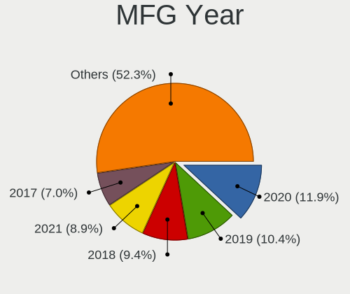
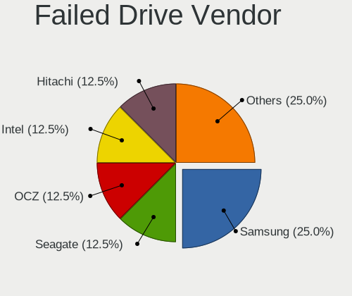
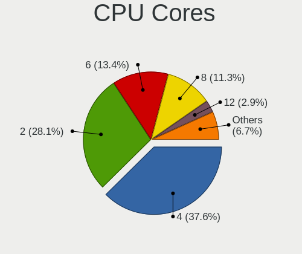
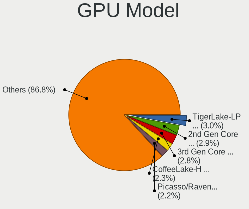
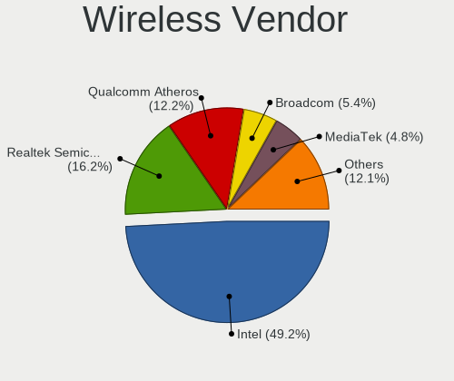
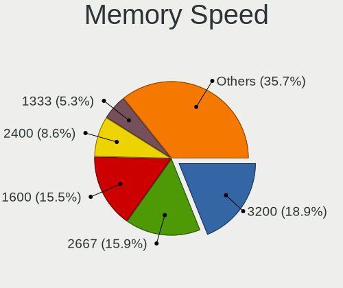

Kubuntu - Tested Hardware & Statistics
--------------------------------------

A project to collect tested hardware configurations for Kubuntu.

Anyone can contribute to this report by the [hw-probe](https://github.com/linuxhw/hw-probe) tool:

    sudo -E hw-probe -all -upload

Please contribute! Especially if your hardware is rare.

This is a report for all computer types. See also reports for [desktops](/Dist/Kubuntu/Desktop/README.md) and [notebooks](/Dist/Kubuntu/Notebook/README.md).

Contents
--------

* [ Test Cases ](#test-cases)

* [ System ](#system)
  - [ OS                       ](#os)
  - [ OS Family                ](#os-family)
  - [ Kernel                   ](#kernel)
  - [ Kernel Family            ](#kernel-family)
  - [ Kernel Major Ver.        ](#kernel-major-ver)
  - [ Arch                     ](#arch)
  - [ DE                       ](#de)
  - [ Display Server           ](#display-server)
  - [ Display Manager          ](#display-manager)
  - [ OS Lang                  ](#os-lang)
  - [ Boot Mode                ](#boot-mode)
  - [ Filesystem               ](#filesystem)
  - [ Part. scheme             ](#part-scheme)
  - [ Dual Boot with Linux/BSD ](#dual-boot-with-linuxbsd)
  - [ Dual Boot (Win)          ](#dual-boot-win)

* [ Board ](#board)
  - [ Vendor                   ](#vendor)
  - [ Model                    ](#model)
  - [ Model Family             ](#model-family)
  - [ MFG Year                 ](#mfg-year)
  - [ Form Factor              ](#form-factor)
  - [ Secure Boot              ](#secure-boot)
  - [ Coreboot                 ](#coreboot)
  - [ RAM Size                 ](#ram-size)
  - [ RAM Used                 ](#ram-used)
  - [ Total Drives             ](#total-drives)
  - [ Has CD-ROM               ](#has-cd-rom)
  - [ Has Ethernet             ](#has-ethernet)
  - [ Has WiFi                 ](#has-wifi)
  - [ Has Bluetooth            ](#has-bluetooth)

* [ Location ](#location)
  - [ Country                  ](#country)
  - [ City                     ](#city)

* [ Drives ](#drives)
  - [ Drive Vendor             ](#drive-vendor)
  - [ Drive Model              ](#drive-model)
  - [ HDD Vendor               ](#hdd-vendor)
  - [ SSD Vendor               ](#ssd-vendor)
  - [ Drive Kind               ](#drive-kind)
  - [ Drive Connector          ](#drive-connector)
  - [ Drive Size               ](#drive-size)
  - [ Space Total              ](#space-total)
  - [ Space Used               ](#space-used)
  - [ Malfunc. Drives          ](#malfunc-drives)
  - [ Malfunc. Drive Vendor    ](#malfunc-drive-vendor)
  - [ Malfunc. HDD Vendor      ](#malfunc-hdd-vendor)
  - [ Malfunc. Drive Kind      ](#malfunc-drive-kind)
  - [ Failed Drives            ](#failed-drives)
  - [ Failed Drive Vendor      ](#failed-drive-vendor)
  - [ Drive Status             ](#drive-status)

* [ Storage controller ](#storage-controller)
  - [ Storage Vendor           ](#storage-vendor)
  - [ Storage Model            ](#storage-model)
  - [ Storage Kind             ](#storage-kind)

* [ Processor ](#processor)
  - [ CPU Vendor               ](#cpu-vendor)
  - [ CPU Model                ](#cpu-model)
  - [ CPU Model Family         ](#cpu-model-family)
  - [ CPU Cores                ](#cpu-cores)
  - [ CPU Sockets              ](#cpu-sockets)
  - [ CPU Threads              ](#cpu-threads)
  - [ CPU Op-Modes             ](#cpu-op-modes)
  - [ CPU Microcode            ](#cpu-microcode)
  - [ CPU Microarch            ](#cpu-microarch)

* [ Graphics ](#graphics)
  - [ GPU Vendor               ](#gpu-vendor)
  - [ GPU Model                ](#gpu-model)
  - [ GPU Combo                ](#gpu-combo)
  - [ GPU Driver               ](#gpu-driver)
  - [ GPU Memory               ](#gpu-memory)

* [ Monitor ](#monitor)
  - [ Monitor Vendor           ](#monitor-vendor)
  - [ Monitor Model            ](#monitor-model)
  - [ Monitor Resolution       ](#monitor-resolution)
  - [ Monitor Diagonal         ](#monitor-diagonal)
  - [ Monitor Width            ](#monitor-width)
  - [ Aspect Ratio             ](#aspect-ratio)
  - [ Monitor Area             ](#monitor-area)
  - [ Pixel Density            ](#pixel-density)
  - [ Multiple Monitors        ](#multiple-monitors)

* [ Network ](#network)
  - [ Net Controller Vendor    ](#net-controller-vendor)
  - [ Net Controller Model     ](#net-controller-model)
  - [ Wireless Vendor          ](#wireless-vendor)
  - [ Wireless Model           ](#wireless-model)
  - [ Ethernet Vendor          ](#ethernet-vendor)
  - [ Ethernet Model           ](#ethernet-model)
  - [ Net Controller Kind      ](#net-controller-kind)
  - [ Used Controller          ](#used-controller)
  - [ NICs                     ](#nics)
  - [ IPv6                     ](#ipv6)

* [ Bluetooth ](#bluetooth)
  - [ Bluetooth Vendor         ](#bluetooth-vendor)
  - [ Bluetooth Model          ](#bluetooth-model)

* [ Sound ](#sound)
  - [ Sound Vendor             ](#sound-vendor)
  - [ Sound Model              ](#sound-model)

* [ Memory ](#memory)
  - [ Memory Vendor            ](#memory-vendor)
  - [ Memory Model             ](#memory-model)
  - [ Memory Kind              ](#memory-kind)
  - [ Memory Form Factor       ](#memory-form-factor)
  - [ Memory Size              ](#memory-size)
  - [ Memory Speed             ](#memory-speed)

* [ Printers & scanners ](#printers--scanners)
  - [ Printer Vendor           ](#printer-vendor)
  - [ Printer Model            ](#printer-model)
  - [ Scanner Vendor           ](#scanner-vendor)
  - [ Scanner Model            ](#scanner-model)

* [ Camera ](#camera)
  - [ Camera Vendor            ](#camera-vendor)
  - [ Camera Model             ](#camera-model)

* [ Security ](#security)
  - [ Fingerprint Vendor       ](#fingerprint-vendor)
  - [ Fingerprint Model        ](#fingerprint-model)
  - [ Chipcard Vendor          ](#chipcard-vendor)
  - [ Chipcard Model           ](#chipcard-model)

* [ Unsupported ](#unsupported)
  - [ Unsupported Devices      ](#unsupported-devices)
  - [ Unsupported Device Types ](#unsupported-device-types)

Test Cases
----------

Total: 6697

| Vendor        | Model                       | Form-Factor | Probe                                                      | Date         |
|---------------|-----------------------------|-------------|------------------------------------------------------------|--------------|
| ASUSTek       | PRIME X370-PRO              | Desktop     | [58d150eef2](https://linux-hardware.org/?probe=58d150eef2) | Feb 02, 2024 |
| Unknown       | Unknown                     | Notebook    | [8c03bd946c](https://linux-hardware.org/?probe=8c03bd946c) | Feb 02, 2024 |
| Notebook      | V15x_V17xRNx                | Notebook    | [901e71289e](https://linux-hardware.org/?probe=901e71289e) | Feb 02, 2024 |
| Lenovo        | NO DPK                      | Desktop     | [ce1ff05aed](https://linux-hardware.org/?probe=ce1ff05aed) | Feb 02, 2024 |
| ASUSTek       | P5Q                         | Desktop     | [63522c9a09](https://linux-hardware.org/?probe=63522c9a09) | Feb 02, 2024 |
| GX55          | Unknown                     | Tablet      | [99db62ac14](https://linux-hardware.org/?probe=99db62ac14) | Feb 02, 2024 |
| Dell          | Inspiron 5547               | Notebook    | [507fad3c00](https://linux-hardware.org/?probe=507fad3c00) | Feb 02, 2024 |
| Gigabyte      | AX370-Gaming K7             | Desktop     | [c2514048e9](https://linux-hardware.org/?probe=c2514048e9) | Feb 02, 2024 |
| ASUSTek       | TUF Gaming B550-PLUS        | Desktop     | [8e3680cd5d](https://linux-hardware.org/?probe=8e3680cd5d) | Feb 01, 2024 |
| ASUSTek       | ROG STRIX B350-F GAMING     | Desktop     | [6c75053ee6](https://linux-hardware.org/?probe=6c75053ee6) | Feb 01, 2024 |
| Lenovo        | ThinkPad X1 Carbon Gen 1... | Notebook    | [f1b0b8716f](https://linux-hardware.org/?probe=f1b0b8716f) | Feb 01, 2024 |
| MSI           | X470 GAMING PRO CARBON      | Desktop     | [9d2088ace3](https://linux-hardware.org/?probe=9d2088ace3) | Feb 01, 2024 |
| Lenovo        | IdeaPad Slim 5 16IRL8 82... | Notebook    | [8f630da527](https://linux-hardware.org/?probe=8f630da527) | Jan 31, 2024 |
| Dell          | 0YJPT1 A00                  | Desktop     | [014e8534ab](https://linux-hardware.org/?probe=014e8534ab) | Jan 31, 2024 |
| MSI           | Creator M16 A12UC           | Notebook    | [804a70b7f5](https://linux-hardware.org/?probe=804a70b7f5) | Jan 31, 2024 |
| ASUSTek       | ROG Zephyrus G14 GA401QC... | Notebook    | [02d7b129fc](https://linux-hardware.org/?probe=02d7b129fc) | Jan 31, 2024 |
| Lenovo        | NO DPK                      | Desktop     | [fd4b4dd902](https://linux-hardware.org/?probe=fd4b4dd902) | Jan 31, 2024 |
| ASUSTek       | SABERTOOTH 990FX            | Desktop     | [a477ec4fe1](https://linux-hardware.org/?probe=a477ec4fe1) | Jan 31, 2024 |
| HP            | 1998                        | Desktop     | [8ab7c171c3](https://linux-hardware.org/?probe=8ab7c171c3) | Jan 31, 2024 |
| MSI           | PRO B660M-A WIFI DDR4       | Desktop     | [aabd02c85c](https://linux-hardware.org/?probe=aabd02c85c) | Jan 30, 2024 |
| Gigabyte      | X570 AORUS ULTRA            | Desktop     | [c823432a5a](https://linux-hardware.org/?probe=c823432a5a) | Jan 30, 2024 |
| Dell          | 0GY6Y8 A02                  | Desktop     | [c52cbab2e3](https://linux-hardware.org/?probe=c52cbab2e3) | Jan 30, 2024 |
| ASUSTek       | G75VX                       | Notebook    | [5c270f1082](https://linux-hardware.org/?probe=5c270f1082) | Jan 30, 2024 |
| HP            | 1998                        | Desktop     | [92ff4b3ecd](https://linux-hardware.org/?probe=92ff4b3ecd) | Jan 30, 2024 |
| ASUSTek       | TUF B450-PRO GAMING         | Desktop     | [4cfb847d84](https://linux-hardware.org/?probe=4cfb847d84) | Jan 29, 2024 |
| Dell          | Latitude 3300               | Notebook    | [9d76144e60](https://linux-hardware.org/?probe=9d76144e60) | Jan 29, 2024 |
| Toshiba       | Satellite P300              | Notebook    | [14da91750f](https://linux-hardware.org/?probe=14da91750f) | Jan 29, 2024 |
| Acer          | Veriton X6630G              | Desktop     | [66d62ae7ed](https://linux-hardware.org/?probe=66d62ae7ed) | Jan 29, 2024 |
| Acer          | Veriton X6630G              | Desktop     | [9684aca764](https://linux-hardware.org/?probe=9684aca764) | Jan 29, 2024 |
| ASUSTek       | PRIME Z590-V                | Desktop     | [9cfcec4d2d](https://linux-hardware.org/?probe=9cfcec4d2d) | Jan 29, 2024 |
| MSI           | MAG B560M MORTAR            | Desktop     | [709499c177](https://linux-hardware.org/?probe=709499c177) | Jan 28, 2024 |
| Acer          | TravelMate P215-41-G2       | Notebook    | [0500733b2d](https://linux-hardware.org/?probe=0500733b2d) | Jan 28, 2024 |
| Mediacom      | WinPad 11,6 FullHD- WPU1... | Notebook    | [ea399c19ca](https://linux-hardware.org/?probe=ea399c19ca) | Jan 28, 2024 |
| Dell          | Latitude 7530               | Notebook    | [ff36f2cfcc](https://linux-hardware.org/?probe=ff36f2cfcc) | Jan 28, 2024 |
| HP            | EliteBook 8470w             | Notebook    | [a92904a970](https://linux-hardware.org/?probe=a92904a970) | Jan 28, 2024 |
| ASRock        | Z690 Phantom Gaming-ITX/... | Desktop     | [fe3286f6e5](https://linux-hardware.org/?probe=fe3286f6e5) | Jan 28, 2024 |
| MSI           | A320M BAZOOKA               | Desktop     | [db3234d7aa](https://linux-hardware.org/?probe=db3234d7aa) | Jan 28, 2024 |
| ASUSTek       | VivoBook_ASUSLaptop X509... | Notebook    | [aa19c735f2](https://linux-hardware.org/?probe=aa19c735f2) | Jan 28, 2024 |
| Acer          | Aspire A715-42G             | Notebook    | [6e3e887615](https://linux-hardware.org/?probe=6e3e887615) | Jan 27, 2024 |
| Gigabyte      | H67A-USB3-B3                | Desktop     | [e53ca59dec](https://linux-hardware.org/?probe=e53ca59dec) | Jan 27, 2024 |
| Lenovo        | ThinkPad T14 Gen 3 21AHA... | Notebook    | [f2ed690a39](https://linux-hardware.org/?probe=f2ed690a39) | Jan 27, 2024 |
| Lenovo        | ThinkPad T14 Gen 3 21AHA... | Notebook    | [4644130b45](https://linux-hardware.org/?probe=4644130b45) | Jan 27, 2024 |
| ASUSTek       | VivoBook_ASUSLaptop X512... | Notebook    | [f3243845d3](https://linux-hardware.org/?probe=f3243845d3) | Jan 27, 2024 |
| Dell          | Inspiron 5491 2n1           | Convertible | [41fc5cca96](https://linux-hardware.org/?probe=41fc5cca96) | Jan 27, 2024 |
| MSI           | PRO B650-S WIFI             | Desktop     | [08d3d9b75e](https://linux-hardware.org/?probe=08d3d9b75e) | Jan 26, 2024 |
| Dell          | Latitude 7530               | Notebook    | [e1cd3d26e8](https://linux-hardware.org/?probe=e1cd3d26e8) | Jan 26, 2024 |
| ASUSTek       | ROG STRIX B350-F GAMING     | Desktop     | [3524a7d564](https://linux-hardware.org/?probe=3524a7d564) | Jan 26, 2024 |
| ASRock        | B450M Pro4                  | Desktop     | [23faf0c03e](https://linux-hardware.org/?probe=23faf0c03e) | Jan 25, 2024 |
| HP            | EliteBook 8570p             | Notebook    | [b6507e7469](https://linux-hardware.org/?probe=b6507e7469) | Jan 25, 2024 |
| Lenovo        | ThinkPad Twist 334729G      | Notebook    | [0a17051b66](https://linux-hardware.org/?probe=0a17051b66) | Jan 25, 2024 |
| Acer          | Aspire Z5600                | All in one  | [3735067105](https://linux-hardware.org/?probe=3735067105) | Jan 25, 2024 |
| Google        | Taeko                       | Notebook    | [e52e2ff787](https://linux-hardware.org/?probe=e52e2ff787) | Jan 25, 2024 |
| Medion        | S14409                      | Notebook    | [8e8339905a](https://linux-hardware.org/?probe=8e8339905a) | Jan 25, 2024 |
| Acer          | Aspire A315-56              | Notebook    | [1c3a86b39c](https://linux-hardware.org/?probe=1c3a86b39c) | Jan 25, 2024 |
| MSI           | B560M PRO-VDH               | Desktop     | [e64338286f](https://linux-hardware.org/?probe=e64338286f) | Jan 24, 2024 |
| MSI           | MPG X670E CARBON WIFI       | Desktop     | [0bc85e1b60](https://linux-hardware.org/?probe=0bc85e1b60) | Jan 24, 2024 |
| ASUSTek       | SABERTOOTH Z77              | Desktop     | [94b425089f](https://linux-hardware.org/?probe=94b425089f) | Jan 24, 2024 |
| AZW           | Gemini T45                  | Desktop     | [5a3dba74d6](https://linux-hardware.org/?probe=5a3dba74d6) | Jan 24, 2024 |
| AZW           | Gemini T45                  | Desktop     | [a0e1db7908](https://linux-hardware.org/?probe=a0e1db7908) | Jan 24, 2024 |
| AZW           | MINI S 10                   | Desktop     | [d549e8a8a6](https://linux-hardware.org/?probe=d549e8a8a6) | Jan 24, 2024 |
| AZW           | MINI S 10                   | Desktop     | [b1a0a41e9e](https://linux-hardware.org/?probe=b1a0a41e9e) | Jan 24, 2024 |
| ASUSTek       | M4A89GTD-PRO/USB3           | Desktop     | [7c94952653](https://linux-hardware.org/?probe=7c94952653) | Jan 23, 2024 |
| MSI           | MPG X670E CARBON WIFI       | Desktop     | [18a98466b2](https://linux-hardware.org/?probe=18a98466b2) | Jan 23, 2024 |
| ASUSTek       | VivoBook_ASUSLaptop X170... | Notebook    | [f9da9c2d2e](https://linux-hardware.org/?probe=f9da9c2d2e) | Jan 23, 2024 |
| MSI           | MAG B560M MORTAR            | Desktop     | [2637ed4a7c](https://linux-hardware.org/?probe=2637ed4a7c) | Jan 23, 2024 |
| ASRock        | X370 Gaming-ITX/ac          | Desktop     | [af9215d3a5](https://linux-hardware.org/?probe=af9215d3a5) | Jan 23, 2024 |
| HP            | ProBook 4540s               | Notebook    | [84367073dd](https://linux-hardware.org/?probe=84367073dd) | Jan 22, 2024 |
| HP            | ProBook 4540s               | Notebook    | [f72cd2d1a0](https://linux-hardware.org/?probe=f72cd2d1a0) | Jan 22, 2024 |
| Acer          | Aspire A315-56              | Notebook    | [b619b984b6](https://linux-hardware.org/?probe=b619b984b6) | Jan 22, 2024 |
| Lenovo        | 1037 SDK0Q40104 WIN 3305... | Server      | [e8d7aba4fe](https://linux-hardware.org/?probe=e8d7aba4fe) | Jan 22, 2024 |
| HUAWEI        | BoDE-WXX9                   | Notebook    | [1cfa83e1fc](https://linux-hardware.org/?probe=1cfa83e1fc) | Jan 22, 2024 |
| Packard Be... | EasyNote TS11HR             | Notebook    | [31a4f6e57f](https://linux-hardware.org/?probe=31a4f6e57f) | Jan 22, 2024 |
| ASUSTek       | UX410UAK                    | Notebook    | [1155ca8c5c](https://linux-hardware.org/?probe=1155ca8c5c) | Jan 22, 2024 |
| Apple         | MacBookPro10,2              | Notebook    | [db7e0a0c8a](https://linux-hardware.org/?probe=db7e0a0c8a) | Jan 22, 2024 |
| Fujitsu       | D3222-B1 S26361-D3222-B1    | Desktop     | [7eea5af3e6](https://linux-hardware.org/?probe=7eea5af3e6) | Jan 22, 2024 |
| Gigabyte      | Z97-HD3                     | Desktop     | [e568089bad](https://linux-hardware.org/?probe=e568089bad) | Jan 21, 2024 |
| Acer          | Nitro AN515-55              | Notebook    | [428442a3ab](https://linux-hardware.org/?probe=428442a3ab) | Jan 21, 2024 |
| ASUSTek       | TUF Gaming X570-PLUS        | Desktop     | [6a43bd4926](https://linux-hardware.org/?probe=6a43bd4926) | Jan 21, 2024 |
| Lenovo        | ThinkPad L14 Gen 2 20X10... | Notebook    | [aaf1d1d0de](https://linux-hardware.org/?probe=aaf1d1d0de) | Jan 21, 2024 |
| HP            | Notebook                    | Notebook    | [71136f647b](https://linux-hardware.org/?probe=71136f647b) | Jan 20, 2024 |
| ASUSTek       | ROG Strix G513QY_G513QY     | Notebook    | [2d9680d782](https://linux-hardware.org/?probe=2d9680d782) | Jan 20, 2024 |
| ASUSTek       | ROG Strix G513QY_G513QY     | Notebook    | [ea63bb1d97](https://linux-hardware.org/?probe=ea63bb1d97) | Jan 20, 2024 |
| Dell          | Vostro 15-3568              | Notebook    | [36e3b9f35a](https://linux-hardware.org/?probe=36e3b9f35a) | Jan 19, 2024 |
| MSI           | MPG Z390 GAMING PLUS        | Desktop     | [494d0af2e5](https://linux-hardware.org/?probe=494d0af2e5) | Jan 19, 2024 |
| Dell          | Latitude 7330               | Notebook    | [d8b532bbee](https://linux-hardware.org/?probe=d8b532bbee) | Jan 19, 2024 |
| Apple         | MacBookPro14,1              | Notebook    | [bd52f86baa](https://linux-hardware.org/?probe=bd52f86baa) | Jan 18, 2024 |
| HP            | OMEN Laptop 15-ek1xxx       | Notebook    | [5c18e1a4bc](https://linux-hardware.org/?probe=5c18e1a4bc) | Jan 18, 2024 |
| Dell          | Vostro 15-3568              | Notebook    | [c6bd12e53b](https://linux-hardware.org/?probe=c6bd12e53b) | Jan 18, 2024 |
| Dell          | Vostro 15-3568              | Notebook    | [7af8bc4215](https://linux-hardware.org/?probe=7af8bc4215) | Jan 18, 2024 |
| Great Wall    | MBX-Z60AR110 TBD            | Desktop     | [fdfa81d344](https://linux-hardware.org/?probe=fdfa81d344) | Jan 18, 2024 |
| Dell          | Latitude 5530               | Notebook    | [df5d5becd7](https://linux-hardware.org/?probe=df5d5becd7) | Jan 17, 2024 |
| Medion        | MS-7800                     | Desktop     | [8af71869fc](https://linux-hardware.org/?probe=8af71869fc) | Jan 17, 2024 |
| Medion        | H110H4-EM                   | Desktop     | [ea736cf314](https://linux-hardware.org/?probe=ea736cf314) | Jan 17, 2024 |
| MSI           | B560M PRO-VDH               | Desktop     | [cc460a0905](https://linux-hardware.org/?probe=cc460a0905) | Jan 16, 2024 |
| ASUSTek       | PRIME H410M-A               | Desktop     | [0d81012aa0](https://linux-hardware.org/?probe=0d81012aa0) | Jan 16, 2024 |
| Dell          | Inspiron N311z              | Notebook    | [e4163cacc4](https://linux-hardware.org/?probe=e4163cacc4) | Jan 16, 2024 |
| Intel         | B75 V124                    | Desktop     | [4548b73c01](https://linux-hardware.org/?probe=4548b73c01) | Jan 16, 2024 |
| ASUSTek       | M4A89GTD-PRO/USB3           | Desktop     | [c69281db28](https://linux-hardware.org/?probe=c69281db28) | Jan 15, 2024 |
| HP            | Laptop 15-ef2xxx            | Notebook    | [ca627d3c3e](https://linux-hardware.org/?probe=ca627d3c3e) | Jan 15, 2024 |
| Dell          | XPS 13 7390 2-in-1          | Convertible | [9ae250d8a6](https://linux-hardware.org/?probe=9ae250d8a6) | Jan 15, 2024 |
| MSI           | X470 GAMING PRO CARBON      | Desktop     | [cdfc29ad66](https://linux-hardware.org/?probe=cdfc29ad66) | Jan 15, 2024 |
| MSI           | Summit E16Flip A12UCT       | Notebook    | [efb852e7fb](https://linux-hardware.org/?probe=efb852e7fb) | Jan 15, 2024 |
| MSI           | P67A-G43                    | Desktop     | [30b1edf89c](https://linux-hardware.org/?probe=30b1edf89c) | Jan 14, 2024 |
| ASUSTek       | VivoBook_ASUSLaptop M650... | Notebook    | [3aab9743d9](https://linux-hardware.org/?probe=3aab9743d9) | Jan 14, 2024 |
| Google        | Fleex                       | Notebook    | [46f5b6af86](https://linux-hardware.org/?probe=46f5b6af86) | Jan 14, 2024 |
| VALE          | Notebook Slim S132          | Notebook    | [32021c35d3](https://linux-hardware.org/?probe=32021c35d3) | Jan 14, 2024 |
| VALE          | Notebook Slim S132          | Notebook    | [0d2db2e184](https://linux-hardware.org/?probe=0d2db2e184) | Jan 14, 2024 |
| HP            | x2 210 G2                   | Tablet      | [e1baf3e443](https://linux-hardware.org/?probe=e1baf3e443) | Jan 14, 2024 |
| Samsung       | 300E5M/300E5L               | Notebook    | [9c43a79143](https://linux-hardware.org/?probe=9c43a79143) | Jan 14, 2024 |
| ASUSTek       | VivoBook_ASUSLaptop X712... | Notebook    | [bda32c8468](https://linux-hardware.org/?probe=bda32c8468) | Jan 14, 2024 |
| MSI           | A520M-A PRO                 | Desktop     | [37f2fc1ee2](https://linux-hardware.org/?probe=37f2fc1ee2) | Jan 14, 2024 |
| Lenovo        | ThinkPad X230 2325BA3       | Notebook    | [2663e39ea0](https://linux-hardware.org/?probe=2663e39ea0) | Jan 14, 2024 |
| Lenovo        | SHARKBAY SDK0E50510 WIN     | Desktop     | [35dd663593](https://linux-hardware.org/?probe=35dd663593) | Jan 14, 2024 |
| ASUSTek       | ROG STRIX X570-E GAMING ... | Desktop     | [398927cd45](https://linux-hardware.org/?probe=398927cd45) | Jan 13, 2024 |
| Unknown       | AY07J                       | Desktop     | [1cb5749c2b](https://linux-hardware.org/?probe=1cb5749c2b) | Jan 13, 2024 |
| MSI           | A520M-A PRO                 | Desktop     | [04c5daf912](https://linux-hardware.org/?probe=04c5daf912) | Jan 13, 2024 |
| Lenovo        | Yoga Slim 7 Pro 14ARH7 8... | Notebook    | [be204b17d2](https://linux-hardware.org/?probe=be204b17d2) | Jan 13, 2024 |
| Lenovo        | ThinkPad E14 Gen 4 21ECS... | Notebook    | [587226a745](https://linux-hardware.org/?probe=587226a745) | Jan 13, 2024 |
| HP            | Laptop 15t-dy100            | Notebook    | [38ad1122d1](https://linux-hardware.org/?probe=38ad1122d1) | Jan 13, 2024 |
| Unknown       | Unknown                     | Desktop     | [25341b5586](https://linux-hardware.org/?probe=25341b5586) | Jan 13, 2024 |
| Dell          | Inspiron 3521               | Notebook    | [80bd0982b9](https://linux-hardware.org/?probe=80bd0982b9) | Jan 13, 2024 |
| HP            | OMEN Laptop 15-en1xxx       | Notebook    | [3c339a3645](https://linux-hardware.org/?probe=3c339a3645) | Jan 13, 2024 |
| Dell          | Precision 7720              | Notebook    | [adec0c91d9](https://linux-hardware.org/?probe=adec0c91d9) | Jan 13, 2024 |
| Lenovo        | ThinkPad T495 20NJ000XIX    | Notebook    | [700470a7f6](https://linux-hardware.org/?probe=700470a7f6) | Jan 12, 2024 |
| MSI           | H410M PRO                   | Desktop     | [76a24b5fa3](https://linux-hardware.org/?probe=76a24b5fa3) | Jan 12, 2024 |
| Lenovo        | ThinkPad E450 20DC003WUS    | Notebook    | [817c17d60e](https://linux-hardware.org/?probe=817c17d60e) | Jan 12, 2024 |
| HP            | ProBook 6450b               | Notebook    | [ddae4148a2](https://linux-hardware.org/?probe=ddae4148a2) | Jan 12, 2024 |
| ASUSTek       | PRIME A320M-K               | Desktop     | [bddc683db5](https://linux-hardware.org/?probe=bddc683db5) | Jan 12, 2024 |
| MSI           | Z370 GAMING PLUS            | Desktop     | [a188d14c50](https://linux-hardware.org/?probe=a188d14c50) | Jan 11, 2024 |
| Dell          | Inspiron 3793               | Notebook    | [60ded5e8e7](https://linux-hardware.org/?probe=60ded5e8e7) | Jan 11, 2024 |
| ASUSTek       | TUF Gaming X570-PLUS        | Desktop     | [f1814dff2e](https://linux-hardware.org/?probe=f1814dff2e) | Jan 11, 2024 |
| MSI           | B350 GAMING PRO CARBON      | Desktop     | [e8b3f439b3](https://linux-hardware.org/?probe=e8b3f439b3) | Jan 10, 2024 |
| HP            | 8767 A                      | Desktop     | [88f6719b01](https://linux-hardware.org/?probe=88f6719b01) | Jan 10, 2024 |
| ASUSTek       | H81T R2.0                   | Desktop     | [23cc8eb053](https://linux-hardware.org/?probe=23cc8eb053) | Jan 10, 2024 |
| Infinix       | ZERO BOOK 13                | Notebook    | [7101d9332b](https://linux-hardware.org/?probe=7101d9332b) | Jan 10, 2024 |
| HP            | 8643 SMVB                   | Desktop     | [0cd91acdff](https://linux-hardware.org/?probe=0cd91acdff) | Jan 10, 2024 |
| MSI           | B350 GAMING PRO CARBON      | Desktop     | [a089502ce1](https://linux-hardware.org/?probe=a089502ce1) | Jan 10, 2024 |
| Gigabyte      | GA-MA69VM-S2                | Desktop     | [7caaae153c](https://linux-hardware.org/?probe=7caaae153c) | Jan 09, 2024 |
| Infinix       | ZERO BOOK 13                | Notebook    | [a3c73eb2fd](https://linux-hardware.org/?probe=a3c73eb2fd) | Jan 09, 2024 |
| Sony          | VGN-CS190N                  | Notebook    | [2ac26516a6](https://linux-hardware.org/?probe=2ac26516a6) | Jan 09, 2024 |
| ASUSTek       | Zephyrus S GX502GW_GX502... | Notebook    | [8101d22b4a](https://linux-hardware.org/?probe=8101d22b4a) | Jan 09, 2024 |
| Micro Comp... | Venus series                | Notebook    | [7680fc8cfc](https://linux-hardware.org/?probe=7680fc8cfc) | Jan 09, 2024 |
| Micro Comp... | Venus series                | Notebook    | [4413b07a3b](https://linux-hardware.org/?probe=4413b07a3b) | Jan 09, 2024 |
| HP            | EliteBook 8470p             | Notebook    | [8a0e17b484](https://linux-hardware.org/?probe=8a0e17b484) | Jan 09, 2024 |
| Unknown       | V00                         | Mini pc     | [9f59e7926f](https://linux-hardware.org/?probe=9f59e7926f) | Jan 09, 2024 |
| ASUSTek       | ROG STRIX B650E-F GAMING... | Desktop     | [a092034ebf](https://linux-hardware.org/?probe=a092034ebf) | Jan 09, 2024 |
| Dell          | 0HD5W2 A01                  | Desktop     | [7194fe43ed](https://linux-hardware.org/?probe=7194fe43ed) | Jan 09, 2024 |
| Biostar       | B550MX/E PRO                | Desktop     | [8c12a7197e](https://linux-hardware.org/?probe=8c12a7197e) | Jan 08, 2024 |
| Samsung       | RV420/RV520/RV720/E3530/... | Notebook    | [565c995910](https://linux-hardware.org/?probe=565c995910) | Jan 08, 2024 |
| Dell          | 0F96C8 A00                  | All in one  | [f7d20028f6](https://linux-hardware.org/?probe=f7d20028f6) | Jan 08, 2024 |
| Gigabyte      | H67A-UD3H-B3                | Desktop     | [f43717fa8e](https://linux-hardware.org/?probe=f43717fa8e) | Jan 08, 2024 |
| MSI           | Creator Z17 A12UGST         | Notebook    | [b9357d76fc](https://linux-hardware.org/?probe=b9357d76fc) | Jan 08, 2024 |
| Dell          | Latitude E7450              | Notebook    | [a60667c993](https://linux-hardware.org/?probe=a60667c993) | Jan 08, 2024 |
| ASUSTek       | ProArt Z790-CREATOR WIFI    | Desktop     | [e19857a2a6](https://linux-hardware.org/?probe=e19857a2a6) | Jan 08, 2024 |
| MSI           | Creator Z17 A12UGST         | Notebook    | [6027d9f940](https://linux-hardware.org/?probe=6027d9f940) | Jan 08, 2024 |
| Apple         | MacBookAir9,1               | Notebook    | [6af0a29be6](https://linux-hardware.org/?probe=6af0a29be6) | Jan 07, 2024 |
| Apple         | Mac-F60DEB81FF30ACF6 Mac... | Desktop     | [ee9fb5898f](https://linux-hardware.org/?probe=ee9fb5898f) | Jan 07, 2024 |
| Acer          | Aspire A315-24P             | Notebook    | [fccab2dc4a](https://linux-hardware.org/?probe=fccab2dc4a) | Jan 07, 2024 |
| Intel         | VALLEYVIEW C0 PLATFORM      | Tablet      | [c3d56fa36c](https://linux-hardware.org/?probe=c3d56fa36c) | Jan 07, 2024 |
| ASUSTek       | Maximus VIII HERO           | Desktop     | [e23adc98db](https://linux-hardware.org/?probe=e23adc98db) | Jan 06, 2024 |
| HP            | 3397                        | Desktop     | [0ba7322ded](https://linux-hardware.org/?probe=0ba7322ded) | Jan 05, 2024 |
| MSI           | MPG Z390 GAMING PLUS        | Desktop     | [5feecec8b2](https://linux-hardware.org/?probe=5feecec8b2) | Jan 05, 2024 |
| MSI           | B450-A PRO MAX              | Desktop     | [c58bf7eae4](https://linux-hardware.org/?probe=c58bf7eae4) | Jan 05, 2024 |
| HP            | ZBook 14u G5                | Notebook    | [33c5c3bf2c](https://linux-hardware.org/?probe=33c5c3bf2c) | Jan 05, 2024 |
| HP            | ZBook 14u G5                | Notebook    | [7774c1745d](https://linux-hardware.org/?probe=7774c1745d) | Jan 05, 2024 |
| Dell          | Inspiron 3521               | Notebook    | [431379ef73](https://linux-hardware.org/?probe=431379ef73) | Jan 05, 2024 |
| Biostar       | B365MHC                     | Desktop     | [0936a451ce](https://linux-hardware.org/?probe=0936a451ce) | Jan 04, 2024 |
| HP            | ENVY m6                     | Notebook    | [d63a06fb89](https://linux-hardware.org/?probe=d63a06fb89) | Jan 04, 2024 |
| HP            | ProBook x360 11 G3 EE       | Convertible | [5ca009faf3](https://linux-hardware.org/?probe=5ca009faf3) | Jan 04, 2024 |
| Dell          | Latitude E6420              | Notebook    | [c9538d7328](https://linux-hardware.org/?probe=c9538d7328) | Jan 04, 2024 |
| Lenovo        | ThinkPad E15 Gen 4 21E60... | Notebook    | [cf1f935e69](https://linux-hardware.org/?probe=cf1f935e69) | Jan 03, 2024 |
| Dell          | Latitude E6420              | Notebook    | [45dcfa5d2c](https://linux-hardware.org/?probe=45dcfa5d2c) | Jan 03, 2024 |
| Dell          | Latitude 7490               | Notebook    | [80751dfc22](https://linux-hardware.org/?probe=80751dfc22) | Jan 03, 2024 |
| Dell          | Latitude 7490               | Notebook    | [0765d95d82](https://linux-hardware.org/?probe=0765d95d82) | Jan 03, 2024 |
| ASUSTek       | PRIME A320M-K               | Desktop     | [cf07066830](https://linux-hardware.org/?probe=cf07066830) | Jan 03, 2024 |
| Acer          | Aspire 8730                 | Notebook    | [69f291e4be](https://linux-hardware.org/?probe=69f291e4be) | Jan 03, 2024 |
| Dell          | Inspiron 5502               | Notebook    | [3486d53d60](https://linux-hardware.org/?probe=3486d53d60) | Jan 03, 2024 |
| Intel         | NUC12WSBi5 M46425-302       | Mini pc     | [83106ca0a8](https://linux-hardware.org/?probe=83106ca0a8) | Jan 03, 2024 |
| HP            | Pavilion 13 x360 PC         | Notebook    | [c1d7df8730](https://linux-hardware.org/?probe=c1d7df8730) | Jan 02, 2024 |
| HUAWEI        | BOM-WXX9                    | Notebook    | [4c7efd21fe](https://linux-hardware.org/?probe=4c7efd21fe) | Jan 02, 2024 |
| Rockchip      | RK3588 OPi 5 Plus           | Soc         | [a948fd2006](https://linux-hardware.org/?probe=a948fd2006) | Jan 02, 2024 |
| Acer          | Aspire 8730                 | Notebook    | [a435ff1bd6](https://linux-hardware.org/?probe=a435ff1bd6) | Jan 02, 2024 |
| Acer          | Aspire 8730                 | Notebook    | [4db4a265b6](https://linux-hardware.org/?probe=4db4a265b6) | Jan 02, 2024 |
| Dell          | Inspiron 5558               | Notebook    | [acc47dae75](https://linux-hardware.org/?probe=acc47dae75) | Jan 02, 2024 |
| Lenovo        | V15 G3 IAP 82TT             | Notebook    | [2ca86aaf30](https://linux-hardware.org/?probe=2ca86aaf30) | Jan 02, 2024 |
| Lenovo        | IdeaPad 5 15ARE05 81YQ      | Notebook    | [fb59929b28](https://linux-hardware.org/?probe=fb59929b28) | Jan 02, 2024 |
| Gigabyte      | B550M AORUS ELITE           | Desktop     | [3de5d6e06c](https://linux-hardware.org/?probe=3de5d6e06c) | Jan 02, 2024 |
| ASUSTek       | ROG STRIX X670E-E GAMING... | Desktop     | [21c267752a](https://linux-hardware.org/?probe=21c267752a) | Jan 02, 2024 |
| Gigabyte      | AX370-Gaming K7             | Desktop     | [435dc251c1](https://linux-hardware.org/?probe=435dc251c1) | Jan 02, 2024 |
| System76      | Pangolin                    | Notebook    | [58876a3573](https://linux-hardware.org/?probe=58876a3573) | Jan 01, 2024 |
| Dell          | 0F6X5P A00                  | Desktop     | [750a1d90dd](https://linux-hardware.org/?probe=750a1d90dd) | Jan 01, 2024 |
| Dell          | 0F6X5P A00                  | Desktop     | [b4f1a69ca3](https://linux-hardware.org/?probe=b4f1a69ca3) | Jan 01, 2024 |
| Dell          | 0F6X5P A00                  | Desktop     | [b5efb44fe4](https://linux-hardware.org/?probe=b5efb44fe4) | Jan 01, 2024 |
| Rockchip      | RK3588 OPi 5 Plus           | Soc         | [e8e24c9091](https://linux-hardware.org/?probe=e8e24c9091) | Jan 01, 2024 |
| MSI           | 2AE0                        | Desktop     | [00b5d15112](https://linux-hardware.org/?probe=00b5d15112) | Jan 01, 2024 |
| MSI           | X470 GAMING PRO CARBON      | Desktop     | [8a1771af4b](https://linux-hardware.org/?probe=8a1771af4b) | Jan 01, 2024 |
| Rockchip      | RK3588 OPi 5 Plus           | Soc         | [c6a3df522b](https://linux-hardware.org/?probe=c6a3df522b) | Dec 31, 2023 |
| ASRock        | Z170A-X1                    | Desktop     | [faba481c2b](https://linux-hardware.org/?probe=faba481c2b) | Dec 31, 2023 |
| HP            | 8704                        | Desktop     | [49843bcacc](https://linux-hardware.org/?probe=49843bcacc) | Dec 31, 2023 |
| Toshiba       | STI 013442                  | Desktop     | [c8488906f2](https://linux-hardware.org/?probe=c8488906f2) | Dec 31, 2023 |
| Notebook      | NL5xNU                      | Notebook    | [915031852a](https://linux-hardware.org/?probe=915031852a) | Dec 31, 2023 |
| Toshiba       | STI 013442                  | Desktop     | [ed56d2dcb5](https://linux-hardware.org/?probe=ed56d2dcb5) | Dec 31, 2023 |
| Apple         | MacBookAir9,1               | Notebook    | [71c755966f](https://linux-hardware.org/?probe=71c755966f) | Dec 31, 2023 |
| Apple         | MacBookAir9,1               | Notebook    | [b13ec8c4fe](https://linux-hardware.org/?probe=b13ec8c4fe) | Dec 31, 2023 |
| MSI           | MPG B550 GAMING PLUS        | Desktop     | [d0b71859f2](https://linux-hardware.org/?probe=d0b71859f2) | Dec 31, 2023 |
| ASUSTek       | PRIME B360M-A               | Notebook    | [42b25d8ac5](https://linux-hardware.org/?probe=42b25d8ac5) | Dec 30, 2023 |
| Gigabyte      | B550M DS3H                  | Desktop     | [bf4f14e416](https://linux-hardware.org/?probe=bf4f14e416) | Dec 30, 2023 |
| HP            | ENVY m4                     | Notebook    | [6416f24210](https://linux-hardware.org/?probe=6416f24210) | Dec 30, 2023 |
| HP            | ENVY m4                     | Notebook    | [f0cd285399](https://linux-hardware.org/?probe=f0cd285399) | Dec 30, 2023 |
| Lenovo        | ThinkPad T480 20L6SE6900    | Notebook    | [f9e5fe1156](https://linux-hardware.org/?probe=f9e5fe1156) | Dec 29, 2023 |
| Lenovo        | ThinkPad T450 20BUS05V00    | Notebook    | [3334aeb4e1](https://linux-hardware.org/?probe=3334aeb4e1) | Dec 29, 2023 |
| MSI           | X470 GAMING PRO CARBON      | Desktop     | [3700165122](https://linux-hardware.org/?probe=3700165122) | Dec 28, 2023 |
| Rockchip      | RK3588 OPi 5 Plus           | Soc         | [4f74bf57df](https://linux-hardware.org/?probe=4f74bf57df) | Dec 28, 2023 |
| Rockchip      | RK3588 OPi 5 Plus           | Soc         | [59ae3d3d52](https://linux-hardware.org/?probe=59ae3d3d52) | Dec 28, 2023 |
| ASUSTek       | ROG STRIX B350-F GAMING     | Desktop     | [c68ea76b65](https://linux-hardware.org/?probe=c68ea76b65) | Dec 28, 2023 |
| ASUSTek       | ROG STRIX B350-F GAMING     | Desktop     | [48d04b219b](https://linux-hardware.org/?probe=48d04b219b) | Dec 28, 2023 |
| Acer          | Aspire 8730                 | Notebook    | [3110584890](https://linux-hardware.org/?probe=3110584890) | Dec 28, 2023 |
| Acer          | Aspire 8730                 | Notebook    | [3a9461e870](https://linux-hardware.org/?probe=3a9461e870) | Dec 28, 2023 |
| Acer          | Aspire A315-41              | Notebook    | [1042d42263](https://linux-hardware.org/?probe=1042d42263) | Dec 28, 2023 |
| Acer          | Aspire A315-41              | Notebook    | [d68aa800c6](https://linux-hardware.org/?probe=d68aa800c6) | Dec 28, 2023 |
| Packard Be... | MCP73T-AD                   | Desktop     | [c7d9006760](https://linux-hardware.org/?probe=c7d9006760) | Dec 27, 2023 |
| HP            | 339A                        | Desktop     | [49cb574539](https://linux-hardware.org/?probe=49cb574539) | Dec 27, 2023 |
| MSI           | MPG B650 CARBON WIFI        | Desktop     | [6a0970bd24](https://linux-hardware.org/?probe=6a0970bd24) | Dec 27, 2023 |
| Gigabyte      | B760M DS3H DDR4             | Desktop     | [10fa4fd32b](https://linux-hardware.org/?probe=10fa4fd32b) | Dec 27, 2023 |
| Dell          | Vostro 3446                 | Notebook    | [ed9d04a3d2](https://linux-hardware.org/?probe=ed9d04a3d2) | Dec 27, 2023 |
| Foxconn       | 2AB7                        | Desktop     | [2d0962bbfa](https://linux-hardware.org/?probe=2d0962bbfa) | Dec 27, 2023 |
| Foxconn       | 2AB7                        | Desktop     | [b1b00dd0b5](https://linux-hardware.org/?probe=b1b00dd0b5) | Dec 27, 2023 |
| Lenovo        | ThinkPad E590 20NB005MUS    | Notebook    | [7979b3518c](https://linux-hardware.org/?probe=7979b3518c) | Dec 27, 2023 |
| Notebook      | NL5xNU                      | Notebook    | [ad5a093909](https://linux-hardware.org/?probe=ad5a093909) | Dec 26, 2023 |
| Lenovo        | ThinkPad T520 4243ED3       | Notebook    | [6fd4832f12](https://linux-hardware.org/?probe=6fd4832f12) | Dec 26, 2023 |
| Apple         | MacBookAir9,1               | Notebook    | [22b65c12f2](https://linux-hardware.org/?probe=22b65c12f2) | Dec 26, 2023 |
| Dell          | XPS 15 9530                 | Notebook    | [5902199f52](https://linux-hardware.org/?probe=5902199f52) | Dec 26, 2023 |
| Apple         | MacBookPro12,1              | Notebook    | [0714d5920a](https://linux-hardware.org/?probe=0714d5920a) | Dec 26, 2023 |
| Dell          | XPS 15 9530                 | Notebook    | [cf1f0e7284](https://linux-hardware.org/?probe=cf1f0e7284) | Dec 26, 2023 |
| Lenovo        | Yoga C640-13IML 81UE        | Convertible | [f6f41d95dc](https://linux-hardware.org/?probe=f6f41d95dc) | Dec 25, 2023 |
| ARDOR GAMI... | V15x_V17xPNKPNJPNH          | Notebook    | [46a795ef16](https://linux-hardware.org/?probe=46a795ef16) | Dec 25, 2023 |
| Timi          | Mi NoteBook Pro             | Notebook    | [5972225791](https://linux-hardware.org/?probe=5972225791) | Dec 25, 2023 |
| PC Special... | 14 Fusion Pro               | Notebook    | [76bf311c34](https://linux-hardware.org/?probe=76bf311c34) | Dec 25, 2023 |
| Dell          | 0JCTF8 A00                  | Desktop     | [988e9fc65c](https://linux-hardware.org/?probe=988e9fc65c) | Dec 25, 2023 |
| Dell          | 0F6X5P A00                  | Desktop     | [8b6cbdd646](https://linux-hardware.org/?probe=8b6cbdd646) | Dec 24, 2023 |
| Unknown       | Unknown                     | Desktop     | [74c274a303](https://linux-hardware.org/?probe=74c274a303) | Dec 24, 2023 |
| Unknown       | Unknown                     | Desktop     | [123aa39382](https://linux-hardware.org/?probe=123aa39382) | Dec 24, 2023 |
| Lenovo        | ThinkPad X1 Carbon Gen 1... | Notebook    | [1297c97e04](https://linux-hardware.org/?probe=1297c97e04) | Dec 24, 2023 |
| Fujitsu       | D3161-A1 S26361-D3161-A1    | Desktop     | [c1069bda0b](https://linux-hardware.org/?probe=c1069bda0b) | Dec 23, 2023 |
| Unknown       | Unknown                     | Desktop     | [9549fcd83e](https://linux-hardware.org/?probe=9549fcd83e) | Dec 23, 2023 |
| Lenovo        | Legion Pro 5 16ARX8 82WM    | Notebook    | [6d8c495e90](https://linux-hardware.org/?probe=6d8c495e90) | Dec 23, 2023 |
| HP            | 340S G7 Notebook PC         | Notebook    | [097603b65a](https://linux-hardware.org/?probe=097603b65a) | Dec 23, 2023 |
| Lenovo        | ThinkPad T500 20564RG       | Notebook    | [e17f4b51d6](https://linux-hardware.org/?probe=e17f4b51d6) | Dec 22, 2023 |
| Dell          | Latitude 7280               | Notebook    | [5397e7633e](https://linux-hardware.org/?probe=5397e7633e) | Dec 22, 2023 |
| Lenovo        | M30-70 80H8                 | Notebook    | [8ec7db7a8a](https://linux-hardware.org/?probe=8ec7db7a8a) | Dec 22, 2023 |
| Eluktronic... | MECH-17                     | Notebook    | [0a69b2e084](https://linux-hardware.org/?probe=0a69b2e084) | Dec 22, 2023 |
| HP            | Pavilion Laptop 15-eg2xx... | Notebook    | [db6db43604](https://linux-hardware.org/?probe=db6db43604) | Dec 22, 2023 |
| HP            | Notebook                    | Notebook    | [7541fcf0c8](https://linux-hardware.org/?probe=7541fcf0c8) | Dec 22, 2023 |
| HUAWEI        | RLEF-XX                     | Notebook    | [cdcc0b8368](https://linux-hardware.org/?probe=cdcc0b8368) | Dec 22, 2023 |
| Dell          | Precision 5480              | Notebook    | [382626cfb5](https://linux-hardware.org/?probe=382626cfb5) | Dec 21, 2023 |
| HP            | Laptop 15-dw3xxx            | Notebook    | [1b860f6465](https://linux-hardware.org/?probe=1b860f6465) | Dec 21, 2023 |
| Dell          | 0F6X5P A00                  | Desktop     | [fb2877e727](https://linux-hardware.org/?probe=fb2877e727) | Dec 21, 2023 |
| Apple         | Mac-F2218FC8                | All in one  | [81855c7ee8](https://linux-hardware.org/?probe=81855c7ee8) | Dec 21, 2023 |
| ASUSTek       | TUF Gaming X570-PLUS        | Desktop     | [98eee633b1](https://linux-hardware.org/?probe=98eee633b1) | Dec 20, 2023 |
| Micro Comp... | Venus series                | Notebook    | [e01ac2dc02](https://linux-hardware.org/?probe=e01ac2dc02) | Dec 20, 2023 |
| Google        | Cave                        | Notebook    | [ec9d49335f](https://linux-hardware.org/?probe=ec9d49335f) | Dec 20, 2023 |
| ASRock        | X670E PG Lightning          | Desktop     | [c41952876f](https://linux-hardware.org/?probe=c41952876f) | Dec 19, 2023 |
| HP            | Pavilion 17                 | Notebook    | [449c36ff1c](https://linux-hardware.org/?probe=449c36ff1c) | Dec 19, 2023 |
| TUXEDO        | Pulse 14 Gen1               | Notebook    | [031f8b45bd](https://linux-hardware.org/?probe=031f8b45bd) | Dec 19, 2023 |
| Lenovo        | ThinkPad T440p 20AWA16R0... | Notebook    | [4f1e1945a7](https://linux-hardware.org/?probe=4f1e1945a7) | Dec 19, 2023 |
| MSI           | H97M-P35                    | Desktop     | [759943cd15](https://linux-hardware.org/?probe=759943cd15) | Dec 19, 2023 |
| ASRock        | X570 Steel Legend           | Desktop     | [0fe8df6dfe](https://linux-hardware.org/?probe=0fe8df6dfe) | Dec 19, 2023 |
| HP            | EliteBook 840 G6            | Notebook    | [42706222be](https://linux-hardware.org/?probe=42706222be) | Dec 19, 2023 |
| HP            | 81B3                        | Desktop     | [86d9fc12a5](https://linux-hardware.org/?probe=86d9fc12a5) | Dec 19, 2023 |
| HP            | 828A                        | Desktop     | [94483ed23a](https://linux-hardware.org/?probe=94483ed23a) | Dec 19, 2023 |
| Lenovo        | G500 20236                  | Notebook    | [d8f95bfd45](https://linux-hardware.org/?probe=d8f95bfd45) | Dec 18, 2023 |
| Lenovo        | G500 20236                  | Notebook    | [f9a70833ee](https://linux-hardware.org/?probe=f9a70833ee) | Dec 18, 2023 |
| MSI           | MPG Z390 GAMING PLUS        | Desktop     | [d56dcc35b9](https://linux-hardware.org/?probe=d56dcc35b9) | Dec 18, 2023 |
| Gateway       | NV54 Series                 | Notebook    | [1bd87c77d2](https://linux-hardware.org/?probe=1bd87c77d2) | Dec 18, 2023 |
| MSI           | X470 GAMING PRO CARBON      | Desktop     | [6115b25184](https://linux-hardware.org/?probe=6115b25184) | Dec 18, 2023 |
| ASRock        | X570 Steel Legend           | Desktop     | [16550580d3](https://linux-hardware.org/?probe=16550580d3) | Dec 18, 2023 |
| Lenovo        | Yoga Slim 7 13ACN5 82CY     | Notebook    | [8507460974](https://linux-hardware.org/?probe=8507460974) | Dec 18, 2023 |
| MSI           | Prestige 14Evo A11M         | Notebook    | [50ef2b12e3](https://linux-hardware.org/?probe=50ef2b12e3) | Dec 17, 2023 |
| Notebook      | W65_67SR                    | Notebook    | [8f970e8d4c](https://linux-hardware.org/?probe=8f970e8d4c) | Dec 17, 2023 |
| Unknown       | Unknown                     | Desktop     | [c88b531754](https://linux-hardware.org/?probe=c88b531754) | Dec 17, 2023 |
| Unknown       | Unknown                     | Desktop     | [e3d9d4d8a7](https://linux-hardware.org/?probe=e3d9d4d8a7) | Dec 17, 2023 |
| HP            | Notebook                    | Notebook    | [88e0b592ea](https://linux-hardware.org/?probe=88e0b592ea) | Dec 17, 2023 |
| MSI           | GF63 Thin 9RCX              | Notebook    | [fe9179b1fb](https://linux-hardware.org/?probe=fe9179b1fb) | Dec 16, 2023 |
| Acer          | Aspire 7750G                | Notebook    | [32af19e996](https://linux-hardware.org/?probe=32af19e996) | Dec 16, 2023 |
| Gigabyte      | 970-GAMING                  | Desktop     | [f1f6a55f9c](https://linux-hardware.org/?probe=f1f6a55f9c) | Dec 16, 2023 |
| Gigabyte      | 970-GAMING                  | Desktop     | [8b6e7627f9](https://linux-hardware.org/?probe=8b6e7627f9) | Dec 16, 2023 |
| Acer          | Aspire A315-58              | Notebook    | [15c3d23fc9](https://linux-hardware.org/?probe=15c3d23fc9) | Dec 15, 2023 |
| HP            | G62                         | Notebook    | [fd110d99fd](https://linux-hardware.org/?probe=fd110d99fd) | Dec 15, 2023 |
| RuggedPC      | RuggedPadY22                | Tablet      | [ce943a3a49](https://linux-hardware.org/?probe=ce943a3a49) | Dec 15, 2023 |
| Lenovo        | IdeaPad Pro 5 16APH8 83A... | Notebook    | [d438fe20ff](https://linux-hardware.org/?probe=d438fe20ff) | Dec 15, 2023 |
| ASUSTek       | VivoBook_ASUSLaptop X760... | Notebook    | [a7be5e66cd](https://linux-hardware.org/?probe=a7be5e66cd) | Dec 15, 2023 |
| ASUSTek       | Zenbook 15 UM3504DA_UM35... | Notebook    | [cf35bfbdf4](https://linux-hardware.org/?probe=cf35bfbdf4) | Dec 14, 2023 |
| Acer          | Aspire A315-58              | Notebook    | [0b19e954c5](https://linux-hardware.org/?probe=0b19e954c5) | Dec 14, 2023 |
| ASUSTek       | VivoBook_ASUSLaptop X170... | Notebook    | [42b02a9d8e](https://linux-hardware.org/?probe=42b02a9d8e) | Dec 14, 2023 |
| MSI           | Z370 GAMING PLUS            | Desktop     | [57cc6cbccf](https://linux-hardware.org/?probe=57cc6cbccf) | Dec 14, 2023 |
| Apple         | Mac-031B6874CF7F642A iMa... | All in one  | [27c22f0c94](https://linux-hardware.org/?probe=27c22f0c94) | Dec 14, 2023 |
| HP            | 2AA7 H                      | Desktop     | [5e9703dff5](https://linux-hardware.org/?probe=5e9703dff5) | Dec 13, 2023 |
| Unknown       | AM02                        | Mini pc     | [6bd02968e3](https://linux-hardware.org/?probe=6bd02968e3) | Dec 12, 2023 |
| Apple         | MacBookPro11,3              | Notebook    | [c5d4eabc9b](https://linux-hardware.org/?probe=c5d4eabc9b) | Dec 12, 2023 |
| Apple         | MacBookPro11,3              | Notebook    | [87fa57a3af](https://linux-hardware.org/?probe=87fa57a3af) | Dec 12, 2023 |
| Gigabyte      | B550 AORUS ELITE V2         | Desktop     | [22dfb202b4](https://linux-hardware.org/?probe=22dfb202b4) | Dec 12, 2023 |
| ASUSTek       | TUF X470-PLUS GAMING        | Desktop     | [0a531cbda1](https://linux-hardware.org/?probe=0a531cbda1) | Dec 12, 2023 |
| ASUSTek       | PRIME H610M-A D4            | Desktop     | [39a6569b14](https://linux-hardware.org/?probe=39a6569b14) | Dec 12, 2023 |
| Unknown       | Unknown                     | Desktop     | [4fd70c36f8](https://linux-hardware.org/?probe=4fd70c36f8) | Dec 12, 2023 |
| Acer          | Predator G3-572             | Notebook    | [7de00d4eab](https://linux-hardware.org/?probe=7de00d4eab) | Dec 12, 2023 |
| Lenovo        | IdeaPad D330-10IGL 82H0     | Tablet      | [a73b0c39f2](https://linux-hardware.org/?probe=a73b0c39f2) | Dec 12, 2023 |
| Lenovo        | IdeaPad D330-10IGL 82H0     | Tablet      | [b569f37962](https://linux-hardware.org/?probe=b569f37962) | Dec 11, 2023 |
| HP            | Laptop                      | Notebook    | [8bdb6d048e](https://linux-hardware.org/?probe=8bdb6d048e) | Dec 11, 2023 |
| MSI           | X470 GAMING PRO CARBON      | Desktop     | [281cfa9ff7](https://linux-hardware.org/?probe=281cfa9ff7) | Dec 11, 2023 |
| ASUSTek       | CROSSHAIR VI HERO           | Desktop     | [cea97f4e49](https://linux-hardware.org/?probe=cea97f4e49) | Dec 11, 2023 |
| HP            | Laptop                      | Notebook    | [b5d2cf7074](https://linux-hardware.org/?probe=b5d2cf7074) | Dec 10, 2023 |
| Fujitsu       | D3161-A1 S26361-D3161-A1    | Desktop     | [9c4f708056](https://linux-hardware.org/?probe=9c4f708056) | Dec 10, 2023 |
| Acer          | Nitro AN517-41              | Notebook    | [6e5abc0ea5](https://linux-hardware.org/?probe=6e5abc0ea5) | Dec 10, 2023 |
| ASRock        | B560M Pro4                  | Desktop     | [b85850b4c2](https://linux-hardware.org/?probe=b85850b4c2) | Dec 10, 2023 |
| Gigabyte      | P55-UD3                     | Desktop     | [4c20f6a826](https://linux-hardware.org/?probe=4c20f6a826) | Dec 10, 2023 |
| Lenovo        | IdeaPad 5 14ALC05 82LM      | Notebook    | [2a22b3adb4](https://linux-hardware.org/?probe=2a22b3adb4) | Dec 10, 2023 |
| Gigabyte      | X670E AORUS MASTER          | Desktop     | [3a6b7f5ae4](https://linux-hardware.org/?probe=3a6b7f5ae4) | Dec 09, 2023 |
| Lenovo        | Legion 5 15ARH05H 82B1      | Notebook    | [215b8bc94a](https://linux-hardware.org/?probe=215b8bc94a) | Dec 09, 2023 |
| ASUSTek       | ROG STRIX B450-F GAMING     | Desktop     | [7a0919a7fc](https://linux-hardware.org/?probe=7a0919a7fc) | Dec 09, 2023 |
| Lenovo        | ThinkPad X220 4290B19       | Notebook    | [1515bfc49e](https://linux-hardware.org/?probe=1515bfc49e) | Dec 09, 2023 |
| Notebook      | N24_25JU                    | Notebook    | [170b205714](https://linux-hardware.org/?probe=170b205714) | Dec 09, 2023 |
| Lenovo        | IdeaPad 5 14ALC05 82LM      | Notebook    | [8395e5f595](https://linux-hardware.org/?probe=8395e5f595) | Dec 08, 2023 |
| Lenovo        | ThinkPad L15 Gen 4 21H3C... | Notebook    | [f463c790b4](https://linux-hardware.org/?probe=f463c790b4) | Dec 08, 2023 |
| ASUSTek       | Crosshair V Formula         | Desktop     | [4167bf6fe4](https://linux-hardware.org/?probe=4167bf6fe4) | Dec 08, 2023 |
| Dell          | Inspiron 7400               | Notebook    | [0fb56c3b77](https://linux-hardware.org/?probe=0fb56c3b77) | Dec 08, 2023 |
| HP            | 843B                        | Desktop     | [27527dbb19](https://linux-hardware.org/?probe=27527dbb19) | Dec 07, 2023 |
| HUAWEI        | HVY-WXX9                    | Notebook    | [6f35ce12bd](https://linux-hardware.org/?probe=6f35ce12bd) | Dec 07, 2023 |
| Framework     | Laptop 13 (AMD Ryzen 704... | Notebook    | [21847052d3](https://linux-hardware.org/?probe=21847052d3) | Dec 07, 2023 |
| ASUSTek       | K52JB                       | Notebook    | [2edc689735](https://linux-hardware.org/?probe=2edc689735) | Dec 06, 2023 |
| Fujitsu       | D3161-A1 S26361-D3161-A1    | Desktop     | [be768fb273](https://linux-hardware.org/?probe=be768fb273) | Dec 06, 2023 |
| Lenovo        | Legion 5 15ARH05H 82B1      | Notebook    | [7317dc8b5c](https://linux-hardware.org/?probe=7317dc8b5c) | Dec 06, 2023 |
| Lenovo        | IdeaPad L340-15IWL 81LG     | Notebook    | [65530f33de](https://linux-hardware.org/?probe=65530f33de) | Dec 06, 2023 |
| Lenovo        | ThinkPad E595 20NFCTO1WW    | Notebook    | [1f68b6b7c7](https://linux-hardware.org/?probe=1f68b6b7c7) | Dec 06, 2023 |
| Unknown       | Unknown                     | Notebook    | [1bf269cb9e](https://linux-hardware.org/?probe=1bf269cb9e) | Dec 05, 2023 |
| eMachines     | eME732G                     | Notebook    | [d94dd62bf1](https://linux-hardware.org/?probe=d94dd62bf1) | Dec 05, 2023 |
| HP            | ZBook Power 15.6 inch G9... | Notebook    | [0d7f21475d](https://linux-hardware.org/?probe=0d7f21475d) | Dec 05, 2023 |
| Micro Comp... | Venus series                | Notebook    | [fab7ae9a17](https://linux-hardware.org/?probe=fab7ae9a17) | Dec 05, 2023 |
| ASUSTek       | PRIME A320M-K               | Desktop     | [e90c011500](https://linux-hardware.org/?probe=e90c011500) | Dec 05, 2023 |
| Acer          | Aspire A314-22              | Notebook    | [daa41db960](https://linux-hardware.org/?probe=daa41db960) | Dec 05, 2023 |
| Gigabyte      | F2A68HM-H                   | Desktop     | [57a63775b2](https://linux-hardware.org/?probe=57a63775b2) | Dec 05, 2023 |
| HUAWEI        | BOD-WXX9                    | Notebook    | [e6e58d5148](https://linux-hardware.org/?probe=e6e58d5148) | Dec 05, 2023 |
| ASUSTek       | ROG STRIX TRX40-XE GAMIN... | Desktop     | [31b3b0fd94](https://linux-hardware.org/?probe=31b3b0fd94) | Dec 05, 2023 |
| Samsung       | 730QED                      | Convertible | [e7b8057036](https://linux-hardware.org/?probe=e7b8057036) | Dec 04, 2023 |
| HP            | Laptop 14-em0xxx            | Notebook    | [b3a0f94dfd](https://linux-hardware.org/?probe=b3a0f94dfd) | Dec 04, 2023 |
| Acer          | Swift SFE16-43              | Notebook    | [e31c4454c6](https://linux-hardware.org/?probe=e31c4454c6) | Dec 04, 2023 |
| ASUSTek       | H81M-K                      | Desktop     | [8fd5e3b166](https://linux-hardware.org/?probe=8fd5e3b166) | Dec 04, 2023 |
| eMachines     | eME732G                     | Notebook    | [931569e396](https://linux-hardware.org/?probe=931569e396) | Dec 03, 2023 |
| HP            | ZBook Studio 15.6 inch G... | Notebook    | [7a78497797](https://linux-hardware.org/?probe=7a78497797) | Dec 03, 2023 |
| HP            | ProBook 470 G5              | Notebook    | [d12c9b1f20](https://linux-hardware.org/?probe=d12c9b1f20) | Dec 03, 2023 |
| ASRock        | X570 Steel Legend           | Desktop     | [166b024a63](https://linux-hardware.org/?probe=166b024a63) | Dec 03, 2023 |
| Apple         | Mac-F65AE981FFA204ED Mac... | Mini pc     | [427b578e83](https://linux-hardware.org/?probe=427b578e83) | Dec 02, 2023 |
| Lenovo        | Legion Pro 7 16IRX8H 82W... | Notebook    | [d923b4bdf8](https://linux-hardware.org/?probe=d923b4bdf8) | Dec 02, 2023 |
| ASUSTek       | Pro WS WRX80E-SAGE SE WI... | Desktop     | [f9629d4399](https://linux-hardware.org/?probe=f9629d4399) | Dec 02, 2023 |
| Lenovo        | ThinkPad X13 Gen 2a 20XH... | Notebook    | [26d7ac2396](https://linux-hardware.org/?probe=26d7ac2396) | Dec 02, 2023 |
| Intel         | NUC12WSBi5 M46425-303       | Mini pc     | [9516f4d644](https://linux-hardware.org/?probe=9516f4d644) | Dec 02, 2023 |
| Gigabyte      | B550M AORUS PRO-P           | Desktop     | [abb3c226ed](https://linux-hardware.org/?probe=abb3c226ed) | Dec 02, 2023 |
| ASUSTek       | M4A88TD-M EVO               | Desktop     | [2fcc002511](https://linux-hardware.org/?probe=2fcc002511) | Dec 02, 2023 |
| Gigabyte      | AX370-Gaming K7             | Desktop     | [ff37eb859a](https://linux-hardware.org/?probe=ff37eb859a) | Dec 02, 2023 |
| ASUSTek       | M4A88TD-M EVO               | Desktop     | [7f6b5fd810](https://linux-hardware.org/?probe=7f6b5fd810) | Dec 01, 2023 |
| ASUSTek       | X555QA                      | Notebook    | [0b156341f6](https://linux-hardware.org/?probe=0b156341f6) | Dec 01, 2023 |
| Lenovo        | IdeaPad L340-15IWL 81LG     | Notebook    | [997c41ef61](https://linux-hardware.org/?probe=997c41ef61) | Dec 01, 2023 |
| Lenovo        | K14 G2 IRU 21G1             | Notebook    | [b52ce46b0d](https://linux-hardware.org/?probe=b52ce46b0d) | Dec 01, 2023 |
| MSI           | X470 GAMING PRO CARBON      | Desktop     | [88bd7270db](https://linux-hardware.org/?probe=88bd7270db) | Dec 01, 2023 |
| Lenovo        | MAHOBAY Win8 Pro DPK TPG    | Desktop     | [cafac3babc](https://linux-hardware.org/?probe=cafac3babc) | Dec 01, 2023 |
| Blue Bird     | Bluebird PC                 | Tablet      | [efcf788f14](https://linux-hardware.org/?probe=efcf788f14) | Nov 30, 2023 |
| Gigabyte      | B550M DS3H                  | Desktop     | [86519a17c4](https://linux-hardware.org/?probe=86519a17c4) | Nov 30, 2023 |
| AZW           | LZX TBD                     | Desktop     | [11f35f4369](https://linux-hardware.org/?probe=11f35f4369) | Nov 30, 2023 |
| Lenovo        | SHARKBAY NOK                | Desktop     | [be4ecb6dfa](https://linux-hardware.org/?probe=be4ecb6dfa) | Nov 29, 2023 |
| ASUSTek       | P7P55D-E PRO                | Desktop     | [6fe23dd80e](https://linux-hardware.org/?probe=6fe23dd80e) | Nov 28, 2023 |
| HP            | 355 G2                      | Notebook    | [bb79df3643](https://linux-hardware.org/?probe=bb79df3643) | Nov 28, 2023 |
| ASUSTek       | TUF Gaming X570-PLUS        | Desktop     | [a35b8ef607](https://linux-hardware.org/?probe=a35b8ef607) | Nov 28, 2023 |
| Lenovo        | IdeaPad 3 15IIL05 81WE      | Notebook    | [1f830eb37e](https://linux-hardware.org/?probe=1f830eb37e) | Nov 27, 2023 |
| Dell          | Inspiron 5593               | Notebook    | [fc19161855](https://linux-hardware.org/?probe=fc19161855) | Nov 27, 2023 |
| ASUSTek       | Z170-A                      | Desktop     | [e38428746a](https://linux-hardware.org/?probe=e38428746a) | Nov 27, 2023 |
| Micro Comp... | Venus series                | Notebook    | [fd9dbf149e](https://linux-hardware.org/?probe=fd9dbf149e) | Nov 27, 2023 |
| HP            | EliteBook 840 G2            | Notebook    | [12e26441e1](https://linux-hardware.org/?probe=12e26441e1) | Nov 27, 2023 |
| ASUSTek       | M5A97 R2.0                  | Desktop     | [4b4737d484](https://linux-hardware.org/?probe=4b4737d484) | Nov 27, 2023 |
| Dell          | XPS 13 7390 2-in-1          | Convertible | [16761c9d57](https://linux-hardware.org/?probe=16761c9d57) | Nov 27, 2023 |
| Lenovo        | IdeaPad 3 15IIL05 81WE      | Notebook    | [8474959120](https://linux-hardware.org/?probe=8474959120) | Nov 26, 2023 |
| ASUSTek       | ROG Maximus X HERO          | Desktop     | [c166853e23](https://linux-hardware.org/?probe=c166853e23) | Nov 26, 2023 |
| Lenovo        | V17 G3 IAP 82U1             | Notebook    | [12a76ad0cd](https://linux-hardware.org/?probe=12a76ad0cd) | Nov 26, 2023 |
| ASUSTek       | TUF Gaming X570-PLUS        | Desktop     | [1878fa087a](https://linux-hardware.org/?probe=1878fa087a) | Nov 26, 2023 |
| ASUSTek       | ROG STRIX B460-I GAMING     | Desktop     | [7a0adaf9f3](https://linux-hardware.org/?probe=7a0adaf9f3) | Nov 25, 2023 |
| ASUSTek       | ROG STRIX B460-I GAMING     | Desktop     | [b96e460a4f](https://linux-hardware.org/?probe=b96e460a4f) | Nov 25, 2023 |
| Dell          | Inspiron 5537               | Notebook    | [7c92224aed](https://linux-hardware.org/?probe=7c92224aed) | Nov 25, 2023 |
| Dell          | Inspiron 5537               | Notebook    | [57a3d9064a](https://linux-hardware.org/?probe=57a3d9064a) | Nov 25, 2023 |
| Dell          | Inspiron 5537               | Notebook    | [a4c63ff9b4](https://linux-hardware.org/?probe=a4c63ff9b4) | Nov 25, 2023 |
| Lenovo        | IdeaPad Pro 5 16APH8 83A... | Notebook    | [2b5e71ca1e](https://linux-hardware.org/?probe=2b5e71ca1e) | Nov 24, 2023 |
| DERE          | Unknown                     | Tablet      | [0b81551c86](https://linux-hardware.org/?probe=0b81551c86) | Nov 24, 2023 |
| Intel         | NUC12WSBi5 M46425-302       | Mini pc     | [106d0f0bff](https://linux-hardware.org/?probe=106d0f0bff) | Nov 24, 2023 |
| ASUSTek       | PRIME H610M-A D4            | Desktop     | [16e9af1d1a](https://linux-hardware.org/?probe=16e9af1d1a) | Nov 24, 2023 |
| ASUSTek       | ROG STRIX X670E-E GAMING... | Desktop     | [48112cbfe0](https://linux-hardware.org/?probe=48112cbfe0) | Nov 24, 2023 |
| Acer          | Aspire E5-575               | Notebook    | [1ad50e2862](https://linux-hardware.org/?probe=1ad50e2862) | Nov 23, 2023 |
| ASRock        | Z690M-ITX/ax                | Desktop     | [c60e251b40](https://linux-hardware.org/?probe=c60e251b40) | Nov 23, 2023 |
| Lenovo        | 1037 SDK0Q40104 WIN 3305... | Server      | [7b466d7f56](https://linux-hardware.org/?probe=7b466d7f56) | Nov 22, 2023 |
| BESSTAR Te... | TH50                        | Desktop     | [39c4acf035](https://linux-hardware.org/?probe=39c4acf035) | Nov 22, 2023 |
| Acer          | Aspire E1-570               | Notebook    | [8c6fd80245](https://linux-hardware.org/?probe=8c6fd80245) | Nov 22, 2023 |
| Lenovo        | ThinkCentre M91p 4518A31    | Desktop     | [9031421465](https://linux-hardware.org/?probe=9031421465) | Nov 22, 2023 |
| HP            | 255 G7 Notebook PC          | Notebook    | [30d6da52fa](https://linux-hardware.org/?probe=30d6da52fa) | Nov 22, 2023 |
| ASUSTek       | ROG STRIX X670E-E GAMING... | Desktop     | [195e3a2ce6](https://linux-hardware.org/?probe=195e3a2ce6) | Nov 22, 2023 |
| ASUSTek       | ASUS TUF Gaming F17 FX70... | Notebook    | [af566d6f0c](https://linux-hardware.org/?probe=af566d6f0c) | Nov 22, 2023 |
| Gigabyte      | B550M DS3H                  | Desktop     | [47105264f8](https://linux-hardware.org/?probe=47105264f8) | Nov 22, 2023 |
| ASUSTek       | PRIME X299-DELUXE           | Desktop     | [cd86a8c45b](https://linux-hardware.org/?probe=cd86a8c45b) | Nov 22, 2023 |
| Apple         | MacBookPro8,1               | Notebook    | [7d8d9279cd](https://linux-hardware.org/?probe=7d8d9279cd) | Nov 21, 2023 |
| HP            | 2AA7 H                      | Desktop     | [c98041f477](https://linux-hardware.org/?probe=c98041f477) | Nov 21, 2023 |
| CHIPHD        | NT125D                      | Notebook    | [44dab561a1](https://linux-hardware.org/?probe=44dab561a1) | Nov 21, 2023 |
| ASUSTek       | Maximus VII FORMULA         | Desktop     | [e696c3dd13](https://linux-hardware.org/?probe=e696c3dd13) | Nov 21, 2023 |
| ASUSTek       | Maximus VII FORMULA         | Desktop     | [07e18044ae](https://linux-hardware.org/?probe=07e18044ae) | Nov 21, 2023 |
| HP            | ZBook 15 G2                 | Notebook    | [7a6763208d](https://linux-hardware.org/?probe=7a6763208d) | Nov 21, 2023 |
| ASUSTek       | Zenbook Pro Duo UX582ZW_... | Notebook    | [c3fc46a4a5](https://linux-hardware.org/?probe=c3fc46a4a5) | Nov 21, 2023 |
| Gigabyte      | X570 AORUS MASTER           | Desktop     | [6066ce2199](https://linux-hardware.org/?probe=6066ce2199) | Nov 20, 2023 |
| PC Special... | Lafite Pro II 15            | Notebook    | [b7b85ab8ce](https://linux-hardware.org/?probe=b7b85ab8ce) | Nov 20, 2023 |
| Dell          | 0YJPT1 A00                  | Desktop     | [7728c1ff4c](https://linux-hardware.org/?probe=7728c1ff4c) | Nov 20, 2023 |
| HP            | ProBook 430 G6              | Notebook    | [6175f06df9](https://linux-hardware.org/?probe=6175f06df9) | Nov 20, 2023 |
| Dell          | 02M8NY A00                  | Desktop     | [dd2bdfb403](https://linux-hardware.org/?probe=dd2bdfb403) | Nov 20, 2023 |
| Dell          | 0HY9JP A00                  | Desktop     | [f4c78fb767](https://linux-hardware.org/?probe=f4c78fb767) | Nov 19, 2023 |
| Lenovo        | ThinkPad P14s Gen 4 21K5... | Notebook    | [2f5e048964](https://linux-hardware.org/?probe=2f5e048964) | Nov 19, 2023 |
| HP            | Pavilion 17                 | Notebook    | [00c2d45d1d](https://linux-hardware.org/?probe=00c2d45d1d) | Nov 19, 2023 |
| ASUSTek       | Maximus VII FORMULA         | Desktop     | [1aed7bfcb8](https://linux-hardware.org/?probe=1aed7bfcb8) | Nov 19, 2023 |
| Fanless Mi... | Rev JSL1                    | Mini pc     | [0de89fd40b](https://linux-hardware.org/?probe=0de89fd40b) | Nov 19, 2023 |
| ASUSTek       | Maximus VII FORMULA         | Desktop     | [8c24f72ac9](https://linux-hardware.org/?probe=8c24f72ac9) | Nov 19, 2023 |
| MSI           | MPG B550 GAMING PLUS        | Desktop     | [8049743efd](https://linux-hardware.org/?probe=8049743efd) | Nov 19, 2023 |
| ASUSTek       | P8Z77-V LK                  | Desktop     | [883da32584](https://linux-hardware.org/?probe=883da32584) | Nov 18, 2023 |
| Dell          | 0HY9JP A00                  | Desktop     | [c845b4f25f](https://linux-hardware.org/?probe=c845b4f25f) | Nov 18, 2023 |
| ASUSTek       | PRIME B450M-A               | Desktop     | [4a8b7c376d](https://linux-hardware.org/?probe=4a8b7c376d) | Nov 18, 2023 |
| Lenovo        | Legion Y540-15IRH-PG0 81... | Notebook    | [43e84fe856](https://linux-hardware.org/?probe=43e84fe856) | Nov 17, 2023 |
| Lenovo        | Legion 5 15ARH05H 82B1      | Notebook    | [0c9b59ab03](https://linux-hardware.org/?probe=0c9b59ab03) | Nov 17, 2023 |
| Gigabyte      | X570 AORUS ELITE            | Desktop     | [391e71ffae](https://linux-hardware.org/?probe=391e71ffae) | Nov 17, 2023 |
| Intel         | NUC12WSBi7 M46422-303       | Mini pc     | [69d85e6c31](https://linux-hardware.org/?probe=69d85e6c31) | Nov 16, 2023 |
| ASRock        | X570 Steel Legend           | Desktop     | [dc260fc224](https://linux-hardware.org/?probe=dc260fc224) | Nov 16, 2023 |
| HP            | Pavilion Gaming Laptop 1... | Notebook    | [adab9bb3b4](https://linux-hardware.org/?probe=adab9bb3b4) | Nov 15, 2023 |
| Gigabyte      | X570 UD                     | Desktop     | [2902bc3e9f](https://linux-hardware.org/?probe=2902bc3e9f) | Nov 15, 2023 |
| Dell          | Latitude 5521               | Notebook    | [2cd2e72764](https://linux-hardware.org/?probe=2cd2e72764) | Nov 15, 2023 |
| Lenovo        | Legion Y540-15IRH-PG0 81... | Notebook    | [1f783e1865](https://linux-hardware.org/?probe=1f783e1865) | Nov 14, 2023 |
| Dell          | Latitude E7450              | Notebook    | [500f23ef78](https://linux-hardware.org/?probe=500f23ef78) | Nov 14, 2023 |
| HP            | ProBook 6570b               | Notebook    | [edf0d74b51](https://linux-hardware.org/?probe=edf0d74b51) | Nov 14, 2023 |
| Lenovo        | G550 2958                   | Notebook    | [b158de590e](https://linux-hardware.org/?probe=b158de590e) | Nov 14, 2023 |
| Lenovo        | G550 2958                   | Notebook    | [25455f055b](https://linux-hardware.org/?probe=25455f055b) | Nov 14, 2023 |
| ASUSTek       | SABERTOOTH 990FX R2.0       | Desktop     | [585ce3241c](https://linux-hardware.org/?probe=585ce3241c) | Nov 13, 2023 |
| Lenovo        | 312A SDK0J40697 WIN 3305... | Desktop     | [0874caf8a9](https://linux-hardware.org/?probe=0874caf8a9) | Nov 13, 2023 |
| ASRock        | B760M Steel Legend WiFi     | Desktop     | [8fd2ed0ba7](https://linux-hardware.org/?probe=8fd2ed0ba7) | Nov 13, 2023 |
| ASUSTek       | ROG Strix G531GT_G531GT     | Notebook    | [2166a882d2](https://linux-hardware.org/?probe=2166a882d2) | Nov 13, 2023 |
| HP            | Pavilion Gaming Laptop 1... | Notebook    | [6d1d512f69](https://linux-hardware.org/?probe=6d1d512f69) | Nov 12, 2023 |
| HP            | ProBook 450 G2              | Notebook    | [872e6f2ca5](https://linux-hardware.org/?probe=872e6f2ca5) | Nov 12, 2023 |
| Jumper        | EZbook                      | Notebook    | [682c154cdb](https://linux-hardware.org/?probe=682c154cdb) | Nov 12, 2023 |
| Dell          | 0VHWTR A01                  | Desktop     | [5ef7be7906](https://linux-hardware.org/?probe=5ef7be7906) | Nov 12, 2023 |
| MSI           | X99A SLI PLUS               | Desktop     | [0afc087be6](https://linux-hardware.org/?probe=0afc087be6) | Nov 12, 2023 |
| ASUSTek       | ROG STRIX X670E-E GAMING... | Desktop     | [8762b09fbd](https://linux-hardware.org/?probe=8762b09fbd) | Nov 12, 2023 |
| ASUSTek       | Q524UQ                      | Notebook    | [0fe339b29a](https://linux-hardware.org/?probe=0fe339b29a) | Nov 11, 2023 |
| ASUSTek       | X541NA                      | Notebook    | [951f01b614](https://linux-hardware.org/?probe=951f01b614) | Nov 11, 2023 |
| HP            | Pavilion g6                 | Notebook    | [1215d8475b](https://linux-hardware.org/?probe=1215d8475b) | Nov 11, 2023 |
| GPU Compan... | GWTN156-2BK                 | Notebook    | [9d1efed149](https://linux-hardware.org/?probe=9d1efed149) | Nov 11, 2023 |
| Intel         | S5520HC E26045-454          | Server      | [d9a8e46b60](https://linux-hardware.org/?probe=d9a8e46b60) | Nov 11, 2023 |
| MSI           | X99A SLI PLUS               | Desktop     | [f34d67b79a](https://linux-hardware.org/?probe=f34d67b79a) | Nov 11, 2023 |
| Acer          | Swift SF314-59              | Notebook    | [9fde81d361](https://linux-hardware.org/?probe=9fde81d361) | Nov 10, 2023 |
| HP            | ProBook 650 G5              | Notebook    | [3442cd2670](https://linux-hardware.org/?probe=3442cd2670) | Nov 10, 2023 |
| ASUSTek       | TUF Gaming B450-PLUS II     | Desktop     | [d91c0b4b6f](https://linux-hardware.org/?probe=d91c0b4b6f) | Nov 10, 2023 |
| Lenovo        | ThinkPad T480s 20L7001MH... | Notebook    | [f5c3846dce](https://linux-hardware.org/?probe=f5c3846dce) | Nov 10, 2023 |
| Intel         | NUC11PHBi7 M26151-405       | Mini pc     | [0ec19aab02](https://linux-hardware.org/?probe=0ec19aab02) | Nov 10, 2023 |
| ASUSTek       | VivoBook_ASUSLaptop X515... | Notebook    | [3f1d1d36ef](https://linux-hardware.org/?probe=3f1d1d36ef) | Nov 10, 2023 |
| ASUSTek       | X555QA                      | Notebook    | [8775266ad7](https://linux-hardware.org/?probe=8775266ad7) | Nov 10, 2023 |
| Dell          | 0WN7Y6 A01                  | Desktop     | [85e2b37a15](https://linux-hardware.org/?probe=85e2b37a15) | Nov 10, 2023 |
| HP            | 86F3 00100                  | All in one  | [5ac5555396](https://linux-hardware.org/?probe=5ac5555396) | Nov 09, 2023 |
| HP            | EliteBook 840 G8 Noteboo... | Notebook    | [ecb49b0454](https://linux-hardware.org/?probe=ecb49b0454) | Nov 09, 2023 |
| HP            | EliteBook 840 G8 Noteboo... | Notebook    | [5b67ed0642](https://linux-hardware.org/?probe=5b67ed0642) | Nov 09, 2023 |
| HP            | Pavilion Laptop 15-eg0xx... | Notebook    | [faf465319b](https://linux-hardware.org/?probe=faf465319b) | Nov 09, 2023 |
| ASUSTek       | SABERTOOTH Z77              | Desktop     | [76926e3f2c](https://linux-hardware.org/?probe=76926e3f2c) | Nov 09, 2023 |
| Lenovo        | IdeaPadFlex 5 14ALC7 82R... | Convertible | [f5a16ecf27](https://linux-hardware.org/?probe=f5a16ecf27) | Nov 09, 2023 |
| ASUSTek       | PRIME B365M-K               | Desktop     | [a26aceca7f](https://linux-hardware.org/?probe=a26aceca7f) | Nov 08, 2023 |
| ASUSTek       | ROG Strix G513RM_G513RM     | Notebook    | [ab1a7393ef](https://linux-hardware.org/?probe=ab1a7393ef) | Nov 08, 2023 |
| Lenovo        | ThinkPad E14 Gen 4 21ECS... | Notebook    | [6badd92c4f](https://linux-hardware.org/?probe=6badd92c4f) | Nov 08, 2023 |
| Acer          | Aspire A515-44              | Notebook    | [dbfe362cd8](https://linux-hardware.org/?probe=dbfe362cd8) | Nov 08, 2023 |
| MSI           | MAG B660M MORTAR            | Desktop     | [a8c3434f4e](https://linux-hardware.org/?probe=a8c3434f4e) | Nov 07, 2023 |
| Lenovo        | ThinkPad E595 20NFCTO1WW    | Notebook    | [34c0a2ec4c](https://linux-hardware.org/?probe=34c0a2ec4c) | Nov 07, 2023 |
| ASUSTek       | PRIME X570-PRO              | Desktop     | [a599d9b486](https://linux-hardware.org/?probe=a599d9b486) | Nov 07, 2023 |
| Lenovo        | ThinkPad X1 Carbon Gen 1... | Notebook    | [8ef23bbac8](https://linux-hardware.org/?probe=8ef23bbac8) | Nov 07, 2023 |
| Lenovo        | ThinkPad X1 Carbon Gen 1... | Notebook    | [003be2f197](https://linux-hardware.org/?probe=003be2f197) | Nov 07, 2023 |
| Dell          | 0D881F A05                  | Desktop     | [9b3ffcb3d5](https://linux-hardware.org/?probe=9b3ffcb3d5) | Nov 07, 2023 |
| Fanless Mi... | Rev JSL1                    | Mini pc     | [fecc1b7dff](https://linux-hardware.org/?probe=fecc1b7dff) | Nov 07, 2023 |
| Toshiba       | Satellite L550              | Notebook    | [530b650093](https://linux-hardware.org/?probe=530b650093) | Nov 07, 2023 |
| HP            | Pavilion Laptop 14-bf0xx    | Notebook    | [01884ea8de](https://linux-hardware.org/?probe=01884ea8de) | Nov 07, 2023 |
| Dell          | Precision 3561              | Notebook    | [8fd1f7d515](https://linux-hardware.org/?probe=8fd1f7d515) | Nov 06, 2023 |
| Lenovo        | ThinkPad T14s Gen 3 21CQ... | Notebook    | [6f9ee3fea0](https://linux-hardware.org/?probe=6f9ee3fea0) | Nov 06, 2023 |
| Gigabyte      | Z97X-Gaming 7               | Desktop     | [f72df0be76](https://linux-hardware.org/?probe=f72df0be76) | Nov 06, 2023 |
| Dell          | Inspiron 15 3511            | Notebook    | [27381bdf35](https://linux-hardware.org/?probe=27381bdf35) | Nov 06, 2023 |
| ASUSTek       | VivoBook 14_ASUS Laptop ... | Notebook    | [b5e4afb8e9](https://linux-hardware.org/?probe=b5e4afb8e9) | Nov 06, 2023 |
| HP            | Pavilion Gaming Laptop 1... | Notebook    | [ac8533d263](https://linux-hardware.org/?probe=ac8533d263) | Nov 06, 2023 |
| Dell          | 0VHWTR A01                  | Desktop     | [8cd8d5ade1](https://linux-hardware.org/?probe=8cd8d5ade1) | Nov 06, 2023 |
| ASUSTek       | P8Z77-M                     | Desktop     | [fef5a2e8ae](https://linux-hardware.org/?probe=fef5a2e8ae) | Nov 05, 2023 |
| Lenovo        | ThinkPad T480 20L6S5VP3U    | Notebook    | [ea70f0e597](https://linux-hardware.org/?probe=ea70f0e597) | Nov 05, 2023 |
| Dell          | 08WKV3 A00                  | Desktop     | [e16dbbaf8b](https://linux-hardware.org/?probe=e16dbbaf8b) | Nov 05, 2023 |
| Unknown       | H96 Max X3                  | Soc         | [362598f755](https://linux-hardware.org/?probe=362598f755) | Nov 05, 2023 |
| ASUSTek       | ROG STRIX X570-E GAMING     | Desktop     | [4f690a4297](https://linux-hardware.org/?probe=4f690a4297) | Nov 05, 2023 |
| MSI           | B560M PRO-VDH               | Desktop     | [82bf4f530a](https://linux-hardware.org/?probe=82bf4f530a) | Nov 05, 2023 |
| Gigabyte      | B550I AORUS PRO AX          | Desktop     | [5f192519d4](https://linux-hardware.org/?probe=5f192519d4) | Nov 05, 2023 |
| HP            | ProBook 440 G7              | Notebook    | [1d1311204e](https://linux-hardware.org/?probe=1d1311204e) | Nov 05, 2023 |
| HP            | 8184 X4                     | Desktop     | [fb7f295b44](https://linux-hardware.org/?probe=fb7f295b44) | Nov 05, 2023 |
| HP            | EliteBook 8470p             | Notebook    | [f154c5979f](https://linux-hardware.org/?probe=f154c5979f) | Nov 05, 2023 |
| Unknown       | Unknown                     | Desktop     | [85733c0ec0](https://linux-hardware.org/?probe=85733c0ec0) | Nov 05, 2023 |
| ASUSTek       | M5A97 R2.0                  | Desktop     | [8a4147b40a](https://linux-hardware.org/?probe=8a4147b40a) | Nov 05, 2023 |
| MSI           | MAG B550 TOMAHAWK           | Desktop     | [482f1a0fe7](https://linux-hardware.org/?probe=482f1a0fe7) | Nov 05, 2023 |
| Tactus        | GeoFlex 140                 | Convertible | [a386eceffe](https://linux-hardware.org/?probe=a386eceffe) | Nov 05, 2023 |
| ASUSTek       | TUF Gaming X570-PLUS        | Desktop     | [ee2a20b30a](https://linux-hardware.org/?probe=ee2a20b30a) | Nov 05, 2023 |
| Tactus        | GeoFlex 140                 | Convertible | [1e6407d9d5](https://linux-hardware.org/?probe=1e6407d9d5) | Nov 04, 2023 |
| Gigabyte      | GA-970A-DS3                 | Desktop     | [a513bb8188](https://linux-hardware.org/?probe=a513bb8188) | Nov 04, 2023 |
| MSI           | B560M PRO-VDH               | Desktop     | [04e96e2742](https://linux-hardware.org/?probe=04e96e2742) | Nov 04, 2023 |
| HP            | Pavilion 15                 | Notebook    | [dd81ed04ea](https://linux-hardware.org/?probe=dd81ed04ea) | Nov 04, 2023 |
| HP            | Notebook                    | Notebook    | [f8cf975d3c](https://linux-hardware.org/?probe=f8cf975d3c) | Nov 04, 2023 |
| Gigabyte      | H81M-DS2                    | Desktop     | [5ac9818b1f](https://linux-hardware.org/?probe=5ac9818b1f) | Nov 03, 2023 |
| DEXP          | Aquilon C14                 | Notebook    | [b91d7803a2](https://linux-hardware.org/?probe=b91d7803a2) | Nov 03, 2023 |
| ASUSTek       | TUF Gaming Z490-PLUS        | Desktop     | [c9e7b12e63](https://linux-hardware.org/?probe=c9e7b12e63) | Nov 03, 2023 |
| Dell          | Latitude E7470              | Notebook    | [343fdc858a](https://linux-hardware.org/?probe=343fdc858a) | Nov 03, 2023 |
| Gigabyte      | P35-DS3L                    | Desktop     | [c2df6f267b](https://linux-hardware.org/?probe=c2df6f267b) | Nov 03, 2023 |
| Lenovo        | ThinkPad L560 20F2S0DA00    | Notebook    | [3030ad2bc8](https://linux-hardware.org/?probe=3030ad2bc8) | Nov 02, 2023 |
| HUAWEI        | KPL-W0X                     | Notebook    | [9cdd815382](https://linux-hardware.org/?probe=9cdd815382) | Nov 02, 2023 |
| Acer          | Aspire A515-43              | Notebook    | [6aa1f3a294](https://linux-hardware.org/?probe=6aa1f3a294) | Nov 02, 2023 |
| Acer          | Aspire A515-43              | Notebook    | [3e65346dfd](https://linux-hardware.org/?probe=3e65346dfd) | Nov 02, 2023 |
| Wortmann      | 1220777_1400328             | Notebook    | [778b1abc73](https://linux-hardware.org/?probe=778b1abc73) | Nov 02, 2023 |
| ASRock        | H61M-VS                     | Desktop     | [677490b7c2](https://linux-hardware.org/?probe=677490b7c2) | Nov 02, 2023 |
| ASRock        | P67 Professional            | Desktop     | [c998340fa9](https://linux-hardware.org/?probe=c998340fa9) | Nov 02, 2023 |
| Dell          | XPS 15 9570                 | Notebook    | [2efa290a39](https://linux-hardware.org/?probe=2efa290a39) | Nov 02, 2023 |
| Gigabyte      | AX370-Gaming K7             | Desktop     | [0f4435d620](https://linux-hardware.org/?probe=0f4435d620) | Nov 02, 2023 |
| Lenovo        | ThinkBook 14p Gen 3 21EJ    | Notebook    | [cde7923bf2](https://linux-hardware.org/?probe=cde7923bf2) | Nov 01, 2023 |
| ASUSTek       | TUF Gaming B560M-PLUS       | Desktop     | [493dcbc1f8](https://linux-hardware.org/?probe=493dcbc1f8) | Nov 01, 2023 |
| Samsung       | 730QCJ/730QCR               | Notebook    | [67863a015a](https://linux-hardware.org/?probe=67863a015a) | Nov 01, 2023 |
| MSI           | B450-A PRO                  | Desktop     | [f0b1ef4bc8](https://linux-hardware.org/?probe=f0b1ef4bc8) | Nov 01, 2023 |
| Fanless Mi... | Rev JSL1                    | Mini pc     | [6895dd827a](https://linux-hardware.org/?probe=6895dd827a) | Nov 01, 2023 |
| ASUSTek       | Z170-A                      | Desktop     | [50a30d4ebd](https://linux-hardware.org/?probe=50a30d4ebd) | Nov 01, 2023 |
| Acer          | Aspire A517-52G             | Notebook    | [f65225d50a](https://linux-hardware.org/?probe=f65225d50a) | Nov 01, 2023 |
| Lenovo        | ThinkPad T14 Gen 1 20S00... | Notebook    | [5acc8f68a0](https://linux-hardware.org/?probe=5acc8f68a0) | Nov 01, 2023 |
| Acer          | Aspire A517-52G             | Notebook    | [69f7a5ebed](https://linux-hardware.org/?probe=69f7a5ebed) | Nov 01, 2023 |
| Sony          | VPCSA3J1E                   | Notebook    | [99b0d275ec](https://linux-hardware.org/?probe=99b0d275ec) | Nov 01, 2023 |
| ASUSTek       | VivoBook_ASUSLaptop X415... | Notebook    | [8a2a3561ab](https://linux-hardware.org/?probe=8a2a3561ab) | Nov 01, 2023 |
| MSI           | X470 GAMING PRO CARBON      | Desktop     | [7271f0fc8c](https://linux-hardware.org/?probe=7271f0fc8c) | Nov 01, 2023 |
| HP            | 2AF7                        | Desktop     | [0a2c239b75](https://linux-hardware.org/?probe=0a2c239b75) | Nov 01, 2023 |
| Dell          | Latitude 7290               | Notebook    | [b7170343fb](https://linux-hardware.org/?probe=b7170343fb) | Oct 31, 2023 |
| ASUSTek       | ROG Strix G531GT_G531GT     | Notebook    | [98d01105c7](https://linux-hardware.org/?probe=98d01105c7) | Oct 31, 2023 |
| ASUSTek       | BT1AD                       | Desktop     | [133784e5ee](https://linux-hardware.org/?probe=133784e5ee) | Oct 31, 2023 |
| Samsung       | RC420/RC520/RC720           | Notebook    | [1e3f228931](https://linux-hardware.org/?probe=1e3f228931) | Oct 31, 2023 |
| Samsung       | RC420/RC520/RC720           | Notebook    | [10382e8ed6](https://linux-hardware.org/?probe=10382e8ed6) | Oct 31, 2023 |
| Lenovo        | ThinkPad L450 20DSS26200    | Notebook    | [ebcacada49](https://linux-hardware.org/?probe=ebcacada49) | Oct 31, 2023 |
| Lenovo        | ThinkPad L450 20DSS26200    | Notebook    | [d8658ea415](https://linux-hardware.org/?probe=d8658ea415) | Oct 31, 2023 |
| ASRock        | H110 Pro BTC+               | Desktop     | [c889a29b7f](https://linux-hardware.org/?probe=c889a29b7f) | Oct 31, 2023 |
| Lenovo        | MAHOBAY NOK                 | Desktop     | [77d9982cf2](https://linux-hardware.org/?probe=77d9982cf2) | Oct 31, 2023 |
| Acer          | Aspire AV15-51              | Notebook    | [84064baf19](https://linux-hardware.org/?probe=84064baf19) | Oct 31, 2023 |
| MSI           | PRO B550M-P GEN3            | Desktop     | [8a9f37b293](https://linux-hardware.org/?probe=8a9f37b293) | Oct 31, 2023 |
| Timi          | RedmiBook Pro 15            | Notebook    | [2cad75b0fc](https://linux-hardware.org/?probe=2cad75b0fc) | Oct 31, 2023 |
| ASUSTek       | PRIME H310M-K R2.0          | Desktop     | [fe3816864f](https://linux-hardware.org/?probe=fe3816864f) | Oct 30, 2023 |
| Lenovo        | Yoga 9 14IAP7 82LU          | Convertible | [babfdba8f2](https://linux-hardware.org/?probe=babfdba8f2) | Oct 30, 2023 |
| Dell          | Latitude 5530               | Notebook    | [1731342e23](https://linux-hardware.org/?probe=1731342e23) | Oct 30, 2023 |
| Fanless Mi... | Rev JSL1                    | Mini pc     | [4825358a5d](https://linux-hardware.org/?probe=4825358a5d) | Oct 30, 2023 |
| ASUSTek       | ROG CROSSHAIR VII HERO      | Desktop     | [5d7ab82de7](https://linux-hardware.org/?probe=5d7ab82de7) | Oct 30, 2023 |
| Unknown       | Unknown                     | Desktop     | [986edacf9a](https://linux-hardware.org/?probe=986edacf9a) | Oct 30, 2023 |
| HP            | 2AF7                        | Desktop     | [04c535a13d](https://linux-hardware.org/?probe=04c535a13d) | Oct 30, 2023 |
| Acer          | Aspire A715-51G             | Notebook    | [7ffe987b92](https://linux-hardware.org/?probe=7ffe987b92) | Oct 30, 2023 |
| ASUSTek       | M4A89GTD-PRO                | Desktop     | [b160015184](https://linux-hardware.org/?probe=b160015184) | Oct 29, 2023 |
| HP            | 1790                        | Desktop     | [8bde9984db](https://linux-hardware.org/?probe=8bde9984db) | Oct 29, 2023 |
| MSI           | MAG B760 TOMAHAWK WIFI      | Desktop     | [42e6514c85](https://linux-hardware.org/?probe=42e6514c85) | Oct 29, 2023 |
| HP            | ENVY x360 Convertible 15... | Convertible | [90ab9dafc5](https://linux-hardware.org/?probe=90ab9dafc5) | Oct 29, 2023 |
| Dell          | Precision M6800             | Notebook    | [3645954ce0](https://linux-hardware.org/?probe=3645954ce0) | Oct 28, 2023 |
| HP            | Spectre x360 Convertible... | Convertible | [0f69bc7ea0](https://linux-hardware.org/?probe=0f69bc7ea0) | Oct 28, 2023 |
| HP            | Laptop 17-cp0xxx            | Notebook    | [9b3c09e73a](https://linux-hardware.org/?probe=9b3c09e73a) | Oct 27, 2023 |
| HP            | Laptop 15s-eq3xxx           | Notebook    | [e340ddc535](https://linux-hardware.org/?probe=e340ddc535) | Oct 27, 2023 |
| ASUSTek       | PRIME B550-PLUS             | Desktop     | [40769bf0a3](https://linux-hardware.org/?probe=40769bf0a3) | Oct 27, 2023 |
| Intel         | NUC12WSBi7 M46422-303       | Mini pc     | [9266111091](https://linux-hardware.org/?probe=9266111091) | Oct 27, 2023 |
| MSI           | B250M PRO-VDH               | Desktop     | [c3d5a72f41](https://linux-hardware.org/?probe=c3d5a72f41) | Oct 27, 2023 |
| ASUSTek       | ASUS TUF Gaming A16 FA61... | Notebook    | [3bc6d6cfda](https://linux-hardware.org/?probe=3bc6d6cfda) | Oct 27, 2023 |
| Gigabyte      | Z490 AORUS ELITE AC         | Desktop     | [3831a70240](https://linux-hardware.org/?probe=3831a70240) | Oct 27, 2023 |
| EXTRA Comp... | MS-1758                     | Notebook    | [eced546e79](https://linux-hardware.org/?probe=eced546e79) | Oct 26, 2023 |
| Acer          | Nitro AN515-47              | Notebook    | [8516768801](https://linux-hardware.org/?probe=8516768801) | Oct 26, 2023 |
| HP            | Pavilion 17                 | Notebook    | [9eb519ce8c](https://linux-hardware.org/?probe=9eb519ce8c) | Oct 26, 2023 |
| HP            | Pavilion 17                 | Notebook    | [9b004ab742](https://linux-hardware.org/?probe=9b004ab742) | Oct 26, 2023 |
| HP            | ProBook 450 G7              | Notebook    | [d1c293b080](https://linux-hardware.org/?probe=d1c293b080) | Oct 26, 2023 |
| Acer          | Nitro AN515-58              | Notebook    | [f956ab0313](https://linux-hardware.org/?probe=f956ab0313) | Oct 26, 2023 |
| SYWZ          | S210H Series                | Desktop     | [9239922f80](https://linux-hardware.org/?probe=9239922f80) | Oct 26, 2023 |
| Shanghai Z... | ZXE CRB                     | Notebook    | [35b07b6e34](https://linux-hardware.org/?probe=35b07b6e34) | Oct 25, 2023 |
| ASUSTek       | ROG STRIX X670E-A GAMING... | Desktop     | [6e87d140be](https://linux-hardware.org/?probe=6e87d140be) | Oct 25, 2023 |
| Lenovo        | ThinkPad X1 Carbon 6th 2... | Notebook    | [c64594fac3](https://linux-hardware.org/?probe=c64594fac3) | Oct 25, 2023 |
| WUYING        | NS01-4BGXG                  | Notebook    | [5c999216df](https://linux-hardware.org/?probe=5c999216df) | Oct 25, 2023 |
| ASUSTek       | TUF Gaming X570-PLUS        | Desktop     | [36893aadc0](https://linux-hardware.org/?probe=36893aadc0) | Oct 25, 2023 |
| AZW           | SER V1.0                    | Mini pc     | [e25ec0e229](https://linux-hardware.org/?probe=e25ec0e229) | Oct 25, 2023 |
| HP            | Pavilion g7                 | Notebook    | [3bd963fd9e](https://linux-hardware.org/?probe=3bd963fd9e) | Oct 24, 2023 |
| HP            | 14                          | Notebook    | [5e8b808f2f](https://linux-hardware.org/?probe=5e8b808f2f) | Oct 24, 2023 |
| ASUSTek       | K56CM                       | Notebook    | [a5437fcab8](https://linux-hardware.org/?probe=a5437fcab8) | Oct 24, 2023 |
| ASUSTek       | PRIME Z790M-PLUS D4         | Desktop     | [67564f88a0](https://linux-hardware.org/?probe=67564f88a0) | Oct 24, 2023 |
| Lenovo        | Yoga Slim 6 14IAP8 82WU     | Notebook    | [0f08eb340b](https://linux-hardware.org/?probe=0f08eb340b) | Oct 24, 2023 |
| Dell          | Inspiron 5737               | Notebook    | [06247cab2e](https://linux-hardware.org/?probe=06247cab2e) | Oct 24, 2023 |
| ASUSTek       | ROG STRIX B550-F GAMING     | Desktop     | [c74b24edc0](https://linux-hardware.org/?probe=c74b24edc0) | Oct 23, 2023 |
| HP            | Pavilion Notebook           | Notebook    | [4f269eeaa7](https://linux-hardware.org/?probe=4f269eeaa7) | Oct 23, 2023 |
| Colorful T... | BATTLE-AX B450M-HD V14      | Desktop     | [314500a8ed](https://linux-hardware.org/?probe=314500a8ed) | Oct 23, 2023 |
| ASRockRack    | ROMED8-2T                   | Desktop     | [d71e04d478](https://linux-hardware.org/?probe=d71e04d478) | Oct 23, 2023 |
| Lenovo        | IdeaPad 3 14ARE05 81W3      | Notebook    | [55c5bbce9f](https://linux-hardware.org/?probe=55c5bbce9f) | Oct 23, 2023 |
| Gigabyte      | Z77X-UP7                    | Desktop     | [806cdb2bef](https://linux-hardware.org/?probe=806cdb2bef) | Oct 23, 2023 |
| AZW           | SEi                         | Notebook    | [94602bd41b](https://linux-hardware.org/?probe=94602bd41b) | Oct 22, 2023 |
| Dell          | Latitude E6520              | Notebook    | [5d73c1d444](https://linux-hardware.org/?probe=5d73c1d444) | Oct 22, 2023 |
| Gigabyte      | GA-890FXA-UD5               | Desktop     | [bd8cdfe190](https://linux-hardware.org/?probe=bd8cdfe190) | Oct 22, 2023 |
| HP            | ProBook 4340s               | Notebook    | [8746af78f7](https://linux-hardware.org/?probe=8746af78f7) | Oct 22, 2023 |
| HP            | Laptop 15-ef0xxx            | Notebook    | [db0826b2fc](https://linux-hardware.org/?probe=db0826b2fc) | Oct 22, 2023 |
| Acer          | Aspire 7750G                | Notebook    | [5962f780e9](https://linux-hardware.org/?probe=5962f780e9) | Oct 22, 2023 |
| ECS           | CHICAGO2                    | Desktop     | [e33ec52f5a](https://linux-hardware.org/?probe=e33ec52f5a) | Oct 21, 2023 |
| Acer          | Aspire 7750G                | Notebook    | [9990a91f59](https://linux-hardware.org/?probe=9990a91f59) | Oct 21, 2023 |
| Dell          | 0XR1GT A00                  | Desktop     | [33b1df369f](https://linux-hardware.org/?probe=33b1df369f) | Oct 21, 2023 |
| AZW           | SER V01                     | Mini pc     | [25ca388d81](https://linux-hardware.org/?probe=25ca388d81) | Oct 21, 2023 |
| ASUSTek       | VivoBook_ASUSLaptop X515... | Notebook    | [130d199934](https://linux-hardware.org/?probe=130d199934) | Oct 21, 2023 |
| AZW           | SER V1                      | Desktop     | [60f9b9fdd9](https://linux-hardware.org/?probe=60f9b9fdd9) | Oct 21, 2023 |
| Unknown       | Unknown                     | Desktop     | [f23d0ff7da](https://linux-hardware.org/?probe=f23d0ff7da) | Oct 20, 2023 |
| Dell          | Latitude E7470              | Notebook    | [4870f90403](https://linux-hardware.org/?probe=4870f90403) | Oct 20, 2023 |
| MACHENIKE     | MACHCREATOR-16              | Notebook    | [91f29a5a63](https://linux-hardware.org/?probe=91f29a5a63) | Oct 20, 2023 |
| Unknown       | Unknown                     | Desktop     | [09b04f5fd5](https://linux-hardware.org/?probe=09b04f5fd5) | Oct 20, 2023 |
| MSI           | MAG B560M MORTAR            | Desktop     | [a7f26cedd6](https://linux-hardware.org/?probe=a7f26cedd6) | Oct 20, 2023 |
| ASUSTek       | M11BB                       | Desktop     | [acf7108592](https://linux-hardware.org/?probe=acf7108592) | Oct 20, 2023 |
| ASUSTek       | M11BB                       | Desktop     | [38436a17ef](https://linux-hardware.org/?probe=38436a17ef) | Oct 20, 2023 |
| Lenovo        | ThinkBook 14p Gen 3 21EJ    | Notebook    | [4bfe18fe76](https://linux-hardware.org/?probe=4bfe18fe76) | Oct 20, 2023 |
| Lenovo        | ThinkBook 14p Gen 3 21EJ    | Notebook    | [e83ad29e5e](https://linux-hardware.org/?probe=e83ad29e5e) | Oct 20, 2023 |
| ASUSTek       | X450LCP                     | Notebook    | [ae3fec47c6](https://linux-hardware.org/?probe=ae3fec47c6) | Oct 19, 2023 |
| MSI           | X470 GAMING PRO CARBON      | Desktop     | [a0cdc0c3e1](https://linux-hardware.org/?probe=a0cdc0c3e1) | Oct 19, 2023 |
| HP            | ENVY x360 Convertible 15... | Convertible | [8fd9d07f5d](https://linux-hardware.org/?probe=8fd9d07f5d) | Oct 19, 2023 |
| Fujitsu       | D2990-A3 S26361-D2990-A3    | Desktop     | [c2215ccabb](https://linux-hardware.org/?probe=c2215ccabb) | Oct 19, 2023 |
| Acer          | AOD270                      | Notebook    | [20d5a5477c](https://linux-hardware.org/?probe=20d5a5477c) | Oct 19, 2023 |
| HP            | ZBook Firefly 14 inch G1... | Notebook    | [dd8ebeda53](https://linux-hardware.org/?probe=dd8ebeda53) | Oct 19, 2023 |
| MSI           | X470 GAMING PLUS MAX        | Desktop     | [aad7482915](https://linux-hardware.org/?probe=aad7482915) | Oct 19, 2023 |
| HP            | G60                         | Notebook    | [3c3f75c072](https://linux-hardware.org/?probe=3c3f75c072) | Oct 19, 2023 |
| Lenovo        | IdeaPad Gaming 3 15IMH05... | Notebook    | [495a705c9e](https://linux-hardware.org/?probe=495a705c9e) | Oct 18, 2023 |
| Gigabyte      | Z390 GAMING X-CF            | Desktop     | [0c25658c6d](https://linux-hardware.org/?probe=0c25658c6d) | Oct 18, 2023 |
| ASUSTek       | PRIME B660M-K D4            | Desktop     | [0944131c12](https://linux-hardware.org/?probe=0944131c12) | Oct 18, 2023 |
| GPU Compan... | GWTN141-10                  | Notebook    | [413edf8cdb](https://linux-hardware.org/?probe=413edf8cdb) | Oct 18, 2023 |
| Apple         | Mac-F2218EC8                | All in one  | [dd8c738dc7](https://linux-hardware.org/?probe=dd8c738dc7) | Oct 18, 2023 |
| Dell          | Precision 7520              | Notebook    | [bd78f68578](https://linux-hardware.org/?probe=bd78f68578) | Oct 18, 2023 |
| Dell          | Latitude E5470              | Notebook    | [be8c08b665](https://linux-hardware.org/?probe=be8c08b665) | Oct 18, 2023 |
| Dell          | G7 7790                     | Notebook    | [250d61d6a7](https://linux-hardware.org/?probe=250d61d6a7) | Oct 18, 2023 |
| HP            | ZBook Studio 15.6 inch G... | Notebook    | [05ee51f822](https://linux-hardware.org/?probe=05ee51f822) | Oct 18, 2023 |
| ASRock        | B560M Pro4                  | Desktop     | [77690da2b6](https://linux-hardware.org/?probe=77690da2b6) | Oct 17, 2023 |
| Gigabyte      | GA-970A-DS3                 | Desktop     | [86d888a421](https://linux-hardware.org/?probe=86d888a421) | Oct 17, 2023 |
| GMKtec        | NucBox5                     | Notebook    | [4b4319490d](https://linux-hardware.org/?probe=4b4319490d) | Oct 17, 2023 |
| Lenovo        | ThinkPad X1 Carbon 5th 2... | Notebook    | [6fe57753a4](https://linux-hardware.org/?probe=6fe57753a4) | Oct 17, 2023 |
| Lenovo        | 01KN179                     | Server      | [9f36a4143d](https://linux-hardware.org/?probe=9f36a4143d) | Oct 16, 2023 |
| HP            | ProBook 440 G6              | Notebook    | [5860734f3a](https://linux-hardware.org/?probe=5860734f3a) | Oct 16, 2023 |
| Avell High... | C62 MOB                     | Notebook    | [116667b041](https://linux-hardware.org/?probe=116667b041) | Oct 16, 2023 |
| Gigabyte      | H110M-H-CF                  | Desktop     | [6b4c286aca](https://linux-hardware.org/?probe=6b4c286aca) | Oct 16, 2023 |
| HP            | ZBook 15 G3                 | Notebook    | [02bc0ccf6d](https://linux-hardware.org/?probe=02bc0ccf6d) | Oct 16, 2023 |
| AMI           | Intel                       | Convertible | [38a3df30fe](https://linux-hardware.org/?probe=38a3df30fe) | Oct 15, 2023 |
| MSI           | B450 GAMING PLUS MAX        | Desktop     | [bc33324b0d](https://linux-hardware.org/?probe=bc33324b0d) | Oct 15, 2023 |
| HP            | Spectre x360 2-in-1 Lapt... | Convertible | [059145d98c](https://linux-hardware.org/?probe=059145d98c) | Oct 15, 2023 |
| Dell          | Latitude E7470              | Notebook    | [59258fc186](https://linux-hardware.org/?probe=59258fc186) | Oct 15, 2023 |
| HP            | Pavilion Laptop 15-eg2xx... | Notebook    | [88c47cfb66](https://linux-hardware.org/?probe=88c47cfb66) | Oct 15, 2023 |
| Acer          | Aspire A317-32              | Notebook    | [e4bcb7e688](https://linux-hardware.org/?probe=e4bcb7e688) | Oct 15, 2023 |
| HP            | ZBook 17 G3                 | Notebook    | [92049beb26](https://linux-hardware.org/?probe=92049beb26) | Oct 15, 2023 |
| HP            | ZBook 17 G3                 | Notebook    | [3eff97b04d](https://linux-hardware.org/?probe=3eff97b04d) | Oct 15, 2023 |
| HP            | 829A                        | Mini pc     | [f9af7b48fe](https://linux-hardware.org/?probe=f9af7b48fe) | Oct 14, 2023 |
| MSI           | B560M PRO                   | Desktop     | [1dba250310](https://linux-hardware.org/?probe=1dba250310) | Oct 14, 2023 |
| Lenovo        | ThinkBook 15-IIL 20SM       | Notebook    | [a03109d57a](https://linux-hardware.org/?probe=a03109d57a) | Oct 14, 2023 |
| Shenzhen M... | F6BFC                       | Desktop     | [007ce9ca02](https://linux-hardware.org/?probe=007ce9ca02) | Oct 14, 2023 |
| ASUSTek       | P8Z77-V LX                  | Desktop     | [09a90189ec](https://linux-hardware.org/?probe=09a90189ec) | Oct 14, 2023 |
| Intel         | JSL MRD                     | Desktop     | [a39b6e2f92](https://linux-hardware.org/?probe=a39b6e2f92) | Oct 14, 2023 |
| MSI           | MPG B460I GAMING EDGE WI... | Desktop     | [1bea1dafbf](https://linux-hardware.org/?probe=1bea1dafbf) | Oct 13, 2023 |
| ASUSTek       | VivoBook_ASUSLaptop K660... | Notebook    | [7045758f33](https://linux-hardware.org/?probe=7045758f33) | Oct 13, 2023 |
| ASUSTek       | PRIME H310M-C               | Desktop     | [2696ecde8d](https://linux-hardware.org/?probe=2696ecde8d) | Oct 13, 2023 |
| Lenovo        | ThinkPad E15 Gen 2 20TD0... | Notebook    | [f18ac93db8](https://linux-hardware.org/?probe=f18ac93db8) | Oct 13, 2023 |
| MSI           | B85-G43                     | Desktop     | [8684995c92](https://linux-hardware.org/?probe=8684995c92) | Oct 13, 2023 |
| Dell          | Latitude 7490               | Notebook    | [b5e38fe27e](https://linux-hardware.org/?probe=b5e38fe27e) | Oct 13, 2023 |
| Acer          | Aspire 5250                 | Notebook    | [bef1086dfe](https://linux-hardware.org/?probe=bef1086dfe) | Oct 12, 2023 |
| HP            | EliteBook 8770w             | Notebook    | [bf26581f5d](https://linux-hardware.org/?probe=bf26581f5d) | Oct 12, 2023 |
| ASUSTek       | ASUS TUF Gaming A16 FA61... | Notebook    | [e6c5f903ce](https://linux-hardware.org/?probe=e6c5f903ce) | Oct 12, 2023 |
| Gigabyte      | Z370P D3-CF                 | Desktop     | [09d2bdba5b](https://linux-hardware.org/?probe=09d2bdba5b) | Oct 12, 2023 |
| HP            | Pavilion Laptop 15-eg2xx... | Notebook    | [f48331f12b](https://linux-hardware.org/?probe=f48331f12b) | Oct 12, 2023 |
| HP            | ProBook 4540s               | Notebook    | [c3be7c74a0](https://linux-hardware.org/?probe=c3be7c74a0) | Oct 11, 2023 |
| Dell          | Vostro 5490                 | Notebook    | [616aecbfbd](https://linux-hardware.org/?probe=616aecbfbd) | Oct 11, 2023 |
| Notebook      | W510LU                      | Notebook    | [7b46aa1486](https://linux-hardware.org/?probe=7b46aa1486) | Oct 11, 2023 |
| ASRock        | X79 Extreme9                | Desktop     | [4a0805a07a](https://linux-hardware.org/?probe=4a0805a07a) | Oct 11, 2023 |
| Alienware     | m16 R1                      | Notebook    | [6ea5ba513f](https://linux-hardware.org/?probe=6ea5ba513f) | Oct 11, 2023 |
| Alienware     | m16 R1                      | Notebook    | [f9c4374e7c](https://linux-hardware.org/?probe=f9c4374e7c) | Oct 11, 2023 |
| Dell          | Inspiron 3520               | Notebook    | [3fe42a607c](https://linux-hardware.org/?probe=3fe42a607c) | Oct 10, 2023 |
| Dell          | Latitude 5511               | Notebook    | [164cc57420](https://linux-hardware.org/?probe=164cc57420) | Oct 10, 2023 |
| Avell High... | C62 MOB                     | Notebook    | [0e1ec62b3b](https://linux-hardware.org/?probe=0e1ec62b3b) | Oct 10, 2023 |
| Dell          | Latitude 5511               | Notebook    | [9827df8ea8](https://linux-hardware.org/?probe=9827df8ea8) | Oct 10, 2023 |
| Dell          | Latitude 5530               | Notebook    | [95ec4384f9](https://linux-hardware.org/?probe=95ec4384f9) | Oct 10, 2023 |
| Dell          | Latitude 5530               | Notebook    | [4d218edfa4](https://linux-hardware.org/?probe=4d218edfa4) | Oct 10, 2023 |
| Lenovo        | Yoga 2 Pro 20266            | Notebook    | [3ba4207fd0](https://linux-hardware.org/?probe=3ba4207fd0) | Oct 09, 2023 |
| MSI           | X470 GAMING PRO CARBON      | Desktop     | [f6dac1e5f6](https://linux-hardware.org/?probe=f6dac1e5f6) | Oct 09, 2023 |
| Intel         | S5520HC E26045-454          | Server      | [5f179c5f02](https://linux-hardware.org/?probe=5f179c5f02) | Oct 09, 2023 |
| ASRock        | B450 Pro4                   | Desktop     | [02211f49db](https://linux-hardware.org/?probe=02211f49db) | Oct 08, 2023 |
| Dell          | Inspiron 7400               | Notebook    | [38b7ffd223](https://linux-hardware.org/?probe=38b7ffd223) | Oct 08, 2023 |
| Lenovo        | IdeaPad Slim 5 16IRL8 82... | Notebook    | [1996d5a1ff](https://linux-hardware.org/?probe=1996d5a1ff) | Oct 08, 2023 |
| ASUSTek       | TUF Gaming X570-PLUS        | Desktop     | [26ba02b08e](https://linux-hardware.org/?probe=26ba02b08e) | Oct 08, 2023 |
| ASUSTek       | VivoBook 15_ASUS Laptop ... | Notebook    | [7513e708f6](https://linux-hardware.org/?probe=7513e708f6) | Oct 07, 2023 |
| ASRock        | 970 Pro3 R2.0               | Desktop     | [84ff0a9a08](https://linux-hardware.org/?probe=84ff0a9a08) | Oct 07, 2023 |
| ASRock        | 970 Pro3 R2.0               | Desktop     | [1505f63948](https://linux-hardware.org/?probe=1505f63948) | Oct 07, 2023 |
| Medion        | E15302                      | Notebook    | [d26c76cedf](https://linux-hardware.org/?probe=d26c76cedf) | Oct 07, 2023 |
| TUXEDO        | Book XP15 / XP17 Gen12      | Notebook    | [5ff0e17804](https://linux-hardware.org/?probe=5ff0e17804) | Oct 07, 2023 |
| ATOPNUC       | MA90                        | Mini pc     | [5ac03d658c](https://linux-hardware.org/?probe=5ac03d658c) | Oct 07, 2023 |
| MSI           | Z370 GAMING PLUS            | Desktop     | [7e01bc1824](https://linux-hardware.org/?probe=7e01bc1824) | Oct 06, 2023 |
| MSI           | MPG X570 GAMING EDGE WIF... | Desktop     | [364af80964](https://linux-hardware.org/?probe=364af80964) | Oct 06, 2023 |
| ASUSTek       | Z87-PRO                     | Desktop     | [31248aa2bf](https://linux-hardware.org/?probe=31248aa2bf) | Oct 06, 2023 |
| Lenovo        | ThinkPad X1 Carbon Gen 1... | Notebook    | [5b84610e15](https://linux-hardware.org/?probe=5b84610e15) | Oct 06, 2023 |
| MSI           | MPG X570 GAMING EDGE WIF... | Desktop     | [c5a3a209c0](https://linux-hardware.org/?probe=c5a3a209c0) | Oct 05, 2023 |
| ASUSTek       | ROG STRIX B550-F GAMING     | Desktop     | [c35ab8ae2e](https://linux-hardware.org/?probe=c35ab8ae2e) | Oct 05, 2023 |
| Lenovo        | Yoga Creator 7 15IMH05 8... | Notebook    | [e796c2f9ba](https://linux-hardware.org/?probe=e796c2f9ba) | Oct 05, 2023 |
| Google        | Woomax                      | Notebook    | [2163941472](https://linux-hardware.org/?probe=2163941472) | Oct 04, 2023 |
| Dell          | Latitude 7490               | Notebook    | [ff1fcbaff6](https://linux-hardware.org/?probe=ff1fcbaff6) | Oct 04, 2023 |
| Dell          | Latitude 7490               | Notebook    | [7eca4901d4](https://linux-hardware.org/?probe=7eca4901d4) | Oct 04, 2023 |
| MSI           | Z370 GAMING PLUS            | Desktop     | [57b1771805](https://linux-hardware.org/?probe=57b1771805) | Oct 04, 2023 |
| HP            | EliteBook 840 G2            | Notebook    | [4161bb4b7f](https://linux-hardware.org/?probe=4161bb4b7f) | Oct 04, 2023 |
| Apple         | MacBookPro8,1               | Notebook    | [b34e8b6647](https://linux-hardware.org/?probe=b34e8b6647) | Oct 04, 2023 |
| Lenovo        | IdeaPad S540-13IML 81XA     | Notebook    | [2fdd309c6a](https://linux-hardware.org/?probe=2fdd309c6a) | Oct 04, 2023 |
| ASUSTek       | E2KM1I-DELUXE               | Desktop     | [bb9493309a](https://linux-hardware.org/?probe=bb9493309a) | Oct 04, 2023 |
| HP            | 3396                        | Desktop     | [e83b1b4945](https://linux-hardware.org/?probe=e83b1b4945) | Oct 03, 2023 |
| ASUSTek       | Z97-K                       | Desktop     | [8892c7239e](https://linux-hardware.org/?probe=8892c7239e) | Oct 03, 2023 |
| Lenovo        | Yoga 720-15IKB 80X7         | Convertible | [56a4c9aa55](https://linux-hardware.org/?probe=56a4c9aa55) | Oct 03, 2023 |
| HP            | EliteBook 745 G3            | Notebook    | [a9e2c9b64e](https://linux-hardware.org/?probe=a9e2c9b64e) | Oct 03, 2023 |
| ASUSTek       | TUF Gaming X570-PLUS        | Desktop     | [0d7876c259](https://linux-hardware.org/?probe=0d7876c259) | Oct 03, 2023 |
| Toshiba       | Satellite P850              | Notebook    | [4074b6cda1](https://linux-hardware.org/?probe=4074b6cda1) | Oct 03, 2023 |
| HP            | Laptop 15s-eq2xxx           | Notebook    | [3f7231bda4](https://linux-hardware.org/?probe=3f7231bda4) | Oct 03, 2023 |
| ASUSTek       | ROG Strix G513IM_G513IM     | Notebook    | [f349819e0a](https://linux-hardware.org/?probe=f349819e0a) | Oct 02, 2023 |
| MSI           | MPG B460I GAMING EDGE WI... | Desktop     | [124cb639c1](https://linux-hardware.org/?probe=124cb639c1) | Oct 02, 2023 |
| ASUSTek       | TUF Gaming X570-PLUS        | Desktop     | [5fe25903c1](https://linux-hardware.org/?probe=5fe25903c1) | Oct 02, 2023 |
| Google        | Blorb                       | Notebook    | [04e37bafe3](https://linux-hardware.org/?probe=04e37bafe3) | Oct 02, 2023 |
| ASUSTek       | ROG Strix G513IM_G513IM     | Notebook    | [122f1d4ca8](https://linux-hardware.org/?probe=122f1d4ca8) | Oct 02, 2023 |
| Gigabyte      | AX370-Gaming K7             | Desktop     | [f8ee109cbd](https://linux-hardware.org/?probe=f8ee109cbd) | Oct 01, 2023 |
| Schenker      | VIA 15 Pro (M22)            | Notebook    | [1919690674](https://linux-hardware.org/?probe=1919690674) | Oct 01, 2023 |
| HP            | Pavilion 11 x360 PC         | Notebook    | [b3eb082c5e](https://linux-hardware.org/?probe=b3eb082c5e) | Oct 01, 2023 |
| Lenovo        | IdeaPad Slim 5 16IRL8 82... | Notebook    | [ffd2e0d99d](https://linux-hardware.org/?probe=ffd2e0d99d) | Oct 01, 2023 |
| MSI           | X470 GAMING PRO CARBON      | Desktop     | [1448f32279](https://linux-hardware.org/?probe=1448f32279) | Oct 01, 2023 |
| Dell          | 0X8DXD A00                  | Desktop     | [a44e0088f6](https://linux-hardware.org/?probe=a44e0088f6) | Oct 01, 2023 |
| ASUSTek       | VivoBook_ASUSLaptop M150... | Notebook    | [1330485afc](https://linux-hardware.org/?probe=1330485afc) | Oct 01, 2023 |
| HP            | EliteBook 745 G3            | Notebook    | [5cae9ddf98](https://linux-hardware.org/?probe=5cae9ddf98) | Sep 30, 2023 |
| Lenovo        | Legion 5 15ACH6H 82JU       | Notebook    | [48ff113276](https://linux-hardware.org/?probe=48ff113276) | Sep 30, 2023 |
| Apple         | Mac-F2268DAE                | All in one  | [4a47d466d9](https://linux-hardware.org/?probe=4a47d466d9) | Sep 30, 2023 |
| HP            | ProBook 650 G1              | Notebook    | [c9aca83f04](https://linux-hardware.org/?probe=c9aca83f04) | Sep 30, 2023 |
| Lenovo        | Legion 5 Pro 16ACH6H 82J... | Notebook    | [3421ba07f9](https://linux-hardware.org/?probe=3421ba07f9) | Sep 30, 2023 |
| Lenovo        | Legion 5 Pro 16ACH6H 82J... | Notebook    | [480316a0da](https://linux-hardware.org/?probe=480316a0da) | Sep 30, 2023 |
| Lenovo        | IdeaPad 3 15ALC6 82KU       | Notebook    | [cd9628c344](https://linux-hardware.org/?probe=cd9628c344) | Sep 29, 2023 |
| HP            | 1790                        | Desktop     | [b87e9dd9ad](https://linux-hardware.org/?probe=b87e9dd9ad) | Sep 29, 2023 |
| HP            | 1790                        | Desktop     | [89791e7bf0](https://linux-hardware.org/?probe=89791e7bf0) | Sep 29, 2023 |
| Alienware     | x15 R1                      | Notebook    | [a34b343fce](https://linux-hardware.org/?probe=a34b343fce) | Sep 29, 2023 |
| ASUSTek       | TUF Gaming X570-PLUS        | Desktop     | [6f07d7c834](https://linux-hardware.org/?probe=6f07d7c834) | Sep 29, 2023 |
| ASUSTek       | EB1501P                     | Desktop     | [df48fa7e96](https://linux-hardware.org/?probe=df48fa7e96) | Sep 29, 2023 |
| ASUSTek       | K72Jr                       | Notebook    | [9167494336](https://linux-hardware.org/?probe=9167494336) | Sep 28, 2023 |
| MSI           | H97M-G43                    | Desktop     | [b74346acb3](https://linux-hardware.org/?probe=b74346acb3) | Sep 28, 2023 |
| ASUSTek       | PRIME B365M-A               | Desktop     | [76937ddbce](https://linux-hardware.org/?probe=76937ddbce) | Sep 28, 2023 |
| Unknown       | Unknown                     | Desktop     | [a329c5630e](https://linux-hardware.org/?probe=a329c5630e) | Sep 28, 2023 |
| ASUSTek       | TUF X470-PLUS GAMING        | Desktop     | [e54490e96a](https://linux-hardware.org/?probe=e54490e96a) | Sep 27, 2023 |
| HP            | EliteBook 8770w             | Notebook    | [3286090099](https://linux-hardware.org/?probe=3286090099) | Sep 27, 2023 |
| ASUSTek       | TUF X470-PLUS GAMING        | Desktop     | [2f574aa287](https://linux-hardware.org/?probe=2f574aa287) | Sep 27, 2023 |
| Unknown       | Unknown                     | Desktop     | [128658b9f0](https://linux-hardware.org/?probe=128658b9f0) | Sep 26, 2023 |
| ASUSTek       | K72Jr                       | Notebook    | [9f32819945](https://linux-hardware.org/?probe=9f32819945) | Sep 26, 2023 |
| Apple         | MacBookAir7,2               | Notebook    | [d8c3afba9b](https://linux-hardware.org/?probe=d8c3afba9b) | Sep 26, 2023 |
| CHIPHD        | NT125D                      | Notebook    | [7e966b32de](https://linux-hardware.org/?probe=7e966b32de) | Sep 26, 2023 |
| Acer          | FX58M                       | Desktop     | [e24f36e0bd](https://linux-hardware.org/?probe=e24f36e0bd) | Sep 26, 2023 |
| Lenovo        | 3741 SDK0T76463 WIN 3422... | Desktop     | [e8397f6d0a](https://linux-hardware.org/?probe=e8397f6d0a) | Sep 26, 2023 |
| ASUSTek       | PRIME Z390-P                | Desktop     | [37840dad1c](https://linux-hardware.org/?probe=37840dad1c) | Sep 26, 2023 |
| Lenovo        | ThinkPad X12 Detachable ... | Tablet      | [1b72e3fe1c](https://linux-hardware.org/?probe=1b72e3fe1c) | Sep 26, 2023 |
| Lenovo        | ThinkPad X12 Detachable ... | Tablet      | [0281cc244a](https://linux-hardware.org/?probe=0281cc244a) | Sep 26, 2023 |
| ASUSTek       | TUF Gaming X570-PLUS        | Desktop     | [fe1163082c](https://linux-hardware.org/?probe=fe1163082c) | Sep 26, 2023 |
| Lenovo        | B480 20140                  | Notebook    | [960fe0be2b](https://linux-hardware.org/?probe=960fe0be2b) | Sep 25, 2023 |
| Dell          | Latitude E5470              | Notebook    | [64c20e3e21](https://linux-hardware.org/?probe=64c20e3e21) | Sep 25, 2023 |
| Unknown       | Unknown                     | Desktop     | [56cd5e0bfd](https://linux-hardware.org/?probe=56cd5e0bfd) | Sep 25, 2023 |
| ASUSTek       | VivoBook_ASUSLaptop TP42... | Convertible | [4095fbc19e](https://linux-hardware.org/?probe=4095fbc19e) | Sep 24, 2023 |
| ASUSTek       | VivoBook_ASUSLaptop TP42... | Convertible | [faf68444bc](https://linux-hardware.org/?probe=faf68444bc) | Sep 24, 2023 |
| Apple         | MacBookPro9,2               | Notebook    | [2691aa5f87](https://linux-hardware.org/?probe=2691aa5f87) | Sep 24, 2023 |
| Lenovo        | IdeaPad 3 15ALC6 82KU       | Notebook    | [a834cee874](https://linux-hardware.org/?probe=a834cee874) | Sep 24, 2023 |
| ASUSTek       | ROG STRIX B450-I GAMING     | Desktop     | [7f88191a7b](https://linux-hardware.org/?probe=7f88191a7b) | Sep 23, 2023 |
| Lenovo        | IdeaPad 700-15ISK 80RU      | Notebook    | [a616b7f5d0](https://linux-hardware.org/?probe=a616b7f5d0) | Sep 23, 2023 |
| ASRock        | ALiveXFire-eSATA2           | Desktop     | [7e69c8e2e1](https://linux-hardware.org/?probe=7e69c8e2e1) | Sep 23, 2023 |
| Lenovo        | ThinkPad P17 Gen 1 20SQS... | Notebook    | [05bf70d208](https://linux-hardware.org/?probe=05bf70d208) | Sep 22, 2023 |
| ASUSTek       | VivoBook_ASUSLaptop X515... | Notebook    | [ad1f9f63c0](https://linux-hardware.org/?probe=ad1f9f63c0) | Sep 22, 2023 |
| Dell          | 0D881F A05                  | Desktop     | [583c577b02](https://linux-hardware.org/?probe=583c577b02) | Sep 22, 2023 |
| ASUSTek       | TUF Z390-PRO GAMING         | Desktop     | [16fe0e3ba6](https://linux-hardware.org/?probe=16fe0e3ba6) | Sep 22, 2023 |
| ASUSTek       | TUF Z390-PRO GAMING         | Desktop     | [aab34fa582](https://linux-hardware.org/?probe=aab34fa582) | Sep 22, 2023 |
| ASRock        | H87 Pro4                    | Desktop     | [dc831a82cd](https://linux-hardware.org/?probe=dc831a82cd) | Sep 22, 2023 |
| Lenovo        | ThinkPad T14s Gen 1 20UJ... | Notebook    | [28c84c64c1](https://linux-hardware.org/?probe=28c84c64c1) | Sep 21, 2023 |
| Gigabyte      | GA-970A-DS3                 | Desktop     | [54a894ffd7](https://linux-hardware.org/?probe=54a894ffd7) | Sep 21, 2023 |
| HP            | 18E7                        | Desktop     | [ba0cb8996d](https://linux-hardware.org/?probe=ba0cb8996d) | Sep 21, 2023 |
| Gigabyte      | H310M H                     | Desktop     | [389282109e](https://linux-hardware.org/?probe=389282109e) | Sep 21, 2023 |
| MSI           | MPG B460I GAMING EDGE WI... | Desktop     | [b6d619d509](https://linux-hardware.org/?probe=b6d619d509) | Sep 21, 2023 |
| Lenovo        | IdeaPad S145-15API 81UT     | Notebook    | [d4060b585a](https://linux-hardware.org/?probe=d4060b585a) | Sep 20, 2023 |
| MSI           | MPG B460I GAMING EDGE WI... | Desktop     | [42b79f2641](https://linux-hardware.org/?probe=42b79f2641) | Sep 20, 2023 |
| Lenovo        | ThinkPad T16 Gen 1 21BVC... | Notebook    | [c7142a0d96](https://linux-hardware.org/?probe=c7142a0d96) | Sep 20, 2023 |
| HP            | ENVY TS 15                  | Notebook    | [98aa98d974](https://linux-hardware.org/?probe=98aa98d974) | Sep 20, 2023 |
| Toshiba       | Satellite Pro C70-B         | Notebook    | [a24c6808ba](https://linux-hardware.org/?probe=a24c6808ba) | Sep 20, 2023 |
| ASUSTek       | Maximus IX FORMULA          | Desktop     | [e76f3de142](https://linux-hardware.org/?probe=e76f3de142) | Sep 19, 2023 |
| ASUSTek       | Rampage V EDITION 10        | Desktop     | [e753271d63](https://linux-hardware.org/?probe=e753271d63) | Sep 19, 2023 |
| Dell          | Precision 7520              | Notebook    | [99e70bdd81](https://linux-hardware.org/?probe=99e70bdd81) | Sep 19, 2023 |
| ASRock        | Z68 Pro3                    | Desktop     | [4ffee8598b](https://linux-hardware.org/?probe=4ffee8598b) | Sep 19, 2023 |
| Gigabyte      | B550M AORUS ELITE           | Desktop     | [c8a7f18e5d](https://linux-hardware.org/?probe=c8a7f18e5d) | Sep 19, 2023 |
| Dell          | Precision 7520              | Notebook    | [89f1a6a0a5](https://linux-hardware.org/?probe=89f1a6a0a5) | Sep 18, 2023 |
| ASUSTek       | VivoBook_ASUSLaptop X415... | Notebook    | [cbfe8b032d](https://linux-hardware.org/?probe=cbfe8b032d) | Sep 18, 2023 |
| ASUSTek       | ROG STRIX X670E-A GAMING... | Desktop     | [144dcee0ae](https://linux-hardware.org/?probe=144dcee0ae) | Sep 18, 2023 |
| ASUSTek       | VivoBook_ASUSLaptop K660... | Notebook    | [6f676cd559](https://linux-hardware.org/?probe=6f676cd559) | Sep 18, 2023 |
| Apple         | MacBookPro8,1               | Notebook    | [c7b5f9224a](https://linux-hardware.org/?probe=c7b5f9224a) | Sep 17, 2023 |
| Dell          | Inspiron 5520               | Notebook    | [91404ec81d](https://linux-hardware.org/?probe=91404ec81d) | Sep 17, 2023 |
| Gigabyte      | H310M H                     | Desktop     | [5a9f4e8791](https://linux-hardware.org/?probe=5a9f4e8791) | Sep 17, 2023 |
| ASUSTek       | PRIME B450M-A               | Desktop     | [17e0d2ab92](https://linux-hardware.org/?probe=17e0d2ab92) | Sep 17, 2023 |
| ASUSTek       | PRIME X670-P WIFI           | Desktop     | [e6db76aa66](https://linux-hardware.org/?probe=e6db76aa66) | Sep 17, 2023 |
| Lenovo        | ThinkPad X230 2325FG0       | Notebook    | [e60aae9a1b](https://linux-hardware.org/?probe=e60aae9a1b) | Sep 17, 2023 |
| Apple         | MacBookPro11,1              | Notebook    | [82879c821a](https://linux-hardware.org/?probe=82879c821a) | Sep 17, 2023 |
| ASUSTek       | PRIME X670-P                | Desktop     | [76d6f570a8](https://linux-hardware.org/?probe=76d6f570a8) | Sep 16, 2023 |
| HP            | Compaq 6820s                | Notebook    | [99a625283d](https://linux-hardware.org/?probe=99a625283d) | Sep 16, 2023 |
| HP            | Compaq 6820s                | Notebook    | [2ae8b9ac9d](https://linux-hardware.org/?probe=2ae8b9ac9d) | Sep 16, 2023 |
| ASUSTek       | Z97-PRO                     | Desktop     | [37d6d12772](https://linux-hardware.org/?probe=37d6d12772) | Sep 15, 2023 |
| Lenovo        | 1037 SDK0Q40104 WIN 3305... | Server      | [fabf2bef4c](https://linux-hardware.org/?probe=fabf2bef4c) | Sep 15, 2023 |
| Acer          | Aspire A515-57              | Notebook    | [a73abd96f1](https://linux-hardware.org/?probe=a73abd96f1) | Sep 15, 2023 |
| Lenovo        | ThinkPad X230 23256N6       | Notebook    | [a32457e14d](https://linux-hardware.org/?probe=a32457e14d) | Sep 15, 2023 |
| ASUSTek       | TUF Gaming X570-PLUS        | Desktop     | [de7e036404](https://linux-hardware.org/?probe=de7e036404) | Sep 15, 2023 |
| HP            | 0A9Ch                       | Desktop     | [4894ac01b8](https://linux-hardware.org/?probe=4894ac01b8) | Sep 14, 2023 |
| ASRock        | B650M PG Riptide            | Desktop     | [3a1c100a69](https://linux-hardware.org/?probe=3a1c100a69) | Sep 14, 2023 |
| ASUSTek       | PRIME X370-PRO              | Desktop     | [15256fdeb2](https://linux-hardware.org/?probe=15256fdeb2) | Sep 14, 2023 |
| Notebook      | P65_P67SA                   | Notebook    | [4d11ae0ff7](https://linux-hardware.org/?probe=4d11ae0ff7) | Sep 13, 2023 |
| Lenovo        | IdeaPad 3 15ARE05 81W4      | Notebook    | [8f3c4bff98](https://linux-hardware.org/?probe=8f3c4bff98) | Sep 13, 2023 |
| Lenovo        | ThinkPad X270 W10DG 20K5... | Notebook    | [20ad52b9a4](https://linux-hardware.org/?probe=20ad52b9a4) | Sep 13, 2023 |
| MSI           | MAG B650 TOMAHAWK WIFI      | Desktop     | [959fc9f783](https://linux-hardware.org/?probe=959fc9f783) | Sep 13, 2023 |
| MSI           | MAG B650 TOMAHAWK WIFI      | Desktop     | [641089b224](https://linux-hardware.org/?probe=641089b224) | Sep 13, 2023 |
| AZW           | MINI S 10                   | Desktop     | [5cd0efea8b](https://linux-hardware.org/?probe=5cd0efea8b) | Sep 12, 2023 |
| HP            | 1998                        | Desktop     | [c3451afea8](https://linux-hardware.org/?probe=c3451afea8) | Sep 11, 2023 |
| Lenovo        | ThinkPad X1 Carbon Gen 1... | Notebook    | [3831230caa](https://linux-hardware.org/?probe=3831230caa) | Sep 11, 2023 |
| Lenovo        | IdeaPad 3 15ARE05 81W4      | Notebook    | [53139247c9](https://linux-hardware.org/?probe=53139247c9) | Sep 10, 2023 |
| ASUSTek       | VivoBook_ASUSLaptop N760... | Notebook    | [9ea0aa4b28](https://linux-hardware.org/?probe=9ea0aa4b28) | Sep 10, 2023 |
| ASUSTek       | ROG STRIX B560-A GAMING ... | Desktop     | [b12897892a](https://linux-hardware.org/?probe=b12897892a) | Sep 09, 2023 |
| MSI           | B360M BAZOOKA               | Desktop     | [33cc2ca68e](https://linux-hardware.org/?probe=33cc2ca68e) | Sep 09, 2023 |
| Valve         | Jupiter                     | Notebook    | [23da68a72c](https://linux-hardware.org/?probe=23da68a72c) | Sep 09, 2023 |
| Lenovo        | ThinkPad X230 23256N6       | Notebook    | [938cec3228](https://linux-hardware.org/?probe=938cec3228) | Sep 09, 2023 |
| ASUSTek       | PRIME A320M-K               | Desktop     | [1275709f08](https://linux-hardware.org/?probe=1275709f08) | Sep 09, 2023 |
| MSI           | GE75 Raider 9SE             | Notebook    | [5180b1e51e](https://linux-hardware.org/?probe=5180b1e51e) | Sep 09, 2023 |
| MSI           | GE75 Raider 9SE             | Notebook    | [6f3051262d](https://linux-hardware.org/?probe=6f3051262d) | Sep 09, 2023 |
| Lenovo        | IdeaPadFlex 5 14ABR8 82X... | Convertible | [fe6b08c772](https://linux-hardware.org/?probe=fe6b08c772) | Sep 08, 2023 |
| Lenovo        | IdeaPadFlex 5 14ABR8 82X... | Convertible | [c0422be924](https://linux-hardware.org/?probe=c0422be924) | Sep 08, 2023 |
| ASUSTek       | VivoBook_ASUSLaptop M350... | Notebook    | [4e30077177](https://linux-hardware.org/?probe=4e30077177) | Sep 08, 2023 |
| Notebook      | W65_67SR                    | Notebook    | [7169bc1dbb](https://linux-hardware.org/?probe=7169bc1dbb) | Sep 07, 2023 |
| Google        | Robo360                     | Notebook    | [86308cca01](https://linux-hardware.org/?probe=86308cca01) | Sep 07, 2023 |
| Lenovo        | ThinkPad X1 Carbon Gen 1... | Notebook    | [81a5f77f1c](https://linux-hardware.org/?probe=81a5f77f1c) | Sep 07, 2023 |
| Dell          | Latitude 7420               | Notebook    | [77df1805f6](https://linux-hardware.org/?probe=77df1805f6) | Sep 07, 2023 |
| Lenovo        | ThinkPad X230 23256N6       | Notebook    | [7ce5ebe4bc](https://linux-hardware.org/?probe=7ce5ebe4bc) | Sep 07, 2023 |
| MSI           | MPG B550 GAMING PLUS        | Desktop     | [48cc912b75](https://linux-hardware.org/?probe=48cc912b75) | Sep 06, 2023 |
| Lenovo        | 3708 NOK                    | Desktop     | [153f0dfa9d](https://linux-hardware.org/?probe=153f0dfa9d) | Sep 06, 2023 |
| ASUSTek       | G551JM                      | Notebook    | [784e1f216e](https://linux-hardware.org/?probe=784e1f216e) | Sep 06, 2023 |
| MSI           | Modern 15 A5M               | Notebook    | [eb92b04384](https://linux-hardware.org/?probe=eb92b04384) | Sep 06, 2023 |
| ASUSTek       | X580VD                      | Notebook    | [989134a7c5](https://linux-hardware.org/?probe=989134a7c5) | Sep 06, 2023 |
| Alienware     | 0H869M A00                  | Desktop     | [64132daa63](https://linux-hardware.org/?probe=64132daa63) | Sep 06, 2023 |
| ASUSTek       | ASUS TUF Gaming F15 FX50... | Notebook    | [cf9c65c6f4](https://linux-hardware.org/?probe=cf9c65c6f4) | Sep 06, 2023 |
| ASUSTek       | TUF Gaming Z590-PLUS WIF... | Desktop     | [d2ae9b900d](https://linux-hardware.org/?probe=d2ae9b900d) | Sep 06, 2023 |
| ASUSTek       | PRIME X470-PRO              | Desktop     | [f081f44bda](https://linux-hardware.org/?probe=f081f44bda) | Sep 05, 2023 |
| Dell          | Latitude 7490               | Notebook    | [2a945e76de](https://linux-hardware.org/?probe=2a945e76de) | Sep 05, 2023 |
| Samsung       | 950QED                      | Convertible | [e15539dd35](https://linux-hardware.org/?probe=e15539dd35) | Sep 05, 2023 |
| Dell          | Inspiron 3480               | Notebook    | [3d639d27ba](https://linux-hardware.org/?probe=3d639d27ba) | Sep 05, 2023 |
| MSI           | MAG B560M MORTAR            | Desktop     | [07429e910f](https://linux-hardware.org/?probe=07429e910f) | Sep 05, 2023 |
| Apple         | MacBookPro11,4              | Notebook    | [1cd7fc15b1](https://linux-hardware.org/?probe=1cd7fc15b1) | Sep 05, 2023 |
| AZW           | SER V01                     | Mini pc     | [b744dfb20a](https://linux-hardware.org/?probe=b744dfb20a) | Sep 05, 2023 |
| ASUSTek       | S400CA                      | Notebook    | [453335f199](https://linux-hardware.org/?probe=453335f199) | Sep 04, 2023 |
| ASUSTek       | K52JB                       | Notebook    | [7944dc4ca2](https://linux-hardware.org/?probe=7944dc4ca2) | Sep 04, 2023 |
| Gigabyte      | B650M AORUS ELITE AX        | Desktop     | [71da9ea288](https://linux-hardware.org/?probe=71da9ea288) | Sep 04, 2023 |
| Lenovo        | ThinkPad T495s 20QKS0SD0... | Notebook    | [2dff249b45](https://linux-hardware.org/?probe=2dff249b45) | Sep 04, 2023 |
| Gigabyte      | B650M AORUS ELITE AX        | Desktop     | [31cb6a887e](https://linux-hardware.org/?probe=31cb6a887e) | Sep 04, 2023 |
| Dell          | Latitude E6500              | Notebook    | [6199709334](https://linux-hardware.org/?probe=6199709334) | Sep 04, 2023 |
| Lenovo        | ThinkPad T495s 20QKS0SD0... | Notebook    | [515a81a0d1](https://linux-hardware.org/?probe=515a81a0d1) | Sep 03, 2023 |
| MSI           | MAG B560M MORTAR            | Desktop     | [c8978cf811](https://linux-hardware.org/?probe=c8978cf811) | Sep 03, 2023 |
| HP            | Notebook                    | Notebook    | [9be8a6b0e7](https://linux-hardware.org/?probe=9be8a6b0e7) | Sep 03, 2023 |
| HP            | Notebook                    | Notebook    | [d038b7106e](https://linux-hardware.org/?probe=d038b7106e) | Sep 03, 2023 |
| Lenovo        | Legion Slim 5 16APH8 82Y... | Notebook    | [cdf37a1590](https://linux-hardware.org/?probe=cdf37a1590) | Sep 03, 2023 |
| MSI           | MAG B560M MORTAR            | Desktop     | [62ac121b13](https://linux-hardware.org/?probe=62ac121b13) | Sep 03, 2023 |
| Dell          | Latitude E6500              | Notebook    | [308d8d0f19](https://linux-hardware.org/?probe=308d8d0f19) | Sep 03, 2023 |
| Fujitsu Si... | LIFEBOOK E8410              | Notebook    | [31618d06c6](https://linux-hardware.org/?probe=31618d06c6) | Sep 02, 2023 |
| Apple         | Mac-942B5BF58194151B        | All in one  | [85cc9860f3](https://linux-hardware.org/?probe=85cc9860f3) | Sep 02, 2023 |
| Lenovo        | ThinkPad T14s Gen 4 21F6... | Notebook    | [2fc5b41456](https://linux-hardware.org/?probe=2fc5b41456) | Sep 02, 2023 |
| Gigabyte      | H510M H                     | Desktop     | [1aeb1ffd17](https://linux-hardware.org/?probe=1aeb1ffd17) | Sep 02, 2023 |
| Lenovo        | Yoga 6 13ALC6 82ND          | Convertible | [9028ba6c0f](https://linux-hardware.org/?probe=9028ba6c0f) | Sep 02, 2023 |
| Gigabyte      | AX370-Gaming K7             | Desktop     | [7dabe0d117](https://linux-hardware.org/?probe=7dabe0d117) | Sep 01, 2023 |
| HP            | EliteBook 845 G8 Noteboo... | Notebook    | [d646fdb00d](https://linux-hardware.org/?probe=d646fdb00d) | Sep 01, 2023 |
| HP            | ProBook 440 G8 Notebook ... | Notebook    | [b132ff749e](https://linux-hardware.org/?probe=b132ff749e) | Sep 01, 2023 |
| MSI           | X470 GAMING PRO CARBON      | Desktop     | [d80ee341d8](https://linux-hardware.org/?probe=d80ee341d8) | Sep 01, 2023 |
| Dell          | 0XPDFK A01                  | Desktop     | [ac52854722](https://linux-hardware.org/?probe=ac52854722) | Aug 31, 2023 |
| Dell          | XPS 9315                    | Notebook    | [5676f0c210](https://linux-hardware.org/?probe=5676f0c210) | Aug 31, 2023 |
| Lenovo        | ThinkPad T14s Gen 4 21F6... | Notebook    | [3384884acc](https://linux-hardware.org/?probe=3384884acc) | Aug 31, 2023 |
| Gigabyte      | X570 AORUS MASTER           | Desktop     | [17e971c3fb](https://linux-hardware.org/?probe=17e971c3fb) | Aug 31, 2023 |
| Sony          | VPCEC390X                   | Notebook    | [ddad567e2a](https://linux-hardware.org/?probe=ddad567e2a) | Aug 31, 2023 |
| ASUSTek       | PRIME X299-DELUXE           | Desktop     | [d9a8673516](https://linux-hardware.org/?probe=d9a8673516) | Aug 31, 2023 |
| AZW           | MINI S                      | Desktop     | [fb828c24eb](https://linux-hardware.org/?probe=fb828c24eb) | Aug 31, 2023 |
| Avell High... | C62 MOB                     | Notebook    | [04e247a3d3](https://linux-hardware.org/?probe=04e247a3d3) | Aug 30, 2023 |
| Gigabyte      | B550 AORUS ELITE V2         | Desktop     | [27e226b6d4](https://linux-hardware.org/?probe=27e226b6d4) | Aug 30, 2023 |
| ASUSTek       | VivoBook_ASUSLaptop X515... | Notebook    | [2906fc34f6](https://linux-hardware.org/?probe=2906fc34f6) | Aug 30, 2023 |
| MSI           | MPG B460I GAMING EDGE WI... | Desktop     | [5a4e0650a2](https://linux-hardware.org/?probe=5a4e0650a2) | Aug 30, 2023 |
| Toshiba       | Satellite P850              | Notebook    | [a129c031fa](https://linux-hardware.org/?probe=a129c031fa) | Aug 29, 2023 |
| ASUSTek       | P8Z68-V PRO GEN3            | Desktop     | [a9d960e012](https://linux-hardware.org/?probe=a9d960e012) | Aug 29, 2023 |
| Gigabyte      | H310M H                     | Desktop     | [ca4ddb2663](https://linux-hardware.org/?probe=ca4ddb2663) | Aug 29, 2023 |
| ASRock        | Z68 Extreme3 Gen3           | Desktop     | [a2f18f43e4](https://linux-hardware.org/?probe=a2f18f43e4) | Aug 29, 2023 |
| HP            | 212B                        | Desktop     | [80b2496334](https://linux-hardware.org/?probe=80b2496334) | Aug 29, 2023 |
| MSI           | B550-A PRO                  | Desktop     | [a4bd03aafc](https://linux-hardware.org/?probe=a4bd03aafc) | Aug 29, 2023 |
| Fujitsu       | LIFEBOOK U9312              | Notebook    | [891b276812](https://linux-hardware.org/?probe=891b276812) | Aug 28, 2023 |
| ASUSTek       | Pro WS 565-ACE              | Desktop     | [ae73127da5](https://linux-hardware.org/?probe=ae73127da5) | Aug 28, 2023 |
| MSI           | MAG B550M BAZOOKA           | Desktop     | [5b0183001d](https://linux-hardware.org/?probe=5b0183001d) | Aug 28, 2023 |
| Dell          | Vostro 3501                 | Notebook    | [0211379a67](https://linux-hardware.org/?probe=0211379a67) | Aug 27, 2023 |
| MSI           | B550-A PRO                  | Desktop     | [19f07f081f](https://linux-hardware.org/?probe=19f07f081f) | Aug 27, 2023 |
| Lenovo        | IdeaPad 3 14ALC6 82KT       | Notebook    | [c437fa21b3](https://linux-hardware.org/?probe=c437fa21b3) | Aug 27, 2023 |
| Lenovo        | ThinkPad T495s 20QJCTO1W... | Notebook    | [69a4a078cd](https://linux-hardware.org/?probe=69a4a078cd) | Aug 27, 2023 |
| HP            | 18E7                        | Desktop     | [0b94065a0f](https://linux-hardware.org/?probe=0b94065a0f) | Aug 27, 2023 |
| Gigabyte      | B550 GAMING X V2            | Desktop     | [fa48902a10](https://linux-hardware.org/?probe=fa48902a10) | Aug 27, 2023 |
| ASUSTek       | PRIME Z690-P WIFI D4        | Desktop     | [cf2cba5c59](https://linux-hardware.org/?probe=cf2cba5c59) | Aug 26, 2023 |
| mPTech        | ARC 11.6 128GB HD           | Notebook    | [4167149587](https://linux-hardware.org/?probe=4167149587) | Aug 26, 2023 |
| Lenovo        | ThinkPad X230 23256N6       | Notebook    | [efa1e38911](https://linux-hardware.org/?probe=efa1e38911) | Aug 26, 2023 |
| Lenovo        | 3136 SDK0J40697 WIN 3305... | Mini pc     | [1f47bfe737](https://linux-hardware.org/?probe=1f47bfe737) | Aug 26, 2023 |
| MSI           | 990FXA GAMING               | Desktop     | [813d9c9c10](https://linux-hardware.org/?probe=813d9c9c10) | Aug 26, 2023 |
| ASRock        | X570 Steel Legend           | Desktop     | [65b6b29fc7](https://linux-hardware.org/?probe=65b6b29fc7) | Aug 26, 2023 |
| MSI           | X470 GAMING PRO CARBON      | Desktop     | [5004de7897](https://linux-hardware.org/?probe=5004de7897) | Aug 26, 2023 |
| ASUSTek       | PRIME X370-PRO              | Desktop     | [e4200e4c9a](https://linux-hardware.org/?probe=e4200e4c9a) | Aug 25, 2023 |
| ASUSTek       | VivoBook_ASUSLaptop X340... | Notebook    | [d0de544ecd](https://linux-hardware.org/?probe=d0de544ecd) | Aug 25, 2023 |
| HP            | ZBook 14 G2                 | Notebook    | [7fcd619af1](https://linux-hardware.org/?probe=7fcd619af1) | Aug 25, 2023 |
| ASUSTek       | TUF Gaming X570-PLUS        | Desktop     | [3acc953bde](https://linux-hardware.org/?probe=3acc953bde) | Aug 24, 2023 |
| Lenovo        | IdeaPad Z580                | Notebook    | [b84eb0a6fa](https://linux-hardware.org/?probe=b84eb0a6fa) | Aug 24, 2023 |
| ASUSTek       | TUF Gaming X570-PLUS        | Desktop     | [ccdc0814a8](https://linux-hardware.org/?probe=ccdc0814a8) | Aug 24, 2023 |
| ASUSTek       | M5A99X EVO R2.0             | Desktop     | [bc15f84b8c](https://linux-hardware.org/?probe=bc15f84b8c) | Aug 24, 2023 |
| ASUSTek       | M5A97 R2.0                  | Desktop     | [0161911081](https://linux-hardware.org/?probe=0161911081) | Aug 24, 2023 |
| Dell          | Precision 7780              | Notebook    | [a0627634fc](https://linux-hardware.org/?probe=a0627634fc) | Aug 23, 2023 |
| ASRock        | X570 Steel Legend           | Desktop     | [7bd62bca50](https://linux-hardware.org/?probe=7bd62bca50) | Aug 23, 2023 |
| Intel         | H55                         | Desktop     | [8320e0c758](https://linux-hardware.org/?probe=8320e0c758) | Aug 22, 2023 |
| MSI           | GL65 9SE                    | Notebook    | [aa162e5634](https://linux-hardware.org/?probe=aa162e5634) | Aug 22, 2023 |
| Irbis         | NB123                       | Notebook    | [6bfbd824c3](https://linux-hardware.org/?probe=6bfbd824c3) | Aug 22, 2023 |
| HP            | Pavilion Laptop 14-bf0xx    | Notebook    | [aee37b4a93](https://linux-hardware.org/?probe=aee37b4a93) | Aug 21, 2023 |
| Dell          | 0D881F A05                  | Desktop     | [8c6f4a2e1c](https://linux-hardware.org/?probe=8c6f4a2e1c) | Aug 21, 2023 |
| Lenovo        | ThinkPad X230 23256N6       | Notebook    | [4d631eed0e](https://linux-hardware.org/?probe=4d631eed0e) | Aug 21, 2023 |
| Lenovo        | Z70-80 80FG                 | Notebook    | [bb5a7dc0d8](https://linux-hardware.org/?probe=bb5a7dc0d8) | Aug 21, 2023 |
| HP            | ElitePad 1000 G2            | Notebook    | [bb21bd2dbc](https://linux-hardware.org/?probe=bb21bd2dbc) | Aug 21, 2023 |
| Fujitsu       | D3602-A1 S26361-D3602-A1    | Desktop     | [8144c6d466](https://linux-hardware.org/?probe=8144c6d466) | Aug 21, 2023 |
| Dell          | Latitude E6520              | Notebook    | [923d01a34f](https://linux-hardware.org/?probe=923d01a34f) | Aug 21, 2023 |
| HP            | Laptop 17-ca1xxx            | Notebook    | [7463f81c62](https://linux-hardware.org/?probe=7463f81c62) | Aug 20, 2023 |
| Gigabyte      | X470 AORUS ULTRA GAMING-... | Desktop     | [c78c246642](https://linux-hardware.org/?probe=c78c246642) | Aug 20, 2023 |
| Schenker      | XMG PRO (E23)               | Notebook    | [9b1639077c](https://linux-hardware.org/?probe=9b1639077c) | Aug 20, 2023 |
| Gigabyte      | B365M D3H-CF                | Desktop     | [3911bdd51d](https://linux-hardware.org/?probe=3911bdd51d) | Aug 20, 2023 |
| Gigabyte      | B365M D3H-CF                | Desktop     | [1979db3345](https://linux-hardware.org/?probe=1979db3345) | Aug 20, 2023 |
| ASRock        | X370 Taichi                 | Desktop     | [9a7f33c81b](https://linux-hardware.org/?probe=9a7f33c81b) | Aug 20, 2023 |
| HP            | ProBook 450 15.6 inch G9... | Notebook    | [df48f3ca66](https://linux-hardware.org/?probe=df48f3ca66) | Aug 19, 2023 |
| Dell          | XPS 15 9550                 | Notebook    | [3b3ae781c6](https://linux-hardware.org/?probe=3b3ae781c6) | Aug 19, 2023 |
| HP            | Pavilion Notebook           | Notebook    | [ed75b0702f](https://linux-hardware.org/?probe=ed75b0702f) | Aug 19, 2023 |
| Toshiba       | Satellite P850              | Notebook    | [8d00e88e1c](https://linux-hardware.org/?probe=8d00e88e1c) | Aug 19, 2023 |
| Dell          | XPS 15 9530                 | Notebook    | [93530d7cb1](https://linux-hardware.org/?probe=93530d7cb1) | Aug 18, 2023 |
| Dell          | XPS 17 9730                 | Notebook    | [e9ddab2ebc](https://linux-hardware.org/?probe=e9ddab2ebc) | Aug 18, 2023 |
| Gigabyte      | Z390 M GAMING-CF            | Desktop     | [b5973b3c67](https://linux-hardware.org/?probe=b5973b3c67) | Aug 18, 2023 |
| MSI           | B250M MORTAR                | Desktop     | [fc97ccab18](https://linux-hardware.org/?probe=fc97ccab18) | Aug 17, 2023 |
| ASUSTek       | TUF Gaming A520M-PLUS WI... | Desktop     | [1962f7a581](https://linux-hardware.org/?probe=1962f7a581) | Aug 17, 2023 |
| Intel         | D53427RKE G87971-402        | Desktop     | [433dcaffa6](https://linux-hardware.org/?probe=433dcaffa6) | Aug 17, 2023 |
| Acer          | Nitro AN517-41              | Notebook    | [a925a31ef1](https://linux-hardware.org/?probe=a925a31ef1) | Aug 17, 2023 |
| Dell          | XPS 15 9530                 | Notebook    | [ace741b68a](https://linux-hardware.org/?probe=ace741b68a) | Aug 17, 2023 |
| MSI           | MPG B460I GAMING EDGE WI... | Desktop     | [2da4b77f8a](https://linux-hardware.org/?probe=2da4b77f8a) | Aug 17, 2023 |
| Lenovo        | ThinkBook 14s Yoga G3 IR... | Convertible | [74da3f5482](https://linux-hardware.org/?probe=74da3f5482) | Aug 16, 2023 |
| Lenovo        | Legion 5 15ARH05H 82B1      | Notebook    | [ef53482168](https://linux-hardware.org/?probe=ef53482168) | Aug 16, 2023 |
| MSI           | B450 GAMING PLUS MAX        | Desktop     | [aaec4c4fe1](https://linux-hardware.org/?probe=aaec4c4fe1) | Aug 16, 2023 |
| Lenovo        | IdeaPad 300-14ISK 80Q6      | Notebook    | [a94c8dc31f](https://linux-hardware.org/?probe=a94c8dc31f) | Aug 16, 2023 |
| ASRock        | Z77 Extreme4                | Desktop     | [e9f564475b](https://linux-hardware.org/?probe=e9f564475b) | Aug 16, 2023 |
| HP            | EliteBook x360 830 G8 No... | Convertible | [8e409a97d7](https://linux-hardware.org/?probe=8e409a97d7) | Aug 15, 2023 |
| AZW           | SER V01                     | Mini pc     | [f0d325d7d3](https://linux-hardware.org/?probe=f0d325d7d3) | Aug 15, 2023 |
| AZW           | SER V01                     | Mini pc     | [a395628119](https://linux-hardware.org/?probe=a395628119) | Aug 15, 2023 |
| ASRock        | X370 Taichi                 | Desktop     | [e338ac8876](https://linux-hardware.org/?probe=e338ac8876) | Aug 14, 2023 |
| MSI           | MPG B650 CARBON WIFI        | Desktop     | [37086c4564](https://linux-hardware.org/?probe=37086c4564) | Aug 14, 2023 |
| ASUSTek       | TUF Gaming B550-PLUS        | Desktop     | [ed6e0727b2](https://linux-hardware.org/?probe=ed6e0727b2) | Aug 14, 2023 |
| AMI           | INTEL                       | Convertible | [21596eaf06](https://linux-hardware.org/?probe=21596eaf06) | Aug 14, 2023 |
| Lenovo        | ThinkPad Edge E540 20C60... | Notebook    | [41b9b0bfc9](https://linux-hardware.org/?probe=41b9b0bfc9) | Aug 14, 2023 |
| ASUSTek       | N53SV                       | Notebook    | [8643d609f2](https://linux-hardware.org/?probe=8643d609f2) | Aug 14, 2023 |
| HUAWEI        | KLVL-WXXW                   | Notebook    | [29aa72820d](https://linux-hardware.org/?probe=29aa72820d) | Aug 14, 2023 |
| Dell          | 0D881F A05                  | Desktop     | [83dd0f7fe7](https://linux-hardware.org/?probe=83dd0f7fe7) | Aug 14, 2023 |
| LG Electro... | 17Z90N-V.AA72A8             | Notebook    | [28e815418c](https://linux-hardware.org/?probe=28e815418c) | Aug 13, 2023 |
| Lenovo        | IdeaPad 5 14ITL05 82FE      | Notebook    | [7ad086cf8b](https://linux-hardware.org/?probe=7ad086cf8b) | Aug 13, 2023 |
| MSI           | H310M PRO-VDH PLUS          | Desktop     | [e2fe66aca4](https://linux-hardware.org/?probe=e2fe66aca4) | Aug 13, 2023 |
| Acer          | Aspire A515-51              | Notebook    | [7dd490a028](https://linux-hardware.org/?probe=7dd490a028) | Aug 13, 2023 |
| Lenovo        | ThinkPad X1 Carbon 2nd 2... | Notebook    | [307eb30c27](https://linux-hardware.org/?probe=307eb30c27) | Aug 13, 2023 |
| ASUSTek       | ROG STRIX X670E-A GAMING... | Desktop     | [0c8514df53](https://linux-hardware.org/?probe=0c8514df53) | Aug 13, 2023 |
| Gigabyte      | Z690 AORUS MASTER           | Desktop     | [760a5d6077](https://linux-hardware.org/?probe=760a5d6077) | Aug 13, 2023 |
| Dell          | 0GNVHC A00                  | Desktop     | [27e3be4942](https://linux-hardware.org/?probe=27e3be4942) | Aug 12, 2023 |
| ASUSTek       | CM1630                      | Desktop     | [dfd52e2852](https://linux-hardware.org/?probe=dfd52e2852) | Aug 12, 2023 |
| MSI           | X470 GAMING PRO CARBON      | Desktop     | [b4b9fa2d17](https://linux-hardware.org/?probe=b4b9fa2d17) | Aug 12, 2023 |
| ASUSTek       | CM1630                      | Desktop     | [d8f56bcdaf](https://linux-hardware.org/?probe=d8f56bcdaf) | Aug 12, 2023 |
| Apple         | Mac-F2268DAE                | All in one  | [97c78c17bd](https://linux-hardware.org/?probe=97c78c17bd) | Aug 12, 2023 |
| MSI           | X470 GAMING PRO CARBON      | Desktop     | [181db8cf87](https://linux-hardware.org/?probe=181db8cf87) | Aug 11, 2023 |
| Medion        | P651x series                | Notebook    | [46505da47d](https://linux-hardware.org/?probe=46505da47d) | Aug 11, 2023 |
| AZW           | SER V01                     | Mini pc     | [542d8da36c](https://linux-hardware.org/?probe=542d8da36c) | Aug 11, 2023 |
| HP            | Pavilion Laptop 14-bf0xx    | Notebook    | [ba03034ac5](https://linux-hardware.org/?probe=ba03034ac5) | Aug 10, 2023 |
| Gigabyte      | Z690 AORUS MASTER           | Desktop     | [be6c815f39](https://linux-hardware.org/?probe=be6c815f39) | Aug 10, 2023 |
| ASUSTek       | Q87M-E                      | Desktop     | [0dee84c129](https://linux-hardware.org/?probe=0dee84c129) | Aug 10, 2023 |
| Dell          | 0HY9JP A00                  | Desktop     | [f28a198267](https://linux-hardware.org/?probe=f28a198267) | Aug 10, 2023 |
| HP            | EliteBook 840 G6            | Notebook    | [767792bf33](https://linux-hardware.org/?probe=767792bf33) | Aug 09, 2023 |
| HUAWEI        | BOM-WXX9                    | Notebook    | [d255d00dc8](https://linux-hardware.org/?probe=d255d00dc8) | Aug 09, 2023 |
| ASUSTek       | ROG Strix G713IH_G713IH     | Notebook    | [352fd5fea3](https://linux-hardware.org/?probe=352fd5fea3) | Aug 09, 2023 |
| ASUSTek       | ROG Strix G713IH_G713IH     | Notebook    | [76bbb6695d](https://linux-hardware.org/?probe=76bbb6695d) | Aug 09, 2023 |
| Lenovo        | Legion Pro 5 16IRX8 82WK    | Notebook    | [d97ae334a3](https://linux-hardware.org/?probe=d97ae334a3) | Aug 09, 2023 |
| Lenovo        | ThinkPad X1 Carbon 2nd 2... | Notebook    | [f28e4b71d6](https://linux-hardware.org/?probe=f28e4b71d6) | Aug 09, 2023 |
| Google        | Dragonair                   | Notebook    | [45d7954a65](https://linux-hardware.org/?probe=45d7954a65) | Aug 08, 2023 |
| Google        | Dragonair                   | Notebook    | [d78af70cf3](https://linux-hardware.org/?probe=d78af70cf3) | Aug 08, 2023 |
| Lenovo        | Yoga 6 13ALC6 82ND          | Convertible | [58d7c4be4c](https://linux-hardware.org/?probe=58d7c4be4c) | Aug 08, 2023 |
| Acer          | Nitro AN515-55              | Notebook    | [1d117f6031](https://linux-hardware.org/?probe=1d117f6031) | Aug 07, 2023 |
| Lenovo        | ThinkPad W510 4391EC4       | Notebook    | [5e9baa223d](https://linux-hardware.org/?probe=5e9baa223d) | Aug 07, 2023 |
| GPU Compan... | GWTN141-10                  | Notebook    | [e03fdd9f60](https://linux-hardware.org/?probe=e03fdd9f60) | Aug 07, 2023 |
| HP            | Laptop 14s-dq2xxx           | Notebook    | [6d2ab6eef6](https://linux-hardware.org/?probe=6d2ab6eef6) | Aug 07, 2023 |
| HP            | ZBook 15 G3                 | Notebook    | [068b8c5a6f](https://linux-hardware.org/?probe=068b8c5a6f) | Aug 07, 2023 |
| Gigabyte      | TRX40 DESIGNARE             | Desktop     | [a71dc0067b](https://linux-hardware.org/?probe=a71dc0067b) | Aug 07, 2023 |
| ASRock        | N68C-S UCC                  | Desktop     | [ebe7ed3f69](https://linux-hardware.org/?probe=ebe7ed3f69) | Aug 07, 2023 |
| Packard Be... | EasyNote LS11HR             | Notebook    | [df59aff876](https://linux-hardware.org/?probe=df59aff876) | Aug 07, 2023 |
| Packard Be... | EasyNote LS11HR             | Notebook    | [8c8e1cef1c](https://linux-hardware.org/?probe=8c8e1cef1c) | Aug 06, 2023 |
| ASUSTek       | P5QD TURBO                  | Desktop     | [3d156d18e6](https://linux-hardware.org/?probe=3d156d18e6) | Aug 06, 2023 |
| Timi          | RedmiBook 14-APCS           | Notebook    | [a0a289f4ee](https://linux-hardware.org/?probe=a0a289f4ee) | Aug 06, 2023 |
| TECNO         | MEGABOOK T1                 | Notebook    | [ced0647d42](https://linux-hardware.org/?probe=ced0647d42) | Aug 06, 2023 |
| ASUSTek       | ROG Ally RC71L_RC71L        | Tablet      | [cb3d78955a](https://linux-hardware.org/?probe=cb3d78955a) | Aug 05, 2023 |
| Lenovo        | Yoga Slim 7 Pro 16ACH6 8... | Notebook    | [8c56195933](https://linux-hardware.org/?probe=8c56195933) | Aug 05, 2023 |
| MSI           | B450M-A PRO MAX             | Desktop     | [ec1bd43523](https://linux-hardware.org/?probe=ec1bd43523) | Aug 05, 2023 |
| Dell          | Inspiron 3520               | Notebook    | [00b2c0458a](https://linux-hardware.org/?probe=00b2c0458a) | Aug 05, 2023 |
| GPD           | G1621-02                    | Notebook    | [7e37b7bbee](https://linux-hardware.org/?probe=7e37b7bbee) | Aug 04, 2023 |

...

See full list of test cases in the file [Test_Cases.md](</Dist/Kubuntu/All/Test_Cases.md>).

System
------

OS
--

Installed operating systems

| Name            | Computers | Percent |
|-----------------|-----------|---------|
| Kubuntu 20.04   | 1420      | 29.53%  |
| Kubuntu 22.04   | 1262      | 26.25%  |
| Kubuntu 23.04   | 313       | 6.51%   |
| Kubuntu 22.10   | 297       | 6.18%   |
| Kubuntu 20.10   | 258       | 5.37%   |
| Kubuntu 21.10   | 243       | 5.05%   |
| Kubuntu 23.10   | 223       | 4.64%   |
| Kubuntu 21.04   | 214       | 4.45%   |
| Kubuntu 18.04   | 206       | 4.28%   |
| Kubuntu 19.10   | 178       | 3.7%    |
| Kubuntu 11      | 97        | 2.02%   |
| Kubuntu 11.1    | 26        | 0.54%   |
| Kubuntu 19.04   | 22        | 0.46%   |
| Kubuntu 16.04   | 13        | 0.27%   |
| Kubuntu         | 8         | 0.17%   |
| Kubuntu 18.10   | 7         | 0.15%   |
| Kubuntu 2.0     | 6         | 0.12%   |
| Kubuntu 24.04   | 5         | 0.1%    |
| Kubuntu 17.10   | 3         | 0.06%   |
| Kubuntu 14.04   | 3         | 0.06%   |
| Kubuntu 17.04   | 2         | 0.04%   |
| Kubuntu 20.08.3 | 1         | 0.02%   |
| Kubuntu 12.04   | 1         | 0.02%   |

OS Family
---------

OS without a version

| Name    | Computers | Percent |
|---------|-----------|---------|
| Kubuntu | 4574      | 100%    |

Kernel
------

Version of the Linux kernel

| Version           | Computers | Percent |
|-------------------|-----------|---------|
| 5.4.0-42-generic  | 103       | 1.94%   |
| 6.5.0-14-generic  | 91        | 1.72%   |
| 5.15.0-52-generic | 84        | 1.58%   |
| 6.2.0-20-generic  | 81        | 1.53%   |
| 5.15.0-56-generic | 81        | 1.53%   |
| 5.19.0-35-generic | 70        | 1.32%   |
| 5.4.0-52-generic  | 68        | 1.28%   |
| 6.2.0-26-generic  | 59        | 1.11%   |
| 5.4.0-58-generic  | 59        | 1.11%   |
| 5.4.0-48-generic  | 59        | 1.11%   |
| 5.15.0-48-generic | 58        | 1.09%   |
| 5.15.0-46-generic | 53        | 1%      |
| 5.13.0-39-generic | 53        | 1%      |
| 5.19.0-23-generic | 52        | 0.98%   |
| 6.5.0-10-generic  | 48        | 0.91%   |
| 5.19.0-38-generic | 48        | 0.91%   |
| 6.2.0-34-generic  | 47        | 0.89%   |
| 5.4.0-40-generic  | 47        | 0.89%   |
| 5.15.0-43-generic | 44        | 0.83%   |
| 5.13.0-28-generic | 44        | 0.83%   |
| 5.19.0-31-generic | 43        | 0.81%   |
| 5.19.0-26-generic | 42        | 0.79%   |
| 5.15.0-58-generic | 42        | 0.79%   |
| 5.15.0-47-generic | 41        | 0.77%   |
| 5.15.0-41-generic | 39        | 0.74%   |
| 5.15.0-91-generic | 38        | 0.72%   |
| 5.11.0-37-generic | 38        | 0.72%   |
| 5.11.0-25-generic | 38        | 0.72%   |
| 5.15.0-53-generic | 37        | 0.7%    |
| 5.13.0-30-generic | 37        | 0.7%    |
| 5.4.0-47-generic  | 36        | 0.68%   |
| 5.4.0-65-generic  | 35        | 0.66%   |
| 6.2.0-33-generic  | 34        | 0.64%   |
| 6.2.0-32-generic  | 34        | 0.64%   |
| 5.8.0-48-generic  | 34        | 0.64%   |
| 5.3.0-40-generic  | 34        | 0.64%   |
| 5.4.0-37-generic  | 33        | 0.62%   |
| 5.4.0-29-generic  | 33        | 0.62%   |
| 6.5.0-9-generic   | 32        | 0.6%    |
| 5.19.0-29-generic | 32        | 0.6%    |

Kernel Family
-------------

Linux kernel without a distro release

| Version | Computers | Percent |
|---------|-----------|---------|
| 5.15.0  | 955       | 19.46%  |
| 5.4.0   | 948       | 19.32%  |
| 6.2.0   | 453       | 9.23%   |
| 5.19.0  | 449       | 9.15%   |
| 5.13.0  | 410       | 8.35%   |
| 5.8.0   | 409       | 8.33%   |
| 5.11.0  | 327       | 6.66%   |
| 6.5.0   | 236       | 4.81%   |
| 5.3.0   | 224       | 4.56%   |
| 4.15.0  | 71        | 1.45%   |
| 5.0.0   | 36        | 0.73%   |
| 5.17.0  | 21        | 0.43%   |
| 5.10.0  | 18        | 0.37%   |
| 5.6.0   | 15        | 0.31%   |
| 6.1.0   | 10        | 0.2%    |
| 4.4.0   | 10        | 0.2%    |
| 6.0.0   | 9         | 0.18%   |
| 5.14.0  | 9         | 0.18%   |
| 4.18.0  | 8         | 0.16%   |
| 6.6.0   | 6         | 0.12%   |
| 6.0.9   | 6         | 0.12%   |
| 6.3.0   | 5         | 0.1%    |
| 5.9.0   | 5         | 0.1%    |
| 6.4.0   | 4         | 0.08%   |
| 6.3.8   | 4         | 0.08%   |
| 5.7.0   | 4         | 0.08%   |
| 6.6.1   | 3         | 0.06%   |
| 6.4.8   | 3         | 0.06%   |
| 6.4.10  | 3         | 0.06%   |
| 6.3.6   | 3         | 0.06%   |
| 6.3.1   | 3         | 0.06%   |
| 6.1.5   | 3         | 0.06%   |
| 5.8.18  | 3         | 0.06%   |
| 5.18.4  | 3         | 0.06%   |
| 5.18.10 | 3         | 0.06%   |
| 5.16.0  | 3         | 0.06%   |
| 5.12.8  | 3         | 0.06%   |
| 5.12.0  | 3         | 0.06%   |
| 4.13.0  | 3         | 0.06%   |
| 4.10.0  | 3         | 0.06%   |

Kernel Major Ver.
-----------------

Linux kernel major version

| Version | Computers | Percent |
|---------|-----------|---------|
| 5.15    | 970       | 19.79%  |
| 5.4     | 955       | 19.49%  |
| 6.2     | 463       | 9.45%   |
| 5.19    | 455       | 9.28%   |
| 5.8     | 425       | 8.67%   |
| 5.13    | 420       | 8.57%   |
| 5.11    | 333       | 6.79%   |
| 6.5     | 243       | 4.96%   |
| 5.3     | 227       | 4.63%   |
| 4.15    | 72        | 1.47%   |
| 5.0     | 37        | 0.75%   |
| 5.10    | 31        | 0.63%   |
| 6.1     | 30        | 0.61%   |
| 5.17    | 28        | 0.57%   |
| 6.3     | 23        | 0.47%   |
| 6.0     | 21        | 0.43%   |
| 5.6     | 20        | 0.41%   |
| 5.14    | 18        | 0.37%   |
| 6.6     | 16        | 0.33%   |
| 6.4     | 14        | 0.29%   |
| 5.9     | 13        | 0.27%   |
| 5.12    | 13        | 0.27%   |
| 5.18    | 12        | 0.24%   |
| 5.7     | 11        | 0.22%   |
| 5.16    | 10        | 0.2%    |
| 4.4     | 10        | 0.2%    |
| 4.18    | 10        | 0.2%    |
| 5.5     | 5         | 0.1%    |
| 6.7     | 4         | 0.08%   |
| 4.13    | 3         | 0.06%   |
| 4.10    | 3         | 0.06%   |
| 5.1     | 2         | 0.04%   |
| 4.17    | 1         | 0.02%   |
| 4.14    | 1         | 0.02%   |
| 4.12    | 1         | 0.02%   |
| 3.13    | 1         | 0.02%   |

Arch
----

OS architecture (x86_64, i586, etc.)

| Name    | Computers | Percent |
|---------|-----------|---------|
| x86_64  | 4550      | 99.48%  |
| i686    | 13        | 0.28%   |
| aarch64 | 7         | 0.15%   |
| riscv64 | 4         | 0.09%   |

DE
--

Desktop Environment

| Name       | Computers | Percent |
|------------|-----------|---------|
| KDE5       | 3652      | 78.61%  |
| KDE        | 927       | 19.95%  |
| GNOME      | 25        | 0.54%   |
| Cinnamon   | 11        | 0.24%   |
| Budgie     | 8         | 0.17%   |
| MATE       | 7         | 0.15%   |
| KDE4       | 4         | 0.09%   |
| XFCE       | 3         | 0.06%   |
| LXQt       | 3         | 0.06%   |
| Unity      | 2         | 0.04%   |
| X-Cinnamon | 1         | 0.02%   |
| i3         | 1         | 0.02%   |
| GNUstep    | 1         | 0.02%   |
| Unknown    | 1         | 0.02%   |

Display Server
--------------

X11 or Wayland

| Name    | Computers | Percent |
|---------|-----------|---------|
| X11     | 4345      | 94.15%  |
| Wayland | 213       | 4.62%   |
| Tty     | 56        | 1.21%   |
| Web     | 1         | 0.02%   |

Display Manager
---------------

SDDM, LightDM, etc.

| Name    | Computers | Percent |
|---------|-----------|---------|
| SDDM    | 2796      | 60.03%  |
| Unknown | 1550      | 33.28%  |
| GDM     | 114       | 2.45%   |
| GDM3    | 93        | 2%      |
| LightDM | 80        | 1.72%   |
| TDM     | 21        | 0.45%   |
| SLiM    | 2         | 0.04%   |
| LXDM    | 1         | 0.02%   |
| KDM     | 1         | 0.02%   |

OS Lang
-------

Language

| Lang    | Computers | Percent |
|---------|-----------|---------|
| en_US   | 1996      | 43.28%  |
| de_DE   | 389       | 8.43%   |
| en_GB   | 228       | 4.94%   |
| ru_RU   | 226       | 4.9%    |
| fr_FR   | 213       | 4.62%   |
| it_IT   | 201       | 4.36%   |
| pt_BR   | 178       | 3.86%   |
| es_ES   | 98        | 2.12%   |
| en_CA   | 97        | 2.1%    |
| en_AU   | 87        | 1.89%   |
| pl_PL   | 79        | 1.71%   |
| en_IN   | 79        | 1.71%   |
| Unknown | 77        | 1.67%   |
| C       | 54        | 1.17%   |
| hu_HU   | 33        | 0.72%   |
| es_MX   | 32        | 0.69%   |
| cs_CZ   | 27        | 0.59%   |
| nl_NL   | 26        | 0.56%   |
| es_AR   | 25        | 0.54%   |
| en_ZA   | 25        | 0.54%   |
| ru_UA   | 24        | 0.52%   |
| de_AT   | 22        | 0.48%   |
| en_NZ   | 20        | 0.43%   |
| de_CH   | 18        | 0.39%   |
| zh_CN   | 17        | 0.37%   |
| sv_SE   | 16        | 0.35%   |
| tr_TR   | 15        | 0.33%   |
| es_CO   | 15        | 0.33%   |
| pt_PT   | 13        | 0.28%   |
| es_CL   | 12        | 0.26%   |
| en_PH   | 12        | 0.26%   |
| en_IE   | 12        | 0.26%   |
| el_GR   | 12        | 0.26%   |
| fr_BE   | 11        | 0.24%   |
| fi_FI   | 11        | 0.24%   |
| en_IL   | 11        | 0.24%   |
| nl_BE   | 10        | 0.22%   |
| uk_UA   | 9         | 0.2%    |
| es_VE   | 9         | 0.2%    |
| zh_TW   | 8         | 0.17%   |

Boot Mode
---------

EFI or BIOS

| Mode | Computers | Percent |
|------|-----------|---------|
| EFI  | 2518      | 54.16%  |
| BIOS | 2131      | 45.84%  |

Filesystem
----------

Type of filesystem

| Type     | Computers | Percent |
|----------|-----------|---------|
| Ext4     | 3997      | 86.55%  |
| Tmpfs    | 227       | 4.92%   |
| Btrfs    | 183       | 3.96%   |
| Overlay  | 114       | 2.47%   |
| Xfs      | 46        | 1%      |
| Zfs      | 23        | 0.5%    |
| Unknown  | 13        | 0.28%   |
| Ext3     | 5         | 0.11%   |
| Ext2     | 4         | 0.09%   |
| F2fs     | 2         | 0.04%   |
| XXXX     | 1         | 0.02%   |
| Reiserfs | 1         | 0.02%   |
| Jfs      | 1         | 0.02%   |
| ExX4     | 1         | 0.02%   |

Part. scheme
------------

Scheme of partitioning

| Type    | Computers | Percent |
|---------|-----------|---------|
| GPT     | 2472      | 53.14%  |
| Unknown | 1787      | 38.41%  |
| MBR     | 393       | 8.45%   |

Dual Boot with Linux/BSD
------------------------

Hosting more than one Linux/BSD

| Dual boot | Computers | Percent |
|-----------|-----------|---------|
| No        | 4013      | 86.77%  |
| Yes       | 612       | 13.23%  |

Dual Boot (Win)
---------------

Hosting Linux and Windows

| Dual boot | Computers | Percent |
|-----------|-----------|---------|
| No        | 2904      | 62.73%  |
| Yes       | 1725      | 37.27%  |

Board
-----

Vendor
------

Motherboard manufacturer

| Name                | Computers | Percent |
|---------------------|-----------|---------|
| ASUSTek Computer    | 767       | 16.77%  |
| Lenovo              | 700       | 15.3%   |
| Hewlett-Packard     | 614       | 13.42%  |
| Dell                | 603       | 13.18%  |
| Gigabyte Technology | 346       | 7.56%   |
| MSI                 | 306       | 6.69%   |
| Acer                | 215       | 4.7%    |
| ASRock              | 159       | 3.48%   |
| Apple               | 76        | 1.66%   |
| Intel               | 56        | 1.22%   |
| Samsung Electronics | 53        | 1.16%   |
| HUAWEI              | 51        | 1.11%   |
| Unknown             | 43        | 0.94%   |
| Google              | 31        | 0.68%   |
| Toshiba             | 30        | 0.66%   |
| Notebook            | 30        | 0.66%   |
| Fujitsu             | 27        | 0.59%   |
| Sony                | 24        | 0.52%   |
| TUXEDO              | 21        | 0.46%   |
| AZW                 | 20        | 0.44%   |
| Medion              | 19        | 0.42%   |
| Alienware           | 19        | 0.42%   |
| Timi                | 15        | 0.33%   |
| Pegatron            | 15        | 0.33%   |
| Biostar             | 15        | 0.33%   |
| Positivo            | 13        | 0.28%   |
| Packard Bell        | 12        | 0.26%   |
| Foxconn             | 11        | 0.24%   |
| PC Specialist       | 10        | 0.22%   |
| Microsoft           | 10        | 0.22%   |
| System76            | 9         | 0.2%    |
| Supermicro          | 9         | 0.2%    |
| ECS                 | 9         | 0.2%    |
| ZOTAC               | 8         | 0.17%   |
| GPU Company         | 8         | 0.17%   |
| Chuwi               | 8         | 0.17%   |
| LG Electronics      | 7         | 0.15%   |
| Gateway             | 7         | 0.15%   |
| Shuttle             | 6         | 0.13%   |
| Schenker            | 6         | 0.13%   |

Model
-----

Motherboard model

| Name                               | Computers | Percent |
|------------------------------------|-----------|---------|
| Unknown                            | 59        | 1.29%   |
| ASUS All Series                    | 54        | 1.18%   |
| ASUS ROG STRIX B550-F GAMING       | 14        | 0.31%   |
| HP Notebook                        | 12        | 0.26%   |
| Gigabyte B450M DS3H                | 11        | 0.24%   |
| MSI MS-7C37                        | 10        | 0.22%   |
| MSI MS-7B79                        | 10        | 0.22%   |
| HP Pavilion g6                     | 10        | 0.22%   |
| Dell OptiPlex 7010                 | 10        | 0.22%   |
| HP Pavilion dv6                    | 9         | 0.2%    |
| Dell XPS 15 9560                   | 9         | 0.2%    |
| Dell OptiPlex 9020                 | 9         | 0.2%    |
| ASUS TUF Gaming X570-PLUS          | 9         | 0.2%    |
| ASUS ROG STRIX X570-E GAMING       | 9         | 0.2%    |
| MSI MS-7C91                        | 8         | 0.17%   |
| MSI MS-7C56                        | 8         | 0.17%   |
| MSI MS-7817                        | 8         | 0.17%   |
| HUAWEI NBLK-WAX9X                  | 8         | 0.17%   |
| HP Pavilion 15                     | 8         | 0.17%   |
| Gigabyte X570 AORUS MASTER         | 8         | 0.17%   |
| Gigabyte A320M-S2H                 | 8         | 0.17%   |
| Dell XPS 15 9570                   | 8         | 0.17%   |
| AZW SER                            | 8         | 0.17%   |
| ASUS TUF Gaming B550-PLUS          | 8         | 0.17%   |
| ASUS PRIME B450M-A                 | 8         | 0.17%   |
| ASUS PRIME B350-PLUS               | 8         | 0.17%   |
| ASUS PRIME A320M-K                 | 8         | 0.17%   |
| MSI MS-7B86                        | 7         | 0.15%   |
| HP Pavilion dv7                    | 7         | 0.15%   |
| HP ENVY x360 Convertible 13-ay0xxx | 7         | 0.15%   |
| HP EliteBook 840 G6                | 7         | 0.15%   |
| HP EliteBook 840 G5                | 7         | 0.15%   |
| Gigabyte 970A-DS3P                 | 7         | 0.15%   |
| MSI MS-7A34                        | 6         | 0.13%   |
| MSI MS-7693                        | 6         | 0.13%   |
| HUAWEI HVY-WXX9                    | 6         | 0.13%   |
| HP Pavilion Notebook               | 6         | 0.13%   |
| HP EliteDesk 800 G1 SFF            | 6         | 0.13%   |
| HP EliteBook 840 G3                | 6         | 0.13%   |
| HP Compaq Elite 8300 SFF           | 6         | 0.13%   |

Model Family
------------

Motherboard model prefix

| Name               | Computers | Percent |
|--------------------|-----------|---------|
| Lenovo ThinkPad    | 315       | 6.89%   |
| Dell Latitude      | 167       | 3.65%   |
| Dell Inspiron      | 144       | 3.15%   |
| Acer Aspire        | 137       | 3%      |
| Lenovo IdeaPad     | 132       | 2.89%   |
| HP Pavilion        | 118       | 2.58%   |
| ASUS ROG           | 114       | 2.49%   |
| ASUS PRIME         | 111       | 2.43%   |
| Dell XPS           | 86        | 1.88%   |
| HP ProBook         | 78        | 1.71%   |
| HP EliteBook       | 75        | 1.64%   |
| ASUS VivoBook      | 71        | 1.55%   |
| Dell Precision     | 68        | 1.49%   |
| HP Laptop          | 63        | 1.38%   |
| Dell OptiPlex      | 60        | 1.31%   |
| Unknown            | 59        | 1.29%   |
| ASUS TUF           | 58        | 1.27%   |
| ASUS All           | 54        | 1.18%   |
| Lenovo ThinkCentre | 42        | 0.92%   |
| Lenovo Yoga        | 39        | 0.85%   |
| HP ENVY            | 39        | 0.85%   |
| HP Compaq          | 37        | 0.81%   |
| Dell Vostro        | 36        | 0.79%   |
| Lenovo Legion      | 35        | 0.77%   |
| Acer Nitro         | 30        | 0.66%   |
| ASUS ASUS          | 28        | 0.61%   |
| Toshiba Satellite  | 26        | 0.57%   |
| Lenovo ThinkBook   | 25        | 0.55%   |
| HP ZBook           | 22        | 0.48%   |
| Gigabyte X570      | 22        | 0.48%   |
| ASUS ZenBook       | 21        | 0.46%   |
| Acer Swift         | 20        | 0.44%   |
| Gigabyte B450M     | 19        | 0.42%   |
| HP EliteDesk       | 15        | 0.33%   |
| Gigabyte B550      | 15        | 0.33%   |
| HP Spectre         | 14        | 0.31%   |
| Fujitsu ESPRIMO    | 13        | 0.28%   |
| HP Notebook        | 12        | 0.26%   |
| Gigabyte A320M-S2H | 12        | 0.26%   |
| Dell G3            | 12        | 0.26%   |

MFG Year
--------

Motherboard manufacture year

| Year    | Computers | Percent |
|---------|-----------|---------|
| 2020    | 562       | 12.29%  |
| 2019    | 513       | 11.22%  |
| 2018    | 463       | 10.12%  |
| 2021    | 418       | 9.14%   |
| 2017    | 321       | 7.02%   |
| 2012    | 317       | 6.93%   |
| 2013    | 296       | 6.47%   |
| 2014    | 271       | 5.92%   |
| 2011    | 254       | 5.55%   |
| 2022    | 238       | 5.2%    |
| 2016    | 209       | 4.57%   |
| 2015    | 197       | 4.31%   |
| 2010    | 142       | 3.1%    |
| 2008    | 111       | 2.43%   |
| 2009    | 107       | 2.34%   |
| 2023    | 84        | 1.84%   |
| 2007    | 46        | 1.01%   |
| Unknown | 10        | 0.22%   |
| 2006    | 9         | 0.2%    |
| 2005    | 3         | 0.07%   |
| 2024    | 2         | 0.04%   |
| 2004    | 1         | 0.02%   |

Form Factor
-----------

Physical design of the computer

| Name           | Computers | Percent |
|----------------|-----------|---------|
| Notebook       | 2521      | 55.12%  |
| Desktop        | 1710      | 37.39%  |
| Convertible    | 156       | 3.41%   |
| Mini pc        | 72        | 1.57%   |
| All in one     | 51        | 1.11%   |
| Tablet         | 36        | 0.79%   |
| Server         | 20        | 0.44%   |
| System on chip | 7         | 0.15%   |
| Stick pc       | 1         | 0.02%   |

Secure Boot
-----------

Enabled or disabled

| State    | Computers | Percent |
|----------|-----------|---------|
| Disabled | 4205      | 91.31%  |
| Enabled  | 400       | 8.69%   |

Coreboot
--------

Have coreboot on board

| Used | Computers | Percent |
|------|-----------|---------|
| No   | 4536      | 99.17%  |
| Yes  | 38        | 0.83%   |

RAM Size
--------

Total RAM memory

| Size in GB      | Computers | Percent |
|-----------------|-----------|---------|
| 16.01-24.0      | 1172      | 25.38%  |
| 4.01-8.0        | 1010      | 21.87%  |
| 8.01-16.0       | 853       | 18.47%  |
| 32.01-64.0      | 679       | 14.7%   |
| 3.01-4.0        | 505       | 10.94%  |
| 64.01-256.0     | 171       | 3.7%    |
| 24.01-32.0      | 137       | 2.97%   |
| 1.01-2.0        | 58        | 1.26%   |
| 2.01-3.0        | 26        | 0.56%   |
| More than 256.0 | 6         | 0.13%   |
| 0.51-1.0        | 1         | 0.02%   |

RAM Used
--------

Used RAM memory

| Used GB     | Computers | Percent |
|-------------|-----------|---------|
| 2.01-3.0    | 1258      | 25.35%  |
| 4.01-8.0    | 1219      | 24.56%  |
| 1.01-2.0    | 1056      | 21.28%  |
| 3.01-4.0    | 871       | 17.55%  |
| 8.01-16.0   | 365       | 7.35%   |
| 0.51-1.0    | 93        | 1.87%   |
| 16.01-24.0  | 63        | 1.27%   |
| 24.01-32.0  | 18        | 0.36%   |
| 32.01-64.0  | 11        | 0.22%   |
| 0.01-0.5    | 7         | 0.14%   |
| 64.01-256.0 | 1         | 0.02%   |
| Unknown     | 1         | 0.02%   |

Total Drives
------------

Number of drives on board

| Drives | Computers | Percent |
|--------|-----------|---------|
| 1      | 2506      | 53.25%  |
| 2      | 1270      | 26.99%  |
| 3      | 432       | 9.18%   |
| 4      | 250       | 5.31%   |
| 5      | 119       | 2.53%   |
| 6      | 52        | 1.1%    |
| 7      | 34        | 0.72%   |
| 0      | 15        | 0.32%   |
| 8      | 11        | 0.23%   |
| 9      | 6         | 0.13%   |
| 11     | 4         | 0.08%   |
| 12     | 3         | 0.06%   |
| 10     | 3         | 0.06%   |
| 13     | 1         | 0.02%   |

Has CD-ROM
----------

Has CD-ROM on board

| Presented | Computers | Percent |
|-----------|-----------|---------|
| No        | 3177      | 69.04%  |
| Yes       | 1425      | 30.96%  |

Has Ethernet
------------

Has Ethernet on board

| Presented | Computers | Percent |
|-----------|-----------|---------|
| Yes       | 3839      | 83.75%  |
| No        | 745       | 16.25%  |

Has WiFi
--------

Has WiFi module

| Presented | Computers | Percent |
|-----------|-----------|---------|
| Yes       | 3583      | 77.94%  |
| No        | 1014      | 22.06%  |

Has Bluetooth
-------------

Has Bluetooth module

| Presented | Computers | Percent |
|-----------|-----------|---------|
| Yes       | 3103      | 67.25%  |
| No        | 1511      | 32.75%  |

Location
--------

Country
-------

Geographic location (country)

| Country      | Computers | Percent |
|--------------|-----------|---------|
| USA          | 898       | 19.58%  |
| Germany      | 524       | 11.43%  |
| Russia       | 303       | 6.61%   |
| France       | 261       | 5.69%   |
| Italy        | 258       | 5.63%   |
| Brazil       | 238       | 5.19%   |
| UK           | 213       | 4.64%   |
| Spain        | 137       | 2.99%   |
| Canada       | 122       | 2.66%   |
| Poland       | 115       | 2.51%   |
| Netherlands  | 103       | 2.25%   |
| Australia    | 86        | 1.88%   |
| India        | 85        | 1.85%   |
| Ukraine      | 64        | 1.4%    |
| Switzerland  | 58        | 1.26%   |
| Mexico       | 57        | 1.24%   |
| Hungary      | 56        | 1.22%   |
| Czechia      | 50        | 1.09%   |
| Belgium      | 44        | 0.96%   |
| Argentina    | 43        | 0.94%   |
| Austria      | 40        | 0.87%   |
| Turkey       | 38        | 0.83%   |
| Sweden       | 36        | 0.78%   |
| Indonesia    | 31        | 0.68%   |
| Finland      | 31        | 0.68%   |
| South Africa | 28        | 0.61%   |
| Greece       | 27        | 0.59%   |
| Bulgaria     | 27        | 0.59%   |
| Romania      | 26        | 0.57%   |
| Portugal     | 25        | 0.55%   |
| China        | 25        | 0.55%   |
| Slovenia     | 23        | 0.5%    |
| Denmark      | 23        | 0.5%    |
| Serbia       | 21        | 0.46%   |
| Colombia     | 21        | 0.46%   |
| Norway       | 20        | 0.44%   |
| New Zealand  | 19        | 0.41%   |
| Slovakia     | 18        | 0.39%   |
| Chile        | 18        | 0.39%   |
| Belarus      | 17        | 0.37%   |

City
----

Geographic location (city)

| City              | Computers | Percent |
|-------------------|-----------|---------|
| Moscow            | 81        | 1.68%   |
| Berlin            | 51        | 1.06%   |
| Paris             | 41        | 0.85%   |
| Milan             | 37        | 0.77%   |
| Hamburg           | 37        | 0.77%   |
| St Petersburg     | 34        | 0.71%   |
| Warsaw            | 33        | 0.69%   |
| Rome              | 30        | 0.62%   |
| Budapest          | 28        | 0.58%   |
| Sao Paulo         | 27        | 0.56%   |
| Madrid            | 26        | 0.54%   |
| Cologne           | 24        | 0.5%    |
| Vienna            | 23        | 0.48%   |
| Sydney            | 23        | 0.48%   |
| Munich            | 22        | 0.46%   |
| Frankfurt am Main | 22        | 0.46%   |
| Amsterdam         | 22        | 0.46%   |
| Rio de Janeiro    | 20        | 0.42%   |
| London            | 20        | 0.42%   |
| Kyiv              | 19        | 0.4%    |
| Zurich            | 18        | 0.37%   |
| Melbourne         | 18        | 0.37%   |
| Prague            | 17        | 0.35%   |
| Montreal          | 16        | 0.33%   |
| Dallas            | 16        | 0.33%   |
| Sofia             | 14        | 0.29%   |
| Belgrade          | 14        | 0.29%   |
| Seattle           | 13        | 0.27%   |
| Minsk             | 13        | 0.27%   |
| Krakow            | 13        | 0.27%   |
| Jakarta           | 13        | 0.27%   |
| Istanbul          | 13        | 0.27%   |
| San Francisco     | 12        | 0.25%   |
| Novosibirsk       | 12        | 0.25%   |
| Los Angeles       | 12        | 0.25%   |
| Leipzig           | 12        | 0.25%   |
| Helsinki          | 12        | 0.25%   |
| Athens            | 12        | 0.25%   |
| Phoenix           | 11        | 0.23%   |
| Miami             | 11        | 0.23%   |

Drives
------

Drive Vendor
------------

Hard drive vendors

| Vendor                      | Computers | Drives | Percent |
|-----------------------------|-----------|--------|---------|
| Samsung Electronics         | 1282      | 2035   | 17.63%  |
| WDC                         | 1012      | 1611   | 13.91%  |
| Seagate                     | 901       | 1418   | 12.39%  |
| Kingston                    | 423       | 515    | 5.82%   |
| SanDisk                     | 422       | 539    | 5.8%    |
| Toshiba                     | 405       | 565    | 5.57%   |
| Crucial                     | 307       | 377    | 4.22%   |
| Unknown                     | 238       | 303    | 3.27%   |
| Intel                       | 217       | 285    | 2.98%   |
| SK hynix                    | 205       | 241    | 2.82%   |
| Hitachi                     | 177       | 219    | 2.43%   |
| Micron Technology           | 134       | 153    | 1.84%   |
| HGST                        | 127       | 168    | 1.75%   |
| A-DATA Technology           | 109       | 127    | 1.5%    |
| KIOXIA                      | 72        | 82     | 0.99%   |
| China                       | 60        | 78     | 0.82%   |
| Phison                      | 55        | 70     | 0.76%   |
| Silicon Motion              | 52        | 61     | 0.71%   |
| SPCC                        | 46        | 63     | 0.63%   |
| Apple                       | 46        | 55     | 0.63%   |
| PNY                         | 42        | 63     | 0.58%   |
| Phison Electronics          | 39        | 40     | 0.54%   |
| Patriot                     | 38        | 50     | 0.52%   |
| Intenso                     | 35        | 45     | 0.48%   |
| Transcend                   | 34        | 36     | 0.47%   |
| Micron/Crucial Technology   | 33        | 43     | 0.45%   |
| Corsair                     | 32        | 48     | 0.44%   |
| Unknown                     | 29        | 33     | 0.4%    |
| OCZ                         | 28        | 35     | 0.38%   |
| Maxtor                      | 28        | 32     | 0.38%   |
| LITEON                      | 28        | 30     | 0.38%   |
| Kingston Technology Company | 25        | 34     | 0.34%   |
| JMicron Technology          | 25        | 27     | 0.34%   |
| SABRENT                     | 20        | 24     | 0.27%   |
| GOODRAM                     | 20        | 36     | 0.27%   |
| Team                        | 19        | 20     | 0.26%   |
| XPG                         | 17        | 18     | 0.23%   |
| LITEONIT                    | 15        | 17     | 0.21%   |
| KingSpec                    | 15        | 17     | 0.21%   |
| Lexar                       | 14        | 15     | 0.19%   |

Drive Model
-----------

Hard drive models

| Model                                              | Computers | Percent |
|----------------------------------------------------|-----------|---------|
| Samsung SSD 860 EVO 500GB                          | 70        | 0.86%   |
| Kingston SA400S37240G 240GB SSD                    | 68        | 0.83%   |
| Samsung SSD 850 EVO 250GB                          | 57        | 0.7%    |
| Samsung SSD 850 EVO 500GB                          | 56        | 0.69%   |
| Kingston SA400S37480G 480GB SSD                    | 54        | 0.66%   |
| Samsung NVMe SSD Controller SM981/PM981/PM983 1TB  | 51        | 0.62%   |
| Samsung SSD 860 EVO 1TB                            | 48        | 0.59%   |
| Seagate ST1000LM035-1RK172 1TB                     | 44        | 0.54%   |
| Crucial CT1000MX500SSD1 1TB                        | 42        | 0.51%   |
| Seagate ST1000LM024 HN-M101MBB 1TB                 | 41        | 0.5%    |
| Seagate ST2000DM008-2FR102 2TB                     | 39        | 0.48%   |
| Unknown MMC Card  32GB                             | 38        | 0.47%   |
| Unknown MMC Card  64GB                             | 36        | 0.44%   |
| Samsung SSD 970 EVO Plus 1TB                       | 36        | 0.44%   |
| Toshiba MQ01ABD100 1TB                             | 35        | 0.43%   |
| WDC WD10EZEX-08WN4A0 1TB                           | 33        | 0.4%    |
| Toshiba MQ04ABF100 1TB                             | 33        | 0.4%    |
| Samsung SSD 970 EVO Plus 500GB                     | 33        | 0.4%    |
| Samsung NVMe SSD Drive 500GB                       | 33        | 0.4%    |
| Samsung NVMe SSD Controller PM9A1/PM9A3/980PRO 2TB | 33        | 0.4%    |
| Toshiba DT01ACA100 1TB                             | 31        | 0.38%   |
| HGST HTS721010A9E630 1TB                           | 31        | 0.38%   |
| Samsung SSD 860 EVO 250GB                          | 30        | 0.37%   |
| Samsung NVMe SSD Drive 1TB                         | 30        | 0.37%   |
| Unknown                                            | 29        | 0.35%   |
| Seagate ST1000DM003-1ER162 1TB                     | 28        | 0.34%   |
| Samsung NVMe SSD Drive 512GB                       | 28        | 0.34%   |
| Toshiba HDWD110 1TB                                | 27        | 0.33%   |
| Seagate ST4000DM004-2CV104 4TB                     | 27        | 0.33%   |
| Seagate ST1000DM010-2EP102 1TB                     | 27        | 0.33%   |
| Crucial CT500MX500SSD1 500GB                       | 27        | 0.33%   |
| Seagate ST500DM002-1BD142 500GB                    | 25        | 0.31%   |
| Seagate ST2000DM001-1ER164 2TB                     | 25        | 0.31%   |
| Seagate ST1000DM003-1CH162 1TB                     | 25        | 0.31%   |
| SanDisk SSD PLUS 240GB                             | 25        | 0.31%   |
| SanDisk NVMe SSD Drive 1TB                         | 25        | 0.31%   |
| Kingston SA400S37120G 120GB SSD                    | 25        | 0.31%   |
| Crucial CT240BX500SSD1 240GB                       | 24        | 0.29%   |
| Seagate ST500LT012-1DG142 500GB                    | 23        | 0.28%   |
| Seagate Expansion 1TB                              | 23        | 0.28%   |

HDD Vendor
----------

Hard disk drive vendors

| Vendor              | Computers | Drives | Percent |
|---------------------|-----------|--------|---------|
| Seagate             | 873       | 1369   | 35.43%  |
| WDC                 | 752       | 1237   | 30.52%  |
| Toshiba             | 288       | 407    | 11.69%  |
| Hitachi             | 177       | 219    | 7.18%   |
| HGST                | 126       | 167    | 5.11%   |
| Samsung Electronics | 116       | 183    | 4.71%   |
| Maxtor              | 27        | 31     | 1.1%    |
| Unknown             | 26        | 31     | 1.06%   |
| Apple               | 16        | 16     | 0.65%   |
| JMicron Technology  | 15        | 16     | 0.61%   |
| Fujitsu             | 12        | 15     | 0.49%   |
| External            | 8         | 14     | 0.32%   |
| TO Exter            | 4         | 4      | 0.16%   |
| Hewlett-Packard     | 3         | 5      | 0.12%   |
| USB                 | 2         | 3      | 0.08%   |
| StoreJet            | 2         | 2      | 0.08%   |
| SAGE                | 2         | 2      | 0.08%   |
| LaCie               | 2         | 3      | 0.08%   |
| KESU                | 2         | 2      | 0.08%   |
| ASMT                | 2         | 2      | 0.08%   |
| WD MediaMax         | 1         | 1      | 0.04%   |
| SSI                 | 1         | 1      | 0.04%   |
| SABRENT             | 1         | 2      | 0.04%   |
| Magnetic Data       | 1         | 2      | 0.04%   |
| LIO-ORG             | 1         | 1      | 0.04%   |
| ipTIME              | 1         | 1      | 0.04%   |
| IET                 | 1         | 1      | 0.04%   |
| HPE                 | 1         | 6      | 0.04%   |
| HGST HTS            | 1         | 1      | 0.04%   |

SSD Vendor
----------

Solid state drive vendors

| Vendor              | Computers | Drives | Percent |
|---------------------|-----------|--------|---------|
| Samsung Electronics | 630       | 926    | 25.51%  |
| Kingston            | 308       | 370    | 12.47%  |
| Crucial             | 252       | 315    | 10.2%   |
| SanDisk             | 237       | 298    | 9.6%    |
| WDC                 | 135       | 184    | 5.47%   |
| A-DATA Technology   | 79        | 93     | 3.2%    |
| Intel               | 65        | 85     | 2.63%   |
| China               | 59        | 77     | 2.39%   |
| Micron Technology   | 43        | 48     | 1.74%   |
| SPCC                | 39        | 53     | 1.58%   |
| PNY                 | 38        | 59     | 1.54%   |
| Toshiba             | 37        | 53     | 1.5%    |
| Patriot             | 36        | 48     | 1.46%   |
| SK hynix            | 32        | 34     | 1.3%    |
| Intenso             | 29        | 35     | 1.17%   |
| Transcend           | 28        | 28     | 1.13%   |
| OCZ                 | 28        | 35     | 1.13%   |
| LITEON              | 23        | 24     | 0.93%   |
| GOODRAM             | 20        | 36     | 0.81%   |
| SABRENT             | 19        | 22     | 0.77%   |
| Team                | 17        | 17     | 0.69%   |
| Corsair             | 17        | 30     | 0.69%   |
| Apple               | 17        | 17     | 0.69%   |
| LITEONIT            | 15        | 17     | 0.61%   |
| KingSpec            | 15        | 17     | 0.61%   |
| Lexar               | 12        | 13     | 0.49%   |
| Apacer              | 11        | 16     | 0.45%   |
| Mushkin             | 10        | 11     | 0.4%    |
| Unknown             | 9         | 10     | 0.36%   |
| Verbatim            | 8         | 10     | 0.32%   |
| Seagate             | 8         | 14     | 0.32%   |
| Plextor             | 8         | 9      | 0.32%   |
| Emtec               | 8         | 9      | 0.32%   |
| Netac               | 7         | 8      | 0.28%   |
| Hewlett-Packard     | 7         | 7      | 0.28%   |
| ASMT                | 7         | 8      | 0.28%   |
| Gigabyte Technology | 6         | 6      | 0.24%   |
| Dogfish             | 6         | 6      | 0.24%   |
| FORESEE             | 5         | 5      | 0.2%    |
| Unknown             | 4         | 4      | 0.16%   |

Drive Kind
----------

HDD or SSD

| Kind    | Computers | Drives | Percent |
|---------|-----------|--------|---------|
| SSD     | 2102      | 3226   | 32.74%  |
| NVMe    | 2011      | 2790   | 31.32%  |
| HDD     | 1985      | 3744   | 30.91%  |
| MMC     | 209       | 258    | 3.25%   |
| Unknown | 114       | 165    | 1.78%   |

Drive Connector
---------------

SATA, SAS, NVMe, etc.

| Type | Computers | Drives | Percent |
|------|-----------|--------|---------|
| SATA | 3129      | 6685   | 55.39%  |
| NVMe | 2008      | 2775   | 35.55%  |
| SAS  | 303       | 465    | 5.36%   |
| MMC  | 209       | 258    | 3.7%    |

Drive Size
----------

Size of hard drive

| Size in TB | Computers | Drives | Percent |
|------------|-----------|--------|---------|
| 0.01-0.5   | 2190      | 3498   | 49.89%  |
| 0.51-1.0   | 1366      | 2074   | 31.12%  |
| 1.01-2.0   | 471       | 759    | 10.73%  |
| 3.01-4.0   | 160       | 308    | 3.64%   |
| 4.01-10.0  | 94        | 166    | 2.14%   |
| 2.01-3.0   | 92        | 134    | 2.1%    |
| 10.01-20.0 | 17        | 31     | 0.39%   |

Space Total
-----------

Amount of disk space available on the file system

| Size in GB     | Computers | Percent |
|----------------|-----------|---------|
| 101-250        | 1130      | 23.8%   |
| 251-500        | 1121      | 23.61%  |
| 501-1000       | 894       | 18.83%  |
| 1001-2000      | 529       | 11.14%  |
| More than 3000 | 371       | 7.81%   |
| 51-100         | 227       | 4.78%   |
| 2001-3000      | 222       | 4.68%   |
| 1-20           | 134       | 2.82%   |
| 21-50          | 101       | 2.13%   |
| Unknown        | 19        | 0.4%    |

Space Used
----------

Amount of used disk space

| Used GB        | Computers | Percent |
|----------------|-----------|---------|
| 1-20           | 1076      | 21.96%  |
| 101-250        | 852       | 17.39%  |
| 21-50          | 769       | 15.69%  |
| 51-100         | 645       | 13.16%  |
| 251-500        | 575       | 11.73%  |
| 501-1000       | 457       | 9.33%   |
| 1001-2000      | 255       | 5.2%    |
| More than 3000 | 172       | 3.51%   |
| 2001-3000      | 80        | 1.63%   |
| Unknown        | 19        | 0.39%   |

Malfunc. Drives
---------------

Drive models with a malfunction

| Model                                 | Computers | Drives | Percent |
|---------------------------------------|-----------|--------|---------|
| Seagate ST1000LM024 HN-M101MBB 1TB    | 7         | 13     | 1.45%   |
| Seagate ST500DM002-1BD142 500GB       | 6         | 6      | 1.24%   |
| HGST HTS721010A9E630 1TB              | 6         | 7      | 1.24%   |
| Seagate ST31000524AS 1TB              | 5         | 6      | 1.04%   |
| Seagate ST1000LM035-1RK172 1TB        | 5         | 5      | 1.04%   |
| HGST HTS545050A7E680 500GB            | 5         | 5      | 1.04%   |
| WDC WD5000AAKS-00V1A0 500GB           | 4         | 5      | 0.83%   |
| Toshiba MQ04ABF100 1TB                | 4         | 4      | 0.83%   |
| Toshiba MQ01ABD100 1TB                | 4         | 6      | 0.83%   |
| Seagate ST500LT012-9WS142 500GB       | 4         | 4      | 0.83%   |
| Seagate ST3500418AS 500GB             | 4         | 4      | 0.83%   |
| Seagate ST1000DM003-1CH162 1TB        | 4         | 10     | 0.83%   |
| Crucial CT1050MX300SSD1 1050GB        | 4         | 4      | 0.83%   |
| WDC WD30EZRX-00MMMB0 3TB              | 3         | 3      | 0.62%   |
| WDC WD20EFRX-68EUZN0 2TB              | 3         | 6      | 0.62%   |
| WDC WD20EARX-00PASB0 2TB              | 3         | 3      | 0.62%   |
| Seagate ST9500325AS 500GB             | 3         | 7      | 0.62%   |
| Seagate ST500LT012-1DG142 500GB       | 3         | 3      | 0.62%   |
| Seagate ST500LM012 HN-M500MBB 500GB   | 3         | 3      | 0.62%   |
| Seagate ST31000528AS 1TB              | 3         | 3      | 0.62%   |
| Seagate ST1000LM048-2E7172 1TB        | 3         | 3      | 0.62%   |
| SanDisk SSD PLUS 240GB                | 3         | 3      | 0.62%   |
| Samsung Electronics SSD 870 EVO 500GB | 3         | 3      | 0.62%   |
| Samsung Electronics SSD 870 EVO 1TB   | 3         | 3      | 0.62%   |
| Kingston SV300S37A120G 120GB SSD      | 3         | 3      | 0.62%   |
| Hitachi HTS547564A9E384 640GB         | 3         | 3      | 0.62%   |
| HGST HTS541010A9E680 1TB              | 3         | 7      | 0.62%   |
| Crucial CT525MX300SSD1 528GB          | 3         | 3      | 0.62%   |
| WDC WD5000AAKS-00A7B0 500GB           | 2         | 2      | 0.41%   |
| WDC WD40EZRZ-00GXCB0 4TB              | 2         | 2      | 0.41%   |
| WDC WD40EFRX-68N32N0 4TB              | 2         | 4      | 0.41%   |
| WDC WD3200JD-22KLB0 320GB             | 2         | 3      | 0.41%   |
| WDC WD30EFRX-68EUZN0 3TB              | 2         | 2      | 0.41%   |
| WDC WD15EARS-00Z5B1 1TB               | 2         | 2      | 0.41%   |
| WDC WD10EZEX-22MFCA0 1TB              | 2         | 3      | 0.41%   |
| WDC WD10EZEX-08WN4A0 1TB              | 2         | 2      | 0.41%   |
| WDC WD10EZEX-00BN5A0 1TB              | 2         | 2      | 0.41%   |
| WDC WD10EARS-00MVWB0 1TB              | 2         | 4      | 0.41%   |
| WDC WD10EADS-00L5B1 1TB               | 2         | 2      | 0.41%   |
| WDC WD1001FALS-40U9B0 1TB             | 2         | 3      | 0.41%   |

Malfunc. Drive Vendor
---------------------

Vendors of faulty drives

| Vendor              | Computers | Drives | Percent |
|---------------------|-----------|--------|---------|
| WDC                 | 104       | 139    | 22.22%  |
| Seagate             | 101       | 131    | 21.58%  |
| Samsung Electronics | 49        | 71     | 10.47%  |
| Toshiba             | 37        | 43     | 7.91%   |
| Hitachi             | 30        | 31     | 6.41%   |
| Crucial             | 20        | 24     | 4.27%   |
| SanDisk             | 17        | 18     | 3.63%   |
| HGST                | 17        | 22     | 3.63%   |
| Intel               | 15        | 20     | 3.21%   |
| SK hynix            | 12        | 12     | 2.56%   |
| Kingston            | 11        | 11     | 2.35%   |
| Maxtor              | 7         | 8      | 1.5%    |
| A-DATA Technology   | 7         | 7      | 1.5%    |
| Micron Technology   | 5         | 5      | 1.07%   |
| OCZ                 | 4         | 4      | 0.85%   |
| Apple               | 4         | 4      | 0.85%   |
| Neo                 | 2         | 2      | 0.43%   |
| LITEONIT            | 2         | 2      | 0.43%   |
| Intenso             | 2         | 2      | 0.43%   |
| Fujitsu             | 2         | 2      | 0.43%   |
| Zheino              | 1         | 2      | 0.21%   |
| XPG                 | 1         | 1      | 0.21%   |
| VISIPRO             | 1         | 2      | 0.21%   |
| VENO                | 1         | 1      | 0.21%   |
| tecmiyo             | 1         | 3      | 0.21%   |
| Team                | 1         | 1      | 0.21%   |
| T-FORCE             | 1         | 1      | 0.21%   |
| SSSTC               | 1         | 1      | 0.21%   |
| SPCC                | 1         | 1      | 0.21%   |
| SABRENT             | 1         | 1      | 0.21%   |
| R580                | 1         | 1      | 0.21%   |
| Phison Electronics  | 1         | 1      | 0.21%   |
| ORTIAL              | 1         | 1      | 0.21%   |
| Mushkin             | 1         | 1      | 0.21%   |
| LITEON              | 1         | 1      | 0.21%   |
| Drevo               | 1         | 1      | 0.21%   |
| Corsair             | 1         | 1      | 0.21%   |
| BAITITON            | 1         | 3      | 0.21%   |
| ASMT                | 1         | 1      | 0.21%   |
| ASENNO              | 1         | 1      | 0.21%   |

Malfunc. HDD Vendor
-------------------

Vendors of faulty HDD drives

| Vendor              | Computers | Drives | Percent |
|---------------------|-----------|--------|---------|
| WDC                 | 101       | 136    | 32.17%  |
| Seagate             | 101       | 131    | 32.17%  |
| Toshiba             | 32        | 38     | 10.19%  |
| Hitachi             | 30        | 31     | 9.55%   |
| Samsung Electronics | 19        | 37     | 6.05%   |
| HGST                | 17        | 22     | 5.41%   |
| Maxtor              | 7         | 8      | 2.23%   |
| Apple               | 4         | 4      | 1.27%   |
| Fujitsu             | 2         | 2      | 0.64%   |
| ASMT                | 1         | 1      | 0.32%   |

Malfunc. Drive Kind
-------------------

Kinds of faulty drives

| Kind | Computers | Drives | Percent |
|------|-----------|--------|---------|
| HDD  | 286       | 410    | 65.6%   |
| SSD  | 122       | 145    | 27.98%  |
| NVMe | 28        | 29     | 6.42%   |

Failed Drives
-------------

Failed drive models

| Model                                 | Computers | Drives | Percent |
|---------------------------------------|-----------|--------|---------|
| Seagate ST9500325AS 500GB             | 1         | 1      | 14.29%  |
| Samsung Electronics SSD 960 EVO 250GB | 1         | 2      | 14.29%  |
| Samsung Electronics HD502IJ 500GB     | 1         | 1      | 14.29%  |
| OCZ VERTEX460A 480GB SSD              | 1         | 1      | 14.29%  |
| Intel SSDSC2KB960G8 960GB             | 1         | 1      | 14.29%  |
| Hitachi HTS547550A9E384 500GB         | 1         | 1      | 14.29%  |
| Acer SSD FA100 256GB                  | 1         | 1      | 14.29%  |

Failed Drive Vendor
-------------------

Failed drive vendors

| Vendor              | Computers | Drives | Percent |
|---------------------|-----------|--------|---------|
| Samsung Electronics | 2         | 3      | 28.57%  |
| Seagate             | 1         | 1      | 14.29%  |
| OCZ                 | 1         | 1      | 14.29%  |
| Intel               | 1         | 1      | 14.29%  |
| Hitachi             | 1         | 1      | 14.29%  |
| Acer                | 1         | 1      | 14.29%  |

Drive Status
------------

Number of failed and malfunc. drives

| Status   | Computers | Drives | Percent |
|----------|-----------|--------|---------|
| Detected | 2390      | 5366   | 46.43%  |
| Works    | 2330      | 4225   | 45.27%  |
| Malfunc  | 421       | 584    | 8.18%   |
| Failed   | 6         | 8      | 0.12%   |

Storage controller
------------------

Storage Vendor
--------------

Storage controller vendors

| Vendor                           | Computers | Percent |
|----------------------------------|-----------|---------|
| Intel                            | 2836      | 45.57%  |
| AMD                              | 1036      | 16.65%  |
| Samsung Electronics              | 658       | 10.57%  |
| SanDisk                          | 343       | 5.51%   |
| SK hynix                         | 172       | 2.76%   |
| Kingston Technology Company      | 143       | 2.3%    |
| Phison Electronics               | 117       | 1.88%   |
| ASMedia Technology               | 107       | 1.72%   |
| Toshiba America Info Systems     | 93        | 1.49%   |
| Micron Technology                | 91        | 1.46%   |
| Micron/Crucial Technology        | 86        | 1.38%   |
| Silicon Motion                   | 70        | 1.12%   |
| KIOXIA                           | 67        | 1.08%   |
| JMicron Technology               | 60        | 0.96%   |
| Marvell Technology Group         | 53        | 0.85%   |
| ADATA Technology                 | 48        | 0.77%   |
| Nvidia                           | 45        | 0.72%   |
| Realtek Semiconductor            | 30        | 0.48%   |
| Solid State Storage Technology   | 18        | 0.29%   |
| Union Memory (Shenzhen)          | 17        | 0.27%   |
| Broadcom / LSI                   | 16        | 0.26%   |
| LSI Logic / Symbios Logic        | 14        | 0.22%   |
| Silicon Image                    | 11        | 0.18%   |
| MAXIO Technology (Hangzhou)      | 11        | 0.18%   |
| Apple                            | 11        | 0.18%   |
| Lite-On Technology               | 10        | 0.16%   |
| VIA Technologies                 | 8         | 0.13%   |
| Seagate Technology               | 8         | 0.13%   |
| Shenzhen Longsys Electronics     | 7         | 0.11%   |
| Lenovo                           | 5         | 0.08%   |
| INNOGRIT                         | 4         | 0.06%   |
| Zhaoxin                          | 3         | 0.05%   |
| Yangtze Memory Technologies      | 3         | 0.05%   |
| Solidigm                         | 3         | 0.05%   |
| Netac Technology                 | 3         | 0.05%   |
| Silicon Integrated Systems [SiS] | 2         | 0.03%   |
| Integrated Technology Express    | 2         | 0.03%   |
| Biwin Storage Technology         | 2         | 0.03%   |
| Adaptec                          | 2         | 0.03%   |
| Shenzhen Shichuangyi Electronics | 1         | 0.02%   |

Storage Model
-------------

Storage controller models

| Model                                                                          | Computers | Percent |
|--------------------------------------------------------------------------------|-----------|---------|
| AMD FCH SATA Controller [AHCI mode]                                            | 710       | 10.08%  |
| Samsung NVMe SSD Controller SM981/PM981/PM983                                  | 341       | 4.84%   |
| Intel Sunrise Point-LP SATA Controller [AHCI mode]                             | 229       | 3.25%   |
| Intel 8 Series/C220 Series Chipset Family 6-port SATA Controller 1 [AHCI mode] | 216       | 3.07%   |
| Intel 7 Series Chipset Family 6-port SATA Controller [AHCI mode]               | 179       | 2.54%   |
| Intel 82801 Mobile SATA Controller [RAID mode]                                 | 178       | 2.53%   |
| Intel Volume Management Device NVMe RAID Controller                            | 155       | 2.2%    |
| AMD 400 Series Chipset SATA Controller                                         | 140       | 1.99%   |
| Samsung NVMe SSD Controller 980 (DRAM-less)                                    | 119       | 1.69%   |
| Samsung NVMe SSD Controller PM9A1/PM9A3/980PRO                                 | 115       | 1.63%   |
| Intel Q170/Q150/B150/H170/H110/Z170/CM236 Chipset SATA Controller [AHCI Mode]  | 108       | 1.53%   |
| Intel 6 Series/C200 Series Chipset Family 6 port Mobile SATA AHCI Controller   | 108       | 1.53%   |
| Intel Cannon Lake Mobile PCH SATA AHCI Controller                              | 106       | 1.5%    |
| AMD 500 Series Chipset SATA Controller                                         | 104       | 1.48%   |
| ASMedia ASM1061/ASM1062 Serial ATA Controller                                  | 99        | 1.41%   |
| Intel 8 Series SATA Controller 1 [AHCI mode]                                   | 97        | 1.38%   |
| AMD SB7x0/SB8x0/SB9x0 SATA Controller [AHCI mode]                              | 97        | 1.38%   |
| Intel 200 Series PCH SATA controller [AHCI mode]                               | 88        | 1.25%   |
| Intel 6 Series/C200 Series Chipset Family 6 port Desktop SATA AHCI Controller  | 87        | 1.24%   |
| AMD SB7x0/SB8x0/SB9x0 IDE Controller                                           | 86        | 1.22%   |
| Intel SATA Controller [RAID mode]                                              | 80        | 1.14%   |
| SanDisk Extreme Pro / WD Black SN750 / PC SN730 / Red SN700 NVMe SSD           | 79        | 1.12%   |
| Intel SSD 660P Series                                                          | 75        | 1.06%   |
| Intel 7 Series/C210 Series Chipset Family 6-port SATA Controller [AHCI mode]   | 74        | 1.05%   |
| Intel Celeron/Pentium Silver Processor SATA Controller                         | 73        | 1.04%   |
| Samsung NVMe SSD Controller SM961/PM961/SM963                                  | 67        | 0.95%   |
| Intel Comet Lake SATA AHCI Controller                                          | 67        | 0.95%   |
| Intel Wildcat Point-LP SATA Controller [AHCI Mode]                             | 64        | 0.91%   |
| Intel 82801IBM/IEM (ICH9M/ICH9M-E) 4 port SATA Controller [AHCI mode]          | 61        | 0.87%   |
| SanDisk Ultra 3D / WD Blue SN550 NVMe SSD                                      | 60        | 0.85%   |
| Intel Cannon Lake PCH SATA AHCI Controller                                     | 58        | 0.82%   |
| SK hynix Gold P31/BC711/PC711 NVMe Solid State Drive                           | 57        | 0.81%   |
| KIOXIA NVMe SSD Controller BG4 (DRAM-less)                                     | 53        | 0.75%   |
| Intel HM170/QM170 Chipset SATA Controller [AHCI Mode]                          | 50        | 0.71%   |
| Intel Tiger Lake-LP SATA Controller                                            | 49        | 0.7%    |
| AMD SB7x0/SB8x0/SB9x0 SATA Controller [IDE mode]                               | 49        | 0.7%    |
| Intel 5 Series/3400 Series Chipset 6 port SATA AHCI Controller                 | 48        | 0.68%   |
| Intel Cannon Point-LP SATA Controller [AHCI Mode]                              | 47        | 0.67%   |
| Intel 400 Series Chipset Family SATA AHCI Controller                           | 47        | 0.67%   |
| Silicon Motion SM2263EN/SM2263XT (DRAM-less) NVMe SSD Controllers              | 46        | 0.65%   |

Storage Kind
------------

Kind of storage controller (IDE, SATA, NVMe, SAS, ...)

| Kind | Computers | Percent |
|------|-----------|---------|
| SATA | 3334      | 53.74%  |
| NVMe | 2001      | 32.25%  |
| RAID | 467       | 7.53%   |
| IDE  | 376       | 6.06%   |
| SAS  | 18        | 0.29%   |
| SCSI | 8         | 0.13%   |

Processor
---------

CPU Vendor
----------

Processor vendors

| Vendor        | Computers | Percent |
|---------------|-----------|---------|
| Intel         | 3258      | 71.23%  |
| AMD           | 1302      | 28.47%  |
| ARM           | 5         | 0.11%   |
| sifive,u74-mc | 4         | 0.09%   |
| CentaurHauls  | 3         | 0.07%   |
| QUALCOMM      | 1         | 0.02%   |
| Phytium       | 1         | 0.02%   |

CPU Model
---------

Processor models

| Model                                         | Computers | Percent |
|-----------------------------------------------|-----------|---------|
| Intel 11th Gen Core i7-1165G7 @ 2.80GHz       | 70        | 1.53%   |
| Intel Core i7-9750H CPU @ 2.60GHz             | 57        | 1.24%   |
| Intel 11th Gen Core i5-1135G7 @ 2.40GHz       | 56        | 1.22%   |
| Intel Core i5-8250U CPU @ 1.60GHz             | 51        | 1.11%   |
| AMD Ryzen 5 3600 6-Core Processor             | 47        | 1.03%   |
| AMD Ryzen 5 3500U with Radeon Vega Mobile Gfx | 45        | 0.98%   |
| Intel Core i5-7200U CPU @ 2.50GHz             | 44        | 0.96%   |
| Intel Core i7-10510U CPU @ 1.80GHz            | 43        | 0.94%   |
| Intel Core i5-8265U CPU @ 1.60GHz             | 43        | 0.94%   |
| AMD Ryzen 7 3700X 8-Core Processor            | 41        | 0.89%   |
| Intel Core i7-8550U CPU @ 1.80GHz             | 40        | 0.87%   |
| Intel Core i5-10210U CPU @ 1.60GHz            | 40        | 0.87%   |
| Intel Core i7-8750H CPU @ 2.20GHz             | 39        | 0.85%   |
| Intel Core i7-8565U CPU @ 1.80GHz             | 38        | 0.83%   |
| Intel Core i5-6200U CPU @ 2.30GHz             | 35        | 0.76%   |
| Intel Core i5-3320M CPU @ 2.60GHz             | 35        | 0.76%   |
| AMD Ryzen 7 5800H with Radeon Graphics        | 35        | 0.76%   |
| Intel Core i7-10750H CPU @ 2.60GHz            | 33        | 0.72%   |
| Intel Core i7-7700HQ CPU @ 2.80GHz            | 32        | 0.7%    |
| AMD Ryzen 7 4800H with Radeon Graphics        | 32        | 0.7%    |
| Intel Core i7-1065G7 CPU @ 1.30GHz            | 31        | 0.68%   |
| AMD Ryzen 9 3900X 12-Core Processor           | 30        | 0.65%   |
| AMD Ryzen 5 5500U with Radeon Graphics        | 30        | 0.65%   |
| Intel Celeron N4020 CPU @ 1.10GHz             | 29        | 0.63%   |
| AMD Ryzen 7 5700U with Radeon Graphics        | 27        | 0.59%   |
| AMD Ryzen 5 5600X 6-Core Processor            | 27        | 0.59%   |
| AMD Ryzen 5 4500U with Radeon Graphics        | 27        | 0.59%   |
| Intel Core i7-6700HQ CPU @ 2.60GHz            | 26        | 0.57%   |
| Intel Core i7-4790 CPU @ 3.60GHz              | 25        | 0.55%   |
| Intel Core i7-3770 CPU @ 3.40GHz              | 25        | 0.55%   |
| Intel Core i7-7500U CPU @ 2.70GHz             | 23        | 0.5%    |
| Intel 12th Gen Core i7-12700H                 | 23        | 0.5%    |
| Intel Core i5-1035G1 CPU @ 1.00GHz            | 22        | 0.48%   |
| AMD Ryzen 7 4700U with Radeon Graphics        | 21        | 0.46%   |
| AMD Ryzen 5 2600 Six-Core Processor           | 21        | 0.46%   |
| Intel Core i7-6700K CPU @ 4.00GHz             | 20        | 0.44%   |
| Intel Core i7-4790K CPU @ 4.00GHz             | 20        | 0.44%   |
| Intel Core i7-4770 CPU @ 3.40GHz              | 20        | 0.44%   |
| Intel Core i5-3470 CPU @ 3.20GHz              | 19        | 0.41%   |
| Intel Core i5-2520M CPU @ 2.50GHz             | 19        | 0.41%   |

CPU Model Family
----------------

Processor model prefix

| Model                   | Computers | Percent |
|-------------------------|-----------|---------|
| Intel Core i7           | 1002      | 21.87%  |
| Intel Core i5           | 970       | 21.17%  |
| Other                   | 448       | 9.78%   |
| AMD Ryzen 5             | 372       | 8.12%   |
| AMD Ryzen 7             | 326       | 7.11%   |
| Intel Core i3           | 235       | 5.13%   |
| Intel Celeron           | 164       | 3.58%   |
| AMD Ryzen 9             | 115       | 2.51%   |
| Intel Core 2 Duo        | 100       | 2.18%   |
| Intel Xeon              | 92        | 2.01%   |
| Intel Pentium           | 77        | 1.68%   |
| AMD FX                  | 74        | 1.62%   |
| AMD Ryzen 3             | 54        | 1.18%   |
| Intel Core i9           | 42        | 0.92%   |
| AMD A10                 | 36        | 0.79%   |
| AMD Ryzen 7 PRO         | 35        | 0.76%   |
| AMD A6                  | 35        | 0.76%   |
| Intel Atom              | 33        | 0.72%   |
| AMD A8                  | 33        | 0.72%   |
| Intel Pentium Dual-Core | 30        | 0.65%   |
| AMD Phenom II X4        | 28        | 0.61%   |
| Intel Core 2 Quad       | 26        | 0.57%   |
| AMD Ryzen 5 PRO         | 19        | 0.41%   |
| Intel Pentium Silver    | 18        | 0.39%   |
| AMD Athlon              | 15        | 0.33%   |
| AMD A4                  | 15        | 0.33%   |
| AMD Athlon II X4        | 14        | 0.31%   |
| AMD Ryzen Threadripper  | 13        | 0.28%   |
| AMD Athlon II X2        | 10        | 0.22%   |
| AMD E                   | 9         | 0.2%    |
| AMD Athlon 64 X2        | 9         | 0.2%    |
| Intel Pentium Dual      | 8         | 0.17%   |
| Intel Genuine           | 8         | 0.17%   |
| Intel Core m3           | 8         | 0.17%   |
| AMD Phenom II X6        | 8         | 0.17%   |
| AMD E1                  | 8         | 0.17%   |
| AMD E2                  | 7         | 0.15%   |
| Intel Pentium Gold      | 5         | 0.11%   |
| Intel Core 2            | 5         | 0.11%   |
| Intel Celeron Dual-Core | 5         | 0.11%   |

CPU Cores
---------

Number of processor cores

| Number  | Computers | Percent |
|---------|-----------|---------|
| 4       | 1784      | 38.94%  |
| 2       | 1364      | 29.78%  |
| 6       | 604       | 13.18%  |
| 8       | 472       | 10.3%   |
| 12      | 114       | 2.49%   |
| 16      | 60        | 1.31%   |
| 14      | 46        | 1%      |
| 10      | 46        | 1%      |
| 1       | 40        | 0.87%   |
| 24      | 18        | 0.39%   |
| 3       | 12        | 0.26%   |
| Unknown | 6         | 0.13%   |
| 32      | 5         | 0.11%   |
| 20      | 3         | 0.07%   |
| 64      | 2         | 0.04%   |
| 18      | 2         | 0.04%   |
| 44      | 1         | 0.02%   |
| 36      | 1         | 0.02%   |
| 5       | 1         | 0.02%   |

CPU Sockets
-----------

Number of sockets

| Number  | Computers | Percent |
|---------|-----------|---------|
| 1       | 4533      | 99.1%   |
| 2       | 32        | 0.7%    |
| Unknown | 6         | 0.13%   |
| 4       | 2         | 0.04%   |
| 3       | 1         | 0.02%   |

CPU Threads
-----------

Threads per core (Hyper-Threading)

| Number  | Computers | Percent |
|---------|-----------|---------|
| 2       | 3448      | 75.19%  |
| 1       | 1132      | 24.68%  |
| Unknown | 6         | 0.13%   |

CPU Op-Modes
------------

CPU Operation Modes (32-bit, 64-bit)

| Op mode        | Computers | Percent |
|----------------|-----------|---------|
| 32-bit, 64-bit | 4564      | 99.78%  |
| Unknown        | 6         | 0.13%   |
| 64-bit         | 2         | 0.04%   |
| 32-bit         | 2         | 0.04%   |

CPU Microcode
-------------

Microcode number

| Number     | Computers | Percent |
|------------|-----------|---------|
| Unknown    | 1657      | 35.13%  |
| 0x306a9    | 185       | 3.92%   |
| 0x306c3    | 173       | 3.67%   |
| 0x206a7    | 162       | 3.43%   |
| 0x906ea    | 130       | 2.76%   |
| 0x806ec    | 113       | 2.4%    |
| 0x806c1    | 109       | 2.31%   |
| 0x806ea    | 103       | 2.18%   |
| 0x08701021 | 83        | 1.76%   |
| 0x40651    | 82        | 1.74%   |
| 0x1067a    | 80        | 1.7%    |
| 0x906e9    | 79        | 1.67%   |
| 0x806e9    | 76        | 1.61%   |
| 0x506e3    | 75        | 1.59%   |
| 0x0a50000c | 68        | 1.44%   |
| 0x406e3    | 63        | 1.34%   |
| 0x08108109 | 59        | 1.25%   |
| 0x08600106 | 49        | 1.04%   |
| 0x0800820d | 48        | 1.02%   |
| 0x306d4    | 47        | 1%      |
| 0x906a3    | 44        | 0.93%   |
| 0x08108102 | 40        | 0.85%   |
| 0x06000852 | 40        | 0.85%   |
| 0x706e5    | 39        | 0.83%   |
| 0x08701013 | 39        | 0.83%   |
| 0xa0652    | 37        | 0.78%   |
| 0x08608103 | 35        | 0.74%   |
| 0x906ed    | 34        | 0.72%   |
| 0x806eb    | 33        | 0.7%    |
| 0x010000c8 | 30        | 0.64%   |
| 0x20655    | 29        | 0.61%   |
| 0x706a1    | 28        | 0.59%   |
| 0x706a8    | 24        | 0.51%   |
| 0x08600104 | 24        | 0.51%   |
| 0x406c4    | 23        | 0.49%   |
| 0x0a50000d | 22        | 0.47%   |
| 0x06001119 | 22        | 0.47%   |
| 0x30678    | 21        | 0.45%   |
| 0xa0653    | 20        | 0.42%   |
| 0x806d1    | 20        | 0.42%   |

CPU Microarch
-------------

Microarchitecture

| Name             | Computers | Percent |
|------------------|-----------|---------|
| KabyLake         | 822       | 17.91%  |
| Haswell          | 422       | 9.2%    |
| IvyBridge        | 310       | 6.76%   |
| Zen 2            | 295       | 6.43%   |
| SandyBridge      | 254       | 5.53%   |
| Unknown          | 248       | 5.4%    |
| Skylake          | 224       | 4.88%   |
| Zen+             | 220       | 4.79%   |
| Zen 3            | 202       | 4.4%    |
| TigerLake        | 193       | 4.21%   |
| Penryn           | 142       | 3.09%   |
| CometLake        | 119       | 2.59%   |
| Alderlake Hybrid | 116       | 2.53%   |
| IceLake          | 104       | 2.27%   |
| Zen              | 102       | 2.22%   |
| Piledriver       | 95        | 2.07%   |
| Goldmont plus    | 84        | 1.83%   |
| Broadwell        | 83        | 1.81%   |
| K10              | 80        | 1.74%   |
| Westmere         | 76        | 1.66%   |
| Silvermont       | 68        | 1.48%   |
| Core             | 57        | 1.24%   |
| Excavator        | 51        | 1.11%   |
| Nehalem          | 48        | 1.05%   |
| Goldmont         | 32        | 0.7%    |
| Puma             | 23        | 0.5%    |
| Steamroller      | 20        | 0.44%   |
| K10 Llano        | 19        | 0.41%   |
| Bobcat           | 17        | 0.37%   |
| K8 Hammer        | 16        | 0.35%   |
| Jaguar           | 15        | 0.33%   |
| Bulldozer        | 10        | 0.22%   |
| NetBurst         | 7         | 0.15%   |
| Bonnell          | 7         | 0.15%   |
| Tremont          | 5         | 0.11%   |
| K8 & K10 hybrid  | 2         | 0.04%   |
| K6               | 1         | 0.02%   |

Graphics
--------

GPU Vendor
----------

Vendors of graphics cards

| Vendor                           | Computers | Percent |
|----------------------------------|-----------|---------|
| Intel                            | 2537      | 45.84%  |
| Nvidia                           | 1642      | 29.67%  |
| AMD                              | 1332      | 24.07%  |
| Matrox Electronics Systems       | 9         | 0.16%   |
| ASPEED Technology                | 9         | 0.16%   |
| Zhaoxin                          | 3         | 0.05%   |
| ATI Technologies                 | 2         | 0.04%   |
| Silicon Integrated Systems [SiS] | 1         | 0.02%   |

GPU Model
---------

Graphics card models

| Model                                                                                    | Computers | Percent |
|------------------------------------------------------------------------------------------|-----------|---------|
| Intel 2nd Generation Core Processor Family Integrated Graphics Controller                | 179       | 3.16%   |
| Intel TigerLake-LP GT2 [Iris Xe Graphics]                                                | 176       | 3.11%   |
| Intel 3rd Gen Core processor Graphics Controller                                         | 171       | 3.02%   |
| AMD Picasso/Raven 2 [Radeon Vega Series / Radeon Vega Mobile Series]                     | 142       | 2.51%   |
| Intel CoffeeLake-H GT2 [UHD Graphics 630]                                                | 140       | 2.47%   |
| AMD Renoir [Radeon RX Vega 6 (Ryzen 4000/5000 Mobile Series)]                            | 128       | 2.26%   |
| Intel UHD Graphics 620                                                                   | 123       | 2.17%   |
| Intel HD Graphics 620                                                                    | 106       | 1.87%   |
| Intel Haswell-ULT Integrated Graphics Controller                                         | 103       | 1.82%   |
| Intel WhiskeyLake-U GT2 [UHD Graphics 620]                                               | 100       | 1.76%   |
| AMD Cezanne [Radeon Vega Series / Radeon Vega Mobile Series]                             | 98        | 1.73%   |
| AMD Ellesmere [Radeon RX 470/480/570/570X/580/580X/590]                                  | 97        | 1.71%   |
| Intel 4th Gen Core Processor Integrated Graphics Controller                              | 95        | 1.68%   |
| Intel CometLake-U GT2 [UHD Graphics]                                                     | 92        | 1.62%   |
| Intel Xeon E3-1200 v3/4th Gen Core Processor Integrated Graphics Controller              | 89        | 1.57%   |
| Intel Skylake GT2 [HD Graphics 520]                                                      | 84        | 1.48%   |
| Intel HD Graphics 530                                                                    | 72        | 1.27%   |
| Intel HD Graphics 630                                                                    | 68        | 1.2%    |
| Intel GeminiLake [UHD Graphics 600]                                                      | 68        | 1.2%    |
| Nvidia TU117M [GeForce GTX 1650 Mobile / Max-Q]                                          | 66        | 1.16%   |
| Intel HD Graphics 5500                                                                   | 63        | 1.11%   |
| Intel CometLake-H GT2 [UHD Graphics]                                                     | 62        | 1.09%   |
| Intel Alder Lake-P GT2 [Iris Xe Graphics]                                                | 61        | 1.08%   |
| AMD Lucienne                                                                             | 61        | 1.08%   |
| Nvidia GP107 [GeForce GTX 1050 Ti]                                                       | 59        | 1.04%   |
| Intel Mobile 4 Series Chipset Integrated Graphics Controller                             | 52        | 0.92%   |
| Nvidia GK208B [GeForce GT 710]                                                           | 44        | 0.78%   |
| Nvidia GP107M [GeForce GTX 1050 Mobile]                                                  | 41        | 0.72%   |
| Intel CoffeeLake-S GT2 [UHD Graphics 630]                                                | 40        | 0.71%   |
| Intel Atom/Celeron/Pentium Processor x5-E8000/J3xxx/N3xxx Integrated Graphics Controller | 38        | 0.67%   |
| Intel Xeon E3-1200 v2/3rd Gen Core processor Graphics Controller                         | 37        | 0.65%   |
| AMD Raven Ridge [Radeon Vega Series / Radeon Vega Mobile Series]                         | 36        | 0.64%   |
| AMD Rembrandt [Radeon 680M]                                                              | 35        | 0.62%   |
| Intel TigerLake-H GT1 [UHD Graphics]                                                     | 34        | 0.6%    |
| Intel Core Processor Integrated Graphics Controller                                      | 34        | 0.6%    |
| Intel Iris Plus Graphics G1 (Ice Lake)                                                   | 33        | 0.58%   |
| Nvidia GP108 [GeForce GT 1030]                                                           | 31        | 0.55%   |
| Nvidia GA106M [GeForce RTX 3060 Mobile / Max-Q]                                          | 31        | 0.55%   |
| Intel Iris Plus Graphics G7                                                              | 31        | 0.55%   |
| Nvidia GA107M [GeForce RTX 3050 Mobile]                                                  | 30        | 0.53%   |

GPU Combo
---------

Combinations of graphics cards

| Name                     | Computers | Percent |
|--------------------------|-----------|---------|
| 1 x Intel                | 1689      | 36.75%  |
| 1 x AMD                  | 1033      | 22.48%  |
| 1 x Nvidia               | 839       | 18.26%  |
| Intel + Nvidia           | 670       | 14.58%  |
| Intel + AMD              | 120       | 2.61%   |
| AMD + Nvidia             | 104       | 2.26%   |
| 2 x AMD                  | 77        | 1.68%   |
| 2 x Nvidia               | 19        | 0.41%   |
| Other                    | 15        | 0.33%   |
| 1 x ASPEED               | 5         | 0.11%   |
| Nvidia + ASPEED          | 4         | 0.09%   |
| 1 x Matrox               | 4         | 0.09%   |
| 3 x Nvidia               | 3         | 0.07%   |
| 1 x Zhaoxin              | 3         | 0.07%   |
| Nvidia + Matrox          | 3         | 0.07%   |
| 2 x Intel                | 2         | 0.04%   |
| AMD + Matrox             | 2         | 0.04%   |
| 3 x AMD                  | 1         | 0.02%   |
| 1 x SiS                  | 1         | 0.02%   |
| Intel + 2 x AMD          | 1         | 0.02%   |
| Intel + AMD + 1 x Nvidia | 1         | 0.02%   |

GPU Driver
----------

Free vs proprietary

| Driver      | Computers | Percent |
|-------------|-----------|---------|
| Free        | 3345      | 72.28%  |
| Proprietary | 1182      | 25.54%  |
| Unknown     | 101       | 2.18%   |

GPU Memory
----------

Total video memory

| Size in GB | Computers | Percent |
|------------|-----------|---------|
| Unknown    | 2647      | 56.46%  |
| 1.01-2.0   | 499       | 10.64%  |
| 0.01-0.5   | 405       | 8.64%   |
| 3.01-4.0   | 343       | 7.32%   |
| 0.51-1.0   | 301       | 6.42%   |
| 7.01-8.0   | 233       | 4.97%   |
| 5.01-6.0   | 132       | 2.82%   |
| 8.01-16.0  | 69        | 1.47%   |
| 2.01-3.0   | 40        | 0.85%   |
| 16.01-24.0 | 14        | 0.3%    |
| 4.01-5.0   | 4         | 0.09%   |
| 32.01-64.0 | 1         | 0.02%   |

Monitor
-------

Monitor Vendor
--------------

Monitor vendors

| Vendor                  | Computers | Percent |
|-------------------------|-----------|---------|
| Samsung Electronics     | 680       | 12.63%  |
| AU Optronics            | 567       | 10.53%  |
| BOE                     | 498       | 9.25%   |
| LG Display              | 451       | 8.38%   |
| Chimei Innolux          | 441       | 8.19%   |
| Dell                    | 358       | 6.65%   |
| Goldstar                | 299       | 5.55%   |
| Hewlett-Packard         | 189       | 3.51%   |
| Acer                    | 184       | 3.42%   |
| BenQ                    | 135       | 2.51%   |
| Philips                 | 131       | 2.43%   |
| AOC                     | 129       | 2.4%    |
| Ancor Communications    | 125       | 2.32%   |
| Sharp                   | 116       | 2.15%   |
| Iiyama                  | 75        | 1.39%   |
| ASUSTek Computer        | 75        | 1.39%   |
| Lenovo                  | 73        | 1.36%   |
| Apple                   | 63        | 1.17%   |
| ViewSonic               | 61        | 1.13%   |
| PANDA                   | 54        | 1%      |
| Chi Mei Optoelectronics | 50        | 0.93%   |
| InfoVision              | 41        | 0.76%   |
| LG Electronics          | 31        | 0.58%   |
| Sony                    | 30        | 0.56%   |
| Unknown                 | 24        | 0.45%   |
| NEC Computers           | 22        | 0.41%   |
| Panasonic               | 21        | 0.39%   |
| CSO                     | 21        | 0.39%   |
| Eizo                    | 20        | 0.37%   |
| MSI                     | 18        | 0.33%   |
| Sceptre Tech            | 15        | 0.28%   |
| HannStar                | 15        | 0.28%   |
| Gigabyte Technology     | 15        | 0.28%   |
| Medion                  | 13        | 0.24%   |
| Vizio                   | 12        | 0.22%   |
| Toshiba                 | 10        | 0.19%   |
| Vestel Elektronik       | 8         | 0.15%   |
| LG Philips              | 8         | 0.15%   |
| Idek Iiyama             | 8         | 0.15%   |
| RTK                     | 7         | 0.13%   |

Monitor Model
-------------

Monitor models

| Model                                                                     | Computers | Percent |
|---------------------------------------------------------------------------|-----------|---------|
| Chimei Innolux LCD Monitor CMN14D4 1920x1080 309x173mm 13.9-inch          | 26        | 0.46%   |
| AU Optronics LCD Monitor AUO21ED 1920x1080 344x193mm 15.5-inch            | 25        | 0.44%   |
| Chimei Innolux LCD Monitor CMN15F5 1920x1080 344x193mm 15.5-inch          | 24        | 0.43%   |
| Samsung Electronics LCD Monitor SEC5441 1366x768 344x194mm 15.5-inch      | 23        | 0.41%   |
| Goldstar ULTRAWIDE GSM59F1 2560x1080 673x284mm 28.8-inch                  | 21        | 0.37%   |
| AU Optronics LCD Monitor AUO38ED 1920x1080 344x193mm 15.5-inch            | 21        | 0.37%   |
| Chimei Innolux LCD Monitor CMN15E7 1920x1080 344x193mm 15.5-inch          | 19        | 0.34%   |
| Dell U2412M DELA07A 1920x1200 518x324mm 24.1-inch                         | 18        | 0.32%   |
| Chimei Innolux LCD Monitor CMN15E8 1920x1080 344x193mm 15.5-inch          | 18        | 0.32%   |
| Goldstar FULL HD GSM5B55 1920x1080 480x270mm 21.7-inch                    | 17        | 0.3%    |
| Chimei Innolux LCD Monitor CMN1521 1920x1080 344x193mm 15.5-inch          | 16        | 0.28%   |
| LG Display LCD Monitor LGD02DC 1366x768 344x194mm 15.5-inch               | 15        | 0.27%   |
| Goldstar IPS FULLHD GSM5AB8 1920x1080 480x270mm 21.7-inch                 | 14        | 0.25%   |
| Chimei Innolux LCD Monitor CMN15DB 1366x768 344x193mm 15.5-inch           | 14        | 0.25%   |
| BOE LCD Monitor BOE0812 1920x1080 344x194mm 15.5-inch                     | 14        | 0.25%   |
| AU Optronics LCD Monitor AUO403D 1920x1080 309x174mm 14.0-inch            | 13        | 0.23%   |
| AU Optronics LCD Monitor AUO2E3C 1366x768 309x173mm 13.9-inch             | 13        | 0.23%   |
| Samsung Electronics C24F390 SAM0D2C 1920x1080 521x293mm 23.5-inch         | 12        | 0.21%   |
| LG Display LCD Monitor LGD0563 1920x1080 344x194mm 15.5-inch              | 12        | 0.21%   |
| Goldstar HDR 4K GSM7706 3840x2160 600x340mm 27.2-inch                     | 12        | 0.21%   |
| Samsung Electronics C27F390 SAM0D32 1920x1080 598x336mm 27.0-inch         | 11        | 0.2%    |
| LG Display LCD Monitor LGD046F 1920x1080 345x194mm 15.6-inch              | 11        | 0.2%    |
| AOC 27G2G8 AOC2702 1920x1080 598x336mm 27.0-inch                          | 11        | 0.2%    |
| Sharp LCD Monitor SHP1453 1920x1080 346x194mm 15.6-inch                   | 10        | 0.18%   |
| Samsung Electronics S24F350 SAM0D20 1920x1080 521x293mm 23.5-inch         | 10        | 0.18%   |
| Chi Mei Optoelectronics LCD Monitor CMO1720 1920x1080 382x215mm 17.3-inch | 10        | 0.18%   |
| BOE LCD Monitor BOE0872 1920x1080 344x194mm 15.5-inch                     | 10        | 0.18%   |
| Goldstar TV SSCR2 GSMC0C8 3840x2160                                       | 9         | 0.16%   |
| Chimei Innolux LCD Monitor CMN15E6 1366x768 344x193mm 15.5-inch           | 9         | 0.16%   |
| BOE LCD Monitor BOE084E 1920x1080 382x215mm 17.3-inch                     | 9         | 0.16%   |
| AU Optronics LCD Monitor AUO22EC 1366x768 344x193mm 15.5-inch             | 9         | 0.16%   |
| Samsung Electronics U28E590 SAM0C4D 3840x2160 607x345mm 27.5-inch         | 8         | 0.14%   |
| Samsung Electronics LCD Monitor SDC324C 1920x1080 344x194mm 15.5-inch     | 8         | 0.14%   |
| Samsung Electronics LCD Monitor SAM0C39 1920x1080 885x498mm 40.0-inch     | 8         | 0.14%   |
| LG Display LCD Monitor LGD05E5 1920x1080 344x194mm 15.5-inch              | 8         | 0.14%   |
| Lenovo LCD Monitor LEN40BA 1920x1080 344x194mm 15.5-inch                  | 8         | 0.14%   |
| Goldstar Ultra HD GSM5B09 3840x2160 600x340mm 27.2-inch                   | 8         | 0.14%   |
| Goldstar Ultra HD GSM5B08 3840x2160 600x340mm 27.2-inch                   | 8         | 0.14%   |
| Chimei Innolux LCD Monitor CMN15D5 1920x1080 344x193mm 15.5-inch          | 8         | 0.14%   |
| BOE LCD Monitor BOE0877 1920x1080 309x173mm 13.9-inch                     | 8         | 0.14%   |

Monitor Resolution
------------------

Monitor screen resolution

| Resolution         | Computers | Percent |
|--------------------|-----------|---------|
| 1920x1080 (FHD)    | 2446      | 48.22%  |
| 1366x768 (WXGA)    | 704       | 13.88%  |
| 3840x2160 (4K)     | 373       | 7.35%   |
| 2560x1440 (QHD)    | 284       | 5.6%    |
| 1600x900 (HD+)     | 178       | 3.51%   |
| 1920x1200 (WUXGA)  | 168       | 3.31%   |
| 1680x1050 (WSXGA+) | 117       | 2.31%   |
| 1280x1024 (SXGA)   | 93        | 1.83%   |
| Unknown            | 77        | 1.52%   |
| 1440x900 (WXGA+)   | 70        | 1.38%   |
| 3440x1440          | 68        | 1.34%   |
| 2560x1600          | 59        | 1.16%   |
| 2560x1080          | 56        | 1.1%    |
| 1280x800 (WXGA)    | 43        | 0.85%   |
| 3840x1080          | 37        | 0.73%   |
| 2880x1800          | 37        | 0.73%   |
| 1360x768           | 35        | 0.69%   |
| 3840x2400          | 21        | 0.41%   |
| 2160x1440          | 21        | 0.41%   |
| 1920x540           | 14        | 0.28%   |
| 1600x1200          | 13        | 0.26%   |
| 2240x1400          | 12        | 0.24%   |
| 1024x768 (XGA)     | 12        | 0.24%   |
| 3840x1200          | 9         | 0.18%   |
| 3200x1800 (QHD+)   | 8         | 0.16%   |
| 2256x1504          | 8         | 0.16%   |
| 1920x1280          | 8         | 0.16%   |
| 4480x1440          | 6         | 0.12%   |
| 3840x1600          | 6         | 0.12%   |
| 1280x720 (HD)      | 6         | 0.12%   |
| 3200x2000          | 5         | 0.1%    |
| 2736x1824          | 5         | 0.1%    |
| 5760x1080          | 4         | 0.08%   |
| 3456x2160          | 4         | 0.08%   |
| 3072x1920          | 4         | 0.08%   |
| 2520x1680          | 4         | 0.08%   |
| 2288x1287          | 4         | 0.08%   |
| 5760x2160          | 3         | 0.06%   |
| 3600x1080          | 3         | 0.06%   |
| 3200x1080          | 3         | 0.06%   |

Monitor Diagonal
----------------

Diagonal size in inches

| Inches  | Computers | Percent |
|---------|-----------|---------|
| 15      | 1253      | 23.33%  |
| 27      | 471       | 8.77%   |
| 24      | 469       | 8.73%   |
| 13      | 437       | 8.14%   |
| 14      | 425       | 7.91%   |
| 23      | 380       | 7.08%   |
| 17      | 309       | 5.75%   |
| 21      | 292       | 5.44%   |
| Unknown | 245       | 4.56%   |
| 31      | 140       | 2.61%   |
| 34      | 108       | 2.01%   |
| 19      | 99        | 1.84%   |
| 20      | 73        | 1.36%   |
| 16      | 73        | 1.36%   |
| 22      | 72        | 1.34%   |
| 12      | 66        | 1.23%   |
| 18      | 60        | 1.12%   |
| 11      | 59        | 1.1%    |
| 54      | 33        | 0.61%   |
| 32      | 33        | 0.61%   |
| 84      | 32        | 0.6%    |
| 72      | 32        | 0.6%    |
| 40      | 28        | 0.52%   |
| 25      | 25        | 0.47%   |
| 26      | 15        | 0.28%   |
| 28      | 14        | 0.26%   |
| 46      | 12        | 0.22%   |
| 48      | 11        | 0.2%    |
| 42      | 8         | 0.15%   |
| 37      | 8         | 0.15%   |
| 10      | 8         | 0.15%   |
| 52      | 7         | 0.13%   |
| 65      | 6         | 0.11%   |
| 36      | 5         | 0.09%   |
| 29      | 5         | 0.09%   |
| 69      | 4         | 0.07%   |
| 60      | 4         | 0.07%   |
| 49      | 4         | 0.07%   |
| 43      | 4         | 0.07%   |
| 39      | 4         | 0.07%   |

Monitor Width
-------------

Physical width

| Width in mm    | Computers | Percent |
|----------------|-----------|---------|
| 301-350        | 1952      | 37.32%  |
| 501-600        | 1202      | 22.98%  |
| 401-500        | 530       | 10.13%  |
| 351-400        | 362       | 6.92%   |
| 201-300        | 352       | 6.73%   |
| Unknown        | 245       | 4.68%   |
| 601-700        | 209       | 4%      |
| 701-800        | 148       | 2.83%   |
| 1001-1500      | 91        | 1.74%   |
| 1501-2000      | 72        | 1.38%   |
| 801-900        | 46        | 0.88%   |
| 901-1000       | 13        | 0.25%   |
| More than 2000 | 3         | 0.06%   |
| 1-100          | 3         | 0.06%   |
| 101-200        | 2         | 0.04%   |

Aspect Ratio
------------

Proportional relationship between the width and the height

| Ratio   | Computers | Percent |
|---------|-----------|---------|
| 16/9    | 3584      | 76.52%  |
| 16/10   | 554       | 11.83%  |
| Unknown | 212       | 4.53%   |
| 21/9    | 123       | 2.63%   |
| 5/4     | 87        | 1.86%   |
| 3/2     | 60        | 1.28%   |
| 4/3     | 30        | 0.64%   |
| 32/9    | 16        | 0.34%   |
| 6/5     | 5         | 0.11%   |
| 0.56    | 4         | 0.09%   |
| 1.00    | 3         | 0.06%   |
| 1.96    | 2         | 0.04%   |
| 3.40    | 1         | 0.02%   |
| 0.67    | 1         | 0.02%   |
| 0.62    | 1         | 0.02%   |
| 0.25    | 1         | 0.02%   |

Monitor Area
------------

Area in inch

| Area in inch | Computers | Percent |
|----------------|-----------|---------|
| 101-110        | 1253      | 23.71%  |
| 201-250        | 919       | 17.39%  |
| 81-90          | 681       | 12.89%  |
| 301-350        | 484       | 9.16%   |
| 351-500        | 297       | 5.62%   |
| 151-200        | 247       | 4.67%   |
| Unknown        | 245       | 4.64%   |
| 121-130        | 240       | 4.54%   |
| 71-80          | 187       | 3.54%   |
| 251-300        | 183       | 3.46%   |
| More than 1000 | 140       | 2.65%   |
| 141-150        | 89        | 1.68%   |
| 501-1000       | 84        | 1.59%   |
| 111-120        | 64        | 1.21%   |
| 51-60          | 60        | 1.14%   |
| 61-70          | 54        | 1.02%   |
| 131-140        | 31        | 0.59%   |
| 91-100         | 14        | 0.26%   |
| 41-50          | 8         | 0.15%   |
| 1-40           | 5         | 0.09%   |

Pixel Density
-------------

Pixels per inch

| Density       | Computers | Percent |
|---------------|-----------|---------|
| 51-100        | 1613      | 31.5%   |
| 121-160       | 1499      | 29.28%  |
| 101-120       | 1116      | 21.8%   |
| 161-240       | 369       | 7.21%   |
| Unknown       | 245       | 4.79%   |
| More than 240 | 151       | 2.95%   |
| 1-50          | 127       | 2.48%   |

Multiple Monitors
-----------------

Total monitors connected

| Total | Computers | Percent |
|-------|-----------|---------|
| 1     | 3450      | 73.86%  |
| 2     | 978       | 20.94%  |
| 3     | 123       | 2.63%   |
| 0     | 102       | 2.18%   |
| 4     | 18        | 0.39%   |

Network
-------

Net Controller Vendor
---------------------

Controller vendors

| Vendor                            | Computers | Percent |
|-----------------------------------|-----------|---------|
| Realtek Semiconductor             | 2597      | 37.5%   |
| Intel                             | 2379      | 34.35%  |
| Qualcomm Atheros                  | 639       | 9.23%   |
| Broadcom                          | 291       | 4.2%    |
| MediaTek                          | 165       | 2.38%   |
| TP-Link                           | 82        | 1.18%   |
| Ralink Technology                 | 69        | 1%      |
| Ralink                            | 61        | 0.88%   |
| Broadcom Limited                  | 49        | 0.71%   |
| ASIX Electronics                  | 41        | 0.59%   |
| Nvidia                            | 37        | 0.53%   |
| Marvell Technology Group          | 34        | 0.49%   |
| Samsung Electronics               | 32        | 0.46%   |
| DisplayLink                       | 28        | 0.4%    |
| Aquantia                          | 25        | 0.36%   |
| NetGear                           | 23        | 0.33%   |
| Xiaomi                            | 22        | 0.32%   |
| Qualcomm Atheros Communications   | 22        | 0.32%   |
| Lenovo                            | 21        | 0.3%    |
| Qualcomm                          | 20        | 0.29%   |
| Microsoft                         | 20        | 0.29%   |
| Huawei Technologies               | 19        | 0.27%   |
| Sierra Wireless                   | 16        | 0.23%   |
| D-Link                            | 16        | 0.23%   |
| ASUSTek Computer                  | 15        | 0.22%   |
| Dell                              | 14        | 0.2%    |
| Edimax Technology                 | 13        | 0.19%   |
| Ericsson Business Mobile Networks | 12        | 0.17%   |
| Hewlett-Packard                   | 11        | 0.16%   |
| Apple                             | 10        | 0.14%   |
| JMicron Technology                | 8         | 0.12%   |
| D-Link System                     | 8         | 0.12%   |
| Linksys                           | 7         | 0.1%    |
| Google                            | 7         | 0.1%    |
| Belkin Components                 | 7         | 0.1%    |
| AVM                               | 6         | 0.09%   |
| Fibocom                           | 5         | 0.07%   |
| ZTE WCDMA Technologies MSM        | 4         | 0.06%   |
| VIA Technologies                  | 4         | 0.06%   |
| Arduino SA                        | 4         | 0.06%   |

Net Controller Model
--------------------

Controller models

| Model                                                                  | Computers | Percent |
|------------------------------------------------------------------------|-----------|---------|
| Realtek RTL8111/8168/8211/8411 PCI Express Gigabit Ethernet Controller | 1742      | 21.51%  |
| Intel Wi-Fi 6 AX200                                                    | 263       | 3.25%   |
| Realtek RTL810xE PCI Express Fast Ethernet controller                  | 225       | 2.78%   |
| Realtek RTL8125 2.5GbE Controller                                      | 165       | 2.04%   |
| Realtek RTL8153 Gigabit Ethernet Adapter                               | 162       | 2%      |
| Intel 82579LM Gigabit Network Connection (Lewisville)                  | 158       | 1.95%   |
| Intel Wireless 8265 / 8275                                             | 147       | 1.82%   |
| Intel I211 Gigabit Network Connection                                  | 140       | 1.73%   |
| Intel Wi-Fi 6 AX201                                                    | 136       | 1.68%   |
| Realtek RTL8821CE 802.11ac PCIe Wireless Network Adapter               | 121       | 1.49%   |
| Intel Wireless 7265                                                    | 109       | 1.35%   |
| Qualcomm Atheros QCA9377 802.11ac Wireless Network Adapter             | 107       | 1.32%   |
| Realtek RTL8822CE 802.11ac PCIe Wireless Network Adapter               | 102       | 1.26%   |
| Intel Wireless 7260                                                    | 102       | 1.26%   |
| Qualcomm Atheros QCA6174 802.11ac Wireless Network Adapter             | 99        | 1.22%   |
| Intel Cannon Lake PCH CNVi WiFi                                        | 90        | 1.11%   |
| Qualcomm Atheros AR9485 Wireless Network Adapter                       | 85        | 1.05%   |
| MediaTek MT7921 802.11ax PCI Express Wireless Network Adapter          | 85        | 1.05%   |
| Intel Alder Lake-P PCH CNVi WiFi                                       | 84        | 1.04%   |
| Intel Comet Lake PCH-LP CNVi WiFi                                      | 82        | 1.01%   |
| Intel Ethernet Connection (2) I219-V                                   | 78        | 0.96%   |
| Intel Ethernet Controller I225-V                                       | 74        | 0.91%   |
| Qualcomm Atheros QCA9565 / AR9565 Wireless Network Adapter             | 71        | 0.88%   |
| Intel Centrino Advanced-N 6205 [Taylor Peak]                           | 69        | 0.85%   |
| Intel Wireless 8260                                                    | 68        | 0.84%   |
| Intel Ethernet Connection I217-LM                                      | 68        | 0.84%   |
| Intel Wireless 3165                                                    | 67        | 0.83%   |
| Intel Comet Lake PCH CNVi WiFi                                         | 60        | 0.74%   |
| Intel Wi-Fi 5(802.11ac) Wireless-AC 9x6x [Thunder Peak]                | 58        | 0.72%   |
| Intel Wi-Fi 6E(802.11ax) AX210/AX1675* 2x2 [Typhoon Peak]              | 55        | 0.68%   |
| Intel Ethernet Connection (4) I219-LM                                  | 52        | 0.64%   |
| Intel Cannon Point-LP CNVi [Wireless-AC]                               | 51        | 0.63%   |
| Intel Dual Band Wireless-AC 3168NGW [Stone Peak]                       | 50        | 0.62%   |
| Intel Ethernet Connection (7) I219-V                                   | 48        | 0.59%   |
| Qualcomm Atheros AR9285 Wireless Network Adapter (PCI-Express)         | 45        | 0.56%   |
| Realtek RTL8723BE PCIe Wireless Network Adapter                        | 43        | 0.53%   |
| Broadcom BCM4313 802.11bgn Wireless Network Adapter                    | 39        | 0.48%   |
| MediaTek MT7922 802.11ax PCI Express Wireless Network Adapter          | 38        | 0.47%   |
| Intel Ice Lake-LP PCH CNVi WiFi                                        | 38        | 0.47%   |
| Intel Ethernet Connection (7) I219-LM                                  | 38        | 0.47%   |

Wireless Vendor
---------------

Wireless vendors

| Vendor                                | Computers | Percent |
|---------------------------------------|-----------|---------|
| Intel                                 | 1831      | 48.52%  |
| Realtek Semiconductor                 | 624       | 16.53%  |
| Qualcomm Atheros                      | 505       | 13.38%  |
| Broadcom                              | 197       | 5.22%   |
| MediaTek                              | 159       | 4.21%   |
| TP-Link                               | 73        | 1.93%   |
| Ralink Technology                     | 69        | 1.83%   |
| Ralink                                | 61        | 1.62%   |
| Broadcom Limited                      | 38        | 1.01%   |
| NetGear                               | 23        | 0.61%   |
| Qualcomm Atheros Communications       | 22        | 0.58%   |
| Microsoft                             | 19        | 0.5%    |
| Sierra Wireless                       | 16        | 0.42%   |
| D-Link                                | 16        | 0.42%   |
| ASUSTek Computer                      | 15        | 0.4%    |
| Qualcomm                              | 14        | 0.37%   |
| Edimax Technology                     | 13        | 0.34%   |
| Dell                                  | 9         | 0.24%   |
| Belkin Components                     | 7         | 0.19%   |
| Marvell Technology Group              | 6         | 0.16%   |
| Linksys                               | 6         | 0.16%   |
| AVM                                   | 6         | 0.16%   |
| Fibocom                               | 5         | 0.13%   |
| Ericsson Business Mobile Networks     | 5         | 0.13%   |
| D-Link System                         | 5         | 0.13%   |
| Hewlett-Packard                       | 4         | 0.11%   |
| Wacom                                 | 3         | 0.08%   |
| ZyXEL Communications                  | 2         | 0.05%   |
| ZyDAS                                 | 2         | 0.05%   |
| Wilocity                              | 2         | 0.05%   |
| Mercucys                              | 2         | 0.05%   |
| IMC Networks                          | 2         | 0.05%   |
| 802.11g Adapter [Linksys WUSB54GC v3] | 2         | 0.05%   |
| Texas Instruments                     | 1         | 0.03%   |
| Tenda                                 | 1         | 0.03%   |
| Sitecom Europe                        | 1         | 0.03%   |
| Quectel Wireless Solutions            | 1         | 0.03%   |
| Philips (or NXP)                      | 1         | 0.03%   |
| Micro Star International              | 1         | 0.03%   |
| LG Electronics                        | 1         | 0.03%   |

Wireless Model
--------------

Wireless models

| Model                                                          | Computers | Percent |
|----------------------------------------------------------------|-----------|---------|
| Intel Wi-Fi 6 AX200                                            | 263       | 6.91%   |
| Intel Wireless 8265 / 8275                                     | 147       | 3.86%   |
| Intel Wi-Fi 6 AX201                                            | 136       | 3.57%   |
| Realtek RTL8821CE 802.11ac PCIe Wireless Network Adapter       | 121       | 3.18%   |
| Intel Wireless 7265                                            | 109       | 2.86%   |
| Qualcomm Atheros QCA9377 802.11ac Wireless Network Adapter     | 107       | 2.81%   |
| Realtek RTL8822CE 802.11ac PCIe Wireless Network Adapter       | 102       | 2.68%   |
| Intel Wireless 7260                                            | 102       | 2.68%   |
| Qualcomm Atheros QCA6174 802.11ac Wireless Network Adapter     | 99        | 2.6%    |
| Intel Cannon Lake PCH CNVi WiFi                                | 90        | 2.37%   |
| Qualcomm Atheros AR9485 Wireless Network Adapter               | 85        | 2.23%   |
| MediaTek MT7921 802.11ax PCI Express Wireless Network Adapter  | 85        | 2.23%   |
| Intel Alder Lake-P PCH CNVi WiFi                               | 84        | 2.21%   |
| Intel Comet Lake PCH-LP CNVi WiFi                              | 82        | 2.16%   |
| Qualcomm Atheros QCA9565 / AR9565 Wireless Network Adapter     | 71        | 1.87%   |
| Intel Centrino Advanced-N 6205 [Taylor Peak]                   | 69        | 1.81%   |
| Intel Wireless 8260                                            | 68        | 1.79%   |
| Intel Wireless 3165                                            | 67        | 1.76%   |
| Intel Comet Lake PCH CNVi WiFi                                 | 60        | 1.58%   |
| Intel Wi-Fi 5(802.11ac) Wireless-AC 9x6x [Thunder Peak]        | 58        | 1.52%   |
| Intel Wi-Fi 6E(802.11ax) AX210/AX1675* 2x2 [Typhoon Peak]      | 55        | 1.45%   |
| Intel Cannon Point-LP CNVi [Wireless-AC]                       | 51        | 1.34%   |
| Intel Dual Band Wireless-AC 3168NGW [Stone Peak]               | 50        | 1.31%   |
| Qualcomm Atheros AR9285 Wireless Network Adapter (PCI-Express) | 45        | 1.18%   |
| Realtek RTL8723BE PCIe Wireless Network Adapter                | 43        | 1.13%   |
| Broadcom BCM4313 802.11bgn Wireless Network Adapter            | 39        | 1.02%   |
| MediaTek MT7922 802.11ax PCI Express Wireless Network Adapter  | 38        | 1%      |
| Intel Ice Lake-LP PCH CNVi WiFi                                | 38        | 1%      |
| Realtek RTL8822BE 802.11a/b/g/n/ac WiFi adapter                | 36        | 0.95%   |
| Realtek RTL8188EUS 802.11n Wireless Network Adapter            | 36        | 0.95%   |
| Ralink MT7601U Wireless Adapter                                | 31        | 0.81%   |
| Qualcomm Atheros AR9462 Wireless Network Adapter               | 31        | 0.81%   |
| Intel Wireless 3160                                            | 31        | 0.81%   |
| Realtek RTL88x2bu [AC1200 Techkey]                             | 30        | 0.79%   |
| Intel Dual Band Wireless-AC 3165 Plus Bluetooth                | 30        | 0.79%   |
| Realtek RTL8852AE 802.11ax PCIe Wireless Network Adapter       | 29        | 0.76%   |
| Realtek 802.11ac NIC                                           | 29        | 0.76%   |
| Intel Tiger Lake PCH CNVi WiFi                                 | 29        | 0.76%   |
| Broadcom BCM43142 802.11b/g/n                                  | 28        | 0.74%   |
| Realtek RTL8188EE Wireless Network Adapter                     | 24        | 0.63%   |

Ethernet Vendor
---------------

Ethernet vendors

| Vendor                           | Computers | Percent |
|----------------------------------|-----------|---------|
| Realtek Semiconductor            | 2310      | 56%     |
| Intel                            | 1164      | 28.22%  |
| Qualcomm Atheros                 | 175       | 4.24%   |
| Broadcom                         | 124       | 3.01%   |
| ASIX Electronics                 | 41        | 0.99%   |
| Nvidia                           | 37        | 0.9%    |
| Samsung Electronics              | 32        | 0.78%   |
| Marvell Technology Group         | 28        | 0.68%   |
| DisplayLink                      | 28        | 0.68%   |
| Aquantia                         | 25        | 0.61%   |
| Xiaomi                           | 22        | 0.53%   |
| Lenovo                           | 21        | 0.51%   |
| Huawei Technologies              | 16        | 0.39%   |
| Broadcom Limited                 | 12        | 0.29%   |
| Apple                            | 10        | 0.24%   |
| TP-Link                          | 9         | 0.22%   |
| JMicron Technology               | 8         | 0.19%   |
| Google                           | 7         | 0.17%   |
| Qualcomm                         | 6         | 0.15%   |
| MediaTek                         | 6         | 0.15%   |
| ZTE WCDMA Technologies MSM       | 4         | 0.1%    |
| VIA Technologies                 | 4         | 0.1%    |
| T & A Mobile Phones              | 3         | 0.07%   |
| Mellanox Technologies            | 3         | 0.07%   |
| D-Link System                    | 3         | 0.07%   |
| Solarflare Communications        | 2         | 0.05%   |
| Silicon Integrated Systems [SiS] | 2         | 0.05%   |
| Motorola PCS                     | 2         | 0.05%   |
| ICS Advent                       | 2         | 0.05%   |
| IBM                              | 2         | 0.05%   |
| Hewlett-Packard                  | 2         | 0.05%   |
| American Megatrends              | 2         | 0.05%   |
| 3Com                             | 2         | 0.05%   |
| Tehuti Networks                  | 1         | 0.02%   |
| Spreadtrum Communications        | 1         | 0.02%   |
| QNAP System                      | 1         | 0.02%   |
| OnePlus Technology (Shenzhen)    | 1         | 0.02%   |
| Motorola BCS                     | 1         | 0.02%   |
| Microsoft                        | 1         | 0.02%   |
| Linksys                          | 1         | 0.02%   |

Ethernet Model
--------------

Ethernet models

| Model                                                                          | Computers | Percent |
|--------------------------------------------------------------------------------|-----------|---------|
| Realtek RTL8111/8168/8211/8411 PCI Express Gigabit Ethernet Controller         | 1742      | 41.08%  |
| Realtek RTL810xE PCI Express Fast Ethernet controller                          | 225       | 5.31%   |
| Realtek RTL8125 2.5GbE Controller                                              | 165       | 3.89%   |
| Realtek RTL8153 Gigabit Ethernet Adapter                                       | 162       | 3.82%   |
| Intel 82579LM Gigabit Network Connection (Lewisville)                          | 158       | 3.73%   |
| Intel I211 Gigabit Network Connection                                          | 140       | 3.3%    |
| Intel Ethernet Connection (2) I219-V                                           | 78        | 1.84%   |
| Intel Ethernet Controller I225-V                                               | 74        | 1.75%   |
| Intel Ethernet Connection I217-LM                                              | 68        | 1.6%    |
| Intel Ethernet Connection (4) I219-LM                                          | 52        | 1.23%   |
| Intel Ethernet Connection (7) I219-V                                           | 48        | 1.13%   |
| Intel Ethernet Connection (7) I219-LM                                          | 38        | 0.9%    |
| ASIX AX88179 Gigabit Ethernet                                                  | 37        | 0.87%   |
| Intel 82579V Gigabit Network Connection                                        | 34        | 0.8%    |
| Intel Ethernet Connection (2) I218-V                                           | 31        | 0.73%   |
| Qualcomm Atheros Killer E220x Gigabit Ethernet Controller                      | 28        | 0.66%   |
| Intel Ethernet Connection I219-LM                                              | 28        | 0.66%   |
| Intel I210 Gigabit Network Connection                                          | 27        | 0.64%   |
| Intel Ethernet Connection I218-LM                                              | 25        | 0.59%   |
| Realtek Killer E2600 GbE Controller                                            | 24        | 0.57%   |
| Intel Ethernet Connection I217-V                                               | 23        | 0.54%   |
| Intel Ethernet Connection (3) I218-LM                                          | 23        | 0.54%   |
| Intel Ethernet Connection (2) I219-LM                                          | 23        | 0.54%   |
| Samsung Galaxy series, misc. (tethering mode)                                  | 22        | 0.52%   |
| Qualcomm Atheros AR8151 v2.0 Gigabit Ethernet                                  | 22        | 0.52%   |
| Qualcomm Atheros Killer E2500 Gigabit Ethernet Controller                      | 21        | 0.5%    |
| Qualcomm Atheros QCA8171 Gigabit Ethernet                                      | 20        | 0.47%   |
| Qualcomm Atheros AR8161 Gigabit Ethernet                                       | 20        | 0.47%   |
| Intel Ethernet Connection (6) I219-V                                           | 20        | 0.47%   |
| Intel Ethernet Connection (4) I219-V                                           | 19        | 0.45%   |
| Intel 82574L Gigabit Network Connection                                        | 19        | 0.45%   |
| Aquantia AQtion AQC107 NBase-T/IEEE 802.3an Ethernet Controller [Atlantic 10G] | 19        | 0.45%   |
| Intel Ethernet Connection (10) I219-V                                          | 18        | 0.42%   |
| Broadcom NetLink BCM57785 Gigabit Ethernet PCIe                                | 17        | 0.4%    |
| Realtek RTL8152 Fast Ethernet Adapter                                          | 16        | 0.38%   |
| Realtek RTL-8100/8101L/8139 PCI Fast Ethernet Adapter                          | 16        | 0.38%   |
| Broadcom NetXtreme BCM57765 Gigabit Ethernet PCIe                              | 16        | 0.38%   |
| Xiaomi Mi/Redmi series (RNDIS)                                                 | 15        | 0.35%   |
| Intel Ethernet Connection (13) I219-V                                          | 15        | 0.35%   |
| Broadcom NetXtreme BCM5761 Gigabit Ethernet PCIe                               | 15        | 0.35%   |

Net Controller Kind
-------------------

Ethernet, WiFi or modem

| Kind     | Computers | Percent |
|----------|-----------|---------|
| Ethernet | 3830      | 51.33%  |
| WiFi     | 3581      | 47.99%  |
| Modem    | 45        | 0.6%    |
| Unknown  | 6         | 0.08%   |

Used Controller
---------------

Currently used network controller

| Kind     | Computers | Percent |
|----------|-----------|---------|
| WiFi     | 2799      | 57.84%  |
| Ethernet | 2039      | 42.14%  |
| Modem    | 1         | 0.02%   |

NICs
----

Total network controllers on board

| Total | Computers | Percent |
|-------|-----------|---------|
| 2     | 2419      | 52.81%  |
| 1     | 1950      | 42.57%  |
| 3     | 116       | 2.53%   |
| 0     | 73        | 1.59%   |
| 4     | 17        | 0.37%   |
| 6     | 4         | 0.09%   |
| 5     | 2         | 0.04%   |

IPv6
----

IPv6 vs IPv4

| Used    | Computers | Percent |
|---------|-----------|---------|
| No      | 3640      | 78.45%  |
| Yes     | 999       | 21.53%  |
| Unknown | 1         | 0.02%   |

Bluetooth
---------

Bluetooth Vendor
----------------

Controller vendors

| Vendor                          | Computers | Percent |
|---------------------------------|-----------|---------|
| Intel                           | 1592      | 50.52%  |
| Realtek Semiconductor           | 323       | 10.25%  |
| Qualcomm Atheros Communications | 223       | 7.08%   |
| Cambridge Silicon Radio         | 209       | 6.63%   |
| Broadcom                        | 146       | 4.63%   |
| IMC Networks                    | 134       | 4.25%   |
| Lite-On Technology              | 97        | 3.08%   |
| Foxconn / Hon Hai               | 94        | 2.98%   |
| Apple                           | 66        | 2.09%   |
| ASUSTek Computer                | 55        | 1.75%   |
| Dell                            | 34        | 1.08%   |
| Realtek                         | 32        | 1.02%   |
| MediaTek                        | 29        | 0.92%   |
| Ralink                          | 20        | 0.63%   |
| Hewlett-Packard                 | 13        | 0.41%   |
| TP-Link                         | 12        | 0.38%   |
| Toshiba                         | 12        | 0.38%   |
| Foxconn International           | 9         | 0.29%   |
| Marvell Semiconductor           | 7         | 0.22%   |
| Ralink Technology               | 5         | 0.16%   |
| Dynex                           | 5         | 0.16%   |
| Alps Electric                   | 5         | 0.16%   |
| USI                             | 4         | 0.13%   |
| Edimax Technology               | 4         | 0.13%   |
| Taiyo Yuden                     | 2         | 0.06%   |
| Smart Modular Technologies      | 2         | 0.06%   |
| Micro Star International        | 2         | 0.06%   |
| Integrated System Solution      | 2         | 0.06%   |
| D-Link                          | 2         | 0.06%   |
| Belkin Components               | 2         | 0.06%   |
| SINO WEALTH                     | 1         | 0.03%   |
| Logitech                        | 1         | 0.03%   |
| Kensington                      | 1         | 0.03%   |
| GN Netcom                       | 1         | 0.03%   |
| Creative Technology             | 1         | 0.03%   |
| Corsair                         | 1         | 0.03%   |
| Conwise Technology              | 1         | 0.03%   |
| Chicony Electronics             | 1         | 0.03%   |
| AboCom Systems                  | 1         | 0.03%   |

Bluetooth Model
---------------

Controller models

| Model                                               | Computers | Percent |
|-----------------------------------------------------|-----------|---------|
| Intel Bluetooth wireless interface                  | 507       | 16.07%  |
| Intel AX201 Bluetooth                               | 316       | 10.02%  |
| Intel AX200 Bluetooth                               | 256       | 8.11%   |
| Realtek Bluetooth Radio                             | 216       | 6.85%   |
| Intel Bluetooth 9460/9560 Jefferson Peak (JfP)      | 213       | 6.75%   |
| Cambridge Silicon Radio Bluetooth Dongle (HCI mode) | 209       | 6.62%   |
| Qualcomm Atheros  Bluetooth Device                  | 116       | 3.68%   |
| Intel Bluetooth Device                              | 114       | 3.61%   |
| Realtek  Bluetooth 4.2 Adapter                      | 82        | 2.6%    |
| Intel Wireless-AC 9260 Bluetooth Adapter            | 55        | 1.74%   |
| Intel AX210 Bluetooth                               | 54        | 1.71%   |
| Intel Wireless-AC 3168 Bluetooth                    | 47        | 1.49%   |
| IMC Networks Bluetooth Radio                        | 46        | 1.46%   |
| Foxconn / Hon Hai Wireless_Device                   | 46        | 1.46%   |
| IMC Networks Wireless_Device                        | 45        | 1.43%   |
| Qualcomm Atheros QCA61x4 Bluetooth 4.0              | 34        | 1.08%   |
| Qualcomm Atheros AR3012 Bluetooth 4.0               | 33        | 1.05%   |
| Realtek Bluetooth Radio                             | 32        | 1.01%   |
| Intel Centrino Bluetooth Wireless Transceiver       | 32        | 1.01%   |
| Lite-On Bluetooth Device                            | 31        | 0.98%   |
| Apple Bluetooth Host Controller                     | 31        | 0.98%   |
| MediaTek Wireless_Device                            | 29        | 0.92%   |
| Broadcom BCM20702A0 Bluetooth 4.0                   | 29        | 0.92%   |
| Lite-On Wireless_Device                             | 23        | 0.73%   |
| Foxconn / Hon Hai Bluetooth Device                  | 23        | 0.73%   |
| Broadcom BCM20702 Bluetooth 4.0 [ThinkPad]          | 22        | 0.7%    |
| Lite-On Qualcomm Atheros QCA9377 Bluetooth          | 21        | 0.67%   |
| Ralink RT3290 Bluetooth                             | 20        | 0.63%   |
| IMC Networks Bluetooth Device                       | 20        | 0.63%   |
| Broadcom BCM2045B (BDC-2.1)                         | 18        | 0.57%   |
| ASUS ASUS USB-BT500                                 | 18        | 0.57%   |
| Apple Bluetooth USB Host Controller                 | 18        | 0.57%   |
| Broadcom HP Portable SoftSailing                    | 16        | 0.51%   |
| Apple Built-in Bluetooth 2.0+EDR HCI                | 16        | 0.51%   |
| Qualcomm Atheros AR9462 Bluetooth                   | 15        | 0.48%   |
| Qualcomm Atheros AR3011 Bluetooth                   | 13        | 0.41%   |
| ASUS Broadcom BCM20702A0 Bluetooth                  | 13        | 0.41%   |
| TP-Link UB500 Adapter                               | 12        | 0.38%   |
| Realtek RTL8723B Bluetooth                          | 12        | 0.38%   |
| Dell BCM20702A0 Bluetooth Module                    | 12        | 0.38%   |

Sound
-----

Sound Vendor
------------

Sound card vendors

| Vendor                     | Computers | Percent |
|----------------------------|-----------|---------|
| Intel                      | 3171      | 47.02%  |
| AMD                        | 1520      | 22.54%  |
| Nvidia                     | 1208      | 17.91%  |
| C-Media Electronics        | 124       | 1.84%   |
| Logitech                   | 54        | 0.8%    |
| GN Netcom                  | 45        | 0.67%   |
| Creative Labs              | 40        | 0.59%   |
| Realtek Semiconductor      | 36        | 0.53%   |
| JMTek                      | 36        | 0.53%   |
| ASUSTek Computer           | 29        | 0.43%   |
| Texas Instruments          | 27        | 0.4%    |
| Generalplus Technology     | 27        | 0.4%    |
| Corsair                    | 22        | 0.33%   |
| Razer USA                  | 21        | 0.31%   |
| Creative Technology        | 21        | 0.31%   |
| Lenovo                     | 19        | 0.28%   |
| Hewlett-Packard            | 19        | 0.28%   |
| Focusrite-Novation         | 19        | 0.28%   |
| Plantronics                | 16        | 0.24%   |
| SteelSeries ApS            | 14        | 0.21%   |
| Kingston Technology        | 14        | 0.21%   |
| VIA Technologies           | 11        | 0.16%   |
| Tenx Technology            | 10        | 0.15%   |
| Micro Star International   | 10        | 0.15%   |
| Dell                       | 9         | 0.13%   |
| Blue Microphones           | 9         | 0.13%   |
| Sony                       | 8         | 0.12%   |
| Sennheiser Communications  | 6         | 0.09%   |
| SAVITECH                   | 6         | 0.09%   |
| PreSonus Audio Electronics | 6         | 0.09%   |
| Trust                      | 5         | 0.07%   |
| RODE Microphones           | 5         | 0.07%   |
| Apple                      | 5         | 0.07%   |
| Yamaha                     | 4         | 0.06%   |
| Samson Technologies        | 4         | 0.06%   |
| Nordic Semiconductor ASA   | 4         | 0.06%   |
| M-Audio                    | 4         | 0.06%   |
| GYROCOM C&C                | 4         | 0.06%   |
| DSEA A/S                   | 4         | 0.06%   |
| BEHRINGER International    | 4         | 0.06%   |

Sound Model
-----------

Sound card models

| Model                                                                      | Computers | Percent |
|----------------------------------------------------------------------------|-----------|---------|
| AMD Family 17h/19h HD Audio Controller                                     | 559       | 6.92%   |
| Intel Sunrise Point-LP HD Audio                                            | 341       | 4.22%   |
| Intel 7 Series/C216 Chipset Family High Definition Audio Controller        | 287       | 3.55%   |
| AMD Renoir Radeon High Definition Audio Controller                         | 280       | 3.46%   |
| Intel 8 Series/C220 Series Chipset High Definition Audio Controller        | 245       | 3.03%   |
| Intel 6 Series/C200 Series Chipset Family High Definition Audio Controller | 241       | 2.98%   |
| AMD Starship/Matisse HD Audio Controller                                   | 231       | 2.86%   |
| Intel Cannon Lake PCH cAVS                                                 | 219       | 2.71%   |
| Intel Tiger Lake-LP Smart Sound Technology Audio Controller                | 193       | 2.39%   |
| Intel Xeon E3-1200 v3/4th Gen Core Processor HD Audio Controller           | 190       | 2.35%   |
| AMD Raven/Raven2/Fenghuang HDMI/DP Audio Controller                        | 172       | 2.13%   |
| AMD SBx00 Azalia (Intel HDA)                                               | 147       | 1.82%   |
| Intel 100 Series/C230 Series Chipset Family HD Audio Controller            | 134       | 1.66%   |
| AMD Family 17h (Models 00h-0fh) HD Audio Controller                        | 128       | 1.58%   |
| Nvidia GP107GL High Definition Audio Controller                            | 121       | 1.5%    |
| AMD FCH Azalia Controller                                                  | 114       | 1.41%   |
| Intel Cannon Point-LP High Definition Audio Controller                     | 107       | 1.32%   |
| Intel Haswell-ULT HD Audio Controller                                      | 105       | 1.3%    |
| Intel 8 Series HD Audio Controller                                         | 104       | 1.29%   |
| AMD Ellesmere HDMI Audio [Radeon RX 470/480 / 570/580/590]                 | 101       | 1.25%   |
| Intel Comet Lake PCH-LP cAVS                                               | 99        | 1.23%   |
| Intel Alder Lake PCH-P High Definition Audio Controller                    | 98        | 1.21%   |
| Intel 5 Series/3400 Series Chipset High Definition Audio                   | 91        | 1.13%   |
| Intel 200 Series PCH HD Audio                                              | 90        | 1.11%   |
| Nvidia TU107 GeForce GTX 1650 High Definition Audio Controller             | 85        | 1.05%   |
| Intel Comet Lake PCH cAVS                                                  | 84        | 1.04%   |
| Intel Celeron/Pentium Silver Processor High Definition Audio               | 83        | 1.03%   |
| Intel 82801I (ICH9 Family) HD Audio Controller                             | 80        | 0.99%   |
| Nvidia TU116 High Definition Audio Controller                              | 77        | 0.95%   |
| Nvidia TU106 High Definition Audio Controller                              | 76        | 0.94%   |
| Nvidia GK208 HDMI/DP Audio Controller                                      | 76        | 0.94%   |
| Intel Broadwell-U Audio Controller                                         | 73        | 0.9%    |
| Intel Wildcat Point-LP High Definition Audio Controller                    | 72        | 0.89%   |
| Nvidia GP106 High Definition Audio Controller                              | 68        | 0.84%   |
| Intel Ice Lake-LP Smart Sound Technology Audio Controller                  | 64        | 0.79%   |
| AMD Rembrandt Radeon High Definition Audio Controller                      | 64        | 0.79%   |
| AMD Oland/Hainan/Cape Verde/Pitcairn HDMI Audio [Radeon HD 7000 Series]    | 64        | 0.79%   |
| AMD Navi 21/23 HDMI/DP Audio Controller                                    | 61        | 0.75%   |
| Nvidia GP104 High Definition Audio Controller                              | 60        | 0.74%   |
| Intel Tiger Lake-H HD Audio Controller                                     | 59        | 0.73%   |

Memory
------

Memory Vendor
-------------

Memory module vendors

| Vendor              | Computers | Percent |
|---------------------|-----------|---------|
| Samsung Electronics | 743       | 21.85%  |
| SK hynix            | 538       | 15.82%  |
| Kingston            | 437       | 12.85%  |
| Micron Technology   | 360       | 10.59%  |
| Crucial             | 243       | 7.15%   |
| Corsair             | 213       | 6.26%   |
| Unknown             | 211       | 6.21%   |
| G.Skill             | 156       | 4.59%   |
| A-DATA Technology   | 70        | 2.06%   |
| Ramaxel Technology  | 54        | 1.59%   |
| Unknown (ABCD)      | 48        | 1.41%   |
| Nanya Technology    | 39        | 1.15%   |
| Elpida              | 36        | 1.06%   |
| Unknown             | 29        | 0.85%   |
| Team                | 26        | 0.76%   |
| Patriot             | 22        | 0.65%   |
| Transcend           | 18        | 0.53%   |
| Smart               | 18        | 0.53%   |
| GOODRAM             | 9         | 0.26%   |
| Silicon Power       | 8         | 0.24%   |
| AMD                 | 8         | 0.24%   |
| Apacer              | 7         | 0.21%   |
| Avant               | 6         | 0.18%   |
| Wilk                | 5         | 0.15%   |
| Teikon              | 5         | 0.15%   |
| Smart Brazil        | 5         | 0.15%   |
| PNY                 | 4         | 0.12%   |
| Lexar               | 4         | 0.12%   |
| ASint Technology    | 4         | 0.12%   |
| 4ea5                | 4         | 0.12%   |
| SHARETRONIC         | 3         | 0.09%   |
| Goldkey             | 3         | 0.09%   |
| GeIL                | 3         | 0.09%   |
| ff                  | 3         | 0.09%   |
| CSX                 | 3         | 0.09%   |
| V-GeN               | 2         | 0.06%   |
| V-Color             | 2         | 0.06%   |
| Unifosa             | 2         | 0.06%   |
| Reboto              | 2         | 0.06%   |
| Kllisre             | 2         | 0.06%   |

Memory Model
------------

Memory module models

| Model                                                               | Computers | Percent |
|---------------------------------------------------------------------|-----------|---------|
| Unknown (ABCD) RAM 123456789012345678 2048MB SODIMM LPDDR4 2400MT/s | 38        | 1.04%   |
| Samsung RAM M471A1K43CB1-CTD 8GB SODIMM DDR4 2667MT/s               | 31        | 0.85%   |
| SK hynix RAM HMA81GS6AFR8N-UH 8GB SODIMM DDR4 2667MT/s              | 29        | 0.8%    |
| Samsung RAM M471A1G44AB0-CWE 8GB SODIMM DDR4 3200MT/s               | 29        | 0.8%    |
| Unknown                                                             | 29        | 0.8%    |
| Samsung RAM M471A5244CB0-CTD 4096MB SODIMM DDR4 3266MT/s            | 24        | 0.66%   |
| Samsung RAM M471A1K43DB1-CTD 8GB SODIMM DDR4 2667MT/s               | 24        | 0.66%   |
| Samsung RAM M471A1K43CB1-CRC 8GB SODIMM DDR4 2667MT/s               | 23        | 0.63%   |
| SK hynix RAM HMAA1GS6CJR6N-XN 8GB SODIMM DDR4 3200MT/s              | 22        | 0.6%    |
| Micron RAM 4ATF51264HZ-2G6E1 4GB SODIMM DDR4 2667MT/s               | 21        | 0.58%   |
| Corsair RAM CMK16GX4M2B3200C16 8GB DIMM DDR4 3600MT/s               | 21        | 0.58%   |
| SK hynix RAM HMT351S6CFR8C-PB 4GB SODIMM DDR3 1600MT/s              | 20        | 0.55%   |
| SK hynix RAM HMA81GS6DJR8N-XN 8GB SODIMM DDR4 3200MT/s              | 20        | 0.55%   |
| Samsung RAM M471A1K43DB1-CWE 8GB SODIMM DDR4 3200MT/s               | 20        | 0.55%   |
| Samsung RAM M471A1G44AB0-CWE 8GB Row Of Chips DDR4 3200MT/s         | 19        | 0.52%   |
| SK hynix RAM HMT451S6BFR8A-PB 4GB SODIMM DDR3 1600MT/s              | 18        | 0.49%   |
| Samsung RAM M471A5244CB0-CRC 4GB SODIMM DDR4 2667MT/s               | 18        | 0.49%   |
| Samsung RAM M471A2K43DB1-CTD 16GB SODIMM DDR4 2667MT/s              | 18        | 0.49%   |
| Samsung RAM M471B5173DB0-YK0 4GB SODIMM DDR3 1600MT/s               | 17        | 0.47%   |
| SK hynix RAM HMA81GS6CJR8N-VK 8GB SODIMM DDR4 2667MT/s              | 16        | 0.44%   |
| Samsung RAM M471B5273DH0-CH9 4GB SODIMM DDR3 1334MT/s               | 16        | 0.44%   |
| Samsung RAM M471B5173QH0-YK0 4096MB SODIMM DDR3 1600MT/s            | 16        | 0.44%   |
| Samsung RAM M471A5244CB0-CWE 4GB SODIMM DDR4 3200MT/s               | 16        | 0.44%   |
| SK hynix RAM HMT41GS6BFR8A-PB 8GB SODIMM DDR3 1600MT/s              | 15        | 0.41%   |
| Micron RAM 4ATF1G64HZ-3G2E1 8GB SODIMM DDR4 3200MT/s                | 15        | 0.41%   |
| Samsung RAM M471B5173EB0-YK0 4GB SODIMM DDR3 1600MT/s               | 14        | 0.38%   |
| Samsung RAM M471A1K43EB1-CWE 8GB SODIMM DDR4 3200MT/s               | 14        | 0.38%   |
| Micron RAM 4ATF1G64HZ-3G2E1 8GB Row Of Chips DDR4 3200MT/s          | 14        | 0.38%   |
| SK hynix RAM HMA851S6CJR6N-VK 4GB SODIMM DDR4 2667MT/s              | 13        | 0.36%   |
| Samsung RAM M471B1G73DB0-YK0 8GB SODIMM DDR3 1600MT/s               | 13        | 0.36%   |
| Samsung RAM M471A2K43DB1-CWE 16GB SODIMM DDR4 3200MT/s              | 13        | 0.36%   |
| Samsung RAM M471A2K43CB1-CTD 16GB SODIMM DDR4 8400MT/s              | 13        | 0.36%   |
| SK hynix RAM HMA81GS6JJR8N-VK 8GB SODIMM DDR4 2667MT/s              | 11        | 0.3%    |
| Micron RAM 4ATF51264HZ-3G2J1 4GB SODIMM DDR4 3200MT/s               | 11        | 0.3%    |
| Unknown RAM Module 4096MB DIMM 1333MT/s                             | 10        | 0.27%   |
| Unknown (ABCD) RAM 123456789012345678 2GB DIMM LPDDR4 2400MT/s      | 10        | 0.27%   |
| SK hynix RAM HMA82GS6JJR8N-VK 16GB SODIMM DDR4 2667MT/s             | 10        | 0.27%   |
| SK hynix RAM HMA41GS6AFR8N-TF 8GB SODIMM DDR4 2667MT/s              | 10        | 0.27%   |
| Samsung RAM M471B5273CH0-CH9 4GB SODIMM DDR3 1334MT/s               | 10        | 0.27%   |
| Samsung RAM M471A2G44AM0-CWE 16GB SODIMM DDR4 3200MT/s              | 10        | 0.27%   |

Memory Kind
-----------

Memory module kinds

| Kind    | Computers | Percent |
|---------|-----------|---------|
| DDR4    | 1633      | 56.17%  |
| DDR3    | 769       | 26.45%  |
| LPDDR4  | 145       | 4.99%   |
| DDR5    | 81        | 2.79%   |
| Unknown | 67        | 2.3%    |
| LPDDR3  | 62        | 2.13%   |
| DDR2    | 53        | 1.82%   |
| LPDDR5  | 44        | 1.51%   |
| SDRAM   | 41        | 1.41%   |
| DDR     | 10        | 0.34%   |
| DRAM    | 2         | 0.07%   |

Memory Form Factor
------------------

Physical design of the memory module

| Name         | Computers | Percent |
|--------------|-----------|---------|
| SODIMM       | 1647      | 56.46%  |
| DIMM         | 981       | 33.63%  |
| Row Of Chips | 255       | 8.74%   |
| Chip         | 15        | 0.51%   |
| Unknown      | 13        | 0.45%   |
| FB-DIMM      | 3         | 0.1%    |
| RIMM         | 2         | 0.07%   |
| DIP          | 1         | 0.03%   |

Memory Size
-----------

Memory module size

| Size  | Computers | Percent |
|-------|-----------|---------|
| 8192  | 1373      | 43.03%  |
| 4096  | 767       | 24.04%  |
| 16384 | 628       | 19.68%  |
| 2048  | 248       | 7.77%   |
| 32768 | 138       | 4.32%   |
| 1024  | 33        | 1.03%   |
| 12288 | 1         | 0.03%   |
| 512   | 1         | 0.03%   |
| 256   | 1         | 0.03%   |
| 128   | 1         | 0.03%   |

Memory Speed
------------

Memory module speed

| Speed   | Computers | Percent |
|---------|-----------|---------|
| 3200    | 587       | 18.58%  |
| 2667    | 524       | 16.58%  |
| 1600    | 518       | 16.39%  |
| 2400    | 272       | 8.61%   |
| 1333    | 181       | 5.73%   |
| 2133    | 148       | 4.68%   |
| 3600    | 106       | 3.35%   |
| 1334    | 67        | 2.12%   |
| 4267    | 63        | 1.99%   |
| 4800    | 50        | 1.58%   |
| 1867    | 46        | 1.46%   |
| 6400    | 43        | 1.36%   |
| 800     | 35        | 1.11%   |
| 2666    | 34        | 1.08%   |
| 3733    | 31        | 0.98%   |
| 667     | 31        | 0.98%   |
| 3266    | 29        | 0.92%   |
| 3800    | 28        | 0.89%   |
| Unknown | 26        | 0.82%   |
| 3000    | 21        | 0.66%   |
| 2933    | 21        | 0.66%   |
| 1066    | 20        | 0.63%   |
| 3400    | 18        | 0.57%   |
| 1866    | 17        | 0.54%   |
| 1067    | 17        | 0.54%   |
| 8400    | 14        | 0.44%   |
| 5600    | 13        | 0.41%   |
| 3866    | 13        | 0.41%   |
| 1800    | 13        | 0.41%   |
| 4199    | 11        | 0.35%   |
| 4266    | 10        | 0.32%   |
| 3666    | 10        | 0.32%   |
| 3533    | 10        | 0.32%   |
| 3066    | 10        | 0.32%   |
| 400     | 9         | 0.28%   |
| 6000    | 8         | 0.25%   |
| 3333    | 8         | 0.25%   |
| 2800    | 8         | 0.25%   |
| 3534    | 7         | 0.22%   |
| 3466    | 7         | 0.22%   |

Printers & scanners
-------------------

Printer Vendor
--------------

Printer device vendors

| Vendor                 | Computers | Percent |
|------------------------|-----------|---------|
| Hewlett-Packard        | 50        | 37.31%  |
| Brother Industries     | 29        | 21.64%  |
| Seiko Epson            | 14        | 10.45%  |
| Samsung Electronics    | 11        | 8.21%   |
| Canon                  | 11        | 8.21%   |
| Dymo-CoStar            | 3         | 2.24%   |
| Zebra                  | 2         | 1.49%   |
| Xerox                  | 2         | 1.49%   |
| Prolific Technology    | 2         | 1.49%   |
| Pantum                 | 2         | 1.49%   |
| SAT                    | 1         | 0.75%   |
| Ricoh                  | 1         | 0.75%   |
| QinHeng Electronics    | 1         | 0.75%   |
| Panasonic (Matsushita) | 1         | 0.75%   |
| Kyocera                | 1         | 0.75%   |
| ICS Advent             | 1         | 0.75%   |
| Datamax-O'Neil         | 1         | 0.75%   |
| Apple                  | 1         | 0.75%   |

Printer Model
-------------

Printer device models

| Model                                                  | Computers | Percent |
|--------------------------------------------------------|-----------|---------|
| HP OfficeJet Pro 8020 series                           | 3         | 2.21%   |
| Seiko Epson L360 Series                                | 2         | 1.47%   |
| Seiko Epson L3110 Series                               | 2         | 1.47%   |
| Samsung M2070 Series                                   | 2         | 1.47%   |
| Prolific PL2305 Parallel Port                          | 2         | 1.47%   |
| HP OfficeJet Pro 7740 series                           | 2         | 1.47%   |
| HP LaserJet P2015 series                               | 2         | 1.47%   |
| HP LaserJet 1020                                       | 2         | 1.47%   |
| HP LaserJet 1018                                       | 2         | 1.47%   |
| HP ENVY 4500 series                                    | 2         | 1.47%   |
| HP DeskJet 2700 series                                 | 2         | 1.47%   |
| HP DeskJet 2600 series                                 | 2         | 1.47%   |
| Brother MFC-J460DW                                     | 2         | 1.47%   |
| Brother HL-L2320D series                               | 2         | 1.47%   |
| Brother HL-2230 series                                 | 2         | 1.47%   |
| Zebra ZTC LP2844-Z-200dpi                              | 1         | 0.74%   |
| Zebra Thrmal 2844                                      | 1         | 0.74%   |
| Xerox Phaser 6500N                                     | 1         | 0.74%   |
| Xerox Phaser 3140 and 3155                             | 1         | 0.74%   |
| Seiko Epson XP-7100 Series                             | 1         | 0.74%   |
| Seiko Epson XP-3100 Series                             | 1         | 0.74%   |
| Seiko Epson XP-2200 Series                             | 1         | 0.74%   |
| Seiko Epson XP-2100 Series                             | 1         | 0.74%   |
| Seiko Epson WF-2530 Series                             | 1         | 0.74%   |
| Seiko Epson Printer                                    | 1         | 0.74%   |
| Seiko Epson ME Office 600F/Stylus Office BX300F/TX300F | 1         | 0.74%   |
| Seiko Epson L3150 Series                               | 1         | 0.74%   |
| Seiko Epson L120 Series                                | 1         | 0.74%   |
| Seiko Epson ET-2700 Series                             | 1         | 0.74%   |
| SAT SAT38TUSE                                          | 1         | 0.74%   |
| Samsung Xerox Phaser 3117 Laser Printer                | 1         | 0.74%   |
| Samsung SCX-3200 Series                                | 1         | 0.74%   |
| Samsung ML-2250 Series                                 | 1         | 0.74%   |
| Samsung ML-216x Series Laser Printer                   | 1         | 0.74%   |
| Samsung M262x/M282x Xpress Series Laser Printer        | 1         | 0.74%   |
| Samsung M2020 Series                                   | 1         | 0.74%   |
| Samsung CLX-3180 Series                                | 1         | 0.74%   |
| Samsung CLX-3170 Series                                | 1         | 0.74%   |
| Samsung CLP-360 Series                                 | 1         | 0.74%   |
| Ricoh SP 211SU                                         | 1         | 0.74%   |

Scanner Vendor
--------------

Scanner device vendors

| Vendor          | Computers | Percent |
|-----------------|-----------|---------|
| Canon           | 15        | 50%     |
| Seiko Epson     | 9         | 30%     |
| Mustek Systems  | 3         | 10%     |
| Hewlett-Packard | 3         | 10%     |

Scanner Model
-------------

Scanner device models

| Model                                                   | Computers | Percent |
|---------------------------------------------------------|-----------|---------|
| Seiko Epson GT-X820 [Perfection V600 Photo]             | 3         | 10%     |
| Canon CanoScan N670U/N676U/LiDE 20                      | 3         | 10%     |
| Seiko Epson GT-F730 [GT-S630/Perfection V33/V330 Photo] | 2         | 6.67%   |
| Canon CanoScan LiDE 50/LiDE 35/LiDE 40                  | 2         | 6.67%   |
| Canon CanoScan LIDE 25                                  | 2         | 6.67%   |
| Canon CanoScan LiDE 220                                 | 2         | 6.67%   |
| Canon CanoScan LiDE 210                                 | 2         | 6.67%   |
| Canon CanoScan LiDE 110                                 | 2         | 6.67%   |
| Seiko Epson Perfection 660                              | 1         | 3.33%   |
| Seiko Epson GT-X770 [Perfection V500]                   | 1         | 3.33%   |
| Seiko Epson GT-F720 [GT-S620/Perfection V30/V300 Photo] | 1         | 3.33%   |
| Seiko Epson ES-D200 [GT-S50]                            | 1         | 3.33%   |
| Mustek Systems SNAPSCAN e22                             | 1         | 3.33%   |
| Mustek Systems ScanExpress A3 USB 1200 PRO              | 1         | 3.33%   |
| Mustek Systems BearPaw 1200 CU Plus                     | 1         | 3.33%   |
| HP ScanJet G4010                                        | 1         | 3.33%   |
| HP ScanJet 82x0C                                        | 1         | 3.33%   |
| HP ScanJet 3770                                         | 1         | 3.33%   |
| Canon CanoScan LiDE 60                                  | 1         | 3.33%   |
| Canon CanoScan LiDE 120                                 | 1         | 3.33%   |

Camera
------

Camera Vendor
-------------

Camera device vendors

| Vendor                                 | Computers | Percent |
|----------------------------------------|-----------|---------|
| Chicony Electronics                    | 567       | 18.69%  |
| IMC Networks                           | 297       | 9.79%   |
| Microdia                               | 275       | 9.07%   |
| Logitech                               | 231       | 7.62%   |
| Realtek Semiconductor                  | 221       | 7.29%   |
| Quanta                                 | 167       | 5.51%   |
| Bison Electronics                      | 164       | 5.41%   |
| Sunplus Innovation Technology          | 162       | 5.34%   |
| Cheng Uei Precision Industry (Foxlink) | 117       | 3.86%   |
| Acer                                   | 87        | 2.87%   |
| Syntek                                 | 65        | 2.14%   |
| Apple                                  | 64        | 2.11%   |
| Suyin                                  | 56        | 1.85%   |
| Luxvisions Innotech Limited            | 51        | 1.68%   |
| Lite-On Technology                     | 49        | 1.62%   |
| Silicon Motion                         | 46        | 1.52%   |
| Microsoft                              | 39        | 1.29%   |
| Alcor Micro                            | 32        | 1.06%   |
| Samsung Electronics                    | 31        | 1.02%   |
| Sonix Technology                       | 20        | 0.66%   |
| Generalplus Technology                 | 19        | 0.63%   |
| Ricoh                                  | 18        | 0.59%   |
| Lenovo                                 | 14        | 0.46%   |
| Z-Star Microelectronics                | 13        | 0.43%   |
| SunplusIT                              | 11        | 0.36%   |
| KYE Systems (Mouse Systems)            | 10        | 0.33%   |
| MacroSilicon                           | 9         | 0.3%    |
| ARC International                      | 9         | 0.3%    |
| Y Media                                | 8         | 0.26%   |
| USB Camera                             | 8         | 0.26%   |
| Genesys Logic                          | 8         | 0.26%   |
| Huawei Technologies                    | 7         | 0.23%   |
| GEMBIRD                                | 7         | 0.23%   |
| Cubeternet                             | 7         | 0.23%   |
| Sunplus Technology                     | 6         | 0.2%    |
| ShineTech                              | 6         | 0.2%    |
| Razer USA                              | 6         | 0.2%    |
| Primax Electronics                     | 6         | 0.2%    |
| Importek                               | 6         | 0.2%    |
| Trust                                  | 5         | 0.16%   |

Camera Model
------------

Camera device models

| Model                                                                      | Computers | Percent |
|----------------------------------------------------------------------------|-----------|---------|
| Chicony Integrated Camera                                                  | 135       | 4.41%   |
| Microdia Integrated_Webcam_HD                                              | 117       | 3.82%   |
| Realtek Integrated_Webcam_HD                                               | 97        | 3.17%   |
| IMC Networks USB2.0 HD UVC WebCam                                          | 90        | 2.94%   |
| IMC Networks Integrated Camera                                             | 89        | 2.91%   |
| Sunplus Integrated_Webcam_HD                                               | 63        | 2.06%   |
| Bison Integrated Camera                                                    | 61        | 1.99%   |
| Chicony HD Webcam                                                          | 55        | 1.8%    |
| Logitech HD Pro Webcam C920                                                | 50        | 1.63%   |
| Logitech Webcam C270                                                       | 48        | 1.57%   |
| Syntek Integrated Camera                                                   | 47        | 1.54%   |
| Quanta HD User Facing                                                      | 34        | 1.11%   |
| Chicony HP HD Camera                                                       | 33        | 1.08%   |
| Chicony USB2.0 Camera                                                      | 31        | 1.01%   |
| Chicony HD User Facing                                                     | 31        | 1.01%   |
| Samsung Galaxy series, misc. (MTP mode)                                    | 29        | 0.95%   |
| Quanta HP HD Camera                                                        | 23        | 0.75%   |
| Microdia Webcam Vitade AF                                                  | 23        | 0.75%   |
| Microdia Integrated Webcam                                                 | 23        | 0.75%   |
| Chicony Integrated Camera (1280x720@30)                                    | 23        | 0.75%   |
| Quanta HP TrueVision HD Camera                                             | 22        | 0.72%   |
| Apple iPhone 5/5C/5S/6/SE/7/8/X/XR                                         | 22        | 0.72%   |
| Realtek USB Camera                                                         | 21        | 0.69%   |
| Microdia Integrated_Webcam_FHD                                             | 20        | 0.65%   |
| Chicony HP Wide Vision HD Camera                                           | 20        | 0.65%   |
| Bison Lenovo EasyCamera                                                    | 20        | 0.65%   |
| IMC Networks USB2.0 VGA UVC WebCam                                         | 19        | 0.62%   |
| Bison BisonCam,NB Pro                                                      | 19        | 0.62%   |
| Acer Integrated Camera                                                     | 19        | 0.62%   |
| Microdia USB 2.0 Camera                                                    | 18        | 0.59%   |
| Lite-On Integrated Camera                                                  | 18        | 0.59%   |
| Chicony HP TrueVision HD                                                   | 18        | 0.59%   |
| Chicony HP Truevision HD camera                                            | 17        | 0.56%   |
| Cheng Uei Precision Industry (Foxlink) HP Wide Vision HD Integrated Webcam | 17        | 0.56%   |
| Apple FaceTime HD Camera (Built-in)                                        | 17        | 0.56%   |
| Alcor Micro USB 2.0 Camera                                                 | 17        | 0.56%   |
| Acer HD Webcam                                                             | 17        | 0.56%   |
| Quanta HD Webcam                                                           | 16        | 0.52%   |
| Microsoft LifeCam HD-3000                                                  | 16        | 0.52%   |
| Chicony USB 2.0 Camera                                                     | 16        | 0.52%   |

Security
--------

Fingerprint Vendor
------------------

Fingerprint sensor vendors

| Vendor                             | Computers | Percent |
|------------------------------------|-----------|---------|
| Synaptics                          | 199       | 32.89%  |
| Validity Sensors                   | 157       | 25.95%  |
| Shenzhen Goodix Technology         | 120       | 19.83%  |
| Elan Microelectronics              | 42        | 6.94%   |
| AuthenTec                          | 25        | 4.13%   |
| Upek                               | 23        | 3.8%    |
| LighTuning Technology              | 22        | 3.64%   |
| STMicroelectronics                 | 6         | 0.99%   |
| Realtek USB2.0 Finger Print Bridge | 5         | 0.83%   |
| Focal-systems.Corp                 | 2         | 0.33%   |
| Samsung Electronics                | 1         | 0.17%   |
| FocalTech                          | 1         | 0.17%   |
| DigitalPersona                     | 1         | 0.17%   |
| Dell                               | 1         | 0.17%   |

Fingerprint Model
-----------------

Fingerprint sensor models

| Model                                                                      | Computers | Percent |
|----------------------------------------------------------------------------|-----------|---------|
| Shenzhen Goodix  Fingerprint Device                                        | 70        | 11.57%  |
| Synaptics Prometheus MIS Touch Fingerprint Reader                          | 62        | 10.25%  |
| Shenzhen Goodix Fingerprint Reader                                         | 33        | 5.45%   |
| Validity Sensors VFS495 Fingerprint Reader                                 | 31        | 5.12%   |
| Upek Biometric Touchchip/Touchstrip Fingerprint Sensor                     | 23        | 3.8%    |
| Elan ELAN:Fingerprint                                                      | 23        | 3.8%    |
| Validity Sensors VFS 5011 fingerprint sensor                               | 22        | 3.64%   |
| Synaptics UWP WBDI                                                         | 19        | 3.14%   |
| Synaptics Metallica MIS Touch Fingerprint Reader                           | 18        | 2.98%   |
| Validity Sensors Synaptics WBDI                                            | 17        | 2.81%   |
| Shenzhen Goodix FingerPrint                                                | 17        | 2.81%   |
| Elan ELAN:ARM-M4                                                           | 17        | 2.81%   |
| Validity Sensors VFS5011 Fingerprint Reader                                | 16        | 2.64%   |
| Synaptics WBDI                                                             | 14        | 2.31%   |
| Synaptics  FS7604 Touch Fingerprint Sensor with PurePrint                  | 14        | 2.31%   |
| Validity Sensors Synaptics VFS7552 Touch Fingerprint Sensor with PurePrint | 13        | 2.15%   |
| Validity Sensors Swipe Fingerprint Sensor                                  | 12        | 1.98%   |
| Synaptics  WBDI                                                            | 12        | 1.98%   |
| LighTuning EgisTec Touch Fingerprint Sensor                                | 11        | 1.82%   |
| Validity Sensors VFS491                                                    | 10        | 1.65%   |
| Synaptics Metallica MOH Touch Fingerprint Reader                           | 10        | 1.65%   |
| Synaptics FS7604 Touch Fingerprint Sensor with PurePrint                   | 10        | 1.65%   |
| Synaptics Fingerprint reader [HP G6]                                       | 10        | 1.65%   |
| AuthenTec AES2810                                                          | 9         | 1.49%   |
| Synaptics WBDI Fingerprint Reader USB 086                                  | 8         | 1.32%   |
| Validity Sensors Fingerprint scanner                                       | 7         | 1.16%   |
| LighTuning ES603 Swipe Fingerprint Sensor                                  | 7         | 1.16%   |
| Validity Sensors VFS7552 Touch Fingerprint Sensor                          | 6         | 0.99%   |
| Validity Sensors VFS7500 Touch Fingerprint Sensor                          | 6         | 0.99%   |
| Validity Sensors VFS471 Fingerprint Reader                                 | 6         | 0.99%   |
| Synaptics TouchPad                                                         | 6         | 0.99%   |
| STMicroelectronics Fingerprint Reader                                      | 6         | 0.99%   |
| Realtek USB2.0 Finger Print Bridge FocalTech Fingerprint Device            | 5         | 0.83%   |
| AuthenTec Fingerprint Sensor                                               | 5         | 0.83%   |
| AuthenTec AES2501 Fingerprint Sensor                                       | 5         | 0.83%   |
| Unknown                                                                    | 5         | 0.83%   |
| Validity Sensors VFS451 Fingerprint Reader                                 | 4         | 0.66%   |
| Validity Sensors Synaptics VFS7552 Touch Fingerprint Sensor                | 4         | 0.66%   |
| Synaptics UWP WBDI Device                                                  | 4         | 0.66%   |
| AuthenTec AES1660 Fingerprint Sensor                                       | 3         | 0.5%    |

Chipcard Vendor
---------------

Chipcard module vendors

| Vendor                    | Computers | Percent |
|---------------------------|-----------|---------|
| Broadcom                  | 114       | 43.85%  |
| Alcor Micro               | 77        | 29.62%  |
| Upek                      | 14        | 5.38%   |
| O2 Micro                  | 9         | 3.46%   |
| Lenovo                    | 8         | 3.08%   |
| Advanced Card Systems     | 7         | 2.69%   |
| SCM Microsystems          | 4         | 1.54%   |
| Yubico.com                | 3         | 1.15%   |
| OmniKey                   | 3         | 1.15%   |
| Gemalto (was Gemplus)     | 3         | 1.15%   |
| Reiner SCT Kartensysteme  | 2         | 0.77%   |
| Realtek Semiconductor     | 2         | 0.77%   |
| Fujitsu Siemens Computers | 2         | 0.77%   |
| Clay Logic                | 2         | 0.77%   |
| Bit4id                    | 2         | 0.77%   |
| Aladdin R.D.              | 2         | 0.77%   |
| Watchdata                 | 1         | 0.38%   |
| In Focus Systems          | 1         | 0.38%   |
| Giesecke & Devrient       | 1         | 0.38%   |
| Chicony Electronics       | 1         | 0.38%   |
| Aladdin Knowledge Systems | 1         | 0.38%   |
| Aktiv                     | 1         | 0.38%   |

Chipcard Model
--------------

Chipcard module models

| Model                                                                        | Computers | Percent |
|------------------------------------------------------------------------------|-----------|---------|
| Alcor Micro AU9540 Smartcard Reader                                          | 74        | 28.46%  |
| Broadcom 5880                                                                | 34        | 13.08%  |
| Broadcom 58200                                                               | 33        | 12.69%  |
| Broadcom BCM5880 Secure Applications Processor                               | 28        | 10.77%  |
| Broadcom BCM5880 Secure Applications Processor with fingerprint swipe sensor | 17        | 6.54%   |
| Upek TouchChip Fingerprint Coprocessor (WBF advanced mode)                   | 14        | 5.38%   |
| O2 Micro OZ776 CCID Smartcard Reader                                         | 9         | 3.46%   |
| Lenovo Integrated Smart Card Reader                                          | 8         | 3.08%   |
| Advanced Card Systems ACR38 SmartCard Reader                                 | 4         | 1.54%   |
| Yubico.com Yubikey 4/5 U2F+CCID                                              | 3         | 1.15%   |
| Gemalto (was Gemplus) GemPC Twin SmartCard Reader                            | 3         | 1.15%   |
| Alcor Micro Watchdata W 1981                                                 | 3         | 1.15%   |
| SCM Microsystems SCR331 SmartCard Reader                                     | 2         | 0.77%   |
| Realtek Semiconductor Smart Card Reader Interface                            | 2         | 0.77%   |
| OmniKey CardMan 1021                                                         | 2         | 0.77%   |
| Clay Logic Nitrokey Pro                                                      | 2         | 0.77%   |
| Broadcom BCM5880 Secure Applications Processor with fingerprint touch sensor | 2         | 0.77%   |
| Bit4id miniLector EVO                                                        | 2         | 0.77%   |
| Aladdin R.D. JaCarta                                                         | 2         | 0.77%   |
| Advanced Card Systems ACR39U                                                 | 2         | 0.77%   |
| Watchdata USB Key                                                            | 1         | 0.38%   |
| SCM Microsystems SCR3340 - ExpressCard54 Smart Card Reader                   | 1         | 0.38%   |
| SCM Microsystems SCR331-LC1 / SCR3310 SmartCard Reader                       | 1         | 0.38%   |
| Reiner SCT Kartensysteme tanJack USB                                         | 1         | 0.38%   |
| Reiner SCT Kartensysteme cyberJack RFID basis contactless smartcard reader   | 1         | 0.38%   |
| OmniKey CardMan 3021 / 3121                                                  | 1         | 0.38%   |
| In Focus Systems EMV Smartcard Reader                                        | 1         | 0.38%   |
| Giesecke & Devrient StarSign CUT                                             | 1         | 0.38%   |
| Fujitsu Siemens Computers Smartcard Reader D323                              | 1         | 0.38%   |
| Fujitsu Siemens Computers Keyboard KB SCR                                    | 1         | 0.38%   |
| Chicony Electronics HP Skylab USB Smartcard Keyboard                         | 1         | 0.38%   |
| Aladdin Knowledge Systems Token JC                                           | 1         | 0.38%   |
| Aktiv Rutoken lite                                                           | 1         | 0.38%   |
| Advanced Card Systems ACR1252 CL Reader PICC                                 | 1         | 0.38%   |

Unsupported
-----------

Unsupported Devices
-------------------

Total unsupported devices on board

| Total | Computers | Percent |
|-------|-----------|---------|
| 0     | 3201      | 68.54%  |
| 1     | 1191      | 25.5%   |
| 2     | 230       | 4.93%   |
| 3     | 26        | 0.56%   |
| 4     | 10        | 0.21%   |
| 7     | 4         | 0.09%   |
| 6     | 4         | 0.09%   |
| 5     | 3         | 0.06%   |
| 9     | 1         | 0.02%   |

Unsupported Device Types
------------------------

Types of unsupported devices

| Type                     | Computers | Percent |
|--------------------------|-----------|---------|
| Fingerprint reader       | 594       | 33.98%  |
| Graphics card            | 278       | 15.9%   |
| Chipcard                 | 226       | 12.93%  |
| Net/wireless             | 209       | 11.96%  |
| Multimedia controller    | 87        | 4.98%   |
| Camera                   | 81        | 4.63%   |
| Sound                    | 52        | 2.97%   |
| Bluetooth                | 52        | 2.97%   |
| Unassigned class         | 40        | 2.29%   |
| Communication controller | 39        | 2.23%   |
| Card reader              | 23        | 1.32%   |
| Storage                  | 22        | 1.26%   |
| Net/ethernet             | 12        | 0.69%   |
| Network                  | 9         | 0.51%   |
| Storage/ide              | 8         | 0.46%   |
| Modem                    | 7         | 0.4%    |
| Firewire controller      | 4         | 0.23%   |
| Dvb card                 | 3         | 0.17%   |
| Storage/raid             | 1         | 0.06%   |
| Storage/nvme             | 1         | 0.06%   |

